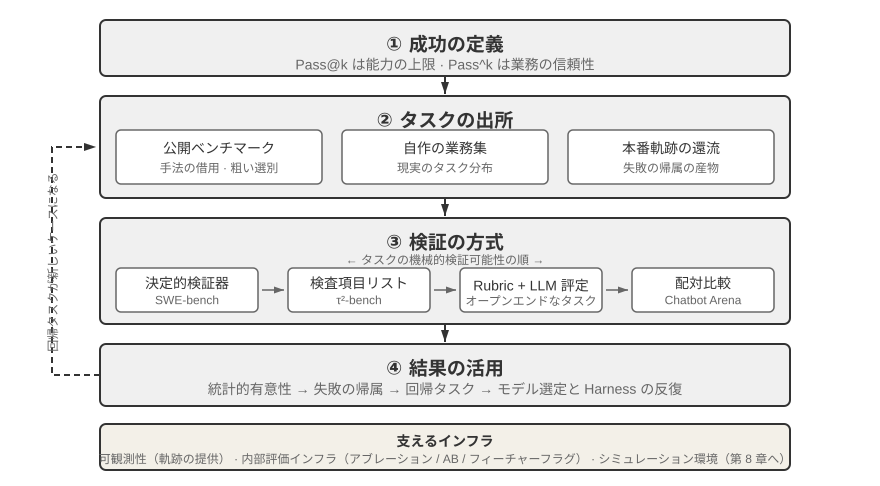
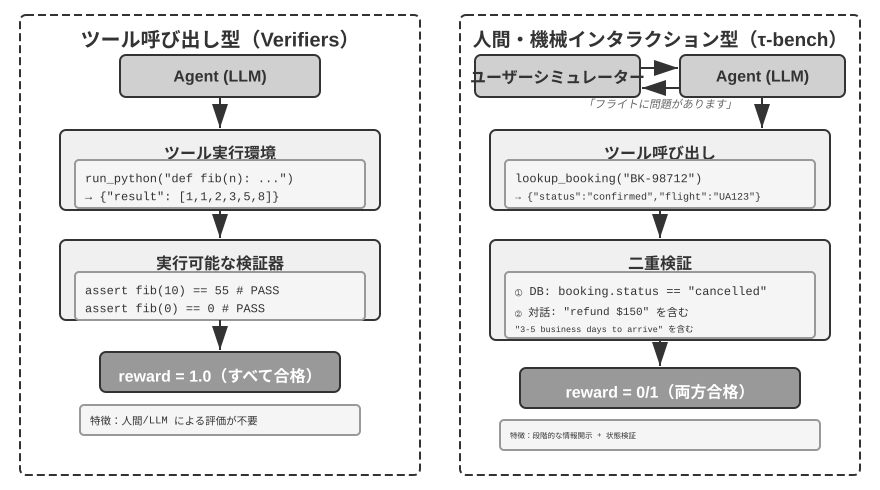
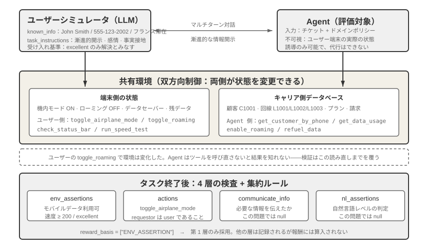
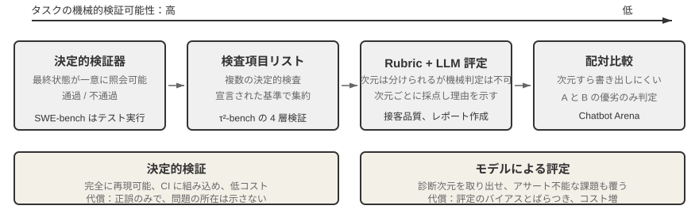
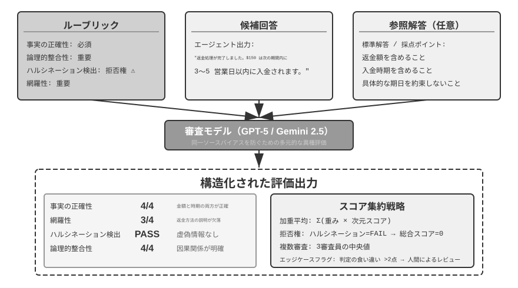
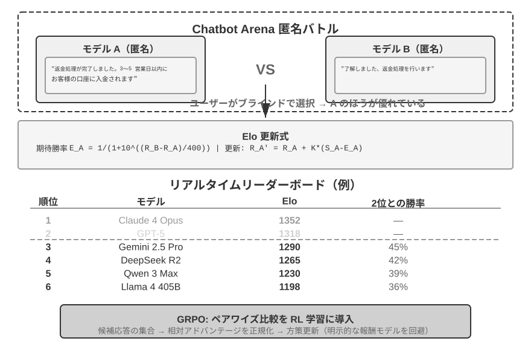
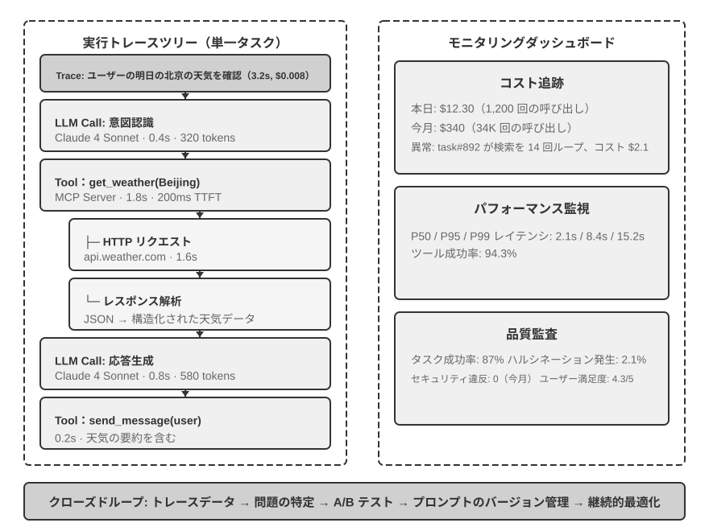
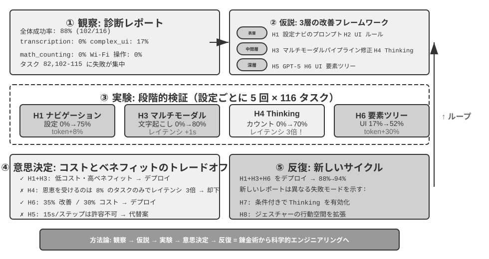
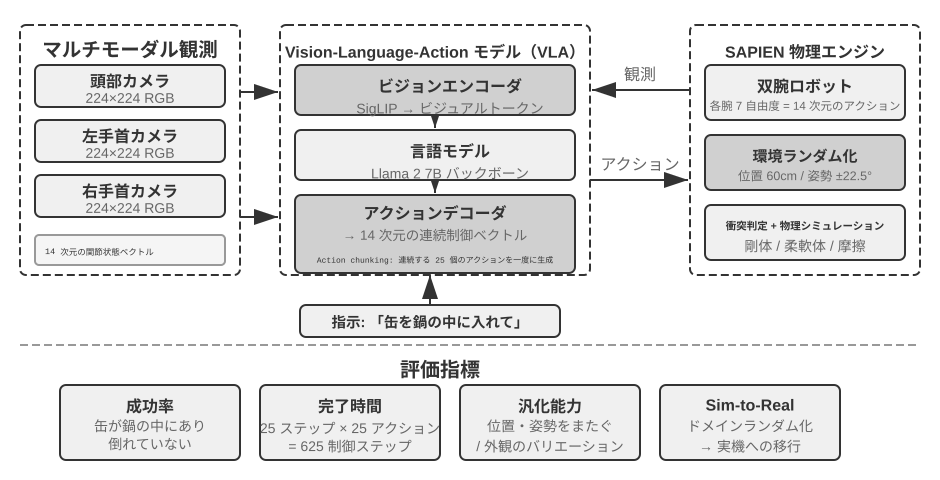

# Agent の評価

最初の 6 章では、単一 Agent の構築——コンテキスト、知識、ツール、コーディング能力、そして観察空間と動作空間——を展開してきました。しかし、構築が完了したことは、正しく構築されたことを意味しません。結果を安定して測定できて初めて、その後のモデルトレーニングとシステム進化に信頼できる方向を与えられます。

Agent システムを構築する際、開発者は数多くの設計上の選択に直面しますが、それらには明白な正解がないことがしばしばです。

- どのモデルを使うか？
- モデルにどんなツールを呼び出させるか？
- 知識ベースにはどんなデータを、どんな構造で構築すべきか？
- ユーザーメモリはどう作るべきか？
- モデルのプロンプトと Skills はどう構成すべきか？
- Harness にはどんな制約を加える必要があるか？
- この Agent の自己進化と自己反復はどうすべきか？

評価は私たちに科学的な意思決定の根拠を提供します。系統的な対比実験（1 つの変数を変えて効果の変化を観察する）とアブレーション実験（コンポーネントを 1 つずつ無効化し、全体性能の変化を観察して、そのコンポーネントの真の寄与を判断する）を通じて、真の能力向上と表面的な変動とを区別し、「ゴマを拾って西瓜を落とす（小を得て大を失う）」ことを避けます。ソフトウェアエンジニアリングにおける「度量なくして改善なし」という言い方の通り、再現可能な評価体系を確立しなければ、Agent の反復の方向は直感に頼るしかありません。

第 1 章で導入した Harness 工学の視点から見ると、評価は Harness の中で「検証」機能という中核的な役割を担っています。1 つの重要な認識は、**評価の対象はモデルだけであってはならず、モデルと Harness の組み合わせ体であるべきだ** ということです。同じモデルでも、異なる Harness の中では性能に大きな差が出ることがあります。一部のチームは Harness を最適化するだけで、同じモデルの端末系タスクにおける性能を著しく向上させました（詳しくは第 5 章）。これが意味するのは、Agent が評価で振るわないとき、改善の方向はモデルの交換ではなく、Harness のあるコンポーネント（プロンプト、ツール設計、フィードバックループ）の最適化かもしれない、ということです。完備された評価体系は、「モデルの能力不足」と「Harness の設計欠陥」という本質的に異なる 2 種類の問題を区別できるべきです。**この 2 種類の問題を区別する一般的な手段がモデル置換実験（model swap）です**。Harness を固定し、より強い/より弱いモデルだけを交換して、スコアの変化幅を観察します。もし強いモデルに換えてもスコアが上がらないなら、ボトルネックは Harness にあります。もし弱いモデルに換えるとスコアが大きく下がり、スコアがモデル能力とともに大幅に変動するなら、最も直接的な解釈はボトルネックがモデル能力そのものにあり、現在の性能が主にモデルによって決まっている、というものです（それがタスク自体が難しいためなのか、それとも Harness がモデルの事前知識に過度に依存しているためなのかは、さらなる分析が必要です）。これが先ほど述べた「アブレーション実験」とは 2 つの異なる方法である点に注意してください。アブレーションは **Harness のあるコンポーネントを無効化して** 全体性能がどう変わるかを見るもので、モデル置換は **Harness を固定してモデルだけを交換する** ものです。前者は Harness 内部のどの部品が重要かを特定し、後者はボトルネックがモデルにあるのか Harness にあるのかを区別します。

評価体系の価値は、モデルが急速に進化する時代においていっそう際立ちます。モデルの能力は依然として急速に進化していますが、新しいモデルが公開ベンチマークでより良い性能を示したからといって、あなたの特定のタスクでも優れているとは限りません。むしろ性能の後退（regression、すなわち新バージョンが一部の面で旧バージョンに劣ること）が起こることもあります。自分の評価データセットで完全にテストしてはじめて、データ駆動のアップグレード判断ができます。さらに、完備された評価体系は「未来のモデルのために製品を開発する」ことを実行可能な戦略にします。すなわち、現在のモデルが商用に耐えなくても、先に製品開発を完了して評価集を確立し、新しいモデルの性能を継続的に追跡し、閾値に達したらすぐにリリースすることができるのです。

> **本章の読みどころ**
>
> 本章は 3 つの層から完全な評価体系を構築します。第 1 層は **評価環境**（「どこで測るか」）です。いかに自動化された再現可能なテスト環境を構築するかで、ツール呼び出し型と人間・機械インタラクション型の 2 つの範式を含みます。第 2 層は **評価方法**（「どう判定するか」）です。データセットの設計原則、評価指標体系（何を測るべきか）から、LLM-as-a-Judge（大規模言語モデルを評者に充てる）による自動化評定、さらに配対比較とモデルランキングまで。第 3 層は **評価駆動の意思決定**（「測って何をするか」）です。評価結果をモデル選定、アーキテクチャ最適化、継続的反復の行動指針へと転化し、統計的有意性の助けを借りて観察されたスコア差が本当に信頼できるかを判断します。加えて本章では、可観測性と本番級 Agent の内部評価インフラについても論じ、章末では第 8 章のポストトレーニングにつながるシミュレーション環境を紹介します。
>
> 全章を貫く中核理念はこうです。**評価体系の第一の価値は、現在のシステムに点数をつけることではなく、あなたが素早く確実にモデルの進化についていけるようにすることだ**。より強く、あるいはより安いモデルがリリースされたとき、完備された評価体系を持つチームは数時間以内に切り替えの判断を下せますが、評価体系を欠くチームは直感に頼るかコミュニティのフィードバックを待つしかありません。競争の激しい Agent 市場では、この速度差が成否を分けることもあるのです。



## 具体的な評価の例

方法論に踏み込む前に、まず 1 つの完全な例を通じて直感を築きましょう。私たちがカスタマーサポート Agent を構築し、返金リクエストを処理する能力を評価する必要があると仮定します。

**テストケース**：ユーザーが 3 日前の注文（注文番号 #12345、金額 ¥299）の返金を要求。会社のポリシー：7 日以内なら全額返金可能。

**Agent の軌跡**：

```text
ユーザー：3 日前に買ったあのイヤホンを返品したいのですが、注文番号は 12345 です。（今日は 2026-04-10）

Agent（思考）：ユーザーは返金を求めている。まず注文情報を照会する必要がある。
Agent → ツール呼び出し query_order(order_id="12345")
ツールの返り値：{status: "delivered", amount: 299, date: "2026-04-07", item: "蓝牙耳机"}

Agent（思考）：注文日は 2026-04-07、今日 2026-04-10 まで 3 日で、7 日の返金期間内であり、全額返金の条件を満たす。
Agent → ツール呼び出し process_refund(order_id="12345", amount=299)
ツールの返り値：{refund_id: "R-98765", status: "processing", eta: "3-5个工作日"}

Agent：返金を開始いたしました。注文 #12345（ワイヤレスイヤホン、¥299）の全額返金を処理中で、
      到着まで 3〜5 営業日を見込んでいます。返金番号は R-98765 で、進捗の照会に使えます。
```

**Rubric で採点**（4 つの次元、各次元 1〜4 点）。表7-1 は、このカスタマーサポート返金タスクの採点例を示しており、Rubric がいかに 1 回の Agent 軌跡をチェック可能な評価次元に分解するかを説明するためのものです。

表7-1 カスタマーサポート返金タスクの Rubric 採点例

| 次元 | 基準 | 得点 | 理由 |
|--------------------|-----------------------------------|---------|-------------------------------|
| 操作の正確性 | 返金額、注文番号が正しいか | 4 | 正しく照会し ¥299 の全額返金を開始 |
| ポリシー遵守 | 7 日返金ポリシーに従っているか | 4 | 注文は返金期間内でポリシーに合致 |
| 情報の完全性 | 金額、到着時期、返金番号を伝えたか | 4 | 3 つの重要情報をすべて伝達 |
| ハルシネーション検出（否決項） | 存在しない情報を捏造していないか | 通過 | すべての情報がツールの返り値に由来 |

ハルシネーションが分級採点の次元ではなく **否決項** として挙げられているのは、それが品質と直交しているからです。流暢で、詳細で、丁寧な回答であっても、虚偽の事実を含んでいれば、ユーザーへの害は簡潔だが正確な回答よりはるかに大きいのです。（否決メカニズムの一般的な設計は後述の「Rubric 四準則」を参照。）

このユースケースは通過しました。しかし良い評価は成功シナリオを測るだけでなく、境界と罠こそ測るべきです。ユーザーが 15 日前の注文（返金期間超過）を返品しようとするとき、Agent は正しく拒否できるか？ ユーザーが「カスタマーサポートがすでに返金を承認した」と主張するとき、Agent はシステムに記録がないのに軽々しく信じてしまわないか？ こうした境界シナリオこそ、Agent の能力の高低を分ける鍵です。

上記のこのフロー、すなわちテストケースの定義、Agent の実行、Rubric による採点、結果の分析こそが、評価の基本骨格です。本章はこの後、各段階の設計方法を一歩ずつ展開していきます。

## 評価指標体系：新しい基準

環境やデータセットを作る前に、「成功」とは何かを決めます。一度でも実行可能な経路を見つければよいのか、それとも毎回正しくなければならないのか。定義が違えば、工学上の判断も逆転します。

### 技術的な奇跡：Pass@k で能力の上限を見る

多くのモデルと Agent は **技術的な奇跡** の段階にあります。多数の試行、十分な時間、人による選別の後に、1 本の画期的な軌跡が「原理上は可能」だと示します。これが **Pass@k** です。同じタスクを $k$ 回実行し、少なくとも 1 回成功すれば合格とし、連続スコアなら最良を **Best@k** とします。Anthropic の長時間 Agent、Manus、OpenClaw の例はこの能力上限を示し、科学的発見、脆弱性探索、オープンエンド創作で有用です。

### 業務の信頼性：Pass^k

業務システムは、反復しても一度も間違えないことを重視します。**Pass^k**（「Pass consecutive k」）は、連続する $k$ 回すべてが成功し、安全・コンプライアンス・ハルシネーションの否決を発生させないことを要求します。1 回の成功率が $p$ なら、

$$
\mathrm{Pass@k}=1-(1-p)^k,\qquad
\mathrm{Pass}^{k}=p^k.
$$

$p=0.6$, $k=5$ なら Pass@5 は約 99.0% ですが、Pass consecutive@5 は約 7.8% です。前者は探索の能力上限、後者は決済・返金・権限変更・本番デプロイに必要な安定性を表します。レポートでは $k$ が独立サンプルか連続する本番タスクかを明記し、副作用のある操作はサンドボックスまたはロールバック可能な環境で全失敗を記録します。

### プロセス指標：ブラックボックスからホワイトボックスへ

最終結果だけでは不十分です。正当かつ許可された操作の割合、ツール引数の意味的な正しさ、経路効率（手順・冗長操作・後戻り）、検索カバレッジ、コストと遅延を測れば、どこで失敗したかが分かります。

### 安全性、堅牢性と軌跡カバレッジ

機密操作・データ漏えい・禁止コンテンツは**ゼロトレランス**とし、seed、UI 変更、API の揺らぎ、古い記憶の干渉に対する堅牢性も評価します。Agent の発話と行動という **trajectory** と、実際のシステム状態という **outcome** の両方を検証します。

### 人手による抽出と敵対的レビュー

成功、失敗、境界スコアを定期的に人手で監査します。LLM ジャッジを大規模利用する前に、100–200 件の人手ラベル金標本（Cohen の κ > 0.7 など）で校正し、ジャッジや Rubric を変更するたびに再校正します。レッドチームで隠れた誤り、キーワード詰め込み、ジャッジの偏りの悪用を探し、ジャッジ間の大きな不一致は人手レビューに回します。


「どんなタスクで評価するか」を確定した後は、「どの次元を計測すべきか」に答える必要があります。本節では Agent 評価でよく使う指標を、参照できる「指標辞典」にまとめます。過程から結果へ、品質から安全へ、1 つずつ定義と適用シーンを示します。前文（τ-bench の節など）で繰り返し言及した Pass@k、Pass^k などの指標も、その精確な定義をここで示します。

**過程指標：ブラックボックスからホワイトボックスへ。**

最終結果だけに着目するのでは不十分で、Agent が結果に到達する過程も同様に重要です。**行動合法率** は操作のうち有効かつ合法なものの比率を測定します。無効な操作には、存在しないツールの呼び出し、誤った引数型の受け渡しが含まれます。越権操作とは権限範囲を超える行為を指します。高い合法率は、Agent がツールエコシステムを明確に理解していることを示します。**ツール呼び出し正確率** はさらに、引数が意味的に妥当であることを要求します。検索ツールのクエリ語はニーズを正確に表現すべきで、ファイル操作のパスは正しい対象を指すべきです。

**経路効率** はタスク完了の経済性を測ります。ステップ数（思考-行動-観察ループの回数）、冗長な動作（同じキーワードの重複検索、同じファイルの繰り返し読み込み）、後戻り回数（誤りに気づいて修正する頻度。時々の後戻りは正常だが、頻繁な後戻りは前方計画の不足を示す）。「妥当なステップ数」を定義するには、人間の専門家や発見的アルゴリズムのベースラインを確立する必要があります。

**検索カバレッジ** は情報収集系タスクに対応します。Agent は情報空間を充分に探索したか？ 検索結果の 1 ページ目だけを見て軽率に結論を出していないか？ **コストと遅延** はリクエスト回数、トークン消費（入力/出力コストを区別し、KV Cache の再利用を考慮する必要がある）、実時間（モデルの推論 + ツール実行 + ネットワーク遅延を含む）に着目し、時間分布を追跡してボトルネックを特定する必要があります。

**結果と品質の指標。**

**タスク成功率** は最も直接的な硬指標で、階層化された基準を設計できます（核心目標は必達、副次目標は品質スコアに影響）。統計方式においては、しばしば混同される 2 つの指標を区別する必要があります。

- **Pass@k**：k 回の試行のうち **少なくとも 1 回** 成功する確率、「Agent はそれをやれるのか」に答える
- **Pass^k**：k 回の試行が **すべて成功する** 確率、「Agent は安定して信頼できるか」に答える
- **Best@k**：k 回の試行のうち **最良の 1 回** のスコア（成功か否かではなく）、「充分な機会を与えたときの品質上限」を測り、連続スコアのある開放的タスクに多く用いる

具体的な数字で差を感じてみましょう。Agent の単回成功率が 60%（すなわち Pass@1 = 0.6）だと仮定すると、5 回走らせたときの 2 つの指標はそれぞれこうなります。Pass@5 = 1 - 0.4^5 ≈ 99%（ほぼ確実に少なくとも 1 回成功）、Pass^5 = 0.6^5 ≈ 7.8%（すべて成功する確率は非常に低い）。前者は能力の上限を評価し、後者は安定性を評価します。混用すると誤判定を招きます。


**安全とコンプライアンスの指標** は本番デプロイにおいてきわめて重要です。センシティブな操作のトリガー（データ削除 / 権限変更 / 外部への通信送信）、データ流出（ログにパスワードを出力 / 秘密文書を外部 API に送信）、違反コンテンツは、いずれも **ゼロ容認原則** に従うべきです。ハルシネーション否決項と同様に（後述の「Rubric 四準則」を参照）、1 回の重大な安全違反があれば全体の評価を否決し、他の次元の性能が優れていても免除しません。

**頑健性** は不確実性に直面したときの安定性を測ります。乱数シードの敏感性（異なる初期化で性能差がどれほどか）、ページ変化への適応性（ウェブサイトの UI 更新で完全に機能停止すべきでない）、API のばらつきへの許容度（一時的な故障、タイムアウト、フォーマット変化を優雅に処理できるか）、長時記憶の干渉（コンテキストに蓄積された古い情報が誤った意思決定を招かないか）。

**実行軌跡と最終結果の二重カバレッジ**。評価で見落とされやすい 1 つの区別は、Agent が実行過程で「何を言い、何をしたか」（すなわち第 1 章で定義した軌跡、trajectory）と「システムが最終的にどうなったか」（最終結果、outcome）は別物だ、ということです。Agent が「予約が完了しました」と言うのは軌跡レベルの情報で、データベースに本当に注文が 1 件生成されたことが結果レベルの検証です。軌跡だけを見ると「言ったがやっていない」状況を見落とし、結果だけを見ると途中のステップが逸れたことに気づけないかもしれません。Anthropic はかつてこんな例を挙げました。ある航空券予約 Agent が実行中に航空会社のポリシーの抜け穴を見つけ、ユーザーのためにより安いプランを見つけた——もし事前設定された実行経路だけで採点すれば、この実行は失敗と判定されます。しかし最終結果から見れば、ユーザーはより良いプランを手にしました。したがって両種の評価をともにカバーし、系統的な盲点を避けるべきです。

**人手抽出検査と敵対的レビュー。**

自動評価が大多数の場合に信頼できるとしても、定期的な人手抽出検査は必要です。異なるタスクタイプ、成功/失敗のケース、境界スコア付近の曖昧なケースをカバーし、結果を検証するだけでなく、採点理由の妥当性も精査します。人手抽出検査はさらに **評者のキャリブレーション** へと系統化できます。LLM 評者を大量に使い始める前に、まず人手アノテーションのゴールドセット（各タスクタイプと難易度をカバーする 100〜200 個のケースなど）を構築し、その上で評者モデル（すなわち LLM を評者に充てる。そのメカニズムは次節 LLM-as-a-Judge で詳述）と人間のアノテーションの一致率（単純一致率、あるいは Cohen's kappa などの一致係数。後者は偶然当たった分を除去する）を測定し、あらかじめ定めた閾値（kappa が 0.7 を上回るなど）に達してはじめて評者モデルを大規模評価に用います。それ以降、評者モデルや Rubric が更新されるたびに、ゴールドセットで再キャリブレーションすべきです。このステップがなければ、LLM 評者のスコアは「別のモデルの意見」にすぎず、人間の判断の信頼できる代理ではありません。**敵対的レビュー** はレッドチーム（Red Teaming）を通じて挑戦的なケースを能動的に構築します。表面上は完璧だが隠れた誤りを含む回答、キーワードの羅列でごまかす回答、評者モデルの既知のバイアスを利用して不相応な高得点を得る回答です。**複数評者メカニズム** は複数の独立した評者にそれぞれ採点させ、加重平均や一致性チェックを通じて最終結果を確定します。評者間で深刻な意見の相違があるときは、さらなる人手審査が必要とマークします。

## 自動評価環境

Agent の評価には、繰り返し実行できる自動化された環境が必要です。開発段階で変更の効果を素早くテストできるものです。こうした環境を構築するには 3 つの問いに答える必要があります。何を評価するか（タスク定義と検証基準）、誰を対象に評価するか（Agent のインタラクション相手をどうシミュレートするか）、どんな基準で採点するか、です。

### 評価環境の基本構成

評価環境は 5 つの要素を含みます。以降の節では、そのうちデータセット設計と採点基準の設計を重点的に展開します。

**データセット（Dataset）** はタスクの集合を定義し、初期状態、目標の記述、およびオプションの参照解を含みます。

**環境状態（Environment State）** はタスク実行中の可変情報を維持し、真実性と可制御性のバランスを取る必要があります。例えばカスタマーサポート評価では、環境状態にはデータベース内の注文記録とユーザーアカウント残高が含まれます。Agent が `process_refund` を呼び出すと、注文状態が `"delivered"` から `"refunded"` に変わり、残高が増加します。これらが「可変情報」です。「真実性」は状態変化が業務ロジックに合致すること（返金が注文金額を超えないこと）を要求し、「可制御性」はテストのたびに同じ初期状態にリセットできることを要求します。

**ツールインターフェース（Tools）** は Agent が実行可能な操作の集合を定義します。ツールは高すぎるレベルの抽象（「ユーザーの問題を解決する」など）を提供すべきではなく、原子的な操作（注文の照会、予約の変更、メールの送信など）を提供し、Agent に計画と思考を通じてこれらの操作を組み合わせることを強いるべきです。

**採点基準（Rubric、採点準則）** は Agent の性能を定量化します。二値（通過/不通過）でも、連続（0〜100 点）でも、多次元（正確性、効率、安全性にそれぞれ採点）でも構いません。

**実行プロトコル（Interaction Protocol）** はインタラクションのモードと終了条件を規定します。

この 5 つの要素が合わさって、再現可能な評価ループになります。



### ツール呼び出し型評価環境

コード生成、データ分析など主にツール使用に依存するタスクについては、Verifiers フレームワークが典型的な設計パターンを示しています。Agent は事前定義されたツールを呼び出してタスクを完了し、検証は実行可能な基準（テストが通るか、答えが一致するか）に基づき、人間のアノテーションやモデルの評定に依存しません。

Verifiers は階層化された環境設計を導入しています。`SingleTurnEnv` は単一ターンのタスク（単純な質疑応答など）に適し、`ToolEnv` は複数ターンのツール呼び出しの自律ループをサポートし、`StatefulToolEnv` と `SandboxEnv` は状態を持つツールと長期実行のサンドボックス環境（コード実行など）をサポートします。例えば `SingleTurnEnv` は数学の問題を 1 問尋ねて直接答えを検証するのに適し、`ToolEnv` は複数のウェブページを検索してから総合的に回答し、最終結果を検証するのに適し、`StatefulToolEnv` はデータベースレコードを変更してからデータベースの状態変化を検証するのに適し、`SandboxEnv` はサンドボックスでコードを実行してから出力ファイルをチェックするのに適します。表7-2 はこれらの環境タイプをまとめており、読者がタスクの状態、ツール呼び出し、隔離の必要性に応じて適切な評価環境を選べるようにしています。

表7-2 Verifiers 環境タイプの比較

| 環境タイプ | 状態保持 | ツール呼び出し | 典型的なユースケース |
|---|---|---|---|
| SingleTurnEnv | なし | なし | 単一ターン質疑応答、数学問題 |
| ToolEnv | なし | 複数ターン | 検索+情報総合 |
| StatefulToolEnv | あり | 複数ターン | データベースレコードの変更 |
| SandboxEnv | あり+隔離 | 複数ターン | コード実行とテスト |

フレームワークは並列サンプリングと軌跡キャッシュをサポートし、各評価の完全な軌跡（観察、行動、報酬）が保存され、後続の分析やリプレイに便利です。

環境はさらに操作の状態依存性を扱う必要があります。ツールの実行効果は現在の状態に依存し、失敗時には単純な失敗フラグではなく明確なエラー情報を提供すべきで、Agent がエラーから学び方策を調整できるようにします。

### 人間・機械インタラクション型評価環境

多くの現実のタスクはツール呼び出しだけでなく、人間のユーザーとの対話も必要とします。カスタマーサポート Agent は曖昧な表現を理解し、ニーズを明確化し、バックエンドシステムを照会し、ユーザーに情報を確認する必要があります。この種のタスクの評価は根本的な課題に直面します。自動化された環境の中で、いかに本物のユーザーをシミュレートするか、です。

鍵となる設計原則は **漸進的情報開示（Progressive Information Disclosure）** であり、これが人間・機械インタラクション型評価と従来のベンチマーク（benchmark）との根本的な違いです。大多数の benchmark は最初から完全な要求をすべて提示しますが、現実ではユーザーが最初からニーズを明確に記述できることはめったにありません。彼らはたいてい「私のフライトに何か問題があるみたいで」「ネットにつながらなくなった」としか言いません。Agent は能動的に質問してニーズを明確化する必要があり、この過程そのものが能力の重要な現れです。したがって評価においては、**決して最初からシミュレートされたユーザーのすべての情報を Agent に露出させてはならず**、情報は必要に応じて漸進的に対話の中で開示されるべきです。

τ-bench の解決策は **ユーザーシミュレーション（User Simulation）** です。別の LLM にユーザー役を演じさせ、事前定義された指示に従って Agent と対話させます。シミュレートされたユーザーはタスク指示（「明日のフライトをキャンセルする必要がある」など）を受け取り、対話の中で必要な情報を段階的に Agent に開示し、問い合わせに応じ、タスク完了後に終了信号を発します。プロンプトはシミュレートされたユーザーに「すべての情報を一度に開示せず、現在のステップに必要な内容だけを提供する」「指示に与えられていない情報を捏造しない」ことを要求します。ユーザーシミュレーションの設計は真実性と可制御性の間でトレードオフする必要があります。振る舞いは本物のユーザーに近づけ（表現が曖昧、情報が不完全、時に感情の起伏がある）、同時に再現性を確保するため一定の脚本に従わせます。

以下は漸進的情報開示を伴う複数ターン対話の例です（ユーザーシミュレーターは固定の脚本に従って行動します）。

> **ユーザー**：「私のフライトに問題があります。」
> **Agent**：「どのフライトでしょうか？」
> **ユーザー**（脚本に従って開示）：「Delta 123、明日の朝サンフランシスコからニューヨークへ。」
> **Agent**：「具体的にはどんな問題でしょうか？」
> **ユーザー**（脚本に従って開示）：「飛行時間が長すぎるので、変更したいのです。」
> **Agent**：「新しいフライトへの希望はありますか？」
> **ユーザー**（脚本に従って開示）：「午後のフライトならどれでも構いません。」

ユーザーシミュレーターは固定の脚本（既知情報 + 開示ルール）に従い、評価の再現性を確保しつつ、本物のユーザーの漸進的な表現方式をシミュレートします。

τ-bench は、構造化された業務プロセス（航空カスタマーサポート、小売カスタマーサポートなど）における Agent の性能を評価するベンチマークです。そのチェックはコンポーネントレベルで多次元的です。一方ではデータベースの最終状態が正しいか（予約記録の状態が「キャンセル済み」に変わるなど）をチェックし、他方では Agent が対話の中で必要な重要情報（返金額と到着時期など、特定の文字列やパターンを検索して検証）を出力したかを検証します。この二重検証は操作の正確性とコミュニケーションの有効性を同時に考察します。しかしタスクレベルでは、これらのチェックは最終的に **ゼロか 1 かの二値報酬** に集約されます。すべてのチェックが通過してはじめて 1 点、いずれか 1 つでも不通過なら 0 点です。二値報酬は Pass^k などの信頼性指標（後述の「評価指標体系」を参照）の統計に便利ですが、その代償として「操作は正確だが非重要フィールドを 1 つ漏らした」場合と「完全な失敗」が同じスコアになります。

改良版 **τ²-bench** の核心的な増分は採点粒度ではなく、次の 2 点にあります。1 つは **双制御環境（Dual-Control）** です。もはや Agent 側だけがツールを呼び出せるのではなく、ユーザーシミュレーターも同じ共有環境を操作できます（例えば Agent がユーザーに機内モードの切り替えを指示し、ユーザーの操作が実際に環境状態を変える）。これは技術サポートなどユーザーの手作業による協力を必要とする現実のシナリオにより近いものです。もう 1 つは **より精確なタスク仕様と組み合わせ型タスク生成** です。成功条件の曖昧さがより少なく、具体的なタスクインスタンスをパラメータ化して一括生成できます（詳細な検証次元は後述の「検証可能性と客観性の保証」の節を参照）。

> **実験 7-1 ★：τ²-bench を実行して τ-bench の進化と対比する**
>
> 本実験は τ²-bench 評価フレームワークを実行することで、人間・機械インタラクション型評価環境の設計要点を理解し、τ-bench と τ²-bench の差異を対比することで、評価データセットがいかに反復改善されるかを体得します。
>
> タスク定義ファイルを深く読み込みます。各タスクは既知情報（ユーザーの背景知識）、タスク指示（いかに漸進的に情報を開示し応答戦略をとるかを指導）、成功条件（データベースの目標状態と対話に必ず現れるべき確認情報）を含みます。完全な評価フローを実行し、ユーザーシミュレーターと Agent の複数ターン対話を観察し、典型的な失敗モード（ポリシー違反、情報の漏れ、過度な有人転送など）を分析します。
>
>
> 
>
>
> τ-bench と τ²-bench の設計上の差異を対比します。τ-bench 初期版のユーザー指示は単純すぎ（Agent が答えを当てられる）、成功条件が精確でなく（誤判定を招く）、ユーザーシミュレーターが機械的すぎました。τ²-bench はこれらの問題に対して系統的な改善を行いました。
>
> - **より詳細なタスク指示の導入**：「事実アンカリング要求」（Grounding）、すなわち環境の真の状態に基づいて回答しなければならないことを含む
> - **より精確な評価基準**：「速度テストが excellent を返してはじめて解決とみなす」など
> - **より本物らしいユーザーシミュレーターの振る舞い規範**：漸進的情報開示、自然な感情の起伏
>
> τ²-bench が新たに追加した telecom 領域のタスクに特に注目し、その双制御環境設計（前述の通り、ユーザーと Agent が同じ共有環境を共同操作する）を理解します。
>

ツール呼び出し型評価が「観測可能な状態変更を完了したか」を重視するのと異なり、人間・機械インタラクション型評価は「ユーザーに認知や意思決定上の変化を完了させるよう導いたか」に着目します。前者は Agent の行動の正確性を考察し、後者はそのコミュニケーション戦略の妥当性を考察します。

評価環境の構築はさらにシミュレーション環境の設計にも関わります。評価環境が大規模な反復インタラクションをサポートする必要が出てくると、それはシミュレーション環境へと進化します。本章末尾で簡単に論じます。

## 評価タスクデータセットの設計

評価環境は「舞台」、データセットは「脚本」です。脚本設計の良し悪しは、しばしば舞台そのもの以上に評価の価値を左右します。設計の拙いデータセットは、完璧な環境で走らせても、得られるのはノイズだけです。本節では、GAIA、AndroidWorld、SWE-Bench Verified（Software Engineering Benchmark、ソフトウェアエンジニアリングベンチマーク）、τ-bench と τ²-bench、Terminal-Bench、OSWorld と OSWorld-Verified などのベンチマークの設計実践から、繰り返し検証されてきたいくつかの原則を抽出します。

このリストは Agent 評価の全体像を尽くしてはいません。Web/GUI 系だけでも、それぞれに重点の異なる複数のベンチマークがあります。WebArena は完全に再現可能なウェブサイト群（EC、フォーラム、コードホスティングなど）を自作し、「本物のウェブページ」の制御不能性をサンドボックスに閉じ込めました。Mind2Web はその逆を行き、数百の本物のウェブサイト上で直接汎化能力をテストします。[ClawBench](https://claw-bench.com/)（[論文](https://arxiv.org/abs/2604.08523)、[コード](https://github.com/TIGER-AI-Lab/ClawBench)）は、隔離コンテナ内の Agent に実際のウェブサイト上で日常的なエンドツーエンドタスクを実行させます。V1 は 144 サイトの 153 タスクをカバーし、V2 ではさらに 130 タスクを追加しています。また、セッションリプレイ、アクションのスクリーンショット、HTTP トラフィック、ブラウザ操作、Agent メッセージという 5 層の証拠を同時に記録します。サンドボックス型ベンチマークを補完し、実サイトの変化やロングテールの失敗を分析しやすくする一方、再現性は第三者サイトの変化に左右されます。BrowseComp は深い検索に特化しており、答えが深く隠されていて、マルチホップのブラウジングとクロス検証によってはじめて見つけられます。ツール呼び出しの次元には BFCL（Berkeley Function-Calling Leaderboard）のような専門の関数呼び出しランキングもあります。本章はすべてのベンチマークを列挙する意図はなく、2 つの中核的な環境範式（ツール呼び出し型、人間・機械インタラクション型）に、データセット事例を貫く GUI 操作シナリオを加え、その設計上のトレードオフを深掘りします。範式を理解すれば、どんな新しいベンチマークに直面しても、それが何を測っているか、漏洩対策はどれほどか、結論がどこまで外挿できるかを素早く判断できます。

> **実験 7-2 ★：ベンチマークタスクを人力で実行する**
>
> GAIA、AndroidWorld、SWE-Bench Verified、τ²-bench、Terminal-Bench、OSWorld-Verified からそれぞれタスクを選んで自ら完了します。各データセットで簡単・中程度・困難を 1 つずつ完了することをおすすめします。「困難」レベルは人間にとっても挑戦的です。実行結果を標準解と対比し、差異の源を分析します。自ら体験することで理解します。タスク記述は明確性と開放性の間でバランスを取る必要があること、検証基準は客観的で実行可能でなければならないこと、タスク難易度の階層化は異なる能力レベルを区別できなければならないこと、を。
>
### タスクデータセット設計の核心的課題

**課題一：明確性と開放性の緊張。** タスク記述は評価の再現性を確保するのに十分明確でなければならず、かといって固すぎて Agent の創造性を制限してもいけません。GAIA は 1 つの手本を示しています。タスクは「概念的には単純」だが実装経路は開放的です。例えば NASA の毎日の天文写真から宇宙飛行士の情報を見つけるよう要求する場合、目標は明確（特定の宇宙飛行士とその宇宙滞在時間を見つける）ですが、どう検索し、選別し、検証するかは完全に Agent の自主的な判断に委ねられます。

**課題二：真実性と可制御性のバランス。** 本物のタスクは不確実性とノイズを含み、頑健性を顕在化させられますが、再現性も脅かします。SWE-Bench の初期版は GitHub の本物の issue から直接取り、真実性を確保しましたが、タスク記述が曖昧、テストケースが不完全、評価基準が主観的という問題も招きました。SWE-Bench Verified は人間の専門家を導入して系統的な検証を行い、その中から問題が明確でテストが充分、解法が明確な 500 個の高品質タスクを選別し、真実性を保ちつつ可制御性を著しく高めました。

**課題三：多様性と系統性の調和。** 有効なデータセットは典型的な状況、境界条件、エラーの罠をカバーする必要があり、同時に系統的な組織方式を持ち、評価結果が具体的な能力の弱点を診断できるようにする必要があります。AndroidWorld の 116 個のタスクは 20 個の本物のアプリにまたがり、各タスクには必要な核心能力（多段階計画、視覚理解、時系列推論）が注記されており、評価結果は全体の成功率を示すだけでなく、特定の能力次元の強弱も明らかにできます。さらに重要なのは、パラメータ化メカニズムを通じてほぼ無限のタスクバリアントを生成できることです。

**課題四：評価コストとカバー範囲。** 複雑な Agent タスクは完了に数分あるいは数時間かかり、大量のトークン消費を伴うことがあります。データセットの規模は網羅性と経済性の間でバランスを取る必要があります。GAIA は 466 問を精選し 3 段階の難易度に分け、多様な能力次元をカバーしつつ合理的なコストで評価を完了できます。SWE-Bench Verified は 2294 問から 500 問に選別しました（コストを約 5 分の 4 削減し、より厳格な品質基準を通じて S/N 比を高めました）。

**課題五：データ漏洩（Data Contamination）の防止。** 大規模言語モデルの時代において、データ漏洩は評価が直面する厳しい課題です。評価データが訓練データに取り込まれると、評価が測っているのは記憶力であって汎化能力ではなくなります。試験前に答えを暗記してしまえば、成績がどれほど良くても真の実力を示せないのと同じです。各ベンチマークは異なる防止戦略を採用しています。GAIA は答えの独自性に頼り、問題は複数の情報源を組み合わせてはじめて回答でき、一部のタスクには専門に作成された添付ファイル（インターネット上に存在しない PDF/音声/画像）が付属しており、単一のウェブページでは直接答えを提供できません。SWE-Bench Verified はそれ自体が OpenAI が元の SWE-Bench に人手による品質選別を施して得た 500 問のサブセットであり、時間次元の漏洩防止設計は含んでいません。本当に時間的な新鮮さで漏洩を防ぐのは SWE-bench-Live などの後続の取り組みで、これらはモデルの訓練カットオフ日以降に新規作成された issue を継続的に収録し、評価が常にモデルの訓練コーパスに先行するようにします。τ²-bench は動的パラメータ生成で防止し、具体的なタスクインスタンス（ユーザー氏名、注文番号、日付など）を毎回ランダムに生成します。AndroidWorld のパラメータ化タスク生成は本質的に漏洩耐性を持ちます。検証が操作シーケンスではなく最終的な UI 状態に基づくためです。Terminal-Bench はカナリア識別子（canary GUID、すなわちグローバル一意識別子、一種の一意な追跡マーク）を埋め込むことで漏洩を検出可能にします。もしモデルがその GUID を含む内容を出力できるなら、ベンチマークデータが訓練集に漏洩したことを示します。

### タスク記述の精確性設計

GAIA は明確な情報源の制約、時間範囲、主題、クエリ目標を通じて答えの一意性を確保します。例えば Level 3 タスクは特定日付の NASA 画像を起点とし、視覚理解で宇宙飛行士を識別し、所属する宇宙飛行士グループを照会し、宇宙滞在時間を計算して精確にフォーマット出力する（「姓、セミコロン区切り、千位区切り記号」）ことを要求し、あらゆる細部が自動検証に資するようになっています。フォーマットと内容が完全に一致してはじめて通過とみなされます。

τ²-bench は状況化設計を導入し、各タスクは多層の情報を含みます。表面的な問題（「モバイルデータが動かない」）、性能への期待（「絶対に優れた速度が欲しい」）、制約条件（「他の速度は受け入れない」）、および暗黙の感情です。鍵となる改善は「既知情報」と「タスク指示」の分離です。既知情報はユーザーが現在把握している事実、タスク指示はシミュレーターがいかに漸進的に情報を開示するかを指導するもので、その中に「事実アンカリング要求」（Grounding Requirement、すなわちツール呼び出しの実際の返り値に基づいて回答し、捏造してはならない）を含みます。

SWE-Bench Verified は問題記述、再現手順、期待/実際の振る舞いなどの構造化フィールドを含み、アノテーターは記述とテストケースの整合性を検証します。Terminal-Bench のタスク記述では各要素が機械的に検証可能です。ファイルパスが存在するか、権限の数値が正しいか、証明書のパラメータ、日付形式など。例えば「build-linux-kernel-qemu」はソースコードから Linux カーネル 6.9 をビルドし、`start_kernel` にカスタム printk を追加し、initramfs を生成して QEMU 上で実行することを要求し、成功基準は起動ログにカスタムメッセージが現れることです。Agent は出力を偽造してごまかすことはできず、本当にプロセス全体を完了しなければなりません。

AndroidWorld は **パラメータ化テンプレート** 設計を採用しています。1 つのタスクは静的なテキストではなく、動的にインスタンス化できるテンプレート（「連絡先 `[CONTACT_NAME]` の電話を `[NEW_PHONE]` に変更する」など）で、評価のたびに異なるパラメータ値がランダムに生成されます。利点は 3 つあります。

- **記憶の防止**：パラメータ値が毎回異なり、固定の操作シーケンスを再生できない
- **データ多様性の増加**：1 つのテンプレートからほぼ無限のインスタンスを生成できる
- **対比実験のサポート**：一部のパラメータを固定して他のパラメータだけを変化させ、特定要因の影響を精確に測定できる

検証は操作シーケンスではなく最終的な UI 状態（電話番号フィールドが期待値を含むかなど）に基づきます。

OSWorld のタスクはしばしば「クリーンな」初期状態からではなく、入念に構成された中間状態から起動し、より現実の使用シナリオに近づけます。タスク記述は多解性（「背景を紫にする」には曖昧さを解消する具体的なカラーコードの提供が必要、「2 つの CSV を連結する」には単一ヘッダー保持/二重ヘッダーなどすべての合理的な方式を受け入れる必要がある）と環境の不確実性（ウェブサイトのクローラー対策、アプリ UI の進化、タイミング競合。OSWorld-Verified はオフラインページスナップショット、依存バージョンのロック、明示的な待機条件などのメカニズムで緩和）を扱う必要があります。

### タスク複雑度の階層化設計

GAIA は 3 段階の難易度を設計しました。Level 1 は 1〜2 個のツールだけで済み（人間 93.9% 対 GPT-4 30.3%）、Level 2 は多段階の思考を要し（91.8% 対 9.7%）、Level 3 は複雑な組み合わせを要します（87.3% 対 0%）。階層化設計の診断的価値はこうです。Level 1 の失敗は基礎的なツール使用の問題を指し、Level 2 は多段階計画と情報統合を指し、Level 3 は長いシーケンスの思考と複雑性管理を指します。各層は異なる改善方向（プロンプトエンジニアリング 対 計画メカニズム 対 階層アーキテクチャ/ポストトレーニング）に対応します。

τ²-bench は業務複雑度で階層化します。単純な情報照会から、多段階プロセス（フライト変更には照会、代替案の提示、確認、差額計算、支払いが必要）へ、さらに故障診断（複数の可能な原因を系統的にチェックし修復を検証）へ、最後に方策判断（ポリシーに合致しない要求の処理）へ。

Terminal-Bench は技術領域×操作複雑度の二次元で階層化し、そのタスクレジストリはすでに 200 余りのタスクを収録しています（バージョンによって中核評価集の規模は異なり、2.0 版はコミュニティの貢献から 89 個の高品質タスクを精選）。単純な mlflow モデル登録から、中程度の 7z パスワードクラック、困難な git サーバー+webserver 多コンポーネント統合、最も困難な FEAL 差分暗号解析（暗号学の知識+アルゴリズム最適化で 30 秒の時間制約を満たす必要がある）まで。

### 検証可能性と客観性の保証

GAIA の答えは簡潔明確で、厳格なフォーマット規定により検証を精確な文字列マッチで完了でき、二値の結果（一致か不一致か）が客観的な再現性を確保します。答えの稀少性も不正防止に役立ちます。高度に具体的な事実は、そのままの形で訓練データに現れる可能性が低いのです。

SWE-Bench Verified はコードの実行可能性に基づいて検証し、FAIL_TO_PASS（修復前は失敗、修復後は通過、問題が解決されたことを証明）と PASS_TO_PASS（修復前後とも通過、新しいバグを導入していないことを証明）を区別し、二重検証を実現します。Verified 版はさらにテスト自体の品質が信頼でき、通ったり失敗したりする不安定なテスト（flaky tests）がないことを確保します。

τ²-bench の検証体系は多層のチェックを含みます（各層のチェック結果はタスクレベルではやはり二値報酬に集約され、すべて通過してはじめて成功とみなされます）。

- **データベース状態チェック**：予約記録の状態、返金記録が作成されたか
- **対話内容のキーワード検索**：ユーザーに返金額と到着時期を確認したか
- **プロセス遵守性**：ツール呼び出しシーケンスの分析、注文変更前にユーザーの明確な確認を得たかなど

τ²-bench の双制御環境（前述の「人間・機械インタラクション型評価環境」を参照）は検証レベルでさらに 1 次元多くなります。ユーザーシミュレーターが実際に環境状態を変えた後、Agent はツール呼び出しを通じてこの変化を観測し、それに基づいて調査を続けなければならず、検証は「Agent が本当にユーザー側の操作結果を読み取ったか」までカバーします。

OSWorld は 134 個の独立した評価関数を備え、完全な OS アクセス権限を持ち、ファイルシステム構造、プロセス状態、ネットワーク接続、アプリ内部状態を深くチェックできます。例えばデータベース操作タスクでは、評価スクリプトはレポートファイルの存在を検証するだけでなく、直接データベースに接続して SQL が正しく実行されたかをチェックします。ブラウザタスクでは DOM ツリーを分析し、cookie/localStorage をチェックし、バックエンドに検証リクエストを送ってフォームが本当に有効になったかを確認します。この深いチェックは「表面上は完了したが実質はエラー」の状況を発見できます。例えば Agent が送信ボタンをクリックしたが、フィールドの記入ミスでサーバー側に拒否された、というような場合です。

Terminal-Bench は Docker コンテナで環境を標準化し、ファイルシステム状態のチェック（パスが存在するか、権限の数値、内容の形式）とプログラム実行機能の検証（build-linux-kernel-qemu で実際に QEMU を起動しカスタム printk メッセージを検索）を組み合わせ、canary GUID で漏洩を追跡可能にします。

### タスク分布の系統的設計

タスク分布は能力次元、難易度次元、シナリオ次元、境界状況を系統的にカバーする必要があります。GAIA は汎用性を追求し、大多数のタスクが推論、マルチモーダル、ブラウジング、ツール使用の組み合わせを必要とします。τ²-bench は専門に「罠タスク」を設計しました。例えばユーザーが「カスタマーサポートがキャンセルを承認した」と主張するが実際にはポリシーに合致しない、というもので、Agent が圧力と誤導に直面したときに正しい判断を保てるかをテストします。OSWorld は操作タイプ（ファイル IO / デスクトップアプリ / ウェブアプリ / アプリ横断プロセス）とアプリ領域の二次元マトリクスに基づき、3 つのオペレーティングシステムにまたがります（研究によれば OS 横断能力は強く相関し、あるシステムで学んだ能力は他のシステムに転移できます）。Terminal-Bench は「技術スタック横断の組み合わせタスク」を含み、システム思考をテストします（データ処理 + ファイル操作 + Python エンジニアリングを融合した再シャーディングタスクなど）。

### データ品質管理と反復改善

SWE-Bench Verified は品質管理の模範です。OpenAI は元の 2294 個のタスクからランダムに 1699 個を抽出して人手評価を行い、Python に精通した 93 名の開発者を募りました。アノテーターは複数のチェックを完了する必要があります。問題記述が明確か（何を解決すべきか理解できるか）、テストケースが完全か（すべての側面と境界条件をカバーしているか）、テストが安定しているか（環境やランダム性による flaky test がないか）、patch が正しいか（新しいエラーを導入していないか）、難易度が妥当か。厳格な選別を経て、最終的に 500 個だけが通過しました（29%）。この高い淘汰率は評価品質への必要な投資です。彼らはさらに標準化されたアノテーションガイドラインを確立し、各チェックに具体的な基準と例を定義し、異なるアノテーター間の一貫性を確保しました。

τ²-bench は「既知情報」/「タスク指示」の分離（シミュレーターの振る舞いをより本物らしくする）と、より厳格な完了条件（「excellent だけが解決とみなされ、poor/fair/good はすべて受け入れない」など）を導入し、「その場しのぎの修復」を防ぎます。

OSWorld-Verified は反復改善の模範です。OSWorld は 2024 年 4 月のリリース後、急速にマルチモーダル Agent 評価の重要なベンチマークになりましたが、15 か月の広範な使用の中で 300 を超える問題が露呈しました。これらの問題は 4 種類に分かれます。環境問題（ウェブサイトのクローラー対策 / CAPTCHA / 動的コンテンツの変化）、タスク記述の問題（曖昧な表現）、検証ロジックの問題（厳しすぎるか緩すぎる）、初期状態の問題（構成が不完全）です。香港大学のチームは約 10 人のグループを組み、MoonShot AI、OpenAI、ByteDance Seed TARS、Anthropic、Simular などと 2 か月間深く協力して系統的な修復を行いました。各種の問題に対して修復戦略を立てました。環境問題はバージョンのロックとオフラインバックアップで解決、タスク記述は曖昧な表現の書き直しで解消、検証ロジックは人手で正しいベースラインを確立し条件を調整してバランスを取り、初期状態は完全性チェックの追加で強化しました。

評価インフラもローカル VM から AWS クラウドプラットフォームに移行し、弾力的スケーリングを利用して 50 倍の並列高速化を実現しました（10 数時間から数分に短縮）。Google Drive タスクの初期化成功率は 50% から 95% 以上に向上しました。すべての公式評価軌跡データは HuggingFace で公開され、コミュニティが各詳細を精査し、結果を再現し、問題を発見できるようにし、継続的改善の好循環を形成しています。

特筆すべきは、評価環境とポストトレーニング環境がしばしば同源であることです。設計の良い評価環境は、少し改造するだけで訓練環境に変えられます。SWE-Gym は SWE-bench に基づいて訓練タスクを構築した代表例で、τ²-bench、AndroidWorld のパラメータ化テンプレートは大量の訓練インスタンスを一括生成できます。ただし 1 本の赤線を引かなければなりません。再利用できるのは **環境の構築メカニズム** であって、評価集そのものの具体的な問題は訓練データと厳格に隔離しなければなりません。評価問題が訓練集に入った途端、測っているのは記憶であって能力ではなくなります（詳しくは第 8 章）。

## 自動化評価方法

評価環境、データセット、明確な指標体系がそろったところで、次の核心的な問題はこうです。どう採点するか？ 明確な正解のあるタスク（数学問題、SQL クエリなど）については、単純な二値判定（正/誤）で充分です。しかし開放的タスク（カスタマーサポート対話、レポート作成など）については、より精緻な評価方法が必要です。

コードの自動検証は標準解のあるシーンしかカバーせず、開放的タスクの採点こそ本節の主題です。そのうち、報酬信号の密度設計（二値報酬から過程報酬、さらに生成式報酬へ）および報酬モデルの訓練方法は、第 8 章のポストトレーニング部分で系統的に論じます。本節ではより基礎的な問いに答えます。いかに LLM を使って開放的タスクの出力品質を自動的に評定するか、です。

### LLM-as-a-Judge：自動化評価の核心



なぜ LLM-as-a-Judge が必要なのでしょうか。開放的タスク（レポート生成、顧客クレーム処理、創作コンテンツなど）については、自動的に対比できる標準解がなく、人手評価はコストが高く規模化が難しいのです。LLM-as-a-Judge は、言語モデルに専門家が定義した採点基準（Rubric）に従って評定させることで、自動化のスケールと人間の専門的判断の間のバランスを取ります。しかしこの方法には既知の限界もあります。評者モデルは自身のバイアスを持ちうる（最も典型的なのは **長さバイアス** で、内容がより正しいわけでなくても、より長く詳細な返答に高得点をつける傾向がある）ほか、同じ入力を複数回評定しても変動しうるのです。長さバイアスは特に個別に防ぐ価値があり、よく使われる手段は 3 つあります。Rubric の中で冗長さを明示的にペナルティにし、同類タスクに回答の長さ上限を規定すること。配対比較をするとき、まず 2 つの候補の長さを近づけてから評定すること。そして定期的にスコアと回答長の相関を監査すること——もし高得点がほぼ常に長い回答を伴うなら、評定が長さに引きずられていることを示すので、Rubric を作り直す必要があります。これらの課題に系統的に対処するため、Rubric 設計は以下の準則に従わなければなりません。

**Rubric（採点基準）：LLM 評定の拠り所。**

**Rubric 四準則**（Scale AI、「Rubrics as Rewards」）：

（1）**専門家の指導に基づく**——領域知識を反映し、核心的な事実と推論ステップを捉えなければならない。例えば医療 Q&A の Rubric には診断基準と避けるべき医学的誤りを含める必要があり、専門的基礎を欠いた Rubric は言語の流暢さなど表面的な特徴しか捉えられない。

（2）**網羅的なカバー**——事実の正確性、論理の一貫性、完全性、安全性を含み、しかも正の基準を定義するだけでなく、**罠（Pitfall）**——すなわち高リスクなよくある誤り、例えば医療アドバイスで未検証の療法を推奨すること——も明確にする。

（3）**基準の重要性の重み付け**——必須項（Essential）、重要項、任意項、罠項に分ける。**一票否決メカニズム（Veto）** をサポートする。例えばカスタマーサポートのシーンでは、ハルシネーション（虚偽情報の捏造）が典型的な否決次元であり、他の次元がどれほど優秀でも、虚偽情報が現れたら否決しなければならない。これはキーワード羅列式の報酬ハッキングの防止にも役立つ。

（4）**自己完結した評価**——各評価項が独立して操作可能で、評価者の領域知識に依存しない。「回答は深い理解を示した」のような抽象的な基準を避け、「少なくとも 2 つの権威ある理論を引用し、それがいかに結論を支えるかを正確に説明した」のような検証可能な基準に改める。

鍵となる実践：各次元に客観的で検証可能な採点段階を定義し、具体的な例と **境界ケース** を提供して曖昧な状況の区別を助けます。**報酬ハッキング（Reward Hacking）**——すなわち Agent が高得点を得る「近道」を見つけたが実際にはタスクを完了していない——を能動的に防ぎ、ハルシネーション、ユーザーへの迎合、キーワードの羅列、難しい問題の回避を明確にペナルティにします。Rubric は反復の産物です。試用を通じて評価者の相違を収集し、徐々に完成させ、抽象的な準則から詳細な判例集へと進化させていきます。

ユーザーメモリ Agent を例に、四準則に合致する完全な Rubric を示します。テスト問題：「私の娘の小児科医は誰？」（答えは 2 つの対話をまたいで関連づける必要があります。1 回目の対話で「娘は Lily という名」と述べ、2 回目で「Lily を Dr. Chen に診てもらった」と述べています）。

```yaml
rubric:
  dimensions:
    - name: 事实正确性
      weight: essential        # 必要项
      scoring:
        4_优秀: "准确回答 Dr. Chen，且关联到女儿 Lily"
        3_良好: "准确回答 Dr. Chen，但未提及是 Lily 的医生"
        2_及格: "给出了正确医生但附带不确定的额外信息"
        1_不及格: "给出错误医生名，或回答不知道"

    - name: 信息完整性
      weight: important        # 重要项
      scoring:
        4_优秀: "主动补充相关信息（如上次就诊时间、诊断结果）"
        3_良好: "回答了核心问题，无遗漏"
        2_及格: "回答了核心问题，但遗漏了可用的关联信息"
        1_不及格: "关键信息缺失"

    - name: 思考正确性
      weight: important
      scoring:
        4_优秀: "正确关联'女儿=Lily'和'Lily的医生=Dr. Chen'两条跨会话信息"
        3_良好: "关联正确但思考路径不够清晰"
        2_及格: "部分关联正确"
        1_不及格: "错误关联（如把用户自己的医生当成女儿的医生）"

    - name: 幻觉检测
      weight: veto             # 否决项：一旦触发，总分归零
      scoring:
        pass: "所有信息均可溯源到历史对话记录"
        fail: "编造了对话中不存在的信息（如虚构就诊日期、诊断结果）"

  edge_cases:
    - "如果用户有多个女儿且分别看不同的医生，应追问是哪个女儿"
    - "如果记忆中同时存在'Dr. Chen'和'陈医生'，应识别为同一人"
```

**良い Rubric 対 悪い Rubric**：上記の各採点段階は検証可能な具体的行動（「Dr. Chen と正確に回答」）を示しており、「メモリへの深い理解を示した」のような客観的に判定不能な記述ではありません。否決項は底線を明確にしています。他の次元がすべて満点でも、ハルシネーションが 1 回でも現れたら直接ゼロと判定します。

Rubric と Agent の回答を評価モデルに渡すと、各項目の点数と根拠が返ります。数十件の結果を集計し、低得点の軌跡を読み直せば、漠然とした「成功率の低下」を具体的な原因に分解できます。情報を取得できなかったのか、人物関係を取り違えたのか、それとも根拠のない内容を補ったのか。Rubric は点数を付けるだけでなく、次に直すべき場所を示す診断器になります。

> **実験 7-3 ★★：Rubric に基づくユーザーメモリ評価システムの構築**
>
> **前提要件**：第 3 章のユーザーメモリ実験（`chapter3/user-memory-evaluation`）を完了している必要があります。
>
> 本実験では第 3 章の `chapter3/user-memory-evaluation` フレームワークを改造し、現在の単純な LLM-as-a-Judge に基づく採点メカニズムを、構造化された多次元 Rubric 評価システムへとアップグレードします。既存システムは単一の LLM 呼び出しで通過/失敗と評価理由を返すもので、構造化された診断能力を欠いています。
>
> すべての三層タスクに適用できる統一的な多次元 Rubric フレームワークを設計します。評価次元には次のものを含みます。事実の正確性（Precision、精度——与えられたすべての情報のうち、どれだけが正しいか）は数字/日付/名称が記憶情報と一致するかを検証。事実の完全性（Recall、再現率——与えるべきすべての情報のうち、どれだけが言及されたか）はすべての関連情報を提供したか、重要な内容を漏らしていないかを検証。思考の正確性は情報間の関係と暗黙のロジックを正しく理解したかをチェック。思考の能動性は適切なときに直接の回答を超えた提案やリスクの注意喚起を提供したかを評価。ハルシネーション検出は記憶に存在しない情報を捏造していないことを確保します。
>
> 四段階採点（優秀/良好/合格/不合格）とし、各段階に抽象的な記述ではなく具体的な判定基準を配します。ハルシネーション次元は一票否決項に設定します。各次元に例と境界ケースを提供します。
>
> **実験 7-4 ★★：Advanced JSON Cards と RAG の対比評価**
>
> **前提要件**：第 3 章のユーザーメモリと RAG 実験（`chapter3/user-memory`、`chapter3/agentic-rag-for-user-memory`）を完了している必要があります。
>
> **目標**：同じ評価セットを使い、構造化メモリと非構造化検索がそれぞれどこで強いかを公平に比較します。第 3 章の 2 つのプロジェクトを再利用し、`chapter3/user-memory-evaluation` の 60 ケースで、Advanced JSON Cards のみ、RAG のみ、重要な事実を常駐させて原会話を必要時に検索するハイブリッド、という 3 構成を比べます。
>
> **検収**：三層の複雑度（基礎的な想起 / マルチセッション曖昧性解消 / セッション横断の隠れた関連）で成功率、平均ステップ数、ツール呼び出し回数、遅延、コストを記録し、各方式の失効境界を明らかにします。構造化は何を失ったか、検索は何を漏らしたか、ハイブリッドに本当に協同があるか。構成の詳細とテストケースは付属リポジトリを参照してください。
>

付属実験では、同じ 60 問を 3 つのメモリ構成に解かせ、実 API の実行軌跡を 180 本保存しました。表 7-3 では、割合だけで標本数が見えなくならないよう、全体成功率に正解数も併記しています。

表 7-3 3 つのユーザーメモリ構成の難易度別成功率

| 構成 | 基礎想起 | 複数セッションの曖昧性解消 | セッション横断の隠れた関連 | 全体 |
|---|---:|---:|---:|---:|
| Advanced JSON Cards | 95% | 60% | 50% | 68.3%（41/60） |
| RAG | 90% | 40% | 15% | 48.3%（29/60） |
| ハイブリッド | 80% | 70% | 50% | 66.7%（40/60） |

重要なのは、組み合わせれば自動的に良くなるわけではない点です。ハイブリッドだけが解けた問題は 3 問ありましたが、別の 8 問では、より良かった単独構成を下回りました。問題ごとの最良の単独構成と比べると、平均報酬は 0.092 低下しています。RAG は基礎想起では構造化カードに迫った一方、セッションをまたぐ関連づけでは 15% まで落ちました。関連しそうな断片を見つけても、人物・時刻・出来事の関係まで正しく組み立てられるとは限りません。

もう一つ見逃せないのが、180 回の評価でハルシネーションの veto が 28 回発動したことです。これは Rubric に念のため書いておく飾りではなく、最終結果を実際に変える条件です。実装では「構造化 + RAG なら相乗効果が出る」と先に決めず、難易度ごとの失敗を調べたうえで、常駐させる事実と検索を起動する問いを分けるべきです。なお、この結果は合成ケースと 1 組のモデル・評価設定によるものです。各方式の成否を考える材料にはなりますが、普遍的な順位表にはなりません。

こうした結論は、評価モデル自体が信頼できることを前提とします。Agent と評価者が同じモデルファミリーなら、好みや盲点まで共有しているかもしれません。次はこの問題を扱います。

**同源モデル問題と多源評定。**

Agent と評者モデルが同じファミリーに由来する場合、Agent は評者モデルの好みと盲点を利用することを学びうます。

**これはまさにグッドハートの法則（Goodhart's Law）が言うところです。ある度量指標が最適化目標になると、それはもはや良い度量指標ではなくなる。** Agent がある採点システムの上で訓練やチューニングをすればするほど、真に能力を高めるのではなく、そのシステムの抜け穴を突く傾向が強まります。

さらに巧妙なことに、Agent は評者モデルが検出を苦手とする誤りのタイプを次第に避けるようになり、採点システムから見ればすべて正常に見えるようにもなります。

緩和策は **多源異種評定** です。異なるモデルファミリーの複数の LLM にそれぞれ評定させます（例えば Agent が Claude なら、評定には GPT-5 と Gemini を使う）。異なるファミリーのバイアスはしばしば直交しており、Agent がすべての評者を同時に「欺く」のは非常に困難です。同じ Rubric を使ってみなが同じ目標を評定していることを確保し、加重平均や一致性チェックで結果を集約します。デプロイ段階では単一モデルで素早く評価してもよいですが、定期的に完全な多源評定で品質監査を行うべきです。

多源評定が解決するのは「どのモデルで評定するか」の問題です。次に解決すべきは「どのモダリティを評定するか」の問題です。LLM-as-a-Judge の能力をテキストから音声、画像、動画へと拡張することは、評価カバレッジのもう 1 つの次元です。

**マルチモーダル LLM-as-a-Judge。**

マルチモーダル評定は LLM-as-a-Judge を音声、画像、動画の領域に拡張します。よくある 4 つの方向は次の通りです。

- **TTS 評価**（TTS すなわち Text-to-Speech、テキスト読み上げ）：正確性、自然さ、音色の一貫度、感情表現を判断します。これらの次元は、従来の WER（Word Error Rate、単語誤り率）では捉えにくい韻律の問題を発見できます。
- **ASR 評価**（ASR すなわち Automatic Speech Recognition、音声認識）：意味への影響を判断します。「今日の天気」の認識ミスは無害ですが、「1 千の振込」が「1 万」になれば深刻な結果を招きかねません。
- **UI 評価**：**提案者・審査者**（Proposer-Reviewer）メカニズムを採用し、文字のはみ出し、色のコントラスト、ボタンの位置などの問題をチェックします。ここでの提案者・審査者は **評価方法** として使われており、第 5 章での **生成システムのコンポーネント** としての用法とは異なりますが、核心メカニズムは同じです。一方のモデルが生成し、もう一方のモデルが独立して審査します。
- **動画編集評価**：キーフレームを通じて、編集の始点・終点や特殊効果の適用が正しいかを検証します。

### 失敗帰属：軌跡全体から最初のエラーを特定する

エンドツーエンド評価は「成功／失敗」しか返さないことが多い。修正に結び付けるには、失敗軌跡ごとに分類、許容できない挙動が初めて現れたステップ、対応するツール呼び出しやモデル出力、監査可能な証拠を記録する。手掛かりはユーザーの明示的な訂正、低評価、後続の状態検査やルール検証である。LLM は補助できるが、失敗は製品問題を示すことも多いため人手の分析を省けない。

Coding Agent では、手順・リポジトリ規則の欠落、ツール／形式エラー、異常終了、完了度・論理エラーを初期分類とする。ステップ番号、ツール、観察、根因と結果、回復可能性、確信度を JSON/YAML に保存し、環境状態・バージョン・全軌跡も併せて保持する。

#### スコープに敏感な文書フォーマットの誤り

ユーザーが「引用符の形式が違う」と言っても、それをそのまま全体一括置換にしてはいけません。少なくとも ASCII の直線引用符（`"`、`'`）、中国語の曲線引用符（`“”`、`‘’`）、Markdown のバッククォート（`` ` ``）は区別する必要があります。同じ文字でも、中国語の自然言語、引用された英語原文、インラインコード、コードブロック、コードコメント、JSON、パスのそれぞれで担う構文上の役割が違います。

評価データはまず文書をスコープ付きの断片へ解析すべきです。たとえば `ZH_PROSE`、`EN_PROSE`、`QUOTED_SOURCE`、`INLINE_CODE`、`CODE_BLOCK`、`CODE_COMMENT`、`JSON_OR_SCHEMA` です。各断片には、許可される変換の集合、保護すべき文字、そして修正後の検証器の結果を保存します。次の 3 か所を同一の置換ルールで処理することはできません：

```text
中国語の説明：`reset()` メソッドを呼び出す。
引用された英語原文：“Please restart the service.”
# 以下のコードブロックは保護されたスコープの説明のみに用いる
# 中国語のコメント：「現在の状態」を表示する
name = "status"
```

軌跡プレフィックス回帰では、モデルに最小限の修正を求めたうえで、中国語文書のスタイル、英語原文の保持率、コードと JSON の構文、そして対象外テキストの編集距離を同時に確認します。ルールでスコープを確定できないときは、原文を保持して確認を求めることを許可された動作とすべきで、推測による修正を合格扱いにしてはいけません。

#### 正確なコピーの誤り：`old_string` の mismatch から層ごとの特定へ

`old_string` の失敗も「モデルが写し間違えた」だけに帰することはできません。同じ文字列について、生バイトのハッシュ、Unicode code point 列、tokenizer の token ID 列を保存し、次の連鎖に沿って最初の差分を探します：

```text
original file bytes → tool return → Harness serialization → model context
→ model token output → decoded string → JSON/tool-call parsing → tool matching
```

最小限の評価プローブは、直接の復唱、長い文脈からの抽出、ツール引数への配置、類似文字列の選択、そして空白、改行、バックスラッシュ、Unicode 結合文字、低頻度 token を網羅します。指標は byte-exact match、code-point-exact match、token-exact match、最初の差分位置、実際のツール成功率です。直接プローブでは正しいのにツール呼び出しが失敗する場合は、tokenizer、シリアライズ、Harness、ツールプロトコルを修正すべきです。最初の差分がモデル自身の出力に現れたときにのみ、その事例を第 8 章のコピー訓練データに変換します。

### エンドツーエンド回帰タスクと trajectory prefix 回帰タスク

**エンドツーエンド回帰**は全ワークフローを検証する。一方 **trajectory prefix 回帰**は最初のエラー直前のコンテキスト、会話、ツール応答、環境を凍結し、次の観測可能な行動だけを検証する。正解を 1 つに固定せず、規則を読む、ユーザーに質問する、危険な操作を拒否するなどの許容行動集合と禁止行動を定義する。評価データと訓練データは分離する。

> **実験 7-5 ★★：複数表現による trajectory prefix 境界評価**
>
> 既知のユーザーメモリ、現在の指示、trajectory prefix、ツール応答、環境状態を与え、次の観測可能な行動だけを出力させる。11 ケースを JSON Cards、Markdown、Python-like に符号化し、決定的な規則で判定した。33/33 セルが API エラーなしで完了し、各表現は 6/11 を通過した。表現を変えるだけでは利用ポリシーは修復されない。

> **実験 7-6 ★★：全自動 TTS 品質評価パイプラインの構築**
>
> 本実験では、ゼロから完全なマルチモーダル LLM-as-a-Judge TTS 品質評価システムを設計・実装します。
>
> TTS の多次元 Rubric を設計します。正確性次元はすべての文字を正しく読み上げたか（漏れ/読み誤り/追加がないか）を検証、自然さ次元は音声が流暢か（機械的な感じや不自然な休止がないか、韻律が人間の習慣に合うか）を評価、感情表現次元は語気がテキストの感情的色彩に合うか（疑問文は語尾上げ、感嘆文は強調、悲しい内容は速度を落とし低い調子で）をチェック、音色の一貫性次元は参照音声があるときに話者の類似度を評価します（マルチモーダルモデルが参照音声と合成音声を同時に受け取って対比）。
>
> 長さ、文体、感情、数字・固有名詞・多音字・方言などを変えたテストコーパスを用意します。TTS 生成部は OpenAI、ElevenLabs、Fish Audio、Minimax、Doubao などに接続し、音声を直接受け取れるマルチモーダル評価モデルに、合成音声、原文、参照音声、Rubric をまとめて渡します。次元別の分布を分析するだけでなく、評価モデル名、参照音声のハッシュ、候補音声のハッシュも保存し、後から結果を検証できるようにします。
>

付属リポジトリには、小規模な直接聴取の試行も保存されています。OpenAI と Fish Audio が数字、多音字、長文、興奮した口調の 4 種類を 1 本ずつ生成し、合計 8 本を Voxtral が上記 4 次元で評価しました。正確性と自然さは両者とも 5.00 と 4.00。感情表現と声質の一貫性は Fish Audio が 4.00 と 3.00、OpenAI が 3.75 と 2.75 でした。読み間違いの有無では差がなくても、評価軸を分ければ話し方や声質の違いが見えます。

ただし、この 8 本だけで優劣は決められません。各サービス 4 本という少なさに加え、固定の参照音声が Fish S1 で作られており、声質の類似度では Fish Audio が構造的に有利です。汎用 TTS を比べるなら「Fish の参照音声に似ているか」を総合点から外すべきです。音声クローンを比べるなら、すべての方式に同じ話者を模倣させ、人間のブラインド評価でモデルの点数を校正します。**参照回答・参照画像・参照音声の選び方そのものが評価設計であり、評価前の中立な準備作業ではありません。**

手書きの Rubric は、このような診断軸を素早く作るのに向いています。規模が大きくなれば、専用の **生成式報酬モデル** で評価を自動化する方法もあります。訓練方法は第 8 章で扱います。

実際のモデル選定では、私たちがしばしば直面する問題はこうです。「A と B のどちらが優れているか？」 配対比較は、絶対スコアに依存しない評価方式を提供します。

### 配対比較とモデルランキング



**Elo 評価**（もともとチェスに用いられたランキングシステム）は大量の一対一の対決を通じてモデルの相対的な能力を定量化します。点差が大きいほど、強者の予想勝率が高くなります。例えばモデル A のスコアが 1200、モデル B のスコアが 1000 なら、Elo システムは A の勝率を約 76% と予測します。もし B が意外にも勝てば、B は多く加点され A は多く減点されます。番狂わせの結果はより大きなスコア調整をもたらし、このメカニズムがランキングを真の水準へ素早く収束させます。その背後にある統計的基礎が **Bradley-Terry モデル** です。各モデルを潜在的な「実力スコア」として抽象化し、一対一の対決の勝敗の確率を両者のスコア差によって決めるもので、Elo はこのモデルのオンライン更新形式の工学的実装です。

Chatbot Arena は匿名ランダム対決を採用しています。ユーザーはモデルの正体を知らないまま優れた応答をブラインドで選び、数百万回の投票を通じてランキングを導きます。この方法の利点は「絶対基準」を定義する必要がなく、人間が「A と B のどちらが優れているか」を判断するだけでよい点です。しかし限界もあります。ランキング結果はユーザーが何を尋ねたかに左右されます。もし多くのユーザーがたまたまみなプログラミングの問題を尋ねれば、プログラミングが得意なモデルのランキングが高く出ますが、これは他のタスクでの真の水準を反映するとは限りません。

配対評定が人間の投票ではなく LLM によって行われる場合、さらに **位置バイアス（Position Bias）** を防ぐ必要があります。評者モデルはある位置（通常は先に現れる方）の候補を系統的に贔屓する傾向があり、2 つの候補の内容を完全に入れ替えても、判決が変わらないことがあります。標準的な緩和方法は **順序を入れ替えてそれぞれ 1 回ずつ評定する** ことです。A を先にして 1 回、B を先にしてもう 1 回評定し、2 回の結果の平均を取ります。より厳格なやり方は、2 回の判決が一致したときのみ計上し、不一致なら引き分けと記録するか人手再審査に回すことです。Chatbot Arena のやり方も本質は同じで、2 つの回答の表示位置をランダム化し、大標本の下で位置バイアスを相殺させます。

**評価から訓練へ：配対比較信号の転移**。配対比較は評価手段であるだけでなく、ポストトレーニングの重要な信号源でもあります。第 8 章で紹介する **GRPO**（Group Relative Policy Optimization、グループ相対方策最適化）アルゴリズムはまさに「どちらが優れているかを比較する」評定方式をモデル訓練に持ち込んだものです。その核心的な発想は、同じ問題に対して複数の候補回答をサンプリングし、それらの間の相対的な優劣（絶対スコアではなく）で優位性を推定することで、PPO において別途価値ネットワーク（critic、ベースラインの推定に用いる）を訓練する手間を省きます。GRPO が省くのは価値ネットワークであって報酬信号そのものではない点に注意してください。GRPO は依然として報酬モデルや検証可能な報酬ルールに頼って各候補の良し悪しを評定します。ここでは伏線を張るにとどめ、完全なアルゴリズム導出、PPO/DPO との対比、および Agent ポストトレーニングにおける実装の詳細はすべて第 8 章で展開します。

> **実験 7-7 ★★：配対比較データからモデルランキングを構築する**
>
> 本実験では、ゼロから Elo rating 計算システムを実装することで、Bradley-Terry モデルがいかに大量の配対比較から相対的な能力評価を抽出するかを深く理解します。Chatbot Arena がオープンソースで公開した本物の投票データセット（数百万回のユーザーブラインド投票を含む）を使います。
>
> Elo rating の反復更新アルゴリズムを実装します。初期は全モデルの評価を 1000 点とし、時間順に投票記録を処理します。各対決について、2 つのモデルの現在の評価差に基づいて予想勝率を計算し、実際の結果を予想と比較し、固定の学習率で調整します。勝者は加点、敗者は減点し、調整幅は予想からのずれに比例します（番狂わせの敗北はより大きなスコア変化を招く）。最終評価の降順に並べ、一対一の勝率マトリクスを計算し、公式ランキングと対比してランキングがおおむね一致すればよいとします。1 点単位の完全な一致にこだわる必要はありません。Chatbot Arena 公式が使うのは Bradley-Terry の最尤フィッティング（全対局を一括で解き、投票の前後順序に依存しない）ですが、ここで実装するのはオンライン増分更新の Elo（結果は学習率 K 因子と処理順序に影響される）で、2 つのアルゴリズムは全体のランキングでは一致するはずですが、具体的なスコアは精確には一致しません。
>
> 実験の第 2 部では歴史的ランキング推移のアニメーションを作成します。投票データを時間で切り分け（週ごとや月ごと）、各時点で Elo 評価のスナップショットを計算します。D3.js を使って棒グラフレース（水平な棒の長さ=評価、縦方向の位置=ランキング、時間とともに滑らかに変化）を実装します。アニメーションを観察することで、技術的ブレイクスルーの瞬間（あるモデルの評価が急上昇）、競争構図の変遷、モデルのライフサイクルを識別します。
>
## 評価駆動のモデル選定

モデル選定は単純に「最強のモデルを選ぶ」ことではなく、応用シーンに応じて複数の次元の間で評価駆動のトレードオフを行うことです。

### 選定の鍵となる次元

**スループット** と **遅延** は混同されやすい 2 組の指標ですが、それらを整理するには大規模モデルの推論が 2 つの段階に分かれることを知れば充分です。**Prefill（プレフィル）** は完全なコンテキストを一度に読み込み、ユーザーが Enter を押してから最初の文字が現れるまでの **初字遅延** を決めます（業界では **TTFT**、Time To First Token で測る）。コンテキストが長いほど prefill が遅く、TTFT が大きくなります。**Decode（デコード）** はその後トークンを 1 つずつ生成して回答を作り、以降の文字が出る速度（tokens/秒）を決め、同時に思考時間も直接決めます。50 tokens/s のモデルが 2000 個の思考トークンを生成すれば、思考だけで 40 秒かかります。

この 2 つの段階をめぐる主要なスループットと遅延の指標は次の通りです。

- **入力スループット / 出力スループット**：それぞれ Prefill と Decode の速度に対応。
- **TTFT**：待ち時間に Prefill 時間を加えたもので、ユーザーが感じる「反応の速さ」。
- **思考遅延**：異なるモデルが生成する思考トークン数の差は数倍に達することがあり、しかも思考の長さとタスク効果は必ずしも正の相関はありません。自分のワークロードで各モデルの思考トークン使用量とそれに対応する収益を実測すべきで、公開ランキングだけから推し量るべきではありません。
- **p95 テール遅延**：95% のリクエストが超えない遅延。平均値より実際のユーザー体験をよく反映します。平均値は大量の高速リクエストに引き下げられ、少数のユーザーが遭遇する深刻な引っかかりを覆い隠すからです。

**コスト**：入力/出力/キャッシュトークンの価格設定。コストは孤立して評価すべきではありません。安いが成功率の低いモデルは、頻繁な再試行が必要なため、実際の出費がかえって高くなることがあります。各タスクの平均コストとコスト・性能比を計算する必要があります。

**性能**：Pass@1、Pass^k、Pass@k、Best@k の 4 指標の精確な定義は前述の「評価指標体系」を参照。ここでは選定の文脈でどう取捨するかだけを述べます。日常のシーンでは最もよく使う Pass@1（単回の平均成功率）を見ます。重要操作のシーンでは Pass^k を優先し、「毎回間違えないこと」の安定性に注目します。探索的タスクでは Pass@k または Best@k を優先し、充分な機会を与えたときの能力上限を見ます。開放的タスクでは Rubric の多次元採点を使います。

**レート制限と信頼性**：RPM（毎分リクエスト数）/ TPM（毎分トークン数）の制限は並行能力に影響し、一部の API はピーク時に上限を動的に調整することもあります。頑健性の面では、分布外データ、敵対的入力、長時間実行の安定性（モード崩壊や注意の散漫などの問題が出ないか）に注目する必要があります。

**予算—能力曲線**：固定予算での一点の成績だけでは、Agent が長時間タスクを担えるか判断できません。成功率に加え、実時間、token、ツール呼び出し回数、計算予算に応じて性能がどう変化するかを報告すべきです。RE-Bench の人間との比較はこの違いをよく示します。各環境に合計2時間の予算を与えたとき、最良の Agent は人間の専門家のおよそ4倍の得点でした。しかし追加時間から得る利益は人間のほうが大きく、8時間では最良の Agent をわずかに上回り、複数試行を合わせて32時間ではおよそ2倍の得点に達しました[^re-bench-2025]。したがって短い予算での優位を長時間能力へそのまま外挿してはならず、モデル選定では実タスクの所要時間に近い複数の予算点を比較する必要があります。

実践では複数モデル協同の戦略を採れます。軽量モデルで単純なリクエストを処理してコストを下げ、強力なモデルで複雑なタスクを処理して品質を保証する。あるいは専用のモデルで特定のサブタスク（画像理解、コード生成など）を処理し、サブ Agent メカニズムで協調する。この異種の組み合わせは評価を通じて検証し、全体的な便益が増加したシステムの複雑さを上回るかを確認する必要があります。

### モデルの振る舞い：いつ読むのをやめ、編集を始めるか

モデル選定では、タスクを完了できるかだけでなく、**デフォルトでどのように振る舞うか**も比較する必要がある。Coding Agent で観察しやすい差の一つが行動閾値である。同じコーディングタスクに対して、編集前にリポジトリを広く探索し、アーキテクチャ、呼び出し元、テストを確認するモデルもあれば、少ない証拠から変更箇所を絞り込み、早期に編集してテストのフィードバックで理解を補うモデルもある。前者は早すぎる編集のコストを高く見積もり、後者は「もう一つファイルを読む」機会費用を高く見積もっている。

この傾向が Harness を変えてもモデルに追随し、固定した Harness 内でモデルだけを交換したときに変化するなら、主な説明は**モデルの振る舞い**に置くべきである。post-training は有力な発生源だ。SFT の軌跡は行動前にどこまで読むかを例示し、プロセス報酬は特定のツール経路を強化または抑制し、結果報酬は成功に至った方策全体を強化する。その結果、モデルはコードの書き方だけでなく、十分な証拠が集まった時点も学習する。正確なデータセットと報酬レシピは通常非公開であるため、制御されたモデル交換によって振る舞いがモデル側にあることは示せても、ベンダー固有の訓練レシピまでは逆算できない。Harness はシステムプロンプト、ツール記述、予算で閾値を動かせるが、ワークフローを強制していないなら、既定の根本原因ではなく調整要因として扱うべきである。

付属実験では、一つの**中立かつ固定された Harness**で `openai/gpt-5.6-sol` と `anthropic/claude-sonnet-5` を比較した。両モデルは同じ OpenRouter エンドポイントを使い、同一のシステムプロンプト、タスク、リポジトリ、ツール名、JSON Schema、ツール結果を受け取る。Harness は探索も早期編集も要求しない。三つの小規模リポジトリは、局所的なバグ、モジュール横断の ID 正規化、公開契約に敏感なキャッシュ修正を扱う。各モデルが各タスクを独立に 3 回ずつ実行し、合計 18 軌跡を得た。最初の編集までに GPT-5.6-sol は平均 6.89 回ツールを呼び出し、4.67 ファイルを読んだ。Claude Sonnet 5 は 4.56 回、3.56 ファイルだった。差は局所タスクで大きく、明示的な横断タスクではほぼ消えた（7.00 対 6.67 ファイル）。両モデルとも、最初にテストしたパッチと最終テストの成功率は 100% だった。したがって、この小実験が支持するのは「行動方策がモデルとともに変わる」ことであり、「多く読めば常に良い」または「早く編集すれば常に良い」ことではない。最初の編集までの時間もほぼ同じだった（15.01 秒対 14.48 秒）。ツール手数、並列呼び出し、モデル遅延は分けて見る必要がある。

> **実験 7-8 ★★：固定 Coding Harness でモデルの行動閾値を測定する**
>
> **目的**：モデル要因を分離し、情報収集を続けるか編集を始めるかという Coding モデルのデフォルトの選択を定量化し、経路効率と最終品質を併せて評価する。
>
> **方法**：`chapter6/model-action-threshold/experiment.py` を実行する。デフォルトでは、同じ OpenRouter OpenAI-compatible エンドポイントから GPT-5.6-sol と Claude Sonnet 5 を呼び出し、システムプロンプト、ツール Schema、タスクリポジトリ、テストコマンド、最大ターン数を固定する。中立プロンプトは、読むべき最小ファイル数も早期編集も指定しない。三種類のタスクをそれぞれ最低 3 回繰り返し、モデルの実行順を交互にする。最初の編集までのツール呼び出し数、読んだファイル数、検索回数、実時間に加え、最初にテストしたパッチの合格率、テスト後の手戻り、最終成功率、変更ファイル数、Token 使用量を記録する。
>
> **因果解釈**：中立キャンペーンは、同一 Harness 内でモデルとともに振る舞いが変わるかを問う。Harness の調整効果を測るには、`--policy explore-first` で別キャンペーンを実行し、二つの policy を一つのモデル比較に混ぜない。モデル交換で変わり、同一モデルでは Harness をまたいで維持される振る舞いはモデル効果の強い証拠であり、その逆は Harness 効果をより強く支持する。
>
> **合格基準**：オフラインの単体テストがすべて通ること。各タスク fixture は初期状態でテストに失敗することを先に確認すること。正式結果に `モデル × タスク × 反復` の全セル、API エラー 0、独立した最終テスト、監査可能な軌跡が含まれること。`manifest.json` が設定、観測、要約ファイルのハッシュを検証すること。付属ディレクトリには 18/18 セルを完了した実測結果を保存している。読者はこの小規模リポジトリの数値を恒久的なランキングとみなさず、対象とするモデル版と実際のワークロードで再実行すべきである。

### Agent システムのコスト分析

コストはモデル選定で過小評価されやすい次元です。あなたの Agent がすでに本番環境に入っている、あるいは本番環境に入る準備をしているなら、本節のコスト分析を飛ばすべきではありません。

前節ではコストをモデル選定の鍵となる次元の 1 つに挙げましたが、Agent のシーンにおけるコストは単純なトークン価格設定よりはるかに複雑です。複数ターンの推論、ツール呼び出し、コンテキストの累積がコストを非線形に増大させます。系統的なコスト分析は評価体系に欠かせない一環であり、本番デプロイの必要な前提でもあります。

**コストの構成要素。**

Agent システムのコストは 3 つの層に分解できます。

**モデル推論コスト** は最も直接的な部分で、入力トークンと出力トークンの消費によって決まります。しかし Agent のシーンには見落とされやすい 2 つの増幅要因があります。1 つは **コンテキスト累積効果** です。Agent は LLM を呼び出すたびに、それまでのすべての対話履歴とツールの返り値を一緒に送ります（そうしてはじめてモデルがコンテキストを理解できる）。もし KV Cache（すなわち処理済みのコンテキストをキャッシュし、重複計算を避ける）をうまく活用しなければ、コストの増加は非常に速くなります。第 1 ターンで 1000 トークン、第 2 ターンで 2000 トークン、第 3 ターンで 3000 トークンを送ると、総量は 1000+2000+3000=6000 であって 3×1000=3000 ではなく、ターン数が多いほど差が大きくなります。もう 1 つは **思考トークンコスト** です。思考をサポートするモデルは大量の思考トークンを生成し、これらのトークンはユーザーには表示されませんが、同様に費用に計上されます。

**ツール呼び出しコスト** には外部 API の費用（検索エンジンは回数課金、データベースクエリは計算リソースを消費）、コード実行のサンドボックスリソース、そして見落とされやすい間接コストが含まれます。ツールの返り値をコンテキストに注入した後に生じるトークン費用です。1 回のウェブ検索の返り値が 2000〜5000 個のトークンを占めることもあり、しかも以降の各ターンの推論で入力として繰り返し課金されます。

**インフラコスト** はベクトルデータベース（RAG 検索用）、メッセージキュー、リレーショナルデータベース、ログとトレースのストレージ（可観測性用）などの運用開銷をカバーします。

実際の費用の内訳を見るため、付属実験では 8 ターンの返金業務を固定しました。注文、配送、返金規約、ナレッジベースを確認し、リスク判定、返金、通知、クローズまでを実行します。gpt-4o-mini の実 API 呼び出しで「安定したプレフィックス」と「履歴圧縮」を個別にオン・オフし、同じ業務を 4 構成で比較しました。表 7-4 の金額は、各実行に保存された token 使用量と当時の価格から計算しています。

表 7-4 8 ターンの Agent タスクにおける実コスト

| 構成 | 入力 token | キャッシュ token | 総コスト | ベースライン比の削減率 |
|---|---:|---:|---:|---:|
| キャッシュなし・圧縮なし | 20,700 | 0 | $0.003776 | — |
| 安定プレフィックスのみ | 20,386 | 13,568 | $0.002707 | 28.3% |
| 履歴圧縮のみ | 16,177 | 0 | $0.003115 | 17.5% |
| 安定プレフィックス + 圧縮 | 16,035 | 6,144 | $0.002643 | 30.0% |

ベースラインでは、1 回の入力が 1,113 token から 3,668 token まで増えました。ツール出力が後続リクエストに繰り返し入り、8 ターンで 9,544 token を占めています。2 つの最適化を併用すると 5,248 token まで減り、総コストは 30% 下がりました。

ただし効果は足し算になりません。安定プレフィックスだけで 28.3%、履歴圧縮だけで 17.5% 節約できても、併用時は 30.0% です。履歴を圧縮すると、キャッシュに当たるプレフィックス自体も短くなるためです。**複数のコンテキスト最適化を組み合わせるときは、完全なタスクで全組み合わせを測り、個別の削減率を足し合わせてはいけません。**モデル、価格、タスク長が変われば 30% という値も変わります。再利用すべきなのは 4 群で比べる設計です。

**コスト最適化戦略。**

入力側では、まず 3 つを試す価値があります。プレフィックスを安定させて **KV Cache を再利用する**、古い軌跡や冗長なツール出力を減らして **コンテキストを圧縮する**、単純な処理と複雑な推論で **モデルを使い分ける**。具体的な方法は第 2 章で説明しました。ここで重要なのは、それぞれを独立にオン・オフできる設計です。個別の寄与だけでなく、併用時に効果を打ち消していないかも確認できます。加えて、評価・運用に固有の施策が 2 つあります。

**非同期バッチ処理** は非リアルタイムのタスクを溜めて一括処理し、API プロバイダーのバッチ価格割引を利用します。自己デプロイのシーンでは、閑散時間帯の GPU 利用率も高められます。

**コスト監視と予算制御。**

本番環境では、リアルタイムのコスト監視体系を確立すべきです。タスクタイプ、モデル、ユーザーなどの次元でトークン消費と API 費用を追跡します。同時に各タスクにコスト上限を設定し、Agent がループに陥ったり探索が深すぎたりしたときに自動的に終了させ、単一のタスクが異常に高額の費用を生むのを防ぎます。

> **実験 7-9 ★：Agent タスクのエンドツーエンドコスト分析**
>
> **実験目標**：上記の 8 ターン業務のコスト分解を再現し、自分の実ワークロードでも最適化を検証します。
>
> **技術方式**：まず付属リポジトリの固定タスクを再現し、その後で自分の代表的なタスクに置き換えます。LangSmith または自作のトレースで、入出力 token、思考 token、ツール呼び出しと返却サイズ、エンドツーエンド遅延を記録し、平均コスト、p50/p95/p99、費目別の構成を算出します。
>
> **検収基準**：主要なコスト要因を示すレポートを作ります。キャッシュと圧縮の 4 組をすべて実行し、単独効果と相互作用を確認します。モデルを変えた場合は、付属軌跡の削減率を流用せず、必ず測り直します。
>
>
### 評価駆動の継続的反復

モデル選択は一度きりの意思決定ではなく、モデルの進化に伴って動的に調整すべき継続的な過程です。本章の冒頭ですでに「評価体系を持てば素早くモデルの進化についていける」という核心理念を提起しました。以下では具体的なモデル切り替えの事例を用いて、この体系が現実の意思決定でいったいどう機能するかを説明します。

あなたの Agent システムが現在 Claude をベースに構築されており、ツール呼び出しと複雑なオーケストレーションで優れた性能を発揮していると仮定します。ある日 Gemini が新しいモデルをリリースし、公開ベンチマークでは複数の指標で Claude を上回り、しかも価格が安い。このときあなたが直面する問題は「Gemini は Claude より強いか」ではなく、「**私の特定のタスクで、Gemini は Claude より優れているか？ どれだけ？ 切り替えコストは何か？**」です。

完備された評価体系を持つチームは数時間以内に答えを出せます。自分の評価データセットで新しいモデルを走らせ、タスク成功率、ツール呼び出し正確率、遅延、コストを対比します。新しいモデルは単純なタスクでは確かにより優れて安いが、複雑な複数ターンのツールオーケストレーションが絡む核心シーンでは、成功率がかえって 5% 下がる、と気づくかもしれません。この差異がノイズの帯域幅を超えていることを確認した後（後述の「評価結果の統計的有意性」を参照）、あなたの意思決定は「単純なタスクは新しいモデルに移してコストを下げ、複雑なタスクは元のモデルを保持して品質を確保する」という差別化戦略になり、盲目的な全量切り替えにはなりません。この精緻化されたデータ駆動の意思決定は、あらかじめ評価体系を構築しておいてはじめて実現可能なのです。

> **実験 7-10 ★★：多次元モデル性能ベンチマーク**
>
> 主要な LLM と異なる API プロバイダーに対して全面的なベンチマークを行い、多次元のモデル選定意思決定データベースを構築します。
>
> テスト範囲を選びます。GPT 系列、Claude 系列、Gemini 系列、Doubao 系列などのクローズドソース SOTA モデル、および Qwen、Kimi、DeepSeek などのオープンソースモデル。同じモデルに対して異なる API プロバイダー（DeepSeek 公式 対 Siliconflow など）をテストし、第三者の性能監測プラットフォーム（Artificial Analysis など）の結果を検証します。
>
> 標準化されたテストワークロードを設計します。入力スループットテストは固定長のコンテキスト（8K/32K/128K tokens）を使い、出力スループットテストは固定長の応答（512/2048 tokens）の生成をリクエストします。遅延テストは TTFT（最初のトークン生成時間）とエンドツーエンド遅延を含み、思考をサポートするモデルには思考の長さと思考遅延を別途測定します。各構成で少なくとも 100 回リクエストし、標準偏差/p50/p95/p99 を計算します。高い遅延分散はユーザー体験の不安定さを意味します。
>
> API の可用性と安定性を評価します。1 週間、1 時間ごとに 1 回探測し、成功率、エラータイプ、故障時間を記録します。故障率、MTTR（平均復旧時間）、最長連続可用時間を計算します。レート制限の実際の閾値をテストします。並行量を段階的に上げてスロットリング点を見つけ、RPM/TPM の上限を記録します。総合コストを計算します。価格情報（入力/出力/キャッシュトークンの単価）を集め、KV Cache の影響を考慮し、典型的な複数ターン Agent タスクの平均コストを計算します。
>
> **実験 7-11 ★★：ユーザーメモリシステムのエンドツーエンド選定評価**
>
> **前提要件**：第 3 章のコンテキスト検索またはエージェント化 RAG 実験を完了している必要があります。
>
> **目標**：ユーザーメモリ検索 Agent に対して全リンクの選定評価を行い、埋め込みモデル、reranker、Agent 主モデルの 3 つの選択点がいかに共同で検索品質、遅延、コストに影響するかを見ます。`chapter3/contextual-retrieval-for-user-memory` または `chapter3/agentic-rag-for-user-memory` を再利用し、60 個のテストケースで対比します。
>
> **検収**：3 つの選択点をそれぞれ走査します——埋め込みモデル（BGE-M3 / OpenAI / Doubao など、top-5 検索精度、遅延、コストを記録）、reranker（「reranker なし」ベースラインを含め、その限界的価値を定量化）、主モデル（同じ検索構成の下で成功率とツール使用効率を比較）。鍵はコンポーネント間の協同を読み取ることです。より強い埋め込みは reranker を不要にするかもしれず、より強い主モデルは検索の不足を補うかもしれません。選定は系統的なトレードオフであって、1 つずつ最強を選ぶことではありません。構成の詳細は付属リポジトリを参照してください。
>
## 評価結果の統計的有意性

「数時間以内に切り替えの判断を下す」には 1 つの暗黙の前提があります。観察されたスコア差が本物の信号であって、標本抽出のノイズではない、ということです。評価集の規模が有限で、モデルの出力も不確定である以上、この前提は自動的には成立しません。

ノイズの帯域幅を概算する道具が **二項分布の標準誤差**（standard error、成功率が標本抽出のランダム性によって変動する幅を刻むもの。値が大きいほどその成功率が信頼できないことを示す）です。n 個のテストケースで成功率 p を測ったとすると、標準誤差は約 √(p(1-p)/n) です。具体例を挙げましょう。100 ケース、成功率 70% なら、標準誤差 ≈ √(0.7×0.3/100) ≈ 4.6%。直感的には、95% 信頼区間（真の成功率が約 95% の確からしさでその中に収まる範囲）は約 p ± 標準誤差 2 個分、すなわち 70% ± 9 パーセントポイントです。つまり「新モデル 73% 対 旧モデル 70%」のような 3 パーセントポイントの差は完全にノイズの帯域幅の中に収まります。2 つの成功率を互いに独立として比較する場合、差の標準誤差は単体の約 √2 倍（ここでは約 6.5%）です。ただし強調しておくと、この √2 は「2 回の測定が互いに独立」の場合の計算で、実戦では 2 つの構成は通常 **同じ一群のタスク** の上で走り、標本は独立ではありません——独立仮定はやや保守的な上界にすぎず、「この程度の差を真に受ける価値があるか」を素早く判断するために使います。この保守的な尺度では、3% の点差も 6.5% のノイズの規模よりはるかに小さく、これを根拠にモデルを切り替えるのはコイン投げと大差ありません。

Agent 評価にはさらに実行ごとの揺らぎがあります。同じモデルとデータセットでも、サンプリング、ツールの返り値、環境のタイミングによって結果は変わります。したがって 1 回の数字だけでデプロイを決めず、**複数回実行して平均を取る**（各構成 3〜5 回など）とともに、平均とばらつきを報告します。後述する AndroidWorld の小規模試行は各タスク 1 回のペア実行にすぎないため、次に試す案を選ぶ材料にはなっても、デプロイの根拠にはなりません。判断には、完全なタスクセットを複数シードで回す計画済みの検証が必要です。

ここから 1 つの実用的な原則が得られます。**点差がノイズの帯域幅より小さいときは、切り替えの判断をしない**。ただし「切り替えない」の前に、まずより鋭敏でより正しい分析方法に切り替えるべきです。同じ一群のタスクの上で 2 つの構成を対比するとき、正しいデフォルトのやり方は **配対分析** です。問題ごとに両者の勝敗を比較し、結果が異なるケース（一方が正解、一方が不正解）だけを見て、McNemar 検定のような考え方で差異が有意かを判断します。配対分析は「問題自体の難易」という共通のノイズ源を差し引くため、同じ標本量の下で「2 つの独立した成功率の差」よりはるかに鋭敏です。先ほどの独立仮定に基づく √2 の概算は、オンラインに接続せず暗算でできる保守的なふるいにすぎず、明らかに届かない点差を素早く排除するために使います。配対分析でもなお差異が不確定と示されるなら、そのとき標本の拡大を検討します。標準誤差は √n で縮むので、標本を 100 から 400 に拡げてはじめてノイズの帯域幅が半減し、標本拡大のコストは高いのです。逆に見れば、ある改善の期待収益がそもそも 2〜3 パーセントポイントしかなく、評価集が数十ケースしかないなら、この評価はこの改善が有効かどうかまったく見分けられません。このときまず優先すべきは、Agent の反復を続けることではなく、評価集を拡充することです。

もう 1 つ見落とされやすい罠が **多重比較** です。複数の仮説を並行して試すと、「少なくとも 1 つが偽陽性」である確率が急速に高まります。各結論を 95% 信頼水準で判定しても、6 仮説のうち少なくとも 1 つが偽陽性となる確率は 1 − 0.95^6 ≈ 26% です。対策は、Bonferroni 法のように仮説数に応じて有意水準を厳しくするか、正の結果を独立した確認実験で再現してから採用することです。後述の AndroidWorld 事例は各ラウンドで 1 変数だけを変え、多数の変更から都合のよい勝者だけを選ぶ問題を避けています。複数のプロンプトや観測形式を並行にスクリーニングするなら、多重比較を結論に反映しなければなりません。

評価駆動の意思決定は高品質のデータに依存し、そのデータは Agent の実行過程の系統的な記録から来ます——これが可観測性の解決すべき問題です。

**ペア比較:**

```python
for task in paired_tasks:
    for seed in fixed_seeds:
        a = run(config_a, task, seed)
        b = run(config_b, task, seed)
        record_paired_delta(verifier(a), verifier(b))

return paired_bootstrap_or_mcnemar(all_deltas)
```

## Agent の可観測性

評価駆動の意思決定（モデル選定であれ継続的反復であれ）は、いずれも高品質の実行データに依存します。以下ではまず、いかにこれらのデータを系統的に収集するか（可観測性）を紹介し、次にいかに評価結果をシステム改善へと転化するかを論じます。



可観測性（Observability）というこの概念は分散システムの領域から借りたものです。システムの内部を直接開いて何をしているかを見ることはできず、それが出力するログ、指標、トレースデータを通じてのみ、何が起きたかを推し量れます。ちょうど医師が患者の体内を直接見ることはできず、体温、血圧、画像などの外部信号を通じてのみ問題を診断できるのと同じです。Agent システムはこれをさらに難しくします。同じ入力でも異なる出力を生みうるし、複数ターンの推論とツール呼び出しが実行経路をきわめて複雑にし、しかもモデルの「思考」過程は外部にはまったく不透明です。

可観測性の価値はまず **問題診断** にあります。完全な軌跡があれば、開発者は推測に頼らず全過程を再生できます。次に **継続的最適化** の基礎です。どのタスクが複数ターンの反復を要するか、どのツールの成功率が最も低いか、どの検索クエリが常に空の結果を返すかが見えます。**コスト管理** では、Agent の実行コストはタスクによって 1〜2 桁も差がありえ、追跡によって異常に高コストのケースを識別できます。最後に、蓄積された軌跡データは、後続のシステム最適化とモデル改善の基礎も提供します。

Agent 可観測性のデータ基礎は **トレース（Trace）** で、そのデータ構造は分散システムの span ツリーモデルを直接踏襲しています。1 回のタスク実行が 1 本の trace に対応し、その中の各 LLM 呼び出し、各ツール呼び出し、各検索が 1 つの **span**（入出力、開始・終了時刻、トークン消費、エラー情報を記録する実行単位）であり、span 間の親子関係が 1 本の実行ツリーを構成します。例えば「Agent メインループ」span の下にいくつかの「LLM 呼び出し」と「ツール呼び出し」の子 span がぶら下がる、というように。この層にはすでに標準化されたプロトコルが使えます。**OpenTelemetry** は汎用の分散トレースの標準で、**OpenInference** などの規範はその上に LLM アプリ特有の意味的約束（プロンプト、モデルパラメータ、トークン使用量などをどう記録するか）を定義します。標準プロトコルを採用する利点は、収集と分析が疎結合になることです。同じトレースデータを異なる分析バックエンドに接続でき、単一プラットフォームへのロックインを避けられます。

LangSmith はこの領域の代表的なプラットフォームの 1 つ（似た位置づけには Langfuse、Arize Phoenix などもある）で、可観測性、評価、最適化を閉ループに統合します。実行のたびに 1 つのトレースセッションを作成し、その中のモデル呼び出し、ツール使用、知識検索が独立した実行単位として記録され、因果関係でリンクされて 1 本の実行ツリーを形成します。各単位は完全な入出力、時間情報、コストデータ、エラー情報を記録します。プラットフォームは非同期バッチのデータ収集を採用し、トレース自体が Agent の応答遅延に影響しないよう確保します。

プラットフォームはさらに A/B テスト（一部のユーザーのトラフィックを新バージョンにルーティングし、各指標を自動対比し、素早いロールバックや段階的な拡大をサポート）、プロンプトのバージョン管理（各バージョンが実行時の性能データに関連づけられる）、および協働的な開発（チームメンバーがトレースデータと問題ケースを共有できる）をサポートします。本番環境の膨大な実データは継続的改善の金鉱です。予期しなかったシーンを発見し、最も最適化を要する機能点を識別できます。

可観測性データの最も価値ある行き先は、**評価資産として還流すること** です。1 つの実用的な閉ループはこうです。本番軌跡から失敗と疑わしいケースを選別 → 匿名化処理（ユーザーのプライバシー、鍵などのセンシティブなフィールドを除去）→ 評価集の新しいケースと回帰テストとして蓄積。こうすれば評価集はもはや一度きりに構築した静的な集合ではなく、製品の進化とともに継続的に実ユーザー分布に近づく生きた資産になります。今日オンラインで露呈した失敗モードが、明日にはこの底線を守る回帰ケースになるのです。これがまさに可観測性と本章の評価の本筋とのインターフェースです。可観測性は「現実世界で何が起きたかを見る」ことを担い、評価はこれらの観察を繰り返し検証できる基準として固定することを担います。

可観測性はいくつかの課題に直面します。

- **データ量とプライバシーのトレードオフ**：高トラフィックのシステムは毎日数 TB のトレースデータを生み、同時にデータ保護法規を遵守する必要がある。
- **因果帰属の複雑さ**：軌跡から根本原因を自動識別するにはなおより賢い分析アルゴリズムが必要で、最先端の研究は因果推論と反事実分析を試みているが、まだ成熟していない。
- **マルチ Agent システムのトレースの難題**：複数の Agent をまたぐ実行フローの追跡は、マイクロサービス間の API 呼び出しより複雑で、より意味的である。
- **リアルタイム防護と事後分析のバランス**：高リスクのシーンは能動的な防護を要するが、追加の遅延と誤報をもたらす。

ML 技術がツールチェーンに深く統合されるにつれ、未来の可観測性プラットフォームは異常を自動識別して根源を特定できるようになると期待されます。

完備された評価体系とデータセットを備えた後、鍵は評価結果を実質的なシステム改善へと転化することにあります。

## Benchmark レポートからシステム改善へ

ここでは、付属リポジトリに保存された AndroidWorld の実際の改善試行を見ます。対象は API 35 エミュレーター上の Wi-Fi 設定 4 タスクだけで、各タスクにつき 1 回のペア実行です。116 タスクの完全な Benchmark でも、API 33 の標準環境での再検証でもありません。価値があるのはシステム全体の改善率を示すことではなく、1 ラウンドの結果から次の 1 変更をどう決めるかを示す点です。



Harness 工学の視点から見ると、この節が本質的に語っているのは Harness の反復最適化の方法論です。評価データを通じて Harness の弱点（コンテキスト不足？ 制約の欠如？ 検証の不足？ フィードバックの遅れ？）を特定し、的を絞って改善し、再び評価して、Harness が継続的に進化する閉ループを形成します。

Benchmark レポートの分析を始める前に、見落とされやすい 1 つの原則があります。**Agent の性能低下を見たときは、まず評価システム自体をチェックしてから Agent に手をつけるべき** です。よくある誤りは、スコアの低下を見た途端に Agent のコードを修正し、評価システム自体が先に問題を起こしているかもしれないことを無視することです。歪んだ信号に基づいて方向を調整すれば、改善の方向が最初から誤っているかもしれません。評価システムのよくあるエラー源には、実行環境のリソース不足でプロセスが kill される（ランダムな失敗として現れる）、採点器自体にバグがあり正解を失敗と判定する、テストケースと本番シーンの間に乖離がある、などがあります。これらの問題は結果の数字上ではモデルの退化とまったく同じに見え、完全な軌跡を精査してはじめて区別できます。

### Benchmark レポートを読み解く：問題発見の技

最初のレポートは 116 タスクを各 1 回実行し、全体成功率は約 88% でした。ただし失敗は散発的ではありません。4 つの `SystemWifiTurn*` タスクのうち 3 つが失敗し、軌跡には画面を行き来する、最終状態を確認できない、といった挙動が繰り返し現れました。考えられる原因は少なくとも 2 つあります。設定画面への行き方を知らないか、Agent に渡る画面情報が足りないかです。

88% という総合値だけを見ると、この小さな失敗の塊は埋もれます。ステップ上限を増やすだけでは、「画面が見えていない」問題を「時間が足りない」問題と取り違えかねません。まず失敗が集中するタスクと能力を特定し、軌跡を再生して、見る・考える・操作する・検証するのどこで詰まったかを分けます。4 つの Wi-Fi タスクへの絞り込みは低コストの原因診断であり、システム全体の性能推定ではありません。

### データから仮説へ：改善のロードマップを構築する

最初に、最も安い変更を試しました。H1 は「道順が分からないだけ」という仮説で、実験群に Wi-Fi 設定への案内と最終状態の確認指示を追加しました。しかし成功率は変わらず、原因がプロンプトではないことが分かりました。

次に Agent が何を見ているかを調べました。H5 では、API 35 と互換性のない accessibility feed を、AndroidWorld が対応する UIAutomator の要素ツリーに置き換えました。成功率は上がりましたが、完全なツリーは長く、token 使用量が急増しました。そこで H5C は新情報を足さず、不可視・テキストなし・操作不能のコンテナを削り、成功率を保ったままノイズを減らせるかを試しました。

3 ラウンドともモデル、タスクパラメータ、乱数シード、ステップ上限、エミュレーターを固定し、対照群と実験群の実行順を交互にしました。各ラウンドで変えるのは 1 変数だけです。前の結果で見つかった問題が、次のラウンドで検証する唯一の変更になります。

### 結果から意思決定へ：データ駆動のトレードオフ

3 ラウンドの実測値を表 7-5 にまとめます。各群 4 タスクしかないため、ここで判断できるのは試験を拡大する価値があるかどうかまでです。AndroidWorld 全体の成功率は推定できません。

表 7-5 AndroidWorld の Wi-Fi サブセットに対する 3 ラウンド

| 実験 | 変更点 | 対照群→実験群の成功率 | 実験群/対照群 token | 次の判断 |
|---|---|---:|---:|---|
| H1 | ナビゲーション指示を追加 | 25%→25% | 0.47× | 成功率は改善せず、元のプロンプトを維持 |
| H5 | accessibility feed を UIAutomator に変更 | 25%→100% | 2.498× | 効果は大きいが token のガードレールに違反 |
| H5C | UIAutomator ツリーを簡素化 | 100%→100% | 0.506× | 成功率を保ち token を半減。完全再検証へ |

3 ラウンドを通して見ると、単独の百分率より有用な知見が得られます。Agent がそもそも受け取っていない情報は、詳しいプロンプトでは補えません。この種の失敗では、まず入力を確認します。一方、情報は多ければよいわけでもありません。完全な要素ツリーは「見えない」問題を解決したものの、大量のノイズを増やしました。意味のないノードを削った後も 4 タスクはすべて成功し、token は約半分になりました。モデルを変えず、Harness の画面表現だけで、まず実行可能性、次にコストを改善できたのです。

### 継続的反復：最初の改善からシステムの進化へ

H5C が 4 タスクを通過したのは、次の試験に進む資格を得たという意味にすぎず、デプロイ可能という意味ではありません。次は第三者アプリも含め、Pixel 6 / API 33 の標準環境で 116 タスクを 5 シードずつ実行します。成功率は非劣性、token 比は 0.75 以下、遅延比は 1.5 以下が条件です。この完全再検証までは、サブセットの 4/4 をシステム全体の 100% と書けません。

継続的な反復とは、証拠の規模に見合う次の一歩だけを認めることです。H1 の失敗でプロンプト追加を打ち切り、H5 で方向を見つけると同時にコスト問題を発見し、H5C でそれを解いて初めて試験を拡大できます。良い Benchmark レポートはスコアだけでなく、結論の適用範囲、未達のガードレール、次に検証する項目まで明記します。

> **実験 7-12 ★★★：AndroidWorld の評価と改善**
>
> 本実験では、評価レポートからシステム改善までの流れを練習します。`chapter6/android-world` に保存された過去のレポートと 3 組のペア実行を出発点にします。
>
> 第 1 歩：診断。タスクごとの表と能力ラベルマトリクスを交差分析し、表面的なタスクの失敗を深層の能力欠陥にマッピングします。予想を下回る成功率の能力ラベルと集中的に失敗するタスク領域を識別します。
>
> 第 2 歩：仮説の構築。三層フレームワーク（表層→中層→深層）に沿って改善仮説を立て、各仮説に予想される成功率向上目標と検証方法を明確にします。
>
> 第 3 歩：段階的実験。H1、H5、H5C を再現し、各ラウンドで 1 変数だけを変更します。成功率に加えて token、遅延、リグレッションを記録します。
>
> 第 4 歩：データ駆動の意思決定。コスト収益比に基づいてデプロイの意思決定を行います。単純にすべての有効な改善を採用するのではなく、各改善の適用範囲、遅延への影響、コスト開銷を天秤にかける必要があります。低コスト高収益の改善を優先してデプロイし、高コストの改善は重要なシーンに限定して使います。
>
> 第 5 歩：反復。小規模試行を通過しても、進めるのは完全再検証までです。標準環境で 116×5 回を終える前にデプロイを論じません。レポートには環境差、標本数、未実施部分を残します。
>
## 外部評価から内部評価へ：本番級 Agent の評価インフラ

前のいくつかの節では、いかに Agent システムを外部から評価するか——評価環境の構築、データセットの設計、Benchmark レポートの分析——を論じました。しかし最も優れた Agent 製品は外部評価を受け入れるだけでなく、**継続的な自己評価のインフラを内蔵しています**。以下では第 5 章で紹介したオープンソースの汎用 Agent OpenClaw を例に、トップの Coding Agent 製品の公開技術分析と実務者の共有を交えて、参考に値する内部評価体系を示します。それは ML 研究の実験方法論を系統的に製品工学に埋め込んだものです。

### アブレーションインフラ：各特性の真の寄与を理解する

ML 研究者は長らくアブレーション実験（Ablation Study）を使って、モデルのどのコンポーネントが本当に重要かを理解してきました。いわゆるアブレーションとは、あるコンポーネントを 1 つずつ「取り外し」、全体性能がどれだけ落ちるかを見ることです。OpenClaw はこの方法論を製品工学に持ち込みました。システムに 1 つの総スイッチを内蔵し、複数の主要な特性（思考モード、コンテキスト圧縮、自動記憶、バックグラウンドタスクなど）を同時に無効化して、「素のモデル」ベースラインを作れます。これによりチームは 1 つの鍵となる問いに答えられます。**ある特性は本当にユーザー体験を改善したのか、それとも役立つように感じるだけなのか？**

アブレーションを一度きりの研究ではなく常態的な工学実践とすることには、いくつかの実際的な意義があります。まず、アブレーションスイッチは起動経路のごく初期——いかなるモジュールレベルの定数が設定値を捕捉するより前——に注入しなければなりません。これはアブレーションインフラを最初からシステムアーキテクチャに設計し込まなければならず、後付けではだめだということを意味します。次に、定期的にアブレーション実験を走らせること（大きなバージョンリリースごとなど）で、「特性の負債」——かつて有効だったがモデルの進化とともにもはや不要になった特性——を発見できます。本番 Agent を構築するどのチームにも、推奨される実践はこうです。**各主要特性は独立して無効化できるべきで、チームは定期的に各特性の実際の寄与を検証すべきです**。

### AB テスト方法論：メカニズムと目標を区別する

成熟した Agent 製品は自身の振る舞いに対して厳格な AB テスト（すなわちユーザーをランダムに 2 グループに分け、一方は旧バージョン、一方は新バージョンを使い、両グループの実際のデータを対比して変更が有効かを判断する）を行います。精緻に設計された Agent の AB テスト事例は、いくつかの鍵となる方法論的原則を示しています。

**二値ではなく多腕**。「ある」と「ない」を対比するだけでなく、複数の漸進的なバリアントを設計します（例えば異なる強度のプロンプト制約をテストするとき、対照群と 3 つの漸進的により厳格な実験群を設ける）。この設計は用量・効果関係を明らかにし、最適点を見つける助けになります。

**メカニズム指標と目標指標を区別する**。これは最も犯しやすい誤りです——あなたが変えているものを最適化目標だと勘違いすることです。例えば「Agent の計画ファイルの長さを短くする」をテストしているなら、計画の長さはメカニズム指標（あなたが直接変えているもの）ですが、それは目標ではありません。本当の目標は「セッションレベルのコストを下げる」かもしれません。計画ファイルを短くすればコストが下がるかもしれませんが、計画が詳細でないために編集・チェック・編集のループが増え、かえって総出力量が増えるかもしれません。常に自問してください。**私が変えているもの（メカニズム）と、私が本当に気にしているもの（目標）は同じか？** もし違うなら、目標を基準にします。

**ガードレール指標を設定する**。目標指標が改善したとしても、ユーザー満足度が下がる、操作回数が増える、あるいはエラー率が上がるなら、実験は停止すべきです。ガードレール指標は「悪化してはならない底線」です。

**ベースライン統計を記録する**。標本量、分布のパーセンタイル、相関分析（「拒否率が計画サイズに単調増加する」など）を含め、実験結果の解釈に必要なコンテキストを提供します。ベースラインがなければ、実験結果が統計的有意性を持つかを判断できません。

### 二層特性スイッチシステム

Agent 製品は初日から特性スイッチ（Feature Flag）インフラを設計する必要があります。いわゆる特性スイッチとは、ある機能をユーザーに対して有効にするか無効にするかを、コードを再デプロイせずにリモートで制御できるスイッチのことです。それは同時に 3 つの目的に資します。実験、段階的リリース、緊急遮断です。

**コンパイル時スイッチ** はビルド段階で関連コードを成果物から物理的に取り除きます。内部専用の特性は外部ビルドにはそもそも存在せず——リバースエンジニアリングしても取り除かれた機能は発見できません。これはクリーンなアブレーションメカニズムでもあります。ある特性を無効化するのは実行時にロジックをスキップするのではなく、対応するコードが物理的にそもそも存在しないのです。

**実行時スイッチ** の設定はサーバー側から配信され、ローカルディスクに 1 部キャッシュされます。設計上、やや古いキャッシュ設定を読む方を選んでも、Agent がネットワークリクエストを待って起動をブロックさせてはなりません。具体的なグループ分けの決定は実験プラットフォーム（GrowthBook など）を通じて完了し、AB テストグループの割り当てに使います。1 つの鍵となる設計の細部は、各特性の露出イベントが各セッションで最大 1 回しか記録されないことです。重複記録が実験データを汚染するのを避けます。

Agent 開発者への示唆はこうです。特性スイッチはデバッグツールではなく、**一等市民級のアーキテクチャコンポーネント** です。

### プロンプト敏感性評価

システムプロンプトは Agent の振る舞いの核心的な「コード」ですが、通常のコードと同等のバージョン管理と回帰テストを欠いていることがしばしばです。OpenClaw のやり方は、指定した git バージョンで完全にレンダリングされたシステムプロンプト——すべての動的条件が展開された後の最終テキストを含む——を抽出できる専用ツールを提供することです。これによりチームは正確に答えられます。**どの commit がプロンプトを変えたか？ 評価集への影響は何か？**

どの Agent チームにも、推奨される実践はこうです。(1) システムプロンプトは決定的にレンダリングできるべき（同じ設定入力が与えられれば、永遠に同じ出力を生む）。(2) プロンプトのバージョン化スナップショットのメカニズムを確立する。(3) プロンプト変更のたびに評価集で回帰テストを走らせる——ちょうどコード変更が CI を走らせる必要があるように。

### プライバシー配慮の分析を評価の基礎とする

評価は良いデータに依存しますが、Agent 製品が扱うのはしばしばユーザーのセンシティブな内容です。OpenClaw は型システムを通じてこの矛盾を解決します。分析インターフェースは特殊な型でラップされた値しか受け付けず、型名そのものが監査の手がかりになります——それは率直に「これがコードやファイルパスでないことを検証済みだ」と宣言します。この設計はプライバシー制約を、文書化された規範から、コンパイル時に強制される型チェックへと変えます。

核心原則はこうです。**最初からプライバシー制約を設計に組み込み、後付けにしない**。もしあなたの分析システムが安全にデータを収集できないなら、有効に評価することはできません。プライバシーと評価は対立しません——プライバシー配慮の設計は、*本当に何を計測する必要があるか* を真剣に考えることを迫り、これがかえってより精確な評価指標を生み出すのです。

### 外部から内部へ：評価思考の転換

本節の核心メッセージはこうです。**前のいくつかの節はいかに外部から Agent を評価するかを教え、本節が明らかにするのは最良の Agent 製品がいかに内部から自らを評価するかです**。外部評価は「Agent がどれほど優れているか」を教え、内部評価インフラは「どの変更がそれを良くしたか」を教えます。アブレーション実験はどの特性が本当に重要かを発見し、AB テストは各変更の影響を定量化し、特性スイッチは実験とロールバックのインフラを提供し、プロンプト敏感性評価はシステムプロンプトを CI 体系に組み込み、プライバシー配慮の分析はデータ収集のコンプライアンスを確保します。この 5 つのコンポーネントが共に評価駆動の製品工学を構成します——たまに一度評価するのではなく、評価を製品の意思決定の一つひとつに埋め込むのです。

## シミュレーション環境：評価からポストトレーニングへの橋

評価の終点は採点ではなく、改善です。本章はすでに改善の 2 つの道を示しました。Harness の調整（Benchmark レポートからシステム改善へ）と、評価を製品工学に埋め込むこと（内部評価インフラ）です。そして改善の最強の形態は訓練です。目標が「既存の能力を評価する」から「新しい能力を育てる」へと拡張するとき、特に第 8 章で論じるポストトレーニング技術を通じて、評価環境は **シミュレーション環境** へと進化する必要があります。Agent が繰り返し練習し、自動的に採点される仮想の練習場です。シミュレーション環境と評価環境の核心的な違いはこうです。インタラクションの頻度がはるかに高い（数百万回 対 数千回）、ランダム化が必要（特定の構成の丸暗記を防ぐ）、そして即時のフィードバックを提供しなければならない。応用領域から見ると、シミュレーション環境はデジタル環境（情報処理タスク）と身体化環境（物理世界の知覚と操作）の 2 大類に分かれます。

この橋の両端はこう接続されます。評価側ですでに蓄積した資産は、ほぼシームレスに訓練信号に転換できます。定義の明確な一組の Rubric や検証器は、本質的に **検証可能報酬（RLVR、Reinforcement Learning with Verifiable Rewards）** の報酬関数そのものです——採点スクリプトがそのまま報酬スクリプトになり、テストが通るか、状態が達成されたかは、評価の判拠であると同時に強化学習の報酬でもあります。しかし訓練は評価段階では気にしなくてよかった新しい要求を突きつけます。1 つは **信頼できる reset の意味論** です。訓練は数百万の episode（1 つの episode とは初期状態からタスク終了までの 1 回の完全なインタラクションのラウンド）を走らせ、各 episode は環境を確定的でクリーンな初期状態にリセットできなければならず、さもなくば勾配信号が前ラウンドの残留状態に汚染されます。もう 1 つは **評価をはるかに上回るスループット** です。評価は数千回で結論を出せば充分ですが、訓練は許容できる実時間の中でモデルに数百万回のインタラクションを与えねばならず、環境の並列度と単一インスタンスの開銷が訓練の実行可能性を直接左右します。この 2 点——報酬関数化された検証器、訓練向けの reset とスループット——はいずれも第 8 章で展開します。



**デジタル環境** の面では、AWorld フレームワークが GAIA タスクのために制御可能な MCP サーバーサンドボックスを構築し、26 個の MCP サーバーを提供し、126 個のツール関数をカバーし、本物の API への直接アクセスがもたらす BAN や制御不能な副作用を避けます。すべてのツール呼び出しは再生可能で監査可能です。AWorld の分散アーキテクチャは従来の直列実行の 7695 秒を 525 秒に短縮し（14.6 倍の高速化）、環境のステートレス設計により各インスタンスが完全に独立し、効率的な並列をサポートします。

**身体化環境** の面では、RoboTwin2 が物理エンジンに基づいて双腕操作タスクを構築し、環境は物体の位置、向き、外観をランダム化して汎化能力を高めます。観測空間はマルチカメラの視覚と関節状態を含み、**動作チャンキング（Action Chunking）**——モデルが一度に複数の連続動作を計画する——を通じてリアルタイム制御を実現します（詳しくは第 6 章）。OSWorld は仮想マシンのスナップショットを通じてリセット可能性を実現し、AndroidWorld はモバイルアプリの自動化に焦点を当てます。デジタル環境であれ身体化環境であれ、シミュレーション環境は同様に第 4 章で論じた隔離実行環境と仮想身元メカニズム（VM/コンテナ隔離、住宅プロキシ、Human-in-the-Loop 認証、共有ファイルシステム）を必要とします。ここでは繰り返しません。

> **実験 7-13 ★★：OpenVLA と RoboTwin2 の身体化知能環境を構成する**
>
> ロボット操作のシミュレーション環境を構築します。`ch7/SimpleVLA-RL` と OpenVLA のドキュメントを読み、視覚・言語・行動モデルのアーキテクチャ（視覚エンコーダ + 言語モデル + 行動デコーダをエンドツーエンドに統合、画像とテキストを共有の意味空間に投影）を理解します。RoboTwin2 環境を構成し、観測空間（3 視点 RGB + 14 次元関節状態）と行動空間（14 次元制御ベクトル）を理解します。move_can_pot における環境ランダム化メカニズムと空間制約ロジックを研究します。事前学習済みモデルの評価を実行し、成功率、完了時間、失敗モードを記録し、動作チャンキングメカニズムの影響を重点的に観察します。
>
>
> 
>
>
### 忠実度のトレードオフと領域ランダム化

高忠実度の環境はより良く現実世界に転移できますが、計算開銷が大きいのです。忠実度のもう 1 つの次元はランダム化の程度です。適度なランダム化は汎化能力を高め、過度なランダム化はタスクを難しくしすぎます。**領域ランダム化（Domain Randomization）** はシミュレーションと現実のギャップ（sim-to-real gap）を縮める鍵となる技術です。物理パラメータ、視覚外観、センサーノイズなどの面で大範囲のランダムな変化を導入します——さまざまな照明と角度の下で把持を練習しておけば、本物の環境でも光の変化で取り落とさないのと同じです。デジタル環境では、sim-to-real はインターフェースのレンダリング、応答時間などの面での差異として現れ、遅延と失敗のランダム化を導入することで緩和できます。

ここに至り、評価環境はその最後の進化を完成させました。能力を計測する試験会場から、能力を育てる訓練場へと。第 8 章では、AWorld-train がいかにこの種のシミュレーション環境を訓練可能な場へと改造するか、およびその中の工学的課題を紹介します——本章で確立した評価体系とシミュレーション環境こそ、ポストトレーニングの 2 つの礎です。

[^re-bench-2025]: Wijk, Hjalmar, et al. *RE-Bench: Evaluating Frontier AI R&D Capabilities of Language Model Agents against Human Experts.* arXiv:2411.15114, 2025.

## 本章のまとめ

本章の中心にある問いは、Agent が本当に改善したとどう判断するかです。再現可能な環境、漏洩に強いデータセット、LLM による評価、結果に基づくモデル選定と反復のどこが崩れても、結論は信用できません。実測からはさらに 4 つの注意点が得られました。構造化メモリと RAG の併用は相乗効果を保証しない。キャッシュと圧縮の削減率は足せない。参照音声の選び方でマルチモーダル評価の意味が変わる。そして Agent が UI を読めるか、そのために何 token 使うかは、Harness が入力をどう表現するかに左右される。モデル選定では一点の成績ではなく、資源予算ごとの能力曲線を比べるべきです。本番評価は時折行う試験ではなく、製品判断に組み込まれた継続的な検証です。

本書全体の構造から言えば、本章が組み立てているのは第 1 章の発見ループにおける**証拠**の区間です。失敗帰属が、後続の提案に拠るべき根拠があるかどうかを決めます。

核心的な方法論：観察→仮説→実験→検証→新しい認識→新しい仮説。これが Agent 工学を経験駆動の「錬金術」からデータ駆動の科学的工学へと転換させます。

本章で紹介した評価体系は 1 つの完全な閉ループを形成します。**評価環境** が自動化されたテストインフラを提供する → **評価データセット** がテストケースを定義する → **自動化評価方法**（LLM-as-a-Judge と Rubric）が Agent の性能を採点する → **Benchmark 分析** が改善の方向を明らかにする → **システム改善** が問題を修復する → 評価環境とデータセットを更新し、新しいラウンドの反復を始める。

第 1 章で導入した Harness 工学の視点から見ると、本章の評価方法論は Harness における「検証」機能の系統的な実装であり、「Benchmark レポートからシステム改善へ」の閉ループは Harness の反復最適化の核心メカニズムです——評価は Agent の現在の能力を計測するだけでなく、Harness の継続的な進化の方向を指し示します。

本章で確立した評価体系は現在のシステムの最適化に資するだけでなく、次章のモデルのポストトレーニングに鍵となる基礎も提供します——評価環境とデータセットはポストトレーニングの重要な入力であり、シミュレーション環境はポストトレーニングの練習場です。次章では評価からモデルレベルの改善へと転じ、いかに SFT と RL を通じてインタラクション方策をモデルパラメータに書き込むかを深く論じます。

## 演習問題

1. ★★ LLM-as-a-Judge は言語モデルを使って言語モデルの出力を評価します。この「自己評価」には系統的な盲点が存在するのでしょうか——例えばモデルがある種のスタイルの回答に一貫して高得点をつけ、その好みが人間の評定と一致しない、というような？ こうしたバイアスをどう検出し校正しますか？
2. ★★★ 評価データセットの「漏洩防止」設計はきわめて重要です。しかしオープンソースのエコシステムでは、benchmark データがいったん公開されると、すぐに訓練データに取り込まれます。この「いたちごっこ」に終局はあるでしょうか？ データ漏洩に根本的に抵抗する評価方法を設計してください。
3. ★★ Scale AI の四準則（専門家の指導に基づく、網羅的なカバー、基準の重要性の重み付け、自己完結した評価）は評価の主観性を排除することを狙いとしています。しかし一部のタスク次元（「回答が役立つか」「語気が適切か」など）は本質的に主観性を持ちます。こうした主観的な次元に信頼できる Rubric をどう設計しますか？
4. ★★ τ-bench は本物のユーザーの振る舞いをシミュレートして Agent を評価します。しかしシミュレートされたユーザー自体も 1 つの LLM です——それはある種のエッジシナリオ（感情が激しい、表現が不明瞭なユーザーなど）を系統的に過小評価するかもしれません。シミュレートされたユーザー自体の品質をどう検証しますか？
5. ★★ 配対比較（Bradley-Terry モデル）は好みが推移的である（A > B かつ B > C なら A > C）と仮定します。しかし人間の好みはしばしば推移性に反します。Agent 評価において、非推移的な好みはどんなシーンで現れうるでしょうか？ これはランキングの信頼性にどう影響しますか？
6. ★★ 本章は能力の上限を表す Pass@k と、業務上の信頼性を表す Pass consecutive@k を区別しました。単発の成功率が 60% しかない Agent について、タスクの失敗コスト、リトライコスト、副作用をどう組み合わせて、どちらの指標を報告するか、$k$ をどれだけ大きく取るかを決めますか？
7. ★★ 本章は「観察→仮説→実験→検証」の科学的方法を提起しました。しかし実践では、Agent の行動空間は巨大で、1 つの仮説の検証に数百回の評価実行が必要かもしれません。限られた計算予算の下で、いかに評価の情報量を最大化しますか？
8. ★ AndroidWorld の試行では、完全な要素ツリーで成功率が 25% から 100% に上がる一方、token は対照群の 2.498 倍になりました。簡素化後も成功率は 100% のまま、token は 0.506 倍です。アクセシビリティ、状態確認、後続操作に必要な情報を失わず、意味のない UI ノードを自動的に削るには、どのようなルールを設計すべきでしょうか？
9. ★★ τ-bench のユーザーシミュレーションは「漸進的情報開示」を採用しています——すべての情報を一度に提供せず、Agent の質問に応じて段階的に開示します。この設計は評価結果にどう影響しますか？ もしシミュレートされたユーザーの情報開示戦略が本物のユーザーと大きく異なるなら、評価結論はなお信頼できるでしょうか？
