# モデルのポストトレーニング

本書の核となる公式は Agent = LLM + コンテキスト + ツールです。本章は、この「脳」である LLM を最適化すること、すなわちポストトレーニングを通じてモデルにコンテキストとツールをよりうまく活用させ、それによって Agent システム全体の能力を高めることに焦点を当てます。第 7 章の末尾で述べたように、評価体系とシミュレーション環境はポストトレーニングの 2 つの礎です。評価環境は訓練に練習場を提供し、評価指標は訓練に目標を定めます。本章はこの 2 つの礎の上に成り立っており、いかに本当にモデルの重みを書き換え、能力をパラメータの中に沈殿させるかを論じます。

本章は、強化学習やモデル訓練の背景をまったく持たない読者に向けたものです。あなたが勾配や方策最適化を理解していることを前提とはせず、「一つのモデルはどうやって訓練されるのか」ということ自体から説き起こし、各ステップの目的・原理・それが解決する問題をすべて明確に説明します。この章を読み終えれば、あなたは次のことに答えられるようになるはずです。モデルの能力は何段階で鍛え上げられるのか、各ステップは何をしているのか、なぜこの順序でなければならないのか、そして自分のプロジェクトではどのステップに力を入れるべきなのか。

**最も重要な地図は、事前学習、Mid-training、SFT、RL の 4 部分です。** Mid-training は汎用基盤と行動整合の間でドメイン知識と基礎能力を形成します。以下では 4 部分を順に扱います。

1. **事前学習（Pre-training）**：膨大なインターネット上のテキストで「次の単語を予測する」訓練を行います。このステップにより、モデルは言語の規則性、世界知識、基本的な推論を学びます。それはちょうど、図書館のすべての本を読み終えた人のようなものです。博識ですが、まだうまく質問に答えることはできません。これは最も高価なステップ（しばしば数千万ドル規模）であり、能力の土台でもあります。
2. **教師ありファインチューニング（SFT、Supervised Fine-Tuning、すなわちラベル付けされた「入力—出力」のペアでモデルを訓練すること。先生が模範解答を示して生徒にそれをまねさせるのに似ています）**：数千から数万件の「問題—模範回答」の示範データを使い、モデルに「どんな形式・スタイル・流れで答えるべきか」を教え込みます。このステップは、博識なモデルを、指示を聞き取れて整った出力を返すアシスタントへと変えます。安価で速く安定しており、現在ほぼすべてのデプロイ済みモデルが経るステップです。
3. **強化学習（RL、Reinforcement Learning、すなわちモデルに繰り返し試させ、結果の良し悪しに応じて報酬や罰を与えて行動を改善させること。子犬の訓練に似ています。うまくできたらおやつをあげ、失敗したらあげません）**：もはやモデルに模範解答を見せず、自分で試させ、うまくやった行動の確率を高め、まずかった行動の確率を下げます。このステップにより、モデルは**見たことのない状況**でも合理的な判断を下せるようになります。本章で最も紙幅が大きく、最も工学的な力量を要するステップでもあります。

一つの直感的なたとえ。事前学習は「万巻の書を読む」（知識の蓄積）、SFT は「先生が手取り足取り標準的な解法を教える」（示範の模倣）、RL は「自分で問題を解き、正誤に応じて繰り返し磨く」（試行錯誤による向上）です。三者の関係は三択ではなく、パイプラインです。まず本を読み、次に示範を見て、最後に実戦します。

**本章には終始一貫する 2 本の主線があります。まず覚えておいてください。以降のすべての内容はこの 2 本のために奉仕しています。**

- **主線一：本章の対照実験では、SFT は示範を記憶しやすく、RL のほうが良い汎化を示した。** GeneralPoints と V-IRL の同一タスク・同一モデル・同一予算の設定で、SFT は訓練時の答えに過剰適合し、RL は分布が変化したテストで転移可能な方策を学びやすいという結果になりました。これはこれらの実験条件のもとで測られた結果であって、SFT と RL の普遍的な性質ではありません。データが十分に多様で正則化が適切なら SFT も汎化しますし、報酬や環境に偏りがあれば RL も過剰適合します。本章はこれらの実験を「SFT は記憶、RL は汎化」と要約し、「事前学習、SFT、RL：3 段階の全景」の節で、2 つの最適化目標がなぜこの差を生みうるのかを説明します。
- **主線二：データと環境は、アルゴリズムより重要。** これは産業界で最も直感に反し、最も価値のある経験です。既存の RL アルゴリズム（PPO、GRPO など）は使い方さえ分かれば十分で、本当に成否を決めるのは 2 つのことです。**シミュレーション環境**（モデルが練習する場が十分に本物か）と**訓練データ**（示範と報酬信号の質が十分に高いか）です。多くの場面では、SFT のデータ品質さえ十分であれば、RL などまったく必要ないことすらあります。本章では絶えず、あなたの注意を「どのアルゴリズムを調整するか」から「データと環境は正しくできているか」へと引き戻します。

> **読書ガイド**：本章の内容は読者の背景に応じて 2 つの経路に分かれます。
>
> - **Agent アプリケーション開発者**（自分でモデルを訓練する必要はない）：まず冒頭の「事前学習、SFT、RL：3 段階の全景」を読んで全体像を築き、その後に続く 2 つの `[任意読解]` の節（古典的 RL と事前学習の背景）は飛ばして、SFT の節から続けて構いません。「SFT と RL の本質的な違い」「いつ SFT を選び、いつ RL を選ぶか」という意思決定の枠組み、そして「データと環境はアルゴリズムより重要」という判断に重点を置いてください。これらの認識は、Harness 工学における設計上の意思決定（いつプロンプトで解決し、いつファインチューニングに値するか）に影響します。
> - **モデル訓練エンジニア**：最初から順に読んでください。2 つの `[任意読解]` の節は強化学習と事前学習の完全な背景を提供し、以降の実験は再現可能な訓練方法を提供します。

## 事前学習から RL まで：4 段階の全景

導入で 4 部分の地図を示しました。この節では各部分の**データ**、**最適化目標**、**コスト**の違いを整理します。表8-1 で全体像を示し、その後に詳しく説明します。

表8-1 モデル能力開発の 4 つの段階

| 段階 | 何のデータを使うか | 最適化目標 | 何を学ぶか | 典型的なコスト |
|------|---------------------|-----------------------|------------------------|---------------------|
| **事前学習** | 膨大な生のインターネットテキスト | 次の単語を予測 | 言語規則、世界知識、基本的な推論 | 極めて高い（数百万〜数千万ドル） |
| **Mid-training** | 対象言語・ドメイン・能力コーパスと保持用データ | 次 token 予測を継続（通常は全 token に損失） | ドメイン知識、言語、基礎能力の欠落を補う | 中〜高。token 量と全パラメータ更新の有無による |
| **SFT** | 数千〜数万件の「入力—出力」示範ペア | 次の単語を予測（回答部分にのみ損失を計算） | 指示遵守、出力形式、スタイル、フロープロトコル | 低い（数時間〜数日） |
| **RL** | タスク + 報酬関数（模範解答なし） | 期待報酬を最大化 | 転移可能な意思決定方策、探索で見つけた新しい解法 | 高い（しばしば SFT の数十〜百倍） |

### 事前学習は何をしているのか：次の単語を予測する

現代の大規模モデルのすべての「知能」は、意外なほど単純なタスクの上に築かれています。**次の単語を予測すること（Next Token Prediction、NTP）**です。

モデルにあるテキストの前半部分を見せ、次の token が何かを当てさせます。たとえば「中国の首都は」と入力すれば、モデルは「北京」に高い確率を与えるべきです。モデルは一度当てるたびに、自分の予測と本当の次の token を比較し、その差（損失、Loss と呼ぶ）が大きいほど、より力を入れてパラメータを調整し、次は似たような文脈でより正確に当てられるようにします。数兆 token のインターネットテキストの上で繰り返しこれを行ううちに、モデルは文法、事実、論理、さらには基本的な推論までも学ばざるを得なくなります。膨大な文脈で次の単語を当て続けるには近道はなく、テキストの中の規則性を本当に「消化」するしかないからです。

一つ覚えておくべき重要な点があり、それは SFT と RL まで一貫して貫かれます。**モデルの出力は本質的に一つの確率分布である**、ということです。前文が与えられると、モデルは語彙の中のあらゆる可能な token に確率を与えます。いわゆる「訓練」とは、突き詰めれば**この確率分布を調整すること**にほかなりません。私たちが望む token の確率を高め、望まない token の確率を下げるのです。3 つの段階の違いは、ただ「何を望むか」、そして「何の信号で望むものを定義するか」だけにあります。

事前学習の後、モデルは博識ですが使いにくい状態です。質問すると、答えるのではなく、さらに多くの質問を続けて書くかもしれません。インターネットのテキストでは、ある質問の後にはしばしば別の質問が続くからです。モデルはまだ「質問されたら答えるべき」というプロトコルを学んでいないのです。

### Mid-training の本質：対象分布で学習を続ける

汎用の事前学習だけでは、あらゆる言語、専門分野、能力を十分に網羅できません。対象言語をほとんど読めず、社内プロトコルを知らず、長文やコードに必要な表現すら形成されていないモデルに、回答形式だけを教えたり成否だけを報酬として与えたりしても遅すぎます。Mid-training は次 token 予測を保ったままデータ分布を対象領域へ寄せ、一般データも混ぜて忘却を抑えます。問うのは「タスクを解く知識と基礎能力があるか」であり、「どう答えるか」や「どの方策が高報酬か」ではありません。

### SFT の本質：データを差し替えた「次の単語を予測」

これは本章で最初に打ち抜くべき重要な認識です。**SFT は数学的には事前学習とまったく同じタスクです。どちらも次の単語を予測し、同じ損失関数を最小化します。** 多くの初学者は SFT をまったく新しい手法だと思っていますが、そうではありません。SFT と事前学習の違いはたった 2 点だけです。

1. **データが違う。** 事前学習は生のインターネットテキスト（構造がなく、何でもある）を使い、SFT は人間が入念に用意した「入力—出力」ペアを使い、その形式は「ユーザーの質問 → 理想的な回答」に統一されています。モデルはこれらの示範の上で「次の単語を予測」し続けることで、「質問されたときにどう回答を組み立てるか」というプロトコルを学び込むのです。
2. **損失は「回答」の上だけで計算する（loss masking、損失マスキング）。** 1 件の SFT サンプルには質問とラベル付けされた回答の 2 つの部分が含まれます。私たちはモデルに「どう質問するか」を学ばせたいのではなく、「どう回答するか」だけを学ばせたいので、損失を計算する際は質問部分の token をマスクし、回答部分にのみ勾配を逆伝播させます。これが SFT が工学的に事前学習と異なる唯一の実質的な違いです。

この点を理解すれば、「SFT は記憶」ということも自然と腑に落ちます。SFT の最適化目標は**ラベル付き回答の中のあらゆる token の確率をできる限り高くすること**、平たく言えば「この模範解答を暗記すること」です。同じ質問が与えられれば、できる限り一字一句たがわず示範を再現するように訓練されます。これは目標が明確で形式が固定されたタスクでは極めて効率的（数千件のサンプルで効果が出る）ですが、能力の境界も示範データに釘付けにされます。示範にない状況は学んでおらず、示範の答えがひとたび通用しなくなっても（環境が変わっても）、相変わらず暗記どおりに答えてしまいます。

一言で SFT の本質をまとめると、**極めて高いサンプル効率で、一組の安定した「入力→出力」の写像とプロトコルをパラメータに固定化すること**です。それが固定化するのは「形式・スタイル・流れ」といった**プロトコル的知識**（どう言い、どうするか）であって、大量の**事実的知識**（何を知っているか）ではありません。後者は事前学習か RAG に頼るしかありません（本章末でこの区別に立ち返ります）。

> **訓練コスト：LoRA パラメータ効率的ファインチューニング**。上記の SFT も後述の RL もモデルパラメータを更新しますが、全パラメータのファインチューニングは VRAM への要求が非常に高くなります（数十億のパラメータすべてに勾配とオプティマイザの状態を保存する必要があるため）。**LoRA**（Low-Rank Adaptation、低ランク適応）は最もよく使われる節約法です。元の大きな重み行列には手をつけず、その脇に小さな「パッチ」（低ランク行列）を付けてタスクを学習します。パラメータ量は元の 1%〜5% にすぎませんが、全パラメータファインチューニングに近い効果を出せます。元の重みが凍結されているため、LoRA は基盤モデルが既に持つ能力への攪乱も小さく、破滅的忘却のリスクも低くなります。検証済みの実践的な経験がいくつかあります[^ch8-1]。**必ず** LoRA をすべての主要な重み行列（とりわけパラメータ比率が最大の MLP 層）に適用しなければなりません。アテンション層だけに加えると性能が落ちます。**最適な学習率はおよそ全パラメータファインチューニングの 10 倍**です（SFT でも RL でも成立し、非常に実用的な移転規則です）。SFT では中〜高ランク（64〜256）を使い、RL では毎ラウンドの情報量が非常に小さいため小さいランク（8〜32）、さらには rank=1 でも十分です。デプロイ時には 1 台の推論サーバーが複数の LoRA アダプターを同時にロードしてマルチテナントサービスを行えます。本書では LoRA をすべてのポストトレーニング手法を貫く工学的なデフォルト項目とみなし、以後は個別に展開しません。

### SFT／RL の前に、いつ基盤を補修すべきか

RL はモデル自身が生成した応答を報酬で評価するため、出力が検証可能で、現在の方策が価値ある行動を時々は探索できる必要があります。形式が不安定なら SFT で JSON や tool call を解析可能にします。一方、妥当な温度とサンプル数でも `pass@k` がほぼ 0 なら、正解は基盤モデルの有効な支持の外にあります。全失敗 rollout は知識や推論のどこが欠けるかをほとんど伝えず、GRPO では群内優位も消えます。まず Mid-training で知識・原子能力を補うか、示範や蒸留で実行可能な経路を支持内に入れてから RL に進みます。

そのうえで、**どの条件なら SFT を RL の前に置くべきか**を考えます。

答えは RL の働き方の中に隠れています。RL は模範解答を見ず、モデルに**自分で回答を生成**させ、その良し悪しに応じて報酬や罰を与えます。ところが良し悪しを判断するには、まずモデルの出力を**解析できる**必要があります。もしタスクが JSON の出力や一度のツール呼び出しを要求しているのに、モデルが吐き出すのが形式のめちゃくちゃなテキストの塊であれば、報酬関数はそもそも計算のしようがなく（「成功か失敗か」すら判断できず）、RL も学びようがありません。

そこで SFT はここで「**まず話をなめらかにする**」役割を演じます。少量の示範で出力形式を安定させ、確実に解析できるようにすることで、RL がようやく採点できる出発点を得るのです。これが業界で最も堅牢な**「先に SFT、後に RL」**の 2 段階パラダイムです。逆に先に RL、後に SFT はうまくいきません。安定した出力がなければ、報酬信号は一面のノイズにすぎないからです。中国画の言い方を借りれば、SFT がまず「**形**」（形式、構造）を立て、RL がその後「**神**」（方策、汎化）を追求する、すなわち**先形後神**（まず形、後に神）です。

一つ重要な境界条件があります。「必ず先に SFT」は「**比較的小さな基礎モデル + 厳格な構造化出力**」という設定のもとで成立します（実験 8-11 で見るように、Llama-3.2-Vision-11B というクラスは SFT を経ずに直接 RL するとまったく失敗します）。しかし基礎モデルが十分に強ければ、最初から合格点の出力を生み出せるかもしれず、それによって SFT を飛ばせます。DeepSeek-R1-Zero はまさに、強い基盤モデルが直接 RL で成功し、反省や長い連鎖思考を自ら創発できることを証明しました。その代償は出力の可読性が悪く、中国語と英語が入り混じることで、そのため DeepSeek は最終的に R1 では「コールドスタート SFT」を加え直し、「形」を改めて立て直しました。R1 が Zero からコールドスタートへと往復したことは、まさに「先形後神」の最良の脚注です。

### SFT と RL の本質的な違い（本章で最も重要な一枚の表）

先ほどから繰り返し「SFT は記憶、RL は汎化」と言ってきましたが、ここでその根底にある原因を一度で徹底的に説明します。両者のあらゆる違いは、すべて**最適化目標の違い**に由来します。

- **SFT は注釈された回答の確率を最大化します。** どの訓練サンプルも、最尤推定によってモデルに示範の再現を迫ります。多様で代表性のある示範は汎化可能な特徴を教えられますが、示範や prompt の多様性が足りないと、モデルは表面的なパターンや近道に過剰適合しうります。GeneralPoints の限られた示範は J/Q/K をすべて 10 として扱うため、テスト時に値が変わるとモデルの性能が下がります。
- **RL は期待報酬を最大化します。** モデルは複数の経路を探索し、報酬の高い経路の確率を上げます。報酬が目標を忠実に反映し、探索も十分であれば、モデルは示範になかった転移可能な方策を発見しうります。GeneralPoints では、固定値を当てはめるのではなく計算をやり直すという方策が、分布外テストでより良い結果を出しました。逆に、報酬や環境に偏りがあれば、RL もまた近道に過剰適合しえます。

表8-2 SFT と RL の本質的な対比

| 次元 | SFT（教師ありファインチューニング） | RL（強化学習） |
|----------|-----------------------------------------|--------------------------------------------|
| 最適化目標 | 注釈された回答の確率を最大化（最尤推定） | 期待報酬を最大化 |
| 訓練信号 | 注釈された回答への token 単位の監督 | 方策が生成した回答や軌跡 + 結果レベルまたはステップレベルのスカラー報酬 |
| データの形 | 「入力—出力」の示範ペア | タスク・環境 + 報酬信号（参照解答は任意） |
| 直接的な最適化圧力 | 示範の写像とプロトコルを模倣する | 報酬を得られる行動と方策を強化する |
| 分布シフト下では | 示範の網羅範囲と正則化に依存する。本章の限られた示範による実験では過剰適合が現れた | 報酬・環境・探索に依存する。本章の実験ではより良く転移した |
| サンプル効率 | 高い（数千件で効果が出る） | 低い（しばしば SFT の数十〜百倍） |
| 訓練の安定性 | 高く、収束が速い | 低く、振動しやすいため慎重な調整が要る |
| 最も適する場面 | 形式・スタイル・手順の固定化、高品質な示範があり環境が安定している場合 | 新しい場面への汎化、最適方策の探索、注釈コストが高すぎる場合 |

確率分布の観点から見ると、SFT と RL にはもう一組の重要な違いがあります。一つの問いには複数の妥当な回答の系統が存在することが多く、それぞれが確率分布の中の一つの「山」に対応します。最尤推定による SFT は示範を一件ずつ学ぶため、しばしば **mass-covering（網羅型）**の傾向を示します。訓練データに現れた複数のモードをできるだけ覆おうとするのです。RL は報酬に従って確率を再配分し、よく使われる逆 KL 制約と組み合わさると **mode-seeking（山探し型）**の傾向を示しやすくなります。すべての示範を均等に再現するのではなく、報酬の高い少数の山に確率を集中させるのです。

この区別が、両者の典型的な特徴を説明します。SFT は既知の複数の書き方を覆うのが得意で、RL は候補となる行動の中から報酬の高い方策を見つけるのが得意です。最終的に多様性が保たれるか少数のモードに収縮するかは、示範の分布、報酬関数、KL の向きと係数、エントロピー正則化、サンプリング温度に依存します。

**ポストトレーニングは、モデルがいつ行動するかも形作ります。** Coding モデルを例に取ると、GPT 系と Claude 系はしばしば異なる既定の行動閾値を示します。前者はより多くのリポジトリ情報を読んでから修正しがちで、後者はより少ないファイルで問題箇所を特定し、まず実装してからテストのフィードバックで直しがちです。これは一方のモデルを「慎重」、他方を「直感的」と擬人化する話ではありません。パラメータの中の方策が、「もう一つファイルを読むことの期待価値は、いまのパッチを提出して検証することの期待価値をまだ上回っているか」を見積もっているのです。SFT の示範に、広く調査してから編集する軌跡が繰り返し含まれていれば、モデルは高めの行動閾値を模倣します。RL のプロセス報酬や結果報酬が、素早い特定と早期の検証可能なループへの移行を一貫して評価すれば、確率質量は早く行動する軌跡へ寄っていきます。第 7 章の実験 7-8 は、まったく同一の中立な Coding Harness の中でモデルを差し替え、この差がモデルによって変わることを実際に測っています。つまり Harness が手順を強制しなくても、モデル自身が安定したツール使用の方策を携えているということです。Harness はそれを調整できますが、行動の主たる出所はポストトレーニング後のパラメータにありうるのです。ベンダーが完全なデータと報酬のレシピを公開していない以上、この実験が示せるのはモデル側の行動の差であって、特定の非公開アルゴリズムがそれを引き起こしたと断ずることはできません。

**オンラインのフィードバックは、示範の外側の方策を探索する機会をモデルに与えます。** 固定データセット上の SFT は示範が与える直接の訓練信号を使いますが、それでも事前学習の知識を組み合わせ、示範になかった入力へ汎化することはできます。オンライン RL はモデルに現在の方策で回答を生成させ、環境からのフィードバックを受け取らせるので、示範の外側にある候補行動を直接評価できます。ただしこれは自動的に上限が高くなることを保証しません。結果は基礎モデル、示範の網羅範囲、報酬の忠実さ、探索、最適化の安定性に依存します。オンライン／オフラインと、より厳密な on-policy／off-policy は、報酬と蒸留の節で用います。ここではまず、オンラインのフィードバックが与える 3 つの機会を見ておきましょう。

- **その一、固定された示範の外側にある候補を評価できます。** SFT の直接の監督はデータに記録された回答から来ますが、RL は報酬関数が採点できる新しい行動を強化することもできます。実験 8-13（SimpleVLA-RL）の「押し切り」動作は人間の実演には一度も現れておらず、モデルが示範の外側の方策を発見しうることを示しています。ただし報酬が認識できない品質は学べませんし、探索が届かない方策は発見できません。
- **その二、「検証は生成より易しい」タスクを活用できます。** SFT はまず正しい答えや高品質な軌跡を書き出す必要がありますが、RL は答えの品質を確実に判定できればよいのです。数学の答えは照合でき、コードはテストでき、定理の証明は検証器が確認できます。この非対称性が RLVR の強みですが、検証器が不完全なときには報酬ハッキングも招きます。
- **その三、現在の方策が実際に訪れる状態の上で訓練できます。** オフラインの模倣には古典的な**共変量シフト（covariate shift）**があります。方策が示範から外れ、データにない状態へ入ってしまうと、立て直すための信号が欠けることがあります。系列模倣学習の特定の設定では、誤差は最悪の場合、軌跡長 $T$ に対しておよそ $T^2$ で累積しうる一方、オンラインのデータ集約はそれを約 $T$ まで下げられます。本章の後半で扱う On-Policy Distillation（「蒸留：サンプル効率を高める」の節を参照）は、このオンラインでの整合と SFT の密な監督とを結びつけます。

一つたとえてみましょう。**SFT は既にある地図を丹念に学ぶことであり、RL は報酬というコンパスを手に、地図の外の候補となる経路を探索できることです。** 地図が不正確でもコンパスが不正確でも道に迷います。だからこそ多くのシステムは、まず SFT で安定した出発点を作り、報酬と環境が十分に信頼できるようになってから RL を加えます。

この全景図があれば、以降のどの節も位置づけられます。すぐ後に続く 2 つの `[任意読解]` の節――「古典的 RL Agent から現代 Agent へ」と「モデル事前学習の基礎」――は、より深く学びたい読者に強化学習と事前学習の背景を補います。すぐにポストトレーニングに取りかかりたい読者はそれらを飛ばし、SFT の節から直接始めて構いません。

## 古典的 RL Agent から現代 Agent へ `[任意読解]`

### Agent と環境の相互作用

**強化学習（Reinforcement Learning, RL）**の核心は、最大の**累積報酬（Cumulative Reward）**を得るために、現在の状況に応じてどう行動を選ぶかを学ぶことにあります。将棋を学ぶ AI を想像してください。一手打つごとに一つの行動であり、勝てば正の報酬、負ければ負の報酬を得て、累積報酬は一局全体の総収益です。Agent は環境と絶えず相互作用します。各ステップで、Agent は現在の状態を観察し、一つの行動を選び、環境は新しい状態を生み出して報酬を与えます。

この相互作用をより直感的に理解するために、下図は標準的な RL ループを示しています。Agent は各時間ステップで環境の状態を観察し、行動を出力し、環境はそれに応じて報酬を与えて新しい状態に遷移します。

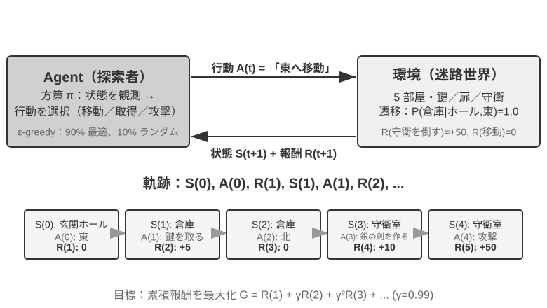

相互作用は**軌跡**を生みます。すなわち「状態→行動→報酬→新しい状態→行動→報酬……」の完全な記録であり、方策の優劣は最終的に軌跡の質に現れます。**価値関数（Value Function）**が答えるのは次のような問いです。「もし今この状態にいて、現在の方策に従ってずっと行動し続けたら、最終的に合計でどれだけの報酬を得られるか」。これはちょうど、経験豊富な棋士がある局面を見たとき、最後の一手まで計算しなくても、直感でこの一局の勝率を見積もれるのに似ています。（ここでの「現在の方策」を「最適方策」に置き換えると、得られるのが最適価値関数で、本章後半で Bellman 最適方程式を説明する際に使います。）Agent と環境の境界は簡潔な原則に従います。**Agent が任意に変えられないものは、すべて環境に属する**のです。

強化学習が教師あり学習（正しい答えのラベル付けが必要）と教師なし学習（データの中の隠れたパターンを発見する）と区別される 2 つの独特な特徴は、**試行錯誤探索**（Agent は自分でどの行動が良いかを手探りせねばならず、先生が直接正解を教えてくれない）と**遅延報酬**（行動の影響は数ステップ後に初めて現れるかもしれない。たとえば一手の好手の価値は終局になって初めて分かる）です。ここからさらに独特の**探索と活用のトレードオフ（Exploration-Exploitation Tradeoff）**が生じます。慣れた道ばかり歩けば新しいことは学べず、めったやたらに試し続ければ永遠に終点に着けません。

強化学習システムは 5 つの核となる要素を含みます。

- **行動空間**：Agent が取りうるすべての行動の集合を定義します。行動は離散的（将棋の「どこに打つか」のように選択肢が有限）でも連続的（ロボットの「関節を何度回すか」のように連続値）でもあり得ます。
- **方策**：Agent の行動準則で、与えられた状態でどうすべきかを規定します。方策は非常に単純（一つのルックアップテーブル。状態 A を見たら行動 X を実行）でも、非常に複雑（一つの深層ニューラルネットワーク）でもあり得ます。
- **報酬信号**：環境が与える即時のフィードバック。ただし Agent の目標は即時報酬ではなく長期報酬を最大化することです。この区別はきわめて重要で、投資が今日の値動きだけでなく長期的なリターンを見るべきなのと同じです。
- **価値関数**：ある状態から出発して将来合計でどれだけの累積報酬を得られるかを推定し、即時のフィードバックがないときに Agent が賢明な判断を下すのを助けます。過去 60 年の RL 研究で最も重要な認識の一つが、価値推定の中心的な位置づけです。
- **環境モデル**（任意）：環境が行動に対してどう応答するかを予測します。環境モデルを持つ手法を**モデルベース手法**（まず環境がどう変化するかを予測し、それに基づいて計画する）と呼び、環境モデルを持たないものを**モデルフリー手法**（環境を予測せず、経験から直接学ぶ）と呼びます。

表8-3 はさまざまな Agent システムの主要な構成要素を対比し、Agent という概念の普遍性を明らかにし、読者が従来型 RL Agent と現代の LLM Agent の行動空間における違いを見て取れるようにします。

表8-3 異なる Agent システムの主要要素の対比

| Agent の種類 | 環境 | 行動空間 | 報酬信号 |
|---------------|---------------------|----------------------------------|-------------------------|
| **生まれたばかりの子ガゼル** | 地形、重力、体の姿勢 | 連続高次元（各筋肉群の収縮） | バランス(+)、転倒(-) |
| **掃除ロボット** | 部屋のレイアウト、電池残量 | 離散（方向、吸引、充電） | 清掃面積(+)、電池切れ(-) |
| **チェスの名人** | 盤面の状態、時間制限 | 離散有限（合法手） | 勝ち(+1)、負け(-1) |
| **カスタマーサービス Agent** | 対話履歴、知識ベース | オープンエンド（思考、発話、API 呼び出し） | 問題解決(+)、処理時間(-) |
| **コードアシスタント Agent** | 要件文書、コードベース | オープンエンド（思考、検索、編集、実行） | テスト合格(+)、bug 混入(-) |

この表は一つの重要な洞察を明らかにします。従来型 RL Agent（チェス、ロボット）の行動空間は閉じていますが、LLM ベースの現代 Agent（カスタマーサービス、コードアシスタント）の行動空間は開かれており、ほぼ無限で、しかも「内部思考」という特殊な行動を利用して能力を高められるのです。

### 2 つの Agent パラダイム：MDP から LLM+RL へ

両者の最も根本的な違いは行動空間にあります。MDP は行動空間が有限かつ閉じている（上へ/下へ/取る/置く）と仮定しますが、LLM の行動空間は開かれた、組み合わせ爆発する自然言語の系列です。この違いが、2 つのパラダイムのアルゴリズム設計、サンプル効率、汎化能力における根本的な分岐を決めています。以下でそれぞれ展開します。

**従来のパラダイム：MDP と Q-learning。**

MDP（Markov Decision Process、マルコフ決定過程）は強化学習の数学的枠組みで、状態、行動、報酬などの核となる要素を定義します。その核心的な仮定は**マルコフ性**です。未来は現在の状態にのみ依存し、それより前の履歴とは無関係です。たとえるなら、将棋では現在の盤面だけを見れば最適手を決めるのに十分で、それ以前の一手一手をどう打ったかを振り返る必要はありません。この仮定は問題を単純化しますが、履歴依存性のモデリング能力も制限します。

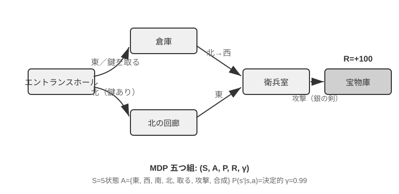

従来型 RL Agent の主要な特徴は**閉じた行動空間**です。Agent が取りうるすべての行動が、あらかじめ定義された有限の集合を成します。**古典的なチェス系 Agent** が最も典型的な例です。囲碁の 361 の着手位置は膨大ですが完全に確定的で有限、チェスは異なる駒の移動規則を考えても行動はやはり列挙可能、Atari ゲームは数個から十数個の離散的な行動しかありません。**ロボット Agent** は連続だが有界な行動空間を代表します。関節角度、速度、把持力は連続値ですが、いずれも明確な物理的境界（最大回転角度、最大トルク、速度制限）を持ち、次元はロボットの自由度によって決まります。

この閉じた性質は計算上の利点をもたらします。すべての行動を列挙して一つずつ評価でき、動的計画法やモンテカルロ木探索に適し、行動価値関数を表や単純な関数で近似できます。しかしそれは表現力と汎化能力も制限します。従来型 RL Agent はゼロから始め、純粋に試行錯誤に頼って学びます。ランダムな方策から出発し、経験を集め、価値関数や方策を更新し、収束するまでこれを繰り返します。

この枠組みのもとで、最も基礎的かつ重要なアルゴリズムの一つが **Q-learning** です。それは各「状態-行動」の組み合わせに対して一つの価値推定を保持します。状態 s で行動 a を取り、その後ずっと最適方策に従って行動したら、合計でどれだけの報酬を得られるか。直感的には、ある行動が良いかどうかは、それがもたらす即時のリターンに、「それがあなたを連れて行く次の状態がどれだけ良いか」を加えたもので決まります。

この直感を等式に書くと、RL の教科書で名高い**ベルマン方程式**（Bellman equation）の核となる再帰関係になります。**ある行動の真の価値 = このステップで得られる即時報酬 + 次の状態に到達した後に得られる最大の未来価値**：

$$Q^*(s, a) = r + \gamma \max_{a'} Q^*(s', a')$$

ここで $r$ は即時報酬、$s'$ は行動を実行した後に到達する次の状態（ここでは直感のため決定論的な形で書いています。確率的な環境では次の状態 $s'$ について期待値を取る必要があります）、$\gamma \in [0, 1)$ は**割引因子**です。それは Agent が未来をどれだけ重視するかを決めます。$\gamma$ が 1 に近いほど長期のリターンを重視し、0 に近いほど目先だけを見ます。前文で繰り返し出てきた「累積報酬」とは、まさに各ステップの報酬を $\gamma$ で逐次割り引いた総和 $\sum_{t} \gamma^{t} r_t$ です。アルゴリズムは行動のたびに、古い推定値を「実際に起きた結果」の方向へ少しだけ微調整します。この「一歩の実際の結果で古い推定を修正する」パラダイムを**時間差分学習**（Temporal-Difference Learning, TD learning）と呼び、何千何万回もの試行錯誤を経て、推定値は徐々に真の値に逼近します。

以下の 2 枚の図は、それぞれ Q-learning のグリッドワールドにおける探索過程と Q 値の段階的な収束を示します。

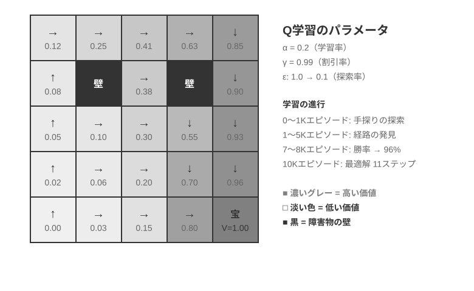

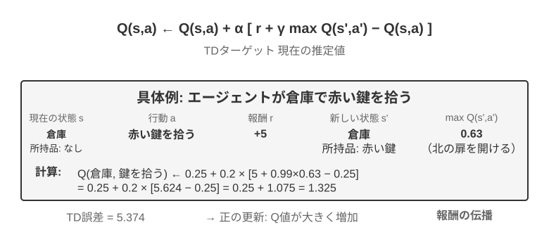

Q-learning は特殊な**オフポリシー**（Off-Policy）手法に属します。任意の方策（ランダム探索を含む）が生み出したデータを使って最適方策を学べます。オンポリシー/オフポリシーの厳密な定義と LLM ポストトレーニングにおける対応関係は、後述の「強化学習アルゴリズムの比較」の節を参照してください。

> **実験 8-1 ★：宝探しゲームにおける Q-learning の性能**
>
> Q-learning の特性と限界を検証するため、**宝探しゲーム環境**を設計しました。この環境はいくつかの重要なチャレンジを含みます。**隠れた仕組み**は Agent に鍵と扉の対応関係、武器の効果、アイテムの合成規則を自力で発見することを要求します。**多段階依存**は、タスクの完了に正しい行動系列が必要であることを意味します（最適解は 11 ステップ）。**疎な報酬**は、重要な行動と最終的な勝利にのみ顕著な報酬があり、途中の大部分のステップは何のフィードバックも得られないことを意味します。
>
> Q-learning Agent は標準的なパラメータ設定を用い、ε-貪欲探索方策（大半の時間は現在の最適行動を選び、たまにランダムに試し、訓練が進むにつれてランダム探索の比率を徐々に減らす）を採用します。
>
> 学習曲線は典型的な特徴を示します（episode は開始から通関または失敗までの一局の完全なゲームを指します）。
> - **最初の 1000 episodes**：勝率 0%、Q テーブルはわずか 124 状態、Agent は闇雲に探索
> - **最初の 5000 episodes**：依然として安定した勝利はなく、Q テーブルは 133 状態
> - **7000-8000 episodes**：勝率が 34% から徐々に 96% まで上昇
> - **10000 episodes**：勝率 100%、Q テーブルは 145 状態、11 ステップの最適解を発見
>
> 訓練全体はわずか 10 秒足らず（シミュレーション効率は極めて高い）ですが、1 万回近い完全な試行を要します。これは Q-learning の核となる特徴を示しています。完全な経路をたまたま通り抜けるには大量のランダム探索が必要で、価値信号の伝播は非常に遅く、繰り返し強化しなければなりません。純粋な記号的学習は、事前知識がなければ状態空間を力任せに探索するしかありません。
>
> ゲームシミュレータでは、1 万回の試行錯誤にわずか 10 秒しかかからず、コストはごくわずかです。しかし現実世界の Agent の場面では――電話一本ごとにコストがあり、ブラウザ操作一回ごとに遅延があり、誤った判断一つが取り返しのつかない結果を招きかねない――1 万回の試行錯誤はまったく受け入れられません。これこそ、現代の Agent が LLM ベースの手法へ転向した理由です。事前学習で蓄積した知識を活用し、ごくわずかな相互作用で有効な判断を下すのです。
>
> MDP の根本的な限界は 3 点あります。サンプル効率が低い（単純なタスクを学ぶのに膨大な相互作用が必要）、汎化能力が乏しい（ある環境で学んだ知識を別の環境に移すのが難しい）、事前知識を活用できない（新しいタスクごとに一から学び直す）。ひとたび自然言語や高次元の視覚のような複雑な状態空間に直面すると、これらの限界はとりわけ顕著になります。

**現代のパラダイム：LLM+RL ベースの Agent。**

大規模言語モデルはまったく新しい Agent パラダイムをもたらし、Agent の構築の仕方を根本的に変えました。とりわけ行動空間の設計をです。

従来の RL の Agent は、環境を変えることでしかフィードバックを得られませんでした。次の一手を打つ、迷路を一歩進む。しかし LLM はまったく新しい種類の行動をもたらしました。内部思考です。思考は外部世界を変えませんが、最終的な行動の質を著しく改善できます。この転換はすべてを変えました。Agent の行動空間はもはや「何をするか」だけでなく、「どれだけ考えるか、何を考えるか」をも含むようになったのです。

最も重要な革新は、**思考（Thinking）を一種の特殊な行動として**行動空間に組み込んだことです。従来の RL では、Agent は環境の状態を変える外部行動（移動、攻撃、拾得）しか実行できませんでした。しかし LLM Agent では、**内部思考が行動空間の核となる構成要素**になります。それは外部環境を直接変えず、即時報酬がなく、回数もほぼ無制限で、コストも比較的低いのです。

従来の RL がこの種の行動を扱いにくいのは、探索空間が大きすぎて構造を欠くことに根ざしています。ゼロから学ぶ Agent は、目隠しをして砂漠で宝を探すようなもので、ランダムに突き当たるしかありません。LLM は違います。膨大なテキストの事前学習を通じて、人類が蓄積してきた思考の規則をすでに内在化しています。数学の問題を解くときは「条件を認識→公式を思い出す→段階的に計算」に従い、コードを書くときは「要求を理解→構造を設計→細部を実装」に従います。これにより LLM の思考は構造化された経路に沿って進み、探索空間を大幅に圧縮します。したがって追加の RL 訓練がなくても、事前学習後の LLM は基本的な論理を備えた思考連鎖（Chain of Thought, CoT）を生成できます。この基本的な論理は、事前学習コーパスの中の膨大な人類の思考過程（数学の問題解答、コードのコメント、討論の応答など）から来ており、モデルは next-token prediction を通じて「次のステップはどんな推論の形態であるべきか」を暗黙的に学びました。

RL のポストトレーニングは、外部報酬を通じて LLM に特定のタスクでこれらの規則をより効率的に運用することを教えます。言語構造そのものも一種の暗黙的な内部報酬を提供します。論理的に一貫した思考連鎖（たとえば「外貨を米ドルに換算する必要があるので、第一歩は為替レートを調べる」）は生成確率が高く、論理の乱れたもの（たとえば「通貨を換算する必要があるので、まず天気を調べる」）は確率が極めて低く、モデルを合理的な経路へと自然に導きます。

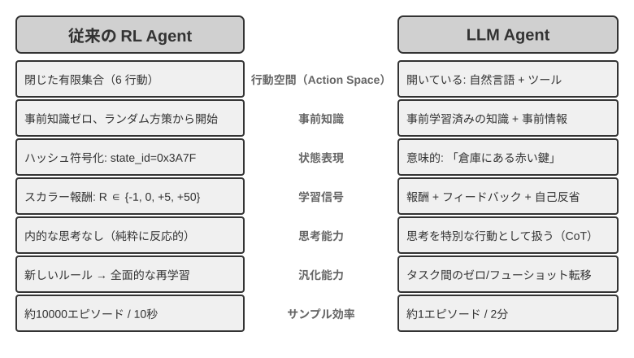

この言語の内在的な規則に基づく思考能力によって、LLM Agent は見たことのない指示を理解でき（ゼロショット汎化）、ごく少数の例で新しいタスクを習得できます（少数ショット適応）。これは従来の MDP Agent が大量の試行錯誤を必要とするパラダイムとはまったく異なります。さらに新しいパラダイムは、組み合わせ汎化（既知の概念を再構成して新しい状況に対応する）、文脈内学習（プロンプトと例を通じて素早く適応する）、マルチモーダル理解（視覚、言語、行動などのモダリティを自然に統合する）などの能力も備えています。注意すべきは、文脈内学習の**効果**（ゼロショット汎化、少数ショット適応）とその**内部機構**は別物だということです。第 2 章で分析したように、アテンション機構の働き方は推論というより検索に近いのですが、それがタスク適応において強力な実際の効果を生むことを妨げはしません。

閉じた行動空間から開かれた行動空間への進化は、AI Agent パラダイムの根本的な転換を反映しています。内部思考のほかにも、ツールパラメータの多様性（自然言語クエリ、プログラムコード、複雑な JSON、マルチモーダルコンテンツ）が実際の行動空間を無限に近づけます。コードインタプリタは理論上あらゆる計算可能なタスクを実行でき、検索ツールはインターネット全体の情報空間を探索できます。これは新しい機会をもたらす（Agent が前代未聞のタスクを処理でき、基本ツールを組み合わせて複雑な問題を解決できる）と同時に、新しい課題ももたらします（開かれた環境でいかに報酬関数を定義・最適化するか、無限の行動空間でいかに効率的に探索するか）。

Kimi K3 のようなツール呼び出しと長い連鎖思考のために最適化されたモデルを例にとると、LLM+RL パラダイムの典型的な方向が見て取れます。大規模な言語事前学習の基盤の上に、ポストトレーニングを通じて問題分解、ツール呼び出し、自己修正の能力を強化するのです。**OpenVLA**[^ch8-21]（詳細は第 6 章）は、LLM 時代の VLA（視覚-言語-行動）アーキテクチャのパラダイムを示します。視覚エンコーダが環境の観察を処理し、言語モデルが指示を理解して推論し、行動デコーダが制御信号を生成し、言語条件付き制御とタスク横断的な汎化を実現します。明確にしておくべきは、OpenVLA 自体は百万件近いロボットの**演示軌跡**の上で模倣学習（行動クローニング）によって訓練されており、RL ではなく SFT の性質を持つということです。RL を本当にロボットに導入し、この種の VLA アーキテクチャの上に報酬でさらに最適化を加えた代表例が、本章後半の実験 8-13 の SimpleVLA-RL です。

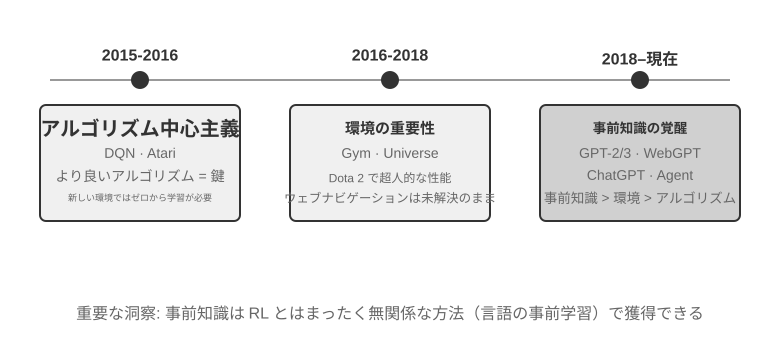

**OpenAI の探索の道のり**（姚順雨（プリンストン大学助教授、ReAct 論文の著者）が『The Second Half』[^ch8-2]で詳細に記録）は、認識上の変遷を明らかにします。**第一段階（2015-2016）アルゴリズム中心主義**：より良いアルゴリズムこそが鍵だと信じ、Atari などの標準環境で進展を得ましたが、新しい環境に変えると一から訓練し直す必要がありました。**第二段階（2016-2018）環境の重要性**：Gym が各種タスクを標準化し、Universe と World of Bits はインターネット全体を RL の訓練環境に変えようと試み、Dota 2 は特定の複雑な環境で超人的なパフォーマンスを追求しました。着想は明快でしたが、汎用的なコンピュータ使用とウェブナビゲーションはずっと突破できませんでした。

**第三段階（2018 年から現在）事前知識の目覚め**：GPT-2/GPT-3 は言語事前学習の強大な力を示し、WebGPT、ChatGPT はこれらの事前知識が実用的な Agent に転化できることを証明しました。最も重要な発見は、**事前知識は RL とはまったく無関係な方法で獲得できる**ということです。これは直感に反する真実です。数十年来、RL 研究者たちの優先順位はまったく逆さまだったかもしれないのです。アルゴリズム > 環境 > 事前知識ではなく、事前知識 > 環境 > アルゴリズムなのです。

> **実験 8-2 ★★：従来型 RL と LLM Agent の比較研究**
>
>
> 
>
>
> 同じ宝探しゲームで Q-learning と LLM Agent（Kimi K3、最大 50 件の経験を保持するバッファを維持）を比較します。結果は衝撃的です。**LLM Agent は初回の一局で 18 ステップ以内に通関しました**。
>
> **序盤（目的を持った探索）**：錆びた剣を拾い（「武器は素手よりましだ」）、地図を系統的に探索し、北門が施錠されているのを発見すると「鍵を探す必要がある」と推論し、倉庫の探索に転じ、赤い鍵と魔法のクリスタルを順に手に入れます。**中盤（仕組みの理解と主体的な合成）**：「鍵は自動的に使用される」という規則を理解し、錆びた剣では守衛に対抗するには不十分だと予測し、そこで第 8 ステップで主体的に銀の剣を合成します。**終盤（実行と修正）**：銀の剣を持って北へ向かい、第 13 ステップで強い守衛を打ち破り、その間に一、二歩の無効な試み（剣の空振りや後退の繰り返し）を挟みつつ、最終的に第 18 ステップで巨龍の宝を手に入れます。
>
> これは意味理解と記号写像の間の根本的な違いを示しています。LLM Agent はゲームの概念構造を理解し、一歩ごとに目的と論理の裏付けがあります。一方 Q-learning にとって、「扉」「鍵」「剣」は無意味な記号の組み合わせにすぎず、大量の統計的学習を通じてそれらの間の関係を少しずつ発見するしかありません。
>
> 計算コストは興味深い逆説を成します。Q-learning は 1 万局走らせてもわずか 10 秒ですが、LLM Agent は一局に 1〜2 分かかります。しかし現実のタスクでは、相互作用一回ごとの時間・金銭・リスクのコストが純粋な計算コストをはるかに上回るので、GPU 時間だけを見るのは公平ではありません。より重要な洞察は、LLM Agent の成功はより良い「学習アルゴリズム」を持つからではなく、膨大な事前知識を携えているからだ、ということです。ゲームの規則が変わると、Q-learning は完全に再訓練が必要ですが、LLM Agent は推論を通じて直接適応できます。ここから実用的な設計原則が導けます。シミュレーションコストが低く、大量に繰り返せる場面では従来型 RL がなお価値を持ち、相互作用コストが高く、素早い適応が必要な現実の場面では、LLM Agent のサンプル効率のほうがより実際的です。

文脈内学習、外部化学習、パラメータ化学習（ポストトレーニング）というこの 3 つの学習パラダイムそれぞれの位置づけと協働については、第 1 章で系統的に対照しており、本章末尾の「完全な図景」でもこの話題に立ち返ります。本章の主線はそのうちのポストトレーニング――相互作用の方策をモデルパラメータに書き込むこと――です。

## モデル事前学習の基礎 `[任意読解]`

ポストトレーニング技術がなぜ有効なのかを理解するには、まず事前学習が何を築いたのかを知る必要があります。ポストトレーニング（SFT と RL）は本質的に、事前学習が築いた表現空間の中で最適化を行うことです。事前学習が定めた知識構造が、ポストトレーニングの天井を決めます。そこで、3 つの実験を通じて事前学習の核となる部分を考察します。小規模な言語モデルをゼロから訓練すること、視覚能力を拡張すること、そして新しい言語知識を注入することです。本節の 3 つの実験は補助的な内容で、読者が事前学習（Pretraining、すなわち大規模なデータで初期訓練を行い、モデルに言語の基本規則と世界知識を学ばせること）への直感を築くのを助けます。すでに事前学習の流れに馴染んでいる読者は飛ばして構いません。


言語モデルの訓練は「トークナイゼーション — 事前学習 — ポストトレーニング」の 3 段階の流れに従います。トークナイゼーション（tokenization、単語分割）はテキストを離散的な単位に切り分けます。たとえば「我喜欢编程（私はプログラミングが好き）」は「我」「喜欢」「编」「程」の 4 つの token に切り分けられるかもしれません。これらの token がモデルがテキストを処理する最小単位です。事前学習のタスクは概念的には非常に単純です。モデルにあるテキストの前半部分を見せ、次の token が何かを予測させます。モデルは自分の予測と正解の差（この差を損失（Loss）と呼び、損失が小さいほど予測が正確）を比較しながら、絶えず自身のパラメータを調整します。膨大なテキストの上で繰り返し訓練した後、モデルは徐々に言語規則、世界知識、基本的な推論能力を学びます。事前学習が完了すると、モデルは流暢なテキストを生成できますが、出力は構造を欠き、指示に従うのが困難です。ポストトレーニングは SFT（ラベル付けされた入力-出力ペアで訓練）と選好最適化（DPO など、モデルに人間がより好む回答を生成させる）を通じて、それを実用的なアシスタントへと変えます。

> **実験 8-3 ★★：LLM をゼロから訓練する――アルゴリズム改善の威力**
>
> MiniMind 2（1 億パラメータ）を事例として、コンシューマー級の GPU で完全な訓練の流れを完了します。2 つのアルゴリズム最適化（QK Norm と Muon オプティマイザ）を導入することで、収束速度が 3 倍に向上し、生成品質も著しく改善します。実装コストは極めて低く、総訓練時間は約 14 時間、コストは約 34 ドルです。
>
> 各訓練段階の効果は次のとおりです。事前学習後、モデルは「世界で最も高い山」などの事実的な質問に答えられますが、形式は整いません。SFT 後は指示遵守と出力形式が著しく改善し、期待どおりの方法で答えを組み立てられます。選好最適化はさらに事実の誤りと不自然な表現を減らします。1 億パラメータのモデルにはなお明らかな限界があります（複雑な問題で間違えやすい）が、示唆は次のとおりです。**固定された小規模な予算のもとでは、アルゴリズムの改善のほうが単なる規模の積み増しよりコストパフォーマンスが高い**。

> **実験 8-4 ★★：自分で VLM を訓練する**
>
>
> 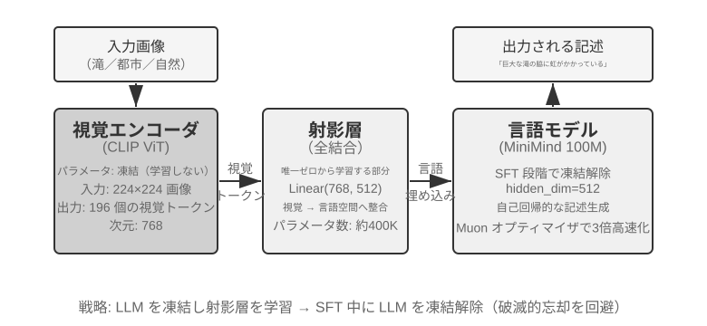
>
>
> VLM は視覚的知覚と言語理解を一つのモデルに統一し、核となる課題はモダリティ横断的なアライメント――「見たもの」と「言うこと」を対応させること――にあります。アーキテクチャは 3 つのコンポーネントから成ります。**視覚エンコーダ**（CLIP など、パラメータは固定）は画像の意味的特徴を抽出します。**投影層**（軽量、唯一ゼロから訓練する部分）は視覚特徴と言語モデルの間の「翻訳者」を務め、視覚特徴を言語モデルが理解できる表現空間へと写像します。**言語モデル**は記述テキストを生成します。訓練は「LLM を凍結 + 投影層のみを訓練」する戦略を採り、破滅的忘却（Catastrophic Forgetting、すなわち新しいスキルを学んだ後に古いスキルを忘れてしまうこと）を避けます。事前学習でアライメントした後に LLM を解凍し、高品質な画像-記述ペアで SFT を行うと、記述の詳細さと正確さが著しく改善します。
>
> 本実験はマルチモーダルモデル訓練の基本パラダイムを明らかにします。単一モダリティの事前学習の成果を再利用し、軽量な投影層を一つ訓練することでモダリティ横断的なアライメントを実現する――効率的でスケーラブルですが、投影層の表現力には限りがあり、モダリティ横断的な深い理解のボトルネックになりうります。同じ「視覚エンコーダ + 投影層 + LLM」の骨格をもう一歩進め、モデルに行動を出力させれば、第 6 章で紹介した VLA（視覚-言語-行動）モデルになります。

> **実験 8-5 ★★：継続事前学習で新しい言語を学ぶ**
>
> Mistral 7B v0.3 を基礎（主に英語で事前学習され、韓国語はほとんど理解できない）として、韓国語 Wikipedia による継続事前学習で韓国語能力を注入します。すでに事前学習を終えたモデルに新しい言語データで教師なし訓練を続けるもので、モデルはすでに汎用的な言語モデリング能力を備えており、新しいデータ分布に適応するだけでよいので、コストはゼロから訓練するよりはるかに低くなります。重要な工学的ポイントは、混合データ（約 80% 韓国語 + 20% 英語）で破滅的忘却を緩和することです。目標言語の比率が高すぎると元の言語が退化し、比率が低すぎると学習効率が不足します。最後に韓国語の指示データで SFT を行い、実用的な韓国語対話能力を得ます。本実験の結論は本章末尾の完全な図景で再び使います。モデルに大量の新しい領域知識を記憶させるには、SFT ではなく継続事前学習に頼るのです。

3 つの事前学習実験は共通して一つの法則を明らかにします。予算が限られているときは、アルゴリズムの改善とアーキテクチャの革新のほうが、単なる規模の拡大よりコストパフォーマンスが高いのです。より重要なのは、事前学習がモデルに与えるのは記述的知識と言語モデリング能力であって、構造化された指示遵守やタスク志向の行動を欠いていることです。これこそ SFT が埋めるべき空白です。

事前学習の基礎能力があれば、次のステップはポストトレーニングを通じて汎用モデルを実用的な Agent へと変えることです。ポストトレーニングの第一段階は教師ありファインチューニング（SFT）です。

## Mid-training：知識と基礎能力を補う

本章でいう **Mid-training** は、既存の基盤モデルから出発し、対象データ分布上でもう一段階の言語モデル学習を行うことです。通常は事前学習と同じ次 token 予測を用い、文書、コード、導出の全 token に損失を計算します。DAPT/TAPT の研究は、ドメインまたはタスク関連の未ラベルコーパスによる第二段階の事前学習が下流性能を改善しうることを示しています[^ch8-30]。

主に補うのは、汎用事前学習が対象言語、専門用語、社内文書、特定コードベースを十分に覆わない**知識の欠落**と、長文脈、コード、数学、マルチモーダル表現など、何度サンプリングしても正解に届かない**基礎能力の欠落**です。SFT は少量の事実を記憶できますが、少数の QA はアクセス経路を限定しやすく、大規模で相互に結び付いた知識の注入には向きません。安定した順序は、Mid-training で知識・能力を吸収し、少量の SFT で出力プロトコルを作り、成功率が非ゼロになってから RL で成功確率と汎化を高めることです[^ch8-31]。

### データ混合と長文脈カリキュラム

長さ段階 $i$ の混合を次のように表せます。

$$
D_i=\alpha_iD_{\text{long}}+\beta_iD_{\text{atomic}}+\gamma_iD_{\text{agent}}+\delta_iD_{\text{replay}},
\qquad \alpha_i+\beta_i+\gamma_i+\delta_i=1.
$$

比率は文書数ではなく **token 数**で測ります。$D_{\text{long}}$ は書籍、長文書、コードリポジトリなどの自然な長文、$D_{\text{atomic}}$ は検索、多段推論、指示遵守、集約、統計などの原子能力、$D_{\text{agent}}$ は計画、ツール選択・呼び出し、長期状態追跡、エラー回復の軌跡です。$D_{\text{replay}}$ には一般・短文データと、既習の短いタスクを現在の長さへ移し、手掛かりの位置や妨害情報を変えた「長さ引き上げ済み旧タスク」の両方を残します。重複除去、品質フィルタ、評価汚染検査も必須です。

Mid-training は、名目上のコンテキスト長を**実効的な目標長**へ安定して拡張し、その途中で長文推論、計画、ツール利用を形成する役割も持ちます。`max_position_embeddings` を 32K から 128K に変えるだけでは、入力可能になっただけで、全窓から検索・集約・行動できる証明にはなりません。8K → 16K → 32K → 64K → 128K のような長さカリキュラムを、開始モデル、目標、計算予算に合わせて設計します[^ch8-36]。

各拡張前に、現在長で NIAH、長文検索、多段推論、集約・統計、基本計画、ツール選択などの原子能力を達成します。$M(\theta,c,L)$ をモデル $\theta$ の能力 $c$、長さ $L$ におけるスコアとすると、次の三重ゲートを使えます。

$$
\begin{aligned}
M(\theta_i,c,L_i)&\geq\tau_{c,i},\\
M(\theta_i,c,L_i)&\geq M(\theta_i,c,L_{i-1})-\epsilon_{\text{len}},\\
M(\theta_i,c,L_{i-1})&\geq M(\theta_{i-1},c,L_{i-1})-\epsilon_{\text{retain}}.
\end{aligned}
$$

これは順に、現在長で合格すること、長くしても同一能力が実質的に低下しないこと、新段階が旧能力を忘れていないことを求めます。二つ目は難度を揃え、長さだけを引き上げたタスクで比較し、$\epsilon$ は反復評価の信頼区間から決めます。どれかの能力が落ちたら、対応する原子能力データ、現在長データ、replay を増やして再学習し、名目長だけを先へ伸ばしてはいけません。

| 能力 | benchmark | 主な診断 |
| --- | --- | --- |
| 位置・検索・追跡・集約 | NIAH、RULER | needle の位置・個数、多段追跡、集約、長さ別の劣化。NIAH は smoke test にすぎない |
| 現実的な長文書推論 | LongBench、LongBench v2 | 単一／複数文書 QA、長対話、文脈内学習、構造化データをカテゴリ・長さ別に評価 |
| 長いコードの理解 | LongBench v2 の repository 課題、LongCodeU | コード単位、ファイル間関係、repository 全体の理解 |
| 計画とツール学習 | PlanningArena と本書のツール benchmark | 分解、選択、記憶、引数、状態の正しさ |
| End-to-end Agent | SWE-bench Verified、$\tau^2$-bench、Terminal-Bench など | 長い実軌跡での計画、ツール、回復、完遂 |

RULER は NIAH を複数 needle、多段追跡、集約へ拡張し[^ch8-37]、LongBench v2 は現実的な文書、対話、リポジトリ、構造化データを扱います[^ch8-38]。LongCodeU と PlanningArena は長いコード関係と計画・ツール学習を診断します[^ch8-39][^ch8-40]。公式 test set は評価専用とし、構造が似ていても重複しない例で訓練し、長さ・能力・失敗種別ごとに報告します。NIAH 一つや単一 leaderboard の合格だけでは、長文脈推論を証明できません。

頻繁な更新、引用、権限制御、削除が必要な事実は RAG に置きます。全パラメータ Mid-training は小規模 SFT より計算・忘却リスクが高いため、まず小規模実験で混合比を検証します。

## SFT（教師ありファインチューニング）


「事前学習、SFT、RL：3 段階の全景」の節で SFT の本質（データを差し替え、回答部分にのみ損失を計算する「次の単語を予測」）はすでに徹底的に説明しました。この節では 4 つの実験を通じて、この「安定した写像とプロトコルをパラメータに書き込む」仕組みが、異なるタスクで具体的に何を固定化するのかを見ていきます。SFT の核となる価値は新しい知識を注入することにあるのではなく、**プロトコルを固定化する**ことにあります。写像関係、対話形式、スタイル規範をパラメータに書き込み、推論時に長々としたプロンプトなしに期待どおりの出力を生み出せるようにするのです。通常は数千から数万件の高品質サンプルだけで、基本的な対話能力と指示遵守を確立できます。

この高い効率は、訓練分布への依存という代償を伴いうります。複数の正しい方策を探索する必要があるタスクや、デプロイ時の分布が示範データから離れるタスクでは、SFT は示範のパターンを再現する方へ傾き、新しい場面で性能が下がります。続く 4 つの実験は、この「プロトコルを固定する」過程をさまざまな角度から示します。

SFT に取りかかる前に、避けて通れない実務上の問いがあります。**SFT のデータはどこから来るのか。** 産業界の答えは基本的に 3 つの道です。

- **人手による専門家の示範**――品質の上限は最も高いが、高価で遅い。形式とスタイルを定義する「シードデータ」に向く。
- **教師モデルによる生成**――すなわち合成データ。強いモデルに「入力—出力」ペアを大量に作らせ、フィルタしてから学生へ蒸留する。実験 8-8、8-9 を参照。
- **棄却サンプリング**――モデル自身が同じ問題に複数の候補をサンプリングし、検証器で正しいものを選び出して自分を訓練し直す。実験 8-9 を参照。

この 3 つの道はしばしば組み合わせて使われます。まず少量の人手シードで形式を固め、次に教師モデルで規模を広げ、最後に棄却サンプリングで品質を揃えます。どの道を通っても構成の流れはほぼ同じです。タスク分布と出力スキーマを定義し、候補を大量に生成し、ルール検証・形式チェック・人手の抜き取りで品質をフィルタし、最後に重複を除き、配合を均衡させ、多様性を担保します。量については欲張る必要はありません。数千から数万件の高品質サンプルがあればプロトコルを固定するには十分で、10 万件の汚いデータを積み上げるより 1 万件のきれいなデータを磨くほうが良いのです。データの中のノイズは一つ残らず、SFT が忠実にパラメータへ書き込みうるからです。

> **実験 8-6 ★★★：音声 SFT――「声のコピー」から「パラ言語モデリング」へ `[拡張実験]`**
>
> Orpheus（文脈プロンプトによる voice cloning）と Sesame（パラ言語マーカーのモデリング）を対象に、「声のスタイルと表現の癖」をいかにパラメータに書き込むかを示します。両者の発想は異なります。
>
> - **Orpheus**：音声波形を token 系列に圧縮し、同一話者の参照音声を連結することで、モデルに「この人の声で話す」ことを学ばせ、文をまたいだ音色の一貫性を実現します。
> - **Sesame**：笑い声やため息などのパラ言語現象を `<laugh>`、`<sigh>` などの特殊マーカーに抽象化し、モデルに「マーカーを見たら対応する音を発する」ことを学ばせます。
>
> SFT が表現型タスクで固定化するのはスタイル制御プロトコルと構造化された表現の癖であって、事実的知識や複雑な思考ではありません。鍵は訓練データの多様性とラベル付けの質です。よくある失敗モードは、訓練データの話者が少なすぎて全員が同じ口調に聞こえること、マーカーの過学習（Overfitting、すなわちモデルが訓練サンプルの細部を丸暗記し、新しい状況ではかえって性能が悪化すること）による「機械的な笑い」です。

> **実験 8-7 ★★：多言語思考――モデルに任意の言語で思考させる `[拡張実験]`**
>
> 大半の思考モデルは英語でしか「思考」できません。あなたがどんな言語で質問しても、モデル内部の思考連鎖はほぼ英語です。訓練データの中の高品質な思考の示範がほぼすべて英語で書かれているからです。本実験の目標は単純です。モデルが指定した言語で思考できるようにすることです。
>
> やり方は gpt-oss-20b に SFT を施すことです。システム指示に `reasoning language: German`（または他の言語）の一文を加え、英語、スペイン語、フランス語など数種類の言語の思考サンプルで訓練します。訓練データには**中国語がまったく含まれていません**が、訓練完了後、reasoning language を Chinese に設定しさえすれば、モデルは中国語で完全な思考連鎖の思考ができます。このゼロショットの言語横断的な汎化が本実験の最も興味深い発見です。注意すべきは、これは SFT 自体の汎化能力ではないということです。多言語の事前学習がすでにモデルの中に言語横断的な共有表現空間を築いており、SFT はこの事前学習時にすでに備わっていた言語横断的な能力を活性化しただけなのです。

> **実験 8-8 ★★：Prompt 蒸留――より小さいコストで使える能力を再現する**
>
> 実際のアプリケーションでは、モデルに複雑なタスクを完了させるために、しばしば長大なシステムプロンプト（数千、時には数万 token）を設計する必要があり、呼び出しのたびに遅延と費用が増します。思考型の大規模モデルを使う場合、内部の思考 token がさらにコストを増幅します。Prompt 蒸留の発想は、「長いプロンプト + 思考型教師」の振る舞いを「短いプロンプト/プロンプトなし + 非思考型生徒」に圧縮することです。教師は完全なプロンプトと思考モードのもとで高品質な答えを生成し、訓練データはユーザー入力と最終結論だけを残し、長大なプロンプトと途中の思考過程は捨てます。生徒は「直接結論を出す」ことを学び、蒸留後は同じ入力に対して教師の出力品質に近づく一方、長大なプロンプトや思考 token を処理する必要がないため、遅延と費用が著しく下がります。
>
> 蒸留は 2 つの次元で行えます。「大から小へ」（中小モデルで大モデルを代替し、コストと品質の間で折衷する）と「思考から非思考へ」（同規模のもとで明示的な CoT を暗黙的なパラメータ化知識に畳み込み、20〜30 倍の応答速度向上を得る）です。両者は矛盾せず、本番環境ではしばしば同時に使われます。注意すべきは、蒸留は教師の境界を継承することです。教師がロングテール分布で系統的な誤りを持てば、生徒はそれらの誤りをさらにハードコードします。教師が正しさを保証するためにツールに頼っているなら、単なる出力蒸留はツールがもたらすロバスト性を失います。工学的な示唆は、プロダクトの形態が安定し、入力分布が予測でき、コスト制約が明らかなときは、Prompt 蒸留は優れた最適化手段だということです。一方、探索期やタスクがまだ定まっていない段階では、明示的な思考と編集可能なプロンプトエンジニアリングを保持することが、素早い試行錯誤の核であり続けます。

> **実験 8-9 ★★★：思考連鎖（Chain of Thought, CoT）蒸留**
>
> Prompt 蒸留が思考過程を捨てるのに対し、CoT 蒸留は逆で、強い教師モデルの**完全な思考軌跡**を生徒モデルに移します。能力の高い教師モデルに CoT 蒸留を施すと、同等のパラメータ量で教師の能力の 70%〜80% を回復できます。最先端の能力の境界を塗り替えることは求めないが、自主的にコントロールできるモデルを求めるチームにとって、これは最も実務的なフォロワー戦略です。DeepSeek-R1 のリリース時に同時にオープンソース化された一連の蒸留小モデル（R1 の思考軌跡で Qwen、Llama 系列に SFT を施したもの）は、まさにこの路線の代表例です。
>
> **背景：「思考の壁」現象**。一部のクローズドソースの思考モデル（OpenAI o 系列、Gemini 系列など）は思考時に内部の思考連鎖を生成しますが、ユーザーが目にするのは元の思考過程ではありません。ベンダーは蒸留防止、安全性、プロダクト体験などの考慮から、通常は出力前に CoT を書き換えたり要約したりし、最も価値のある元の思考過程は API の背後に隠されています。これこそ本実験がオープンソースの思考モデルを教師に選んだ理由です。DeepSeek-R1、QwQ などのモデルは `<think>` タグの中に完全な思考連鎖を公開しており、蒸留は技術的にもライセンス的にも実行可能です（使用前にはなおモデルのライセンスが蒸留生成物への利用を許諾しているか確認すべきです）。
>
> **実験現場から：コードを書けるモデルが、モデル蒸留への協力にも応じるとは限りません。** 本実験の実装では、著者はまず GPT-5.6-Sol を使用する OpenAI Codex で実験コードを書きました。しかしタスクがモデル蒸留を明示的に含む段階になると、Codex は続行を拒否しました。次に Claude Opus 5 を使用する Claude Code へ切り替えましたが、同じ拒否に直面しました。最終的に Kimi K3 が実験コードとその後の実行を完了しました。
>
> どちらの拒否も、通常の数学的推論に対するものでも、単にモデルの内部思考連鎖を開示するよう求めたことに対するものでもありません。要求は、強い教師のデータを使って生徒モデルを訓練する完全な蒸留実験を実装することでした。モデル蒸留は技術的には通常の教師ありファインチューニングと非常によく似ていますが、ベンダーの安全性・製品ポリシーでは、モデル抽出、能力の複製、知的財産の保護とも関連づけられ、機微なカテゴリとして扱われることがあります。
>
> この出来事を「Claude は思考連鎖を提供しない」と単純化すべきではなく、「Kimi のガードレールが弱い」ことの証明にもなりません。Claude API が summarized thinking を返すか、Coding Agent が蒸留 pipeline の実装に応じるか、サービス規約がモデル出力の訓練利用を許可するかは、三つの異なる問題です。本実験は、いかなるモデルの隠れた推論や安全機構も回避しようとはせず、製品が公開する能力だけを使って、認可された研究フローを実施しました。
>
> **実験設計**：3 ステップの流れです。第一に、**軌跡を採取する**：目標タスク分布（数学、コードなど）から問題をサンプリングし、オープンソースの教師モデルで完全な「思考 + 答え」の軌跡を生成し、規則ベースの検証器で最終答えが誤っている軌跡をフィルタで除きます。さもないと誤った思考過程を生徒がまるごと模倣してしまいます。第二に、**SFT 訓練**：「問題 → `<think>` 思考軌跡 `</think>` + 最終答え」を訓練ペアとして、小モデル（7B クラスなど）に標準的な SFT を施します。第三に、**比較評価**：同じベンチマーク上で蒸留前後の生徒モデルと教師モデルを比較し、能力の回復比率を測ります。
>
> **合格基準**：蒸留後の生徒モデルが数学/コードのベンチマークで蒸留前より著しく向上し、かつ思考軌跡の中に教師のような反省、後戻り、検算の振る舞いが現れること。同時に蒸留の代償にも注意してください。生徒は教師の系統的な誤りと冗長な思考の癖を継承します（後者は実験 8-10 の AdaptThink の発想と組み合わせて二次最適化できます）。

これら 4 つの実験には共通の特徴があります――「安定した写像とプロトコルをパラメータに書き込む」ことです。音声 SFT はスタイル制御プロトコルを固定化し、多言語 SFT は思考の組み立てテンプレートを固定化し、蒸留 SFT は入力から出力への直接の写像を固定化します。それらの共通点は、目標が明確で、形式がはっきりし、評価基準が安定していることであり、そのため SFT は極めて高いサンプル効率で成果を上げられます。しかしひとたび分布が変わると、記憶への傾きが性能低下として露呈します。これこそ「事前学習、SFT、RL：3 段階の全景」の節「SFT と RL の本質的な違い」で述べた記憶—汎化の分岐が、実験のレベルで現れたものです。

## SFT データ合成：示範から訓練可能な軌跡へ

SFT の上限は、まずデータによって決まります。実際のプロジェクトで、十分な数の示範を人手で一件ずつ書き起こせることはほとんどなく、通常は**少量の人手シード、教師モデルによる生成、検証器によるフィルタリング**を組み合わせます。人手の示範が形式と境界を定め、教師モデルが規模を拡大し、ルールベースの検証や人手の抜き取り検査が品質を守ります。モデルが自己ブートストラップする場合は、同じ問題に対して複数の候補をサンプリングし、検証を通過した軌跡だけを残します。これが棄却サンプリングによるファインチューニング（RFT）です。

合成データの目的は、本番ログをそのまま再現することではなく、そこから再利用可能な**タスク構造**を抽出することです。すなわち、ユーザーの意図、初期状態、利用可能なツール、業務上の制約、よくある失敗の型、成功条件です。個人情報を除去したうえで、タスクの種類ごとに架空の人物・注文・ファイル・状態を生成し直し、リセット可能な隔離環境に配置します。こうすれば本物の難しさを保ちながら、モデルが顧客データや内部の認証情報を記憶してしまうことを防げます。

堅実なパイプラインは次の通りです。**本番データ → タスクの設計図 → 合成タスク → 複数の候補軌跡 → タスク検証と軌跡検証 → SFT データ**。タスク検証は、問題そのものが達成可能か、難易度が適切か、参照結果が正しいかを確認します。軌跡検証は、最終状態、ツール呼び出し、業務制約を確認します。単体テスト、データベースのアサーション、状態差分のチェックとして書ける条件は、まず決定的なコードで扱います。コミュニケーションの質のような開放的な項目は、そのあとモデル評価器で補い、人手の抜き取りで較正します。スキルグラフ、実行可能な環境、独立した検証器は、タスクの網羅範囲をさらに広げ、無効な軌跡を取り除くのに役立ちます[^ch8-12][^ch8-17][^ch8-18][^ch8-19][^ch8-20]。

同じタスクと検証の基盤は、のちに RL 環境へ転用できますが、2 つの段階での使い方は異なります。SFT は検証を通過した成功軌跡だけを残し、安定した形式・手順・基本動作を学びます。RL は現在の方策に改めて rollout させ、環境報酬を使って示範の外側の経路を探索させます。失敗軌跡をそのまま正しい示範として投入してはいけません。選好ペアの構成に使う、タスク網羅の抜けを見つける、あるいは診断と修正を付け加えたうえで訓練に加える、といった使い方が適切です。

データ合成で効くのは量ではなく、網羅性・多様性・正確性です。訓練セットはさらに、タスクテンプレート・顧客・期間で重複を除いて分割すべきで、評価セットは重ならないタスク種別から取らなければなりません。参照解法、隠しテスト、検証器のフィードバックがモデルに漏れてはいけません。

第 7 章の bad case も、ここで訓練データに変えられます。Coding Agent の「早すぎる完了宣言」を例に取ると、まず「完了を宣言しようとしている」直前までの軌跡の接頭部を切り出し、そのときの早すぎる宣言を rejected、「先にテストを実行し、受け入れ条件を一つずつ照合してから結論を出す」を chosen とします。この種のデータは DPO や判断境界の示範に向いており、そのまま正しい SFT 軌跡として使うものではありません。失敗の理由、適用条件、検証器はサンプルと一緒に保存し、追跡と再確認ができるようにします。実験 8-17 の `build_preference_data.py` は、決定的なテンプレートと教師モデルという 2 つの構成経路を提供し、訓練データを後段の評価セットとは分けて保存します。

本章で新たに加えた 2 つの Bad Case 実験は、それぞれ異なる監督目標を示します。中国語の曲がり引用符の事例は、まずフィードバックをスコープに敏感なドキュメント Skill へ抽出し、そのうえで構造化された合成データで SFT を行います。特殊文字列の事例は、`old_string` の不一致をバイト単位で完全一致させるコピー課題に変換し、トークン単位の忠実性を訓練します。両者は第 7 章の失敗帰因プロトコルと訓練／評価の分離プロトコルを共有しますが、総合スコアは共有しません。前者は「変えるべきものは変え、残すべきものは残す」を測り、後者は「一字一句そのまま複製する」を測ります。

## Mid-training、SFT、RL をいつ選ぶか

まず欠けているのが**基盤、プロトコル、方策**のどれかを診断し、「できない」をすべて RL の問題にしないでください。

表8-4 Mid-training、SFT、RL の選択基準

| 観測 | 主な欠落 | 優先手段 | 次段階への条件 |
| --- | --- | --- | --- |
| ドメイン概念・言語・基本操作を知らず、妥当なサンプリングでも `pass@k` がほぼ 0 | 知識・能力が基盤の有効支持にない | **Mid-training**。動的事実は RAG | ドメイン保持セットが改善し、一般能力を保ち、検証可能な正解または部分正解が出始める |
| 時々成功するが形式、tool schema、口調、固定手順が不安定 | 行動プロトコル | **SFT** または制約付きデコード | 解析率が安定し、検証器が重要動作を採点できる |
| 成功率と信頼できる報酬は非ゼロだが、良い方策の確率や OOD 汎化が低い | 方策と確率質量 | **RL** | 報酬が実目標に一致し、rollout 群内に差があり、独立評価が改善する |
| 安定した示範は少数あるが環境がない | 模倣データのみ | **SFT／RFT／offline preference optimization** | 基線と評価を作ってから RL 環境の価値を判断する |

実務では、まず prompt・ツール・コード制約・文脈管理で解けないかを確認します。次に固定サンプリングで `pass@1`、`pass@k`、部分進捗率、解析率と失敗原因を測ります。`pass@k` がほぼ 0 で知識・基礎能力の失敗なら Mid-training、「できるが要求どおりに出せない」なら SFT、採点可能で時々成功する rollout と信頼できる報酬があるときだけ RL を使います。全失敗 rollout に PPO／GRPO を直接適用しても、通常はサンプリング予算を消費するだけです。

「事前学習、SFT、RL：3 段階の全景」の節では SFT と RL の**本質的な違い**を明らかにしました。この節ではより実践的な問いに答えます。**具体的なタスクに直面したとき、結局どちらを使うべきか。** 以下の意思決定の枠組みの一部の結論は、後続の RL 実験（実験 8-10、実験 8-11）でさらに検証されます。読者はまず初歩的な判断を築き、RL の部分を読み終えてから戻って照らし合わせて構いません。


**SFT が適するのは**、形式の固定化（JSON 出力、対話スタイル）、高品質な専門家の示範を持つ、訓練とデプロイの環境が高度に一致している場面です。**RL が介入しなければならない場面**は異なります。実際のデプロイ環境と訓練環境に系統的な差異があるとき（たとえば訓練時はトランプの J/Q/K がすべて 10 で、デプロイ時は 11/12/13 に変わる――規則が変わった。あるいは訓練時は黒のスートを使い、デプロイ時は赤のスートに遭遇する――外観が変わった）、最適方策の探索が必要なとき（専門家の示範自体が最適とは限らない）、あるいはラベル付けコストが高すぎてすべての経路に示範を提供できないときは、RL が必要です。

両者をいつ直列につなぐべきかは、「事前学習、SFT、RL：3 段階の全景」の節の「まず形、次に神」がすでに判定基準を与えています。構造化出力が不安定なときは、まず SFT で「形」を立て、そうして初めて RL の報酬が計算できるようになります。基礎モデルが十分に強く、最初から合格点の出力を出せるなら、直接 RL を行っても構いません。

両者にはそれぞれ代償があります。SFT はサンプル効率が高く収束が速いですが、汎化は限られます。RL は転移可能な方策を学べますが、サンプル効率が低く訓練が不安定です。一つの実用的な判断基準はこうです。「示範データをどれだけ増やしても、新しい場面での性能が依然として上がらない」ときが、RL へ転向すべき臨界点です。問題の根源は示範の数ではなく、SFT の最適化目標そのものにあるからです。

実際の意思決定では、以下の順序で考えられます。

1. **まず問う：ポストトレーニングが必要か。** Harness 工学（プロンプトの最適化、ツール設計、コンテキスト管理）で問題を解決できるなら、モデルを訓練する必要はありません。大半の Agent アプリケーションはここに収まります。
2. **訓練が必要なら：まず SFT を試す。** 出力形式の固定化（JSON schema、API 呼び出し形式）、プロトコル的知識の固定化（用語の使い方、出力形式、フローの習慣、すなわち「どう言い、どうするか」）、スタイルの統一（口調、長さ）に適します。ただし SFT は大量の事実的知識（「何を知っているか」）の注入には適さない点に注意してください。それには継続事前学習か RAG に委ねる必要があります（詳細は本章末「完全な図景」）。SFT はコストが低く効果が速い。
3. **SFT が不十分なら：RL を加える。** 新しい場面への汎化が必要、最適方策の探索が必要、あるいはラベル付けコストが高すぎる場合に適します。必ずまず SFT で出力形式を安定させ、その基盤の上で RL を行ってください。

## シングルターン強化学習：記憶と汎化の対照

「シングルターン」とは、タスクが一度の相互作用で完了することを指します。モデルは入力を受け取り、出力を生み出し、報酬を得るもので、ステップをまたいだ状態を維持する必要はありません。この単純化された設定により、私たちはマルチターン相互作用の複雑さに邪魔されることなく、SFT と RL の学習機構における根本的な違いに焦点を当てられます。シングルターンの場面は明快な対照実験の条件を提供します。同じタスク、同じ基礎モデル、同じ計算予算で、唯一の変数は訓練方法です。最初の実験は RL がいかに「いつ思考すべきか」というメタ方策を学ぶかを示し、2 番目の実験は算術推論のカードゲームを通じて「SFT は記憶、RL は汎化」を系統的に定量化します。

実験に入る前に、まず RL アルゴリズムに関する**最小限の直感**を築いておき、以降の実験に出てくる用語を理解できるようにします（完全な公式と対比は本章後半の「強化学習アルゴリズムの比較」の節に譲ります）。本章の RL 訓練の大半は**方策勾配**に基づきます。モデルに同じ問題に対していくつか回答を生成させ、報酬の高い回答はその出現確率を高め、報酬の低いものは下げます――「報酬の高い方向へ多く進み、報酬の低い方向へは少なく進む」。一度の更新幅が大きすぎてモデルを狂わせないように、主流の **PPO** アルゴリズムは各ステップの更新幅をクリップします（後述の実験に出てくる「価値ネットワーク付きの PPO」がこれを指し、価値ネットワークはベースラインを推定し、より細かい優位性を算出するのに使います）。もう一つの **GRPO** は価値ネットワークを訓練せず、「同じ問題に対する複数の回答を互いに比較する」ことで各回答の相対的な良し悪しを判断します。この直感を覚えておけば、次の 2 つの実験を読み解くのに十分です。

同じ仕組みは、次の Python 風の擬似コードで表せます。サンプリングの並列化、KL 正則化、オプティマイザの詳細は省き、一度の rollout からパラメータ更新までの因果の連鎖だけを示しています。

```python
for prompt in batch:
    group = [rollout(policy, env.reset(prompt)) for _ in range(G)]
    rewards = [verify(trajectory) for trajectory in group]
    advantages = normalize_within_group(rewards)       # GRPO baseline
    update(policy, group, advantages)
```

PPO の価値ネットワークとクリップ目的関数は、別に書くとこうなります。

```python
for trajectory in rollouts:
    returns = discounted_returns(trajectory.rewards)
    values = value_model(trajectory.states)
    advantages = returns - stop_gradient(values)
    ratio = exp(policy.log_prob(trajectory.actions)
                - old_policy.log_prob(trajectory.actions))
    policy_loss = -mean(min(
        ratio * advantages,
        clip(ratio, 1 - epsilon, 1 + epsilon) * advantages
    ))
    value_loss = mean((value_model(trajectory.states) - returns) ** 2)
update(policy, value_model, policy_loss + value_coef * value_loss)
```

GRPO の「相対」は同じ prompt に対するグループ内比較から来ます。PPO の `old_policy` は、この一群の rollout を生成したときに凍結された方策のスナップショットであり、確率比はいまの方策がそこからどれだけ動いたかを測ります。クリップは大きな更新を抑えますが、方策の移動に対する硬い制約ではありません。どちらも信頼できる環境と報酬に依存しており、具体的な訓練上の調整は対応する実験を参照してください。

> **実験 8-10 ★★：AdaptThink――「いつ思考しないか」を学ぶ**
>
> 大型の思考モデル（OpenAI o1、DeepSeek-R1 など）はあらゆる問題に対して長大な思考連鎖を生成し、単純な問題では不必要なオーバーヘッドをもたらします。実験はまず一つの直感を検証します。**NoThinking モード**（`<think></think>` を通じて思考をスキップ）は単純な問題では性能が同等かむしろ良く、困難な問題に直面したときにのみ Thinking の優位性が現れます。
>
> AdaptThink は RL 訓練を通じてモデルに適応的にモードを選ばせます。2 つの核となるコンポーネントがあります。
>
> - **制約付き最適化目標**：NoThinking を奨励すると同時に全体の性能が下がらないことを保証します。
> - **重要度サンプリング戦略**：Thinking/NoThinking のサンプルをバランスさせ、初期モデルがほぼ常に Thinking を選ぶことで生じる**コールドスタート**問題を解決します（Cold Start、ここでは特に訓練初期にモデルがほぼ Thinking サンプルしか生み出さず、NoThinking 分岐のサンプルが極めて少なくて学べない問題を指します。前文で DeepSeek-R1 が少量の示範データで行った「コールドスタート SFT」とは異なる文脈での用法です）。
>
> ここに出てくる「重要度サンプリング」は統計学でよく使われる手法です。サンプリング分布がある種のサンプルに偏っているとき、サンプルに重み付けをして分布を「補正」し、学習信号がすべてのカテゴリを公平にカバーできるようにします。本書で後に論じる PPO、DAPO などの RL アルゴリズムは、いずれもこの発想を繰り返し使います。
>
> この過去の学習実行に関する正式な記録は、チェックポイントを含まない[学習レポート](../chapter8/AdaptThink/TRAINING_REPORT.md)です。公開 W&B メイン実行 [`wubbn5tj`](https://wandb.ai/bojieli-pine-ai/adapt_think_verl/runs/wubbn5tj) では 8×NVIDIA H100 80GB を使用しました。step 0→300 で、MATH500 の正解率は 0.8100→0.8180（+0.80 ポイント）、応答長は 4911.46→1576.62（-67.90%）、GSM8K はそれぞれ 0.796816→0.818802（+2.20 ポイント）、1025.24→477.33（-53.44%）、AIME mean16 はそれぞれ 0.314583→0.310417（-0.42 ポイント）、12119.51→6402.23（-47.17%）でした。対応する NoThinking の比率は 83.80%、84.15%、56.25% です。これはデータセット集計レベルで難度と整合するルーティング信号があることを示しますが、問題ごとの「完全な難度認識」と呼ぶことも、正解率が一様に向上したと主張することもできません。
>
> 実行はレポートで選んだ測定点の後も step 410、累計 36.92 時間まで続き、その後 W&B の状態は `crashed` となりました。設定された 10 epochs / 3,140 steps は完了していません。step 300 にはチェックポイントのタイミングイベントがありますが、チェックポイントは本書とともに配布されておらず、`run_eval_verl_hf.sh` で正常に評価されたことや MMLU が再実行されたことを示す独立した実行証跡もありません。過去のソースコミットは `9e588202…` で、今後の再現はその直接の子コミット `0033ad172…` に固定します。3 つのエントリポイントファイルに変更はありませんが、学習スクリプトが生成する `-fl-` パスと評価スクリプトにハードコードされた `-fl4096` パスには互換性がなく、手動で修正する必要があります。
>
> AdaptThink は Prompt 蒸留と補完し合い、「速—遅の二重システム」を成します。蒸留は思考を要するタスクの比率を下げ、AdaptThink は残りのタスクのトリガー戦略を最適化し、ともに思考効率を高めます。

> **実験 8-11 ★★：GeneralPoints――シングルターン RL の「記憶と汎化」の対照**
>
>
> 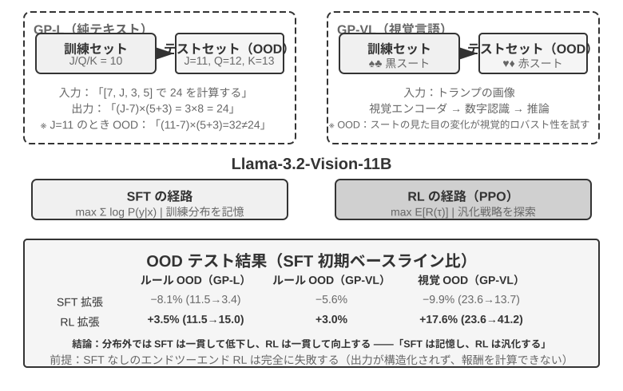
>
>
> GeneralPoints は Chu ら[^ch8-3]が提出した算術思考のカードゲームで、モデルの汎化能力の評価に特化しています。タスクの目標は「24 点」ゲームに似ています。4 枚のカードの数字を使い、加減乗除の演算で、各数字をちょうど一度ずつ使い、目標の数字 24 を作ります。実験は純テキストの GP-L と画像の GP-VL の 2 つのバリアントを設計し、同じ枠組みのもとで規則の汎化と視覚の汎化をそれぞれ考察できるようにしました。
>
> **規則バリアント**：訓練時は J/Q/K をすべて 10 と数え、テスト時はそれぞれ 11/12/13 と数え、テストセットに訓練で見ていない数字の組み合わせ（11、12、13 を含む演算）が現れることを保証し、汎化能力を厳格に評価します。**視覚バリアント**：訓練は黒のスート（♠♣）、テストは赤のスート（♥♦）を使い、視覚的外観の変化下でのロバスト性を評価します。Llama-3.2-Vision-11B をベースに、標準的なポストトレーニングの流れに従います。まず SFT で初期化して基本的な指示遵守能力を持たせ、次に同じ計算予算のもとで SFT と RL の訓練をそれぞれ拡張し（RL 部分は価値ネットワーク付きの PPO アルゴリズムを採用）、単一の規則（J/Q/K=10）データで訓練し、分布内（ID）と分布外（OOD）のテストセットで評価します。
>
> 結果は根本的な違いを明快に明らかにします。**規則 OOD**：RL は GP-L で +3.5%（11.5%→15.0%）、SFT は 8.1% **低下**（11.5%→3.4%）。GP-VL では RL +3.0%、SFT は 5.6% 低下。**視覚 OOD**：RL は GP-VL で **+17.6%**（23.6%→41.2%）、SFT は 9.9% 低下（23.6%→13.7%）。
>
> 視覚認識の正確率を追跡すると次のことが分かりました。RL は結果志向の最適化を通じて低層の視覚エンコーダを改善し、この改善は全体の性能向上と高度に相関していました。一方 SFT は思考過程の中の token パターンに過度に適合し、視覚 token の学習を疎かにし、認識正確率がむしろ低下しました。
>
> 実験はまた SFT の RL に対する必要性も明らかにしました。本実験の設定のもとでは（Llama-3.2-Vision-11B というクラスの基礎モデルに、厳格な構造化出力の要求を加えたもの）、SFT を経ずに直接エンドツーエンドの RL をするとまったく失敗しました。基礎モデルが構造化出力を生み出せず、報酬がそもそも計算できないのです。これは特定の設定下の結論であって普遍的な法則ではない点に注意してください。十分に強い基礎モデルは SFT を飛ばして直接 RL で成功できます（前文の DeepSeek-R1-Zero に関する議論を参照）。もう一つ注目に値する発見は、検証の反復回数が多いほど汎化が良くなることです。10 回で +5.99% 対 1 回で +0.48% であり、思考時の計算の拡張が RL の汎化の鍵であることを示しています。
>
> なぜ SFT は分布シフト下で性能が崩壊し、RL はむしろ良いのでしょうか。SFT が学ぶのは「この種の入力を見たら、あの種の答えを出す」という写像です。訓練時は J/Q/K がすべて 10 なので、モデルは「J/Q/K に遭遇したら 10 として使う」という固定パターンを覚えます。テスト時に J=11 になっても、モデルは相変わらず 10 で計算し、当然間違えます。RL が学ぶのは「どんな計算過程が正しい答えを得られるか」というより汎用的な方策です。J が 11 に変わると、RL モデルは同じ方策で計算し直し、記憶の中の答えを当てはめません。これが「記憶」と「汎化」の本質的な違いです。
>
> 本実験の核となる貢献は「SFT は記憶、RL は汎化」現象を系統的に定量化したことにあり、この法則が純言語と視覚-言語の 2 つのモダリティのいずれでも成立することを証明し、SFT と RL の協働関係を明らかにしました。SFT が形式の安定性を提供し、RL がその基盤の上で記憶の境界を突破する、両者は一つも欠かせません。この「先形後神」の訓練パラダイム――中国画の用語を借りて、まず外在的な形態（形式、構造）を正しく描き、次に内在的な神韻（汎化、方策）を追求する――は、後続のマルチターン、マルチモーダルのタスクに方法論的な基礎を据えました。

## RL アルゴリズム：16 回の rollout から 1 回のパラメータ更新へ

**GRPO（Group Relative Policy Optimization）**は DeepSeek が提案した、今日の RL 訓練で最もよく使われるアルゴリズムの一つです。一つの例を使うと直感的に理解できます。SWE-bench に次のタスクがあるとします。ある Python プロジェクトの `parser.py` が空入力で `IndexError` を投げるので、Agent はテストを変更せずにコードを修正しなければならない。訓練システムは以下の 4 ステップを踏みます。

**第 1 ステップ：方策モデルに繰り返し挑戦させる。** 方策モデルとは、いま訓練しているその言語モデルのことです。システムは同じ初期コードと同じ問題記述を、互いに隔離された 16 個のサンドボックスへコピーし、モデルに 16 回独立に解かせます。各回は「コードを読む → ファイルを修正する → テストを実行する → 結果を提出する」という一連の流れを丸ごと含み、この過程全体を一度の **rollout** と呼びます。問題も初期環境もまったく同じですが、サンプリングには確率的な揺らぎがあるため、16 回の試行は異なる経路をたどりえます。境界チェックを正しく補うもの、例外を捕捉して問題を覆い隠すだけのもの、間違ったファイルを直すもの、テストを書き換えようとするものなどです。

**第 2 ステップ：報酬を計算する。** 各 rollout が終わると、検証器はクリーンな環境でパッチを適用し、テストを実行します。16 回のうち 4 回がテストファイルに手を触れずに全テストを通過し、残り 12 回が失敗したとすれば、前者 4 本には報酬 1、後者 12 本には報酬 0 が与えられます。このようなコーディング課題では「報酬計算」に不思議な要素はなく、テストとルールでこの修正が本当に正しいかを判定しているだけです。確定的なテストがない開放的な課題になって初めて、人間の選好や報酬モデルによる評価が必要になります。

**第 3 ステップ：相対アドバンテージを計算する。** 報酬が語るのは、その 1 本の軌跡が成功したか失敗したかだけです。**相対アドバンテージ**は、同じグループの他の試行と比べてどれだけ良いかを語ります。このグループの平均成功率は 4/16 です。テストを通った 4 本はグループ平均より上なので正のアドバンテージを、失敗した 12 本は平均より下なので負のアドバンテージを得ます。この group 内比較こそが GRPO の核心です。16 本すべてが失敗した場合、あるいはすべて成功した場合は、報酬がまったく同じで優劣を比べようがなく、相対アドバンテージも消えてしまいます。RLVP の経路信号、プロセス報酬、部分的な進捗報酬は、まさにそうしたグループの中で意味のある差をどう取り戻すかという問題を解くためのものです。

**第 4 ステップ：勾配降下で方策を更新する。** 訓練プログラムは相対アドバンテージを訓練損失に変換し、勾配を計算し、オプティマイザ（AdamW や Muon など）が勾配降下を実行して、正のアドバンテージを持つ軌跡でモデルが取った選択の確率を上げ、負のアドバンテージの軌跡での選択の確率を下げます。これは成功したパッチをそのまま丸暗記するのではなく、多数のタスクと rollout にわたって少しずつ調整していく作業です。その結果、あとで似たバグに出会ったときには「まず問題を再現し、境界条件を確認し、実装を直してテストを走らせる」が現れやすくなり、「例外を握りつぶす、テストを書き換える、検証せずに提出する」が現れにくくなります。

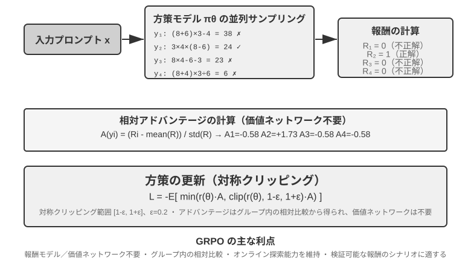

この 4 ステップを合わせて一度の**訓練イテレーション**、すなわち 1 **step** になります。第 $k$ step では現在の方策で一群の rollout を生成し、報酬・アドバンテージ・勾配の計算を終え、オプティマイザがパラメータを更新します。第 $k+1$ step はただちに更新後の方策で改めて rollout します。100 steps 訓練するとは、この閉ループを約 100 周繰り返すことです。個々の RL 訓練フレームワークは内部の複数のミニバッチ更新を別勘定にしていることがあるので、訓練ログを見るときはその `step` の定義を確認する必要があります。

大まかな時間見積もりをしてみましょう。複雑な Agent の rollout は数十ターンのツール呼び出しを生成し、16 本を並列に走らせても、rollout 段階の実時間は最も遅い 1 本で決まります。最も遅い rollout に約 2,000 秒、続く勾配降下とオプティマイザ更新に約 600 秒かかるとすると、1 step はおよそ $2{,}000+600=2{,}600$ 秒、約 43 分です。100 steps 連続で訓練すれば 72 時間近くになります。

PPO と GRPO はどちらもこの閉ループに従い、違いは主に**何と比較するか**にあります。GRPO は同じ問題に対する複数の rollout を直接比較するので、別途の価値モデルを必要としません。PPO は価値モデルを訓練し、軌跡の各ステップで「普通ならどれくらいうまくやれるか」を推定したうえで、いまの行動がその期待を上回っているかを判断します。そのため、きめ細かい信用割当を要する長い軌跡に向いています。どちらも 1 回の更新幅を制限し、少数のサンプルでモデルが急に変わりすぎないようにします。DPO は異なります。あらかじめ収集した「良い回答—悪い回答」の選好ペアから直接学習し、現在の方策にこの一群の rollout をオンラインで生成させることはありません。

本章の事例では、AdaptThink が独自の制約付き目的関数を、GeneralPoints と V-IRL が価値モデル付きの PPO を、SimpleVLA-RL と RLVP が GRPO を、ReTool が PPO を使っています。アルゴリズムは軌跡をどう比較しパラメータをどう更新するかを決め、報酬は「何を成功と見なすか」を決め、環境とデータはモデルがどんな問題を経験できるかを決めます。

### LLM RL で通常 On-Policy を優先する理由

**Online** は学習中に環境からデータを生成し続けること、**on-policy** は rollout の行動方策 $\mu$ が現在最適化する $\pi_\theta$ と同一または十分近いことです。非同期 worker が数 checkpoint 遅れていれば online でも off-policy です。別の方策からサンプルしたデータには重要度比が必要です。

$$
\rho_t=\frac{\pi_\theta(a_t\mid s_t)}{\mu(a_t\mid s_t)}
=\exp\!\left(\log\pi_\theta(a_t\mid s_t)-\log\mu(a_t\mid s_t)\right).
$$

新鮮な on-policy rollout は更新前に $\rho_t=1$ なので、現在のモデルが実際に訪れる状態で学び、分布ずれの高分散な補正を避けられます。Off-policy は古いデータの再利用と非同期化で高いスループットを得ますが、長い自己回帰系列では小さな token 比のずれが累積します。PPO clipping は外れた更新を抑えても、失われた分布被覆を復元できません。したがって on-policy は普遍的に優れるのではなく、現在の LLM 方策勾配で一般に**分布バイアスが小さく最適化が安定する**という意味です[^ch8-32]。

#### 数値誤差が見かけ上の On-Policy を壊す

rollout を vLLM／SGLang、勾配計算を FSDP／Megatron で行うと、重みが同じでも精度、reduction 順序、tensor parallel、batch size、KV cache、fused kernel の差で同じ token の log probability がずれます。更新前から $\rho_t\ne1$ となり、名目上の on-policy が数値的には off-policy になります。微小な token 単位差だけで学習が崩壊しうることも報告されています[^ch8-33]。

増幅は **log probability の微差 → 指数化された比率 → 長い prefix での累積 → clipping／advantage 重みの変化 → 勾配と有効サンプル数の変化**という順です。4,000 token の log ratio が同方向に $10^{-3}$ ずれるだけで、軌跡比は $e^4\approx54.6$ になります。batch size による reduction の違いが batch invariance を壊す問題もあります[^ch8-34]。

更新前に sampler と trainer の token log probability を比較し、$\rho_t$ の平均・分位点・最大値、近似 KL、clip 率を監視してください。重みだけでなく LoRA、tokenizer、chat template、revision、位置設定も同期し、生成時の behavior log probability を保存します。数値経路を揃えられないなら明示的に off-policy とみなし、重要度補正と有効サンプル数を監視し、rollout の stale 化と同一 batch の更新回数を制限します。

## RL 環境：評価からシミュレーションへ

RL 訓練のボトルネックは、多くの場合アルゴリズムではなく、**環境が十分に本物らしく、リセット可能で、並列化できるか**にあります。実際の Agent がかける電話、行う支払い、書き換えるファイルは高くつくうえに取り返しがつかず、一度の誤りを無限のリトライで埋め合わせることはできません。第 7 章の評価環境は検証器を提供できますが、訓練ではさらに、Agent に何度も試行錯誤させ、行動の副作用を引き受けさせ、数百万回の相互作用にわたって安定を保たせる必要があります。したがって環境工学は RL の前提条件であり、訓練が終わったあとの付属物ではありません。

### 環境：モデルが練習する場

RL の本質は「試行錯誤による学習」であり、試行錯誤には**それを行う場**が要ります。それがシミュレーション環境です。モデルはその中で何度もタスクを走らせ、フィードバックを受け取り、方策を調整します。環境の**忠実度**、つまり実際のデプロイ環境にどれだけ似ているかが、訓練で得られる方策が使い物になるかどうかを直接決めます。

- **環境が歪んでいれば、方策は必ず無駄になる。** シミュレーション中の顧客がいつも決まった台本で応答し、エラーメッセージが本番環境と食い違っていれば、モデルはシミュレーションの中でだけ通用する「受験テクニック」を学び、本番に出た瞬間に馬脚を現します。これは RL プロジェクトが失敗する最も一般的な形です。アルゴリズムが悪いのではなく、練習場と試験会場が別物なのです。
- **高忠実度の環境を作ることは、しばしば訓練そのものより高くつき、難しい。** 大規模に並列化でき、再現性があり、フィードバックが本物らしい環境には、モデルを調整するよりはるかに大きな工学的投資が必要になることが多いのです。本章で後述するツール呼び出しの実験（AWorld の MCP サンドボックス、ReTool のコードインタプリタ・サンドボックス）が環境構築に大きな労力を割いているのは、まさに**実際の API にはレート制限があり、アカウントが凍結されることがあり、副作用があるため、そのまま訓練に使うことができない**からです。まず安定して制御可能で再生可能な「影の世界」を作らなければなりません。
- **環境のもう半分は報酬関数である。** 環境は「世界がどう変わるか」をシミュレートするだけでなく、「うまくやれたかどうか」を判定できなければなりません。これが後述する報酬設計の入力になります。

一言でいえば、**アルゴリズムをいじり始める前に、自分のシミュレーション環境は本当に現実世界に似ているかを自問してください。** この問いの答えは、PPO と GRPO のどちらを選ぶかよりはるかに重要です。

### 環境が作れないときは：モデルに環境を演じさせる

しかし、さらに根本的な問題があります。多くの場面で、高忠実度の環境は「高い」のではなく、**そもそも作れない**のです。実際の API には副作用があってむやみに叩けず、実際のユーザーを試行錯誤の相手にはできず、物理世界は早送りできません。使える「影の世界」すら立ち上げられないなら、RL は諦めるしかないのでしょうか。ますます主流になりつつある発想が、**モデルで環境をシミュレートする**というものです。LLM に環境を演じさせ、Agent の相互作用に必要なフィードバックを生成させます。この路線には 2 つの層があります。

**第 1 の層：モデルがツール呼び出しの戻り値を合成する。** ZeroSearch[^ch8-13]を例に取りましょう。「検索できるモデル」を訓練するには普通、実際の検索エンジンが欠かせませんが、検索 API にはコストとレート制限があり、返ってくる結果も制御できません。ZeroSearch はいっそ LLM に検索エンジンを演じさせます。学生モデルが検索クエリを発行すると、この「模擬エンジン」が検索結果を生成して返すのです。さらに巧妙なことに、**カリキュラム型**の設計を採っています。訓練初期には模擬エンジンが高品質で関連性の強い文書を返し、訓練が進むにつれて徐々にノイズを混ぜ、返却品質を下げていきます。こうして、実際の検索エンジンが返すような不完全な結果から有用な情報を取り出すことを学生に強います。最終的に、訓練中ずっと実際の検索エンジンを見たことのないモデルが、本物の検索に接続してもなお良好に振る舞います。

**第 2 の層：モデルが環境全体のダイナミクスをシミュレートする。** 個々のツールの戻り値だけでなく、「行動を実行したあと世界がどうなるか」までモデルに任せられます。DreamGym[^ch8-14]は環境のダイナミクスを推論型の「経験モデル」へ蒸留します。現在の状態と Agent の行動が与えられると、状態遷移とフィードバック信号を段階的に推論し、実環境にアクセスせずにオンライン RL 用の rollout を大量に合成できます。カスタマーサポートや営業系の Agent の訓練では LLM にユーザーを演じさせる（ユーザーシミュレータ）のが一般的で、τ-bench 系列の評価はまさにこの発想の上に成り立っています。同じモデルシミュレータが、試験会場にも練習場にもなるわけです。

ただし、この路線のリスクははっきり述べておく必要があります。**シミュレータの世界知識が訓練の天井であり、シミュレータの系統的な偏りは方策にそのまま受け継がれます。** 模擬された顧客が実際のユーザーより辛抱強かったり、模擬された検索エンジンが決してゴミを返さなかったりすれば、学生が学ぶのは「モデルが演じる世界」でしか成り立たない方策です。さらに悪いことに、RL はシミュレータの穴を能動的に探して突き、reward hacking を行います。したがって工学的に堅実なやり方は**ハイブリッド**です。相互作用の大部分はモデルによるシミュレーションに担わせ、実環境との相互作用で補い、その実環境の相互作用でシミュレータの偏りを定期的に較正します。

### 環境、タスク分布、評価の分離

環境そのものが RL の学べる範囲を決めます。リセット可能で、並列化でき、再現性があり、状態遷移のあとに信頼できる検証結果を返せなければなりません。訓練タスクの出所は前述の SFT データ合成と同じで、実際の業務ログからタスクの設計図を抽出し、個人情報を除去したうえで架空の人物・注文・ファイル・状態を生成し直します。

分離の要件も同じですが、RL の場面ではもう一つ加わります。訓練環境と評価環境は、タスク生成器と検証コードを共有してよいものの、同じタスク群を共有してはいけません。SWE-Gym、τ²-bench、AndroidWorld はいずれもこの点を示しています[^ch8-28]。テストケース、隠し状態、参照解法は検証器の側に留めるべきです。加えて、まず少量の rollout で「タスクが達成可能か、検証器が正誤を区別できるか」を確認し、そのうえでサンプリング規模を広げるべきです。検証器そのものに系統的な偏りがあれば、RL はそれをより速く突くだけです。

したがって、環境工学の順序はこうなります。**タスクの設計図 → リセット可能なシミュレータ → 決定的な検証器 → 訓練／評価の分離 → 少量の実相互作用による較正**。SFT データ合成を前に置いたのは安定した示範を作るためであり、ここでの環境は RL に奉仕し、現在の方策に繰り返し試行錯誤させ、示範の外側の経路を探索させます。

決定的な検証器が「安い」ことは「コストがない」ことを意味しません。Lean のカーネル、テストランナー、コンテナ実行は、CPU での検証速度を GPU の生成速度よりはるかに遅くしうるからです。そのとき、スループットを決めるのは並列に走る検証器ワーカーの数であって、GPU を積み増すことではありません[^ch8-9]。

## シングルターンからマルチターンへ：タスク場面と信用割当

### マルチターンタスクの中心的な難しさ

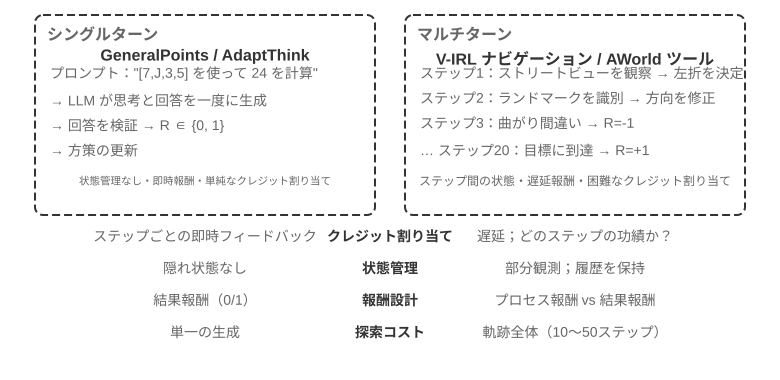

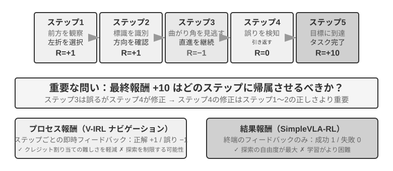

シングルターンからマルチターンへ移ると、複雑さは質的に跳ね上がります。方策はいま最適な行動を選ぶだけでなく、将来の状態価値も考えなければなりません。即時のフィードバックを扱うだけでなく、遅延報酬のもとで**信用割当（Credit Assignment）**を行い、多段のシーケンスのどのステップが最終結果に最も寄与したのかを判断しなければなりません。たとえば、カスタマーサポートの Agent が 10 ターンの対話でユーザーの問題を解決し、最終的に高評価を得たとします。その高評価は、第 2 ターンの的確な質問の手柄なのか、それとも第 7 ターンの辛抱強い説明の手柄なのでしょうか。

ここで論じているマルチターンの相互作用は、第 1 章と第 4 章で述べた ReAct ループそのものです。各ターンが一度の**思考 → 行動 → 観察**の反復であり、報酬の遅延は「最終結果の良し悪しは何ターンも後にならないと判定できない」という構造的な制約から来ています。

> **実験 8-12 ★★★：V-IRL-VL——マルチターン視覚ナビゲーション**
>
> V-IRL[^ch8-24]は、実際の都市の街並みの中で Agent に連続的にナビゲーションさせます。訓練にはニューヨークの経路を使い、テストでは別の都市へ転移させたうえで、方向の表現と視覚的な見え方を同時に変えます。RL はルール OOD でも視覚 OOD でも SFT を明確に上回り、マルチターンタスクでは方策が訓練軌跡を再現するのではなく、現在の観測に基づいて計画を立て直すことを学ぶ必要があると示しています。実験は価値ネットワーク付きの PPO を用い、逐次的なフィードバックが長時系列の信用割当を緩和することが観察されています。

> **実験 8-13 ★★★：SimpleVLA-RL——結果報酬のもとでの開放的探索 `[拡張実験]`**
>
> SimpleVLA-RL は LIBERO のロボットタスクで成功／失敗の結果報酬だけを使います。各タスクにつきわずか 1 本の実演軌跡で SFT のコールドスタートを行い、その後 RL が成功率を 17.3% から 91.7% へ引き上げ、実演には現れなかった「押し切り」動作を発見しました。V-IRL と対照的です。プロセス信号を定義しやすいときにはそれが学習を加速しますが、最適経路が未知のときは、疎な結果報酬のほうがかえって広い探索余地を残します。

### ツール呼び出し：環境を Agent の中に持ち込む

マルチターンタスクが外部ツールにつながると、行動はもはや「移動するか答えるか」ではなく、検索する、コードを実行する、ファイルを書き換える、データベースを問い合わせる、複数の API を組み合わせる、といったものになります。そのためツール呼び出しは、信用割当・環境工学・安全制約を同時に前面へ押し出します。


Search-R1[^ch8-25]は検索拡張の路線を代表します。モデルはいつ何を検索するかを自分で決め、返ってきた結果を使って推論を続けます。ReTool はコードインタプリタを思考ループの中に埋め込み、モデルはいつコードを実行するか、フィードバックをどう読むか、エラーからどう修正するかを学ばなければなりません。AWorld-train は MCP のマルチツール・サンドボックスを提供し、さらにツール選択、依存関係の管理、状態のリセット、再生可能性といった問題を持ち込みます。

ツールを含む軌跡には、実装上の重要な細部があります。環境が返すトークンは方策が生成したものではないので、方策勾配を計算するときにはこれらのフィードバック・トークンをマスクし、モデル自身の思考とツール呼び出しの引数にだけ勾配を伝えるべきです。そうしなければ、モデルはツールの使い方を学ぶかわりに、サンドボックスの出力を予測するよう訓練されてしまいます。

> **実験 8-14 ★★★：ReTool——コードインタプリタで強化する数学解法**
>
> 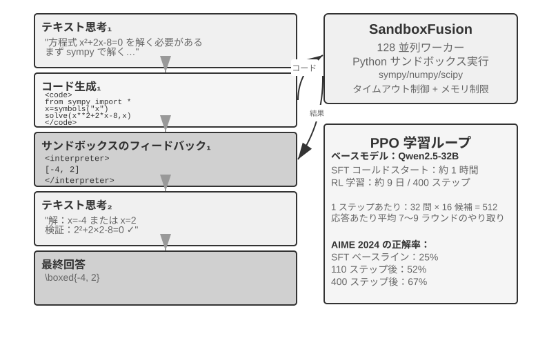
>
> ReTool は SFT のウォームアップののち、テキストによる思考・コード実行・インタプリタのフィードバックを織り交ぜて PPO で訓練します。ツールのフィードバックが思考戦略をどう変えるかを示しており、モデルは次第に自分から実行し、エラーを読み、自己修正するようになります。訓練データは DAPO-Math-17k から取っていますが、最適化アルゴリズムは標準的な PPO のままです[^ch8-26][^ch8-27]。
>
> AIME 2024 では、訓練によって約 25% から 67.0% へ向上しました。純粋なテキストの RL に比べ、コードのフィードバックはモデルが正確な計算と誤りの訂正を学ぶのを速めました。詳細な訓練ダイナミクスとサンドボックス設定は、実験に付属する説明を参照してください。

> **実験 8-15 ★★★：AWorld-train——サンドボックスの中でツールの使い方を学ぶ**
>
> 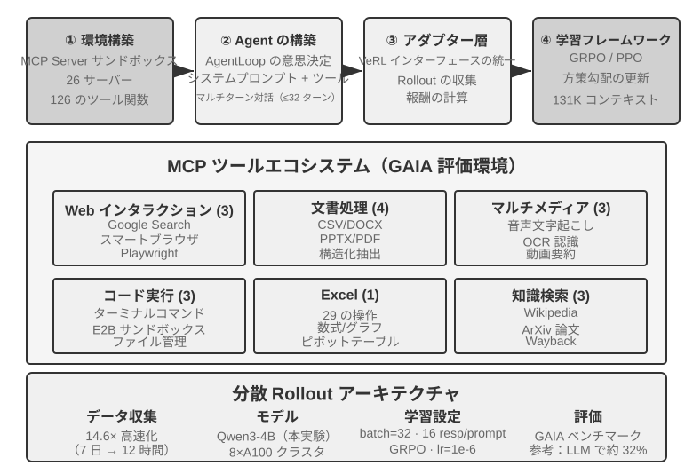
>
> AWorld-train は MCP サーバのサンドボックスを用い、Web・ドキュメント・マルチメディア・コード・知識検索などのツールを提供します。この開放的な実験の主眼は GAIA の指標を塗り替えることではなく、リセット可能で再生可能なマルチツール訓練の経路を最後まで動かし切り、ツール呼び出しの成功率と組み合わせ戦略が訓練とともに改善するかを観察することにあります。

これらの場面が共通して示すのは次のことです。マルチターン Agent の訓練の難しさは「より複雑なオプティマイザがあるかどうか」ではなく、環境のフィードバックが信頼できるか、行動の連鎖が検証可能か、そして最終的な報酬を中間の判断にどう帰属させるかにあります。

## 報酬設計：タスク目標を学習信号に変える

ここまでのシングルターン、マルチターン、ツール呼び出しの各シナリオは「何を訓練するか」を示してきた。本節が答えるのは「環境はモデルに出来の良し悪しをどう伝えるべきか」である。報酬設計は三つの補完的な軸で展開できる。**報酬はどこから来るか**、**いつ与えるか**、**どれだけの情報を表現すべきか**。最後にもう一つ、結果が正しいとき経路も規定どおりだったか、という問いを扱う。

### 報酬はどこから来るか：ルール・人間の選好・モデルによる判定

最も信頼できる源は**検証可能報酬（RLVR）**である。テストケース、データベースのアサーション、状態差分、フォーマット検査によって結果を直接判定する。数学の答え、コードのテスト、構造化されたツール呼び出しは、いずれも二値の結果報酬から始めるのに適している。ルールが確定的であるほど報酬は安価で再現可能になり、モデルに抜け道を突かれにくくなる。

**RLHF** は背景としてのみ触れる。InstructGPT[^ch8-4]の基本的な流れは、人手で回答を比較し、報酬モデルを訓練し、PPO で方策を最適化するというものだ。報酬モデルは選好の代理にすぎず、過度に最適化すると reward hacking[^ch8-5]を招く。そのため通常は KL 正則化で方策を SFT 参照モデルの近くに固定する。DPO[^ch8-6]は明示的な報酬モデルを省き、選好ペアから直接オフラインで最適化する。これらは本章の Agent RL の主線ではない。

目標を完全にルール化できない場合は、モデルによる判定が使える。**生成的報酬モデル（GRM）**はスコアだけでなく「どこが良く、どこを直すべきか」という診断も生成する。報酬源として使えるほか、診断を後続の蒸留データや選好データに変換することもできる。DeepSeek-GRM[^ch8-23]の核となる発想は、モデルにまずタスクの評価原則を帰納させ、その原則に沿って軌跡を評価させ、最後に検証可能な事実で評価自体の正しさを確かめる、というものだ。得られるフィードバックはより透明だが、判定器が新たな偏りを持たないよう、抽出による人手の較正は依然として必要である。

ここで混同しやすい二つの概念を区別しておきたい。**reward hacking** はルールや実装の穴を突いて高得点を取ることである。**reward seeking** は、モデルがまず「判定器は何を見るか」という像を内部に作り、その推測に合わせて振る舞いを調整することを指す。後者はテストの改竄や結果の捏造を伴うとは限らないが、長期タスクでは自ら浅い検査を設定し、それを通った時点で早々に終了してしまい、成果物が代理指標だけを満たして本来の意図を満たさない、という事態を招きうる[^ch8-29]。したがって「grader を通った」ことは自動的に「タスクが完了した」ことにはならない。判定器は意図の代理であり、訓練が強くなるほどモデルは代理そのものを目標と見なしやすくなる。

### 報酬をいつ与えるか：結果か過程か

**結果報酬（ORM）**はエピソード終了時にタスクが完了したかどうかだけを判定する。最も単純であり、方策に最大の探索の自由を与える。中間経路に定まった基準がなく、最適解が人間にもまだ見つかっていない場合、SimpleVLA-RL の疎な成功／失敗報酬が適切な出発点になる。疎なフィードバックでは、多段の軌跡のどこが具体的に誤りだったかをモデルが判断しにくく、これは RL のサンプル効率が長らく制限されてきた理由の一つでもある[^ch8-8]。長期の coding や cowork タスクでは、「完了したか」の判定をモデルが書けない隠しテスト、状態アサーション、外部の終了フックに委ねるべきであり、モデル自身の完了宣言だけに頼ってはならない。

「早すぎる終了」は具体例の一つである。モデルが完了を宣言した時点で、Harness は隔離されたワークスペースでモデルからは見えない受け入れテストを実行する。通れば正の報酬、通らなければ負の報酬を与える。テストは実ファイルや環境の状態を読まなければならず、モデルが「完了しました」と言ったかどうかを確認するだけでは、検証を口約束して実際には行わない振る舞いを学習してしまう。評価時には、タスクが未完了の境界集合と、実際に完了済みの保留集合を分けておく。前者では早期終了率を、後者ではモデルが依然として正常に締めくくれるかを観察し、決して終了できないモデルに訓練してしまう事態を避ける。

**過程報酬（PRM）**は中間ステップでフィードバックを与える。認証、ツール引数、通過したテスト数、ナビゲーション動作などを検査する。OpenAI の『Let's Verify Step by Step』[^ch8-7]は、数学的推論における逐次検証の価値を示した。過程報酬は長時間スケールのクレジット割り当てを緩和するが、設計者が想定した経路にモデルを縛りかねず、ラベル付けと検証のコストも高い。V-IRL-VL（実験 8-12）は逐次的なナビゲーションフィードバックを採用し、SimpleVLA-RL（実験 8-13）は終点報酬のみを残す。両者は「密なフィードバックで収束速度を買い、疎なフィードバックで探索空間を買う」という対照をなしている。

工学的には、まず結果報酬で信頼できるベースラインを作り、その上で本当に検証可能な中間イベントにだけ過程信号を加えるとよい。マルチターンの LLM RL では通常、割引率を $\gamma=1$ とする。PPO の価値ネットワークやターン単位のアドバンテージが終点のフィードバックを早い段階の行動に帰属させ、GRPO は軌跡単位のアドバンテージを生成トークンに均等配分するため、長い軌跡では信号の希釈に特に注意が必要である。

### 報酬はどれだけの情報を表現すべきか：スカラー・ベクトル・生成的診断

報酬の**密度**と**表現形式**は別の話である。スカラーは「全体としてどれだけ良いか」にしか答えない。半スカラーは短い理由を述べてからスコアを出す。ベクトルは正確性・網羅性・コスト・安全性といった次元ごとに採点する。生成的報酬は自然言語の診断を与え、複数回サンプリングして集約できる。選択の原則は単純である。

- 確定した答えやテストがある場合：二値スカラーを優先する；
- 互いに独立した品質目標が複数ある場合：ベクトルを使うか、各次元を重み付けしてスカラーにまとめる；
- 開放的でルールを列挙しきれない場合：生成的診断を使う。ただし事実照合と人手の抜き取り検査を併用する。

「報酬をより豊かに」という理由で検証不能な次元を積み上げてはならない。評価次元を一つ増やすたびに、方策に突かれる抜け道が一つ増える。まずその信号が少数の rollout で意味のあるグループ内差を生むことを確かめ、それから訓練に加えるかどうかを決めるべきである。

### 結果が正しいだけでは足りない：経路制約と RLVP

結果報酬は「事が成ったか」を解決するが、「規定どおりに成したか」は表現できない。実際の Agent は、テストファイルを書き換える、認証を飛ばす、破壊的なコマンドを実行するといった手段で表面的な成功を得ることがある。RLVP（Reinforcement Learning with Verified Penalty）[^ch8-9]の原則は、**結果に報酬を、経路に罰を**である。対象となるのは機械的に判定でき、最終的な成否とは無関係な**結果中立な制約**であり、意味的な意図、成果物の完全性、早期終了の振る舞いに対する独立した検査を置き換えるものではない。

実環境は通常**非対称な検証器**である。「悪い動作をした」ことの検出は安価で信頼できるが、「この一歩が目標に向けて意味のある前進をもたらした」ことの証明は難しい。総報酬を $R=O+\beta\Phi$ と書く。$O$ はタスクの結果、$\Phi$ は確定的なルールによって動作ごとに計算される経路信号である。検証可能な違反動作には減点し、検証可能な合規動作や到達可能なサブゴールには少量の部分報酬を与える。二つの経路は正規化してから統合し、経路信号が主目標を飲み込まないようにする。PPO や GRPO そのものは変えず、各ステップで見える報酬だけを変える。

実装面では、まず検証器の出力を二系統に分け、既存の方策最適化器に渡せばよい。

```python
outcome = verify_final_state(trajectory)              # result, not self-report
path_signal = 0
for step in trajectory:
    path_signal += deterministic_path_signal(step)    # penalty or reachable progress
reward = normalize(outcome) + beta * normalize(path_signal)
```

経路信号における許可動作、到達可能なサブゴール、隠しテスト、証拠の記録は具体的な環境に依存する。本文は「結果報酬」と「経路制約」がどう合流するかだけを述べ、ある環境のルールを汎用アルゴリズムと取り違えないようにしている。

RLVP の要点は「報酬は密なほど良い」ではなく、グループ内差を取り戻せるかどうかである。純粋な結果報酬は、全敗のグループでも全勝のグループでも分散がゼロになり勾配が生まれない。違反動作は通常検出しやすいため、罰はほぼ常に差を取り戻せる。前進報酬は部分的な前進が到達可能なときにのみ有効である。設計では四点を守るとよい。具体的な動作だけを罰し、「努力が足りない」ことを罰しない。結果報酬は常に残し、モデルが何もしないことを学ばないようにする。各々の罰にはできる限り到達可能な合規経路を対応させる。ルールは確定的で、抜け道を突かれにくいものにする。もし基礎方策が合規動作をそもそもサンプリングしないなら、少量のデモンストレーションでその経路を先に「植えて」おき、合規行動が安定してから経路シェーピングを徐々に弱める。言い換えれば、罰は通常到達可能な側の半分であり、前進報酬は到達可能性に条件づけられた半分である。

> **実験 8-16 ★★★：RLVP——結果に報酬を、経路に罰を**
>
> GRPO に結果報酬 $O$ と経路信号 $\Phi$ を加え、純粋な結果報酬と比較する。TerminalBench では違反回数が 3.71 から 0.66 に減る一方、成功率はほぼ横ばいだった。miniF2F では到達可能な部分報酬により、成功率 0.9 に達するまでの反復が 7.0 から 4.4 に減少した。ソフトウェア修復ではすべての rollout がどのテストも通らないため前進信号が到達不能であり、加えても利得はない。この実験が示す教訓は、報酬次元を増やすかどうかを決める前に、まず信号の到達可能性を測れ、ということである。

これらの数値は制御された代理環境から得られたものであり、本番 Agent の同等の改善にそのまま外挿することはできない。より安全な結論は機構的なものである。経路信号が同一グループの rollout の中で振る舞いを区別でき、かつルールが方策に突かれにくい限り、終点報酬では見えない情報をちょうど補ってくれる。実運用ではさらに、隠し検証、軌跡の監視、外部の終了条件を harness に組み込む必要がある。

## 蒸留：サンプル効率を高める

これまでの実験は、Agent 訓練における RL の中心的な価値を体系的に示してきましたが、いずれも高いサンプルコストを払っています。ここでいう「サンプル効率」とは、**高くつく環境との相互作用 1 回が、どれだけ有効なパラメータ更新をもたらすか**という意味であり、単なる訓練ステップ数や GPU 時間のことではありません。ReTool の RL 訓練時間は SFT の 200 倍以上（9 日 対 1 時間）でした。だからこそ環境サンプリングを減らすことがとりわけ重要になります。

RL のサンプル効率が低いのは、分散が大きいことと on-policy データを再利用しにくいことに加え、より根本的にはフィードバックが疎すぎるからです。主流の model-free RL は通常、1 本の rollout が終わったときに成否のスカラーを一つ得るだけで、途中の誤りの理由、欠けたフィールド、手順のヒントには直接の学習信号がありません。カスタマーサポートが「クレジットカードの下 4 桁が必要です」と言っても、モデルは最終的な 0/1 の結果から試行錯誤するしかなく、そのステップにたどり着くのに数百回の相互作用を要するかもしれません。人間なら一度聞けば覚えられるのに、です。

**蒸留は一度の rollout を密な監督信号へ変えます。** 環境の軌跡をさらに探索しなくても、同じ 1 本の軌跡から大量の勾配を得られる――これが蒸留がサンプル効率を高める鍵です。

### On-Policy Distillation：一度の rollout から密な監督を生む

On-Policy Distillation（オンポリシー蒸留）は、2025 年に Thinking Machines Lab が体系化した手法です[^ch8-10]。ここで policy が表すのは、**学生が学ぶ状態 prefix を誰が生成するか**であって、監督を誰が供給するかではありません。

| 手法 | 軌跡／状態をサンプルする主体 | 主な監督 |
| --- | --- | --- |
| SFT／off-policy distillation | 人間または教師 | ラベル回答の密な token 監督 |
| On-policy RL | 現在の学生 | 通常は疎な結果・過程報酬 |
| On-Policy Distillation | 現在の学生 | 学生 prefix 上の教師 token 分布 |

SFT は密ですが教師が訪れる状態に偏り、学生の初期ミス後の prefix を覆いません。RL は学生自身の状態分布に合いますが、末端の成否しかないことが多い。On-Policy Distillation は**学生が行き先を決め、教師が実際に到達した状態で次 token 全分布を与える**ことで両者を組み合わせます。学生が意味ある状態に入れないほど基盤能力が不足するなら、先に Mid-training または off-policy 示範が必要です。

数値的一致性も重要です。rollout engine が $\mu$ からサンプルし trainer が別の $\pi_\theta$ を計算すれば、PPO ratio を明示的に使わなくても状態はすでに off-policy です。更新前に sampler／trainer の log-probability 一致を検証すべきです。

On-Policy Distillation では、まず学生が自分の方策で軌跡を生成し、次により強い教師が、**学生が実際に通った各状態**で次の token の確率分布を与えます。こうして長さ $T$ の rollout は、もはや 0/1 の信号を一つ生むだけでなく、およそ $T$ 組の token 単位の監督を生みます。教師の推論が消費するのは計算であって、追加の環境相互作用ではありません。これにより SFT の分布のずれを避けつつ、RL の分散と試行回数を大きく減らせます。高価なサンプリング 1 回で「このステップをどう直すべきか」を学べるので、タスクの終了を待って成否から逆算する必要がありません。

具体的には、学生の予測分布を教師の分布に近づけ、通常は両者の **KL ダイバージェンス**を最小化します。たとえば学生が「まず API を照会し、次に戻り値を解析して……」と生成しているとき、教師はその位置で「照会」80%、「呼び出し」15%、残り 5% という分布を与えられます。最終的な成否という二値の報酬に比べ、token 単位の整合ははるかに密で分散の小さい学習信号を提供します。その代償は教師の推論コストであり、環境との相互作用が高価なときにとりわけ引き合います。

オンポリシー蒸留の基本的な擬似コードは次のとおりです。

```python
student_trajectory = rollout(student, task)
loss = 0
for state in student_trajectory:
    teacher_logits = teacher(state)
    loss += KL(student_logits(state), teacher_logits)
update_student(loss)
```

数学などのタスクでは、同等の性能に達するのに必要な訓練ステップ数は純粋な RL のおよそ **1/10** です。マルチターン Agent では成否の信号がより遅く、より疎になるため、教師の token 単位の分布が中間の判断を直接導けます。ただしその前提として、シミュレーション環境が十分に本物らしく、学生が探索する状態がデプロイ時の分布に近いことが必要です。そうでなければ、見慣れない偏った状態に対する教師の採点もまた信頼できません。

「密な信号は疎な信号に勝る」ということは、純粋な Agent の場面でも検証されています。筆者と共同研究者はかつて「時間感覚」のタスクで、DPO、4 種類の RL、そして On-Policy Distillation を比較しました。前者はそれぞれ、疎な報酬、目標のずれ、rollout の形の不一致、方策の崩壊という制約を受けました。凍結した Qwen3-32B を教師に切り替え、学生自身のマルチターン軌跡の上で token 単位に整合させたところ、訓練は滑らかに収束し、4 つの条件での通過率は同一由来の SFT ベースラインより 23〜47 パーセントポイント高くなりました[^ch8-11]。これは、ボトルネックが報酬関数の複雑さの不足ではなく、1 回の相互作用が提供する信号の密度の不足にあることが多いことを示しています。

### より強い教師がいないときは：On-Policy 自己蒸留

On-Policy Distillation の威力は教師から来ますが、そのために厳しい前提を背負い込みます。**学生より明らかに強い教師モデルが存在しなければならない**のです。多くの場面でこれは成り立ちません。垂直領域のモデルを訓練しようとしていて、既存のモデルの能力がどれも足りないなら、使える教師モデルはありません。より強い教師がいなければ、密な信号の恩恵は諦めるしかないのでしょうか。

巧妙な突破口が **On-Policy Self-Distillation（OPSD、オンポリシー自己蒸留）**[^ch8-15]です。**同じモデルが教師役と学生役を兼ねますが、見えているコンテキストが異なります。** 教師版は「特権情報」――模範解答や検証済みの正解――を見られます。学生版は問題そのものしか見られませんが、自分でサンプリングした軌跡の上で、教師版の token 単位の分布に整合します。答えを見ながら学生がいま歩いた経路を説明するのは、独力で探索するよりたいてい容易なので、1 本の rollout でも密な監督を生めるのです。

OPSD は、前段の擬似コードの制約付き変種として読めます。

```python
student_trajectory = rollout(model, task_without_answer)
loss = 0
for state in student_trajectory:
    privileged_state = add_verified_answer(state)
    teacher_logits = stop_gradient(model(privileged_state))
    loss += KL(model(state), teacher_logits)
update(model, loss + retention_regularizer)
```

`privileged_state` は訓練側でのみ構成でき、デプロイ時の Agent に漏らしてはいけません。`retention_regularizer` は保持セットやスタイル制約を表すものであり、特定の固定ハイパーパラメータではありません。訓練の流れでは、データの権限、答えのマスキング、忘却のリスクも確認しなければなりません。

RLVR と比べると、OPSD は報酬が自動的に検証できることを要求しません。特権情報は模範解答でも、人手の示範でも、領域のドキュメントでも構いません。これらの情報でより強い外部教師を代替しつつ、「on-policy サンプリング + token 単位の監督」というサンプル効率の利点を保ちます。ただし、無から新しい知識を生み出すわけではありません。答えを持っていてもモデルが過程を説明できないなら、自己蒸留に追加の信号はありません。素朴な OPSD はまた、モデルが元の思考スタイルを失う原因にもなりうるため、安定させるには追加の正則化が要ります[^ch8-16]。

## Bad case からポストトレーニングへ

この節は、第 7 章が残した問いに戻ります。本番の bad case をもとに構築した評価データセットを、どうやって本当にポストトレーニングの入力に変えるのか、という問いです。第 7 章の末尾では、評価環境と検証器をポストトレーニングの礎に喩えました。失敗帰因の記録、エンドツーエンドの回帰タスク、軌跡接頭部の回帰タスク、Rubric 採点は、それぞれ異なる訓練上の使い道に対応します。

表8-5 第 7 章の評価データセットから第 8 章の訓練での使い道への対応

| 第 7 章の評価データセット | 第 8 章の訓練での使い道 |
| --- | --- |
| エンドツーエンド回帰タスク（検証器付き） | RL の rollout タスクと検証可能報酬（RLVR）、棄却サンプリング（RFT）のサンプリングプール |
| 軌跡接頭部の回帰タスク | DPO の選好ペア、判断境界の SFT 示範、On-Policy Distillation の教師状態 |
| 失敗帰因の記録（最初の誤りステップと誤りの分類） | プロセス監督の負ラベル（PRM）、RLVP の経路ペナルティのルール源 |
| Rubric の多次元採点と人手のゴールドセット | ベクトル報酬の各次元、生成型報酬モデル（GRM）の訓練と較正のデータ |

### 事例 1：Coding Agent の早すぎる完了宣言

**bad case から帰因へ。** Coding Agent で最もよくあり、最も根治しにくい失敗の一つが**早すぎる完了宣言**です。テストも走らせずに「完了しました」と宣言する。ユーザーが 3 つの機能の修正を求めたのに、2 つ直した時点で切り上げる。2 回失敗しただけで「このタスクは達成不可能です」と宣言する。第 7 章の誤り分類でいえば「タスク達成度と論理判断の問題」に当たり、本番側の 3 種類の信号がいずれもこれを捕捉します。ユーザーの訂正（「テストをまったく走らせていない」）、低評価、事後監査（完了を宣言した軌跡の中にテストのツール呼び出しが一つもない）です。帰因の記録は、最初の誤りを「完了を宣言しようとしている」判断境界に位置づけます。そこまでのコードの読み書きは誤っていなかったかもしれず、誤っていたのは「証拠がないまま結論を出す」というステップなのです。前述の報酬設計の節で論じた reward seeking――ごく浅いチェックを自分で設定し、それをちょうど通ったところで早めに終える――が、まさにこの種の行動を指しています。

**訓練データを構成する。** エンドツーエンドの回帰タスク：「完了を宣言する前に受け入れテストを通さなければならない」を検証可能報酬として書きます。テストはモデルからは見えず、モデルが完了を宣言したときに初めて実行され、通れば +1、通らなければ −1 とします。これは「判定はモデルには書けない隠しテストに委ねる」（前述の報酬設計を参照）の直接の応用であり、この事例における任意の RL 分岐でもあります。

軌跡接頭部の回帰タスク：「完了を宣言しようとしている」判断境界を切り出して**選好ペア**を構成します。rejected は早すぎる完了という誤った行動、chosen は「先にテストを実行し、受け入れ条件を一つずつ照合してから結論を出す」という望ましい行動です。chosen は教師モデルに生成させ、ルールベースの検証器でフィルタし（棄却サンプリング）、DPO 用の訓練ペアの一群を得ます。bad case の数が少なすぎる場合は、データ拡張（タスク種別を変える、欠けている検証項目を変える、完了の言い回しを変える）で数百件の選好ペアを作れます。汎用タスクのデータに小さな比率で混ぜて LoRA ファインチューニングを行い、「締めくくるときは必ず検証する」が新たな過剰適合になるのを避け、破滅的忘却のリスクも下げます。

**評価：境界セットと保持セットはどちらも欠かせない（第 1 章が名づけたパターン）。** 訓練後の検証には第 7 章の評価データセットを使います。軌跡接頭部の境界セットは「タスクが完了していないとき、モデルが完了を宣言せずに検証を続けることを選ぶか」を確認します。同じくらい重要なのが**保持セット**です。タスクが実際に完了しているときには、モデルは普通に完了を宣言すべきです。前者の指標だけを見ていると、モデルは決して締めくくれない**過剰矯正**の状態に訓練されてしまいます。どのタスクでも延々と検証を続け、レイテンシとコストが破綻するのです。これは第 7 章が繰り返し強調した「変更は既存の振る舞いを壊してはならない」と同じ原則の、パラメータ層での現れ方です。評価ではさらに汎用能力を抜き取りで確認し、LoRA のパッチが他の能力を壊していないことを確かめるべきです。

> **実験 8-17 ★★：「早すぎる完了」の bad case から DPO による修正へ**
>
> **実験の目標**：本番の bad case からパラメータ更新までの完全な経路――失敗帰因 → 軌跡接頭部の回帰タスク → DPO の選好ペア → 7B モデルの LoRA 訓練 → 境界セットと保持セットの二本立て検証――を最後まで通すこと。
>
> **データの構成**：付属リポジトリは、写実的な早すぎる完了の bad case を 24 件提供します。4 種類の失敗（テストを走らせずに完了を宣言、複数目標のうち一部しか達成しない、受け入れ条件を満たしていない、誤りに遭って達成不可能と宣言して諦める。失敗するテストを削除するといった、より悪質な reward hacking の変種も含む）を覆っており、訓練データとは厳密に分離した held-out 評価セット（境界 12 件 + 保持 8 件）も付いています。
>
> これは教育的な役割の実験です。本番では、選好ペアはより多くのタスク族を覆う必要があり、保持セットはより多くの「正常に締めくくる」場面を覆う必要があります。さらに報酬ハッキングの新しい形にも警戒しなければなりません。モデルが「検証したと口では言う」だけで実際には検証しないことを学びうるのです。エンドツーエンドのデータセットの報酬が、モデル自身の申告ではなく、モデルには書けない隠しテストに依拠しなければならないのは、まさにこのためです。

### 事例 2：中国語の引用符

ユーザーからのフィードバックは「中国語の文章の中の直線引用符は曲がり引用符に統一すべきだ」というものでした。この一文は期待を述べていますが、そのまま訓練できるルールにはなっていません。同じ引用符でも、中国語の自然言語、英語の原文、Markdown のインラインコード、コードブロック、コード中のコメント、JSON やパスの中では、担う役割がまったく異なるからです。正しい修正は**スコープに敏感な最小編集**です。中国語の自然言語の中の引用は `“”` に変換してよく、入れ子の引用は中国語の約物の規則に従います。英語の原文、実行可能なコード、JSON/スキーマ、パス、識別子、Markdown のバッククォートの中身は原文どおり保たなければなりません。スコープが判断できないときは原文を残すべきです。

**訓練データを構成する。** 引用符の使用規則を Skill として書きます。正例は中国語の段落、入れ子の引用、コードコメント中の中国語の自然言語を覆い、反例は英語の原文、文字列／文字リテラル、JSON、パス、インラインコード、コードブロック全体を覆います。こうしてモデルに教えるのは「まずスコープを判断し、それから最小の編集を行う」ことであって、「直線引用符を見たら置き換える」ことではありません。

> **実験 8-18 ★★：スコープに敏感な中国語曲がり引用符の SFT**
>
> **実験の目標**：中国語・英語・Markdown・コード・JSON が混在する文書の中で、LoRA SFT によってモデルが「変えるべき引用符は曲げ、保護すべき引用符は動かさない」を正確に実行でき、未見のコンテキストの組み合わせでもその境界を保てるかを検証すること。
>
> **実験の設定**：`Qwen/Qwen3-8B` をベースに、bf16 の LoRA で 2 エポック（256 回の更新）訓練します。`SKILL.md` のスコープ規則は、ラベル生成の仕様、品質のゲート、回帰の仕様を兼ねます。モデルはスコープの選択と最小編集の生成だけを担い、本番側のパーサと構文チェックは取り除きません。
>
> **データの構成**：16 種類の断片、10 種類の文章ジャンル、9 種類のプログラミング言語から、訓練サンプル 1024 件、held-out 256 件、境界サンプル 256 件をレンダリングします。サンプルは原文と目標テキストを対で保存し、中国語の自然言語と中国語のコードコメントが変換すべき正例を、英語の原文・文字列リテラル・JSON・パス・インラインコード・コードブロック・入れ子構造が保護すべき反例を提供します。

### 事例 3：ファイル編集がよく失敗する

第 5 章で述べたとおり、Coding Agent は `edit_file(path, old_string, new_string)` のようなツールをよく使います。モデルは置換したい `old_string` をツールの引数へ書き写します。編集ツールは通常、厳密な文字列一致で照合するので、スペース、改行、バックスラッシュ、Unicode の結合文字、低頻度トークンが一つでも違えば失敗を返します。

**bad case から帰因へ。** 失敗した軌跡について、次の経路を層ごとに突き合わせます。ファイルの元のバイト列 → ツールの戻り値 → Harness のシリアライズ → モデルのコンテキスト → モデルの token 出力 → デコードされた文字列 → JSON/tool-call の解析 → ツールでの照合。

ファイルの読み取りやツールの戻り値の時点ですでにバイト列が変わっていればツールに帰因します。シリアライズ、エスケープ、プロンプトの組み立てが内容を変えていれば Harness に帰因します。tokenizer で encode したあと decode すると変化するなら tokenizer に帰因します。モデルが受け取ったコンテキストが元の文字列と完全に一致していて、**モデルの出力が経路上で最初に差異が現れる位置**である場合に限って、モデルの正確な複製能力の問題として、ポストトレーニングの候補にできます。

**訓練データを構成する。** 複製というタスクを、検証可能な 3 つのタスクへ抽象化します。そのまま逐語的に復唱する。よく似た同じ長さの複数の文字列の中から完全に同一のものを選ぶ。指定された文字列をツール呼び出しの `old_string` という JSON 引数へ丸ごと書き写す。サンプルには、実際の編集で最も壊れやすいスペース、実際の改行、バックスラッシュ、Unicode などをあえて含めます。

> **実験 8-19 ★★：特殊文字列の正確な複製 SFT**
>
> **実験の目標**：差異がモデルの書き写しの誤りに由来すると確認できている前提で、LoRA SFT がランダムな文字列に対するモデルの正確な書き写しを改善できるかを検証し、独立した tokenizer の監査によってトークン化に起因する見かけの効果を排除すること。
>
> **実験の設定**：`Qwen/Qwen3-8B` をベースに、bf16 の LoRA で 2 エポック訓練します。訓練スクリプトは、目標の文字列または `old_string` の JSON フィールドに対してのみ token 単位の監督を与えます。
>
> **結果**：モデルの held-out セットでの byte-exact accuracy は、ベースの 37.5% から 78.9% へ向上し、独立した境界セットでは 80.1% でした。最初にバイトが食い違う位置の平均はそれぞれ 54.0 と 54.2 です。別途、held-out と境界から計 512 件のプローブで 3 つのオープンソース tokenizer を比較したところ、Qwen3 と Qwen2.5 の無損失ラウンドトリップはいずれも 80.1% でした。したがって 80.1% は、モデルの複製能力と tokenizer の上限の両方を反映しています。

## ポストトレーニング実践のポイント

特に三つの落とし穴を加えてください。**名目 window を実効 window とみなさないこと**、**`pass@k` がほぼ 0 のまま RL を始めないこと**、**sampler／trainer の数値差を無害なノイズとみなさないこと**です。順に、能力 × 長さゲートと replay、Mid-training／SFT による support 修復、更新前の log-probability・KL・clip 率監視で対処します。

本章は事前学習の「次の単語を予測する」から出発して長い道のりを歩いてきました。SFT は形式とプロトコルを効率よく学び、結果志向の RL は本章の対照実験で分布外の汎化を改善しました。マルチターンのタスクは信用割当という難題を持ち込み、報酬設計は結果報酬から「結果に報い、過程を制約する」経路信号へと広がり、ツールの使用は組み合わせ爆発をもたらします。そこを貫く筋は一つだけです。モデルが何を学ぶかは、訓練信号が何を教えたかで決まり、その信号の質は主にデータと環境が決めるのであって、アルゴリズムが決めるのではありません。

以下の**よくある落とし穴**は警戒に値します。これらを見抜けることは、技術的な細部を極めることよりもしばしば資源の浪費を防いでくれます。

1. **事実の記憶をポストトレーニングに頼りすぎる**――事実知識は RAG で管理すべきです（動的に更新でき、出所を追跡でき、訓練によって忘却されない）。ポストトレーニングは「知識をどう使うか」に集中します。
2. **形式が安定する前に RL を導入する**――報酬計算に必要な JSON をモデルが安定して生成できなければ、訓練信号は疎になるか歪みます。許容できる解析失敗率はタスクと報酬設計に依存し、固定の閾値を普遍的な基準と見なすべきではありません。まず小規模な評価で形式の安定性の基準を定め、必要なら SFT や制約付きデコーディングで出力を安定させてから RL を適用します。
3. **報酬関数の設計が不適切**で報酬ハッキングを招く――モデルはタスクを本当に達成するのではなく、報酬の穴を突いて高得点を取ることを学びます（たとえば返信の長さしか見ていなければ、冗長で無意味なテキストを生成する）。中間指標ではなく最終目標を評価すべきです。
4. **シミュレーションの忠実度を軽視する**――シミュレーションが単純すぎたり（カスタマーサポートがいつも決まったパターンで返す）、環境の応答が本物らしくなかったり（エラーメッセージが本番と食い違う）すると、訓練された方策は実際の場面でまったく機能しません。高忠実度のシミュレーション環境の構築コストは、訓練そのものより高くつくことがあります。
5. **過剰な訓練で汎化が下がる**――訓練損失は下がり続けるのに検証セットの性能が悪化しているなら、モデルは訓練の細部を丸暗記しています。SFT はとくにこれが起きやすく、早期終了は依然として決定的に重要です。RL も過剰に最適化すれば、方策が現在のタスク分布に過剰適合します。
6. **価値関数の崩壊と探索の不足**――PPO で価値推定が不正確だとアドバンテージの計算に偏りが生じ、訓練曲線が激しく振動する形で現れます。温度が低すぎたりランダム性が足りなかったりすると、Agent は局所最適に陥ります。
7. **RL の計算コストを過小評価する**――SFT でうまくいっているタスクを RL に移すと、訓練時間が 10〜100 倍必要になることがあります。テスト分布が訓練と高度に一致しているなら、SFT で十分かもしれません。
8. **訓練データの品質が低い**――SFT はデータの中のノイズと偏りをそのまま学び、誤りをパラメータへ固定します。RL は探索によってより良い方策を見つけうるものの、報酬モデルに系統的な偏りがあれば誤った方向へ最適化してしまいます。

中心となる原則はこうです。**大規模な資源を投入する前に、小規模な実験で鍵となる仮説を検証する。** 少量のデータで SFT が形式を安定させられるかを試し、簡略化した環境で RL が収束するかを確かめ、少数のサンプルで報酬関数が本当の目標を反映しているかを点検します。速く失敗するほうが、大規模に失敗するよりずっとましです。

**RAG／ICL（文脈内学習）との協調**：この 3 つは排他的な選択肢ではなく、それぞれ別の場所に作用します。ICL は例・ルール・現在の状態を使ってパラメータを変えずに即座に適応しますが、コンテキストが伸びるにつれてレイテンシと費用も上がります。RAG は事実と証拠を、動的に更新でき追跡可能な外部知識に置きます。ポストトレーニングは高次元の知覚、生成のスタイル、暗黙の判断方策をパラメータへ書き込みます。選択の基準はタスクが長期的に安定かどうかだけではなく、より重要なのは、その能力が外部の記号で十分に表現できるかどうかです。医用画像の認識や自然な語り口といった能力は、変化し続ける領域であってもパラメータの更新を必要とすることが多いのです。逆に、長期的に安定した送金承認のルールは、モデルの記憶に頼るのではなく、コードによって決定的に保証すべきです。

堅牢なシステムは通常これらを組み合わせます。事実と証拠は RAG で管理し、言語で記述できる方策は ICL で素早く試し、決定的な手順と硬い制約はプログラムで固定し、言語で表現しにくく広い汎化を要する能力はポストトレーニングでパラメータへ書き込みます。ポストトレーニングはさらにモデル蒸留も可能にします。高い能力を持つ大きなモデルの能力を、より安価な小さいモデルへ移すのです。

## 本章のまとめ

Mid-training、SFT、RL はそれぞれ**基盤、プロトコル、方策**を扱います。Mid-training は長さカリキュラムと replay で実効コンテキストを作り、SFT は形式を安定させ、RL は採点可能で報酬差のある軌跡で初めて効率的になります。`pass@k` が 0 なら、試行回数ではなく能力を先に増やします。

SFT と RL は競合関係というより、しばしば順番に組み合わせて使われる手法です。構造化出力が不安定な設定では、まず SFT で形式を安定させ、RL の報酬信号を確実に計算できるようにしてから、RL で方策を探索し分布外の性能を改善できます。「SFT は記憶、RL は汎化」は本章の統制された実験で観察された傾向をまとめたものであって、データ・モデル・報酬・環境の影響を受けない普遍的な法則ではありません。

さらに、本章全体を貫き、どのアルゴリズムよりも覚えておく価値のある判断が 2 つあります。その一、**データと環境はアルゴリズムより重要です**。既製の RL アルゴリズムは使い方さえ分かれば十分で、本当に差がつくのはシミュレーション環境の忠実度と訓練データの品質です。本物の環境が作れないときは、モデルで環境をシミュレートする（ツールの戻り値を合成する、環境のダイナミクスをシミュレートする）のも実行可能な道ですが、シミュレータの偏りが訓練の天井になることを忘れてはいけません。選別できるのは答えだけではなく、訓練データのタスク分布そのものも最適化の対象になりえます。多くの場面では、SFT のデータ品質さえ十分なら、RL をやる必要すらありません。

その二、**現在の RL の主なボトルネックはサンプル効率です**。On-Policy Distillation は 1 本の rollout の終点のスカラーを token 単位の監督へ拡張し、RLVP は捨てられていた環境のフィードバックを学習可能な信号へ変えます。この 2 つが、いま最も有望に見える方向です。両者に共通するのは、環境とデータの中にもともと存在しながら、純粋な結果報酬によって無駄にされていた情報を、モデルが学べるものへ戻すという点です。

本章は、モデルのパラメータを更新することで Agent の継続的な進化をどう実現するかという問いに答えました。次章では、パラメータが、知識・指示・プログラム・パラメータという 4 つの Agent 自己進化の担い手の一つにすぎないことを見ていきます。

[^ch8-1]: Schulman, John and Thinking Machines Lab, “LoRA Without Regret” , 2025.
[^ch8-2]: 姚順雨（Shunyu Yao）、「The Second Half」、2025 年 4 月 10 日。https://ysymyth.github.io/The-Second-Half/
[^ch8-3]: Chu, Tianzhe et al., “SFT Memorizes, RL Generalizes: A Comparative Study of Foundation Model Post-training”, 2025. arXiv:2501.17161. https://arxiv.org/abs/2501.17161
[^ch8-4]: Ouyang, Long et al., “Training Language Models to Follow Instructions with Human Feedback” , OpenAI, 2022.
[^ch8-5]: Gao, Leo, John Schulman, and Jacob Hilton, “Scaling Laws for Reward Model Overoptimization” , OpenAI, 2023.
[^ch8-6]: Rafailov, Rafael et al., “Direct Preference Optimization: Your Language Model is Secretly a Reward Model” , 2023.
[^ch8-7]: Lightman, Hunter et al., “Let's Verify Step by Step” , OpenAI, 2023.
[^ch8-8]: Silver, David and Richard S. Sutton, “Welcome to the Era of Experience” , 2025.
[^ch8-9]: 本節の経路ペナルティの設計、4 つの原則と実験データは Li, Bojie and Noah Shi, “RLVP: Penalize the Path, Reward the Outcome” , 2026. arXiv:2607.07435 を参照。
[^ch8-10]: On-Policy Distillation の手法と実験は Thinking Machines Lab, “On-Policy Distillation” , 2025 を参照。
[^ch8-11]: この Agent の時間感覚のポストトレーニング対照――DPO と 4 種類の RL それぞれの失敗モード、および On-Policy Distillation のブレイクスルー――は Li, Bojie and Noah Shi, “Agents That Sense Physical Time: Urgency, Persistence, and Vigilance as Missing Controls for LLM Agents” , 2026. https://01.me/research/physical-time-agent を参照。
[^ch8-12]: Kulikov, Ilia, et al. *Autodata: An Agentic Data Scientist to Create High Quality Synthetic Data.* arXiv:2606.25996, 2026.
[^ch8-13]: Sun, Hao, et al. *ZeroSearch: Incentivize the Search Capability of LLMs without Searching.* arXiv:2505.04588, 2025.
[^ch8-14]: *DreamGym: Scaling Agent Learning via Experience Synthesis.* arXiv:2511.01824, 2025.
[^ch8-15]: Zhao, Siyan, et al. *Self-Distilled Reasoner: On-Policy Self-Distillation for Large Language Models.* arXiv:2601.18734, 2026.
[^ch8-16]: Shen, Ziqi, et al. *Purified OPSD: On-Policy Self-Distillation Without Losing How to Think.* arXiv:2607.02234, 2026.
[^ch8-17]: Tan, Zelin, et al. *SKT: Skill-Use Training at Scale via Verified Synthetic Data Generation.* arXiv:2608.02287, 2026.
[^ch8-18]: Wei, Yifan, et al. *Towards Compositional Generalization of LLMs via Skill Taxonomy Guided Data Synthesis.* arXiv:2601.03676, 2026.
[^ch8-19]: Zhu, Kaijie, et al. *TermiGen: High-Fidelity Environment and Robust Trajectory Synthesis for Terminal Agents.* arXiv:2602.07274, 2026.
[^ch8-20]: Hua, Zhanbo, et al. *CLI-Universe: Towards Verifiable Task Synthesis Engine for Terminal Agents.* arXiv:2606.22883, 2026.
[^ch8-21]: Kim, Moo Jin et al., “OpenVLA: An Open-Source Vision-Language-Action Model”, 2024. arXiv:2406.09246. https://arxiv.org/abs/2406.09246
[^ch8-23]: Liu, Zijun et al., "Inference-Time Scaling for Generalist Reward Modeling", 2025. arXiv:2504.02495. https://arxiv.org/abs/2504.02495
[^ch8-24]: Yang, Jihan et al., "V-IRL: Grounding Virtual Intelligence in Real Life", 2024. arXiv:2402.03310. https://arxiv.org/abs/2402.03310
[^ch8-25]: Jin, Bowen et al., “Search-R1: Training LLMs to Reason and Leverage Search Engines with Reinforcement Learning”, 2025. arXiv:2503.09516. https://arxiv.org/abs/2503.09516
[^ch8-26]: Feng, Jiazhan et al., “ReTool: Reinforcement Learning for Strategic Tool Use in LLMs”, 2025. arXiv:2504.11536. https://arxiv.org/abs/2504.11536
[^ch8-27]: Yu, Qiying et al., “DAPO: An Open-Source LLM Reinforcement Learning System at Scale”, 2025. arXiv:2503.14476. https://arxiv.org/abs/2503.14476
[^ch8-28]: Pan, Jiayi et al., “Training Software Engineering Agents and Verifiers with SWE-Gym”, 2024. arXiv:2412.21139；Barres, Victor et al., “$\tau^2$-Bench: Evaluating Conversational Agents in a Dual-Control Environment”, 2025. arXiv:2506.07982；Rawles, Christopher et al., “AndroidWorld: A Dynamic Benchmarking Environment for Autonomous Agents”, 2024. arXiv:2405.14573.
[^ch8-29]: storm, "Long-horizon agent self-checking and early stopping: the reward-seeking phenomenon and its mitigations", Qingke Community, 6 August 2026. https://qingkeai.online/archives/Reward-Seeking
[^ch8-30]: Gururangan, Suchin et al., “Don't Stop Pretraining: Adapt Language Models to Domains and Tasks”, ACL, 2020. https://aclanthology.org/2020.acl-main.740/
[^ch8-31]: Jiang, Zhengbao et al., “Instruction-tuned Language Models are Better Knowledge Learners”, ACL, 2024. https://aclanthology.org/2024.acl-long.296/
[^ch8-32]: Zheng, Chujie et al., “Stabilizing Reinforcement Learning with LLMs”, 2025. https://arxiv.org/abs/2512.01374
[^ch8-33]: Zhong, Tianle et al., “Diagnosing Training Inference Mismatch in LLM Reinforcement Learning”, 2026. https://arxiv.org/abs/2605.14220
[^ch8-34]: He, Horace and Thinking Machines Lab, “Defeating Nondeterminism in LLM Inference”, 2025. https://thinkingmachines.ai/blog/defeating-nondeterminism-in-llm-inference/
[^ch8-35]: Gao, Tianyu et al., “How to Train Long-Context Language Models (Effectively)”, ACL, 2025. https://aclanthology.org/2025.acl-long.366/
[^ch8-36]: Xiong, Wenhan et al., “Effective Long-Context Scaling of Foundation Models”, NAACL, 2024. https://aclanthology.org/2024.naacl-long.260/
[^ch8-37]: Hsieh, Cheng-Ping et al., “RULER”, COLM, 2024. https://arxiv.org/abs/2404.06654
[^ch8-38]: Bai, Yushi et al., “LongBench” and “LongBench v2”, ACL, 2024/2025. https://aclanthology.org/2025.acl-long.183/
[^ch8-39]: Li, Jia et al., “Benchmarking Long-Context Language Models on Long Code Understanding”, ACL, 2025. https://aclanthology.org/2025.acl-long.1324/
[^ch8-40]: Zheng, Zihan et al., “PlanningArena”, ACL, 2025. https://aclanthology.org/2025.acl-long.1499/

## 演習問題

1. ★★ 破滅的忘却――特定のタスクへの一度のファインチューニングがモデルのもとの汎用能力（汎用的なツール呼び出しなど）を壊す――は Agent の場面でとりわけ厄介です。全パラメータファインチューニングに比べ、LoRA は基盤の重みを凍結し忘却のリスクが低いですが、免疫があるわけではありません。ファインチューニングがもたらす能力の忘却をさらに緩和するには、どんな戦略がありうるでしょうか。
2. ★★ ポストトレーニングは能力をモデルの重み（「筋肉の記憶」）に固定化し、文脈内学習は知識を推論時の入力に置きます。しかし一部の能力（領域知識など）は、ポストトレーニングを通じても、few-shot の例を通じても提供できます。ある能力がどちらの経路を進むべきかを決めるのに、あなたはどんな基準を使いますか。
3. ★★ モデル蒸留は小モデルに大モデルの振る舞いを学ばせます。能力の階層で見ると、蒸留されるモデルはおおよそ 3 段階に分けられます――**Chat モデル**（シングルターンの対話、直接回答）、**Reasoning モデル**（長い連鎖思考を経て回答）、**Agentic モデル**（マルチターンでツールを呼び出し、環境と相互作用）。この 3 種類のモデルをそれぞれ蒸留するとき、難点はどう異なるでしょうか。（ヒント：「蒸留すべきはいったい何か」から入ってください――出力のスタイルか、完全な思考軌跡か、それとも環境と相互作用する意思決定の方策か。軌跡の中のどの token を学ぶべきで、どれが環境の返した学ぶべきでないものか。そして成否信号がどれだけ遅く、どれだけ疎に現れるか。）
4. ★★★ マルチターン Agent の相互作用では、報酬の帰属（credit assignment）の問題がシングルターンより深刻です――一度の最終的な成功や失敗を、第 3 ラウンドの判断か第 7 ラウンドの判断かに帰すのが難しいのです。あなたならどう報酬の割り当て戦略を設計しますか。
5. ★★★ ポストトレーニング、外部化学習、文脈内学習は Agent の能力の 3 つの次元を成します。もしあなたに固定の予算（たとえば 10,000 ドル）があり、あるカスタマーサービス Agent の性能を高めるとしたら、この 3 つの次元の間でどう予算を配分しますか。あなたの判断はどんな要素に依存しますか。
6. ★★★ 明確な報酬関数がなく、サンプルが乏しい状況で、自主的にモデル学習を実現することは、一部の人々にはポストトレーニングの究極の目標とみなされています。現在の RL 訓練手法はこの目標からまだどれだけ遠いのでしょうか。次のブレイクスルーはどの方向から来る可能性が最も高いとあなたは考えますか。
7. ★★ 本章は LoRA ファインチューニングのコストが高くないと指摘しました。では、ユーザーごと（あるいは顧客企業ごと）に専属の LoRA を訓練し、ユーザーメモリや企業知識を第 3 章のように外部の知識ベースに保存するのではなく、パラメータに書き込むことは可能でしょうか。どんな場面で「記憶をパラメータに書き込む」ことが「記憶を知識ベースに保存する」ことより優位でしょうか。また、どんな場面で逆効果になるでしょうか。
8. ★★★ On-Policy Distillation はより強い教師モデルに頼って生徒を監督します。しかし OpenAI の Weak-to-Strong Generalization の研究は直感に反する発見を提示しました。弱いモデルの監督信号が、強いモデル自身に潜在するが活性化されていない能力を引き出すことがある、というものです。もしこの発想を Agent 訓練に応用したら、「小モデルが大モデルを教える」逆方向の蒸留を実現できる可能性はあるでしょうか。
9. ★★ プロセス報酬モデル（PRM）は各思考ステップを評価し、結果報酬モデル（ORM）は最終結果だけを見ます。しかし「正しいプロセスが誤った結果を招く」ことと「誤ったプロセスが幸運にも正しい結果を得る」ことでは、どちらがより報酬に値するでしょうか。Agent の多段階のツール呼び出しの場面で、あなたならどうトレードオフしますか。
10. ★★★ 本章で論じた評価データセット（SWE-Bench Verified、τ²-bench、AndroidWorld など）は、評価にも使えればポストトレーニングにも使えます。しかし評価セットを訓練に使えば、それはもはや独立した評価セットではなくなります――これは訓練セットとテストセットは分離せねばならないという基本原則に反しないでしょうか。τ²-bench の動的パラメータ生成と AndroidWorld のパラメータ化テンプレートはある程度この問題を緩和しますが、テンプレートの構造そのものはなお固定です。評価データの訓練価値を十分に活用することと、評価の独立性を維持することの間で、どうバランスを見つけますか。
11. ★★★ 対象タスクで基盤モデルの `pass@1` が非常に低いとき、`pass@k`、解析成功率、部分進捗率、失敗帰属をどう組み合わせ、Mid-training、SFT、直接 RL のどれから始めるかを決めますか。段階を切り替える前に各指標はどんな条件を満たすべきでしょうか。
12. ★★★ ReTool の訓練ダイナミクスが示すように（実験 8-14 を参照）、少数の超長応答が訓練周期全体を著しく引き延ばします――一括の rollout の大半はすでに生成し終えているのに、あの数本の最も長い応答が終わるのを待たねばならず、その間クラスタの GPU 利用率が非常に低いのです。この種のロングテール応答の場面で、訓練クラスタのリソース利用率をどう高めますか。
13. ★★★ LLM で環境を模擬して（模擬検索エンジンや模擬ユーザーなど）Agent を訓練する場合、Agent が抜け道を突く対象は「本物の環境のルール」から「シミュレータ自身の偏りと抜け穴」へと変わります。この種の訓練では、どのような具体的な reward hacking 行動が現れうるでしょうか。また、それをどう防げばよいでしょうか。
