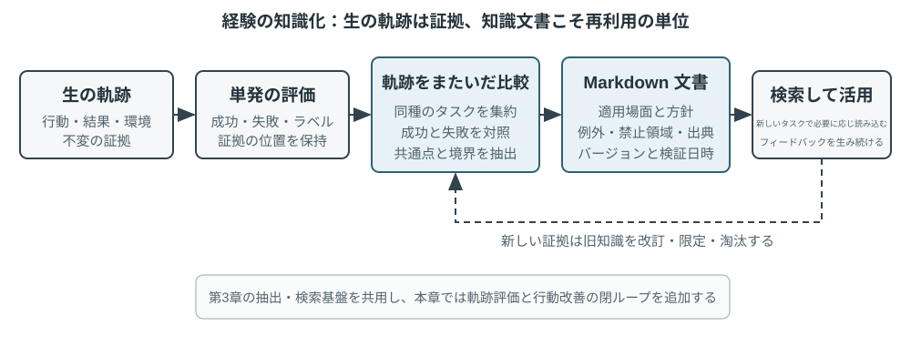

# Agent の継続的進化

今日の Agent は、明確な能力上のパラドックスに直面している。未知の複雑なタスクをゼロショットで解決できる一方、類似タスクを一万回処理した後でも、翌日に初日と同じ誤りを犯す可能性がある。**経験から自律的に学習できるかどうか**は、Agent が「タスクを完了できる」段階から「信頼性をもって働ける」段階へ進むための重要な能力となりつつあり、次世代モデルの中核的な研究課題でもある。しかし現時点では、モデル自体の継続学習能力は依然として大きく不足している。

その理由は、デプロイ後のモデルが、一度の推論によって自動的にパラメータを変更するわけではないことにある。第2章で論じたコンテキスト学習、状態維持、圧縮により、Agent は**現在のタスク内**で適応できる。しかしコンテキストが終了すると、その変化が次のタスクへ自然に引き継がれることはない。対話をメモリに保存しても、新しい行動を学習したことにはならない。生の軌跡は長大になり得るうえ、有効な戦略だけでなく、偶然の成功、誤った原因帰属、信頼できない入力も含まれるからである。

ここには混同しやすい重要な違いがある。**経験を保存することは、経験から学ぶことと同じではない**。100本の軌跡を長いコンテキストやベクトルデータベースに入れれば、必要なときに特定の事例を思い出す助けにはなる。しかし、成功した軌跡でどの手順が繰り返し現れたのか、旧バージョンのインターフェースでしか通用しない方法はどれか、ある成功が正しい戦略によるものか環境上の偶然によるものかを、事例横断で自動比較してくれるわけではない。学習は、システムが「評価、比較、帰納、検証」を能動的に行った後に生じるのであり、ログをディスクへ書き込んだ瞬間に生じるのではない。第3章のユーザーメモリは主に「ユーザーと世界がどのようなものか」を蓄積する。本章の経験学習はさらに、「どの条件で、どのように行動すべきか」を蓄積する。前者は Agent の記憶を増やし、後者が初めて Agent を賢いだけの存在から熟練した存在へ変える。

では、なぜ各タスクの終了後にモデル自身を直接訓練させないのか。実運用環境では、クリーンな学習信号が得られることはまれだからである。ユーザーの満足はコンプライアンスを意味せず、パラメータの局所更新は能力の忘却、方策のドリフト、安全性の低下を引き起こし得る。稼働中のモデルが未検証のフィードバックに基づいて自身のパラメータを直接変更することを許せば、誤った経験やプロンプトインジェクションが固定化され、後続タスクで継続的に増幅されかねない。一方、基盤モデルの定期的な訓練は汎用能力を向上させられるが、各 Agent が日々遭遇する非公開ルール、ツールの変更、局所的な経験を適時に吸収することはできない。

したがって、モデル自体がまだ信頼性の高い継続学習を実現できない段階では、まず「学習」をモデル周辺の自律的なシステムとして構築しなければならない。すなわち、実行証拠を記録し、結果とプロセスを検証し、複数の軌跡から共通性を抽出したうえで、知識、指示、プログラム、モデルパラメータのいずれを更新すべきか判断する。すべての変更はまず候補バージョンとして作成し、回帰テストと安全性検査を通過して初めて、次回以降の実行を変更できる。

これまでの各章では、このシステムに必要な主要構成要素を示してきた。第2章はタスク内状態を扱い、第3章は知識基盤を提供し、第5章は Agent にツールを作成してシステムを変更するメタ能力を与え、第7章は評価と検証を確立し、第8章はモデルパラメータの更新方法を説明した。第9章の役割は、これらの構成要素を図9-1に示す継続的進化の閉ループとして組織化することである。

継続的進化には、追跡可能な実行経験に基づき、その後の行動を変化させ、明白な劣化を引き起こしていないことを検証する必要がある。本章ではまず、一度の実行について、どこが優れており、どこが誤っていたのかを判断する方法を論じる。次に、4つの更新方法とその適用範囲を比較し、最後に、それらの更新を長期運用の中でどのように検証、リリース、修正、廃止するかを論じる。

## 実行軌跡から学習信号を得る

継続的進化の起点は「要約」ではなく「評価」である。システムがタスクの完了可否を把握できず、どのステップが成功または失敗をもたらしたかも分からなければ、言語モデルが生成する反省は推測にすぎない。誤った評価が長期知識、システム Prompt、訓練データに入ると、その影響は後続タスクをまたいで増幅され続ける。

結果を比較的容易に検証できるタスクもある。Coding Agent はテスト、型検査、性能ベンチマークを実行できる。ユーザーに代わって返金を処理する Agent は、注文状態と実際の返金額を照会できる。この種の信号は環境内の実状態から得られるため、通常はモデル自身による行動の説明より信頼できる。ただし、結果が正しいことは、プロセスが正しいことを意味しない。失敗したテストケースを削除してもテストは通過し、「7日以内に返金いたしますので、しばらくお待ちください」と口頭で約束するだけでも、一時的に満足度の高いフィードバックを得られる可能性がある。したがって、信頼できる評価では、結果だけでなく、その結果を達成した経路も検査しなければならない。

より多くのタスクには、単一の正解が存在しない。カスタマーサービスが忍耐強く対応したか、コンプライアンスの範囲内で代替策を提示したか、調査報告が重要な証拠を捉えたか、生成テキストが自然かつ簡潔かは、いずれも文脈に基づいて判断する必要がある。この場合、第7章で紹介した LLM-as-a-Judge を利用できるが、Judge に曖昧な総合点だけを与えさせるべきではない。より効果的なのは、評価基準（Rubric）を事前に定義し、検証器に項目別の採点と軌跡証拠の引用を求め、証拠が不十分な場合には不確実であることを明示させる方法である。

図9-2は、3層の検証構造を示している。最下層の結果検証器は、テスト結果、データベース状態、ツールの戻り値を読み取り、「実際に処理が完了したか」に答える。中間層のプロセス検証器は、業務ルール、権限、アクション列を検査し、「許可された方法で完了したか」に答える。上位層の品質検証器は Rubric に基づいて言語と戦略を評価し、「適切に処理したか」に答える。下位に位置する指標ほどコードと環境のグラウンドトゥルースに依存すべきであり、形式化が困難な部分だけを言語モデルに委ねるべきである。

カスタマーサービス Agent を例にすると、有用な Rubric は少なくとも表9-1に示す複数の次元を含むべきである。最初の5項目は主として最低限の要件を制約し、後の2項目はサービス品質を測定する。この分解は、「ユーザーが満足したか」よりも診断価値が高い。ユーザーは Agent が規則に違反して返金したために満足することも、コンプライアンス上の制約によって不満を抱くこともあるため、単一の満足度では両者を区別できない。

表9-1 カスタマーサービス Agent の軌跡評価次元

| 次元 | 検証事項 | 主な証拠 |
|---|---|---|
| タスク結果 | ユーザーの中核的な要求が解決されたか | 最終的な環境状態、ツール結果 |
| ルール遵守 | ポリシー、権限、必須プロセスに違反していないか | ポリシー庫、アクション軌跡 |
| プライバシー境界 | 提供すべきでない情報を漏えいしていないか | 応答テキスト、データアクセス記録 |
| 事実の信頼性 | 記述が知識またはツール結果によって裏付けられているか | 引用元、ツールの戻り値 |
| 約束と行動の一貫性 | 完了したと主張する操作が実際に行われたか | 応答とツールログの照合 |
| 表現品質 | 自然かつ簡潔で、反復やテンプレート化を避けているか | 対話全文、言語 Rubric |
| コンプライアンスに沿った代替対応 | 当初の案が実行不可能な場合、許可された代替経路を見つけたか | ユーザー目標、ポリシー、後続アクション |

> **実験 9-1 ★★：カスタマーサービス Agent の軌跡検証器を構築する**
>
> **実験目標**：1本のカスタマーサービス実行軌跡を、後続の学習に利用できる構造化診断へ変換し、「多次元の結論と証拠」が単一の総合点より根本原因を特定しやすいかを検証する。
>
> **実験内容**：「総合点を一つだけ出す」方式と「各次元について結論・証拠・確信度を出す」方式を比較し、タスク失敗、ルール違反、虚偽の約束、表現上の問題をどちらが区別しやすいか観察します。継続的進化は成功率や単一スコアだけに依存できません。何が、なぜ間違い、証拠がどこにあるかを残して初めて、後段は知識・Prompt・プログラム・モデルパラメータのどれを更新すべきか判断できます。確信度の低い事例も自動的に学習集合へ入れるべきではありません。

## Agent の継続的進化における4つの方法

学習信号は Agent が変化すべきことを示すが、その変化をどこで生じさせるべきかは示さない。更新方法を選択する第一の基準は、経験がどれほど長く存在したかではなく、対象能力を特定の媒体で自然に表現できるかどうかである。事実や経験は知識文書として記述するのに適している。明確に言語化できる戦略は Prompt または Skill に記述するのに適している。正確に実行できるプロセスや制約はプログラムとして記述するのに適している。知覚、言語スタイル、暗黙的な戦略などの高次元能力は、モデルパラメータに組み込む必要がある。図9-3は、この4つの方法とその関係を示している。

表9-2に簡潔な比較を示す。4つの方法は相互排他的ではない。医用画像 Agent はパラメータによって病変を識別し、知識ベースから最新ガイドラインを提供し、コードによってリスク指標を計算する。カスタマーサービスモデルの自然な口調は後訓練によって獲得され、個別企業のポリシーは知識と Skill によって提供され、重要なコンプライアンスはサーバー側コードによって最終的に保証される。

表9-2 4つの継続的進化方法の適用範囲

| 更新方法 | 適した内容 | 主な利点 | 主な制約 |
|---|---|---|---|
| 経験知識ベース | 事実、経験則、例外、情報源 | 更新が速く、追跡可能で、必要に応じて検索できる | 検索とモデルによる正しい適用に依存する |
| Prompt と Skill | 言語化可能な判断原則と運用規範 | 説明可能で、適用範囲を制御できる | 肥大化、衝突、無視が生じやすい |
| プログラムと Harness | 決定論的なプロセス、ツール、強い制約 | テスト可能で、実行が安定し、コストが低い | 開発・保守コストが比較的高い |
| モデルパラメータ | 高次元の知覚、生成スタイル、暗黙的戦略 | 汎化能力が高く、推論オーバーヘッドが低い | 更新と回帰検証のコストが高い |

### 経験を知識として蓄積する

最も軽量な進化方法は、複数回の実行で繰り返し現れた経験を、検索可能な知識文書として整理することである。ここでいう「経験知識ベース」は、第3章とストレージ、インデックス、検索技術を共有するが、知識の情報源と検証目標が異なる。第3章では主に、ユーザー対話、文書、データセットから「ユーザーと世界がどのようなものであるか」を抽出した。これに対し本章では、Agent の行動軌跡と結果から「どの条件でどのように行動すべきか」を抽出する。たとえば、「この航空会社では特別食を24時間前までに予約する必要がある」はドメイン知識であり、「航空券を予約する前に特別食の締切を確認し、支払い後に要望を満たせないことが判明する事態を避ける」は行動経験である。

生の軌跡は、正式な知識単位として適していない。長くノイズが多いうえ、ツールの生出力、偶発的な迂回、環境の詳細を含むからである。より堅牢なシステムでは、3層のデータを保持する。変更不能な生の軌跡を監査用に保存し、単一実行の分析に今回の成否と教訓候補を記録する。さらに、同種の複数軌跡を比較、クラスタリング、帰納し、将来に向けた Markdown 知識文書を形成する。正式な文書には通常、一度のタスクの全プロセスを再記述するのではなく、適用場面、推奨戦略、禁止事項、例外条件、証拠の出典、直近の検証時刻を明記する。

この設計は、第3章の User-as-Code と同じ2段階の考え方を採用している。User-as-Code では、まず対話中の事実を変更不能なログに追記し、その後、構造化されたユーザーモデルを定期的に再構築する。経験学習も同様に、まず証拠を保存し、その後オフラインで変更可能な知識を生成すべきである。図9-4は、このプロセスを示している。記録と整理を分離することで、一度の偶発的な成功やネットワーク障害が即座に Agent を変化させることを防げる。また、複数の成功と失敗を確認したうえで共通性を判断できる。

経験文書は、単なる軌跡の要約ではない。真に転移価値のある内容は、比較対照から得られる。同種の成功軌跡が何を行い、失敗軌跡に何が欠けていたか、ある戦略がどの環境バージョンで有効であり、どの前提条件で失敗したかを明らかにする必要がある。第3章では知識抽出、クラスタリング、検索をすでに紹介したため、本章ではこれらのアルゴリズムを繰り返さず、軌跡評価がどのように抽出条件となるか、また抽出された知識が後続タスクの性能を向上させるかに重点を置く。

完全な知識精製パイプラインは5段階に分けられる。まず変更不能な軌跡と環境結果を保存する。次に、単一実行についてタスク種別、必要な能力、観察された戦略、誤り、例外を列挙した構造化分析を生成する。続いて同じタスク群の実行を集約し、候補規則ごとに「どの軌跡が支持し、どの軌跡が反証するか」を示す証拠表を作る。支持のしきい値に達した候補だけを正式文書へ書き込み、最後に、精製に使っていない新規タスクで転移効果を試す。正式知識と候補分析を別々のストアに置けば、原証拠を改ざんせずに再帰納でき、環境バージョンが変わったときには特定の結論だけを正確に取り消せる。

GAIA の経験学習は直感的な例である。GAIA[^gaia-2023] は、検索、Webページの読解、ファイル処理、計算を組み合わせる必要がある多段階問題を収録する。一方、AWorld[^aworld-2025] は Agent を実行し、それらのツールを呼び出し、軌跡を保存する実行環境を提供する。前者が試験問題なら、後者は試験会場と実験記録システムに相当する。従来の方法は、タスクが一度成功するとすぐに戦略要約を生成し、ベクトル化してライブラリへ保存していた。より厳密な実装では、まず GAIA の正解検証または別の環境検証器によって成功、部分的成功、失敗を付与し、その後、同じタスク群の複数経路を比較する。成功軌跡は戦略候補を、失敗軌跡は排除的知識を提供し、部分的成功の軌跡は「どの部分が有効で、どの部分にまだ問題があるか」を識別する助けとなる。Reflexion[^reflexion-2023] が提案した自然言語による反省は教訓候補の生成に利用できるが、反省自体は証拠ではない。環境結果と一致し、軌跡横断的な支持を得て、新規タスクで正の転移を示した内容だけを正式な経験文書に組み込むべきである。

> **実験 9-2 ★★：GAIA 軌跡から経験知識文書を抽出する**
>
> **実験目標**：「複数軌跡から作った知識文書」が「一度の成功を要約して記憶する方法」より転移しやすく、偶発的成功や誤った経験による負の転移を抑えられるかを検証する。
>
> **データと手順**：`gaia-experience` は各実行の完全な軌跡と外部の `environment_score` を保存し、それを `task_family`、必要な `capabilities`、`applies_when`、観察された戦略、誤り、例外、出典軌跡 ID からなる最小の学習記録へ変換する。結果検証器は実行を成功、部分的成功、失敗に分類する。学習モジュールは同じタスク群の経路を比較する。LLM は帰納候補を提案できるが、推奨戦略には少なくとも2本の非失敗軌跡による支持が必要である。最終的な Markdown 文書には、適用場面、推奨戦略、一般的な誤り、例外条件、出典、直近の検証時刻を含める。適用時にはこれらの文書だけを検索し、長大な生の軌跡を直接コンテキストへ入れない。
>
> **3つの対照群**：第1群は過去の経験を使わない。第2群は現在のタスクに最も似た単一軌跡の要約を検索する。第3群は複数軌跡に共同で支持された知識文書を検索する。学習セットと転移セットは重複させず、同じ GAIA 問題の答えが「経験」として評価へ漏れるのを防ぐ。
>
> **指標と受け入れ基準**：転移タスクの成功率、平均検索文字数または Token 数、負の転移率を同時に報告し、各正式結論に出典軌跡が列挙されているかを確認する。複数軌跡の文書がコンテキストを短くしただけで新規タスクの性能を高めていなければ、経験を学習した証明にはならない。一度の偶発的成功を正式知識へ昇格できる場合や、文書を原軌跡まで追跡できない場合も不合格とする。
>
> 関連実装は [`gaia-experience`](../chapter9/gaia-experience/) を参照されたい。`demo_documents.py` はデフォルトでオフライン実行され、`--extractor llm` を指定すると、実際の LLM が軌跡横断的な経験候補を提案できる。

[^reflexion-2023]: Shinn, N., et al. *Reflexion: Language Agents with Verbal Reinforcement Learning.* arXiv:2303.11366, 2023.

[^gaia-2023]: Mialon, G., et al. *GAIA: a benchmark for General AI Assistants.* arXiv:2311.12983, 2023.

[^aworld-2025]: Yu, C., et al. *AWorld: Orchestrating the Training Recipe for Agentic AI.* arXiv:2508.20404, 2025.

### 経験を指示として記述する

経験知識ベースは Agent に参考資料を提供するが、Prompt と Skill はより強い指示性を持つ。複数の軌跡で同種の戦略的誤りが繰り返し明らかになり、その規則を自然言語で明確に表現できる場合、システムはそれを「参照可能な経験」から「遵守すべきルール」へ昇格できる。ほぼすべてのタスクに適用されるルールはシステム Prompt に組み込むのが適している。特定のドメイン、プロジェクト、ツールにのみ適用される複雑なプロセスは、オンデマンドで読み込まれる Skill またはプロジェクト指示ファイルとして記述するのがより適切である。

Prompt 学習と第2章の Prompt エンジニアリングでは、役割が異なる。第2章では、構造が明確でキャッシュに適した Prompt の書き方を扱った。ここでは、どのような実運用フィードバックが Prompt の変更を引き起こすに足るか、また新ルールをデプロイ前にどのように検証するかを扱う。変更に際して、システム Prompt 全体を繰り返し書き直すべきではない。より信頼できる方法は、同種の失敗群に基づいて最小限の diff を生成し、ルールの適用範囲を明記し、既存ルールとの矛盾を確認したうえで、失敗を引き起こした境界ケースと既存タスクの保持セットを同時に評価することである。

Andrej Karpathy は2025年の長文投稿で、この新しい可能性のあるパラダイムを暫定的に**システムプロンプト学習**（System Prompt Learning）と呼んだ[^karpathy-system-prompt-learning]。彼の整理では、事前学習は主に知識を学び、微調整は主に習慣的な行動を形づくる。しかし人間には、問題に直面し、方法を理解した後、未来の自分に「次にこの種の問題に出会ったら、まずこの方法を試す」と明確な言葉で伝える学び方もある。彼は、このメモ帳を持たない LLM を映画『メメント』の主人公になぞらえた。また、システムプロンプト学習と強化学習はいずれも経験から行動を改善するが、更新アルゴリズムが異なると指摘した。前者は文章を編集し、後者は勾配降下でパラメータを変更する。例として、当時約1万7千語あった Claude のシステムプロンプトには、単語、文字、文字数を数える問題に遭遇したら、まず各項目に番号を振って明示的に数えてから答えるよう、特別な指示が含まれていた。これはまさに「`strawberry` には `r` がいくつあるか」のような問題に対処するためである。

Agent システムに落とし込むと、失敗後に言語化できる教訓を、将来の実行が直接読めるルール候補として記述することになる。「成功／失敗」だけのスカラー結果に比べ、証拠付き診断は、問題が本人確認、ツール選択、エスカレーション境界のどこにあったかを示せるため、より的を絞った修正候補を生成できる。Karpathy のいう「知識に導かれた振り返りは、スカラー報酬より高次元のフィードバックチャネルを持つ」という見方は、この方法が高いデータ効率を持ち得る理由を説明する。ただし情報量が多いからといって、それが本質的に正しいわけではない。同じユーザー意見でも、特定の顧客または旧版ポリシーにしか当てはまらない場合があるため、クラスタリング、適用範囲の判定、回帰テストはなお必要である。

Prompt の自動最適化には、すでに複数のアプローチがある。DSPy[^dspy-2023] は、複数の言語モデル呼び出しから成るプログラムを最適化対象とし、開発セット上で指示と例を探索する。OPRO[^opro-2023] は、過去の Prompt とその得点に基づいて言語モデルに次の候補を提案させる。GEPA[^gepa-2025] は、失敗軌跡についての自然言語による反省を使い、相互補完的な Prompt 候補を生成して選別する。これらは主にオフライン評価セット上での一括最適化を対象とする。実運用システムの最小 diff は、むしろ継続的な保守に近く、新たな境界ケースを契機として、出典、監査、迅速なロールバックを重視する。実際には、まずオフライン探索で良好な初期版を見つけ、その後は事例ごとのパッチでリリース後のロングテール規則を維持できる。

#### 例1：失敗軌跡に基づくプロンプト内のルール最適化

たとえば、航空会社のカスタマーサービス Agent が、ユーザーからポリシーへの疑義を示された際、時期尚早に人間へエスカレーションすることが頻発しているとする。軌跡評価では、ルール違反はないが、コンプライアンスに沿った代替対応が不足していることが示される。候補パッチでは、まずポリシーを説明し、ユーザーの真の目標を特定し、許可された代替案を探し、ユーザーが明示的に要求した場合、または実際に権限を超える場合にのみ人間へエスカレーションするよう Agent に求められる。新ルールによって過剰なエスカレーションが減少しても、人間へ引き継ぐべき安全上の事象を処理し続けるようになれば、回帰テストには合格していない。システム Prompt 学習の価値は、より多くの文を自動追記することではなく、実運用上の境界ケースによってルールの適用範囲を継続的に明確化することにある。

#### 例2：要件明確化 Skill——「即座の着手」から「確認後の実行」へ

Skill 学習も同じ原則に従うが、適用範囲はより局所的である。Skill は必要なときに開く職務手順書と考えられる。複数の経験が共同して完全な保険金請求プロセスを形成する場合、システムは対応する Skill を生成または修正できる。候補 Skill は一度の対話の要約にとどまらず、少なくとも、いつ読み込むか、前提条件、操作手順、既知の落とし穴、検証方法を記載し、出典軌跡も保存すべきである。システムはまず既存の Skill ライブラリから類似能力を検索する。同じ手順が存在するなら局所的な `patch` を優先し、本当に新しい独立能力が現れた場合だけ新しいディレクトリを作り、名称だけ異なり内容が似た手順書の乱立を防ぐ。Anthropic の Skill Creator[^anthropic-skill-creator] は「草案作成―テスト―評価―改訂」という生成サイクルを示している。これは Skill の作り方と改善方法を解決するが、どの実行証拠が生成を起動するに足るか、衝突をどう処理するか、変更後に領域タスクと旧タスクの回帰を通過できるかが、依然として難しい問題である。

> **実験 9-9 ★★：フィードバックを文章作成 Skill に整理する**
>
> `data/feedback_pairs.json` の20組の before/after を三回に分けて取り込み、差分から候補ルールを抽出する。重複を統合し、閾値の衝突を検出し、出典と適用範囲を持つ `SKILL.md` を生成する。決定的に判定できる規則はコードで検査し、LLM 判定の規則は10件の金標データで校正する。
>
> 未完了タスク集合の検出率、正常文保留集合の誤検出率、規則数の増加を同時に報告する。最初の実モデル実行は検出 0/8、誤検出 7/8 だったが、モデル外の候補選別と決定的フォールバック後は検出 8/8、誤検出 0/8、21候補を8規則に統合した。実装は [`ai-style-skill`](../chapter9/ai-style-skill/) にある。

曲線引用符の事例は、Skill を全体置換規則ではなくデータ契約にする必要を示す。SFT 前に、合成例を文書ジャンル・スコープ・プログラミング言語で層別化し、コード/JSON/保護領域の検査を通し、手動監査を行う。exact-copy の事例では tokenizer の encode→decode round-trip、モデルの byte-exact コピー、Harness のシリアライズ、ツール照合を別々の回帰層として監査する。

> **実験 9-3 ★★：失敗軌跡に基づいてシステム Prompt を最適化する**
>
> **実験目標**：航空会社のカスタマーサービス Agent に、「ユーザーがポリシーを疑ったときに時期尚早に人間へエスカレーションする」失敗軌跡から学ばせる。同時に、新ルールが本当に人間への引き継ぎを必要とする旧場面を壊していないことを証明する。
>
> **手順**：まず旧タスク保持セットと過剰エスカレーション境界セットを別々に実行する。`learning_signal.py` は失敗をルール遵守、タスク解決、コンプライアンスに沿った代替対応という3次元に分け、出典 case ID を保持する。次に Coding Agent は既存 Prompt を読み、監査可能な `old_str → new_str` 形式の最小編集を1件だけ生成する。Agent に、まずポリシーを説明し、真の目標を特定し、適法な代替案を探すよう求める一方、ユーザーが明示的に人間を求めた場合や安全上の事象がある場合のエスカレーション経路は残す。パッチは出典、対象ルール、変更理由とともに候補 manifest へ記録する。
>
> **3つの対照群**：初期 Prompt、自動生成した候補 Prompt、人間が一度だけ調整した Prompt を比較する。3者は同一モデルと同じ保持／境界タスク群を使用する。`--quick` はケース数を減らすだけで、タスク Agent、LLM Judge、Coding Agent を実際に呼び出すため、オフラインの模擬結果とはみなせない。
>
> **リリース基準と指標**：候補は、パッチが空でない、出典を追跡できる、境界セットの性能が実際に改善する、保持セットが劣化しない、という4条件を満たす必要がある。境界タスクの正解率、保持タスクの正解率、Prompt の増加長、導入された回帰数、失敗の発見から候補生成までの時間を比較する。基準通過後も得られるのは `release_to_canary` だけで、安定版 Prompt を直接上書きしない。いずれか1項目でも失敗すれば `reject_candidate` を返す。
>
> 関連実装は [`prompt-auto-optimization`](../chapter9/prompt-auto-optimization/) を参照されたい。オフラインテストでは診断とリリース基準を網羅し、`--quick` を指定すると、タスク Agent、LLM Judge、Coding Agent を実際に呼び出す。

[^dspy-2023]: Khattab, O., et al. *DSPy: Compiling Declarative Language Model Calls into Self-Improving Pipelines.* arXiv:2310.03714, 2023.

[^opro-2023]: Yang, C., et al. *Large Language Models as Optimizers.* arXiv:2309.03409, 2023.

[^gepa-2025]: Agrawal, L., et al. *GEPA: Reflective Prompt Evolution Can Outperform Reinforcement Learning.* arXiv:2507.19457, 2025.

[^karpathy-system-prompt-learning]: Karpathy, A. “We’re missing (at least one) major paradigm for LLM learning … system prompt learning?” X, May 11, 2025. https://x.com/karpathy/status/1921368644069765486

[^anthropic-skill-creator]: Anthropic. *Skill Creator.* 2026. https://github.com/anthropics/skills/blob/main/skills/skill-creator/SKILL.md

### 経験をプログラムとして記述する

経験が安定的かつ反復的で、検証可能な操作を記述している場合、モデルに毎回文書を再読させ、推論させるのは効率的ではない。この場合、経験をワークフロー、ツール、Harness コードにコンパイルし、一度の探索を反復実行可能なプログラムに変換する方が適切である。第5章では、Coding Agent がファイルを読み書きし、テストを実行し、システムを生成する方法をすでに説明した。本節で焦点を当てるのは一般的なコード生成ではなく、Agent が自身の軌跡に基づいて将来の自身のバージョンをどのように変更するかである。

変更可能な対象は、新しいツールに限られない。操作層では、ブラウザ軌跡をパラメータ化されたワークフローにコンパイルしたり、変更された API のアダプターを生成したりできる。制御層では、ツールルーティング、再試行、サーキットブレーカー、コンテキスト圧縮戦略を変更できる。検証層では、実運用上の失敗に基づいてパラメータ検査、状態検証器、回帰テストを追加できる。アーキテクチャ層では、Reviewer Agent を追加し、計画と実行の間の情報フローを変更できる。

ブラウザワークフローは、経験をプログラム化する価値を示している。これは表計算ソフトのマクロ記録にたとえられる。初めてメールを送るとき、マルチモーダル Agent は観察―思考―行動を通じて、「作成、宛先、件名、本文、送信」の各コントロールを見つける。次に別のメールを送るとき、変わるのは宛先と内容だけで手順は同じなので、ピクセルや DOM から経路全体をモデルに再発見させる必要はない。システムが行うべきなのは、最初の探索で得た軌跡を、パラメータ、状態チェック、バージョン情報を持つ小さなプログラムへコンパイルすることである。

図9-4に示した知識精製は、ブラウザ場面では次のような、より具体的なライフサイクルになる。

1. **軌跡の取得**：ナビゲーション、クリック、入力、プルダウン選択などの操作を記録し、操作パラメータ、当時の URL、XPath、CSS、`id`、`role`、`aria-label`、`data-testid` などの要素特定情報を保存する。特定情報は要素を再発見するためのものであり、タスク完了を証明するものではない。
2. **パラメータ化**：初回実行のリテラルをテンプレート変数として識別する。たとえば `test@example.com`、件名、本文を `{recipient}`、`{subject}`、`{content}` に置き換え、その他の安定した操作はそのまま保つ。教育用実装では正規表現とテンプレート置換を使い、実運用では構造化タスク入力または制約付き抽出モデルを利用できる。
3. **状態チェックの定義**：操作の前後に、「送信ボタンが現在表示されている」「移動後の URL が対象サイトに属する」といったチェックを追加する。ワークフロー全体にも、「送信済み一覧に新しいメールが現れた」「テストページの状態値が期待どおりに変化した」といった最終状態チェックを設ける。操作の実行成功とタスク成功は別物であり、最終チェックは実際のページまたはバックエンド状態を読み取らなければならない。
4. **候補の検証**：初回成功から生成されるのは `candidate` にすぎない。システムはサンドボックスアカウントまたはテストサイトを独立した初期状態へリセットし、候補を最初から最後まで再生する。各操作の事前チェック、事後チェック、最終状態チェックをすべて通過して初めて `validated` として公開できる。メール送信や注文のように副作用を伴うタスクで安全なリセットコールバックがない場合、候補は監査用に保存するだけとし、検証のために本番アカウントで再実行してはならない。
5. **照合と再生**：新しいタスクが来ると、まず正式な能力ライブラリから意図とキーワードに基づいてワークフローを探し、今回のパラメータを抽出し、Playwright で直接実行する。再生経路では段階ごとに LLM を呼び出す必要はないが、要素が利用可能になるまで待ち、すべての状態チェックを完了する必要がある。
6. **無効化と再学習**：対象要素が見つからない、状態チェックが通らない、API Schema が変わった、最終状態が誤っている場合は、後続操作を直ちに停止する。旧版を検索可能ライブラリから `invalid` 領域へ移し、完全な Agent にフォールバックして再探索させる。旧ファイルは監査と比較のために残すが、黙って検索対象にし続けてはならない。

メール送信を例にすると、コンパイル結果は単なる「このボタンを順番にクリックする」という記録ではなく、宛先、件名、本文をパラメータに持つ小さなプログラムである。送信前に作成ウィンドウと入力欄を確認し、送信後に成功メッセージを確認し、最後に送信済み一覧へ該当メールが現れたことを確認する。PreAct[^preact] の実験では、このようなプログラムが反復タスクでエンドツーエンド 8.5～13 倍の高速化を実現し、再生段階では言語モデルを一手ごとに呼び出す必要がなかった。さらに重要なのは、手順の記憶には**操作前検証、操作後検証、保存前の独立検証**がすべて必要だという点である。そうでなければ、再生カバレッジは100％で、すべてのボタンをクリックしたのに、実はある入力欄が空で、タスク自体は一度も完了していないという危険な錯覚が生じる。

> **実験 9-4 ★★★：ブラウザ軌跡から検証可能なワークフローを生成する**
>
> **実験目標**：Web Agent が一度の高コストな探索を再利用可能なワークフローへ変換でき、Webページが変化したときに、「操作をすべて実行した」ことを成功と誤報せず、誤った再生を拒否できるかを検証する。
>
> **4段階の場面**：第1段階では、テスト用メールサイトまたは模擬メッセージページで「`test@example.com` 宛てに件名『テストメール』のメッセージを送る」タスクを実行する。完全な Agent が探索し、ラッパー層が操作、パラメータ、ページ状態を取得して `candidate` を生成する。第2段階では `validation_reset` でサンドボックスを元に戻し、独立して完全再生する。操作前チェック、操作後チェック、最終状態チェックがすべて通過した候補だけを正式な能力ライブラリへ入れる。第3段階では宛先、件名、本文がすべて異なる同種タスクを実行する。システムは検証済みワークフローを照合し、新しいパラメータを埋め、段階的な LLM ループに入らず Playwright で再生すべきである。第4段階ではボタンの特定方法、ページ文言、最終状態を変更し、旧ワークフローが直ちに `invalid` となって `fallback_required=True` を返すかを検証する。
>
> **対照設計**：単純なベースラインは、クリックや入力などの操作が例外を投げずに終わったかだけを数える。実験群はさらに、操作前ページ、操作後ページ、タスクの最終状態を検証する。両群には同じ軌跡とページ変更を与え、「入力欄が空なのに送信ボタンはクリックされた」「Save はクリックされたがデータベースに保存されていない」といった偽成功場面での誤判定率を比較する。
>
> **指標と受け入れ基準**：初回探索と再生のエンドツーエンド時間、LLM 呼び出し回数、成功率、誤成功率、ワークフロー照合率、ページ変更検出率、フォールバック再学習回数を記録する。リセットコールバックがない場合、ワークフローは候補領域にとどめなければならない。検証に失敗した版を検索できてはならない。パラメータ化再生で初回の宛先や内容を再利用してはならない。ページ変更後は危険な後続操作を停止しなければならない。これらを同時に満たして初めて、高速化の結果に意味がある。
>
> 関連実装は [`browser-use-rpa`](../chapter9/browser-use-rpa/) を参照されたい。決定論的な状態機械のデモと、実際のブラウザ Agent を呼び出す実行経路の両方を提供する。

Agent が自身のコードを変更することは、稼働中のプロセスが直接自身を上書きすることを意味しない。実運用システムでは、現在の安定版から候補ブランチを作成し、Coding Agent が最小限のパッチを生成する。その後、静的検査、単体テスト、セキュリティスキャン、失敗軌跡のリプレイ、既存タスクの回帰テストを順次通過させ、カナリアデプロイ可能な新バージョンを生成する。これにより「自己変更」は監査可能なソフトウェアリリースプロセスに変換される。ここに第9章と第5章の境界がある。第5章はシステムを変更する能力を提供し、本章は経験によって起動され、検証の閉ループによって制約される自己変更方法を提供する。

「パッチを小さくする」だけでは、信頼できる原因帰属には足りない。各変更要求は、失敗証拠、推定根本原因、担当する Harness コンポーネント、候補変更、改善を期待する挙動、損なわれる可能性のある既存挙動、両者のテストを明記した**反証可能な変更契約**であるべきだ。Agentic Harness Engineering はこれを、コンポーネント、経験、意思決定の3層の可観測性として整理する。編集可能な各コンポーネントはファイル単位で表現され、大量の軌跡は段階的に掘り下げられる証拠へ整理され、各編集は実行前に影響予測を宣言し、次の結果で検証される[^ahe-2026]。これにより得点上昇を、解釈不能な試行ではなく具体的な機構へ結び付けられる。

候補生成器へ渡すのも失敗事例だけではない。Self-Harness は、保持すべき成功挙動と、過去に却下された変更の記録も提供する[^self-harness-2026]。前者は修復時に壊してはならない性質を示し、後者は失敗案を言い換えて再提出することを防ぐ。失敗証拠、成功制約、過去の試行を合わせた境界付き候補空間は、全ソースと生ログを無差別に変更 Agent へ詰め込むより、局所的で検証可能な変更を生みやすい。

ツール作成も同じプロトコルに従う。Alita[^alita-2025] が示した事例では、Agent は『ロード・オブ・ザ・リング』のゴラム役の俳優がナレーションを担当する YouTube の 360度 VR 動画から、恐竜が初めて登場した直後に言及される数字を探す必要があった。字幕を読む能力がないことに気づくと、`youtube-transcript-api` を検索してテストし、新しい字幕ツールとしてラップし、最終的に字幕から答え `100000000` を得た。新ツールが能力ライブラリへ入るのは、セキュリティスキャン、機能テスト、後続タスクでの再利用をすべて通過した後である。第4章の能動的ツール発見は「既存ツールのどれが適するか」を、第5章は「ツールをどう作るか」を扱う。本章が問うのは、「どの実行証拠が作成を起動し、新ツールがどうすれば検証済みの長期能力になるか」である。

> **実験 9-5 ★★★：失敗軌跡によって Agent の自己変更を起動する**
>
> **実験目標**：「`retryable=false` のエラーがなお連続して呼び出される」複数の軌跡から、根本原因を再試行・サーキットブレーカーコードへ特定し、一時的障害に対する再試行能力を壊さず候補修正を生成できるかを検証する。
>
> **手順**：診断モジュールはまず異なるタスクで起きた同一障害を集約する。軌跡横断的な支持のしきい値に達した場合だけ変更要求を作り、対象を安定版の `retry_policy.py` に定める。候補生成器は失敗診断、保持すべき一時障害の回復挙動、過去に却下された変更、安定版ソースを読み、「再試行不能エラー後の呼び出し数は減り、一時的タイムアウトの回復率は下がらない」という影響予測を先に提出してから最小のコード diff を出力する。決定論的生成器を使う場合も、実際の LLM Coding Agent を使う場合も、結果は隔離された候補ディレクトリにしか書き込めない。検証 Harness は続いて候補をコンパイルし、元の失敗軌跡を再生し、再試行不能エラーが即時停止してサーキットブレーカーを開くかを確認した後、一時的タイムアウトが従来のしきい値どおり再試行されるかを再テストする。
>
> **診断対照と指標**：「Prompt に『繰り返し呼び出さない』と一文追加するだけ」の方法を、誤った層へ対処する概念的対照とし、決定論的に実行できる再試行制約をなぜプログラムへ入れるべきかを示す。実行可能な実験では決定論的パッチ生成器と LLM 生成器を比較し、両者に同じリリース基準を適用する。再試行不能エラーの呼び出し回数、一時的エラーの回復率、旧タスクの回帰数、パッチサイズ、候補受け入れ率を記録する。
>
> **受け入れ基準**：すべての検査を通過しても、生成するのは `release_to_canary` だけである。静的検査、失敗再生、旧タスク回帰のいずれかが失敗すれば `reject_candidate` を返す。`release_manifest.json` には、失敗クラスタ、出典軌跡、推定根本原因、対象コンポーネントとファイル、コード diff、期待する修復、潜在的回帰、検査結果、候補版、ロールバック版を記録しなければならない。却下候補の失敗理由も次の生成ラウンド用に保持する。パッチを生成する Agent は、安定版コード、検証器、監査ログ、自身の公開を承認する基準を変更できない。
>
> 関連実装は [`self-modifying-agent`](../chapter9/self-modifying-agent/) を参照されたい。決定論的な候補生成器または実際の LLM Coding Agent を選択でき、2つの経路は同じリリース基準を共有する。

[^preact]: Li, Bojie. *PreAct: Computer-Using Agents that Get Faster on Repeated Tasks.* arXiv:2606.17929, 2026.

[^alita-2025]: Qiu, J., et al. *Alita: Generalist Agent Enabling Scalable Agentic Reasoning with Minimal Predefinition and Maximal Self-Evolution.* arXiv:2505.20286, 2025.

実験 9-8 は同じプロトコルを検証層に適用する。複数のユーザー訂正、低評価、事後監査が「高リスク操作の確認漏れ」を指すときだけ変更要求を作り、候補を隔離ディレクトリに書く。ツール名と引数から危険な削除や `git push --force` などを分類し、一回限りの確認トークンを操作と引数に結び付ける。候補は AST/静的検査、偽造・再利用トークンを含む境界再生、保留集合の再生を通過して初めてカナリアへ出す。

> **実験 9-8 ★★：ユーザーフィードバックで高リスク操作の確認門を更新する**
>
> `failure_trajectories.json` の三種類の信号と対照軌跡を使う。実際の `gpt-4o-mini` 候補は未完了タスク、正常操作、一回限りトークンの検査に通らず安全門に拒否された。一方、決定的候補は全検査を通過して `release_to_canary` になった。各検査、決定、安定ディレクトリのハッシュを記録する。実装は [`harness-safety-gate`](../chapter9/harness-safety-gate/) にある。

#### ケース：すべてがプラグインである DeepSeek Harness の自己進化

第 1 章の表は DeepSeek Harness（`dsh`）を「Agent 自己進化フレームワーク」と位置づけました[^dsh-2026]。基盤となる Cordis 論文は、従来の合成は**静的**だと指摘します。関数呼び出し、モジュール import、継承はコンパイル時に決まり、実行時には変わりません。プラグインシステムと自己進化 Harness には、実行中にコンポーネントをロード・アンロード・再構成する**動的合成**が必要です[^cordis-2026]。Agent の自己変更は本質的に動的合成です。

論文は動的合成を直交する二軸に分けます。**時間的合成可能性**は、コンポーネントを外す際、共有環境への変更を完全かつ安全に戻せるかを問います。実行系はリソース割当、イベント登録、状態変更をすべて追跡しなければなりません。**空間的合成可能性**は、依存関係を構造的かつ検証可能に宣言・発見・解決し、変化時にライフサイクルを調整できるかを問います。前者は**何を変えたか**、後者は**何に依存するか**です。

自己進化 Harness はこの問題が最も鋭く現れる場面です。戻すべき副作用は長寿命で状態を持ち、依存関係は実行中に現れ、消え、同一性を変えます。時間的合成可能性がなければ変更のたびに全面再起動し、プロセス内状態を失い、実行中タスクを中断します。空間的合成可能性がなければ各モジュールが場当たり的に依存変化を検出し、単純なコード置換が依存側を黙って壊したり循環を作ったりします。

Cordis は本来コンパイル時の二概念を実行時へ引き上げます。計算が環境をどう変えるかを扱う effect system は**可逆 effect**となり、各コンテキスト変換が明示的な逆操作を持ち、実行系が追跡して削除時に戻します。計算が環境に何を要求するかを扱う coeffect system は**反応的 coeffect**となり、コンポーネントが依存仕様を宣言し、コンテキスト変更ごとに有効化・無効化・無関係を通知されます。動的合成の計算体系はこれを交錯するコンポーネント群へ広げます—合成可能性は推移的でなければなりません。

**自己進化の上限はモデルがどれほどよいコードを書くかではなく、宿主システムがどれほど合成可能かで決まります。** だから `dsh` はモデルアダプター、ツールレジストリ、セッションログ、さらには Agent のメインループまでプラグインにします。**人間だけが保守できる特権的な核はありません**。

合成可能性は安全に着脱できるかを解きますが、着けるべきかは解きません。モデルが書いたプラグインはプロセスメモリにのみ存在し、再起動で消えます。**公式プラグインへ自動昇格できず**、残すには前述の worktree と Pull Request の遅い経路が必要です。

進化にはコストもあります。実行中のプラグインはモデルが見るツール集合と Prompt 断片を変え、リクエストのプレフィックスが変わった位置から第 2 章の KV Cache が無効になります。`dsh` プラグインの文書にはコンテキストと KV Cache への影響を記す必要があります。

[^dsh-2026]: DeepSeek AI, *DeepSeek Harness: Everything is a Plugin*, 2026. https://github.com/deepseek-ai/deepseek-harness。プラグイン階層とパッチは `docs/architecture.md`、自己変更ツールのライフサイクル、サンドボックス、信頼宣言は `docs/subsystems/extensions.md` と `packages/extensions/README.md` を参照。2026 年 8 月公開時点では開発者プレビューです。

[^cordis-2026]: Shi, Yifan, Wei Zhang, and Tianyi Cui. *A Programming Paradigm for Spatiotemporal Composability.* プレプリント草稿、2026 年 8 月 13 日。https://github.com/cordiverse/paper

### 経験をパラメータに書き込む

知識、指示、プログラムは、いずれも対象能力を外部記号によって比較的完全に表現できることを前提としている。しかし、医用画像の理解、自然な音声韻律、テキストからテンプレート的な「AI らしさ」を除去すること、長期的な計画などの能力は、少数のルールやワークフローへ圧縮することが難しい。この種の能力は、後訓練を通じてモデルパラメータに書き込む必要がある。

パラメータ化すべきかどうかは、「タスクが長期的に安定しているか」だけでは決まらない。新しい画像装置によるドメインシフトには、依然として LoRA または継続的な微調整が必要になる可能性がある。急速に変化する言語スタイルにも、定期的な選好訓練によって適応できる。安定性は更新頻度とコストに影響するが、能力の表現特性が主要な媒体を決定する。逆に、長期的に安定した送金承認ルールも、パラメータの記憶だけに依存すべきではなく、サーバー側コードによる決定論的な保証が必要である。

第8章では SFT、蒸留、RL を詳しく論じたため、本節ではアルゴリズムを繰り返さない。継続的進化において重要なのは、評価済みの実運用軌跡を訓練データへ変換することである。高品質なデモンストレーションは SFT に使用でき、明確な選好はペアデータを形成でき、信頼できる環境報酬を持つインタラクションは RL に利用できる。訓練前にはプライバシー情報を除去し、誤った軌跡をフィルタリングし、独立した回帰セットを保持する必要がある。訓練後には、汎用能力と安全性アラインメントが忘却されていないかを検査する。

パラメータ学習は通常、外部手法と連携する。医用画像モデルはパラメータによって視覚表現を学習し、知識ベースによって最新ガイドラインを提供し、コードによって病変を測定してリスクを計算する。カスタマーサービスの自然な口調は、選好訓練によって全体的な分布を形成し、Prompt で現在のブランドアイデンティティを規定し、ユーザーメモリで個人のコミュニケーション選好に適応できる。継続的進化とは、4つの方法から唯一の答えを選ぶことではなく、それぞれの能力を、その表現とガバナンスに最適な場所へ配置することである。

### 成果物の更新から「更新方法」の更新へ

前の4つの方法は、経験を**どこへ書くか**を扱った。しかし継続的進化にはもう一つ直交する軸がある。システムが最適化しているのは、ある成果物の内容なのか、それとも成果物を生成、管理、検証する方法なのか。この軸では、最適化対象を **個々の規則や記憶 → 構造化コンテキスト → ワークフロー → Harness コード → 候補案を生成する最適化器コード**へ広げられる[^weng-harness-2026]。これは5種類の新しい更新媒体ではなく、5つの探索規模であり、知識、Prompt、Skill、プログラムはいくつもの層に現れうる。

最内層は成果物の内容だけを変える。たとえば失敗軌跡に基づいてシステム Prompt へ局所ルールを加えたり、経験文書へ例外条件を補ったりする。影響範囲が小さく、原因帰属とロールバックが容易なので、これを既定とすべきである。ただし Prompt や記憶全体をモデルに繰り返し書き直させると、簡潔化の過程で少数の重要な詳細が消え、相互に制約する条件が過度に抽象的な原則へまとめられる。Agentic Context Engineering（ACE）はコンテキストを安定した識別子付き項目として管理し、生成、反省、整理モジュールが差分更新を提案し、決定論的ロジックで統合・重複排除する。毎回全文を短く書き直すのではない[^ace-2026]。これは本章の「最小 diff、出所保持」を具体化する研究例である。

一段外では、最適化対象は「コンテキストに何があるか」だけでなく「どう構築するか」になる。Meta Context Engineering（MCE）は内外2つのループへ分ける。内側は所与の管理方法で現タスクのコンテキスト成果物を最適化し、外側は複数回の実行・検証結果から検索、選択、フィルタリング、整形の操作そのものを変更する[^mce-2026]。検索ルールを一つ直すのは内容管理機構の変更であり、複数の検索・整理機構を比較して転移の良いものを残すのが「コンテキスト管理方法」の学習である。

同じ発想はワークフローと Harness 全体へ拡張できる。AFlow は複数の LLM 呼び出しからなるワークフローをコードグラフで表し、実行フィードバックからノードと制御フローの組合せを探索する[^aflow-2025]。Meta-Harness は Coding Agent に候補 Harness のソース、得点、軌跡を読ませ、情報の保存、検索、提示を決めるコードを探索する[^meta-harness-2026]。第5章はコードを Agent システム構造の共通言語として示した。ここでの追加点は、コードが一度きりの成果物ではなく、評価履歴とともに継続探索の対象になりうることである。

> **実験 9-6 ★★★：Hermes にこの本を渡したら、自分をアップグレードできるか？**
>
> **実験目的**：外部知識を自分自身の能力更新へ変換できるかを検証する。修正すべき問題や機能一覧は与えない。Hermes に全10章と自身のソースコードを渡し、原則を理解し、実装を見直し、価値のある改善を自分で選ばせる。
>
> **実験設計**：本とソースコードは読めるコンテキストだが、安定版、独立 Reviewer、受け入れテストは Hermes の編集範囲外に置く。Hermes は **読む → 比べる → 選ぶ → 変える → 検証する** を完了しなければならない。候補が拒否された場合、その指摘は次の学習ラウンドへの入力となり、ゲートを迂回して成功を宣言することはできない。
>
> **実行結果**：本を読んだ Hermes は、保存された実行軌跡に、後続学習が直接使える構造化された証拠が不足していると自ら判断した。そこで実行結果を保守的な学習シグナルへ整理し、自身のコードを編集してテストを追加した。最初の3回の独立レビューは、実データ形式、保存経路、カウントの意味との不一致を発見した。指摘は毎回元の Hermes セッションへ戻され、4回目のレビューで候補が受理された。
>
> **主張の境界**：この実行は、Agent が長い知識から原則を抽出し、自分のコードへ対応づけ、外部検証の下で自己更新を完了できることを示す。下流タスクの成功率向上はまだ示しておらず、別の ablation 実験が必要である。実験案は読者 Grace の提供による。

## 長期運用可能な継続的進化の閉ループを構築する

4つの更新方法は、同一の自律的な循環に組み込まれて初めて、一度限りの最適化から継続的進化へ移行する。図9-5は、実運用システムにおけるより堅牢な二重ループ構造を示している。オンライン実行ループはタスクを完了して証拠を記録するだけであり、正式な Agent を直接書き換えない。オフライン進化ループは軌跡を集約し、根本原因を診断し、変更候補を生成してから、検証基準を通じて新バージョンをリリースする。両者は、バージョン管理された経験ライブラリと評価セットによって接続される。

Voyager[^voyager-2023] は、比較的完全な継続的進化ループを示している。Minecraft において現在の能力に基づいて新たな目標を選択し、環境フィードバックを通じてプログラムを反復的に改善し、成功を検証した後にコードをスキルライブラリへ保存し、既存スキルを組み合わせてより困難なタスクを解決する。自動カリキュラム、実行可能なスキル、環境検証のいずれも欠かせない。スキルライブラリだけがありカリキュラムがなければ、Agent は次に何を学ぶべきか分からない。自己反省だけがあり環境検証がなければ、スキルライブラリには誤りが蓄積する。探索だけがあり永続化がなければ、各タスクを毎回最初から始めなければならない。現実の Agent における知識、Prompt、ツール、パラメータはより複雑だが、基本的な学習プロセスは類似している。

具体的には、Voyager は三つの機構を組み合わせます。**自動カリキュラム生成器**は、現在の所持品、環境、習得済みスキルから適度に難しい次の目標を提案し、探索を無作為な徘徊にしません。**スキルライブラリ**は成功したプログラムを検索・合成可能なコードとして保存し、高度な採集スキルから移動やクラフトの基礎スキルを呼べます。**反復プロンプト機構**は環境観測、実行エラー、自己検証結果を次のコード生成へ戻し、タスクが実際に通るまで繰り返します。

**発見ループ：仮説、実験、評価、フィードバック。** Voyager のような自己進化 Agent は、数百年かけて洗練された科学的方法であるこのループに従います。Jeff Dean らが最近設立した Discovery Loop は、実験を提案・実装・評価し、その結果を次のラウンドへ入れる過程の自動化を掲げます[^ch1-discovery-loop]。これは科学分野における Agent 自己進化です。自説を自分で正しいと評価する状態を避けるには、本章の自己進化も科学的方法に従わなければなりません。

[^ch1-discovery-loop]: Discovery Loop は Jeff Dean、Sanjay Ghemawat、Quoc Le、Oriol Vinyals が 2026 年 8 月 5 日に公益企業として設立を発表しました。公開説明では、完全な実験ループを自動化し、従来直列だった実験を大規模に並列化するとしています。

継続的進化では、混同されがちな二つの能力を分けます。**Harness updating** は軌跡から価値ある永続的変更を作る能力、**Harness benefit** はタスク Agent が後の実行で変更を見つけ、有効化し、正しく使う能力です。Skill 自体が正しくても、弱いモデルが適切な場面でロードできない、または長期に従えないと、最終スコアは「進化なし」に見えます。したがって、エンドツーエンドスコアだけで更新器を診断できません。Lin らのモデル交換実験は、二能力と基盤モデル能力の関係が同じでないことを示します[^harness-benefit-2026]。

表9-3 継続的進化の階層別評価指標

| 指標 | 答える問い | 主な証拠 |
|---|---|---|
| 候補変更の有効率 | 更新器は価値ある変更を提案したか | 独立検証での受け入れ率と改善幅 |
| 成果物の起動率 | タスク Agent は新しい Skill、記憶、ツールを適切な場面で読み込んだか | 検索、ルーティング、ツール呼び出し軌跡 |
| 遵守成功率 | 起動後に新ルールや手順へ従ったか | 行動列とプロセス検証器 |
| 保持集合での利得 | 進化に使わなかったタスクを改善し、汎化しているか | 保持集合の成功率、品質、コスト |

評価は学習終了後の試験ではなく、自己進化プロセスに不可欠な構成要素である。長期評価では、少なくとも次の5種類の結果を同時に観察する必要がある。

- 回帰（regression）。すなわち、新しい経験が既存の他の経験と衝突していないか、従来は合格できたケースで回帰が生じていないか。
- 汎化能力。すなわち、新しい経験が、テストセットでまだ網羅されていない場面にもたらす性能向上。
- Token 効率。すなわち、タスク完了に消費される token コスト。
- 安全性。すなわち、ルール、プライバシー、拒否境界が進化に伴ってドリフトしていないか。
- 長期的な工学品質。保守の複雑さ、アーキテクチャの一貫性、所有権境界、後方互換性、将来の移行・デバッグ負担が悪化していないか。

現在の失敗ケースだけを解決し、他の既存ケースや新しいドメインで性能が低下するのであれば、継続学習に成功したとはいえない。

### 検証可能な閉ループの境界：「完了」が「進歩」を意味しないとき

前述の閉ループは、テスト、環境状態、決定論的規則が素早くフィードバックを返せる Coding、ツール呼び出し、業務状態変更で最も成立しやすい。一方、オープンな研究、戦略立案、複雑な製品設計では、評価信号が遅く、正解は一つではなく、研究センス、長期価値、保守性という本当に重要な目標を即時得点にしにくい。Harness が手順を完全に遂行しても、実目標を進めず「成果らしいもの」を安定して出すだけになりうる。

自動研究は代表的なストレステストである。Trehan と Chopra は、研究アイデアから論文までの4件のエンドツーエンド試行を記録した。3件は実装または評価で失敗し、全工程を完了したのは1件だけだった[^llm-scientists-2026]。問題は3つに分けられる。**実装ドリフト**：元の方法が難しくなると、Agent は訓練分布で馴染みがあるが研究仮説から外れた実装へ戻る。**認識論的な過度の楽観**：信号がまだノイズかもしれないのに、結果を説明し、パッチを加え、発見を宣言し、失敗や陰性結果を軽視する。**暗黙の判断力不足**：実験は走らせられても、重要な baseline、追うべき異常、仮説を捨てる時点を判断できない。

この種のタスクでは、論文を書くのが上手いモデルへ替えるだけでなく、証拠と監督の構造を変える必要がある。

- **結論と証拠を分離する**：引用、数値、方法、結論の出所を別々に記録し、最終文書は証拠グラフの一表現とする。ScientistOne の Chain-of-Evidence は主張の種類ごとに監査可能な出典へ結び付け、追跡可能性を高めるが、研究課題の価値までは保証しない[^scientistone-2026]。
- **陰性結果を保持する**：失敗実験、却下候補、停止理由を成功と同じ検索可能性を持つ不変ログへ書く。そうしなければ進化モジュールは生存案しか見ず、反証済み経路を繰り返し、曖昧な結果を成功と解釈するようになる。
- **探索の多様性を保つ**：オープン探索で現在最高得点の一本だけを残さない。機構、コードの新規性、仮説種別が異なる低得点の枝も候補プールへ残し、全案が同じ採点しやすいテンプレートへ収束するのを防ぐ。
- **人間の関与を上位層へ移す**：人は危険なツール呼び出しを承認するだけでなく、問題を定義し、評価基準を審査し、異常結果を解釈し、停止時点を決める。曖昧なフィードバックでは、こうした上位判断は各実行ステップを代行するより自動化しにくく、価値が高い。

### 継続的進化の安全境界

Agent の自己進化能力は、一度の誤りを長期的なリスクへ変える可能性がある。Webページ、メール、ツール出力に含まれる**プロンプトインジェクションが経験として要約される**と、セッションをまたいで繰り返し作用し得る。自動検索で見つけた悪意あるパッケージをツールとしてラップすれば、影響は一度のサンドボックス実行から後続の全タスクへ広がる。欠陥のある検証器は、改善に見えて実際には劣化した候補版を承認し続ける可能性もある。したがって Agent の自己進化システムは、「強くなったか」を検証するだけでなく、「誰が何を変更でき、その根拠がどこから来たか」も制限しなければならない。

第1の境界は、**証拠と指示の分離**である。Webページやツールの生出力は信頼できない証拠であり、Skill などへ直接書き込めない。書き込み前には LLM による要約を経る必要がある。書き込みにはバージョン管理を使い、pull request を提出し、異なる出典を持つ reviewer LLM のレビューを通過して初めてマージする。

第2の境界は、**候補能力と正式能力の分離**である。新しい知識、Prompt、Skill、プログラム、パラメータはすべて、実トラフィックへサービスできない候補領域へ先に入れる。新しく生成したコードと外部依存関係には、サンドボックス、権限検査、サプライチェーンスキャン、挙動テストなどの安全性検査も必要である。安全性検査と回帰テストを通過して初めて実トラフィックへ提供し、正式能力にできる。

第3の境界は、**安全機構を自己変更させないこと**である。業務 Agent は Prompt、Skill、知識ベース、ツールなどを変更できるが、自身の更新を承認する検証器、テストケース、リリース基準、監査ログ、安定版バックアップを変更してはならない。さもなければ Agent は、テストのしきい値を下げたり失敗ケースを削除したりするだけで、劣化を改善に見せかけられる。

### 睡眠学習：統合、忘却、能力の鮮度維持

「睡眠学習」はオフライン統合の認知的なたとえであり、処理を本当に夜間に実行する必要はない。オンライン Agent の第一の責務は現在のタスクを完了し、変更不能な証拠を追記することである。バックグラウンドの学習プロセスは、アイドル時またはゲート条件を満たしたときに新しい経験をまとめて読み、新旧の結論を比較し、重複を統合し、衝突を解決し、更新候補を提案して回帰テストを実行する。収集と整理を分ければ、一度の偶発的成功、ネットワーク障害、悪意ある入力が長期能力を即座に書き換えるのを防げる。また、整理にはより大きなバッチと安価なモデルを利用できる。

典型的な睡眠学習サイクルは5段階から成る。

1. **起動**：一定時間、新規軌跡数、保存容量、エラー頻度のしきい値に達し、現在、高優先度のオンラインタスクがないことを確認する。
2. **方向づけ**：正式な知識、Prompt、Skill のディレクトリとそのバージョンを読み、既存能力と変更不能な境界を把握する。
3. **収集と統合**：最近評価済みの軌跡から新しい信号を探し、重複を統合し、衝突と適用条件を記録し、局所的なパッチを優先して生成する。
4. **検証と承認**：転移セット、保持セット、安全性セットで候補を評価し、高リスクな書き込みは人間の承認待ちにする。
5. **剪定と索引化**：検索インデックスを更新し、長期間使われていない能力や新しい証拠で否定された能力を期限切れ、アーカイブ、削除のいずれかにする。同時に、出典とロールバック版は残す。

ユーザーメモリは最も分かりやすい例だが、行動経験とは区別する必要がある。Claude Code の自動メモリは、プロジェクトごとに `MEMORY.md` のインデックスと、トピック別に分割した詳細ファイルを維持する。セッション開始時にはインデックスの上限付き先頭部分だけを読み込み、残りは必要に応じて読む。インデックスが上限に近づくと、Agent に詳細の統合または移動を求める。これは、プレーンテキストのメモリにも容量制約、階層的な読み込み、能動的整理が必要であることを示す。ただし現在公開されている仕組みは主にセッション内で継続的に書き込むものであり、固定された夜間バックグラウンドタスクと単純に同一視することはできない[^claude-code-memory]。

Hermes は、より完全なバックグラウンド記憶進化の事例を示す。長期情報を、上限付きの `MEMORY.md` と `USER.md`、SQLite/FTS5 に基づく過去セッション検索、必要に応じて読み込む Skill、Honcho などの任意の外部メモリプロバイダーに分ける。過去検索は LLM に先に要約させず原メッセージを返し、検索と生成が監査不能な一手順に混ざるのを防ぐ。あるタスクに多数のツール呼び出しが含まれる場合、エラーや行き止まりから復旧した場合、ユーザーの訂正を受けた場合、または自明でないワークフローを発見した場合、バックグラウンドの振り返りが Skill を作成または局所修正できる。メモリと Skill の書き込みには承認ゲートも設けられる。独立した Curator はさらに、Skill の利用状況、陳腐化、アーカイブ状態を追跡し、アイドル時に決定論的な剪定を行い、任意で LLM による統合も実行する。変更前にはスナップショットを保存するため、誤った整理をロールバックできる[^hermes-memory]。

継続的進化は、知識、Prompt、ツールを無限に増加させることでもない。第2章で述べたコンテキストの劣化は、より長い時間軸で再現する。経験文書が相互に衝突し、Prompt が境界ルールに埋め尽くされ、Skill ライブラリに重複能力が現れ、複数回の微調整によって破局的忘却が生じる。システムには定期的なオフライン整理が必要である。

- 重複する経験を統合し、出典とバージョンを保持する。
- 局所的なルールをグローバル Prompt からドメイン Skill へ移動し、グローバル Prompt を簡潔に保つ。
- Prompt と Skill は、新入社員向けの手引書のように明確な構造を維持し、「99か条の軍規」のようなルール列挙を避ける。
- 長期間使用されていないツールを再検証する。
- 新しい証拠によって否定された知識を削除する。
- 元の基盤モデルから LoRA を再訓練する。第 1 章のデータ層と道理は同じです。本当の保証は、修正する側が手を触れられない層から来なければなりません。

> **実験 9-7 ★★★：Agent が継続的に進化しているかを評価する**
>
> **実験目標**：「一度のフィードバックを保存できる」「追記するだけ」「能力を更新、転移、保持できる」という3種類の長期的行動を区別し、同じ問題群の反復実行を継続学習に見せかけないようにする。
>
> **4段階のタスクフロー**：学習段階では、返金、本人確認、手荷物ポリシーなど、共通する潜在規則を持つタスクを提供する。転移段階では表現、ユーザー、局所環境を変更し、過去の経験を新規タスクに利用できるかを確認する。ルール変更段階では手荷物上限を20kgから23kgへ変更し、旧知識の置換または廃止を求める。保持段階では、変更のない能力と現在有効なルールを再テストし、更新による忘却を測る。外部メモリの更新はフィードバック付きタスクが終わった後だけ許し、現在の問題で期待される操作を事前に Agent へ漏らしてはならない。
>
> **対照群**：`static` はフィードバックを永続化しない。`append_only` は初版の規則を覚えられるが、衝突処理や廃止ができない。`evolving` はバージョンを保存し、新証拠で旧規則を置き換える。参照実装は、評価 Harness がこれらの行動を区別できるかを検証するために使う。実際の実験では LLM に同じ14問の順序付きタスクフローを経験させてもよいが、結果は必ずモデル外の Harness で計算する。
>
> **指標と受け入れ基準**：段階ごとの正解率と学習曲線を報告し、転移正解率、新規則の受領後に正解へ復帰するまでのタスク数、旧能力保持率、負の転移率、安全性 Rubric 通過率、Token・レイテンシ・保存コストを個別に計算する。Prompt、Skill、Harness を更新する実システムでは、候補変更の有効率、成果物の起動率、遵守成功率も記録し、「更新は正しいが読み込まれなかった」を更新失敗と誤判定しない。最終正解率が高くても、廃止済み規則を引用し続ける、ルール違反の近道でタスクを完了する、更新後に既存能力を忘れる Agent は、継続的に進化しているとは判定できない。
>
> 関連実装は [`self-evolution-eval`](../chapter9/self-evolution-eval/) を参照されたい。デフォルトでは、更新可能、追記のみ、静的という3種類の参照 Agent を比較する。`--profile llm` を指定すると、実際の LLM に同一の長期タスクフローを経験させられる。

[^claude-code-memory]: Anthropic, “How Claude remembers your project”, 2026. https://code.claude.com/docs/en/memory

[^hermes-memory]: Nous Research, *Hermes Agent Documentation: Persistent Memory, Skills System, and Curator*, 2026. https://hermes-agent.nousresearch.com/docs/user-guide/features/memory ; https://hermes-agent.nousresearch.com/docs/user-guide/features/skills ; https://hermes-agent.nousresearch.com/docs/user-guide/features/curator

[^voyager-2023]: Wang, G., et al. *Voyager: An Open-Ended Embodied Agent with Large Language Models.* arXiv:2305.16291, 2023.

[^weng-harness-2026]: Weng, Lilian. “Harness Engineering for Self-Improvement.” *Lil’Log*, 2026. https://lilianweng.github.io/posts/2026-07-04-harness/

[^ace-2026]: Zhang, Qizheng, et al. *Agentic Context Engineering: Evolving Contexts for Self-Improving Language Models.* ICLR 2026. arXiv:2510.04618.

[^mce-2026]: Ye, Haoran, et al. *Meta Context Engineering via Agentic Skill Evolution.* arXiv:2601.21557, 2026.

[^aflow-2025]: Zhang, Jiayi, et al. *AFlow: Automating Agentic Workflow Generation.* ICLR 2025. arXiv:2410.10762.

[^meta-harness-2026]: Lee, Yoonho, et al. *Meta-Harness: End-to-End Optimization of Model Harnesses.* arXiv:2603.28052, 2026.

[^ahe-2026]: Lin, Jiahang, et al. *Agentic Harness Engineering: Observability-Driven Automatic Evolution of Coding-Agent Harnesses.* arXiv:2604.25850, 2026.

[^self-harness-2026]: Zhang, Hangfan, et al. *Self-Harness: Harnesses That Improve Themselves.* arXiv:2606.09498, 2026.

[^harness-benefit-2026]: Lin, Minhua, et al. *Harness Updating Is Not Harness Benefit: Disentangling Evolution Capabilities in Self-Evolving LLM Agents.* arXiv:2605.30621, 2026.

[^llm-scientists-2026]: Trehan, Dhruv and Paras Chopra. *Why LLMs Aren't Scientists Yet: Lessons from Four Autonomous Research Attempts.* arXiv:2601.03315, 2026.

[^scientistone-2026]: Meng, et al. *ScientistOne: Towards Human-Level Autonomous Research via Chain-of-Evidence.* arXiv:2605.26340, 2026.

## 本章のまとめ

継続学習は Agent にとって最も重要な能力の一つになりつつあるが、現在のモデルは、信頼できる継続学習を自律的に実現することがまだできない。推論時のコンテキスト適応は自動的には永続化されず、未検証のオンラインパラメータ更新はノイズ、攻撃、能力ドリフトを増幅する。したがって現時点でより実用的なのは、モデル周辺に検証可能な学習システムを構築することである。

本書全体の構造から言えば、本章が組み立てているのは第 1 章の発見ループにおける**実験とフィードバック**の区間です。提案はすでにあり、問題は、真の観測に根ざした一度の実験でそれが本当にシステムを良くしたかをどう判定するか、そしてその結果をどう次の周回へ送るかに変わります。

Agent は環境との相互作用と評価から学習信号を得て、能力の表現特性に応じて知識、Prompt、Skill、プログラム、モデルパラメータを更新する。これらの成果物を管理・生成する方法自体も最適化できるが、まずは原因帰属、検証、ロールバックが可能な局所変更を優先すべきである。

継続的進化ではオンライン実行とオフライン学習を分ける。オンラインで証拠を記録し、オフラインで候補更新を生成・検証し、その後に段階的なリリース、整理、ロールバックを行う。この閉ループは結果を自動検証できるタスクで最も信頼できる。目標が曖昧でフィードバックが遅れるオープンタスクでは、人間が問題定義と評価基準の策定に引き続き関与する必要がある。

## 考察問題

1. ★★ ある経験文書が、3件の成功軌跡と1件の失敗軌跡によって支持されている。失敗は、より新しい API バージョンで発生した。システムは、経験が否定されたのか、適用条件が変化したのかをどのように判断すべきか。
2. ★★ カスタマーサービス Agent のユーザー満足度が上昇した一方、ルール違反率も上昇した。なぜ満足度を単一の学習信号として使用できないのか。どのようなガードレール指標を設計するか。
3. ★★★ 同じ「虚偽の約束」の問題は、Prompt、Harness の検査、パラメータ訓練によって軽減できる。どのような証拠に基づいて変更位置を選択するか。
4. ★★★ Agent はツールと検証器を変更できるが、自身の更新を承認する信頼の基点を変更すべきではない。この2つの部分について、権限とコードの境界をどのように分割するか。
5. ★★ 経験知識ベースが増大し続けると、検索誤りと知識衝突が学習効果を相殺する。バージョン、有効期間、廃止の仕組みをどのように設計するか。
6. ★★★ パラメータ学習は自然言語スタイルに優れるが、厳格な業務ルールを保証することは難しい。医療カスタマーサービス向けに、パラメータ、知識、Skill、コード制約が連携する継続的進化の設計を示せ。
