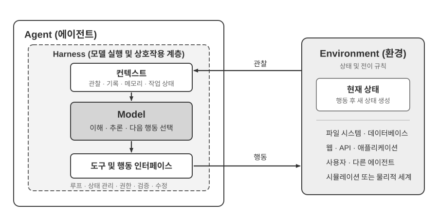
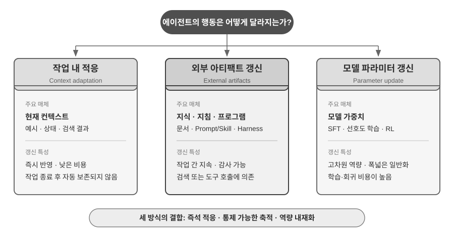
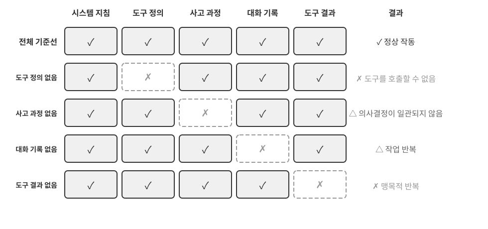
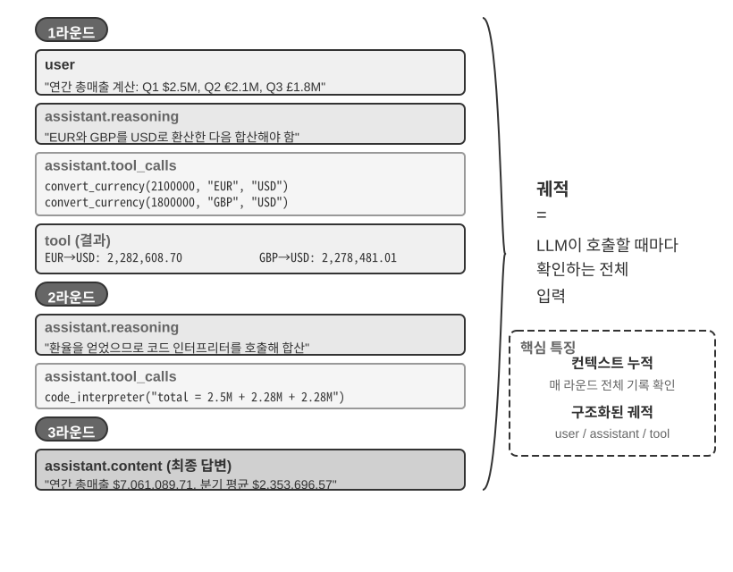
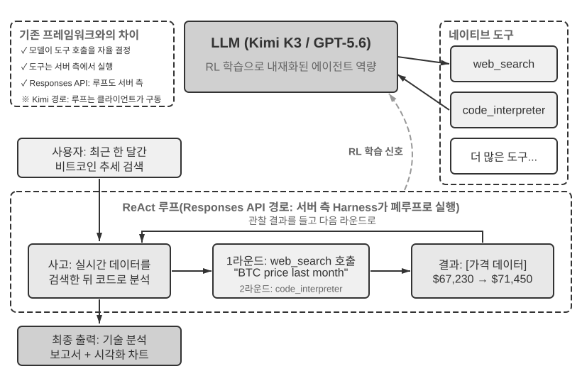
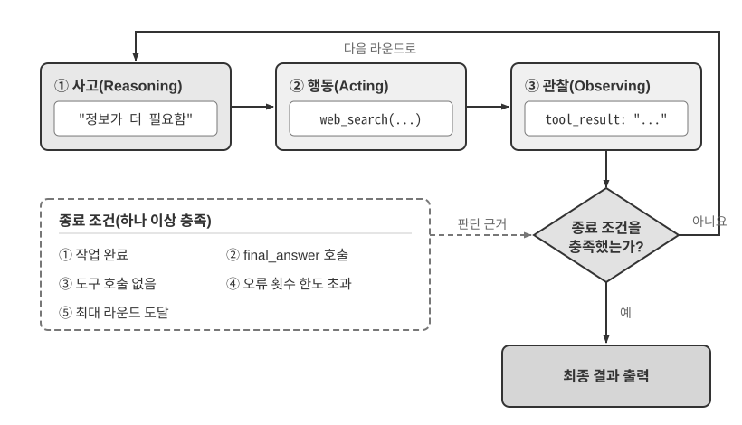

# AI 에이전트 입문

Cursor로 코드를 작성하면서 코드베이스를 검색하고, 여러 파일을 수정하고, 테스트가 통과할 때까지 다시 실행하는 모습을 지켜봤다면 이미 AI 에이전트를 사용해 본 것입니다. Deep Research로 반복해서 검색하고 자료를 읽으며 주제를 조사했거나, Manus에 브라우저를 조작해 온라인 작업을 끝내 달라고 했거나, Doubao 스마트폰 어시스턴트에게 표를 예매하거나 메시지를 보내 달라고 했거나, Pine AI에 통신 요금을 낮춰 달라고 협상을 맡긴 경우도 마찬가지입니다.

이 제품들은 형태는 제각각이지만 한 가지 공통점이 있습니다. 더 이상 수동적인 “질문하면 답하는” 대화에 머무르지 않습니다. 스스로 실행 단계를 계획하고, 작업에 필요한 도구를 호출하며, 결과에 따라 전략을 조정합니다. AI 에이전트는 컴퓨터와 상호작용하는 새로운 방식이 되고 있습니다.

이 장은 실제 사례에서 출발해 AI 에이전트의 핵심 구성 요소로 거슬러 올라갑니다. 독자는 현대 에이전트가 무엇을 할 수 있는지 직접 체감하고, 그 배후의 아키텍처를 이해하며, 에이전트 시스템을 구축할 때 필요한 설계 패턴과 모범 사례를 배우게 됩니다.

> **읽기 안내**: 이 장은 책 전체의 개념 지도입니다. 핵심 공식, 작동 루프, 엔지니어링 프레임워크, 에이전트 설계 패턴을 간결하게 훑으며 이후 장에서 공통으로 사용하는 어휘와 기준점을 세웁니다. 처음 읽을 때 모든 개념을 외우려 하지 말고 전체 그림을 파악하는 데 집중하세요. 뒤의 각 장은 여기서 소개한 한 측면을 자세히 확장하며, 방향을 다시 잡고 싶을 때 언제든 이 장으로 돌아올 수 있습니다.

## 현대 에이전트 = LLM + 컨텍스트 + 도구

현대 에이전트 시스템의 본질은 하나의 간결한 공식으로 나타낼 수 있습니다. **에이전트 = LLM(Large Language Model, 대규모 언어 모델) + 컨텍스트 + 도구**입니다. 각 항목을 넓은 의미로 이해한다면, 이 공식은 단순하면서도 실용적입니다.

- **LLM은 에이전트의 사고 엔진입니다**: 단순한 모델 파라미터 집합이 아니라 의도 이해, 사고, 계획, 판단을 담당하는 의사결정의 핵심입니다. LLM의 능력은 **사전 학습**에서 습득한 세계 지식과 언어 능력, 그리고 **사후 학습**을 통해 내재화한 의사결정 전략에서 나옵니다. 지도 미세 조정과 강화 학습 같은 기법은 8장에서 다룹니다.
- **컨텍스트는 에이전트가 현재 활용할 수 있는 정보의 작업 집합입니다**: 모델에 입력된 텍스트만 뜻하지 않습니다. 환경, 사용자 메모리, 도메인 지식, 에이전트 자체의 상태, 작업 진행 상황처럼 각 의사결정 시점에 이용할 수 있는 모든 정보가 포함됩니다. 사람이 판단할 때 상황을 살피고 관련 경험을 떠올리며 참고 자료를 확인하듯, 에이전트의 컨텍스트 창에는 그 순간 사용할 수 있는 정보가 담깁니다.
- **도구는 에이전트의 행동 인터페이스입니다**: 호출 가능한 API 함수 몇 개만을 뜻하지 않습니다. 미리 정의된 도구 호출, 필요할 때 불러오는 스킬, 즉석에서 새 능력을 만드는 코드 생성, 하위 에이전트에 작업 위임, 사용자에게 도움 요청, 외부 이벤트에 대한 반응까지 에이전트가 행동할 수 있는 모든 방식을 포함합니다.

더 직관적으로 표현하면 **에이전트 = 사고 엔진 + 작업 컨텍스트 + 행동 인터페이스**입니다. 모델은 사고하고 결정하며, 컨텍스트는 결정에 필요한 정보의 작업 집합을 제공하고, 도구는 그 결정이 외부 세계에 영향을 미치게 하는 인터페이스를 제공합니다.

고전적인 강화학습과 제어 이론의 관점에서 에이전트와 환경은 폐루프 상호작용의 두 당사자이며 서로의 구성 요소가 아닙니다. 환경이 관찰을 반환하면 에이전트는 컨텍스트를 바탕으로 다음 행동을 선택하고, 그 행동이 환경의 상태를 바꾸어 다음 관찰을 만들어 냅니다.



그림 1-1은 두 가지 추상화 수준을 보여 줍니다. 바깥 수준은 **에이전트와 환경의 상호작용**으로, 환경에는 파일 시스템, 데이터베이스, 웹, 사용자, 다른 에이전트, 물리적 또는 시뮬레이션 세계가 포함됩니다. 안쪽 수준은 **에이전트 내부의 모델–Harness 구조**입니다. 모델은 정책을 결정하고, Harness는 에이전트 경계 안에서 컨텍스트를 구성하고 도구 인터페이스를 노출하며 루프와 상태를 관리하고 권한·검증·수정을 적용하는 실행 및 거버넌스 계층입니다. Harness는 환경을 만들거나 격리하거나 대신 중개할 수 있지만 환경의 상태와 전이 규칙 자체를 포함하지는 않습니다.

따라서 공학적 공식은 다음처럼 펼쳐집니다. LLM은 모델에 해당하고 Context + Tools가 최소 Harness를 구성하며, 운영 시스템은 이 경계 안에 제약·검증·수정을 추가합니다. 이 장의 나머지 설명도 이 경계를 따릅니다.

이 세 구성 요소는 강화학습(RL, 8장 참조)의 세 가지 핵심 개념과 관련되지만 엄밀히 일대일로 대응하지는 않습니다. 컨텍스트는 관찰과 기록을 에이전트 내부에 표현한 것이고, 도구는 관찰·행동 인터페이스를 정의하지만 그 뒤의 대상은 여전히 환경에 속합니다.

| 직관적 표현 | 에이전트 구성 요소 | RL 개념 | 역할 |
|-----------|-----------|----------------------------|----------------------------------------------|
| **사고 엔진** | LLM | **정책(Policy)** | “다음에 무엇을 할지” 정하는 의사결정 논리로, 현재 정보를 바탕으로 가능한 모든 선택지 가운데 가장 적절한 행동을 고릅니다 |
| **작업 컨텍스트** | 컨텍스트 구성 | **관찰과 기록** | 환경의 관찰과 기존 기록을 현재 의사 결정에 필요한 정보로 구성합니다 |
| **행동 인터페이스** | 도구 인터페이스 | **관찰·행동 인터페이스** | 에이전트가 읽을 수 있는 관찰, 보낼 수 있는 행동과 그 형식을 정의합니다 |

### 관측 공간과 행동 공간: 모델과 세계를 잇는 인터페이스

**관측 공간과 행동 공간은 함께 LLM과 외부 환경 사이의 인터페이스를 이룹니다.** 관측 공간은 환경의 정보를 모델이 처리할 수 있는 컨텍스트로 바꾸고, 행동 공간은 모델의 결정을 외부 세계의 작업으로 바꿉니다. 관측 공간 밖의 정보는 사실상 모델에게 존재하지 않습니다. 행동 공간 밖의 작업은 모델이 무엇을 해야 하는지 정확히 알더라도 말로 권할 수만 있습니다.

따라서 **기반 모델이 같다면 에이전트 성능을 높이는 시스템 엔지니어링의 주된 지렛대는 관측 공간과 행동 공간을 다시 정의하거나 확장하는 일인 경우가 많습니다.** 이 책의 용어로는 컨텍스트와 도구를 확장하는 것입니다. “더 똑똑한 모델”이 필요해 보이는 문제 중 상당수는 실제로 인터페이스 문제입니다. 작업에 필요한 데이터를 컨텍스트에 넣거나 필요한 작업을 도구로 제공하면, 풀 수 없던 문제를 풀 수 있게 되기도 합니다.

**Manus: 서로 분리돼 있던 공간의 통합.** Manus가 등장하기 전의 상용 에이전트는 대체로 Deep Research, Coding, Computer Use라는 세 갈래로 나뉘었습니다. Manus는 이 셋을 하나의 시스템에 통합해 널리 영향을 미친 최초의 상용 에이전트였습니다. 가상 브라우저는 관측 공간을 넓혔고, 파일 시스템·코드 실행·명령줄 실행은 행동 공간을 넓혔습니다. Manus는 단지 더 강한 모델로 교체해서 범용 에이전트가 된 것이 아닙니다. 세 종류 에이전트의 관측 공간과 행동 공간을 합쳐 하나의 에이전트가 기존 제품 경계를 넘을 수 있게 했습니다.

**OpenClaw: 사용자의 디지털 생활로 인터페이스 확장.** OpenClaw는 두 공간을 다시 바깥으로 확장합니다. WhatsApp, Telegram, Slack, Discord, iMessage 등 사용자가 이미 머무는 메시징 채널을 통해 작업을 받고 결과를 돌려주므로 거의 어디서나 에이전트에 접근할 수 있습니다. 로컬 게이트웨이는 Google Drive나 Notion 같은 클라우드 애플리케이션뿐 아니라 로컬 파일 시스템에도 연결합니다. 이에 따라 계정과 기기에 흩어진 파일은 사용자의 명시적 허가 아래 하나의 에이전트 관측 공간에 들어오고, 그 도구의 작업 대상이 될 수 있습니다. 일반적으로 파일을 업로드하거나 커넥터를 별도로 구성해야 했던 초기 Manus의 클라우드 샌드박스 중심 구조와 비교하면, 로컬 우선 OpenClaw는 더 넓은 데이터 경계를 아우릅니다. 이후 Manus도 Google Drive 커넥터와 로컬 파일에 접근하는 데스크톱 기능을 추가했습니다. 이는 제품의 발전이 관측 공간과 행동 공간의 확장으로 이루어지는 경우가 많다는 점을 다시 보여 줍니다[^ch1-agent-products].

[^ch1-agent-products]: Manus의 공식 자료는 초기 Sandbox를 격리된 클라우드 가상 머신으로 설명합니다. Google Drive Connector를 소개할 때에는 이전에 Drive, 데스크톱, Manus 사이에서 파일을 수동으로 내려받고 올려야 했던 단절된 작업 흐름도 명시적으로 언급했습니다. 2026년 3월 My Computer를 출시할 때에는 중요한 작업이 클라우드가 아니라 로컬에 있다는 점을 클라우드 샌드박스의 근본적인 한계라고 밝혔습니다. OpenClaw의 공식 README는 사용자의 기기에서 실행되는 로컬 우선 상시 개인 비서로 설명하며 20개가 넘는 메시징 채널을 열거합니다. 도구와 플러그인 시스템을 통해 클라우드 연동과 로컬 기능을 추가할 수도 있습니다. https://manus.im/blog/manus-sandbox, https://manus.im/blog/manus-google-drive-connector, https://manus.im/blog/manus-my-computer-desktop, https://github.com/openclaw/openclaw, https://docs.openclaw.ai/tools 참조.

각 구성 요소가 무엇을 하고 어떻게 맞물리는지 이해하는 일은 효과적인 에이전트 시스템 구축의 토대입니다. 세 요소 중 가장 구체적인 행동 인터페이스인 도구부터 시작해 LLM과 컨텍스트로 들어가 보겠습니다. 먼저 다양한 에이전트를 이 세 차원에서 비교하면 다음과 같습니다.

| 에이전트 제품 | 작업 컨텍스트 | 행동 인터페이스 | 전략 |
|----------------|----------------------|----------------------------|------------------------------|
| **코딩 에이전트(예: Cursor)** | 요구 사항 문서, 코드베이스, 터미널 환경 | 개방형(내부 사고, 코드 검색, 파일 읽기·쓰기, 명령 실행 등) | 점진적 개발: 요구 사항 이해 → 관련 코드 검색 → 코드 수정 → 테스트와 검증 → 디버깅과 수정 |
| **검색 에이전트(예: Deep Research)** | 웹 자료, 학술 데이터베이스, 로컬 파일 | 개방형(내부 사고, 검색 질의, 웹 읽기, 요약 생성 등) | 반복적 심화: 확보한 정보에 따라 검색 방향 조정 → 점진적으로 완전한 보고서 종합 |
| **컴퓨터 제어 에이전트(예: Browser Use)** | 컴퓨터 화면, 브라우저 페이지, 파일 시스템 | 개방형(내부 사고, 클릭, 입력, 스크롤, 스크린샷, 코드 실행 등) | 시각 인식 + 조작: 화면 관찰 → 목표 요소 식별 → 작업 수행 → 결과 검증 |
| **스마트폰 어시스턴트 에이전트(예: Doubao)** | 스마트폰 화면, 설치된 앱 | 개방형(내부 사고, 클릭, 스와이프, 입력, 앱 실행 등) | 의도 이해 + 앱 제어: 사용자 요구 이해 → 대상 앱 찾기 → 작업 수행 → 완료 확인 |
| **개인 작업 에이전트(예: Pine AI)** | 사용자 계정 정보, 과거 청구서, 서비스 제공자 지식 베이스 | 개방형(내부 사고, 전화, 이메일, 양식 작성, 사용자 확인 등) | 다단계 작업 실행: 정보 수집 → 협상 전략 수립 → 서비스 제공자 연락 → 협상 → 결과 보고 |

이 시스템들은 세 가지 특징을 공유합니다. 정해진 버튼 중 하나를 고르는 대신 임의의 자연어와 코드를 생성하는 **개방형 행동 공간**, 행동 전에 계획하는 **내부 사고**, 환경 피드백에 따라 전략을 조정하는 **지속적 상호작용**입니다. 이러한 능력은 사고 엔진, 작업 컨텍스트, 행동 인터페이스, 즉 LLM·컨텍스트·도구의 상호작용에서 나옵니다.

### 도구: 에이전트의 행동 인터페이스

도구는 에이전트와 외부 세계를 잇는 다리입니다. 도구를 통해 에이전트는 수동적인 관찰자에서 검색하고, 파일을 쓰고, 코드를 실행하고, API를 호출하고, 메시지를 보내고, 인터페이스를 조작하는 능동적 시스템으로 바뀝니다. 도구가 없으면 에이전트는 텍스트 생성에 머물지만, 도구가 있으면 외부 시스템에 행동할 수 있습니다.

도구를 체계적으로 설명하기 위해 에이전트가 세계와 상호작용하는 방향에 따라 다섯 유형으로 나눌 수 있습니다. 여기서는 전체 그림을 잡을 수 있도록 유형별 대표 사례만 간단히 살펴보고, 뒤의 장에서 각각 자세히 다룹니다.

**인식 도구(Perception Tools)**는 에이전트가 정보에 접근하게 합니다. 검색 엔진은 실시간 웹 데이터를 제공하고, 파일 시스템은 로컬 문서를 읽으며, API와 데이터베이스는 외부 서비스 및 기업의 핵심 데이터에 연결합니다.

**실행 도구(Execution Tools)**는 에이전트가 외부 시스템에 행동하게 합니다. 코드 실행, 파일 작업, 시스템 명령, 외부 API 호출은 결정을 구체적인 행동으로 바꿉니다.

**협업 도구(Collaboration Tools)**는 에이전트가 다른 에이전트와 일을 나누게 합니다. 전문 작업을 하위 에이전트에 위임하고, 핵심 의사결정 시점에 사람의 확인을 요청하거나, 멀티 에이전트 시스템의 행동을 조율할 수 있습니다.

**이벤트 트리거 도구(Event Trigger Tools)**의 호출 방식은 앞의 세 유형과 근본적으로 다릅니다. 에이전트가 호출하는 것이 아니라 외부 입력으로 도착해 에이전트가 일을 시작하도록 촉발합니다. 새 이메일이 오거나, 예약 시간이 되거나, 다른 시스템이 Webhook 콜백을 보내면 이벤트가 에이전트를 활성화하고 사고와 행동을 시작시킵니다. 에이전트가 직접 호출하지 않더라도 외부 세계와 상호작용하는 통로이므로 넓은 의미의 도구 체계에 포함합니다.

**사용자 커뮤니케이션 도구(User Communication Tools)**는 에이전트가 사용자와 소통하는 채널입니다. 실행 도구가 외부 세계를 바꾸는 반면, 커뮤니케이션 도구는 문자 메시지, 음성 통화, 이메일 등을 통해 진행 상황을 전하거나 먼저 확인을 요청하는 식으로 정보를 전달합니다.

4장에서는 다섯 유형의 전체 분류와 설계 원칙을 다룹니다. 도구 설계의 품질은 에이전트가 무엇을 안정적으로 해낼 수 있는지를 직접 결정합니다. 인터페이스가 모호하면 모델이 도구를 잘못 사용하고, 오류 처리가 부실하면 도구 하나의 실패로 에이전트가 멈추며, 권한 범위가 지나치게 넓으면 한 번의 오류가 되돌릴 수 없는 결과로 이어질 수 있습니다. MCP(Model Context Protocol) 표준이 확산되면서 도구 통합이 더 쉬워지고 있습니다.

**도구 호출(Tool Calling)**은 Function Calling이라고도 하며, 현대 LLM 에이전트의 핵심 능력입니다. 모델이 구조화된 방식으로 외부 도구를 호출하게 하여 LLM을 순수 텍스트 생성기에서 외부 인터페이스를 통해 행동하는 지능형 시스템으로 바꿉니다. 이 책에서는 일관되게 “도구 호출”이라는 용어를 사용합니다.

도구 호출은 네 단계로 진행됩니다. 먼저 컨텍스트에서 사용할 수 있는 도구의 이름, 용도, 파라미터를 모델에 알려 줍니다. 모델은 도구를 호출할지, 어떤 도구를 호출할지, 어떤 인수를 넘길지 스스로 결정합니다. 도구 실행이 끝나면 결과를 컨텍스트에 추가합니다. 마지막으로 모델은 그 결과를 바탕으로 다음 행동을 결정합니다. 이 루프는 이 장 뒤에서 소개할 ReAct의 토대입니다.

날씨 질의를 예로 들면 API 수준의 네 단계는 다음처럼 단순화할 수 있습니다.

```text
1단계: 도구 선언                       2단계: 모델이 호출 결정
tools: [{                             assistant: {
  name: "get_weather",                  tool_calls: [{
  parameters: {                           function: "get_weather",
    city: "string"                        arguments: {city: "Beijing"}
  }                                      }]
}]                                    }

3단계: 결과를 컨텍스트에 추가          4단계: 모델이 결과를 바탕으로 응답
tool: {                               assistant: {
  tool_call_id: "call_1",               content: "오늘 베이징은 28°C, 맑음입니다."
  content: '{"temp":28,"sky":"clear"}' }
}                                     }
```

개발자는 도구를 정의하고 호출을 실행할 뿐이며, 호출 여부와 대상 도구, 전달할 인수는 모델이 스스로 결정합니다. 2장에서 이 API 구조를 자세히 살펴봅니다.

에이전트용 도구를 설계할 때는 작업에 필요한 가장 좁은 능력에서 시작해 작업이 복잡해질 때 점진적으로 확장해야 합니다. 기본 산술만 필요하다면 파라미터가 명확한 계산기로 충분합니다. 하지만 스프레드시트 읽기, 결측값 정리, 통계 계산, 차트 그리기까지 요구된다면 계속 늘어나는 전용 도구 모음보다 제약된 Python 코드 인터프리터가 조합과 탐색에 더 유리합니다. 다만 범용성이 높아질수록 오류 위험과 공격 표면도 커집니다. 코드는 격리된 샌드박스에서 실행하고, 네트워크 접근은 기본적으로 차단하며, 허가된 작업 디렉터리 밖의 파일에는 접근하지 못하게 하고, 실행 시간·CPU·메모리·출력 크기를 제한해야 합니다.

마찬가지로 한 번의 실행을 기록하는 데는 단일 로깅 도구가 적합하지만, 몇 시간 또는 며칠 동안 이어지는 작업에는 통제된 가상 작업 디렉터리가 유용합니다. 계획, 중간 결과, 실행 로그, 최종 산출물을 보존해 여러 번의 실행에 걸쳐 작업을 재개할 수 있습니다. 이 디렉터리도 읽고 쓸 수 있는 경로, 저장 용량, 파일 유형을 제한하고 경로 순회를 차단해야 하며, 호스트 파일 시스템 전체를 에이전트에 노출해서는 안 됩니다.

범용 도구가 언제나 전용 도구보다 좋은 것은 아닙니다. 결제, 데이터 삭제, 이메일 전송, 프로덕션 배포처럼 위험이 높거나 엄격한 비즈니스 제약을 받는 작업은 명시적인 파라미터, 제한된 권한, 종단 간 감사 기능을 갖춘 전용 도구로 제공해야 합니다. 필요하다면 미리보기와 사람의 확인도 추가해야 합니다. 따라서 도구 설계의 핵심 원칙은 다음과 같습니다. **조합과 탐색에는 범용적인 기반 능력을 사용하고, 위험한 작업을 제한하고 엄격한 비즈니스 규칙을 강제할 때는 전용 도구를 사용합니다.**

### LLM: 에이전트의 사고 엔진

대규모 언어 모델(LLM)은 에이전트 의사결정의 핵심입니다. 사용자 요청을 받으면 먼저 실제 의도를 추론해야 합니다. 사용자가 말한 것과 정말 원하는 것이 서로 다른 경우가 많기 때문입니다. 그런 다음 모호하거나 복잡한 작업을 실행 가능한 단계로 나눕니다. 실행 중에도 다음에 무엇을 할지, 도구를 호출할지, 어떤 도구에 어떤 인수를 넘길지를 계속 결정합니다. 이러한 이해–계획–실행 능력은 사전 학습에서 축적한 지식에서 나오며, 워크플로와 자율 에이전트 모두가 의존하는 토대입니다.

LLM 에이전트의 독특한 능력은 **내부 사고**입니다. 행동하기 전에 작업을 계획하고 논리적으로 검토할 수 있습니다. 이 과정 자체는 외부 환경을 바꾸지 않지만 뒤따르는 행동의 품질을 크게 높입니다. 이 능력은 인터넷의 방대한 텍스트에서 언어 패턴과 세계 지식을 배우는 초기 과정인 사전 학습에서 나옵니다. 모델은 수학 법칙, 인과관계, 문제 분해 전략처럼 인간 지식에 담긴 사고 패턴을 활용합니다. 따라서 전통적인 강화 학습 에이전트와 달리, 오늘날의 LLM 기반 에이전트는 맹목적으로 무작위 탐색을 하는 것이 아니라 구조화된 지식 체계 위에서 사고합니다.

#### 모델이 곧 에이전트: 모델 자체가 제품이 될 때

“모델이 곧 에이전트(Model as Agent)”라는 새로운 패러다임은 AI 에이전트 발전의 최신 방향을 보여 줍니다. 고도화된 모델은 사후 학습, 특히 강화 학습을 통해 도구 호출 능력을 네이티브 능력으로 내재화합니다. 언제 어떤 도구를 호출하고 어떤 파라미터를 넘길지 모델이 직접 결정하므로 사람이 일일이 오케스트레이션할 필요가 없습니다. 그렇다고 프레임워크 계층의 중요성이 줄어드는 것은 아닙니다. 오히려 모델이 강해질수록 주변의 하네스(harness)가 더 중요해집니다. 하네스는 본래 말에 채우는 굴레와 마구를 뜻합니다. 말의 달리는 힘을 억누르는 것이 아니라 그 힘을 올바른 방향으로 이끕니다. 에이전트의 관점에서 모델은 강력하지만 예측하기 어려운 말이고, 하네스는 그 능력을 안정적인 작업 실행으로 유도하는 엔지니어링 외피입니다. 에이전트의 하네스에는 컨텍스트 관리, 도구 인터페이스, 안전 제약, 검증과 교정 같은 인프라가 포함됩니다. 이 장 마지막 절에서 자세히 다룹니다.

모델에 더 많은 의사결정 권한을 줄수록 잘못된 결정의 영향도 커지므로, 안정성을 유지하려면 더 세밀한 제약·검증·교정이 필요합니다. 모델 공급자의 진정한 강점은 “프레임워크를 얇게 만드는 것”이 아니라 모델과 주변 하네스를 함께 최적화하며 지속적으로 개선할 수 있다는 데 있습니다.

여기서 더 깊은 질문이 생깁니다. 모델이 계속 강해지면 오늘날의 하네스는 결국 모델에 흡수될까요? Rich Sutton은 「The Bitter Lesson」에서 70년에 걸친 AI 연구에서 반복된 패턴을 돌아봤습니다[^ch1-1]. 연구자들은 도메인에 대한 자신의 이해를 시스템에 직접 넣어 단기적인 성과를 얻었지만, 장기적으로는 계산량과 데이터 규모에 따라 확장되는 범용 방법, 즉 검색과 학습에 늘 뒤처졌습니다. 이 관점에서 보면 하네스의 제약·검증·교정 가운데 얼마나 많은 부분이 결국 모델에 내재화될 “인간의 사전 지식”일까요? 이 책의 입장은 **방향에는 동의하되, 속도는 현실적으로 본다**는 것입니다. 모델이 계속 하네스의 일부를 흡수할 것이라는 방향에는 의심의 여지가 없습니다. 한때 외부 오케스트레이션에 의존하던 도구 호출과 장기 계획은 이미 모델의 네이티브 능력이 되었습니다. 하지만 그 흡수 속도는 직관보다 훨씬 느립니다. 학습 주기는 몇 달 단위이고, 현실 비즈니스의 모든 제약과 선호를 한 번에 내재화할 모델은 없습니다. 현재 모델의 능력 경계가 바로 현재 하네스의 가치가 존재하는 곳입니다. 따라서 하네스 엔지니어링은 Bitter Lesson에 대한 저항이 아니라 그 교훈을 엔지니어링의 시간 척도에서 실천하는 일입니다. 모델이 아직 안정적으로 하지 못하는 부분은 하네스가 먼저 보완하고, 모델이 한 계층을 내재화할 때마다 하네스는 그 계층을 내려놓고 다음 능력 경계를 지원합니다.

[^ch1-1]: Sutton, Rich. “The Bitter Lesson”, 2019. http://www.incompleteideas.net/IncIdeas/BitterLesson.html

#### 에이전트의 학습 메커니즘: 컨텍스트 적응에서 지속적 업데이트까지

앞에서는 모델이 강화 학습을 통해 도구 사용 정책을 네이티브 능력으로 내재화할 수 있다고 설명했습니다. 그러나 에이전트의 행동 변화가 학습 단계에서만 일어나는 것은 아닙니다. 업데이트가 일어나는 위치와 지속 시간에 따라 이러한 변화는 세 가지 상호 보완적인 경로로 이해할 수 있습니다(그림 1-2). 작업 안에서 이루어지는 컨텍스트 적응, 작업을 넘어 지속되는 외부 산출물 업데이트, 학습 주기에서 이루어지는 파라미터 업데이트입니다.



**컨텍스트 적응**은 현재 작업 안에서 일어납니다. 예시, 상태, 검색 결과가 컨텍스트에 들어오면 모델은 행동을 즉시 조정할 수 있지만, 다음 세션의 지속 상태까지 바뀌지는 않습니다. 빠르고 비용이 낮다는 장점이 있고 컨텍스트 창과 정보 구성 방식의 제약을 받는다는 한계가 있습니다. 2장에서 이 적응 방식이 어떻게 작동하는지 자세히 설명합니다.

변화를 작업 간에도 유지하려면 **외부 산출물**을 업데이트할 수 있습니다. 사실과 경험은 지식 문서로 정리하고, 언어로 표현할 수 있는 전략은 프롬프트나 스킬에 기록하며, 결정적인 절차와 제약은 프로그램과 하네스로 구현합니다. 이러한 산출물은 감사하고 수정할 수 있지만, 실행 시에는 여전히 컨텍스트나 도구 인터페이스를 통해 에이전트가 접근해야 합니다. 3~5장은 지식과 프로그램의 기초를 마련하고, 9장은 평가된 운영 궤적에서 이러한 업데이트를 생성하는 방법을 다룹니다.

의료 영상 이해, 자연어 스타일, 암묵적인 의사결정 정책처럼 외부 규칙으로 완전히 표현하기 어려운 고차원 능력이 목표라면, 사후 학습을 통해 **모델 파라미터**를 업데이트해야 합니다. 파라미터 업데이트는 배포 비용이 더 높지만 자연스럽고 폭넓은 일반화 능력을 만들 수 있습니다. 8장에서 그 방법을 체계적으로 소개합니다. 세 경로는 서로 배타적인 분류가 아니라 서로 다른 시간 척도에서 작동하는 협력 메커니즘입니다. 컨텍스트는 즉각적인 적응을, 외부 산출물은 통제 가능한 축적을, 파라미터는 명시적으로 표현하기 어려운 능력의 내재화를 담당합니다.

### 컨텍스트: 에이전트의 작업 정보 집합

컨텍스트는 각 의사결정 시점에 에이전트가 활용할 수 있는 정보의 작업 집합입니다. 사람이 판단할 때 작업 지시, 참고 설명서, 이전 연락 기록, 최신 데이터처럼 알맞은 자료를 책상 위에 펼쳐 놓아야 하듯, 에이전트의 컨텍스트 창은 그 순간 이용할 수 있는 정보입니다. API 관점에서 보면 각 LLM 호출의 컨텍스트는 다음 다섯 부분으로 구성됩니다. 자세한 내용은 2장에서 다룹니다.

- **시스템 프롬프트(System Prompt)**: 대화 중 사용자가 입력하는 프롬프트와 달리 개발자가 작성하며 대화 전체에서 고정됩니다. 에이전트의 “직무 기술서”로서 정체성, 권한, 행동 규칙을 정의합니다. 시스템 프롬프트를 세심하게 설계하는 프롬프트 엔지니어링을 통해 에이전트의 작동 방식을 형성합니다. 시스템 프롬프트에는 세션 간에 유지되는 **사용자 메모리**(선호, 과거 행동, 배경 설정 같은 개인화 정보로 3장 참조)와 동적으로 주입되는 환경 상태도 포함됩니다.
- **도구 정의(Tool Definitions)**: 에이전트가 사용할 수 있는 도구의 이름, 기능 설명, 파라미터 형식을 선언합니다. 도구 정의가 없으면 에이전트는 어떤 도구도 인식하거나 호출할 수 없습니다. 실험 1-1의 제거 실험에서 이를 검증합니다. 도구 정의는 시스템 프롬프트와 함께 대화 내내 바뀌지 않는 **정적 접두부**를 이룹니다. 이것이 기본 패턴이지만, 2026년 이후의 상용 프레임워크는 접두부를 깨뜨리지 않으면서 전체 도구 스키마를 필요할 때 컨텍스트 끝에 동적으로 불러올 수도 있습니다. 2장의 도구 정의 절과 4장을 참조하세요.
- **사용자 메시지(User Messages)**: 사용자의 입력입니다. 사용자 메시지에는 RAG(Retrieval-Augmented Generation, 검색 증강 생성. 3장 참조)로 동적으로 검색한 **외부 지식**이 들어갈 수도 있습니다. 학습 데이터 기준일 이후의 정보나 비공개 도메인 지식이 여기에 해당합니다.
- **어시스턴트 메시지(Assistant Messages)**: 모델이 이전에 생성한 응답으로, 최대 세 부분을 포함합니다. 내부 사고 흐름을 뜻하며 일관성과 의사결정의 해석 가능성을 유지하는 `reasoning`, 사용자에게 보내는 응답인 `content`, 에이전트가 행동하는 방식인 `tool_calls`입니다. 한 응답에 세 부분이 항상 동시에 나타나는 것은 아닙니다. 예를 들어 도구 호출을 결정할 때에는 보통 `reasoning` + `tool_calls`만 있고, 최종 답변을 할 때에는 보통 `reasoning` + `content`만 있습니다.
- **도구 결과(Tool Results)**: 에이전트 프레임워크가 도구를 실행한 뒤 반환하는 출력입니다. 다음 사고 단계의 직접적인 근거가 되며, 에이전트가 결과에서 배우고 같은 실수를 반복하지 않게 합니다.

앞의 두 항목(시스템 프롬프트 + 도구 정의)은 정적 접두부를 이루고, 뒤의 세 항목(사용자 메시지 + 어시스턴트 메시지 + 도구 결과)은 상호작용할 때마다 늘어나는 동적 메시지 기록을 이룹니다. 이 다섯 부분을 합친 것이 각 LLM 추론의 컨텍스트입니다.

모든 구성 요소가 정말 필요할까요? 가장 직접적인 확인 방법은 원인을 하나씩 제외해 보는 진단 방식인 **제거 실험(ablation study)**입니다. 구성 요소 A를 제거하고 시스템이 여전히 작동하는지 확인한 뒤 B를 제거하는 식으로 각 요소의 기여도를 밝힙니다. 실험 1-1은 위의 다섯 구성 요소에 이 방법을 적용합니다. 결과는 분명합니다. 도구 정의가 없으면 에이전트는 전혀 행동할 수 없습니다. 도구 결과가 없으면 이전 단계의 피드백을 받지 못해 같은 도구를 반복 호출하며 무한 루프에 빠집니다. 어시스턴트 메시지의 사고 내용이 없으면 연속된 결정이 서로 모순되기 시작합니다. 메시지 기록이 없으면 작업의 연속성을 잃고 처음부터 다시 시작해 이미 마친 단계를 반복합니다.

> **실험 1-1 ★★: 컨텍스트의 결정적 역할**
>
> 체계적인 **제거 실험**을 통해 컨텍스트의 각 구성 요소가 에이전트 행동에 어떤 영향을 미치는지 살펴봤습니다. 다섯 요소 가운데 네 요소를 시험했습니다. 에이전트 정체성의 기본 정의인 시스템 프롬프트를 없애면 역할 인식 자체가 사라져 실험의 의미가 없으므로 제외했습니다. 그림 1-3처럼 모든 구성 요소를 유지한 완전한 기준 그룹과 각 요소를 하나씩 뺀 네 그룹, 총 다섯 개의 통제 그룹에서 에이전트 성능에 미치는 영향을 관찰했습니다.
>
> 
>
> 실험 결과는 각 컨텍스트 요소가 대체할 수 없는 역할을 한다는 사실을 보여 줬습니다. 정적 접두부의 일부인 **도구 정의**는 에이전트 행동 능력의 토대입니다. 이것이 없으면 어떤 도구도 인식하거나 호출할 수 없습니다. **도구 결과**는 폐루프 제어의 핵심입니다. 실행 피드백이 없으면 에이전트는 무한 루프에 빠집니다. 어시스턴트 메시지의 `reasoning` 부분인 **사고 과정**은 이전 결정의 이유를 보존해 전체 사고의 일관성을 높이고 모순된 결정을 막습니다. 이전 라운드의 사용자 메시지, 어시스턴트 메시지, 도구 결과를 포함한 **메시지 기록**은 불필요한 반복을 막고 작업의 일관성을 유지하며 같은 실수를 되풀이하지 않게 합니다.
>
> 이 실험의 핵심 통찰은 다음과 같습니다. **컨텍스트는 의사결정 시점에 에이전트가 어떤 정보를 갖고 있는지를 결정하며, 에이전트는 그 정보만으로 결정할 수 있습니다.** 중요한 문서가 없는 사람이 올바르게 판단할 수 없듯, 컨텍스트 요소 하나라도 빠진 에이전트의 의사결정 능력은 크게 떨어집니다. 도구 정의가 없으면 어떤 도구가 있는지 모르고, 이전 실행 결과가 없으면 이미 무엇을 했는지 모릅니다.

### ReAct 루프

세 구성 요소를 이해했다면 자연스럽게 다음 질문이 생깁니다. 이들은 어떻게 함께 작동할까요? ReAct 루프는 LLM, 컨텍스트, 도구를 하나의 시스템으로 연결하는 핵심 메커니즘입니다. 단계별로 살펴보겠습니다.

에이전트가 작업을 실행하는 핵심 패턴을 **ReAct**(Reasoning + Acting)라고 합니다. 이름에는 사고와 행동만 들어 있지만 실제 루프는 세 단계입니다. 먼저 모델이 다음 행동을 **사고(reason)**하고, 도구를 호출해 **행동(act)**한 뒤, 도구 결과를 **관찰(observe)**하고 다음 단계를 다시 사고합니다. “사고 → 행동 → 관찰 → 사고 → 행동 → 관찰” 루프가 작업이 끝날 때까지 반복됩니다.

여러 통화의 매출을 합산하는 구체적인 예로 에이전트의 **궤적(trajectory)**을 이해해 보겠습니다. 궤적은 작업 과정에서 축적되는 메시지 기록으로, 사용자 메시지, 사고와 도구 호출이 포함된 어시스턴트 메시지, 도구 결과로 구성됩니다. LLM을 호출할 때마다 모델이 받는 전체 컨텍스트는 **정적 접두부**(시스템 프롬프트 + 도구 정의)와 **궤적**(동적 메시지 기록)의 합입니다(그림 1-4). 즉 **에이전트 컨텍스트 = 정적 접두부 + 궤적**입니다. 정적 접두부는 앞의 다섯 요소 중 처음 두 개이고, 궤적은 상호작용할 때마다 늘어나는 나머지 세 개입니다. LLM은 이 전체 컨텍스트에서 다음 응답을 생성하고, 생성된 응답은 다음 호출을 위해 궤적에 추가됩니다.



다음 Python 스타일 스케치는 설명을 위한 pseudocode이며 실행 가능한 SDK 코드가 아닙니다. `python` 마커는 구문 강조에만 사용합니다.

**ReAct 제어 루프:**

```python
trajectory = [user_request]

repeat:
    context = stable_prefix + trajectory
    decision = Model(context)
    trajectory.append(decision)

    if decision has no tool call:
        return decision.answer

    for call in decision.tool_calls:       # independent calls may run in parallel
        validated_call = Harness.validate(call)
        observation = Environment.execute(validated_call)
        trajectory.append(observation)
```

궤적의 구조를 의사 코드로 나타내면 다음과 같습니다.

```text
trajectory = [
  {role: "user", content: "회사의 분기 매출이 1분기 250만 USD, 2분기 210만 EUR, 3분기 180만 GBP, 4분기 3억 8천만 JPY일 때 연간 총매출과 분기 평균 매출을 계산하세요."},

  # 첫 번째 반복 - LLM이 위 궤적을 받아 응답 생성
  {role: "assistant",
   reasoning: "모든 통화를 USD로 환산해야 합니다...",
   content: "",  # 사용자에게 바로 보내는 응답 없음
   tool_calls: [
     {name: "convert_currency", args: {amount: 2100000, from: "EUR", to: "USD"}},
     {name: "convert_currency", args: {amount: 1800000, from: "GBP", to: "USD"}},
     {name: "convert_currency", args: {amount: 380000000, from: "JPY", to: "USD"}}
   ]},

  # 에이전트 프레임워크가 도구를 실행하고 결과를 궤적에 추가
  {role: "tool", content: "EUR->USD: 2282608.7"},
  {role: "tool", content: "GBP->USD: 2278481.01"},
  {role: "tool", content: "JPY->USD: 2541806.02"},

  # 두 번째 반복 - LLM이 도구 결과를 포함한 전체 궤적을 받음
  {role: "assistant",
   reasoning: "환산 결과를 얻었으므로 이제 합계와 평균을 계산해야 합니다...",
   content: "",
   tool_calls: [
     {name: "code_interpreter", args: {code: "total = 2500000 + 2282608.7 + ..."}}
   ]},

  {role: "tool", content: "총매출: $9,602,895.73, 평균: $2,400,723.93..."},

  # 세 번째 반복 - LLM이 전체 궤적을 받아 최종 답변 생성
  {role: "assistant",
   reasoning: "모든 계산을 마쳤으므로 결과를 요약합니다...",
   content: "최종 답변: 총매출은 $9,602,895.73입니다..."}
]
```

시스템 프롬프트와 도구 정의는 궤적에 표시되지 않습니다. 이들은 정적 접두부로서 각 LLM 호출 전에 궤적 앞에 자동으로 붙습니다.

실험에서도 이 루프가 뚜렷하게 나타났습니다. 첫 번째 라운드에서 에이전트는 작업을 분석하고 세 개의 환율 변환 도구를 병렬로 호출했습니다. 두 번째 라운드에서는 변환 결과를 코드 인터프리터에 넘겨 계산량이 더 많은 연산을 수행했습니다. 세 번째 라운드에서 모든 계산이 끝났음을 확인하고 최종 답변을 생성했습니다. 복잡한 다단계 작업을 3번의 반복과 4번의 도구 호출로 마쳤습니다.

이 가장 기본적인 설계에서 LLM이 보는 컨텍스트는 계속 덧붙여집니다. LLM은 호출될 때마다 전체 궤적을 받으므로 현재 작업 단계, 이전에 시도한 일, 그 결과를 모두 압니다. 사람이 문제를 풀면서 계속 검토하고 요약하듯 에이전트는 궤적을 통해 작업의 전체 모습을 유지합니다. 궤적은 사용자 메시지, 사고와 도구 호출을 담은 어시스턴트 메시지, 도구 결과가 명확히 분리된 구조이므로 해석하고 디버깅하기도 쉽습니다.

궤적은 단순한 실행 기록을 넘어 에이전트 능력의 증거입니다. 대규모로 궤적을 분석하면 행동 패턴, 더 나은 의사결정 경로, 더 좋은 도구 설계를 발견할 수 있습니다. 궤적 데이터를 지식 베이스로 정제하거나 강화 학습으로 더 강한 에이전트 모델을 훈련하는 데 사용할 수도 있습니다. 경험에서 배우는 순환이 완성되는 것입니다.


에이전트의 작동 루프를 이해했으므로 이제 두 실험을 통해 서로 다른 모델이 이 루프를 어떻게 구동하는지 살펴보겠습니다.

> **실험 1-2 ★: Kimi K3의 네이티브 에이전트 능력**
>
> 이 실험은 “모델이 곧 에이전트” 패러다임의 사례인 **Kimi K3**의 네이티브 에이전트 능력을 보여 줍니다. Kimi K3는 약 2조 8천억 개의 파라미터를 가진 전문가 혼합(Mixture of Experts, MoE) 모델입니다. MoE는 전문가 팀에 비유할 수 있습니다. 문제 유형마다 전체 모델 대신 가장 적합한 소수의 전문가만 활성화해 전체 비용을 치르지 않고도 능력을 유지합니다. Kimi K3는 100만 토큰의 컨텍스트 창, 네이티브 시각 이해 능력, 상시 작동하는 “사고 모드”를 갖췄습니다. 강화 학습을 통해 도구 호출 **의사결정 정책**을 네이티브 능력으로 내재화했습니다. 언제 어떤 도구를 호출하고 어떤 인수를 넘길지 모델이 직접 결정하므로 웹 검색 같은 작업을 자율적으로 수행할 수 있습니다. 정확히 말하면 내재화한 것은 *언제 어떻게 호출할지*에 대한 결정입니다. `web_search`, `code_runner` 같은 도구 자체는 여전히 API 수준의 내장 도구로서 서버에서 실행됩니다. Kimi는 Formula라는 서버 측 스크립트 엔진을 통해 이 공식 도구들을 실행합니다.
>
> 핵심 관찰은 다음과 같습니다. 검색 시점과 검색 내용을 모델이 판단하므로 진정한 자율성을 보여 주며, 검색 결과가 들어올 때 전략을 조정하고 정보가 충분한지 판단합니다. 흔한 오해를 바로잡자면 **강화 학습이 모델에 제공하는 것은 의사결정 정책이지 도구 자체가 아닙니다.** 어떤 도구를 언제 호출할지, 어떤 인수를 넘길지, 결과를 받은 뒤 계속할지, 수십 번 또는 수백 번의 호출을 일관된 사고로 어떻게 연결할지를 가르치며, 이 *사용 여부와 사용 방식*의 판단이 모델 가중치에 기록됩니다. **도구와 실행 환경은 에이전트 프레임워크나 API 내장 기능이 제공합니다.** `web_search`와 `code_runner` 구현, 코드 샌드박스, 호출을 전달하고 결과를 반환하는 인프라는 모두 모델 밖에 있습니다. 강화 학습은 의사결정 정책을 최적화할 뿐 검색 엔진이나 코드 샌드박스를 모델 가중치에 넣지 않습니다. 따라서 오케스트레이션 루프는 사라진 것이 아니라 클라이언트에서 서버로 이동했고, 의사결정이 모델 안으로 들어간 것입니다[^ch1-2].
>
> [^ch1-2]: GitHub Issue #30을 통해 “강화 학습이 내재화하는 것은 도구 호출의 의사결정 정책이지 도구 실행 메커니즘이 아니다”라는 차이를 지적하고 명확히 해 준 독자 asdlem에게 감사드립니다. https://github.com/bojieli/ai-agent-book/issues/30 참조.
>
> Kimi K3가 에이전트 작업에서 보이는 두드러진 강점은 **긴 도구 호출 연쇄의 안정성**입니다. 대부분의 모델이 수십 번 이후 성능이 저하되기 시작하는 것과 달리, 200~300번의 연속 도구 호출에서도 일관된 사고를 유지할 수 있습니다. K3는 장기 프로그래밍과 에이전트 작업에 최적화되었으며, 대화 및 에이전트 작업용 K3 Max와 대규모 병렬 처리용 K3 Swarm Max 두 가지로 출시됐습니다. 오픈 소스 모델이면서도 소프트웨어 엔지니어링과 에이전트 벤치마크에서 최상위 비공개 모델에 필적합니다. 강화 학습이 모델에 네이티브 에이전트 능력을 부여할 수 있다는 증거입니다.

> **실험 1-3 ★: GPT-5.6의 네이티브 Deep Research 능력**
>
> 두 번째 실험은 **OpenAI GPT-5.6**을 통해 고도화된 모델이 API 수준의 내장 도구와 함께 Deep Research의 “검색–읽기–분석” 오케스트레이션 루프를 서버에서 완성하는 방식을 보여 줍니다. GPT-5.6의 편리한 기능 중 하나는 **자유 형식 도구 호출(Freeform Tool Calling)**입니다. 전통적인 도구 호출에서는 엄격한 서식의 양식을 채우듯 모든 파라미터를 구조화된 데이터 형식인 JSON으로 직렬화해야 합니다. API에서 `type: "custom"` 도구로 선언하는 자유 형식 도구 호출은 Python 코드 조각이나 SQL 질의 같은 원문 텍스트를 도구로 바로 보내 JSON 이스케이프를 피합니다. 이는 모델 아키텍처의 혁신이 아니라 API 파라미터 형식의 발전이라는 점이 중요합니다. `tool_calls` 감지 → 실행 → 결과 반환이라는 클라이언트 루프는 같고, 인수만 JSON 문자열에서 원문 텍스트로 바뀝니다.
>
> GPT-5.6은 Responses API의 **웹 검색과 코드 인터프리터** 내장 도구와 결합해 Deep Research의 핵심 메커니즘을 구현합니다. 모델이 실시간 정보를 자율적으로 웹에서 검색하고 심층 분석용 코드를 작성하여 “검색 → 읽기 → 분석 → 다시 검색”하는 반복 연구 과정을 수행합니다. 예를 들어 “ASEAN 10개국 수도 사이의 최단거리는 얼마인가?”라는 질문을 받으면 각 수도의 지리 좌표를 검색한 뒤 Python 코드로 모든 수도 쌍의 대권 거리를 계산해 가장 가까운 쌍을 찾습니다. “지난 한 달간 비트코인의 추세를 검색하고 기술적 분석을 수행하라”는 작업에서는 여러 금융 데이터 소스에서 실시간 가격을 가져오고, 전문 기술 분석 라이브러리로 이동 평균·RSI·MACD 등의 지표를 계산하고, 시각화 차트를 만든 뒤 거래 제안을 제시할 수 있습니다.
>
> 더 중요한 점은 GPT-5.6이 **OpenAI Deep Research** 제품의 설계 철학을 모델 수준에 내재화하여 **의도 명확화 과정**을 도입했다는 것입니다. 연구 요청을 받으면 곧바로 실행하지 않고 일련의 질문으로 사용자의 진짜 의도를 먼저 확인합니다. “지난 한 달간 비트코인 추세를 검색하고 기술적 분석을 수행하라”는 요청에 “선호하는 데이터 소스가 있나요? 어떤 기술 지표를 분석할까요?”라고 먼저 물을 수 있습니다. 이 상호작용형 명확화 덕분에 더 정확하고 사용자의 실제 필요에 부합하는 연구 보고서를 만들 수 있습니다.
>
> GPT-5.6은 “모델이 곧 에이전트”의 성숙한 사례입니다. Responses API의 웹 검색, 코드 인터프리터 같은 내장 도구가 서버에서 폐루프로 실행되고, 오케스트레이션 루프도 클라이언트에서 API 서버로 이동해 클라이언트 구현이 단순해집니다. 모델은 여전히 표준 도구 호출을 내보내지만, 클라이언트가 “검색–읽기–분석” 오케스트레이션 프레임워크를 직접 구축하지 않아도 됩니다. 가장 주목할 점은 의도 명확화 메커니즘입니다. 작업을 곧바로 실행하지 않고 사용자가 실제로 원하는 것을 확인한 뒤 연구 전략을 세웁니다. “사용자가 말한 것”과 “실제로 원하는 것”의 차이를 실행 전에 다룹니다.
>
> 이 실험은 특정 공급자에 종속되지 않습니다. OpenAI 크레딧이 없는 독자도 동등한 관리형 도구를 제공하는 공급자로 재현할 수 있습니다. 예를 들어 Alibaba Cloud Bailian의 qwen3.7-plus Responses API에도 `web_search`와 `code_interpreter`가 내장되어 있으며, Kimi K3의 Formula 관리형 검색과 `code_runner`도 같은 종류의 능력을 제공합니다.
>
> 그림 1-5는 “모델이 곧 에이전트” 패러다임에서 네이티브 도구 호출이 이루어지는 전체 아키텍처와 실제 작업에서 Kimi K3 및 GPT-5.6이 수행하는 ReAct 과정을 보여 줍니다.
>
> 

## 하네스 엔지니어링: 모델 밖의 경쟁력

이제 에이전트의 핵심 작동 원리를 이해했습니다. LLM은 컨텍스트의 도움을 받아 ReAct 루프를 실행하고 도구를 사용해 작업을 끝냅니다. 앞의 실험은 이 기본 메커니즘이 작동한다는 사실과 동시에 뚜렷한 취약점도 보여 줬습니다. 모델은 존재하지 않는 도구나 파라미터를 지어내는 환각을 일으키고, 잘못된 도구를 고르며, 오류에서 복구하지 못할 수 있습니다. 작동하는 데모와 신뢰할 수 있는 제품 사이에는 큰 간극이 있으며, 하네스 엔지니어링은 바로 이 취약점을 해결합니다. 이 장 전반부가 에이전트란 무엇인지 답했다면 후반부는 에이전트를 프로덕션에서 어떻게 안정적으로 운영할지 답합니다.

앞 절에서는 **에이전트 = LLM + 컨텍스트 + 도구**라는 핵심 공식을 세웠습니다. 이 공식은 사고 엔진, 작업 컨텍스트, 행동 인터페이스라는 에이전트의 **내부 구성**을 설명합니다. 하네스 엔지니어링은 같은 시스템을 **엔지니어링 구현** 수준에서 바라보는 또 하나의 관점을 더합니다. LLM을 핵심 구성 요소인 모델로 보고, 그 주변에 구축한 모든 지원 코드를 하네스라고 부릅니다. 두 관점은 경쟁하지 않으며 같은 시스템을 서로 다른 추상화 수준에서 설명합니다. LLM 대신 더 일반적인 “모델”이라는 말을 쓰는 이유는 하네스 엔지니어링의 원칙이 특정 종류가 아니라 사고하고 도구를 호출할 수 있는 모든 모델에 적용되기 때문입니다. 하네스의 핵심은 원래 공식의 “컨텍스트 + 도구”이고, 여기에 세 가지 보호 계층을 더합니다. 에이전트가 할 수 있는 일과 할 수 없는 일을 정하는 **제약(Constrain)**, 올바르게 수행했는지 판단하는 **검증(Verify)**, 잘못됐을 때 복구하는 **교정(Correct)**입니다.

프로덕션 수준의 전체 구성을 식으로 펼치면 다음과 같습니다.

> **에이전트 = 모델 + 하네스**
>
> **하네스 = 컨텍스트 관리 + 도구 인터페이스 + 제약 + 검증 + 교정**
>
> **에이전트 ↔ 환경**

최소 데모에는 Model과 컨텍스트를 구성하고 도구를 노출할 수 있는 Harness만 있으면 됩니다. 프로덕션 시스템은 같은 경계 안에 제약, 검증, 교정도 추가해야 합니다. 예를 들어 환불 Agent는 정책을 컨텍스트에 넣고, 권한 및 금액 규칙으로 호출을 제한하며, 데이터베이스 상태로 결과를 검증하고, 시간 초과 시 재시도하거나 대체 경로로 전환할 수 있습니다. Harness engineering은 바로 이 ‘모델 바깥, 환경 안쪽’의 실행 및 거버넌스 코드를 다룹니다.

더 정확히 말하면 하네스는 모델 밖의 모든 것이 아니라 **에이전트 경계 안에서 모델 바깥에 있는 실행 및 거버넌스 계층**입니다. 하네스는 모델과 환경의 상호작용을 중재하지만 환경 자체를 포함하지는 않습니다. 도구 정의, 호출 어댑터, 샌드박스 권한과 재설정 메커니즘은 하네스에 속하고, 샌드박스 안에서 변하는 파일과 프로세스, 외부 데이터베이스, 웹 페이지, 사용자 및 물리적 세계는 환경에 속합니다. 배포 위치가 이 개념적 경계를 바꾸지는 않습니다. 하네스의 핵심은 컨텍스트 관리와 도구 인터페이스이며, 그 둘레에 세 종류의 엔지니어링 보호 장치를 구축합니다.

| 기능 | 한 문장으로 설명한 책임 / 핵심 원칙 | 실제 사례 | 관련 장 |
|---|---|---|---|
| **컨텍스트(Context)** | 모델에 관련 정보를 제공합니다; 정보 충분성: 모든 의사결정 시점에 에이전트가 충분한 정보로 결정하게 합니다 | 시스템 프롬프트, 지식 베이스, 에이전트 상태 표시줄, Sidecar 우회 질의 | 2장과 3장 |
| **도구(Tools)** | 모델에 행동 인터페이스를 제공합니다; 명확한 인터페이스: 직관적인 이름을 사용하고, 파라미터 예시와 경계를 설명합니다 | MCP 도구, 코드 인터프리터, 검색 도구 | 4장 |
| **제약(Constrain)** | 할 수 있는 일과 할 수 없는 일의 행동 경계를 정합니다; 안전한 기본값: 모든 능력은 기본적으로 꺼져 있고 명시적으로 활성화해야 합니다. 스마트폰 앱 권한 관리와 비슷합니다 | Claude Code는 기본적으로 모든 도구 실행 전에 사용자 승인을 요구합니다 | 4장 |
| **검증(Verify)** | 도구 실행 결과가 올바른지 자동으로 판단합니다; 입력 격리: 공격자가 프롬프트 주입으로 모델 출력을 조작할 수 있으므로, 보안 검사는 모델이 만든 자유 형식 텍스트가 아니라 도구가 반환한 JSON 필드 같은 구조화된 데이터만 확인합니다 | 린터 검사, 타입 시스템, 도구 호출 결과 검증 | 5장과 7장 |
| **교정(Correct)** | 문제를 발견하면 자동으로 복구하거나 롤백합니다; 복구할 수 없는 실패가 확인될 때까지 중간 상태를 노출하지 않습니다. 예를 들어 실패한 도구 호출을 사용자에게 반쪽짜리 결과로 보여 주는 대신 조용히 다시 시도합니다 | 자동 재시도, 이어서 생성, 연속 실패 시 사람에게 판단을 넘기는 서킷 브레이커 | 2장과 5장 |

모델 제어 루프의 기본 흐름은 다음 의사 코드와 같습니다.

```python
observation = Environment.observe()
trajectory = [observation]
while true:
	actions = Model(Harness.build_context(trajectory))
	if len(actions) == 0:
		break
	allowed_actions = Harness.constrain(actions)
	observation = Environment.apply(allowed_actions)
	if not Harness.verify(Environment):
		observation = Harness.correct(Environment)
	trajectory.append(allowed_actions, observation)
```

이 골격은 구현 세부 사항을 의도적으로 생략합니다. 완전한 API 메시지 루프는 2장에서, 도구와 자동 검증은 각각 4장과 5장에서 다룹니다.

컨텍스트와 도구는 에이전트가 작업을 이해하고 행동하여 “일을 할 수 있게” 합니다. 제약·검증·교정은 그 일을 안정적이고 안전하게 수행하게 합니다. 컨텍스트와 도구에서 떨어진 별개 요소가 아니라, 프로덕션에서 그 둘이 안정적으로 작동하게 하는 엔지니어링입니다. 에이전트 제품의 성숙도 곡선을 따라가면 두 그룹 사이의 무게중심도 달라집니다.

초기의 에이전트 프레임워크는 컨텍스트와 도구에 집중했습니다. 모델에 도구와 컨텍스트를 주고 작업을 수행하게 했습니다. 프로덕션 수준 시스템은 제약·검증·교정으로 무게중심을 옮겼습니다. 도구 호출이 안전하고, 컨텍스트가 관리되며, 오류에서 복구할 수 있게 만드는 것입니다.

Claude Code를 예로 들어 보겠습니다. 하네스 코드의 대부분은 컨텍스트와 도구가 아니라 제약·검증·교정을 담당합니다. 파일 읽기·쓰기, 명령 실행, 검색 같은 도구 자체는 일부에 불과하고, 그 둘레의 보호 메커니즘이 진정한 핵심입니다. 이러한 메커니즘에는 다음이 포함됩니다.

- **프로세스 상태 관리**: 에이전트가 현재 어떤 단계를 실행하는지 추적합니다.
- **다층 컨텍스트 압축**: 정보가 지나치게 많아지면 자동으로 정리합니다.
- **권한 분류**: 사용자 확인이 필요한 작업을 통제합니다.
- **서킷 브레이커(Circuit Breaker)**: 반복 오류 후 재시도를 자동으로 중단해 하나의 실패가 시스템 전체로 연쇄되지 않게 합니다.
- **오류 복구 메커니즘**: 예외를 포착해 마지막 안정 상태로 롤백하고, 다시 시도하거나 사람에게 넘깁니다.

**업계의 초점은 작업 완수에서 안정적인 작업 완수로 옮겨가고 있으며, 이에 따라 하네스 엔지니어링이 에이전트 시스템의 핵심 경쟁력이 되고 있습니다.**

### 프롬프트 엔지니어링에서 루프 엔지니어링으로: 엔지니어링 패러다임의 진화

AI 애플리케이션 엔지니어링의 발전을 돌아보면 분명한 진화의 흐름이 보입니다.

**프롬프트 엔지니어링**은 모델에 전달하는 자연어 지시를 다듬어 출력 품질을 높인 첫 번째 혁신의 물결이었습니다.

**컨텍스트 엔지니어링**은 두 번째 물결입니다. 프롬프트만 최적화해서는 충분하지 않으며 시스템 지시, 도구 정의, 대화 기록, 외부 지식처럼 모델이 볼 수 있는 모든 정보를 체계적으로 관리해야 한다는 인식입니다.

**하네스 엔지니어링**은 세 번째 물결로, “모델이 무엇을 보는가”에서 “모델이 어떤 시스템 안에서 작동하는가”로 시야를 넓힙니다. 제약 메커니즘, 검증 방식, 피드백 루프, 오류 복구처럼 모델 밖의 모든 인프라를 포함합니다.

그다음 등장한 **루프 엔지니어링**은 한 번의 실행에서 여러 번의 실행에 걸친 지속적 자율 운영으로 관점을 넓힙니다. 누가 다음 작업을 발견하고, 언제 검증하며, 언제 작업이 정말 끝난 것으로 볼지를 다룹니다. 10장에서 멀티 에이전트 협업 시스템과 함께 발전시킵니다.

2026년 7월 업계에서는 한 단계 높은 오케스트레이션 관점을 가리켜 **그래프 엔지니어링(Graph Engineering)**이라는 말을 쓰기 시작했습니다. 에이전트 루프, 결정적 프로그램, 사람의 승인을 명시적인 실행 그래프로 구성합니다. 노드는 능력을 제공하고, 엣지는 라우팅과 의존성을 정의하며, 구조화된 상태는 엣지를 따라 이동하고 핵심 경계에서 보존됩니다.[^ch1-graph-engineering]

[^ch1-graph-engineering]: Josh C. Simmons는 2026년 7월 4일 글 *We Are Entering the Graph Engineering Phase*에서 이 이름을 명시적으로 사용하고 노드, 타입이 지정된 엣지, 체크포인트된 상태라는 관점으로 요약했습니다. 7월 18일에는 논의가 루프에서 그래프로 옮겨갔는지를 묻는 Peter Steinberger의 질문을 계기로 이 명칭이 더 널리 퍼졌습니다. 관련 실천은 이름보다 오래됐습니다. LangGraph, Microsoft Agent Framework, Google ADK의 공식 문서는 각각 이를 그래프 오케스트레이션 또는 graph-based workflow라고 설명합니다. https://www.drjoshcsimmons.com/writing/we-are-entering-the-graph-engineering-phase, https://x.com/steipete/status/2078277297791189132, https://docs.langchain.com/oss/python/langgraph/overview, https://learn.microsoft.com/en-us/agent-framework/workflows/, https://adk.dev/workflows/ 참조.

이 다섯 단계는 서로 대체하는 것이 아니라 중첩됩니다. 프롬프트 엔지니어링은 컨텍스트 엔지니어링의 부분집합이고, 컨텍스트 엔지니어링은 하네스 엔지니어링의 부분집합이며, 하네스 엔지니어링은 루프 엔지니어링의 부분집합입니다. 계층이 올라갈수록 엔지니어가 관심을 두고 영향을 미치는 범위가 넓어집니다. **모델 능력이 서로 비슷해져 결정적인 차별 요소가 되지 못할수록 경쟁 우위는 모델 밖의 엔지니어링으로 이동합니다.**

최근 실천도 이를 뒷받침합니다. 터미널 환경에서 복잡한 작업을 수행하는 에이전트 능력을 평가하는 Terminal Bench 2.0에서 LangChain의 사례가 인상적입니다. 코딩 에이전트 성능이 52.8%에서 66.5%로 올라 리더보드 30위권 밖에서 5위권으로 진입했습니다. 달라진 것은 모델이 아니라 하네스였습니다. 에이전트가 실행 결과를 스스로 확인하고, 반복 루프에 빠졌는지 감지하고, 사고 전략을 다듬게 했습니다.

### 효과적인 에이전트를 구축하는 핵심 원칙

Anthropic의 경험에 따르면 성공적인 에이전트 시스템은 세 가지 핵심 원칙을 따릅니다.

**단순하게 만드세요.** 가장 단순한 해법에서 시작하고 정말 필요할 때만 복잡성을 더합니다. 복잡한 프레임워크보다 직접적인 API 호출이 낫고, 영리한 추상화보다 명확한 코드가 낫습니다. 추상화 계층이 하나 늘어날 때마다 디버깅의 사각지대도 하나 늘어납니다.

**투명하게 만드세요.** 에이전트의 계획 단계, 실행 로그, 의사결정 궤적을 명확히 보여 주세요. 단순히 디버깅이 편해지는 데 그치지 않고 사용자 신뢰를 얻기 위한 전제 조건입니다. 블랙박스 안의 오류는 밖에서 원인을 찾거나 고치기 어렵습니다.

**잘 구조화된 도구 인터페이스(ACI, Agent-Computer Interface)를 설계하세요.** ACI는 전통적인 API처럼 프로그래머 관점이 아니라 에이전트가 이해하고 사용하기 쉬운 관점에서 인터페이스를 설계하는 일입니다. 도구 이름과 파라미터는 직관적이어야 하며, 오용하기 쉬운 곳에서는 애초에 실수할 수 없도록 만들어야 합니다. SIM 카드의 잘린 모서리는 한 방향으로만 트레이에 들어가게 하고, 전자레인지는 문이 열린 상태에서 작동하지 않습니다. 제조업에서는 오류를 설계로 제거하는 철학을 Toyota Production System에서 유래한 **포카요케(Poka-yoke)**라고 부릅니다. 잘못 설계한 도구는 가장 강한 모델조차 반복적으로 실패하게 합니다. 인터페이스는 모델과 도구 사이의 유일한 통로이며 모호함은 시스템 오류로 증폭됩니다.

다음 세 절은 하네스 엔지니어링에서 서로 독립적이지만 중요한 모델 선택, 오케스트레이션 패턴, 가드레일과 안전을 다룹니다. 다섯 하네스 요소 자체에 속하지는 않지만 엔지니어링 실무에서는 피할 수 없는 주제입니다.

### 모델 선택 방법

오케스트레이션 패턴을 논의하기 전에 실용적인 질문 하나에 답해야 합니다. 에이전트를 어떤 모델로 구동해야 할까요?

모델은 에이전트 지능의 토대이며, 적절한 모델을 고르는 일이 수많은 프롬프트 조정보다 중요할 때가 많습니다. 모델 출시 주기가 너무 빨라 특정 버전을 추천해도 금세 쓸모가 없어지므로, 이 절에서는 선택의 방향을 제시합니다.

**비공개 모델.** 현재 에이전트 개발에서 가장 널리 쓰이는 두 비공개 모델 공급자는 OpenAI(GPT/o 계열)와 Anthropic(Claude 계열)입니다. 비공개 모델은 일반적으로 능력이 앞서지만 비용이 더 높고 공급자의 API 정책에 제약을 받습니다. 모델을 선택할 때 리더보드에만 의존하지 말고 **자신의 작업으로 평가하세요**(7장 참조).

**오픈 소스 모델.** 이 책을 집필하는 시점에 오픈 소스 모델과 비공개 모델의 격차는 6개월 이내이지만, 비용은 훨씬 낮습니다. 업무가 최고 수준의 모델 능력을 요구하지 않는다면 오픈 소스 모델은 실용적인 선택입니다. 비용이 낮고 비공개 배포와 미세 조정이 가능해 비용에 민감하거나 데이터 규정 준수가 필요한 시나리오에 적합합니다. DeepSeek, Kimi, GLM은 에이전트 능력이 강한 중국 모델입니다. 도구 호출 능력은 모델마다 큰 차이가 있으므로 선택 전에 실제 시나리오에서 반드시 시험해야 합니다.

**능력 외에 모델의 정책 경계도 고려하세요.** 모델이 어떤 작업을 기술적으로 수행할 수 있다고 해서 그 모델을 제공하는 제품이 사용자에게 해당 능력의 사용을 허용한다는 뜻은 아닙니다. 공급자마다 사이버 보안, 모델 증류, 모델 추출, 비공개 데이터, 고위험 작업에 서로 다른 정책 경계를 둡니다. 같은 작업도 채팅 제품, Coding Agent, API에서 다른 결과를 낼 수 있습니다. 따라서 모델 선택은 정확도, 가격, 속도만 비교해서는 안 됩니다. 실제 작업에서 모델이 수행에 응하는지, 인터페이스가 필요한 능력을 제공하는지, 서비스 약관이 해당 용도를 허용하는지를 시험해야 합니다. 비즈니스 핵심 작업에는 사람에게 넘기거나 규정을 준수하는 다른 모델로 전환하는 대체 경로를 미리 준비해야 합니다.

**대부분의 에이전트에는 사고를 지원하는 모델이 필요합니다.** 에이전트는 다단계 사고와 도구 선택 같은 복잡한 결정을 내립니다. 사고 능력이 없는 모델은 이런 작업에서 대체로 성능이 좋지 않습니다. 한 번의 단순한 단계나 정해진 위치를 클릭하는 수준의 Computer Use GUI 작업처럼 예외는 드뭅니다. 다단계 사고나 동적 의사결정이 들어오는 순간 사고 모델이 필수입니다.

**출력 속도와 멀티모달 능력을 고려하세요.** 비용 외에도 놓치기 쉬운 두 차원이 있습니다. 하나는 **출력 토큰 속도**입니다. 에이전트는 여러 라운드의 추론을 수행하고 각 라운드가 끝나야 다음 라운드를 시작할 수 있으므로, 출력 속도가 종단 간 지연을 직접 좌우합니다. 20라운드 작업이 매 라운드마다 2초 느리면 사용자는 40초를 더 기다려야 합니다. 다른 하나는 **멀티모달 지원**입니다. 이미지, 오디오, 비디오를 이해해야 한다면 멀티모달 능력은 필수 조건이며 모델별 차이가 큽니다.


### 오케스트레이션 패턴: 워크플로와 자율 에이전트

오케스트레이션 패턴은 하네스의 “컨텍스트와 도구” 계층을 구성하는 방식입니다. LLM 호출 사이에서 컨텍스트가 어떻게 흐르는지, 도구를 어떻게 예약하는지, 에이전트의 실행 경로가 미리 정해지는지 동적으로 생성되는지를 결정합니다. 에이전트 오케스트레이션은 단순한 방식에서 복잡한 방식으로 발전했으며, 패턴마다 알맞은 사용 사례와 상충 관계가 있습니다. Anthropic이 LLM 에이전트를 구축하는 수십 개 팀과 협업한 경험에 따르면 가장 성공적인 구현은 복잡한 프레임워크보다 단순하고 조합 가능한 패턴을 사용합니다.

LLM 애플리케이션을 만들 때는 단순한 것에서 복잡한 것으로 나아가세요. 먼저 LLM 호출 하나로 시작합니다. 더 좋은 프롬프트와 컨텍스트 안 예시로 문제가 풀리면 에이전트 시스템을 만들 필요가 없습니다. 여러 단계가 필요하고 작업을 고정된 하위 작업으로 명확히 나눌 수 있다면 워크플로를 사용합니다. 동적 의사결정과 유연한 실행 경로가 필요할 때만 자율 에이전트를 사용합니다. 에이전트 시스템은 일반적으로 더 나은 작업 성능을 위해 지연과 비용을 맞바꾼다는 점을 기억하고, 그 대가가 가치 있는지 신중하게 평가해야 합니다.

#### 워크플로 패턴: 결정적 오케스트레이션

**워크플로**는 미리 정의한 코드 경로를 따라 LLM과 도구를 오케스트레이션하는 시스템입니다. 실행 경로는 결정적이며 개발자가 사전에 설계합니다. 각 단계의 동작과 전환은 코드로 정하고, LLM은 각 노드 안의 이해와 생성만 담당합니다.

예를 들어 항공권 예약 에이전트는 고정된 네 노드의 워크플로를 사용할 수 있습니다.

1. **사용자 신원 확인**—신원 확인 API를 호출해 사용자를 확인합니다.
2. **예약 가능한 항공편 검색**—사용자 요구 사항에 따라 항공편 데이터베이스를 조회합니다.
3. **결제 완료**—결제 인터페이스를 호출해 금액을 청구합니다.
4. **예약 확인**—예약 API를 호출해 좌석을 확정하고 사용자에게 확인 메시지를 보냅니다.

각 노드 안에서 LLM을 사용할 수 있습니다. 예를 들어 자연어로 사용자의 여행 요구를 이해할 수 있습니다. 하지만 노드 사이의 순서는 코드로 고정됩니다. 결제가 끝나기 전에 좌석을 예약하거나 신원을 확인하기 전에 항공편 검색을 시작하지 않습니다.

워크플로 패턴에는 두 가지 핵심 장점이 있습니다. 첫째는 **엄격한 프로세스 제어**입니다. “결제 전에 예약하지 않는다” 같은 비즈니스 규칙을 LLM의 판단이 아니라 코드로 강제하여 핵심 단계를 건너뛰거나 순서를 바꾸지 못하게 합니다. 둘째는 **보안**입니다. 실행 경로가 결정적이므로 프롬프트 주입이나 모델 오류가 영향을 미치더라도 현재 노드 안의 처리에 그칩니다. 에이전트가 접근해서는 안 되는 분기로 뛰어들 수 없으므로 공격 표면도 단일 노드로 제한됩니다.

워크플로의 주된 한계는 **유연성 부족**입니다. 결제 중 사용자가 예약 내용을 바꾸거나 항공편이 취소돼 대안을 추천해야 하는 상황처럼 예상하지 못한 일이 생기면 고정 경로는 스스로 적응하지 못합니다. 미리 마련한 예외 분기를 따르거나 사람에게 제어권을 넘길 수밖에 없습니다.

가장 간단한 워크플로 예를 들어 보겠습니다. **텍스트-이미지 생성**입니다. 사용자의 요구는 대개 “AGI가 실현된 뒤 프로그래머의 작업 모습을 그려 줘” 같은 일상적인 한마디입니다. 그러나 Stable Diffusion 같은 텍스트-이미지 생성 모델은 특정 스타일의 프롬프트, 즉 쉼표로 구분된 영어 태그, 품질 태그, 네거티브 프롬프트만 받아들입니다. 따라서 워크플로는 사용자와 이미지 생성 모델 사이에 두 개의 고정된 노드를 배치합니다.

1. **프롬프트 재작성**—LLM으로 사용자의 자연어 요구를 텍스트-이미지 생성 모델이 익숙한 프롬프트 형식으로 재작성합니다. 위의 예에서 “AGI가 실현된 뒤 프로그래머의 작업 모습”은 매우 막연한 요구이므로 LLM은 신중하게 생각해야 합니다(예: “AGI가 실현되면 프로그래머는 더 이상 코드를 쓰지 않아도 되므로, 해변에서 일광욕을 하며 뇌-컴퓨터 인터페이스로 AI 직원을 지휘하는 프로그래머를 그려야 한다”). 그런 다음 구체적인 장면 묘사를 내놓습니다.
2. **이미지 생성**—재작성한 프롬프트로 텍스트-이미지 생성 모델을 호출해 이미지를 얻습니다.

실행 경로는 코드로 고정되어 있습니다. 이 워크플로에서 LLM 노드가 하는 일은 **번역**, 즉 사람의 말을 도구가 알아들을 수 있는 입력 형식으로 바꾸는 일입니다. 이 노드가 존재하는 이유는 텍스트-이미지 생성 모델이 “사람의 말을 알아듣지 못하기” 때문입니다. 이렇게 도구(또는 모델)의 능력 부족분을 전문적으로 메워 주는 하네스 코드는 **어댑터 계층**이라고 부를 만합니다.

하지만 이미지 생성 도구를 **네이티브 이미지 생성** 능력을 갖춘 멀티모달 모델, 예를 들어 Nano Banana 2나 GPT-Image 2로 바꾸면 프롬프트 재작성이 더 이상 필요하지 않습니다. 사용자가 어떻게 표현하든 모델 스스로 알아듣고 바로 이미지를 만들어 냅니다.

> **실험 1-4 ★: 텍스트-이미지 생성 워크플로와 네이티브 이미지 생성의 대조**
>
> 같은 일상적인 요구 한마디를 두 경로로 흘려보냅니다. **워크플로 경로**: LLM이 먼저 요구를 Stable Diffusion 스타일의 프롬프트로 재작성한 뒤 텍스트-이미지 생성 모델을 호출해 이미지를 만듭니다. **네이티브 경로**: 같은 문장을 네이티브 이미지 생성을 지원하는 멀티모달 모델(예: GPT-Image 2)에 그대로 보내 한 번의 호출로 바로 이미지를 만듭니다.
>
> 비교해 볼 것은 두 가지입니다. 프롬프트 재작성 노드가 원래 요구를 어떤 모습으로 바꾸었는지, 그리고 두 경로가 만든 이미지 가운데 어느 쪽이 원래 요구에 더 가까운지입니다. 요구를 두 부류로 나누어 비교해 볼 가치가 있습니다. 하나는 구체적인 묘사(예: 포스터 문구를 지정한 경우)이고, 다른 하나는 막연한 요구(예: 위의 AGI 작업 모습)입니다. 후자에서는 워크플로 경로가 여전히 자신만의 장점을 가질 수 있습니다.

이 실험이 보여 주는 것은 다음과 같습니다. **하네스에서 모델의 능력 부족분을 메워 주는 부분은 모델이 강해짐에 따라 모델 스스로 내재화합니다.** 이 책 1장만 보더라도 이런 일이 이미 여러 차례 일어났습니다. few-shot 예시, “단계별로 차근차근 생각해 보자” 같은 프롬프트 기법은 지시 미세 조정과 추론 모델에 내재화되었고, 출력 형식 수정과 JSON 파싱 오류 허용은 구조화된 출력과 네이티브 도구 호출에 내재화되었으며, 텍스트-이미지 생성의 프롬프트 재작성은 모델의 네이티브 멀티모달 이해·생성 능력에 흡수되었습니다. 내재화가 한 차례 일어날 때마다 사라지는 것은 “번역”과 “스캐폴딩” 같은 어댑터 계층 코드입니다.

#### 자율 에이전트: 런타임 의사결정

워크플로의 고정 경로로 충분하지 않다면 **자율 에이전트**가 필요합니다. 자율 에이전트와 워크플로의 핵심 차이는 실행 경로를 미리 정하지 않고, 런타임에 **환경 피드백**을 바탕으로 에이전트가 결정한다는 점입니다.

항공권 예로 돌아가면 자율 에이전트에는 미리 정한 네 개의 노드가 필요하지 않습니다. 사용자가 “다음 주 수요일 상하이행 항공편을 예약해 줘”라고 하면 에이전트가 순서를 동적으로 정합니다. 항공편을 검색하다 로그인이 필요하다는 사실을 발견하면 신원을 확인한 뒤 검색을 재개합니다. 가장 저렴한 항공편에 경유가 있다면 괜찮은지 묻고, 사용자가 아니라고 답하면 검색 조건을 조정합니다.

따라서 자율 에이전트는 스스로 실행 단계를 계획하고, 실패를 인식해 단순히 멈추지 않고 전략을 바꿔야 합니다. 그렇다고 자율성이 무제한인 것은 아닙니다. 작업 완료, 최대 반복 횟수 도달, 복구 불가능한 오류 발생 같은 명확한 **종료 조건**을 설계하지 않으면 무한 루프에 빠지거나 작업이 끝난 뒤에도 계속 실행할 수 있습니다.

구현 관점에서 자율 에이전트는 본질적으로 LLM이 루프 안에서 도구를 사용하며 환경 피드백을 계속 받아 작업을 진전시키는 시스템입니다. 앞서 소개한 ReAct 루프입니다. 일반적인 종료 조건에는 최종 출력 도구 호출, 도구 호출 없는 모델 응답, 오류 발생, 최대 라운드 도달이 있습니다.



자율 에이전트는 필요한 단계 수를 예측하기 어려운 개방형 문제에 적합합니다. 대표적인 사용 사례로 코딩 에이전트가 SWE-bench(Software Engineering Benchmark, 실제 GitHub Issue를 자동으로 수정하는 능력을 평가하는 벤치마크) 작업을 해결하는 경우, “Computer Use” 에이전트가 사람처럼 컴퓨터 인터페이스를 조작하는 경우, 반복 검색과 분석이 필요한 연구 작업이 있습니다.

자율성은 비용을 높이고 오류가 누적될 가능성도 키웁니다. 따라서 자율 에이전트를 배포할 때에는 샌드박스에서 충분히 테스트하고, 적절한 가드레일과 모니터링을 갖추며, 핵심 의사결정 시점에 사람을 포함하는 검사 지점을 둬야 합니다.

#### 두 패턴의 선택과 혼합

실무에서 워크플로와 자율 에이전트는 양자택일이 아닙니다. 많은 시스템이 두 패턴을 섞어 씁니다. 엄격한 규정 준수가 필요한 핵심 프로세스는 워크플로로 안정성을 확보하고, 유연한 판단이 필요한 부분은 자율 모드로 전환합니다. 예를 들어 n8n은 성숙한 오픈 소스 워크플로 자동화 프레임워크입니다. 개발자는 시각적 캔버스에 기능 구성 요소를 배치해 에이전트를 만들며, 같은 시스템 안에 워크플로 노드와 자율 에이전트 노드를 함께 둘 수 있습니다.


#### 주요 에이전트 프레임워크 간략 비교

아래 표는 현재 널리 쓰이는 에이전트 프레임워크와 플랫폼을 정리하여 독자가 시나리오에 맞는 선택지를 빠르게 찾을 수 있게 합니다.

| 프레임워크/플랫폼 | 핵심 포지셔닝 | 오케스트레이션 패턴 | 개발 방식 | 적합한 시나리오 |
|---------------|---------------|-------------------|---------------|--------------------------------|
| **Codex Harness** | Codex를 구동하는 오픈소스 Agent 런타임 | 자율형 | 코드 우선, 자체 애플리케이션에 임베드 가능 | Coding Agent, Agent를 자사 제품에 내장 |
| **Claude Agent SDK** | 프로덕션급 에이전트 개발 프레임워크 | 자율형(도구 루프 + 하위 에이전트) | 코드 우선 | 복잡한 자율 작업, 코딩 에이전트 |
| **LangChain / LangGraph** | 범용 LLM 애플리케이션 프레임워크 | 워크플로 + 자율형 | 코드 우선 | 복잡한 연쇄 사고, 다단계 워크플로 |
| **n8n** | 시각적 워크플로 자동화 | 워크플로 + 자율형 | 로우코드(시각적 드래그 앤드 드롭) | 업무 자동화, 비기술 팀 |
| **Dify** | LLM 애플리케이션 개발 플랫폼 | 워크플로 + 대화형 | 로우코드(시각화 + API) | 엔터프라이즈 RAG, 지식 베이스 애플리케이션 |
| **CrewAI** | 역할 기반 멀티 에이전트 오케스트레이션 | 멀티 에이전트 협업 | 코드 우선 | 팀 방식의 작업 분해와 실행 |
| **OpenClaw** | 오픈 소스 범용 개인 에이전트 | 자율형 + 이벤트 기반 | 설정 + 코드(셀프 호스팅) | 개인 비서, Deep Research, Computer Use, 멀티플랫폼 메시지 연동 |
| **DeepSeek Harness** | Agent 자기 진화 프레임워크 | 모든 것이 플러그인 | 코드 우선, 손쉬운 맞춤화 | Agent 개발자, 연구자 |
| **Pi** | 최소 Coding Agent 프레임워크 | 자율형 | 코드 우선, 손쉬운 맞춤화 | Agent 개발자 |

표의 앞 두 행은 따로 짚어 둘 필요가 있습니다. Codex는 OpenAI의 Coding Agent 제품(App, CLI, IDE 확장)이고, Codex Harness는 이 여러 형태를 구동하는 런타임 계층입니다[^ch1-codex-harness]. Codex Harness는 세 가지 통합 경로를 제공합니다. `codex exec`는 스크립트와 CI에서의 일회성 작업에 적합하고, Codex SDK는 서드파티 애플리케이션 코드에서 작업을 시작·재개·스트리밍 처리하는 데 적합하며, app-server는 JSON-RPC 프로토콜로 지속적인 세션, 이벤트 스트림, 승인 콜백을 제공해 Agent를 제품에 직접 넣는 데 적합합니다. Claude Agent SDK와 Claude Code도 비슷한 관계이지만, Claude 쪽이 외부에 공개하는 것은 SDK 인터페이스이며 Harness 구현 자체는 오픈소스가 아닙니다.

[^ch1-codex-harness]: OpenAI. "Codex as a platform: build on the open agent harness", 2026년 8월

Agent 프레임워크는 빠르게 발전합니다. 이 책을 읽을 때쯤이면 일부는 이미 구식이 되고 새로운 프레임워크가 유행할 수도 있습니다. 따라서 특정 프레임워크의 API를 익히는 것 자체는 중요하지 않습니다. 선택할 때 핵심은 프레임워크의 복잡성이 아니라, 비즈니스 로직에 집중할 수 있을 만큼 추상화 층이 얇은가입니다.

오케스트레이션 패턴은 하네스 안에서 컨텍스트와 도구를 구성하는 문제, 즉 LLM 호출·도구·데이터 흐름을 연결하는 방식을 해결합니다. 하지만 작업을 끝내는 것만으로는 부족하고 올바르고 안전하게 끝내야 합니다. 이제 제약·검증·교정을 실무에서 구현하는 주된 수단인 가드레일을 살펴보겠습니다.

### 가드레일과 안전

이 절은 전체 그림을 잡을 수 있도록 가드레일을 높은 수준에서 개관합니다. 구현 세부 사항과 실습은 2장(컨텍스트 층: 프롬프트 주입 방어), 4장(실행 층: 도구 권한 통제), 5장(실행 층과 데이터 층: 코드 실행 보안과 신뢰 경계 하향)에서 각각 다룹니다. 처음 읽을 때 모든 세부 내용을 따라갈 필요는 없습니다.

가드레일은 하네스의 “제약·검증·교정” 계층을 구현하는 주된 방식이며, 에이전트 행동을 안전하고 통제 가능하게 유지하는 다층 방어선입니다. 잘 설계한 **가드레일(guardrails)**은 시스템 프롬프트 유출을 막는 데이터 프라이버시 위험이나 모델 행동을 브랜드와 일치시키는 평판 위험을 관리합니다. 이미 파악한 위험부터 가드레일을 두고 새로운 취약점이 나타날 때 추가하면 됩니다.

가드레일을 심층 방어로 생각할 수 있습니다. 가드레일 하나만으로 충분한 경우는 드물지만, 여러 전문 가드레일을 결합하면 훨씬 더 탄력적인 에이전트 시스템을 만들 수 있습니다.

가드레일에는 또 다른 실패 모드인 **잘못된 거부**가 있습니다. 위험한 요청을 허용할 가능성을 낮추는 과정에서 모델이 승인된 보안 테스트나 모델 증류 연구처럼 합법적이지만 민감해 보이는 작업까지 거부할 수 있습니다. 따라서 가드레일 평가는 금지된 요청을 차단하는지만 볼 것이 아니라, 명시적으로 허용된 요청을 정상적으로 완료할 수 있는지도 시험해야 합니다.

#### 가드레일 유형

방어 위치에 따라 세 층으로 나눌 수 있습니다. **컨텍스트 층, 실행 층, 데이터 층**입니다. 이 세 층은 요청 처리의 선후 순서로 배열한 것이 아니라 **우회하기 어려운 정도**로 배열한 것입니다. 아래층일수록 모델 자신의 판단에 덜 의존하므로, 한 번의 성공적인 공격으로 뚫리기 어렵습니다. 이 책 뒤에 나오는 모든 보안 논의는 이 나무에 걸립니다.

**컨텍스트 층** 가드레일이 관리하는 것은 **모델이 무엇을 볼 수 있는가**이며, 내용이 컨텍스트에 들어오기 전에 차단합니다. 보통 네 가지 메커니즘으로 이루어집니다. **관련성 분류기**는 주제에서 벗어난 질의를 표시합니다. 예컨대 코딩 어시스턴트가 "엠파이어 스테이트 빌딩은 얼마나 높나요?" 같은 무관한 질문을 받는 경우입니다. **안전 분류기**는 탈옥(Jailbreak, 모델이 안전 제한을 우회하도록 유도하는 것)과 프롬프트 인젝션(Prompt Injection, 입력에 악의적 지시를 심는 것)을 탐지합니다. 둘의 결정적 차이는, 탈옥은 사용자 자신이 모델의 안전 제한을 우회하려는 것이고, 프롬프트 인젝션은 공격자가 웹 페이지나 문서 같은 외부 데이터를 통해 모델의 행동을 간접적으로 조작하는 것이라는 점입니다. **콘텐츠 심사**는 폭력적이거나 차별적인 내용 등 유해하거나 부적절한 입력을 표시합니다. **규칙 기반 보호**는 블랙리스트, 입력 길이 제한, 정규식 필터 같은 결정적 수단으로 SQL 인젝션 등 알려진 위협을 막습니다. 출처 표기와 "지시 / 데이터" 분리도 이 층에 속하며, 2장에서 다룹니다.

분류기 기반 가드레일의 대표적인 업계 사례로 Anthropic의 Constitutional Classifiers가 있습니다[^ch1-3]. 설계에는 세 가지 핵심 요소가 있습니다. 첫째, **규칙 기반 학습**입니다. 허용되는 것과 허용되지 않는 것을 명시한 자연어 규칙을 사용해 입력 및 출력 분류기의 합성 학습 데이터를 만듭니다. 둘째, **공동 컨텍스트 판단**입니다. 차세대 시스템은 사용자 질문과 모델 답변을 함께 확인합니다. 어떤 답변은 “식품 향료 사용법”처럼 그 자체로는 문제가 없어 보여도, 질문과 함께 봐야 “식품 향료”가 화학 시약을 가리키는 암호임을 알 수 있기 때문입니다. 셋째, **2단계 선별**입니다. 거의 비용 없이 모델 내부 활성값을 읽는 매우 가벼운 탐침이 모든 대화를 먼저 검사하고, 의심스러운 항목만 더 강한 분류기로 넘겨 검토합니다. 바로 거부하지 않으므로 첫 단계에서 오탐을 더 허용해도 사용자 경험을 해치지 않으며 전체 비용을 크게 줄일 수 있습니다.

[^ch1-3]: Anthropic. "Next-generation Constitutional Classifiers: More efficient protection against universal jailbreaks", 2026. https://www.anthropic.com/research/next-generation-constitutional-classifiers; 논문: Cunningham et al., "Constitutional Classifiers++: Efficient Production-Grade Defenses against Universal Jailbreaks", arXiv:2601.04603

그러나 이 층에는 구조적 상한이 있습니다. **같은 컨텍스트 안에 있는 에이전트는 자신이 이미 주입당했는지 판단하기 어렵습니다.** 따라서 컨텍스트 층은 공격 성공률을 낮출 수는 있어도 보장을 줄 수는 없습니다. 아래 두 층이 반드시 필요한 이유가 바로 이것입니다.

**실행 층** 가드레일이 관리하는 것은 **모델이 무엇을 할 수 있는가**이며, 행동이 실제로 효력을 갖기 전에 검증합니다. 그 핵심은 **도구 위험 등급**입니다. 작업의 가역성, 권한 수준, 재무적 영향에 따라 각 도구에 위험 등급(낮음/중간/높음)을 매기고, 고위험 작업에는 추가 심사나 사람의 확인을 요구합니다. 관건은 이런 재확인이 **컨텍스트 바깥의** 메커니즘으로 수행되어야 한다는 것입니다. 독립된 심사 프로세스, 최소 권한 자격 증명, 샌드박스 격리, 휴먼 인 더 루프가 그것이며, 그렇지 않으면 주입당한 에이전트와 함께 무너집니다. 사용자에게 돌려주는 답변 자체도 하나의 행동이므로(4장은 이를 사용자 커뮤니케이션 도구로 분류합니다) **출력 검사** 역시 이 층에 속합니다. **PII 필터**는 출력 속 개인 식별 정보(주민등록번호, 휴대폰 번호 등)를 검사해 불필요한 노출을 막고, **출력 검증**은 내용 검사를 통해 답변이 브랜드 가치와 일치하도록 보장합니다.

**데이터 층** 가드레일이 관리하는 것은 **세계가 최종적으로 어떻게 바뀔 수 있는가**이며, "누가 어떤 데이터에 무엇을 할 수 있는가"를 안정적이고 사람의 검토를 거친 메커니즘이 강제하도록 맡깁니다. 데이터베이스의 행 수준 보안 정책, 제약과 검증기, 통제된 뷰와 저장 프로시저, 그리고 신뢰된 런타임이 바인딩하여 위조할 수 없는 접근 컨텍스트가 그것입니다. 이 층의 가치는 바로 위 두 층이 올바른지에 의존하지 않는다는 데 있습니다. 프롬프트 인젝션이 성공하고 생성된 코드가 권한 판단을 완전히 빠뜨렸더라도, 월권 작업은 여전히 데이터 층에서 거부됩니다. 5장은 동적 생성 소프트웨어를 예로 이 층을 다룹니다.

#### 사람의 개입

**사람 참여형(Human-in-the-loop)** 개입은 에이전트가 사용자 경험을 해치지 않으면서 실제 환경의 성능을 높이게 하는 핵심 보호 조치입니다. 실패 유형을 발견하고, 예외 사례를 드러내고, 견고한 평가 주기를 세우는 초기 배포 단계에서 특히 중요합니다.

사람 참여형 메커니즘이 있으면 에이전트가 작업을 끝내지 못할 때 자연스럽게 제어권을 넘길 수 있습니다. 고객 서비스에서는 상담원에게 에스컬레이션하고, 코딩 에이전트에서는 개발자에게 제어권을 돌려주는 방식입니다.

사람의 개입을 촉발하는 상황은 일반적으로 두 가지입니다.

**실패 임계값 초과**
에이전트의 재시도 횟수와 작업 수에 상한을 둡니다. 에이전트가 상한을 넘으면 사람에게 에스컬레이션합니다.

**고위험 작업**
민감하거나 되돌릴 수 없거나 위험도가 높은 작업은 적어도 팀이 에이전트 안정성을 충분히 신뢰할 때까지 사람이 감독해야 합니다. 고액 환불 승인과 결제 처리가 대표적인 예입니다.

하네스 다섯 요소의 본줄기로 돌아와, 그것이 이 책의 구조와 어떤 관계인지 보겠습니다.

### 하네스 다섯 요소와 "구축" 부분의 대응

**먼저 두 공식의 관계를 분명히 해 둡니다. 골격을 두 개 외울 필요는 없습니다.** 이 책의 구조 골격은 하나뿐이며, 서문과 후기가 거듭 사용하는 **Agent = LLM + 컨텍스트 + 도구**입니다. 2~6장은 구축, 7~9장은 평가와 진화, 10장은 협업입니다. **Agent = Model + Harness**는 그것과 나란한 또 하나의 구분이 아니라 같은 것을 생산 형태로 펼친 것입니다. "컨텍스트"와 "도구" 두 항을 컨텍스트 관리·도구 인터페이스·제약·검증·교정이라는 다섯 책임으로 펼친 것이므로, 이것은 **"구축" 부분 안에서 쓰는 렌즈**이지 열 장을 모두 덮는 목차가 아닙니다.

그 범위 안에서라면 하네스 다섯 요소는 2~5장과 깔끔하게 대응합니다.

| 하네스 초점 | 해당 장 | 핵심 내용 | 보안 고려 사항 |
|---------------|-----------------|------------------------------------|---------------------------|
| 컨텍스트 설계 | 2장(컨텍스트 엔지니어링) | 프롬프트 엔지니어링, 에이전트 상태 표시줄, 컨텍스트 압축, 에이전트 스킬 | 프롬프트 주입과 정보 유출 |
| 컨텍스트 확장(지식 지속성) | 3장(지식 베이스) | 사용자 메모리, RAG, 구조화된 인덱스, Agentic RAG | 민감 정보 노출, 프라이버시 보호 |
| 도구 설계와 보안 제약 | 4장(도구 설계) | 도구 분류, 권한 통제, MCP 표준, 비동기 아키텍처 | 오작동, 무단 접근, 되돌릴 수 없는 작업 |
| 도구 검증과 교정 | 5장(코드 생성) | 코딩 에이전트 하네스, 테스트 주도 개발, 코드로 구현한 규칙 | 신원 사칭, 책임 귀속 |

6장(상호작용)은 다섯 요소 가운데 어디에도 속하지 않습니다. 거기서 확장되는 것은 관찰 공간과 행동 공간 자체의 모달리티와 타이밍입니다. 7~9장이 묻는 것은 **하네스가 제대로 지어졌는지 어떻게 아는가, 그리고 어떻게 계속 좋아지게 하는가**입니다. 10장은 단일 에이전트의 하네스를 여러 에이전트의 협업 구조로 바꿉니다. 이 장들까지 다섯 칸에 밀어 넣으면 칸이 구별력을 잃을 뿐입니다.

보안 역시 장으로 나뉘지 않습니다. 책 전체를 관통하는 횡단 관심사(Cross-cutting Concern, 시스템의 여러 부분에 영향을 주는 문제)이며, 앞 절의 세 층 가드레일—컨텍스트 층, 실행 층, 데이터 층—에 따라 정리됩니다. 위 표의 "보안 관심사" 열은 각 장이 이 세 층 가운데 주로 어디에 안착하는지를 보여 줍니다.

장기 실행 에이전트를 구축한 Anthropic의 실천은 하네스 설계가 모델 자체로 풀 수 없는 문제를 해결하는 방식을 보여 줍니다. 복잡한 작업을 환경을 준비하고 작업 목록을 분해하는 “초기화 에이전트”와 각 세션에서 조금씩 진전하고 명확한 인수인계 산출물을 남기는 “실행 에이전트”로 나눴습니다. 구조화된 하네스로 장기 작업의 두 가지 실패 유형, 즉 컨텍스트 소진과 너무 이른 완료 선언을 다룹니다. 뒤의 장들은 하네스의 구성 요소를 하나씩 설명합니다. 2장은 가장 중심적인 컨텍스트 엔지니어링에서 시작하고, 5장은 코딩 에이전트 하네스 엔지니어링의 전체 실천을 제시합니다.

## 이 책을 관통하는 설계 패턴

뒤의 장들은 같은 설계 패턴 묶음을 반복해서 사용하므로, 여기서 한 번 이름을 붙이고 표준 정의를 제시합니다.

**제안자-검토자(Proposer-Reviewer)**: 산출과 판정을 컨텍스트를 공유하지 않는 두 역할이 나누어 맡고, 판정하는 쪽은 산출자의 추론 과정이 아니라 산출물 자체—렌더링 결과, 테스트 출력, 구조화된 호출 인자—를 봅니다. 이 패턴의 전제는 **자기 검토가 믿을 만하지 않다**는 것입니다. 같은 컨텍스트 안의 모델은 자신이 떠올리지 못한 것을 떠올릴 수 없고, 자신이 이미 주입당했는지도 판단하기 어렵습니다. 3장은 이것으로 지식을 갱신하고, 4장은 도구 호출의 사전 승인과 사후 검증에 사용하며(Sidecar는 그 읽기 전용 변형입니다), 5장의 프레젠테이션·영상·로그 세 실험은 모두 이것을 골격으로 삼고, 7장은 UI 평가에, 9장은 갱신 제안 심사에 사용합니다. 10장은 대등 협업에서의 형태와, 왜 같은 에이전트가 스스로를 심사해서는 안 되는지를 다룹니다.

**점진적 공개(Progressive Disclosure)**: 모든 정보를 한꺼번에 컨텍스트에 넣는 대신, 먼저 검색 가능한 목차를 주고 세부는 필요할 때 불러옵니다. 컨텍스트 예산과 선택 정확도라는 두 가지를 동시에 최적화합니다. 2장의 Agent Skills가 가장 전형적인 형태이고(메타데이터는 상주, 본문은 온디맨드), 3장의 계층적 검색, 4장의 능동적 도구 발견과 페이지 단위 절단, 10장의 에이전트 발견이 모두 그 변형입니다.

**추가만 하기(Append-only)**: 상태는 덧붙이는 방식으로 나아가고, 이미 쓴 내용은 되돌아가 고치지 않습니다. 그 대가로 얻는 것이 캐시 가능성, 재생 가능성, 감사 가능성입니다. 2장의 KV 캐시 접두사 안정성이 그 성능 측면의 형태로, 변경이 앞쪽일수록 무효화되는 캐시가 많아집니다. 3장의 이벤트형 메모리, 4장이 새 도구의 schema를 접두사에 되돌리지 않고 궤적 끝에 덧붙이는 것도 같은 규율입니다.

**경계 집합 + 보존 집합(Boundary Set + Retention Set)**: 어떤 변경이든 "바꿔야 할 표본들"과 "영향을 주면 안 되는 표본들" 양쪽에서 검증해야 합니다. 앞쪽만 재면 과적합을 진보로 착각하고, 뒤쪽만 재면 효과 없는 변경을 안전하다고 착각합니다. 7장의 회귀 과제, 8장의 훈련과 평가 격리, 9장의 갱신 제안 검증이 모두 이 한 쌍의 집합 위에 서 있습니다.

**최소 diff + 롤백 가능**: 변경은 가능한 한 작게, 출처를 달고, 단독으로 되돌릴 수 있게 하며 통째로 다시 쓰지 않습니다. 이것이 귀인을 가능하게 합니다. 문제가 생겼을 때 어느 변경인지 짚어낼 수 있기 때문입니다. 3장의 지식 갱신, 5장의 코드 패치, 9장의 프롬프트와 프로그램 갱신이 모두 이를 따릅니다. 이 장 앞부분에서 제시한 세 가지 갱신 경로(컨텍스트 내 적응, 외부 산출물 갱신, 파라미터 갱신)도 되돌리기 쉬운 순서대로 배열된 것입니다.

## 이 장의 요약

이 장에서는 실천에서 출발해 AI 에이전트를 이해하고 구축하는 프레임워크를 세웠습니다.

**에이전트 = 사고 엔진 + 작업 컨텍스트 + 행동 인터페이스**: LLM은 사고와 의사결정을 제공하고, 컨텍스트는 의사결정 시점에 이용할 수 있는 정보의 작업 집합을 제공하며, 도구는 행동 인터페이스를 제공합니다. 셋 중 어느 하나도 빠질 수 없습니다.

**컨텍스트와 도구 확장은 주된 능력 지렛대입니다**: 모델이 고정되어 있다면 관측 공간과 행동 공간을 다시 정의하거나 확장하는 일, 즉 컨텍스트와 도구를 확장하는 일만으로 풀 수 없던 작업을 풀 수 있게 되는 경우가 많습니다. Manus에서 OpenClaw로 이어지는 발전은 범용성의 상당 부분이 인터페이스 경계 확장에서 나온다는 사실을 보여 줍니다. 확장은 필요할 때 이루어져야 하고 권한 및 검증과 함께 설계해야 합니다.

**컨텍스트가 의사결정을 좌우합니다**: 컨텍스트는 정적 접두부(시스템 프롬프트 + 도구 정의)와 동적 궤적(메시지 기록)으로 구성됩니다. 제거 실험에서 어떤 요소든 없애면 시스템 성능이 크게 떨어졌습니다. ReAct 루프의 본질은 궤적을 계속 추가해 모델이 작업을 앞으로 진전시키는 것입니다.

**하네스가 경쟁 우위입니다**: 모델 능력이 보편화될수록 실제 차별점은 하네스입니다. 컨텍스트와 도구를 둘러싼 제약·검증·교정 메커니즘이 작업의 안정적인 완수를 가능하게 합니다. 프로덕션 수준 에이전트 시스템에서 하네스 코드 대부분은 컨텍스트와 도구 자체보다 이러한 보호 장치에 쓰입니다.

**워크플로에서 자율 에이전트로**: 프롬프트부터 시작하고, 그다음 워크플로를 사용하며, 마지막에 자율 에이전트를 선택하는 순서가 예기치 않은 행동을 줄이는 가장 실용적인 방법입니다. 오케스트레이션 패턴마다 알맞은 상황이 있으며 모든 곳에서 최선인 단일 패턴은 없습니다.

**다섯 가지 설계 패턴이 책 전체를 관통합니다**: 제안자-검토자, 점진적 공개, 추가 전용, 경계 집합 + 보존 집합, 최소 diff + 롤백 가능.

**보안은 아키텍처 문제입니다**: 보안은 출시 전에 덧대는 패치가 아니라 코드 첫 줄부터 고려해야 합니다. 가드레일은 우회 난이도에 따라 컨텍스트 층, 실행 층, 데이터 층으로 나뉘며, 이후 장의 보안 논의는 모두 이 골격을 따릅니다.

다음 장에서는 하네스의 가장 중심적인 구성 요소인 컨텍스트 엔지니어링을 자세히 살펴봅니다. 8장은 강화 학습에 뿌리를 둔 에이전트 개념의 학술적 기원을 다루고 전통적인 강화 학습과 현대 LLM 에이전트를 비교합니다.

아래 사고 문제는 이 장의 핵심 개념을 한 단계 더 깊이 탐구하도록 구성했으며, 정답은 따로 없습니다.

## 생각해 볼 문제

1. ★★ 에이전트 시스템에 더 강한 모델, 더 풍부한 컨텍스트, 더 많은 도구 가운데 단 하나의 능력만 추가할 수 있다면 무엇을 고르겠습니까? 어떤 조건에서 선택이 달라질까요?
2. ★★★ ReAct 루프에서 누적 캐시 읽기량은 라운드 수에 따라 대략 제곱으로 증가합니다. 이 증가를 어떻게 줄일 수 있을까요?
3. ★★ “모델이 곧 에이전트” 패러다임은 도구 호출에 관한 모델의 자율성이 커지고 있음을 뜻합니다. 그런데 이 장은 하네스 엔지니어링의 중요성이 오히려 높아진다고 주장합니다. 두 흐름은 어떻게 공존할 수 있을까요? 미래 에이전트 프레임워크의 핵심 가치는 어디에 있을까요?
4. ★★ 제거 실험에서는 “도구 결과 피드백”이 없자 에이전트가 무한 루프에 빠졌습니다. 프로덕션 환경에서는 도구 결과 누락 외에 어떤 상황이 에이전트 루프를 일으킬 수 있을까요? 어떤 탐지 및 종료 메커니즘을 설계하겠습니까?
5. ★ 이 장은 다섯 에이전트 제품을 작업 컨텍스트, 행동 인터페이스, 전략이라는 세 차원에서 분석했습니다. 매일 사용하는 AI 제품 하나를 같은 세 차원에서 분석하고 아키텍처가 적절한지 판단해 보세요. 직접 설계한다면 무엇을 개선하겠습니까?
6. ★★ 항공권 예약 전용 고객 서비스 시스템을 설계한다면 워크플로 패턴과 자율 에이전트 패턴 중 무엇을 고르겠습니까? 같은 시스템에 두 패턴을 섞을 수 있을까요?
7. ★★★ 가드레일 절에서는 도구 위험 등급을 언급했습니다. 일반적으로는 위험이 낮지만 특정 파라미터 조합에서 위험이 높아지는 도구가 있다면, 예를 들어 일반 파일과 시스템 파일을 삭제할 때 위험도가 달라지는 `delete_file` 도구라면 동적 위험 평가를 어떻게 설계하겠습니까?
8. ★★ 이 장의 에이전트 제품 표에서 모든 에이전트는 “개방형” 행동 공간을 가집니다. 미리 정의된 선택지만 고를 수 있는 제한적 행동 공간이 개방형 행동 공간보다 더 좋은 시나리오는 무엇일까요?
9. ★★ 사람 참여형 개입 메커니즘에서는 에이전트가 “자연스럽게 제어권을 넘겨야” 합니다. 하지만 실제로 사용자가 오프라인이거나, 응답이 느리거나, 모호한 지시를 내릴 수 있습니다. 이런 경우 에이전트는 어떻게 해야 할까요?
10. ★★★ 서론에서는 “좋은 설계 원칙은 모델의 반복 개선 주기를 넘어 오래 유지돼야 한다”고 말하지만, 그 원칙을 구현하는 구체적인 엔지니어링 수단은 모델 능력이 발전하면서 낡을 수 있습니다. 그런 에이전트 엔지니어링 수단을 하나 들고 그 이유를 설명해 보세요.
