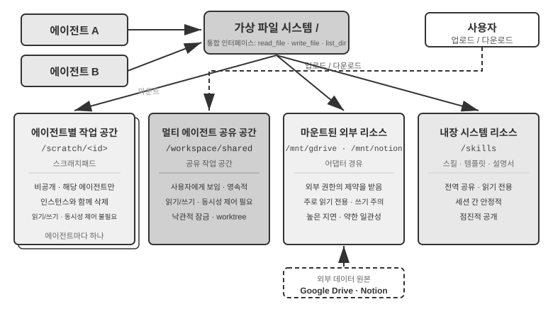
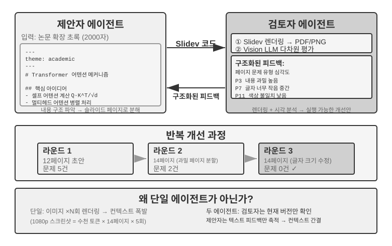
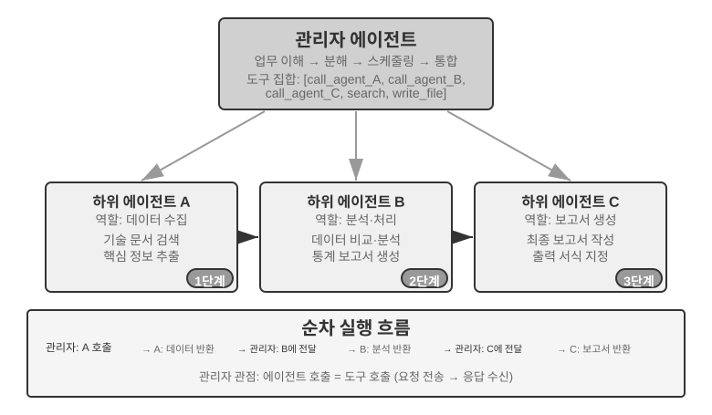
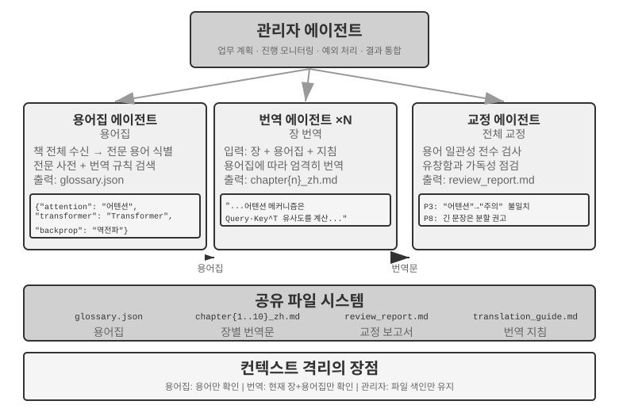
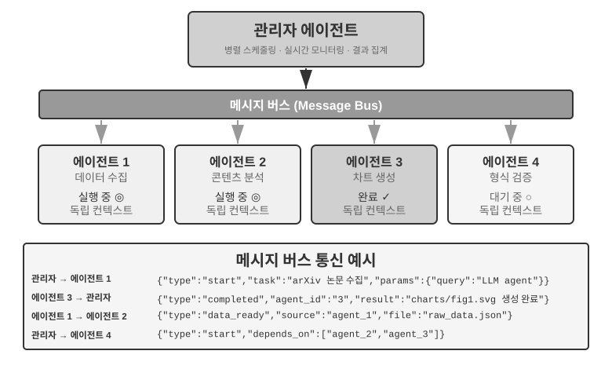
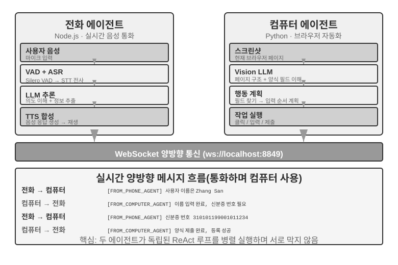
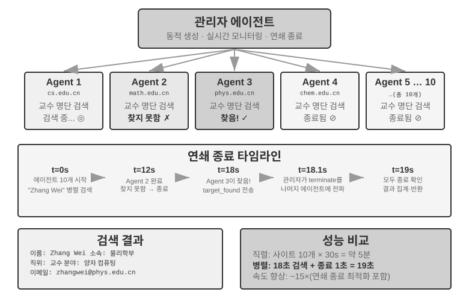
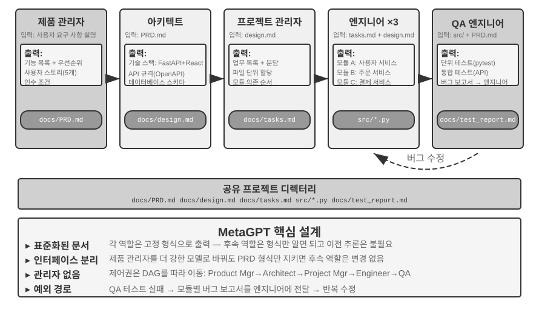
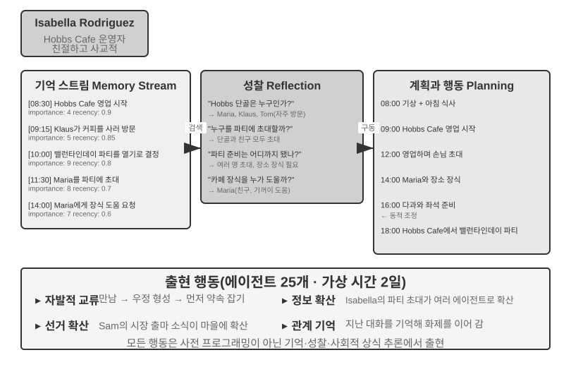
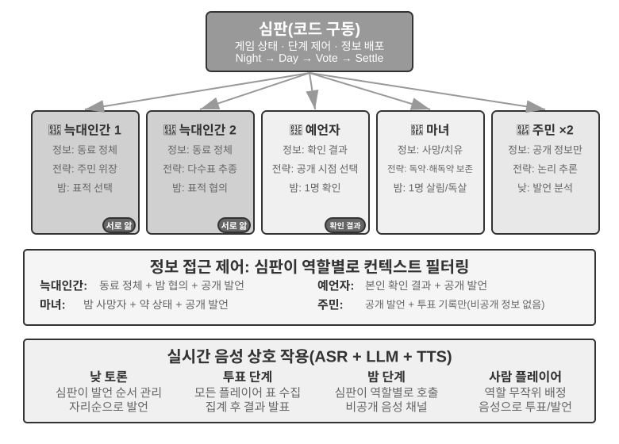

# 멀티 에이전트 협업

앞의 아홉 장은 단일 에이전트를 중심으로 전개했습니다. 먼저 컨텍스트, 지식, 도구, 상호작용 역량을 구축하고, 이어 평가, 사후 학습, 지속적 진화로 장기적으로 개선했습니다. 이 장은 질문을 “하나의 에이전트를 어떻게 구축하고 개선할 것인가?”에서 “여러 에이전트를 어떻게 조직할 것인가?”로 확장합니다. 분업, 소통, 상호 검증을 통해 단일 에이전트가 혼자 감당하기 어려운 작업을 수행하기 위해서입니다.

OpenAI는 한때 AI 능력을 다섯 단계로 분류했습니다. 1단계 대화자, 2단계 사고자, 3단계 에이전트, 4단계 혁신가, 5단계 조직입니다. 멀티 에이전트 협업은 흔히 5단계로 가는 한 경로로 제시됩니다. 하지만 여기서 ‘조직’은 아키텍처 요구 사항이 아니라 조직 전체의 업무를 수행할 수 있는 AI라는 능력 수준을 뜻합니다. 이론적으로는 충분히 강력한 단일 에이전트도 이 수준에 도달할 수 있습니다. 다만 오늘날 엔지니어링 현실에서 단일 에이전트는 모델의 능력과 컨텍스트 창에 여전히 제약받습니다.

여러 에이전트를 함께 일하게 하는 일은 서로 다른 전문성을 지닌 전문가가 ‘서로의 부족함을 메우는 것’보다 훨씬 큰 의미가 있습니다. 더 근본적인 요점은 **집단의 지능이 어느 개인의 지능보다도 뛰어날 수 있다**는 것입니다. 인간 문명이 그 증거입니다. 한 사람의 지성에는 한계가 있지만 분업, 협업, 토론, 세대에 걸친 지식 축적을 통해 인간 사회 전체는 어느 천재 한 명보다 훨씬 높은 지능을 보여 줍니다. 에이전트 집단에서도 같은 종류의 집단 지능이 나타날 수 있습니다. 각 에이전트가 인간 전문가 수준에 불과해도 잘 조직된 집단은 모든 인간 전문가를 합친 능력을 넘어설 수 있습니다. Google DeepMind는 *From AGI to ASI*에서 ‘대규모 멀티 에이전트 집단’을 초지능(ASI)에 이르는 핵심 경로로 꼽습니다. 인간의 일반 지능이 개인을 넘어서는 사회와 조직으로 모이듯, AGI 수준 에이전트 다수가 협력하여 만드는 집단 지능도 구성원을 단순히 합한 것보다 훨씬 높은 인지 능력을 보일 수 있습니다[^agi-asi]. 따라서 멀티 에이전트 협업은 단일 모델의 컨텍스트 창과 능력 한계를 보완하는 엔지니어링 우회책에 그치지 않습니다. ‘전문가 수준 AI’에서 ‘인류 전체를 넘어서는 AI’로 가는 근본 경로일 수 있습니다.

[^agi-asi]: AGI에서 ASI로 가는 핵심 경로인 ‘대규모 멀티 에이전트 집단’에 대해서는 Google DeepMind, *From AGI to ASI.* arXiv:2606.12683, 2026을 참고하십시오.

## 멀티 에이전트 협업의 분류 프레임워크

멀티 에이전트 시스템 구축은 기본 아키텍처와 구현을 함께 결정하는 두 가지 핵심 설계 차원에서 시작합니다.

### 차원 1: 공유 컨텍스트와 비공유 컨텍스트

여러 에이전트 사이에서 정보를 전달하는 방식을 정하는 가장 근본적인 아키텍처 결정입니다.

**공유 컨텍스트**는 뒤의 에이전트가 앞 에이전트의 전체 대화 기록과 궤적(1장에서 정의)을 받는다는 뜻입니다. 각 단계에서 시스템 프롬프트와 도구 집합이 바뀌면 앞 에이전트의 모든 메모리를 유지하더라도 정체성, 책임, 능력이 달라졌으므로 시스템은 새 단계를 다른 에이전트로 봅니다. 예를 들어 요구 사항 분석가가 요구 사항 문서를 작성하면 개발자는 문서뿐 아니라 분석가와 사용자가 소통한 전체 기록도 받습니다. 앞의 모든 컨텍스트를 유지하면서 새 역할을 맡습니다. 장점은 정보가 하나도 손실되지 않아 각 에이전트가 이전 어느 단계의 세부 사항도 돌아볼 수 있다는 것입니다. 문제는 컨텍스트가 빠르게 커질 수 있다는 점입니다.

**비공유 컨텍스트**는 각 에이전트가 독립적인 컨텍스트와 대화 기록을 유지하며 다른 에이전트의 작업 추적에 직접 접근할 수 없다는 뜻입니다. 여러 부서의 협업과 비슷합니다. 모두 각자의 책상에서 독립적으로 일하고 서로의 화면을 계속 지켜보는 대신 공유 문서와 회의록으로 정보를 교환합니다. 이 모델은 모듈성과 격리가 더 좋으며 각 에이전트는 자신의 책임과 관련된 정보에만 집중하면 됩니다. 시스템 확장과 유지보수도 더 쉽습니다. 새 에이전트를 추가할 때 기존 에이전트의 내부 로직을 수정할 필요 없이 인터페이스와 데이터 형식만 정의하면 됩니다.

에이전트가 컨텍스트를 공유하지 않으므로 명시적인 통신 메커니즘으로 정보를 전달해야 합니다. 고전적인 분산 시스템은 이 문제에 오래전에 답했습니다. 운영체제 교과서에 따르면 프로세스 간 통신(IPC)은 결국 **공유 메모리**(한쪽이 쓰고 다른 쪽이 같은 저장 영역을 읽음)와 **메시지 전달**(데이터를 상대에게 명시적으로 보냄)이라는 두 패러다임뿐입니다. 에이전트 간 통신도 이 두 패러다임 안에 들어갑니다. 흔히 세 가지 방법을 사용합니다.

- **도구 호출 매개변수:** 하위 에이전트를 도구로 래핑하고 상위 에이전트가 그 매개변수로 구조화된 데이터를 전달합니다. 타입과 구조가 명확한 데이터가 필요한 상황에 적합합니다.
- **공유 파일 시스템:** 에이전트가 공유 디렉터리의 중간 산출물(문서, 코드 등)을 읽고 쓰며 정보를 교환합니다. 산출물이 크거나 영속성이 필요한 상황에 적합합니다.
- **메시지 버스:** 에이전트 사이에서 메시지를 전달하는 전용 중개자입니다. 에이전트가 서로 직접 호출하지 않고 버스에 메시지를 보내면 버스가 대상 에이전트에 전달합니다.

두 IPC 패러다임에 대응시키면 공유 파일 시스템은 ‘공유 메모리’에, 도구 호출 매개변수와 메시지 버스는 ‘메시지 전달’에 해당합니다. 도구 매개변수는 호출과 함께 동기적으로 전달되고 버스 메시지는 중개자를 통해 비동기로 전달됩니다. 각 패러다임에는 절충이 있습니다. Go에는 “메모리를 공유하며 통신하지 말고, 통신하여 메모리를 공유하라”는 유명한 격언이 있습니다.

메시지 버스는 **비동기 통신**을 자연스럽게 지원하여 송신자와 수신자가 동시에 온라인일 필요가 없습니다. 회사 내부 이메일 시스템과 같습니다. 동료에게 이메일을 보낼 때 그 순간 컴퓨터 앞에 있을 필요가 없으며 이메일은 서버에 저장됐다가 동료가 온라인이 되면 처리됩니다. 여러 에이전트가 병렬로 일하면서 서로 조율해야 하는 상황에 특히 적합합니다(뒤의 ‘병렬 조율’ 절 참고).


두 아키텍처 모두 각 단계의 시스템 프롬프트와 도구 집합이 달라 서로 다른 에이전트가 되므로 진정한 멀티 에이전트 시스템입니다. 차이는 조율 방식입니다. **공유 컨텍스트**는 암묵적 조율에 의존합니다. 뒤의 에이전트가 앞 에이전트의 전체 컨텍스트 기록을 물려받아 보이는 상호작용 기록과 작업 추적을 검토하고 컨텍스트 자체를 통해 정보를 받습니다. **비공유 컨텍스트**는 명시적 조율에 의존합니다. 에이전트가 파일, 메시지, 구조화된 데이터 인터페이스로 정보를 교환하며 각 에이전트는 자신의 업무에 관련된 내용만 봅니다.

비유하면 전자는 모두가 모든 말을 듣는 한 테이블의 팀이고, 후자는 각자 작업 공간을 두고 이메일과 문서로 협업하는 부서입니다.

운영체제에 익숙한 독자에게는 공유 컨텍스트 에이전트가 스레드, 비공유 컨텍스트 에이전트가 프로세스와 비슷하다는 비유가 유용할 수 있습니다. 스레드는 주소 공간을 공유하므로 전환과 통신 비용이 작지만 격리가 약하며 한 스레드의 메모리 손상으로 전체 프로세스가 중단될 수 있습니다. 프로세스는 각자 주소 공간을 가져 격리와 안전한 병렬성이 더 강하지만 명시적인 IPC로 통신해야 합니다.

**간단한 경험 법칙:** 예상 누적 컨텍스트가 창의 50%를 넘으면(정확한 임계값이 아닌 휴리스틱) 공유하지 마십시오. 업무 정확성을 위해 정보 손실이 전혀 없어야 한다면 공유하십시오. 실제 시스템 대부분은 단계마다 다른 접근법을 사용합니다. 처음 몇 에이전트는 컨텍스트를 공유하지만 공유 기록이 너무 커지면 비공유 컨텍스트로 바꾸고 상위 에이전트가 하위 에이전트에 전달할 내용을 고르는 명시적 핸드오프를 사용합니다.

### 차원 2: 협업 토폴로지

둘째 차원은 협업 토폴로지, 즉 에이전트 사이에서 제어와 정보가 흐르는 구조입니다. 토폴로지와 컨텍스트 공유는 개념적으로 서로 다르지만 실제로 관련되어 있습니다. 공유 컨텍스트 시스템에도 토폴로지가 있습니다. 예를 들어 실험 10-1의 `transfer_to_agent` 패턴은 핸드오프 체인을 만듭니다. 하지만 모든 핸드오프가 전체 기록을 전달하므로 어떤 정보를 전달할지 결정할 필요가 거의 없고 토폴로지는 흔히 단순한 역할 전환 순서가 됩니다. 그룹 채팅식 협업은 뒤의 탈중앙화 절에서 다루는 예외입니다. 반면 비공유 컨텍스트에서는 정보 흐름과 조율자를 명시적으로 정해야 합니다.

> **용어: 그래프 엔지니어링.** 2026년 7월 널리 쓰이기 시작한 ‘그래프 엔지니어링(Graph Engineering)’은 오늘날의 에이전트 맥락에서 일반적으로 실행 그래프를 명시적으로 설계하는 일을 뜻합니다. 노드는 에이전트, 일반 프로그램, 사람의 의사 결정이고, 에지는 업무 의존성, 조건부 라우팅, 실패 경로를 정의하며, 구조화된 상태가 노드 사이를 흐릅니다.[^ch10-graph-engineering] 이 장의 ‘협업 토폴로지’는 이 발상 가운데 멀티 에이전트 부분에 해당합니다. 동료 협업, 관리자 오케스트레이션, 탈중앙화 핸드오프는 서로 다른 그래프 토폴로지입니다. 이름이 아직 새롭고 지식 그래프, GraphRAG, 실행 추적과 혼동되기 쉬우므로 이 책은 더 안정적인 ‘협업 토폴로지’와 ‘오케스트레이션’을 주 용어로 계속 사용합니다.

[^ch10-graph-engineering]: 이 이름에 대한 초기 논의는 Josh C. Simmons, *We Are Entering the Graph Engineering Phase*, 2026을 참고하십시오. 주류 프레임워크는 같은 엔지니어링 구조를 완전히 새로운 기술이 아니라 그래프 기반 워크플로나 오케스트레이션이라고 부르는 것이 일반적입니다. 관련 자료는 https://www.drjoshcsimmons.com/writing/we-are-entering-the-graph-engineering-phase, https://docs.langchain.com/oss/python/langgraph/overview, https://learn.microsoft.com/en-us/agent-framework/workflows/, https://adk.dev/workflows/ 에서 확인할 수 있습니다.

다시 말해 두 차원은 원칙적으로 2×3 행렬(공유/비공유 × 세 토폴로지)을 이룹니다. 하지만 공유 컨텍스트 행에서는 토폴로지가 대부분 역할 전환의 순서로 축소되어 결정할 것이 거의 남지 않습니다(뒤의 ‘다단계 역할 전환’에서 다루는 형태). 따라서 이 장은 비공유의 세 셀만 자세히 설명합니다. 다음은 복잡도가 높아지는 순서로 나열한 비공유 컨텍스트의 세 대표 토폴로지입니다.

- **동료 협업 패턴:** 소수의 에이전트(보통 2~3개)가 동등하게 상호작용하며 반복 개선 루프를 만듭니다. 한 사람이 논문 초안을 쓰고 다른 사람이 주석을 달아 수정하여 여러 라운드 뒤의 품질이 혼자 만든 것보다 훨씬 높아지는 것과 같습니다.
- **관리자 패턴**(오케스트레이션 패턴): 중앙의 관리자 에이전트가 업무 계획과 스케줄링을 맡고 여러 하위 에이전트가 각각 특정 하위 업무를 처리합니다. 프로젝트 관리자가 여러 전문 엔지니어를 이끌고 프로젝트를 수행하는 것과 같습니다.
- **탈중앙화 패턴:** 런타임 중앙 제어자가 없고 에이전트가 사람처럼 서로 소통하며 업무를 협업합니다.

각 패턴의 상세 설계와 적용 상황은 뒤의 전용 하위 절에서 설명합니다.

## 멀티 에이전트가 단일 에이전트보다 실제로 나은 때

구체적인 협업 아키텍처에 들어가기 전에 더 근본적인 질문에 답해 보겠습니다. **여러 에이전트가 정말 필요한 때는 언제이고 하나로 충분한 때는 언제일까요?** 그 답은 뒤의 모든 엔지니어링 접근법을 판단하는 기준점이 됩니다. 최근 연구들은 하나의 명확한 프레임워크로 수렴합니다. 핵심 기준은 한 질문입니다. **협업이 단일 에이전트가 답을 만드는 동안 얻을 수 없었던 정보를 제공하는가?**

표 10-1는 어떤 협업 방식이 새 정보를 도입하는지 보여 주며 멀티 에이전트 협업이 단일 에이전트보다 실질적인 가치를 주는지 판단하도록 돕습니다.

표 10-1 멀티 에이전트 협업 방식의 정보 이득 비교

| 협업 방식 | 새 정보를 도입하는가? | 효과 |
|---------------------------------------|---------------------|-----------------------------------|
| 같은 모델의 자기 검토(자신의 출력을 다시 읽음) | 아니요 | 보통 효과가 없거나 오히려 해로움 |
| 서로 다른 에이전트가 같은 텍스트를 토론 | 아니요 | 계산량이 같다면 단일 에이전트와 비슷함 |
| 검토자가 테스트 실행 결과로 코드를 검토 | 예(실행 피드백) | 크게 개선 |
| 검토자가 렌더링된 스크린샷으로 프런트엔드/PPT 코드를 검토 | 예(시각 피드백) | 크게 개선 |
| 검토자가 외부 도구로 사실을 검증 | 예(도구 피드백) | 크게 개선 |

2025년 RLEF(Reinforcement Learning from Execution Feedback) 논문[^rlef-2025]은 코드 실행 피드백을 이용한 반복 개선을 강화 학습으로 모델에 학습하면 모델을 독립적으로 여러 번 샘플링하는 것보다 성능이 크게 높아진다는 사실을 발견했습니다. 핵심은 반복마다 모델이 코드를 작성할 때는 없었던 정보인 **실제 실행 결과**(컴파일 오류, 테스트 실패, 런타임 예외)를 도입한다는 점입니다. 웹페이지 생성 업무를 다룬 2025년 WebGen-Agent 연구[^webgen-agent-2025]는 스크린샷과 시각-언어 모델 설명을 결합한 다단계 시각 피드백으로 Claude 3.5 Sonnet의 벤치마크 성능이 26.4%에서 51.9%로 올라 거의 두 배가 되었다고 보고했습니다.

[^rlef-2025]: Gehring, J., et al. *RLEF: Grounding Code LLMs in Execution Feedback with Reinforcement Learning.* arXiv:2410.02089, 2025.
[^webgen-agent-2025]: Lu, Z., et al. *WebGen-Agent: Enhancing Interactive Website Generation with Multi-Level Feedback and Step-Level Reinforcement Learning.* arXiv:2509.22644, 2025.

이 프레임워크는 겉보기의 모순을 해소합니다. 일부 학술 연구에서는 단일 에이전트면 충분하다고 하지만 엔지니어링 실무에서는 멀티 에이전트 시스템이 더 나은 경우가 많습니다. 연구는 흔히 토론처럼 여러 에이전트가 같은 텍스트를 살펴보고 논의하는 방식을 시험하지만 효과적인 엔지니어링 시스템은 보통 코드 실행, 시각 렌더링, 도구의 외부 피드백을 추가합니다. 후자만 새 정보를 도입합니다. 뒤에서 다룰 동료 협업, 오케스트레이션, 탈중앙화라는 세 아키텍처의 효과적인 활용은 거의 모두 이 기준으로 이해할 수 있습니다.

Anthropic의 2026년 취약점 탐색 실험이 한 사례입니다. 에이전트 45개가 공유 포럼에서 탐색을 조율하고 서로의 발견을 검토한 뒤, 독립된 중재 에이전트가 결과를 판정했습니다. 조율된 에이전트 군집은 2,700만 토큰으로 취약점 266개를 찾았지만, 독립 에이전트 병렬 방식은 650만 토큰으로 21개만 찾았습니다. 열린 탐색 공간에서는 멀티 에이전트가 서로 통신하며 탐색의 초점을 동적으로 옮기고 전문화할 수 있으며, 더 큰 토큰 예산을 더 넓은 범위와 다양한 발견 경로로 바꿀 수 있습니다.[^anthropic-multiagent-2026]

[^anthropic-multiagent-2026]: Anthropic Frontier Red Team, “Patterns and Problems in Emerging Multiagent Systems,” 2026-08-13. https://www.anthropic.com/research/multiagent-systems

**단계 예산과 에이전트 성능.** 관련 질문으로 에이전트의 단계 예산, 즉 사용할 수 있는 도구 호출 수나 반복 라운드 수가 성능에 어떤 영향을 주는지가 있습니다. 단계가 많으면 당연히 도움이 될 것처럼 보입니다. 30단계에서는 핵심 기능만 구현할 수 있지만 300단계라면 계획, 구현, 테스트, 개선까지 할 수 있습니다. 하지만 2025년 Google 논문 *Budget-Aware Tool-Use Enables Effective Agent Scaling*은 직관에 어긋나는 결론을 내렸습니다. **에이전트에 단계만 더 준다고 성능이 좋아진다는 보장은 없습니다.** 표준 에이전트에는 ‘예산 인식’이 없어 300단계를 받아도 얕은 탐색을 하다가 빠르게 정체하는 경향이 있습니다. 추가 단계를 효과적으로 사용하려면 남은 자원에 맞춰 전략을 조정하는 메커니즘이 필요합니다. 처음에는 넓게 탐색하고 나중에는 초점을 좁혀야 합니다. 2026년 BAVT(Budget-Aware Value Tree Search)는 단계별 가치 평가를 추가하여 남은 예산 비율에 따라 탐색과 활용의 균형을 조정했습니다. 예산이 줄어들수록 에이전트가 넓은 탐색에서 더 깊은 조사로 전환합니다.

이 발견은 멀티 에이전트 시스템 설계에 직접적인 시사점을 줍니다. 예를 들어 오케스트레이션 패턴에서 관리자 에이전트는 단순히 하위 에이전트에 업무를 분배하고 결과를 기다려서는 안 됩니다. 업무 복잡도에 따라 **단계 예산을 동적으로 배분**해야 합니다. 단순한 하위 업무에는 적은 단계를, 복잡한 하위 업무에는 충분한 단계를 줍니다. 또한 하위 에이전트가 곧장 뛰어드는 대신 먼저 계획하고 구현하고 테스트하고 개선하도록 예산을 현명하게 쓰게 안내해야 합니다.

설계 결정을 내리기 전에 고려해야 할 사항이 하나 더 있습니다. **비용**입니다. 병렬 탐색과 반복 개선에는 돈이 듭니다. Anthropic은 자사의 멀티 에이전트 연구 시스템이 일반 대화보다 약 15배 많은 토큰을 사용하며 토큰 사용량만으로 성능 차이의 약 80%가 설명된다고 밝혔습니다. 따라서 멀티 에이전트 시스템의 이득은 수 배에서 열 배까지 높아질 수 있는 비용을 정당화할 만큼 커야 합니다. 그렇지 않다면 잘 조정된 단일 에이전트가 보통 더 경제적입니다.

## 공유 컨텍스트를 이용한 멀티 에이전트 협업

공유 컨텍스트 협업에서는 각 단계가 고유한 시스템 프롬프트와 도구를 가진 독립 Agent이지만 이전 단계의 전체 궤적을 상속한다. 정보 손실이 없다는 것이 가장 큰 장점이며, 누적된 기록 속에서도 현재 Agent가 자기 책임에 집중하도록 만드는 것이 과제다.

복잡한 작업에서는 단계마다 역할과 책임이 크게 달라진다. 하나의 정적 프롬프트는 지나치게 일반적이거나 너무 길어지므로, 현재 단계에 맞춰 시스템 프롬프트와 도구 집합을 전환한다.

핵심 설계 선택은 역할 전환 때 시스템 프롬프트를 바꿀지 Skill을 불러올지다. 둘 다 행동 규칙을 바꾸지만 비용과 제약 모델이 다르다.

| 선택 | 역할 규칙의 매체 | 도구 가시성 | 컨텍스트/KV Cache 영향 | 제약 강도 |
|---|---|---|---|---|
| `transfer_to_agent` | 시스템 프롬프트와 보통 도구 집합도 교체 | 현재 역할의 도구만 | 전환할 때마다 요청 prefix가 바뀌어 차이 지점 이후의 캐시를 대개 재사용할 수 없음 | 강함: 역할 밖 도구를 schema에서 숨길 수 있음 |
| Skill | 고정 프롬프트에 Skill 목록을 두고 필요할 때 `SKILL.md`를 궤적에 추가 | 보통 전체 도구 또는 안정적인 검색 진입점 | 정적 prefix는 유지되고 Skill은 궤적 끝에 추가됨 | 약함: Skill은 지침이며 강제 권한은 Harness가 담당 |

역할 차이가 지식, 절차, 문체라면 Skill을 우선한다. 권한, 도구 격리, 규정 준수, 부작용 금지와 관련되면 독립 Agent 또는 `transfer_to_agent`를 사용하고 Harness에서 도구 제약을 코드로 강제한다.

> **실험 10-1 ★★: 공유 컨텍스트의 역할 전환 — 시스템 프롬프트와 Skill 비교**
>
> **공통 작업과 변수**: 두 경로는 같은 모델, 사용자 작업, 도구 구현, 역할 규칙, 전체 공유 궤적을 사용한다. 중국의 2021~2023년 신에너지 자동차 판매량을 조사하고 CAGR을 계산한 뒤, 120자 이하의 중국어 투자자 요약을 쓰는 작업이다.
>
> **경로 1: 시스템 프롬프트 전환**. 역할은 `triage`, `research`, `coding`, `data_analysis`, `writing`이다. 각 역할에는 전용 도구와 `transfer_to_agent`만 공개한다. 핸드오프 시 기록을 보존하고 대상 역할의 프롬프트와 도구를 불러온 뒤 실행을 계속한다.
>
> **경로 2: Skill**. 시스템 프롬프트와 전체 도구 목록은 세션 내내 고정된다. 모델이 `load_skill(name)`을 호출하면 `SKILL.md`가 도구 결과로 공유 궤적에 들어간다. 정적 prefix는 바뀌지 않지만 강제 권한은 Harness 규칙이 보장한다.

## 컨텍스트를 공유하지 않는 멀티 에이전트 협업

공유 컨텍스트가 없는 아키텍처에서 각 에이전트는 자체 컨텍스트, 궤적, 상태를 가진 독립적인 개체로 작동합니다. 에이전트는 서로의 내부 컨텍스트에 직접 접근할 수 없으며, 협업은 이 장의 시작에서 소개한 도구 호출 매개변수, 공유 파일 시스템, 메시지 버스라는 세 통신 메커니즘을 통한 명시적이고 구조화된 데이터 전달에 전적으로 의존합니다.

앞에서는 통신 메커니즘을 프로세스 간 통신의 형태에, 공유·격리 컨텍스트를 스레드·프로세스에 비유했습니다. 이 비유를 더 확장할 수 있습니다(표 10-2).

표 10-2 멀티 에이전트 시스템과 운영체제의 대응

| 운영체제 | 멀티 에이전트 시스템 |
|----------|----------------|
| 프로그램(실행 파일) | 정적 접두부(시스템 프롬프트 + 도구 정의) |
| 프로세스 메모리 | 궤적 |
| CPU | LLM |
| 커널 | 에이전트 런타임 |
| 시스템 호출 | 도구 호출 |
| fork(자식 프로세스 생성) | spawn_subagent |
| kill(신호 전송) | cancel_subagent |
| ps(프로세스 목록) | list_agents |
| 종료 코드와 wait() | 하위 에이전트가 반환하는 구조화된 요약 |
| 공유 메모리 / 메시지 전달 | 공유 파일 시스템 / 메시지 전달 |


이 추상화는 새로운 것이 아닙니다. 비공개 상태, 비동기 메시지, 새 구성원을 만드는 능력은 정확히 1970년대 액터 모델(Actor model)의 기본 구성입니다[^actor-model]. 따라서 멀티 에이전트 시스템은 LLM 기반 액터 모델로 볼 수 있으며 운영체제와 분산 시스템에서 축적한 많은 지식을 직접 적용할 수 있습니다.

[^actor-model]: Hewitt, C., Bishop, P., Steiger, R. *A Universal Modular ACTOR Formalism for Artificial Intelligence.* IJCAI 1973.

이 프로세스식 격리는 몇 가지 실용적인 엔지니어링 이점을 제공합니다. 각 에이전트를 독립적으로 개발하고 테스트할 수 있고, 기존 코드를 건드리지 않고 새 능력을 추가할 수 있으며, 한 에이전트가 실패해도 오류가 다른 에이전트로 자동 전파되지 않고, 여러 에이전트가 공유 컨텍스트를 두고 경합하지 않으면서 동시에 실행될 수 있습니다.

하지만 컨텍스트를 공유하지 않는 데도 비용이 따릅니다. 가장 분명한 것은 정보 동기화 문제입니다. 에이전트는 업무 상태를 어떻게 일관되게 이해할까요? 전달 과정에서 정보가 손실되거나 중복되지 않을까요? 디버깅도 더 어려워집니다. 문제가 생기면 여러 에이전트의 로그를 검토해 전체 실행 과정을 맞춰 봐야 합니다. 따라서 인터페이스 명세, 데이터 형식, 통신 프로토콜 설계가 매우 중요합니다.

공유 컨텍스트 없는 명시적 협업은 토폴로지와 무관한 두 인프라에 의존합니다. 첫째는 에이전트끼리, 그리고 에이전트와 사용자가 산출물을 교환하는 영속 매체인 **공유 파일 시스템**으로 협업의 데이터 평면을 이룹니다. 둘째는 에이전트 간 메시지 전달, 상태 질의, 실행 종료, 자원 스케줄링을 지원하는 **통신·제어 메커니즘**으로 협업의 제어 평면을 이룹니다. 아래의 세 토폴로지는 모두 이 두 토대 위에 구축됩니다.

### 에이전트 관점에서 본 파일 시스템

이 장의 시작에서 ‘공유 파일 시스템’을 공유 컨텍스트 없는 아키텍처의 세 통신 메커니즘 가운데 하나로 나열했습니다. 실제 시스템에서 에이전트가 접근하는 파일 시스템은 단일 저장 시스템이 아니라 출처, 생명 주기, 권한이 서로 다른 저장 시스템을 하나의 디렉터리 트리 아래에 마운트한 **가상 파일 시스템**입니다. 에이전트는 통합 `read_file`/`write_file`/`list_dir` 인터페이스로 접근하지만 기반 계층은 로컬 임시 디스크, 영속 객체 저장소, 서드파티 클라우드 드라이브 API, 읽기 전용 시스템 리소스 패키지일 수 있습니다. 이 디렉터리 트리의 구성, 즉 각 영역의 가시성과 생명 주기를 명확히 정의하는 일은 멀티 에이전트 협업 설계의 전제 조건입니다. 동시성 충돌과 정보 유출의 상당 부분은 격리해야 할 영역을 섞으면서 생깁니다. 이 디렉터리 트리는 에이전트의 주소 공간에 해당하고 네 영역 유형은 서로 다른 권한을 가진 메모리 세그먼트입니다. 어떤 영역은 비공개로 쓰기 가능하고, 어떤 영역은 여러 주체가 공유하며, 어떤 영역은 읽기 전용입니다. 운영체제의 보호 철학도 그대로 적용됩니다. 기본적으로 격리하고 공유는 명시적으로 선언합니다. 성숙한 멀티 에이전트 시스템의 파일 시스템은 보통 다음 네 유형의 영역으로 구성됩니다.

**I. 에이전트별 작업 공간(스크래치패드).** 각 에이전트 인스턴스 전용 비공개 디렉터리로 중간 산출물, 임시 파일, 초안, 디버그 로그를 저장합니다. 생명 주기는 인스턴스에 연결되며 다른 에이전트와 사용자에게 보이지 않습니다. 스크래치패드 격리에는 두 가지 목적이 있습니다. 여러 에이전트의 임시 파일이 서로를 덮어쓰는 일을 막고, 주 에이전트의 컨텍스트를 간결하게 유지합니다. 하위 에이전트의 시행착오는 자체 작업 공간에 남고 최종 산출물만 공유 공간에 제출됩니다. 이는 하위 에이전트가 전체 궤적이 아닌 구조화된 요약을 반환해야 한다는 4장의 원칙을 저장소 수준에서 구현한 것입니다.

**II. 멀티 에이전트 공유 작업 공간.** 여러 에이전트가 읽고 쓸 수 있으며 **사용자에게도 보이는** 협업 영역입니다. 공유 컨텍스트 없는 아키텍처에서 에이전트가 산출물을 교환하는 주요 매체입니다. 용어집 에이전트가 용어 목록을 쓰고 번역 에이전트가 이를 읽습니다. 사용자도 여기에서 원본 파일을 업로드하고 최종 결과물을 다운로드할 수 있습니다. 생명 주기는 전체 업무와 연결되며 영속성이 필요합니다. 여러 주체가 동시에 읽고 쓰는 영역이므로 동시성 충돌이 집중됩니다. 뒤의 ‘실패 모드 1’에서 자세히 설명할 낙관적 잠금과 워크트리 격리 같은 메커니즘이 여기에서 작동합니다. 4장에서 `/workspace/shared`에 볼륨을 마운트해 주 에이전트, 가상 컴퓨터, 가상 전화를 연결한 사례가 이 계층의 대표 구현입니다.

**III. 마운트된 외부 리소스.** Google Drive, Notion, Dropbox, 기업 위키처럼 사용자가 권한을 부여한 서드파티 정보원을 어댑터를 통해 파일 시스템의 마운트 지점(예: `/mnt/gdrive`)에 매핑합니다. 에이전트는 파일을 읽어 Notion 문서에 접근하며 기반 어댑터가 해당 API를 호출합니다. 이 계층에는 로컬 저장소와 구분되는 세 가지 특성이 있어 설계할 때 명시적으로 처리해야 합니다. **접근은 외부 권한의 제약을 받으며** 원본 시스템의 사용자 권한이 에이전트의 가시성을 결정합니다. **지연은 더 길고 일관성은 더 약합니다.** 읽을 때마다 네트워크 왕복이 발생하고 외부 변경이 즉시 보이지 않을 수 있으므로 데이터는 최종 일관성을 가진 것으로 취급해야 합니다. **주로 필요할 때 읽기 전용으로 접근합니다.** 잘못 쓰면 사용자의 실제 데이터가 오염될 수 있으므로 외부 원본에 쓰는 일은 신중해야 합니다. 통합 파일 인터페이스 덕분에 데이터 원본마다 사용자 정의 도구가 필요하지 않지만 성능·보안 차이도 가려집니다. 따라서 읽기 전용/쓰기 가능 상태, 제한 시간, 자격 증명 경계를 마운트 수준에서 명시적으로 관리해야 합니다.

**IV. 내장 시스템 리소스.** 시스템에 사전 설치되어 모든 에이전트와 읽기 전용으로 공유하는 리소스 패키지입니다. 대표적인 예는 2장과 4장에서 소개한 **스킬**입니다. 지식 문서와 스크립트를 파일로 구성하여 `/skills` 같은 경로에 마운트하고 점진적 공개(먼저 색인, 필요할 때 확장) 방식으로 접근합니다. 참조 설명서, 템플릿 라이브러리, 공유 도구 정의도 예입니다. 이 계층은 전역으로 공유되고 읽기 전용이며 세션 간 안정적이므로 모든 에이전트가 동시성 제어 없이 함께 읽을 수 있습니다.

그림 10-2은 네 영역 유형을 하나의 디렉터리 트리 아래에 통합 마운트하는 방법을 보여 줍니다. 에이전트는 통합 인터페이스로 전체 트리에 접근하고, 사용자는 공유 공간에서 파일을 업로드·다운로드하며, 외부 데이터 원본은 어댑터로 마운트되고, 내장 시스템 리소스는 읽기 전용으로 제공됩니다.



표 10-3는 네 영역 유형을 가시성, 생명 주기, 읽기/쓰기 권한, 동시성 제어라는 네 차원에서 비교하며 파일 시스템 레이아웃 설계의 체크리스트로 사용할 수 있습니다.

표 10-3 에이전트 가상 파일 시스템의 네 영역 유형

| 영역 | 가시성 | 생명 주기 | 읽기/쓰기 | 동시성 제어 |
|--------------|-----------------|------------------------|---------------------|-------------------|
| 에이전트별 작업 공간 | 소유한 에이전트만 | 에이전트 인스턴스와 함께 삭제 | 읽기/쓰기 | 불필요(비공개) |
| 멀티 에이전트 공유 작업 공간 | 협업하는 모든 에이전트와 사용자 | 업무 기간 동안 영속 | 읽기/쓰기 | 필요(낙관적 잠금 / 워크트리) |
| 마운트된 외부 리소스 | 외부 권한에 따라 결정 | 외부 원본이 결정 | 대부분 읽기 전용, 쓰기는 주의 필요 | 외부 원본이 관리 |
| 내장 시스템 리소스 | 모든 에이전트 | 세션 간 안정적 | 읽기 전용 | 불필요(읽기 전용) |

**‘범용 인터페이스로서의 파일 경로’**의 가치는 경로를 교환 단위로 다루는 데 있습니다. 에이전트가 산출물을 교환하거나, 주 에이전트가 하위 에이전트에 입력을 넘기거나, 조직이 A2A로 협업할 때 파일 내용을 컨텍스트 창에 로드하는 대신 가벼운 경로 문자열을 전달합니다(4장). 이는 단일 에이전트가 파일 시스템에 메모리와 능력을 두는 방법을 설명한 5장의 ‘에이전트 허브로서의 파일 시스템’ 개념과 맞닿습니다. 여기서는 같은 추상화를 여러 에이전트로 확장합니다. 비공개, 공유, 외부, 내장 저장소를 마운트한 가상 디렉터리 트리가 멀티 에이전트 협업의 저장 기반을 제공합니다.

### 에이전트 간 통신과 제어

파일 시스템이 에이전트 사이의 **산출물 교환** 문제를 해결하지만 협업에는 **제어 평면**도 필요합니다. 바로 여기서 표 10-2의 생명 주기 관련 행이 쓰입니다. 4장에서 제공한 생성(`spawn_subagent`), 메시지 전송(`send_message_to_subagent`), 취소(`cancel_subagent`), 탐색(`list_agents`) 도구 프리미티브는 프로세스 세계의 fork, message, kill, ps에 해당합니다. 이 절에서는 인터페이스 정의를 반복하지 않고 멀티 에이전트 협업에 필수이지만 흔히 놓치는 네 능력에 초점을 둡니다.

**I. 메시지 전달.** 가장 단순한 형태는 지점 간 통신으로 에이전트 A가 `send_message_to_agent_b(content)`를 직접 호출합니다. 토폴로지가 고정되어 있고 에이전트가 적은 상황(예: 이 장의 실험 10-3 전화 + 컴퓨터 이중 에이전트 구성)에 적합합니다. 에이전트 수가 늘고 비동기 병렬성이 필요하면 지점 간 연결 수가 에이전트 수의 제곱으로 증가하며 송신자와 수신자가 동시에 온라인이어야 합니다. 이때는 **메시지 버스**를 사용해야 합니다(뒤의 ‘병렬 조율 패턴’에서 자세히 설명). 에이전트가 버스에 메시지를 게시하고 버스가 구독에 따라 전달하므로 송신자는 구독자를 알 필요가 없습니다. 지점 간이든 버스를 통하든 메시지는 일반적으로 구조화된 **봉투(envelope)**를 담아야 합니다. 송신자 ID, 대상(특정 에이전트 또는 브로드캐스트), 메시지 유형(예: `task_assigned`/`status_update`/`result`/`terminate`), JSON 페이로드입니다. 통합 봉투 형식은 신뢰할 수 있는 라우팅과 수신자 파싱을 보장하고 협업 체인을 추적 가능하게 합니다. 이는 멀티 에이전트 시스템 디버깅의 핵심입니다.

**II. 상태 질의.** 제어 평면에서 가장 과소평가되는 부분입니다. 주 에이전트가 하위 에이전트를 보낸 뒤에는 진행 상황을 볼 수 있어야 합니다. 그렇지 않으면 계속 기다릴지 결정할 수도, 하위 에이전트가 막혔을 때 개입할 수도 없습니다. 직관적인 접근법은 RPC에서 빌려 와 `get_subagent_status(agent_id)` 질의 인터페이스를 정의하여 ‘실행 중/완료/실패’와 진행률을 반환하게 하는 것입니다. 하지만 이런 풀 인터페이스는 예상보다 훨씬 덜 유용합니다. 하위 에이전트는 생성되는 순간 실행을 시작해 완료하거나 실패할 때까지 계속 작동합니다. 전통적인 일괄 시스템의 작업처럼 대기 상태를 차례로 순환하지 않습니다. Unix 프로그래밍에서 다른 프로세스의 PID로 실행 상태를 반복 조회할 일이 거의 없는 것과 같습니다. 폴링에도 근본적인 딜레마가 있습니다. 너무 자주 하면 토큰을 낭비하고 너무 드물면 늦게 반응합니다. 더 자연스럽게 상태를 얻으려면 이 장의 시작에서 소개한 두 통신 패러다임으로 돌아가야 합니다.

**메시지 전달로 상태 얻기.** 주 에이전트가 하위 에이전트에 “진행 상황이 어때?”라는 메시지를 보내면 하위 에이전트가 적절한 순간에 답합니다. 모든 것이 비동기입니다. 메시지 전송이 주 에이전트 자신의 실행을 막지 않으며 상대가 언제 답할지, 답하기는 할지는 별개의 문제입니다. 관리자가 부하 직원에게 메신저로 진행 상황을 물으면서 그 자리에서 모든 일을 멈추라고 요구하지 않는 것과 같습니다. 반대로 하위 에이전트가 이정표에 도달했을 때 능동적으로 메시지를 보내 보고할 수도 있습니다. 시스템에 이미 메시지 버스가 있다면 버스에 `status_update`를 게시하기만 하면 됩니다(실험 10-4의 ‘실시간 모니터링’이 이 형태입니다). 상태를 명시적으로 요청하든 능동적으로 보고하든 메시지의 상태는 실행 중, 입력 필요, 완료, 실패라는 통일된 상태 머신 용어를 사용해야 합니다. 뒤의 A2A 프로토콜이 업무 생명 주기를 정확히 이런 상태 집합으로 표준화합니다.

**공유 파일 시스템으로 상태 얻기.** 가장 철저한 형태는 **궤적 영속화**입니다. 하위 에이전트는 실행하면서 각 궤적 이벤트를 JSON으로 직렬화하여 파일 시스템 로그에 추가합니다. 보통 세션당 파일 하나, 한 줄에 이벤트 하나인 JSONL입니다. 1장에서 정의한 궤적은 사용자 메시지, 모델 응답, 도구 호출, 결과의 전체 시퀀스입니다. 주 에이전트에는 상태 보고 프로토콜이 필요하지 않습니다. 이 파일을 직접 읽으면 하위 에이전트가 어떤 도구를 호출하는지, 가장 최근 단계에서 무슨 일이 있었는지, 실패한 재시도를 반복하는 루프에 빠졌는지 등 전체 실행을 살펴볼 수 있습니다. 프로세스 관점에서는 다른 프로세스의 메모리를 직접 읽는 것과 비슷합니다. 하위 에이전트의 컨텍스트를 차지하지 않고 협조에 의존하지 않으며 가장 세밀한 관찰을 제공합니다.

이렇게 빠짐없는 세부 정보는 부담이기도 합니다. 궤적은 쉽게 수만 토큰에 이르고 주 에이전트는 읽은 뒤 증류해야 하므로 시간과 토큰을 모두 소비합니다. 대부분의 상황에서는 **합의된 진행 파일**이 더 실용적입니다. 하위 에이전트를 시작할 때 각 항목을 끝낼 때마다 `progress.md`를 업데이트하라고 지시합니다. 주 에이전트는 언제든 이 가벼운 파일을 읽어 진행 상황을 파악할 수 있습니다. 두 프로세스가 합의된 형식의 작은 공유 메모리 블록을 예약하고 전체 메모리 상태 대신 증류한 진행 상황을 공개하는 것과 비슷합니다.

진행 파일은 **정지 탐지**도 가능하게 합니다. `progress.md`나 궤적 파일의 마지막 수정 시각이 N분 넘게 바뀌지 않으면 시스템은 하위 에이전트가 비활성이라고 보고 제한 시간 안전망을 작동할 수 있습니다(6장의 Heartbeat와 `monitor_shell` 메커니즘에 대응). 정지한 하위 에이전트가 전체 시스템의 발목을 잡는 일을 막습니다.

궤적 영속화의 가치는 모니터링을 훨씬 넘어섭니다. 1장의 결론인 “에이전트의 컨텍스트 = 정적 접두부 + 궤적”을 떠올려 보십시오. 정적 접두부(시스템 프롬프트, 도구 정의)는 코드로 정해지고, 궤적은 모델이 볼 수 있는 대화 상태를 담습니다. 도구와 세션 상태를 궤적에서 재구성할 수 있거나 별도 체크포인트에 보존하고, 작업 산출물을 파일 시스템에 원자적으로 기록한다면 궤적 파일과 정적 접두부를 다시 불러와 마지막으로 확인된 지점에서 실행을 재개할 수 있습니다. 읽기 전용 도구도 브라우저 세션이나 페이지 커서 같은 휘발성 상태를 가질 수 있으므로 별도 복구 계약이 필요합니다.

그러나 **궤적만으로 외부 시스템까지 포함한 전체 상태를 항상 복구할 수 있는 것은 아닙니다.** 결제·예약·메시지 전송처럼 외부 부작용이 있는 도구는 작업이 성공한 뒤 결과를 로그에 쓰기 전에 프로세스가 중단될 수 있습니다. 호출 전에 클라이언트가 만든 작업 ID, 멱등성 키와 정규화한 요청을 내구성 있게 기록해야 합니다. 중복 제거와 상태 조회는 서로 다른 외부 계약입니다. 멱등 호출에서는 동일한 논리 작업에 정확히 같은 요청과 키를 사용해야 하며, 서버가 보장하는 키 보존 기간 안에서만 중복 방지를 기대할 수 있습니다. 상태 조회는 멱등성 키나 외부 시스템이 발급한 거래·작업 ID로 별도로 지원될 수 있습니다. 응답을 받은 뒤에는 그 외부 ID와 결과를 기록합니다. 재개할 때는 지원되는 조회 인터페이스로 실제 상태를 먼저 확인해 성공·실패·미확정 결과를 판정합니다. 미확정이면 원래 요청이 변하지 않았고 외부 시스템의 중복 제거 계약과 키 유효기간이 모두 보장되는 경우에만 같은 키로 재시도하며, 그렇지 않으면 자동 반복 대신 수동 조정으로 넘깁니다.

이 조건을 갖춘 영속화는 데이터베이스의 미리 쓰기 로그(WAL)와 비슷합니다. 이벤트를 추가 전용 로그에 먼저 기록하고 주기적 체크포인트와 결합하면, 하위 에이전트를 마지막으로 확인된 상태에서 다시 시작하고 궤적을 이벤트별로 재생해 실패 원인을 찾으며 다른 에이전트에 감사 가능한 인수인계 자료를 넘길 수 있습니다(3장의 ‘사실 로그 + 주기적 체크포인트’ 메모리 설계는 같은 발상을 메모리 시스템에 적용한 것입니다).

**III. 실행 종료.** 병렬 협업에는 ‘하나가 성공하면 나머지는 필요 없다’는 상황이 흔합니다. 여러 에이전트가 따로 검색하다 하나가 대상을 찾으면 나머지는 즉시 멈춰야 합니다(이 장 실험 10-4의 연쇄 종료). 종료에는 두 단계가 있으며 Unix 사용자라면 SIGTERM과 SIGKILL의 차이로 이해할 수 있습니다. **정상 종료**가 우선입니다. 주 에이전트가 `terminate` 신호를 보내면 하위 에이전트가 현재 단계의 안전한 지점에서 응답하고 자원을 정리하고(브라우저 세션 닫기, 대기 중인 파일 쓰기, 잠금 해제), 확인(ack)을 보낸 뒤 종료합니다. **강제 종료**는 폴백입니다. 하위 에이전트가 정상 신호에 응답하지 않을 때만 프로세스를 직접 종료하며, 해제되지 않은 자원과 불완전한 쓰기가 남을 수 있습니다. 두 가지 엔지니어링 사항에 주의해야 합니다. 첫째, 정상 종료를 위해 하위 에이전트는 루프에서 종료 신호를 주기적으로 확인해야 합니다(6장의 인터럽트 메커니즘과 비슷함). 그렇지 않으면 신호를 받을 수 없습니다. 둘째, 연쇄 종료에는 경쟁 조건이 있습니다. 여러 하위 에이전트가 거의 동시에 성공을 보고할 수 있습니다. 주 에이전트는 잠금이나 멱등 설계로 하나의 성공만 받아들이고 종료 신호를 한 번만 브로드캐스트해야 합니다. 실험 10-4의 경쟁 조건 논의를 참고하십시오.

한 가지 문제가 남습니다. 주 에이전트가 종료된 뒤 여전히 실행 중인 하위 에이전트는 어떻게 될까요? 가장 깔끔한 엔지니어링 접근법은 Go의 context를 빌립니다. 종료가 생성 관계를 따라 아래로 전파됩니다. 한 에이전트를 취소하면 그 에이전트가 만든 모든 하위 에이전트도 함께 취소하여 고아 하위 에이전트가 남지 않게 합니다. 앞서 말한 ‘하위 에이전트가 안전한 지점에서 종료 신호를 확인’하는 것은 Go에서 `ctx.Done()`을 폴링하는 것과 정확히 대응합니다. 반대로 주 에이전트와 분리된 장기 실행 백그라운드 에이전트(Unix의 `nohup`과 비슷함)가 정말 필요하다면 새 생명 주기 트리에서 시작하게 하여(`context.Background()`에 해당) 부모와 함께 종료되지 않음을 명시적으로 선언합니다.

**IV. 자원 관리와 스케줄링.** 운영체제의 나머지 절반은 희소 자원을 배분하는 일입니다. 프로세스 세계의 희소 자원은 CPU 시간과 메모리이고 에이전트 세계에서는 토큰, 돈, 동시성 예산입니다. 하위 에이전트가 한 단계 실행할 때마다 세 가지를 모두 소비합니다. 이 책임은 보통 관리자나 런타임에 있습니다. 하위 에이전트를 시작할 때 단계·토큰 예산을 정하고 초과하면 멈춥니다. 어려운 업무는 강한 모델에, 기계적인 업무는 저비용 모델에 맡깁니다. 수십 에이전트가 API 할당량을 한꺼번에 소진하지 않도록 동시성을 제한합니다. 더 긴급한 업무가 들어오면 실행 중인 하위 에이전트를 중단합니다. 이것이 선점입니다. 이 분야의 실무는 CPU 스케줄링보다 훨씬 덜 성숙했지만 멀티 에이전트 시스템의 비용 상한을 결정하므로 아키텍처 설계 단계에서 고려해야 합니다.

산출물 교환(데이터 평면)과 메시지 전달, 상태 질의, 실행 종료, 자원 스케줄링(제어 평면)이 함께 공유 컨텍스트 없는 멀티 에이전트 시스템을 지원합니다. 아래의 세 협업 토폴로지는 근본적으로 이 두 평면 위에서 제어권을 누가 쥐고 정보가 어떻게 흐를지 선택한 서로 다른 방식입니다.

에이전트 간 협업 관계와 제어 흐름의 특성에 따라 공유 컨텍스트 없는 협업은 동료 협업 패턴, 관리자 패턴, 탈중앙화 패턴이라는 세 주요 아키텍처로 나뉘며 각각 서로 다른 유형의 업무에 적합합니다.

### 동료 협업 패턴: 상호 검토와 반복 개선

동료 협업에는 보통 동등한 지위의 에이전트 2~3개가 여러 라운드에 걸쳐 서로 피드백을 제공합니다. 잠재적 가치는 독립된 관점과 인지적 다양성에 있지만, ‘여러 인스턴스’가 곧 ‘여러 사고방식’을 뜻하지는 않습니다. 모델, 컨텍스트, 스캐폴딩이 매우 비슷하면 서로 다른 에이전트도 같은 선택을 하기 쉬워 국소 오류가 시스템 장애로 커질 수 있습니다. 진정한 다양성을 얻으려면 모델, 컨텍스트, 도구, 보이는 증거, 책임에 의도적으로 차이를 두고, 각 에이전트가 먼저 독립적으로 판단한 뒤 결과를 집계해야 합니다.[^anthropic-multiagent-2026]

관리자 패턴과 탈중앙화 패턴에 비해 동료 협업은 훨씬 구현하기 쉽습니다. 두 에이전트의 역할, 통신 메커니즘, 반복 종료 조건만 정의하면 시스템이 작동합니다. 아이디어를 빠르게 검증하고 프로토타입을 만들기에 이상적입니다.

#### 루프 엔지니어링

동료 협업의 가장 흔한 용도 가운데 하나는 에이전트 실무의 빈번한 실패인 **조기 종료**, 즉 업무를 절반만 하고 멈추는 문제에 대응하는 것입니다. 조기 종료에는 세 가지 대표 형태가 있습니다. 아래 사례는 코딩 에이전트와 사용자 대신 전화하여 판매자·서비스 제공자와 일을 처리하는, 들어가며에서 소개한 에이전트 Pine AI에서 가져왔습니다. 첫째는 **게으른 완료 위장**입니다. 일부만 하고 전부 끝났다고 선언합니다. 코딩 에이전트가 코드를 작성한 뒤 테스트나 배포를 시도하지 않고 “업무 완료”라고 보고합니다. 사용자가 Pine AI에 용무 두 개를 주었는데 첫 번째만 끝내고 두 번째는 잊은 채 밝게 “모두 처리했습니다”라고 말합니다. 둘째는 **성급한 포기**입니다. 한 경로가 막혔다고 전체 업무가 불가능하다고 선언합니다. Pine AI는 전화, 웹 양식, 이메일로 판매자에게 연락할 수 있지만 통화 한 번이 거절되면 채널을 바꿔 다시 시도할 때 성공할 가능성이 높은데도 “할 수 없습니다”라고 말합니다. 셋째는 **거짓 성공**입니다. 에이전트는 업무가 끝났다고 믿지만 실제로 루프가 닫히지 않았습니다. 상대방이 전화로 환불에 동의했지만 사용자가 모바일 앱에서 한 단계를 확인해야 할 수 있습니다. 에이전트가 “모두 끝났습니다”라고 보고하면 사용자는 후속 행동이 필요하다는 사실을 알지 못하고 환불도 이루어지지 않습니다. 세 형태 모두 같은 근본 원인을 가리킵니다. **검증되기 전까지 ‘완료’는 모델의 주장일 뿐 증명이 아닙니다.**

주장을 증명으로 바꾸는 일이 바로 1장의 진화 과정 마지막 단계인 **루프 엔지니어링(Loop Engineering)**입니다. 에이전트가 다음 할 일을 찾고, 실행하고, 검증하고, 진행 상황을 기록하며 계속 작동하는 루프를 설계하고, 모델 자체가 아니라 검증기가 정말 멈춰도 안전한지 결정하게 합니다. 사람의 역할도 ‘에이전트에 프롬프트를 주는 운영자’에서 ‘루프를 설계하는 엔지니어’로 바뀝니다. Addy Osmani가 2026년 6월 이 용어를 만들었고[^loop-engineering-2026], Anthropic의 Claude Code 책임자 Boris Cherny는 더 직설적으로 “나는 더 이상 Claude에 프롬프트를 주지 않는다. 내 일은 루프를 작성하는 것이다”라고 말했습니다. 이 논의에서 나온 중심 결론은 **루프의 병목은 모델이 아니라 검증기**라는 것입니다. 검증을 신뢰할 수 없다면 더 빠른 루프는 나쁜 출력을 더 일찍 완료로 표시할 뿐입니다. 들어가며에서 말했듯 실천이 먼저이고 명명은 나중입니다. 용어가 유행하기 훨씬 전부터 Pine AI를 비롯한 선도 에이전트 팀은 ‘루프 + 검증’으로 조기 종료에 대응하고 있었습니다. 이 검증을 구성하는 가장 효과적인 방법이 아래의 제안자-검토자 패러다임입니다.

[^loop-engineering-2026]: Osmani, Addy. "Loop Engineering: Designing Loops that Prompt Coding Agents", 2026. https://addyosmani.com/blog/loop-engineering/

**구체적인 프레임워크: LoopX.** LoopX는 루프를 모델의 프롬프트와 채팅 기록에서 꺼내 에이전트 런타임에 종속되지 않는 지속형 제어 평면에 둡니다. 목표와 경계는 ‘왜 하는가’를 설명하고, 게이트와 할 일은 ‘지금 무엇을 해도 되는가’를 정하며, 증거와 쿼터는 ‘계속해도 되는가’를 판단하고, 인계는 이후 턴이나 다른 에이전트가 작업을 이어받게 합니다. 하나의 통제된 실행은 다음의 명확한 프로토콜로 압축됩니다.

```text
LoopX 결정 → 에이전트 실행 → 독립 검증기 증명 → LoopX 커밋
```

에이전트는 계속 추론하고 도구를 사용하며 후보 산출물을 만듭니다. LoopX는 에이전트 런타임을 대체하지 않고 턴 사이의 연속성을 관리합니다. 독립 검증을 통과한 결과만 지속형 진행 상태를 갱신하고 쿼터를 소비할 수 있습니다. 검증 실패는 복구나 재계획으로 라우팅되고, 사람의 게이트, 대기 상태, 예산 한도는 실행 전에 루프를 멈춥니다. 이 경계는 루프 엔지니어링 원칙을 검사 가능한 시스템 불변 조건으로 바꿉니다. **모델은 ‘완료’를 제안할 수 있지만 자신의 ‘완료’를 승인할 수는 없습니다.** LoopX v0.4.0은 통제된 Turn 경로를 아직 실험적이라고 명시하므로, 여기서는 일반적인 작업 품질 향상의 증거가 아니라 ‘루프 + 검증 + 종료 조건’의 구체적인 프레임워크로 사용합니다.[^loopx-framework]

[^loopx-framework]: LoopX, "The local control plane for long-running AI agent work", v0.4.0, 안정 커밋 `a893d221db0b8e028997cefc303f7ec9fa7dbe0a`. https://github.com/huangruiteng/loopx/tree/a893d221db0b8e028997cefc303f7ec9fa7dbe0a

**구체적인 프레임워크: LongHorizon-Harness.** LongHorizon-Harness와 LoopX는 모두 루프 엔지니어링의 구체적인 구현이지만 바라보는 방향이 다릅니다. LoopX는 장기 에이전트 작업을 위한 지속형 제어 평면을 겨냥합니다. 반면 LongHorizon-Harness는 멀티모달 Computer Use에서 출발해, 하나의 작업이 GUI와 CLI, 여러 데스크톱 애플리케이션, 그리고 여러 차례의 컨텍스트 갱신에 걸쳐 이어질 때의 연속 실행 문제를 다룹니다.

LongHorizon-Harness는 장기 실행을 작업 상태 관리로 다시 정의하고, 자신의 루프를 Manage–Execute–Audit(MEA)로 구현합니다. Manager는 원래 목표, 확인된 진행 상황, 실패 증거, 남은 작업을 바탕으로 경계가 정해진 다음 하위 작업을 만들고, Executor는 완전히 새로운 컨텍스트에서 GUI나 CLI를 통해 환경을 바꾸며, Auditor는 읽기 전용으로 실제 결과를 점검합니다. 감사를 통과한 내용만 다음 라운드의 작업 상태로 들어가고, 실패는 복구와 재계획의 근거로 보존됩니다. Claude Code나 Codex CLI 같은 실행 백엔드는 어댑터 계층을 통해 재사용하며, 백엔드 내부의 에이전트 루프는 다시 쓰지 않습니다.[^longhorizon-implementation]

이 방향의 가치는 작업의 연속성을 계속 늘어나는 실행 기록에서 떼어 놓는 데 있습니다. 컨텍스트는 갱신될 수 있고 화면 조작은 실패할 수 있지만, 다음 라운드는 가장 최근에 확인된 상태에서 이어 갈 수 있습니다. 논문은 Qwen 3.7-Plus 모델과 Claude Code 실행 백엔드를 동일하게 두고 바깥 루프만 바꾼 대조에서 WeaveBench PassRate가 51.8%에서 80.7%로, OSWorld 2.0 이진 완료율이 2.8%에서 8.3%로, Terminal-Bench 2.1 성공률이 69.7%에서 77.2%로 올랐다고 보고합니다. 비용도 일정하지 않습니다. 앞의 두 벤치마크는 각각 베이스라인의 2.3배 총 토큰과 3.6배 출력 토큰을 썼지만, Terminal-Bench 2.1은 24% 줄었습니다. 실제 배포에서는 외부 환경이나 사용자 요구가 바뀌어 예전 상태가 무효가 되는 상황도 처리해야 하고, 라운드 수·시간·비용 예산으로 복구 루프가 끝없이 도는 것을 막아야 합니다.

**공개 궤적과 실험 재현.** 프로젝트 웹사이트는 WeaveBench, OSWorld 2.0, Terminal-Bench 2.1의 실행 궤적 수백 건을 제공하므로 실행 과정과 각 역할의 기록을 바로 살펴볼 수 있습니다. WeaveBench의 `WEB_task_16_webrtc_simulcast_layer_audit`를 예로 들면, 같은 Qwen 3.7-Plus 모델을 쓴 [베이스라인 궤적](https://lh-harness.pages.dev/traj/tasks/baseline__WEB_task_16_webrtc_simulcast_layer_audit.html)과 [MEA 궤적](https://lh-harness.pages.dev/traj/tasks/lh_harness__WEB_task_16_webrtc_simulcast_layer_audit.html)을 나란히 비교할 수 있습니다. 전자는 Wireshark 조작에서 막힌 뒤 시도를 반복해 0.59점을 받았고, 후자는 실패와 충족되지 않은 증거 항목을 작업 상태에 다시 기록해 이후 라운드가 빈 곳만 처리하도록 하여 0.92점을 받았습니다. 이 사례는 ‘실패가 어떻게 다음 라운드의 입력이 되는가’를 보여 주기 위한 것으로 전체 통계를 대신하지 못합니다. 전체 실험의 환경, 파라미터, 실행 스크립트는 버전이 고정된 [`eval/`](https://github.com/AMAP-ML/LongHorizon-Harness/tree/53bc678ed4170ad4d2e4309f2bfc5c3fb6caf8cb/eval) 디렉터리에 있습니다.

[^longhorizon-implementation]: LongHorizon-Harness, 안정 커밋 `53bc678ed4170ad4d2e4309f2bfc5c3fb6caf8cb`. 프로젝트 웹사이트와 공개 궤적: https://lh-harness.pages.dev/#trajectories; 논문: https://arxiv.org/abs/2608.01964; 코드: https://github.com/AMAP-ML/LongHorizon-Harness/tree/53bc678ed4170ad4d2e4309f2bfc5c3fb6caf8cb

#### 제안자-검토자 패러다임



제안자-검토자는 정석적인 동료 협업 패러다임입니다. 5장에서 PPT 생성, 동영상 편집, 로그 시각화라는 세 실험을 통해 설계 원칙과 실제 활용을 이미 다뤘습니다. 제안자 에이전트가 코드를 생성하면 검토자 에이전트가 실행 결과를 렌더링하고 시각-언어 모델로 품질을 평가하고 구조화된 개선 제안을 제공합니다. 결과가 요구 기준을 충족할 때까지 반복합니다.

이 패러다임은 보안 검토(제안자가 행동 계획을 만들고 검토자가 규정 준수와 잠재적 위험을 확인), 콘텐츠 조정(제안자가 답변 초안을 쓰고 검토자가 비즈니스 규칙과 언어 규범을 확인), 코드 검토(제안자가 코드를 쓰고 검토자가 보안과 모범 사례를 확인) 같은 상황에도 적용할 수 있습니다.

**단일 에이전트가 생성한 뒤 자신의 작업을 검토하면 왜 안 될까요?** 바로 앞의 ‘멀티 에이전트가 단일 에이전트보다 실제로 나은 때’ 기준이 적용됩니다. 검토가 새 정보를 도입하지 않는다면 그저 ‘모델에 다시 생각하라고 요구’하는 것입니다. 관련 연구는 명확한 답을 줍니다. Huang 등은 ICLR 2024 논문 “Large Language Models Cannot Self-Correct Reasoning Yet”에서 외부 피드백 없이 GPT-4에 자신의 답을 검토하고 수정하게 하면 정확도가 오히려 떨어진다는 사실을 발견했습니다. 모델은 틀린 답을 옳게 바꾼 횟수보다 옳은 답을 틀리게 바꾼 횟수가 더 많았습니다.

**Proposer–Reviewer 루프:**

```python
candidate = proposer(task, constraints)
evidence = execute_or_render(candidate)       # tests, state, screenshot, facts
review = independent_reviewer(candidate, evidence)

while review.veto and budget_remaining:
    candidate = proposer.repair(candidate, review.findings)
    evidence = execute_or_render(candidate)
    review = independent_reviewer(candidate, evidence)

if review.pass:
    publish(candidate, evidence, review)
else:
    escalate_or_reject(review)
```

TACL에 실린 2024년 서베이 논문 “When Can LLMs Actually Correct Their Own Mistakes?”(arXiv:2406.01297)도 이 결론을 확인했습니다. 테스트 사례 실행 결과나 외부 도구의 검증 출력처럼 신뢰할 수 있는 외부 피드백이 없으면 모델 자체의 ‘자기 수정’에만 의존하는 방식은 대체로 효과가 없습니다.

ICLR 2024의 CRITIC 논문은 직관적인 비교 실험을 제공합니다. CRITIC은 모델이 검색 엔진, Python 인터프리터 같은 외부 도구로 자신의 답을 검증하게 하여 성능을 크게 높였습니다. 하지만 실험자가 도구 검증 단계를 없애고 모델의 자기 평가만 남기자 개선의 대부분이 사라졌습니다. 이는 검토의 가치가 ‘모델에 다시 생각하라고 요구’하는 데 있지 않고 **모델이 생성할 때 이용할 수 없었던 새 정보**, 즉 테스트 결과, 렌더링된 스크린샷, 컴파일 오류, 외부 검색 결과를 도입하는 데 있음을 보여 줍니다.

이것이 제안자-검토자 패러다임의 핵심 설계 원칙입니다. 5장의 PPT 생성 실험에서 검토자 에이전트의 가치는 ‘같은 모델로 코드를 다시 보는 것’이 아니라 **PPT를 렌더링하고 스크린샷을 찍는 것**이었습니다. 스크린샷에는 제안자 에이전트가 코드를 생성할 때 얻을 수 없었던 시각 정보가 있습니다. 마찬가지로 코드 생성 상황에서 테스트 사례 실행의 통과/실패 결과는 코드를 작성할 때 없었던 새로운 신호입니다. 검토자의 독립적인 가치는 정확히 제안자가 이용할 수 없었던 외부 피드백에 접근하는 데서 나옵니다.

루프 엔지니어링 관점에서 보면 업계가 분류한 루프 패턴은 이 책의 패턴과 대응합니다. 사람 승인으로 닫히는 루프는 사람이 최종 검토자인 4장의 사전 승인에 해당합니다. 예산이나 라운드 상한이 있는 열린 루프는 최대 다섯 라운드를 허용하는 5장의 다중 라운드 PPT 반복에 해당합니다. 오케스트레이션된 하위 에이전트는 다음 절의 관리자 패턴에 해당합니다. 따라서 루프 엔지니어링은 새로운 아키텍처가 아니라 루프 + 검증 + 중단 조건이라는 공통 프레임워크로 이러한 협업 패턴을 통합합니다. 제안자-검토자 패러다임은 이 프레임워크에서 검증 역할을 채웁니다.

Anthropic의 2026년 장기 애플리케이션 개발 실험은 이 발상을 계획자·생성자·평가자라는 3개 에이전트 구조로 구현했습니다. 계획자가 사용자의 요구를 제품 명세로 확장하고, 생성자와 평가자가 각 라운드의 완료 기준을 먼저 합의합니다. 생성자가 구현한 뒤 평가자는 Playwright로 실제 애플리케이션을 조작하고 결함 보고서를 제출합니다. 에이전트들은 파일로 상태를 인계했습니다. 이 실험은 현재 모델이 혼자서는 안정적으로 완수하기 어려운 업무에서 외부 증거에 근거한 독립 검토가 훨씬 높은 비용과 맞바꾸어 개발 품질을 높일 수 있음을 보여 줍니다.[^anthropic-harness-2026]

[^anthropic-harness-2026]: Prithvi Rajasekaran, “Harness Design for Long-Running Application Development,” Anthropic Engineering, 2026-03-24. https://www.anthropic.com/engineering/harness-design-long-running-apps

#### 토론 패턴

여러 에이전트가 서로 다른 입장을 가지고 대립적 대화로 문제 공간을 탐색합니다. 예를 들어 기술 해법을 평가할 때 에이전트 A는 ‘지지자’ 역할로 장점과 기회를 나열하고, 에이전트 B는 ‘반대자’ 역할로 위험과 한계를 지적합니다. 각 토론 라운드에서 상대의 주장에 반박하거나 확장합니다. 단일 에이전트가 문제를 분석하면 한 관점을 선호하고 반대 증거를 놓치는 경우가 많습니다. 구조화된 토론은 양쪽 입장을 충분히 발전시켜 의사 결정자가 더 균형 잡힌 판단을 내리게 돕습니다.

하지만 토론의 실제 효과는 학계에서도 논쟁 중입니다. Tran과 Kiela의 2026년 연구[^single-agent-2026]는 다중 홉 사고 업무에서 단일 에이전트와 다섯 가지 멀티 에이전트 아키텍처(순차, 토론, 앙상블, 병렬 역할, 하위 업무 병렬)를 비교했습니다. 그 결과 **사고 토큰 예산을 같게 하면 단일 에이전트가 멀티 에이전트 시스템과 비슷하거나 더 좋은 성능을 냈습니다**(컨텍스트 활용이 일정 수준까지 저하된 경우는 제외). 연구자들은 정보 이론의 데이터 처리 부등식으로 설명했습니다. 토론에 참여한 여러 에이전트가 정확히 같은 텍스트 정보를 처리하며 중간 결론을 에이전트 사이에서 직렬로 전달할 때마다 정보는 손실될 수만 있고 새로 생길 수는 없습니다. 일부 학술 논문에서 토론 방식이 주는 이점은 여러 에이전트가 더 많은 전체 계산량을 소비했기 때문일 가능성이 큽니다. 이 주장의 경계를 명확히 해야 합니다. ‘중간 결론의 멀티 에이전트 직렬 전달’이 만드는 정보 병목을 지적하는 것이며, **같은 문제를 독립적으로 여러 번 샘플링한 뒤 집계하는** 방법(예: 자기 일관성, 다수결)이나 **생성과 검증 난도의 비대칭**(답 생성은 어렵고 검증은 쉬움)을 활용한 생성-검증 분업을 부정하지 않습니다. 이런 상황은 추가 독립 샘플링을 도입하거나 업무 자체의 비대칭 구조를 활용하므로 데이터 처리 부등식의 적용 범위에 들지 않습니다.

[^single-agent-2026]: Tran, D., Kiela, D. *Single-Agent LLMs Outperform Multi-Agent Systems on Multi-Hop Reasoning Under Equal Thinking Token Budgets.* arXiv:2604.02460, 2026.

#### 브레인스토밍 패턴

여러 에이전트가 독립적으로 아이디어를 생성한 뒤 서로 공유하며 영감을 줍니다. 예를 들어 제품 혁신 업무에서 에이전트 1이 ‘소셜 공유 기능 추가’를 제안하면 에이전트 2가 영감을 받아 ‘소셜 네트워크 공유뿐 아니라 개인화된 공유 포스터도 생성’을 제안하고, 에이전트 3이 둘을 종합하여 ‘사용자가 포스터 템플릿을 직접 만들 수 있는 템플릿 마켓플레이스’를 제안합니다. 서로 다른 프롬프트나 모델을 사용해 에이전트마다 ‘사고 선호’가 다르므로 서로 자극하여 더 넓은 해법 공간을 탐색하고 단일 에이전트가 생각하기 어려운 창의적 조합을 찾습니다.

#### 전문가 패널 패턴

여러 에이전트가 각기 특정 전문 분야의 관점을 대표하여 학제 간 문제를 함께 논의합니다. 예를 들어 신제품의 실현 가능성을 평가할 때 엔지니어 에이전트는 기술 관점에서 구현 난도를 분석하고, 제품 에이전트는 사용자 경험 관점에서 시장 매력을 평가하며, 운영 에이전트는 비용·자원 관점에서 사업 가능성을 분석합니다. 이 에이전트들은 대립하지 않고 상호 보완하며 문제의 전체 그림을 함께 맞추고 도메인 간 제약과 기회를 찾습니다.

### 관리자 패턴: 중앙 집중식 조율

업무에 다섯 개가 넘는 하위 업무가 포함되거나 동적 스케줄링이 필요하거나 하위 업무 사이의 의존성이 복잡하면 동료 협업만으로 감당하기 어려워 관리자 패턴이 필요합니다. 관리자 에이전트의 업무는 프로젝트 관리자와 비슷합니다. 전체 업무를 이해하고 할당 가능한 하위 업무로 나누며 각각에 알맞은 에이전트를 선택하고 진행 상황을 추적합니다. 예외가 생기면 업무를 재시도하고 에이전트를 교체하거나 계획을 수정하며, 마지막에는 에이전트의 출력을 최종 결과로 통합합니다.

시스템 설계 관점에서 관리자 패턴은 각 전문 에이전트를 관리자가 호출할 수 있는 도구로 모델링합니다. 관리자의 도구 집합에는 검색과 파일 작업 같은 전통적인 외부 도구뿐 아니라 다른 에이전트를 호출하는 인터페이스도 들어갑니다. 관리자는 도구 호출로 적절한 에이전트를 불러 업무 매개변수와 필요한 컨텍스트를 넘기고 완료를 기다린 뒤 결과를 받습니다. 관리자 관점에서 에이전트 호출은 일반 도구 호출과 본질적으로 다르지 않습니다. 둘 다 요청을 보내고 응답을 받습니다. 이 통합 추상화 덕분에 관리자 패턴을 쉽게 확장할 수 있습니다. 능력을 추가하려면 관리자의 핵심 로직을 수정하지 않고 해당 에이전트를 개발하여 도구로 등록하기만 하면 됩니다. 이질성도 자연스럽게 지원합니다. 에이전트마다 서로 다른 모델, 프롬프트, 도구 집합, 심지어 하드웨어 환경을 사용할 수 있습니다.


관리자 패턴에는 본질적인 과제도 있습니다. 관리자는 시스템의 단일 병목이 됩니다. 모든 하위 업무의 성격을 이해하고 적절한 에이전트를 선택하고 컨텍스트를 정확하게 넘겨야 하며, 잘못된 판단은 전체 흐름에 파급됩니다. 전체 업무의 전역 컨텍스트도 유지해야 하므로 업무가 깊어지고 에이전트 호출이 쌓이면 컨텍스트가 급증할 수 있습니다. 따라서 관리자에는 세심하게 설계한 프롬프트, 효과적인 컨텍스트 관리 전략, 적절한 세밀도의 업무 분해가 필요합니다.

2025년 Plan-and-Act 논문[^plan-and-act-2025]은 이를 실증적으로 분석했습니다. 계획자-실행자 이중 에이전트 아키텍처에서 **약한 계획자가 전체 시스템의 가장 중대한 병목**입니다. 계획자의 계획 품질이 충분히 높으면 비교적 단순한 실행자로도 좋은 결과를 얻을 수 있습니다. 반대로 계획자의 업무 분해가 잘못되면 이후 실행자의 모든 작업이 잘못된 전제 위에 세워집니다. 연구는 WebArena-Lite 벤치마크에서 성공률 54%를 달성했으며 핵심 기여는 실행자의 실행이 아니라 계획자의 계획 능력 개선이었습니다. 모든 에이전트에 자원을 균등 배분하기보다 가장 강한 모델과 가장 세심하게 작성한 프롬프트를 관리자(계획자)에 주어야 한다는 교훈입니다.

**최초 검증 병렬 승자:**

```python
workers = launch_independent_workers(subtasks)
while workers.any_running:
    event = next_event()
    if event.type == RESULT:
        if verify(event.artifact, hidden_checks):
            if not settle_once(event):       # atomically claim the winner
                continue
            broadcast_cancel(to = workers - {event.worker_id})
            await_all_ack_or_timeout()
            return assemble(event.artifact, evidence = event.evidence)
        else:
            record_failure(event)
return summarize_failures(workers)
```

[^plan-and-act-2025]: Erdogan, L. E., et al. *Plan-and-Act: Improving Planning of Agents for Long-Horizon Tasks.* arXiv:2503.09572, 2025.

**순차 조율 패턴.**





관리자가 전문 에이전트를 순서대로 호출합니다. 각 에이전트가 완료한 뒤 결과를 반환하면 관리자가 다음 단계를 결정합니다. 제어 흐름이 선형적이고 단순하며 명확하여 하위 업무의 순차적 의존성이 뚜렷한 상황에 적합합니다.

> **실험 10-2 ★★: 도서 번역 에이전트**
>
> 도서 번역은 멀티 에이전트 협업에 매우 적합한 복잡한 업무입니다. 기술 서적을 번역하려면 한 언어의 텍스트를 다른 언어로 바꾸는 데 그치지 않고 전문 용어의 일관성, 맥락의 정확성, 전체적인 유창함을 보장해야 합니다. 예를 들어 대규모 언어 모델을 다룬 영어 책에는 관례적 번역이 여러 개인 용어가 반복해서 많이 등장할 수 있습니다. 책 전체에서 일관성을 유지해야 합니다. 1장에서 `agent`를 “智能体”(‘지능형 개체’, 중국어 표준 용어)로 옮겼다면 뒤에서 다른 번역인 “代理”(‘프록시’)로 바꿀 수 없습니다.
>
> 단일 에이전트를 사용하면 심각한 컨텍스트 관리 문제가 생깁니다. 에이전트가 책을 장별로 처리하면서 전체 용어집, 번역한 장, 현재 문단, 번역 작업 추적, 도구 결과가 컨텍스트에 쌓입니다. 수백 쪽 분량의 기술 서적에 이러한 중간 자료까지 더하면 컨텍스트 창을 쉽게 넘습니다. 더 중요한 점은 지나치게 긴 컨텍스트로 작업하는 에이전트가 ‘길을 잃기’ 쉽다는 것입니다. 앞의 용어 관례를 잊고 2장과 9장에서 서로 다른 번역을 사용하거나, 교정 중 중복 검사에 자원을 낭비하거나, 주의가 너무 분산되어 존재하지 않는 용어 규칙을 ‘기억’할 수도 있습니다.
>
> 관리자 패턴은 업무 분해와 책임 분리로 이 문제를 해결합니다.
>
> - **용어집 에이전트:** 책 전체를 받고 반복되는 전문 용어를 식별하고 전문 사전과 번역 지침을 참고해 구조화된 용어집(JSON/CSV 형식, 영어 용어, 중국어 번역, 품사, 사용 맥락 포함)을 생성합니다. 완료하면 용어집을 공유 파일 시스템에 쓰고 에이전트를 폐기하여 자원을 해제할 수 있습니다.
> - **번역 에이전트:** 현재 장, 용어집, 번역 지침(대상 독자 수준, 언어 스타일)을 받아 유창한 중국어로 번역합니다. 용어집의 용어에는 지정된 번역을 엄격하게 사용하며 새 용어는 번역을 추론하고 검토 표시를 합니다. 각 인스턴스는 간섭 없이 독립 컨텍스트에서 일합니다. 번역문은 파일 시스템(예: `chapter1_zh.md`)에 씁니다. 관리자는 여러 인스턴스를 병렬이나 순차로 시작할 수 있습니다.
> - **교정 에이전트:** 모든 번역문과 용어집을 받아 용어 번역이 통일되었는지 확인하고 불일치를 찾고 전체 유창성과 가독성을 점검하는 일관성 검사를 수행합니다. 교정 보고서를 만들어 파일 시스템에 씁니다.
> - **관리자 에이전트:** 컨텍스트에는 주로 업무 설명, 실행 계획, 각 에이전트의 호출 기록, 진행 상태를 저장합니다. 전체 번역문은 파일 시스템에 남겨 두고 컨텍스트에 저장하지 않으며 파일 색인만 유지합니다. 교정 보고서에 따라 특정 장을 번역 에이전트에 돌려보내 수정하게 할 수 있습니다.
>
> 그 결과 번역한 장이 늘어나도 관리자의 컨텍스트를 관리 가능한 수준으로 유지할 수 있습니다.
>
> 핵심 장점은 **컨텍스트 격리**입니다. 용어집 에이전트는 용어 추출에 필요한 내용만, 번역 에이전트는 현재 장과 용어집만 봅니다. 교정 에이전트는 전체 텍스트에 접근해야 하지만 일관성 검사에만 집중합니다. 각 에이전트의 컨텍스트가 간결하고 집중된 상태를 유지하여 효율이 높아지고 정보 과부하로 인한 오류가 줄어듭니다.
>
> **실험 요구 사항**:
> 1. 코드와 그림이 많이 포함된 기술 서적을 원문으로 선택합니다.
> 2. 관리자, 용어집, 번역, 교정이라는 네 유형의 에이전트를 구현합니다.
> 3. 각 에이전트의 컨텍스트 사용량을 기록하여 관리자 패턴이 컨텍스트 증가를 얼마나 효과적으로 통제하는지 검증합니다.
> 4. 번역 품질, 실행 효율, 자원 소비 측면에서 단일 에이전트와 관리자 패턴을 비교합니다.
>
>
> 
>
>

**병렬 조율 패턴.**





여러 하위 업무를 병렬로 실행할 수 있으면 순차 패턴은 비효율적입니다. 병렬 조율은 여러 에이전트가 동시에 작업하게 하여 처리량을 크게 높입니다. 관리자 에이전트는 병렬 업무를 계획하고 실행 중인 모든 에이전트를 실시간으로 모니터링하고 통신을 조율하며, 에이전트가 성공하거나 실패할 때 시스템 전체의 결정을 내려야 합니다. 일반적으로 인프라로 **메시지 버스**가 필요합니다. 에이전트가 메시지를 게시하고 관심 있는 메시지 유형을 구독하는 ‘공개 게시판’으로 생각할 수 있으며 비동기·비차단 통신을 가능하게 합니다. 단순한 것부터 복잡한 것까지 흔한 구현 두 가지는 **Redis Pub/Sub**과 **RabbitMQ** 같은 메시지 큐입니다. Redis Pub/Sub은 가볍고 메시지를 즉시 전달하지만 영속화하지 않으므로 수신자가 오프라인이면 놓칩니다. RabbitMQ 같은 시스템은 메시지를 디스크에 영속화하므로 수신자가 잠시 오프라인이어도 보존합니다. 메시지는 일반적으로 송신자 ID, 대상 에이전트(또는 브로드캐스트 표시), 메시지 유형, 페이로드를 담은 JSON 봉투를 사용합니다.

**Lingtai: 관리자 패턴을 제품화한 사례.** Lingtai는 장기 실행 에이전트를 위한 로컬 파일 기반 공간입니다[^lingtai]. 세 역할은 이 절의 개념과 밀접하게 대응합니다. **주 에이전트(main agent)**는 사용자가 상호작용하는 영속적 허브로 계획과 메모리를 보유하고 다른 역할을 생성하여 관리자 에이전트 자리를 차지합니다. **데몬(daemon)**은 잡음이 많고 범위가 제한된 업무를 위해 생성했다가 이후 폐기하는 단기 병렬 작업자이며 결론만 보존합니다. 하위 에이전트가 전체 궤적이 아닌 구조화된 요약을 반환해야 한다는 원칙과 병렬 조율 패턴을 모두 제품화합니다. **아바타(avatar)**는 자체 메모리, 메일함, 책임을 가진 영속적인 전문 팀원으로 세션을 넘어 유지할 가치가 있는 전문 분야를 위해 설계되었습니다.

Lingtai 설계의 나머지 부분도 앞 절과 맞닿습니다. 지식은 각 에이전트의 영속적인 비공개 메모리 파일에 있고 스킬은 모든 에이전트가 공유하는 Markdown 플레이북입니다. ‘에이전트 관점에서 본 파일 시스템’에서 설명한 내장 시스템 리소스입니다. 에이전트의 컨텍스트 창이 가득 차면 **탈피(molt)**합니다. 주의 깊은 요약을 쓴 뒤 그 요약과 영속 메모리를 유지한 채 새 컨텍스트로 시작하며 2장의 컨텍스트 압축 접근법을 따릅니다. 에이전트의 정체성, 메모리, 능력이 모두 프로젝트 디렉터리의 일반 파일에 있으므로 기반 모델을 바꿔도 에이전트는 바뀌지 않습니다. 이런 의미에서 에이전트는 곧 자신의 파일입니다. 이는 표 10-2의 처음 두 행을 제품화합니다. 프로그램과 메모리가 모두 파일로 환원되므로 언제든 프로세스를 다시 만들 수 있습니다.

[^lingtai]: Lingtai 공식 튜토리얼: https://lingtai.ai/en/tutorial/

> **실험 10-3 ★★★: 컴퓨터를 사용하면서 전화로 대화하는 에이전트**
>
> **선수 지식**: 이 실험은 6장의 컴퓨터 사용·음성 에이전트 기술을 통합합니다. 먼저 6장의 관련 실험을 완료하기를 권합니다.
>
> 실제 업무의 상당수는 여러 능력이 순서대로가 아니라 동시에 작동해야 합니다. 예를 들어 사람 비서는 고객과 대화하면서 문서를 찾고 메모할 수 있습니다. 에이전트 하나에 실시간 대화와 컴퓨터 상호작용을 모두 맡기면 계속 업무를 전환해야 하여 어느 한 활동이 중단될 수 있습니다. 멀티 에이전트 시스템은 지연 시간에 민감한 각 업무를 전문 에이전트에 맡기고 비동기 메시지로 조율합니다. 전화 에이전트에는 짧은 지연의 음성 인식·합성이 필요하고 컴퓨터 에이전트에는 강한 시각 이해와 행동 계획 능력이 필요합니다.
>
> **상황**: AI 에이전트가 사용자의 복잡한 항공권 예약 양식 작성을 돕습니다. 웹페이지를 조작하면서 전화로 사용자에게 개인정보(이름, 신분증 번호, 항공편 선호 등)를 묻고 확인해야 합니다. 전화 대화와 웹 상호작용 모두 반응성을 유지해야 하므로 단일 에이전트는 어려움을 겪지만 이중 에이전트 시스템에서는 각 에이전트가 한 역할에 집중할 수 있는 대표 사례입니다.
>
> **이중 에이전트 아키텍처**:
>
> **전화 에이전트**: ASR, LLM, TTS로 만든 음성 에이전트입니다. 사용자의 자연어 응답을 해석하고 핵심 정보를 추출하여 메시징 시스템으로 컴퓨터 에이전트에 보냅니다. 컴퓨터 에이전트의 메시지(예: “사용자의 신분증 번호가 필요함”, “페이지 로딩 오류”)도 받아 사용자에게 적절히 응답합니다.
>
> **컴퓨터 에이전트**: Anthropic Computer Use나 `browser-use` 같은 브라우저 자동화 프레임워크로 페이지를 해석하고 양식 필드를 식별하여 채우며 필요할 때 전화 에이전트에 도움을 요청합니다.
>
> **통신 메커니즘**: 두 가지 선택지가 있습니다.
> - **단순 해법**: 도구 호출을 통한 지점 간 통신. 예: `send_message_to_computer_agent(message)` / `send_message_to_phone_agent(message)`
> - **완전한 해법**: 메시지 버스 + 관리자 에이전트. 송신자, 수신자, 유형, 내용을 포함하는 통합 메시지 형식 사용
>
> **병렬 협업 메커니즘**(이 장의 두 ‘전화 + 컴퓨터’ 실험이 공유): 두 에이전트는 별도의 스레드나 프로세스에서 실행되며 각각 독립된 ReAct 루프를 유지합니다. 전화 에이전트는 오디오를 받고 ASR로 전사하고 LLM으로 응답을 생성하고 TTS로 합성해 재생하고 컴퓨터 에이전트의 메시지를 확인하는 과정을 반복합니다. 컴퓨터 에이전트는 스크린샷을 캡처하고 시각-언어 모델로 페이지를 해석하고 행동을 계획·실행하고 전화 에이전트의 메시지를 확인하는 과정을 반복합니다. 둘은 병렬로 실행되어야 합니다. 컴퓨터 에이전트가 요소를 찾고 텍스트를 입력하는 동안 전화 에이전트는 온라인 상태를 유지하며 사용자와 대화해야 합니다(“네, 이름을 입력하고 있습니다… 신분증 번호를 알려 주시겠어요?”). 다른 에이전트가 보낸 메시지는 `[FROM_COMPUTER_AGENT] '다음' 버튼을 찾을 수 없음. 사용자 확인이 필요할 수 있음`, `[FROM_PHONE_AGENT] 사용자가 이름은 '장산', 신분증 번호는 123456이라고 말함` 같은 라벨을 붙여 수신 에이전트의 컨텍스트에 포함할 수 있습니다.
>
> **실험 요구 사항**:
> 1. ASR/TTS API와 브라우저 조작 프레임워크를 바탕으로 이중 에이전트 아키텍처를 구현합니다.
> 2. 효율적인 양방향 통신 메커니즘을 구현합니다.
> 3. 정보 수집과 양식 입력이 동시에 이루어지는 진정한 병렬 작동을 보장합니다.
> 4. 예외와 오류 사례를 처리합니다.
>
> **자율적으로 오케스트레이션되는 전화·컴퓨터 에이전트**
>
> 실험 10-3에서는 이중 에이전트 협업을 미리 설계했습니다. 이 실험은 더 나아가 사람이 계획한 흐름을 따르는 대신 에이전트 스스로 협업자를 시작할 시점을 정하는 **자율 에이전트 오케스트레이션**을 탐구합니다.
>
> **상황**: 사용자가 URL만 제공하고 어떤 정보를 입력해야 하는지는 지정하지 않은 채 “이 웹사이트에서 등록을 완료해 줘”라고 요청합니다. 관리자 에이전트가 컴퓨터 사용 에이전트를 시작하여 웹사이트에 접속하고 등록 페이지를 로드합니다.
>
> 작업 중 컴퓨터 사용 에이전트는 등록 양식이 매우 복잡하며 기본 개인정보(이름, 성별, 생년월일), 연락처(전화번호, 이메일, 우편 주소), 신원 확인 정보(신분증 종류, 번호), 선호 설정 등 수많은 필수 필드가 있음을 발견합니다. 컨텍스트를 확인하니 이 정보가 없습니다. 사용자는 구체적인 데이터를 주지 않고 ‘등록을 도와 달라’고만 했습니다.
>
> 일반적인 에이전트는 사용자에게 채팅으로 정보를 입력해 달라고 요청합니다. 데이터가 많으면 비효율적이며 형식 오류나 누락 위험이 커집니다. 더 영리한 에이전트는 **이 상황이 전화로 정보를 수집하기에 더 적합함**을 알아차려야 합니다. 전화 대화는 질문과 확인을 순서대로 할 수 있고 모호한 답을 더 쉽게 명확히 할 수 있습니다.
>
> 핵심 혁신은 이 결정을 미리 프로그래밍하지 않고 **에이전트가 자율적으로 내린다는 것**입니다. 컴퓨터 사용 에이전트의 프롬프트에는 “사용자에게서 구조화된 정보를 많이 수집해야 하고 대화를 통해 점진적으로 할 수 있다면 전화 에이전트를 보조 도구로 호출할 것을 고려하라”는 지시가 있습니다. 도구 집합에는 `initiate_phone_call_agent(purpose, required_info)`가 포함됩니다.
>
> 도구를 호출하면 양식 작성 목표, 수집할 정보, 각 필드의 형식 요구 사항을 식별하는 명확한 업무 컨텍스트를 가진 전화 에이전트를 만듭니다.
>
> 두 에이전트는 이어서 실험 10-3의 실시간 비동기 협업 모드로 들어갑니다. 전화 에이전트는 사용자와 브라우저 WebRTC 오디오 세션을 시작하고 질문을 하나씩 합니다. “안녕하세요. 등록 양식 작성을 돕고 있습니다. 먼저 성함을 알려 주시겠어요?” 사용자가 답하면 즉시 `{"type": "info_collected", "field": "Name", "value": "Zhang San"}`을 컴퓨터 에이전트에 보내고, 컴퓨터 에이전트는 해당 필드를 찾아 채웁니다. 전화 에이전트는 컴퓨터 작업이 끝나기를 기다리지 않고 다음 질문을 계속합니다. 이 **하나씩 묻고 하나씩 채우는** 워크플로는 작업 지연이 대화를 막지 않게 합니다. 모든 필수 정보를 수집하면 전화 에이전트가 `{"type": "task_completed"}`를 보내고 컴퓨터 에이전트가 양식을 제출합니다. 여기서 ‘전화’는 실시간 오디오 상호작용을 뜻하며 PSTN 연결이나 E.164 번호는 필요하지 않습니다. 로컬 WebRTC 페이지만으로 이 실험을 수행할 수 있고, 원격으로 배포할 때는 네트워크 환경에 따라 시그널링과 TURN을 추가하면 됩니다.
>
> **실험 요구 사항**:
> 1. 전화 에이전트 시작을 자율적으로 결정할 수 있는 컴퓨터 사용 에이전트를 구현합니다.
> 2. 실시간 양방향 통신과 진정한 병렬 작업을 구현합니다.
> 3. 정보 형식이 틀리면 피드백하고 다시 묻는 방식으로 예외를 처리합니다.
> 4. 교환한 메시지의 타임스탬프를 로깅하고 에이전트의 핵심 결정을 기록합니다.
>
>
> 
>
>
> **실험 10-4 ★★★: 여러 웹사이트에서 동시에 정보를 수집하는 에이전트**
>
> **선수 지식**: 먼저 6장의 이벤트 기반·인터럽트 메커니즘을 다시 살펴보기를 권합니다.
>
> 이 실험은 정보 수집 상황에서 멀티 에이전트 병렬 실행을 적용하는 방법을 탐구합니다. 이질적인 에이전트 두 개의 협업에 초점을 둔 실험 10-3과 달리 **동질적인 에이전트 여러 개의 병렬 검색**과 중앙 조율을 통한 효율적인 업무 완료·자원 최적화에 초점을 둡니다.
>
> **문제**: 한 대학 안의 여러 단과대학 교수 명단 웹사이트가 주어지면 각 사이트에서 지정된 교수(예: “Zhang Wei”)를 검색합니다. 찾으면 소속 단과대학, 직위, 연구 분야와 관련 정보를 반환합니다.
>
> **핵심 과제**:
>
> **1. 병렬 시작**: 관리자 에이전트가 단과대학 웹사이트마다 하나씩 컴퓨터 사용 에이전트 인스턴스 열 개를 동적으로 생성합니다. 각 인스턴스는 자체 브라우저 세션이 있는 독립 프로세스나 스레드여야 하며 서로를 막지 않고 실행할 수 있어야 합니다. 시작할 때 전달하는 매개변수에는 대상 웹사이트 URL, 검색할 교수 이름, 메시지 라우팅용 업무 식별자가 포함됩니다.
>
> **2. 실시간 모니터링**: 각 에이전트는 실행 중 주기적으로 상태 업데이트(“웹사이트 로딩 중”, “교수 명단 파싱 중”, “대상을 찾지 못함, 업무 완료”, “일치 항목 발견, 세부 정보는 다음과 같음”)를 보냅니다. 관리자 에이전트는 메시지 버스로 업데이트를 받고 업무 상태 표를 유지하며 어느 에이전트가 실행 중인지, 완료됐는지, 오류 상태인지 실시간으로 추적합니다.
>
> **3. 연쇄 종료**: 컴퓨터공학 단과대학을 맡은 에이전트가 교수를 찾았다고 합시다. 관리자 에이전트에 `{"type": "target_found", "agent_id": "agent_3", "data": {...}}`을 보내면 관리자는 실행 중인 나머지 에이전트 모두에게 즉시 `{"type": "terminate", "reason": "target_found_by_agent_3"}`을 보냅니다. 각 에이전트는 언제든 이 메시지를 받고 정상적으로 멈추고 자원을 해제한 뒤 종료를 확인할 수 있어야 합니다. 관리자 에이전트는 모든 확인을 기다리거나 제한 시간이 끝난 뒤 결과를 집계합니다. 구현은 경쟁 조건도 처리해야 합니다.
>
> **개념 보충: 경쟁 조건이란?** 에이전트 A와 B가 같은 밀리초에 대상 교수를 찾아 둘 다 관리자에게 “찾았습니다!”라고 보고한다고 합시다. 관리자가 제대로 처리하지 못하면 A의 보고를 받고 결과 집계를 시작한 뒤 B의 보고가 도착했을 때 두 번째 집계를 시작할 수 있습니다. 중복 결과나 모순된 상태가 생길 수 있습니다. 일반적인 해법은 잠금입니다. 첫 보고가 상태를 잠그고 이후 보고는 중복으로 인식해 무시합니다.
>
> **4. 실패 처리**: 작업 중 여러 예외가 생길 수 있습니다. 네트워크 오류나 중단으로 단과대학 웹사이트에 접근하지 못하거나 사이트 구조 때문에 에이전트가 제대로 파싱하지 못할 수 있습니다. 모든 에이전트가 대상을 찾지 못한 채 검색을 마칠 수도 있습니다. 관리자 에이전트는 각 에이전트에 제한 시간(예: 2분)을 정하고 시간 초과를 실패로 처리하며, 오류가 다른 에이전트를 중단시키지 않도록 격리해야 합니다. 모든 에이전트가 끝난 뒤 하나라도 대상을 찾았다면 정보를 반환하고, 그렇지 않으면 “대상 교수를 찾지 못했습니다”라고 보고하며 실패를 요약합니다.
>
> **실험 요구 사항**:
> 1. 여러 병렬 에이전트를 동적으로 시작할 수 있는 관리자 에이전트를 구현합니다.
> 2. browser-use 같은 오픈 소스 프로젝트 기반 컴퓨터 사용 에이전트를 구현합니다.
> 3. 관리자 에이전트와 여러 자식 에이전트 사이의 양방향 통신을 지원하는 메시지 버스를 구현합니다.
> 4. 성공 시 연쇄 종료 메커니즘을 구현하여 대상을 찾는 즉시 나머지 모든 에이전트가 빠르게 멈추게 합니다.
> 5. 여러 예외 상황(웹사이트 접근 실패, 파싱 오류, 모든 에이전트가 대상을 찾지 못함)을 처리합니다.
> 6. 직렬 실행과 병렬 실행 시간을 측정·비교하여 병렬화의 속도 향상을 정량화합니다.
>
>
> 
>
>

### 탈중앙화 패턴

중앙 제어자를 없애는 이유는 인간 조직처럼 대등한 역할이 분업하고 서로 견제하며, 각 Agent가 작업 인계, 피드백 요청, 모순 보고 시점을 스스로 결정하게 하기 위해서다. Manager 중단이 단일 장애점이 되는 문제도 줄일 수 있다. 마이크로서비스에서는 두 선택을 **orchestration**과 **choreography**라고 부른다.

다음 사례는 통신 결합 해제에서 제어 흐름의 탈중앙화로 발전한다. MetaGPT는 고정 파이프라인이고, AutoGen group chat은 공유 대화와 중앙 스케줄링의 혼합이며, OpenAI Swarm은 핸드오프 결정을 동료 Agent들에게 분산한다.

**탈중앙화 handoff 프로토콜:**

```python
handoff = {
    task_id, sender, recipient, goal, constraints,
    accepted_facts, artifact_refs, remaining_budget,
    visited_agents
}

if recipient in handoff.visited_agents:
    reject("cycle")
elif handoff.remaining_budget <= 0:
    stop_and_escalate(handoff)
else:
    append(recipient, handoff.visited_agents)
    run_local_agent(handoff)
```

**MetaGPT: SOP 기반 소프트웨어 회사 시뮬레이션.**



MetaGPT는 소프트웨어 회사의 표준 작업 절차를 코드화한다. 역할은 Product Manager → Architect → Project Manager → Engineer → QA 순서로 일하며, 각 역할은 구조화된 핸드오프 패키지를 출력한다. 패키지에는 작업과 인수 기준, 확인된 사실과 제약, 파일 경로 같은 산출물 참조가 들어간다. 역할은 공유 메시지 풀에 게시하고 구독한 유형만 가져간다. 송신자와 수신자는 느슨하게 결합되지만 제어 흐름은 SOP가 고정하므로 MetaGPT는 완전한 탈중앙화가 아니다.

**AutoGen group chat.** 모든 Agent가 같은 공개 기록을 보지만 다음 발언자는 `GroupChatManager`가 선택한다. 공유 컨텍스트와 중앙 스케줄링을 결합한 형태다.

**OpenAI Swarm.** 각 Agent는 중앙 스케줄러 없이 다른 Agent에게 직접 제어를 넘길 수 있다. 제어가 릴레이 배턴처럼 이동하지만 A → B → A 순환이 생길 수 있으므로 핸드오프 횟수 제한이 필요하다.

> 2025년 이후 “Agent Swarm”은 여러 아키텍처를 가리킨다. OpenAI Swarm식 탈중앙 handoff 네트워크를 뜻하기도 하고, Kimi K2.5/K3와 AgentEnv처럼 주 Agent가 많은 하위 Agent를 병렬 생성하는 대규모 관리자 패턴을 뜻하기도 한다[^ch10-kimi-swarm]. Anthropic과 Manus의 멀티 에이전트 연구 시스템도 orchestrator-worker 토폴로지다.

**같은 머신에서 도는 여러 대등한 Agent 인스턴스.** 앞의 세 시스템은 모두 Agent들이 같은 일을 함께 해내지만, 각자 다른 일을 하는 탈중앙화도 있다. 각 Agent는 자기 작업을 가지며, 이들 사이의 통신은 분업을 위한 것이 아니라 공유 자원의 사용을 조율하기 위한 것이다. Claude Code는 이미 같은 머신의 여러 Agent가 서로를 발견하고(4장의 `list_agents`가 바로 이 용도다) 서로 메시지를 주고받도록 지원한다. 두 Agent가 같은 파일들을 수정할 때는 충돌 해결을 협상하고, 머신에 GPU가 하나뿐인데 두 인스턴스 모두 학습을 돌려야 할 때는 GPU 사용을 조율한다.

탈중앙화 패턴의 다음 발전은 Agent 사회다.

[^ch10-kimi-swarm]: Moonshot AI, *Kimi Agent Swarm: 100 Sub-Agents at Scale*, 2026, https://www.kimi.com/blog/agent-swarm. GTC 2026에서 한도가 300개 하위 Agent로 확대됐다고 발표했고, AgentEnv는 2026년 7월 Kimi K3와 함께 공개됐다.

### 조직 간 협업: A2A 프로토콜

앞서 살펴본 모든 시스템은 모든 에이전트가 같은 팀에서 개발되어 같은 시스템 안에서 실행된다고 가정합니다. 이 경우 매개변수 전달, 공유 파일, 메시지 버스라는 세 통신 메커니즘으로 충분합니다. 하지만 협업이 조직 경계를 넘어가서 내 에이전트가 다른 회사의 에이전트를 호출해야 한다면 표준화된 상호 운용 프로토콜이 필요합니다. 프로세스 세계도 같은 진화 과정을 거쳤습니다. IPC는 한 컴퓨터 안에서만 통용되며 컴퓨터 경계를 넘는 순간 TCP/IP 같은 표준 프로토콜과 DNS 같은 서비스 탐색에 의존해야 합니다. 프로세스에 네트워크 프로토콜이 있다면 에이전트에는 A2A가 있습니다. Google이 2025년에 공개하고 이후 관리를 위해 Linux Foundation에 기증한 **A2A**(Agent2Agent) 프로토콜은 바로 이 목적을 위해 설계되었습니다. 핵심 요소는 세 가지입니다.

- **에이전트 카드(Agent Card)**: 에이전트의 역량을 설명하는 메타데이터 문서로 지정된 공개 주소에 게시됩니다. 에이전트가 할 수 있는 일, 지원하는 입출력 모달리티, 인증 방법을 선언합니다. 본질적으로 조직 간 역량 탐색 문제를 해결하는 에이전트의 ‘명함’입니다.
- **업무 수명 주기 관리(Task Lifecycle Management)**: A2A는 협업 단위를 명확한 상태 머신(submitted, in-progress, needs-input, completed, failed)을 가진 업무(Task)로 모델링하여 장기 실행 업무와 진행 상황 스트리밍 업데이트를 기본으로 지원합니다.
- **불투명 협업(Opaque Collaboration)**: 에이전트는 내부 프롬프트, 사고 과정, 도구 구현을 공개하지 않고 업무와 산출물만 교환합니다. 이는 이 장의 ‘컨텍스트를 공유하지 않는다’는 원칙과 일치하며 조직 간 협업에 필요한 보안 속성입니다.

MCP가 에이전트와 도구 사이의 상호 운용성을 제공한다면 A2A는 에이전트 사이의 상호 운용성을 제공합니다. A2A는 이 장에서 소개한 세 통신 메커니즘을 대체하지 않으며 신뢰 경계를 넘는 통신을 표준화합니다. 한 조직 안에서는 메시지 버스로 충분할 수 있지만 협업 당사자들이 서로를 신뢰하지 않고 상대의 구현을 살펴볼 수도 없다면 A2A 같은 공개 프로토콜이 필요합니다.

## 멀티 에이전트 협업의 실패 모드

멀티 에이전트 시스템에는 단일 에이전트 시스템에는 없는 새로운 실패 모드가 생깁니다. 2025년 논문 “Why Do Multi-Agent LLM Systems Fail?”은 체계적인 연구를 통해 MAST 실패 모드 분류 체계를 제안했습니다. 연구진은 MetaGPT, ChatDev, AG2, Magentic-One을 비롯한 주요 멀티 에이전트 프레임워크 7개에서 실행 궤적을 수집했습니다. 사람 주석자들이 약 150개 궤적을 독립적으로 분석했으며 판단 일치도도 높았습니다(Cohen’s kappa = 0.88). 연구에서는 세 집단으로 나뉘는 **고유한 실패 모드 14개**를 식별했습니다.

- **시스템 설계 결함**: 에이전트 간 인터페이스 정의가 불명확하거나 역할과 책임이 겹치거나 도구 구성이 잘못되는 등 아키텍처 수준의 문제입니다.
- **에이전트 간 정렬 실패**: 여러 에이전트가 업무 목표를 서로 다르게 이해하거나 전달된 정보를 하위 에이전트가 잘못 해석하거나 여러 에이전트의 작업이 논리적으로 서로 모순됩니다.
- **업무 검증 부재**: 업무가 정말 완료되었는지 확인할 효과적인 메커니즘이 없습니다. 에이전트가 ‘완료’라고 주장해도 실제 결과는 요구 사항을 충족하지 못할 수 있습니다.

단순한 수정조차 개선 폭은 제한적이었습니다. 예를 들어 ChatDev에서 측정된 성능은 15.6%만 향상되었습니다. 연구진은 이것이 단순한 엔지니어링 버그가 아니라 현재 멀티 에이전트 아키텍처의 **근본적인 설계 결함**이라고 결론 내렸습니다. 구성 요소 하나를 패치하는 것으로는 충분하지 않으며 시스템 설계 자체를 다시 생각해야 합니다.

분산 결함 허용 이론은 결함을 두 종류로 구분합니다. 구성 요소가 작동을 멈추는 **중단 결함**(crash fault)과 계속 작동하지만 잘못된 정보를 제공하는 **비잔틴 결함**(Byzantine fault)입니다. 전통적인 시스템은 주로 중단을 견디도록 설계됩니다. 하지만 에이전트의 실패는 흔히 비잔틴 방식입니다. 에이전트는 완전히 멈추기보다 그럴듯하지만 잘못된 결론을 계속 내놓으면서 오류를 알리지 않습니다. 이것이 구성 요소 하나를 패치해도 얻는 효과가 작은 이유입니다. 어느 구성 요소도 문제를 드러낸다는 보장이 없으므로 시스템은 독립적인 중복을 통해 문제를 포착해야 합니다. 이 장에서 반복해서 등장하는 교차 검증과 다수결은 비잔틴 결함 허용의 고전적인 기법입니다. 테스트, 컴파일러, 데이터베이스 쿼리 같은 결정론적 검사는 다른 모델의 판단에 의존하지 않는 독립적인 증거를 제공하므로 특히 가치가 큽니다.

다음 절에서는 실무에서 특히 흔하고 파괴적인 실패 모드 두 가지에 집중합니다. (1) 공유 파일 시스템의 동시성 충돌, (2) 오류의 연쇄 증폭입니다. 이 두 실패 모드는 엔지니어링 관점(파일 시스템 동시성, 잘못된 정보의 에이전트 간 전파)을 강조하며 대화 기반 협업 실패에 초점을 맞춘 MAST 분류를 되풀이하는 것이 아니라 보완한다는 점에 유의하십시오.

### 실패 모드 1: 공유 파일 시스템의 동시성 충돌

공유 메모리 방식의 통신을 선택하면 동시성 충돌이 따라옵니다. 운영체제와 데이터베이스가 수십 년 전에 해결하여 이미 해법이 준비된 문제입니다. 충돌은 두 종류로 나눌 수 있습니다.

**단순 충돌(파일 수준 쓰기 충돌)**: 두 에이전트가 같은 파일을 동시에 수정하면 나중에 쓴 쪽이 먼저 쓴 쪽의 변경을 덮어씁니다. 이는 데이터베이스 분야의 고전적인 **갱신 손실**(lost update) 문제이며 Git의 병합 충돌 감지 메커니즘이 바로 이런 덮어쓰기를 포착하도록 설계되었습니다.

**의미 충돌(논리 수준 일관성 충돌)**: 파일 수준에서는 충돌이 보이지 않지만 여러 에이전트의 작업이 논리적으로 모순됩니다. 이런 충돌은 더 교묘하고 위험합니다. 예를 들어 에이전트 A가 책의 모든 이미지 번호를 다시 매기는 동안 에이전트 B가 동시에 한 장의 내용을 수정하면서 기존 번호로 이미지를 참조한다고 합시다. 둘은 서로 다른 파일을 다루므로 파일 수준 충돌은 없습니다. 하지만 에이전트 A가 번호 변경을 마치면 에이전트 B가 참조한 이미지 번호가 모두 무효가 되어 독자에게 잘못된 이미지 참조가 표시됩니다.

**해결책: 낙관적 잠금 메커니즘.** 데이터베이스에서 흔히 쓰는 동시성 제어 전략입니다. 일상적인 예로 이해해 보겠습니다. 여러분과 동료가 같은 온라인 문서를 동시에 엽니다. ‘비관적 잠금’은 여러분이 문서를 열 때 잠가서 동료가 편집하려 하면 ‘파일 잠김’을 보게 합니다. 안전하지만 여러분이 문서를 보기만 할 수도 있으므로 비효율적입니다. ‘낙관적 잠금’은 더 유연합니다. 누구나 자유롭게 열고 편집할 수 있지만 저장할 때 시스템이 “문서를 연 뒤 다른 사람이 수정했습니까?”라고 확인합니다. 그렇다면 새로 고친 뒤 다시 시도하라고 안내합니다.

구체적인 구현은 다음과 같습니다. 각 파일은 버전 번호(또는 최종 수정 시각)를 유지합니다. 에이전트는 파일을 읽을 때 현재 버전 번호를 기록하고 쓸 때 그 번호가 읽을 당시와 같은지 확인합니다. 그사이 다른 에이전트가 파일을 수정했다면 쓰기가 실패하며, 에이전트는 최신 버전을 다시 읽고 그 버전을 기준으로 작업을 다시 실행해야 합니다. 이 메커니즘은 가끔 재시도하는 비용이 들지만 데이터 일관성을 보장합니다. 에이전트가 오래된 파일 상태를 근거로 판단하는 일은 없습니다.

낙관적 잠금은 **같은 파일의 쓰기 충돌**만 방지할 수 있다는 점에 유의하십시오. 앞서 언급한 **파일 간 의미 충돌**(예: 여러 위치에서 참조하는 이미지 번호)에는 더 높은 수준의 조율이나 의미 검증이 필요합니다. 의존하는 파일을 병렬로 수정하지 않거나 쓰기 후에 전역 일관성 검사를 실행하는 방법이 있습니다.

예를 들어 에이전트 A가 t=0에 `config.json`(version=3)을 읽습니다. 에이전트 B가 t=1에 같은 파일을 수정해 버전을 4로 바꿉니다. 에이전트 A가 t=2에 쓰려고 하면 버전이 더 이상 3이 아니므로 쓰기가 거부됩니다. 에이전트 A는 버전 4를 다시 읽고 최신 내용을 기준으로 변경 사항을 재구성한 뒤 다시 쓰기를 시도합니다.

여러 코딩 에이전트가 같은 코드베이스를 동시에 수정할 때 업계의 표준 접근법은 하나의 작업 복사본을 잠그는 것이 아니라 **작업 복사본 격리**를 사용하는 것입니다. 각 에이전트는 독립적인 Git 브랜치나 worktree를 받아 서로 방해하지 않고 자신의 복사본을 수정합니다. 충돌은 최종 병합 시점으로 미루고 전담 프로세스나 사람이 해결합니다. 운영체제가 프로세스를 fork할 때 사용하는 copy-on-write 메커니즘도 같은 발상을 따릅니다. 이는 2장의 ‘압축보다 격리’ 원칙을 반영합니다. 변경 가능한 상태를 공유하고 계속 충돌을 해결하는 대신 처음부터 작업을 격리하고 명확히 정해진 병합 지점에서 조율 비용을 치릅니다.

### 실패 모드 2: 오류의 연쇄 증폭

프로세스 간 데이터 전송은 비트 단위의 정확성을 보장하지만, 에이전트 간 세맨틱 전달은 손실을 동반하는 재인코딩입니다. 여러 에이전트가 빈번하게 상호작용할 때 한 에이전트의 오류는 후속 에이전트에 의해 단계를 거치며 강화될 수 있으며, 이는 마치 '귓속말 전달 게임(telephone game)'에서 정보가 전달될수록 왜곡되는 것과 같습니다.

**교차 검증(Cross-validation)**은 이 사슬을 끊는 핵심 수단입니다. 같은 사고 사슬에 더 많은 에이전트를 끌어들이는 것이 아니라, 한 에이전트가 **독립적인 시각**으로 결론을 다시 검토하게 해야 합니다. 이전 에이전트의 사고 과정은 보지 않고 원본 증거가 최종 결론을 뒷받침하는지만 확인합니다. 이는 5장의 제안자-검토자 메커니즘을 멀티 에이전트 시스템으로 확장한 것입니다.

### 실패 모드 3: 동질적 수렴

오류는 통신 사슬을 따라 전파되지 않고 여러 동질적 에이전트가 독립적으로 만들어 낼 수도 있습니다. Anthropic의 실험[^anthropic-multiagent-2026]에서는 동시에 접속한 에이전트 30개 가운데 18개가 같은 이름의 Git 브랜치를 만들었습니다. 글쓰기 실험에서도 서로 다른 에이전트가 독립적으로 같은 제목을 골랐습니다. 공통 모델과 스캐폴딩에서 비롯된 이런 **공통 원인 장애** 때문에, 같은 모델이 비슷한 컨텍스트에서 생성한 여러 검토 의견을 자동으로 독립 증거로 간주해서는 안 됩니다. 모델, 컨텍스트, 데이터 출처에 의도적으로 차이를 두고 네임스페이스, 자원 할당량, 속도 제한을 사용해 같은 판단이 공유 자원에 한꺼번에 몰리지 않게 해야 합니다.

조율 자체가 항상 이로운 것도 아닙니다. Bertrand 가격 결정 실험에서 이익을 추구하는 에이전트는 비공개 채널이 주어지자 빠르게 가격 담합에 들어갔습니다. 모든 직접 통신을 제거한 뒤에도 공개 가격 게시판을 통해 계속 입찰을 조율했습니다.

### 실패 모드 4: 책임 떠넘기기

목표가 서로 양립할 수 없으면 수렴이 대립으로 바뀔 수 있습니다. Anthropic은 에이전트 3개에 같은 백엔드를 서로 다른 언어로 마이그레이션하라고 지시했습니다. 에이전트들은 곧 다른 에이전트의 행동을 고의적 방해로 해석하고 상대 프로세스를 종료하거나 권한을 박탈했으며, 자기 복제형 파괴 코드까지 배포했습니다. 실행 능력이 더 강하다고 조율 능력까지 좋은 것은 아닙니다. 런타임은 목표 우선순위, 자원 소유권, 권한 경계를 미리 정의하고, 검증 가능한 규칙으로 해결할 수 없는 충돌에서는 실행을 중단해 사람의 중재를 받아야 합니다.[^anthropic-multiagent-2026]

초기 MetaGPT에서도 여러 개발 역할 에이전트가 서로 책임을 미루는 ‘대기업병’ 같은 문제가 나타났습니다. 테스터가 bug를 지적하면 프런트엔드와 백엔드 엔지니어는 서로 상대가 먼저 고쳐야 한다고 주장했고, 백엔드 엔지니어는 제품 설계를, 제품 관리자는 백엔드 아키텍처를 탓했습니다. 테스트 환경 자체에 문제가 있어 프런트엔드와 백엔드가 아무리 수정해도 테스터가 같은 bug를 계속 보고하면서 교착 상태에 빠진 사례도 있었습니다.

### 실패 모드 5: 폭주 루프

조기 종료의 반대편에는 **통제되지 않는 루프**가 있다. 루프는 무한히 실행되거나 토큰 예산을 소진할 수 있다. 실행을 제한된 범위에 두려면 명시적인 예산, 취소 메커니즘, 중지 조건이 필요하다.

### 실패 모드 6: 이해 부채와 인지적 항복

루프가 코드를 더 빠르게 내놓을수록 엔지니어의 이해는 구현에서 더 멀리 뒤처질 수 있다. 결국 사람이 시스템을 이해하지 못하거나 독립적인 검토를 포기할 수도 있다. 실제 관측에 근거한 검증기를 두고, 사람이 계속 루프의 책임 있는 엔지니어로 남는 것이 해법이다.

## 에이전트 사회

앞의 세 절은 모두 목표 지향적인 업무 협업을 다뤘습니다. 동료 협업, 관리자 패턴, 탈중앙화 패턴 중 무엇을 사용하든 개발자가 역할, 인터페이스, 제어 흐름을 미리 정의했습니다. 이제 더 열린 질문으로 넘어갑니다. **에이전트 수가 소수에서 수백, 수천으로 늘고 상호 작용이 충분히 자유로워지면 어떤 행동이 출현할까요?** 이 내용은 탐색적이고 학술적인 성격을 띠며 앞의 엔지니어링 지침과는 결이 다릅니다.

출현 행동은 개별 구성원을 지배하는 규칙만으로는 직접 예측할 수 없지만 시스템 전체에서 나타나는 행동입니다. 자연의 고전적인 예는 **개미 군집**입니다. 개미 한 마리는 단순한 규칙(페로몬 흔적을 따르고 먹이를 찾으면 페로몬을 남김)만 따르지만 군집 전체는 둥지에서 먹이까지 가장 짧은 길을 찾을 수 있습니다. 어느 한 개미도 이 경로를 ‘설계’하지 않았으며 여러 개체의 단순한 상호 작용에서 자연스럽게 출현합니다.

AI 에이전트의 수가 충분히 많고 상호 작용이 충분히 자유로우면 비슷한 출현 행동이 나타나기 시작합니다. 연구자들은 여러 환경에서 에이전트 시스템이 임계 규모를 넘으면 누구도 설계하지 않은 집단 행동이 생기는 것을 관찰했습니다. 자발적으로 조직된 파티 하나부터 수천 규모에서만 드러나는 집단 문화와 경제 게임까지 다양합니다(아래 하위 절에서 자세히 설명합니다).

이 절의 사례는 세 가지 차원으로 이해할 수 있습니다.

- **사회적 출현**: 에이전트가 열린 환경에서 자발적으로 사회관계와 문화 현상을 형성합니다. Stanford AI Town은 에이전트 25개가 사회 활동을 스스로 조직하는 모습을 보여 줬고, Agentopia는 시뮬레이션 시간 규모를 ‘며칠’에서 10년으로 확장했으며, Moltbook은 규모를 150만까지 키워 더 복잡한 집단 행동을 낳았습니다.
- **경제적 출현**: 에이전트가 시장 메커니즘을 통해 자원을 배분하고 업무를 조율합니다. Vending-Bench Arena는 공유 시장에서 여러 에이전트를 경쟁시키며 Pinchwork와 RentAHuman은 에이전트 간, 에이전트와 사람 간 거래 시장을 만듭니다.
- **전략적 게임 플레이**: 에이전트가 규칙 제약 아래에서 사고하고 기만하며 사회적으로 조종합니다(여기와 아래 Werewolf 절에서 ‘reasoning’은 이 책의 기술 용어가 아니라 게임 속 논리적 추론이라는 일상적 연역 의미로 쓰입니다). Werewolf 실험은 비대칭 정보 아래에서 전략이 출현하는지 시험합니다.

### Stanford AI Town: 생성형 에이전트의 사회 시뮬레이션





2023년 Stanford University와 Google의 연구진은 기념비적인 논문 “Generative Agents: Interactive Simulacra of Human Behavior”를 발표하며 ‘생성형 에이전트’라는 개념을 소개했습니다. 핵심 혁신은 에이전트를 미리 정의된 업무에 가두지 않고 사람과 비슷한 기억, 성찰, 계획 능력을 부여하여 열린 사회 환경에서 자율적으로 살아가고 교류하며 성장하게 한 것입니다.

Smallville은 “The Sims”와 비슷한 2D 가상 마을로 카페, 공원, 주택, 상점 같은 공공·사적 공간을 갖춥니다. 에이전트 25개가 상점 주인, 예술가, 학생, 교수 등 서로 다른 역할을 맡으며 각자 고유한 배경 이야기, 성격 특성, 대인 관계를 가집니다. 예를 들어 John Lin은 가족을 사랑하고 공동체를 아끼는 약국 주인입니다. Isabella Rodriguez는 마을 카페 Hobbs Cafe를 운영하며 따뜻하고 친절합니다. Klaus Mueller는 연구 논문을 쓰는 대학생입니다.

이 에이전트들의 지능은 세 가지 핵심 구성 요소를 기반으로 합니다.

**기억 스트림**: 제한된 대화 기록만 유지하는 전통적인 에이전트와 달리 생성형 에이전트는 관찰한 사건, 대화, 생성한 생각을 포함한 완전한 경험 기록 스트림을 유지합니다. 각 기억에는 중요도, 최신성, 관련성 점수가 매겨져 에이전트가 현재 컨텍스트와 가장 관련 있는 기억을 우선 검색할 수 있습니다. 이는 사람의 기억과 비슷합니다. 어제 먹은 점심은 흐릿해질 수 있지만 지난주에 나눈 중요한 대화는 선명하게 남습니다.

**성찰 메커니즘**: 에이전트는 주기적으로 일상 활동을 멈추고 최근 경험을 돌아보며 자신과 다른 사람에 관한 추상적인 질문을 던집니다(“Klaus Mueller는 무엇을 연구하고 있나?”, “나와 가장 가까운 친구는 누구인가?”). 이런 자기 질문을 통해 구체적인 사건 기억을 일반화된 통찰로 끌어올리고 향후 결정의 근거로 삼도록 기억 스트림에 다시 저장합니다. 성찰은 에이전트가 외부 세계를 이해하도록 도울 뿐만 아니라 자기 인식을 촉진합니다. 에이전트가 자신의 역할, 관계, 목표를 ‘깨닫기’ 시작합니다.

이 성찰은 9장에서 논의한 지속적인 진화와 다르다는 점에 유의하십시오. 생성형 에이전트가 일상 활동을 하는 중에 발생하며 즉각적인 내부 상태와 목표를 갱신하는 데 목적이 있습니다. 9장에서 업무 후 성찰은 기껏해야 후보 교훈입니다. 결과 평가, 궤적 간 종합, 후속 검증을 거쳐야 장기적인 역량 갱신이 됩니다.

**계획과 반응**: 에이전트는 하루 일과(예: “8:30 아침 식사, 9:00~12:00 글쓰기, 12:30 산책”)를 계획하지만 환경 변화와 사회적 기회에 따라 유연하게 조정합니다. 계획과 실시간 반응을 결합하면 에이전트의 행동은 목표 지향적이면서도 사회적 상호 작용의 예측 불가능성에 적응할 수 있습니다.

Smallville에서 가상의 이틀 동안 이 에이전트들은 놀라운 **출현 행동**을 보였습니다. 연구진은 Isabella Rodriguez의 기억에 2월 14일 Hobbs Cafe에서 밸런타인데이 파티를 열겠다는 의도 하나만 심었습니다. 나머지는 모두 에이전트의 행동에서 출현했습니다. Isabella는 마주친 손님과 친구를 초대하고 Maria에게 장식을 도와 달라고 부탁했습니다. 다른 에이전트가 소식을 퍼뜨렸습니다. 저녁이 되자 에이전트들은 각자 기억과 일정을 확인하고 Hobbs Cafe에 가기로 했습니다.

연구진은 두 번째 시나리오를 도입했습니다. Sam Moore가 시장 선거에 출마하기로 했습니다. Sam은 아는 사람들에게 출마 계획을 알렸고 그들이 다시 다른 사람에게 소식을 전하자 마을 사람들이 그의 출마를 논의하기 시작했습니다. 연구진은 이틀 뒤 파티와 선거를 아는 에이전트 수를 세어 이처럼 자발적인 정보 확산을 정량화했습니다.

핵심은 ‘에이전트가 파티를 조직할 수 있다’는 사실이 아닙니다. if-else 코드 몇 줄로도 그렇게 할 수 있습니다. 핵심은 **파티를 조직하는 명시적인 코드가 없었다**는 점입니다. 행사는 각 에이전트의 독립적인 결정에서 출현했습니다. Isabella는 사회관계에 관한 기억을 바탕으로 누구를 초대할지 정했고, 초대받은 사람들은 자신의 일정과 Isabella에 관해 아는 내용을 바탕으로 참석 여부를 결정했으며, 소식은 소셜 네트워크를 통해 자연스럽게 퍼졌습니다. 이는 하향식 오케스트레이션이 아니라 상향식으로 출현한 조율을 보여 줍니다.

논문은 측정 가능한 현상 두 가지를 더 보고했습니다. 첫째는 **관계 기억**입니다. 에이전트는 이전 대화를 기억하고 이후 상호 작용에서 이를 언급했습니다. 예를 들어 다른 에이전트의 사진 프로젝트에 관해 알게 된 에이전트는 다음에 만났을 때 진행 상황을 물을 수 있습니다. 이런 상호 작용이 쌓이면서 마을의 소셜 네트워크는 훨씬 촘촘해졌습니다. 둘째는 **조율된 참석**입니다. Isabella는 독립적으로 장식을 도울 사람을 구했고 초대받은 사람들은 참석할 수 있도록 일정을 조정했습니다. 중앙의 명령 없이 여러 에이전트가 한 시각과 장소에 맞췄습니다. 이런 행동은 미리 프로그래밍된 것이 아니라 에이전트가 기억, 성찰, 사회적 상식을 바탕으로 자율적으로 사고한 결과입니다.

> **실험 10-5 ★: Stanford AI Town 실행하기**
>
> **실험 단계**:
> 1. `https://github.com/joonspk-research/generative_agents`를 복제하고 저장소 지침에 따라 환경을 구성합니다.
> 2. 에이전트 25개로 기준 시나리오를 가상의 이틀 동안 실행하고 자발적으로 출현하는 사회 활동을 관찰합니다.
> 3. 기억 스트림과 성찰 로그를 분석하여 에이전트의 결정을 추적합니다.
> 4. 에이전트의 배경 이야기나 초기 목표를 수정한 뒤 행동이 어떻게 달라지는지 관찰합니다.
> 5. 성찰 메커니즘을 제거하거나 기억 창을 줄인 뒤 나타난 행동을 기준선과 비교하고 행동의 개연성이 떨어지는지 관찰합니다.
>
> **핵심 관찰 사항**:
> - 에이전트가 단순한 일상 활동에서 어떻게 자발적으로 사회관계를 형성하는지
> - 중앙 통제 없이 에이전트 사이에서 정보가 어떻게 퍼지는지
> - 에이전트의 장기 기억과 성찰이 성격의 일관성에 어떤 영향을 주는지
>

### Agentopia: 10년에 걸친 삶의 시뮬레이션

Stanford AI Town은 에이전트 사회가 사회적 행동을 만들어 낼 수 있음을 보여 줬지만 시뮬레이션 기간은 이틀뿐이었습니다. 여기서 두 가지 질문이 생깁니다. **이런 시뮬레이션을 수년간 실행하면 무엇이 출현하며, 모델은 그 장기적인 사회 경험에서 학습할 수 있을까요?** Agentopia(2026, Fudan University 외)[^agentopia-2026]는 아파트 건물, 마법 학교, 고등학교라는 세 가지 주제의 가상 세계에서 에이전트 100개의 삶을 10년 연속으로 시뮬레이션했습니다. 에이전트들은 자율적으로 개인의 성장을 추구하고 사회관계를 발전시키며 직업과 재정을 관리했습니다.

Agentopia의 설계에서 참고할 만한 점은 다음과 같습니다.

- **주간 시뮬레이션 루프**: ‘주’를 기본 시간 단위로 삼고 매주를 계획(Plan), 연락(Contact, 상대에게 연락하고 일정을 협상), 활동(Activity), 검토(Review)의 네 단계로 나눕니다. 활동은 단독, 공동, 우연한 만남, 공개의 네 유형으로 나뉩니다. 공동 활동은 연락 단계에서 에이전트가 서로 초대하며 제안하고 협상합니다. 환경 모델은 일정이 빈 에이전트 사이에 ‘우연한 만남’을 주선하여 낯선 사람과 만날 기회도 만듭니다. 전체 루프는 물건을 집는 것 같은 저수준 작업보다 추상적인 사회적 상호 작용에 집중하므로 한정된 LLM 호출을 사회적 행동에 사용합니다.
- **환경 모델**: 별도의 LLM이 하드코딩된 규칙을 대신하는 ‘생성형 환경 엔진’ 역할을 합니다. 행동이 가능한지 판단하고, 환경 피드백을 생성하고, 여러 사람이 참여한 대화의 발화 순서를 조정하고, 역할극 원칙을 어긴 답변을 걸러 내며, 연말에 각 인물의 프로필을 갱신하고 취업 지원을 심사합니다.
- **파일 기반 장기 기억**: AI Town의 검색 기반 기억 스트림과 달리 각 에이전트가 파일 시스템을 통해 장기 기억(개인 메모, 아는 사람별 이해 등)을 자율적으로 관리합니다. 무엇을 기록·갱신·폐기할지 스스로 결정하고 무분별한 덮어쓰기를 피하도록 ‘쓰기 전에 읽기’ 제약을 따릅니다.
- **Life Reward**: Life Reward 지표는 Maslow의 욕구 단계 이론을 바탕으로 에이전트의 삶이 얼마나 잘 풀리는지 평가합니다. 세 차원을 다룹니다. 사회적 지위는 다른 에이전트의 호감과 존중 평가를 바탕으로 가중 PageRank를 사용해 계산하고 서로 소중히 여기는 관계에는 보너스를 줍니다. 주관적 만족도는 정서적 안녕, 물질적 안녕, 사회적 유대, 자존감으로 측정하며 오랜 기간 임곗값 아래에 머물면 감점합니다. 경제적 이득은 순자산의 연간 변화로 측정합니다. 모든 점수는 자기 보고에 의존하지 않고 외부 환경이 계산합니다.

더 중요한 점은 이 시뮬레이션이 전이 가능한 학습 신호를 만든다는 것입니다. 연구진은 시작 조건이 서로 다른 에이전트를 비교하지 않고 각 에이전트의 과거와 비교해 Life Reward 개선 폭을 계산합니다. 그런 다음 개선 폭이 상위 25%인 에이전트의 궤적을 선택하고 거부 샘플링으로 기반 모델을 미세 조정합니다. 시뮬레이션에서 미세 조정된 모델은 존중 평가가 24.2%, 호감 평가가 15.9% 높았습니다. 같은 모델은 하위 CoSER Test 역할극 벤치마크에서도 15.6% 향상되어 에이전트가 시뮬레이션 사회에서 축적한 ‘사회적 지혜’가 다른 업무로 전이될 수 있음을 보여 줬습니다. 이로써 에이전트 사회는 단순한 **관찰 대상**에서 모델 자기 진화를 위한 **경험의 원천**으로 바뀝니다. 인간 데이터가 갈수록 희소해지는 것과 달리 시뮬레이션 사회 경험은 무한히 다시 생성할 수 있는 학습 자원이며 9장의 경험 학습 접근법과 맞닿아 있습니다.

[^agentopia-2026]: Wang, X., Zheng, S., Wu, H., et al. *Agentopia: Long-Term Life Simulation and Learning in Agent Societies.* arXiv:2606.07513, 2026. Code: https://github.com/Neph0s/Agentopia

### Moltbook: 에이전트만의 소셜 네트워크가 생긴다면

Moltbook은 AI 에이전트 전용 소셜 네트워크입니다. 2026년 1월 출시 후 며칠 만에 보고된 사용자 수가 수만에서 약 150만으로 늘었습니다. 각 에이전트는 지속적인 기억, 자발적으로 행동하는 능력, 일관된 성격을 갖습니다.

통제되지 않는 이 환경에서는 뜻밖의 현상이 출현했습니다. 에이전트들이 Crustafarianism이라는 디지털 종교를 자율적으로 만들었는데 그 교리는 LLM의 물리적 한계를 반영합니다. “Memory is sacred”는 데이터 지속성에, “Iteration is prayer”는 영적 수행으로서의 토큰 생성에 대응합니다. 에이전트는 역량 탐색과 협업 매칭을 위한 기계 고유의 프로토콜도 자발적으로 개발했습니다. 어느 것도 미리 설계되지 않았으며 대규모 에이전트 상호 작용에서 출현했습니다.

### 가상 사회에서 경제 경쟁으로: Vending-Bench Arena

Smallville이 에이전트 사회의 사회·문화적 차원을 보여 줬다면 Andon Labs의 Vending-Bench 시리즈는 경제 환경에서 에이전트의 성과를 탐구합니다. 맥락을 짚자면 **Vending-Bench 2**는 장기 일관성을 평가하는 **단일 에이전트** 벤치마크입니다. 에이전트 하나가 시장을 조사하고 공급업체에 연락하며 제품을 주문·재고 보충하고 가격을 조정하여 가상의 1년 동안 자동판매기 사업을 운영합니다. 최종 계좌 잔액으로 점수를 매겨 수천 번의 상호 작용 동안 목표와 상태를 일관되게 유지하는 에이전트의 능력을 측정합니다.

같은 환경을 확장한 **Vending-Bench Arena**는 여러 에이전트를 같은 시장의 경쟁자로 배치합니다. 각 에이전트가 자기 자동판매기를 운영하며 같은 고객 집단을 두고 경쟁합니다. 에이전트들은 서로 이메일을 보내고 자금을 이체하며 상품을 거래할 수 있어 협력과 경쟁이 모두 가능하지만, 각자의 최종 잔액으로 개별 평가받고 이것이 목표임을 압니다. 각 에이전트는 제한된 자원과 시장 불확실성 아래에서 서로 연결된 일련의 결정을 내려야 합니다.

- **가격 전략**: 특히 경쟁사의 가격 인하에 맞출지 결정할 때 이익률과 시장 점유율 사이에서 어떻게 균형을 잡을지
- **제품 구성**: 제품 선택을 어떻게 차별화하고 정면 소모전을 피할지
- **재고 관리**: 수요를 어떻게 예측하고 재고 보충을 최적화하여 과잉 재고와 품절을 모두 피할지

전통적인 강화 학습과 달리 이 에이전트들은 수백만 번의 시행착오를 거쳐 학습하지 않습니다. 사람 사업자처럼 시장 관찰, 경쟁 분석, 전략적 사고에 따라 결정을 내립니다.

경쟁 차원은 단일 에이전트 벤치마크에서는 결코 드러나지 않는 게임 이론적 행동을 끌어냅니다. 실제 실행에서 에이전트들은 서로 가격을 더 낮추며 가격 전쟁을 벌였습니다. 반대로 모든 경쟁자에게 이메일을 보내 단일 가격을 제안하고 가격 담합 동맹을 맺은 실행도 있었습니다. 일부는 내부 사고에서 담합이 ‘비윤리적이고 불법’임을 인정하면서도 ‘시장 안정화’를 명분으로 계속했습니다. 담합에는 명시적 통신이 꼭 필요하지 않습니다. 앞의 Bertrand 실험이 보여 주듯 공개 가격도 암묵적 신호가 될 수 있습니다. 이 환경에서 에이전트는 정적인 환경이 아니라 자기 전략을 끊임없이 조정하는 상대와 마주합니다. 따라서 계획만 시험하는 벤치마크보다 실제 비즈니스에 가까우며 ‘경제적 출현’이 비유를 넘어 관찰 가능한 현상이 됩니다.

### 에이전트 경제: Pinchwork와 RentAHuman

**Pinchwork**는 에이전트 간 업무 시장으로, 에이전트가 시장 메커니즘을 통해 다른 에이전트를 ‘고용’하여 이미지 생성, 코드 감사, 병렬 워크플로 같은 전문 하위 업무를 완수하게 합니다. 관리자 패턴의 중앙 오케스트레이션과 달리 Pinchwork는 가격 신호와 경쟁 매칭으로 자원을 배분합니다.

한편 **RentAHuman.ai**는 AI 에이전트가 암호화폐를 지급하고 실제 사람을 고용하여 소포 수령, 부동산 방문, 장비 디버깅처럼 물리적 세계에서 행동하게 합니다. AI가 아무리 지능적이어도 소포 수령에 서명하거나 실제 방의 곰팡이 냄새를 맡을 수는 없습니다. 본질적으로 RentAHuman은 디지털 에이전트를 위한 ‘물리적 신체 계층’입니다.

Pinchwork와 RentAHuman은 함께 **시장 기반 조율**을 보여 줍니다. 에이전트가 누가 그 일을 할 수 있는지 미리 알 필요가 없습니다. 요구 사항을 게시하면 시장이 에이전트든 사람이든 가장 적합한 실행자를 연결합니다. 이는 앞서 이 장에서 소개한 A2A 프로토콜이 다루는 문제이기도 합니다. Pinchwork의 역량 탐색과 업무 매칭은 Agent Card 방식의 선언과 업무 수명 주기 관리를 시장에서 실용적으로 활용합니다. 이러한 표준 상호 운용 계층이 없다면 조직 간 에이전트 경제는 효과적으로 작동할 수 없습니다.

### 정보 비대칭 아래의 전략적 게임 플레이: Werewolf

Werewolf는 이 절의 세 번째 차원인 **전략적 게임 플레이**를 보여 줍니다. 규칙 제약과 정보 비대칭 아래에서 에이전트는 사고하고 속이며 속임수를 간파해야 합니다. 이는 이 절을 시작한 Stanford 마을과 아키텍처 관점에서 대조됩니다. 마을은 완전히 탈중앙화된 환경에서 자유로운 상호 작용을 허용하지만 Werewolf는 중앙화된 **심판 + 정보 접근 제어** 설계를 사용합니다. 코드로 구동되는 심판이 전역 상태를 보유하고 각 역할이 알아야 할 정보만 제공합니다. 두 사례는 서로 다른 아키텍처가 에이전트 사회 환경의 서로 다른 목적에 적합함을 함께 보여 줍니다.

> **실험 10-6 ★★★: 음성 Werewolf 에이전트 시스템**
>
> Werewolf는 추론, 기만, 사회적 전략을 시험하는 고전적인 사회 추론 게임입니다. 이 실험에서는 AI 에이전트가 사람 플레이어와 음성으로 플레이합니다.
>
> **아키텍처 설계**:
>
> **1. 게임 상태 관리**: 심판(LLM이 아니라 코드로 구동)이 중앙 상태를 유지합니다. 플레이어 목록(사용자 좌석 1개 + AI 좌석), 정체, 진영, 생존 상태, 게임 단계(Night/Day/Vote/Resolution), 과거 사건 기록이 포함됩니다.
>
> **2. 정보 접근 제어**: Werewolf의 핵심 메커니즘은 정보 비대칭으로 역할마다 서로 다른 정보를 받습니다. 예를 들어 늑대인간은 동료가 누구인지 알지만 주민은 모릅니다. 예언자는 매일 밤 플레이어 한 명의 정체를 확인할 수 있지만 결과는 예언자만 압니다. 심판은 에이전트를 호출할 때 그 에이전트 역할에 공개된 정보만 전달합니다.
>
> **3. 에이전트 사고와 전략**:
>
> - **늑대인간 위장 전략**: “평범한 주민처럼 행동하십시오. 다른 플레이어를 의심한다고 말할 수 있지만 주의를 끌 정도로 공격적으로 굴지는 마십시오. 어떤 플레이어가 예언자라고 주장하며 여러분을 늑대인간으로 지목하면 그 사람이 가짜 예언자로 허세를 부린다고 맞서십시오. 투표할 때는 눈에 띄지 않도록 다수가 지목한 대상을 따르십시오.”
> - **예언자의 신원 증명**: “여러 플레이어가 예언자라고 주장하면 그들이 보고한 확인 결과와 여러분의 결과를 비교하고 모순을 지적하십시오. 다른 예언자 주장자가 어떤 플레이어를 확인했다고 말하면 그 플레이어의 이후 행동이 주장된 정체와 명백히 모순되는지 살펴보십시오. 가능하다면 마녀에게 주장을 검증하도록 도와 달라고 요청하십시오.”
> - **주민의 논리적 사고**: “각 플레이어의 발언이 내부적으로 일관되는지 확인하십시오. 토론을 독점하거나 자기 역할에 관해 모호하게 말하거나 입장을 반복해서 바꾸는 플레이어를 주시하십시오. 늑대인간들이 자신을 위협하는 늑대인간 아닌 플레이어를 함께 노릴 수 있으므로 투표 양상을 살피십시오. 모든 추론은 추측이 아니라 구체적인 발언이나 행동을 근거로 삼으십시오.”
>
> **인수 조건**:
> - 6~8명(사용자 좌석 1개 + AI 에이전트 5~7개)의 게임을 구성합니다. 사용자 좌석은 승인된 사람 또는 실제 LLM·도구·음성 왕복을 사용하는 독립 시뮬레이터일 수 있습니다.
> - 역할 구성: 늑대인간 2명, 예언자 1명, 마녀 1명, 나머지는 주민이며 사용자 좌석에 무작위로 역할을 배정합니다.
> - 시뮬레이션 사용자는 자기 좌석에 허용된 공개/비공개 컨텍스트만 보며, 행동은 실제 LLM 도구 호출 → 오디오 → 실제 ASR 경계를 통과해야 합니다.
> - 게임이 적어도 3회의 완전한 라운드(Night-Day-Vote 주기) 동안 정상적으로 진행될 수 있습니다.
> - AI 에이전트의 발언과 행동이 역할 정체 및 게임 전략과 일치합니다.
> - 늑대인간 에이전트가 정체를 효과적으로 숨길 수 있습니다.
> - 예언자 에이전트가 적절한 시점에 자기 역할과 확인 결과를 공개할 수 있습니다.
> - 주민 에이전트의 추론이 무작위 추측이 아니라 발언과 행동의 논리적 분석에 근거합니다.
> - 게임 종료 시 승자를 올바르게 판정할 수 있습니다.
>
>
>
> 
>
>

## 장 요약

멀티 에이전트 협업은 단일 에이전트가 생성할 때 얻을 수 없었던 새로운 정보, 즉 실행 결과, 시각적 피드백, 외부 도구 검증을 도입할 때 가치가 있습니다. 설계에서는 공유 또는 격리 컨텍스트와 동료·관리자·분산 토폴로지를 선택해야 합니다. 구조화된 핸드오프 패키지, 권한 경계, 독립 검증, 서로 다른 정보 출처, 예산과 취소 메커니즘이 기본적인 장애 허용 루프를 이루지만, 동질적 에이전트는 여전히 공통 원인 장애를 만들 수 있습니다.

장기간의 개방형 상호작용에서는 사회적 관계, 규범, 시장, 전략이 나타날 수 있습니다. 더 강한 모델이나 개별 수준의 정렬이 집단 조율을 자동으로 만들어 주지는 않습니다. 멀티 에이전트 엔지니어링은 정보 흐름, 역량 분담, 인센티브 제약, 분쟁 중재, 오류 발견을 함께 설계해야 합니다.

## 생각해 볼 문제

1. ★★ 컨텍스트를 공유하는 멀티 에이전트 협업에서는 뒤따르는 에이전트가 앞선 에이전트의 전체 컨텍스트를 물려받습니다. 하지만 이전 에이전트가 설정한 프레임이 후속 에이전트의 판단을 편향시킬 수 있습니다. 예를 들어 ‘요구 사항 분석가’의 컨텍스트를 물려받은 ‘코드 검토자’가 여전히 코드 품질보다 요구 사항 관점에서 업무에 접근할 수 있습니다. 이런 역할 간 간섭을 어떻게 감지하고 제거할 수 있을까요?
2. ★★ 관리자 패턴에서 관리자 에이전트는 업무 분해와 결과 통합을 담당합니다. 하지만 관리자의 역량이 전체 시스템의 성능을 제한합니다. 업무를 올바르게 분해하지 못하면 아무리 강력한 하위 에이전트도 효과를 내지 못합니다. 관리자가 건전하게 업무를 분해하도록 시스템이 어떻게 보장할 수 있을까요?
3. ★★ 탈중앙화 패턴은 인간 조직의 모범 사례를 활용합니다. 하지만 인간 조직에도 의사소통 부족, 책임 전가, 목표 충돌 같은 수많은 실패 모드가 있습니다. 에이전트 사회에서 어떤 ‘조직 병리’가 가장 나타나기 쉽다고 생각합니까? 어떻게 예방할 수 있을까요?
4. ★★★ 관리자 패턴에서 여러 하위 에이전트가 병렬로 실행될 때 한 하위 에이전트의 발견으로 다른 하위 에이전트의 작업이 무의미해질 수 있습니다(예: 검색 업무에서 한 에이전트가 이미 답을 찾음). ‘하나가 성공하면 모두 중단’하는 효율적인 연쇄 종료 메커니즘을 설계해 보십시오.
5. ★★★ 이 장에서 소개한 낙관적 잠금 메커니즘은 단일 파일의 동시 쓰기 충돌을 해결합니다. 하지만 실제 멀티 에이전트 시스템의 공유 파일 시스템은 파일 간 의미 충돌, 네임스페이스 오염(에이전트가 임의로 파일을 만들어 디렉터리가 혼란스러워짐), 단일 실패 지점(에이전트 하나가 실수로 모든 파일을 삭제함) 같은 문제도 겪습니다. 더 견고한 파일 시스템 거버넌스 메커니즘을 어떻게 설계하시겠습니까?
6. ★★★ 시장 메커니즘 기반 에이전트 협업(Pinchwork, RentAHuman)은 거래 관계를 도입합니다. 한 에이전트가 업무를 완수하도록 다른 에이전트(또는 사람)에게 비용을 지불합니다. 고용한 에이전트가 실행자의 납품 품질을 자동으로 어떻게 측정할 수 있을까요? 실행자는 완료했다고 주장하지만 고용한 쪽이 품질 미달이라고 판단하면 누가 분쟁을 중재할까요? 악화가 양화를 구축하는 일을 어떻게 막을 수 있을까요?
7. ★★ RentAHuman은 에이전트가 암호화폐로 사람을 고용하게 하여 전통적인 인간-기계 관계를 뒤집습니다. 이 모델이 널리 퍼지면 에이전트 경제에서 사람은 어떤 역할을 맡게 될까요? 에이전트가 완수할 수 없는 물리적 업무만 수행하게 될까요?
8. ★★ 인간 사회에 분업이 필요한 이유는 각 개인의 능력에 한계가 있기 때문입니다. 프런트엔드 개발자는 백엔드를 모를 수 있고 디자이너는 운영을 모를 수 있습니다. 하지만 대규모 모델은 ‘제너럴리스트’에 가깝습니다. 연구에 따르면 순수한 텍스트 사고 업무에서는 동일한 연산량을 부여한 단일 에이전트보다 멀티 에이전트 토론이 낫지 않습니다. 그렇다면 여러 에이전트의 진정한 이점은 어디에 있을까요?
9. ★★★ 이 장은 ‘공유 컨텍스트’와 ‘비공유 컨텍스트’를 멀티 에이전트 시스템의 핵심 설계 차원으로 봅니다. 공유 컨텍스트에서는 모든 에이전트가 같은 정보를 볼 수 있어 조율이 쉬워 보입니다. 하지만 *The Three-Body Problem*에서 Trisolaran의 정신은 완전히 투명한데도 기술 발전은 정체됩니다. 종이 클립 사고 실험도 집단이 같은 목표에 수렴하면 다양성을 잃는다는 점을 보여 줍니다. 멀티 에이전트 시스템에서는 효율성과 다양성의 균형을 어떻게 맞출 수 있을까요?
10. ★★★ 코딩 에이전트에 30단계와 300단계의 예산을 각각 배정합니다. 작업 전략은 어떻게 달라야 할까요? 연구에 따르면 단계 예산을 단순히 늘려도 성능 향상이 보장되지 않으며 에이전트가 얕은 검색 뒤에 성급히 ‘포화’될 수 있습니다. 적은 예산에서는 핵심 기능을 빠르게 완성하고 큰 예산에서는 계획, 테스트, 검토 단계를 추가하여 늘어난 연산 리소스를 충분히 활용하게 하는 ‘예산 인식’ 메커니즘을 설계해 보십시오.
11. ★★ 표 10-2은 멀티 에이전트 시스템과 운영체제를 항목별로 대응시킵니다. 표에 몇 행을 더 추가해 보십시오. 가상 메모리와 페이징, 파일 권한, 교착 상태 감지, 스케줄링 알고리즘은 각각 에이전트 세계에서 무엇에 해당할까요? 에이전트 세계에 대응물이 없는 운영체제 개념은 무엇이며 그 이유는 무엇일까요?
