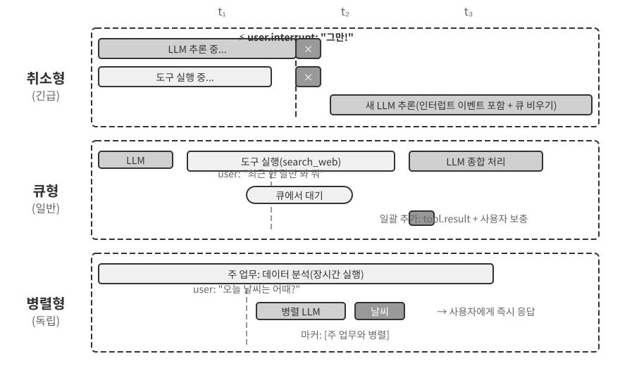
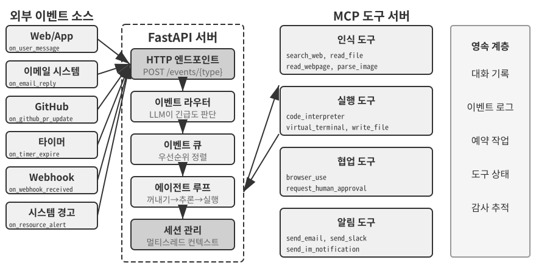
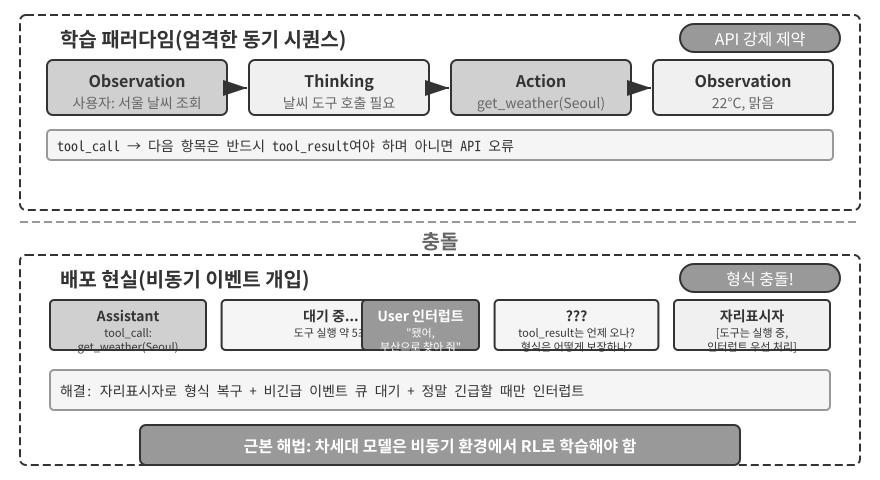
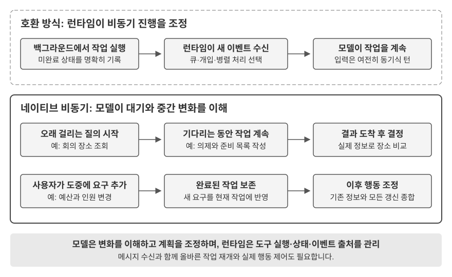
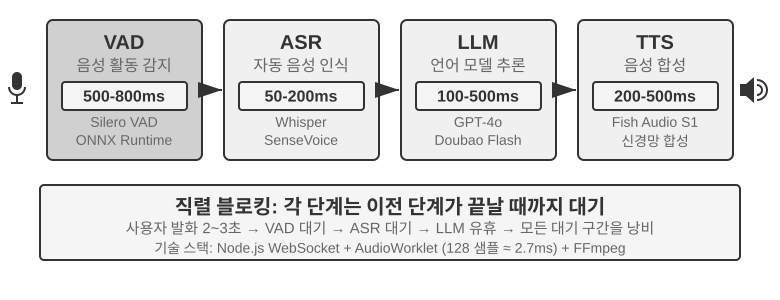
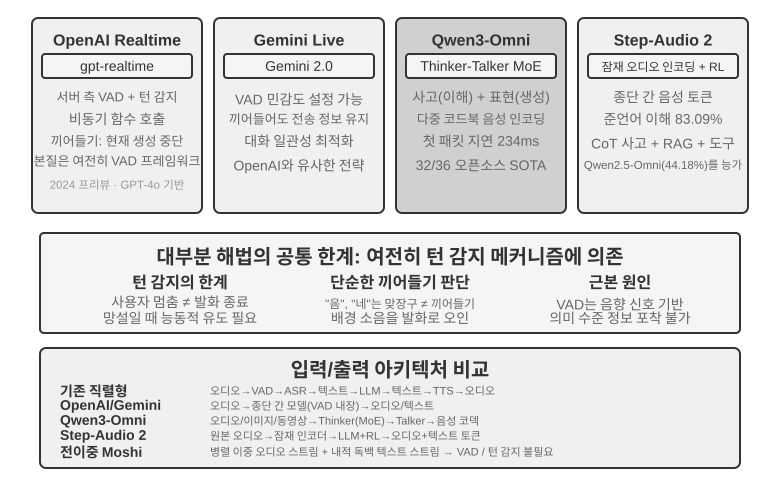
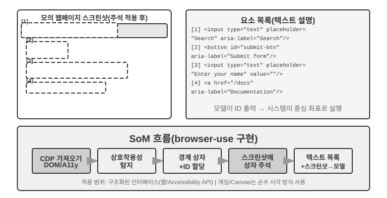

# 상호작용: 관찰 공간과 행동 공간의 확장

1장에서 하나의 주장을 제시했습니다. 기반 모델이 고정되어 있을 때, 에이전트의 과제 성능을 높이는 가장 주된 시스템 공학적 수단은 대개 **관찰 공간**과 **행동 공간**을 다시 정의하거나 확장하는 것이라는 주장입니다. 2장부터 5장까지는 줄곧 그 말을 실현해 왔습니다. 컨텍스트 엔지니어링은 관찰에 무엇을 담을지 결정하고, 메모리와 지식 베이스는 관찰을 세션 너머로 확장하며, 도구는 에이전트가 무엇을 할 수 있는지 정의하고, 코드 생성은 에이전트가 스스로 새로운 행동을 만들게 합니다.

그러나 이 모든 확장은 같은 전제 위에서 이루어졌습니다. 바로 **에이전트와 세계가 번갈아 발언한다**는 전제입니다. 사용자가 한마디를 마치면 에이전트가 한동안 생각하고 도구 몇 개를 호출한 뒤 답합니다. 에이전트가 생각하는 동안 세계는 정지해 있다고 암묵적으로 가정됩니다. 이 전제는 너무나 자연스러워서 가정으로 적히는 일조차 드뭅니다.

이 장이 걷어내려는 것이 바로 그 전제입니다.

## 두 축: 모달리티와 타이밍

관찰 공간과 행동 공간을 펼쳐 보면 각각 확장할 수 있는 방향이 둘씩 있음을 알 수 있습니다.

- **모달리티**는 관찰과 행동의 **형식**을 결정합니다. 에이전트가 텍스트만 읽는지, 아니면 소리를 듣고 화면을 보고 토크를 감지할 수 있는지. 토큰만 출력하는지, 아니면 말하고 클릭하고 관절을 구동할 수 있는지.
- **타이밍**은 관찰과 행동의 **리듬**을 결정합니다. 관찰을 에이전트가 능동적으로 가져오는지, 아니면 세계가 밀어 넣는지. 행동을 한 턴 안에 끝내야 하는지, 아니면 턴을 넘나들고 도중에 중단되며 더 급한 일에 선점될 수 있는지.

앞의 장들이 확장한 것은 이 두 공간의 **내용**이고, 이 장이 확장하는 것은 그것의 **모달리티**와 **타이밍**입니다.

| | 관찰 공간의 확장 | 행동 공간의 확장 |
|---|---|---|
| **내용**(2~5장) | 컨텍스트 엔지니어링, 메모리와 지식 베이스 | 도구, 코드 생성 |
| **모달리티**(이 장) | 음성, 화면, 물리 센서 | 말하기, 클릭, 관절 운동 |
| **타이밍**(이 장) | 세계의 능동적 푸시, 연속 스트림 | 턴을 넘나듦, 중단 가능, 선점 가능 |

이 장의 핵심 명제는 한 문장으로 압축됩니다. **턴제는 훈련이 남긴 가정이지 환경의 성질이 아니다.**

모델의 훈련 말뭉치는 거의 전부 턴제입니다. 질문 뒤에 답이 오고, 도구 호출 뒤에 도구 결과가 오며, 한 사람이 말을 마친 뒤에야 다른 사람이 시작합니다. 그래서 모델이 학습한 정책은 세계가 자신을 기다려 줄 것이라고 가정합니다. 그러나 실제 환경은 모델의 반응을 기다려 주지 않습니다. 생각하는 동안 메일이 도착하고, 사용자가 말 도중에 끼어들며, 두 번의 스크린샷 사이에 페이지는 이미 바뀌어 있고, 팔이 손을 뻗는 동안 컵은 이미 넘어집니다.

| 척도 | 시나리오 | 관찰 측의 변화 | 행동 측의 변화 |
|---|---|---|---|
| 초 — 일 | 비동기와 이벤트 기반 | 세계가 에이전트를 깨움(메일, 타이머, 콜백) | 행동이 턴을 넘나듦: 먼저 시작하고 이후는 이벤트로 마무리 |
| 10밀리초 — 1초 | 음성 | 말하면서 듣기, 한 문장이 끝나기를 기다리지 않음 | 생각하면서 말하기, 중단 가능하고 도중에 고쳐 말할 수 있음 |
| 1초 미만 — 초 | Computer Use | 화면이 두 프레임 사이에도 계속 변함 | 행동 후 현실이 여전히 계획에 맞는지 다시 확인해야 함 |
| 밀리초 | 로봇 | 센서가 연속으로 되돌아옴 | 행동 청킹: 한 번에 조금씩 계획하고 선점 가능 |

네 절은 같은 원시 요소 집합(**깨우기, 안전 지점, 취소, 선점, 빠름/느림 분리**)을 공유하며 매개변수와 실패 양상만 다릅니다. 비동기 이벤트 기반의 "안전 지점에서 취소 신호를 확인한다"와 로봇 행동 청킹의 "이상을 발견하면 남은 행동을 버리고 다시 관찰한다"는 다섯 자릿수나 차이 나는 시간 척도에서 같은 메커니즘을 두 번 구현한 것입니다. 이 동형성을 보는 것이 개별 시나리오의 기술적 세부를 외우는 것보다 중요합니다.

**읽는 순서에는 의도적인 배치가 하나 있습니다. 이 장은 음성에 뒤의 두 시나리오보다 뚜렷하게 많은 분량을 할애합니다.** 실시간 상호작용이라는 진화선 위에서 음성은 가장 멀리 나아갔고 참조계로 삼을 가치가 가장 큰 사례입니다. "직렬 파이프라인은 지연이 너무 크다"는 문제에서 출발해 엔드투엔드, 전이중, 생각하면서 말하기라는 일련의 방안을 거쳐 오늘날 비교적 자리 잡은 종국에 이르기까지, 문제→방안→종국의 전 과정이 이미 완주되었습니다. 그래서 이를 충분히 설명하고, 뒤의 Computer Use와 로봇은 이 맥락에 견주어 읽을 수 있게 합니다. 각각이 이 진화선의 어디까지 왔고 어디에서 막혀 있는지를 말입니다.

## 비동기와 이벤트 기반: 세계가 먼저 찾아올 때

4장에서 다룬 인식, 실행, 협업 도구는 모두 Agent가 능동적으로 호출합니다. 그렇다면 언제든 도착할 수 있는 외부 이벤트에는 어떻게 대응해야 할까요? 이를 위해 이벤트 기반 비동기 아키텍처가 필요합니다. 1장에 남은 두 도구 유형인 이벤트 트리거 도구와 사용자 커뮤니케이션 도구도 이 아키텍처에 의존하므로 여기서 함께 다룹니다.

### 비동기가 필요한 이유

먼저 비유를 들어 비동기가 필요한 이유를 설명하겠습니다. 동기(Synchronous)는 “한 가지 일을 끝내야 다음 일을 할 수 있다”라는 뜻이고, 비동기(Asynchronous)는 “여러 가지 일이 동시에 진행될 수 있다”라는 뜻입니다. 전통적인 동기식 에이전트 아키텍처는 계산대가 하나뿐인 가게와 같습니다. 한 번에 한 고객만 응대하고 그 일이 끝나야 다음 번호를 부를 수 있습니다. 진정으로 지능적인 비서는 이보다 훨씬 유연합니다. 책상 위에 이메일, 전화, 방문객 등 처리할 일이 여러 개 놓여 있으면 긴급도에 따라 순서를 정하고, 일하는 도중 더 급한 일이 생기면 멈추고 전환할 수 있습니다. 동기식 모드의 에이전트는 백그라운드 작업이 끝나야 사용자와 대화하거나, 대화가 끝나야 새로 도착한 이벤트를 처리할 수 있습니다. 따라서 실제 비서에게 필요한 다음 핵심 능력을 제공할 수 없습니다.

- **비동기 실행이 일반적입니다**—작업에는 오랜 시간이 걸리는 경우가 많으며 사용자 상호작용을 막아서는 안 됩니다.
- **이벤트 우선순위를 동적으로 판단합니다**—모든 이벤트가 똑같이 중요하지는 않습니다. 에이전트는 현재 작업 취소(긴급), 큐에 추가(일반), 병렬 처리(독립적인 경량 질의) 가운데 알맞은 전략을 지능적으로 선택해야 합니다.
- **중단과 재개의 흐름이 자연스럽습니다**—중단된 대화나 작업을 자연스럽게 이어갈 수 있어야 합니다.

그러나 비동기 패러다임은 현재 LLM의 근본적인 특성과 충돌합니다. LLM은 동기성을 전제로 훈련되어 도구 호출 다음 메시지가 반드시 도구 결과여야 하지만, 실제 배포 환경은 비동기성을 요구합니다. 사용자는 언제든 중단을 요청할 수 있고 여러 작업이 동시에 진행되며, 도구가 결과를 반환하기 전에 외부 이벤트가 도착할 수도 있습니다. 이러한 “동기식 훈련과 비동기식 배포”의 모순은 이 절에서 뒤이어 다룰 모든 공학적 절충을 관통합니다.

이를 해결하려면 **이벤트 기반 비동기 에이전트 아키텍처**가 필요합니다. 기술적으로 이는 시스템이 “새 메시지가 있는지” 능동적으로 반복 확인하는 폴링을 멈추고, 새 메시지가 도착하면 처리 로직을 자동으로 트리거한다는 뜻입니다. 모든 입력과 출력, 사고 과정, 외부 상호작용은 하나의 이벤트 스트림, 즉 타임라인을 따라 배열된 이벤트 레코드의 연속으로 통합해 모델링합니다. 그림 6-1는 이벤트 소스와 이벤트 큐, 에이전트 처리 흐름의 관계를 보여 주는 이벤트 기반 비동기 에이전트의 전체 아키텍처입니다.


### OpenClaw의 이벤트 기반 메커니즘 구현

오픈 소스 프레임워크 OpenClaw의 아키텍처는 5장에서 자세히 다룹니다. OpenClaw는 Gateway 제어 평면을 통해 여러 채널의 메시지를 받아 에이전트 런타임으로 라우팅하며, 세 가지 자동화 메커니즘을 기본으로 제공합니다.

- **Hooks(이벤트 훅)**: 세션 생성이나 재설정 등 에이전트 수명 주기의 이벤트에 응답합니다. GitHub Actions의 이벤트 트리거와 비슷합니다.
- **Cron(예약 작업 스케줄러)**: Unix 시스템에서 널리 쓰이는 예약 작업 문법인 cron 표현식에 따라 주기적인 작업을 실행합니다. 예를 들어 `0 9 * * 5`는 매주 금요일 오전 9시를 뜻하며, 이때 주간 보고서를 만들거나 매월 초에 데이터를 요약할 수 있습니다.
- **Heartbeat(하트비트 데몬)**: N분마다 에이전트를 깨워 주의가 필요한 일이 있는지 확인합니다. 판단력을 활용해 알림 피로를 방지합니다.

이 세 메커니즘 덕분에 OpenClaw 에이전트는 자율적으로 보입니다. 사용자가 오프라인이어도 일정에 따라 보고서를 만들고 시스템 상태를 확인하며 일상적인 작업을 처리할 수 있습니다. 하지만 자세히 살펴보면 근본적인 한계가 드러납니다. 먼저 Gateway는 IM이나 웹 인터페이스 같은 기본 채널의 메시지를 이미 **푸시 방식**으로 처리합니다. 메시지가 도착하는 즉시 에이전트로 라우팅합니다. 세 가지 자동화 메커니즘 가운데 사용자 메시지가 없어도 에이전트가 행동하게 하는 것은 Cron과 Heartbeat뿐이며, 둘 다 **시간 기반**입니다. Heartbeat는 고정된 간격으로 확인하고 Cron은 미리 정한 시각에 실행됩니다. Hooks는 프레임워크 내부의 수명 주기 이벤트에 반응할 뿐 외부 세계의 새로운 변화를 가져오지 못합니다. 진짜 공백은 기본 채널 밖의 모든 제3자 이벤트 소스에 있습니다. 새 이메일, 데이터를 푸시하는 외부 API 콜백, 즉각적인 대응이 필요한 긴급 알림을 OpenClaw로 즉시 들여올 경로가 없습니다. 에이전트는 사건이 벌어진 순간 반응하지 못하고, 빨라도 다음 Cron 또는 Heartbeat 주기에야 이를 알아챕니다.

이러한 지연을 허용할 수 없는 상황이 많습니다. Pine AI의 OpenClaw 플러그인인 **PineClaw**를 예로 들어 보겠습니다. Pine AI는 사용자를 대신해 실제로 전화를 거는 AI 비서로, 요금 협상, 구독 해지, 보험금 청구 처리 등이 대표적인 사용 사례입니다. 사용자가 OpenClaw 에이전트를 통해 Pine 전화 작업을 시작하면 Pine의 음성 AI가 대신 전화를 걸지만, 통화 중에는 언제든 사용자의 개입이 필요할 수 있습니다.

- **실시간 본인 인증**: 상담원이 계정 소유자의 신원 확인을 요구하면 Pine은 사용자에게 보안 코드나 일회용 비밀번호(OTP)를 즉시 받아야 합니다.
- **삼자 통화 확인**: 상담원이 계정 소유자와 직접 통화하려 하면 Pine은 사용자가 몇 초 안에 전화를 받도록 해야 합니다.
- **진행 상황 공유와 의사결정 확인**: 상대가 할인안을 제시하는 등 협상이 중요한 시점에 이르면 Pine은 사용자에게 수락 여부를 확인해야 합니다.

Heartbeat가 5분마다 폴링한다고 가정하면 상담원이 인증 코드를 기다리는 동안 사용자에게 알림이 도착하지 않아, 상담원이 전화를 끊고 통화가 실패할 수 있습니다. 간격을 몇 초로 줄이면 쓸모없는 요청만 시스템에 쏟아집니다.

PineClaw는 **Channel 메커니즘**을 도입해 이 문제를 해결합니다. OpenClaw의 Gateway와 Pine API 사이에 실시간 이벤트 채널을 만들고, 전화 연결, 사용자 입력 필요, 통화 종료 같은 주요 이벤트가 발생하면 메시지를 OpenClaw 에이전트로 즉시 푸시합니다. 에이전트는 바로 처리해 사용자에게 알리므로 응답 지연이 분 단위에서 초 단위로 줄어듭니다.

이 사례는 이벤트 기반 아키텍처가 에이전트 프레임워크에 주는 핵심 가치를 보여 줍니다. **진정한 “능동적 서비스”를 제공하려면 에이전트가 주기적으로 이벤트를 확인할 뿐 아니라 이벤트도 에이전트에게 능동적으로 알릴 수 있어야 합니다.** 사용자 메시지, 도구 반환값, 외부 콜백, 예약 트리거 등 모든 입력을 이벤트 스트림으로 통합해 모델링하고, 이벤트 루프로 에이전트의 사고와 행동을 구동하는 것이 이 목표를 이루는 아키텍처의 토대입니다. 이제 이 아키텍처에서 이벤트와 직접 관련된 두 도구 범주를 먼저 설명하고, 에이전트의 독립적인 행동을 뒷받침하는 가상 신원과 격리 실행 환경을 살펴본 뒤 이벤트 처리 메커니즘의 구체적인 설계를 다루겠습니다.

### 이벤트 트리거 도구

이벤트 트리거 도구는 외부 사건이 에이전트의 행동을 일으키는 진입점입니다. 이 도구가 없으면 에이전트는 사고하고 도구를 호출한 뒤 최종 결과를 출력하는 루프를 이어 가다가 사용자의 다음 입력을 기다릴 수밖에 없습니다. 세상의 변화를 에이전트가 처리할 수 있는 이벤트로 바꾸는 도구에는 일반적으로 세 종류가 있습니다.

**타이머**(`set_timer`)는 물리적인 시간과 연결된 이벤트를 처리합니다. 이메일에 답장이 오지 않으면 일정 시간이 지난 뒤 진행 상황을 물어야 하고, 상대의 업무 시간이 아닐 때 전화했다면 다음 업무 시간에 다시 시도해야 합니다. 이를 위해 OpenClaw와 Claude Code 같은 도구는 지정된 물리적 시각에 에이전트가 스스로 깨어날 수 있는 타이머 기능을 제공합니다. **일회성 타이머**는 실행 시각이 정해진 작업에 씁니다. 예를 들어 사용자가 토요일에 “DMV에 전화해 줘”라고 요청하면 에이전트는 “다음 주 월요일 오전 10시에 DMV에 전화하기” 타이머를 설정하고, 시간이 되면 자동으로 전화를 겁니다. **반복 타이머**는 한 시간마다 서버 상태를 확인하거나 금요일마다 진행 보고서를 보내는 것처럼 주기적인 작업에 씁니다. 능동적인 진행 상황 알림을 지원하지 않는 외부 서비스도 있어, 에이전트가 직접 상태를 반복 조회해야 할 때가 있습니다. 이 경우 반복 타이머가 필요합니다. 앞 절에서 설명한 OpenClaw의 Heartbeat가 이를 체계화한 형태이며 OpenClaw의 “능동적 서비스” 능력을 뒷받침하는 근간입니다.

**백그라운드 작업 모니터링**(`monitor_shell`)은 비동기로 실행되는 도구나 명령줄 작업에서 발생하는 이벤트를 처리합니다. 명령줄 작업 가운데에는 백그라운드에서 오래 실행되며 에이전트가 진행 상황을 추적해야 하는 것이 있습니다. 에이전트가 명령줄을 계속 “지켜보며” 도구를 반복 호출해 진행 상황을 폴링하면 토큰을 낭비합니다. 반대로 작업이 완전히 끝날 때까지 다시 생각하지 않으면 진행 중에 발생한 심각한 문제를 놓치고, 명령이 멈춰도 개입하지 못해 전체 작업이 정체됩니다. Claude Code는 `monitor` 도구를 도입해 이 문제를 해결합니다. 에이전트가 특정 키워드를 포함한 출력을 비롯해 명령줄의 새 출력을 감시할 수 있습니다.

**외부 이벤트 채널**(`connect_channel`)은 새 이메일, API 콜백, IM 메시지 같은 외부 이벤트를 에이전트에 실시간으로 푸시합니다. 앞 절에서 설명한 PineClaw의 Channel 메커니즘이 대표적인 구현입니다.

설계 관점에서 이벤트 트리거 도구는 명확한 트리거 조건과 필터링 규칙을 정의해야 합니다. 관련 없는 이벤트가 에이전트를 깨워 컴퓨팅 자원을 낭비하지 않게 하기 위해서입니다. 이벤트 페이로드에는 충분한 컨텍스트 정보를 담아, 에이전트가 깨어난 뒤 추가로 조회해야 하는 횟수를 최소화해야 합니다.

### 사용자 커뮤니케이션 도구

OpenClaw의 세션은 사용자에게 투명합니다. 전용 도구를 통해 사용자와 에이전트가 언제든 이미지·파일·푸시 알림을 포함한 메시지를 주고받으며 멀티모달 통신과 Generative UI도 지원합니다.

사용자 커뮤니케이션 도구는 에이전트와 사용자가 소통하는 채널이 다양해지면서 등장했습니다. Claude Code, Manus, Genspark 같은 많은 에이전트는 기본 ReAct 루프를 사용합니다. 에이전트가 “말하는” 모든 내용, 즉 어시스턴트 메시지가 사용자에게 직접 전달되므로 사용자는 앱에서 특정 세션을 열어야 대화할 수 있습니다. OpenClaw는 이러한 인간·컴퓨터 커뮤니케이션 패러다임을 깨뜨린 가장 영향력 있는 범용 에이전트 가운데 하나입니다. 세션은 사용자에게 투명해서 사용자가 세션의 존재나 에이전트의 도구 호출 세부 사항을 알 필요가 없습니다. 엄격한 사용자 메시지·에이전트 응답 순서를 따르지 않고 사용자와 에이전트가 언제든 서로에게 메시지를 보낼 수 있습니다. 그 때문에 많은 사용자가 비서처럼 비동기로 메시지를 보내는 OpenClaw에서 “사람 같은 존재감”을 느낍니다. 이러한 문자 메시지는 모델의 어시스턴트 메시지를 그대로 사용자에게 흘려보내는 방식이 아닙니다. 전용 도구로 전송하므로 이미지와 파일을 첨부할 수 있고, 긴급도에 따라 푸시 알림도 보낼 수 있습니다.

문자 기반 커뮤니케이션을 넘어 구조화된 카드 메시지나 알림 이메일을 보내는 등 멀티모달 커뮤니케이션 능력을 갖춘 에이전트도 늘고 있습니다. HTML 같은 방식으로 대화형 인터페이스를 만들어 정보를 더욱 편리하게 보여 주는 생성형 UI를 실험하는 에이전트도 등장했습니다. 설계 관점에서 사용자 커뮤니케이션 도구는 사용자가 온라인 상태가 아닐 때에도 보낼 수 있는 비동기 메시징을 지원하고, 읽음·읽지 않음 상태를 추적하며, 여러 채널에서 메시지의 일관성을 유지해야 합니다.

**다중 채널 사용자 커뮤니케이션과 재참여.**

두 범주의 경계가 모호해지기 쉬운 지점이 있습니다. 둘 다 “알림을 보내지만”, 수신자가 승인자나 협업자라면 관리자의 승인을 요청하거나 협업 에이전트에 진행 상황을 보고하는 도구는 협업 범주에 속합니다. 최종 사용자에게 보내는 경우에만 사용자 커뮤니케이션 도구입니다. 구분 기준은 채널이 아니라 누구에게 왜 알리는가입니다.

**에이전트의 응답은 하나의 채널에 한정되어서는 안 되며, 알림 메커니즘은 사용자의 재참여를 유도하는 수단이기도 합니다.** 메시지 전송은 인스턴트 메시지, SMS, 이메일, 전화, 푸시 알림 등의 채널로 확장됩니다. 에이전트는 긴급도, 사용자 상태, 콘텐츠 특성, 사용자 선호를 종합해 채널을 선택함으로써 중요한 메시지를 놓치지 않으면서 불필요한 방해를 피합니다.

오래 걸리는 작업은 끝나는 즉시 에이전트가 사용자에게 능동적으로 알려 다시 주의를 끌어야 합니다. 일일 요약이나 주간 보고서 같은 주기적인 작업의 경우 알림은 사용자가 규칙적으로 상호작용하는 습관을 들이는 데 도움이 됩니다.

사용자 커뮤니케이션 도구는 “사용자에게 어떻게 닿을 것인가”라는 문제를 해결합니다. 하지만 에이전트가 이러한 채널에서 어떤 신원으로 활동하며, 사용자를 대신해 어떤 환경에서 행동할지 결정하려면 신원과 실행 환경을 뒷받침하는 기반이 필요합니다. 다음 절에서 이를 다룹니다.

### 가상 신원과 격리 실행 환경

가상 컴퓨터는 24시간 실행되고 로컬 파일에 대한 자유로운 접근을 막으며, 에이전트의 오류가 가상 환경 밖으로 퍼지는 것을 막습니다. 데이터는 공유 파일 시스템의 경로로 교환합니다.

먼저 이 절이 여기에 놓인 이유를 짚고 넘어가겠습니다. 가상 신원과 격리 실행 환경은 본질적으로 실행 도구에서 설명한 샌드박스와 같은 실행 환경 인프라입니다. 그런데도 비동기 아키텍처 절에서 다루는 이유는, 독립적으로 상시 실행되며 언제든 사용자를 대신해 행동하는 에이전트에 이 인프라가 가장 절실하기 때문입니다.

이 장 첫머리에서 언급했듯이 영화 *그녀*의 사만다는 독립된 신원과 운영 환경을 갖췄습니다. 이와 같은 범용 비서를 구현하려면 중요한 아키텍처 선택을 내려야 합니다. 에이전트가 사용자의 개인 계정을 직접 관리하게 할까요, 아니면 자체 가상 신원을 갖게 할까요? 직접 관리는 편리해 보이지만 에이전트가 한 번 잘못 행동하거나 침해당하면 사용자의 디지털 신원 전체가 노출됩니다. 더 안전한 방법은 비서가 자신의 사무실 전화와 우편함을 쓰듯 에이전트에 독립된 가상 신원을 부여하는 것입니다. 전용 커뮤니케이션 계정과 저장 공간, 컴퓨팅 환경을 마련해 에이전트가 투명하고 명확히 공개된 신원으로 사용자를 대신해 일하게 합니다. 이러한 투명성은 신뢰를 약화하지 않으며 오히려 커뮤니케이션을 더욱 진정성 있게 만들 수 있습니다.

가상 신원은 격리 실행 환경에 기반해야 합니다. **가상 컴퓨터**(VM·컨테이너)와 **가상 전화**(Android 에뮬레이터)는 에이전트에 운영 체제 수준의 격리와 완전한 데스크톱·모바일 조작 능력을 제공합니다. 에이전트는 그 안에서 자체 사용자 계정과 홈 디렉터리, 로그인 자격 증명을 사용하므로 모든 작업을 추적하고 감사할 수 있습니다. 작업을 잘못하더라도 호스트 시스템과 사용자의 실제 기기는 영향을 받지 않습니다. 이는 실행 도구 절의 샌드박스 개념을 “디지털 신원” 차원으로 확장한 것입니다. 샌드박스는 코드 실행을 격리하고, 가상 컴퓨터와 전화는 디지털 신원 전체를 격리합니다.

독립된 신원에는 현실적인 과제도 두 가지 있습니다. 첫째는 **자동화 방지 메커니즘**입니다. 많은 웹사이트가 CAPTCHA와 IP 평판 검사로 자동화된 접근을 차단합니다. 데이터 센터 IP를 사용하는 가상 환경은 쉽게 식별되므로, 실제로 정상적인 접근을 하려면 실제 가정용 IP를 사용하는 레지덴셜 프록시 네트워크를 구성해야 할 때가 많습니다. 둘째는 **사용자의 실제 계정에 접근하는 문제**입니다. 사용자 본인으로 로그인해야 하는 작업에는 HITL 인증을 사용합니다. VNC/RDP 원격 데스크톱에서 사용자가 직접 로그인하고, 에이전트가 조작하는 전체 인터페이스를 보면서 인증이 필요한 이유를 이해할 수 있게 합니다. 이후 세션 토큰을 유효 기간 안에서 재사용해 사용자를 반복해서 방해하지 않도록 함으로써 자율성과 보안의 균형을 맞춥니다.

주 에이전트와 가상 환경은 **공유 파일 시스템**으로 데이터를 주고받습니다. 볼륨 마운트(예: `/workspace/shared`)로 주 에이전트, 가상 컴퓨터, 가상 전화를 연결하고, 콘텐츠를 복사하는 대신 파일 경로를 참조하여 데이터를 전달함으로써 컨텍스트 창 사용량을 줄입니다. 데이터 분석을 예로 들면 사용자가 공유 디렉터리에 CSV 파일을 업로드하고, 가상 컴퓨터의 에이전트가 파일을 읽어 분석한 뒤 차트를 만들어 다시 공유 디렉터리에 저장합니다. 주 에이전트는 차트의 파일 경로만 사용자에게 반환하면 됩니다. 주고받는 것은 언제나 가벼운 경로 문자열입니다.

이벤트 트리거 도구는 세상이 에이전트를 깨울 수 있게 하고, 사용자 커뮤니케이션 도구는 에이전트가 사용자에게 닿을 수 있게 합니다. 가상 신원과 격리 실행 환경은 에이전트가 독립적이고 감사 가능한 방식으로 행동할 수 있게 합니다. 이제 남은 질문은 하나입니다. 여러 이벤트가 같은 에이전트 인스턴스에 동시에 몰려오면 어떻게 처리해야 할까요?

### 이벤트 처리 메커니즘

에이전트 인스턴스 하나가 사용자에게서 온 새 메시지, 도구 결과, 타이머 만료, 다른 에이전트의 협업 요청 등 여러 이벤트를 동시에 마주할 수 있습니다. 이러한 이벤트를 효율적이고 정확하게 처리하는 방식은 성능과 사용자 경험에 직접 영향을 줍니다.

이 메커니즘의 뼈대는 동시성 프로그래밍의 **이벤트 루프**입니다. 비동기 에이전트를 장시간 실행되는 하나의 루프로 생각해 봅시다. 각 라운드에서 입력 큐의 이벤트 묶음을 꺼내 궤적에 추가하고, LLM을 한 번 호출한 다음 LLM이 호출하기로 한 도구를 실행합니다. 그런 뒤 루프 처음으로 돌아가 다음 이벤트 묶음을 기다립니다. Go의 고루틴이 채널에서 메시지를 읽고 `for { select { ... } }` 안에서 라운드별로 처리하는 것과 같은 구조입니다. 이 모델에는 중요한 특성이 하나 있습니다. **이벤트는 각 루프 반복의 경계에서만 소비됩니다.** LLM이 사고하거나 도구가 실행되는 도중 새 이벤트가 난데없이 끼어들어 현재 단계를 흐트러뜨릴 수 없습니다. 이벤트는 큐에서 기다리다가 한 구간의 사고가 끝나거나 도구가 반환되는 **세이프 포인트**에 라운드가 도달하면 한꺼번에 처리됩니다. 취소도 같은 원칙을 따릅니다. 임의의 순간에 강제로 잘라 내는 대신, 세이프 포인트에서 “중단 요청을 받았는가?”를 확인합니다. 이는 Go의 `ctx.Done()`이 맡는 역할과 정확히 같습니다. 10장에서는 같은 컨텍스트 패턴으로 상위 에이전트가 하위 에이전트를 연쇄적으로 취소하는 방법을 설명합니다. 이 점을 이해하면 아래 세 처리 전략은 세이프 포인트를 다루는 방법만 다르다는 사실을 알 수 있습니다. 이벤트를 다음 세이프 포인트가 자연스럽게 올 때까지 기다리게 하거나(큐 방식), 세이프 포인트를 앞당겨 강제로 만들거나(취소 방식), 별도 루프를 띄워 주 루프의 세이프 포인트를 아예 기다리지 않습니다(병렬 방식).

**구조화된 이벤트 모델링.**

처리하려면 먼저 이해해야 합니다. 범용 에이전트의 입력은 사용자에게서만 오지 않습니다. 제3자의 메시지는 사용자가 에이전트에 보낸 것이 아니지만 에이전트는 이를 이해하고 중요성을 가늠하여 개입할지 결정해야 합니다. 따라서 모든 입력을 풍부한 의미를 담은 **구조화된 이벤트**로 모델링해야 합니다.

- **출처(누가)**: 사용자 본인, 연락처에 있는 사람, 낯선 사람, 시스템 알림
- **채널(어떻게)**: 전화, SMS, 인스턴트 메시지, 이메일, 소셜 미디어, 타이머 트리거, 비동기 도구 호출 결과, 명령줄 모니터링 상태 업데이트
- **내용(무엇을)**: 메시지 텍스트, 감정의 뉘앙스, 긴급도, 답변 필요 여부
- **컨텍스트(배경)**: 이전 대화에 대한 답변인지 새로운 연락인지, 현재 작업과 어떤 관련이 있는지

고객의 환불 요청 이메일을 예로 들면 구조화된 이벤트는 다음과 같습니다.

```json
{
  "source": {"type": "email", "sender": "client@example.com"},
  "channel": "gmail_webhook",
  "content": {"subject": "Refund Request", "body": "Order #12345, requesting a refund..."},
  "context": {"priority": "high", "customer_tier": "vip", "related_orders": ["#12345"]}
}
```

이러한 차원을 구조화된 이벤트로 명확히 모델링해야만 에이전트가 여러 당사자와 소통하면서도 혼동하지 않을 수 있습니다. 사용자 입력을 도구 결과로 오해하거나 숨은 지시가 담긴 도구 결과를 사용자 명령으로 오해하는 프롬프트 주입도 피할 수 있습니다. 다중 스레드 컨텍스트 관리의 복잡성 때문에 에이전트는 여러 대화 스레드의 관계도 이해해야 합니다. 제3자의 메시지가 사용자의 기분에 어떤 영향을 주는지, 사용자의 역할이 대화마다 어떻게 바뀌는지, 서로 다른 스레드의 정보를 언제 종합해 조언해야 하는지 파악해야 합니다. 웹훅, 타이머, 이메일, 데이터베이스 변경, 파일 감시자로 이루어진 n8n 같은 워크플로 플랫폼의 트리거 생태계도 같은 원리를 보여 줍니다. 각 트리거는 에이전트가 세상을 인식하는 “감각 기관”입니다. 서로 다른 이벤트를 하나의 구조화된 형식으로 모델링하면 에이전트는 출처가 무엇이든 자극을 일관되게 처리할 수 있습니다. 아래의 긴급도 판단과 처리 전략은 모두 이 통합 모델링을 토대로 합니다.

**긴급도에 따른 동적 처리 전략.**

여러 일을 동시에 하는 사람은 긴급도에 맞춰 전략을 조절합니다. 위급한 일이 생기면 하던 일을 내려놓고, 일상적인 할 일은 목록에 넣어 나중에 처리합니다. 에이전트의 이벤트 처리도 이처럼 지능적이어야 합니다.



**취소 방식 처리**는 긴급 이벤트에 사용합니다. 핵심은 긴급 이벤트를 위해 **세이프 포인트를 앞당겨 강제로 만드는 것**입니다. 현재 단계를 능동적으로 중단해 바로 이 순간을 새 이벤트를 소비할 수 있는 경계로 만듭니다. 사용자가 “중지”를 누르거나 감독 시스템이 우선순위가 높은 지시를 보내는 등 긴급 이벤트가 도착하면 다음과 같이 처리합니다. (1) 현재 작업을 멈춥니다. LLM이 사고 중이면 스트리밍 응답을 즉시 취소하고, 동기식 도구가 실행 중이면 취소 신호를 보냅니다. (2) 대기 큐의 이벤트를 모두 꺼냅니다. (3) 꺼낸 이벤트와 긴급 이벤트를 함께 궤적 끝에 추가합니다. (4) 갱신된 전체 궤적을 입력으로 LLM을 즉시 다시 호출해 상황을 판단합니다. 예를 들어 에이전트가 잘못된 작업을 실행하려는 순간 사용자가 “멈춰! 내가 잘못 말했어”라고 입력하면, 에이전트는 새 입력을 즉시 보고 진짜 의도를 다시 이해해 잘못된 행동을 피합니다.

**큐 방식 처리**는 일반 이벤트에 사용합니다. 비동기 도구 결과가 돌아오거나 사용자가 부가 정보를 보내는 등 긴급하지 않은 이벤트가 도착하면 다음과 같이 처리합니다. (1) 현재 작업을 중단하지 않고 이벤트를 큐 끝에 추가합니다. (2) LLM의 사고와 동기식 도구 실행 등 현재 작업이 끝날 때까지 기다립니다. (3) 도구 호출이 끝나 `tool.result`를 반환할 때마다 큐를 확인하고, 큐가 비어 있지 않으면 모든 이벤트를 궤적에 한꺼번에 추가합니다. (4) LLM이 갱신된 궤적을 종합적으로 처리합니다. 이렇게 하면 이벤트를 묶어 처리해 효율을 높일 수 있습니다. 예를 들어 에이전트가 검색 도구의 결과를 기다리는 동안 사용자가 “지난 한 달의 결과만 보여 줘”라고 덧붙이면 이 정보가 큐에 들어갑니다. 검색 결과가 돌아올 때 두 이벤트를 LLM에 함께 제시하므로 불필요한 왕복을 피할 수 있습니다.

**병렬 처리**는 독립적인 경량 질의에 사용합니다. 에이전트가 방대한 데이터를 분석하는 동안 사용자가 갑자기 “오늘 날씨가 어때?”라고 묻는 경우를 생각해 봅시다. 이러한 질의는 주 작업과 무관하고, 빨리 답해야 하며, 실행 비용이 낮다는 세 가지 특성이 있습니다. 중요한 주 작업을 중단하는 취소 방식도, 사용자를 오래 기다리게 하는 큐 방식도 적합하지 않습니다. 시스템은 먼저 질의의 독립성과 복잡성을 평가한 뒤 별도의 병렬 사고 세션에서 실행합니다. 필요한 도구를 호출해 답을 만들고 즉시 반환합니다. 질의와 답변은 “주 작업과 병렬로 실행됨”이라고 명확히 표시해 주 작업의 궤적에 추가함으로써 LLM이 혼동하지 않게 합니다.

**긴급도 판단.**

긴급 이벤트에는 사용자 중단(`user.interrupt`), 감독자 지시(`supervisor.instruction`), 에이전트 간 중단(`agent.interrupt`), 긴급으로 표시된 시스템 경고나 결제 실패 같은 외부 트리거가 있습니다.

긴급하지 않은 이벤트에는 일반 사용자 입력(`user.input`), 에이전트 입력(`agent.input`), 도구 결과(`tool.result`), 타이머 트리거(`timer.trigger`), 일반 외부 트리거가 있습니다.

하드코딩된 규칙에는 한계가 있습니다. 이벤트의 의미가 처리 방식을 결정하기 때문입니다. “지금 당장 멈춰!”에는 취소 방식을, “오늘 날씨가 어때?”에는 병렬 방식을, “보고서를 한국어로 작성해 줘”에는 큐 방식을 사용합니다. **이벤트 라우터로 경량 분류 LLM을 사용**하여 이벤트가 도착할 때 어떤 전략을 택할지 빠르게 판단하는 방식을 권장합니다.

다음 실험에서는 지금까지 설명한 이벤트 처리 전략을 실행 가능한 이벤트 기반 이메일 처리 에이전트로 구현합니다.

> **실험 6-1 ★★★: 이벤트 기반 이메일 처리 에이전트**
>
>
> 
>
>
> 이 실험에서는 가장 단순한 이벤트 기반 에이전트인 **자동 이메일 처리 비서**를 만듭니다. 에이전트가 받은 편지함을 감시하다가 새 이메일이 도착할 때마다 분류, 요약, 답장 초안 작성, 필요시 사용자 알림으로 이어지는 처리 워크플로를 자동으로 실행합니다. 외부 이벤트인 새 이메일 도착이 에이전트의 완전한 사고 주기를 일으키므로 이벤트 기반 에이전트를 가장 직관적으로 익힐 수 있는 입문 사례입니다.
>
> **실험 목표**: 이벤트 기반 아키텍처의 핵심 발상을 이해합니다. 에이전트가 더 이상 사용자 입력을 수동적으로 기다리지 않고 외부 사건에 반응해 스스로 행동합니다. 이 실험을 통해 이벤트 소스 등록, 이벤트 큐, “이벤트 도착 → 에이전트 처리 → 결과 전달”의 기본적인 폐루프를 익힙니다.
>
> **이벤트 소스와 이벤트 큐.**
>
> 시스템은 여러 이벤트 소스를 통합해 받아들입니다.
>
> - **이메일 이벤트**(`on_email_received`): 받은 편지함을 주기적으로 확인하거나 푸시 알림을 받아 새 이메일이 도착하면 트리거됩니다.
> - **IM/SMS 메시지**(`on_im_message`, `on_sms_message`): 인스턴트 메시지나 SMS가 도착하면 트리거됩니다.
> - **GitHub 이벤트**(`on_github_pr_update`, `on_github_issue_update`): PR 검토 댓글이나 상태가 변경되면 트리거됩니다.
> - **타이머 트리거**(`on_timer_expire`): 일일 요약, 주간 보고서 생성 같은 예약 작업에 의해 트리거됩니다.
> - **웹훅**(`on_webhook_received`): 외부 시스템에서 들어오는 범용 콜백입니다.
> - **시스템 이벤트**(`on_user_inactive`, `on_process_timeout`, `on_resource_alert`): 내부 상태가 변경되면 트리거됩니다.
>
> 모든 이벤트는 하나의 **이벤트 큐**에 들어가 도착 순서대로 처리됩니다. 이벤트마다 독립적인 에이전트 사고 루프를 실행합니다. 에이전트는 이벤트 내용을 읽고 지식 베이스 조회, 첨부 파일 읽기, 관련 이메일 기록 검색 등의 도구를 호출한 뒤 분류 레이블, 요약, 답장 초안 같은 처리 결과를 만듭니다. 마지막에는 알림 도구로 사용자에게 알리거나 작업을 직접 실행합니다.
>
> **검증 시나리오**: 에이전트가 테스트용 편지함을 감시하도록 설정합니다. 회의 초대, 고객 불만, 마케팅 광고 이메일이 한 통씩 도착하는 상황을 시뮬레이션합니다. 에이전트는 차례로 처리합니다. 회의 초대는 캘린더 충돌을 자동으로 확인하고 수락 또는 거절 답장을 작성합니다. 고객 불만은 핵심 정보를 추출하고 높은 우선순위로 표시해 사용자에게 처리를 요청합니다. 마케팅 광고는 자동으로 보관합니다. 전체 과정에 사용자의 개입은 필요하지 않습니다.

실험 4-4는 이벤트가 큐에 들어오고 에이전트가 순서대로 처리하는 가장 단순한 이벤트 기반 패턴을 보여 줍니다. 하지만 오래 걸리는 도구가 실행되는 동안 중단에 대응하거나 여러 동시 작업을 함께 관리해야 한다면 단순한 이벤트 큐만으로는 부족합니다. 이제 더 깊은 공학적 과제를 살펴보겠습니다.

### 공학적 구현: 동기식 모델에서 비동기 중단을 지원하는 방법

실험 4-4는 직렬 이벤트만 처리합니다. 이벤트가 하나씩 큐에 들어오고 에이전트가 차례대로 처리합니다. 이제 이 절 첫머리에서 제기한 “동기식 훈련과 비동기식 배포”의 모순으로 돌아가 보겠습니다. 도구가 아직 결과를 반환하지 않았는데 사용자가 끼어들면 동기식 형식은 이를 어떻게 수용할 수 있을까요? 이 절에서는 업계에서 현재 사용하는 공학적 우회책을 설명합니다.

구체적인 상황으로 이 모순을 먼저 살펴보겠습니다. 에이전트가 사용자의 이메일 초안 작성을 돕기 위해 연락처를 검색하는 도구를 호출했다고 가정합시다. 검색 결과가 돌아오기 전에 사용자가 갑자기 “잠깐, 먼저 내일 날씨를 확인해 줘”라고 말합니다. 동기식 ReAct 루프에서는 검색 결과가 반환되어야 다음 메시지를 처리할 수 있습니다. API가 “도구 호출 다음 메시지는 반드시 도구 결과여야 한다”라고 요구하기 때문입니다. 하지만 비동기식 현실에서는 언제든 이벤트가 진행 중인 작업에 끼어들 수 있습니다. “동기식 형식”의 제약 안에서 “비동기식 중단”의 의미를 표현하는 것이 바로 이 공학적 해법이 풀어야 할 문제입니다.

**공학적 임시방편: 동기식 동작을 모사하는 비동기식 구현.**

핵심 발상은 **중단이 없는 평상시에는 LLM에 표준 동기식 궤적을 보여 주고, 실제로 중단이 일어날 때만 자리표시자를 삽입해 형식을 바로잡는 것**입니다. 다섯 가지 핵심 규칙은 다음과 같습니다.

**규칙 1**: LLM이 어시스턴트 메시지를 만들면 사고, 콘텐츠, 도구 호출을 포함해 즉시 기록합니다.

**규칙 2**: 도구 호출이 완료된 뒤에만 도구 결과를 기록합니다. 실행 중인 궤적은 “부분 완료” 상태입니다.

**규칙 3**: 도구 실행 중에 중단되면 자리표시자가 필요합니다. 완료되지 않은 도구를 대신해 “도구가 백그라운드에서 실행 중입니다. 새 이벤트를 우선 처리하세요” 같은 자리표시자 응답을 만들고 중단 이벤트를 추가한 뒤 LLM을 다시 호출합니다. LLM의 관점에서는 여전히 어시스턴트 메시지와 도구 결과가 짝을 이룹니다.

**규칙 4**: LLM의 사고 중에 중단되면 현재 사고를 바로 폐기합니다. 궤적에 기록하지 않고 새 이벤트를 추가한 뒤 새로운 사고 라운드를 시작합니다.

**규칙 5**: 중단을 일으키지 않는 이벤트는 큐에 넣어 묶음 처리를 기다립니다. 현재 주기가 끝난 뒤에만 한꺼번에 추가합니다.

에이전트가 이메일을 작성하는 도중 사용자가 날씨를 물어 끼어드는 앞의 사례에 이 규칙을 적용하면 다음과 같이 동작합니다.

1. 에이전트가 연락처를 검색하려고 `search_contacts`를 호출하고, 어시스턴트 메시지를 궤적에 즉시 기록합니다(규칙 1).
2. 검색 도구가 결과를 반환하기 전에 사용자가 “먼저 내일 날씨를 확인해 줘”라고 보냅니다. 사용자 중단이므로 시스템은 완료되지 않은 `search_contacts`를 대신하는 자리표시자 도구 결과인 “도구가 백그라운드에서 실행 중입니다. 새 이벤트를 우선 처리하세요”를 만듭니다(규칙 3). 그런 다음 사용자의 날씨 질의를 궤적에 추가하고 LLM을 다시 호출합니다. 이때 LLM이 보는 궤적의 형식은 완전히 유효하며, 어시스턴트 메시지와 도구 결과가 정확히 짝을 이룹니다.
3. 에이전트가 날씨 질의에 답한 뒤 원래의 `search_contacts` 결과가 도착하면 이를 새 이벤트로 궤적에 추가합니다(규칙 2). 에이전트는 연락처 정보를 읽고 이메일 작성을 계속합니다.

이 방식의 핵심 장점은 **평상시에 LLM이 완전한 동기식 궤적을 본다**는 점입니다. 어시스턴트 메시지와 도구 결과가 엄격히 짝을 이루고 타임라인이 명확하며, 자리표시자나 비정상적인 상태가 없습니다. 동기식 패러다임으로 훈련된 LLM에 가장 친화적인 방식이며 사고의 품질을 보존합니다. 자리표시자라는 불가피한 타협은 실제로 중단이 일어날 때만 등장합니다.

그러나 환각을 악화할 위험은 남습니다. 자리표시자에 도구가 “아직 완료되지 않았다”라고 명시해도 모델은 이후 사고에서 도구 결과를 지어낼 수 있습니다. 도구가 유효한 데이터를 반환했다고 스스로 믿고 허구의 데이터를 토대로 결정하는 것입니다. 모델이 훈련 중 본 궤적 대부분에서는 도구 호출 직후에 실제 결과가 이어졌기 때문에 “결과가 아직 돌아오지 않은” 상황을 처리하는 방법을 배우지 못했습니다. 따라서 실제로는 사용자가 명시적으로 중단을 요청하는 등 정말 긴급한 경우에만 중단하고, 긴급하지 않은 이벤트는 큐에 넣어 묶음 처리합니다.

**기존 모델에 적합한 비동기 도구 인터페이스.**

모델의 동기식 전제를 깨뜨리기 어렵다면 더 근본적인 전략은 **도구 인터페이스 설계 단계부터 비동기 의미를 받아들이는 것**입니다.

전통적인 도구 설계는 “호출하면 작업이 끝난다”라는 의미를 암묵적으로 지닙니다. 예를 들어 `phone_call`이라는 이름은 “호출하면 전화를 걸고 통화가 끝날 때까지 기다린 뒤 통화 기록을 반환한다”라고 암시합니다. 비동기 패러다임에서는 “시작”과 “완료”를 분리해야 합니다.

- `initiate_phone_call`: 전화를 걸기 시작하고 작업 식별자와 초기 상태(예: “통화 시작, 연결 중...”)를 즉시 반환합니다.
- 통화 진행 상황은 이벤트 알림(`phone_call_connected`, `phone_call_ended`)으로 전달합니다.

핵심은 도구의 이름과 설명 자체가 비동기 의미를 전달해야 한다는 점입니다. 모델은 `initiate_phone_call`을 보면 언어 이해 능력만으로도 “완료”가 아니라 “시작”을 뜻한다고 자연스럽게 추론합니다. 도구 설명에서는 이를 더욱 분명히 해야 합니다. “이 도구는 하위 에이전트가 처리할 전화 작업을 시작합니다. 작업이 성공적으로 시작되면 작업 ID를 즉시 반환하므로 다른 일을 계속 처리할 수 있습니다. 통화가 끝나면 별도의 알림 이벤트를 보냅니다.”

**큐 방식 처리에서 주의가 분산되는 문제.**

이벤트 묶음을 처리할 때 모델은 마지막 이벤트에만 집중하는 경우가 많습니다. 근본 원인은 **모델이 가장 최근 입력에 반응하도록 훈련된 반면, 이벤트 묶음은 이러한 전제를 깨뜨리기 때문**입니다.

두 수준에서 개입할 수 있습니다.

**프롬프트 수준**: 모델에 “여러 이벤트를 연달아 받으면 모든 정보를 빠짐없이 종합해서 고려하세요”라고 알립니다.

**에이전트 상태 표시줄 마커**: 각 이벤트 앞에 명시적인 마커를 붙입니다.

```text
[Unprocessed Event 1/4] Tool result from database_query: ...
[Unprocessed Event 2/4] User supplementary note: Only look at Beijing data
[Unprocessed Event 3/4] System reminder: Report deadline is in 30 minutes
[Unprocessed Event 4/4] User asks: What's the progress?
```

끝에는 “위에 처리되지 않은 이벤트가 4개 있습니다. 도구 결과 1개, 사용자 메시지 2개, 시스템 알림 1개입니다. 답변에 모든 정보가 반영되었는지 확인하세요”라는 요약을 추가합니다.

### 근본적인 모순과 향후 방향





결국 앞 절에서 설명한 자리표시자, 비동기 도구 인터페이스, 상태 표시줄 마커는 모두 프롬프트 엔지니어링으로 “동기식 훈련과 비동기식 배포”라는 똑같은 모순을 메우는 방법입니다(그림 6-4). 이 모순이 생기는 이유는 이 절 첫머리에서 자세히 다뤘으므로 여기서는 반복하지 않고 근본적인 해결책에 집중하겠습니다.

**모델의 진화 전망: 동기식에서 비동기식으로.**

앞의 공학적 기법은 본질적으로 **모델 훈련의 부족한 부분을 프롬프트 엔지니어링으로 보완하는** 과도기의 임시방편입니다. 진정한 해결책을 얻으려면 모델 훈련 수준의 패러다임 전환이 필요합니다.

로보틱스 분야의 VLA(Vision-Language-Action, 6장 참고) 모델도 이미 비슷한 과제에 직면하기 시작했습니다. 인식과 행동 사이에는 피할 수 없는 지연이 있습니다. VLA의 성공은 에이전트 모델이 발전할 방향을 보여 줍니다. 차세대 모델은 비동기 환경에서 강화 학습을 수행하여 다음 세 가지 핵심 능력을 갖춰야 합니다.

1. **궤적에서 비동기적으로 뒤섞인 이벤트 이해**: 현재 가장 심각하게 부족한 능력입니다. 오늘날의 모델은 엄격한 동기식 순서를 기대하지만 실제 비동기 환경에서는 도구 호출 다음에 도구 결과가 아니라 새 사용자 메시지가 올 수 있습니다. 사고가 중간에 끊겨도 그 상태는 궤적에 보존되어야 하며, 새 메시지를 처리한 뒤 처음부터 다시 생각하는 대신 이어서 생각해야 합니다. 모델은 이러한 “순서가 뒤섞인” 궤적에서도 어느 도구 호출이 아직 결과를 기다리고 있고 어떤 사고가 미완성 조각인지 명확히 파악해야 합니다.
2. **중단된 작업과 사고 재개**: 긴급 이벤트를 처리하느라 중단되더라도 끝내지 못한 작업을 기억해야 합니다. 에이전트가 데이터 분석 도구를 실행하는 동안 사용자가 갑자기 날씨를 물었다면, 답한 다음에는 도구가 계속 실행 중이라는 사실을 잊지 않고 자연스럽게 데이터 분석 결과를 기다려야 합니다. 중단된 도구 호출이 이미 완료되었다고 잘못 믿는 환각을 피하는 일이 특히 중요합니다.
3. **이벤트 묶음의 종합적인 처리**: 여러 이벤트가 한 묶음으로 궤적에 추가되면 마지막 이벤트만 보지 말고 처리되지 않은 모든 정보를 종합적으로 고려해야 합니다.

이러한 비동기 강화 학습을 구현하려면 도구 결과 지연이나 사용자의 무작위 중단 같은 상황을 만드는 비동기 환경 시뮬레이터와, 순서가 뒤섞인 궤적을 정확히 이해하고 중단된 사고를 성공적으로 재개하며 환각을 피하고 이벤트 묶음을 종합적으로 처리하는 능력에 특화된 보상 등 새로운 인프라가 필요합니다.

지속적 사고는 다음 세대 모델을 기다리지 않아도 됩니다. 약 200줄의 오케스트레이션 로직만으로 **기존** 텍스트 추론 모델을 **연속 시간** Agent로 바꿔, 앞의 공학적 방편과 모델 진화를 연결할 수 있습니다. 이는 규칙 4의 확장입니다. 중단된 생각을 버리는 대신 전체 상호작용을 끊김 없는 사고 흐름으로 만듭니다. 런타임은 모델이 작성 중인 `<think>` 블록을 강제로 닫고, 새 도구 결과·사용자 중단·인식 업데이트를 일반 메시지로 주입한 뒤 디코딩을 이어 갈 수 있습니다.

이 방식은 흔히 낭비되는 자원을 활용합니다. 모델은 초당 수백 token을 생성할 수 있지만 도구 호출이나 사용자의 발화에는 몇 초가 걸릴 수 있습니다. 그 대기 시간을 사고에 쓸 수 있습니다. 따라서 Agent는 부분 정보에서 추론을 이어 가고 다음 도구를 미리 실행하는 **기다리며 생각하기**, 출력을 내는 동안에도 추론을 계속하고 행동 도중 스스로 수정하는 **행동하며 생각하기**를 할 수 있습니다.

> **실험 6-2 ★★★: 병렬 실행과 중단 기능을 갖춘 비동기 에이전트**
>
>
> 
>
>
> 이 실험에서는 실험 4-4의 단순한 이벤트 큐를 바탕으로 비동기 에이전트의 어려운 문제인 **도구 병렬 실행, 실행 취소, 상태 관리**를 다룹니다. 에이전트는 더 이상 이벤트를 하나씩 처리하기만 하지 않습니다. 여러 동시 작업을 함께 관리하고 중단과 복구를 처리하며 실시간 상태에 따라 동적으로 판단해야 합니다.
>
> **1. 비동기 도구 실행**: 실행에 3~5초 이상 걸리는 도구를 비동기로 실행하고 시작 즉시 자리표시자를 반환합니다. **검증 시나리오**: 에이전트가 오래 걸리는 터미널 명령을 실행하는 도중 사용자가 “지금 몇 시야?”라고 묻습니다. 에이전트는 즉시 답한 뒤, 오래 걸리던 명령이 끝나면 분석 결과를 보여 줍니다.
>
> **2. 이벤트 큐와 묶음 처리**: 긴급하지 않은 이벤트를 모아 궤적에 한꺼번에 추가합니다. **검증 시나리오**: 에이전트가 오래 걸리는 작업을 실행하는 동안 사용자가 “일본어로 답하는 것 잊지 마”와 “웹페이지 형식으로 정리해 줘”라는 메시지를 연달아 보냅니다. 작업이 끝나면 에이전트가 모든 이벤트를 한꺼번에 처리해 일본어 웹페이지를 만듭니다.
>
> **3. 중단 메커니즘**: 사용자의 “중지” 명령이 실행 흐름을 즉시 종료하고 비동기 도구를 취소합니다. **검증 시나리오**: 에이전트가 오래 걸리는 작업을 실행하는 동안 사용자가 “취소해 줘”라고 보냅니다. 에이전트가 바로 멈추고 궤적에는 중단 이벤트와 취소 작업이 기록됩니다.
>
> **4. 병렬 도구의 취소와 상태 조회**: 비동기 도구가 끝나면 실제 결과를 새 이벤트로 대화에 주입합니다. 작업 ID로 취소하거나 진행 상황을 조회할 수 있습니다. **검증 시나리오**: 사용자가 “스크립트 세 개를 동시에 실행해 줘. 하나가 끝나면 나머지 스크립트의 진행 상황을 확인하고 50%를 넘지 않은 것은 취소해”라고 요청합니다. 세 스크립트는 각각 초당 3%, 2%, 1%의 속도로 진행률을 계속 출력하며 분석 과정을 시뮬레이션합니다. 에이전트가 비동기 터미널 명령 세 개를 동시에 시작합니다. 초당 3%씩 진행하는 스크립트가 약 33초 뒤 끝나면 나머지 두 터미널의 상태를 조회하여 하나는 약 66%, 다른 하나는 약 33%까지 진행되었음을 확인합니다. 그런 다음 50%를 넘지 않은 작업을 취소합니다. 두 터미널의 작업이 끝나면 결과를 통합해 완전한 보고서를 만듭니다.
>

비동기 이벤트 기반 실행은 세계가 언제든 Agent를 깨울 수 있게 하지만, 모델이 응답 전에 생각을 마칠 수 있다고 가정합니다. 다음 세 절은 이 가정에 도전합니다. 환경이 모델 생성 속도만큼 또는 그보다 빠르게 변하면 ‘다 생각한 뒤 말하기’ 자체가 받아들일 수 없는 지연이 됩니다.

## 음성: 가장 자연스러운 인간-기계 인터페이스

음성은 문자를 소리로 바꾸는 데 그치지 않는다. 말하기는 타이핑보다 약 네 배 빠르고 손과 시선을 차지하지 않으므로, 언제든 끼어들 수 있는 연속 입출력 루프에 Agent를 놓기에 알맞다. 음성 입력은 말을 텍스트로 바꾸고 음성 Agent는 사용자가 Agent와 직접 협업하게 한다. 둘 다 서문에서 소개한 whisper coding을 지원한다.

이 절은 사용자가 Agent에게 말하는 경우와 Agent가 사용자를 대신해 외부 세계에 말하는 경우를 다룬다. 음성 모델은 무엇에 답할 수 있는지를, 상호작용 구조는 제대로 듣고 제때 응답하며 발화권을 넘기고 통화 중 확인과 도구 호출을 끝낼 수 있는지를 결정한다.

### 상호작용 시간: 캐스케이드에서 풀 듀플렉스로

OpenAI는 GPT-Live 소개에서 음성 상호작용을 캐스케이드, 턴 기반, 풀 듀플렉스라는 세 패러다임으로 정리했다[^ch6-12]. 이는 신구 교체가 아니라 지연, 비용, 관측 가능성의 절충이다.

| 패러다임 | 핵심 구조 | 장점 | 한계 |
| --- | --- | --- | --- |
| 캐스케이드 | VAD → ASR → LLM → TTS | 모듈이 명확해 교체와 디버깅이 쉽다 | 지연 누적, 경계에서 준언어 정보 손실 |
| 엔드투엔드 Omni | 네이티브 오디오 입출력, 턴 기반 상호작용 | 낮은 지연, 말투·감정·환경음 보존 | 턴 기반, 높은 학습·디버깅 비용 |
| 풀 듀플렉스 | 네이티브 오디오 입출력, 지속적인 듣기·말하기·결정 | 겹쳐 말하기와 자연스러운 끼어들기 | 학습·제어·평가가 복잡하다 |

공통 과제는 번갈아 말해야 한다는 가정과 VAD의 발화권 추측을 없애는 것이다. 캐스케이드와 Omni는 턴을 나누지만 풀 듀플렉스는 누가 말할지를 계속 결정한다.

[^ch6-12]: OpenAI. *Introducing GPT-Live.* 2026-07-08. https://openai.com/index/introducing-gpt-live/ 이 분류는 ChatGPT Voice 세 세대의 진화를 요약한 글에서 왔으며 엔드투엔드 옴니모달은 “turn-based voice models”에 해당한다.

### 패러다임 1 · 캐스케이드 파이프라인

상용 음성 비서 대부분은 직렬 파이프라인을 사용한다(그림 6-6). VAD가 발화 종료를 판단하고 ASR이 음성을 텍스트로 바꾸며 LLM이 답을 만들고 TTS가 읽어 준다. 모듈식 구조는 개별 최적화를 가능하게 하지만 경계마다 대기가 생긴다.



| 모듈 | 역할 | 병목 |
| --- | --- | --- |
| VAD | 끝났는지 판단 | 침묵 임계값에 따른 대기·오분할 |
| ASR | 음성을 텍스트로 변환 | 인식 지연·문맥 손실 |
| LLM | 이해·사고·생성 | 첫 토큰 지연, reasoning의 추가 대기 |
| TTS | 텍스트를 음성으로 변환 | 첫 패킷 합성·재생 버퍼 |

짧은 답변도 네 단계의 대기가 직렬로 누적된다(그림 6-7). 운영 큐잉은 유휴 지연을 더 키우지만 용량 계획은 다루지 않는다(그림 6-8).


> **실험 6-3 ★: 전통적 음성 Agent 구축**
>
> 마이크, Silero VAD, 로컬 Whisper, 스트리밍 LLM, Fish S1 TTS를 WebSocket으로 연결해 캐스케이드 기준선을 구축합니다.

#### 직렬에서 스트리밍 지각으로

그림 6-7이 묘사한 것은 VAD+ASR+LLM+TTS가 완전히 직렬로 이어지는 경우다. 이런 직렬 지각 방식에는 세 가지 문제가 있다.

1. **지연 누적**: 발화가 끝났음을 확인하려면 일정 시간의 침묵을 기다려야 한다.
2. **정보 손실**: 유성/무성의 이진 신호로는 망설임, 감정, 맞장구, 환경음을 표현할 수 없다.
3. **문맥 단절**: 이메일 주소, 사람 이름, 고유명사가 조각조각 인식되어 틀릴 수 있다.

이를 해결하기 위해, 모듈식 분업을 유지하면서 각 단계가 증분 결과를 최대한 일찍 내놓게 하는 **스트리밍 지각**을 택할 수 있다.

- **ASR의 실시간 전사**: VAD가 사용자의 발화 시작을 감지하면 일정한 시간 간격으로 ASR 모델을 호출해 임시 전사를 스트리밍으로 만들고, VAD가 발화 종료를 감지한 뒤에 최종 텍스트를 확정한다.
- **LLM의 추측 실행**: 임시 전사가 나오는 즉시 LLM에 넘긴다. 최종 텍스트가 임시 전사와 같으면 LLM을 다시 호출하지 않고, 다르면 앞서 추측 실행한 사고를 취소하고 LLM을 다시 호출한다.
- **LLM의 분할 출력**: 읽어 주기에 적합한 첫 문단이 생성되면 완전한 응답을 기다리지 않고 곧바로 TTS에 넘긴다.
- **TTS의 증분 합성**: 오디오 청크를 계속 반환해 이후의 생성·합성·재생이 겹쳐 진행되게 한다.

진짜 스트리밍 ASR은 모델 차원의 지원이 필요하다. Whisper의 디코딩은 자기회귀적이지만 인코더가 완전한 오디오 구간을 요구하므로 스트리밍 모델과 곧바로 동일시할 수 없다. LLM 기반 스트리밍 청각 모델은 연속된 오디오에서 텍스트와 의미 이벤트를 내보내 ‘인식’과 ‘이해’의 일부를 같은 모델 안에 넣는다. 대화 시작부터 현재까지의 문맥을 유지하며, 세계 지식을 활용해 브랜드명, 사람 이름, 고유명사를 처리할 수도 있다.

종단 판단을 인식기에 넣을 때 라벨은 결정 시점에 보이는 정보만 사용해야 한다. 사후 정보를 이용하면 온라인에서 재현할 수 없는 판단이 된다. speak_start/end, interrupt, emotion, laugh, sigh, noise 사건 표식은 모든 소리를 텍스트로 압축하지 않고도 변화를 보존한다.

> **실험 6-4 ★: Qwen2-Audio로 스트리밍 음성 지각 시뮬레이션**
>
> Qwen2-Audio 자체는 스트리밍 모델이 아닙니다. 이 실험은 점차 늘어나는 오디오 접두부로 연속 인식을 모사하고 600ms VAD + Whisper와 비교합니다.

### 패러다임 2 · 엔드투엔드 옴니모달 모델(Omni)

캐스케이드는 스트리밍 지각을 도입하더라도 듣기·생각하기·말하기가 이산적인 인터페이스를 거쳐 넘겨지므로, 감정·억양·환경음 같은 정보가 순수 텍스트로 바뀌는 과정에서 사라질 수 있다. Omni 방식은 하나의 모델로 직접 오디오를 듣고 응답을 생성하며 음성을 출력하므로 이런 정보를 보존할 기회가 있지만 학습 비용이 더 크다(그림 6-9). 패러다임 1의 캐스케이드와 비교할 때 Omni의 장점은 주로 지연과 비텍스트 정보의 이해·생성에서 나타난다.

이해 측면에서 Omni 모델은 음성 속 멈춤을 이해할 수 있다. 생성 측면에서 Omni 모델은 노래를 부르거나 특별한 억양으로 문장을 말하는 등 더 풍부한 준언어 정보를 전달할 수 있다.

Omni 모델도 여전히 번갈아 말하기를 가정하며 보통 VAD로 발화권을 나눈다. 따라서 사용자가 숫자를 불러 줄 때의 중간 멈춤이 발화 종료로 오인될 수 있다.



> **실험 6-5 ★★: MiniCPM-o 4.5를 로컬에서 실행해 엔드투엔드와 self-cascade 비교**
>
> MiniCPM-o 4.5를 로컬에서 실행하고 thinking mode를 끈 뒤, 오디오에서 직접 답하는 경로와 같은 모델로 먼저 전사한 다음 답하는 자체 캐스케이드를 비교합니다. 이는 오디오 정보가 보존되는지를 측정하는 것이며, 뒤에서 다룰 **‘말하며 생각하기’가 아닙니다**.

### 패러다임 3 · 풀 듀플렉스 상호작용 모델

Omni는 “사용자가 말함”과 “모델이 말함”을 나누지만 동시통역은 겹침을 요구한다. 풀 듀플렉스는 턴을 전제하지 않고 계속 듣고 말하며 계속·정지·끼어들기·도구 호출을 결정한다. Kyutai Moshi는 사용자와 모델의 음성을 병렬로 모델링한 초기 사례다.

Thinking Machines Lab의 Interaction Model[^ch6-14]은 상호작용을 VAD 같은 외부 하니스가 아니라 모델에 내장한다. 마이크로 턴은 침묵·겹침·끼어들기를 연속 문맥으로 보존하고 백그라운드 추론 모델에 대화를 맡기면서 전경 모델이 대화를 유지한다.

[^ch6-14]: Thinking Machines Lab, “Interaction Models: A Scalable Approach to Human-AI Collaboration,” 2026-05. https://thinkingmachines.ai/blog/interaction-models/

### 인지 시간: 실시간 상호작용과 깊은 사고

상호작용 품질과 지능의 상한은 서로 다른 차원이다. 전경 모델은 사용자가 온라인인 동안 답하고 백그라운드 모델은 더 오래 생각할 수 있다. 세 설계는 선형 발전이 아닌 절충이며, 앞의 두 설계는 캐스케이드나 Omni에 적용할 수 있다. 세 번째 설계만 깊은 사고와 실시간 표현을 같은 모델 내부에 통합한다.

#### 해법 1: 빠른 생각으로 시간을 벌고 느린 생각으로 답하기

빠른 모델이 수백 밀리초 안에 연결 답변을 하고 느린 모델이 깊이 추론하면 쉬운 질문은 중복 처리되고 어려운 질문은 모순될 수 있다. 두 인스턴스가 독립적으로 생각하기 때문이다.


#### 해법 2: 빠른 생각으로 상호작용하고 느린 생각으로 조언하기

백그라운드 모델이 상태 표시나 전용 인터페이스로 조언을 보내고 전경 모델이 대화를 유지한다. 통신은 간접적이며 중간 사고가 보이지 않아 진정한 “생각하며 말하기”가 아니다.

#### 해법 3: 사고와 표현을 엔드투엔드로 통합하기

MGRD는 음향 특징에 사고를 정박하고 MPS 듀얼 브레인은 계획과 표현을 병렬화한다. 계획 뇌가 사고 조각을 내보내고 표현 뇌가 부분 답변과 합쳐 즉시 음성화하므로 전체 추론을 기다리지 않는다.

#### 빠른/느린 사고 분리와 엔드투엔드 사고의 절충

통합 모델은 ‘말하며 생각하기’를 가장 직접적으로 구현하지만 사고와 실시간 표현을 함께 재학습해야 한다. 분리형은 백그라운드 두뇌를 교체하기가 더 쉽다. 둘은 절충 관계이지 단순한 대체 관계가 아니다.

최첨단 추론 모델이 빠르게 발전하는 지금, 빠른 사고와 느린 사고를 분리하면 중요한 공학적 이점이 생긴다. 느린 모델의 세대 교체에서 오는 향상을 곧바로 활용할 수 있기 때문이다. 전경의 빠른 모델은 짧은 지연으로 듣고 응답하며 대화를 유지하는 일만 맡고, 백그라운드의 느린 모델은 추론·계획·도구 호출을 담당한다. 더 강한 추론 모델이 나오면 백그라운드 모델만 교체하면 되므로 실시간 음성 시스템 전체를 다시 학습할 필요가 없다. 통합형은 추론과 상호작용을 같은 학습 주기에 묶으므로 업그레이드할 때마다 지능 수준, 응답 지연, 표현의 자연스러움을 다시 조정해야 한다. 따라서 빠른/느린 사고 분리는 단순히 지연을 타협한 결과가 아니라 상호작용 능력과 지능의 상한을 독립적으로 발전시키는 모듈식 선택이기도 하다.

이 분리가 반드시 과제 성능을 희생하는 것도 아니다. 2026년 8월 기준, 빠른/느린 사고 분리 아키텍처를 사용하는 Pine AI 음성 Agent는 τ³-Voice Leaderboard에서 1위를 기록해 Grok Voice, GPT-Realtime-2 등의 실시간 음성 시스템을 앞섰다. 이 결과는 적어도 깊은 추론과 실시간 대화를 함께 평가하는 과제에서 분리형 아키텍처가 엔드투엔드 모델보다 본질적으로 뒤처지는 것은 아님을 보여 준다.[^ch6-17]

[^ch6-17]: Pine AI. “The Most Natural Human-Computer Interface Is Your Voice.” 2026-06-23(2026-08-06 업데이트). https://www.19pine.ai/blog/pine-ai-the-most-natural-human-computer-interface-is-your-voice

여기서 ‘엔드투엔드 모델’이라는 말이 흔히 두 가지 의미로 쓰인다는 점을 분명히 해야 한다. 첫째는 앞 절에서 다룬 **엔드투엔드 음성 경로**다. 모델이 오디오를 직접 받아 오디오를 생성하며, 여러 모델을 이산적인 텍스트로 잇지 않는다는 뜻이다. Omni와 Interaction Model은 모두 이 의미에서는 엔드투엔드지만, Omni는 보통 턴 단위로 진행하고 Interaction Model은 들으면서 말할 수 있으므로 두 아키텍처는 크게 다르다. 둘째는 이 절에서 다룬 **엔드투엔드 인지 아키텍처**다. 실시간 상호작용과 깊은 사고가 하나의 모델 안에서 상태를 공유하고 함께 학습되는지, 아니면 전경의 빠른 모델과 백그라운드의 느린 모델로 나뉘는지를 뜻한다. 두 축은 독립적이다. 음성 경로는 엔드투엔드이면서 인지 아키텍처에서는 빠른/느린 사고를 분리할 수 있다. Thinking Machines Lab이 복잡한 과제를 백그라운드 추론 모델에 위임하는 구성이 그 예다.

### 더 인간적인 음성 합성

전통적인 TTS는 지나치게 매끄럽고 멈춤이 너무 적으면 기계성을 드러냅니다. 멈춤, 필러 단어, 가끔의 반복은 인간의 말에서 불확실성과 사고를 신호합니다.

주 LLM은 텍스트 외에도 **THINKING**, **EMO:happy**, **SPEED:0.8x** 같은 제어 표식을 내보낼 수 있으며, TTS는 이를 멈춤, 운율, 말속도, 웃음, 한숨 및 기타 비언어적 오디오로 매핑합니다. 구현 방식은 제어 표식을 이해하도록 학습된 TTS일 수도 있고, 감정과 스타일별 참조 클립을 이용한 음성 복제일 수도 있습니다.

> **실험 6-6 ★★: Fish Audio의 제어 토큰 기반 TTS**
>
> Fish Audio S1을 사용해 다중 참조 음성 라이브러리를 만들고, 제어 표식이 없는 경우, 단일 참조 클립, 다중 참조 클립의 세 가지 구성을 비교합니다. 실행 계층은 표식에 맞는 감정, 말속도, 스타일을 선택합니다.


## 컴퓨터 사용: GUI 자동화 에이전트

이 장이 뒤의 두 상황보다 음성에 훨씬 많은 지면을 할애했다는 점을 눈치챘을 것입니다. 의도적인 구성입니다. 실시간 멀티모달 시스템 가운데 음성 기술이 가장 많이 발전하여 최고의 참조점이 되기 때문입니다. 직렬 파이프라인의 과도한 지연이라는 최초 문제에서 시작해 종단 간 모델, 전이중 상호작용, 말하면서 생각하기를 거쳐 오늘날의 비교적 성숙한 설계에 이르는 전체 궤적을 그렸습니다. 그래서 그 이야기를 완전히 전달했습니다. 컴퓨터 사용과 로봇공학 절을 읽으며 이 궤적과 비교해 보십시오. 각 분야는 어디까지 발전했고 어디에서 여전히 막혀 있을까요?

세 상황은 서로 달라 보이지만 실시간 인식, 짧은 지연의 의사 결정, 지속적 상호작용이라는 같은 핵심 과제를 마주합니다. 이제 청각에서 시각 모달리티로 관점을 넓혀 시각적 상호작용, 즉 컴퓨터 사용을 살펴보겠습니다. 에이전트가 음성을 이해할 뿐 아니라 화면을 ‘보고’ 그래픽 인터페이스를 조작할 수 있다면 어떨까요?

GUI 자동화라고도 하는 컴퓨터 사용은 AI가 화면을 관찰하고 마우스와 키보드를 조작하여 사람처럼 소프트웨어를 사용하게 합니다. 예를 들어 브라우저를 열어 정보를 검색하고, 스프레드시트 애플리케이션에 데이터를 입력하고, 시스템 설정을 조정합니다. 핵심은 **인식-사고-행동** 루프입니다(그림 6-11).

1.  에이전트가 현재 화면의 스크린샷을 찍습니다.
2.  멀티모달 모델이 스크린샷과 업무 지시를 받고 사고와 구체적인 행동을 출력합니다.
3.  실행 계층이 실제 환경에서 행동(마우스 이동, 클릭, 텍스트 입력 등)을 수행합니다.
4.  인터페이스의 응답을 기다리고 다시 스크린샷을 찍어 다음 루프 반복에 들어갑니다.

여기서는 **인터페이스를 이해하는 것**과 **업무를 완료하는 것**을 구분해야 합니다. 전자는 멀티모달 이해에 가까워 한 장의 스크린샷에 대한 질의응답으로 측정할 수 있지만, 후자는 모델이 이해와 행동 생성을 폐루프에 넣어 페이지 로딩, 상태 변화, 오작동, 되돌릴 수 없는 결과를 처리해야 합니다. 따라서 컴퓨터 사용의 어려움은 스크린샷에 올바르게 답하는 데 그치지 않고, 매 단계 뒤 현실이 여전히 계획과 일치하는지 다시 확인하는 데 있습니다.


이 루프에는 세 가지 핵심 설계 차원이 있습니다. **행동 공간**(에이전트가 수행할 수 있는 작업), **시각적 그라운딩**(스크린샷에서 대상 요소를 찾는 방법), **모델 아키텍처**(스크린샷에서 올바른 행동을 생성하는 방법)입니다.

### 행동 공간 설계

Anthropic의 참조 구현은 완전한 상호작용 능력을 세 가지 도구 유형으로 나눕니다(그림 6-12). 이는 명확한 행동 공간 설계이지만 모델 제공자가 따라야 하는 독점 프로토콜은 아닙니다. Harness가 동일한 스크린샷, 행동 제약, 실행 결과를 대상 모델이 지원하는 메시지와 구조화 출력으로 변환할 수 있다면 Claude, 오픈 웨이트 비전 모델, 자체 호스팅 엔드포인트 모두 같은 인식-사고-행동 루프를 구동할 수 있습니다.


**GUI 조작 도구**(`computer` 도구): 마우스 작업에는 이동(`mouse_move`), 왼쪽/오른쪽/가운데 클릭, 두 번 또는 세 번 클릭, 드래그(`left_click_drag`), 더 정밀한 누르기/놓기(`left_mouse_down`, `left_mouse_up`)가 있습니다. 스크롤(`scroll`)은 네 방향을 지원하고 보조 키와 조합할 수 있습니다. 키보드 작업에는 글자별 입력(`type`, 실제 타이핑을 모방해 글자 사이에 12ms 간격), 키 조합(`key`, 예: `Ctrl+C`), 키 누르고 있기(`hold_key`)가 있습니다. 인식 행동에는 스크린샷 찍기, 커서 위치 가져오기(`cursor_position`), 기다리기(`wait`)가 있습니다.

**명령 실행 도구**(bash 도구): 120초 제한 시간이 있는 영속적 bash 터미널 세션을 제공합니다. 센티널 문자열로 명령 완료를 탐지하고 여러 호출에 걸쳐 환경 상태를 유지합니다(예: 한 디렉터리로 `cd`하면 다음 호출도 그 디렉터리에 머뭅니다).

**파일 편집 도구**(`str_replace_editor`): 문자열 매칭으로 안전하게 편집하며 보기, 생성, 바꾸기, 삽입, 실행 취소를 지원합니다. 파일 전체를 덮어쓰는 것보다 정확하고 관련 없는 내용을 실수로 수정할 가능성이 작습니다.

> **실험 6-7 ★: Computer Use 실행(Anthropic 참조 경로 또는 오픈 모델 경로)**
>
> 경로 A는 Anthropic Computer Use 데모를 사용합니다. 이 컨테이너는 브라우저, 터미널, 기타 일반적인 도구를 포함한 완전한 Ubuntu 데스크톱 환경을 패키징합니다. 프런트엔드가 작업을 수신하고, 백엔드는 지시와 스크린샷을 Claude에 보낸 뒤 모델이 반환한 마우스, 키보드, 터미널 또는 편집 작업을 실행합니다.
>
> 경로 B는 [`chapter6/computer-use-open-model`](../chapter6/computer-use-open-model/)의 예제 코드를 사용합니다. 기본적으로 호스팅된 OpenRouter API를 통해 오픈 가중치 Qwen3-VL 32B Instruct 모델로 browser-use를 구동하거나, 자체 호스팅 vLLM/SGLang 및 이와 유사한 시스템을 통해 구동합니다.

### 시각적 그라운딩

루프를 반복할 때마다 모델은 스크린샷에서 대상 요소를 정확하게 찾아야 합니다. “검색 상자는 어디에 있는가?”, “제출 버튼의 좌표는 무엇인가?”가 시각적 그라운딩 문제입니다. 현재 **두 가지 주요 접근법**이 있습니다. 하나는 위치 찾기를 **객관식 문제**로 바꾸는 것입니다. 먼저 인터페이스 요소에 번호를 붙이고 모델은 하나만 고릅니다. 다른 하나는 **순수 좌표 예측**으로, 사람이 하듯 모델이 스크린샷을 ‘보고’ 좌표를 직접 보고합니다. 객관식 접근법에는 두 가지 구현이 있습니다. **순수 시각 주석**(원래의 Set-of-Mark, 분할 모델로 이미지의 후보 영역을 나눔)과 **구조화된 요소 색인**(DOM/접근성 트리에서 인터페이스 고유 구조를 직접 읽음)입니다. 객관식 접근법의 공통 장점은 ‘스크린샷에서 버튼을 찾아 좌표를 예측하라’는 열린 문제를 ‘이미 주석이 붙은 요소 중 하나를 고르라’는 닫힌 문제로 바꾼다는 것입니다. 시험에서 빈칸 채우기보다 객관식이 맞히기 쉽듯 모델은 “화면의 (350, 464) 위치에 있는 버튼을 클릭하라”가 아니라 “`[123]`을 클릭하라”고만 말하면 됩니다. 좌표를 출력하는 일은 모델에게 특히 어려운 과제여서 정확해지려면 많은 학습이 필요하고, 화면 해상도가 달라지면 틀리기도 쉽습니다.

**Set-of-Mark: 시각 주석 방식.**

원래 Set-of-Mark(SoM)는 GPT-4V의 시각적 그라운딩 능력을 끌어내기 위해 Microsoft Research가 2023년에 제안했습니다. **순수 시각** 방식입니다. 이미지 분할 모델(SAM, SEEM 등)로 스크린샷의 후보 영역을 자동 분할하고 각 영역에 번호 마커를 겹쳐 그리면 모델은 번호가 있는 이미지를 봅니다. 모델은 번호만 보고하면 되고 시스템이 해당 영역의 중심 좌표로 변환합니다. 전체 과정에 DOM이나 내부 인터페이스 구조가 필요하지 않으므로 분할 모델이 후보 영역을 식별할 수 있다면 네이티브 데스크톱 소프트웨어와 게임 인터페이스에도 똑같이 적용할 수 있습니다.

**구조화된 요소 색인: 웹에서 SoM 발상을 구조적으로 구현한 방식.**

인터페이스 자체가 구조화된 정보를 제공하면 주석을 더 정확하게 만들 수 있습니다. 현대 웹페이지는 렌더링 전에 완전한 요소 구조(DOM 트리)와 버튼·입력 필드·기타 컨트롤을 식별하는 의미 역할을 정의합니다. 접근성 트리는 많은 데스크톱 애플리케이션에 비슷한 정보를 제공합니다. `browser-use` 같은 웹 에이전트 시스템이 바로 이 방식을 사용하여 DOM의 상호작용 요소를 나열하고 번호를 붙입니다. 웹에서 SoM 발상을 구조적으로 구현한 것입니다(그림 6-13). 과정은 네 단계입니다.

1. 브라우저 디버깅 인터페이스(CDP, Chrome DevTools Protocol)를 통해 페이지의 구조화된 표현(DOM 트리)과 접근성 정보를 가져옵니다.
2. 상호작용할 수 있는 요소(버튼, 입력 상자, 링크 등)를 자동 탐지합니다.
3. 각 상호작용 요소에 고유 ID를 붙이고 스크린샷에 경계 상자를 그립니다.
4. 각 ID에 해당하는 요소를 설명하는 텍스트 목록도 동시에 생성합니다.

```text
스크린샷: [이미지의 주요 요소에 [1], [2], [3], [4] 같은 ID가 표시됨]

요소:
[1] <input type="text" placeholder="Search" aria-label="Search" />
[2] <button id="submit-btn" aria-label="Submit form" />
[3] <input type="text" placeholder="Enter your name" value="" />
[4] <a href="/docs" aria-label="Documentation" />
```

모델은 ID만 출력하면 되고 시스템이 해당 요소의 중심을 자동 클릭합니다. 모든 주석 데이터를 여전히 모델에 보내야 하므로 토큰을 절약하지는 않지만, 분할 모델이 일으킬 수 있는 누락 탐지와 거짓 양성을 피하면서 정확하고 안정적인 위치 찾기를 제공합니다.




**순수 좌표 예측.**

세 번째 경로는 주석을 건너뛰고 모델에 좌표를 직접 출력하게 합니다. **SeeClick**과 Claude의 컴퓨터 사용 같은 시스템은 GUI 스크린샷과 요소 위치 쌍으로 이루어진 방대한 데이터셋에서 학습한 시각 모델을 사용합니다. 이 모델은 자연어 설명(예: “제출 버튼을 클릭하라”)을 정확한 스크린샷 좌표로 직접 매핑하는 법을 배워 사람 사용자처럼 시각 인식에 의존합니다.

좌표 예측 방식에서 모델의 좌표 이해는 학습에 사용한 해상도에 크게 의존합니다(그림 6-14). Claude는 XGA(1024×768), WXGA(1280×800), FWXGA(1366×768)를 사용해 학습했습니다. 입력 스크린샷 해상도가 맞지 않으면 모델의 예측 좌표가 체계적으로 이동합니다. 작은 지도에서 거리를 잰 뒤 큰 지도에 그대로 적용하는 것과 같습니다. 따라서 도구 계층에 양방향 좌표 스케일링 메커니즘을 구현해야 하며, 이미지가 불균일하게 늘어나 좌표 판단이 편향되지 않도록 종횡비에 따라 대상 해상도를 **선택**해야 합니다. 예를 들어 실제 화면 해상도가 2560×1440(16:9)이면 Claude가 지원하는 세 선택지 가운데 종횡비가 16:9에 가장 가까운 FWXGA(1366×768)가 가장 적합합니다. 스크린샷을 1366×768로 비례 축소해 모델에 넣고 모델이 클릭 좌표 (683, 384)를 출력하면 실제 좌표 (683×2560/1366, 384×1440/768) ≈ (1280, 720)으로 역매핑합니다. 반대로 16:9 이미지를 4:3인 1024×768에 억지로 늘리면 이미지가 가로로 압축되어 모델의 예측 좌표가 체계적으로 이동합니다.


세 경로의 선택은 다음과 같이 요약할 수 있습니다. **구조화된 정보가 있다면 DOM/접근성 트리 색인을 우선**하여 가장 정확하고 안정적으로 위치를 찾으십시오. Photoshop 같은 네이티브 데스크톱 소프트웨어, canvas/WebGL 렌더링 인터페이스, 게임처럼 **구조화된 정보가 없다면 시각 주석(원래 SoM 경로)이나 좌표 예측을 사용**하십시오. 시각 주석은 위치 찾기를 객관식 문제로 바꾸므로 특수 학습을 받지 않은 범용 모델에 더 친화적입니다. GUI 위치 찾기를 특별히 학습한 모델에는 주석 단계를 없앤 좌표 예측이 더 직접적입니다. 두 접근법 모두 작은 요소와 밀집된 인터페이스에서는 여전히 어려움을 겪습니다.

> **실험 6-8 ★: browser-use로 브라우저 작업 자동화 구현**
>
> 브라우저 자동화 프레임워크 Playwright와 멀티모달 모델을 결합해 자연어 기반 브라우저 조작을 구현합니다. SoM 시각화를 켜고 매 결정 전에 주석 상자가 포함된 스크린샷을 저장합니다.
>
> 테스트 작업은 ‘Google을 열어 샌프란시스코 날씨 검색’입니다. 시작 후 스크린샷에는 번호가 붙은 상호작용 요소와 Google 검색 페이지가 표시됩니다. 모델은 검색창을 선택해 ‘San Francisco weather today’를 입력하고 검색한 뒤 결과 페이지에서 기온과 날씨를 추출합니다.

### 애니메이션을 보고 소리를 들을 수 있는 컴퓨터 사용 에이전트

지금까지 Computer Use 인식에는 **화면이 정지해 있다**는 암묵적 가정이 있었습니다. 스크린샷을 찍고, 한 단계를 생각하고, 클릭한 뒤 다음 화면을 찍는 방식입니다. 실제 화면은 동영상을 재생하고, 잠깐 나타나는 알림과 회의 음성을 전달합니다. 3~5초마다 한 번 눈을 뜨고 귀도 없는 Agent는 두 프레임 사이의 일을 보거나 들을 수 없습니다.

재설계해야 할 것은 행동 인터페이스가 아니라 **관찰 인터페이스**입니다[^ch6-9]. Agent–컴퓨터 관찰 인터페이스(AOI)는 연속적인 환경 관찰을 모델이 처리하기 쉬운 이산 이벤트로 변환합니다. 핵심 기술은 세 가지입니다. **화면 핵심 프레임 캡처**는 작은 모델로 화면에 의미 있는 변화가 있었는지 판단해 뚜렷하게 변했을 때만 스크린샷을 찍으며, 변화가 잦을 때는 초당 한 번만 찍어도 꽤 좋은 효과를 냅니다. **음량 게이트 음성 전사**는 소리가 있을 때 음성 인식을 호출하고 인식된 텍스트를 컨텍스트에 넣어 에이전트가 소리를 들을 수 있게 합니다. **화면을 텍스트로 서술하기**는 모델이 캡처한 스크린샷을 한 문장으로 서술하게 하므로, 원본 이미지가 나중에 컨텍스트에서 제거되어도 이 문장은 컨텍스트에 남아 멀티모달 상호작용 기록을 압축하는 효과를 냅니다.

[^ch6-9]: Li, Bojie and Noah Shi. *Agent-Computer Observation Interfaces Enable Dynamic Computer Use.* arXiv:2606.29472, 2026 참조.

### Computer Use의 세계 모델

앞 절의 관찰 인터페이스가 푼 문제는 "화면 사이에 무슨 일이 있었는가"였다. 키프레임과 음성 전사, 지속되는 문자를 통해 에이전트는 멀찍이 떨어진 두 장의 스크린샷만 보는 상태에서 벗어난다. 하지만 관찰 인터페이스가 계획 지연까지 없애 주지는 않는다. 에이전트는 여전히 "스크린샷—사고—클릭"이라는 직렬 루프를 돌고 있고, 동작 하나를 실행할 때마다 다시 관찰해 다음 수를 생각한다. **OSWorld-Human**의 효율 연구가 보여 주듯, 과제가 끝내 성공하더라도 에이전트의 조작 단계 수와 대기 시간은 사람보다 뚜렷이 많다. 정확도가 사람 수준에 이르렀다는 것이 곧 쓸 만하다는 뜻은 아니다.

사람은 컴퓨터를 다룰 때 클릭한 뒤에야 다음을 생각하지 않는다. 먼저 동작의 결과를 예측한다. 실제 변화가 예상과 맞으면 원래 계획대로 계속 가고, 화면 상태가 예상에서 벗어났을 때만 멈춰 다시 관찰하고 계획한다. 세계 모델은 행동하기 전에 바탕 화면이 다음에 어떻게 될 수 있는지를 에이전트가 예측하게 해, 사람과 비슷한 이 "추측 실행"을 가능하게 하고 효율을 크게 끌어올린다.

바탕 화면 상태는 화소 그림 한 장이 아니다. 창과 초점, 스크롤 위치, 입력란 내용, 로딩 상태, 권한, 네트워크 응답까지 포함한다. 동작 쪽도 클릭, 키보드 입력, 스크롤, 끌기, 기다리기를 포함한다. Computer Use에 쓸 수 있는 세계 모델은 적어도 현재 상태를 부호화하고, 후보 동작이 일으킬 상태 변화를 예측하며, 그 예측을 플래너에 넘겨 다음 수를 정하게 할 수 있어야 한다.

```text
바탕 화면 상태 + click/type/scroll/wait ──> 다음 상태의 표현
```

이렇게 하면 에이전트는 실제로 클릭하기 전에 후보 동작의 결과를 견줘 보고, 페이지가 로딩되는 동안 다음 수를 준비하며, 팝업이 한순간 스쳐 지나갔을 때도 상태 차이를 근거로 복구할 수 있다. 예컨대 과제가 "VS Code에서 새 Python 파일을 만들고 hello world를 쓰기"라면, 모델은 성공했을 때의 파일 트리와 편집기의 핵심 상태를 먼저 예측한 다음 클릭·입력·저장 동작을 고를 수 있다. 파일을 지우는 과제라면 격리된 가상 바탕 화면 안에서 되돌릴 수 없는 확인 창이 뜰지를 먼저 예측하고, 필요하면 사용자에게 확인을 요청할 수 있다. 여기서 중요한 것은 모델이 진짜 같은 미래 스크린샷을 만들어 내는 일이 아니라, 과제를 끝내는 데 필요한, 검사할 수 있는 상태 차이를 예측하는 일이다.

2026년 7월 Induction Labs가 공개한 **Photon-1**은 이 노선의 한 구현을 보여 주었다. H200 GPU 시간을 3만 시간만 써서 computer use 세계 모델의 사전 학습을 끝냈다. 각 프레임을 이산 잠재 token으로 압축해 동작 이후의 다음 상태 표현을 자기회귀적으로 예측하며, 사전 학습 단계에서 스크린샷을 화소 단위로 생성하지는 않는다. 별도로 붙인 이미지 생성기는 잠재 표현을 시각화하는 데만 쓰이며 추론에 반드시 필요한 부품이 아니다. 씨앗이 되는 스크린샷과 뒤따르는 동작을 주면 모델은 바탕 화면 상태를 이어서 "상상"할 수 있고, 나아가 가상 머신 위의 온라인 학습을 통해 computer-use 동작을 출력하는 법을 익힌다.[^ch6-20]

[^ch6-20]: David Li and Jonathan Li, Induction Labs, “Scaling Video Pretraining with Imagination Models,” 2026-07-23. https://www.inductionlabs.com/news/scaling-video-pretraining. 본문의 Photon-1 매개변수, 데이터 규모, 내부 benchmark, 비용 비교는 모두 해당 회사가 공개한 결과다.

### 모바일: 기술보다 어려운 생태계 장벽

컴퓨터 사용은 모바일 기기로도 확장되고 있습니다. 모바일과 데스크톱 시스템에는 기술적 차이가 있습니다. 모바일 행동 공간은 마우스 좌표와 키보드 입력 대신 일반적으로 시스템의 접근성 서비스 API(예: Android의 `AccessibilityService`)를 사용해 인터페이스 요소를 읽고 클릭이나 텍스트 입력을 수행합니다. 상호작용도 마우스 포인터에서 터치 제스처로 바뀌어 좌표의 의미가 달라집니다. 같은 `(x, y)` 위치가 탭, 길게 누르기, 스와이프 시작점을 뜻할 수 있으므로 행동에 제스처 유형도 지정해야 합니다. 7장에서 소개한 AndroidWorld 같은 모바일 벤치마크는 이 행동 공간에서 실제 애플리케이션의 업무를 완료하는 에이전트의 능력을 평가합니다.

하지만 모바일 컴퓨터 사용을 실제로 막는 것은 이런 기술적 차이보다 생태계 장벽인 경우가 많습니다. 일부 휴대전화 제조사는 AI 비서를 소비자용 휴대전화에 통합하여 WeChat, Taobao, Alipay 같은 일상 앱을 자동 조작하게 하려고 했지만 곧 플랫폼 제한에 부딪혔습니다.

이는 컴퓨터 사용의 고유한 과제인 **생태계 장벽**을 드러냅니다. 이러한 제한의 근본 원인은 비즈니스 모델의 충돌입니다. 전통적인 인터넷 애플리케이션의 핵심 수익화 논리는 **트래픽과 관심**입니다. 사용자는 피드를 스크롤하며 광고를 보고, 상품을 검색하며 추천 알고리즘의 안내를 받고, 페이지를 둘러보다 충동구매합니다. 에이전트가 사용자를 대신하면 이 수익화 사슬 전체를 우회합니다. AI는 광고를 무시하고 충동구매하지 않으며 곧바로 목표로 향해 업무를 끝내고 떠납니다. 광고와 트래픽으로 사는 플랫폼에서 에이전트의 모든 조작은 비즈니스 모델의 기반을 침식합니다.

따라서 컴퓨터 사용은 CAPTCHA 같은 기술적 대응뿐 아니라 **구조적인 이해 충돌**도 마주합니다. 이 갈등은 단기간에 해결하기 어렵고 순수 기술 문제보다 소비자 도입에 더 큰 장애물이 됩니다.

## 로봇 조작: XLeRobot으로 책상을 정리하는 사례

> **읽는 법**: 이 절은 처음부터 끝까지 하나의 과제만 사용한다——"빨간 컵을 쟁반에 넣고, 노란 휴지를 쓰레기통에 버린 다음, 마지막으로 다시 한번 책상 상태를 확인한다". 실험 6-9과 9-9는 XLeRobot 실물 실험이므로 로봇 팔, 캘리브레이션, 비상 정지 장치, 현장 감독자가 필요하다. 실험 6-10, 9-10, 9-11은 그에 대응하는 로컬 GPU 실험이다. 실물과 시뮬레이션은 분리해서 보고하되, 과제 목표와 동작의 의미, 성공 조건은 일치시킨다.

로봇 조작은 "그림을 보고 답하기"보다 훨씬 어려운 일이다. 모델은 화면을 이해하는 데 그치지 않고 현실 세계에서 연속적으로 행동해야 하며, 게다가 동작 하나하나가 다음 순간의 상황을 바꿔 놓는다. XLeRobot은 이 차이를 아주 구체적으로 만들어 준다. 같은 로봇 팔을 사람이 키보드, 게임패드, VR 장비로 원격 조작할 수도 있고, 카메라 관측과 제한된 동작 도구 몇 가지를 Agent에게 넘겨 스스로 호출하게 할 수도 있다. 하드웨어도 과제도 그대로이고 바뀌는 것은 조작자뿐이다——앞의 경우에는 사람이 계속 지켜보며 바로잡지만, 뒤의 경우에는 모델과 제어 시스템이 같은 일을 끝까지 해내야 한다.

이 절은 "책상 정리"로 다섯 개의 실험을 꿴다. 먼저 사람이 실물 XLeRobot을 원격 조작해, 충분히 능숙한 조작자 아래에서 이 하드웨어가 무엇을 할 수 있는지 측정한다. 다음으로 시뮬레이터에서 같은 과제의 이상적인 제어 상한을 세운다. 이어서 Agent가 실물 XLeRobot을 자율 제어하게 해 지각과 계획, 실패 복구가 결과를 어떻게 좌우하는지 관찰한다. 그 다음 같은 도구 계약을 시뮬레이터로 옮겨 개루프 실행, 단계별 확인, 세계 모델이라는 세 전략을 한자리에서 비교한다. 마지막으로 배경과 물체 외형, 조명, 시각 노이즈를 바꿔 가며 시뮬레이션에서 배운 시각 정책이 새로운 환경에 적응할 수 있는지 확인한다.

여기서의 병목은 대개 정적인 질의응답 벤치마크를 하나 더 만드는 데 있지 않고, 제한된 지각·제어 대역폭 안에서 모델이 폐루프를 계속 돌게 하는 데 있다. 쓸 만한 로봇 시스템이라면 적어도 다음 네 가지 질문에 답해야 한다.

1. 사람은 어떤 과제를 끝내고 싶어 하는가?
2. 다음에는 어떤 하위 과제를 할 것인가?
3. 지금의 스킬은 구체적으로 어떤 동작을 내놓는가?
4. 동작을 실행한 뒤에도 현실은 여전히 원래 계획대로인가?

이 절은 네 질문을 XLeRobot의 동일한 제어 루프에 놓고, 네 가지 기술이 각각 무엇을 맡는지 보인다. 장기 계획은 컵과 휴지 중 무엇을 먼저 처리할지 정하고, VLA 또는 동작 프리미티브가 집고 놓는 일을 하며, 세계 모델은 동작의 결과를 예측하고, 시뮬레이션에서 현실로의 이전은 학습 영상과 실제 카메라·구동기 사이의 차이를 감당한다. 상위 모델이 이미 충분한 지식과 계획 능력을 갖췄더라도, 이 피드백 고리에서 어느 하나가 빠지면 시스템은 과제를 끝내지 못할 수 있다.

### 하드웨어와 알고리즘의 분업

XLeRobot이 답하기에 가장 알맞은 첫 번째 질문은 이것이다——자율적인 책상 정리가 실패했을 때, 로봇 팔 자체가 못 하는 것인가, 아니면 알고리즘이 팔을 제대로 부리지 못하는 것인가. 여기에는 약화해서는 안 될 사실이 하나 있다. **XLeRobot처럼 수백 달러짜리 로봇 팔도 원격 조작이라면 이 절과 같은 여러 단계의 연속적인 책상 과제를 이미 완수할 수 있다**——사람이 카메라 영상을 보면서 빨간 컵을 집어 쟁반에 넣고, 노란 휴지를 쓰레기통에 버리고, 마지막으로 상태를 다시 확인한다. 이 결과는 "하드웨어가 겨우 굴러간다"는 이야기에 그치지 않고 분명한 진단적 증거다. **이 과제에 관한 한 병목은 하드웨어 본체가 아니라 알고리즘 쪽에 있다.**

진단 방법은 단순하다. 카메라와 로봇 팔, 그리퍼, 책상 배치, 성공 조건을 고정한 채 먼저 사람이 루프를 맡는다. 사람은 물체 위치 추정과 동작 선택, 타이밍을 계속 고쳐 가며 파지 실패에도 대응한다. 자율 시스템과 사람의 차이는 바로 이런 폐루프 능력에서 드러난다. 물론 이 판단의 사정거리는 이 절의 책상 과제다. 하드웨어가 이 과제에 필요한 가반 하중과 정밀도, 작업 공간의 문턱을 넘었음을 보여 줄 뿐, 수백 달러짜리 팔이 모든 개방 환경이나 더 어려운 조작을 감당한다는 뜻은 아니다.

XLeRobot은 키보드, Xbox 컨트롤러, Switch Joy-Con, VR 장비 같은 원격 조작 입구를 지원한다. 사람 조작자는 알고리즘이라면 명시적으로 구현해야 할 많은 것들을 자연스럽게 해낸다. 그리퍼가 컵에 가까워지면 속도를 늦추고, 컵이 미끄러지면 파지점을 고치고, 한 번에 휴지를 집지 못하면 다시 살펴보고, 물체가 목표 구역에 들어가면 결과를 확인한다. 그래서 원격 조작은 시연 데이터를 모으는 수단일 뿐 아니라 "하드웨어를 고정하고 조작자만 바꾸는" 진단 실험이기도 하다.[^ch6-1]

> **실험 6-9 ★: 실물 XLeRobot을 원격 조작해 책상 정리하기**
>
> 실물 XLeRobot의 작업 영역에 빨간 컵과 쟁반, 노란 휴지, 쓰레기통을 놓는다. 조작자는 캘리브레이션된 원격 조작 방식 중 하나로 고정된 과제를 수행한다: "빨간 컵을 쟁반에 넣고, 노란 휴지를 쓰레기통에 버린 다음, 마지막으로 다시 한번 책상 상태를 확인한다". 최소 여러 회 반복하며 카메라 영상, 조작자 입력, 로봇 팔 상태, 동작 시간, 파지 실패, 재시도 횟수, 최종 상태를 기록한다.
>
> 인수 조건을 "마지막에 책상이 깨끗해 보인다"로 낮춰서는 안 된다. 빨간 컵은 쟁반 안에, 노란 휴지는 쓰레기통 안에 있어야 하고, 로봇 팔은 안전 자세로 돌아와야 하며, 전 과정에서 충돌이나 작업 영역 이탈, 확인 없이 사람이 대신 마무리하는 일이 없어야 한다.

실물 원격 조작은 과제의 상한을 가장 설득력 있게 보여 주지만, 물체 수와 위치를 대규모로 바꾸기에는 알맞지 않다. 재현 가능하고 통계를 낼 수 있는 대조군을 얻기 위해, 다음으로 같은 "물체를 제자리로" 문제를 2차원 책상 시뮬레이터로 옮기고, 지각을 틀리지도 동작을 잘못 고르지도 않는 강한 조작자의 대역으로 이상적 제어기를 쓴다.

> **실험 6-10 ★: 시뮬레이터에서 같은 과제의 이상적 제어 상한 측정하기**
>
> 2차원 책상 시뮬레이터에서 빨간 컵과 노란 휴지, 그리고 각각의 목표 구역을 무작위로 배치하고, 이상적 제어기가 차례로 물체에 접근해 집어 올바른 자리로 옮기게 한다. 그림을 인식할 필요도 없고 동작을 잘못 고르지도 않으므로, 이는 "지각과 의사결정이 모두 옳을 때 이 과제가 최소한 어디까지 갈 수 있는가"를 나타낸다.
>
> 실험에서는 과제 성공률과 소요 스텝 수, 경로 길이를 보고, 물체의 초기 위치와 과제 규모를 바꿔 가며 이상 상한이 안정적인지 관찰한다. 실험 6-9과 같은 성공 조건을 쓰되, 여기서 재는 것은 비구동 시뮬레이션이며 XLeRobot 실물이 움직였다는 뜻이 아니다. 두 실험은 이후의 자율 제어에 대한 두 개의 기준선이 된다——실험 6-9은 실제 하드웨어 위에서의 사람 폐루프, 실험 6-10은 시뮬레이션 환경에서의 이상적 폐루프다.

### 로봇 제어의 기본 구조

로봇 시스템은 보통 시간 척도가 다른 일들을 나눈다.

| 계층 | 핵심 질문 | 출력 | 전형적 시간 척도 |
| --- | --- | --- | --- |
| 과제 목표 | 사람은 무엇을 끝내려 하는가 | "컵과 휴지를 제자리로" | 분 단위 |
| 장기 계획 | 무엇을 먼저 하고 무엇을 나중에 하는가 | 컵 먼저, 휴지 다음, 마지막에 확인 | 초에서 분 |
| 기본 스킬 | 지금 어떤 상태 변화를 이루는가 | `pick(red_cup)`, `place(red_cup, tray)` | 약 1—3초 |
| VLA / 스킬 정책 | 이 스킬은 구체적으로 어떻게 움직이는가 | XLeRobot 그리퍼의 짧은 동작 또는 연속 궤적 | 약 1—10 Hz 추론 |
| 저수준 제어와 안전 계층 | 어떻게 안정적이고 지연 없이 실행하는가 | 관절 또는 말단의 제어량, 속도 제한과 비상 정지 | 약 50—1000 Hz |

이는 흔한 공학적 분업이지 유일한 모델 구조는 아니다. VLA가 상위 판단의 일부를 맡을 수도 있고, 플래너가 규칙 기반 프로그램이나 VLM, 최적화기일 수도 있다. 어떤 구현을 택하든 "과제의 순서"와 "당장의 동작"은 나누는 편이 낫다. 그러지 않으면 상위 모델의 추론 지연이 저수준 제어를 끌어내리고, 저수준의 고빈도 제어가 상위 모델에 무관한 세부를 잔뜩 떠안긴다. XLeRobot에서 모델이 임의의 관절 각도를 직접 출력해서는 안 된다. 모델은 `pick`, `place`, `verify_state`, `stop` 같은 경계가 분명한 스킬만 고르고, 캘리브레이션되고 속도 제한과 타임아웃을 갖춘 실행기가 그것을 실제 팔의 움직임으로 바꾼다.

### 장기 계획과 과제 분해

사용자가 "책상 좀 치워 줘"라고 말했다고 해서 시스템이 그 한 문장을 그대로 동작 모델에 넘길 수는 없다. 플래너는 먼저 장면 안의 물체와 목표를 나열하고 순서를 정한 뒤, 각 단계마다 시작 조건과 완료 조건, 위험 한계를 적어 둔다. 예를 들어:

```text
빨간 컵 처리 → 노란 휴지 치우기 → 책상 확인
```

"빨간 컵 처리"는 다시 두 동작과 한 번의 확인으로 나뉜다:

```text
pick(red_cup) → place(red_cup, tray) → verify_state()
```

스킬 하나를 끝낼 때마다 확인 가능한 노드가 하나 생긴다. 파지에 실패하면 그 단계만 다시 한다. 누가 물체를 옮기거나 사용자가 목표를 바꾸면, 영향을 받는 이후 단계만 다시 계획하면 되고 예전 계획 전체를 되풀이할 필요가 없다. 에이전트에게 주는 도구도 충분히 단순해야 한다. 한 번의 호출은 한 가지 일만 하고, 동작 범위는 고정되며, 타임아웃이 있고, 실행 후에는 곧바로 다시 관찰한다.

> **실험 6-11 ★★: Gemini Robotics-ER 1.5로 XLeRobot이 자율적으로 책상을 정리하게 하기**
>
> 실험 6-9의 실물 XLeRobot과 책상 배치, 과제 지시, 성공 조건을 그대로 두고 사람 조작자만 Agent로 바꾼다. 관찰과 계획은 Gemini Robotics-ER 1.5 같은 체화 추론 모델에 맡기고, RoboCrew 식 에이전트 루프를 통해 도구 다섯 개만 연다: `observe_scene`, `pick`, `place`, `verify_state`, `stop`.[^ch6-2]
>
> 모델은 먼저 책상을 관찰하고 처리 순서를 정한 다음, 캘리브레이션된 XLeRobot의 파지·배치 동작을 호출한다. 스킬 하나를 끝낼 때마다 다시 관찰해 사후 조건을 확인해야 한다. 파지에 실패했을 때는 현재 스킬의 재시도만 허용되고, 사용자가 멈추라고 했을 때·물체가 작업 영역을 벗어났을 때·상태를 확인할 수 없을 때는 `stop`을 호출해야 한다. 모델은 임의의 관절 각도를 직접 출력할 수 없고, 스스로 먼저 "다 됐다"고 말했다는 이유만으로 실제 확인을 건너뛸 수도 없다.
>
> 인수 기준은 실험 6-9과 완전히 같다. 컵은 쟁반 안에, 휴지는 쓰레기통 안에, 로봇 팔은 안전 자세로 복귀, 충돌과 영역 이탈 없음. 다른 점은 자율 실험에서는 과제의 의미가 모델 자신의 관찰에서 와야 하고, 실제 동작은 도구 호출에서 와야 하며, 최종 상태는 새로운 관찰로 확인되어야 한다는 것이다. 사람은 기동과 비상 정지, 안전 감독만 할 수 있고 도중에 Agent를 대신해 동작을 마무리해서는 안 된다. 그래야만 실험 6-9과 9-9가 "같은 하드웨어, 같은 과제에서 사람 폐루프와 모델 폐루프 사이에 무엇이 모자란가"를 곧바로 비교할 수 있다.

실물 실험은 캘리브레이션 오차와 카메라 가림, 그리퍼 실패를 드러내지만, 대량의 고장을 안전하고 통제된 형태로 반복하기에는 알맞지 않다. 이후의 시뮬레이션 실험은 이 다섯 도구와 완전히 같은 과제 상태를 유지하고 실제 구동기만 고장을 주입할 수 있는 책상 환경으로 바꿔, 개루프 실행과 단계별 확인, 동작 예측이 각각 무엇을 보태는지 갈라낸다.

### VLA 제어

VLA는 Vision-Language-Action의 줄임말로, 우리말로는 "시각—언어—동작 모델"로 이해할 수 있다. 현재 화면과 하나의 스킬 지시를 받아 로봇이 다음에 실행할 동작을 내놓는다:

```text
현재 관측 + 스킬 지시 → 동작
```

XLeRobot의 예에서 상위 플래너는 `pick(red_cup)`을 제출할 뿐이고, 어느 방향에서 컵에 접근할지, 그리퍼를 언제 닫을지, 팔을 어떤 궤적으로 들어 올릴지는 VLA 또는 스킬 정책이 현재 화면을 보고 정한다. 실행 계층이 이 짧은 운동을 마치면 책상을 다시 찍고, 컵이 정말 잡혔음을 확인한 뒤에야 플래너는 `place(red_cup, tray)`를 제출할 수 있다. 다시 말해 도구 호출은 원하는 상태 변화를 정의하고, VLA는 그 상태 변화를 연속 동작으로 어떻게 이룰지를 정의한다.

RT-2와 OpenVLA는 연속 동작을 이산 token으로 잘라 문장을 생성하듯 하나씩 내놓는다. π₀는 다른 노선을 대표해 연속적이고 매끄러운 동작 궤적을 곧바로 생성한다. 둘 사이에 단순한 우열은 없다. 이산 token은 언어 모델과 엮기 쉽고, 연속 궤적은 매끄러운 운동을 표현하기에 알맞다. 진짜 선택의 문제는 동작을 어떻게 표현할 것인가이지 모델 크기만이 아니다.[^ch6-15]

큰 모델은 보통 초당 1—10회밖에 추론하지 못하지만, 전통적인 제어기는 초당 수십에서 수천 번 갱신하기도 한다. 공학에서 흔히 쓰는 방법이 "동작 청킹"이다. 모델이 미래 동작을 한 번에 짧은 구간만 생성하고, 제어 스레드가 그 구간을 높은 빈도로 실행하며, 모델은 뒤에서 다음 구간을 준비한다. 이렇게 하면 추론 대기 시간의 일부를 동작 실행 시간 속에 숨길 수 있다. 대가는, 구간이 길수록 움직임은 매끄러워지지만 그동안 모델이 보는 새 화면은 줄어든다는 점이다. XLeRobot이 팔을 뻗어 컵을 잡으려는 도중에 컵이 부딪혀 움직여도, 옛 화면에서 생성한 동작을 그대로 계속 실행할 수 있다. 그러므로 동작 청킹은 매끄러움과 반응 속도 사이의 절충이지 대가 없는 가속이 아니다.

### VLA의 한계

"장기 계획 + VLA"는 쓸 만한 기본안이지만, 놓치기 쉬운 문제가 몇 가지 남는다.

- **학습 데이터가 제한적이다**: 로봇 시연은 인터넷의 텍스트나 이미지보다 훨씬 적다. 모델이 "컵"이라는 낱말을 본 적이 있다고 해서 온갖 재질과 마찰 조건의 컵을 본 것은 아니다.
- **모방은 배워도 결과는 모른다**: 행동 복제는 주로 "시연자가 다음에 무엇을 했는가"를 배울 뿐, "이 동작이 무엇을 일으키는가"에 답하라고 모델에 명시적으로 요구하지 않는다.
- **로봇은 저마다 다르다**: 자유도와 좌표계, 그리퍼, 구동기 지연이 다르면 같은 동작을 그대로 다른 기체로 옮길 수 있다는 보장이 없다.
- **관측은 낡을 수 있다**: 동작 청크가 실행에 들어간 뒤 물체가 옮겨지거나 가려지거나 넘어져도, 모델은 앞 프레임에 기대어 판단하고 있다.

그러니 언어 모델이 "컵"을 안다고 해서 마찰과 접촉, 액체의 출렁임, 전원 케이블이 미래 상태를 어떻게 바꾸는지 아는 것은 아니다. VLA는 주로 "지금 무엇을 해야 하는가"에 답하며, "하고 난 뒤 무슨 일이 벌어질 수 있는가"를 판단하려면 다른 종류의 모델이 필요하다.

### 세계 모델

세계 모델은 "동작 결과 예측기"로 이해할 수 있다. 학습하는 것은, 현재 상태에서 어떤 동작을 취했을 때 다음 순간의 상태가 어떻게 달라질 수 있는가이다.

```text
현재 상태 + 후보 동작
    → 다음 상태 또는 미래의 한 토막을 예측
    → 후보들의 결과를 비교
    → 동작을 고르거나, 다시 계획하거나, 안전하게 멈춘다
```

로봇에 쓸 수 있는 세계 모델은 적어도 다음 세 가지를 잘해야 한다.

- 현재 상태를 이해하기;
- 서로 다른 동작이 가져올 결과를 예측하기;
- 그 예측을 플래너나 제어기에 넘겨 선택을 돕기.

영상을 설명할 줄만 아는 VLM이나 화면을 생성할 줄만 아는 모델이 저절로 믿을 만한 로봇 세계 모델이 되지는 않는다. 동작이 무엇인지 알고, 그 동작이 물체와 환경에 미치는 영향을 예측할 수 있어야 한다. V-JEPA 2는 내부 상태에서 미래를 예측하는 노선을 대표하고, World-Action Model은 "동작—미래 관측"의 관계를 명시적으로 배운다. 이들은 VLA와 함께 쓸 수 있으며 VLA를 대체할 필요는 없다.[^ch6-16]

실제 시스템에서 세계 모델은 보통 세 가지 쓰임이 있다.

1. **움직이기 전**: 집기, 밀기, 기다리기 같은 후보 동작을 비교해 위험이 작은 안을 앞세운다;
2. **실행 중**: 실제 관측과 예측을 견주어, 어긋남을 발견하면 동작을 줄이거나 멈추거나 다시 계획한다;
3. **학습 중**: 영상과 시뮬레이션 데이터, 실패 궤적에서 상태 변화를 배워 실물에서의 시행착오를 줄인다.

XLeRobot의 책상 과제로 돌아오자. 노란 휴지가 빨간 컵에 일부 가려져 있다면, 시스템은 "휴지를 먼저 집기", "컵을 먼저 옮기기", "다른 방향에서 집기" 같은 후보 스킬을 비교할 수 있다. 세계 모델이 진짜 같은 로봇 영상을 생성할 필요는 없다. 어떤 후보 동작이 휴지를 집을 수 있는 상태로 이어지기 쉬운지, 어떤 동작이 컵을 넘어뜨릴 수 있는지 예측할 수 있으면 그것만으로 플래너의 순위 매기기를 도울 수 있다. 동작을 실행한 뒤에는 실제 카메라 관측이 여전히 최종적인 사실이다. 예측은 선택을 도울 뿐 인수 판정을 대신하지 못한다.

세계 모델이 주는 것은 확정된 답이 아니라 "이렇게 하면 무슨 일이 생길 수 있는가"라는 비교 가능한 예측이다. 멀리 내다볼수록 오차는 커지기 쉽고, 진짜처럼 보이는 미래 화면이 실제 접촉과 마찰의 법칙에 맞는다는 보장도 없다. 그래서 실제 시스템에는 단기 예측과 실시간 관측, 불확실성 추정, 그리고 독립된 하드웨어 안전 제어기가 여전히 필요하다. 생성형 세계 모델은 대화식 시뮬레이션이나 시각화에 쓸 수 있지만, "영상을 생성할 수 있다"와 "로봇의 동작을 이끌 수 있다"를 뒤섞어서는 안 된다.[^ch6-21]

> **실험 6-12 ★★: 시뮬레이터에서 세 가지 자율 책상 정리 루프 비교하기**
>
> 실험 6-11의 과제와 대상 상태, 성공 조건, 다섯 도구를 그대로 책상 시뮬레이터에 옮기고, 실물 XLeRobot의 구동기만 제어 가능한 시뮬레이션 실행기로 바꾸어 파지에 이따금 회복 가능한 일시적 실패를 일으킨다. 이렇게 하면 문제를 바꾸지 않고 세 전략을 비교할 수 있다.
>
> **개루프 실행**은 완전한 동작열을 한 번에 생성하고 도중에 다시 관찰하지 않는다. **단계별 확인**은 `pick`과 `place`마다 상태를 다시 읽고, 실패하면 현재 스킬만 다시 한다. **예측적 실행**은 여기에 단기 세계 모델을 더해 후보 스킬의 예상 결과를 비교한 뒤 다음 수를 고른다. 실험은 과제 성공률과 도구 호출 부담, 실패 복구 능력을 비교하고, 최종 성공이 모두 `verify_state`의 새로운 관찰로 확인되었는지 점검한다.
>
> 이 실험의 목적은 작은 시뮬레이션 세계 모델이 실물의 물리 모델과 같다고 보이려는 것이 아니라, 더 기본적인 관계를 검증하는 데 있다——개루프 계획은 한 번의 국소적 실패를 과제 끝까지 끌고 가고, 단계별 확인은 복구할 수 있으며, 동작 예측은 여기에 더해 후보 스킬의 순위를 도울 수 있다. 정말로 끝났는지는 여전히 환경의 피드백이 정한다.

### 시뮬레이션 환경에서 실물 로봇으로

실험 6-12이 시뮬레이터에서 안정적이었다고 해서 실험 6-11의 실물 XLeRobot이 똑같이 성공한다는 뜻은 아니다. 시뮬레이션에서 실물로 나아가는 일은 제어기를 한 종류 더 바꾸는 것이 아니라 두 환경의 차이를 감당하는 일이다. 학습에는 원격 조작 데이터와 영상 데이터, 시뮬레이션 상호작용 데이터를 쓸 수 있지만, 실제로 배치하면 같은 빨간 컵과 노란 휴지, 쟁반, 쓰레기통이 다른 배경과 조명, 카메라 위치, 가림 관계 아래 나타나고, 로봇 팔은 다시 다른 마찰과 센서 노이즈, 구동기 지연을 만난다. 이 차이가 충분히 크면 시뮬레이션에서 익힌 동작이 현실에서 통하지 않을 수 있다.

> **실험 6-13 ★★★: 같은 책상 과제에서의 RGB 환경 간 테스트**
>
> 시뮬레이션 환경에서 "물체를 대응하는 목표로 옮기기"라는 기본 문제를 계속 쓰고, 각 표본을 책상 정리 과정의 국소적 의사결정으로 본다——RGB 화면에서 물체에 어느 방향으로 접근해야 하는지, 아니면 이미 집을 수 있는지를 판단하는 것이다. 구조가 같은 시각 정책 네 개를 학습시킨다. 하나는 고정된 화면만 보고, 하나는 배경을 바꾸며, 하나는 물체 외형을 바꾸고, 마지막 하나는 배경과 외형, 조명, 노이즈를 동시에 바꾼다.
>
> 모든 정책을 원래 환경과 바뀐 새 환경에서 시험해, 시각 조건의 변화 전후로 동작 판단의 정확도를 견준다. 이 실험이 답하려는 것은 "시뮬레이터가 이제 XLeRobot 실물과 같은가"가 아니라 더 좁은 질문이다——학습할 때 화면 변화의 폭을 적극적으로 넓히는 일이, 같은 컵—쟁반, 휴지—쓰레기통 과제가 새로운 카메라 영상에 적응하는 데 도움이 되는가. 설령 결과가 나아지더라도 실물 배치에는 여전히 실제 카메라 캘리브레이션과 구동기 시험, 완전한 안전 폐루프가 필요하다.[^ch6-6]

## 장 요약

**모달리티**와 **실행 시점**이라는 두 축에서 보면, **비동기 이벤트 기반 실행**은 관찰을 ‘Agent가 가져오기’에서 ‘세계가 밀어 넣기’로, 행동을 ‘턴 안에서 끝내기’에서 ‘먼저 시작하고 후속 이벤트로 마무리하기’로 확장합니다. **음성**은 시간 척도를 밀리초로 줄이고 번갈아 말하기에서 지속적인 듣기와 말하기로 나아가며, 실시간 전면 상호작용과 깊은 배경 사고를 분담합니다. **Computer Use**는 같은 루프를 화면으로 옮겨 효율, 연속 시각 이해, 행동 후 상태 확인을 병목에 추가합니다. **로봇**은 물리 세계로 옮겨 행동 청킹이 부드러움과 반응성을 맞바꾸고, 완료 여부는 여전히 새 관찰로 판단해야 합니다.

네 절은 같은 제어 골격을 공유합니다.

```text
지속적으로 지각
  → 현재 상태와 타이밍 판단
  → 응답 또는 행동 선택
  → 출력을 환경으로 내보냄
  → 피드백 관찰
  → 계속·수정·재시도·중지 또는 재계획
```

또한 깨우기, 안전 지점, 취소, 선점, 빠른/느린 처리 분리라는 같은 프리미티브를 공유합니다.

이 장은 “에이전트 구축”이라는 부분의 마지막 조각을 완성했습니다. 관찰 공간과 행동 공간이 내용·모달리티·타이밍이라는 세 방향 모두에서 펼쳐졌습니다. 이어서 7장은 시스템이 올바르게 구축되었는지 판단하는 방법을, 8장은 사후 학습으로 모델 매개변수를 갱신하는 방법을 다룹니다. 9장은 실행 궤적, 평가, 여러 갱신 매체를 지속적 진화의 폐루프로 조직합니다. 10장은 이렇게 완성된 단일 에이전트 기반에서 멀티 에이전트 협업으로 전환합니다.

[^ch6-16]: Meta AI, “Introducing the V-JEPA 2 world model and new benchmarks for physical reasoning,” 2025-06-11. https://ai.meta.com/blog/v-jepa-2-world-model-benchmarks/; V-JEPA 2 technical report：arXiv:2506.09985, https://arxiv.org/abs/2506.09985
[^ch6-21]: Jack Parker-Holder and Shlomi Fruchter, Google DeepMind, “Genie 3: A new frontier for world models,” 2025-08-05. https://deepmind.google/blog/genie-3-a-new-frontier-for-world-models/; Zachary Lin et al. *Cosmos World Foundation Model Platform for Physical AI.* arXiv:2501.03575, 2025. https://arxiv.org/abs/2501.03575 。
[^ch6-1]: XLeRobot, “Teleop 문서”. https://xlerobot.readthedocs.io/en/latest/software/getting_started/XLeRobot_teleop.html
[^ch6-2]: Google DeepMind, “Gemini Robotics-ER 1.5”. https://deepmind.google/models/gemini-robotics/gemini-robotics-er/；XLeRobot, “LLM Agent 제어”. https://xlerobot.readthedocs.io/en/latest/software/getting_started/LLM_agent.html 。XLeRobot 상류 예제는 모델과 도구 호출을 어떻게 엮는지 보여 준다. 이 절은 같은 편성 원칙을 지키되 동작 도구를 캘리브레이션된 책상 위의 파지·배치·확인·정지 프리미티브로 제한한다.
[^ch6-6]: LeRobot, “Sim2Real 튜토리얼”. https://github.com/StoneT2000/lerobot-sim2real/blob/87d6c1d969f6e0ca4dc5697940804e231118a63a/docs/zero_shot_rgb_sim2real.md
[^ch6-15]: Moo Jin Kim et al. *OpenVLA: An Open-Source Vision-Language-Action Model.* arXiv:2406.09246, 2024. https://arxiv.org/abs/2406.09246

## 생각해 볼 문제

1. ★★ 비동기 에이전트 아키텍처에서는 이벤트 큐의 우선순위 전략을 설계 단계에서 정해야 합니다. 하지만 새 메시지가 현재 작업보다 더 긴급한지를 판단하는 것처럼 우선순위 판단 자체에 의미 이해가 필요하다면, 규칙 엔진과 별도의 LLM 호출 가운데 무엇이 이 판단을 맡아야 할까요? 각각 어떤 비용이 들까요?
2. ★★ 큐 방식 이벤트 처리에서는 모델이 마지막 이벤트에만 집중하는 경향이 있습니다. 이 장에서는 에이전트 상태 표시줄의 마커와 요약으로 문제를 완화했습니다. 하지만 큐에 이벤트가 20개나 쌓였다면 어떨까요? 도구 결과 10개, 사용자 메시지 5개, 시스템 알림 5개를 모델이 핵심 정보를 놓치지 않도록 어떤 순서와 형식으로 제시하시겠습니까?
3. ★★★ 에이전트가 사용자를 대신해 외부 세계와 상호작용할 때는 본질적으로 신원을 선택해야 합니다. 전용 이메일과 전화번호가 있는 독립적인 가상 신원을 사용해 제3자로 행동할까요, 아니면 사용자의 개인 계정을 직접 조작해 사용자 본인으로 행동할까요? 전자는 백그라운드에서 자율적으로 행동할 수 있지만 상대가 사람이 아닌 신원을 신뢰하지 않을 수 있습니다. 후자는 더 완전한 컨텍스트와 권한을 얻는 대신 권한 부여, 신뢰, 보안 경계 문제를 일으킵니다. 각 방식은 어떤 상황에서 선택해야 할까요?
4. ★★ 음성 에이전트의 종단 간 모델은 ASR-LLM-TTS를 단일 모델로 합쳐 지연을 줄이지만 모듈성을 잃습니다. 종단 간 모델이 특정 단계(예: 음성 인식)에서 오류를 내면 직렬 파이프라인보다 디버깅하고 수정하기 훨씬 어렵습니다. 종단 간 음성 에이전트의 관측 가능성 시스템을 어떻게 설계하겠습니까?
5. ★ Step-Audio R1은 MPS 이중 두뇌 아키텍처로 ‘말하면서 생각하기’를 구현합니다. 하지만 사람은 ‘말하면서 생각할’ 때 충분히 생각하지 않은 말을 하거나 스스로 고치거나 추임새를 쓰곤 합니다. 에이전트의 ‘말하면서 생각하기’도 이런 인간적 특성을 모방해야 할까요?
6. ★★ SoM(Set-of-Mark)과 그 구조화된 변형(DOM 요소 색인)은 컴퓨터 사용의 시각적 위치 찾기를 열린 좌표 예측에서 닫힌 ID 선택으로 바꾸지만, 분할 모델이나 DOM으로 먼저 UI 요소를 탐지하고 주석을 붙여야 합니다. 인터페이스에 비표준 컨트롤이나 동적으로 변하는 요소가 있으면 주석이 불완전하거나 부정확할 수 있습니다. 이 경우 좌표 예측으로 폴백해야 할까요?
7. ★★ XLeRobot 같은 수백 달러 규모 로봇 플랫폼은 원격 조작 데이터 수집 비용을 낮춥니다. 하지만 원격 조작 데이터의 품질은 조작자의 숙련도에 크게 의존합니다. 미숙한 조작자의 저품질 데이터는 VLA 모델 학습에 어떤 영향을 줄까요? 데이터 수집 단계에서 저품질 데이터를 어떻게 자동으로 걸러 낼 수 있을까요?
8. ★★★ 이 장은 음성, 컴퓨터 사용, 로봇공학이라는 세 상호작용 모달리티를 다룹니다. 직렬 파이프라인에서 종단 간 모델로 진화한다는 공통 추세가 있습니다. 이 추세가 계속된다면 5년 뒤 에이전트 상호작용 계층은 어떤 모습일까요?
9. ★★ DOM/접근성 트리 요소 색인은 표준 웹 애플리케이션에서 잘 작동하지만 점점 많은 소프트웨어 인터페이스(Canvas/WebGL 렌더링, 크로스 플랫폼 사용자 정의 컨트롤)가 접근 가능한 구조화된 정보를 제공하지 않아 시각 주석이나 좌표 예측에만 의존합니다. 컴퓨터 사용은 순수 시각 접근법에 베팅해야 할까요, 아니면 구조적·시각적 경로를 모두 유지해야 할까요? 두 경로를 모두 유지하는 비용과 이점은 무엇일까요?
10. ★★ VLA 모델은 행동 청킹을 사용합니다. 본문에서 언급했듯 π₀의 일반적인 구성은 50Hz로 미래 행동 25~50개를 생성하여 실행 시간 안에 추론 지연을 숨깁니다. 하지만 실행 중 환경이 갑자기 바뀌면(예: 물체가 이동함) 미리 생성한 행동 시퀀스가 무효가 됩니다. 행동 청킹의 효율 이점과 환경 변화에 대한 반응성 요구를 어떻게 조율할 수 있을까요?
11. ★★★ 이 장의 세 상황(음성, 컴퓨터 사용, 로봇공학)은 모두 ‘인식-사고-행동’ 루프의 지연 문제를 겪으며 병렬화된 빠른 사고와 느린 사고로 진화하고 있습니다. 음성에서는 ‘말을 잘못한 뒤 고치기’, 컴퓨터 사용에서는 ‘먼저 클릭하고 나중에 보기’, 로봇공학에서는 ‘한 걸음 내디딘 뒤 보기’로 나타납니다. 빠른 사고에 기반한 이런 행동이 되돌릴 수 없는 결과를 낳지 않도록 어떻게 보장할 수 있을까요?
12. ★★★ 이 장에서는 같은 원시 요소 집합(깨우기, 안전 지점, 취소, 선점, 빠름/느림 분리)이 서로 다른 시간 척도에서 반복해 구현되었습니다. 그중 하나를 골라 이벤트 기반(초~일)과 로봇 행동 청킹(밀리초)에서의 구현 차이를 설명해 보십시오. 이 차이를 주로 결정하는 것은 무엇입니까—환경 변화의 속도, 행동의 가역성, 아니면 관찰을 얻는 비용입니까?
