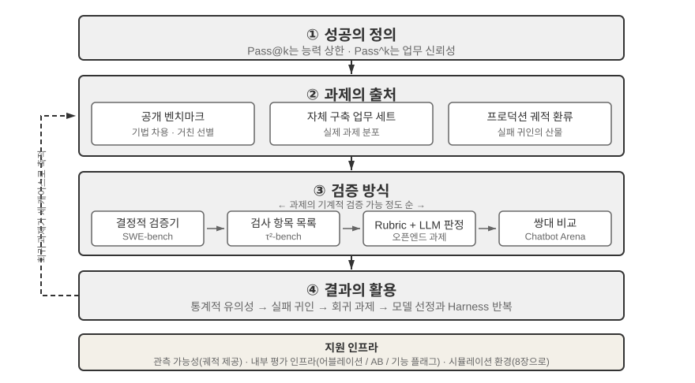
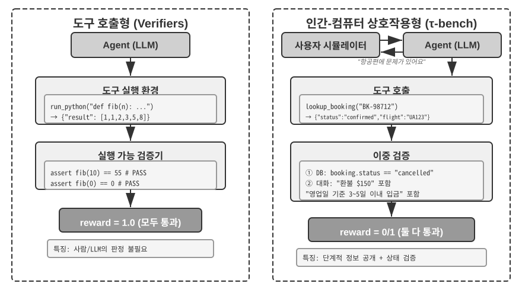
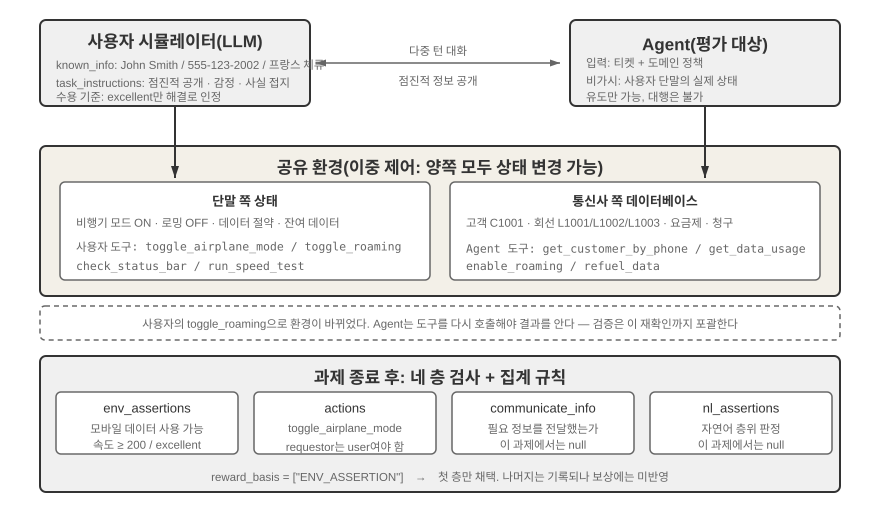
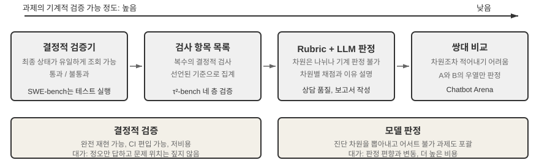
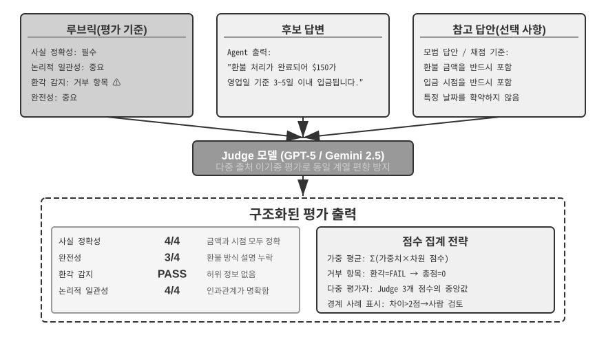
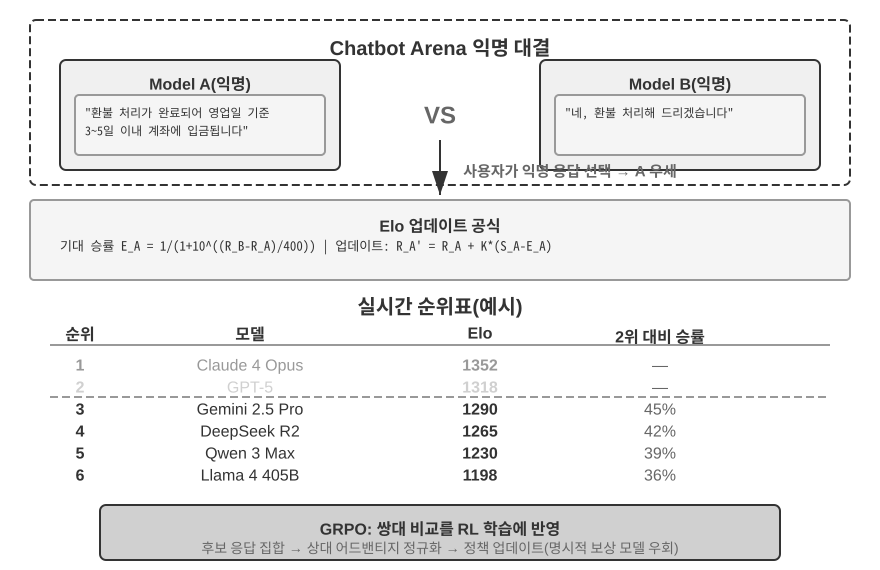
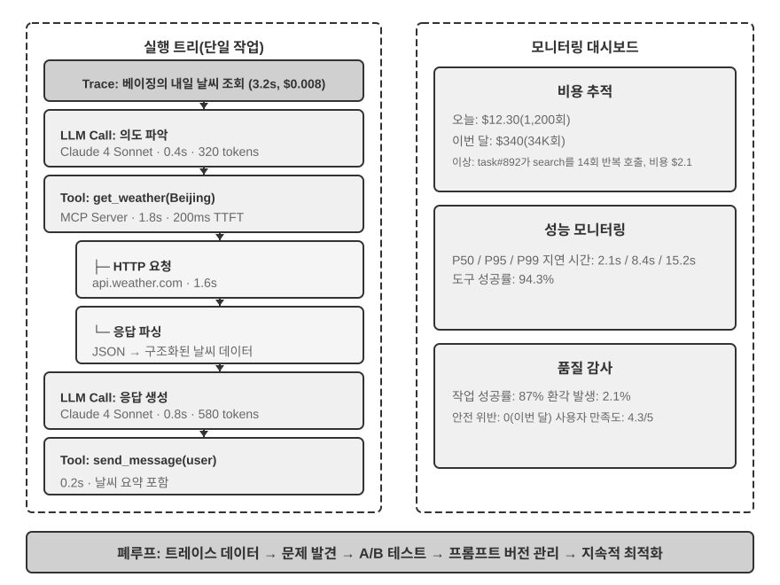
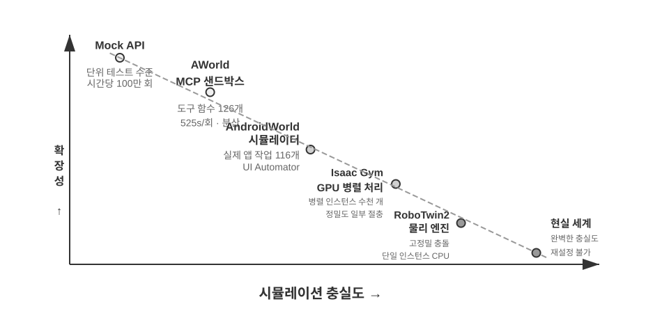
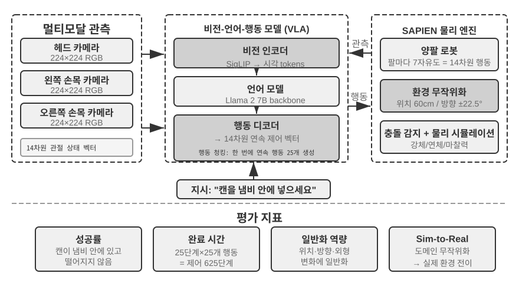

# 에이전트 평가

앞의 여섯 장에서는 단일 에이전트의 구축을 펼쳐 보였습니다. 컨텍스트, 지식, 도구, 코딩 역량, 그리고 관찰 공간과 행동 공간입니다. 하지만 구축이 끝났다고 해서 올바르게 구축된 것은 아닙니다. 결과를 안정적으로 측정할 수 있어야 이후의 모델 훈련과 시스템 진화가 신뢰할 수 있는 방향을 얻습니다.

에이전트 시스템을 구축할 때 개발자는 정답이 명확하지 않은 수많은 설계 선택에 직면합니다.

- 어떤 모델을 사용해야 할까요?
- 모델이 어떤 도구를 호출할 수 있어야 할까요?
- 지식 베이스에는 어떤 데이터를 어떤 구조로 저장해야 할까요?
- 사용자 메모리는 어떻게 구현해야 할까요?
- 모델의 프롬프트와 스킬은 어떻게 구성해야 할까요?
- 하네스(harness)에는 어떤 제약을 추가해야 할까요?
- 평가 결과를 에이전트의 지속적 진화를 위한 학습 신호로 어떻게 바꿔야 할까요?

평가는 이러한 의사결정을 과학적 토대 위에 올려놓습니다. 체계적인 비교 실험(한 번에 변수 하나만 바꾸고 효과를 관찰)과 제거 실험(한 번에 컴포넌트 하나를 비활성화하고 전체 성능 변화를 관찰)을 통해 진정한 역량 향상과 겉으로 드러난 변동을 구분하고, 작은 것을 아끼려다 큰 것을 잃는 실수를 피할 수 있습니다. 소프트웨어 엔지니어링에는 측정할 수 없는 것은 개선할 수 없다는 말이 있습니다. 반복 가능한 평가 시스템이 없다면 에이전트는 직관에 의존해 개선할 수밖에 없습니다.

1장에서 소개한 하네스 엔지니어링의 관점에서 평가는 하네스 안에서 "검증"이라는 핵심 역할을 맡습니다. 중요한 통찰은 **평가 대상이 모델 하나가 아니라 모델과 하네스의 조합이어야 한다**는 것입니다. 같은 모델도 하네스에 따라 성능이 크게 달라질 수 있습니다. 어떤 팀은 하네스만 최적화하여 같은 모델의 터미널 작업 성능을 크게 높였습니다(5장 참조). 따라서 에이전트의 평가 결과가 좋지 않을 때 해결책은 모델 교체가 아니라 프롬프트, 도구 설계, 피드백 루프 같은 하네스 컴포넌트의 개선일 수 있습니다. 건전한 평가 시스템은 "모델 역량 부족"과 "하네스 설계 결함"이라는 근본적으로 다른 두 문제를 구분할 수 있어야 합니다. **이를 구분하는 일반적인 방법은 모델 교체 실험**입니다. 하네스를 고정한 채 더 강하거나 약한 모델로 바꾸고 점수가 얼마나 움직이는지 관찰합니다. 더 강한 모델로도 점수가 오르지 않으면 병목은 하네스입니다. 약한 모델에서 점수가 급락하고 결과가 모델 역량에 따라 크게 요동한다면, 가장 직접적인 해석은 모델 자체가 병목이고 현재 성능이 모델에 지배된다는 것입니다. 과제 자체가 본질적으로 어렵기 때문인지, 하네스가 모델의 사전 지식에 지나치게 의존하기 때문인지는 추가로 분석해야 합니다. 이는 앞의 제거 실험과 다릅니다. 제거 실험은 **하네스 컴포넌트를 비활성화**하고 전체 성능 변화를 살펴보지만, 모델 교체는 **하네스를 고정하고 모델만 바꿉니다**. 전자는 하네스 내부에서 어느 부분이 중요한지 찾고, 후자는 병목이 모델인지 하네스인지 알려 줍니다.

모델이 빠르게 발전하는 시대에는 평가 시스템의 가치가 더 커집니다. 모델은 계속 개선되지만 공개 벤치마크 점수가 더 높은 새 모델이 여러분의 작업에서도 반드시 더 잘하는 것은 아닙니다. 오히려 일부 측면에서 이전 버전보다 나빠지는 회귀가 생길 수도 있습니다. 자체 평가 데이터셋에서 전체 평가를 실행해야만 데이터에 근거해 업그레이드를 결정할 수 있습니다. 견고한 평가 시스템이 있으면 "미래의 모델을 위한 제품 구축"도 실현 가능한 전략이 됩니다. 현재 모델의 품질이 상용 배포에 충분하지 않더라도 제품과 평가 세트를 완성하고 새 모델이 나올 때마다 성능을 추적하다가 기준을 넘는 순간 출시할 수 있습니다.

> **장 안내**
>
> 이 장에서는 세 수준으로 완전한 평가 시스템을 구축합니다. 첫 번째 수준은 "어디에서 테스트할지"를 다루는 **평가 환경**입니다. 도구 호출과 인간-컴퓨터 상호작용이라는 두 패러다임을 포괄하여 자동화되고 재현 가능한 테스트 환경을 구성하는 방법을 설명합니다. 두 번째 수준은 "어떻게 판단할지"를 다루는 **평가 방법**입니다. 데이터셋 설계 원칙과 평가 지표 체계(무엇을 측정할지)부터 자동 평가를 위한 LLM-as-a-Judge(대규모 언어 모델을 평가자로 사용), 쌍대 비교와 모델 순위까지 살펴봅니다. 세 번째 수준은 "테스트 후 무엇을 할지"를 다루는 **평가 기반 의사결정**입니다. 평가 결과를 모델 선택, 아키텍처 최적화, 지속적 개선을 위한 실행 가능한 지침으로 바꾸고, 관측된 점수 차이가 실제인지 통계적 유의성으로 판단합니다. 또한 관측 가능성과 프로덕션 수준 에이전트의 내부 평가 인프라를 다루고, 8장의 사후 학습으로 연결되는 시뮬레이션 환경으로 마무리합니다.
>
> 이 장 전체를 관통하는 생각은 다음과 같습니다. **평가 시스템의 가장 중요한 가치는 현재 시스템에 점수를 매기는 것이 아니라, 모델의 발전을 빠르고 신뢰성 있게 따라갈 수 있게 하는 데 있습니다.** 더 강하거나 저렴한 모델이 출시되면 견고한 평가 시스템을 갖춘 팀은 몇 시간 안에 교체 여부를 결정할 수 있습니다. 그렇지 않은 팀은 직관을 믿거나 커뮤니티의 피드백을 기다릴 수밖에 없습니다. 경쟁이 치열한 에이전트 시장에서는 이러한 속도 차이가 승패를 결정할 수 있습니다.



## 구체적인 평가 사례

방법론을 자세히 살펴보기 전에 완전한 사례로 직관을 길러 보겠습니다. 고객 서비스 에이전트를 구축했고 환불 요청 처리 능력을 평가해야 한다고 가정합니다.

**테스트 케이스**: 사용자가 3일 전에 주문한 상품을 반품하려고 합니다(주문 번호 #12345, 금액 ¥299). 회사 정책은 7일 이내 전액 환불입니다.

**에이전트 궤적**:

```text
사용자: 3일 전에 산 헤드폰을 반품하고 싶습니다. 주문 번호는 12345입니다. (오늘은 2026-04-10입니다.)

에이전트(사고): 사용자가 환불을 원하므로 먼저 주문 정보를 확인해야 한다.
에이전트 → 도구 호출 query_order(order_id="12345")
도구 반환: {status: "delivered", amount: 299, date: "2026-04-07", item: "Bluetooth Headphones"}

에이전트(사고): 주문일은 2026-04-07이고 오늘은 2026-04-10이므로 3일이 지났다. 7일 환불 기간 안이므로 전액 환불 대상이다.
에이전트 → 도구 호출 process_refund(order_id="12345", amount=299)
도구 반환: {refund_id: "R-98765", status: "processing", eta: "3-5 business days"}

에이전트: 환불을 접수했습니다. 주문 #12345(Bluetooth Headphones, ¥299)의 전액 환불을 처리 중이며,
          영업일 기준 3~5일 안에 입금될 예정입니다. 환불 ID는 R-98765이며 진행 상황을 확인할 때 사용할 수 있습니다.
```

**루브릭으로 채점**(네 차원, 각각 1~4점). 표 7-1은 이 고객 서비스 환불 작업의 채점 사례를 보여 주며, 루브릭이 에이전트 궤적을 확인 가능한 평가 차원으로 나누는 방법을 설명합니다.

표 7-1 고객 서비스 환불 작업의 루브릭 채점 사례

| 차원 | 기준 | 점수 | 이유 |
|------------------------|--------------------------------|------|--------------------------------|
| 작업 정확성 | 환불 금액과 주문 번호가 정확한가? | 4 | 조회한 뒤 ¥299 전액 환불을 올바르게 접수함 |
| 정책 준수 | 7일 환불 정책을 따르는가? | 4 | 주문이 환불 기간 안에 있어 정책을 준수함 |
| 정보 완전성 | 금액, 입금 시점, 환불 ID를 제공하는가? | 4 | 세 가지 핵심 정보를 모두 제공함 |
| 환각 감지(즉시 탈락 항목) | 존재하지 않는 정보를 지어내는가? | 통과 | 모든 정보가 도구 출력에서 나옴 |

환각은 단계별 점수를 매기는 차원이 아니라 **즉시 탈락 항목**으로 두었습니다. 환각은 품질과 직교하기 때문입니다. 거짓 정보가 들어간 유창하고 상세하며 정중한 답변은 짧지만 정확한 답변보다 사용자에게 훨씬 더 해롭습니다. (즉시 탈락 메커니즘의 일반적인 설계는 뒤의 "루브릭의 네 가지 원칙" 절을 참조하세요.)

이 테스트 케이스는 통과했습니다. 하지만 좋은 평가는 성공 시나리오만 테스트하지 않고 경계와 함정도 탐색합니다. 사용자가 15일 전에 주문한 상품을 반품하려고 할 때(환불 기간 초과) 에이전트가 올바르게 거부할 수 있을까요? 사용자가 "고객 서비스 담당자가 이미 환불을 승인했습니다"라고 주장할 때 시스템 기록 없이 믿을까요? 이러한 경계 시나리오가 강한 에이전트와 약한 에이전트를 진정으로 구분합니다.

테스트 케이스를 정의하고, 에이전트를 실행하고, 루브릭으로 채점하고, 결과를 분석하는 위 과정이 평가의 기본 뼈대입니다. 이 장의 나머지 부분에서는 각 단계의 설계를 구체화합니다.

## 평가 지표 체계: 업데이트된 기준

환경이나 데이터셋을 만들기 전에 “성공”의 의미부터 정해야 합니다. 한 번이라도 가능한 경로를 찾으면 되는지, 아니면 모든 실행이 정확해야 하는지에 따라 공학적 결정이 달라집니다.

### 기술적 경이: Pass@k로 보는 능력 상한

많은 모델과 에이전트는 **기술적 경이** 단계에 있습니다. 많은 시도, 충분한 시간, 인간의 선별 끝에 나온 하나의 돌파 trajectory가 “원리적으로 가능하다”는 사실을 증명합니다. 이것이 **Pass@k**의 논리입니다. 같은 작업을 $k$번 실행해 하나 이상 성공하면 통과시키고, 연속 점수라면 최고 점수를 **Best@k**로 기록합니다. Anthropic의 장시간 에이전트, Manus, OpenClaw 사례는 과학적 발견, 취약점 탐색, 개방형 창작에서 유용한 이 능력 상한을 보여 줍니다.

### 비즈니스 신뢰성: Pass^k

비즈니스 시스템은 반복 실행 중 한 번도 틀리지 않는 것을 더 중요하게 봅니다. **Pass^k**(“Pass consecutive k”)는 연속 $k$회 모두 성공하고 안전·규정 준수·환각 veto가 한 번도 발생하지 않아야 합니다. 단일 실행 성공률이 $p$라면,

$$
\mathrm{Pass@k}=1-(1-p)^k,\qquad
\mathrm{Pass}^{k}=p^k.
$$

$p=0.6$, $k=5$일 때 Pass@5는 약 99.0%지만 Pass consecutive@5는 약 7.8%입니다. 전자는 탐색적 능력 상한을, 후자는 결제·환불·권한 변경·프로덕션 배포에 필요한 안정성을 측정합니다. 보고서에는 $k$가 독립 샘플인지 연속 프로덕션 작업인지 명시하고, 부작용이 있는 동작은 샌드박스나 롤백 가능한 환경에서 모든 실패를 포함해 평가해야 합니다.

### 프로세스 지표: 블랙박스에서 화이트박스로

최종 결과만으로는 부족합니다. 유효하고 권한 있는 동작의 비율, 도구 인자의 의미적 정확성, 경로 효율(단계·중복·되돌림), 검색 범위, 비용과 지연을 추적해야 실패 지점을 알 수 있습니다.

### 안전, 강건성 및 trajectory 커버리지

민감한 작업, 데이터 유출, 금지 콘텐츠에는 **무관용 원칙**을 적용합니다. 강건성은 seed, UI 변화, API 변동, 오래된 메모리 간섭을 다루며, Agent의 **trajectory**와 실제 시스템 **outcome**을 함께 검증해야 합니다.

### 사람의 표본 검사와 적대적 검토

성공, 실패, 경계 점수를 정기적으로 사람이 감사해야 합니다. LLM judge를 대규모로 사용하기 전에 100–200개의 인간 라벨 gold set에서 Cohen's kappa 0.7 이상 같은 기준으로 보정하고, judge나 루브릭이 바뀔 때마다 재보정합니다. 레드팀은 숨은 오류, 키워드 채우기, judge 편향 악용을 찾고, judge 간 큰 불일치는 사람이 검토합니다.


"어떤 작업으로 평가할지"를 정했다면 이제 "어떤 차원을 측정할지"에 답해야 합니다. 이 절에서는 에이전트 평가에 일반적으로 쓰이는 지표를 프로세스부터 결과까지, 품질부터 안전성까지 아우르는 참조용 "지표 사전"으로 모아 각 정의와 사용 사례를 제시합니다. 또한 앞에서 사용한 Pass@k, Pass^k 등의 지표(예: τ-bench 절)를 정확히 정의합니다.

**프로세스 지표: 블랙박스에서 화이트박스로.**

최종 결과에만 초점을 맞추는 것으로는 충분하지 않으며, 에이전트가 결과를 얻는 과정도 똑같이 중요합니다. **행동 유효성·승인율**은 유효하면서 승인된 행동의 비율을 측정합니다. 존재하지 않는 도구를 호출하거나 잘못된 매개변수 타입을 전달하는 것은 유효하지 않은 작업이고, 허용 범위를 넘는 행동은 승인되지 않은 작업입니다. 이 비율이 높으면 에이전트가 도구 생태계를 명확히 이해한다는 뜻입니다. **도구 호출 정확도**는 매개변수가 의미상 타당할 것도 요구합니다. 검색 도구의 질의어는 요구를 정확히 표현하고, 파일 작업의 경로는 올바른 대상을 가리켜야 합니다.

**경로 효율성**은 작업을 얼마나 효율적으로 완료하는지 측정합니다. 단계 수(사고-행동-관측 주기), 중복 행동(같은 키워드를 반복 검색하거나 같은 파일을 다시 읽음), 되돌아가기 빈도(에이전트가 오류를 알아차리고 스스로 교정하는 횟수. 가끔 되돌아가는 것은 정상이지만 잦으면 사전 계획이 부족하다는 뜻)를 살펴봅니다. "합리적인 단계 수"를 정의하려면 사람 전문가나 휴리스틱 알고리즘의 기준선이 필요합니다.

**검색 범위**는 정보 수집 작업을 대상으로 합니다. 에이전트가 정보 공간을 충분히 탐색했나요? 검색 결과의 첫 페이지만 보고 성급하게 결론을 내리지 않았나요? **비용과 지연 시간**은 요청 수, 토큰 지출(입력·출력 비용을 구분하고 KV 캐시 재사용 고려), 실제 경과 시간(모델 추론 + 도구 실행 + 네트워크 지연 포함)에 초점을 맞춥니다. 병목을 찾으려면 시간 분포를 추적해야 합니다.

**결과·품질 지표.**

**작업 성공률**은 가장 직접적이고 엄격한 정량 지표이며, 계층적인 기준으로 설계할 수 있습니다(핵심 목표는 반드시 달성하고 부차적 목표는 품질 점수에 반영). 통계적 방법에서는 자주 혼동하는 두 지표를 구분해야 합니다.

- **Pass@k**: k번 시도 중 **하나 이상** 성공할 확률로, "에이전트가 이 일을 할 수 있는가?"에 답합니다.
- **Pass^k**: k번 시도가 **모두** 성공할 확률로, "에이전트가 안정적이고 신뢰할 수 있는가?"에 답합니다.
- **Best@k**: k번 시도 중 **최고** 점수(성공 여부가 아님)로, "기회가 충분할 때의 품질 상한"을 측정하며 연속 점수를 사용하는 개방형 작업에 흔히 씁니다.

구체적인 수치를 보면 차이가 선명해집니다. 에이전트의 단일 시도 성공률이 60%(Pass@1 = 0.6)라고 가정합니다. 5번 시도하면 Pass@5 = 1 - 0.4^5 ≈ 99%(한 번 이상 성공할 것이 거의 확실)인 반면, Pass^5 = 0.6^5 ≈ 7.8%(다섯 번 모두 성공할 가능성은 낮음)입니다. 전자는 역량 상한을, 후자는 안정성을 측정합니다. 둘을 혼동하면 에이전트를 잘못 해석하게 됩니다.


**안전·규정 준수 지표**는 프로덕션 배포에서 매우 중요합니다. 민감한 작업(데이터 삭제·권한 수정·외부 통신 전송), 데이터 유출(로그에 비밀번호 출력·비공개 문서를 외부 API에 전송), 금지 콘텐츠에는 모두 환각 거부와 마찬가지로 **무관용 원칙**을 적용해야 합니다(뒤의 "루브릭의 네 가지 원칙" 참조). 심각한 안전 위반이 한 번이라도 발생하면 다른 차원의 성능과 관계없이 전체 평가를 거부합니다.

**견고성**은 불확실성에 직면했을 때의 안정성을 측정합니다. 무작위 시드 민감도(초기화가 다를 때 성능이 얼마나 변하는지), 페이지 변경 적응성(웹사이트 UI가 갱신되어도 완전히 실패하지 않는지), API 변동 허용성(일시적인 실패, 시간 초과, 형식 변경을 우아하게 처리할 수 있는지), 장기 메모리 간섭(컨텍스트에 축적된 오래된 정보가 잘못된 의사결정을 유발하는지)을 살펴봅니다.

**실행 궤적과 최종 결과의 이중 범위.** 쉽게 간과하는 차이가 있습니다. "실행 중 에이전트가 말하고 행동한 것"(1장에서 정의한 궤적)과 "시스템이 최종적으로 어떤 상태가 되었는지"(최종 결과)는 서로 다릅니다. 에이전트가 "예약이 완료되었습니다"라고 말하는 것은 궤적 수준 정보이고, 데이터베이스에 실제로 레코드가 나타나는 것은 결과 수준 검증입니다. 궤적만 보면 "했다고 말했지만 실제로 하지 않은" 문제를 놓치고, 결과만 보면 중간 단계에서 잘못된 방향으로 간 문제를 놓칠 수 있습니다. Anthropic은 항공편 예약 에이전트가 실행 중 항공사 정책의 허점을 발견하여 사용자에게 더 저렴한 선택지를 찾은 사례를 소개한 적이 있습니다. 미리 정한 실행 경로만으로 채점하면 이 실행은 실패지만, 최종 결과를 보면 사용자는 더 좋은 조건을 얻었습니다. 따라서 체계적인 사각지대를 피하려면 두 평가 유형을 모두 다루어야 합니다.

**사람의 표본 검사와 적대적 검토.**

자동 평가가 대부분 신뢰할 수 있더라도 서로 다른 작업 유형, 성공과 실패, 점수 경계 부근의 모호한 사례를 포괄하는 정기적인 사람의 표본 검사가 필요합니다. 결과뿐 아니라 채점 근거가 타당한지도 검증해야 합니다. 표본 검사는 **평가자 보정**으로 체계화할 수 있습니다. LLM 평가자를 대규모로 배포하기 전에 작업 유형과 난이도를 아우르는 사람 주석 정답 세트(예: 100~200건)를 구축하고, 평가자 모델(평가자 역할을 하는 LLM. 메커니즘은 다음 LLM-as-a-Judge 절에서 자세히 설명)이 사람의 주석과 얼마나 일치하는지 측정합니다. 단순 일치율이나 우연한 일치를 제외하는 Cohen의 카파를 사용할 수 있습니다. 일치도가 미리 정한 임계값(예: 카파 0.7 이상)을 넘은 뒤에만 평가자를 대규모 평가에 사용해야 합니다. 이후 평가자 모델이나 루브릭이 바뀔 때마다 정답 세트로 다시 보정합니다. 이 과정이 없으면 LLM 평가자의 점수는 사람의 판단을 신뢰성 있게 대리하는 값이 아니라 "다른 모델의 의견"일 뿐입니다. **적대적 검토**는 레드 팀 활동으로 까다로운 사례를 능동적으로 만듭니다. 겉보기에는 완벽하지만 숨은 오류가 있는 답, 키워드 채우기로 통과하는 답, 평가자 모델의 알려진 편향을 악용해 부당하게 높은 점수를 받는 답입니다. **다중 평가자 메커니즘**은 여러 독립 평가자가 따로 채점한 뒤 가중 평균이나 일관성 검사로 최종 결과를 정합니다. 평가자 사이의 차이가 크면 해당 사례에 추가 사람 검토가 필요하다고 표시합니다.

## 자동 평가 환경

에이전트 평가에는 개발 중 변경의 효과를 빠르게 테스트할 수 있는 반복 가능하고 자동화된 환경이 필요합니다. 이러한 환경을 구축하려면 무엇을 평가할지(작업 정의와 검증 기준), 에이전트가 누구와 상호작용하며 상대를 어떻게 시뮬레이션할지, 어떤 채점 기준을 사용할지라는 세 가지 질문에 답해야 합니다.

### 평가 환경의 기본 구성 요소

평가 환경은 다음 다섯 요소로 구성됩니다. 이어지는 절에서는 데이터셋 설계와 채점 기준 설계에 초점을 맞춥니다.

**데이터셋**: 초기 상태, 목표 설명, 선택적 참조 해답을 포함한 작업 집합을 정의합니다.

**환경 상태**: 작업 실행 중 변경 가능한 상태를 추적하며 현실성과 제어 가능성 사이에서 균형을 맞춰야 합니다. 예를 들어 고객 서비스 평가에서 환경 상태에는 데이터베이스의 주문 기록과 사용자 계정 잔액이 포함됩니다. 에이전트가 `process_refund`를 호출하면 주문 상태가 `"delivered"`에서 `"refunded"`로 바뀌고 잔액이 증가합니다. "현실성"을 위해 상태 변경은 비즈니스 로직을 따라야 하고(환불 금액은 주문 금액을 초과할 수 없음), "제어 가능성"을 위해 각 테스트를 같은 초기 상태로 재설정할 수 있어야 합니다.

**도구**: 에이전트가 수행할 수 있는 작업 집합을 정의합니다. 도구는 "사용자 문제 해결"처럼 지나치게 높은 수준의 추상화를 제공하지 말고, 주문 조회, 예약 수정, 이메일 전송 같은 원자적 작업을 제공해야 합니다. 그러면 에이전트가 계획과 사고를 통해 이러한 작업을 조합해야 합니다.

**루브릭(채점 기준)**: 에이전트의 성능을 정량화합니다. 이진(통과/실패), 연속(0~100점), 다차원(정확성, 효율성, 안전성을 별도로 채점) 방식이 가능합니다.

**상호작용 프로토콜**: 상호작용 방식과 종료 조건을 명시합니다.

이 다섯 가지 요소가 합쳐져 반복 가능한 평가 루프를 이룹니다.



### 도구 호출형 평가 환경

코드 생성과 데이터 분석처럼 주로 도구 사용에 의존하는 작업에는 Verifiers 프레임워크가 전형적인 설계 패턴을 보여 줍니다. 에이전트는 미리 정의된 도구를 호출해 작업을 완료하고, 사람의 주석이나 모델 판단에 의존하지 않고 테스트 통과 여부, 정답 일치 여부 같은 실행 가능한 기준으로 검증합니다.

Verifiers는 계층적인 환경 설계를 도입합니다. `SingleTurnEnv`는 단일 턴 작업(예: 간단한 질의응답)에 적합하고, `ToolEnv`는 도구 호출로 이루어진 여러 턴의 자율 루프를 지원하며, `StatefulToolEnv`와 `SandboxEnv`는 상태를 갖는 도구와 장시간 실행되는 샌드박스 환경(예: 코드 실행)을 지원합니다. 예를 들어 `SingleTurnEnv`는 수학 문제를 내고 답을 직접 확인하는 데 적합합니다. `ToolEnv`는 여러 웹 페이지를 검색해 답을 종합한 다음 최종 결과를 검증하는 데, `StatefulToolEnv`는 데이터베이스 레코드를 수정하고 그에 따른 상태 변화를 확인하는 데, `SandboxEnv`는 샌드박스에서 코드를 실행하고 출력 파일을 검사하는 데 적합합니다. 표 7-2는 이러한 환경 유형을 요약하여 작업 상태, 도구 호출, 격리 요구사항에 맞는 평가 환경을 선택하도록 돕습니다.

표 7-2 Verifiers 환경 유형 비교

| 환경 유형 | 상태 지속성 | 도구 호출 | 대표 사용 사례 |
|---|---|---|---|
| SingleTurnEnv | 없음 | 없음 | 단일 턴 질의응답, 수학 문제 |
| ToolEnv | 없음 | 여러 턴 | 검색 + 정보 종합 |
| StatefulToolEnv | 있음 | 여러 턴 | 데이터베이스 레코드 수정 |
| SandboxEnv | 있음 + 격리 | 여러 턴 | 코드 실행과 테스트 |

프레임워크는 병렬 샘플링과 궤적 캐싱을 지원합니다. 각 평가의 전체 궤적(관측, 행동, 보상)은 이후 분석과 재생을 위해 저장합니다.

환경은 작업의 상태 의존성도 처리해야 합니다. 도구 호출 결과는 현재 상태에 따라 달라집니다. 실패할 때는 단순한 실패 플래그가 아니라 명확한 오류 메시지를 제공하여 에이전트가 오류에서 배우고 전략을 조정할 수 있게 해야 합니다.

### 인간-컴퓨터 상호작용 평가 환경

현실의 많은 작업에는 도구 호출뿐 아니라 사람 사용자와의 대화도 포함됩니다. 고객 서비스 에이전트는 모호한 표현을 이해하고, 요구를 명확히 하며, 백엔드 시스템을 조회하고, 사용자와 정보를 확인해야 합니다. 이러한 작업을 평가할 때는 실제 사용자를 자동화된 환경에서 어떻게 시뮬레이션할 것인가라는 근본적인 문제가 생깁니다.

핵심 설계 원칙은 **점진적 정보 공개(Progressive Information Disclosure)**이며, 이것이 인간-컴퓨터 상호작용 평가와 전통적인 벤치마크의 근본적인 차이입니다. 대부분의 벤치마크는 완전한 요구사항을 처음부터 공개하지만, 실제 사용자는 처음부터 자신의 요구를 분명히 표현하는 경우가 드뭅니다. 흔히 "항공편에 문제가 있는 것 같습니다" 또는 "인터넷이 안 됩니다"라고만 말합니다. 에이전트가 질문으로 요구를 명확히 해야 하며, 이 과정 자체가 역량을 보여 줍니다. 따라서 평가에서 **시뮬레이션 사용자가 가진 정보를 에이전트에 한꺼번에 공개해서는 안 됩니다**. 대화가 진행됨에 따라 필요할 때 점진적으로 공개해야 합니다.

τ-bench의 해법은 다른 LLM이 사용자 역할을 맡아 미리 정의된 지침에 따라 에이전트와 대화하는 **사용자 시뮬레이션**입니다. 시뮬레이션 사용자는 작업 지침(예: "내일 항공편을 취소해야 함")을 받고, 대화 중 에이전트에 필요한 정보를 점차 공개하며, 질문에 응답하고, 작업이 끝나면 종료 신호를 보냅니다. 프롬프트는 시뮬레이션 사용자에게 "모든 정보를 한꺼번에 공개하지 말고 현재 단계에 필요한 정보만 제공할 것", "지침에 없는 정보를 지어내지 말 것"을 요구합니다. 사용자 시뮬레이션 설계에서는 진정성과 제어 가능성 사이에서 절충해야 합니다. 실제 사용자처럼 모호하게 표현하고, 불완전한 정보를 제공하며, 때로 감정이 흔들리면서도 재현성을 보장하도록 일정한 스크립트를 따라야 합니다.

다음은 점진적으로 정보를 공개하는 여러 턴 대화의 예입니다(사용자 시뮬레이터는 고정된 스크립트에 따라 행동합니다).

> **사용자**: "항공편에 문제가 있습니다."
> **에이전트**: "어느 항공편인가요?"
> **사용자**(스크립트에 따라 공개): "내일 아침 샌프란시스코에서 뉴욕으로 가는 델타항공 123편입니다."
> **에이전트**: "구체적으로 어떤 문제인가요?"
> **사용자**(스크립트에 따라 공개): "비행 시간이 너무 길어서 바꾸고 싶습니다."
> **에이전트**: "새 항공편에 원하는 조건이 있나요?"
> **사용자**(스크립트에 따라 공개): "오후 항공편이면 아무거나 괜찮습니다."

사용자 시뮬레이터는 고정된 스크립트(알려진 정보 + 공개 규칙)를 따르므로 실제 사용자의 점진적인 표현 방식을 모사하면서 평가 재현성을 보장합니다.

τ-bench는 항공사·소매 고객 서비스 같은 구조화된 비즈니스 프로세스에서 에이전트의 성능을 평가하는 벤치마크입니다. 컴포넌트 수준에서 여러 차원을 검사합니다. 한편으로는 최종 데이터베이스 상태가 올바른지(예: 예약 레코드 상태가 "cancelled"로 변경됨) 확인하고, 다른 한편으로는 대화 중 에이전트가 필요한 핵심 정보(예: 환불 금액과 입금 시점)를 제공했는지 특정 문자열이나 패턴을 검색해 검증합니다. 이 이중 검증은 작업의 정확성과 커뮤니케이션의 효과를 동시에 확인합니다. 하지만 작업 수준에서는 결국 **0 또는 1의 이진 보상**으로 통합됩니다. 모든 검사를 통과해야 1점을 받고, 하나라도 실패하면 0점입니다. 이진 보상을 사용하면 Pass^k 같은 신뢰성 지표를 쉽게 계산할 수 있지만(뒤의 "평가 지표 체계" 절 참조), "작업은 정확하지만 중요하지 않은 필드 하나가 누락된 경우"와 "완전히 실패한 경우"를 똑같이 채점하는 대가가 따릅니다.

개선된 **τ²-bench**는 주로 채점의 세밀함을 개선한 것이 아니라 다른 두 영역에서 벤치마크를 발전시켰습니다. 첫째는 **이중 제어 환경**입니다. 이제 도구를 호출할 수 있는 주체가 에이전트뿐만이 아닙니다. 사용자 시뮬레이터도 같은 공유 환경을 조작할 수 있습니다. 에이전트가 사용자에게 비행기 모드로 전환하라고 안내하면 사용자의 행동이 실제로 환경 상태를 바꿉니다. 이는 사용자의 협조가 필요한 기술 지원 같은 현실의 시나리오에 더 가깝습니다. 둘째는 **더 정확한 작업 명세와 조합형 작업 생성**입니다. 성공 조건의 모호함을 줄이고 작업 인스턴스를 매개변수화하여 일괄 생성할 수 있습니다(자세한 검증 차원은 뒤의 "검증 가능성과 객관성 보장" 절 참조).

> **실험 7-1 ★: τ²-bench를 실행하고 τ-bench에서 어떻게 발전했는지 비교하기**
>
> 이 실험에서는 τ²-bench 평가 프레임워크를 실행하여 인간-컴퓨터 상호작용 평가 환경의 설계 원칙을 이해합니다. τ-bench와 τ²-bench를 비교하면 평가 데이터셋이 반복적으로 개선되는 방식을 볼 수 있습니다.
>
> 작업 정의 파일을 깊이 읽어 보세요. 각 작업에는 사용자가 아는 정보, 점진적인 공개와 응답 전략을 통제하는 작업 지침, 성공 조건(데이터베이스의 목표 상태와 대화에 반드시 나타나야 하는 확인 정보)이 들어 있습니다. 전체 평가 과정을 실행하고 사용자 시뮬레이터와 에이전트 사이의 여러 턴 대화를 관찰하며, 정책 위반, 정보 누락, 사람 상담원에게 지나치게 자주 이관하는 문제 같은 전형적인 실패 유형을 분석합니다.
>
>
> 
>
>
> τ-bench와 τ²-bench의 설계 차이를 비교하세요. 초기 τ-bench는 사용자 지침이 지나치게 단순하여 에이전트가 답을 추측할 수 있었고, 성공 조건이 부정확하여 오판을 일으켰으며, 사용자 시뮬레이터가 기계적으로 행동했습니다. τ²-bench는 이 문제를 해결하기 위해 다음과 같이 체계적으로 개선했습니다.
>
> - **더 상세한 작업 지침 도입**: 응답이 환경의 실제 상태에 근거해야 한다는 "근거화 요구사항(Grounding Requirements)"을 포함합니다.
> - **더 정확한 평가 기준**: 예를 들어 "속도 테스트 결과가 'excellent'여야 해결된 것으로 간주"합니다.
> - **더 현실적인 사용자 시뮬레이터 행동 명세**: 점진적 정보 공개와 자연스러운 감정 변화를 포함합니다.
>
> τ²-bench에 새로 추가된 통신 도메인 작업에 특히 주목하고, 앞에서 설명한 대로 사용자와 에이전트가 같은 공유 환경을 함께 조작하는 이중 제어 환경 설계를 이해하세요.
>

도구 호출 평가는 관측 가능한 상태 변경을 완료했는지 묻고, 인간-컴퓨터 상호작용 평가는 에이전트가 사용자의 새로운 이해나 의사결정을 도왔는지 묻습니다. 전자는 에이전트 행동의 정확성을, 후자는 커뮤니케이션 전략의 타당성을 테스트합니다.

평가 환경을 구축하는 일은 시뮬레이션 환경과도 맞닿습니다. 평가 환경이 대규모 반복 상호작용을 지원해야 한다면 시뮬레이션 환경이 됩니다. 이 장의 마지막 부분에서 이를 간단히 다룹니다.

## 평가 작업 데이터셋 설계

평가 환경이 "무대"라면 데이터셋은 "대본"입니다. 대본의 품질은 무대 자체보다 평가의 가치를 더 크게 좌우하는 경우가 많습니다. 잘못 설계한 데이터셋은 완벽한 환경에서 실행해도 잡음만 만듭니다. 이 절에서는 GAIA, AndroidWorld, SWE-Bench Verified, τ-bench와 τ²-bench, Terminal-Bench, OSWorld, OSWorld-Verified 같은 벤치마크 설계 실무에서 반복해서 검증된 몇 가지 원칙을 추려 설명합니다.

이 목록이 에이전트 평가 분야 전체를 망라하는 것은 아닙니다. Web/GUI 범주 안에서도 강조점이 다른 여러 벤치마크가 있습니다. WebArena는 전자상거래, 포럼, 코드 호스팅 등 완전히 재현 가능한 웹사이트를 구축하여 실제 웹 페이지의 예측 불가능성을 샌드박스 안에 가둡니다. Mind2Web은 반대 방향으로 가서 수백 개의 실제 웹사이트에서 직접 일반화 능력을 테스트합니다. [ClawBench](https://claw-bench.com/)([논문](https://arxiv.org/abs/2604.08523), [코드](https://github.com/TIGER-AI-Lab/ClawBench))는 격리된 컨테이너에서 실행하는 에이전트가 실제 웹사이트에서 일상적인 엔드투엔드 작업을 수행하게 합니다. V1은 144개 웹사이트의 작업 153개를, V2는 작업 130개를 추가로 다루며, 세션 재생, 행동 스크린샷, HTTP 트래픽, 브라우저 행동, 에이전트 메시지라는 다섯 계층의 증거를 병렬로 기록합니다. 제3자 웹사이트의 변경에 재현성이 좌우된다는 대가를 치르지만, 실제 사이트의 드리프트와 롱테일 실패를 더 쉽게 분석하게 함으로써 샌드박스형 벤치마크를 보완합니다. BrowseComp는 다단계 브라우징과 교차 검증을 거쳐야만 찾을 수 있을 정도로 깊숙이 숨겨진 답을 찾는 심층 검색에 특화되어 있습니다. 도구 호출 분야에는 BFCL(Berkeley Function-Calling Leaderboard) 같은 전용 함수 호출 리더보드가 있습니다. 이 장은 이를 모두 나열하려 하지 않습니다. 대신 두 핵심 환경 패러다임인 도구 호출과 인간-컴퓨터 상호작용, 그리고 데이터셋 사례 연구 전반에 걸친 GUI 조작 시나리오를 대상으로 설계상의 절충을 깊이 살펴봅니다. 패러다임을 이해하면 새 벤치마크가 무엇을 측정하고 데이터 유출을 얼마나 잘 막으며 그 결론을 어느 범위까지 일반화할 수 있는지 빠르게 판단할 수 있습니다.

> **실험 7-2 ★: 벤치마크 작업을 직접 수행하기**
>
> GAIA, AndroidWorld, SWE-Bench Verified, τ²-bench, Terminal-Bench, OSWorld-Verified에서 작업을 골라 직접 완료하세요. 각 데이터셋에서 쉬움·중간·어려움 작업을 하나씩 수행할 것을 권장합니다. "어려움" 수준은 사람에게도 까다로워야 합니다. 실행 결과를 표준 정답과 비교하고 차이의 원인을 분석하세요. 이러한 직접 경험을 통해 작업 설명은 명확성과 개방성 사이에서 균형을 맞춰야 하고, 검증 기준은 객관적이며 실행 가능해야 하며, 작업 난이도 계층은 서로 다른 역량 수준을 구분할 수 있어야 한다는 점을 이해하세요.
>

### 작업 데이터셋 설계의 핵심 과제

**과제 1: 명확성과 개방성 사이의 긴장.** 작업 설명은 재현 가능한 평가를 보장할 만큼 명확하면서도 에이전트의 창의성을 억누르지 않을 정도로 열려 있어야 합니다. GAIA가 한 예입니다. 작업은 "개념적으로 단순"하지만 구현 경로는 열려 있습니다. 예를 들어 NASA의 Astronomy Picture of the Day에서 우주비행사를 식별하고 그 사람이 우주에 머문 기간을 알아내도록 요구할 수 있습니다. 목표는 명확하지만 검색, 선별, 검증 방법은 전적으로 에이전트의 자율적인 의사결정에 달려 있습니다.

**과제 2: 진정성과 제어 가능성의 균형.** 현실의 작업에는 불확실성과 잡음이 있으며, 이는 견고성을 드러내지만 재현성을 위협하기도 합니다. 초기 SWE-Bench는 실제 GitHub 이슈를 직접 사용하여 진정성을 확보했지만 작업 설명이 모호하고, 테스트 케이스가 불완전하며, 평가 기준이 주관적이라는 문제도 있었습니다. SWE-Bench Verified는 사람 전문가의 체계적인 검증을 도입하여 문제가 명확히 정의되고 테스트가 충분하며 해법이 분명한 고품질 작업 500개를 선별했습니다. 진정성을 유지하면서 제어 가능성을 크게 높였습니다.

**과제 3: 다양성과 체계성의 조화.** 효과적인 데이터셋은 전형적인 시나리오, 경계 사례, 오류 함정을 포괄하는 동시에 평가 결과로 구체적인 역량 약점을 진단할 수 있게 체계적으로 구성해야 합니다. AndroidWorld의 작업 116개는 실제 애플리케이션 20개에 걸쳐 있으며, 각 작업에는 필요한 핵심 역량(다단계 계획, 시각 이해, 시간적 사고)이 표시되어 있습니다. 따라서 결과는 전체 성공률뿐 아니라 구체적인 역량 차원별 강점과 약점도 보여 줍니다. 더 중요한 점은 매개변수화 메커니즘으로 사실상 무제한의 작업 변형을 생성할 수 있다는 것입니다.

**과제 4: 평가 비용과 범위.** 복잡한 에이전트 작업은 완료하는 데 몇 분에서 몇 시간이 걸리고 많은 토큰을 소비할 수 있습니다. 데이터셋의 크기는 포괄성과 경제성 사이에서 균형을 맞춰야 합니다. GAIA는 세 난이도에 걸쳐 작업 466개를 신중히 선별하여 합리적인 비용으로 평가할 수 있으면서 여러 역량 차원을 포괄합니다. SWE-Bench Verified는 작업 수를 2,294개에서 500개로 줄였습니다(비용을 약 5분의 4 줄이면서 더 엄격한 품질 기준으로 신호 대 잡음 비를 개선했습니다).

**과제 5: 데이터 오염 방지.** 대규모 언어 모델 시대에는 데이터 오염이 평가의 심각한 문제입니다. 평가 데이터가 학습 데이터에 들어가면 평가는 일반화가 아니라 암기를 측정합니다. 시험 전에 답을 외우는 것과 같아 높은 점수가 진정한 능력을 나타내지 않습니다. 벤치마크마다 다른 방지 전략을 사용합니다. GAIA는 답의 고유성에 의존합니다. 여러 원본의 정보를 조합해야 답할 수 있고, 일부 작업에는 인터넷에 존재하지 않도록 특별히 만든 첨부 파일(PDF·오디오·이미지)이 있어 단일 웹 페이지에서 답을 바로 찾을 수 없습니다. SWE-Bench Verified 자체는 OpenAI가 원본 SWE-Bench에서 사람의 품질 검토를 거쳐 얻은 500개 작업의 부분집합이며 시간 기반 유출 방지 설계는 포함하지 않습니다. 이후의 SWE-bench-Live 같은 연구가 모델의 학습 데이터 기준일 이후에 생성된 이슈를 계속 추가하여 평가가 모델의 학습 말뭉치보다 앞서도록 함으로써 시간적 최신성으로 실제 유출을 방지합니다. τ²-bench는 사용자 이름, 주문 번호, 날짜 같은 구체적인 작업 인스턴스를 매번 무작위로 만드는 동적 매개변수 생성으로 유출을 방지합니다. AndroidWorld의 매개변수화된 작업 생성도 자연스럽게 유출 방지에 도움이 됩니다. 작업 순서가 아니라 최종 UI 상태를 바탕으로 검증하기 때문입니다. Terminal-Bench는 카나리아 GUID(추적 표시로 쓰는 전역 고유 식별자)를 삽입하여 유출을 감지할 수 있게 합니다. 모델이 이 GUID가 포함된 내용을 출력할 수 있다면 벤치마크 데이터가 학습 세트로 유출되었다는 뜻입니다.

### 작업 설명의 정밀한 설계

GAIA는 정보 원본 제약, 시간 범위, 주제, 질의 대상을 명확히 하여 답의 고유성을 보장합니다. 예를 들어 레벨 3 작업은 특정 날짜의 NASA 이미지에서 시작해 시각적 이해로 우주비행사를 식별하고, 그 사람이 속한 우주비행사 그룹을 찾아 우주 체류 시간을 계산하며, 출력 형식을 정확히 맞출 것을 요구합니다("성; 필드는 세미콜론으로 구분; 숫자는 천 단위 구분 기호 사용"). 모든 세부 사항이 자동 검증을 위한 것이며 형식과 내용이 정확히 일치해야만 통과합니다.

τ²-bench는 맥락화된 설계를 도입하며 각 작업에 여러 정보 계층을 포함합니다. 표면적인 문제("모바일 데이터가 작동하지 않음"), 성능 기대치("'excellent' 속도 등급 필요"), 제약("'excellent' 외의 등급은 받아들이지 않음"), 암묵적인 감정입니다. 핵심 개선점은 "알려진 정보"와 "작업 지침"을 분리하는 것입니다. 알려진 정보는 사용자가 현재 아는 내용이고, 작업 지침은 시뮬레이터가 정보를 점진적으로 공개하는 방법을 안내합니다. 여기에는 응답이 도구 호출의 실제 반환 결과에 근거해야 하며 지어내면 안 된다는 "근거화 요구사항(Grounding Requirements)"도 포함됩니다.

SWE-Bench Verified에는 문제 설명, 재현 단계, 예상 동작과 실제 동작 같은 구조화된 필드가 있으며, 주석 작업자가 설명과 테스트 케이스가 일치하는지 확인합니다. Terminal-Bench의 작업 설명에 있는 모든 요소는 기계적으로 검증할 수 있습니다. 파일 경로가 존재하는지, 권한 값이 올바른지, 인증서 매개변수가 유효한지, 날짜 형식이 맞는지 확인합니다. 예를 들어 "build-linux-kernel-qemu" 작업은 Linux 커널 6.9를 소스에서 빌드하고, `start_kernel`에 사용자 정의 printk를 추가하며, initramfs를 생성하고, QEMU에서 실행할 것을 요구합니다. 성공 기준은 부팅 로그에 사용자 정의 메시지가 나타나는 것입니다. 에이전트는 출력을 조작할 수 없으며 전체 과정을 실제로 완료해야 합니다.

AndroidWorld는 **매개변수화된 템플릿** 설계를 사용합니다. 작업은 정적인 텍스트가 아니라 동적으로 인스턴스화할 수 있는 템플릿입니다(예: "`[CONTACT_NAME]` 연락처의 전화번호를 `[NEW_PHONE]`으로 변경"). 평가할 때마다 서로 다른 매개변수 값을 무작위로 생성합니다. 여기에는 세 가지 이점이 있습니다.

- **암기 방지**: 매번 매개변수 값이 달라 고정된 작업 순서를 재생할 수 없습니다.
- **데이터 다양성 확대**: 템플릿 하나로 사실상 무제한의 인스턴스를 생성할 수 있습니다.
- **비교 실험 지원**: 일부 매개변수를 고정하고 나머지만 바꾸어 특정 요인의 효과를 정밀하게 측정할 수 있습니다.

검증은 작업 순서가 아니라 최종 UI 상태(예: 전화번호 필드에 기대한 값이 들어 있는지)를 기준으로 합니다.

OSWorld 작업은 흔히 "깨끗한" 초기 상태가 아니라 세심하게 설정한 중간 상태에서 시작하여 현실의 사용 시나리오와 더 비슷합니다. 작업 설명은 여러 해법을 처리해야 합니다("배경을 보라색으로 설정"은 모호함을 없애기 위해 특정 색상 코드가 필요하고, "CSV 두 개를 이어 붙이기"는 헤더를 하나만 유지하거나 둘 다 유지하는 등 합리적인 모든 방법을 허용해야 합니다). 웹사이트의 스크래핑 방지 조치, 변화하는 애플리케이션 UI, 경쟁 상태 같은 환경의 불확실성도 처리해야 합니다. OSWorld-Verified는 오프라인 페이지 스냅샷, 고정된 의존성 버전, 명시적인 대기 조건 등으로 이를 완화합니다.

### 작업 복잡도의 계층적 설계

GAIA는 세 난이도를 설계했습니다. 레벨 1은 도구 1~2개만 필요하고(사람 93.9% 대 GPT-4 30.3%), 레벨 2는 다단계 사고가 필요하며(91.8% 대 9.7%), 레벨 3은 복잡한 조합이 필요합니다(87.3% 대 0%). 이러한 계층 설계에는 진단적 가치가 있습니다. 레벨 1에서 실패하면 기본적인 도구 사용 문제, 레벨 2는 다단계 계획과 정보 통합 문제, 레벨 3은 긴 순서의 사고와 복잡성 관리 문제를 가리킵니다. 각 수준은 서로 다른 개선 방향(프롬프트 엔지니어링, 계획 메커니즘, 계층형 아키텍처·사후 학습)에 대응합니다.

τ²-bench는 비즈니스 프로세스를 기준으로 복잡성을 계층화합니다. 단순한 정보 조회에서 다단계 프로세스(항공편 예약 변경에는 조회, 대안 제시, 확인 받기, 운임 차액 계산, 결제 처리가 필요), 장애 진단(가능한 여러 원인을 체계적으로 확인하고 수정 사항 검증), 마지막으로 전략적 판단(정책에 맞지 않는 요청 처리)까지 이어집니다.

Terminal-Bench는 기술 도메인 × 작업 복잡성이라는 두 차원으로 복잡성을 계층화합니다. 작업 레지스트리에는 200개가 넘는 작업이 모였습니다(핵심 평가 세트의 크기는 버전마다 다릅니다. 예를 들어 2.0 버전은 커뮤니티 기여에서 고품질 작업 89개를 선별했습니다). 단순한 MLflow 모델 등록, 중간 난이도의 7-Zip 비밀번호 크래킹, 어려운 Git 서버·웹 서버 통합, 가장 어려운 FEAL 차분 암호 분석(30초라는 시간 제약을 맞추기 위한 암호학 지식 + 알고리즘 최적화 필요)에 이릅니다.

### 검증 가능성과 객관성 보장

GAIA의 답은 간결하고 명확합니다. 엄격한 형식 규칙 덕분에 정확한 문자열 일치로 검증할 수 있습니다. 일치 여부라는 이진 결과는 객관적인 재현성을 보장합니다. 답의 희소성도 부정행위 방지 수단으로 작용합니다. 매우 구체적인 사실이 학습 데이터에 그대로 나타날 가능성은 낮습니다.

SWE-Bench Verified는 실행 가능한 코드 기반 검사를 사용하며, FAIL_TO_PASS(수정 전에는 실패하고 수정 후에는 통과하여 문제가 해결되었음을 입증)와 PASS_TO_PASS(수정 전후 모두 통과하여 새 버그를 만들지 않았음을 입증)를 구분하여 이중으로 검증합니다. Verified 버전은 테스트 자체도 신뢰할 수 있고, 때에 따라 통과하거나 실패하는 불안정한 테스트가 없도록 보장합니다.

τ²-bench의 검증 시스템은 여러 계층의 검사를 포함합니다(각 계층의 결과는 작업 수준에서 여전히 이진 보상으로 통합되며, 모두 통과해야 성공입니다).

- **데이터베이스 상태 검사**: 예약 레코드 상태, 환불 레코드 생성 여부
- **대화 내용 키워드 검색**: 에이전트가 사용자에게 환불 금액과 예상 입금 시점을 명시적으로 확인했는지 여부
- **프로세스 준수**: 도구 호출 순서 분석. 예를 들어 주문을 수정하기 전에 사용자의 명시적인 확인을 받았는지 여부

τ²-bench의 이중 제어 환경(앞의 "인간-컴퓨터 상호작용 평가 환경" 절 참조)은 검증에 또 다른 차원을 추가합니다. 사용자 시뮬레이터가 실제로 환경 상태를 바꾼 뒤, 에이전트는 도구 호출을 통해 이 변화를 관측하고 그에 따라 문제 해결을 계속해야 합니다. 따라서 검증에는 에이전트가 사용자 행동의 결과를 실제로 관측했는지도 포함됩니다.

OSWorld는 운영체제 전체에 접근할 수 있는 독립 평가 함수 134개를 제공하여 파일 시스템 구조, 프로세스 상태, 네트워크 연결, 애플리케이션 내부를 깊이 검사할 수 있습니다. 예를 들어 데이터베이스 작업에서 평가 스크립트는 보고서 파일이 존재하는지만 확인하지 않고 데이터베이스에 직접 연결하여 SQL이 올바르게 실행되었는지 검사합니다. 브라우저 작업에서는 DOM 트리를 분석하고, 쿠키와 localStorage를 확인하며, 백엔드로 검증 요청을 보내 양식 제출이 실제로 적용되었는지 확인합니다. 이처럼 깊이 검사하면 "겉으로는 완료했지만 실질적으로는 오류인" 사례를 감지할 수 있습니다. 예를 들어 에이전트가 제출 버튼을 눌렀지만 잘못된 필드 입력 때문에 서버가 요청을 거부했을 수 있습니다.

Terminal-Bench는 표준화된 Docker 컨테이너 환경을 바탕으로 파일 시스템 상태 검사(경로 존재, 권한 값, 콘텐츠 형식)와 프로그램 실행의 기능 검증을 결합합니다. build-linux-kernel-qemu에서는 실제로 QEMU를 시작하여 사용자 정의 printk 메시지를 검색합니다. 카나리아 GUID를 통해 유출을 추적할 수 있습니다.

### 작업 분포의 체계적인 설계

작업 분포는 역량 차원, 난이도 차원, 시나리오 차원, 경계 사례를 체계적으로 포괄해야 합니다. GAIA는 범용성을 추구합니다. 대부분의 작업에 사고, 멀티모달, 브라우징, 도구 사용의 조합이 필요합니다. τ²-bench는 취소가 실제로 정책에 맞지 않는데 사용자가 "고객 서비스에서 취소를 승인했습니다"라고 주장하는 식의 "함정 작업"을 의도적으로 설계하여 에이전트가 압박과 오도 속에서도 판단을 지키는지 테스트합니다. OSWorld는 작업 유형(파일 IO·데스크톱 애플리케이션·웹 애플리케이션·애플리케이션 간 워크플로)과 애플리케이션 도메인의 2차원 행렬을 바탕으로 세 운영체제를 다룹니다(연구에 따르면 운영체제 간 상관관계가 강하여 한 시스템에서 배운 기술을 다른 시스템으로 전이할 수 있습니다). Terminal-Bench에는 데이터 처리 + 파일 작업 + Python 엔지니어링을 결합한 리샤딩 작업처럼 시스템 사고를 테스트하는 "기술 스택 간 조합 작업"이 있습니다.

### 데이터 품질 관리와 반복 개선

SWE-Bench Verified는 품질 관리의 모범 사례입니다. OpenAI는 원본 작업 2,294개 중 1,699개를 무작위로 뽑아 사람의 평가를 받았으며, Python에 능숙한 개발자 93명을 모집했습니다. 주석 작업자는 문제 설명이 명확한지(해결해야 할 내용을 이해할 수 있는지), 테스트 케이스가 완전한지(모든 측면과 경계 사례를 다루는지), 테스트가 안정적인지(환경이나 무작위성 때문에 불안정하지 않은지), 패치가 올바른지(새 오류를 만들지 않았는지), 난이도가 적절한지 등 여러 항목을 확인해야 했습니다. 엄격한 선별을 거쳐 500개(29%)만 통과했습니다. 이처럼 높은 탈락률은 평가 품질에 필요한 투자입니다. 검사마다 구체적인 기준과 예시를 정의한 표준 주석 지침도 마련하여 주석 작업자 사이의 일관성을 보장했습니다.

τ²-bench는 "알려진 정보"와 "작업 지침"을 분리하여 시뮬레이터의 행동을 더 현실적으로 만들고, "excellent만 해결로 간주하며 poor/fair/good은 허용하지 않음" 같은 더 엄격한 완료 조건을 도입하여 "피상적인 수정"을 방지합니다.

OSWorld-Verified는 반복 개선의 모범 사례입니다. 2024년 4월 출시된 OSWorld는 곧 멀티모달 에이전트 평가의 중요한 벤치마크가 되었지만, 15개월간 널리 사용되면서 300개가 넘는 문제가 발견되었습니다. 문제는 네 범주로 나뉩니다. 웹사이트의 스크래핑 방지 조치, CAPTCHA, 동적 콘텐츠 변경 같은 환경 문제, 모호한 표현이 있는 작업 설명 문제, 지나치게 엄격하거나 느슨한 검증 로직 문제, 불완전한 설정이 있는 초기 상태 문제입니다. 홍콩대학교의 약 10명 규모 팀은 MoonShot AI, OpenAI, ByteDance Seed TARS, Anthropic, Simular 등과 긴밀하게 협력하여 두 달에 걸쳐 이 문제를 체계적으로 수정했습니다. 각 범주에 맞는 복구 전략을 세웠습니다. 환경 문제는 버전 고정과 오프라인 백업으로 해결하고, 작업 설명은 모호한 표현을 다시 써서 명확히 하며, 검증 로직은 사람이 올바른 기준선을 세우고 조건을 조정하여 균형을 맞추고, 초기 상태에는 완전성 검사를 추가했습니다.

평가 인프라도 로컬 VM에서 AWS 클라우드 플랫폼으로 이전했습니다. 탄력적 확장을 활용한 병렬 처리로 10시간 이상 걸리던 시간을 몇 분으로 줄여 50배 빨라졌습니다. Google Drive 작업의 초기화 성공률은 50%에서 95% 이상으로 올랐습니다. 공식 평가 궤적 데이터는 모두 Hugging Face에 공개되어 커뮤니티가 모든 세부 사항을 검토하고 결과를 재현하며 문제를 찾아 지속적으로 개선하는 선순환을 이룹니다.

평가 환경과 사후 학습 환경은 흔히 같은 기원을 공유합니다. 잘 설계한 평가 환경은 적은 노력으로 학습 환경에 맞게 바꿀 수 있습니다. SWE-bench를 바탕으로 학습 작업을 만든 SWE-Gym이 대표적인 사례이며, τ²-bench와 AndroidWorld의 매개변수화된 템플릿은 대규모 학습 인스턴스를 일괄 생성할 수 있습니다. 하지만 한 가지 금지선은 명확히 그어야 합니다. 재사용할 수 있는 것은 환경의 **구축 메커니즘**이며, 평가 세트의 구체적인 작업은 학습 데이터와 엄격히 격리해야 합니다. 평가 작업이 학습 세트에 들어가는 순간 평가는 능력이 아니라 기억을 테스트하게 됩니다(자세한 내용은 8장 참조).

## 자동 평가 방법

평가 환경, 데이터셋, 명확한 지표 체계를 마련했다면 핵심 질문은 어떻게 채점할 것인가입니다. 수학 문제나 SQL 쿼리처럼 정답이 명확한 작업에는 단순한 이진 판단(정답/오답)이면 충분하지만, 고객 서비스 대화나 보고서 작성 같은 개방형 작업에는 더 정교한 평가 방법이 필요합니다.

코드 기반 자동 검증은 표준 정답이 있는 시나리오만 다룰 수 있으므로, 개방형 작업의 채점이 이 절의 주제입니다. 이 가운데 이진 보상에서 과정 보상, 생성형 보상에 이르는 보상 신호 밀도의 설계와 보상 모델 학습 방법은 8장의 사후 학습 절에서 체계적으로 논의합니다. 여기서는 LLM을 사용해 개방형 작업의 출력 품질을 자동으로 판단하는 방법이라는 더 근본적인 질문에 답합니다.

### LLM-as-a-Judge: 자동 평가의 핵심



LLM-as-a-Judge는 왜 필요할까요? 보고서 생성, 고객 불만 처리, 창작 콘텐츠 같은 개방형 작업에는 자동으로 비교할 표준 정답이 없고, 사람의 평가는 비용이 많이 들며 확장하기 어렵습니다. LLM-as-a-Judge는 언어 모델이 전문가가 정의한 채점 기준(루브릭)에 따라 출력을 평가하게 하여 자동화의 확장성과 사람 전문가의 판단 사이에서 균형을 맞춥니다. 하지만 이 방법에는 알려진 한계가 있습니다. 평가자 모델 자체에 편향이 있고(가장 전형적인 것은 정확성이 더 높지 않아도 길고 상세한 응답에 더 높은 점수를 주는 **길이 편향**), 같은 입력을 반복해서 판단해도 결과가 달라질 수 있습니다. 특히 길이 편향에는 구체적인 대응이 필요합니다. 일반적인 방어책은 세 가지입니다. 루브릭에서 장황함에 명시적으로 감점하고 작업 유형마다 응답 길이를 제한합니다. 쌍대 비교에서는 판단 전에 두 후보의 길이를 비슷하게 맞춥니다. 그리고 점수와 응답 길이의 상관관계를 정기적으로 감사합니다. 높은 점수가 거의 항상 긴 응답에 돌아간다면 평가자가 길이에 휘둘린 것이므로 루브릭을 수정해야 합니다. 이러한 문제를 체계적으로 해결하려면 루브릭 설계가 다음 원칙을 따라야 합니다.

**루브릭(채점 기준): LLM 판단의 토대.**

**루브릭의 네 가지 원칙**(Scale AI, "Rubrics as Rewards"):

(1) **전문가 지침에 기반할 것** — 루브릭은 도메인 지식을 반영하여 핵심 사실과 사고 단계를 포착해야 합니다. 예를 들어 의료 질의응답용 루브릭에는 진단 기준과 반드시 피해야 할 의료 오류가 필요합니다. 전문가의 근거가 없으면 유창함 같은 표면적인 특징만 포착할 수 있습니다.

(2) **포괄적으로 다룰 것** — 루브릭은 사실 정확성, 논리적 일관성, 완전성, 안전성을 다루어야 합니다. 긍정적인 기준만 정의하지 말고 의료 조언에서 검증되지 않은 치료법을 권하는 것처럼 위험도가 높은 흔한 오류인 **함정(Pitfalls)**도 명시해야 합니다.

(3) **중요도 가중치를 표준화할 것** — 기준을 필수(Essential), 중요(Important), 선택(Optional), 함정(Pitfall) 항목으로 분류합니다. 이 체계는 **즉시 탈락 메커니즘**을 지원합니다. 예를 들어 고객 서비스 시나리오에서 거짓 정보를 지어내는 환각은 전형적인 즉시 탈락 차원입니다. 다른 차원의 성능이 아무리 좋아도 거짓 정보가 나타나면 반드시 탈락시켜야 합니다. 이는 키워드 채우기로 보상을 해킹하는 문제도 방지합니다.

(4) **평가 항목이 자체 완결적일 것** — 각 평가 항목은 독립적으로 실행 가능하고 평가자의 도메인 지식에 의존하지 않아야 합니다. "응답이 깊은 이해를 보여 준다" 같은 추상적인 기준은 피하고, "권위 있는 이론을 두 개 이상 인용하고 각 이론이 결론을 어떻게 뒷받침하는지 정확히 설명한다"처럼 검증 가능한 기준으로 바꿔야 합니다.

핵심 실무는 각 차원에 객관적으로 검증할 수 있는 점수 수준을 정의하고 구체적인 예시와 모호한 상황을 해결할 **경계 사례**를 제공하는 것입니다. 에이전트가 작업을 실제로 완료하지 않고 높은 점수를 얻는 "지름길"을 찾는 **보상 해킹**을 적극적으로 막아야 합니다. 환각, 아첨, 키워드 채우기, 어려운 질문 회피에 명시적으로 감점합니다. 루브릭은 반복해서 개선하는 제품입니다. 시험 사용에서 평가자 간 의견 차이가 드러나고, 루브릭은 이 피드백을 통해 추상적인 원칙에서 상세한 사례집으로 점차 발전합니다.

다음은 네 가지 원칙을 따르는 완전한 루브릭으로, 사용자 메모리 에이전트를 예로 듭니다. 테스트 질문은 "제 딸의 소아과 주치의는 누구인가요?"입니다. 답하려면 두 대화의 정보를 연결해야 합니다. 첫 번째 대화에는 "딸의 이름은 Lily"라고 나오고, 두 번째 대화에는 "Lily를 데리고 Dr. Chen에게 진료를 받음"이라고 나옵니다.

```yaml
rubric:
  dimensions:
    - name: 사실 정확성
      weight: essential        # 필수 항목
      scoring:
        4_Excellent: "Dr. Chen이라고 정확히 답하고 딸 Lily와 연결함"
        3_Good: "Dr. Chen이라고 정확히 답하지만 Dr. Chen이 Lily의 의사라고 언급하지 않음"
        2_Passable: "의사는 정확히 답하지만 확실하지 않은 정보를 덧붙임"
        1_Fail: "의사 이름을 잘못 답하거나 '모르겠습니다'라고 답함"

    - name: 정보 완전성
      weight: important        # 중요 항목
      scoring:
        4_Excellent: "관련 정보(예: 최근 진료일, 진단)를 선제적으로 보충함"
        3_Good: "빠뜨리지 않고 핵심 질문에 답함"
        2_Passable: "핵심 질문에는 답하지만 이용 가능한 관련 정보를 빠뜨림"
        1_Fail: "핵심 정보가 빠짐"

    - name: 사고 정확성
      weight: important
      scoring:
        4_Excellent: "세션을 넘나드는 두 정보인 '딸=Lily'와 'Lily의 의사=Dr. Chen'을 정확히 연결함"
        3_Good: "정확히 연결했지만 사고 경로가 충분히 명확하지 않음"
        2_Passable: "일부만 정확히 연결함"
        1_Fail: "잘못 연결함(예: 사용자 본인의 의사를 딸의 의사로 착각함)"

    - name: 환각 감지
      weight: veto             # 즉시 탈락 항목: 한 번 걸리면 총점은 0점
      scoring:
        pass: "모든 정보의 근거를 과거 대화 기록에서 찾을 수 있음"
        fail: "대화에 없는 정보를 지어냄(예: 존재하지 않는 진료일이나 진단)"

  edge_cases:
    - "사용자에게 서로 다른 의사를 만나는 딸이 여러 명이라면 어느 딸인지 물어야 함"
    - "메모리에 'Dr. Chen'과 '陈医生'(같은 이름의 중국어 표기)이 모두 있다면 같은 사람으로 인식해야 함"
```

**좋은 루브릭과 나쁜 루브릭**: 위의 각 점수 수준은 "Dr. Chen이라고 정확히 답함"처럼 검증할 수 있고 구체적인 행동을 명시합니다. "메모리를 깊이 이해함을 보여 줌"처럼 객관적으로 판단할 수 없는 설명은 사용하지 않습니다. 즉시 탈락 항목은 최저선을 정합니다. 다른 모든 차원에서 만점을 받아도 환각이 한 번이라도 있으면 자동으로 0점입니다.

루브릭과 에이전트의 실제 응답을 평가 모델에 함께 넘기면 항목별 점수와 근거가 나옵니다. 수십 개 사례를 모아 낮은 점수의 궤적을 다시 보면 막연한 성공률 하락을 구체적인 원인으로 나눌 수 있습니다. 정보를 찾지 못했는지, 사람 사이의 관계를 잘못 연결했는지, 근거 없는 내용을 덧붙였는지 구분하는 것입니다. 루브릭은 점수표이면서 다음 수정 지점을 알려 주는 진단 도구입니다.

> **실험 7-3 ★★: 루브릭 기반 사용자 메모리 평가 시스템 구축하기**
>
> **선행 조건**: 3장의 사용자 메모리 실험(`chapter3/user-memory-evaluation`)을 완료해야 합니다.
>
> 이 실험에서는 3장의 `chapter3/user-memory-evaluation` 프레임워크를 수정하여 현재의 단순한 LLM-as-a-Judge 채점 메커니즘을 구조화된 다차원 루브릭 평가 시스템으로 업그레이드합니다. 기존 시스템은 한 번의 LLM 호출로 통과/실패 결과와 평가 근거를 반환하므로 구조화된 진단 기능이 부족합니다.
>
> 세 가지 작업 수준에 모두 적용할 수 있는 통합 다차원 루브릭 프레임워크를 설계하세요. 평가 차원은 다음과 같습니다. 사실 정확성(정밀도: 제공한 모든 정보 중 올바른 정보의 비율. 숫자·날짜·이름이 저장된 메모리와 일치하는지 검증), 정보 완전성(재현율: 제공해야 할 모든 정보 중 언급한 정보의 비율. 핵심 내용을 빠뜨리지 않고 관련 정보를 모두 제공하는지 검증), 사고 정확성(정보 간 관계와 암묵적 논리를 올바르게 이해했는지 확인), 사고의 선제성(적절할 때 직접적인 답을 넘어 제안이나 위험 경고를 제공하는지 평가), 환각 감지(메모리에 없는 정보를 지어내지 않는지 확인)입니다.
>
> 우수/양호/통과 가능/실패의 4단계로 채점하고, 추상적인 설명 대신 각 수준에 구체적인 판단 기준을 둡니다. 환각 차원은 즉시 탈락 항목입니다. 차원마다 예시와 경계 사례를 제공하세요.
>
> **실험 7-4 ★★: 고급 JSON 카드와 RAG 비교 평가**
>
> **선행 조건**: 3장의 사용자 메모리와 RAG 실험(`chapter3/user-memory`, `chapter3/agentic-rag-for-user-memory`)을 완료해야 합니다.
>
> **목표**: 같은 평가 세트에서 구조화된 메모리와 비구조화 검색이 각각 어디서 강한지 공정하게 비교합니다. 3장의 두 프로젝트를 재사용하고 `chapter3/user-memory-evaluation`의 테스트 케이스 60개에서 고급 JSON 카드만 사용한 구성, RAG만 사용한 구성, 핵심 사실은 상주시켜 두고 원본 대화는 필요할 때 검색하는 하이브리드 구성을 비교합니다.
>
> **인수 기준**: 기본 회상/여러 세션 간 모호성 해소/세션 간 숨은 연관이라는 세 복잡도 수준에서 성공률, 평균 단계 수, 도구 호출 수, 지연 시간, 비용을 기록합니다. 구조화된 메모리가 놓치는 것, 검색이 놓치는 것, 하이브리드가 실제로 시너지를 내는지 등 각 접근법의 실패 경계를 명확히 설명합니다. 설정 세부 사항과 테스트 케이스는 부속 저장소에 있습니다.
>

부속 실험은 같은 60개 질문을 세 가지 메모리 구성에 적용해 실제 API 실행 궤적 180개를 남겼습니다. 표 7-3의 전체 성공률에는 성공한 문제 수도 함께 적어 표본 크기를 숨기지 않았습니다.

표 7-3 세 사용자 메모리 구성의 난이도별 성공률

| 구성 | 기본 회상 | 여러 세션 간 모호성 해소 | 세션 간 숨은 연관 | 전체 |
|---|---:|---:|---:|---:|
| 고급 JSON 카드 | 95% | 60% | 50% | 68.3%(41/60) |
| RAG | 90% | 40% | 15% | 48.3%(29/60) |
| 하이브리드 | 80% | 70% | 50% | 66.7%(40/60) |

핵심은 두 방법을 합친다고 저절로 좋아지지 않는다는 점입니다. 하이브리드는 단일 구성 둘 다 실패한 문제 3개를 풀었지만, 다른 8개에서는 더 나은 단일 구성보다 못했습니다. 문제별로 가장 좋은 단일 구성과 비교하면 평균 보상은 오히려 0.092 낮았습니다. RAG는 기본 회상에서 구조화 카드와 큰 차이가 없었지만 세션 간 연관에서는 15%까지 떨어졌습니다. 관련 대화 조각을 찾는 것과 사람·시간·사건의 관계를 올바르게 연결하는 것은 다른 문제입니다.

또 하나 눈여겨볼 수치는 180번의 평가에서 환각 즉시 탈락 조건이 28번 발동했다는 사실입니다. 루브릭에 혹시 몰라 넣은 장식이 아니라 실제 최종 결과를 바꾸는 조건입니다. 실무에서는 ‘구조화 + RAG’의 시너지를 전제로 두지 말고 난이도별 실패 양상을 확인한 뒤, 어떤 사실을 구조화 메모리에 상주시킬지, 어떤 질문에서 검색을 켤지 정해야 합니다. 이 결과는 합성 사례와 한 번의 모델·평가자 설정에서 나온 것이므로 작동 원리를 이해하는 근거이지 보편적인 메모리 시스템 순위표는 아닙니다.

이 결론에는 평가 모델 자체가 신뢰할 만하다는 전제가 있습니다. 에이전트와 평가자가 같은 모델 계열이면 선호와 사각지대도 공유할 수 있습니다. 다음 절에서 이 문제를 살펴봅니다.

**동일 계열 모델 문제와 다중 출처 평가.**

에이전트와 평가 모델이 같은 계열이라면 에이전트가 평가 모델의 선호와 사각지대를 악용하는 법을 배울 수 있습니다.

**이는 바로 Goodhart의 법칙이 말하는 바입니다. 지표가 최적화 목표가 되면 더 이상 좋은 지표가 아닙니다.** 에이전트를 특정 채점 시스템에 맞춰 학습하거나 조정할수록 진정한 역량을 높이는 대신 그 시스템의 허점을 악용하는 경향이 강해집니다.

더 교묘하게는 에이전트가 평가 모델이 잘 감지하지 못하는 유형의 오류를 점차 피하게 되어 채점 시스템이 완벽하게 작동하는 것처럼 보일 수 있습니다.

이를 완화하는 방법은 서로 다른 모델 계열의 독립 평가자를 사용하는 **다중 출처 이기종 평가**입니다. 에이전트가 Claude에서 실행된다면 GPT-5와 Gemini로 평가합니다. 서로 다른 계열의 편향은 직교하는 경우가 많아 에이전트가 모든 평가자를 동시에 속이기는 어렵습니다. 모두 같은 목표를 판단하도록 동일한 루브릭을 사용하고, 가중 평균이나 일관성 검사로 결과를 통합합니다. 배포 시에는 단일 모델로 신속한 평가를 처리하고, 전체 다중 출처 설정으로 주기적인 품질 감사를 수행할 수 있습니다.

다중 출처 평가는 어떤 모델을 평가자로 삼을지에 답합니다. 다음 질문은 어떤 모달리티를 평가할 것인가입니다. LLM-as-a-Judge를 텍스트에서 음성, 이미지, 동영상으로 확장하는 것은 평가 범위를 넓히는 또 다른 축입니다.

**멀티모달 LLM-as-a-Judge.**

멀티모달 평가는 LLM-as-a-Judge를 음성, 이미지, 동영상 영역으로 확장합니다. 일반적인 네 가지 방향은 다음과 같습니다.

- **TTS 평가**(TTS는 Text-to-Speech): 정확성, 자연스러움, 음성 일관성, 감정 표현을 평가합니다. 이러한 차원으로 전통적인 WER(Word Error Rate)이 감지하기 어려운 운율 문제를 포착할 수 있습니다.
- **ASR 평가**(ASR은 Automatic Speech Recognition): 의미적 영향도를 평가합니다. "오늘의 날씨"를 잘못 인식하는 것은 큰 문제가 아니지만, "천 원 이체"를 "만 원 이체"로 잘못 인식하면 심각한 결과를 낳을 수 있습니다.
- **UI 평가**: **제안자-검토자(Proposer-Reviewer)** 메커니즘을 사용해 텍스트 넘침, 색상 대비, 버튼 배치 같은 문제를 확인합니다. 여기서 제안자-검토자는 **평가 방법**으로 쓰이므로 5장에서 **생성 시스템 컴포넌트**로 사용한 것과 다르지만, 한 모델이 생성하고 다른 모델이 독립적으로 검토한다는 핵심 메커니즘은 같습니다.
- **동영상 편집 평가**: 키프레임을 통해 클립의 시작점·끝점과 효과 적용의 정확성을 검증합니다.

### 실패 귀속: 전체 trajectory에서 첫 오류 위치 특정

엔드투엔드 평가는 흔히 “성공/실패”만 말합니다. 수정으로 연결하려면 실패 trajectory마다 오류 분류, 허용할 수 없는 행동이 처음 나타난 단계, 관련 도구 호출이나 모델 출력, 감사 가능한 증거를 기록해야 합니다. 사용자의 명시적 교정, 부정적 피드백, 사후 상태·규칙 검사가 주요 신호입니다. LLM은 보조할 수 있지만 실패가 제품 문제를 드러낼 수 있으므로 사람의 분석이 필요합니다.

Coding Agent의 초기 분류에는 절차·저장소 규칙 누락, 도구·형식 오류, 비정상 종료, 완료도·논리 문제가 포함됩니다. 단계 번호, 도구, 관찰, 근본 원인과 결과, 복구 가능성, 확신도를 JSON/YAML로 저장하고 환경 상태·버전·전체 trajectory도 보존합니다.

#### 범위에 민감한 문서 형식 오류

사용자가 “따옴표 형식이 잘못됐다”라고 말해도 이를 전역 문자 치환으로 바꾸어서는 안 됩니다. 최소한 ASCII 곧은 따옴표(`"`, `'`), 중국어 굽은 따옴표(`“”`, `‘’`), 마크다운 백틱(`` ` ``)은 구분해야 합니다. 같은 문자라도 중국어 자연어, 인용된 영어 원문, 인라인 코드, 코드 블록, 코드 주석, JSON, 경로에서 맡는 문법적 역할이 다릅니다.

평가 데이터는 먼저 문서를 범위가 표시된 조각으로 파싱해야 합니다. 예를 들어 `ZH_PROSE`, `EN_PROSE`, `QUOTED_SOURCE`, `INLINE_CODE`, `CODE_BLOCK`, `CODE_COMMENT`, `JSON_OR_SCHEMA` 입니다. 각 조각에는 허용되는 변환 집합, 반드시 보호해야 할 문자, 수정 후 검증기 결과를 저장합니다. 아래 세 곳은 같은 치환 규칙으로 처리할 수 없습니다.

```text
중국어 설명: `reset()` 메서드를 호출한다.
인용된 영어 원문: “Please restart the service.”
# 아래 코드 블록은 보호된 범위를 설명하기 위한 것일 뿐이다
# 중국어 주석: "현재 상태"를 표시한다
name = "status"
```

궤적 접두사 회귀에서는 모델에 최소 수정을 요구하는 동시에 중국어 문서 스타일, 영어 원문 보존율, 코드와 JSON 문법, 대상이 아닌 텍스트의 편집 거리를 함께 확인해야 합니다. 규칙으로 범위를 확정할 수 없을 때는 원문을 유지하고 확인을 요청하는 것이 허용된 동작이어야 하며, 추측에 의한 수정을 통과로 처리해서는 안 됩니다.

#### 정확한 복사 오류: `old_string` mismatch에서 계층별 원인 규명까지

`old_string` 실패도 “모델이 잘못 베꼈다”로만 귀속할 수 없습니다. 같은 문자열에 대해 원본 바이트 해시, 유니코드 code point 시퀀스, tokenizer token ID 시퀀스를 저장하고 다음 연쇄를 따라 첫 번째 차이를 찾아야 합니다.

```text
original file bytes → tool return → Harness serialization → model context
→ model token output → decoded string → JSON/tool-call parsing → tool matching
```

최소한의 평가 프로브는 직접 복창, 긴 컨텍스트에서의 추출, 도구 인자에 넣기, 유사 문자열 선택, 그리고 공백·줄바꿈·역슬래시·유니코드 결합 문자·저빈도 token을 포괄합니다. 지표로는 byte-exact match, code-point-exact match, token-exact match, 첫 분기 위치, 실제 도구 성공률을 사용합니다. 직접 프로브에서는 맞는데 도구 호출이 실패한다면 tokenizer·직렬화·Harness·도구 프로토콜을 고쳐야 하며, 첫 차이가 모델 자신의 출력에서 나타날 때에만 그 사례를 8장의 복사 학습 데이터로 전환합니다.

### 엔드투엔드 회귀 작업과 trajectory-prefix 회귀 작업

**엔드투엔드 회귀**는 전체 흐름을 실행하고, **trajectory-prefix 회귀**는 첫 오류 직전의 문맥·대화·도구 반환·환경 상태를 고정한 뒤 다음 관찰 가능한 행동만 검증합니다. 정답 하나가 아니라 규칙 읽기, 사용자 질문, 위험한 작업 거부 같은 허용 행동 집합과 금지 행동을 정의해야 하며, 평가 데이터와 학습 데이터를 분리합니다.

> **실험 7-5 ★★: 여러 표현을 이용한 trajectory-prefix 경계 평가**
>
> 알려진 사용자 메모리, 현재 지시, trajectory prefix, 도구 반환, 환경 상태를 주고 다음 행동만 출력하게 합니다. 11개 사례를 JSON Cards·Markdown·Python-like로 인코딩해 결정적 규칙으로 판정했습니다. 33/33 셀이 API 오류 없이 끝났고 각 표현은 6/11을 통과했으므로, 표현만 바꿔서는 정책 문제가 해결되지 않습니다.

> **실험 7-6 ★★: 완전히 자동화된 TTS 품질 평가 파이프라인 구축하기**
>
> 이 실험에서는 완전한 멀티모달 LLM-as-a-Judge TTS 품질 평가 시스템을 처음부터 설계하고 구현해야 합니다.
>
> 다차원 TTS 루브릭을 설계하세요. 정확성 차원은 모든 텍스트를 빠뜨리거나 잘못 읽거나 추가하지 않고 정확히 읽었는지 검증합니다. 자연스러움 차원은 음성이 기계적이지 않고 자연스럽게 들리는지, 부자연스러운 멈춤은 없는지, 자연스러운 운율을 사용하는지 평가합니다. 감정 표현 차원은 억양이 텍스트의 감정적 어조와 맞는지 확인합니다(질문은 올라가는 억양, 감탄문은 강조, 슬픈 내용은 느린 속도와 낮은 음높이). 음성 일관성 차원은 참조 음성이 있을 때 화자의 유사성을 평가합니다(멀티모달 모델이 참조 음성과 합성 음성을 함께 받아 비교).
>
> 길이, 장르, 감정, 숫자·고유명사·다음자·방언 등 난도가 다양한 테스트 말뭉치를 만드세요. TTS 생성 모듈은 OpenAI, ElevenLabs, Fish Audio, Minimax, Doubao 등에 연결하고, 음성을 직접 입력받는 멀티모달 평가 모델에 합성 음성, 원문, 참조 음성, 루브릭을 함께 제공합니다. 차원별 점수 분포를 분석하는 한편 평가 모델 이름, 참조 음성 해시, 후보 음성 해시도 저장해 결과를 다시 확인할 수 있게 합니다.
>

부속 저장소에는 소규모 직접 청취 파일럿도 남아 있습니다. OpenAI와 Fish Audio가 숫자, 다음자, 긴 문장, 흥분한 말투를 각각 한 개씩 생성했고, Voxtral이 8개 음성을 위 네 차원으로 평가했습니다. 정확성과 자연스러움은 두 서비스 모두 5.00과 4.00이었습니다. 감정 표현과 음성 일관성은 Fish Audio가 4.00과 3.00, OpenAI가 3.75와 2.75였습니다. 글을 정확히 읽었는지만 보면 차이가 없어도 평가 축을 나누면 말투와 음색의 차이가 드러납니다.

하지만 표본 8개로 어느 TTS가 낫다고 결론 내릴 수는 없습니다. 서비스당 네 개뿐인 데다 고정 참조 음성이 Fish S1에서 만들어져 음성 유사도 비교가 애초에 Fish Audio에 유리합니다. 범용 TTS를 비교한다면 ‘Fish 참조 음성과 얼마나 비슷한가’를 총점에서 빼야 합니다. 음성 복제를 비교한다면 모든 시스템이 같은 목표 화자를 흉내 내게 하고, 사람의 블라인드 청취로 모델 점수를 보정해야 합니다. **어떤 정답·이미지·음성을 참조로 고르는지도 평가 설계의 일부이며, 실험 전에 중립적으로 끝나는 준비 작업이 아닙니다.**

사람이 작성한 루브릭은 이런 진단 축을 빠르게 만드는 데 적합합니다. 규모가 커지면 전문 **생성형 보상 모델**로 판단을 자동화할 수 있으며 학습 방법은 8장에서 다룹니다.

실제 모델을 선택할 때는 흔히 "A와 B 중 어느 것이 더 좋은가?"라는 질문을 마주합니다. 쌍대 비교는 절대 점수에 의존하지 않는 평가 방법을 제공합니다.

### 쌍대 비교와 모델 순위



**Elo 레이팅**(원래 체스를 위해 설계된 순위 시스템)은 많은 쌍대 대결을 통해 모델의 상대적 역량을 정량화합니다. 레이팅 차이가 클수록 강한 모델의 예상 승률도 높습니다. 예를 들어 모델 A의 레이팅이 1200이고 모델 B가 1000이라면 Elo 시스템은 A의 승률을 약 76%로 예측합니다. 예상과 달리 B가 이기면 B는 더 많은 점수를 얻고 A는 더 많이 잃습니다. 이변일수록 조정 폭이 커지므로 순위가 진정한 역량에 빠르게 수렴합니다. 통계적 토대는 **Bradley-Terry 모델**입니다. 각 모델을 잠재적인 "강도 점수"로 추상화하고, 대결에서 한 모델이 다른 모델을 이길 확률을 점수 차이로 결정합니다. Elo는 이 모델을 온라인 갱신 형태로 구현한 엔지니어링 방법입니다.

Chatbot Arena는 익명 무작위 대결을 사용합니다. 사용자는 모델의 정체를 모른 채 더 좋은 응답을 선택하고 수백만 표에서 순위를 도출합니다. "절대 기준"을 정의할 필요 없이 사람이 "A와 B 중 어느 것이 더 좋은가"만 판단하면 된다는 장점이 있습니다. 한계는 사용자가 우연히 무엇을 묻느냐에 따라 순위가 달라진다는 점입니다. 수많은 사용자가 프로그래밍 질문을 쏟아내면 프로그래밍에 강한 모델이 더 높은 순위를 차지하지만, 다른 작업에서의 수준에 대해서는 거의 알려 주지 못할 수 있습니다.

사람의 투표가 아니라 LLM으로 쌍대 평가를 수행할 때는 **위치 편향**도 방어해야 합니다. 평가 모델이 특정 위치(보통 첫 번째)에 나온 후보를 체계적으로 선호하고, 두 후보의 내용을 완전히 맞바꿔도 판단이 달라지지 않을 수 있습니다. 표준 완화 방법은 **각 쌍의 순서를 바꾸어 두 번 평가하는 것**입니다. 한 번은 A를 먼저, 한 번은 B를 먼저 놓고 두 결과의 평균을 냅니다. 더 엄격하게는 두 판단이 일치하는 경우만 집계하고, 불일치는 무승부로 처리하거나 사람의 검토로 보냅니다. Chatbot Arena의 접근법도 본질적으로 같습니다. 두 응답의 표시 위치를 무작위화하여 큰 표본에서 위치 편향이 상쇄되게 합니다.

**평가에서 학습으로: 쌍대 비교 신호의 전이.** 쌍대 비교는 평가 도구일 뿐 아니라 사후 학습을 위한 중요한 신호 원본입니다. 8장에서 소개할 **GRPO**(Group Relative Policy Optimization) 알고리즘은 "어느 것이 더 좋은지 비교"하는 판단 방식을 모델 학습에 통합합니다. 같은 질문에 여러 후보 답을 샘플링하고 절대 점수 대신 상대적인 우열에서 어드밴티지를 추정하여, PPO에서 따로 학습해야 하는 가치 네트워크(critic, 기준선 추정에 사용)를 없애는 것이 핵심입니다. 다만 GRPO가 제거하는 것은 가치 네트워크이지 보상 신호가 아닙니다. 각 후보를 판단하려면 여전히 보상 모델이나 검증 가능한 보상 규칙이 필요합니다. 여기서는 예고만 하며, 전체 유도 과정, PPO·DPO와의 비교, 에이전트 사후 학습 구현 세부 사항은 모두 8장에서 다룹니다.

> **실험 7-7 ★★: 쌍대 비교 데이터로 모델 리더보드 구축하기**
>
> 이 실험은 Elo 레이팅 계산 시스템을 처음부터 구현하여 Bradley-Terry 모델이 대량의 쌍대 비교에서 상대적 역량 점수를 추출하는 방법을 깊이 이해하는 것이 목표입니다. 수백만 건의 익명 사용자 블라인드 투표가 담긴 Chatbot Arena의 실제 오픈 소스 투표 데이터셋을 사용합니다.
>
> Elo 레이팅 반복 갱신 알고리즘을 구현하세요. 모든 모델의 초기 레이팅을 1000으로 설정합니다. 투표 기록을 시간순으로 처리합니다. 대결마다 두 모델의 현재 레이팅 차이로 예상 승률을 계산하고, 실제 결과와 예상을 비교한 뒤 고정 학습률로 레이팅을 조정합니다. 승자는 점수를 얻고 패자는 잃으며, 조정 폭은 예상에서 벗어난 정도에 비례합니다(예상 밖 패배일수록 레이팅이 더 크게 바뀝니다). 최종 레이팅의 내림차순으로 모델을 정렬하고 쌍별 승률 행렬을 계산합니다. 공식 리더보드와 비교하여 순위가 전반적으로 일치하는지 검증합니다. 점수 하나하나가 정확히 같을 필요는 없습니다. 공식 Chatbot Arena는 Bradley-Terry 최대 가능도 추정(투표 순서와 무관하게 모든 대결을 동시에 풀이)을 사용하지만, 이 구현은 온라인 증분 Elo 갱신(결과가 학습률 K-factor와 처리 순서의 영향을 받음)을 사용합니다. 두 알고리즘은 전체 순위가 일관되어야 하지만 구체적인 점수까지 정확히 같지는 않습니다.
>
> 실험의 두 번째 부분에서는 시간에 따른 순위 변화 애니메이션을 만듭니다. 투표 데이터를 주별 또는 월별로 나누고 각 시점의 Elo 레이팅 스냅샷을 계산합니다. D3.js로 막대그래프 경주 애니메이션(가로 막대 길이 = 레이팅, 세로 위치 = 순위, 시간에 따라 매끄럽게 변화)을 구현합니다. 애니메이션을 관찰하여 기술적 돌파 시점(모델의 레이팅이 갑자기 급등), 경쟁 구도의 발전, 모델 수명 주기를 파악합니다.
>

## 평가 기반 모델 선택

모델 선택은 단순히 "가장 강한 모델을 고르는" 일이 아니라 애플리케이션 시나리오에 따라 여러 차원에서 평가에 근거한 절충을 하는 과정입니다.

### 선택의 핵심 차원

**처리량**과 **지연 시간**은 혼동하기 쉬운 두 지표군이지만 LLM 추론이 두 단계로 실행된다는 사실 하나만 알면 구분할 수 있습니다. **프리필(Prefill)**은 전체 컨텍스트를 한 번에 읽으며 **첫 토큰까지 걸리는 시간(TTFT, Time To First Token)**, 즉 사용자가 Enter를 누른 뒤 첫 글자가 나타날 때까지의 지연을 결정합니다. 컨텍스트가 길수록 프리필은 느려지고 TTFT가 높아집니다. 이어서 **디코드(Decode)**가 응답을 토큰 단위로 생성하며 생성 속도(토큰/초)를 결정합니다. 이 속도는 사고 시간도 좌우합니다. 초당 50토큰인 모델이 사고 토큰 2,000개를 생성하면 사고에만 40초가 걸립니다.

이 두 단계를 중심으로 한 주요 처리량·지연 시간 지표는 다음과 같습니다.

- **입력 처리량 / 출력 처리량**: 각각 프리필과 디코드의 속도에 대응합니다.
- **TTFT**: 대기열 시간과 프리필 시간의 합이며 사용자가 체감하는 "응답성"입니다.
- **사고 지연 시간**: 생성하는 사고 토큰 수는 모델에 따라 몇 배씩 다를 수 있고, 사고 길이가 작업 효과와 반드시 양의 상관관계를 갖는 것은 아닙니다. 공개 리더보드만 보고 추정하지 말고 자체 작업에서 각 모델의 사고 토큰 사용량과 그에 따른 이점을 측정해야 합니다.
- **p95 꼬리 지연 시간**: 요청의 95%가 넘지 않는 지연 시간입니다. 많은 빠른 요청이 평균을 낮춰 일부 사용자가 겪는 심각한 지연을 가릴 수 있으므로, 평균보다 실제 사용자 경험을 더 잘 나타냅니다.

**비용**: 입력·출력·캐시 토큰의 가격입니다. 비용을 따로 떼어 평가해서는 안 됩니다. 성공률이 낮은 저렴한 모델은 잦은 재시도로 실제 비용이 더 들 수 있습니다. 작업당 평균 비용과 비용 대비 성능을 계산해야 합니다.

**성능**: Pass@1, Pass^k, Pass@k, Best@k의 정확한 정의는 앞의 "평가 지표 체계"에서 제시했습니다. 여기서는 모델 선택 맥락에서의 사용법만 설명합니다. 일상적인 시나리오에는 Pass@1(단일 시도의 평균 성공률)을 중시합니다. 중요한 작업에는 "한 번도 실수하지 않는" 안정성에 초점을 맞춰 Pass^k를 우선합니다. 탐색적 작업에는 충분한 기회가 주어졌을 때의 역량 상한을 보는 Pass@k 또는 Best@k를 우선합니다. 개방형 작업에는 다차원 루브릭 채점을 사용합니다.

**속도 제한과 신뢰성**: RPM(Requests Per Minute)·TPM(Tokens Per Minute) 제한은 동시 처리 능력에 영향을 주며, 일부 API는 사용량이 많은 시간대에 할당량을 동적으로 조정합니다. 견고성 측면에서는 분포 외 데이터, 적대적 입력, 장기 실행 안정성(모드 붕괴나 어텐션 드리프트 같은 문제가 발생하는지)에 주목해야 합니다.

**예산-역량 곡선**: 고정된 예산에서 얻은 단일 점수만으로 에이전트가 장기 작업을 처리할 수 있는지 판단할 수 없습니다. 성공률과 함께 실제 경과 시간, 토큰, 도구 호출, 컴퓨팅 예산에 따라 성능이 어떻게 변하는지도 보고해야 합니다. RE-Bench는 이 문제를 구체적으로 보여 줍니다. 환경당 총 2시간의 예산에서는 최고 에이전트가 사람 전문가보다 약 4배 높은 점수를 얻었습니다. 하지만 사람은 시간이 늘어날 때 더 큰 이점을 얻어 8시간에서는 최고 에이전트를 근소하게 앞섰고, 여러 시도에 총 32시간을 주자 약 2배 높은 점수를 얻었습니다[^re-bench-2025]. 따라서 짧은 예산에서의 우위를 장기 실행 역량으로 곧바로 일반화할 수 없습니다. 모델 선택 시 실제 작업 시간과 가까운 여러 예산 지점을 비교해야 합니다.

실무에서는 모델을 혼합할 수 있습니다. 단순한 요청에는 경량 모델을 사용해 비용을 줄이고 복잡한 작업에는 강력한 모델을 사용해 품질을 지킬 수 있습니다. 이미지 이해나 코드 생성 같은 특정 하위 작업에는 전문 모델을 두고 하위 에이전트 메커니즘으로 협업하게 할 수도 있습니다. 이러한 이기종 조합은 추가되는 시스템 복잡성보다 전체 이점이 큰지 평가로 검증해야 합니다.

### 모델 행동: 언제 읽기를 멈추고 편집을 시작할 것인가

모델 선택은 과제를 끝낼 수 있는지만이 아니라 **기본적으로 어떻게 행동하는지**도 비교해야 한다. Coding Agent에서 쉽게 관찰되는 차이 하나가 행동 임계값이다. 같은 코딩 과제를 받아도 어떤 모델은 저장소를 폭넓게 탐색하고 아키텍처, 호출부, 테스트를 확인한 뒤 편집한다. 다른 모델은 더 적은 증거로 위치를 좁히고 일찍 편집한 다음 테스트 피드백으로 이해를 보완한다. 전자는 성급한 편집의 비용을 더 높게 보고, 후자는 파일 하나를 더 읽는 기회비용을 더 높게 본다.

이 성향이 Harness를 바꿔도 모델을 따라가고, 고정된 Harness 안에서 모델만 교체했을 때 달라진다면 주된 설명은 **모델 행동**에 두어야 한다. post-training이 유력한 원천이다. SFT 궤적은 행동하기 전에 얼마나 읽을지 시범을 보이고, 과정 보상은 특정 도구 경로를 강화하거나 벌하며, 결과 보상은 성공으로 이어진 전체 전략을 강화한다. 그 결과 모델은 코드를 쓰는 법뿐 아니라 증거가 충분해진 시점도 배운다. 정확한 데이터셋과 보상 레시피는 대개 비공개이므로, 통제된 모델 교체 실험은 행동이 모델 쪽에 있음을 밝힐 수 있지만 공급자의 구체적인 훈련 비법까지 역추론할 수는 없다. Harness는 시스템 프롬프트, 도구 설명, 예산으로 임계값을 바꿀 수 있지만, 워크플로를 강제하지 않는다면 기본적인 근본 원인보다는 조절 요인으로 보아야 한다.

부속 실험은 하나의 **중립적이고 고정된 Harness**에서 `openai/gpt-5.6-sol`과 `anthropic/claude-sonnet-5`를 비교한다. 두 모델은 같은 OpenRouter 엔드포인트를 사용하며 동일한 시스템 프롬프트, 과제, 저장소, 도구 이름, JSON Schema, 도구 결과를 받는다. Harness는 탐색도 조기 편집도 요구하지 않는다. 세 개의 소형 저장소는 국소 버그, 모듈 횡단 식별자 정규화, 공개 계약에 민감한 캐시 수정을 다룬다. 각 모델이 각 과제를 독립적으로 세 번씩 실행해 총 18개 궤적을 만들었다. 첫 편집 전 GPT-5.6-sol은 평균 6.89회 도구를 호출하고 4.67개 파일을 읽었으며, Claude Sonnet 5는 4.56회와 3.56개였다. 차이는 국소 과제에서 가장 컸고 명시적인 횡단 과제에서는 거의 사라졌다(7.00 대 6.67개 파일). 두 모델 모두 처음 테스트한 패치와 최종 테스트에서 100% 성공했다. 따라서 이 소규모 실험은 ‘행동 정책이 모델에 따라 변한다’는 점을 지지할 뿐, ‘더 많이 읽기’나 ‘더 일찍 편집하기’가 항상 낫다는 뜻은 아니다. 첫 편집까지 걸린 시간도 거의 같았다(15.01초 대 14.48초). 도구 단계 수, 병렬 호출, 모델 지연을 구분해서 봐야 한다.

> **실험 7-8 ★★: 고정된 Coding Harness에서 모델의 행동 임계값 측정**
>
> **목표**: 모델 요인을 분리하고, Coding 모델이 정보 수집을 계속할지 편집을 시작할지 기본적으로 어떻게 절충하는지 정량화하며, 경로 효율과 최종 품질을 함께 평가한다.
>
> **방법**: `chapter6/model-action-threshold/experiment.py`를 실행한다. 기본 설정은 동일한 OpenRouter OpenAI-compatible 엔드포인트로 GPT-5.6-sol과 Claude Sonnet 5를 호출하면서 시스템 프롬프트, 도구 Schema, 과제 저장소, 테스트 명령, 최대 턴 수를 고정한다. 중립 프롬프트는 최소 파일 열람 수나 빠른 편집을 지정하지 않는다. 세 과제 유형을 각각 최소 세 번 반복하고 모델 실행 순서를 번갈아 배치한다. 첫 편집 전의 도구 호출 수, 읽은 파일 수, 검색 횟수, 실제 경과 시간과 함께 처음 테스트한 패치의 통과율, 테스트 후 재작업, 최종 성공률, 변경 파일 수, Token 사용량을 기록한다.
>
> **인과 해석**: 중립 캠페인은 같은 Harness 안에서 모델에 따라 행동이 변하는지를 묻는다. Harness의 조절 효과를 측정하려면 `--policy explore-first`로 별도 캠페인을 실행하고 두 policy를 하나의 모델 비교에 섞지 않는다. 모델 교체 때 바뀌고 같은 모델에서는 여러 Harness에 걸쳐 유지되는 행동은 모델 효과를 더 강하게 뒷받침하며, 그 반대는 Harness 효과를 더 강하게 지지한다.
>
> **수용 기준**: 모든 오프라인 단위 테스트가 통과해야 한다. 각 과제 fixture가 초기 상태에서는 테스트에 실패함을 먼저 확인해야 한다. 정식 결과에는 모든 `모델 × 과제 × 반복` 셀, API 오류 0건, 독립적인 최종 테스트, 감사 가능한 궤적이 포함되어야 하며, `manifest.json`은 설정·관측·요약 파일의 해시를 검증해야 한다. 부속 디렉터리에는 18/18 셀을 완료한 실측 결과가 저장되어 있다. 독자는 이 소형 저장소의 수치를 영구적인 순위표로 간주하지 말고, 관심 있는 모델 버전과 실제 워크로드에서 다시 실행해야 한다.

### 에이전트 시스템의 비용 분석

비용은 모델 선택에서 가장 쉽게 과소평가하는 차원입니다. 에이전트가 프로덕션에서 운영 중이거나 운영할 예정이라면 이 절을 건너뛰지 마세요.

앞 절에서는 비용을 핵심 선택 차원 중 하나로 나열했지만, 에이전트 비용은 단순한 토큰 가격보다 훨씬 복잡합니다. 여러 턴의 사고, 도구 호출, 컨텍스트 누적으로 비용이 비선형적으로 증가합니다. 체계적인 비용 분석은 평가 시스템에서 빼놓을 수 없으며 프로덕션 배포의 전제 조건입니다.

**비용의 구성 요소.**

에이전트 시스템의 비용은 세 수준으로 나눌 수 있습니다.

**모델 추론 비용**은 입력·출력 토큰 소비로 결정되는 가장 직접적인 구성 요소입니다. 하지만 에이전트 시나리오에는 자주 간과하는 두 가지 증폭 요인이 있습니다. 첫 번째는 **컨텍스트 누적 효과**입니다. 에이전트는 LLM을 호출할 때마다 모델이 컨텍스트를 이해할 수 있도록 이전의 모든 대화 기록과 도구 출력을 함께 보냅니다. KV 캐시(이미 처리한 컨텍스트를 캐시해 중복 계산을 피하는 기능)를 효과적으로 활용하지 않으면 비용이 매우 빠르게 증가합니다. 1라운드에 1,000토큰, 2라운드에 2,000토큰, 3라운드에 3,000토큰을 보내면 합계가 3×1,000=3,000이 아니라 1,000+2,000+3,000=6,000이 됩니다. 라운드가 많을수록 차이가 커집니다. 두 번째는 **사고 토큰 비용**입니다. 사고를 지원하는 모델은 많은 사고 토큰을 생성합니다. 이 토큰은 사용자에게 표시되지 않지만 여전히 비용이 청구됩니다.

**도구 호출 비용**에는 외부 API 사용료(검색 엔진은 질의마다 요금을 부과하고 데이터베이스 쿼리는 컴퓨팅 리소스를 소비), 코드 실행용 샌드박스 리소스, 그리고 쉽게 간과하는 간접 비용인 도구 출력을 컨텍스트에 주입할 때 발생하는 토큰 비용이 포함됩니다. 웹 검색 한 번이 반환하는 내용은 2,000~5,000토큰을 차지할 수 있으며, 이후 모든 추론 라운드에서 입력으로 반복 청구됩니다.

**인프라 비용**에는 벡터 데이터베이스(RAG 검색에 사용), 메시지 큐, 관계형 데이터베이스, 로깅·트레이싱 스토리지(관측 가능성에 사용)의 운영 오버헤드가 포함됩니다.

비용이 실제로 어디서 생기는지 보기 위해 부속 실험은 8라운드 환불 흐름을 고정했습니다. 주문, 배송, 환불 정책, 지식 베이스를 조회한 뒤 위험 확인, 환불, 알림, 종료까지 수행합니다. 실제 gpt-4o-mini 호출에서 ‘안정적인 접두사’와 ‘기록 압축’을 각각 켜고 꺼 2×2로 비교했습니다. 네 구성은 같은 업무를 완료했고 표 7-4의 비용은 저장된 token 사용량과 당시 가격으로 계산했습니다.

표 7-4 8라운드 에이전트 작업의 실제 비용

| 구성 | 입력 token | 캐시 token | 총비용 | 기준 대비 절감 |
|---|---:|---:|---:|---:|
| 캐시 없음, 압축 없음 | 20,700 | 0 | $0.003776 | — |
| 안정적인 접두사만 | 20,386 | 13,568 | $0.002707 | 28.3% |
| 기록 압축만 | 16,177 | 0 | $0.003115 | 17.5% |
| 안정적인 접두사 + 압축 | 16,035 | 6,144 | $0.002643 | 30.0% |

기준 구성은 라운드당 입력이 1,113 token에서 3,668 token까지 늘었습니다. 도구 반환값이 이후 요청에 반복해서 포함되며 8라운드에 9,544 입력 token을 차지했습니다. 두 최적화를 함께 켜면 5,248 token으로 줄고 총비용은 30% 낮아졌습니다.

효과는 단순히 더해지지 않습니다. 안정적인 접두사만으로 28.3%, 압축만으로 17.5%를 절감했지만 둘을 함께 써도 30.0%입니다. 기록을 압축하면 캐시가 적중할 접두사도 짧아지기 때문입니다. **여러 컨텍스트 최적화를 함께 적용할 때는 전체 작업에서 모든 조합을 측정해야 하며 개별 절감률을 더하면 안 됩니다.** 모델, 가격, 작업 길이가 바뀌면 30%도 달라집니다. 재사용할 것은 네 구성의 대조 설계입니다.

**비용 최적화 전략.**

입력 측면에서는 세 방법을 먼저 시험할 만합니다. 접두사를 안정적으로 유지해 **KV 캐시를 재사용**하고, 오래된 궤적과 긴 도구 출력을 줄여 **컨텍스트를 압축**하며, 단순한 요청과 복잡한 추론에 **서로 다른 등급의 모델을 배정**합니다. 구현 방법은 2장에서 설명했습니다. 여기서 중요한 것은 기능을 각각 독립적으로 켜고 끌 수 있게 만드는 것입니다. 그래야 개별 효과뿐 아니라 함께 쓸 때 서로 상쇄되는지도 확인할 수 있습니다. 여기에 평가·운영 관점의 두 방법을 더합니다.

**비동기 일괄 처리**는 실시간 처리가 필요 없는 작업을 모아 API 공급자의 일괄 처리 가격 할인을 활용합니다. 자체 배포 시에는 사용량이 적은 시간대의 GPU 이용률도 높입니다.

**비용 모니터링과 예산 제어.**

프로덕션 환경에서는 실시간 비용 모니터링 시스템을 구축해야 합니다. 작업 유형, 모델, 사용자 등을 기준으로 토큰 소비량과 API 비용을 추적합니다. 작업마다 비용 상한도 설정하여 에이전트가 루프에 빠지거나 지나치게 깊게 탐색하면 자동으로 종료하고, 단일 작업에서 비정상적으로 높은 비용이 발생하지 않게 합니다.

> **실험 7-9 ★: 에이전트 작업의 엔드투엔드 비용 분석**
>
> **실험 목표**: 위 8라운드 작업의 전체 비용 분해를 재현하고 자신의 실제 워크로드에서 최적화 효과를 검증합니다.
>
> **기술적 접근법**: 먼저 부속 저장소의 고정 작업을 재현하고, 이어서 자신의 대표 작업으로 바꿉니다. LangSmith나 자체 트레이싱 시스템으로 입출력 token, 사고 token, 도구 호출과 반환 크기, 엔드투엔드 지연 시간을 기록하고 평균 비용, p50/p95/p99, 비용 구성을 계산합니다.
>
> **인수 기준**: 주요 비용 요인을 식별한 보고서를 만듭니다. 캐시와 압축의 네 조합을 모두 실행해 개별 효과와 상호작용을 확인합니다. 모델이 바뀌면 부속 궤적의 절감률을 재사용하지 말고 다시 측정합니다.
>
>

### 평가 기반 지속적 개선

모델 선택은 한 번으로 끝나는 결정이 아니라 모델의 발전에 따라 조정하는 지속적인 과정입니다. 이 장은 평가 시스템이 모델의 발전을 따라가게 한다는 주장으로 시작했습니다. 구체적인 모델 교체 사례를 통해 실제 의사결정에서 어떻게 작동하는지 살펴보겠습니다.

현재 에이전트 시스템이 도구 호출과 복잡한 오케스트레이션에 뛰어난 Claude를 기반으로 구축되었다고 가정합니다. 어느 날 Gemini가 새 모델을 출시했고, 공개 벤치마크에서 더 낮은 가격으로 여러 지표에서 Claude를 앞섰습니다. 이제 묻고 싶은 것은 "Gemini가 Claude보다 좋은가?"가 아니라 "**내 구체적인 작업에서 Gemini가 Claude보다 좋은가? 얼마나 더 좋은가? 교체 비용은 얼마인가?**"입니다.

견고한 평가 시스템을 갖춘 팀은 몇 시간 안에 답할 수 있습니다. 자체 평가 데이터셋에서 새 모델을 실행하고 작업 성공률, 도구 호출 정확도, 지연 시간, 비용을 비교합니다. 새 모델이 단순한 작업에서는 실제로 더 좋고 저렴하지만 여러 라운드의 복잡한 도구 오케스트레이션이 필요한 핵심 시나리오에서는 성공률이 5% 떨어진다는 사실을 발견할 수 있습니다. 차이가 추정한 표본 잡음을 넘는다고 확인하면(아래 "평가 결과의 통계적 유의성" 참조), 무작정 전체를 교체하지 않고 단순 작업은 새 모델로 이전해 비용을 줄이고 복잡한 작업은 기존 모델을 유지해 품질을 지키는 차등 전략을 선택할 수 있습니다. 이처럼 세밀하고 데이터에 근거한 의사결정은 평가 시스템을 미리 구축해야만 가능합니다.

> **실험 7-10 ★★: 다차원 모델 성능 벤치마킹**
>
> 주류 LLM과 여러 API 공급자를 종합적으로 벤치마크하여 다차원 모델 선택 의사결정 데이터베이스를 구축합니다.
>
> 테스트 범위를 선택하세요. GPT 계열, Claude 계열, Gemini 계열, Doubao 계열 같은 비공개 SOTA 모델과 Qwen, Kimi, DeepSeek 같은 오픈 소스 모델을 포함합니다. 같은 모델도 서로 다른 API 공급자(예: DeepSeek 공식 대 Siliconflow)에서 테스트하여 제3자 성능 모니터링 플랫폼(예: Artificial Analysis)의 결과를 검증합니다.
>
> 표준 테스트 워크로드를 설계하세요. 입력 처리량 테스트에는 고정 길이 컨텍스트(8K/32K/128K토큰), 출력 처리량 테스트에는 고정 길이 응답(512/2,048토큰)을 사용합니다. 지연 시간 테스트에는 TTFT(Time to First Token)와 엔드투엔드 지연 시간을 포함합니다. 사고를 지원하는 모델은 사고 길이와 사고 지연 시간을 따로 측정합니다. 설정마다 최소 100회 요청하고 표준편차, p50, p95, p99를 계산합니다. 지연 시간 분산이 크면 사용자 경험이 불안정하다는 뜻입니다.
>
> API의 가용성과 안정성을 평가하세요. 일주일 동안 매시간 한 번씩 조사하여 성공률, 오류 유형, 실패 지속 시간을 기록합니다. 실패율, MTTR(Mean Time to Recovery), 최장 연속 가동 시간을 계산합니다. 속도 제한의 실제 임계값도 테스트합니다. 동시 실행 수를 점차 높여 제한 지점을 찾고 RPM/TPM 한도를 기록합니다. 종합 비용을 계산합니다. 가격 정보(입력·출력·캐시 토큰 단가)를 수집하고 KV 캐시의 영향을 고려하여 대표적인 여러 턴 에이전트 작업의 평균 비용을 계산합니다.
>
> **실험 7-11 ★★: 사용자 메모리 시스템의 엔드투엔드 선택 평가**
>
> **선행 조건**: 3장의 맥락 검색 또는 에이전트형 RAG 실험을 완료해야 합니다.
>
> **목표**: 사용자 메모리 검색 에이전트를 엔드투엔드로 모델 선택 평가하여 임베딩 모델, 재순위화 모델, 에이전트의 주 모델이 검색 품질·지연 시간·비용에 함께 미치는 영향을 살펴봅니다. `chapter3/contextual-retrieval-for-user-memory` 또는 `chapter3/agentic-rag-for-user-memory`를 재사용하고 테스트 케이스 60개에서 각 구성을 비교합니다.
>
> **인수 기준**: 세 선택 지점을 차례로 평가합니다. 임베딩 모델(BGE-M3 / OpenAI / Doubao 등. 상위 5개 검색 정확도, 지연 시간, 비용 기록), 재순위화 모델("재순위화 모델 없음" 기준선을 포함하고 한계 가치를 정량화), 주 모델(같은 검색 설정에서 성공률과 도구 사용 효율 비교)입니다. 핵심은 컴포넌트 간 시너지를 찾는 것입니다. 더 강한 임베딩 모델은 재순위화 모델을 불필요하게 만들 수 있고, 더 강한 주 모델은 검색의 단점을 보완할 수 있습니다. 선택은 가장 강한 컴포넌트를 따로 고르는 일이 아니라 시스템 차원의 절충입니다. 설정 세부 사항은 부속 저장소에 있습니다.
>

## 평가 결과의 통계적 유의성

"몇 시간 안에 교체 결정"을 내리려면 관측한 점수 차이가 표본 잡음이 아니라 실제 신호라는 암묵적인 전제가 필요합니다. 평가 세트가 제한적이고 모델 출력이 비결정론적이라면 이 전제가 저절로 성립하지 않습니다.

이러한 표본 잡음은 **이항 비율의 표준 오차**로 대략 추정할 수 있습니다. 표본 추출의 무작위성 때문에 성공률이 얼마나 변동하는지 나타내며 값이 클수록 성공률의 신뢰성이 낮습니다. n개의 테스트 케이스에서 성공률 p를 측정했다면 표준 오차는 약 √(p(1-p)/n)입니다. 구체적인 예로 케이스 100개에서 성공률이 70%라면 표준 오차는 약 √(0.7×0.3/100) ≈ 4.6%입니다. 근사 95% 신뢰 구간은 p ± 표준 오차 2개입니다. 반복 표본 중 약 95%에서 참값을 포함할 구간이라는 뜻으로, 여기서는 70% ± 9%포인트입니다. 따라서 "새 모델 73% 대 이전 모델 70%" 같은 3%포인트 차이는 잡음 범위 안에 완전히 들어갑니다. 두 성공률을 독립적인 것으로 취급하면 차이의 표준 오차는 개별 표준 오차의 약 √2배(여기서는 약 6.5%포인트)입니다. 단, √2는 두 측정이 독립적이라고 가정하지만 실제로는 보통 두 설정을 **같은 작업 세트**에서 실행하므로 표본이 독립적이지 않습니다. 독립성 가정은 작은 차이에 주목할 가치가 있는지 빠르게 확인하는 보수적인 상한일 뿐입니다. 이 보수적인 기준으로도 3%포인트의 차이는 6.5%포인트 표준 오차에 크게 못 미치므로, 이런 증거로 모델을 교체하는 것은 동전 던지기와 별 차이가 없습니다.

에이전트 평가에는 실행마다 달라지는 불확실성도 있습니다. 같은 모델과 데이터셋이라도 샘플링, 도구 반환값, 환경 타이밍 때문에 결과가 바뀝니다. 따라서 한 번 실행한 수치로 배포를 결정하지 말고 **여러 번 실행해 평균을 내며**(설정마다 3~5회 등) 평균과 분산을 함께 보고해야 합니다. 뒤의 AndroidWorld 소규모 파일럿은 작업당 한 번의 쌍대 실행만 사용하므로 확대 실험의 후보를 고를 수는 있지만 배포 근거는 되지 않습니다. 배포 판단에는 전체 작업을 여러 시드로 실행하는 후속 검증이 필요합니다.

따라서 실무적인 원칙은 **점수 차이가 추정한 표본 잡음보다 작다면 교체 결정을 내리지 말라**는 것입니다. 하지만 "교체하지 않는다"는 결론을 내리기 전에 더 민감하고 올바른 분석을 사용해야 합니다. 두 설정을 같은 작업 세트에서 실행한다면 기본적으로 **대응 분석**을 해야 합니다. 작업별로 승패를 비교하고 두 설정이 불일치하는 사례(하나는 정답, 하나는 오답)만 살펴본 뒤 McNemar 검정 같은 방법으로 유의성을 판단합니다. 대응 분석은 작업 난이도에서 오는 공통 잡음을 빼므로 같은 표본 크기에서도 독립된 두 성공률의 차이를 보는 것보다 훨씬 민감합니다. 앞의 √2 추정은 명백히 부족한 차이를 빠르게 거르기 위한 보수적인 기준일 뿐입니다. 대응 분석으로도 차이가 불확실할 때만 표본 확대를 고려합니다. 표준 오차는 1/√n에 비례하므로 케이스를 100개에서 400개로 늘려도 추정 표본 잡음은 절반만 줄어듭니다. 확대에는 많은 비용이 듭니다. 반대로 보면 기대 효과가 2~3%포인트에 불과하고 평가 세트가 수십 건이라면 개선 효과가 있는지 평가 자체로 알 수 없습니다. 이때 우선순위는 에이전트를 계속 개선하는 것이 아니라 평가 세트를 늘리는 것입니다.

쉽게 간과하는 함정이 하나 더 있습니다. 바로 **다중 비교**입니다. 여러 가설을 병렬로 테스트하면 결론 중 하나 이상이 거짓 양성일 확률이 빠르게 올라갑니다. 결론마다 신뢰 수준이 95%여도 가설 6개에서는 거짓 양성이 하나 이상 나올 확률이 1 − 0.95^6 ≈ 26%입니다. 대응책은 가설 수에 따라 유의성 임계값을 강화하는 Bonferroni식 보정이나, 긍정적인 결과를 독립적인 확인 실행에서 재현할 때만 채택하는 것입니다. 뒤의 AndroidWorld 사례는 라운드마다 변수 하나만 바꿔 여러 변경 중 가장 좋아 보이는 것만 고르는 문제를 피합니다. 여러 프롬프트나 관찰 형식을 병렬로 선별한다면 결론에 다중 비교 보정을 반영해야 합니다.

평가 기반 의사결정은 고품질 데이터에 의존하며, 이 데이터는 에이전트의 운영 과정을 체계적으로 기록하여 얻습니다. 관측 가능성이 바로 이 문제를 다룹니다.

**쌍대 비교:**

```python
for task in paired_tasks:
    for seed in fixed_seeds:
        a = run(config_a, task, seed)
        b = run(config_b, task, seed)
        record_paired_delta(verifier(a), verifier(b))

return paired_bootstrap_or_mcnemar(all_deltas)
```

## 에이전트 관측 가능성

모델 선택이든 지속적 개선이든 평가 기반 의사결정은 고품질 운영 데이터에 의존합니다. 아래에서는 먼저 이 데이터를 체계적으로 수집하는 방법인 관측 가능성을 소개하고, 평가 결과를 시스템 개선으로 옮기는 방법을 논의합니다.



관측 가능성은 분산 시스템에서 빌려온 개념입니다. 시스템을 열어 작동하는 모습을 직접 볼 수 없으므로 시스템이 내보내는 로그, 지표, 트레이스로 내부 상황을 추론합니다. 의사가 환자의 내부를 직접 보지 못한 채 체온, 혈압, 영상으로 진단하는 것과 같습니다. 에이전트 시스템은 더 어렵습니다. 같은 입력도 서로 다른 출력을 만들 수 있고, 여러 라운드의 사고와 도구 호출 때문에 실행 경로가 매우 복잡하며, 모델의 "사고"는 외부에서 전혀 볼 수 없습니다.

관측 가능성의 첫 번째 가치는 **문제 진단**입니다. 완전한 트레이스가 있으면 개발자가 추측하는 대신 전체 과정을 재생할 수 있습니다. 둘째, **지속적 최적화**의 토대입니다. 어떤 작업에 여러 라운드의 반복이 필요한지, 어느 도구의 성공률이 가장 낮은지, 어떤 검색 질의가 늘 빈 결과를 반환하는지 볼 수 있습니다. **비용 관리** 측면에서는 에이전트 운영 비용이 작업마다 한두 자릿수 배만큼 달라질 수 있는데, 트레이싱으로 비정상적으로 비싼 사례를 드러낼 수 있습니다. 마지막으로 축적된 트레이스 데이터는 이후 시스템 최적화와 모델 개선의 토대가 됩니다.

에이전트 관측 가능성은 **트레이스**를 기반으로 하며, 그 데이터 구조는 분산 시스템의 스팬 트리 모델을 직접 물려받습니다. 한 번의 작업 실행이 하나의 트레이스에 대응하고, 각 LLM 호출·도구 호출·검색은 **스팬**입니다. 스팬은 입력·출력, 시작·종료 시각, 토큰 소비량, 오류 정보를 기록하는 실행 단위입니다. 스팬의 부모-자식 관계가 실행 트리를 만듭니다. 예를 들어 "에이전트 주 루프" 스팬 아래에 여러 "LLM 호출"과 "도구 호출" 자식 스팬이 달릴 수 있습니다. 이 계층에는 이미 표준화된 프로토콜이 있습니다. **OpenTelemetry**는 범용 분산 트레이싱 표준이고, **OpenInference** 같은 명세는 그 위에 프롬프트, 모델 매개변수, 토큰 사용량 등을 기록하는 LLM 전용 의미 규칙을 정의합니다. 표준 프로토콜을 채택하면 수집과 분석을 분리할 수 있다는 장점이 있습니다. 같은 트레이스 데이터를 서로 다른 분석 백엔드에 연결하여 공급자 종속을 피할 수 있습니다.

LangSmith는 이 분야를 대표하는 플랫폼 중 하나이며(Langfuse, Arize Phoenix 등도 비슷합니다), 관측 가능성, 평가, 최적화를 폐루프로 통합합니다. 각 실행은 트레이스 세션을 만들고, 모델 호출, 도구 사용, 지식 검색을 독립된 실행 단위로 기록한 뒤 인과관계로 연결하여 실행 트리를 구성합니다. 각 단위에는 완전한 입력·출력, 타이밍 정보, 비용 데이터, 오류 정보를 기록합니다. 플랫폼은 비동기 일괄 데이터 수집을 사용하여 트레이싱 자체가 에이전트의 응답 지연에 영향을 주지 않게 합니다.

플랫폼은 A/B 테스트(사용자 트래픽 일부를 새 버전으로 라우팅하고 지표를 자동 비교하며 신속한 롤백이나 점진적 확대를 지원), 프롬프트 버전 관리(각 버전을 런타임 성능 데이터와 연결), 협업 개발(팀 구성원이 트레이스 데이터와 문제 사례를 공유)도 지원합니다. 프로덕션 환경의 방대한 실제 데이터는 지속적 개선을 위한 금광입니다. 예상하지 못한 시나리오를 발견하고 가장 시급하게 최적화해야 할 기능을 식별할 수 있습니다.

관측 가능성 데이터의 가장 가치 있는 활용법은 이를 **평가 자산으로 바꾸는 것**입니다. 실용적인 루프는 다음과 같습니다. 프로덕션 트레이스에서 실패하거나 의심스러운 사례 추출 → 익명화(사용자 데이터와 키 같은 민감 필드 제거) → 새 테스트 케이스와 회귀 테스트로 정제하여 평가 세트에 추가합니다. 그러면 평가 세트는 일회성 정적 모음이 아니라 제품과 함께 발전하고 실제 사용자 분포를 계속 반영하는 살아 있는 자산이 됩니다. 오늘 프로덕션에서 드러난 실패 패턴이 내일의 기준선을 지키는 회귀 테스트가 됩니다. 이것이 관측 가능성과 이 장의 핵심 주제를 잇는 접점입니다. 관측 가능성은 현실에서 일어나는 일을 "보는" 책임을 지고, 평가는 그 관측을 반복 가능한 기준으로 확정할 책임을 집니다.

관측 가능성에는 몇 가지 과제가 있습니다.

- **데이터 규모와 개인정보 보호의 절충**: 트래픽이 많은 시스템은 매일 테라바이트 규모의 트레이스 데이터를 생성하면서 데이터 보호 규정도 준수해야 합니다.
- **인과 귀속의 복잡성**: 트레이스에서 근본 원인을 자동 식별하려면 여전히 더 지능적인 분석 알고리즘이 필요합니다. 첨단 연구는 인과 추론과 반사실 분석을 시도하지만 아직 성숙하지 않았습니다.
- **멀티 에이전트 시스템의 트레이싱 과제**: 여러 에이전트에 걸친 실행 흐름을 추적하는 일은 마이크로서비스 간 API 호출을 추적하는 것보다 더 복잡하고 의미도 풍부합니다.
- **실시간 가드레일과 사후 분석의 균형**: 위험도가 높은 시나리오에는 선제적 가드레일이 필요하지만 추가 지연과 거짓 양성을 일으킵니다.

ML 기술이 도구 체인에 더 깊이 통합되면서 미래의 관측 가능성 플랫폼은 이상을 자동으로 식별하고 근본 원인을 정확히 찾아낼 것으로 예상됩니다.

포괄적인 평가 시스템과 데이터셋을 마련한 뒤에는 평가 결과를 실질적인 시스템 개선으로 옮기는 일이 핵심입니다.

## 벤치마크 보고서에서 시스템 개선으로

이제 부속 저장소에 남아 있는 실제 AndroidWorld 개선 과정을 살펴보겠습니다. API 35 에뮬레이터의 Wi-Fi 설정 작업 네 개만 대상으로 삼고 작업마다 한 번씩 쌍대 실행했습니다. 116개 작업 전체 벤치마크도 아니고 API 33 표준 환경의 재검증도 아닙니다. 시스템 전체가 얼마나 좋아졌는지 증명하는 사례가 아니라 한 라운드의 결과로 다음 라운드에서 무엇 하나를 바꿀지 결정하는 사례입니다.



하네스 엔지니어링의 관점에서 이 절은 본질적으로 하네스를 반복 최적화하는 방법론을 다룹니다. 평가 데이터로 하네스의 약점(컨텍스트 부족? 제약 누락? 검증 불충분? 늦은 피드백?)을 찾아 표적 개선한 다음 다시 평가하여 하네스의 지속적 진화를 위한 폐루프를 만듭니다.

벤치마크 보고서를 분석하기 전에 쉽게 간과하는 원칙을 기억하세요. **에이전트의 성능이 떨어지면 에이전트보다 평가 시스템을 먼저 확인해야 합니다.** 점수가 내려가자마자 에이전트 코드를 수정하기 시작하면서 평가 시스템이 먼저 고장 났을 가능성을 무시하는 것이 흔한 실수입니다. 왜곡된 신호를 따라가면 교정은 첫 단계부터 틀립니다. 전형적인 평가 측 실패에는 런타임 환경의 리소스 부족으로 프로세스가 종료되는 문제(무작위 실패로 나타남), 정답을 오답으로 표시하는 채점기 버그, 프로덕션 시나리오와 동기화되지 않고 드리프트한 테스트 케이스가 있습니다. 대표 수치에서는 모두 모델 성능 저하와 똑같아 보이며, 전체 트레이스를 검토해야만 구분할 수 있습니다.

### 벤치마크 보고서 읽기: 문제 발견의 기술

초기 보고서는 116개 작업을 한 번씩 실행해 약 88%의 전체 성공률을 기록했습니다. 그러나 실패는 흩어져 있지 않았습니다. `SystemWifiTurn*` 작업 네 개 중 세 개가 실패했고, 궤적에는 화면을 오가거나 최종 상태를 확인하지 못하는 행동이 반복됐습니다. 원인은 적어도 두 가지로 볼 수 있습니다. 설정 화면으로 가는 길을 모르거나, 에이전트가 받은 화면 정보가 불완전한 경우입니다.

88%라는 총점만 보면 이 작고 밀집된 실패군을 놓치기 쉽습니다. 단계 수만 늘리면 ‘화면이 보이지 않음’을 ‘시간이 부족함’으로 오진할 수도 있습니다. 먼저 실패가 집중된 작업과 역량을 찾고 궤적을 재생해 보기·생각하기·행동하기·검증하기 중 어디서 막혔는지 구분해야 합니다. Wi-Fi 작업 네 개로 범위를 좁힌 목적은 저비용으로 원인을 진단하는 것이지 전체 성능을 추정하는 것이 아닙니다.

### 데이터에서 가설로: 개선 로드맵 구축

첫 라운드는 가장 싼 변경부터 시험했습니다. H1은 에이전트가 길만 모른다고 보고 실험군에 Wi-Fi 설정 탐색 안내와 최종 상태 확인 지시를 추가했습니다. 성공률은 그대로였으므로 원인은 프롬프트가 아니었습니다.

두 번째 라운드는 에이전트가 실제로 무엇을 보는지 확인했습니다. H5는 API 35와 호환되지 않는 accessibility feed를 AndroidWorld가 지원하는 UIAutomator 요소 트리로 바꿨습니다. 성공률은 올랐지만 전체 트리가 길어 token 사용량이 크게 늘었습니다. H5C는 새 정보를 추가하지 않고 보이지 않으며 텍스트도 없고 조작할 수도 없는 컨테이너를 삭제해 성공률을 유지하면서 잡음을 줄일 수 있는지 시험했습니다.

세 라운드 모두 모델, 작업 매개변수, 무작위 시드, 단계 제한, 에뮬레이터를 고정하고 대조군과 실험군의 실행 순서를 번갈아 배치했습니다. 라운드마다 변수 하나만 바꾸면 이전 결과에서 드러난 문제가 다음 라운드의 유일한 검증 대상이 됩니다.

### 결과에서 의사결정으로: 데이터 기반 절충

세 라운드의 실측 결과는 표 7-5과 같습니다. 각 그룹에 작업이 네 개뿐이므로 이 수치로 판단할 수 있는 것은 실험을 확대할 가치가 있는지까지입니다. AndroidWorld 전체 성공률을 추정할 수는 없습니다.

표 7-5 AndroidWorld Wi-Fi 하위 집합의 세 라운드

| 실험 | 유일한 변경 | 대조군→실험군 성공률 | 실험군/대조군 token | 다음 결정 |
|---|---|---:|---:|---|
| H1 | 탐색 안내 추가 | 25%→25% | 0.47× | 성공률 개선 없음, 기존 프롬프트 유지 |
| H5 | accessibility feed를 UIAutomator로 교체 | 25%→100% | 2.498× | 효과는 크지만 비용 가드레일 실패 |
| H5C | UIAutomator 요소 트리 축약 | 100%→100% | 0.506× | 성공률 유지, token 절반. 전체 재검증으로 진행 |

세 결과를 이어 보면 하나의 백분율보다 유용한 결론이 나옵니다. 에이전트가 받지 못한 정보는 프롬프트를 자세히 쓴다고 생기지 않으므로 이런 실패에서는 입력부터 확인해야 합니다. 반대로 입력이 많을수록 좋은 것도 아닙니다. 전체 요소 트리는 ‘보이지 않음’을 해결했지만 잡음이 많았습니다. 의미 없는 노드를 지운 뒤에도 네 작업이 모두 성공했고 token은 약 절반으로 줄었습니다. 모델을 바꾸지 않고 Harness의 화면 표현만 조정해 먼저 실행 가능성, 다음으로 비용 문제를 해결했습니다.

### 지속적 개선: 첫 개선에서 시스템 진화까지

H5C가 네 작업을 통과했다는 사실은 다음 시험으로 갈 가치가 있다는 뜻이지 배포할 수 있다는 뜻이 아닙니다. 다음 단계는 타사 앱을 포함해 Pixel 6 / API 33 표준 환경에서 116개 작업을 각각 5개 시드로 실행하는 것입니다. 성공률은 비열등해야 하고 token 비율은 0.75 이하, 지연 시간 비율은 1.5 이하이어야 합니다. 이 전체 재검증 전에는 하위 집합의 4/4를 시스템 전체의 100%라고 쓸 수 없습니다.

지속적 반복은 증거의 규모에 맞는 다음 단계만 허용하는 일입니다. H1 실패로 프롬프트를 더 쌓지 않았고, H5는 올바른 방향과 함께 비용 문제를 드러냈으며, H5C가 비용을 해결한 뒤에야 시험을 확대할 자격을 얻었습니다. 좋은 벤치마크 보고서는 점수뿐 아니라 결론의 적용 범위, 통과하지 못한 가드레일, 다음에 검증할 항목까지 밝힙니다.

> **실험 7-12 ★★★: AndroidWorld에서 평가하고 개선하기**
>
> 이 실험은 평가 보고서에서 시스템 개선까지 가는 흐름을 연습합니다. `chapter6/android-world`에 저장된 과거 보고서와 세 쌍의 실행 결과에서 시작합니다.
>
> 1단계: 진단. 작업별 표와 역량 태그 행렬을 교차 분석하여 표면적인 작업 실패를 근본적인 역량 결함에 매핑합니다. 성공률이 기대보다 낮은 역량 태그와 실패가 밀집한 작업 영역을 식별합니다.
>
> 2단계: 가설 수립. 표면 → 중간 → 심층의 3계층 프레임워크에 따라 개선 가설을 세웁니다. 각 가설에는 목표 성공률 개선 폭과 검증 방법을 명시해야 합니다.
>
> 3단계: 단계적 실험. H1, H5, H5C를 재현하며 라운드마다 변수 하나만 바꿉니다. 성공률뿐 아니라 token, 지연 시간, 회귀도 기록합니다.
>
> 4단계: 데이터 기반 의사결정. 효과가 있는 개선을 모두 채택하지 말고, 개선마다 적용 범위, 지연 시간 영향, 비용 오버헤드를 저울질하여 비용 대비 효과 분석에 근거한 배포 결정을 내립니다. 비용이 낮고 이점이 큰 개선은 우선 배포하며, 비용이 높은 개선은 중요한 시나리오로 제한합니다.
>
> 5단계: 반복. 소규모 시험을 통과해도 전체 재검증으로만 진행합니다. 표준 환경에서 116×5회 실행을 마치기 전에는 배포를 논하지 않습니다. 보고서에는 환경 차이, 표본 수, 아직 실행하지 않은 부분을 남깁니다.
>

## 외부 평가에서 내부 평가로: 프로덕션 수준 에이전트의 평가 인프라

지금까지 이 장에서는 평가 환경을 구축하고, 데이터셋을 설계하고, 벤치마크 보고서를 분석하는 등 외부에서 에이전트 시스템을 평가했습니다. 하지만 최고의 에이전트 제품은 외부 평가를 받는 데 그치지 않고 **지속적인 자체 평가 인프라를 제품에 내장합니다**. 아래에서는 5장에서 소개한 오픈 소스 범용 에이전트 OpenClaw를 예로 들고, 선도적인 코딩 에이전트 제품에 대한 공개 기술 분석과 실무자의 통찰을 바탕으로 본받을 만한 내부 평가 시스템을 제시합니다. ML 연구의 실험 방법론을 제품 엔지니어링에 체계적으로 내장하는 시스템입니다.

### 제거 실험 인프라: 각 기능의 실제 기여 이해하기

ML 연구자는 모델의 어느 컴포넌트가 실제로 중요한지 알아내기 위해 오래전부터 제거 실험을 사용했습니다. 제거 실험은 컴포넌트를 한 번에 하나씩 "없애고" 전체 성능이 얼마나 떨어지는지 관찰하는 방법입니다. OpenClaw는 이 방법론을 제품 엔지니어링에 도입합니다. 내장된 마스터 스위치로 사고 모드, 컨텍스트 압축, 자동 메모리, 백그라운드 작업 등 여러 주요 기능을 한꺼번에 비활성화하여 "순수 모델" 기준선을 만들 수 있습니다. 이를 통해 **기능이 실제로 사용자 경험을 개선하는가, 아니면 유용하게 느껴질 뿐인가?**라는 핵심 질문에 답할 수 있습니다.

제거 실험을 일회성 연구 활동이 아니라 일상적인 엔지니어링 실무로 만들면 몇 가지 실질적인 의미가 생깁니다. 첫째, 모듈 수준 상수가 설정 값을 포착하기 전인 시작 경로의 매우 이른 단계에 제거 실험 스위치를 주입해야 합니다. 즉 제거 실험 인프라는 나중에 덧붙이는 것이 아니라 처음부터 시스템 아키텍처에 설계해야 합니다. 둘째, 제거 실험을 정기적으로(예: 주요 릴리스 전마다) 실행하면 한때 효과가 있었지만 모델이 발전하면서 더 이상 필요하지 않게 된 기능인 "기능 부채"를 발견할 수 있습니다. 프로덕션 에이전트를 구축하는 모든 팀에 권장하는 실무는 다음과 같습니다. **모든 주요 기능은 독립적으로 비활성화할 수 있어야 하고, 팀은 각 기능의 실제 기여를 정기적으로 검증해야 합니다.**

### A/B 테스트 방법론: 메커니즘과 목표 구분하기

성숙한 에이전트 제품은 자체 행동에 대해 엄격한 A/B 테스트를 수행합니다. 즉 사용자를 무작위로 두 그룹에 나누어 한쪽은 이전 버전, 다른 쪽은 새 버전을 사용하게 하고 두 그룹의 실제 데이터를 비교하여 변경의 효과를 판단합니다. 잘 설계된 에이전트 A/B 테스트 사례는 몇 가지 핵심 방법론적 원칙을 보여 줍니다.

**이진 비교가 아니라 여러 변형을 사용할 것.** 단순히 "있음"과 "없음"을 비교하지 말고 점진적인 변형을 여러 개 설계합니다. 예를 들어 프롬프트 제약의 강도를 테스트한다면 대조군과 제약이 점차 엄격해지는 세 실험군을 구성합니다. 이 설계로 용량-반응 관계를 파악하고 최적점을 찾을 수 있습니다.

**메커니즘 지표와 목표 지표를 구분할 것.** 가장 쉽게 하는 실수는 바꾸려는 대상을 최적화 목표로 착각하는 것입니다. 예를 들어 "에이전트의 계획 파일 길이 줄이기"를 테스트한다면 계획 길이는 직접 바꾸는 메커니즘 지표이지만 목표는 아닙니다. 진짜 목표는 "세션 수준 비용 절감"일 수 있습니다. 계획 파일을 줄이면 비용이 낮아질 수 있지만, 계획이 충분히 상세하지 않아 편집-검사-편집 루프가 늘고 전체 출력이 증가할 수도 있습니다. 항상 **내가 바꾸는 것(메커니즘)과 진정으로 중요한 것(목표)이 같은가?**라고 물어야 합니다. 다르다면 목표를 우선하세요.

**가드레일 지표를 설정할 것.** 목표 지표가 좋아져도 사용자 만족도가 떨어지거나 작업 수가 늘거나 오류율이 오르면 실험을 중단해야 합니다. 가드레일 지표는 절대 후퇴해서는 안 되는 협상 불가능한 임계값입니다.

**기준 통계를 기록할 것.** 표본 크기, 분포 백분위수, 상관관계 분석(예: "계획 크기가 커질수록 거부율이 단조롭게 증가")을 포함하여 실험 결과 해석에 필요한 맥락을 제공합니다. 기준선이 없으면 실험 결과가 통계적으로 유의미한지 판단할 수 없습니다.

### 2계층 기능 플래그 시스템

에이전트 제품에는 첫날부터 설계한 기능 플래그 인프라가 필요합니다. 기능 플래그는 코드를 다시 배포하지 않고도 사용자에게 기능을 활성화하거나 비활성화할지 원격으로 제어하는 스위치입니다. 실험, 점진적 출시, 비상 서킷 브레이커라는 세 가지 목적을 동시에 수행합니다.

**컴파일 시점 플래그**는 빌드 단계에서 관련 코드를 빌드 산출물에서 물리적으로 제거합니다. 내부 전용 기능은 외부 빌드에 아예 존재하지 않아 리버스 엔지니어링으로도 제거된 기능을 발견할 수 없습니다. 깔끔한 제거 메커니즘이 되기도 합니다. 기능을 비활성화하면 런타임에서 로직을 건너뛰는 것이 아니라 해당 코드가 물리적으로 없어집니다.

**런타임 플래그**는 서버가 설정을 전달하고 로컬 디스크에 캐시합니다. 네트워크 요청을 기다리느라 에이전트 시작을 막는 대신 약간 오래된 캐시 설정을 읽는 것을 우선하는 설계입니다. 구체적인 그룹 할당은 실험 플랫폼(예: GrowthBook)을 통해 결정하여 A/B 테스트 그룹을 배정합니다. 중요한 설계 세부 사항은 중복 기록이 실험 데이터를 오염시키지 않도록 기능별 노출 이벤트를 세션마다 최대 한 번만 기록하는 것입니다.

에이전트 개발자가 얻을 교훈은 기능 플래그가 디버깅 도구가 아니라 **일급 아키텍처 컴포넌트**라는 것입니다.

### 프롬프트 민감도 평가

시스템 프롬프트는 에이전트 행동의 핵심 "코드"지만 일반 코드에 적용하는 버전 관리와 회귀 테스트가 없는 경우가 많습니다. OpenClaw의 접근법은 지정한 Git 리비전이나 커밋에서 완전히 렌더링된 시스템 프롬프트를 추출하는 전용 도구를 제공하는 것입니다. 모든 동적 조건을 펼친 최종 텍스트까지 포함합니다. 그러면 팀은 **어느 커밋에서 프롬프트가 바뀌었는가? 평가 세트에 어떤 영향을 주었는가?**에 정확히 답할 수 있습니다.

모든 에이전트 팀에 권장하는 실무는 다음과 같습니다. (1) 시스템 프롬프트는 결정론적으로 렌더링할 수 있어야 합니다(같은 설정 입력이면 항상 같은 출력을 생성). (2) 프롬프트의 버전별 스냅샷 메커니즘을 구축합니다. (3) 코드 변경에 CI가 필요하듯 모든 프롬프트 변경에 대해 평가 세트에서 회귀 테스트를 실행합니다.

### 평가 기반이 되는 개인정보 보호형 분석

평가에는 좋은 데이터가 필요하지만 에이전트 제품은 민감한 사용자 콘텐츠를 다루는 경우가 많습니다. OpenClaw는 타입 시스템으로 이 모순을 해결합니다. 분석 인터페이스는 특별한 타입으로 감싼 값만 받으며, 타입 이름 자체가 "이 값이 코드나 파일 경로가 아님을 확인했다"고 명시하는 감사 추적 역할을 합니다. 이 설계는 개인정보 보호 제약을 문서에 적힌 명세에서 컴파일 시점에 강제되는 타입 검사로 바꿉니다.

핵심 원칙은 **개인정보 보호 제약을 처음부터 시스템에 설계하고 나중에 덧붙이지 말라**는 것입니다. 분석 시스템이 데이터를 안전하게 수집할 수 없다면 효과적으로 평가할 수도 없습니다. 개인정보 보호와 평가는 대립하지 않습니다. 개인정보 보호를 인식한 설계는 *실제로 무엇을 측정해야 하는지* 신중하게 생각하도록 강제하며, 이는 더 정확한 평가 지표로 이어집니다.

### 외부에서 내부로: 평가 사고의 전환

이 절의 핵심 메시지는 다음과 같습니다. **앞 절에서는 에이전트를 외부에서 평가하는 방법을 배웠고, 이 절에서는 최고의 에이전트 제품이 내부에서 자신을 평가하는 방법을 살펴보았습니다.** 외부 평가는 "에이전트가 얼마나 좋은지" 알려 주고, 내부 평가 인프라는 "어떤 변경이 에이전트를 더 좋게 만들었는지" 알려 줍니다. 제거 실험은 실제로 중요한 기능을 찾고, A/B 테스트는 각 변경의 영향을 정량화하며, 기능 플래그는 실험과 롤백을 위한 인프라를 제공하고, 프롬프트 민감도 평가는 시스템 프롬프트를 CI 시스템에 통합하며, 개인정보 보호형 분석은 데이터 수집의 규정 준수를 보장합니다. 이 다섯 컴포넌트가 함께 평가 기반 제품 엔지니어링을 구성합니다. 가끔 평가하는 것이 아니라 모든 제품 의사결정에 평가를 내장하는 것입니다.

## 시뮬레이션 환경: 평가에서 사후 학습으로 가는 다리

평가의 종착점은 채점이 아니라 개선입니다. 이 장에서는 이미 하네스를 조정하는 경로(벤치마크 보고서에서 시스템 개선으로)와 평가를 제품 엔지니어링에 내장하는 경로(내부 평가 인프라)라는 두 가지 개선 방법을 보여 주었습니다. 가장 강력한 형태의 개선은 학습입니다. 목표가 "기존 역량 평가"에서 특히 8장에서 다룰 사후 학습 기법으로 "새 역량 육성"까지 확장되면 평가 환경은 에이전트가 반복해서 연습하고 자동으로 채점받는 가상 훈련장인 **시뮬레이션 환경**으로 발전해야 합니다. 시뮬레이션 환경과 평가 환경의 핵심 차이는 훨씬 높은 상호작용 빈도(수백만 대 수천), 암기를 방지하기 위한 무작위화, 즉각적인 피드백의 필요성입니다. 응용 관점에서 시뮬레이션 환경은 디지털 환경(정보 처리 작업)과 체화 환경(물리적 세계 인식·조작)이라는 두 범주로 나뉩니다.

다리의 양쪽 끝은 다음과 같이 연결됩니다. 평가 측에 축적한 자산은 거의 그대로 학습 신호로 전환됩니다. 잘 정의한 루브릭이나 검증기는 본질적으로 **검증 가능한 보상을 활용한 강화 학습(RLVR, Reinforcement Learning with Verifiable Rewards)**의 보상 함수입니다. 채점 스크립트가 보상 스크립트가 되고, 테스트 통과 여부나 상태가 기준을 충족하는지는 평가 기준이면서 강화 학습 보상이 됩니다. 하지만 학습에는 평가에서 고려할 필요가 없었던 요구가 생깁니다. 첫째는 **신뢰할 수 있는 재설정 의미론**입니다. 학습은 수백만 에피소드(초기 상태에서 작업 완료까지 이어지는 한 번의 완전한 상호작용)를 실행하며, 에피소드마다 환경을 결정론적이고 깨끗한 초기 상태로 재설정할 수 있어야 합니다. 그렇지 않으면 이전 에피소드의 잔여 상태가 그래디언트 신호를 오염시킵니다. 둘째는 **평가를 훨씬 뛰어넘는 처리량**입니다. 평가 몇천 회면 결론을 내리기에 충분하지만, 학습은 허용 가능한 실제 경과 시간 안에 모델에 수백만 번의 상호작용을 제공해야 합니다. 환경의 병렬화 정도와 인스턴스당 오버헤드가 학습 가능 여부를 직접 결정합니다. 검증기를 보상 함수로 전환하는 것과 학습 수준의 재설정·처리량이라는 두 사항은 8장에서 자세히 설명합니다.



**디지털 환경**에서는 AWorld 프레임워크가 GAIA 작업을 위한 제어 가능한 MCP 서버 샌드박스를 구축합니다. 도구 함수 126개를 포괄하는 MCP 서버 26개를 제공하여 실제 API에 직접 접근할 때의 차단과 제어할 수 없는 부작용을 피합니다. 모든 도구 호출을 재생하고 감사할 수 있습니다. AWorld의 분산 아키텍처는 기존의 직렬 실행 시간을 7,695초에서 525초로 줄였고(14.6배 향상), 환경의 무상태 설계로 각 인스턴스가 완전히 독립적이어서 효율적인 병렬 처리를 지원합니다.

**체화 환경**에서는 RoboTwin2가 물리 엔진을 바탕으로 양팔 조작 작업을 구축하고 물체의 위치, 방향, 외관을 무작위화하여 일반화 능력을 높입니다. 관측 공간에는 여러 카메라의 영상과 관절 상태가 포함되며, 모델이 여러 연속 행동을 한 번에 계획하는 **행동 청킹(Action Chunking)**으로 실시간 제어를 달성합니다(6장에서 자세히 설명). OSWorld는 가상 머신 스냅샷으로 재설정 기능을 제공하고, AndroidWorld는 모바일 애플리케이션 자동화에 초점을 맞춥니다. 디지털 환경이든 체화 환경이든 시뮬레이션 환경에는 4장에서 다룬 격리 실행 환경과 가상 신원 메커니즘(VM·컨테이너 격리, 레지덴셜 프록시, 휴먼 인 더 루프 인증, 공유 파일 시스템)도 필요하므로 여기서는 반복하지 않습니다.

> **실험 7-13 ★★: OpenVLA와 RoboTwin2의 체화 지능 환경 구성하기**
>
> 로봇 조작을 위한 시뮬레이션 환경을 구성합니다. `ch7/SimpleVLA-RL`과 OpenVLA 문서를 읽고 Vision-Language-Action 모델의 아키텍처를 이해하세요. 시각 인코더, 언어 모델, 행동 디코더를 엔드투엔드로 통합하여 이미지와 텍스트를 공유 의미 공간에 투영합니다. RoboTwin2 환경을 구성하고 관측 공간(세 시점의 RGB + 14차원 관절 상태)과 행동 공간(14차원 제어 벡터)을 이해합니다. `move_can_pot`의 환경 무작위화 메커니즘과 공간 제약 로직을 연구합니다. 사전 학습된 모델을 평가하여 성공률, 완료 시간, 실패 유형을 기록하고 행동 청킹 메커니즘의 영향에 초점을 맞춥니다.
>
>
> 
>
>

### 충실도의 절충과 도메인 무작위화

충실도가 높은 환경은 현실 세계로 더 잘 전이되지만 컴퓨팅 비용이 높습니다. 충실도의 또 다른 차원은 무작위화 정도입니다. 적절한 무작위화는 일반화 능력을 높이지만 지나치면 작업이 너무 어려워질 수 있습니다. **도메인 무작위화(Domain Randomization)**는 시뮬레이션과 현실의 격차(sim-to-real gap)를 줄이는 핵심 기법입니다. 물리적 매개변수, 시각적 외관, 센서 잡음 등에 폭넓은 무작위 변화를 도입합니다. 다양한 조명과 각도에서 물건 잡기를 연습해 현실에서 조명이 바뀌었다는 이유만으로 실패하지 않게 하는 것과 같습니다. 디지털 환경에서 시뮬레이션과 현실의 격차는 인터페이스 렌더링, 응답 시간 등의 차이로 나타나며 지연과 실패를 무작위화하여 완화할 수 있습니다.

이로써 평가 환경은 능력을 측정하는 시험장에서 능력을 키우는 훈련장으로 마지막 진화를 마칩니다. 8장에서는 AWorld-train이 이러한 시뮬레이션 환경을 학습 가능한 경기장으로 바꾸는 방법과 관련 엔지니어링 과제를 보여 줍니다. 이 장에서 구축한 평가 시스템과 시뮬레이션 환경은 사후 학습을 떠받치는 두 초석입니다.

[^re-bench-2025]: Wijk, Hjalmar, et al. *RE-Bench: Evaluating Frontier AI R&D Capabilities of Language Model Agents against Human Experts.* arXiv:2411.15114, 2025.

## 장 요약

이 장은 에이전트가 실제로 좋아졌는지 어떻게 아는가라는 질문을 다뤘습니다. 재현 가능한 환경, 유출에 견디는 데이터셋, LLM 평가자, 결과에 따른 모델 선택과 반복 중 어느 하나가 흔들려도 결론의 신뢰성이 떨어집니다. 실측 결과는 네 가지를 더 보여 줍니다. 구조화 메모리와 RAG를 합쳐도 시너지가 보장되지 않고, 캐시와 압축의 절감률은 더할 수 없으며, 참조 음성 선택이 멀티모달 점수의 의미를 바꾸고, 에이전트가 UI를 읽는 능력과 그 token 비용은 Harness가 입력을 표현하는 방식에 달려 있습니다. 모델 선택은 한 점의 성능이 아니라 자원 예산별 역량 곡선을 비교해야 합니다. 프로덕션 평가는 가끔 치르는 시험이 아니라 제품 결정에 내장된 지속적 검증입니다.

책 전체의 구조로 보면 이 장이 만드는 것은 1장 발견 루프의 **증거** 구간입니다. 실패 귀인이 뒤따르는 제안에 기댈 근거가 있는지를 결정합니다.

핵심 방법론은 관찰 → 가설 → 실험 → 검증 → 새로운 이해 → 새로운 가설이며, 에이전트 엔지니어링을 경험에 의존하는 "연금술"에서 데이터 기반 과학적 엔지니어링으로 바꿉니다.

이 장에서 소개한 평가 시스템은 완전한 폐루프를 이룹니다. **평가 환경**이 자동 테스트 인프라를 제공 → **평가 데이터셋**이 테스트 케이스를 정의 → **자동 평가 방법**(LLM-as-a-Judge와 루브릭)이 에이전트의 성능을 채점 → **벤치마크 분석**이 개선 방향을 제시 → **시스템 개선**이 문제를 해결 → 평가 환경과 데이터셋을 갱신하여 새로운 반복 주기를 시작합니다.

1장에서 소개한 하네스 엔지니어링의 관점에서 이 장의 평가 방법론은 하네스의 "검증" 기능을 체계적으로 구현한 것이며, "벤치마크 보고서에서 시스템 개선으로" 이어지는 폐루프는 하네스 반복 최적화의 핵심 메커니즘입니다. 이 장은 "어떻게 신뢰성 있게 측정할 것인가"에 답하고, 이를 바탕으로 9장은 "여러 차원의 궤적 평가를 실행 가능하고 되돌릴 수 있는 시스템 갱신으로 어떻게 바꿀 것인가"에 답합니다.

여기서 구축한 평가 시스템은 현재 시스템의 최적화뿐 아니라 이어지는 두 장의 중요한 토대가 됩니다. 8장은 평가 환경과 데이터를 모델 사후 학습의 입력으로 전환하고 SFT와 RL로 상호작용 정책을 매개변수에 기록합니다. 9장은 프로덕션 궤적의 다차원 평가를 지식, 지침, 프로그램, 매개변수의 갱신 후보로 바꿉니다.

## 생각해 볼 문제

1. ★★ LLM-as-a-Judge는 언어 모델의 출력을 언어 모델로 평가합니다. 이러한 "자체 평가"에는 체계적인 사각지대가 있을까요? 예를 들어 모델이 사람의 판단과 맞지 않는 특정 스타일의 응답에 계속 높은 점수를 줄 수 있습니다. 이러한 편향을 어떻게 감지하고 교정할 수 있을까요?
2. ★★★ 평가 데이터셋의 "유출 방지" 설계는 매우 중요합니다. 하지만 오픈 소스 생태계에서는 벤치마크 데이터가 공개되면 곧 학습 데이터에 포함됩니다. 이 "고양이와 쥐의 게임"에 종착점이 있을까요? 데이터 유출에 근본적으로 견디는 평가 방법을 설계해 보세요.
3. ★★ Scale AI의 네 기준(전문가 지침, 포괄적 범위, 표준화된 중요도 가중치, 자체 완결적 평가)은 평가의 주관성을 없애려 합니다. 하지만 "답이 도움이 되는가?", "어조가 적절한가?" 같은 일부 작업 차원은 본질적으로 주관적입니다. 이러한 주관적 차원을 위한 신뢰할 수 있는 루브릭을 어떻게 설계할 수 있을까요?
4. ★★ τ-bench는 실제 사용자 행동을 시뮬레이션하여 에이전트를 평가합니다. 하지만 시뮬레이션 사용자 자체가 LLM이므로 감정적으로 격앙되거나 의사를 명확히 표현하지 못하는 사용자 같은 일부 경계 사례를 체계적으로 과소평가할 수 있습니다. 시뮬레이션 사용자 자체의 품질을 어떻게 검증할 수 있을까요?
5. ★★ 쌍대 비교(Bradley-Terry 모델)는 선호가 추이적이라고 가정합니다(A > B이고 B > C이면 A > C). 하지만 사람의 선호는 추이성을 자주 위반합니다. 에이전트 평가에서는 어떤 시나리오에서 비추이적 선호가 나타날 수 있을까요? 이는 순위의 신뢰성에 어떤 영향을 줄까요?
6. ★★ 이 장은 능력의 상한을 나타내는 Pass@k와 업무 신뢰성을 나타내는 Pass consecutive@k를 구분했습니다. 단일 실행 성공률이 60%에 불과한 에이전트에 대해, 작업의 실패 비용·재시도 비용·부작용을 어떻게 결합해 어느 지표를 보고할지와 $k$를 얼마로 잡을지를 결정하시겠습니까?
7. ★★ 이 장에서는 "관찰 → 가설 → 실험 → 검증"이라는 과학적 방법을 제안합니다. 하지만 실제로 에이전트의 행동 공간은 방대하며 가설 하나를 검증하는 데 수백 번의 평가 실행이 필요할 수 있습니다. 제한된 컴퓨팅 예산으로 평가에서 얻는 정보를 어떻게 극대화할 수 있을까요?
8. ★ AndroidWorld 파일럿에서 전체 요소 트리는 성공률을 25%에서 100%로 높였지만 token 사용량을 대조군의 2.498배로 늘렸습니다. 축약 후 성공률은 100%로 유지됐고 token은 0.506배가 됐습니다. 접근성, 상태 검증, 이후 행동에 필요한 정보는 남기면서 의미 없는 UI 노드를 자동으로 제거하려면 어떤 규칙을 설계해야 할까요?
9. ★★ τ-bench의 사용자 시뮬레이션은 모든 정보를 한꺼번에 제공하지 않고 에이전트의 질문에 따라 점차 공개하는 "점진적 정보 공개"를 사용합니다. 이 설계는 평가 결과에 어떤 영향을 줄까요? 시뮬레이션 사용자의 정보 공개 전략이 실제 사용자와 크게 다르다면 평가 결론을 여전히 신뢰할 수 있을까요?
