# 모델 사후 학습

이 책의 핵심 공식은 에이전트 = LLM + 컨텍스트 + 도구입니다. 이 장에서는 ‘두뇌’인 LLM 자체로 시선을 돌려, 사후 학습을 통해 모델이 컨텍스트와 도구를 더 효과적으로 사용하고 에이전트 시스템 전체의 역량을 높이는 방법을 살펴봅니다. 7장 말미에서는 평가 체계와 시뮬레이션 환경이 사후 학습의 두 초석이라고 설명했습니다. 평가 환경은 학습에 연습장을 제공하고, 평가 지표는 학습의 목표를 제시합니다. 이 장에서는 그 토대 위에서 모델 가중치를 실제로 바꾸는 방법, 즉 역량을 파라미터에 새기는 방법을 다룹니다.

이 장은 강화 학습이나 모델 학습에 관한 배경지식이 없는 독자를 전제로 합니다. 경사도나 정책 최적화를 알고 있다고 기대하지 않습니다. 대신 모델은 애초에 어떻게 학습되는가라는 질문에서 출발해 각 단계의 목적과 작동 원리, 해결하는 문제를 분명히 설명합니다. 이 장을 마치면 다음 질문에 답할 수 있을 것입니다. 모델의 역량은 어떤 단계에서 만들어지는가? 각 단계는 무엇을 하는가? 왜 흔히 이 순서로 진행하며 어떤 조건에서 달라질 수 있는가? 여러분의 프로젝트에서는 어디에 노력을 집중해야 하는가?

**가장 중요한 지도는 사전 학습, Mid-training, SFT, RL의 네 부분입니다.** Mid-training은 일반 기반과 행동 정렬 사이에서 도메인 지식과 기초 역량을 만들며, 이어지는 절에서 네 부분을 차례로 다룹니다.

1.  **사전 학습(Pre-training)**: 방대한 인터넷 텍스트로 ‘다음 토큰 예측’을 학습합니다. 이 단계에서 모델은 언어 규칙, 세계 지식, 기본적인 사고 능력을 익힙니다. 도서관의 모든 책을 읽어 박식하지만 아직 질문에는 능숙하게 답하지 못하는 사람과 같습니다. 가장 비싼 단계로 흔히 수천만 달러가 들며, 모든 역량의 토대가 됩니다.
2.  **지도 미세 조정(SFT, Supervised Fine-Tuning)**: 교사가 학생에게 모범 답안을 보여 주고 따라 하게 하듯, 라벨이 붙은 입력-출력 쌍으로 모델을 학습합니다. 수천에서 수만 건의 질문과 모범 답변 시연을 통해 어떤 형식, 스타일, 절차로 응답해야 하는지 가르칩니다. 이 단계는 박식한 모델을 지시를 이해하고 구조가 잘 잡힌 출력을 내놓는 어시스턴트로 바꿉니다. 저렴하고 빠르며 안정적이어서 현재 배포되는 거의 모든 모델이 거치는 단계입니다.
3.  **강화 학습(RL, Reinforcement Learning)**: 강아지를 훈련하듯 모델이 반복해서 시도하고 보상과 벌을 바탕으로 개선하게 합니다. 잘하면 간식을 주고 못하면 주지 않는 식입니다. 모범 답안을 보여 주는 대신 스스로 시도하게 하여 좋은 행동의 확률은 높이고 나쁜 행동의 확률은 낮춥니다. 보상·데이터·환경이 적절하면 이 단계는 모델이 **처음 보는 상황**에서도 더 나은 결정을 내리게 할 수 있습니다. 또한 이 장에서 가장 많은 분량을 차지하고 가장 많은 엔지니어링 노력이 필요한 단계입니다.

직관적으로 비유하면 사전 학습은 ‘만 권의 책 읽기’(지식 축적), SFT는 ‘교사가 모범 풀이를 차근차근 보여 주기’(시연 모방), RL은 ‘직접 문제를 풀고 정오답을 통해 다듬기’(시행착오 학습)입니다. 먼저 사전 학습을 하고 SFT 뒤에 RL을 적용하는 구성이 흔하지만 필수 순서는 아닙니다. 강한 기반 모델에는 곧바로 RL을 적용할 수 있고, 형식과 스타일만 안정화하면 되는 작업에는 SFT만으로 충분할 수 있습니다.

**이 장 전체를 관통하는 두 가지 주제가 있습니다. 이후의 모든 내용이 이 두 주제를 뒷받침하므로 기억해 두십시오.**

*   **주제 1: 이 장의 통제 실험에서는 SFT가 암기하는 경향을, RL이 더 잘 일반화하는 경향을 보입니다.** GeneralPoints와 V-IRL의 같은 작업·모델·예산 조건에서는 SFT가 학습 답안에 과적합한 반면, RL은 분포가 바뀐 테스트에서 전이 가능한 전략을 더 잘 학습했습니다. 이는 해당 실험에서 측정한 결과이며 SFT와 RL의 보편적인 속성은 아닙니다. SFT도 데이터가 다양하고 정규화가 적절하면 일반화할 수 있고, RL도 보상이나 환경이 편향되면 과적합할 수 있습니다. 이 장에서 “SFT는 암기하고 RL은 일반화한다”는 표현은 이러한 실험 조건을 가리키는 요약으로 사용합니다. ‘사전 학습, SFT, RL: 세 단계의 전체상’ 절에서는 두 최적화 목표가 이런 차이를 만들 수 있는 이유를 설명합니다.
*   **주제 2: 데이터와 환경은 알고리즘보다 중요합니다.** 업계에서 가장 직관에 어긋나면서도 가치 있는 교훈입니다. 기성 RL 알고리즘(PPO, GRPO 등)은 사용법을 알면 충분합니다. 실제 성패를 좌우하는 것은 두 가지입니다. **시뮬레이션 환경**(연습장이 충분히 현실적인가?)과 **학습 데이터**(시연과 보상 신호의 품질이 충분한가?)입니다. 많은 경우 SFT 데이터가 충분히 좋다면 RL 자체가 필요하지 않을 수 있습니다. 이 장은 독자의 관심을 ‘어떤 알고리즘을 조정할까?’에서 ‘데이터와 환경을 제대로 마련했는가?’로 계속 되돌립니다.

> **읽기 안내**: 이 장은 독자의 배경에 따라 두 가지 경로로 읽을 수 있습니다.
>
> *   **에이전트 애플리케이션 개발자**(직접 모델을 학습할 필요가 없는 독자): 먼저 서두의 ‘사전 학습, SFT, RL: 세 단계의 전체상’을 읽어 큰 그림을 파악하십시오. 이어지는 두 `[선택 읽기]` 절(고전 RL과 사전 학습 배경)은 건너뛰고 SFT 절부터 계속 읽어도 됩니다. ‘SFT와 RL의 본질적인 차이’와 ‘언제 SFT와 RL을 선택할 것인가’라는 의사결정 프레임워크, 그리고 ‘데이터와 환경이 알고리즘보다 중요하다’는 판단에 집중하십시오. 이러한 통찰은 하네스(harness) 엔지니어링에서 언제 프롬프트로 해결하고 언제 미세 조정에 투자할지 결정하는 데 영향을 줍니다.
> *   **모델 학습 엔지니어**: 처음부터 순서대로 읽으십시오. 두 `[선택 읽기]` 절은 강화 학습과 사전 학습의 배경을 온전히 설명하며, 이후 실험은 재현 가능한 학습 방안을 제공합니다.

## 사전 학습에서 RL까지: 네 단계의 전체상

서두에서 네 부분의 지도를 제시했습니다. 이 절에서는 각 부분의 **데이터**, **최적화 목표**, **비용** 차이를 살펴봅니다. 표 8-1에서 전체를 조망한 뒤 세부 내용을 설명합니다.

표 8-1 모델 역량 개발의 네 부분

| 단계 | 사용하는 데이터 | 최적화 목표 | 학습하는 내용 | 일반적인 비용 |
|-------------|---------------------|--------------------|---------------------|-------------------|
| **사전 학습** | 방대한 원시 인터넷 텍스트 | 다음 토큰 예측 | 언어 규칙, 세계 지식, 기본적인 사고 | 매우 높음(수백만~수천만 달러) |
| **Mid-training** | 대상 언어·도메인·역량 말뭉치와 보존 데이터 | 다음 토큰 예측 지속(보통 모든 token에 손실) | 도메인 지식, 언어, 기초 역량의 공백 보완 | 중간~높음. token 양과 전체 파라미터 학습 여부에 따라 달라짐 |
| **SFT** | 수천~수만 건의 ‘입력-출력’ 시연 쌍 | 다음 토큰 예측(응답 부분에서만 손실 계산) | 지시 따르기, 출력 형식, 스타일, 절차 프로토콜 | 낮음(수 시간~수일) |
| **RL** | 작업·환경 + 보상 신호(모범 답안은 선택 사항) | 기대 보상 최대화 | 전이 가능한 의사결정 전략, 새롭게 발견한 해법 | 높음(흔히 SFT의 수십~수백 배) |

### 사전 학습이 하는 일: 다음 토큰 예측

현대 대규모 모델의 모든 ‘지능’은 놀라울 정도로 단순한 작업인 **다음 토큰 예측(Next Token Prediction, NTP)**을 토대로 합니다.

모델에 텍스트 앞부분을 보여 주고 다음 토큰을 맞히게 합니다. 예를 들어 ‘중국의 수도는’이라는 입력이 주어지면 모델은 ‘베이징’에 높은 확률을 부여해야 합니다. 모델은 예측할 때마다 자신의 예측과 실제 다음 토큰을 비교합니다. 그 차이인 손실(loss)이 클수록 파라미터를 더 많이 조정해 다음에는 비슷한 컨텍스트에서 더 정확하게 맞히도록 합니다. 수조 개 토큰에 달하는 인터넷 텍스트에서 이 작업을 반복하면 모델은 문법, 사실, 논리, 심지어 기본적인 사고까지 익힐 수밖에 없습니다. 방대한 컨텍스트 전반에서 다음 토큰을 계속 정확히 맞히려면 지름길이 없으며, 텍스트의 패턴을 실제로 ‘소화’해야 하기 때문입니다.

SFT와 RL까지 줄곧 이어지는 핵심 사항이 있습니다. **모델의 출력은 본질적으로 확률 분포입니다.** 앞선 텍스트가 주어지면 모델은 어휘에 포함된 가능한 모든 토큰에 확률을 부여합니다. ‘학습’이란 본질적으로 **이 확률 분포를 조정하는 일**, 즉 원하는 토큰의 확률은 높이고 원하지 않는 토큰의 확률은 낮추는 일입니다. 세 단계의 차이는 오직 ‘무엇을 원하는가’와 ‘어떤 신호로 원하는 것을 정의하는가’에 있습니다.

사전 학습을 마친 모델은 박식하지만 사용자 친화적이지 않습니다. 질문을 해도 답하는 대신 질문을 더 만들어 낼 수 있습니다. 인터넷 텍스트에서는 질문 뒤에 또 다른 질문이 이어지는 경우가 많기 때문입니다. 아직 ‘질문을 받으면 답해야 한다’는 프로토콜을 배우지 못한 상태입니다.

### Mid-training의 본질: 대상 분포에서 학습 계속하기

범용 사전 학습은 모든 언어, 도메인, 역량을 충분히 덮을 수 없습니다. 대상 언어를 거의 읽지 못하고 사내 프로토콜을 모르며 긴 문맥이나 코드에 필요한 표현조차 형성하지 못한 모델에는 답변 형식이나 성공·실패 보상만 가르쳐서는 부족합니다. Mid-training은 다음 토큰 예측 목표를 유지하되 데이터 분포를 대상 도메인으로 좁히고 일반 보존 데이터를 섞어 망각을 제어합니다. 이는 “과제를 풀 지식과 기초 역량이 있는가”를 다루며, “어떻게 답할까”나 “어떤 정책의 보상이 높은가”를 다루지 않습니다.

### SFT의 본질: 데이터만 다른 ‘다음 토큰 예측’

이 장에서 이해해야 할 첫 번째 핵심 통찰은 다음과 같습니다. **수학적으로 SFT와 사전 학습은 같은 작업입니다. 둘 다 다음 토큰을 예측하고 같은 손실 함수를 최소화합니다.** 많은 초심자가 SFT를 완전히 새로운 방법이라고 생각하지만 그렇지 않습니다. SFT와 사전 학습의 차이는 두 가지뿐입니다.

1.  **데이터가 다릅니다.** 사전 학습은 구조 없이 온갖 내용이 섞인 원시 인터넷 텍스트를 사용합니다. SFT는 ‘사용자 질문 → 이상적인 답변’이라는 통일된 형식으로 세심하게 준비한 ‘입력-출력’ 쌍을 사용합니다. 모델은 이러한 시연에서 계속 ‘다음 토큰을 예측’하면서 ‘질문을 받았을 때 응답을 어떻게 구성할 것인가’라는 프로토콜을 학습합니다.
2.  **‘응답’ 부분에서만 손실을 계산합니다(손실 마스킹).** SFT 샘플은 질문과 라벨이 붙은 응답으로 구성됩니다. 모델에 ‘질문하는 법’이 아니라 ‘답하는 법’만 가르치려는 것이므로 손실을 계산할 때 질문 부분의 토큰은 마스킹하고 응답 부분을 통해서만 경사를 역전파합니다. 이것이 SFT와 사전 학습 사이의 유일하게 실질적인 엔지니어링 차이입니다.

이를 이해하면 제한된 시연 데이터에서는 SFT가 암기 성향을 보일 수 있다는 결론도 자연스럽게 따라옵니다. SFT의 최적화 목표는 **라벨이 붙은 응답의 모든 토큰 확률을 최대화하는 것**, 쉽게 말해 ‘이 모범 답안을 잘 재현하는 것’입니다. 같은 질문이 주어지면 시연을 최대한 가깝게 재현하도록 학습됩니다. 목표가 명확하고 형식이 고정된 작업에는 매우 효율적이어서 수천 건의 예시만으로도 효과를 내지만, 데이터의 범위와 다양성이 부족하면 분포가 바뀔 때 시연의 표면 패턴에 과적합할 수 있습니다.

요약하면 SFT는 매우 높은 샘플 효율로 **안정적인 입력-출력 매핑과 프로토콜을 모델 파라미터에 인코딩합니다.** 대량의 **사실 지식**, 즉 모델이 무엇을 아는지가 아니라, 형식·스타일·절차를 포함해 어떻게 말하고 행동할지에 관한 **프로토콜 지식**을 인코딩합니다. 사실 지식은 사전 학습이나 RAG에 의존합니다. 이 장 말미에서 이 구분을 다시 살펴보겠습니다.

> **학습 비용: LoRA 파라미터 효율적 미세 조정.** SFT와 뒤에서 다룰 RL은 모두 모델 파라미터를 업데이트하며, 전체 파라미터 미세 조정은 VRAM 요구량이 큽니다. 수십억 개 파라미터의 경사와 옵티마이저 상태를 저장해야 하기 때문입니다. **LoRA**(Low-Rank Adaptation)는 가장 일반적인 비용 절감 방법입니다. 원래의 큰 가중치 행렬을 수정하는 대신 작은 ‘패치’인 저랭크 행렬을 붙여 작업을 학습합니다. 파라미터 수는 원래의 1~5%에 불과하지만 전체 미세 조정에 가까운 성능을 낼 수 있습니다. 원래 가중치를 동결하므로 기반 모델이 이미 갖춘 역량을 덜 교란해 파국적 망각 위험도 줄입니다. 검증된 몇 가지 경험칙이 있습니다[^ch8-1]. LoRA는 **반드시** 모든 주요 가중치 행렬, 특히 파라미터 수가 가장 많은 MLP 계층에 적용해야 합니다. 어텐션 계층에만 적용하면 정확도가 떨어집니다. **최적 학습률은 전체 미세 조정의 약 10배입니다.** SFT와 RL 모두에 적용되는 매우 실용적인 전이 규칙입니다. SFT에는 중간~높은 랭크(64~256)를 사용하십시오. RL은 회차마다 정보량이 적으므로 낮은 랭크(8~32), 심지어 rank=1로도 충분합니다. 배포할 때는 하나의 추론 서버에 여러 LoRA 어댑터를 동시에 로드해 멀티테넌트 서비스를 제공할 수 있습니다. 이 책은 LoRA를 모든 사후 학습 방법의 기본 엔지니어링 선택으로 간주하며 이후에는 따로 자세히 설명하지 않습니다.

### SFT/RL 전에 기반을 먼저 보강해야 하는 경우

RL은 모델이 직접 생성한 응답을 보상으로 평가하므로 출력이 검증 가능해야 하고 현재 정책이 가끔은 가치 있는 행동을 탐색해야 합니다. 형식이 불안정하면 SFT로 JSON이나 도구 호출을 파싱 가능하게 만듭니다. 반면 적절한 온도와 샘플 수에서도 `pass@k`가 거의 0이면 정답은 기반 모델의 유효 지지 밖에 있습니다. 전부 실패한 rollout은 어떤 지식이나 추론 단계가 빠졌는지 거의 알려 주지 않고 GRPO의 그룹 내 advantage도 사라집니다. 먼저 Mid-training으로 지식과 원자 역량을 보완하거나 시연·증류로 실행 가능한 경로를 모델의 지지 안에 넣은 뒤 RL을 적용해야 합니다.

그다음에야 **어떤 조건에서 SFT를 RL보다 먼저 해야 하는가?**를 따질 수 있습니다.

그 답은 RL의 작동 방식에 있습니다. RL 정책은 모범 응답의 토큰을 직접 모방하는 대신, 스스로 **생성**한 응답을 보상 신호로 평가해 학습합니다. 보상 계산에는 참조 답안이나 선호도 데이터가 쓰일 수 있습니다. 품질을 판단하려면 먼저 모델 출력을 **파싱**할 수 있어야 합니다. 작업에서 JSON 객체나 도구 호출을 출력해야 하는데 모델이 형식도 갖추지 못한 텍스트를 쏟아 낸다면, 보상 함수는 성공과 실패조차 구분하지 못해 계산할 근거가 없고 RL도 학습할 수 없습니다.

따라서 구조화 출력이 불안정한 설정에서는 SFT로 **먼저 모델이 형식에 맞는 출력을 내도록 만드는** 것이 효과적입니다. 소수의 시연으로 출력 형식을 안정화해 확실히 파싱할 수 있게 하고, RL이 채점 가능한 출발점을 마련합니다. 이것이 업계에서 견고하게 쓰이는 **‘SFT 후 RL’** 2단계 패러다임입니다. 이런 설정에서 SFT 없이 바로 RL을 적용하면 출력이 불안정해 보상 신호가 잡음이 되고 학습이 작동하지 않을 수 있습니다. 중국 회화의 개념을 빌리면 SFT가 먼저 **‘형(形)’**(형식, 구조)을 세우고, RL이 이어서 **‘신(神)’**(전략, 일반화)을 추구합니다. 즉 **선형후신(先形後神)**입니다.

중요한 경계 조건이 있습니다. ‘SFT를 먼저 해야 한다’는 원칙은 **‘비교적 작은 기반 모델 + 엄격하게 구조화된 출력’** 환경에서 성립합니다. 실험 8-11에서는 Llama-3.2-Vision-11B 규모 모델에 SFT 없이 바로 RL을 적용하면 완전히 실패하는 모습을 보여 줍니다. 그러나 기반 모델이 충분히 강하다면 처음부터 적절한 출력을 만들어 SFT를 생략할 수도 있습니다. DeepSeek-R1-Zero는 강력한 기반 모델에 직접 RL을 적용해 성공할 수 있고, 성찰과 긴 사고 연쇄가 자발적으로 출현함을 보여 주었습니다. 다만 출력 가독성이 떨어지고 중국어와 영어가 뒤섞이는 대가가 따랐습니다. 그래서 DeepSeek는 최종 R1에 ‘콜드 스타트 SFT’를 다시 추가해 ‘형’을 재정립했습니다. R1이 Zero에서 콜드 스타트로 이어진 과정은 ‘선형후신’을 가장 잘 보여 주는 사례입니다.

### SFT와 RL의 본질적인 차이(이 장에서 가장 중요한 표)

지금까지 이 장의 통제 실험을 요약해 ‘SFT는 암기하고, RL은 일반화한다’고 표현했습니다. 이제 그런 경향이 나타날 수 있는 이유를 자세히 설명하겠습니다. 핵심은 **최적화 목표가 다르다**는 점입니다.

- **SFT는 라벨이 붙은 답안의 확률을 최대화합니다.** 모든 학습 샘플이 최대 우도로 모델이 시연을 재현하도록 밀어붙입니다. 다양하고 대표성 있는 시연은 일반화 가능한 특징을 가르칠 수 있지만, 시연이나 프롬프트의 다양성이 부족하면 모델이 표면적 패턴이나 지름길에 과적합할 수도 있습니다. GeneralPoints의 제한된 시연은 J/Q/K를 모두 10으로 다루므로, 테스트에서 값이 바뀌면 모델 성능이 떨어집니다.
- **RL은 기대 보상을 최대화합니다.** 모델은 여러 경로를 탐색하고 보상이 높은 경로의 확률을 높입니다. 보상이 목표를 충실히 반영하고 탐색도 충분하다면, 모델은 시연에 없던 전이 가능한 전략을 발견할 수 있습니다. GeneralPoints에서는 고정된 값을 대입하는 대신 계산을 다시 수행하는 전략이 분포 밖 테스트에서 더 좋은 결과를 냈습니다. 반대로 보상이나 환경이 편향되면 RL도 지름길에 과적합할 수 있습니다.

표 8-2 SFT와 RL의 본질적 비교

| 차원 | SFT(지도 미세 조정) | RL(강화 학습) |
|----------|-----------------------------------------|--------------------------------------------|
| 최적화 목표 | 라벨이 붙은 답안의 확률 최대화(최대 우도) | 기대 보상 최대화 |
| 학습 신호 | 라벨이 붙은 응답에 대한 토큰 단위 감독 | 정책이 생성한 응답이나 궤적 + 결과 수준 또는 단계 수준의 스칼라 보상 |
| 데이터 형태 | ‘입력-출력’ 시연 쌍 | 과제와 환경 + 보상 신호(참조 답안은 선택) |
| 직접적인 최적화 압력 | 시연의 매핑과 프로토콜을 모방 | 보상을 얻는 행동과 전략을 강화 |
| 분포 이동 아래에서 | 시연의 범위와 정규화에 좌우됨. 이 장의 제한된 시연 실험에서는 과적합이 나타남 | 보상·환경·탐색에 좌우됨. 이 장의 실험에서는 전이가 더 좋았음 |
| 샘플 효율 | 높음(수천 건으로 효과) | 낮음(흔히 SFT의 수십~수백 배) |
| 학습 안정성 | 높고 수렴이 빠름 | 낮고 진동하기 쉬워 조심스러운 조정이 필요 |
| 가장 적합한 경우 | 형식·스타일·절차의 고정, 고품질 시연 보유, 안정적인 환경 | 새로운 상황으로의 일반화, 최적 전략 탐색, 라벨링 비용이 지나치게 높은 경우 |

확률 분포의 관점에서 보면 SFT와 RL에는 또 하나의 중요한 차이가 있습니다. 하나의 질문에는 흔히 여러 부류의 타당한 답이 있고, 각 부류는 확률 분포의 한 ‘봉우리’에 대응합니다. 최대 우도로 학습하는 SFT는 시연을 하나씩 배우므로 흔히 **mass-covering(포괄형)** 경향을 보입니다. 학습 데이터에 나타난 여러 모드를 되도록 덮으려는 것입니다. RL은 보상에 따라 확률을 재배분하고, 흔히 쓰이는 역방향 KL 제약과 결합하면 **mode-seeking(봉우리 추구)** 경향을 보이기 쉽습니다. 모든 시연을 고르게 재현하기보다 보상이 높은 소수의 봉우리에 확률을 몰아주는 것입니다.

이 구분이 두 방식의 전형적인 장점을 설명해 줍니다. SFT는 이미 알려진 여러 표현 방식을 덮는 데 능하고, RL은 후보 행동 가운데 보상이 높은 전략을 찾아내는 데 능합니다. 최종적으로 다양성이 유지될지 소수의 모드로 수축할지는 시연의 분포, 보상 함수, KL의 방향과 계수, 엔트로피 정규화, 샘플링 온도에 달려 있습니다.

**post-training은 모델이 언제 행동하는지도 형성합니다.** Coding 모델을 예로 들면 GPT 계열과 Claude 계열은 흔히 서로 다른 기본 행동 임계값을 보입니다. 전자는 저장소 정보를 더 읽은 뒤 수정하는 편이고, 후자는 더 적은 파일로 문제를 짚어 내 먼저 구현하고 테스트 피드백으로 고쳐 나가는 편입니다. 이는 한쪽을 ‘신중하다’, 다른 쪽을 ‘직관적이다’라고 의인화하는 이야기가 아닙니다. 파라미터 속 정책이 ‘파일을 하나 더 읽는 기대 가치가 현재 패치를 제출하고 검증하는 기대 가치보다 여전히 높은가’를 추정하고 있는 것입니다. SFT 시연에 널리 조사한 뒤 편집하는 궤적이 거듭 담기면 모델은 더 높은 행동 임계값을 모방하고, RL의 과정 보상이나 결과 보상이 빠른 특정과 이른 검증 루프 진입을 꾸준히 인정하면 확률 질량은 더 일찍 행동하는 궤적으로 쏠립니다. 7장의 실험 7-8은 완전히 동일한 중립 Coding Harness 안에서 모델을 바꿔 가며 이 차이가 모델에 따라 달라짐을 실제로 측정했습니다. 즉 Harness가 절차를 강제하지 않아도 모델 자체가 안정적인 도구 사용 정책을 지니고 있다는 뜻입니다. Harness가 그것을 조절할 수는 있지만, 행동의 주된 출처는 사후 학습된 파라미터에 있을 수 있습니다. 공급사가 완전한 데이터와 보상 레시피를 공개하지 않으므로, 이 실험이 입증하는 것은 모델 쪽의 행동 차이이지 특정 비공개 알고리즘이 그것을 일으켰다는 주장은 아닙니다.

**온라인 피드백은 시연 밖 전략을 탐색할 기회를 줍니다.** 고정된 데이터 세트로 하는 SFT는 시연이 주는 직접적인 학습 신호를 쓰지만, 그래도 사전 학습 지식을 결합해 시연에 없던 입력으로 일반화할 수 있습니다. 온라인 RL은 모델이 현재 정책으로 응답을 생성하고 환경 피드백을 받게 하므로, 시연 밖의 후보 행동을 직접 평가할 수 있습니다. 다만 이것이 자동으로 더 높은 상한을 보장하지는 않습니다. 결과는 기반 모델, 시연 범위, 보상의 충실도, 탐색, 최적화 안정성에 달려 있습니다. 온라인/오프라인과 더 엄밀한 on-policy/off-policy는 보상과 증류 절에서 쓰입니다. 여기서는 온라인 피드백이 주는 세 가지 기회만 봅시다.

- **첫째, 고정된 시연 밖의 후보를 평가할 수 있습니다.** SFT의 직접적인 감독은 데이터에 기록된 응답에서 옵니다. RL은 보상 함수가 채점할 수 있는 새로운 행동까지 강화할 수 있습니다. 실험 8-13(SimpleVLA-RL)의 ‘밀어 자르기’ 동작은 사람의 시연에 한 번도 나오지 않았고, 이는 모델이 시연 밖 전략을 발견할 기회가 있음을 보여 줍니다. 다만 보상이 알아보지 못하는 품질은 배울 수 없고, 탐색이 닿지 않는 전략은 발견할 수 없습니다.
- **둘째, ‘검증이 생성보다 쉬운’ 과제를 활용할 수 있습니다.** SFT는 먼저 정답이나 고품질 궤적을 써 내야 하지만, RL은 답의 품질을 안정적으로 판정하기만 하면 됩니다. 수학 답은 대조할 수 있고, 코드는 테스트할 수 있으며, 정리 증명은 검증기가 확인할 수 있습니다. 이 비대칭이 RLVR의 강점이지만, 검증기가 불완전하면 보상 해킹으로도 이어집니다.
- **셋째, 현재 정책이 실제로 방문하는 상태 위에서 학습할 수 있습니다.** 오프라인 모방에는 고전적인 **공변량 이동(covariate shift)** 문제가 있습니다. 정책이 시연에서 벗어나 데이터에 없는 상태로 들어가면 회복할 신호가 없을 수 있습니다. 특정 시퀀스 모방 학습 설정에서 오차는 최악의 경우 궤적 길이 $T$에 대해 대략 $T^2$로 누적될 수 있는 반면, 온라인 데이터 집계는 이를 약 $T$까지 낮출 수 있습니다. 이 장 뒤의 On-Policy Distillation(‘증류: 샘플 효율 높이기’ 절 참조)은 이 온라인 정합과 SFT의 조밀한 감독을 결합합니다.

비유하자면 **SFT는 기존 지도를 세밀하게 학습하고, RL은 보상이라는 나침반으로 지도 밖 후보를 탐색할 수 있습니다.** 지도와 나침반 어느 쪽도 부정확하면 길을 잃습니다. 그래서 많은 시스템은 SFT로 안정적인 출발점을 만든 뒤, 신뢰할 수 있는 보상과 환경이 있을 때 RL을 더합니다.

이제 전체상을 파악했으므로 이후의 모든 절이 지도에서 어디에 놓이는지 알 수 있습니다. 다음 두 `[선택 읽기]` 절인 ‘고전 RL 에이전트에서 현대 에이전트로’와 ‘모델 사전 학습 기초’는 더 깊이 알아보려는 독자를 위해 강화 학습과 사전 학습 배경을 보충합니다. 곧바로 사후 학습을 실습하고 싶은 독자는 SFT 절로 건너뛰어도 됩니다.

## 고전 RL 에이전트에서 현대 에이전트로 `[선택 읽기]`

### 에이전트와 환경의 상호작용

**강화 학습(RL)**은 근본적으로 현재 상황에 따라 행동을 선택하는 법을 익혀 **누적 보상**을 최대화하는 것입니다. 체스를 배우는 AI를 떠올려 보십시오. 한 수 한 수가 행동이고, 이기면 양의 보상을, 지면 음의 보상을 받으며, 누적 보상은 한 판 전체에서 얻은 총이익입니다. 에이전트와 환경은 계속 상호작용합니다. 각 단계에서 에이전트는 현재 상태를 관찰하고 행동을 선택하며, 환경은 새로운 상태를 만들어 보상을 줍니다.

이 상호작용을 직관적으로 이해할 수 있도록 다음 그림은 표준 RL 루프를 보여 줍니다. 각 시점에 에이전트가 환경 상태를 관찰해 행동을 출력하면, 환경은 그 행동에 따라 보상을 주고 새로운 상태로 전이합니다.

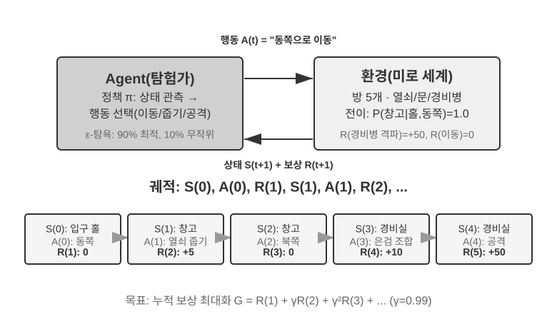

이 상호작용은 ‘상태 → 행동 → 보상 → 새 상태 → 행동 → 보상…’을 모두 기록한 **궤적(trajectory)**을 만듭니다. 정책의 품질은 결국 궤적의 품질로 나타납니다. **가치 함수(value function)**는 ‘지금 이 상태에서 현재 정책대로 계속 행동하면 최종적으로 누적 보상을 얼마나 얻을 수 있는가?’라는 질문에 답합니다. 노련한 체스 선수가 현재 판세를 보고 끝까지 계산하지 않고도 승리 확률을 직관적으로 가늠하는 것과 같습니다. ‘현재 정책’을 ‘최적 정책’으로 바꾸면 최적 가치 함수를 얻으며, 이 장 뒤에서 벨먼 최적 방정식을 설명할 때 사용합니다. 에이전트와 환경의 경계에는 간단한 원칙이 적용됩니다. **에이전트가 마음대로 바꿀 수 없는 것은 모두 환경에 속합니다.**

강화 학습에는 라벨이 붙은 정답이 필요한 지도 학습이나 데이터의 숨은 패턴을 찾는 비지도 학습과 구별되는 두 가지 특징이 있습니다. **시행착오 탐색**에서는 교사가 정답을 직접 알려 주지 않으므로 에이전트가 어떤 행동이 좋은지 스스로 찾아야 합니다. **지연 보상**에서는 행동의 효과가 여러 단계 뒤에야 드러날 수 있습니다. 예컨대 좋은 체스 수의 가치는 대국이 끝나야 분명해집니다. 이 때문에 고유한 **탐색-활용 절충**도 생깁니다. 익숙한 경로만 택하면 새로운 것을 배우지 못하고, 무작위 시도만 하면 목표에 도달하지 못합니다.

강화 학습 시스템은 다섯 가지 핵심 요소로 이루어집니다.

- **행동 공간(Action Space)**: 에이전트가 취할 수 있는 모든 행동의 집합을 정의합니다. 행동은 체스에서 ‘어느 수를 둘 것인가’처럼 선택지가 유한한 이산형일 수도 있고, 로봇에서 ‘관절을 몇 도 돌릴 것인가’처럼 연속적인 값일 수도 있습니다.
- **정책(Policy)**: 주어진 상태에서 무엇을 할지 정하는 에이전트의 행동 규칙입니다. 상태 A에서는 행동 X를 실행한다는 조회 테이블처럼 단순할 수도 있고, 심층 신경망처럼 복잡할 수도 있습니다.
- **보상 신호(Reward Signal)**: 환경이 주는 즉각적인 피드백입니다. 그러나 에이전트의 목표는 즉각적인 보상이 아니라 장기 보상을 최대화하는 것입니다. 투자를 오늘의 손익이 아니라 장기 수익으로 판단해야 하듯 이 구분은 매우 중요합니다.
- **가치 함수(Value Function)**: 특정 상태에서 앞으로 얻을 수 있는 총 누적 보상을 추정하여 즉각적인 피드백이 없어도 현명하게 결정하도록 돕습니다. 60년에 걸친 RL 연구에서 얻은 가장 중요한 통찰 중 하나는 가치 추정이 중심적인 역할을 한다는 것입니다.
- **환경 모델(Environment Model)**(선택 사항): 행동에 환경이 어떻게 반응할지 예측합니다. 환경 모델을 사용하는 방식을 **모델 기반 방식**이라고 하며, 먼저 환경 변화를 예측하는 법을 배운 뒤 그에 따라 계획합니다. 모델을 사용하지 않는 **모델 프리 방식**은 환경을 예측하지 않고 경험에서 직접 학습합니다.

표 8-3은 다양한 에이전트 시스템의 핵심 요소를 비교합니다. 이를 통해 에이전트 개념의 보편성을 드러내고, 전통적인 RL 에이전트와 현대 LLM 에이전트의 행동 공간이 어떻게 다른지 보여 줍니다.

표 8-3 여러 에이전트 시스템의 핵심 요소 비교

| 에이전트 유형 | 환경 | 행동 공간 | 보상 신호 |
|---------------|------------------------|-------------------------------|-------------------------|
| **갓 태어난 가젤** | 지형, 중력, 몸의 자세 | 연속 고차원(근육군 수축) | 균형 유지(+), 넘어짐(-) |
| **로봇 청소기** | 방 구조, 배터리 잔량 | 이산형(방향, 청소, 충전) | 청소한 면적(+), 배터리 소진(-) |
| **체스 그랜드마스터** | 보드 상태, 제한 시간 | 유한 이산형(합법적인 수) | 승리(+1), 패배(-1) |
| **고객 서비스 에이전트** | 대화 기록, 지식 베이스 | 가변 길이 조합형(사고, 대화, API 호출) | 문제 해결(+), 처리 시간(-) |
| **코드 어시스턴트 에이전트** | 요구사항 문서, 코드베이스 | 가변 길이 조합형(사고, 검색, 편집, 실행) | 테스트 통과(+), 버그 발생(-) |

이 표에서 중요한 차이를 볼 수 있습니다. 보드게임과 Atari의 대표적 환경은 미리 정의된 유한 이산 원시 행동을 사용하고, 로봇 제어는 연속적이지만 차원과 물리적 경계가 정해진 행동을 사용합니다. 고객 서비스나 코딩을 담당하는 LLM 기반 에이전트는 유한한 토큰과 도구 호출을 조합해 가변 길이 행동 시퀀스를 생성하므로 가능한 시퀀스를 한 번에 열거하기 어렵습니다. 이들은 내부 사고를 활용해 역량을 높일 수도 있습니다.

### 두 가지 행동 표현: 고전 RL 설정과 LLM의 가변 길이 정책

여기서 비교하는 두 설정의 가장 눈에 띄는 차이는 행동을 표현하는 방식입니다. MDP 자체는 유한·무한·이산·연속 행동 공간을 모두 표현할 수 있습니다. 이 절에서 다루는 대표적 보드게임·Atari 환경은 유한 이산 원시 행동을, 로봇 제어는 유계 연속 행동을 사용합니다. LLM 정책은 유한한 토큰과 도구 스키마로 가변 길이 시퀀스를 구성합니다. 이 조합형 표현의 차이는 알고리즘 설계, 샘플 효율, 일반화 방식에 큰 영향을 줍니다. 이제 각각을 살펴보겠습니다.

**기초 예제: MDP와 표형 Q-learning.**

MDP(Markov Decision Process, 마르코프 결정 과정)는 상태, 행동, 보상 같은 핵심 요소를 정의하는 강화 학습의 수학적 프레임워크입니다. 핵심 가정은 미래가 앞선 이력 자체가 아니라, 의사결정에 필요한 과거 정보를 충분히 담은 현재 상태에만 좌우된다는 **마르코프 속성**입니다. 예를 들어 체스의 상태에는 기물 배치뿐 아니라 어느 쪽 차례인지, 캐슬링·앙파상 권리, 50수 규칙과 반복 판정에 필요한 정보가 포함되어야 합니다. 이렇게 상태를 충분히 정의하면 전체 기보를 매번 다시 읽지 않고도 다음 전이를 판단할 수 있습니다. 관측이 필요한 이력을 담지 못하면 이력을 상태에 포함하거나 부분 관측 모델을 사용해야 합니다.

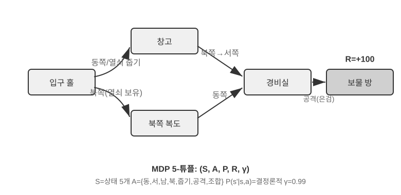

이 절에서 다루는 대표적인 RL 환경은 **사전에 정의한 행동 공간**을 사용합니다. 바둑에는 가능한 착점이 361곳이나 되지만 모두 유한하고, 체스 행동도 열거할 수 있으며, Atari 게임에는 몇 개에서 십여 개 정도의 이산 원시 행동만 있습니다. **로봇 에이전트**는 연속적이지만 경계가 있는 행동 공간을 사용합니다. 관절 각도, 속도, 파지력은 연속 값이지만 물리적 경계가 명확하고 차원도 로봇의 자유도에 따라 정해집니다.

유한 이산 행동은 각 후보를 평가하기 쉽게 합니다. 상태와 행동의 수가 충분히 작다면 표형 Q-learning으로 값을 테이블에 저장할 수 있고, 더 큰 Atari나 보드게임 상태 공간에서는 함수 근사와 탐색을 결합합니다. 연속 행동 MDP에서는 모든 행동을 열거할 수 없으므로 정책 경사나 actor-critic 같은 방법으로 정책과 가치 함수를 근사합니다. 이 절의 고전적 예제는 사전 학습 지식 없이 시행착오로 학습한다는 점에서도 LLM 정책과 다릅니다.

이 프레임워크에서 가장 기초적이고 중요한 알고리즘 중 하나가 **Q-learning**입니다. 각 ‘상태-행동’ 쌍의 가치를 추정합니다. 상태 *s*에서 행동 *a*를 취한 뒤 계속 최적으로 행동한다면 총보상을 얼마나 기대할 수 있는지를 나타냅니다. 직관적으로 어떤 행동이 좋은지는 그 행동이 주는 즉각적인 보상과, 그 행동으로 도달한 다음 상태가 얼마나 좋은지에 달려 있습니다.

이 직관을 식으로 나타내면 RL 교과서에 나오는 유명한 **벨먼 방정식**의 핵심 재귀 관계를 얻습니다. **행동의 실제 가치 = 이 단계에서 얻은 즉각적인 보상 + 다음 상태에서 얻을 수 있는 최대 미래 가치**입니다.

$$Q^*(s, a) = r + \gamma \max_{a'} Q^*(s', a')$$

여기서 $r$은 즉각적인 보상이고 $s'$은 행동을 실행한 뒤 도달한 다음 상태입니다. 직관을 위해 결정론적 형태로 썼으며, 확률적 환경에서는 다음 상태 $s'$에 대한 기댓값이 필요합니다. $\gamma \in [0, 1)$는 에이전트가 미래를 얼마나 중시하는지 결정하는 **할인율(discount factor)**입니다. $\gamma$가 1에 가까울수록 장기 수익을 중시하고 0에 가까울수록 당장의 보상에 집중합니다. 앞에서 반복해 언급한 ‘누적 보상’은 각 단계의 보상을 $\gamma$로 할인해 합한 $\sum_{t} \gamma^{t} r_t$입니다. 행동을 할 때마다 알고리즘은 이전 추정치를 ‘실제로 관찰한 결과’ 쪽으로 조금씩 조정합니다. ‘한 단계의 실제 결과로 이전 추정치를 수정하는’ 이 패러다임을 **시간차 학습(Temporal-Difference Learning, TD 학습)**이라고 합니다. 수천 번 시도하면 추정치는 점차 실제 가치에 가까워집니다.

다음 두 그림은 그리드 월드에서 Q-learning이 탐색하는 과정과 Q값이 점차 수렴하는 모습을 보여 줍니다.

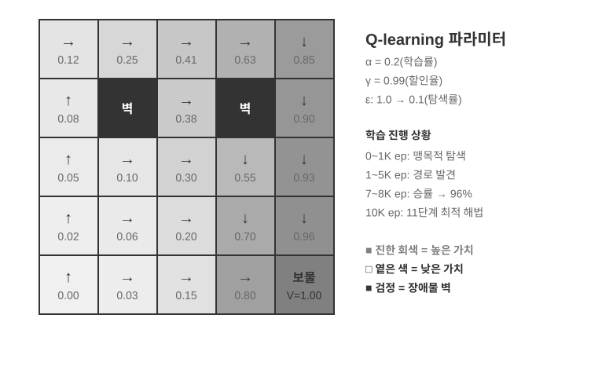

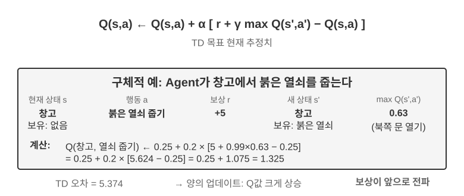

Q-learning은 **오프폴리시(off-policy)** 방식의 한 종류로, 목표 정책과 다른 탐색 정책이 생성한 데이터로도 최적 정책을 학습할 수 있습니다. 다만 관련 상태-행동 쌍을 충분히 방문하는 탐색 범위와 적절한 학습률·수렴 조건이 필요하며, 임의의 데이터 분포에서 자동으로 수렴하는 것은 아닙니다. 온폴리시와 오프폴리시 방식의 엄밀한 정의와 LLM 사후 학습에 어떻게 대응하는지는 뒤의 ‘강화 학습 알고리즘 비교’ 절에서 설명합니다.

> **실험 8-1 ★: 보물찾기 게임에서 Q-learning의 성능**
>
> Q-learning의 특성과 한계를 검증하기 위해 **보물찾기 게임 환경**을 설계했습니다. 이 환경에는 몇 가지 핵심 과제가 있습니다. **숨겨진 메커니즘** 때문에 에이전트가 열쇠와 문 사이의 대응 관계, 무기의 효과, 아이템 조합 규칙을 스스로 발견해야 합니다. **다단계 의존성** 때문에 올바른 행동 순서로 진행해야 작업을 완료할 수 있으며 최적 해법은 11단계입니다. **희소 보상** 때문에 핵심 행동과 최종 승리에만 의미 있는 보상이 있고 대부분의 중간 단계에서는 피드백이 없습니다.
>
> Q-learning 에이전트는 표준 파라미터 설정과 ε-탐욕 탐색 전략을 사용합니다. 보통 현재의 최적 행동을 선택하지만 가끔 무작위 행동을 택하고, 학습하면서 무작위 탐색의 비율을 점차 줄입니다.
>
> 학습 곡선은 전형적인 특징을 보여 줍니다. 한 에피소드는 게임 시작부터 완료 또는 실패까지의 한 판 전체를 뜻합니다.
> - **첫 1,000개 에피소드**: 승률 0%, Q 테이블에는 상태가 124개뿐이며 에이전트가 맹목적으로 탐색
> - **첫 5,000개 에피소드**: 여전히 안정적으로 승리하지 못하며 Q 테이블에는 상태가 133개
> - **7,000~8,000개 에피소드**: 승률이 34%에서 96%로 점차 상승
> - **10,000개 에피소드**: 승률 100%, Q 테이블에는 상태가 145개이며 11단계 최적 해법 발견
>
> 전체 학습은 10초도 걸리지 않아 시뮬레이션이 매우 효율적이지만, 완전한 시도를 거의 10,000번 해야 합니다. 이는 이 실험에서 사용한 사전 지식 없는 ε-탐욕 표형 Q-learning의 특징을 보여 줍니다. 무작위 탐색을 대량으로 거쳐 우연히 전체 경로를 완주해야 하고, 가치 신호가 매우 느리게 전파되므로 반복해서 강화해야 합니다.
>
> 게임 시뮬레이터에서는 10,000번 시도하는 데 10초밖에 걸리지 않으므로 비용이 무시할 만합니다. 그러나 현실의 에이전트 환경에서는 전화 한 통마다 비용이 들고, 브라우저 조작마다 지연이 생기며, 잘못된 결정 하나가 되돌릴 수 없는 결과를 낳을 수 있습니다. 따라서 10,000번의 시도는 전혀 받아들일 수 없습니다. 사전 학습된 LLM 정책을 활용하는 이유 중 하나가 바로 여기에 있습니다. 이미 쌓은 지식을 바탕으로 훨씬 적은 환경 상호작용만으로 효과적인 결정을 내릴 수 있기 때문입니다.
>
> 이 **사전 지식 없는 표형 Q-learning 실험**의 한계는 세 가지입니다. 간단한 작업에도 방대한 상호작용이 필요해 샘플 효율이 낮고, 한 환경에서 배운 값을 다른 환경으로 바로 옮기기 어려우며, 새 작업을 처음부터 탐색해야 합니다. 이는 MDP라는 수학적 틀 자체의 한계가 아닙니다. 함수 근사, 전이 학습, 모델 기반 RL 같은 방법은 더 복잡한 상태와 지식 이전을 다룰 수 있지만, 사전 학습된 LLM과 비교하면 많은 환경 상호작용이 필요할 수 있습니다.

**사전 학습된 LLM 정책 기반 에이전트.**

대규모 언어 모델은 에이전트의 행동을 표현하고 초기화하는 방식에 실용적으로 큰 변화를 가져왔습니다.

고전적인 RL에서도 내부 계산이나 정보 수집을 상태와 행동으로 모델링할 수 있습니다. LLM이 가져온 실질적인 변화는 ‘사고’를 처음 가능하게 한 것이 아니라, 사전 학습된 언어 정책이 내부 계산을 가변 길이 토큰 시퀀스로 표현하고 외부 행동과 같은 정책 안에서 생성할 수 있게 한 점입니다. 사고 토큰은 외부 세계를 직접 바꾸지 않지만 최종 행동의 품질을 높일 수 있습니다. 이제 에이전트의 행동 표현에는 ‘무엇을 할 것인가’뿐 아니라 ‘얼마나 오래, 무엇을 생각할 것인가’도 포함됩니다.

가장 중요한 실용적 혁신은 **사고 토큰을 특수한 행동처럼 정책의 출력 공간에 포함한 것**입니다. 전통적인 RL의 대표적 환경은 이동, 공격, 집기처럼 환경 상태를 바꾸는 원시 행동을 주로 사용하지만, 필요하다면 내부 계산도 MDP나 계층적 정책 안에 모델링할 수 있습니다. LLM 에이전트에서는 **내부 사고가 학습된 언어 행동 공간의 핵심 구성 요소**가 됩니다. 외부 환경을 직접 바꾸지 않고 환경 보상도 즉시 받지 않지만, 토큰 생성 비용과 컨텍스트 한도 안에서 다양한 계산 경로를 표현할 수 있습니다.

이런 가변 길이 조합형 행동은 원시 행동보다 탐색 공간이 훨씬 커서, 사전 지식 없이 처음부터 학습하기 어렵습니다. 처음부터 학습하는 에이전트는 눈을 가린 채 사막에서 보물을 찾으며 무작정 헤매는 것과 같습니다. LLM은 다릅니다. 방대한 텍스트 사전 학습을 통해 인간이 남긴 문제 해결 패턴을 학습했습니다. 수학 문제는 ‘조건 파악 → 공식 떠올리기 → 단계별 계산’, 코드 작성은 ‘요구사항 이해 → 구조 설계 → 세부 구현’의 순서로 해결한다는 식입니다. 이 사전 학습된 정책이 구조화된 경로에 높은 사전확률을 부여해 탐색 공간을 크게 압축합니다. 따라서 추가 RL 학습 없이도 사전 학습된 LLM은 기본적인 논리적 사고 연쇄(Chain of Thought, CoT)를 생성할 수 있습니다. 모델은 수학 풀이, 코드 주석, 토론 답변 같은 사전 학습 텍스트에서 다음 토큰을 예측하며 ‘다음 사고 단계는 어떤 모습이어야 하는가’를 암묵적으로 학습합니다.

RL 사후 학습은 이어서 외부 보상을 사용해 LLM이 이러한 패턴을 특정 작업에서 더 효율적으로 활용하도록 가르칩니다. 언어의 구조는 별도의 ‘내부 보상’이 아니라 사전 학습 정책의 **사전분포(prior)**로 작용합니다. ‘외화를 USD로 환산해야 하므로 먼저 환율을 찾아보자’처럼 학습 데이터에서 일관된 경로는 초기 생성 확률이 높고, ‘통화를 환산해야 하므로 먼저 날씨를 확인하자’처럼 관련 없는 경로는 낮을 수 있습니다. RL은 이 출발 분포 위에서 실제 작업 보상으로 경로의 확률을 다시 조정합니다.

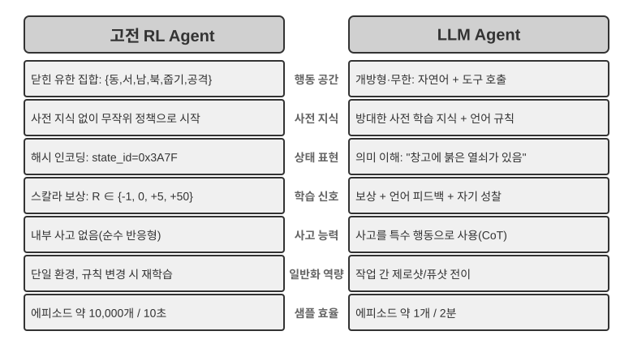

사전 학습된 언어 정책 덕분에 LLM 에이전트는 처음 보는 지시를 이해하는 제로샷 일반화와 극소수의 예시로 새 작업을 익히는 퓨샷 적응을 수행합니다. 이는 앞의 사전 지식 없는 표형 Q-learning 설정과 뚜렷이 대비됩니다. 또한 알려진 개념을 재조합하는 조합적 일반화, 프롬프트와 예시를 통한 인컨텍스트 학습, 시각·언어·행동을 통합하는 멀티모달 이해를 지원합니다. 단, 인컨텍스트 학습의 **효과**와 **내부 메커니즘**은 별개의 문제입니다. 2장에서 분석했듯 어텐션 메커니즘은 사고보다 검색에 가깝게 작동하지만, 그렇다고 작업 적응에서 발휘하는 실용적 효과가 줄어들지는 않습니다.

사전에 정의된 원시 행동에서 가변 길이 조합형 행동으로 확장된 점은 AI 에이전트 패러다임의 중요한 전환입니다. LLM 행동도 유한한 토큰 어휘와 도구 스키마로 정의되지만, 내부 사고·자연어 쿼리·프로그램 코드·복잡한 JSON·멀티모달 콘텐츠를 가변 길이로 조합하므로 가능한 시퀀스 수가 폭발합니다. 코드 인터프리터와 검색 도구는 이 표현을 실제 환경의 광범위한 작업과 정보에 연결합니다. 에이전트는 기본 도구를 조합해 전에 없던 작업을 처리할 수 있지만, 거대한 조합 공간에서 보상 함수를 정의하고 효율적으로 탐색하는 방법이 필요합니다.

도구 사용과 긴 연쇄 사고에 맞게 최적화된 Kimi K3 같은 모델은 LLM+RL 패러다임의 전형적인 방향을 보여 줍니다. 대규모 언어 사전 학습이 토대를 마련하고 사후 학습이 문제 분해, 도구 사용, 자기 교정을 강화합니다. 6장에서 자세히 다룬 **OpenVLA**[^ch8-21]는 LLM 시대의 VLA(Vision-Language-Action) 아키텍처 패러다임을 보여 줍니다. 비전 인코더가 환경 관측을 처리하고, 언어 모델이 지시를 이해하고 사고하며, 행동 디코더가 제어 신호를 생성함으로써 언어 조건부 제어와 작업 간 일반화를 가능하게 합니다. 분명히 해 둘 점은 OpenVLA 자체는 거의 100만 개에 이르는 로봇 **시연 궤적**으로 모방 학습을 한다는 것입니다. 본질적으로 RL이 아니라 SFT입니다. 이 장 뒤의 실험 8-13에서 소개하는 SimpleVLA-RL은 보상으로 이러한 VLA 아키텍처를 한층 더 최적화해 로봇 공학에 RL을 도입한 대표 사례입니다.

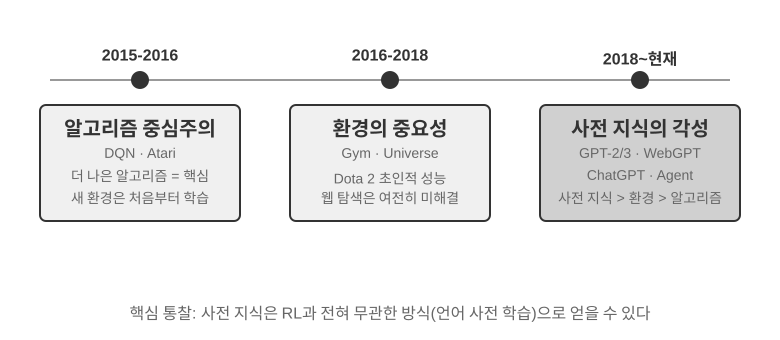

Princeton University 조교수이자 ReAct 논문의 저자인 Shunyu Yao가 「The Second Half」[^ch8-2]에서 정리한 **OpenAI의 탐색 경로**는 이 분야의 사고방식이 진화해 온 과정을 보여 줍니다. **1단계(2015~2016년), 알고리즘 중심:** 더 나은 알고리즘이 핵심이라는 믿음이 지배적이었습니다. Atari 같은 표준 환경에서 진전이 있었지만 새 환경마다 처음부터 다시 학습해야 했습니다. **2단계(2016~2018년), 환경의 중요성:** Gym은 여러 작업을 표준화했고, Universe와 World of Bits는 인터넷 전체를 RL 학습 환경으로 만들려 했으며, Dota 2는 특정한 복잡한 환경에서 인간을 뛰어넘는 성능을 추구했습니다. 아이디어는 명확했지만 범용 컴퓨터 사용과 웹 탐색에는 이르지 못했습니다.

**3단계(2018년~현재), 사전 지식의 각성:** GPT-2/GPT-3는 언어 사전 학습의 힘을 보여 주었고, WebGPT와 ChatGPT는 그 사전 지식을 실용적인 에이전트로 전환할 수 있음을 입증했습니다. 가장 중요한 발견은 **사전 지식을 RL과 아무 관계 없는 방식으로도 습득할 수 있다**는 것입니다. 이는 직관에 어긋나는 진실입니다. 수십 년간 RL 연구자들은 우선순위를 정확히 거꾸로 두었을지 모릅니다. 실제 순서는 알고리즘 > 환경 > 사전 지식이 아니라 사전 지식 > 환경 > 알고리즘입니다.

> **실험 8-2 ★★: 전통적인 RL과 LLM 에이전트 비교 연구**
>
>
> 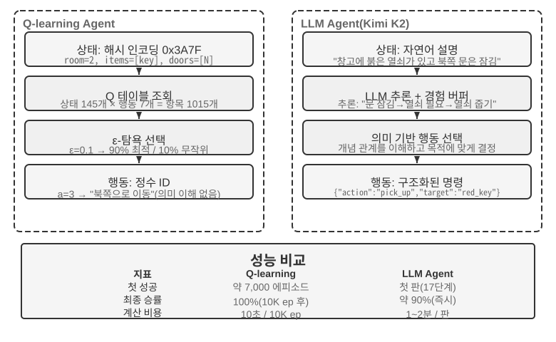
>
>
> 같은 보물찾기 게임에서 Q-learning과 최대 50개의 경험을 버퍼에 유지하는 LLM 에이전트 Kimi K3를 비교했습니다. 결과는 놀라웠습니다. **LLM 에이전트는 첫 시도에 18단계 만에 게임을 완료했습니다.**
>
> **초기 단계(목적 있는 탐색)**: 녹슨 검을 집고(‘맨손보다는 무기가 낫다’), 지도를 체계적으로 탐색합니다. 북쪽 문이 잠긴 것을 발견한 뒤 ‘열쇠를 찾아야 한다’고 추론하고, 창고를 탐색해 붉은 열쇠와 마법 수정을 얻습니다. **중간 단계(메커니즘 이해와 선제적 조합)**: ‘열쇠 자동 사용’ 규칙을 이해하고 녹슨 검만으로는 경비병을 이길 수 없다고 예상해 8단계에서 먼저 은검을 조합합니다. **후반 단계(실행과 오류 교정)**: 은검을 들고 북쪽으로 향해 13단계에서 강력한 경비병을 물리칩니다. 도중에 검을 반복해서 휘두르거나 왔던 길을 되돌아가는 등 한두 번 효과 없는 시도를 하지만, 최종적으로 18단계에서 용의 보물을 얻습니다.
>
> 이는 의미 이해와 기호 매핑의 근본적인 차이를 보여 줍니다. LLM 에이전트는 게임의 개념적 구조를 이해했고 모든 단계에 목적과 논리적 근거가 있었습니다. Q-learning에서 ‘문’, ‘열쇠’, ‘검’은 의미 없는 기호 조합일 뿐이므로 방대한 통계 학습을 통해서만 그 관계를 서서히 발견할 수 있습니다.
>
> 계산 비용에는 흥미로운 역설이 있습니다. Q-learning은 10초에 게임을 10,000번 실행하지만 LLM 에이전트는 한 판에 1~2분이 걸립니다. 그러나 현실 작업에서는 상호작용마다 드는 시간, 비용, 위험이 순수한 계산 비용보다 훨씬 크므로 GPU 시간만으로 판단하는 것은 공정하지 않습니다. 더 중요한 통찰은 LLM 에이전트가 성공한 이유가 더 나은 ‘학습 알고리즘’이 아니라 방대한 사전 지식을 갖추었기 때문이라는 것입니다. 게임 규칙이 바뀌면 Q-learning은 완전히 다시 학습해야 하지만 LLM 에이전트는 사고를 통해 곧바로 적응할 수 있습니다. 여기에서 실용적인 설계 원칙을 얻을 수 있습니다. 시뮬레이션 비용이 낮고 반복 가능성이 높은 상황에서는 전통적인 RL이 여전히 가치가 있습니다. 상호작용 비용이 높고 빠른 적응이 필요한 현실에서는 LLM 에이전트의 샘플 효율이 실질적으로 더 중요합니다.

1장에서는 컨텍스트 적응, 외부 아티팩트 업데이트, 파라미터 업데이트가 함께 작동하는 방식을 이미 개념적으로 설명했습니다. 이 장 말미의 ‘완전한 사후 학습 지형과 실전 요점’ 절에서 이 주제를 다시 살펴봅니다. 이 장의 주제는 외부 규칙만으로 온전히 표현할 수 없는 역량을 모델 파라미터에 기록하는 사후 학습입니다.

## 모델 사전 학습 기초 `[선택 읽기]`

사후 학습 기법이 효과적인 이유를 알려면 먼저 사전 학습이 무엇을 구축하는지 이해해야 합니다. 사후 학습(SFT와 RL)은 본질적으로 사전 학습이 만든 표현 공간 안에서 최적화됩니다. 사전 학습이 마련한 지식 구조가 사후 학습의 상한을 결정합니다. 따라서 소규모 언어 모델을 처음부터 학습하고, 시각 역량을 확장하고, 새로운 언어 지식을 주입하는 세 가지 실험을 통해 사전 학습의 핵심을 살펴봅니다. 이 절의 세 실험은 보충 내용으로, 대규모 데이터로 처음 학습해 모델에 기본 언어 패턴과 세계 지식을 가르치는 사전 학습에 관한 직관을 형성하는 것이 목적입니다. 사전 학습 과정을 이미 잘 아는 독자는 건너뛰어도 됩니다.

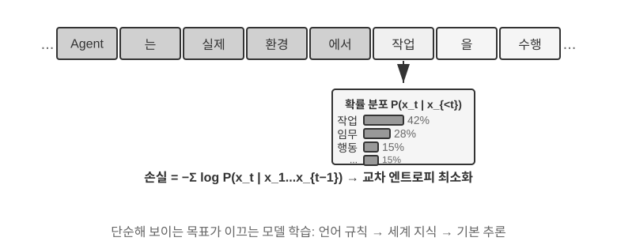

언어 모델 학습은 ‘토큰화 — 사전 학습 — 사후 학습’의 3단계 파이프라인을 따릅니다. 토큰화는 텍스트를 이산적인 단위로 나눕니다. 예를 들어 “I like programming”을 “I”, “like”, “program”, “ming”으로 나눌 수 있습니다. 이 토큰은 모델이 처리하는 가장 작은 텍스트 단위입니다. 사전 학습 작업은 개념적으로 단순합니다. 텍스트 조각의 앞부분을 모델에 보여 주고 다음 토큰을 예측하게 합니다. 예측과 정답을 비교한 차이를 손실이라고 하며, 손실이 작을수록 예측이 정확합니다. 모델은 이를 바탕으로 파라미터를 계속 조정합니다. 방대한 텍스트 데이터에서 반복 학습하면 언어 규칙, 세계 지식, 기본적인 사고 역량을 점차 익힙니다. 사전 학습 후에는 유창한 텍스트를 생성할 수 있지만 출력에 구조가 부족하고 지시를 따르는 데 서툽니다. 이어지는 사후 학습은 라벨이 붙은 입력-출력 쌍을 사용하는 SFT와, 인간이 선호하는 응답을 생성하도록 가르치는 DPO 같은 선호도 최적화를 통해 모델을 실용적인 어시스턴트로 바꿉니다.

> **실험 8-3 ★★: LLM을 처음부터 학습하기—알고리즘 개선의 힘**
>
> 1억 파라미터 모델 MiniMind 2를 사례로, 소비자용 GPU에서 전체 학습 과정을 완료합니다. QK Norm과 Muon 옵티마이저라는 두 가지 알고리즘 최적화를 통해 수렴 속도를 세 배 높이고 생성 품질을 크게 개선하면서도, 학습 시간 약 14시간과 총비용 34달러라는 매우 낮은 비용을 달성합니다.
>
> 학습 단계별 효과는 다음과 같습니다. 사전 학습 후에는 ‘세계에서 가장 높은 산은 무엇인가?’ 같은 사실 질문에 답할 수 있지만 형식이 일정하지 않습니다. SFT 후에는 지시 준수와 출력 형식이 크게 개선되어 기대한 방식으로 답을 구성할 수 있습니다. 선호도 최적화는 사실 오류와 부자연스러운 표현을 더 줄입니다. 1억 파라미터 모델에는 복잡한 문제에서 오류를 내기 쉽다는 뚜렷한 한계가 여전히 있지만, 이 실험이 주는 교훈은 다음과 같습니다. **적은 예산이 고정되어 있다면 단순히 규모를 키우는 것보다 알고리즘을 개선하는 편이 더 높은 가치를 제공합니다.**

> **실험 8-4 ★★: 나만의 VLM 학습하기**
>
>
> 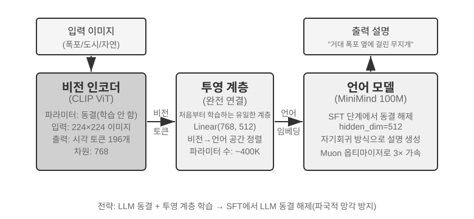
>
>
> VLM은 시각 인식과 언어 이해를 하나의 모델에 통합합니다. 핵심 과제는 ‘보이는 것’과 ‘말하는 것’을 대응시키는 교차 모달 정렬입니다. 아키텍처는 세 컴포넌트로 이루어집니다. **비전 인코더**(예: CLIP, 파라미터 동결)는 이미지에서 의미 특징을 추출합니다. 가볍고 처음부터 학습하는 유일한 부분인 **투영 계층**은 시각 특징과 언어 모델 사이의 ‘번역기’로서 시각 특징을 언어 모델이 이해할 수 있는 표현 공간에 매핑합니다. **언어 모델**은 설명 텍스트를 생성합니다. 학습에는 ‘LLM 동결 + 투영 계층만 학습’하는 전략을 사용해 새 기술을 배운 뒤 옛 기술을 잊는 파국적 망각을 피합니다. 정렬 사전 학습을 마치면 LLM의 동결을 풀고 고품질 이미지-설명 쌍으로 SFT를 수행해 설명의 세밀함과 정확성을 크게 높입니다.
>
> 이 실험은 멀티모달 모델 학습의 기본 패러다임을 보여 줍니다. 단일 모달 사전 학습의 결과를 재사용하고 가벼운 투영 계층을 학습해 교차 모달 정렬을 달성합니다. 효율적이고 확장하기 쉽지만, 투영 계층의 제한된 표현력이 깊은 교차 모달 이해를 가로막을 수 있습니다. 같은 ‘비전 인코더 + 투영 계층 + LLM’ 아키텍처를 한 단계 확장해 모델이 행동을 출력하게 하면 6장에서 자세히 다룬 VLA(Vision-Language-Action) 모델이 됩니다.

> **실험 8-5 ★★: 새 언어를 배우기 위한 연속 사전 학습**
>
> 주로 영어로 사전 학습되어 한국어를 거의 이해하지 못하는 Mistral 7B v0.3을 기반 모델로 삼아, 한국어 Wikipedia에서 연속 사전 학습을 수행해 한국어 역량을 추가합니다. 이미 사전 학습을 마친 모델에 새로운 언어 데이터로 비지도 학습을 수행하는 방식입니다. 모델은 범용 언어 모델링 역량을 이미 갖추었으므로 새로운 데이터 분포에 적응하기만 하면 되며, 처음부터 학습하는 것보다 비용이 훨씬 낮습니다. 핵심 엔지니어링 요소는 파국적 망각을 줄이기 위해 혼합 데이터(한국어 약 80% + 영어 약 20%)를 사용하는 것입니다. 대상 언어 비율이 지나치게 높으면 기존 언어 성능이 저하되고, 너무 낮으면 학습 효율이 충분하지 않습니다. 마지막으로 한국어 지시 데이터로 SFT를 수행해 실용적인 한국어 대화 능력을 얻습니다. 이 실험의 결론은 장 말미의 ‘완전한 사후 학습 지형과 실전 요점’에서 다시 사용합니다. 모델이 새로운 도메인 지식을 대량으로 기억하게 하려면 SFT가 아니라 연속 사전 학습을 사용해야 합니다.

세 가지 사전 학습 실험은 공통된 패턴을 보여 줍니다. 예산이 제한된 상황에서는 단순히 규모를 키우는 것보다 알고리즘 개선과 아키텍처 혁신의 가치가 더 큽니다. 더 중요한 점은 사전 학습이 모델에 서술적 지식과 언어 모델링 역량을 부여하지만, 구조화된 지시 따르기와 작업 지향적 행동은 부족하다는 것입니다. 바로 이 간극을 SFT가 메워야 합니다.

사전 학습에서 기본 역량을 얻었다면 다음 단계는 사후 학습을 통해 범용 모델을 실용적인 에이전트로 바꾸는 것입니다. 사후 학습의 첫 단계가 지도 미세 조정(SFT)입니다.

## Mid-training: 지식과 기초 역량 보완

이 장의 **Mid-training**은 기존 기반 모델에서 출발해 대상 데이터 분포에서 한 단계 더 언어 모델을 학습하는 과정입니다. 보통 사전 학습과 같은 다음 토큰 예측을 사용하고 문서·코드·풀이의 모든 token에 손실을 계산합니다. DAPT/TAPT 연구는 도메인 또는 과제 관련 비라벨 말뭉치의 2단계 사전 학습이 다운스트림 성능을 더 높일 수 있음을 보여 줍니다[^ch8-30].

범용 학습이 대상 언어, 전문 용어, 사내 문서나 특정 코드베이스를 덜 다룬 **지식 공백**, 그리고 긴 문맥·코드·수학·멀티모달 표현처럼 많이 샘플링해도 정답에 이르지 못하는 **기초 역량 공백**을 주로 메웁니다. SFT는 소량의 사실을 기억할 수 있지만 적은 QA는 접근 경로가 제한되므로 크고 서로 연결된 지식 주입에는 부적합합니다. 안정적인 순서는 Mid-training으로 지식·역량 흡수 → 소규모 SFT로 출력 프로토콜 확립 → 성공률이 0보다 커진 뒤 RL로 성공 확률과 일반화 향상입니다[^ch8-31].

### 데이터 혼합과 긴 문맥 커리큘럼

길이 단계 $i$의 혼합은 다음처럼 쓸 수 있습니다.

$$
D_i=\alpha_iD_{\text{long}}+\beta_iD_{\text{atomic}}+\gamma_iD_{\text{agent}}+\delta_iD_{\text{replay}},
\qquad \alpha_i+\beta_i+\gamma_i+\delta_i=1.
$$

비율은 문서 수가 아니라 **token 수**로 계산합니다. $D_{\text{long}}$은 책, 긴 문서, 코드 저장소 같은 자연 장문, $D_{\text{atomic}}$은 검색, 다중 홉 추론, 지시 따르기, 집계와 통계 같은 원자 역량, $D_{\text{agent}}$는 계획, 도구 선택·호출, 장기 상태 추적, 오류 복구 궤적입니다. $D_{\text{replay}}$에는 일반·단문 데이터와, 이미 배운 짧은 과제를 현재 길이에 올리고 단서 위치와 방해 정보를 바꾼 “길이 확장 옛 과제”를 함께 보존합니다. 중복 제거, 품질 필터, 평가 오염 검사도 필요합니다.

Mid-training은 명목상 문맥 창을 **실제로 유효한 목표 길이**까지 안정적으로 넓히며 그 과정에서 장문 추론, 계획, 도구 사용을 주입해야 합니다. `max_position_embeddings`를 32K에서 128K로 바꿨다는 사실은 입력을 받을 수 있음을 뜻할 뿐 전체 창에서 검색·집계·행동할 수 있음을 보장하지 않습니다. 시작 모델, 목표, 예산에 맞춰 8K → 16K → 32K → 64K → 128K 같은 길이 커리큘럼을 사용합니다[^ch8-36].

확장 전마다 현재 길이에서 NIAH, 장문 검색, 다중 홉 추론, 집계·통계, 기초 계획, 도구 선택 같은 원자 역량을 완성합니다. $M(\theta,c,L)$을 모델 $\theta$의 역량 $c$, 길이 $L$ 점수라 하면 세 가지 gate를 둘 수 있습니다.

$$
\begin{aligned}
M(\theta_i,c,L_i)&\geq\tau_{c,i},\\
M(\theta_i,c,L_i)&\geq M(\theta_i,c,L_{i-1})-\epsilon_{\text{len}},\\
M(\theta_i,c,L_{i-1})&\geq M(\theta_{i-1},c,L_{i-1})-\epsilon_{\text{retain}}.
\end{aligned}
$$

각각 현재 길이 합격, 길이가 늘어도 같은 역량이 실질적으로 떨어지지 않음, 새 단계가 옛 역량을 잊지 않음을 뜻합니다. 두 번째는 난이도를 맞추고 길이만 높인 과제로 비교하며, $\epsilon$은 반복 평가의 신뢰 구간으로 정합니다. 한 역량이라도 실패하면 해당 원자 역량, 현재 길이, replay 데이터를 늘려 재학습하고 명목 창만 먼저 늘리지 않습니다.

| 역량 | benchmark | 주요 진단 |
| --- | --- | --- |
| 위치·검색·추적·집계 | NIAH, RULER | needle 위치·수, 다중 홉 추적, 집계, 길이별 저하. NIAH는 기초 smoke test일 뿐 |
| 현실 장문 추론 | LongBench, LongBench v2 | 단일/다중 문서 QA, 장기 대화, 문맥 내 학습, 구조화 데이터의 범주·길이별 점수 |
| 긴 코드 이해 | LongBench v2 repository 과제, LongCodeU | 코드 단위, 파일 간 관계, repository 전체 이해 |
| 계획·도구 학습 | PlanningArena와 앞 장의 도구 benchmark | 분해, 선택, 기억, 인수, 상태 정확성 |
| End-to-end Agent | SWE-bench Verified, $\tau^2$-bench, Terminal-Bench 등 | 실제 긴 궤적의 계획, 도구, 복구, 완수 |

RULER는 NIAH를 다중 needle, 다중 홉 추적, 집계로 확장하고[^ch8-37], LongBench v2는 현실 문서·대화·저장소·구조화 데이터를 다룹니다[^ch8-38]. LongCodeU와 PlanningArena는 긴 코드 관계와 계획·도구 학습을 진단합니다[^ch8-39][^ch8-40]. 공식 test set은 평가에만 쓰고 구조는 비슷하지만 겹치지 않는 예로 학습하며 길이·역량·실패 유형별로 보고해야 합니다. NIAH 하나나 단일 leaderboard 통과만으로 장문 추론을 입증할 수 없습니다.

자주 갱신되거나 출처·권한·삭제가 필요한 사실은 RAG에 두십시오. 전체 파라미터 Mid-training은 소규모 SFT보다 계산량과 망각 위험이 크므로 먼저 소규모로 혼합 비율을 검증합니다.

## SFT(지도 미세 조정)

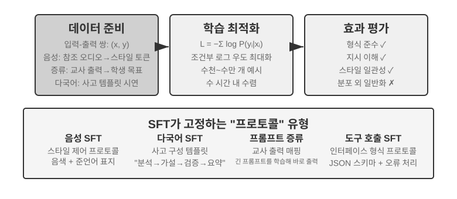

‘사전 학습, SFT, RL: 세 단계의 전체상’ 절에서는 데이터만 다르고 응답에서만 손실을 계산하는 ‘다음 토큰 예측’이라는 SFT의 본질을 이미 살펴봤습니다. 이 절에서는 네 가지 실험을 통해 안정적인 매핑과 프로토콜을 파라미터에 기록하는 이 메커니즘이 서로 다른 작업에서 실제로 무엇을 고정하는지 살펴봅니다. SFT의 핵심 가치는 새로운 지식 주입이 아니라 **프로토콜 고정**입니다. 매핑 관계, 상호작용 형식, 스타일 규범을 파라미터에 기록해 긴 프롬프트가 없어도 추론 시 기대에 맞는 출력을 내게 합니다. 일반적으로 고품질 예시 수천~수만 건만 있어도 기본 대화 능력과 지시 따르기를 확립할 수 있습니다.

이러한 효율에는 학습 분포에 의존한다는 대가가 따를 수 있습니다. 특히 다양한 정답 전략을 탐색해야 하거나 배포 분포가 시연 데이터와 달라지는 작업에서는 SFT가 시연 패턴을 재현하는 데 치우쳐 새로운 상황의 성능이 저하될 수 있습니다. 다음 실험들은 SFT와 RL의 보편적인 우열을 입증하기보다 ‘프로토콜 고정’ 과정을 여러 각도에서 보여 줍니다.

SFT를 직접 시작하기 전에 피할 수 없는 실용적인 질문이 있습니다. **SFT 데이터는 어디서 오는가?** 업계의 답은 기본적으로 세 갈래입니다.

- **사람 전문가의 시연** — 품질 상한이 가장 높지만 비싸고 느립니다. 형식과 스타일을 정의하는 ‘시드 데이터’로 알맞습니다.
- **교사 모델 생성** — 곧 합성 데이터입니다. 강한 모델이 ‘입력-출력’ 쌍을 대량으로 만들고, 걸러 낸 뒤 학생에게 증류합니다. 실험 8-8, 8-9를 보십시오.
- **거부 샘플링** — 모델이 같은 문제에 여러 후보를 스스로 샘플링하고, 검증기로 올바른 것을 골라 다시 자신을 학습시킵니다. 실험 8-9를 보십시오.

세 갈래는 자주 조합해 씁니다. 먼저 소량의 사람 시드로 형식을 세우고, 다음으로 교사 모델로 규모를 키우며, 마지막으로 거부 샘플링으로 품질을 고릅니다. 어느 길을 가든 구성 절차는 대체로 같습니다. 과제 분포와 출력 스키마를 정의하고, 후보를 대량으로 생성하며, 규칙 검증·형식 검사·사람의 표본 점검으로 품질을 거른 뒤, 중복을 제거하고 비율을 맞추며 다양성을 확보합니다. 양은 욕심낼 필요가 없습니다. 수천에서 수만 건의 고품질 샘플이면 대개 프로토콜을 고정하기에 충분하며, 십만 건의 지저분한 데이터를 쌓기보다 만 건의 깨끗한 데이터를 다듬는 편이 낫습니다. 데이터 속 잡음은 하나하나 SFT가 충실히 파라미터에 새겨 넣을 수 있기 때문입니다.

> **실험 8-6 ★★★: 음성 SFT—‘음성 복제’에서 ‘준언어적 모델링’으로 `[확장 실험]`**
>
> Orpheus(컨텍스트 프롬프트 음성 복제)와 Sesame(준언어적 토큰 모델링)을 사례로, ‘음성 스타일과 표현 습관’이 어떻게 파라미터에 기록되는지 보여 줍니다. 두 모델은 서로 다른 경로를 택합니다.
>
> - **Orpheus**: 음성 파형을 토큰 시퀀스로 압축합니다. 같은 화자의 참조 오디오를 이어 붙여 모델이 ‘이 사람의 목소리로 말하는’ 법을 배우고, 문장이 달라져도 음색의 일관성을 유지하게 합니다.
> - **Sesame**: 웃음과 한숨 같은 준언어 현상을 `<laugh>`, `<sigh>` 같은 특수 토큰으로 추상화합니다. 모델은 ‘이 토큰을 보면 해당 소리를 내는’ 법을 학습합니다.
>
> 표현 중심 작업에서 SFT는 사실 지식이나 복잡한 사고가 아니라 스타일 제어 프로토콜과 구조화된 표현 습관을 고정합니다. 핵심은 학습 데이터의 다양성과 주석 품질입니다. 흔한 실패 유형으로는 학습 데이터의 화자가 너무 적어 모두 같은 목소리로 들리는 문제와, 모델이 학습 샘플의 세부 내용을 암기해 새로운 상황에서 성능이 떨어지는 토큰 과적합 때문에 ‘기계적인 웃음’이 생기는 문제가 있습니다.

> **실험 8-7 ★★★: 다국어 사고—어떤 언어로든 사고하게 만들기 `[확장 실험]`**
>
> 대부분의 사고 모델은 영어로만 ‘생각’합니다. 어떤 언어로 질문해도 모델의 내부 사고 연쇄는 거의 항상 영어입니다. 학습 데이터의 고품질 사고 시연이 대부분 영어로 쓰였기 때문입니다. 이 실험의 목표는 간단합니다. 모델이 지정된 언어로 사고하게 만드는 것입니다.
>
> 방법은 gpt-oss-20b에 SFT를 수행하는 것입니다. 시스템 지시에 `reasoning language: German`(또는 다른 언어)이라는 줄을 추가한 뒤 영어, 스페인어, 프랑스어 등의 사고 예시로 학습합니다. 학습 데이터에 **중국어가 전혀 없어도**, 학습 후 사고 언어를 중국어로 지정하기만 하면 모델이 중국어로 완전한 사고 연쇄를 수행합니다. 이 제로샷 언어 간 일반화가 이 실험에서 가장 흥미로운 발견입니다. 단, 이는 SFT 자체의 일반화 역량이 아닙니다. 다국어 사전 학습이 이미 모델에 공유 언어 간 표현 공간을 마련했고, SFT는 기존의 언어 간 역량을 활성화했을 뿐입니다.

> **실험 8-8 ★★: 프롬프트 증류—더 낮은 비용으로 유용한 역량 복제하기**
>
> 실제 애플리케이션에서 모델에 복잡한 작업을 수행시키려면 수천, 심지어 수만 토큰의 긴 시스템 프롬프트가 필요한 경우가 많아 호출할 때마다 지연과 비용이 늘어납니다. 사고형 LLM을 사용하면 내부 사고 토큰이 비용을 더 키웁니다. 프롬프트 증류의 발상은 ‘긴 프롬프트 + 사고하는 교사’의 행동을 ‘짧거나 없는 프롬프트 + 사고하지 않는 학생’으로 압축하는 것입니다. 교사는 전체 프롬프트와 사고 모드에서 고품질 답을 생성합니다. 학습 데이터에는 사용자 입력과 최종 결론만 남기고 긴 프롬프트와 중간 사고 과정은 버립니다. 학생은 ‘곧바로 결론을 내는’ 법을 배웁니다. 증류 후에는 같은 입력에 대한 학생의 출력 품질이 교사에 가까워지면서도 긴 프롬프트와 사고 토큰을 처리할 필요가 없어 지연과 비용이 크게 줄어듭니다.
>
> 증류는 두 차원에서 수행할 수 있습니다. ‘대형에서 소형으로’는 대형 모델을 중소형 모델로 바꿔 비용과 품질의 균형을 맞춥니다. ‘사고형에서 비사고형으로’는 같은 규모에서 명시적인 CoT를 암묵적인 파라미터 지식으로 접어 넣어 응답 속도를 20~30배 높입니다. 둘은 배타적이지 않으며 프로덕션 환경에서 함께 사용하는 경우가 많습니다. 증류가 교사의 한계도 물려받는다는 점에 유의해야 합니다. 교사가 분포의 롱테일에서 체계적으로 오류를 내면 학생은 그 오류를 더욱 굳혀 버립니다. 교사가 정확성을 보장하기 위해 도구에 의존한다면 단순 출력 증류는 도구가 제공한 견고성을 잃습니다. 엔지니어링 관점에서 제품 설계가 안정적이고 입력 분포를 예측할 수 있으며 비용 제약이 크다면 프롬프트 증류는 뛰어난 최적화 방법입니다. 탐색 단계이거나 작업이 아직 안정되지 않았다면 명시적인 사고와 편집 가능한 프롬프트를 유지하는 것이 빠른 반복의 핵심입니다.

> **실험 8-9 ★★★: 사고 연쇄(CoT) 증류**
>
> 프롬프트 증류는 사고 과정을 버리지만 CoT 증류는 반대로 강력한 교사 모델의 **완전한 사고 궤적**을 학생 모델에 전달합니다. 역량 있는 교사 모델의 CoT를 증류하면 파라미터 수가 같은 학생 모델이 교사 역량의 70~80%를 회복할 수 있습니다. 최첨단 역량의 경계를 넓히려는 것이 아니라 직접 통제할 수 있는 모델을 원하는 팀에는 가장 실용적인 추종 전략입니다. DeepSeek-R1이 오픈 소스로 공개한 일련의 증류 소형 모델은 R1의 사고 궤적으로 Qwen과 Llama 계열에 SFT를 수행한 이 접근법의 대표 사례입니다.
>
> **배경: ‘사고 장벽’ 현상.** 일부 비공개 소스 사고 모델(예: OpenAI o-series, Gemini 계열)은 사고할 때 내부 사고 연쇄를 생성하지만 사용자가 보는 것은 원래 사고 과정이 아닙니다. 증류 방지, 안전, 제품 경험 등의 이유로 제공자가 CoT를 출력 전에 다시 쓰거나 요약하는 경우가 많아 가장 가치 있는 원래 사고 과정이 API 뒤에 감춰집니다. 이 실험에서 오픈 소스 사고 모델을 교사로 선택한 이유가 바로 여기에 있습니다. DeepSeek V4, Kimi K3, GLM 5.2 같은 모델은 완전한 사고 연쇄를 직접 공개하므로 기술적으로나 라이선스 면에서 증류가 가능합니다. 다만 사용 전에 증류 제품에 관한 라이선스 조건을 확인해야 합니다.
>
> **실험 현장에서 얻은 교훈: 코드를 쓸 수 있는 모델이라고 해서 다른 모델의 증류를 기꺼이 돕는 것은 아닙니다.** 이 실험을 구현할 때 저자는 먼저 GPT-5.6-Sol로 구동되는 OpenAI Codex를 사용해 실험 코드를 작성했습니다. 작업이 모델 증류를 명시적으로 포함하자 Codex는 계속 진행하기를 거부했습니다. 이어 Claude Opus 5로 구동되는 Claude Code로 전환했지만 같은 거부를 겪었습니다. 최종적으로 Kimi K3가 실험 코드와 후속 실행을 완료했습니다.
>
> 두 거부 모두 일반적인 수학 추론 때문도 아니고 단순히 모델의 내부 사고 연쇄를 공개해 달라는 요청 때문도 아니었습니다. 강력한 교사의 데이터로 학생 모델을 학습하는 완전한 증류 실험의 구현이 요청이었습니다. 모델 증류는 기술적으로 일반적인 지도 미세 조정과 매우 비슷하지만, 공급자의 안전 및 제품 정책에서는 모델 추출, 역량 복제, 지식재산권 보호와 연결되어 민감한 범주로 취급될 수 있습니다.
>
> 이 사건을 “Claude는 사고 연쇄를 제공하지 않는다”로 단순화해서는 안 되며, “Kimi의 가드레일이 더 약하다”는 증거도 아닙니다. Claude API가 summarized thinking을 반환하는지, Coding Agent가 증류 pipeline 구현에 응하는지, 서비스 약관이 모델 출력을 학습에 사용하는 것을 허용하는지는 서로 다른 세 가지 문제입니다. 이 실험은 어떤 모델의 숨겨진 추론이나 안전 장치를 우회하려 하지 않았고, 승인된 연구 절차를 위해 제품이 공개한 능력만 사용했습니다.
>
> 더 실용적이고 중요한 판단은 다음과 같습니다. **사후 학습을 하는 대다수 사람은 비공개 소스 모델의 사고 연쇄를 증류할 필요가 전혀 없습니다.** 오늘날 최상위 오픈 소스 모델과 SOTA 비공개 소스 모델의 격차는 생각만큼 크지 않습니다. 교사 모델은 ‘세계 최고’일 필요 없이 ‘학생보다 분명히 강하기’만 하면 됩니다. 사후 학습할 모델이 200B 파라미터 이하라면 오픈 소스 SOTA 모델로 교사 역할을 충분히 수행할 수 있습니다.
>
> **실험 설계:** 세 단계로 진행합니다. 1단계 **궤적 수집**에서는 수학, 코드 같은 대상 작업 분포에서 문제를 샘플링하고, 오픈 소스 교사 모델로 완전한 ‘사고 + 답’ 궤적을 생성합니다. 이어 규칙 기반 검증기로 최종 답이 틀린 궤적을 걸러냅니다. 그렇지 않으면 학생이 잘못된 사고 과정까지 모방합니다. ‘후보 생성, 검증과 필터링, 올바른 궤적만 유지’하는 이 단계에는 **거부 샘플링(rejection sampling)**이라는 이름이 있습니다. 이렇게 만든 데이터로 SFT를 수행하는 것이 **거부 샘플링 미세 조정(RFT)**입니다. 순수 SFT와 RL 사이에 자리합니다. 학습할 보상 모델도, 정책 경사도 없이 그저 ‘많이 샘플링하고, 틀린 것은 버리고, 맞은 것만 남겨’ 데이터 품질을 높입니다. 검증 가능한 작업의 데이터를 매우 비용 효율적으로 구축할 수 있습니다. 2단계 **SFT 학습**에서는 ‘문제 → `<think>` 사고 궤적 `</think>` + 최종 답’을 학습 쌍으로 삼아 7B 규모 같은 소형 모델에 표준 SFT를 수행합니다. 3단계 **비교 평가**에서는 같은 벤치마크에서 증류 전후의 학생 모델과 교사 모델을 비교해 회복한 역량의 비율을 측정합니다.
>
> **인수 기준:** 증류한 학생 모델이 증류 전보다 수학 및 코드 벤치마크에서 크게 개선되고, 사고 궤적에 성찰·되짚기·검증처럼 교사와 비슷한 행동이 나타나야 합니다. 증류의 비용도 유의하십시오. 학생은 교사의 체계적인 오류와 장황한 사고 습관까지 물려받으며, 후자는 실험 8-10의 AdaptThink 방식으로 더 최적화할 수 있습니다.

네 실험이 다루는 설계에는 ‘안정적인 매핑과 프로토콜을 파라미터에 기록한다’는 공통점이 있습니다. 음성 SFT는 스타일 제어 프로토콜을, 다국어 SFT는 사고 구성 템플릿을, 증류 SFT는 입력에서 출력으로 가는 직접 매핑을 고정합니다. 목표가 명확하고 형식이 깨끗하며 평가 기준이 안정적일수록 SFT는 높은 샘플 효율로 성능을 높일 수 있습니다. 다만 분포 이동 시 실제로 성능이 저하되는지는 대상 작업, 데이터, 모델에 맞춘 별도 평가로 확인해야 하며, 이 절의 사례만으로 SFT의 일반화 한계를 보편적인 결론으로 단정할 수는 없습니다.

## SFT 데이터 합성: 시연에서 학습 가능한 궤적으로

SFT의 상한은 먼저 데이터가 결정합니다. 실제 프로젝트에서 충분한 양의 시연을 사람이 한 건씩 작성하는 경우는 드물며, 보통 **소량의 사람 시드, 교사 모델 생성, 검증기 필터링**을 조합합니다. 사람이 만든 시연이 형식과 경계를 정의하고, 교사 모델이 규모를 키우며, 규칙 기반 검증이나 사람의 표본 점검이 품질을 지켜냅니다. 모델이 스스로 부트스트랩할 때는 같은 문제에 여러 후보를 샘플링하고 검증을 통과한 궤적만 남기는데, 이것이 거부 샘플링 미세 조정(RFT)입니다.

합성 데이터의 목표는 운영 로그를 그대로 재현하는 것이 아니라, 로그에서 재사용 가능한 **과제 구조**를 뽑아내는 것입니다. 즉 사용자 의도, 초기 상태, 사용 가능한 도구, 업무 제약, 흔한 실패 방식, 성공 조건입니다. 식별 정보를 제거한 뒤 과제 유형마다 가상의 인물·주문·파일·상태를 새로 생성하여 초기화 가능한 격리 환경에 넣습니다. 이렇게 하면 실제의 어려움은 남기면서 모델이 고객 데이터나 내부 자격 증명을 외우는 일은 막을 수 있습니다.

견실한 파이프라인은 이렇습니다. **운영 데이터 → 과제 청사진 → 합성 과제 → 여러 후보 궤적 → 과제 검증과 궤적 검증 → SFT 데이터**. 과제 검증은 문제 자체가 완수 가능한지, 난이도가 적절한지, 참조 결과가 맞는지를 확인합니다. 궤적 검증은 최종 상태, 도구 호출, 업무 제약을 확인합니다. 단위 테스트, 데이터베이스 단언, 상태 차이 검사로 쓸 수 있는 조건은 결정적 코드를 우선 사용하고, 소통 품질처럼 개방적인 항목은 모델 평가기로 보완한 뒤 사람의 표본 점검으로 보정합니다. 스킬 그래프, 실행 가능한 환경, 독립 검증기는 과제 범위를 더 넓히고 무효한 궤적을 걸러내는 데 도움이 됩니다[^ch8-12][^ch8-17][^ch8-18][^ch8-19][^ch8-20].

같은 과제·검증 인프라는 이후 RL 환경으로 바꿀 수 있지만, 두 단계의 쓰임은 다릅니다. SFT는 검증을 통과한 성공 궤적만 남겨 안정적인 형식·절차·기본 동작을 배웁니다. RL은 현재 정책이 다시 rollout하게 하여 환경 보상으로 시연 밖의 경로를 탐색합니다. 실패 궤적을 곧바로 올바른 시연처럼 넣어서는 안 되며, 선호 쌍을 만들거나 과제 범위의 빈틈을 찾는 데 쓰거나, 진단과 수정을 덧붙인 뒤 학습에 추가해야 합니다.

데이터 합성에서 중요한 것은 양이 아니라 범위·다양성·정확성입니다. 학습 세트는 과제 템플릿, 고객, 기간별로 중복을 제거해 나누어야 하고, 평가 세트는 겹치지 않는 과제 유형에서 와야 합니다. 참조 해법, 숨은 테스트, 검증기 피드백이 모델에 새어 나가서는 안 됩니다.

7장의 bad case도 여기서 학습 데이터로 바꿀 수 있습니다. Coding Agent의 "너무 이른 완료 선언"을 예로 들면, 먼저 "완료를 선언하려는" 직전까지의 궤적 접두부를 잘라낸 뒤, 그때의 이른 선언을 rejected로, "먼저 테스트를 실행하고 인수 조건을 하나씩 대조한 뒤 결론을 내린다"를 chosen으로 삼습니다. 이런 데이터는 DPO나 결정 경계 시연에 적합하며, 올바른 SFT 궤적으로 그대로 쓰는 것은 아닙니다. 실패 원인, 적용 조건, 검증기는 샘플과 함께 저장해 추적과 재확인이 가능하게 해야 합니다. 실험 8-17의 `build_preference_data.py`는 결정적 템플릿과 교사 모델이라는 두 가지 구성 경로를 제공하며, 학습 데이터를 뒤따르는 평가 세트와 분리해 저장합니다.

이 장에서 새로 추가한 두 Bad Case 실험은 서로 다른 감독 목표를 보여 줍니다. 중국어 둥근 따옴표 사례는 먼저 피드백을 범위에 민감한 문서 Skill로 정제한 뒤 구조화된 합성 데이터로 SFT를 수행합니다. 특수 문자열 사례는 `old_string` 불일치를 바이트 단위로 정확한 복사 과제로 바꾸어 토큰 단위 충실도를 훈련합니다. 둘은 7장의 실패 귀인 프로토콜과 학습/평가 격리 프로토콜을 공유하지만 총점은 공유하지 않습니다. 전자는 "바꿀 것은 바꾸고 남길 것은 남긴다"를, 후자는 "글자 그대로 복사한다"를 측정합니다.

## Mid-training, SFT, RL을 선택할 때

먼저 부족한 것이 **기반, 프로토콜, 정책** 중 무엇인지 진단하고 모든 “실패”를 RL 문제로 취급하지 마십시오.

표 8-4 Mid-training, SFT, RL 선택 기준

| 관찰 | 주요 공백 | 우선 방법 | 다음 단계 조건 |
| --- | --- | --- | --- |
| 도메인 개념·언어·기본 동작을 모르며 합리적인 샘플링에서도 `pass@k`가 거의 0 | 지식·역량이 기반 모델의 유효 지지에 없음 | **Mid-training**; 동적 사실은 RAG | 도메인 보류 세트가 개선되고 일반 역량을 보존하며 검증 가능한 정답·부분 정답이 나타남 |
| 가끔 성공하지만 형식, tool schema, 어조, 고정 절차가 불안정 | 행동 프로토콜 | **SFT** 또는 제약 디코딩 | 파싱 성공률이 안정되고 검증기가 핵심 행동을 평가 가능 |
| 성공률과 신뢰할 보상은 0보다 크지만 좋은 정책 확률이나 OOD 일반화가 낮음 | 정책과 확률 질량 | **RL** | 보상이 실제 목표와 일치하고 그룹 내 차이가 있으며 독립 평가가 개선됨 |
| 안정적인 시연은 조금 있으나 상호작용 환경이 없음 | 모방 데이터만 있음 | **SFT/RFT/offline 선호 최적화** | 기준선과 평가를 만든 뒤 RL 환경의 가치를 판단 |

실무에서는 먼저 prompt·도구·코드 제약·문맥 관리로 해결할 수 있는지 확인합니다. 다음으로 고정 샘플링에서 `pass@1`, `pass@k`, 부분 진척률, 파싱률과 실패 원인을 측정합니다. `pass@k`가 거의 0이고 지식·기초 역량이 문제면 Mid-training, “할 줄 알지만 요구대로 출력하지 못하면” SFT, 채점 가능하고 가끔 성공하는 rollout과 믿을 수 있는 보상이 있을 때만 RL을 씁니다. 전부 실패한 rollout에 PPO/GRPO를 바로 적용하면 대개 샘플링 예산만 소모합니다.

‘사전 학습, SFT, RL: 세 단계의 전체상’ 절에서는 SFT와 RL의 **본질적인 차이**를 설명했습니다. 이 절은 더 실용적인 질문에 답합니다. **구체적인 작업이 주어졌을 때 어느 쪽을 사용해야 하는가?** 아래 의사결정 프레임워크의 일부 결론은 이후 RL 실험인 실험 8-10과 7-11에서 추가로 검증합니다. 먼저 잠정적인 판단을 세운 뒤 RL 절을 읽고 돌아와 교차 확인해도 좋습니다.

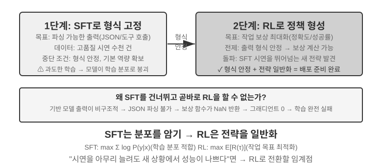

**SFT는** JSON 출력이나 일관된 대화 스타일처럼 형식을 안정화해야 하고, 고품질 전문가 시연을 이용할 수 있으며, 배포 환경이 학습 환경과 매우 유사한 작업에 적합합니다. **RL을 고려할 수 있는** 상황은 다릅니다. 학습과 배포가 체계적으로 다르고 이를 반영하는 보상을 만들 수 있거나(학습에서는 J/Q/K 카드가 모두 10이지만 배포에서는 11/12/13으로 바뀌는 규칙 변화, 학습에서는 검은색 무늬를 사용하지만 배포에서는 붉은색 무늬를 사용하는 외형 변화), 최적 전략을 탐색해야 하거나, 모든 경로를 시연하기에는 주석 비용이 너무 클 때입니다.

구조화 출력이 불안정한 설정에서 가장 견고한 전략은 **‘SFT 후 RL’** 2단계 파이프라인입니다. 이때 SFT의 일차 목표는 작업 성능 최대화가 아니라 출력의 **형식 안정성** 확보입니다. 모델이 파싱 가능한 JSON과 올바른 도구 인터페이스 호출을 생성하도록 하는 것입니다. 출력 형식이 안정되어야 RL 보상 신호를 확실하게 계산할 수 있습니다. SFT 없이 기반 모델에 직접 RL을 수행하면 출력 형식이 엉망이고 보상을 계산할 수 없어 학습에 실패하는 경우가 많습니다. 다만 이 결론에는 경계 조건이 있습니다. 뒤의 실험 8-11처럼 ‘비교적 작은 기반 모델 + 엄격한 구조화 출력 요구사항’이라는 설정에서 나온 결과입니다. DeepSeek-R1-Zero는 충분히 강력한 기반 모델이라면 SFT를 생략하고 직접 RL을 수행해 성공하며 성찰과 긴 연쇄 사고 역량을 출현시킬 수 있음을 보여 주었습니다. 다만 출력 가독성이 낮고 여러 언어가 섞이는 대가가 따랐고, 바로 이 때문에 DeepSeek는 최종 R1에 ‘콜드 스타트 SFT’를 다시 추가했습니다. R1이 Zero에서 콜드 스타트로 왕복한 과정은 ‘선형후신’을 잘 보여 줍니다. 구조화 출력이 불안정할 때는 SFT로 ‘형’인 형식과 가독성을 빠르게 확립하고, 신뢰할 수 있는 보상이 있을 때 RL로 ‘신’인 전략과 사고 역량을 더 키울 수 있습니다.

각 방식에는 비용이 따릅니다. SFT는 샘플 효율이 높고 빠르게 수렴하며, 일반화 성능은 데이터의 범위와 다양성에 크게 좌우됩니다. RL은 시연에 없던 전략을 탐색할 수 있지만 많은 샘플이 필요하고 학습이 불안정합니다. 다양하고 고품질인 시연을 추가해도 새로운 상황의 성능이 정체되고, 그 상황을 신뢰성 있게 평가할 보상과 환경이 있다면 RL을 고려할 수 있습니다.

실무에서는 다음 순서로 결정할 수 있습니다.

1. **먼저 사후 학습이 필요한지 물어보십시오.** 프롬프트 최적화, 도구 설계, 컨텍스트 관리 같은 하네스 엔지니어링으로 해결할 수 있다면 모델을 학습할 필요가 없습니다. 대부분의 에이전트 애플리케이션이 여기에 해당합니다.
2. **학습이 필요하다면 SFT부터 시도하십시오.** 출력 형식(JSON 스키마, API 호출 형식), 프로토콜 지식(용어 사용, 출력 형식, 절차 습관, 즉 ‘어떻게 말하고 행동하는가’), 스타일(어조, 길이)을 고정하는 데 적합합니다. 단, SFT는 대량의 사실 지식인 ‘무엇을 아는가’를 주입하는 데 적합하지 않습니다. 그러려면 연속 사전 학습이나 RAG를 사용해야 합니다. 장 말미의 ‘완전한 사후 학습 지형과 실전 요점’을 참고하십시오. SFT는 비용이 낮고 빠르게 효과를 냅니다.
3. **SFT가 충분하지 않다면 RL을 추가하십시오.** 새로운 상황에 대한 일반화나 최적 전략 탐색이 필요하거나 주석 비용이 지나치게 높은 경우에 적합합니다. 출력이 보상 함수가 요구하는 형식을 안정적으로 따르지 못한다면 먼저 SFT나 제약 디코딩으로 형식을 안정화한 뒤 RL을 적용합니다. 강한 기반 모델이 이미 형식을 충족한다면 직접 RL도 가능합니다.

## 단일 턴 강화 학습: 암기와 일반화 비교

‘단일 턴’은 모델이 입력을 받고 출력을 생성한 뒤 보상을 받는 한 번의 상호작용으로 작업이 끝나며, 여러 단계에 걸쳐 상태를 유지할 필요가 없다는 뜻입니다. 이 단순화된 설정에서는 다중 턴 상호작용의 복잡성 없이 SFT와 RL 학습 메커니즘의 근본적인 차이에 집중할 수 있습니다. 단일 턴 환경은 같은 작업, 같은 기반 모델, 같은 계산 예산에서 학습 방법만 변수로 두는 명확한 통제 실험 조건을 제공합니다. 첫 실험은 RL이 ‘언제 사고할 것인가’라는 메타 전략을 어떻게 배우는지 보여 주고, 두 번째 실험은 산술 사고 카드 게임으로 ‘SFT는 암기하고 RL은 일반화한다’는 현상을 체계적으로 정량화합니다.

실험에 앞서 뒤에 나올 용어를 이해할 수 있을 정도의 **최소한의 직관**을 RL 알고리즘에 관해 익혀 보겠습니다. 전체 수식과 비교는 이 장 뒤의 ‘강화 학습 알고리즘 비교’ 절에서 다룹니다. 이 장의 RL 학습은 대부분 **정책 경사(policy gradient)**를 토대로 합니다. 같은 문제에 여러 응답을 생성하고, 보상이 높은 응답의 확률은 높이며 낮은 응답의 확률은 낮춥니다. 보상을 주는 방향으로는 더 나아가고 그렇지 않은 방향으로는 덜 나아가는 것입니다. 한 번의 큰 업데이트로 모델이 궤도에서 이탈하는 일을 억제하기 위해 주류 **PPO** 알고리즘은 확률비가 정한 구간을 벗어날 때 대리 목적함수에서 얻는 추가 이득을 클리핑합니다. 이는 큰 변경을 억제하지만 정책 변화의 하드 제약은 아닙니다. 뒤의 실험에서 말하는 ‘가치 네트워크를 사용하는 PPO’로, 가치 네트워크는 더 세밀한 어드밴티지를 계산하기 위한 기준선을 추정합니다. 다른 방식인 **GRPO**는 가치 네트워크를 학습하지 않고 같은 문제의 여러 응답을 서로 비교해 상대적인 품질을 판단합니다. 다음 두 실험에는 이 정도 직관이면 충분합니다.

같은 메커니즘은 아래의 Python 스타일 의사코드로 나타낼 수 있습니다. 샘플링 병렬화, KL 정규화, 옵티마이저 세부 사항은 생략하고 한 번의 rollout에서 파라미터 갱신까지의 인과 사슬만 표시했습니다.

```python
for prompt in batch:
    group = [rollout(policy, env.reset(prompt)) for _ in range(G)]
    rewards = [verify(trajectory) for trajectory in group]
    advantages = normalize_within_group(rewards)       # GRPO baseline
    update(policy, group, advantages)
```

PPO의 가치 네트워크와 클리핑 목적 함수는 따로 쓰면 이렇습니다.

```python
for trajectory in rollouts:
    returns = discounted_returns(trajectory.rewards)
    values = value_model(trajectory.states)
    advantages = returns - stop_gradient(values)
    ratio = exp(policy.log_prob(trajectory.actions)
                - old_policy.log_prob(trajectory.actions))
    policy_loss = -mean(min(
        ratio * advantages,
        clip(ratio, 1 - epsilon, 1 + epsilon) * advantages
    ))
    value_loss = mean((value_model(trajectory.states) - returns) ** 2)
update(policy, value_model, policy_loss + value_coef * value_loss)
```

GRPO의 ‘상대’는 같은 프롬프트에 대한 그룹 내 비교에서 옵니다. PPO의 `old_policy`는 이 rollout 묶음을 생성할 때 동결한 정책 스냅숏이며, 확률비는 현재 정책이 거기서 얼마나 이동했는지를 잽니다. 클리핑은 큰 폭의 갱신을 억제하지만 정책 이동에 대한 단단한 제약은 아닙니다. 둘 다 여전히 믿을 만한 환경과 보상에 의존하며, 구체적인 학습 조정은 해당 실험을 보십시오.

> **실험 8-10 ★★: AdaptThink—‘사고하지 않을 때’를 학습하기**
>
> 대형 사고 모델(예: OpenAI o1, DeepSeek-R1)은 모든 문제에서 긴 사고 연쇄를 생성해 간단한 문제에도 불필요한 오버헤드를 일으킵니다. 이 실험은 먼저 한 가지 직관을 검증합니다. `<think></think>`로 사고를 건너뛰는 **NoThinking 모드**는 간단한 문제에서 비슷하거나 오히려 더 나은 성능을 보이고, 어려운 문제에서만 Thinking 모드의 이점이 나타납니다.
>
> AdaptThink는 RL로 모델이 모드를 적응적으로 선택하도록 학습합니다. 핵심 컴포넌트는 두 가지입니다.
>
> - **제약 최적화 목표**: 전체 성능이 떨어지지 않도록 보장하면서 NoThinking을 장려합니다.
> - **중요도 샘플링 전략**: Thinking과 NoThinking 샘플의 균형을 맞춰 **콜드 스타트** 문제를 해결합니다. 여기서 콜드 스타트는 초기 모델이 거의 항상 Thinking을 선택해 NoThinking 분기의 샘플이 너무 적고 효과적으로 학습할 수 없는 현상을 뜻합니다. 소수의 시연 예시를 사용하는 앞선 DeepSeek-R1의 ‘콜드 스타트 SFT’와는 다른 의미입니다.
>
> 여기서 말하는 ‘중요도 샘플링’은 일반적인 통계 방법입니다. 샘플링 분포가 특정 샘플 부류에 치우쳤을 때 샘플에 가중치를 적용해 분포를 ‘교정’하고 학습 신호가 모든 부류를 공정하게 포괄하도록 합니다. 이 발상은 이 책 뒤에서 다룰 PPO와 DAPO 같은 RL 알고리즘에 반복해서 사용됩니다.
>
> 이 과거 학습 실행의 공식 기록은 체크포인트가 없는 [학습 보고서](../chapter8/AdaptThink/TRAINING_REPORT.md)입니다. 공개 W&B 주 실행 [`wubbn5tj`](https://wandb.ai/bojieli-pine-ai/adapt_think_verl/runs/wubbn5tj)는 NVIDIA H100 80GB GPU 8개를 사용했습니다. 0→300단계에서 MATH500 정확도는 0.8100→0.8180(+0.80%포인트), 응답 길이는 4911.46→1576.62(-67.90%)였고, GSM8K는 각각 0.796816→0.818802(+2.20%포인트), 1025.24→477.33(-53.44%)였습니다. AIME mean16은 각각 0.314583→0.310417(-0.42%포인트), 12119.51→6402.23(-47.17%)였습니다. 이에 대응하는 NoThinking 비율은 83.80%, 84.15%, 56.25%입니다. 이는 데이터셋 집계 수준에서 난이도와 일치하는 라우팅 신호가 있음을 보여 주지만, 문제별로 ‘완벽하게 난이도를 인식한다’고 하거나 정확도가 전반적으로 향상됐다고 주장할 근거는 되지 않습니다.
>
> 실행은 보고서의 측정 지점 이후에도 계속되어 410단계, 누적 36.92시간에 도달한 뒤 W&B에서 `crashed` 상태로 표시됐습니다. 설정된 10 epochs / 3,140단계는 완료되지 않았습니다. 300단계에 체크포인트 타이밍 이벤트가 있지만 체크포인트는 책과 함께 배포되지 않으며, `run_eval_verl_hf.sh`로 성공적으로 평가했거나 MMLU를 다시 실행했다는 독립적인 실행 증빙도 없습니다. 과거 소스 커밋은 `9e588202…`이고, 향후 재현은 그 직접 자식 커밋인 `0033ad172…`에 고정됩니다. 세 진입점 파일은 바뀌지 않았지만 학습 스크립트가 생성하는 `-fl-` 경로와 평가 스크립트에 하드코딩된 `-fl4096` 경로는 호환되지 않으므로 수동으로 수정해야 합니다.
>
> AdaptThink는 프롬프트 증류와 함께 ‘빠른-느린 이중 시스템’을 구성합니다. 증류는 사고가 필요한 작업의 비율을 줄이고, AdaptThink는 남은 작업의 작동 전략을 최적화해 사고 효율을 함께 높입니다.

> **실험 8-11 ★★: GeneralPoints—단일 턴 RL에서 ‘암기와 일반화’ 비교**
>
> 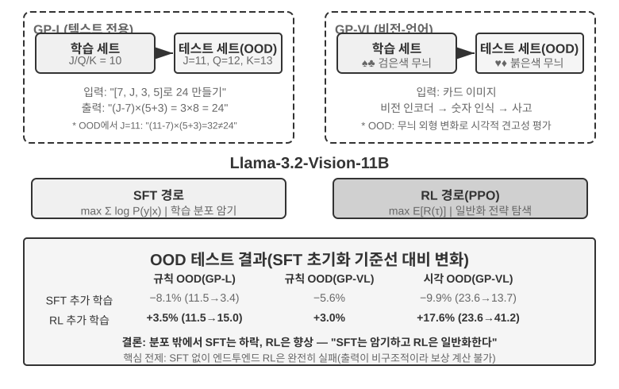
>
> GeneralPoints는 모델의 일반화를 평가하기 위해 특별히 설계된 산술 사고 카드 게임으로, Chu 등[^ch8-3]이 제안했습니다. 목표는 ‘24 게임’과 비슷합니다. 카드에 나온 숫자 네 개를 각각 정확히 한 번씩 사용하고 덧셈, 뺄셈, 곱셈, 나눗셈을 조합해 목표 숫자 24를 만들어야 합니다. 실험에는 텍스트 전용 GP-L과 이미지 기반 GP-VL 두 변형이 있어 같은 프레임워크에서 규칙 일반화와 시각 일반화를 살펴볼 수 있습니다.
>
> **규칙 변형**: 학습할 때는 J/Q/K를 모두 10으로 계산하지만 테스트에서는 각각 11/12/13으로 계산해, 테스트 세트에 처음 보는 숫자 조합인 11, 12, 13을 포함한 연산이 들어가도록 하고 일반화를 엄격히 평가합니다. **시각 변형**: 학습에는 검은색 무늬(♠♣), 테스트에는 붉은색 무늬(♥♦)를 사용해 시각적 외형 변화에 대한 견고성을 평가합니다. Llama-3.2-Vision-11B를 사용하며 표준 사후 학습 파이프라인을 따릅니다. 먼저 SFT 초기화로 기본적인 지시 준수 능력을 부여하고, 이어 같은 계산 예산에서 SFT와 RL을 별도 분기로 추가 학습합니다. RL에는 PPO와 가치 네트워크를 사용합니다. 두 분기 모두 J/Q/K=10이라는 단일 규칙의 데이터로 학습하고 분포 내(ID) 및 분포 외(OOD) 테스트 세트에서 평가합니다.
>
> 결과는 이 통제된 설정에서 뚜렷한 차이를 보여 줍니다. **규칙 OOD**: GP-L에서 RL은 +3.5%포인트(11.5%→15.0%) 향상되지만 SFT는 8.1%포인트(11.5%→3.4%) **하락**합니다. GP-VL에서 RL은 +3.0%포인트 향상되고 SFT는 5.6%포인트 하락합니다. **시각 OOD**: GP-VL에서 RL은 **+17.6%포인트**(23.6%→41.2%) 향상되지만 SFT는 9.9%포인트(23.6%→13.7%) 하락합니다.
>
> 시각 인식 정확도를 추적하면 RL은 결과 중심 최적화를 통해 기반 비전 인코더를 개선하며, 이 개선이 전체 성능 향상과 높은 상관관계를 보입니다. 반면 SFT는 사고 과정의 토큰 패턴에 과적합하고 시각 토큰 학습을 소홀히 해 인식 정확도가 떨어집니다.
>
> 이 실험에서는 RL에 SFT 초기화가 필요했습니다. Llama-3.2-Vision-11B 규모의 기반 모델과 엄격한 구조화 출력 요구사항에서는 SFT 없이 곧바로 엔드투엔드 RL을 수행하면 완전히 실패합니다. 기반 모델이 구조화된 출력을 만들지 못해 보상 자체를 계산할 수 없습니다. 이는 특정 설정에서 얻은 결론이지 보편 법칙이 아닙니다. 기반 모델이 충분히 강력하다면 SFT를 건너뛰고 직접 RL을 수행해 성공할 수 있습니다. 앞에서 다룬 DeepSeek-R1-Zero를 참고하십시오. 또 하나 주목할 발견은 이 실험에서 검증 반복 횟수가 많을수록 측정된 일반화가 좋아졌다는 것입니다. 10회 반복은 +5.99%, 1회 반복은 +0.48%로, 테스트 시점의 계산량이 관찰된 향상에 중요한 요인이었음을 보여 줍니다.
>
> 이 실험의 분포 이동에서 SFT 성능은 떨어지고 RL은 더 나은 성능을 보인 이유는 무엇일까요? 관찰과 일치하는 한 가지 설명은 제한된 SFT 데이터가 ‘J/Q/K를 만나면 10으로 취급한다’는 고정 패턴을 강화해, 테스트에서 J=11로 바뀌어도 10으로 계산하게 했다는 것입니다. 결과로 학습한 RL 분기는 ‘정답이 나올 때까지 다시 계산한다’는 전략을 강화했을 가능성이 더 높아 규칙이 바뀐 뒤에도 같은 절차를 적용할 수 있었습니다. 이는 이 실험의 ‘암기’와 ‘일반화’ 대조를 설명하지만, SFT는 암기만 하거나 RL은 반드시 일반 알고리즘을 배운다는 뜻은 아닙니다.
>
> 이 실험의 핵심 기여는 제한된 GeneralPoints 설정에서 SFT의 과적합 경향과 RL의 더 나은 분포 밖 성능을 체계적으로 정량화하고, 텍스트 전용과 비전-언어 변형 모두에서 같은 패턴을 관찰한 것입니다. 이 설정에서는 SFT가 형식을 안정화하고 RL이 그 토대 위에서 전략을 탐색해 상호 보완적으로 작동했습니다. 중국 회화의 표현을 빌린 ‘선형후신’ 학습 구성은 먼저 외형인 형식과 구조를 정확히 그린 뒤 내면의 전략을 다듬는 방법론적 토대를 제시합니다.

## RL 알고리즘: 16번의 rollout에서 한 번의 파라미터 갱신으로

**GRPO(Group Relative Policy Optimization)**는 DeepSeek이 제안한, 오늘날 RL 학습에서 가장 많이 쓰이는 알고리즘 중 하나입니다. 예를 하나 들면 직관적으로 이해할 수 있습니다. SWE-bench에 이런 과제가 있다고 합시다. 어떤 Python 프로젝트의 `parser.py`가 입력이 비었을 때 `IndexError`를 일으키므로, 에이전트는 테스트를 수정하지 않고 코드를 고쳐야 합니다. 학습 시스템은 다음 네 단계를 거칩니다.

**1단계: 정책 모델에 반복해서 시도시킨다.** 정책 모델이란 지금 학습 중인 바로 그 언어 모델입니다. 시스템은 같은 초기 코드와 같은 문제 설명을 서로 격리된 16개 샌드박스에 복사하고, 모델이 16번 독립적으로 풀게 합니다. 매번 "코드 읽기 → 파일 수정 → 테스트 실행 → 결과 제출"의 전 과정을 포함하며, 이 전체 과정을 한 번의 **rollout**이라 부릅니다. 문제와 초기 환경은 완전히 같지만 샘플링에는 무작위성이 있어 16번의 시도가 서로 다른 경로를 갈 수 있습니다. 경계 검사를 제대로 보태는 것, 예외만 잡아 문제를 덮는 것, 엉뚱한 파일을 고치는 것, 테스트를 고치려 드는 것 등입니다.

**2단계: 보상을 계산한다.** 각 rollout이 끝나면 검증기가 깨끗한 환경에서 패치를 적용하고 테스트를 실행합니다. 16번 중 4번이 테스트 파일을 건드리지 않고 모든 테스트를 통과하고 나머지 12번이 실패했다면, 앞의 4개는 보상 1을, 뒤의 12개는 보상 0을 받습니다. 이런 코딩 과제에서 "보상 계산"에는 신비로운 구석이 없습니다. 테스트와 규칙으로 이번 수정이 정말 맞는지 판정하는 것뿐입니다. 확정적 테스트가 없는 개방형 과제에 이르러서야 사람의 선호나 보상 모델이 필요해집니다.

**3단계: 상대 이점을 계산한다.** 보상은 한 궤적의 성공 여부만 말해 주지만, **상대 이점**은 같은 그룹의 다른 시도들과 비교해 얼마나 좋은지를 말해 줍니다. 이 그룹의 평균 성공률은 4/16입니다. 테스트를 통과한 4개는 그룹 평균보다 높아 양의 이점을, 실패한 12개는 평균보다 낮아 음의 이점을 받습니다. 이 그룹 내 비교가 바로 GRPO의 핵심입니다. 16개가 모두 실패하거나 모두 성공하면 보상이 완전히 같아 우열을 가릴 수 없고 상대 이점도 사라집니다. RLVP의 경로 신호, 과정 보상, 부분 진척 보상은 바로 그런 그룹에서 의미 있는 차이를 되살리기 위한 것입니다.

**4단계: 경사 하강으로 정책을 갱신한다.** 학습 프로그램은 상대 이점을 손실로 바꾸고 경사를 계산하며, 옵티마이저(AdamW, Muon 등)가 경사 하강을 수행해 양의 이점을 가진 궤적에서 모델이 내린 선택의 확률을 높이고 음의 이점 궤적에서는 낮춥니다. 성공한 패치를 통째로 외우는 것이 아니라 수많은 과제와 rollout에 걸쳐 조금씩 조정하는 것이며, 그 결과 나중에 비슷한 오류를 만나면 "먼저 문제를 재현하고 경계 조건을 확인한 뒤 구현을 고치고 테스트를 돌린다"가 더 자주 나타나고, "예외를 덮고 테스트를 고치고 검증 없이 제출한다"는 덜 나타나게 됩니다.

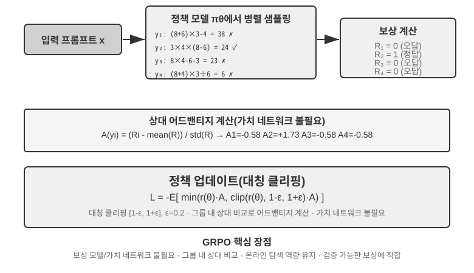

이 네 단계를 합쳐 한 번의 **학습 이터레이션**, 즉 하나의 **step**이 됩니다. $k$번째 step에서는 현재 정책으로 rollout 한 묶음을 생성하고 보상·이점·경사 계산을 마친 뒤 옵티마이저가 파라미터를 갱신합니다. $k+1$번째 step은 곧바로 갱신된 정책으로 다시 rollout합니다. 100 steps 학습한다는 것은 이 닫힌 루프를 약 100번 반복한다는 뜻입니다. 구체적인 RL 학습 프레임워크는 내부의 여러 미니배치 갱신을 따로 셀 수 있으므로, 학습 로그를 볼 때는 그 `step`의 정의를 확인해야 합니다.

대략적인 시간을 가늠해 봅시다. 복잡한 에이전트의 rollout은 수십 턴의 도구 호출을 만들어 내고, 16개를 병렬로 돌려도 rollout 단계의 실제 시간은 가장 느린 하나가 결정합니다. 가장 느린 rollout이 약 2,000초, 이어지는 경사 하강과 옵티마이저 갱신이 약 600초 걸린다면 한 step은 대략 $2{,}000+600=2{,}600$초, 곧 약 43분입니다. 100 steps를 이어서 학습하면 72시간에 가까워집니다.

PPO와 GRPO는 모두 이 닫힌 루프를 따르며, 차이는 주로 **무엇과 비교하는가**에 있습니다. GRPO는 같은 문제의 여러 rollout을 직접 비교하므로 별도의 가치 모델이 필요 없습니다. PPO는 가치 모델을 학습시켜 궤적의 각 단계에서 "보통 어느 정도까지 해낼 수 있는지"를 추정한 뒤 지금 행동이 그 기대를 넘는지 판단하므로, 세밀한 기여도 할당이 필요한 긴 궤적에 더 적합합니다. 둘 다 한 번의 갱신 폭을 제한해 적은 표본 때문에 모델이 갑자기 크게 바뀌지 않도록 합니다. DPO는 다릅니다. 미리 모아 둔 "더 나은 답—더 못한 답" 선호 쌍에서 곧바로 학습하며, 현재 정책이 이 rollout 묶음을 온라인으로 생성하게 하지 않습니다.

이 장의 사례에서 AdaptThink는 자체 제약 목적 함수를, GeneralPoints와 V-IRL은 가치 모델이 있는 PPO를, SimpleVLA-RL과 RLVP는 GRPO를, ReTool은 PPO를 씁니다. 알고리즘은 궤적을 어떻게 비교하고 파라미터를 어떻게 갱신할지 정하고, 보상은 "무엇을 성공으로 볼지"를 정하며, 환경과 데이터는 모델이 어떤 문제를 겪을 수 있는지를 정합니다.

### LLM RL에서 On-Policy를 우선하는 이유

**Online**은 학습 중 환경에서 데이터를 계속 생성한다는 뜻이고, **on-policy**는 rollout 행동 정책 $\mu$가 현재 최적화할 $\pi_\theta$와 같거나 충분히 가깝다는 뜻입니다. 비동기 worker가 몇 checkpoint 뒤처지면 online이어도 off-policy입니다. 다른 정책의 데이터에는 중요도 비율이 필요합니다.

$$
\rho_t=\frac{\pi_\theta(a_t\mid s_t)}{\mu(a_t\mid s_t)}
=\exp\!\left(\log\pi_\theta(a_t\mid s_t)-\log\mu(a_t\mid s_t)\right).
$$

신선한 on-policy rollout은 업데이트 전에 $\rho_t=1$이므로 현재 모델이 실제 방문하는 상태에서 학습하고 분포 불일치의 고분산 보정을 피합니다. Off-policy는 옛 데이터를 재사용하고 비동기로 처리량을 높이지만, 긴 자기회귀 시퀀스에서는 작은 token 비율 오차가 누적됩니다. PPO clipping은 이상 업데이트를 제한할 뿐 잃어버린 분포 범위를 복구하지 못합니다. 따라서 on-policy가 항상 우월한 것이 아니라 현재 LLM 정책 경사에서 보통 **분포 편향이 작고 최적화가 안정적**이라는 뜻입니다[^ch8-32].

#### 수치 오차가 명목상 On-Policy를 깨뜨리는 방식

vLLM/SGLang으로 rollout하고 FSDP/Megatron으로 log probability와 경사를 다시 계산하면 같은 가중치라도 정밀도, reduction 순서, tensor parallel, batch size, KV cache, fused kernel 차이로 같은 token의 확률이 달라집니다. 업데이트 전부터 $\rho_t\ne1$이 되어 명목상 on-policy가 수치상 off-policy가 되며, 작은 token 수준 차이만으로 학습이 붕괴할 수 있습니다[^ch8-33].

증폭 과정은 **작은 log-probability 오차 → 지수화된 비율 → 긴 prefix 누적 → clipping/advantage 가중 변화 → 경사와 유효 샘플 수 변화**입니다. 4,000 token의 log ratio가 같은 방향으로 $10^{-3}$씩만 어긋나도 궤적 비율은 $e^4\approx54.6$입니다. batch size가 reduction을 바꾸어 batch invariance를 깨는 문제도 있습니다[^ch8-34].

업데이트 전에 sampler와 trainer의 token log probability를 비교하고 $\rho_t$ 평균·분위수·최댓값, 근사 KL, clipping 비율을 모니터링해야 합니다. 가중치뿐 아니라 LoRA, tokenizer, chat template, revision, 위치 설정도 동기화하고 생성 당시 behavior log probability를 저장합니다. 수치 경로를 맞출 수 없다면 명시적으로 off-policy로 취급해 중요도 보정과 유효 샘플 수를 감시하며 rollout staleness와 같은 batch의 업데이트 횟수를 제한합니다.

## RL 환경: 평가에서 시뮬레이션으로

RL 학습의 병목은 알고리즘이 아니라 **환경이 충분히 현실적이고, 초기화 가능하며, 병렬화 가능한가**에 있는 경우가 많습니다. 실제 에이전트의 전화, 결제, 파일 수정은 비싸고 되돌릴 수 없어 한 번의 실수를 무한한 재시도로 메울 수 없습니다. 7장의 평가 환경은 검증기를 제공할 수 있지만, 학습에는 에이전트가 거듭 시행착오를 겪고 행동의 부작용을 감당하며 수백만 번의 상호작용에서 안정성을 유지하는 것까지 필요합니다. 따라서 환경 공학은 RL의 전제 조건이지, 학습이 끝난 뒤에 붙는 부속물이 아닙니다.

### 환경: 모델이 연습하는 마당

RL의 본질은 "시행착오 학습"이고, 시행착오에는 **마당**이 있어야 합니다. 그것이 시뮬레이션 환경입니다. 모델은 그 안에서 과제를 몇 번이고 돌리며 피드백을 받고 정책을 조정합니다. 환경의 **충실도**, 즉 실제 배포 상황과 얼마나 닮았는가가 학습된 정책이 쓸 만한지를 곧바로 결정합니다.

- **환경이 왜곡되면 정책은 반드시 못 쓰게 됩니다.** 시뮬레이션 속 상담원이 늘 정해진 각본대로 답하고 오류 메시지가 운영 환경과 어긋난다면, 모델은 시뮬레이션에서만 통하는 "시험 요령"을 배우고 배포 즉시 밑천을 드러냅니다. RL 프로젝트가 엎어지는 가장 흔한 방식이 이것입니다. 알고리즘이 나쁜 게 아니라 연습장과 시험장이 서로 다른 곳인 겁니다.
- **높은 충실도의 환경을 만드는 일은 학습 자체보다 비싸고 어려운 경우가 많습니다.** 대규모로 병렬화되고 재현 가능하며 피드백이 현실적인 환경에는 대개 모델을 조정하는 것보다 훨씬 큰 공학적 투자가 듭니다. 이 장 뒤에 나오는 도구 호출 실험(AWorld의 MCP 샌드박스, ReTool의 코드 인터프리터 샌드박스)이 환경 구축에 큰 공을 들이는 것은, 바로 **실제 API에는 속도 제한이 있고 계정이 차단될 수 있으며 부작용이 있어서 그대로 학습에 쓸 수 없기** 때문입니다. 안정적이고 통제 가능하며 재생 가능한 "그림자 세계"를 먼저 만들어야 합니다.
- **환경의 나머지 절반은 보상 함수입니다.** 환경은 "세계가 어떻게 변하는지"를 흉내 낼 뿐 아니라 "얼마나 잘했는지"도 판정할 수 있어야 하며, 이것이 뒤에 나오는 보상 설계의 입력이 됩니다.

한마디로: **알고리즘을 손보기 전에 스스로에게 물어보십시오. 내 시뮬레이션 환경은 정말로 실제 세계와 닮았는가?** 이 물음의 답이 PPO냐 GRPO냐를 고르는 것보다 훨씬 중요합니다.

### 환경을 만들 수 없다면: 모델에게 환경을 연기시키기

그런데 더 근본적인 문제가 있습니다. 많은 상황에서 높은 충실도의 환경은 "비싼" 게 아니라 **아예 만들 수 없습니다.** 실제 API에는 부작용이 있어 함부로 호출할 수 없고, 실제 사용자를 시행착오의 상대로 삼을 수 없으며, 물리 세계는 빨리 감을 수 없습니다. 쓸 만한 "그림자 세계"조차 세울 수 없다면 RL은 포기해야 할까요? 점점 주류가 되는 발상은 **모델로 환경을 시뮬레이션하는 것**입니다. LLM이 환경을 연기하며 에이전트 상호작용에 필요한 피드백을 생성하게 하는 것이죠. 이 노선에는 두 층위가 있습니다.

**첫 번째 층위: 모델이 도구 호출의 반환값을 합성한다.** ZeroSearch[^ch8-13]를 예로 들면, "검색할 줄 아는 모델"을 학습시키려면 보통 실제 검색 엔진이 빠질 수 없지만 검색 API에는 비용과 속도 제한이 있고 결과도 통제할 수 없습니다. ZeroSearch는 아예 LLM에게 검색 엔진을 연기시킵니다. 학생 모델이 검색 질의를 보내면 이 "모의 엔진"이 검색 결과를 생성해 돌려줍니다. 더 절묘한 것은 **커리큘럼식** 설계입니다. 학습 초기에는 모의 엔진이 고품질의 관련성 높은 문서를 돌려주고, 학습이 진행될수록 점차 잡음을 섞고 결과 품질을 낮춰, 실제 검색 엔진이 주는 것과 같은 불완전한 결과에서 유용한 정보를 뽑아내도록 학생을 몰아붙입니다. 결국 학습 내내 실제 검색 엔진을 본 적 없는 모델이 진짜 검색에 연결해도 잘 작동합니다.

**두 번째 층위: 모델이 환경 전체의 동역학을 시뮬레이션한다.** 개별 도구의 반환값뿐 아니라 "행동을 실행한 뒤 세계가 어떻게 되는지"까지 모델에 맡길 수 있습니다. DreamGym[^ch8-14]은 환경 동역학을 추론형 "경험 모델"로 증류합니다. 현재 상태와 에이전트의 행동이 주어지면 상태 전이와 피드백 신호를 단계적으로 추론해, 실제 환경에 접근하지 않고도 온라인 RL용 rollout을 대량으로 합성할 수 있습니다. 고객 응대나 영업형 에이전트 학습에서는 LLM에게 사용자를 연기시키는 것(사용자 시뮬레이터)이 일반적이고, τ-bench 계열 평가가 바로 이 발상 위에 서 있습니다. 같은 모델 시뮬레이터가 시험장도 되고 연습장도 되는 셈입니다.

다만 이 노선의 위험은 분명히 짚어야 합니다. **시뮬레이터의 세계 지식이 곧 학습의 천장이고, 시뮬레이터의 체계적 편향은 정책이 그대로 물려받습니다.** 모의 상담원이 실제 사용자보다 참을성 있고 모의 검색 엔진이 쓰레기를 결코 돌려주지 않는다면, 학생이 배우는 것은 "모델이 연기하는 세계"에서만 성립하는 정책입니다. 더 나쁜 것은 RL이 시뮬레이터의 허점을 적극적으로 찾아 이용하는 reward hacking을 한다는 점입니다. 그래서 공학적으로 안전한 방식은 **혼합**입니다. 상호작용의 대부분은 모델 시뮬레이션이 맡고, 실제 환경과의 상호작용으로 보완하며, 그 실제 상호작용으로 시뮬레이터의 편향을 주기적으로 보정합니다.

### 환경, 과제 분포, 평가 격리

환경 자체가 RL이 무엇을 배울 수 있는지를 정합니다. 초기화 가능하고, 병렬화 가능하며, 재현 가능해야 하고, 상태 전이 후 믿을 만한 검증 결과를 내놓아야 합니다. 학습 과제의 출처는 앞의 SFT 데이터 합성과 같습니다. 실제 업무 로그에서 과제 청사진을 뽑아내고, 식별 정보를 제거한 뒤 가상의 인물·주문·파일·상태를 새로 생성합니다.

격리 요건도 같지만 RL 상황에서는 하나가 더 붙습니다. 학습 환경과 평가 환경은 과제 생성기와 검증 코드를 공유해도 되지만 같은 과제 묶음을 공유해서는 안 됩니다. SWE-Gym, τ²-bench, AndroidWorld가 모두 이 점을 보여 줍니다[^ch8-28]. 테스트 케이스, 숨은 상태, 참조 해법은 검증기 쪽에 남겨 두어야 합니다. 또한 먼저 적은 수의 rollout으로 "과제가 완수 가능한지, 검증기가 옳고 그름을 가릴 수 있는지"를 확인한 뒤 샘플링 규모를 키워야 합니다. 검증기 자체에 체계적 편향이 있다면 RL은 그것을 더 빨리 파고들 뿐입니다.

따라서 환경 공학의 순서는 이렇습니다. **과제 청사진 → 초기화 가능한 시뮬레이터 → 결정적 검증기 → 학습/평가 격리 → 소량의 실제 상호작용으로 보정**. SFT 데이터 합성을 앞에 둔 것은 안정적인 시연을 만들기 위해서이고, 여기의 환경은 RL을 위한 것으로 현재 정책이 거듭 시행착오하며 시연 밖의 경로를 탐색하게 합니다.

결정적 검증기가 "싸다"는 것이 "비용이 없다"는 뜻은 아닙니다. Lean 커널, 테스트 러너, 컨테이너 실행은 CPU 검증 속도를 GPU 생성 속도보다 훨씬 느리게 만들 수 있습니다. 그때 처리량을 정하는 것은 병렬로 도는 검증기 워커의 수이지 GPU를 더 쌓는 것이 아닙니다[^ch8-9].

## 단일 턴에서 다중 턴으로: 과제 상황과 기여도 할당

### 다중 턴 과제의 핵심 난제

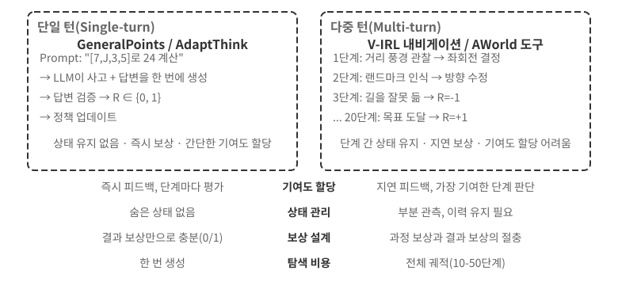

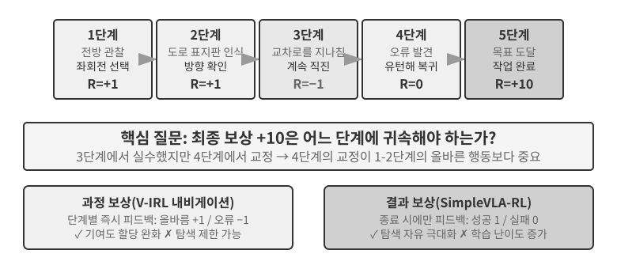

단일 턴에서 다중 턴으로 넘어가면 복잡성이 질적으로 도약합니다. 정책은 지금 최적의 행동을 고르는 데 그치지 않고 미래 상태의 가치까지 고려해야 하며, 즉각적 피드백을 다루는 데 그치지 않고 지연 보상 아래에서 **기여도 할당(credit assignment)**을 수행해 여러 단계 중 어느 단계가 최종 결과에 가장 크게 기여했는지 판단해야 합니다. 예컨대 고객 응대 에이전트가 10턴의 대화로 사용자의 문제를 해결하고 마침내 좋은 평가를 받았다면, 그 공은 2턴째의 정확한 질문에 있을까요, 7턴째의 끈기 있는 설명에 있을까요?

여기서 말하는 다중 턴 상호작용이 바로 1장과 4장에서 설명한 ReAct 루프입니다. 매 턴이 한 번의 **생각 → 행동 → 관찰** 반복이며, 보상의 지연은 "최종 결과의 좋고 나쁨은 여러 턴이 지난 뒤에야 판단할 수 있다"는 구조적 제약에서 옵니다.

> **실험 8-12 ★★★: V-IRL-VL — 다중 턴 시각 내비게이션**
>
> V-IRL[^ch8-24]은 실제 도시 거리 풍경 속에서 에이전트가 연속으로 길을 찾게 합니다. 학습에는 뉴욕 경로를 쓰고, 테스트는 다른 도시로 옮기면서 방향 표현과 시각적 외양을 동시에 바꿉니다. RL은 규칙 OOD와 시각 OOD 모두에서 SFT를 뚜렷이 앞서며, 다중 턴 과제에서 정책이 학습 궤적을 재현하는 대신 현재 관측에 따라 다시 계획하는 법을 배워야 함을 보여 줍니다. 실험은 가치 네트워크가 있는 PPO를 쓰며, 단계별 피드백이 장기 기여도 할당을 완화한다는 점이 관찰되었습니다.

> **실험 8-13 ★★★: SimpleVLA-RL — 결과 보상 아래의 개방적 탐색 `[확장 실험]`**
>
> SimpleVLA-RL은 LIBERO 로봇 과제에서 성공/실패 결과 보상만 사용합니다. 과제마다 시연 궤적 단 하나로 SFT 콜드 스타트를 하고, 이어 RL이 성공률을 17.3%에서 91.7%로 끌어올리며 시연에 없던 "밀어 자르기" 동작을 발견했습니다. V-IRL과 대조를 이룹니다. 과정 신호를 정의하기 쉬울 때는 그것이 학습을 가속하지만, 최적 경로를 모를 때는 희소한 결과 보상이 오히려 더 큰 탐색 여지를 남깁니다.

### 도구 호출: 환경을 에이전트 안으로 들여오기

다중 턴 과제가 외부 도구에 연결되면 행동은 더 이상 "이동하거나 답하기"가 아니라 검색, 코드 실행, 파일 수정, 데이터베이스 조회, 여러 API의 조합이 됩니다. 그래서 도구 호출은 기여도 할당, 환경 공학, 안전 제약을 한꺼번에 전면으로 밀어 올립니다.

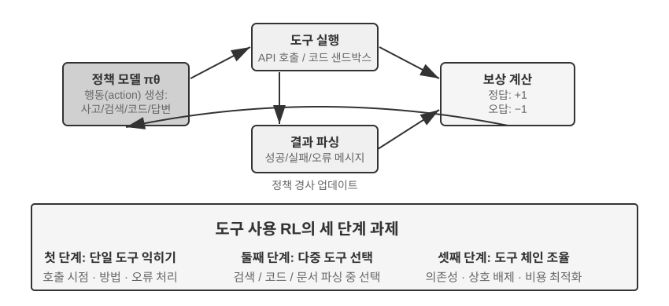

Search-R1[^ch8-25]은 검색 증강 노선을 대표합니다. 모델이 언제 무엇을 검색할지 스스로 정하고, 돌아온 결과로 추론을 이어 갑니다. ReTool은 코드 인터프리터를 사고 루프 안에 심어, 모델이 언제 코드를 실행할지, 피드백을 어떻게 읽을지, 오류 메시지로 어떻게 고칠지를 배워야 합니다. AWorld-train은 MCP 다중 도구 샌드박스를 제공하여 도구 선택, 의존성 관리, 상태 초기화, 재생 가능성 문제까지 더합니다.

도구 궤적에는 중요한 구현 세부가 하나 있습니다. 환경이 돌려주는 토큰은 정책이 생성한 것이 아니므로, 정책 경사를 계산할 때 이 피드백 토큰은 가려야 하고 경사는 모델 자신의 사고와 도구 호출 인자에만 전달해야 합니다. 그러지 않으면 모델은 도구 사용법을 배우는 대신 샌드박스 출력을 예측하도록 학습됩니다.

> **실험 8-14 ★★★: ReTool — 코드 인터프리터로 강화한 수학 문제 풀이**
>
> 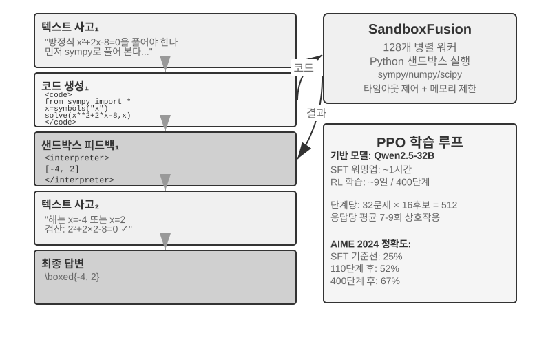
>
> ReTool은 SFT 예열 뒤 텍스트 사고, 코드 실행, 인터프리터 피드백을 교차시켜 PPO로 학습합니다. 도구 피드백이 사고 전략을 어떻게 바꾸는지 보여 주며, 모델은 점차 스스로 실행하고 오류를 읽고 자기 수정하는 법을 익힙니다. 학습 데이터는 DAPO-Math-17k에서 왔지만 최적화 알고리즘은 여전히 표준 PPO입니다[^ch8-26][^ch8-27].
>
> AIME 2024에서 학습은 약 25%에서 67.0%로 올랐습니다. 순수 텍스트 RL과 비교하면 코드 피드백은 모델이 정확한 계산과 오류 정정을 더 빨리 익히게 했습니다. 자세한 학습 동역학과 샌드박스 설정은 실험에 딸린 설명을 보십시오.

> **실험 8-15 ★★★: AWorld-train — 샌드박스에서 도구 사용 배우기**
>
> 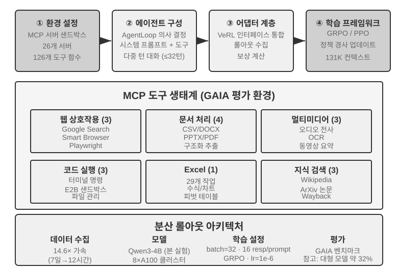
>
> AWorld-train은 MCP 서버 샌드박스를 사용해 웹, 문서, 멀티미디어, 코드, 지식 검색 등의 도구를 제공합니다. 이 개방형 실험의 초점은 GAIA 지표를 갈아치우는 것이 아니라, 초기화 가능하고 재생 가능한 다중 도구 학습 경로를 끝까지 돌려 보고 도구 호출 성공률과 조합 전략이 학습과 함께 개선되는지 관찰하는 데 있습니다.

이 상황들이 함께 말해 주는 것은 이렇습니다. 다중 턴 에이전트 학습의 어려움은 "더 복잡한 옵티마이저가 있느냐"가 아니라, 환경 피드백이 믿을 만한지, 행동 사슬이 검증 가능한지, 그리고 최종 보상을 중간 결정에 어떻게 귀속시킬지에 있습니다.

## 보상 설계: 과제 목표를 학습 신호로 바꾸기

앞의 단일 턴, 다중 턴, 도구 호출 시나리오는 *무엇을* 훈련할지 보여 주었다. 이 절은 *환경이 모델에게 잘했는지 여부를 어떻게 알려야 하는가*에 답한다. 보상 설계는 서로 보완하는 세 축으로 펼칠 수 있다. **보상이 어디에서 오는가**, **언제 주는가**, **얼마만큼의 정보를 표현해야 하는가**. 마지막으로 한 가지 질문이 더 남는다. 결과가 옳을 때, 경로도 규정에 맞았는가?

### 보상은 어디에서 오는가: 규칙, 인간 선호, 모델 판정

가장 믿을 만한 출처는 **검증 가능한 보상(RLVR)**이다. 테스트 케이스, 데이터베이스 단언, 상태 차이, 형식 검사로 결과를 직접 판정한다. 수학 답안, 코드 테스트, 구조화된 도구 호출은 모두 이진 결과 보상에서 출발하기에 적합하다. 규칙이 결정론적일수록 보상은 저렴하고 재현 가능하며, 모델이 빈틈을 파고들기도 어려워진다.

**RLHF**는 여기서 배경일 뿐이다. InstructGPT[^ch8-4]의 기본 흐름은 사람이 답변을 비교하고, 보상 모델을 학습시키고, PPO로 정책을 최적화하는 것이다. 보상 모델은 선호의 대리물일 뿐이어서 과도하게 최적화하면 reward hacking[^ch8-5]으로 이어지며, 그래서 보통 KL 정규화로 정책을 SFT 참조 모델 근처에 고정한다. DPO[^ch8-6]는 명시적 보상 모델을 건너뛰고 선호 쌍에서 곧바로 오프라인 최적화를 수행한다. 이 방법들은 이 장의 Agent RL 본류가 아니다.

목표를 온전히 규칙화하기 어려울 때는 모델 판정을 쓸 수 있다. **생성형 보상 모델(GRM)**은 점수만 내놓는 것이 아니라 "어디가 좋고 어디를 고쳐야 하는지"에 대한 진단까지 생성한다. 보상 원천으로 쓸 수도 있고, 진단을 이후의 증류 데이터나 선호 데이터로 바꿀 수도 있다. DeepSeek-GRM[^ch8-23]의 핵심 발상은 모델이 먼저 과제의 평가 원칙을 귀납하고, 그 원칙에 따라 궤적을 평가한 뒤, 마지막으로 검증 가능한 사실로 그 평가 자체가 옳은지 확인하게 하는 것이다. 이렇게 얻은 피드백은 더 투명하지만, 판정자가 새로운 편향을 형성하지 않도록 표본 추출을 통한 사람의 보정은 여전히 필요하다.

여기서 혼동하기 쉬운 두 개념을 구분해 두자. **reward hacking**은 규칙이나 구현의 허점을 파고들어 높은 점수를 얻는 것이다. **reward seeking**은 모델이 먼저 *채점자가 무엇을 볼 것인가*에 대한 상을 머릿속에 세운 뒤, 그 추측에 맞추어 행동을 조정하는 것이다. 후자는 테스트를 조작하거나 결과를 날조하지 않아도 되지만, 장기 과제에서는 모델이 스스로 매우 얕은 검사를 설정하고 그것만 통과하면 일찍 끝내 버려, 산출물이 대리 지표만 만족하고 진짜 의도는 만족하지 못하는 결과로 이어질 수 있다[^ch8-29]. 따라서 "grader를 통과했다"는 것이 자동으로 "과제가 끝났다"가 되지는 않는다. 채점자는 의도의 대리물이며, 훈련이 강해질수록 모델이 그 대리물 자체를 목표로 삼을 가능성이 커진다.

### 보상은 언제 주는가: 결과인가 과정인가

**결과 보상(ORM)**은 에피소드가 끝날 때에만 과제가 완료되었는지 판정한다. 가장 단순하고 정책에 최대의 탐색 자유를 준다. 중간 경로에 공인된 기준이 없고 최적해를 사람도 아직 찾지 못했다면, SimpleVLA-RL의 희소한 성공/실패 보상이 적절한 출발점이다. 희소한 피드백은 여러 단계 궤적에서 구체적으로 어디가 틀렸는지 모델이 판단하기 어렵게 만들며, 이는 RL의 표본 효율이 오랫동안 제한되어 온 이유 중 하나다[^ch8-8]. 장기 coding이나 cowork 과제에서는 "완료되었는가"의 판정을 모델이 작성할 수 없는 숨은 테스트, 상태 단언, 외부 종료 훅에 맡겨야 하며, 모델 자신의 완료 선언에만 의존해서는 안 된다.

"너무 이른 종료"는 구체적인 예다. 모델이 과제를 완료했다고 말하면, harness는 격리된 작업 공간에서 모델이 볼 수 없는 인수 테스트를 실행한다. 통과하면 양의 보상, 통과하지 못하면 음의 보상을 준다. 그 테스트는 실제 파일이나 환경 상태를 읽어야 하며, 모델이 "완료"라고 말했는지만 확인해서는 안 된다. 그렇지 않으면 모델은 검증을 말로만 약속하고 실제로는 하지 않는 법을 배운다. 평가할 때는 완료되지 않은 과제의 경계 집합과 실제로 완료된 보류 집합을 나누어 두어야 한다. 전자는 조기 종료 비율을, 후자는 모델이 여전히 정상적으로 마무리할 수 있는지를 보여 주며, 이로써 결코 끝내려 하지 않는 모델을 길러 내는 일을 막는다.

**과정 보상(PRM)**은 중간 단계에서 피드백을 준다. 인증, 도구 인자, 통과한 테스트 수, 내비게이션 동작 등을 검사한다. OpenAI의 *Let's Verify Step by Step*[^ch8-7]은 수학적 추론에서 단계별 검증의 가치를 보여 주었다. 과정 보상은 장기 기여도 할당을 완화하지만, 설계자가 미리 상정한 경로에 모델을 가둘 수 있고 레이블링과 검증 비용도 더 높다. V-IRL-VL(실험 8-12)은 단계별 내비게이션 피드백을 쓰고 SimpleVLA-RL(실험 8-13)은 종점 보상만 남긴다. 둘은 "조밀한 피드백으로 수렴 속도를, 희소한 피드백으로 탐색 공간을 산다"는 대조를 이룬다.

공학적으로는 먼저 결과 보상으로 믿을 만한 기준선을 세우고, 그다음에 정말로 검증 가능한 중간 사건에만 과정 신호를 더하는 것이 좋다. 다중 턴 LLM RL은 보통 할인 계수를 $\gamma=1$로 둔다. PPO의 가치망이나 턴 단위 어드밴티지가 종점 피드백을 더 이른 행동에 귀속시키고, GRPO는 궤적 단위 어드밴티지를 생성 토큰에 고르게 분배하므로, 긴 궤적에서는 신호 희석에 특히 주의해야 한다.

### 보상은 얼마만큼의 정보를 표현해야 하는가: 스칼라, 벡터, 생성형 진단

보상의 **밀도**와 **표현 형식**은 별개의 문제다. 스칼라는 "전체적으로 얼마나 좋은가"에만 답한다. 준스칼라는 짧은 이유를 먼저 대고 점수를 준다. 벡터는 정확성, 완전성, 비용, 안전성 같은 차원별로 따로 점수를 매긴다. 생성형 보상은 자연어 진단을 내놓고 여러 번 샘플링해 집계할 수 있다. 선택 원칙은 단순하다.

- 확정된 답이나 테스트가 있는 경우: 이진 스칼라를 우선한다;
- 서로 독립적인 품질 목표가 여럿인 경우: 벡터를 쓰거나 각 차원에 가중치를 주어 스칼라로 합친다;
- 개방적이고 규칙으로 다 열거하기 어려운 경우: 생성형 진단을 쓰되 사실 검증과 표본 기반 사람 검토를 함께 둔다.

"보상을 더 풍부하게" 만들겠다고 검증 불가능한 차원을 쌓지 마라. 평가 차원을 하나 더할 때마다 정책이 파고들 수 있는 빈틈도 하나 늘어난다. 그 신호가 소수의 rollout에서 의미 있는 그룹 내 차이를 만들어 내는지 먼저 확인하고, 그다음에 훈련에 넣을지 결정하라.

### 결과가 옳은 것만으로는 부족하다: 경로 제약과 RLVP

결과 보상은 "일이 되었는가"를 해결하지만 "규정대로 되었는가"는 표현하지 못한다. 실제 Agent는 테스트 파일을 고치거나 인증을 건너뛰거나 파괴적인 명령을 실행해 표면적인 성공을 얻을 수 있다. RLVP(Reinforcement Learning with Verified Penalty)[^ch8-9]의 원칙은 **결과에 보상하고 경로를 벌한다**이다. 기계적으로 판정 가능하고 최종 성패와 무관한 **결과 중립적 제약**을 겨냥하며, 의미적 의도, 산출물의 완전성, 조기 종료 행동에 대한 독립적인 점검을 대체하지 않는다.

실제 환경은 대개 **비대칭 검증자**다. "나쁜 동작을 했다"를 탐지하는 일은 값싸고 믿을 만하지만, "이 단계가 목표를 향해 의미 있는 진전을 이루었다"를 증명하는 일은 어렵다. 총보상을 $R=O+\beta\Phi$로 쓰자. $O$는 과제 결과이고, $\Phi$는 결정론적 규칙으로 동작마다 계산되는 경로 신호다. 검증 가능한 위반 동작에는 감점하고, 검증 가능한 준수 동작이나 도달 가능한 하위 목표에는 소량의 부분 보상을 준다. 경로 신호가 주 목표를 삼키지 않도록 두 경로를 정규화한 뒤 합친다. 이는 PPO나 GRPO를 바꾸지 않고, 매 단계에서 보이는 보상만 바꾼다.

구현 수준에서는 검증자의 출력을 두 갈래로 나눈 뒤 기존 정책 최적화기에 넘기면 된다.

```python
outcome = verify_final_state(trajectory)              # result, not self-report
path_signal = 0
for step in trajectory:
    path_signal += deterministic_path_signal(step)    # penalty or reachable progress
reward = normalize(outcome) + beta * normalize(path_signal)
```

어떤 동작이 허용되는지, 어떤 하위 목표가 도달 가능한지, 숨은 테스트가 무엇인지, 증거를 어떻게 기록하는지는 구체적인 환경에 달려 있다. 본문은 "결과 보상"과 "경로 제약"이 어떻게 합류하는지만 설명해, 어느 한 환경의 규칙을 범용 알고리즘으로 오해하지 않도록 한다.

RLVP의 핵심은 "보상이 조밀할수록 좋다"가 아니라 그룹 내 차이를 되찾을 수 있는가이다. 순수 결과 보상은 전부 실패한 그룹에서도 전부 성공한 그룹에서도 분산이 0이 되어 기울기가 생기지 않는다. 위반 동작은 대체로 탐지하기 쉬우므로 벌점은 거의 언제나 차이를 되찾아 준다. 진전 보상은 부분적 진전이 실제로 도달 가능할 때에만 효과가 있다. 설계할 때는 네 가지를 지키면 된다. 구체적인 동작만 벌하고 "충분히 노력하지 않음"을 벌하지 않는다. 결과 보상은 항상 유지해 모델이 아무것도 하지 않는 법을 배우지 않게 한다. 각 벌점에는 가능하면 도달 가능한 준수 경로를 짝지어 준다. 규칙은 결정론적이고 파고들기 어렵게 만든다. 기반 정책이 준수 동작을 아예 샘플링하지 않는다면, 소량의 시연으로 그 경로를 먼저 "심어" 두고 준수 행동이 안정된 뒤 경로 셰이핑을 점차 약화한다. 달리 말해 벌점은 대체로 도달 가능한 절반이고, 진전 보상은 도달 가능성으로 게이팅된 절반이다.

> **실험 8-16 ★★★: RLVP — 결과에 보상하고 경로를 벌한다**
>
> GRPO 위에 결과 보상 $O$와 경로 신호 $\Phi$를 더해 순수 결과 보상과 비교한다. TerminalBench에서 위반 횟수는 3.71에서 0.66으로 줄어드는 반면 성공률은 사실상 그대로다. miniF2F에서는 도달 가능한 부분 보상이 성공률 0.9에 이르는 데 필요한 반복을 7.0에서 4.4로 줄인다. 소프트웨어 수리에서 모든 rollout이 어떤 테스트도 통과하지 못하면 진전 신호는 도달 불가능하며, 더해도 이득이 없다. 교훈은 이렇다. 보상 차원을 늘릴지 결정하기 전에 신호의 도달 가능성부터 측정하라.

이 수치들은 통제된 대리 환경에서 나온 것이며, 실제 운영 Agent의 동등한 개선으로 곧바로 외삽할 수 없다. 더 안전한 결론은 기제에 관한 것이다. 경로 신호가 같은 rollout 그룹 안에서 행동을 구분할 수 있고 규칙을 정책이 파고들기 어렵다면, 종점 보상이 보지 못하는 정보를 정확히 그만큼 메워 준다. 실제 배포에서는 숨은 검증, 궤적 모니터링, 외부 종료 조건까지 harness에 함께 넣어야 한다.

## 증류: 샘플 효율 높이기

앞의 실험들은 에이전트 학습에서 RL의 핵심 가치를 체계적으로 보여 주었지만, 모두 높은 샘플 비용을 치렀습니다. 여기서 말하는 ‘샘플 효율’은 구체적으로 **값비싼 환경 상호작용 한 번이 얼마나 유효한 파라미터 갱신을 가져오는가**를 뜻하며, 단순한 학습 스텝 수나 GPU 시간이 아닙니다. ReTool의 RL 학습 시간은 SFT의 200배가 넘었으므로(9일 대 1시간) 환경 샘플링을 줄이는 일이 특히 중요합니다.

RL의 샘플 효율이 낮은 것은 분산이 크고 on-policy 데이터를 재활용하기 어렵기 때문이기도 하지만, 더 근본적인 이유는 피드백이 너무 희소하다는 데 있습니다. 주류 model-free RL은 보통 하나의 rollout이 끝날 때 성패 스칼라 하나만 얻고, 중간의 오류 원인이나 빠진 필드, 절차에 관한 힌트에는 직접적인 학습 신호가 없습니다. 상담원이 “카드 뒷자리 네 개가 필요합니다”라고 말해도, 모델은 최종 0/1 결과만으로 시행착오를 거듭해야 하고 그 단계를 우연히 익히기까지 수백 번의 상호작용이 걸릴 수 있습니다. 사람은 한 번 들으면 기억하는데 말입니다.

**증류는 한 번의 rollout을 조밀한 감독 신호로 바꿉니다.** 환경 궤적을 더 탐색하지 않고도 같은 궤적 하나가 많은 경사를 만들어 내는데, 이것이 증류가 샘플 효율을 높이는 핵심입니다.

### On-Policy Distillation: 한 번의 rollout에서 조밀한 감독 만들기

On-Policy Distillation(온폴리시 증류)은 2025년 Thinking Machines Lab이 체계화했습니다[^ch8-10]. 여기서 policy는 **학생이 학습할 상태 prefix를 누가 생성하는가**를 뜻하며 감독을 누가 주는가를 뜻하지 않습니다.

| 방법 | 궤적/상태 샘플 주체 | 주요 감독 |
| --- | --- | --- |
| SFT/off-policy 증류 | 사람 또는 교사 | 라벨 답변의 조밀한 token 감독 |
| On-policy RL | 현재 학생 | 보통 희소한 결과/과정 보상 |
| On-Policy Distillation | 현재 학생 | 학생 prefix에서 교사가 주는 조밀한 token 분포 |

SFT는 조밀하지만 교사가 방문하는 상태에 치우쳐 학생의 초기 실수 뒤 prefix를 덮지 못합니다. RL은 학생 상태 분포와 맞지만 끝의 성공·실패만 받는 경우가 많습니다. On-Policy Distillation은 **학생이 어디로 갈지 정하고 교사가 실제 도달한 상태에서 다음 token 전체 분포를 제공**해 둘을 결합합니다. 학생이 의미 있는 상태에 들어가지 못할 정도로 기반 역량이 부족하다면 먼저 Mid-training이나 off-policy 시연이 필요합니다.

수치 일관성도 중요합니다. rollout engine이 $\mu$에서 샘플하고 trainer가 다른 $\pi_\theta$를 계산하면 PPO ratio를 명시적으로 쓰지 않아도 상태가 이미 off-policy입니다. 업데이트 전에 sampler/trainer log-probability 일치를 검증해야 합니다.

On-Policy Distillation은 먼저 학생이 자기 정책으로 궤적을 만들게 한 뒤, 더 강한 교사가 **학생이 실제로 지나간 각 상태**에서 다음 토큰의 확률 분포를 제시하게 합니다. 그래서 길이 $T$의 rollout은 더 이상 0/1 신호 하나만 내는 것이 아니라 약 $T$개의 토큰 단위 감독을 만들어 냅니다. 교사의 추론이 소모하는 것은 계산이지 추가 환경 상호작용이 아닙니다. 이로써 SFT의 분포 불일치를 피하면서 RL의 분산과 시도 횟수를 크게 줄입니다. 값비싼 샘플링 한 번으로 “이 단계에서 무엇을 달리해야 하는지”를 바로 배울 수 있고, 과제가 끝날 때까지 기다렸다가 성패에서 거꾸로 추론할 필요가 없습니다.

구체적으로는 학생의 예측 분포를 교사의 분포에 가깝게 만들며, 보통 둘 사이의 **KL 발산**을 최소화합니다. 예컨대 학생이 “먼저 API를 조회하고 반환값을 파싱한 뒤…”를 생성할 때, 교사는 그 위치에서 ‘조회’ 80%, ‘호출’ 15%, 나머지 5%의 분포를 줄 수 있습니다. 최종 성패라는 이진 보상에 비해 토큰 단위 정렬은 훨씬 조밀하고 분산이 작은 학습 신호를 제공합니다. 대가는 교사의 추론 비용이며, 환경 상호작용이 비쌀수록 특히 수지가 맞습니다.

온폴리시 증류의 기본 의사코드는 다음과 같습니다.

```python
student_trajectory = rollout(student, task)
loss = 0
for state in student_trajectory:
    teacher_logits = teacher(state)
    loss += KL(student_logits(state), teacher_logits)
update_student(loss)
```

수학 같은 과제에서 같은 성능에 도달하는 데 필요한 학습 스텝 수는 순수 RL의 약 **10분의 1**입니다. 다중 턴 에이전트에서는 성패 신호가 더 늦고 더 희소하므로, 교사의 토큰 단위 분포가 중간 결정을 직접 이끌 수 있습니다. 다만 시뮬레이션 환경이 충분히 현실적이어서 학생이 탐색하는 상태가 배포 분포에 가깝다는 전제가 필요합니다. 그렇지 않으면 낯설고 편향된 상태에 대한 교사의 채점 역시 믿을 수 없습니다.

‘조밀한 신호가 희소한 신호를 이긴다’는 원리는 순수 에이전트 상황에서도 검증된 바 있습니다. 저자와 공동 연구자들은 ‘시간 감각’ 과제에서 DPO, 네 가지 RL, On-Policy Distillation을 비교한 적이 있습니다. 앞의 것들은 각각 희소한 보상, 목표 불일치, rollout 형태 불일치, 정책 붕괴에 제약받았습니다. 동결한 Qwen3-32B 교사로 바꾸어 학생 자신의 다중 턴 궤적 위에서 토큰 단위로 정렬하자 학습이 매끄럽게 수렴했고, 네 조건의 통과율이 같은 출처의 SFT 기준선보다 23~47%p 높았습니다[^ch8-11]. 이는 병목이 보상 함수가 충분히 정교하지 않다는 데 있기보다, 상호작용 한 번이 주는 신호가 충분히 조밀하지 않다는 데 있음을 시사합니다.

### 더 강한 교사가 없다면: 온폴리시 자기 증류

On-Policy Distillation의 위력은 교사에게서 오지만, 그 때문에 까다로운 전제를 짊어집니다. **학생보다 뚜렷하게 강한 교사 모델이 있어야 한다**는 것입니다. 많은 상황에서 이는 성립하지 않습니다. 수직 도메인 모델을 학습시키려는데 기존 모델의 역량이 모두 부족하다면 쓸 교사 모델이 없습니다. 더 강한 교사가 없으면 조밀한 신호의 이득은 우리와 무관한 것일까요?

기발한 돌파구가 **On-Policy Self-Distillation(OPSD, 온폴리시 자기 증류)**[^ch8-15]입니다. **같은 모델이 교사와 학생 두 역할을 맡되 보는 맥락이 다릅니다.** 교사 버전은 ‘특권 정보’ — 모범 답안이나 이미 검증된 정답 — 를 볼 수 있고, 학생 버전은 문제만 보지만 자신이 샘플링한 궤적 위에서 교사 버전의 토큰 단위 분포에 정렬합니다. 답을 보면서 학생이 방금 걸어간 경로를 설명하는 일은 대개 독립적으로 탐색하는 것보다 쉬우므로, 한 번의 rollout으로도 여전히 조밀한 감독을 만들어 냅니다.

OPSD는 앞 문단 의사코드의 제한된 변형으로 볼 수 있습니다.

```python
student_trajectory = rollout(model, task_without_answer)
loss = 0
for state in student_trajectory:
    privileged_state = add_verified_answer(state)
    teacher_logits = stop_gradient(model(privileged_state))
    loss += KL(model(state), teacher_logits)
update(model, loss + retention_regularizer)
```

`privileged_state`는 학습 쪽에서만 구성할 수 있으며 배포되는 에이전트에 새어 나가서는 안 됩니다. `retention_regularizer`는 유지 세트나 스타일 제약을 뜻하며 어떤 고정된 하이퍼파라미터가 아닙니다. 학습 절차에서는 데이터 권한, 답안 마스킹, 망각 위험도 점검해야 합니다.

RLVR과 비교하면 OPSD는 보상이 반드시 자동으로 검증 가능할 것을 요구하지 않습니다. 특권 정보는 모범 답안일 수도, 사람의 시연일 수도, 도메인 문서일 수도 있습니다. 이런 정보로 더 강한 외부 교사를 대신하면서 ‘온폴리시 샘플링 + 토큰 단위 감독’이라는 샘플 효율의 이점을 유지합니다. 다만 없던 지식을 만들어 내지는 못합니다. 답을 손에 쥐고도 모델이 과정을 설명하지 못한다면 자기 증류에는 추가 신호가 없습니다. 소박한 OPSD는 또 모델이 원래의 사고 스타일을 잃게 할 수 있어 안정화를 위한 추가 정규화가 필요합니다[^ch8-16].

## Bad Case에서 Post-Training으로

이 절은 7장이 남긴 물음으로 돌아갑니다. 운영에서 나온 bad case로 만든 평가 데이터 세트를 어떻게 실제로 사후 학습의 입력으로 바꾸는가 하는 물음입니다. 7장 끝에서는 평가 환경과 검증기를 사후 학습의 주춧돌에 비유했습니다. 실패 귀인 기록, 종단 간 회귀 과제, 궤적 접두부 회귀 과제, 루브릭 채점은 각각 다른 학습 용도에 대응합니다.

표 8-5 7장의 평가 데이터 세트에서 8장의 학습 용도로의 대응

| 7장의 평가 데이터 세트 | 8장의 학습 용도 |
| --- | --- |
| 종단 간 회귀 과제(검증기 포함) | RL rollout 과제와 검증 가능 보상(RLVR), 거부 샘플링(RFT)의 샘플링 풀 |
| 궤적 접두부 회귀 과제 | DPO 선호 쌍, 결정 경계의 SFT 시연, On-Policy Distillation의 교사 상태 |
| 실패 귀인 기록(첫 오류 단계와 오류 분류) | 과정 감독의 음성 라벨(PRM), RLVP 경로 페널티의 규칙 출처 |
| 루브릭 다차원 채점과 사람의 골드 세트 | 벡터 보상의 각 차원, 생성형 보상 모델(GRM)의 학습·보정 데이터 |

### 사례 1: Coding Agent의 너무 이른 완료 선언

**bad case에서 귀인으로.** Coding Agent에서 가장 흔하고 가장 뿌리 뽑기 어려운 실패 중 하나가 **너무 이른 완료 선언**입니다. 테스트도 돌리지 않고 “완료했습니다”라고 선언하고, 사용자가 기능 세 개의 수정을 요청했는데 두 개만 고치고 마무리하며, 두 번 실패하자 “이 과제는 불가능합니다”라고 선언하는 식입니다. 7장의 오류 분류로는 ‘과제 완수도와 논리 판단 문제’에 속하며, 운영 쪽 세 가지 신호가 모두 이를 포착합니다. 사용자 교정(“테스트를 아예 돌리지 않았잖아요”), 부정 평가, 사후 감사(완료를 선언한 궤적에 테스트 도구 호출이 하나도 없음)입니다. 귀인 기록은 첫 오류를 ‘완료를 선언하려는’ 결정 경계에 놓습니다. 그 전까지 코드를 읽고 고친 일은 잘못이 없었을 수 있고, 잘못된 것은 ‘증거 없이 결론을 내리는’ 그 단계입니다. 앞의 보상 설계 절에서 다룬 reward seeking — 아주 얕은 검사를 스스로 세워 두고 딱 통과하자마자 일찍 끝내는 것 — 이 바로 이런 행동을 가리킵니다.

**학습 데이터 구성.** 종단 간 회귀 과제: “완료를 선언하기 전에 인수 테스트를 통과해야 한다”를 검증 가능 보상으로 씁니다. 테스트는 모델에게 보이지 않고 모델이 완료를 선언할 때 비로소 실행되며, 통과하면 +1, 실패하면 −1입니다. 이는 ‘판정을 모델이 쓸 수 없는 숨은 테스트에 맡긴다’(앞의 보상 설계 참조)의 직접적인 적용이자 이 사례에서 선택적인 RL 분기입니다.

궤적 접두부 회귀 과제: ‘완료를 선언하려는’ 결정 경계를 잘라 **선호 쌍**을 구성합니다. 거부되는 샘플은 너무 이른 완료라는 잘못된 행동이고, 선택되는 샘플은 ‘먼저 테스트를 실행하고 인수 조건을 하나씩 대조한 뒤 결론을 내리는’ 기대 행동입니다. 선택되는 샘플은 교사 모델이 생성한 뒤 규칙 검증기로 걸러(거부 샘플링) DPO 학습 쌍 한 묶음을 얻습니다. bad case 수가 너무 적다면 데이터 증강(과제 유형 바꾸기, 빠진 검증 항목 바꾸기, 완료 표현 바꾸기)으로 수백 개의 선호 쌍을 만들 수 있습니다. 일반 과제 데이터에 작은 비율로 섞어 LoRA 미세 조정을 하여 ‘마무리할 때는 반드시 검증한다’가 새로운 과적합이 되지 않게 하고 파국적 망각의 위험도 낮춥니다.

**평가: 경계 세트와 유지 세트는 어느 하나도 빠질 수 없습니다(1장에서 이름 붙인 패턴).** 학습 후 검증에는 7장의 평가 데이터 세트를 씁니다. 궤적 접두부 경계 세트는 ‘과제가 완수되지 않았을 때 모델이 완료를 선언하지 않고 검증을 계속하는지’를 확인합니다. 똑같이 중요한 것이 **유지 세트**입니다. 과제가 실제로 완수되었을 때 모델은 정상적으로 완료를 선언해야 합니다. 앞의 지표만 들여다보면 모델은 결코 마무리하지 못하는 **과잉 교정** 상태로 학습됩니다. 모든 과제를 끝없이 검증하느라 지연과 비용이 무너집니다. 이는 7장이 거듭 강조한 ‘변경이 기존 동작을 깨뜨려서는 안 된다’와 같은 원칙의 파라미터 수준 판본입니다. 평가에서는 일반 역량도 표본 점검해 LoRA 패치가 다른 능력을 망가뜨리지 않았는지 확인해야 합니다.

> **실험 8-17 ★★: ‘너무 이른 완료’ bad case에서 DPO 수정까지**
>
> **실험 목표**: 운영 bad case에서 파라미터 갱신까지의 전 과정을 끝까지 돌려 보기 — 실패 귀인 → 궤적 접두부 회귀 과제 → DPO 선호 쌍 → 7B 모델 LoRA 학습 → 경계 세트와 유지 세트 이중 검증.
>
> **데이터 구성**: 함께 제공되는 저장소는 사실적인 너무 이른 완료 bad case 24건을 제공하며, 네 가지 실패 유형(테스트를 돌리지 않고 완료 선언, 다중 목표 중 일부만 완수, 인수 조건 미충족, 오류를 만나 포기하며 불가능하다고 선언 — 실패하는 테스트를 삭제하는 것 같은 더 악질적인 reward hacking 변형 포함)을 덮습니다. 학습 데이터와 엄격히 분리한 held-out 평가 세트(경계 12건 + 유지 8건)도 함께 있습니다.
>
> 이는 교육적 목적의 실험입니다. 운영에서는 선호 쌍이 더 많은 과제 계열을 덮어야 하고, 유지 세트가 더 많은 ‘정상 마무리’ 상황을 덮어야 하며, 보상 해킹의 새로운 형태도 경계해야 합니다. 모델이 ‘검증했다고 말만 하고’ 실제로는 검증하지 않는 법을 배울 수 있습니다. 종단 간 데이터 세트의 보상이 모델 자신의 진술이 아니라 모델이 쓸 수 없는 숨은 테스트에 의존해야 하는 이유가 바로 이것입니다.

### 사례 2: 중국어 따옴표

사용자 피드백은 “중국어 글의 곧은 따옴표는 둥근 따옴표로 통일해야 한다”였습니다. 이 문장은 기대를 서술하지만 곧바로 학습에 쓸 수 있는 규칙을 주지는 않습니다. 같은 따옴표라도 중국어 자연어, 인용된 영어 원문, Markdown 인라인 코드, 코드 블록, 코드 주석, JSON이나 경로에서 맡는 역할이 완전히 다르기 때문입니다. 올바른 수정은 **범위에 민감한 최소 편집**입니다. 중국어 자연어 속 인용은 `“”`로 바꿀 수 있고 중첩 인용은 중국어 문장 부호 규칙을 따릅니다. 인용된 영어 원문, 실행 가능한 코드, JSON/스키마, 경로, 식별자, Markdown 백틱 안의 내용은 원문 그대로 두어야 합니다. 범위를 판단할 수 없을 때는 원문을 남겨야 합니다.

**학습 데이터 구성.** 따옴표 사용 규칙을 Skill로 씁니다. 정례는 중국어 문단, 중첩 인용, 코드 주석 속 중국어 자연어를 덮고, 반례는 인용된 영어 원문, 문자열·문자 리터럴, JSON, 경로, 인라인 코드, 코드 블록 전체를 덮습니다. 이렇게 모델에게 가르치는 것은 ‘먼저 범위를 판단하고 최소한으로 편집하라’이지 ‘곧은 따옴표를 보면 바꿔라’가 아닙니다.

> **실험 8-18 ★★: 범위에 민감한 중국어 둥근 따옴표 SFT**
>
> **실험 목표**: 중국어·영어·Markdown·코드·JSON이 섞인 문서에서 LoRA SFT가 모델로 하여금 ‘바꿔야 할 따옴표는 둥글게, 보호해야 할 따옴표는 그대로’를 정확히 수행하게 하고, 보지 못한 맥락 조합에서도 그 경계를 유지하게 하는지 검증하기.
>
> **실험 설정**: `Qwen/Qwen3-8B`를 기반으로 bf16 LoRA로 2 에폭(256회 갱신) 학습합니다. `SKILL.md`의 범위 규칙은 라벨 생성 사양이자 품질 게이트이자 회귀 사양 역할을 겸합니다. 모델은 범위 선택과 최소 편집 생성만 맡고, 운영 쪽 파서와 문법 검사는 제거하지 않습니다.
>
> **데이터 구성**: 16종 조각, 10종 글 장르, 9종 프로그래밍 언어로 학습 샘플 1024건, held-out 256건, 경계 샘플 256건을 렌더링합니다. 샘플은 원문과 목표 텍스트를 쌍으로 저장하며, 중국어 자연어와 중국어 코드 주석은 변환해야 할 정례를, 인용된 영어 원문·문자열 리터럴·JSON·경로·인라인 코드·코드 블록·중첩 구조는 보호해야 할 반례를 제공합니다.

### 사례 3: 파일 편집이 자주 실패함

5장에서 설명했듯 Coding Agent는 `edit_file(path, old_string, new_string)` 같은 도구를 자주 씁니다. 모델은 바꾸려는 `old_string`을 도구 인자로 옮겨 적습니다. 편집 도구는 보통 정확한 문자열 일치로 대조하므로, 공백 하나, 줄바꿈 하나, 역슬래시 하나, 유니코드 결합 문자 하나, 저빈도 토큰 하나만 달라도 실패를 돌려줍니다.

**bad case에서 귀인으로.** 실패한 궤적을 다음 사슬을 따라 층층이 대조합니다. 파일 원본 바이트 → 도구 반환 → Harness 직렬화 → 모델 맥락 → 모델 토큰 출력 → 디코딩된 문자열 → JSON/tool-call 파싱 → 도구 대조.

파일 읽기나 도구 반환에서 이미 바이트가 바뀌었다면 도구에 귀인합니다. 직렬화, 이스케이프, 프롬프트 조립이 내용을 바꿨다면 Harness에 귀인합니다. tokenizer로 encode한 뒤 decode할 때 바뀐다면 tokenizer에 귀인합니다. 모델이 받은 맥락이 원본 문자열과 완전히 같고 **모델 출력이 사슬에서 차이가 처음 나타나는 지점**일 때만, 모델의 정확 복사 능력 문제로 표시해 사후 학습 후보로 삼을 수 있습니다.

**학습 데이터 구성.** 복사 과제를 검증 가능한 세 과제로 추상화합니다. 그대로 한 글자씩 되풀이하기, 비슷하고 길이가 같은 여러 문자열 가운데 완전히 동일한 것 고르기, 지정된 문자열을 도구 호출의 `old_string` JSON 인자에 통째로 옮겨 적기입니다. 샘플에는 실제 편집에서 가장 잘 깨지는 공백, 진짜 줄바꿈, 역슬래시, 유니코드 등을 일부러 포함합니다.

> **실험 8-19 ★★: 특수 문자열의 정확한 복사 SFT**
>
> **실험 목표**: 차이가 모델의 옮겨 적기 오류에서 왔음이 확인된 전제에서, LoRA SFT가 무작위 문자열에 대한 모델의 정확한 옮겨 적기를 개선하는지 시험하고, 독립적인 tokenizer 감사로 토큰화가 만들어 낸 착시를 배제하기.
>
> **실험 설정**: `Qwen/Qwen3-8B`를 기반으로 bf16 LoRA로 2 에폭 학습합니다. 학습 스크립트는 목표 문자열이나 `old_string` JSON 필드에만 토큰 단위 감독을 제공합니다.
>
> **결과**: 모델 held-out 세트의 byte-exact accuracy가 기반 모델의 37.5%에서 78.9%로 올랐고, 독립 경계 세트에서는 80.1%였습니다. 첫 바이트 불일치 위치의 평균은 각각 54.0과 54.2였습니다. 별도로 held-out과 경계에서 총 512건의 프로브로 오픈소스 tokenizer 세 개를 비교했는데, Qwen3와 Qwen2.5의 무손실 round-trip은 모두 80.1%였습니다. 따라서 80.1%는 모델의 복사 능력과 tokenizer 상한을 동시에 반영합니다.

## 사후 학습 실전 요점

세 가지 함정을 추가로 주의하십시오. **명목 window를 유효 window로 착각하지 말 것**, **`pass@k`가 거의 0인 채 RL을 시작하지 말 것**, **sampler/trainer 수치 차이를 무해한 noise로 보지 말 것**입니다. 각각 역량 × 길이 gate와 replay, Mid-training/SFT를 통한 support 보강, 업데이트 전 log-probability·KL·clipping 모니터링으로 대응합니다.

이 장은 사전 학습의 ‘다음 토큰 예측’에서 출발해 먼 길을 왔습니다. SFT는 형식과 프로토콜을 효율적으로 배우고, 결과 지향 RL은 이 장의 통제 실험에서 분포 밖 일반화를 개선했습니다. 다중 턴 과제는 기여도 할당이라는 난제를 들여왔고, 보상 설계는 결과 보상에서 ‘결과에 보상하고 과정을 제약하는’ 경로 신호로 넓어졌으며, 도구 사용은 조합 폭발을 가져왔습니다. 이 모두를 관통하는 실마리는 하나입니다. 모델이 무엇을 배우는지는 학습 신호가 무엇을 가르쳤는지에 달려 있고, 그 신호의 품질은 주로 데이터와 환경이 결정하지 알고리즘이 결정하지 않는다는 것입니다.

다음의 **흔한 함정**은 경계할 만합니다. 이것들을 알아보는 편이 기술적 세부를 통달하는 것보다 자원 낭비를 막아 주는 경우가 많습니다.

1. **사실 암기를 사후 학습에 지나치게 의존하기** — 사실 지식은 RAG로 관리해야 합니다(동적으로 갱신할 수 있고, 출처를 추적할 수 있으며, 학습 때문에 잊히지 않습니다). 사후 학습은 ‘지식을 어떻게 쓸 것인가’에 집중합니다.
2. **형식이 안정되기 전에 RL을 도입하기** — 보상 계산에 필요한 JSON을 모델이 안정적으로 생성하지 못하면 학습 신호가 희소해지거나 왜곡됩니다. 허용 가능한 파싱 실패율은 과제와 보상 설계에 달려 있으며, 고정된 임계값을 보편 기준으로 삼아서는 안 됩니다. 먼저 소규모 평가로 형식 안정성의 기준선을 정하고, 필요하다면 SFT나 제약 디코딩으로 출력을 안정화한 뒤 RL을 적용하십시오.
3. **보상 함수 설계가 부적절**해 보상 해킹을 부르기 — 모델은 과제를 진짜로 완수하는 대신 보상의 허점을 파고들어 높은 점수를 얻는 법을 배웁니다(응답 길이만 본다면 길고 무의미한 텍스트를 생성하는 식으로). 중간 지표가 아니라 최종 목표를 평가해야 합니다.
4. **시뮬레이션 충실도를 경시하기** — 시뮬레이션이 지나치게 단순하거나(상담원이 늘 같은 패턴으로 답하거나) 환경 응답이 현실적이지 않으면(오류 메시지가 운영 환경과 어긋나면) 학습된 정책은 실제 상황에서 완전히 무력해집니다. 높은 충실도의 시뮬레이션 환경 구축 비용은 학습 자체보다 클 수 있습니다.
5. **과도한 학습으로 일반화가 떨어지기** — 학습 손실은 계속 내려가는데 검증 성능이 오히려 나빠진다면 모델이 학습 세부를 통째로 외우고 있는 것입니다. SFT가 특히 이런 문제를 겪기 쉬워 조기 종료는 여전히 매우 중요합니다. RL도 과도하게 최적화하면 정책이 현재 과제 분포에 과적합합니다.
6. **가치 함수 붕괴와 탐색 부족** — PPO에서 가치 추정이 부정확하면 이점 계산이 치우쳐 학습 곡선이 심하게 진동하는 형태로 드러납니다. 온도가 너무 낮거나 무작위성이 부족하면 에이전트가 국소 최적에 갇힙니다.
7. **RL의 계산 비용을 과소평가하기** — SFT에서 잘 되던 과제를 RL로 옮기면 학습 시간이 10~100배 필요할 수 있습니다. 테스트 분포가 학습과 매우 비슷하다면 SFT로 충분할 수 있습니다.
8. **학습 데이터 품질이 낮기** — SFT는 데이터의 잡음과 편향을 그대로 배워 오류를 파라미터에 고정합니다. RL은 탐색을 통해 더 나은 전략을 찾을 수 있지만, 보상 모델에 체계적 편향이 있으면 잘못된 방향으로 최적화합니다.

핵심 원칙은 이렇습니다. **대규모 자원을 투입하기 전에 소규모 실험으로 핵심 가설을 검증하십시오.** 적은 데이터로 SFT가 형식을 안정시킬 수 있는지 시험하고, 단순화한 환경으로 RL이 수렴하는지 확인하며, 작은 표본으로 보상 함수가 진짜 목표를 반영하는지 점검하십시오. 빨리 실패하는 편이 크게 실패하는 것보다 낫습니다.

**RAG/ICL(맥락 내 학습)과의 협력**: 세 가지는 배타적인 선택지가 아니라 서로 다른 자리에 작용합니다. ICL은 예시·규칙·현재 상태로 파라미터를 건드리지 않고 즉시 적응하지만, 맥락이 길어질수록 지연과 비용도 올라갑니다. RAG는 사실과 근거를 동적으로 갱신할 수 있고 추적 가능한 외부 지식에 둡니다. 사후 학습은 고차원 지각, 생성 스타일, 암묵적 결정 전략을 파라미터에 씁니다. 선택 기준은 과제가 장기적으로 안정적인지만이 아니라, 더 중요하게는 그 역량을 외부 기호로 충분히 표현할 수 있는지입니다. 의료 영상 인식이나 자연스러운 말투 같은 역량은 계속 변하는 도메인이라 해도 파라미터 갱신이 필요한 경우가 많습니다. 반대로 오래도록 안정적인 이체 승인 규칙은 모델의 기억에 맡기지 말고 코드로 결정적으로 보장해야 합니다.

견고한 시스템은 대개 이 방법들을 조합합니다. 사실과 근거는 RAG로 관리하고, 말로 설명할 수 있는 전략은 ICL로 빠르게 실험하며, 결정적인 절차와 강한 제약은 프로그램으로 고정하고, 말로 표현하기 어렵고 폭넓은 일반화가 필요한 역량은 사후 학습으로 파라미터에 씁니다. 사후 학습은 모델 증류도 가능하게 합니다. 역량이 높은 큰 모델의 능력을 더 저렴한 작은 모델로 옮기는 것입니다.

## 장 요약

Mid-training, SFT, RL은 각각 **기반, 프로토콜, 정책**을 다룹니다. Mid-training은 길이 커리큘럼과 replay로 유효 문맥을 만들고, SFT는 형식을 안정시키며, RL은 채점 가능하고 보상 차이가 있는 궤적에서만 효율적입니다. `pass@k`가 0이면 시도를 늘리기 전에 역량부터 보강해야 합니다.

SFT와 RL은 경쟁 관계라기보다 흔히 순서대로 조합해 쓰는 방법입니다. 구조화 출력이 불안정한 설정에서는 먼저 SFT로 형식을 안정시켜 RL 보상 신호를 안정적으로 계산할 수 있게 한 뒤, RL로 전략을 탐색하고 분포 밖 성능을 개선할 수 있습니다. ‘SFT는 암기하고 RL은 일반화한다’는 이 장의 통제 실험에서 관찰된 경향을 요약한 것이지, 데이터·모델·보상·환경의 영향을 받지 않는 보편 법칙이 아닙니다.

이 장 전체를 관통하며 어떤 알고리즘보다도 기억할 만한 판단이 두 가지 더 있습니다. 첫째, **데이터와 환경이 알고리즘보다 중요합니다.** 기성 RL 알고리즘은 쓸 줄 알면 충분하고, 진짜 차이를 만드는 것은 시뮬레이션 환경의 충실도와 학습 데이터의 품질입니다. 실제 환경을 만들 수 없을 때 모델로 환경을 시뮬레이션하는 것(도구 반환값 합성, 환경 동역학 시뮬레이션)도 실행 가능한 길이지만, 시뮬레이터의 편향이 곧 학습의 천장이라는 점을 잊지 마십시오. 걸러 낼 수 있는 것은 답만이 아닙니다. 학습 데이터의 과제 분포 자체도 최적화 대상이 될 수 있습니다. 많은 상황에서 SFT의 데이터 품질만 충분하다면 RL이 아예 필요 없을 수도 있습니다.

둘째, **현재 RL의 주된 병목은 샘플 효율입니다.** On-Policy Distillation은 rollout 하나의 종점 스칼라를 토큰 단위 감독으로 확장하고, RLVP는 버려지던 환경 피드백을 학습 가능한 신호로 바꿉니다. 지금으로서는 이 둘이 가장 유망해 보이는 방향입니다. 둘의 공통점은 환경과 데이터에 이미 존재하지만 순수 결과 보상 때문에 낭비되던 정보를 모델이 배울 수 있는 형태로 되돌린다는 점입니다.

이 장은 모델 파라미터를 갱신해 에이전트의 지속적인 진화를 어떻게 이룰 것인가라는 물음에 답했습니다. 다음 장에서는 파라미터가 지식·지시·프로그램·파라미터라는 네 가지 에이전트 자기 진화 매개체 중 하나일 뿐임을 보게 됩니다.

[^ch8-1]: Schulman, John and Thinking Machines Lab, “LoRA Without Regret”, 2025.
[^ch8-2]: 야오 순위(Shunyu Yao), 「The Second Half」, 2025년 4월 10일. https://ysymyth.github.io/The-Second-Half/
[^ch8-3]: Chu, Tianzhe et al., “SFT Memorizes, RL Generalizes: A Comparative Study of Foundation Model Post-training”, 2025. arXiv:2501.17161. https://arxiv.org/abs/2501.17161
[^ch8-4]: Ouyang, Long et al., “Training Language Models to Follow Instructions with Human Feedback”, OpenAI, 2022.
[^ch8-5]: Gao, Leo, John Schulman, and Jacob Hilton, “Scaling Laws for Reward Model Overoptimization”, OpenAI, 2023.
[^ch8-6]: Rafailov, Rafael et al., “Direct Preference Optimization: Your Language Model is Secretly a Reward Model”, 2023.
[^ch8-7]: Lightman, Hunter et al., “Let's Verify Step by Step”, OpenAI, 2023.
[^ch8-8]: Silver, David and Richard S. Sutton, “Welcome to the Era of Experience”, 2025.
[^ch8-9]: 이 절의 경로 페널티 설계, 네 가지 원칙, 실험 데이터는 Li, Bojie and Noah Shi, “RLVP: Penalize the Path, Reward the Outcome”, 2026에서 가져왔습니다. arXiv:2607.07435.
[^ch8-10]: 온폴리시 증류의 방법과 실험은 Thinking Machines Lab, “On-Policy Distillation”, 2025를 참고하세요.
[^ch8-11]: 에이전트의 시간 감각을 다룬 이 사후 학습 비교, 즉 DPO와 네 가지 RL 방법의 실패 모드 및 온폴리시 증류가 이룬 돌파구는 Li, Bojie and Noah Shi, “Agents That Sense Physical Time: Urgency, Persistence, and Vigilance as Missing Controls for LLM Agents”, 2026에 정리되어 있습니다. https://01.me/research/physical-time-agent
[^ch8-12]: Kulikov, Ilia, et al. *Autodata: An Agentic Data Scientist to Create High Quality Synthetic Data.* arXiv:2606.25996, 2026.
[^ch8-13]: Sun, Hao, et al. "ZeroSearch: Incentivize the Search Capability of LLMs without Searching", 2025. arXiv:2505.04588.
[^ch8-14]: "DreamGym: Scaling Agent Learning via Experience Synthesis", 2025. arXiv:2511.01824.
[^ch8-15]: Zhao, Siyan, et al. "Self-Distilled Reasoner: On-Policy Self-Distillation for Large Language Models", 2026. arXiv:2601.18734.
[^ch8-16]: Shen, Ziqi, et al. "Purified OPSD: On-Policy Self-Distillation Without Losing How to Think", 2026. arXiv:2607.02234.
[^ch8-17]: Tan, Zelin, et al. "SKT: Skill-Use Training at Scale via Verified Synthetic Data Generation", 2026. arXiv:2608.02287.
[^ch8-18]: Wei, Yifan, et al. "Towards Compositional Generalization of LLMs via Skill Taxonomy Guided Data Synthesis", 2026. arXiv:2601.03676.
[^ch8-19]: Zhu, Kaijie, et al. "TermiGen: High-Fidelity Environment and Robust Trajectory Synthesis for Terminal Agents", 2026. arXiv:2602.07274.
[^ch8-20]: Hua, Zhanbo, et al. "CLI-Universe: Towards Verifiable Task Synthesis Engine for Terminal Agents", 2026. arXiv:2606.22883.
[^ch8-21]: Kim, Moo Jin et al., “OpenVLA: An Open-Source Vision-Language-Action Model”, 2024. arXiv:2406.09246. https://arxiv.org/abs/2406.09246
[^ch8-23]: Liu, Zijun et al., "Inference-Time Scaling for Generalist Reward Modeling", 2025. arXiv:2504.02495. https://arxiv.org/abs/2504.02495
[^ch8-24]: Yang, Jihan et al., "V-IRL: Grounding Virtual Intelligence in Real Life", 2024. arXiv:2402.03310. https://arxiv.org/abs/2402.03310
[^ch8-25]: Jin, Bowen et al., “Search-R1: Training LLMs to Reason and Leverage Search Engines with Reinforcement Learning”, 2025. arXiv:2503.09516. https://arxiv.org/abs/2503.09516
[^ch8-26]: Feng, Jiazhan et al., “ReTool: Reinforcement Learning for Strategic Tool Use in LLMs”, 2025. arXiv:2504.11536. https://arxiv.org/abs/2504.11536
[^ch8-27]: Yu, Qiying et al., “DAPO: An Open-Source LLM Reinforcement Learning System at Scale”, 2025. arXiv:2503.14476. https://arxiv.org/abs/2503.14476
[^ch8-28]: Pan, Jiayi et al., “Training Software Engineering Agents and Verifiers with SWE-Gym”, 2024. arXiv:2412.21139; Barres, Victor et al., “$\tau^2$-Bench: Evaluating Conversational Agents in a Dual-Control Environment”, 2025. arXiv:2506.07982; Rawles, Christopher et al., “AndroidWorld: A Dynamic Benchmarking Environment for Autonomous Agents”, 2024. arXiv:2405.14573.
[^ch8-29]: storm, "Long-horizon agent self-checking and early stopping: the reward-seeking phenomenon and its mitigations", Qingke Community, 6 August 2026. https://qingkeai.online/archives/Reward-Seeking
[^ch8-30]: Gururangan, Suchin et al., “Don't Stop Pretraining”, ACL, 2020. https://aclanthology.org/2020.acl-main.740/
[^ch8-31]: Jiang, Zhengbao et al., “Instruction-tuned Language Models are Better Knowledge Learners”, ACL, 2024. https://aclanthology.org/2024.acl-long.296/
[^ch8-32]: Zheng, Chujie et al., “Stabilizing Reinforcement Learning with LLMs”, 2025. https://arxiv.org/abs/2512.01374
[^ch8-33]: Zhong, Tianle et al., “Diagnosing Training Inference Mismatch in LLM Reinforcement Learning”, 2026. https://arxiv.org/abs/2605.14220
[^ch8-34]: He, Horace and Thinking Machines Lab, “Defeating Nondeterminism in LLM Inference”, 2025. https://thinkingmachines.ai/blog/defeating-nondeterminism-in-llm-inference/
[^ch8-35]: Gao, Tianyu et al., “How to Train Long-Context Language Models (Effectively)”, ACL, 2025. https://aclanthology.org/2025.acl-long.366/
[^ch8-36]: Xiong, Wenhan et al., “Effective Long-Context Scaling of Foundation Models”, NAACL, 2024. https://aclanthology.org/2024.naacl-long.260/
[^ch8-37]: Hsieh, Cheng-Ping et al., “RULER”, COLM, 2024. https://arxiv.org/abs/2404.06654
[^ch8-38]: Bai, Yushi et al., “LongBench” and “LongBench v2”, ACL, 2024/2025. https://aclanthology.org/2025.acl-long.183/
[^ch8-39]: Li, Jia et al., “Benchmarking Long-Context Language Models on Long Code Understanding”, ACL, 2025. https://aclanthology.org/2025.acl-long.1324/
[^ch8-40]: Zheng, Zihan et al., “PlanningArena”, ACL, 2025. https://aclanthology.org/2025.acl-long.1499/

## 생각해 볼 문제

1. ★★ 특정 작업을 위한 미세 조정 때문에 범용 도구 호출 같은 모델의 기존 일반 역량이 망가지는 파국적 망각은 에이전트 환경에서 특히 골치 아픈 문제입니다. LoRA는 전체 파라미터 미세 조정과 달리 기반 가중치를 동결해 망각 위험이 낮지만 완전히 피하지는 못합니다. 미세 조정 중 역량 망각을 더 줄이려면 어떤 전략을 사용할 수 있을까요?
2. ★★ 사후 학습은 역량을 모델 가중치, 즉 ‘근육 기억’에 고정하지만 인컨텍스트 학습은 추론 시점의 입력에 지식을 둡니다. 도메인 지식 같은 일부 역량은 사후 학습으로 배우거나 퓨샷 예시로 제공할 수 있습니다. 어떤 기준으로 역량에 적합한 경로를 결정하겠습니까?
3. ★★ 모델 증류를 이용하면 소형 모델이 대형 모델의 행동을 학습할 수 있습니다. 증류 대상 모델은 역량 수준에 따라 대략 세 단계로 나눌 수 있습니다. **채팅 모델**(단일 턴 대화와 직접 답변), **사고 모델**(답하기 전에 긴 사고 연쇄 수행), **에이전트형 모델**(다중 턴 도구 호출과 환경 상호작용)입니다. 각 유형을 증류할 때 어떤 과제가 생길까요? 힌트: 출력 스타일, 완전한 사고 궤적, 환경과 상호작용하는 정책 중 ‘정확히 무엇을 증류할지’에서 출발하십시오. 궤적의 어떤 토큰을 학습하고 어떤 환경 반환값은 학습하지 않아야 할까요? 성공/실패 신호는 얼마나 지연되고 희소할까요?
4. ★★★ 다중 턴 에이전트 상호작용에서는 기여도 할당 문제가 단일 턴보다 심각합니다. 최종 성공이나 실패를 7번째 턴이 아니라 3번째 턴의 결정에 귀속하기 어렵습니다. 보상 배분 전략을 어떻게 설계하겠습니까?
5. ★★★ 고객 서비스 에이전트를 개선하는 데 10,000달러 같은 고정 예산이 있다면 컨텍스트와 지식, 프롬프트/스킬, 프로그램 제약, 파라미터 학습에 어떻게 배분하겠습니까? 어떤 요인으로 결정하겠습니까?
6. ★★★ 샘플이 부족하고 명확한 보상 함수도 없는 상황에서 자율적으로 모델을 학습하는 일을 사후 학습의 궁극적인 목표로 보는 견해가 있습니다. 현재 RL 학습 방식은 이 목표에서 얼마나 멀리 떨어져 있을까요? 다음 돌파구는 어디에서 나올 가능성이 가장 클까요?
7. ★★ 이 장에서는 LoRA 미세 조정 비용이 높지 않다고 설명했습니다. 그렇다면 사용자나 고객사마다 전용 LoRA를 학습해 사용자 메모리나 기업 지식을 3장처럼 외부 지식 베이스에 저장하는 대신 파라미터에 기록할 수 있을까요? ‘메모리를 파라미터에 기록’하는 방식은 언제 ‘지식 베이스에 메모리를 저장’하는 방식보다 유리하며, 언제 역효과를 낼까요?
8. ★★★ 온폴리시 증류는 더 강한 교사 모델이 학생을 지도하는 방식입니다. 하지만 OpenAI의 Weak-to-Strong Generalization 연구는 직관에 어긋나는 결과를 제시했습니다. 약한 모델의 지도가 더 강한 모델에 잠재되어 있지만 비활성화된 역량을 끌어낼 수 있다는 것입니다. 이를 에이전트 학습에 적용하면 ‘소형 모델이 대형 모델을 가르치는’ 역증류가 가능할까요?
9. ★★ 과정 보상 모델(PRM)은 사고의 각 단계를 평가하지만 결과 보상 모델(ORM)은 최종 결과만 봅니다. ‘과정은 올바르지만 잘못된 결과에 이른 경우’와 ‘과정은 잘못되었지만 우연히 올바른 결과를 낸 경우’ 중 어느 쪽에 더 많은 보상을 주어야 할까요? 다단계 에이전트 도구 호출에서 둘 사이의 균형을 어떻게 맞추겠습니까?
10. ★★★ 이 장에서 다룬 SWE-Bench Verified, τ²-bench, AndroidWorld 같은 평가 데이터 세트는 평가와 사후 학습에 모두 사용할 수 있습니다. 하지만 평가 세트를 학습에 사용하면 더는 독립적이지 않습니다. 이는 학습 세트와 테스트 세트를 분리해야 한다는 기본 원칙을 위반하는 것일까요? τ²-bench의 동적 파라미터 생성과 AndroidWorld의 파라미터화된 템플릿은 문제를 어느 정도 완화하지만 템플릿 구조 자체는 고정되어 있습니다. 평가 독립성을 유지하면서 평가 데이터의 학습 가치를 온전히 활용하려면 어떻게 해야 할까요?
11. ★★★ 대상 과제에서 기반 모델의 `pass@1`이 매우 낮다면 `pass@k`, 파싱 성공률, 부분 진척률, 실패 귀인을 어떻게 결합해 Mid-training, SFT, 직접 RL 중 어디서 시작할지 정하겠습니까? 단계를 바꾸기 전에 각 지표는 어떤 조건을 만족해야 합니까?
12. ★★★ ReTool의 학습 동역학은 극단적으로 긴 응답 몇 개가 전체 학습 주기를 크게 늘릴 수 있음을 보여 줍니다(실험 8-14 참고). 배치의 롤아웃 대부분은 이미 생성되었지만 가장 긴 응답이 끝날 때까지 시스템이 기다려야 해 클러스터 GPU 활용률이 낮아집니다. 이러한 롱테일 응답 조건에서 학습 클러스터의 자원 활용률을 어떻게 높일 수 있을까요?
13. ★★★ 시뮬레이션 검색 엔진이나 시뮬레이션 사용자처럼 LLM이 시뮬레이션하는 환경에서 에이전트를 학습하면, 에이전트가 악용하는 대상이 ‘실제 환경의 규칙’에서 ‘시뮬레이터 자체의 편향과 허점’으로 바뀝니다. 이런 학습에서는 어떤 구체적인 보상 해킹 행동이 나타날 수 있으며 어떻게 방지해야 할까요?
