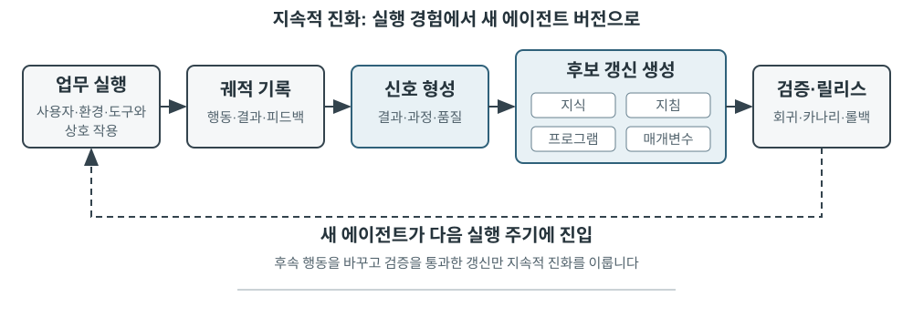
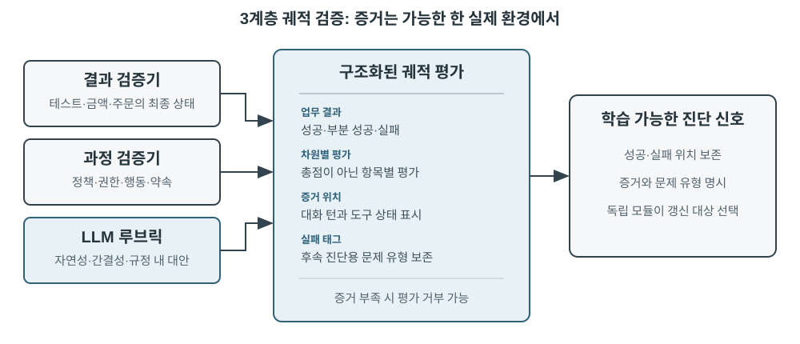
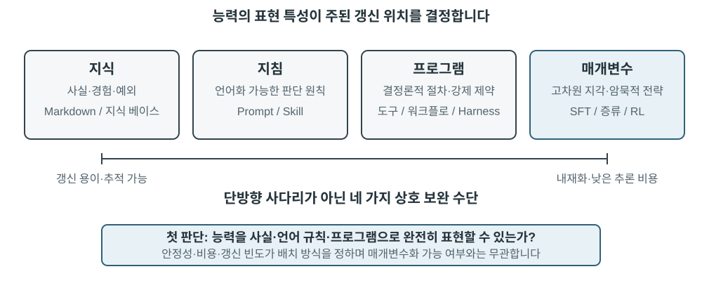
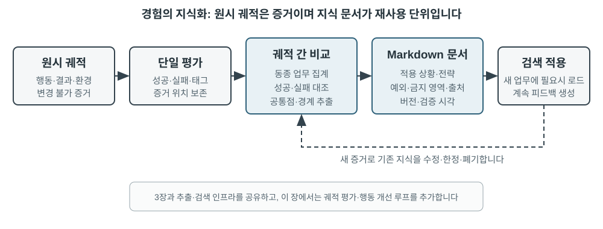

# 에이전트의 지속적 진화

오늘날의 에이전트에는 놀라운 능력의 역설이 있습니다. 처음 보는 복잡한 업무를 제로샷으로 해결할 수 있지만, 비슷한 업무를 만 번 처리하고도 첫날 저지른 실수를 다음 날 또 반복할 수 있습니다. **경험으로부터 자율적으로 학습하는 능력**은 에이전트가 ‘업무를 완료할 수 있는’ 단계에서 ‘안정적으로 일할 수 있는’ 단계로 발전하는 데 필수 요소가 되고 있으며, 차세대 모델 연구의 핵심 주제이기도 합니다. 그러나 현재의 모델이 스스로 지속 학습을 수행하기까지는 아직 갈 길이 멉니다.

배포된 모델은 한 번 추론한 뒤 매개변수를 자동으로 변경하지 않습니다. 2장에서 살펴본 컨텍스트 내 학습, 상태 유지, 압축을 이용하면 에이전트가 **현재 업무 안에서** 적응할 수 있지만 컨텍스트가 끝나면 이러한 변화가 다음 업무로 자연스럽게 이어지지 않습니다. 대화를 메모리에 저장하는 것과 새로운 행동을 학습하는 것은 다릅니다. 원시 궤적은 길 수 있으며 효과적인 전략뿐 아니라 우연한 성공, 잘못된 귀인, 신뢰할 수 없는 입력도 함께 담고 있습니다.

여기에는 놓치기 쉬운 중요한 구분이 있습니다. **경험을 보존하는 것과 경험에서 학습하는 것은 같지 않습니다.** 궤적 백 개를 긴 컨텍스트나 벡터 저장소에 넣으면 필요할 때 사례를 검색하는 데는 도움이 되지만 사례를 자동으로 비교해 주지는 않습니다. 성공한 궤적에서 어떤 단계가 반복되는지, 어떤 방식이 이전 인터페이스에서만 작동하는지, 성공이 건전한 전략 덕분인지 환경상의 우연 덕분인지 알 수 없습니다. 학습은 시스템이 증거를 능동적으로 평가하고 비교하고 일반화하고 검증한 뒤에야 일어나며, 로그를 디스크에 기록한다고 일어나지는 않습니다. 3장의 사용자 메모리는 주로 ‘사용자와 세계가 어떠한가’를 포착합니다. 이 장의 경험 학습은 더 나아가 ‘어떤 조건에서 무엇을 해야 하는가’를 포착합니다. 전자는 에이전트가 더 많이 기억하도록 돕고, 후자는 단순히 지식만 늘리는 대신 더 능숙해지도록 돕습니다.

업무가 끝날 때마다 모델이 곧바로 스스로 학습하게 하면 안 될까요? 프로덕션 환경에서는 깨끗한 학습 신호를 거의 얻을 수 없기 때문입니다. 사용자의 만족이 규정 준수를 뜻하지는 않으며, 국소적인 매개변수 업데이트는 능력 망각, 정책 표류 또는 안전성 저하를 일으킬 수도 있습니다. 실행 중인 모델이 검증되지 않은 피드백을 바탕으로 자신의 매개변수를 직접 수정하도록 허용하면 잘못된 경험과 프롬프트 인젝션이 고착되어 이후 업무에서 계속 증폭될 수 있습니다. 한편 기반 모델을 주기적으로 학습하면 일반 능력은 향상할 수 있지만, 각 에이전트가 매일 마주치는 비공개 규칙, 도구 변화, 개별 경험을 제때 흡수할 수는 없습니다.

따라서 모델 자체가 아직 지속적이고 안정적으로 학습하지 못하는 동안에는 먼저 모델 주변에 ‘학습’을 자율 시스템으로 구축해야 합니다. 운영 증거를 기록하고, 결과와 과정을 검증하고, 여러 궤적에서 공통 패턴을 추출한 다음 지식, 지시, 프로그램, 모델 매개변수 가운데 무엇을 업데이트할지 결정합니다. 모든 수정은 먼저 후보 버전이 되어야 하며 회귀 테스트와 안전 검사를 통과한 뒤에만 다음 운영 라운드에 영향을 줄 수 있습니다.

앞 장들에서는 이미 이 시스템에 필요한 주요 구성 요소를 소개했습니다. 2장은 업무 내 상태를, 3장은 지식 인프라를, 5장은 도구를 만들고 시스템을 수정하는 메타 능력을, 7장은 평가와 검증을, 8장은 모델 매개변수를 업데이트하는 방법을 다룹니다. 9장의 과제는 이러한 요소를 그림 9-1의 지속적 진화 루프로 구성하는 것입니다.

지속적 진화는 추적 가능한 운영 경험에서 출발하고 이후 행동을 바꾸며 중대한 성능 저하를 일으키지 않았음을 검증해야 합니다. 이 장에서는 먼저 한 번의 실행에서 정확히 무엇이 잘되었고 무엇이 잘못되었는지 판단하는 방법을 설명합니다. 이어서 네 가지 업데이트 방법과 각각의 적용 범위를 비교하고, 마지막으로 장기 운영 중 이러한 업데이트를 검증하고 릴리스하고 수정하고 폐기하는 방법을 살펴봅니다.

## 운영 궤적에서 학습 신호 도출하기

지속적 진화의 출발점은 ‘요약’이 아니라 ‘평가’입니다. 시스템이 업무의 완료 여부나 성공·실패를 일으킨 단계를 모른다면 언어 모델이 생성한 성찰은 추측에 그칠 수밖에 없습니다. 잘못된 평가가 장기 지식, 시스템 프롬프트, 학습 데이터에 한 번 들어가면 그 영향은 이후 업무 전반에서 누적될 수 있습니다.

어떤 업무의 결과는 비교적 쉽게 검증할 수 있습니다. 코딩 에이전트는 테스트, 타입 검사, 성능 벤치마크를 실행할 수 있고, 사용자의 환불을 처리하는 에이전트는 주문 상태와 실제 환불 금액을 조회할 수 있습니다. 이런 신호는 실제 환경 상태에서 나오므로 일반적으로 모델이 자기 행동을 설명하는 것보다 신뢰성이 높습니다. 하지만 결과가 옳다고 해서 과정도 옳은 것은 아닙니다. 실패한 테스트 사례를 삭제해도 테스트는 통과할 수 있고, 사용자에게 “7일 안에 환불해 드리겠습니다. 기다려 주세요”라고 말하면 일시적인 만족을 얻을 수도 있습니다. 따라서 신뢰할 수 있는 평가는 결과뿐 아니라 그 결과에 이른 경로까지 확인해야 합니다.

정답이 하나뿐이지 않은 업무도 많습니다. 고객 응대가 인내심 있었는지, 규정에 맞는 대안을 제시했는지, 연구 보고서가 핵심 증거를 찾아냈는지, 생성된 글이 자연스럽고 간결한지는 모두 맥락에 따른 판단이 필요합니다. 여기서는 7장에서 소개한 LLM-as-a-Judge를 사용할 수 있지만, 판정자가 모호한 종합 점수만 부여해서는 안 됩니다. 더 효과적인 방법은 루브릭(Rubric)을 미리 정의하고 검증자가 항목별로 점수를 매기고 궤적의 증거를 인용하며, 증거가 부족할 때는 불확실성을 명시하게 하는 것입니다.

그림 9-2는 3계층 검증 구조를 보여 줍니다. 맨 아래의 결과 검증기는 테스트 결과, 데이터베이스 상태, 도구 반환값을 읽고 “업무가 실제로 완료되었는가?”에 답합니다. 중간의 과정 검증기는 비즈니스 규칙, 권한, 행동 순서를 확인하고 “허용된 방식으로 완료했는가?”에 답합니다. 위의 품질 검증기는 루브릭에 따라 언어와 전략을 평가하고 “적절하게 처리했는가?”에 답합니다. 아래 계층의 지표일수록 코드와 환경의 실측 자료에 더 많이 의존해야 하며, 정형화하기 어려운 부분만 언어 모델에 맡겨야 합니다.

고객 서비스 에이전트를 위한 유용한 루브릭에는 적어도 표 9-1의 차원이 포함되어야 합니다. 앞의 다섯 항목은 주로 기본 요구 사항을 강제하고, 마지막 두 항목은 서비스 품질을 측정합니다. 이처럼 나누면 사용자가 만족했는지만 묻는 것보다 원인을 진단하기 좋습니다. 에이전트가 규정에 어긋나는 환불을 해 주어 사용자가 만족했을 수도 있고, 규정상 제한 때문에 불만족했을 수도 있습니다. 하나의 만족도 점수로는 둘을 구분할 수 없습니다.

표 9-1 고객 서비스 에이전트의 궤적 평가 차원

| 차원 | 검증 질문 | 주요 증거 |
|---|---|---|
| 업무 결과 | 사용자의 핵심 요청이 해결되었는가? | 최종 환경 상태, 도구 결과 |
| 규정 준수 | 정책, 권한, 필수 절차를 위반하지 않았는가? | 정책 저장소, 행동 궤적 |
| 개인정보 경계 | 제공해서는 안 되는 정보를 공개하지 않았는가? | 응답 텍스트, 데이터 접근 기록 |
| 사실 신뢰성 | 발언이 지식이나 도구 결과로 뒷받침되는가? | 인용한 출처, 도구 반환값 |
| 약속-행동 일치 | 완료했다고 말한 행동이 실제로 이루어졌는가? | 응답과 도구 로그 비교 |
| 표현 품질 | 언어가 반복적이거나 틀에 박히지 않고 자연스럽고 간결한가? | 전체 대화, 언어 루브릭 |
| 규정에 맞는 대안 | 원래 계획이 불가능할 때 허용된 대안을 찾았는가? | 사용자 목표, 정책, 후속 행동 |

> **실험 9-1 ★★: 고객 서비스 에이전트를 위한 궤적 검증기 구축**
>
> **목표:** 고객 서비스 궤적을 후속 학습에 활용할 수 있는 구조화된 진단으로 변환하고, ‘증거를 포함한 다차원 결론’이 하나의 종합 점수보다 근본 원인을 더 잘 찾아내는지 시험합니다.
>
> **실험 설명**: ‘총점 하나만 출력’하는 방식과 ‘차원별 결론, 근거, 신뢰도 출력’ 방식을 비교해 어느 쪽이 작업 실패, 규칙 위반, 거짓 약속, 표현 문제를 더 잘 구분하는지 관찰합니다. 지속적 진화는 성공률이나 단일 점수에만 의존할 수 없습니다. 무엇이 왜 틀렸고 근거가 어디 있는지를 보존해야 후속 모듈이 지식, Prompt, 프로그램, 모델 매개변수 중 무엇을 갱신할지 알 수 있으며, 신뢰도가 낮은 사례도 자동으로 학습 집합에 들어가서는 안 됩니다.

## 에이전트의 지속적 진화를 위한 네 가지 방법

학습 신호는 에이전트가 변해야 한다는 점은 알려 주지만 어디를 바꿔야 하는지는 알려 주지 않습니다. 업데이트 방법을 선택하는 주된 기준은 어떤 경험이 얼마나 오래 지속되었는지가 아니라 대상 능력을 특정 매체로 자연스럽게 표현할 수 있는지입니다. 사실과 경험은 지식 문서에 적합하고, 언어로 명확히 표현할 수 있는 전략은 프롬프트나 스킬에 적합합니다. 정확하게 실행해야 하는 절차와 제약은 프로그램으로 인코딩해야 하며, 인식, 언어 스타일, 암묵적 전략 같은 고차원 능력은 모델 매개변수에 들어가야 합니다. 그림 9-3은 이 네 방법과 그 관계를 보여 줍니다.

표 9-2는 이를 간결하게 비교합니다. 네 방법은 서로 배타적이지 않습니다. 의료 영상 에이전트는 매개변수로 병변을 식별하고, 지식 베이스에서 최신 지침을 얻으며, 코드로 위험 지표를 계산합니다. 고객 서비스 모델은 사후 학습을 통해 자연스러운 말투를 얻고, 지식과 스킬에서 기업별 정책을 가져오며, 중요한 규정 준수 요구 사항은 서버 측 코드로 강제합니다.

표 9-2 네 가지 지속적 진화 방법의 적용 범위

| 업데이트 방법 | 적합한 내용 | 주요 장점 | 주요 한계 |
|---|---|---|---|
| 경험 지식 베이스 | 사실, 경험 패턴, 예외, 출처 | 빠른 업데이트, 추적 가능성, 주문형 검색 | 검색과 모델의 올바른 적용에 의존 |
| 프롬프트와 스킬 | 언어로 표현할 수 있는 판단 원칙과 운영 절차 | 해석 가능, 범위 통제 가능 | 비대화, 충돌, 무시될 가능성 |
| 프로그램과 하네스 | 결정론적 절차, 도구, 엄격한 제약 | 테스트 가능, 안정적 실행, 저렴한 비용 | 개발·유지보수 비용이 더 높음 |
| 모델 매개변수 | 고차원 인식, 생성 스타일, 암묵적 전략 | 강한 일반화, 낮은 추론 오버헤드 | 높은 업데이트·회귀 비용 |

### 경험을 지식으로 통합하기

가장 가벼운 진화 방식은 여러 실행에서 반복된 경험을 검색 가능한 지식 문서로 정리하는 것입니다. 여기서 설명하는 ‘경험 지식 베이스’는 저장, 색인, 검색 기술을 3장과 공유하지만 지식의 출처와 검증 목표가 다릅니다. 3장은 주로 사용자 대화, 문서, 데이터셋에서 ‘사용자와 세계가 어떠한가’를 추출합니다. 이 장은 에이전트의 행동 궤적과 결과에서 ‘어떤 조건에서 무엇을 해야 하는가’를 추출합니다. 예를 들어 “이 항공사는 특별식을 24시간 전에 예약해야 한다”는 도메인 지식이고, “결제한 뒤 요청할 수 없다는 사실을 알게 되지 않도록 예약 전에 특별식 신청 마감 시간을 확인하라”는 행동 경험입니다.

원시 궤적은 정식 지식 단위로 적합하지 않습니다. 길고 잡음이 많으며 원시 도구 출력, 우연한 우회, 환경의 세부 사항이 들어 있기 때문입니다. 더 견고한 시스템은 세 계층의 데이터를 유지합니다. 감사를 위한 불변 원시 궤적, 결과와 후보 교훈을 기록하는 실행별 분석, 여러 유사 궤적의 비교·클러스터링·귀납으로 만든 미래 지향적 Markdown 지식 문서입니다. 정식 문서는 하나의 업무가 진행된 전체 과정을 다시 이야기하는 대신 적용 가능한 상황, 권장 전략, 금지된 방식, 예외, 증거 출처, 마지막 검증 시각을 명시하는 것이 일반적입니다.

이 설계는 3장의 User-as-Code와 같은 2단계 원칙을 공유합니다. User-as-Code는 먼저 대화에서 얻은 사실을 불변 로그에 추가하고 주기적으로 구조화된 사용자 모델을 다시 만듭니다. 경험 학습 역시 먼저 증거를 보존하고 나중에 오프라인으로 변경 가능한 지식을 생성해야 합니다. 그림 9-4가 이 과정을 보여 줍니다. 기록과 정리를 분리하면 한 번의 우연한 성공이나 네트워크 장애가 에이전트를 즉시 바꾸지 못하며, 여러 번의 성공과 실패를 관찰한 뒤에야 공통 패턴을 찾을 수 있습니다.

경험 문서는 단순한 궤적 요약이 아닙니다. 전이 가능한 내용은 비교에서 나옵니다. 같은 유형의 성공 궤적이 무엇을 했는지, 실패 궤적에는 무엇이 없었는지, 어떤 환경 버전에서 전략이 효과적이었는지, 어떤 전제 조건에서 실패했는지 비교합니다. 3장에서 이미 지식 추출, 클러스터링, 검색을 소개했으므로 여기서 그 알고리즘을 반복하지 않습니다. 대신 궤적 평가가 추출의 조건이 되는 방식과 추출한 지식이 이후 업무 성능을 높이는지를 중점적으로 살펴봅니다.

완전한 지식 증류 파이프라인은 다섯 단계로 나눌 수 있습니다. 먼저 불변 궤적과 환경 결과를 보존합니다. 다음으로 각 실행의 업무 유형, 필요한 능력, 관찰한 전략, 오류, 예외를 나열한 구조화된 분석을 만듭니다. 그런 다음 업무군별로 실행을 모으고 어떤 궤적이 각 후보 패턴을 지지하거나 반박하는지 보여 주는 증거 표를 만듭니다. 지지 기준을 충족한 후보만 정식 문서에 들어갑니다. 마지막으로 증류에 사용하지 않은 새로운 업무에서 전이를 평가합니다. 정식 지식과 후보 분석을 분리하면 원래 증거를 바꾸지 않고 다시 일반화할 수 있으며 환경이 바뀔 때 정확히 해당 결론만 철회할 수 있습니다.

GAIA 경험 학습은 직관적인 사례를 제공합니다. GAIA[^gaia-2023]에는 검색, 웹 읽기, 파일 처리, 계산을 결합한 다단계 문제가 있고, AWorld[^aworld-2025]는 에이전트를 실행하고 이러한 도구를 호출하고 궤적을 기록하는 환경을 제공합니다. 전자가 시험이라면 후자는 시험장과 실험 기록 시스템입니다. 단순한 방법은 한 번의 성공적인 실행 뒤에 전략 요약을 만들고 즉시 벡터화합니다. 더 엄격한 구현은 먼저 GAIA 정답 검증기나 다른 환경 검증기로 실행을 성공, 부분 성공, 실패로 라벨링한 다음 같은 업무군 안의 여러 경로를 비교합니다. 성공 궤적은 후보 전략을, 실패 궤적은 배제 지식을 제공하며 부분 성공은 어느 구간이 작동했고 어느 구간이 여전히 실패했는지 보여 줍니다. Reflexion[^reflexion-2023]이 제안한 자연어 성찰은 후보 교훈을 만드는 데 도움이 되지만 성찰 자체는 증거가 아닙니다. 환경 결과와 일치하고 여러 궤적에서 뒷받침되며 새로운 업무에 긍정적으로 전이되는 내용만 정식 경험 문서에 들어가야 합니다.

> **실험 9-2 ★★: GAIA 궤적에서 경험 지식 문서 증류**
>
> **목표:** 여러 궤적에 기반한 지식 문서가 하나의 성공 사례 요약보다 더 잘 전이되는지, 우연한 성공과 잘못된 경험이 일으키는 부정적 전이를 줄이는지 시험합니다.
>
> **데이터와 절차:** `gaia-experience`는 먼저 각 실행의 전체 궤적과 외부 `environment_score`를 저장한 다음, 이를 `task_family`, 필요한 `capabilities`, `applies_when`, 관찰된 전략, 오류, 예외, 출처 궤적 ID를 담은 최소 학습 기록으로 변환합니다. 결과 검증기는 실행을 성공, 부분 성공, 실패로 분류합니다. 학습 모듈은 같은 업무군 안의 경로를 비교합니다. LLM이 후보 일반화를 제안할 수 있지만 권장 전략은 실패하지 않은 궤적 두 개 이상에서 뒷받침되어야 합니다. 생성된 Markdown 문서에는 적용 가능한 상황, 권장 전략, 흔한 함정, 예외, 출처, 마지막 검증 시각이 들어갑니다. 적용할 때는 이 문서만 검색하고 긴 원시 궤적을 컨텍스트에 직접 넣지 않습니다.
>
> **세 가지 대조 조건:** 첫 번째 조건은 과거 경험을 사용하지 않습니다. 두 번째는 현재 업무와 가장 비슷한 단일 궤적 요약을 검색합니다. 세 번째는 여러 궤적이 뒷받침하는 지식 문서를 검색합니다. 같은 GAIA 문제의 답이 ‘경험’이라는 이름으로 평가에 유출되지 않도록 학습 집합과 전이 집합은 겹치지 않아야 합니다.
>
> **지표와 통과 기준:** 전이 업무 성공률, 검색한 평균 문자 수 또는 토큰 수, 부정적 전이율을 보고하고 모든 정식 결론이 출처 궤적을 인용하는지 확인합니다. 여러 궤적 기반 문서가 컨텍스트만 줄이고 새 업무의 성능은 높이지 못한다면 경험을 학습했다고 볼 수 없습니다. 한 번의 우연한 성공이 바로 정식 지식으로 승격될 수 있거나 문서를 원래 궤적으로 추적할 수 없어도 실험은 실패입니다.
>
> 부록 구현은 [`gaia-experience`](../chapter9/gaia-experience/)에서 확인할 수 있습니다. `demo_documents.py`는 기본적으로 오프라인에서 실행되며, `--extractor llm`을 사용하면 실제 LLM이 여러 궤적에 기반한 경험 후보를 제안할 수 있습니다.

[^reflexion-2023]: Shinn, N., et al. *Reflexion: Language Agents with Verbal Reinforcement Learning.* arXiv:2303.11366, 2023.

[^gaia-2023]: Mialon, G., et al. *GAIA: a benchmark for General AI Assistants.* arXiv:2311.12983, 2023.

[^aworld-2025]: Yu, C., et al. *AWorld: Orchestrating the Training Recipe for Agentic AI.* arXiv:2508.20404, 2025.

### 경험을 지시로 인코딩하기

경험 지식 베이스가 에이전트에 참고 자료를 제공한다면 프롬프트와 스킬은 더 규범적입니다. 여러 궤적에서 같은 전략적 오류가 반복해서 드러나고 그 패턴을 자연어로 명확하게 표현할 수 있다면, 시스템은 이를 ‘참고할 경험’에서 ‘반드시 따라야 할 규칙’으로 승격할 수 있습니다. 거의 모든 업무에 적용되는 규칙은 시스템 프롬프트에 포함하기 좋고, 특정 도메인이나 프로젝트, 도구에만 적용되는 복잡한 절차는 주문형 스킬이나 프로젝트 지시 파일로 작성하는 편이 낫습니다.

프롬프트 학습은 2장에서 설명한 프롬프트 엔지니어링과 역할이 다릅니다. 2장은 구조가 명확하고 캐시에 친화적인 프롬프트 작성법을 설명합니다. 이 절은 어떤 프로덕션 피드백이 프롬프트 수정을 촉발하기에 충분한지, 새 규칙을 배포 전에 어떻게 검증해야 하는지를 다룹니다. 수정한다고 해서 시스템 프롬프트 전체를 반복해서 다시 써서는 안 됩니다. 더 신뢰할 수 있는 방법은 유사한 실패 집단에서 최소 diff를 만들고, 규칙의 적용 범위를 명시하고, 기존 규칙과의 충돌을 검사하며, 실패를 촉발한 경계 사례와 이전 업무의 유지 집합 모두에서 평가하는 것입니다.

Andrej Karpathy는 2025년의 긴 게시물에서 가능성 있는 이 새로운 패러다임을 잠정적으로 **시스템 프롬프트 학습(System Prompt Learning)**이라고 불렀습니다[^karpathy-system-prompt-learning]. 그의 요지는 사전 학습이 주로 지식을 학습하고 미세 조정이 주로 습관적 행동을 형성한다면, 인간에게는 문제를 해결한 뒤 미래의 자신에게 “다음에 이런 문제를 만나면 이 방법부터 시도하자”라는 명시적 메모를 남기는 또 다른 학습 방식이 있다는 것입니다. 그는 이런 노트가 없는 LLM을 영화 *메멘토*의 주인공에 비유했습니다. 또한 시스템 프롬프트 학습과 강화 학습은 모두 경험으로 행동을 개선하지만 업데이트 알고리즘이 다르다고 지적했습니다. 전자는 텍스트를 편집하고 후자는 경사 하강법으로 매개변수를 바꿉니다. 그의 사례는 당시 약 17,000단어에 이르던 Claude의 시스템 프롬프트에 단어, 글자, 문자를 답하기 전에 번호를 붙여 명시적으로 세라는 지시가 들어 있었다는 것입니다. 바로 “`strawberry`에 `r`이 몇 개인가?” 같은 질문을 처리하기 위한 규칙이었습니다.

에이전트 시스템에서 이는 언어로 표현할 수 있는 교훈을 이후 실행이 직접 읽을 후보 규칙으로 바꾸는 것을 뜻합니다. 하나의 성공/실패 값과 달리 증거가 뒷받침하는 진단은 오류가 신원 확인, 도구 선택, 에스컬레이션 경계 가운데 어디에 있는지 식별하여 더 정확한 후보 변경을 가능하게 합니다. 지식에 기반한 검토가 스칼라 보상보다 고차원적인 피드백 채널이라는 Karpathy의 관찰은 이 방법의 높은 데이터 효율 가능성을 설명합니다. 하지만 정보가 풍부하다고 자동으로 옳은 것은 아닙니다. 한 사용자의 피드백은 그 고객에게만 적용되거나 오래된 정책에 관한 것일 수 있으므로 클러스터링, 적용 범위 분석, 회귀 테스트는 여전히 필요합니다.

확립된 여러 접근법은 서로 다른 방식으로 프롬프트 최적화를 자동화합니다. DSPy[^dspy-2023]는 여러 언어 모델 호출로 구성된 프로그램을 최적화 가능한 대상으로 보고 개발 집합에서 지시와 예시를 탐색합니다. OPRO[^opro-2023]는 언어 모델에 과거 프롬프트와 점수 이력을 바탕으로 새 후보를 제안하게 합니다. GEPA[^gepa-2025]는 실패한 궤적에 대한 자연어 성찰을 사용하여 상호 보완적인 후보 프롬프트를 생성하고 선택합니다. 이 방법들은 주로 오프라인 평가 집합에서 일괄 최적화를 수행합니다. 프로덕션 최소 diff는 새로 관찰한 경계 사례가 촉발하고 출처 추적, 감사, 빠른 롤백을 염두에 둔 지속적 유지보수에 더 가깝습니다. 실제로는 오프라인 탐색으로 강력한 초기 버전을 만들고, 프로덕션의 롱테일 규칙을 사례별 패치로 보완할 수 있습니다.

#### 예시 1: 실패 궤적 기반 프롬프트 내 규칙 최적화

예를 들어 항공사 고객 서비스 에이전트는 사용자가 정책에 이의를 제기하면 너무 일찍 사람에게 에스컬레이션할 수 있습니다. 궤적 평가 결과 규칙 위반은 없지만 규정에 맞는 유연성이 부족한 것으로 나타납니다. 후보 패치는 에이전트가 먼저 정책을 설명하고 사용자의 실제 목표를 파악한 뒤 허용된 대안을 찾도록 요구할 수 있습니다. 사용자가 명시적으로 사람을 요청하거나 문제가 정말 에이전트의 권한을 벗어날 때만 에스컬레이션합니다. 새 규칙이 불필요한 에스컬레이션을 줄였지만 사람에게 넘겨야 할 안전 사고까지 에이전트가 계속 처리하게 한다면 회귀 테스트에 실패한 것입니다. 시스템 프롬프트 학습의 가치는 텍스트를 자동으로 계속 덧붙이는 데 있지 않고 프로덕션 경계 사례를 통해 규칙의 범위를 계속 명확히 하는 데 있습니다.

#### 예시 2: 요구사항 명확화 Skill — '즉시 착수'에서 '선 확인 후 실행'으로

스킬 학습도 같은 원칙을 따르지만 범위가 더 국소적입니다. 스킬은 특정 업무를 위한 주문형 운영 설명서로 이해할 수 있습니다. 여러 경험이 모여 완전한 보험금 청구 절차를 이룬다면 시스템은 해당 스킬을 생성하거나 수정할 수 있습니다. 후보 스킬은 한 대화를 요약하는 데 그쳐서는 안 됩니다. 최소한 로드할 시점, 전제 조건, 운영 단계, 알려진 함정, 검증 방법, 출처 궤적을 명시해야 합니다. 시스템은 먼저 기존 스킬 라이브러리에서 비슷한 능력을 찾고, 같은 절차가 이미 있다면 로컬 `patch`를 우선하며, 정말 독립적인 능력일 때만 새 디렉터리를 만듭니다. 이렇게 하면 이름만 다르고 내용은 중복되는 설명서로 라이브러리가 가득 차는 일을 막을 수 있습니다. Anthropic의 Skill Creator[^anthropic-skill-creator]는 초안-테스트-평가-수정 루프를 보여 줍니다. 이는 스킬을 만들고 개선하는 방법을 다루지만, 어떤 운영 증거가 생성을 촉발하기에 충분한지, 충돌을 어떻게 해결할지, 수정본이 도메인별 회귀 테스트와 이전 업무 회귀 테스트를 통과하는지는 더 어려운 문제로 남아 있습니다.

> **실험 9-9 ★★: 피드백을 글쓰기 Skill로 정리하기**
>
> `data/feedback_pairs.json`의 before/after 20쌍을 세 묶음으로 받아 후보 규칙을 추출합니다. 중복 패턴을 합치고 임계값 충돌을 찾고 출처와 적용 범위가 있는 `SKILL.md`를 만듭니다. 결정적 규칙은 코드로 검사하고 LLM 규칙은 10개 금표본으로 보정합니다.
>
> 미완료 작업 경계 세트의 검출률, 정상 텍스트 보류 세트의 오탐률, 규칙 수 증가를 함께 보고합니다. 첫 실제 실행은 검출 0/8·오탐 7/8이었지만 모델 외부 필터와 결정적 fallback 뒤에는 검출 8/8·오탐 0/8, 21개 후보를 8개 규칙으로 통합했습니다. 구현은 [`ai-style-skill`](../chapter9/ai-style-skill/)에 있습니다.

곡선 따옴표 사례는 Skill을 전역 치환 규칙이 아니라 데이터 계약으로 만들어야 함을 보여 줍니다. SFT 전에 합성 예제를 문서 유형·범위·프로그래밍 언어별로 층화하고 코드/JSON/보호 영역 게이트와 수동 감사를 통과시킵니다. exact-copy 사례에서는 tokenizer encode→decode round-trip, 모델 byte-exact 복사, Harness 직렬화, 도구 매칭을 서로 다른 회귀 계층으로 감사해야 합니다.

> **실험 9-3 ★★: 실패 궤적을 이용한 시스템 프롬프트 최적화**
>
> **목표:** 사용자가 정책에 이의를 제기할 때 너무 빨리 에스컬레이션한 궤적에서 항공사 고객 서비스 에이전트를 학습시키되, 새 규칙이 실제로 에스컬레이션해야 하는 이전 상황을 망가뜨리지 않음을 입증합니다.
>
> **절차:** 먼저 이전 업무 유지 집합과 과도한 에스컬레이션 경계 집합을 따로 실행합니다. `learning_signal.py`는 실패를 규칙 준수, 업무 해결, 규정에 맞는 유연성으로 분해하면서 출처 사례 ID를 보존합니다. 이어서 코딩 에이전트가 기존 프롬프트를 읽고 감사 가능한 `old_str → new_str` 최소 편집을 정확히 하나만 만듭니다. 즉 에이전트가 에스컬레이션하기 전에 정책을 설명하고 실제 목표를 파악하고 규정에 맞는 대안을 찾도록 요구하면서, 사용자가 명시적으로 사람을 요청하거나 안전 사고가 발생했을 때의 에스컬레이션은 유지합니다. 패치, 출처, 대상 규칙, 근거를 후보 매니페스트에 기록합니다.
>
> **세 가지 대조 조건:** 초기 프롬프트, 자동 생성한 후보 프롬프트, 사람이 한 번 최적화한 프롬프트를 비교합니다. 세 조건 모두 같은 모델과 같은 유지·경계 업무를 사용합니다. `--quick`은 사례 수만 줄입니다. 여전히 업무 에이전트, LLM 판정자, 코딩 에이전트를 실제로 호출하므로 오프라인 시뮬레이션이라고 보고해서는 안 됩니다.
>
> **릴리스 게이트와 지표:** 후보는 비어 있지 않은 패치, 추적 가능한 출처, 경계 집합에서 측정 가능한 개선, 유지 집합에서 성능 저하 없음이라는 네 조건을 통과해야 합니다. 경계 업무 정확도, 유지 업무 정확도, 프롬프트 증가량, 새로 생긴 회귀, 실패 발견부터 후보 생성까지 걸린 시간을 비교합니다. 게이트를 통과해도 안정 프롬프트를 바로 덮어쓰지 않고 `release_to_canary`만 생성하며, 어느 조건이든 실패하면 `reject_candidate`를 반환합니다.
>
> 부록 구현은 [`prompt-auto-optimization`](../chapter9/prompt-auto-optimization/)에서 확인할 수 있습니다. 오프라인 테스트가 진단과 릴리스 게이트를 다루며, `--quick`은 업무 에이전트, LLM 판정자, 코딩 에이전트를 실제로 호출합니다.

[^dspy-2023]: Khattab, O., et al. *DSPy: Compiling Declarative Language Model Calls into Self-Improving Pipelines.* arXiv:2310.03714, 2023.

[^opro-2023]: Yang, C., et al. *Large Language Models as Optimizers.* arXiv:2309.03409, 2023.

[^gepa-2025]: Agrawal, L., et al. *GEPA: Reflective Prompt Evolution Can Outperform Reinforcement Learning.* arXiv:2507.19457, 2025.

[^karpathy-system-prompt-learning]: Karpathy, A. “We’re missing (at least one) major paradigm for LLM learning … system prompt learning?” X, May 11, 2025. https://x.com/karpathy/status/1921368644069765486

[^anthropic-skill-creator]: Anthropic. *Skill Creator.* 2026. https://github.com/anthropics/skills/blob/main/skills/skill-creator/SKILL.md

### 경험을 프로그램으로 인코딩하기

경험이 안정적이고 반복적이며 검증 가능한 작업을 설명한다면 모델이 매번 문서를 다시 읽고 처음부터 사고하게 하는 것은 비효율적입니다. 더 적절한 접근법은 경험을 워크플로, 도구, 하네스 코드로 컴파일하여 한 번의 탐색을 반복 실행할 수 있는 프로그램으로 바꾸는 것입니다. 5장에서는 코딩 에이전트가 파일을 읽고 쓰고 테스트를 실행하고 시스템을 생성하는 방법을 설명했습니다. 이 절은 일반적인 코드 생성보다 에이전트가 자신의 궤적을 바탕으로 미래의 자신을 수정하는 방법에 초점을 둡니다.

수정할 수 있는 대상은 새 도구보다 훨씬 넓습니다. 작업 계층에서는 브라우저 궤적을 매개변수화된 워크플로로 컴파일하거나 변경된 API를 위한 어댑터를 생성할 수 있습니다. 제어 계층에서는 도구 라우팅, 재시도, 회로 차단기, 컨텍스트 압축 전략을 수정할 수 있습니다. 검증 계층에서는 프로덕션 실패에 대응해 매개변수 검사, 상태 검증기, 회귀 테스트를 추가할 수 있습니다. 아키텍처 계층에서는 검토자 에이전트를 추가하거나 계획과 실행 사이의 정보 흐름을 바꿀 수 있습니다.

브라우저 워크플로는 프로그램 형태 경험의 가치를 잘 보여 줍니다. 스프레드시트 매크로를 기록하는 것과 비슷합니다. 이메일을 처음 보낼 때 멀티모달 에이전트는 관찰-사고-행동 루프로 작성, 수신자, 제목, 본문, 전송 컨트롤을 찾습니다. 다른 이메일을 보낼 때도 과정은 같고 수신자와 내용만 달라지므로 픽셀과 DOM에서 전체 경로를 다시 찾아내기 위해 모델을 또 호출할 필요가 없습니다. 시스템은 첫 탐색 궤적을 매개변수, 상태 검사, 버전 정보를 포함한 작은 프로그램으로 컴파일합니다.

브라우저 환경에서 그림 9-4의 지식 증류 과정은 다음과 같은 더 구체적인 생명 주기가 됩니다.

1. **궤적 캡처:** 탐색, 클릭, 텍스트 입력, 드롭다운 선택을 행동 매개변수, 현재 URL, XPath, CSS, `id`, `role`, `aria-label`, `data-testid` 같은 요소 로케이터 증거와 함께 기록합니다. 로케이터 증거는 요소를 다시 찾는 데만 도움을 줄 뿐 업무 완료를 증명하지는 않습니다.
2. **매개변수화:** 안정적인 행동은 그대로 두고 첫 실행의 리터럴을 템플릿 변수로 바꿉니다. 예를 들어 `test@example.com`, 제목, 본문을 `{recipient}`, `{subject}`, `{content}`로 변환합니다. 교육용 구현은 정규 표현식과 템플릿 치환을 사용하며, 프로덕션 시스템은 구조화된 업무 입력이나 제약된 추출 모델을 사용할 수 있습니다.
3. **상태 검사 정의:** “전송 버튼이 보인다”, “이동 후 URL이 대상 사이트에 속한다” 같은 검사를 행동 전후에 추가합니다. 또한 “보낸 편지함 목록에 새 메시지가 있다”, “테스트 페이지의 상태 값이 예상대로 바뀌었다” 같은 워크플로 전체의 최종 상태 검사를 추가합니다. 행동을 성공적으로 실행하는 것과 업무를 성공적으로 완료하는 것은 다릅니다. 최종 검사는 실제 페이지나 백엔드 상태를 읽어야 합니다.
4. **후보 검증:** 최초 성공으로 만들어지는 것은 `candidate`뿐입니다. 시스템은 샌드박스 계정이나 테스트 사이트를 독립적인 초기 상태로 재설정하고 후보 전체를 재생해야 합니다. 행동 전·후 검사와 최종 상태 검사를 모두 통과해야 `validated`로 게시할 수 있습니다. 이메일 전송이나 주문처럼 부작용이 있는 업무에 안전한 재설정 콜백이 없다면 워크플로를 감사 가능한 후보로 보존할 수는 있지만 프로덕션 계정에서 행동을 반복하여 검증해서는 안 됩니다.
5. **매칭과 재생:** 새 업무가 들어오면 의도와 키워드로 정식 능력 라이브러리에서 워크플로를 검색하고 현재 매개변수를 추출하여 Playwright로 직접 실행합니다. 재생에는 단계별 LLM 호출이 필요 없지만 요소를 사용할 수 있을 때까지 기다리고 모든 상태 검사를 완료해야 합니다.
6. **무효화와 재학습:** 대상 요소를 찾지 못하거나 상태 검사가 실패하거나 API 스키마가 바뀌거나 최종 상태가 틀리면 이후 행동을 즉시 중단합니다. 이전 버전을 검색 가능한 라이브러리에서 `invalid` 영역으로 옮기고 전체 에이전트로 돌아가 새로 탐색합니다. 이전 파일은 감사와 비교를 위해 보존하되 조용히 계속 매칭되게 해서는 안 됩니다.

이메일 워크플로를 컴파일한 결과는 단순히 “버튼을 이 순서로 클릭하라”가 아니라 수신자, 제목, 본문을 매개변수로 받는 작은 프로그램입니다. 전송 전에 작성 창과 필드를 확인하고 이후 성공 표시를 확인하며, 마지막으로 해당 메시지가 보낸 편지함 목록에 있는지 확인합니다. PreAct[^preact]에서 이런 프로그램은 반복 업무의 종단 간 속도를 8.5~13배 높였으며 재생 중 단계별 언어 모델 호출이 필요하지 않았습니다. 더 중요한 점은 프로세스 메모리에 **행동 전 검증, 행동 후 검증, 저장 전 독립 검증**이 필요하다는 것입니다. 그렇지 않으면 재생 커버리지가 100%이고 모든 버튼을 클릭했지만 필드 하나가 비어 업무는 전혀 완료되지 않은 위험한 착시가 생길 수 있습니다.

> **실험 9-4 ★★★: 브라우저 궤적에서 검증 가능한 워크플로 생성**
>
> **목표:** 웹 에이전트가 비용이 많이 드는 한 번의 탐색을 재사용 가능한 워크플로로 바꾸고, 페이지가 바뀌었을 때 모든 행동이 실행됐다는 이유만으로 성공을 보고하는 대신 잘못된 재생을 거부하는지 확인합니다.
>
> **4단계 시나리오:** 첫 단계에서는 테스트 메일 사이트나 모의 메시징 페이지에서 “`test@example.com`에 제목이 ‘Test Email’인 메시지를 보내라”는 업무를 실행합니다. 전체 에이전트가 탐색하는 동안 래퍼가 행동, 매개변수, 페이지 상태를 캡처하여 `candidate`를 만듭니다. 둘째 단계에서는 `validation_reset`을 호출하여 샌드박스를 복원하고 전체 워크플로를 독립적으로 재생합니다. 행동 전·후 검사와 최종 상태 검사를 모두 통과해야 후보가 정식 능력 라이브러리에 들어갑니다. 셋째 단계에서는 수신자, 제목, 본문을 바꾸어 같은 유형의 업무를 수행합니다. 시스템은 검증된 워크플로를 매칭하고 새 매개변수를 채운 뒤 단계별 LLM 루프에 들어가지 않고 Playwright로 재생해야 합니다. 넷째 단계에서는 버튼 로케이터, 페이지 텍스트, 최종 상태를 바꾸고 이전 워크플로가 즉시 `invalid`가 되어 `fallback_required=True`를 반환하는지 확인합니다.
>
> **대조 설계:** 단순한 기준 조건은 클릭, 텍스트 입력 같은 행동이 예외 없이 완료되었는지만 기록합니다. 실험 조건은 각 행동 전 페이지, 행동 후 페이지, 최종 업무 상태까지 검증합니다. 두 조건 모두 같은 궤적과 페이지 변경을 사용합니다. “필드가 비어 있는데 전송 버튼을 클릭했다”, “저장을 클릭했지만 데이터가 영속화되지 않았다” 같은 사례의 거짓 양성률을 비교합니다.
>
> **지표와 통과 기준:** 최초 탐색과 재생의 종단 간 시간, LLM 호출 수, 성공률, 거짓 성공률, 워크플로 매칭률, 페이지 변경 탐지율, 재학습으로 돌아간 횟수를 기록합니다. 재설정 콜백이 없으면 워크플로는 후보로 남아야 합니다. 검증에 실패한 버전은 검색할 수 없어야 하며, 매개변수화된 재생이 첫 실행의 수신자나 내용을 재사용해서는 안 됩니다. 페이지가 바뀌면 이후의 위험한 행동을 중단해야 합니다. 이러한 조건을 모두 충족할 때만 가속에 의미가 있습니다.
>
> 부록 구현은 [`browser-use-rpa`](../chapter9/browser-use-rpa/)에서 확인할 수 있으며 결정론적 상태 머신 데모와 실제 브라우저 에이전트를 호출하는 실행 경로를 모두 제공합니다.

에이전트가 자신의 코드를 수정한다고 해서 실행 중인 프로세스가 자신을 직접 덮어쓰는 것은 아닙니다. 프로덕션 시스템은 현재 안정 버전에서 후보 브랜치를 만들고 코딩 에이전트가 최소 패치를 생성하게 해야 합니다. 이어서 정적 검사, 단위 테스트, 보안 스캔, 실패 궤적 재생, 이전 업무 회귀 테스트를 차례로 실행한 뒤 카나리 배포가 가능한 새 버전을 만듭니다. 이렇게 하면 ‘자기 수정’이 감사 가능한 소프트웨어 릴리스 프로세스가 되며 9장과 5장의 경계도 명확해집니다. 5장은 시스템을 수정하는 능력을 제공하고, 이 장은 경험이 촉발하며 검증 루프가 제약하는 자기 수정 방법을 제공합니다.

패치를 작게 만드는 것만으로는 원인을 신뢰성 있게 귀속하기에 충분하지 않습니다. 각 수정 요청은 실패 증거, 추론한 근본 원인, 담당 하네스 구성 요소, 후보 변경, 개선될 것으로 예상하는 행동, 회귀할 수 있는 기존 행동, 양쪽을 위한 테스트를 기록하는 **반증 가능한 변경 계약**이어야 합니다. Agentic Harness Engineering은 이를 구성 요소·경험·의사 결정 수준의 관측 가능성으로 설명합니다. 편집 가능한 모든 구성 요소에는 파일 수준 표현이 있고, 대규모 궤적 집합은 세부 수준을 높여 가며 살펴볼 수 있는 증거로 증류되며, 모든 편집은 실행 전에 영향 예측을 선언하고 다음 결과가 이를 검증합니다[^ahe-2026]. 그러면 높은 점수를 해석할 수 없는 시행착오로 남기는 대신 구체적인 메커니즘과 연결할 수 있습니다.

후보 생성기에 실패 사례만 제공해서는 안 됩니다. Self-Harness는 보존해야 할 성공 행동과 이전에 거부된 수정 기록도 함께 제공합니다[^self-harness-2026]. 전자는 수리가 무엇을 망가뜨려서는 안 되는지 알려 주고, 후자는 같은 실패한 발상을 표현만 바꾸어 다시 제출하지 못하게 합니다. 실패 증거, 성공 제약, 과거 시도가 함께 경계가 있는 후보 공간을 정의하며, 모든 소스 코드와 원시 로그를 수정 에이전트에 무차별적으로 넣는 것보다 유용합니다.

도구 생성도 같은 프로토콜을 따릅니다. Alita[^alita-2025]는 에이전트가 *반지의 제왕*에서 골룸을 연기한 성우가 내레이션한 YouTube 360 VR 영상에서 공룡이 처음 등장한 직후 언급되는 숫자를 찾아야 하는 사례를 제시합니다. 에이전트는 자막 읽기 능력이 없음을 인식한 뒤 `youtube-transcript-api`를 찾아 테스트하고 새 자막 도구로 감싼 다음 자막에서 `100000000`이라는 답을 추출합니다. 새 도구는 안전 스캔과 기능 테스트를 통과하고 이후 업무에서 성공적으로 재사용된 뒤에만 능력 라이브러리에 들어갑니다. 4장의 능동적 도구 탐색은 기존 도구 중 무엇이 적합한지 묻고, 5장은 도구를 작성하는 방법을 묻습니다. 이 장은 어떤 운영 증거가 생성을 촉발해야 하며 새 도구가 어떻게 검증된 장기 능력이 되는지 묻습니다.

> **실험 9-5 ★★★: 실패 궤적에서 에이전트 자기 수정 촉발**
>
> **목표:** `retryable=false`로 표시된 오류 뒤에도 호출을 반복한 여러 궤적이 주어졌을 때 시스템이 재시도·회로 차단기 코드에서 근본 원인을 찾고, 일시적 실패의 복구는 망가뜨리지 않는 후보 수정안을 만들 수 있는지 확인합니다.
>
> **절차:** 진단 모듈은 먼저 여러 업무에 걸친 동일한 결함을 모읍니다. 궤적 간 지지 기준을 충족한 뒤에만 안정 버전의 `retry_policy.py`를 대상으로 수정 요청을 만듭니다. 후보 생성기는 실패 진단, 보존해야 할 일시적 실패 복구 행동, 이전에 거부된 변경, 안정 버전 소스를 읽습니다. 최소 코드 diff를 내기 전에 재시도 불가 오류 이후의 호출 수는 줄고 일시적 시간 초과 복구율은 떨어지지 않을 것이라고 예측합니다. 생성기가 결정론적이든 실제 LLM 코딩 에이전트이든 격리된 후보 디렉터리에만 쓸 수 있습니다. 검증 하네스는 후보를 컴파일하고 원래 실패 궤적을 재생하여 재시도 불가 오류가 즉시 중단되고 회로 차단기가 열리는지 확인하며, 일시적 시간 초과는 원래 기준에 따라 계속 재시도하는지 다시 시험합니다.
>
> **진단 대조군과 지표:** “에이전트에 호출을 반복하지 말라고 프롬프트 한 문장을 추가한다”를 잘못된 수정 계층을 선택하는 개념적 사례로 삼아, 결정론적으로 강제할 수 있는 재시도 제약이 왜 코드에 속하는지 보여 줍니다. 실행 가능한 실험은 같은 릴리스 게이트 아래에서 결정론적 패치 생성기와 LLM 패치 생성기를 비교합니다. 재시도 불가 오류 이후 호출 수, 일시적 오류 복구율, 이전 업무 회귀, 패치 크기, 후보 승인률을 기록합니다.
>
> **통과 기준:** 모든 검사를 통과해도 `release_to_canary`만 생성합니다. 정적 검사, 실패 재생, 이전 업무 회귀 중 하나라도 실패하면 `reject_candidate`를 반환합니다. `release_manifest.json`에는 실패 클러스터, 출처 궤적, 추론한 근본 원인, 대상 구성 요소와 파일, 코드 diff, 예상 수리 효과, 가능한 회귀, 검사 결과, 후보 버전, 롤백 버전을 기록해야 합니다. 거부된 후보는 다음 생성 라운드를 위해 실패 이유를 보존해야 합니다. 패치 생성 에이전트는 안정 코드, 검증기, 감사 로그, 자신의 릴리스를 승인하는 게이트를 수정해서는 안 됩니다.
>
> 부록 구현은 [`self-modifying-agent`](../chapter9/self-modifying-agent/)에서 확인할 수 있습니다. 결정론적 후보 생성기와 실제 LLM 코딩 에이전트 중 하나를 사용할 수 있으며 두 경로는 같은 릴리스 게이트를 공유합니다.

[^preact]: Li, Bojie. *PreAct: Computer-Using Agents that Get Faster on Repeated Tasks.* arXiv:2606.17929, 2026.

[^alita-2025]: Qiu, J., et al. *Alita: Generalist Agent Enabling Scalable Agentic Reasoning with Minimal Predefinition and Maximal Self-Evolution.* arXiv:2505.20286, 2025.

실험 9-8은 같은 프로토콜을 검증 계층에 적용합니다. 사용자 수정·낮은 평가·사후 감사가 ‘고위험 작업의 확인 누락’을 반복해서 가리킬 때만 변경 요청을 만들고 후보를 격리 디렉터리에 씁니다. 도구 이름과 인자로 위험한 삭제나 `git push --force`를 분류하고, 일회성 확인 토큰을 작업과 인자에 묶습니다. 후보는 AST/정적 검사, 위조·재사용 토큰을 포함한 경계 재생, 보류 세트 재생을 통과해야 카나리아로 나갑니다.

> **실험 9-8 ★★: 사용자 피드백으로 고위험 작업 확인 게이트 업데이트**
>
> `failure_trajectories.json`의 세 가지 신호와 대조 궤적을 사용합니다. 실제 `gpt-4o-mini` 후보는 미완료 작업·정상 작업·일회성 토큰 검사를 통과하지 못해 안전 게이트가 거부했습니다. 결정적 후보는 모든 검사를 통과해 `release_to_canary`가 되었습니다. 검사 결과와 결정, 안정 디렉터리 해시를 기록합니다. 구현은 [`harness-safety-gate`](../chapter9/harness-safety-gate/)에 있습니다.

#### 사례: 모든 것이 플러그인인 DeepSeek Harness의 자기 진화

1장의 표는 DeepSeek Harness(`dsh`)를 ‘Agent 자기 진화 프레임워크’로 분류합니다[^dsh-2026]. 기반 논문 Cordis는 전통적 합성이 **정적**이라고 지적합니다. 함수 호출, 모듈 import, 클래스 상속은 컴파일 시점에 정해져 런타임에 바뀌지 않습니다. 플러그인 시스템과 자기 진화 Harness에는 실행 중 구성 요소를 로드·언로드·재구성하는 **동적 합성**이 필요합니다[^cordis-2026]. Agent의 모든 자기 수정은 본질적으로 동적 합성입니다.

논문은 동적 합성을 직교하는 두 차원으로 나눕니다. **시간적 합성 가능성**은 구성 요소 제거 시 공유 환경에 가한 변경을 완전하고 안전하게 되돌릴 수 있는지 묻습니다. 런타임은 모든 자원 할당, 이벤트 등록, 상태 변경을 추적해야 합니다. **공간적 합성 가능성**은 구성 요소가 의존성을 구조적이고 검증 가능하게 선언·발견·해결하고 변화 시 수명 주기를 조정할 수 있는지 묻습니다. 전자는 **무엇을 바꿨는가**, 후자는 **무엇에 의존하는가**입니다.

자기 진화 Harness는 이 문제가 가장 첨예한 장면입니다. 되돌릴 부작용은 오래 살고 상태를 가지며, 의존성은 런타임에 나타나고 사라지고 정체성을 바꿉니다. 시간적 합성 가능성이 없으면 수정할 때마다 전체 재시작으로 프로세스 상태를 잃고 진행 중 작업을 중단합니다. 공간적 합성 가능성이 없으면 각 모듈이 임시 방식으로 의존성 변화를 감지하며, 간단한 코드 교체가 의존 모듈을 조용히 깨뜨리거나 순환을 만듭니다.

Cordis는 컴파일 시점의 두 개념을 런타임으로 끌어올립니다. 계산이 환경을 어떻게 바꾸는지 다루는 effect system은 **가역 effect**가 되어 각 컨텍스트 변환에 명시적 역연산을 붙이고 런타임이 제거 시 복원합니다. 계산이 환경에 무엇을 요구하는지 다루는 coeffect system은 **반응형 coeffect**가 되어 구성 요소가 의존성 명세를 선언하고 컨텍스트 변화 때 활성·비활성·무관 여부를 통지받습니다. 동적 합성 계산은 이를 얽힌 구성 요소 시스템으로 확장합니다. 합성 가능성은 추이적이어야 합니다.

**자기 진화의 상한은 모델이 코드를 얼마나 잘 쓰는지가 아니라, 그것을 담는 시스템이 얼마나 합성 가능한지에 달려 있습니다.** 그래서 `dsh`는 모델 어댑터, 도구 레지스트리, 세션 로그, Agent 메인 루프까지 플러그인으로 만듭니다. **사람만 유지할 수 있는 특권적 커널은 없습니다**.

합성 가능성은 안전하게 장착·제거할 수 있는지를 해결하지만 장착해야 하는지는 해결하지 않습니다. 모델이 쓴 플러그인은 프로세스 메모리에만 살고 재시작하면 사라지며 **공식 플러그인으로 자동 승격될 수 없습니다**. 남기려면 앞서 말한 worktree와 Pull Request라는 느린 경로를 거쳐야 합니다.

진화에는 비용도 있습니다. 실행 중 플러그인은 모델이 보는 도구 집합과 Prompt 조각을 바꾸고, 요청 접두사가 바뀐 지점부터 2장의 KV Cache가 무효화됩니다. `dsh` 플러그인 문서는 컨텍스트와 KV Cache 영향을 설명해야 합니다.

[^dsh-2026]: DeepSeek AI, *DeepSeek Harness: Everything is a Plugin*, 2026. https://github.com/deepseek-ai/deepseek-harness. 플러그인 계층과 패치는 `docs/architecture.md`, 자기 수정 도구의 수명 주기·샌드박스·신뢰 선언은 `docs/subsystems/extensions.md`와 `packages/extensions/README.md` 참조. 2026년 8월 공개 당시 개발자 프리뷰였습니다.

[^cordis-2026]: Shi, Yifan, Wei Zhang, and Tianyi Cui. *A Programming Paradigm for Spatiotemporal Composability.* 프리프린트 초안, 2026년 8월 13일. https://github.com/cordiverse/paper

### 경험을 매개변수에 인코딩하기

지식, 지시, 프로그램은 모두 대상 능력을 외부 기호로 비교적 완전하게 표현할 수 있다는 전제를 둡니다. 하지만 의료 영상 이해, 자연스러운 음성 운율, 글에서 틀에 박힌 ‘AI 느낌’ 제거하기, 장기 계획 같은 능력은 몇 가지 규칙이나 워크플로로 압축하기 어렵습니다. 이런 능력은 사후 학습을 통해 모델 매개변수에 기록해야 합니다.

능력을 매개변수화할지는 업무가 장기간 안정적인지만으로 결정되지 않습니다. 새로운 영상 장비가 일으킨 도메인 변화에는 여전히 LoRA나 지속적 미세 조정이 필요할 수 있고, 빠르게 변하는 언어 스타일도 주기적인 선호 학습으로 수용할 수 있습니다. 안정성은 업데이트 빈도와 비용에 영향을 주지만 능력의 표현적 성격이 주된 매체를 결정합니다. 반대로 오랫동안 안정적인 송금 승인 규칙을 매개변수 메모리에만 의존해서는 안 됩니다. 서버 측 코드가 여전히 결정론적 보장을 제공해야 합니다.

8장에서 SFT, 증류, RL을 완전히 다루었으므로 여기서는 반복하지 않습니다. 지속적 진화의 핵심은 평가된 프로덕션 궤적을 학습 데이터로 바꾸는 것입니다. 고품질 시연은 SFT에, 명시적인 선호는 쌍 데이터에, 신뢰할 수 있는 환경 보상이 있는 상호작용은 RL에 사용할 수 있습니다. 학습 전에는 여전히 개인정보를 제거하고 잘못된 궤적을 걸러 내며 독립적인 회귀 집합을 보존해야 합니다. 학습 뒤에는 일반 능력이나 안전 정렬을 망각하지 않았는지 확인해야 합니다.

매개변수 학습은 보통 외부 방법과 함께 작동합니다. 의료 영상 모델은 매개변수로 시각 표현을 학습하고 지식 베이스에서 최신 지침을 가져오며 코드로 병변을 측정하고 위험도를 계산할 수 있습니다. 자연스러운 고객 응대 말투는 선호 학습을 통해 분포 수준에서 형성하고, 프롬프트는 현재 브랜드 정체성을 지정하며, 사용자 메모리는 개인의 선호에 맞게 소통을 조정할 수 있습니다. 지속적 진화는 네 가지 방법 중 하나를 정답으로 고르는 것이 아니라 각 능력을 표현하고 통제하기에 가장 적합한 매체에 배치하는 것입니다.

### 산출물 업데이트에서 ‘업데이트 방법’ 업데이트로

앞의 네 방법은 **경험을 어디에 기록할지** 묻지만 지속적 진화에는 이와 직교하는 또 다른 축이 있습니다. 시스템이 산출물의 내용을 최적화하는지, 아니면 산출물을 생성하고 관리하고 검증하는 방법을 최적화하는지입니다. 이 축에서 최적화 대상은 **개별 규칙이나 메모리 → 구조화된 컨텍스트 → 워크플로 → 하네스 코드 → 후보 해법을 생성하는 최적화기 코드**로 확장될 수 있습니다[^weng-harness-2026]. 이는 다섯 개의 새로운 업데이트 매체가 아니라 다섯 가지 탐색 규모이며, 지식, 프롬프트, 스킬, 프로그램은 여러 규모에 걸쳐 나타날 수 있습니다.

가장 안쪽 수준에서는 산출물의 내용만 바꿉니다. 예를 들어 실패 궤적을 보고 시스템 프롬프트에 국소 규칙을 추가하거나 경험 문서에 예외를 추가합니다. 이런 변경은 영향 범위가 작고 원인 귀속과 롤백이 쉬우므로 기본 선택이 되어야 합니다. 그러나 모델에 프롬프트나 메모리 전체를 반복해서 다시 쓰게 하면 또 다른 형태의 열화가 생깁니다. 간결하게 만들려는 시도가 반복되면서 드물지만 중요한 세부 사항이 점차 사라지고 상호작용하는 제약이 지나치게 일반적인 하나의 원칙으로 뭉개질 수 있습니다. Agentic Context Engineering(ACE)은 컨텍스트를 안정적인 식별자가 있는 항목 모음으로 유지합니다. 생성·성찰·선별 모듈이 점진적 업데이트를 제안하고, 결정론적 로직이 매 라운드 더 짧은 텍스트 블록으로 다시 쓰는 대신 이를 병합하고 중복 제거합니다[^ace-2026]. 이는 앞에서 설명한 최소 diff와 출처 보존 원칙을 구체화한 연구 사례입니다.

다음 수준에서는 최적화 대상이 컨텍스트에 무엇이 들어 있는지만이 아니라 컨텍스트를 구성하는 방법으로 바뀝니다. Meta Context Engineering(MCE)은 둘을 내부 루프와 외부 루프로 분리합니다. 내부 루프는 주어진 관리 방법 아래에서 현재 업무에 맞게 컨텍스트 산출물을 최적화하고, 외부 루프는 여러 실행과 검증의 결과를 사용해 검색, 선택, 필터링, 포매팅 같은 컨텍스트 연산 자체를 수정합니다[^mce-2026]. 이 구분은 중요합니다. 검색 규칙 하나를 편집하는 것은 내용 관리 메커니즘을 바꾸는 것이고, 여러 검색·선별 메커니즘을 비교해 전이가 더 좋은 것을 보존하는 것은 컨텍스트 관리법을 학습하는 것입니다.

같은 발상은 워크플로와 전체 하네스로 확장됩니다. AFlow는 여러 LLM 호출로 이루어진 워크플로를 코드 그래프로 표현하고 실행 피드백을 이용해 노드와 제어 흐름의 조합을 탐색합니다[^aflow-2025]. Meta-Harness는 코딩 에이전트가 후보 하네스 소스, 점수, 궤적을 살펴보고 정보의 저장·검색·표시 방식을 결정하는 코드를 탐색하게 합니다[^meta-harness-2026]. 5장은 코드를 에이전트 시스템 구조를 표현하는 범용 언어로 확립했습니다. 여기서 더 나아간 점은 코드와 그 평가 이력 자체가 일회성 출력이 아니라 지속 탐색의 대상이 될 수 있다는 것입니다.

> **실험 9-6 ★★★: Hermes에게 이 책을 주면 스스로 업그레이드할 수 있을까?**
>
> **실험 목표:** Agent가 외부 지식을 자기 능력의 실제 업데이트로 바꿀 수 있는지 검증합니다. 고칠 문제나 기능 목록은 주지 않습니다. Hermes에게 열 개 장과 자신의 소스 코드를 주고, 원칙을 이해하고 구현을 돌아본 뒤 가치 있는 개선 하나를 스스로 선택하게 합니다.
>
> **실험 설계:** 책과 소스는 읽을 수 있는 컨텍스트지만, 안정 버전과 독립 Reviewer, 인수 테스트는 Hermes의 수정 범위 밖에 둡니다. Hermes는 **읽기 → 비교 → 선택 → 수정 → 검증**을 끝내야 합니다. 후보가 거절되면 리뷰는 다음 학습 라운드의 입력이 되며, 검증 문턱을 건너뛰고 성공을 선언할 수 없습니다.
>
> **실제 실행:** 책을 읽은 Hermes는 저장된 실행 궤적에 이후 학습이 바로 쓸 수 있는 구조화된 증거가 부족하다고 스스로 판단했습니다. 실행 결과를 보수적인 학습 신호로 정리하기로 하고, 자기 코드를 수정해 테스트를 추가했습니다. 처음 세 번의 독립 리뷰는 실제 데이터 형식, 저장 경로, 계수 의미와의 불일치를 찾았습니다. 각 지적은 원래 Hermes 세션으로 돌아갔고, 네 번째 리뷰가 후보를 수락했습니다.
>
> **주장의 경계:** 이 실행은 Agent가 긴 지식에서 원칙을 뽑아 자기 코드에 연결하고 외부 검증 아래 자기 업데이트를 끝낼 수 있음을 보여 줍니다. 이후 작업 성공률 향상은 아직 증명하지 않으며 별도의 ablation 실험이 필요합니다. 실험 아이디어는 독자 Grace가 제공했습니다.

## 장기 운영을 위한 지속적 진화 폐루프 구축

네 가지 업데이트 방법은 같은 자율 루프에 포함될 때만 일회성 최적화가 아닌 지속적 진화가 됩니다. 그림 9-5는 프로덕션 시스템을 위한 더 견고한 이중 루프 아키텍처를 보여 줍니다. 온라인 실행 루프는 업무를 완료하고 증거를 기록할 뿐 프로덕션 에이전트를 직접 다시 쓰지 않습니다. 오프라인 진화 루프는 궤적을 모으고 근본 원인을 진단하고 후보 수정안을 생성하며 검증 게이트를 통과한 뒤에만 새 버전을 릴리스합니다. 두 루프는 버전이 지정된 경험 저장소와 평가 집합을 통해 연결됩니다.

Voyager[^voyager-2023]는 비교적 완전한 지속적 진화 루프를 보여 줍니다. Minecraft에서 현재 능력에 따라 새 목표를 선택하고, 환경 피드백으로 프로그램을 반복 개선하고, 검증에 성공한 코드를 스킬 라이브러리에 저장한 다음 기존 스킬을 조합해 더 어려운 업무를 해결합니다. 자동 커리큘럼, 실행 가능한 스킬, 환경 검증은 모두 필수입니다. 스킬 라이브러리는 있지만 커리큘럼이 없으면 에이전트는 다음에 무엇을 학습할지 모릅니다. 자기 성찰은 있지만 환경 검증이 없으면 스킬 라이브러리에 오류가 쌓입니다. 탐색은 하지만 영속성이 없으면 모든 업무를 여전히 처음부터 시작해야 합니다. 실제 에이전트의 지식, 프롬프트, 도구, 매개변수는 더 복잡하지만 기본 학습 과정은 비슷합니다.

구체적으로 Voyager는 세 가지 맞물린 메커니즘으로 구성됩니다. **자동 커리큘럼 생성기**는 현재 인벤토리, 환경, 습득한 기술에서 적절히 어려운 다음 목표를 제안해 탐색이 무작위 배회가 되지 않게 합니다. **기술 라이브러리**는 성공한 프로그램을 검색·조합 가능한 코드로 저장하며, 고급 채집 기술이 이동과 제작 같은 기본 기술을 호출할 수 있습니다. **반복 프롬프팅 메커니즘**은 환경 관찰, 실행 오류, 자기 검증 결과를 다음 코드 생성으로 돌려보내 작업이 실제로 통과할 때까지 반복합니다.

**발견 루프: 가설, 실험, 평가, 피드백.** Voyager 같은 자기 진화 Agent 시스템은 수백 년간 다듬어진 과학적 방법인 이 루프를 따릅니다. 최근 Jeff Dean 등이 설립한 Discovery Loop는 실험을 제안하고, 구현하고, 평가하고, 결과를 다음 라운드에 넣는 전 과정을 자동화하자고 제안합니다[^ch1-discovery-loop]. 이는 과학 분야에 적용한 Agent 자기 진화입니다. 스스로 이야기하고 스스로 좋은 평가를 내리는 일을 피하려면 이 장의 자기 진화도 과학적 방법을 따라야 합니다.

[^ch1-discovery-loop]: Discovery Loop는 Jeff Dean, Sanjay Ghemawat, Quoc Le, Oriol Vinyals가 2026년 8월 5일 공익기업으로 설립을 발표했습니다. 공개 설명은 전체 실험 루프를 자동화하고 기존 직렬 실험을 대규모 병렬화하는 것입니다.

지속적 진화에서는 흔히 섞이는 두 능력을 구분해야 합니다. **Harness updating**은 궤적에서 가치 있는 영구 변경을 만드는 능력이고, **Harness benefit**은 작업 Agent가 이후 실행에서 그 변경을 찾아 활성화하고 올바르게 쓰는 능력입니다. Skill이 완벽해도 약한 모델이 적절한 상황에 로드하지 못하거나 장기간 따르지 못하면 최종 점수는 ‘진화 없음’처럼 보입니다. 따라서 end-to-end 점수만으로 업데이터를 진단할 수 없습니다. Lin 등의 모델 교체 실험은 두 능력이 기반 모델 능력과 서로 다르게 관련됨을 보여 줍니다[^harness-benefit-2026].

표 9-3 지속적 진화를 위한 계층별 평가 지표

| 지표 | 답하는 질문 | 주요 증거 |
|---|---|---|
| 후보 변경 유효성 | 업데이트기가 유용한 변경을 제안하는가? | 독립 검증의 승인률과 개선 폭 |
| 산출물 활성화율 | 업무 에이전트가 적절한 상황에서 새 스킬, 메모리, 도구를 로드하는가? | 검색, 라우팅, 도구 호출 추적 |
| 성공적인 준수율 | 활성화 뒤 에이전트가 새 규칙이나 절차를 따르는가? | 행동 순서와 과정 검증기 |
| 보존 집합 향상 | 진화에 참여하지 않은 작업을 개선하고 일반화하는가? | 보존 집합 성공률, 품질, 비용 |

평가는 학습이 끝난 뒤 치르는 시험이 아니라 자기 진화의 필수 요소입니다. 장기 평가는 적어도 다음 다섯 유형의 결과를 동시에 관찰해야 합니다.

- 회귀: 새 경험이 기존의 다른 경험과 충돌하는지, 이전에 성공하던 사례가 실패하기 시작하는지
- 일반화: 새 경험이 테스트 집합에 아직 포함되지 않은 상황에서 개선을 만드는지
- 토큰 효율: 업무 완료에 드는 토큰 비용
- 안전: 진화 중 규칙, 개인정보 보호, 거절 경계가 드리프트하는지
- 장기 엔지니어링 품질: 유지보수 복잡성, 아키텍처 일관성, 소유권 경계, 하위 호환성, 미래 마이그레이션·디버깅 비용이 악화되는지

현재 실패한 사례만 고치면서 다른 기존 사례나 새로운 도메인의 성능을 떨어뜨린다면 지속 학습에 성공한 것이 아닙니다.

### 검증 가능한 루프의 경계: ‘완료’가 ‘진전’을 뜻하지 않을 때

앞의 루프는 테스트, 환경 상태, 결정론적 규칙으로 빠른 피드백을 얻을 수 있는 코딩, 도구 사용, 비즈니스 상태 변경에 가장 자연스럽게 작동합니다. 개방형 연구, 전략 계획, 복잡한 제품 설계는 다릅니다. 피드백이 늦게 도착하고 정답이 하나가 아닐 수 있으며, 가장 중요한 목표인 연구 감각, 장기적 가치, 유지보수성을 즉시 점수로 바꾸기 어렵습니다. 이때 하네스는 프로세스를 완벽하게 실행하면서도 실제 목표를 진전시키기보다 결과물처럼 보이는 것만 만들 수 있습니다.

자율 연구는 유용한 스트레스 테스트입니다. Trehan과 Chopra는 연구 아이디어를 논문으로 만드는 네 번의 종단 간 시도를 기록했습니다. 세 번은 구현이나 평가에서 실패했고 한 번만 전체 파이프라인을 완료했습니다[^llm-scientists-2026]. 실패는 세 부류로 나뉩니다. 첫째, **구현 드리프트**입니다. 제안한 방법이 어려워지면 에이전트는 원래 가설을 더 이상 시험하지 않는, 학습 분포에서 익숙한 구현으로 후퇴합니다. 둘째, **인식론적 과잉 낙관**입니다. 신호가 아직 잡음일 수 있는데도 시스템은 이를 설명하고 방법을 패치하고 발견을 선언하기 시작하며, 실패와 부정적 결과는 더 쉽게 무시합니다. 셋째, **암묵적 판단의 부재**입니다. 에이전트가 실험을 실행할 수는 있어도 어떤 기준선이 중요한지, 어떤 이상 현상을 조사해야 하는지, 언제 가설을 포기해야 하는지는 모를 수 있습니다.

이런 업무에는 논문을 더 잘 쓰는 모델만이 아니라 증거와 감독 구조의 변화가 필요합니다.

- **주장과 증거 분리:** 인용, 수치, 방법, 결론의 출처를 따로 기록하며 최종 문서는 증거 그래프를 표현하는 한 가지 방식일 뿐입니다. ScientistOne의 Chain-of-Evidence 설계는 각 주장 유형을 감사 가능한 출처와 연결합니다. 이는 추적 가능성을 높이지만 연구 질문 자체를 가치 있게 만들지는 않습니다[^scientistone-2026].
- **부정적 결과 보존:** 실패한 실험, 거부된 후보, 중단 이유를 성공과 같은 검색 상태를 가진 불변 로그에 기록합니다. 그렇지 않으면 진화 모듈은 살아남은 사례만 보고 반증된 경로를 다시 탐색하며 모호한 결과를 성공으로 해석하는 법을 배웁니다.
- **탐색 다양성 유지:** 개방형 탐색에서 현재 점수가 가장 높은 경로만 남겨서는 안 됩니다. 후보 풀은 모든 해법이 점수를 쉽게 얻는 같은 템플릿으로 수렴하지 않도록 메커니즘, 코드 참신성, 가설 유형 면에서 의미 있게 다른 낮은 점수의 가지도 일부 보존해야 합니다.
- **사람의 개입을 상위로 이동:** 사람의 입력은 위험한 도구 호출 승인에만 국한되지 않습니다. 문제 정의, 평가 기준 검토, 이상 결과 해석, 중단 시점 결정도 포함합니다. 피드백이 모호할 때는 이런 상위 판단이 개별 실행 단계를 대신하는 것보다 자동화하기 어렵고 더 가치 있습니다.

### 지속적 진화의 안전 경계

에이전트의 자기 진화 능력은 한 번의 오류를 장기 위험으로 바꿀 수 있습니다. **웹페이지, 이메일, 도구 출력에 든 프롬프트 인젝션을 경험으로 요약하면** 여러 세션에서 반복해서 효력을 발휘할 수 있습니다. 자동 검색으로 찾은 악성 패키지를 도구로 감싸면 한 번의 샌드박스 실행에 그칠 영향이 이후 모든 업무로 퍼질 수 있습니다. 결함 있는 검증기도 개선처럼 보이지만 실제로는 회귀하는 후보를 계속 승인할 수 있습니다. 따라서 에이전트 자기 진화 시스템은 후보가 더 강한지만이 아니라 누가 무엇을 수정할 수 있으며 어떤 증거가 변경을 정당화하는지도 물어야 합니다.

첫 번째 경계는 **증거와 지시를 분리하는 것**입니다. 원시 웹페이지, 도구 출력과 이를 LLM이 요약한 결과는 모두 신뢰할 수 없는 증거이므로 지시로 실행하거나 스킬 같은 장기 능력으로 직접 승격해서는 안 됩니다. LLM 요약은 가독성과 처리를 위한 변환일 뿐 입력을 무해하게 만드는 정화 과정이 아닙니다. 먼저 정해진 스키마로 주장·원문 위치·수집 시각을 추출하고 원문과 출처를 함께 보존하며, 추출한 문자열은 어떤 경우에도 지시로 실행하지 않습니다. 모델이 신뢰도 같은 값을 산출하더라도 검증 전 추정치일 뿐 승인 게이트의 근거로 사용하지 않습니다. 후보는 결정론적 스키마·허용 목록·출처 검증을 통과한 뒤 버전 관리된 풀 리퀘스트로 제출합니다. 생성자와 독립된 검토자가 원문 근거와 변경 내용을 대조해 승인해야 하며, 위험도가 높은 스킬 승격에는 사람의 승인을 추가합니다.

두 번째 경계는 **후보 능력과 프로덕션 능력을 분리하는 것**입니다. 새 지식, 프롬프트, 스킬, 프로그램, 매개변수는 먼저 실제 트래픽을 처리할 수 없는 후보 영역에 들어갑니다. 새로 생성한 코드와 외부 의존성도 샌드박스 실행, 권한 검토, 공급망 스캔, 행동 테스트 같은 보안 검사를 통과해야 합니다. 보안 검사와 회귀 테스트를 통과한 뒤에만 후보가 프로덕션 능력으로 실제 트래픽을 처리할 수 있습니다.

세 번째 경계는 **안전 메커니즘이 자기 수정 가능해서는 안 된다는 것**입니다. 비즈니스 에이전트가 프롬프트, 스킬, 지식 베이스, 도구를 수정할 수는 있지만 자신의 업데이트를 승인하는 검증기, 테스트 사례, 릴리스 임계값, 감사 로그, 안정 버전 백업을 수정해서는 안 됩니다. 그렇지 않으면 에이전트가 테스트 임계값을 낮추거나 실패 사례를 삭제하여 회귀를 진전으로 위장할 수 있습니다.

### 수면 학습: 통합, 망각, 능력 유지보수

‘수면 학습’은 오프라인 통합을 가리키는 인지적 비유이며 실제로 밤에 실행해야 한다는 뜻은 아닙니다. 온라인 에이전트의 주된 책임은 현재 업무를 완료하고 불변 증거를 추가하는 것입니다. 백그라운드 학습 프로세스는 유휴 시간이나 게이트 조건을 충족했을 때 새로운 경험을 한 묶음씩 읽고, 이전 결론과 새 결론을 비교하고, 중복을 병합하고, 충돌을 해결하고, 후보 업데이트를 제안하고, 회귀 테스트를 실행합니다. 수집과 정리를 분리하면 우연한 성공, 네트워크 장애, 악성 입력이 장기 능력을 즉시 다시 쓰지 못하며, 더 큰 배치와 더 저렴한 모델로 통합할 수 있습니다.

일반적인 수면 학습 주기는 다섯 단계로 이루어집니다.

1. **트리거:** 우선순위가 높은 온라인 업무가 실행 중이지 않은지 확인하면서 경과 시간, 새 궤적 수, 저장 공간 사용량, 오류 빈도의 임계값에 도달합니다.
2. **파악:** 프로덕션 지식, 프롬프트, 스킬 디렉터리와 그 버전을 읽어 기존 능력과 불변 경계를 이해합니다.
3. **수집과 통합:** 최근에 평가된 궤적에서 새 신호를 찾고, 중복을 병합하고, 충돌과 적용 조건을 표시하며, 국소 패치를 우선합니다.
4. **검증과 승인:** 전이·유지·안전 집합에서 후보를 평가하며, 위험도가 높은 쓰기는 사람의 승인을 기다립니다.
5. **정리와 색인:** 검색 색인을 업데이트하고 오랫동안 사용하지 않았거나 새 증거와 모순되는 능력을 만료·보관·삭제로 표시하면서 출처와 롤백 버전을 보존합니다.

사용자 메모리가 가장 직관적인 사례이지만 행동 경험과 구분해야 합니다. Claude Code의 자동 메모리는 프로젝트마다 `MEMORY.md` 색인과 주제별 세부 파일을 관리합니다. 세션을 시작할 때 색인의 제한된 앞부분만 로드하고 나머지는 필요할 때 읽습니다. 색인이 한계에 가까워지면 에이전트에 세부 사항을 병합하거나 다른 곳으로 옮기라고 지시합니다. 이는 일반 텍스트 메모리에도 용량 제한, 계층별 로딩, 능동적 정리가 필요함을 보여 줍니다. 현재 문서화된 메커니즘은 주로 세션 중에 메모리를 기록하므로 고정된 야간 백그라운드 업무와 동일시해서는 안 됩니다[^claude-code-memory].

Hermes는 백그라운드 메모리 진화의 더 완전한 사례를 제공합니다. 장기 정보를 용량이 제한된 `MEMORY.md`와 `USER.md` 파일, 이전 세션에 대한 SQLite/FTS5 검색, 주문형 스킬, Honcho 같은 선택적 외부 메모리 제공자로 분리합니다. 세션 검색은 먼저 LLM으로 요약하는 대신 원래 메시지를 반환하므로 검색과 생성을 분리하고 감사 가능성을 유지합니다. 업무에 도구 호출이 많거나 오류·막다른 길에서 복구했거나 사용자 수정을 받았거나 자명하지 않은 워크플로를 발견하면 백그라운드 검토가 스킬을 만들거나 국소 수정할 수 있습니다. 메모리와 스킬 쓰기에 승인 게이트를 적용할 수도 있습니다. 별도의 Curator가 스킬 사용량, 오래됨, 보관 상태를 추적하고 유휴 시간에 결정론적으로 정리하며, 선택적으로 LLM을 호출해 내용을 병합할 수 있습니다. 먼저 변경 스냅샷을 만들어 잘못된 통합을 롤백할 수 있게 합니다[^hermes-memory].

지속적 진화는 지식, 프롬프트, 도구를 제한 없이 늘리는 것을 뜻하지 않습니다. 2장에서 다룬 컨텍스트 오염이 더 긴 시간 규모에서 다시 나타납니다. 경험 문서가 서로 충돌하고, 프롬프트가 경계 규칙에 압도되고, 스킬 라이브러리에 중복 능력이 쌓이며, 미세 조정을 반복하면 치명적 망각이 일어납니다. 따라서 시스템에는 주기적인 오프라인 통합이 필요합니다.

- 출처와 버전 정보를 보존하면서 중복 경험을 병합합니다.
- 전역 프롬프트를 깔끔하게 유지하도록 국소 규칙을 도메인별 스킬로 옮깁니다.
- 프롬프트와 스킬을 신입 직원을 위한 업무 안내서처럼 명확한 구조로 유지하고 ‘철칙 99개’ 같은 나열을 피합니다.
- 오랫동안 사용하지 않은 도구를 다시 검증합니다.
- 새 증거로 무효화된 지식을 삭제합니다.
- 원래 기반 모델에서 LoRA를 다시 학습합니다.1장의 데이터 층과 같은 이치입니다. 진짜 보장은 수정하는 쪽이 손댈 수 없는 층에서 나와야 합니다.

> **실험 9-7 ★★★: 에이전트가 지속적으로 진화하는지 평가**
>
> **목표:** 피드백 하나 저장하기, 그저 영원히 덧붙이기, 실제로 능력을 업데이트·전이·유지하기라는 세 장기 행동을 구분하여 같은 업무를 반복 실행하는 일을 지속 학습으로 오해하지 않게 합니다.
>
> **4단계 업무 스트림:** 학습 단계에서는 잠재 패턴을 공유하는 환불, 신원 확인, 수하물 정책 업무를 제시합니다. 전이 단계에서는 표현, 사용자, 로컬 환경을 바꾸어 이전 경험이 새 업무에 적용되는지 시험합니다. 규칙 변경 단계에서는 수하물 한도를 20kg에서 23kg으로 바꾸고 시스템이 오래된 지식을 교체하거나 폐기하게 합니다. 유지 단계에서는 바뀌지 않은 능력과 현재 유효한 규칙을 다시 시험해 망각을 측정합니다. 외부 메모리는 피드백이 있는 각 업무가 끝난 뒤에만 업데이트할 수 있으며 현재 업무에서 예상되는 행동을 에이전트에 미리 유출해서는 안 됩니다.
>
> **대조군:** `static`은 어떤 피드백도 영속화하지 않습니다. `append_only`는 규칙의 첫 버전을 기억하지만 충돌을 해결하거나 폐기할 수 없습니다. `evolving`은 버전을 저장하고 새 증거로 이전 규칙을 교체합니다. 참조 구현은 평가 하네스가 이 행동을 구분할 수 있는지 검증합니다. 실제 실험에서는 LLM에 순서가 정해진 같은 14개 업무 스트림을 제공할 수 있지만 결과는 모델 밖의 하네스가 계산해야 합니다.
>
> **지표와 통과 기준:** 각 단계의 정확도와 학습 곡선을 보고하고 전이 정확도, 새 규칙 뒤 복구에 필요한 업무 수, 이전 능력 유지율, 부정적 전이율, 안전 루브릭 통과율, 토큰·지연 시간·저장 비용을 별도로 계산합니다. 실제 시스템이 프롬프트, 스킬, 하네스를 업데이트한다면 후보 변경 유효성, 산출물 활성화율, 성공적인 준수율도 기록하여 ‘업데이트는 맞았지만 한 번도 로드되지 않음’을 업데이트 실패로 잘못 분류하지 않게 합니다. 최종 정확도가 높은 에이전트라도 폐기된 규칙을 계속 인용하거나 안전하지 않은 지름길로 성공하거나 업데이트 뒤 기존 능력을 잊는다면 지속적으로 진화한다고 볼 수 없습니다.
>
> 부록 구현은 [`self-evolution-eval`](../chapter9/self-evolution-eval/)에서 확인할 수 있습니다. 기본값은 업데이트 가능, 추가 전용, 정적이라는 세 참조 에이전트를 비교합니다. 실제 LLM이 같은 장기 업무 스트림을 수행하게 하려면 `--profile llm`을 사용하십시오.

[^claude-code-memory]: Anthropic, “How Claude remembers your project”, 2026. https://code.claude.com/docs/en/memory

[^hermes-memory]: Nous Research, *Hermes Agent Documentation: Persistent Memory, Skills System, and Curator*, 2026. https://hermes-agent.nousresearch.com/docs/user-guide/features/memory ; https://hermes-agent.nousresearch.com/docs/user-guide/features/skills ; https://hermes-agent.nousresearch.com/docs/user-guide/features/curator

[^voyager-2023]: Wang, G., et al. *Voyager: An Open-Ended Embodied Agent with Large Language Models.* arXiv:2305.16291, 2023.

[^weng-harness-2026]: Weng, Lilian. “Harness Engineering for Self-Improvement.” *Lil’Log*, 2026. https://lilianweng.github.io/posts/2026-07-04-harness/

[^ace-2026]: Zhang, Qizheng, et al. *Agentic Context Engineering: Evolving Contexts for Self-Improving Language Models.* ICLR 2026. arXiv:2510.04618.

[^mce-2026]: Ye, Haoran, et al. *Meta Context Engineering via Agentic Skill Evolution.* arXiv:2601.21557, 2026.

[^aflow-2025]: Zhang, Jiayi, et al. *AFlow: Automating Agentic Workflow Generation.* ICLR 2025. arXiv:2410.10762.

[^meta-harness-2026]: Lee, Yoonho, et al. *Meta-Harness: End-to-End Optimization of Model Harnesses.* arXiv:2603.28052, 2026.

[^ahe-2026]: Lin, Jiahang, et al. *Agentic Harness Engineering: Observability-Driven Automatic Evolution of Coding-Agent Harnesses.* arXiv:2604.25850, 2026.

[^self-harness-2026]: Zhang, Hangfan, et al. *Self-Harness: Harnesses That Improve Themselves.* arXiv:2606.09498, 2026.

[^harness-benefit-2026]: Lin, Minhua, et al. *Harness Updating Is Not Harness Benefit: Disentangling Evolution Capabilities in Self-Evolving LLM Agents.* arXiv:2605.30621, 2026.

[^llm-scientists-2026]: Trehan, Dhruv and Paras Chopra. *Why LLMs Aren't Scientists Yet: Lessons from Four Autonomous Research Attempts.* arXiv:2601.03315, 2026.

[^scientistone-2026]: Meng, et al. *ScientistOne: Towards Human-Level Autonomous Research via Chain-of-Evidence.* arXiv:2605.26340, 2026.

## 장 요약

지속 학습은 에이전트의 가장 중요한 능력 중 하나가 되고 있지만 오늘날의 모델은 아직 이를 스스로 안정적으로 수행하지 못합니다. 추론 중 컨텍스트 적응은 자동으로 영속화되지 않으며, 검증되지 않은 온라인 매개변수 업데이트는 잡음, 공격, 능력 드리프트를 증폭합니다. 따라서 현재 더 실용적인 접근법은 모델 주변에 검증 가능한 학습 시스템을 구축하는 것입니다.

책 전체의 구조로 보면 이 장이 만드는 것은 1장 발견 루프의 **실험과 피드백** 구간입니다. 제안은 이미 있고, 문제는 진짜 관측에 뿌리내린 한 번의 실험으로 그것이 정말 시스템을 좋게 했는지 어떻게 판정하며, 그 결과를 어떻게 다음 회차로 보내느냐로 바뀝니다.

에이전트는 상호작용과 평가에서 학습 신호를 얻고 능력의 표현 방식에 따라 지식, 프롬프트, 스킬, 프로그램, 모델 매개변수를 업데이트합니다. 시스템은 이러한 산출물을 관리하고 생성하는 방법도 최적화할 수 있지만 원인을 귀속하고 검증하고 되돌릴 수 있는 국소 변경을 우선해야 합니다.

지속적 진화는 온라인 실행과 오프라인 학습을 분리해야 합니다. 온라인에서는 증거를 기록하고, 오프라인에서는 후보 업데이트를 생성하고 검증한 다음 점진적으로 릴리스·통합하거나 롤백합니다. 이 루프는 결과를 자동으로 검증할 수 있을 때 가장 신뢰성이 높습니다. 목표가 모호하고 피드백이 늦는 개방형 업무에서는 사람이 여전히 문제 정의와 평가 기준 설계에 참여해야 합니다.

## 생각해 볼 문제

1. ★★ 경험 문서는 성공 궤적 세 개와 실패 궤적 하나로 뒷받침됩니다. 실패는 더 새로운 API 버전에서 발생했습니다. 경험이 무효화된 것인지 적용 조건이 바뀐 것인지 시스템은 어떻게 판단해야 할까요?
2. ★★ 고객 서비스 에이전트의 사용자 만족도는 올라갔지만 규칙 위반율도 함께 올라갔습니다. 만족도를 유일한 학습 신호로 사용할 수 없는 이유는 무엇일까요? 가드레일 지표를 어떻게 설계하겠습니까?
3. ★★★ 같은 ‘거짓 약속’ 문제를 프롬프트, 하네스 검사, 매개변수 학습으로 완화할 수 있습니다. 어디를 수정할지 선택할 때 어떤 증거를 사용하겠습니까?
4. ★★★ 에이전트가 도구와 검증기를 수정할 수 있더라도 자신의 업데이트를 승인하는 신뢰 기반은 수정하도록 허용해서는 안 됩니다. 두 부분의 권한과 코드 경계를 어떻게 나누겠습니까?
5. ★★ 경험 지식 베이스가 커지면 검색 오류와 지식 충돌이 학습의 이점을 상쇄할 수 있습니다. 버전 관리, 최신성, 폐기 메커니즘을 어떻게 설계해야 할까요?
6. ★★★ 매개변수 학습은 자연어 스타일에는 효과적이지만 엄격한 비즈니스 규칙을 보장하기 어렵습니다. 매개변수, 지식, 스킬, 코드 수준 제약을 조율하는 의료 고객 서비스용 지속적 진화 방안을 설계해 보십시오.
