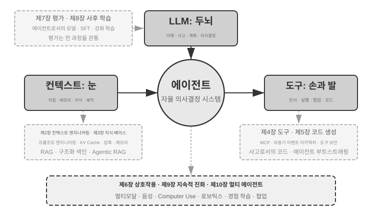

# 들어가며 {.unnumbered}

2025년 8월부터 10월까지 저는 중국의 기술 출판사 투링(Turing)이 운영한 ‘AI 에이전트 부트캠프’에서 기술 강의를 이어 갔습니다. 목표는 단순했습니다. AI 에이전트 설계를 직관 중심에서 원칙 중심으로 옮기는 것, 즉 데모를 그저 실행하는 데 그치지 않고 에이전트를 *왜* 그런 방식으로 설계하며 각각의 아키텍처 결정 뒤에 어떤 절충이 있는지 이해하는 것이었습니다. 이 책은 당시 강의 노트와 실험을 바탕으로 내용을 보완하고 확장해 엮었습니다.

책의 첫 발상부터 원고 완성까지는 **위스퍼 코딩(whisper coding)**, 즉 받아쓰기를 통한 협업이라고 부를 만한 방식으로 진행했으며, 받아쓰기 도구로는 저희가 만든 음성 에이전트 Pine을 사용했습니다. 강의를 준비할 때마다 저는 대략적인 개요를 말로 전달했고, Pine은 주제를 조사한 다음 초안을 만들었습니다. 강의가 끝난 뒤에는 부트캠프 수강생들의 피드백을 Pine과 공유하고 여러 차례 토론하며 다듬었습니다. 그렇게 한 번씩 반복할 때마다 강의 노트가 자라 지금 여러분이 읽고 있는 책이 되었습니다. 이 과정에서 저는 거의 타이핑하지 않고 생각을 소리 내어 말했습니다. 말은 타이핑보다 훨씬 대역폭이 높으므로(보통 말하는 속도는 타이핑 속도의 약 네 배입니다) ‘받아쓰기—조사—토론—수정’ 순환을 빠르게 돌릴 수 있었습니다. 그런 의미에서 이 책은 에이전트를 다룬 책일 뿐 아니라 에이전트의 도움을 받아 만든 결과물이기도 합니다.

2025년 초 DeepSeek R1이 공개된 뒤 AI 분야는 순수 기반 모델 단계, 즉 범용 대규모 언어 모델을 만드는 단계를 넘어 본격적인 엔지니어링 배포 단계로 들어섰습니다. 모델 계층의 진전은 두 방향에서 확인할 수 있습니다. 첫째, 에이전틱 강화 학습(Agentic Reinforcement Learning)을 통해 도구 호출 능력을 모델 매개변수에 학습시켜 코딩, 수학, 컴퓨터 사용과 같은 분야의 범용 능력을 익혔습니다. 둘째, 모델의 반복 개선 속도도 계속 빨라지고 있습니다. GPT-5.2에서 GPT-5.5로, Claude Opus 4.5에서 4.8로 도약하는 데 각각 반년밖에 걸리지 않았습니다. 제품 계층에서는 Manus, Claude Code, OpenClaw 같은 범용 에이전트가 인간과 컴퓨터의 상호작용을 새롭게 정의하며 ‘코드 생성 + 파일 시스템’이라는 아키텍처 패러다임을 주류로 끌어올렸습니다.

약 1년 전 강의에서 정리했던 에이전트 아키텍처 원칙을 다시 살펴보니 반갑고 놀라운 사실을 발견했습니다. **이 원칙들은 낡기는커녕 오히려 더 정석으로 자리 잡았습니다.** 그사이 스킬(Skill), 하네스(harness), 루프 엔지니어링(loop engineering) 같은 새로운 용어가 에이전트 업계를 휩쓸었지만 실제 순서는 반대입니다. Anthropic 같은 기업이 이런 개념을 발명하고 업계가 받아들인 것이 아니라, 이미 수많은 에이전트가 이러한 방식을 사용하고 있었고 Anthropic은 그 실천을 아키텍처 설계 원칙으로 정리해 이름을 붙였을 뿐입니다. 실천이 먼저이고 명명은 나중입니다.

이 원칙에 대한 확신은 실제 세계의 장기간 고위험 업무에 에이전트를 투입하면서 생겼습니다. 저는 Pine AI의 수석 과학자로서 팀과 함께 Pine을 만들었습니다. 제가 아는 한 Pine은 실제 사람들과 자율적으로 상호작용하며, 돈이 걸린 민감하고 복잡한 장기 업무를 사람의 개입 없이 안정적으로 처리하는 최초의 범용 에이전트입니다. 사용자를 대신해 통신사에 전화하여 요금을 협상하고, 판매자에게 환불을 요청하거나 불만을 제기하며, 구독을 해지합니다. 이런 업무는 수십 차례 협상으로 이어지기 일쑤이고 단 한 번의 실수도 실제 금전 손실로 이어집니다. 이처럼 가혹할 정도로 높은 신뢰성 요구가 이 책에서 거듭 다루는 아키텍처 원칙을 하나씩 단련했습니다. 다음은 그 실천에서 나온 사례입니다.

- 스킬이 유행어가 되기 훨씬 전부터 저희는 동적 프롬프트 로딩으로 끝없이 늘어나는 프롬프트를 통제하고, 명령줄 실행 도구로 끝없이 늘어나는 도구 목록을 통제했으며, 시스템 상태 표시줄을 통해 에이전트가 실행 환경과 사용자의 시간, 자신의 작업 상태를 인식하게 했습니다.
- 하네스가 유행어가 되기 훨씬 전부터 저희는 Claude Code와 같은 방식으로 불안정한 도구 호출, 환각, 위험한 작업, 권한 없는 작업, 무시된 지시를 처리했습니다.
- 루프 엔지니어링이 유행어가 되기 훨씬 전부터 저희는 이 책에서 제안자-검토자 방식이라고 부르는 방법으로 모델이 업무를 너무 일찍 끝났다고 선언하지 못하게 했습니다.

이 모든 것이 저희만의 발명인 것도 아닙니다. 제가 아는 한 선도적인 모델·에이전트 기업 대부분이 비슷한 방법을 독자적으로 찾아냈습니다. 그래서 저는 2025년 8월 투링에서 ‘AI 에이전트 부트캠프’를 시작했고 2024년부터 2026년까지 중국과학원대학교에서 실습형 AI 에이전트 강의를 계속해 왔습니다. 또한 이 책을 닫아 두고 인세를 받는 대신 오픈 소스로 공개하기로 했습니다. 이 지식이 더 많은 실무자에게 닿기를 바라기 때문입니다.

**실천이 먼저이고 명명은 나중입니다.** 이 순서는 기업용 에이전트 개발에 매우 실용적인 교훈을 줍니다. **에이전트 관련 유행어가 널리 퍼질 때까지 기다렸다가 실천한다면 이미 한 걸음 뒤처진 것입니다.** 어떤 용어가 유행할 무렵이면 선도 기업은 대개 그 용어가 가리키는 문제를 이미 풀어 본 뒤입니다. 그렇다면 이름이 생기기 전에 무엇을 해야 하는지 어떻게 알 수 있을까요? 저는 두 가지가 핵심이라고 생각합니다.

**첫째, 에이전트의 능력 상한을 극한까지 요구하는 실제 사업을 운영하며 거기서 진짜 피드백을 계속 얻어야 합니다.** Pine을 예로 들어 보겠습니다. 하나의 업무가 몇 시간, 심지어 몇 주 동안 이어지고 여러 이해관계자와 반복해서 주고받아야 할 때가 많습니다. 몇 시간 동안 통화하고, 컴퓨터로 복잡한 양식을 여러 쪽 작성하고, 이메일을 여러 차례 주고받습니다. 이 모든 과정에서 숫자 하나도 틀려서는 안 되며, 매번 사용자의 이익을 지킬 만큼 신중하게 소통해야 합니다. 이 정도로 복잡한 상황에 깊이 들어가야만 실천이 자연스럽게 하네스를 만들도록 밀어붙입니다. 즉 모델이 아직 스스로 해내지 못하지만 사업상 반드시 필요한 부분을 하네스가 보완합니다. 반대로 사업이 능력 상한을 거의 요구하지 않고 약간의 모델 업그레이드만으로 충분하다면 이러한 아키텍처 원칙을 갈고닦을 이유가 생기지 않습니다.

**둘째, 평가(Evaluation) 메커니즘을 구축해야 합니다.** 이 책은 평가 없이는 발전도 없다는 점을 거듭 강조합니다. 평가가 있어야 어떤 변경이 실제 개선인지 단지 운이 좋았던 것인지 구분할 수 있고, 에이전트의 개선 방향을 직감에 맡기지 않을 수 있습니다. 근본적으로 저희가 주장하는 것은 과학적 방법으로 엔지니어링을 수행하고 에이전트를 만들자는 것이며, 평가는 그 방법의 토대입니다. 7장에서 이를 자세히 다룹니다.

기반 모델이 아무리 발전하고 제품의 형태가 아무리 달라져도 성공적인 에이전트 시스템은 거의 모두 같은 아키텍처 패턴을 따릅니다. 우연이 아닙니다. **훌륭한 설계 원칙은 모델의 반복 주기보다 오래 지속되어야 합니다.** 특정 모델의 사용법이 아니라 지능형 시스템이 세계와 상호작용하는 근본 패턴을 설명하기 때문입니다.

튜링상 수상자이자 강화 학습의 아버지인 리처드 서튼은 우주의 진화가 먼지, 별, 생명, 에이전트(원래 표현은 ‘설계된 존재(designed entities)’)라는 네 단계를 거쳤다고 말한 적이 있습니다. 생물학적 진화는 무작위 돌연변이와 자연 선택으로 이루어지는 맹목적 과정입니다. 대부분의 생물은 자신의 작동 원리를 이해하지 못하며 스스로 생명을 설계하거나 다시 만들 수도 없습니다. 그러나 에이전트는 우주 진화의 역사에서 완전히 새로운 존재입니다. 한 프로그래머가 또 다른 프로그래머를 만들고 그 프로그래머가 다시 다음 프로그래머를 만들듯, 코드를 생성하여 스스로 부트스트랩하고 진화할 수 있습니다. 다시 말해 에이전트는 자신의 작동 메커니즘을 이해하고 목표가 주어지면 완전히 새로운 에이전트를 만들며, 심지어 자신을 개선할 수도 있습니다. 이 책의 사명은 여러분이 이러한 창조의 원리를 이해하고 익히도록 돕는 것입니다.

이 책의 핵심 공식은 한 문장입니다. **에이전트 = LLM + 컨텍스트 + 도구**. 세 요소 모두 빠질 수 없습니다.



더 직관적으로 표현하면 **두뇌 + 눈 + 손발**입니다. 두뇌(LLM)는 사고와 의사 결정을 담당하고, 눈(컨텍스트)은 에이전트가 어떤 정보를 볼 수 있는지 결정하며, 손발(도구)은 에이전트가 무엇을 할 수 있는지 결정합니다. (엄밀히 말하면 ‘눈’은 대략적인 비유입니다. 컨텍스트에는 환경 정보와 대화 기록뿐 아니라 도구 정의도 포함되므로 에이전트가 ‘보는’ 정보에는 ‘어떤 손발을 사용할 수 있는가’도 들어갑니다. 이 비유의 목적은 핵심 직관, 즉 컨텍스트가 모델이 인식할 수 있는 모든 정보라는 점을 전달하는 데 있습니다.)

강화 학습에 익숙한 독자라면 이 세 요소를 강화 학습의 형식 언어로 대응시킬 수도 있습니다. 구체적으로 LLM은 정책(Policy), 컨텍스트는 관측 공간(Observation Space), 도구는 행동 공간(Action Space)에 해당합니다. 세 표현은 추상화 수준만 다를 뿐 같은 대상을 가리킵니다.


## 책의 구성 {.unnumbered}

이 책은 모두 열 장으로, 네 개의 층위를 따라 전개됩니다(그림 0-2). 1장은 에이전트의 기초 틀을 세우고, 2~6장은 에이전트를 어떻게 구축하는지를 컨텍스트·지식·도구·코드 생성·상호작용의 순서로 다룹니다. 7~9장은 에이전트를 어떻게 평가하고 지속적으로 개선하는지를 다루며, 측정 체계와 모델 후속 훈련에서 운영 경험이 이끄는 지속적 진화까지 나아갑니다. 10장은 시야를 멀티 에이전트 협업으로 넓힙니다.


- **1장(에이전트 기초)**은 실제 에이전트 제품 몇 가지를 통해 에이전트를 직관적으로 이해하는 데서 시작합니다. 이어서 에이전트의 핵심 공식을 구현 계층의 LLM + 컨텍스트 + 도구, 직관 계층의 두뇌 + 눈 + 손발, 학술 계층의 정책 + 관측 공간 + 행동 공간이라는 세 수준에서 자세히 살펴봅니다. 실험을 통해 ‘생각 → 행동 → 관찰’을 반복하는 ReAct 루프의 작동 방식을 분석하고, 한 업무 안에서 이루어지는 컨텍스트 적응, 여러 업무에 걸친 외부 산출물 업데이트, 학습 주기 동안의 매개변수 업데이트를 구분합니다. 마지막으로 워크플로부터 자율 에이전트까지 이어지는 오케스트레이션 설계 패턴을 다루어 이후 장을 위한 통합 개념 프레임워크를 세웁니다.
- **2장(컨텍스트 엔지니어링)**은 이 책에서 가장 중요한 장으로, 에이전트의 ‘눈’인 컨텍스트를 체계적으로 설명합니다. API 메시지 구조와 에이전트의 핵심 루프에서 출발해 ‘컨텍스트는 메시지 목록이다’라는 토대를 세운 다음, LLM 추론 과정에서 과거 계산 결과를 재사용하는 KV 캐시의 기본 원리를 살펴봅니다. 이어서 프로세스 중심 설계, 도구 설명, 비즈니스 규칙 개선을 포함한 프롬프트 엔지니어링, 프롬프트 인젝션 공격과 방어, 에이전트 스킬의 주문형 로딩 메커니즘, 에이전트 상태 표시줄 기술, 컨텍스트 압축 전략을 다룹니다. 각 용어의 완전한 정의는 본문에서 처음 등장할 때 제공합니다.
- **3장(사용자 메모리와 지식 베이스)**은 컨텍스트 관리를 세션을 넘나드는 지속적 지식 시스템으로 확장합니다. 이를 통해 에이전트는 현재 대화를 기억할 뿐 아니라 여러 대화에 걸쳐 지식을 축적하고 검색할 수 있습니다. 사용자 메모리를 위한 네 가지 점진적 전략, 모델이 답변을 생성하기 전에 관련 문서를 검색하는 RAG(Retrieval-Augmented Generation, 검색 증강 생성)의 전체 기술 스택, 다양한 텍스트 검색 방식과 순위 최적화, 멀티모달 정보 추출, 더 발전된 지식 구성 방식, 그리고 에이전트가 검색 시점과 대상을 자율적으로 결정하는 에이전틱 RAG를 다룹니다.
- **4장(도구)**은 에이전트와 외부 세계를 잇는 다리를 살펴봅니다. 도구는 에이전트의 ‘손발’로 작동하여 웹 검색, API 호출, 데이터베이스 조작 등을 가능하게 합니다. 도구 상호운용성 표준인 MCP와 인식, 실행, 협업, 이벤트 트리거, 사용자 커뮤니케이션이라는 다섯 가지 도구 범주의 설계 원칙을 소개하고, 멀티모달 인식을 위한 세 가지 경로(네이티브 멀티모달 처리, 텍스트 변환, 도구 기반 멀티모달 분석)를 설명하며, 실행 도구의 보안 메커니즘을 중점적으로 다룹니다. 이벤트 트리거, 사용자 커뮤니케이션, 비동기 런타임은 6장에서 설명합니다.
- **5장(코딩 에이전트와 코드 생성)**은 코딩 에이전트와 파일 시스템의 결합이 모든 범용 에이전트의 핵심 기술 기반이라고 주장합니다. OpenClaw 아키텍처를 중심축으로 삼아 코딩 에이전트의 워크플로와 구현 기법을 분석하고, 사고 보조와 지식 베이스 구축부터 새로운 도구의 동적 생성과 에이전트 부트스트래핑까지 프로그래밍을 넘어선 코드 생성의 폭넓은 가치를 보여 줍니다.
- **6장(상호작용: 관찰 공간과 행동 공간의 확장)**은 앞의 다섯 장이 전제해 온 "번갈아 발언한다"는 약속을 걷어내고, **모달리티**와 **타이밍**이라는 두 축을 따라 에이전트와 세계의 상호작용을 펼칩니다. 비동기와 이벤트 기반은 세계가 에이전트를 깨우게 하고(이벤트 트리거 도구, 사용자 커뮤니케이션 도구, 가상 신원과 격리 실행 환경), 음성은 상호작용을 밀리초 척도로 밀어붙이며(캐스케이드 파이프라인에서 엔드투엔드 전모달과 전이중까지), Computer Use는 에이전트가 사람처럼 그래픽 인터페이스를 다루게 하고, 로봇 조작은 행동을 물리 세계로 확장합니다(VLA 제어와 Sim2Real 전이). 네 시나리오는 같은 원시 요소 집합(깨우기, 안전 지점, 취소, 선점, 빠름/느림 분리)을 공유합니다.
- **7장(에이전트 평가)**은 과학적인 평가 방법론을 구축합니다. 두 가지 핵심 패러다임인 도구 호출과 인간-컴퓨터 상호작용, 그리고 장 마지막에서 별도로 다루는 시뮬레이션 환경을 포함한 평가 환경, 데이터셋 설계 원칙, LLM-as-a-Judge 자동 평가, 평가 기반 모델 선택, 평가 결과를 시스템 개선으로 전환하는 완전한 폐루프를 다룹니다.
- **8장(모델 사후 학습)**은 두 가지 사후 학습 기술을 깊이 있게 다룹니다. 라벨이 있는 데이터로 예제를 따르도록 모델을 가르치는 지도 미세 조정(SFT, Supervised Fine-Tuning)과, 시행착오와 보상 피드백을 통해 모델이 자율적으로 개선되게 하는 강화 학습(RL, Reinforcement Learning)입니다. ‘SFT는 암기하고 RL은 일반화한다’, ‘알고리즘보다 데이터와 환경이 중요하다’라는 중심 논지를 따라 사전 학습/SFT/RL의 전체 구도, 고전 강화 학습 이론, 이진 보상과 과정 보상부터 ‘결과를 보상하고 과정을 제약하는’ 검증된 경로 페널티까지의 보상 신호 설계, 단일 턴 및 다중 턴 강화 학습 알고리즘, 샘플 효율 최적화 같은 최전선 주제를 다룹니다.
- **9장(에이전트의 지속적 진화)**은 에이전트의 운영 경험을 다음 버전의 능력으로 전환하는 방법을 연구합니다. 먼저 환경 결과, 프로세스 규칙, LLM 루브릭으로 구성되는 학습 신호를 확립합니다. 이어서 지식 문서, 프롬프트와 스킬, 프로그램과 하네스, 모델 매개변수라는 네 가지 업데이트 매체를 비교하고, 마지막으로 후보 버전 검증, 카나리 릴리스, 롤백, 장기 통합을 논의합니다.
- **10장(멀티 에이전트 협업)**은 AI 에이전트 시스템의 궁극적인 형태, 즉 여러 에이전트가 업무를 나누고 협력하는 방법을 다룹니다. 공유/독립 컨텍스트 × 동료/관리자/탈중앙화 구조라는 멀티 에이전트 협업 분류 프레임워크를 체계적으로 제시하고, 번역 에이전트와 전화-컴퓨터 결합 에이전트를 통해 협업 아키텍처 설계를 보여 주며, 에이전트 사회와 에이전트 경제라는 최전선 방향을 조망합니다.

## 이 책을 읽는 방법 {.unnumbered}

이 책의 각 장은 비교적 독립적입니다. 필요에 따라 다음과 같이 읽을 수 있습니다.

- **에이전트 개발자라면** 1장부터 9장까지 순서대로 읽기를 권합니다. 앞의 여섯 장이 구축 방법을 제시하고, 7장이 평가의 기초를 세우며, 8장이 모델을 훈련하는 방법을 설명하고, 9장이 파라미터와 그 밖의 갱신 매체를 완전한 지속적 진화 폐루프에 통합합니다. 10장은 멀티 에이전트 협업이 필요할 때 골라 읽으면 됩니다.
- **시간이 부족하다면** 전체 그림을 보여 주는 1장과 가장 중요한 기술인 컨텍스트 엔지니어링을 다루는 2장을 우선 읽으십시오. 2장의 KV 캐시 기본 원리는 기술적 난도가 꽤 높습니다. 처음 읽을 때는 작동 원리를 건너뛰고 서두에 제시된 세 가지 핵심 결론만 기억해도 이후 내용을 이해하는 데 지장이 없습니다.
- **모델 학습에 초점을 둔다면** 8장(모델 사후 학습)으로 바로 가십시오. 7장의 평가 방법이 학습의 전제 조건이므로, 1장과 2장에서 전체 그림을 이해한 뒤 두 장을 함께 읽는 것이 좋습니다.

각 장에는 **실험**과 **생각해 볼 문제**가 많이 포함되어 있으며, ‘실험 X-Y’ 형식으로 번호를 붙였습니다(X는 장 번호, Y는 장 안의 일련번호입니다). 실험과 생각해 볼 문제의 제목에는 난이도를 나타내는 별점이 있습니다. ★는 모든 독자에게 적합한 입문 수준, ★★는 어느 정도 엔지니어링 경험이 필요한 중간 수준, ★★★는 대개 열린 질문이나 복잡한 시스템 설계를 포함하는 고급 도전 과제입니다. 대부분의 실험에는 실행 가능한 전체 코드가 있으며 다음 오픈 소스 저장소에 정리되어 있습니다.

> **연계 코드 저장소**: [https://github.com/bojieli/ai-agent-book](https://github.com/bojieli/ai-agent-book)

전체 연계 코드는 Git으로 받을 수 있습니다.

```bash
git clone https://github.com/bojieli/ai-agent-book.git
cd ai-agent-book
```

Git을 사용하지 않는다면 저장소 페이지에서 **Code → Download ZIP**을 선택해 내려받을 수도 있습니다. 실험 코드는 `chapter1/`부터 `chapter10/`까지 장별로 정리되어 있습니다. ‘실험 X-Y’를 찾으려면 해당 `chapterX/README.ko.md`를 열어 실험 번호로 프로젝트 디렉터리를 찾은 다음, 그 프로젝트의 README에 따라 의존성을 설치하고 실행하십시오. 재현 가이드로 표시된 일부 실험은 외부 저장소에 의존하며, 해당 README에서 그 저장소를 받는 방법도 설명합니다.

이 실험들을 직접 실행해 보기를 강력히 권합니다. AI 에이전트는 실습이 매우 중요한 분야이며, 많은 설계 직관은 직접 디버깅하는 과정에서야 비로소 생기기 때문입니다.

**용어 참고**: 이 책에서는 일상적으로 혼용되기 쉬운 두 용어를 신중하게 구분합니다. **사고(Reasoning)**는 사고 모델, 사고 연쇄(chain-of-thought), 사고 토큰처럼 모델이 단계적으로 생각하는 과정을 뜻합니다. **추론(Inference)**은 추론 비용, 추론 스택, 추론 시점 스케일링처럼 배포 시점에 모델이 수행하는 순방향 계산을 뜻합니다. (중국어판은 두 개념을 명확히 나누기 위해 reasoning을 思考, inference를 推理라는 서로 다른 단어로 옮겼으며, 10장의 번역 사례 연구에서 이 관례를 다시 언급합니다.) 다만 **논리적 추론, 다중 홉 추론, 공간 추론, 시간적 추론**과 ‘추론 게임’처럼 이미 굳어진 표현에서는 관례대로 ‘추론’을 사용합니다. 이때의 추론은 위에서 말한 inference라는 기술적 의미가 아니라 일반적인 연역·추리의 뜻이므로 문맥에 따라 구분해 주십시오. 그 밖의 핵심 용어는 본문에서 처음 등장할 때 정의합니다.

## 선수 지식 {.unnumbered}

이 책은 어느 정도 기술 배경이 있는 독자를 대상으로 하지만 특정 분야의 전문가일 필요는 없습니다. 준비 정도를 판단할 수 있도록 선수 지식을 ‘필수’와 ‘권장’ 두 단계로 나누어 제시합니다.

**필수: 책 전체를 읽기 위한 기반**

- **Python 프로그래밍**: 이 책의 실험은 거의 모두 Python을 기반으로 합니다. Python의 기본 문법, 자주 쓰는 자료 구조, 패키지 관리(pip)와 같은 기초 개념에 익숙해야 합니다. 능숙할 필요까지는 없지만 중간 정도로 복잡한 Python 코드를 읽고 수정할 수 있어야 합니다.
- **LLM 기초 사용 경험**: ChatGPT, Claude 또는 비슷한 제품을 사용해 보았고 ‘프롬프트 → 모델 응답’이라는 기본 상호작용 방식을 이해해야 합니다.
- **AI 보조 프로그래밍 도구**: Claude Code, Codex, Cursor, TRAE 같은 AI 보조 프로그래밍 도구를 하나 이상 설치하고 익숙해지십시오. 우선 이 도구들은 많은 코드 작성과 디버깅이 필요한 실험의 속도를 크게 높여 줍니다. 또한 그 자체가 성숙한 코딩 에이전트이므로, 사용하면서 이 책이 반복해서 다루는 ReAct 루프, 도구 호출, 컨텍스트 관리 같은 핵심 메커니즘을 직접 경험할 수 있습니다. 이러한 직접 경험은 에이전트 설계 원칙을 이해하는 데 매우 소중합니다.
- **일반 소프트웨어 엔지니어링 지식**: 명령줄 작업, Git 버전 관리, JSON 데이터 형식, REST API 같은 기본 개념에 익숙해야 합니다. 이는 실험을 실행하고 에이전트의 도구 호출 메커니즘을 이해하기 위한 토대입니다.

**권장: 특정 장의 독서 경험을 높이는 배경지식**

- **머신러닝 기초**(8장): 학습과 추론의 차이, 손실 함수, 경사 하강법, 과적합 같은 기본 개념을 이해하면 모델 사후 학습을 파악하는 데 도움이 됩니다.
- **수학 기초**(2~3장, 8장): 선형대수에 대한 직관적인 이해(예: 벡터가 방향과 크기를 나타내고 행렬이 일괄 연산을 수행할 수 있다는 점)는 임베딩과 어텐션 메커니즘을 이해하는 데 도움이 됩니다. 확률과 통계의 기초 지식은 강화 학습의 평가 지표와 기대 보상을 이해하는 데 유용합니다. 이 책의 수학은 복잡한 유도를 요구하지 않으며 직관적인 설명에 초점을 둡니다.
- **웹 개발 기초**(6장): HTTP, WebSocket, 프런트엔드/백엔드 분리 아키텍처 같은 개념을 알면 이벤트 기반 비동기 에이전트 아키텍처와 음성 에이전트의 실시간 통신 실험을 이해하는 데 도움이 됩니다.
- **Transformer 아키텍처 기초**(2장, 8장): Transformer는 현재 거의 모든 대규모 언어 모델의 기반 아키텍처입니다. 대규모 모델의 기초 지식을 체계적으로 쌓고 싶은 독자에게는 Transformer 아키텍처, 사전 학습, 미세 조정 같은 핵심 개념을 직관적인 그림으로 설명하는 중국어 도서 *대규모 모델 도해*(图解大模型, 투링 출판)를 권합니다. 이 책의 에이전트 엔지니어링 관점을 잘 보완해 줍니다.

이 선수 지식 가운데 일부가 부족하더라도 낙담하지 마십시오. 이 책의 핵심 가치는 특정 알고리즘이나 기술이 아니라 **아키텍처 설계 원칙과 엔지니어링 방법론**에 있습니다. 사후 학습을 다루는 8장을 제외하면 수학이나 머신러닝 지식을 거의 요구하지 않으며, 입문서로 읽기에도 충분합니다.

에이전트 기술은 여전히 빠르게 발전하지만 **훌륭한 아키텍처 설계 원칙은 시간을 견디는 힘이 있습니다.** 설계의 ‘왜’를 익히면 기술의 파도가 밀려와도 명확한 판단력을 유지할 수 있습니다. 이 책이 여러분의 AI 에이전트 구축 여정에 든든한 안내서가 되기를 바랍니다.

## 감사의 말 {.unnumbered}

꼼꼼하게 편집하고 투링 ‘AI 에이전트 부트캠프’ 과정을 준비해 주신 투링의 멍거(梦鸽), 류메이잉(刘美英) 편집자께 감사드립니다. 중국과학원대학교에서 실습형 AI 에이전트 강의를 개설해 주신 류쥔밍(刘俊明) 교수께도 감사드립니다. 특히 투링 ‘AI 에이전트 부트캠프’와 중국과학원대학교 AI 에이전트 강의의 모든 수강생께 감사드립니다. 강의를 진행하며 여러분에게서 소중한 피드백과 조언을 많이 받았고, 저 자신도 이 개념들을 더 날카롭게 이해할 수 있었습니다.

Pine AI의 모든 동료에게 감사드립니다. Pine AI라는 훌륭한 제품과 그 제품이 던진 수많은 도전이 없었다면 에이전트 분야를 이토록 깊이 이해하고 실천할 수 없었을 것입니다. 동료들은 거듭된 아이디어 교류를 통해 소중한 통찰을 많이 보태 주었습니다.

AI 업계의 많은 지인에게도 감사드립니다(여기서 모두 이름을 밝히지는 않겠습니다). 여러분은 여러 차례 토론하면서 제 견해에 솔직한 피드백을 주고, 잘못된 판단을 바로잡아 주었으며, 모델과 에이전트에 대한 제 이해를 한 단계 높여 주었습니다.

무엇보다 제 가족, 특히 아내 멍자잉(孟佳颖)에게 감사드립니다. 아내는 이 책을 쓰는 내내 저를 지지해 주었고 과정 곳곳에서 소중한 제안을 해 주었습니다.
