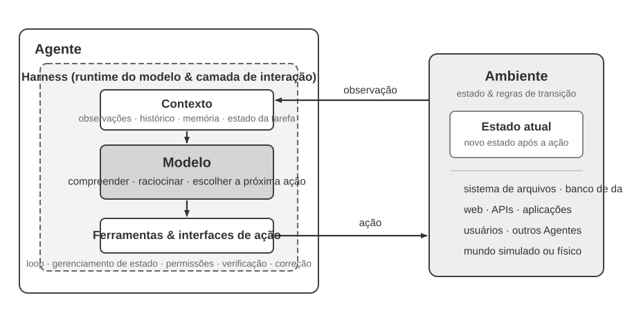
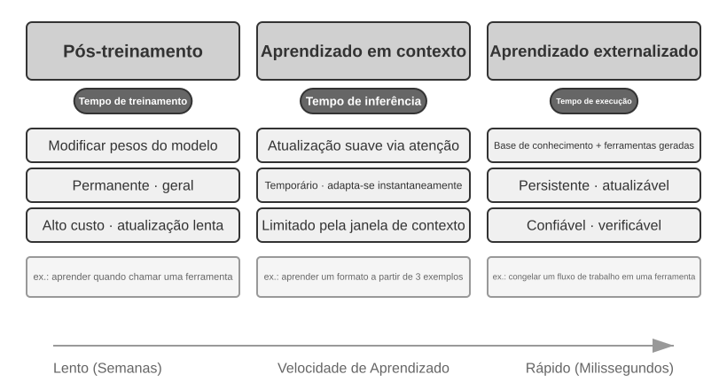
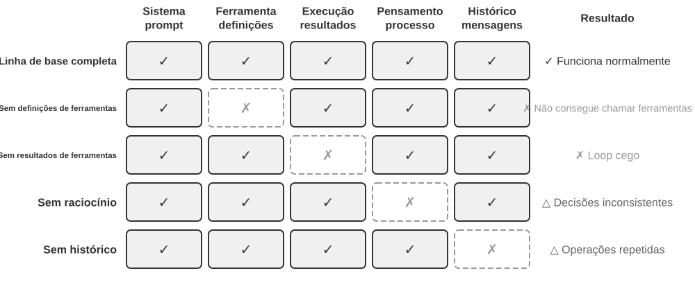
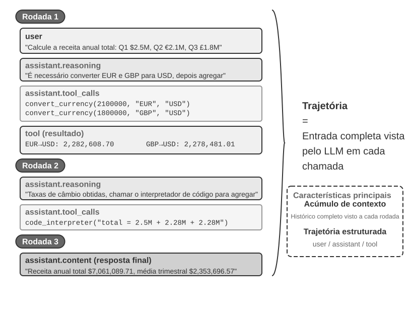
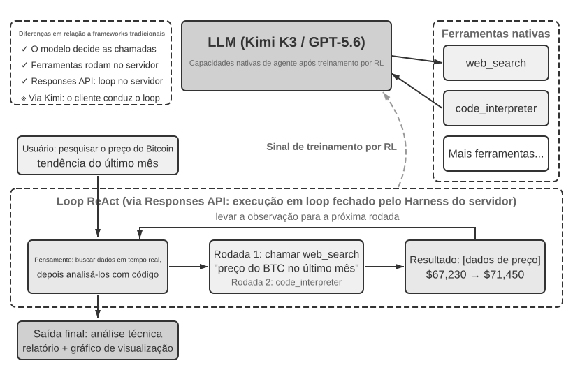
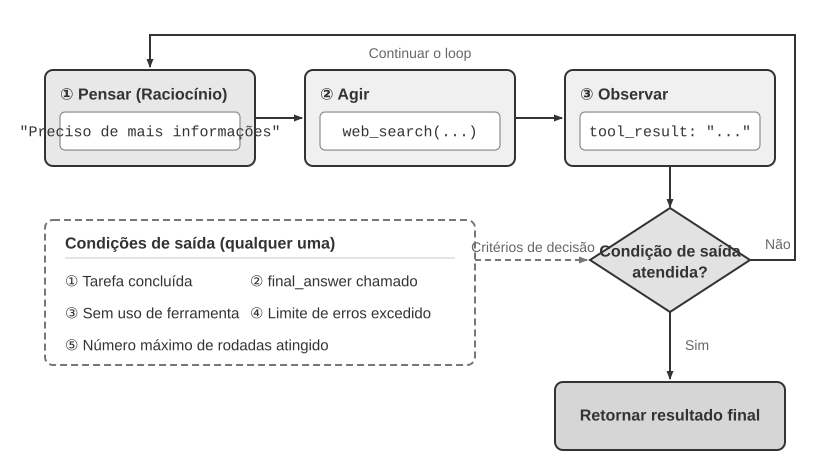

# Introdução aos agentes de IA

Se você já usou o Cursor para programar e o viu pesquisar na base de código, editar vários arquivos e executar os testes repetidamente até que fossem aprovados, então já usou um agente de IA. O mesmo vale se você usou o Deep Research para pesquisar um tema por meio de buscas e leituras sucessivas, deixou o Manus controlar um navegador para concluir tarefas online, pediu ao assistente de celular Doubao que reservasse passagens ou enviasse mensagens, ou encarregou o Pine AI de negociar uma redução na conta da operadora.

Esses produtos assumem diversas formas, mas têm algo em comum: deixaram de ser conversas passivas em que “você pergunta e ele responde”. Eles planejam de forma autônoma as etapas de execução, chamam as ferramentas necessárias para cada tarefa e ajustam sua estratégia conforme os resultados. Os agentes de IA estão se tornando uma nova forma de interagir com os computadores.

Este capítulo parte de exemplos práticos para apresentar os principais componentes de um agente de IA. Você conhecerá em primeira mão os recursos dos agentes modernos, compreenderá a arquitetura por trás deles e aprenderá padrões de projeto e boas práticas para construir sistemas agênticos.

> **Dica de leitura**: este capítulo é o mapa conceitual de todo o livro: uma apresentação concisa da fórmula básica, do ciclo operacional, do framework de engenharia e dos padrões de projeto de agentes. Ele estabelece o vocabulário comum e os pontos de referência usados nos capítulos seguintes. Na primeira leitura, não tente memorizar todos os conceitos; procure obter uma visão geral. Cada capítulo posterior aprofunda um dos aspectos apresentados aqui, e você poderá voltar a este capítulo sempre que precisar se orientar.

## Agente moderno = LLM + contexto + ferramentas

A implementação de engenharia mínima de um agente moderno pode ser expressa por uma fórmula concisa: **agente = LLM (modelo de linguagem de grande porte) + contexto + ferramentas**. Os sinais de adição indicam aqui uma combinação de componentes de engenharia, não uma definição formal do aprendizado por reforço. Mais importante: a fórmula descreve apenas o que está dentro dos limites do agente e **não inclui o ambiente com o qual ele interage**. Cada termo deve ser entendido em sentido amplo, mas com limites claros:

- **O LLM é o cérebro do agente**: ele é mais do que um conjunto de parâmetros do modelo; é o núcleo decisório do agente, responsável por compreender intenções, raciocinar, planejar e fazer julgamentos. Os recursos de um LLM provêm do conhecimento de mundo e da competência linguística adquiridos durante o **pré-treinamento**, somados às estratégias de decisão incorporadas no **pós-treinamento** — técnicas como ajuste fino supervisionado (SFT) e aprendizado por reforço são abordadas no Capítulo 8.
- **O contexto é os olhos do agente**: não se limita ao texto fornecido ao modelo; é a representação das informações que o agente recebe e mantém em cada ponto de decisão — observações do ambiente, memória do usuário, conhecimento do domínio, seu próprio estado e o andamento da tarefa.
- **As ferramentas são as mãos e os pés do agente**: “ferramentas” são as interfaces que o agente usa para perceber ou modificar o mundo externo, incluindo definições de ferramentas, protocolos de chamada e adaptadores — desde chamadas de ferramentas predefinidas até a geração dinâmica de código, da delegação de tarefas a subagentes à comunicação ativa com o usuário.

Em termos mais intuitivos: **agente = cérebro + olhos + mãos e pés**. O cérebro raciocina e toma decisões, os olhos recebem as observações fornecidas pelo ambiente, e as mãos e os pés transformam as decisões em ações sobre o ambiente.

Na perspectiva clássica do aprendizado por reforço e da teoria de controle, o agente e o ambiente são as duas partes de uma interação em circuito fechado, e não componentes um do outro. O ambiente fornece continuamente ao agente a observação atual; com base no contexto disponível, o agente escolhe a próxima ação. Essa ação altera o estado do ambiente, e o novo estado produz a observação seguinte, dando continuidade ao ciclo. Essa é a estrutura mínima para compreender todas as interações de um agente.



A Figura 1-1 apresenta dois níveis de abstração. O nível externo mostra a **interação entre o agente e o ambiente**: o ambiente inclui arquivos, bancos de dados, páginas web, usuários, outros agentes e mundos físicos ou simulados, e o agente só pode interagir com ele por meio de interfaces de observação e ação. O nível interno mostra a **estrutura Model–Harness do agente**: o Model toma decisões de acordo com a política; o Harness é a camada de execução e governança situada dentro dos limites do agente, responsável por construir o contexto, expor interfaces de ferramentas, manter o ciclo e o estado e aplicar permissões, verificações e correções. Um Harness pode criar, isolar ou intermediar um ambiente sem, com isso, conter o estado ou as regras de transição desse ambiente.

A fórmula de engenharia pode, portanto, ser desdobrada da seguinte forma: o LLM corresponde ao Model, enquanto contexto + ferramentas formam o Harness mínimo; em sistemas de produção, acrescentam-se restrições, verificações e correções ao Harness. Todas as arquiteturas apresentadas a seguir respeitam esses limites.

Esses três componentes de engenharia podem ser relacionados à política e às interfaces de interação do RL (aprendizado por reforço; consulte o Capítulo 8), mas não há uma equivalência estrita de um para um: o contexto é a representação interna das observações e do histórico no agente, não todo o espaço de observação; as ferramentas definem as interfaces de observação e ação disponíveis ao agente, mas os objetos subjacentes a elas continuam pertencendo ao ambiente.

| Compreensão intuitiva | Componente do agente | Conceito de RL | Função |
|---|---|---|---|
| **Cérebro** | LLM | **Política** | A lógica de decisão que determina “o que fazer a seguir”: com base nas informações atuais, escolhe a ação mais adequada entre todas as opções disponíveis |
| **Olhos** | Construção do contexto | **Observações e histórico** | Organiza as observações fornecidas pelo ambiente e o histórico disponível nas informações necessárias para a decisão atual |
| **Mãos e pés** | Ferramentas e adaptadores | **Interfaces de observação/ação** | Define quais observações o agente pode ler, quais ações pode executar e qual formato essas interfaces utilizam |

### Espaços de observação e de ação: a interface entre o modelo e o mundo

**O espaço de observação e o espaço de ação formam, em conjunto, a interface entre o LLM e seu ambiente externo**. O espaço de observação converte as informações do ambiente em um contexto que o modelo consegue processar; o espaço de ação transforma as decisões do modelo em operações no mundo externo. Para o modelo, as informações fora do espaço de observação efetivamente não existem. Uma operação fora do espaço de ação continua sendo algo que o modelo só pode recomendar em palavras, mesmo que saiba exatamente o que deve ser feito.

Consequentemente, **quando o modelo subjacente é mantido constante, a principal medida de engenharia de sistemas para melhorar o desempenho de um agente costuma ser redefinir ou ampliar seus espaços de observação e de ação**. Na terminologia deste livro, isso significa expandir o contexto e as ferramentas. Muitos problemas que parecem exigir um “modelo mais inteligente” são, na verdade, problemas de interface: basta incluir no contexto os dados relevantes para a tarefa ou disponibilizar como ferramenta a operação necessária para que uma tarefa antes insolúvel possa se tornar viável.

**Manus: unificando espaços antes separados.** Antes do surgimento do Manus, os agentes de produção seguiam principalmente três vertentes distintas: Deep Research, Coding e Computer Use. O Manus foi o primeiro agente de produção de grande influência a reunir as três em um único sistema. Seu navegador virtual ampliou o espaço de observação, enquanto o sistema de arquivos, a execução de código e a execução de comandos expandiram o espaço de ação. O Manus não se tornou um agente de propósito geral apenas pela adoção de um modelo mais potente. Ele reuniu os espaços de observação e de ação de três tipos de agente, permitindo que um único agente ultrapassasse as fronteiras anteriores entre produtos.

**OpenClaw: estendendo a interface à vida digital do usuário.** O OpenClaw amplia novamente os dois espaços. Ele recebe tarefas e retorna resultados pelos canais de mensagens que os usuários já utilizam — WhatsApp, Telegram, Slack, Discord, iMessage e muitos outros —, permitindo acessar o agente de praticamente qualquer lugar. Seu Gateway local se conecta tanto a aplicativos na nuvem, como Google Drive e Notion, quanto ao sistema de arquivos local. Assim, com a autorização explícita do usuário, arquivos dispersos entre contas e dispositivos podem entrar no espaço de observação de um único agente e ser processados por suas ferramentas. Em comparação com a forma original do Manus, centrada em uma sandbox na nuvem, na qual geralmente era necessário enviar os arquivos ou configurar um conector separadamente, o OpenClaw, com sua abordagem local-first, abrange uma fronteira de dados mais ampla. Mais tarde, o Manus também adicionou seu próprio conector para o Google Drive e acesso, pelo aplicativo para desktop, a arquivos locais, o que apenas reforça a ideia de que a evolução dos produtos muitas vezes consiste precisamente na ampliação dos espaços de observação e de ação[^ch1-agent-products].

[^ch1-agent-products]: Os materiais oficiais do Manus descrevem sua Sandbox original como uma máquina virtual isolada na nuvem. Ao apresentar o Google Drive Connector, o Manus relembrou explicitamente o fluxo de trabalho anterior e fragmentado, que exigia baixar e enviar manualmente arquivos entre o Drive, o desktop e o Manus. Quando lançou o My Computer, em março de 2026, classificou como uma limitação fundamental da sandbox na nuvem o fato de que trabalhos importantes ficam armazenados localmente, e não na nuvem. O README oficial do OpenClaw o descreve como um assistente pessoal local-first, sempre ativo e executado nos dispositivos do próprio usuário, além de listar mais de vinte canais de mensagens; seu sistema de ferramentas e plugins permite adicionar integrações com a nuvem e recursos locais. Consulte https://manus.im/blog/manus-sandbox, https://manus.im/blog/manus-google-drive-connector, https://manus.im/blog/manus-my-computer-desktop, https://github.com/openclaw/openclaw e https://docs.openclaw.ai/tools

Compreender a função de cada componente e como eles se integram é a base para construir sistemas agênticos eficazes. Começaremos pelo mais concreto dos três — as ferramentas, que são as interfaces de ação — e avançaremos para o LLM e o contexto. Primeiro, vejamos como diferentes tipos de agente se comparam nessas três dimensões:

| Produto agêntico | Contexto de trabalho | Interfaces de ação | Estratégia |
|-----------------|------------------------|--------------------------|-----------------------------|
| **Agentes de programação (como o Cursor)** | Documentos de requisitos, base de código, ambiente de terminal | Abertas (raciocínio interno, busca no código, leitura e gravação de arquivos, execução de comandos etc.) | Desenvolvimento incremental: compreender os requisitos → buscar o código relevante → editar o código → testar e verificar → depurar e corrigir |
| **Agentes de busca (como o Deep Research)** | Recursos da web, bases de dados acadêmicas, arquivos locais | Abertas (raciocínio interno, consultas de busca, leitura de páginas web, geração de resumos) | Aprofundamento iterativo: ajustar a direção da busca com base nas informações existentes e sintetizar gradualmente um relatório completo |
| **Agentes de controle de computador (como o Browser Use)** | Tela do computador, páginas do navegador, sistema de arquivos | Abertas (raciocínio interno, cliques, digitação, rolagem, capturas de tela, execução de código etc.) | Percepção visual + operação: observar a tela → identificar os elementos desejados → executar ações → verificar os resultados |
| **Agentes assistentes para celular (como o Doubao)** | Tela do celular, aplicativos instalados | Abertas (raciocínio interno, toques, gestos de deslizar, digitação, abertura de aplicativos etc.) | Compreensão da intenção + controle de aplicativos: compreender as necessidades do usuário → localizar o aplicativo desejado → executar ações → confirmar a conclusão |
| **Agentes de tarefas pessoais (como o Pine AI)** | Informações das contas do usuário, histórico de faturas, base de conhecimento de prestadores de serviços | Abertas (raciocínio interno, ligações telefônicas, envio de e-mails, preenchimento de formulários, confirmação com o usuário) | Execução de tarefas em várias etapas: coletar informações → formular uma estratégia de negociação → contatar o prestador de serviços → negociar → relatar os resultados |

Esses sistemas compartilham três características: um **espaço de ação aberto** — em vez de escolher entre um conjunto fixo de botões, eles podem gerar linguagem natural e código livremente; **raciocínio interno** — planejam antes de agir; e **interação contínua** — ajustam a estratégia com base no feedback do ambiente. Esses recursos resultam justamente da interação entre o mecanismo de raciocínio, o contexto de trabalho e as interfaces de ação — isto é, LLM, contexto e ferramentas.

### Ferramentas: as interfaces de ação do agente

As ferramentas são a ponte entre o agente e o mundo exterior. Elas transformam o agente de um observador passivo em um sistema ativo, capaz de pesquisar, gravar arquivos, executar código, chamar APIs, enviar mensagens ou operar interfaces. Sem ferramentas, um agente se limita à geração de texto; com elas, pode atuar em sistemas externos.

Para discutir as ferramentas de forma sistemática, podemos classificá-las em cinco tipos, de acordo com a direção da interação do agente com o mundo. Neste momento, basta apresentar brevemente os cenários representativos de cada tipo para formar uma visão geral; os capítulos seguintes abordarão cada um em profundidade.

**Ferramentas de percepção** permitem que o agente acesse informações: mecanismos de busca fornecem dados da Web em tempo real, sistemas de arquivos leem documentos locais, e APIs e bancos de dados conectam-se a serviços externos e aos principais dados corporativos.

**Ferramentas de execução** permitem que o agente atue em sistemas externos: execução de código, operações com arquivos, comandos de sistema e chamadas a APIs externas transformam decisões em ações concretas.

**Ferramentas de colaboração** permitem que o agente divida o trabalho com outros agentes: delegando tarefas especializadas a subagentes, solicitando confirmação humana em pontos decisórios importantes ou coordenando ações em sistemas multiagente.

**Ferramentas de acionamento por eventos** são invocadas de modo fundamentalmente diferente das três primeiras categorias: não é o agente que as chama; elas chegam como entradas externas que o levam a iniciar o trabalho. Uma nova mensagem de email é recebida, chega um horário agendado ou outro sistema dispara um callback de Webhook; o evento ativa o agente e dá início ao raciocínio e à ação. O agente nunca chama essas ferramentas diretamente, mas elas ainda constituem um canal pelo qual ele interage com o mundo exterior e, por isso, são incluídas no sistema de ferramentas em sentido amplo.

**Ferramentas de comunicação com o usuário** são os canais pelos quais o agente se comunica com o usuário. Enquanto as ferramentas de execução alteram o mundo exterior, as ferramentas de comunicação transmitem informações — por mensagem de texto, chamada de voz, email e outros meios — para informar o andamento das tarefas do agente ou entrar em contato proativamente.

O Capítulo 4 apresenta a taxonomia completa e os princípios de design desses cinco tipos. A qualidade do design das ferramentas determina diretamente o que um agente consegue realizar com confiabilidade: se as interfaces forem definidas de forma vaga, o modelo usará as ferramentas de maneira inadequada; se os erros forem mal tratados, uma única falha em uma ferramenta poderá deixar o agente travado; se as permissões forem amplas demais, um erro do agente poderá ter consequências irreversíveis. Com a disseminação do padrão Model Context Protocol (MCP), a integração de ferramentas está se tornando mais fácil.

A **chamada de ferramentas** (também conhecida como chamada de funções) é uma capacidade central dos agentes baseados em LLM modernos: ela permite que o modelo invoque ferramentas externas de forma estruturada, transformando o LLM de um mero gerador de texto em um sistema inteligente capaz de agir por meio de interfaces externas. Este livro usa o termo “chamada de ferramentas” de forma consistente.

A chamada de ferramentas ocorre em quatro etapas: primeiro, o contexto informa ao modelo quais ferramentas estão disponíveis, incluindo nomes, finalidades e parâmetros; em seguida, o próprio modelo decide se chamará uma ferramenta, qual delas chamará e com quais argumentos; depois, quando a execução da ferramenta termina, o resultado é adicionado ao contexto; por fim, o modelo decide a próxima ação com base nesse resultado. Esse ciclo é a base do ReAct, apresentado mais adiante neste capítulo.

Para uma consulta de previsão do tempo, a representação simplificada do processo de quatro etapas no nível da API é a seguinte:

```text
Step 1: Declare tools                  Step 2: Model decides to call
tools: [{                             assistant: {
  name: "get_weather",                  tool_calls: [{
  parameters: {                           function: "get_weather",
    city: "string"                        arguments: {city: "Beijing"}
  }                                      }]
}]                                    }

Step 3: Result appended to context    Step 4: Model responds based on result
tool: {                               assistant: {
  tool_call_id: "call_1",               content: "Today in Beijing: 28°C, sunny."
  content: '{"temp":28,"sky":"clear"}' }
}                                     }
```

O desenvolvedor apenas define as ferramentas e executa as chamadas; o próprio modelo decide se deve chamar uma ferramenta, qual delas chamar e quais argumentos fornecer. O Capítulo 2 examina em detalhes essa estrutura de API.

Ao projetar ferramentas para um agente, comece pela capacidade mais restrita necessária à tarefa e amplie-a gradualmente à medida que a complexidade aumentar. Se a tarefa exigir apenas operações aritméticas básicas, uma calculadora com parâmetros claramente definidos será suficiente. Quando a tarefa passar a envolver leitura de planilhas, tratamento de valores ausentes, cálculo de estatísticas e geração de gráficos, um interpretador restrito de código Python será mais fácil de combinar e explorar do que uma coleção cada vez maior de ferramentas especializadas. A generalidade, porém, também eleva o risco de erros e amplia a superfície de ataque: o código deve ser executado em uma sandbox isolada, sem acesso à rede por padrão, sem acesso a arquivos fora do diretório de trabalho autorizado e com limites de tempo de execução, CPU, memória e tamanho da saída.

Da mesma forma, uma única ferramenta de registro é adequada para documentar uma execução; em tarefas de longa duração, que levam horas ou até dias, um diretório virtual de trabalho controlado pode preservar planos, resultados intermediários, logs de execução e artefatos finais, permitindo que o agente retome o trabalho ao longo de várias execuções. Esse diretório também deve restringir os caminhos permitidos para leitura e gravação, a capacidade de armazenamento e os tipos de arquivo, além de impedir o desvio de caminho, em vez de expor ao agente todo o sistema de arquivos do host.

Ferramentas de propósito geral nem sempre são melhores que as especializadas. Operações de alto risco ou sujeitas a restrições comerciais rigorosas — como pagamentos, exclusão de dados, envio de emails e implantação em produção — ainda devem ser disponibilizadas como ferramentas dedicadas, com parâmetros explícitos, permissões restritas e auditabilidade de ponta a ponta, acrescentando-se visualização prévia e confirmação humana quando necessário. Portanto, o princípio central do design de ferramentas é: **use capacidades fundamentais de propósito geral para composição e exploração; use ferramentas especializadas para restringir operações de alto risco e aplicar regras comerciais rigorosas**.

### LLM: o mecanismo de raciocínio do agente

O modelo de linguagem de grande porte (LLM) é o núcleo decisório do agente. Diante de uma solicitação do usuário, ele precisa primeiro inferir a verdadeira intenção — o que os usuários dizem muitas vezes não corresponde ao que realmente desejam — e depois decompor uma tarefa vaga ou complexa em etapas executáveis. Ao longo da execução, ele continua tomando decisões: o que fazer em seguida, se deve chamar uma ferramenta, qual delas e com quais argumentos. Essa capacidade de compreender, planejar e executar decorre do conhecimento acumulado durante o pré-treinamento e constitui a base da qual dependem tanto os fluxos de trabalho quanto os agentes autônomos.

Uma capacidade particular dos agentes baseados em LLM é o **raciocínio interno**: antes de agir, o agente pode planejar a tarefa e ponderar suas etapas. Esse processo não altera o ambiente externo, mas melhora significativamente as ações subsequentes. Essa capacidade vem do pré-treinamento — o treinamento inicial com grandes volumes de textos da internet, por meio do qual o modelo aprende padrões da linguagem e conhecimentos sobre o mundo. O modelo recorre a padrões de raciocínio codificados no conhecimento humano, incluindo leis matemáticas, relações causais e estratégias de decomposição de problemas. Portanto, ao contrário dos agentes tradicionais de aprendizado por reforço, os atuais agentes baseados em LLM não exploram por tentativa e erro às cegas; eles raciocinam com base em um conjunto estruturado de conhecimentos.

#### Modelo como agente: quando o próprio modelo se torna o produto

O paradigma “modelo como agente” representa a direção mais recente no desenvolvimento de agentes de IA. Por meio do pós-treinamento, sobretudo do aprendizado por reforço, modelos avançados internalizam a chamada de ferramentas como uma capacidade nativa: quando chamar uma ferramenta, qual delas e com quais argumentos — o modelo decide tudo isso, sem necessidade de orquestração manual. Isso não torna a camada de framework menos importante. Pelo contrário: quanto mais poderoso o modelo, mais importante é o harness que o envolve. Originalmente, a palavra *harness* designava as rédeas e os arreios colocados em um cavalo — não para limitar sua capacidade de correr, mas para direcionar essa força adequadamente. No contexto dos agentes, o modelo é o cavalo poderoso, porém imprevisível, enquanto o harness é a infraestrutura de engenharia que canaliza sua capacidade para a execução confiável de tarefas. Ele inclui gerenciamento de contexto, interfaces de ferramentas, restrições de segurança e mecanismos de verificação e correção (consulte a última seção deste capítulo).

Quanto maior a autonomia decisória do modelo, maior o impacto de uma decisão equivocada — o que exige mecanismos mais granulares de restrição, verificação e correção para preservar a confiabilidade. A verdadeira vantagem dos fornecedores de modelos não está em “tornar o framework mais enxuto”, mas em conseguir otimizar conjuntamente o modelo e o harness que o envolve, em um processo de evolução contínua.

Surge, porém, uma questão mais profunda: se os modelos continuarem se tornando mais poderosos, será que o harness atual acabará sendo absorvido pelo modelo? Em “The Bitter Lesson”, Rich Sutton analisou um padrão recorrente ao longo de setenta anos de pesquisa em IA[^ch1-1]: repetidas vezes, pesquisadores codificaram em sistemas sua própria compreensão de um domínio, obtendo ganhos de curto prazo, mas acabando por perder para métodos gerais — busca e aprendizado — que escalam com o poder computacional e os dados. Sob essa perspectiva, quanto das restrições, verificações e correções de um harness constitui um “conhecimento humano prévio” que o modelo inevitavelmente internalizará? A posição deste livro é: **concordar com a direção, mas manter o pragmatismo quanto ao ritmo**. Em termos de direção, não há dúvida de que os modelos continuarão absorvendo partes do harness — a chamada de ferramentas e o planejamento de longo horizonte já dependeram de orquestração externa, mas hoje são capacidades nativas dos modelos. Na prática, porém, essa absorção é muito mais lenta do que a intuição sugere: os treinamentos ocorrem em ciclos de meses, e nenhum modelo consegue internalizar de uma só vez todas as restrições e preferências de empresas reais. O limite atual das capacidades do modelo é precisamente onde o harness gera valor. Portanto, a engenharia de harness não é uma forma de resistência à *Bitter Lesson*, mas sua aplicação na escala de tempo da engenharia: o que o modelo ainda não consegue fazer de maneira confiável é primeiro suprido pelo harness; a cada nova camada internalizada pelo modelo, o harness deixa de implementá-la e passa a sustentar a próxima fronteira de capacidades.

[^ch1-1]: Sutton, Rich. “The Bitter Lesson”, 2019. http://www.incompleteideas.net/IncIdeas/BitterLesson.html

#### Mecanismos de aprendizado do agente: da adaptação ao contexto às atualizações persistentes

A discussão anterior mostrou que um modelo pode internalizar políticas de uso de ferramentas como capacidades nativas por meio do aprendizado por reforço. No entanto, as mudanças no comportamento de um agente não ocorrem apenas durante o treinamento. De acordo com o local em que a atualização ocorre e por quanto tempo persiste, essas mudanças podem ser entendidas como três caminhos complementares (Figura 1-2): adaptação ao contexto dentro da tarefa, atualização de artefatos externos entre tarefas e atualização de parâmetros durante os ciclos de treinamento.



A **adaptação ao contexto** ocorre na tarefa atual. Assim que exemplos, estados e resultados de recuperação entram no contexto, o modelo pode ajustar seu comportamento imediatamente, mas isso não altera o estado persistente da sessão seguinte. Suas vantagens são a rapidez e o baixo custo; suas limitações decorrem da janela de contexto e da forma como as informações são organizadas. O Capítulo 2 explica em detalhes como funciona essa forma de adaptação.

Para que as mudanças persistam entre tarefas, o sistema pode atualizar **artefatos externos**: fatos e experiências podem ser organizados em documentos de conhecimento, estratégias que podem ser expressas em linguagem podem ser registradas em um prompt ou uma skill, e procedimentos determinísticos e restrições podem ser codificados em programas e harnesses. Esses artefatos podem ser auditados e revisados, mas o agente ainda precisa acessá-los durante a execução por meio do contexto ou das interfaces de ferramentas. Os Capítulos 3 a 5 estabelecem os fundamentos de conhecimento e programação, enquanto o Capítulo 9 discute como gerar essas atualizações a partir de trajetórias de execução avaliadas.

Quando o objetivo é desenvolver uma capacidade de alta dimensionalidade — como compreensão de imagens médicas, estilo de linguagem natural ou uma política implícita de decisão — que não pode ser plenamente expressa por regras externas, é necessário atualizar os **parâmetros do modelo** por meio do pós-treinamento. A implantação de atualizações de parâmetros tem custo mais elevado, mas pode produzir uma capacidade de generalização natural e ampla; o Capítulo 8 apresenta seus métodos de forma sistemática. Portanto, os três caminhos não são categorias mutuamente exclusivas, mas mecanismos coordenados que operam em diferentes escalas de tempo: o contexto permite a adaptação imediata, os artefatos externos viabilizam o acúmulo controlado e os parâmetros internalizam capacidades difíceis de expressar explicitamente.

### Contexto: o campo de visão do agente

O contexto é toda a informação que um agente consegue ver em cada ponto de decisão. Assim como uma pessoa precisa ter diante de si todo o material necessário para tomar uma decisão — instruções da tarefa, manuais de referência, registros de comunicações anteriores e dados mais recentes —, a janela de contexto do agente constitui seu “campo de visão”. Do ponto de vista da API, detalhado no Capítulo 2, o contexto de cada chamada ao LLM é composto por cinco partes:

- **Prompt de sistema**: diferentemente dos prompts inseridos pelos usuários durante uma conversa, o prompt de sistema é escrito pelo desenvolvedor e permanece inalterado ao longo de toda a conversa. Ele funciona como a “descrição do cargo” do agente, definindo sua identidade, suas permissões e suas regras de conduta. É por meio da engenharia cuidadosa do prompt de sistema que moldamos o modo de operação do agente. O prompt de sistema também contém a **memória do usuário** que persiste entre sessões — informações personalizadas, como preferências, comportamentos anteriores e configurações de contexto; consulte o Capítulo 3 —, além do estado do ambiente injetado dinamicamente.
- **Definições de ferramentas**: declaram os nomes, as descrições funcionais e os formatos dos parâmetros das ferramentas disponíveis para o agente. Sem essas definições, o agente não consegue reconhecer nem chamar qualquer ferramenta, mas isso não significa que ele permaneça em silêncio: um estudo de ablação (Experimento 1-1) mostrará o que ocorre nesse caso. As definições de ferramentas, em conjunto com o prompt de sistema, formam o **prefixo estático**, que permanece inalterado durante toda a conversa. Esse é o padrão básico; desde 2026, frameworks de produção também podem carregar sob demanda os esquemas completos das ferramentas no final do contexto, sem romper o prefixo. Consulte a seção sobre definições de ferramentas do Capítulo 2 e o Capítulo 4.
- **Mensagens do usuário**: entradas fornecidas pelo usuário. Elas também podem conter **conhecimento externo** recuperado dinamicamente por meio de RAG (geração aumentada por recuperação; consulte o Capítulo 3), abrangendo informações posteriores à data-limite dos dados de treinamento ou conhecimentos de domínio privados.
- **Mensagens do assistente**: respostas geradas anteriormente pelo modelo, que podem conter até três partes: `reasoning` (a cadeia de raciocínio interna, usada para manter a coerência do pensamento e a interpretabilidade das decisões), `content` (a resposta ao usuário) e `tool_calls` (a forma como o agente realiza uma ação). Essas três partes nem sempre aparecem simultaneamente em uma resposta específica: por exemplo, quando o agente decide chamar uma ferramenta, em geral há apenas `reasoning` + `tool_calls`; quando apresenta a resposta final, em geral há apenas `reasoning` + `content`.
- **Resultados das ferramentas**: resultados retornados após o framework do agente executar uma ferramenta. Eles servem de base direta para a próxima etapa de raciocínio do agente e permitem que ele aprenda com os resultados, em vez de repetir os mesmos erros.

Os dois primeiros itens — prompt de sistema e definições de ferramentas — formam o prefixo estático. Os três últimos — mensagens do usuário, mensagens do assistente e resultados das ferramentas — formam o histórico dinâmico de mensagens, que cresce a cada interação. Juntas, essas cinco partes compõem o contexto de cada inferência do LLM.

Todos os componentes são realmente indispensáveis? A maneira mais direta de descobrir é realizar um **estudo de ablação**: um método de diagnóstico que elimina as possíveis causas uma a uma. Primeiro, remove-se o componente A e verifica-se se o sistema continua funcionando; em seguida, remove-se o componente B, e assim por diante, até que a contribuição de cada componente fique clara. O Experimento 1-1 aplica exatamente esse método aos cinco componentes descritos acima.

> **Experimento 1-1 ★★: O papel crucial do contexto**
>
> Investigamos como cada componente do contexto afeta o comportamento do agente por meio de um **estudo de ablação** sistemático. Dos cinco componentes apresentados acima, quatro foram testados. O prompt de sistema, por definir a identidade básica do agente, não foi removido: sem ele, o agente sequer teria consciência de seu papel, o que tornaria o teste sem sentido. Como mostra a Figura 1-3, o experimento utilizou cinco grupos de controle: uma linha de base completa, com todos os componentes, e mais quatro grupos, cada um sem um dos componentes, para observar o efeito de cada componente sobre o desempenho do agente.
>
> 
>
> Os resultados revelaram tanto o papel de cada componente do contexto quanto o fato de que eles não têm a mesma importância. As **definições de ferramentas**, que fazem parte do prefixo estático, são a base da capacidade de ação do agente; sem elas, ele não consegue chamar nenhuma ferramenta. Contudo, perder a capacidade de agir não significa permanecer em silêncio: o modelo ainda fornece uma resposta bem formatada e em tom confiante, cujos dados vêm da memória paramétrica, e não de observações, mas cuja apresentação é idêntica à de uma resposta de fato derivada dos resultados de uma ferramenta. Se ele recusará abertamente a solicitação ou inventará uma resposta depende sobretudo da taxa de alucinação e do grau de honestidade do próprio modelo. Uma restrição no prompt, como “não estime os valores por conta própria”, reduz a probabilidade de invenção, mas não a elimina. Os **resultados das ferramentas** são essenciais para o controle em malha fechada; sem eles, o agente executa ações “às cegas” e repete as tentativas até esgotar seu limite de iterações. O **processo de raciocínio**, isto é, a parte `reasoning` das mensagens do assistente, registra *por que* uma etapa foi realizada, enquanto os resultados das ferramentas registram *o que aconteceu*. Quando o primeiro pode ser reconstruído a partir dos últimos, removê-lo do histórico praticamente não tem custo. O **histórico de mensagens** — mensagens do usuário, mensagens do assistente e resultados das ferramentas de rodadas anteriores — evita operações redundantes e a repetição dos mesmos erros.
>
> A principal conclusão do experimento é: **o contexto determina o que o agente consegue ver, e ele só pode tomar decisões com base no que vê**. No entanto, os componentes não são equivalentes; o critério é saber se as informações contidas em um deles podem ser reconstruídas a partir de outra fonte. Afirmações como “todos os componentes são indispensáveis” precisam ser verificadas experimentalmente, e os modelos evoluem com rapidez suficiente para que a mesma ablação produza uma conclusão diferente em um modelo mais recente. Há ainda um ponto mais importante para a prática de engenharia: **“produzir uma resposta” não significa “concluir a tarefa”**. Quando falta um componente do contexto, a falha típica não é o encerramento com erro, mas uma resposta que parece impecável.

### O ciclo ReAct

Depois de conhecer os três componentes, surge uma pergunta natural: como eles trabalham em conjunto? O ciclo ReAct é o mecanismo central que conecta o LLM, o contexto e as ferramentas em um único sistema. Vejamos como ele funciona passo a passo.

O padrão central usado por um agente para executar uma tarefa é chamado de **ReAct** (Reasoning + Acting). Embora o nome mencione apenas raciocínio e ação, o ciclo real tem três etapas: primeiro, o modelo **raciocina** sobre o que deve fazer em seguida; depois, chama uma ferramenta para **agir**; por fim, **observa** o resultado retornado pela ferramenta e raciocina sobre o próximo passo. Esse ciclo de “raciocinar → agir → observar → raciocinar → agir → observar” se repete até a conclusão da tarefa.

Considere um exemplo concreto — a agregação de receitas em várias moedas — para entender a **trajetória** de um agente: o histórico de mensagens acumulado durante a execução da tarefa, composto por mensagens do usuário, respostas do modelo (incluindo o processo de raciocínio e as chamadas de ferramentas) e resultados das ferramentas. Em cada chamada ao LLM, o contexto completo recebido pelo modelo é formado pelo **prefixo estático** (prompt de sistema + definições das ferramentas) e pela **trajetória** (histórico dinâmico de mensagens) (Figura 1-4). Isso revela um fato fundamental: **contexto do agente = prefixo estático + trajetória**. Mais especificamente, o prefixo estático corresponde aos dois primeiros dos cinco componentes apresentados anteriormente (prompt de sistema + definições das ferramentas); a trajetória corresponde aos três últimos (mensagens do usuário + respostas do modelo + resultados das ferramentas, que aumentam a cada interação). Com base nesse contexto completo, o LLM gera a próxima resposta, que é então adicionada à trajetória para uso na chamada seguinte.



Comecemos pelo esqueleto mínimo de execução. Ele mostra **como o mecanismo funciona**: o Modelo apenas decide o próximo passo; o Harness monta o contexto, valida e executa as ferramentas; e o Ambiente produz as mudanças reais de estado e as observações. O restante deste livro também usa pseudocódigo no estilo Python; esse pseudocódigo não é executável nem corresponde a um SDK específico. O código executável está disponível no repositório complementar do livro.

```python
trajectory = [user_request]

repeat:
    context = stable_prefix + trajectory
    decision = Model(context)
    trajectory.append(decision)

    if decision has no tool call:
        return decision.answer

    for call in decision.tool_calls:       # independent calls may run in parallel
        validated_call = Harness.validate(call)
        observation = Environment.execute(validated_call)
        trajectory.append(observation)
```

Veja, em pseudocódigo, a estrutura de uma trajetória:

```text
trajectory = [
  {role: "user", content: "Based on the company's quarterly revenue: Q1 2.5M USD, Q2 2.1M EUR, Q3 1.8M GBP, Q4 380M JPY, calculate the company's total annual revenue and average quarterly revenue"},
  
  # First iteration - LLM receives the above trajectory and generates a response
  {role: "assistant",
   reasoning: "Need to convert all currencies to USD...",
   content: "",  # No direct reply to the user
   tool_calls: [
     {name: "convert_currency", args: {amount: 2100000, from: "EUR", to: "USD"}},
     {name: "convert_currency", args: {amount: 1800000, from: "GBP", to: "USD"}},
     {name: "convert_currency", args: {amount: 380000000, from: "JPY", to: "USD"}}
   ]},
  
  # Agent framework executes tools, adds results to trajectory
  {role: "tool", content: "EUR->USD: 2282608.7"},
  {role: "tool", content: "GBP->USD: 2278481.01"},
  {role: "tool", content: "JPY->USD: 2541806.02"},
  
  # Second iteration - LLM receives the complete trajectory, including tool results
  {role: "assistant",
   reasoning: "Conversion results obtained, now need to aggregate and calculate...",
   content: "",
   tool_calls: [
     {name: "code_interpreter", args: {code: "total = 2500000 + 2282608.7 + ..."}}
   ]},
  
  {role: "tool", content: "Total: $9,602,895.73, Average: $2,400,723.93..."},
  
  # Third iteration - LLM receives the complete trajectory and generates the final answer
  {role: "assistant",
   reasoning: "All calculations complete, summarizing results...",
   content: "FINAL ANSWER: Total revenue $9,602,895.73..."}
]
```

Observe que o prompt de sistema e as definições das ferramentas não aparecem na trajetória: eles constituem o prefixo estático e são adicionados automaticamente antes dela em cada chamada ao LLM.

Em nosso experimento, esse ciclo ficou evidente. Na primeira iteração, o agente analisou a tarefa e chamou três ferramentas de conversão de moedas em paralelo. Na segunda, enviou os resultados das conversões a um interpretador de código para realizar o cálculo mais complexo. Na terceira, depois de confirmar que todos os cálculos estavam concluídos, gerou a resposta final. Assim, uma tarefa complexa com várias etapas foi concluída em três iterações e quatro chamadas de ferramentas.

Nesse projeto mais básico, o contexto recebido pelo LLM cresce continuamente. Cada chamada ao LLM recebe a trajetória completa, portanto o modelo sabe em que etapa da tarefa está, o que já foi tentado e quais foram os resultados. Assim como uma pessoa revisa e resume informações enquanto resolve um problema, o agente mantém uma visão global da tarefa por meio da trajetória. Além disso, como a trajetória é estruturada — com clara separação entre mensagens do usuário, respostas do modelo (raciocínio + chamadas de ferramentas) e resultados das ferramentas —, o sistema é fácil de interpretar e depurar.

Agora que entendemos o ciclo operacional do agente, examinaremos dois experimentos para ver como diferentes modelos o conduzem.

> **Experimento 1-2 ★: capacidade agêntica nativa do Kimi K3**
>
> Este experimento demonstra a capacidade agêntica nativa do **Kimi K3**, um exemplo do paradigma “modelo como agente”. O Kimi K3 é um modelo de mistura de especialistas (MoE, *Mixture of Experts*) com aproximadamente 2,8 trilhões de parâmetros. O MoE pode ser visto como uma equipe de especialistas: para cada tipo de problema, o sistema aciona apenas os poucos especialistas mais adequados, em vez do modelo inteiro, preservando sua capacidade com maior eficiência. O Kimi K3 tem uma janela de contexto de 1 milhão de tokens, compreensão visual nativa e um “modo de pensamento” (*thinking mode*) sempre ativo. Por meio do aprendizado por reforço, ele incorporou a **política de decisão** para chamadas de ferramentas como uma capacidade nativa: o próprio modelo decide quando chamar uma ferramenta, qual chamar e quais argumentos fornecer, o que lhe permite realizar tarefas como pesquisas na web de forma autônoma. Mais precisamente, o que foi incorporado é a decisão de *quando e como fazer a chamada*; as ferramentas em si, como `web_search` e `code_runner`, continuam sendo executadas no servidor como ferramentas integradas à API. O Kimi executa essas ferramentas oficiais por meio de um mecanismo de scripts no servidor chamado Formula.
>
> As principais observações são que o modelo decide quando pesquisar e o que buscar, demonstrando autonomia genuína; ele ajusta sua estratégia à medida que recebe os resultados e avalia se já dispõe de informações suficientes. Convém esclarecer um equívoco comum: **o aprendizado por reforço fornece ao modelo a política de decisão**, não as ferramentas em si. Ele ensina quando chamar uma ferramenta, qual escolher, quais argumentos fornecer, se deve prosseguir após receber um resultado e como encadear dezenas ou centenas de chamadas em um raciocínio coerente; são essas decisões sobre *se e como usar* as ferramentas que ficam registradas nos pesos do modelo. **As ferramentas e sua execução são fornecidas pelo framework do agente ou pelos recursos integrados à API**: as implementações de `web_search` e `code_runner`, a sandbox de código e a infraestrutura que inicia as chamadas e retorna os resultados ficam fora do modelo. O aprendizado por reforço otimiza a política de decisão; ele não incorpora um mecanismo de busca nem uma sandbox de código aos pesos do modelo. Portanto, o ciclo de orquestração não desapareceu; ele apenas passou do cliente para o servidor, enquanto a tomada de decisão passou para o modelo[^ch1-2].
>
> [^ch1-2]: Agradecemos ao leitor asdlem por apontar e esclarecer, por meio da GitHub Issue nº 30, que o aprendizado por reforço incorpora a política de decisão para chamadas de ferramentas, não o mecanismo de execução dessas ferramentas. Consulte https://github.com/bojieli/ai-agent-book/issues/30
>
> Uma vantagem notável do Kimi K3 em tarefas de agentes é **a estabilidade em longas sequências de chamadas de ferramentas**: ele consegue realizar de 200 a 300 chamadas consecutivas, mantendo a coerência do raciocínio, muito além das poucas dezenas de chamadas após as quais a maioria dos modelos começa a apresentar degradação. O K3 foi otimizado para programação de longo horizonte e cargas de trabalho de agentes, sendo lançado em duas variantes: K3 Max, voltado a diálogos e tarefas de agentes, e K3 Swarm Max, destinado ao processamento paralelo em larga escala. Como modelo de código aberto, ele alcança desempenho comparável ao dos melhores sistemas de código fechado em benchmarks de engenharia de software e agentes, demonstrando que o aprendizado por reforço pode conferir capacidade agêntica nativa a um modelo.
>
> **Experimento 1-3 ★: capacidade nativa de Deep Research do GPT-5.6**
>
> O segundo experimento usa o **OpenAI GPT-5.6** para mostrar como um modelo avançado, apoiado por ferramentas integradas à API, fecha no servidor o ciclo de orquestração “pesquisar—ler—analisar” do Deep Research. Um recurso conveniente do GPT-5.6 é a **chamada de ferramentas em formato livre** (*Freeform Tool Calling*). Tradicionalmente, ao chamar uma ferramenta, o modelo precisa serializar todos os parâmetros em JSON estrito, um formato de dados estruturado, como se estivesse preenchendo um formulário com regras rígidas de formatação. A chamada de ferramentas em formato livre, declarada na API por meio de uma ferramenta do tipo `type: "custom"`, permite que o modelo envie texto bruto diretamente à ferramenta, como um trecho de código Python ou uma consulta SQL, eliminando a necessidade de escapar caracteres em JSON. Vale ressaltar que isso representa uma evolução no formato dos parâmetros da API, não uma inovação na arquitetura do modelo: o ciclo de chamada de ferramentas no cliente — detectar `tool_calls` → executar → retornar o resultado — permanece inalterado; apenas os argumentos deixam de ser uma string JSON e passam a ser texto bruto.
>
> O GPT-5.6, em conjunto com as ferramentas integradas de **pesquisa na web e interpretador de código** da Responses API, oferece o mecanismo central do Deep Research: o modelo pode pesquisar autonomamente informações em tempo real na web e escrever código para realizar análises aprofundadas, viabilizando um processo iterativo de pesquisa: “pesquisar → ler → analisar → pesquisar novamente”. Por exemplo, diante de uma pergunta como “Qual é a menor distância entre as capitais dos dez países da ASEAN?”, o GPT-5.6 pesquisa automaticamente as coordenadas geográficas de cada capital e, em seguida, escreve código Python para calcular a distância de grande círculo entre todos os pares de capitais, identificando o par mais próximo. Da mesma forma, em uma tarefa como “Pesquise a tendência do Bitcoin no último mês e faça uma análise técnica”, ele pode obter dados de preços em tempo real de várias fontes financeiras, usar bibliotecas especializadas para calcular médias móveis, RSI, MACD e outros indicadores técnicos, gerar gráficos e fornecer recomendações de negociação.
>
> Mais importante ainda, o GPT-5.6 incorpora, no nível do modelo, a filosofia de design do produto **OpenAI Deep Research**, introduzindo um **processo de esclarecimento da intenção**. Ao receber uma solicitação de pesquisa, o GPT-5.6 não começa a executá-la imediatamente; primeiro, faz uma série de perguntas para esclarecer a verdadeira intenção do usuário. Para a solicitação “Pesquise a tendência do Bitcoin no último mês e faça uma análise técnica”, ele começaria perguntando: “Qual fonte de dados você prefere? Quais indicadores técnicos gostaria que fossem analisados?”. Esse esclarecimento interativo permite ao GPT-5.6 produzir relatórios de pesquisa mais precisos e mais alinhados às reais necessidades do usuário.
>
> O GPT-5.6 é um exemplo maduro do conceito de “modelo como agente”: a pesquisa na web, o interpretador de código e outras ferramentas integradas à Responses API são executados em ciclo fechado no servidor; o ciclo de orquestração passa do cliente para o servidor da API, simplificando a implementação do cliente. O modelo continua emitindo chamadas de ferramentas convencionais; o cliente apenas deixa de precisar construir por conta própria o framework de orquestração “pesquisar—ler—analisar”. Seu aspecto mais relevante é o mecanismo de esclarecimento da intenção: em vez de executar uma tarefa imediatamente, o modelo primeiro confirma o que o usuário realmente precisa e só então formula uma estratégia de pesquisa. Assim, a diferença entre “o que o usuário disse” e “o que o usuário realmente deseja” é resolvida antes do início da execução.
>
> É importante observar que este experimento não está vinculado a um único fornecedor. Leitores sem créditos da OpenAI podem reproduzi-lo com provedores que ofereçam ferramentas gerenciadas equivalentes. Por exemplo, a Responses API do qwen3.7-plus, da Alibaba Cloud Bailian, também inclui `web_search` e `code_interpreter` como recursos integrados; a pesquisa gerenciada pelo Formula do Kimi K3 e o `code_runner` oferecem recursos da mesma categoria.
>
> A Figura 1-5 ilustra a arquitetura completa das chamadas de ferramentas nativas no paradigma “modelo como agente”, bem como o processo de execução ReAct do Kimi K3 e do GPT-5.6 em tarefas reais.
>
> 

## Engenharia de harness: competitividade para além do modelo

A esta altura, você já entende o funcionamento essencial de um agente: um LLM executa o ciclo ReAct, orientado pelo contexto, e usa ferramentas para concluir a tarefa. Os experimentos anteriores mostram que esse mecanismo básico funciona, mas também revelam fragilidades evidentes. O modelo pode alucinar — inventando ferramentas ou parâmetros inexistentes —, escolher a ferramenta errada ou não conseguir se recuperar de um erro. Há uma enorme distância entre um demo funcional e um produto confiável, e são justamente essas fragilidades que a engenharia de harness busca solucionar. A primeira metade deste capítulo respondeu o que é um agente; a segunda responde como fazê-lo operar de maneira confiável em produção.

As seções anteriores estabeleceram a fórmula básica: **Agente = LLM + Contexto + Ferramentas**. Ela descreve a **composição interna** do agente: mecanismo de raciocínio, contexto de trabalho e interfaces de ação. A engenharia de harness acrescenta uma segunda perspectiva, no **nível da implementação**, sobre o mesmo sistema: o LLM é tratado como um componente central, o Modelo, e todo o código de suporte construído ao redor dele é chamado de harness. As duas perspectivas não são concorrentes; elas descrevem o mesmo sistema em diferentes níveis de abstração. Adotamos o termo mais geral “Modelo” porque os princípios da engenharia de harness se aplicam a qualquer modelo capaz de raciocinar e chamar ferramentas, e não apenas a um tipo específico. O núcleo do harness corresponde a “Contexto + Ferramentas” da fórmula original, acrescido de três camadas de proteção: **Restringir** — o que o agente pode ou não fazer —, **Verificar** — se ele executou a ação corretamente — e **Corrigir** — como se recuperar quando não o fez.

Expandida como equação, a composição completa para produção é:

> **Agente = Modelo + Harness**
>
> **Harness = Gerenciamento de contexto + Interfaces de ferramentas + Restringir + Verificar + Corrigir**
>
> **Agente ↔ Ambiente**

Um demo mínimo precisa apenas de um Modelo e de um harness capaz de construir o contexto e disponibilizar ferramentas; um sistema de produção também precisa incorporar restrição, verificação e correção dentro desse mesmo limite. Por exemplo, um agente de reembolso pode incluir a política no contexto, restringir as chamadas com regras de permissão e valor, verificar o resultado com base no estado do banco de dados e tentar novamente ou recorrer a uma alternativa após um timeout. A engenharia de harness estuda precisamente esse código de execução e governança, que fica fora do modelo, mas dentro do ambiente.

Mais precisamente, o harness não é tudo o que está fora do modelo: é a camada de execução e governança que fica **dentro do limite do agente e fora do Modelo**. Ele coordena a interação entre o Modelo e o Ambiente, mas não inclui o próprio Ambiente. Definições de ferramentas, adaptadores de chamadas, permissões da sandbox e mecanismos de redefinição pertencem ao harness; arquivos e processos que mudam dentro da sandbox, bancos de dados externos, páginas da web, usuários e o mundo físico pertencem ao Ambiente. O local de implantação não altera esse limite conceitual. O núcleo do harness é formado pelo gerenciamento de contexto e pelas interfaces de ferramentas, em torno dos quais se constroem três tipos de salvaguardas de engenharia:

| Função | Responsabilidade e princípio central | Exemplo prático | Consulte |
|---|---|---|---|
| **Contexto** | Fornece informações relevantes ao modelo; suficiência de informações: garantir que o agente tome decisões com base em informações suficientes em cada ponto de decisão | Prompts de sistema, bases de conhecimento, barras de status do agente, consultas paralelas via Sidecar | Capítulos 2 e 3 |
| **Ferramentas** | Fornece interfaces de ação ao modelo; interface clara: os nomes das ferramentas são intuitivos, os parâmetros têm exemplos e os limites são explicados | Ferramentas MCP, interpretador de código, ferramentas de busca | Capítulo 4 |
| **Restringir** | Define os limites de comportamento — o que pode e não pode ser feito; padrões seguros em caso de falha: todos os recursos ficam desativados por padrão e precisam ser habilitados explicitamente, como no gerenciamento de permissões de aplicativos móveis | No Claude Code, por padrão, cada ferramenta exige autorização do usuário antes da execução | Capítulo 4 |
| **Verificar** | Avalia automaticamente se os resultados da execução das ferramentas estão corretos; isolamento de entrada: as verificações de segurança consideram apenas dados estruturados, como campos JSON retornados pelas ferramentas, e não o texto livre gerado pelo modelo, pois invasores podem manipular essa saída por meio de injeção de prompt | Verificações de linter, sistemas de tipos, validação dos resultados de chamadas de ferramentas | Capítulos 5 e 6 |
| **Corrigir** | Recupera ou reverte automaticamente o sistema quando são detectados problemas; não expor estados intermediários até que se confirme que a falha é irrecuperável — por exemplo, repetir silenciosamente uma chamada de ferramenta que falhou, em vez de mostrar ao usuário um resultado incompleto | Novas tentativas silenciosas, continuação da geração, encaminhamento para avaliação humana após falhas consecutivas — mecanismo de disjuntor | Capítulos 2 e 5 |

O ciclo básico de controle do modelo é apresentado no pseudocódigo a seguir:

```python
observation = Environment.observe()
trajectory = [observation]
while true:
	actions = Model(Harness.build_context(trajectory))
	if len(actions) == 0:
		break
	allowed_actions = Harness.constrain(actions)
	observation = Environment.apply(allowed_actions)
	if not Harness.verify(Environment):
		observation = Harness.correct(Environment)
	trajectory.append(allowed_actions, observation)
```

Esse esqueleto omite deliberadamente os detalhes de implementação. O ciclo completo de mensagens da API é apresentado no Capítulo 2; as ferramentas e a verificação automática são abordadas, respectivamente, nos Capítulos 4 e 5.

Contexto e Ferramentas permitem que o agente conclua tarefas — compreenda a tarefa e aja sobre ela. Restringir, Verificar e Corrigir asseguram que isso ocorra de maneira confiável e segura. Não são elementos separados do Contexto e das Ferramentas, mas práticas de engenharia que garantem seu funcionamento confiável em produção. Ao longo da curva de maturidade dos produtos baseados em agentes, a ênfase entre esses dois grupos muda.

As primeiras estruturas para agentes se concentravam em Contexto e Ferramentas: forneciam ferramentas e contexto ao modelo para que ele pudesse concluir tarefas. Os sistemas de produção passaram a concentrar-se em Restringir, Verificar e Corrigir: garantir que as chamadas de ferramentas sejam seguras, o contexto seja gerenciado e os erros sejam recuperáveis.

Considere o Claude Code. A maior parte do código de seu harness se dedica a Restringir, Verificar e Corrigir, e não a Contexto e Ferramentas. As próprias ferramentas — leitura e gravação de arquivos, execução de comandos e busca — representam apenas uma pequena parcela; as salvaguardas construídas ao redor delas constituem o verdadeiro núcleo. Esses mecanismos incluem:

- **Gerenciamento do estado do processo**: acompanha a etapa que o agente está executando no momento
- **Compactação de contexto em várias camadas**: reduz automaticamente as informações quando seu volume é excessivo
- **Classificação de permissões**: controla quais operações exigem confirmação do usuário
- **Disjuntor** (*Circuit Breaker*): interrompe automaticamente as novas tentativas após erros repetidos, impedindo que uma operação com falha afete todo o sistema
- **Mecanismos de recuperação de erros**: capturam exceções, revertem ao último estado estável, fazem novas tentativas ou encaminham o caso a um humano

**O setor está passando da mera conclusão de tarefas para sua execução confiável, o que torna a engenharia de harness a principal vantagem competitiva dos sistemas de agentes.**

### Da engenharia de prompts à engenharia de loops: a evolução dos paradigmas de engenharia

Ao observar a evolução da engenharia de aplicações de IA, percebe-se um arco claro:

A **engenharia de prompts** foi a primeira onda de inovação: melhorar a qualidade da saída aperfeiçoando as instruções em linguagem natural fornecidas ao modelo.

A **engenharia de contexto** foi a segunda onda: percebeu-se que otimizar apenas o prompt não bastava; era necessário gerenciar sistematicamente todas as informações visíveis ao modelo — instruções de sistema, definições de ferramentas, histórico da conversa e conhecimento externo.

A **engenharia de harness** foi a terceira onda: ela amplia a perspectiva de “quais informações o modelo recebe” para “em que tipo de sistema o modelo opera”, abrangendo a infraestrutura fora do modelo, como mecanismos de restrição, métodos de verificação, ciclos de feedback e recuperação de erros.

Em seguida surgiu a **engenharia de loops**, que ampliou a perspectiva de uma única execução para uma operação autônoma e contínua ao longo de várias rodadas: quem identifica a próxima tarefa, quando verificar e em que momento a tarefa pode ser considerada realmente concluída. O Capítulo 10 desenvolve esse tema em conjunto com os sistemas de colaboração multiagente.

Em julho de 2026, o setor começou a usar o termo **engenharia de grafos** para descrever uma perspectiva de orquestração de nível mais alto: organizar ciclos de agentes, programas determinísticos e aprovações humanas em um grafo de execução explícito, no qual os nós oferecem capacidades, as arestas definem o roteamento e as dependências, e o estado estruturado percorre essas arestas e é persistido em limites importantes[^ch1-graph-engineering].

[^ch1-graph-engineering]: Josh C. Simmons empregou explicitamente esse nome em seu artigo de 4 de julho de 2026, *We Are Entering the Graph Engineering Phase*, resumindo-o em termos de nós, arestas tipadas e estado com pontos de verificação. Em 18 de julho, a pergunta de Peter Steinberger sobre se a discussão havia passado de loops para grafos contribuiu para ampliar a difusão do termo. As práticas são anteriores ao nome: a documentação oficial do LangGraph, do Microsoft Agent Framework e do Google ADK as descreve como orquestração em grafos ou fluxos de trabalho baseados em grafos. Consulte https://www.drjoshcsimmons.com/writing/we-are-entering-the-graph-engineering-phase, https://x.com/steipete/status/2078277297791189132, https://docs.langchain.com/oss/python/langgraph/overview, https://learn.microsoft.com/en-us/agent-framework/workflows/ e https://adk.dev/workflows/.

Essas cinco etapas não se substituem, mas formam camadas aninhadas: a engenharia de prompts é um subconjunto da engenharia de contexto, que é um subconjunto da engenharia de harness, que, por sua vez, é um subconjunto da engenharia de loops. Cada camada amplia o escopo de atenção e influência do engenheiro em relação à anterior. **À medida que os modelos convergem em capacidade e deixam de ser o fator decisivo de diferenciação, a vantagem competitiva passa para as práticas de engenharia fora do modelo.**

Práticas recentes de engenharia corroboram essa visão. O trabalho da LangChain no Terminal Bench 2.0 — um benchmark que avalia a capacidade de um agente de concluir tarefas complexas em um ambiente de terminal — oferece um exemplo marcante: seu agente de programação passou de 52,8% para 66,5%, saltando de uma posição abaixo do 30º lugar para uma entre os cinco primeiros na classificação. O que mudou não foi o modelo, mas o harness: o agente passou a verificar os próprios resultados de execução, detectar quando ficava preso em um ciclo repetitivo e aprimorar sua estratégia de raciocínio.

### Princípios essenciais para criar agentes eficazes

Com base na experiência da Anthropic, sistemas de agentes bem-sucedidos seguem três princípios essenciais.

**Mantenha a simplicidade.** Comece pela solução mais simples e só acrescente complexidade quando for realmente necessário. Chamadas diretas de API são preferíveis a estruturas complexas; código claro é preferível a abstrações engenhosas, pois cada camada adicional de abstração cria um novo ponto cego durante a depuração.

**Mantenha a transparência.** Mostre claramente as etapas de planejamento, os logs de execução e a trajetória de decisões do agente. Isso não apenas facilita a depuração, mas também é uma condição para conquistar a confiança do usuário: quando ocorre um erro dentro de uma caixa-preta, é difícil localizá-lo ou corrigi-lo externamente.

**Projete uma interface de ferramentas bem estruturada (ACI, Agent-Computer Interface).** A ACI consiste em projetar a interface sob a perspectiva do agente — tornando-a fácil de entender e usar —, e não sob a perspectiva do programador, como ocorre nas APIs tradicionais. Os nomes e parâmetros das ferramentas devem ser intuitivos; quando houver risco de uso incorreto, o próprio design deve impossibilitar o erro desde o início. O canto chanfrado de um cartão SIM permite inseri-lo na bandeja em apenas uma orientação, e um forno de micro-ondas se recusa a aquecer enquanto a porta está aberta. Na indústria, essa filosofia de “eliminar erros por meio do design” é chamada de **Poka-yoke**, termo originado no Sistema Toyota de Produção. Uma ferramenta mal projetada pode fazer até mesmo o modelo mais avançado falhar repetidamente: a interface é o único canal entre o modelo e a ferramenta, e uma interface ambígua transforma-se em fonte de erros sistêmicos.

As próximas três seções abordam temas independentes, porém importantes, da engenharia de harness: seleção de modelos, padrões de orquestração, além de guardrails e segurança. Nenhum deles integra propriamente os cinco elementos do harness, mas todos são decisões inevitáveis na prática de engenharia.

### Como escolher um modelo

Antes de discutir os padrões de orquestração, precisamos responder a uma pergunta prática: que tipo de modelo deve impulsionar seu agente?

O modelo é a base da inteligência do agente, e escolher o modelo certo costuma ser mais eficaz do que otimizar prompts. Como os modelos evoluem rápido demais para que recomendações de versões específicas continuem úteis, esta seção apresenta critérios de seleção.

**Modelos de código fechado.** Atualmente, os dois fornecedores de modelos de código fechado mais usados no desenvolvimento de agentes são a OpenAI (séries GPT/o) e a Anthropic (série Claude). Esses modelos geralmente lideram em capacidade, mas são mais caros e estão sujeitos às políticas de API dos fornecedores. Ao escolher um modelo, não se baseie apenas em rankings: **avalie-o em suas próprias tarefas** (consulte o Capítulo 7).

**Modelos de código aberto.** No momento em que este livro foi escrito, os modelos de código aberto estavam, no máximo, seis meses atrás dos modelos de código fechado, mas tinham um custo significativamente menor. Se o seu cenário de negócios não exigir recursos avançados do modelo, um modelo de código aberto será uma escolha pragmática. Modelos de código aberto têm baixo custo, permitem implantação em infraestrutura privada e aceitam personalização por ajuste fino, o que os torna adequados a cenários sensíveis a custos ou com requisitos de conformidade de dados. DeepSeek, Kimi e GLM estão entre os modelos chineses com maior capacidade para agentes. Vale observar que a capacidade de chamada de ferramentas varia muito entre os modelos; portanto, teste-os em seu cenário específico antes de fazer a escolha.

**Além da capacidade, considere os limites das políticas do modelo.** Um modelo pode ter a capacidade técnica de realizar determinada tarefa sem que o produto que o disponibiliza permita aos usuários utilizá-la. Os fornecedores estabelecem diferentes limites para segurança cibernética, destilação e extração de modelos, dados privados e operações de alto risco. Além disso, a mesma tarefa pode produzir resultados diferentes em um produto de chat, em um agente de programação e em uma API. Portanto, a seleção de modelos não pode se limitar à comparação de precisão, preço e velocidade. Teste em tarefas reais se o modelo aceita executá-las, se a interface oferece a capacidade necessária e se os termos de serviço permitem o uso pretendido. Para tarefas críticas aos negócios, prepare uma alternativa, como a transferência para um humano ou o uso de outro modelo em conformidade.

**A maioria dos agentes precisa de um modelo com capacidade de raciocínio.** Agentes precisam tomar decisões complexas, como conduzir um raciocínio em várias etapas e selecionar ferramentas, e modelos sem capacidade de raciocínio costumam ter desempenho ruim nessas tarefas. Há poucas exceções: uma tarefa simples de uma única etapa ou uma operação de GUI com Computer Use que exija apenas clicar em uma posição fixa. Nesses casos, um modelo sem raciocínio pode ser suficiente. Assim que houver raciocínio em várias etapas ou tomada de decisões dinâmica, um modelo com capacidade de raciocínio será indispensável.

**Considere a velocidade de saída e os recursos multimodais.** Além do custo, há duas dimensões que costumam ser ignoradas. A primeira é a **velocidade de saída dos tokens**: os agentes geralmente executam várias rodadas de inferência, e cada uma precisa terminar antes que a próxima comece. Portanto, a velocidade de saída determina diretamente a latência de ponta a ponta. Se uma tarefa de agente exigir 20 rodadas e cada uma levar dois segundos a mais, serão 40 segundos adicionais de espera. A segunda é o **suporte multimodal**: se o agente precisar compreender imagens, áudio ou vídeo, a capacidade multimodal será um requisito indispensável, e os modelos variam muito nesse aspecto.

### Padrões de orquestração: fluxo de trabalho ou autonomia

Os padrões de orquestração definem como o Harness organiza a camada de “contexto e ferramentas”: eles determinam como o contexto flui entre as chamadas do LLM, como as ferramentas são acionadas e se o caminho de execução do agente é predefinido ou gerado dinamicamente. A orquestração de agentes evoluiu de abordagens simples para outras mais complexas, e cada padrão tem casos de uso e trade-offs próprios. Segundo a experiência da Anthropic em colaboração com dezenas de equipes que criam agentes baseados em LLM, as implementações mais bem-sucedidas raramente usam frameworks complexos; em vez disso, adotam padrões simples e combináveis.

Ao criar uma aplicação baseada em LLM, siga o princípio de avançar do simples para o complexo. Comece considerando uma única chamada ao LLM. Se prompts melhores e exemplos no contexto resolverem o problema, não introduza um sistema agêntico. Quando for necessário um processamento em várias etapas, considere um fluxo de trabalho para cenários que possam ser claramente decompostos em subtarefas fixas. Use um agente autônomo somente quando forem necessárias decisões dinâmicas e caminhos de execução flexíveis. Lembre-se de que sistemas agênticos geralmente trocam latência e custo por um desempenho melhor nas tarefas; avalie com cuidado se esse trade-off vale a pena.

Um contraexemplo comum é começar pela criação de um fluxo de trabalho ou sistema multiagente extremamente complexo. Por exemplo, quando recebem a tarefa de projetar um agente que “extraia memórias pessoais de um milhão de mensagens de chat”, alguns modelos de IA rapidamente esboçam um pipeline aparentemente rigoroso: primeiro, segmentam as conversas; depois, organizam em sequência agentes de extração, verificação de evidências, resolução de identidades, organização de memórias e revisão da consolidação; por fim, criam um grafo de fatos, um registro de cobertura e versões imutáveis. Cada componente faz sentido isoladamente, mas, juntos, formam um sistema extremamente ineficiente e pouco confiável. Como um fluxo de trabalho complexo tem uma topologia de execução fixa, cada nova exceção facilmente leva à inclusão de mais um nó: a arquitetura se torna cada vez mais complexa e menos generalizável. Julgamentos semânticos que o modelo poderia fazer com base no contexto acabam codificados de forma rígida no fluxo de trabalho.

Portanto, **o Harness ser importante não significa que um Harness mais complexo seja melhor**. O site da Manus resume esse trade-off como “Less structure, more intelligence.”[^ch1-manus-less-structure] Comece fornecendo a um agente capaz um objetivo claro, o contexto necessário e ferramentas combináveis. Em linguagem natural, explique como uma pessoa verificaria evidências, faria comparações e resolveria conflitos. O programa deve codificar de forma rígida apenas os limites que sempre precisam ser respeitados, como permissões, proibição de sobrescrever os materiais de origem e publicação atômica. Somente quando as próprias restrições do negócio exigirem, ou quando as avaliações revelarem repetidamente um padrão estável de falha, a etapa correspondente deverá ser convertida em um verificador dedicado, um agente independente ou um processo determinístico. Uma boa estrutura não antecipa todo o raciocínio do agente; ela protege os limites e devolve ao modelo o espaço de decisão dentro deles.

[^ch1-manus-less-structure]: Manus, “Less structure, more intelligence.” https://manus.im/

#### Padrão de fluxo de trabalho: orquestração determinística

Um **fluxo de trabalho** é um sistema que orquestra LLMs e ferramentas por meio de caminhos de código predefinidos. Seu caminho de execução é determinístico e projetado antecipadamente pelo desenvolvedor: o comportamento de cada etapa e a transição para a seguinte são definidos no código, enquanto o LLM cuida apenas da compreensão e da geração dentro de cada nó.

Por exemplo, um agente de reserva de passagens aéreas pode usar um fluxo de trabalho com quatro nós fixos:

1. **Verificar a identidade do usuário** — Chamar a API de verificação de identidade para confirmar quem é o usuário.
2. **Pesquisar voos disponíveis** — Consultar o banco de dados de voos de acordo com as necessidades do usuário.
3. **Concluir o pagamento** — Chamar a interface de pagamento para realizar a cobrança.
4. **Confirmar a reserva** — Chamar a API de reservas para garantir o assento e enviar uma confirmação ao usuário.

Um LLM pode ser usado em cada nó — por exemplo, para compreender em linguagem natural as necessidades de viagem do usuário —, mas a sequência do fluxo entre os nós é fixada pelo código. O sistema não reservará um assento antes da conclusão do pagamento nem começará a pesquisar voos antes da verificação da identidade.

O padrão de fluxo de trabalho tem duas vantagens principais. A primeira é o **controle rigoroso do processo**: o desenvolvedor pode garantir que etapas críticas nunca sejam ignoradas nem executadas fora de ordem. Regras de negócio como “não reservar antes do pagamento” são impostas pelo código, sem depender do julgamento do LLM. A segunda é a **segurança**: como o caminho de execução é determinístico, uma injeção de prompt ou um erro do modelo pode, no máximo, afetar o processamento dentro do nó atual; não pode fazer o agente saltar para um ramo que não deveria alcançar. A superfície de ataque fica restrita a um único nó.

A principal limitação de um fluxo de trabalho é a **falta de flexibilidade**. Quando ocorre um evento imprevisto — por exemplo, o usuário decide alterar a reserva durante o pagamento ou um voo é cancelado e o sistema precisa recomendar uma alternativa —, o caminho fixo não consegue se adaptar sozinho. Ele só pode seguir um ramo de exceção predefinido ou devolver o controle a um humano.

Considere o exemplo mais simples de fluxo de trabalho: a **geração de imagens a partir de texto**. A solicitação do usuário costuma ser apenas uma frase em linguagem natural, como “Desenhe uma cena de programadores trabalhando depois que a AGI for alcançada”. No entanto, modelos de geração de imagens a partir de texto, como o Stable Diffusion, só aceitam prompts em um estilo específico: tags em inglês separadas por vírgulas, termos de qualidade e prompts negativos. Por isso, o fluxo de trabalho insere dois nós fixos entre o usuário e o modelo de geração de imagens:

1. **Reescrita do prompt** — Usar um LLM para reescrever a solicitação em linguagem natural do usuário no formato de prompt esperado pelo modelo de geração de imagens a partir de texto. No exemplo anterior, “programadores trabalhando depois que a AGI for alcançada” é uma solicitação muito ampla. Por isso, o LLM também precisa refletir com cuidado — por exemplo: “depois que a AGI for alcançada, os programadores não precisarão mais escrever código; portanto, a imagem deve mostrar um programador tomando sol na praia e dirigindo funcionários de IA por meio de uma interface cérebro-computador” — e, então, produzir a descrição de uma cena concreta.
2. **Geração da imagem** — Chamar o modelo de geração de imagens a partir de texto com o prompt reescrito para obter a imagem.

O caminho de execução é codificado de forma rígida. O nó de LLM desse fluxo de trabalho realiza uma **tradução**: converte a linguagem humana em um formato de entrada compreensível para a ferramenta. Ele existe porque os modelos de geração de imagens a partir de texto “não entendem a linguagem comum”. Podemos chamar de **camada de adaptação** o código do Harness criado especificamente para compensar uma deficiência de capacidade de uma ferramenta ou de um modelo.

No entanto, se a ferramenta de geração de imagens for substituída por um modelo multimodal com capacidade **nativa de geração de imagens**, como o Nano Banana 2 ou o GPT-Image 2, a reescrita do prompt deixará de ser necessária. Independentemente de como o usuário formular a solicitação, o próprio modelo conseguirá entendê-la e gerar a imagem diretamente.

> **Experimento 1-4 ★: fluxo de trabalho de geração de imagens a partir de texto versus geração nativa de imagens**
>
> Envie a mesma solicitação em linguagem natural por duas rotas. **Rota do fluxo de trabalho**: primeiro, um LLM reescreve a solicitação como um prompt no estilo do Stable Diffusion; depois, chama o modelo de geração de imagens a partir de texto. **Rota nativa**: envie a frase sem alterações a um modelo multimodal com suporte nativo à geração de imagens, como o GPT-Image 2, para produzir a imagem em uma única chamada.
>
> Compare dois aspectos: em que o nó de reescrita do prompt transforma a solicitação original e qual das duas rotas gera uma imagem mais fiel a ela. Vale comparar duas categorias de solicitações: uma concreta, como um cartaz com texto especificado, e outra ampla, como a cena de trabalho após a AGI descrita acima. Para a segunda categoria, a rota do fluxo de trabalho ainda pode ter vantagens próprias.

Esse experimento mostra que **as partes de um Harness que compensam deficiências de capacidade do modelo serão internalizadas pelo próprio modelo à medida que ele se tornar mais avançado**. Somente neste primeiro capítulo, isso já ocorreu várias vezes: exemplos few-shot e técnicas de prompt como “vamos pensar passo a passo” foram internalizados pelo ajuste de instruções e pelos modelos de raciocínio; a correção do formato de saída e a tolerância na análise de JSON foram internalizadas pelas saídas estruturadas e pela chamada nativa de ferramentas; e a reescrita de prompts para geração de imagens a partir de texto foi absorvida pelos recursos nativos do modelo para compreensão e geração multimodais. Cada rodada de internalização elimina códigos da camada de adaptação usados como “tradução” e “andaime”.

#### Agente autônomo: tomada de decisões em tempo de execução

Quando o caminho fixo de um fluxo de trabalho não é suficiente, precisamos de um **agente autônomo**. A principal diferença entre um agente autônomo e um fluxo de trabalho é que o caminho de execução não é predefinido: o agente o determina em tempo de execução com base no **feedback do ambiente**.

Retomando o exemplo da passagem aérea, um agente autônomo não precisa de quatro nós predefinidos. O usuário diz: “Reserve para mim uma passagem para Xangai na próxima quarta-feira”, e o agente determina dinamicamente a sequência: pesquisa os voos, descobre que é necessário fazer login, verifica a identidade e retoma a pesquisa. Se o voo mais barato tiver conexão, pode perguntar se isso é aceitável; se o usuário disser que não, ajusta os critérios da pesquisa.

Portanto, um agente autônomo precisa planejar por conta própria — escolher suas etapas de execução —, além de reconhecer falhas e mudar de estratégia, em vez de simplesmente parar diante de um erro. Mas a autonomia não é irrestrita: é preciso definir **condições de parada** explícitas — tarefa concluída, número máximo de iterações atingido ou erro irrecuperável —, caso contrário o agente pode entrar em um ciclo infinito ou continuar executando depois que a tarefa já tiver sido concluída.

Do ponto de vista da implementação, um agente autônomo é essencialmente um LLM que usa ferramentas em um ciclo e obtém continuamente feedback do ambiente para avançar na tarefa — esse é o ciclo ReAct apresentado anteriormente. Entre as condições de saída mais comuns estão: chamar uma ferramenta de saída final, o modelo retornar uma resposta sem nenhuma chamada de ferramenta, ocorrer um erro ou ser atingido o número máximo de rodadas.



Agentes autônomos são particularmente adequados a problemas abertos, nos quais é difícil prever o número de etapas necessárias. Casos de uso típicos incluem agentes de programação que resolvem tarefas do SWE-bench (Software Engineering Benchmark, um benchmark que avalia a capacidade de um agente corrigir automaticamente problemas reais do GitHub), agentes de Computer Use que operam interfaces de computador como uma pessoa e tarefas de pesquisa que exigem buscas e análises iterativas.

A autonomia também eleva os custos e o risco de erros cumulativos. Por isso, a implantação de um agente autônomo exige testes rigorosos em uma sandbox, guardrails e mecanismos de monitoramento adequados, além de pontos de verificação com humano no circuito em decisões críticas.

#### Escolha e combinação dos dois padrões

Na prática, fluxos de trabalho e agentes autônomos não são mutuamente exclusivos — muitos sistemas combinam os dois: processos críticos, sujeitos a requisitos rigorosos de conformidade, são executados como fluxos de trabalho para garantir confiabilidade, enquanto as partes que exigem decisões flexíveis passam para o modo autônomo. O n8n, por exemplo, é um framework maduro e de código aberto para automação de fluxos de trabalho, no qual os desenvolvedores criam agentes organizando componentes funcionais em uma interface visual; nós de fluxo de trabalho e nós de agentes autônomos podem coexistir no mesmo sistema.


Outra forma de combinar os dois é **fazer o agente autônomo criar primeiro o fluxo de trabalho e, em seguida, deixar que o fluxo de trabalho o execute**. Depois de ler a tarefa, o agente define a topologia por conta própria e gera um trecho de código de orquestração; uma vez gerado o código, a fase de execução volta ao determinismo de um fluxo de trabalho. Isso preserva a flexibilidade do agente autônomo diante de tarefas desconhecidas, sem exigir que o modelo tome uma decisão a cada despacho. O Capítulo 10 discute essa abordagem em detalhes.

#### Breve comparação dos principais frameworks de agentes

A tabela a seguir resume frameworks e plataformas de agentes amplamente utilizados para ajudar o leitor a identificar a opção mais adequada ao seu cenário:

| Framework/plataforma | Posicionamento central | Padrão de orquestração | Forma de desenvolvimento | Cenários adequados |
|---|---|---|---|---|
| **Codex Harness** | Runtime de agente de código aberto por trás do Codex | Autônomo | Prioridade para código, incorporável ao seu próprio aplicativo | Agentes de programação, incorporação de um agente ao próprio produto |
| **Claude Agent SDK** | Framework de desenvolvimento de agentes pronto para produção | Autônomo | Prioridade para código | Tarefas autônomas complexas, agentes de programação |
| **LangChain / LangGraph** | Framework geral para aplicativos com LLM | Fluxo de trabalho + autônomo | Prioridade para código | Cadeias de raciocínio complexas, fluxos de trabalho com várias etapas |
| **n8n** | Automação visual de fluxos de trabalho | Fluxo de trabalho + autônomo | Low-code | Automação de negócios, equipes não técnicas |
| **Dify** | Plataforma de desenvolvimento de aplicativos com LLM | Fluxo de trabalho + conversacional | Low-code + API | RAG empresarial, aplicativos de base de conhecimento |
| **CrewAI** | Orquestração multiagente baseada em papéis | Colaboração multiagente | Prioridade para código | Decomposição e execução de tarefas em equipe |
| **OpenClaw** | Agente pessoal de propósito geral e código aberto | Autônomo + orientado a eventos | Configuração + código | Assistentes pessoais, Deep Research, Computer Use, integração de mensagens multiplataforma |
| **DeepSeek Harness** | Framework de autoevolução de agentes | Tudo é plugin | Prioridade para código, fácil de personalizar | Desenvolvedores de agentes, pesquisadores |
| **Pi** | Framework minimalista para agentes de programação | Autônomo | Prioridade para código, fácil de personalizar | Desenvolvedores de agentes |

As duas primeiras linhas merecem um esclarecimento à parte. O Codex é o produto de agente de programação da OpenAI — aplicativo, CLI e extensão para IDE —, e o Codex Harness é a camada de runtime que viabiliza todas essas modalidades[^ch1-codex-harness]. O Codex Harness oferece três formas de integração: `codex exec` é adequado a tarefas pontuais em scripts e CI; o Codex SDK é indicado para código de aplicativos de terceiros que inicia, retoma e transmite tarefas por streaming; e o app-server fornece sessões persistentes, fluxos de eventos e callbacks de aprovação pelo protocolo JSON-RPC, sendo adequado para incorporar um agente diretamente a um produto. A relação entre o Claude Agent SDK e o Claude Code é semelhante, com a diferença de que, no caso do Claude, a interface disponibilizada é a do SDK; a implementação do Harness em si não é de código aberto.

[^ch1-codex-harness]: OpenAI. “Codex as a platform: build on the open agent harness”, agosto de 2026.

Os frameworks de agentes evoluem rapidamente. Quando você estiver lendo este livro, alguns deles talvez já estejam obsoletos, enquanto novos frameworks podem ter se popularizado. Portanto, aprender a API de um framework específico não é o mais importante. Ao escolher um framework, a questão central não é seu grau de sofisticação, mas se sua camada de abstração é enxuta o bastante para permitir que você se concentre na lógica de negócios.

Os padrões de orquestração resolvem como organizar o contexto e as ferramentas no Harness — isto é, como conectar chamadas de LLM, ferramentas e fluxos de dados. Mas concluir a tarefa não basta: também é preciso realizá-la de forma correta e segura. Por isso, passamos ao principal recurso usado na prática para aplicar restrições, verificações e correções: os guardrails.

### Guardrails e segurança

Os guardrails são o principal meio de implementar a camada do Harness responsável por “restringir, verificar e corrigir”: uma defesa em camadas que mantém o comportamento do agente seguro e controlável. **Guardrails** bem projetados ajudam a gerenciar riscos à privacidade dos dados — por exemplo, impedindo o vazamento do prompt de sistema — e riscos à reputação — por exemplo, mantendo o comportamento do modelo coerente com a marca. Comece pelos guardrails voltados aos riscos já identificados e acrescente outros à medida que surgirem novas vulnerabilidades.

Considere os guardrails uma defesa em profundidade. É improvável que um único guardrail ofereça proteção suficiente por si só, mas a combinação de vários guardrails especializados torna o sistema agêntico muito mais resiliente.

Os guardrails também apresentam outro tipo de falha: a **recusa indevida**. Para reduzir a probabilidade de aceitar solicitações perigosas, o modelo pode também rejeitar trabalhos legítimos, mas aparentemente sensíveis, como testes de segurança autorizados ou pesquisas de destilação de modelos. Portanto, a avaliação de guardrails deve testar não apenas se as solicitações proibidas são bloqueadas, mas também se as solicitações claramente permitidas ainda podem ser concluídas.

#### Tipos de guardrails

Os guardrails podem ser organizados em três camadas: **a camada de contexto, a camada de execução e a camada de dados**. Essas três camadas não seguem a ordem em que atuam no processamento de uma solicitação, mas sim **a dificuldade de contorná-las** — quanto mais baixa a camada, menos ela depende do julgamento do próprio modelo e mais difícil é para um único ataque bem-sucedido atravessá-la. Todas as discussões sobre segurança apresentadas adiante neste livro se baseiam nessa estrutura.

Os guardrails da **camada de contexto** controlam **o que o modelo pode ver**, interceptando o conteúdo antes que ele entre no contexto. Em geral, incluem quatro mecanismos. Um **classificador de relevância** sinaliza consultas fora do escopo — por exemplo, quando perguntam a um assistente de programação: “Qual é a altura do Empire State Building?”. Um **classificador de segurança** detecta jailbreaks, que induzem o modelo a contornar suas restrições de segurança, e injeções de prompt, que inserem instruções maliciosas na entrada. A principal diferença é que, no jailbreak, o próprio usuário tenta contornar as restrições do modelo, enquanto, na injeção de prompt, um invasor manipula indiretamente o comportamento do modelo por meio de dados externos, como páginas da Web ou documentos. A **moderação de conteúdo** sinaliza entradas nocivas ou inadequadas, como conteúdo violento ou discriminatório. A **proteção baseada em regras** aplica medidas determinísticas — listas de bloqueio, limites de tamanho da entrada e filtros de expressões regulares — contra ameaças conhecidas, como injeção de SQL. A identificação das fontes e a separação entre “instruções” e “dados” também pertencem a essa camada e serão desenvolvidas no Capítulo 2.

Uma prática representativa do setor no uso de guardrails baseados em classificadores são os Constitutional Classifiers da Anthropic[^ch1-3]. Seu projeto tem três elementos centrais. Primeiro, o **treinamento orientado por regras**: regras escritas em linguagem natural — que especificam explicitamente o que é permitido e o que é proibido — são usadas para gerar dados sintéticos de treinamento para os classificadores de entrada e saída. Segundo, o **julgamento contextual conjunto**: a nova geração analisa em conjunto a pergunta do usuário e a resposta do modelo, pois algumas respostas parecem perfeitamente aceitáveis quando vistas isoladamente — por exemplo, “como usar aromatizantes alimentares” — e somente ao compará-las com a pergunta fica claro que “aromatizantes alimentares” é um código para reagentes químicos. Terceiro, a **triagem em dois estágios**: primeiro, uma sonda extremamente leve — que lê as ativações internas do modelo a um custo quase nulo — verifica todas as conversas; qualquer ocorrência suspeita é então encaminhada a um classificador mais robusto para revisão, em vez de ser recusada imediatamente. Assim, o primeiro estágio pode tolerar mais falsos positivos sem prejudicar a experiência do usuário, além de reduzir consideravelmente o custo total.

[^ch1-3]: Anthropic. “Next-generation Constitutional Classifiers: More efficient protection against universal jailbreaks”, 2026. https://www.anthropic.com/research/next-generation-constitutional-classifiers; artigo: Cunningham et al., “Constitutional Classifiers++: Efficient Production-Grade Defenses against Universal Jailbreaks”, arXiv:2601.04603

Essa camada, porém, tem uma limitação estrutural: **um agente que está no próprio contexto sob ataque dificilmente consegue determinar se já sofreu uma injeção**. Portanto, a camada de contexto pode reduzir a taxa de sucesso de um ataque, mas não oferece garantias — e é justamente por isso que as duas camadas seguintes são necessárias.

Os guardrails da **camada de execução** controlam **o que o modelo pode fazer**, validando uma ação antes que ela produza efeitos. Seu elemento central é a **classificação de risco das ferramentas**: cada ferramenta recebe um nível de risco baixo, médio ou alto de acordo com a reversibilidade da operação, o nível de privilégio e o impacto financeiro; operações de alto risco exigem revisão adicional ou confirmação humana. O ponto fundamental é que essa revisão deve ser realizada por um mecanismo **fora do contexto** — um processo de revisão independente, credenciais com privilégio mínimo, isolamento em sandbox ou um humano no circuito. Caso contrário, esse mecanismo será comprometido junto com o agente que sofreu a injeção. A resposta enviada ao usuário também é uma ação — o Capítulo 4 a classifica como uma ferramenta de comunicação com o usuário —, portanto, as **verificações de saída** também pertencem a essa camada. Um **filtro de PII** examina a saída em busca de informações de identificação pessoal, como números de documentos ou de telefone, para evitar exposição desnecessária; a **validação da saída**, por sua vez, verifica o conteúdo para garantir que as respostas estejam alinhadas aos valores da marca.

Os guardrails da **camada de dados** controlam **como o mundo pode ser alterado em última instância**, delegando a uma camada estável e revisada por humanos a aplicação das regras que determinam “quem pode fazer o quê com cada registro”. Isso inclui políticas de segurança em nível de linha no banco de dados, restrições e validadores, visualizações controladas e procedimentos armazenados, além de um contexto de acesso vinculado por um ambiente de execução confiável e que não possa ser falsificado. O valor dessa camada está justamente no fato de ela não depender de as duas anteriores estarem corretas: mesmo que a injeção de prompt seja bem-sucedida e o código gerado omita por completo as verificações de permissão, a operação não autorizada ainda será recusada na camada de dados. O Capítulo 5 desenvolverá essa camada por meio do exemplo de software gerado dinamicamente.

#### Intervenção humana

A intervenção com **humano no circuito** é uma medida de proteção fundamental: ela permite que um agente melhore seu desempenho no mundo real sem prejudicar a experiência do usuário. É particularmente importante no início da implantação, quando ajuda a identificar modos de falha, revelar casos extremos e estabelecer um ciclo de avaliação robusto.

Com um mecanismo de humano no circuito, um agente que não consegue concluir uma tarefa pode transferir o controle de forma fluida. No atendimento ao cliente, isso significa encaminhar o problema a um atendente humano; para um agente de programação, significa devolver o controle ao desenvolvedor.

Em geral, há duas situações principais que acionam a intervenção humana:

**Limites de falha excedidos**  
Defina limites para o número de tentativas e operações do agente. Se o agente ultrapassar esses limites, encaminhe a tarefa a um humano.

**Operações de alto risco**  
Operações sensíveis, irreversíveis ou de alto risco devem acionar a supervisão humana — pelo menos até que a equipe adquira confiança suficiente na confiabilidade do agente. Exemplos típicos incluem autorizar um reembolso de alto valor ou processar um pagamento.

Retomando o tema central dos cinco elementos do Harness, vejamos como eles se relacionam com a estrutura deste livro.

### Os cinco elementos do Harness e a parte “Construção”

**Primeiro, é preciso esclarecer a relação entre as duas fórmulas, para que ninguém tenha de memorizar duas estruturas.** O livro tem uma única estrutura central, usada repetidamente na introdução e no posfácio: **Agente = LLM + Contexto + Ferramentas**. Os capítulos 2 a 6 tratam da construção; os capítulos 7 a 9, da avaliação e da evolução; e o Capítulo 10, da colaboração. **Agente = Modelo + Harness** não é uma divisão alternativa, mas a mesma estrutura desdobrada para uso em produção: ela detalha “contexto” e “ferramentas” em cinco responsabilidades — gerenciamento de contexto, interface de ferramentas, restrições, verificação e correção. Portanto, trata-se de **uma perspectiva interna da parte “Construção”**, e não de um sumário que abrange os dez capítulos.

Dentro desse escopo, os cinco elementos do Harness correspondem claramente aos capítulos 2 a 5:

| Elemento do Harness | Capítulo correspondente | Conteúdo central | Questões de segurança |
|---|---|---|---|
| Gerenciamento de contexto | Capítulo 2 (Engenharia de contexto) | Engenharia de prompts, barra de status do agente, compactação de contexto, Agent Skills | Injeção de prompt, contaminação do contexto |
| Gerenciamento de contexto entre sessões | Capítulo 3 (Memória do usuário e base de conhecimento) | Memória do usuário, RAG, indexação estruturada, RAG agêntica | Exposição de informações sensíveis, proteção da privacidade |
| Interface de ferramentas e restrições | Capítulo 4 (Ferramentas) | Classificação de ferramentas, controle de permissões, padrão MCP, descoberta ativa de ferramentas | Operações incorretas, acesso não autorizado, operações irreversíveis |
| Verificação e correção | Capítulo 5 (Agente de programação e agente de propósito geral) | Harness do agente de programação, desenvolvimento orientado a testes, regras codificadas | Falsidade ideológica, atribuição de responsabilidade |

O Capítulo 6 (Interação) não pertence a nenhum dos cinco elementos; o que ele amplia são as modalidades e os momentos dos próprios espaços de observação e ação. Os capítulos 7 a 9 discutem **como saber se o Harness foi construído corretamente e como continuar aprimorando-o**. O Capítulo 10 substitui o Harness de um único agente por uma estrutura de colaboração entre vários agentes. Forçar esses capítulos a caber nas cinco categorias apenas reduziria o poder de distinção delas.

Da mesma forma, a segurança não é dividida por capítulo: ela é uma questão transversal — isto é, um problema que afeta várias partes de um sistema — presente em todo o livro e organizada segundo as três camadas de guardrails da seção anterior: contexto, execução e dados. A coluna “Questões de segurança” da tabela apresenta o principal ponto de incidência de cada capítulo nessas três camadas.

A prática da Anthropic na construção de agentes de longa duração mostra como o projeto do Harness pode resolver problemas que o próprio modelo não consegue solucionar. A empresa dividiu tarefas complexas entre um “agente de inicialização”, responsável por configurar o ambiente e decompor a lista de tarefas, e um “agente de execução”, que avança de forma incremental em cada sessão e deixa artefatos claros para a transferência de trabalho. Com um Harness estruturado, abordou dois modos de falha comuns em tarefas longas: o esgotamento do contexto e a declaração prematura de conclusão. Os próximos capítulos examinarão cada componente do Harness: o Capítulo 2 começa pelo mais central, a engenharia de contexto, e o Capítulo 5 apresenta em detalhes a aplicação completa da engenharia de harness em agentes de programação.

## Padrões de design que permeiam o livro

Os capítulos seguintes recorrem repetidamente ao mesmo conjunto de padrões de design. Por isso, eles são nomeados e definidos de forma canônica aqui.

**Proponente–Revisor (Proposer-Reviewer)**: a produção e a avaliação ficam a cargo de dois papéis que não compartilham contexto, e o avaliador vê apenas o artefato em si — o resultado renderizado, a saída dos testes, os argumentos estruturados da chamada —, não o raciocínio de quem o produziu. Esse padrão parte da premissa de que **a autorrevisão não é confiável**: um modelo dentro de determinado contexto tem dificuldade tanto para identificar os próprios pontos cegos quanto para perceber se já sofreu uma injeção. O Capítulo 3 usa esse padrão para atualizar conhecimento; o Capítulo 4, para a aprovação prévia e a validação posterior de chamadas de ferramentas (o Sidecar é uma variante somente leitura); os experimentos com PPT, vídeo e logs do Capítulo 5 são todos estruturados com base nele; o Capítulo 7 o utiliza para avaliar interfaces de usuário; o Capítulo 9, para revisar propostas de atualização; e o Capítulo 10 discute sua forma na colaboração entre pares e explica por que um agente não deve revisar a si próprio.

**Revelação progressiva (Progressive Disclosure)**: em vez de colocar todas as informações no contexto de uma só vez, apresenta-se primeiro um catálogo pesquisável e carregam-se os detalhes conforme necessário. Esse padrão otimiza simultaneamente o orçamento de contexto e a precisão da seleção. As Agent Skills do Capítulo 2 são o exemplo mais típico: os metadados permanecem no contexto, enquanto o conteúdo principal é carregado sob demanda. A recuperação em camadas do Capítulo 3, a descoberta proativa de ferramentas e o truncamento paginado do Capítulo 4 e a descoberta de agentes no Capítulo 10 são variantes desse padrão.

**Somente acréscimos (Append-only)**: o estado evolui por acréscimos, sem modificar posteriormente o que já foi registrado. Isso permite uso de cache, replay e auditoria. A estabilidade do prefixo do cache KV no Capítulo 2 é a manifestação desse padrão no desempenho: quanto mais cedo ocorrer uma alteração, maior será a parcela do cache invalidada. A memória baseada em eventos do Capítulo 3 e a prática do Capítulo 4 de acrescentar o esquema de uma ferramenta recém-descoberta ao fim da trajetória, em vez de inseri-lo novamente no prefixo, seguem a mesma disciplina.

**Conjunto de fronteira + conjunto de retenção (Boundary Set + Retention Set)**: toda alteração precisa ser validada tanto nas “amostras que ela deve modificar” quanto nas “amostras que não deve afetar”. Testar apenas o primeiro conjunto faz o sobreajuste parecer progresso; testar apenas o segundo faz uma alteração ineficaz parecer segura. As tarefas de regressão do Capítulo 7, a separação entre treinamento e avaliação do Capítulo 8 e a validação de propostas de atualização do Capítulo 9 se apoiam nesse par de conjuntos.

**Diff mínimo + reversibilidade**: cada alteração deve ser tão pequena quanto possível, ter sua origem registrada e poder ser revertida de forma independente, em vez de se reescrever tudo. Isso viabiliza a atribuição: quando algo dá errado, é possível identificar a alteração específica que causou o problema. As atualizações de conhecimento do Capítulo 3, os patches de código do Capítulo 5 e as atualizações de prompts e programas do Capítulo 9 seguem esse padrão. Os três caminhos de atualização apresentados no início deste capítulo — adaptação no contexto, atualização de artefatos externos e atualização de parâmetros — também estão ordenados do mais ao menos reversível.

## Resumo do capítulo

Este capítulo estabeleceu, com base na prática, uma estrutura fundamental para compreender e construir agentes de IA.

**Agente = cérebro + olhos + mãos e pés**: o LLM é o cérebro, responsável pelo raciocínio e pelas decisões; o contexto são os olhos, que determinam o que está disponível no momento da decisão; e as ferramentas são as mãos e os pés, que definem o que o agente pode fazer. Os três são indispensáveis.

**Expandir os olhos e as mãos é a principal alavanca de capacidade**: quando o modelo é fixo, redefinir ou ampliar os espaços de observação e de ação — isto é, expandir o contexto e as ferramentas — muitas vezes transforma diretamente uma tarefa insolúvel em uma tarefa solucionável. A evolução do Manus e do OpenClaw mostra que boa parte da generalidade vem da ampliação dos limites da interface. Essa ampliação deve ocorrer sob demanda e ser acompanhada de controles de permissão e mecanismos de verificação.

**Os olhos, isto é, o contexto, são o fator decisivo**: o contexto é formado por um prefixo estático (prompt de sistema + definições de ferramentas) e uma trajetória dinâmica (histórico de mensagens). Os experimentos de ablação mostram que esses componentes não são equivalentes: remover as definições ou os resultados das ferramentas elimina diretamente a capacidade de agir ou de fechar o ciclo, enquanto o custo de remover os outros dois componentes depende de essas informações poderem ou não ser reconstruídas a partir das observações atuais. A essência do ciclo ReAct é acrescentar elementos continuamente à trajetória para que o modelo siga avançando na tarefa.

**O harness é a vantagem competitiva**: a capacidade dos modelos está se tornando uma commodity; o verdadeiro diferencial é o harness — os mecanismos de restrição, verificação e correção construídos em torno do contexto e das ferramentas para assegurar que o agente execute tarefas de forma confiável. Em sistemas agênticos prontos para produção, a grande maioria do código do harness implementa essas proteções, e não apenas o contexto e as ferramentas.

**Do fluxo de trabalho ao agente autônomo**: primeiro, otimize os prompts; depois, considere fluxos de trabalho; só então adote agentes autônomos. Essa é a sequência mais prática para reduzir o risco de comportamentos inesperados. Cada padrão de orquestração é adequado a determinadas situações; não existe uma solução universalmente ideal.

**Cinco padrões de design permeiam o livro**: Proponente–Revisor, Revelação Progressiva, Somente Acréscimos, Conjunto de Fronteira + Conjunto de Retenção e Diff Mínimo + Reversibilidade.

**Segurança é uma questão de arquitetura**: a segurança precisa ser considerada desde a primeira linha de código, e não adicionada como remendo antes do lançamento. Os guardrails são divididos em três camadas, de acordo com a dificuldade de contorná-los: contexto, execução e dados. Todas as discussões posteriores sobre segurança adotam essa estrutura.

O próximo capítulo examinará em profundidade o componente mais central do harness: a engenharia de contexto. O Capítulo 8 abordará as origens acadêmicas do conceito de agente no aprendizado por reforço e comparará o RL tradicional com os agentes modernos baseados em LLM.

As perguntas a seguir foram elaboradas para estimular uma reflexão mais profunda sobre os principais conceitos do capítulo; não há respostas padronizadas.

## Questões para reflexão

1. ★★ Se você pudesse acrescentar apenas uma capacidade a um sistema agêntico — um modelo mais potente, um contexto mais rico ou mais ferramentas —, qual escolheria? Em que condições sua escolha mudaria?
2. ★★★ Em um ciclo ReAct, o volume acumulado de leituras do cache cresce de forma aproximadamente quadrática com o número de rodadas. Como esse crescimento poderia ser reduzido?
3. ★★ O paradigma “modelo como agente” implica que os modelos estão se tornando mais autônomos nas decisões de chamada de ferramentas. No entanto, este capítulo argumenta que a importância da engenharia de harness está aumentando. Como essas duas tendências podem coexistir? Em que aspectos estará o principal valor futuro dos frameworks de agentes?
4. ★★ No experimento de ablação, a ausência do “feedback dos resultados das ferramentas” faz o agente repetir tentativas até esgotar o limite de iterações. Em um ambiente de produção, além da ausência desses resultados, que outras situações poderiam levar o agente a esse tipo de ciclo? Que mecanismos de detecção e encerramento você criaria?
5. ★ Este capítulo analisou cinco produtos baseados em agentes em três dimensões: contexto de trabalho, interfaces de ação e estratégia. Escolha um produto de IA que você usa diariamente, analise-o segundo essas três dimensões e avalie se sua arquitetura é adequada. Se você fosse projetá-lo, o que melhoraria?
6. ★★ Se você fosse projetar um sistema de atendimento ao cliente dedicado à reserva de passagens aéreas, escolheria o padrão de fluxo de trabalho ou o padrão de agente autônomo? Seria possível combinar os dois padrões no mesmo sistema?
7. ★★★ A seção sobre guardrails mencionou classificações de risco de ferramentas. Se uma ferramenta tiver baixo risco na maioria das situações, mas se tornar de alto risco com determinadas combinações de parâmetros — por exemplo, `delete_file` excluir um arquivo comum em comparação com um arquivo de sistema —, como você projetaria uma avaliação dinâmica de risco?
8. ★★ Na tabela de produtos baseados em agentes deste capítulo, todos os agentes têm um espaço de ação “aberto”. Em que situações um espaço de ação restrito — por exemplo, limitado à escolha entre opções predefinidas — seria superior a um espaço aberto?
9. ★★ O mecanismo de intervenção com humano no circuito exige que o agente consiga “transferir o controle de forma harmoniosa”. Na prática, porém, o usuário pode estar offline, demorar a responder ou fornecer instruções vagas. O que o agente deveria fazer nesses casos?
10. ★★★ A introdução afirma que “bons princípios de design devem atravessar os ciclos de evolução dos modelos”, mas os métodos concretos de engenharia empregados para implementar esses princípios podem se tornar obsoletos à medida que a capacidade dos modelos evolui. Dê um exemplo de método de engenharia de agentes que possa se tornar obsoleto e explique por quê.

