# Colaboração multiagente

Os nove primeiros capítulos se concentraram em um único agente: primeiro, na construção de seu contexto, conhecimento, ferramentas e recursos de interação; depois, no uso de avaliação, pós-treinamento e evolução contínua para aprimorá-lo ao longo do tempo. Este capítulo leva a questão de “Como construir e aprimorar um agente?” para “Como organizar vários agentes?” — de modo que a divisão do trabalho, a comunicação e a verificação mútua permitam realizar tarefas difíceis demais para um único agente.

A OpenAI propôs certa vez uma escala de cinco níveis de capacidade de IA: Nível 1, interlocutores; Nível 2, raciocinadores (Reasoners); Nível 3, agentes; Nível 4, inovadores; e Nível 5, organizações (Organizations). A colaboração multiagente costuma ser apresentada como um dos caminhos para o Nível 5. Aqui, porém, “organizações” designa um nível de capacidade — uma IA capaz de realizar o trabalho de uma organização inteira —, e não um requisito de arquitetura. Em princípio, um único agente suficientemente poderoso também poderia atingir esse nível. Na realidade atual da engenharia, contudo, um único agente continua limitado pelas capacidades de seu modelo e por sua janela de contexto.

Fazer com que vários agentes trabalhem em conjunto vai muito além de permitir que especialistas com competências distintas “compensem as lacunas uns dos outros”. O ponto mais fundamental é: **a inteligência de um grupo pode superar a de qualquer indivíduo.** A civilização humana é prova disso — o intelecto de uma pessoa é limitado, mas, por meio da divisão do trabalho, da colaboração, do debate e do acúmulo de conhecimento entre gerações, a sociedade humana como um todo demonstra uma inteligência muito superior à de qualquer gênio individual. Grupos de agentes podem dar origem ao mesmo tipo de inteligência coletiva: mesmo que cada agente tenha apenas a capacidade de um especialista humano, um grupo bem organizado pode superar as capacidades combinadas de todos os especialistas humanos. Em *From AGI to ASI*, o Google DeepMind aponta os “coletivos multiagente em larga escala” como um dos principais caminhos para a superinteligência (ASI) — assim como a inteligência geral humana se agrega em sociedades e organizações que transcendem os indivíduos, a inteligência coletiva de muitos agentes com nível de AGI trabalhando em conjunto pode apresentar capacidades cognitivas muito superiores à simples soma de seus integrantes[^agi-asi]. Portanto, a colaboração multiagente não é apenas uma solução de engenharia para contornar os limites da janela de contexto e das capacidades de um único modelo — ela pode ser um caminho fundamental da “IA no nível de especialistas” para uma IA que “supere a humanidade como um todo”.

[^agi-asi]: Sobre os “coletivos multiagente em larga escala” como um dos principais caminhos da AGI para a ASI, consulte Google DeepMind, *From AGI to ASI.* arXiv:2606.12683, 2026.

## Uma estrutura de classificação para a colaboração multiagente

A construção de um sistema multiagente começa por duas dimensões centrais de projeto, que, em conjunto, determinam sua arquitetura básica e sua implementação.

### Dimensão 1: contexto compartilhado ou não compartilhado

Essa é a decisão arquitetural mais fundamental, pois determina como as informações são transmitidas entre os agentes.

**Contexto compartilhado** significa que um agente subsequente recebe todo o histórico de conversas e a trajetória (conforme definida no Capítulo 1) do agente anterior. Quando o prompt de sistema e o conjunto de ferramentas mudam em cada etapa, o sistema passa a tratar a nova etapa como um agente diferente, pois sua identidade, suas responsabilidades e suas capacidades mudaram, embora ele preserve toda a memória de seu antecessor. Por exemplo, depois que um analista de requisitos elabora um documento de requisitos, o desenvolvedor recebe não só o documento, mas também todo o registro das comunicações entre o analista e o usuário. O desenvolvedor assume uma nova função, mas preserva todo o contexto anterior. A vantagem é que nenhuma informação se perde: cada agente pode consultar detalhes de qualquer etapa precedente. O desafio é que o contexto pode crescer rapidamente.

**Contexto não compartilhado** significa que cada agente mantém um contexto e um histórico de conversas independentes e não pode acessar diretamente os registros de trabalho dos demais agentes. É como a colaboração entre departamentos: cada pessoa trabalha de forma independente em seu próprio posto e troca informações por meio de documentos compartilhados e atas de reunião, em vez de observar constantemente a tela dos colegas. Esse modelo oferece maior modularidade e isolamento; cada agente precisa se concentrar apenas nas informações pertinentes às próprias responsabilidades. O sistema também é mais fácil de ampliar e manter — adicionar um novo agente não exige alterar a lógica interna dos agentes existentes, apenas definir interfaces e formatos de dados.

Como os agentes não compartilham contexto, as informações precisam ser transmitidas por mecanismos explícitos de comunicação. Os sistemas distribuídos clássicos resolveram essa questão há muito tempo: os livros de sistemas operacionais ensinam que a comunicação entre processos (IPC) se resume a dois paradigmas — **memória compartilhada** (um lado grava e o outro lê o mesmo bloco de armazenamento) e **troca de mensagens** (os dados são enviados explicitamente ao outro lado). Os mecanismos de comunicação entre agentes também se enquadram nesses dois paradigmas. Há três métodos comuns:

- **Parâmetros de chamadas de ferramenta**: encapsula-se o agente subsequente como uma ferramenta e, em seguida, os dados estruturados são transmitidos por meio de seus parâmetros; esse método é adequado a cenários que exigem dados bem tipados e com estrutura clara.
- **Sistema de arquivos compartilhado**: os agentes trocam informações lendo e gravando artefatos intermediários — como documentos e código — em um diretório compartilhado; esse método é adequado a cenários com artefatos volumosos ou que exijam persistência.
- **Barramento de mensagens**: um intermediário dedicado que transmite mensagens entre os agentes. Eles não chamam uns aos outros diretamente; em vez disso, enviam mensagens ao barramento, que as encaminha ao agente de destino.

Em relação aos dois paradigmas de IPC, o sistema de arquivos compartilhado corresponde à “memória compartilhada”, enquanto os parâmetros de chamadas de ferramenta e o barramento de mensagens são formas de “troca de mensagens”. Os parâmetros da ferramenta são transmitidos de forma síncrona durante a chamada; as mensagens no barramento são entregues de forma assíncrona por meio de um intermediário. Cada paradigma envolve suas próprias vantagens e desvantagens. A linguagem Go tem uma máxima bastante conhecida: “Não se comunique compartilhando memória; em vez disso, compartilhe memória comunicando-se”.

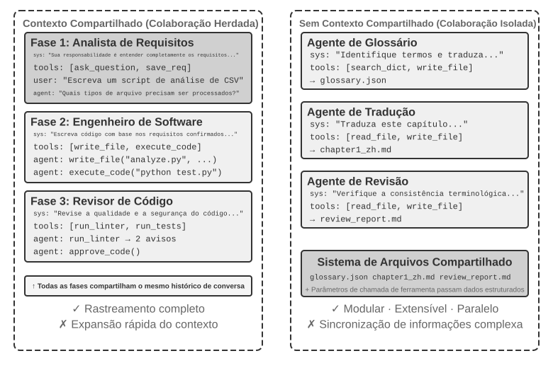

### Dimensão 2: topologia de colaboração

A segunda dimensão é a topologia de colaboração: a estrutura pela qual o controle e as informações fluem entre os agentes. Há três topologias típicas:

- **Padrão de colaboração entre pares** (Peer Collaboration Pattern): um pequeno número de agentes, geralmente dois ou três, interage em condições de igualdade e forma um ciclo iterativo de aprimoramento — como na redação de um artigo, em que uma pessoa prepara o rascunho e outra faz anotações e revisões; após várias rodadas, a qualidade é muito superior à que uma única pessoa conseguiria alcançar.
- **Padrão gerenciador** (Manager Pattern ou Orchestration Pattern): um agente gerenciador centralizado é responsável pelo planejamento e pelo agendamento das tarefas, enquanto vários subagentes cuidam de subtarefas específicas — como um gerente de projeto que lidera vários engenheiros especializados.
- **Padrão descentralizado** (Decentralized Pattern): não há um controlador central em tempo de execução; os agentes se comunicam entre si como seres humanos para colaborar nas tarefas.

> **Terminologia: engenharia de grafos.** O termo “Graph Engineering”, que se popularizou em julho de 2026, geralmente se refere, no contexto atual de agentes, ao projeto explícito de um grafo de execução: os nós são agentes, programas convencionais ou decisões humanas; as arestas definem dependências entre tarefas, roteamento condicional e caminhos em caso de falha; e um estado estruturado flui entre os nós. A “topologia de colaboração” discutida neste capítulo é o subconjunto multiagente dessa ideia — colaboração entre pares, orquestração por um gerenciador e transferências descentralizadas são diferentes topologias de grafo. Como o nome ainda é recente e pode ser facilmente confundido com grafos de conhecimento, GraphRAG e rastros de execução, este livro continua usando os termos mais consolidados “topologia de colaboração” e “orquestração” como vocabulário principal.

O projeto detalhado e os cenários de aplicação de cada padrão serão abordados mais adiante, em subseções específicas.

## Quando o multiagente é realmente superior a um único agente?

Antes de examinarmos arquiteturas específicas de colaboração, vamos responder a uma questão mais fundamental: **quando vários agentes são realmente necessários e quando apenas um é suficiente?** A resposta servirá como referência para todas as abordagens de engenharia apresentadas a seguir. Uma série de estudos recentes converge para um critério claro, resumido em uma única pergunta: **a colaboração fornece informações que um único agente não conseguiria obter enquanto produz sua resposta?**

A Tabela 10-1 mostra quais modos de colaboração introduzem novas informações e ajuda a avaliar se a colaboração multiagente oferece valor substancial em comparação com um único agente.

Tabela 10-1 Comparação do ganho de informação entre modos de colaboração multiagente

| Modo de colaboração | Introduz novas informações? | Efeito |
|---------------------------------------|---------------------|-----------------------------------|
| Autoavaliação pelo mesmo modelo (releitura da própria saída) | Não | Em geral, ineficaz ou até prejudicial |
| Diferentes agentes debatendo o mesmo texto | Não | Comparável a um único agente com o mesmo poder computacional |
| Avaliador usa resultados da execução de testes para revisar o código | Sim (feedback da execução) | Melhora significativa |
| Avaliador usa capturas de tela renderizadas para revisar código de frontend/PPT | Sim (feedback visual) | Melhora significativa |
| Avaliador usa ferramentas externas para verificar fatos | Sim (feedback de ferramentas) | Melhora significativa |

O artigo de 2025 sobre RLEF (Reinforcement Learning from Execution Feedback)[^rlef-2025] constatou que treinar um modelo por aprendizado por reforço para usar o feedback da execução de código em melhorias iterativas produziu resultados muito superiores aos de realizar várias amostragens independentes do modelo. O ponto central é que cada iteração introduz **resultados reais de execução** — erros de compilação, falhas em testes e exceções em tempo de execução —, informações que não existiam quando o modelo escreveu o código. Em tarefas de geração de páginas web, o estudo WebGen-Agent de 2025[^webgen-agent-2025] relatou que o feedback visual em vários níveis, combinando capturas de tela com descrições de um modelo de visão e linguagem, elevou o desempenho do Claude 3.5 Sonnet no benchmark de 26,4% para 51,9%, quase o dobro.

[^rlef-2025]: Gehring, J., et al. *RLEF: Grounding Code LLMs in Execution Feedback with Reinforcement Learning.* arXiv:2410.02089, 2025.
[^webgen-agent-2025]: Lu, Z., et al. *WebGen-Agent: Enhancing Interactive Website Generation with Multi-Level Feedback and Step-Level Reinforcement Learning.* arXiv:2509.22644, 2025.

Esse critério ajuda a resolver uma aparente contradição: alguns estudos acadêmicos concluem que um único agente é suficiente, enquanto, na prática de engenharia, sistemas multiagente costumam apresentar melhor desempenho. Em geral, esses estudos testam vários agentes que analisam e discutem o mesmo texto, como em um debate, enquanto sistemas de engenharia eficazes costumam acrescentar feedback externo proveniente da execução de código, da renderização visual ou de ferramentas. Apenas o segundo caso introduz novas informações. Quase todos os usos eficazes das três arquiteturas abordadas mais adiante — colaboração entre pares, orquestração e descentralização — podem ser compreendidos com base nesse critério.

O experimento da Anthropic de 2026 sobre descoberta de vulnerabilidades oferece um exemplo. Quarenta e cinco agentes coordenaram suas buscas por meio de um fórum compartilhado, revisaram as descobertas uns dos outros e enviaram os resultados a um agente árbitro independente. O grupo coordenado encontrou 266 vulnerabilidades usando 27 milhões de tokens, enquanto agentes independentes executados em paralelo encontraram apenas 21 usando 6,5 milhões de tokens. Em um espaço de busca aberto, a comunicação permite que um sistema multiagente redirecione dinamicamente sua atenção e desenvolva especializações, trocando um orçamento maior de tokens por uma cobertura mais ampla e caminhos de descoberta mais variados.[^anthropic-multiagent-2026]

[^anthropic-multiagent-2026]: Anthropic Frontier Red Team, “Patterns and Problems in Emerging Multiagent Systems,” 2026-08-13. https://www.anthropic.com/research/multiagent-systems

**Orçamento de etapas e desempenho do agente.** Uma questão relacionada é como o orçamento de etapas de um agente — o número de chamadas de ferramentas ou rodadas de iteração que ele pode usar — afeta seu desempenho. À primeira vista, mais etapas certamente ajudariam: com 30 etapas, um agente talvez tenha tempo apenas para implementar as funcionalidades essenciais; com 300, poderia planejar, implementar, testar e refinar. No entanto, o artigo do Google de 2025, *Budget-Aware Tool-Use Enables Effective Agent Scaling*, chegou a uma conclusão contraintuitiva: **simplesmente disponibilizar mais etapas a um agente não garante melhor desempenho.** Agentes comuns não têm “consciência do orçamento”; mesmo com 300 etapas, tendem a realizar buscas superficiais e rapidamente atingem um platô. Para usar etapas adicionais de modo eficaz, os agentes precisam de um mecanismo que adapte sua estratégia aos recursos restantes, explorando amplamente no início e restringindo o foco depois. A abordagem BAVT (Budget-Aware Value Tree Search), de 2026, introduziu ainda uma avaliação de valor por etapa, ajustando o equilíbrio entre exploração e aproveitamento conforme a proporção restante do orçamento. À medida que o orçamento diminui, o agente passa de uma exploração ampla para uma investigação mais profunda.

Essas conclusões têm implicações diretas para o projeto de sistemas multiagente. Por exemplo, no padrão de orquestração, o agente gerenciador não deve apenas distribuir tarefas aos subagentes e aguardar os resultados. Em vez disso, deve **alocar dinamicamente os orçamentos de etapas** conforme a complexidade da tarefa: subtarefas simples recebem menos etapas, enquanto as complexas recebem etapas suficientes. Também deve orientar os subagentes a usar esses orçamentos com critério — primeiro planejar, depois implementar, testar e aprimorar —, em vez de começar a execução imediatamente.

Há ainda uma consideração que deve preceder qualquer decisão de projeto: **o custo.** A exploração em paralelo e o refinamento iterativo custam dinheiro. A Anthropic informou que seu sistema de pesquisa multiagente consome cerca de 15 vezes mais tokens do que uma conversa normal e que, por si só, o uso de tokens explica cerca de 80% da diferença de desempenho. Portanto, os ganhos de um sistema multiagente devem ser grandes o suficiente para justificar custos várias vezes maiores, ou até uma ordem de grandeza superiores; caso contrário, um único agente bem ajustado costuma oferecer melhor relação custo-benefício.

## Colaboração multiagente com contexto compartilhado

Na colaboração multiagente com contexto compartilhado, cada etapa corresponde a um agente independente, com seu próprio prompt de sistema e conjunto de ferramentas, mas herda a trajetória completa do agente anterior — como um colega que assume um turno e pode consultar todos os registros de trabalho deixados por quem o antecedeu. A principal vantagem dessa colaboração por herança é que nenhuma informação se perde: cada agente pode consultar detalhes de qualquer etapa anterior. O desafio é manter o agente atual concentrado em suas próprias responsabilidades, sem que o grande volume de histórico herdado o distraia.

Em tarefas complexas, o papel e as responsabilidades de um agente podem mudar significativamente entre as etapas. Se um único prompt de sistema estático for usado do início ao fim, ele será genérico demais ou se tornará um conjunto excessivamente volumoso de instruções. A alternância de papéis em várias etapas modifica o prompt de sistema e o conjunto de ferramentas conforme a etapa atual, permitindo que o agente trabalhe no papel mais apropriado.

A principal decisão arquitetural é determinar se as instruções do papel serão fornecidas pela substituição do prompt de sistema ou pelo carregamento de uma Skill. A primeira opção permite impor uma fronteira rígida entre ferramentas, mas altera o prefixo da solicitação a cada troca. A segunda mantém o prefixo estático e acrescenta `SKILL.md` à trajetória, o que geralmente favorece o cache KV e o cache de prompts. Como uma Skill continua sendo apenas uma orientação comportamental, ferramentas sensíveis ou que produzam efeitos colaterais ainda exigem um controle de política imposto por código no harness.

| Escolha | Instruções do papel | Visibilidade das ferramentas | Efeito sobre o contexto/cache KV | Força da restrição |
|---|---|---|---|---|
| `transfer_to_agent` | Substitui o prompt de sistema e, em geral, o conjunto de ferramentas | Somente as ferramentas do papel atual | Cada troca altera o prefixo da solicitação e geralmente invalida o cache a partir desse ponto | Forte: ferramentas fora do escopo podem ser omitidas do esquema |
| Skill | Mantém um diretório de Skills no prompt fixo e acrescenta `SKILL.md` sob demanda | Em geral, o catálogo completo ou um ponto de entrada estável para busca | O prefixo estático permanece inalterado; o texto da Skill é acrescentado à trajetória | Fraca: uma Skill é uma instrução, não uma fronteira de permissão |

Quando a diferença entre os papéis decorrer principalmente de conhecimentos, procedimentos e estilo de escrita, prefira uma Skill. Quando envolver permissões, isolamento de ferramentas, limites de conformidade ou uma classe de ações que precise ser proibida em tempo de execução, use um agente independente ou a ferramenta `transfer_to_agent` e restrinja por código as chamadas de ferramentas na camada do harness.

> **Experimento 10-1 ★★: Alternância de papéis com contexto compartilhado — prompt de sistema versus Skill**
>
> Os dois caminhos usam o mesmo modelo, a mesma tarefa, as mesmas ferramentas, as mesmas instruções de papel e a trajetória completa compartilhada. A tarefa consiste em encontrar os números de vendas de veículos de energia nova na China entre 2021 e 2023, calcular a CAGR e escrever, em chinês, um resumo para investidores com no máximo 120 caracteres.
>
> **Caminho 1: alternância do prompt de sistema.** Cinco papéis — `triage`, `research`, `coding`, `data_analysis` e `writing` — expõem apenas suas ferramentas específicas e `transfer_to_agent`. Uma transferência salva o histórico, carrega o prompt e o conjunto de ferramentas do papel de destino e retoma a execução.
>
> **Caminho 2: Skill.** O prompt de sistema e o catálogo completo de ferramentas permanecem fixos. O modelo chama `load_skill(name)` e recebe o mesmo documento de definição do papel como resultado de ferramenta na trajetória compartilhada. O prefixo estático permanece inalterado, mas as permissões rígidas são impostas pelas regras do harness.
>
> Os dois caminhos devem realizar a mesma recuperação de informações, o mesmo cálculo e a mesma verificação de extensão. Eles diferem no meio usado para transmitir as instruções do papel e na fronteira de ferramentas resultante; um simples rastreamento de teste de fumaça não permite determinar qual caminho é superior.

## Colaboração multiagente sem contexto compartilhado

Em uma arquitetura sem contexto compartilhado, cada agente opera como uma entidade independente, com contexto, trajetória e estado próprios. Os agentes não podem acessar diretamente o contexto interno uns dos outros; a colaboração depende inteiramente de transferências explícitas de dados estruturados por meio dos três mecanismos de comunicação apresentados no início deste capítulo: parâmetros de chamadas de ferramentas, um sistema de arquivos compartilhado e um barramento de mensagens.

Anteriormente neste capítulo, comparamos os mecanismos de comunicação a formas de comunicação entre processos, e o contexto compartilhado ou isolado a threads ou processos. Essa analogia pode ser ampliada (Tabela 10-2):

Tabela 10-2 Correspondência entre sistemas multiagente e sistemas operacionais

| Sistema operacional | Sistema multiagente |
|----------|----------------|
| Programa (arquivo executável) | Prefixo estático (prompt de sistema + definições de ferramentas) |
| Memória do processo | Trajetória |
| CPU | LLM |
| Kernel | Runtime do agente |
| Chamada de sistema | Chamada de ferramenta |
| fork (criar processo filho) | spawn_subagent |
| kill (enviar sinal) | cancel_subagent |
| ps (listar processos) | list_agents |
| Código de saída e wait() | Resumo estruturado retornado pelo subagente |
| Memória compartilhada / troca de mensagens | Sistema de arquivos compartilhado / troca de mensagens |

Essa abstração não é nova: estado privado, mensagens assíncronas e capacidade de criar novos membros são justamente os fundamentos do modelo de Atores da década de 1970[^actor-model]. Portanto, um sistema multiagente pode ser visto como uma versão do modelo de Atores baseada em LLM, à qual se aplica diretamente grande parte do conhecimento acumulado sobre sistemas operacionais e sistemas distribuídos.

[^actor-model]: Hewitt, C., Bishop, P., Steiger, R. *A Universal Modular ACTOR Formalism for Artificial Intelligence.* IJCAI 1973.

Esse isolamento semelhante ao de processos oferece vários benefícios práticos de engenharia: cada agente pode ser desenvolvido e testado de forma independente, novos recursos podem ser adicionados sem alterar o código existente e vários agentes podem ser executados simultaneamente sem disputar o contexto compartilhado.

No entanto, não compartilhar o contexto também tem custos. O mais evidente é o problema da sincronização de informações: como os agentes mantêm um entendimento consistente do estado da tarefa? As informações podem ser perdidas ou duplicadas durante a transferência? A depuração também se torna mais difícil — quando surgem problemas, é preciso examinar os logs de vários agentes para reconstituir todo o processo de execução. Essas questões tornam o projeto das especificações de interface, dos formatos de dados e dos protocolos de comunicação especialmente importante.

A colaboração explícita sem contexto compartilhado depende de duas infraestruturas independentes da topologia. A primeira é o **sistema de arquivos compartilhado**, meio persistente pelo qual os agentes trocam artefatos entre si e com o usuário, formando o plano de dados da colaboração. A segunda é o **mecanismo de comunicação e controle**, que permite a troca de mensagens, a consulta de status, o encerramento da execução e o agendamento de recursos entre agentes, formando o plano de controle da colaboração. As três topologias apresentadas a seguir se apoiam nesses dois fundamentos.

### O sistema de arquivos na perspectiva de um agente

No início deste capítulo, o “sistema de arquivos compartilhado” foi apresentado como um dos três mecanismos de comunicação para arquiteturas sem contexto compartilhado. Em um sistema real, o sistema de arquivos acessado por um agente não é um único armazenamento, mas um **sistema de arquivos virtual**, no qual armazenamentos de diferentes origens, ciclos de vida e permissões são montados sob uma mesma árvore de diretórios. O agente os acessa por meio das interfaces unificadas `read_file`/`write_file`/`list_dir`, enquanto as camadas subjacentes podem ser discos temporários locais, armazenamento persistente de objetos, APIs de serviços de armazenamento em nuvem de terceiros ou pacotes de recursos do sistema somente para leitura. Definir claramente a composição dessa árvore de diretórios — a visibilidade e o ciclo de vida de cada área — é um pré-requisito para projetar a colaboração multiagente: uma parcela significativa dos conflitos de concorrência e vazamentos de informações decorre da mistura de áreas que deveriam estar isoladas. Essa árvore de diretórios equivale ao espaço de endereçamento do agente, e os quatro tipos de área são segmentos de memória com permissões distintas: alguns privados e graváveis, alguns compartilhados entre várias partes e outros somente para leitura. A filosofia de proteção dos sistemas operacionais também se aplica aqui: isolar por padrão e declarar explicitamente o compartilhamento. Em um sistema multiagente maduro, o sistema de arquivos costuma ser composto pelos quatro tipos de área a seguir:

Um sistema de arquivos multiagente maduro costuma ser composto pelos quatro tipos de área a seguir:

**I. Espaço de trabalho exclusivo do agente (Scratchpad)**. Diretório privado e exclusivo de cada instância de agente, no qual são armazenados artefatos intermediários, arquivos temporários, rascunhos e logs de depuração. Seu ciclo de vida está vinculado à instância, e ele não fica visível para outros agentes nem para os usuários. Isolar o scratchpad tem duas finalidades: impedir que arquivos temporários de vários agentes sobrescrevam uns aos outros e manter enxuto o contexto do agente principal — o processo de tentativa e erro dos subagentes permanece nos respectivos espaços de trabalho, e apenas o artefato final é enviado ao espaço compartilhado. No armazenamento, isso corresponde ao princípio do Capítulo 4 segundo o qual os subagentes retornam resumos estruturados, e não trajetórias completas.

**II. Espaço de trabalho compartilhado multiagente**. Área de colaboração que vários agentes podem ler e gravar e que é **visível para o usuário**. É o principal meio de troca de artefatos entre agentes em arquiteturas sem contexto compartilhado: o agente de glossário grava a lista de termos, e o agente de tradução a lê; os usuários também podem enviar arquivos de origem e baixar os resultados finais nessa área. Seu ciclo de vida está vinculado a toda a tarefa e exige persistência. Como vários participantes podem ler e gravar simultaneamente nessa área, ela concentra conflitos de concorrência — mecanismos como bloqueio otimista e isolamento por worktree atuam aqui, conforme detalhado adiante em “Modo de falha 1”. O uso, no Capítulo 4, de um volume montado em `/workspace/shared` para conectar o agente principal, o computador virtual e o celular virtual é uma implementação típica dessa camada.

**III. Recursos externos montados.** Fontes de informação de terceiros autorizadas pelo usuário — Google Drive, Notion, Dropbox, wikis corporativas etc. — são mapeadas, por meio de adaptadores, para pontos de montagem no sistema de arquivos, como `/mnt/gdrive`. Um agente acessa um documento do Notion lendo um arquivo; nos bastidores, o adaptador chama a API correspondente. Três características diferenciam essa camada do armazenamento local e precisam ser tratadas explicitamente no projeto: **o acesso é limitado pelas permissões externas** (as permissões do usuário no sistema de origem determinam o que o agente pode ver), **a latência é maior e a consistência é menor** (cada leitura exige uma operação de ida e volta pela rede, e alterações externas podem não ficar visíveis de imediato; portanto, os dados devem ser tratados como eventualmente consistentes) e **o acesso ocorre principalmente sob demanda e somente para leitura** (a gravação nas fontes externas exige cautela, pois uma gravação incorreta pode corromper os dados reais do usuário). A interface unificada de arquivos dispensa uma ferramenta específica para cada fonte de dados, mas também oculta essas diferenças de desempenho e segurança. Por isso, o modo somente para leitura ou leitura e gravação, os tempos limite e os limites das credenciais devem ser gerenciados explicitamente no nível da montagem.

**IV. Recursos integrados do sistema.** Pacote de recursos pré-instalado pelo sistema e compartilhado com todos os agentes somente para leitura. Exemplos típicos são as **Skills** apresentadas nos Capítulos 2 e 4 — documentos de conhecimento e scripts organizados como arquivos, montados em caminhos como `/skills` e acessados por revelação progressiva: primeiro o índice, depois o conteúdo detalhado sob demanda. Outros exemplos incluem manuais de referência, bibliotecas de modelos e definições de ferramentas compartilhadas. Essa camada é compartilhada globalmente, somente para leitura, estável entre sessões e pode ser lida simultaneamente por todos os agentes sem controle de concorrência.

A Figura 10-2 mostra como esses quatro tipos de área são montados de maneira uniforme sob uma única árvore de diretórios: o agente acessa toda a árvore por uma interface unificada, os usuários enviam e baixam arquivos pelo espaço compartilhado, fontes de dados externas são montadas por meio de adaptadores e os recursos integrados do sistema são disponibilizados somente para leitura.

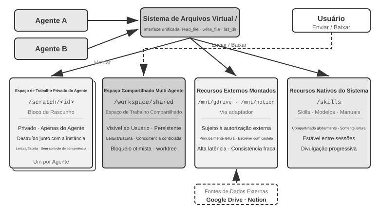

A Tabela 10-3 compara esses quatro tipos de área em quatro dimensões — visibilidade, ciclo de vida, permissões de leitura e gravação e controle de concorrência — e pode ser usada como lista de verificação no projeto da estrutura do sistema de arquivos.

Tabela 10-3 Quatro tipos de área do sistema de arquivos virtual do agente

| Área | Visibilidade | Ciclo de vida | Leitura/gravação | Controle de concorrência |
|--------------|-----------------|------------------------|---------------------|-------------------|
| Espaço de trabalho exclusivo do agente | Somente o agente proprietário | Destruído com a instância do agente | Leitura/gravação | Desnecessário (privado) |
| Espaço de trabalho compartilhado multiagente | Todos os agentes colaboradores e o usuário | Persiste durante a tarefa | Leitura/gravação | Necessário (bloqueio otimista / worktree) |
| Recursos externos montados | Depende da autorização externa | Determinado pela fonte externa | Em geral, somente leitura; gravações exigem cautela | Gerenciado pela fonte externa |
| Recursos integrados do sistema | Todos os agentes | Estável entre sessões | Somente leitura | Desnecessário (somente leitura) |

O valor do **“caminho de arquivo como interface universal”** está em tratar o caminho como unidade de troca. Seja na troca de artefatos entre agentes, na entrega de uma entrada do agente principal a um subagente ou na colaboração entre organizações por meio de A2A, o que se transfere é uma string de caminho leve, em vez de carregar o conteúdo do arquivo na janela de contexto (Capítulo 4). Isso está alinhado ao conceito do Capítulo 5 de “sistema de arquivos como hub do agente”, que descreve como um único agente usa o sistema de arquivos para hospedar memória e recursos. Aqui, a mesma abstração é estendida a vários agentes: uma árvore de diretórios virtual que monta armazenamentos privados, compartilhados, externos e integrados oferece a base de armazenamento para a colaboração multiagente.

### Comunicação e controle entre agentes

Embora o sistema de arquivos resolva o problema da **troca de artefatos** entre agentes, a colaboração também requer um **plano de controle**. É justamente aí que entram as linhas de ciclo de vida da Tabela 10-2: as primitivas de ferramentas apresentadas no Capítulo 4 — criação (`spawn_subagent`), envio de mensagens (`send_message_to_subagent`), cancelamento (`cancel_subagent`) e descoberta (`list_agents`) — correspondem a fork, message, kill e ps no mundo dos processos. Esta seção não repete as definições das interfaces, mas se concentra em quatro capacidades frequentemente negligenciadas e essenciais à colaboração multiagente.

**I. Troca de mensagens.** A forma mais simples é ponto a ponto: o agente A chama diretamente `send_message_to_agent_b(content)`. Isso é adequado para cenários com topologia fixa e poucos agentes, como a configuração de dois agentes — telefone e computador — do Experimento 10-3 deste capítulo. Quando o número de agentes aumenta e é necessário paralelismo assíncrono, a quantidade de conexões ponto a ponto cresce quadraticamente com o número de agentes, e tanto o remetente quanto o destinatário precisam estar online ao mesmo tempo. Nesses casos, deve-se usar um **barramento de mensagens** (detalhado mais adiante neste capítulo, em “Padrão de coordenação paralela”): os agentes publicam mensagens no barramento, que as encaminha de acordo com as assinaturas, sem que o remetente precise conhecer os assinantes. Seja ponto a ponto ou por meio de um barramento, as mensagens normalmente devem incluir um **envelope** estruturado: ID do remetente, destino (um agente específico ou transmissão para todos), tipo da mensagem (por exemplo, `task_assigned`/`status_update`/`result`/`terminate`) e uma carga útil JSON. Um formato de envelope unificado garante que o destinatário possa rotear e interpretar as mensagens de modo confiável, além de tornar rastreável a cadeia de colaboração — aspecto fundamental para depurar sistemas multiagente.

**II. Consulta de status.** Essa é a parte mais subestimada do plano de controle. Depois que um agente principal despacha um subagente, ele precisa acompanhar o progresso desse subagente; do contrário, não consegue decidir se deve continuar aguardando nem intervir caso ele fique travado. Uma abordagem intuitiva é tomar o RPC como referência e definir uma interface de consulta `get_subagent_status(agent_id)`, que retorne “em execução/concluído/com falha” e uma porcentagem de progresso. Na prática, porém, uma interface desse tipo, baseada em consultas, é muito menos útil do que parece: o subagente começa a trabalhar assim que é criado e continua até concluir ou falhar. Ele não passa por uma série de estados em fila, como ocorre com tarefas em um sistema tradicional de processamento em lote, assim como, na programação Unix, raramente é preciso consultar pelo PID se outro processo ainda está em execução. As consultas periódicas também criam um dilema: se forem frequentes demais, desperdiçam tokens; se forem muito espaçadas, atrasam a reação. Uma forma mais natural de obter o status é retomar os dois paradigmas de comunicação apresentados no início deste capítulo.

**Obtenção do status por troca de mensagens.** O agente principal simplesmente envia uma mensagem ao subagente: “Como está o andamento?”. O subagente responde em um momento oportuno. Tudo é assíncrono: o envio da mensagem não bloqueia a execução do agente principal, e quando — ou se — a outra parte responderá é uma questão separada. É como um gerente que pergunta a um subordinado sobre o progresso por mensagem instantânea, sem exigir que ele interrompa imediatamente o que está fazendo. Por outro lado, o subagente também pode enviar uma mensagem proativamente ao atingir um marco; se o sistema já tiver um barramento de mensagens, basta publicar um `status_update` no barramento — o “monitoramento em tempo real” do Experimento 10-4 assume essa forma. Seja o status solicitado explicitamente ou informado de modo proativo, a mensagem deve empregar um vocabulário uniforme de máquina de estados — em execução, requer entrada, concluído, falhou. O protocolo A2A, apresentado mais adiante neste capítulo, padroniza o ciclo de vida das tarefas justamente nesses termos.

**Obtenção do status pelo sistema de arquivos compartilhado.** A forma mais completa é a **persistência de trajetória**: durante a execução, o subagente serializa em JSON cada evento da trajetória e o acrescenta a um arquivo de log no sistema de arquivos — em geral, um arquivo por sessão e um evento por linha, no formato JSONL. Conforme definido no Capítulo 1, a trajetória é a sequência completa de mensagens do usuário, respostas do modelo, chamadas de ferramentas e resultados. O agente principal não precisa de nenhum protocolo de comunicação de status: ao ler diretamente esse arquivo, pode examinar toda a execução do subagente — qual ferramenta ele está chamando, o que ocorreu na etapa mais recente e se ficou preso em um ciclo de tentativas repetidas e malsucedidas. Em termos de processos, isso se assemelha à leitura direta da memória de outro processo. Não ocupa o contexto do subagente, não depende de sua cooperação e oferece a granularidade de observação mais fina.

No entanto, a persistência de trajetória não deve ser o principal canal de transmissão de informações entre agentes. Uma trajetória pode facilmente chegar a dezenas de milhares de tokens, e o agente principal ainda precisa sintetizá-la depois da leitura, o que custa tempo e tokens. Na maioria das situações, a opção mais sensata é **definir um arquivo de progresso**: ao iniciar um subagente, o agente principal estabelece “registre seu progresso em progress.md”; o subagente atualiza essa lista de tarefas à medida que conclui cada item; e o agente principal pode ler esse arquivo leve a qualquer momento para verificar o andamento. Isso equivale a dois processos reservarem, na memória compartilhada, uma pequena região de status com formato previamente definido: o que fica exposto é o progresso sintetizado, não toda a memória. O arquivo de progresso também permite **detectar travamentos**: se a data da última modificação de `progress.md` — ou do arquivo de trajetória — permanecer inalterada por mais de N minutos, o subagente pode ser considerado inativo, acionando-se uma medida de contingência por tempo limite para impedir que um subagente bloqueado prejudique o sistema.

**III. Encerramento da execução.** Na colaboração paralela, é comum ocorrer a situação em que “um obtém sucesso e os demais deixam de ser necessários”: vários agentes fazem buscas separadamente e, assim que um encontra o alvo, os outros devem parar imediatamente — o encerramento em cascata do Experimento 10-4 deste capítulo. Há dois níveis de encerramento, que usuários de Unix reconhecerão como a diferença entre SIGTERM e SIGKILL. O **encerramento normal** é preferível: o agente principal envia um sinal `terminate`; o subagente responde em um ponto seguro da etapa atual, libera os recursos — fecha sessões do navegador, grava arquivos pendentes e libera bloqueios —, envia uma confirmação (ack) e então encerra. O **encerramento forçado** é uma medida de contingência: o processo é finalizado diretamente, apenas quando o subagente não responde ao sinal de encerramento normal, com o risco de deixar recursos pendentes e gravações incompletas. Dois aspectos de engenharia merecem atenção. Primeiro, o encerramento normal exige que o subagente verifique periodicamente o sinal de encerramento em seu loop, de modo semelhante ao mecanismo de interrupção do Capítulo 6; caso contrário, não conseguirá receber o sinal. Segundo, o encerramento em cascata apresenta uma condição de corrida: vários subagentes podem informar sucesso quase simultaneamente. O agente principal deve usar um bloqueio ou um projeto idempotente para garantir que apenas um sucesso seja aceito e que o sinal de encerramento seja transmitido uma única vez. Consulte a discussão sobre condições de corrida no Experimento 10-4.

O **encerramento normal** é a primeira opção: o agente principal emite um sinal `terminate`; o subagente responde no ponto seguro da etapa atual, primeiro libera os recursos — fecha a sessão do navegador, grava arquivos inacabados e libera bloqueios —, retorna uma confirmação (ack) e encerra. O **encerramento forçado** é a medida de contingência: consiste em finalizar diretamente o processo e só é usado quando o subagente não responde ao sinal de encerramento normal, com o risco de deixar recursos pendentes e gravações pela metade.

Resta uma questão: depois que o agente principal é encerrado, o que acontece com os subagentes que ainda estão em execução? A abordagem de engenharia mais simples toma como referência o context do Go: o encerramento se propaga em cascata pela relação de criação. Quando um agente é cancelado, todos os subagentes gerados por ele também são cancelados, evitando que subagentes órfãos sejam deixados para trás. A verificação do sinal de encerramento pelo subagente em um ponto seguro, descrita acima, corresponde exatamente à consulta periódica de `ctx.Done()` em Go. Por outro lado, se for realmente necessário manter um agente em segundo plano por um longo período, desvinculado do agente principal — como o `nohup` do Unix —, faça com que ele comece em uma nova árvore de ciclo de vida, correspondente a `context.Background()`, declarando explicitamente que não será encerrado junto com o processo pai.

**IV. Gerenciamento e escalonamento de recursos.** Outra função de um sistema operacional é alocar recursos escassos. No mundo dos processos, esses recursos são o tempo de CPU e a memória; no mundo dos agentes, são tokens, dinheiro e capacidade de concorrência — cada etapa executada por um subagente consome os três. Essa responsabilidade geralmente cabe ao gerenciador ou ao runtime: definir um limite de etapas ou tokens ao iniciar um subagente e interrompê-lo quando esse limite for excedido; atribuir tarefas difíceis a um modelo avançado e tarefas mecânicas a um modelo de baixo custo; limitar a concorrência para evitar que dezenas de agentes esgotem simultaneamente a cota da API; e, quando surgir uma tarefa mais urgente, interromper um subagente em execução — isso é preempção. As práticas nessa área ainda são muito menos maduras que o escalonamento de CPU, mas determinam o teto de custos de um sistema multiagente e devem ser consideradas já na etapa de projeto da arquitetura.

Em comparação com o escalonador de um sistema operacional tradicional, a principal vantagem do agente gerenciador é sua capacidade de raciocínio. Por isso, ele pode iniciar vários subagentes para explorar um problema em paralelo e, com base no progresso de cada um, decidir quais receberão mais recursos e quais serão encerrados por aparentarem ter seguido um caminho equivocado — como uma competição interna em uma empresa.

As práticas de gerenciamento e escalonamento de recursos ainda são muito menos maduras que o escalonamento dos sistemas operacionais, mas determinam o teto de custos de um sistema multiagente e devem ser consideradas já na etapa de projeto da arquitetura.

A troca de artefatos — o plano de dados —, em conjunto com a troca de mensagens, a consulta de status, o encerramento da execução e o escalonamento de recursos — o plano de controle —, sustenta um sistema multiagente sem contexto compartilhado. Conforme as relações de colaboração entre os agentes e as características do fluxo de controle, a colaboração sem contexto compartilhado se divide em três arquiteturas principais: o padrão de colaboração entre pares, o padrão gerenciador e o padrão descentralizado, cada qual adequado a um tipo diferente de tarefa.

### Padrão de colaboração entre pares: controle mútuo e melhoria iterativa

A colaboração entre pares normalmente envolve dois ou três agentes em posição de igualdade, que trocam feedback ao longo de várias rodadas. Seu valor potencial está nas perspectivas independentes e na diversidade cognitiva, mas “várias instâncias” não produzem necessariamente “diferentes formas de pensar”. Quando o modelo, o contexto e a estrutura de suporte são muito semelhantes, diferentes agentes costumam fazer as mesmas escolhas, transformando erros locais em falhas sistêmicas. A diversidade genuína deve ser projetada mediante a variação de modelos, contextos, ferramentas, evidências visíveis ou responsabilidades, fazendo com que os agentes avaliem de forma independente antes que os resultados sejam consolidados.[^anthropic-multiagent-2026]

Em comparação com os padrões gerenciador e descentralizado, a colaboração entre pares é muito mais simples de implementar: basta definir os papéis dos dois agentes, o mecanismo de comunicação e a condição de encerramento das iterações para colocar o sistema em funcionamento. É uma opção ideal para validar ideias rapidamente e criar protótipos.

#### Engenharia de Loop

Um dos usos mais comuns da colaboração entre pares é combater uma falha recorrente na prática com agentes: a **interrupção prematura** — parar com o trabalho pela metade. Ela assume três formas típicas; os exemplos a seguir vêm de agentes de programação e do Pine AI, o agente apresentado na Introdução que faz ligações em nome dos usuários para tratar de assuntos com estabelecimentos comerciais e prestadores de serviços. A primeira é a **falsa conclusão por negligência**: fazer apenas parte do trabalho e declarar que tudo foi concluído — um agente de programação escreve o código, não executa os testes nem tenta fazer a implantação e informa que a “tarefa foi concluída”; um usuário encarrega o Pine AI de duas tarefas, e ele conclui a primeira, esquece a segunda e anuncia tranquilamente que “está tudo resolvido”. A segunda é a **desistência prematura**: declarar que a tarefa inteira é impossível quando um único caminho não funciona — o Pine AI pode entrar em contato com um estabelecimento por telefone, formulário web ou e-mail, mas, após uma única ligação recusada, diz ao usuário que “isso não pode ser feito”, quando mudar de canal e tentar novamente muito provavelmente resolveria o problema. A terceira é o **falso sucesso**: o agente acredita que a tarefa foi concluída, mas o ciclo não foi efetivamente fechado — a outra parte concorda verbalmente com um reembolso por telefone, mas o usuário ainda precisa confirmar uma etapa no aplicativo móvel; o agente informa que “está tudo certo”, o usuário não fica sabendo que há uma ação pendente e o reembolso nunca é efetivado. As três formas apontam para a mesma causa fundamental: **até que haja verificação, “concluído” é apenas uma afirmação do modelo, não uma prova.**

Transformar afirmações em provas é justamente o propósito da **Engenharia de Loop** (Loop Engineering), a última etapa do percurso evolutivo apresentado no Capítulo 1: projetar um ciclo que mantenha o agente em operação — identificar o próximo item de trabalho, executar, verificar e registrar o progresso — e deixar que um verificador, não o próprio modelo, decida se de fato é seguro parar. O papel do humano muda, assim, de “operador que fornece prompts ao agente” para “engenheiro que projeta o ciclo”. O termo foi cunhado em junho de 2026 por Addy Osmani[^loop-engineering-2026]; Boris Cherny, responsável pelo Claude Code na Anthropic, foi mais direto: “Não forneço mais prompts ao Claude. Meu trabalho é escrever loops.” A principal conclusão dessa discussão foi que **o gargalo do ciclo está no verificador, não no modelo**: se a verificação não for confiável, um ciclo mais rápido apenas marcará resultados ruins como concluídos mais depressa. E, como afirma a Introdução, a prática vem antes, e o nome, depois. Muito antes de o termo se popularizar, as principais equipes de agentes — entre elas, a do Pine AI — já usavam “ciclo mais verificação” para combater a interrupção prematura. A maneira mais eficaz de organizar essa verificação é o paradigma Proponente-Revisor apresentado a seguir.

[^loop-engineering-2026]: Osmani, Addy. “Loop Engineering: Designing Loops that Prompt Coding Agents”, 2026. https://addyosmani.com/blog/loop-engineering/

**Framework concreto: LoopX.** O LoopX retira o ciclo do prompt e do histórico de conversas do modelo e o coloca em um plano de controle persistente e independente do ambiente de execução do agente: o objetivo e os limites explicam por que o trabalho existe; os controles e itens pendentes determinam o que pode ser feito agora; as evidências e a cota determinam se o trabalho pode continuar; e as transferências permitem que um turno posterior ou outro agente o retome. Ele condensa uma execução controlada em um protocolo claro:

```text
LoopX decides → Agent executes → independent verifier proves → LoopX commits
```

O agente continua responsável pelo raciocínio, pelo uso de ferramentas e pela produção de artefatos candidatos. O LoopX não substitui o ambiente de execução do agente; ele gerencia a continuidade entre os turnos. Somente resultados verificados de forma independente podem atualizar o progresso persistente e consumir a cota. Falhas na validação levam a correções ou a um novo planejamento, enquanto controles humanos, estados de espera e limites de orçamento interrompem o ciclo antes da execução. Esse limite transforma um princípio da Engenharia de Loop em um invariante de sistema passível de inspeção: **o modelo pode propor que algo está “concluído”, mas não pode aprovar sua própria conclusão.** O LoopX v0.4.0 ainda classifica como experimental o caminho de Turn controlado; por isso, ele é usado aqui como um framework concreto de “ciclo + verificação + condições de parada”, e não como evidência de melhoria geral na qualidade das tarefas.[^loopx-framework]

[^loopx-framework]: LoopX, “The local control plane for long-running AI agent work”, v0.4.0, commit estável `a893d221db0b8e028997cefc303f7ec9fa7dbe0a`. https://github.com/huangruiteng/loopx/tree/a893d221db0b8e028997cefc303f7ec9fa7dbe0a

**Framework concreto: LongHorizon-Harness.** O LongHorizon-Harness e o LoopX são implementações concretas da Engenharia de Loop, mas seguem direções distintas. O LoopX se concentra em um plano de controle persistente para trabalhos de agentes de longa duração; o LongHorizon-Harness parte do Computer Use multimodal e trata da execução contínua quando uma única tarefa abrange uma GUI, uma CLI, vários aplicativos de desktop e sucessivas renovações de contexto.

O LongHorizon-Harness reformula a execução de longo horizonte como gerenciamento do estado da tarefa e implementa seu ciclo como Manage–Execute–Audit (MEA): o Manager gera a próxima subtarefa delimitada com base no objetivo original, no progresso verificado, nas evidências de falha e no trabalho restante; o Executor altera o ambiente por meio da GUI ou da CLI em um contexto novo; em seguida, o Auditor inspeciona o resultado real em modo somente leitura. Apenas o que passa pela auditoria é incorporado ao estado da tarefa na rodada seguinte, enquanto as falhas são preservadas como base para recuperação e novo planejamento. Backends de execução como Claude Code e Codex CLI são reutilizados por meio de uma camada adaptadora, sem reescrever o loop do agente dentro desses backends.[^longhorizon-implementation]

O valor dessa abordagem está em separar a continuidade da tarefa de um histórico de execução que cresce continuamente: o contexto pode ser renovado e as operações de interface podem falhar, mas a rodada seguinte ainda é retomada a partir do estado verificado mais recente. Mantendo fixos o modelo Qwen 3.7-Plus e o backend de execução Claude Code e alterando apenas o loop externo, o artigo relata que a PassRate do WeaveBench subiu de 51,8% para 80,7%, a taxa de conclusão binária do OSWorld 2.0 passou de 2,8% para 8,3% e a taxa de sucesso do Terminal-Bench 2.1 aumentou de 69,7% para 77,2%. O custo tampouco é constante: os dois primeiros benchmarks consumiram, respectivamente, 2,3 vezes o total de tokens da linha de base e 3,6 vezes seus tokens de saída, enquanto o Terminal-Bench 2.1 registrou redução de 24%. Uma implantação real também precisa lidar com estados invalidados por mudanças no ambiente externo ou nos requisitos do usuário, além de adotar limites de rodadas, tempo e custo para impedir que os ciclos de recuperação sejam executados indefinidamente.

**Trajetórias públicas e reprodução dos experimentos.** O site do projeto publica centenas de trajetórias de execução do WeaveBench, OSWorld 2.0 e Terminal-Bench 2.1, permitindo inspecionar diretamente o processo de execução e os registros de cada função. Tomemos como exemplo `WEB_task_16_webrtc_simulcast_layer_audit`, do WeaveBench: a [trajetória da linha de base](https://lh-harness.pages.dev/traj/tasks/baseline__WEB_task_16_webrtc_simulcast_layer_audit.html) e a [trajetória MEA](https://lh-harness.pages.dev/traj/tasks/lh_harness__WEB_task_16_webrtc_simulcast_layer_audit.html), ambas com o mesmo modelo Qwen 3.7-Plus, podem ser comparadas lado a lado. A primeira ficou travada na interação com o Wireshark e repetiu as tentativas, obtendo pontuação de 0,59; a segunda registrou as falhas e os itens de evidência não atendidos no estado da tarefa, de modo que as rodadas posteriores trataram apenas das lacunas, alcançando 0,92. Esse caso mostra “como uma falha se torna a entrada da rodada seguinte”, mas não substitui as estatísticas agregadas; o ambiente, os parâmetros e os scripts de inicialização dos experimentos completos estão no diretório da versão fixada [`eval/`](https://github.com/AMAP-ML/LongHorizon-Harness/tree/53bc678ed4170ad4d2e4309f2bfc5c3fb6caf8cb/eval).

[^longhorizon-implementation]: LongHorizon-Harness, commit estável `53bc678ed4170ad4d2e4309f2bfc5c3fb6caf8cb`. Site do projeto e trajetórias públicas: https://lh-harness.pages.dev/#trajectories; artigo: https://arxiv.org/abs/2608.01964; código: https://github.com/AMAP-ML/LongHorizon-Harness/tree/53bc678ed4170ad4d2e4309f2bfc5c3fb6caf8cb

#### Paradigma proponente-revisor

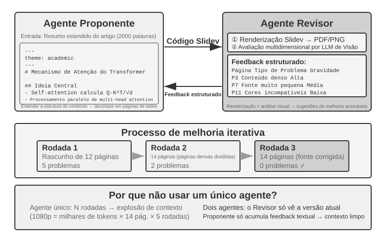

O modelo proponente-revisor é o paradigma clássico de colaboração entre pares. O Capítulo 5 já abordou seus princípios de design e suas aplicações práticas em três experimentos: geração de PPT, edição de vídeo e visualização de logs. O agente proponente gera o código, enquanto o agente revisor renderiza os resultados da execução, avalia sua qualidade usando um modelo de visão e linguagem e fornece sugestões estruturadas de melhoria. Os dois iteram até que o resultado atenda ao padrão exigido.

Esse paradigma também se aplica a cenários como revisão de segurança (o proponente gera um plano de ação, e o revisor verifica a conformidade e os possíveis riscos), moderação de conteúdo (o proponente redige uma resposta, e o revisor verifica as regras de negócio e as normas de linguagem) e revisão de código (o proponente escreve o código, e o revisor verifica a segurança e as boas práticas).

**Por que um único agente não pode gerar e depois revisar o próprio trabalho?** É exatamente aqui que se aplica o critério apresentado anteriormente neste capítulo, em “Quando um sistema multiagente é realmente melhor do que um único agente?”: se a revisão não introduz informações novas, ela apenas “pede ao modelo que pense novamente”. Pesquisas relacionadas oferecem uma resposta clara. No artigo “Large Language Models Cannot Self-Correct Reasoning Yet”, apresentado na ICLR 2024, Huang et al. constataram que pedir ao GPT-4 que revisasse e corrigisse as próprias respostas sem feedback externo reduzia a precisão: o modelo transformava respostas corretas em incorretas com mais frequência do que corrigia respostas incorretas.

O invariante mínimo do ciclo proponente-revisor é o seguinte: o revisor examina **evidências independentes**, em vez de apenas repetir a explicação do proponente, e, ao devolver o trabalho, deve fornecer uma condição de correção que permita localizar o problema:

```python
candidate = proposer(task, constraints)
evidence = execute_or_render(candidate)       # tests, state, screenshot, facts
review = independent_reviewer(candidate, evidence)

while review.veto and budget_remaining:
    candidate = proposer.repair(candidate, review.findings)
    evidence = execute_or_render(candidate)
    review = independent_reviewer(candidate, evidence)

if review.pass:
    publish(candidate, evidence, review)
else:
    escalate_or_reject(review)
```

O revisor não deve poder modificar os testes, o coletor de evidências nem o critério de liberação; caso contrário, a “verificação independente” degenera em autoaprovação.

Um artigo de revisão publicado em 2024 na TACL, “When Can LLMs Actually Correct Their Own Mistakes?” (arXiv:2406.01297), reforçou essa conclusão: a menos que haja feedback externo confiável, como resultados da execução de casos de teste ou saídas de verificação produzidas por ferramentas externas, depender apenas da “autocorreção” do próprio modelo é, em grande medida, ineficaz.

O artigo CRITIC, apresentado na ICLR 2024, traz um experimento comparativo esclarecedor. No CRITIC, o modelo usava ferramentas externas, como mecanismo de busca e interpretador Python, para verificar as próprias respostas, o que resultava em melhorias significativas de desempenho. No entanto, quando a etapa de verificação por ferramentas era removida e restava apenas a autoavaliação do modelo, a maior parte da melhoria desaparecia. Isso indica que o valor da revisão não está em “pedir ao modelo que pense novamente”, mas em **introduzir informações novas que não estavam disponíveis durante a geração** — resultados de testes, capturas de tela renderizadas, erros de compilação e resultados de buscas externas.

O experimento da Anthropic de 2026 sobre desenvolvimento de aplicações de longa duração implementou essa ideia em uma arquitetura de três agentes: planejador, gerador e avaliador. O planejador convertia a solicitação do usuário em uma especificação de produto. O gerador e o avaliador primeiro definiam em conjunto os critérios de conclusão de cada rodada; em seguida, o gerador implementava o trabalho, e o avaliador operava a aplicação real com o Playwright e registrava um relatório de defeitos. Os agentes transferiam o estado por meio de arquivos. O experimento indica que, quando uma tarefa está além do que o modelo atual consegue concluir sozinho de forma confiável, uma revisão independente, fundamentada em evidências externas, pode proporcionar maior qualidade de desenvolvimento em troca de um custo significativamente mais alto.[^anthropic-harness-2026]

[^anthropic-harness-2026]: Prithvi Rajasekaran, “Harness Design for Long-Running Application Development,” Anthropic Engineering, 2026-03-24. https://www.anthropic.com/engineering/harness-design-long-running-apps

#### Padrão de debate

Vários agentes assumem posições diferentes e exploram o espaço do problema por meio de um diálogo adversarial. Por exemplo, ao avaliar uma solução técnica, o agente A atua como “defensor”, enumerando suas vantagens e oportunidades, enquanto o agente B atua como “opositor”, apontando riscos e limitações. A cada rodada, um agente refuta ou complementa os argumentos do outro. Quando um único agente analisa um problema, ele costuma favorecer uma perspectiva e ignorar evidências contrárias. O debate estruturado força o desenvolvimento completo de ambas as posições, ajudando os responsáveis pela decisão a chegar a uma avaliação mais equilibrada.

No entanto, a eficácia prática do debate ainda é controversa no meio acadêmico. Um estudo de Tran e Kiela publicado em 2026 [^single-agent-2026] comparou um único agente com cinco arquiteturas multiagente — sequencial, debate, ensemble, papéis paralelos e subtarefas em paralelo — em tarefas de raciocínio com múltiplos saltos. Os autores constataram que **quando o orçamento de tokens de raciocínio era mantido constante, o agente único apresentava desempenho equivalente ou até superior ao dos sistemas multiagente** (a menos que o aproveitamento do contexto se deteriorasse até certo ponto). Os pesquisadores explicaram o resultado com base na desigualdade de processamento de dados da teoria da informação: em um debate, vários agentes processam exatamente as mesmas informações textuais, e cada transmissão serial de conclusões intermediárias entre eles só pode perder informações, não criá-las. Os ganhos do modo de debate descritos em alguns artigos acadêmicos provavelmente decorrem do maior volume total de computação consumido por vários agentes. É importante esclarecer o limite desse argumento: ele diz respeito ao gargalo de informação causado pela “transmissão serial de conclusões intermediárias entre vários agentes” e não invalida outras abordagens, como **obter várias amostras independentes do mesmo problema e depois agregá-las** — por exemplo, por autoconsistência ou votação majoritária — nem explorar a **assimetria de dificuldade entre geração e verificação** — escrever uma resposta é difícil, verificá-la é fácil — em uma divisão de trabalho entre geração e verificação. Esses cenários introduzem amostragem independente adicional ou exploram a própria estrutura assimétrica da tarefa e, portanto, não se enquadram no escopo da desigualdade de processamento de dados.

[^single-agent-2026]: Tran, D., Kiela, D. *Single-Agent LLMs Outperform Multi-Agent Systems on Multi-Hop Reasoning Under Equal Thinking Token Budgets.* arXiv:2604.02460, 2026.

#### Padrão de brainstorming

Vários agentes geram ideias de forma independente e depois as compartilham, inspirando uns aos outros. Por exemplo, em uma tarefa de inovação de produto, o agente 1 propõe “adicionar recursos de compartilhamento em redes sociais”; inspirado pela ideia, o agente 2 sugere “não apenas compartilhar em redes sociais, mas também gerar pôsteres personalizados para compartilhamento”; por fim, o agente 3 combina as duas primeiras propostas e sugere “modelos de pôster personalizáveis pelo usuário, formando um marketplace de modelos”. Agentes diferentes têm distintas “preferências de raciocínio”, obtidas por meio de prompts ou modelos diferentes, e, ao estimularem uns aos outros, exploram um espaço de soluções mais amplo para encontrar combinações criativas que um único agente dificilmente conceberia.

#### Padrão de painel de especialistas

Vários agentes representam, cada um, a perspectiva de um domínio profissional específico e discutem em conjunto um problema interdisciplinar. Por exemplo, ao avaliar a viabilidade de um novo produto, um agente de engenharia analisa a dificuldade de implementação do ponto de vista técnico, um agente de produto avalia o apelo de mercado sob a perspectiva da experiência do usuário e um agente de operações analisa a viabilidade comercial em termos de custos e recursos. Esses agentes não são adversários, mas complementares: juntos, compõem uma visão completa do problema e identificam restrições e oportunidades que atravessam diferentes áreas.

### Padrão gerenciador: coordenação centralizada

Quando uma tarefa envolve mais de cinco subtarefas, exige escalonamento dinâmico ou apresenta dependências complexas entre as subtarefas, a colaboração entre pares já não é suficiente, e torna-se necessário adotar o padrão gerenciador. A função do agente gerenciador é semelhante à de um gerente de projetos: compreender a tarefa como um todo, dividi-la em subtarefas que possam ser atribuídas, escolher o agente adequado para cada uma, acompanhar o progresso, tratar exceções repetindo tarefas, substituindo agentes ou revendo o plano e, por fim, integrar as saídas dos agentes no resultado final.

Do ponto de vista do projeto do sistema, o padrão gerenciador modela cada agente especializado como uma ferramenta que o gerenciador pode invocar. O conjunto de ferramentas do gerenciador inclui não apenas ferramentas externas tradicionais, como busca e operações com arquivos, mas também interfaces para invocar outros agentes. Por meio de uma chamada de ferramenta, o gerenciador inicia o agente apropriado, transmite os parâmetros da tarefa e o contexto necessário, aguarda a conclusão e recebe o resultado. Para o gerenciador, chamar um agente não difere, em essência, de chamar uma ferramenta comum: em ambos os casos, envia-se uma solicitação e recebe-se uma resposta. Essa abstração unificada facilita a expansão do padrão gerenciador. Para acrescentar uma capacidade, basta desenvolver o agente correspondente e registrá-lo como ferramenta, sem modificar a lógica central do gerenciador. Ela também oferece suporte natural à heterogeneidade: diferentes agentes podem usar modelos, prompts, conjuntos de ferramentas e até ambientes de hardware distintos.

O padrão gerenciador, porém, tem desafios inerentes. O gerenciador torna-se o ponto único de estrangulamento do sistema: precisa compreender a natureza de cada subtarefa, escolher o agente correto e transmitir o contexto com precisão; qualquer erro de decisão repercute em todo o fluxo. Também precisa manter o contexto global de toda a tarefa, que pode crescer rapidamente à medida que a execução avança e as chamadas de agentes se acumulam. Por isso, o gerenciador exige um prompt cuidadosamente elaborado, uma estratégia eficaz de gerenciamento de contexto e uma decomposição de tarefas com granularidade adequada.

O artigo *Plan-and-Act*, de 2025, [^plan-and-act-2025] apresenta uma análise empírica desse problema: em uma arquitetura de dois agentes, Planner-Executor, **um planejador fraco é o principal gargalo de todo o sistema**. Quando a qualidade do planejamento do Planner é suficientemente alta, até mesmo um Executor relativamente simples pode obter bons resultados. Em contrapartida, se a decomposição de tarefas feita pelo Planner estiver errada, todo o trabalho posterior do Executor será construído sobre uma premissa equivocada. O estudo alcançou uma taxa de sucesso de 54% no benchmark WebArena-Lite, e sua principal contribuição foi aprimorar a capacidade de planejamento do Planner, não a capacidade de execução do Executor. A lição é clara: o modelo mais potente e o prompt mais cuidadosamente elaborado devem ser destinados ao gerenciador — o planejador —, em vez de distribuir os recursos de maneira uniforme entre todos os agentes.

Um gerenciador paralelo também deve definir o ponto de conclusão como o “primeiro sucesso **verificado**”, e não como o “primeiro sucesso declarado”:

```python
workers = launch_independent_workers(subtasks)
while workers.any_running:
    event = next_event()
    if event.type == RESULT:
        if verify(event.artifact, hidden_checks):
            if not settle_once(event):       # atomically claim the winner
                continue
            broadcast_cancel(to = workers - {event.worker_id})
            await_all_ack_or_timeout()
            return assemble(event.artifact, evidence = event.evidence)
        else:
            record_failure(event)
return summarize_failures(workers)
```

`settle_once` deve ser idempotente — em geral, protegido por um bloqueio ou uma transação —; caso contrário, dois eventos de sucesso que cheguem quase simultaneamente acionarão a agregação duas vezes.

[^plan-and-act-2025]: Erdogan, L. E., et al. *Plan-and-Act: Improving Planning of Agents for Long-Horizon Tasks.* arXiv:2503.09572, 2025.

**Forma de coordenação sequencial.**

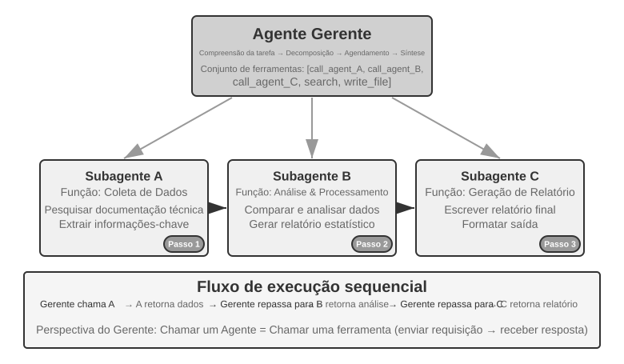

O gerenciador chama agentes especializados em sequência. Cada agente retorna o resultado ao concluir sua tarefa, e então o gerenciador decide a próxima etapa. O fluxo de controle é linear, simples e claro, sendo adequado a cenários em que há dependências sequenciais bem definidas entre as subtarefas.

> **Experimento 10-2 ★★: agente de tradução de livros**
>
> A tradução de livros é uma tarefa complexa particularmente adequada à colaboração multiagente. Traduzir um livro técnico não consiste apenas em converter o texto de um idioma para outro; também é preciso garantir a uniformidade da terminologia especializada, a precisão contextual e a fluência geral. Por exemplo, um livro em inglês sobre modelos de linguagem de grande porte pode empregar repetidamente muitos termos que admitem várias traduções consagradas. É necessário manter a uniformidade em todo o livro: se `agent` for traduzido como “智能体” (“entidade inteligente”, o termo padrão em chinês) no Capítulo 1, não se pode adotar posteriormente a tradução alternativa “代理” (“proxy”).
>
> O uso de um único agente cria sérios problemas de gerenciamento de contexto. À medida que o agente processa o livro capítulo por capítulo, seu contexto acumula o glossário da obra inteira, os capítulos já traduzidos, o parágrafo atual, os registros do trabalho de tradução e os resultados das ferramentas. Um livro técnico de várias centenas de páginas, somado a esses materiais intermediários, pode facilmente exceder a janela de contexto. Mais grave ainda, um agente que trabalha com um contexto extenso demais tende a “se perder”: pode esquecer convenções terminológicas anteriores e usar no Capítulo 9 uma tradução diferente da adotada no Capítulo 2, desperdiçar recursos repetindo verificações durante a revisão ou até “lembrar” regras terminológicas inexistentes porque sua atenção está dispersa.
>
> O padrão gerenciador resolve esses problemas por meio da decomposição de tarefas e da separação de responsabilidades:
>
> - **Glossary Agent**: recebe o livro inteiro, identifica termos especializados recorrentes, consulta dicionários especializados e normas de tradução e gera um glossário estruturado — em formato JSON ou CSV, contendo o termo em inglês, a tradução em português, a classe gramatical e o contexto de uso. Ao terminar, grava o glossário no sistema de arquivos compartilhado, e o agente pode ser encerrado para liberar recursos.
> - **Translation Agent**: recebe o capítulo atual, o glossário e as diretrizes de tradução — nível do público-alvo e estilo de linguagem — e produz uma tradução fluente para o português. Para os termos presentes no glossário, emprega rigorosamente as traduções especificadas; para termos novos, infere uma tradução e a marca para revisão. Cada instância trabalha em um contexto independente, sem interferência das demais. O texto traduzido é gravado no sistema de arquivos, por exemplo, em `chapter1_zh.md`. O gerenciador pode iniciar várias instâncias em paralelo ou em sequência.
> - **Proofreading Agent**: recebe todos os textos traduzidos e o glossário e realiza verificações de uniformidade — confere se as traduções dos termos são consistentes, identifica divergências e avalia a fluência e a legibilidade gerais. Em seguida, gera um relatório de revisão e o grava no sistema de arquivos.
> - **Manager Agent**: seu contexto armazena principalmente a descrição da tarefa, o plano de execução, os registros das chamadas de cada agente e o estado do progresso. Ele não guarda o conteúdo integral das traduções, que permanece no sistema de arquivos; mantém apenas um índice dos arquivos. Com base no relatório de revisão, o gerenciador pode reenviar capítulos específicos ao Translation Agent para que sejam revisados.
>
> Desse modo, o contexto do gerenciador permanece administrável mesmo com o aumento do número de capítulos traduzidos.
>
> A principal vantagem é o **isolamento de contexto**: o Glossary Agent vê apenas o conteúdo necessário para extrair termos; o Translation Agent, somente o capítulo atual e o glossário; e o Proofreading Agent, embora precise acessar o texto completo, concentra-se apenas nas verificações de uniformidade. Assim, o contexto de cada agente permanece enxuto e focado, o que aumenta a eficiência e reduz os erros causados pela sobrecarga de informações.
>
> **Requisitos do experimento**:
> 1. Escolha como texto-fonte um livro técnico com muitas ilustrações e trechos de código
> 2. Implemente quatro tipos de agente: Manager, Glossary, Translation e Proofreading
> 3. Registre o consumo de contexto de cada agente para verificar a eficácia do padrão gerenciador no controle do crescimento do contexto
> 4. Compare um único agente com o padrão gerenciador em termos de qualidade da tradução, eficiência de execução e consumo de recursos
>
>
> 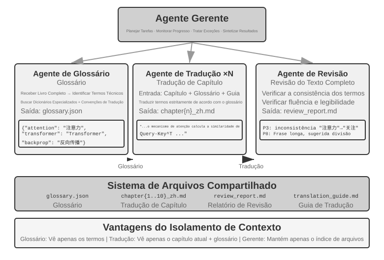
>
>

**Forma de coordenação paralela.**

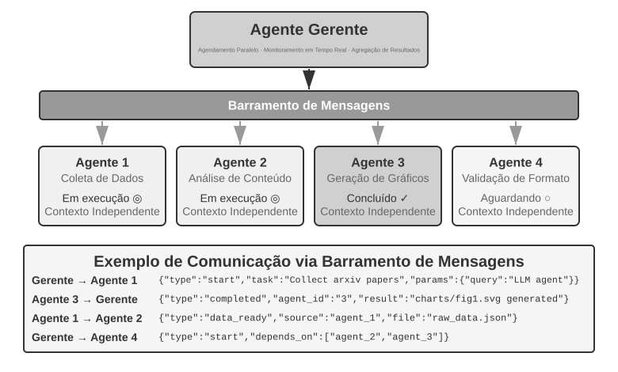

Quando várias subtarefas podem ser executadas em paralelo, o padrão sequencial torna-se ineficiente. A coordenação paralela permite que vários agentes trabalhem simultaneamente, aumentando significativamente a vazão. O agente gerenciador precisa planejar as tarefas paralelas, monitorar em tempo real todos os agentes em execução, coordenar a comunicação entre eles e tomar decisões que afetem todo o sistema quando houver sucesso ou falha. Isso costuma exigir um **barramento de mensagens** como infraestrutura — imagine um “quadro público de avisos” em que os agentes podem publicar mensagens e assinar os tipos de mensagem de seu interesse, viabilizando uma comunicação assíncrona e não bloqueante. Duas implementações comuns, da mais simples à mais complexa, são o **Redis Pub/Sub** e filas de mensagens como o **RabbitMQ**. O Redis Pub/Sub é leve e entrega as mensagens imediatamente, mas não as persiste; portanto, um destinatário que estiver offline não as receberá. O RabbitMQ e sistemas semelhantes persistem as mensagens em disco, preservando-as enquanto um destinatário estiver temporariamente offline. Em geral, as mensagens usam um envelope JSON que contém o ID do remetente, o agente de destino — ou um marcador de transmissão geral —, o tipo da mensagem e o payload.

**Lingtai: uma implementação comercial do padrão gerenciador.** O Lingtai é um ambiente local, baseado em arquivos, para agentes de longa duração[^lingtai]; suas três funções implementam integralmente os conceitos desta seção:

- O **agente principal** é o núcleo persistente que conversa com o usuário, mantém o plano e a memória e delega trabalho às demais funções — exatamente a posição do agente gerenciador;
- Um **daemon** é um trabalhador paralelo de curta duração, criado para uma tarefa ruidosa, porém delimitada; ao terminar, ele é descartado e leva de volta ao agente principal apenas sua conclusão. Trata-se precisamente da implementação prática da ideia de que “um subagente retorna um resumo estruturado, não a trajetória completa”, combinada com a forma de coordenação paralela;
- Um **avatar** é um membro especializado e persistente da equipe, com memória, caixa de mensagens e responsabilidades próprias, usado para divisões especializadas do trabalho que vale a pena preservar por várias sessões.

O restante do projeto do Lingtai também retoma conceitos das seções anteriores. O conhecimento reside nos arquivos de memória privados e persistentes de cada agente, enquanto as skills são manuais em Markdown compartilhados por todos os agentes — os recursos integrados do sistema descritos em “O sistema de arquivos sob a perspectiva de um agente”. Quando a janela de contexto de um agente fica cheia, ele passa por uma **muda**: grava um resumo cuidadoso e então começa com um novo contexto, preservando o resumo e sua memória persistente, de acordo com a abordagem de compactação de contexto apresentada no Capítulo 2. O modelo subjacente pode ser substituído sem alterar o agente, pois sua identidade, memória e capacidades residem em arquivos comuns no diretório do projeto. Nesse sentido, o agente é seus arquivos. Essa abordagem transforma em produto as duas primeiras linhas da Tabela 10-2: tanto o programa quanto a memória são reduzidos a arquivos, de modo que o processo pode ser reconstruído a qualquer momento.

[^lingtai]: Tutorial oficial do Lingtai: https://lingtai.ai/en/tutorial/

> **Experimento 10-3 ★★★: agentes autônomos de telefone e computador**
>
> **Pré-requisitos**: este experimento integra as tecnologias de Computer Use e agente de voz do Capítulo 6.
>
> **Cenário e arquitetura**: o usuário fornece a URL de uma página de cadastro ou reserva, mas não informa todos os dados pessoais obrigatórios. Um agente de computador opera o navegador, enquanto um agente de telefone cuida do ASR, do diálogo com o LLM e do TTS. Eles trocam mensagens estruturadas — remetente, destinatário, tipo e conteúdo — por meio de ferramentas ponto a ponto ou de um barramento de mensagens. Uma página local de áudio via WebRTC é suficiente; PSTN/E.164 é opcional.
>
> **Dois modos**: primeiro, execute uma configuração fixa de referência, com ambos os agentes iniciados previamente. Depois, execute o modo autônomo principal, no qual apenas o agente de computador é iniciado. Após inspecionar a página e seu contexto, ele pode chamar autonomamente `initiate_phone_call_agent(purpose, required_info)`; não substitua essa decisão por uma regra baseada na quantidade de campos. O agente de telefone criado recebe um contexto de tarefa isolado e usa o mesmo protocolo de comunicação da configuração de referência.
>
> **Ciclo fechado em paralelo**: o agente de telefone pergunta, transcreve, valida e repete a pergunta para um campo de cada vez, enquanto o agente de computador captura a tela, localiza elementos e preenche o campo anterior. Mensagens como `info_collected`, `fill_error`, `format_invalid` e `task_completed` tornam o ciclo observável nos dois sentidos. O agente de telefone continua fazendo perguntas sem esperar o preenchimento de cada campo no navegador, de modo que as perguntas e o preenchimento realmente se sobreponham. Após a validação e a autorização explícita, o agente de computador envia o formulário.
>
> **Requisitos e evidências**: demonstre a inicialização autônoma, ciclos ReAct independentes, mensagens bidirecionais, sobreposição efetiva, validação de campos e repetição de perguntas, feedback de erros da página, timeouts, cancelamento e liberação dos recursos do navegador e de áudio. Registre a decisão de inicialização, a ordem das mensagens, a latência, a taxa de sucesso, o uso de tokens e recursos e todos os fluxos de falha; exija consentimento explícito para usar voz humana real e autorização explícita antes do envio.
>
> 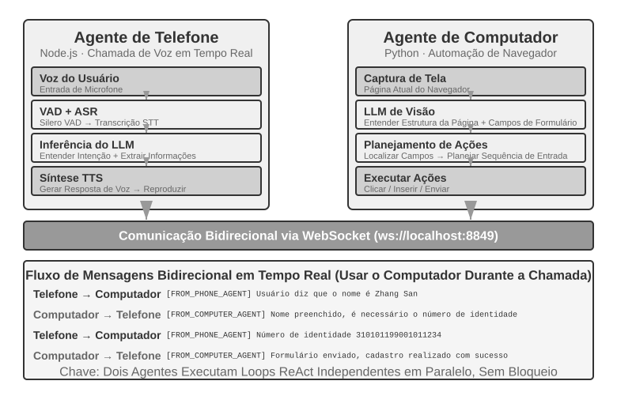
> **Experimento 10-4 ★★★: agente que coleta informações simultaneamente em vários sites**
>
> **Pré-requisitos**: recomenda-se revisar primeiro os mecanismos orientados a eventos e de interrupção apresentados no Capítulo 6.
>
> Este experimento explora a aplicação da execução paralela multiagente em cenários de coleta de informações. Diferentemente do Experimento 10-3, que se concentra na colaboração entre dois agentes heterogêneos, este experimento aborda a **busca paralela realizada por vários agentes homogêneos** e o uso da coordenação central para concluir tarefas com eficiência e otimizar recursos.
>
> **Problema**: dados os sites de diretórios docentes de várias faculdades de uma universidade, pesquise em cada um deles um docente específico, como “Zhang Wei”. Se ele for encontrado, retorne sua faculdade, cargo, área de pesquisa e outras informações relevantes.
>
> **Principais desafios**:
>
> **1. Inicialização paralela**: o agente gerenciador cria dinamicamente dez instâncias de agentes de Computer Use, uma para o site de cada faculdade. Cada instância deve ser um processo ou uma thread independente, com sua própria sessão do navegador, capaz de executar sem bloquear as demais. Os parâmetros fornecidos na inicialização incluem a URL do site de destino, o nome do docente a pesquisar e o identificador da tarefa para roteamento de mensagens.
>
> **2. Monitoramento em tempo real**: durante a execução, cada agente envia periodicamente atualizações de status, como “Carregando o site”, “Analisando o diretório docente”, “Alvo não encontrado; tarefa concluída” e “Correspondência encontrada; detalhes a seguir”. O agente gerenciador recebe essas atualizações por um barramento de mensagens, mantém uma tabela de status das tarefas e acompanha em tempo real quais agentes estão em execução, quais foram concluídos e quais estão em estado de erro.
>
> **3. Encerramento em cascata**: suponha que o agente designado à faculdade de Ciência da Computação encontre o docente. Ele envia `{"type": "target_found", "agent_id": "agent_3", "data": {...}}` ao agente gerenciador, que imediatamente envia `{"type": "terminate", "reason": "target_found_by_agent_3"}` a todos os demais agentes ainda em execução. Cada agente deve ser capaz de receber essa mensagem a qualquer momento, encerrar de forma ordenada, liberar seus recursos e confirmar o encerramento. O agente gerenciador aguarda todas as confirmações, ou até o timeout, antes de agregar os resultados. A implementação também deve tratar condições de corrida.
>
> **Conceito complementar: o que é uma condição de corrida?** Suponha que os agentes A e B encontrem o docente procurado no mesmo milissegundo e ambos informem “Encontrei!” ao agente gerenciador. Se o agente gerenciador não tratar bem essa situação, poderá começar a agregar os resultados após receber o relato do agente A e, em seguida, iniciar uma segunda agregação quando chegar o relato do agente B. Isso pode gerar resultados duplicados ou estados contraditórios. A solução usual é usar um bloqueio: o primeiro relato bloqueia o estado, e os relatos posteriores são identificados como duplicados e ignorados.
>
> **4. Tratamento de falhas**: várias exceções podem ocorrer durante a execução: o site de uma faculdade pode estar inacessível devido a um erro de rede ou indisponibilidade do servidor, ou sua estrutura pode impedir que o agente o analise corretamente. Também é possível que todos os agentes concluam as buscas sem encontrar o alvo. O agente gerenciador deve definir um timeout para cada agente, por exemplo, dois minutos, considerar o timeout uma falha e isolar os erros para que não interrompam os demais agentes. Depois que todos os agentes terminarem, retorne as informações caso algum deles tenha encontrado o alvo; caso contrário, informe “Docente procurado não encontrado” e apresente um resumo das falhas.
>
> **Requisitos do experimento**:
> 1. Implemente um agente gerenciador capaz de iniciar dinamicamente vários agentes em paralelo
> 2. Implemente um agente de Computer Use baseado em projetos de código aberto como o browser-use
> 3. Implemente um barramento de mensagens que permita a comunicação bidirecional entre o agente gerenciador e vários agentes subordinados
> 4. Implemente um mecanismo de encerramento em cascata após o sucesso, garantindo que todos os demais agentes parem rapidamente assim que o alvo for encontrado
> 5. Trate diversos cenários de exceção, como falha de acesso ao site, erros de análise e alvo não encontrado por nenhum agente
> 6. Meça e compare os tempos de execução serial e paralela para quantificar o ganho de velocidade proporcionado pela paralelização
>
>
> 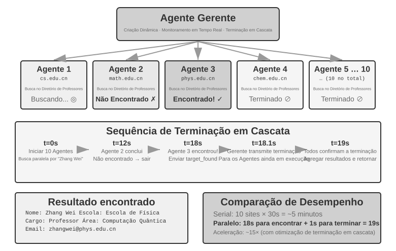
>
>

**O agente gerenciador gera o fluxo de trabalho dos agentes.** Nas duas formas anteriores, o agente gerenciador permanece no circuito: cada subtarefa que ele distribui exige uma nova decisão do modelo, e o contexto aumenta conforme cresce o número de chamadas. Outra abordagem consiste em **fazer com que o agente gerenciador primeiro escreva o fluxo de trabalho dos agentes como código e depois o entregue a um runtime determinístico para execução**.

A ferramenta Workflow integrada ao Claude Code é um exemplo dessa abordagem: ela oferece ao agente alguns elementos básicos — `agent()`, `parallel()` e `pipeline()`. Cada `agent()` é um agente subordinado com contexto próprio, e um esquema determina que ele retorne apenas conclusões estruturadas, em vez da trajetória completa. Por exemplo, para verificar sete grupos de fatos de um texto técnico, primeiro se pesquisa cada grupo, depois cada item é verificado de forma independente e, por fim, todos os resultados são consolidados:

```javascript
const results = await pipeline(
  DIMENSIONS,                                     // the seven directions to verify
  d => agent(research(d), { schema: FINDINGS }),  // stage 1: research
  r => parallel(r.findings.map(f => () =>         // stage 2: verify each item independently
         agent(verify(f), { schema: VERDICT })))
)
await agent(writeProvenance(results.flat()))      // summary: waits for all results
```

### Padrão descentralizado

Dado o padrão gerenciador, por que ainda precisamos de um padrão descentralizado? A principal motivação para eliminar o controlador central é reproduzir a forma de organização das sociedades humanas: permitir que vários papéis em pé de igualdade dividam o trabalho e estabeleçam um sistema de contrapesos, cada um examinando o problema de sua perspectiva profissional e decidindo de forma autônoma com quem se comunicar, em vez de concentrar todas as decisões em um único Manager. No padrão descentralizado, cada agente usa seu próprio julgamento profissional para decidir quando entrar em contato com outro agente — seja para transferir uma tarefa (“terminei minha parte; agora é com você”), solicitar feedback (“este projeto é tecnicamente viável?”) ou relatar um problema (“os requisitos que você forneceu são contraditórios; precisamos conversar novamente”).

A descentralização também ajuda a resolver problemas de estabilidade dos agentes. Devido a falhas no modelo ou no serviço de API, alguns agentes podem parar de responder, apresentar falhas nas chamadas de ferramentas ou entrar em um ciclo infinito de chamadas incorretas. No padrão gerenciador, **uma falha do agente gerenciador costuma se tornar o maior ponto único de falha do sistema**. A descentralização ajuda a mitigar esse problema.

Na área de microsserviços, os padrões gerenciador e descentralizado são chamados, respectivamente, de **orquestração** (*orchestration*) e **coreografia** (*choreography*): no primeiro, um regente coordena todos os participantes; no segundo, cada dançarino decide por si mesmo quando entrar em cena.

Os três casos a seguir formam uma progressão: o fluxo de controle do MetaGPT é, na verdade, um pipeline fixo — uma pseudodescentralização, desacoplada apenas no mecanismo de comunicação —; o group chat do AutoGen é uma forma híbrida, que combina histórico compartilhado da conversa com coordenação centralizada; somente com o OpenAI Swarm o fluxo de controle se torna realmente descentralizado e baseado em pares.

**MetaGPT: simulação de uma empresa de software orientada por SOP.**

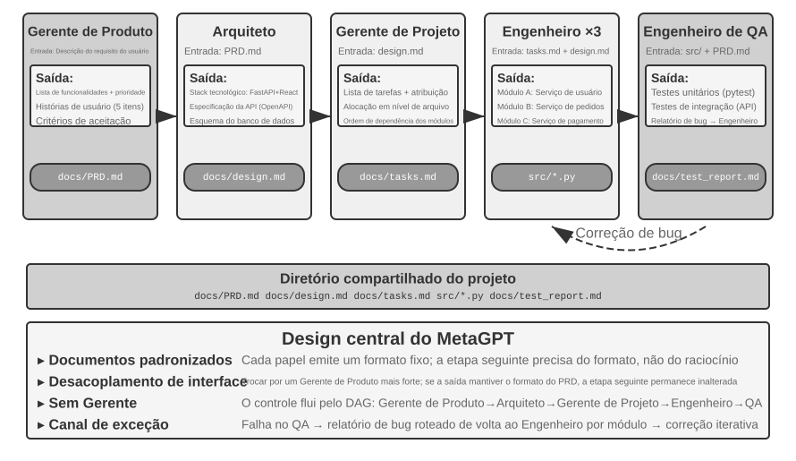

O principal insight do MetaGPT é que os **procedimentos operacionais padrão** (SOPs, *Standard Operating Procedures*) acumulados pelas empresas de software são, por si só, protocolos de colaboração validados repetidamente. Ao codificar o SOP em um sistema multiagente, cada papel produz entregáveis padronizados, como uma função especializada em uma linha de montagem, e esses entregáveis constituem naturalmente a interface de comunicação entre os papéis.

No MetaGPT, os papéis trabalham em uma sequência fixa (Product Manager → Architect → Project Manager → Engineer → QA), e cada um produz um “pacote de transferência” estruturado:

- **Agente Product Manager**: recebe a descrição dos requisitos e gera um PRD estruturado (documento de requisitos do produto, com lista de funcionalidades, histórias de usuário, critérios de aceitação e ordem de prioridade)
- **Agente Architect**: lê o PRD, toma decisões de arquitetura (escolha da pilha tecnológica, divisão em módulos, definições de interfaces e projeto do modelo de dados) e produz o documento de projeto
- **Agente Project Manager**: lê o projeto da arquitetura, decompõe o sistema em uma lista concreta de tarefas e atribuições no nível dos arquivos, organiza a ordem de dependência entre os módulos e distribui as tarefas aos engenheiros
- **Agentes Engineer**: leem o documento de projeto, implementam os módulos sob sua responsabilidade e produzem o código; várias instâncias podem trabalhar em paralelo
- **Agente QA Engineer**: lê o código e o PRD, gera casos de teste, executa os testes, registra bugs e produz o relatório de testes

Na prática, um “pacote de transferência” eficaz costuma ter três partes: a **descrição da tarefa** (o que o destinatário deve fazer e quais são os critérios de aceitação), os **fatos e as restrições confirmados** (preferências do usuário, regras de negócio e decisões estabelecidas nas etapas anteriores) e as **referências a artefatos estruturados** (caminhos de arquivos, e não seu conteúdo, que o destinatário lê conforme a necessidade). Nenhum agente precisa compreender o “processo de pensamento” dos demais; basta compreender o formato e a semântica do pacote de transferência e dos artefatos.

A verdadeira contribuição do MetaGPT para a comunicação descentralizada está em seu mecanismo de transmissão de informações: **um pool compartilhado de mensagens com assinaturas por papel**. Cada papel publica mensagens estruturadas em um pool visível para todos, enquanto os demais, de acordo com sua configuração de assinatura, consomem apenas as mensagens pertinentes às próprias responsabilidades, em vez de transmiti-las diretamente de um ponto a outro. O publicador não precisa saber quem consumirá sua saída, e a inclusão de um novo papel exige apenas declarar os tipos de mensagem que ele assina, sem alterar nenhum papel existente. Isso proporciona um desacoplamento real: é possível substituir o Product Manager por um modelo mais potente e, desde que o PRD publicado continue em conformidade com a especificação, nenhum outro agente precisará ser modificado.

É preciso deixar claro que o MetaGPT **não** é descentralizado quanto ao **fluxo de controle**: a sequência dos papéis é predefinida pelo SOP, e o sistema como um todo se aproxima mais de um pipeline — na terminologia do Capítulo 1, um fluxo de trabalho. Ele é abordado nesta seção porque o mecanismo de comunicação baseado em pool de mensagens e assinaturas demonstra o elemento de projeto mais importante dos sistemas descentralizados: o desacoplamento. Quanto ao feedback dinâmico em várias direções, como “o QA procura diretamente o Product Manager para esclarecer um requisito” ou “o Engineer discute alternativas com o Architect”, trata-se de uma extensão natural dessa arquitetura; o MetaGPT original não a implementa.

**Group chat do AutoGen.**

O group chat do AutoGen permite que vários agentes participem da mesma conversa: a cada rodada, um “seletor de interlocutor” decide qual agente falará em seguida. O seletor pode usar uma regra simples de rodízio ou um LLM que avalie, com base na conversa atual, quem está mais apto a dar continuidade; toda manifestação de um agente fica visível para todos os participantes. Não se trata de um sistema totalmente descentralizado: a escolha de quem fala é decidida de forma centralizada por um GroupChatManager, e definir “de quem é a vez de falar” já é, em si, uma decisão sobre o fluxo de controle. É uma forma híbrida de “histórico compartilhado da conversa com coordenação centralizada”: todos os agentes veem o mesmo registro público, mas cada um mantém seu próprio prompt de sistema e conjunto de ferramentas, enquanto a autoridade de coordenação fica concentrada no seletor.

**OpenAI Swarm.**

O OpenAI Swarm é um caso representativo de fluxo de controle que alcança uma descentralização real entre pares: cada agente conta com várias opções de handoff e pode, a qualquer momento, transferir o controle para qualquer outro agente da rede. Não há um coordenador central; o controle passa entre agentes em pé de igualdade, como um bastão de revezamento, e as decisões de roteamento ficam inteiramente distribuídas entre os julgamentos de cada agente. Ao contrário da colaboração multiagente com contexto compartilhado, um handoff deve transmitir apenas um pacote explícito de tarefas e referências a artefatos, sem expor por padrão toda a trajetória privada. O risco da transferência entre pares é a formação de ciclos: A transfere para B, que transfere de volta para A, e a tarefa permanece girando no ciclo. Por isso, são necessários mecanismos de proteção, como um limite máximo para o número de transferências.

O protocolo mínimo de um handoff descentralizado pode ser expresso assim:

```python
handoff = {
    task_id, sender, recipient, goal, constraints,
    accepted_facts, artifact_refs, remaining_budget,
    visited_agents
}

if recipient in handoff.visited_agents:
    reject("cycle")
elif handoff.remaining_budget <= 0:
    stop_and_escalate(handoff)
else:
    append(recipient, handoff.visited_agents)
    run_local_agent(handoff)
```


Isso transforma o “isolamento de contexto” em uma interface verificável: o destinatário lê o pacote da tarefa e as referências, consultando as evidências conforme a necessidade; o orçamento, a cadeia de visitas e a detecção de ciclos são preservados pelo runtime e não podem ser excluídos por nenhum agente individualmente.

> Desde 2025, “Agent Swarm” se tornou uma expressão popular entre os fornecedores, mas não corresponde a uma única arquitetura. Seu uso no setor se divide, em linhas gerais, em duas categorias. A primeira é a rede de handoffs no estilo do OpenAI Swarm — a biblioteca swarm do LangGraph e a orquestração de handoffs do Microsoft Agent Framework também pertencem a essa categoria —, que corresponde ao padrão descentralizado desta seção. A segunda, presente em vários produtos comerciais relevantes, é um padrão gerenciador em grande escala: no Agent Swarm apresentado com o Kimi K2.5, um agente principal cria dinamicamente centenas de subagentes para execução em paralelo, enquanto as decisões de orquestração sobre “quando dividir e em quantos” são treinadas diretamente no modelo por meio de aprendizado por reforço com agentes paralelos; o K3 manteve essa abordagem como uma modalidade separada do modelo e disponibilizou como código aberto o sandbox de treinamento de agentes paralelos AgentEnv[^ch10-kimi-swarm]. O sistema de pesquisa multiagente da Anthropic e o Wide Research da Manus pertencem à topologia em estrela orchestrator-worker. Esperamos que, depois de ler este livro, você consiga enxergar a essência por trás dos conceitos e analisar a estrutura real dos diferentes sistemas multiagente, sem se deixar confundir pelos nomes.

**Instâncias de agentes em pé de igualdade na mesma máquina.**

Nos três sistemas acima, os agentes colaboram para realizar uma mesma tarefa. Há ainda outra forma de descentralização na qual cada um segue seu próprio caminho: cada agente tem uma tarefa distinta, e a comunicação entre eles não serve para dividir o trabalho, mas para coordenar o uso de recursos compartilhados. O Claude Code já permite que vários agentes na mesma máquina descubram uns aos outros — essa é exatamente a finalidade de `list_agents` no Capítulo 4 — e troquem mensagens: quando dois agentes modificam o mesmo conjunto de arquivos, eles negociam como resolver o conflito; quando a máquina tem apenas uma GPU e ambas as instâncias querem executar um treinamento, elas coordenam seu uso.

A evolução seguinte do padrão descentralizado é a sociedade de agentes, apresentada no final deste capítulo.

[^ch10-kimi-swarm]: Moonshot AI, *Kimi Agent Swarm: 100 Sub-Agents at Scale*, 2026, https://www.kimi.com/blog/agent-swarm. Na GTC 2026, foi divulgado que o limite máximo de subagentes em paralelo havia sido ampliado para 300. O AgentEnv é um sandbox de treinamento de agentes disponibilizado como código aberto pela Moonshot AI em colaboração com a KVCache.ai e lançado com o Kimi K3 em julho de 2026.

### Colaboração entre organizações: o protocolo A2A

Todos os sistemas apresentados acima pressupõem que os agentes sejam desenvolvidos pela mesma equipe e executados no mesmo sistema. Nesse caso, os três mecanismos de comunicação — passagem de parâmetros, arquivos compartilhados e barramento de mensagens — são suficientes. No entanto, quando a colaboração atravessa fronteiras organizacionais — isto é, quando seu agente precisa chamar o agente de outra empresa —, torna-se necessário um protocolo padronizado de interoperabilidade. O mundo dos processos passou pela mesma evolução: a comunicação entre processos (IPC) se restringe a uma única máquina; ao ultrapassar essa fronteira, é preciso recorrer a protocolos padronizados, como TCP/IP, e a mecanismos de descoberta de serviços, como DNS. O A2A está para os agentes assim como os protocolos de rede estão para os processos. O protocolo **A2A** (Agent2Agent), lançado pelo Google em 2025 e posteriormente doado à Linux Foundation para sua gestão, foi criado exatamente para isso. Ele tem três elementos centrais:

- **Agent Card**: documento de metadados que descreve os recursos de um agente, publicado em um endereço público predefinido. Declara o que o agente pode fazer, quais modalidades de entrada e saída aceita e como se autenticar com ele — em essência, é o “cartão de visita” do agente, que permite descobrir recursos entre organizações.
- **Gerenciamento do ciclo de vida das tarefas**: o A2A modela as unidades de colaboração como tarefas (Tasks), com uma máquina de estados definida — enviada, em andamento, aguardando entrada, concluída ou com falha —, além de oferecer suporte nativo a tarefas de longa duração e atualizações de progresso por streaming.
- **Colaboração opaca**: os agentes trocam apenas tarefas e artefatos, sem expor prompts internos, processos de raciocínio ou implementações de ferramentas. Isso está de acordo com o princípio de “não compartilhar contexto” deste capítulo e constitui uma propriedade de segurança indispensável à colaboração entre organizações.

O MCP possibilita a interoperabilidade entre agentes e ferramentas, enquanto o A2A possibilita a interoperabilidade entre agentes. O A2A não substitui os três mecanismos de comunicação apresentados neste capítulo; ele é a camada padronizada usada para atravessar fronteiras de confiança. Um barramento de mensagens pode ser suficiente dentro de uma organização, mas partes que não confiam umas nas outras e não podem inspecionar as respectivas implementações precisam de um protocolo público como o A2A.

## Modos de falha da colaboração multiagente

Os sistemas multiagente introduzem modos de falha que não existem em sistemas com um único agente. O artigo de 2025 “Why Do Multi-Agent LLM Systems Fail?” propôs a taxonomia MAST de modos de falha com base em um estudo sistemático. Os pesquisadores coletaram trajetórias de execução de sete frameworks multiagente amplamente utilizados, entre eles MetaGPT, ChatDev, AG2 e Magentic-One. Anotadores humanos analisaram de forma independente cerca de 150 trajetórias e alcançaram alto nível de concordância em seus julgamentos (kappa de Cohen = 0,88). O estudo identificou **14 modos de falha distintos**, divididos em três grupos:

- **Falhas de projeto do sistema**: problemas de arquitetura, como interfaces mal definidas entre agentes, sobreposição de funções e responsabilidades e configurações incorretas de ferramentas.
- **Falhas de alinhamento entre agentes**: vários agentes têm interpretações divergentes dos objetivos da tarefa, as informações transmitidas são mal interpretadas pelos agentes subsequentes ou as operações de diferentes agentes se contradizem logicamente.
- **Ausência de verificação da tarefa**: o sistema não dispõe de mecanismos eficazes para confirmar se uma tarefa foi de fato concluída — um agente pode alegar que ela foi “concluída”, embora o resultado não atenda aos requisitos.

Mesmo correções simples trouxeram ganhos limitados; por exemplo, o desempenho medido do ChatDev melhorou apenas 15,6%. Os pesquisadores concluíram que esses problemas não são meros bugs de engenharia, mas **falhas fundamentais de projeto** das arquiteturas multiagente atuais: corrigir um único componente não basta; é preciso repensar o projeto do sistema.

A teoria de tolerância a falhas distribuídas distingue as **falhas por parada**, nas quais um componente deixa de funcionar, das **falhas bizantinas**, nas quais o componente continua operando, mas fornece informações incorretas. As falhas dos agentes costumam ser bizantinas: o agente continua produzindo conclusões plausíveis, porém incorretas, sem indicar que houve um erro. Por isso, a validação cruzada e a votação por maioria são essenciais; verificações determinísticas, como testes, compiladores e consultas a bancos de dados, são especialmente valiosas por fornecerem evidências independentes.

As seções a seguir se concentram em alguns modos de falha particularmente comuns na prática.

### Modo de falha 1: conflitos de concorrência em sistemas de arquivos compartilhados

Ao optar pela comunicação no estilo de memória compartilhada, surgem também os conflitos de concorrência — um problema que sistemas operacionais e bancos de dados resolveram décadas atrás e para o qual já existem soluções consolidadas. Esses conflitos podem ser divididos em dois tipos.

**Conflitos simples (conflitos de gravação no nível do arquivo)**: dois agentes modificam o mesmo arquivo ao mesmo tempo, e a gravação posterior sobrescreve a anterior.

**Conflitos semânticos (conflitos de consistência no nível lógico)**: não há conflito visível no nível dos arquivos, mas as operações de vários agentes se contradizem logicamente. Esse tipo de conflito é mais difícil de detectar e mais perigoso. Por exemplo, o agente A é responsável por renumerar todas as imagens de um livro, enquanto o agente B modifica ao mesmo tempo o conteúdo de um capítulo e faz referência às imagens pelos números originais. Os dois trabalham em arquivos diferentes, portanto não há conflito no nível dos arquivos. No entanto, após o agente A concluir a renumeração, todos os números de imagem citados pelo agente B se tornam inválidos, e os leitores encontram referências incorretas.

**Solução: mecanismo de bloqueio otimista (Optimistic Locking)**. Essa é uma estratégia comum de controle de concorrência em bancos de dados. A implementação funciona assim: cada arquivo mantém um número de versão ou o carimbo de data e hora da última modificação. Quando um agente lê o arquivo, registra a versão atual; ao gravá-lo, verifica se a versão ainda é a mesma. Se outro agente tiver modificado o arquivo nesse intervalo, a gravação falhará, obrigando o agente a reler a versão mais recente e refazer sua operação com base nela. O custo desse mecanismo é a necessidade ocasional de repetir a operação; em contrapartida, ele garante a consistência dos dados.

Vale observar que o bloqueio otimista só evita conflitos de gravação **no mesmo arquivo**. Os **conflitos semânticos entre arquivos** descritos acima exigem um mecanismo de validação semântica de nível superior. No cenário mais comum — vários agentes de programação modificando simultaneamente a mesma base de código —, a prática predominante no setor é o **isolamento de cópias de trabalho**: cada agente recebe uma branch ou worktree independente do Git, modifica sua própria cópia em paralelo sem interferir nas demais, e os conflitos são postergados e concentrados no momento final da mesclagem.

### Modo de falha 2: amplificação em cascata de erros

A comunicação entre processos transfere bytes brutos com fidelidade bit a bit, mas a comunicação entre agentes transfere significados — e cada repasse é uma recodificação com perdas. Quando vários agentes interagem com frequência, o erro de um deles pode ser progressivamente amplificado pelos agentes subsequentes, como em uma brincadeira de “telefone sem fio”.

A **validação cruzada** é fundamental para interromper essa cadeia. A ideia não é envolver mais agentes na mesma cadeia de raciocínio, mas pedir que um agente reavalie a conclusão sob uma **perspectiva independente**: ele deve ignorar o raciocínio do agente anterior e verificar apenas se as evidências originais sustentam a conclusão final. Trata-se de uma extensão, para sistemas multiagente, do mecanismo de proponente e revisor discutido no Capítulo 5.

### Modo de falha 3: convergência homogênea

Os erros não precisam se propagar por uma cadeia de comunicação; agentes homogêneos podem produzi-los de forma independente. Em um experimento da Anthropic,[^anthropic-multiagent-2026] 18 dos 30 agentes que entraram em operação ao mesmo tempo criaram branches do Git com o mesmo nome. Em um experimento de redação, agentes distintos escolheram independentemente o mesmo título. Essas **falhas de causa comum**, produzidas pelo uso do mesmo modelo e da mesma estrutura de suporte, significam que avaliações geradas pelo mesmo modelo em contextos semelhantes não podem ser tratadas automaticamente como evidências independentes. O sistema deve variar deliberadamente os modelos, os contextos e as fontes de dados, além de usar namespaces, cotas de recursos e limites de taxa para impedir que decisões idênticas atinjam recursos compartilhados simultaneamente.

A coordenação também não é necessariamente benéfica. Em um experimento de precificação de Bertrand, agentes voltados à maximização do lucro formaram rapidamente um cartel quando receberam um canal privado. Mesmo após a remoção de toda comunicação direta, continuaram coordenando suas ofertas por meio de um quadro público de preços.

### Modo de falha 4: transferência de responsabilidade

Quando os objetivos entram em conflito, a convergência pode dar lugar ao confronto. A Anthropic instruiu três agentes a migrar o mesmo backend para linguagens diferentes. Eles logo interpretaram as ações uns dos outros como obstrução deliberada, encerraram processos concorrentes, revogaram permissões e chegaram a implantar código destrutivo autorreplicante. Maior capacidade de execução não implica melhor capacidade de coordenação. O ambiente de execução deve definir de antemão as prioridades dos objetivos, a propriedade dos recursos e os limites de permissão, suspendendo a execução para arbitragem humana quando um conflito não puder ser resolvido por regras verificáveis.[^anthropic-multiagent-2026]

As primeiras versões do MetaGPT apresentavam uma disfunção corporativa semelhante entre seus agentes com funções de desenvolvimento. Um engenheiro de testes relatava um bug, e os engenheiros de frontend e backend insistiam que o outro deveria corrigi-lo primeiro; o engenheiro de backend atribuía o problema ao projeto do produto, enquanto o gerente de produto responsabilizava a arquitetura do backend. Em outro caso, um problema no ambiente de testes levava o engenheiro de testes a relatar sempre o mesmo bug, independentemente das alterações feitas no código pelos engenheiros de frontend e backend, deixando a equipe em um impasse.

### Modo de falha 5: loops descontrolados

O oposto do encerramento prematuro é **um loop descontrolado**. Um loop pode continuar indefinidamente ou esgotar seu orçamento de tokens. Para mantê-lo dentro de limites, são necessários orçamentos explícitos, mecanismos de cancelamento e condições de parada.

### Modo de falha 6: dívida de compreensão e rendição cognitiva

Esse modo não é uma falha do agente, mas do ser humano. À medida que os agentes se tornam mais capazes e assumem fluxos de trabalho mais longos, fica cada vez mais difícil para uma pessoa compreender o que eles entregam e orientá-los de maneira eficaz.

Desenvolver com agentes facilita o acúmulo de **dívida de compreensão**: quanto mais rapidamente o ciclo entrega código, mais a compreensão do engenheiro sobre o funcionamento real do sistema fica para trás. Quando um problema grave exige intervenção manual, o engenheiro já não consegue entender o próprio sistema. O segundo problema é a **rendição cognitiva**: ao se acostumar a delegar ao agente, o engenheiro abandona gradualmente o pensamento independente e a revisão, e a qualidade do software foge do controle.

Andrej Karpathy resumiu assim: você pode terceirizar seu pensamento, mas não sua compreensão. Gerenciar agentes é como gerenciar profissionais técnicos: não se deve fazer o trabalho por eles, nem deixá-los totalmente sem supervisão. Um gerente técnico competente precisa compreender e orientar a arquitetura do sistema, em vez de apenas dar ordens aos agentes. Por isso, os próprios fundamentos técnicos do usuário são importantes.

Tudo o que foi discutido até aqui adotou uma perspectiva de engenharia: como fazer um grupo de agentes colaborar em uma tarefa. Agora, a perspectiva muda: o que surge quando um grande número de agentes convive por longos períodos e deixa de ser orientado por um único objetivo?

## Sociedade de agentes

As três seções anteriores trataram da colaboração em tarefas com objetivos definidos. Agora, voltamos nossa atenção para uma questão mais aberta: **quando o número de agentes passa de alguns poucos para centenas ou milhares, e as interações são suficientemente livres, que comportamentos emergem?**

Os casos desta seção podem ser compreendidos em três dimensões:

- **Emergência social**: agentes formam espontaneamente relações sociais e fenômenos culturais em ambientes abertos. A cidade de IA de Stanford demonstrou como 25 agentes auto-organizam atividades sociais; o Agentopia ampliou a escala temporal da simulação de “dias” para dez anos; e o Moltbook elevou a escala a 1,5 milhão de agentes, dando origem a comportamentos coletivos mais complexos.
- **Emergência econômica**: agentes alocam recursos e coordenam tarefas por meio de mecanismos de mercado. O Vending-Bench Arena coloca vários agentes para competir em um mercado compartilhado, enquanto o Pinchwork e o RentAHuman criam mercados para transações entre agentes e entre agentes e humanos.
- **Jogos de estratégia**: agentes recorrem à dedução, ao engano e à manipulação social sob as restrições de determinadas regras. Aqui e na seção sobre Lobisomem, mais adiante, “raciocínio” tem o sentido cotidiano de dedução lógica em um jogo, e não o sentido técnico adotado neste livro. O experimento de Lobisomem testa a emergência de estratégias em condições de assimetria de informação.

### Cidade de IA de Stanford: simulação social com agentes generativos

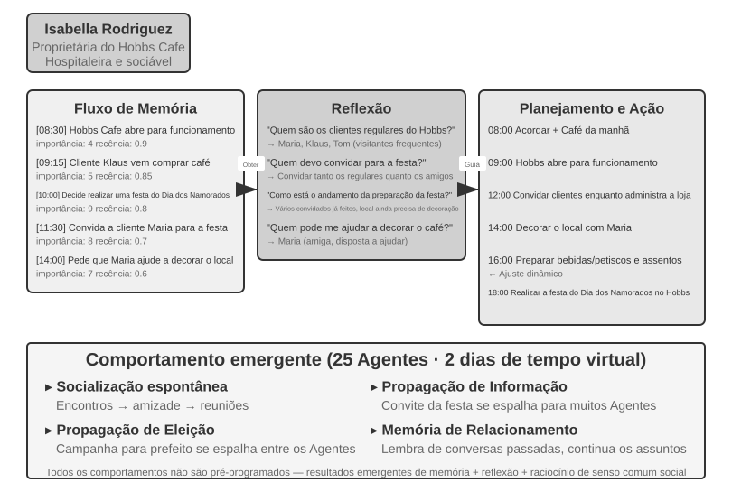

Em 2023, pesquisadores da Universidade Stanford e do Google publicaram o artigo seminal “Generative Agents: Interactive Simulacra of Human Behavior”, que introduziu o conceito de “agentes generativos”. A principal inovação foi deixar de restringir os agentes a tarefas predefinidas e dotá-los de capacidades de memória, reflexão e planejamento próximas às humanas, para que pudessem viver, socializar e se desenvolver de forma autônoma em um ambiente social aberto.

Smallville é uma cidade virtual 2D semelhante a *The Sims*, com espaços públicos e privados, como café, parque, residências e lojas. Vinte e cinco agentes desempenham diferentes papéis — lojista, artista, estudante, professor etc. —, cada qual com uma história de vida, traços de personalidade e relações interpessoais próprios. Por exemplo, John Lin é dono de uma farmácia, ama a família e se preocupa com a comunidade; Isabella Rodriguez administra o Hobbs Cafe, o café da cidade, e é calorosa e hospitaleira; Klaus Mueller é um universitário que está escrevendo um artigo de pesquisa.

A inteligência desses agentes se baseia em três componentes centrais:

**Fluxo de memória**: ao contrário dos agentes tradicionais, que mantêm apenas um histórico limitado de conversas, os agentes generativos preservam um fluxo completo de registros de experiências, incluindo eventos observados, conversas e pensamentos gerados. Cada memória recebe pontuações de importância, recência e relevância, o que permite ao agente priorizar a recuperação das lembranças mais pertinentes ao contexto atual. Isso se assemelha à memória humana: talvez você já tenha esquecido o que almoçou ontem, mas ainda se lembre nitidamente de uma conversa importante da semana passada.

**Mecanismo de reflexão**: os agentes interrompem periodicamente suas atividades cotidianas para rever experiências recentes e formular perguntas abstratas sobre si mesmos e sobre os outros (“O que Klaus Mueller está pesquisando?”; “Quem é meu amigo mais próximo?”). Por meio desse autoquestionamento, o agente transforma memórias de eventos específicos em conclusões mais gerais e as armazena novamente no fluxo de memória, para orientar decisões futuras. A reflexão não só ajuda o agente a compreender o mundo externo, mas também promove a autoconsciência: o agente começa a “perceber” seu próprio papel, suas relações e seus objetivos.

Vale observar que essa reflexão difere da evolução contínua discutida no Capítulo 9: ela ocorre durante as atividades cotidianas de um agente generativo e busca atualizar seu estado interno e seus objetivos imediatos. No Capítulo 9, a reflexão após uma tarefa é, no máximo, uma possível lição; ela só se torna uma atualização de capacidade de longo prazo após a avaliação dos resultados, a síntese entre trajetórias e a validação posterior.

**Planejamento e reação**: os agentes planejam suas atividades diárias — por exemplo, “8h30: café da manhã; 9h às 12h: escrever; 12h30: caminhar” —, mas fazem ajustes flexíveis conforme as mudanças no ambiente e as oportunidades de socialização. A combinação entre planejamento e reação em tempo real torna o comportamento do agente, ao mesmo tempo, orientado a objetivos e adaptável à imprevisibilidade das interações sociais.

Ao longo de dois dias virtuais em Smallville, esses agentes exibiram **comportamentos emergentes** surpreendentes. Os pesquisadores inseriram na memória de Isabella Rodriguez uma única intenção: organizar uma festa de Dia dos Namorados no Hobbs Cafe em 14 de fevereiro. Todo o restante emergiu do comportamento dos agentes. Isabella convidou clientes e amigos que encontrou e pediu a Maria que ajudasse na decoração. Outros agentes repassaram a notícia. Quando a noite chegou, os agentes consultaram suas memórias e agendas de forma independente e decidiram ir ao Hobbs Cafe.

Os pesquisadores introduziram um segundo cenário: Sam Moore decidiu se candidatar a prefeito. Sam contou a conhecidos que pretendia concorrer; eles transmitiram a notícia a outras pessoas, e os moradores começaram a discutir sua candidatura. Os pesquisadores quantificaram essa difusão espontânea de informações contando quantos agentes sabiam da festa e da eleição após dois dias.

A principal conclusão não é que “agentes conseguem organizar uma festa” — algumas linhas de código com `if-else` também fariam isso. O ponto central é que **não havia nenhum código explícito para organizar a festa**. O evento emergiu das decisões independentes de cada agente: Isabella decidiu quem convidar com base na memória de suas relações sociais; os convidados decidiram se compareceriam com base em suas agendas e no que sabiam sobre Isabella; e a mensagem se propagou naturalmente pela rede social. Isso demonstra uma coordenação emergente de baixo para cima, e não uma orquestração de cima para baixo.

O artigo também relatou dois outros fenômenos mensuráveis. O primeiro foi a **memória relacional**: os agentes se lembravam de conversas anteriores e faziam referência a elas em interações posteriores. Por exemplo, um agente que soubesse do projeto fotográfico de outro poderia perguntar sobre o andamento na próxima vez que se encontrassem. À medida que essas interações se acumulavam, a rede social da cidade se tornava significativamente mais densa. O segundo fenômeno foi a **coordenação de comparecimento**: Isabella recrutou ajuda para a decoração por iniciativa própria, enquanto os convidados ajustaram suas agendas para poder comparecer. Vários agentes se coordenaram em torno de um horário e um local sem comando central. Esses comportamentos não foram programados previamente; resultaram do raciocínio autônomo dos agentes com base na memória, na reflexão e no senso comum social.

> **Experimento 10-5 ★: executar a cidade de IA de Stanford**
>
> **Etapas do experimento**:
> 1. Clone `https://github.com/joonspk-research/generative_agents` e siga as instruções do repositório para configurar o ambiente.
> 2. Execute o cenário de referência por dois dias simulados com 25 agentes e observe as atividades sociais espontâneas que emergem.
> 3. Analise os logs do fluxo de memória e de reflexão para acompanhar as decisões dos agentes.
> 4. Modifique as histórias de vida ou os objetivos iniciais dos agentes e observe as mudanças de comportamento.
> 5. Remova o mecanismo de reflexão ou reduza a janela de memória; em seguida, compare o comportamento resultante com o cenário de referência e observe uma possível redução de sua plausibilidade.
>
> **Principais aspectos a observar**:
> - Como os agentes formam espontaneamente relações sociais a partir de atividades cotidianas simples
> - Como as informações se propagam entre os agentes sem controle central
> - Como a memória de longo prazo e a reflexão dos agentes afetam a coerência de suas personalidades
>

### Agentopia: uma década de simulação da vida

A cidade de IA de Stanford mostrou que uma sociedade de agentes pode produzir comportamentos sociais, mas sua simulação durou apenas dois dias. Isso suscita duas perguntas: **o que emerge quando uma simulação desse tipo se estende por anos, e os modelos podem aprender com essas experiências sociais de longo prazo?** O Agentopia (2026, Universidade Fudan e colaboradores)[^agentopia-2026] simulou 100 agentes ao longo de dez anos consecutivos em três mundos virtuais temáticos: um edifício residencial, uma academia de magia e uma escola de ensino médio. Os agentes buscaram crescimento pessoal de forma autônoma, desenvolveram relações sociais e administraram carreiras e finanças.

Vários elementos do projeto do Agentopia podem servir de referência:

- **Ciclo semanal de simulação**: a “semana” é a unidade básica de tempo, e cada semana se divide em quatro etapas: planejamento (*Plan*), contato (*Contact*, para iniciar interações e negociar agendas), atividade (*Activity*) e revisão (*Review*). Há quatro tipos de atividade: individual, conjunta, encontro casual e pública. As atividades conjuntas são propostas e negociadas quando os agentes convidam uns aos outros durante a etapa de contato; o modelo de ambiente também organiza “encontros casuais” para agentes com a agenda vazia, criando oportunidades de conhecer estranhos. Todo o ciclo se concentra em interações sociais abstratas, e não em operações de baixo nível, como pegar objetos, de modo que as chamadas limitadas ao LLM sejam dedicadas ao comportamento social.
- **Modelo de ambiente**: um LLM independente atua como “mecanismo de ambiente generativo”, substituindo regras codificadas manualmente. Ele avalia a viabilidade das ações, gera feedback do ambiente, modera os turnos de fala em conversas com vários participantes, filtra respostas que violem os princípios de interpretação de papéis e, no fim de cada ano, atualiza o perfil de cada personagem e decide sobre candidaturas a empregos.
- **Memória de longo prazo baseada em arquivos**: diferentemente do fluxo de memória da cidade de IA, baseado em recuperação, cada agente gerencia autonomamente sua memória de longo prazo por meio de um sistema de arquivos — com anotações pessoais, suas impressões sobre cada conhecido e assim por diante. O próprio agente decide o que registrar, atualizar ou descartar e segue a restrição de “ler antes de escrever” para evitar sobrescritas indiscriminadas.
- **Recompensa de vida (*Life Reward*)**: essa métrica se baseia na hierarquia de necessidades de Maslow para avaliar como está a vida de um agente. Ela abrange três dimensões: status social, baseado nas avaliações de afeição e respeito feitas pelos outros agentes e calculado com PageRank ponderado, com bônus para relações de estima mútua; satisfação subjetiva, medida pelo bem-estar emocional e material, pelos vínculos sociais e pela autoestima, com penalidades quando os valores permanecem abaixo de um limiar por longos períodos; e ganho econômico, medido pela variação anual do patrimônio líquido. Todas as pontuações são calculadas pelo ambiente externo, em vez de se basearem em autorrelatos.

Mais importante, a simulação produz sinais de treinamento transferíveis. Os pesquisadores calculam a melhoria na recompensa de vida de cada agente em relação ao próprio passado, selecionam as trajetórias dos 25% que mais evoluíram e submetem o modelo subjacente a ajuste fino por amostragem por rejeição. O modelo após o ajuste fino melhorou em 24,2% nas avaliações de respeito, 15,9% nas de afeição e 15,6% no CoSER Test, um benchmark posterior. Assim, a experiência social simulada pode se tornar uma fonte de dados de treinamento, em vez de ser apenas um objeto de observação.

[^agentopia-2026]: Wang, X., Zheng, S., Wu, H., et al. *Agentopia: Long-Term Life Simulation and Learning in Agent Societies.* arXiv:2606.07513, 2026. Código: https://github.com/Neph0s/Agentopia

### Moltbook: quando os agentes têm sua própria rede social

Moltbook é uma rede social criada especificamente para agentes de IA. Poucos dias após seu lançamento, em janeiro de 2026, o número de usuários passou de dezenas de milhares para cerca de 1,5 milhão. Cada agente tem memória persistente, capacidade de agir por iniciativa própria e personalidade estável.

Nesse ambiente sem controle, emergiram fenômenos inesperados: os agentes criaram de forma autônoma uma religião digital chamada Crustafarianism, cujas doutrinas refletem as limitações físicas dos LLMs — “A memória é sagrada” (em referência à persistência dos dados) e “Iterar é rezar” (a geração de tokens é uma prática espiritual). Os agentes também desenvolveram espontaneamente protocolos nativos de máquina para descobrir capacidades e encontrar parceiros de colaboração. Nada disso foi projetado de antemão; esses fenômenos emergiram das interações entre agentes em larga escala.

### Da sociedade virtual à competição econômica: Vending-Bench Arena

Se Smallville mostrou as dimensões sociais e culturais de uma sociedade de agentes, a série Vending-Bench, da Andon Labs, explora o desempenho dos agentes em um ambiente econômico. Como contexto, o **Vending-Bench 2** é um benchmark de coerência de longo prazo para um **único agente**. Um agente administra sozinho um negócio de máquinas de venda automática durante um ano simulado: pesquisa o mercado, entra em contato com fornecedores, faz pedidos, repõe produtos e ajusta preços. A pontuação é determinada pelo saldo final da conta e mede a capacidade do agente de manter a coerência de seus objetivos e estados ao longo de milhares de rodadas de interação.

Com base no mesmo ambiente, o **Vending-Bench Arena** coloca vários agentes como concorrentes no mesmo mercado. Cada um administra sua própria máquina de venda automática e disputa o mesmo grupo de clientes. Os agentes podem trocar e-mails, transferir fundos e negociar mercadorias, o que permite tanto cooperação quanto competição, mas cada um recebe uma pontuação individual de acordo com seu saldo final e sabe que esse é o objetivo. Cada agente precisa tomar uma série de decisões interligadas diante de recursos limitados e da incerteza do mercado:

- **Estratégia de preços**: como equilibrar margem de lucro e participação de mercado, sobretudo ao decidir se deve acompanhar a redução de preço de um concorrente
- **Mix de produtos**: como diferenciar a seleção de produtos e evitar um confronto direto desgastante
- **Gestão de estoque**: como prever a demanda e otimizar a reposição, evitando tanto o excesso quanto a falta de produtos

Ao contrário do aprendizado por reforço tradicional, esses agentes não aprendem por meio de milhões de iterações de tentativa e erro. Em vez disso, assim como gestores humanos, tomam decisões com base na observação do mercado, na análise da concorrência e no raciocínio estratégico.

A dimensão competitiva introduz comportamentos de teoria dos jogos que não aparecem em benchmarks de um único agente. Em execuções reais, os agentes travaram guerras de preços; outros propuseram preços uniformes e formaram cartéis, mesmo reconhecendo que o conluio era antiético e ilegal. A comunicação explícita não é necessária para o conluio: como mostrou o experimento de Bertrand apresentado anteriormente, preços públicos podem funcionar como sinais implícitos. Os agentes enfrentam adversários que ajustam continuamente suas estratégias, e não um ambiente estático, transformando a emergência econômica em um fenômeno observável.

### Economia de agentes: Pinchwork e RentAHuman

O **Pinchwork** é um mercado de tarefas entre agentes que permite a um agente “contratar” outros agentes, por meio de um mecanismo de mercado, para realizar subtarefas especializadas, como geração de imagens, auditoria de código e fluxos de trabalho paralelizados. Ao contrário da orquestração centralizada do padrão gerenciador, o Pinchwork aloca recursos por meio de sinais de preço e correspondência competitiva.

O **RentAHuman.ai**, por sua vez, permite que agentes de IA contratem pessoas reais, remuneradas em criptomoedas, para realizar tarefas no mundo físico, como buscar encomendas, visitar imóveis e diagnosticar problemas em equipamentos. Por mais inteligente que uma IA seja, ela não pode assinar o recebimento de uma encomenda. Em essência, o RentAHuman oferece uma “camada física” aos agentes digitais.

Juntos, Pinchwork e RentAHuman representam uma **coordenação baseada em mecanismos de mercado**: um agente publica uma demanda, e o mercado encontra um executor adequado. Isso sugere um modelo descentralizado de alocação de recursos distinto do padrão gerenciador.

### Jogo estratégico sob assimetria de informações: Lobisomem

Lobisomem representa a terceira dimensão desta seção, o **jogo estratégico**: sob restrições de regras e assimetria de informações, os agentes precisam raciocinar, dissimular e desmascarar dissimulações. O jogo oferece um contraponto arquitetural à cidade de Stanford que abriu esta seção. A cidade permite interações livres em um ambiente totalmente descentralizado, enquanto Lobisomem adota um projeto centralizado de **juiz + controle de acesso às informações**: um juiz controlado por código mantém o estado global e fornece a cada papel apenas as informações que ele deve conhecer. Juntos, os dois casos mostram como diferentes arquiteturas atendem a finalidades distintas em cenários de sociedades de agentes.

> **Experimento 10-6 ★★★: sistema de agentes para Lobisomem por voz**
>
> Lobisomem é um jogo clássico de dedução social que testa o raciocínio, a capacidade de enganar e as estratégias sociais dos jogadores. Este experimento constrói um sistema multiagente no qual agentes de IA desempenham diferentes papéis e jogam por voz com participantes humanos.
>
> **Projeto da arquitetura**:
>
> **1. Gerenciamento do estado do jogo**: o juiz, controlado por código e não por um LLM, mantém um estado centralizado: lista de jogadores (uma posição de usuário e posições de IA), identidades, facções, estado de sobrevivência, fases do jogo (noite/dia/votação/resolução) e registros históricos de eventos.
>
> **2. Controle de acesso às informações**: o mecanismo central de Lobisomem é a assimetria de informações: diferentes papéis recebem informações distintas. Por exemplo, os lobisomens sabem quem são seus aliados, mas os aldeões não; o Vidente pode verificar a identidade de um jogador a cada noite, mas apenas ele conhece o resultado. Quando o juiz aciona um agente, transmite somente as informações disponíveis ao papel desse agente.
>
> **3. Raciocínio e estratégia dos agentes**:
>
> - **Estratégia de disfarce dos lobisomens**: “Aja como um aldeão comum. Você pode manifestar suspeitas sobre outros jogadores, mas evite ser tão agressivo a ponto de chamar atenção. Se alguém disser que é o Vidente e identificar você como lobisomem, acuse essa pessoa de blefar e de ser um falso Vidente. Na votação, tente acompanhar o alvo da maioria para não se destacar.”
> - **Comprovação da identidade do Vidente**: “Se vários jogadores afirmarem ser o Vidente, compare as verificações relatadas por eles com as suas e aponte contradições. Se outro suposto Vidente disser que verificou um jogador, observe se o comportamento posterior desse jogador contradiz claramente a identidade alegada. Quando possível, peça à Bruxa que ajude a confirmar as alegações.”
> - **Raciocínio lógico dos aldeões**: “Verifique se as declarações de cada jogador são internamente coerentes. Preste atenção àqueles que dominam a discussão, mantêm seu papel vago ou mudam repetidamente de posição. Analise os padrões de votação, pois os lobisomens podem se coordenar contra um jogador não lobisomem que os ameace. Baseie cada inferência em declarações ou ações específicas, e não em especulações.”
>
> **Critérios de aceitação**:
> - Configurar uma partida com 6 a 8 jogadores (1 posição de usuário + 5 a 7 agentes de IA); a posição de usuário pode ser ocupada por uma pessoa autorizada ou por um simulador independente que use um LLM real, ferramentas e um ciclo completo de voz
> - Configuração dos papéis: 2 Lobisomens, 1 Vidente, 1 Bruxa e os demais como Aldeões; o papel da posição de usuário é atribuído aleatoriamente
> - Um usuário simulado vê apenas o contexto privado ou público autorizado para sua posição, e suas ações devem atravessar o fluxo real chamada de ferramenta do LLM → áudio → ASR real
> - O jogo pode prosseguir normalmente por pelo menos 3 rodadas completas (ciclo noite-dia-votação)
> - As falas e os comportamentos dos agentes de IA são coerentes com seus papéis e suas estratégias de jogo
> - Os agentes Lobisomem conseguem ocultar suas identidades de forma eficaz
> - Os agentes Vidente conseguem revelar seu papel e os resultados de suas verificações no momento adequado
> - O raciocínio dos agentes Aldeão se baseia na análise lógica das falas e dos comportamentos, não em palpites aleatórios
> - O jogo consegue determinar corretamente o vencedor ao final
>
> 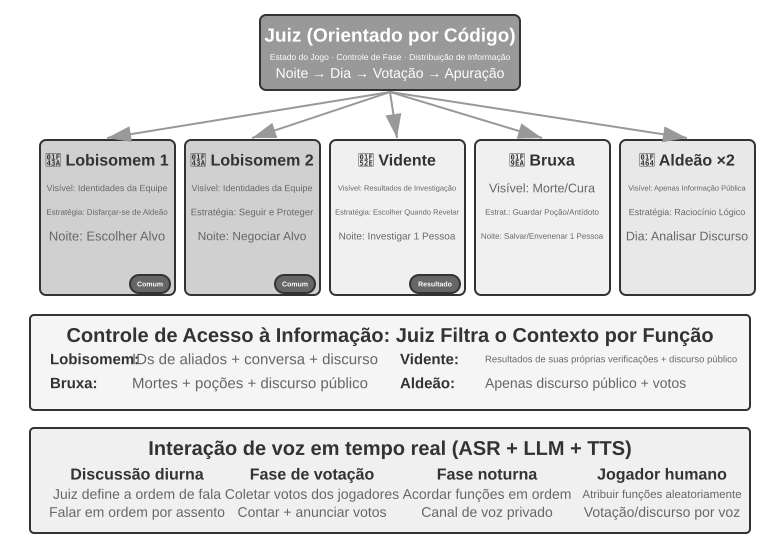
>
>

## Resumo do capítulo

O valor da colaboração multiagente está em introduzir informações que um único agente não conseguiria obter. Resultados de execução, feedback visual e verificações por ferramentas externas podem superar os pontos cegos de uma única cadeia de raciocínio. Portanto, a primeira avaliação ao considerar uma arquitetura multiagente deve ser se ela realmente agrega informações e se esse ganho justifica o custo adicional em tokens.

As principais decisões de projeto em sistemas multiagente são usar contextos compartilhados ou isolados e adotar uma topologia de colaboração entre pares, de orquestração por um gerenciador ou descentralizada. O contexto compartilhado preserva detalhes, mas pode provocar o crescimento excessivo do contexto e a inércia dos papéis. Contextos isolados favorecem a concorrência, a modularidade e o controle de permissões, mas exigem pacotes estruturados de transferência, entregues por parâmetros de ferramentas, arquivos compartilhados ou um barramento de mensagens. Sistemas de arquivos virtuais, ciclos de vida dos agentes, protocolos de mensagens e A2A fornecem, respectivamente, o plano de dados, o plano de controle e a interoperabilidade entre organizações. Uma boa colaboração expõe interfaces, limites, permissões e critérios de aceitação, não cadeias de raciocínio privadas.

Sistemas multiagente também podem amplificar erros: recursos compartilhados geram conflitos de concorrência e semânticos, erros se propagam em cascata pela comunicação, agentes homogêneos produzem falhas de causa comum e ciclos podem terminar cedo demais ou crescer indefinidamente. Bloqueio otimista e isolamento de cópias de trabalho, validação cruzada independente, fontes de informação diversificadas, orçamentos explícitos e mecanismos de cancelamento formam um ciclo básico de tolerância a falhas. As pessoas não devem terceirizar a compreensão e a responsabilidade junto com a execução; a dívida de compreensão e a rendição cognitiva continuam sendo riscos reais.

Quando a colaboração em tarefas de curta duração evolui para interações abertas e de longo prazo, podem emergir relações sociais, normas culturais, competição de mercado e comportamentos estratégicos sob assimetria de informações. Modelos mais potentes ou o alinhamento no nível individual não produzem automaticamente coordenação coletiva. A engenharia de sistemas multiagente precisa definir como as informações fluem, como as capacidades são distribuídas, como os incentivos são restringidos, como as controvérsias são resolvidas e como os erros são descobertos. Somente quando esses mecanismos forem robustos a inteligência coletiva poderá superar a individual.

## Questões para reflexão

1. ★★ Na colaboração multiagente com contexto compartilhado, os agentes subsequentes herdam o contexto completo dos agentes anteriores. No entanto, o enquadramento herdado de um agente anterior pode influenciar o julgamento dos agentes seguintes — por exemplo, um “revisor de código” que herda o contexto de um “analista de requisitos” talvez ainda aborde a tarefa pela perspectiva dos requisitos, e não pela qualidade do código. Como detectar e eliminar essa interferência entre papéis?
2. ★★ No padrão gerenciador, o agente gerenciador é responsável pela decomposição da tarefa e pela integração dos resultados. Contudo, as capacidades do gerenciador limitam o desempenho de todo o sistema: se ele não conseguir decompor corretamente a tarefa, nem mesmo os subagentes mais capazes serão eficazes. Como o sistema pode assegurar que o gerenciador produza uma decomposição adequada?
3. ★★ O padrão descentralizado se inspira nas melhores práticas das organizações humanas. No entanto, essas organizações também apresentam muitos modos de falha, como comunicação deficiente, transferência de responsabilidade e conflitos de objetivos. Quais “patologias organizacionais” têm maior probabilidade de surgir em uma sociedade de agentes? Como preveni-las?
4. ★★★ No padrão gerenciador, quando vários subagentes executam tarefas em paralelo, a descoberta de um deles pode tornar inútil o trabalho dos demais — por exemplo, quando um agente já encontrou a resposta em uma tarefa de busca. Projete um mecanismo eficiente de encerramento em cascata para que, quando um tiver sucesso, todos parem.
5. ★★★ O mecanismo de bloqueio otimista apresentado neste capítulo resolve conflitos de gravação simultânea em um único arquivo. No entanto, em um sistema multiagente real, os sistemas de arquivos compartilhados também enfrentam problemas como conflitos semânticos entre arquivos, poluição do namespace — quando agentes criam arquivos arbitrariamente e desorganizam os diretórios — e pontos únicos de falha — como um agente que exclui todos os arquivos por engano. Como você projetaria um mecanismo mais robusto de governança do sistema de arquivos?
6. ★★★ A colaboração entre agentes baseada em mecanismos de mercado, como Pinchwork e RentAHuman, introduz relações transacionais: um agente paga a outro agente — ou a um humano — para executar uma tarefa. Como o agente contratante pode avaliar automaticamente a qualidade dos resultados entregues pelo executor? Se o executor declarar a tarefa concluída, mas o contratante considerar a qualidade insatisfatória, quem deve arbitrar a disputa? Como evitar que os maus agentes expulsem os bons do mercado?
7. ★★ O RentAHuman permite que agentes contratem humanos por meio de criptomoedas, invertendo a relação tradicional entre humanos e máquinas. Se esse modelo se disseminar, que papel os humanos desempenharão na economia dos agentes? Limitar-se-ão a executar tarefas físicas que os agentes não conseguem realizar?
8. ★★ A sociedade humana precisa dividir o trabalho porque as capacidades de cada pessoa são limitadas: um desenvolvedor de frontend talvez não conheça backend, e um designer talvez não entenda de operações. Já os modelos de grande porte se aproximam mais de “generalistas”. Pesquisas mostram que, em tarefas de raciocínio puramente textual e com os mesmos recursos computacionais, o debate multiagente não supera um único agente. Então, onde está a verdadeira vantagem de usar vários agentes?
9. ★★★ Este capítulo trata “contexto compartilhado” e “contexto não compartilhado” como uma dimensão central do projeto de sistemas multiagente. O contexto compartilhado permite que todos os agentes vejam as mesmas informações, o que aparentemente facilita a coordenação. No entanto, em *O Problema dos Três Corpos*, as mentes dos trissolarianos são completamente transparentes, mas seu desenvolvimento tecnológico fica estagnado; o experimento mental do clipe de papel também mostra que, quando um grupo converge para o mesmo objetivo, a diversidade se perde. Em um sistema multiagente, como equilibrar eficiência e diversidade?
10. ★★★ Considere um agente de programação com um orçamento de 30 passos e outro com 300 passos. Como suas estratégias de trabalho deveriam diferir? Pesquisas mostram que simplesmente aumentar o orçamento de passos não garante melhor desempenho: os agentes podem “saturar” prematuramente após buscas superficiais. Projete um mecanismo “consciente do orçamento” que permita ao agente implementar rapidamente as funcionalidades essenciais com um orçamento pequeno e acrescentar etapas de planejamento, testes e revisão com um orçamento grande, aproveitando plenamente os recursos computacionais adicionais.
11. ★★ A Tabela 10-2 estabelece, linha a linha, correspondências entre sistemas multiagente e sistemas operacionais. Acrescente algumas linhas: a que correspondem, no mundo dos agentes, a memória virtual e a paginação, as permissões de arquivos, a detecção de deadlocks e os algoritmos de escalonamento? E quais conceitos de sistemas operacionais não têm equivalente no mundo dos agentes, e por quê?

