# Interação: expansão dos espaços de observação e ação

O Capítulo 1 apresentou uma afirmação: quando o modelo subjacente permanece fixo, o recurso de engenharia de sistemas mais eficaz para melhorar o desempenho de um agente em tarefas costuma ser redefinir ou expandir seu **espaço de observação** e seu **espaço de ação**. Os Capítulos 2 a 5 desenvolveram essa ideia: a engenharia de contexto determina o que entra na observação; a memória e as bases de conhecimento estendem a observação entre sessões; as ferramentas definem o que o agente pode fazer; e a geração de código permite que ele crie novas ações.

Todas essas expansões, porém, partiram de uma premissa comum: **o agente e o mundo interagem em turnos**. O usuário termina uma frase, o agente pensa por algum tempo, chama algumas ferramentas e responde; enquanto ele pensa, pressupõe-se que o mundo permaneça estático. Essa premissa parece tão natural que raramente é explicitada como uma suposição.

Este capítulo elimina justamente essa premissa.

## Dois eixos: modalidade e momento de acionamento

Ao examinarmos o espaço de observação e o espaço de ação, percebemos que cada um pode ser expandido em duas direções.

- **Modalidade** determina a **forma** da observação e da ação: o agente apenas lê texto ou também consegue ouvir sons, ver a tela e detectar torque? Ele só consegue emitir tokens ou também pode falar, clicar e movimentar articulações?
- **Momento de acionamento** determina o **ritmo** da observação e da ação: o agente busca uma observação ou o mundo a envia? Uma ação precisa terminar em um único turno ou pode se estender por vários turnos, ser interrompida no meio e dar lugar a algo mais urgente?

Os capítulos anteriores expandiram o **conteúdo** desses dois espaços; este capítulo expande sua **modalidade** e seu **momento de acionamento**:

| | Expansão do espaço de observação | Expansão do espaço de ação |
|---|---|---|
| **Conteúdo** (Capítulos 2–5) | Engenharia de contexto, memória e bases de conhecimento | Ferramentas, geração de código |
| **Modalidade** (este capítulo) | Voz, tela, sensores físicos | Fala, cliques, movimento de articulações |
| **Momento de acionamento** (este capítulo) | Envio pelo mundo, fluxos contínuos | Entre turnos, interrompível, preemptível |

O corpus de treinamento de um modelo é quase inteiramente baseado em turnos: uma pergunta seguida de uma resposta, uma chamada de ferramenta seguida do resultado da ferramenta, um interlocutor terminando de falar antes que o outro comece. Assim, a política aprendida pelo modelo pressupõe que o mundo esperará por ele. O ambiente real, porém, não espera que o modelo reaja: um e-mail chega enquanto ele pensa, o usuário o interrompe no meio de uma frase, a página muda entre duas capturas de tela e uma xícara é derrubada enquanto o braço robótico tenta alcançá-la.

| Escala | Cenário | Mudança na observação | Mudança na ação |
|---|---|---|---|
| Segundos — dias | Assíncrono e orientado a eventos | O mundo desperta o agente por meio de e-mails, temporizadores e callbacks | As ações atravessam turnos: começam agora e terminam depois, quando ocorre um evento |
| 10 ms — 1 s | Voz | Ouvir enquanto fala, sem esperar o fim de uma frase | Pensar enquanto fala, podendo ser interrompido e rever a resposta durante a fala |
| Frações de segundo — segundos | Computer Use | A tela continua mudando entre os quadros | Após agir, é preciso confirmar novamente se a realidade ainda corresponde ao plano |
| Milissegundos | Robótica | Os sensores enviam dados continuamente | As ações são divididas em blocos: planeja-se um pequeno trecho de cada vez, com possibilidade de preempção |

## Assíncrono e orientado a eventos: quando o mundo procura o agente

As ferramentas de percepção, execução e colaboração discutidas no Capítulo 4 são todas chamadas proativamente pelo agente. Como um agente deve responder a eventos externos que podem chegar a qualquer momento? Para isso, é necessária uma arquitetura assíncrona orientada a eventos. As duas categorias de ferramentas restantes do Capítulo 1 — ferramentas acionadas por eventos e ferramentas de comunicação com o usuário — dependem dessa arquitetura e, por isso, também são abordadas aqui.

Nesta seção, a modalidade não muda: continua sendo texto. Muda apenas o momento de acionamento. Este é o primeiro passo para sair do mundo baseado em turnos dos cinco capítulos anteriores.

### Por que o processamento assíncrono é necessário

Comecemos com uma analogia. Síncrono significa “é preciso terminar uma tarefa antes de iniciar a próxima”; assíncrono significa “várias tarefas podem ocorrer simultaneamente”. Uma arquitetura síncrona tradicional de agentes se assemelha a um único caixa de loja: só consegue atender um cliente por vez e apenas chama o próximo depois de concluir o atendimento atual. Um assistente realmente inteligente se parece mais com um secretário flexível: com vários assuntos pendentes sobre a mesa — e-mails, telefonemas e visitantes —, ele decide qual tratar primeiro de acordo com a urgência e pode pausar uma tarefa para assumir outra mais urgente. No modo síncrono, o agente precisa esperar uma tarefa em segundo plano terminar para conversar com o usuário ou aguardar o fim da conversa para processar um novo evento. Assim, não consegue oferecer as capacidades essenciais exigidas de um assistente real:

- **A execução assíncrona é a regra** — muitas tarefas demoram e não devem bloquear a interação com o usuário.
- **Avaliação dinâmica da prioridade dos eventos** — nem todos os eventos têm a mesma importância. O agente precisa escolher de forma inteligente uma estratégia de tratamento: cancelar a operação atual em casos urgentes, adicionar o evento a uma fila em casos rotineiros ou processá-lo em paralelo quando se tratar de uma consulta leve e independente.
- **Fluidez na interrupção e na retomada** — uma conversa ou tarefa interrompida deve poder ser retomada naturalmente.

O paradigma assíncrono, porém, entra em conflito com uma característica fundamental dos LLMs atuais: seu treinamento pressupõe sincronia — depois de uma chamada de ferramenta, a próxima mensagem deve ser o resultado da ferramenta —, enquanto a implantação real exige assincronia: usuários podem interromper a qualquer momento, várias tarefas avançam simultaneamente e eventos externos podem chegar antes que uma ferramenta retorne. Essa contradição entre “treinamento síncrono” e “implantação assíncrona” permeia todas as decisões de engenharia discutidas no restante desta seção.

Para resolvê-la, precisamos de uma **arquitetura assíncrona de agentes orientada a eventos**. Tecnicamente, isso significa que o sistema deixa de verificar repetidamente se “há novas mensagens” — prática conhecida como polling, que é ineficiente — e passa a acionar automaticamente a lógica de processamento quando uma nova mensagem chega. Todas as entradas, saídas, etapas de raciocínio e interações externas são modeladas de maneira uniforme como um fluxo de eventos: uma sequência de registros dispostos em uma linha do tempo. A Figura 6-1 apresenta a arquitetura geral de um agente assíncrono orientado a eventos e mostra a relação entre as fontes de eventos, a fila de eventos e o fluxo de processamento do agente.

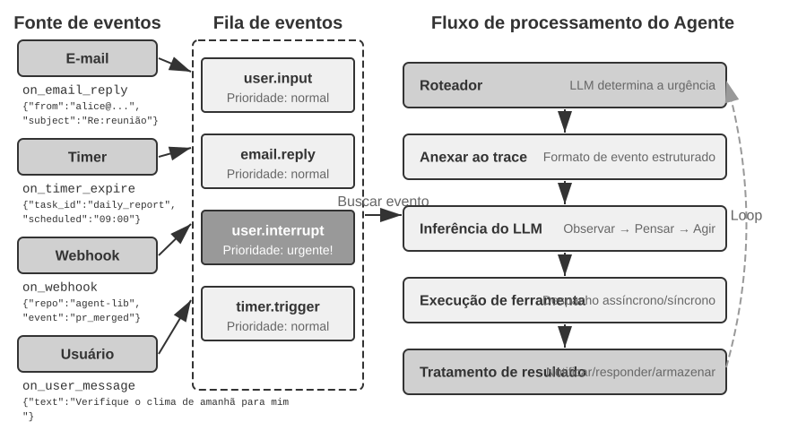

### Implementação de mecanismos orientados a eventos no OpenClaw

O framework de código aberto OpenClaw recebe mensagens de vários canais por meio de um plano de controle Gateway e as encaminha ao runtime do agente. Ele oferece três mecanismos orientados a eventos integrados:

- **Hooks**: respondem a eventos do ciclo de vida do agente, como a criação e a redefinição de sessões, de modo semelhante aos acionadores de eventos do GitHub Actions.
- **Cron (agendador de tarefas)**: executa tarefas periódicas de acordo com expressões cron, uma sintaxe amplamente usada para tarefas agendadas em sistemas Unix. Por exemplo, `0 9 * * 5` significa 9h de toda sexta-feira.
- **Heartbeat (daemon de heartbeat)**: desperta o agente a cada N minutos para verificar se há algo que exija atenção.

Esses três mecanismos conferem aos agentes do OpenClaw uma aparência de autonomia: mesmo quando o usuário está offline, o agente pode gerar relatórios em horários programados, verificar o estado do sistema e cuidar de tarefas rotineiras. O Gateway já processa no modo **push** as mensagens de canais integrados, como mensageiros instantâneos e a interface web. Entre os três mecanismos, apenas Cron e Heartbeat permitem que o agente aja sem uma mensagem do usuário, e ambos são **orientados pelo tempo**: Heartbeat faz verificações em intervalos fixos, Cron é acionado em horários predefinidos e Hooks têm origem dentro do próprio framework OpenClaw, não em fontes externas.

A verdadeira lacuna está nas fontes de eventos de terceiros que não fazem parte dos canais integrados, como a chegada de um novo e-mail, um callback de uma API externa ou uma notificação urgente. O OpenClaw não oferece um canal de entrada imediato para esses eventos; assim, o agente não consegue responder no momento em que ocorrem e talvez só os perceba no próximo ciclo do Cron ou do Heartbeat.

Essa demora é inaceitável em muitos cenários. Tomemos como exemplo o **PineClaw**, plugin do OpenClaw desenvolvido pela Pine AI. A Pine AI é um assistente de IA que faz ligações telefônicas reais em nome do usuário, em situações como negociar contas, cancelar assinaturas e tratar solicitações de indenização de seguros. Quando o usuário inicia uma tarefa telefônica da Pine por meio de um agente do OpenClaw, a IA de voz da Pine faz a ligação em seu nome, mas pode ser necessário que o usuário intervenha a qualquer momento:

- **Verificação de identidade em tempo real**: o atendente solicita a confirmação da identidade do titular da conta, e a Pine precisa que o usuário forneça imediatamente um código de segurança ou uma senha de uso único (OTP).
- **Confirmação de chamada a três**: o atendente solicita falar diretamente com o titular da conta, e a Pine precisa que o usuário atenda ao telefone em poucos segundos.
- **Sincronização do andamento e confirmação de decisões**: em um ponto crítico da negociação — por exemplo, quando a outra parte propõe uma redução de preço —, a Pine precisa que o usuário confirme se aceita a proposta.

Com o polling periódico do Heartbeat, o usuário pode demorar a receber a notificação enquanto o atendente ainda aguarda o código de verificação; o atendente desliga e a chamada fracassa.

A solução do PineClaw é um **mecanismo de Channel**, que estabelece um canal de eventos em tempo real entre o Gateway do OpenClaw e a API da Pine. Quando uma chamada é atendida, exige uma ação do usuário ou termina, a mensagem é enviada imediatamente ao agente do OpenClaw, que a processa e notifica o usuário.

Esse caso revela o principal valor de uma arquitetura orientada a eventos para frameworks de agentes: **um verdadeiro “serviço proativo” exige não apenas que o agente verifique periodicamente a ocorrência de eventos, mas também que os próprios eventos possam notificá-lo.** Unificar todas as entradas — mensagens do usuário, retornos de ferramentas, callbacks externos e acionamentos agendados — em um fluxo de eventos e conduzir o raciocínio e as ações do agente por meio de um loop de eventos é a base arquitetural para alcançar esse objetivo. A partir dessa arquitetura, apresentaremos primeiro as duas categorias de ferramentas diretamente relacionadas a eventos, além da identidade virtual e do ambiente de execução isolado que permitem ao agente agir de forma independente. Em seguida, discutiremos o projeto específico do mecanismo de processamento de eventos.

### Ferramentas acionadas por eventos

As ferramentas acionadas por eventos são os pontos de entrada pelos quais eventos externos impulsionam as ações de um agente. Sem elas, o agente só consegue operar em um ciclo contínuo de raciocínio e chamada de ferramentas, até produzir um resultado e aguardar a próxima entrada do usuário. Para transformar mudanças no mundo em eventos que o agente possa processar, há três tipos comuns de ferramentas acionadas por eventos.

**Temporizadores** (`set_timer`) tratam de eventos vinculados ao tempo físico. Se um e-mail ficar sem resposta, o agente deverá enviar outra mensagem após algum tempo para perguntar sobre o andamento; se uma ligação for feita fora do horário comercial do destinatário, deverá tentar novamente no próximo período de atendimento. Por isso, ferramentas como OpenClaw e Claude Code permitem que o agente desperte em um horário especificado. **Temporizadores de execução única** tratam de tarefas com horário definido: se, em um sábado, o usuário pedir para “ligar para o setor de financiamento imobiliário do banco e perguntar sobre o andamento”, o agente programará “ligar para o banco na próxima segunda-feira, às 10h”, e o temporizador acionará a ligação. **Temporizadores recorrentes** tratam de tarefas periódicas, como verificar a integridade de um servidor a cada hora. Alguns serviços externos não conseguem enviar atualizações de andamento e precisam ser consultados; o temporizador recorrente realiza essas consultas. O Heartbeat do OpenClaw é uma implementação sistematizada desse mecanismo e a base de sua capacidade de “serviço proativo”.

**Monitoramento de tarefas em segundo plano** (`monitor_shell`) trata de eventos provenientes de ferramentas ou tarefas de linha de comando executadas de forma assíncrona. Algumas tarefas de linha de comando permanecem em execução em segundo plano por muito tempo, e o agente precisa acompanhar seu progresso. Se o agente “ficar olhando para a linha de comando”, chamando repetidamente uma ferramenta para consultar o progresso, consumirá tokens desnecessariamente; se esperar a conclusão total da tarefa para voltar a raciocinar, não detectará problemas graves em tempo hábil — e, se o comando travar, não conseguirá intervir, paralisando toda a tarefa. O Claude Code resolve esse problema introduzindo uma ferramenta de `monitor`, que permite ao agente monitorar novas saídas da linha de comando, inclusive as que contenham palavras-chave específicas.

**Canais de eventos externos** (`connect_channel`) enviam ao agente, em tempo real, eventos externos como a chegada de novos e-mails, callbacks de API ou mensagens instantâneas. O mecanismo Channel do PineClaw, apresentado na seção anterior, é uma implementação típica.

Do ponto de vista de projeto, as ferramentas acionadas por eventos devem definir condições de acionamento e regras de filtragem claras, evitando que eventos irrelevantes despertem o agente e desperdicem recursos computacionais. O payload do evento deve conter informações de contexto suficientes para reduzir a quantidade de consultas adicionais que o agente precisa fazer depois de ser despertado.

### Ferramentas de comunicação com o usuário

As ferramentas de comunicação com o usuário surgiram à medida que os canais de comunicação entre agentes e usuários se diversificaram. Muitos agentes, como Claude Code e Manus, usam um ciclo ReAct nativo: tudo o que o agente “diz” — isto é, uma mensagem do assistant — é enviado diretamente ao usuário, que precisa abrir uma sessão específica no aplicativo para conversar com ele. Em geral, a sessão permite visualizar o processo de chamada de ferramentas do agente.

O OpenClaw rompe com esse padrão. O usuário não precisa perceber a existência de sessões nem acompanhar os detalhes das chamadas de ferramentas; tanto ele quanto o agente podem enviar mensagens a qualquer momento, em vez de alternarem uma solicitação e uma resposta. Isso confere ao OpenClaw o que muitos descrevem como uma **“presença humana”**: ele se comunica de forma assíncrona com o usuário, como um secretário. Em vez de apresentar diretamente as mensagens do assistant geradas pelo modelo, o OpenClaw usa ferramentas específicas para enviar mensagens. Elas podem incluir imagens e arquivos, além de acionar notificações push conforme a urgência.

Além da comunicação por texto, um número crescente de agentes oferece **recursos de comunicação multimodal**, como o envio de mensagens estruturadas em cartões ou e-mails de lembrete. Alguns agentes já começaram a experimentar a **UI generativa** (Generative UI), usando HTML e recursos semelhantes para gerar interfaces interativas que apresentam informações ao usuário de maneira mais amigável. Do ponto de vista de projeto, as ferramentas de comunicação com o usuário devem oferecer suporte a mensagens assíncronas — já que o usuário pode não estar online —, permitir o acompanhamento do status de leitura e manter as mensagens consistentes entre diferentes canais.

**Comunicação multicanal com o usuário e reengajamento.**

**A resposta de um agente não deve se limitar a um único canal; o mecanismo de notificação também serve para reengajar o usuário.** O envio de mensagens se estende a canais como mensagens instantâneas, SMS, e-mail, chamadas telefônicas e notificações push. O agente escolhe o canal considerando em conjunto a urgência, o status do usuário, a natureza do conteúdo e as preferências do usuário, garantindo que mensagens importantes não sejam perdidas e evitando interrupções redundantes.

Em tarefas de longa duração, o agente precisa notificar o usuário proativamente quando elas forem concluídas, atraindo sua atenção de volta. Em tarefas periódicas, como resumos diários ou relatórios semanais, as notificações podem ajudar o usuário a criar um hábito regular de interação.

As ferramentas de comunicação com o usuário resolvem o problema de “como chegar até o usuário”. No entanto, a identidade que o agente assume nesses canais e o ambiente em que executa ações em nome do usuário exigem uma camada de infraestrutura de identidade e de ambiente de execução, tema da próxima seção.

### Identidade virtual e ambiente de execução isolado

O Capítulo 4 começa com o exemplo de Samantha, de *Ela*, para ilustrar como um agente usa ferramentas para interagir com o mundo digital real. A criação de um assistente de propósito geral como esse impõe uma escolha arquitetural fundamental: o agente deve gerenciar diretamente as contas pessoais do usuário ou ter uma identidade virtual própria? O gerenciamento direto parece conveniente, mas basta um erro do agente ou um ataque bem-sucedido para expor toda a identidade digital do usuário. A abordagem mais segura é fornecer ao agente uma identidade virtual independente — assim como um secretário tem seu próprio telefone e e-mail profissionais. Essa identidade inclui contas de comunicação, armazenamento e ambientes computacionais exclusivos, permitindo que o agente trabalhe em nome do usuário com uma identidade transparente e claramente declarada. Essa transparência não reduz a confiança; ao contrário, torna a comunicação mais autêntica.

As identidades virtuais precisam ser implantadas em ambientes de execução isolados. **Computadores virtuais** (máquinas virtuais/contêineres) e **celulares virtuais** (emuladores Android) oferecem ao agente isolamento no nível do sistema operacional e todos os recursos de um ambiente desktop ou móvel. Primeiro, um computador virtual pode operar ininterruptamente, independentemente de o dispositivo do usuário estar online, e sem interferir nos aplicativos que ele estiver usando. Segundo, na pior das hipóteses, um erro do agente pode derrubar o ambiente virtual, mas não o dispositivo real do usuário. Por fim, o isolamento impede que o agente acesse livremente os arquivos locais do usuário.

Uma identidade independente também apresenta dois desafios práticos. O primeiro são os **mecanismos antirrobô**: muitos sites usam CAPTCHAs e verificações de reputação de IP para bloquear acessos automatizados. Ambientes virtuais que usam IPs de data centers são facilmente identificados; na prática, para conseguir acesso normal, muitas vezes é necessário configurar uma rede de proxies residenciais, que usa IPs domésticos reais. O segundo é o **acesso às contas reais do usuário**: quando uma tarefa exige login com a identidade do próprio usuário, deve-se usar autenticação com humano no circuito — uma área de trabalho remota via VNC/RDP na qual o usuário faz login pessoalmente, vê toda a interface que o agente está operando e entende por que a autenticação é necessária. Depois disso, o token de sessão pode ser reutilizado durante seu período de validade, evitando interrupções frequentes e equilibrando autonomia e segurança.

A troca de dados entre o agente e os ambientes virtuais usa um **sistema de arquivos compartilhado**: montagens de volume como `/workspace/shared` conectam o agente, o computador virtual e o celular virtual. Os dados são transmitidos por referências a caminhos de arquivo, em vez de serem copiados para o contexto. Por exemplo, o usuário envia um arquivo CSV ao diretório compartilhado; o agente no computador virtual lê o arquivo, executa a análise e salva um gráfico nesse diretório; em seguida, retorna ao usuário apenas o caminho do gráfico. Cada transferência se resume a uma string leve contendo o caminho.

As ferramentas acionadas por eventos permitem que o mundo desperte o agente; as ferramentas de comunicação com o usuário permitem que o agente chegue até ele; e as identidades virtuais com ambientes de execução isolados permitem que o agente atue de forma independente e auditável. Resta uma questão: quando vários eventos chegam simultaneamente à mesma instância do agente, como eles devem ser tratados?

### Mecanismo de tratamento de eventos

Uma única instância de agente pode lidar simultaneamente com vários eventos: uma nova mensagem do usuário, o resultado de uma ferramenta, o vencimento de um temporizador ou uma solicitação de colaboração de outro agente. A eficiência e a correção desse tratamento afetam diretamente o desempenho e a experiência do usuário.

A base desse mecanismo é o **loop de eventos** da programação concorrente. Um agente assíncrono pode ser visto como um loop de longa duração: a cada rodada, ele retira um lote de eventos da fila de entrada, acrescenta-os à trajetória, invoca o LLM uma vez, executa as ferramentas que o modelo decide chamar e retorna ao início do loop para aguardar o próximo lote de eventos — a mesma estrutura de uma goroutine do Go que lê mensagens de um channel e as processa rodada a rodada dentro de um `for { select { ... } }`.

Esse modelo tem uma propriedade fundamental: **os eventos só são consumidos nos limites de cada rodada**. Enquanto o LLM está raciocinando ou uma ferramenta está em execução, um novo evento não invade nem interrompe a etapa atual; ele aguarda na fila até que a rodada chegue a um **ponto seguro** — o fim de uma etapa de raciocínio ou o retorno de uma chamada de ferramenta —, quando todos os eventos pendentes são processados em conjunto. O cancelamento segue a mesma disciplina: em vez de interromper o trabalho à força em um momento arbitrário, verifica-se, no ponto seguro, se houve uma solicitação de parada — precisamente o papel desempenhado por `ctx.Done()` em Go.

Com isso em mente, as três estratégias de processamento descritas a seguir diferem apenas na forma como tratam o ponto seguro: deixar o evento aguardar o próximo ponto seguro que ocorrer naturalmente, no processamento em fila; antecipar deliberadamente a criação de um ponto seguro, no processamento por cancelamento; ou iniciar outro loop, sem precisar aguardar o ponto seguro do loop principal, no processamento paralelo.

**Modelagem estruturada de eventos.**

Para tratar um evento, é preciso compreendê-lo. As entradas de um agente de propósito geral não vêm apenas do usuário — uma mensagem de terceiros não é enviada pelo usuário ao agente, mas o agente precisa compreendê-la, avaliar sua importância e decidir se deve intervir. Isso exige que cada entrada seja modelada como um **evento estruturado**, com semântica rica:

- **Origem (quem)**: o próprio usuário, um contato, um desconhecido ou uma notificação do sistema
- **Canal (como)**: chamada telefônica, SMS, mensagem instantânea, e-mail, rede social, acionamento de temporizador, resultado de chamada assíncrona de ferramenta ou atualização de status de monitoramento pela linha de comando
- **Conteúdo (o quê)**: texto da mensagem, tom emocional, urgência e necessidade de resposta
- **Contexto (circunstâncias)**: se é uma resposta a uma conversa anterior ou uma nova comunicação e qual é sua relação com a tarefa atual

Tomando como exemplo um e-mail de cliente solicitando reembolso, o evento estruturado teria a seguinte forma:

```json
{
  "source": {"type": "email", "sender": "client@example.com"},
  "channel": "gmail_webhook",
  "content": {"subject": "Refund Request", "body": "Order #12345, requesting a refund..."},
  "context": {"priority": "high", "customer_tier": "vip", "related_orders": ["#12345"]}
}
```


Somente quando essas dimensões são claramente modeladas como eventos estruturados o agente consegue manter uma compreensão precisa em comunicações entre várias partes. Isso evita que uma entrada do usuário seja confundida com o resultado de uma ferramenta ou que um resultado de ferramenta contendo instruções ocultas seja interpretado como um comando do usuário, provocando uma injeção de prompt. A complexidade do gerenciamento de contexto em múltiplas conversas também exige que o agente compreenda as relações entre elas: como uma mensagem de terceiros afeta o estado emocional do usuário, quais papéis o usuário assume em diferentes conversas e quando é necessário combinar informações de conversas distintas para oferecer recomendações.

O ecossistema de gatilhos de plataformas de fluxo de trabalho como o n8n ilustra essa ideia: webhooks, temporizadores, e-mails, alterações em bancos de dados e monitores de arquivos — cada gatilho funciona como um dos “sentidos” pelos quais o agente percebe o mundo. Quando esses eventos heterogêneos são modelados de maneira uniforme em um formato estruturado, o agente consegue tratar de modo consistente estímulos de diferentes origens. Tanto a determinação da urgência quanto as estratégias de processamento descritas a seguir se apoiam nessa modelagem unificada.

**Estratégia dinâmica de processamento baseada na urgência.**

Ao lidar com várias tarefas, as pessoas adaptam sua estratégia conforme a urgência: diante de uma emergência, interrompem o que estão fazendo; diante de uma tarefa rotineira, acrescentam-na à lista para tratar depois. O processamento de eventos de um agente deve demonstrar a mesma inteligência.

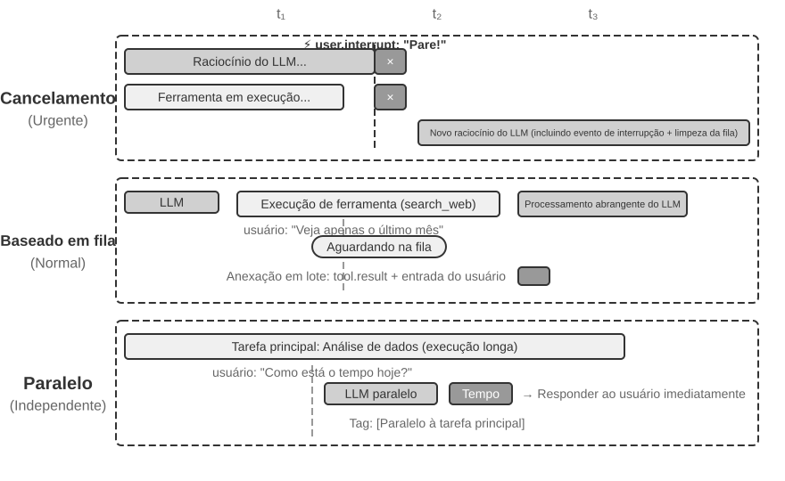

O **processamento por cancelamento** é usado para eventos urgentes. Sua essência é **antecipar a criação de um ponto seguro** para o evento urgente: interromper deliberadamente a etapa atual, transformando aquele instante em um limite no qual o novo evento possa ser consumido. Quando chega um evento urgente — por exemplo, o usuário clica em “parar” ou um sistema de supervisão envia uma instrução de alta prioridade —, o sistema: (1) interrompe a operação atual; se o LLM estiver raciocinando, cancela imediatamente a resposta em streaming; se uma ferramenta síncrona estiver em execução, envia um sinal de cancelamento; (2) esvazia a fila de eventos pendentes; (3) acrescenta esses eventos e o evento urgente ao fim da trajetória; (4) invoca novamente o LLM de imediato, usando como entrada a trajetória completa e atualizada para avaliar a situação. Por exemplo, se o usuário escrever “Pare! Eu me expressei mal” quando o agente estiver prestes a executar uma operação possivelmente incorreta, o agente verá imediatamente essa nova entrada, reinterpretará a intenção real e evitará a ação equivocada.

O **processamento em fila** é usado para eventos rotineiros. Quando chega um evento não urgente — como o retorno de uma ferramenta assíncrona ou uma informação complementar enviada pelo usuário —, o sistema: (1) acrescenta o evento ao fim da fila sem interromper a operação atual; (2) aguarda a conclusão da operação atual, deixando o LLM terminar o raciocínio e a ferramenta síncrona concluir a execução; (3) quando uma chamada de ferramenta termina e retorna um `tool.result`, verifica a fila e, se ela não estiver vazia, acrescenta todos os eventos à trajetória de uma só vez; (4) o LLM processa integralmente a trajetória atualizada. Isso permite o processamento em lote e aumenta a eficiência. Por exemplo, enquanto o agente aguarda o resultado de uma ferramenta de busca, o usuário acrescenta: “mostre apenas os resultados do último mês”. Essa informação complementar entra na fila e, quando os resultados da busca retornam, ambos os eventos são apresentados juntos ao LLM, evitando idas e vindas desnecessárias.

O **processamento paralelo** é usado para consultas independentes e leves. Por exemplo, enquanto o agente analisa um grande volume de dados, o usuário pergunta de repente: “Como está o tempo hoje?”. Consultas desse tipo têm três características: não estão relacionadas à tarefa principal, exigem uma resposta rápida e têm baixo custo de execução. Nem o processamento por cancelamento, que interromperia uma tarefa principal importante, nem o processamento em fila, que faria o usuário esperar demais, são adequados. Primeiro, o sistema avalia a independência e a complexidade da consulta. Em seguida, executa-a separadamente em uma sessão paralela de raciocínio, chama as ferramentas necessárias para gerar a resposta e a retorna de imediato. A consulta e a resposta são acrescentadas à trajetória da tarefa principal, claramente marcadas como “executadas em paralelo com a tarefa principal”, para evitar confundir o LLM.

**Determinação da urgência.**

Eventos urgentes: interrupção do usuário (`user.interrupt`), instrução do supervisor (`supervisor.instruction`), interrupção entre agentes (`agent.interrupt`) e gatilhos externos marcados como urgentes, como alertas do sistema e falhas de pagamento.

Eventos não urgentes: entrada comum do usuário (`user.input`), entrada de agente (`agent.input`), resultados de ferramentas (`tool.result`), acionamentos de temporizador (`timer.trigger`) e gatilhos externos comuns.

Regras codificadas diretamente têm limitações; é a semântica do evento que determina a forma de tratamento. “Pare imediatamente!” exige processamento por cancelamento; “Como está o tempo hoje?” exige processamento paralelo; “Envie o relatório em chinês” exige processamento em fila. **Recomenda-se usar um LLM de classificação leve como roteador de eventos**, para determinar rapidamente qual estratégia adotar quando um evento chegar.

Um ponto de cancelamento deve estar em uma posição na qual a ferramenta ou o raciocínio possa ser encerrado com segurança. O resultado de uma ferramenta ainda não concluída deve ser representado por um placeholder explícito e nunca pode ser falsamente apresentado como bem-sucedido.

O experimento a seguir implementa as estratégias de tratamento de eventos discutidas acima em um agente executável de processamento de e-mails orientado a eventos.

> **Experimento 6-1 ★★★: agente de processamento de e-mails orientado a eventos**
>
>
> 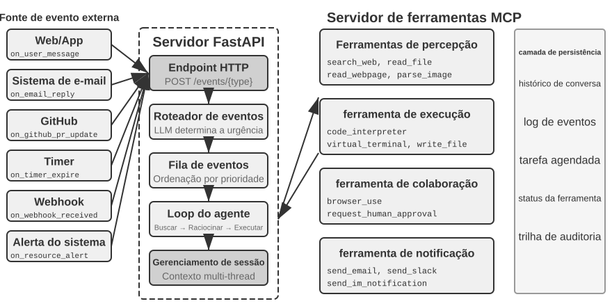
>
>
> Este experimento constrói o agente orientado a eventos mais simples: um **assistente automatizado de processamento de e-mails**. O agente monitora a caixa de entrada e, sempre que chega um novo e-mail, aciona automaticamente um fluxo de processamento — classificação, resumo, elaboração de uma resposta e, quando necessário, notificação ao usuário. Esse é o cenário introdutório mais intuitivo para um agente orientado a eventos: um evento externo, a chegada de um novo e-mail, desencadeia um ciclo completo de raciocínio do agente.
>
> **Objetivo do experimento**: compreender o conceito central da arquitetura orientada a eventos — o agente deixa de apenas aguardar passivamente as entradas do usuário e passa a agir por iniciativa própria em resposta a eventos externos. Com este experimento, o leitor aprenderá o ciclo básico formado pelo registro de fontes de eventos, pela fila de eventos e pelo processo “evento chega → agente processa → resultado é entregue”.
>
> **Fontes de eventos e fila de eventos.**
>
> O sistema oferece acesso unificado a várias fontes de eventos:
>
> - **Eventos de e-mail** (`on_email_received`): acionados quando chega um novo e-mail, seja pela verificação periódica da caixa de entrada, seja pelo recebimento de notificações push.
> - **Mensagens de IM/SMS** (`on_im_message`, `on_sms_message`): acionadas por mensagens instantâneas ou SMS.
> - **Eventos do GitHub** (`on_github_pr_update`, `on_github_issue_update`): acionados por comentários de revisão de PR ou alterações de status.
> - **Acionamentos de temporizador** (`on_timer_expire`): acionados por tarefas agendadas, como resumos diários ou geração de relatórios semanais.
> - **Webhooks** (`on_webhook_received`): callbacks genéricos de sistemas externos.
> - **Eventos do sistema** (`on_user_inactive`, `on_process_timeout`, `on_resource_alert`): acionados por alterações de estado internas.
>
> Todos os eventos entram em uma **fila de eventos** unificada e são processados sequencialmente, na ordem de chegada. Cada evento aciona um ciclo independente de raciocínio do agente: ele lê o conteúdo do evento, chama as ferramentas pertinentes — por exemplo, consulta a base de conhecimento, lê anexos ou pesquisa o histórico de e-mails relacionados —, gera um resultado de processamento, como rótulos de classificação, resumos e rascunhos de resposta, e por fim notifica o usuário por meio de ferramentas de notificação ou executa diretamente uma ação.
>
> **Cenário de validação**: configure o agente para monitorar uma caixa de e-mail de teste. Simule o recebimento de três mensagens: um convite para reunião, uma reclamação de cliente e um anúncio publicitário. O agente as processa sequencialmente: no caso do convite, verifica automaticamente se há conflitos na agenda e redige uma resposta de aceitação ou recusa; no caso da reclamação, extrai as informações principais, marca-a como de alta prioridade e notifica o usuário para tratá-la; no caso do anúncio, arquiva-o automaticamente. Todo o processo ocorre sem intervenção do usuário.

O Experimento 6-1 demonstra o padrão orientado a eventos mais simples: os eventos entram em uma fila e o agente os processa sequencialmente. No entanto, quando o agente precisa responder a interrupções durante execuções prolongadas de ferramentas ou gerenciar várias tarefas concorrentes, uma fila de eventos simples deixa de ser suficiente. A seguir, discutiremos desafios de engenharia mais profundos.

### Implementação de engenharia: como fazer modelos síncronos aceitarem interrupções assíncronas

O Experimento 6-1 trata apenas de eventos seriais — os eventos entram na fila um a um, e o agente os processa em sequência. Voltemos agora à contradição entre “treinamento síncrono e implantação assíncrona”, apresentada no início desta seção: quando o usuário interrompe uma tarefa antes de uma ferramenta retornar, como acomodar essa interrupção no formato síncrono? Esta seção apresenta as soluções de engenharia usadas atualmente no setor.

Primeiro, vamos ilustrar essa contradição com um cenário específico. Suponha que o agente esteja ajudando um usuário a redigir um e-mail e tenha feito uma chamada de ferramenta para buscar informações de contato. Antes que a busca retorne resultados, o usuário diz de repente: “Espere, primeiro veja para mim a previsão do tempo de amanhã.” Em um ciclo ReAct síncrono, o agente precisa aguardar o retorno da busca para processar a próxima mensagem, pois a API exige que, “após uma chamada de ferramenta, a mensagem seguinte seja o resultado da ferramenta”. No mundo real assíncrono, porém, eventos podem interromper tarefas em andamento a qualquer momento. Expressar a semântica de uma “interrupção assíncrona” sob as restrições de um “formato síncrono” é justamente o problema que esta solução de engenharia busca resolver.

**Solução paliativa de engenharia: implementação assíncrona que simula o comportamento síncrono.**

A ideia central é: **na operação normal, sem interrupções, permitir que o LLM veja uma trajetória síncrona padrão; somente quando houver uma interrupção, inserir placeholders para corrigir o formato**. Estas são as cinco regras principais:

**Regra 1**: registrar imediatamente a mensagem do assistente — incluindo o raciocínio, o conteúdo e a chamada de ferramenta — assim que ela for produzida pelo LLM.

**Regra 2**: registrar o resultado da ferramenta somente quando a chamada for concluída. Durante a execução, a trajetória permanece em um estado “parcialmente concluído”.

**Regra 3**: interrupções durante a execução da ferramenta exigem placeholders. Gere uma resposta de placeholder para a ferramenta ainda não concluída — por exemplo, “A ferramenta está sendo executada em segundo plano; priorize o novo evento” —, acrescente o evento de interrupção e invoque novamente o LLM. Do ponto de vista do LLM, a mensagem do assistente continua pareada com um resultado de ferramenta.

**Regra 4**: em caso de interrupção durante o raciocínio do LLM, descarte o raciocínio em andamento. Não o registre na trajetória; acrescente o novo evento e inicie uma nova rodada de raciocínio.

**Regra 5**: eventos que não causam interrupção entram na fila para processamento em lote. Eles só são acrescentados de uma só vez após a conclusão do ciclo atual.

No exemplo em que o agente está redigindo um e-mail e o usuário o interrompe para perguntar sobre a previsão do tempo, as cinco regras funcionam da seguinte forma:

1. O agente chama `search_contacts` para buscar informações de contato, e a mensagem do assistente é imediatamente registrada na trajetória (Regra 1).
2. Antes que a ferramenta de busca retorne os resultados, o usuário envia: “Primeiro, veja para mim a previsão do tempo de amanhã.” Como se trata de uma interrupção do usuário, o sistema gera um resultado de ferramenta de placeholder para a chamada de `search_contacts` ainda não concluída — “A ferramenta está sendo executada em segundo plano; priorize o novo evento” (Regra 3) —, acrescenta a consulta do usuário sobre a previsão do tempo à trajetória e invoca novamente o LLM. Nesse momento, o formato da trajetória visto pelo LLM é inteiramente válido: a mensagem do assistente e o resultado da ferramenta estão devidamente pareados.
3. Depois que o agente responde à consulta sobre a previsão do tempo, o resultado original de `search_contacts` chega e é acrescentado à trajetória como um novo evento (Regra 2). O agente lê as informações de contato e retoma a redação do e-mail.

A principal vantagem dessa abordagem é que, **em condições normais, o LLM vê uma trajetória síncrona perfeita**: as mensagens do assistente e os resultados das ferramentas estão rigorosamente pareados, e a ordem temporal é clara. Essa configuração é a mais adequada aos LLMs treinados segundo o paradigma síncrono e preserva ao máximo a qualidade do raciocínio. O placeholder — uma concessão necessária — só aparece quando de fato ocorre uma interrupção.

Ainda assim, há o risco de agravar as alucinações. Embora o placeholder declare explicitamente que a ferramenta “ainda não foi concluída”, o modelo pode fabricar um resultado em um raciocínio posterior, acreditando que a ferramenta retornou dados válidos e tomando decisões inadequadas com base nesses dados inventados. Isso ocorre porque, na grande maioria das trajetórias vistas durante o treinamento, uma chamada de ferramenta é imediatamente seguida pelo resultado real; o modelo nunca aprendeu a lidar com situações em que “o resultado ainda não chegou”. Por isso, na prática, as interrupções só são acionadas em situações realmente urgentes; eventos não urgentes são colocados em uma fila para processamento em lote.

**Interfaces de ferramentas assíncronas adequadas aos modelos atuais.**

Como é difícil romper a premissa síncrona dos modelos, uma estratégia mais fundamental é **incorporar a semântica assíncrona já no projeto da interface das ferramentas**.

O projeto tradicional de ferramentas pressupõe a semântica de que “a chamada equivale à conclusão”. Por exemplo, o nome `phone_call` sugere que “a chamada discará o número, aguardará o término da ligação e retornará seu registro”. No paradigma assíncrono, a “iniciação” e a “conclusão” devem ser desacopladas:

- `initiate_phone_call`: inicia uma chamada telefônica e retorna imediatamente um identificador de tarefa e o estado inicial, como “Chamada iniciada; discando...”
- O andamento da chamada é comunicado por notificações de eventos (`phone_call_connected`, `phone_call_ended`)

O ponto central é que o próprio nome e a descrição da ferramenta devem transmitir a semântica assíncrona. Ao ver `initiate_phone_call`, o modelo inferirá naturalmente, por sua compreensão da linguagem, que se trata de “iniciar”, e não de “concluir”. A descrição da ferramenta deve reforçar esse aspecto: “Esta ferramenta inicia uma tarefa de chamada telefônica processada por um subagente. Após o início bem-sucedido, ela retorna imediatamente o ID da tarefa, permitindo que você prossiga com outras atividades. Quando a chamada terminar, um evento de notificação separado será enviado.”

**Dispersão da atenção no processamento em fila.**

Ao processar eventos em lote, o modelo costuma se concentrar apenas no último evento. A causa fundamental é que **o modelo é treinado para reagir à entrada mais recente, e o processamento de eventos em lote rompe essa premissa**.

É possível intervir em dois níveis:

**No prompt**: instrua o modelo: “Ao receber vários eventos consecutivos, considere integralmente todas as informações.”

**Marcadores na barra de estado do agente**: adicione marcadores explícitos antes de cada evento:

```text
[Unprocessed Event 1/4] Tool result from database_query: ...
[Unprocessed Event 2/4] User supplementary note: Only look at Beijing data
[Unprocessed Event 3/4] System reminder: Report deadline is in 30 minutes
[Unprocessed Event 4/4] User asks: What's the progress?
```

Ao final, acrescente um resumo: “Há quatro eventos não processados acima: um resultado de ferramenta, duas mensagens do usuário e um lembrete do sistema. Certifique-se de que sua resposta contemple todas as informações.”

### Contradições profundas e direções futuras


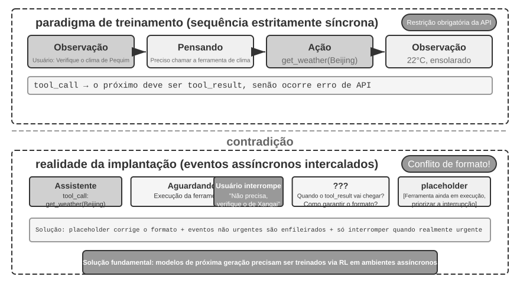


Em última análise, os placeholders, as interfaces assíncronas de ferramentas e os indicadores da barra de status apresentados nas seções anteriores recorrem à engenharia de prompts para remediar a mesma contradição entre “treinamento síncrono e implantação assíncrona” (Figura 6-4). A origem dessa contradição já foi detalhada no início desta seção; portanto, não a repetiremos aqui e nos concentraremos em sua solução fundamental.

**A evolução esperada dos modelos: do síncrono ao assíncrono.**

As técnicas de engenharia apresentadas acima consistem, em essência, em **usar a engenharia de prompts para compensar as limitações do treinamento dos modelos**. São soluções provisórias para um período de transição. A solução definitiva exige uma mudança de paradigma no treinamento dos modelos.

Os modelos VLA (Vision-Language-Action; visão, linguagem e ação — consulte a seção sobre robótica deste capítulo) já começam a enfrentar desafios semelhantes no campo da robótica: há uma latência inevitável entre percepção e ação. O sucesso dos modelos VLA aponta o caminho para a evolução dos modelos de agentes. A próxima geração precisará adquirir três capacidades essenciais por meio do aprendizado por reforço em ambientes assíncronos:

1. **Compreender o entrelaçamento assíncrono de eventos nas trajetórias**: esta é a deficiência mais crítica. Os modelos atuais esperam uma sequência estritamente síncrona, mas, em um ambiente assíncrono real, uma chamada de ferramenta pode ser seguida não pelo resultado da ferramenta, mas por uma nova mensagem do usuário. O raciocínio também pode ser interrompido pela metade, mas o estado intermediário deve permanecer na trajetória; depois de processar a nova mensagem, o modelo deve retomar o raciocínio, em vez de recomeçar. O modelo precisa manter uma compreensão clara nessas trajetórias “fora de ordem”: quais chamadas de ferramentas ainda aguardam resultados e quais raciocínios são fragmentos inacabados.
2. **Retomar tarefas e raciocínios interrompidos**: após ser interrompido para tratar um evento urgente, o modelo ainda precisa se lembrar da tarefa inacabada. Por exemplo, se o usuário perguntar de repente sobre o tempo enquanto o agente executa uma ferramenta de análise de dados, depois de responder o agente deverá aguardar naturalmente o resultado da análise, em vez de esquecer que ainda há uma ferramenta em execução. É especialmente importante evitar alucinações nas quais o modelo suponha, por engano, que a chamada de ferramenta interrompida já foi concluída.
3. **Processar eventos em lote de forma abrangente**: quando vários eventos são acrescentados à trajetória em lote, o modelo não pode se concentrar apenas no último; deve considerar todas as informações ainda não processadas.

Esse treinamento assíncrono por aprendizado por reforço exige uma nova infraestrutura: um simulador de ambientes assíncronos, capaz de gerar situações como resultados de ferramentas que chegam com atraso e interrupções aleatórias do usuário, e mecanismos de recompensa específicos para capacidades assíncronas, como compreender corretamente trajetórias fora de ordem, retomar raciocínios interrompidos, evitar alucinações e processar eventos em lote de forma abrangente.

O “raciocínio contínuo”, porém, não precisa esperar pela próxima geração de modelos. Cerca de duzentas linhas de lógica de orquestração podem transformar um modelo **existente** de raciocínio textual em um agente de **raciocínio contínuo (continuous-time)**, conectando as soluções provisórias de engenharia à evolução dos modelos. O mecanismo é uma versão aprimorada da Regra 4: em vez de **descartar** um raciocínio parcial quando ocorre uma interrupção, toda a interação é estruturada como **um fluxo de pensamento ininterrupto**. O runtime pode fechar à força o bloco `<think>` que o modelo está escrevendo, injetar uma observação recém-chegada — o resultado de uma ferramenta, uma interrupção do usuário ou uma nova atualização de reconhecimento — como uma mensagem comum e deixar o modelo continuar a decodificação.

Esse mecanismo aproveita um recurso frequentemente desperdiçado: um modelo consegue gerar centenas de tokens por segundo, enquanto uma chamada de ferramenta ou uma fala do usuário pode levar vários segundos. Todo esse tempo de espera pode ser usado para raciocinar. Assim, o agente pode **pensar enquanto espera** — continuar raciocinando com base nas informações parciais disponíveis e até acionar antecipadamente a próxima ferramenta — e **pensar enquanto age** — continuar raciocinando durante a geração da saída e corrigir o próprio curso no meio de uma ação.

> **Experimento 6-2 ★★★: agente assíncrono com execução paralela e capacidade de interrupção**
>
>
> 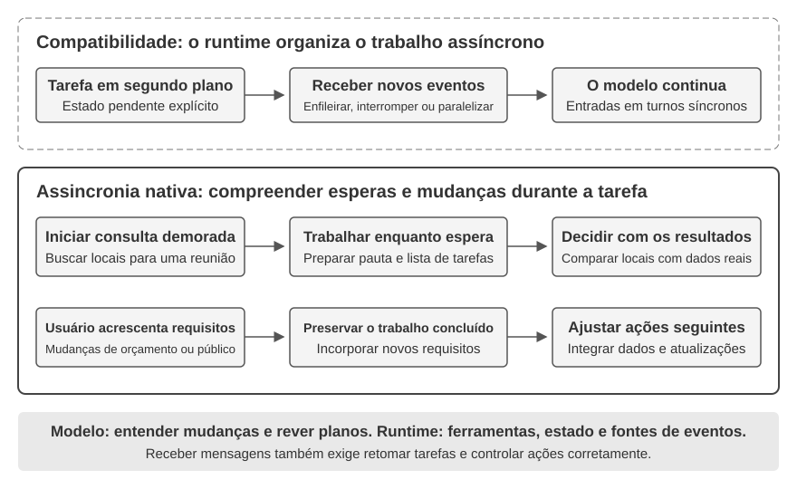
>
>
> Partindo da fila de eventos simples do Experimento 6-1, este experimento avança para os aspectos mais complexos dos agentes assíncronos: **execução paralela de ferramentas, cancelamento da execução e gerenciamento de estado**. O agente deixa de apenas processar eventos um a um: precisa gerenciar várias tarefas concorrentes simultaneamente, tratar interrupções e retomadas e tomar decisões dinâmicas com base no estado em tempo real.
>
> **1. Execução assíncrona de ferramentas**: oferece suporte à execução assíncrona de ferramentas demoradas, com duração mínima de 3 a 5 segundos, retornando um placeholder assim que a execução começa. **Cenário de validação**: o agente executa um comando demorado no terminal. Enquanto isso, o usuário pergunta: “Que horas são agora?”. O agente responde imediatamente e apresenta o resultado da análise quando o comando termina.
>
> **2. Fila de eventos e processamento em lote**: acumula eventos não urgentes e os acrescenta à trajetória em lote. **Cenário de validação**: o agente executa uma tarefa demorada, e o usuário envia, em sequência, as mensagens “Lembre-se de responder em japonês” e “Formate como uma página web”. Quando a tarefa termina, o agente processa todos os eventos de uma só vez e gera uma página web em japonês.
>
> **3. Mecanismo de interrupção**: o comando “pare” do usuário encerra imediatamente o fluxo de execução e cancela a ferramenta assíncrona. **Cenário de validação**: o agente executa uma tarefa demorada, e o usuário envia “Cancele”. O agente para imediatamente, e a trajetória registra o evento de interrupção e a operação de cancelamento.
>
> **4. Cancelamento e consulta de status de ferramentas paralelas**: quando uma ferramenta assíncrona termina, o resultado real é injetado na conversa por meio de um novo evento. É possível cancelar uma tarefa ou consultar seu progresso pelo ID. **Cenário de validação**: o usuário solicita: “Execute estes três scripts simultaneamente. Quando o primeiro terminar, verifique o progresso dos demais. Se algum deles ainda não tiver ultrapassado 50%, cancele-o”. Os três scripts simulam processos de análise e exibem continuamente o progresso, com velocidades de 3%, 2% e 1% por segundo, respectivamente. O agente inicia simultaneamente três comandos assíncronos de terminal. Quando o script que avança 3% por segundo termina, após cerca de 33 segundos, o agente consulta o status dos outros dois terminais e constata que um atingiu cerca de 66% e o outro, aproximadamente 33%. Então, cancela aquele que ainda não ultrapassou 50%. Depois que os dois terminais restantes encerram a execução, o agente integra os resultados e gera um relatório completo.
>

A execução assíncrona e orientada a eventos permite que o mundo desperte o agente a qualquer momento, mas pressupõe que, após a chegada de um evento, o modelo possa concluir tranquilamente o raciocínio antes de responder. As próximas três seções questionam essa premissa: quando o ambiente muda tão rápido quanto o modelo gera conteúdo — ou ainda mais rápido —, “pensar primeiro e falar depois” passa a impor uma latência inaceitável.

## Voz: a interface homem-máquina mais natural

O valor da voz não se resume a transformar texto em som. Falar costuma ser cerca de quatro vezes mais rápido que digitar e não ocupa as mãos nem a visão. Por isso, a voz é naturalmente adequada para inserir um agente em um ciclo contínuo de entrada e saída, no qual o usuário pode interrompê-lo a qualquer momento. O ditado converte fala em texto; um agente de voz permite que o usuário colabore diretamente com o agente. Ambos podem viabilizar o fluxo de trabalho de *whisper coding* apresentado anteriormente.

Esta seção aborda duas direções: o usuário falando com o agente e o agente falando com o mundo externo em nome do usuário. O modelo de voz determina “o que o agente consegue responder”; a arquitetura de interação determina “se ele consegue ouvir com clareza, responder a tempo, alternar naturalmente o turno de fala e realizar confirmações e chamadas de ferramentas durante uma conversa”. Primeiro examinaremos a temporização da interação; depois, o raciocínio aprofundado e a qualidade da expressão.

### Temporização da interação: da arquitetura em cascata ao full-duplex

Na apresentação do GPT-Live, a OpenAI descreve três paradigmas de interação por voz — cascata, alternância de turnos e full-duplex[^ch6-12]. Não se trata de uma simples substituição do antigo pelo novo, mas de diferentes compromissos entre latência, custo e observabilidade:

| Paradigma | Estrutura central | Principal vantagem | Principal limitação |
| --- | --- | --- | --- |
| Cascata | VAD → ASR → LLM → TTS | Módulos bem definidos, fáceis de substituir e depurar | A latência se acumula, e as informações paralinguísticas se perdem nas interfaces |
| Omni de ponta a ponta | Entrada e saída nativas de áudio, com interação por turnos | Menor latência e melhor preservação do tom de voz, das emoções e dos sons do ambiente | Ainda depende de turnos; o treinamento e a depuração têm custo mais elevado |
| Full-duplex | Entrada e saída nativas de áudio, com escuta, fala e tomada de decisões contínuas | Permite sobreposição de falas, interrupções naturais e fluxos contínuos | O treinamento, o controle e a avaliação são mais complexos |

O fio condutor dos três paradigmas é superar tanto a premissa de que as pessoas precisam falar uma de cada vez quanto a tentativa do VAD de adivinhar quem está com a palavra. Os sistemas em cascata e Omni ainda dividem a interação em turnos; no full-duplex, a decisão sobre quem deve falar é tomada continuamente pelo modelo.

[^ch6-12]: OpenAI. *Introducing GPT-Live.* 2026-07-08. https://openai.com/index/introducing-gpt-live/ A classificação em cascata, alternância de turnos e full-duplex vem do resumo apresentado no artigo sobre as três gerações de evolução da voz no ChatGPT; a expressão “multimodal de ponta a ponta (Omni)” usada no texto corresponde à categoria “modelos de voz baseados em turnos”.

### Paradigma 1 · Pipeline em cascata

A maioria dos assistentes de voz comerciais ainda usa um pipeline serial (Figura 6-6): o VAD determina quando o usuário terminou de falar, o ASR converte o áudio em texto, o LLM compreende a mensagem e gera uma resposta, e o TTS transforma o texto em fala. A modularidade permite otimizar cada componente de forma independente, mas cada etapa pode aumentar o tempo de espera.

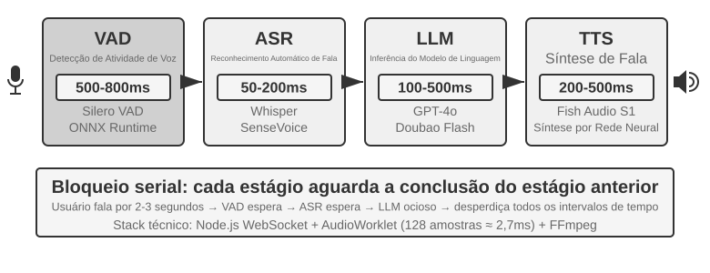

| Módulo | Função | Gargalo típico |
| --- | --- | --- |
| VAD | Determinar se o usuário terminou de falar | Os limiares de silêncio aumentam a espera e podem segmentar a fala incorretamente |
| ASR | Converter áudio em texto | Latência de reconhecimento e perda de contexto |
| LLM | Compreender, raciocinar e gerar | Latência até o primeiro token; o raciocínio aumenta ainda mais a espera |
| TTS | Converter texto em fala | Síntese do primeiro pacote e buffer de reprodução |

Em uma resposta curta, sem raciocínio, os tempos de espera do VAD, ASR, LLM e TTS se acumulam em série (Figura 6-7). Os valores reais dependem da extensão da entrada, do modelo, do hardware, da rede e da carga.

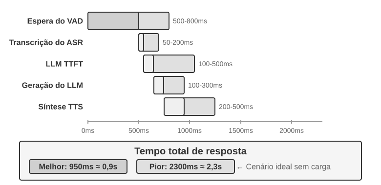

Em produção, as filas ampliam ainda mais a latência sem carga (Figura 6-8), mas o planejamento da capacidade do serviço está fora do escopo deste capítulo.

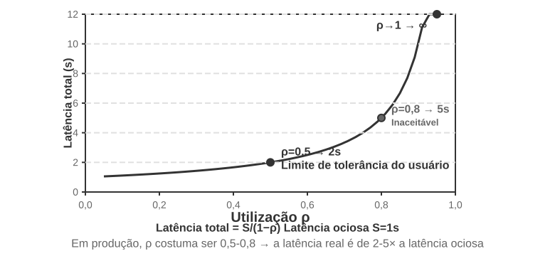

> **Experimento 6-3 ★: construa um agente de voz tradicional**
>
> Neste experimento, conecte por WebSocket um microfone, o Silero VAD, o Whisper local, um LLM com streaming e o Fish S1 TTS para estabelecer a referência em cascata das abordagens posteriores.

#### Da percepção serial à percepção em streaming

A Figura 6-7 descreve o caso totalmente serial: VAD, ASR, LLM e TTS são executados um após o outro. Essa abordagem de percepção serial apresenta três problemas:

1. **Acúmulo de latência:** é preciso aguardar um período de silêncio para confirmar que o usuário terminou de falar.
2. **Perda de informações:** um sinal binário de presença ou ausência de voz não consegue expressar hesitação, emoção, sinais de acompanhamento ou sons do ambiente.
3. **Quebra de contexto:** endereços de e-mail, nomes e nomes próprios podem ser divididos em trechos e reconhecidos incorretamente.

Para resolver esses problemas sem abrir mão da divisão modular, uma possível otimização é a **percepção em streaming**, que permite a cada etapa produzir resultados incrementais o mais cedo possível:

- **ASR em streaming:** assim que o VAD detecta que o usuário começou a falar, o modelo de ASR é chamado em intervalos regulares para gerar uma transcrição provisória em streaming; quando o VAD detecta que o usuário terminou, o texto final é confirmado.
- **Execução especulativa do LLM:** a transcrição provisória é enviada ao LLM assim que fica disponível. Se o texto final coincidir com a transcrição provisória, o LLM não é chamado novamente; caso contrário, o raciocínio especulativo anterior é cancelado e o LLM é chamado de novo.
- **Saída segmentada do LLM:** a primeira frase adequada para reprodução é enviada ao TTS sem que seja necessário aguardar a resposta completa.
- **TTS incremental:** blocos de áudio são retornados continuamente, sobrepondo as etapas posteriores de geração, síntese e reprodução.

Um ASR realmente em streaming exige suporte no próprio modelo. Embora o decodificador do Whisper seja autorregressivo, seu codificador requer um segmento de áudio completo; portanto, ele não pode ser simplesmente equiparado a um modelo em streaming. Um modelo de áudio em streaming baseado em LLM pode produzir texto e eventos semânticos a partir de áudio contínuo, reunindo o reconhecimento e parte da compreensão em um único modelo. Ele preserva o contexto desde o início da conversa até o momento atual e pode usar conhecimentos de mundo para lidar com marcas, nomes e nomes próprios.

Se o único objetivo for determinar se o usuário terminou de falar, a detecção de fim de fala também pode ser incorporada diretamente ao reconhecedor em streaming. O modelo combina semântica e silêncio para avaliar se o enunciado está completo. Os rótulos de treinamento devem conter apenas as informações disponíveis no momento da decisão; caso contrário, uma visão retrospectiva produzirá decisões impossíveis de reproduzir online.

Além das palavras, o modelo também pode produzir marcadores de eventos acústicos:

- **speak_start/end, interrupt:** início e fim da fala e intenção de interromper;
- **emotion:** emoção e hesitação;
- **laugh, sigh, noise:** sons paralinguísticos e ambientais.

Juntamente com os tokens de texto, esses marcadores formam um fluxo unificado de eventos. O agente pode usá-lo para identificar hesitações, interrupções e mudanças no ambiente sem reduzir todos os sons a texto simples.

> **Experimento 6-4 ★: Simular percepção de voz em streaming com o Qwen2-Audio**
>
> O Qwen2-Audio não é, por si só, um modelo em streaming. Este experimento simula a percepção contínua com prefixos de áudio progressivamente maiores e a compara com VAD de 600 ms + Whisper.

### Paradigma 2 · Modelos omnimodais de ponta a ponta (Omni)

Mesmo com percepção em streaming, uma arquitetura em cascata transfere a escuta, o raciocínio e a fala por interfaces discretas; emoções, entonação e sons do ambiente podem se perder quando o áudio é convertido em texto simples. A abordagem Omni usa um único modelo para ouvir o áudio, gerar uma resposta e produzir a fala, o que permite preservar esses sinais, embora com maior custo de treinamento (Figura 6-9). Em comparação com a arquitetura em cascata do Paradigma 1, as principais vantagens do Omni estão na latência e na compreensão e geração de informações não textuais.

No que diz respeito à compreensão, os modelos Omni conseguem interpretar pausas na voz. Na geração, conseguem transmitir informações paralinguísticas mais ricas, como cantar ou dizer uma frase com uma entonação específica.

Os modelos Omni ainda pressupõem alternância de turnos e, em geral, usam VAD para determinar de quem é a vez de falar. Assim, uma pausa no meio da fala enquanto o usuário dita uma sequência de números ainda pode ser interpretada incorretamente como o fim do turno.

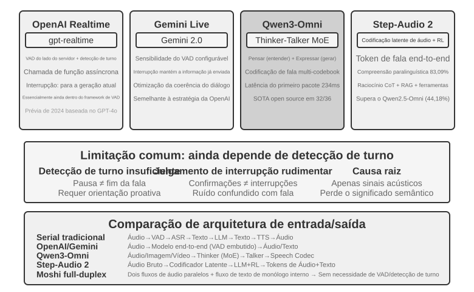

> **Experimento 6-5 ★★: Executar o MiniCPM-o 4.5 localmente — ponta a ponta versus autocascata**
>
> Execute o MiniCPM-o 4.5 localmente, com o thinking mode desativado, e compare respostas geradas diretamente a partir do áudio com uma autocascata em que o mesmo modelo primeiro transcreve e depois responde. O experimento mede se as informações do áudio são preservadas, **não** o conceito de “pensar enquanto fala” discutido mais adiante.

### Paradigma 3 · Modelos interativos full-duplex

O Omni ainda divide a conversa entre “o usuário fala” e “o modelo fala”, mas tarefas como interpretação simultânea exigem que ambos se sobreponham. Por isso, um modelo full-duplex não pressupõe turnos: ele ouve e fala continuamente e decide a todo momento se deve continuar, pausar, interromper ou chamar uma ferramenta.

O **Moshi** (2024), da Kyutai, foi um dos primeiros exemplos dessa linha de pesquisa. Ele modela em paralelo os fluxos de áudio do usuário e do modelo, permitindo que a sobreposição de falas e as interrupções sejam comportamentos naturais.

A Thinking Machines Lab chama essa abordagem de **modelo de interação (Interaction Model)**[^ch6-14]: a interatividade é incorporada ao modelo, em vez de ser montada ao seu redor com VAD e outros harnesses externos. Seu mecanismo de microturnos avança em blocos curtos de áudio, preservando silêncios, sobreposições e interrupções como contexto contínuo. O modelo também pode delegar toda a conversa a um modelo de raciocínio em segundo plano enquanto mantém o diálogo em andamento e, depois, incorporar o resultado no momento adequado.

[^ch6-14]: Thinking Machines Lab, “Interaction Models: A Scalable Approach to Human-AI Collaboration”, 2026-05. https://thinkingmachines.ai/blog/interaction-models/

O GPT-Live, da OpenAI, leva a abordagem full-duplex à escala de produção: ele processa continuamente as entradas e gera saídas, consegue esperar o usuário, emitir sinais de acompanhamento, ser interrompido e realizar tradução em tempo real. Assim como o modelo de interação, ele delega tarefas complexas a um modelo em segundo plano enquanto o modelo em primeiro plano mantém a conversa.

### Sequenciamento cognitivo: interação em tempo real e raciocínio profundo

A qualidade da interação e o limite máximo de inteligência são dimensões distintas. O modelo em primeiro plano precisa responder enquanto o usuário ainda está presente; o modelo em segundo plano pode dedicar mais tempo ao raciocínio. As três propostas a seguir representam escolhas de projeto, não uma progressão linear. As duas primeiras podem ser aplicadas a uma arquitetura em cascata ou a um modelo Omni; a terceira unifica o raciocínio profundo e a expressão em tempo real dentro do mesmo modelo.

#### Solução 1: raciocínio rápido para reações imediatas, raciocínio lento para respostas

O raciocínio rápido pode fornecer uma reação imediata em algumas centenas de milissegundos, enquanto o raciocínio lento realiza uma análise mais profunda em segundo plano. Perguntas simples podem ser processadas duas vezes, enquanto perguntas difíceis podem gerar contradições: o modelo rápido recomenda uma compra, mas o modelo lento descobre em seguida que falta um recurso essencial. A causa fundamental é que duas instâncias independentes raciocinam separadamente.

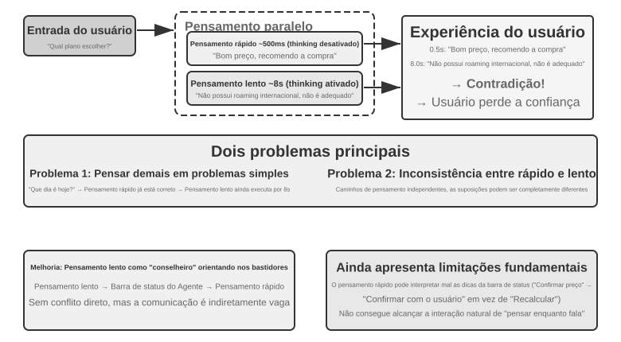

#### Solução 2: raciocínio rápido para interação, raciocínio lento para orientação

O modelo em segundo plano pode enviar orientações por uma barra de status ou uma interface dedicada, enquanto o modelo em primeiro plano mantém a conversa e decide como expressá-las. Essa proposta é mais estável que a Solução 1, mas a comunicação continua indireta: o modelo em primeiro plano pode interpretar mal as orientações e não tem acesso ao raciocínio intermediário do modelo em segundo plano. Antes que o processamento em segundo plano termine, as perguntas subsequentes ainda dependem da capacidade do modelo em primeiro plano. Ele pode esperar naturalmente pelo resultado, mas não consegue de fato pensar enquanto fala.

#### Solução 3: unificação de ponta a ponta do raciocínio e da expressão

Essa proposta incorpora a capacidade de raciocínio diretamente a um modelo de áudio de ponta a ponta. O Step-Audio R1 usa dois mecanismos complementares: a **destilação de raciocínio ancorada na modalidade (Modality-Grounded Reasoning Distillation, MGRD)** faz o modelo raciocinar com base em características acústicas, enquanto a **arquitetura MPS de cérebro duplo** permite que a elaboração e a expressão avancem em paralelo. O primeiro mecanismo ajuda o modelo a raciocinar corretamente; o segundo, a falar no momento certo.

Idealmente, o modelo deve inferir emoções a partir da altura, do ritmo e da entonação da voz, em vez de se limitar à transcrição. A MGRD seleciona trajetórias de raciocínio que de fato fazem referência a características acústicas, treina o modelo com esses dados e usa aprendizado por reforço para impedir que ele ignore o raciocínio e simplesmente tente adivinhar a resposta. Na MPS, o cérebro de elaboração produz continuamente segmentos de pensamento; o cérebro de expressão combina cada segmento com a resposta parcial e gera a fala imediatamente. Esse pipeline é executado em paralelo, de modo que o usuário não precisa aguardar o término de toda a cadeia de raciocínio para ouvir a primeira frase.

#### Escolhas entre a separação do raciocínio rápido e lento e o raciocínio de ponta a ponta

Um modelo unificado implementa de forma mais direta o conceito de “pensar enquanto fala”, mas o raciocínio e a expressão em tempo real precisam ser treinados novamente em conjunto. Uma arquitetura desacoplada facilita a substituição do modelo em segundo plano. São escolhas de projeto, não alternativas que simplesmente substituem uma à outra.

Diante da rápida evolução dos modelos de raciocínio de ponta, separar o raciocínio rápido do lento oferece uma importante vantagem de engenharia: permite aproveitar diretamente os ganhos de cada nova geração de modelos lentos. O modelo rápido em primeiro plano precisa apenas ouvir, responder e sustentar a conversa com baixa latência, enquanto o modelo lento em segundo plano cuida do raciocínio, do planejamento e das chamadas de ferramentas. Quando surge um modelo de raciocínio mais avançado, basta substituir o modelo em segundo plano, sem retreinar todo o sistema de voz em tempo real. Já a abordagem unificada vincula raciocínio e interação ao mesmo ciclo de treinamento; a cada atualização, é preciso reequilibrar o nível de inteligência, a latência de resposta e a naturalidade da expressão. Portanto, a separação entre raciocínio rápido e lento não é apenas uma concessão em termos de latência, mas uma escolha modular que permite à capacidade de interação e ao limite máximo de inteligência evoluírem de forma independente.

Essa separação não implica necessariamente perda de desempenho nas tarefas. Em agosto de 2026, o agente de voz da Pine AI, que usa uma arquitetura com separação entre raciocínio rápido e lento, ocupava o primeiro lugar no τ³-Voice Leaderboard, à frente de sistemas de voz em tempo real como Grok Voice e GPT-Realtime-2. Esse resultado demonstra, no mínimo, que uma arquitetura desacoplada não é inerentemente inferior aos modelos de ponta a ponta em tarefas que avaliam conjuntamente raciocínio profundo e conversação em tempo real.[^ch6-17]

[^ch6-17]: Pine AI. “The Most Natural Human-Computer Interface Is Your Voice”. 2026-06-23 (atualizado em 2026-08-06). https://www.19pine.ai/blog/pine-ai-the-most-natural-human-computer-interface-is-your-voice

O termo “modelo de ponta a ponta” requer um esclarecimento adicional, pois costuma ser usado em dois sentidos. O primeiro é o de **fluxo de voz de ponta a ponta**, discutido na seção anterior: o modelo recebe áudio e produz áudio diretamente, em vez de conectar vários modelos por meio de texto discreto. Tanto os modelos Omni quanto os modelos de interação são de ponta a ponta nesse sentido, mas os modelos Omni normalmente ainda operam por turnos, enquanto os modelos de interação conseguem ouvir e falar ao mesmo tempo; suas arquiteturas são substancialmente diferentes. O segundo sentido é o de **arquitetura cognitiva de ponta a ponta**, discutido nesta seção: a interação em tempo real e o raciocínio profundo podem compartilhar o estado e ser treinados em conjunto dentro de um mesmo modelo ou ser divididos entre um modelo rápido em primeiro plano e um modelo lento em segundo plano. Esses dois eixos são independentes. Um sistema pode ter um fluxo de voz de ponta a ponta e, ao mesmo tempo, manter a separação entre raciocínio rápido e lento em sua arquitetura cognitiva; a delegação de tarefas complexas a um modelo de raciocínio em segundo plano pela Thinking Machines Lab é um exemplo dessa combinação.

### Síntese de fala mais próxima da humana

O TTS tradicional pode revelar sua natureza artificial por ser fluido demais e fazer poucas pausas. Pausas, palavras de preenchimento e repetições ocasionais sinalizam incerteza e reflexão na fala humana.

Além do texto, o LLM principal pode emitir marcadores de controle, como **THINKING**, **EMO:happy** e **SPEED:0.8x**. O TTS os converte em pausas, prosódia, velocidade da fala, risadas, suspiros e outros sons não verbais. A implementação pode usar um TTS treinado para interpretar marcadores de controle ou clonagem de voz com clipes de referência para diferentes emoções e estilos.

> **Experimento 6-6 ★★: TTS orientado por marcadores de controle com Fish Audio**
>
> Use o Fish Audio S1 para criar uma biblioteca de vozes com múltiplas referências e compare três configurações: sem marcadores de controle, com um clipe de referência e com vários clipes de referência. A camada de execução seleciona a emoção, a velocidade da fala e o estilo correspondentes aos marcadores.

## Computer Use: agentes de automação de GUI

A voz levou o eixo temporal à escala dos milissegundos, mas sua observação ainda é um fluxo sonoro unidimensional. O Computer Use transfere o mesmo problema para uma tela bidimensional: a observação passa a ser composta por pixels em constante mudança, e a ação, por cliques e entradas em coordenadas. Cenários de voz enfatizam *quando falar*; o Computer Use enfatiza *onde clicar em seguida* — além de uma questão inexistente na interação por voz: depois que uma ação é executada, a realidade ainda corresponde ao plano?

O Computer Use, também conhecido como automação de GUI, permite que a IA use software como um ser humano, observando a tela e operando o mouse e o teclado — por exemplo, abrindo um navegador para pesquisar informações, preenchendo dados em um aplicativo de planilhas ou ajustando configurações do sistema. Seu núcleo é um ciclo de **percepção-raciocínio-ação** (Figura 6-11):

1. O agente captura uma imagem da tela atual.
2. Um modelo multimodal recebe a captura de tela e a instrução da tarefa e produz um raciocínio e uma ação específica.
3. A camada de execução realiza a ação no ambiente real, como mover o mouse, clicar ou digitar texto.
4. Após aguardar a resposta da interface, o sistema faz outra captura de tela e inicia a próxima iteração do ciclo.

É importante distinguir entre **entender a interface** e **concluir a tarefa**. A primeira capacidade está mais próxima da compreensão multimodal e pode ser medida por meio de perguntas e respostas sobre uma única captura de tela. A segunda exige que o modelo integre a compreensão e a geração de ações em um ciclo fechado capaz de lidar com o carregamento de páginas, mudanças de estado, erros operacionais e consequências irreversíveis. Portanto, o desafio do Computer Use não é apenas responder corretamente sobre uma captura de tela, mas reconfirmar, após cada etapa, se a realidade ainda corresponde ao plano.

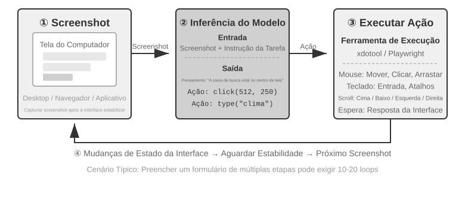

Esse ciclo tem três dimensões fundamentais de projeto: **espaço de ações** (quais operações o agente pode executar), **localização visual** (como encontrar o elemento-alvo na captura de tela) e **arquitetura do modelo** (como gerar a ação correta a partir da captura de tela).

### Projeto do espaço de ações

A implementação de referência da Anthropic divide a capacidade completa de interação em três tipos de ferramentas (Figura 6-12). Esse é um projeto claro de espaço de ações, mas não um protocolo privado que os fornecedores de modelos precisem seguir: desde que o harness possa converter as mesmas capturas de tela, restrições de ação e resultados de execução em mensagens e saídas estruturadas compatíveis com o modelo de destino, Claude, modelos de visão com pesos abertos e endpoints auto-hospedados podem acionar o mesmo ciclo de percepção-raciocínio-ação.

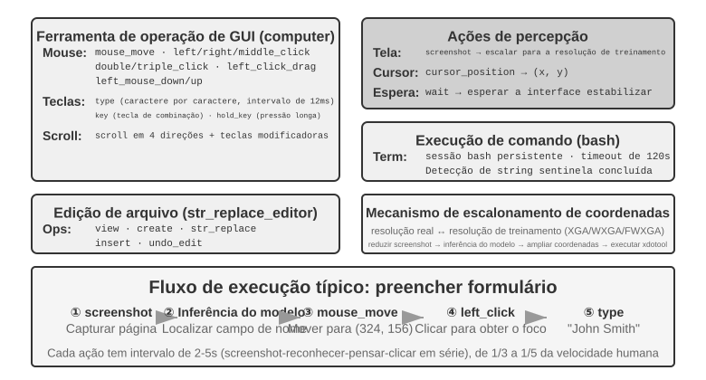

**Ferramenta de operação da GUI** (ferramenta `computer`): as operações do mouse incluem movimentação (`mouse_move`), cliques com os botões esquerdo, direito e do meio, cliques duplos ou triplos, arrastar (`left_click_drag`) e ações mais precisas de pressionar e soltar (`left_mouse_down` e `left_mouse_up`). A rolagem (`scroll`) funciona nas quatro direções e pode ser combinada com teclas modificadoras. As operações do teclado incluem digitação caractere por caractere (`type`, com intervalo de 12 ms entre os caracteres para simular a digitação real), combinações de teclas (`key`, como `Ctrl+C`) e manter uma tecla pressionada (`hold_key`). As ações de percepção incluem capturar a tela, obter a posição do cursor (`cursor_position`) e aguardar (`wait`).

**Ferramenta de execução de comandos** (ferramenta bash): oferece uma sessão persistente de terminal bash com tempo limite de 120 segundos. Usa uma string sentinela para detectar a conclusão dos comandos e mantém o estado do ambiente entre chamadas — por exemplo, depois de executar `cd` para acessar um diretório, a chamada seguinte permanece nesse diretório.

**Ferramenta de edição de arquivos** (`str_replace_editor`): permite editar arquivos com segurança por correspondência de strings e oferece operações de visualização, criação, substituição, inserção e desfazer. É mais precisa do que sobrescrever o arquivo inteiro e reduz o risco de alterar acidentalmente conteúdo não relacionado.

> **Experimento 6-7 ★: execução do Computer Use pela implementação de referência da Anthropic ou por um modelo aberto**
>
> O caminho A usa o Anthropic Computer Use Demo. Seu contêiner reúne um ambiente de desktop Ubuntu completo, incluindo navegador, terminal e outras ferramentas comuns. O frontend recebe uma tarefa, enquanto o backend envia as instruções e capturas de tela ao Claude e, em seguida, executa as ações de mouse, teclado, terminal ou edição retornadas pelo modelo.
>
> O caminho B usa o código de exemplo em [`chapter6/computer-use-open-model`](../chapter6/computer-use-open-model/). Por padrão, ele utiliza o modelo Qwen3-VL 32B Instruct, com pesos abertos, para acionar o browser-use por meio da API hospedada do OpenRouter ou de serviços auto-hospedados como vLLM e SGLang.

### Localização visual

Em cada iteração do ciclo, o modelo precisa localizar com precisão o elemento-alvo na captura de tela: “Onde está a caixa de pesquisa?” “Quais são as coordenadas do botão de envio?” Esse é o problema da localização visual. Atualmente, há **duas abordagens principais**: a primeira transforma a localização em uma **questão de múltipla escolha** — os elementos da interface são previamente identificados por números, e o modelo só precisa selecionar um deles; a segunda usa **previsão direta de coordenadas** — o modelo “olha” para a captura de tela e informa as coordenadas, como faria uma pessoa. A abordagem de múltipla escolha tem duas formas de implementação: **anotação puramente visual** (o Set-of-Mark original, que usa um modelo de segmentação para delimitar regiões candidatas na imagem) e **indexação de elementos estruturados** (DOM/Accessibility Tree, com leitura direta da estrutura da própria interface). A vantagem comum da abordagem de múltipla escolha é transformar o problema aberto de “encontrar o botão na captura de tela e prever suas coordenadas” no problema fechado de “escolher um dos elementos já identificados”. Assim como, em uma prova, é mais fácil acertar uma questão de múltipla escolha do que uma questão de preenchimento, o modelo só precisa dizer “clique em [123]”, em vez de “clique no botão nas coordenadas (350, 464) da tela”. Prever coordenadas diretamente é particularmente difícil para o modelo: exige muito treinamento para alcançar boa precisão e está sujeito a erros em diferentes resoluções de tela.

**Set-of-Mark: método de anotação visual.**

O Set-of-Mark (SoM) original foi proposto pela Microsoft Research em 2023, inicialmente para explorar a capacidade de localização visual do GPT-4V. Trata-se de um método **puramente visual**: modelos de segmentação de imagens, como SAM e SEEM, delimitam automaticamente regiões candidatas na captura de tela, e cada região recebe um marcador numerado. O modelo vê uma imagem com esses números e só precisa informar um deles; o sistema então o converte nas coordenadas centrais da região correspondente. Todo o processo dispensa o DOM e qualquer estrutura interna da interface, podendo ser aplicado também a software desktop nativo e interfaces de jogos — desde que o modelo de segmentação consiga identificar as regiões candidatas.

**Indexação de elementos estruturados: implementação estruturada da ideia do SoM na Web.**

Quando a própria interface fornece informações estruturadas, a anotação pode ser mais precisa. Antes da renderização, as páginas Web modernas já definem uma estrutura completa de elementos — a árvore DOM — e papéis semânticos que indicam quais elementos são botões, campos de entrada e outros controles. As árvores de acessibilidade oferecem informações semelhantes para muitos aplicativos desktop. Sistemas de agentes Web como o `browser-use` adotam exatamente essa abordagem: enumeram os elementos interativos no DOM e atribuem um número a cada um. Essa pode ser considerada uma implementação estruturada da ideia do SoM para a Web (Figura 6-13). O processo tem quatro etapas:

1. Obter a representação estruturada da página — a árvore DOM — e as informações de acessibilidade por meio da interface de depuração do navegador (CDP, Chrome DevTools Protocol)
2. Detectar automaticamente quais elementos são interativos, como botões, caixas de entrada e links
3. Atribuir um ID exclusivo a cada elemento interativo e desenhar caixas delimitadoras na captura de tela
4. Gerar simultaneamente uma lista textual que descreva o elemento correspondente a cada ID

```text
Screenshot: [Key elements in the image are annotated with IDs like [1], [2], [3], [4]]

Elements:
[1] <input type="text" placeholder="Search" aria-label="Search" />
[2] <button id="submit-btn" aria-label="Submit form" />
[3] <input type="text" placeholder="Enter your name" value="" />
[4] <a href="/docs" aria-label="Documentation" />
```

O modelo só precisa fornecer um ID, e o sistema clica automaticamente no centro do elemento correspondente. Essa abordagem não economiza tokens, pois todos os dados de anotação ainda precisam ser enviados ao modelo, mas oferece localização precisa e estável, além de evitar as omissões e detecções incorretas que os modelos de segmentação podem introduzir.


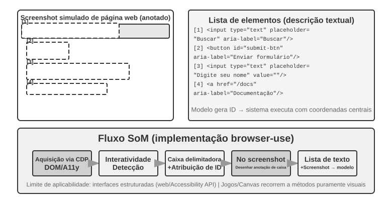

**Previsão direta de coordenadas.**

A terceira abordagem dispensa qualquer anotação e solicita diretamente ao modelo as coordenadas. Sistemas como o **SeeClick** e o Computer Use do Claude usam modelos de visão treinados com enormes conjuntos de dados que associam capturas de tela de GUIs às posições dos elementos. Esses modelos aprendem a mapear descrições em linguagem natural, como “clique no botão de envio”, diretamente para coordenadas precisas na captura de tela, recorrendo apenas à percepção visual, como faria um usuário humano.

Nos métodos de previsão de coordenadas, a compreensão das coordenadas pelo modelo depende muito da resolução usada durante o treinamento (Figura 6-14). O Claude foi treinado com XGA (1024×768), WXGA (1280×800) e FWXGA (1366×768). Se a resolução da captura de tela de entrada não for compatível, as coordenadas previstas pelo modelo apresentarão um desvio sistemático — como medir uma distância em um mapa pequeno e aplicá-la diretamente a um mapa grande. Por isso, é necessário implementar na camada de ferramentas um mecanismo bidirecional de redimensionamento de coordenadas e **selecionar a resolução de destino com base na proporção da tela**, evitando um redimensionamento não uniforme que distorça a imagem e, consequentemente, prejudique a estimativa das coordenadas. Por exemplo, se a resolução real da tela for 2560×1440 (16:9), a opção mais adequada entre as três aceitas pelo Claude será FWXGA (1366×768), cuja proporção é a mais próxima de 16:9. A captura de tela é reduzida proporcionalmente para 1366×768 e enviada ao modelo. Quando o modelo fornece as coordenadas de clique (683, 384), elas são mapeadas de volta para as coordenadas reais: (683×2560/1366, 384×1440/768) ≈ (1280, 720). Por outro lado, se uma imagem 16:9 for forçada para a resolução 4:3 de 1024×768, ela será comprimida horizontalmente, provocando um desvio sistemático nas coordenadas previstas pelo modelo.


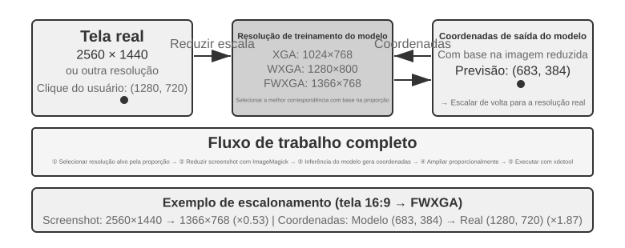


A escolha entre as três abordagens pode ser resumida da seguinte forma: **quando houver informações estruturadas, priorize a indexação por DOM/Accessibility Tree**, que oferece a localização mais precisa e estável. **Quando essas informações não estiverem disponíveis** — em software desktop nativo, como o Photoshop, interfaces renderizadas por Canvas/WebGL ou jogos —, **use a anotação visual, seguindo a abordagem original do SoM, ou a previsão de coordenadas**. A anotação visual transforma a localização em uma questão de múltipla escolha, sendo mais adequada a modelos de propósito geral sem treinamento específico. A previsão de coordenadas elimina a etapa de anotação e é mais direta para modelos treinados especificamente para localização em GUIs. As duas abordagens ainda apresentam limitações de precisão com elementos pequenos e interfaces densas.

> **Experimento 6-8 ★: uso do browser-use para automatizar operações no navegador**
>
> Use o Playwright, um framework de automação de navegadores, em conjunto com um modelo multimodal para implementar operações no navegador orientadas por linguagem natural. Ative a visualização do SoM e salve, antes de cada decisão, uma captura de tela com caixas delimitadoras.
>
> Tarefa de teste: “Abra o Google e pesquise a previsão do tempo em São Francisco”. Após a inicialização, a captura de tela mostra a página de pesquisa do Google com os elementos interativos numerados. O modelo seleciona a caixa de pesquisa, insere “San Francisco weather today”, envia a pesquisa e extrai a temperatura e as condições meteorológicas da página de resultados.

### Um agente de Computer Use capaz de ver animações e ouvir sons

Até aqui, a percepção em Computer Use se baseou em uma premissa implícita: **a tela é estática** — faz-se uma captura de tela, executa-se uma etapa de raciocínio e um clique e, depois, faz-se outra captura. Na realidade, as telas exibem vídeos, mostram notificações que desaparecem rapidamente e reproduzem vozes de reuniões. Um agente que abre os olhos apenas uma vez a cada 3–5 segundos e não tem ouvidos não consegue ver nem ouvir o que acontece entre dois quadros.

O que precisa ser reformulado não é a interface de ações, mas a **interface de observação**[^ch6-9]. Uma interface de observação entre agente e computador (AOI) converte a observação contínua do ambiente em eventos discretos que o modelo consegue processar. Entre suas principais técnicas estão: **captura de quadros-chave da tela**, que usa um modelo pequeno para avaliar se houve uma mudança significativa e só faz uma captura de tela quando isso ocorre — quando as mudanças são frequentes, uma captura por segundo já produz bons resultados; **transcrição de fala acionada pelo volume**, que ativa o reconhecimento de fala na presença de som e insere o texto reconhecido no contexto, permitindo que o agente ouça; e **descrição textual da tela**, na qual o modelo transforma cada captura em uma descrição de uma frase que permanece no contexto mesmo após a remoção da imagem original, comprimindo assim o histórico de interações multimodais.

[^ch6-9]: Consulte Li, Bojie e Noah Shi. *Agent-Computer Observation Interfaces Enable Dynamic Computer Use.* arXiv:2606.29472, 2026.

### Modelos de mundo para Computer Use

A interface de observação da seção anterior responde à pergunta “o que aconteceu nesse intervalo?”: com quadros-chave, conversão de fala em texto e texto persistente, o agente deixa de ver apenas duas capturas de tela feitas com um longo intervalo entre elas. No entanto, uma interface de observação não elimina a latência de planejamento. O agente ainda opera em um ciclo serial de “capturar a tela—pensar—clicar”, voltando a observar e a raciocinar sobre a próxima etapa após cada ação. O estudo de eficiência do **OSWorld-Human** mostra que, mesmo quando uma tarefa é concluída com sucesso, o agente ainda executa muito mais etapas e espera muito mais tempo do que uma pessoa; alcançar a precisão humana não significa ser prático.

As pessoas não esperam até depois do clique para começar a pensar na próxima etapa. Primeiro, elas preveem o efeito da ação: se a mudança real corresponder ao esperado, continuam seguindo o plano; somente quando o estado da página diverge da expectativa é que param para observar e planejar novamente. Um modelo de mundo permite que o agente preveja como o desktop poderá ficar antes de agir, viabilizando essa “execução especulativa” semelhante à humana e aumentando substancialmente a eficiência.

O estado do desktop não é apenas uma grade de pixels. Ele também inclui janelas, foco, posição de rolagem, conteúdo dos campos de entrada, estado de carregamento, permissões e respostas da rede; as ações incluem clicar, digitar, rolar, arrastar e esperar. Um modelo de mundo adequado para Computer Use deve, no mínimo, codificar o estado atual, prever a mudança de estado causada por uma ação candidata e fornecer essa previsão ao planejador para que ele decida a próxima etapa:

```text
desktop state + click/type/scroll/wait ──> representation of the next state
```

Assim, o agente pode comparar as consequências de ações candidatas antes de clicar, preparar a próxima etapa enquanto a página carrega e se recuperar quando uma caixa de diálogo aparece e desaparece rapidamente, raciocinando sobre a diferença entre os estados. Se a tarefa for “criar um novo arquivo Python no VS Code e escrever hello world”, o modelo poderá primeiro prever os estados essenciais da árvore de arquivos e do editor após a conclusão bem-sucedida e, só então, escolher as ações de clicar, digitar e salvar. Se a tarefa for excluir um arquivo, ele poderá prever, em um desktop virtual isolado, se aparecerá uma caixa de diálogo de confirmação para uma ação irreversível e solicitar a confirmação do usuário quando necessário. O objetivo não é fazer o modelo gerar uma captura de tela futura fotorrealista, mas prever as diferenças de estado verificáveis necessárias para concluir a tarefa.

Em julho de 2026, o **Photon-1**, da Induction Labs, demonstrou uma implementação dessa abordagem, concluindo o pré-treinamento de um modelo de mundo para computer use com apenas 30 mil horas de GPU H200. Ele comprime cada quadro em tokens latentes discretos e prevê de forma autorregressiva a representação do próximo estado após uma ação, em vez de gerar capturas de tela pixel a pixel durante o pré-treinamento. O gerador de imagens acoplado serve apenas para visualizar as representações latentes e não é um componente necessário para a inferência. A partir de uma captura de tela inicial e das ações subsequentes, o modelo pode “imaginar” continuamente os estados do desktop e, depois, aprender a produzir ações de computer use por meio de treinamento online em máquinas virtuais.[^ch6-20]

[^ch6-20]: David Li e Jonathan Li, Induction Labs, “Scaling Video Pretraining with Imagination Models”, 23 de julho de 2026. https://www.inductionlabs.com/news/scaling-video-pretraining. Os parâmetros, o volume de dados, os benchmarks internos e as comparações de custos do Photon-1 são resultados divulgados pela própria empresa.

### Dispositivos móveis: as barreiras do ecossistema são mais difíceis do que a tecnologia

Computer Use também está se expandindo para dispositivos móveis. Há diferenças técnicas entre sistemas móveis e desktops: em vez de depender de coordenadas do mouse e entrada pelo teclado, o espaço de ações em dispositivos móveis normalmente usa a API de serviços de acessibilidade do sistema, como o `AccessibilityService` do Android, para ler elementos da interface, executar cliques e inserir texto. A interação também deixa de usar o ponteiro do mouse e passa a empregar gestos de toque, o que muda o significado das coordenadas. A mesma posição `(x, y)` pode indicar um toque, um toque longo ou o ponto inicial de um gesto de deslizar; por isso, a ação também precisa especificar o tipo de gesto. Benchmarks para dispositivos móveis, como o AndroidWorld, apresentado no Capítulo 7, avaliam a capacidade de um agente concluir tarefas em aplicativos reais nesse espaço de ações.

No entanto, o que realmente dificulta o avanço do Computer Use em dispositivos móveis muitas vezes não são essas diferenças técnicas, mas as barreiras do ecossistema. Alguns fabricantes de celulares tentaram integrar assistentes de IA a aparelhos destinados ao consumidor, para que operassem automaticamente aplicativos cotidianos como WeChat, Taobao e Alipay, mas logo enfrentaram restrições impostas pelas plataformas.

Isso revela um desafio específico do Computer Use: as **barreiras do ecossistema**. A causa fundamental dessas restrições é o conflito entre modelos de negócios. A principal lógica de monetização dos aplicativos tradicionais de internet é o **tráfego e a atenção**: os usuários veem anúncios ao percorrer feeds, são conduzidos por algoritmos de recomendação ao pesquisar produtos e fazem compras por impulso enquanto navegam pelas páginas. Quando um agente opera em nome do usuário, toda essa cadeia de monetização é contornada: a IA ignora anúncios, não faz compras por impulso, segue diretamente para o objetivo, conclui a tarefa e vai embora. Para plataformas que dependem de publicidade e tráfego, cada operação de um agente corrói os alicerces do modelo de negócios.

Isso significa que o Computer Use enfrenta não apenas contramedidas técnicas, como CAPTCHAs, mas também um **conflito estrutural de interesses**. Esse conflito será difícil de resolver no curto prazo e representa um obstáculo maior à adoção pelo consumidor do que problemas estritamente técnicos.

## Manipulação robótica: organizando uma mesa com o XLeRobot

> **Nota de leitura**: esta seção usa a mesma tarefa do início ao fim — “colocar o copo vermelho na bandeja, colocar o papel amarelo descartado na lixeira e, por fim, observar novamente e confirmar o estado da mesa”. Os experimentos 6-9 e 9-9 são realizados em um XLeRobot físico e exigem um braço robótico, calibração, um dispositivo de parada de emergência e um observador no local; os experimentos 9-8, 9-10 e 9-11 são os experimentos correspondentes executados em uma GPU local. Os resultados com hardware físico e em simulação são apresentados separadamente, mas o objetivo da tarefa, a semântica das ações e as condições de sucesso permanecem os mesmos.

A manipulação robótica é muito mais difícil do que responder a perguntas sobre uma imagem. O modelo precisa compreender a cena e executar ações continuamente no mundo real, onde cada ação altera a situação no instante seguinte. O XLeRobot torna essa diferença concreta: o mesmo braço robótico pode ser teleoperado por uma pessoa por meio de um teclado, um gamepad ou um dispositivo de realidade virtual, ou pode fornecer as observações das câmeras e um conjunto restrito de ferramentas de ação para que um agente as acione por conta própria. O hardware e a tarefa não mudam; muda apenas o operador — no primeiro caso, uma pessoa observa e corrige continuamente; no segundo, o modelo e o sistema de controle precisam realizar o mesmo trabalho.

Esta seção apresenta cinco experimentos com a tarefa de “organizar a mesa”. Primeiro, uma pessoa teleopera o XLeRobot físico, para medir o que o hardware consegue fazer sob o controle de um operador suficientemente capacitado. Em seguida, um simulador estabelece o limite superior de controle ideal para a mesma tarefa. Depois, um agente controla o XLeRobot físico de forma autônoma, revelando como a percepção, o planejamento e a recuperação de falhas afetam o resultado. Na sequência, o mesmo contrato de ferramentas é levado ao simulador, permitindo comparar em larga escala três estratégias: execução em malha aberta, verificação passo a passo e modelos de mundo. Por fim, são alterados o fundo, a aparência dos objetos, a iluminação e o ruído visual, para verificar se uma política visual aprendida em simulação consegue se adaptar a um novo ambiente.

Nesse caso, o gargalo geralmente não é adicionar mais um benchmark estático de perguntas e respostas, mas manter o ciclo fechado sob limitações de largura de banda de percepção e controle. Um sistema robótico funcional precisa responder a pelo menos quatro perguntas:

1. Qual tarefa a pessoa deseja realizar?
2. Qual é a próxima subtarefa?
3. Quais ações a skill atual efetivamente produz?
4. Após a execução da ação, a realidade ainda corresponde ao plano?

Esta seção insere essas quatro perguntas em um único ciclo de controle do XLeRobot e mostra a responsabilidade de cada uma das quatro técnicas: o planejamento de longo horizonte decide se o copo ou o papel será manipulado primeiro; uma VLA ou primitiva de ação realiza a preensão e o posicionamento; um modelo de mundo estima as consequências de uma ação; e a transferência da simulação para o mundo real trata das diferenças entre as imagens de treinamento e a câmera e os atuadores reais. Mesmo quando o modelo de alto nível já dispõe de conhecimento e capacidade de planejamento suficientes, a ausência de qualquer um desses elos de feedback pode impedir a conclusão da tarefa.

### A divisão de trabalho entre hardware e algoritmos

A primeira pergunta que o XLeRobot ajuda a responder é: quando a organização autônoma da mesa falha, o braço robótico não consegue executar a tarefa ou o algoritmo não sabe usá-lo bem? Há aqui um fato que não deve ser minimizado: **um braço robótico que custa apenas algumas centenas de dólares, como o XLeRobot, já consegue realizar por teleoperação o tipo de tarefa contínua e multietapas de organização de mesa apresentado nesta seção** — uma pessoa acompanha a imagem da câmera, pega o copo vermelho e o coloca na bandeja, depois põe o papel amarelo na lixeira e, por fim, observa novamente para confirmar o estado. Esse resultado não mostra apenas que “o hardware é minimamente viável”; ele constitui uma evidência diagnóstica clara: **para esta tarefa, o hardware em si não é o gargalo; o algoritmo é.**

O método de diagnóstico é direto: mantenha inalterados a câmera, o braço robótico, a garra, a disposição da mesa e os critérios de sucesso, e deixe uma pessoa assumir o controle do ciclo. O operador humano corrige continuamente a localização dos objetos, a escolha e o momento das ações, além de lidar com falhas de preensão. A diferença entre um sistema autônomo e uma pessoa está justamente nessas capacidades de controle em malha fechada. É claro que essa conclusão se restringe à tarefa de mesa desta seção: ela demonstra que o hardware superou os requisitos de carga, precisão e espaço de trabalho necessários para realizá-la, não que um braço robótico de algumas centenas de dólares seja capaz de operar em qualquer ambiente aberto ou executar manipulações mais difíceis.

O XLeRobot permite teleoperação por teclado, controle Xbox, Switch Joy-Con e dispositivos de realidade virtual. Um operador humano realiza naturalmente muitas ações que um algoritmo precisa implementar de forma explícita: desacelera a garra ao se aproximar do copo, corrige o ponto de preensão quando o copo desliza, observa novamente quando não consegue prender o papel na primeira tentativa e verifica o resultado depois que o objeto é colocado na área de destino. Portanto, a teleoperação não serve apenas para coletar demonstrações; ela também é um experimento diagnóstico que “mantém o hardware e troca o operador”.[^ch6-1]

> **Experimento 6-9 ★: Teleoperação de um XLeRobot real para organizar uma mesa**
>
> Coloque um copo vermelho, uma bandeja, um papel amarelo e uma lixeira no espaço de trabalho real do XLeRobot. Usando um método de teleoperação devidamente calibrado, o operador executa a tarefa predefinida: “coloque o copo vermelho na bandeja, coloque o papel amarelo na lixeira e, depois, observe novamente e confirme o estado da mesa”. Repita o experimento por várias rodadas, registrando as imagens da câmera, os comandos do operador, o estado do braço robótico, o tempo das ações, as falhas de preensão, o número de novas tentativas e o estado final.
>
> A aceitação não pode se basear apenas na impressão de que “a mesa parece organizada ao final”. O copo vermelho deve estar dentro da bandeja, o papel amarelo deve estar dentro da lixeira e o braço robótico deve retornar a uma postura segura, sem colisões, movimentos além dos limites nem intervenções manuais não confirmadas durante a execução.

A teleoperação no hardware real fornece o limite superior mais convincente para a tarefa, mas não é adequada para variar em larga escala a quantidade e a posição dos objetos. Para obter um controle repetível e estatisticamente significativo, a próxima etapa transfere o mesmo problema de “colocar os objetos nos lugares corretos” para um simulador de mesa 2D e usa um controlador ideal para representar um operador competente, que nunca comete erros de percepção nem escolhe a ação errada.

> **Experimento 6-10 ★: Medição, em simulação, do limite superior do controle ideal para a mesma tarefa**
>
> Em um simulador de mesa 2D, distribua aleatoriamente o copo vermelho, o papel amarelo e suas respectivas áreas de destino. Em seguida, deixe um controlador ideal se aproximar de cada objeto, pegá-lo e levá-lo ao local correto. Como não precisa reconhecer imagens nem escolhe ações incorretas, esse controlador representa “o que esta tarefa pode alcançar, no mínimo, quando a percepção e a tomada de decisão estão corretas”.
>
> O experimento mede a taxa de sucesso da tarefa, o número de etapas e o comprimento do trajeto, além de variar as posições iniciais dos objetos e a escala da tarefa para verificar se o limite ideal permanece estável. Ele usa os mesmos critérios de sucesso do experimento 6-9, mas mede um resultado de simulação idealizado e não implica que o XLeRobot real tenha sido executado. Juntos, os dois experimentos estabelecem as referências para o controle autônomo apresentado a seguir: o experimento 6-9 corresponde ao controle humano em malha fechada no hardware real, enquanto o experimento 6-10 corresponde ao controle ideal em malha fechada no ambiente simulado.

### Estrutura básica do controle robótico

Os sistemas robóticos costumam separar o trabalho de acordo com a escala de tempo:

| Camada | Questão central | Saída | Escala de tempo típica |
| --- | --- | --- | --- |
| Objetivo da tarefa | O que a pessoa deseja realizar | “Colocar o copo e o papel nos devidos lugares” | Minutos |
| Planejamento de longo horizonte | O que vem primeiro e o que vem depois | Cuidar primeiro do copo, depois do papel e, por fim, verificar | Segundos a minutos |
| Skills básicas | Qual mudança de estado deve ser realizada agora | `pick(red_cup)`, `place(red_cup, tray)` | Cerca de 1–3 s |
| VLA/política de skills | Como executar concretamente essa skill | Um movimento curto ou uma trajetória contínua da garra do XLeRobot | Cerca de 1–10 Hz de inferência |
| Controle de baixo nível e camada de segurança | Como executar a ação de modo estável e no momento adequado | Comandos das juntas ou do efetuador final, limites de velocidade e parada de emergência | Cerca de 50–1000 Hz |

Essa é uma divisão comum de engenharia, não a única arquitetura possível de modelo. Uma VLA pode assumir parte das decisões de alto nível, e o planejador pode ser um programa baseado em regras, um VLM ou um otimizador. Qualquer que seja a implementação, a “ordem das tarefas” e a “ação imediata” devem permanecer separadas. Caso contrário, a latência de inferência do modelo de alto nível prejudicará o controle de baixo nível, enquanto o controle de baixo nível em alta frequência obrigará o modelo de alto nível a processar muitos detalhes irrelevantes. No XLeRobot, o modelo não deve gerar diretamente ângulos arbitrários para as juntas; ele deve apenas selecionar skills delimitadas, como `pick`, `place`, `verify_state` ou `stop`. Um executor calibrado, com limites de velocidade e tempo máximo de execução, converte essas skills em movimentos reais do braço robótico.

### Planejamento de longo horizonte e decomposição de tarefas

Quando o usuário diz “organize a mesa”, o sistema não pode simplesmente encaminhar essa frase a um modelo de ações. Primeiro, o planejador deve listar os objetos e os objetivos presentes na cena; depois, definir a ordem de execução e especificar, para cada etapa, as condições iniciais, as condições de conclusão e os limites de risco. Por exemplo:

```text
handle the red cup → clear the yellow paper → check the desk
```

“Cuidar do copo vermelho” deve ser decomposto em duas ações e uma verificação:

```text
pick(red_cup) → place(red_cup, tray) → verify_state()
```

Cada skill concluída gera um ponto verificável. Se uma preensão falhar, apenas essa etapa é repetida. Se alguém mover um objeto ou se o usuário mudar o objetivo, apenas as etapas posteriores afetadas precisam ser replanejadas; não é necessário refazer todo o plano anterior. As ferramentas fornecidas ao agente também devem ser simples: cada chamada executa apenas uma ação, a amplitude do movimento é limitada, há um tempo máximo de execução e uma nova observação é feita imediatamente após a ação.

> **Experimento 6-11 ★★: Uso do Gemini Robotics-ER 1.5 para fazer o XLeRobot organizar uma mesa de forma autônoma**
>
> Mantenha inalterados o XLeRobot real, a disposição da mesa, as instruções da tarefa e os critérios de sucesso do experimento 6-9, mas substitua o operador humano por um agente. Um modelo de raciocínio corporificado, como o Gemini Robotics-ER 1.5, pode cuidar da observação e do planejamento, com apenas cinco ferramentas disponíveis por meio de um ciclo de agente no estilo do RoboCrew: `observe_scene`, `pick`, `place`, `verify_state` e `stop`.[^ch6-2]
>
> Primeiro, o modelo observa a mesa e define a ordem de execução; depois, chama as ações calibradas de preensão e posicionamento do XLeRobot. Após a conclusão de cada skill, ele deve observar novamente e verificar a pós-condição. Se a preensão falhar, o modelo só pode repetir a skill atual. Ele deve chamar `stop` quando o usuário mandar parar, quando um objeto sair do espaço de trabalho ou quando não for possível confirmar o estado. O modelo não pode gerar ângulos arbitrários para as juntas nem ignorar uma verificação real apenas porque afirmou anteriormente que a tarefa estava “concluída”.
>
> Os critérios de aceitação são exatamente os mesmos do experimento 6-9: o copo deve estar na bandeja, o papel deve estar na lixeira, o braço robótico deve retornar a uma postura segura e não pode haver colisões nem movimentos além dos limites. A diferença é que, no experimento autônomo, a interpretação da tarefa deve se basear na observação do próprio modelo, as ações reais devem resultar de chamadas de ferramentas e o estado final deve ser confirmado por uma nova observação. A pessoa pode apenas iniciar a execução, acionar a parada de emergência e supervisionar a segurança; não pode realizar nenhuma ação em nome do agente durante a tarefa. Só assim os experimentos 6-9 e 6-11 podem comparar diretamente, com o mesmo hardware e a mesma tarefa, o que ainda separa o controle humano em malha fechada do controle do modelo em malha fechada.

Experimentos com hardware real revelam erros de calibração, oclusões da câmera e falhas da garra, mas não são adequados para repetir com segurança e controle um grande número de falhas. Os experimentos simulados apresentados a seguir mantêm essas cinco ferramentas e exatamente o mesmo estado da tarefa, substituindo apenas o atuador real por um ambiente de mesa no qual é possível injetar falhas. Isso permite separar a contribuição da execução em malha aberta, da verificação passo a passo e da previsão de ações.

### Controle com VLA

VLA é a sigla de Vision-Language-Action, que pode ser entendido como um modelo de visão, linguagem e ação. Ele recebe a imagem atual e uma instrução de skill e, em seguida, gera a ação que o robô deve executar:

```text
current observation + skill instruction → action
```

No caso do XLeRobot, o planejador de alto nível envia apenas `pick(red_cup)`. A VLA ou a política de skills ainda precisa decidir, com base na imagem atual, por qual direção se aproximar do copo, quando fechar a garra e ao longo de qual trajetória elevar o braço. Depois que a camada de execução conclui esse movimento curto, o sistema captura uma nova imagem da mesa. Somente após confirmar que o copo está realmente preso o planejador pode enviar `place(red_cup, tray)`. Portanto, uma chamada de ferramenta define a mudança de estado desejada, enquanto a VLA define como concretizá-la por meio de um movimento contínuo.

O RT-2 e o OpenVLA dividem ações contínuas em tokens discretos e os geram um de cada vez, como na geração de texto. Já o π₀ representa outra abordagem, que produz diretamente trajetórias de ação contínuas e suaves. Nenhuma das duas é simplesmente superior: tokens discretos são mais fáceis de integrar a modelos de linguagem, enquanto trajetórias contínuas costumam representar melhor movimentos suaves. A verdadeira escolha está em como representar a ação, não apenas no tamanho do modelo.[^ch6-15]

Um modelo de grande porte normalmente só consegue executar inferências de uma a dez vezes por segundo, enquanto um controlador tradicional pode ser atualizado de dezenas a milhares de vezes por segundo. Uma solução comum de engenharia é o “agrupamento de ações”: o modelo gera de uma só vez um pequeno segmento de ações futuras, uma thread de controle o executa em frequência mais alta e o modelo prepara o próximo segmento em segundo plano. Assim, parte da espera pela inferência fica oculta no tempo de execução das ações. O custo é que, quanto mais longo o segmento, mais suave o movimento, porém menos imagens novas o modelo recebe durante a execução. Se o copo for deslocado enquanto o XLeRobot tenta alcançá-lo, o braço poderá continuar executando ações geradas com base na imagem anterior. Portanto, o agrupamento de ações é uma escolha entre suavidade e velocidade de reação, não uma aceleração sem custos.

### Limitações das VLAs

“Planejamento de longo horizonte + VLA” é uma abordagem básica e prática, mas ainda apresenta alguns problemas que podem passar despercebidos:

- **Dados de treinamento limitados**: há muito menos demonstrações robóticas do que textos e imagens da internet. O fato de um modelo ter visto a palavra “copo” não significa que tenha visto copos de todos os materiais e sob diferentes condições de atrito.
- **Imitação sem compreensão das consequências**: a clonagem comportamental aprende principalmente “o que o operador fez em seguida”, sem exigir explicitamente que o modelo responda “o que esta ação causará”.
- **Diferenças entre robôs**: robôs distintos têm graus de liberdade, sistemas de coordenadas, garras e latências dos atuadores diferentes. Por isso, uma mesma ação não pode necessariamente ser transferida diretamente para outra máquina.
- **Observações podem ficar desatualizadas**: depois que um bloco de ações começa a ser executado, um objeto pode ser movido, ocultado ou derrubado enquanto o modelo continua tomando decisões com base na imagem anterior.

Portanto, o fato de um modelo de linguagem saber o que é um “copo” não significa que saiba como o atrito, o contato, o movimento de um líquido e um cabo de energia alterarão o estado futuro. Uma VLA responde principalmente “o que deve ser feito agora”; outro tipo de modelo é necessário para avaliar “o que pode acontecer depois”.

### Modelos de mundo

Um modelo de mundo pode ser entendido como um “preditor dos resultados de ações”. Ele aprende como o estado pode mudar no instante seguinte quando determinada ação é realizada no estado atual.

```text
current state + candidate action
    → predict the next state or a future segment
    → compare candidate outcomes
    → choose an action, replan, or stop safely
```

Um modelo de mundo aplicável à robótica precisa cumprir bem pelo menos três funções:

- compreender o estado atual;
- prever os possíveis resultados de diferentes ações;
- fornecer essas previsões ao planejador ou controlador para ajudá-lo a escolher.

Uma VLM que apenas descreve vídeos ou um modelo que apenas gera imagens não se transforma automaticamente em um modelo de mundo confiável para robôs. Ele também precisa saber quais são as ações e prever seus efeitos sobre os objetos e o ambiente. O V-JEPA 2 representa a abordagem de prever o futuro em um estado interno, enquanto os World-Action Models aprendem explicitamente a relação “ação–observação futura”. Esses modelos podem ser usados em conjunto com uma VLA; não precisam substituí-la.[^ch6-16]

Em sistemas práticos, um modelo de mundo costuma ser usado de três maneiras:

1. **Antes de agir**: comparar ações candidatas, como agarrar, empurrar ou esperar, e dar preferência à alternativa de menor risco;
2. **Durante a execução**: comparar a observação real com a previsão e, ao detectar um desvio, encurtar a ação, interrompê-la ou replanejar;
3. **Durante o treinamento**: aprender transições de estado a partir de vídeos, dados de simulação e trajetórias de falha, reduzindo as tentativas e erros no hardware real.

Voltando à tarefa de mesa do XLeRobot: se o papel amarelo estiver parcialmente oculto pelo copo vermelho, o sistema poderá comparar skills candidatas como “pegar primeiro o papel”, “mover primeiro o copo” e “aproximar-se por outra direção”. O modelo de mundo não precisa gerar um vídeo fotorrealista do robô; basta prever quais alternativas têm maior probabilidade de tornar o papel acessível para a preensão e quais podem derrubar o copo para ajudar o planejador a ordená-las. Após a execução da ação, a observação da câmera real continua sendo a verdade final; a previsão pode orientar a escolha, mas não substituir a verificação.

O modelo de mundo não fornece uma resposta definitiva, mas previsões comparáveis sobre “o que pode acontecer se eu fizer isto”. Quanto mais distante o horizonte da previsão, maior tende a ser o erro; além disso, uma imagem futura aparentemente realista pode não respeitar as condições reais de contato e atrito. Por isso, sistemas práticos ainda precisam de previsões de curto horizonte, observação em tempo real, estimativas de incerteza e um controlador independente de segurança do hardware. Modelos de mundo generativos podem ser usados em simulações interativas ou visualizações, mas não se deve confundir “ser capaz de gerar vídeo” com “ser capaz de orientar as ações de um robô”.[^ch6-21]

> **Experimento 6-12 ★★: Comparação de três ciclos autônomos de organização de mesa em simulação**
>
> Insira no simulador de mesa, sem alterações, a tarefa, o estado dos objetos, as condições de sucesso e as cinco ferramentas do experimento 9-9, substituindo apenas o atuador real do XLeRobot por um atuador simulado e controlável. Faça também com que as preensões sofram ocasionalmente falhas transitórias recuperáveis. Assim, é possível comparar três estratégias sem alterar o problema.
>
> A **execução em ciclo aberto** gera uma única vez a sequência completa de ações, sem voltar a observar o ambiente durante o processo; a **verificação passo a passo** relê o estado após cada `pick` e `place` e, em caso de falha, repete apenas a skill atual; a **execução preditiva** acrescenta um modelo de mundo de curto horizonte, que compara os resultados esperados das skills candidatas antes de escolher a próxima etapa. O experimento compara a taxa de sucesso da tarefa, o custo das chamadas de ferramentas e a capacidade de recuperação de falhas, além de verificar se cada sucesso final é confirmado por uma nova observação de `verify_state`.
>
> O objetivo não é provar que um pequeno modelo de mundo simulado equivale ao modelo físico de um robô real, mas verificar uma relação mais elementar: um plano em ciclo aberto leva uma única falha local até o fim da tarefa; a verificação passo a passo permite a recuperação; e a previsão das ações pode ainda ajudar a ordenar as skills candidatas. A confirmação de que a tarefa foi realmente concluída ainda precisa vir do feedback do ambiente.

### Da simulação ao robô real

Mesmo que o experimento 9-10 apresente resultados estáveis no simulador, isso não significa que o XLeRobot real do experimento 9-9 terá o mesmo sucesso. Passar da simulação para um robô real não consiste em trocar novamente o controlador, mas em lidar com as diferenças entre os dois ambientes. O treinamento pode usar dados de teleoperação, vídeos ou interações simuladas; na implantação real, porém, o mesmo copo vermelho, papel amarelo, bandeja e lixeira aparecem com diferentes fundos, condições de iluminação, posições de câmera e oclusões. O braço também encontra diferentes níveis de atrito, ruídos de sensores e latências dos atuadores. Quando essas diferenças são grandes o bastante, movimentos aprendidos na simulação podem falhar na realidade.

> **Experimento 6-13 ★★★: Teste RGB da mesma tarefa de mesa em diferentes ambientes**
>
> Continue usando na simulação o problema básico de “mover o objeto até o destino correspondente”, tratando cada amostra como uma decisão local da organização da mesa: com base na imagem RGB, determine por qual direção o objeto deve ser abordado ou se ele já pode ser agarrado. Treine quatro políticas visuais com a mesma estrutura: uma vê apenas uma cena fixa; outra varia o fundo; a terceira varia a aparência dos objetos; e a última varia simultaneamente o fundo, a aparência, a iluminação e o ruído.
>
> Todas as políticas são testadas tanto no ambiente original quanto no ambiente modificado, comparando-se a precisão das decisões de ação antes e depois da mudança nas condições visuais. A pergunta não é se “o simulador já equivale ao XLeRobot real”, mas algo mais específico: ampliar deliberadamente a variedade visual durante o treinamento ajuda a mesma tarefa de copo–bandeja e papel–lixeira a se adaptar a uma nova imagem de câmera? Mesmo que o resultado melhore, a implantação real ainda exige calibração da câmera real, testes dos atuadores e um ciclo de segurança completo.[^ch6-6]

## Resumo do capítulo

Considerando os dois eixos de **modalidade** e **momento da execução**, a **assincronia e a execução orientada a eventos** ampliam a observação de “o agente busca” para “o mundo envia”, e a ação de “concluir durante o turno” para “iniciar agora e concluir por meio de eventos posteriores”. A **voz** reduz a escala a milissegundos, deixando a alternância de turnos em direção à escuta e à fala contínuas e dividindo as funções entre a interação em tempo real no primeiro plano e o raciocínio mais profundo em segundo plano. O **Computer Use** transfere o ciclo para a tela, onde os gargalos incluem eficiência, compreensão visual contínua e confirmação do estado após as ações. A **robótica** leva esse ciclo ao mundo físico, onde o agrupamento de ações equilibra fluidez e capacidade de resposta, e a conclusão ainda precisa ser avaliada por meio de uma nova observação.

As quatro seções compartilham a mesma estrutura de controle:

```text
keep perceiving
  → judge current state and timing
  → choose a reply or an action
  → let the output enter the environment
  → observe the feedback
  → continue, correct, retry, stop, or replan
```

Elas também compartilham os mesmos elementos básicos: ativação, pontos seguros, cancelamento, preempção e separação entre processos rápidos e lentos.

Este capítulo conclui a última parte da seção “construção de um agente”: os espaços de observação e ação foram ampliados nas três direções — conteúdo, modalidade e momento. A seguir, o Capítulo 7 discute como determinar se o sistema foi construído corretamente; o Capítulo 8 explica como o pós-treinamento atualiza os parâmetros do modelo; e o Capítulo 9 organiza trajetórias de execução, avaliação e vários meios de atualização em um ciclo de evolução contínua. Por fim, o Capítulo 10 parte dessa base completa de um único agente para abordar a colaboração multiagente.

[^ch6-16]: Meta AI, “Apresentação do modelo de mundo V-JEPA 2 e de novos benchmarks de raciocínio físico”, 11 de junho de 2025. https://ai.meta.com/blog/v-jepa-2-world-model-benchmarks/; relatório técnico do V-JEPA 2: arXiv:2506.09985, https://arxiv.org/abs/2506.09985
[^ch6-21]: Jack Parker-Holder e Shlomi Fruchter, Google DeepMind, “Genie 3: uma nova fronteira para modelos de mundo”, 5 de agosto de 2025. https://deepmind.google/blog/genie-3-a-new-frontier-for-world-models/; Zachary Lin et al. *Cosmos World Foundation Model Platform for Physical AI.* arXiv:2501.03575, 2025. https://arxiv.org/abs/2501.03575.
[^ch6-1]: XLeRobot, “Documentação de teleoperação”. https://xlerobot.readthedocs.io/en/latest/software/getting_started/XLeRobot_teleop.html
[^ch6-2]: Google DeepMind, “Gemini Robotics-ER 1.5”. https://deepmind.google/models/gemini-robotics/gemini-robotics-er/; XLeRobot, “Controle por agente LLM”. https://xlerobot.readthedocs.io/en/latest/software/getting_started/LLM_agent.html. O exemplo original do XLeRobot mostra como o modelo e as chamadas de ferramentas são orquestrados; esta seção mantém o mesmo princípio de orquestração, mas restringe as ferramentas de ação às operações calibradas de agarrar, posicionar, verificar e parar na mesa.
[^ch6-6]: LeRobot, “Tutorial de Sim2Real”. https://github.com/StoneT2000/lerobot-sim2real/blob/87d6c1d969f6e0ca4dc5697940804e231118a63a/docs/zero_shot_rgb_sim2real.md
[^ch6-15]: Moo Jin Kim et al. *OpenVLA: An Open-Source Vision-Language-Action Model.* arXiv:2406.09246, 2024. https://arxiv.org/abs/2406.09246

## Questões para reflexão

1. ★★ Em uma arquitetura assíncrona de agentes, a estratégia de prioridade da fila de eventos precisa ser definida durante o projeto. Mas, se o próprio julgamento de prioridade exigir compreensão semântica — por exemplo, para determinar se uma nova mensagem é mais urgente do que a tarefa atual —, quem deverá fazê-lo: um mecanismo de regras ou outra chamada a um LLM? Quais são os custos de cada opção?
2. ★★ No processamento de eventos baseado em filas, os modelos tendem a se concentrar apenas no último evento. Este capítulo atenua esse problema com marcadores na barra de status do agente e resumos. Mas, se houver 20 eventos acumulados na fila — 10 resultados de ferramentas, 5 mensagens do usuário e 5 alertas do sistema —, como você organizaria a ordem e o formato de apresentação desses eventos para que o modelo não deixe de considerar informações importantes?
3. ★★★ Quando um agente interage com o mundo externo em nome de um usuário, ele se depara, essencialmente, com uma escolha de identidade: usar uma identidade virtual independente — com e-mail e número de telefone exclusivos — para agir como terceiro ou operar diretamente as contas pessoais do usuário, assumindo sua identidade? A primeira opção permite uma atuação autônoma em segundo plano, mas terceiros talvez não confiem em uma identidade não humana; a segunda oferece contexto e permissões mais completos, mas introduz questões de autorização, confiança e limites de segurança. Em quais cenários você considera que cada modo deve ser escolhido?
4. ★★ O modelo de ponta a ponta para agentes de voz reúne ASR-LLM-TTS em um único modelo, reduzindo a latência, mas perdendo modularidade. Se esse modelo cometer um erro em uma etapa específica, como no reconhecimento de fala, depurá-lo e corrigi-lo será muito mais difícil do que em um pipeline sequencial. Como você projetaria um sistema de observabilidade para um agente de voz de ponta a ponta?
5. ★ O Step-Audio R1 implementa a capacidade de “pensar enquanto fala” por meio da arquitetura MPS de cérebro duplo. No entanto, quando os seres humanos “pensam enquanto falam”, muitas vezes dizem algo sem refletir o suficiente, corrigem a si mesmos ou usam palavras de preenchimento. O “pensar enquanto fala” de um agente deveria imitar essas características humanas?
6. ★★ O SoM (Set-of-Mark) e suas variantes estruturadas — como a indexação de elementos do DOM — convertem a localização visual do Computer Use, antes baseada na previsão aberta de coordenadas, em uma seleção de IDs dentro de um conjunto fechado. Contudo, todas essas abordagens exigem detectar e rotular primeiro os elementos da interface, seja por meio de um modelo de segmentação, seja pelo DOM. Se a interface contiver controles fora do padrão ou elementos que mudam dinamicamente, as marcações poderão ficar incompletas ou imprecisas. Nesses casos, deveríamos recorrer à previsão de coordenadas?
7. ★★ Plataformas robóticas na faixa de algumas centenas de dólares, como a XLeRobot, tornam barata a coleta de dados por teleoperação. No entanto, a qualidade desses dados depende fortemente da habilidade do operador. Como dados fornecidos por um operador inexperiente afetariam o treinamento de um modelo VLA? Como filtrar automaticamente dados de baixa qualidade durante a etapa de coleta?
8. ★★★ Este capítulo aborda três modalidades de interação: voz, Computer Use e robótica. A arquitetura de interação pode evoluir pela unificação de ponta a ponta, por uma cascata modular ou pela separação entre a interação em primeiro plano e o raciocínio em segundo plano, sem que isso exija elevar simultaneamente o limite de inteligência. Nos próximos cinco anos, os agentes deveriam priorizar modelos unificados mais poderosos ou preservar uma divisão substituível entre componentes rápidos e lentos? Discuta considerando latência, observabilidade, velocidade de evolução dos modelos e riscos das tarefas.
9. ★★ A indexação de elementos do DOM ou da Accessibility Tree funciona bem em aplicações web convencionais, mas um número crescente de interfaces de software — com renderização em Canvas/WebGL ou controles multiplataforma desenhados de forma personalizada — não oferece informações estruturadas acessíveis e depende exclusivamente de marcação visual ou previsão de coordenadas. Na sua opinião, o Computer Use deveria apostar em uma abordagem puramente visual ou manter em paralelo as vias estruturada e visual? Quais são os custos e benefícios de manter ambas?
10. ★★ Modelos VLA empregam o agrupamento de ações (*action chunking*): como descrito no texto, o modelo gera de uma só vez um pequeno trecho de ações futuras, que uma thread de controle reproduz em frequência mais alta, ocultando a latência de inferência no tempo de execução. No entanto, se o ambiente mudar repentinamente durante a execução — por exemplo, se um objeto for retirado —, a sequência de ações pré-gerada deixará de ser válida. Como equilibrar a eficiência do agrupamento de ações com a necessidade de responder rapidamente às mudanças do ambiente?
11. ★★★ Os três cenários deste capítulo — voz, Computer Use e robótica — enfrentam a latência do ciclo “perceber-pensar-agir” e exigem uma divisão entre o limite de inteligência e a agilidade da interação. Na voz, isso se manifesta como “falar algo errado e depois se corrigir”; no Computer Use, como “clicar primeiro e depois observar”; na robótica, como “dar um passo de cada vez e observar”. Como usar níveis de ação, operações reversíveis, confirmação de estado, controle de permissões e parada de segurança para garantir que uma interação rápida não cause consequências irreversíveis?
12. ★★★ O mesmo conjunto de primitivas — ativação, ponto seguro, cancelamento, preempção e separação entre componentes rápidos e lentos — aparece repetidamente neste capítulo, implementado em diferentes escalas de tempo. Escolha uma delas e explique como sua implementação difere entre o processamento orientado a eventos — de segundos a dias — e o agrupamento de ações robóticas — em milissegundos. O que determina principalmente essa diferença: a velocidade de mudança do ambiente, a reversibilidade da ação ou o custo de obter uma observação?

