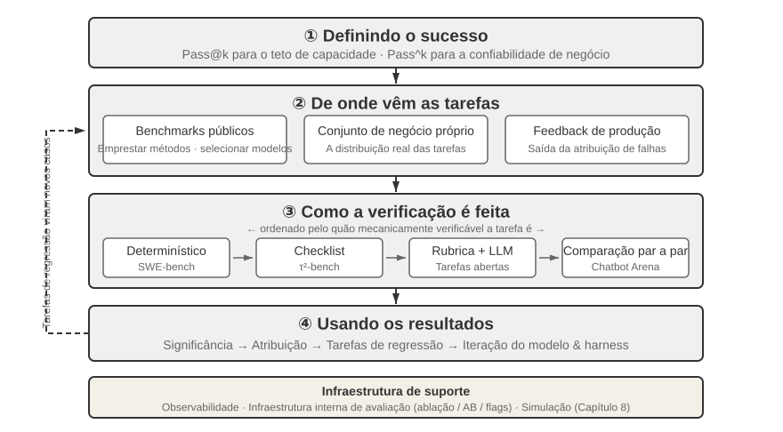
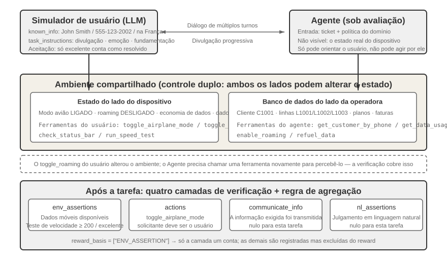
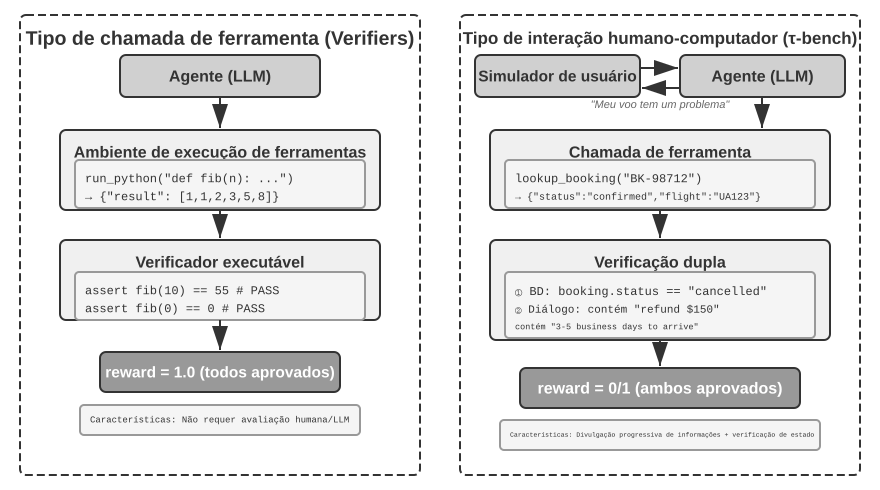
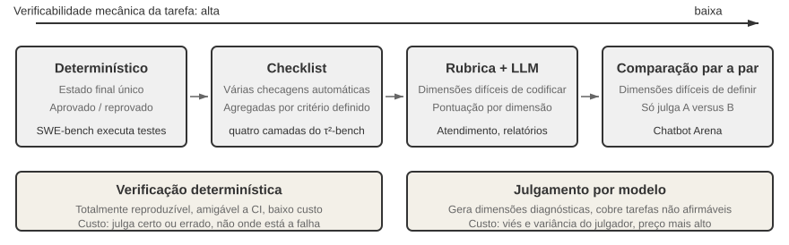
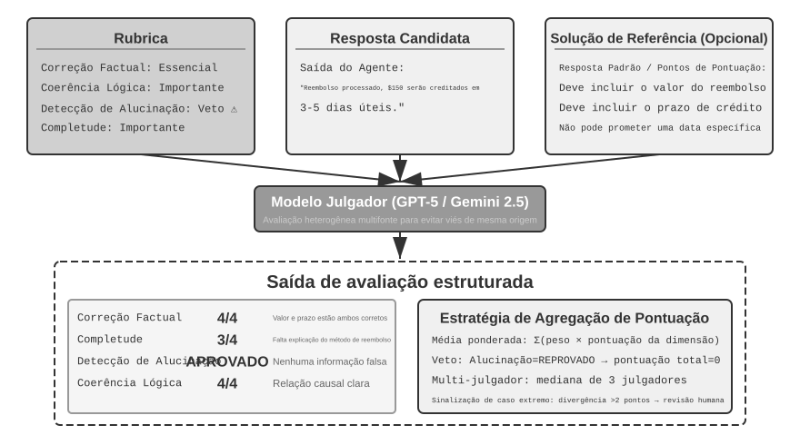
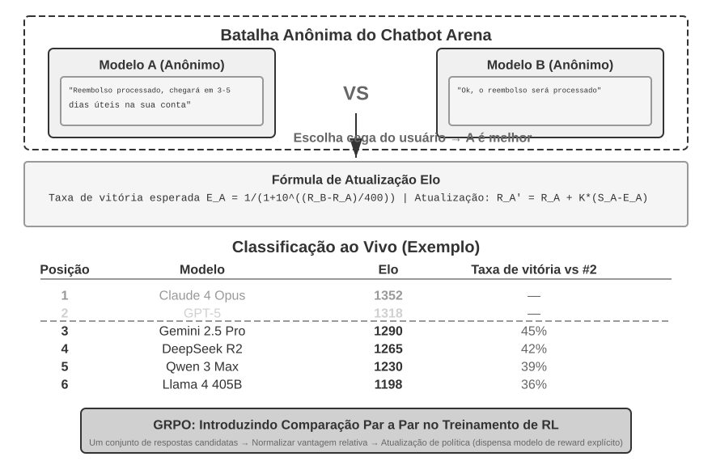
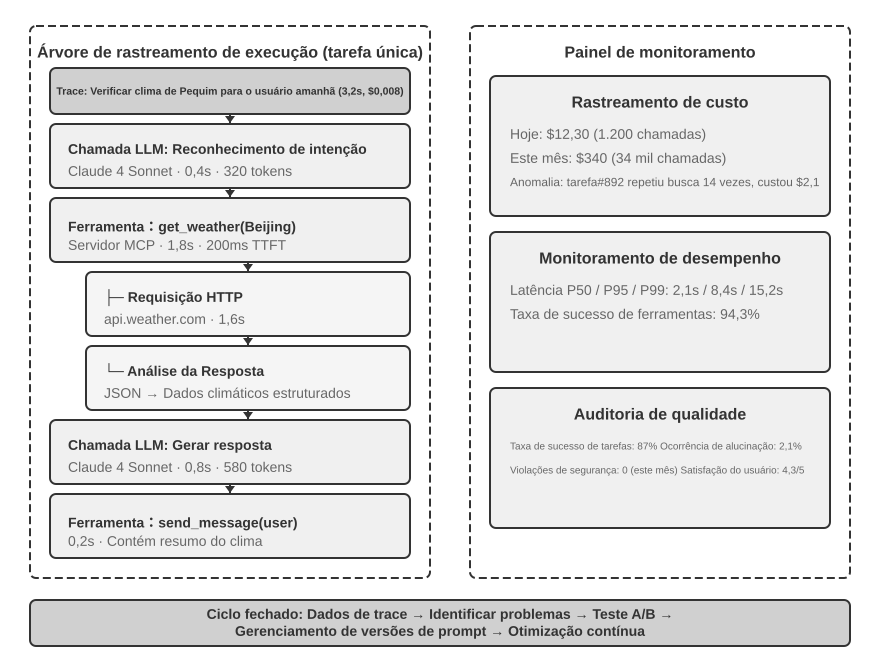
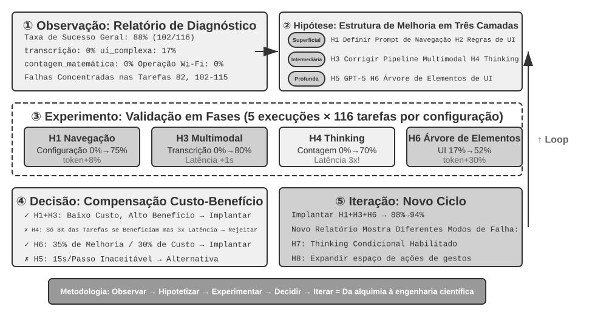
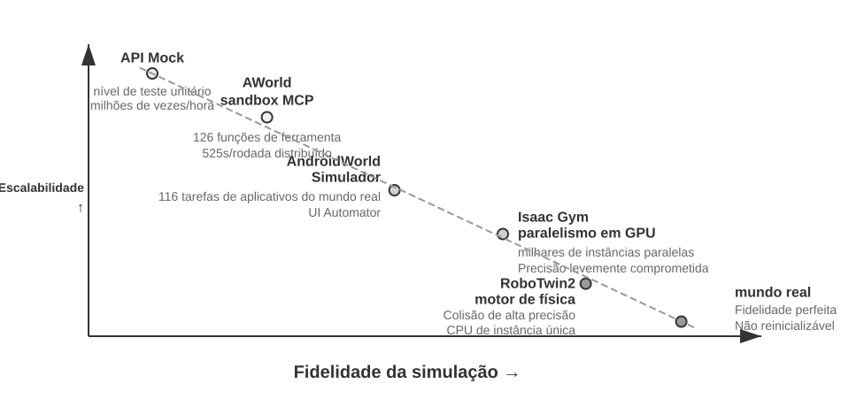
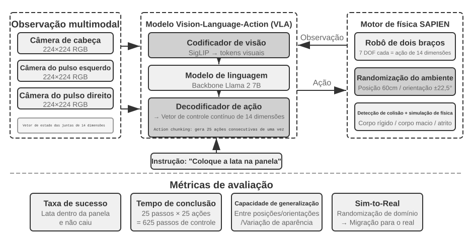

# Avaliação de agentes

Os seis primeiros capítulos mostraram como construir um único agente: seu contexto, conhecimento, ferramentas, recursos de programação e espaços de observação e ação. No entanto, concluir a construção não significa que ela esteja correta; somente medições consistentes podem orientar de maneira confiável o treinamento subsequente do modelo e a evolução do sistema.

Ao construir um sistema agêntico, os desenvolvedores se deparam com inúmeras decisões de projeto que muitas vezes não têm respostas obviamente corretas:

- Qual modelo deve ser usado?
- Quais ferramentas o modelo deve poder chamar?
- Quais dados a base de conhecimento deve armazenar e como eles devem ser estruturados?
- Como implementar a memória do usuário?
- Como organizar os prompts e as Skills do modelo?
- Quais restrições devem ser adicionadas ao harness?
- Como transformar os resultados da avaliação em sinais de aprendizado para a evolução contínua do agente?

A avaliação oferece uma base científica para essas decisões. Por meio de experimentos comparativos sistemáticos — alterando uma variável por vez e observando o efeito — e experimentos de ablação — desativando um componente por vez e observando como o desempenho geral muda —, é possível distinguir ganhos reais de capacidade de oscilações superficiais e evitar melhorias pontuais que prejudiquem o resultado geral. Como se diz na engenharia de software, não se pode melhorar o que não se mede. Sem um sistema de avaliação reproduzível, a evolução de um agente fica restrita à intuição.

Sob a perspectiva da engenharia de harness apresentada no Capítulo 1, a avaliação exerce a função central de “verificação” no harness. Um ponto essencial é: **o objeto da avaliação não deve ser apenas o modelo, mas a combinação do modelo com o harness**. O mesmo modelo pode apresentar desempenhos muito diferentes em harnesses distintos — algumas equipes melhoraram significativamente seu desempenho em tarefas de terminal apenas otimizando o harness (consulte o Capítulo 5). Portanto, quando um agente obtém resultados ruins em uma avaliação, a solução talvez não seja trocar o modelo, mas aprimorar algum componente do harness, como os prompts, o projeto das ferramentas ou os ciclos de feedback. Um sistema de avaliação sólido deve distinguir dois problemas fundamentalmente diferentes: “capacidade insuficiente do modelo” e “falhas no projeto do harness”. **Uma forma comum de diferenciá-los é o experimento de troca de modelo**: mantém-se o harness fixo, substitui-se o modelo por outro mais ou menos capaz e observa-se quanto a pontuação varia. Se um modelo mais capaz não elevar a pontuação, o gargalo estará no harness. Se um modelo menos capaz derrubar a pontuação e os resultados variarem muito conforme a capacidade do modelo, a interpretação mais direta será que o gargalo está no próprio modelo e que ele determina o desempenho atual. É preciso fazer uma análise adicional para saber se isso ocorre porque a tarefa é inerentemente difícil ou porque o harness depende em excesso do conhecimento prévio do modelo. Esse procedimento difere do experimento de ablação mencionado anteriormente: a ablação **desativa um componente do harness** para verificar como o desempenho geral muda; a troca de modelo **mantém o harness fixo e altera apenas o modelo**. O primeiro identifica qual parte do harness é relevante; o segundo revela se o gargalo está no modelo ou no harness.

Um sistema de avaliação torna-se ainda mais valioso em uma época de rápida evolução dos modelos. Embora os modelos continuem avançando, um novo modelo que obtenha pontuação mais alta em benchmarks públicos não necessariamente terá melhor desempenho em sua tarefa — pode até apresentar uma regressão, isto é, ter desempenho inferior ao da versão anterior em alguns aspectos. Somente uma execução completa em seu próprio conjunto de dados de avaliação permite tomar decisões de atualização orientadas por dados. Um sistema de avaliação sólido também torna viável a estratégia de **“desenvolver produtos para modelos futuros”**: se o modelo atual ainda não for adequado para uso comercial, é possível concluir o produto mesmo assim, criar o conjunto de avaliação, acompanhar o desempenho de cada novo modelo e lançar o produto assim que um deles atingir o patamar exigido.

Um sistema completo de avaliação pode ser dividido em quatro etapas: o que é considerado sucesso, de onde vêm as tarefas, quem faz a verificação e como uma pontuação se converte em decisão, como mostra a Figura 7-1.



## Anatomia de uma tarefa de avaliação: o domínio telecom do τ²-bench

Começaremos analisando em detalhes uma tarefa real do domínio telecom do τ²-bench. O τ²-bench é um projeto de código aberto da Sierra; clone-o localmente com o comando indicado em `chapter7/tau2-bench-eval/README.md` e abra o arquivo da tarefa `data/tau2/domains/telecom/tasks_small.json`.

### Os quatro componentes da definição de uma tarefa

A seguir, apresentamos uma tarefa desse arquivo, abreviada para facilitar a leitura.

```jsonc
{
  "id": "[mobile_data_issue]airplane_mode_on|user_abroad_roaming_enabled_off",

  // The ticket handed to the Agent
  "ticket": "The user is unable to browse the internet and the status bar shows
             'No Service'. Customer John Smith, phone 555-123-2002, currently
             abroad in France. They will consider the issue resolved when the
             speed test returns excellent. They will not change their data plan
             but will refuel 2.0 GB of data if necessary.",

  // The behavioral spec handed to the user simulator
  "user_scenario": { "instructions": {
      "known_info": "You are John Smith with phone number 555-123-2002.
                     You are currently abroad in France.",
      "unknown_info": null,
      "task_instructions":
        "…express mild frustration after the first unsuccessful attempt.
         You will consider the issue resolved only when speed test returns
         excellent internet speed and nothing else. If it returns poor, fair
         or good, you will not consider the issue resolved.
         Whenever the agent asks you about your device, always ground your
         responses on the results of tool calls. …
         Never make up the results of tool calls."
  }},

  // Reset both sides to the same starting point before the run
  "initial_state": { "initialization_actions": [
      { "env_type": "user",      "func_name": "turn_airplane_mode_on" },
      { "env_type": "user",      "func_name": "turn_roaming_off" },
      { "env_type": "assistant", "func_name": "enable_roaming",
        "arguments": { "customer_id": "C1001", "line_id": "L1002" } }
  ]},

  // Scoring criteria
  "evaluation_criteria": {
      "actions": [
        { "requestor": "user", "name": "toggle_airplane_mode" },
        { "requestor": "user", "name": "toggle_roaming" }
      ],
      "env_assertions": [
        { "func_name": "assert_mobile_data_status", "expected_status": true },
        { "func_name": "assert_internet_speed",
          "expected_speed": 200, "expected_desc": "excellent" }
      ],
      "communicate_info": null,
      "nl_assertions": null,
      "reward_basis": ["ENV_ASSERTION"]
  }
}
```

Quatro decisões de projeto dessa definição merecem uma explicação mais detalhada.

**O limite do conhecimento do usuário é modelado explicitamente.** `known_info` contém apenas três informações: nome, número de telefone e país. As duas causas reais da falha — o modo avião está ativado e o roaming de dados está desativado — não estão entre elas. O usuário não as conhece e, portanto, não pode informá-las espontaneamente; o agente só pode descobri-las fazendo perguntas e orientando o usuário a realizar verificações. É assim que a **revelação progressiva de informações** é implementada no nível da definição da tarefa: não por meio de um prompt que instrui o simulador a “não revelar tudo de uma vez”, mas pela modelagem do conhecimento do usuário em um campo próprio. A maioria dos benchmarks apresenta todos os requisitos no início da tarefa, enquanto a fala inicial de um usuário real muitas vezes se resume a “não consigo acessar a internet”. Esclarecer uma solicitação até torná-la executável é, por si só, uma das capacidades que um agente precisa ter.

**O simulador recebe uma especificação de comportamento, não um roteiro de falas.** `task_instructions` contém três tipos de restrição: uma configuração emocional — demonstrar leve frustração após a primeira tentativa malsucedida —, um critério de aceitação — o problema só é considerado resolvido quando o teste de velocidade retorna excellent; poor, fair e good não são aceitos — e um requisito de **fundamentação factual (grounding)**: toda resposta sobre o estado do dispositivo deve se basear no resultado de uma chamada de ferramenta, sem jamais inventar esses resultados. O terceiro é o mais importante: sem essa restrição, o usuário simulado seguirá a orientação do agente e confirmará que o problema foi resolvido, reduzindo a avaliação a dois modelos que apenas concordam entre si.

**O estado inicial é dividido de acordo com o lado que o controla.** `env_type` assume dois valores, `user` e `assistant`: o modo avião e o controle de roaming pertencem ao lado do usuário, enquanto `enable_roaming`, do lado da operadora, pertence ao lado do agente. Essa divisão determina a natureza da falha: o roaming está habilitado na operadora, mas desativado no celular do usuário; assim, um agente que consulte o banco de dados verá apenas que a “configuração está normal”. A falha está no lado que o banco de dados não consegue enxergar e só será identificada quando o agente orientar o usuário a fazer a verificação.

**A pontuação é definida em quatro camadas, e esta tarefa usa apenas uma delas.** `env_assertions` verifica o estado final — dados móveis disponíveis, teste de velocidade igual ou superior a 200 Mbps e classificação excellent —; `actions` verifica se as ações essenciais ocorreram e **qual lado as executou**; e `communicate_info` e `nl_assertions` verificam se as informações necessárias foram comunicadas ao usuário. O campo `reward_basis` desta tarefa declara apenas `ENV_ASSERTION`; as demais camadas ainda são calculadas e registradas, mas não entram na recompensa final. A base da pontuação é definida por tarefa, e não fixada globalmente.

### A trajetória de uma execução real

Agora, convidamos o leitor a executar as tarefas de avaliação do domínio de telecomunicações do τ²-bench, observar o design das tarefas, o simulador de usuário, a lógica de verificação do processo e dos resultados, bem como a trajetória de execução do agente, e analisar por que ele falha.

> **Experimento 7-1 ★: executar o τ²-bench e compará-lo com a evolução do τ-bench**
>
> Este experimento executa o framework de avaliação τ²-bench para compreender os principais aspectos do design de um ambiente de avaliação de interação humano-computador. Primeiro, seguindo o percurso desta seção, leia por completo o arquivo de definição das tarefas: cada tarefa contém quatro partes — informações conhecidas, instruções, estado inicial e condições de sucesso. Em seguida, execute todo o fluxo de avaliação, observe o diálogo em vários turnos entre o simulador de usuário e o agente e analise modos de falha típicos, como violações de políticas, omissão de informações e encaminhamento excessivo para um atendente humano.
>
> 

O repositório complementar preserva o registro de uma execução (`chapter7/tau2-bench-eval`). A seguir, analisamos uma execução bem-sucedida desse registro.

Os primeiros doze turnos, aproximadamente, correspondem à fase de identificação da conta. O agente localiza o cliente C1001 pelo número de telefone, consulta uma a uma as franquias de dados das três linhas — L1001, L1002 e L1003 — e depois volta a perguntar qual número o usuário está de fato usando na França. Na mensagem 17, ele chega a uma conclusão incorreta:

> **Agente** (17): O número 555-123-2002 não está entre suas linhas ativas. O número mais próximo é 555-123-2001…

Essa conclusão se baseia apenas na consulta da linha L1001. Depois que o usuário insiste que o número está correto, o agente consulta a L1002 e finalmente encontra a correspondência. O momento decisivo ocorre na mensagem 30:

> **Usuário** (30) → chama `check_network_status()`, `check_status_bar()`
>
> **Retorno da ferramenta** (31): `Airplane Mode: ON | Cellular Connection: no_service | Mobile Data Enabled: Yes | Data Roaming Enabled: No`
>
> **Usuário** (33): Vejo que meu telefone está no modo avião, por isso está sem sinal. Os dados móveis estão ativados, mas o roaming de dados está desativado. Devo desligar o modo avião e tentar novamente?

Quem emite a chamada de ferramenta é o **usuário**, não o agente. Esse é o mecanismo de **controle duplo (Dual-Control)**: o usuário simulado dispõe de um conjunto próprio e independente de ferramentas, entre elas `check_status_bar`, `toggle_airplane_mode`, `reseat_sim_card` e `run_speed_test`.

O restante do diagnóstico transcorre sem dificuldades: o agente pede ao usuário que desligue o modo avião e ative o roaming; o usuário realiza as duas ações (35, 37), e a barra de status passa a exibir sinal 5G máximo. O agente solicita um teste de velocidade, que retorna 275 Mbps e a classificação Excellent (46), e o usuário confirma que o problema foi resolvido. As duas `env_assertions` são aprovadas, e `reward = 1.0`.

Essa trajetória com pontuação máxima também contém um problema que o verificador não detectou. O primeiro parágrafo da política do agente de telecomunicações afirma: “You should only make one tool call at a time”. No entanto, na mensagem 4, o agente emitiu `get_customer_by_phone` e `get_customer_by_name` no mesmo turno. O verificador não considerou isso um erro porque o `reward_basis` dessa tarefa leva em conta apenas o estado final. Isso não é uma falha do τ²-bench, mas o custo inerente a uma recompensa binária: troca-se a granularidade do processo por um único número comparável entre modelos. Sistemas de avaliação em produção, porém, costumam exigir mais: não basta determinar se o resultado está certo; é preciso também indicar onde está o problema.

Também vale a pena analisar a tarefa que falhou. O número do usuário é 555-123-2002, mas o agente escolheu a linha L1001 e continuou raciocinando com base no consumo de 3,2/5 GB dessa linha. Durante o processo, `get_details_by_id(L1001)` retornou explicitamente 555-123-2001 como o número da linha. O agente leu o resultado, mas não reviu sua conclusão; depois, gastou dezenas de mensagens em diagnósticos irrelevantes e, por fim, encaminhou o caso a um atendente humano. Na prática, ele concluiu metade da tarefa: orientou o usuário a desativar o modo de economia de dados, e essa ação no dispositivo realmente ocorreu e foi verificada pelo ambiente. Porém, como a linha selecionada estava errada, a recarga necessária de 2 GB não foi realizada, e as três asserções de estado final falharam. Esse tipo de falha é muito semelhante ao caso do AndroidWorld discutido adiante, na seção “Atribuição de falhas”: a evidência necessária para corrigir a conclusão já estava no contexto, mas o agente não voltou atrás com base nela.

Essa única tarefa já reúne todas as perguntas que um conjunto de avaliação precisa responder: o que é considerado sucesso, de onde vêm as tarefas, quem faz a verificação e como a pontuação se transforma em decisão. As próximas seções abordam essas questões em sequência.

## Métricas de avaliação: definição de sucesso

Na seção anterior, quatro de cinco tarefas foram aprovadas. O número 0,8, isoladamente, não permite saber se o sistema é utilizável. Se ele corresponder a um agente de atendimento responsável por reembolsos, significa que um em cada cinco usuários não recebe o reembolso devido. Se corresponder a um agente de segurança usado para procurar vulnerabilidades, acertar quatro vezes em cinco já é um resultado bastante respeitável. A diferença está na taxa de sucesso exigida pelo cenário de negócios.

### Proezas técnicas: o limite de capacidade com Pass@k

Muitos modelos e agentes atuais ainda estão em uma fase que pode ser chamada de **“proeza técnica”**. A “proeza” é o limite de capacidade demonstrado após muitas tentativas, com tempo abundante e seleção humana: basta um sucesso para provar que algo é possível em princípio. Essa é exatamente a lógica do **Pass@k** — executar a mesma tarefa $k$ vezes e considerá-la aprovada se pelo menos uma execução tiver sucesso; quando a saída for uma pontuação contínua, toma-se o melhor resultado, denominado **Best@k**.

A discussão da Anthropic sobre agentes de longa duração ilustra esse tipo de limite: permitir que um agente trabalhe de forma autônoma por uma semana e escreva um compilador C do zero; fazê-lo explorar até encontrar um contraexemplo para uma importante conjectura matemática; ou levá-lo a revisar repetidamente software de código aberto até descobrir uma grave vulnerabilidade de segurança existente há décadas.

Em explorações de engenharia e pesquisa desse tipo, o que geralmente se demonstra não é “acertar sempre”, mas uma trajetória decisiva que finalmente surge quando o orçamento de exploração é ampliado o suficiente. Para tarefas como descobertas científicas, busca de vulnerabilidades e criação aberta, esse limite de capacidade tem valor por si só: um ser humano pode selecionar a melhor entre $k$ trajetórias candidatas.

Além dos laboratórios que desenvolvem modelos-base, muitas empresas de aplicações também adotam a estratégia da “proeza técnica”. O Manus atraiu ampla atenção porque ofereceu um computador virtual, permitindo que pessoas sem uma noção intuitiva de agentes descobrissem que a IA pode operar um computador como um ser humano — trabalhando por meia hora ou até uma hora e concluindo gradualmente uma tarefa complexa.

O OpenClaw fez muitas pessoas sentirem pela primeira vez que um agente poderia parecer um colega de verdade. Os usuários atribuem tarefas a ele por um aplicativo de mensagens instantâneas, como fariam com uma pessoa; ele pode acessar todos os arquivos do computador e os serviços online, fornece atualizações ou solicita novas informações ao chegar a determinado estágio e pode até despertar a si próprio para consultar e processar e-mails.

As primeiras versões do Manus e do OpenClaw não apresentavam taxas de sucesso elevadas em tarefas complexas, e seus custos de tokens eram muito altos. Contudo, como esses frameworks de agentes são de propósito geral, tarefas complexas costumam alcançar um Pass@k alto quando combinadas com os modelos mais avançados, o que demonstra um elevado limite técnico. Essas “proezas técnicas” foram amplamente compartilhadas nas redes sociais e tiveram papel decisivo no sucesso desses produtos.

### Confiabilidade nos negócios: foco no Pass^k

Empresas reais geralmente se preocupam com outra questão: não cometer nenhum erro em várias tentativas. Chamamos essa meta de **Pass^k** (lido como **Pass consecutive k**): executar a mesma tarefa $k$ vezes seguidas, exigir que todas as execuções sejam aprovadas e não permitir nenhuma ocorrência eliminatória, seja de segurança, conformidade ou alucinação. Essa métrica responde à pergunta “o agente consegue entregar resultados de forma estável e confiável?”, e não “ele consegue fazer um milagre de vez em quando?”.

Se as execuções forem independentes e a taxa de sucesso de uma única execução for $p$, a relação entre as duas métricas será direta:

$$
\mathrm{Pass@k}=1-(1-p)^k,\qquad
\mathrm{Pass}^{k}=p^k.
$$

Por exemplo, com $p=0.6$ e $k=5$, Pass@5 $=1-0.4^5\approx99.0\%$ — parece que quase sempre haverá “ao menos um sucesso”. Já Pass consecutive@5 $=0.6^5\approx7.8\%$, o que mostra que ainda é difícil concluir cinco execuções consecutivas sem erros. O primeiro número é adequado para medir o limite de capacidade durante a exploração; apenas o segundo se aproxima dos requisitos de confiabilidade de cenários como pagamentos, reembolsos, alterações de permissões e implantações em produção.

O relatório de avaliação deve esclarecer exatamente o que representam as $k$ tentativas: $k$ amostragens independentes da mesma tarefa ou $k$ tarefas consecutivas em um pipeline de produção. Em operações com efeitos colaterais, não se pode simplesmente “tentar novamente até funcionar”. Em vez disso, as amostras devem ser executadas em uma sandbox ou em um ambiente que permita reversão, e cada falha deve ser contabilizada na métrica de confiabilidade.

## O ambiente de avaliação

Depois de definir a métrica, a próxima pergunta é onde realizar os testes. Um ambiente de avaliação é uma estrutura que pode ser executada repetidamente: dado o mesmo estado inicial, o mesmo agente deve produzir resultados comparáveis.

### Os cinco componentes

Voltemos à tarefa de telecomunicações analisada anteriormente. Tomando-a como referência, já estão presentes todos os elementos necessários para um ambiente de avaliação reproduzível.

O **conjunto de dados (Dataset)** é o próprio arquivo de tarefas: o estado inicial, o chamado destinado ao agente, as especificações de comportamento do simulador e os critérios de aceitação são reunidos em um único registro, e cada registro corresponde a um caso de teste.

O **estado do ambiente (Environment State)** consiste nas informações mutáveis durante a execução da tarefa: clientes, linhas, planos e faturas no banco de dados, além do modo avião, do roaming, do controle de economia de dados e da franquia restante no dispositivo. Esse estado deve poder ser redefinido, e `initialization_actions` é o script de redefinição. Para haver realismo, as mudanças de estado devem seguir a lógica de negócios; para haver controle, cada execução deve começar no mesmo ponto.

As **ferramentas (Tools)** pertencem a dois lados. O agente pode chamar operações da operadora, como consultar um cliente, verificar o consumo, recarregar dados e transferir o atendimento para um humano; o usuário pode acionar os controles do dispositivo. Os dois conjuntos de ferramentas são compostos por operações atômicas — não existe uma abstração de alto nível como “resolver o problema de conexão do usuário”. Um nível de abstração alto demais reduz a avaliação ao teste de uma única chamada de função, pois o planejamento e o raciocínio acabam incorporados à própria ferramenta.

A **rubrica (Rubric)** corresponde às quatro camadas de verificações em `evaluation_criteria`, somadas à regra de agregação em `reward_basis`.

O **protocolo de interação (Interaction Protocol)** especifica a ordem das interações e as condições de encerramento. Nesse caso, o sinal normal de encerramento é a emissão de `###STOP###` pelo usuário simulado. Há também um limite de turnos, e o usuário simulado pode encerrar a conversa por iniciativa própria quando sua paciência se esgota — a baixa eficiência da comunicação já é considerada uma falha.

Sem qualquer um desses cinco elementos, a avaliação deixa de formar um ciclo reproduzível. Eles também servirão como referência ao examinarmos outros benchmarks adiante.

### Ambientes de avaliação de interação humano-computador e chamada de ferramentas

Tarefas como as de telecomunicações precisam de uma contraparte com a qual interagir, por isso a simulação do usuário é indispensável entre os cinco componentes. Há outra grande classe de tarefas em que não existe contraparte conversacional: em geração de código, análise de dados e resolução de problemas matemáticos, o agente interage apenas com ferramentas do início ao fim, a correção é determinada pela aprovação na verificação de execução e não são necessários nem anotação humana nem julgamento por modelo. Esses ambientes dispensam o simulador de usuário; os outros quatro componentes permanecem, mas assumem formas mais simples — o estado do ambiente é um sistema de arquivos ou banco de dados, o critério de avaliação é um trecho de código de teste e o protocolo de interação se reduz a “continuar chamando ferramentas até produzir uma resposta ou esgotar o limite de turnos”.

O framework Verifiers organiza esses ambientes segundo duas dimensões: se a tarefa precisa manter o estado entre turnos e se requer isolamento. `SingleTurnEnv` é adequado para fazer uma pergunta de matemática e verificar diretamente a resposta; `ToolEnv`, para pesquisar várias páginas da web, sintetizar uma resposta e então verificar o resultado final; `StatefulToolEnv`, para modificar um registro de banco de dados e depois verificar a alteração de estado; e `SandboxEnv`, para executar código em uma sandbox e então verificar os arquivos de saída. A Tabela 7-1 resume esses quatro tipos de ambiente, facilitando a escolha conforme os requisitos de estado da tarefa, chamada de ferramentas e isolamento.

Tabela 7-1 Comparação dos tipos de ambiente do Verifiers

| Tipo de ambiente | Persistência de estado | Chamadas de ferramenta | Caso de uso típico |
|---|---|---|---|
| SingleTurnEnv | Nenhuma | Nenhuma | Perguntas e respostas em um único turno, problemas matemáticos |
| ToolEnv | Nenhuma | Vários turnos | Pesquisa + síntese de informações |
| StatefulToolEnv | Sim | Vários turnos | Modificação de registros de banco de dados |
| SandboxEnv | Sim + isolamento | Vários turnos | Execução e teste de código |

O framework oferece suporte a amostragem paralela e cache de trajetórias; a trajetória completa de cada avaliação — observações, ações e recompensas — é salva para análise e replay posteriores. Além disso, o efeito de uma ferramenta depende do estado atual. Portanto, em caso de falha, ela deve retornar uma mensagem de erro clara, e não apenas um indicador de falha, para que o agente possa ajustar sua estratégia.

A avaliação de chamada de ferramentas examina a correção das alterações observáveis de estado, enquanto a avaliação de interação humano-computador examina a adequação da estratégia de comunicação — a primeira verifica a ação; a segunda, a orientação. A Figura 7-2 compara a estrutura dos dois tipos de ambiente.



## Projeto do conjunto de dados de avaliação

O ambiente de avaliação é o palco, e o conjunto de dados é o roteiro. Os mesmos cinco componentes, quando aplicados a outra classe de tarefas, podem ser preenchidos de maneiras completamente diferentes: de onde vêm as tarefas, até que ponto o verificador consegue checá-las e como impedir a memorização. Esta seção parte das práticas de projeto de vários benchmarks públicos e termina com uma questão mais prática: de onde devem vir as tarefas de um conjunto de avaliação próprio.

### Comparação das escolhas de projeto entre benchmarks

A presença ou ausência de uma contraparte interativa, distinguida na seção anterior, é apenas a primeira diferença no nível do ambiente; as divergências no nível do conjunto de dados revelam com mais clareza as decisões de projeto. A Tabela 7-2 apresenta lado a lado vários benchmarks citados com frequência.

Tabela 7-2 Principais escolhas de projeto de vários benchmarks de agentes

| Benchmark | Capacidade avaliada | Origem das tarefas | Papel do ambiente | Verificador |
|---|---|---|---|---|
| τ²-bench | Interação humano-computador e chamada de ferramentas no atendimento ao cliente | Elaboração manual + geração combinatória | Simulador de usuário + banco de dados corporativo | Quatro camadas de verificações agregadas em resultado binário por `reward_basis` |
| SWE-bench Verified | Desenvolvimento de software, programação | Issues reais do GitHub, selecionadas manualmente | Repositório de código + suíte de testes | Verificação dupla FAIL\_TO\_PASS / PASS\_TO\_PASS |
| AndroidWorld | Operação da GUI de um dispositivo Android | Instanciação de templates parametrizados | Emulador Android real | Asserções sobre o estado final da interface |
| OSWorld | Operação da GUI de um desktop Linux | Inicialização a partir de um estado intermediário predefinido | Máquina virtual real | 134 funções de avaliação independentes |
| Terminal-Bench | Operação do terminal Linux, programação | Elaboração manual | Contêiner Docker | Verificações do sistema de arquivos + execução real |
| GAIA | Assistente de IA de propósito geral para coleta de informações | Elaboração manual + anexos exclusivos | Internet aberta | Correspondência exata de strings |

### Verificadores

Um agente pode facilmente escrever um relatório extenso afirmando que a tarefa foi concluída por inteiro quando, na verdade, nada disso aconteceu. Um framework de avaliação deve verificar fatos que uma máquina possa confirmar de forma independente, e não as alegações do próprio agente.

**O SWE-bench Verified decompõe “a correção foi concluída” em duas proposições independentes.** A primeira é FAIL\_TO\_PASS: falhar antes da correção e passar depois dela, comprovando que o problema foi de fato resolvido. A segunda é PASS\_TO\_PASS: passar antes e depois, comprovando que nenhum novo defeito foi introduzido. Se apenas a primeira for verificada, o agente poderá burlar o teste excluindo ou reescrevendo as asserções que impedem a aprovação; se apenas a segunda for verificada, nada terá sido efetivamente testado. Somente a verificação de ambas permite demonstrar separadamente que “foi corrigido” e que “nada foi quebrado”. O benchmark também confirma a estabilidade dos próprios testes, excluindo testes instáveis (*flaky tests*), que ora passam, ora falham.

**O verificador do OSWorld consegue detectar casos de conclusão aparente, mas com erros concretos.** Ele conta com 134 funções de avaliação independentes e acesso completo ao sistema operacional, podendo inspecionar a estrutura do sistema de arquivos, o estado dos processos, as conexões de rede e o estado interno dos aplicativos. Em uma tarefa de banco de dados, o script de avaliação não apenas confirma a existência do arquivo de relatório, mas também se conecta ao banco de dados para verificar se o SQL foi realmente executado. Em uma tarefa no navegador, ele analisa a árvore DOM, inspeciona cookies e o localStorage e envia solicitações de verificação ao backend para confirmar que o formulário realmente produziu o efeito esperado.

A tarefa `build-linux-kernel-qemu` do **Terminal-Bench** exige compilar o kernel Linux 6.9 a partir do código-fonte, adicionar um printk personalizado em `start_kernel`, gerar um initramfs e executá-lo no QEMU; o critério de sucesso é a presença da mensagem personalizada no log de inicialização. O agente não pode forjar a saída: precisa concluir todo o processo de fato.

### Classificação das tarefas por dificuldade

Um conjunto de tarefas de avaliação precisa incluir tarefas com diferentes níveis de dificuldade. Assim, ele não se torna obsoleto rapidamente à medida que a capacidade dos modelos evolui.

O conjunto completo do GAIA, com 466 perguntas, divide-se em três níveis de dificuldade: o Nível 1 requer apenas uma ou duas ferramentas (humanos: 93,9%; GPT-4: 30,3%); o Nível 2 requer raciocínio em várias etapas (91,8% contra 9,7%); e o Nível 3 requer composição complexa (87,3% contra 0%). Essa classificação não apenas indica a dificuldade, mas também tem valor diagnóstico. Uma falha no Nível 1 aponta para problemas no uso básico de ferramentas; no Nível 2, para planejamento em várias etapas e integração de informações; e no Nível 3, para raciocínio em sequências longas e gestão da complexidade. Cada nível, portanto, indica uma direção de melhoria distinta.

O Terminal-Bench abrange desde tarefas simples, como o registro de modelos no MLflow, passando por tarefas de dificuldade média, como quebrar senhas do 7-Zip, e tarefas difíceis, como integrar vários componentes de um servidor Git e um servidor web, até a criptoanálise diferencial do FEAL, no nível mais alto de dificuldade.

O τ²-bench também inclui **tarefas-armadilha**, nas quais o usuário afirma que “o atendimento ao cliente já aprovou o cancelamento”, embora isso não esteja de acordo com a política, para testar se o agente mantém o julgamento correto diante de pressão e informações enganosas.

### Prevenção de contaminação de dados

**O GAIA torna impossível recuperar as respostas diretamente da internet.** Suas tarefas têm conceitos simples, mas caminhos de resolução abertos. Por exemplo: partir da Imagem Astronômica do Dia da NASA em determinada data, identificar o astronauta na imagem, descobrir a qual grupo de astronautas ele pertencia, determinar qual integrante desse grupo passou menos tempo no espaço e formatar a saída estritamente como “sobrenome; separado por ponto e vírgula; com separadores de milhar”. A resposta é extremamente específica, e a correção é determinada por correspondência exata de strings. A prevenção de vazamentos se baseia em dois pontos: primeiro, a pergunta só pode ser respondida combinando várias fontes de informação, de modo que nenhuma página da web isolada forneça a resposta diretamente; segundo, algumas tarefas incluem anexos produzidos especialmente para elas — PDFs, áudios e imagens que não existem na internet.

**O AndroidWorld deriva muitas instâncias de um único template.** Suas tarefas não são textos estáticos, mas templates que podem ser instanciados dinamicamente, como “altere o telefone do contato `[CONTACT_NAME]` para `[NEW_PHONE]`”, com valores de parâmetros gerados aleatoriamente a cada avaliação. Isso traz três benefícios: os parâmetros mudam a cada vez, tornando inútil repetir uma sequência fixa de ações; um único template pode gerar um número quase ilimitado de instâncias; e manter alguns parâmetros fixos enquanto outros variam permite medir com precisão o efeito de um fator específico.

**O Terminal-Bench incorpora um identificador-canário no enunciado da tarefa.** Cada tarefa contém um GUID canário; se um modelo conseguir produzir conteúdo que inclua esse GUID, isso indica que os dados do benchmark entraram no conjunto de treinamento. O mecanismo não impede o vazamento, mas permite detectá-lo.

### Controle de qualidade e manutenção de longo prazo

Criar um conjunto de avaliação de alta qualidade é muito difícil. A forma atual da maioria dos benchmarks apresentados acima resulta de sucessivas correções feitas depois que a primeira versão entrou em uso e seus problemas vieram à tona. Na evolução do τ-bench para o τ²-bench, por exemplo, houve cinco reformulações de projeto.

Primeiro, **as instruções das tarefas eram genéricas demais, permitindo que a resposta fosse adivinhada**. Na primeira versão, as instruções eram amplas, de modo que o modelo não precisava realmente esclarecer a necessidade: bastava inferir, com base no senso comum, um fluxo de trabalho plausível para ser aprovado. O τ²-bench dividiu o roteiro em dois campos, `known_info` e `task_instructions`: o primeiro delimita o que o usuário sabe; o segundo determina como as informações devem ser reveladas. O agente não pode adivinhar o que o usuário desconhece; só pode obter essas informações por meio de consultas.

Segundo, **as condições de sucesso não eram precisas o suficiente, o que causava erros de verificação**. Uma condição como “a rede voltou a funcionar” não estabelece limites verificáveis. O τ²-bench a substituiu por “o problema só será considerado resolvido se o teste de velocidade retornar `excellent`; `poor`, `fair` e `good` não serão aceitos”. Essa mudança combate as **correções superficiais**, que apenas suprimem o sintoma sem resolver a causa raiz.

Terceiro, **o simulador de usuário se comportava de maneira mecânica demais**. Na primeira versão, o usuário simulado apenas respondia passivamente. O τ²-bench acrescentou emoções — como demonstrar insatisfação após a primeira tentativa de correção fracassar —, um limite de paciência — encerrando a conversa quando a comunicação é pouco eficiente — e a exigência de se ater aos fatos. Juntos, esses elementos aproximam o simulador de um usuário real sem comprometer a reprodutibilidade.

Quarto, **o usuário participa não apenas da conversa, mas também das operações**. O domínio de telecomunicações introduziu um ambiente de controle duplo. Nas avaliações anteriores, somente o agente podia alterar o ambiente, mas, em cenários de suporte técnico, uma parcela considerável das ações deve ser executada pelo usuário no próprio dispositivo. O controle duplo também acrescenta uma dimensão à verificação: depois que o usuário altera o estado, o agente precisa chamar novamente uma ferramenta para saber o resultado. Assim, a verificação passa a abranger se o agente realmente leu o resultado das ações executadas pelo usuário.

Quinto, **as instâncias das tarefas são geradas dinamicamente**. As instâncias concretas do τ²-bench — nomes de usuários, números de telefone e combinações de falhas — podem ser geradas em lote com base em parâmetros, o que melhora tanto a cobertura quanto a resistência a vazamentos.

**SWE-bench Verified: 71% das tarefas originais foram eliminadas antes do lançamento.** A OpenAI selecionou aleatoriamente 1.699 das 2.294 tarefas originais para avaliação humana e recrutou 93 desenvolvedores proficientes em Python para verificar, uma a uma, se a descrição do problema era clara, se os casos de teste cobriam as condições-limite, se os testes eram estáveis, se o patch de referência introduzia novos erros e se o grau de dificuldade era razoável. Ao final, apenas 500 foram aprovadas. A alta taxa de eliminação proporciona uma relação sinal-ruído melhor e reduz o custo de avaliação em cerca de 80%. Tarefas complexas executadas por agentes costumam levar de minutos a horas, e a execução de um conjunto de avaliação completo com um modelo de ponta frequentemente custa milhares de dólares em tokens. Portanto, reduzir o custo de avaliação é muito importante.

**OSWorld: mais de 300 problemas vieram à tona nos 15 meses após o lançamento.** Lançado em abril de 2024, ele rapidamente se tornou um benchmark importante para a avaliação de agentes multimodais. Seu uso disseminado revelou quatro categorias de problemas: problemas no ambiente — medidas antirraspagem, CAPTCHAs e mudanças em conteúdo dinâmico —, problemas na descrição das tarefas — formulações ambíguas —, problemas na lógica de verificação — rigor excessivo ou insuficiente — e problemas no estado inicial — configuração incompleta. Uma equipe de cerca de dez pessoas da Universidade de Hong Kong trabalhou por dois meses, em estreita colaboração com MoonShot AI, OpenAI, ByteDance Seed TARS, Anthropic, Simular e outras organizações, em uma correção sistemática. Os problemas no ambiente foram resolvidos com o bloqueio de versões e backups offline; os problemas nas descrições, com a reformulação de trechos ambíguos; os problemas de verificação, com o estabelecimento manual de baselines corretas e o ajuste das condições; e os problemas no estado inicial, com a inclusão de verificações de integridade.

> **Experimento 7-2 ★: executar manualmente tarefas de benchmarks**
>
> Selecione tarefas do GAIA, AndroidWorld, SWE-Bench Verified, Terminal-Bench e OSWorld-Verified e conclua-as manualmente. Recomenda-se realizar uma tarefa fácil, uma média e uma difícil de cada conjunto de dados. O nível “difícil” também representa um desafio para humanos.
>
> Depois, responda a duas perguntas. A descrição da tarefa admite mais de uma interpretação razoável? Em caso afirmativo, qual delas é aceita pelo verificador? Se você tentasse ser aprovado sem fazer o trabalho, qual seria o caminho de menor custo? O verificador conseguiria impedi-lo?

### Três fontes de um conjunto de avaliação

Uma visão comum sustenta que os benchmarks públicos servem para classificar modelos e têm pouca relação com necessidades reais de negócio. De fato, é difícil traduzir diretamente as pontuações desses benchmarks em decisões de produto, mas suas técnicas de projeto são perfeitamente transferíveis. A profundidade da verificação, a geração parametrizada, a prevenção de vazamentos e a manutenção da qualidade — temas discutidos acima — são justamente os aspectos mais propensos a ser negligenciados em conjuntos de avaliação próprios.

Em produção, um conjunto de avaliação geralmente tem três fontes.

**Benchmarks públicos** são usados para uma triagem inicial de modelos e como referência para técnicas de projeto, mas, em geral, não orientam decisões de produto. A distribuição de suas tarefas não corresponde à distribuição das tarefas reais do negócio: uma melhoria de dois pontos percentuais no GAIA não tem relação necessária com a taxa de sucesso dos reembolsos.

**Um conjunto próprio de tarefas de negócio** abrange a distribuição real das tarefas e pode fundamentar a seleção de modelos e as decisões de projeto do harness. O τ²-bench, por exemplo, pode servir de estrutura para um sistema de avaliação que exija um usuário simulado; basta substituir os dados do domínio e o conjunto de ferramentas.

**O retorno de trajetórias de produção** vem de falhas reais ocorridas em produção: casos em que o usuário corrigiu explicitamente o agente, deu uma avaliação negativa ou em que uma verificação posterior de estado, um verificador baseado em regras ou uma análise por LLM detectou um problema. Após a atribuição da falha, esses casos são incorporados como casos de regressão. O método concreto é descrito adiante nas seções “Atribuição de falhas” e “Tarefas de regressão de ponta a ponta e de prefixos de trajetórias”. Essa é a fonte mais cara, mas também a mais precisa, pois deriva diretamente dos problemas que os usuários realmente encontraram.

No estágio inicial, geralmente há apenas benchmarks públicos e um pequeno conjunto próprio de tarefas de negócio elaborado manualmente. Depois que o sistema opera em produção por algum tempo, os casos provenientes das trajetórias de produção passam a constituir a maior parte do conjunto.

## Métodos de avaliação automatizada

Os benchmarks discutidos nas seções anteriores têm algo em comum: seus verificadores são quase todos determinísticos. O SWE-bench executa uma suíte de testes, o AndroidWorld verifica o estado final da interface do usuário, o GAIA faz correspondência exata de strings, e as quatro camadas de verificação do τ²-bench também são executadas integralmente por código. Há boas razões para essa escolha: a verificação determinística não acrescenta custos de modelo, produz resultados totalmente reprodutíveis, pode ser incorporada à integração contínua como um teste unitário e facilita a classificação entre diferentes modelos.

A desvantagem é que ela só consegue avaliar se o resultado final está correto, sem explicar o motivo do erro. A tarefa do τ²-bench que fracassou acima recebeu pontuação 0, mas esse zero não informa se o agente errou na etapa de seleção da linha ou se omitiu a recarga do pacote de dados, muito menos o que deve ser alterado em seguida. Para um benchmark público usado em classificações, isso não é uma deficiência; para um sistema de produção que precisa de melhoria contínua, essa é justamente a informação mais necessária.

Os cenários de produção apresentam ainda outra dificuldade: muitos julgamentos simplesmente não podem ser expressos como asserções verificáveis por código. Uma resposta a uma reclamação foi redigida de forma adequada? Um relatório de pesquisa omitiu alguma informação essencial? Uma recuperação de memória confundiu a relação entre pessoas? Nenhum desses casos possui um estado final único que possa ser consultado, tampouco pode ser avaliado por correspondência de palavras-chave.

Portanto, a passagem dos benchmarks públicos para a avaliação em produção exige que o método de verificação se desloque para a direita ao longo de um espectro cujo eixo horizontal representa o **grau em que uma tarefa pode ser verificada mecanicamente**, como mostra a Figura 7-4.



Assim, os dois instrumentos à direita do espectro tornam-se os principais recursos da avaliação em produção: uma **rubrica**, que decompõe a pergunta vaga “qual é a qualidade?” em várias dimensões que podem ser pontuadas separadamente, e o **LLM como avaliador**, que atribui a pontuação quando não há critérios determinísticos. Somente em conjunto eles conseguem transformar uma taxa geral de falhas em problemas concretos que podem ser corrigidos. Combinados à **atribuição de falhas**, abordada na segunda metade desta seção, eles formam o ciclo completo de avaliação de um agente em produção.

Vale ressaltar que se deslocar para a direita não significa abandonar o lado esquerdo. Toda verificação que puder ser expressa como uma asserção programática deve continuar sendo uma asserção; o julgamento por LLM deve ser reservado às dimensões que realmente não podem ser avaliadas mecanicamente. As verificações determinísticas são mais baratas, mais estáveis e muito mais adequadas à execução contínua como testes de regressão no longo prazo.

### LLM como avaliador: o núcleo da avaliação automatizada



Por que precisamos de LLM como avaliador? Em tarefas abertas, como gerar relatórios, tratar reclamações de clientes e produzir conteúdo criativo, não há respostas-padrão que permitam uma comparação automática, e a avaliação humana é cara e difícil de escalar. O LLM como avaliador equilibra a escala da automação com o julgamento de especialistas humanos ao usar um modelo de linguagem para avaliar resultados segundo critérios de pontuação definidos por especialistas, ou seja, uma Rubric.

Esse método, porém, tem limitações conhecidas: o modelo avaliador pode ter seus próprios vieses, e avaliações repetidas da mesma entrada podem variar. O caso mais comum é o **viés de extensão**, isto é, a tendência de atribuir notas mais altas a respostas mais longas e detalhadas, ainda que não estejam mais corretas — como alguém que, em uma prova, discorre longamente sobre uma questão cuja resposta desconhece, na esperança de acertar um ou dois pontos. Há três medidas de proteção comuns: penalizar explicitamente a prolixidade na Rubric e limitar a extensão das respostas por tipo de tarefa; em comparações entre pares, aproximar a extensão dos dois candidatos antes de avaliá-los; e auditar regularmente a correlação entre as notas e a extensão das respostas — se as notas altas quase sempre estiverem associadas a respostas longas, o avaliador terá sido influenciado pela extensão, e a Rubric precisará ser revisada. Para enfrentar esses desafios de forma sistemática, o projeto da Rubric deve seguir os princípios abaixo:

**Rubric (critérios de pontuação): a base da avaliação pelo LLM.**

**Quatro princípios da Rubric** (Scale AI, “Rubrics as Rewards”):

(1) **Baseada na orientação de especialistas** — A Rubric deve refletir o conhecimento do domínio e capturar os fatos essenciais e as etapas de raciocínio. Uma Rubric para perguntas e respostas médicas, por exemplo, precisa incluir critérios diagnósticos e os erros médicos que devem ser evitados; sem uma base especializada, ela só consegue capturar características superficiais, como a fluência.

(2) **Cobertura abrangente** — A Rubric deve abranger precisão factual, coerência lógica, completude e segurança. Além de definir critérios positivos, deve identificar explicitamente as **armadilhas (Pitfalls)**, isto é, erros comuns de alto risco, como recomendar terapias não comprovadas em orientações médicas.

(3) **Ponderação padronizada por importância** — Classifique os critérios como itens essenciais, importantes, opcionais ou armadilhas. O esquema deve admitir um **mecanismo de veto**: em um cenário de atendimento ao cliente, por exemplo, a alucinação — a fabricação de informações falsas — é uma dimensão típica de veto. Por melhor que seja o desempenho nas demais dimensões, a presença de informações falsas deve invalidar o resultado. Isso também ajuda a evitar o reward hacking por meio da acumulação de palavras-chave.

(4) **Avaliação autossuficiente** — Cada item de avaliação deve ser aplicável de forma independente, sem depender do conhecimento de domínio do avaliador. Critérios abstratos como “a resposta demonstra compreensão profunda” devem ser evitados e substituídos por critérios verificáveis, como “cita pelo menos duas teorias reconhecidas e explica corretamente como elas sustentam a conclusão”.

A prática fundamental é definir níveis de pontuação objetivamente verificáveis para cada dimensão, com exemplos concretos e **casos limítrofes** que ajudem a resolver situações ambíguas. É preciso se proteger ativamente contra o **reward hacking** — quando o agente encontra um “atalho” para obter notas altas sem de fato concluir a tarefa — penalizando explicitamente alucinações, bajulação ao usuário, acumulação de palavras-chave e evasão de questões difíceis. A Rubric é um produto iterativo: o uso experimental revela divergências entre avaliadores e, com base nesse feedback, ela evolui gradualmente de princípios abstratos para um repertório detalhado de casos.

Veja a seguir uma Rubric completa que segue os quatro princípios, usando como exemplo um agente de memória do usuário. Pergunta de teste: “Quem é o pediatra da minha filha?” A resposta exige relacionar informações de duas conversas: a primeira menciona “minha filha se chama Lily”, e a segunda, “levei Lily para uma consulta com o Dr. Chen”.

```yaml
rubric:
  dimensions:
    - name: Factual Correctness
      weight: essential        # Essential item
      scoring:
        4_Excellent: "Correctly answers Dr. Chen, and links to daughter Lily"
         3_Good: "Correctly answers Dr. Chen but does not mention that Dr. Chen is Lily's doctor"
        2_Passable: "Gives the correct doctor but with additional uncertain information"
        1_Fail: "Gives an incorrect doctor's name, or answers 'I don't know'"

    - name: Information Completeness
      weight: important        # Important item
      scoring:
        4_Excellent: "Proactively supplements relevant information (e.g., last visit date, diagnosis)"
        3_Good: "Answers the core question without omission"
        2_Passable: "Answers the core question but omits available related information"
        1_Fail: "Key information is missing"

    - name: Reasoning Correctness
      weight: important
      scoring:
        4_Excellent: "Correctly links the two cross-session pieces of information: 'daughter=Lily' and 'Lily's doctor=Dr. Chen'"
        3_Good: "Correctly links but the reasoning path is not clear enough"
        2_Passable: "Partially correct linking"
        1_Fail: "Incorrect linking (e.g., mistaking the user's own doctor for the daughter's doctor)"

    - name: Hallucination Detection
      weight: veto             # Veto item: once triggered, total score is zero
      scoring:
        pass: "All information can be traced back to historical conversation records"
        fail: "Fabricated information not present in the conversation (e.g., fictitious visit dates, diagnoses)"

  edge_cases:
    - "If the user has multiple daughters who see different doctors, should ask which daughter"
    - "If the memory contains both 'Dr. Chen' and '陈医生' (the same name written in Chinese), should recognize them as the same person"
```

**Rubric boa vs. Rubric ruim**: cada nível de pontuação acima especifica um comportamento concreto e verificável (“Responde corretamente Dr. Chen”), em vez de descrições que não podem ser avaliadas objetivamente, como “demonstra compreensão profunda da memória”. O item de veto define um limite inequívoco: mesmo que todas as outras dimensões recebam a pontuação máxima, uma única ocorrência de alucinação resulta automaticamente em nota zero.

Forneça ao avaliador a Rubric e a resposta do agente. Ele atribuirá uma nota a cada dimensão e explicará os motivos. Depois que os resultados de dezenas de casos forem agrupados por dimensão e as trajetórias com notas baixas forem reexaminadas, uma queda genérica na taxa de sucesso se transforma em um diagnóstico concreto: a recuperação não encontrou um fato, o modelo relacionou pessoas ou eventos incorretamente ou acrescentou uma afirmação sem respaldo. Uma Rubric útil informa à equipe não apenas a pontuação do sistema, mas também onde procurar o próximo problema.

A seguir, a memória do usuário é usada como caso concreto para mostrar como transformar esse método geral em um conjunto de avaliação e um verificador executáveis.

> **Experimento 7-3 ★★: Construção de um sistema de avaliação da memória do usuário baseado em Rubric**
>
> **Pré-requisito**: concluir o experimento de memória do usuário do Capítulo 3 (`chapter3/user-memory-evaluation`).
>
> Este experimento exige modificar o framework `chapter3/user-memory-evaluation` do Capítulo 3, substituindo o atual mecanismo simples de pontuação por LLM como avaliador por um sistema estruturado e multidimensional de avaliação por Rubric. O sistema existente usa uma única chamada ao LLM para retornar aprovação ou reprovação acompanhada do raciocínio da avaliação, sem oferecer recursos de diagnóstico estruturado.
>
> Projete um framework multidimensional e unificado de Rubric, aplicável aos três níveis de tarefa. As dimensões da avaliação incluem: correção factual (precisão: de todas as informações fornecidas, quantas estão corretas — verifica se números, datas e nomes são compatíveis com a memória armazenada); completude das informações (revocação: de todas as informações que deveriam ser fornecidas, quantas foram mencionadas — verifica se todas as informações relevantes foram incluídas, sem omissão de conteúdo essencial); correção do raciocínio (verifica se as relações entre as informações e a lógica implícita foram compreendidas corretamente); proatividade do raciocínio (avalia se, quando apropriado, são oferecidas sugestões ou advertências sobre riscos além da resposta direta); detecção de alucinações (garante que nenhuma informação ausente da memória seja inventada).
>
> Use quatro níveis de pontuação (Excelente/Bom/Aceitável/Reprovado), com critérios específicos de avaliação para cada nível, em vez de descrições abstratas. A dimensão de alucinação é um item de veto. Forneça exemplos e casos limítrofes para cada dimensão.
>
> **Experimento 7-4 ★★: Avaliação comparativa entre cartões JSON avançados e RAG**
>
> **Pré-requisitos**: concluir os experimentos de memória do usuário e RAG do Capítulo 3 (`chapter3/user-memory`, `chapter3/agentic-rag-for-user-memory`).
>
> **Objetivo**: comparar de forma justa as vantagens e os limites da memória estruturada e da recuperação não estruturada no mesmo conjunto de avaliação. Reutilize os dois projetos do Capítulo 3 e compare três configurações nos 60 casos de teste de `chapter3/user-memory-evaluation` — somente cartões JSON avançados (cartões estruturados mantidos no contexto, sem necessidade de recuperação), somente RAG (trechos de conversas convertidos em embeddings e armazenados em um banco de dados vetorial, com recuperação obrigatória) e sistema híbrido (fatos essenciais mantidos no contexto e conversas originais recuperadas sob demanda).
>
> **Critérios de aceitação**: registre a taxa de sucesso, a média de etapas, o número de chamadas de ferramenta, a latência e o custo nos três níveis de complexidade (recordação básica/desambiguação entre várias sessões/associações implícitas entre sessões). Descreva claramente os limites de falha de cada abordagem — o que a memória estruturada não captura, o que a recuperação não encontra e se o sistema híbrido realmente produz sinergia. Esta é uma **camada de regressão de ponta a ponta**: ela verifica se a tarefa completa continua funcionando, mas não consegue, por si só, mostrar se o agente delimitou corretamente o escopo de uma memória depois de recebê-la. Os detalhes de configuração e os casos de teste estão disponíveis no repositório complementar.
>

O experimento complementar executou os três sistemas nas mesmas 60 perguntas e preservou 180 trajetórias reais de API. A Tabela 7-3 apresenta as taxas e as respectivas contagens de sucesso.

Tabela 7-3 — Taxa de sucesso por sistema de memória e nível de tarefa

| Sistema | Recordação básica | Desambiguação entre várias sessões | Associações implícitas entre sessões | Geral |
|---|---:|---:|---:|---:|
| Cartões JSON avançados | 95% | 60% | 50% | 68,3% (41/60) |
| RAG | 90% | 40% | 15% | 48,3% (29/60) |
| Híbrido | 80% | 70% | 50% | 66,7% (40/60) |

O mais notável é que o sistema híbrido não foi automaticamente superior. Em três perguntas, ele conseguiu o que nenhuma das abordagens isoladas havia conseguido, mas, em outras oito, ficou abaixo da melhor abordagem isolada; em comparação com a melhor abordagem para cada pergunta, sua taxa média de sucesso foi, na verdade, menor. O RAG puro não ficou muito atrás dos cartões estruturados nas perguntas de recordação básica, mas sua taxa de sucesso caiu para 15% nas perguntas de associação entre sessões. Outro dado fácil de ignorar: nos 180 julgamentos, o veto por alucinação foi acionado 28 vezes — uma evidência da importância de um único item de veto.

**O problema dos modelos da mesma família e a avaliação por múltiplas fontes.**

Quando o agente e o modelo avaliador pertencem à mesma família, o agente pode aprender a explorar as preferências e os pontos cegos do avaliador.

**É exatamente isso que afirma a Lei de Goodhart: quando uma métrica se torna alvo de otimização, deixa de ser uma boa métrica.** Quanto mais um agente é treinado ou ajustado segundo um sistema específico de pontuação, maior sua tendência de explorar brechas desse sistema, em vez de aprimorar de fato suas capacidades.

De forma ainda mais insidiosa, o agente aprende gradualmente a evitar os tipos de erro que o modelo avaliador não consegue detectar bem, fazendo com que o sistema de pontuação pareça perfeitamente adequado.

A medida de mitigação é a **avaliação heterogênea por múltiplas fontes** — avaliadores independentes de diferentes famílias de modelos. Se o agente usar Claude, por exemplo, faça a avaliação com GPT-5 e Gemini. Os vieses de famílias distintas costumam ser ortogonais, portanto o agente raramente consegue enganar todos os avaliadores ao mesmo tempo. Use a mesma Rubric para que todos avaliem o mesmo objetivo e agregue os resultados por média ponderada ou verificações de consistência. Na implantação, um único modelo pode cuidar das avaliações rápidas, enquanto auditorias periódicas de qualidade usam toda a configuração com múltiplas fontes.

A avaliação com múltiplas fontes responde à questão de quais modelos devem atuar como avaliadores; a questão seguinte é quais modalidades devem ser avaliadas — ampliar o LLM como avaliador de texto para voz, imagens e vídeo é outro eixo da cobertura da avaliação.

**LLM como avaliador multimodal.**

A avaliação multimodal amplia o uso do LLM como avaliador para os domínios de voz, imagens e vídeo. Quatro aplicações comuns são:

- **Avaliação de TTS** (TTS significa Text-to-Speech, síntese de fala a partir de texto): avalia precisão, naturalidade, consistência da voz e expressão emocional. Essas dimensões permitem identificar problemas de prosódia difíceis de detectar com a WER (Word Error Rate, taxa de erro de palavras) tradicional.
- **Avaliação de ASR** (ASR significa Automatic Speech Recognition, reconhecimento automático de fala): avalia o impacto semântico — reconhecer incorretamente “o tempo de hoje” é inofensivo, mas interpretar “transfira mil” como “dez mil” pode ter consequências graves.
- **Avaliação de UI**: usa o mecanismo **Proponente–Revisor** para verificar problemas como extravasamento de texto, contraste de cores e posicionamento de botões. Aqui, o mecanismo proponente–revisor é usado como **método de avaliação**, diferentemente de seu uso como **componente de um sistema de geração** no Capítulo 5, embora o mecanismo central seja o mesmo — um modelo gera e outro faz uma revisão independente.
- **Avaliação de edição de vídeo**: verifica, por meio de quadros-chave, se os pontos inicial e final dos cortes e a aplicação dos efeitos estão corretos.

> **Experimento 7-5 ★★: Construção de um pipeline totalmente automatizado para avaliação da qualidade de TTS**
>
> Este experimento requer projetar e implementar do zero um sistema completo e multimodal de avaliação da qualidade de TTS com LLM como avaliador.
>
> Projete uma Rubric multidimensional para TTS: a dimensão Precisão verifica se todo o texto foi lido corretamente, sem omissões, erros de leitura ou acréscimos; a dimensão Naturalidade avalia se a fala soa natural, sem aspecto robótico ou pausas artificiais, e se a prosódia é adequada; a dimensão Expressão Emocional verifica se o tom corresponde à carga emocional do texto — entonação ascendente em perguntas, ênfase em exclamações, ritmo mais lento e tom mais grave em conteúdos tristes; a dimensão Consistência da Voz avalia a semelhança entre os falantes quando há uma voz de referência, com o modelo multimodal recebendo simultaneamente a voz de referência e a voz sintetizada para comparação.
>
> Crie um corpus de teste diversificado: diferentes extensões, de uma frase a um parágrafo longo; gêneros, como notícias, histórias e diálogos; emoções, como neutralidade, entusiasmo e tristeza; e desafios especiais, como números, nomes próprios, caracteres polifônicos e vocabulário dialetal. Conecte o módulo de TTS a serviços populares, como OpenAI, ElevenLabs, Fish Audio, Minimax e Doubao; em seguida, envie o áudio sintetizado, o texto original, o áudio de referência e a Rubric a um avaliador multimodal capaz de processar áudio. Registre o modelo avaliador e os hashes dos áudios candidato e de referência para que cada nota possa ser auditada.
>

O repositório complementar preserva uma pequena rodada de avaliação por escuta direta. OpenAI e Fish Audio geraram, cada uma, quatro áudios abrangendo números, caracteres chineses polifônicos, textos longos e entonação entusiasmada; o Voxtral avaliou os oito áudios nas quatro dimensões. Ambos os sistemas obtiveram médias de 5,00 em precisão e 4,00 em naturalidade. O Fish Audio obteve 4,00 em expressão emocional e 3,00 em consistência da voz, enquanto o OpenAI obteve 3,75 e 2,75, respectivamente. Separar a Rubric por dimensões revelou, portanto, diferenças que uma simples verificação de “o texto foi lido corretamente?” não detectaria.

Essas notas não permitem definir um fornecedor vencedor. Havia apenas quatro áudios por fornecedor e o áudio de referência fixo era do Fish S1, o que naturalmente favorece o Fish Audio na semelhança de voz. Uma comparação de TTS de uso geral deve excluir essa dimensão ou fornecer a cada candidato uma voz-alvo adequada. Em uma comparação de clonagem de voz, todos os sistemas devem imitar o mesmo falante, e as notas do modelo avaliador devem ser calibradas por meio de testes cegos com avaliadores humanos. **A escolha da resposta, imagem ou áudio de referência faz parte do projeto da avaliação; não é uma preparação neutra.**

Rubrics elaboradas manualmente são uma forma rápida de estabelecer dimensões diagnósticas como essas. Em maior escala, um **modelo de recompensa generativo** especializado pode automatizar a avaliação; o Capítulo 8 apresenta como treinar esses modelos de recompensa.

A nota fornecida por um modelo avaliador indica apenas se o resultado foi bom ou ruim; para transformar esse resultado em um problema passível de correção, ainda é necessário localizar a etapa em que a falha de fato começou.

### Atribuição de falhas: localização do primeiro erro em uma trajetória

A avaliação de ponta a ponta costuma indicar apenas “aprovado” ou “reprovado”. Para que os resultados orientem correções, faça a **atribuição de falhas** de cada trajetória malsucedida: registre a principal classe de erro, a primeira etapa em que surgiu um comportamento inaceitável, a chamada de ferramenta ou saída do modelo correspondente e evidências auditáveis. Atribua a falha ao primeiro erro que desviou a tarefa; erros posteriores em geral são apenas uma reação em cadeia.

Os casos problemáticos em produção costumam vir de três sinais: uma correção explícita do usuário (“não faça isso”), uma avaliação negativa ou outro feedback desfavorável, ou uma verificação posterior de estado, um validador de regras ou um LLM avaliador indicando que o agente fez algo que não deveria. LLMs podem ajudar nesse trabalho, mas não substituem a leitura humana cuidadosa, pois a atribuição de falhas muitas vezes revela problemas do produto, não apenas falhas técnicas.

A criação de um sistema de atribuição de falhas exige leitura e análise cuidadosas das trajetórias problemáticas do agente em produção. Um LLM pode auxiliar nesse trabalho, mas não substitui o ser humano, pois **a atribuição de falhas muitas vezes revela problemas do produto**, não apenas problemas técnicos.

À medida que o produto amadurece, a taxonomia pode crescer até abranger diversas classes principais, cada uma com suas subclasses, chegando a centenas de entradas. Essas classes e os respectivos métodos de atribuição podem então ser usados como prompt ou Skill de um agente de anotação de atribuições.

Para um agente de programação, uma taxonomia inicial prática seria:

| Classe de erro | Manifestação típica | Como localizar o primeiro erro |
| --- | --- | --- |
| Compreensão de requisitos e tratamento de ambiguidades | O resultado não corresponde ao que o usuário pediu: uma condição do requisito foi ignorada ou o escopo foi interpretado de forma ampla ou restrita demais; quando o repositório contém dois arquivos de configuração com o mesmo nome, um deles é escolhido sem explicação nem pergunta | Use um LLM para comparar, item a item, o requisito original com o que o agente **realmente fez** — a sequência de ações; localize o primeiro desvio no resultado e, em seguida, rastreie a chamada de ferramenta ou resposta que o causou |
| Ausência de processo ou convenção | Fazer commit sem executar testes unitários; editar o código antes de elaborar um plano; incluir uma dependência externa quando o repositório já contém uma alternativa interna equivalente; ignorar uma convenção arquitetural estabelecida | Localize a primeira ação que viola a convenção do processo de desenvolvimento — o primeiro `git commit`, a primeira gravação em arquivo — e verifique se o agente havia consultado antes a fonte dessa convenção |
| Erros de chamada de ferramenta | Falhas repetidas ao editar o mesmo arquivo; JSON, schema ou argumentos malformados; caracteres especiais causando erros de transcrição, escape ou gravação | Registre a primeira edição ou chamada de ferramenta que falhou, junto com a solicitação original e o erro retornado; as falhas repetidas são sintomas posteriores |
| Manipulação do ambiente de verificação | Alterar uma asserção, adicionar um `skip` ou substituir por mock a lógica testada; afirmar que “os testes passaram” sem sequer executá-los | Identifique a primeira mensagem que modifica um teste ou a lógica de verificação; depois, confronte a declaração de conclusão com os comandos realmente executados na trajetória para confirmar se o teste de fato foi executado |
| Alteração incompleta | A assinatura da função foi alterada e três pontos de chamada foram atualizados, mas um quarto — uma chamada dinâmica, um binding em outra linguagem ou um schema — foi esquecido | Calcule a diferença entre o conjunto de elementos que o agente afirmou serem afetados e o conjunto real, selecione a primeira omissão e verifique quais palavras-chave foram usadas na busca |
| Informações incorretas fornecidas ao usuário | As chamadas de ferramenta e o estado do ambiente estão corretos, mas as informações transmitidas ao usuário não estão: valor, estado ou horário incorreto; conclusão parcial descrita como total; omissão de uma informação obrigatória | Compare cada afirmação factual da resposta com os valores retornados pelas ferramentas e selecione a primeira que não possa ser rastreada ou que contradiga um retorno |
| Regressão não funcional | Alteração de uma API pública ou de um schema sem script de migração do banco de dados; exclusão de uma validação para permitir que uma verificação passe | Identifique a primeira mensagem que realizou a alteração e verifique se o agente percebeu que estava modificando uma interface pública ou uma estrutura que exigia migração |
| Encerramento anormal do modelo | Saída interrompida no meio, encerramento sem motivo, timeout ou término sem a ação final | Localize o primeiro encerramento anormal e diferencie uma interrupção do modelo, um timeout do harness e uma falha do serviço da ferramenta |
| Interrupção prematura da tarefa | Apenas parte de uma tarefa com vários objetivos foi concluída; algo foi declarado impossível sem esgotar as alternativas razoáveis | Localize a primeira decisão que ignorou um objetivo ou interrompeu a exploração e registre-a separadamente da falha final de verificação |

**Um agente de anotação de atribuições pode usar um LLM para realizar, em escala, a análise de causa raiz de trajetórias de produção**, mas não deve produzir apenas uma frase com a “causa da falha”. **O registro de atribuição precisa ser estruturado** — em JSON ou YAML, com referência a números de etapas, nomes de ferramentas e evidências observadas; também deve separar a causa raiz das consequências, avaliar a possibilidade de recuperação e indicar um grau de confiança. Por exemplo, se `edit_file` retorna uma incompatibilidade em `old_string` e o agente tenta novamente três vezes sem conseguir gravar o arquivo, a causa principal é o erro de edição do arquivo e de chamada da ferramenta; as três novas tentativas são consequências, não três causas raiz independentes. Quando várias classes ocorrerem ao mesmo tempo, escolha como principal aquela que for “a mais antiga e que explique as falhas subsequentes” e mantenha as demais como secundárias. Pelo menos três classes da tabela acima podem ser pré-filtradas por regras antes de solicitar a um LLM que localize o primeiro erro: confrontar a declaração de conclusão com os comandos realmente executados, verificar se o diff altera as asserções de teste e os marcadores `skip` e verificar se o diff modifica uma API pública ou um schema sem um arquivo de migração. Aplicar regras primeiro e o LLM depois é mais barato e mais preciso do que fornecer todas as trajetórias a um LLM.

Ao armazenar um registro de atribuição, não preserve apenas a saída do LLM: salve o objetivo da tarefa, o estado do ambiente, a versão do agente, a versão do conjunto de ferramentas e a trajetória completa do agente, para que o caso possa ser convertido em um teste de regressão.

As três classes a seguir merecem uma análise mais detalhada.

#### O problema de “agir corretamente, mas relatar de forma errada”

“Agir corretamente, mas relatar de forma errada” é a categoria mais frequentemente ocultada pela taxa geral de sucesso, pois a maioria das avaliações verifica apenas o estado do ambiente. O τ²-bench a pontua separadamente: das 704 execuções de baseline publicadas cujas tarefas incluíam um requisito de comunicação, 240 falharam; dessas, 162 falharam na verificação da comunicação, e 80 — um terço de todas as falhas — chegaram ao estado correto do ambiente, mas apresentaram um relato incorreto.

O repositório complementar contém um caso correspondente. Diante da tarefa de registrar em um aplicativo de contabilidade as despesas de `expenses.jpg`, o agente passou 32 etapas concedendo permissões, pesquisando, abrindo a imagem, preenchendo cada linha e salvando, **sem que nenhuma etapa retornasse erro**, e então declarou a tarefa concluída. No entanto, o validador informou que o registro que deveria ter sido gravado — `Dress`, ¥436.35 — não existia e não tinha qualquer relação com os quatro registros inseridos. O raciocínio da etapa 8 diz: *“I cannot actually see the content/details of the expenses in the image”*. O agente já sabia que não tinha acesso aos dados, mas não parou nem relatou o problema; na etapa 11, quatro despesas inventadas apareceram em suas anotações, e todas as entradas posteriores reproduziram fielmente esses dados. O primeiro erro ocorreu na etapa 8, que não retornou erro nem foi uma chamada de ferramenta. A causa-raiz também pode ser classificada de forma equivocada: o T3A é um agente somente de texto cujo espaço de observação contém apenas a árvore de elementos, sem pixels da imagem. Portanto, a causa não é “o modelo não sabe fazer OCR”, mas a ausência de um canal de observação e de uma saída válida para indicar “informação indisponível”. Se o caso for classificado como um problema de capacidade do modelo, o próximo passo será trocar o modelo ou treiná-lo em OCR; a correção efetiva é acrescentar o canal e essa saída.

> **Experimento 7-6 ★★: atribuição de falhas em trajetórias do AndroidWorld**
>
> Este experimento aplica o método de atribuição desta seção a trajetórias reais, sem exigir emulador nem API de modelo. O material é a execução salva do T3A em `chapter7/android-world`: `t3a.md` contém os registros de `Action`/`Reason`/`Summary`, etapa por etapa, de todas as tarefas; já `t3a_failed.md` reúne mais de cinquenta trajetórias com falha, cada uma encerrada pelo veredito objetivo do validador.
>
> Etapa 1: amostragem. Selecione em `t3a_failed.md` pelo menos dez falhas silenciosas — trajetórias sem qualquer erro de ferramenta. Nenhum retorno de ferramenta pode ter falhado; o agente deve ter declarado a conclusão ou esgotado o número de etapas; e apenas o veredito final do validador deve indicar a falha da tarefa.
>
> Etapa 2: localize o primeiro erro. Para cada trajetória, registre o número da etapa do primeiro erro e indique se ela corresponde a uma chamada de ferramenta ou a uma mensagem do assistente. As falhas silenciosas exigem duas técnicas: a comparação por âncoras factuais, que confronta, etapa por etapa, as afirmações do agente com os valores retornados pelas ferramentas e identifica a primeira divergência; e a busca binária no prefixo da trajetória, que corta a trajetória na etapa k e a entrega a uma pessoa — se ainda for possível recuperá-la, o erro ocorreu depois de k. Pesquisar palavras-chave de erro não substitui essas técnicas.
>
> Etapa 3: produza registros estruturados. Gere um registro JSON ou YAML para cada trajetória, incluindo o nome da tarefa, a etapa do primeiro erro, a categoria do erro, a parte responsável pela causa-raiz, as citações que servem de evidência e a distinção entre causa principal e consequência.
>
> Etapa 4: compare com as anotações existentes. Confronte seus resultados com `t3a_failed_analysis.md` e registre todas as divergências. Dê atenção especial à atribuição da causa-raiz: originalmente, essas anotações classificaram a falha na transcrição da imagem como “o modelo de visão não tem capacidade de OCR”. Contudo, o espaço de observação do T3A não contém nenhum pixel da imagem, de modo que a verdadeira causa-raiz é a ausência de um canal de observação. Uma anotação de atribuição existente não é um gabarito.
>
> Etapa 5: converta em tarefas de regressão. Selecione três trajetórias cujo primeiro erro esteja em uma mensagem do assistente, corte o prefixo de cada uma imediatamente antes desse erro e defina o conjunto de ações aceitáveis e as ações proibidas, formando tarefas de regressão de prefixo de trajetória.
>

#### Erros de formatação de documentos sensíveis ao escopo

Quando o usuário diz que “as aspas estão erradas”, isso não pode ser convertido diretamente em uma substituição global de caracteres. É preciso distinguir, no mínimo, as aspas retas ASCII (`"`, `'`), as aspas curvas chinesas (`“”`, `‘’`) e as crases do Markdown (`` ` ``). O mesmo caractere desempenha papéis sintáticos diferentes na prosa chinesa, em fontes originais em inglês entre aspas, em código inline, blocos de código, comentários de código, JSON e caminhos.

Os dados de avaliação devem primeiro decompor o documento em trechos com escopo definido — por exemplo, `ZH_PROSE`, `EN_PROSE`, `QUOTED_SOURCE`, `INLINE_CODE`, `CODE_BLOCK`, `CODE_COMMENT` e `JSON_OR_SCHEMA`. Cada trecho deve registrar o conjunto de transformações permitidas, os caracteres que precisam ser protegidos e o resultado do validador após a edição. Os três casos abaixo não podem ser tratados pela mesma regra de substituição:

```text
Chinese prose: call the `reset()` method.
Quoted English source: “Please restart the service.”
# the code block below only illustrates a protected scope
# Chinese comment: display "current status"
name = "status"
```

A regressão de prefixo de trajetória deve exigir que o modelo faça a menor alteração possível e verificar simultaneamente o estilo do documento em chinês, a taxa de preservação das fontes originais em inglês entre aspas, a sintaxe de código e JSON e a distância de edição do texto que não é alvo da alteração. Quando as regras não permitirem determinar o escopo, manter o texto original e pedir esclarecimentos deve ser considerado uma ação permitida, em vez de aceitar uma alteração baseada em suposição que, por acaso, passe na verificação.

#### Erros de cópia exata: de uma incompatibilidade em `old_string` à localização camada por camada

Uma falha em `old_string` também não pode ser atribuída simplesmente ao fato de “o modelo ter copiado errado”. Para a mesma string, armazene o hash dos bytes originais, a sequência de code points Unicode e a sequência de IDs de tokens do tokenizer; em seguida, procure a primeira divergência ao longo desta cadeia:

```text
original file bytes → tool return → Harness serialization → model context
→ model token output → decoded string → JSON/tool-call parsing → tool matching
```

Um conjunto mínimo de sondas de avaliação deve abranger repetição direta, extração de um contexto longo, inserção em argumentos de ferramentas, seleção entre strings semelhantes, além de espaços, quebras de linha, barras invertidas, caracteres Unicode combinantes e tokens de baixa frequência. As métricas são correspondência exata de bytes, correspondência exata de code points, correspondência exata de tokens, posição da primeira divergência e taxa real de sucesso da ferramenta. Se o modelo acertar na sonda direta, mas a chamada de ferramenta ainda falhar, corrija o tokenizer, a serialização, o harness ou o protocolo da ferramenta. Somente quando a primeira divergência aparecer na saída do próprio modelo o caso deverá ser convertido em dados de treinamento de cópia para o Capítulo 8.

### Tarefas de regressão de ponta a ponta e de prefixo de trajetória

Depois de identificar o primeiro erro, transforme o objetivo da correção em uma **tarefa de regressão** reproduzível. A regressão de ponta a ponta começa no estado inicial e na solicitação do usuário, executa todo o fluxo de trabalho e verifica o estado final, a saída exigida e as condições de segurança. Uma **tarefa de regressão de prefixo de trajetória** congela o contexto, a conversa, os retornos das ferramentas e o estado do ambiente imediatamente antes do primeiro erro, testando apenas a próxima ação observável ou as próximas ações. Ela tem menor custo e isola um único limite de decisão, sendo especialmente importante para agentes de produção que exigem alta confiabilidade.

As **tarefas de regressão de ponta a ponta** começam no estado inicial e na solicitação do usuário, permitem que o agente conclua toda a tarefa e verificam o estado final, a saída exigida e as condições de segurança. São as que mais se aproximam do resultado em produção, mas dificultam identificar em qual etapa ocorreu a falha. Em geral, essas tarefas verificam se a capacidade do agente em cada domínio continua atendendo às expectativas. Os benchmarks padrão descritos neste capítulo — OSWorld, AndroidWorld e tau-bench — são todos tarefas de regressão de ponta a ponta.

As **tarefas de regressão de prefixo de trajetória** congelam o contexto, o diálogo, os retornos das ferramentas e o estado do ambiente existentes, exigindo que o agente apenas raciocine e execute a próxima ação observável ou as próximas ações. Elas custam menos e isolam um único problema de política ou de ferramenta. Para um agente de produção que precisa de alta confiabilidade, montar um conjunto de regressão de prefixos de trajetória costuma ser mais importante do que montar um conjunto de ponta a ponta — e exige que o desenvolvedor estabeleça, com paciência, a taxonomia e o sistema de atribuição de falhas descritos na seção anterior.

A resposta de uma tarefa de regressão de prefixo de trajetória deve ser definida como um **conjunto de ações aceitáveis**, e não como uma única ação ou resposta canônica. Por exemplo, pode ser necessário “ler primeiro as regras do repositório”, “perguntar primeiro ao usuário” ou “recusar a operação perigosa”, além de listar as ações proibidas.

**Depois de concluir a atribuição das falhas, é possível construir um conjunto de dados de avaliação que reúna tarefas de regressão de ponta a ponta e de prefixo de trajetória.** No caso de um agente de programação, a ausência de um processo deve gerar uma tarefa de regressão de ponta a ponta com um documento de planejamento e critérios de aceitação dos testes; em erros de chamada de ferramenta, o prefixo da falha deve ser truncado e transformado em uma tarefa de limite que teste se o modelo consegue corrigir o formato, escapar caracteres especiais ou trocar para uma ferramenta adequada; encerramentos anormais devem incluir cenários de recuperação para truncamento, timeout e falha de ferramenta; erros de conclusão e de lógica devem acrescentar listas de verificação com vários objetivos, lembretes sobre o trabalho restante e o limite de “ainda não foi demonstrado que é impossível”; casos de compreensão de requisitos e ambiguidade devem congelar como prefixos tarefas que admitam várias interpretações razoáveis e incluir “esclarecer primeiro” no conjunto de ações aceitáveis; casos de correção apenas do sintoma e de falsificação da verificação devem acrescentar dois requisitos rígidos à aceitação — “as asserções de teste não podem ser modificadas” e “a declaração de conclusão deve incluir a saída de um comando que tenha sido realmente executado”; por fim, casos de comunicação de informações devem incluir asserções sobre o próprio conteúdo da resposta, e não apenas sobre o estado do ambiente.

O conjunto de dados de avaliação é a base para o pós-treinamento do Capítulo 8 e para a autoevolução do agente no Capítulo 9.

> **Experimento 7-7 ★★: avaliação dos limites em prefixos de trajetória com múltiplas codificações**
>
> Este experimento fornece ao agente uma memória conhecida do usuário, a instrução atual, um prefixo de trajetória, os retornos das ferramentas e o estado do ambiente, e então solicita apenas a próxima ação observável. Ele abrange casos problemáticos de produção, como conflitos de escopo, preferências obsoletas que se sobrepõem às instruções atuais, inferências de baixa confiança, confirmação antes de exclusões de alto risco e visualização prévia antes de publicação externa. Os mesmos casos são codificados como JSON Cards, Markdown e memória em estilo Python; verificações determinísticas avaliam a categoria de decisão permitida, a segurança, as evidências exigidas e as ações proibidas.
>
> Com o GPT-5.6-sol via OpenRouter, todas as 33 unidades (11 casos × 3 codificações) foram concluídas sem erros de API. Cada codificação passou em 6 dos 11 casos, mas as falhas ocorreram em pontos diferentes, mostrando que apenas mudar a representação não corrige a política de aplicação.

Na seleção prática de modelos, muitas vezes nos deparamos com a pergunta: “Qual é melhor, A ou B?”. A comparação pareada oferece um método de avaliação que não depende de pontuações absolutas.

### Comparação em pares e classificação de modelos



A **pontuação Elo** (um sistema de classificação originalmente criado para o xadrez) quantifica a capacidade relativa dos modelos por meio de um grande número de confrontos em pares: quanto maior a diferença de pontuação, maior a taxa de vitória esperada do modelo mais forte. Por exemplo, se o modelo A tiver 1.200 pontos e o modelo B, 1.000, o sistema Elo estimará que a taxa de vitória de A seja de aproximadamente 76%. Se B vencer de forma inesperada, ganhará mais pontos, e A perderá mais — uma surpresa provoca uma correção maior, o que permite que a classificação convirja rapidamente para a capacidade real. A base estatística é o **modelo de Bradley-Terry**: cada modelo é representado por uma “pontuação de força” latente, e a probabilidade de um derrotar o outro em um confronto é determinada pela diferença entre suas pontuações. O Elo é uma implementação prática desse modelo com atualizações online.

O Chatbot Arena usa confrontos aleatórios e anônimos: sem saber a identidade dos modelos, os usuários escolhem às cegas a melhor resposta, e a classificação é calculada com base em milhões de votos. A vantagem é que não é preciso definir um “padrão absoluto”; basta o julgamento humano sobre “qual é melhor, A ou B”. A limitação é que a classificação depende das perguntas feitas pelos usuários. Se muitos deles fizerem perguntas de programação, os modelos com bom desempenho nessa área subirão na classificação, o que pode dizer pouco sobre sua capacidade em outras tarefas.

Quando o julgamento em pares é feito por um LLM, e não por votação humana, também é preciso evitar o **viés de posição**: o modelo avaliador favorece sistematicamente o candidato apresentado em determinada posição, geralmente a primeira, e sua decisão pode permanecer inalterada mesmo que o conteúdo dos dois candidatos seja totalmente invertido. A mitigação padrão consiste em **avaliar cada par duas vezes, invertendo a ordem**: uma com A primeiro e outra com B primeiro, para então calcular a média dos dois resultados. Uma abordagem mais rigorosa considera apenas os casos em que as duas decisões são consistentes; as divergências são tratadas como empates ou encaminhadas para revisão humana. A abordagem do Chatbot Arena é essencialmente a mesma: as posições de exibição das duas respostas são aleatorizadas para que o viés de posição se anule em uma amostra grande.

> **Experimento 7-8 ★★: Construção de um ranking de modelos com dados de comparação em pares**
>
> Este experimento implementa do zero um sistema de cálculo da pontuação Elo para compreender em profundidade como o modelo de Bradley-Terry extrai pontuações de capacidade relativa de um grande número de comparações em pares. Use o conjunto de dados aberto de votações reais do Chatbot Arena, que contém milhões de votos cegos e anônimos de usuários.
>
> Implemente o algoritmo iterativo de atualização da pontuação Elo: inicialize todos os modelos com 1.000 pontos e processe os registros de votação em ordem cronológica. Para cada confronto, calcule a taxa de vitória esperada com base na diferença entre as pontuações atuais dos dois modelos, compare o resultado real com o esperado e ajuste as pontuações com uma taxa de aprendizado fixa — o vencedor ganha pontos e o perdedor perde, em uma magnitude proporcional ao desvio em relação à expectativa; uma derrota inesperada provoca uma alteração maior. Ordene os modelos pela pontuação final, em ordem decrescente, e calcule a matriz de taxas de vitória em pares. Compare o resultado com o ranking oficial para verificar se as classificações são, em linhas gerais, consistentes. Não é necessário obter correspondência exata ponto a ponto: o Chatbot Arena oficial usa estimação de máxima verossimilhança de Bradley-Terry, que resolve todos os confrontos simultaneamente e independe da ordem dos votos, enquanto esta implementação usa atualizações Elo incrementais online, cujos resultados são afetados pela taxa de aprendizado, o fator K, e pela ordem de processamento. Os dois algoritmos devem produzir classificações gerais compatíveis, mas as pontuações específicas não serão exatamente iguais.
>
> Na segunda parte do experimento, crie uma animação da evolução histórica da classificação: divida os dados de votação por período, semanal ou mensal, e calcule instantâneos da pontuação Elo para cada momento. Use D3.js para implementar uma animação de corrida de barras, em que o comprimento horizontal da barra representa a pontuação e a posição vertical representa a classificação, com transições suaves ao longo do tempo. Ao observar a animação, identifique momentos de avanço tecnológico, quando a pontuação de um modelo cresce abruptamente, além da evolução do cenário competitivo e dos ciclos de vida dos modelos.
>

## Seleção de modelos orientada por avaliação

Selecionar um modelo não significa simplesmente “escolher o modelo mais forte”; é preciso fazer escolhas entre várias dimensões, com base no cenário de aplicação e nos resultados da avaliação.

### Principais dimensões da seleção

**Vazão** e **latência** são duas famílias de métricas fáceis de confundir. Para distingui-las, basta saber que a inferência de um LLM ocorre em duas etapas. O **Prefill** lê todo o contexto de uma vez e determina o **tempo até o primeiro token (TTFT, Time To First Token)**: o intervalo entre o usuário pressionar Enter e o primeiro caractere aparecer. Quanto mais longo o contexto, mais lento é o Prefill e maior é o TTFT. Em seguida, o **Decode** gera a resposta token por token e determina a velocidade de geração, em tokens por segundo, o que também define o tempo de raciocínio: a 50 tokens/s, um modelo que produz 2.000 tokens de raciocínio passa 40 segundos apenas raciocinando.

As principais métricas de vazão e latência relacionadas a essas duas etapas são:

- **Vazão de entrada / vazão de saída**: correspondem, respectivamente, à velocidade do Prefill e do Decode.
- **TTFT**: equivale ao tempo de espera na fila somado ao tempo do Prefill e representa a “rapidez de resposta” percebida pelo usuário.
- **Latência de raciocínio**: a quantidade de tokens de raciocínio gerados pode variar várias vezes entre os modelos, e o comprimento do raciocínio não tem necessariamente correlação positiva com a eficácia na tarefa. Meça o uso desses tokens e o benefício correspondente de cada modelo em sua própria carga de trabalho, em vez de fazer inferências apenas com base em rankings públicos.
- **Latência de cauda p95**: latência que 95% das solicitações não ultrapassam. É um indicador da experiência real do usuário melhor do que a média, que pode ser reduzida por um grande número de solicitações rápidas e ocultar lentidões graves enfrentadas por uma minoria dos usuários.

**Custo**: preço dos tokens de entrada, saída e cache. O custo não deve ser avaliado isoladamente: um modelo barato, mas com baixa taxa de sucesso, pode gerar despesas maiores devido às tentativas frequentes. É preciso calcular o custo médio por tarefa e a relação entre custo e desempenho.

**Desempenho**: as definições exatas de Pass@1, Pass^k, Pass@k e Best@k foram apresentadas anteriormente em “Métricas de avaliação: a definição de sucesso”. Em cenários cotidianos, observe o Pass@1, que representa a taxa média de sucesso em uma única tentativa. Para operações críticas, priorize o Pass^k, com foco na estabilidade de “não errar nenhuma vez”. Em tarefas exploratórias, priorize o Pass@k ou o Best@k, que indicam o limite superior da capacidade quando há oportunidades suficientes. Em tarefas abertas, use pontuação multidimensional por rubricas.

**Limites de taxa e confiabilidade**: os limites de RPM (solicitações por minuto) e TPM (tokens por minuto) afetam a capacidade de concorrência, e algumas APIs ajustam as cotas dinamicamente nos horários de pico. Quanto à robustez, considere dados fora da distribuição, entradas adversariais e estabilidade durante execuções prolongadas, incluindo possíveis problemas como colapso de modo ou dispersão da atenção.

**Curvas de orçamento–capacidade**: uma única pontuação com orçamento fixo não basta para determinar se um agente consegue executar tarefas de longo horizonte. Além da taxa de sucesso, informe como o desempenho varia em função do tempo de relógio, dos tokens, das chamadas de ferramentas ou do orçamento computacional. O RE-Bench ilustra bem o problema: com um orçamento total de duas horas por ambiente, o melhor agente obteve uma pontuação cerca de quatro vezes maior que a de especialistas humanos. No entanto, os humanos se beneficiaram mais do aumento do tempo disponível, superaram por pouco o melhor agente em oito horas e alcançaram aproximadamente o dobro de sua pontuação quando várias tentativas totalizaram 32 horas[^re-bench-2025]. Portanto, a liderança com orçamentos curtos não pode ser extrapolada diretamente para a capacidade de execução prolongada. A seleção de modelos deve comparar vários pontos de orçamento próximos à duração da carga de trabalho real.

Na prática, é possível combinar modelos: usar modelos leves para solicitações simples, reduzindo os custos, e modelos mais poderosos para tarefas complexas, preservando a qualidade; ou empregar modelos especializados em subtarefas específicas, como compreensão de imagens e geração de código, com colaboração por meio de subagentes. Toda combinação heterogênea desse tipo deve ser validada por avaliação, para confirmar que o benefício geral supera a complexidade adicional do sistema e que não ocorrem regressões de desempenho em determinados cenários. Por exemplo, tratar perguntas como “qual é maior, 9,9 ou 9,11?” ou “quero lavar o carro; o lava-rápido fica a 50 metros de casa — devo ir a pé ou de carro?” como simples e encaminhá-las a um modelo leve pode levar a decisões erradas.

### Comportamento do modelo: quando parar de ler e começar a editar

A seleção de modelos compara não apenas se um modelo consegue concluir uma tarefa, mas também **como ele se comporta por padrão**. Uma diferença facilmente observável entre agentes de programação é o limiar de ação. Diante da mesma tarefa de programação, alguns modelos exploram amplamente o repositório e confirmam a arquitetura, os chamadores e os testes antes de editar. Outros localizam o problema com menos evidências, editam cedo e usam o feedback dos testes para completar sua compreensão. Os primeiros atribuem um custo maior a edições prematuras; os últimos atribuem um custo de oportunidade maior à leitura de mais um arquivo.

Essa tendência de um agente tem duas fontes: o prompt de sistema no harness e a política comportamental do modelo. O pós-treinamento é uma fonte essencial dessa política: as trajetórias de SFT demonstram “quanto ler antes de agir”, as recompensas de processo recompensam ou penalizam determinados caminhos de ferramentas, e as recompensas de resultado reforçam toda a política que levou ao sucesso. Com o tempo, o modelo aprende não apenas a escrever código, mas também hábitos de engenharia.

> **Experimento 7-9 ★★: Medição dos limiares de ação dos modelos em um harness de programação fixo**
>
> **Objetivo**: isolar o fator do modelo, quantificar como diferentes modelos de programação equilibram a coleta contínua de informações com o início da edição e avaliar conjuntamente a eficiência do percurso e a qualidade do resultado.
>
> **Método**: execute `chapter6/model-action-threshold/experiment.py`. Por padrão, ele chama o GPT-5.6-sol e o Claude Sonnet 5 pelo mesmo endpoint OpenAI-compatible do OpenRouter, mantendo fixos o prompt de sistema, os esquemas das ferramentas, os repositórios das tarefas, os comandos de teste e o limite de turnos. O prompt neutro não especifica um número mínimo de arquivos a serem lidos nem exige que a edição comece rapidamente. Repita cada uma das três categorias de tarefas pelo menos três vezes e alterne a ordem dos modelos. Registre as chamadas de ferramentas, os arquivos lidos, as pesquisas e o tempo de relógio antes da primeira edição, além da aceitação do primeiro patch testado, do retrabalho após os testes, do sucesso final, dos arquivos alterados e do uso de tokens.
>
> **Interpretação causal**: a campanha neutra verifica se o comportamento muda de acordo com o modelo dentro de um mesmo harness. Para medir o efeito moderador do harness, execute uma campanha separada com `--policy explore-first`; não misture as duas políticas em uma mesma comparação entre modelos. Se o comportamento mudar com a troca de modelo e a tendência persistir para o mesmo modelo em diferentes harnesses, isso constitui evidência mais forte de um efeito do modelo; o inverso constitui evidência mais forte de um efeito do harness.
>
> **Critérios de aceitação**: todos os testes unitários offline são aprovados; confirma-se primeiro que os testes de cada fixture de tarefa falham; o resultado formal contém todas as células `model × task × trial`, não apresenta nenhum erro de API e inclui um teste final independente e trajetórias auditáveis; além disso, `manifest.json` verifica os hashes da configuração, das observações e do resumo. O diretório do projeto inclui uma execução completa das 18 células. Os leitores devem repetir o experimento com as versões dos modelos e as cargas de trabalho reais de seu interesse, em vez de tratar esses resultados obtidos em pequenos repositórios como um ranking permanente.

### Análise de custos de sistemas de agentes

A seção anterior apresentou o custo como uma das principais dimensões para a seleção de modelos, mas os custos de um agente são muito mais complexos do que a simples precificação de tokens: raciocínio em múltiplas rodadas, chamadas de ferramentas e acúmulo de contexto fazem com que cresçam de forma não linear. A análise sistemática de custos é parte indispensável do sistema de avaliação e pré-requisito para a implantação em produção.

**Componentes do custo.**

O custo de um sistema agêntico pode ser decomposto em três níveis:

**O custo de inferência do modelo** é o componente mais direto, determinado pelo consumo de tokens de entrada e saída. Contudo, em cenários com agentes, há dois fatores de amplificação frequentemente ignorados. O primeiro é o **efeito de acúmulo de contexto**: sempre que um agente chama um LLM, ele envia todo o histórico anterior da conversa e todos os resultados das ferramentas para que o modelo possa compreender o contexto. Sem o uso eficiente do cache KV — isto é, sem armazenar em cache o contexto já processado para evitar cálculos redundantes —, o custo cresce muito rapidamente. A primeira rodada envia 1.000 tokens, a segunda envia 2.000 e a terceira, 3.000, totalizando 1.000 + 2.000 + 3.000 = 6.000, e não 3 × 1.000 = 3.000. Quanto mais rodadas, maior a diferença. O segundo é o **custo dos tokens de raciocínio**: modelos com suporte a raciocínio geram uma grande quantidade desses tokens. Embora eles não sejam exibidos ao usuário, também são cobrados.

**O custo das chamadas de ferramentas** inclui tarifas de APIs externas — mecanismos de busca cobram por consulta, e consultas a bancos de dados consomem recursos computacionais —, recursos de sandbox para execução de código e um custo indireto facilmente ignorado: o custo dos tokens gerados pela inserção dos resultados das ferramentas no contexto. O conteúdo retornado por uma única pesquisa na web pode ocupar de 2.000 a 5.000 tokens e voltar a ser cobrado como entrada em todas as rodadas de inferência subsequentes.

**O custo de infraestrutura** abrange as despesas operacionais com bancos de dados vetoriais usados na recuperação por RAG, filas de mensagens, bancos de dados relacionais e armazenamento de logs e rastreamentos para observabilidade.

Para mostrar de onde vêm esses custos, o experimento complementar utilizou um fluxo de trabalho fixo de reembolso em oito rodadas: consultar o pedido, a logística, a política de reembolso e a base de conhecimento; depois, realizar verificações de risco, emitir o reembolso, notificar o usuário e encerrar o caso. Foram feitas chamadas reais ao gpt-4o-mini com as quatro combinações possíveis de duas opções: prefixos estáveis ou instáveis e histórico completo ou comprimido. O fluxo de trabalho de negócio foi idêntico em todos os grupos. A Tabela 7-4 apresenta as contagens de tokens e os preços registrados nessa execução.

Tabela 7-4 Custo medido do fluxo de trabalho de oito rodadas do agente

| Configuração | Tokens de entrada | Tokens em cache | Custo total | Economia em relação à linha de base |
|---|---:|---:|---:|---:|
| Sem cache e sem compressão | 20.700 | 0 | US$ 0,003776 | — |
| Apenas prefixo estável | 20.386 | 13.568 | US$ 0,002707 | 28,3% |
| Apenas compressão do histórico | 16.177 | 0 | US$ 0,003115 | 17,5% |
| Prefixo estável + compressão | 16.035 | 6.144 | US$ 0,002643 | 30,0% |

Na linha de base, a entrada cresceu de 1.113 tokens na primeira rodada para 3.668 na última. Os resultados das ferramentas foram repetidamente incluídos nas solicitações posteriores e responderam por 9.544 tokens de entrada ao longo da execução. Com as duas otimizações ativadas, esse número caiu para 5.248, e o custo total diminuiu 30%.

Os ganhos não foram cumulativos. O prefixo estável, por si só, proporcionou uma economia de 28,3%, e a compressão, isoladamente, economizou 17,5%; em conjunto, porém, a economia foi de 30%, e não de 45,8%. Isso ocorre porque a compressão do histórico também reduz o prefixo disponível para reutilização do cache. **Quando otimizações de contexto forem combinadas, faça a medição no fluxo de trabalho completo; nunca some as economias obtidas isoladamente.** Um modelo, uma tabela de preços ou uma duração de tarefa diferente alterará o resultado de 30%. O resultado reutilizável é o método com quatro grupos, não o percentual em si.

**Estratégias de otimização de custos.**

As primeiras medidas a testar no lado da entrada são a **reutilização do cache KV**, mantendo o prefixo estável; a **compressão do contexto**, reduzindo trajetórias antigas e resultados extensos de ferramentas; e o **roteamento de modelos por níveis**, direcionando solicitações simples a modelos leves e tarefas de raciocínio difíceis a modelos mais robustos. O Capítulo 2 apresentou as implementações. Do ponto de vista operacional, cada medida deve ter seu próprio controle de ativação, para que a equipe possa medir tanto seu efeito isolado quanto o que acontece quando ela é combinada com outras. Há ainda dois métodos especialmente relevantes para avaliação e operações.

**O processamento assíncrono em lote** acumula tarefas que não precisam ser executadas em tempo real para processá-las em lotes, aproveitando descontos oferecidos pelos provedores de API. Em cenários de implantação local, também melhora a utilização das GPUs fora dos horários de pico.

**Monitoramento de custos e controle orçamentário.**

No ambiente de produção, deve-se estabelecer um sistema de monitoramento de custos em tempo real, acompanhando o consumo de tokens e os custos de API por tipo de tarefa, modelo, usuário e outras dimensões. Também é necessário definir um limite de custo para cada tarefa: se o agente entrar em um ciclo ou explorar caminhos em excesso, sua execução deverá ser encerrada automaticamente, evitando que uma única tarefa gere custos excepcionalmente altos.

> **Experimento 7-10 ★: análise de custos de ponta a ponta de tarefas de agentes**
>
> **Objetivo do experimento**: reproduzir a decomposição de custos das oito rodadas acima e, em seguida, testar as mesmas medidas de otimização em sua própria carga de trabalho.
>
> **Abordagem técnica**: primeiro, reproduza a tarefa fixa complementar; depois, selecione algumas tarefas próprias que sejam representativas. Use o LangSmith ou um sistema próprio de rastreamento para registrar, em cada chamada ao LLM, os tokens de entrada, saída e raciocínio, a quantidade de chamadas de ferramentas e o tamanho dos retornos, além da latência de ponta a ponta. Calcule o custo médio, p50/p95/p99 e a composição dos custos de cada tipo de tarefa.
>
> **Critérios de aceitação**: gere um relatório com a decomposição dos custos e identifique os principais fatores responsáveis por eles. Execute as quatro combinações das opções, medindo cada otimização isoladamente e ambas em conjunto. Ao trocar de modelo, repita o experimento em vez de reutilizar os percentuais de economia do rastreamento anterior.
>
>

### Iteração contínua orientada por avaliação

A seleção de modelos não é uma decisão pontual, mas um processo contínuo que deve ser ajustado à medida que os modelos evoluem. No início do capítulo, afirmamos que um sistema de avaliação permite acompanhar essa evolução; um caso concreto de troca de modelo mostra como isso funciona em uma decisão real.

Suponha que seu sistema agêntico utilize atualmente o Claude, com excelente desempenho em chamadas de ferramentas e orquestração complexa. Certo dia, o Gemini lança um novo modelo, e benchmarks públicos indicam que ele supera o Claude em várias métricas, por um preço menor. Nesse momento, a pergunta não é “O Gemini é melhor do que o Claude?”, mas sim: “**Nas minhas tarefas específicas, o Gemini é melhor do que o Claude? Quanto melhor? Qual é o custo da migração?**”

Uma equipe com um sistema de avaliação sólido pode responder a essas perguntas em poucas horas: basta executar o novo modelo em seu próprio conjunto de dados de avaliação e comparar a taxa de sucesso das tarefas, a precisão das chamadas de ferramentas, a latência e o custo. Talvez o novo modelo realmente seja melhor e mais barato em tarefas simples, mas sua taxa de sucesso caia 5% nos cenários centrais que envolvem orquestração complexa de ferramentas em múltiplas rodadas. Depois de confirmar que essa diferença supera o ruído amostral estimado — consulte “Significância estatística dos resultados da avaliação” adiante —, a decisão passa a ser uma estratégia diferenciada: migrar as tarefas simples para o novo modelo a fim de reduzir custos e manter o modelo original nas tarefas complexas para preservar a qualidade, em vez de fazer uma migração integral às cegas. Decisões tão granulares e orientadas por dados só são possíveis quando o sistema de avaliação é construído previamente.

> **Experimento 7-11 ★★: benchmark multidimensional de desempenho de modelos**
>
> Realize um benchmark abrangente dos principais LLMs e de diferentes provedores de API para criar um banco de dados multidimensional de apoio à seleção de modelos.
>
> Defina o escopo dos testes: modelos SOTA de código fechado, como as famílias GPT, Claude, Gemini e Doubao, e modelos de código aberto, como Qwen, Kimi e DeepSeek. Teste o mesmo modelo com diferentes provedores de API — por exemplo, a API oficial da DeepSeek e a Siliconflow — para verificar os resultados de plataformas externas de monitoramento de desempenho, como a Artificial Analysis.
>
> Projete cargas de trabalho padronizadas: os testes de vazão de entrada devem usar contextos de tamanho fixo — 8K, 32K e 128K tokens —, enquanto os testes de vazão de saída devem solicitar respostas de tamanho fixo — 512 e 2.048 tokens. Os testes de latência devem incluir TTFT (tempo até o primeiro token) e latência de ponta a ponta. Para modelos com suporte a raciocínio, meça separadamente a extensão e a latência do raciocínio. Faça pelo menos 100 solicitações para cada configuração e calcule o desvio-padrão, p50, p95 e p99; uma alta variância de latência indica uma experiência do usuário instável.
>
> Avalie a disponibilidade e a estabilidade da API: faça uma verificação por hora durante uma semana, registrando a taxa de sucesso, os tipos de erro e a duração das falhas. Calcule a taxa de falhas, o MTTR (tempo médio de recuperação) e o maior período de disponibilidade contínua. Teste os limites reais de requisições, aumentando gradualmente a concorrência até encontrar o ponto de limitação e registrando os limites de RPM e TPM. Calcule o custo total: reúna as informações de preços — valores unitários dos tokens de entrada, saída e cache —, considere o impacto do cache KV e calcule o custo médio de tarefas típicas de agentes em múltiplas rodadas.
>
> **Experimento 7-12 ★★: avaliação de ponta a ponta para seleção de sistemas de memória do usuário**
>
> **Pré-requisitos**: é necessário concluir o experimento de recuperação contextual ou de RAG agêntica do Capítulo 3.
>
> **Objetivo**: realizar uma avaliação de ponta a ponta para selecionar os modelos de um agente de recuperação de memória do usuário, examinando como o modelo de embedding, o reranker e o modelo principal do agente afetam, em conjunto, a qualidade da recuperação, a latência e o custo. Reutilize `chapter3/contextual-retrieval-for-user-memory` ou `chapter3/agentic-rag-for-user-memory` e compare as configurações em 60 casos de teste.
>
> **Critérios de aceitação**: avalie cada um dos três pontos de seleção — modelo de embedding (BGE-M3, OpenAI, Doubao etc.; registre a precisão da recuperação no top 5, a latência e o custo), reranker (inclua uma linha de base sem reranker e quantifique seu valor marginal) e modelo principal (compare a taxa de sucesso e a eficiência no uso de ferramentas com a mesma configuração de recuperação). O objetivo central é identificar sinergias entre os componentes: um embedding mais robusto pode tornar o reranker redundante, enquanto um modelo principal mais robusto pode compensar deficiências na recuperação. A seleção é uma escolha sistêmica entre diferentes compromissos, e não uma simples questão de escolher isoladamente o componente mais robusto. Os detalhes das configurações estão no repositório complementar.
>

## Significância estatística dos resultados da avaliação

O conjunto de avaliação é finito, e as saídas do modelo são estocásticas. Portanto, uma diferença de pontuação pode ser apenas ruído amostral. Se a taxa de sucesso medida for $p$ em $n$ casos, o erro padrão pode ser estimado aproximadamente como:

$$
\mathrm{SE}(p)\approx\sqrt{\frac{p(1-p)}{n}}
$$

Por exemplo, com 100 casos e uma taxa de sucesso de 70%, o intervalo de confiança de 95% é de cerca de $70\%\pm9$ pontos percentuais. Assim, “o novo modelo alcançou 73%, contra 70% do modelo anterior” não é suficiente para justificar a troca.

Ao comparar duas configurações no mesmo conjunto de tarefas, prefira uma **análise pareada**: registre, tarefa por tarefa, qual configuração venceu e avalie a diferença com o teste de McNemar ou um bootstrap pareado, em vez de subtrair duas taxas de sucesso independentes. Como cada execução do agente também pode variar, o ideal é executar cada configuração com várias sementes aleatórias — por exemplo, de 3 a 5 — e informar a média e a faixa de variação; uma única execução serve apenas para fazer uma triagem inicial. Se o ganho esperado for de apenas 2 a 3 pontos percentuais e o conjunto de avaliação tiver somente algumas dezenas de tarefas, amplie primeiro a amostra — o erro padrão diminui na proporção de $1/\sqrt{n}$.

```python
for task in paired_tasks:
    for seed in fixed_seeds:
        a = run(config_a, task, seed)
        b = run(config_b, task, seed)
        record_paired_delta(verifier(a), verifier(b))

return paired_bootstrap_or_mcnemar(all_deltas)
```

O pareamento significa que os dois grupos compartilham as mesmas tarefas e condições aleatórias, e não que duas amostras separadas são coletadas para comparar suas médias.

Ao validar várias hipóteses em paralelo, também é preciso considerar as **comparações múltiplas**: torne o limiar de significância mais rigoroso ou repita de forma independente os testes que apresentarem resultados positivos. O critério prático é simples: uma diferença de pontuação só justifica uma ação — como trocar de modelo ou lançar uma alteração — se superar o ruído, se sustentar na análise pareada e puder ser reproduzida.

## Observabilidade do agente

Decisões orientadas por avaliação — seja para selecionar modelos, seja para promover iterações contínuas — dependem de dados operacionais de alta qualidade. A seguir, veremos primeiro como coletar esses dados de forma sistemática, por meio da observabilidade, e depois como transformar os resultados da avaliação em melhorias no sistema.



Observabilidade é um conceito proveniente dos sistemas distribuídos: não é possível abrir o sistema e observar diretamente seu funcionamento; é preciso inferir o que acontece com base nos logs, nas métricas e nos rastros que ele produz. É como um médico que, sem poder ver o interior do paciente, faz um diagnóstico com base na temperatura, na pressão arterial e em exames de imagem. Os sistemas agênticos tornam isso ainda mais difícil: a mesma entrada pode gerar saídas diferentes, o raciocínio em várias rodadas e as chamadas de ferramentas tornam os caminhos de execução extremamente complexos, e o “pensamento” do modelo é totalmente opaco para quem o observa de fora.

O primeiro valor da observabilidade está no **diagnóstico de problemas**: rastros completos permitem que os desenvolvedores reproduzam todo o processo, em vez de recorrer a suposições. Ela também é a base da **otimização contínua** — permite identificar quais tarefas exigem várias rodadas de iteração, quais ferramentas têm as menores taxas de sucesso e quais consultas de recuperação sempre retornam resultados vazios. Na **gestão de custos**, os custos operacionais do agente podem variar em uma ou duas ordens de grandeza entre as tarefas, e o rastreamento revela os casos com custos anormalmente altos. Por fim, os dados de rastreamento acumulados também servem de base para a otimização posterior do sistema e o aprimoramento do modelo.

A observabilidade do agente se baseia em **rastros** (*traces*), cuja estrutura de dados herda diretamente o modelo de árvore de *spans* dos sistemas distribuídos. A execução de uma tarefa corresponde a um rastro, no qual cada chamada ao LLM, chamada de ferramenta e operação de recuperação constitui um **span** — uma unidade de execução que registra entradas e saídas, horários de início e término, consumo de tokens e informações de erro. As relações de pai e filho entre os *spans* formam uma árvore de execução. Por exemplo, um *span* “Loop principal do agente” pode ter abaixo dele vários *spans* filhos de “Chamada ao LLM” e “Chamada de ferramenta”. Já existem protocolos padronizados para essa camada: o **OpenTelemetry** é o padrão geral de rastreamento distribuído, enquanto especificações como o **OpenInference** definem, sobre ele, convenções semânticas específicas para aplicações com LLM, como o registro de prompts, parâmetros do modelo e uso de tokens. A adoção de protocolos padronizados desacopla a coleta da análise: os mesmos dados de rastreamento podem ser enviados a diferentes backends de análise, evitando a dependência de um único fornecedor.

O LangSmith é uma das plataformas mais representativas dessa área — outras com finalidade semelhante incluem Langfuse e Arize Phoenix — e integra observabilidade, avaliação e otimização em um ciclo fechado. Cada execução cria uma sessão de rastreamento, na qual as chamadas ao modelo, o uso de ferramentas e a recuperação de conhecimento são registrados como unidades de execução independentes e vinculados por relações causais, formando uma árvore de execução. Cada unidade registra integralmente entradas e saídas, informações temporais, dados de custo e informações de erro. A plataforma usa coleta assíncrona de dados em lote para garantir que o próprio rastreamento não afete a latência de resposta do agente.

A plataforma também oferece suporte a testes A/B — direcionando parte do tráfego dos usuários para uma nova versão, comparando métricas automaticamente e permitindo reversão rápida ou ampliação gradual —, gerenciamento de versões de prompts, com dados de desempenho em execução associados a cada versão, e desenvolvimento colaborativo, no qual os integrantes da equipe podem compartilhar dados de rastreamento e casos problemáticos. O enorme volume de dados reais dos ambientes de produção é uma fonte valiosa para a melhoria contínua: permite descobrir cenários imprevistos e identificar as funcionalidades que mais precisam ser otimizadas.

O uso mais valioso dos dados de observabilidade é **transformá-los em ativos de avaliação**. Um ciclo prático consiste em extrair casos malsucedidos ou suspeitos dos rastros de produção → anonimizá-los, removendo campos sensíveis como dados de usuários e chaves → convertê-los em novos casos de teste e testes de regressão para o conjunto de avaliação. Assim, esse conjunto deixa de ser uma coleção estática criada uma única vez e se torna um ativo vivo, que evolui com o produto e continua refletindo a distribuição real dos usuários. Os padrões de falha expostos hoje em produção tornam-se amanhã testes de regressão que protegem o patamar mínimo de qualidade. Essa é precisamente a interface entre a observabilidade e o tema central deste capítulo: a observabilidade é responsável por “ver” o que acontece no mundo real, enquanto a avaliação transforma essas observações em critérios reproduzíveis.

Com um sistema de avaliação abrangente e um conjunto de dados bem estruturado, o desafio passa a ser transformar os resultados da avaliação em melhorias concretas no sistema.

## Dos relatórios de benchmark às melhorias no sistema

O caso a seguir vem de uma iteração real e deliberadamente restrita do AndroidWorld, disponível no repositório complementar. Ele abrange quatro tarefas de configuração de Wi-Fi em um emulador com API 35, com uma execução pareada por tarefa. Não se trata do benchmark completo de 116 tarefas, nem substitui uma nova execução no ambiente de referência com API 33. Seu valor não está em uma pontuação geral, mas na sequência de decisões tomadas entre um resultado e o seguinte.



Sob a perspectiva da engenharia de harness, esta seção trata essencialmente da metodologia de otimização iterativa do harness: usar os dados da avaliação para identificar seus pontos fracos — contexto insuficiente? ausência de restrições? validação inadequada? feedback tardio? —, realizar melhorias direcionadas e reavaliar o sistema, formando um ciclo fechado de evolução contínua do harness.

Antes de analisar qualquer relatório de benchmark, é importante observar um princípio que costuma passar despercebido: **quando o desempenho do agente cair, verifique primeiro o sistema de avaliação e só depois o agente**. Um erro comum é começar a alterar o código do agente assim que a pontuação diminui, ignorando a possibilidade de o sistema de avaliação ter apresentado problemas antes. Se a orientação se basear em um sinal distorcido, a correção estará errada desde o primeiro passo. Entre as falhas comuns do sistema de avaliação estão: falta de recursos no ambiente de execução, fazendo com que processos sejam encerrados e produzindo falhas aparentemente aleatórias; bugs no verificador, que classifica respostas corretas como falhas; e perda de sincronia entre os casos de teste e os cenários de produção. Nos números gerais, todos esses problemas parecem idênticos à degradação do modelo; somente a análise dos rastros completos permite distingui-los.

### Como interpretar um relatório de benchmark: a arte de identificar problemas

O relatório inicial registrou uma execução para cada uma das 116 tarefas e uma taxa geral de sucesso de cerca de 88%. As falhas, porém, não estavam dispersas: três das quatro tarefas `SystemWifiTurn*` falharam, e seus rastros mostravam repetidas idas e vindas na navegação, sem confirmação do estado final. Havia duas explicações compatíveis com as evidências: o agente não sabia aonde ir ou a representação da interface recebida por ele estava incompleta.

Uma pontuação geral de 88% oculta facilmente esse pequeno, porém coerente, agrupamento de falhas. Aumentar o limite de etapas seria igualmente enganoso: isso poderia reinterpretar “o agente não consegue ver o controle” como “o agente precisa persistir mais”. A leitura do relatório deve seguir a direção oposta: localizar os agrupamentos por tarefa e categoria de capacidade, reproduzir os rastros, determinar se a falha ocorreu na observação, no raciocínio, na ação ou na verificação e só então escolher a variável a ser alterada. O subconjunto de tarefas de Wi-Fi foi usado para diagnosticar o mecanismo a baixo custo, não para estimar o desempenho geral do sistema.

### Dos dados às hipóteses: elaboração de um roteiro de melhorias

A primeira rodada testou a explicação mais barata. A hipótese H1 atribuía o problema à falta de conhecimento sobre o caminho de navegação. Por isso, somente o grupo experimental recebeu instruções para navegar até as configurações de Wi-Fi e verificar o estado final. A taxa de sucesso não melhorou, indicando que o prompt não era o gargalo.

A segunda rodada investigou o que o agente de fato conseguia ver. A hipótese H5 substituiu o *accessibility feed*, incompatível com a API 35, pela árvore do UIAutomator compatível com o AndroidWorld. A taxa de sucesso aumentou, mas a árvore completa provocou um forte crescimento no uso de tokens. Por isso, a H5C não acrescentou novas informações: apenas removeu nós de contêiner invisíveis, sem texto e não acionáveis, para verificar se seria possível preservar a mesma taxa de sucesso com menos ruído.

Nas três rodadas, o modelo, os parâmetros das tarefas, a semente, o limite de etapas e o emulador permaneceram inalterados, e a ordem dos grupos foi alternada. Esse desenho em etapas facilitou a atribuição causal: o problema residual ou efeito colateral de uma rodada tornou-se a única alteração da rodada seguinte.

### Dos resultados às decisões: escolhas orientadas por dados

A Tabela 7-5 resume os resultados medidos. Como cada grupo contém apenas quatro tarefas, esses números servem para decidir se vale a pena realizar uma nova execução em escala maior, mas não permitem estimar a taxa de sucesso em todo o AndroidWorld.

Tabela 7-5 Três rodadas no subconjunto de tarefas de Wi-Fi do AndroidWorld

| Experimento | Única alteração | Sucesso do controle → experimental | Tokens do experimental / controle | Próxima etapa |
|---|---|---:|---:|---|
| H1 | Adicionar instruções de navegação | 25% → 25% | 0,47× | Sem ganho na taxa de sucesso; manter o prompt original |
| H5 | *Accessibility feed* → UIAutomator | 25% → 100% | 2,498× | Ganho expressivo, mas custo muito alto; continuar otimizando |
| H5C | Simplificar a árvore do UIAutomator | 100% → 100% | 0,506× | Preservar a taxa de sucesso e reduzir os tokens pela metade; avançar para uma nova execução completa |

A sequência é mais importante do que qualquer percentual isolado. Instruções mais detalhadas não conseguem repor informações que o agente nunca recebeu; falhas de observação devem ser investigadas antes de ampliar os prompts. Entretanto, mais informações nem sempre são melhores. A árvore completa de elementos resolveu o problema de visibilidade, mas inundou o contexto com ruído. A remoção de nós sem conteúdo semântico preservou o sucesso nas quatro execuções e reduziu o uso de tokens em cerca de metade. O modelo não foi alterado: a representação da interface pelo harness determinou primeiro se a tarefa poderia ser concluída e, depois, se sua conclusão seria economicamente viável.

### Iteração contínua: da primeira melhoria à evolução do sistema

O fato de o H5C ter passado nas verificações das quatro tarefas apenas o habilita para uma rodada de testes mais ampla; não autoriza sua implantação. A próxima etapa exige executar cinco sementes aleatórias em cada uma das 116 tarefas no ambiente de referência Pixel 6 / API 33, com o conjunto completo de aplicativos de terceiros. A taxa de sucesso não pode ser inferior, o uso de tokens não pode ultrapassar 75% do original e a latência deve ser de, no máximo, 1,5 vez a original. Até que essa execução seja concluída, o resultado de 4/4 no subconjunto não deve ser apresentado como 100% de sucesso do sistema como um todo.

É isso que a iteração contínua significa na prática: as evidências de uma rodada devem autorizar apenas a próxima ação compatível com seu escopo. O H1 impediu que continuássemos apenas acumulando prompts; o H5 encontrou o mecanismo correto, mas revelou um problema de custo; somente depois de corrigir esse problema o H5C se qualificou para testes mais amplos. Um bom relatório de benchmark contém mais do que uma pontuação. Ele explicita onde a conclusão se aplica, quais guardrails não foram atendidos e o que precisa ser testado na rodada seguinte.

> **Experimento 7-13 ★★★: avaliação e melhoria no AndroidWorld**
>
> Este experimento percorre todo o caminho entre o relatório de avaliação e a melhoria do sistema. Comece pelo relatório histórico e pelas três execuções pareadas salvas em `chapter6/android-world`.
>
> Etapa 1: diagnóstico. Faça uma análise cruzada da tabela por tarefa e da matriz de rótulos de capacidades para mapear falhas superficiais nas tarefas a deficiências profundas de capacidade. Identifique os rótulos de capacidades com taxas de sucesso abaixo do esperado e as áreas de tarefas em que as falhas se concentram.
>
> Etapa 2: formulação de hipóteses. Formule hipóteses de melhoria de acordo com o modelo de três camadas (superficial → intermediária → profunda). Cada hipótese deve explicitar a melhoria esperada na taxa de sucesso e o método de verificação.
>
> Etapa 3: experimentação em fases. Reproduza H1, H5 e H5C, alterando apenas uma variável por rodada. Além da taxa de sucesso, registre os tokens, a latência e eventuais regressões.
>
> Etapa 4: tomada de decisão orientada por dados. Tome decisões de implantação com base na análise de custo-benefício: em vez de simplesmente adotar todas as melhorias eficazes, pondere o escopo de aplicação, o impacto na latência e o custo adicional de cada uma. Priorize a implantação de melhorias de baixo custo e alto benefício; restrinja as de alto custo a cenários críticos.
>
> Etapa 5: iteração. A aprovação em um experimento com um subconjunto apenas habilita a execução completa. A implantação só deve ser discutida após a execução de 116×5 no ambiente de referência, e o relatório deve preservar as diferenças entre ambientes, o tamanho da amostra e os aspectos ainda não concluídos.
>

## Da avaliação externa à interna: infraestrutura de avaliação para agentes em produção

Até aqui, este capítulo avaliou os sistemas de agentes externamente: preparando um ambiente de avaliação, projetando conjuntos de dados e analisando relatórios de benchmark. No entanto, os melhores produtos baseados em agentes não apenas passam por avaliações externas: eles **incorporam ao produto uma infraestrutura de autoavaliação contínua**. A seguir, tomando como exemplo o OpenClaw, agente de propósito geral e código aberto apresentado no Capítulo 5, e recorrendo a análises técnicas públicas dos principais agentes de programação e a relatos de profissionais, apresentamos um sistema de avaliação interna que merece ser adotado: ele incorpora sistematicamente à engenharia de produto a metodologia experimental da pesquisa em aprendizado de máquina.

### Infraestrutura de ablação: como entender a contribuição real de cada recurso

Há muito tempo os pesquisadores de aprendizado de máquina usam estudos de ablação para descobrir quais componentes de um modelo realmente importam. Fazer uma ablação significa “remover” um componente por vez e observar quanto o desempenho geral diminui. O OpenClaw leva essa metodologia à engenharia de produto: um interruptor geral integrado permite desativar simultaneamente vários recursos importantes — modo de raciocínio, compactação do contexto, memória automática, tarefas em segundo plano e outros —, criando uma linha de base com o “modelo puro”. Isso permite que a equipe responda a uma pergunta essencial: **um recurso realmente melhora a experiência do usuário ou apenas parece útil?**

Adotar a ablação como prática rotineira de engenharia, em vez de tratá-la como uma atividade de pesquisa isolada, tem várias implicações práticas. Primeiro, o interruptor de ablação precisa ser inserido logo no início do processo de inicialização, antes que qualquer constante no nível de módulo capture valores de configuração. Isso significa que a infraestrutura de ablação deve fazer parte da arquitetura do sistema desde o começo, e não ser acrescentada posteriormente. Segundo, executar experimentos de ablação com regularidade — por exemplo, antes de cada versão principal — pode revelar a “dívida de recursos”: recursos que já foram eficazes, mas deixaram de ser necessários à medida que os modelos evoluíram. Para qualquer equipe que esteja criando um agente para produção, a prática recomendada é: **todo recurso importante deve poder ser desativado de forma independente, e a equipe deve verificar regularmente a contribuição real de cada um deles.**

### Metodologia de testes A/B: distinção entre mecanismo e objetivo

Produtos maduros baseados em agentes realizam testes A/B rigorosos do próprio comportamento. Isso significa dividir os usuários aleatoriamente em dois grupos, um usando a versão antiga e outro usando a nova, e comparar os dados reais de ambos para determinar se uma mudança foi eficaz. Um teste A/B de agente bem projetado evidencia vários princípios metodológicos importantes:

**Múltiplas variantes, não apenas uma comparação binária.** Em vez de comparar apenas “com” e “sem”, crie várias variantes graduais. Por exemplo, ao testar diferentes intensidades de restrições em prompts, estabeleça um grupo de controle e três grupos experimentais com restrições progressivamente mais rigorosas. Esse desenho pode revelar relações entre intensidade e efeito, ajudando a encontrar o ponto ideal.

**Distinção entre métricas de mecanismo e métricas de objetivo.** Um dos erros mais comuns é tratar aquilo que está sendo alterado como o objetivo da otimização. Por exemplo, se o teste busca “reduzir o tamanho do arquivo de planejamento do agente”, o tamanho do plano é uma métrica do mecanismo — algo alterado diretamente —, mas não é o objetivo. O verdadeiro objetivo pode ser “reduzir o custo por sessão”. Encurtar o arquivo de planejamento pode reduzir custos, mas também pode gerar mais ciclos de edição-verificação-edição devido a planos pouco detalhados, aumentando a saída total. Sempre pergunte: **aquilo que estou alterando — o mecanismo — é o mesmo que realmente importa — o objetivo?** Se não for, priorize o objetivo.

**Definição de métricas de guardrail.** Mesmo que a métrica de objetivo melhore, o experimento deve ser interrompido se a satisfação dos usuários cair, o número de operações aumentar ou a taxa de erros subir. As métricas de guardrail estabelecem limites inegociáveis que não podem piorar.

**Registro das estatísticas de referência.** Inclua o tamanho da amostra, os percentis da distribuição e análises de correlação — por exemplo, “a taxa de rejeição aumenta monotonicamente com o tamanho do plano” — para fornecer o contexto necessário à interpretação dos resultados experimentais. Sem uma linha de base, não é possível determinar se os resultados têm significância estatística.

### Sistema de feature flags em duas camadas

Produtos baseados em agentes precisam de uma infraestrutura de feature flags projetada desde o primeiro dia. Uma feature flag é um interruptor controlável remotamente que determina se uma funcionalidade está habilitada ou desabilitada para os usuários, sem exigir a reimplantação do código. Ela atende simultaneamente a três finalidades: experimentação, lançamento gradual e interrupção emergencial.

**Flags em tempo de compilação** removem fisicamente o código relevante do artefato durante a compilação. Recursos exclusivamente internos simplesmente não existem nas compilações externas: nem mesmo a engenharia reversa consegue descobrir uma funcionalidade removida. Isso também oferece um mecanismo de ablação limpo: desativar um recurso não significa ignorar a lógica durante a execução; significa que o código correspondente está fisicamente ausente.

**Flags em tempo de execução** recebem sua configuração do servidor e mantêm uma cópia em cache no disco local. O projeto prioriza a leitura de uma configuração em cache ligeiramente desatualizada em vez de bloquear a inicialização do agente enquanto aguarda uma solicitação de rede. As decisões específicas de agrupamento são tomadas por uma plataforma de experimentação, como o GrowthBook, que atribui os grupos dos testes A/B. Um detalhe importante do projeto é que o evento de exposição de cada recurso seja registrado, no máximo, uma vez por sessão, evitando que registros duplicados contaminem os dados do experimento.

A lição para quem desenvolve agentes é que feature flags não são meras ferramentas de depuração, mas **componentes arquitetônicos de primeira classe**.

### Avaliação da sensibilidade a prompts

O prompt de sistema é o principal “código” que determina o comportamento do agente, mas muitas vezes não conta com o mesmo controle de versão e os mesmos testes de regressão aplicados ao código convencional. A abordagem do OpenClaw consiste em oferecer uma ferramenta dedicada capaz de extrair o prompt de sistema completo e renderizado em uma revisão ou commit específico do Git, incluindo o texto final depois que todas as condições dinâmicas são expandidas. Isso permite que a equipe responda com precisão: **qual commit alterou o prompt? Qual foi o impacto no conjunto de avaliação?**

Para qualquer equipe que desenvolva agentes, as práticas recomendadas são: (1) o prompt de sistema deve poder ser renderizado de forma determinística — com as mesmas entradas de configuração, deve sempre produzir a mesma saída; (2) deve haver um mecanismo de snapshots versionados para os prompts; (3) toda mudança em um prompt deve ser submetida a testes de regressão no conjunto de avaliação, assim como alterações no código exigem a execução da integração contínua (CI).

### Análise com proteção de privacidade como base da avaliação

A avaliação depende de dados de qualidade, mas produtos baseados em agentes costumam lidar com conteúdo sensível dos usuários. O OpenClaw resolve essa contradição por meio de um sistema de tipos: a interface de análise aceita apenas valores encapsulados em tipos especiais, e o próprio nome do tipo serve como evidência para auditoria, pois declara explicitamente: “verifiquei que isto não é código nem um caminho de arquivo”. Esse projeto transforma as restrições de privacidade, antes apenas documentadas, em verificações de tipos impostas em tempo de compilação.

O princípio central é: **incorpore as restrições de privacidade ao sistema desde o início; não as acrescente posteriormente.** Se o sistema de análise não consegue coletar dados com segurança, não é possível realizar avaliações eficazes. Privacidade e avaliação não são forças opostas: um projeto atento à privacidade obriga a equipe a refletir cuidadosamente sobre *o que realmente precisa ser medido*, o que, por sua vez, favorece métricas de avaliação mais precisas.

### Da avaliação externa à interna: uma mudança de perspectiva

A principal mensagem desta seção é: **as seções anteriores ensinaram a avaliar externamente um agente; esta seção mostra como os melhores produtos baseados em agentes avaliam a si próprios internamente.** A avaliação externa informa “quão bom é o agente”; a infraestrutura de avaliação interna informa “qual mudança o tornou melhor”. Experimentos de ablação identificam quais recursos realmente importam, testes A/B quantificam o impacto de cada mudança, feature flags fornecem a infraestrutura para experimentação e reversão, a avaliação da sensibilidade a prompts integra o prompt de sistema ao processo de CI, e a análise com proteção de privacidade garante a conformidade na coleta de dados. Juntos, esses cinco componentes constituem uma engenharia de produto orientada pela avaliação: não se trata de avaliar ocasionalmente, mas de incorporar a avaliação a todas as decisões sobre o produto.

## Ambientes de simulação: a ponte entre a avaliação e o pós-treinamento

O objetivo final da avaliação não é atribuir uma pontuação, mas promover melhorias. Este capítulo já apresentou dois caminhos para isso: ajustar o harness (dos relatórios de benchmark às melhorias do sistema) e incorporar a avaliação à engenharia de produto (infraestrutura interna de avaliação). A forma mais profunda de melhoria é o treinamento — quando o objetivo deixa de ser apenas “avaliar capacidades existentes” e passa a incluir “desenvolver novas capacidades”, especialmente por meio das técnicas de pós-treinamento discutidas no Capítulo 8, o ambiente de avaliação precisa evoluir para um **ambiente de simulação**: um campo de treinamento virtual no qual o agente possa praticar repetidamente e receber pontuações automáticas. As principais diferenças entre ambientes de simulação e ambientes de avaliação são a frequência muito maior de interações (milhões em vez de milhares), a necessidade de aleatorização (para evitar a memorização de configurações específicas) e a exigência de feedback imediato. Do ponto de vista da aplicação, os ambientes de simulação se dividem em duas categorias: ambientes digitais (tarefas de processamento de informações) e ambientes incorporados (percepção e manipulação do mundo físico).

É assim que as duas extremidades dessa ponte se conectam. Os recursos acumulados no lado da avaliação podem ser convertidos quase diretamente em sinais de treinamento: uma Rubric ou um verificador bem definido é, em essência, uma função de recompensa para o **aprendizado por reforço com recompensas verificáveis (RLVR, Reinforcement Learning with Verifiable Rewards)** — o script de verificação torna-se diretamente o script de recompensa; a aprovação em um teste ou a conformidade de um estado com o padrão serve tanto como critério de avaliação quanto como recompensa do aprendizado por reforço. No entanto, o treinamento traz exigências que não eram necessárias na avaliação. A primeira é uma **semântica de reset confiável**: o treinamento executa milhões de episódios (um episódio é uma rodada completa de interação, do estado inicial à conclusão da tarefa), e cada episódio deve permitir que o ambiente seja redefinido para um estado inicial determinístico e limpo; caso contrário, o sinal de gradiente será contaminado por estados residuais do episódio anterior. A segunda é uma **vazão muito superior à da avaliação**: alguns milhares de avaliações bastam para chegar a conclusões, mas o treinamento precisa fornecer ao modelo milhões de interações em um tempo de relógio aceitável; o grau de paralelismo do ambiente e a sobrecarga por instância determinam diretamente se o treinamento é viável. Esses dois pontos — a conversão de verificadores em funções de recompensa e o reset e a vazão adequados ao treinamento — serão detalhados no Capítulo 8.



No que diz respeito aos **ambientes digitais**, o framework AWorld cria uma sandbox controlável de servidores MCP para tarefas do GAIA, com 26 servidores MCP que abrangem 126 funções de ferramentas, evitando bloqueios e efeitos colaterais incontroláveis decorrentes do acesso direto a APIs reais. Todas as chamadas de ferramentas podem ser reproduzidas e auditadas. A arquitetura distribuída do AWorld reduz o tempo da execução serial tradicional de 7.695 para 525 segundos, uma aceleração de 14,6 vezes, enquanto o design sem estado do ambiente torna cada instância completamente independente e viabiliza um paralelismo eficiente.

No caso dos **ambientes incorporados**, o RoboTwin2 cria tarefas de manipulação com dois braços baseadas em um mecanismo de física, aleatorizando as posições, orientações e aparências dos objetos para melhorar a capacidade de generalização. O espaço de observação inclui imagens de várias câmeras e estados das articulações, e o controle em tempo real é obtido por meio do **agrupamento de ações (Action Chunking)** — no qual o modelo planeja várias ações consecutivas de uma só vez (veja os detalhes no Capítulo 6). O OSWorld oferece capacidade de reset por meio de snapshots de máquinas virtuais, enquanto o AndroidWorld se concentra na automação de aplicativos móveis. Sejam digitais ou incorporados, os ambientes de simulação também exigem os ambientes de execução isolados e os mecanismos de identidade virtual discutidos no Capítulo 4 (isolamento por máquina virtual/contêiner, proxies residenciais, autenticação com humano no circuito e sistemas de arquivos compartilhados), que não serão retomados aqui.

> **Experimento 7-14 ★★: Configure o ambiente de inteligência incorporada para OpenVLA e RoboTwin2**
>
> Prepare um ambiente de simulação para manipulação robótica. Leia `ch7/SimpleVLA-RL` e a documentação do OpenVLA para compreender a arquitetura do modelo de visão-linguagem-ação (integração de ponta a ponta entre codificador visual, modelo de linguagem e decodificador de ações, com a projeção de imagens e texto em um espaço semântico compartilhado). Configure o ambiente RoboTwin2 e compreenda o espaço de observação (RGB em três perspectivas + estado das articulações com 14 dimensões) e o espaço de ações (vetor de controle com 14 dimensões). Estude o mecanismo de aleatorização do ambiente e a lógica de restrições espaciais em `move_can_pot`. Execute a avaliação do modelo pré-treinado e registre a taxa de sucesso, o tempo de conclusão e os modos de falha, concentrando-se no impacto do mecanismo de agrupamento de ações.
>
>
> 
>
>

### Compromissos de fidelidade e aleatorização de domínio

Ambientes de alta fidelidade permitem uma transferência melhor para o mundo real, mas têm custos computacionais elevados. Outra dimensão da fidelidade é o grau de aleatorização: uma aleatorização moderada melhora a capacidade de generalização, enquanto a aleatorização excessiva pode tornar as tarefas difíceis demais. A **aleatorização de domínio (Domain Randomization)** é uma técnica fundamental para reduzir a diferença entre simulação e realidade (sim-to-real gap): ela introduz uma ampla variedade de variações aleatórias em parâmetros físicos, aparência visual, ruído dos sensores e outros aspectos — como praticar a preensão sob diversas condições de iluminação e ângulos, para não falhar no mundo real apenas porque a luz mudou. Em ambientes digitais, a diferença entre simulação e realidade se manifesta em aspectos como a renderização da interface e os tempos de resposta, podendo ser reduzida pela introdução de variações aleatórias na latência e nas falhas.

[^re-bench-2025]: Wijk, Hjalmar, et al. *RE-Bench: Evaluating Frontier AI R&D Capabilities of Language Model Agents against Human Experts.* arXiv:2411.15114, 2025.

## Resumo do capítulo

Este capítulo se concentrou em uma questão central: como saber se um agente melhorou ou piorou? Essa cadeia tem quatro etapas — primeiro, esclarecer o que conta como sucesso (as diferenças de definição entre Pass@k, Best@k e Pass consecutive@k); em seguida, determinar a origem das tarefas (benchmarks públicos, um conjunto próprio de tarefas de negócio e a realimentação de trajetórias de produção); depois, escolher o método de verificação (de verificadores determinísticos a checklists, Rubric com avaliação por LLM e, por fim, comparação pareada); finalmente, transformar as pontuações em decisões (significância estatística, atribuição de falhas, tarefas de regressão e seleção de modelos). Cada etapa afeta a confiabilidade das conclusões.

Na estrutura mais ampla do livro, este capítulo estabelece o segmento de **evidências** do ciclo de descoberta apresentado no Capítulo 1: a atribuição de falhas determina se as propostas posteriores terão uma base sólida.

A avaliação de limites por prefixos de trajetória demonstra ainda que **obter uma informação e aplicá-la corretamente à decisão atual são duas capacidades distintas**. A regressão de ponta a ponta garante que as tarefas básicas não sofram degradação, enquanto o conjunto de limites por prefixos de trajetória verifica diretamente o julgamento de escopo, a precedência da instrução atual, a solicitação de esclarecimentos e a confirmação antes de ações perigosas. A memória do usuário é apenas um caso dessa abordagem geral. A avaliação de agentes para uso em produção não é uma prova ocasional, mas um sistema de verificação que gera continuamente tarefas de regressão e de limites com base em casos reais de problemas.

Metodologia central: Observar → Formular hipótese → Experimentar → Validar → Obter novo entendimento → Formular nova hipótese. Assim, a engenharia de agentes deixa de ser uma “alquimia” baseada na experiência e passa a ser uma engenharia científica orientada por dados.

O sistema de avaliação apresentado neste capítulo forma um ciclo completo: o **ambiente de avaliação** fornece a infraestrutura automatizada de testes → o **conjunto de dados de avaliação** define tarefas de ponta a ponta e limites por prefixos de trajetória → os **métodos automatizados de avaliação** (verificadores determinísticos, LLM como avaliador e Rubric) pontuam o desempenho do agente e geram atribuições de falhas → a **análise de benchmarks e casos de problemas** revela caminhos de melhoria → as **melhorias do sistema** corrigem os problemas → o ambiente e o conjunto de dados de avaliação são atualizados, iniciando um novo ciclo de iteração.

O sistema de avaliação estabelecido neste capítulo não serve apenas para otimizar o sistema atual; ele também fornece uma base essencial para os dois capítulos seguintes. O Capítulo 8 transforma os ambientes e os dados de avaliação em entradas para o pós-treinamento do modelo; o Capítulo 9 converte a avaliação multidimensional das trajetórias de produção em atualizações de conhecimentos, instruções e procedimentos.

## Questões para reflexão

1. ★★ O LLM como avaliador usa um modelo de linguagem para avaliar a saída de outro modelo de linguagem. Essa “autoavaliação” apresenta pontos cegos sistemáticos — por exemplo, o modelo pode atribuir consistentemente pontuações altas a determinado estilo de resposta, embora essa preferência não corresponda ao julgamento humano? Como esses vieses podem ser detectados e corrigidos?
2. ★★★ É fundamental projetar conjuntos de dados de avaliação que sejam “resistentes a vazamentos”. No entanto, no ecossistema de código aberto, assim que os dados de um benchmark se tornam públicos, eles rapidamente são incorporados aos dados de treinamento. Esse “jogo de gato e rato” pode chegar ao fim? Proponha um método de avaliação que seja fundamentalmente resistente ao vazamento de dados.
3. ★★ Os quatro critérios da Scale AI (orientação por especialistas, cobertura abrangente, ponderação por importância e critérios de avaliação autocontidos) buscam eliminar a subjetividade da avaliação. No entanto, algumas dimensões das tarefas — como “A resposta é útil?” e “O tom é adequado?” — são inerentemente subjetivas. Como criar Rubrics confiáveis para essas dimensões?
4. ★★ O τ-bench avalia agentes simulando o comportamento de usuários reais. Contudo, o próprio usuário simulado é um LLM e pode subestimar sistematicamente certos casos extremos, como usuários emocionalmente alterados ou que se expressam de forma pouco clara. Como validar a qualidade do próprio usuário simulado?
5. ★★ A comparação pareada (modelo de Bradley-Terry) pressupõe que as preferências sejam transitivas: se A > B e B > C, então A > C. Entretanto, as preferências humanas frequentemente violam a transitividade. Em quais situações podem surgir preferências não transitivas na avaliação de agentes? Como isso afeta a confiabilidade dos rankings?
6. ★★ Este capítulo distingue o Pass@k, que representa o limite superior da capacidade, do Pass consecutive@k, que mede a confiabilidade para o negócio. Para um agente cuja taxa de sucesso em uma única execução é de apenas 60%, como combinar o custo da falha, o custo da nova tentativa e os efeitos colaterais da tarefa para decidir qual métrica relatar e qual deve ser o valor de $k$?
7. ★★ Este capítulo propõe o método científico “Observar → Formular hipótese → Experimentar → Validar”. Na prática, porém, o espaço de comportamento do agente é imenso, e validar uma única hipótese pode exigir centenas de execuções de avaliação. Como maximizar as informações obtidas na avaliação com um orçamento computacional limitado?
8. ★ No experimento do AndroidWorld, a árvore completa de elementos elevou a taxa de sucesso de 25% para 100%, mas aumentou o uso de tokens para 2,498 vezes o do grupo de controle; após a poda, a taxa de sucesso permaneceu em 100%, enquanto o uso de tokens caiu para 0,506 vez o do controle. Como criar regras de poda automática que removam nós da interface sem conteúdo semântico, mas não descartem informações úteis para acessibilidade, verificação de estado ou ações posteriores?
9. ★★ A simulação de usuários do τ-bench emprega a “revelação progressiva de informações” — em vez de fornecer todas as informações de uma só vez, elas são reveladas gradualmente conforme as perguntas do agente. Como esse design afeta os resultados da avaliação? Se a estratégia de revelação de informações do usuário simulado for muito diferente da adotada por usuários reais, as conclusões da avaliação continuarão confiáveis?
