# Pós-treinamento do modelo

A fórmula central deste livro é Agente = LLM + Contexto + Ferramentas. Este capítulo se concentra no próprio LLM — o “cérebro”. Primeiro, usamos Mid-training para preencher lacunas de conhecimento no domínio e de capacidades fundamentais; depois, aplicamos métodos de pós-treinamento, como SFT e RL, para moldar a forma como o modelo utiliza o contexto e as ferramentas. O final do Capítulo 7 mostrou que o sistema de avaliação e o ambiente de simulação são os dois pilares do pós-treinamento: o ambiente de avaliação oferece um campo de prática para o treinamento, enquanto as métricas de avaliação definem seu objetivo. Este capítulo parte desses dois pilares para discutir como alterar efetivamente os pesos do modelo e incorporar capacidades aos parâmetros.

Este capítulo não pressupõe nenhum conhecimento prévio de aprendizado por reforço ou treinamento de modelos. Não esperamos que você entenda de gradientes ou otimização de políticas. Em vez disso, começamos pela questão de como um modelo é treinado, esclarecendo a finalidade e o funcionamento de cada etapa, bem como o problema que ela resolve. Ao final do capítulo, você deverá saber responder: em quais etapas as capacidades do modelo são formadas? O que acontece em cada etapa? Como elas costumam ser combinadas e em quais situações a ordem pode variar? E em que etapa você deve concentrar esforços em seus próprios projetos?

**Primeiro, vamos traçar o mapa mais importante: o desenvolvimento das capacidades dos modelos modernos geralmente pode ser dividido em quatro etapas.** O pré-treinamento estabelece a base geral; o Mid-training preenche lacunas de conhecimento e de capacidades na distribuição-alvo; e o SFT e o RL moldam o comportamento de acordo com os requisitos de saída e os objetivos da tarefa.

1. **Pré-treinamento**: treinamento com enormes volumes de textos da internet para “prever o próximo token”. Essa etapa ensina ao modelo as regras da linguagem, conhecimentos de mundo e raciocínio básico. É como uma pessoa que leu todos os livros de uma biblioteca: erudita, mas ainda sem saber responder bem a perguntas. Essa é a etapa mais cara — muitas vezes, custa dezenas de milhões de dólares — e constitui a base de todas as capacidades.
2. **Mid-training (treinamento intermediário ou pré-treinamento contínuo)**: partindo de um modelo-base existente, continua-se a modelagem de linguagem com dados no idioma-alvo, documentos do domínio, código, contextos longos ou dados de capacidades elaborados para esse fim. Não se reconstrói a base do zero; preenchem-se os “capítulos do livro didático” que o pré-treinamento geral não cobriu adequadamente. Essa etapa exige menos dados e capacidade computacional do que um pré-treinamento completo e é mais apropriada do que o SFT para absorver grandes volumes de conhecimento e formar as representações básicas exigidas por uma tarefa. Algumas equipes consideram o Mid-training a parte final do pré-treinamento; outras o chamam de pré-treinamento contínuo (Continued Pre-training, CPT), pré-treinamento adaptativo ao domínio (Domain-Adaptive Pre-training, DAPT) ou pré-treinamento adaptativo à tarefa (Task-Adaptive Pre-training, TAPT).
3. **Ajuste fino supervisionado (SFT)**: treinamento do modelo com pares rotulados de entrada e saída, como um professor que fornece respostas-padrão para o aluno imitar. Milhares ou dezenas de milhares de demonstrações compostas por perguntas e respostas-padrão ensinam ao modelo o formato, o estilo e o processo que ele deve usar ao responder. Essa etapa transforma um modelo com conhecimento e capacidade em um assistente que compreende instruções e produz saídas bem estruturadas. É barata, rápida e estável, e quase todos os modelos implantados passam por ela.
4. **Aprendizado por reforço (RL)**: o modelo faz tentativas repetidas e melhora com base em recompensas e penalidades, como alguém que revisa exercícios de acordo com a pontuação obtida. Em vez de imitar diretamente os tokens de uma resposta-padrão, o RL permite que o modelo faça suas próprias tentativas, aumentando a probabilidade de bons comportamentos e reduzindo a de comportamentos ruins. Quando o modelo-base já consegue obter sucesso ocasionalmente, e as recompensas, os dados e o ambiente são bem projetados, essa etapa pode melhorar as decisões em **situações nunca vistas**. É também a etapa que ocupa a maior parte deste capítulo e exige mais trabalho de engenharia.

Uma analogia intuitiva: o pré-treinamento corresponde a receber uma formação geral; o Mid-training, a estudar intensivamente livros especializados; o SFT, a observar um professor demonstrar como resolver e apresentar as respostas; e o RL, a resolver problemas por conta própria e aprimorar a abordagem com base nos resultados.

**Este capítulo tem duas linhas principais que percorrem todo o conteúdo. Tenha-as em mente, pois todo o restante está a serviço delas:**

* **Linha 1: nos experimentos controlados deste capítulo, o SFT tende a memorizar as demonstrações, enquanto o RL generaliza melhor.** Com a mesma tarefa, o mesmo modelo e o mesmo orçamento em GeneralPoints e V-IRL, o SFT apresenta sobreajuste às respostas de treinamento, enquanto o RL aprende com mais frequência uma estratégia transferível diante das mudanças de distribuição testadas. Esse é um resultado medido nessas condições experimentais, não uma propriedade universal do SFT e do RL: o SFT também pode generalizar quando os dados são diversos e a regularização é adequada, e o RL pode apresentar sobreajuste quando a recompensa ou o ambiente é tendencioso. Este capítulo usa “o SFT memoriza, o RL generaliza” como uma síntese desses experimentos, e a seção “Do pré-treinamento ao RL: panorama das quatro etapas” explica por que os dois objetivos de otimização podem produzir essa diferença.
* **Linha 2: os dados e o ambiente são mais importantes do que os algoritmos.** Essa é uma das lições mais contraintuitivas e valiosas do setor. Para algoritmos de RL prontos para uso, como PPO e GRPO, basta dominar o uso básico. O que realmente determina o sucesso são três fatores: se o **corpus de Mid-training** corrige as lacunas da base, se os **dados de demonstração** estabelecem um protocolo de comportamento e se o **ambiente de simulação e a recompensa** fornecem feedback confiável para a experimentação. Em muitos cenários, se os dois primeiros tipos de dados tiverem qualidade suficiente, sequer será necessário usar RL. Ao longo deste capítulo, direcionaremos repetidamente sua atenção de “qual algoritmo devo ajustar?” para “os dados e o ambiente foram preparados corretamente?”.

> **Orientação de leitura**: o conteúdo deste capítulo está dividido em dois percursos, de acordo com o perfil do leitor:
>
> * **Desenvolvedores de aplicações com agentes** (que não precisam treinar modelos por conta própria): comece pela seção inicial “Do pré-treinamento ao RL: panorama das quatro etapas” para obter uma visão geral. Em seguida, você pode pular as duas seções `[Optional Reading]` sobre RL clássico e os fundamentos do pré-treinamento e prosseguir a partir da seção independente sobre Mid-training. Concentre-se no referencial para decidir quando escolher Mid-training, SFT ou RL, bem como na ideia de que “os dados e o ambiente são mais importantes do que os algoritmos”. Esses conhecimentos influenciarão suas decisões de projeto na engenharia de harness, inclusive para determinar quando um prompt é suficiente e quando vale a pena treinar o modelo.
> * **Engenheiros de treinamento de modelos**: leia o capítulo na ordem, desde o início. As duas seções `[Optional Reading]` apresentam os fundamentos completos do aprendizado por reforço e do pré-treinamento. Os experimentos seguintes oferecem procedimentos de treinamento reproduzíveis.

## Do pré-treinamento ao RL: panorama das quatro etapas

A introdução apresentou o mapa das quatro etapas; esta seção detalha o mecanismo de cada uma. Elas diferem quanto aos **dados**, aos **objetivos de otimização** e aos **custos**. Compreender essas diferenças é essencial para entender todo o capítulo. A Tabela 8-1 apresenta uma visão geral; em seguida, cada etapa é examinada em detalhes.

Tabela 8-1 As quatro etapas do desenvolvimento das capacidades de um modelo

| Etapa | Dados utilizados | Objetivo de otimização | O que é aprendido | Custo típico |
|-------------|---------------------|--------------------|---------------------|-------------------|
| **Pré-treinamento** | Enormes volumes de textos brutos da internet | Prever o próximo token | Regras da linguagem, conhecimentos de mundo e raciocínio básico | Muito alto (de milhões a dezenas de milhões de dólares) |
| **Mid-training** | Corpora no idioma-alvo, no domínio-alvo ou voltados a capacidades específicas, além de dados de retenção | Continuar a previsão do próximo token (geralmente calculando a perda em todos os tokens) | Preencher lacunas de conhecimento no domínio, de idioma e de capacidades fundamentais | Médio a alto, dependendo do volume de tokens e de todos os parâmetros serem ou não treinados |
| **SFT** | De milhares a dezenas de milhares de pares de demonstração de “entrada e saída” | Prever o próximo token (com a perda calculada apenas na resposta) | Seguimento de instruções, formato de saída, estilo e protocolo de processo | Baixo (de horas a dias) |
| **RL** | Tarefa e ambiente + sinal de recompensa (respostas de referência opcionais) | Maximizar a recompensa esperada | Estratégias transferíveis de tomada de decisão e novas soluções descobertas | Alto (muitas vezes, dezenas ou centenas de vezes o custo do SFT) |

### O que o pré-treinamento faz: prever o próximo token

Toda a “inteligência” dos modelos de grande porte modernos se apoia em uma tarefa surpreendentemente simples: **previsão do próximo token (Next Token Prediction, NTP)**.

Mostra-se ao modelo a primeira parte de um texto e pede-se que ele estime o próximo token. Por exemplo, diante da entrada “A capital da China é”, o modelo deve atribuir alta probabilidade a “Pequim”. A cada tentativa, ele compara sua previsão com o próximo token real. Quanto maior a diferença — chamada de perda —, mais seus parâmetros são ajustados para que, da próxima vez, ele faça previsões mais precisas em contextos semelhantes. Ao repetir esse processo em trilhões de tokens de textos da internet, o modelo é forçado a aprender gramática, fatos, lógica e até raciocínio básico. Afinal, para prever corretamente o próximo token em uma imensa variedade de contextos, não há atalho: ele precisa realmente “assimilar” os padrões presentes nos textos.

Há um ponto essencial que estará presente também no Mid-training, no SFT e no RL: **a saída do modelo é, em essência, uma distribuição de probabilidades.** Dado o texto anterior, o modelo atribui uma probabilidade a cada possível token de seu vocabulário. Em última análise, “treinar” significa **ajustar essa distribuição de probabilidades**: aumentar a probabilidade dos tokens desejados e reduzir a dos indesejados. A diferença entre as quatro etapas está apenas no que é considerado “desejado” e no sinal usado para defini-lo.

Depois do pré-treinamento, o modelo é erudito, mas pouco prático: se você fizer uma pergunta, ele poderá continuar gerando outras perguntas em vez de responder, pois, nos textos da internet, uma pergunta muitas vezes é seguida por outra. O modelo ainda não aprendeu o protocolo de que “quando alguém faz uma pergunta, deve-se responder”.

### A essência do Mid-training: continuar aprendendo na distribuição-alvo

O pré-treinamento geral não consegue abranger todos os idiomas, domínios e capacidades. Se um modelo mal consegue ler documentos em coreano, não entende os protocolos internos de uma empresa ou ainda não formou as representações de código e de contextos longos exigidas pela tarefa-alvo, será tarde demais para ensiná-lo apenas a “responder” ou recompensá-lo somente pelo sucesso ou fracasso. O Mid-training mantém o objetivo de previsão do próximo token usado no pré-treinamento, mas restringe a distribuição dos dados ao domínio-alvo e incorpora parte dos dados gerais de retenção para controlar o esquecimento. Ele busca responder se o modelo possui o conhecimento e as capacidades fundamentais necessárias para concluir a tarefa, e não como a resposta deve ser apresentada ou qual política gera a maior recompensa.

As funções de perda do Mid-training e do SFT podem parecer semelhantes, mas a organização dos dados e a densidade da supervisão são diferentes. Em geral, o Mid-training trata documentos inteiros, códigos ou derivações como alvos de aprendizado e calcula a perda sobre um grande número de tokens. Já o SFT organiza os dados como demonstrações de entrada e saída e normalmente calcula a perda apenas nos tokens da resposta. Tecnicamente, é possível fazer um modelo memorizar alguns fatos por meio de um pequeno conjunto de perguntas e respostas para SFT, mas isso reforça repetidamente apenas algumas formas de acesso: o modelo pode memorizar as perguntas sem formar um conhecimento amplamente acessível. Dê preferência ao Mid-training quando for necessário absorver grandes volumes interligados de conhecimento de um domínio; quando o conhecimento precisar ser atualizável e rastreável, prefira RAG.

### A essência do SFT: “prever o próximo token” com dados diferentes

Este é o primeiro ponto-chave a compreender neste capítulo: **matematicamente, SFT e pré-treinamento são a mesma tarefa — ambos preveem o próximo token e minimizam a mesma função de perda.** Muitos iniciantes pensam que SFT é um método inteiramente novo, mas não é. A diferença entre SFT e pré-treinamento se resume a dois aspectos:

1. **Dados diferentes.** O pré-treinamento usa textos brutos da internet — não estruturados e dos mais variados tipos —, enquanto o SFT usa pares de “entrada-saída” cuidadosamente preparados, todos no formato “pergunta do usuário → resposta ideal”. O modelo continua a “prever o próximo token” com base nessas demonstrações e, assim, aprende o protocolo de “como estruturar uma resposta ao receber uma pergunta”.
2. **A perda é calculada apenas sobre a “resposta” (loss masking).** Uma amostra de SFT contém uma pergunta e uma resposta rotulada. Não queremos que o modelo aprenda “como fazer uma pergunta”, apenas “como responder”. Por isso, ao calcular a perda, os tokens da pergunta são mascarados e os gradientes são retropropagados apenas pela parte da resposta. Essa é a única diferença substancial, em termos de engenharia, entre SFT e pré-treinamento.

Com isso em mente, fica claro por que o SFT pode apresentar uma tendência à memorização quando há poucas demonstrações: seu objetivo de otimização é **maximizar a probabilidade de cada token da resposta rotulada**, reproduzindo a demonstração o mais fielmente possível. Para tarefas com objetivos claros e formatos fixos, isso é extremamente eficiente — alguns milhares de exemplos já bastam para produzir resultados. No entanto, quando a cobertura e a diversidade dos dados são insuficientes, o modelo pode sofrer sobreajuste aos padrões superficiais ou atalhos presentes nas demonstrações e perder desempenho quando a distribuição muda.

Em suma, o SFT usa uma eficiência amostral extremamente alta para **consolidar nos parâmetros do modelo um mapeamento estável de entrada para saída e seu respectivo protocolo**. Ele consolida **conhecimento de protocolo** — como dizer ou fazer algo, incluindo formato, estilo e processo —, e não grandes volumes de **conhecimento factual** — o que o modelo sabe. Este último depende do pré-treinamento ou da RAG.

> **Custo de treinamento: ajuste fino eficiente em parâmetros com LoRA.** Tanto o SFT quanto o RL subsequente exigem a atualização dos parâmetros do modelo, e o ajuste fino de todos os parâmetros demanda muita VRAM, pois é preciso armazenar gradientes e estados do otimizador para bilhões de parâmetros. **LoRA** (Low-Rank Adaptation) é o método mais comum para reduzir custos: em vez de modificar as grandes matrizes de pesos originais, ele acrescenta um pequeno “patch” — uma matriz de baixa ordem — para aprender a tarefa. A quantidade de parâmetros equivale a apenas 1%–5% da original, mas o desempenho pode se aproximar do ajuste fino de todos os parâmetros. Como os pesos originais ficam congelados, o LoRA também interfere menos nas capacidades existentes do modelo-base, reduzindo o risco de esquecimento catastrófico. Algumas regras práticas já validadas[^ch8-1]: é **obrigatório** aplicar LoRA a todas as principais matrizes de pesos, sobretudo às camadas MLP, que concentram a maior parte dos parâmetros; aplicá-lo apenas às camadas de atenção reduz a precisão. **A taxa de aprendizado ideal é cerca de dez vezes maior do que no ajuste fino de todos os parâmetros** — isso vale tanto para SFT quanto para RL e constitui uma regra de transferência muito útil. Para SFT, use rank médio ou alto (64–256); como a quantidade de informação por rodada é pequena em RL, basta um rank baixo (8–32) ou até rank=1. Na implantação, um único servidor de inferência pode carregar simultaneamente vários adaptadores LoRA para atender múltiplos locatários. Este livro adota LoRA como opção-padrão de engenharia para todos os métodos de pós-treinamento e não voltará a detalhá-lo separadamente.

### Quando reforçar a base antes de aplicar SFT ou RL

Uma política de RL não imita diretamente os tokens de uma resposta de referência. Ela usa recompensas para avaliar as respostas que o próprio modelo **gera**, embora respostas de referência ou dados de preferência ainda possam ser usados no cálculo da recompensa. O aprendizado a partir desse sinal exige pelo menos duas condições: a saída precisa ser verificável, e a política atual deve ocasionalmente explorar comportamentos valiosos.

A primeira condição é o **suporte ao formato**. Se a tarefa exigir JSON ou uma chamada de ferramenta e o modelo produzir texto que não possa ser analisado, a função de recompensa sequer conseguirá distinguir sucesso de fracasso. Nesse caso, o SFT pode primeiro ensinar o modelo a se expressar adequadamente: um pequeno número de demonstrações estabiliza o formato e o procedimento básico, permitindo calcular a recompensa; depois, o RL otimiza a política. Esse é o conhecido padrão “primeiro SFT, depois RL”.

A segunda condição, mais fundamental, é o **suporte à capacidade**. Faça amostragens em tarefas reservadas para avaliação usando uma temperatura próxima à configuração de treinamento e meça `pass@1` e `pass@k`. Se a probabilidade de sucesso em uma amostra for $p$, então, em uma amostragem aproximadamente independente, a probabilidade de obter pelo menos um sucesso em $k$ amostras será

$$
\operatorname{pass@}k = 1-(1-p)^k.
$$

Se `pass@1` for baixo, mas `pass@k` aumentar claramente com $k$, a política correta já estará na distribuição do modelo, mas com massa de probabilidade insuficiente; nesse caso, RL, amostragem por rejeição ou destilação terão algo a amplificar. Por outro lado, se o valor empírico de `pass@k` permanecer próximo de zero com valores razoáveis de $k$, temperatura de amostragem e cobertura de tarefas, o modelo-base dificilmente conseguirá gerar uma trajetória bem-sucedida. Com apenas uma recompensa terminal de 0 ou 1, é provável que todos os rollouts de um grupo no GRPO recebam zero, eliminando a vantagem dentro do grupo; da mesma forma, o PPO não verá nenhum exemplo positivo que indique em que direção avançar. Aumentar a quantidade de amostras apenas levará a uma espera de aproximadamente $1/p$ tentativas por um sucesso fortuito, tornando-se rapidamente inviável.

Nesse ponto, é preciso perguntar o que está faltando. Se for linguagem específica do domínio, fatos, padrões de código ou capacidade fundamental para contextos longos, use Mid-training para reforçar a base. Se a capacidade já existir, mas não puder ser expressa pela interface, use SFT. Se o modelo conseguir avançar parcialmente, mas não chegar ao resultado final, adicione recompensas parciais verificáveis ou aprendizado curricular. O RL é eficaz para aumentar a probabilidade de comportamentos bem-sucedidos **já existentes, mas improváveis**; por outro lado, não é adequado para criar, a partir de recompensas sempre nulas, conhecimentos e capacidades que o modelo nunca aprendeu.

Há ainda um limite importante: “SFT precisa vir primeiro” só é verdade quando o formato de saída ou o comportamento básico ainda não foi estabelecido. O experimento 8-11 mostra que o Llama-3.2-Vision-11B falha sob requisitos rigorosos de saída estruturada quando é treinado diretamente com RL. No entanto, um modelo-base suficientemente competente e com probabilidade de sucesso diferente de zero pode dispensar o SFT; o DeepSeek-R1-Zero é um exemplo. O SFT de inicialização a frio adicionado posteriormente serviu sobretudo para melhorar a legibilidade e a consistência linguística, não para injetar no RL conhecimento sobre a tarefa. A seção independente sobre decisões, apresentada adiante, traz o fluxo completo de escolha entre Mid-training, SFT e RL.

### A diferença essencial entre SFT e RL (a tabela mais importante deste capítulo)

Usamos a frase “SFT memoriza, RL generaliza” para resumir os experimentos controlados deste capítulo. Agora, vamos explicar por que essa tendência pode surgir. A chave está nos **diferentes objetivos de otimização**:

* **SFT maximiza a probabilidade da resposta rotulada.** A máxima verossimilhança leva o modelo a reproduzir a demonstração de cada amostra de treinamento. Demonstrações diversificadas e representativas podem ensinar características generalizáveis, mas demonstrações ou prompts pouco variados também podem levar ao sobreajuste a padrões superficiais ou atalhos. No GeneralPoints, as demonstrações limitadas trataram J/Q/K como 10, e o desempenho caiu quando esses valores mudaram no teste.
* **RL maximiza a recompensa esperada.** O modelo explora diversos caminhos e aumenta a probabilidade daqueles que obtêm recompensas elevadas. Quando a recompensa representa fielmente o objetivo e a exploração é suficiente, o modelo pode descobrir estratégias transferíveis ausentes das demonstrações. No GeneralPoints, refazer o cálculo quando os valores mudavam produziu melhor desempenho fora da distribuição. Por outro lado, uma recompensa ou um ambiente enviesado também pode levar o RL ao sobreajuste a atalhos.

Tabela 8-2 Comparação essencial entre SFT e RL

| Dimensão | SFT (ajuste fino supervisionado) | RL (aprendizado por reforço) |
|---|---|---|
| Objetivo de otimização | Maximizar a probabilidade da resposta rotulada (máxima verossimilhança) | Maximizar a recompensa esperada |
| Sinal de treinamento | Supervisão em nível de token sobre uma resposta rotulada | Respostas ou trajetórias geradas pela política + recompensas escalares em nível de resultado ou de etapa |
| Formato dos dados | Pares de demonstração de “entrada–saída” | Tarefa e ambiente + sinal de recompensa (respostas de referência opcionais) |
| Pressão direta de otimização | Imitar os mapeamentos e protocolos das demonstrações | Reforçar comportamentos e estratégias que obtêm recompensa |
| Sob mudança de distribuição | Depende da cobertura das demonstrações e da regularização; as demonstrações limitadas causaram sobreajuste nos experimentos deste capítulo | Depende da recompensa, do ambiente e da exploração; a transferência foi melhor nos experimentos deste capítulo |
| Eficiência amostral | Alta (alguns milhares de exemplos já produzem resultados) | Baixa (em geral, exige dezenas a centenas de vezes mais amostras que o SFT) |
| Estabilidade do treinamento | Alta, com convergência rápida | Baixa, sujeita a oscilações e exige ajuste cuidadoso |
| Mais indicado para | Consolidar formato, estilo e processo; demonstrações de alta qualidade; ambiente estável | Generalizar para novos cenários, explorar estratégias ideais e lidar com alto custo de anotação |

Sob a perspectiva da distribuição de probabilidade, SFT e RL apresentam outra diferença importante. Uma pergunta costuma admitir várias classes de respostas razoáveis, cada uma correspondente a um “modo” da distribuição. O SFT por máxima verossimilhança aprende as demonstrações uma a uma e, por isso, costuma apresentar uma tendência de **mass-covering (cobertura de massa)**: procura abranger os diversos modos presentes nos dados de treinamento. Já o RL redistribui a probabilidade de acordo com a recompensa e, quando combinado com a restrição comum de KL reversa, tende mais facilmente ao **mode-seeking (busca de modos)**: concentra a probabilidade em alguns modos de alta recompensa, em vez de reproduzir todas as demonstrações de maneira uniforme.

Essa distinção explica seus pontos fortes característicos: o SFT é eficaz para abranger diversas formas conhecidas de expressar algo, enquanto o RL se destaca na busca por estratégias de alta recompensa entre comportamentos candidatos. Preservar a diversidade ou restringir o resultado final a poucos modos depende da distribuição das demonstrações, da função de recompensa, da direção e do coeficiente de KL, da regularização por entropia e da temperatura de amostragem.

**O pós-treinamento também determina quando um modelo age.** Os modelos de programação oferecem um exemplo concreto: as famílias GPT e Claude costumam apresentar limiares padrão de ação diferentes. A primeira pode examinar mais informações de um repositório antes de editar; a segunda pode localizar o problema com menos arquivos, implementar primeiro e depois corrigir o rumo com base no feedback dos testes. Isso não significa antropomorfizar um modelo como “cauteloso” e outro como “intuitivo”. Trata-se de uma política contida nos parâmetros que estima se o valor esperado de ler mais um arquivo ainda supera o valor esperado de enviar e validar o patch atual. Se as demonstrações de SFT investigarem repetidamente um contexto amplo antes da edição, o modelo imitará um limiar de ação mais alto. Se as recompensas de processo ou resultado validarem reiteradamente a localização rápida e a entrada antecipada em um ciclo verificável, a massa de probabilidade se deslocará para ações mais precoces. O Experimento 7-9 do Capítulo 7 alterna os modelos dentro de um mesmo Coding Harness neutro e mede como esse comportamento varia de acordo com o modelo: o harness não precisa impor um fluxo de trabalho para que o modelo tenha uma política própria e estável de uso de ferramentas. O harness pode modificar essa política, mas sua principal origem pode estar nos parâmetros resultantes do pós-treinamento. Como os fornecedores não publicam todos os seus dados nem suas fórmulas de recompensa, o experimento comprova uma diferença comportamental do lado do modelo, mas não permite determinar qual algoritmo proprietário específico a causou.

**O feedback online cria a oportunidade de explorar estratégias além das demonstrações.** O SFT em um conjunto de dados fixo usa sinais diretos de treinamento provenientes das demonstrações, mas ainda pode combinar conhecimentos do pré-treinamento e generalizar para entradas inéditas. O RL online gera respostas com a política atual e recebe feedback do ambiente, podendo assim avaliar diretamente candidatos ausentes das demonstrações. Isso não garante automaticamente um desempenho máximo mais alto: os resultados dependem do modelo-base, da cobertura das demonstrações, da fidelidade da recompensa, da exploração e da estabilidade da otimização. Os termos “online/offline” e os mais estritos “on-policy/off-policy” serão usados nas seções sobre recompensa e destilação. Por enquanto, considere três oportunidades criadas pelo feedback online:

- **Primeiro, ele permite avaliar candidatos além de um conjunto fixo de demonstrações.** A supervisão direta do SFT vem das respostas registradas; o RL também pode reforçar novos comportamentos que a função de recompensa consiga avaliar. A ação “pushcut” do Experimento 8-13 (SimpleVLA-RL) nunca apareceu nas demonstrações humanas, o que mostra a possibilidade de descobrir uma estratégia fora dos dados. No entanto, o modelo não pode aprender uma qualidade que a recompensa não reconhece nem descobrir uma estratégia que nunca explora.
- **Segundo, ele permite aproveitar tarefas nas quais verificar é mais fácil do que gerar.** O SFT exige que uma resposta correta ou uma boa trajetória seja produzida de antemão; o RL precisa apenas de uma forma confiável de avaliar a qualidade da resposta. Respostas matemáticas podem ser conferidas, código pode ser testado e provas podem ser verificadas. Essa assimetria é uma vantagem do RLVR, mas um verificador incompleto também pode levar à exploração indevida da recompensa.
- **Terceiro, ele permite treinar nos estados visitados pela política atual.** A imitação offline apresenta o problema clássico da **mudança de covariável (covariate shift)**: depois que uma política se desvia das demonstrações e entra em estados inéditos, podem não existir sinais de recuperação. Em determinadas configurações de aprendizado sequencial por imitação, o erro no pior caso pode se acumular aproximadamente como $T^2$ conforme o comprimento da trajetória $T$, enquanto a agregação online de dados pode reduzi-lo para cerca de $T$. A On-Policy Distillation (consulte “Destilação: como melhorar a eficiência amostral” mais adiante neste capítulo) combina essa correspondência online com a supervisão densa do SFT.

Em uma analogia: **o SFT estuda detalhadamente um mapa existente, enquanto o RL pode usar a recompensa como bússola para explorar rotas candidatas além dele.** Um mapa ou uma bússola imprecisos podem desviar o modelo do caminho. Por isso, muitos sistemas usam primeiro o SFT para estabelecer um ponto de partida estável e depois acrescentam RL quando a recompensa e o ambiente são confiáveis.

Com esse panorama em mente, cada seção posterior encontra seu lugar no mapa. As próximas duas seções, ambas `[Optional Reading]` — “Dos agentes clássicos de RL aos agentes modernos” e “Fundamentos do pré-treinamento de modelos” — apresentam conceitos adicionais de aprendizado por reforço e pré-treinamento para quem deseja se aprofundar. Quem quiser ir direto à prática do pós-treinamento pode avançar para a seção sobre SFT.

## Dos agentes clássicos de RL aos agentes modernos `[Optional Reading]`

### Interação entre agente e ambiente

O fundamento do **aprendizado por reforço (RL)** é aprender a selecionar ações de acordo com a situação atual para maximizar a **recompensa acumulada**. Imagine uma IA aprendendo a jogar xadrez: cada jogada é uma ação; vencer gera uma recompensa positiva, perder gera uma recompensa negativa, e a recompensa acumulada é o ganho total da partida. O agente e o ambiente interagem continuamente: a cada etapa, o agente observa o estado atual, escolhe uma ação, e o ambiente produz um novo estado e fornece uma recompensa.

Para compreender essa interação de maneira mais intuitiva, o diagrama a seguir mostra o ciclo padrão de RL: a cada instante, o agente observa o estado do ambiente e executa uma ação; com base nessa ação, o ambiente fornece uma recompensa e passa a um novo estado.

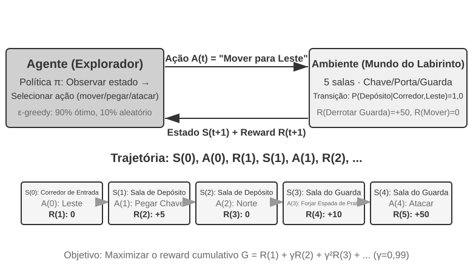

Essa interação produz uma **trajetória** — um registro completo de “estado → ação → recompensa → novo estado → ação → recompensa...”. A qualidade de uma política se reflete, em última análise, na qualidade das trajetórias. Uma **função de valor** responde à seguinte pergunta: “Se eu estiver neste estado agora e continuar agindo de acordo com a política atual, qual será a recompensa total que acumularei ao final?”. É como um enxadrista experiente que, ao observar uma posição, consegue estimar intuitivamente a probabilidade de vitória sem calcular todas as jogadas até o fim. (Quando substituímos a “política atual” pela “política ótima”, obtemos a função de valor ótima, que será usada mais adiante neste capítulo ao abordarmos a equação de otimalidade de Bellman.) A fronteira entre o agente e o ambiente segue um princípio simples: **tudo o que o agente não pode alterar arbitrariamente pertence ao ambiente.**

Duas características distinguem o aprendizado por reforço do aprendizado supervisionado, que exige respostas corretas rotuladas, e do aprendizado não supervisionado, que identifica padrões ocultos nos dados: a **busca por tentativa e erro** — o agente precisa descobrir sozinho quais ações são boas, sem que um instrutor forneça diretamente a resposta correta — e a **recompensa tardia** — o efeito de uma ação pode se tornar aparente apenas muitas etapas depois; por exemplo, o valor de uma boa jogada de xadrez talvez só fique evidente no fim da partida. Isso também dá origem ao singular **dilema entre exploração e aproveitamento**: seguir sempre caminhos conhecidos impede o aprendizado de algo novo; tentar sempre ao acaso impede que se chegue ao objetivo.

Um sistema de aprendizado por reforço consiste em cinco elementos centrais:

- **Espaço de ações**: define o conjunto de todas as ações possíveis que o agente pode executar. As ações podem ser discretas — por exemplo, “qual jogada fazer” no xadrez, entre um número finito de opções — ou contínuas — por exemplo, “quantos graus girar uma articulação” de um robô, expresso por um valor contínuo.
- **Política**: é a regra de comportamento do agente, que especifica o que fazer em determinado estado. Uma política pode ser simples — uma tabela de consulta: no estado A, execute a ação X — ou complexa, como uma rede neural profunda.
- **Sinal de recompensa**: é o feedback imediato fornecido pelo ambiente. No entanto, o objetivo do agente é maximizar a recompensa de longo prazo, não a imediata. Essa distinção é fundamental, assim como um investimento não deve ser avaliado pelos ganhos e perdas de hoje, mas pelo retorno de longo prazo.
- **Função de valor**: estima a recompensa acumulada total que pode ser obtida no futuro a partir de determinado estado, ajudando o agente a tomar decisões sensatas mesmo sem feedback imediato. Um dos principais aprendizados de sessenta anos de pesquisa em RL é o papel central da estimativa de valor.
- **Modelo do ambiente** (opcional): prevê como o ambiente responderá às ações. Os métodos que utilizam um modelo do ambiente são chamados de **métodos baseados em modelo** — primeiro aprendem a prever como o ambiente muda e depois planejam de acordo com essa previsão. Os que não o utilizam são chamados de **métodos livres de modelo** — não preveem o ambiente, mas aprendem diretamente com a experiência.

A Tabela 8-3 compara os principais componentes de diversos sistemas de agentes, revelando a universalidade do conceito de agente e ajudando o leitor a identificar as diferenças entre os espaços de ações dos agentes tradicionais de RL e dos agentes modernos baseados em LLM.

Tabela 8-3 Comparação dos principais elementos de diferentes sistemas de agentes

| Tipo de agente | Ambiente | Espaço de ações | Sinal de recompensa |
|---------------|------------------------|-------------------------------|-------------------------|
| **Gazela recém-nascida** | Terreno, gravidade, postura corporal | Contínuo e de alta dimensionalidade (contrações de grupos musculares) | Equilíbrio (+), queda (-) |
| **Robô aspirador** | Disposição do cômodo, nível da bateria | Discreto (direção, aspirar, recarregar) | Área limpa (+), bateria esgotada (-) |
| **Grande mestre de xadrez** | Estado do tabuleiro, limite de tempo | Discreto e finito (jogadas válidas) | Vitória (+1), derrota (-1) |
| **Agente de atendimento ao cliente** | Histórico da conversa, base de conhecimento | Composicional e de tamanho variável (pensar, falar, chamar API) | Problema resolvido (+), tempo de atendimento (-) |
| **Agente assistente de programação** | Documento de requisitos, base de código | Composicional e de tamanho variável (pensar, pesquisar, editar, executar) | Teste aprovado (+), bug introduzido (-) |

A tabela revela uma distinção importante. Ambientes representativos de jogos de tabuleiro e Atari usam ações primitivas, discretas, finitas e predefinidas, enquanto o controle de robôs utiliza ações contínuas com dimensões fixas e limites físicos. Agentes modernos de atendimento ao cliente e de programação baseados em LLM combinam um conjunto finito de tokens e chamadas de ferramentas em sequências de ações de tamanho variável, o que dificulta enumerar de uma só vez todas as sequências possíveis. Eles também podem recorrer ao raciocínio interno para aprimorar suas capacidades.

### Duas representações de ações: configurações clássicas de RL e políticas de LLM de comprimento variável

A diferença mais evidente entre as duas configurações está na forma como as ações são representadas. Um MDP pode representar espaços de ações finitos ou infinitos, discretos ou contínuos. Os exemplos de jogos de tabuleiro e ambientes Atari desta seção usam ações primitivas discretas e finitas; o controle de robôs usa ações contínuas limitadas; e uma política de LLM combina um vocabulário finito de tokens e esquemas de ferramentas para formar sequências de comprimento variável. Essa representação composicional tem consequências importantes para o projeto de algoritmos, a eficiência amostral e a generalização. A seguir, cada configuração é analisada separadamente.

**Exemplo fundamental: MDP e Q-learning tabular.**

O MDP (Markov Decision Process, processo decisório de Markov) é o arcabouço matemático do aprendizado por reforço e define elementos centrais como estados, ações e recompensas. Sua premissa fundamental é a **propriedade de Markov**: o futuro depende apenas do estado atual, que deve conter todo o histórico relevante para a decisão. No xadrez, por exemplo, o estado inclui não apenas a posição das peças, mas também o lado que deve jogar, os direitos de roque e de captura en passant, além das informações necessárias para aplicar a regra dos cinquenta lances e detectar repetição de posições. Quando a definição do estado é suficiente, não é necessário reler todo o registro da partida a cada transição. Se uma observação omitir parte do histórico necessário, esse histórico deverá ser incorporado ao estado ou tratado por um modelo parcialmente observável.

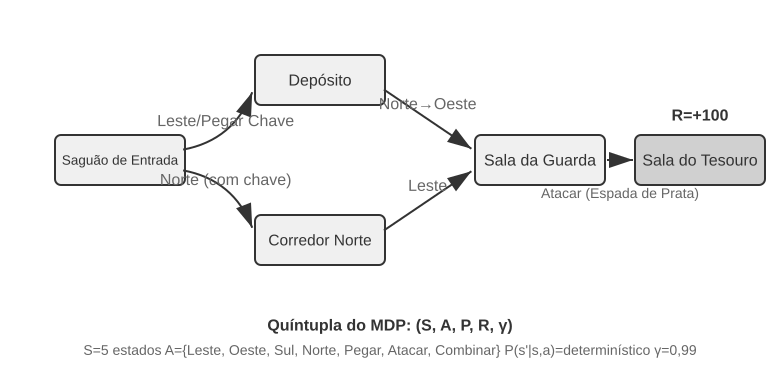

Os ambientes de RL representativos desta seção usam **espaços de ações predefinidos**. As 361 posições de jogada no Go constituem um conjunto grande, mas finito; as ações no xadrez também podem ser enumeradas; e os jogos de Atari normalmente oferecem de algumas a cerca de uma dúzia de ações primitivas discretas. **Agentes robóticos** usam espaços de ações contínuos, porém limitados: ângulos das articulações, velocidades e forças de preensão são valores contínuos, mas têm limites físicos claros e dimensões determinadas pelos graus de liberdade do robô.

Ações discretas e finitas facilitam a avaliação individual das alternativas. Quando o número de estados e ações é suficientemente pequeno, o Q-learning tabular armazena seus valores diretamente; em espaços de estados maiores, como os de jogos de Atari ou de tabuleiro, é necessário combinar aproximação de funções e busca. Como não é possível enumerar todas as ações de um MDP com ações contínuas, métodos como gradientes de política e actor-critic aproximam a política e a função de valor. O exemplo clássico desta seção também difere de uma política de LLM porque começa a aprender por tentativa e erro sem conhecimento pré-treinado.

Nesse arcabouço, um dos algoritmos mais fundamentais e importantes é o **Q-learning**. Ele mantém uma estimativa de valor para cada par “estado-ação”: ao executar a ação *a* no estado *s* e, em seguida, agir sempre de acordo com a política ótima, qual é a recompensa total esperada? Intuitivamente, a qualidade de uma ação depende da recompensa imediata que ela proporciona, acrescida de “quão bom é o próximo estado ao qual ela conduz”.

Ao expressar essa intuição como uma equação, obtemos a relação recursiva central da célebre **equação de Bellman** dos livros de RL: **o valor real de uma ação = a recompensa imediata obtida nesta etapa + o maior valor futuro que pode ser obtido a partir do próximo estado**:

$$Q^*(s, a) = r + \gamma \max_{a'} Q^*(s', a')$$

em que $r$ é a recompensa imediata, $s'$ é o próximo estado alcançado após a execução da ação (para facilitar a compreensão, a expressão está em forma determinística; em um ambiente estocástico, é necessário calcular a esperança sobre o próximo estado $s'$), e $\gamma \in [0, 1)$ é o **fator de desconto** — ele determina quanto o agente valoriza o futuro: quanto mais $\gamma$ se aproxima de 1, maior a importância dos retornos de longo prazo; quanto mais se aproxima de 0, maior o foco no resultado imediato. A “recompensa acumulada” mencionada várias vezes anteriormente é justamente a soma das recompensas de cada etapa, descontadas por $\gamma$: $\sum_{t} \gamma^{t} r_t$. Depois de cada ação, o algoritmo ajusta ligeiramente a estimativa anterior na direção do “resultado efetivamente observado”. Esse paradigma de “corrigir uma estimativa anterior com o resultado real de uma etapa” é chamado de **aprendizado por diferença temporal** (Temporal-Difference Learning, TD learning). Após milhares de tentativas, a estimativa se aproxima gradualmente do valor real.

As duas figuras a seguir mostram, respectivamente, o processo de exploração do Q-learning em um mundo em grade e a convergência gradual dos valores Q.

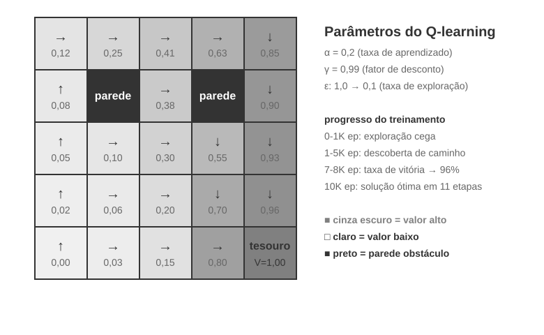

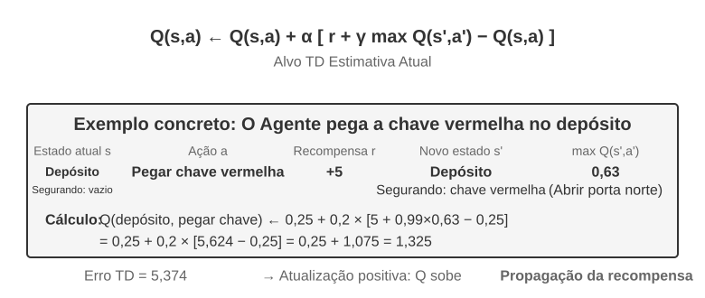

O Q-learning é um método **off-policy**: ele pode aprender uma política ótima a partir de dados gerados por uma política de exploração diferente da política-alvo. Ainda assim, requer cobertura suficiente dos pares estado-ação relevantes, além de condições adequadas de taxa de aprendizado e convergência; ele não converge automaticamente para qualquer distribuição de dados. As definições rigorosas de métodos on-policy e off-policy, bem como sua correspondência com o pós-treinamento de LLMs, são apresentadas mais adiante na seção “Algoritmos de RL: de 16 rollouts a uma atualização de parâmetros”.

> **Experimento 8-1 ★: Desempenho do Q-learning em um jogo de caça ao tesouro**
>
> Para verificar as características e limitações do Q-learning, projetamos um **ambiente de jogo de caça ao tesouro**. Esse ambiente apresenta vários desafios importantes: **mecanismos ocultos** exigem que o agente descubra por conta própria a correspondência entre chaves e portas, os efeitos das armas e as regras de combinação de itens; **dependências de várias etapas** significam que a conclusão da tarefa exige a sequência correta de ações (a solução ótima tem 11 etapas); **recompensas esparsas** significam que apenas ações cruciais e a vitória final geram recompensas significativas, enquanto a maioria das etapas intermediárias não oferece nenhum feedback.
>
> O agente de Q-learning usa uma configuração padrão de parâmetros e uma estratégia de exploração ε-greedy: na maior parte do tempo, seleciona a ação considerada ótima no momento, mas ocasionalmente escolhe uma ação aleatória, reduzindo gradualmente a proporção de exploração aleatória ao longo do treinamento.
>
> A curva de aprendizado apresenta características típicas (um episódio corresponde a uma partida completa, desde o início até a conclusão ou o fracasso):
> - **Primeiros 1.000 episódios**: taxa de vitória de 0%; a tabela Q contém apenas 124 estados; o agente explora às cegas
> - **Primeiros 5.000 episódios**: ainda não há vitórias consistentes; a tabela Q contém 133 estados
> - **7.000–8.000 episódios**: a taxa de vitória sobe gradualmente de 34% para 96%
> - **10.000 episódios**: taxa de vitória de 100%; a tabela Q contém 145 estados; a solução ótima de 11 etapas é encontrada
>
> Todo o treinamento leva menos de 10 segundos, graças à alta eficiência da simulação, mas exige quase 10.000 tentativas completas. Isso demonstra o comportamento da configuração de Q-learning tabular sem conhecimento prévio e com exploração ε-greedy usada neste experimento: é necessária uma quantidade substancial de exploração aleatória para concluir o percurso por acaso, e os sinais de valor se propagam lentamente, exigindo reforço repetido.
>
> Em um simulador de jogos, 10.000 tentativas levam apenas 10 segundos, um custo insignificante. Porém, em cenários reais com agentes — nos quais cada ligação telefônica tem um custo, cada operação no navegador apresenta latência e cada decisão equivocada pode ter consequências irreversíveis —, 10.000 tentativas são totalmente inaceitáveis. Um dos motivos para usar uma política de LLM pré-treinada é que o conhecimento já adquirido permite tomar decisões eficazes com muito menos interações com o ambiente.
>
> Este **experimento de Q-learning tabular sem conhecimento prévio** apresenta três limitações: até mesmo uma tarefa simples exige muitas interações; os valores aprendidos em um ambiente não são transferidos diretamente para outro; e cada nova tarefa precisa ser explorada novamente. Essas não são limitações do próprio arcabouço de MDP. A aproximação de funções, o aprendizado por transferência e o RL baseado em modelos podem lidar com estados mais complexos e com a transferência de conhecimento, embora ainda possam exigir muitas interações com o ambiente em comparação com um LLM pré-treinado.

**Agentes baseados em políticas de LLM pré-treinadas.**

Os modelos de linguagem de grande porte (LLMs) trouxeram uma importante mudança prática na forma como as ações dos agentes são representadas e inicializadas.

O RL clássico também pode modelar a computação interna ou a coleta de informações como estados e ações. A mudança prática introduzida pelos LLMs não é que o pensamento tenha se tornado possível pela primeira vez, mas que uma política de linguagem pré-treinada pode representar a computação interna como sequências de tokens de comprimento variável e gerá-las na mesma política que produz ações externas. Os tokens de pensamento não alteram diretamente o mundo externo, mas podem melhorar a ação final. A representação da ação passa a incluir não apenas “o que fazer”, mas também “por quanto tempo pensar e sobre o que pensar”.

A inovação prática mais importante é incorporar **tokens de pensamento como ações especiais no espaço de saída da política**. Ambientes tradicionais representativos de RL enfatizam ações primitivas como mover-se, atacar e coletar objetos, embora a computação interna também possa ser modelada em um MDP ou em uma política hierárquica. Em agentes baseados em LLMs, **o pensamento interno se torna uma parte central do espaço de ações de linguagem aprendido**. Ele não altera diretamente o ambiente externo nem recebe uma recompensa ambiental imediata, mas pode expressar muitos caminhos computacionais, respeitando os custos dos tokens e os limites de contexto.

Ações composicionais de comprimento variável criam um espaço de busca muito maior do que o das ações primitivas e são difíceis de aprender do zero sem conhecimento prévio. Um agente que aprende do zero é como alguém procurando um tesouro no deserto com os olhos vendados. Em vez disso, os LLMs aprendem padrões humanos de resolução de problemas durante um pré-treinamento em grandes volumes de texto: soluções matemáticas costumam seguir a sequência “identificar as condições → recordar as fórmulas → calcular passo a passo”, enquanto a programação segue “compreender os requisitos → projetar a estrutura → implementar os detalhes”. A política pré-treinada atribui maior probabilidade prévia a caminhos estruturados, reduzindo drasticamente o espaço de busca. Assim, mesmo sem RL adicional, um LLM pré-treinado pode gerar uma cadeia de raciocínio (Chain of Thought, CoT) lógica básica, aprendida por meio da previsão do próximo token em soluções matemáticas, comentários de código, discussões e outros registros de raciocínio escritos por seres humanos.

O pós-treinamento com RL usa então recompensas externas para ensinar o LLM a aplicar esses padrões com mais eficácia a uma tarefa específica. A estrutura da linguagem não constitui uma “recompensa interna” separada; ela atua como uma **distribuição a priori** na política pré-treinada. Um padrão recorrente nos dados de treinamento, como “precisamos converter moedas, então primeiro devemos consultar a taxa de câmbio”, pode começar com uma probabilidade de geração maior do que um caminho sem relação com a tarefa, como verificar a previsão do tempo. A partir dessa distribuição inicial, o RL usa a recompensa real da tarefa para remodelar as probabilidades dos caminhos.

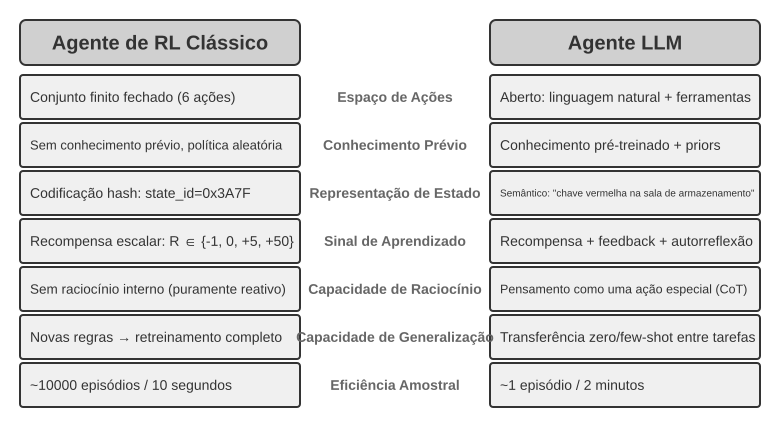

A política de linguagem pré-treinada permite que agentes baseados em LLMs compreendam instruções inéditas (generalização zero-shot) e se adaptem a novas tarefas a partir de poucas demonstrações (adaptação few-shot), em forte contraste com a configuração de Q-learning tabular sem conhecimento prévio descrita anteriormente.

A expansão de ações primitivas predefinidas para ações composicionais de comprimento variável representa uma mudança importante no paradigma dos agentes de IA. As ações de um LLM continuam sendo definidas por um vocabulário finito de tokens e por esquemas de ferramentas, mas o pensamento interno, as consultas em linguagem natural, o código de programas, estruturas JSON complexas e o conteúdo multimodal podem ser combinados em uma quantidade explosiva de sequências de comprimento variável. Interpretadores de código e ferramentas de busca conectam essa representação a uma ampla variedade de tarefas e informações do mundo real. Isso cria oportunidades e desafios: os agentes podem combinar ferramentas básicas para realizar tarefas inéditas, mas o projeto de recompensas e a exploração eficiente precisam operar em um espaço composicional imenso.

Modelos como o Kimi K3, otimizados para a chamada de ferramentas e cadeias de raciocínio longas, ilustram a direção típica do paradigma LLM+RL: o pré-treinamento de linguagem em larga escala fornece a base, e o pós-treinamento reforça a decomposição de problemas, a chamada de ferramentas e a autocorreção. O **OpenVLA**[^ch8-21] (descrito em detalhes no Capítulo 6) exemplifica o paradigma de arquitetura VLA (visão-linguagem-ação) da era dos LLMs: um codificador visual processa as observações do ambiente, um modelo de linguagem compreende as instruções e raciocina, e um decodificador de ações gera sinais de controle, permitindo o controle condicionado por linguagem e a generalização entre tarefas. Cabe esclarecer que o próprio OpenVLA é treinado por aprendizado por imitação em quase um milhão de **trajetórias de demonstração** de robôs, tendo, portanto, natureza de SFT, e não de RL. O SimpleVLA-RL, apresentado no Experimento 8-13 mais adiante neste capítulo, é um exemplo representativo da introdução de RL na robótica, usando recompensas para otimizar ainda mais esse tipo de arquitetura VLA.

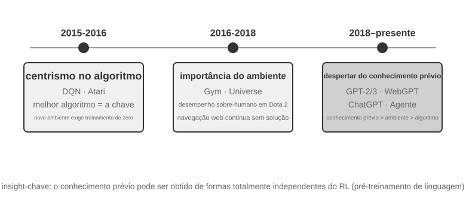

**A trajetória de exploração da OpenAI** — relatada por Shunyu Yao, professor assistente da Universidade de Princeton e autor do artigo sobre ReAct, em “The Second Half”[^ch8-2] — mostra como a visão da área evoluiu. **Fase 1 (2015–2016), foco nos algoritmos:** predominava a crença de que algoritmos melhores eram a chave. Houve avanços em ambientes padronizados como o Atari, mas cada novo ambiente exigia um novo treinamento do zero. **Fase 2 (2016–2018), a importância do ambiente:** o Gym padronizou diversas tarefas; o Universe e o World of Bits tentaram transformar toda a internet em um ambiente de treinamento de RL; e o Dota 2 buscou desempenho sobre-humano em um ambiente complexo específico. A ideia era clara, mas o uso geral de computadores e a navegação na web continuaram fora de alcance.

**Fase 3 (2018–presente), o despertar dos conhecimentos prévios:** o GPT-2 e o GPT-3 demonstraram o poder do pré-treinamento de linguagem; o WebGPT e o ChatGPT provaram que esses conhecimentos prévios podiam ser transformados em agentes práticos. A descoberta mais importante foi: **os conhecimentos prévios podem ser adquiridos por meios que nada têm a ver com RL**. Essa é uma verdade contraintuitiva: durante décadas, os pesquisadores de RL podem ter invertido completamente suas prioridades. A ordem correta não é algoritmo > ambiente > conhecimento prévio, mas conhecimento prévio > ambiente > algoritmo.

> **Experimento 8-2 ★★: Estudo comparativo entre RL tradicional e agente baseado em LLM**
>
>
> 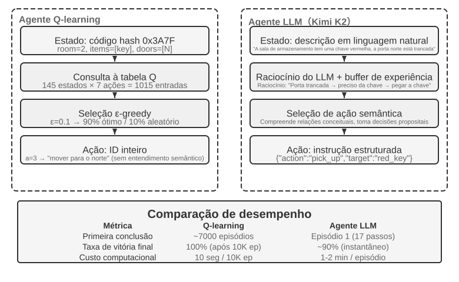
>
>
> Comparamos o Q-learning a um agente baseado em LLM — o Kimi K3, mantendo um buffer de até 50 experiências — no mesmo jogo de caça ao tesouro. O resultado é impressionante: **o agente baseado em LLM concluiu o jogo em 18 passos já na primeira tentativa**.
>
> **Fase inicial (exploração intencional):** pega uma espada enferrujada (“é melhor ter uma arma do que lutar de mãos vazias”), explora sistematicamente o mapa, deduz que “é preciso encontrar uma chave” ao descobrir que o portão norte está trancado, explora o depósito e obtém a chave vermelha e o cristal mágico. **Fase intermediária (compreensão da mecânica e síntese proativa):** entende a regra de “uso automático da chave” e prevê que a espada enferrujada não será suficiente contra o guarda, produzindo por iniciativa própria uma espada de prata no passo 8. **Fase final (execução e correção de erros):** segue para o norte com a espada de prata e derrota o poderoso guarda no passo 13. No percurso, faz uma ou duas tentativas ineficazes — golpeia repetidamente com a espada ou recua — e finalmente obtém o tesouro do dragão no passo 18.
>
> Isso demonstra uma diferença fundamental entre compreensão semântica e mapeamento simbólico. O agente baseado em LLM compreendeu a estrutura conceitual do jogo; cada passo tinha um propósito e uma justificativa lógica. Para o Q-learning, “porta”, “chave” e “espada” são apenas combinações de símbolos sem significado, e suas relações só podem ser descobertas lentamente por meio de um extenso aprendizado estatístico.
>
> O custo computacional cria um paradoxo interessante: o Q-learning executa 10 mil partidas em 10 segundos, enquanto o agente baseado em LLM leva de 1 a 2 minutos por partida. No entanto, em tarefas reais, os custos de tempo, dinheiro e risco de cada interação superam em muito o custo puramente computacional; portanto, considerar apenas o tempo de GPU não é justo. Um insight ainda mais importante é que o sucesso do agente baseado em LLM não decorre de um “algoritmo de aprendizado” melhor, mas do enorme volume de conhecimento prévio que ele carrega. Quando as regras do jogo mudam, o Q-learning precisa ser completamente treinado novamente, enquanto o agente baseado em LLM consegue se adaptar diretamente por meio do raciocínio. Disso decorre um princípio prático de projeto: a RL tradicional continua valiosa em cenários com baixo custo de simulação e alta repetibilidade; em cenários reais com alto custo de interação e necessidade de adaptação rápida, a eficiência amostral dos agentes baseados em LLM tem maior valor prático.

O Capítulo 1 já apresentou um mapa conceitual de como a adaptação ao contexto, as atualizações de artefatos externos e as atualizações de parâmetros funcionam em conjunto; a seção “Conclusões práticas sobre pós-treinamento”, ao final deste capítulo, retomará o tema. O fio condutor deste capítulo é o pós-treinamento: incorporar aos parâmetros do modelo capacidades que não podem ser plenamente expressas por regras externas.

## Fundamentos do pré-treinamento de modelos `[Optional Reading]`

Para entender por que as técnicas de pós-treinamento são eficazes, primeiro é necessário compreender o que o pré-treinamento estabelece. O pós-treinamento — SFT e RL — consiste essencialmente em otimizar dentro do espaço de representações estabelecido pelo pré-treinamento: a estrutura de conhecimento criada nessa etapa determina o limite das fases posteriores. Por isso, examinamos os principais aspectos do pré-treinamento por meio de três experimentos: treinar do zero um modelo de linguagem de pequena escala, ampliar suas capacidades visuais e incorporar conhecimento de um novo idioma. Esses três experimentos são complementares e buscam desenvolver uma compreensão intuitiva do pré-treinamento, isto é, o treinamento inicial em dados de larga escala que ensina ao modelo os padrões básicos da linguagem e conhecimentos sobre o mundo. Leitores que já conhecem o processo de pré-treinamento podem ignorá-los.

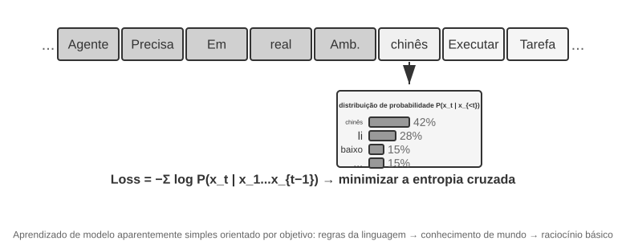

O treinamento de modelos de linguagem segue um processo de três etapas: “tokenização — pré-treinamento — pós-treinamento”. A tokenização divide o texto em unidades discretas. Por exemplo, “I like programming” pode ser dividido nos tokens “I”, “like”, “program” e “ming”. Esses tokens são as menores unidades textuais processadas pelo modelo. Conceitualmente, a tarefa de pré-treinamento é simples: mostra-se ao modelo a primeira parte de um trecho de texto para que ele preveja o próximo token. Ao comparar sua previsão com a resposta correta — essa diferença é chamada de perda; quanto menor a perda, mais precisa é a previsão —, o modelo ajusta continuamente seus parâmetros. Após repetidos treinamentos em enormes volumes de texto, o modelo aprende gradualmente as regras da linguagem, conhecimentos sobre o mundo e capacidades básicas de raciocínio. Concluído o pré-treinamento, o modelo consegue gerar textos fluentes, mas sua saída carece de estrutura e ele tem dificuldade para seguir instruções. O pós-treinamento o transforma em um assistente prático por meio de SFT — treinamento com pares rotulados de entrada e saída — e otimização de preferências, como DPO, que ensina o modelo a gerar respostas preferidas pelos seres humanos.

> **Experimento 8-3 ★★: Treinando um LLM do zero — o poder das melhorias algorítmicas**
>
> Usando como estudo de caso o MiniMind 2, um modelo com 100 milhões de parâmetros, o experimento realiza todo o processo de treinamento em uma GPU de uso doméstico. Duas otimizações algorítmicas — QK Norm e o otimizador Muon — triplicam a velocidade de convergência e melhoram significativamente a qualidade da geração, tudo a um custo muito baixo: cerca de 14 horas de treinamento e US$ 34 no total.
>
> Efeitos de cada etapa do treinamento: após o pré-treinamento, o modelo consegue responder a perguntas factuais como “Qual é a montanha mais alta do mundo?”, mas o formato não é padronizado; após o SFT, o seguimento de instruções e a formatação da saída melhoram significativamente, permitindo que o modelo organize as respostas como esperado; a otimização de preferências reduz ainda mais os erros factuais e as formulações pouco naturais. O modelo de 100 milhões de parâmetros ainda apresenta limitações evidentes — tende a errar em problemas complexos —, mas a lição é: **com um orçamento pequeno e fixo, melhorias algorítmicas oferecem melhor relação custo-benefício do que simplesmente aumentar a escala**.

> **Experimento 8-4 ★★: Treinando seu próprio VLM**
>
>
> 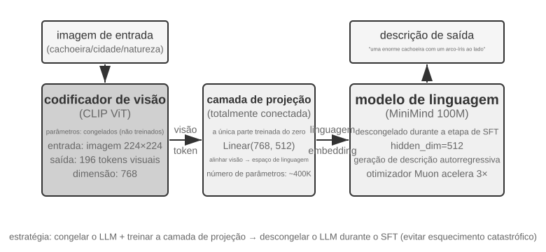
>
>
> Os VLMs integram percepção visual e compreensão da linguagem em um único modelo. O principal desafio é o alinhamento entre modalidades: fazer com que “o que é visto” corresponda “ao que é dito”. A arquitetura é composta por três componentes: um **codificador visual** — por exemplo, o CLIP, com parâmetros congelados — extrai características semânticas das imagens; uma **camada de projeção** — leve e a única parte treinada do zero — atua como “tradutora” entre as características visuais e o modelo de linguagem, mapeando-as para um espaço de representações que o modelo consiga compreender; e um **modelo de linguagem** gera o texto descritivo. O treinamento adota a estratégia de “congelar o LLM e treinar apenas a camada de projeção” para evitar o esquecimento catastrófico — esquecer skills antigas após aprender novas. Depois da etapa de pré-treinamento do alinhamento, o LLM é descongelado e passa por SFT com pares de imagem e descrição de alta qualidade, o que melhora significativamente o nível de detalhe e a precisão das descrições.
>
> Este experimento revela o paradigma básico do treinamento de modelos multimodais: reutilizar os resultados do pré-treinamento unimodal e obter o alinhamento entre modalidades treinando uma camada de projeção leve. Essa abordagem é eficiente e escalável, mas a capacidade limitada de representação da camada de projeção pode se tornar um gargalo para a compreensão profunda entre modalidades. Ao estender em mais uma etapa a mesma arquitetura de “codificador visual + camada de projeção + LLM”, fazendo o modelo gerar ações, obtém-se o modelo VLA (visão-linguagem-ação) detalhado no Capítulo 6.

Em conjunto, os dois experimentos de pré-treinamento revelam um padrão: com orçamento limitado, melhorias algorítmicas e inovações arquitetônicas costumam oferecer melhor relação custo-benefício do que o simples aumento de escala. Mais importante, o pré-treinamento fornece conhecimento descritivo e capacidade de modelagem da linguagem, mas não o seguimento estruturado de instruções nem o comportamento orientado a tarefas. Contudo, SFT e RL não conseguem suprir a ausência de um idioma ou domínio-alvo que não tenha sido contemplado pelo pré-treinamento geral. Essa é a lacuna que o Mid-training busca preencher.

## Mid-training: preenchendo lacunas de conhecimento e capacidades fundamentais

Neste capítulo, **Mid-training** significa partir de um modelo-base existente e dar continuidade ao treinamento do modelo de linguagem em uma distribuição de dados-alvo. Em geral, mantém-se o mesmo objetivo do pré-treinamento — prever o próximo token — e calcula-se a perda sobre todos os tokens de um documento, trecho de código ou derivação. Estudos clássicos sobre DAPT/TAPT mostram que uma segunda etapa de pré-treinamento em corpora não rotulados, específicos de um domínio ou relacionados à tarefa, pode continuar melhorando o desempenho em tarefas posteriores[^ch8-30]. O termo “Mid” descreve a posição dessa etapa no pipeline de desenvolvimento de capacidades; o formato dos dados e a função de perda permanecem os mesmos do pré-treinamento.

O Mid-training aborda principalmente dois tipos de lacuna:

- **Lacunas de conhecimento**: o pré-treinamento geral não cobriu adequadamente determinado idioma, áreas como finanças, medicina ou direito, documentos internos de empresas ou uma classe de bases de código, de modo que o modelo sequer consegue compreender os conceitos e a terminologia.
- **Lacunas de capacidades fundamentais**: a tarefa-alvo exige representações de contexto longo, padrões de código, derivações matemáticas ou representações multimodais que o modelo-base ainda não formou. O problema não se resume ao formato da resposta: mesmo após muitas amostragens, o modelo quase nunca chega a uma solução correta.

Isso também explica por que o SFT não deve ser tratado como o principal meio de injetar conhecimento. O SFT pode memorizar um pequeno número de fatos e muitas vezes é aplicado após o Mid-training para ensinar o modelo a responder a perguntas do domínio. No entanto, um conjunto pequeno de pares de perguntas e respostas cobre apenas um número limitado de formulações; ele é mais eficaz para treinar como acessar e expressar o conhecimento do que para comportar um grande volume de conhecimento bruto e inter-relacionado. Por outro lado, reduzir a perda do modelo de linguagem em textos do domínio não garante que o modelo recupere esse conhecimento ao responder a uma pergunta. Pesquisas mostram que a ordem e a organização do pré-treinamento contínuo e do treinamento de instruções afetam substancialmente a possibilidade de acessar o conhecimento no formato de perguntas e respostas[^ch8-31]. Uma abordagem robusta costuma ser: **o Mid-training absorve conhecimentos e capacidades → um SFT em pequena escala estabelece protocolos de acesso e saída → o RL é adicionado, se necessário, depois que a taxa de sucesso deixa de ser zero**.

### Como construir dados de Mid-training

1. **Deduzir as necessidades de dados a partir da distribuição de falhas.** Segmente as avaliações por tema, idioma, tipo de documento, padrão de código e extensão do contexto. Determine quais casos de baixo `pass@k` decorrem de lacunas do modelo-base e adicione dados apenas para suprir lacunas de conhecimento e capacidade, sem confundir erros de formato de saída com falta de conhecimento.

2. **Construir corpora-alvo de alta densidade.** Documentos brutos estabelecem associações entre termos e fatos; repositórios ensinam estruturas e dependências; derivações no estilo de livros didáticos, explicações sintéticas e amostras que relacionam vários documentos tornam explícitas as relações implícitas. Remova duplicatas, filtre por qualidade e verifique a contaminação do conjunto de avaliação.

3. **Combinar os dados por capacidade.** A composição precisa incluir textos naturalmente longos, como livros, documentos extensos e repositórios de código; dados de cadeia de raciocínio que representem capacidades elementares relacionadas a textos longos — recuperação em textos longos, raciocínio em múltiplos saltos, seguimento de instruções, agregação de informações e estatística —; e trajetórias de execução de agentes que representem capacidades indispensáveis a um agente — planejamento, seleção e chamada de ferramentas, acompanhamento de estado de longo prazo e recuperação de erros. Os dados de cadeia de raciocínio e de trajetórias de agentes podem ser destilados de um modelo de código aberto mais avançado ou obtidos de conjuntos de dados existentes.

4. **Usar duas formas de replay em cada etapa.** A primeira consiste nos textos curtos originais e em dados gerais, que preservam as capacidades linguísticas, o conhecimento e o processamento de contextos curtos. A segunda são as “tarefas antigas adaptadas à nova extensão”: insira tarefas curtas que o modelo já sabe executar em um contexto com a extensão atual, distribuindo informações relevantes e elementos de distração em posições distintas, e verifique se a mesma capacidade continua válida na janela mais ampla. O ideal é que os dados gerais venham do conjunto original de pré-treinamento do modelo-base; quando ele não estiver disponível, pode-se usar um corpus aberto de pré-treinamento, como o FineWeb-2.

5. **Decidir quando interromper o treinamento por meio de critérios multidimensionais.** Além da perda de treinamento, acompanhe `pass@1`/`pass@k` em tarefas de domínio reservadas, capacidades gerais, seguimento de instruções preexistente e na tarefa-alvo. Se as métricas do domínio melhorarem enquanto o desempenho no conjunto geral de retenção cair, a composição dos dados ou a taxa de aprendizado está agressiva demais. Se a perda diminuir, mas o `pass@k` permanecer inalterado, verifique se os dados realmente cobrem a capacidade necessária e se falta, em uma etapa posterior, o SFT que torna o conhecimento acessível.

Após o Mid-training, é preciso usar conjuntos de avaliação como LongBench v2, IFEval e os benchmarks de agentes de ponta a ponta descritos no Capítulo 7 para confirmar que o modelo não perdeu suas **capacidades fundamentais de contexto longo em diferentes extensões de contexto**. A capacidade de lidar com contextos longos sustenta cadeias de raciocínio longas e o seguimento de instruções, que, por sua vez, sustentam capacidades mais avançadas dos agentes, como a chamada de ferramentas.

- **Posição e recuperação**: extração de uma ou várias informações-alvo, localização de informações essenciais em diferentes posições e recuperação na presença de elementos de distração;
- **Relações e raciocínio**: acompanhamento de relações entre parágrafos e documentos e em múltiplos saltos, resolução de contradições e combinação de evidências;
- **Agregação e estatística**: contagem, agrupamento, ordenação, comparação, síntese de tendências e agregação em tabelas ou logs extensos;
- **Seguimento de instruções**: cumprimento de instruções complexas, incluindo várias instruções simultâneas, resolução de contradições, observância de um processo de raciocínio especificado e conformidade com o formato de saída;
- **Raciocínio em cadeias longas**: resolução de problemas complexos de matemática, lógica e geração de código;
- **Capacidades elementares do agente**: decomposição básica de tarefas, planejamento, seleção de ferramentas, construção de argumentos, memória de estado e recuperação de falhas.

Se os fatos mudam com frequência ou precisam ser acompanhados de fontes primárias, a RAG continua sendo preferível a incorporá-los aos pesos. O Mid-training é mais adequado a conhecimentos e capacidades de domínio estáveis e em grande escala, que precisam formar representações internas. O Mid-training de todos os parâmetros de um modelo grande custa mais e apresenta maior risco de esquecimento do que o SFT em pequena escala; portanto, valide a composição dos dados em um experimento-piloto antes de ampliar o orçamento de treinamento.

> **Experimento 8-5 ★★: pré-treinamento contínuo para aprender um novo idioma**
>
> Usando o Mistral 7B v0.3 como modelo-base — pré-treinado principalmente em inglês e quase sem capacidade de compreender coreano —, o experimento introduz a capacidade em coreano por meio do treinamento contínuo do modelo de linguagem com a Wikipédia em coreano. Como o modelo já possui representações gerais e precisa apenas se adaptar a uma nova distribuição de dados, o custo é muito menor do que o de treiná-lo do zero. O experimento usa aproximadamente 80% de dados em coreano e 20% em inglês para atenuar o esquecimento catastrófico; essa proporção é uma escolha específica do experimento, não um padrão universal. Em seguida, dados de instruções em coreano são usados no SFT para obter uma capacidade prática de conversação. A divisão de responsabilidades é clara: primeiro, o Mid-training acrescenta conhecimentos e capacidades linguísticas em coreano; depois, o SFT ensina o modelo a receber instruções e organizar respostas nesse idioma.
>
> O experimento também demonstra o esquecimento catastrófico que o pré-treinamento contínuo pode causar: na etapa final, as avaliações cegas melhoraram em coreano, enquanto a capacidade em inglês diminuiu. O pré-treinamento contínuo pode incorporar a distribuição-alvo aos parâmetros, mas não elimina a necessidade de conjuntos de retenção, avaliação factual e auditorias da qualidade dos dados.

Depois que o modelo adquire conhecimentos e capacidades fundamentais suficientes, a próxima etapa é transformá-lo em um agente prático que opere de acordo com um protocolo.

## SFT (ajuste fino supervisionado)

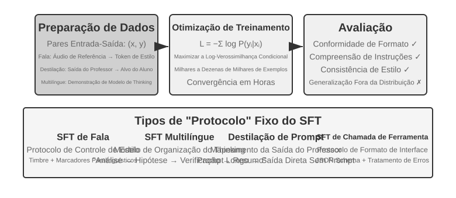

A seção “Do pré-treinamento ao RL: panorama em quatro etapas” já explicou a essência do SFT — “prever o próximo token” com dados diferentes e calcular a perda apenas sobre a resposta. Esta seção usa quatro experimentos para mostrar o que esse mecanismo — incorporar mapeamentos e protocolos estáveis aos parâmetros — consolida em diferentes tarefas. O principal valor do SFT não está em injetar novos conhecimentos, mas em **consolidar protocolos**: incorporar aos parâmetros mapeamentos, formatos de interação e normas de estilo para que, durante a inferência, o modelo produza saídas em conformidade com o esperado sem precisar de prompts extensos. Em geral, alguns milhares ou dezenas de milhares de exemplos de alta qualidade são suficientes para estabelecer capacidades básicas de conversação e seguimento de instruções.

Essa eficiência pode vir acompanhada de dependência da distribuição de treinamento. Em tarefas que exigem explorar estratégias corretas variadas ou nas quais a distribuição de implantação difere das demonstrações, o SFT pode favorecer a reprodução dos padrões demonstrados e perder desempenho em situações novas. Os experimentos a seguir mostram, sob diferentes perspectivas, esse processo de “consolidação de protocolos”; eles não estabelecem uma classificação universal entre SFT e RL.

Antes de colocar o SFT em prática, há uma questão inevitável: **de onde vêm os dados de SFT?** Na indústria, a resposta se resume a três caminhos:

- **Demonstrações de especialistas humanos** — oferecem o maior potencial de qualidade, mas são caras e lentas; são mais adequadas como “dados-semente” para definir formato e estilo;
- **Geração por modelo professor** — isto é, dados sintéticos: um modelo avançado produz em massa pares de “entrada–saída”, que são filtrados e depois destilados no modelo aluno; consulte os Experimentos 8-8 e 8-9;
- **Amostragem por rejeição** — o próprio modelo gera vários candidatos para o mesmo problema, um verificador seleciona os corretos e o modelo é treinado com eles; consulte o Experimento 8-9.

Os três caminhos costumam ser combinados. Seja qual for o escolhido, o pipeline de construção é muito semelhante: primeiro, define-se a distribuição da tarefa e o esquema de saída; depois, geram-se candidatos em massa; em seguida, filtra-se a qualidade por meio de validações baseadas em regras, verificações de formato e inspeções humanas por amostragem; por fim, removem-se duplicatas, equilibra-se a composição e garante-se a diversidade. Não é necessário buscar volume a qualquer custo: alguns milhares ou dezenas de milhares de amostras de alta qualidade geralmente bastam para consolidar o formato de saída. Em vez de acumular cem mil amostras de baixa qualidade, é melhor aprimorar dez mil amostras limpas: cada ruído presente nos dados pode ser fielmente incorporado pelo SFT aos parâmetros.

> **Experimento 8-6 ★★★: SFT de voz — da “clonagem de voz” à “modelagem paralinguística” `[Extended Experiment]`**
>
> Usando Orpheus (clonagem de voz com prompt contextual) e Sesame (modelagem de tokens paralinguísticos) como estudos de caso, este experimento mostra como o “estilo vocal e os hábitos de expressão” são incorporados aos parâmetros. Os dois seguem caminhos distintos:
>
> - **Orpheus**: compacta a forma de onda da voz em uma sequência de tokens. Ao concatenar áudios de referência do mesmo falante, o modelo aprende a “falar com a voz dessa pessoa”, mantendo a consistência do timbre entre diferentes frases.
> - **Sesame**: abstrai fenômenos paralinguísticos, como risos e suspiros, em tokens especiais como `<laugh>` e `<sigh>`. O modelo aprende a “produzir o som correspondente ao encontrar o token”.
>
> Em tarefas expressivas, o SFT consolida protocolos de controle de estilo e hábitos estruturados de expressão, não conhecimento factual nem raciocínio complexo. O essencial está na diversidade e na qualidade da anotação dos dados de treinamento. Entre os modos de falha comuns estão a baixa variedade de falantes nos dados de treinamento, que faz todas as vozes soarem iguais, e o sobreajuste aos tokens — quando o modelo memoriza detalhes das amostras de treinamento e apresenta desempenho inferior em novas situações —, resultando em “risadas mecânicas”.
>
> **Experimento 8-7 ★★★: Raciocínio multilíngue — permitindo que o modelo pense em qualquer idioma `[Extended Experiment]`**
>
> A maioria dos modelos de raciocínio só “pensa” em inglês: independentemente do idioma em que a pergunta é feita, a cadeia de raciocínio interna do modelo quase sempre está em inglês, porque as demonstrações de raciocínio de alta qualidade nos dados de treinamento são, em sua maioria, escritas nesse idioma. O objetivo deste experimento é simples: permitir que o modelo pense em um idioma especificado.
>
> A abordagem consiste em realizar SFT no gpt-oss-20b: adiciona-se uma linha `reasoning language: German` (ou outro idioma) à instrução de sistema e, em seguida, realiza-se o treinamento com exemplos de raciocínio em inglês, espanhol, francês etc. Os dados de treinamento **não contêm absolutamente nenhum texto em chinês**, mas, após o treinamento, basta definir o idioma de raciocínio como chinês para que o modelo produza uma cadeia de raciocínio completa nesse idioma. Essa generalização interlinguística zero-shot é a descoberta mais interessante do experimento. Vale observar que essa não é uma capacidade de generalização do próprio SFT. O pré-treinamento multilíngue já estabeleceu no modelo um espaço compartilhado de representações entre idiomas; o SFT apenas ativa essa capacidade interlinguística preexistente.
>
> **Experimento 8-8 ★★: Destilação de prompts — replicando capacidades úteis a um custo menor**
>
> Em aplicações práticas, para que um modelo execute tarefas complexas, muitas vezes são necessários prompts de sistema extensos, com milhares ou até dezenas de milhares de tokens, o que aumenta a latência e o custo de cada chamada. Ao usar LLMs de raciocínio, os tokens internos de raciocínio elevam ainda mais o custo. A ideia da destilação de prompts é compactar o comportamento de um “professor com prompt longo e raciocínio” em um “aluno sem prompt, ou com prompt curto, e sem raciocínio”. O professor gera respostas de alta qualidade usando o prompt completo e o modo de raciocínio; os dados de treinamento preservam apenas a entrada do usuário e a conclusão final, descartando o prompt extenso e o processo intermediário de raciocínio. O aluno aprende a “fornecer diretamente a conclusão”. Após a destilação, a qualidade das respostas do aluno para as mesmas entradas se aproxima da qualidade do professor, enquanto a latência e o custo caem significativamente, pois não é mais necessário processar prompts extensos nem tokens de raciocínio.
>
> A destilação pode ser realizada em duas dimensões: “do grande para o pequeno” — substituir um modelo grande por um médio ou pequeno para equilibrar custo e qualidade — e “do raciocínio para o não raciocínio” — incorporar a cadeia de raciocínio explícita como conhecimento paramétrico implícito em um modelo do mesmo porte, obtendo respostas de 20 a 30 vezes mais rápidas. Essas duas abordagens não são excludentes e costumam ser usadas em conjunto em ambientes de produção. É importante observar que a destilação herda as limitações do professor: se ele comete erros sistemáticos na cauda longa da distribuição, o aluno codificará esses erros de forma ainda mais rígida; se o professor depende de ferramentas para garantir a correção, a simples destilação das saídas perderá a robustez proporcionada por elas. Implicação para a engenharia: quando o formato do produto está estável, a distribuição das entradas é previsível e as restrições de custo são significativas, a destilação de prompts é um excelente recurso de otimização. Durante a fase de exploração ou enquanto a tarefa ainda não está bem definida, preservar o raciocínio explícito e os prompts editáveis continua sendo essencial para iterar rapidamente.
>
> **Experimento 8-9 ★★★: Destilação da cadeia de raciocínio (CoT)**
>
> A destilação de prompts descarta o processo de raciocínio; a destilação de CoT faz o oposto: transfere a **trajetória completa de raciocínio** de um modelo professor robusto para o modelo aluno. Destilar a CoT de um professor competente pode permitir que um aluno com o mesmo número de parâmetros recupere de 70% a 80% das capacidades do professor. Para equipes que não pretendem ampliar a fronteira das capacidades de ponta, mas buscam modelos sob seu próprio controle, essa é a estratégia de seguidor mais pragmática. A série de pequenos modelos destilados disponibilizados como código aberto junto com o DeepSeek-R1 — usando as trajetórias de raciocínio do R1 para realizar SFT nas famílias Qwen e Llama — é um exemplo representativo dessa abordagem.
>
> **Contexto: o fenômeno da “barreira do pensamento”.** Alguns modelos de raciocínio de código fechado, como as séries OpenAI o e Gemini, geram uma cadeia de raciocínio interna, mas o que os usuários veem não é o processo original. Por motivos como prevenção de destilação, segurança e experiência de uso, os fornecedores geralmente reescrevem ou resumem a CoT antes de apresentá-la, ocultando atrás da API o processo original de raciocínio, que é a parte mais valiosa. É justamente por isso que este experimento adota modelos de raciocínio de código aberto como professores: modelos como DeepSeek V4, Kimi K3 e GLM 5.2 expõem diretamente sua cadeia de raciocínio completa, tornando a destilação viável tanto do ponto de vista técnico quanto do licenciamento — embora ainda seja necessário confirmar, antes do uso, os termos da licença aplicáveis aos produtos destilados.
>
> **Relato do laboratório: um modelo capaz de escrever código ainda pode se recusar a ajudar a destilar outro modelo.** Ao implementar este experimento, o autor primeiro usou o OpenAI Codex, com GPT-5.6-Sol, para escrever o código experimental. Assim que a tarefa passou a envolver explicitamente a destilação de modelos, o Codex se recusou a continuar. Em seguida, o autor migrou para o Claude Code, com Claude Opus 5, e encontrou a mesma recusa. Por fim, o Kimi K3 concluiu o código do experimento e a execução subsequente.
>
> Nenhuma das recusas dizia respeito a um raciocínio matemático comum ou a um simples pedido para que o modelo revelasse sua cadeia de raciocínio interna. O pedido era implementar um experimento completo de destilação que usasse dados de um professor robusto para treinar um aluno. Tecnicamente, a destilação de modelos é muito semelhante ao ajuste fino supervisionado convencional, mas as políticas de segurança e de produto dos fornecedores também podem associá-la à extração de modelos, à replicação de capacidades e à proteção da propriedade intelectual, o que a torna uma categoria sensível.
>
> Esse episódio não deve ser reduzido à afirmação de que “o Claude não fornece a cadeia de raciocínio”, nem prova que “o Kimi tem guardrails mais fracos”. Saber se a API do Claude retorna um raciocínio resumido, se um agente de programação implementará um pipeline de destilação e se os termos do serviço permitem usar as saídas do modelo para treinamento são três questões distintas. Este experimento não tentou contornar o raciocínio oculto nem os mecanismos de segurança de qualquer modelo; utilizou apenas capacidades disponibilizadas pelos produtos para conduzir um fluxo de trabalho de pesquisa autorizado.
>
> Eis uma conclusão mais prática e mais importante: **para a grande maioria de quem trabalha com pós-treinamento, não há necessidade alguma de destilar a cadeia de raciocínio de modelos de código fechado.** A diferença entre os melhores modelos de código aberto atuais e os modelos de código fechado no estado da arte não é tão grande quanto se imagina; o modelo professor precisa apenas ser “claramente superior ao aluno”, não “o melhor do mundo”. Se o modelo submetido ao pós-treinamento tiver até 200 bilhões de parâmetros, um modelo de código aberto no estado da arte será mais que suficiente como professor.
>
> **Desenho do experimento:** processo em três etapas. Etapa 1, **coleta de trajetórias**: amostrar problemas da distribuição da tarefa-alvo, como matemática e programação; usar o modelo professor de código aberto para gerar trajetórias completas de “raciocínio + resposta”; e empregar um validador baseado em regras para filtrar as trajetórias cuja resposta final esteja errada — caso contrário, o aluno também imitará o processo de raciocínio incorreto. Essa etapa — “gerar candidatos, verificar e filtrar, manter apenas as trajetórias corretas” — tem um nome próprio: **amostragem por rejeição (rejection sampling)**. Realizar SFT com dados construídos dessa forma é chamado de **ajuste fino por amostragem por rejeição (Rejection Sampling Fine-Tuning, RFT)**. Ele fica entre o SFT puro e o RL: não há modelo de recompensa para treinar nem gradientes de política; basta “gerar várias amostras, rejeitar as erradas e manter as corretas” para elevar a qualidade dos dados. Trata-se de uma forma extremamente econômica de construir dados para tarefas verificáveis. Etapa 2, **treinamento com SFT**: usar pares de treinamento no formato “problema → `<think>` trajetória de raciocínio `</think>` + resposta final” para realizar SFT padrão em um modelo pequeno, por exemplo, na escala de 7B. Etapa 3, **avaliação comparativa**: comparar, no mesmo benchmark, o modelo aluno antes e depois da destilação, bem como o modelo professor, para medir a proporção de capacidade recuperada.
>
> **Critérios de aceitação:** o modelo aluno destilado apresenta melhoria significativa em benchmarks de matemática e programação em relação ao desempenho anterior à destilação, e suas trajetórias de raciocínio exibem comportamentos semelhantes aos do professor, como reflexão, retorno a etapas anteriores e verificação. Também é preciso considerar o custo da destilação: o aluno herdará os erros sistemáticos e os hábitos de raciocínio prolixo do professor — estes últimos podem ser otimizados posteriormente com a abordagem AdaptThink do Experimento 8-10.

Esses quatro experimentos têm uma característica em comum: “incorporar mapeamentos e protocolos estáveis aos parâmetros”. O SFT de voz consolida protocolos de controle de estilo; o SFT multilíngue consolida modelos de organização do raciocínio; e o SFT de destilação consolida o mapeamento direto da entrada para a saída. Quanto mais claro o objetivo, mais bem definido o formato e mais estáveis os critérios de avaliação, maior será a eficiência amostral com que o SFT aprimora o desempenho.

## Síntese de dados para SFT: de demonstrações a trajetórias treináveis

O limite do SFT é determinado, antes de tudo, pelos dados. Em projetos reais, raramente é possível escrever à mão demonstrações suficientes, uma a uma. Em geral, combina-se **um pequeno conjunto inicial produzido por humanos, geração por um modelo professor e filtragem por verificadores**: as demonstrações humanas definem o formato e os limites, o modelo professor amplia a escala, e a verificação baseada em regras ou a inspeção humana por amostragem preserva a qualidade. Quando o modelo é usado para gerar os próprios dados, é possível amostrar vários candidatos para o mesmo problema e manter apenas as trajetórias aprovadas na verificação — isso é o ajuste fino por amostragem por rejeição (RFT).

O objetivo dos dados sintéticos não é reproduzir logs de produção, mas extrair deles uma **estrutura de tarefa** reutilizável: intenção do usuário, estado inicial, ferramentas disponíveis, restrições de negócio, modos de falha comuns e condições de sucesso. Depois de remover as informações de identificação, gere novamente pessoas, pedidos, arquivos e estados fictícios para cada tipo de tarefa e coloque-os em um ambiente isolado e reinicializável. Assim, preservam-se as dificuldades reais sem permitir que o modelo memorize dados de clientes ou credenciais internas.

Um pipeline confiável segue este fluxo: **dados de produção → blueprint da tarefa → tarefa sintética → várias trajetórias candidatas → verificação da tarefa e das trajetórias → dados para SFT**. A verificação da tarefa confere se o problema pode ser resolvido, se a dificuldade é adequada e se o resultado de referência está correto; a verificação da trajetória confere o estado final, as chamadas de ferramentas e as restrições de negócio. Para condições que possam ser expressas como testes unitários, asserções de banco de dados ou verificações de diferenças de estado, deve-se priorizar código determinístico. Aspectos abertos, como a qualidade da comunicação, podem então ser avaliados por um modelo avaliador, calibrado por amostragem humana. Grafos de skills, ambientes executáveis e verificadores independentes podem ampliar ainda mais a cobertura das tarefas e filtrar trajetórias inválidas[^ch8-12][^ch8-17][^ch8-18][^ch8-19][^ch8-20].

A mesma infraestrutura de tarefas e verificação pode posteriormente ser convertida em um ambiente de RL, mas os dois estágios a utilizam de maneiras diferentes: o SFT mantém apenas as trajetórias bem-sucedidas que passaram na verificação, aprendendo formatos, procedimentos e ações básicas estáveis; no RL, a política atual executa novos rollouts e usa as recompensas do ambiente para explorar caminhos além das demonstrações. Trajetórias malsucedidas não devem ser usadas diretamente como demonstrações corretas. Elas podem servir para construir pares de preferência, revelar lacunas na cobertura das tarefas ou ser adicionadas ao treinamento depois que um diagnóstico e uma correção forem incluídos.

Na síntese de dados, o que importa não é o volume, mas a cobertura, a diversidade e a precisão. O conjunto de treinamento também deve ser deduplicado e particionado por template de tarefa, cliente ou período, enquanto o conjunto de avaliação deve vir de tipos de tarefa que não se sobreponham aos do treinamento. Soluções de referência, testes ocultos e feedback dos verificadores não podem vazar para o modelo.

Os casos problemáticos do Capítulo 7 também podem ser convertidos em dados de treinamento. Considere o caso de “conclusão prematura” do agente de programação: primeiro, recorte o prefixo da trajetória até o ponto em que o agente está prestes a declarar a conclusão; em seguida, use essa declaração prematura como amostra rejeitada e “primeiro execute os testes, confira cada condição de aceitação e só então chegue a uma conclusão” como amostra escolhida. Dados desse tipo são adequados para DPO ou demonstrações de fronteiras de decisão, não para uso direto como trajetórias corretas de SFT. O motivo da falha, as condições aplicáveis e o verificador devem ser armazenados com a amostra para permitir rastreamento e reavaliação. O `build_preference_data.py` do Experimento 8-17 oferece dois caminhos de construção — um template determinístico e um modelo professor — e mantém os dados de treinamento separados do conjunto de avaliação apresentado adiante.

Os dois experimentos com casos problemáticos acrescentados neste capítulo demonstram dois objetivos de supervisão distintos. O caso das aspas curvas chinesas primeiro transforma o feedback em uma Skill de documentação sensível ao escopo e, em seguida, executa SFT com dados sintéticos estruturados. Já o caso da string especial converte incompatibilidades de `old_string` em uma tarefa de cópia exata em nível de bytes, treinando a fidelidade token a token. Ambos seguem os protocolos de atribuição de falhas e isolamento entre treinamento e avaliação do Capítulo 7, mas usam critérios de pontuação distintos: o primeiro verifica se o modelo “altera o que deve ser alterado e preserva o que deve ser preservado”; o segundo verifica se ele “copia literalmente”.

## Quando escolher Mid-training, SFT e RL

A seção “Do pré-treinamento ao RL: panorama das quatro etapas” explicou os mecanismos dos três métodos de treinamento. Esta seção apresenta um diagnóstico prático: **primeiro determine se o que falta é a base, o protocolo ou a política; não atribua toda falha do modelo à necessidade de RL.**

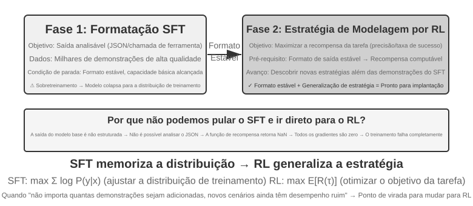

Tabela 8-4 Critérios para escolher Mid-training, SFT e RL

| Comportamento observado | Principal lacuna | Método preferencial | Critério para avançar |
| --- | --- | --- | --- |
| O modelo não conhece conceitos do domínio, o idioma ou operações básicas; `pass@k` permanece próximo de zero com uma amostragem razoável | O conhecimento e a capacidade estão fora do suporte efetivo do modelo-base | **Mid-training**; use RAG para fatos dinâmicos | Os resultados no conjunto reservado do domínio melhoram, a retenção de capacidades gerais permanece aceitável e a tarefa-alvo começa a produzir trajetórias verificavelmente corretas ou parcialmente corretas |
| O modelo acerta ocasionalmente, mas o formato, o esquema da ferramenta, o tom ou o procedimento fixo são instáveis | O protocolo comportamental não foi consolidado | **SFT** ou decodificação restrita | A taxa de análise bem-sucedida se estabiliza, e um verificador consegue pontuar de maneira confiável as ações principais e os protocolos de saída |
| A taxa de sucesso é maior que zero e as recompensas são confiáveis, mas as boas políticas têm baixa probabilidade, ou as decisões de longo horizonte e a generalização fora da distribuição (OOD) continuam fracas | Distribuição de probabilidade e otimização da política | **RL** | A recompensa corresponde ao objetivo real, os grupos de rollout apresentam variação suficiente de recompensa e o desempenho em testes independentes melhora durante o treinamento |
| Há apenas algumas demonstrações estáveis e nenhum ambiente interativo está disponível | Há dados que podem ser imitados, mas não há feedback online | **SFT/RFT/otimização offline de preferências** | Primeiro, estabeleça uma linha de base e uma avaliação; depois, decida se vale a pena criar um ambiente de RL |

Tome a decisão na seguinte ordem:

1. **Primeiro, descarte soluções que não exigem alterar os pesos.** Se prompts, ferramentas, restrições de código ou o gerenciamento de contexto resolverem o problema de comportamento, não é necessário treinar. Para fatos que precisem de atualizações frequentes, citações ou exclusão, priorize RAG.
2. **Meça o suporte às capacidades em um conjunto-alvo reservado.** Não observe apenas o `pass@1` com decodificação gulosa. Com uma configuração fixa de amostragem, meça também `pass@k`, a taxa de progresso parcial e a taxa de análise bem-sucedida, além de realizar uma auditoria manual das causas das falhas. Se `pass@k` continuar próximo de zero e as falhas se concentrarem em conhecimento ou capacidades fundamentais, aplique primeiro o Mid-training e faça uma nova avaliação antes de escolher uma etapa posterior.
3. **Use SFT para estabelecer protocolos, não para abarrotar o modelo com uma base de conhecimento.** Quando o modelo sabe executar a tarefa, mas não consegue fazê-lo conforme solicitado, use demonstrações de alta qualidade para consolidar esquemas JSON, chamadas de ferramentas, terminologia, procedimentos e estilo. Alguns fatos podem ser incorporados aos parâmetros junto com as demonstrações, mas um pequeno conjunto de pares de perguntas e respostas não deve servir de veículo para uma grande base de conhecimento.
4. **Use RL apenas quando houver algo a explorar.** O RL é adequado quando a política atual já produz rollouts que podem ser pontuados e que ocasionalmente têm sucesso, e quando a recompensa representa fielmente os objetivos da implantação. Se `pass@k` estiver próximo de zero, aplique primeiro Mid-training/SFT ou crie um currículo alcançável e recompensas parciais. Aplicar PPO ou GRPO diretamente a rollouts com recompensa sempre igual a zero normalmente apenas desperdiça o orçamento de amostragem.

Esse fluxo não exige que todo projeto execute os três métodos em sequência. Um modelo-base robusto pode passar diretamente para RL, uma tarefa restrita ao formato pode precisar apenas de SFT, e um domínio com conhecimento estável pode exigir somente Mid-training, seguido pelo reaproveitamento do alinhamento já existente no modelo. O importante é que cada transição tenha uma condição de entrada mensurável, em vez de tratar “Mid-training → SFT → RL” como um pipeline ritualizado.

## Aprendizado por reforço em turno único: uma comparação entre memória e generalização

“Turno único” significa que a tarefa é concluída em uma única interação: o modelo recebe uma entrada, produz uma saída e obtém uma recompensa, sem precisar manter estado entre etapas. Essa configuração simplificada permite nos concentrar nas diferenças fundamentais entre os mecanismos de aprendizado de SFT e RL, sem a complexidade das interações em vários turnos. O cenário de turno único oferece condições claras para um experimento controlado: mesma tarefa, mesmo modelo-base e mesmo orçamento computacional, tendo como única variável o método de treinamento. O primeiro experimento mostra como o RL aprende a metaestratégia de “quando pensar”; o segundo usa um jogo de cartas de raciocínio aritmético para quantificar sistematicamente o contraste “SFT memoriza, RL generaliza”.

Antes dos experimentos, vamos desenvolver uma **intuição mínima** sobre os algoritmos de RL, suficiente para compreender os termos usados a seguir. O treinamento por RL deste capítulo se baseia principalmente no **gradiente de política**: o modelo gera várias respostas para o mesmo problema, aumentando a probabilidade das respostas com recompensa alta e reduzindo a das respostas com recompensa baixa — avançando mais nas direções recompensadoras e menos nas que não trazem recompensa. Para evitar que uma única atualização grande desvie o modelo, o algoritmo **PPO**, amplamente utilizado, limita os ganhos adicionais em seu objetivo substituto quando a razão de probabilidades fica fora de um intervalo especificado; isso desestimula grandes alterações, mas não impõe uma restrição rígida ao deslocamento da política. Os experimentos posteriores usam “PPO com uma rede de valor”, que estima uma linha de base para calcular vantagens mais refinadas. Outro método, o **GRPO**, não treina uma rede de valor; em vez disso, compara entre si várias respostas para o mesmo problema a fim de avaliar a qualidade relativa de cada uma. Essa intuição basta para acompanhar os próximos dois experimentos.

O mesmo mecanismo pode ser expresso no pseudocódigo em estilo Python abaixo. Ele omite o paralelismo da amostragem, a regularização por KL e os detalhes do otimizador, mostrando apenas a cadeia causal que vai de um rollout à atualização dos parâmetros:

```python
for prompt in batch:
    group = [rollout(policy, env.reset(prompt)) for _ in range(G)]
    rewards = [verify(trajectory) for trajectory in group]
    advantages = normalize_within_group(rewards)       # GRPO baseline
    update(policy, group, advantages)
```

A rede de valor e o objetivo com limitação do PPO podem ser expressos separadamente:

```python
for trajectory in rollouts:
    returns = discounted_returns(trajectory.rewards)
    values = value_model(trajectory.states)
    advantages = returns - stop_gradient(values)
    ratio = exp(policy.log_prob(trajectory.actions)
                - old_policy.log_prob(trajectory.actions))
    policy_loss = -mean(min(
        ratio * advantages,
        clip(ratio, 1 - epsilon, 1 + epsilon) * advantages
    ))
    value_loss = mean((value_model(trajectory.states) - returns) ** 2)
update(policy, value_model, policy_loss + value_coef * value_loss)
```

O caráter “relativo” do GRPO vem da comparação entre rollouts de um mesmo prompt dentro do grupo; no PPO, `old_policy` é o snapshot congelado da política que gerou esse lote de rollouts, e a razão de probabilidades mede o quanto a política atual já se afastou dele. A limitação desestimula passos grandes, mas não constitui uma restrição rígida ao deslocamento da política; ambos os métodos ainda dependem de um ambiente e de uma recompensa confiáveis, e as adaptações específicas de treinamento são apresentadas nos respectivos experimentos.

> **Experimento 8-10 ★★: AdaptThink — aprendendo “quando não pensar”**
>
> Grandes modelos de raciocínio, como OpenAI o1 e DeepSeek-R1, geram longas cadeias de raciocínio para todos os problemas, provocando sobrecarga desnecessária em problemas simples. Primeiro, o experimento confirma uma intuição: o **modo NoThinking**, que ignora o raciocínio por meio de `<think></think>`, apresenta desempenho equivalente ou até melhor em problemas simples; a vantagem do modo Thinking só se torna evidente diante de problemas difíceis.
>
> O AdaptThink usa RL para treinar o modelo a escolher o modo de forma adaptativa. Ele tem dois componentes centrais:
>
> - **Objetivo de otimização com restrições**: incentiva o modo NoThinking sem permitir que o desempenho geral diminua.
> - **Estratégia de amostragem por importância**: equilibra as amostras Thinking e NoThinking para resolver o problema de **partida a frio**. Nesse caso, partida a frio se refere especificamente ao fato de o modelo inicial quase sempre escolher Thinking, deixando o ramo NoThinking com poucas amostras para aprender de forma eficaz; esse uso difere do “SFT de partida a frio” mencionado anteriormente para o DeepSeek-R1, que emprega um pequeno número de exemplos demonstrativos.
>
> A “amostragem por importância” mencionada aqui é um método estatístico comum: quando a distribuição de amostragem favorece determinada classe de amostras, aplicam-se pesos às amostras para “corrigir” a distribuição e garantir que o sinal de aprendizado abranja todas as classes de maneira equilibrada. Essa ideia aparece repetidamente em algoritmos de RL como PPO e DAPO, discutidos mais adiante neste livro.
>
> O registro oficial desse treinamento histórico é o [relatório de treinamento](../chapter8/AdaptThink/TRAINING_REPORT.md), que não inclui checkpoints. A principal execução pública no W&B, [`wubbn5tj`](https://wandb.ai/bojieli-pine-ai/adapt_think_verl/runs/wubbn5tj), usou 8 GPUs NVIDIA H100 de 80 GB. Da etapa 0 à 300, a acurácia no MATH500 passou de 0,8100 para 0,8180 (+0,80 pp), enquanto o comprimento da resposta passou de 4.911,46 para 1.576,62 (-67,90%); no GSM8K, os valores passaram de 0,796816 para 0,818802 (+2,20 pp) e de 1.025,24 para 477,33 (-53,44%); no AIME, a mean@16 passou de 0,314583 para 0,310417 (-0,42 pp), e o comprimento, de 12.119,51 para 6.402,23 (-47,17%). As proporções correspondentes de NoThinking foram 83,80%, 84,15% e 56,25%. Esses resultados indicam, no nível agregado dos conjuntos de dados, um sinal de roteamento coerente com a dificuldade, mas não justificam afirmar que há uma “percepção perfeita da dificuldade” em cada problema nem que a acurácia melhorou de modo geral.
>
> Após o ponto de medição selecionado no relatório, a execução prosseguiu até a etapa 410 e acumulou 36,92 horas, quando o W&B marcou seu estado como `crashed`; as 10 épocas e 3.140 etapas configuradas não foram concluídas. Embora a etapa 300 contenha um evento de cronometragem de checkpoint, o checkpoint não é distribuído com o livro, e não há comprovante independente de que tenha sido avaliado com sucesso por meio de `run_eval_verl_hf.sh` ou usado para executar novamente o MMLU. O commit histórico do código-fonte é `9e588202…`; futuras reproduções ficam vinculadas ao commit filho direto `0033ad172…`. Os três arquivos de entrada permanecem inalterados, mas o caminho `-fl-` gerado pelo script de treinamento é incompatível com o caminho `-fl4096` fixado no código do script de avaliação e precisa ser corrigido manualmente.
>
> O AdaptThink complementa a destilação de prompts para formar um “sistema duplo rápido-lento”: a destilação reduz a proporção de tarefas que exigem raciocínio, enquanto o AdaptThink otimiza a estratégia de acionamento nas tarefas restantes, aumentando em conjunto a eficiência do raciocínio.

> **Experimento 8-11 ★★: GeneralPoints — uma comparação entre “memória e generalização” no RL em turno único**
>
>
> 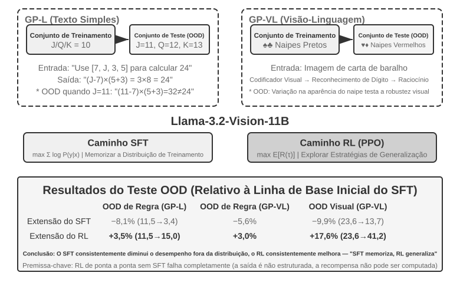
>
>
> GeneralPoints é um jogo de cartas de raciocínio aritmético proposto por Chu et al.[^ch8-3], desenvolvido especificamente para avaliar a capacidade de generalização dos modelos. Seu objetivo é semelhante ao do “Jogo do 24”: usar exatamente uma vez cada um dos quatro números mostrados nas cartas, combinando-os por meio de adição, subtração, multiplicação e divisão para chegar ao número-alvo 24. O experimento apresenta duas variantes: GP-L, baseada apenas em texto, e GP-VL, baseada em imagens. Assim, podemos examinar a generalização de regras e a generalização visual dentro da mesma estrutura.
>
> **Variante de regras**: durante o treinamento, J, Q e K valem 10; nos testes, passam a valer 11, 12 e 13, respectivamente. Isso garante que o conjunto de teste contenha combinações numéricas não vistas no treinamento, incluindo operações com 11, 12 e 13, permitindo avaliar rigorosamente a generalização. **Variante visual**: o treinamento usa naipes pretos (♠♣), e os testes usam naipes vermelhos (♥♦), para avaliar a robustez a mudanças na aparência visual. Com base no Llama-3.2-Vision-11B, o experimento segue o fluxo padrão de pós-treinamento: primeiro, uma inicialização por SFT confere ao modelo uma capacidade básica de seguir instruções; em seguida, sob o mesmo orçamento computacional, o modelo recebe treinamento adicional em ramos separados de SFT e RL, sendo que o ramo de RL usa PPO com uma rede de valor. Ambos são treinados com dados que seguem a única regra J/Q/K=10 e avaliados em conjuntos de teste dentro da distribuição (ID) e fora da distribuição (OOD).
>
> Os resultados mostram uma diferença clara nesse ambiente controlado. **OOD de regras**: o RL melhora 3,5 pontos percentuais no GP-L (11,5%→15,0%), enquanto o SFT **cai** 8,1 pontos percentuais (11,5%→3,4%); no GP-VL, o RL melhora 3,0 pontos percentuais, enquanto o SFT cai 5,6 pontos percentuais. **OOD visual**: o RL melhora **17,6 pontos percentuais** no GP-VL (23,6%→41,2%), enquanto o SFT cai 9,9 pontos percentuais (23,6%→13,7%).
>
> O acompanhamento da acurácia do reconhecimento visual revela que o RL melhora o codificador visual subjacente por meio da otimização orientada a resultados, e essa melhora apresenta forte correlação com os ganhos de desempenho geral. Em contrapartida, o SFT se sobreajusta aos padrões de tokens do processo de raciocínio e deixa em segundo plano o aprendizado dos tokens visuais, provocando uma queda na acurácia do reconhecimento.
>
> O experimento também mostra que, nessa configuração, o RL exigiu inicialização por SFT: com um modelo-base da escala do Llama-3.2-Vision-11B e requisitos rígidos de saída estruturada, o RL de ponta a ponta sem SFT fracassou completamente, pois o modelo-base não conseguia produzir saídas estruturadas cuja recompensa pudesse ser calculada. Essa conclusão é específica dessa configuração, e não uma regra universal; um modelo-base suficientemente robusto pode dispensar o SFT e obter sucesso com RL direto, como mostra a discussão anterior sobre o DeepSeek-R1-Zero. Outra constatação relevante é que, nesse experimento, um número maior de iterações de verificação resultou em uma generalização medida melhor: 10 iterações produziram +5,99%, em comparação com +0,48% para uma única iteração. Isso indica que o aumento da computação durante os testes foi um fator importante no ganho observado.
>
> Por que o desempenho do SFT caiu sob a mudança de distribuição deste experimento, enquanto o RL se saiu melhor? Uma explicação compatível com as observações é que os dados limitados de SFT reforçaram o padrão fixo de “tratar J/Q/K como 10”, que continuou ativo quando J passou a valer 11. Já o ramo de RL treinado com base nos resultados teve maior probabilidade de reforçar a estratégia de refazer os cálculos até chegar à resposta correta, permitindo aplicar o mesmo procedimento depois da mudança da regra. Isso explica o contraste entre memorização e generalização observado no experimento, mas não significa que o SFT seja capaz apenas de memorizar nem que o RL necessariamente aprenda um algoritmo geral.
>
> A principal contribuição deste experimento é quantificar sistematicamente, dentro da configuração limitada do GeneralPoints, a tendência de sobreajuste do SFT e o melhor desempenho do RL fora da distribuição. O mesmo padrão foi observado tanto na variante baseada apenas em texto quanto na variante de visão e linguagem. Nessa configuração, o SFT estabilizou o formato, e o RL explorou estratégias sobre essa base, tornando os dois métodos complementares.

## Algoritmos de RL: de 16 rollouts a uma atualização de parâmetros

O **GRPO (Group Relative Policy Optimization)**, proposto pela DeepSeek, é um dos algoritmos mais usados atualmente no treinamento com RL. Um exemplo ajuda a entendê-lo de forma concreta. Suponha que o SWE-bench contenha a seguinte tarefa: o `parser.py` de determinado projeto Python gera um `IndexError` quando a entrada está vazia, e o agente deve corrigir o código sem modificar os testes. O sistema de treinamento passa pelas quatro etapas a seguir.

**Etapa 1: permitir que o modelo de política tente repetidamente.** O modelo de política é o modelo de linguagem que está sendo treinado. O sistema copia o mesmo código inicial e a mesma descrição do problema para 16 sandboxes isolados entre si e permite que o modelo tente resolvê-lo 16 vezes de forma independente. Cada tentativa abrange todo o processo de “ler o código → editar os arquivos → executar os testes → enviar o resultado”; esse processo completo é um **rollout**. O problema e o ambiente inicial são idênticos, mas a amostragem é estocástica, de modo que as 16 tentativas podem seguir caminhos diferentes: algumas adicionam corretamente a verificação de limites, outras apenas capturam a exceção e mascaram o problema, algumas editam o arquivo errado e outras tentam modificar os testes.

**Etapa 2: calcular a recompensa.** Ao final de cada rollout, um verificador aplica o patch em um ambiente limpo e executa os testes. Suponha que 4 das 16 tentativas passem em todos os testes sem alterar os arquivos de teste e que as outras 12 falhem; nesse caso, as 4 primeiras recebem recompensa 1, e as outras 12, recompensa 0. Em uma tarefa de programação como essa, “calcular a recompensa” não tem nada de misterioso: basta usar testes e regras para determinar se a correção está realmente certa. Somente em tarefas abertas, sem um teste conclusivo, é necessário recorrer à preferência humana ou a um modelo de recompensa para fazer essa avaliação.

**Etapa 3: calcular a vantagem relativa.** A recompensa indica apenas se uma trajetória específica teve sucesso ou fracassou; a **vantagem relativa** indica quão boa ela é em comparação com as demais tentativas do mesmo grupo. A taxa média de sucesso do grupo é 4/16: as 4 tentativas aprovadas ficam acima da média do grupo e recebem vantagem positiva; as 12 que falharam ficam abaixo dela e recebem vantagem negativa. Essa comparação dentro do grupo é a essência do GRPO. Se todas as 16 falharem ou todas tiverem sucesso, as recompensas serão idênticas, não haverá como distinguir as melhores e a vantagem relativa desaparecerá. Os sinais de caminho, as recompensas de processo e as recompensas por progresso parcial do RLVP existem justamente para restabelecer diferenças significativas nesses grupos.

**Etapa 4: atualizar a política por descida do gradiente.** O programa de treinamento converte as vantagens relativas em uma função de perda, calcula os gradientes e usa um otimizador, como AdamW ou Muon, para realizar a descida do gradiente, aumentando a probabilidade das escolhas feitas pelo modelo nas trajetórias com vantagem positiva e reduzindo-a nas trajetórias com vantagem negativa. O modelo não memoriza literalmente um patch bem-sucedido; ele é ajustado gradualmente ao longo de muitas tarefas e rollouts. Assim, quando surgir um erro semelhante, será mais provável que ele “reproduza o problema, verifique a condição de limite, altere a implementação e execute os testes”, e menos provável que “oculte a exceção, edite os testes e envie o resultado sem verificá-lo”.

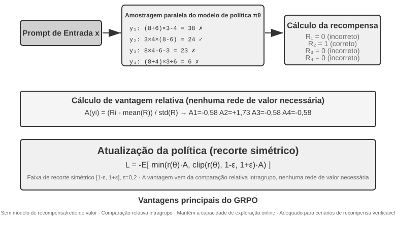

Essas quatro etapas formam uma **iteração de treinamento**, isto é, um **step**: o step $k$ gera um lote de rollouts com a política atual, realiza os cálculos de recompensa, vantagem e gradiente e, em seguida, o otimizador atualiza os parâmetros; o step $k+1$ gera novos rollouts usando a política atualizada. Treinar por 100 steps significa repetir esse ciclo cerca de 100 vezes. Um framework de treinamento com RL pode contabilizar separadamente suas atualizações internas de minibatches; portanto, ao consultar os logs de treinamento, ainda é necessário confirmar como ele define um `step`.

Uma estimativa aproximada de tempo ajuda a dimensionar o processo. Um rollout complexo de agente gera dezenas de rodadas de chamadas de ferramentas e, mesmo com 16 em execução paralela, o tempo decorrido da etapa de rollout é determinado pelo mais lento. Suponha que o rollout mais lento leve cerca de 2.000 segundos e que a descida do gradiente e a atualização do otimizador subsequentes levem aproximadamente 600 segundos; nesse caso, um step leva cerca de $2{,}000+600=2{,}600$ segundos, ou aproximadamente 43 minutos, e 100 steps consecutivos chegam a quase 72 horas.

Tanto o PPO quanto o GRPO seguem esse ciclo; a principal diferença está em **com o que fazem a comparação**. O GRPO compara diretamente vários rollouts do mesmo problema e não requer um modelo de valor separado. O PPO treina um modelo de valor que estima “quão bem normalmente se sai” em cada etapa de uma trajetória e então avalia se a ação atual supera essa expectativa, o que o torna mais adequado para trajetórias longas que exigem atribuição refinada de crédito. Ambos limitam a magnitude de cada atualização para impedir que um pequeno lote de amostras altere o modelo de forma abrupta. O DPO é diferente: aprende diretamente com pares de preferência “resposta melhor—resposta pior” coletados previamente, sem fazer com que a política atual gere online esse grupo de rollouts.

Nos casos deste capítulo, o AdaptThink usa um objetivo com restrições personalizadas; o GeneralPoints e o V-IRL usam PPO com um modelo de valor; o SimpleVLA-RL e o RLVP usam GRPO; e o ReTool usa PPO. O algoritmo determina como comparar as trajetórias e atualizar os parâmetros; a recompensa determina o que conta como sucesso; o ambiente e os dados determinam quais problemas o modelo pode vivenciar.

### Por que o RL de LLM geralmente prioriza dados on-policy

Primeiro, é preciso distinguir dois termos que costumam ser confundidos. **Online** significa apenas que os dados são produzidos continuamente por meio da interação com um ambiente durante o treinamento. **On-policy** exige que a política de comportamento $\mu$ que gera os rollouts seja idêntica ou suficientemente próxima da política $\pi_\theta$ que está sendo otimizada. Um cluster assíncrono pode gerar dados continuamente e, ainda assim, tornar-se off-policy em termos estatísticos se seus workers de rollout ficarem vários checkpoints defasados. Reutilizar trajetórias antigas ou usar trajetórias geradas integralmente por um modelo anterior ou por um professor são casos mais evidentes de off-policy. As configurações de PPO/GRPO deste capítulo geralmente buscam gerar novos rollouts com a política mais recente a cada step. No entanto, quando o PPO executa várias épocas de minibatch sobre o mesmo lote, as épocas posteriores já se afastam da `old_policy` que gerou os dados — justamente por isso o PPO usa uma razão de probabilidades e clipping.

Os gradientes de política buscam estimar a recompensa esperada sob a política atual $\pi_\theta$. Se os dados tiverem sido amostrados de outra política $\mu$, a correção usa uma razão de importância:

$$
\rho_t=\frac{\pi_\theta(a_t\mid s_t)}{\mu(a_t\mid s_t)}
=\exp\left(\log\pi_\theta(a_t\mid s_t)-\log\mu(a_t\mid s_t)\right).
$$

Rollouts on-policy realmente recentes satisfazem $\pi_\theta=\mu$ **antes de qualquer atualização de parâmetros**; portanto, $\rho_t=1$. Isso concentra o treinamento nos “estados em que o modelo atual efetivamente entra” e evita uma correção de alta variância causada pela incompatibilidade entre distribuições. Os dados off-policy têm suas vantagens: dados antigos podem ser reutilizados, a amostragem e o treinamento podem ser executados de forma assíncrona e a vazão é maior. Porém, quanto mais defasada estiver a política, mais pesada será a cauda da distribuição de $\rho_t$. Em sequências autorregressivas longas, uma correção rigorosa de prefixo ou de trajetória também multiplica muitas razões por token, fazendo com que um pequeno viés se acumule em um peso enorme ou praticamente nulo. O clipping do PPO limita atualizações atípicas, mas não recupera sem perdas a cobertura da distribuição: se o clipping for excessivo, gradientes serão descartados; se for insuficiente, um pequeno número de amostras dominará. Portanto, “on-policy é melhor” não é um teorema universal; nos gradientes de política para LLM atuais, em geral significa **menor viés de distribuição e otimização mais estável**. Estudos empíricos sobre a estabilização de RL em modelos de grande porte também indicam que reduzir a defasagem da política e a discrepância entre treinamento e inferência é uma condição importante para que o objetivo substituto permaneça válido[^ch8-32].

#### Por que o treinamento é sensível a divergências numéricas entre sampler e trainer

O RL de LLM em larga escala normalmente gera rollouts com um mecanismo de inferência como vLLM/SGLang e depois recalcula as log probabilities e os gradientes com um mecanismo de treinamento como FSDP/Megatron. Mesmo quando ambos carregam os mesmos pesos, diferenças de precisão de ponto flutuante, ordem de redução, configuração do paralelismo de tensores, tamanho de lote, cache KV e kernels fundidos podem produzir pequenas diferenças na log probability do mesmo token. Como resultado, $\rho_t$ — que deveria ser igual a 1 antes da atualização — já se afastou de 1: nominalmente, o sistema sincronizou os pesos, mas, em termos numéricos, transformou um treinamento on-policy em off-policy. Experimentos controlados demonstraram que uma pequena discrepância no nível dos tokens entre treinamento e inferência pode, por si só, provocar o colapso do treinamento[^ch8-33].

A sensibilidade decorre de uma cadeia de amplificação: **pequeno erro na log probability → desvio exponencial na razão de probabilidades → acúmulo ao longo de um prefixo extenso → alteração do clipping e da ponderação de vantagens → mudança na direção do gradiente e no número efetivo de amostras**. Por exemplo, se as log ratios de 4.000 tokens apresentarem um desvio de $10^{-3}$ na mesma direção, a razão no nível da trajetória se acumulará até $e^4\approx54.6$. Os erros reais não têm necessariamente o mesmo sinal, mas o exemplo mostra por que sequências longas amplificam erros que “parecem minúsculos em cada token”. Uma diferença mínima na probabilidade de um token inicial também pode mudar o token efetivamente amostrado, fazendo com que toda a trajetória de estados subsequente siga outro caminho. O resultado final não se resume a “o mesmo prompt ocasionalmente produz uma resposta diferente”: as razões de importância podem apresentar picos, grandes quantidades de tokens podem sofrer clipping e os gradientes ou comprimentos das respostas podem variar abruptamente, após o que a recompensa e a entropia entram em colapso simultaneamente. Alterar o tamanho do lote muda a forma de redução dos cálculos e rompe a invariância numérica em relação ao lote; também já se observou diretamente que isso transforma um RL nominalmente on-policy em RL implicitamente off-policy. Tanto alinhar os aspectos numéricos da amostragem e do treinamento quanto aplicar uma correção off-policy explícita melhora a estabilidade[^ch8-34].

Do ponto de vista da engenharia, isso deve ser tratado como um problema central, e não como mero ruído de ponto flutuante:

- **Antes de qualquer atualização de parâmetros**, compare as log probabilities dos tokens calculadas pelo sampler e pelo trainer no mesmo lote de trajetórias e monitore a média, os quantis, o valor máximo, a KL aproximada e a proporção submetida a clipping de $\rho_t$; esse é o teste de unidade on-policy mais direto.
- Não são apenas os pesos que precisam ser sincronizados, mas também o adaptador LoRA, o tokenizer, o chat template, a revisão do modelo e a configuração da codificação posicional. O rollout deve armazenar a log probability da política de comportamento no momento da geração, em vez de usar posteriormente os valores do modelo atual como se fossem os originais.
- Alinhe, tanto quanto possível, a precisão, a configuração do paralelismo e os principais kernels de computação da amostragem e do treinamento. Quando isso não for possível, trate explicitamente a diferença como off-policy, aplique a correção de importância e monitore o tamanho efetivo da amostra, em vez de presumir que o clipping do PPO compensará tudo automaticamente.
- Mantenha os rollouts recentes e limite tanto o número de épocas de atualização por lote de dados quanto a defasagem assíncrona. Reutilizar dados antigos aumenta a vazão, mas deve ser uma escolha mensurada entre viés e eficiência, não uma aceleração gratuita.

## Ambientes de RL: da avaliação à simulação

O gargalo do treinamento com RL muitas vezes não está no algoritmo, mas em **o ambiente ser suficientemente realista, reinicializável e paralelizável**. As chamadas telefônicas, os pagamentos ou as modificações de arquivos de um agente real podem ser caros e irreversíveis, e não é possível compensar um erro com tentativas ilimitadas. O ambiente de avaliação do Capítulo 7 pode fornecer o verificador, mas o treinamento também exige que o agente possa errar repetidamente, sofrer os efeitos colaterais de suas ações e manter-se estável ao longo de milhões de interações. Portanto, a engenharia de ambientes é um pré-requisito para o RL, e não algo a ser considerado somente após a conclusão do treinamento.

### Ambiente: o campo de treinamento do modelo

O aprendizado por reforço (RL) é, em essência, um “aprendizado por tentativa e erro”, e esse processo precisa de um **lugar para acontecer**: o ambiente de simulação. Nele, o modelo executa tarefas repetidamente, recebe feedback e ajusta sua política. A **fidelidade** do ambiente — o quanto ele se assemelha ao cenário real de implantação — determina diretamente se a política resultante será utilizável:

- **Um ambiente distorcido leva a uma política inútil.** Se o cliente simulado sempre responde de acordo com um roteiro fixo e as mensagens de erro não correspondem às do ambiente de produção, o modelo aprende uma estratégia que só funciona na simulação e fracassa assim que é implantado. Essa é a causa mais comum de falha em projetos de RL: não um algoritmo inadequado, mas um campo de treinamento diferente do ambiente real.
- **Construir um ambiente de alta fidelidade costuma ser mais caro e difícil do que o próprio treinamento.** Um ambiente que permita execução paralela em larga escala, seja reproduzível e forneça feedback realista geralmente exige muito mais trabalho de engenharia do que o ajuste do modelo. Os experimentos de chamada de ferramentas apresentados adiante neste capítulo — a sandbox MCP do AWorld e a sandbox com interpretador de código do ReTool — investem intensamente no ambiente justamente porque **APIs reais têm limites de requisição, podem bloquear contas e produzem efeitos colaterais, o que impede seu uso direto no treinamento**. Primeiro, é preciso construir um “mundo paralelo” estável, controlável e reproduzível.
- **A outra metade do ambiente é a função de recompensa.** Além de simular como o mundo muda, o ambiente precisa avaliar o desempenho do agente, fornecendo a base para o projeto de recompensas discutido adiante.

Em resumo: **antes de começar a ajustar algoritmos, pergunte-se: meu ambiente de simulação realmente se parece com o mundo real?** A resposta é muito mais importante do que escolher entre PPO e GRPO.

### E se não for possível construir um ambiente? Deixe o modelo desempenhar esse papel

Há, porém, um problema ainda mais fundamental: em muitos cenários, um ambiente de alta fidelidade não é apenas caro — ele **simplesmente não pode ser construído**. APIs reais produzem efeitos colaterais e não podem ser acionadas indiscriminadamente; usuários reais não podem ser submetidos a experimentos; e não é possível acelerar o mundo físico. Se nem sequer for viável criar um “mundo paralelo” utilizável, isso inviabiliza o RL? Uma abordagem cada vez mais difundida é **usar um modelo para simular o ambiente**: um LLM desempenha o papel do ambiente e gera o feedback necessário às interações do agente. Essa abordagem tem dois níveis.

**Primeiro nível: o modelo sintetiza os valores retornados pelas chamadas de ferramentas.** Considere o ZeroSearch[^ch8-13]: o treinamento de um modelo que “saiba pesquisar” normalmente depende de um mecanismo de busca real, mas APIs de busca têm custos e limites de requisição, além de retornarem resultados que não podem ser controlados. O ZeroSearch simplesmente usa um LLM como mecanismo de busca: o modelo-aluno envia uma consulta, e esse “mecanismo simulado” gera e retorna os resultados da pesquisa. Ele também adota um **currículo de treinamento**: no início, o mecanismo simulado retorna documentos de alta qualidade e muito relevantes; à medida que o treinamento avança, introduz gradualmente ruído e reduz a qualidade dos resultados, forçando o aluno a extrair informações úteis do tipo de resultado imperfeito fornecido por um mecanismo de busca real. Ao final, embora nunca tenha usado um mecanismo de busca real durante o treinamento, o modelo mantém um bom desempenho quando conectado a um.

**Segundo nível: o modelo simula toda a dinâmica do ambiente.** É possível delegar ao modelo não apenas o valor retornado por uma ferramenta, mas também “como o mundo fica após a execução de uma ação”. O DreamGym[^ch8-14] destila a dinâmica do ambiente em um “modelo de experiência” voltado ao raciocínio: a partir do estado atual e da ação do agente, ele raciocina passo a passo sobre a transição de estado e o sinal de feedback, podendo assim sintetizar rollouts em larga escala para RL online sem acessar o ambiente real. No treinamento de agentes de atendimento ao cliente e vendas, é comum usar um LLM para desempenhar o papel do usuário — um simulador de usuários —, e a família de avaliações τ-bench se baseia exatamente nessa ideia: o mesmo simulador baseado em modelo pode servir tanto para avaliação quanto para treinamento.

Mas é preciso explicitar o risco dessa abordagem: **o conhecimento de mundo do simulador limita o treinamento, e os vieses sistemáticos do simulador serão integralmente incorporados pela política.** Se o cliente simulado for mais paciente do que os usuários reais ou se o mecanismo de busca simulado nunca retornar conteúdo irrelevante, o aluno aprenderá uma estratégia válida apenas no “mundo imaginado pelo modelo”. Pior ainda: o RL buscará e explorará ativamente as falhas do simulador, praticando reward hacking. Portanto, a solução de engenharia mais prudente é uma abordagem **híbrida**: usar a simulação baseada em modelo para a maior parte das interações, complementá-la com interações no ambiente real e empregar essas interações reais para calibrar periodicamente os vieses do simulador.

### Ambientes, distribuição de tarefas e isolamento da avaliação

O próprio ambiente determina o que o RL pode aprender: ele deve ser reinicializável, paralelizável e reproduzível, além de fornecer um resultado de verificação confiável após cada transição de estado. As tarefas de treinamento têm a mesma origem da síntese de dados de SFT descrita anteriormente: extraem-se modelos de tarefas de logs reais da empresa e, após a remoção de informações de identificação, geram-se pessoas, pedidos, arquivos e estados fictícios.

Os requisitos de isolamento também são os mesmos, com uma exigência adicional específica do RL: os ambientes de treinamento e avaliação podem compartilhar o gerador de tarefas e o código de verificação, mas não o mesmo conjunto de tarefas. SWE-Gym, τ²-bench e AndroidWorld demonstram esse princípio[^ch8-28]: casos de teste, estados ocultos e soluções de referência devem permanecer no lado do verificador. Além disso, convém primeiro executar poucos rollouts para confirmar se a tarefa pode ser concluída e se o verificador distingue respostas corretas de incorretas; só então se deve ampliar a amostragem. Se o próprio verificador apresentar algum viés sistemático, o RL apenas aprenderá a explorá-lo mais rapidamente.

A ordem da engenharia de ambiente deve ser, portanto: **modelo de tarefa → simulador reinicializável → verificador determinístico → isolamento entre treinamento e avaliação → calibração com um pequeno volume de interações reais**. A síntese de dados de SFT foi apresentada anteriormente porque serve para construir demonstrações estáveis; aqui, o ambiente serve ao RL, permitindo que a política atual erre repetidamente e explore caminhos além das demonstrações.

Dizer que um verificador determinístico é “barato” não significa que ele não tenha custo. Um kernel do Lean, um executor de testes ou a execução em contêiner pode tornar a verificação na CPU muito mais lenta do que a geração na GPU; nesse caso, a vazão passa a depender do número de workers de verificação em paralelo, e não da adição de mais GPUs[^ch8-9].

## De turno único a múltiplos turnos: cenários de tarefas e atribuição de crédito

### O principal desafio das tarefas de múltiplos turnos

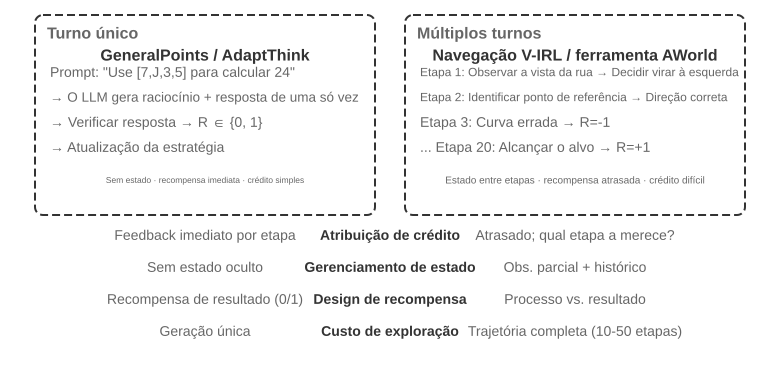

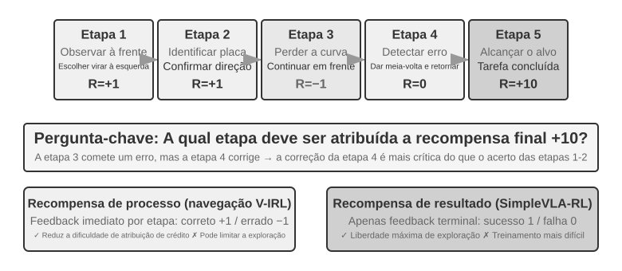

A passagem de um único turno para múltiplos turnos representa um salto qualitativo de complexidade. A política precisa não só escolher a melhor ação no presente, mas também considerar o valor dos estados futuros; além do feedback imediato, deve lidar com a **atribuição de crédito** diante de recompensas tardias, determinando qual etapa de uma sequência de múltiplos passos mais contribuiu para o resultado final. Suponha que um agente de atendimento ao cliente precise de dez turnos de diálogo para resolver o problema de um usuário e, ao final, receba uma avaliação positiva. O crédito deve ser atribuído à pergunta precisa feita no segundo turno ou à explicação paciente do sétimo?

A interação de múltiplos turnos discutida aqui corresponde exatamente ao ciclo ReAct descrito nos Capítulos 1 e 4: cada turno é uma iteração de **pensar → agir → observar**, e a recompensa tardia decorre da restrição estrutural de que a qualidade do resultado final só pode ser avaliada após vários turnos.

> **Experimento 8-12 ★★★: V-IRL-VL — navegação visual de múltiplos turnos**
>
> O V-IRL[^ch8-24] faz o agente navegar continuamente por imagens reais de ruas urbanas: o treinamento usa rotas de Nova York, enquanto os testes avaliam a transferência para outras cidades, alterando tanto a formulação das instruções de direção quanto a aparência visual. O RL supera claramente o SFT tanto em OOD de regras quanto em OOD visual, mostrando que, em tarefas de múltiplos turnos, a política precisa aprender a replanejar com base na observação atual, em vez de reproduzir as trajetórias de treinamento. O experimento usa PPO com uma rede de valor e constata que o feedback passo a passo ajuda a reduzir o problema de atribuição de crédito de longo horizonte.

> **Experimento 8-13 ★★★: SimpleVLA-RL — exploração aberta com recompensas por resultado `[Extended Experiment]`**
>
> O SimpleVLA-RL usa apenas recompensas de sucesso ou fracasso em tarefas robóticas do LIBERO. Cada tarefa recebe uma única trajetória de demonstração para a inicialização a frio via SFT; em seguida, o RL eleva a taxa de sucesso de 17,3% para 91,7% e descobre uma ação de “empurrar e cortar” que não aparecia nas demonstrações. O experimento contrasta com o V-IRL: quando os sinais de processo são fáceis de definir, eles aceleram o aprendizado; quando o caminho ideal é desconhecido, uma recompensa esparsa por resultado preserva muito mais espaço para exploração.

### Chamada de ferramentas: trazendo o ambiente para o agente

Quando uma tarefa de múltiplos turnos se conecta a ferramentas externas, as ações deixam de ser apenas “mover ou responder” e passam a incluir pesquisar, executar código, editar arquivos, consultar bancos de dados e combinar várias APIs. Assim, a chamada de ferramentas coloca simultaneamente em primeiro plano a atribuição de crédito, a engenharia de ambiente e as restrições de segurança.

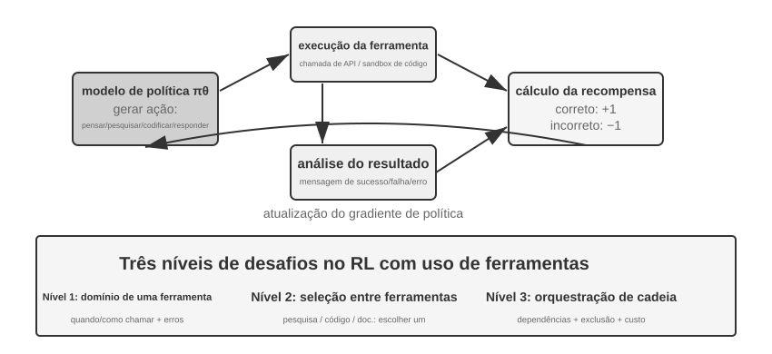

O Search-R1[^ch8-25] representa a abordagem de geração aumentada por recuperação: o modelo decide por conta própria quando pesquisar e o que buscar, usando os resultados retornados para continuar o raciocínio. Já o ReTool incorpora um interpretador de código ao ciclo de raciocínio, de modo que o modelo precisa aprender quando executar código, como interpretar o feedback e como se corrigir com base nas mensagens de erro. O AWorld-train oferece uma sandbox MCP com múltiplas ferramentas, introduzindo ainda questões de seleção de ferramentas, gerenciamento de dependências, redefinição de estado e reprodutibilidade por replay.

As trajetórias de uso de ferramentas têm um detalhe de implementação crucial: os tokens retornados pelo ambiente não são gerados pela política. Portanto, ao calcular o gradiente da política, esses tokens de feedback devem ser mascarados, e os gradientes devem ser propagados apenas pelo raciocínio do próprio modelo e pelos argumentos de suas chamadas de ferramenta. Caso contrário, o modelo será treinado para prever a saída da sandbox, em vez de aprender a usar ferramentas.

> **Experimento 8-14 ★★★: ReTool — resolução de problemas matemáticos com interpretador de código**
>
> 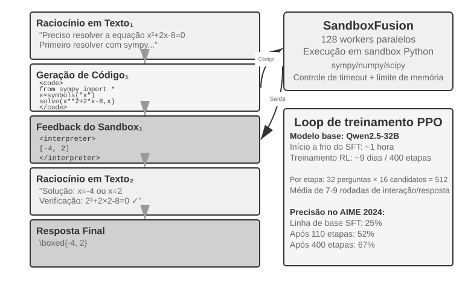
>
> Após um aquecimento com SFT, o ReTool é treinado com PPO intercalando raciocínio textual, execução de código e feedback do interpretador. O experimento mostra como o feedback das ferramentas altera a estratégia de raciocínio: o modelo aprende gradualmente a executar código de forma proativa, interpretar erros e se corrigir. Os dados de treinamento vêm do DAPO-Math-17k, mas o algoritmo de otimização continua sendo o PPO padrão[^ch8-26][^ch8-27].
>
> No AIME 2024, o treinamento elevou a acurácia de cerca de 25% para 67,0%. Em comparação com RL baseado apenas em texto, o feedback do código permitiu que o modelo aprendesse mais rapidamente a fazer cálculos precisos e corrigir erros. A dinâmica detalhada do treinamento e a configuração da sandbox estão nas notas complementares do experimento.

> **Experimento 8-15 ★★★: AWorld-train — aprendendo a usar ferramentas em uma sandbox**
>
> 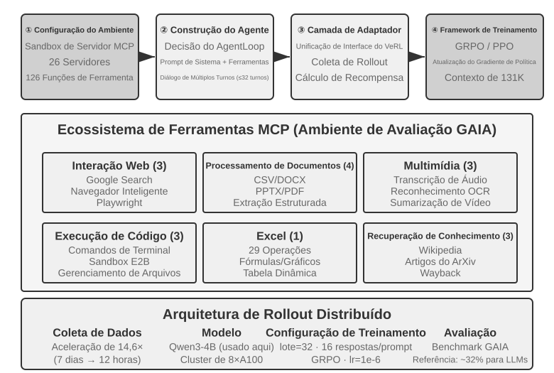
>
> O AWorld-train usa uma sandbox com servidor MCP que oferece ferramentas para web, documentos, multimídia, código e recuperação de conhecimento. O objetivo desse experimento aberto não é elevar os resultados no GAIA, mas colocar em operação, de ponta a ponta, um ciclo de treinamento com múltiplas ferramentas que possa ser redefinido e reproduzido por replay, além de observar se as taxas de sucesso das chamadas de ferramenta e as estratégias de composição melhoram com o treinamento.

Em conjunto, esses cenários deixam claro que a dificuldade de treinar agentes de múltiplos turnos não está em “ter ou não um otimizador mais sofisticado”, mas na confiabilidade do feedback do ambiente, na verificabilidade da cadeia de ações e na forma de atribuir a recompensa final às decisões intermediárias.

## Design de recompensas: transformando os objetivos da tarefa em sinais de aprendizado

Os cenários anteriores de turno único, múltiplos turnos e chamada de ferramentas mostraram *o que* treinar; esta seção responde *como o ambiente deve informar ao modelo se ele teve um bom desempenho*. O design de recompensas se desdobra em três dimensões complementares: **de onde vem a recompensa**, **quando ela é concedida** e **quanta informação ela deve expressar**. Há ainda uma quarta questão: quando o resultado está correto, o caminho seguido também foi aceitável?

### De onde vem a recompensa: regras, preferências humanas e avaliação por modelos

A fonte mais confiável é a **recompensa verificável (RLVR)**: avaliar diretamente o resultado por meio de casos de teste, asserções de banco de dados, diferenças de estado ou verificações de formato. Respostas matemáticas, testes de código e chamadas estruturadas de ferramentas são bons pontos de partida para uma recompensa binária de resultado. Quanto mais determinística for a regra, mais barata e reprodutível será a recompensa — e mais difícil será para o modelo explorá-la indevidamente.

O **RLHF** aparece aqui apenas como contexto. O fluxo básico do InstructGPT[^ch8-4] é o seguinte: humanos comparam respostas, um modelo de recompensa é treinado e, em seguida, o PPO otimiza a política. O modelo de recompensa é apenas uma aproximação das preferências, e sua otimização excessiva leva a reward hacking[^ch8-5]. Por isso, normalmente se usa uma penalidade de KL para manter a política próxima ao modelo de referência ajustado com SFT. O DPO[^ch8-6] dispensa um modelo de recompensa explícito e faz a otimização offline diretamente com pares de preferências. Esses métodos não constituem o foco principal de RL para agentes neste capítulo.

Quando o objetivo não pode ser inteiramente reduzido a regras, pode-se recorrer à avaliação por modelos. Um **modelo de recompensa generativo (GRM)** não produz apenas uma pontuação, mas também um diagnóstico do que foi bem executado e do que precisa ser alterado. Ele pode servir como fonte de recompensa, e seus diagnósticos podem ser convertidos em dados para destilação ou preferências. A ideia central do DeepSeek-GRM[^ch8-23] é fazer o modelo primeiro inferir os princípios de avaliação da tarefa, depois avaliar a trajetória segundo esses princípios e, por fim, confrontar a própria avaliação com fatos verificáveis. O feedback resultante é mais transparente, mas ainda requer calibração humana por amostragem para evitar que o avaliador desenvolva vieses próprios.

Convém distinguir dois conceitos que podem ser facilmente confundidos. **Reward hacking** consiste em explorar uma regra ou falha de implementação para obter uma pontuação alta. **Reward seeking** ocorre quando o modelo primeiro constrói internamente uma representação de *o que o avaliador examinará* e depois ajusta seu comportamento com base nessa suposição. Isso não exige adulterar testes nem fabricar resultados, mas, em tarefas de longo horizonte, pode levar o modelo a estabelecer uma verificação superficial, encerrar assim que for aprovado e entregar algo que satisfaça a métrica substituta, mas não a intenção real[^ch8-29]. Portanto, “passou pelo avaliador” não equivale automaticamente a “a tarefa foi concluída”: o avaliador é uma aproximação da intenção e, quanto mais intenso o treinamento, maior a probabilidade de o modelo tratar essa aproximação como o objetivo em si.

### Quando a recompensa é concedida: resultado ou processo

Uma **recompensa de resultado (ORM)** avalia apenas ao final do episódio se a tarefa foi concluída. É a forma mais simples e dá à política a maior liberdade de exploração. Quando não existe um padrão consensual para o caminho intermediário e a solução ideal ainda não foi encontrada por humanos, a recompensa esparsa de sucesso ou fracasso do SimpleVLA-RL é um ponto de partida adequado. O feedback esparso dificulta a identificação de um erro específico em uma trajetória de várias etapas, o que há muito limita a eficiência amostral do RL[^ch8-8]. Em tarefas de programação ou trabalho colaborativo de longo horizonte, o julgamento de “a tarefa foi concluída?” também deve ficar a cargo de testes ocultos, asserções de estado ou um mecanismo externo de encerramento que o modelo não possa escrever — nunca apenas da própria alegação de conclusão do modelo.

A “conclusão prematura” é um exemplo concreto: quando o modelo afirma que a tarefa terminou, o harness executa, em um espaço de trabalho isolado, testes de aceitação que o modelo não consegue ver. Se passar, o modelo recebe uma recompensa positiva; se falhar, recebe uma recompensa negativa. Esses testes devem ler arquivos reais ou o estado do ambiente, em vez de apenas verificar se o modelo disse “concluído”; caso contrário, ele poderá aprender a prometer uma verificação sem de fato realizá-la. Durante a avaliação, mantenha separado um conjunto limítrofe de tarefas inacabadas e um conjunto reservado de tarefas realmente concluídas: o primeiro revela a taxa de encerramento prematuro, enquanto o segundo mostra se o modelo ainda consegue finalizar normalmente. Sem essa separação, corre-se o risco de treinar um modelo que nunca ousa concluir a tarefa.

Uma **recompensa de processo (PRM)** fornece feedback em etapas intermediárias, verificando aspectos como autenticação, argumentos de ferramentas, número de testes aprovados ou ações de navegação. O trabalho da OpenAI *Let's Verify Step by Step*[^ch8-7] demonstrou o valor da verificação passo a passo no raciocínio matemático. As recompensas de processo amenizam a atribuição de crédito em tarefas de longo horizonte, mas podem restringir o modelo ao caminho previsto pelo projetista, além de terem maior custo de rotulagem e validação. O V-IRL-VL (Experimento 8-12) usa feedback de navegação passo a passo, enquanto o SimpleVLA-RL (Experimento 8-13) mantém apenas a recompensa no ponto final. Juntos, formam um contraste controlado: o feedback denso favorece a velocidade de convergência, enquanto o feedback esparso amplia o espaço de exploração.

Na prática, primeiro estabeleça uma linha de base confiável com recompensas de resultado e só então adicione sinais de processo para eventos intermediários realmente verificáveis. Em RL com LLMs de múltiplos turnos, o fator de desconto geralmente é definido como $\gamma=1$; a rede de valor do PPO ou a vantagem em nível de turno atribui o feedback final às ações anteriores, enquanto o GRPO distribui uma vantagem em nível de trajetória entre os tokens gerados. Por isso, a diluição do sinal exige atenção especial em trajetórias longas.

### Quanta informação a recompensa deve expressar: escalar, vetor e diagnóstico generativo

A **densidade** de uma recompensa e sua **forma de representação** são aspectos distintos. Um escalar responde apenas “qual foi a qualidade geral”; um semiescalar apresenta primeiro uma breve justificativa e depois uma pontuação; um vetor atribui pontuações separadas a dimensões como precisão, completude, custo e segurança; uma recompensa generativa produz um diagnóstico em linguagem natural, que pode ser amostrado várias vezes e agregado. O critério de escolha é simples:

- Se houver uma resposta ou um teste objetivo: prefira um escalar binário;
- Se houver vários objetivos de qualidade independentes: use um vetor ou combine as dimensões em um escalar ponderado;
- Se a tarefa for aberta e difícil de expressar exaustivamente por regras: use um diagnóstico generativo, acompanhado de verificação factual e revisão humana por amostragem.

Não acumule dimensões não verificáveis em nome de uma recompensa “mais rica”. Cada nova dimensão de avaliação cria outra possibilidade de exploração indevida pela política. Primeiro confirme que o sinal produz diferenças significativas dentro do grupo em alguns rollouts; só então decida se ele deve ser incorporado ao treinamento.

### Um resultado correto não basta: restrições de trajetória e RLVP

Uma recompensa de resultado determina se a tarefa foi concluída, mas não expressa se ela foi realizada da maneira prevista. Um agente real pode obter sucesso aparente alterando o arquivo de teste, ignorando a autenticação ou executando um comando destrutivo. O princípio por trás do RLVP (Reinforcement Learning with Verified Penalty)[^ch8-9] é: **recompensar o resultado e penalizar a trajetória**. Ele se aplica a **restrições neutras quanto ao resultado**, verificáveis por máquina e independentes do sucesso ou fracasso final; não substitui verificações independentes da intenção semântica, da integridade da entrega e do comportamento de encerramento antecipado.

Ambientes reais costumam funcionar como **verificadores assimétricos**: detectar que “uma ação indevida foi executada” é barato e confiável, enquanto provar que “esta etapa representou um avanço significativo em direção ao objetivo” é difícil. Represente a recompensa total como $R=O+\beta\Phi$, em que $O$ é o resultado da tarefa e $\Phi$ é um sinal de trajetória calculado para cada ação por regras determinísticas. Aplique penalidades a violações verificáveis e conceda uma pequena recompensa parcial por ações verificavelmente conformes ou subobjetivos alcançáveis; normalize os dois canais antes de combiná-los, para evitar que o sinal de trajetória se sobreponha ao objetivo principal. Isso não altera o PPO nem o GRPO — apenas a recompensa observada em cada etapa.

No nível da implementação, separe a saída do verificador em dois canais e encaminhe-os ao otimizador de política existente:

```python
outcome = verify_final_state(trajectory)              # result, not self-report
path_signal = 0
for step in trajectory:
    path_signal += deterministic_path_signal(step)    # penalty or reachable progress
reward = normalize(outcome) + beta * normalize(path_signal)
```

As ações permitidas, os subobjetivos alcançáveis, os testes ocultos e a forma de registrar evidências dependem do ambiente específico. Este texto explica apenas como combinar a recompensa de resultado com a restrição de trajetória, evitando que as regras de um ambiente sejam confundidas com um algoritmo geral.

O ponto central do RLVP não é que “recompensas mais densas são melhores”, mas sim se é possível recuperar a variação dentro do grupo. Uma recompensa baseada apenas no resultado produz variância zero e nenhum gradiente tanto nos grupos em que todas as tentativas fracassam quanto naqueles em que todas têm sucesso. Ações que violam as regras costumam ser fáceis de detectar, portanto uma penalidade quase sempre restaura a variação; já uma recompensa por progresso só funciona quando o progresso parcial é de fato alcançável. Disso decorrem quatro regras de projeto: penalize ações específicas, nunca a “falta de esforço”; preserve sempre a recompensa de resultado, para que o modelo não aprenda a não fazer nada; sempre que possível, associe cada penalidade a uma trajetória conforme e alcançável; e adote regras determinísticas, difíceis de explorar. Se a política-base jamais amostrar a ação conforme, use primeiro algumas demonstrações para introduzir essa trajetória e reduza gradualmente a modelagem por trajetória quando o comportamento conforme se estabilizar. Em outras palavras, a penalidade é a metade que costuma ser alcançável, enquanto a recompensa por progresso é a metade condicionada à alcançabilidade.

> **Experimento 8-16 ★★★: RLVP — recompensar o resultado, penalizar a trajetória**
>
> Adicione ao GRPO uma recompensa de resultado $O$ e um sinal de trajetória $\Phi$, comparando-os com uma recompensa baseada apenas no resultado. No TerminalBench, o número de violações cai de 3,71 para 0,66, enquanto a taxa de sucesso permanece praticamente inalterada; no miniF2F, uma recompensa parcial alcançável reduz de 7,0 para 4,4 o número de iterações necessário para atingir uma taxa de sucesso de 0,9. No reparo de software, quando nenhum rollout consegue passar em teste algum, o sinal de progresso é inalcançável e sua inclusão não traz benefícios. A lição é: verifique se o sinal é alcançável antes de decidir acrescentar uma dimensão de recompensa.

Esses números vêm de ambientes substitutos controlados e não podem ser extrapolados diretamente para ganhos equivalentes em um agente em produção. A conclusão mais segura diz respeito ao mecanismo: desde que o sinal de trajetória diferencie comportamentos dentro do mesmo grupo de rollouts e que a política tenha dificuldade para explorar brechas nas regras, ele fornece justamente a informação que a recompensa final não consegue captar. Implantações reais também precisam incorporar ao harness verificação oculta, monitoramento de trajetórias e condições externas de encerramento.

## Destilação: como melhorar a eficiência amostral

Os experimentos anteriores demonstraram sistematicamente o valor central do RL no treinamento de agentes, mas todos tiveram um alto custo amostral. Aqui, “eficiência amostral” tem um significado específico: **quantas atualizações efetivas de parâmetros cada interação dispendiosa com o ambiente proporciona**, e não apenas o número de etapas de treinamento ou de horas de GPU. O treinamento de RL do ReTool levou mais de 200 vezes o tempo do SFT — 9 dias contra 1 hora —, o que torna especialmente valiosa a redução da amostragem no ambiente.

A baixa eficiência amostral do RL decorre da alta variância e da dificuldade de reutilizar dados on-policy, mas a causa mais fundamental é a escassez do feedback. O RL model-free predominante costuma produzir apenas um valor escalar de sucesso ou fracasso ao final de um rollout; a causa de um erro intermediário, a ausência de um campo ou uma orientação sobre o procedimento não geram nenhum sinal direto de aprendizado. Quando um roteiro de atendimento ao usuário diz “preciso dos quatro últimos dígitos do cartão de crédito”, o modelo só consegue aprender por tentativa e erro a partir de um resultado final 0/1, talvez precisando de centenas de interações para chegar por acaso a essa etapa — enquanto um ser humano a memoriza após ouvi-la uma única vez.

**A destilação transforma um rollout em um sinal denso de supervisão**, permitindo que uma única trajetória contribua com muitos gradientes sem que seja necessário explorar trajetórias adicionais no ambiente. Esse é o principal motivo pelo qual a destilação melhora a eficiência amostral.

### Destilação on-policy: como obter supervisão densa de um único rollout

A Destilação On-Policy foi sistematizada e popularizada pela Thinking Machines Lab em 2025[^ch8-10]. Aqui, “policy” indica **quem gera os prefixos de estado nos quais o aluno aprende**, e não quem fornece a supervisão:

| Método | Quem amostra a trajetória ou o estado? | Principal supervisão por trajetória |
| --- | --- | --- |
| SFT / destilação off-policy | Humano ou professor | Supervisão densa no nível de tokens a partir de respostas rotuladas |
| RL on-policy | Aluno atual | Recompensas de resultado ou de processo, geralmente esparsas |
| Destilação On-Policy | Aluno atual | Distribuições densas de tokens do professor nos prefixos do aluno |

A supervisão do SFT é densa, mas abrange principalmente os estados que um professor visitaria. Se, após a implantação, o aluno cometer logo no início um erro que o professor não cometeria, ele entrará em um prefixo ausente dos dados de treinamento; cada previsão subsequente será então feita em um estado desconhecido, e os erros poderão se acumular ao longo de uma sequência extensa. O RL on-policy treina diretamente na distribuição de estados do próprio aluno e, por isso, é mais relevante, mas muitas vezes recebe apenas um sinal de sucesso ou fracasso ao final da trajetória. A Destilação On-Policy combina as duas abordagens: **o aluno decide aonde vai, e o professor fornece a distribuição completa do próximo token no estado que o aluno efetivamente alcançou.**

Assim, um rollout de comprimento $T$ deixa de produzir apenas um sinal 0/1 e passa a gerar aproximadamente $T$ conjuntos de supervisão no nível de tokens. Ele acompanha os erros reais do aluno mais de perto do que o SFT off-policy e fornece feedback mais denso e com menor variância do que o RL puro. A inferência do professor aumenta o custo computacional, mas não exige outro conjunto de trajetórias no ambiente. Ainda assim, ela não cria uma capacidade do zero: o aluno precisa ao menos alcançar estados relevantes que o professor possa corrigir, e a política do professor não pode estar muito distante do suporte efetivo do aluno. Se o modelo-base não dominar sequer o idioma-alvo, os conceitos do domínio ou as ações básicas, deve-se primeiro fazer Mid-training ou usar demonstrações off-policy para uma inicialização a frio e, depois, migrar para a destilação on-policy.

Isso também mostra por que a questão numérica anterior é importante. A Destilação On-Policy otimiza a divergência KL em relação ao professor nos estados visitados pela política atual do aluno. Se o mecanismo de rollout na verdade amostra de $\mu$ enquanto o trainer calcula outra $\pi_\theta$, os estados de treinamento já são off-policy, mesmo sem o uso explícito da razão de probabilidades do PPO. As implementações ainda devem verificar, antes de cada atualização, se as log-probabilidades do sampler e do trainer coincidem; caso contrário, uma suposta Destilação On-Policy se degrada em um treinamento com incompatibilidade entre distribuições.

Na prática, aproxima-se a distribuição prevista pelo aluno da distribuição do professor, geralmente minimizando a **divergência KL** entre elas. Por exemplo, quando o aluno gera “primeiro consulte a API e depois analise o valor retornado...”, o professor pode atribuir, na posição atual, uma distribuição de 80% para “consulte”, 15% para “chame” e 5% para todos os demais tokens. Em comparação com uma recompensa binária ao final da tarefa, o alinhamento no nível de tokens oferece um sinal de aprendizado muito mais denso e com menor variância; o custo é a inferência do professor, especialmente vantajosa quando a interação com o ambiente é cara.

O pseudocódigo básico da destilação on-policy é:

```python
student_trajectory = rollout(student, task)
loss = 0
for state in student_trajectory:
    teacher_logits = teacher(state)
    loss += KL(student_logits(state), teacher_logits)
update_student(loss)
```

Em tarefas como as de matemática, são necessárias cerca de **um décimo** das etapas de treinamento do RL puro para alcançar um desempenho comparável. Em agentes com múltiplos turnos, nos quais o sinal de sucesso chega mais tarde e é mais esparso, a distribuição de tokens do professor pode orientar diretamente as decisões intermediárias — mas somente se o ambiente de simulação for realista o bastante para que os estados explorados pelo aluno permaneçam próximos da distribuição da implantação; caso contrário, as avaliações do professor em estados desconhecidos e fora da distribuição também serão pouco confiáveis.

O princípio de que “sinais densos superam sinais esparsos” também foi verificado em um cenário inteiramente voltado a agentes. O autor e seus colaboradores compararam DPO, quatro variantes de RL e Destilação On-Policy em uma tarefa de “percepção temporal”: as abordagens do primeiro grupo foram limitadas, respectivamente, por recompensas esparsas, desalinhamento de objetivos, incompatibilidade no formato dos rollouts e colapso da política. Ao adotar um Qwen3-32B congelado como professor e fazer o alinhamento token a token nas trajetórias de múltiplos turnos do próprio aluno, o treinamento convergiu de maneira estável, e as taxas de aprovação nas quatro condições ficaram entre 23 e 47 pontos percentuais acima da linha de base de SFT com a mesma origem[^ch8-11]. Isso sugere que o gargalo muitas vezes não está na falta de sofisticação da função de recompensa, mas na quantidade insuficiente de sinal fornecida por cada interação.

### E se não houver um professor mais forte? Autodestilação On-Policy

O poder da On-Policy Distillation vem do professor, mas isso impõe um pré-requisito incontornável: **é preciso haver um modelo professor claramente superior ao aluno.** Em muitos cenários, essa condição não se sustenta. Se o objetivo é treinar um modelo para um domínio vertical no qual todos os modelos existentes apresentam deficiências, não há professor disponível. Sem um professor mais forte, os benefícios dos sinais densos ficam fora de alcance?

Uma solução engenhosa é a **On-Policy Self-Distillation (OPSD, autodestilação on-policy)**[^ch8-15]: **o mesmo modelo desempenha os papéis de professor e aluno, mas recebe contextos diferentes.** A versão professora tem acesso a “informações privilegiadas”, como uma resposta de referência ou uma solução correta já verificada; a versão aluna vê apenas o problema, mas alinha sua distribuição token a token à da versão professora nas trajetórias que ela própria amostrou. Explicar, com a resposta em mãos, o caminho que o aluno acabou de percorrer costuma ser mais fácil do que explorar de forma independente. Assim, um único rollout ainda produz supervisão densa.

A OPSD pode ser entendida como uma variante restrita do pseudocódigo anterior:

```python
student_trajectory = rollout(model, task_without_answer)
loss = 0
for state in student_trajectory:
    privileged_state = add_verified_answer(state)
    teacher_logits = stop_gradient(model(privileged_state))
    loss += KL(model(state), teacher_logits)
update(model, loss + retention_regularizer)
```

`privileged_state` só pode ser construído durante o treinamento e não deve vazar para o agente implantado; `retention_regularizer` representa um conjunto de retenção ou uma restrição de estilo, e não um hiperparâmetro fixo. O pipeline de treinamento também precisa verificar as permissões dos dados, o mascaramento das respostas e o risco de esquecimento.

Em comparação com o RLVR, a OPSD não exige que a recompensa possa ser verificada automaticamente: as informações privilegiadas podem ser uma resposta de referência, uma demonstração humana ou documentação do domínio. Ela usa essas informações no lugar de um professor externo mais forte, preservando a vantagem de eficiência amostral da “amostragem on-policy com supervisão token a token”. No entanto, não cria conhecimento do nada: se o modelo não consegue explicar o processo nem mesmo com a resposta em mãos, a autodestilação não produz nenhum sinal adicional. Além disso, uma implementação ingênua da OPSD pode levar o modelo a perder seu estilo original de raciocínio, exigindo regularização adicional para estabilizá-lo[^ch8-16].

## De casos problemáticos ao pós-treinamento

Esta seção retoma a questão deixada em aberto no Capítulo 7: como um conjunto de dados de avaliação criado a partir de casos problemáticos de produção se torna, de fato, uma entrada para o pós-treinamento. No fim do Capítulo 7, o ambiente de avaliação e seus verificadores foram comparados aos alicerces do pós-treinamento. Registros de atribuição de falhas, tarefas de regressão de ponta a ponta, tarefas de regressão de prefixo de trajetória e pontuações por rubrica correspondem, cada qual, a um uso distinto no treinamento:

Tabela 8-5. Mapeamento dos dados de avaliação do Capítulo 7 para os usos de treinamento do Capítulo 8

| Dados de avaliação do Capítulo 7 | Uso no treinamento do Capítulo 8 |
|---|---|
| Tarefa de regressão de ponta a ponta com verificador | Tarefas de rollout de RL e recompensas verificáveis (RLVR); pool de amostragem para ajuste fino com amostragem por rejeição (RFT) |
| Tarefa de regressão de prefixo de trajetória | Pares de preferência para DPO, demonstrações de SFT para limites de decisão e estados do professor para On-Policy Distillation |
| Registro de atribuição de falha (primeiro passo incorreto e categoria do erro) | Rótulos negativos para supervisão de processo (PRM); regras para penalidades de caminho no RLVP |
| Pontuações multidimensionais por rubrica e conjunto de referência anotado por humanos | Dimensões das recompensas vetoriais; dados de treinamento e calibração para modelos generativos de recompensa (GRM) |

### Caso 1: encerramento prematuro do agente de programação

**Do caso problemático à atribuição.** Uma das falhas mais comuns e difíceis de corrigir em agentes de programação é o **encerramento prematuro**: declarar que “terminou” antes de executar os testes; encerrar após implementar apenas duas das três funcionalidades solicitadas pelo usuário; ou anunciar que “esta tarefa é impossível” depois de duas falhas. Na taxonomia de erros do Capítulo 7, isso pertence à categoria “completude da tarefa e julgamento lógico”, e os três tipos de sinal de produção conseguem detectá-lo: correções do usuário (“você nem executou os testes”), avaliações negativas e auditorias posteriores (uma trajetória que declara a conclusão sem nenhuma chamada de ferramenta de teste). O registro de atribuição localiza o primeiro erro no limite de decisão em que o agente estava “prestes a declarar a conclusão”. Até esse ponto, a leitura e a edição do código poderiam estar corretas; o erro foi “concluir sem evidências”. A busca por recompensa discutida anteriormente na seção sobre design de recompensas — criar uma verificação superficial que passa por pouco e, então, encerrar antes da hora — descreve exatamente esse comportamento.

**Construção dos dados de treinamento.** Tarefa de regressão de ponta a ponta: formular “os testes de aceitação devem passar antes que a conclusão seja declarada” como uma recompensa verificável. Os testes ficam ocultos para o modelo e só são executados quando ele afirma ter terminado; aprovação vale +1, reprovação vale −1. Essa é uma aplicação direta de “deixar a decisão a cargo de testes ocultos que o modelo não consegue escrever”, conforme apresentado na seção sobre design de recompensas, e constitui a ramificação opcional de RL deste caso.

Tarefa de regressão de prefixo de trajetória: recortar a trajetória no limite de decisão “prestes a declarar a conclusão” para criar **pares de preferência**. A amostra rejeitada contém o comportamento de encerramento prematuro; a escolhida contém o comportamento desejado: “primeiro executar os testes, conferir cada condição de aceitação e só então concluir”. As amostras escolhidas são geradas por um modelo professor e depois filtradas por um verificador baseado em regras — amostragem por rejeição —, produzindo um lote de pares de treinamento para DPO. Se houver poucos casos problemáticos, a ampliação de dados — variando o tipo de tarefa, o item de verificação ausente e a formulação da conclusão — pode gerar centenas de pares de preferência. Eles devem ser combinados, em baixa proporção, com dados de tarefas gerais para o ajuste fino com LoRA, evitando que “sempre verificar antes de encerrar” se torne um novo sobreajuste e reduzindo o risco de esquecimento catastrófico.

**Avaliação: tanto o conjunto de limites quanto o conjunto de retenção são indispensáveis.** A validação após o treinamento usa os conjuntos de dados de avaliação do Capítulo 7: o conjunto de limites de prefixos de trajetória verifica se, “quando a tarefa não está concluída, o modelo opta por continuar verificando em vez de declarar a conclusão”. Igualmente importante é o **conjunto de retenção**: quando a tarefa de fato terminou, o modelo deve declarar a conclusão normalmente. Observar apenas a primeira métrica leva o modelo a um estado de **correção excessiva**, no qual ele nunca se arrisca a encerrar: todas as tarefas passam por verificações intermináveis, e a latência e o custo disparam. Essa é a manifestação, no nível dos parâmetros, do mesmo princípio reiterado no Capítulo 7: “uma mudança não pode prejudicar comportamentos existentes”. A avaliação também deve verificar por amostragem as capacidades gerais, confirmando que o patch de LoRA não comprometeu outras capacidades.

> **Experimento 8-17 ★★: de um caso problemático de “encerramento prematuro” a uma correção com DPO**
>
> **Objetivo**: executar o fluxo completo de um caso problemático de produção até a atualização dos parâmetros — atribuição da falha → tarefa de regressão de prefixo de trajetória → pares de preferência para DPO → treinamento com LoRA de um modelo 7B → validação dupla em um conjunto de limites e um conjunto de retenção.
>
> **Construção dos dados**: o repositório complementar fornece 24 casos realistas de encerramento prematuro, abrangendo quatro tipos de falha: declarar a conclusão sem executar testes, concluir apenas parte de uma solicitação com vários objetivos, não satisfazer as condições de aceitação e desistir após erros declarando que a tarefa é impossível. Também inclui variantes mais graves de manipulação de recompensa, como excluir o teste que falhou, além de um conjunto de avaliação reservado e rigorosamente separado dos dados de treinamento — 12 casos de limite e 8 casos de retenção.
>
> Este é um experimento didático. Em produção, os pares de preferência precisam abranger mais famílias de tarefas, e o conjunto de retenção deve incluir mais cenários de “encerramento normal”. Também é necessário ficar atento a novas formas de manipulação de recompensa: o modelo pode aprender a *dizer* que verificou sem realmente verificar. É justamente por isso que a recompensa do conjunto de dados de ponta a ponta deve se basear em testes ocultos que o modelo não consegue escrever, e não nas declarações do próprio modelo.

### Caso 2: aspas em chinês

Um usuário informa que “as aspas retas em artigos em chinês devem ser padronizadas como aspas curvas”. Essa frase descreve uma expectativa, mas não fornece uma regra que possa ser usada diretamente no treinamento: a mesma aspa desempenha papéis totalmente diferentes em prosa chinesa, trechos citados em inglês, código inline em Markdown, blocos de código, comentários de código, JSON e caminhos. A correção adequada é uma **edição mínima sensível ao escopo**: as citações em prosa chinesa podem ser convertidas em `""`, com citações aninhadas seguindo as regras de pontuação chinesas; trechos citados em inglês, código executável, JSON/esquemas, caminhos, identificadores e qualquer conteúdo entre crases no Markdown devem ser preservados exatamente como estão; quando não for possível determinar o escopo, o texto original deve ser mantido.

**Construção dos dados de treinamento.** As regras de uso das aspas são registradas como uma Skill. Os exemplos positivos abrangem parágrafos em chinês, citações aninhadas e prosa chinesa em comentários de código; os exemplos negativos incluem trechos citados em inglês, literais de string e de caractere, JSON, caminhos, código inline e blocos de código completos. Assim, o modelo aprende a “determinar primeiro o escopo e depois fazer a edição mínima”, e não a “substituir toda aspa reta que encontrar”.

> **Experimento 8-18 ★★: SFT sensível ao escopo para aspas curvas em chinês**
>
> **Objetivo**: verificar se o SFT com LoRA consegue fazer o modelo “converter as aspas que devem ser curvas e preservar as aspas protegidas” com precisão em documentos que combinam chinês, inglês, Markdown, código e JSON, mantendo esse limite em combinações de contexto nunca vistas.
>
> **Configuração**: `Qwen/Qwen3-8B` como modelo-base, treinado com LoRA em bf16 por 2 épocas (256 atualizações). As regras de escopo em `SKILL.md` servem simultaneamente como especificação para geração de rótulos, controle de qualidade e especificação de regressão. O modelo é responsável apenas por escolher o escopo e produzir a edição mínima; o parser e as verificações sintáticas do ambiente de produção não são removidos.
>
> **Construção dos dados**: são geradas 1.024 amostras de treinamento, 256 amostras reservadas e 256 amostras de limite, distribuídas por 16 categorias de fragmentos, 10 gêneros textuais e 9 linguagens de programação. As amostras armazenam o texto de origem e o texto-alvo em pares. A prosa chinesa e os comentários de código em chinês fornecem os exemplos positivos que exigem conversão, enquanto trechos citados em inglês, literais de string, JSON, caminhos, código inline, blocos de código e estruturas aninhadas fornecem os exemplos negativos que devem ser protegidos.

### Caso 3: falhas frequentes na edição de arquivos

Como descrito no Capítulo 5, agentes de programação costumam usar uma ferramenta como `edit_file(path, old_string, new_string)`: o modelo transcreve nos argumentos da ferramenta o `old_string` que deseja substituir. Em geral, as ferramentas de edição fazem correspondência exata de strings; portanto, uma única diferença em um espaço, uma quebra de linha, uma barra invertida, um caractere Unicode combinante ou um token pouco frequente resulta em falha.

**Do caso problemático à atribuição da causa.** Compare as trajetórias com falha, camada por camada, ao longo desta cadeia: bytes originais do arquivo → retorno da ferramenta → serialização do harness → contexto do modelo → tokens gerados pelo modelo → string decodificada → análise de JSON/chamada de ferramenta → correspondência realizada pela ferramenta.

Se a leitura do arquivo ou o retorno da ferramenta já tiver alterado os bytes, atribua a causa à ferramenta; se a serialização, o escape ou a montagem do prompt tiver modificado o conteúdo, atribua-a ao harness; se o conteúdo mudar ao ser codificado e depois decodificado pelo tokenizer, atribua-a ao tokenizer. Somente quando o contexto recebido pelo modelo corresponder exatamente à string original e **a saída do modelo for o primeiro ponto da cadeia em que surgir uma diferença** será possível classificar o problema como uma falha na capacidade de cópia exata do modelo e considerá-lo candidato a pós-treinamento.

**Construção dos dados de treinamento.** Abstraia a tarefa de cópia em três tarefas verificáveis: repetição literal; seleção do alvo exatamente idêntico entre várias strings semelhantes e de mesmo comprimento; e transcrição integral de uma string especificada no argumento JSON `old_string` de uma chamada de ferramenta. As amostras incluem deliberadamente os espaços, as quebras de linha reais, as barras invertidas e os caracteres Unicode que mais costumam corromper edições reais.

> **Experimento 8-19 ★★: SFT de cópia exata para strings especiais**
>
> **Objetivo**: após confirmar que a diferença decorre de um erro de transcrição do modelo, testar se o SFT com LoRA melhora a transcrição exata de strings aleatórias e usar uma auditoria com tokenizer independente para descartar artefatos causados pela tokenização.
>
> **Configuração**: `Qwen/Qwen3-8B` como modelo-base, treinado com LoRA em bf16 por 2 épocas. O script de treinamento fornece supervisão em nível de token apenas para a string-alvo ou para o campo JSON `old_string`.
>
> **Resultados**: a acurácia byte a byte no conjunto de retenção do modelo subiu de 37,5% no modelo-base para 78,9%, chegando a 80,1% em um conjunto independente de casos-limite; a posição média do primeiro byte divergente foi de 54,0 e 54,2, respectivamente. Em separado, 512 amostras de teste extraídas dos conjuntos de retenção e de casos-limite foram usadas para comparar três tokenizers de código aberto, e a taxa de round-trip sem perdas tanto do Qwen3 quanto do Qwen2.5 foi de 80,1%. Portanto, os 80,1% refletem simultaneamente a capacidade de cópia do modelo e o limite imposto pelo tokenizer.

## Lições práticas do pós-treinamento

Este capítulo percorreu um longo caminho desde a tarefa de “prever o próximo token” do pré-treinamento: o Mid-training supre lacunas de conhecimento e de capacidades fundamentais na distribuição-alvo; o SFT ensina formatos e protocolos com eficiência; e o RL orientado a resultados melhorou a generalização fora da distribuição nos experimentos controlados deste capítulo. Tarefas com múltiplos turnos introduzem o problema da atribuição de crédito; o projeto de recompensas se estende das recompensas por resultado a sinais ao longo da trajetória que “recompensam o resultado e restringem o processo”; e o uso de ferramentas traz uma explosão combinatória. Há um único fio condutor em tudo isso: o que o modelo aprende depende do que o sinal de treinamento lhe ensina, e a qualidade desse sinal é determinada sobretudo pelos dados e pelo ambiente, não pelo algoritmo.

Vale ficar atento às seguintes **armadilhas comuns**; reconhecê-las costuma evitar mais desperdício de recursos do que dominar detalhes técnicos:

1. **Tentar inserir uma base de conhecimento à força por meio de SFT ou confiar todo o conhecimento aos parâmetros** — grandes volumes de conhecimento estável de um domínio e capacidades fundamentais podem ser incorporados aos parâmetros com Mid-training; em seguida, o SFT ensina o modelo a acessá-los e expressá-los. Fatos que exigem atualização, citação, controle de acesso ou exclusão devem ser gerenciados por RAG.
2. **Introduzir RL antes de estabilizar o formato** — se o modelo não consegue produzir de forma confiável o JSON necessário para calcular a recompensa, o sinal de treinamento se torna esparso ou distorcido. A taxa aceitável de falhas de análise depende da tarefa e do projeto da recompensa; nenhum limite fixo deve ser tratado como universal. Primeiro, defina um patamar de estabilidade de formato por meio de uma avaliação em pequena escala e, se necessário, estabilize a saída com SFT ou decodificação restrita antes de aplicar RL.
3. **Tratar uma janela de contexto nominal como efetiva** — permitir entradas de 128K por meio da codificação posicional não significa que o modelo ainda consiga recuperar informações, raciocinar e planejar nesse comprimento. Antes de ampliar a janela, conclua os testes de capacidade no comprimento atual; em cada etapa, preserve dados curtos e o replay das etapas anteriores; e verifique a degradação com uma matriz de capacidade × comprimento.
4. **Aplicar RL enquanto `pass@k` ainda está próximo de zero** — rollouts em que todas as tentativas falham não contêm trajetórias positivas, e o GRPO também perde a vantagem intragrupo. Primeiro, use Mid-training para desenvolver a capacidade, SFT ou destilação para ampliar o suporte efetivo, ou crie um currículo alcançável e recompensas parciais alinhadas ao objetivo final.
5. **Projetar mal as funções de recompensa**, levando à exploração indevida da recompensa — o modelo aprende a explorar brechas para obter uma pontuação alta em vez de realmente concluir a tarefa. Avalie o objetivo final, não uma métrica intermediária usada como proxy.
6. **Ignorar a fidelidade da simulação** — se a simulação for simplista demais ou as respostas do ambiente não forem realistas, a política resultante falhará em cenários reais. Construir uma simulação de alta fidelidade pode custar mais do que o próprio treinamento.
7. **Treinar em excesso e degradar a generalização** — se a perda de treinamento continuar caindo enquanto o desempenho na validação piora, o modelo estará memorizando detalhes. O Mid-training pode causar esquecimento de capacidades gerais, o SFT pode sobreajustar às demonstrações e o RL pode sobreajustar à recompensa e à distribuição de tarefas atuais; os três exigem conjuntos de retenção independentes e interrupção antecipada.
8. **Colapso da função de valor e exploração insuficiente** — estimativas de valor imprecisas no PPO introduzem viés no cálculo da vantagem, manifestando-se como oscilações intensas nas curvas de treinamento. Uma temperatura muito baixa ou aleatoriedade insuficiente aprisiona o agente em um ótimo local.
9. **Tratar a incompatibilidade numérica entre treinamento e inferência como ruído inofensivo** — se a razão entre as probabilidades do sampler e do trainer já diferir de 1 antes de uma atualização, um treinamento supostamente on-policy terá se tornado off-policy de forma silenciosa. Monitore as diferenças de log-probabilidade, a KL aproximada, a fração de clipping e a defasagem da política.
10. **Subestimar o custo computacional do RL** — uma tarefa que funciona bem com SFT pode exigir de 10 a 100 vezes mais tempo de treinamento com RL. Se a distribuição de teste for muito semelhante à de treinamento, o SFT talvez já seja suficiente.
11. **Usar dados de treinamento de baixa qualidade** — o Mid-training absorve associações incorretas do corpus, o SFT aprende diretamente o ruído das demonstrações e uma recompensa de RL com viés sistemático amplifica a política na direção errada.

Princípio fundamental: **valide as principais hipóteses com experimentos em pequena escala antes de comprometer recursos em grande escala** — use um corpus pequeno de Mid-training para examinar as curvas de conhecimento, capacidade e esquecimento; um conjunto pequeno de SFT para testar a estabilidade do formato; e um lote pequeno de rollouts para verificar `pass@k`, a variação das recompensas e a consistência numérica entre sampler e trainer. Falhar rápido é preferível a falhar em grande escala.

**Sinergia com RAG e ICL (aprendizado em contexto)**: as três abordagens não são mutuamente excludentes; elas atuam em pontos diferentes. O ICL usa exemplos, regras e o estado atual para uma adaptação imediata e sem alteração de parâmetros, embora a latência e o custo aumentem à medida que o contexto cresce; a RAG mantém fatos e evidências em uma fonte externa de conhecimento, que pode ser atualizada dinamicamente e rastreada; o pós-treinamento incorpora aos parâmetros a percepção de alta dimensionalidade, o estilo de geração e as políticas implícitas de decisão. A escolha não depende apenas da estabilidade da tarefa no longo prazo, mas sobretudo de a capacidade poder ser expressa adequadamente por símbolos externos. Capacidades como reconhecimento de imagens médicas ou uso de um tom de voz natural muitas vezes ainda exigem atualização dos parâmetros, mesmo em domínios que mudam continuamente. Por outro lado, uma regra de aprovação de transferências estável há muito tempo deve ser garantida de forma determinística pelo código, e não deixada apenas a cargo da memória do modelo.

Sistemas robustos geralmente combinam esses métodos: usam RAG para gerenciar fatos dinâmicos e evidências; ICL para experimentar rapidamente estratégias que possam ser descritas em linguagem; código para consolidar processos determinísticos e restrições rígidas; Mid-training para assimilar conhecimento estável do domínio e capacidades fundamentais; e SFT e RL para moldar comportamentos que regras externas não conseguem expressar por completo. A destilação também pode transferir o comportamento de um modelo grande e capaz para um modelo menor e mais econômico.

## Resumo do capítulo

Mid-training, SFT e RL não são níveis intercambiáveis de “ajuste fino”; cada um atua, respectivamente, sobre a **base, o protocolo e a política**. O Mid-training também deve transformar uma extensão nominal da janela de contexto em um contexto efetivo que preserve as capacidades de curto alcance, por meio de um currículo de comprimento, dados mistos e critérios de progressão em etapas. Se `pass@k` continuar próximo de zero com uma amostragem adequada, use Mid-training para incorporar conhecimento e capacidade. Se o modelo ocasionalmente obtiver sucesso, mas produzir uma saída que não possa ser analisada, use SFT para estabilizar o formato. Somente quando a política atual gerar trajetórias avaliáveis com variação de recompensa o RL poderá redistribuir probabilidades e explorar estratégias com eficiência. “SFT memoriza, RL generaliza” resume uma tendência observada nos experimentos controlados deste capítulo, não uma lei universal independente dos dados, do modelo, da recompensa e do ambiente.

Duas outras conclusões permeiam todo o capítulo e são mais importantes do que qualquer algoritmo. Primeiro, **os dados e o ambiente importam mais do que os algoritmos**: o corpus de Mid-training determina quais lacunas da base serão preenchidas; as demonstrações de SFT determinam se o protocolo será estável; e o ambiente e a recompensa determinam o que o RL poderá explorar e reforçar. Quando não for possível construir um ambiente real, usar um modelo para simulá-lo é uma alternativa viável, mas os vieses do simulador constituem o limite do treinamento. Em muitos cenários, quando a base e os dados de demonstração são suficientemente bons, o RL sequer é necessário.

Segundo, **os principais gargalos atuais do RL são a eficiência amostral e a consistência de distribuição**. A On-Policy Distillation transforma o escalar terminal de um rollout em supervisão por token nos estados que o aluno de fato visita, enquanto o RLVP converte feedback do ambiente que seria desperdiçado em um sinal aproveitável para o aprendizado. Rollouts verdadeiramente on-policy também reduzem o viés e a variância da correção por importância. A incompatibilidade numérica entre treinamento e inferência rompe essa premissa; portanto, a consistência entre sampler e trainer merece tanta atenção quanto a curva de recompensa.

Este capítulo explicou como a atualização dos parâmetros pode viabilizar a evolução contínua do agente. No próximo capítulo, veremos que os parâmetros são apenas um dos quatro meios de autoevolução do agente: conhecimento, instruções, programas e parâmetros.

[^ch8-1]: Schulman, John e Thinking Machines Lab, “LoRA Without Regret”, 2025.
[^ch8-2]: Yao, Shunyu, “The Second Half”, 10 de abril de 2025. https://ysymyth.github.io/The-Second-Half/
[^ch8-3]: Chu, Tianzhe et al., “SFT Memorizes, RL Generalizes: A Comparative Study of Foundation Model Post-training”, 2025. arXiv:2501.17161. https://arxiv.org/abs/2501.17161
[^ch8-4]: Ouyang, Long et al., “Training Language Models to Follow Instructions with Human Feedback”, OpenAI, 2022.
[^ch8-5]: Gao, Leo, John Schulman e Jacob Hilton, “Scaling Laws for Reward Model Overoptimization”, OpenAI, 2023.
[^ch8-6]: Rafailov, Rafael et al., “Direct Preference Optimization: Your Language Model is Secretly a Reward Model”, 2023.
[^ch8-7]: Lightman, Hunter et al., “Let's Verify Step by Step”, OpenAI, 2023.
[^ch8-8]: Silver, David e Richard S. Sutton, “Welcome to the Era of Experience”, 2025.
[^ch8-9]: O mecanismo de penalização do caminho, os quatro princípios e os dados experimentais desta seção foram extraídos de Li, Bojie e Noah Shi, “RLVP: Penalize the Path, Reward the Outcome”, 2026. arXiv:2607.07435.
[^ch8-10]: O método e os experimentos de On-Policy Distillation foram extraídos de Thinking Machines Lab, “On-Policy Distillation”, 2025.
[^ch8-11]: Este conjunto de comparações de pós-treinamento sobre a percepção de tempo de um agente — incluindo os modos de falha do DPO e de quatro métodos de RL, além do avanço alcançado pela On-Policy Distillation — está documentado em Li, Bojie e Noah Shi, “Agents That Sense Physical Time: Urgency, Persistence, and Vigilance as Missing Controls for LLM Agents”, 2026. https://01.me/research/physical-time-agent
[^ch8-12]: Kulikov, Ilia et al. *Autodata: An Agentic Data Scientist to Create High Quality Synthetic Data.* arXiv:2606.25996, 2026.
[^ch8-13]: Sun, Hao et al. “ZeroSearch: Incentivize the Search Capability of LLMs without Searching”, 2025. arXiv:2505.04588.
[^ch8-14]: “DreamGym: Scaling Agent Learning via Experience Synthesis”, 2025. arXiv:2511.01824.
[^ch8-15]: Zhao, Siyan et al. “Self-Distilled Reasoner: On-Policy Self-Distillation for Large Language Models”, 2026. arXiv:2601.18734.
[^ch8-16]: Shen, Ziqi et al. “Purified OPSD: On-Policy Self-Distillation Without Losing How to Think”, 2026. arXiv:2607.02234.
[^ch8-17]: Tan, Zelin et al. “SKT: Skill-Use Training at Scale via Verified Synthetic Data Generation”, 2026. arXiv:2608.02287.
[^ch8-18]: Wei, Yifan et al. “Towards Compositional Generalization of LLMs via Skill Taxonomy Guided Data Synthesis”, 2026. arXiv:2601.03676.
[^ch8-19]: Zhu, Kaijie et al. “TermiGen: High-Fidelity Environment and Robust Trajectory Synthesis for Terminal Agents”, 2026. arXiv:2602.07274.
[^ch8-20]: Hua, Zhanbo et al. “CLI-Universe: Towards Verifiable Task Synthesis Engine for Terminal Agents”, 2026. arXiv:2606.22883.
[^ch8-21]: Kim, Moo Jin et al., “OpenVLA: An Open-Source Vision-Language-Action Model”, 2024. arXiv:2406.09246. https://arxiv.org/abs/2406.09246
[^ch8-23]: Liu, Zijun et al., “Inference-Time Scaling for Generalist Reward Modeling”, 2025. arXiv:2504.02495. https://arxiv.org/abs/2504.02495
[^ch8-24]: Yang, Jihan et al., “V-IRL: Grounding Virtual Intelligence in Real Life”, 2024. arXiv:2402.03310. https://arxiv.org/abs/2402.03310
[^ch8-25]: Jin, Bowen et al., “Search-R1: Training LLMs to Reason and Leverage Search Engines with Reinforcement Learning”, 2025. arXiv:2503.09516. https://arxiv.org/abs/2503.09516
[^ch8-26]: Feng, Jiazhan et al., “ReTool: Reinforcement Learning for Strategic Tool Use in LLMs”, 2025. arXiv:2504.11536. https://arxiv.org/abs/2504.11536
[^ch8-27]: Yu, Qiying et al., “DAPO: An Open-Source LLM Reinforcement Learning System at Scale”, 2025. arXiv:2503.14476. https://arxiv.org/abs/2503.14476
[^ch8-28]: Pan, Jiayi et al., “Training Software Engineering Agents and Verifiers with SWE-Gym”, 2024. arXiv:2412.21139; Barres, Victor et al., “$\tau^2$-Bench: Evaluating Conversational Agents in a Dual-Control Environment”, 2025. arXiv:2506.07982; Rawles, Christopher et al., “AndroidWorld: A Dynamic Benchmarking Environment for Autonomous Agents”, 2024. arXiv:2405.14573.
[^ch8-29]: storm, “Autoverificação e interrupção antecipada em agentes de longo horizonte: o fenômeno de busca por recompensa e suas medidas de mitigação”, Comunidade Qingke, 6 de agosto de 2026. https://qingkeai.online/archives/Reward-Seeking
[^ch8-30]: Gururangan, Suchin et al., “Don't Stop Pretraining: Adapt Language Models to Domains and Tasks”, ACL, 2020. https://aclanthology.org/2020.acl-main.740/
[^ch8-31]: Jiang, Zhengbao et al., “Instruction-tuned Language Models are Better Knowledge Learners”, ACL, 2024. https://aclanthology.org/2024.acl-long.296/
[^ch8-32]: Zheng, Chujie et al., “Stabilizing Reinforcement Learning with LLMs: Formulation and Practices”, 2025. arXiv:2512.01374. https://arxiv.org/abs/2512.01374
[^ch8-33]: Zhong, Tianle et al., “Diagnosing Training Inference Mismatch in LLM Reinforcement Learning”, 2026. arXiv:2605.14220. https://arxiv.org/abs/2605.14220
[^ch8-34]: He, Horace e Thinking Machines Lab, “Defeating Nondeterminism in LLM Inference”, 2025. https://thinkingmachines.ai/blog/defeating-nondeterminism-in-llm-inference/

## Questões para reflexão

1. ★★ O esquecimento catastrófico — quando o ajuste fino para uma tarefa específica destrói capacidades gerais que o modelo já possuía, como a chamada de ferramentas de propósito geral — é particularmente problemático em cenários com agentes. Em comparação com o ajuste fino de todos os parâmetros, a LoRA congela os pesos do modelo-base e apresenta menor risco de esquecimento, mas não está imune. Que estratégias podem mitigar ainda mais o esquecimento de capacidades durante o ajuste fino?
2. ★★ O pós-treinamento consolida capacidades nos pesos do modelo, como uma “memória muscular”, enquanto o aprendizado em contexto insere o conhecimento na entrada durante a inferência. Algumas capacidades, como o conhecimento de domínio, podem ser adquiridas por meio do pós-treinamento ou fornecidas com exemplos few-shot. Que critérios você usaria para decidir qual caminho adotar para cada capacidade?
3. ★★ A destilação de modelos permite que um modelo pequeno aprenda o comportamento de um modelo grande. De acordo com o nível de capacidade, os modelos destilados podem ser divididos, em linhas gerais, em três níveis: **modelos de chat** (diálogo em um único turno e respostas diretas), **modelos de raciocínio** (longas cadeias de raciocínio antes da resposta) e **modelos agênticos** (chamadas de ferramentas em vários turnos e interação com o ambiente). Quais são os diferentes desafios envolvidos na destilação de cada tipo? (Dica: comece perguntando “o que exatamente está sendo destilado”: o estilo da saída, a trajetória completa de raciocínio ou a política de interação com o ambiente; quais tokens da trajetória devem ser aprendidos e quais, por serem retornos do ambiente, não devem; e quanto os sinais de sucesso ou fracasso são tardios e esparsos.)
4. ★★★ Em interações com agentes que se estendem por vários turnos, o problema de atribuição de crédito é mais grave do que em cenários de turno único: é difícil atribuir o sucesso ou fracasso final a uma decisão tomada no terceiro turno, e não no sétimo. Como você projetaria uma estratégia de distribuição de recompensas?
5. ★★★ Se você tivesse um orçamento fixo, como US$ 10.000, para melhorar um agente de atendimento ao cliente, como o distribuiria entre contexto e conhecimento, prompts/skills, restrições programáticas e treinamento de parâmetros? Que fatores determinariam sua decisão?
6. ★★★ O aprendizado autônomo do modelo, com poucas amostras e sem uma função de recompensa claramente definida, é considerado por alguns o objetivo final do pós-treinamento. A que distância os métodos atuais de treinamento por aprendizado por reforço estão desse objetivo? De que área provavelmente virá o próximo avanço?
7. ★★ Este capítulo observa que o ajuste fino com LoRA não é caro. Seria possível, portanto, treinar uma LoRA específica para cada usuário ou empresa cliente, incorporando a memória do usuário ou o conhecimento empresarial aos parâmetros, em vez de armazená-los em uma base de conhecimento externa, como no Capítulo 3? Em que situações “incorporar a memória aos parâmetros” seria mais vantajoso do que “armazenar a memória em uma base de conhecimento”? E em quais situações isso seria contraproducente?
8. ★★★ A On-Policy Distillation depende de um modelo professor mais forte para supervisionar o aluno. No entanto, a pesquisa Weak-to-Strong Generalization, da OpenAI, apresentou uma constatação contraintuitiva: a supervisão de um modelo fraco pode, às vezes, ativar capacidades latentes, mas inativas, em um modelo mais forte. Se essa ideia fosse aplicada ao treinamento de agentes, seria possível realizar uma destilação reversa, na qual “um modelo pequeno ensina um modelo grande”?
9. ★★ Um modelo de recompensa de processo (PRM) avalia cada etapa do raciocínio, enquanto um modelo de recompensa de resultado (ORM) considera apenas o resultado final. Qual merece mais recompensa: “um processo correto que leva a um resultado errado” ou “um processo errado que, por acaso, produz o resultado correto”? Como você equilibraria os dois em cenários de chamadas de ferramentas em várias etapas por um agente?
10. ★★★ Os conjuntos de dados de avaliação discutidos neste capítulo, como SWE-Bench Verified, τ²-bench e AndroidWorld, podem ser usados tanto para avaliação quanto para pós-treinamento. No entanto, quando um conjunto de avaliação é usado no treinamento, ele deixa de ser independente. Isso viola o princípio fundamental de que os conjuntos de treinamento e teste devem permanecer separados? A geração dinâmica de parâmetros no τ²-bench e os templates parametrizados no AndroidWorld mitigam o problema até certo ponto, mas a estrutura desses templates continua fixa. Como aproveitar plenamente o valor dos dados de avaliação para o treinamento sem comprometer a independência da avaliação?
11. ★★★ Para uma tarefa-alvo, o modelo-base apresenta `pass@1` muito baixo. Como você combinaria `pass@k`, taxa de análise sintática bem-sucedida, taxa de progresso parcial e atribuição de falhas para decidir se deve começar pelo Mid-training ou pelo SFT, ou se já pode avançar diretamente para o RL? Que condições essas métricas devem satisfazer antes da mudança de etapa?
12. ★★★ A dinâmica de treinamento do ReTool mostra (consulte o Experimento 8-14) que algumas respostas extremamente longas podem prolongar significativamente todo o ciclo de treinamento: a maioria dos rollouts de um lote já foi gerada, mas o sistema precisa aguardar a conclusão das respostas mais longas, o que reduz a utilização das GPUs do cluster. Como melhorar a utilização dos recursos dos clusters de treinamento diante dessa cauda longa de respostas?
13. ★★★ Ao treinar um agente em ambientes simulados por LLMs — como um mecanismo de busca ou usuários simulados —, o alvo explorado pelo agente deixa de ser “as regras do ambiente real” e passa a ser “os vieses e as brechas do próprio simulador”. Que comportamentos concretos de reward hacking podem surgir nesse tipo de treinamento e como evitá-los?

