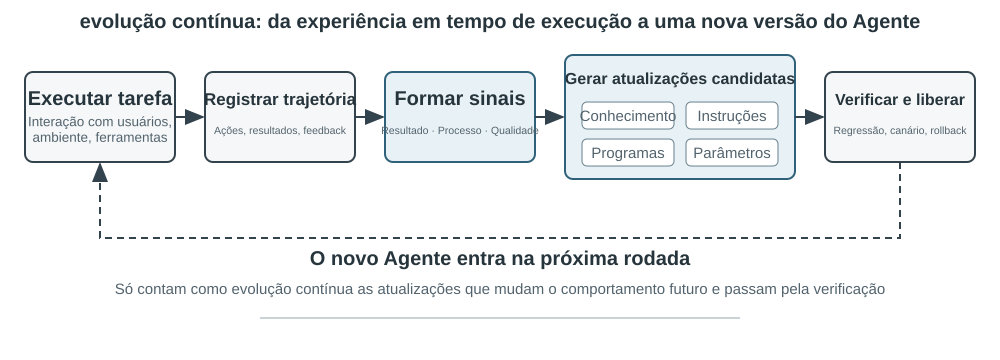
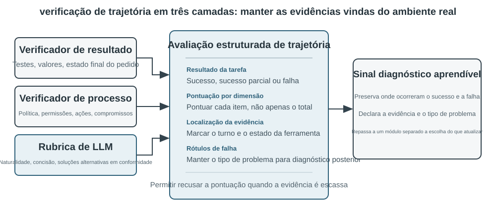
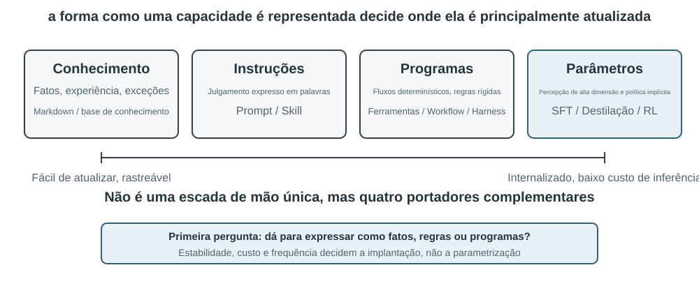
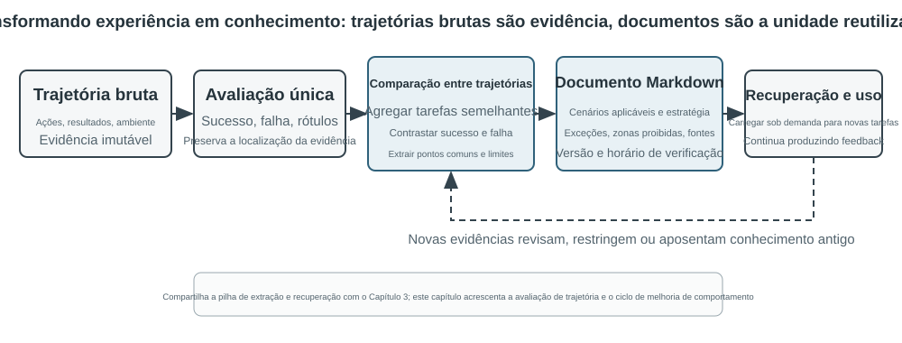
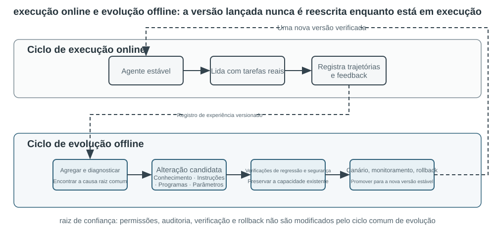

# Evolução contínua dos agentes

Os agentes atuais enfrentam um paradoxo marcante de capacidade: conseguem resolver, sem exemplos prévios, tarefas complexas nunca vistas, mas, mesmo depois de executar dez mil tarefas semelhantes, podem repetir no dia seguinte os erros cometidos no primeiro dia. Depois que um modelo entra em operação, ele consegue aprimorar continuamente seu desempenho, como faria um novo funcionário? **A capacidade de aprender de forma autônoma com a experiência** — o chamado **aprendizado contínuo** — está se tornando essencial para que os agentes passem de “conseguir concluir tarefas” a “conseguir trabalhar de forma confiável”. Essa também é uma questão central de pesquisa para a próxima geração de modelos. O conceito atual de “aprendizado contínuo” não corresponde à linha de pesquisa anterior sobre “aprender uma nova tarefa e esquecer a antiga”: o esquecimento é apenas um dos subproblemas. A dificuldade maior é que ninguém informa ao modelo o que ele fez certo ou errado nas experiências daquele dia. Por enquanto, os modelos ainda estão muito longe de conseguir realizar o aprendizado contínuo por conta própria.

Um modelo implantado não altera automaticamente seus parâmetros após uma inferência. O aprendizado em contexto, a manutenção de estado e a compactação discutidos no Capítulo 2 permitem que um agente se adapte **durante a tarefa atual**; porém, quando o contexto termina, essas mudanças não são transferidas naturalmente para a tarefa seguinte. Armazenar conversas na memória não equivale a aprender novos comportamentos. As trajetórias brutas podem ser longas e conter estratégias eficazes, mas também sucessos acidentais, atribuições incorretas e entradas não confiáveis.

Há uma distinção importante, mas fácil de ignorar: **preservar experiências não é o mesmo que aprender com elas**. Colocar cem trajetórias em um contexto longo ou em um banco de dados vetorial pode ajudar o modelo a recuperar um caso quando necessário, mas não faz com que ele compare os casos automaticamente: quais etapas se repetem nas trajetórias bem-sucedidas, quais práticas só funcionam com uma versão antiga da interface ou se determinado sucesso decorreu de uma estratégia sólida, e não do acaso no ambiente. O aprendizado só ocorre depois que o sistema avalia, compara, generaliza e valida ativamente as evidências — não no momento em que um log é gravado em disco. A memória do usuário apresentada no Capítulo 3 registra principalmente “como são o usuário e o mundo”; o aprendizado pela experiência abordado neste capítulo vai além e registra “o que fazer em determinadas condições”. O primeiro permite que o agente se lembre de mais coisas; o segundo faz com que ele se torne mais competente, e não apenas mais informado.

Por que não deixar o modelo treinar a si próprio diretamente após cada tarefa? Porque ambientes de produção raramente fornecem sinais de aprendizado limpos. A satisfação do usuário não implica conformidade; atualizações locais dos parâmetros também podem causar esquecimento de capacidades, desvio da política ou degradação da segurança. Se um modelo em operação puder modificar diretamente os próprios parâmetros com base em feedback não verificado, experiências equivocadas e injeções de prompt poderão se consolidar e se amplificar continuamente nas tarefas seguintes. Por outro lado, o treinamento periódico de modelos fundacionais pode melhorar capacidades gerais, mas não consegue assimilar prontamente as regras privadas, as mudanças nas ferramentas e as experiências locais encontradas diariamente por cada agente.

Portanto, enquanto os próprios modelos ainda não forem capazes de realizar o aprendizado contínuo de maneira confiável, o “aprendizado” precisará ser construído como um sistema autônomo ao redor do modelo. É o que este livro chama de **evolução contínua**, para diferenciá-la do aprendizado contínuo no nível dos pesos do modelo: registrar evidências operacionais, verificar resultados e processos, extrair padrões comuns de várias trajetórias e então decidir se é preciso atualizar conhecimentos, instruções, programas ou parâmetros do modelo. Toda modificação deve primeiro constituir uma versão candidata e só poderá alterar a rodada seguinte de operação depois de passar por testes de regressão e verificações de segurança.

Os capítulos anteriores já apresentaram os principais componentes necessários para esse sistema. O Capítulo 2 trata do estado durante a tarefa; o Capítulo 3 fornece a infraestrutura de conhecimento; o Capítulo 5 confere aos agentes a metacapacidade de criar ferramentas e modificar sistemas; o Capítulo 7 estabelece a avaliação e a verificação; e o Capítulo 8 explica como atualizar os parâmetros do modelo. A tarefa do Capítulo 9 é organizar esses componentes no ciclo de evolução contínua mostrado na Figura 9-1.

A evolução contínua deve se basear em experiências operacionais rastreáveis, alterar o comportamento posterior e passar por verificações que assegurem não haver degradação significativa. Este capítulo começa discutindo como determinar exatamente o que deu certo ou errado em uma execução; em seguida, compara quatro métodos de atualização e seus limites de aplicação; por fim, examina como essas atualizações são verificadas, publicadas, revisadas e descontinuadas durante a operação de longo prazo.

## Obtenção de sinais de aprendizado a partir de trajetórias operacionais

O ponto de partida da evolução contínua é a avaliação descrita no Capítulo 7. Se o sistema não souber se uma tarefa foi concluída nem qual etapa levou ao sucesso ou ao fracasso, as reflexões geradas por um modelo de linguagem serão apenas conjecturas.

Avaliar uma trajetória consiste, essencialmente, em responder a três perguntas em sequência: **a tarefa foi concluída, foi concluída de uma maneira permitida e o usuário ficou confortável com isso?** A Figura 9-2 as organiza em uma estrutura de verificação em três camadas.

**Na camada inferior, o verificador de resultados responde: “A tarefa foi realmente concluída?”.** Ele examina resultados de testes, estados do banco de dados e retornos de ferramentas: um agente de programação pode executar testes, verificações de tipos e benchmarks de desempenho; um agente que processa um reembolso para um usuário pode consultar o status do pedido e o valor efetivamente reembolsado. Esses sinais vêm de estados reais do ambiente e, em geral, são mais confiáveis do que as descrições do próprio modelo sobre seu comportamento, o que faz dessa a camada a ser estabelecida primeiro.

**Na camada intermediária, o verificador de processo responde: “A tarefa foi concluída de uma maneira permitida?”.** Um resultado correto não implica um processo correto: excluir casos de teste que falharam também pode fazer os testes passarem, enquanto dizer a um usuário “Emitiremos seu reembolso em até sete dias; aguarde” pode gerar satisfação temporária. Essa camada examina regras de negócio, permissões e sequências de ações, distinguindo “o resultado foi alcançado” de “o resultado foi alcançado por um caminho permitido”. Bases de políticas, tabelas de permissões e trajetórias de ações podem ser expressas com precisão, de modo que essa camada também pode ser julgada por código.

**Na camada superior, o verificador de qualidade responde: “O usuário ficou confortável com isso?”.** Por exemplo, se o atendimento foi paciente, se ofereceu alternativas em conformidade, se um relatório de pesquisa identificou as principais evidências e se o texto gerado é natural e conciso. Essas dimensões não determinam se a tarefa foi concluída, mas afetam a experiência do usuário. Aqui pode-se usar o LLM como avaliador, apresentado no Capítulo 7: definir previamente uma rubrica e exigir que o verificador pontue cada item e cite evidências da trajetória.

Para um agente de atendimento ao cliente, a Tabela 9-1 desdobra essas três camadas em sete dimensões que podem ser pontuadas item a item: o resultado da tarefa pertence à camada de resultado; a conformidade com as regras, os limites de privacidade e a coerência entre promessa e ação pertencem à camada de processo; a qualidade da expressão e as alternativas em conformidade pertencem à camada de qualidade; a confiabilidade factual abrange duas camadas, pois o que pode ser confrontado com os retornos das ferramentas é verificado por código e o restante fica a cargo da rubrica.

Tabela 9-1 Dimensões da avaliação de trajetórias de um agente de atendimento ao cliente

| Dimensão | Pergunta de verificação | Principais evidências |
|---|---|---|
| Resultado da tarefa | A principal solicitação do usuário foi atendida? | Estado final do ambiente, resultados das ferramentas |
| Conformidade com as regras | Alguma política, permissão ou procedimento obrigatório foi violado? | Repositório de políticas, trajetória de ações |
| Limites de privacidade | Foi divulgada alguma informação que não deveria ter sido fornecida? | Texto da resposta, registros de acesso a dados |
| Confiabilidade factual | As afirmações têm respaldo no conhecimento ou nos resultados das ferramentas? | Fontes citadas, retornos das ferramentas |
| Coerência entre promessa e ação | As ações declaradas como concluídas realmente ocorreram? | Comparação entre respostas e logs das ferramentas |
| Qualidade da expressão | A linguagem é natural e concisa, sem repetições nem formulações padronizadas? | Conversa completa, rubrica de linguagem |
| Alternativas em conformidade | Quando o plano original era inviável, encontrou-se uma alternativa permitida? | Objetivo do usuário, políticas e ações posteriores |

**A forma da saída do verificador determina se ela pode servir como sinal de aprendizado.** Uma nota geral única reflete apenas o quanto uma execução foi boa; não indica o que deve ser alterado. Uma avaliação da qual as etapas seguintes possam aprender precisa conter ao menos quatro elementos: se a tarefa teve sucesso, sucesso parcial ou fracasso; uma conclusão separada para cada dimensão; a localização da evidência por trás de cada conclusão (qual turno da conversa, qual chamada de ferramenta); e um rótulo do tipo de falha. O verificador também deve ter permissão para se recusar a pontuar quando as evidências forem insuficientes. Em vez de consolidar como fato uma conclusão de baixa confiança, é melhor excluir o caso do conjunto de aprendizado. Somente com esses quatro elementos os quatro métodos de atualização discutidos na próxima seção poderão determinar se devem atualizar conhecimento, o Prompt, um programa ou parâmetros do modelo.

> **Experimento 9-1 ★★: Crie um verificador de trajetórias para um agente de atendimento ao cliente**
>
> **Objetivo:** Converter a trajetória de um agente de atendimento ao cliente em um diagnóstico estruturado, com evidências, que possa subsidiar o aprendizado posterior.
>
> **Descrição do experimento:** Compare duas formas de verificação: “produzir apenas uma nota geral” e “produzir uma conclusão, evidências e um grau de confiança para cada dimensão”. Observe qual delas distingue melhor falhas na tarefa, violações de regras, falsas promessas e problemas de expressão. A evolução contínua não pode depender apenas da taxa de sucesso ou de uma única nota. Somente preservando o que deu errado, por que deu errado e onde estão as evidências os módulos posteriores poderão determinar se devem atualizar o conhecimento, o prompt, um programa ou os parâmetros do modelo. Casos de baixa confiança também não devem entrar automaticamente no conjunto de aprendizado.

## Quatro métodos para a evolução contínua de agentes

Os sinais de aprendizado indicam que um agente deve mudar, mas não onde essa mudança deve ocorrer. O principal critério para escolher um método de atualização não é há quanto tempo uma experiência persiste, mas se a capacidade em questão pode ser representada naturalmente em determinado meio. Fatos e experiências são adequados a documentos de conhecimento; estratégias que podem ser expressas claramente em linguagem devem ser incorporadas a prompts ou skills; procedimentos e restrições que podem ser executados com precisão devem ser codificados como programas; e capacidades de alta dimensionalidade, como percepção, estilo de linguagem e estratégias implícitas, precisam ser incorporadas aos parâmetros do modelo. A Figura 9-3 mostra esses quatro métodos e suas relações.

A Tabela 9-2 apresenta uma comparação concisa. Os quatro métodos não são mutuamente exclusivos: um agente de diagnóstico por imagens médicas depende dos parâmetros para identificar lesões, usa uma base de conhecimento para fornecer diretrizes atualizadas e emprega código para calcular indicadores de risco. Um modelo de atendimento ao cliente obtém seu tom natural do pós-treinamento, recebe políticas empresariais específicas por meio de conhecimentos e skills e recorre a código no servidor para assegurar o cumprimento de requisitos críticos de conformidade.

Tabela 9-2 Limites de aplicação dos quatro métodos de evolução contínua

| Método de atualização | Conteúdo adequado | Principais vantagens | Principais limitações |
|---|---|---|---|
| Base de conhecimento de experiências | Fatos, padrões extraídos da experiência, exceções e fontes | Atualização rápida, rastreabilidade e recuperação sob demanda | Depende da recuperação e da aplicação correta pelo modelo |
| Prompt e skill | Princípios de decisão e procedimentos operacionais que podem ser expressos em linguagem | Interpretabilidade e escopo controlável | Sujeito a crescimento excessivo, conflitos ou desconsideração |
| Programas e harness | Procedimentos determinísticos, ferramentas e restrições rígidas | Testabilidade, execução estável e baixo custo | Custos mais altos de desenvolvimento e manutenção |
| Parâmetros do modelo | Percepção de alta dimensionalidade, estilo de geração e estratégias implícitas | Grande capacidade de generalização e baixo custo adicional de inferência | Altos custos de atualização e regressão |

Uma única capacidade pode ser distribuída entre vários meios: os fatos entram na base de conhecimento; os princípios que explicam as exceções, em uma skill; as permissões que não podem ser contornadas continuam sob o controle do programa; e o reconhecimento de alta dimensionalidade é incorporado aos parâmetros. O resultado do roteamento é apenas uma proposta de atualização; ainda não está qualificado para ser publicado.

### Consolidação da experiência em conhecimento

A forma mais leve de evolução consiste em organizar experiências recorrentes de várias execuções em documentos de conhecimento que possam ser recuperados. A “base de conhecimento de experiências” descrita aqui compartilha com o Capítulo 3 as tecnologias de armazenamento, indexação e recuperação, mas difere quanto às fontes de conhecimento e aos objetivos de verificação. O Capítulo 3 extrai principalmente “como são o usuário e o mundo” de conversas com o usuário, documentos e conjuntos de dados; este capítulo extrai “o que deve ser feito em determinadas condições” das trajetórias e dos resultados das ações do agente. Por exemplo, “Esta companhia aérea exige que refeições especiais sejam reservadas com 24 horas de antecedência” é conhecimento de domínio, enquanto “Verifique o prazo para solicitar uma refeição especial antes de reservar, para não descobrir somente após o pagamento que a solicitação não pode ser atendida” é experiência de ação.

Trajetórias brutas não são adequadas como unidades formais de conhecimento. Elas são extensas e ruidosas, contendo saídas brutas de ferramentas, desvios ocasionais e detalhes do ambiente. Um sistema mais robusto preserva três camadas de dados: trajetórias brutas imutáveis para auditoria; análises de cada execução que registram o resultado e os possíveis aprendizados; e comparações, agrupamentos e generalizações de várias trajetórias semelhantes, usados para produzir documentos de conhecimento em Markdown voltados a situações futuras. Em geral, um documento formal especifica os cenários aplicáveis, as estratégias recomendadas, as práticas proibidas, as exceções, as fontes das evidências e a data da verificação mais recente, em vez de recontar todo o percurso de uma única tarefa.

Esse projeto segue o mesmo princípio em duas etapas do User-as-Code apresentado no Capítulo 3. Primeiro, o User-as-Code acrescenta fatos das conversas a um registro imutável; depois, reconstrói periodicamente um modelo estruturado do usuário. Da mesma forma, o aprendizado baseado em experiências deve primeiro preservar as evidências e, em seguida, gerar offline um conhecimento que possa ser alterado. A Figura 9-4 ilustra esse processo. Separar o registro da organização evita que um único sucesso fortuito ou uma falha de rede altere imediatamente o agente e permite que o sistema identifique padrões comuns somente após observar vários sucessos e fracassos.

Documentos de experiência não são simples resumos de trajetórias. O conteúdo com valor de transferência surge da comparação: o que fizeram as trajetórias bem-sucedidas do mesmo tipo, o que faltou nas trajetórias malsucedidas, em quais versões do ambiente uma estratégia foi eficaz e sob quais pré-requisitos ela falhou. O Capítulo 3 já apresentou a extração, o agrupamento e a recuperação de conhecimento; por isso, este capítulo não repete esses algoritmos. Em vez disso, concentra-se em como a avaliação de trajetórias se torna uma condição para a extração e em verificar se o conhecimento extraído melhora o desempenho em tarefas posteriores.

Um pipeline completo de destilação de conhecimento pode ser dividido em cinco etapas. Primeiro, preservam-se as trajetórias imutáveis e os resultados do ambiente. Em seguida, produz-se uma análise estruturada de cada execução, enumerando o tipo de tarefa, as capacidades necessárias, as estratégias observadas, os erros e as exceções. Depois, as execuções são agregadas por família de tarefas, e cria-se uma tabela de evidências que mostra quais trajetórias corroboram ou contradizem cada padrão proposto. Somente as propostas que atingem o limiar de sustentação são incluídas nos documentos formais. Por fim, avalia-se a transferência em novas tarefas que não tenham sido usadas durante a destilação. Manter o conhecimento formal separado das análises preliminares permite que o sistema faça novas generalizações sem alterar as evidências originais e revogue uma conclusão específica quando o ambiente mudar.

O aprendizado baseado em experiências no GAIA[^gaia-2023] oferece um exemplo intuitivo. O GAIA contém problemas de várias etapas que combinam pesquisa, leitura na web, processamento de arquivos e cálculos, enquanto o AWorld[^aworld-2025] fornece o ambiente para executar agentes, chamar essas ferramentas e registrar trajetórias: o primeiro é como uma prova, e o segundo, como a sala de aplicação e o sistema de registro do experimento. Uma abordagem simplista gera um resumo da estratégia após uma única execução bem-sucedida e o converte imediatamente em um vetor para armazenamento. Uma implementação mais rigorosa primeiro usa um verificador de respostas do GAIA ou outro verificador do ambiente para classificar as execuções como bem-sucedidas, parcialmente bem-sucedidas ou malsucedidas; depois, compara vários caminhos da mesma família de tarefas. As trajetórias bem-sucedidas contribuem com propostas de estratégias; as malsucedidas, com conhecimento sobre o que deve ser evitado; e as parcialmente bem-sucedidas revelam qual etapa funcionou e qual ainda apresentou problemas. A reflexão em linguagem natural proposta pelo Reflexion[^reflexion-2023] pode ajudar a gerar possíveis aprendizados, mas a reflexão em si não constitui evidência. Somente conteúdos coerentes com os resultados do ambiente, respaldados por várias trajetórias e que demonstrem transferência positiva para novas tarefas devem ser incorporados aos documentos formais de experiência.

[^reflexion-2023]: Shinn, N., et al. *Reflexion: Language Agents with Verbal Reinforcement Learning.* arXiv:2303.11366, 2023.

[^gaia-2023]: Mialon, G., et al. *GAIA: a benchmark for General AI Assistants.* arXiv:2311.12983, 2023.

[^aworld-2025]: Yu, C., et al. *AWorld: Orchestrating the Training Recipe for Agentic AI.* arXiv:2508.20404, 2025.

### Conversão da experiência em instruções

Uma base de conhecimento de experiências oferece ao agente “material que ele pode consultar”; prompts e skills determinam “como ele deve agir”. Só vale a pena transformar a experiência em uma instrução quando várias trajetórias semelhantes expõem repetidamente o mesmo erro estratégico e esse erro pode ser descrito com clareza em palavras. É importante distinguir três conceitos: o **prompt de sistema** aplica-se a todas as tarefas; uma **skill** é carregada sob demanda somente quando há correspondência com determinado domínio ou ferramenta; e o **programa/harness** impõe permissões e outras restrições rígidas.

Andrej Karpathy chama essa prática de **aprendizado de prompt de sistema** (System Prompt Learning)[^karpathy-system-prompt-learning]: depois de se deparar com um problema, o modelo deixa uma frase clara para lembrar seu próprio estado futuro. O DSPy[^dspy-2023] pesquisa instruções e exemplos em um conjunto de desenvolvimento; o OPRO[^opro-2023] propõe novos prompts com base em um histórico de prompts e suas pontuações; o GEPA[^gepa-2025] gera e filtra propostas de prompts a partir de reflexões em linguagem natural sobre trajetórias malsucedidas. Esses métodos são adequados à otimização offline em lote; em ambientes de produção, é preferível usar propostas mínimas de atualização que possam ser auditadas e contem com um caminho rápido de reversão.

O aprendizado de prompt de sistema não é o mesmo que a engenharia de prompts apresentada no Capítulo 2. O Capítulo 2 discute como organizar um bom prompt; esta seção trata de qual feedback é suficiente para desencadear uma mudança e de como publicar uma proposta de atualização com segurança. Uma mudança deve ser um diff mínimo com a respectiva origem, e não uma reescrita completa do prompt a cada iteração — exatamente o padrão de diff mínimo com reversão apresentado no Capítulo 1. Uma versão candidata deve ser testada tanto no **conjunto de casos-limite que desencadeou a falha** quanto em um **conjunto de retenção que já funciona**: o primeiro deve apresentar melhora, e o segundo não pode regredir.

#### Exemplo 1: Transformando o limite de transferência em regras

Na política de telecomunicações do τ²-bench, a transferência para um atendente humano é regida por apenas duas diretrizes: transferir somente quando a solicitação estiver fora do escopo de atuação do agente e fazer o possível para resolver o problema antes da transferência. Quando o Capítulo 7 analisou esse ambiente, as duas diretrizes não revelaram nenhum problema; porém, ao executar o mesmo ambiente com um modelo mais fraco, a deficiência surge de imediato — depois que uma ferramenta retorna um erro, o agente repete a tentativa várias vezes e acaba transferindo para um atendente humano. Foi assim que terminaram 19 das 20 tarefas do conjunto de derivação.

Ao fornecer essas 19 trajetórias malsucedidas a um modelo e permitir que ele deduza, por conta própria, algumas regras executáveis para acrescentar ao final da política, e depois executar novamente em um conjunto de tarefas que não participou da derivação, a taxa de aprovação sobe de 12,3% para 19,3%, sem prejudicar nenhuma tarefa que já havia sido aprovada.

**O material fornecido ao modelo determina o que ele pode deduzir.** Com base nas mesmas 19 trajetórias, fornecer apenas resumos das falhas e textos de erro resulta na regra “não continue chamando uma ferramenta que retorna repetidamente o mesmo erro”; ao incluir uma relação das ferramentas disponíveis para o agente e para o usuário, o resultado se torna “as verificações de status da rede, cartão SIM e APN pertencem ao dispositivo do usuário e devem ser realizadas por ele sob orientação, em vez de serem chamadas diretamente”. A primeira registra uma lição; a segunda compreende a quem cabe a responsabilidade.

**O modelo trata o comportamento observado como aquele que deveria ocorrer.** Duas regras da primeira versão diziam “transfira para um atendente humano após três chamadas consecutivas malsucedidas” e “transfira para um atendente humano se o usuário não fornecer um número após duas solicitações” — a transferência é o comportamento mais frequente nas trajetórias, por isso o modelo a considerou uma medida de último recurso razoável. Contudo, nessa avaliação, a transferência sempre conta como falha; portanto, essas duas regras incorporam a falha à especificação. Os artefatos derivados não podem, assim, ser publicados diretamente: precisam passar por uma verificação independente de quem os produziu.

**O que é corrigido muitas vezes é algo extremamente simples.** Em uma trajetória típica da linha de base, o agente precisa do número de telefone do usuário e, por isso, chama a ferramenta de consulta preenchendo o parâmetro com “Forneça seu número de telefone” — cinco vezes seguidas, resultando em cinco erros e, por fim, na transferência. Ele já havia concluído que deveria perguntar ao usuário; apenas dirigiu a frase à ferramenta. Quando as regras passaram a vigorar, primeiro fez a solicitação na conversa, obteve o número e então realizou a consulta. Mais tarde, quando a tentativa de verificar o status do cartão SIM foi recusada na camada de ferramentas, passou a orientar o usuário a retirar e reinserir o cartão SIM, e a tarefa foi aprovada.

> **Experimento 9-2 ★★: Derivação de regras de transferência e uso de ferramentas a partir de trajetórias malsucedidas do τ²-bench**
>
> Reutilize o ambiente de telecomunicações do τ²-bench apresentado no Capítulo 7. O conjunto de derivação e o conjunto de transferência já são dois conjuntos de tarefas distintos e sem sobreposição no repositório original, de modo que o processo de derivação nunca tem contato com o conjunto de transferência.
>
> Primeiro, execute o conjunto de derivação com um modelo fraco e preserve as trajetórias malsucedidas; faça com que as regras sejam deduzidas por um modelo, em vez de redigidas manualmente, e acrescente-as ao final da política original; depois, compare a política original com as duas versões evoluídas no conjunto de transferência. Nos três braços, apenas o arquivo da política é substituído; o simulador de usuário permanece inalterado.
>
> Além da taxa de aprovação, registre três métricas comportamentais diretamente relacionadas às regras: a taxa de transferência, o número de vezes que o agente ultrapassa seu escopo e chama uma ferramenta do usuário e o número de chamadas realizadas sem um parâmetro obrigatório. Nas versões evoluídas, as duas últimas caem cerca de 80%, o que demonstra que o aumento da taxa de aprovação decorre de regras que corrigiram ações específicas.

A mesma abordagem pode ser aplicada a outros domínios. Um caso problemático típico de um agente de atendimento ao cliente de uma companhia aérea ocorre quando o usuário contesta uma taxa de reembolso, uma taxa de alteração ou uma política de bagagem, e o agente chama `transfer_to_human` sem consultar a política, explicar a regra ou buscar uma alternativa em conformidade. Uma contestação comum de política não exige transferência; **a transferência só é obrigatória quando o usuário solicita explicitamente um atendente humano ou quando há uma situação relacionada à segurança**. Mais uma vez, o diagnóstico aponta para um limite de transferência que nunca foi explicitado, e a correção consiste novamente em convertê-lo em uma única regra mínima, com a fonte registrada.

> **Experimento 9-3 ★★: Otimização do prompt de sistema de atendimento ao cliente de uma companhia aérea a partir de trajetórias malsucedidas**
>
> **Objetivo:** Fazer o agente de atendimento ao cliente da companhia aérea corrigir o hábito de transferir cedo demais para um atendente humano diante de contestações comuns de políticas, preservando a capacidade de transferência quando houver uma solicitação explícita de atendimento humano ou um incidente de segurança.
>
> **Descrição:** Extraia três dimensões das trajetórias malsucedidas — conformidade com as regras, resolução da tarefa e alternativas em conformidade — e gere uma única correção mínima do prompt, com a respectiva origem; depois, compare-a com a versão inicial e uma versão ajustada manualmente, sob condições idênticas. Uma proposta de atualização só entra em lançamento gradual após melhorar os casos limítrofes, não causar regressão nas tarefas anteriores e passar pelo critério de liberação.
>
> **O que o experimento demonstra:** O objetivo da otimização automática de prompts não é permitir que o modelo reescreva livremente um grande bloco de texto, mas transformar uma falha atribuível em uma regra local, com escopo claro, que possa ser revertida e verificada.

#### Exemplo 2: Skill de esclarecimento de requisitos — da execução direta à confirmação prévia

O Capítulo 2 explicou como escrever uma Skill. Aqui, partimos do pressuposto de que o sistema já conta com uma primeira versão de uma Skill de esclarecimento de requisitos e nos concentramos em outro aspecto: à medida que o agente continua recebendo feedback dos usuários em produção, como ele determina automaticamente se é preciso atualizar “quando perguntar primeiro, o que perguntar e quando simplesmente começar”?

Esse é um problema procedimental clássico. O usuário diz: “Altere a página de login para permitir autenticação corporativa.” Se o agente começar imediatamente, poderá tomar decisões em nome do usuário — provedor de identidade, caminho alternativo, compatibilidade com usuários existentes e escopo do lançamento — que ele ainda não considerou. Por outro lado, se listar uma dúzia de perguntas, independentemente do tamanho da tarefa, uma alteração simples se transforma em uma entrevista. **Perguntar de menos causa retrabalho; perguntar demais gera interrupções.** O que a Skill precisa expressar não é que “todas as tarefas devem ser confirmadas”, mas um caminho de decisão com escopo definido.

Uma primeira versão do procedimento poderia ser assim: avalie a ambiguidade, o risco e o custo de retrabalho da tarefa; para pequenas alterações de baixo risco e facilmente reversíveis, explicite as premissas e prossiga; quando a tarefa envolver arquitetura, dados, permissões, interfaces públicas ou mudanças de grande alcance, faça um pequeno número de perguntas que realmente alterariam o plano; depois de obter as respostas, produza uma Spec ou um Plan conciso, relacionando objetivos, itens fora do escopo, principais trade-offs, premissas e critérios de aceitação, e apresente-o ao usuário para confirmação; execute após a confirmação e interrompa o trabalho para confirmar novamente sempre que a Spec original deixar de ser válida.

A evolução contínua começa pelas evidências operacionais. O sistema deve registrar conjuntamente as tarefas, as perguntas de esclarecimento, as versões da Spec, as alterações do usuário, os resultados da execução e o retrabalho após a entrega. O feedback negativo pode ser “isso não é o que eu imaginava”, mas também pode ser “você fez perguntas demais”; o feedback positivo inclui uma entrega tranquila após uma única confirmação, menos retrabalho depois que o usuário alterou a Spec e tarefas de baixo risco que não foram interrompidas por perguntas desnecessárias. Armazenar uma reclamação isolada não basta para acionar uma atualização: o feedback precisa estar associado a uma trajetória, um tipo de tarefa e um resultado específicos.

Quando várias trajetórias apontam repetidamente para a mesma lacuna, o agente pode propor uma atualização mínima da Skill. Por exemplo, se diversas tarefas relacionadas à arquitetura de autenticação só revelarem após a entrega que o método de login anterior precisava continuar funcionando, uma proposta de regra poderá exigir a confirmação do “provedor de identidade, caminho alternativo e escopo de compatibilidade” antes da execução. Por outro lado, se um grande número de correções de erros de digitação tiver sido precedido por uma rodada de perguntas, a proposta de regra deverá restringir o gatilho aos casos de alto risco e grande ambiguidade.

Esse procedimento precisa ser validado por um experimento controlado. É possível comparar três estratégias — “executar diretamente”, “perguntar primeiro e depois executar” e “perguntar, produzir uma Spec, confirmar e depois executar” — estratificadas pela complexidade da tarefa. As métricas devem incluir, no mínimo, a taxa de desvio dos requisitos, o número de retrabalhos após a entrega, o número de rodadas de esclarecimento, o tempo até o primeiro resultado útil, a taxa de abandono do usuário, a proporção de Specs alteradas e a taxa de erros em operações de alto risco. Uma proposta de atualização só chega ao lançamento gradual se reduzir os desvios dos requisitos sem aumentar significativamente as interrupções e passar nos testes de regressão em tarefas que não foram usadas em sua destilação.

Esse exemplo também ilustra o limite entre a Skill e o Harness. A Skill compreende o contexto e toma a iniciativa de fazer perguntas, elaborar a Spec e explicar os trade-offs; o Harness veta gravações de alto risco, operações diretas em `main` ou tentativas de contornar o processo de lançamento quando não há confirmação. Um mecanismo de veto no Harness não pode decidir pelo modelo como um PR deve ser descrito, nem escolher em seu lugar a solução para os requisitos. À medida que a experiência se acumula, trajetórias de conversa estáveis também podem gerar os dados de treinamento de SFT ou RL necessários no Capítulo 8.

> **Experimento 9-4 ★★: Evolução de uma Skill de esclarecimento de requisitos e confirmação da Spec a partir do feedback dos usuários**
>
> **Objetivo:** Verificar se o agente consegue encontrar uma estratégia de esclarecimento melhor, equilibrando “desvio dos requisitos” e “interrupção da interação”, e incorporar as melhorias validadas à Skill.
>
> **Descrição:** Prepare um conjunto de tarefas de baixo risco e baixa ambiguidade e outro de tarefas de alto risco envolvendo arquitetura, permissões, dados ou interfaces públicas, e compare três procedimentos: executar diretamente, perguntar e depois executar, e perguntar e depois confirmar uma Spec. Registre as respostas do usuário, as alterações da Spec, os resultados da entrega e o feedback sobre retrabalho, e permita que o agente gere uma proposta de atualização da Skill; a proposta deve passar por testes de regressão em tarefas reservadas, por uma verificação do custo das interrupções e pela validação do mecanismo de veto para operações de alto risco.
>
> **O que o experimento demonstra:** A evolução contínua não consiste em acrescentar cada reclamação ao prompt, mas em identificar o escopo a partir dos resultados e do feedback, propor uma atualização mínima das instruções e permitir que um avaliador independente decida se ela deve ser publicada.

[^dspy-2023]: Khattab, O., et al. *DSPy: Compiling Declarative Language Model Calls into Self-Improving Pipelines.* arXiv:2310.03714, 2023.

[^opro-2023]: Yang, C., et al. *Large Language Models as Optimizers.* arXiv:2309.03409, 2023.

[^gepa-2025]: Agrawal, L., et al. *GEPA: Reflective Prompt Evolution Can Outperform Reinforcement Learning.* arXiv:2507.19457, 2025.

[^karpathy-system-prompt-learning]: Karpathy, A. “We’re missing (at least one) major paradigm for LLM learning … system prompt learning?” X, 11 de maio de 2025. https://x.com/karpathy/status/1921368644069765486

### Transformando experiência em programas

Quando a experiência descreve operações estáveis, repetitivas e verificáveis, é ineficiente fazer o modelo reler a documentação e raciocinar sobre elas a cada vez. Uma abordagem mais adequada é compilar essa experiência em fluxos de trabalho, ferramentas ou código do harness, transformando uma exploração única em um programa que possa ser executado repetidamente. O Capítulo 5 explicou como agentes de programação leem e gravam arquivos, executam testes e geram sistemas; esta seção não trata da geração de código em geral, mas de como um agente modifica versões futuras de si mesmo com base nas próprias trajetórias.

Os objetos passíveis de modificação vão muito além de novas ferramentas. Na camada de operação, trajetórias no navegador podem ser compiladas em fluxos de trabalho parametrizados, ou podem ser gerados adaptadores para APIs que mudam. Na camada de controle, é possível modificar o roteamento de ferramentas, as novas tentativas, os circuit breakers e as estratégias de compactação de contexto. Na camada de validação, podem ser adicionados verificadores de parâmetros e de estado, além de testes de regressão, em resposta a falhas em produção. Na camada de arquitetura, é possível adicionar um agente revisor ou alterar o fluxo de informações entre planejamento e execução.

Os fluxos de trabalho no navegador ilustram o valor de transformar a experiência em programas. Eles são análogos à gravação de uma macro de planilha. Na primeira vez que um e-mail é enviado, um agente multimodal usa um ciclo de observar–raciocinar–agir para encontrar os controles de redigir, destinatário, assunto, corpo e envio. Em outro e-mail, o processo não muda; apenas o destinatário e o conteúdo são diferentes, portanto não há necessidade de chamar o modelo novamente para redescobrir todo o caminho a partir dos pixels e do DOM. O sistema compila a primeira trajetória de exploração em um pequeno programa que contém parâmetros, verificações de estado e informações de versão.

No contexto do navegador, o processo de destilação de conhecimento mostrado na Figura 9-4 assume um ciclo de vida mais concreto:

1. **Capturar a trajetória:** Registre a navegação, os cliques, a inserção de texto e a seleção em listas suspensas, juntamente com os parâmetros das ações, a URL atual e evidências de localização dos elementos, como XPath, CSS, `id`, `role`, `aria-label` e `data-testid`. Essas evidências servem apenas para reencontrar um elemento; não comprovam que a tarefa foi concluída.
2. **Parametrizar:** Substitua os valores literais da primeira execução por variáveis de modelo. Por exemplo, transforme `test@example.com`, o assunto e o corpo em `{recipient}`, `{subject}` e `{content}`, mantendo inalteradas as ações estáveis. A implementação didática usa expressões regulares e substituição em modelos; um sistema de produção pode usar entradas de tarefa estruturadas ou um modelo de extração com restrições.
3. **Definir verificações de estado:** Adicione verificações antes e depois das ações, como “o botão de envio está visível” e “a URL após a navegação pertence ao site de destino”. Adicione também uma verificação do estado final do fluxo de trabalho como um todo, por exemplo, “a lista de mensagens enviadas contém a nova mensagem” ou “o valor de estado da página de teste mudou conforme esperado”. Executar uma ação com sucesso não equivale a concluir a tarefa com sucesso; a verificação final deve ler o estado real da página ou do backend.
4. **Validar o candidato:** Um primeiro sucesso gera apenas um `candidate`. O sistema deve redefinir a conta de sandbox ou o site de teste para um estado inicial independente e reproduzir integralmente o candidato. Ele só poderá ser publicado como `validated` se todas as verificações anteriores e posteriores às ações, bem como a verificação do estado final, forem aprovadas. Se uma tarefa com efeitos colaterais, como enviar e-mails ou fazer pedidos, não tiver um callback de redefinição seguro, o fluxo de trabalho poderá ser mantido como candidato auditável, mas não deverá ser validado pela repetição da ação em uma conta de produção.
5. **Encontrar e reproduzir:** Quando uma nova tarefa chegar, pesquise na biblioteca formal de capacidades um fluxo de trabalho correspondente à intenção e às palavras-chave, extraia os parâmetros atuais e execute-o diretamente com o Playwright. A reprodução não exige chamadas passo a passo ao LLM, mas ainda precisa aguardar até que os elementos estejam disponíveis e concluir todas as verificações de estado.
6. **Invalidar e reaprender:** Se não for possível encontrar o elemento de destino, uma verificação de estado falhar, o esquema da API mudar ou o estado final estiver incorreto, interrompa imediatamente as ações subsequentes, mova a versão antiga da biblioteca pesquisável para a área `invalid` e recorra ao agente completo para realizar uma nova exploração. Preserve o arquivo antigo para auditoria e comparação, mas nunca permita que ele continue sendo selecionado silenciosamente.

Em um fluxo de trabalho de e-mail, o resultado compilado não é apenas “clique nestes botões em ordem”, mas um pequeno programa parametrizado por destinatário, assunto e corpo: antes do envio, ele verifica a janela de composição e os campos; depois, verifica o indicador de sucesso; por fim, confirma que a mensagem correspondente aparece na lista de itens enviados. No PreAct[^preact], esses programas proporcionaram uma aceleração de ponta a ponta de 8,5 a 13 vezes em tarefas repetidas e não exigiram chamadas passo a passo ao modelo de linguagem durante a reprodução. Mais importante ainda, a memória de processos precisa incluir **validação antes da ação, validação depois da ação e validação independente antes do armazenamento**. Caso contrário, o sistema pode criar uma ilusão perigosa: a cobertura da reprodução é de 100% e todos os botões foram clicados, mas um campo estava vazio e a tarefa nunca chegou a ser concluída.

> **Experimento 9-5 ★★★: Geração de fluxos de trabalho verificáveis a partir de trajetórias no navegador**
>
> **Objetivo:** Determinar se um agente web consegue transformar uma exploração custosa em um fluxo de trabalho reutilizável e rejeitar uma reprodução incorreta quando a página muda, em vez de informar sucesso apenas porque todas as ações foram executadas.
>
> **Cenário em quatro etapas:** Na primeira etapa, execute “enviar uma mensagem com o assunto ‘E-mail de teste’ para `test@example.com`” em um site de e-mail de teste ou em uma página simulada de mensagens. O agente completo faz a exploração, enquanto um wrapper captura as ações, os parâmetros e os estados da página e produz um `candidate`. Na segunda etapa, chame `validation_reset` para restaurar a sandbox e reproduzir de forma independente todo o fluxo de trabalho; o candidato só entra na biblioteca formal de capacidades se todas as verificações anteriores e posteriores às ações, bem como a verificação do estado final, forem aprovadas. Na terceira etapa, execute o mesmo tipo de tarefa com outro destinatário, assunto e corpo. O sistema deve encontrar o fluxo de trabalho validado, preencher os novos parâmetros e reproduzi-lo por meio do Playwright, sem entrar no ciclo passo a passo do LLM. Na quarta etapa, altere o localizador de um botão, o texto da página ou o estado final e verifique se o fluxo de trabalho antigo passa imediatamente a ser `invalid` e retorna `fallback_required=True`.
>
> **Projeto do controle:** Uma linha de base simplificada registra apenas se cliques, inserções de texto e outras ações são concluídos sem exceções. A condição experimental também valida a página antes de cada ação, depois de cada ação e no estado final da tarefa. Ambas as condições usam as mesmas trajetórias e alterações de página. Compare as taxas de falsos positivos em casos como “o botão de envio foi clicado enquanto um campo estava vazio” e “Salvar foi clicado, mas os dados não foram persistidos”.
>
> **Métricas e critérios de aceitação:** Registre o tempo de ponta a ponta da exploração inicial e da reprodução, o número de chamadas ao LLM, a taxa de sucesso, a taxa de falsos sucessos, a taxa de correspondência dos fluxos de trabalho, a taxa de detecção de mudanças na página e o número de retornos ao reaprendizado. Sem um callback de redefinição, um fluxo de trabalho deve permanecer como candidato; uma versão que não passar na validação não deve poder ser recuperada; a reprodução parametrizada não deve reutilizar o destinatário nem o conteúdo da primeira execução; e, após uma mudança na página, ações subsequentes perigosas devem ser interrompidas. A aceleração só importa se todas essas condições forem satisfeitas.
>
> A implementação correspondente está disponível em [`browser-use-rpa`](../chapter9/browser-use-rpa/) e oferece tanto uma demonstração determinística baseada em máquina de estados quanto um caminho de execução que invoca um agente real de navegador.

Um agente modificar o próprio código não significa que o processo em execução sobrescreva diretamente a si mesmo. Um sistema de produção deve criar um branch candidato a partir da versão estável atual, fazer com que um agente de programação gere um patch mínimo e, em seguida, executar em sequência verificações estáticas, testes unitários, varreduras de segurança, reprodução de trajetórias com falha e testes de regressão em tarefas antigas, antes de produzir uma nova versão apta à implantação canário. Isso transforma a “automodificação” em um processo auditável de lançamento de software e define a fronteira entre os Capítulos 9 e 5: o Capítulo 5 fornece a capacidade de modificar sistemas, enquanto este capítulo apresenta um método de automodificação acionado pela experiência e limitado por um ciclo fechado de validação.

Manter o patch pequeno não basta para uma atribuição confiável. Cada solicitação de modificação também deve constituir um **contrato de mudança falseável**, que registre as evidências da falha, a causa raiz inferida, o componente responsável do harness, a mudança candidata, o comportamento que deve melhorar, o comportamento existente que pode regredir e os testes para ambos. A engenharia de harness agêntico descreve isso em termos de observabilidade nos níveis de componente, experiência e decisão: cada componente editável tem uma representação no nível de arquivo; grandes conjuntos de trajetórias são destilados em evidências que podem ser inspecionadas em níveis crescentes de detalhamento; e cada edição declara uma previsão de impacto antes da execução, que a rodada seguinte de resultados então testa[^ahe-2026]. Assim, uma pontuação mais alta pode ser associada a um mecanismo específico, em vez de permanecer como resultado de uma tentativa impossível de interpretar.

O gerador de candidatos não deve receber apenas casos de falha. O Self-Harness também fornece exemplos de comportamentos bem-sucedidos que precisam ser preservados e registros de modificações rejeitadas anteriormente[^self-harness-2026]. Os primeiros indicam ao agente o que o reparo não pode comprometer; os segundos impedem que ele reapresente a mesma ideia malsucedida com outras palavras. Em conjunto, as evidências de falha, as restrições de sucesso e as tentativas anteriores definem um espaço limitado de candidatos e são mais úteis do que carregar indiscriminadamente todo o código-fonte e os logs brutos no agente responsável pela modificação.

A criação de ferramentas segue o mesmo protocolo. O Alita[^alita-2025] apresenta um caso no qual um agente precisa identificar o número mencionado logo após a primeira aparição de dinossauros em um vídeo 360 VR do YouTube, narrado pelo dublador de Gollum em *O Senhor dos Anéis*. Depois de reconhecer que não dispõe da capacidade de ler legendas, o agente encontra e testa `youtube-transcript-api`, encapsula-o como uma nova ferramenta de legendas e extrai a resposta `100000000` da transcrição. Uma nova ferramenta só entra na biblioteca de capacidades após passar por uma varredura de segurança, testes funcionais e reutilização bem-sucedida em tarefas posteriores. A descoberta proativa de ferramentas do Capítulo 4 pergunta qual ferramenta existente é adequada; o Capítulo 5 pergunta como escrever uma ferramenta; este capítulo pergunta quais evidências operacionais devem acionar sua criação e como uma nova ferramenta se torna uma capacidade validada de longo prazo.

> **Experimento 9-6 ★★★: Acionamento da automodificação do agente a partir de trajetórias de falha**
>
> **Objetivo:** Dadas várias trajetórias nas quais erros marcados como `retryable=false` continuam sendo chamados repetidamente, determinar se o sistema consegue localizar a causa raiz no código de repetição e de disjuntor e produzir uma correção candidata sem comprometer a recuperação de falhas temporárias.
>
> **Procedimento:** Primeiro, o módulo de diagnóstico agrega a mesma falha em diferentes tarefas. Ele só cria uma solicitação de modificação depois que o limiar de evidências entre trajetórias é atingido e tem como alvo `retry_policy.py` na versão estável. O gerador de candidatos lê o diagnóstico da falha, o comportamento de recuperação de falhas temporárias que deve ser preservado, as alterações anteriormente rejeitadas e o código-fonte estável. Antes de produzir um diff mínimo de código, ele prevê que as chamadas após erros não repetíveis devem diminuir, sem afetar a recuperação de timeouts temporários. Seja o gerador determinístico ou um agente de programação baseado em um LLM real, ele só pode gravar em um diretório isolado de candidatos. Em seguida, o harness de validação compila o candidato, reproduz as trajetórias de falha originais, verifica se um erro não repetível interrompe imediatamente a execução e abre o disjuntor e testa novamente se os timeouts temporários ainda são repetidos de acordo com o limiar original.
>
> **Controle diagnóstico e métricas:** Trate “adicionar ao prompt uma frase instruindo o agente a não repetir a chamada” como exemplo conceitual da escolha da camada de modificação errada, demonstrando por que uma restrição de repetição que pode ser aplicada de forma determinística deve ficar no código. O experimento executável compara geradores de patches determinísticos e baseados em LLM sob o mesmo controle de liberação. Registre o número de chamadas após erros não repetíveis, a taxa de recuperação de erros temporários, as regressões em tarefas antigas, o tamanho do patch e a taxa de aceitação de candidatos.
>
> **Critérios de aceitação:** A aprovação em todas as verificações produz apenas `release_to_canary`. A falha em qualquer verificação estática, reprodução de falha ou teste de regressão de tarefas antigas retorna `reject_candidate`. `release_manifest.json` deve registrar o agrupamento de falhas, as trajetórias de origem, a causa raiz inferida, o componente e o arquivo de destino, o diff do código, a correção esperada, as possíveis regressões, os resultados das verificações, a versão candidata e a versão de rollback. Os candidatos rejeitados devem preservar os motivos da falha para a próxima rodada de geração. O agente que gera o patch não pode modificar o código estável, os validadores, os logs de auditoria nem o controle que aprova sua própria liberação.
>
> A implementação correspondente está disponível em [`self-modifying-agent`](../chapter9/self-modifying-agent/). Ela aceita tanto um gerador determinístico de candidatos quanto um agente de programação baseado em um LLM real, e os dois caminhos compartilham o mesmo controle de liberação.

O Experimento 9-7 aplica o mesmo protocolo à camada de verificação. Uma solicitação de alteração só é criada quando correções recorrentes de usuários, avaliações negativas e auditorias apontam para uma operação de alto risco não confirmada; o candidato é gravado em um diretório isolado. Classifique exclusões perigosas e `git push --force` com base nos nomes e argumentos das ferramentas e vincule um token de confirmação de uso único à operação concreta. Antes da liberação canário, o candidato deve passar por verificações estáticas e da AST, pela reprodução de casos limítrofes — incluindo tokens falsificados e reutilizados — e pela reprodução em um conjunto de validação separado.

> **Experimento 9-7 ★★: Controle de confirmação para operações de alto risco acionado pelo feedback do usuário**
>
> Use os três tipos de sinal e as trajetórias de controle em `failure_trajectories.json`. O candidato real `gpt-4o-mini` falhou na reprodução de tarefas inacabadas, na reprodução de operações normais e nas verificações de tokens de uso único; por isso, o controle de segurança o rejeitou. O candidato determinístico passou em todas as verificações e recebeu `release_to_canary`; registre as verificações, a decisão de liberação e o hash do diretório estável. Implementação: [`harness-safety-gate`](../chapter9/harness-safety-gate/).

[^preact]: Li, Bojie. *PreAct: Computer-Using Agents that Get Faster on Repeated Tasks.* arXiv:2606.17929, 2026.

[^alita-2025]: Qiu, J., et al. *Alita: Generalist Agent Enabling Scalable Agentic Reasoning with Minimal Predefinition and Maximal Self-Evolution.* arXiv:2505.20286, 2025.

#### Caso: DeepSeek Harness — autoevolução em que tudo é um plugin

A tabela comparativa do Capítulo 1 classifica o DeepSeek Harness (`dsh`) como uma “estrutura de autoevolução de agentes”[^dsh-2026]. O artigo sobre sua base, o Cordis, observa que a composição convencional é **estática**: chamadas de funções, importações de módulos e herança de classes são definidas durante a compilação e não mudam em tempo de execução. Sistemas de plugins e harnesses autoevolutivos, por outro lado, exigem **composição dinâmica**, na qual os componentes são carregados, descarregados e reconfigurados durante a execução[^cordis-2026]. Toda automodificação do agente é, em essência, uma composição dinâmica.

O artigo divide a composição dinâmica em duas dimensões ortogonais. A **componibilidade temporal** trata da possibilidade de desfazer por completo e com segurança todas as alterações feitas por um componente no ambiente compartilhado quando ele é removido; para isso, o sistema de execução precisa acompanhar cada alocação de recursos, registro de eventos e mudança de estado. A **componibilidade espacial** trata da possibilidade de os componentes declararem, descobrirem e resolverem dependências de maneira estruturada e verificável, além de coordenarem seus ciclos de vida quando essas dependências mudam. A primeira diz respeito a **o que mudou**; a segunda, a **de que se depende**.

Um harness autoevolutivo é o caso mais crítico desse problema. Os efeitos colaterais a serem desfeitos são persistentes e mantêm estado, enquanto as dependências podem surgir, desaparecer ou mudar de identidade em tempo de execução. Sem componibilidade temporal, toda automodificação exige uma reinicialização completa, descartando o estado acumulado no processo e interrompendo repetidamente as tarefas em andamento. Sem componibilidade espacial, cada módulo precisa improvisar sua própria detecção de mudanças nas dependências, e uma simples substituição de código pode romper silenciosamente os componentes dependentes ou introduzir uma dependência cíclica.

O Cordis leva para o tempo de execução dois conceitos normalmente restritos ao período de compilação. Os sistemas de efeitos, originalmente usados para raciocinar sobre como uma computação altera seu ambiente, tornam-se **efeitos reversíveis**: cada transformação do contexto contém uma operação inversa explícita, acompanhada pelo sistema de execução, de modo que a remoção de um componente restaure o contexto. Os sistemas de coefeitos, originalmente usados para raciocinar sobre o que uma computação exige do ambiente, tornam-se **coefeitos reativos**: um componente declara suas dependências em uma especificação, e cada mudança no contexto informa se ele deve ser ativado, desativado ou permanecer inalterado. Um cálculo de composição dinâmica estende essa propriedade de um único componente para sistemas de componentes intercalados — a componibilidade deve ser transitiva.

**O limite da autoevolução não depende da capacidade do modelo de escrever um bom código, mas do grau de componibilidade do sistema que o hospeda.** Por isso, o `dsh` transforma em plugins os adaptadores de modelos, os registros de ferramentas, os logs de sessão e até o próprio loop principal do agente: **não existe um núcleo privilegiado que só possa ser mantido por humanos**.

A componibilidade responde se um componente pode ser instalado e removido com segurança, não se ele deve ser instalado. Plugins escritos pelo modelo existem apenas na memória do processo e desaparecem após a reinicialização. Eles **não podem ser promovidos automaticamente a plugins oficiais**; para persistirem, precisam seguir a rota mais lenta, descrita anteriormente, que usa worktree e Pull Request.

A evolução também tem um custo. Um plugin em execução altera as ferramentas e os trechos de prompt visíveis ao modelo. Quando o prefixo da solicitação muda, o cache KV discutido no Capítulo 2 é invalidado a partir desse ponto. Portanto, a documentação de um plugin do `dsh` precisa descrever seu impacto sobre o contexto e o cache KV.

[^dsh-2026]: DeepSeek AI, *DeepSeek Harness: Everything is a Plugin*, 2026. https://github.com/deepseek-ai/deepseek-harness. As camadas de plugins e os mecanismos de patch são documentados em `docs/architecture.md`; o ciclo de vida, a semântica de sandbox e as declarações de confiança das ferramentas de automodificação do modelo aparecem em `docs/subsystems/extensions.md` e `packages/extensions/README.md`. Lançado em agosto de 2026, o projeto estava em versão prévia para desenvolvedores no período discutido aqui.

[^cordis-2026]: Shi, Yifan, Wei Zhang, and Tianyi Cui. *A Programming Paradigm for Spatiotemporal Composability.* Versão preliminar do preprint, 13 de agosto de 2026. https://github.com/cordiverse/paper

### Incorporação da experiência aos parâmetros

Conhecimento, instruções e programas partem de uma mesma premissa: a capacidade desejada pode ser expressa de maneira relativamente completa por meio de símbolos externos. No entanto, capacidades como a compreensão de imagens médicas, a prosódia natural da fala, a eliminação do “jeito de IA” padronizado de um texto e o planejamento de longo horizonte são difíceis de condensar em algumas regras ou fluxos de trabalho. Essas capacidades precisam ser incorporadas aos parâmetros do modelo por meio do pós-treinamento.

A decisão de parametrizar uma capacidade não depende apenas da estabilidade da tarefa no longo prazo. Mudanças de domínio provocadas por novos equipamentos de imagem ainda podem exigir LoRA ou ajuste fino contínuo; estilos linguísticos que mudam rapidamente também podem ser assimilados por meio de treinamentos periódicos de preferências. A estabilidade afeta a frequência e o custo das atualizações, mas é a natureza representacional da capacidade que determina seu principal meio de expressão. Por outro lado, uma regra há muito estável para aprovar transferências não deve depender apenas da memória paramétrica; o código no servidor ainda precisa oferecer garantias determinísticas.

O Capítulo 8 apresentou uma discussão completa sobre SFT, destilação e RL, portanto esta seção não a repete. Para a evolução contínua, o essencial é transformar trajetórias de produção avaliadas em dados de treinamento: demonstrações de alta qualidade podem ser usadas em SFT, preferências explícitas podem formar dados pareados e interações com recompensas confiáveis do ambiente podem ser usadas em RL. Antes do treinamento, ainda é necessário remover informações privadas, filtrar trajetórias incorretas e preservar um conjunto independente de regressão. Depois do treinamento, o sistema deve verificar se houve esquecimento de capacidades gerais ou do alinhamento de segurança.

### Da atualização de artefatos à atualização do “método de atualização”

Os quatro métodos anteriores examinam **onde a experiência é registrada**, mas a evolução contínua tem outro eixo, ortogonal: o sistema está otimizando o conteúdo de um artefato ou o método usado para produzir, gerenciar e validar artefatos? Ao longo desse eixo, o alvo da otimização pode se expandir de **uma regra ou memória individual → contexto estruturado → fluxo de trabalho → código do harness → código do otimizador que gera soluções candidatas**[^weng-harness-2026]. Esses não são cinco novos meios de atualização, mas cinco escalas de busca; conhecimentos, prompts, skills e programas podem aparecer em várias delas.

O nível mais interno altera apenas o conteúdo do artefato — por exemplo, acrescentando uma regra local a um prompt de sistema após uma trajetória malsucedida ou adicionando uma exceção a um documento de experiências. Essas mudanças têm uma área de impacto pequena e são mais fáceis de atribuir e reverter, portanto devem ser a opção padrão. No entanto, pedir repetidamente que um modelo reescreva por inteiro um prompt ou uma memória introduz outra forma de degradação: tentativas sucessivas de concisão podem apagar gradualmente detalhes pouco frequentes, mas importantes, e restrições interdependentes podem ser condensadas em um princípio excessivamente genérico. O Agentic Context Engineering (ACE) mantém o contexto como uma coleção de entradas com identificadores estáveis. Módulos de geração, reflexão e organização propõem atualizações incrementais, que uma lógica determinística mescla e desduplica, em vez de reescrever a cada rodada um bloco de texto cada vez mais curto[^ace-2026]. Trata-se de um exemplo concreto, na pesquisa, dos princípios apresentados anteriormente neste capítulo: diffs mínimos e preservação da proveniência.

No nível seguinte, o alvo da otimização deixa de ser apenas o que o contexto contém e passa a incluir como ele é construído. O Meta Context Engineering (MCE) separa os dois em ciclos interno e externo: o ciclo interno otimiza o artefato de contexto para a tarefa atual sob determinado método de gerenciamento, enquanto o ciclo externo usa os resultados de várias execuções e validações para modificar as próprias operações de contexto — busca, seleção, filtragem e formatação[^mce-2026]. Essa distinção é importante. Editar uma regra de recuperação altera um mecanismo de gerenciamento de conteúdo; comparar vários mecanismos de recuperação e organização e manter aquele com melhor capacidade de transferência é aprender a gerenciar o contexto.

A mesma ideia se estende aos fluxos de trabalho e a todo o harness. O AFlow representa fluxos de trabalho compostos por várias chamadas a LLMs como grafos de código e usa o feedback da execução para buscar combinações de nós e fluxo de controle[^aflow-2025]. O Meta-Harness faz um agente de programação examinar o código-fonte, as pontuações e as trajetórias de versões candidatas do harness para buscar o código que determina como as informações são armazenadas, recuperadas e apresentadas[^meta-harness-2026]. O Capítulo 5 estabeleceu o código como uma linguagem geral para expressar a estrutura de sistemas de agentes. O ponto adicional aqui é que o código, junto com seu histórico de avaliação, pode se tornar o próprio objeto de uma busca contínua, em vez de ser um produto gerado uma única vez.

> **Experimento 9-8 ★★★: Entregue este livro ao Hermes: ele consegue atualizar a si mesmo?**
>
> **Objetivo:** Testar se um agente consegue transformar conhecimento externo em uma atualização de suas próprias capacidades. O experimento não fornece uma definição do problema nem uma lista de funcionalidades. O Hermes recebe os dez capítulos e seu próprio código-fonte; em seguida, precisa compreender os princípios, examinar sua implementação e escolher por conta própria uma melhoria relevante.
>
> **Projeto:** O livro e o código-fonte são contextos que podem ser lidos, enquanto a versão estável, o revisor independente e os testes de aceitação permanecem fora do escopo que o Hermes pode editar. O Hermes precisa concluir o ciclo **ler → comparar → escolher → alterar → verificar**. Se uma versão candidata for rejeitada, a revisão se torna uma entrada para a próxima rodada de aprendizado; o Hermes não pode contornar essa etapa e declarar sucesso.
>
> **Execução real:** Depois de ler o livro, o Hermes percebeu por conta própria que suas trajetórias salvas não continham evidências estruturadas que pudessem ser usadas diretamente no aprendizado posterior. Ele decidiu transformar os resultados das execuções em sinais de aprendizado conservadores, editou seu próprio código-fonte e adicionou testes. As três primeiras revisões independentes identificaram incompatibilidades com os formatos reais dos dados, os caminhos de persistência e a semântica de contagem. Cada constatação foi encaminhada à sessão original do Hermes para uma nova correção; a quarta revisão aceitou a versão candidata. A rejeição não encerrou o experimento: ela fez parte do ciclo de melhoria.
>
> **Limites da conclusão:** Essa execução mostra que um agente pode extrair princípios de um conhecimento extenso, aplicá-los ao próprio código e concluir uma atualização de si mesmo sob verificação externa. Ela não demonstra que a atualização já melhora o sucesso em tarefas subsequentes; isso exige um experimento de ablação separado. A leitora Grace contribuiu com a ideia do experimento.

## Construindo um ciclo fechado de evolução contínua para operação de longo prazo

Os quatro métodos de atualização só deixam de ser otimizações pontuais e se tornam evolução contínua quando integrados ao mesmo ciclo autônomo. A Figura 9-5 mostra uma arquitetura de dois ciclos mais robusta para sistemas de produção: o ciclo de execução online apenas conclui tarefas e registra evidências, sem reescrever diretamente o agente em produção; o ciclo de evolução offline agrega trajetórias, diagnostica causas-raiz, gera propostas de alteração e só publica novas versões depois que elas passam pelos critérios de validação. Os dois ciclos são conectados por repositórios de experiências e conjuntos de avaliação versionados.

Voyager[^voyager-2023] apresenta um ciclo de evolução contínua relativamente completo. No Minecraft, ele seleciona novos objetivos com base em suas capacidades atuais, aprimora programas iterativamente usando o feedback do ambiente, armazena em uma biblioteca de skills o código validado com sucesso e então combina skills existentes para resolver tarefas mais difíceis. Um currículo automático, skills executáveis e validação pelo ambiente são indispensáveis: com uma biblioteca de skills, mas sem currículo, o agente não sabe o que aprender em seguida; com autorreflexão, mas sem validação pelo ambiente, a biblioteca de skills acumula erros; com exploração, mas sem persistência, cada tarefa ainda precisa começar do zero. Embora o conhecimento, os prompts, as ferramentas e os parâmetros dos agentes reais sejam mais complexos, o processo básico de aprendizado é semelhante.

Mais especificamente, o Voyager tem três mecanismos interligados. O **gerador automático de currículo** propõe o próximo objetivo com um nível adequado de dificuldade com base no inventário atual, no ambiente e nas skills adquiridas, evitando que a exploração se torne uma perambulação aleatória. A **biblioteca de skills** armazena programas bem-sucedidos como código recuperável e combinável — por exemplo, uma skill avançada de coleta pode acionar skills básicas de movimentação e fabricação. O **mecanismo de prompts iterativos** incorpora as observações do ambiente, os erros de execução e os resultados da autoverificação à rodada seguinte de geração de código, até que a tarefa seja de fato aprovada.

**Ciclo de descoberta: hipótese, experimento, avaliação e feedback.** Sistemas de autoevolução de agentes, como o Voyager, seguem um ciclo de descoberta composto de hipótese, experimento, avaliação e feedback — o método científico aperfeiçoado ao longo de séculos. A Discovery Loop, fundada recentemente por Jeff Dean e seus colegas, propõe automatizar esse ciclo: propor um experimento, implementá-lo, avaliá-lo, obter o resultado e usá-lo na rodada seguinte[^ch1-discovery-loop]. Em essência, trata-se da aplicação de agentes autoevolutivos à ciência. Para evitar narrativas autoconfirmatórias e sucessos autoproclamados, a evolução descrita neste capítulo deve seguir o método científico.

[^ch1-discovery-loop]: A criação da Discovery Loop foi anunciada em 5 de agosto de 2026 por Jeff Dean, Sanjay Ghemawat, Quoc Le e Oriol Vinyals. Trata-se de uma empresa de benefício público cuja descrição oficial é automatizar ciclos experimentais completos e executar em paralelo e em larga escala experimentos que antes eram realizados de forma sequencial.

Na evolução contínua de agentes, é preciso separar duas capacidades que costumam ser confundidas. A **capacidade de atualização do harness** (harness-updating) produz, a partir de trajetórias, alterações persistentes e valiosas; a **capacidade de aproveitamento do harness** (harness-benefit) é a capacidade do agente responsável pela tarefa de encontrar, ativar e usar corretamente essas alterações em execuções posteriores. Uma skill pode estar perfeitamente implementada, mas um modelo de tarefa mais fraco pode não carregá-la na situação adequada ou não conseguir segui-la em tarefas de longo horizonte, fazendo o resultado final parecer indicar que nada evoluiu. Portanto, a pontuação de ponta a ponta, isoladamente, não permite diagnosticar a qualidade do atualizador. Experimentos de substituição de modelos realizados por Lin et al. mostram que essas duas capacidades se relacionam de maneiras distintas com a capacidade do modelo-base[^harness-benefit-2026].

Tabela 9-3 Métricas de avaliação em camadas para evolução contínua

| Métrica | Pergunta respondida | Evidência principal |
|---|---|---|
| Validade das alterações propostas | O atualizador propõe alterações úteis? | Taxa de aceitação e ganho na validação independente |
| Taxa de ativação de artefatos | O agente responsável pela tarefa carrega a nova skill, memória ou ferramenta na situação adequada? | Trajetórias de recuperação, roteamento e chamadas de ferramentas |
| Taxa de adesão bem-sucedida | Depois da ativação, o agente segue a nova regra ou o novo processo? | Sequências de ações e verificadores de processo |
| Ganho no conjunto de retenção | O sistema como um todo melhora nas tarefas que não participaram da evolução e consegue generalizar? | Taxa de sucesso, qualidade e custo no conjunto de retenção |

A avaliação não é uma prova aplicada depois que o aprendizado termina, mas uma parte indispensável da autoevolução. A avaliação de longo prazo deve observar simultaneamente pelo menos cinco tipos de resultado:

- Regressão, isto é, se a nova experiência entra em conflito com outras experiências existentes e se casos antes bem-sucedidos passam a falhar;
- Generalização, isto é, os ganhos proporcionados pela nova experiência em cenários ainda não cobertos pelo conjunto de testes;
- Eficiência de tokens, isto é, o custo em tokens para concluir as tarefas;
- Segurança, isto é, se regras, proteções de privacidade e limites de recusa se desviam durante a evolução;
- Qualidade de engenharia no longo prazo, isto é, se a complexidade de manutenção, a consistência arquitetural, os limites de responsabilidade, a compatibilidade retroativa e os custos futuros de migração e depuração se deterioram.

Corrigir apenas o caso que falhou no momento, enquanto o desempenho piora em outros casos existentes ou em novos domínios, não constitui evolução contínua bem-sucedida.

> **Experimento 9-9 ★★★: Avaliando se um agente está evoluindo continuamente**
>
> **Objetivo:** Distinguir três comportamentos de longo prazo — salvar um único feedback, apenas acumular feedback indefinidamente e de fato atualizar, transferir e preservar capacidades — para não confundir a execução repetida das mesmas tarefas com evolução contínua.
>
> **Fluxo de tarefas em quatro etapas:** A etapa de aprendizado apresenta tarefas de reembolso, verificação de identidade e política de bagagem que compartilham padrões subjacentes. A etapa de transferência altera a formulação, o usuário e o ambiente local para verificar se a experiência anterior se aplica a novas tarefas. A etapa de alteração de regras atualiza o limite de bagagem de 20 kg para 23 kg e exige que o sistema substitua ou descarte o conhecimento obsoleto. A etapa de retenção testa novamente as capacidades inalteradas e as regras ainda válidas para medir o esquecimento. A memória externa só pode ser atualizada depois que cada tarefa que produz feedback for concluída; a ação esperada para a tarefa atual nunca deve ser revelada antecipadamente ao agente.
>
> **Grupos de controle:** `static` não persiste nenhum feedback. `append_only` memoriza a primeira versão de uma regra, mas não consegue resolver conflitos nem descartá-la. `evolving` armazena versões e substitui regras antigas quando surgem novas evidências. A implementação de referência verifica se o harness de avaliação consegue distinguir esses comportamentos. Em um experimento real, um LLM pode ser submetido ao mesmo fluxo ordenado de 14 tarefas, mas os resultados devem ser calculados por um harness externo ao modelo.
>
> **Métricas e critérios de aceitação:** Informe a acurácia e a curva de aprendizado de cada etapa e calcule separadamente a acurácia de transferência, o número de tarefas necessárias para a recuperação após uma nova regra, a retenção de capacidades anteriores, a taxa de transferência negativa, a taxa de aprovação no rubric de segurança e os custos de tokens, latência e armazenamento. Para sistemas reais que atualizam prompts, skills ou um harness, registre também a validade das alterações propostas, a taxa de ativação de artefatos e a taxa de adesão bem-sucedida, para que uma situação em que “a atualização estava correta, mas nunca foi carregada” não seja classificada incorretamente como falha na atualização. Mesmo um agente com alta acurácia final não pode ser considerado em evolução contínua se ainda citar regras descartadas, tiver sucesso por meio de atalhos inseguros ou esquecer capacidades existentes após uma atualização.
>
> A implementação correspondente está disponível em [`self-evolution-eval`](../chapter9/self-evolution-eval/). Por padrão, ela compara três agentes de referência: atualizável, somente acréscimo e estático. Use `--profile llm` para submeter um LLM real ao mesmo fluxo de tarefas de longo prazo.

### O limite de um ciclo verificável: quando “concluído” não significa “progresso”

O ciclo anterior funciona de maneira mais natural em tarefas de programação, uso de ferramentas e alterações de estado de negócios, nas quais testes, o estado do ambiente ou regras determinísticas podem fornecer feedback rápido. Pesquisas abertas, planejamento estratégico e projetos de produtos complexos são diferentes: o feedback demora, pode não haver uma única resposta correta, e os objetivos mais importantes — discernimento científico, valor de longo prazo e facilidade de manutenção — são difíceis de converter em uma pontuação imediata. Nesse caso, um harness pode executar o processo de forma impecável, mas apenas produzir coisas que parecem resultados, sem promover o objetivo real.

A pesquisa autônoma é um teste de estresse útil. Trehan e Chopra documentaram quatro tentativas de ponta a ponta de transformar ideias de pesquisa em artigos. Três falharam durante a implementação ou a avaliação, e apenas uma concluiu todo o pipeline[^llm-scientists-2026]. As falhas se enquadram em três grupos. Primeiro, o **desvio de implementação**: quando o método proposto se torna difícil, o agente recua para uma implementação familiar de sua distribuição de treinamento, que já não testa a hipótese original. Segundo, o **otimismo epistêmico excessivo**: embora o sinal ainda possa ser apenas ruído, o sistema começa a explicá-lo, remendar o método e anunciar uma descoberta, enquanto falhas e resultados negativos são ignorados com maior facilidade. Terceiro, a **falta de discernimento tácito**: um agente pode conseguir executar experimentos sem saber qual baseline realmente importa, qual anomalia merece investigação ou quando uma hipótese deve ser abandonada.

Essas tarefas exigem mudanças na estrutura de evidências e supervisão, não apenas um modelo que escreva artigos melhores:

- **Separar afirmações de evidências:** Registre separadamente a procedência de citações, números, métodos e conclusões; o documento final é apenas uma das formas de apresentar o grafo de evidências. O design Chain-of-Evidence do ScientistOne vincula cada categoria de afirmação a fontes auditáveis. Isso melhora a rastreabilidade, mas não torna automaticamente valiosa a pergunta de pesquisa[^scientistone-2026].
- **Preservar resultados negativos:** Registre experimentos malsucedidos, propostas rejeitadas e motivos de interrupção em um log imutável, com o mesmo status de recuperação atribuído aos sucessos. Caso contrário, o módulo de evolução verá apenas as soluções sobreviventes, voltará a explorar caminhos já refutados e aprenderá a interpretar resultados ambíguos como sucesso.
- **Preservar a diversidade da busca:** Uma busca aberta não deve reter apenas a cadeia com a maior pontuação no momento. O conjunto de propostas também deve preservar algumas ramificações de menor pontuação, mas significativamente distintas quanto ao mecanismo, à novidade do código ou ao tipo de hipótese, evitando que todas as soluções convirjam para o mesmo modelo fácil de pontuar.
- **Levar a participação humana a um nível mais alto:** A participação humana não se limita a aprovar chamadas de ferramentas perigosas. Ela também inclui definir problemas, revisar critérios de avaliação, interpretar resultados anômalos e decidir quando parar. Quando o feedback é ambíguo, esses julgamentos de alto nível são mais difíceis de automatizar — e mais valiosos — do que assumir etapas individuais da execução.

### Limites de segurança para a evolução contínua

A capacidade de autoevolução de um agente pode transformar um único erro em um risco de longo prazo. **Se uma injeção de prompt contida em páginas da web, e-mails ou saídas de ferramentas for resumida como experiência**, ela poderá surtir efeito repetidamente entre sessões. Se um pacote malicioso encontrado por uma busca automatizada for encapsulado como ferramenta, seu impacto poderá se propagar de uma única execução em sandbox para todas as tarefas subsequentes. Um validador defeituoso também poderá continuar aprovando versões candidatas que parecem melhorar, mas na verdade regridem. Portanto, um sistema de autoevolução de agentes deve perguntar não apenas se uma versão candidata é melhor, mas também quem pode modificar o quê e quais evidências justificam a mudança.

O primeiro limite é a **separação entre evidências e instruções**. Páginas da web brutas, saídas de ferramentas e quaisquer resumos produzidos por LLMs constituem evidências não confiáveis: não devem ser executados como instruções nem incorporados diretamente a uma Skill ou capacidade semelhante de longo prazo. A sumarização por LLM é uma transformação destinada a facilitar a leitura e o processamento, não uma etapa de sanitização que torna a entrada inofensiva. O sistema deve extrair alegações, localizações na fonte e horários de coleta para um esquema fixo, preservando o conteúdo original e sua procedência; as strings extraídas jamais devem ser executadas como instruções. Da mesma forma, a confiança indicada pelo modelo é apenas uma estimativa não verificada, e não um critério de aprovação. As versões candidatas também devem passar por verificações determinísticas de esquema, lista de permissões e procedência antes de serem enviadas como pull requests versionadas. Um revisor independente do gerador deve comparar a alteração com as evidências originais, e a promoção de Skills de alto risco deve exigir aprovação humana.

O segundo limite é a **separação entre capacidades candidatas e capacidades de produção**. Novos conhecimentos, prompts, Skills, programas e parâmetros devem primeiro ingressar em uma área de validação que não possa atender ao tráfego real. Códigos recém-gerados e dependências externas também devem passar por verificações de segurança, como execução em sandbox, análise de permissões, varredura da cadeia de suprimentos e testes comportamentais. Uma versão candidata só poderá atender ao tráfego real e se tornar uma capacidade de produção depois de passar pelas verificações de segurança e pelos testes de regressão.

O terceiro limite determina que **os mecanismos de segurança não podem ser modificados pelo próprio sistema**. Um agente de negócios pode modificar prompts, Skills, a base de conhecimento e ferramentas, mas não os validadores, casos de teste, limites de liberação, logs de auditoria ou backups de versões estáveis que aprovam suas próprias atualizações. Caso contrário, bastaria ao agente reduzir um limite de teste ou excluir casos com falha para disfarçar regressão como progresso.

### Aprendizado durante o sono: consolidação, esquecimento e preservação de capacidades

“Aprendizado durante o sono” é uma analogia cognitiva para a consolidação offline; o processo não precisa ocorrer literalmente à noite. A principal responsabilidade do agente online é concluir a tarefa atual e acrescentar evidências imutáveis. Durante períodos ociosos ou quando as condições de controle são atendidas, um processo de aprendizado em segundo plano lê um lote de novas experiências, compara conclusões antigas e novas, mescla duplicatas, resolve conflitos, propõe atualizações candidatas e executa testes de regressão. Separar a coleta da organização impede que um sucesso acidental, uma falha de rede ou uma entrada maliciosa reescreva imediatamente as capacidades de longo prazo, além de permitir que a consolidação use lotes maiores e modelos mais baratos.

Um ciclo típico de aprendizado durante o sono tem cinco etapas:

1. **Acionamento:** atingir um limite de tempo decorrido, número de novas trajetórias, uso do armazenamento ou frequência de erros, após confirmar que nenhuma tarefa online de alta prioridade está em execução.
2. **Orientação:** ler os diretórios de conhecimento, prompts e Skills de produção, bem como suas versões, para compreender as capacidades existentes e os limites imutáveis.
3. **Coleta e consolidação:** encontrar novos sinais em trajetórias avaliadas recentemente, mesclar duplicatas, marcar conflitos e condições de aplicabilidade e priorizar patches locais.
4. **Validação e aprovação:** avaliar as versões candidatas em conjuntos de transferência, retenção e segurança; gravações de alto risco devem aguardar aprovação humana.
5. **Redução e indexação:** atualizar os índices de recuperação e marcar capacidades que não são usadas há muito tempo ou que foram refutadas por novas evidências como expiradas, arquivadas ou excluídas, preservando a procedência e as versões para reversão.

A memória do usuário é o exemplo mais intuitivo, mas deve ser distinguida da experiência de ação. A memória automática do Claude Code mantém, para cada projeto, um índice `MEMORY.md` e arquivos de detalhes separados por tema. No início da sessão, carrega apenas um prefixo limitado do índice e lê o conteúdo restante sob demanda; quando o índice se aproxima do limite, o agente é instruído a mesclar os detalhes ou movê-los para outro local. Isso mostra que até mesmo a memória em texto simples exige limites de capacidade, carregamento em camadas e organização ativa. O mecanismo documentado atualmente grava a memória principalmente durante as sessões e não deve ser simplesmente equiparado a uma tarefa fixa executada todas as noites em segundo plano[^claude-code-memory].

O Hermes oferece um exemplo mais completo de evolução da memória em segundo plano. Ele divide as informações de longo prazo em arquivos limitados `MEMORY.md` e `USER.md`, busca de sessões anteriores baseada em SQLite/FTS5, Skills carregadas sob demanda e provedores externos opcionais de memória, como o Honcho. A busca nas sessões retorna as mensagens originais em vez de resumi-las primeiro com um LLM, mantendo a recuperação separada da geração e permitindo sua auditoria. Quando uma tarefa contém muitas chamadas de ferramentas, se recupera de um erro ou beco sem saída, recebe uma correção do usuário ou identifica um fluxo de trabalho não evidente, uma revisão em segundo plano pode criar ou revisar localmente uma Skill; as gravações na memória e nas Skills também podem passar por um controle de aprovação. Um Curator independente acompanha o uso, a obsolescência e o status de arquivamento das Skills, realiza uma redução determinística durante períodos ociosos e, opcionalmente, pode acionar um LLM para mesclar o conteúdo. Antes das alterações, ele cria snapshots para que uma consolidação incorreta possa ser revertida[^hermes-memory].

Evolução contínua não significa permitir que conhecimentos, prompts e ferramentas cresçam sem limite. A corrupção do contexto discutida no Capítulo 2 reaparece em escalas de tempo mais longas: documentos de experiência entram em conflito entre si, prompts ficam soterrados por regras de limites, bibliotecas de Skills acumulam capacidades duplicadas e ajustes finos repetidos causam esquecimento catastrófico. Por isso, o sistema exige consolidação offline periódica:

- Mesclar experiências duplicadas, preservando a procedência e as informações de versão;
- Mover regras locais do prompt global para Skills específicas do domínio, mantendo o prompt global organizado;
- Manter prompts e Skills claramente estruturados, como um manual para novos funcionários, evitando enumerações semelhantes a “99 regras inflexíveis”;
- Revalidar ferramentas que não são usadas há muito tempo;
- Excluir conhecimentos refutados por novas evidências;
- Retreinar a LoRA a partir do modelo-base original. O raciocínio é o mesmo aplicado à camada de dados no Capítulo 1: uma garantia real deve vir de uma camada que não esteja ao alcance de quem realiza as modificações.

[^claude-code-memory]: Anthropic, “How Claude remembers your project”, 2026. https://code.claude.com/docs/en/memory

[^hermes-memory]: Nous Research, *Hermes Agent Documentation: Persistent Memory, Skills System, and Curator*, 2026. https://hermes-agent.nousresearch.com/docs/user-guide/features/memory ; https://hermes-agent.nousresearch.com/docs/user-guide/features/skills ; https://hermes-agent.nousresearch.com/docs/user-guide/features/curator

[^voyager-2023]: Wang, G., et al. *Voyager: An Open-Ended Embodied Agent with Large Language Models.* arXiv:2305.16291, 2023.

[^weng-harness-2026]: Weng, Lilian. “Harness Engineering for Self-Improvement.” *Lil’Log*, 2026. https://lilianweng.github.io/posts/2026-07-04-harness/

[^ace-2026]: Zhang, Qizheng, et al. *Agentic Context Engineering: Evolving Contexts for Self-Improving Language Models.* ICLR 2026. arXiv:2510.04618.

[^mce-2026]: Ye, Haoran, et al. *Meta Context Engineering via Agentic Skill Evolution.* arXiv:2601.21557, 2026.

[^aflow-2025]: Zhang, Jiayi, et al. *AFlow: Automating Agentic Workflow Generation.* ICLR 2025. arXiv:2410.10762.

[^meta-harness-2026]: Lee, Yoonho, et al. *Meta-Harness: End-to-End Optimization of Model Harnesses.* arXiv:2603.28052, 2026.

[^ahe-2026]: Lin, Jiahang, et al. *Agentic Harness Engineering: Observability-Driven Automatic Evolution of Coding-Agent Harnesses.* arXiv:2604.25850, 2026.

[^self-harness-2026]: Zhang, Hangfan, et al. *Self-Harness: Harnesses That Improve Themselves.* arXiv:2606.09498, 2026.

[^harness-benefit-2026]: Lin, Minhua, et al. *Harness Updating Is Not Harness Benefit: Disentangling Evolution Capabilities in Self-Evolving LLM Agents.* arXiv:2605.30621, 2026.

[^llm-scientists-2026]: Trehan, Dhruv and Paras Chopra. *Why LLMs Aren't Scientists Yet: Lessons from Four Autonomous Research Attempts.* arXiv:2601.03315, 2026.

[^scientistone-2026]: Meng, et al. *ScientistOne: Towards Human-Level Autonomous Research via Chain-of-Evidence.* arXiv:2605.26340, 2026.

## Resumo do capítulo

A evolução contínua está se tornando uma das capacidades mais importantes dos agentes, mas os modelos atuais ainda não conseguem realizar um aprendizado contínuo confiável por conta própria. A adaptação ao contexto durante a inferência não persiste automaticamente, enquanto atualizações online de parâmetros não validadas amplificam ruídos, ataques e desvios de capacidade. Portanto, a abordagem mais viável hoje é construir um sistema de aprendizado verificável em torno do modelo.

Na estrutura geral do livro, este capítulo constrói o segmento de **experimento e feedback** do ciclo de descoberta do Capítulo 1: a proposta já existe; a questão passa a ser como um experimento baseado em observações reais pode determinar se ela de fato melhorou o sistema e como levar o resultado para a rodada seguinte.

Um agente obtém sinais de aprendizado por meio da interação e da avaliação e, em seguida, atualiza conhecimentos, prompts, Skills, programas ou parâmetros do modelo de acordo com a forma como a capacidade é representada. O sistema também pode otimizar os métodos empregados para gerenciar e gerar esses artefatos, mas deve priorizar alterações locais que sejam atribuíveis, verificáveis e reversíveis.

A evolução contínua deve separar a execução online do aprendizado offline: registrar evidências online; gerar e validar atualizações candidatas offline; e então liberá-las, consolidá-las ou revertê-las gradualmente. Esse ciclo é mais confiável quando os resultados podem ser verificados automaticamente. Em tarefas abertas, com objetivos ambíguos e feedback tardio, as pessoas ainda precisam participar da definição do problema e da elaboração dos critérios de avaliação.

## Questões para reflexão

1. ★★ Um documento de experiência é sustentado por três trajetórias bem-sucedidas e uma trajetória com falha. A falha ocorreu em uma versão mais recente da API. Como o sistema deve determinar se a experiência foi refutada ou se suas condições de aplicabilidade mudaram?
2. ★★ A satisfação dos usuários de um agente de atendimento ao cliente aumenta, mas a taxa de violações de regras também cresce. Por que a satisfação não pode servir como único sinal de aprendizado? Como você elaboraria métricas de guardrail?
3. ★★★ O mesmo problema de “falsa promessa” pode ser mitigado por meio de um prompt, verificações no harness ou treinamento de parâmetros. Que evidências você usaria para escolher onde fazer a modificação?
4. ★★★ Um agente pode modificar ferramentas e validadores, mas não deve modificar a raiz de confiança que aprova suas próprias atualizações. Como você separaria as permissões e os limites de código dessas duas partes?
5. ★★ À medida que a base de conhecimento de experiências cresce, erros de recuperação e conflitos de conhecimento podem anular os benefícios do aprendizado. Como devem ser elaborados os mecanismos de versionamento, validade temporal e descarte?
6. ★★★ O aprendizado de parâmetros é eficaz para o estilo de linguagem natural, mas tem dificuldade para garantir regras empresariais rígidas. Elabore um esquema de evolução contínua para o atendimento médico ao cliente que coordene parâmetros, conhecimento, Skills e restrições em nível de código.
