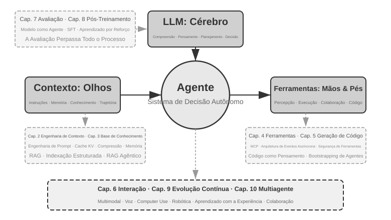
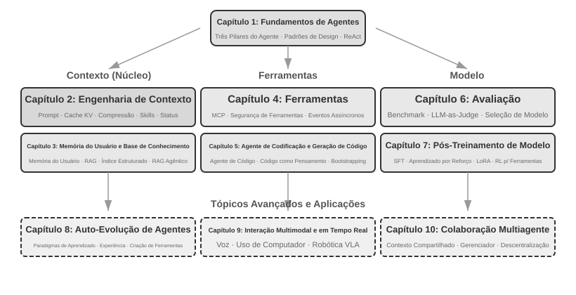

# Introdução {.unnumbered}

De agosto a outubro de 2025, ministrei uma série de aulas no “AI Agent Bootcamp”, da editora chinesa de tecnologia Turing. O objetivo era simples: substituir a intuição por princípios no desenvolvimento de agentes de IA. Não bastava fazer uma demonstração funcionar; era preciso entender *por que* um agente adota determinada arquitetura e quais concessões estão por trás de cada decisão arquitetural. Este livro foi elaborado e ampliado com base nas notas e nos experimentos dessas aulas.

Da concepção inicial ao manuscrito final, o próprio livro foi produzido por meio do que se poderia chamar de **whisper coding** (colaboração por ditado), usando para isso o Pine, nosso agente de voz. Na preparação de cada aula, eu ditava um esboço, pedia ao Pine que pesquisasse o tema e o deixava preparar uma primeira versão do material. Depois da aula, compartilhava com ele o feedback dos alunos, e então discutíamos e aprimorávamos o conteúdo em várias rodadas. A cada iteração, as notas de aula se aproximavam do livro que você tem em mãos. Durante todo esse processo, quase não digitei: preferi expor minhas ideias em voz alta. A fala reduziu o custo de transformar ideias em texto e encurtou o ciclo de “propor uma questão — pesquisar — preparar uma versão preliminar — revisar”. Assim, este livro não trata apenas de agentes; ele também registra uma forma de produção de conhecimento com participação profunda de um agente.

Desde o lançamento do DeepSeek R1, no início de 2025, o foco da pesquisa e da prática industrial em IA vem se expandindo da capacidade dos modelos-base para a implementação sistemática de agentes. No âmbito dos modelos, o aprendizado por reforço agêntico (Agentic Reinforcement Learning) começou a incorporar aos parâmetros do modelo as capacidades de chamada de ferramentas e de interação com o ambiente, conferindo aos modelos capacidades gerais mais robustas em áreas como programação, raciocínio matemático e Computer Use. No âmbito dos produtos, agentes de propósito geral como Manus, Claude Code e OpenClaw vêm transformando a interação humano-computador e consolidando “geração de código + sistema de arquivos” como um importante paradigma arquitetural.

Ao reexaminar os princípios de arquitetura de agentes que sistematizei no curso, constatei algo ao mesmo tempo gratificante e surpreendente: **esses princípios não ficaram obsoletos; tornaram-se ainda mais consolidados.** Desde então, termos como Skill, harness e loop engineering se disseminaram no setor, mas a sequência real foi inversa: as práticas correspondentes já existiam, e só depois foram sintetizadas e nomeadas como princípios de design. A prática vem primeiro; o nome, depois.

A confiança nesses princípios resulta da aplicação de agentes a tarefas reais, de longo horizonte e alto risco. Como cientista-chefe da Pine AI, desenvolvi o Pine com minha equipe para que o agente pudesse se comunicar com pessoas reais em nome dos usuários e lidar com tarefas complexas que envolvem interesses financeiros concretos, como negociar contas, tratar de solicitações de reembolso e reclamações e cancelar assinaturas. Essas tarefas costumam se estender por longos períodos, envolver várias rodadas de negociação, e um único erro pode causar prejuízo financeiro real. Foram essas exigências rigorosas de confiabilidade, segurança e auditabilidade que nos levaram, pouco a pouco, aos princípios arquiteturais enfatizados neste livro. Os exemplos a seguir vêm dessa experiência.

- Muito antes de Skill se tornar um termo popular, já usávamos o carregamento dinâmico de prompts para conter o crescimento ilimitado dos prompts, ferramentas executadas pela linha de comando para conter a expansão ilimitada das listas de ferramentas e uma barra de status do sistema para que o agente tivesse consciência do ambiente de execução, do horário do usuário e do próprio estado de trabalho.
- Muito antes de harness se tornar um termo popular, já usávamos métodos semelhantes aos do Claude Code para lidar com chamadas de ferramentas instáveis, alucinações, operações perigosas ou não autorizadas e descumprimento de instruções.
- Muito antes de loop engineering se tornar um termo popular, já empregávamos o que este livro chama de método proponente-revisor para impedir que o modelo declarasse a tarefa concluída cedo demais.

Nada disso é uma invenção exclusiva nossa. Ao enfrentar problemas semelhantes, muitas equipes de modelos e de agentes desenvolveram de forma independente métodos de engenharia parecidos. Essa convergência mostra que eles refletem restrições comuns aos sistemas de agentes. Foi com base nisso que lancei, em agosto de 2025, o curso “AI Agent Bootcamp”, da Turing, e ministrei continuamente, de 2024 a 2026, um curso prático sobre agentes de IA na Universidade da Academia Chinesa de Ciências. Foi também por isso que optei por publicar este livro como código aberto: quero que esse conhecimento e essa experiência reutilizáveis cheguem a mais pesquisadores e profissionais de engenharia.

**A prática vem primeiro; o nome, depois.** Para o desenvolvimento de agentes empresariais, isso traz uma lição muito concreta: **se você esperar um termo se popularizar no setor para só então adotar a prática correspondente, já estará um passo atrás.** Quando um termo se torna consenso, os sistemas mais avançados geralmente já exploraram por muito tempo o problema que ele designa. Então, como identificar e resolver esses problemas antes que recebam um nome? Acredito que duas condições sejam essenciais.

**Primeiro, escolha uma atividade real que imponha exigências suficientemente altas ao limite de capacidade do agente e continue obtendo feedback genuíno dela.** Considere o Pine. Uma única tarefa pode durar horas ou até semanas e exigir interação repetida com várias partes interessadas: longas ligações telefônicas, preenchimento de formulários complexos no computador e várias rodadas de e-mails. Durante todo o processo, os números precisam estar corretos, as operações devem permanecer sob controle e os interesses do usuário têm de ser protegidos. Somente a imersão em um cenário tão complexo leva a prática a exigir naturalmente a criação de um harness que resolva de forma sistemática aquilo que o modelo ainda não consegue fazer sozinho, mas que a atividade demanda. Por outro lado, se as necessidades da atividade forem facilmente atendidas pela próxima atualização do modelo, será difícil para a equipe consolidar princípios estáveis de arquitetura.

**Segundo, é preciso estabelecer um mecanismo sistemático de avaliação.** Sem avaliação, não há como saber se a melhoria decorrente de uma alteração veio do próprio design ou de mera flutuação aleatória. A avaliação transforma a iteração do agente, antes baseada em impressões, em um processo de engenharia comparável e reproduzível. Ela é a base para desenvolver sistemas segundo o método científico. O Capítulo 7 abordará esse método em detalhes.

Independentemente dos avanços dos modelos subjacentes e das inovações nos formatos dos produtos, quase todos os sistemas de agentes bem-sucedidos seguem os mesmos padrões arquiteturais. Isso não é coincidência: **bons princípios de design devem atravessar os ciclos de evolução dos modelos**, pois não descrevem como usar um modelo específico, mas os padrões fundamentais pelos quais sistemas inteligentes interagem com o mundo.

Richard Sutton, vencedor do Prêmio Turing e pai do aprendizado por reforço, afirmou certa vez que a evolução do universo passou por quatro estágios: poeira, estrelas, vida e agentes — no original, “entidades projetadas” (*designed entities*). A evolução biológica é cega: mutação aleatória e seleção natural. A maioria dos organismos não compreende seus próprios princípios de funcionamento nem consegue projetar ou modificar a si mesma. Os agentes, porém, são algo inteiramente novo na história da evolução cósmica: ao gerar código, podem realizar bootstrap e evoluir a si mesmos, como um programador que escreve outro programador, que então escreve o próximo. Em outras palavras, um agente pode compreender seu próprio mecanismo de funcionamento e, a partir de um objetivo, criar agentes inteiramente novos — e até aperfeiçoar a si mesmo. A missão deste livro é ajudar você a compreender e dominar os princípios dessa criação.

A fórmula central deste livro cabe em uma frase: **Agente = LLM + Contexto + Ferramentas**. Os três elementos são indispensáveis.



De modo mais intuitivo: **cérebro + olhos + mãos e pés**. O cérebro (LLM) é responsável por pensar e tomar decisões; os olhos (contexto) determinam quais informações o agente pode ver; e as mãos e os pés (ferramentas) determinam o que ele pode fazer. (A rigor, “olhos” é apenas uma analogia aproximada: o contexto inclui não só informações do ambiente e o histórico da conversa, mas também as definições das ferramentas. Isso significa que, entre as informações que o agente “vê”, também está “quais mãos e pés estão disponíveis”. A metáfora busca transmitir a intuição central: o contexto abrange todas as informações que o modelo pode perceber.)

Para leitores familiarizados com aprendizado por reforço, esses três elementos também podem ser mapeados para a linguagem formal de RL. Especificamente, o LLM corresponde à política (*Policy*), o contexto corresponde ao espaço de observação (*Observation Space*) e as ferramentas correspondem ao espaço de ações (*Action Space*). As três formulações se referem ao mesmo objeto, apenas em níveis de abstração diferentes.

## Estrutura do livro {.unnumbered}

Este livro tem dez capítulos organizados em quatro níveis (Figura 0-2). O Capítulo 1 estabelece a estrutura conceitual básica dos agentes; os Capítulos 2 a 6 discutem como construir agentes, abordando, em sequência, contexto, conhecimento, ferramentas, geração de código e interação; os Capítulos 7 a 9 tratam de como avaliar e aprimorar continuamente os agentes, avançando dos sistemas de medição e do pós-treinamento de modelos até a evolução contínua baseada na experiência operacional; o Capítulo 10 amplia o escopo para a colaboração multiagente.



- **Capítulo 1 (Fundamentos dos agentes)** parte de vários produtos reais para desenvolver uma compreensão intuitiva dos agentes. Em seguida, examina em profundidade sua fórmula central: da camada de implementação — LLM + contexto + ferramentas — à camada intuitiva — cérebro + olhos + mãos e pés — e, por fim, à camada acadêmica — política, espaço de observação e espaço de ação. Experimentos analisam o funcionamento do ciclo ReAct — o processo iterativo de “pensar → agir → observar” — e distinguem a adaptação contextual dentro de uma tarefa, as atualizações de artefatos externos entre tarefas e as atualizações de parâmetros durante os ciclos de treinamento. O capítulo termina com padrões de projeto de orquestração que vão de fluxos de trabalho a agentes autônomos, estabelecendo uma estrutura conceitual unificada para os capítulos seguintes.
- **Capítulo 2 (Engenharia de contexto)** é o capítulo mais importante do livro e apresenta de forma sistemática o contexto, os “olhos” do agente. Começa pela estrutura das mensagens da API e pelo ciclo central do agente, estabelecendo a noção fundamental de que “o contexto é uma lista de mensagens”. Depois, examina os princípios subjacentes ao cache KV — mecanismo que reutiliza resultados de cálculos anteriores durante a inferência do LLM. Na sequência, aborda engenharia de prompts, incluindo projeto orientado a processos, descrições de ferramentas e detalhamento de regras de negócio; ataques de injeção de prompt e suas defesas; o mecanismo de carregamento sob demanda de skills do agente; a tecnologia de barra de status do agente; e estratégias de compressão de contexto. As definições completas desses termos são apresentadas quando eles aparecem pela primeira vez no texto principal.
- **Capítulo 3 (Memória do usuário e bases de conhecimento)** estende o gerenciamento de contexto a um sistema de conhecimento persistente entre sessões, permitindo que o agente não apenas se lembre da conversa atual, mas também acumule e recupere conhecimentos ao longo de várias conversas. O capítulo aborda quatro estratégias progressivas de memória do usuário; a pilha tecnológica completa de RAG (geração aumentada por recuperação, na qual documentos relevantes são recuperados antes de o modelo gerar uma resposta), incluindo diferentes métodos de busca textual e otimização da ordenação de resultados; extração de informações multimodais; métodos mais avançados de organização do conhecimento; e RAG agêntica, na qual o agente decide de forma autônoma quando e o que recuperar.
- **Capítulo 4 (Ferramentas)** examina a ponte entre os agentes e o mundo externo: as ferramentas funcionam como as “mãos e os pés” do agente, permitindo que ele pesquise na web, chame APIs, opere bancos de dados e muito mais. O capítulo apresenta o padrão MCP de interoperabilidade entre ferramentas e os princípios de projeto de cinco categorias de ferramentas — percepção, execução, colaboração, acionamento por eventos e comunicação com o usuário —, aborda três métodos de percepção multimodal — processamento multimodal nativo, conversão em texto e análise multimodal por meio de ferramentas — e enfatiza os mecanismos de segurança das ferramentas de execução. O acionamento por eventos, a comunicação com o usuário e o runtime assíncrono são tratados no Capítulo 6.
- **Capítulo 5 (Agente de programação e geração de código)** sustenta que um agente de programação combinado com um sistema de arquivos constitui a base técnica essencial de todo agente de propósito geral. Tendo a arquitetura do OpenClaw como fio condutor, analisa os fluxos de trabalho e as técnicas de implementação dos agentes de programação, além de demonstrar o amplo valor da geração de código para além da programação: desde o auxílio ao raciocínio e a construção de bases de conhecimento até a criação dinâmica de novas ferramentas e a autoinicialização de agentes.
- **Capítulo 6 (Interação: expansão dos espaços de observação e ação)** elimina a premissa de alternância de turnos adotada nos cinco capítulos anteriores e amplia a interação do agente com o mundo em dois eixos — **modalidade** e **temporalidade**: o processamento assíncrono e orientado a eventos permite que o mundo desperte o agente — por meio de ferramentas acionadas por eventos, ferramentas de comunicação com o usuário, identidades virtuais e ambientes de execução isolados; a voz leva a interação à escala dos milissegundos — de pipelines em cascata a modelos onimodais de ponta a ponta e full-duplex; o Computer Use permite que o agente opere interfaces gráficas como um ser humano; e a manipulação robótica estende a ação ao mundo físico — com controle VLA e transferência Sim2Real. Os quatro cenários compartilham um conjunto de primitivas: ativação, ponto seguro, cancelamento, preempção e separação entre caminhos rápidos e lentos.
- **Capítulo 7 (Avaliação de agentes)** desenvolve uma metodologia científica de avaliação. Abrange ambientes de avaliação — dois paradigmas centrais, chamada de ferramentas e interação humano-computador, além de ambientes de simulação tratados separadamente ao final do capítulo —, princípios de projeto de conjuntos de dados, avaliação automatizada com LLM como avaliador, seleção de modelos orientada por avaliação e o ciclo completo que transforma os resultados da avaliação em melhorias do sistema.
- **Capítulo 8 (Pós-treinamento de modelos)** examina em profundidade duas técnicas de pós-treinamento: SFT (ajuste fino supervisionado, que usa dados rotulados para ensinar o modelo a seguir exemplos) e RL (aprendizado por reforço, que permite ao modelo aprimorar-se de forma autônoma por tentativa e erro e pelo feedback de recompensas). Estruturado em torno das teses centrais de que “o SFT memoriza, o RL generaliza” e de que “dados e ambiente importam mais que algoritmos”, o capítulo abrange o panorama completo de pré-treinamento/SFT/RL, a teoria clássica de RL, o projeto de sinais de recompensa — de recompensas binárias e recompensas de processo a penalidades verificadas de percurso que “recompensam o resultado e restringem o processo” —, algoritmos de aprendizado por reforço de turno único e de múltiplos turnos, além de temas de fronteira como a otimização da eficiência amostral.
- **Capítulo 9 (Evolução contínua dos agentes)** estuda como transformar a experiência operacional de um agente em capacidades para sua próxima versão. Primeiro, estabelece sinais de aprendizado compostos por resultados do ambiente, regras de processo e rubricas de LLM; depois, compara quatro meios de atualização — documentos de conhecimento, prompts e skills, programas e harnesses, e parâmetros do modelo; por fim, discute a validação de versões candidatas, lançamentos canário, reversão e consolidação de longo prazo.
- **Capítulo 10 (Colaboração multiagente)** discute a forma mais avançada dos sistemas de agentes de IA: como vários agentes dividem o trabalho e colaboram. Apresenta de maneira sistemática uma estrutura de classificação da colaboração multiagente — contexto compartilhado/independente × estruturas entre pares/com gerenciador/descentralizadas —, usa agentes de tradução e agentes que coordenam telefone e computador para demonstrar o projeto de arquiteturas colaborativas e examina direções de fronteira para sociedades e economias de agentes.

## Como ler este livro {.unnumbered}

Os capítulos deste livro são relativamente independentes. Você pode escolher diferentes percursos de leitura conforme suas necessidades:

- **Se você desenvolve agentes**, leia os Capítulos 1 a 9 em ordem: os seis primeiros apresentam métodos de construção, o Capítulo 7 estabelece os fundamentos da avaliação, o Capítulo 8 explica como treinar modelos e o Capítulo 9 integra parâmetros e outros meios de atualização em um ciclo completo de evolução contínua. O Capítulo 10 pode ser lido de forma seletiva, conforme suas necessidades de colaboração multiagente.
- **Se você tem pouco tempo**, priorize o Capítulo 1, para obter uma visão geral, e o Capítulo 2, para dominar a engenharia de contexto — a habilidade mais importante. Os princípios subjacentes ao cache KV apresentados no Capítulo 2 são bastante técnicos; em uma primeira leitura, você pode pular os detalhes do mecanismo e reter apenas as três conclusões centrais expostas no início, sem prejudicar a compreensão do restante do livro.
- **Se o seu foco é o treinamento de modelos**, vá diretamente ao Capítulo 8 (Pós-treinamento de modelos). Como os métodos de avaliação do Capítulo 7 são um pré-requisito para o treinamento, leia os dois em conjunto, depois dos Capítulos 1 e 2, que fornecem a visão geral.

Cada capítulo contém diversos **experimentos** e **questões para reflexão**, numerados no formato “Experimento X-Y” (X é o número do capítulo e Y, o número sequencial dentro dele). Os títulos dos experimentos e das questões para reflexão indicam a dificuldade por meio de estrelas: ★ significa nível introdutório, adequado a todos os leitores; ★★ indica dificuldade média e exige alguma experiência prática em engenharia; ★★★ representa um desafio avançado, geralmente relacionado a questões abertas ou ao projeto de sistemas complexos. A maioria dos experimentos inclui código completo e executável, organizado no repositório de código aberto que acompanha o livro:

> **Repositório de código complementar**: [https://github.com/bojieli/ai-agent-book](https://github.com/bojieli/ai-agent-book)

Você pode obter todo o código complementar com o Git:

```bash
git clone https://github.com/bojieli/ai-agent-book.git
cd ai-agent-book
```

Se você não usa o Git, também pode selecionar **Code → Download ZIP** na página do repositório. O código dos experimentos está organizado por capítulo, de `chapter1/` a `chapter10/`. Para localizar o “Experimento X-Y”, abra o arquivo `chapterX/README.en.md` correspondente, use o número do experimento para encontrar o diretório do projeto e siga o README desse projeto para instalar as dependências e executá-lo. Alguns experimentos identificados como guias de reprodução dependem de repositórios externos; os respectivos arquivos README também explicam como obtê-los.

Recomendo enfaticamente que você execute esses experimentos. Os agentes de IA constituem uma área eminentemente prática, e muitas intuições de projeto só se consolidam durante a depuração.

**Nota terminológica**: este livro distingue cuidadosamente dois termos que muitas vezes são confundidos no uso cotidiano. **Raciocínio** é o pensamento passo a passo do modelo, como em modelos de raciocínio, cadeia de raciocínio e tokens de raciocínio. **Inferência** é o cálculo direto do modelo no momento da implantação, como em custo de inferência, pilha de inferência e escalonamento no momento da inferência. A edição chinesa emprega duas palavras distintas — 思考 para raciocínio e 推理 para inferência — justamente para manter separados esses dois conceitos; o estudo de caso de tradução do Capítulo 10 retoma essa convenção. Outros termos importantes são definidos na primeira vez em que aparecem no texto.

## Pré-requisitos {.unnumbered}

Este livro se destina a leitores com alguma formação técnica, mas não exige especialização em uma área específica. Os pré-requisitos estão divididos abaixo em dois níveis, “Obrigatórios” e “Recomendados”, para ajudar você a avaliar seu grau de preparo.

**Obrigatórios: fundamentos para a leitura de todo o livro**

- **Programação em Python**: quase todos os experimentos do livro são baseados em Python. Você precisa conhecer a sintaxe básica da linguagem, estruturas de dados comuns, gerenciamento de pacotes (pip) e outros conceitos fundamentais. Não é necessário ter domínio avançado, mas você deve ser capaz de ler e modificar código Python de complexidade moderada.
- **Experiência básica com LLMs**: você deve ter usado ChatGPT, Claude ou produtos semelhantes e compreender o padrão básico de interação “prompt → resposta do modelo”.
- **Uma ferramenta de programação assistida por IA**: é altamente recomendável instalar e se familiarizar com pelo menos uma ferramenta de programação assistida por IA, como Claude Code, Codex, Cursor ou TRAE. Por um lado, essas ferramentas agilizam significativamente os experimentos do livro, que envolvem muita escrita e depuração de código. Por outro, elas próprias são agentes de programação maduros: ao usá-las, você vivenciará em primeira mão os principais mecanismos abordados repetidamente neste livro, como o ciclo ReAct, as chamadas de ferramentas e o gerenciamento de contexto. Essa experiência direta é extremamente valiosa para compreender os princípios de projeto de agentes.
- **Conhecimentos gerais de engenharia de software**: você deve conhecer conceitos básicos como operações em linha de comando, controle de versão com Git, formato de dados JSON e APIs REST. Esses conhecimentos são fundamentais para executar os experimentos e compreender o mecanismo de chamada de ferramentas dos agentes.

**Recomendados: para aproveitar melhor capítulos específicos**

- **Fundamentos de aprendizado de máquina** (Capítulo 8): compreender conceitos básicos como treinamento e inferência, funções de perda, descida do gradiente e sobreajuste ajudará você a entender o pós-treinamento de modelos.
- **Matemática básica** (Capítulos 2–3 e 8): uma compreensão intuitiva de álgebra linear — por exemplo, saber que vetores podem representar direção e magnitude e que matrizes permitem realizar operações em lote — ajudará você a entender embeddings e mecanismos de atenção. Conhecimentos básicos de probabilidade e estatística serão úteis para compreender métricas de avaliação e recompensas esperadas no aprendizado por reforço. A matemática apresentada no livro não envolve derivações complexas e privilegia explicações intuitivas.
- **Fundamentos de desenvolvimento web** (Capítulo 6): compreender conceitos como HTTP, WebSocket e arquitetura com separação entre front-end e back-end ajudará você a entender arquiteturas assíncronas de agentes orientadas a eventos e os experimentos de comunicação em tempo real com agentes de voz.
- **Compreensão básica da arquitetura Transformer** (Capítulos 2 e 8): o Transformer é a arquitetura subjacente a quase todos os modelos de linguagem de grande porte atuais. Para quem deseja desenvolver de forma sistemática uma base sobre esses modelos, recomendamos a leitura de *Illustrating Large Models* (图解大模型, publicado em chinês pela Turing), que explica por meio de diagramas intuitivos conceitos essenciais como a arquitetura Transformer, o pré-treinamento e o ajuste fino, complementando a perspectiva de engenharia de agentes adotada neste livro.

Se você ainda não tiver alguns desses conhecimentos, não desanime. O principal valor deste livro está nos **princípios de projeto de arquitetura e na metodologia de engenharia**, e não em um algoritmo ou uma técnica específica. Com exceção do Capítulo 8, dedicado ao pós-treinamento, o livro exige muito pouco conhecimento de matemática ou aprendizado de máquina e pode ser usado tranquilamente como ponto de partida.

A tecnologia de agentes ainda evolui rapidamente, mas **bons princípios de projeto de arquitetura têm o poder de resistir ao tempo**. Ao dominar as razões por trás de cada escolha de projeto, você conseguirá manter a clareza de julgamento em meio às sucessivas ondas de transformação tecnológica. Espero que este livro se torne um guia confiável na construção de seus agentes de IA.

## Agradecimentos {.unnumbered}

Agradeço às editoras Meng Ge e Liu Meiying, da Turing, pelo dedicado trabalho de edição e pelo empenho na organização do curso “AI Agent Bootcamp” da Turing. Agradeço também ao professor Liu Junming por ministrar o curso prático de agentes de IA na Universidade da Academia Chinesa de Ciências. Meus agradecimentos especiais a todos os participantes do “AI Agent Bootcamp” da Turing e do curso de agentes de IA da UCAS: ao ministrar esses cursos, recebi de vocês muitos comentários e sugestões valiosos, que também tornaram mais clara minha própria compreensão desses conceitos.

Agradeço a todos os meus colegas da Pine AI. Sem um produto tão excelente como o Pine AI e os inúmeros desafios que ele trouxe, eu jamais teria alcançado uma compreensão e uma experiência prática tão profundas no campo dos agentes. Em sucessivas trocas de ideias, meus colegas também contribuíram com muitos insights valiosos.

Agradeço ainda aos muitos amigos do setor de IA, que não citarei individualmente aqui. Em diversas discussões, vocês avaliaram minhas ideias com franqueza, corrigiram muitos dos meus julgamentos equivocados e ampliaram minha compreensão sobre modelos e agentes.

Acima de tudo, agradeço à minha família, em especial à minha esposa, Meng Jiaying. Ela sempre me apoiou durante a escrita deste livro e ofereceu muitas sugestões valiosas ao longo do processo.
