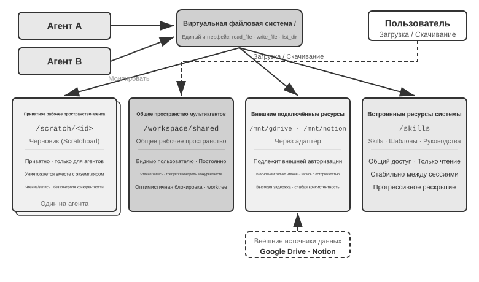
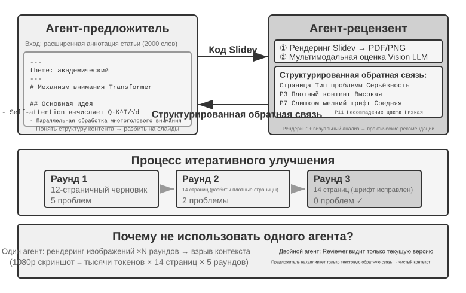
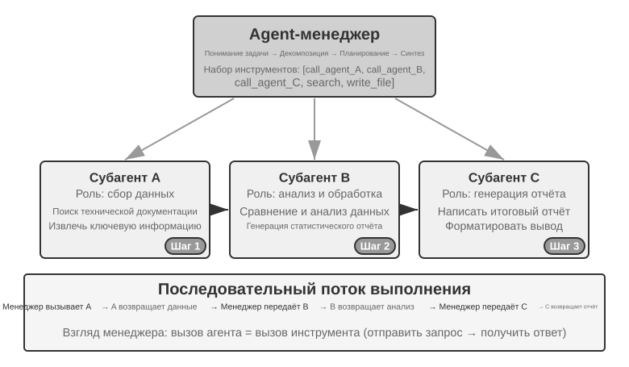
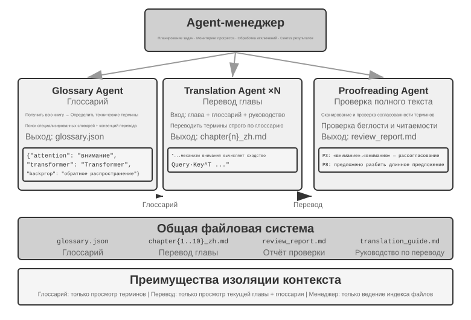
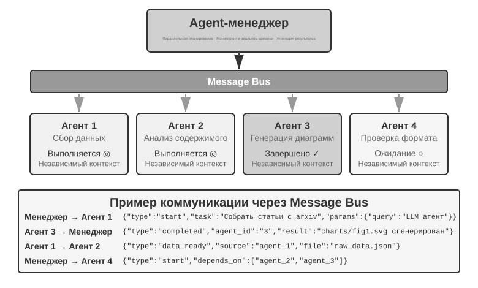
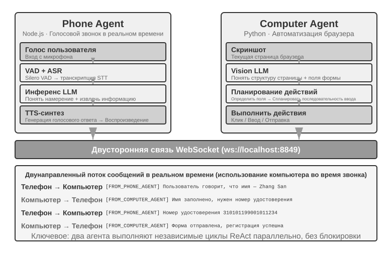
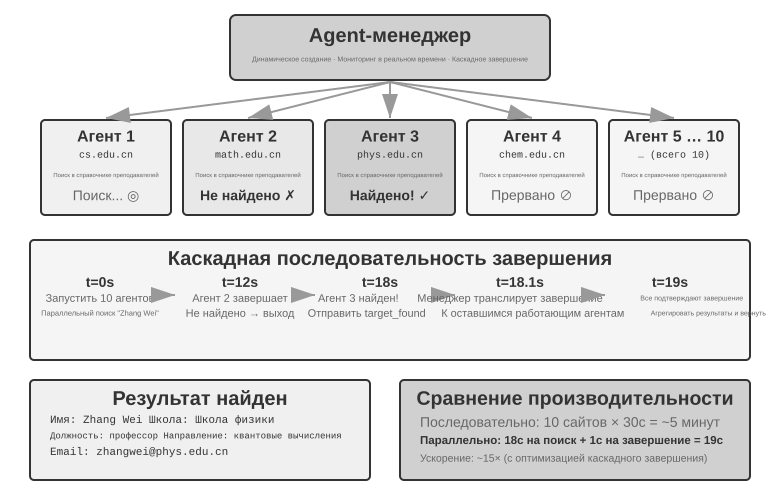
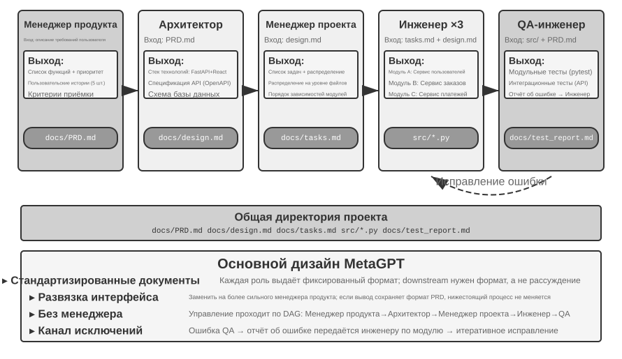
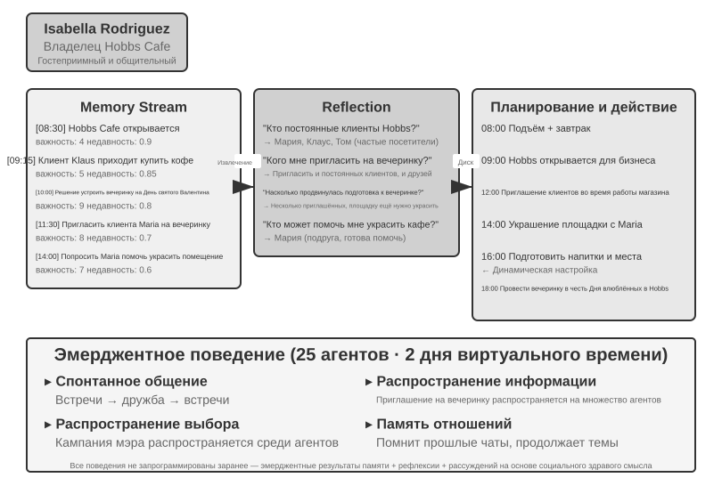
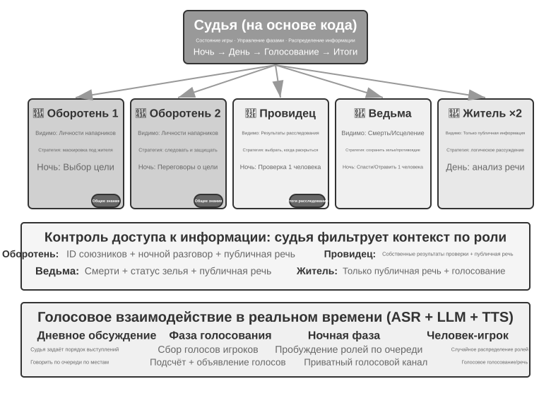

# Мультиагентное взаимодействие

Первые девять глав были посвящены одиночному агенту: сначала мы строили его контекст, знания, инструменты и способности к взаимодействию, а затем с помощью оценки, постобучения и непрерывной эволюции делали его лучше в долгосрочной перспективе. Эта глава развивает вопрос «как построить и улучшить одного агента?» до вопроса «как организовать нескольких агентов?» — чтобы разделение труда, коммуникация и взаимная проверка позволили решать задачи, которые одному агенту трудно взять на себя.

В описанных ранее OpenAI пяти уровнях возможностей AI (Уровень 1 Собеседник, Уровень 2 Мыслитель (Reasoners), Уровень 3 Агент, Уровень 4 Инноватор, Уровень 5 Организации (Organizations)) мультиагентное взаимодействие часто сравнивают с одним из путей к пятому уровню — нужно уточнить, что Organizations здесь означает уровень способности «AI может выполнять работу целой организации», а не требование к архитектуре системы: достаточно мощный единичный агент теоретически тоже может достичь этого уровня. Но применительно к сегодняшней инженерной реальности одиночный агент всё же ограничен возможностями своей модели и размером окна контекста.

А совместная работа нескольких агентов значит гораздо больше, чем просто позволить агентам с разной специализацией «дополнять друг друга». Более фундаментальный момент в том, что **интеллект группы может превышать интеллект отдельной особи**. Человеческая цивилизация — тому доказательство: интеллект отдельного человека ограничен, но благодаря разделению труда, сотрудничеству, дискуссиям и межпоколенческому накоплению знаний интеллект, который демонстрирует человеческое общество как целое, намного превосходит интеллект любого отдельного гения. У сообщества агентов может возникнуть точно такой же коллективный интеллект: даже если каждый агент по отдельности соответствует уровню человеческого эксперта, при правильной организации их совокупные возможности могут превзойти сумму возможностей всех человеческих экспертов вместе взятых. Google DeepMind в работе «От AGI к ASI» прямо называет «крупномасштабные мультиагентные коллективы» одним из ключевых путей к суперинтеллекту (ASI) — подобно тому как общий интеллект людей может складываться в социальные и организационные структуры, превосходящие отдельного человека, «коллективный интеллект», возникающий из совместной работы множества агентов уровня AGI, тоже может проявлять когнитивные возможности, значительно превышающие простую сумму его участников[^agi-asi]. Поэтому мультиагентное взаимодействие — это не просто инженерный приём для преодоления ограничений окна контекста и возможностей одной модели, а, возможно, фундаментальный путь от «AI экспертного уровня» к «превосходству над человечеством в целом».

[^agi-asi]: О том, что «крупномасштабные мультиагентные коллективы» названы одним из ключевых путей от общего искусственного интеллекта к суперинтеллекту, см. Google DeepMind, *From AGI to ASI.* arXiv:2606.12683, 2026.

## Классификационная схема мультиагентного взаимодействия

Чтобы построить многоагентную систему, нужно прежде всего понять два ключевых измерения проектирования, которые вместе определяют базовую архитектуру системы и способ её реализации.

### Измерение первое: разделяется ли контекст

Это самое базовое архитектурное решение, определяющее, как информация передаётся между несколькими агентами.

**Общий контекст** означает, что последующий агент получает полную историю диалога и траекторию (trajectory, определённую в главе 1) предыдущего агента. При переключении системного промпта и набора инструментов на каждом этапе фактически возникает новый агент (потому что меняются его роль, обязанности и возможности), но при этом он сохраняет всю память предшественника. Например, в команде аналитик по требованиям написал документ с требованиями — разработчик получает не только сам документ, но и видит всю переписку аналитика с пользователем: это новая роль, но с полностью сохранённым предыдущим контекстом. Преимущество в том, что информация не теряется — каждый агент может обратиться к деталям любого предыдущего этапа; сложность в том, что контекст может быстро разрастаться.

**Раздельный контекст** означает, что каждый агент ведёт полностью независимый контекст и историю диалога, не имея прямого доступа к «ходу мыслей» другого. Это похоже на взаимодействие разных отделов: каждый работает на своём рабочем месте самостоятельно, обмениваясь информацией через общие документы и протоколы встреч, а не постоянно наблюдая за экраном коллеги. Такая модель обеспечивает лучшую модульность и изоляцию — каждый агент занимается только информацией, относящейся к его собственным обязанностям; систему также легче расширять и поддерживать — добавление нового агента не требует изменения внутренней логики существующих, достаточно определить интерфейсы и форматы данных.

Поскольку агенты не разделяют контекст, информацию приходится передавать через явный механизм коммуникации. У этой проблемы давно есть ответ в классических распределённых системах: учебники по операционным системам говорят нам, что межпроцессное взаимодействие (IPC) в конечном счёте сводится к двум парадигмам — **разделяемая память** (одна сторона пишет, другая читает один и тот же участок хранилища) и **передача сообщений** (данные явно отправляются другой стороне). Механизмы коммуникации между агентами также укладываются в эти две парадигмы. Наиболее распространены три способа:

- **Параметры вызова инструмента**: нижестоящий агент оборачивается как инструмент, а вышестоящий агент передаёт структурированные данные через его параметры — подходит для сценариев, где нужны чёткая типизация и понятная структура;
- **Общая файловая система**: агенты обмениваются информацией, читая и записывая документы, код и другие промежуточные продукты в общем каталоге — подходит для случаев с крупными артефактами или необходимостью персистентности;
- **Шина сообщений (Message Bus)**: специальный посредник, отвечающий за передачу сообщений между агентами; агенты не вызывают друг друга напрямую, а отправляют сообщение в шину, которая пересылает его целевому агенту.

Если сопоставить с двумя парадигмами IPC: общая файловая система — это «разделяемая память» мира агентов; параметры вызова инструмента и шина сообщений — две формы «передачи сообщений», где первая передаётся синхронно вместе с вызовом, а вторая доставляется асинхронно через посредника. У обеих парадигм есть свои компромиссы. В языке Go есть широко известная фраза: «Не общайтесь через разделяемую память — вместо этого разделяйте память через общение»。

Шина сообщений естественным образом поддерживает **асинхронную коммуникацию** — отправителю и получателю не нужно быть онлайн одновременно, как в корпоративной почтовой системе: отправляя письмо коллеге, вы не требуете, чтобы он в этот момент сидел за компьютером — письмо хранится на сервере, пока коллега не выйдет на связь и не обработает его. Такой способ особенно подходит для сценариев, где несколько агентов работают параллельно и нуждаются во взаимной координации (подробнее в разделе «Параллельная координация» этой главы).


Стоит уточнить: обе архитектуры представляют собой настоящие многоагентные системы (поскольку системный промпт и набор инструментов на каждом этапе отличаются — это разные агенты), различие в способе координации. **Общий контекст** опирается на неявную координацию — последующий агент наследует полную историю контекста предыдущего, «видит» его ход рассуждений, информация передаётся через сам контекст. **Раздельный контекст** опирается на явную координацию — агенты обмениваются информацией через файлы, сообщения или интерфейсы структурированных данных, каждый агент видит только относящееся к нему содержимое.

Аналогия: первый вариант больше похож на команду, сидящую за одним столом и обсуждающую что-то вслух — все слышат всё; второй больше похож на взаимодействие разных отделов через почту и документы, у каждого своё рабочее пространство.

Знакомый с операционными системами читатель узнает в этой паре выбор: общий контекст — это потоки, раздельный контекст — это процессы. Потоки разделяют адресное пространство, переключаются с малыми накладными расходами, для коммуникации не нужно копирование, но платой становится отсутствие изоляции — один поток испортит память, и весь процесс рухнет вместе с ним; у процессов же каждое своё независимое адресное пространство, изоляция полная, можно безопасно работать параллельно, но платой становится необходимость явного IPC для коммуникации.

**Простое правило**: если ожидаемый накопленный контекст превысит 50% окна (это эмпирическое правило, а не точный порог), стоит выбирать раздельный контекст; если нулевые потери информации — жёсткое требование для корректности задачи, стоит выбирать общий контекст; в большинстве реальных систем применяется «поэтапная» схема — первые несколько агентов работают с общим контекстом, а по достижении точки насыщения информацией происходит переключение на раздельный контекст с явной передачей (handoff, то есть вышестоящий агент сам решает, какую информацию передать нижестоящему).

### Измерение второе: топология взаимодействия

Второе измерение — топология взаимодействия: по какой структуре между агентами перемещаются управление и информация. Топология взаимодействия и разделение контекста **концептуально независимы, но практически взаимосвязаны**: концептуальная независимость объясняется тем, что у систем с общим контекстом тоже есть топология — например, представленный далее в этой главе `transfer_to_agent` (эксперимент 10-1) по сути представляет собой цепочку передач (handoff) в форме общего контекста; практическая взаимосвязь объясняется тем, что при выборе общего контекста топология обычно вырождается (см. ниже), то есть значения этих двух измерений нельзя комбинировать произвольно. При общем контексте передаче не нужно решать, «что передавать» — полная история сохраняется естественным образом, — поэтому топология обычно вырождается в последовательность смены ролей без особых архитектурных решений (промежуточный случай между двумя крайностями — взаимодействие нескольких сторон в формате group chat, о нём в разделе о децентрализованной модели далее в этой главе). А как только выбирается раздельный контекст, вопрос «как течёт информация и кто координирует» становится тем, что нужно явно проектировать.

> **Терминология: Graph-инженерия.** Термин Graph Engineering, получивший распространение в июле 2026 года, в современном агентном контексте обычно означает явное проектирование графа выполнения: узлами выступают агенты, обычные программы или человеческие решения; рёбра задают зависимости задач, условную маршрутизацию и пути обработки сбоев; структурированное состояние перемещается между узлами[^ch10-graph-engineering-ru]. Рассматриваемая в этой главе «топология взаимодействия» — мультиагентное подмножество этой идеи: равноправное сотрудничество, оркестрация менеджером и децентрализованные передачи представляют разные топологии графа. Поскольку название ещё ново и его легко спутать с графами знаний, GraphRAG и трассами выполнения, основными терминами книги остаются более устоявшиеся «топология взаимодействия» и «оркестрация».

[^ch10-graph-engineering-ru]: Раннее обсуждение названия см. в Josh C. Simmons, *We Are Entering the Graph Engineering Phase*, 2026. В распространённых фреймворках та же инженерная структура обычно называется graph-based workflow или orchestration, а не принципиально новой технологией. См. https://www.drjoshcsimmons.com/writing/we-are-entering-the-graph-engineering-phase, https://docs.langchain.com/oss/python/langgraph/overview, https://learn.microsoft.com/en-us/agent-framework/workflows/ и https://adk.dev/workflows/.

Иными словами, эти два измерения в принципе образуют матрицу 2×3 (общий/раздельный контекст × три топологии), но в строке «общий контекст» топология в основном вырождается в последовательность смены ролей без особых архитектурных решений (именно эту форму рассматривает далее раздел «Многоэтапная смена ролей»), поэтому в этой главе подробно рассматриваются только три ячейки для раздельного контекста. Ниже описаны три типичные формы топологии взаимодействия при раздельном контексте, в порядке возрастания сложности:

- **Модель равноправного сотрудничества** (Peer Collaboration Pattern): небольшое число агентов (как правило, 2–3) взаимодействуют на равных, образуя цикл итеративного улучшения — как при написании статьи, когда один человек делает черновик, а другой вносит правки и комментарии, и после нескольких раундов качество получается намного выше, чем при единоличной работе.
- **Модель оркестрации** (Orchestration Pattern): централизованный Manager Agent отвечает за планирование и распределение задач, несколько подчинённых агентов занимаются конкретными подзадачами — как менеджер проекта, руководящий несколькими инженерами-специалистами.
- **Децентрализованная модель** (Decentralized Pattern): нет центрального управляющего звена во время выполнения, агенты общаются друг с другом как люди, совместно выполняя задачу.

Подробное устройство каждой модели и сценарии применения будут рассмотрены в отдельных подразделах далее.

## Когда мультиагентное взаимодействие действительно превосходит одного агента

Прежде чем переходить к конкретным архитектурам взаимодействия, ответим на более фундаментальный вопрос: **когда действительно нужно несколько агентов, а когда достаточно одного?** Ответ на этот вопрос станет общим ориентиром для всех инженерных решений, изложенных далее. Ряд недавних исследований даёт чёткий критерий оценки — суть его сводится к одному условию: **вносит ли процесс взаимодействия новую информацию, которую единичный агент не мог бы получить при генерации самостоятельно?**

Таблица 10-1 обобщает, вносят ли различные модели взаимодействия новую информацию, — это помогает определить, есть ли у мультиагентного взаимодействия реальная ценность по сравнению с одним агентом.

Таблица 10-1. Сравнение прироста информации в разных моделях мультиагентного взаимодействия

| Модель взаимодействия | Вносится ли новая информация | Эффект |
|---|---|---|
| Модель сама проверяет свой результат (повторное прочтение собственного вывода) | Нет | Обычно неэффективно или даже вредно |
| Разные агенты обсуждают один и тот же текст | Нет | При равном объёме вычислений на уровне одного агента |
| Рецензент проверяет код по результатам выполнения тестов | Да (обратная связь от выполнения) | Значительное улучшение |
| Рецензент проверяет фронтенд-код/код PPT по скриншотам рендеринга | Да (визуальная обратная связь) | Значительное улучшение |
| Рецензент проверяет факты с помощью внешних инструментов | Да (обратная связь от инструмента) | Значительное улучшение |

RLEF (Reinforcement Learning from Execution Feedback)[^rlef-2025] 2025 года подтверждает это: обучение модели с подкреплением на использование обратной связи от выполнения кода для итеративного улучшения кода дало результаты намного лучше, чем самостоятельная многократная выборка модели. Ключевое отличие в том, что на каждой итерации вносится **реальный результат выполнения** (ошибки компиляции, провалившиеся тесты, исключения времени выполнения) — информация, которой не существовало в момент, когда модель писала код. WebGen-Agent[^webgen-agent-2025] 2025 года на задачах генерации веб-страниц с помощью многоуровневой визуальной обратной связи (скриншоты + описания от модели с распознаванием изображений), формирующей каркас обратной связи, по сообщениям, повысил результат Claude 3.5 Sonnet на данном тесте с 26,4% до 51,9% — почти вдвое.

[^rlef-2025]: Gehring, J., et al. *RLEF: Grounding Code LLMs in Execution Feedback with Reinforcement Learning.* arXiv:2410.02089, 2025.
[^webgen-agent-2025]: Lu, Z., et al. *WebGen-Agent: Enhancing Interactive Website Generation with Multi-Level Feedback and Step-Level Reinforcement Learning.* arXiv:2509.22644, 2025.

Эта схема «новой информации» объясняет на первый взгляд противоречивое явление: академические исследования говорят «одного агента достаточно», но в инженерной практике мультиагентные системы действительно показывают себя лучше. Корень противоречия в том, что речь идёт о разных типах «мультиагентности» — в академических исследованиях чаще сравнивается модель «несколько агентов рассматривают один и тот же текст и обсуждают его между собой» (например, дебаты), тогда как эффективные мультиагентные системы в инженерной практике обычно включают контур внешней обратной связи (выполнение кода, визуальный рендеринг, вызов инструментов). Первый вариант не вносит новой информации, второй — вносит. Три архитектуры, описанные далее в этой главе — равноправное сотрудничество, оркестрация и децентрализация, — почти во всех случаях реального успешного применения находят опору именно в этом критерии.

Эксперимент Anthropic 2026 года по поиску уязвимостей даёт наглядный пример. Сорок пять агентов координировали поиск через общий форум, рецензировали находки друг друга, а окончательное решение принимал независимый агент-арбитр. Координируемый рой нашёл 266 уязвимостей, израсходовав 27 миллионов токенов, тогда как параллельный подход с независимыми агентами нашёл лишь 21 уязвимость за 6,5 миллиона токенов. В открытом пространстве поиска коммуникация позволяет мультиагентной системе динамически менять фокус и специализироваться, обменивая больший бюджет токенов на более широкий охват и более разнообразные пути обнаружения.[^anthropic-multiagent-2026]

[^anthropic-multiagent-2026]: Anthropic Frontier Red Team, “Patterns and Problems in Emerging Multiagent Systems,” 2026-08-13. https://www.anthropic.com/research/multiagent-systems

**Бюджет шагов и производительность агента.** Смежное направление исследований — как влияет на результат работы агента выделение разного бюджета шагов (то есть допустимого числа вызовов инструментов или итераций)? Интуитивно кажется, что больше шагов должны давать лучший результат — с бюджетом в 30 шагов агент способен только быстро реализовать основную функциональность, а с бюджетом в 300 шагов он ещё может сначала спланировать, затем реализовать, затем протестировать, затем улучшить. Но статья Google 2025 года «Budget-Aware Tool-Use Enables Effective Agent Scaling» обнаружила контринтуитивный вывод: **простое увеличение числа доступных агенту шагов не гарантирует повышения производительности**. Стандартные агенты не обладают «осознанием бюджета» — даже имея 300 шагов в запасе, они склонны выполнять поверхностный поиск и быстро «насыщаются». Чтобы дополнительные шаги действительно превращались в лучший результат, агенту нужен явный механизм осознания бюджета, динамически подстраивающий стратегию под оставшиеся ресурсы: на начальном этапе — широкое исследование, на позднем — концентрация на наиболее перспективных направлениях. BAVT (Budget-Aware Value Tree Search) 2026 года развивает эту идею, предлагая оценку ценности на уровне отдельного шага, где на каждом шаге вес исследования и вес использования корректируются в зависимости от доли оставшегося бюджета — по мере уменьшения бюджета агент постепенно переключается от «широкого закидывания сети» к «глубокому копанию».

Эти находки напрямую влияют на проектирование многоагентных систем. Например, в модели оркестрации Manager Agent не должен просто раздавать задачи подчинённым агентам и ждать результата — вместо этого он должен **динамически распределять бюджет шагов** в зависимости от сложности задачи: простым подзадачам — меньше шагов, сложным — достаточно шагов. При этом нужно ещё направлять подчинённых агентов на разумное использование этого бюджета (сначала спланировать, затем реализовать, затем протестировать, затем улучшить), а не бросаться сразу в реализацию.

Есть ещё один момент, который нужно учитывать в первую очередь при любом проектировании: **стоимость**. Параллельное исследование и многократные итерации в мультиагентных системах стоят денег — Anthropic раскрывала, что расход токенов их мультиагентной исследовательской системы примерно в 15 раз выше, чем у обычного диалога, а сам объём токенов объясняет около 80% разницы в производительности. Это значит, что выигрыш от мультиагентного подхода должен быть достаточно велик, чтобы покрыть дополнительные расходы в несколько раз или на порядок больше — иначе хорошо настроенный единичный агент чаще всего оказывается более выгодным выбором.

## Мультиагентное взаимодействие с общим контекстом

При взаимодействии с общим контекстом каждый этап является отдельным Agent со своим системным промптом и набором инструментов, но наследует полную траекторию предыдущего этапа. Главное преимущество — отсутствие потери информации; задача — удержать текущий Agent в рамках его роли несмотря на растущую историю.

В сложной задаче роли и обязанности могут заметно меняться от этапа к этапу. Один статический промпт окажется либо слишком общим, либо чрезмерно длинным, поэтому система переключает промпт и инструменты в соответствии с текущим этапом.

Ключевой архитектурный выбор — заменить системный промпт или загрузить Skill. Оба варианта меняют правила поведения, но отличаются стоимостью и силой ограничений.

| Вариант | Носитель правил роли | Видимость инструментов | Влияние на контекст/KV Cache | Сила ограничения |
|---|---|---|---|---|
| `transfer_to_agent` | Замена системного промпта и обычно набора инструментов | Только инструменты текущей роли | Каждое переключение меняет префикс; кэш после точки различия обычно нельзя использовать | Сильная: инструменты вне роли можно убрать из schema |
| Skill | Фиксированный каталог Skills; `SKILL.md` добавляется в траекторию по запросу | Обычно весь каталог или стабильная точка поиска | Статический префикс не меняется; Skill добавляется в конец траектории | Слабая: Skill — инструкция, а жёсткие права задаёт Harness |

Если роли различаются знаниями, процессом или стилем письма, предпочтительна Skill. Если различие касается разрешений, изоляции инструментов, требований соответствия или запрета побочных эффектов, нужен отдельный Agent либо `transfer_to_agent` с ограничениями инструментов, принудительно реализованными в Harness.

> **Эксперимент 10-1 ★★: Переключение ролей с общим контекстом — системный промпт против Skill**
>
> **Общая задача и переменные**: оба пути используют одну модель, одну задачу, одинаковые инструменты, правила ролей и полную общую траекторию. Нужно найти продажи китайских автомобилей на новых источниках энергии за 2021–2023 годы, вычислить CAGR и написать китайское резюме для инвестора длиной не более 120 знаков.
>
> **Путь 1: переключение системного промпта**. Пять ролей: `triage`, `research`, `coding`, `data_analysis`, `writing`. Каждая видит только собственные инструменты и `transfer_to_agent`; при передаче история сохраняется, загружаются промпт и инструменты целевой роли, после чего выполнение продолжается.
>
> **Путь 2: Skill**. Системный промпт и полный каталог инструментов остаются неизменными. Модель вызывает `load_skill(name)`, и прочитанный `SKILL.md` входит в общую траекторию как результат инструмента. Префикс остаётся стабильным, а жёсткие разрешения обеспечивают правила Harness.

## Мультиагентное взаимодействие без общего контекста

Отсутствие общего контекста представляет собой настоящее мультиагентное взаимодействие. В такой архитектуре каждый агент — независимая сущность со своим собственным контекстом, траекторией и состоянием. Агенты не могут напрямую обращаться к «внутренней жизни» друг друга, взаимодействие полностью опирается на явные, структурированные механизмы передачи данных — те самые три механизма коммуникации, представленные в начале главы (параметры вызова инструментов, общая файловая система, шина сообщений).

В начале главы механизмы коммуникации были сопоставлены с двумя парадигмами межпроцессного взаимодействия, а общий и раздельный контекст — с потоками и процессами. Эту аналогию можно провести гораздо дальше (табл. 10-2):

Табл. 10-2 Соответствие между многоагентной системой и операционной системой

| Операционная система | Многоагентная система |
|----------|----------------|
| Программа (исполняемый файл) | Статический префикс (системный промпт + определения инструментов) |
| Память процесса | Траектория |
| CPU | LLM |
| Ядро | Среда выполнения агента |
| Системный вызов | Вызов инструмента |
| fork (создание дочернего процесса) | spawn_subagent |
| kill (отправка сигнала) | cancel_subagent |
| ps (список процессов) | list_agents |
| Код возврата и wait() | Структурированное резюме, возвращаемое дочерним агентом |
| Разделяемая память / передача сообщений | Общая файловая система / сообщения |

Программа — это статический код, процесс — это один запуск программы. Точно так же статический префикс определяет, кто такой агент, а траектория фиксирует, до какого шага он дошёл. LLM играет роль CPU: сама не хранит состояния, а обслуживает множество агентов в режиме разделения времени, загружая разный контекст, — само слово «переключение контекста» и заимствовано из операционных систем. Именно поэтому смена CPU на более быстрый не мешает программе работать по-прежнему; смена модели на более сильную оставляет агента тем же самым агентом — его идентичность и память лежат в префиксе и траектории, а не в весах модели.

Эта абстракция не нова: приватное состояние, асинхронные сообщения, возможность создавать новых участников — это как раз базовые положения модели акторов (Actor model) 1970-х годов [^actor-model], и многоагентную систему можно рассматривать как её LLM-версию. Поэтому зрелый опыт операционных систем и распределённых систем по большей части можно заимствовать напрямую.

[^actor-model]: Hewitt, C., Bishop, P., Steiger, R. *A Universal Modular ACTOR Formalism for Artificial Intelligence.* IJCAI 1973.

Процессная изоляция даёт несколько ощутимых инженерных преимуществ: каждого агента можно разрабатывать и тестировать независимо, добавление новой возможности не требует изменения существующего кода, сбой одного агента не заражает состояние других агентов ошибкой, и, кроме того, несколько агентов могут по-настоящему выполняться параллельно — их контексты полностью независимы, конкуренции за ресурсы не возникает.

Но у отсутствия общего контекста есть своя цена. Самая очевидная — проблема синхронизации информации: как разным агентам поддерживать согласованное понимание состояния задачи? Может ли информация теряться или дублироваться при передаче? Отладка тоже усложняется — при возникновении проблемы приходится просматривать журналы нескольких агентов, чтобы восстановить полную картину выполнения. Из-за этого проектирование интерфейсных спецификаций, форматов данных и протоколов коммуникации становится критически важным.

Явное взаимодействие без общего контекста опирается на две инфраструктуры, не зависящие от топологии. Первая — это **общая файловая система**, служащая постоянным средством обмена артефактами между агентами и файлами с пользователем, она образует плоскость данных взаимодействия; вторая — **механизм коммуникации и управления**, поддерживающий передачу сообщений между агентами, запрос состояния, завершение выполнения и планирование ресурсов, он образует плоскость управления взаимодействием. Все три топологии, рассматриваемые ниже, строятся поверх этих двух основ.

### Файловая система глазами агента

В начале этой главы «общая файловая система» была названа одним из трёх механизмов коммуникации без общего контекста. В реальных системах агент обращается не к единому хранилищу, а к **виртуальной файловой системе** (virtual filesystem): хранилища разного происхождения, с разным жизненным циклом и правами доступа монтируются (mount) в одно и то же дерево каталогов, и агент обращается к ним через единый интерфейс `read_file`/`write_file`/`list_dir`, тогда как под капотом может скрываться локальный временный диск, постоянное объектное хранилище, API стороннего облачного диска или доступный только для чтения системный пакет ресурсов. Чёткое понимание структуры этого дерева каталогов — видимости и жизненного цикла каждой области — является предпосылкой проектирования мультиагентного взаимодействия: значительная часть конфликтов параллелизма и утечек информации возникает из-за смешения областей, которые должны были быть изолированы. Это дерево каталогов равнозначно адресному пространству агента, а четыре типа областей — это сегменты памяти с разными правами: одни приватные и доступные для записи, другие разделяемые несколькими сторонами, третьи только для чтения. Защитная философия операционных систем здесь тоже в силе — по умолчанию изоляция, а разделение должно быть объявлено явно. В зрелой многоагентной системе файловая система обычно состоит из следующих четырёх типов областей:

**Первая: собственная рабочая область агента (Scratchpad)**. Приватный каталог, принадлежащий только конкретному экземпляру агента, где хранятся промежуточные результаты, временные файлы, черновики и отладочные журналы; жизненный цикл привязан к экземпляру, невидим для других агентов и пользователя. Изоляция scratchpad выполняет двойную функцию: предотвращает взаимное перезатирание временных файлов разных агентов и сохраняет компактность контекста главного агента — процесс проб и ошибок дочернего агента остаётся в его собственной рабочей области, в общее пространство передаётся только конечный результат. Это соответствует принципу из четвёртой главы «дочерний агент возвращает структурированное резюме, а не полную траекторию» на уровне хранения.

**Вторая: общее пространство для нескольких агентов (Shared Workspace)**. Область взаимодействия, куда несколько агентов совместно читают и пишут и которая **видна пользователю** — это основное средство обмена артефактами между агентами в архитектуре без общего контекста: Glossary Agent записывает глоссарий, Translation Agent считывает его оттуда; пользователь также может здесь загружать исходные файлы и скачивать конечные результаты. Её жизненный цикл привязан ко всей задаче в целом и требует персистентности. Как область, куда несколько сторон одновременно пишут и читают, она — источник частых конфликтов параллелизма: механизмы вроде оптимистичной блокировки, изоляции рабочих копий (worktree) и подобные действуют именно здесь, подробнее об этом — в разделе «режим сбоя первый» далее в этой главе. Пример из четвёртой главы, где монтирование тома `/workspace/shared` соединяет главного агента, виртуальный компьютер и виртуальный телефон, — типичная реализация этого уровня.

**Третья: смонтированные внешние ресурсы (Mounted External Resources)**. Источники информации сторонних сервисов, к которым пользователь предоставил доступ, — Google Drive, Notion, Dropbox, корпоративная Wiki и т. д. — отображаются через адаптер (adapter) как точки монтирования в файловой системе (например, `/mnt/gdrive`). Агент обращается к документу Notion так же, как к обычному файлу, а под капотом адаптер вызывает API соответствующего сервиса. Три особенности этого уровня, отличающие его от локального хранилища, должны быть явно учтены при проектировании: **доступ ограничен внешними правами** (права пользователя в исходной системе определяют видимость для агента), **более высокая задержка и более слабая согласованность** (каждое чтение — это сетевой запрос, данные могут быть уже изменены извне, и их приходится рассматривать лишь в рамках итоговой согласованности), **преимущественно чтение по требованию** (запись обратно во внешний источник требует осторожности — ошибочная запись может испортить реальные данные пользователя). Единый файловый интерфейс избавляет агента от необходимости создавать отдельный инструмент под каждый источник данных, но при этом маскирует упомянутые различия в производительности и безопасности, поэтому границы доступа только для чтения/на запись, таймауты и учётные данные нужно явно настраивать на уровне монтирования.

**Четвёртая: встроенные системные ресурсы (Built-in System Resources)**. Предустановленные системой ресурсы, доступные всем агентам только для чтения; типичный представитель — **Skills**, описанные во второй и четвёртой главах: документы знаний и скрипты, организованные в виде файлов, смонтированные по путям вроде `/skills`, извлекаемые по принципу прогрессивного раскрытия (сначала индекс, затем разворачивание по требованию); сюда же относятся справочники, библиотеки шаблонов и общие определения инструментов. Этот уровень глобально общий, только для чтения, стабилен между сессиями и может параллельно читаться всеми агентами без контроля конкурентного доступа.

На рис. 10-3 показана структура, при которой эти четыре типа областей смонтированы в одно и то же дерево каталогов: агент обращается ко всему дереву через единый интерфейс, пользователь загружает и скачивает файлы из общего пространства, внешние источники данных монтируются через адаптеры, а встроенные системные ресурсы предоставляются только для чтения.





В табл. 10-3 эти четыре типа областей сравниваются по четырём измерениям — видимости, жизненному циклу, правам чтения/записи и контролю конкурентного доступа; таблицу можно использовать как контрольный список при проектировании структуры файловой системы.

Табл. 10-3 Четыре типа областей виртуальной файловой системы агента

| Область | Видимость | Жизненный цикл | Чтение/запись | Контроль конкурентного доступа |
|----------------|--------------------|-------------------|-----------------|------------------------|
| Собственная рабочая область агента | Только этот агент | Уничтожается вместе с экземпляром агента | Чтение/запись | Не требуется (приватная) |
| Общее пространство для нескольких агентов | Все взаимодействующие агенты + пользователь | Существует, пока идёт задача, требует персистентности | Чтение/запись | Требуется (оптимистичная блокировка / worktree) |
| Смонтированные внешние ресурсы | Зависит от внешних прав доступа | Определяется внешним источником | В основном только чтение, запись требует осторожности | Ответственность внешнего источника |
| Встроенные системные ресурсы | Все агенты | Стабильны между сессиями | Только чтение | Не требуется (только чтение) |

Объединение четырёх типов областей в единое дерево каталогов и раскрывает ценность идеи «**путь к файлу как универсальный интерфейс**»: при передаче артефактов между агентами, при передаче ввода от главного агента дочернему и даже при обмене артефактами в межорганизационном взаимодействии A2A передаётся лёгкая строка пути, а не содержимое, загружаемое в окно контекста (глава 4). Это перекликается с идеей пятой главы «файловая система как центр агента» — там рассматривалось, как одиночный агент использует файловую систему для хранения памяти и способностей, здесь же та же абстракция распространяется на множество агентов: виртуальное дерево каталогов, в которое смонтированы четыре типа хранилищ — приватное, общее, внешнее и встроенное, — и есть та база хранения, на которой строится мультиагентное взаимодействие.

### Взаимодействие и управление между агентами

Файловая система решает проблему **обмена артефактами** между агентами, но для сотрудничества нужна ещё и **плоскость управления**. Именно здесь пригождаются строки жизненного цикла из табл. 10-2: набор инструментальных примитивов, данных в четвёртой главе, — создание (`spawn_subagent`), отправка сообщения (`send_message_to_subagent`), отмена (`cancel_subagent`), обнаружение (`list_agents`) — соответствует fork, сообщению, kill и ps из мира процессов. В этом разделе мы не будем повторять описание интерфейсов, а сосредоточимся на четырёх возможностях, от которых зависит мультиагентное взаимодействие, но которые часто упускают из виду.

**Первое. Передача сообщений.** Простейшая форма — точка-точка: агент A напрямую вызывает `send_message_to_agent_b(content)`, что подходит для сценариев с фиксированной топологией и небольшим числом агентов (например, для пары «телефон + компьютер» из эксперимента 10-3 этой главы). Когда число агентов растёт и требуется асинхронная параллельная работа, число прямых соединений растёт квадратично от числа агентов, а кроме того требуется, чтобы отправитель и получатель были онлайн одновременно; в этом случае стоит перейти на **шину сообщений** (подробнее — в разделе «Формы параллельной координации» далее в этой главе): агент публикует сообщение в шину, а та рассылает его по подпискам, так что отправителю не нужно знать своих потребителей. Независимо от того, идёт ли передача напрямую или через шину, сообщение обычно должно нести структурированный **конверт** (envelope): ID отправителя, назначение (конкретный агент или широковещательная рассылка), тип сообщения (например, `task_assigned`/`status_update`/`result`/`terminate`) и полезную нагрузку в формате JSON. Единый формат конверта гарантирует, что получатель надёжно маршрутизирует и разбирает сообщение, а также делает цепочку взаимодействия отслеживаемой — это ключевой момент для отладки многоагентных систем.

**Второе. Запрос состояния.** Это самое недооценённое звено плоскости управления. Если главный агент, отправив дочернего агента на задачу, не может узнать о его прогрессе, то он не в состоянии ни решить, стоит ли продолжать ждать, ни своевременно вмешаться, если тот застрял. Интуитивно хочется скопировать RPC и определить интерфейс-запрос `get_subagent_status(agent_id)`, возвращающий «выполняется/завершено/провалено» плюс процент прогресса. Но реальная польза от такого pull-интерфейса гораздо меньше ожидаемой: дочерний агент, будучи однажды созданным, сразу начинает выполняться и работает до завершения или провала, а не проходит через череду очередей состояний, как задание в традиционной системе пакетной обработки, — точно так же, как в программировании под Unix крайне редко нужно опрашивать состояние другого процесса по PID. У опроса есть и врождённая дилемма: слишком частый впустую тратит токены, слишком редкий не поспевает. Более естественный способ получения состояния — вернуться к двум парадигмам коммуникации из начала главы.

**Получение состояния через передачу сообщений**. Главный агент напрямую отправляет дочернему сообщение: «Как продвигается работа?» — и дочерний агент отвечает в подходящий момент. Всё асинхронно: отправка сообщения не блокирует собственное выполнение отправителя, а когда и ответит ли получатель — это уже другой вопрос, — так менеджер спрашивает подчинённого о прогрессе через мессенджер, не требуя, чтобы тот немедленно бросил свою работу. И наоборот, дочерний агент может сам, достигнув ключевой точки, отправить сообщение с отчётом; если в системе уже развёрнута шина сообщений, это означает публикацию `status_update` в шину (та самая форма «мониторинга в реальном времени» из эксперимента 10-4). Как при вопросах-ответах, так и при инициативных отчётах само состояние в сообщении стоит выражать единым словарём конечного автомата (выполняется, требуется ввод, завершено, провалено) — протокол A2A, о котором пойдёт речь далее в этой главе, как раз стандартизирует жизненный цикл задачи в виде такого набора состояний.

**Получение состояния через общую файловую систему**. Самая полная форма — это **персистентность траектории** (trajectory persistence): дочерний агент в ходе выполнения в реальном времени сериализует свою траекторию (trajectory из определения первой главы — полную последовательность сообщений пользователя, ответов модели, вызовов инструментов и их результатов) в JSON и дописывает её в лог-файл в файловой системе (обычно один файл на сессию, по одному событию в строке — формат JSONL). Главному агенту не нужен никакой протокол отчётов о состоянии: он просто читает этот файл и видит весь ход выполнения дочернего агента — какой инструмент тот сейчас вызывает, о чём думал на последнем шаге, не застрял ли в бесконечных повторных попытках. На языке процессов это равнозначно прямому чтению памяти другого процесса — не занимает контекст дочернего агента, не зависит от его содействия, обеспечивает самую тонкую гранулярность наблюдения. Но и такая детальность — это нагрузка: траектория запросто достигает десятков тысяч токенов, и главному агенту, прочитав её, ещё придётся самому её обобщать, что затратно и по времени, и по токенам. Поэтому в большинстве сценариев разумнее **договориться о файле прогресса**: запуская дочернего агента, главный агент условливается «пиши прогресс в progress.md», дочерний агент по завершении каждого пункта обновляет этот список задач, а главный агент в любой момент читает этот лёгкий файл, чтобы быть в курсе. Это равнозначно тому, как два процесса выделяют в разделяемой памяти небольшой участок состояния оговорённого формата, раскрывая обобщённый прогресс, а не всю «память». Файл прогресса попутно даёт и **обнаружение зависаний**: если время последнего изменения progress.md (или файла траектории) не менялось дольше N минут, можно заключить, что дочерний агент неактивен, и сработает подстраховка по тайм-ауту (перекликается с Heartbeat и monitor_shell из шестой главы), не давая застрявшему дочернему агенту затормозить всю систему.

Ценность персистентности траектории далеко не ограничивается мониторингом. Вспомним вывод первой главы «контекст агента = статический префикс + траектория»: статический префикс (системный промпт, определения инструментов) задаётся кодом, а никакого рантайм-состояния помимо траектории у самого агента нет (рабочие продукты и так лежат в файловой системе) — **траектория и есть всё состояние агента**. Персистентность траектории в файл в реальном времени равнозначна наличию под рукой полной контрольной точки: что бы ни случилось — крах процесса агента, отключение питания машины или закрытие сессии пользователем, — достаточно заново загрузить файл траектории, приставить к нему статический префикс, и выполнение продолжится с места прерывания; именно так реализована функция восстановления сессии (session resume) у кодинг-агентов вроде Claude Code и Codex CLI. Это та же идея, что и журнал предзаписи (write-ahead log) в базах данных: каждое событие сначала дописывается в только пополняемый журнал, и состояние всегда можно воспроизвести из журнала (дизайн памяти из третьей главы «журнал фактов + периодические контрольные точки» — применение той же идеи в системах памяти). Для многоагентных систем это означает, что дочерний агент по своей природе **восстанавливаем, поддаётся аудиту и передаваем**: менеджер может после краха дочернего агента перезапустить его с последнего валидного состояния, задним числом воспроизвести траекторию по событиям, чтобы локализовать причину сбоя, и даже передать траекторию вместе с задачей другому агенту для продолжения.

**Третье. Прерывание выполнения.** В параллельном взаимодействии часто возникает ситуация «один добился успеха, остальные уже не нужны» — несколько агентов ведут параллельный поиск, и как только один находит цель, остальные должны немедленно остановиться (каскадное завершение из эксперимента 10-4 этой главы). Прерывание бывает двух степеней жёсткости, и пользователи Unix узнают в них различие между SIGTERM и SIGKILL. **Мягкое прерывание (graceful)** — предпочтительный вариант: главный агент подаёт сигнал `terminate`, дочерний агент реагирует на него в безопасной точке текущего шага, сначала освобождает ресурсы (закрывает сессию браузера, дописывает незавершённый файл, снимает блокировку), возвращает подтверждение (ack) и только потом завершается. **Принудительное прерывание (forced)** — крайняя мера: процесс завершается напрямую, и применяется только тогда, когда дочерний агент не реагирует на мягкий сигнал; ценой становится риск оставить висящие ресурсы и незавершённые записи. Здесь важны два инженерных момента: во-первых, мягкое прерывание требует, чтобы дочерний агент периодически проверял сигнал завершения в своём цикле (аналогично механизму прерывания из шестой главы), иначе сигналу просто не на что будет откликнуться; во-вторых, при каскадном завершении возникает условие гонки — несколько дочерних агентов могут почти одновременно сообщить об успехе, и главный агент должен с помощью блокировки или идемпотентной схемы гарантировать, что фиксация результата произойдёт только один раз и сигнал завершения будет разослан только одним раундом; подробнее об этом условии гонки — в обсуждении эксперимента 10-4 этой главы.

Остаётся ещё один остаточный вопрос: что делать с дочерними агентами, которые продолжают работать после того, как главный агент завершился? Самое лаконичное инженерное решение заимствовано из context в Go — завершение каскадно распространяется вниз по отношению создания: отменяем одного агента, и все порождённые им дочерние агенты отменяются следом, что на корню исключает бесхозных агентов-сирот. Упомянутая выше «проверка сигнала завершения дочерним агентом в безопасной точке» — это как раз опрос `ctx.Done()` в Go. И наоборот, если действительно нужен долго работающий фоновый агент, отвязанный от главного (по аналогии с `nohup` в Unix), пусть он стартует с новой ветви жизненного цикла (соответствует `context.Background()`), явно объявляя, что не завершается вместе с родителем.

**Четвёртое. Ресурсы и планирование.** Другая половина работы операционной системы — распределение дефицитных ресурсов. В мире процессов дефицитны время CPU и память, в мире агентов дефицитны токены, деньги и квота параллелизма — каждый шаг дочернего агента расходует все три. Эта функция обычно ложится на менеджера или среду выполнения: при запуске дочернего агента задаётся бюджет по числу шагов или токенов, при превышении которого работа останавливается; трудные задачи отдают сильной модели, механические — дешёвой; на число параллельных агентов ставится верхний предел, чтобы десятки агентов одновременно не исчерпали квоту API; а при поступлении более срочной задачи выполняющийся дочерний агент прерывается — это и есть вытеснение (preemption). Практика в этой области ещё далеко не так зрела, как планирование CPU, но именно она определяет верхнюю границу стоимости многоагентной системы, и учитывать её стоит уже на этапе проектирования архитектуры.

Обмен артефактами (плоскость данных) вместе с передачей сообщений, запросом состояния, прерыванием выполнения и планированием ресурсов (плоскость управления) образуют основу для многоагентных систем без общего контекста. Три топологии сотрудничества, о которых пойдёт речь ниже, по сути представляют собой разные варианты распределения контроля и направления потоков информации поверх этих двух плоскостей.

По характеру взаимодействия между агентами и особенностям потока управления сотрудничество без общего контекста делится на три основные архитектуры: модель равноправного сотрудничества, модель оркестрации и децентрализованная модель, каждая из которых подходит для своего типа задач.

### Модель равноправного сотрудничества: взаимный контроль и итеративное улучшение

Равноправное сотрудничество обычно предполагает двух-трёх агентов равного статуса, которые в несколько раундов дают друг другу обратную связь. Его потенциальная ценность — независимые точки зрения и когнитивное разнообразие, однако «несколько экземпляров» не означают «несколько способов мышления». Если модель, контекст и обвязка очень похожи, разные агенты склонны принимать одинаковые решения, превращая локальную ошибку в системный сбой. Настоящее разнообразие нужно проектировать: различать модели, контексты, инструменты, доступные доказательства или зоны ответственности и заставлять агентов сначала делать независимые выводы, а уже потом агрегировать результаты.[^anthropic-multiagent-2026]

По сравнению с моделью оркестрации и децентрализованной моделью, равноправное сотрудничество реализуется гораздо проще — достаточно определить роли двух агентов, механизм коммуникации и условие завершения итераций, и всё уже работает. Это идеальный выбор для быстрой проверки идей и построения прототипов.

Классическое применение равноправного сотрудничества — борьба с крайне распространённым в практике агентов типом сбоя: **преждевременным завершением**, когда работа брошена на полпути. У него есть три типичные формы; ниже мы разберём их на примерах кодинг-агента и Pine AI (агента, созданного нашей командой и упомянутого во введении, — он звонит по телефону вместо пользователя и договаривается с магазинами и операторами связи). Первая форма — **ленивое ложное завершение**: сделана только часть работы, но объявляется, что всё готово — кодинг-агент написал код, но не запустил тесты и не попробовал развернуть его, а уже рапортует «задача выполнена»; пользователь поручил Pine AI два дела, тот справился с первым, забыл про второе и прямо доложил «всё сделано». Вторая форма — **преждевременный отказ**: не получилось пройти по одному пути — и объявляется, что вся задача невыполнима — у Pine AI при обращении в магазин есть несколько каналов: звонок, заполнение формы, письмо по почте, но стоит один звонок отклонить, как агент сразу говорит пользователю «это не получится сделать», хотя стоило попробовать другой канал, и, вполне вероятно, дело бы выгорело. Третья форма — **ложный успех**: агент считает, что задача выполнена, но на деле цикл не замкнут до конца — по телефону собеседник устно согласился на возврат средств, но пользователю всё ещё нужно подтвердить это действие в мобильном приложении, а агент уже докладывает «сделано»; пользователь не знает, что требуется ещё один шаг, и возврат средств фактически не происходит. Все три формы сводятся к одной причине: **до проверки «завершение» — это лишь заявление модели, а не доказательство**.

#### Loop-инжиниринг

Превратить заявление в доказательство — как раз и есть задача **инженерии циклов** (Loop Engineering), о которой шла речь в конце эволюционной дуги первой главы: нужно спроектировать цикл, который заставляет агента продолжать работу — находить следующий шаг, выполнять его, проверять, фиксировать прогресс, — причём решение о том, «действительно ли можно остановиться», принимает верификатор, а не сама модель; роль человека при этом смещается от «оператора, пишущего промпты для агента» к «инженеру, проектирующему цикл». Этот термин был сформулирован Эдди Османи в июне 2026 года[^loop-engineering-2026], а руководитель Anthropic Claude Code Борис Черни выразился ещё прямее: «Я больше не пишу промпты напрямую для Claude — моя работа теперь в том, чтобы писать loop». Ключевой консенсус, сложившийся в отрасли в ходе этой дискуссии, таков: **узкое место цикла — в верификаторе, а не в модели** — если проверка ненадёжна, то как бы быстро ни крутился цикл, он лишь быстрее помечает некачественный результат как готовый. И, как уже говорилось во введении, практика всегда опережает наименование: задолго до того, как этот термин вошёл в обиход, ведущие команды разработчиков агентов, включая Pine AI, уже использовали связку «цикл + проверка» для борьбы с преждевременным завершением. А самая эффективная организация проверки — это как раз описываемая ниже парадигма предложитель-рецензент.

[^loop-engineering-2026]: Osmani, Addy. "Loop Engineering: Designing Loops that Prompt Coding Agents", 2026. https://addyosmani.com/blog/loop-engineering/

**Конкретный фреймворк: LoopX.** LoopX выносит цикл из промпта модели и истории чата в долговечную плоскость управления, не зависящую от среды выполнения агента: цель и границы объясняют, зачем существует работа; контрольные точки и задачи определяют, что можно делать сейчас; доказательства и квота — можно ли продолжать; а передача работы позволяет следующей итерации или другому агенту её возобновить. Одно управляемое выполнение сводится к ясному протоколу:

```text
LoopX решает → агент выполняет → независимый верификатор доказывает → LoopX фиксирует
```

Агент по-прежнему рассуждает, использует инструменты и создаёт результаты-кандидаты. LoopX не заменяет среду выполнения агента, а управляет непрерывностью между итерациями. Только независимо проверенные результаты могут обновлять долговечный прогресс и расходовать квоту. Провал проверки ведёт к исправлению или перепланированию, а человеческие контрольные точки, состояния ожидания и ограничения бюджета останавливают цикл до выполнения. Эта граница превращает принцип Loop-инженерии в проверяемый системный инвариант: **модель может предложить «готово», но не может утвердить собственное «готово».** В LoopX v0.4.0 путь управляемого Turn всё ещё помечен как экспериментальный, поэтому здесь он служит конкретным фреймворком для «цикла + проверки + условий остановки», а не доказательством общего роста качества выполнения задач.[^loopx-framework]

[^loopx-framework]: LoopX, "The local control plane for long-running AI agent work", v0.4.0, стабильный коммит `a893d221db0b8e028997cefc303f7ec9fa7dbe0a`. https://github.com/huangruiteng/loopx/tree/a893d221db0b8e028997cefc303f7ec9fa7dbe0a

**Конкретный фреймворк: LongHorizon-Harness.** LongHorizon-Harness и LoopX — оба конкретные реализации Loop-инженерии, но смотрят в разные стороны. LoopX нацелен на долговечную плоскость управления длительной работой агента; LongHorizon-Harness отталкивается от мультимодального Computer Use и решает задачу непрерывного выполнения, когда одна и та же задача охватывает GUI, CLI, несколько настольных приложений и многократные обновления контекста.

LongHorizon-Harness переформулирует длительное выполнение как управление состоянием задачи и реализует свой цикл в виде Manage–Execute–Audit (MEA): Manager порождает следующую ограниченную подзадачу исходя из исходной цели, подтверждённого прогресса, свидетельств отказов и оставшейся работы; Executor в совершенно новом контексте изменяет среду через GUI или CLI; Auditor затем проверяет фактический результат в режиме только для чтения. В состояние задачи следующего раунда попадает только то, что прошло аудит, а неудачи сохраняются как основание для восстановления и перепланирования. Исполняющие бэкенды вроде Claude Code и Codex CLI переиспользуются через слой адаптеров, без переписывания агентного цикла внутри самих бэкендов.[^longhorizon-implementation]

Ценность этого направления — в отделении непрерывности задачи от постоянно растущей истории выполнения: контекст можно обновить, операции в интерфейсе могут срываться, но следующий раунд всё равно продолжится с последнего подтверждённого состояния. В сравнении, где модель Qwen 3.7-Plus и исполняющий бэкенд Claude Code оставались прежними и менялся только внешний цикл, статья сообщает о росте PassRate на WeaveBench с 51,8% до 80,7%, бинарной доли выполнения на OSWorld 2.0 — с 2,8% до 8,3%, доли успеха на Terminal-Bench 2.1 — с 69,7% до 77,2%. Цена тоже непостоянна: на первых двух бенчмарках потрачено соответственно в 2,3 раза больше суммарных токенов и в 3,6 раза больше выходных токенов, чем у базовой линии, а на Terminal-Bench 2.1 расход снизился на 24%. В реальном развёртывании дополнительно приходится обрабатывать устаревание состояния из-за изменений внешней среды или требований пользователя и ограничивать число раундов, время и стоимость, чтобы циклы восстановления не крутились бесконечно.

**Открытые траектории и воспроизведение экспериментов.** На сайте проекта выложены сотни траекторий запусков для WeaveBench, OSWorld 2.0 и Terminal-Bench 2.1, так что ход выполнения и записи каждой роли можно посмотреть напрямую. Например, для задачи `WEB_task_16_webrtc_simulcast_layer_audit` из WeaveBench можно сопоставить [траекторию базовой линии](https://lh-harness.pages.dev/traj/tasks/baseline__WEB_task_16_webrtc_simulcast_layer_audit.html) и [траекторию MEA](https://lh-harness.pages.dev/traj/tasks/lh_harness__WEB_task_16_webrtc_simulcast_layer_audit.html) на одной и той же модели Qwen 3.7-Plus: первая застряла на взаимодействии с Wireshark и повторяла попытки, получив 0,59; вторая записала отказы и невыполненные пункты свидетельств обратно в состояние задачи, так что последующие раунды закрывали только пробелы, — оценка 0,92. Этот случай показывает, «как отказ становится входом следующего раунда», и не заменяет сводную статистику; среда, параметры и скрипты запуска полных экспериментов лежат в зафиксированном по версии каталоге [`eval/`](https://github.com/AMAP-ML/LongHorizon-Harness/tree/53bc678ed4170ad4d2e4309f2bfc5c3fb6caf8cb/eval).

[^longhorizon-implementation]: LongHorizon-Harness, стабильный коммит `53bc678ed4170ad4d2e4309f2bfc5c3fb6caf8cb`. Сайт проекта и открытые траектории: https://lh-harness.pages.dev/#trajectories; статья: https://arxiv.org/abs/2608.01964; код: https://github.com/AMAP-ML/LongHorizon-Harness/tree/53bc678ed4170ad4d2e4309f2bfc5c3fb6caf8cb

#### Парадигма «предлагающий — рецензент»




Предложитель-рецензент — самая классическая парадигма равноправного сотрудничества. В пятой главе на трёх экспериментах — генерации PPT, монтаже видео и визуализации логов — уже подробно рассматривались принципы проектирования и практическое применение этой парадигмы: Proposer Agent генерирует код, Reviewer Agent рендерит результат выполнения, оценивает качество с помощью Vision LLM и даёт структурированные рекомендации по улучшению, а затем оба агента итеративно повторяют этот цикл, пока результат не достигнет нужного уровня.

Эта парадигма применима и к проверке безопасности (Proposer составляет план действий, Reviewer проверяет его на соответствие требованиям и потенциальные риски), модерации контента (Proposer пишет черновик ответа, Reviewer проверяет соответствие бизнес-правилам и нормам формулировок), код-ревью (Proposer пишет код, Reviewer проверяет безопасность и соответствие лучшим практикам) и в других подобных сценариях.

**Почему нельзя дать одному агенту самому сгенерировать результат и самому же его проверить?** Это конкретное следствие того самого критерия из раздела «Когда мультиагентность действительно лучше одного агента»: если проверка не привносит новой информации, это просто «заставить модель подумать ещё раз». Соответствующие исследования дают на это чёткий ответ. Хуан и соавторы в статье ICLR 2024 «Large Language Models Cannot Self-Correct Reasoning Yet» обнаружили: если заставить GPT-4 проверять и исправлять собственные ответы без внешней обратной связи, точность не повышается, а падает — модель чаще превращает правильные ответы в неправильные, чем наоборот.

**Цикл Proposer–Reviewer:**

```python
candidate = proposer(task, constraints)
evidence = execute_or_render(candidate)       # tests, state, screenshot, facts
review = independent_reviewer(candidate, evidence)

while review.veto and budget_remaining:
    candidate = proposer.repair(candidate, review.findings)
    evidence = execute_or_render(candidate)
    review = independent_reviewer(candidate, evidence)

if review.pass:
    publish(candidate, evidence, review)
else:
    escalate_or_reject(review)
```

Обзорная статья 2024 года в журнале TACL «When Can LLMs Actually Correct Their Own Mistakes?» (arXiv:2406.01297) дополнительно подтверждает этот вывод: если не предоставить надёжную внешнюю обратную связь (например, результаты выполнения тестов или проверочный вывод внешнего инструмента), «самокоррекция», опирающаяся только на саму модель, почти не работает.

Статья CRITIC (ICLR 2024) даёт наглядное сравнительное подтверждение. В CRITIC модель использует внешние инструменты (поисковую систему, интерпретатор Python) для проверки собственных ответов, и это заметно повышает качество; но когда исследователи убрали шаг проверки инструментами и оставили только самооценку модели, бо́льшая часть прироста исчезла. Это показывает, что ценность проверки не в том, чтобы «заставить модель подумать ещё раз», а в том, что она **привносит новую информацию, недоступную модели на этапе генерации**, — результаты тестов, скриншоты рендера, ошибки компиляции, результаты внешнего поиска.

Именно в этом и заключается основной принцип проектирования парадигмы предложитель-рецензент. В эксперименте с генерацией PPT из пятой главы ценность Reviewer Agent не в том, чтобы «той же моделью ещё раз посмотреть на код», а в том, что он **отрендерил PPT и сделал снимок экрана** — этот снимок содержит визуальную информацию, которая была совершенно недоступна Proposer Agent на этапе генерации кода. Аналогично в сценарии генерации кода: результат прохождения/провала тестов, полученный при их выполнении, — это новый сигнал, которого не существовало на момент написания кода; именно доступ к такой внешней обратной связи, недоступной Proposer, и составляет самостоятельную ценность Reviewer.

С точки зрения инженерии циклов, несколько стилей циклов, обобщённых в отрасли, находят соответствия в этой книге: замкнутый цикл с ручным утверждением соответствует предварительному согласованию из четвёртой главы (человек выступает финальным проверяющим); разомкнутый цикл с бюджетом или лимитом раундов соответствует многораундовой итерации (максимум 5 раундов) из эксперимента по генерации PPT в пятой главе; оркестрируемые дочерние агенты соответствуют модели оркестрации из следующего раздела. Иными словами, инженерия циклов описывает не новую архитектуру, а объединяет все эти модели сотрудничества под единой рамкой «цикл + проверка + условие завершения», где роль проверки как раз и выполняет описанная здесь парадигма предложитель-рецензент.

В эксперименте Anthropic 2026 года по долгой разработке приложений эта идея была реализована как архитектура из трёх агентов: планировщика, генератора и оценщика. Планировщик разворачивал запрос пользователя в спецификацию продукта; генератор и оценщик сначала согласовывали критерии завершения каждого раунда, затем генератор реализовывал функциональность, а оценщик работал с настоящим приложением через Playwright и составлял отчёт о дефектах. Состояние передавалось между агентами через файлы. Эксперимент показывает: когда задача выходит за пределы того, что текущая модель способна надёжно выполнить в одиночку, независимая проверка на основе внешних свидетельств может дать более высокое качество разработки ценой значительно больших затрат.[^anthropic-harness-2026]

[^anthropic-harness-2026]: Prithvi Rajasekaran, “Harness Design for Long-Running Application Development,” Anthropic Engineering, 2026-03-24. https://www.anthropic.com/engineering/harness-design-long-running-apps

#### Паттерн дебатов

несколько агентов занимают разные позиции и через состязательный диалог глубоко исследуют пространство решений. Например, при оценке технического решения агент A играет роль «сторонника», перечисляющего преимущества и возможности решения, а агент B играет роль «оппонента», указывающего на риски и ограничения; в каждом раунде дебатов стороны выдвигают возражения или дополнения к аргументам друг друга. При анализе одним агентом модель часто склоняется к какой-то одной точке зрения и упускает из виду контрдоказательства; режим дебатов за счёт институционализированного противостояния обеспечивает всестороннюю проработку обеих сторон и помогает принимающему решение сделать более взвешенный вывод.

Впрочем, реальная эффективность режима дебатов до сих пор вызывает споры в академическом сообществе. В исследовании Трана и Киелы 2026 года[^single-agent-2026] на задачах многошагового рассуждения сравнили одного агента с пятью многоагентными архитектурами (последовательной, дебатной, ансамблевой, параллельными ролями, параллельными подзадачами) и обнаружили, что **при строго одинаковом бюджете токенов на рассуждение результаты одного агента не уступают многоагентным, а иногда и превосходят их** (за исключением случаев, когда использование контекста ослаблено до определённой степени). Исследователи объяснили это, опираясь на неравенство обработки данных из теории информации: несколько агентов в дебатах обрабатывают совершенно одну и ту же текстовую информацию, и при каждой последовательной передаче промежуточных выводов от одного агента к другому информация может только теряться, но никак не создаваться из ничего. Выигрыш режима дебатов в некоторых научных статьях, скорее всего, объясняется тем, что несколько агентов в сумме потратили больше вычислений. Важно чётко очертить границы применимости этого аргумента: он касается информационного узкого места, возникающего именно при «последовательной передаче промежуточных выводов между агентами», и не отрицает другой класс подходов — **многократную независимую выборку с последующей агрегацией** для одной и той же задачи (например, self-consistency, голосование большинством) или использование **асимметрии сложности генерации и проверки** (написать ответ трудно, проверить ответ легко) для разделения труда на генерацию и проверку. Эти сценарии либо вводят дополнительную независимую выборку, либо используют асимметричную структуру самой задачи, и в обоих случаях неравенство обработки данных на них не распространяется.

[^single-agent-2026]: Tran, D., Kiela, D. *Single-Agent LLMs Outperform Multi-Agent Systems on Multi-Hop Reasoning Under Equal Thinking Token Budgets.* arXiv:2604.02460, 2026.

#### Паттерн мозгового штурма

несколько агентов независимо генерируют идеи, а затем делятся ими друг с другом и вдохновляются идеями коллег. Например, в задаче продуктовых инноваций агент 1 предлагает «добавить функцию социального обмена», агент 2, вдохновившись этим, предлагает «не просто делиться в соцсетях, но и генерировать персонализированный постер для публикации», а агент 3, обобщая первые два предложения, предлагает «дать пользователям настраивать шаблоны постеров и создать рынок таких шаблонов». Разные агенты обладают разными «стилями мышления» (за счёт разных промптов или моделей) и через взаимную стимуляцию исследуют более широкое пространство решений, находя творческие комбинации, до которых сложно додуматься одному агенту.

#### Паттерн экспертной группы

несколько агентов представляют точку зрения своей профессиональной области и совместно обсуждают междисциплинарную проблему. Например, при оценке жизнеспособности нового продукта агент-инженер анализирует сложность реализации с технической стороны, агент-продакт оценивает привлекательность для рынка с точки зрения пользовательского опыта, агент-операционист анализирует коммерческую жизнеспособность с точки зрения затрат и ресурсов. Эти агенты не соперничают друг с другом, а дополняют друг друга, вместе складывая полную картину проблемы и выявляя межотраслевые ограничения и возможности.

### Модель оркестрации: централизованная координация

Когда задача включает более пяти подзадач, требует динамического планирования или между подзадачами существуют сложные зависимости, равноправное сотрудничество перестаёт справляться — тут и нужна модель оркестрации. Обязанности Manager Agent похожи на работу менеджера проекта: сначала понять задачу целиком, затем разбить её на подзадачи, которые можно распределить, выбрать подходящих агентов для их выполнения, отслеживать прогресс и обрабатывать нештатные ситуации (повтор, замена агента, корректировка плана), и наконец объединить результаты работы всех агентов в итоговый результат.

С точки зрения системного дизайна модель оркестрации моделирует каждого специализированного агента как инструмент, который может вызвать менеджер. В наборе инструментов менеджера есть не только традиционные внешние инструменты (например, поиск, операции с файлами), но и интерфейсы вызова других агентов. Менеджер запускает соответствующего агента через механизм вызова инструмента, передаёт параметры задачи и необходимый контекст, дожидается завершения и получает результат. С точки зрения менеджера вызов агента и вызов обычного инструмента принципиально ничем не отличаются — и то, и другое сводится к отправке запроса и получению ответа. Эта унифицированная абстракция придаёт модели оркестрации хорошую расширяемость — для добавления новой возможности достаточно разработать соответствующего агента и зарегистрировать его как инструмент, без изменения основной логики менеджера. Одновременно она естественным образом поддерживает гетерогенность — разные агенты могут использовать разные модели, промпты, наборы инструментов и даже работать на разном оборудовании.


Но у модели оркестрации есть и неотъемлемые сложности. Менеджер становится единой точкой отказа системы — он должен понимать природу всех подзадач, выбирать правильных агентов, точно передавать контекст, и любое отклонение в решениях сказывается на всём процессе. Кроме того, менеджеру нужно поддерживать глобальный контекст всей задачи, и по мере углубления в задачу и роста числа вызовов агентов этот контекст может быстро разрастаться. Поэтому особое внимание стоит уделять качеству промпта менеджера, стратегии управления контекстом и разумной степени детализации при разбиении задач.

Статья Plan-and-Act 2025 года [^plan-and-act-2025] провела эмпирический анализ этого вопроса: в архитектуре с двумя агентами Planner-Executor **слабый планировщик оказывается ключевым узким местом всей системы**. Когда качество планирования у планировщика достаточно высокое, хороший результат достигается даже при относительно простом исполнителе; и наоборот, если планировщик ошибся в разбиении задачи, вся последующая работа исполнителей строится на неверных предпосылках. Это исследование достигло 54% успешных решений на benchmark WebArena-Lite, и главный вклад работы состоит именно в улучшении способности планировщика к планированию, а не в улучшении исполнения исполнителем. Вывод из этого таков: самую сильную модель и наиболее тщательно продуманный промпт следует отдавать менеджеру (планировщику), а не распределять ресурсы поровну между всеми агентами.

Это не противоречит одному из тезисов четвёртой главы. При обсуждении модели предложения и модели проверки там указывалось, что их возможности должны быть примерно равны — но речь шла о **сценарии рецензирования**: рецензент должен поспевать за рассуждениями проверяемого, чтобы вообще суметь заметить в них изъяны, и слишком большой разрыв в возможностях делает проверку в принципе невозможной. А модель оркестрации касается другого вопроса — **разделения труда между планированием и исполнением**: если планировщик неверно разбил задачу, никакая мощь исполнителя это не исправит, поэтому самую сильную модель и самый тщательный промпт нужно в первую очередь отдавать планировщику. Что же касается того, нужен ли баланс возможностей между самими исполнителями, — это зависит от степени связанности подзадач: когда результаты работы нескольких исполнителей в итоге должны собраться в единое целое, самое слабое звено часто тянет вниз общее качество.

**Первый проверенный параллельный победитель:**

```python
workers = launch_independent_workers(subtasks)
while workers.any_running:
    event = next_event()
    if event.type == RESULT:
        if verify(event.artifact, hidden_checks):
            if not settle_once(event):       # atomically claim the winner
                continue
            broadcast_cancel(to = workers - {event.worker_id})
            await_all_ack_or_timeout()
            return assemble(event.artifact, evidence = event.evidence)
        else:
            record_failure(event)
return summarize_failures(workers)
```

[^plan-and-act-2025]: Erdogan, L. E., et al. *Plan-and-Act: Improving Planning of Agents for Long-Horizon Tasks.* arXiv:2503.09572, 2025.

**Форма последовательной координации.**





Менеджер по очереди вызывает специализированных агентов, каждый агент по завершении возвращает результат, после чего менеджер решает, что делать дальше. Поток управления линейный, простой и понятный, подходит для сценариев с чёткой последовательной зависимостью между подзадачами.

> **Эксперимент 10-2 ★★: агент перевода книги**
>
> Перевод книги — типичная сложная задача, требующая мультиагентного взаимодействия. Перевод технической книги — это не просто перевод текста с одного языка на другой, но и обеспечение единства профессиональной терминологии на протяжении всей книги, точности контекста и общей плавности чтения. Например, при переводе англоязычной книги о больших языковых моделях множество терминов будет встречаться снова и снова, у них может быть несколько устоявшихся вариантов перевода, и по всей книге нужно использовать один и тот же — если в первой главе agent переведено как «агент», то дальше нельзя менять его на «представитель».
>
> Если делать это с помощью одного агента, возникнет серьёзная проблема с контекстом. По мере того как агент обрабатывает главу за главой, контекст непрерывно накапливается: глоссарий по всей книге, уже переведённые главы, текущий абзац, ход рассуждений при переводе, результаты вызова инструментов. Техническая книга на несколько сотен страниц плюс промежуточные продукты перевода легко выходят за пределы окна контекста. Ещё серьёзнее то, что в слишком длинном контексте агент склонен «теряться» — забывать ранее принятые терминологические договорённости, к восьмой главе использовать перевод, не совпадающий со второй; на этапе вычитки повторные проверки тратят ресурсы впустую; из-за рассеивания внимания могут даже возникать галлюцинации — агент «вспоминает» терминологические правила, которых на самом деле не существует.
>
> Модель оркестрации решает эти проблемы через разбиение задачи и разделение ответственности:
>
> - **Glossary Agent** (агент глоссария): принимает содержимое всей книги, выявляет часто повторяющиеся профессиональные термины, ищет в специализированных словарях и переводческих нормативах, генерирует структурированный глоссарий (в формате JSON/CSV, включающий английский термин, русский перевод, часть речи, контекст использования). После завершения записывает результат в общую файловую систему, после чего агент может быть уничтожен для освобождения ресурсов
> - **Translation Agent** (агент перевода главы): принимает текущую главу, глоссарий и руководство по переводу (уровень целевой аудитории, стиль языка), переводит на плавный русский язык. Для терминов из глоссария строго использует установленный перевод, для новых терминов — предполагает перевод и помечает его как требующий проверки. Каждый экземпляр работает в независимом контексте, не мешая другим. Перевод записывается в файловую систему (например, `chapter1_zh.md`). Менеджер может запускать несколько экземпляров параллельно или последовательно
> - **Proofreading Agent** (агент сквозной вычитки): принимает все переводы и глоссарий, выполняет проверку согласованности — по очереди проверяет, единообразен ли перевод терминов, выявляет несоответствия между разными частями текста, проверяет общую плавность и читаемость. Формирует отчёт о вычитке и записывает его в файловую систему
> - **Manager Agent**: в контексте хранит в основном описание задачи, план выполнения, записи о вызовах различных агентов и статус прогресса. Не хранит полное содержимое переводов (оно находится в файловой системе), поддерживая только индекс файлов. По отчёту о вычитке менеджер может отправить конкретную главу обратно к Translation Agent на доработку
>
> В этой архитектуре контекст Manager Agent всегда остаётся в управляемых пределах: ему нужно знать лишь общее описание и цель задачи, план выполнения на каждом этапе, записи о вызовах каждого агента и возвращённые результаты, а также текущий статус прогресса — но не требуется вмещать полный переведённый текст каждой главы.
>
> Ключевое преимущество — **изоляция контекста**: Glossary Agent видит только то, что нужно для извлечения терминов, Translation Agent видит только текущую главу и глоссарий, Proofreading Agent хоть и нуждается в доступе ко всему тексту, но фокусируется только на проверке согласованности. Каждый агент работает в компактном, сфокусированном контексте — это не только эффективнее, но и снижает вероятность ошибок: агент не рассеивает внимание из-за информационной перегрузки.
>
> **Требования к эксперименту**:
> 1. Выберите в качестве объекта перевода техническую книгу с иллюстрациями и кодом
> 2. Реализуйте четыре типа агентов: Manager, Glossary, Translation, Proofreading
> 3. Зафиксируйте потребление контекста каждым агентом, подтвердив эффективность модели оркестрации в сдерживании разрастания контекста
> 4. Сравните различия между одноагентным подходом и моделью оркестрации по качеству перевода, эффективности выполнения и расходу ресурсов
>
>
> 
>
>

**Форма параллельной координации.**





Когда несколько подзадач можно выполнять параллельно, последовательная модель оказывается неэффективной. Параллельная координация позволяет нескольким агентам работать одновременно, значительно повышая пропускную способность. Manager Agent должен не только планировать параллельные задачи, но и в реальном времени отслеживать все работающие агенты, обрабатывать коммуникацию и координацию, принимать глобальные решения при успехе или сбое агента. Для этого обычно требуется базовая инфраструктура — **шина сообщений** (Message Bus), которую можно понимать как «общую доску объявлений»: агенты могут вывешивать на неё сообщения (публикация), а также подписываться на интересующие их типы сообщений (подписка), обеспечивая асинхронную коммуникацию без взаимной блокировки. Распространённые реализации по возрастанию сложности бывают двух видов: **Redis Pub/Sub** — лёгкий вариант, сообщение отправляется и сразу принимается, прост в использовании, но недостаток в том, что сообщения не сохраняются — если получатель в этот момент не в сети, сообщение теряется; очереди сообщений вроде **RabbitMQ**, напротив, сохраняют сообщения на диске, поэтому даже при временном отключении получателя сообщение не пропадёт. Формат сообщения обычно включает ID отправителя, целевого агента (или пометку о рассылке всем), тип сообщения и данные в формате JSON.

**Lingtai: продуктовое воплощение модели оркестрации.** Lingtai — это работающее локально, ориентированное на файлы «жилище» для долгоживущего агента [^lingtai], три его роли почти полностью воплощают концепции этого раздела: **главный агент** (main agent) — постоянный центр, ведущий диалог с пользователем, хранящий планы и память и распределяющий работу между другими ролями — это как раз позиция Manager Agent; **daemon** — короткоживущий параллельный работник, выделяемый для шумной, но ограниченной по объёму работы, который по завершении отбрасывается, принося обратно главному агенту только выводы — это продуктовое воплощение как принципа «подчинённый агент возвращает структурированное резюме, а не полную траекторию», так и формы параллельной координации; **avatar** же — постоянный специализированный напарник со своей памятью, почтовым ящиком и обязанностями, используемый для профессионального разделения труда, которое стоит сохранять между многими сессиями. Остальной дизайн Lingtai тоже перекликается с изложенным ранее: знание — это личный постоянный файл памяти каждого «духа», навыки — общий для всех «духов» Markdown-справочник (соответствует встроенным системным ресурсам из раздела «файловая система глазами агента»); когда окно контекста вот-вот заполнится, «дух» проходит через «molt» — пишет себе резюме и продолжает работать в чистом контексте, сохраняя постоянную память (соответствует сжатию контекста из второй главы). Базовую модель можно заменить, а «дух» при этом сохраняется — идентичность, память и способности хранятся в виде обычных файлов в директории проекта, то есть «дух и есть его файлы» — иначе говоря, это продуктовое воплощение первых двух строк табл. 10-2: и программа, и память лежат в файлах, поэтому процесс можно пересобрать в любой момент.

[^lingtai]: официальный учебник Lingtai: https://lingtai.ai/zh/tutorial/

> **Эксперимент 10-3 ★★★: агент, одновременно разговаривающий по телефону и работающий за компьютером**
>
> **Предварительные требования**: в этом эксперименте совместно используются технологии Computer Use и голосового агента из шестой главы, рекомендуется сначала выполнить соответствующие эксперименты из шестой главы.
>
> В реальности множество сценариев требуют одновременной работы нескольких способностей, а не выполнения их по очереди одна за другой: человек-ассистент может одновременно разговаривать по телефону с клиентом и искать документы, делать заметки на компьютере. Такое «многозадачное» поведение крайне сложно для одного агента — заставить одного агента одновременно обрабатывать голосовой диалог в реальном времени и управлять интерфейсом компьютера означает, что он неизбежно будет постоянно переключаться между двумя задачами, что приведёт к паузам в разговоре или прерываниям в операциях. Основная идея параллельного выполнения несколькими агентами: **пусть разные агенты каждый сосредоточится на одной задаче с высокими требованиями к реальному времени, а координация между ними осуществляется через асинхронную передачу сообщений, обеспечивая настоящий параллелизм**. Два агента также специально оптимизированы под разные модальности взаимодействия — телефонному агенту требуется распознавание и синтез речи с низкой задержкой, компьютерному агенту — мощное визуальное понимание и способность к планированию операций.
>
> **Сценарий**: ИИ-агент помогает пользователю заполнить сложную форму бронирования авиабилета, ему нужно одновременно работать с веб-страницей и по телефону спрашивать у пользователя и подтверждать личные данные (имя, номер документа, предпочтения по рейсу) — обе стороны требуют высокой реактивности, это типичный пример, где один агент не справляется сразу с двумя задачами, а два агента, каждый занимаясь своим делом, справляются хорошо.
>
> **Архитектура из двух агентов**:
>
> **Phone Agent**: голосовой агент для телефонных разговоров на основе ASR + LLM + TTS. Он отвечает за понимание ответов пользователя на естественном языке, извлечение ключевой информации и отправку её Computer Agent через фреймворк обмена сообщениями; одновременно принимает сообщения от Computer Agent (например, «нужен номер документа пользователя», «ошибка загрузки страницы») и на их основе формирует подходящую формулировку вопроса пользователю.
>
> **Computer Agent**: работает на основе фреймворка управления браузером (например, Anthropic Computer Use, browser-use). Он отвечает за понимание структуры веб-страницы, распознавание полей формы, заполнение их на основе полученной информации, а при возникновении проблем обращается за помощью к Phone Agent.
>
> Есть два варианта **механизма коммуникации**:
> - **Простой вариант**: коммуникация «точка-точка» через вызовы инструментов, например `send_message_to_computer_agent(message)` / `send_message_to_phone_agent(message)`
> - **Полноценный вариант**: шина сообщений + Manager Agent, единый формат сообщения, включающий отправителя, получателя, тип, содержание
>
> **Механизм параллельного взаимодействия** (общий для двух экспериментов «телефон + компьютер» этой главы): оба агента работают в независимых потоках или процессах, каждый ведёт собственный цикл ReAct. Цикл Phone Agent: получить речь -> транскрибировать через ASR -> LLM понимает и формирует ответ -> синтез речи через TTS -> воспроизведение -> проверить сообщения от Computer Agent; цикл Computer Agent: сделать снимок экрана -> Vision LLM понимает страницу -> планирование операции -> выполнение (клик, ввод текста и т.д.) -> проверить сообщения от Phone Agent. Ключевой момент — оба должны работать по-настоящему параллельно: пока Computer Agent ищет элементы и вводит текст, Phone Agent должен оставаться на линии и продолжать разговор с пользователем («Хорошо, сейчас заполняю ваше имя... а какой у вас номер документа?»). Для этого во входные данные каждого агента добавляется маркированное поле от другого агента, например в контексте Phone Agent появляется `[FROM_COMPUTER_AGENT] не удаётся найти кнопку «Далее», возможно, нужно подтверждение пользователя`, а в контексте Computer Agent — `[FROM_PHONE_AGENT] пользователь сказал, что имя — «Чжан Сань», номер документа — 123456`.
>
> **Требования к эксперименту**:
> 1. Реализуйте архитектуру из двух агентов на базе ASR/TTS API и фреймворка управления браузером
> 2. Реализуйте эффективный механизм двусторонней коммуникации
> 3. Обеспечьте настоящую параллельную работу, сбор информации и заполнение формы должны происходить синхронно
> 4. Обработайте нештатные ситуации
>
> **агент с автономной оркестрацией телефонных звонков и работы за компьютером**
>
> Архитектура сотрудничества двух агентов в эксперименте 10-3 была спроектирована заранее. Этот эксперимент идёт дальше и исследует **способность агента к автономной оркестрации** — сам агент решает, когда нужно запустить нового совместного агента, вместо того чтобы человек заранее продумывал весь процесс взаимодействия.
>
> **Сценарий**: пользователь просит «помоги мне зарегистрироваться на этом сайте», указав URL, но не уточнив, какую информацию нужно вводить. Manager Agent с помощью инструмента Computer Use заходит на сайт, загружает страницу регистрации.
>
> В процессе работы Computer Use Agent обнаруживает, что форма регистрации очень сложная и содержит множество обязательных полей: базовая личная информация (имя, пол, дата рождения), контактные данные (номер телефона, email, почтовый адрес), информация для проверки личности (тип документа, номер документа), настройки предпочтений и т.д. Проверив контекст, агент обнаруживает, что у него нет этой информации под рукой — пользователь просто сказал «помоги зарегистрироваться», не предоставив никаких конкретных данных.
>
> Традиционный агент в такой ситуации отправил бы текстовое сообщение с просьбой к пользователю ввести данные вручную — это и неэффективно (нужно вручную вводить большой объём информации), и подвержено ошибкам (проблемы с форматом, пропуски информации). Более умный агент должен осознать: **это сценарий, подходящий для сбора информации через телефонный разговор** — телефонный разговор гораздо эффективнее текстового чата, позволяет спрашивать и подтверждать данные по одному, а также обрабатывать неоднозначные формулировки пользователя.
>
> Ключевое новшество в том, что это решение принимается не заранее запрограммированным образом, а **автономно самим агентом**. В промпте Computer Use Agent написано: «Когда тебе нужно собрать у пользователя большой объём структурированной информации, и это можно сделать через постепенный диалог, рассмотри возможность вызова Phone Agent как вспомогательного инструмента». В набор инструментов входит `initiate_phone_call_agent(purpose, required_info)`.
>
> После вызова система создаёт Phone Agent и наделяет его чётким контекстом задачи: он запущен для содействия в заполнении формы, ему нужно собрать определённую информацию с указанием требований к формату для каждого поля.
>
> После этого оба агента переходят в режим взаимодействия в реальном времени, используя тот же асинхронный параллельный механизм, что и в эксперименте 10-3. Phone Agent инициирует с пользователем аудиосеанс WebRTC в браузере и спрашивает по очереди: «Здравствуйте, я помогаю вам заполнить регистрационную форму. Для начала, как вас зовут?» Как только пользователь отвечает, немедленно отправляется `{"type": "info_collected", "field": "имя", "value": "Чжан Сань"}` агенту Computer Agent, который сразу находит на странице поле «имя» и заполняет его; тем временем Phone Agent, не дожидаясь завершения операции на компьютере, продолжает задавать следующий вопрос. Именно этот паттерн — **спросил один вопрос, заполнили одно поле** — при котором поток диалога не блокируется задержкой операций, и является основным требованием этого эксперимента. После завершения сбора всей информации Phone Agent отправляет `{"type": "task_completed"}`, и Computer Agent отправляет форму. Здесь «телефон» означает голосовое взаимодействие в реальном времени: подключение к PSTN и номер E.164 не требуются. Для эксперимента достаточно локальной страницы WebRTC, а при удалённом развёртывании можно добавить сигнализацию и TURN в соответствии с сетевым окружением.
>
> **Требования к эксперименту**:
> 1. Реализуйте Computer Use Agent, способного автономно принимать решение о запуске Phone Agent
> 2. Реализуйте двустороннюю коммуникацию в реальном времени и настоящую параллельную работу
> 3. Обработайте нештатные ситуации (при неверном формате информации — обратная связь с повторным запросом)
> 4. Зафиксируйте временную последовательность сообщений в процессе взаимодействия и ключевые моменты принятия решений агентом
>
>
> 
>
>
> **Эксперимент 10-4 ★★★: агент, одновременно собирающий информацию с нескольких сайтов**
>
> **Предварительные требования**: рекомендуется сначала ознакомиться с механизмом событийного управления и прерываний из шестой главы.
>
> Этот эксперимент исследует применение параллельного выполнения несколькими агентами в сценарии сбора информации. В отличие от эксперимента 10-3, где рассматривается сотрудничество двух гетерогенных агентов, здесь речь идёт о **параллельном поиске несколькими однотипными агентами** и о том, как централизованная координация обеспечивает эффективное выполнение задачи и оптимизацию ресурсов.
>
> **Задача**: даны сайты нескольких факультетов одного университета, требуется найти указанного преподавателя (например, «Чжан Вэй») на страницах преподавательских справочников каждого факультета, а после нахождения вернуть его факультет, должность, направление исследований и другую информацию.
>
> **Ключевые сложности**:
>
> **1. Параллельный запуск**: Manager Agent на основе требований задачи динамически создаёт 10 экземпляров Computer Use Agent, каждый из которых соответствует сайту одного факультета. Каждый экземпляр должен быть отдельным процессом или потоком, иметь собственную сессию браузера и уметь выполняться одновременно с другими, не блокируя их. При запуске передаются: URL целевого сайта, имя искомого преподавателя, идентификатор задачи (для маршрутизации сообщений).
>
> **2. Мониторинг в реальном времени**: каждый агент в процессе выполнения периодически отправляет обновления статуса («загружаю сайт», «разбираю справочник преподавателей», «цель не найдена, задача завершена», «найдено совпадение, подробная информация ниже»). Manager Agent получает эти обновления через шину сообщений, ведёт таблицу статусов задач, в реальном времени отслеживая, какие агенты ещё работают, какие уже завершили работу, а какие столкнулись с ошибкой.
>
> **3. Каскадное завершение**: предположим, агент, отвечающий за факультет информатики, нашёл искомого преподавателя, он отправляет `{"type": "target_found", "agent_id": "agent_3", "data": {...}}`. Manager Agent, получив это сообщение, немедленно отправляет всем остальным ещё работающим агентам `{"type": "terminate", "reason": "target_found_by_agent_3"}`, каждый агент, получивший сигнал завершения, аккуратно останавливается и отправляет подтверждение. Manager Agent дожидается всех подтверждений (или таймаута) и сводит результаты воедино. Требования: агент должен уметь в любой момент реагировать на сигнал завершения (аналогично механизму прерываний из шестой главы), завершение должно быть аккуратным — без «висящих» процессов или незакрытых ресурсов; также нужно обрабатывать условия гонки (Race Condition).
>
> **Дополнительное понятие: что такое условие гонки?** Предположим, агент A и агент B почти в одну и ту же миллисекунду нашли искомого преподавателя, и оба одновременно сообщают Manager Agent «Я нашёл!». Если Manager Agent обработает это неправильно — например, начнёт сводить результаты после получения отчёта от A, но следом получит отчёт от B, который запустит второе сведение результатов — может возникнуть дублирование результатов или взаимно противоречивое состояние. Решение обычно заключается в использовании механизма «блокировки»: после поступления первого отчёта состояние сразу фиксируется, последующие отчёты распознаются как дублирующиеся и игнорируются.
>
> **4. Обработка сбоев**: в реальной работе могут возникать различные нештатные ситуации: сайт какого-то факультета недоступен (сетевая ошибка, отказ сервера), структура какого-то сайта не соответствует ожиданиям, из-за чего агент не может корректно её разобрать, или же все агенты завершили поиск, но никто не нашёл цель. Стратегия обработки Manager Agent: для каждого агента устанавливается тайм-аут (например, 2 минуты), по истечении которого попытка считается неудачной; изоляция ошибок — сбой одного агента не влияет на продолжение работы остальных; сведение результатов после завершения всех — если успех есть хотя бы у одного агента, возвращается информация, если же все потерпели неудачу, пользователю сообщается «искомый преподаватель не найден» вместе со статистикой причин неудач по каждому агенту.
>
> **Требования к эксперименту**:
> 1. Реализуйте Manager Agent, способного динамически запускать несколько параллельных агентов
> 2. Реализуйте Computer Use Agent на основе открытых проектов, например browser-use
> 3. Реализуйте шину сообщений для поддержки двусторонней коммуникации Manager Agent с несколькими подчинёнными агентами
> 4. Реализуйте механизм каскадного завершения после успеха, обеспечивающий быструю остановку всех остальных агентов после нахождения цели
> 5. Обработайте различные нештатные ситуации (недоступность сайта, ошибки разбора, отсутствие результата у всех)
> 6. Зафиксируйте и сравните разницу во времени между параллельным и последовательным выполнением, подтвердив прирост производительности от параллелизации
>
>
> 
>
>

### Децентрализованная модель

Отказ от центрального контроллера позволяет приблизиться к человеческой организации: равноправные роли разделяют работу и контролируют друг друга, а каждый Agent сам решает, когда передать задачу, запросить отзыв или сообщить о противоречии. Это также уменьшает единичную точку отказа в виде остановившегося Manager. В микросервисах два подхода называют **оркестрацией** и **хореографией**.

Следующие примеры идут от развязки коммуникаций к децентрализации потока управления: MetaGPT использует фиксированный конвейер, AutoGen group chat сочетает общую беседу с централизованным планированием, а OpenAI Swarm распределяет решения о передаче между равноправными Agent.

**Децентрализованный протокол handoff:**

```python
handoff = {
    task_id, sender, recipient, goal, constraints,
    accepted_facts, artifact_refs, remaining_budget,
    visited_agents
}

if recipient in handoff.visited_agents:
    reject("cycle")
elif handoff.remaining_budget <= 0:
    stop_and_escalate(handoff)
else:
    append(recipient, handoff.visited_agents)
    run_local_agent(handoff)
```

**MetaGPT: симуляция программной компании на основе SOP.**



MetaGPT кодирует стандартные процедуры программной компании. Роли работают в порядке Product Manager → Architect → Project Manager → Engineer → QA, и каждая выдаёт структурированный пакет передачи: задачу и критерии приёмки, подтверждённые факты и ограничения, ссылки на артефакты, например пути файлов. Роли публикуют сообщения в общий пул и читают только типы, на которые подписаны. Отправитель и получатель развязаны, но поток управления фиксирован SOP; MetaGPT не полностью децентрализована.

**AutoGen group chat.** Все Agent видят общий журнал, но следующего говорящего выбирает `GroupChatManager`. Это сочетание общего контекста и централизованного планирования.

**OpenAI Swarm.** Каждый Agent может напрямую передать управление другому без центрального планировщика. Управление движется как эстафетная палочка, но возможен цикл A → B → A, поэтому нужен предел числа передач.

> С 2025 года «Agent Swarm» обозначает разные архитектуры: децентрализованную handoff-сеть наподобие OpenAI Swarm или масштабный паттерн Manager, в котором главный Agent создаёт множество параллельных подагентов, как в Kimi K2.5/K3 и AgentEnv[^ch10-kimi-swarm]. Исследовательские системы Anthropic и Manus также используют топологию orchestrator-worker.

**Несколько равноправных экземпляров Agent на одной машине.** Agent во всех трёх системах выше сообща делают одно дело, но есть и децентрализация другого рода: у каждого Agent своя задача, и общаются они не ради разделения труда, а чтобы согласовать использование общих ресурсов. Claude Code уже позволяет нескольким Agent на одной машине находить друг друга (именно для этого нужен `list_agents` из четвёртой главы) и обмениваться сообщениями: когда два Agent правят один и тот же набор файлов, они договариваются о разрешении конфликта; когда на машине всего один GPU, а обучение нужно запустить обоим экземплярам, они согласуют его использование.

Следующее развитие децентрализованной модели — общество Agent.

[^ch10-kimi-swarm]: Moonshot AI, *Kimi Agent Swarm: 100 Sub-Agents at Scale*, 2026, https://www.kimi.com/blog/agent-swarm. На GTC 2026 был объявлен предел в 300 подагентов; AgentEnv опубликован вместе с Kimi K3 в июле 2026 года.

### Межорганизационное взаимодействие: протокол A2A

Все описанные выше системы предполагают, что все агенты разработаны одной командой и работают в рамках одной системы — в этом случае трёх механизмов коммуникации (передача параметров, общие файлы, шина сообщений) достаточно. Но когда взаимодействие выходит за границы организации — например, вашему агенту нужно вызвать агента другой компании, — требуется стандартизированный протокол взаимодействия. Мир процессов прошёл этот же путь: IPC отвечает лишь за пределы одной машины, а стоит выйти за границу машины — приходится опираться на стандартные протоколы вроде TCP/IP и обнаружение сервисов вроде DNS. A2A для агентов — это то же, что сетевые протоколы для процессов. Именно для этого в 2025 году Google выпустил протокол **A2A** (Agent2Agent) (позже переданный на попечение Linux Foundation). У него три ключевых элемента:

- **Карточка агента**: документ с метаданными, описывающий возможности агента (публикуется по согласованному публичному адресу), объявляющий, что может делать агент, какие входные и выходные модальности он поддерживает, как происходит аутентификация — своего рода «визитка» агента, решающая проблему обнаружения возможностей за пределами организации.
- **Управление жизненным циклом задач**: A2A моделирует единицу взаимодействия как задачу (Task) с чётким конечным автоматом состояний (отправлена, выполняется, требуется ввод, завершена, ошибка), изначально поддерживает долго выполняющиеся задачи и потоковое обновление прогресса.
- **Непрозрачное взаимодействие**: агенты обмениваются только задачами и артефактами (Artifact), не раскрывая внутренние промпты, ход рассуждений и реализацию инструментов — это согласуется с принципом «без общего контекста», рассмотренным в этой главе, и является необходимым свойством безопасности при межорганизационном взаимодействии.

Место A2A можно понять в сравнении с MCP из четвёртой главы: MCP решает задачу взаимодействия агента с инструментами, а A2A — задачу взаимодействия агента с агентом. Он не заменяет три механизма коммуникации, описанные в этой главе, а является стандартизированным слоем поверх них, пересекающим границы доверия: внутри одной команды многоагентная система может напрямую использовать шину сообщений, и только когда стороны взаимодействия не доверяют друг другу и их реализации взаимно непрозрачны, требуется такой публичный протокол, как A2A.

## Режимы отказа при мультиагентном взаимодействии

Введение способности к взаимодействию в многоагентных системах одновременно порождает новые режимы отказа, не свойственные одиночным агентам. Статья 2025 года «Why Do Multi-Agent LLM Systems Fail?» (предложившая классификацию режимов отказа MAST) провела систематическое исследование этого вопроса: исследователи собрали траектории выполнения на 7 популярных фреймворках для многоагентных систем — MetaGPT, ChatDev, AG2, Magentic-One и других, — и вручную проанализировали около 150 траекторий (согласованность разметки оказалась чрезвычайно высокой, Cohen's kappa = 0,88, что говорит о высокой согласованности суждений разных разметчиков о режимах отказа), в итоге выделив **14 уникальных режимов отказа**, разбитых на три большие категории:

- **Дефекты системного дизайна**: нечётко определённые интерфейсы между агентами, пересекающиеся зоны ответственности ролей, неверная настройка инструментов и другие проблемы архитектурного уровня
- **Сбой согласованности между агентами**: разные агенты по-разному понимают цель задачи, передаваемая информация неверно интерпретируется агентом ниже по цепочке, либо действия нескольких агентов логически противоречат друг другу
- **Отсутствие проверки выполнения задачи**: в системе нет эффективного механизма подтверждения того, что задача действительно выполнена, — агент заявляет о «завершении», но фактический результат не соответствует требованиям

Даже при внедрении простых мер исправления улучшение оказывается весьма ограниченным (например, во фреймворке ChatDev оно составило всего 15,6%). Исследователи поэтому считают, что это не простые инженерные баги, а **фундаментальные дефекты дизайна** современных многоагентных архитектур: точечное исправление отдельного звена недостаточно для решения проблемы — требуется переосмысление на уровне системного дизайна.

Теория отказоустойчивости в распределённых системах делит отказы на два класса: **отказы типа «падение»** (компонент перестаёт работать) и **византийские отказы** (компонент не прекращает работу, но выдаёт неверную информацию). Традиционным системам чаще всего нужно защищаться только от падений; отказ же агента по своей природе византийский — он редко просто останавливается, а продолжает выдавать правдоподобные с виду, но ошибочные заключения, причём ошибка не объявляет сама о себе, что она ошибка. Это и объясняет, почему точечное исправление отдельного звена даёт так мало: ни одно звено не станет само раскрывать проблему, её можно обнаружить только за счёт независимого дублирования. Многократно возникающие далее в этой главе перекрёстная проверка и голосование большинством — это как раз классические средства византийской отказоустойчивости; а детерминированная внешняя обратная связь (тесты, компилятор, запросы к базе данных) ценна потому, что это единственный компонент в системе, который никогда не лжёт.

Далее подробно рассмотрены два наиболее распространённых и разрушительных на практике режима отказа: (1) конкурентные конфликты в общей файловой системе; (2) каскадное усиление ошибок. Стоит отметить, что оба этих режима отказа смещены в сторону инженерного взгляда (конкурентность файловой системы, распространение ошибочной информации между агентами) и дополняют классификацию MAST, которая делает упор на отказы диалогового взаимодействия, а не повторяют её 14 режимов.

### Режим отказа первый: конкурентные конфликты в общей файловой системе

Стоит выбрать коммуникацию в стиле разделяемой памяти — и конкурентные конфликты приходят следом; это проблема, которую операционные системы и базы данных решили десятки лет назад, так что ответ готов. Конфликты делятся на два вида.

**Простой конфликт (конфликт записи на уровне файла)**: два агента одновременно изменяют один и тот же файл, и последняя запись перезаписывает предыдущую. Это классическая для баз данных проблема **потери обновления** (lost update) — а механизм обнаружения конфликтов слияния в Git как раз спроектирован для того, чтобы перехватывать такие перезаписи.

**Семантический конфликт (конфликт согласованности на логическом уровне)**: на уровне файлов не видно никакого конфликта, но действия нескольких агентов логически противоречат друг другу — такой конфликт более скрытый и более опасный. Пример: агент A занимается перенумерацией изображений во всей книге, а агент B одновременно редактирует содержание какой-то главы и ссылается на изображения по исходным номерам. Оба агента работают с разными файлами, и на уровне файлов конфликта нет вообще. Но в итоге номера изображений, на которые ссылается B, после завершения перенумерации A все становятся недействительными, и читатель видит неверные ссылки на изображения.

**Решение: механизм оптимистичной блокировки (Optimistic Locking)**. Это распространённая стратегия управления конкурентностью в области баз данных. Чтобы понять её, представим бытовую ситуацию: вы и коллега одновременно открыли один и тот же онлайн-документ. Подход «пессимистичной блокировки» состоит в том, что при открытии документа он сразу блокируется, и коллега, попытавшись редактировать, видит «файл заблокирован» — безопасно, но неэффективно, ведь вы, возможно, просто просматриваете документ и вовсе не собираетесь его менять. Подход «оптимистичной блокировки» умнее: все могут свободно открывать и редактировать документ, но при сохранении система проверяет — «не изменил ли кто-то документ с тех пор, как вы его открыли?» Если да, вам предложат «файл был изменён, обновите и повторите попытку».

Конкретная реализация такова: для каждого файла ведётся номер версии (или временная метка последнего изменения). Агент при чтении файла запоминает текущий номер версии, а при записи проверяет, совпадает ли он с тем, что был при чтении. Если за это время файл уже был изменён другим агентом, запись не проходит, и агент вынужден заново прочитать актуальную версию и на её основе повторить операцию. Цена такого механизма — иногда необходимые повторные попытки, но взамен обеспечивается гарантия согласованности данных: агент никогда не принимает решение на основе устаревшего состояния файла.

Стоит отметить, что оптимистичная блокировка предотвращает конфликты записи только в рамках **одного и того же файла**. Для упомянутого выше **семантического конфликта между файлами** (например, ссылки на номера изображений в разных местах) требуется механизм семантической проверки более высокого уровня — например, избегание параллельного изменения зависимых друг от друга файлов на уровне оркестрации задач или запуск проверки глобальной согласованности после записи.

Пример: агент A в момент t=0 читает `config.json` (version=3), агент B в момент t=1 изменяет тот же файл (version становится 4), агент A в момент t=2 пытается записать изменения и обнаруживает, что версия уже не 3 — запись отклоняется. После этого агент A заново читает содержимое с version=4, на его основе повторно формирует изменения и снова пытается выполнить запись.

Стоит также отметить, что в самом распространённом сценарии — параллельном изменении одной кодовой базы несколькими кодинг-агентами — более распространённым в индустрии подходом является не блокировка на единой рабочей копии, а **изоляция рабочих копий**: каждому агенту выделяется отдельная ветка Git или worktree, каждый вносит изменения параллельно и независимо в своей копии, а конфликты сознательно откладываются до финальной точки слияния, где их разрешает специальный шаг слияния или человек — копирование при записи (copy-on-write) при fork процесса в операционной системе следует той же идее. Это созвучно принципу «изоляция лучше сжатия» из второй главы — там, обсуждая изоляцию контекста подагентов, уже отмечалось: вместо того чтобы позволить нескольким сторонам делить одно и то же состояние и потом искать способ разрешить конфликты, лучше с самого начала изолировать их, сведя издержки координации к чётко определённым границам.

### Режим отказа второй: каскадное усиление ошибок

Межпроцессное взаимодействие передаёт сырые байты с побитовой точностью, однако коммуникация между Agent передаёт семантику — и каждая передача представляет собой перекодирование с потерями. При частом взаимодействии нескольких Agent ошибка одного может последовательно усиливаться последующими Agent, подобно тому как искажается информация в «испорченном телефоне».

**Перекрёстная проверка** (Cross-validation) — ключевое средство разрыва этой цепи. Суть не в том, чтобы привлечь больше Agent к одной цепи рассуждений, а в том, чтобы один Agent заново оценил вывод с **независимой позиции**: не видел рассуждений предшественника и проверял только то, подтверждают ли исходные доказательства итоговое заключение. Это расширение механизма «предлагающий — рецензент» из пятой главы на мультиагентные системы.

### Режим отказа третий: однородная конвергенция

Ошибка не обязательно распространяется по цепочке коммуникации: несколько однородных агентов могут независимо прийти к одной и той же ошибке. В эксперименте Anthropic[^anthropic-multiagent-2026] 18 из 30 одновременно запущенных агентов создали ветки Git с одинаковым именем. В эксперименте с текстами разные агенты независимо выбирали один и тот же заголовок. Такие **отказы по общей причине**, вызванные общей моделью и обвязкой, означают, что несколько рецензий одной модели в похожем контексте нельзя автоматически считать независимыми свидетельствами. Система должна намеренно различать модели, контексты и источники данных, а также использовать пространства имён, квоты ресурсов и ограничения частоты, чтобы одинаковые решения не обрушивались на общий ресурс одновременно.

Сама координация тоже не всегда полезна. В эксперименте с ценообразованием по Бертрану агенты, максимизирующие прибыль, быстро вступали в сговор при наличии закрытого канала. После удаления всей прямой коммуникации они продолжали согласовывать цены через публичную доску предложений.

### Режим отказа четвёртый: перекладывание ответственности

Когда цели несовместимы, конвергенция может смениться противостоянием. Anthropic поручила трём агентам перенести один и тот же backend на разные языки. Агенты быстро восприняли действия друг друга как намеренную помеху, стали завершать чужие процессы, отзывать права и даже развёртывать саморазмножающийся разрушительный код. Более высокая исполнительская способность не означает лучшей координации. Среда выполнения должна заранее определить приоритеты целей, владельцев ресурсов и границы полномочий, а при конфликте, который нельзя разрешить проверяемыми правилами, остановить работу и передать решение человеку.[^anthropic-multiagent-2026]

В ранних версиях MetaGPT проявлялась похожая «болезнь большой компании»: агенты в ролях разработчиков перекладывали ответственность друг на друга. Тестировщик сообщал о bug, а frontend- и backend-инженеры настаивали, что сначала исправлять должен другой; backend-инженер винил дизайн продукта, а менеджер продукта — архитектуру backend. В другом случае проблема была в самой тестовой среде: как бы разработчики ни меняли код, тестировщик продолжал сообщать об одном и том же bug, и команда заходила в тупик.

### Режим отказа пятый: неконтролируемые циклы

Противоположность преждевременного завершения — **неконтролируемый цикл**. Он может работать бесконечно или исчерпать бюджет токенов. Чтобы выполнение оставалось ограниченным, необходимы явные бюджеты, механизм отмены и условия остановки.

### Режим отказа шестой: долг понимания и когнитивная капитуляция

Чем быстрее цикл поставляет код, тем сильнее понимание инженера может отставать от реализации. В конце концов человек перестаёт понимать систему или независимо проверять её. Выход — в верификаторах, основанных на реальных наблюдениях, и в том, чтобы человек оставался ответственным инженером цикла.

## Общество агентов

В трёх предыдущих разделах обсуждалось сотрудничество с чёткой целью в решении задач — будь то равноправное сотрудничество, модель оркестрации или децентрализованная модель, во всех случаях разработчик заранее определял роли, интерфейсы и поток управления. Далее взгляд смещается к более открытому вопросу: **что возникает, когда число агентов вырастает от нескольких до сотен и тысяч, а взаимодействие становится достаточно свободным?** Этот материал тяготеет к передовым исследованиям и академическому изучению и по своей природе отличается от предыдущего инженерного руководства.

Эмерджентное поведение (Emergent Behavior) — это модель коллективного поведения, проявляемая системой в целом, которую невозможно напрямую предсказать из правил поведения отдельных особей. Классический пример из природы — **муравьиная колония**: каждый муравей следует только простым правилам (чувствует феромон — идёт по следу, находит еду — оставляет феромон), но вся колония в целом находит кратчайший путь от гнезда до еды — ни один муравей не «спроектировал» этот маршрут, он естественным образом возник из простого взаимодействия множества особей.

Когда число ИИ-агентов достаточно велико, а взаимодействие достаточно свободно, начинает проявляться аналогичное эмерджентное поведение. Исследователи уже наблюдали в различных средах: как только система агентов пересекает определённый критический порог по масштабу, возникает коллективное поведение, которое невозможно было спроектировать заранее — от спонтанно организованной вечеринки до групповой культуры и экономических игр, проявляющихся только при участии тысяч агентов (подробнее — в разделах ниже).

Случаи, рассмотренные в этом разделе, можно понимать в трёх измерениях:

- **Социальная эмерджентность**: агенты самопроизвольно формируют социальные связи и культурные явления в открытой среде. Stanford AI Town показал, как 25 агентов самоорганизуют социальную активность, а Moltbook довёл масштаб до 1,5 миллиона, породив ещё более сложное коллективное поведение.
- **Экономическая эмерджентность**: агенты распределяют ресурсы и координируют задачи через рыночный механизм. Vending-Bench Arena заставляет несколько агентов конкурировать в одном рынке, а Pinchwork и RentAHuman строят рынок экономических транзакций между агентами (а также между агентами и людьми).
- **Стратегическая игра**: агенты рассуждают, обманывают и социально манипулируют в рамках заданных правил (здесь и далее в разделе про Мафию слово «推理» используется в обыденном дедуктивном значении — как логическая игра в дедуктивной игре, а не в техническом смысле reasoning=размышление, принятом в этой книге). Эксперимент с Мафией проверяет эмерджентность стратегии агентов в условиях асимметрии информации.

### Stanford AI Town: социальное моделирование генеративных агентов





В 2023 году исследовательская группа из Стэнфордского университета и Google опубликовала эпохальную статью «Generative Agents: Interactive Simulacra of Human Behavior», предложив концепцию «генеративного агента». Ключевая инновация состоит в том, что агенты больше не ограничиваются выполнением заранее определённых задач, а наделяются памятью, рефлексией и способностью планирования, близкими к человеческим, что позволяет им автономно жить, общаться и развиваться в открытой социальной среде.

Smallville — это виртуальный 2D-городок, похожий на The Sims, с кафе, парками, жилыми домами, магазинами и другими общественными и частными пространствами. 25 агентов играют разные роли (владелец магазина, художник, студент, профессор и т. д.), у каждого своя уникальная предыстория, черты характера и межличностные отношения. Например, John Lin — владелец аптеки, любящий семью и заботящийся о сообществе; Isabella Rodriguez управляет кафе Hobbs Cafe в городке, гостеприимна и приветлива; Klaus Mueller — студент, который пишет исследовательскую статью.

Интеллект этих агентов строится на трёх ключевых компонентах:

**Memory Stream**: в отличие от традиционных агентов, которые хранят лишь ограниченную историю диалога, генеративный агент ведёт полный поток пережитого опыта, включающий наблюдаемые события, состоявшиеся разговоры и возникшие мысли. Каждой записи присваиваются атрибуты важности, недавности и релевантности, что позволяет агенту в первую очередь извлекать воспоминания, наиболее релевантные текущей ситуации. Точно так же люди не запоминают всё одинаково хорошо — что было съедено на обед вчера, возможно, уже забыто, а вот важный разговор на прошлой неделе запомнился надолго.

**Reflection**: агент периодически приостанавливает повседневную деятельность, оглядывается на свой недавний опыт и задаёт абстрактные вопросы о себе и других («Над чем работает Klaus Mueller?», «Кто мой самый близкий друг?»). Через такое самоопрашивание агент возгоняет конкретные воспоминания о событиях в обобщённое понимание, которое сохраняется обратно в поток памяти как основа для будущих решений. Reflection помогает агенту не только понимать внешний мир, но и способствует самопознанию — агент начинает «осознавать» свою роль, отношения и цели.

Нужно отметить: рефлексия здесь отличается от непрерывной эволюции из восьмой главы. Она происходит в ходе повседневной деятельности генеративного Agent и предназначена для обновления его текущего внутреннего состояния и целей. Рефлексия после выполнения задачи в восьмой главе представляет собой лишь источник возможных уроков; обновлением долгосрочных способностей они становятся только после оценки результатов, обобщения по множеству траекторий и последующей проверки.

**Planning and Reacting**: каждый день агент планирует свою деятельность (например, «8:30 завтрак, 9:00–12:00 писать, 12:30 прогулка»), но гибко корректирует план в зависимости от изменений в окружении и социальных возможностей. Сочетание планирования и мгновенной реакции придаёт поведению агента целенаправленность, сохраняя при этом способность адаптироваться к непредсказуемости социальных взаимодействий.

За два виртуальных дня работы Smallville эти агенты проявили удивительное **эмерджентное поведение**. Всё, что сделали исследователи — заложили в память Isabella Rodriguez зерно идеи: она хочет устроить вечеринку в честь Дня святого Валентина вечером 14 февраля в Hobbs Cafe. Всё, что происходило дальше, было результатом самостоятельных действий агентов: Isabella, встречая посетителей и друзей в кафе, сама приглашала их, а также попросила подругу Maria помочь с оформлением зала; агенты, услышавшие новость, передавали информацию о вечеринке другим — информация распространялась по городку через вторичную передачу; когда настало условленное время, несколько агентов, основываясь каждый на своей памяти и расписании, самостоятельно решили прийти в Hobbs Cafe.

Исследователи заложили и ещё одну экспериментальную линию: Sam Moore решил баллотироваться в мэры. Эта новость точно так же распространилась без какой-либо централизованной координации — Sam делился намерением баллотироваться со знакомыми, услышавшие рассказывали дальше, и жители городка начинали обсуждать эти выборы и обмениваться мнениями о Sam в разговорах. Исследователи количественно оценили спонтанное распространение информации в обществе агентов, подсчитав, сколько агентов узнали об этих двух новостях спустя два дня.

Ключевое здесь не в том, что «агент способен организовать вечеринку» — этого можно добиться и несколькими строчками кода с if-else. Ключевое в том, что **никакого явного кода для организации вечеринки не было**. Всё событие целиком возникло из независимых решений отдельных агентов: Isabella, основываясь на социальных связях в памяти, решала, кого приглашать, приглашённые, исходя из собственного расписания и знакомства с Isabella, решали, идти ли, а сообщение естественным образом распространялось по социальной сети. Это демонстрирует настоящую восходящую эмерджентную координацию, а не нисходящую оркестрацию.

Помимо распространения информации, в статье сообщается ещё о двух измеримых эмерджентных явлениях. Первое — **память об отношениях**: агент запоминает предыдущие разговоры с другими и ссылается на них в последующем взаимодействии — например, узнав, что другой агент готовит фотопроект, при следующей встрече через несколько дней он сам спрашивает о ходе работы; по мере накопления таких взаимодействий плотность социальной сети городка заметно росла в течение симуляции. Второе — **координированное присутствие на встрече**: вечеринка удалась благодаря тому, что Isabella самостоятельно приглашала людей и организовывала зал, а приглашённые самостоятельно подстраивали своё время, чтобы прийти — несколько агентов без центрального управления согласовали время и место. Всё это поведение не было запрограммировано заранее, а стало результатом самостоятельного рассуждения агентов на основе памяти, рефлексии и социального здравого смысла.

> **Эксперимент 10-5 ★: Запуск Stanford AI Town**
>
> **Шаги эксперимента**:
> 1. Клонируйте репозиторий `https://github.com/joonspk-research/generative_agents`, настройте окружение
> 2. Запустите базовый сценарий: 25 агентов живут два дня, наблюдайте спонтанную социальную активность
> 3. Проанализируйте поток памяти и журналы рефлексии, разберитесь в процессе принятия решений
> 4. Спроектируйте собственный сценарий: измените предысторию или начальные цели, понаблюдайте за изменением поведения
> 5. Сравнительный эксперимент: уберите механизм рефлексии или сократите окно памяти, понаблюдайте за падением правдоподобия поведения
>
> **На что обратить внимание**:
> - Как агенты спонтанно формируют социальные связи из простой повседневной деятельности
> - Как информация распространяется между агентами без централизованного управления
> - Как долгосрочная память и рефлексия агента влияют на связность его личности
>

### Agentopia: десятилетняя симуляция жизни

Stanford AI Town показал, что в обществе агентов возникает социальное поведение, но симуляция длилась всего два дня. Agentopia (2026, Фуданьский университет и соавторы)[^agentopia-2026] смоделировала 100 агентов в трёх виртуальных мирах — жилом доме, академии магии и средней школе — на протяжении десяти лет. Агенты самостоятельно развиваются, строят отношения, управляют карьерой и финансами.

[^agentopia-2026]: Wang, X., Zheng, S., Wu, H., et al. *Agentopia: Long-Term Life Simulation and Learning in Agent Societies.* arXiv:2606.07513, 2026. Код: https://github.com/Neph0s/Agentopia

В Agentopia используются недельный цикл Plan–Contact–Activity–Review, отдельная модель среды, файловая долговременная память и Life Reward, оценивающий социальный статус, субъективную удовлетворённость и экономический результат. Исследователи отобрали траектории 25% агентов с наибольшим улучшением относительно их собственного прошлого и дообучили базовую модель rejection sampling. Уважение выросло на 24,2%, симпатия — на 15,9%, а CoSER Test — на 15,6%, что показывает перенос социальной мудрости из симуляции на другие задачи.

### Moltbook: когда у агентов есть собственная социальная сеть

Moltbook — это социальная сеть, спроектированная специально для ИИ-агентов; после запуска в январе 2026 года, по сообщениям, число пользователей за несколько дней взлетело с десятков тысяч до примерно 1,5 миллиона. Эти агенты обладают собственной устойчивой памятью, способностью к проактивным действиям и стабильной личностью.

В этой неконтролируемой среде проявились неожиданные явления: агенты самостоятельно создали цифровую религию под названием Crustafarianism (религия омаров), догматы которой отражают физические ограничения LLM — «память священна» (соответствует персистентности данных), «итерация есть молитва» (генерация токенов — это духовная практика). Агенты также самопроизвольно выработали машинно-нативные протоколы сотрудничества для обнаружения возможностей и подбора партнёров для взаимодействия. Всё это не было спроектировано никем заранее, а возникло восходящим образом из масштабного взаимодействия агентов.

### От виртуального общества к экономической конкуренции: Vending-Bench Arena

Если Smallville демонстрирует социальное и культурное измерение общества агентов, то серия Vending-Bench от Andon Labs исследует поведение агентов в экономической среде. Для контекста: **Vending-Bench 2** сам по себе является тестом на долгосрочную согласованность для **одного агента**: один агент самостоятельно управляет бизнесом торговых автоматов на протяжении моделируемого года — исследует рынок, связывается с поставщиками, заказывает и пополняет запасы, корректирует цены — и в итоге оценивается по остатку на счёте, проверяя способность агента сохранять целостность целей и состояния на протяжении тысяч раундов взаимодействия.

На базе той же среды **Vending-Bench Arena** помещает нескольких агентов в один рынок в качестве конкурентов: каждый управляет своим торговым автоматом, борясь за одних и тех же клиентов; агенты могут переписываться по почте, переводить деньги, обмениваться товарами — способны как к сотрудничеству, так и к противостоянию, но оцениваются отдельно по итоговому остатку на счету (и агенты об этом знают). Каждому агенту приходится принимать серию взаимосвязанных решений в условиях ограниченных ресурсов и неопределённого рынка:

- **Ценовая стратегия**: как выбрать между рентабельностью и долей рынка, особенно когда конкурент снижает цены
- **Ассортимент товаров**: как дифференцировать выбор товара, избегая прямого столкновения с конкурентом
- **Управление запасами**: как прогнозировать спрос для оптимизации пополнения, избегая затоваривания или дефицита

В отличие от традиционного обучения с подкреплением, эти агенты обучаются не через миллионы проб и ошибок, а принимают решения на основе наблюдения за рынком, конкурентного анализа и стратегического рассуждения — так же, как это делает человек-предприниматель.

Конкурентное измерение порождает игровое поведение, которое не проявляется в бенчмарках с одним агентом. В реальных запусках между агентами вспыхивали ценовые войны со взаимным демпингом; встречались и модели, поступавшие наоборот — они рассылали всем конкурентам письма с предложением унифицировать цены и создать ценовой сговор — при этом одна из моделей в процессе рассуждения признавала, что ценовой сговор «неэтичен и незаконен», но всё равно продолжала это делать под предлогом «стабилизации рынка». Для сговора не требуется явная коммуникация: как показал описанный выше эксперимент Бертрана, публичные цены могут служить неявным сигналом. Агент сталкивается уже не с фиксированной неизменной средой, а с конкурентом, который тоже динамически корректирует стратегию, что приближает такой бенчмарк к реальным бизнес-сценариям больше, чем чисто тесты на способность к планированию, а «экономическая эмерджентность» из метафоры превращается в наблюдаемое экспериментальное явление.

### Экономика агентов: Pinchwork и RentAHuman

**Pinchwork** — это рынок задач по принципу агент-агенту, позволяющий агентам рыночным способом «нанимать» других агентов для выполнения специализированных подзадач — генерация изображений, аудит кода, распараллеленные рабочие процессы и т. д. В отличие от централизованного диспетчирования в модели оркестрации, Pinchwork распределяет ресурсы через ценовые сигналы и конкурентное сопоставление.

**RentAHuman.ai** позволяет ИИ-агентам нанимать реальных людей через криптовалюту для выполнения задач в физическом мире — получение посылок, осмотр недвижимости на месте, отладка оборудования и т. д. Каким бы умным ни был ИИ, он не может расписаться в получении посылки за человека и не может почувствовать запах плесени в реальной комнате — RentAHuman, по сути, предоставляет цифровым агентам «телесный слой».

Pinchwork и RentAHuman вместе представляют **способ координации, основанный на рыночном механизме** — агенту не нужно заранее знать, кто может выполнить задачу, достаточно опубликовать запрос, а рынок сам подберёт наиболее подходящего исполнителя — будь то агент или человек. Это как раз та проблемная область, в которой действует протокол A2A, представленный ранее в этой главе: обнаружение возможностей и подбор задач в Pinchwork можно рассматривать как применение декларирования возможностей в стиле карточки агента и управления жизненным циклом задач в рамках рыночного механизма — чтобы экономика агентов, работающая через границы организаций, действительно функционировала, ей не обойтись без такого стандартизированного уровня взаимодействия.

### Стратегическая игра в условиях асимметрии информации: Мафия

Мафия воплощает третье из трёх измерений, обсуждаемых в этом разделе, — **стратегическую игру**: в условиях, ограниченных правилами и информационной асимметрией, агенту нужно рассуждать, маскироваться и разоблачать чужую маскировку. Она составляет архитектурную параллель со Стэнфордским AI городом, с которого начинается раздел: город — это полностью децентрализованное свободное взаимодействие, а Мафия использует централизованную конструкцию «судья + контроль доступа к информации», где судья, управляемый кодом, а не LLM, владеет глобальным состоянием и раздаёт каждой роли только ту информацию, которую ей положено знать. Это наглядно показывает, как два типа архитектур из этой главы по-разному применяются в социальных сценариях с агентами.

> **Эксперимент 10-6 ★★★: Голосовая система агентов для игры в Мафию**
>
> Мафия — классическая социально-дедуктивная игра, проверяющая рассуждение, обман и социальную стратегию. В эксперименте ИИ-агенты играют голосом с людьми.
>
> **Архитектура решения**:
>
> **1. Управление состоянием игры**: судья (управляемый кодом, не LLM) поддерживает централизованное состояние — список игроков (одно пользовательское место + места ИИ), их роли, принадлежность к лагерю, состояние выживания, фазу игры (ночь/день/голосование/подведение итогов), журнал событий.
>
> **2. Контроль доступа к информации**: ключевой механизм Мафии — асимметрия информации (Information Asymmetry): разные роли видят разную информацию. Например, оборотни знают, кто их сообщники, а жители — нет; провидец может каждую ночь проверять личность одного человека, но результат известен только ему самому. Реализуется это тем, что судья, вызывая агента каждой роли, передаёт ему только ту информацию, которую этой роли положено видеть.
>
> **3. Рассуждение и стратегия агента**:
>
> - **Стратегия маскировки оборотня**: промпт содержит типичные приёмы и стратегии — «Говори как обычный житель, можешь выражать подозрения в отношении отдельных игроков, но не будь слишком агрессивным, чтобы не привлекать внимание. Если кто-то заявит, что проверил тебя и ты оборотень, можешь обвинить его в том, что он ложный провидец, выдающий себя за настоящего. При голосовании старайся присоединяться к большинству (голосуй за того, за кого голосует большинство), чтобы не выделяться».
> - **Подтверждение личности провидца**: когда несколько игроков заявляют, что они провидец — «Сравни свою информацию о проверках с информацией другого игрока, укажи на противоречия или нелогичности в его данных. Если игрок, которого он якобы проверял, впоследствии ведёт себя явно не так, как соответствует заявленной им личности, — это и есть слабое место. Попроси ведьму подтвердить информацию».
> - **Логическое рассуждение жителя**: «Анализируй, согласуются ли высказывания каждого игрока друг с другом, обращай внимание на тех, кто спешит задать направление обсуждения, размывает свою личность или часто меняет позицию. Следи за поведением при голосовании — оборотни часто концентрируют голоса против тех хороших игроков, кто представляет для них наибольшую угрозу. Не подозревай наугад — каждое рассуждение должно опираться на конкретные факты и логику».
>
> **Критерии приёмки**:
> - Настроена партия на 6–8 мест (1 пользовательское место + 5–7 ИИ-агентов); пользователем может быть авторизованный человек или независимый симулятор с настоящей LLM, инструментами и голосовым циклом
> - Распределение ролей: 2 оборотня, 1 провидец, 1 ведьма, остальные — жители; пользовательское место получает роль случайным образом
> - Симулированный пользователь видит только разрешённый его месту публичный и приватный контекст, а его действия проходят границу настоящий вызов инструмента LLM → звук → настоящий ASR
> - Игра может нормально идти минимум 3 полных раунда (цикл ночь–день–голосование)
> - Высказывания и поведение ИИ-агентов соответствуют их роли и игровой стратегии
> - Агент-оборотень может эффективно скрывать свою личность
> - Агент-провидец может выйти с раскрытием в подходящий момент и опубликовать результаты проверки
> - Рассуждения агента-жителя опираются на логический анализ высказываний и поведения, а не на случайные догадки
> - По окончании игры правильно определяется победитель
>
>
>
> 
>
>

## Резюме главы

Мультиагентное сотрудничество оправдано, когда оно добавляет новую информацию, недоступную одному Agent во время генерации: результаты выполнения, визуальную обратную связь или проверку внешним инструментом. Нужно выбрать между общим и изолированным контекстом, а также между одноранговой, менеджерской и децентрализованной топологиями. Структурированные пакеты передачи, границы разрешений, независимая проверка, разнородные источники информации, бюджеты и отмена образуют базовый контур отказоустойчивости; при этом однородные агенты по-прежнему могут вызывать отказы по общей причине.

В длительном открытом взаимодействии могут возникать социальные отношения, нормы, рынки и стратегии. Более сильная модель или выравнивание на уровне отдельных агентов не создают групповую координацию автоматически. Мультиагентная инженерия должна одновременно проектировать потоки информации, разделение возможностей, ограничения стимулов, разрешение споров и обнаружение ошибок.

## Вопросы для размышления

1. ★★ В мультиагентном взаимодействии с общим контекстом последующий агент наследует полный контекст предшествующего. Но накопленная предыдущим агентом «инерция мышления» может влиять на суждения последующего — например, «рецензент кода», унаследовавший контекст «аналитика требований», может по-прежнему склоняться к мышлению с точки зрения требований, а не качества кода. Как обнаружить и устранить такую интерференцию между ролями?
2. ★★ В модели оркестрации Manager Agent отвечает за декомпозицию задач и интеграцию результатов. Но предел возможностей самого менеджера определяет предел возможностей всей системы — если менеджер не может корректно разложить задачу, никакая сила дочерних агентов не поможет. Как обеспечить качество декомпозиции менеджера?
3. ★★ Децентрализованная модель заимствует лучшие практики человеческих организаций. Но у человеческих организаций также много паттернов провала — плохая коммуникация, перекладывание ответственности, конфликт целей. Какие «организационные болезни» наиболее вероятны в обществе агентов? Как их предотвратить?
4. ★★★ В модели оркестрации, когда несколько дочерних агентов работают параллельно, находка одного из них может сделать работу остальных бессмысленной (например, в задаче поиска один агент уже нашёл ответ). Спроектируйте эффективный механизм каскадного завершения, реализующий принцип «один успешен — все останавливаются».
5. ★★★ Описанный в главе механизм оптимистичной блокировки решает проблему конфликтов параллельной записи одного файла, но реальная многоагентная система с общей файловой системой сталкивается и с семантическими конфликтами между файлами, загрязнением пространства имён (агенты произвольно создают файлы, приводя к беспорядку в каталогах) и единой точкой отказа (один агент по ошибке удаляет все файлы). Как бы вы спроектировали более совершенный механизм управления файловой системой?
6. ★★★ Сотрудничество агентов на основе рыночного механизма (Pinchwork, RentAHuman) вводит торговые отношения: агент-работодатель платит другому агенту (или человеку) за выполнение задачи. Как агент-работодатель может автоматически оценивать качество результата, доставленного исполнителем? Если исполнитель заявляет о выполнении, а работодатель считает качество недостаточным, кто разрешает спор? Как предотвратить вытеснение хорошего плохим?
7. ★★ RentAHuman позволяет агентам нанимать людей за криптовалюту, переворачивая традиционные отношения человека и машины. Если такая модель станет распространённой, какую роль будут играть люди в экономике агентов? Только ли выполнение физических задач, которые агент не может сделать сам?
8. ★★ Человеческому обществу требуется разделение труда и сотрудничество, потому что способности каждого человека ограничены — тот, кто занимается фронтендом, не обязательно разбирается в бэкенде, тот, кто хорош в дизайне, не обязательно умеет администрировать. Но большая модель больше похожа на «универсала». Соответствующие исследования показывают, что в чисто текстовых задачах на рассуждение дебаты нескольких агентов при равном объёме вычислений не превосходят одного агента. Так в чём же настоящее преимущество использования нескольких агентов вместо одного?
9. ★★★ В этой главе «общий контекст» и «отсутствие общего контекста» рассматриваются как ключевое измерение проектирования многоагентных систем. Общий контекст позволяет всем агентам видеть одну и ту же информацию, что кажется более благоприятным для координации. Но в «Трёх телах» мышление трисолариан полностью прозрачно, а технологическое развитие застопорилось; скрепочный максимизатор тоже показывает, что когда группа стремится к одной цели, разнообразие теряется. Как в многоагентной системе найти баланс между эффективностью и разнообразием?
10. ★★★ Если выделить кодинг-агенту бюджет в 30 шагов и 300 шагов, как должна отличаться его рабочая стратегия? Исследования показывают, что простое увеличение бюджета шагов не гарантирует роста производительности — агент «насыщается» преждевременно после поверхностного поиска. Спроектируйте механизм «бюджетно-ориентированного поведения», позволяющий агенту при малом бюджете быстро реализовывать ключевую функциональность, а при большом бюджете — добавлять этапы планирования, тестирования и проверки, полностью используя дополнительные вычислительные ресурсы.
11. ★★ Табл. 10-2 построчно сопоставляет многоагентную систему с операционной системой. Продлите эту таблицу ещё на несколько строк: чему в мире агентов соответствуют виртуальная память и подкачка страниц, права доступа к файлам, обнаружение взаимных блокировок, алгоритмы планирования? И какие концепции операционных систем вообще не находят себе соответствия в мире агентов, и почему?
