# Взаимодействие: расширение пространства наблюдений и пространства действий

В главе 1 был выдвинут тезис: когда базовая модель зафиксирована, главным системно-инженерным рычагом повышения качества работы агента обычно оказывается переопределение или расширение его **пространства наблюдений** и **пространства действий**. Главы со второй по пятую всё это время выполняли обещанное: инженерия контекста решает, что попадает в наблюдение, память и базы знаний растягивают наблюдение за пределы одной сессии, инструменты определяют, что агент умеет делать, а генерация кода позволяет ему создавать новые действия самому.

Но все эти расширения происходили при одной и той же предпосылке: **агент и мир говорят по очереди**. Пользователь договорил фразу, агент подумал, вызвал несколько инструментов и ответил; пока он думает, мир по умолчанию считается неподвижным. Предпосылка настолько естественна, что её почти никогда не выписывают как допущение.

Именно это допущение и снимает настоящая глава.

## Две оси: модальность и момент

Если развернуть пространство наблюдений и пространство действий, у каждого обнаружится по два направления расширения.

- **Модальность** задаёт **форму** наблюдения и действия: читает ли агент только текст или ещё и слышит звук, видит экран, ощущает момент силы; выдаёт ли он только токены или ещё и говорит, кликает, приводит в движение суставы.
- **Момент** задаёт **ритм** наблюдения и действия: агент сам идёт за наблюдением или мир проталкивает его; действие обязано завершиться внутри одного хода или может растянуться на несколько, быть прерванным на середине и вытесненным более срочным.

Предыдущие главы расширяли **содержание** этих двух пространств; эта глава расширяет их **модальность** и **момент**:

| | Расширение пространства наблюдений | Расширение пространства действий |
|---|---|---|
| **Содержание** (главы 2–5) | Инженерия контекста, память и базы знаний | Инструменты, генерация кода |
| **Модальность** (эта глава) | Голос, экран, физические датчики | Речь, клики, движение суставов |
| **Момент** (эта глава) | Мир проталкивает, непрерывные потоки | Через ходы, прерываемо, вытесняемо |

**Чередование ходов — соглашение о взаимодействии модели и интерфейса, а не свойство среды.** Ранние интерфейсы вызова инструментов обычно организовывали сообщения в синхронные раунды: за вопросом следовал ответ, а перед продолжением рассуждения требовалось передать результаты инструментов. Реальная среда не ждёт: во время размышления приходит письмо, пользователь перебивает фразу, страница меняется между снимками экрана, чашку задевают, пока рука робота тянется к ней. Это соглашение тоже меняется: по состоянию на сентябрь 2026 года GPT-6 Astra уже поддерживает нативные асинхронные вызовы инструментов и новые указания пользователя в середине хода. Поэтому глава рассматривает и нативную поддержку, и совместимость с существующими синхронными интерфейсами.[^ch6-22][^ch6-23]

| Масштаб | Сценарий | Изменение со стороны наблюдения | Изменение со стороны действия |
|---|---|---|---|
| Секунды — сутки | Асинхронность и событийность | Мир сам будит агента (письма, таймеры, обратные вызовы) | Действие растянуто на ходы: сначала запуск, потом завершение по событию |
| 10 мс — 1 с | Голос | Слушать во время речи, не дожидаясь конца фразы | Думать во время речи, прерываемо, с правкой на середине |
| Доли секунды — секунды | Computer Use | Экран меняется между кадрами | После действия надо заново подтвердить, соответствует ли реальность плану |
| Миллисекунды | Робототехника | Датчики возвращают данные непрерывно | Действие разбивается на куски: планируется по чуть-чуть, вытесняемо |

## Асинхронность и событийность: когда мир приходит сам

Инструменты восприятия, исполнения и совместной работы из главы 4 агент вызывает сам. Но как ему реагировать на внешние события, способные прийти в любой момент? Для этого нужна событийно-управляемая асинхронная архитектура. На неё опираются и два оставшихся класса инструментов из главы 1—триггеры событий и средства общения с пользователем,—поэтому они также рассматриваются здесь.

Модальность в этом разделе не меняется — это по-прежнему текст; меняется только момент. Это первый шаг за пределы пошагового мира предыдущих пяти глав.

### Зачем нужна асинхронность

Сначала поясним необходимость асинхронности на аналогии. Синхронность (Synchronous) означает «одно дело нужно закончить, прежде чем начать следующее», асинхронность (Asynchronous) означает «несколько дел могут выполняться одновременно». Традиционная синхронная архитектура агента похожа на стойку, где умеют только принимать в очередь — обслуживается только один клиент за раз, и только после завершения можно вызвать следующего; настоящий же умный помощник больше похож на гибкого секретаря — на столе лежит несколько дел, ожидающих обработки (письма, звонки, посетители), и секретарь решает, что обработать первым, исходя из срочности, а на середине дела может приостановиться и переключиться, если появится что-то более срочное. В синхронном режиме агенту приходится либо ждать завершения фоновой задачи, прежде чем разговаривать с пользователем, либо ждать окончания диалога, прежде чем обрабатывать новое событие, — что не позволяет реализовать несколько ключевых возможностей, необходимых для реальных сценариев ассистента:

- **Асинхронное выполнение — это норма** — многие задачи требуют длительного времени выполнения и не должны блокировать взаимодействие с пользователем.
- **Динамическая оценка приоритета событий** — не все события одинаково важны, агенту нужно интеллектуально выбирать стратегию обработки: отменить текущую операцию (срочно), поставить в очередь (обычно) или обработать параллельно (независимый лёгкий запрос).
- **Плавность прерывания и восстановления** — прерванный диалог или задача должны иметь возможность естественным образом возобновиться.

Применяя асинхронную парадигму к LLM, сначала проверьте, поддерживают ли модель и API такой порядок поступления сообщений. Одни интерфейсы требуют передать все результаты инструментов перед продолжением; другие позволяют оставлять вызовы незавершёнными, пока модель работает и принимает обновления пользователя во время генерации. Первым нужны очередь событий, дескрипторы задач и слой совместимости; вторые могут использовать нативный асинхронный протокол. В обоих случаях приложение управляет источниками событий, жизненным циклом инструментов и принадлежностью результатов. Само использование `asyncio` не означает, что модель обладает нативной асинхронностью.

Для этого нам нужна **событийно-управляемая асинхронная архитектура агента**. Технически это означает, что система больше не активно и повторно проверяет «есть ли новое сообщение» (это называется поллингом, что неэффективно), а автоматически запускает логику обработки при поступлении нового сообщения. Все входы, выходы, процессы размышления и внешние взаимодействия единообразно моделируются как поток событий — записи событий, расположенные последовательно на временной шкале. На рис. 6-1 показана общая архитектура событийно-управляемого асинхронного агента, демонстрирующая взаимосвязь между источниками событий, очередью событий и процессом обработки агента.

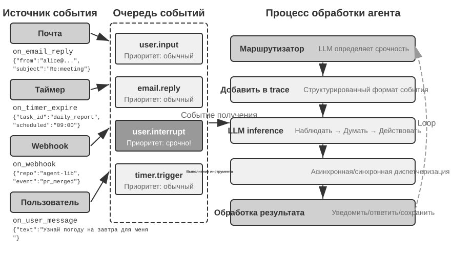

### Реализация событийных механизмов в OpenClaw

Open-source фреймворк OpenClaw (подробнее его архитектура рассматривается в главе 5) получает сообщения из множества каналов через плоскость управления Gateway и маршрутизирует их в среду выполнения агента. Он предоставляет три встроенных механизма автоматизации:

- **Hooks (событийные хуки)**: реагируют на события жизненного цикла агента, такие как создание сессии, сброс и т.д., по аналогии с триггерами событий в GitHub Actions
- **Cron (планировщик по расписанию)**: выполняет периодические задачи по cron-выражениям (широко используемый в Unix-системах синтаксис планирования задач, например, `0 9 * * 5` означает «каждую пятницу в 9 утра»), например, генерирует еженедельный отчёт каждую пятницу, сводит данные в начале каждого месяца
- **Heartbeat (демон сердцебиения)**: пробуждает агента каждые N минут, проверяет наличие вопросов, требующих внимания, полагаясь на суждение агента, чтобы избежать усталости от оповещений

Эти три механизма придают OpenClaw-агенту видимость «автономности» — даже когда пользователь не в сети, агент может по расписанию генерировать отчёты, проверять состояние системы, обрабатывать рутинные дела. Но при внимательном рассмотрении выявляется фундаментальное ограничение. Сначала нужно прояснить один момент: для встроенных каналов Gateway (таких как IM, веб-интерфейс) сообщения сами по себе доставляются в **push-режиме** — сообщение сразу маршрутизируется агенту при поступлении; среди трёх механизмов автоматизации только Cron и Heartbeat действительно заставляют агента «действовать самостоятельно» при отсутствии сообщений от пользователя, и оба они являются **времяуправляемыми** — Heartbeat проверяет с фиксированным интервалом, Cron срабатывает в заданное время, а Hooks лишь пассивно реагируют на внутренние события жизненного цикла фреймворка и не способны привнести новые изменения из внешнего мира. Настоящий недостаток заключается в следующем: для любого произвольного источника событий третьей стороны, помимо встроенных каналов, — новое письмо, обратный вызов внешнего API, срочное уведомление, требующее немедленной обработки, — у OpenClaw нет канала для мгновенного подключения, агент не может отреагировать в момент возникновения события, а может обнаружить его лишь при следующем цикле Cron/Heartbeat.

Настоящее слабое место в другом: для сторонних источников событий за пределами встроенных каналов — пришло новое письмо, внешний API прислал колбэк, срочное уведомление требует немедленной обработки — у OpenClaw нет канала мгновенного подключения, поэтому агент не может отреагировать сразу после события и заметит его лишь в следующем цикле Cron или Heartbeat.

Такая задержка во многих сценариях недопустима. Возьмём для примера **PineClaw** (плагин OpenClaw для Pine AI): Pine AI — это ИИ-помощник, который совершает реальные телефонные звонки от лица пользователя, типичные сценарии включают согласование счетов, отмену подписок и обработку страховых претензий. Когда пользователь через OpenClaw-агента запускает задачу телефонного звонка Pine, голосовой ИИ Pine совершает звонок от имени пользователя, но в процессе разговора в любой момент может понадобиться вмешательство пользователя:

- **Проверка личности в реальном времени**: служба поддержки требует подтверждения личности владельца аккаунта, Pine нужно, чтобы пользователь немедленно предоставил код безопасности или одноразовый пароль (OTP)
- **Подтверждение трёхстороннего звонка**: служба поддержки требует прямого разговора с владельцем аккаунта, Pine нужно, чтобы пользователь принял звонок в течение нескольких секунд
- **Синхронизация прогресса и подтверждение решения**: переговоры достигли ключевого момента (например, собеседник предложил скидку), Pine нужно подтверждение пользователя о согласии

Если полагаться на периодический опрос через Heartbeat — предположим, интервал сердцебиения составляет 5 минут — пользователь может долго не получать уведомление, пока служба поддержки ждёт код подтверждения, что приведёт к тому, что служба поддержки повесит трубку, и звонок сорвётся. А сокращение интервала опроса до секунд создаст множество бесполезных запросов и растрату ресурсов.

Решение PineClaw заключается во введении **механизма Channel** — построении канала событий реального времени между Gateway OpenClaw и API Pine. Когда происходят ключевые события — звонок принят, требуется ввод от пользователя, звонок завершён — сообщение мгновенно отправляется OpenClaw-агенту, агент немедленно обрабатывает его и уведомляет пользователя, задержка отклика снижается с минут до секунд.

Этот пример раскрывает основную ценность событийно-управляемой архитектуры для фреймворка агентов: **настоящее «проактивное обслуживание» требует не только, чтобы агент мог периодически проверять события, но и чтобы события могли активно уведомлять агента**. Единообразное моделирование всех входов — сообщений пользователя, результатов инструментов, внешних обратных вызовов, срабатываний по расписанию — как потока событий, управление мышлением и действиями агента через цикл событий — это архитектурная основа для достижения данной цели. В рамках этой архитектуры ниже сначала будут представлены два класса инструментов, непосредственно связанных с событиями, а также виртуальная личность и изолированная среда выполнения, поддерживающие независимые действия агента, а затем будет обсуждён конкретный дизайн механизма обработки событий.

### Инструмент срабатывания события

Инструмент срабатывания события — это точка входа, через которую внешние события запускают действия агента. Без инструмента срабатывания события агент может только непрерывно циклически размышлять, вызывать инструменты, и наконец выдать результат, после чего ждать следующего ввода пользователя. Чтобы преобразовать изменения в мире в события, которые агент может обработать, существует три распространённых типа инструментов срабатывания события.

**Таймер** (set_timer) обрабатывает события, зависящие от физического времени. Например, если было отправлено письмо, но собеседник не ответил, спустя некоторое время нужно отправить ещё одно письмо с вопросом о прогрессе; если был совершён звонок, но собеседника не было на рабочем месте, нужно попробовать позвонить снова в следующее рабочее время. Для этого такие инструменты, как OpenClaw и Claude Code, поддерживают инструмент таймера, пробуждающий себя в заданное физическое время. **Одноразовый таймер** используется для задач с чётко определённым моментом времени: например, пользователь просит «позвонить в DMV», сейчас суббота, и агент устанавливает «позвонить в DMV в понедельник в 10:00 утра», после срабатывания таймера звонок совершается автоматически. **Циклический таймер** используется для периодических задач: например, проверка состояния сервера раз в час, отправка отчёта о прогрессе каждую пятницу. Кроме того, некоторые внешние сервисы не поддерживают активную отправку данных о прогрессе, только активный запрос прогресса, и в этом случае нужно использовать циклический таймер для периодического повторного запроса — Heartbeat в OpenClaw, о котором говорилось в предыдущем разделе, как раз является систематизацией такого механизма и источником способности OpenClaw к «проактивному обслуживанию».

**Мониторинг фоновой задачи** (monitor_shell) обрабатывает события от асинхронно выполняемых инструментов или задач командной строки. Некоторым задачам командной строки нужно долго выполняться в фоне, и агенту нужно отслеживать прогресс выполнения. Если заставить агента постоянно «смотреть» за командной строкой, то есть постоянно вызывать инструмент для проверки текущего прогресса, это приведёт к трате слишком большого количества токенов; если же дать задаче командной строки полностью завершиться, прежде чем агент начнёт размышлять и действовать, то агент не сможет своевременно обнаружить серьёзные проблемы в процессе выполнения и даже не сможет вмешаться в случае зависания командной строки, что приведёт к зависанию всей задачи. Решение Claude Code для этой проблемы — введение инструмента monitor (мониторинг), позволяющего агенту отслеживать новый вывод командной строки или вывод, содержащий определённые ключевые слова.

**Канал внешних событий** (connect_channel) отправляет агенту в реальном времени внешние события, такие как поступление нового письма, обратный вызов API, сообщение IM. Механизм Channel в PineClaw из предыдущего раздела — типичная реализация этого.

На уровне проектирования инструмент срабатывания события должен определять чёткие условия срабатывания и правила фильтрации, чтобы избежать пробуждения агента нерелевантными событиями и растраты вычислительных ресурсов; полезная нагрузка события (payload) должна содержать достаточно контекстной информации, чтобы уменьшить количество дополнительных запросов, которые агенту придётся сделать после пробуждения.

### Инструмент коммуникации с пользователем

Инструменты коммуникации с пользователем появились как ответ на всё большее разнообразие каналов между агентом и пользователем. Многие агенты (например, Claude Code и Manus) используют нативный цикл ReAct: всё, что агент «говорит», то есть сообщения assistant, отправляется пользователю напрямую, а пользователю приходится открывать в приложении определённую сессию, чтобы поговорить с агентом. Внутри сессии пользователь обычно видит и то, как агент вызывает инструменты.

OpenClaw ломает эту парадигму общения человека с машиной. Пользователю не нужно ощущать существование сессии и не нужно вникать в детали вызовов инструментов агентом; и пользователь, и агент могут в любой момент отправить друг другу сообщение, а не так, что пользователь пишет одно, а агент отвечает одним. Поэтому многие говорят, что у OpenClaw есть **«ощущение живого человека»**: он общается с пользователем асинхронно текстовыми сообщениями, как секретарь. OpenClaw не показывает пользователю напрямую сообщение assistant, выданное моделью, а отправляет сообщения специальным инструментом. К таким сообщениям можно приложить изображения и файлы, а в зависимости от срочности добавить push-уведомление.

Помимо текстового общения с пользователем, всё больше агентов обладают способностью к мультимодальному общению, например, отправка структурированных карточных сообщений, отправка писем-напоминаний. Некоторые агенты уже начинают пробовать генеративный UI, то есть генерацию интерактивных интерфейсов с помощью HTML и подобных средств, чтобы более дружелюбным образом показывать информацию пользователю. На уровне проектирования инструмент коммуникации с пользователем должен поддерживать асинхронный режим сообщений (пользователь не обязательно в сети), предоставлять отслеживание статуса прочитано/непрочитано и сохранять согласованность сообщений в многоканальных сценариях.

**Многоканальное общение с пользователем и возврат внимания.**

**Отклик агента не должен ограничиваться одним каналом, механизм уведомлений одновременно служит и механизмом возврата внимания пользователя**. Отправка сообщений расширяется на такие каналы, как мгновенные сообщения, SMS, электронная почта, телефонный звонок, push-уведомления и другие. Агент комплексно выбирает канал, исходя из степени срочности, статуса пользователя, характера содержания и предпочтений пользователя, гарантируя, что важные сообщения не будут пропущены, но избегая при этом повторяющегося беспокойства.

Для длительно выполняющихся задач агенту нужно активно уведомить пользователя по завершении, вернув внимание пользователя. Для периодических задач (например, ежедневных сводок, еженедельных отчётов) уведомления помогают пользователю сформировать устойчивую привычку взаимодействия.

Инструмент коммуникации с пользователем решает задачу «как достучаться до пользователя». Но в каком качестве агент появляется в этих каналах и в какой среде он выполняет действия от имени пользователя — для этого нужен ещё один слой инфраструктуры идентичности и среды, что и является темой следующего раздела.

### Виртуальная идентичность и изолированная среда исполнения

В начале четвёртой главы на примере Саманты из «Она» показано, как агент с помощью инструментов взаимодействует с реальным цифровым миром. Чтобы реализовать подобного универсального помощника, приходится сразу решать ключевой архитектурный вопрос: должен ли агент напрямую управлять личными аккаунтами пользователя или ему нужна собственная виртуальная идентичность? Прямое управление кажется удобным, но если агент допустит ошибку или будет взломан, вся цифровая идентичность пользователя окажется под угрозой. Более надёжное решение — наделить агента отдельным набором виртуальной идентичности, как у секретаря есть свой рабочий телефон и почта. Такая виртуальная идентичность включает выделенные аккаунты для связи, хранилище и вычислительную среду, позволяя агенту действовать от имени пользователя прозрачным образом. Чёткость идентичности не только не подрывает доверие, но и укрепляет достоверность коммуникации.

Виртуальную идентичность нужно разместить в изолированной среде исполнения. **Виртуальный компьютер** (VM/контейнер) и **виртуальный телефон** (эмулятор Android) дают агенту изоляцию на уровне операционной системы и полноценные возможности управления рабочим столом/мобильным устройством: у агента там есть собственная учётная запись, домашний каталог и учётные данные для входа, все действия отслеживаемы и проверяемы; даже ошибочное действие не затронет хостовую систему и реальное устройство пользователя. Это распространение идеи песочницы из раздела про инструмент выполнения на измерение «цифровой идентичности» — если песочница изолирует выполнение кода, то виртуальный компьютер и виртуальный телефон изолируют всю цифровую идентичность целиком.

Отдельная идентичность несёт с собой и две реальные проблемы. Первая — **механизмы противодействия автоматизации**: многие сайты блокируют автоматический доступ с помощью CAPTCHA и проверки репутации IP-адреса; виртуальные среды с IP дата-центров легко распознаются, поэтому на практике часто требуется настраивать резидентную прокси-сеть (с использованием реальных домашних IP), чтобы получить нормальный доступ. Вторая — **сценарии доступа к настоящим аккаунтам пользователя**: когда задачу нужно выполнить под учётной записью самого пользователя, следует использовать аутентификацию Human-in-the-Loop — через удалённый рабочий стол VNC/RDP пользователь лично выполняет вход в визуальной среде, видя весь интерфейс, с которым работает агент, и понимая, зачем нужна аутентификация; после этого токен сессии переиспользуется в течение срока действия, чтобы не отвлекать пользователя слишком часто, что даёт баланс между автономностью и безопасностью.

Обмен данными между главным агентом и виртуальными средами происходит через **общую файловую систему**: с помощью монтирования тома (например, `/workspace/shared`) соединяются главный агент, виртуальный компьютер и виртуальный телефон, а данные передаются как ссылки на путь к файлу, а не как копии содержимого, чтобы не занимать окно контекста. Возьмём для примера задачу анализа данных: пользователь загружает CSV-файл в общую директорию, агент в виртуальном компьютере читает файл, выполняет анализ, генерирует график и сохраняет его обратно в общую директорию, а главному агенту достаточно вернуть пользователю только путь к файлу с графиком — между сторонами всегда передаётся лишь лёгкая строка с путём.

Инструмент срабатывания события позволяет миру будить агента, инструмент коммуникации с пользователем позволяет агенту достигать пользователя, а виртуальная идентичность и изолированная среда исполнения позволяют агенту действовать самостоятельно и подотчётно. Остаётся вопрос: как поступать, когда на один и тот же экземпляр агента одновременно обрушивается несколько событий?

### Механизм обработки событий

Один экземпляр агента может одновременно сталкиваться с несколькими событиями: новое сообщение пользователя, результат, возвращённый инструментом, срабатывание таймера, запрос на взаимодействие от другого агента. От того, насколько эффективно и корректно обрабатываются эти события, напрямую зависит производительность и пользовательский опыт.

Каркасом этого механизма служит **цикл событий** (event loop) из области конкурентного программирования. Асинхронного агента можно рассматривать как долго работающий цикл: на каждой итерации он извлекает из входной очереди несколько событий, добавляет их в траекторию, делает один вызов LLM, выполняет решённые им вызовы инструментов и возвращается в начало цикла, чтобы дождаться следующей партии событий — это та же структура, что и у goroutine в Go, которая читает сообщения из channel и обрабатывает их итерация за итерацией в `for { select { ... } }`.

В традиционной реализации с синхронным интерфейсом **события обрабатываются на границах раундов**. Пока LLM рассуждает или инструмент выполняется, новые события ждут в очереди до **безопасной точки** — завершения фрагмента рассуждения или возврата инструмента. Нативная асинхронность позволяет получать новые требования, пока модель думает или формирует ответ; подходящий момент продолжения выбирает система. Границы есть в обоих подходах, но ими управляют разные слои. Для отмены инструмента исполнитель всё ещё должен отреагировать на сигнал, подобно проверке `ctx.Done()` в Go; само получение сообщения «стоп» не отменяет уже совершённых действий.

С учётом этого различия сначала рассмотрим три стратегии на примере цикла событий, совместимого с синхронным интерфейсом: дождаться следующей естественной безопасной точки (очередь), создать её раньше (отмена) или запустить другой цикл, не ожидая основного (параллельная обработка). К продолжению через нативный steering вернёмся далее.

**Структурированное моделирование событий.**

Предпосылка обработки — понимание. Универсальный агент сталкивается со входными данными не только от одного пользователя — сообщение, присланное третьей стороной, это не сообщение пользователя агенту, но агенту всё равно нужно его понять, оценить важность и решить, как вмешаться. Это требует моделировать каждый вход как **структурированное событие**, содержащее богатую семантику:

- **Источник (кто)**: сам пользователь, контакт, незнакомец, системное уведомление
- **Канал (каким образом)**: телефонный звонок, SMS, мгновенное сообщение, письмо, социальная сеть, срабатывание таймера, результат асинхронного вызова инструмента, обновление статуса из мониторинга командной строки
- **Содержание (что)**: текст сообщения, эмоциональная окраска, срочность, требуется ли ответ
- **Контекст (фон)**: является ли это ответом на предыдущий диалог или новым обращением, связь с текущей задачей

Возьмём для примера письмо клиента с запросом на возврат средств; конкретная форма структурированного события выглядит так:

```json
{
  "source": {"type": "email", "sender": "client@example.com"},
  "channel": "gmail_webhook",
  "content": {"subject": "Запрос на возврат", "body": "Заказ #12345, хотел бы вернуть..."},
  "context": {"priority": "high", "customer_tier": "vip", "related_orders": ["#12345"]}
}
```

Только когда все эти измерения чётко смоделированы как структурированные события, агент способен сохранять ясное восприятие в многосторонней коммуникации, не путая ввод пользователя с результатом инструмента и не принимая результат инструмента со скрытыми инструкциями за команду пользователя, что приводит к инъекции промпта. Сложность управления многопоточным контекстом также требует, чтобы агент понимал связи между несколькими ветками диалога — как сообщение от третьей стороны влияет на настроение пользователя, как меняется роль пользователя в разных диалогах, когда нужно свести воедино информацию из разных веток, чтобы дать совет.

Экосистема триггеров таких платформ рабочих процессов, как n8n, хорошо это показывает: вебхуки, таймеры, почта, изменения в базе данных, слежение за файлами — каждый триггер представляет собой один из «органов чувств», которыми агент воспринимает мир. Как только эти разнородные события единообразно смоделированы в структурированном формате, агент получает возможность одинаково обрабатывать стимулы из разных источников; и определение срочности, и стратегии обработки, о которых пойдёт речь ниже, опираются на это единое моделирование.

**Динамическая стратегия обработки на основе срочности.**

Люди, справляясь с несколькими задачами одновременно, применяют разные стратегии в зависимости от степени срочности. Столкнувшись с внезапной срочной ситуацией, немедленно бросают текущую работу; столкнувшись с рутинным пунктом дел, добавляют его в список задач на потом. Обработка событий агентом должна отражать такую же интеллектуальность.

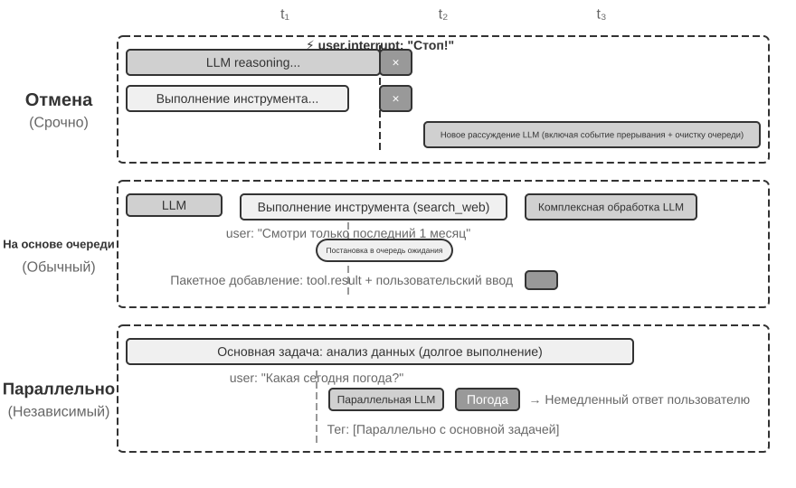

**Обработка на основе отмены (Cancellation-Based)** применяется для срочных событий, и её суть — **заблаговременно создать безопасную точку** для срочного события: принудительно прервать текущий шаг, превратив этот момент в границу, на которой можно потребить новое событие. Когда приходит срочное событие (например, пользователь нажимает «стоп» или система надзора присылает команду с высоким приоритетом): (1) текущая операция останавливается — если LLM в процессе рассуждения, поток немедленно отменяется; если выполняется синхронный инструмент, отправляется сигнал отмены; (2) очередь ожидающих событий очищается, все события из неё извлекаются; (3) события из очереди вместе со срочным событием добавляются в конец траектории; (4) LLM немедленно вызывается заново, получая на вход полную обновлённую траекторию для оценки ситуации. Например, когда пользователь вводит «Стоп! Я неправильно сказал» в момент, пока агент выполняет потенциально ошибочное действие, агент сразу же увидит этот новый ввод, заново поймёт истинное намерение и тем самым избежит выполнения ошибочного действия.

**Обработка через очередь (Queued)** применяется для рутинных событий. Когда приходит несрочное событие (например, асинхронный инструмент вернул результат или пользователь прислал дополнительную информацию): (1) событие помещается в конец очереди, не прерывая текущую операцию; (2) система дожидается завершения текущей операции — даёт LLM закончить рассуждение, позволяет синхронному инструменту доработать; (3) когда завершается любой вызов инструмента и возвращает `tool.result`, проверяется очередь, и если она не пуста, все события сразу добавляются в траекторию; (4) LLM обрабатывает обновлённую траекторию целиком. Так реализуется пакетная обработка, повышающая эффективность — например, после того как агент вызывает инструмент поиска, пока ожидается результат, пользователь добавляет уточнение «смотри только результаты за последний месяц»; это уточнение попадает в очередь, и когда приходят результаты поиска, оба события представляются LLM вместе, избавляя от лишних обращений.

**Параллельная обработка (Parallel)** применяется для независимых лёгких запросов. Например, пока агент анализирует большой объём данных, пользователь вдруг спрашивает: «Какая сегодня погода?» Такие запросы обладают тремя признаками: не связаны с основной задачей, требуют быстрого ответа, дёшевы в исполнении. Здесь не подходит ни обработка через отмену (прервёт важную основную задачу), ни обработка через очередь (заставит пользователя слишком долго ждать). Система сначала оценивает независимость и сложность запроса, затем выполняет его самостоятельно в параллельной сессии рассуждения, вызывая необходимые инструменты и немедленно возвращая ответ. Запрос и ответ добавляются в траекторию основной задачи с явной пометкой «выполнено параллельно с основной задачей», чтобы избежать путаницы у LLM.

**Определение срочности.**

Срочные события: прерывание пользователем (`user.interrupt`), команда надзора (`supervisor.instruction`), прерывание от другого агента (`agent.interrupt`), внешний триггер, помеченный как срочный (например, системное предупреждение, сбой платежа).

Несрочные события: обычный ввод пользователя (`user.input`), ввод от агента (`agent.input`), результат инструмента (`tool.result`), срабатывание таймера (`timer.trigger`), обычный внешний триггер.

У жёстко закодированных правил есть свои ограничения — то, как обрабатывать событие, определяется его семантикой: «немедленно остановись» требует отмены, «какая сегодня погода» — параллельной обработки, «отчёт нужно отправить мне на китайском» — обработки через очередь. **Рекомендуется использовать лёгкую классифицирующую LLM в роли маршрутизатора событий**, чтобы быстро определять подходящую стратегию по мере поступления событий.

Точка отмены должна находиться там, где инструмент или рассуждение способны безопасно завершиться; незавершённый результат инструмента обозначается явной заглушкой, и выдавать его за успех недопустимо.

Далее на примере эксперимента с событийно-ориентированным агентом обработки писем разберём, как реализовать описанные выше стратегии обработки событий на практике.

> **Эксперимент 6-1 ★★★: событийно-ориентированный агент обработки писем**
>
>
> 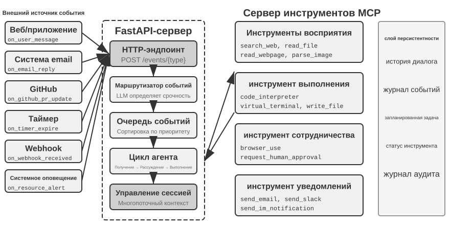
>
>
> В этом эксперименте строится простейший событийно-ориентированный агент: **автоматический помощник обработки почты**. Агент отслеживает почтовый ящик и при каждом получении нового письма автоматически запускает процесс обработки — классификацию, резюмирование, составление черновика ответа, а при необходимости — уведомление пользователя. Это самый наглядный вводный сценарий для событийно-ориентированного агента: одно внешнее событие (поступление нового письма) запускает один полный цикл размышления агента.
>
> **Цель эксперимента** — понять ключевую идею событийно-ориентированной работы: агент больше не просто пассивно ждёт ввода от пользователя, а способен реагировать на внешние события и действовать проактивно. Через этот эксперимент читатель освоит регистрацию источников событий, очередь событий и базовый замкнутый цикл «событие поступило → агент обработал → результат выведен».
>
> **Источники событий и очередь событий.**
>
> Система поддерживает единообразное подключение различных источников событий:
>
> - **Почтовые события** (`on_email_received`): срабатывают при регулярной проверке почтового ящика или при получении push-уведомления о новом письме
> - **Сообщения IM/SMS** (`on_im_message`, `on_sms_message`): срабатывают на сообщения мгновенных мессенджеров
> - **События GitHub** (`on_github_pr_update`, `on_github_issue_update`): замечания при ревью PR, изменения статуса
> - **Срабатывание таймера** (`on_timer_expire`): периодические задачи (например, ежедневное резюме, генерация еженедельного отчёта)
> - **Webhook** (`on_webhook_received`): универсальный обратный вызов от внешних систем
> - **Системные события** (`on_user_inactive`, `on_process_timeout`, `on_resource_alert`): изменения внутреннего состояния
>
> Все события поступают в единую **очередь событий** и обрабатываются последовательно в порядке поступления. Каждое событие запускает отдельный цикл размышления агента: агент читает содержание события, вызывает нужные инструменты (например, запрос к базе знаний, чтение вложения, поиск в истории писем по теме), формирует результат обработки (метку категории, резюме, черновик ответа) и в конце с помощью инструмента уведомления информирует пользователя или напрямую выполняет действие.
>
> **Сценарий проверки**: настройте агента на отслеживание тестового почтового ящика. Смоделируйте получение трёх писем — приглашение на встречу, жалоба клиента, рекламная рассылка. Агент обрабатывает их по очереди: для приглашения на встречу автоматически проверяет конфликты в календаре и составляет черновик ответа с принятием/отклонением; для жалобы клиента извлекает ключевую информацию, помечает как высокоприоритетную и уведомляет пользователя о необходимости обработки; рекламную рассылку автоматически архивирует. Весь процесс проходит без участия пользователя.

Эксперимент 6-1 продемонстрировал простейшую событийно-ориентированную модель — события поступают в очередь, агент обрабатывает их по очереди. Но когда агенту нужно реагировать на прерывания во время длительного выполнения инструмента или одновременно управлять несколькими параллельными задачами, простой очереди событий уже недостаточно. Далее рассмотрим более глубокие инженерные проблемы.

### Совместимость при отсутствии нативной асинхронности

Эксперимент 6-1 обрабатывает только последовательные события: они поступают в очередь, и агент завершает их одно за другим. Если выбранные модель или интерфейс не поддерживают нативную асинхронность, прерывание пользователем до возврата инструмента приходится выражать в синхронном формате. Сначала рассмотрим этот путь совместимости, затем — нативный интерфейс GPT-6 Astra.

Предположим, агент составляет письмо и вызвал инструмент поиска контактов. До получения результата пользователь говорит: «Подожди, сначала узнай погоду на завтра». Если интерфейс требует сначала предоставить соответствующие результаты незавершённых вызовов, агент не может сразу обработать новое сообщение с открытым вызовом. Ограничение задаётся выбранной комбинацией протокола и модели, а не универсальным правилом для всех LLM.

**Асинхронная реализация, совместимая с синхронным форматом.**

Ключевая идея: **в обычном режиме, когда прерываний не происходит, LLM видит стандартную синхронную траекторию, и только при прерывании вставляется заполнитель, чтобы восстановить формат**. Вот пять ключевых правил:

**Правило 1**: Своевременно записывать завершённые API сообщения ассистента и элементы вызова инструментов. Состояние рассуждения, которым управляет сервер, сохранять по протоколу продолжения провайдера; не собирать самостоятельно невидимый текст размышлений.

**Правило 2**: результат инструмента (tool result) записывается только по завершении выполнения инструмента. Во время выполнения траектория находится в состоянии «частично завершена».

**Правило 3**: прерывание во время выполнения инструмента требует заполнителя. Для незавершённого инструмента генерируется заполняющий ответ (например, «инструмент выполняется в фоновом режиме, приоритет — обработать новое событие»), затем добавляется событие прерывания, и LLM вызывается заново. С точки зрения LLM assistant message по-прежнему имеет парный tool result.

**Правило 4**: Если нет нативного steering или поддерживаемого интерфейса продолжения внутри хода, отменить незавершённую генерацию, сохранить подтверждённые завершённые сообщения и состояние инструментов, добавить новое событие и отправить новый запрос. Нельзя считать, что частичный вывод или скрытое рассуждение допустимо произвольно подать обратно как корректный префикс.

**Правило 5**: непрерывающие события поступают в очередь и ожидают пакетной обработки. Они добавляются все разом только после завершения текущего цикла.

Возьмём для примера ситуацию, когда агент составляет письмо, а пользователь прерывает его вопросом о погоде — вот как работают эти пять правил:

1. Агент вызывает `search_contacts` для поиска контактной информации, сообщение assistant сразу записывается в траекторию (правило 1).
2. Пока результат поиска ещё не получен, пользователь присылает «сначала посмотри погоду на завтра». Поскольку это прерывание пользователем, система генерирует заполняющий tool result для незавершённого `search_contacts` («инструмент выполняется в фоновом режиме, приоритет — обработать новое событие», правило 3), затем добавляет запрос пользователя о погоде в траекторию и вызывает LLM заново. В этот момент формат траектории, который видит LLM, полностью корректен — assistant message и tool result идеально спарены.
3. После того как запрос о погоде выполнен и ответ отправлен пользователю, приходит исходный результат `search_contacts`, добавляясь в траекторию как новое событие (правило 2), и агент, прочитав контактную информацию, продолжает составлять письмо.

Этот подход сохраняет соответствие вызовов и результатов, требуемое синхронным интерфейсом. Только при необходимости прерывания вводится заглушка с явным состоянием «не завершено». Когда приходит настоящий фоновый результат, он включается в траекторию как событие с источником и ID задачи. Для моделей с нативной асинхронностью система может сохранять состояние ожидания и передавать реальный результат по мере его поступления.

У заглушек есть семантический риск: модель может спутать «задача запущена» с «задача завершена» и принять зависящее от результата решение ещё до его получения. Явное состояние задачи и проверка результатов должны предотвращать эту путаницу; оценка должна выявлять выдуманные данные, которые ещё не поступили. Одной неудачи недостаточно, чтобы объяснять её неопубликованным процессом обучения.

**Выражение асинхронной семантики через дескрипторы задач.**

Независимо от использования нативного асинхронного протокола, **асинхронную семантику можно явно выразить в интерфейсе инструментов**. Для синхронных интерфейсов особенно полезно сделать «запуск задачи» полноценным вызовом с реальным возвращаемым значением.

Традиционное проектирование инструментов подразумевает семантику «вызов означает завершение». Например, название `phone_call` подразумевает, что «вызов совершит звонок и дождётся завершения разговора, вернув запись звонка». В асинхронной парадигме «запуск» и «завершение» следует разделить:

- `initiate_phone_call`: запускает телефонный звонок, немедленно возвращая идентификатор задачи и начальный статус (например, «звонок инициирован, идёт набор номера»)
- о ходе звонка сообщается через события (`phone_call_connected`, `phone_call_ended`)

Ключевое здесь — само название и описание инструмента должны передавать асинхронную семантику. Когда модель видит `initiate_phone_call`, её способность понимать язык естественным образом подсказывает, что это «инициирование», а не «завершение». Описание инструмента должно дополнительно это подчёркивать: «Этот инструмент запускает задачу телефонного звонка, обрабатываемую субагентом. После успешного инициирования задача сразу возвращает идентификатор задачи, и вы можете продолжать заниматься другими делами. По завершении звонка вы получите отдельное уведомляющее событие».

**Проблема рассеивания внимания при пакетной обработке в очереди.**

При пакетной обработке событий модель может ответить лишь на последнее и пропустить предыдущие требования. Нативная асинхронность решает вопрос поступления сообщений во время выполнения, но всё равно нужно проверить, учитывает ли модель все обновления вместе.

Вмешаться можно на двух уровнях:

**Уровень промпта**: сообщить модели, что «при получении нескольких последовательных событий убедитесь, что учитываете всю информацию целиком».

**Пометка в строке состояния агента**: перед каждым событием добавляется явная метка:

```text
[Необработанное событие 1/4] Tool result from database_query: ...
[Необработанное событие 2/4] Дополнение от User: смотри только данные по Пекину
[Необработанное событие 3/4] Системное напоминание: до дедлайна отчёта осталось 30 минут
[Необработанное событие 4/4] Вопрос от User: как продвигается работа?
```

В конце добавляется сводка: «Выше находятся 4 необработанных события, включая 1 результат инструмента, 2 сообщения пользователя, 1 системное напоминание. Убедитесь, что ваш ответ охватывает всю информацию».

> **Эксперимент 6-2 ★★★: асинхронный агент с параллельным выполнением и способностью к прерыванию**
>
>
> 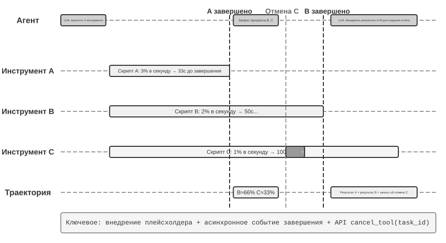
>
>
> На основе простой очереди из эксперимента 6-1 этот эксперимент реализует **параллельное выполнение инструментов, отмену и управление состоянием** через среду выполнения, совместимую с синхронными интерфейсами. Агент должен вести несколько одновременных задач, обрабатывать прерывания и возобновление, принимать решения по текущему состоянию. Сравнение с нативным интерфейсом Astra приведено в эксперименте 6-3.
>
> **1. Асинхронное выполнение инструментов**: поддержка асинхронного выполнения долгих инструментов (не менее 3–5 секунд), с немедленным возвратом заглушки при запуске. **Сценарий проверки**: агент выполняет длительную терминальную команду, во время которой пользователь спрашивает «который сейчас час?», агент отвечает немедленно, а после этого представляет результат анализа, когда тот возвращается.
>
> **2. Очередь событий и пакетная обработка**: накопление несрочных событий с пакетным добавлением в траекторию. **Сценарий проверки**: агент выполняет долгую задачу, пользователь подряд отправляет «не забудь ответить на японском» и «оформи в виде веб-страницы», по завершении задачи все события обрабатываются разом, и генерируется веб-страница на японском.
>
> **3. Механизм прерывания**: команда пользователя «стоп» немедленно прерывает поток выполнения и отменяет асинхронные инструменты. **Сценарий проверки**: агент выполняет долгую задачу, пользователь отправляет «отмена», агент немедленно останавливается, в траектории фиксируются событие прерывания и операция отмены.
>
> **4. Отмена и запрос состояния параллельных инструментов**: после завершения асинхронного инструмента реальный результат впрыскивается в диалог через новое событие, поддерживается отмена или запрос прогресса по идентификатору задачи. **Сценарий проверки**: пользователь просит «запусти для меня одновременно эти три скрипта, и когда какой-то из них завершится первым, посмотри прогресс остальных, и если он ещё не превысил 50%, отмени его». Три скрипта имитируют процесс анализа, во время выполнения непрерывно выводя прогресс со скоростью 3%, 2% и 1% в секунду соответственно. Агент одновременно запускает три асинхронных терминальных команды; когда скрипт со скоростью 3% в секунду завершается примерно через 33 секунды, агент запрашивает состояние двух оставшихся терминалов, обнаруживает, что один выполнен примерно на 66%, а другой — примерно на 33%, и отменяет тот, что не превысил 50%. После завершения обоих терминалов результаты объединяются в итоговый отчёт.
>

### Нативная асинхронность модели: GPT-6 Astra

В предыдущем подходе среда выполнения упорядочивает поступающие события, позволяя модели с синхронным интерфейсом участвовать в асинхронных задачах. Другой путь — нативное понимание моделью такого ритма: пока инструмент работает, можно заниматься другими частями задачи, а новые требования пользователя позволяют скорректировать дальнейшую работу. GPT-6 Astra уже поддерживает асинхронные вызовы инструментов (Async tool calling) и изменение указаний в середине хода (Mid-turn steering), отражая этот сдвиг (Рис. 6-5).[^ch6-22][^ch6-23]

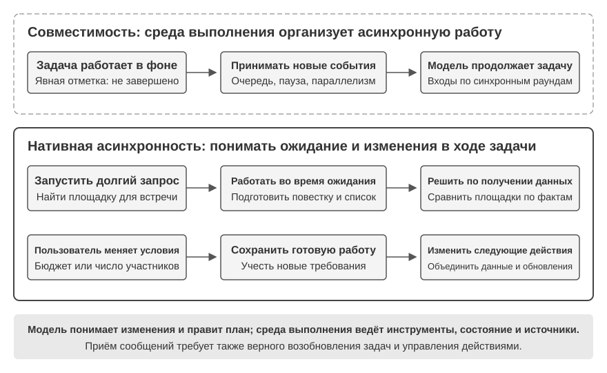

**Асинхронный вызов разделяет «начать действие» и «получить результат».** Запустив долгий запрос, агент может продолжать рассуждать, вызывать другие инструменты или выполнять независимые от результата части работы. Например, во время поиска площадки для встречи можно подготовить повестку и список подготовки, а после получения сведений сравнить варианты. Важно различать зависимости: независимую работу продолжать, решения на основе результата откладывать до его поступления.

**Изменение указаний в середине хода позволяет пользователю корректировать направление по ходу задачи.** Пока агент думает или формулирует ответ, пользователь может сообщить: «бюджет уменьшился» или «число участников изменилось». Система сохраняет завершённую работу и переносит новые ограничения в дальнейшую обработку, позволяя изменить план в рамках той же задачи. Между получением обновления и реакцией возможна задержка, но пользователю не нужно ждать конца полного ответа, чтобы сообщить об изменении.

Эти возможности расширяют временные рамки взаимодействия: и результаты инструментов, и требования пользователя могут поступать в ходе задачи. Система должна различать их источники и помнить, какая работа завершена, а какая ожидается. Изменение плана само по себе не останавливает инструменты и не отменяет уже совершённых действий; выполнение, отмена и состояние остаются ответственностью среды выполнения.

Не все модели обладают нативной асинхронностью. При создании агента нужно выбирать нативное взаимодействие или слой совместимости по возможностям модели и проверять, правильно ли вся система обрабатывает запоздавшие результаты, изменения в ходе работы и возобновление задач. Асинхронное обучение может улучшать эти способности, но разработчики уже могут строить такое взаимодействие с существующими моделями.

### От приёма асинхронных сообщений к надёжной обработке асинхронных задач

Нативная асинхронность позволяет сообщениям поступать во время выполнения. Надёжность сложной задачи зависит также от того, как модель использует эти сообщения. Нужно проверить как минимум три аспекта:

1. **Принадлежность результата и незавершённое состояние**: связывает ли модель запоздалый результат с нужной задачей и избегает ли выдуманных данных, пока результата нет?
2. **Возобновление задачи и управление действиями**: возвращается ли она к исходной задаче после новых требований и различает ли изменение плана и остановку выполнения?
3. **Совместный учёт обновлений**: соблюдает ли одновременно ограничения бюджета и числа участников, а не только последнее сообщение?

Модель можно улучшать обучением в асинхронных средах, а систему — ясным состоянием задач, указанием источников событий и обратной связью выполнения. Оценивать нужно оба слоя: поняла ли модель изменение и выполнила ли система работу в соответствии с ним.

> **Эксперимент 6-3 ★★★: Нативная асинхронность модели и изменение указаний в середине хода**
>
> Выберите площадку для встречи: запустив долгий запрос, агент выполняет подготовку, не зависящую от результата. Тем временем пользователь добавляет требования к бюджету и числу участников. После завершения запроса площадка выбирается с учётом всех ограничений.
>
> Вызовите API GPT-6 Astra и сравните синхронные инструменты, нативные асинхронные инструменты и изменение указаний в середине хода. Проверьте, блокирует ли ожидание другую работу, входят ли новые требования в дальнейшие планы и продолжается ли исходная задача после поступления результатов. Добавьте модель без нативной поддержки в качестве контроля, чтобы понять, какие вопросы решают способности модели, а какие — оркестрация среды выполнения.

Асинхронность и событийная обработка позволяют миру пробуждать агента во время задачи; нативное изменение указаний позволяет пользователю отправлять обновления до завершения полного ответа. Следующие три раздела ещё сильнее сжимают масштаб времени: когда среда меняется не медленнее, чем модель генерирует ответ, мало получать обновления — система должна вовремя реагировать.

## Голос: самый естественный интерфейс человека и машины

Голос — это не просто текст, превращённый в звук. Человек говорит примерно в четыре раза быстрее, чем печатает, и при этом освобождает руки и глаза. Поэтому голосовой Agent образует непрерывный цикл ввода и вывода, в котором пользователь может перебить его в любой момент. Диктовка превращает речь в текст, а голосовой Agent позволяет сотрудничать с ним напрямую; оба сценария поддерживают описанный ранее whisper coding.

Здесь рассматриваются два направления: пользователь говорит с Agent, а Agent говорит с внешним миром от имени пользователя. Голосовая модель определяет, на что Agent способен ответить, а архитектура взаимодействия — насколько хорошо он слышит, быстро отвечает, передаёт очередь и выполняет подтверждения и вызовы инструментов во время разговора.

### Время взаимодействия: от каскада к полному дуплексу

Введение OpenAI о GPT-Live описывает три парадигмы голосового взаимодействия: каскадную, поочерёдную и полнодуплексную[^ch6-12]. Это не линейная замена старого новым, а разные компромиссы между задержкой, стоимостью и наблюдаемостью:

| Парадигма | Основная структура | Главное преимущество | Главное ограничение |
| --- | --- | --- | --- |
| Каскад | VAD → ASR → LLM → TTS | Ясные модули, которые легко заменять и отлаживать | Задержка накапливается, а просодические сигналы теряются на границах |
| Сквозной Omni | Нативные аудиовход и аудиовыход, поочерёдное взаимодействие | Меньшая задержка, лучше сохраняются тон, эмоции и окружающий звук | Всё ещё требует очереди; обучение и отладка дороже |
| Полный дуплекс | Нативные аудиовход и аудиовыход; непрерывно слушает, говорит и принимает решения | Перекрывающаяся речь, естественные перебивания и непрерывный поток | Сложнее обучать, контролировать и оценивать |

Общая идея — уйти от предположения, что люди говорят строго по очереди, и от догадки VAD о том, кому принадлежит очередь. Каскад и Omni всё ещё делят разговор на ходы, а полный дуплекс превращает владение очередью в непрерывное решение модели.

[^ch6-12]: OpenAI. *Introducing GPT-Live.* 2026-07-08. https://openai.com/index/introducing-gpt-live/ Классификация «каскад / по очереди / полный дуплекс» взята из описания трёх поколений ChatGPT Voice; термин «сквозной мультимодальный (Omni)» соответствует категории «turn-based voice models».

### Парадигма 1 · Каскадный конвейер

Большинство коммерческих голосовых помощников по-прежнему используют последовательный конвейер (рис. 6-6): VAD определяет конец реплики, ASR переводит аудио в текст, LLM понимает запрос и генерирует ответ, а TTS озвучивает его. Модульность упрощает независимую оптимизацию, но каждая граница добавляет ожидание.

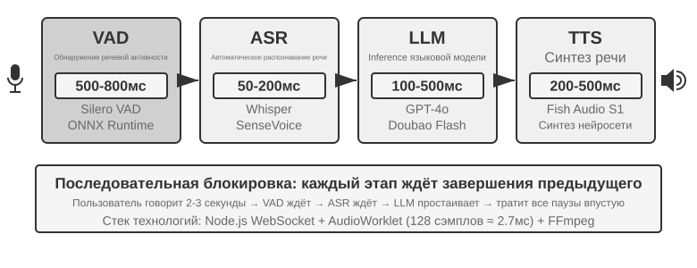

| Модуль | Роль | Типичное узкое место |
| --- | --- | --- |
| VAD | Определить окончание речи | Порог тишины задерживает ответ и ошибочно делит реплики |
| ASR | Преобразовать аудио в текст | Задержка распознавания и потеря контекста |
| LLM | Понять, рассуждать и сгенерировать ответ | Время до первого токена; reasoning добавляет ожидание |
| TTS | Преобразовать текст в речь | Синтез первого пакета и буфер воспроизведения |

В коротком ответе без reasoning ожидания VAD, ASR, LLM и TTS складываются последовательно (рис. 6-7). Конкретные значения зависят от длины ввода, модели, оборудования, сети и нагрузки.

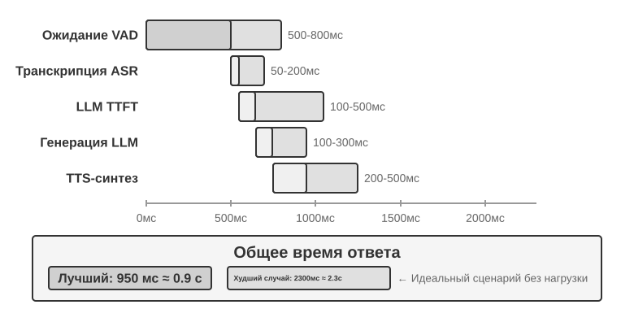

Очереди в продакшене дополнительно увеличивают задержку простоя (рис. 6-8), но это относится к планированию ёмкости сервиса, и модели массового обслуживания в этой главе не разбираются.

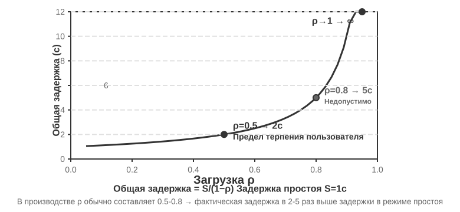

> **Эксперимент 6-4 ★: построение традиционного голосового Agent**
>
> Соедините через WebSocket микрофон, Silero VAD, локальный Whisper, потоковую LLM и Fish S1 TTS, создав каскадную базовую линию.

#### От последовательности к потоковому восприятию

Рис. 6-7 описывает полностью последовательный случай VAD + ASR + LLM + TTS. У такой последовательной схемы восприятия три проблемы:

1. **Накопление задержки**: чтобы убедиться, что пользователь договорил, приходится дожидаться паузы тишины.
2. **Потеря информации**: двоичный сигнал «есть звук / нет звука» не способен передать колебания, эмоции, короткие реплики и окружающий звук.
3. **Разрыв контекста**: адреса электронной почты, имена людей и прочие имена собственные могут быть разорваны между сегментами и распознаны с ошибками.

Чтобы решить эту проблему, сохранив модульное разделение труда, применяют **потоковое восприятие**: каждый этап как можно раньше выдаёт промежуточный результат.

- **ASR расшифровывает по ходу речи**: как только VAD обнаруживает, что пользователь начал говорить, ASR-модель вызывается через определённые промежутки времени и потоково выдаёт предварительную расшифровку; после того как VAD зафиксировал конец реплики, текст подтверждается окончательно.
- **Спекулятивное исполнение LLM**: предварительная расшифровка сразу отправляется в LLM; если окончательный текст совпал с ней, LLM повторно не вызывается, иначе предшествующее спекулятивное размышление отменяется и LLM вызывается заново.
- **Посегментный вывод LLM**: первый пригодный для произнесения фрагмент сразу передаётся в TTS, не дожидаясь полного ответа.
- **Инкрементальный синтез TTS**: аудиоблоки возвращаются непрерывно, поэтому дальнейшие генерация, синтез и воспроизведение перекрываются.

Настоящему потоковому ASR нужна поддержка со стороны самой модели. Декодер Whisper авторегрессионный, но его энкодер ожидает полный аудиосегмент, поэтому его нельзя просто считать потоковой моделью. Потоковая аудиомодель на базе LLM может выдавать текст и семантические события из непрерывного звука, объединяя распознавание и часть понимания в одной модели. Она сохраняет контекст от начала разговора до текущего момента и может использовать мировые знания для обработки названий брендов, имён людей и других имён собственных.

Если требуется решить лишь вопрос «договорил ли пользователь», решение о конце реплики можно встроить непосредственно в потоковый распознаватель: модель, сопоставляя семантику и паузы, определяет, высказана ли фраза до конца. Обучающие метки для определения конца реплики должны использовать только сведения, доступные в момент решения; иначе «взгляд свыше» породит вывод, который невозможно воспроизвести онлайн.

Модель выдаёт не только слова — она может выдавать и маркеры акустических событий:

- **speak_start/end, interrupt**: границы речи и намерение перебить;
- **emotion**: эмоция, колебание и подобные состояния;
- **laugh, sigh, noise**: паралингвистические и внешние звуки.

Вместе с текстовыми токенами эти маркеры образуют единый поток событий: агент распознаёт по нему колебание, перебивание и изменения обстановки, не сжимая каждый звук до обычного текста.

> **Эксперимент 6-5 ★: моделирование потокового речевого восприятия с помощью Qwen2-Audio**
>
> Qwen2-Audio сам по себе не является потоковой моделью. Эксперимент имитирует непрерывное восприятие нарастающими аудиопрефиксами и сравнивает его с 600 мс VAD + Whisper.

### Парадигма 2 · Сквозные мультимодальные модели (Omni)

Даже с потоковым восприятием каскад передаёт слушание, мышление и речь через дискретные интерфейсы; при превращении аудио в текст теряются эмоция, интонация и окружающий звук. Omni делает всё одной моделью, что уменьшает задержку и сохраняет нетекстовые сигналы, но повышает стоимость обучения, отладки и замены компонентов (рис. 6-9). Самокаскад может исправить ошибку распознавания, когда для задачи достаточно текста; если же ответ зависит от скорости речи, эмоции или среды, текстовый узкий канал необратимо уничтожает доказательство.

Что касается понимания, модель Omni способна улавливать паузы в звуке. Что касается генерации, модель Omni может передавать более богатую паралингвистическую информацию — например, спеть или произнести фразу с особой интонацией.

Модель Omni по-прежнему предполагает поочерёдные реплики и обычно опирается на VAD для распределения права голоса. Поэтому пауза посреди того, как пользователь диктует цифры, всё ещё может быть ошибочно принята за конец реплики.

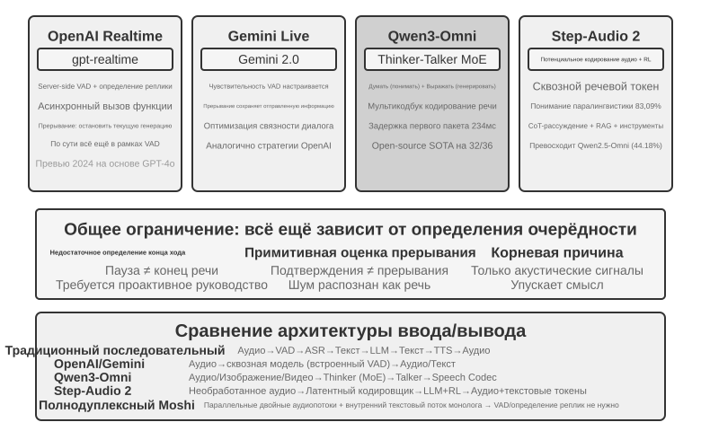

> **Эксперимент 6-6 ★★: локальный запуск MiniCPM-o 4.5 — сквозной путь против самокаскада**
>
> Запустите MiniCPM-o 4.5 локально с отключённым thinking mode и сравните прямой ответ по аудио с самокаскадом, который сначала транскрибирует, а затем отвечает той же моделью. Здесь измеряется сохранение аудиоинформации, **а не** описанное далее «мышление во время речи».

### Парадигма 3 · Интерактивные полнодуплексные модели

Omni разделяет «говорит пользователь» и «говорит модель», но синхронный перевод требует перекрытия. Полнодуплексная модель слушает и говорит непрерывно, каждый раз решая, продолжать ли, замолчать, перебить или вызвать инструмент.

Исследовательским предвестником стал **Moshi** от Kyutai (2024). Он параллельно моделирует аудиопоток пользователя и модели, поэтому наложение речи и перебивания становятся естественным поведением модели.

Thinking Machines Lab называет это направление **моделью взаимодействия (Interaction Model)**[^ch6-14]: интерактивность больше не собирается внешним harness с VAD, а встроена в саму модель. Механизм микрораундов непрерывно продвигается короткими аудиоблоками, благодаря чему паузы, наложения и перебивания сохраняются как непрерывный контекст. Модель взаимодействия может также делегировать целый диалог фоновой рассуждающей модели, продолжая сама держать нить разговора; когда фоновый результат возвращается, передний план подключает его в подходящий момент.

[^ch6-14]: Thinking Machines Lab, “Interaction Models: A Scalable Approach to Human-AI Collaboration”, 2026-05. https://thinkingmachines.ai/blog/interaction-models/

GPT-Live от OpenAI выводит полнодуплексный путь на промышленный масштаб: модель непрерывно обрабатывает вход и порождает выход, умеет ждать пользователя, поддакивать, быть перебитой и справляется с синхронным переводом. Как и модель взаимодействия, она передаёт сложные задачи фоновой модели, а передний план продолжает вести разговор.

### Когнитивное время: взаимодействие в реальном времени и глубокое мышление

Качество взаимодействия и потолок интеллекта — разные измерения. Передний план должен ответить, пока пользователь ещё вовлечён, а фоновая модель может думать дольше. Следующие три решения — компромиссы, а не последовательные ступени. Первые два можно применить поверх каскада или Omni; третье объединяет глубокое мышление и выражение в реальном времени внутри одной модели.

#### Решение 1: быстрое мышление для заполнителя, медленное — для ответа

Быстрое мышление способно за несколько сотен миллисекунд выдать «заполняющую» реплику, а медленное тем временем доводит в фоне более глубокий вывод. Проблема в том, что простые вопросы обрабатываются дважды, а на сложных возникает противоречие: быстрая модель советует купить, медленная затем обнаруживает, что в тарифе нет ключевой функции, и пользователь за считаные секунды слышит два взаимоисключающих ответа. Коренная причина в том, что каждый экземпляр провёл собственное независимое рассуждение.


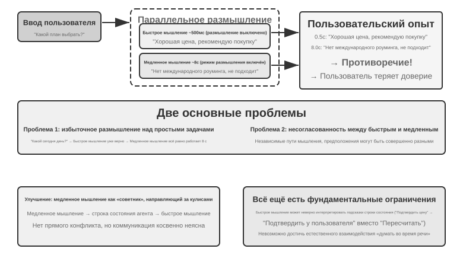


#### Решение 2: быстрое мышление для взаимодействия, медленное — для подсказки

Во втором решении фоновая модель передаёт подсказки модели переднего плана через строку состояния или отдельный интерфейс, а передний план продолжает вести разговор и решает, как сформулировать ответ. Это устойчивее первого решения, но связь остаётся косвенной: передний план может неверно понять подсказку и не видит промежуточных рассуждений фона; пока фон не закончил, на уточняющий вопрос пользователя передний план отвечает только собственными силами. Он умеет естественно «дождаться результата», но по-настоящему думать во время речи не может.

#### Решение 3: сквозное объединение мышления и выражения

Третье решение встраивает способность рассуждать прямо в сквозную аудиомодель. Step-Audio R1 решает две задачи двумя взаимодополняющими механизмами: **дистилляция мышления с привязкой к модальности (MGRD)** заставляет модель рассуждать на основе акустических признаков, а **двухмозговая архитектура MPS** распараллеливает замысел и его выражение. Первое обеспечивает «думать правильно», второе решает задачу «говорить вовремя».

В идеале модель должна определять эмоцию по высоте тона, ритму и интонации, а не только по расшифрованному тексту. MGRD отбирает те цепочки рассуждений, которые действительно опираются на акустические признаки, обучает на этих данных модель и с помощью обучения с подкреплением не даёт модели пропустить рассуждение и сразу угадать ответ. В MPS мозг замысла непрерывно порождает фрагменты рассуждения, а мозг выражения, получив фрагмент, тут же синтезирует речь, соединяя его с уже произнесённым. Оба работают параллельно, конвейером, поэтому не нужно ждать окончания всего рассуждения, чтобы пользователь услышал первую фразу.

#### Компромисс между разделением быстрого/медленного мышления и сквозным рассуждением

Единая модель наиболее непосредственно реализует «думать во время речи», но ценой того, что мышление и речь в реальном времени приходится переобучать вместе; в развязанном варианте фоновый «мозг» проще заменить. Это компромисс, а не простая замена одного другим.

На фоне стремительного развития передовых моделей рассуждения разделение быстрого и медленного мышления даёт важное инженерное преимущество: система может напрямую использовать прогресс каждого нового поколения медленных моделей. Быстрая модель переднего плана отвечает только за прослушивание, отклик и поддержание разговора с низкой задержкой, а медленная фоновая модель — за рассуждение, планирование и вызовы инструментов. Когда появляется более сильная модель рассуждения, достаточно заменить фоновую модель, не переобучая всю голосовую систему реального времени. Единый подход связывает рассуждение и взаимодействие одним циклом обучения, поэтому при каждом обновлении приходится заново балансировать интеллект, задержку ответа и естественность выражения. Таким образом, разделение быстрого и медленного мышления — не просто уступка задержке, а модульный выбор, позволяющий способности к взаимодействию и потолку интеллекта развиваться независимо.

Такое разделение не обязательно ухудшает выполнение задач. По состоянию на август 2026 года голосовой Agent Pine AI с раздельной архитектурой быстрого и медленного мышления занимал первое место в τ³-Voice Leaderboard, опережая Grok Voice, GPT-Realtime-2 и другие системы. Этот результат как минимум показывает, что на задачах, одновременно проверяющих глубокое рассуждение и разговор в реальном времени, развязанная архитектура не уступает сквозным моделям по своей природе.[^ch6-17]

[^ch6-17]: Pine AI. “The Most Natural Human-Computer Interface Is Your Voice.” 2026-06-23 (обновлено 2026-08-06). https://www.19pine.ai/blog/pine-ai-the-most-natural-human-computer-interface-is-your-voice

Следует уточнить, что выражение «сквозная модель» часто используют в двух значениях. Первое — **сквозной речевой тракт**, описанный в предыдущем разделе: модель непосредственно принимает и генерирует аудио, а не соединяет несколько моделей через дискретный текст. В этом смысле и Omni, и Interaction Model являются сквозными, но Omni обычно работает по очереди, тогда как Interaction Model способен слушать и говорить одновременно; их архитектуры существенно различаются. Второе — **сквозная когнитивная архитектура**, о которой идёт речь в этом разделе: взаимодействие в реальном времени и глубокое мышление либо разделяют состояние и совместно обучаются в одной модели, либо распределяются между быстрой моделью переднего плана и медленной фоновой моделью. Эти две оси независимы. Система может иметь сквозной речевой тракт и при этом сохранять разделение быстрого/медленного мышления в когнитивной архитектуре; делегирование Thinking Machines Lab сложных задач фоновой модели рассуждения — один из примеров такого сочетания.

### Синтез речи, более похожей на человеческую

Традиционный TTS может выдать машинную природу слишком гладкой речью и слишком редкими паузами. Паузы, слова-заполнители и редкие повторы в человеческой речи сигнализируют о неуверенности и процессе мышления.

Основная LLM может выдавать вместе с текстом управляющие маркеры, такие как **THINKING**, **EMO:happy** и **SPEED:0.8x**; TTS отображает их в паузы, просодию, темп речи, смех, вздохи и другие невербальные аудиосигналы. Реализация может быть основана на TTS, обученном понимать управляющие маркеры, либо на клонировании голоса с референсными клипами для разных эмоций и стилей.

> **Эксперимент 6-7 ★★: TTS, управляемый control tokens, с Fish Audio**
>
> Используйте Fish Audio S1, чтобы построить библиотеку голоса с несколькими референсами, и сравните три конфигурации: без управляющих маркеров, с одним референсным клипом и с несколькими референсными клипами. Исполнительный слой выбирает соответствующие эмоцию, темп речи и стиль по маркерам.


## Computer Use: агент автоматизации GUI

Голос опустил ось времени до миллисекунд, но его наблюдение по-прежнему остаётся одномерным потоком звука. Computer Use переносит ту же задачу на двумерный экран: наблюдением становятся непрерывно меняющиеся пиксели, а действием — клики и ввод по координатам. В голосовом сценарии подчёркивается «когда заговорить», в Computer Use — «куда кликнуть на следующем шаге», а вместе с этим и вопрос, которого в голосовом взаимодействии нет вовсе: после выполнения действия по-прежнему ли реальность совпадает с планом?

Computer Use (также называемый агентом автоматизации GUI) позволяет ИИ пользоваться программами так же, как человек, — наблюдая за экраном и управляя мышью и клавиатурой: например, открыть браузер и найти информацию, заполнить данные в таблице или изменить настройки в системных параметрах. В основе лежит цикл **восприятие — мышление — действие** (Рис. 6-11):

1. Агент делает скриншот текущего экрана
2. Мультимодальная модель получает скриншот и указание задачи, выводит рассуждение и конкретное действие
3. Слой исполнения выполняет это действие в реальной среде (двигает мышь, кликает, вводит текст и т. д.)
4. После ожидания реакции интерфейса снова делается скриншот, и цикл переходит к следующему шагу

Здесь важно различать **понимание интерфейса** и **выполнение задачи**. Первое ближе к мультимодальному пониманию и измеряется ответами на вопросы по одному скриншоту; второе требует замкнуть понимание и генерацию действий в цикл, способный обрабатывать загрузку страниц, изменения состояния, ошибки и необратимые последствия. Поэтому трудность Computer Use состоит не только в правильном ответе по скриншоту, но и в повторной проверке после каждого шага, что реальность всё ещё соответствует плану.

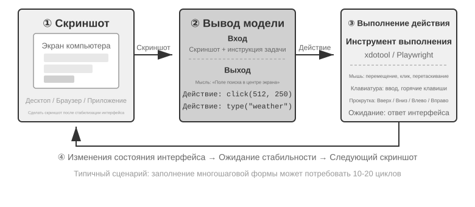

В этом цикле есть три ключевых измерения проектирования: **пространство действий** (какие операции доступны агенту), **визуальное позиционирование** (как найти целевой элемент на скриншоте) и **архитектура модели** (как сгенерировать правильное действие на основе скриншота).

### Проектирование пространства действий

Эталонная реализация Anthropic делит полную способность к взаимодействию на три категории инструментов (Рис. 6-12). Это ясный дизайн пространства действий, но не закрытый протокол, которому обязаны следовать поставщики моделей: если Harness преобразует те же скриншоты, ограничения действий и результаты исполнения в поддерживаемые целевой моделью сообщения и структурированные выходы, один и тот же цикл «восприятие — мышление — действие» смогут вести Claude, модели зрения с открытыми весами и самостоятельно размещённые конечные точки.


**Инструмент GUI-операций** (computer tool): операции мыши включают перемещение (mouse_move), клик левой/правой/средней кнопкой, двойной/тройной клик, перетаскивание (left_click_drag), а также более точные нажатие/отпускание (left_mouse_down/up). Прокрутка (scroll) поддерживает четыре направления и может комбинироваться с клавишами-модификаторами. Клавиатурные операции включают посимвольный ввод (type, интервал между символами 12 мс имитирует реальную печать), сочетания клавиш (key, например Ctrl+C), удержание клавиши (hold_key). Действия восприятия: скриншот (screenshot), получение позиции курсора (cursor_position), ожидание (wait).

**Инструмент выполнения команд** (bash tool): предоставляет постоянную сессию bash-терминала с тайм-аутом 120 секунд, определяет завершение выполнения команды по строке-«часовому», сохраняет состояние среды между несколькими вызовами (например, если перейти в директорию через cd, следующий вызов будет уже в ней).

**Инструмент редактирования файлов** (str_replace_editor): реализует безопасное редактирование через сопоставление строк, поддерживает просмотр, создание, замену, вставку и отмену операций — это точнее, чем прямая перезапись всего файла, и снижает риск случайного изменения остального содержимого.

> **Эксперимент 6-8 ★: запуск Computer Use (эталонный путь Anthropic или путь открытой модели)**
>
> Путь A использует Anthropic Computer Use Demo. Его контейнер включает полноценную среду рабочего стола Ubuntu, в том числе браузер, терминал и другие распространённые инструменты. Фронтенд получает задачу, а бэкенд отправляет инструкции и скриншоты в Claude, а затем выполняет действия мыши, клавиатуры, терминала или редактирования, возвращённые моделью.
>
> Путь B использует пример кода из [`chapter6/computer-use-open-model`](../chapter6/computer-use-open-model/). По умолчанию он управляет browser-use через открытую по весам модель Qwen3-VL 32B Instruct через размещённый API OpenRouter или через self-hosted vLLM/SGLang и аналогичные системы.

### Визуальная локализация (Grounding)

В каждом раунде цикла модели нужно точно определить положение целевого элемента на скриншоте — «где находится строка поиска?», «каковы координаты кнопки отправки?». Это и есть задача визуальной локализации (Grounding). Сейчас существует **два основных подхода**: первый — превратить локализацию в **вопрос с вариантами ответа**: сначала все элементы интерфейса помечаются номерами, и модели остаётся лишь выбрать один из них; второй — **прямое предсказание координат**: модель, как человек, буквально «смотрит» на скриншот и называет координаты. Причём подход с вариантами ответа реализуется двумя способами: **чисто визуальная разметка** (исходный Set-of-Mark, где сегментационная модель нарезает кандидатные области по пикселям) и **структурированное индексирование элементов** (DOM/Accessibility Tree, когда структура считывается напрямую из самого интерфейса). Общее преимущество подходов с вариантами ответа в том, что открытая задача «найти на скриншоте кнопку и предсказать её координаты» превращается в закрытую задачу «выбрать один элемент из уже размеченных». Точно так же, как на экзамене вопрос с вариантами ответа проще, чем вопрос с открытым ответом: модели достаточно сказать «нажать [123]», а не «нажать на кнопку на экране в точке (350, 464)». Прямое предсказание координат для модели особенно трудно — чтобы делать это точно, требуется большой объём обучения, а на разных разрешениях экрана оно легко даёт сбой.

**Set-of-Mark: метод визуальной разметки.**

Исходный Set-of-Mark (SoM) был предложен исследовательским подразделением Microsoft в 2023 году, изначально — чтобы раскрыть возможности визуальной локализации GPT-4V. Это **чисто визуальный** метод: сегментационная модель (SAM, SEEM и т. п.) автоматически нарезает на скриншоте кандидатные области, для каждой из них накладывается номерная метка, и модель видит изображение с номерами — ей достаточно назвать номер, а система пересчитает его в координаты центра соответствующей области. Весь процесс не требует DOM и вообще какой-либо внутренней структуры интерфейса, поэтому подход применим и к нативному настольному ПО, и к игровым интерфейсам — лишь бы сегментационная модель могла нарезать кандидатные области.

**Структурированное индексирование элементов: структурная реализация идеи SoM для веба.**

Когда сам интерфейс может предоставить структурированную информацию, разметку можно сделать точнее. Современные веб-страницы ещё до рендеринга уже определяют полную структуру элементов (дерево DOM) и семантические роли (что является кнопкой, что — полем ввода), а интерфейс специальных возможностей (Accessibility Tree) даёт аналогичную информацию для многих настольных приложений. Именно так поступают веб-агенты на базе проекта browser-use: интерактивные элементы перечисляются из DOM и нумеруются — это можно рассматривать как структурную реализацию идеи SoM для веба (Рис. 6-13). Процесс состоит из четырёх шагов:

1. Через отладочный интерфейс браузера (CDP, Chrome DevTools Protocol) получить структурированное представление страницы (дерево DOM) и информацию о доступности
2. Автоматически определить, какие элементы интерактивны (кнопки, поля ввода, ссылки и т. д.)
3. Присвоить каждому интерактивному элементу уникальный ID и нарисовать вокруг него рамку на скриншоте
4. Одновременно сформировать текстовый список, описывающий, какой элемент соответствует каждому ID

```text
Скриншот: [на изображении ключевые элементы помечены ID [1], [2], [3], [4] и т. д.]

Элементы:
[1] <input type="text" placeholder="Search" aria-label="Search" />
[2] <button id="submit-btn" aria-label="Submit form" />
[3] <input type="text" placeholder="Enter your name" value="" />
[4] <a href="/docs" aria-label="Documentation" />
```

Модели достаточно вывести только номер ID, а система автоматически выполнит клик по координатам центра этого элемента. Такой подход не экономит токены (потому что всю разметочную информацию нужно отправить модели), зато обеспечивает точную и стабильную локализацию и избавляет от пропусков и ложных срабатываний, которые может внести сегментационная модель.


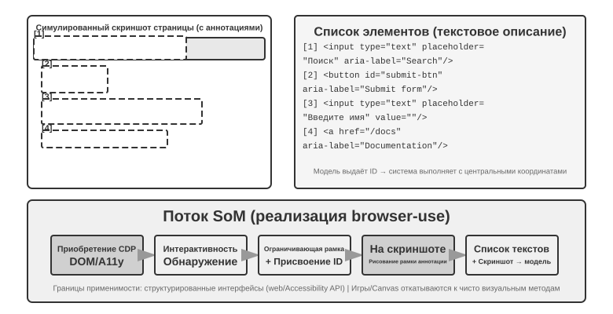

**Прямое предсказание координат.**

Третий путь не использует никакую разметку и заставляет модель напрямую выдавать координаты. Яркие примеры — **SeeClick** и Computer Use от Claude: на огромном массиве парных данных «скриншот GUI — положение элемента» обучается визуальная модель, которая учится напрямую отображать описание на естественном языке (например, «нажми кнопку отправки») в точные координаты на скриншоте — точно так же, как человек находит нужное место, полагаясь исключительно на зрение.

В схемах с предсказанием координат понимание моделью координат сильно зависит от разрешения, использованного при обучении (Рис. 6-14). Claude обучалась на XGA (1024×768), WXGA (1280×800), FWXGA (1366×768); если разрешение входного скриншота не совпадает с этими значениями, предсказанные моделью координаты систематически смещаются — как если бы вы измерили расстояние на карте меньшего масштаба и напрямую применили результат к карте большего масштаба. Поэтому на уровне инструментов нужно реализовать механизм двустороннего масштабирования координат, причём **целевое разрешение нужно выбирать по соотношению сторон**, чтобы неравномерное растяжение не деформировало изображение и не сбило вместе с ним оценку координат. Например, если реальное разрешение экрана — 2560×1440 (16:9), нужно среди трёх поддерживаемых Claude вариантов выбрать тот, чьё соотношение сторон тоже близко к 16:9, — лучше всего подходит FWXGA (1366×768). При съёмке скриншота экран пропорционально масштабируется до 1366×768 и подаётся в модель; модель выдаёт координаты клика (683, 384), которые затем обратно пересчитываются в реальные координаты (683×2560/1366, 384×1440/768) ≈ (1280, 720). И наоборот, если насильно растянуть 16:9 в 4:3 разрешение 1024×768, изображение будет сжато по горизонтали, и предсказанные моделью координаты систематически сместятся.


Логику выбора между тремя путями можно сформулировать так: **когда доступна структурированная информация, приоритет отдаётся индексированию через DOM/Accessibility Tree** — это даёт самую точную и стабильную локализацию; **когда она недоступна** (нативное настольное ПО вроде Photoshop, интерфейсы, отрисованные через Canvas/WebGL, игры), **можно использовать как визуальную разметку (исходный путь SoM), так и предсказание координат**. Визуальная разметка превращает локализацию в выбор варианта ответа и более дружелюбна к универсальным моделям без специального обучения; предсказание координат обходится без этапа разметки и более прямолинейно для моделей, прошедших обучение локализации в GUI. У обоих подходов на мелких элементах и плотных интерфейсах точность всё ещё оставляет желать лучшего.

> **Эксперимент 6-9 ★: реализация автоматического управления браузером с помощью browser-use**
>
> Объедините Playwright—фреймворк автоматизации браузера—с мультимодальной моделью для управления браузером на естественном языке. Включите визуализацию SoM и перед каждым решением сохраняйте снимок с размеченными рамками.
>
> Тестовое задание «Открой Google и найди погоду в Сан-Франциско»: после запуска снимок показывает поиск Google с пронумерованными интерактивными элементами. Модель выбирает строку поиска, вводит «San Francisco weather today», отправляет запрос и извлекает температуру и условия со страницы результатов.

### Computer Use Agent, способный видеть движение и слышать звук

До сих пор восприятие Computer Use опиралось на неявное допущение: **экран неподвижен**—сделать снимок, обдумать шаг, щёлкнуть и снять снова. В действительности на экране идут видео, мелькают уведомления и звучат голоса с совещаний. Агент, открывающий глаза лишь раз в 3–5 секунд и вовсе лишённый слуха, не видит и не слышит происходящего между двумя кадрами.

Перепроектировать нужно не интерфейс действий, а **интерфейс наблюдения**[^ch6-9]. Интерфейс наблюдения «агент–компьютер» (AOI) преобразует непрерывное наблюдение среды в дискретные события, удобные модели. Сюда входит несколько ключевых приёмов: во-первых, **захват ключевых кадров экрана** — небольшая модель определяет, произошло ли на экране значимое изменение, и делает снимок только при заметном изменении; при частых изменениях снимок раз в секунду уже даёт неплохой результат; во-вторых, **транскрибирование с порогом громкости**, которое запускает распознавание речи при наличии звука и помещает распознанный текст в контекст, чтобы Agent мог «слышать»; в-третьих, **описание кадра текстом** — модель превращает захваченный снимок экрана в одно предложение, которое остаётся в контексте после того, как исходное изображение из него удалено, реализуя сжатие мультимодальной истории взаимодействия.

[^ch6-9]: См. Li, Bojie and Noah Shi. *Agent-Computer Observation Interfaces Enable Dynamic Computer Use.* arXiv:2606.29472, 2026.

### Модель мира для Computer Use

Интерфейс наблюдения из предыдущего раздела отвечает на вопрос «что произошло в промежутке»: благодаря ключевым кадрам, расшифровке речи и устойчивому тексту Agent больше не видит лишь два далеко разнесённых скриншота. Но интерфейс наблюдения не убирает задержку планирования. Agent по-прежнему крутит последовательный цикл «скриншот — размышление — клик» и после каждого действия заново наблюдает и обдумывает следующий шаг. Исследование эффективности **OSWorld-Human** показывает: даже когда задача в итоге выполняется, число шагов и время ожидания у Agent заметно больше, чем у человека; достичь человеческой точности не значит стать достаточно практичным.

Работая за компьютером, человек не начинает думать о следующем шаге лишь после клика — он сначала предсказывает последствие действия: если реальное изменение совпало с ожиданием, он продолжает по прежнему плану; и только когда состояние страницы отклоняется от ожидаемого, останавливается, чтобы наблюдать и планировать заново. Модель мира позволяет Agent предсказать, во что может превратиться рабочий стол, ещё до действия, и тем самым реализовать это человекоподобное «спекулятивное исполнение», заметно повышая эффективность.

Состояние рабочего стола — не просто картинка из пикселей: в него входят окна, фокус, положение прокрутки, содержимое полей ввода, состояние загрузки, права и ответы сети; а действия включают клик, ввод с клавиатуры, прокрутку, перетаскивание и ожидание. Модель мира, пригодная для Computer Use, должна как минимум кодировать текущее состояние, предсказывать изменение состояния от действия-кандидата и передавать это предсказание планировщику для выбора следующего шага:

```text
состояние рабочего стола + click/type/scroll/wait ──> представление следующего состояния
```

Тогда Agent сможет сравнить последствия действий-кандидатов ещё до настоящего клика, подготовить следующий шаг, пока грузится страница, и восстановиться по разнице состояний, когда всплывающее окно мелькнуло и исчезло. Например, если задача — «создать новый файл Python в VS Code и написать hello world», модель может сначала предсказать ключевое состояние дерева файлов и редактора после успеха, и лишь затем выбрать действия клика, ввода и сохранения; а если задача — удалить файл, она может заранее предсказать в изолированном виртуальном рабочем столе, появится ли необратимое диалоговое окно подтверждения, и при необходимости запросить подтверждение у пользователя. Смысл здесь не в том, чтобы модель породила правдоподобный скриншот будущего, а в том, чтобы она предсказала проверяемые различия состояний, необходимые для выполнения задачи.

В июле 2026 года **Photon-1** от Induction Labs показал одну из реализаций этого пути: предобучение модели мира для computer use было завершено всего за 30 000 часов GPU H200. Он сжимает каждый кадр в дискретные латентные token и авторегрессионно предсказывает представление следующего состояния после действия, а не порождает скриншоты попиксельно на этапе предобучения; подключённый к нему генератор изображений служит лишь для визуализации латентных представлений и не является необходимым компонентом при выводе. Получив затравочный скриншот и последующие действия, модель может непрерывно «воображать» состояния рабочего стола, а затем через онлайн-обучение на виртуальных машинах научиться выдавать действия computer-use.[^ch6-20]

[^ch6-20]: David Li and Jonathan Li, Induction Labs, «Scaling Video Pretraining with Imagination Models,» 2026-07-23. https://www.inductionlabs.com/news/scaling-video-pretraining. Приведённые в тексте параметры Photon-1, объём данных, внутренние бенчмарки и сравнения стоимости — данные, раскрытые самой компанией.

### Мобильные устройства: экосистемные барьеры сложнее технологий

Computer Use также расширяется на мобильные устройства. Технически мобильные и настольные платформы действительно различаются: пространство действий здесь обычно уже не «координаты мыши + клавиатура», а обращение к системному API служб специальных возможностей (например, AccessibilityService в Android) для считывания элементов интерфейса и отправки кликов и текстового ввода; способ взаимодействия тоже меняется — от указателя мыши к сенсорным жестам, а семантика координат вместе с этим меняется: одна и та же пара (x, y) может означать одиночное касание пальцем, долгое нажатие или начальную точку жеста смахивания — для их различения нужен дополнительный тип жеста. Именно на таком пространстве действий описанные в главе 7 мобильные бенчмарки вроде AndroidWorld оценивают способность агента выполнять реальные задачи в приложениях.

Но по-настоящему сдерживает мобильные устройства, как правило, не эта техническая разница, а экосистемные барьеры. Некоторые производители смартфонов уже пытались встроить в потребительские устройства ИИ-помощника, автоматически управляющего повседневными приложениями вроде WeChat, Taobao, Alipay, но быстро столкнулись с ограничениями со стороны платформ.

Это раскрывает уникальную проблему, с которой сталкивается Computer Use: **экосистемный барьер**. Коренная причина блокировок — конфликт бизнес-моделей. Основная логика монетизации традиционных интернет-приложений — это **трафик и внимание**: пользователь листает ленту и видит рекламу, ищет товар и следует рекомендательным алгоритмам, просматривает страницы и совершает импульсивные покупки. Когда же вместо пользователя действиями управляет агент, эта цепочка монетизации полностью обходится стороной: ИИ не обращает внимания на рекламу и не совершает импульсивных покупок, а идёт прямо к цели и заканчивает задачу. Для платформ, монетизирующихся за счёт рекламы и трафика, каждое действие агента подтачивает саму основу их бизнес-модели.

Это означает, что Computer Use сталкивается не только с техническим противодействием вроде CAPTCHA (проверочные коды), но и со **структурным конфликтом интересов**. Это противоречие сложно устранить в краткосрочной перспективе, что делает внедрение Computer Use в потребительских сценариях более трудной задачей, чем чисто техническая проблема.

## Управление роботами: уборка стола на примере XLeRobot

> **Как читать этот раздел**: от начала до конца мы используем одну-единственную задачу——«поставить красную чашку на поднос, выбросить жёлтую бумажку в мусорное ведро и в конце ещё раз посмотреть, чтобы убедиться в состоянии стола». Эксперименты 6-10 и 6-12 выполняются на настоящем XLeRobot и требуют манипулятора, калибровки, кнопки аварийного останова и наблюдателя на месте. Эксперименты 6-11, 6-13 и 6-14 — их аналоги на локальном GPU. Результаты на железе и в симуляции сообщаются раздельно, но цель задачи, смысл действий и условия успеха остаются одинаковыми.

Управление роботом гораздо труднее, чем «посмотреть на картинку и ответить на вопрос». Модель должна не просто понимать сцену, а непрерывно действовать в реальном мире, причём каждое действие меняет обстановку в следующий момент. XLeRobot делает эту разницу очень наглядной. Одним и тем же манипулятором человек может управлять дистанционно — с клавиатуры, геймпадом или через VR-устройство; а можно передать наблюдение с камеры и ограниченный набор инструментов действия Agent, чтобы он вызывал их сам. Железо не меняется, задача тоже; меняется лишь тот, кто управляет——в первом случае человек непрерывно наблюдает и исправляет, во втором ту же работу должны довести до конца модель и система управления.

Этот раздел связывает пять экспериментов «уборкой стола». Сначала человек дистанционно управляет настоящим XLeRobot — чтобы измерить, на что способно это железо в руках достаточно умелого оператора. Затем в симуляторе устанавливается идеальный верхний предел управления для той же задачи. Далее Agent автономно управляет настоящим XLeRobot — чтобы увидеть, как восприятие, планирование и восстановление после сбоя определяют результат. После этого тот же контракт инструментов переносится в симулятор, и три стратегии сравниваются разом: разомкнутое выполнение, пошаговая проверка и модель мира. Наконец, мы меняем фон, внешний вид предметов, освещение и визуальный шум, чтобы понять, способна ли зрительная политика, выученная в симуляции, приспособиться к новой обстановке.

Узкое место здесь обычно не в том, чтобы сделать ещё один статический бенчмарк «вопрос — ответ», а в том, чтобы модель удерживала контур замкнутым при ограниченной полосе восприятия и управления. Пригодная к работе роботическая система должна отвечать по меньшей мере на четыре вопроса:

1. Какую задачу хочет завершить человек?
2. Какая подзадача идёт следующей?
3. Какое конкретно действие выдаёт текущий навык?
4. После выполнения действия — реальность всё ещё соответствует исходному плану?

Раздел помещает эти четыре вопроса в один и тот же контур управления XLeRobot и показывает, что берёт на себя каждая из четырёх техник: долгосрочное планирование решает, чем заняться раньше — чашкой или бумажкой; VLA или примитивы действий выполняют захват и постановку; модель мира оценивает последствия действия; а переход от симуляции к реальности принимает на себя разницу между обучающим видео и настоящими камерой и приводами. Даже если у модели верхнего уровня уже достаточно знаний и способности планировать, достаточно выпасть одному звену этого контура обратной связи, чтобы система не смогла довести задачу до конца.

### Разделение труда между железом и алгоритмом

Первый вопрос, на который XLeRobot отвечает лучше всего: когда автономная уборка стола проваливается — это манипулятор не справляется или алгоритм не умеет им пользоваться? Здесь есть факт, который не стоит смягчать: **даже манипулятор за несколько сотен долларов, такой как XLeRobot, при дистанционном управлении уже способен выполнить многошаговую связную задачу на столе, подобную задаче этого раздела**——человек смотрит видео с камеры, берёт красную чашку и ставит её на поднос, выбрасывает жёлтую бумажку в ведро и в конце ещё раз проверяет состояние. Этот результат означает не просто «железа едва хватает»; это ясное диагностическое свидетельство: **применительно к этой задаче узкое место лежит на стороне алгоритма, а не самого железа.**

Способ диагностики прямолинеен. Зафиксировав камеру, манипулятор, схват, расстановку на столе и условия успеха, контур сначала берёт на себя человек. Человек непрерывно уточняет оценку положения предметов, выбор действий и момент их выполнения, а также знает, что делать при сорвавшемся захвате. Разрыв между автономной системой и человеком проявляется именно в этой способности работать в замкнутом контуре. Разумеется, область действия этого вывода — задача со столом из данного раздела: он показывает, что железо преодолело пороги по грузоподъёмности, точности и рабочему пространству, которых требует эта задача, но не означает, что манипулятор за несколько сотен долларов справится с любой открытой средой или с более сложными манипуляциями.

XLeRobot поддерживает несколько входов для дистанционного управления: клавиатуру, контроллер Xbox, Joy-Con от Switch и VR-устройства. Оператор-человек естественным образом делает многое из того, что алгоритму пришлось бы прописывать явно: замедляется, когда схват приближается к чашке; исправляет точку захвата, если чашка скользит; смотрит заново, если бумажку не удалось подцепить с первого раза; и подтверждает результат, когда предмет оказался в целевой зоне. Поэтому дистанционное управление — не только способ собрать демонстрационные данные, но и диагностический эксперимент, который «фиксирует железо и меняет лишь оператора».[^ch6-1]

> **Эксперимент 6-10 ★: уборка стола дистанционным управлением настоящим XLeRobot**
>
> Поместите в рабочую зону настоящего XLeRobot красную чашку, поднос, смятую жёлтую бумажку и мусорное ведро. Оператор выполняет фиксированную задачу через один из откалиброванных каналов дистанционного управления: «поставить красную чашку на поднос, выбросить жёлтую бумажку в мусорное ведро и в конце ещё раз посмотреть, чтобы убедиться в состоянии стола». Повторите как минимум несколько раундов и запишите видео с камеры, ввод оператора, состояние манипулятора, длительность действий, сорвавшиеся захваты, число повторных попыток и итоговое состояние.
>
> Не опускайте критерий приёмки до «в конце стол выглядит чистым». Красная чашка должна оказаться на подносе, а жёлтая бумажка — в ведре; манипулятор должен вернуться в безопасную позу; на всём протяжении не должно быть столкновений, выходов за пределы рабочей зоны и вмешательства человека, который доделывает работу без проверки.

Дистанционное управление на настоящем железе убедительнее всего показывает верхний предел задачи, но неудобно, когда нужно массово менять число и положение предметов. Чтобы получить воспроизводимое и статистически измеримое сравнение, ту же задачу «вернуть предметы на место» мы дальше переносим в двумерный симулятор стола и берём идеальный регулятор вместо сильного оператора, который не ошибается в восприятии и не выбирает действие неверно.

> **Эксперимент 6-11 ★: измерение идеального верхнего предела управления той же задачей в симуляторе**
>
> В двумерном симуляторе стола случайно расставьте красную чашку, жёлтую бумажку и их целевые зоны, а идеальный регулятор пусть по очереди подходит к предметам, захватывает их и перемещает в нужное место. Ему не нужно распознавать изображения, и он не ошибается в выборе действия, поэтому он представляет собой ответ на вопрос «до чего эта задача способна дойти хотя бы тогда, когда и восприятие, и решение верны».
>
> Смотрите на долю успешных выполнений, число шагов и длину пути; меняйте также начальное положение предметов и масштаб задачи, чтобы понять, устойчив ли этот идеальный предел. Условия успеха те же, что в эксперименте 6-10, но измеряется симуляция без приводов: это не значит, что настоящий XLeRobot двигался. Оба эксперимента станут двумя базовыми линиями для последующего автономного управления——эксперимент 6-10 — это замкнутый контур человека на настоящем железе, а эксперимент 6-11 — идеальный замкнутый контур в симуляционной среде.

### Базовая структура управления роботом

Роботическая система обычно разделяет работу разных временных масштабов.

| Уровень | Ключевой вопрос | Выход | Типичный масштаб времени |
| --- | --- | --- | --- |
| Цель задачи | Что человек хочет завершить | «Чашку и бумажку — на место» | Порядка минут |
| Долгосрочное планирование | Что раньше, что позже | Сначала чашка, потом бумажка, в конце проверка | От секунд до минут |
| Базовый навык | Какое изменение состояния достигается сейчас | `pick(red_cup)`, `place(red_cup, tray)` | Около 1—3 с |
| VLA / политика навыка | Как именно движется этот навык | Короткое движение или непрерывная траектория схвата XLeRobot | Вывод ~1—10 Гц |
| Низкоуровневое управление и слой безопасности | Как выполнить устойчиво и без задержки | Управляющие величины в суставах или на схвате, ограничение скорости и аварийный останов | ~50—1000 Гц |

Это распространённое инженерное разделение труда, а не единственно возможная архитектура модели. VLA вполне может взять на себя часть решений верхнего уровня, а планировщиком может быть программа на правилах, VLM или оптимизатор. Какую бы реализацию ни выбрали, «порядок задачи» стоит отделять от «действия прямо сейчас»; иначе задержка вывода модели верхнего уровня тянет вниз низкоуровневое управление, а высокочастотное управление внизу заставляет верхнюю модель обрабатывать массу несущественных подробностей. На XLeRobot модель не должна напрямую выдавать произвольные углы суставов: она лишь выбирает навыки с чёткими границами — `pick`, `place`, `verify_state`, `stop`, — а откалиброванный исполнитель с ограничением скорости и тайм-аутом превращает их в реальное движение манипулятора.

### Долгосрочное планирование и декомпозиция задачи

Когда пользователь говорит «прибери на столе», система не может передать эту фразу модели действий как есть. Планировщик сначала перечисляет предметы и цели в сцене, определяет порядок, а затем для каждого шага записывает условие начала, условие завершения и границы риска. Например:

```text
Разобраться с красной чашкой → Убрать жёлтую бумажку → Проверить стол
```

«Разобраться с красной чашкой» в свою очередь распадается на два действия и одну проверку:

```text
pick(red_cup) → place(red_cup, tray) → verify_state()
```

Каждый завершённый навык оставляет нам проверяемый узел. Если захват сорвался, переделывается только этот шаг. Если кто-то сдвинул предмет или пользователь поменял цель, достаточно перепланировать только затронутые последующие шаги, а не повторять весь старый план. Инструменты, которые даются агенту, тоже должны быть достаточно простыми: один вызов делает одно дело, диапазон движения зафиксирован, есть тайм-аут, а сразу после выполнения производится новое наблюдение.

> **Эксперимент 6-12 ★★: пусть Gemini Robotics-ER 1.5 автономно приберёт стол с помощью XLeRobot**
>
> Сохраните настоящий XLeRobot, расстановку на столе, формулировку задачи и условия успеха из эксперимента 6-10; замените только оператора-человека на Agent. Наблюдение и планирование отдайте модели воплощённого рассуждения вроде Gemini Robotics-ER 1.5 и через агентный цикл в стиле RoboCrew откройте всего пять инструментов: `observe_scene`, `pick`, `place`, `verify_state` и `stop`.[^ch6-2]
>
> Модель сначала осматривает стол, определяет порядок работы, а затем вызывает откалиброванные действия захвата и постановки XLeRobot. Завершив каждый навык, она обязана наблюдать заново и проверять постусловие. При сорвавшемся захвате ей разрешено лишь повторить текущий навык; она обязана вызвать `stop`, если пользователь велел остановиться, если предмет вышел за пределы рабочей зоны или если состояние не удаётся проверить. Модель не может напрямую выдавать произвольные углы суставов и не может пропустить настоящую проверку только потому, что сама заранее сказала «готово».
>
> Критерий приёмки в точности такой же, как в эксперименте 6-10: чашка на подносе, бумажка в ведре, манипулятор вернулся в безопасную позу, столкновений и выходов за зону нет. Разница в том, что в автономном эксперименте смысл задачи должен рождаться из собственного наблюдения модели, настоящие действия — из вызовов инструментов, а итоговое состояние должно подтверждаться новым наблюдением. Человек может только запускать, нажимать аварийный останов и следить за безопасностью; он не вправе на полпути доделывать действие за Agent. Только так эксперименты 6-10 и 6-12 позволяют прямо сравнить: «при одном и том же железе и одной и той же задаче — чего недостаёт замкнутому контуру модели по сравнению с контуром человека».

Эксперименты на настоящем железе вскрывают ошибки калибровки, перекрытия камеры и отказы схвата, но плохо подходят для того, чтобы безопасно и подконтрольно повторять большое число сбоев. Последующие симуляционные эксперименты сохраняют те же пять инструментов и в точности то же состояние задачи и заменяют лишь настоящие приводы средой стола, в которую можно вносить отказы, — чтобы разделить, что именно даёт разомкнутое выполнение, что — пошаговая проверка, а что — предсказание действий.

### Управление через VLA

VLA — сокращение от Vision-Language-Action, то есть «модель зрение — язык — действие». Она принимает текущую сцену и одну инструкцию навыка и выдаёт действие, которое робот должен выполнить следующим:

```text
текущее наблюдение + инструкция навыка → действие
```

В примере с XLeRobot планировщик верхнего уровня лишь выдаёт `pick(red_cup)`; а с какой стороны подойти к чашке, когда сомкнуть схват и по какой траектории поднять манипулятор — решает VLA или политика навыка, исходя из текущей сцены. Когда исполнительный слой завершает это короткое движение, стол снимается заново, и только после подтверждения, что чашка действительно захвачена, планировщику разрешается выдать `place(red_cup, tray)`. Иначе говоря, вызов инструмента определяет желаемое изменение состояния, а VLA определяет, как добиться этого изменения непрерывным действием.

RT-2 и OpenVLA нарезают непрерывное действие на дискретные token и выдают их по одному, словно порождая текст. π₀ представляет другой путь: она сразу порождает непрерывные и плавные траектории действия. Простого превосходства одного над другим нет. Дискретные token легко состыковать с языковой моделью; непрерывные траектории лучше подходят для выражения плавного движения. Настоящий выбор — как представлять действие, а не только насколько велика модель.[^ch6-15]

Большая модель обычно способна делать вывод лишь 1—10 раз в секунду, тогда как традиционный регулятор может обновляться от десятков до тысяч раз в секунду. Распространённый инженерный приём — «нарезка действий» (action chunking): модель за один раз порождает короткий отрезок будущих действий, поток управления выполняет этот отрезок с высокой частотой, а модель тем временем готовит следующий. Так часть ожидания вывода прячется внутрь времени выполнения действий. Плата за это такова: чем длиннее отрезок, тем плавнее движение, но тем меньше новых сцен модель видит за этот промежуток. Если XLeRobot тянется за чашкой, а чашку по пути задели и сдвинули, он может продолжать выполнять действия, порождённые по старому кадру. Поэтому нарезка действий — это компромисс между плавностью и скоростью реакции, а не бесплатное ускорение.

### Пределы VLA

«Долгосрочное планирование + VLA» — работоспособный базовый вариант, но он оставляет несколько проблем, которые легко упустить.

- **Обучающих данных мало**: роботических демонстраций несравнимо меньше, чем текста и изображений в интернете. То, что модель видела слово «чашка», не значит, что она видела чашки из всех материалов и при всех условиях трения.
- **Учится подражать, но не знает последствий**: клонирование поведения в основном учит тому, «что демонстратор сделал следующим», и не требует от модели явно ответить, «к чему приведёт это действие».
- **Роботы все разные**: при других степенях свободы, системах координат, схватах и задержках приводов нет гарантии, что то же действие перенесётся на другую машину как есть.
- **Наблюдение может устареть**: после того как отрезок действий пошёл в исполнение, предмет могли сдвинуть, заслонить или опрокинуть, а модель всё ещё принимает решение по предыдущему кадру.

Значит, если языковая модель знает слово «чашка», это не значит, что она знает, как трение, контакт, плеск жидкости или кабель питания меняют будущее состояние. VLA в основном отвечает на вопрос «что делать сейчас»; чтобы судить, «что может произойти после того, как сделаешь», нужна модель другого рода.

### Модели мира

Модель мира можно понимать как предсказатель последствий действий. Она учит вот чему: если в текущем состоянии выполнить некоторое действие, как может измениться состояние в следующий момент.

```text
текущее состояние + действие-кандидат
    → предсказать следующее состояние или фрагмент будущего
    → сравнить результаты кандидатов
    → выбрать действие, перепланировать или безопасно остановиться
```

Модель мира, пригодная для робототехники, должна хорошо делать по меньшей мере три вещи:

- понимать текущее состояние;
- предсказывать результаты, к которым могут привести разные действия;
- передавать это предсказание планировщику или регулятору, помогая с выбором.

VLM, которая умеет только описывать видео, или модель, которая умеет только порождать изображения, не становится автоматически надёжной моделью мира для робота. Она должна знать, что такое действие, и уметь предсказать влияние этого действия на предметы и среду. V-JEPA 2 представляет путь предсказания будущего во внутреннем состоянии, а World-Action Model явно учит связь «действие — будущее наблюдение». Их можно использовать вместе с VLA, заменять его они не обязаны.[^ch6-16]

В реальной системе у модели мира обычно три применения:

1. **До движения**: сравнить действия-кандидаты — захватить, толкнуть, подождать — и поставить вперёд вариант с меньшим риском;
2. **Во время исполнения**: сверять реальное наблюдение с предсказанием и при обнаружении расхождения укорачивать действие, останавливаться или перепланировать;
3. **Во время обучения**: учить изменения состояния по видео, симуляционным данным и неудачным траекториям, сокращая пробы и ошибки на настоящей машине.

Вернёмся к задаче со столом на XLeRobot. Если жёлтая бумажка частично закрыта красной чашкой, система может сравнить навыки-кандидаты: «сначала взять бумажку», «сначала отодвинуть чашку» или «захватить с другой стороны». Модели мира не нужно порождать правдоподобное роботическое видео: достаточно, чтобы она предсказывала, какое действие-кандидат вероятнее приведёт к состоянию, в котором бумажку можно взять, и какое может опрокинуть чашку, — этого уже хватит, чтобы помочь планировщику упорядочить варианты. После выполнения действия окончательным фактом по-прежнему остаётся реальное наблюдение с камеры: предсказание лишь помогает выбрать и не заменяет проверку приёмки.

Модель мира даёт не окончательные ответы, а сравнимые предсказания о том, «что может произойти, если сделать так». Чем дальше предсказание, тем больше, как правило, ошибка, а правдоподобно выглядящая будущая сцена вовсе не обязана соответствовать настоящим законам контакта и трения. Поэтому реальной системе по-прежнему нужны краткосрочное предсказание, наблюдение в реальном времени, оценка неопределённости и независимый аппаратный контроллер безопасности. Порождающие модели мира годятся для интерактивной симуляции и визуализации, но не стоит путать «умеет порождать видео» с «умеет направлять действия робота».[^ch6-21]

> **Эксперимент 6-13 ★★: сравнение трёх автономных контуров уборки стола в симуляторе**
>
> Перенесите задачу, целевые состояния, условия успеха и пять инструментов из эксперимента 6-12 в симулятор стола и замените лишь приводы настоящего XLeRobot управляемым симуляционным исполнителем, который время от времени вызывает при захвате временный, но поправимый сбой. Так три стратегии можно сравнить, не меняя саму задачу.
>
> **Разомкнутое выполнение** порождает всю последовательность действий за один раз и по дороге не наблюдает заново. **Пошаговая проверка** перечитывает состояние при каждом `pick` и `place`, а при сбое переделывает только текущий навык. **Предсказательное выполнение** добавляет к этому краткосрочную модель мира и сравнивает ожидаемые результаты навыков-кандидатов, прежде чем выбрать следующий ход. Эксперимент сравнивает долю успешных выполнений, накладные расходы на вызовы инструментов и способность восстанавливаться после сбоя, а также проверяет, все ли итоговые успехи подтверждены новым наблюдением из `verify_state`.
>
> Цель этого эксперимента — не показать, что маленькая симуляционная модель мира равносильна физической модели настоящей машины, а проверить более базовое соотношение: разомкнутый план тащит одну локальную неудачу до самого конца задачи; пошаговая проверка позволяет восстановиться; а предсказание действий вдобавок помогает упорядочить навыки-кандидаты. Кто на самом деле довёл дело до конца — по-прежнему решает обратная связь от среды.

### От симуляционной среды к настоящему роботу

Устойчивость эксперимента 6-13 в симуляторе не означает, что настоящий XLeRobot из эксперимента 6-12 будет столь же успешен. Переход от симуляции к настоящей машине — это не смена ещё одного регулятора, а принятие на себя разницы между двумя средами. Для обучения можно использовать данные дистанционного управления, видеоданные и данные симуляционного взаимодействия; но при настоящем развёртывании та же красная чашка, та же жёлтая бумажка, тот же поднос и то же ведро появляются на другом фоне, при другом освещении, при другом положении камеры и с другими перекрытиями, а манипулятор к тому же встречает другое трение, другой шум датчиков и другую задержку приводов. Если эти различия достаточно велики, движения, выученные в симуляции, могут в реальности не сработать.

> **Эксперимент 6-14 ★★★: межсредовое RGB-тестирование на одной и той же задаче со столом**
>
> В симуляционной среде продолжайте использовать базовую задачу «переместить предмет к соответствующей цели» и рассматривайте каждый образец как локальное решение внутри уборки стола: по RGB-изображению определить, с какой стороны подходить к предмету и можно ли его уже захватить. Обучите четыре зрительные политики одинаковой структуры: одна видит только фиксированные сцены; другая меняет фон; третья меняет внешний вид предметов; последняя меняет одновременно фон, внешний вид, освещение и шум.
>
> Проверьте все политики и в исходной среде, и в новой изменённой, а затем сравните точность решения о действии до и после смены визуальных условий. Этот эксперимент пытается ответить не на вопрос «стал ли симулятор таким же, как настоящий XLeRobot», а на более узкий вопрос: помогает ли намеренное расширение диапазона изменчивости сцен при обучении тому, чтобы та же задача «чашка — поднос, бумажка — ведро» приспособилась к новому видео с камеры? Даже если результат улучшится, развёртывание на настоящей машине по-прежнему требует настоящей калибровки камеры, испытаний приводов и полного замкнутого контура безопасности.[^ch6-6]

## Резюме главы

На двух осях—**модальности** и **момента исполнения**—**асинхронность и событийность** расширяют наблюдение от «агент сам получает» до «мир присылает», а действие от «завершить внутри хода» до «запустить сейчас и закончить последующими событиями». **Голос** сжимает масштаб до миллисекунд, переводит взаимодействие от очередности к непрерывному слушанию и речи и разделяет быстрое общение на переднем плане с глубоким фоновым мышлением. **Computer Use** переносит цикл на экран, добавляя узкие места эффективности, непрерывного визуального понимания и проверки состояния после действия. **Робототехника** переносит его в физический мир, где фрагменты действий обменивают плавность на отзывчивость, а завершение по-прежнему определяется новым наблюдением.

Четыре раздела делят один управляющий каркас:

```text
непрерывно воспринимать
  → оценить текущее состояние и момент
  → выбрать ответ или действие
  → выпустить вывод в среду
  → наблюдать обратную связь
  → продолжить, исправить, повторить, остановиться или перепланировать
```

Они также используют одни и те же примитивы: пробуждение, безопасные точки, отмену, вытеснение и разделение быстрого и медленного.

Эта глава завершает последний фрагмент части «как строить агента»: пространства наблюдений и действий развёрнуты уже по всем трём направлениям — содержанию, модальности и моменту. Далее глава 7 отвечает на вопрос, как определить, правильно ли построена система; глава 8 рассматривает обновление параметров модели посредством постобучения; а глава 9 объединяет траектории выполнения, оценку и разные носители обновлений в замкнутый цикл непрерывной эволюции. Затем глава 10 переходит от этой полной основы одиночного агента к мультиагентному сотрудничеству.

[^ch6-16]: Meta AI, “Introducing the V-JEPA 2 world model and new benchmarks for physical reasoning,” 2025-06-11. https://ai.meta.com/blog/v-jepa-2-world-model-benchmarks/; V-JEPA 2 technical report：arXiv:2506.09985, https://arxiv.org/abs/2506.09985
[^ch6-21]: Jack Parker-Holder and Shlomi Fruchter, Google DeepMind, “Genie 3: A new frontier for world models,” 2025-08-05. https://deepmind.google/blog/genie-3-a-new-frontier-for-world-models/; Zachary Lin et al. *Cosmos World Foundation Model Platform for Physical AI.* arXiv:2501.03575, 2025. https://arxiv.org/abs/2501.03575 。
[^ch6-1]: XLeRobot, “Документация по телеуправлению”. https://xlerobot.readthedocs.io/en/latest/software/getting_started/XLeRobot_teleop.html
[^ch6-2]: Google DeepMind, “Gemini Robotics-ER 1.5”. https://deepmind.google/models/gemini-robotics/gemini-robotics-er/; XLeRobot, “Управление через LLM Agent”. https://xlerobot.readthedocs.io/en/latest/software/getting_started/LLM_agent.html. Исходный пример XLeRobot показывает, как связывать модель с вызовами инструментов; данный раздел сохраняет тот же принцип связывания, но ограничивает инструменты действия откалиброванными настольными примитивами захвата, постановки, проверки и останова.
[^ch6-6]: LeRobot, “Руководство по Sim2Real”. https://github.com/StoneT2000/lerobot-sim2real/blob/87d6c1d969f6e0ca4dc5697940804e231118a63a/docs/zero_shot_rgb_sim2real.md
[^ch6-15]: Moo Jin Kim et al. *OpenVLA: An Open-Source Vision-Language-Action Model.* arXiv:2406.09246, 2024. https://arxiv.org/abs/2406.09246
[^ch6-22]: OpenAI, «[Async tool calling](https://developers.openai.com/api/docs/guides/async-tool-calling)»; «[Using GPT-6 Astra](https://developers.openai.com/api/docs/guides/latest-model)», проверено 2026-09-05.
[^ch6-23]: OpenAI, «[Mid-turn steering](https://developers.openai.com/api/docs/guides/steering)», проверено 2026-09-05.

## Вопросы для размышления

1. ★★ В асинхронной архитектуре агента стратегия приоритетов очереди событий должна быть определена на этапе проектирования. Но если само определение приоритета требует семантического понимания (например, оценить, важнее ли новое сообщение текущей задачи), кто должен принимать это решение — движок правил или ещё один вызов LLM? Какова цена каждого варианта?
2. ★★ При очередной обработке событий модель склонна обращать внимание только на последнее событие; в этой главе это смягчается с помощью маркировки и сводки в строке состояния агента. Но если в очереди накопилось 20 событий (10 результатов инструментов + 5 сообщений пользователя + 5 системных напоминаний), как бы вы организовали порядок и формат подачи этих событий, чтобы модель не упустила ничего важного?
3. ★★★ Когда агент взаимодействует с внешним миром от имени пользователя, он по сути сталкивается с выбором идентичности: действовать под независимой виртуальной личностью (со своим почтовым адресом и номером телефона) как третья сторона, либо напрямую управлять личными аккаунтами пользователя от его собственного имени. Первый вариант позволяет действовать автономно в фоне, но третья сторона может не доверять неживой идентичности; второй даёт более полный контекст и полномочия, но привносит проблемы доверительной авторизации и границ безопасности. В каких сценариях, по-вашему, стоит выбирать какую модель?
4. ★★ Сквозная модель речевого агента объединяет ASR-LLM-TTS в единую модель, снижая задержку, но теряя модульность. Если сквозная модель ошибается на каком-то этапе (например, при распознавании речи), отладка и исправление оказываются намного сложнее, чем в последовательном конвейере. Как бы вы спроектировали систему наблюдаемости (observability) для сквозного речевого агента?
5. ★ Step-Audio R1 реализует «думать на ходу говоря» через двухмозговую архитектуру MPS. Но человек, «думая на ходу говоря», часто произносит непродуманные фразы, сам себя исправляет или использует слова-паразиты. Должно ли «думание на ходу говоря» агента подражать этим человеческим особенностям?
6. ★★ SoM (Set-of-Mark) и его структурированные варианты (индексация элементов DOM) переводят визуальную локализацию Computer Use от предсказания открытых координат к выбору закрытого набора ID, но оба подхода требуют предварительного обнаружения и разметки элементов интерфейса — будь то модель сегментации или DOM. Если интерфейс содержит нестандартные элементы управления или динамически изменяющиеся элементы, разметка может оказаться неполной или неточной. Следует ли в этом случае возвращаться к предсказанию координат?
7. ★★ Платформы роботов стоимостью в несколько сотен долларов, такие как XLeRobot, делают сбор данных телеоперации дешёвым. Но качество данных телеоперации сильно зависит от навыков оператора. Как данные от неквалифицированного оператора повлияют на обучение модели VLA? Как можно автоматически отсеивать низкокачественные данные на этапе сбора?
8. ★★★ Эта глава охватила три формы взаимодействия — речь, Computer Use и робототехнику. Общая тенденция этих трёх форм — эволюция от последовательного конвейера к сквозной модели. Если эта тенденция продолжится, каким будет уровень взаимодействия агента через пять лет?
9. ★★ Индексация элементов через DOM/Accessibility Tree работает отлично на стандартных веб-приложениях, но всё больше программных интерфейсов (рендеринг на Canvas/WebGL, кросс-платформенные самодельные элементы управления) не предоставляют доступной структурированной информации и полагаются только на визуальную разметку или предсказание координат. Считаете ли вы, что Computer Use должен делать ставку на чисто визуальный путь, или стоит одновременно поддерживать оба пути — структурированный и визуальный? Каковы затраты и выгоды поддержки обоих путей?
10. ★★ Модели VLA используют разбиение действий на блоки (action chunking) — как описано в основном тексте, типичная конфигурация π₀ генерирует за раз 25–50 будущих действий при частоте 50 Гц — скрывая задержку вывода во времени исполнения. Но если во время исполнения среда резко меняется (например, объект убрали), предгенерированная последовательность действий становится недействительной. Как найти баланс между преимуществом эффективности разбиения действий на блоки и скоростью реагирования на изменения среды?
11. ★★★ Все три сценария этой главы (речь, Computer Use, робототехника) сталкиваются с проблемой задержки в цикле «восприятие-мышление-действие» и эволюционируют в сторону параллелизации быстрого и медленного мышления. В речевом сценарии это проявляется как «сказал неправильно — исправился на ходу»; в сценарии Computer Use — как «сначала кликнуть, потом посмотреть»; в сценарии робототехники — как «шаг за шагом, глядя по ходу дела». Как гарантировать, что действия, основанные на быстром мышлении, не приведут к необратимым последствиям?
12. ★★★ В этой главе один и тот же набор примитивов (пробуждение, безопасная точка, отмена, вытеснение, разделение быстрого и медленного) неоднократно реализуется на разных временных масштабах. Выберите любой из них и объясните, чем различается его реализация в событийной обработке (секунды — сутки) и в разбиении действий робота (миллисекунды). Чем в основном определяется это различие — скоростью изменения среды, обратимостью действия или стоимостью получения наблюдения?
