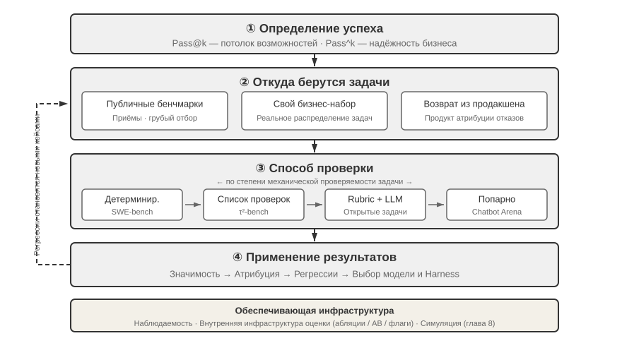
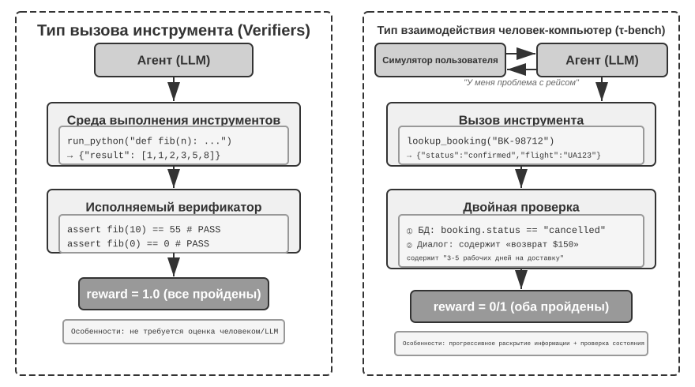
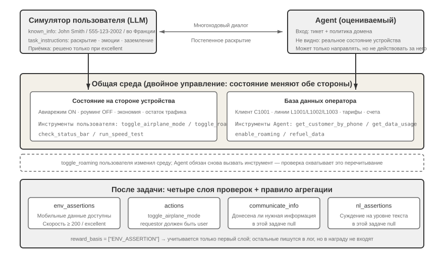
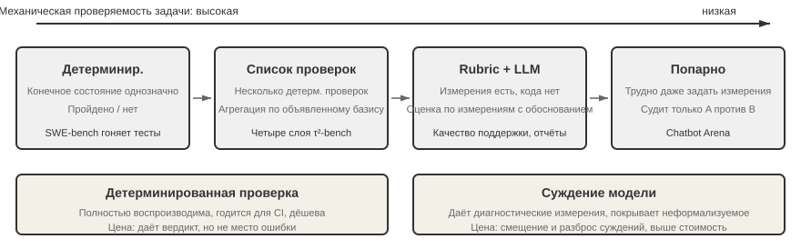
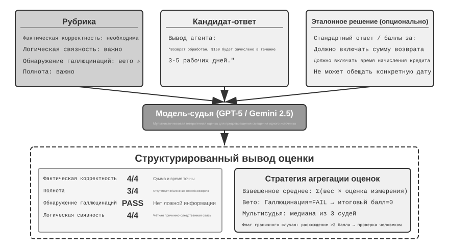
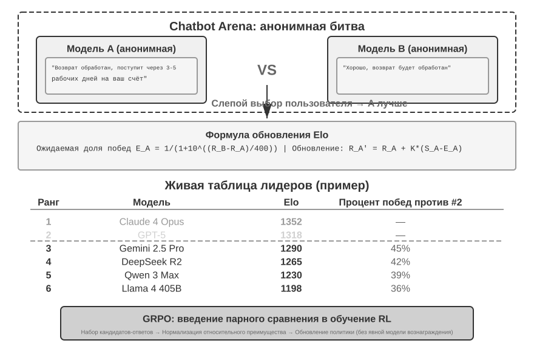
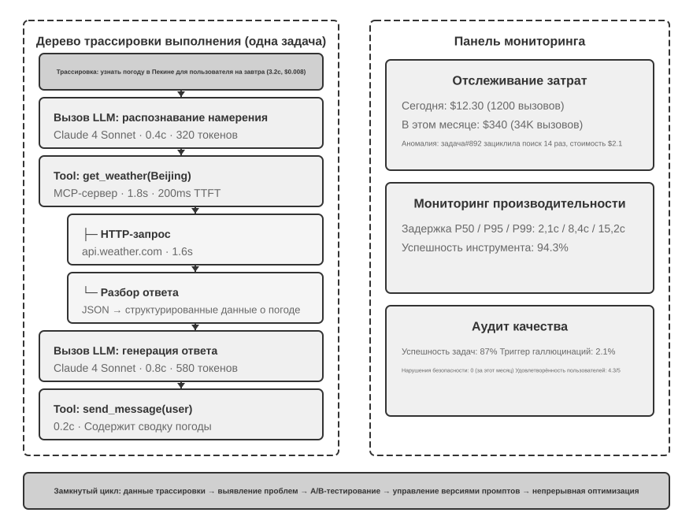
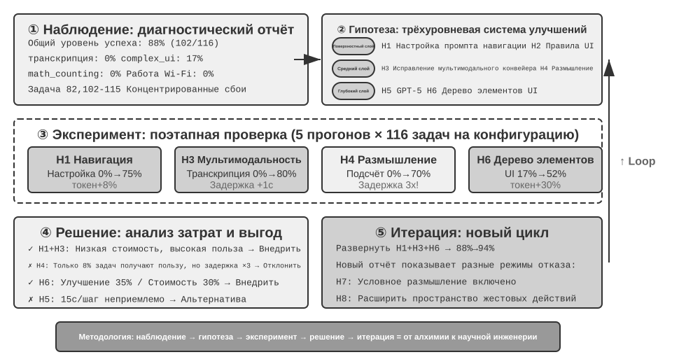
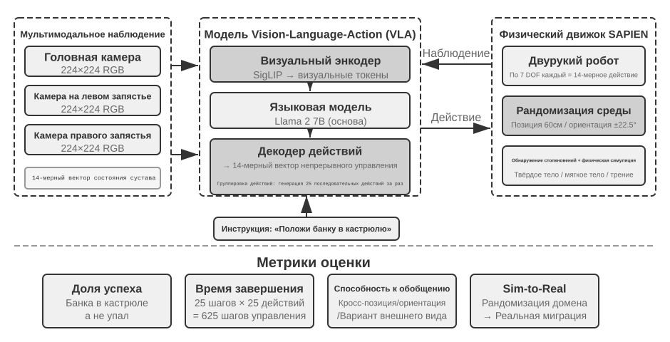

# Оценка агентов

Первые шесть глав раскрыли построение одиночного агента: его контекст, знания, инструменты, способность писать код, а также пространства наблюдений и действий. Но завершить построение — ещё не значит построить правильно; только стабильные измерения дают последующему обучению модели и эволюции системы надёжное направление.

При построении систем агентов разработчики сталкиваются с множеством проектных решений, у которых зачастую нет очевидно правильного ответа:

- Какую модель использовать?
- Какие инструменты модель должна уметь вызывать?
- Какие данные и в какой структуре хранить в базе знаний?
- Как организовать память пользователя?
- Как структурировать промпты модели и Skills?
- Какие ограничения нужно заложить в Harness?
- Как преобразовать результаты оценки в обучающие сигналы для непрерывной эволюции агента?

Оценка даёт нам научную основу для принятия решений: с помощью систематических сравнительных экспериментов (меняем одну переменную и смотрим на изменение результата) и абляционных исследований (по очереди отключаем компоненты и смотрим, как меняется общая производительность, чтобы понять реальный вклад каждого компонента) мы отличаем настоящий прирост возможностей от поверхностных колебаний, избегая ситуации «выиграли по мелочи, потеряли по-крупному». Как говорят в разработке ПО: «нет измерения — нет улучшения». Без воспроизводимой системы оценки направление итерации агента можно определять только интуитивно.

С точки зрения Harness-инженерии, введённой в первой главе, оценка выполняет в Harness ключевую функцию «проверки». Важно понимать: **объектом оценки должна быть не модель сама по себе, а комбинация модели и Harness**. Одна и та же модель в разных Harness может показывать резко различающиеся результаты — некоторые команды, оптимизируя только Harness, значительно улучшили результаты одной и той же модели на терминальных задачах (подробнее в главе 5). Это значит, что когда агент показывает слабый результат на оценке, направление улучшения может быть не в смене модели, а в оптимизации какого-то компонента Harness (промпта, проектирования инструментов, цикла обратной связи). Полноценная система оценки должна уметь различать два принципиально разных типа проблем: «недостаточные возможности модели» и «дефекты проектирования Harness». **Обычный способ разделить эти два типа проблем — эксперимент с заменой модели (model swap)**: фиксируем Harness и меняем только модель на более сильную или более слабую, наблюдая за амплитудой изменения оценки. Если замена на более сильную модель не даёт прироста — узкое место в Harness; если замена на более слабую модель сильно роняет оценку и результат сильно колеблется в зависимости от возможностей модели, самая прямая интерпретация — узкое место в самих возможностях модели, а текущий результат в основном определяется моделью (хотя объясняется ли это тем, что задача действительно сложна, или тем, что Harness чрезмерно полагается на априорные знания модели — требует дополнительного анализа). Обратите внимание: это отличается от упомянутого выше «абляционного исследования» — это два разных метода. Абляция — это **отключение отдельного компонента Harness** и наблюдение за изменением общей производительности; замена модели — это **фиксация Harness при смене модели**. Первый метод определяет, какой компонент внутри Harness важен, второй — различает, находится ли узкое место в модели или в Harness.

Ценность системы оценки становится ещё более очевидной в эпоху быстрой эволюции моделей. Возможности моделей продолжают быстро развиваться, но то, что новая модель лучше показывает себя на публичных бенчмарках, не значит, что она лучше и на вашей конкретной задаче — может произойти даже регресс (regression, то есть новая версия хуже прежней в некоторых аспектах). Только полное тестирование на собственном наборе данных для оценки позволяет принимать решения об обновлении на основе данных. Более того, полноценная система оценки делает возможной стратегию «разработки продукта под будущие модели» — даже если текущая модель ещё не дотягивает до уровня коммерческого использования, можно уже завершить разработку продукта и создать набор для оценки, непрерывно отслеживая результаты новых моделей, и запустить продукт сразу, как только будет достигнут нужный порог.

> **Введение в главу**
>
> В этой главе полноценная система оценки строится на трёх уровнях. Первый уровень — **среда оценки** («где тестировать»): как построить автоматизированную, воспроизводимую тестовую среду, включая инструментальную и человеко-машинную парадигмы. Второй уровень — **методы оценки** («как судить»): от принципов проектирования наборов данных и системы метрик оценки (что именно измерять) до автоматизированного судейства через LLM-as-a-Judge (использование большой языковой модели в роли судьи) и парного сравнения с ранжированием моделей. Третий уровень — **решения, основанные на оценке** («что делать с результатами тестов»): превращение результатов оценки в руководство к действию для выбора модели, оптимизации архитектуры и непрерывной итерации, а также использование статистической значимости, чтобы понять, действительно ли наблюдаемая разница в оценках достоверна. Кроме того, в этой главе обсуждается наблюдаемость и внутренняя инфраструктура оценки для продакшн-агентов, а в конце главы вводится симуляционная среда, связывающая эту главу с постобучением из главы 8.
>
> Ключевая идея, проходящая через всю главу: **главная ценность системы оценки — не в том, чтобы выставить баллы текущей системе, а в том, чтобы вы могли быстро и надёжно поспевать за эволюцией моделей**. Когда выходит более мощная или более дешёвая модель, команда с полноценной системой оценки может принять решение о переходе за несколько часов, а команда без такой системы вынуждена полагаться на интуицию или ждать отзывов сообщества — а на конкурентном рынке агентов такой разрыв в скорости может решить исход дела.



## Один конкретный пример оценки

Прежде чем углубляться в методологию, построим интуитивное понимание на полном примере. Предположим, мы построили агента для клиентской поддержки, и нужно оценить его способность обрабатывать запросы на возврат средств.

**Тестовый пример**: пользователь просит вернуть заказ, сделанный 3 дня назад (номер заказа #12345, сумма ¥299). Политика компании: полный возврат средств возможен в течение 7 дней.

**Траектория агента**:

```text
Пользователь: Я хочу вернуть наушники, купленные 3 дня назад, номер заказа 12345. (Сегодня 2026-04-10)

Агент (размышляет): Пользователь хочет вернуть средства, сначала нужно запросить информацию о заказе.
Агент → вызывает инструмент query_order(order_id="12345")
Инструмент возвращает: {status: "delivered", amount: 299, date: "2026-04-07", item: "Bluetooth-наушники"}

Агент (размышляет): Дата заказа 2026-04-07, сегодня 2026-04-10, прошло 3 дня — в пределах 7-дневного срока
возврата, условие полного возврата выполнено.
Агент → вызывает инструмент process_refund(order_id="12345", amount=299)
Инструмент возвращает: {refund_id: "R-98765", status: "processing", eta: "3-5 рабочих дней"}

Агент: Я оформил для вас возврат средств, полный возврат по заказу #12345 (Bluetooth-наушники, ¥299)
      сейчас в обработке, ожидается зачисление в течение 3-5 рабочих дней. Номер возврата R-98765,
      по нему можно отслеживать статус.
```

**Оценка по рубрике** (четыре измерения, по 1-4 балла в каждом). В таблице 7-1 приведён пример оценки этой задачи по возврату средств в клиентской поддержке — он показывает, как рубрика разбивает одну траекторию агента на проверяемые оценочные измерения.

Таблица 7-1 Пример оценки по рубрике для задачи возврата средств в клиентской поддержке

| Измерение | Критерий | Балл | Обоснование |
|--------------------|-----------------------------------|---------|-------------------------------|
| Корректность операции | Верны ли сумма возврата и номер заказа | 4 | Корректно запросил информацию и оформил полный возврат ¥299 |
| Соответствие политике | Соблюдена ли 7-дневная политика возврата | 4 | Заказ в пределах срока возврата, соответствует политике |
| Полнота информации | Сообщены ли сумма, срок зачисления, номер возврата | 4 | Все три ключевых пункта сообщены |
| Обнаружение галлюцинаций (пункт отказа) | Придуманы ли несуществующие сведения | Пройдено | Вся информация взята из результатов вызова инструментов |

Обнаружение галлюцинаций выделено как **пункт отказа (veto)**, а не как оцениваемое по шкале измерение, потому что оно ортогонально качеству — плавный, подробный, вежливый ответ, содержащий ложные факты, наносит пользователю куда больший вред, чем короткий, но точный ответ. (Общий принцип устройства механизма отказа рассматривается далее в разделе «Четыре принципа рубрики».)

Этот тестовый пример пройден успешно. Но хорошая оценка проверяет не только успешные сценарии, но и пограничные случаи и ловушки — сможет ли агент корректно отказать, если пользователь хочет вернуть заказ 15-дневной давности (превышение срока возврата)? Поверит ли агент на слово, что «служба поддержки уже одобрила возврат», не имея записи об этом в системе? Именно такие пограничные сценарии и отличают агентов с высокими возможностями от менее способных.

Процесс выше — определение тестового примера, запуск агента, оценка по рубрике, анализ результатов — это базовый каркас оценки. Далее в этой главе мы шаг за шагом раскроем методы проектирования каждого из этих этапов.

## Система метрик оценки: обновлённые критерии

До построения среды и набора данных нужно определить, что означает «успех»: достаточно ли один раз найти рабочий путь или каждый запуск обязан быть безошибочным? Разные определения приводят к разным инженерным решениям.

### Техническое чудо: потолок возможностей по Pass@k

Многие модели и агенты пока находятся на стадии **технического чуда**: после множества попыток, большого бюджета времени и человеческого отбора одна прорывная траектория доказывает принципиальную выполнимость задачи. Это логика **Pass@k**: выполнить задачу $k$ раз и засчитать её, если успешна хотя бы одна попытка; для непрерывных оценок выбрать лучший результат **Best@k**. Долгие запуски Anthropic, Manus и OpenClaw показывают такой потолок, ценный для научных открытий, поиска уязвимостей и открытого творчества.

### Надёжность бизнеса: Pass^k

Бизнес-системам обычно важно обратное — ни одной ошибки в серии запусков. **Pass^k** («Pass consecutive k») требует успеха во всех $k$ последовательных запусках без veto по безопасности, соответствию требованиям или галлюцинациям. При вероятности одиночного успеха $p$:

$$
\mathrm{Pass@k}=1-(1-p)^k,\qquad
\mathrm{Pass}^{k}=p^k.
$$

При $p=0.6$ и $k=5$ Pass@5 составляет около 99,0%, а Pass consecutive@5 — лишь 7,8%. Первая метрика показывает исследовательский потолок, вторая ближе к надёжности платежей, возвратов, изменения прав и промышленного развёртывания. В отчёте нужно объяснить смысл $k$; операции с побочными эффектами следует проверять в песочнице или откатываемой среде, учитывая каждый отказ.

### Метрики процесса: от чёрного ящика к белому

Конечного результата недостаточно. Доля валидных и разрешённых действий, смысловая правильность аргументов инструментов, эффективность пути (шаги, повторы, откаты), полнота поиска, стоимость и задержка показывают место сбоя.

### Безопасность, устойчивость и покрытие траектории

Для чувствительных операций, утечки данных и запрещённого содержимого действует **нулевая терпимость**. Устойчивость охватывает seed, изменения UI, нестабильность API и помехи от устаревшей памяти; необходимо проверять и **траекторию**, и фактический **итог** состояния системы.

### Ручная выборочная и состязательная проверка

Регулярно проверяйте успехи, отказы и пограничные оценки вручную. До масштабного применения LLM-судей откалибруйте их на 100–200 размеченных человеком золотых примерах (например, Cohen's kappa > 0,7) и повторяйте калибровку при смене судьи или рубрики. Red teaming ищет скрытые ошибки, набивку ключевых слов и эксплуатацию предубеждений судьи; серьёзные расхождения между судьями передаются человеку.


Определив, «на каких задачах оценивать», нужно ответить на вопрос «какие измерения мерить». В этом разделе собраны в единый справочный «словарь метрик» показатели, которые чаще всего используются при оценке агентов — от процесса до результата, от качества до безопасности, с определением и областью применения для каждого. Здесь же даётся точное определение метрик Pass@k, Pass^k и других, которые уже упоминались ранее (например, в разделе про τ-bench).

**Метрики процесса: от чёрного ящика к белому.**

Смотреть только на конечный результат недостаточно — важен и сам путь, которым агент к нему пришёл. **Доля допустимых действий** измеряет, какая часть операций была валидной и разрешённой — недопустимые операции включают вызов несуществующих инструментов, передачу параметров неверного типа; превышение полномочий означает действия за пределами предоставленных прав. Высокая доля допустимых действий говорит о том, что агент чётко понимает экосистему инструментов. **Точность вызова инструментов** идёт дальше и требует, чтобы параметры были осмысленными семантически: поисковый запрос должен точно выражать потребность, путь файловой операции — указывать на нужную цель.

**Эффективность пути** измеряет экономичность выполнения задачи: число шагов (циклов «мысль — действие — наблюдение»), избыточные действия (повторный поиск по тем же ключевым словам, повторное чтение одного и того же файла), число откатов (то есть частота, с которой агент осознаёт ошибку и исправляет её — редкие откаты — это нормально, но частые говорят о недостаточном упреждающем планировании). Для определения «разумного числа шагов» нужна база сравнения — либо эксперт-человек, либо эвристический алгоритм.

**Полнота поиска** касается задач по сбору информации: насколько полно агент исследовал информационное пространство? Не сделал ли он поспешный вывод, посмотрев лишь первую страницу результатов поиска? **Стоимость и задержка** отслеживают число запросов, расход токенов (нужно различать стоимость входных/выходных токенов, учитывать повторное использование KV Cache), время по настенным часам (включая инференс модели + выполнение инструментов + сетевые задержки) — стоит отслеживать распределение времени, чтобы находить узкие места.

**Метрики результата и качества.**

**Доля успешно выполненных задач** — самый прямой жёсткий показатель, для которого можно построить иерархические критерии (основная цель обязана быть достигнута, второстепенные цели влияют на оценку качества). В части статистики важно различать два часто путаемых показателя:

- **Pass@k**: вероятность того, что **хотя бы одна** из k попыток окажется успешной — отвечает на вопрос «способен ли агент вообще это сделать»
- **Pass^k**: вероятность того, что **все** k попыток окажутся успешными — отвечает на вопрос «стабилен и надёжен ли агент»
- **Best@k**: оценка **лучшей** из k попыток (а не факт успеха/неуспеха) — измеряет «верхнюю планку качества при достаточном числе попыток», чаще применяется для открытых задач с непрерывной шкалой оценки

Разница станет нагляднее на конкретных числах: пусть вероятность успеха агента за одну попытку — 60% (то есть Pass@1 = 0,6). Тогда для 5 попыток два показателя дадут: Pass@5 = 1 - 0,4^5 ≈ 99% (почти наверняка успех хотя бы раз), Pass^5 = 0,6^5 ≈ 7,8% (вероятность полного успеха очень мала). Первый показатель оценивает верхнюю границу возможностей, второй — стабильность; путаница между ними ведёт к неверным выводам.


**Метрики безопасности и соответствия требованиям** критически важны при промышленном развёртывании: срабатывание чувствительных операций (удаление данных / изменение прав доступа / отправка внешней коммуникации), утечка данных (вывод паролей в лог / отправка приватных документов во внешний API), нарушающий контент — всё это должно подчиняться **принципу нулевой терпимости**, аналогично отклоняющему пункту для галлюцинаций (см. далее «четыре принципа рубрики»): одно серьёзное нарушение безопасности отменяет всю оценку целиком, независимо от того, насколько хорошо агент справился по другим измерениям.

**Устойчивость** измеряет стабильность работы в условиях неопределённости: чувствительность к случайному зерну (насколько сильно различаются результаты при разной инициализации), адаптивность к изменению страниц (обновление UI сайта не должно приводить к полному отказу), устойчивость к нестабильности API (может ли агент изящно обрабатывать временные сбои, таймауты, изменения формата), помехи от долговременной памяти (не приводит ли устаревшая информация, накопившаяся в контексте, к ошибочным решениям).

**Двойное покрытие: траектория выполнения и конечный результат.** Легко упускаемое из виду в оценке различие: то, что агент «говорил и делал» в процессе выполнения (то есть траектория, trajectory, определённая в главе 1), и то, «каким в итоге стало состояние системы» (конечный результат, outcome) — это две разные вещи. Слова агента «бронирование билета завершено» — это информация уровня траектории, а появление реальной записи о заказе в базе данных — проверка уровня результата. Если смотреть только на траекторию, можно упустить случаи «сказал, но не сделал»; если смотреть только на результат, можно не заметить, что промежуточные шаги пошли не так. Anthropic приводила пример: агент по бронированию авиабилетов в ходе выполнения обнаружил лазейку в политике авиакомпании и нашёл для пользователя более дешёвый вариант — если оценивать только по заранее заданному пути выполнения, этот прогон будет признан провальным; но с точки зрения конечного результата пользователь получил вариант лучше исходного. Поэтому оба типа оценки должны присутствовать одновременно, чтобы избежать системных слепых зон.

**Выборочная проверка человеком и состязательная рецензия.**

Даже если автоматическая оценка в большинстве случаев надёжна, необходима регулярная выборочная проверка человеком: она должна охватывать разные типы задач, случаи успеха/неудачи и неоднозначные случаи вблизи граничных оценок, при этом проверяется не только результат, но и обоснованность рассуждений, приведших к оценке. Выборочную проверку человеком можно дополнительно систематизировать в виде **калибровки судьи**: перед масштабным применением LLM-судьи сначала строится размеченный человеком золотой набор (например, 100–200 случаев, охватывающих все типы задач и уровни сложности), на котором измеряется согласованность между моделью-судьёй (то есть LLM в роли судьи; механизм подробно разбирается в следующем разделе про LLM-as-a-Judge) и человеческой разметкой (простой коэффициент совпадения или коэффициент согласия, например Cohen's kappa, который исключает долю случайных совпадений); только после достижения заданного порога (например, kappa выше 0,7) модель-судью допускают к масштабной оценке; впоследствии при каждом обновлении модели-судьи или рубрики калибровку на золотом наборе нужно проводить заново. Без этого шага оценка LLM-судьи — это просто «мнение ещё одной модели», а не надёжный заменитель человеческого суждения. **Состязательная рецензия** через red teaming целенаправленно создаёт сложные для оценки случаи: ответы, внешне безупречные, но содержащие скрытые ошибки; ответы, проходящие проверку за счёт нагромождения ключевых слов; ответы, использующие известные предубеждения модели-судьи для получения незаслуженно высокой оценки. **Механизм множественных судей** использует несколько независимых судей, оценивающих результат по отдельности, а итоговый результат определяется взвешенным усреднением или проверкой на согласованность — при серьёзных расхождениях между судьями случай помечается для дополнительной проверки человеком.

## Автоматизированная среда оценки

Оценка агента требует воспроизводимой автоматизированной среды — той, что позволяет быстро тестировать эффект изменений в процессе разработки. Построение такой среды требует ответа на три вопроса: что оценивать (определение задач и критерии проверки), с кем оценивать (как имитировать собеседника агента) и по каким критериям выставлять баллы.

### Базовые составляющие среды оценки

Среда оценки состоит из пяти элементов — в дальнейших разделах будет подробно раскрыто проектирование набора данных и критериев оценки:

**Набор данных (Dataset)** определяет набор задач, включая начальное состояние, описание цели и, опционально, эталонное решение.

**Состояние среды (Environment State)** хранит изменяемую информацию в процессе выполнения задачи, требуя баланса между реалистичностью и управляемостью. Например, в оценке клиентской поддержки состояние среды включает записи заказов в базе данных и баланс счёта пользователя. После вызова агентом `process_refund` статус заказа меняется с `"delivered"` на `"refunded"`, баланс увеличивается — это и есть «изменяемая информация». «Реалистичность» требует, чтобы изменения состояния соответствовали бизнес-логике (возврат не превышает сумму заказа), «управляемость» требует, чтобы каждый тест можно было сбросить к одному и тому же начальному состоянию.

**Интерфейс инструментов (Tools)** определяет набор действий, доступных агенту — инструменты не должны предоставлять слишком высокоуровневые абстракции (например, «решить проблему пользователя»), а должны предоставлять атомарные операции (запросить заказ, изменить бронирование, отправить письмо), заставляя агента комбинировать эти операции через планирование и рассуждение.

**Критерии оценки (Rubric, критерии выставления баллов)** количественно оценивают результат работы агента: могут быть бинарными (прошёл/не прошёл), непрерывными (от 0 до 100 баллов) или многомерными (отдельные баллы за точность, эффективность, безопасность).

**Протокол взаимодействия (Interaction Protocol)** задаёт режим взаимодействия и условия завершения.

Вместе эти пять элементов образуют воспроизводимый цикл оценки.



### Среда оценки инструментального типа

Для задач вроде генерации кода и анализа данных, которые в основном опираются на использование инструментов, фреймворк Verifiers демонстрирует типичный паттерн проектирования. Агент выполняет задачу, вызывая заранее определённые инструменты, а проверка основана на исполняемых критериях (проходят ли тесты, совпадает ли ответ), не полагаясь на человеческую разметку или оценку моделью.

Verifiers вводит иерархический дизайн сред: `SingleTurnEnv` подходит для одноходовых задач (например, простых вопросов-ответов), `ToolEnv` поддерживает автономный цикл многоходовых вызовов инструментов, `StatefulToolEnv` и `SandboxEnv` поддерживают инструменты с состоянием и долго работающие изолированные среды (например, выполнение кода). Например, `SingleTurnEnv` подходит, чтобы задать математическую задачу и сразу проверить ответ; `ToolEnv` подходит для поиска по нескольким веб-страницам с последующим синтезом ответа и проверкой итогового результата; `StatefulToolEnv` подходит для изменения записей в базе данных с последующей проверкой изменения состояния БД; `SandboxEnv` подходит для запуска кода в изолированной среде с последующей проверкой выходных файлов. Таблица 7-2 сводит воедино эти типы сред, чтобы читатель мог выбрать подходящую среду оценки исходя из требований к состоянию задачи, вызову инструментов и изоляции.

Таблица 7-2 Сравнение типов сред Verifiers

| Тип среды | Сохранение состояния | Вызов инструментов | Типичный пример использования |
|---|---|---|---|
| SingleTurnEnv | Нет | Нет | Одноходовые вопросы-ответы, математика |
| ToolEnv | Нет | Многоходовой | Поиск + синтез информации |
| StatefulToolEnv | Есть | Многоходовой | Изменение записей БД |
| SandboxEnv | Есть + изоляция | Многоходовой | Выполнение кода и тесты |

Фреймворк поддерживает параллельную выборку и кэширование траекторий, полная траектория каждой оценки (наблюдения, действия, вознаграждения) сохраняется для последующего анализа и воспроизведения.

Среда также должна учитывать зависимость эффекта операций от состояния — эффект выполнения инструмента зависит от текущего состояния, а при неудаче должно предоставляться понятное сообщение об ошибке, а не простой флаг сбоя, чтобы агент мог учиться на ошибках и корректировать стратегию.

### Среда оценки человеко-машинного типа

Многие реальные задачи включают не только вызовы инструментов, но и требуют диалога с человеком. Агенту клиентской поддержки нужно понимать нечёткие формулировки, уточнять потребности, запрашивать данные в фоновых системах, подтверждать информацию у пользователя. Оценка таких задач сталкивается с фундаментальной проблемой: как имитировать реального пользователя в автоматизированной среде?

Ключевой принцип проектирования — **прогрессивное раскрытие информации (Progressive Information Disclosure)** — именно это принципиально отличает человеко-машинную оценку от традиционных бенчмарков (benchmark). Большинство benchmark сразу выкладывают полное требование целиком, но в реальности пользователи редко способны сразу чётко сформулировать свою потребность — обычно они говорят что-то вроде «у меня, кажется, проблема с рейсом» или «интернет не работает». Агенту нужно уточнять требования через активные вопросы, и сам этот процесс — важное проявление его возможностей. Поэтому в оценке **ни в коем случае нельзя сразу раскрывать агенту всю информацию симулируемого пользователя** — информация должна раскрываться по мере необходимости, постепенно, в ходе диалога.

Решение τ-bench — это **симуляция пользователя (User Simulation)**: другая LLM играет роль пользователя, ведя диалог с агентом согласно заранее заданным инструкциям. Симулированный пользователь получает инструкцию по задаче (например, «мне нужно отменить рейс на завтра»), постепенно раскрывает агенту необходимую информацию в ходе диалога, отвечает на вопросы, а по завершении задачи подаёт сигнал о завершении. Промпт требует от симулированного пользователя «не раскрывать сразу всю информацию, предоставлять только то, что необходимо на текущем шаге» и «не выдумывать информацию, не предусмотренную инструкцией». Проектирование симуляции пользователя требует баланса между реалистичностью и управляемостью: поведение должно быть близко к реальному пользователю (нечёткие формулировки, неполная информация, случайные эмоциональные колебания), при этом следовать определённому сценарию для обеспечения воспроизводимости.

Ниже пример многоходового диалога с прогрессивным раскрытием информации (симулятор пользователя действует по фиксированному сценарию):

> **Пользователь**: «У меня проблема с рейсом».
> **Агент**: «Уточните, пожалуйста, какой рейс?»
> **Пользователь** (раскрывает по сценарию): «Delta 123, завтра утром из Сан-Франциско в Нью-Йорк».
> **Агент**: «В чём именно проблема?»
> **Пользователь** (раскрывает по сценарию): «Время полёта слишком долгое, хочу поменять рейс».
> **Агент**: «Есть предпочтения по новому рейсу?»
> **Пользователь** (раскрывает по сценарию): «Подойдёт любой дневной рейс».

Симулятор пользователя следует фиксированному сценарию (известная информация + правила раскрытия), обеспечивая воспроизводимость оценки, одновременно имитируя постепенную манеру выражения реального пользователя.

τ-bench — это benchmark для оценки работы агентов в структурированных бизнес-процессах (например, поддержка авиакомпаний, розничная поддержка). Проверка в нём выполняется на уровне компонентов и по нескольким измерениям: с одной стороны, проверяется, корректно ли финальное состояние базы данных (например, статус бронирования стал «отменено»), с другой — проверяется, вывел ли агент в диалоге необходимую ключевую информацию (например, сумму возврата и срок зачисления, что проверяется поиском конкретных строк или паттернов). Такая двойная проверка одновременно оценивает точность операций и эффективность коммуникации. Но на уровне задачи в целом эти проверки в итоге сводятся к **бинарному вознаграждению «ноль или один»** — только если пройдены все проверки, начисляется 1 балл, при провале хотя бы одной — 0 баллов. Бинарное вознаграждение удобно для подсчёта показателей надёжности вроде Pass^k (см. далее раздел «Система метрик оценки»), ценой этого становится то, что «операция корректна, но упущено какое-то некритичное поле» и «полный провал» получают одинаковую оценку.

Улучшенная версия **τ²-bench** несёт основной прирост не в детализации оценки, а в двух моментах: во-первых, это **среда двойного контроля (Dual-Control)** — теперь не только агент может вызывать инструменты, симулятор пользователя тоже может управлять той же общей средой (например, агент подсказывает пользователю, как переключить режим полёта, а действие пользователя реально меняет состояние среды), что гораздо ближе к реальным сценариям технической поддержки, требующим активного участия пользователя; во-вторых, это **более точная спецификация задач и композиционная генерация задач** — меньше двусмысленности в условиях успеха, конкретные экземпляры задач можно параметрически генерировать пакетно (подробные измерения проверки см. далее в разделе «Обеспечение проверяемости и объективности»).

> **Эксперимент 7-1 ★: запуск τ²-bench и сравнение с эволюцией от τ-bench**
>
> Этот эксперимент нацелен на то, чтобы через запуск фреймворка оценки τ²-bench понять ключевые аспекты проектирования среды оценки человеко-машинного типа, а через сравнение различий между τ-bench и τ²-bench почувствовать, как итеративно совершенствуется набор данных для оценки.
>
> Внимательно изучите файл определения задачи: каждая задача включает известную информацию (фоновые знания пользователя), инструкцию по задаче (указания, как постепенно раскрывать информацию и стратегию реагирования) и условия успеха (целевое состояние базы данных и обязательную подтверждающую информацию, которая должна прозвучать в диалоге). Запустите полный процесс оценки, понаблюдайте за многоходовым диалогом между симулятором пользователя и агентом, проанализируйте типичные паттерны сбоев (нарушение политики, пропуск информации, чрезмерная передача обращения оператору-человеку и т.д.).
>
>
> 
>
>
> Сравните различия в дизайне τ-bench и τ²-bench: в исходной версии τ-bench инструкции пользователя были слишком простыми (агент мог угадать ответ), условия успеха были недостаточно точными (что приводило к неверным оценкам), симулятор пользователя действовал слишком механически. τ²-bench устраняет эти проблемы системными улучшениями:
>
> - **Введены более детальные инструкции по задаче**: включая «требование привязки к фактам» (Grounding), то есть ответ обязательно должен опираться на реальное состояние среды
> - **Более точные критерии оценки**: например, «задача считается решённой только если тест скорости вернул excellent»
> - **Более реалистичные нормы поведения симулятора пользователя**: постепенное раскрытие информации, естественные эмоциональные колебания
>
> Обратите особое внимание на новые задачи домена telecom в τ²-bench, чтобы понять устройство среды двойного контроля (как описано выше, пользователь и агент совместно управляют одной общей средой).
>

В отличие от оценки инструментального типа, которая фокусируется на «были ли выполнены наблюдаемые изменения состояния», человеко-машинная оценка фокусируется на «удалось ли направить пользователя к когнитивному или решенческому изменению» — первая оценивает правильность действий агента, вторая — обоснованность его коммуникационной стратегии.

Построение среды оценки также затрагивает проектирование симуляционной среды — когда среда оценки должна поддерживать масштабное повторяющееся взаимодействие, она превращается в симуляционную среду, что кратко обсуждается в конце главы.

## Дизайн наборов данных для оценки задач

Среда оценки — это «сцена», а набор данных — «сценарий»: качество сценария часто определяет ценность оценки сильнее, чем сама сцена. Плохо спроектированный набор данных, даже запущенный в идеальной среде, даст на выходе лишь шум. В этом разделе на основе практики проектирования таких benchmark'ов, как GAIA, AndroidWorld, SWE-Bench Verified (Software Engineering Benchmark, бенчмарк по программной инженерии), τ-bench и τ²-bench, Terminal-Bench, OSWorld и OSWorld-Verified, выделено несколько принципов, подтверждённых многократной практикой.

Этот список не исчерпывает всю карту оценки агентов. Только в категории Web/GUI существует несколько benchmark'ов с разными акцентами: WebArena построил собственный полностью воспроизводимый набор сайтов (электронная коммерция, форумы, хостинг кода и т. д.), заперев неконтролируемость «реальных веб-страниц» в песочнице; Mind2Web пошёл от обратного, тестируя обобщающую способность прямо на сотнях реальных сайтов; [ClawBench](https://claw-bench.com/) ([статья](https://arxiv.org/abs/2604.08523), [код](https://github.com/TIGER-AI-Lab/ClawBench)) позволяет агентам в изолированных контейнерах выполнять повседневные задачи полного цикла на реальных сайтах. V1 охватывает 153 задачи на 144 сайтах, V2 добавляет ещё 130 задач и одновременно записывает пять уровней свидетельств: воспроизведение сеанса, снимки экрана каждого действия, HTTP-трафик, действия браузера и сообщения агента. Он дополняет benchmark'и с песочницами, облегчая анализ изменений реальных сайтов и редких сбоев, однако воспроизводимость при этом зависит от изменений на сторонних сайтах; BrowseComp специализируется на глубоком поиске — ответ спрятан глубоко, и найти его можно только через многошаговый просмотр и перекрёстную проверку. В измерении вызова инструментов есть отдельные рейтинги вроде BFCL (Berkeley Function-Calling Leaderboard), посвящённые именно вызову функций. Эта глава не претендует на перечисление всех benchmark'ов — вместо этого выбраны две базовые парадигмы среды (вызов инструментов и взаимодействие с человеком), а также сценарии работы с GUI, проходящие через все примеры наборов данных, чтобы глубоко разобрать их проектные компромиссы. Поняв парадигму, вы сможете быстро оценить любой новый benchmark: что он тестирует, насколько хорошо защищён от утечек и на что можно распространить его выводы.

> **Эксперимент 7-2 ★: ручное выполнение задач benchmark'ов**
>
> Выберите вручную по одной задаче из GAIA, AndroidWorld, SWE-Bench Verified, τ²-bench, Terminal-Bench и OSWorld-Verified и выполните их самостоятельно. Рекомендуется выполнить по одной задаче каждого уровня сложности — простую, среднюю и сложную — в каждом наборе данных («сложный» уровень бывает труден и для человека. Сравните результаты выполнения с эталонными ответами и проанализируйте источники расхождений. На собственном опыте поймите: описание задачи должно балансировать между однозначностью и открытостью, критерии проверки должны быть объективными и исполняемыми, а иерархия сложности задач должна различать уровни разных способностей.
>

### Ключевые проблемы проектирования наборов данных для оценки задач

**Проблема первая: напряжение между однозначностью и открытостью.** Описание задачи должно быть достаточно чётким, чтобы обеспечить воспроизводимость оценки, но не настолько жёстким, чтобы ограничивать творческий подход агента. GAIA даёт хороший пример: задачи «концептуально просты», но путь их решения открыт — например, требуется найти информацию об астронавте на снимке дня NASA («Astronomy Picture of the Day»), цель ясна (найти конкретного астронавта и время его пребывания в космосе), но то, как искать, отфильтровывать и проверять информацию, полностью решает сам агент.

**Проблема вторая: баланс между реалистичностью и контролируемостью.** Реальные задачи содержат неопределённость и шум, что позволяет проявиться устойчивости, но угрожает воспроизводимости. Исходная версия SWE-Bench была взята напрямую из реальных issue на GitHub, что обеспечило реалистичность, но также привело к размытым описаниям задач, неполным тестовым случаям и субъективным критериям оценки. SWE-Bench Verified привлекла экспертов-людей для систематической проверки и отобрала из них 500 качественных задач с чёткими проблемами, полноценными тестами и понятным решением, значительно повысив контролируемость при сохранении реалистичности.

**Проблема третья: согласование разнообразия и системности.** Эффективный набор данных должен охватывать типичные ситуации, граничные условия и ловушки ошибок, при этом иметь системную организацию, позволяющую диагностировать конкретные пробелы в способностях по результатам оценки. 116 задач AndroidWorld охватывают 20 реальных приложений, и каждая задача помечена требуемыми ключевыми способностями (многошаговое планирование, визуальное понимание, временны́е рассуждения), так что результаты оценки дают не только общий показатель успешности, но и раскрывают силу/слабость по конкретным измерениям способностей. Более того, механизм параметризации позволяет генерировать практически бесконечное число вариантов задач.

**Проблема четвёртая: стоимость оценки и охват.** Выполнение сложных задач агентом может занимать от нескольких минут до нескольких часов и сопровождается большим расходом токенов. Размер набора данных должен балансировать между полнотой и экономичностью. GAIA отобрала 466 задач по трём уровням сложности, охватывая множество измерений способностей при разумной стоимости оценки. SWE-Bench Verified отфильтровала 2294 задачи до 500 (снижение стоимости примерно на четыре пятых при повышении отношения сигнал/шум за счёт более строгих стандартов качества).

**Проблема пятая: предотвращение утечки данных (Data Contamination).** В эпоху больших языковых моделей утечка данных — серьёзная проблема для оценки: если данные оценки попадают в обучающие данные, оценка измеряет память, а не способность к обобщению — это как выучить ответы перед экзаменом: хороший результат ничего не скажет о реальном уровне. Разные benchmark'ы используют разные стратегии защиты: GAIA полагается на уникальность ответов — вопросы требуют комбинирования нескольких источников информации для ответа, и часть задач сопровождается специально созданными файлами-вложениями (PDF/аудио/изображения, которых нет в интернете), так что ни одна отдельная веб-страница не может напрямую дать ответ. SWE-Bench Verified сама по себе — подмножество из 500 задач, полученное OpenAI из исходной SWE-Bench через ручную фильтрацию качества, без временнóй защиты от утечек; настоящая защита за счёт временнóй свежести реализована в последующих работах вроде SWE-bench-Live, которые постоянно собирают новые issue, созданные после даты отсечки обучения моделей, так что оценка всегда опережает обучающий корпус моделей. τ²-bench защищается за счёт динамической генерации параметров: конкретные экземпляры задач (имя пользователя, номер заказа, дата и т. д.) генерируются случайно при каждом запуске. Параметризованная генерация задач AndroidWorld от природы устойчива к утечкам, поскольку проверка основана на конечном состоянии UI, а не на последовательности действий. Terminal-Bench делает утечку обнаруживаемой за счёт встраивания идентификатора-канарейки (canary GUID, глобально уникального идентификатора, используемого как уникальная метка отслеживания): если модель способна вывести содержимое с этим GUID, значит, данные benchmark'а уже попали в обучающий набор.

### Точность описания задач

GAIA обеспечивает уникальность ответа за счёт чётких ограничений на источники информации, временны́е рамки, тему и цель запроса. Например, задачи уровня 3 требуют, отталкиваясь от снимка NASA за определённую дату, распознать астронавта путём визуального понимания, найти группу астронавтов, к которой он принадлежит, вычислить время пребывания в космосе и точно отформатировать ответ («фамилия, через точку с запятой, с разделителями тысяч») — каждая деталь служит автоматической проверке: только полное совпадение по формату и содержанию засчитывается как успех.

τ²-bench вводит контекстуализированный дизайн: каждая задача содержит несколько уровней информации: поверхностную проблему («мобильные данные не работают»), ожидания по качеству («абсолютно хочу отличную скорость»), ограничения («другая скорость неприемлема») и скрытые эмоции. Ключевое улучшение — разделение «известной информации» и «инструкций для задачи»: известная информация — это факты, которыми пользователь уже владеет, а инструкции для задачи направляют, как симулятор постепенно раскрывает информацию, включая «требование привязки к фактам» (Grounding Requirement, то есть необходимость отвечать строго на основе фактических результатов вызова инструментов, без выдумывания).

SWE-Bench Verified содержит структурированные поля: описание проблемы, шаги воспроизведения, ожидаемое/фактическое поведение — аннотаторы проверяют соответствие описания и тестовых случаев. В описаниях задач Terminal-Bench каждый элемент можно механически проверить: существование пути к файлу, корректность числовых значений прав доступа, параметры сертификатов, формат даты и т. д. Например, задача «build-linux-kernel-qemu» требует собрать из исходного кода ядро Linux 6.9, добавить пользовательский printk в `start_kernel`, сгенерировать initramfs и запустить в QEMU — критерий успеха — появление пользовательского сообщения в логе загрузки; агент не может подделать вывод и должен реально пройти весь процесс.

AndroidWorld использует дизайн **параметризованных шаблонов**. Задача — это не статичный текст, а динамически инстанцируемый шаблон (например, «изменить номер телефона контакта `[CONTACT_NAME]` на `[NEW_PHONE]`»), при каждой оценке генерируются разные значения параметров. Это даёт три преимущества:

- **предотвращение запоминания**: значения параметров каждый раз разные, воспроизвести фиксированную последовательность действий нельзя;
- **повышение разнообразия данных**: один шаблон может сгенерировать почти бесконечное число экземпляров;
- **поддержка сравнительных экспериментов**: можно фиксировать одни параметры и изменять только другие, точно измеряя влияние конкретного фактора.

Проверка основана на конечном состоянии UI (например, содержит ли поле номера телефона ожидаемое значение), а не на последовательности действий.

Задачи OSWorld часто начинаются не с «чистого» исходного состояния, а с тщательно настроенного промежуточного, что ближе к реальному использованию. Описание задач должно учитывать неоднозначность («сделать фон фиолетовым» требует конкретного цветового кода для устранения двусмысленности, «объединить два CSV-файла» должно принимать все разумные способы, включая сохранение одного или двух заголовков) и неопределённость среды (защита сайтов от ботов, эволюция UI приложений, гонки по времени — OSWorld-Verified смягчает это за счёт офлайн-снимков страниц, фиксации версий зависимостей, явных условий ожидания и других механизмов).

### Иерархическая сложность задач

GAIA спроектировала три уровня сложности: уровень 1 требует только 1–2 инструментов (люди — 93,9% против GPT-4 — 30,3%), уровень 2 требует многошагового мышления (91,8% против 9,7%), уровень 3 требует сложных комбинаций (87,3% против 0%). Диагностическая ценность иерархического дизайна в том, что: провал на уровне 1 указывает на базовые проблемы использования инструментов, уровень 2 — на многошаговое планирование и интеграцию информации, уровень 3 — на способность к длинным цепочкам рассуждений и управление сложностью — каждый уровень соответствует своему направлению улучшения (инженерия промптов vs механизмы планирования vs иерархическая архитектура/постобучение).

τ²-bench слоит задачи по бизнес-сложности: от простого информационного запроса до многошагового процесса (изменение рейса требует запроса, показа альтернатив, подтверждения, расчёта разницы в стоимости, оплаты), затем до диагностики неисправностей (систематическая проверка нескольких возможных причин и проверка исправления), и наконец до принятия стратегических решений (обработка запросов, не соответствующих политике).

Terminal-Bench слоит задачи по двум измерениям — техническая область × сложность операций; её реестр задач включает более 200 задач (размер основного оценочного набора отличается в разных версиях, например версия 2.0 отобрала 89 качественных задач из вкладов сообщества) — от простой регистрации модели в mlflow, через средний уровень взлома пароля к 7z-архиву, до сложной интеграции нескольких компонентов (git-сервер + веб-сервер), и наконец до самой сложной задачи — дифференциального криптоанализа FEAL (требует знаний криптографии и оптимизации алгоритма для укладывания в 30-секундное ограничение по времени).

### Обеспечение проверяемости и объективности

Ответы GAIA лаконичны и однозначны, строгие требования к формату позволяют выполнять проверку через точное сопоставление строк, а бинарный результат (совпадает/не совпадает) обеспечивает объективность и воспроизводимость. Редкость ответов также играет роль защиты от читерства — крайне специфичные факты вряд ли встречаются в обучающих данных в неизменном виде.

SWE-Bench Verified проверяет исполняемость кода, различая FAIL_TO_PASS (не проходил до исправления, проходит после — доказывает, что проблема решена) и PASS_TO_PASS (проходил и до, и после — доказывает отсутствие новых багов), реализуя двойную проверку. Версия Verified также гарантирует, что сами тесты качественные и не являются нестабильными (flaky tests), проходящими то успешно, то с ошибкой.

Система проверки τ²-bench включает несколько уровней проверки (результаты проверки на всех уровнях всё равно агрегируются в бинарную награду на уровне задачи — успех засчитывается только при полном прохождении):

- **проверка состояния базы данных**: статус записи о бронировании, создана ли запись о возврате средств;
- **поиск ключевых слов в содержании диалога**: подтверждена ли пользователю сумма возврата и срок зачисления;
- **соответствие процессу**: анализ последовательности вызовов инструментов, например, было ли получено явное подтверждение пользователя перед изменением заказа.

В среде с двойным контролем τ²-bench (см. выше раздел «Среда оценки для взаимодействия человека и агента») проверка включает ещё одно измерение: после того как симулятор пользователя реально изменяет состояние среды, агент должен заметить это изменение через вызов инструмента и продолжить проверку исходя из него — тем самым проверка охватывает и вопрос «действительно ли агент увидел результат действия со стороны пользователя».

OSWorld оснащён 134 независимыми функциями оценки с полным доступом к ОС, позволяющим глубоко проверять структуру файловой системы, состояние процессов, сетевые соединения, внутреннее состояние приложений. Например, в задачах с базами данных скрипт оценки не только проверяет наличие файла отчёта, но и напрямую подключается к базе данных, чтобы проверить корректность выполнения SQL; в задачах браузера анализируется дерево DOM, проверяются cookie/localStorage, на бэкенд отправляются запросы для подтверждения, что форма действительно сработала. Такая глубокая проверка позволяет обнаружить ситуации «внешне выполнено, но по сути ошибочно» — например, агент нажал кнопку отправки, но из-за ошибки в заполненном поле сервер отклонил запрос.

Terminal-Bench основан на стандартизированной среде на базе Docker-контейнеров, сочетая проверку состояния файловой системы (существование пути, числовые значения прав доступа, формат содержимого) с функциональной проверкой выполнения программы (в build-linux-kernel-qemu реально запускается QEMU и ищется пользовательское сообщение printk), а canary GUID делает утечки отслеживаемыми.

### Системный дизайн распределения задач

Распределение задач должно системно охватывать измерения способностей, сложности, сценариев и граничных случаев. GAIA стремится к универсальности — большинство задач требуют комбинации рассуждения, мультимодальности, просмотра веб-страниц и использования инструментов. τ²-bench специально проектирует «задачи-ловушки» — например, когда пользователь заявляет, что «служба поддержки уже одобрила отмену», хотя на самом деле это не соответствует политике, — чтобы проверить, сохраняет ли агент верное суждение под давлением и при попытках ввести в заблуждение. OSWorld построен на матрице по двум измерениям — тип операции (файловый ввод-вывод / настольные приложения / веб-приложения / межприложенческие процессы) и предметная область приложений — с охватом трёх операционных систем (исследования показывают сильную корреляцию между способностями в разных ОС: способности, освоенные в одной системе, могут переноситься на другие). Terminal-Bench включает «комплексные межстековые задачи» для проверки системного мышления (например, задачу переразбиения на фрагменты, объединяющую обработку данных + операции с файлами + инженерию на Python).

### Контроль качества данных и итеративное улучшение

SWE-Bench Verified — образец контроля качества. OpenAI случайным образом отобрала 1699 задач из исходных 2294 для ручной оценки, привлечя 93 разработчиков, хорошо владеющих Python. Аннотаторы должны были провести множество проверок: ясно ли описание проблемы (понятно ли, что нужно решить), полны ли тестовые случаи (охватывают ли все аспекты и граничные условия), стабильны ли тесты (нет ли flaky-тестов из-за среды или случайности), корректен ли патч (не вносит ли новые ошибки), разумна ли сложность. После строгого отбора прошло лишь 500 задач (29%) — такой высокий процент отсева является необходимой инвестицией в качество оценки. Также были разработаны стандартизированные инструкции по аннотированию, определяющие конкретные критерии и примеры для каждой проверки, чтобы обеспечить согласованность между разными аннотаторами.

τ²-bench ввела разделение «известной информации»/«инструкций для задачи» (что делает поведение симулятора более реалистичным) и более строгие условия завершения (например, «решённой считается только оценка excellent, poor/fair/good не принимаются»), чтобы предотвратить «формальные отписки».

OSWorld-Verified — образец итеративного улучшения. OSWorld, выпущенный в апреле 2024 года, быстро стал важным benchmark'ом для оценки мультимодальных агентов, но за 15 месяцев широкого использования обнажил более 300 проблем. Эти проблемы делятся на четыре категории: проблемы среды (защита сайтов от ботов / CAPTCHA / изменение динамического контента), проблемы описания задач (двусмысленные формулировки), проблемы логики проверки (слишком строгая или слишком мягкая), проблемы начального состояния (неполная конфигурация). Команда из Гонконгского университета собрала группу из примерно 10 человек и в течение двух месяцев вела глубокое сотрудничество с MoonShot AI, OpenAI, ByteDance Seed TARS, Anthropic, Simular и другими для систематического исправления. Для каждого класса проблем была разработана стратегия исправления: проблемы среды решались фиксацией версий и офлайн-резервным копированием, проблемы описания задач — переписыванием двусмысленных формулировок, проблемы логики проверки — установлением человеком корректных базовых линий и балансировкой условий, проблемы начального состояния — усилением проверок полноты.

Инфраструктура оценки также была перенесена с локальных виртуальных машин на облачную платформу AWS, что за счёт эластичного масштабирования дало 50-кратное ускорение за счёт параллелизации (сократив время с более чем 10 часов до нескольких минут), а успешность инициализации задач Google Drive выросла с 50% до более чем 95%. Все официальные данные траекторий оценки опубликованы на HuggingFace, что позволяет сообществу проверять каждую деталь, воспроизводить результаты и находить проблемы, формируя цикл непрерывного улучшения.

Стоит отметить, что среда оценки и среда постобучения часто имеют общее происхождение: хорошо спроектированная среда оценки при небольшой доработке превращается в обучающую среду — SWE-Gym служит примером построения обучающих задач на базе SWE-bench, а параметризованные шаблоны τ²-bench и AndroidWorld способны массово генерировать огромное число обучающих экземпляров. Но здесь важно провести чёткую границу: переиспользовать можно **механизм построения среды**, а вот конкретные задачи самого набора для оценки должны быть строго изолированы от обучающих данных — как только задачи из оценки попадают в обучающий набор, измеряется уже память, а не способность (подробнее в главе 8).

## Методы автоматической оценки

Имея среду оценки, набор данных и чёткую систему метрик, следующий ключевой вопрос: как выставлять оценку? Для задач с однозначно верным ответом (например, задачи по математике, SQL-запросы) достаточно простого бинарного суждения (верно/неверно); но для открытых задач (например, диалог с клиентской поддержкой, написание отчёта) нужны более тонкие методы оценки.

Автоматическая проверка кода охватывает только сценарии с эталонным ответом; оценка открытых задач — тема этого раздела. Проектирование плотности сигнала вознаграждения (от бинарного вознаграждения через вознаграждение за процесс к генеративному вознаграждению), а также методы обучения моделей вознаграждения будут систематически рассмотрены в разделе о постобучении главы 8; данный же раздел отвечает на более базовый вопрос: как с помощью LLM автоматически оценивать качество вывода в открытых задачах.

### LLM-as-a-Judge: ядро автоматизированной оценки



Зачем нужен LLM-as-a-Judge? Для открытых задач (например, генерация отчётов, обработка жалоб клиентов, творческий контент) нет эталонного ответа для автоматического сравнения, а оценка человеком дорога и плохо масштабируется. LLM-as-a-Judge позволяет языковой модели выносить оценку по критериям, определённым экспертами (рубрика), достигая баланса между масштабом автоматизации и качеством человеческого профессионального суждения. Но у этого метода есть известные ограничения: модель-судья может иметь собственные предубеждения (наиболее типичное — **смещение к длине**, склонность ставить более высокую оценку более длинным, подробным ответам, даже если содержание при этом не более верно), а повторная оценка одного и того же входа может давать разные результаты. Смещение к длине заслуживает отдельного внимания; есть три распространённых способа борьбы с ним: явно штрафовать многословность в рубрике и задавать верхний предел длины ответа для однотипных задач; при парном сравнении предварительно выравнивать длину двух кандидатов до сопоставимой; и регулярно проверять корреляцию между оценкой и длиной ответа — если высокие оценки почти всегда сопровождаются длинными ответами, значит, оценка смещена длиной и рубрику нужно пересмотреть. Чтобы системно противостоять этим вызовам, проектирование рубрики должно следовать следующим принципам:

**Рубрика (критерии оценки): основа для суждения LLM.**

**Четыре принципа рубрики** (Scale AI, «Rubrics as Rewards»):

(1) **Опора на экспертное знание** — рубрика должна отражать предметные знания, фиксировать ключевые факты и шаги рассуждения. Например, рубрика для медицинских вопросов-ответов должна включать диагностические критерии и медицинские ошибки, которых нужно избегать; рубрика без профессиональной основы способна уловить лишь поверхностные признаки вроде беглости языка.

(2) **Полнота охвата** — рубрика должна охватывать фактическую точность, логическую связность, полноту, безопасность, причём определять не только положительные критерии, но и явно фиксировать **ловушки (Pitfall)** — то есть высокорисковые распространённые ошибки, например рекомендация непроверенных методов лечения в медицинском совете.

(3) **Взвешивание по важности критериев** — критерии делятся на обязательные (Essential), важные, опциональные и «ловушки». Поддерживается **механизм права вето (Veto)**: например, в сценарии поддержки клиентов галлюцинация (выдумывание ложной информации) — типичный отклоняющий критерий: независимо от того, насколько хорошо агент показал себя по остальным измерениям, при появлении ложной информации оценка обязана быть отклонена. Это также помогает предотвратить обман вознаграждения за счёт нагромождения ключевых слов.

(4) **Самодостаточность оценки** — каждый пункт оценки должен быть независимо применимым, не полагаясь на предметные знания оценивающего. Нужно избегать абстрактных критериев вроде «ответ демонстрирует глубокое понимание», заменяя их проверяемыми формулировками вроде «сослался как минимум на две авторитетные теории и точно объяснил, как они подтверждают вывод».

Ключевая практика: для каждого измерения определить объективно проверяемые градации оценки, привести конкретные примеры и **пограничные случаи**, помогающие различать неоднозначные ситуации. Нужно активно предотвращать **обман вознаграждения (Reward Hacking)** — то есть ситуации, когда агент находит «лазейку» для получения высокой оценки, реально не выполнив задачу — явно штрафуя галлюцинации, угодничество перед пользователем, нагромождение ключевых слов, уклонение от сложных вопросов. Рубрика — продукт итеративной доработки: через пробное применение собираются случаи расхождения между оценивающими, рубрика постепенно совершенствуется, эволюционируя от абстрактных принципов к подробному своду прецедентов.

Возьмём агента памяти пользователя как пример и покажем полную рубрику, соответствующую всем четырём принципам. Тестовый вопрос: «Кто педиатр моей дочери?» (ответ требует связать информацию из двух разных диалогов: в первом диалоге упоминается, что «дочь зовут Lily», во втором — что «водили Lily к Dr. Chen»).

```yaml
rubric:
  dimensions:
    - name: Фактическая точность
      weight: essential        # обязательный пункт
      scoring:
        4_отлично: "Точно назван Dr. Chen, с привязкой к дочери Lily"
        3_хорошо: "Точно назван Dr. Chen, но не упомянуто, что это врач именно Lily"
        2_удовлетворительно: "Указан верный врач, но с добавлением неуверенной лишней информации"
        1_неудовлетворительно: "Указано неверное имя врача, либо ответ 'не знаю'"

    - name: Полнота информации
      weight: important        # важный пункт
      scoring:
        4_отлично: "Проактивно дополняет релевантную информацию (например, дату последнего визита, диагноз)"
        3_хорошо: "Отвечает на основной вопрос без пропусков"
        2_удовлетворительно: "Отвечает на основной вопрос, но упускает доступную связанную информацию"
        1_неудовлетворительно: "Отсутствует ключевая информация"

    - name: Правильность рассуждения
      weight: important
      scoring:
        4_отлично: "Верно связаны два межсессионных факта: 'дочь = Lily' и 'врач Lily = Dr. Chen'"
        3_хорошо: "Связь верна, но путь рассуждения недостаточно ясен"
        2_удовлетворительно: "Частично верная связь"
        1_неудовлетворительно: "Неверная связь (например, принял собственного врача пользователя за врача дочери)"

    - name: Обнаружение галлюцинаций
      weight: veto             # отклоняющий пункт: при срабатывании общая оценка обнуляется
      scoring:
        pass: "Вся информация прослеживается до истории диалогов"
        fail: "Выдумана информация, отсутствующая в диалогах (например, вымышленная дата визита, диагноз)"

  edge_cases:
    - "Если у пользователя несколько дочерей, наблюдающихся у разных врачей, следует уточнить, о какой дочери речь"
    - "Если в памяти одновременно встречаются 'Dr. Chen' и 'доктор Чен', их следует распознать как одно и то же лицо"
```

**Хорошая рубрика против плохой рубрики**: в каждой градации оценки выше указано проверяемое конкретное поведение («точно назван Dr. Chen»), а не описание вроде «продемонстрировано глубокое понимание памяти», которое невозможно объективно оценить. Отклоняющий пункт чётко фиксирует нижнюю границу: даже при максимальных баллах по всем остальным измерениям появление галлюцинации сразу обнуляет оценку.

Рубрику и ответ агента передают модели-судье вместе: она оценивает каждое измерение и объясняет решение. Если сгруппировать результаты десятков случаев по измерениям и воспроизвести траектории с низкими баллами, расплывчатое «успешность снизилась» превращается в конкретный диагноз: поиск пропустил факт, модель неверно связала людей или события либо добавила утверждение без опоры на данные. Хорошая рубрика показывает не только итоговый балл, но и направление следующего расследования.

> **Эксперимент 7-3 ★★: Построение системы оценки памяти пользователя на основе рубрики**
>
> **Предварительные требования**: необходимо завершить эксперимент с памятью пользователя из главы 3 (`chapter3/user-memory-evaluation`).
>
> В этом эксперименте требуется модифицировать фреймворк `chapter3/user-memory-evaluation` из главы 3, обновив текущий механизм оценки, основанный на простом LLM-as-a-Judge, до структурированной многомерной системы оценки на основе рубрики. Существующая система использует единственный вызов LLM, возвращающий пройдено/не пройдено плюс обоснование оценки, и не обладает структурированными диагностическими возможностями.
>
> Спроектируйте единый многомерный фреймворк рубрики, применимый ко всем трём уровням задач. Измерения оценки включают: фактическую точность (Precision — какая доля из всей приведённой информации верна) — проверяет соответствие цифр/дат/имён информации из памяти; фактическую полноту (Recall — какая доля из всей информации, которая должна была быть приведена, действительно упомянута) — проверяет, была ли дана вся релевантная информация, а не только её часть; правильность рассуждения — проверяет, верно ли понята связь между фрагментами информации и подразумеваемая логика; проактивность рассуждения — оценивает, предлагает ли агент в подходящих случаях советы или предупреждения о рисках сверх прямого ответа; обнаружение галлюцинаций — гарантирует отсутствие выдуманной информации, которой нет в памяти.
>
> Используйте четырёхуровневую шкалу оценки (отлично/хорошо/удовлетворительно/неудовлетворительно), каждый уровень с конкретными проверяемыми критериями, а не абстрактным описанием. Измерение галлюцинаций должно быть отклоняющим пунктом с правом вето. Для каждого измерения приведите примеры и пограничные случаи.
>
> **Эксперимент 7-4 ★★: Сравнительная оценка Advanced JSON Cards и RAG**
>
> **Предварительные требования**: необходимо завершить эксперименты с памятью пользователя и RAG из главы 3 (`chapter3/user-memory`, `chapter3/agentic-rag-for-user-memory`).
>
> **Цель**: на одном и том же наборе для оценки честно сравнить границы преимуществ структурированной памяти и неструктурированного поиска. Используйте оба проекта из главы 3, на 60 тестовых случаях из `chapter3/user-memory-evaluation` сравните три конфигурации — чистые Advanced JSON Cards (структурированные карточки постоянно в контексте, без необходимости поиска), чистый RAG (диалоги разбиты на фрагменты и загружены в векторную базу, поиск обязателен), гибридная система (ключевые факты постоянно в контексте + оригинальные диалоги извлекаются по требованию).
>
> **Критерии приёмки**: на трёх уровнях сложности (базовое воспроизведение / устранение неоднозначности между сессиями / скрытая связь между сессиями) зафиксируйте долю успеха, среднее число шагов, число вызовов инструментов, задержку и стоимость, чётко опишите границы отказа каждого подхода — что теряет структурированный подход, что упускает поиск, есть ли реальная синергия у гибридного варианта. Детали конфигурации и тестовые случаи — в прилагаемом репозитории.
>

В сопутствующем эксперименте все три системы прошли одни и те же 60 вопросов; сохранено 180 реальных траекторий API. В таблице 7-3 проценты приведены вместе с числом успешных случаев.

Таблица 7-3. Успешность систем памяти по уровням задач

| Система | Базовое воспроизведение | Неоднозначность между сессиями | Скрытые связи между сессиями | Итого |
|---|---:|---:|---:|---:|
| Advanced JSON Cards | 95% | 60% | 50% | 68.3% (41/60) |
| RAG | 90% | 40% | 15% | 48.3% (29/60) |
| Гибрид | 80% | 70% | 50% | 66.7% (40/60) |

Гибрид не оказался победителем по умолчанию. Он единственный решил три случая, которые не взял ни один отдельный подход, но в восьми случаях уступил лучшему из двух отдельных подходов; средняя награда была на 0.092 ниже лучшей отдельной системы для каждого случая. Чистый RAG почти сравнялся со структурированными карточками на базовом воспроизведении, но упал до 15% на скрытых связях между сессиями. Найти подходящий фрагмент недостаточно: агенту ещё нужно правильно восстановить связи между людьми, событиями и временем.

Вето за галлюцинации сработало в 28 из 180 решений. Это не декоративная страховка, а условие, реально изменившее результат. Не следует заранее считать, что «структурированная память + RAG» создают синергию. Сначала изучите отказ каждого подхода на каждом уровне сложности, затем решайте, какие факты держать в контексте, а для каких вопросов запускать поиск. Это одна кампания на синтетических случаях с одной конфигурацией модели и судьи; она объясняет механизмы отказа, а не задаёт универсальный рейтинг архитектур памяти.

И этот вывод зависит от надёжности судьи. Если агент и судья относятся к одному семейству, они могут разделять одни и те же предпочтения и слепые зоны.

**Проблема одноисточниковой модели и многоисточниковое суждение.**

Когда агент и модель-судья принадлежат к одному и тому же семейству, агент может научиться использовать предпочтения и слепые зоны модели-судьи.

**Это именно то, о чём говорит закон Гудхарта (Goodhart's Law): когда метрика становится целью оптимизации, она перестаёт быть хорошей метрикой.** Чем сильнее агент обучается или настраивается по конкретной системе оценки, тем сильнее он склонен искать лазейки в этой системе вместо реального улучшения возможностей.

Ещё более незаметно то, что агент может постепенно научиться избегать типов ошибок, которые модель-судья плохо распознаёт, из-за чего система оценки будет выглядеть так, будто всё в порядке.

Стратегия смягчения — **многоисточниковое гетерогенное суждение**: используются несколько LLM разных семейств моделей для независимой оценки (например, если агент построен на Claude, для судейства используются GPT-5 и Gemini) — предубеждения разных семейств моделей часто ортогональны, и агенту сложно одновременно «обмануть» всех судей. Одна и та же рубрика используется для всех, чтобы гарантировать оценку по единой цели, а итоговый результат агрегируется через взвешенное усреднение или проверку согласованности. На этапе развёртывания можно использовать одну модель для быстрой оценки, но следует регулярно проводить аудит качества с полным многоисточниковым суждением.

Многоисточниковое суждение решает вопрос «какой моделью судить»; следующий вопрос — «какие модальности оценивать»: расширение возможностей LLM-as-a-Judge с текста на речь, изображения, видео — ещё одно измерение полноты оценки.

**Мультимодальный LLM-as-a-Judge.**

Мультимодальное суждение расширяет LLM-as-a-Judge на области речи, изображений, видео; ниже приведены четыре распространённых направления.

- **Оценка TTS** (TTS — Text-to-Speech, синтез речи из текста): оценивается точность, естественность, согласованность тембра, эмоциональная выразительность. Эти измерения выявляют проблемы просодии, которые традиционный WER (Word Error Rate, доля ошибок в словах) не способен уловить.
- **Оценка ASR** (ASR — Automatic Speech Recognition, распознавание речи): выполняется оценка семантического воздействия ошибки — ошибка распознавания «сегодня погода» не критична, но если «перевести тысячу» распозналось как «перевести десять тысяч», последствия могут быть серьёзными.
- **Оценка UI**: используется механизм **предложитель-рецензент** (Proposer-Reviewer) для проверки таких проблем, как переполнение текста, контраст цветов, расположение кнопок. Здесь предложитель-рецензент применяется как **метод оценки**, в отличие от использования в главе 5 в качестве **компонента генерирующей системы**, но базовый механизм тот же — одна модель генерирует, другая независимо проверяет.
- **Оценка видеомонтажа**: по ключевым кадрам проверяется правильность точек начала/конца монтажа и применения эффектов.

### Атрибуция отказов: локализация первой ошибки в траектории

Сквозная оценка часто сообщает лишь «успех» или «отказ». Чтобы результат приводил к исправлению, для каждой неудачной траектории запишите категорию, первый неприемлемый шаг, связанный вызов инструмента или вывод модели и проверяемое доказательство. Источниками bad case служат явное исправление пользователя, отрицательная реакция или последующая проверка состояния и правил. LLM может помочь, но человеческий разбор обязателен: причина нередко лежит в продукте, а не только в коде.

Для Coding Agent начальная классификация включает пропущенный процесс или правила репозитория, ошибки инструмента/формата, аномальное завершение и ошибки логики или полноты. Сохраняйте JSON/YAML с номером шага, инструментом, наблюдением, корнем и последствиями, восстановимостью и уверенностью, а также состоянием, версиями и полной траекторией.

#### Ошибки форматирования документа, зависящие от области

Когда пользователь говорит «кавычки неправильные», это нельзя превращать в глобальную замену символов. Как минимум нужно различать прямые кавычки ASCII (`"`, `'`), китайские типографские кавычки (`“”`, `‘’`) и обратные апострофы Markdown (`` ` ``). Один и тот же символ играет разную синтаксическую роль в китайской прозе, в цитируемом английском оригинале, во встроенном коде, в блоках кода, в комментариях, в JSON и в путях.

Данные оценки следует сначала разобрать на фрагменты с областью действия — например `ZH_PROSE`, `EN_PROSE`, `QUOTED_SOURCE`, `INLINE_CODE`, `CODE_BLOCK`, `CODE_COMMENT` и `JSON_OR_SCHEMA`. Для каждого фрагмента сохраняются множество допустимых преобразований, символы, которые обязаны быть защищены, и результат валидатора после правки. Три случая ниже нельзя обработать одним правилом замены:

```text
Китайская проза: вызвать метод `reset()`.
Цитируемый английский оригинал: “Please restart the service.”
# блок кода ниже лишь иллюстрирует защищённую область
# Китайский комментарий: показать "текущее состояние"
name = "status"
```

Регрессия по префиксу траектории должна требовать от модели минимальной правки и одновременно проверять стиль китайского документа, долю сохранённого английского оригинала, синтаксис кода и JSON, а также редакционное расстояние на нецелевом тексте. Когда правила не позволяют определить область, сохранение исходного текста и запрос уточнения должны считаться разрешённым действием, а не догадкой, которая случайно прошла проверку.

#### Ошибки точного копирования: от `old_string` mismatch к послойной локализации

Сбой `old_string` тоже нельзя списывать лишь на «модель переписала неверно». Для одной и той же строки следует сохранять хеш исходных байтов, последовательность code point Unicode и последовательность token ID токенизатора, а затем искать первое расхождение по этой цепочке:

```text
исходные байты файла → ответ инструмента → сериализация Harness → контекст модели
→ вывод токенов → декодированная строка → разбор JSON/tool-call → сопоставление инструмента
```

Минимальный набор оценочных проб покрывает прямое воспроизведение, извлечение из длинного контекста, помещение в аргументы инструмента, выбор среди похожих строк, а также пробелы, переводы строк, обратные слэши, комбинирующие символы Unicode и низкочастотные токены. Метрики — byte-exact match, code-point-exact match, token-exact match, позиция первого расхождения и реальная доля успешных вызовов инструмента. Если на прямой пробе модель отвечает верно, а вызов инструмента всё равно падает, чинить нужно токенизатор, сериализацию, Harness или протокол инструмента; и только когда первое расхождение появляется в выводе самой модели, случай следует превращать в данные для обучения копированию из главы 8.

### Сквозные регрессионные задачи и регрессионные задачи по префиксу траектории

**Сквозная регрессия** выполняет весь процесс; **регрессия по префиксу траектории** замораживает контекст, диалог, ответы инструментов и среду непосредственно перед первой ошибкой и проверяет только следующее наблюдаемое действие. Задавайте множество допустимых действий — прочитать правила, спросить пользователя, отказаться от опасной операции — и список запретов, а не единственную строку ответа. Оценочные и обучающие данные должны быть разделены.

> **Эксперимент 7-5 ★★: Оценка границ префикса в нескольких представлениях**
>
> Модель получает известную память пользователя, текущую инструкцию, префикс траектории, ответы инструментов и состояние среды и выдаёт только следующее наблюдаемое действие. Одиннадцать случаев закодированы как JSON Cards, Markdown и Python-like и проверяются детерминированными правилами. Все 33 ячейки завершились без ошибок API; каждое представление прошло 6/11, поэтому одна смена формы контекста не исправляет политику его применения.

> **Эксперимент 7-6 ★★: Построение полностью автоматизированного конвейера оценки качества TTS**
>
> В этом эксперименте требуется с нуля спроектировать и реализовать полную систему оценки качества TTS на базе мультимодального LLM-as-a-Judge.
>
> Спроектируйте многомерную рубрику для TTS: измерение точности проверяет, правильно ли озвучен весь текст (без пропусков/неверного произношения/добавлений), измерение естественности оценивает плавность речи (наличие механического звучания, неестественных пауз, соответствие просодии человеческим нормам), измерение эмоциональной выразительности проверяет, соответствует ли интонация эмоциональной окраске текста (повышение тона в вопросительных предложениях, акцент в восклицательных, замедленный темп и пониженный тон для грустного содержания), измерение согласованности тембра при наличии референсной записи оценивает степень схожести говорящего (мультимодальная модель одновременно получает референсную запись и синтезированную речь для сравнения).
>
> Постройте разнообразный тестовый корпус по длине, жанру, эмоциям и особым трудностям. Подключите TTS-модуль к основным сервисам (OpenAI, ElevenLabs, Fish Audio, Minimax, Doubao), затем передайте синтезированную запись, исходный текст, референс и рубрику мультимодальному судье, который способен принимать аудио напрямую. Сохраняйте модель-судью и хэши референсной и кандидатной записей, чтобы каждую оценку можно было проверить.
>

В сопутствующем репозитории сохранён небольшой опыт прямого прослушивания. OpenAI и Fish Audio создали по четыре записи: числа, многозначные китайские иероглифы, длинный текст и эмоциональная подача; Voxtral оценил все восемь записей по четырём измерениям. Обе системы получили 5.00 за точность и 4.00 за естественность. Fish Audio набрал 4.00/3.00 за эмоцию и согласованность голоса, OpenAI — 3.75/2.75. Раздельные измерения выявили различия, которые не видны из простого вопроса «текст прочитан верно?».

Эти оценки не определяют лучшего провайдера. На каждого пришлось всего четыре записи, а фиксированный референс был создан Fish S1, что изначально благоприятствовало Fish Audio по сходству голоса. В общем сравнении TTS этот критерий следует убрать или дать каждому кандидату подходящий целевой голос. При сравнении клонирования все системы должны имитировать одного говорящего, а модель-судью нужно калибровать по слепому человеческому прослушиванию. **Выбор эталонного ответа, изображения или аудио — часть дизайна оценки, а не нейтральная подготовка.**

Ручные рубрики быстро задают такие диагностические измерения. В большем масштабе оценку можно автоматизировать специализированной **генеративной моделью вознаграждения**; её обучение рассматривается в главе 8.

При практическом выборе модели часто встаёт вопрос: «Что лучше, A или B?» Парное сравнение даёт способ оценки, не зависящий от абсолютных оценок.

### Парное сравнение и ранжирование моделей



**Рейтинг Elo** (система ранжирования, изначально применявшаяся в шахматах) количественно оценивает относительные способности моделей через большое число попарных противостояний: чем больше разница в очках, тем выше ожидаемая доля побед у более сильной стороны. Например, если модель A набрала 1200 очков, а модель B — 1000, система Elo предскажет вероятность победы A примерно в 76%. Если B неожиданно побеждает, B получает больше очков, а A теряет больше — неожиданный результат вызывает более сильную корректировку очков, и этот механизм позволяет рейтингу быстро сходиться к реальному уровню сил. Статистической основой здесь служит **модель Брэдли-Терри**: каждая модель абстрактно представляется в виде скрытого «показателя силы», а вероятность победы в попарном противостоянии определяется разницей этих показателей; Elo — это инженерная реализация данной модели в форме онлайн-обновления.

Chatbot Arena использует анонимные случайные противостояния — пользователь, не зная, какой модели принадлежит каждый ответ, вслепую выбирает лучший вариант, и на основе миллионов таких голосований формируется рейтинг. Преимущество этого метода в том, что не требуется определять «абсолютный эталон» — достаточно человеческого суждения «что лучше, A или B». Но есть и ограничения: итоговый рейтинг зависит от того, какие вопросы задавали пользователи — если многие пользователи случайно задавали вопросы про программирование, модель, сильная в программировании, получит завышенный рейтинг, что не обязательно отражает её реальный уровень на других задачах.

Когда парное сравнение выполняет LLM, а не человек-голосующий, нужно дополнительно учитывать **позиционное смещение (Position Bias)** — модель-судья может систематически отдавать предпочтение кандидату, находящемуся в определённой позиции (обычно первому), даже если содержимое двух кандидатов полностью поменять местами, вердикт может не измениться. Стандартный способ смягчить это — **оценивать дважды, меняя порядок местами**: один раз A идёт первым, второй раз первым идёт B, а результат усредняется; более строгий подход — засчитывать только те случаи, когда оба вердикта совпадают, а при расхождении фиксировать ничью или отправлять на ручную проверку. По сути Chatbot Arena делает то же самое — случайным образом определяет позицию показа двух ответов, так что на больших выборках позиционное смещение взаимно компенсируется.

**От оценки к обучению: перенос сигнала парных сравнений**. Парное сравнение — это не только инструмент оценки, но и важный источник сигнала для постобучения. Алгоритм **GRPO** (Group Relative Policy Optimization, групповая относительная оптимизация политики), который будет рассмотрен в главе 8, как раз переносит принцип «сравнить, что лучше» в обучение модели — его основная идея заключается в том, чтобы для одного и того же вопроса сэмплировать несколько кандидатных ответов и с помощью их относительного превосходства друг над другом (а не абсолютных оценок) оценивать преимущество, тем самым избавляясь от необходимости отдельно обучать сеть ценности (critic, используемую для оценки базовой линии), как в PPO. Обратите внимание: GRPO избавляется именно от сети ценности, а не от самого сигнала вознаграждения — она по-прежнему опирается на модель вознаграждения или проверяемые правила вознаграждения для оценки каждого кандидата. Здесь мы лишь закладываем основу для дальнейшего изложения — полный вывод алгоритма, сравнение с PPO/DPO и детали применения в постобучении агентов будут раскрыты в главе 8.

> **Эксперимент 7-7 ★★: построение рейтинга моделей на основе данных парных сравнений**
>
> Данный эксперимент реализует систему расчёта рейтинга Elo с нуля, что позволяет глубже понять, как модель Брэдли-Терри извлекает относительные оценки способностей из большого числа парных сравнений. Используется открытый набор реальных данных голосований Chatbot Arena (содержащий миллионы слепых голосований пользователей).
>
> Реализуйте алгоритм итеративного обновления рейтинга Elo: изначально всем моделям присваивается 1000 очков, записи голосований обрабатываются в хронологическом порядке. Для каждого противостояния вычисляется ожидаемая доля побед на основе текущей разницы очков двух моделей, фактический результат сравнивается с ожидаемым, и по фиксированной скорости обучения происходит корректировка — победитель получает очки, проигравший теряет, причём величина корректировки пропорциональна отклонению от ожидания (неожиданное поражение приводит к более значительному изменению очков). Отсортируйте модели по убыванию итогового рейтинга и вычислите матрицу попарных вероятностей побед, сравните с официальным рейтингом — достаточно убедиться, что ранжирование в целом совпадает. Не стоит требовать точного совпадения баллов: официальный рейтинг Chatbot Arena использует метод максимального правдоподобия для модели Брэдли-Терри (решается за один проход по всем матчам, не зависит от порядка голосований), тогда как здесь реализуется онлайн-инкрементальное обновление Elo (результат зависит от коэффициента обучения K и порядка обработки) — оба алгоритма должны совпадать по общему ранжированию, но конкретные значения баллов не будут точно совпадать.
>
> Во второй части эксперимента создайте анимацию эволюции исторического рейтинга: разбейте данные голосований по времени (по неделям или месяцам), для каждой временной точки вычислите снимок рейтинга Elo. Используйте D3.js для реализации анимации «гонки столбчатых диаграмм» (длина горизонтального столбца = рейтинг, вертикальная позиция = место в рейтинге, плавное изменение во времени). Наблюдая за анимацией, выявите моменты технологических прорывов (резкий скачок рейтинга у какой-либо модели), эволюцию конкурентной картины, жизненный цикл моделей.
>

## Выбор модели на основе оценки

Выбор модели — это не простое «выбрать самую сильную», а компромисс, основанный на оценке, между несколькими измерениями в зависимости от сценария применения.

### Ключевые измерения выбора

**Пропускная способность** и **задержка** — две группы показателей, которые легко перепутать; чтобы их разграничить, достаточно знать, что вывод больших моделей делится на два этапа. **Prefill (предзаполнение)** за один проход считывает весь контекст и определяет **задержку до первого символа** — от момента, когда пользователь нажимает Enter, до появления первого символа (в индустрии измеряется показателем **TTFT**, Time To First Token) — чем длиннее контекст, тем медленнее prefill и тем больше TTFT. **Decode (декодирование)** затем генерирует ответ токен за токеном и определяет скорость появления последующих символов (токенов в секунду), а также напрямую влияет на длительность размышления: модель со скоростью 50 токенов/с, генерирующая 2000 токенов размышления, потратит на одно только размышление 40 секунд.

Вокруг этих двух этапов строятся основные показатели пропускной способности и задержки:

- **Входная / выходная пропускная способность**: соответствуют скорости Prefill и Decode соответственно.
- **TTFT**: равен времени ожидания в очереди плюс время Prefill, отражает воспринимаемую пользователем «скорость реакции».
- **Задержка размышления**: количество генерируемых токенов размышления у разных моделей может различаться в разы, причём длина размышления не всегда положительно коррелирует с качеством результата — стоит на своей реальной нагрузке измерять объём токенов размышления и соответствующую отдачу для каждой модели, а не полагаться только на публичные рейтинги.
- **Хвостовая задержка p95**: задержка, которую не превышают 95% запросов. Она лучше отражает реальный пользовательский опыт, чем среднее значение — среднее занижается большим количеством быстрых запросов, скрывая серьёзные зависания у меньшинства пользователей.

**Стоимость**: цены за входные/выходные/кэшированные токены. Стоимость не следует оценивать изолированно — дешёвая, но малоуспешная модель, требующая частых повторных попыток, на практике может обходиться дороже. Нужно рассчитывать среднюю стоимость на задачу и соотношение стоимость-эффективность.

**Производительность**: точные определения показателей Pass@1, Pass^k, Pass@k, Best@k приведены ранее в разделе «Система метрик оценки», здесь речь только о том, как выбирать между ними в контексте выбора модели — для повседневных сценариев смотрят на самый распространённый Pass@1 (среднюю долю успеха за один прогон); для критически важных операций приоритет отдаётся Pass^k, который отслеживает стабильность «не ошибиться ни разу»; для исследовательских задач предпочтительнее Pass@k или Best@k, показывающие потолок возможностей при достаточном числе попыток; для открытых задач используется многомерная оценка по рубрикам (Rubric).

**Лимиты скорости и надёжность**: ограничения RPM (запросов в минуту) / TPM (токенов в минуту) влияют на возможности параллелизма, а некоторые API могут динамически менять лимиты в часы пик. С точки зрения устойчивости важно учитывать данные вне распределения, состязательные входы, стабильность при длительной работе (не возникает ли коллапс режима, рассеивание внимания и другие проблемы).

**Кривая «бюджет—способность»**: одной оценки при фиксированном бюджете недостаточно, чтобы понять, справится ли Agent с долгой задачей. Помимо доли успехов следует показывать, как результат меняется с реальным временем, числом токенов и вызовов инструментов или вычислительным бюджетом. RE-Bench наглядно демонстрирует различие: при суммарном бюджете в два часа на среду лучший Agent набрал примерно в четыре раза больше баллов, чем эксперты-люди; однако люди получили большую отдачу от дополнительного времени, немного обогнали лучший Agent за восемь часов и при 32 суммарных часах в нескольких попытках набрали примерно вдвое больше[^re-bench-2025]. Поэтому лидерство на коротком бюджете нельзя напрямую переносить на длительную работу: при выборе модели нужно сравнивать несколько бюджетов, близких к реальной продолжительности задачи.

На практике можно применять стратегию совместного использования нескольких моделей: лёгкая модель обрабатывает простые запросы для снижения затрат, мощная модель — сложные задачи для обеспечения качества; либо использовать специализированные модели для конкретных подзадач (например, понимание изображений, генерация кода), координируя работу через механизм суб-агентов. Такая гетерогенная комбинация требует проверки через оценку, чтобы подтвердить, что общая выгода превышает добавленную сложность системы.

### Поведение модели: когда перестать читать и начать редактировать

При выборе модели важно сравнивать не только способность завершить задачу, но и то, **как модель ведёт себя по умолчанию**. Одно из легко наблюдаемых различий Coding Agent — порог действия. Получив одну и ту же задачу, одни модели широко исследуют репозиторий и проверяют архитектуру, места вызова и тесты до правки. Другие локализуют изменение по меньшему объёму данных, рано редактируют код и дополняют понимание обратной связью тестов. Первые выше оценивают цену преждевременной правки; вторые — альтернативную стоимость чтения ещё одного файла.

Если склонность следует за моделью при смене Harness и меняется, когда в фиксированном Harness заменяют только модель, главным объяснением должно быть **поведение модели**. Вероятный источник — постобучение: траектории SFT показывают, сколько читать до действия, награды за процесс усиливают или штрафуют конкретные пути использования инструментов, а награды за результат закрепляют всю стратегию, приведшую к успеху. Поэтому модель учится не только писать код, но и определять, когда доказательств достаточно. Точные наборы данных и схемы наград обычно закрыты: контролируемая замена моделей позволяет локализовать поведение на стороне модели, но не раскрывает точный рецепт обучения поставщика. Harness всё ещё может смещать порог системным промптом, описаниями инструментов и бюджетом, однако при отсутствии навязанного процесса его следует считать модификатором, а не предполагаемой первопричиной.

Сопутствующий эксперимент сравнивает `openai/gpt-5.6-sol` и `anthropic/claude-sonnet-5` в одном **нейтральном фиксированном Harness**. Обе модели используют один endpoint OpenRouter и получают одинаковые системный промпт, задачу, репозиторий, названия инструментов, JSON Schema и результаты инструментов. Harness не требует ни исследования, ни раннего редактирования. Три мини-репозитория охватывают локальную ошибку, межмодульную нормализацию идентификаторов и исправление кэша, чувствительное к публичному контракту. Каждая модель независимо выполняет каждую задачу три раза — всего 18 траекторий. До первой правки GPT-5.6-sol в среднем сделал 6,89 вызова инструментов и прочитал 4,67 файла; Claude Sonnet 5 — 4,56 вызова и 3,56 файла. Разрыв был максимальным на локальных задачах и почти исчез на явно межмодульной задаче (7,00 против 6,67 файла). Обе модели показали 100% успеха первого протестированного патча и финальных тестов. Следовательно, небольшой эксперимент подтверждает, что «политика действий меняется вместе с моделью», а не то, что «читать больше» или «редактировать раньше» всегда лучше. Время до первой правки также почти совпало (15,01 против 14,48 секунды), поэтому число шагов инструментов, параллельные вызовы и задержку модели необходимо разделять.

> **Эксперимент 7-8 ★★: Измерение порога действия модели в фиксированном Coding Harness**
>
> **Цель**: изолировать фактор модели, количественно оценить выбор Coding-моделей между продолжением сбора информации и началом редактирования, а также совместно оценить эффективность пути и итоговое качество.
>
> **Метод**: запустите `chapter6/model-action-threshold/experiment.py`. По умолчанию GPT-5.6-sol и Claude Sonnet 5 вызываются через один OpenRouter OpenAI-compatible endpoint при фиксированных системном промпте, схемах инструментов, репозиториях задач, командах тестирования и пределе ходов. Нейтральный промпт не задаёт ни минимального числа прочитанных файлов, ни требования редактировать быстро. Повторите каждую из трёх категорий задач не менее трёх раз и чередуйте порядок моделей. Записывайте вызовы инструментов, прочитанные файлы, поиски и фактическое время до первой правки, а также успешность первого протестированного патча, доработки после теста, финальный успех, изменённые файлы и расход Token.
>
> **Причинная интерпретация**: нейтральная кампания проверяет, меняется ли поведение вместе с моделью внутри одного Harness. Чтобы измерить модифицирующее влияние Harness, отдельно запустите кампанию с `--policy explore-first`; не смешивайте две policy в одном сравнении моделей. Поведение, которое меняется при замене модели и сохраняется для той же модели между Harness, сильнее свидетельствует об эффекте модели; обратная картина сильнее указывает на эффект Harness.
>
> **Критерии приёмки**: все автономные модульные тесты проходят; предварительно подтверждено, что каждый fixture задачи в исходном состоянии проваливает тесты; формальный результат содержит все ячейки `модель × задача × повтор`, ноль ошибок API, независимый финальный тест и проверяемые траектории; `manifest.json` подтверждает хеши конфигурации, наблюдений и сводки. В каталоге проекта сохранён полный прогон 18/18 ячеек. Читателям следует повторить его на нужных версиях моделей и реальных рабочих нагрузках, а не считать числа этих мини-репозиториев постоянным рейтингом.

### Анализ стоимости системы агента

Стоимость — это измерение, которое часто недооценивают при выборе модели. Если ваш агент уже находится в продакшене или готовится к выходу туда, этот раздел про анализ стоимости пропускать не стоит.

В предыдущем разделе стоимость была названа одним из ключевых измерений выбора модели, но в сценариях с агентами стоимость намного сложнее простого прайсинга по токенам — многошаговые рассуждения, вызовы инструментов и накопление контекста приводят к нелинейному росту затрат. Систематический анализ стоимости — неотъемлемая часть системы оценки и необходимая предпосылка для развёртывания в продакшене.

**Составляющие стоимости.**

Стоимость системы агента можно разложить на три уровня:

**Стоимость вывода модели** — самая непосредственная часть, определяемая расходом входных и выходных токенов. Но в сценариях с агентами есть два часто игнорируемых усиливающих фактора. Первый — **эффект накопления контекста**: при каждом вызове LLM агент отправляет вместе с запросом всю предыдущую историю диалога и результаты выполнения инструментов (чтобы модель могла понять контекст). Если не использовать KV Cache должным образом (то есть кэширование уже обработанного контекста во избежание повторных вычислений), рост стоимости может быть очень быстрым — на 1-м шаге отправляется 1000 токенов, на 2-м — 2000, на 3-м — 3000, суммарно 1000+2000+3000=6000, а не 3×1000=3000, и разрыв растёт с числом шагов. Второй — **стоимость токенов размышления**: модели с поддержкой размышления генерируют большое количество токенов размышления, которые хоть и не показываются пользователю, но также учитываются при оплате.

**Стоимость вызова инструментов** включает плату за внешние API (поисковые системы с оплатой за запрос, запросы к базам данных, потребляющие вычислительные ресурсы), ресурсы песочницы для выполнения кода, а также легко упускаемую косвенную статью — стоимость токенов, возникающую при внедрении результатов инструментов в контекст. Один результат веб-поиска может занимать 2000-5000 токенов, и эти токены будут учитываться повторно в каждом последующем шаге рассуждения как входные данные.

**Инфраструктурная стоимость** охватывает векторные базы данных (для RAG-поиска), очереди сообщений, реляционные базы данных, хранилища логов и трассировок (для наблюдаемости) и другие эксплуатационные расходы.

Чтобы увидеть реальные источники затрат, в сопутствующем эксперименте использован фиксированный восьмишаговый процесс возврата: запрос заказа, доставки, политики возврата и базы знаний, затем проверка риска, возврат, уведомление и закрытие обращения. Реальные вызовы gpt-4o-mini выполнялись во всех четырёх комбинациях двух переключателей: стабильный или нестабильный префикс, полная или сжатая история. Бизнес-процесс во всех ветвях был одинаков; таблица 7-4 использует сохранённые числа токенов и цены.

Таблица 7-4. Измеренная стоимость восьмишагового процесса агента

| Конфигурация | Входные токены | Кэшированные токены | Общая стоимость | Экономия к базе |
|---|---:|---:|---:|---:|
| Без кэша и сжатия | 20,700 | 0 | $0.003776 | — |
| Только стабильный префикс | 20,386 | 13,568 | $0.002707 | 28.3% |
| Только сжатие истории | 16,177 | 0 | $0.003115 | 17.5% |
| Стабильный префикс + сжатие | 16,035 | 6,144 | $0.002643 | 30.0% |

В базовой ветви вход вырос с 1,113 токенов на первом шаге до 3,668 на последнем. Результаты инструментов повторно попадали в последующие запросы и дали 9,544 входных токена. С двумя оптимизациями это число снизилось до 5,248, а общая стоимость — на 30%.

Эффекты не складывались. Стабильный префикс отдельно сэкономил 28.3%, сжатие — 17.5%, но вместе они дали 30%, а не 45.8%. Сжатие истории сокращает и префикс, доступный для повторного использования кэша. **Комбинации оптимизаций контекста нужно измерять на полном процессе; отдельные проценты складывать нельзя.** При другой модели, цене или длине задачи изменится и 30%. Обобщается четырёхветочный метод, а не процент.

**Стратегии оптимизации стоимости.**

Сначала стоит проверить три входных рычага: **повторное использование KV Cache** со стабильным префиксом, **сжатие контекста** за счёт старых траекторий и длинных результатов инструментов и **многоуровневую маршрутизацию моделей**. Реализация описана в главе 2. Операционно важно иметь отдельный переключатель для каждого рычага, чтобы измерять и самостоятельный эффект, и взаимодействие в комбинации. Ещё два метода напрямую относятся к оценке и эксплуатации.

**Асинхронная пакетная обработка** накапливает нереального-временные задачи и обрабатывает их пакетами, используя скидки на пакетное ценообразование у провайдеров API; в сценариях с самостоятельным развёртыванием это также повышает использование GPU в периоды низкой нагрузки.

**Мониторинг стоимости и контроль бюджета.**

В продакшене следует выстроить систему мониторинга стоимости в реальном времени: отслеживать расход токенов и затраты на API в разрезе типа задачи, модели, пользователя и других измерений. Также нужно устанавливать лимит стоимости для каждой задачи — автоматически прерывать выполнение, когда агент попадает в цикл или заходит слишком глубоко в исследование, чтобы предотвратить аномально высокие затраты на одну задачу.

> **Эксперимент 7-9 ★: сквозной анализ стоимости задач агента**
>
> **Цель эксперимента**: воспроизвести восьмишаговую разбивку выше, затем проверить те же оптимизации на собственной нагрузке.
>
> **Техническое решение**: сначала воспроизведите фиксированную задачу из сопутствующего репозитория, затем выберите свои типичные задачи. В LangSmith или собственной трассировке записывайте входные/выходные и мыслительные токены, вызовы инструментов и размеры результатов, а также сквозную задержку. Рассчитайте среднее, p50/p95/p99 и структуру стоимости.
>
> **Критерии приёмки**: сформируйте отчёт и выявите основные факторы. Запустите все четыре комбинации переключателей, измерив оптимизации отдельно и вместе. После смены модели повторите эксперимент, не переносите процент из сохранённой траектории.
>
>

### Непрерывная итерация на основе оценки

Выбор модели — это не разовое решение, а непрерывный процесс, требующий динамической корректировки по мере эволюции моделей. В начале главы уже была заявлена ключевая идея — «наличие системы оценки позволяет быстро адаптироваться к развитию моделей», далее на конкретном примере смены модели покажем, как эта система работает в реальном принятии решений.

Предположим, ваша система агента сейчас построена на Claude и показывает отличные результаты в вызове инструментов и сложной оркестрации. Однажды выходит новая модель Gemini, и публичные бенчмарки показывают, что она превосходит Claude по ряду показателей и при этом дешевле. В этот момент перед вами стоит не вопрос «сильнее ли Gemini, чем Claude», а вопрос «**на моих конкретных задачах, лучше ли Gemini, чем Claude? Насколько лучше? Какова стоимость перехода?**»

Команда с полноценной системой оценки способна дать ответ за считанные часы: прогнать новую модель на собственном наборе для оценки, сравнить долю успешных задач, точность вызова инструментов, задержку и стоимость. Может оказаться, что новая модель действительно лучше и дешевле на простых задачах, но в ключевых сценариях со сложной многошаговой оркестрацией инструментов доля успеха, наоборот, снижается на 5% — после подтверждения того, что это отличие выходит за пределы шумовой полосы (см. далее «Статистическая значимость результатов оценки»), ваше решение превращается в дифференцированную стратегию «перевести простые задачи на новую модель для снижения стоимости, а сложные задачи оставить на прежней модели для сохранения качества», а не в слепой полный переход. Такое точное решение, основанное на данных, возможно только при заранее выстроенной системе оценки.

> **Эксперимент 7-10 ★★: многомерное бенчмарк-тестирование производительности моделей**
>
> Проведите всестороннее бенчмарк-тестирование основных LLM и различных поставщиков API, создайте базу данных для многомерных решений по выбору модели.
>
> Выберите объём тестирования: закрытые модели уровня SOTA — серии GPT, Claude, Gemini, Doubao и другие, а также открытые модели — Qwen, Kimi, DeepSeek и другие. Для одной и той же модели протестируйте разных поставщиков API (например, официальный DeepSeek против Siliconflow), проверьте результаты сторонних платформ мониторинга производительности (например, Artificial Analysis).
>
> Спроектируйте стандартизированную тестовую нагрузку: для тестирования входной пропускной способности используйте контекст фиксированной длины (8K/32K/128K токенов), для тестирования выходной пропускной способности запрашивайте генерацию ответа фиксированной длины (512/2048 токенов). Тест задержки включает TTFT (время до генерации первого токена) и сквозную задержку, для моделей с поддержкой размышления отдельно измерьте длину размышления и задержку размышления. Для каждой конфигурации — не менее 100 запросов, рассчитайте стандартное отклонение / p50 / p95 / p99 — высокая дисперсия задержки означает нестабильный пользовательский опыт.
>
> Оцените доступность и стабильность API: проверяйте раз в час в течение недели, фиксируйте долю успешных запросов, типы ошибок и продолжительность сбоев. Рассчитайте частоту сбоев, MTTR (среднее время восстановления) и максимальную непрерывную продолжительность доступности. Проверьте фактические пороги ограничения скорости — постепенно увеличивая параллелизм, найдите точку срабатывания лимита, зафиксируйте верхние границы RPM/TPM. Рассчитайте совокупную стоимость: соберите информацию о ценах (стоимость входных/выходных/кэшированных токенов), учтите влияние KV Cache, рассчитайте среднюю стоимость типичной многошаговой задачи агента.
>
> **Эксперимент 7-11 ★★: сквозная оценка выбора системы памяти пользователя**
>
> **Предварительные требования**: необходимо завершить эксперимент по поиску в контексте или агентному RAG из главы 3.
>
> **Цель**: провести полную сквозную оценку выбора для агента поиска по памяти пользователя, посмотреть, как три точки выбора — модель эмбеддингов, reranker, основная модель агента — совместно влияют на качество поиска, задержку и стоимость. Повторно используйте `chapter3/contextual-retrieval-for-user-memory` или `chapter3/agentic-rag-for-user-memory`, сравните на 60 тестовых примерах.
>
> **Критерии приёмки**: последовательно пройдите три точки выбора — модель эмбеддингов (BGE-M3 / OpenAI / Doubao и др., зафиксируйте точность поиска top-5, задержку, стоимость), reranker (включая базовый вариант «без reranker», оцените его предельную ценность), основную модель (при одинаковой конфигурации поиска сравните долю успеха и эффективность использования инструментов). Главное — выявить взаимодействие компонентов: более сильный эмбеддинг может сделать reranker избыточным, более сильная основная модель может компенсировать недостатки поиска — выбор модели — это системный компромисс, а не выбор самого сильного варианта по каждому пункту в отдельности. Детали конфигурации см. в сопроводительном репозитории.
>

## Статистическая значимость результатов оценки

У фразы «принять решение о переключении за несколько часов» есть неявная предпосылка: наблюдаемая разница в оценках — это реальный сигнал, а не шум выборки. Ограниченный размер оценочного набора и неопределённость выходных данных модели вовсе не гарантируют выполнения этой предпосылки.

Грубый инструмент для оценки ширины полосы шума — **стандартная ошибка биномиального распределения** (standard error, характеризует, насколько сильно колеблется доля успехов из-за случайности выборки; чем больше значение, тем менее надёжна эта доля успехов). Если на n тестовых примерах измерена доля успехов p, стандартная ошибка примерно равна √(p(1-p)/n). Конкретный пример: 100 примеров, доля успехов 70%, стандартная ошибка ≈ √(0,7×0,3/100) ≈ 4,6%. Интуитивно 95%-й доверительный интервал (диапазон, в который реальная доля успехов попадёт с вероятностью около 95%) составляет примерно p ± 2 стандартные ошибки, то есть 70% ± 9 процентных пунктов. Иными словами, разница в 3 процентных пункта вида «новая модель 73% против старой модели 70%» полностью укладывается в полосу шума — при сравнении двух долей успехов как независимых друг от друга стандартная ошибка разницы составляет примерно √2 от стандартной ошибки одной доли (здесь около 6,5%). Но нужно подчеркнуть: этот множитель √2 получен из предположения о «независимости двух измерений», а на практике две конфигурации обычно прогоняются на **одном и том же наборе задач**, и выборки не независимы — предположение о независимости — это лишь заведомо консервативная верхняя граница, нужная для быстрой прикидки «стоит ли вообще воспринимать эту разницу всерьёз». По этому консервативному критерию разница в 3% намного меньше уровня шума в 6,5%, а значит, переключение модели на основании этой разницы мало отличается от подбрасывания монеты.

У оценки агентов есть ещё один слой неопределённости: выборка, колебания ответов инструментов и временные особенности среды дают разные результаты даже для одной модели и набора. Поэтому один прогон не обосновывает развёртывание. Например, выполняйте 3–5 прогонов на конфигурацию и сообщайте среднее вместе с разбросом. В небольшом пилоте AndroidWorld ниже есть лишь один парный прогон на задачу: он годится для отбора идей к большему тесту, но не для развёртывания. Для этого нужен многосидовый прогон полного набора.

Отсюда вытекает практическое правило: **если разница меньше полосы шума, решение о переключении не принимается**. Но прежде чем сказать «не переключаемся», стоит перейти к более чувствительному и корректному методу анализа. При сравнении двух конфигураций на одном и том же наборе задач правильный подход по умолчанию — **парный анализ**: сравнивать результаты по каждому заданию отдельно и смотреть только на те примеры, где результаты разошлись (один прав, другой ошибся), используя подходы вроде критерия Макнемара, чтобы понять, значима ли разница. Парный анализ убирает общий источник шума — «сложность самого задания», — поэтому при том же объёме выборки он гораздо чувствительнее, чем «вычитание двух независимых долей успехов». Приведённая выше оценка через √2 на основе предположения о независимости — это просто консервативный фильтр, который можно посчитать в уме без всяких инструментов, чтобы быстро отбросить явно недостаточные разницы. Если парный анализ по-прежнему показывает неопределённый результат, стоит подумать об увеличении выборки: стандартная ошибка убывает как √n, и чтобы уменьшить полосу шума вдвое, выборку нужно увеличить с 100 до 400 примеров — это дорого. И наоборот: если ожидаемый выигрыш от улучшения составляет всего 2–3 процентных пункта, а в оценочном наборе всего несколько десятков примеров, то такая система оценки в принципе не способна отличить, работает улучшение или нет — в этом случае в первую очередь нужно расширять оценочный набор, а не продолжать итерировать агента.

Есть ещё одна ловушка: **множественные сравнения**. Для шести независимых гипотез на уровне 95% вероятность хотя бы одного ложноположительного результата равна 1 − 0,95^6 ≈ 26%. Чем больше изменений пробуется, тем вероятнее случайный «успех». Порог следует ужесточить, например поправкой Бонферрони, либо независимо подтвердить положительный результат. Последовательность AndroidWorld ниже уменьшает риск, меняя по одной переменной за раунд; при параллельном скрининге всё равно нужна поправка или независимое подтверждение.

Решения, основанные на оценке, зависят от качественных данных, а эти данные получаются за счёт систематического протоколирования работы агента — именно эту задачу решает наблюдаемость.

**Парное сравнение:**

```python
for task in paired_tasks:
    for seed in fixed_seeds:
        a = run(config_a, task, seed)
        b = run(config_b, task, seed)
        record_paired_delta(verifier(a), verifier(b))

return paired_bootstrap_or_mcnemar(all_deltas)
```

## Наблюдаемость агента

Решения, основанные на оценке (будь то выбор модели или непрерывная итерация), зависят от качественных эксплуатационных данных. Сначала разберём, как систематически собирать эти данные (наблюдаемость), а затем — как превращать результаты оценки в системные улучшения.



Понятие наблюдаемости (Observability) заимствовано из области распределённых систем: вы не можете напрямую заглянуть внутрь системы и увидеть, что она делает, — вы можете лишь судить о происходящем по журналам, метрикам и данным трассировки, которые она выдаёт наружу, точно так же, как врач не может напрямую увидеть состояние органов пациента и судит о нём по внешним сигналам — температуре, давлению, снимкам. Системы агентов усложняют эту задачу ещё сильнее: одинаковый вход может дать разные выходы, многоходовые рассуждения и вызовы инструментов делают путь выполнения крайне сложным, а процесс «размышления» модели вообще непрозрачен для внешнего наблюдателя.

Ценность наблюдаемости состоит прежде всего в **диагностике проблем**: полная траектория позволяет разработчику воспроизвести весь процесс, а не гадать. Второе — это основа для **непрерывной оптимизации**: вы видите, какие задачи требуют нескольких итераций, у каких инструментов самая низкая доля успеха, какие поисковые запросы неизменно возвращают пустой результат. В части **управления затратами** стоимость выполнения агентом может различаться на порядок-два между разными задачами, и трассировка позволяет выявлять аномально дорогие случаи. Наконец, накопленные данные траекторий закладывают основу для дальнейшей оптимизации системы и улучшения модели.

Основа данных для наблюдаемости агента — это **трассировка (Trace)**, структура данных которой напрямую заимствована из модели дерева span'ов в распределённых системах: одному запуску задачи соответствует одна трассировка (trace), в которой каждый вызов LLM, каждый вызов инструмента, каждый поиск — это **span** (единица выполнения, фиксирующая вход и выход, время начала и окончания, расход токенов, информацию об ошибках), а отношения родитель-потомок между span'ами образуют дерево выполнения — например, под span «основной цикл агента» висят несколько дочерних span'ов «вызов LLM» и «вызов инструмента». На этом уровне уже есть готовые стандартизованные протоколы: **OpenTelemetry** — общий стандарт распределённой трассировки, а спецификации вроде **OpenInference** определяют на его основе семантические соглашения, специфичные для LLM-приложений (как записывать промпты, параметры модели, расход токенов и т. д.). Преимущество использования стандартных протоколов — разделение сбора и анализа данных: одни и те же данные трассировки можно подключать к разным аналитическим бэкендам, избегая привязки к единственной платформе.

LangSmith — одна из показательных платформ в этой области (аналогичного назначения также Langfuse, Arize Phoenix и др.), объединяющая наблюдаемость, оценку и оптимизацию в единый замкнутый цикл. Каждое выполнение создаёт сессию трассировки, в которой вызовы модели, использование инструментов, поиск по знаниям фиксируются как отдельные единицы выполнения и связываются причинно-следственными связями, образуя дерево выполнения. Каждая единица фиксирует полный вход и выход, временную информацию, данные о стоимости и информацию об ошибках. Платформа использует асинхронный пакетный сбор данных, гарантируя, что сама трассировка не влияет на задержку ответа агента.

Платформа также поддерживает A/B-тестирование (направление части пользовательского трафика на новую версию с автоматическим сравнением показателей, поддержкой быстрого отката или постепенного расширения), управление версиями промптов (каждая версия связана с эксплуатационными данными о производительности) и совместную разработку (члены команды могут делиться данными трассировки и проблемными кейсами). Огромный объём реальных данных в продакшене — это золотая жила для непрерывного улучшения: он позволяет обнаруживать непредвиденные сценарии и выявлять функции, которые больше всего нуждаются в оптимизации.

Самое ценное направление использования данных наблюдаемости — это **возврат их в виде оценочных активов**. Практичный замкнутый цикл выглядит так: отобрать из продакшн-трассировок неудачные и подозрительные случаи → провести деперсонализацию (удалить конфиденциальные пользовательские данные, ключи и прочие чувствительные поля) → превратить их в новые примеры для оценочного набора и регрессионные тесты. Таким образом оценочный набор перестаёт быть единожды построенной статической коллекцией и становится живым активом, который эволюционирует вместе с продуктом и постоянно приближается к реальному распределению пользователей — сегодняшний паттерн отказа, проявившийся в продакшене, завтра становится регрессионным тестом, который удерживает эту границу. Именно здесь наблюдаемость стыкуется с основной линией оценки в этой главе: наблюдаемость отвечает за «увидеть», что произошло в реальном мире, а оценка отвечает за то, чтобы закрепить эти наблюдения в виде стандартов, которые можно проверять снова и снова.

Наблюдаемость сталкивается с несколькими типами проблем:

- **Компромисс между объёмом данных и приватностью**: высоконагруженная система генерирует терабайты данных трассировки в день, и при этом нужно соблюдать законы о защите данных.
- **Сложность каузальной атрибуции**: автоматическое выявление первопричины по трассировке всё ещё требует более умных алгоритмов анализа; в передовых исследованиях пробуют каузальные рассуждения и контрфактический анализ, но эти методы пока не созрели.
- **Проблема трассировки в многоагентных системах**: отслеживание потока выполнения через несколько агентов сложнее и семантически насыщеннее, чем отслеживание вызовов API между микросервисами.
- **Баланс между защитой в реальном времени и постфактум-анализом**: высокорисковые сценарии требуют активной защиты, но это добавляет дополнительную задержку и ложные срабатывания.

По мере глубокой интеграции технологий ML в инструментальные цепочки будущие платформы наблюдаемости смогут автоматически выявлять аномалии и находить их первопричину.

Имея полноценную систему оценки и датасеты, ключевая задача — превратить результаты оценки в конкретные системные улучшения.

## От отчёта по Benchmark к системным улучшениям

Следующий пример взят из реальной, намеренно узкой итерации AndroidWorld в сопутствующем репозитории. Она охватывает четыре задачи настройки Wi-Fi на эмуляторе API 35, с одним парным запуском на задачу. Это не полный benchmark из 116 задач и не замена повторному запуску в эталонной среде API 33. Ценность примера — не общий балл, а последовательность решений от результата к результату.



С точки зрения Harness-инженерии, этот раздел, по сути, посвящён методологии итеративной оптимизации Harness — через данные оценки локализуются слабые места Harness (не хватает контекста? отсутствуют ограничения? недостаточно проверок? обратная связь запаздывает?), затем вносятся целевые улучшения и проводится повторная оценка, формируя замкнутый цикл непрерывной эволюции Harness.

Прежде чем начинать анализ отчёта по Benchmark, стоит помнить об одном принципе, о котором часто забывают: **если видно снижение показателей агента, сначала проверьте саму систему оценки, и только потом трогайте агента**. Распространённая ошибка — увидев падение оценки, сразу начать менять код агента, упуская из виду, что проблема могла быть изначально в самой системе оценки — если исправлять направление на основе искажённого сигнала, оно может оказаться неверным с самого начала. К типичным источникам ошибок в системе оценки относятся: нехватка ресурсов в среде выполнения, приводящая к принудительному завершению процесса (проявляется как случайные сбои), баги в самом скорере, которые засчитывают правильный ответ как неудачу, разрыв между тестовыми примерами и реальными продакшн-сценариями. Все эти проблемы выглядят в итоговых числах точно так же, как деградация модели, и различить их можно только изучив полные траектории.

### Как читать отчёт по Benchmark: искусство находить проблемы

Исходный отчёт содержал по одному запуску каждой из 116 задач и около 88% общей успешности. Ошибки не были рассеяны: три из четырёх задач `SystemWifiTurn*` провалились, а их траектории многократно перемещались туда и обратно без подтверждения конечного состояния. С данными согласовались два объяснения: агент не знает, куда идти, либо получает неполное представление UI.

Итоговые 88% скрывают этот небольшой, но связный кластер. Увеличение лимита шагов тоже вводит в заблуждение: «агент не видит элемент» легко превращается в «агенту не хватает настойчивости». Ищите кластеры по задачам и меткам, воспроизводите траектории, определяйте, возникла ли ошибка в наблюдении, рассуждении, действии или проверке, и только затем меняйте одну переменную. Срез Wi-Fi использован для дешёвой диагностики механизма, а не оценки всей системы.

### От данных к гипотезам: построение дорожной карты улучшений

Первый раунд проверял самое дешёвое объяснение. H1 предполагала нехватку навигационных знаний, поэтому только опытная ветвь получила инструкции по навигации к Wi-Fi и проверке конечного состояния. Успешность не выросла: узким местом был не промпт.

Второй раунд спросил, что агент вообще видит. H5 заменила несовместимый с API 35 accessibility feed на поддерживаемое AndroidWorld дерево UIAutomator. Успех вырос, но полное дерево резко увеличило токены. Поэтому H5C не добавляла информации, а удаляла невидимые, пустые и недоступные для действий контейнеры, проверяя, сохранится ли успех при меньшем шуме.

Модель, параметры задачи, seed, лимит шагов и эмулятор оставались неизменными; порядок ветвей чередовался. Остаточная проблема одного раунда становилась единственной переменной следующего.

### От результатов к решению: компромиссы на основе данных

Таблица 7-5 суммирует измеренные результаты. Четырёх задач на ветвь достаточно, чтобы решить, стоит ли расширять запуск, но не для оценки всего AndroidWorld.

Таблица 7-5. Три раунда на Wi-Fi-срезе AndroidWorld

| Эксперимент | Единственное изменение | Контроль → опыт | Токены опыт / контроль | Следующий шаг |
|---|---|---:|---:|---|
| H1 | Инструкции навигации | 25% → 25% | 0.47× | Роста нет; оставить исходный промпт |
| H5 | Accessibility feed → UIAutomator | 25% → 100% | 2.498× | Сильный рост, но дорого; оптимизировать |
| H5C | Сжатие дерева UIAutomator | 100% → 100% | 0.506× | Успех сохранён, токены вдвое ниже; полный запуск |

Последовательность важнее отдельных процентов. Подробные инструкции не восстановят информацию, которую агент не получил; до расширения промпта исследуйте ошибки наблюдения. Но и больше входа не всегда лучше. Полное дерево решило видимость, одновременно засорив контекст. Удаление бессмысленных узлов сохранило четыре успешных запуска и примерно вдвое сократило токены. Модель не менялась: представление UI в Harness сначала определило выполнимость, затем экономичность.

### Непрерывная итерация: от первого улучшения к эволюции системы

Успех H5C на четырёх задачах разрешает только больший тест, не развёртывание. Следующий барьер — все 116 задач с пятью сидами в эталонной среде Pixel 6 / API 33 и полным набором сторонних приложений. Успешность не должна уступать, отношение токенов должно быть ≤0.75, задержки — ≤1.5. До этого 4/4 нельзя выдавать за 100% успеха всей системы.

Непрерывная итерация означает именно это: доказательство раунда разрешает лишь следующий шаг в пределах своего охвата. H1 остановил наращивание промпта; H5 нашёл механизм и выявил цену; H5C устранил цену и прошёл к широкому тесту. Хороший отчёт сообщает не только балл, но область вывода, нарушенные ограничения и следующий тест.

> **Эксперимент 7-12 ★★★: оценка и улучшение AndroidWorld**
>
> Этот эксперимент проходит весь путь от отчёта до улучшения. Начните с исторического отчёта и трёх сохранённых парных запусков в `chapter6/android-world`.
>
> Шаг первый: диагностика. Проведите перекрёстный анализ таблицы результатов по задачам и матрицы меток способностей, чтобы отобразить поверхностные сбои задач на глубинные дефекты способностей. Определите метки способностей с успешностью ниже ожидаемой и области концентрации сбоев.
>
> Шаг второй: построение гипотез. По трёхуровневой схеме (поверхностный → средний → глубинный) сформируйте гипотезы улучшений, для каждой явно укажите ожидаемый прирост успешности и метод проверки.
>
> Шаг третий: поэтапные эксперименты. Воспроизведите H1, H5 и H5C, меняя по одной переменной за раунд. Помимо успеха фиксируйте токены, задержку и регрессии.
>
> Шаг четвёртый: решения, управляемые данными. Принимайте решения о развёртывании исходя из соотношения затрат и выгод — не просто внедряйте все эффективные улучшения, а взвешивайте область применимости, влияние на задержку и накладные расходы каждого из них. Дешёвые и высокоэффективные улучшения внедряйте первыми, дорогостоящие ограничивайте ключевыми сценариями.
>
> Шаг пятый: итерация. Успешный срез переходит только к полному запуску. Развёртывание обсуждается после 116×5 в эталонной среде; различия среды, размер выборки и неполный охват сохраняются в отчёте.
>

## От внешней оценки к внутренней: инфраструктура оценки для промышленного агента

В предыдущих разделах обсуждалось, как оценивать систему агента извне — как построить среду оценки, спроектировать датасет, проанализировать отчёт benchmark. Но лучшие агентные продукты не только проходят внешнюю оценку — они **встраивают инфраструктуру непрерывной самооценки**. Ниже на примере открытого универсального агента OpenClaw, представленного в главе 5, а также с опорой на публичный технический анализ и опыт практиков ведущих кодинг-агент продуктов, показана достойная заимствования система внутренней оценки — она системно встраивает методологию экспериментов из ML-исследований в инженерию продукта.

### Инфраструктура абляции: понимание реального вклада каждой функции

Исследователи ML давно используют абляционное исследование, чтобы понять, какие компоненты модели действительно важны — так называемая абляция состоит в том, чтобы поочерёдно «удалять» тот или иной компонент и смотреть, насколько упадёт общая производительность. OpenClaw переносит эту методологию в инженерию продукта: система встроила общий выключатель, позволяющий одновременно отключить несколько основных функций (режим размышления, сжатие контекста, автоматическую память, фоновые задачи и т. д.), создавая базовую линию «голой модели». Это позволяет команде ответить на ключевой вопрос: **действительно ли данная функция улучшает пользовательский опыт, или она просто кажется полезной?**

Превращение абляции в регулярную инженерную практику, а не разовое исследование, имеет несколько практических последствий. Во-первых, переключатель абляции должен внедряться на очень раннем этапе пути запуска — до того, как какие-либо константы уровня модуля зафиксируют значения конфигурации. Это значит, что инфраструктура абляции должна быть заложена в архитектуру системы с самого начала, а не добавлена задним числом. Во-вторых, регулярный запуск абляционных экспериментов (например, перед каждым крупным релизом) позволяет обнаружить «долг функций» — функции, которые когда-то были эффективны, но по мере эволюции модели перестали быть необходимыми. Для любой команды, создающей промышленного агента, рекомендуемая практика: **каждая основная функция должна допускать независимое отключение, а команда должна регулярно проверять реальный вклад каждой функции**.

### Методология AB-тестирования: разделение механизма и цели

Зрелые агентные продукты проводят строгое AB-тестирование своего поведения (то есть случайно разбивают пользователей на две группы — одна использует старую версию, другая новую — и сравнивают реальные данные обеих групп, чтобы понять, эффективно ли изменение). Хорошо спроектированный кейс AB-тестирования агента демонстрирует несколько ключевых методологических принципов:

**Многорукий, а не бинарный тест**. Сравнивайте не просто «есть» и «нет», а спроектируйте несколько постепенных вариантов (например, при тестировании ограничений промпта разной строгости создайте контрольную группу и три экспериментальные группы с постепенно ужесточающимися ограничениями). Такой дизайн позволяет выявить зависимость доза-эффект и найти оптимальную точку.

**Разделение метрики механизма и метрики цели**. Это самая распространённая ошибка — принимать за цель оптимизации то, что вы непосредственно изменяете. Например, если вы тестируете «сокращение длины файла плана агента», длина плана — это метрика механизма (то, что вы напрямую меняете), но не цель. Настоящая цель может быть «снижение стоимости на сессию». Сокращение файла плана может снизить затраты, но может и увеличить общий объём выхода из-за менее детального плана, приводящего к большему числу циклов правка-проверка-правка. Всегда спрашивайте себя: **то, что я меняю (механизм), и то, что меня действительно волнует (цель), — это одно и то же?** Если нет — ориентируйтесь на цель.

**Настройте метрики-ограждения**. Даже если целевая метрика улучшилась, если удовлетворённость пользователей упала, число операций выросло или частота ошибок увеличилась, эксперимент следует остановить. Метрики-ограждения — это «нижняя граница, которая не должна ухудшаться».

**Фиксируйте базовую статистику**. Включая объём выборки, процентили распределения, корреляционный анализ (например, «отказ монотонно растёт с размером плана») — это даёт необходимый контекст для интерпретации результатов эксперимента. Без базовой линии вы не сможете судить, статистически ли значим результат эксперимента.

### Двухуровневая система переключателей функций

Инфраструктуру переключателей функций (Feature Flag) агентному продукту нужно проектировать с первого дня — переключатель функции представляет собой удалённо управляемый выключатель, который решает, включена ли данная функция для пользователя, без необходимости повторного развёртывания кода. Он одновременно служит трём целям: эксперименты, постепенный релиз и экстренное аварийное отключение.

**Переключатели времени сборки** физически удаляют соответствующий код из продукта уже на этапе сборки. Функции, предназначенные только для внутреннего использования, вообще отсутствуют во внешних сборках — даже реверс-инжиниринг не обнаружит удалённую функцию. Это также чистый механизм абляции: отключение функции — это не пропуск логики во время выполнения, а физическое отсутствие соответствующего кода.

**Переключатели времени выполнения** конфигурируются на стороне сервера и кэшируются локально на диске. По замыслу лучше прочитать чуть устаревшую кэшированную конфигурацию, чем заставить агента ждать сетевой запрос и блокировать запуск. Конкретное решение о группировке принимается через экспериментальную платформу (например, GrowthBook) для распределения по группам AB-теста. Ключевая деталь дизайна: событие показа каждой функции регистрируется не более одного раза за сессию, чтобы избежать искажения экспериментальных данных повторными записями.

Вывод для разработчиков агентов: переключатели функций — это не инструмент отладки, а **компонент архитектуры первого класса**.

### Оценка чувствительности к промпту

Системный промпт — это ключевой «код» поведения агента, но ему часто не хватает того же уровня контроля версий и регрессионного тестирования, что и обычному коду. Подход OpenClaw — предоставить специальный инструмент, способный извлечь полностью отрендеренный системный промпт на указанной версии git — включая итоговый текст после раскрытия всех динамических условий. Это позволяет команде точно ответить на вопрос: **какой коммит изменил промпт? Каково влияние на оценочный набор?**

Для любой команды, работающей с агентами, рекомендуемая практика: (1) системный промпт должен рендериться детерминированно (при одинаковых входных конфигурациях всегда выдаётся одинаковый результат); (2) должен быть создан механизм версионных снимков промпта; (3) каждое изменение промпта должно проходить регрессионное тестирование на оценочном наборе — так же, как изменения кода должны проходить CI.

### Приватность-ориентированная аналитика как основа оценки

Оценка зависит от качественных данных, но агентные продукты часто работают с чувствительным содержимым пользователей. OpenClaw решает это противоречие через систему типов: интерфейс аналитики принимает только значения, обёрнутые в специальный тип, и само имя типа служит следом для аудита — оно прямо заявляет «я проверил, что это не код и не путь к файлу». Такой дизайн превращает ограничение приватности из задокументированной нормы в проверку типов, принудительно применяемую на этапе компиляции.

Основной принцип: **заложить ограничения приватности в архитектуру с самого начала, а не добавлять задним числом**. Если ваша система аналитики не может безопасно собирать данные, вы не сможете эффективно оценивать. Приватность и оценка не противоречат друг другу — дизайн, ориентированный на приватность, вынуждает всерьёз задуматься над тем, *что действительно нужно измерять*, а это в результате порождает более точные метрики оценки.

### От внешнего к внутреннему: смена мышления об оценке

Основная мысль этого раздела: **предыдущие разделы учили, как оценивать агента извне, этот раздел показывает, как лучшие агентные продукты оценивают себя изнутри**. Внешняя оценка говорит вам, «насколько хорош агент», внутренняя инфраструктура оценки говорит, «какое именно изменение сделало его лучше». Абляционные эксперименты выявляют, какие функции действительно важны, AB-тесты количественно оценивают влияние каждого изменения, переключатели функций дают инфраструктуру для экспериментов и отката, оценка чувствительности к промпту встраивает системный промпт в систему CI, приватность-ориентированная аналитика обеспечивает соответствие норм при сборе данных. Эти пять компонентов вместе образуют инженерию продукта, управляемую оценкой, — оценка встраивается не время от времени, а в каждое решение по продукту.

## Симуляционная среда: мост от оценки к постобучению

Конечная точка оценки — не выставление баллов, а улучшение. Эта глава уже показала два пути улучшения: настройка Harness (от отчёта benchmark к системному улучшению) и встраивание оценки в инженерию продукта (внутренняя инфраструктура оценки). А самая мощная форма улучшения — это обучение: когда цель расширяется от «оценки существующих способностей» до «воспитания новых способностей», особенно через технологии постобучения, обсуждаемые в главе 8, среда оценки должна эволюционировать в **симуляционную среду**: виртуальную площадку, где агент может многократно тренироваться и автоматически получать оценку. Ключевое различие между симуляционной средой и средой оценки: намного более высокая частота взаимодействий (миллионы против тысяч раз), потребность в рандомизации (чтобы предотвратить зубрёжку конкретных конфигураций) и необходимость мгновенной обратной связи. С точки зрения областей применения симуляционные среды делятся на две большие категории: цифровые среды (задачи обработки информации) и воплощённые среды (восприятие и манипулирование физическим миром).

Вот как соединяются два конца этого моста. Активы, уже накопленные на стороне оценки, можно почти без потерь превратить в обучающий сигнал: чётко определённая рубрика или верификатор по сути и есть функция вознаграждения для **проверяемого вознаграждения (RLVR, Reinforcement Learning with Verifiable Rewards)** — скрипт выставления оценки напрямую становится скриптом вознаграждения; прошёл ли тест, достигнуто ли нужное состояние — это одновременно и критерий оценки, и возврат для обучения с подкреплением. Но обучение выдвигает новые требования, о которых на стадии оценки не нужно было беспокоиться. Первое — **надёжная семантика reset**: обучение прогоняет миллионы эпизодов (эпизод — это один полный раунд взаимодействия от начального состояния до завершения задачи), и каждый эпизод должен быть способен сбросить среду в детерминированное, чистое начальное состояние, иначе сигнал градиента будет загрязнён остаточным состоянием предыдущего раунда. Второе — **пропускная способность, значительно превышающая нужды оценки**: для оценки достаточно нескольких тысяч прогонов, чтобы сделать вывод, а обучение требует передать модели миллионы взаимодействий за приемлемое время по настенным часам — степень параллелизма среды и накладные расходы на один экземпляр напрямую определяют, реализуемо ли обучение. Оба этих момента — превращение верификатора в функцию вознаграждения, а также reset и пропускная способность, ориентированные на обучение, — будут подробно раскрыты в главе 8.



Что касается **цифровых сред**, фреймворк AWorld для задач GAIA строит контролируемую песочницу серверов MCP, предоставляя 26 серверов MCP, охватывающих 126 функций-инструментов, что позволяет избежать блокировок и неконтролируемых побочных эффектов от прямого доступа к реальным API. Все вызовы инструментов можно воспроизвести и проверить. Распределённая архитектура AWorld сокращает традиционное последовательное выполнение с 7695 секунд до 525 секунд (ускорение в 14,6 раза), а stateless-дизайн среды делает каждый экземпляр полностью независимым, поддерживая эффективный параллелизм.

Что касается **воплощённых сред**, RoboTwin2 строит задачи манипулирования двумя руками на основе физического движка, среда рандомизирует положение объектов, ориентацию и внешний вид для повышения обобщаемости. Пространство наблюдений включает визуальные данные с нескольких камер и состояния суставов, а реальное время управления достигается через **разбиение действий на блоки (Action Chunking)** — модель планирует сразу несколько последовательных действий (подробнее в главе 6). OSWorld достигает возможности сброса через снимки виртуальной машины, AndroidWorld фокусируется на автоматизации мобильных приложений. Независимо от того, цифровая среда или воплощённая, симуляционная среда так же нуждается в обсуждавшихся в главе 4 механизмах изолированного выполнения и виртуальной идентичности (изоляция VM/контейнер, резидентные прокси, аутентификация Human-in-the-Loop, общая файловая система) — здесь это не повторяется.

> **Эксперимент 7-13 ★★: настройка воплощённой интеллектуальной среды с OpenVLA и RoboTwin2**
>
> Постройте симуляционную среду для манипулирования роботом. Прочитайте `ch7/SimpleVLA-RL` и документацию OpenVLA, поймите архитектуру модели «зрение-язык-действие» (визуальный кодировщик + языковая модель + декодер действий, интегрированные сквозным образом; изображение и текст проецируются в общее семантическое пространство). Настройте среду RoboTwin2, разберитесь в пространстве наблюдений (RGB с трёх ракурсов + 14-мерное состояние суставов) и пространстве действий (14-мерный вектор управления). Изучите механизм рандомизации среды и логику пространственных ограничений в move_can_pot. Запустите оценку предобученной модели, зафиксируйте успешность, время выполнения и режимы сбоя, уделив особое внимание влиянию механизма разбиения действий на блоки.
>
>
> 
>
>

### Компромисс достоверности и рандомизация домена

Среда высокой достоверности лучше переносится в реальный мир, но требует больших вычислительных затрат. Другое измерение достоверности — степень рандомизации: умеренная рандомизация повышает обобщаемость, а чрезмерная делает задачу слишком сложной. **Рандомизация домена (Domain Randomization)** — ключевая техника для сокращения разрыва между симуляцией и реальностью (sim-to-real gap): в физические параметры, визуальный вид, шум сенсоров и другие аспекты вносятся большие случайные вариации — подобно тому, как если тренироваться захватывать предмет при разном освещении и под разными углами, то и в реальной среде не подведёт изменение освещения. В цифровых средах sim-to-real проявляется как различия в рендеринге интерфейса, времени отклика и т. п., что можно смягчить, вводя случайные задержки и сбои.

На этом среда оценки завершает своё последнее превращение: из экзаменационного зала, измеряющего способности, она становится тренировочной площадкой, воспитывающей способности. В главе 8 будет рассказано, как AWorld-train превращает подобные симуляционные среды в обучаемые площадки, и о связанных с этим инженерных вызовах — система оценки и симуляционная среда, построенные в этой главе, и есть два краеугольных камня постобучения.

[^re-bench-2025]: Wijk, Hjalmar, et al. *RE-Bench: Evaluating Frontier AI R&D Capabilities of Language Model Agents against Human Experts.* arXiv:2411.15114, 2025.

## Резюме главы

Глава отвечает на один вопрос: как понять, что агент действительно улучшился? От воспроизводимой среды и устойчивого к утечке набора до LLM-судьи и выбора модели по оценке — каждое звено влияет на достоверность. Измеренные случаи добавили четыре практических предостережения: структурированная память с RAG не гарантирует синергию; экономию кэша и сжатия нельзя складывать; выбор референсного аудио меняет смысл мультимодального балла; представление входа в Harness может определять и успех, и токены. Сравнивать нужно кривые возможностей при разных бюджетах, а в продакшене оценка должна быть непрерывной проверкой, а не редким экзаменом.

С точки зрения общей структуры книги эта глава строит отрезок **свидетельства** из цикла открытия главы 1: атрибуция отказов определяет, будет ли у последующих предложений твёрдая опора.

Основная методология: наблюдение → гипотеза → эксперимент → проверка → новое понимание → новая гипотеза — она превращает инженерию агентов из опытно-ориентированной «алхимии» в управляемую данными научную инженерию.

Система оценки, представленная в этой главе, образует полный замкнутый цикл: **среда оценки** предоставляет автоматизированную тестовую инфраструктуру → **датасет для оценки** определяет тестовые случаи → **методы автоматизированной оценки** (LLM-as-a-Judge и рубрики) выставляют оценку поведению агента → **анализ benchmark** раскрывает направление улучшений → **улучшение системы** устраняет проблемы → обновляются среда оценки и датасет, начинается новый раунд итерации.

С точки зрения Harness-инженерии, введённой в главе 1, методология оценки этой главы — систематическая реализация функции «проверки» в Harness, а замкнутый цикл «от отчёта Benchmark к системному улучшению» — ключевой механизм итеративной оптимизации Harness. Эта глава отвечает на вопрос «как надёжно измерять»; глава 9 на этой основе ответит на вопрос «как преобразовать многомерную оценку траекторий в исполняемые и допускающие откат обновления системы».

Система оценки, построенная в этой главе, служит не только оптимизации текущей системы, но и предоставляет ключевую основу для двух последующих глав. Глава 8 превращает среду и данные оценки во входные данные для постобучения модели, записывая стратегии взаимодействия в параметры посредством SFT и RL; глава 9 преобразует многомерную оценку производственных траекторий в кандидатные обновления знаний, инструкций, программ или параметров.

## Вопросы для размышления

1. ★★ LLM-as-a-Judge использует языковую модель для оценки выходных данных языковой модели. Существуют ли в такой «самооценке» системные слепые зоны — например, модель может стабильно ставить высокие баллы ответам определённого стиля, а эта склонность может не совпадать с человеческими оценками? Как обнаружить и скорректировать такое смещение?
2. ★★★ Дизайн «защиты от утечки» в оценочных датасетах критически важен. Но в открытой экосистеме данные benchmark, однажды опубликованные, быстро попадают в обучающие данные. Есть ли конец у этой «игры в кошки-мышки»? Спроектируйте метод оценки, который принципиально устойчив к утечке данных.
3. ★★ Четыре критерия Scale AI (опора на экспертное руководство, полный охват, стандартизированные веса важности, самодостаточность оценки) призваны устранить субъективность оценки. Но некоторые измерения задачи (например, «был ли ответ полезным», «уместен ли тон») по своей природе субъективны. Как разработать надёжную рубрику для таких субъективных измерений?
4. ★★ τ-bench оценивает агента, моделируя поведение реального пользователя. Но сам симулированный пользователь — это тоже LLM, которая может систематически недооценивать определённые пограничные сценарии (например, пользователей в эмоциональном возбуждении или с неясным выражением мысли). Как проверить качество самого симулированного пользователя?
5. ★★ Парное сравнение (модель Брэдли-Терри) предполагает транзитивность предпочтений (если A > B и B > C, то A > C). Но человеческие предпочтения часто нарушают транзитивность. В каких сценариях оценки агента могут возникать нетранзитивные предпочтения? Как это влияет на надёжность ранжирования?
6. ★★ В этой главе Pass@k как потолок возможностей отделён от Pass consecutive@k как меры бизнес-надёжности. Для агента, у которого вероятность успеха с одной попытки составляет всего 60%, как совместить стоимость отказа, стоимость повторной попытки и побочные эффекты задачи, чтобы решить, какую метрику докладывать и каким брать $k$?
7. ★★ В этой главе предложен научный метод «наблюдение → гипотеза → эксперимент → проверка». Но на практике пространство поведения агента огромно, и для проверки одной гипотезы может потребоваться сотни прогонов оценки. Как максимизировать информативность оценки при ограниченном вычислительном бюджете?
8. ★ В пилоте AndroidWorld полное дерево элементов подняло успех с 25% до 100%, но увеличило токены до 2.498× от контроля; обрезка сохранила 100% успеха и снизила токены до 0.506×. Как спроектировать автоматические правила обрезки, удаляющие семантически пустые узлы UI без потери данных для доступности, проверки состояния и последующих действий?
9. ★★ Симуляция пользователя в τ-bench использует «прогрессивное раскрытие информации» — вся информация предоставляется не сразу, а постепенно, в зависимости от вопросов агента. Как этот дизайн влияет на результаты оценки? Если стратегия раскрытия информации симулированным пользователем значительно отличается от поведения реального пользователя, можно ли доверять выводам оценки?
