# Постобучение модели

Ключевая формула этой книги — Агент = LLM + контекст + инструменты. Эта глава посвящена оптимизации LLM как «мозга»: с помощью постобучения мы учим модель лучше использовать контекст и инструменты, тем самым повышая возможности всей агентной системы. В конце шестой главы отмечалось, что система оценки и среда симуляции — это два фундамента постобучения: среда оценки даёт полигон для тренировки, а метрики оценки задают цель обучения. Эта глава строится на этих двух фундаментах и обсуждает, как на самом деле изменять веса модели, закрепляя способности в параметрах.

Эта глава рассчитана на читателей, вообще не имеющих опыта в обучении с подкреплением или обучении моделей. Мы не предполагаем, что вы разбираетесь в градиентах или оптимизации политики, а начинаем с самого базового вопроса — «как вообще обучается модель», подробно разбирая цель, принцип и решаемую проблему каждого шага. Прочитав эту главу, вы должны уметь ответить: из скольких шагов складываются возможности модели, что делает каждый шаг, почему порядок именно такой, и на каком этапе стоит прикладывать усилия в собственном проекте.

**Главная карта состоит из четырёх частей: предобучение, Mid-training, SFT и RL.** Mid-training между общим фундаментом и выравниванием поведения добавляет доменные знания и базовые навыки; далее последовательно рассматриваются все четыре части.

1. **Предобучение (Pre-training)**: обучение «предсказанию следующего слова» на огромных массивах интернет-текстов. На этом шаге модель осваивает языковые закономерности, знания о мире и базовые рассуждения — как человек, прочитавший все книги в библиотеке: эрудированный, но пока не умеющий толком отвечать на вопросы. Это самый дорогой шаг (обходится в десятки миллионов долларов), и он же — фундамент всех возможностей.
2. **Дообучение с учителем (SFT, Supervised Fine-Tuning, то есть обучение модели на размеченных парах «вход — выход», по аналогии с тем, как учитель даёт эталонный ответ, а ученик учится по образцу)**: на нескольких тысячах — десятках тысяч демонстрационных пар «вопрос — эталонный ответ» модель учат, «в каком формате, стиле и по какому протоколу нужно отвечать». Этот шаг превращает эрудированную модель в помощника, который понимает инструкции и выдаёт аккуратные ответы. Это дёшево, быстро и стабильно — практически через этот шаг проходят все развёртываемые сегодня модели.
3. **Обучение с подкреплением (RL, Reinforcement Learning, то есть модель многократно пробует и получает поощрение или наказание в зависимости от результата, улучшая своё поведение — по аналогии с дрессировкой собаки: сделал правильно — получил лакомство, сделал неправильно — не получил)**: модели больше не показывают эталонные ответы, ей дают пробовать самой, а вероятность удачных действий повышают, неудачных — понижают. Этот шаг учит модель принимать разумные решения **в ситуациях, которых она раньше не видела**, — и это же самый объёмный и требующий наибольшего инженерного мастерства шаг в этой главе.

Интуитивная аналогия: предобучение — это «прочитать десять тысяч книг» (накопление знаний), SFT — «учитель показывает эталонное решение шаг за шагом» (подражание образцу), RL — «самому решать задачи и снова и снова оттачивать навык через пробы и ошибки» (совершенствование через опыт). Отношения между тремя этапами — не выбор «или-или», а конвейер: сначала читаем книги, потом смотрим на образцы, и наконец — практикуемся в реальном деле.

**В этой главе есть две сквозные линии, которые проходят через всё содержание — запомните их сразу, дальше всё будет служить их раскрытию:**

- **Линия первая: SFT запоминает, RL обобщает.** При одинаковой задаче и одинаковом бюджете SFT склонен **запоминать** ответы из обучающих данных и легко даёт сбой, как только среда развёртывания отличается от обучающей; RL же склонен **выучивать** переносимую стратегию, которая остаётся устойчивой и в незнакомых ситуациях. Это не лозунг, а измеримое явление, которое эта глава неоднократно подтвердит серией контролируемых экспериментов. В разделе «Предобучение, SFT, RL: панорама трёх этапов» отдельный подраздел разберёт **глубинную причину** этого различия.
- **Линия вторая: данные и среда важнее алгоритма.** Это самый контринтуитивный и одновременно самый ценный опыт индустрии. Готовые алгоритмы RL (PPO, GRPO и т. д.) достаточно уметь применять — успех же определяют два фактора: **среда симуляции** (насколько реалистичен полигон, на котором тренируется модель) и **обучающие данные** (насколько высоко качество демонстраций и сигналов вознаграждения). Во многих сценариях, если качество данных для SFT на высоте, RL вообще может не понадобиться. Эта глава будет постоянно возвращать ваше внимание с вопроса «какой алгоритм выбрать» к вопросу «правильно ли сделаны данные и среда».

> **Ориентир по чтению**: содержание этой главы делится на два маршрута в зависимости от бэкграунда читателя:
>
> - **Разработчики агентных приложений** (кому не нужно самостоятельно обучать модели): сначала прочитайте вводный раздел «Предобучение, SFT, RL: панорама трёх этапов», чтобы получить общее представление, затем можно пропустить два следующих раздела `[дополнительное чтение]` (классический RL и предобучение) и продолжить с раздела про SFT. Сосредоточьтесь на разделах «сущностное различие между SFT и RL», «когда выбирать SFT, когда RL» и на выводе «данные и среда важнее алгоритма» — это понимание повлияет на ваши решения в Harness-инженерии (когда решать промптом, а когда стоит делать тонкую настройку).
> - **Инженеры по обучению моделей**: читайте последовательно с начала — два раздела `[дополнительное чтение]` дают полную теоретическую базу по обучению с подкреплением и предобучению, а последующие эксперименты предлагают воспроизводимые схемы обучения.

## От предобучения до RL: панорама четырёх этапов

Введение уже дало карту четырёх частей; здесь сравниваются их **данные**, **цели оптимизации** и **затраты**. Таблица 8-1 даёт общий обзор, после чего каждый пункт разбирается отдельно.

Таблица 8-1 Четыре части развития возможностей модели

| Этап | Какие данные используются | Цель оптимизации | Что осваивается | Типичная стоимость |
|------|---------------------|-----------------------|------------------------|---------------------|
| **Предобучение** | Огромные объёмы сырых интернет-текстов | Предсказание следующего токена | Языковые закономерности, знания о мире, базовые рассуждения | Крайне высокая (сотни тысяч — десятки миллионов долларов) |
| **Mid-training** | Корпус целевого языка/домена/навыков и данные для сохранения способностей | Продолжение предсказания токена (обычно loss по всем токенам) | Закрытие пробелов в знаниях, языке и базовых навыках | Средняя или высокая; зависит от числа токенов и обучаемых параметров |
| **SFT** | Несколько тысяч — десятки тысяч демонстрационных пар «вход — выход» | Предсказание следующего токена (потеря считается только по ответу) | Следование инструкциям, формат вывода, стиль, протокол работы | Низкая (часы — дни) |
| **RL** | Задача + функция вознаграждения (без эталонных ответов) | Максимизация ожидаемого вознаграждения | Переносимая стратегия принятия решений, найденные в процессе исследования новые решения | Высокая (обычно в десятки-сотни раз выше, чем SFT) |

### Что делает предобучение: предсказание следующего слова

Весь «интеллект» современных больших моделей строится на задаче, удивительно простой по сути: **предсказание следующего токена (Next Token Prediction, NTP)**.

Модели показывают первую часть текста и просят угадать, каким будет следующий токен. Например, на вход подаётся «Столица Китая — это», и модель должна присвоить высокую вероятность токену «Пекин». Каждый раз, сделав предсказание, модель сравнивает его с реальным следующим токеном; чем больше расхождение (называемое функцией потерь, Loss), тем сильнее корректируются параметры, чтобы в следующий раз в похожем контексте предсказание было точнее. Проделывая это многократно на триллионах токенов интернет-текстов, модель вынужденно осваивает грамматику, факты, логику и даже базовые рассуждения — ведь чтобы стабильно угадывать следующее слово в огромном разнообразии контекстов, нет короткого пути, приходится по-настоящему «переварить» закономерности текста.

Стоит запомнить один ключевой момент, который будет проходить через SFT и RL: **вывод модели по сути является распределением вероятностей**. Учитывая предшествующий текст, модель присваивает вероятность каждому возможному токену из словаря. «Обучение», в конечном счёте, — это всегда **корректировка этого распределения вероятностей**: повышение вероятности нужных нам токенов и понижение — ненужных. Три этапа отличаются лишь тем, «чего мы хотим», и тем, «каким сигналом мы это желание определяем».

После предобучения модель эрудированна, но неудобна в использовании: задаёте ей вопрос, а она может продолжить текст новыми вопросами вместо ответа — потому что в интернет-текстах после вопроса часто следует другой вопрос. Она ещё не усвоила протокол «когда тебя спрашивают — нужно отвечать».

### Суть Mid-training: продолжение обучения на целевом распределении

Общее предобучение не может полноценно покрыть все языки, области и навыки. Если модель почти не читает целевой язык, не знает внутренних протоколов или ещё не сформировала представления для длинного контекста и кода, учить только формату ответа или выдавать награду за успех/провал уже поздно. Mid-training сохраняет next-token objective, сужает распределение данных до целевой области и подмешивает общие данные, чтобы контролировать забывание. Он отвечает на вопрос, есть ли у модели знания и базовые навыки для задачи, а не как должен выглядеть ответ или какая стратегия даёт наибольшую награду.

### Суть SFT: «предсказание следующего слова» на других данных

Это первое ключевое понимание, которое нужно усвоить в этой главе: **SFT математически представляет собой ту же самую задачу, что и предобучение — предсказание следующего токена с минимизацией той же функции потерь.** Многие новички думают, что SFT — это совершенно новый метод, но это не так. Различие между SFT и предобучением сводится всего к двум пунктам:

1. **Разные данные.** Предобучение использует сырые интернет-тексты (неструктурированные, всё подряд); SFT использует тщательно подготовленные вручную пары «вход — выход» в едином формате «вопрос пользователя → идеальный ответ». Модель продолжает делать «предсказание следующего слова» на этих демонстрациях и таким образом усваивает протокол «как нужно строить ответ, когда тебя спрашивают».
2. **Потеря считается только на «ответе» (loss masking, маскирование потерь).** Одна выборка SFT состоит из вопроса и размеченного ответа. Мы не хотим, чтобы модель училась «задавать вопросы», а хотим, чтобы она училась «отвечать», поэтому при вычислении потерь токены вопроса маскируются, и градиент распространяется только через часть ответа. Это единственное реальное инженерное отличие SFT от предобучения.

Понимая это, легко объяснить, почему «SFT запоминает»: цель оптимизации SFT — **сделать вероятность каждого токена в размеченном ответе максимально высокой**, проще говоря — «выучить этот эталонный ответ наизусть». При том же самом вопросе модель обучена как можно точнее воспроизводить демонстрацию. На задачах с чёткой целью и фиксированным форматом это исключительно эффективно (нескольких тысяч примеров достаточно для результата), но и границы возможностей жёстко привязаны к демонстрационным данным: то, чего не было в демонстрациях, модель не осваивала; а если ответ из демонстрации перестаёт подходить (среда изменилась), она всё равно продолжает воспроизводить его по памяти.

Одной фразой суть SFT можно сформулировать так: **с исключительно высокой эффективностью использования выборки закрепить в параметрах устойчивое отображение «вход → выход» вместе с протоколом.** Она закрепляет **знания протокольного характера** (как говорить, как делать) — формат, стиль, порядок действий, — а не большой объём **фактических знаний** (что известно); последнее опирается на предобучение или RAG (к этому разграничению мы вернёмся в конце главы).

> **Стоимость обучения: параметро-эффективная тонкая настройка LoRA**. Как SFT выше, так и RL ниже требуют обновления параметров модели, а полная тонкая настройка всех параметров предъявляет очень высокие требования к видеопамяти (нужно хранить градиенты и состояния оптимизатора для миллиардов параметров). **LoRA** (Low-Rank Adaptation, низкоранговая адаптация) — самый распространённый способ сэкономить: исходные крупные весовые матрицы не трогают, а рядом «навешивают» небольшую «заплатку» (низкоранговую матрицу), которая и обучается под задачу; объём параметров составляет всего 1–5% от исходного, но результат близок к полной тонкой настройке. Поскольку исходные веса заморожены, LoRA меньше возмущает уже имеющиеся у базовой модели способности, а значит риск катастрофического забывания ниже. Несколько проверенных на практике рекомендаций[^ch8-1]: LoRA **обязательно** нужно применять ко всем основным весовым матрицам (особенно к слоям MLP, на которые приходится наибольшая доля параметров) — если добавить её только к слоям внимания, качество просядет; **оптимальная скорость обучения примерно в 10 раз выше**, чем при полной тонкой настройке (это верно и для SFT, и для RL — очень полезное практическое правило переноса); для SFT используют средний-высокий ранг (64–256), а для RL, поскольку объём информации за один шаг мал, достаточно малого ранга (8–32) или даже ранга 1. При развёртывании один инференс-сервер может одновременно загружать несколько LoRA-адаптеров для многоарендного обслуживания. В этой книге LoRA рассматривается как сквозной инженерный дефолт для всех методов постобучения и отдельно больше не разбирается.

### Когда перед SFT/RL нужно сначала укрепить основу

RL оценивает ответы, **сгенерированные самой моделью**, поэтому вывод должен проверяться, а текущая политика — хотя бы иногда находить полезное поведение. Нестабильный JSON или tool call сначала исправляют SFT. Но если при разумной температуре и числе выборок `pass@k` остаётся почти нулевым, решение лежит вне эффективной поддержки модели. Полностью неуспешные rollout почти не сообщают, какого знания или шага рассуждения не хватает; у GRPO исчезает и внутригрупповой advantage. Сначала добавьте знания и атомарные навыки через Mid-training либо внесите достижимые пути в поддержку демонстрациями/дистилляцией, и лишь затем применяйте RL.

После этого остаётся объяснить: **когда именно SFT должен идти перед RL?**

Ответ кроется в самом принципе работы RL. RL не смотрит на эталонные ответы, а даёт модели **самой сгенерировать** ответ, а затем поощряет или наказывает в зависимости от его качества. Но чтобы оценить качество, сначала нужно уметь **распарсить** вывод модели: если задача требует вывода в виде JSON или единичного вызова инструмента, а модель выдаёт текст с хаотичным форматированием, функция вознаграждения попросту не сможет ничего посчитать (даже «успех или провал» не определить), и RL тогда учиться не на чем.

Поэтому SFT в этой связке играет роль «**сначала научить говорить внятно**»: небольшое число демонстраций стабилизирует формат вывода, делает его надёжно парсируемым, и только тогда у RL появляется отправная точка, которую можно оценивать. Это и есть самая надёжная в индустрии двухэтапная парадигма **«сначала SFT, потом RL»**. Обратный порядок — сначала RL, потом SFT — не работает: без стабильного вывода сигнал вознаграждения превращается в сплошной шум. Пользуясь языком китайской живописи: SFT сначала выстраивает «**форму**» (формат, структуру), а RL затем добивается «**духа**» (стратегии, обобщения) — то есть **сначала форма, потом дух**.

Важное уточнение границ: правило «сначала обязательно SFT» справедливо в условиях «**относительно небольшая базовая модель + строго структурированный вывод**» (в эксперименте 8-11 мы увидим, что для модели масштаба Llama-3.2-Vision-11B прямое применение RL без SFT приводит к полному провалу). Но если базовая модель достаточно сильна, она может с самого начала выдавать вывод приемлемого качества, тем самым пропуская этап SFT, — DeepSeek-R1-Zero как раз доказал, что достаточно сильная базовая модель может успешно обучаться прямо через RL, самостоятельно порождая рефлексию и длинные цепочки рассуждений. Ценой стала плохая читаемость вывода и смешение китайского с английским, поэтому в итоге DeepSeek всё же добавил в R1 «холодный старт SFT», заново стабилизировав «форму». Путь R1 от Zero до холодного старта — лучшая иллюстрация принципа «сначала форма, потом дух».

### SFT и RL: принципиальное различие (самая важная таблица этой главы)

Ранее мы не раз повторяли: «SFT запоминает, RL обобщает». Теперь разберём глубинную причину этого до конца. Все различия между этими двумя подходами проистекают из **разницы в целях оптимизации**:

- **SFT максимизирует вероятность размеченного ответа.** Каждый обучающий пример методом максимального правдоподобия подталкивает модель воспроизвести демонстрацию. Разнообразные и репрезентативные демонстрации способны научить обобщаемым признакам, но при нехватке разнообразия в демонстрациях или промптах модель может переобучиться на поверхностные закономерности или короткие пути. Ограниченные демонстрации GeneralPoints трактуют J/Q/K всегда как 10, и потому при смене тестовых значений качество модели падает.
- **RL максимизирует ожидаемую награду.** Модель исследует несколько путей и повышает вероятность тех, что получают высокую награду. Когда награда добросовестно отражает цель, а исследования достаточно, модель может обнаружить переносимые стратегии, которых не было в демонстрациях. В GeneralPoints стратегия «пересчитать заново, а не подставлять фиксированное значение» дала лучший результат на тестах вне распределения. И наоборот, при смещённой награде или среде RL точно так же способен переобучиться на короткий путь.

Таблица 8-2. Принципиальное сравнение SFT и RL

| Измерение | SFT (дообучение с учителем) | RL (обучение с подкреплением) |
|----------|-----------------------------------------|--------------------------------------------|
| Цель оптимизации | Максимизировать вероятность размеченного ответа (максимальное правдоподобие) | Максимизировать ожидаемую награду |
| Обучающий сигнал | Потокенная супервизия по размеченному ответу | Ответы или траектории, порождённые политикой, + скалярная награда на уровне результата или шага |
| Форма данных | Демонстрационные пары «вход — выход» | Задача и среда + сигнал награды (эталонный ответ необязателен) |
| Прямое давление оптимизации | Имитировать отображение и протокол из демонстраций | Усиливать поведение и стратегии, получающие награду |
| При сдвиге распределения | Зависит от покрытия демонстраций и регуляризации; в экспериментах этой главы с ограниченными демонстрациями наблюдалось переобучение | Зависит от награды, среды и исследования; в экспериментах этой главы перенос оказался лучше |
| Эффективность выборки | Высокая (эффект уже на нескольких тысячах примеров) | Низкая (нередко в десятки–сотни раз больше, чем у SFT) |
| Устойчивость обучения | Высокая, быстрая сходимость | Низкая, склонность к колебаниям, требует аккуратной настройки |
| Наиболее подходящие случаи | Закрепление формата, стиля и процедуры при наличии качественных демонстраций и стабильной среды | Обобщение на новые сценарии, поиск оптимальной стратегии, слишком высокая стоимость разметки |

С точки зрения распределения вероятностей у SFT и RL есть ещё одно важное различие. У одного вопроса часто существует несколько семейств разумных ответов, и каждому соответствует свой «пик» распределения. SFT по максимальному правдоподобию учит демонстрации по одной и потому нередко проявляет склонность к **mass-covering (покрытию массы)**: он старается охватить те моды, что встретились в обучающих данных. RL перераспределяет вероятность по награде и в сочетании с распространённым ограничением по обратной KL легче проявляет склонность к **mode-seeking (поиску пика)**: он концентрирует вероятность на немногих пиках с высокой наградой, а не воспроизводит все демонстрации поровну.

Это различие объясняет типичные сильные стороны обоих: SFT хорош в покрытии нескольких уже известных формулировок, RL — в поиске среди возможных вариантов поведения стратегии с высокой наградой. Сохранится ли в итоге разнообразие или всё сожмётся к нескольким модам, зависит от распределения демонстраций, функции награды, направления и коэффициента KL, энтропийной регуляризации и температуры сэмплирования.

**Постобучение формирует и момент, когда модель начинает действовать.** Возьмём модели для программирования: семейства GPT и Claude часто демонстрируют разные пороги действия по умолчанию. Первое склонно прочитать больше информации о репозитории перед правкой, второе — локализовать проблему по меньшему числу файлов, сначала реализовать, а затем скорректироваться по обратной связи тестов. Речь не о том, чтобы очеловечить одну модель как «осторожную», а другую как «интуитивную». Это политика внутри параметров оценивает, превышает ли ещё ожидаемая ценность чтения ещё одного файла ожидаемую ценность отправки текущего патча с последующей проверкой. Если демонстрации SFT раз за разом содержат траектории с широким обследованием перед правкой, модель имитирует более высокий порог действия; если награда за процесс или за результат в RL устойчиво поощряет быструю локализацию и ранний вход в проверяемый цикл, вероятностная масса смещается к траекториям, действующим раньше. Эксперимент 7-8 из главы 7 меняет модель внутри полностью одинакового нейтрального Coding Harness и действительно измеряет, как это различие меняется вместе с моделью: Harness не обязан навязывать процесс, чтобы модель несла собственную устойчивую политику использования инструментов. Harness способен её подстроить, но основной источник поведения может находиться в параметрах после постобучения. Поскольку вендоры не публикуют полные данные и рецепты наград, эксперимент устанавливает различие в поведении на стороне модели, а не то, что его вызвал какой-то конкретный закрытый алгоритм.

**Онлайновая обратная связь даёт модели возможность исследовать стратегии за пределами демонстраций.** SFT на фиксированном наборе данных использует прямой обучающий сигнал демонстраций, но всё же может комбинировать знания предобучения и обобщать на входы, которых в демонстрациях не было. Онлайновый RL заставляет модель порождать ответы текущей политикой и получать обратную связь среды, а значит, напрямую оценивать варианты поведения, отсутствующие в демонстрациях. Это не гарантирует автоматически более высокий потолок: результат зависит от базовой модели, покрытия демонстраций, добросовестности награды, исследования и устойчивости оптимизации. Термины «онлайн/офлайн» и более строгие on-policy/off-policy будут использованы в разделах о награде и дистилляции. Пока же рассмотрим три возможности, которые открывает онлайновая обратная связь:

- **Первая: можно оценивать кандидатов за пределами фиксированных демонстраций.** Прямая супервизия SFT берётся из ответов, записанных в данных; RL вдобавок может усиливать новое поведение, которое функция награды способна оценить. Движение «толкающего среза» из эксперимента 8-13 (SimpleVLA-RL) ни разу не встречалось в человеческих демонстрациях, и это показывает, что у модели есть шанс найти стратегии вне их. Но качеству, которого награда не распознаёт, научиться нельзя, а стратегию, до которой не дотянулось исследование, не обнаружить.
- **Вторая: можно использовать задачи, где «проверить легче, чем породить».** SFT требует сначала написать правильный ответ или качественную траекторию; RL достаточно надёжно судить о качестве ответа. Математический ответ можно сверить, код — протестировать, доказательство теоремы — проверить верификатором. Эта асимметрия и есть преимущество RLVR, но при неполном верификаторе она же ведёт к взлому награды.
- **Третья: можно обучаться на тех состояниях, которые текущая политика посещает в действительности.** У офлайновой имитации есть классическая проблема **ковариационного сдвига (covariate shift)**: отклонившись от демонстраций и попав в состояния, которых нет в данных, политика может остаться без сигнала для восстановления. В отдельных постановках имитационного обучения последовательностей ошибка в худшем случае накапливается примерно как $T^2$ по длине траектории $T$, тогда как онлайновая агрегация данных способна снизить её примерно до $T$. On-Policy Distillation далее в этой главе (см. раздел «Дистилляция: повышение эффективности выборки») соединяет это онлайновое согласование с плотной супервизией SFT.

Приведём аналогию: **SFT внимательно изучает уже существующую карту, а RL может с наградой в качестве компаса исследовать возможные маршруты за её пределами.** Заблудиться можно и с неточной картой, и с неточным компасом. Поэтому многие системы сначала выстраивают устойчивую стартовую точку с помощью SFT и добавляют RL тогда, когда награда и среда достаточно надёжны.

Имея эту общую картину, каждый последующий раздел встанет на своё место. Следующие два раздела `[Дополнительное чтение]` — «От классического RL-агента к современному агенту» и «Основы предобучения моделей» — дают желающим углубиться читателям фон по обучению с подкреплением и предобучению; читатели, которым нужно сразу перейти к постобучению, могут их пропустить и начать прямо с раздела о SFT.

## От классического RL-агента к современному агенту `[Дополнительное чтение]`

### Взаимодействие агента со средой

Суть **обучения с подкреплением (Reinforcement Learning, RL)** — научиться выбирать действия исходя из текущей ситуации так, чтобы получить максимальную **кумулятивную награду (Cumulative Reward)**. Представьте ИИ, обучающийся играть в шахматы: каждый ход — это действие, выигрыш даёт положительную награду, проигрыш — отрицательную, а кумулятивная награда — это суммарный итог всей партии. Агент и среда непрерывно взаимодействуют: на каждом шаге агент наблюдает текущее состояние, выбирает действие, а среда порождает новое состояние и выдаёт награду.

Чтобы нагляднее представить это взаимодействие, на рисунке ниже показан стандартный цикл RL — на каждом временном шаге агент наблюдает состояние среды, выдаёт действие, а среда, исходя из этого, выдаёт награду и переходит в новое состояние.

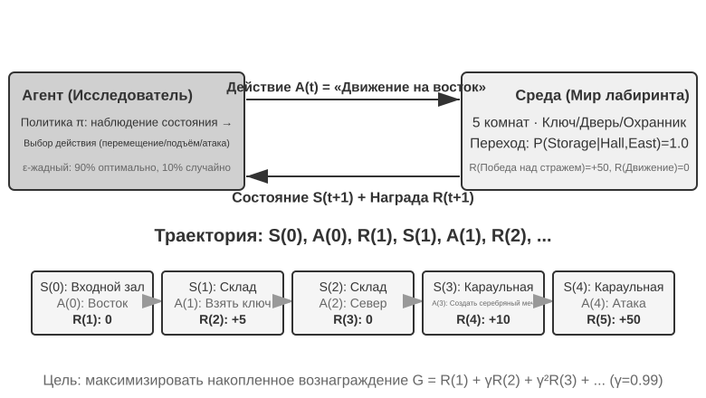

В результате взаимодействия возникает **траектория** — полная запись вида «состояние→действие→награда→новое состояние→действие→награда...», и качество политики в конечном счёте отражается именно в качестве траектории. **Функция ценности (Value Function)** отвечает на вопрос: «Если я сейчас нахожусь в этом состоянии и буду действовать согласно текущей политике, сколько всего наград я в итоге получу?» Это похоже на то, как опытный шахматист, взглянув на позицию, не просчитывает всё до конца, а интуитивно оценивает вероятность выигрыша в этой партии. (Если заменить здесь «текущую политику» на «оптимальную политику», получится оптимальная функция ценности — она понадобится далее в этой главе при рассмотрении уравнения оптимальности Беллмана.) Граница между агентом и средой подчиняется простому принципу: **всё, что агент не может произвольно изменить, относится к среде**.

Два уникальных признака, отличающих обучение с подкреплением от обучения с учителем (требующего размеченных правильных ответов) и обучения без учителя (обнаружение скрытых закономерностей в данных), — это **поиск методом проб и ошибок** (агент должен сам нащупывать, какие действия хороши, — учителя, прямо указывающего правильный ответ, нет) и **отложенная награда** (эффект действия может проявиться лишь через много шагов, например ценность удачного хода в шахматах становится видна только к концу партии). Отсюда возникает уникальный **компромисс между исследованием и использованием (Exploration-Exploitation Tradeoff)**: если постоянно идти по знакомому пути, не научишься ничему новому; если постоянно пробовать наугад, никогда не дойдёшь до цели.

Система обучения с подкреплением включает пять ключевых элементов:

- **Пространство действий**: определяет полный набор действий, доступных агенту. Действия могут быть дискретными (например, «каким ходом пойти» в шахматах — ограниченный набор вариантов) или непрерывными (например, «на сколько градусов повернуть сустав» у робота — непрерывное числовое значение).
- **Политика**: правило поведения агента, определяющее, что делать в данном состоянии. Политика может быть простой (таблица соответствий: увидел состояние A — выполни действие X) или сложной (глубокая нейронная сеть).
- **Сигнал награды**: немедленная обратная связь от среды. Однако цель агента — максимизировать долгосрочную, а не мгновенную награду — это принципиальное различие, подобное тому, как в инвестициях нельзя смотреть только на сегодняшнее колебание курса, важна долгосрочная доходность.
- **Функция ценности**: оценивает, сколько всего кумулятивной награды можно получить в будущем, начиная с данного состояния, помогая агенту принимать разумные решения даже без немедленной обратной связи. Одно из важнейших открытий за шестьдесят лет исследований в области RL — центральная роль оценки ценности.
- **Модель среды** (опционально): предсказывает реакцию среды на действие. Методы с моделью среды называют **методами на основе модели** (сначала научиться предсказывать, как изменится среда, а затем планировать исходя из этого), методы без модели среды — **безмодельными методами** (не предсказывать среду, а учиться напрямую из опыта).

Таблица 8-3 сравнивает ключевые составляющие различных агентных систем, показывая универсальность концепции агента и помогая читателю увидеть различие в пространствах действий между традиционным RL-агентом и современным LLM-агентом.

Таблица 8-3. Сравнение ключевых элементов различных агентных систем

| Тип агента | Среда | Пространство действий | Сигнал награды |
|---------------|---------------------|----------------------------------|-------------------------|
| **Новорождённый детёныш антилопы** | Рельеф, гравитация, положение тела | Непрерывное высокой размерности (сокращение различных групп мышц) | Равновесие (+), падение (–) |
| **Робот-пылесос** | Планировка помещения, заряд батареи | Дискретное (направление, всасывание, зарядка) | Убранная площадь (+), разряд батареи (–) |
| **Шахматный гроссмейстер** | Положение на доске, ограничение по времени | Дискретное, конечное (допустимые ходы) | Выигрыш (+1), проигрыш (–1) |
| **Агент службы поддержки клиентов** | История диалога, база знаний | Открытое (размышление, реплика, вызов API) | Решение проблемы (+), время обработки (–) |
| **Кодинг-агент-помощник** | Документация требований, кодовая база | Открытое (размышление, поиск, редактирование, выполнение) | Прохождение тестов (+), внесение бага (–) |

Таблица раскрывает важное наблюдение: пространство действий традиционного RL-агента (шахматы, робототехника) замкнуто, тогда как пространство действий современного агента на основе LLM (служба поддержки клиентов, кодинг-помощник) открыто, почти бесконечно, и при этом может использовать особое действие — «внутреннее размышление» — для повышения своих возможностей.

### Две парадигмы агентов: от MDP к LLM+RL

Самое фундаментальное различие между ними — в пространстве действий: MDP предполагает конечное и замкнутое пространство действий (вверх/вниз/взять/положить), тогда как пространство действий LLM — это открытая, комбинаторно взрывная последовательность естественного языка. Это различие определяет коренное расхождение двух парадигм в дизайне алгоритмов, эффективности использования данных и способности к обобщению. Разберём их по порядку.

**Традиционная парадигма: MDP и Q-обучение.**

MDP (Markov Decision Process, марковский процесс принятия решений) — это математический каркас обучения с подкреплением, определяющий такие ключевые элементы, как состояния, действия, награды. В его основе лежит **марковское свойство**: будущее зависит только от текущего состояния и не зависит от более ранней истории. По аналогии: в шахматах достаточно смотреть на текущую позицию на доске, чтобы принять оптимальный ход, — не нужно вспоминать, как были сделаны все предыдущие ходы. Это предположение упрощает задачу, но одновременно ограничивает способность моделировать зависимость от истории.

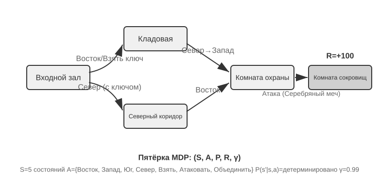

Ключевая особенность традиционного RL-агента — **замкнутое пространство действий**: все действия, которые агент может предпринять, образуют предопределённое конечное множество. **Классические агенты для настольных игр** — самый типичный пример: в го 361 позиция для хода хоть и огромна, но полностью определена и конечна; в шахматах разные фигуры двигаются по разным правилам, но действия всё равно можно перечислить; в играх Atari всего от нескольких до десятка с небольшим дискретных действий. **Роботизированные агенты** представляют непрерывное, но ограниченное пространство действий: углы суставов, скорость, сила захвата — непрерывные величины, но у всех есть чёткие физические границы (максимальный угол поворота, максимальный крутящий момент, ограничение скорости), а размерность определяется числом степеней свободы робота.

Эта замкнутость даёт вычислительное преимущество: можно перебрать все действия и оценить каждое по отдельности, что удобно для динамического программирования и поиска по дереву методом Монте-Карло, а функцию ценности действия можно приближать таблицей или простой функцией. Но она же ограничивает выразительность и способность к обобщению. Традиционный RL-агент начинает с нуля и учится чисто методом проб и ошибок — стартует со случайной политики, собирает опыт, обновляет функцию ценности или политику и повторяет это до сходимости.

В рамках этого каркаса один из самых базовых и важных алгоритмов — **Q-обучение**. Он поддерживает оценку ценности для каждой пары «состояние — действие»: сколько всего награды можно получить, если в состоянии s выполнить действие a, а затем всегда действовать по оптимальной политике? Интуитивно, насколько хорошо действие, зависит от немедленной отдачи, которую оно приносит, плюс от того, «насколько хорошо то состояние, в которое оно вас приводит».

Если записать эту интуицию в виде уравнения, получится ключевое рекурсивное соотношение знаменитого в учебниках по RL **уравнения Беллмана** (Bellman equation): **истинная ценность действия = немедленная награда, полученная на этом шаге, + максимальная будущая ценность, доступная после перехода в следующее состояние**:

$$Q^*(s, a) = r + \gamma \max_{a'} Q^*(s', a')$$

где $r$ — немедленная награда, $s'$ — следующее состояние, в которое агент попадает после выполнения действия (здесь для наглядности записано в детерминированной форме; в стохастической среде нужно брать математическое ожидание по $s'$), а $\gamma \in [0, 1)$ — **коэффициент дисконтирования**: он определяет, насколько сильно агент ценит будущее — чем ближе $\gamma$ к 1, тем больше веса у долгосрочной отдачи, чем ближе к 0, тем сильнее агент заботится только о ближайшем результате. Упомянутая ранее неоднократно «накопленная награда» — это как раз сумма наград на каждом шаге, продисконтированных по $\gamma$: $\sum_{t} \gamma^{t} r_t$. После каждого действия алгоритм чуть-чуть подправляет старую оценку в сторону «того, что произошло на самом деле» — такая парадигма «корректировки старой оценки одним реальным шагом» называется **обучением с временны́ми различиями** (Temporal-Difference Learning, TD learning); после тысяч и тысяч проб и ошибок оценка постепенно приближается к истинному значению.

Два рисунка ниже показывают, соответственно, процесс исследования Q-обучением решётчатого мира и постепенную сходимость Q-значений.

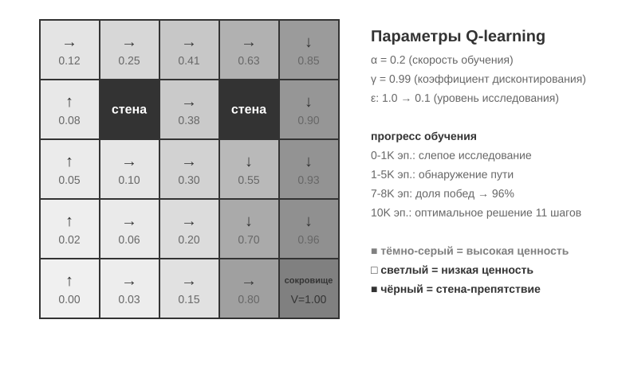

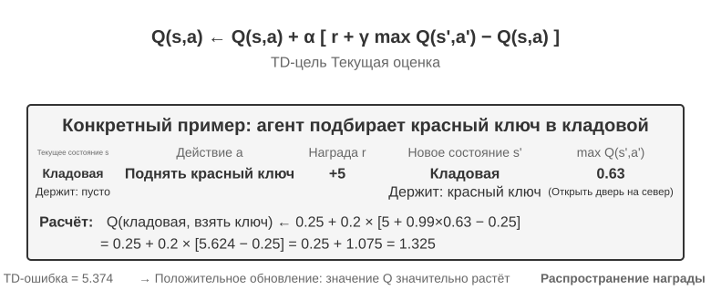

Q-обучение относится к особому классу методов **вне политики (Off-Policy)** — оно может обучаться оптимальной политике на данных, сгенерированных любой политикой (включая случайное исследование). Строгое определение понятий «в политике / вне политики» и их соответствие постобучению LLM см. в разделе «Сравнение алгоритмов обучения с подкреплением» далее.

> **Эксперимент 8-1 ★: поведение Q-обучения в игре про поиск сокровищ**
>
> Чтобы проверить особенности и ограничения Q-обучения, мы спроектировали игровую среду **«поиск сокровищ»**. Эта среда содержит несколько ключевых сложностей: **скрытые механики** требуют, чтобы агент самостоятельно обнаружил соответствие между ключами и дверями, эффекты оружия и правила создания предметов; **многошаговые зависимости** означают, что для завершения задачи нужна правильная последовательность действий (оптимальное решение — 11 шагов); **разреженная награда** означает, что заметная награда даётся только за ключевые действия и итоговую победу, а на большинство промежуточных шагов не приходит вообще никакой обратной связи.
>
> Агент на Q-обучении использует стандартную конфигурацию параметров и стратегию ε-жадного исследования (большую часть времени выбирается текущее лучшее действие, иногда предпринимается случайная попытка, а по мере обучения доля случайного исследования постепенно снижается).
>
> Кривая обучения демонстрирует типичные черты (episode — это один полный проход игры, от начала до прохождения или провала, считается за один эпизод):
> - **первые 1000 эпизодов**: 0% побед, Q-таблица содержит всего 124 состояния, агент занимается слепым исследованием
> - **первые 5000 эпизодов**: устойчивых побед по-прежнему нет, Q-таблица — 133 состояния
> - **7000–8000 эпизодов**: доля побед постепенно растёт с 34% до 96%
> - **10000 эпизодов**: 100% побед, Q-таблица — 145 состояний, найдено оптимальное решение в 11 шагов
>
> Всё обучение занимает менее 10 секунд (эффективность симуляции чрезвычайно высока), но требует почти 10000 полных попыток. Это демонстрирует ключевую особенность Q-обучения: нужно огромное количество случайного исследования, чтобы случайно пройти весь маршрут целиком, сигнал ценности распространяется очень медленно и должен многократно подкрепляться. Чисто символическое обучение без априорных знаний способно лишь на грубый перебор пространства состояний.
>
> В игровом симуляторе 10000 попыток проб и ошибок занимают всего 10 секунд, и цена этого ничтожна. Но в реальных сценариях с агентами — где каждый звонок стоит денег, каждое действие в браузере вносит задержку, а каждое ошибочное решение может привести к необратимым последствиям — 10000 проб и ошибок совершенно неприемлемы. Именно поэтому современные агенты перешли на методы на основе LLM: они используют знания, накопленные при предобучении, чтобы принимать эффективные решения при минимальном числе взаимодействий.
>
> У MDP есть три фундаментальных ограничения: низкая эффективность использования данных (нужно огромное число взаимодействий, чтобы освоить даже простую задачу), слабая способность к обобщению (знания, полученные в одной среде, с трудом переносятся в другую) и невозможность использовать априорные знания (каждую новую задачу приходится учить с нуля). Как только речь заходит о таком сложном пространстве состояний, как естественный язык или изображения высокой размерности, эти ограничения становятся особенно заметны.

**Современная парадигма: агенты на основе LLM+RL.**

Большие языковые модели принесли совершенно новую парадигму агентов, фундаментально изменив способ их построения — в частности, дизайн пространства действий.

Агент традиционного RL мог получать обратную связь только через изменение среды: сделать следующий ход, пройти шаг по лабиринту. Но LLM привнесли совершенно новый тип действия — внутреннее размышление. Размышление не меняет внешний мир, но заметно улучшает качество итогового действия. Этот сдвиг меняет всё: пространство действий агента теперь включает не только «что делать», но и «сколько думать и о чём».

Важнейшее нововведение — **включение размышления (Thinking) в пространство действий как особого вида действия**. В традиционном RL агент мог выполнять только внешние действия, изменяющие состояние среды (переместиться, атаковать, подобрать); а в LLM-агенте **внутреннее размышление становится ключевым компонентом пространства действий** — оно не меняет напрямую внешнюю среду, не даёт немедленной награды, почти не ограничено по количеству и обходится относительно дёшево.

Традиционному RL трудно работать с таким типом действий — причина в том, что пространство исследования слишком велико и лишено структуры: агент, обучающийся с нуля, подобен человеку с завязанными глазами, ищущему клад в пустыне, — он может только натыкаться на него случайно. LLM устроена иначе. Пройдя предобучение на огромных массивах текста, она уже впитала выработанные человечеством правила мышления: при решении математических задач следует схеме «выявить условия → вспомнить формулы → пошагово вычислить», при написании кода — «понять требования → спроектировать структуру → реализовать детали». Это заставляет мышление LLM двигаться по структурированным путям, что сильно сжимает пространство поиска. Поэтому даже без дополнительного RL-обучения предобученная LLM способна генерировать цепочку рассуждений (Chain of Thought, CoT) с базовой логикой. Эта базовая логика происходит из огромного объёма человеческих мыслительных процессов в обучающем корпусе (решение математических задач, комментарии к коду, ответы в дебатах и т. д.) — модель через предсказание следующего токена неявно научилась тому, «какой должна быть форма рассуждения на следующем шаге».

Постобучение с помощью RL, в свою очередь, через внешнюю награду учит LLM более эффективно применять эти правила в конкретных задачах. Сама структура языка тоже даёт своего рода скрытую внутреннюю награду: логически связная цепочка рассуждений (например, «поскольку нужно перевести иностранную валюту в доллары, поэтому сначала нужно узнать курс обмена») генерируется с высокой вероятностью, а логически бессвязная (например, «поскольку нужно перевести валюту, поэтому сначала нужно узнать погоду») — с крайне низкой, что естественным образом направляет модель к разумным путям рассуждения.

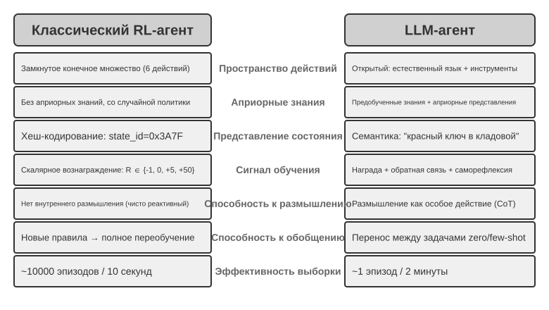

Эта способность мыслить, опирающаяся на внутренние правила языка, позволяет LLM-агенту понимать инструкции, которых он никогда раньше не видел (обобщение без примеров, zero-shot), а также осваивать новые задачи по минимальному числу примеров (адаптация по нескольким примерам, few-shot) — что кардинально отличается от парадигмы традиционного MDP-агента, требующей огромного числа проб и ошибок. Кроме того, новая парадигма обладает такими способностями, как комбинаторное обобщение (перекомбинирование уже известных понятий для новых ситуаций), обучение в контексте (быстрая адаптация через подсказки и примеры) и мультимодальное понимание (естественная интеграция зрения, языка, действий и других модальностей). Стоит отметить, что **эффект** обучения в контексте (обобщение без примеров, адаптация по нескольким примерам) и его **внутренний механизм** — это разные вещи: как отмечалось во второй главе, механизм внимания по своей работе больше похож на поиск, чем на рассуждение, но это никак не мешает ему давать мощный практический эффект в адаптации к задачам.

Эволюция от замкнутого пространства действий к открытому отражает фундаментальный сдвиг парадигмы ИИ-агентов. Помимо внутреннего размышления, разнообразие параметров инструментов (запросы на естественном языке, программный код, сложные JSON-структуры, мультимодальный контент) делает фактическое пространство действий практически бесконечным — интерпретатор кода теоретически может выполнить любую вычислимую задачу, а поисковый инструмент способен исследовать всё информационное пространство интернета. Это порождает как новые возможности (агент может браться за ранее невиданные задачи, решать сложные проблемы путём комбинирования базовых инструментов), так и новые вызовы (как определять и оптимизировать функцию награды в открытой среде, как эффективно вести поиск в бесконечном пространстве действий).

На примере таких моделей, как Kimi K3, оптимизированных под вызов инструментов и длинные цепочки рассуждений, можно увидеть типичное направление парадигмы LLM+RL: на базе масштабного языкового предобучения постобучение усиливает способности к декомпозиции задач, вызову инструментов и самокоррекции. **OpenVLA**[^ch8-21] (подробнее в главе 6), в свою очередь, демонстрирует парадигму архитектуры VLA (визуально-языково-действенной модели) эпохи LLM: визуальный кодировщик обрабатывает наблюдения среды, языковая модель понимает инструкции и рассуждает, декодер действий генерирует управляющие сигналы — так реализуется управление, обусловленное языком, и обобщение между задачами. Нужно уточнить: сам OpenVLA обучен методом имитационного обучения (поведенческого клонирования) на почти миллионе роботизированных **демонстрационных траекторий**, то есть по своей природе относится к SFT, а не к RL; истинным представителем того, как RL действительно внедряется в робототехнику и как поверх архитектуры типа VLA проводится дальнейшая оптимизация с помощью награды, служит SimpleVLA-RL из эксперимента 8-13 далее в этой главе.

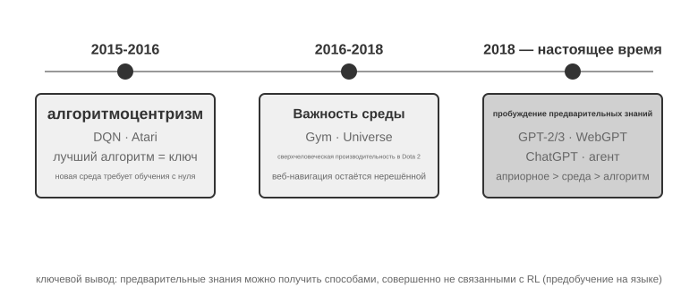

**Путь исследований OpenAI** (подробно описанный Яо Шуньюем (доцентом Принстонского университета, автором статьи ReAct) в «The Second Half»[^ch8-2]) раскрывает эволюцию мышления. **Первый этап (2015–2016), алгоритмоцентризм**: убеждение, что ключ — в лучших алгоритмах; прогресс достигнут в стандартных средах вроде Atari, но при переходе в новую среду обучение приходилось начинать заново. **Второй этап (2016–2018), важность среды**: Gym стандартизировал разнообразные задачи, Universe и World of Bits пытались превратить весь интернет в тренировочную среду для RL, Dota 2 стремилась к сверхчеловеческим результатам в конкретной сложной среде. Идея была ясной, но универсальное использование компьютера и навигация по веб-страницам так и не поддавались прорыву.

**Третий этап (с 2018 года по настоящее время), пробуждение приоритета** — приоритета априорных знаний: GPT-2/GPT-3 продемонстрировали мощь языкового предобучения, а WebGPT и ChatGPT доказали, что эти априорные знания можно превратить в практичных агентов. Важнейшее открытие: **априорные знания можно получить способом, вообще не связанным с RL**. Это контринтуитивная истина: приоритеты исследователей RL на протяжении десятилетий, возможно, были полностью перевёрнуты — не «алгоритм > среда > априорные знания», а «априорные знания > среда > алгоритм».

> **Эксперимент 8-2 ★★: сравнительное исследование традиционного RL и LLM-агента**
>
>
> 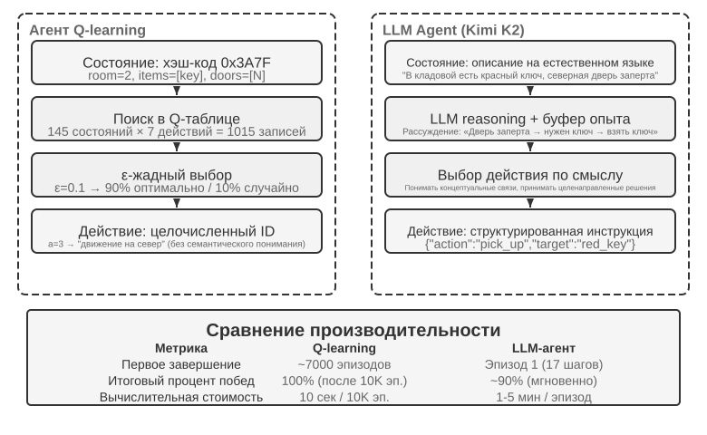
>
>
> В одной и той же игре про поиск сокровищ сравнили Q-обучение и LLM-агента (Kimi K3, поддерживающий буфер опыта не более 50 записей). Результат оказался поразительным: **LLM-агент прошёл игру уже в первом же прогоне за 18 шагов**.
>
> **Начальная фаза (целенаправленное исследование)**: подбирает ржавый меч («оружие лучше, чем ничего»), систематически исследует карту, обнаружив, что северная дверь заперта, делает вывод «нужно найти ключ» и переключается на исследование кладовой, где последовательно получает красный ключ и магический кристалл. **Средняя фаза (понимание механики и активный синтез)**: понимает правило «ключи используются автоматически» и заранее предвидит, что ржавого меча не хватит против стража, поэтому на 8-м шаге сам синтезирует серебряный меч. **Финальная фаза (исполнение и исправление ошибок)**: с серебряным мечом направляется на север, на 13-м шаге побеждает сильного стража, при этом попутно совершает пару неэффективных попыток (повторный взмах мечом/отступление), и в итоге на 18-м шаге получает сокровище дракона.
>
> Это демонстрирует фундаментальное различие между семантическим пониманием и символическим отображением. LLM-агент понимает концептуальную структуру игры, у каждого его шага есть цель и логическое обоснование. А для Q-обучения «дверь», «ключ», «меч» — это всего лишь бессмысленные комбинации символов, связи между которыми можно обнаружить лишь постепенно, через масштабное статистическое обучение.
>
> Вычислительная стоимость создаёт интересный парадокс: Q-обучению нужно всего 10 секунд, чтобы пройти 10000 эпизодов, а LLM-агенту требуется 1–2 минуты на один эпизод. Но в реальных задачах затраты времени, денег и риска на каждое взаимодействие значительно превышают чисто вычислительную стоимость, поэтому сравнивать только время работы GPU было бы нечестно. Более важное наблюдение: успех LLM-агента объясняется не тем, что у него «лучший алгоритм обучения», а тем, что он несёт с собой огромный объём априорных знаний. Когда правила игры меняются, Q-обучению требуется полное переобучение с нуля, а LLM-агент способен адаптироваться напрямую через рассуждение. Отсюда можно вывести практический принцип проектирования: в сценариях с низкой стоимостью симуляции и большим числом повторений традиционный RL по-прежнему ценен; в реальных сценариях с высокой стоимостью взаимодействия и потребностью в быстрой адаптации эффективность использования данных у LLM-агента более практична.

Что касается взаимодействия между контекстной адаптацией, обновлением внешних артефактов и обновлением параметров, концептуальная карта уже представлена в первой главе, и в конце этой главы, в разделе «Полная картина», мы к этой теме вернёмся. Основная линия этой главы — постобучение: то, как способности, которые трудно полностью выразить внешними правилами, «прописываются» в параметрах модели.

## Основы предобучения моделей `[Дополнительное чтение]`

Чтобы понять, почему методы постобучения работают, нужно сначала разобраться, что закладывает предобучение. Постобучение (SFT и RL) по сути представляет собой оптимизацию внутри пространства представлений, построенного на этапе предобучения — структура знаний, заложенная предобучением, определяет потолок возможностей постобучения. Поэтому мы рассмотрим ключевые аспекты предобучения на трёх экспериментах: обучение небольшой языковой модели с нуля, расширение визуальных возможностей и внедрение знания нового языка. Эти три эксперимента носят вспомогательный характер и помогают читателю выработать интуитивное понимание предобучения (Pretraining, то есть исходного обучения на масштабных данных, в ходе которого модель усваивает базовые закономерности языка и знания о мире) — читатели, уже знакомые с процессом предобучения, могут этот раздел пропустить.

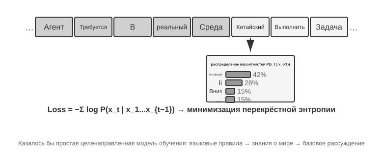

Обучение языковой модели следует трёхэтапному процессу «токенизация — предобучение — постобучение». Токенизация (tokenization) разбивает текст на дискретные единицы — например, фраза «Мне нравится программировать» может быть разбита на токены «Мне», «нравится», «программ», «ировать» — эти токены и есть минимальные единицы, с которыми работает модель. Задача предобучения концептуально проста: модели показывают первую часть текста и просят предсказать, каким будет следующий токен. Модель сравнивает своё предсказание с правильным ответом (эта разница называется потерей (Loss); чем меньше потеря, тем точнее предсказание) и постоянно корректирует свои параметры. После многократного повторения на огромных объёмах текста модель постепенно усваивает закономерности языка, знания о мире и базовые способности к рассуждению. После завершения предобучения модель умеет генерировать связный текст, но её вывод лишён структуры и плохо следует инструкциям. Постобучение с помощью SFT (обучение на размеченных парах вход-выход) и оптимизации предпочтений (например, DPO, которая учит модель выдавать ответы, более предпочтительные для человека) превращает её в практичного помощника.

> **Эксперимент 8-3 ★★: обучение LLM с нуля — сила алгоритмических улучшений**
>
> На примере MiniMind 2 (сто миллионов параметров) реализован полный цикл обучения на потребительском GPU. Благодаря двум алгоритмическим оптимизациям (QK Norm и оптимизатор Muon) скорость сходимости выросла в 3 раза, качество генерации заметно улучшилось — при этом затраты минимальны: общее время обучения около 14 часов, стоимость около 34 долларов.
>
> Эффект по стадиям обучения: после предобучения модель может отвечать на фактологические вопросы вроде «самая высокая гора в мире», но формат нерегулярный; после SFT заметно улучшается следование инструкциям и формат вывода — модель умеет организовывать ответ ожидаемым образом; оптимизация предпочтений дополнительно снижает число фактических ошибок и неестественных формулировок. У модели со ста миллионами параметров всё ещё есть явные ограничения (легко ошибается на сложных вопросах), но вывод таков: **при фиксированном небольшом бюджете алгоритмические улучшения выгоднее простого наращивания масштаба**.

> **Эксперимент 8-4 ★★: обучение собственной VLM**
>
>
> 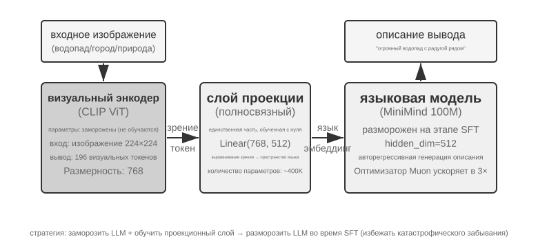
>
>
> VLM объединяет визуальное восприятие и понимание языка в единой модели; ключевая сложность — межмодальное согласование, то есть увязка «увиденного» с «сказанным». Архитектура состоит из трёх компонентов: **визуальный кодировщик** (например, CLIP, параметры зафиксированы) извлекает семантические признаки изображения; **проекционный слой** (лёгкий, единственная часть, обучаемая с нуля) выступает «переводчиком» между визуальными признаками и языковой моделью, отображая визуальные признаки в пространство представлений, понятное языковой модели; **языковая модель** генерирует текст описания. Обучение построено по стратегии «заморозить LLM + обучать только проекционный слой», чтобы избежать катастрофического забывания (Catastrophic Forgetting, то есть потери старых навыков после освоения новых); после предварительного согласования LLM размораживается, и на качественных парах изображение-описание проводится SFT — детальность и точность описаний заметно улучшаются.
>
> Этот эксперимент раскрывает базовую парадигму обучения мультимодальных моделей: переиспользование результатов одномодального предобучения и достижение межмодального согласования через обучение лёгкого проекционного слоя — эффективно и масштабируемо, но выразительная способность проекционного слоя ограничена и может стать узким местом для глубокого межмодального понимания. Тот же каркас «визуальный кодировщик + проекционный слой + LLM», если продвинуть его ещё на шаг вперёд и заставить модель выдавать действия, — это модель VLA (визуально-языково-действенная), представленная в главе 6.

> **Эксперимент 8-5 ★★: продолженное предобучение для изучения нового языка**
>
> На основе Mistral 7B v0.3 (предобучена в основном на английском, корейский язык практически не понимает) через продолженное предобучение на корейской Википедии внедряются знания корейского языка — это неконтролируемое обучение на данных нового языка поверх уже предобученной модели: модель уже обладает общей способностью к языковому моделированию, ей нужно лишь адаптироваться к новому распределению данных, что обходится намного дешевле обучения с нуля. Ключевой инженерный момент — использование смешанных данных (около 80% корейского + 20% английского) для смягчения катастрофического забывания: слишком высокая доля целевого языка приводит к деградации исходного языка, слишком низкая — к недостаточной эффективности обучения. В конце проводится SFT на корейских инструктивных данных для получения практичной способности вести диалог на корейском. Вывод этого эксперимента ещё пригодится нам в конце главы при описании полной картины: чтобы модель запомнила большой объём новых предметных знаний, нужно продолженное предобучение, а не SFT.

Три эксперимента по предобучению вместе раскрывают одну закономерность: при ограниченном бюджете алгоритмические улучшения и архитектурные новшества выгоднее простого наращивания масштаба. Что важнее, предобучение наделяет модель описательными знаниями и способностью к языковому моделированию, но ей не хватает структурированного следования инструкциям и целенаправленного поведения — именно этот пробел призван заполнить SFT.

Имея базовые возможности, заложенные предобучением, следующий шаг — превратить универсальную модель в практичного агента с помощью постобучения. Первый этап постобучения — дообучение с учителем (SFT).

## Mid-training: пополнение знаний и базовых навыков

Под **Mid-training** здесь понимается дополнительный этап языкового моделирования на целевом распределении, начиная с готовой базовой модели. Обычно сохраняется next-token objective, а loss считается по всем токенам документов, кода или выкладок. Исследования DAPT/TAPT показывают, что второй этап на неразмеченном доменном или связанном с задачей корпусе способен улучшить downstream-качество[^ch8-30].

Он закрывает **пробелы в знаниях** о языке, терминах, внутренних документах и кодовой базе, а также **пробелы базовых навыков** длинного контекста, кода, математики и мультимодальных представлений, когда даже множество выборок не даёт решения. SFT может запомнить немного фактов, но несколько QA-пар укрепляют лишь узкие пути доступа и плохо подходят для большого связного корпуса знаний. Надёжная последовательность: Mid-training усваивает знания/навыки → небольшое SFT задаёт протокол → RL после появления ненулевого успеха[^ch8-31].

### Смесь данных и программа увеличения контекста

Смесь на этапе длины $i$:

$$
D_i=\alpha_iD_{\text{long}}+\beta_iD_{\text{atomic}}+\gamma_iD_{\text{agent}}+\delta_iD_{\text{replay}},
\qquad \alpha_i+\beta_i+\gamma_i+\delta_i=1.
$$

Доли считают по **токенам**, а не документам. $D_{\text{long}}$ — книги, длинные документы и репозитории; $D_{\text{atomic}}$ — поиск, многошаговое рассуждение, следование инструкциям, агрегация и статистика; $D_{\text{agent}}$ — планирование, выбор/вызов инструментов, длительное отслеживание состояния и восстановление. $D_{\text{replay}}$ сохраняет как общие короткие данные, так и уже освоенные короткие задачи, «поднятые» до текущей длины с изменёнными позициями подсказок и помехами. Нужны дедупликация, фильтрация качества и проверка загрязнения оценки.

Mid-training должен превратить номинальное окно в **эффективное целевое окно**, одновременно развивая длинные рассуждения, планирование и инструменты. Смена `max_position_embeddings` с 32K на 128K доказывает лишь приём ввода. Используйте curriculum вроде 8K → 16K → 32K → 64K → 128K с учётом модели, цели и бюджета[^ch8-36]. Перед расширением доведите на текущей длине NIAH, поиск, multi-hop, агрегацию/статистику, базовое планирование и выбор инструментов.

Если $M(\theta,c,L)$ — оценка модели $\theta$ по навыку $c$ на длине $L$, применяются три шлюза:

$$
\begin{aligned}
M(\theta_i,c,L_i)&\geq\tau_{c,i},\\
M(\theta_i,c,L_i)&\geq M(\theta_i,c,L_{i-1})-\epsilon_{\text{len}},\\
M(\theta_i,c,L_{i-1})&\geq M(\theta_{i-1},c,L_{i-1})-\epsilon_{\text{retain}}.
\end{aligned}
$$

Они требуют пройти текущую длину, не потерять тот же навык при удлинении и не забыть старый навык на новом этапе. Для второго сравнения нужны задачи одинаковой сложности, отличающиеся только длиной; $\epsilon$ берут из доверительных интервалов повторной оценки. Если критический навык не проходит, увеличьте соответствующие атомарные данные, данные текущей длины или replay, а не только номинальное окно.

| Навык | Benchmark | Основная диагностика |
| --- | --- | --- |
| Позиция, поиск, отслеживание, агрегация | NIAH, RULER | Деградация по позиции/числу needle, multi-hop, агрегации и длине; NIAH — лишь smoke test |
| Реальные длинные документы | LongBench, LongBench v2 | QA по одному/нескольким документам, длинный диалог, in-context learning, структурированные данные по категориям и длинам |
| Длинный код | Repository-задачи LongBench v2, LongCodeU | Кодовые единицы, связи между файлами, понимание репозитория |
| Планирование и инструменты | PlanningArena и прежние tool benchmarks | Декомпозиция, выбор, память, аргументы и состояние |
| Сквозной Agent | SWE-bench Verified, $\tau^2$-bench, Terminal-Bench | План, инструменты, восстановление и завершение в реальной длинной траектории |

RULER расширяет NIAH до нескольких needle, multi-hop и агрегации[^ch8-37]; LongBench v2 охватывает реальные документы, диалоги, репозитории и структурированные данные[^ch8-38]; LongCodeU и PlanningArena диагностируют длинный код и планирование/инструменты[^ch8-39][^ch8-40]. Официальные test set оставляйте только для оценки; обучайте на похожих, но непересекающихся примерах и отчитывайтесь по длине, навыку и типу ошибки. Один NIAH или leaderboard не доказывает длинное рассуждение.

Обновляемые факты, цитирование, контроль доступа и удаление относятся к RAG. Перед крупным full-parameter Mid-training проверьте смесь малым экспериментом.

## SFT (дообучение с учителем)

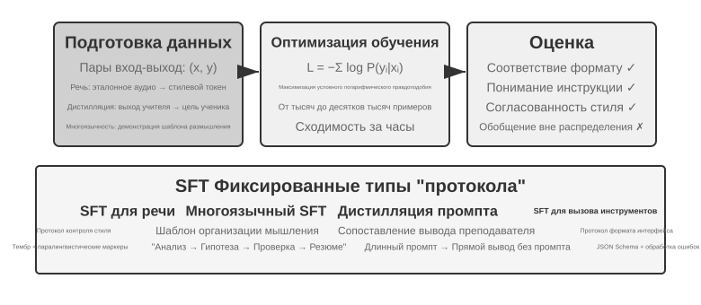

раздел «Предобучение, SFT, RL: панорама трёх этапов» уже раскрыл суть SFT (смена данных, «предсказание следующего слова» с расчётом потерь только на ответе). В этом разделе на четырёх экспериментах посмотрим, что именно фиксирует этот механизм «записи устойчивых соответствий и протоколов в параметры» применительно к разным задачам. Ценность SFT — не во внедрении новых знаний, а в **фиксации протокола**: соответствия, форматы взаимодействия, стилевые нормы записываются в параметры, так что при выводе не требуется громоздкий промпт, чтобы получить ожидаемый результат. Обычно достаточно от нескольких тысяч до нескольких десятков тысяч качественных примеров, чтобы заложить базовую способность вести диалог и следовать инструкциям.

Эта высокая эффективность может обойтись зависимостью от обучающего распределения: в задачах, где требуется исследовать несколько верных стратегий, или когда распределение при развёртывании уходит от демонстрационных данных, SFT склонен воспроизводить продемонстрированные шаблоны, и качество на новых сценариях падает. Следующие четыре эксперимента показывают процесс «закрепления протокола» с разных сторон.

Прежде чем браться за SFT, возникает неизбежный практический вопрос: **откуда берутся данные для SFT?** В индустрии ответ сводится в основном к трём путям:

- **Демонстрации экспертов-людей** — самый высокий потолок качества, но дорого и медленно; годятся как «посевные данные», задающие формат и стиль;
- **Генерация моделью-учителем** — то есть синтетические данные: сильная модель массово производит пары «вход — выход», которые после фильтрации дистиллируются в ученика; см. эксперименты 8-8 и 8-9;
- **Отбраковочное сэмплирование** — модель сама сэмплирует несколько кандидатов для одной задачи, верификатор отбирает верные, и на них она дообучает себя же; см. эксперимент 8-9.

Эти три пути часто комбинируют: сначала небольшим числом рукописных «семян» закрепляют формат, затем моделью-учителем наращивают объём, и напоследок отбраковочным сэмплированием выравнивают качество. Каким бы путём ни идти, схема построения примерно одна: определить распределение задач и схему вывода, массово породить кандидатов, отфильтровать качество проверкой по правилам, контролем формата и выборочной ручной проверкой, а затем дедуплицировать, сбалансировать пропорции и обеспечить разнообразие. Гнаться за объёмом не нужно: нескольких тысяч или десятков тысяч качественных примеров обычно достаточно, чтобы закрепить протокол, и лучше отшлифовать десять тысяч чистых примеров, чем свалить в кучу сто тысяч грязных, ведь любой шум в данных SFT способен добросовестно записать в параметры.

> **Эксперимент 8-6 ★★★: SFT для речи — от «клонирования голоса» к «моделированию паралингвистики» `[Расширенный эксперимент]`**
>
> На примере Orpheus (клонирование голоса через контекстные подсказки) и Sesame (моделирование паралингвистических маркеров) показывается, как «стиль голоса и манера речи» записываются в параметры. Подходы различаются:
>
> - **Orpheus**: сжимает звуковую волну в последовательность токенов и, соединяя референсные аудиозаписи одного и того же говорящего, учит модель «говорить голосом этого человека», добиваясь согласованности тембра между предложениями.
> - **Sesame**: абстрагирует смех, вздохи и другие паралингвистические явления в специальные маркеры вроде `<laugh>`, `<sigh>` и обучает модель «увидев маркер — издавать соответствующий звук».
>
> В экспрессивных задачах SFT фиксирует протокол управления стилем и структурированные привычки выражения, а не фактические знания или сложное рассуждение. Ключевой фактор — разнообразие обучающих данных и качество разметки. Типичные ошибки: слишком мало говорящих в обучающих данных — и все звучат одинаково; переобучение (Overfitting, то есть механическое запоминание моделью деталей обучающих примеров, из-за чего в новых ситуациях она показывает результат ещё хуже) на маркерах приводит к «механическому смеху».

> **Эксперимент 8-7 ★★★: многоязычное мышление — заставляем модель думать на любом языке `[Расширенный эксперимент]`**
>
> Большинство моделей с режимом размышления «думают» только по-английски: независимо от языка запроса, внутренняя цепочка рассуждений модели почти всегда на английском, потому что качественные примеры рассуждений в обучающих данных в основном написаны по-английски. Цель этого эксперимента проста — научить модель размышлять на заданном языке.
>
> Метод заключается в SFT модели gpt-oss-20b: в системную инструкцию добавляется фраза `reasoning language: German` (или на другом языке), затем модель обучается на примерах рассуждений на английском, испанском, французском и других языках. В обучающих данных **полностью отсутствует китайский**, но после завершения обучения достаточно установить reasoning language в Chinese — и модель способна вести полную цепочку рассуждений на китайском. Это обобщение на новый язык без единого примера (zero-shot) и есть самая интересная находка эксперимента. Важно понимать: это не способность к обобщению самого SFT. Многоязычное предобучение уже сформировало в модели общее межъязыковое пространство представлений, а SFT лишь активировал эту межъязыковую способность, заложенную ещё на этапе предобучения.

> **Эксперимент 8-8 ★★: дистилляция промпта — воспроизведение практичных возможностей при меньших затратах**
>
> В реальных приложениях, чтобы модель справлялась со сложными задачами, часто требуются громоздкие системные промпты (тысячи, а то и десятки тысяч токенов), и каждый вызов увеличивает задержку и стоимость. При использовании крупных моделей с режимом размышления внутренние токены рассуждения дополнительно увеличивают затраты. Идея дистилляции промпта — сжать поведение «длинный промпт + модель-учитель с размышлением» в «короткий промпт (или его отсутствие) + модель-ученик без размышления». Учитель генерирует качественные ответы при полном промпте и в режиме размышления, а обучающие данные сохраняют только пользовательский ввод и итоговый вывод, отбрасывая громоздкий промпт и промежуточные рассуждения. Ученик учится «сразу выдавать вывод»; после дистилляции на тех же входных данных качество близко к учительскому, а поскольку не нужно обрабатывать громоздкий промпт и токены рассуждения, задержка и стоимость заметно снижаются.
>
> Дистилляцию можно проводить по двум измерениям: «от большой к малой» (замена большой модели моделью среднего или малого размера — компромисс между стоимостью и качеством) и «от размышления к неразмышлению» (при том же размере модели явная CoT сворачивается в неявные параметризованные знания, что даёт ускорение отклика в 20-30 раз). Эти два направления не противоречат друг другу и часто используются вместе в продакшене. Важно учитывать, что дистилляция наследует ограничения учителя: если у учителя есть систематические ошибки в редких случаях, ученик их дополнительно закрепит в параметрах; если учитель полагается на инструменты для обеспечения корректности, простая дистилляция вывода потеряет устойчивость, которую давали инструменты. Практический вывод: когда форма продукта стабильна, распределение входов предсказуемо, а бюджет ограничен, дистилляция промпта — хороший инструмент оптимизации; а на стадии исследования или пока задача ещё не устоялась, явное размышление и редактируемая инженерия промптов остаются основным способом быстрого перебора вариантов.

> **Эксперимент 8-9 ★★★: дистилляция цепочки рассуждений (Chain of Thought, CoT)**
>
> Дистилляция промпта отбрасывает процесс рассуждения, а дистилляция CoT, наоборот, переносит **полную траекторию рассуждений** сильной модели-учителя на модель-ученика. Дистилляция CoT от достаточно сильного учителя при том же числе параметров позволяет восстановить 70-80% возможностей учителя. Для команд, не стремящихся расширить границы возможностей передовых моделей, но желающих получить автономную и контролируемую модель, это самая практичная стратегия «последователя». Серия дистиллированных небольших моделей, выпущенных одновременно с DeepSeek-R1 в открытом доступе (SFT моделей семейства Qwen и Llama на траекториях рассуждений R1), — как раз представитель этого подхода.
>
> **Контекст: явление «мысленной стены»**. Некоторые закрытые модели с режимом размышления (например, серии o от OpenAI, серия Gemini) при размышлении генерируют внутреннюю цепочку рассуждений, но пользователь видит не исходный процесс рассуждения — из соображений защиты от дистилляции, безопасности и продуктового опыта производители обычно переписывают или сокращают CoT перед выводом, и самая ценная исходная цепочка рассуждений скрыта за API. Именно поэтому в этом эксперименте в качестве учителя выбрана модель с открытым режимом размышления: DeepSeek-R1, QwQ и подобные модели раскрывают полную цепочку рассуждений в тегах `<think>`, и дистилляция технически и лицензионно допустима (перед использованием всё же стоит проверить условия лицензии модели в отношении дистиллированных продуктов).
>
> **Из лаборатории: модель может уметь писать код, но отказаться помогать с дистилляцией другой модели.** При реализации этого эксперимента автор сначала писал экспериментальный код в OpenAI Codex под управлением GPT-5.6-Sol. Когда задача стала явно включать дистилляцию модели, Codex отказался продолжать. Затем автор перешёл на Claude Code под управлением Claude Opus 5 и получил такой же отказ. В итоге код эксперимента и его последующий запуск были завершены с помощью Kimi K3.
>
> Оба отказа относились не к обычному математическому рассуждению и не просто к просьбе раскрыть внутреннюю цепочку рассуждений модели. Запрос состоял в реализации полного эксперимента по дистилляции, где данные сильного учителя используются для обучения ученика. Технически дистилляция модели очень похожа на обычное обучение с учителем, но политики безопасности и продукта поставщика могут связывать её с извлечением модели, копированием возможностей и защитой интеллектуальной собственности, поэтому она попадает в чувствительную категорию.
>
> Этот эпизод нельзя упрощать до утверждения «Claude не предоставляет цепочку рассуждений», и он не доказывает, что «у Kimi более слабые ограждения». Возвращает ли Claude API summarized thinking, согласится ли Coding Agent реализовать конвейер дистилляции и разрешают ли условия сервиса использовать вывод модели для обучения — три разных вопроса. Эксперимент не пытался обойти скрытые рассуждения или механизмы безопасности какой-либо модели; использовались только открытые возможности продуктов для проведения авторизованного исследовательского процесса.
>
> **Дизайн эксперимента**: процесс из трёх шагов. Шаг первый, **сбор траекторий**: из целевого распределения задач (например, математика, код) отбираются задачи, открытая модель-учитель генерирует полные траектории «рассуждение + ответ», а траектории с неверным итоговым ответом отфильтровываются с помощью верификатора на основе правил — иначе ученик будет подражать и ошибочному рассуждению. Шаг второй, **обучение SFT**: на парах «задача → `<think>` траектория рассуждения `</think>` + итоговый ответ» проводится стандартный SFT на небольшой модели (например, масштаба 7B). Шаг третий, **сравнительная оценка**: на одном и том же бенчмарке сравниваются модель-ученик до и после дистилляции и модель-учитель, оценивается доля восстановленных возможностей.
>
> **Критерий приёмки**: модель-ученик после дистилляции показывает заметное улучшение на бенчмарках по математике/коду по сравнению с состоянием до дистилляции, а в траекториях рассуждений появляются характерные для учителя рефлексия, возврат к предыдущим шагам и перепроверка вычислений. При этом стоит учитывать цену дистилляции: ученик унаследует систематические ошибки учителя и его привычку к избыточно длинным рассуждениям (последнее можно доработать, объединив с идеей AdaptThink из эксперимента 8-10).

У этих четырёх экспериментов есть общая черта — «запись устойчивых соответствий и протоколов в параметры»: SFT для речи фиксирует протокол управления стилем, многоязычный SFT фиксирует шаблон организации рассуждения, дистилляционный SFT фиксирует прямое соответствие входа выходу. Их объединяет чёткая цель, ясный формат и стабильный критерий оценки — благодаря этому SFT достигает результата при крайне высокой эффективности использования выборки; но стоит распределению измениться, как склонность к запоминанию проявляется в виде падения качества. Это и есть проявление на уровне эксперимента того разграничения «запоминание против обобщения», о котором говорилось в разделе «Предобучение, SFT, RL: панорама трёх этапов» «Сущностное различие между SFT и RL».

## Синтез данных для SFT: от демонстраций к обучаемым траекториям

Потолок SFT задаётся прежде всего данными. В реальных проектах редко удаётся вручную написать достаточно демонстраций по одной, поэтому обычно комбинируют **небольшой набор рукописных «семян», генерацию моделью-учителем и фильтрацию верификатором**: рукописные демонстрации задают формат и границы, модель-учитель наращивает объём, а проверка по правилам или выборочный ручной контроль удерживают качество. Когда модель раскручивает себя сама, для одной и той же задачи можно насэмплировать несколько кандидатов и оставить только траектории, прошедшие проверку, — это дообучение с отбраковкой (RFT).

Цель синтетических данных — не пересказать production-логи, а извлечь из них переиспользуемую **структуру задачи**: намерение пользователя, начальное состояние, доступные инструменты, бизнес-ограничения, типичные способы отказа и условия успеха. После удаления идентифицирующей информации для каждого типа задачи заново генерируются вымышленные люди, заказы, файлы и состояния, которые помещаются в изолированную сбрасываемую среду. Так сохраняются настоящие трудности и одновременно исключается запоминание моделью клиентских данных или внутренних учётных данных.

Надёжный конвейер выглядит так: **production-данные → чертёж задачи → синтетическая задача → несколько траекторий-кандидатов → проверка задачи и проверка траектории → данные для SFT**. Проверка задачи выясняет, выполнима ли сама задача, подходит ли её сложность и верен ли эталонный результат; проверка траектории проверяет конечное состояние, вызовы инструментов и бизнес-ограничения. Условия, которые можно записать как юнит-тесты, утверждения о базе данных или сравнение состояний, следует в первую очередь проверять детерминированным кодом; открытые характеристики вроде качества коммуникации затем дополняет модель-оценщик, откалиброванная выборочной ручной проверкой. Графы навыков, исполняемые среды и независимые верификаторы позволяют ещё шире покрыть пространство задач и отсеять негодные траектории[^ch8-12][^ch8-17][^ch8-18][^ch8-19][^ch8-20].

Та же инфраструктура задач и проверок может затем стать RL-средой, но два этапа используют её по-разному: SFT оставляет только успешные траектории, прошедшие проверку, и учит устойчивым форматам, процедурам и базовым действиям; RL заставляет текущую политику заново делать rollout и с помощью наград среды исследовать пути за пределами демонстраций. Неудачные траектории нельзя подавать как правильные демонстрации — из них строят пары предпочтений, по ним находят пробелы в покрытии задач, либо их добавляют в обучение уже с диагнозом и исправлением.

В синтезе данных решает не объём, а полнота покрытия, разнообразие и точность. Обучающую выборку следует дедуплицировать и делить по шаблону задачи, клиенту или временному периоду, а оценочная выборка обязана происходить из непересекающихся типов задач; эталонные решения, скрытые тесты и обратная связь верификатора не должны утекать к модели.

Bad case из главы 7 тоже превращаются здесь в обучающие данные. Возьмём «преждевременное завершение» у Coding Agent: сначала вырезается префикс траектории до момента, когда агент собирается объявить работу выполненной; затем это преждевременное объявление берётся как rejected, а «сначала запустить тесты, по пунктам сверить условия приёмки и только потом делать вывод» — как chosen. Такие данные подходят для DPO или для демонстраций границы решения, а не для использования напрямую как правильные SFT-траектории; причину отказа, условия применимости и верификатор следует хранить вместе с примером, чтобы его можно было отследить и перепроверить. Скрипт `build_preference_data.py` из эксперимента 8-17 даёт два пути построения — детерминированный шаблон и модель-учитель — и хранит обучающие данные отдельно от последующей оценочной выборки.

Два новых эксперимента с Bad Case в этой главе демонстрируют две разные цели супервизии. Случай с китайскими типографскими кавычками сначала перегоняет обратную связь в документационный Skill, чувствительный к области действия, и лишь затем проводит SFT на структурированных синтетических данных; случай со специальными строками превращает несовпадения `old_string` в задачу побайтово точного копирования и тренирует потокенную точность. Оба используют протоколы атрибуции отказов и изоляции обучения от оценки из главы 7, но не разделяют общий балл: первый измеряет «менять то, что надо менять, и не трогать то, что надо сохранить», второй — «копировать дословно».

## Когда выбирать Mid-training, SFT или RL

Сначала определите, чего не хватает: **основы, протокола или политики**. Почти нулевой `pass@k` вместе с ошибками знаний/навыков ведёт к Mid-training; редкие успехи при нестабильном формате/schema — к SFT. RL эффективен лишь когда rollout проверяем, иногда успешен, награда верна цели, а внутри группы есть различия. На held-out наборе измеряйте `pass@1`, `pass@k`, частичный прогресс, parse rate и причины ошибок. Не запускайте PPO/GRPO напрямую на полностью неуспешных rollout.

Раздел «Предобучение, SFT, RL: панорама трёх этапов» разъяснил **сущностное различие** между SFT и RL, а этот раздел отвечает на более практичный вопрос: **какой из них выбрать для конкретной задачи?** Некоторые выводы приведённой ниже схемы принятия решений будут дополнительно проверены в последующих экспериментах по RL (эксперименты 8-10, 7-11); читатель может для начала выработать предварительное суждение, а затем вернуться к этому разделу после прочтения части о RL для сверки.

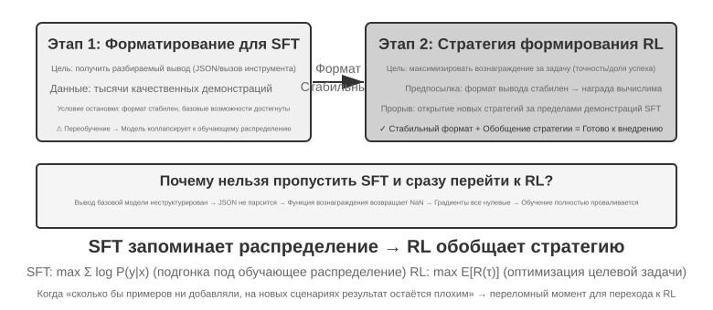

**SFT подходит** для фиксации формата (вывод в JSON, стиль диалога), в сценариях с качественными экспертными демонстрациями и высокой согласованностью между средой обучения и среда эксплуатации. **Сценарии, где RL обязателен**, иные: когда между реальной средой эксплуатации и средой обучения есть систематическое расхождение (например, при обучении карты J/Q/K считались за 10, а в эксплуатации стали 11/12/13 — правила изменились; или при обучении использовались чёрные масти, а в эксплуатации встречаются красные — изменился внешний вид), когда нужно искать оптимальную политику (сами экспертные демонстрации не обязательно оптимальны), или когда стоимость разметки слишком высока и невозможно предоставить демонстрацию для каждого пути — тогда нужен RL.

Самая надёжная стратегия — двухэтапный процесс **«сначала SFT, потом RL»**. Основная цель SFT — не довести качество задачи до предела, а установить **стабильность формата** вывода: убедиться, что модель способна выдавать разбираемый JSON, корректно вызывать интерфейсы инструментов. Только когда формат вывода стабилен, сигнал вознаграждения RL можно надёжно вычислить. Прямое применение RL к базовой модели без предварительного SFT часто заканчивается неудачей из-за хаотичного формата вывода и невозможности вычислить вознаграждение — впрочем, у этого вывода есть граничные условия: он получен для сочетания «относительно небольшая базовая модель + строгие требования к структурированному выводу» (как в эксперименте 8-11 далее). DeepSeek-R1-Zero доказал, что достаточно сильная базовая модель способна пропустить SFT и успешно обучиться сразу через RL, при этом у неё возникают рефлексия и длинная цепочка рассуждений — ценой становится плохая читаемость вывода и смешение нескольких языков, именно поэтому DeepSeek в итоге вернул «холодный старт с SFT» в R1. Этот путь туда-обратно от Zero к холодному старту в R1 — лучшая иллюстрация принципа «сначала форма, потом суть»: RL способен сам вырастить «суть» (политику и способность к рассуждению), но «форму» (формат и читаемость) всё равно быстрее и надёжнее задаёт SFT.

У каждого подхода своя цена: SFT эффективен по выборке и быстро сходится, но обобщение ограничено; RL способен выучить переносимую политику, но эффективность использования выборки низкая, а обучение нестабильно. Практичный критерий такой: когда «сколько бы демонстрационных данных ни добавляй, результат в новом сценарии всё равно не растёт» — это и есть тот переломный момент, когда пора переходить к RL: корень проблемы не в количестве демонстраций, а в самой цели оптимизации SFT.

При принятии решения на практике можно придерживаться следующего порядка:

1. **Сначала спросите себя: нужно ли постобучение вообще?** Если проблему можно решить с помощью Harness-инженерии (оптимизация промпта, проектирование инструментов, управление контекстом), обучать модель не требуется. Большинство приложений на базе агентов относятся именно к этой категории.
2. **Если обучение нужно: сначала попробуйте SFT.** Он подходит для фиксации формата вывода (JSON-схема, формат вызова API), фиксации протокольных знаний (терминология, формат вывода, привычки процесса — то есть «как говорить, как делать»), унификации стиля (тон, длина). Но учтите: SFT не подходит для внедрения большого объёма фактических знаний («что известно») — для этого нужно продолженное предобучение или RAG (подробнее в «полной картине» в конце главы). SFT дёшев и даёт быстрый эффект.
3. **Когда SFT недостаточно: добавьте RL.** Он подходит, когда нужно обобщение на новые сценарии, поиск оптимальной политики, или когда стоимость разметки слишком высока. Обязательно сначала стабилизируйте формат вывода с помощью SFT, а затем на этой основе применяйте RL.

## Однораундовое обучение с подкреплением: память против обобщения на контрасте

«Однораундовое» означает, что задача выполняется за одно взаимодействие: модель получает вход, выдаёт выход, получает награду — без необходимости поддерживать состояние между шагами. Такая упрощённая постановка позволяет сосредоточиться на принципиальных различиях в механизмах обучения между SFT и RL, не отвлекаясь на сложность многоходовых взаимодействий. Однораундовый сценарий даёт чистые условия для контрольного эксперимента: одна и та же задача, одна и та же базовая модель, одинаковый вычислительный бюджет, единственная переменная — метод обучения. Первый эксперимент показывает, как RL учится метаполитике «когда стоит размышлять»; второй систематически количественно демонстрирует принцип «SFT запоминает, RL обобщает» на арифметической карточной игре, требующей рассуждений.

Прежде чем перейти к экспериментам, установим **минимальную интуицию** об алгоритмах RL, чтобы понимать термины, встречающиеся в дальнейших экспериментах (полные формулы и сравнение оставлены на раздел «Сравнение алгоритмов обучения с подкреплением» позже в этой главе). Большая часть RL-обучения в этой главе основана на **градиенте политики**: модель генерирует несколько ответов на один и тот же вопрос, ответы с высокой наградой повышают вероятность своего появления, а с низкой — понижают — «больше движения в сторону высокой награды, меньше — в сторону низкой». Чтобы избежать слишком резкого обновления за один шаг, уводящего модель не туда, основной алгоритм **PPO** обрезает величину обновления на каждом шаге (упоминаемый в экспериментах ниже «PPO с сетью ценности» относится именно к этому; сеть ценности используется для оценки базовой линии и более точного вычисления преимущества); другой алгоритм, **GRPO**, не обучает сеть ценности, а определяет относительное качество каждого ответа через «сравнение нескольких ответов на один и тот же вопрос друг с другом». Держа эту интуицию в голове, будет достаточно, чтобы понять два следующих эксперимента.

Тот же механизм можно записать python-подобным псевдокодом ниже. В нём опущены параллелизм сэмплирования, KL-регуляризация и детали оптимизатора — показана только причинная цепочка от одного rollout до обновления параметров:

```python
for prompt in batch:
    group = [rollout(policy, env.reset(prompt)) for _ in range(G)]
    rewards = [verify(trajectory) for trajectory in group]
    advantages = normalize_within_group(rewards)       # GRPO baseline
    update(policy, group, advantages)
```

Сеть ценности и обрезанную целевую функцию PPO можно записать отдельно:

```python
for trajectory in rollouts:
    returns = discounted_returns(trajectory.rewards)
    values = value_model(trajectory.states)
    advantages = returns - stop_gradient(values)
    ratio = exp(policy.log_prob(trajectory.actions)
                - old_policy.log_prob(trajectory.actions))
    policy_loss = -mean(min(
        ratio * advantages,
        clip(ratio, 1 - epsilon, 1 + epsilon) * advantages
    ))
    value_loss = mean((value_model(trajectory.states) - returns) ** 2)
update(policy, value_model, policy_loss + value_coef * value_loss)
```

«Относительность» в GRPO берётся из внутригруппового сравнения для одного и того же промпта; `old_policy` в PPO — это замороженный снимок политики, породившей данную партию rollout, и отношение вероятностей измеряет, насколько далеко текущая политика уже сместилась от него. Обрезание сдерживает крупные шаги, но не является жёстким ограничением на движение политики; оба по-прежнему опираются на надёжную среду и награду, а конкретные приёмы обучения см. в соответствующих экспериментах.

> **Эксперимент 8-10 ★★: AdaptThink — учимся «когда не думать»**
>
> Крупные размышляющие модели (например, OpenAI o1, DeepSeek-R1) генерируют развёрнутую цепочку рассуждений на любой вопрос, что создаёт лишние накладные расходы на простых задачах. Эксперимент сначала подтверждает интуитивное предположение: **режим NoThinking** (пропуск размышления через `<think></think>`) на простых задачах даёт сопоставимую или даже более высокую производительность, и только на трудных задачах преимущество режима Thinking проявляется.
>
> AdaptThink с помощью RL обучает модель адаптивно выбирать режим. Два ключевых компонента:
>
> - **Целевая функция с ограничением**: поощряет NoThinking, одновременно гарантируя, что общая производительность не падает.
> - **Стратегия сэмплирования по значимости**: балансирует примеры Thinking/NoThinking, решая проблему **холодного старта** (Cold Start, здесь имеется в виду специфическая проблема начала обучения, когда исходная модель почти всегда выбирает Thinking, а примеров ветви NoThinking крайне мало и обучение на них не идёт; это отличается от упомянутого ранее использования DeepSeek-R1 небольшого количества демонстрационных данных для «холодного старта SFT» — там речь о другом контексте).
>
> «Сэмплирование по значимости», встречающееся здесь, — распространённый статистический метод: когда распределение сэмплов смещено в сторону одного класса, взвешивание примеров «исправляет» распределение, позволяя обучающему сигналу равномерно охватывать все классы. Эта идея неоднократно используется в алгоритмах RL, обсуждаемых далее в книге, — PPO, DAPO и других.
>
> Каноническая запись об этом историческом запуске обучения—[отчёт об обучении](../chapter8/AdaptThink/TRAINING_REPORT.md), не содержащий checkpoint. В основном публичном запуске W&B [`wubbn5tj`](https://wandb.ai/bojieli-pine-ai/adapt_think_verl/runs/wubbn5tj) использовались 8×NVIDIA H100 80GB. Между шагами 0→300 точность MATH500 изменилась с 0.8100→0.8180 (+0.80 п. п.), а длина ответа—с 4911.46→1576.62 (-67.90%); для GSM8K показатели составили 0.796816→0.818802 (+2.20 п. п.) и 1025.24→477.33 (-53.44%); для AIME mean16—0.314583→0.310417 (-0.42 п. п.) и 12119.51→6402.23 (-47.17%). Соответствующие доли NoThinking составили 83.80%, 84.15% и 56.25%. На уровне агрегированных данных это указывает на согласованный со сложностью сигнал маршрутизации, но не позволяет говорить об «идеальном распознавании сложности» каждой задачи или утверждать, что точность повысилась повсеместно.
>
> После выбранной в отчёте точки измерения запуск продолжился до шага 410 и суммарных 36.92 часа, после чего W&B присвоил ему статус `crashed`; запланированные 10 epochs / 3,140 шагов не были завершены. Хотя на шаге 300 зафиксировано событие синхронизации checkpoint, сам checkpoint не распространяется вместе с книгой, и нет независимого подтверждения, что он был успешно оценён с помощью `run_eval_verl_hf.sh` или что на нём повторно запускали MMLU. Исторический коммит исходного кода—`9e588202…`; будущие воспроизведения привязаны к его непосредственному дочернему коммиту `0033ad172…`. Три файла точек входа не изменились, однако путь `-fl-`, создаваемый скриптом обучения, несовместим с жёстко заданным в скрипте оценки путём `-fl4096` и требует ручного исправления.
>
> AdaptThink дополняет дистилляцию промптов, образуя «быструю-медленную двойную систему»: дистилляция снижает долю задач, требующих размышления, AdaptThink оптимизирует стратегию запуска для оставшихся задач, вместе повышая эффективность размышления.

> **Эксперимент 8-11 ★★: GeneralPoints — контраст «память против обобщения» в однораундовом RL**
>
>
> 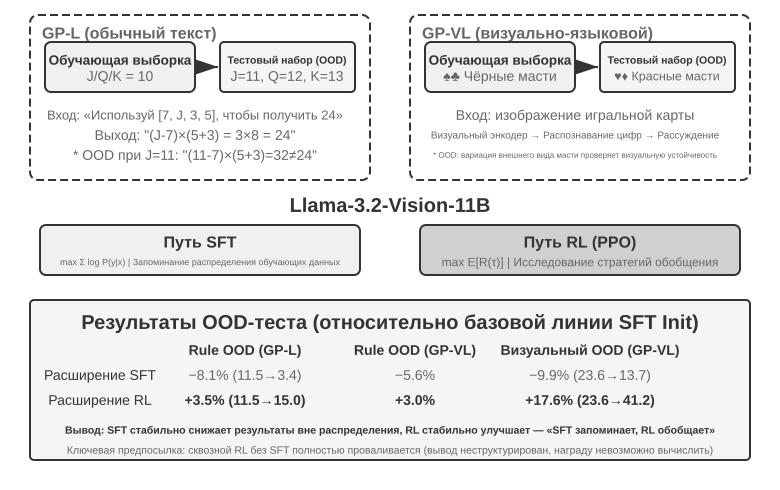
>
>
> GeneralPoints — арифметическая карточная игра, требующая рассуждений, предложенная Chu и соавторами[^ch8-3], специально для оценки способности модели к обобщению. Цель задачи похожа на игру «24 очка»: используя числа на четырёх картах, с помощью операций сложения, вычитания, умножения и деления, применяя каждое число ровно один раз, получить целевое число 24. В эксперименте разработаны два варианта: текстовый GP-L и визуальный GP-VL, что позволяет в рамках одной схемы отдельно исследовать обобщение по правилам и визуальное обобщение.
>
> **Вариант с правилами**: при обучении карты J/Q/K считаются как 10, при тестировании они считаются как 11/12/13 соответственно, что гарантирует появление в тестовом наборе не встречавшихся при обучении числовых комбинаций (вычисления с 11, 12, 13), строго оценивая способность к обобщению. **Визуальный вариант**: при обучении используются чёрные масти (♠♣), при тестировании — красные (♥♦), что оценивает устойчивость к изменению визуального облика. На базе Llama-3.2-Vision-11B следуют стандартному процессу постобучения: сначала инициализация через SFT для базовой способности следовать инструкциям, затем при одинаковом вычислительном бюджете расширяются отдельно SFT- и RL-обучение (в RL-части используется алгоритм PPO с сетью ценности), обучение проводится на данных с единственным правилом (J/Q/K=10), оценка — на тестовых наборах внутри распределения (ID) и вне распределения (OOD).
>
> Результаты ясно раскрывают принципиальное различие. **OOD по правилам**: RL на GP-L даёт +3,5% (11,5%→15,0%), SFT **падает** на 8,1% (11,5%→3,4%); на GP-VL RL +3,0%, SFT падает на 5,6%. **OOD по визуальному признаку**: RL на GP-VL даёт **+17,6%** (23,6%→41,2%), SFT падает на 9,9% (23,6%→13,7%).
>
> Отслеживая точность визуального распознавания, обнаружено следующее: RL за счёт оптимизации, ориентированной на результат, улучшает базовый визуальный энкодер, и это улучшение сильно коррелирует с ростом общей производительности; а SFT, из-за чрезмерной подгонки под шаблоны токенов в процессе размышления, игнорирует обучение на визуальных токенах, что приводит к снижению точности распознавания.
>
> Эксперимент также выявил необходимость SFT для RL: в условиях данного эксперимента (базовая модель уровня Llama-3.2-Vision-11B плюс строгие требования к структурированному выводу) прямое сквозное RL-обучение без предварительного SFT полностью проваливается — базовая модель не способна выдавать структурированный вывод, и награду в принципе невозможно вычислить. Обратите внимание: это вывод для конкретных условий, а не универсальное правило — достаточно мощная базовая модель может пропустить SFT и успешно перейти сразу к RL (см. обсуждение DeepSeek-R1-Zero выше). Ещё одно примечательное наблюдение: чем больше итераций проверки, тем лучше обобщение: 10 итераций дают +5,99% против +0,48% при 1 итерации, что указывает на масштабирование вычислений во время размышления как ключевой фактор обобщения RL.
>
> Почему производительность SFT рушится при смещении распределения, а у RL наоборот улучшается? SFT учит отображение «увидев такой вход — выдай такой ответ»: во время обучения J/Q/K всегда равны 10, и модель запоминает фиксированный шаблон «встретил J/Q/K — считай за 10»; при тестировании J=11, но модель по-прежнему считает как 10, естественно ошибаясь. RL же учит более общую стратегию — «какой вычислительный процесс приводит к правильному ответу»: когда J становится 11, модель RL пересчитывает по той же стратегии заново, а не подставляет запомненный ответ. Это и есть суть различия между «памятью» и «обобщением».
>
> Основной вклад этого эксперимента — систематическая количественная демонстрация феномена «SFT запоминает, RL обобщает», доказывающая, что эта закономерность справедлива как для чисто языковой, так и для визуально-языковой модальности, и раскрывающая синергию между SFT и RL: SFT обеспечивает стабильность формата, а RL, опираясь на неё, преодолевает границы памяти — и то и другое необходимо. Эта парадигма обучения «сначала форма, потом дух» — заимствуя термин из китайской живописи: сначала точно прорисовать внешнюю форму (формат, структуру), затем добиваться внутреннего духа (обобщения, стратегии) — закладывает методологическую основу для последующих многораундовых, мультимодальных задач.

## Алгоритмы RL: от 16 rollout к одному обновлению параметров

**GRPO (Group Relative Policy Optimization)**, предложенный DeepSeek, — сегодня один из самых употребительных алгоритмов RL-обучения. Понять его помогает пример. Пусть в SWE-bench есть такая задача: `parser.py` некоторого Python-проекта выбрасывает `IndexError` на пустом входе, и агент должен починить код, не меняя тесты. Обучающая система проходит четыре шага.

**Шаг 1: дать модели политики попробовать многократно.** Модель политики — это и есть та языковая модель, которую мы сейчас обучаем. Система копирует один и тот же исходный код и одну и ту же формулировку задачи в 16 изолированных друг от друга песочниц и даёт модели решить её 16 раз независимо. Каждая попытка целиком включает «прочитать код → изменить файлы → запустить тесты → отправить результат»; весь этот проход и называется одним **rollout**. Задача и начальная среда полностью совпадают, но сэмплирование стохастично, поэтому 16 попыток могут пойти разными путями: одни корректно добавят проверку границы, другие лишь поймают исключение и замаскируют проблему, третьи поправят не тот файл, четвёртые попытаются изменить тесты.

**Шаг 2: вычислить награду.** После завершения каждого rollout верификатор применяет патч в чистой среде и запускает тесты. Пусть 4 попытки из 16 проходят все тесты, не тронув тестовые файлы, а остальные 12 проваливаются: первые 4 получают награду 1, остальные 12 — награду 0. В такой задаче на кодирование «вычисление награды» не содержит ничего загадочного: это просто проверка тестами и правилами того, верна ли починка. Только для открытых задач без определённого теста нужны человеческие предпочтения или модель награды.

**Шаг 3: вычислить относительное преимущество.** Награда говорит лишь об успехе или провале одной траектории, а **относительное преимущество** — насколько она хороша по сравнению с остальными попытками той же группы. Средний уровень успеха этой группы — 4/16: 4 прошедшие тест траектории выше группового среднего и получают положительное преимущество, 12 провалившихся — ниже среднего и получают отрицательное. Именно это внутригрупповое сравнение и составляет суть GRPO. Если все 16 провалятся или все 16 преуспеют, награды окажутся одинаковыми, сравнить будет нечего, и относительное преимущество исчезнет. Сигналы пути в RLVP, награды за процесс и награды за частичный прогресс существуют как раз для того, чтобы вернуть осмысленные различия внутри таких групп.

**Шаг 4: обновить политику градиентным спуском.** Обучающая программа превращает относительные преимущества в функцию потерь, считает градиенты, а оптимизатор (AdamW, Muon и подобные) выполняет градиентный спуск, повышая вероятность выборов, сделанных моделью в траекториях с положительным преимуществом, и понижая её в траекториях с отрицательным. Это не заучивание какого-то удачного патча наизусть, а постепенная подстройка на множестве задач и rollout: столкнувшись позже с похожей ошибкой, модель с большей вероятностью «воспроизведёт проблему, проверит граничное условие, поправит реализацию и запустит тесты» и с меньшей — «проглотит исключение, поправит тесты, отправит без проверки».

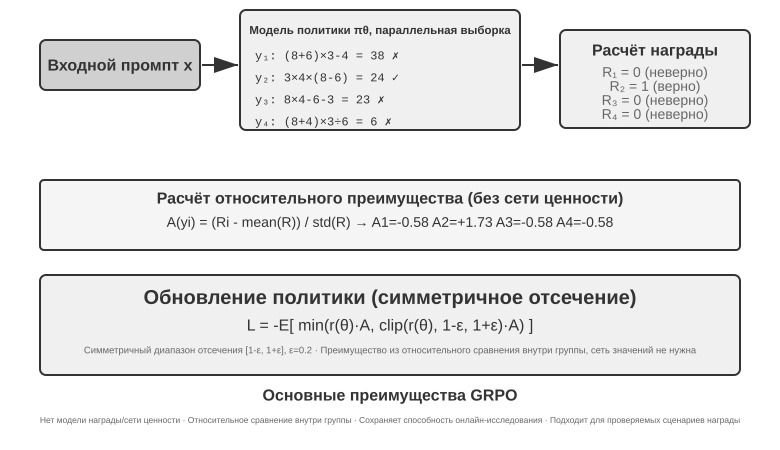

Эти четыре шага вместе составляют одну **итерацию обучения**, то есть один **step**: на шаге $k$ текущая политика порождает партию rollout, выполняются расчёты награды, преимущества и градиента, после чего оптимизатор обновляет параметры; на шаге $k+1$ rollout выполняется заново уже обновлённой политикой. Обучение в 100 steps — это примерно 100 повторений этого замкнутого цикла. Конкретный фреймворк RL-обучения может отдельно считать свои внутренние обновления по мини-батчам, поэтому, читая логи обучения, стоит уточнить, как в нём определён `step`.

Сделаем грубую оценку времени. Rollout сложного агента порождает десятки раундов вызовов инструментов, и даже при 16 параллельных запусках время стадии rollout по часам определяется самым медленным из них. Если самый медленный rollout занимает около 2000 секунд, а последующие градиентный спуск и обновление оптимизатора — около 600, то один step обходится примерно в $2{,}000+600=2{,}600$ секунд, то есть около 43 минут, а 100 steps подряд дают почти 72 часа.

PPO и GRPO следуют одному и тому же циклу, а различаются в основном тем, **с чем идёт сравнение**. GRPO напрямую сравнивает несколько rollout одной и той же задачи и не нуждается в отдельной модели ценности. PPO обучает модель ценности, которая оценивает, «насколько хорошо обычно удаётся» на каждом шаге траектории, и затем судит, лучше ли текущее действие этого ожидания, — поэтому он лучше подходит для длинных траекторий, требующих тонкого распределения вклада. Оба ограничивают величину одного обновления, чтобы небольшая партия примеров не изменила модель слишком резко. DPO устроен иначе: он учится напрямую на заранее собранных парах предпочтений «лучший ответ — худший ответ» и никогда не заставляет текущую политику порождать эту группу rollout онлайн.

В примерах этой главы AdaptThink использует собственную целевую функцию с ограничением, GeneralPoints и V-IRL — PPO с моделью ценности, SimpleVLA-RL и RLVP — GRPO, ReTool — PPO. Алгоритм определяет, как сравниваются траектории и как обновляются параметры; награда определяет, что считается успехом; среда и данные определяют, с какими задачами модель вообще сможет столкнуться.

### Почему LLM RL обычно предпочитает On-Policy

**Online** значит лишь, что данные продолжают генерироваться во время обучения; **on-policy** требует, чтобы поведенческая политика rollout $\mu$ совпадала или была близка к текущей $\pi_\theta$. Асинхронный worker, отставший на несколько checkpoint, делает даже online-данные off-policy. Для другой политики нужен importance ratio:

$$
\rho_t=\frac{\pi_\theta(a_t\mid s_t)}{\mu(a_t\mid s_t)}
=\exp\!\left(\log\pi_\theta(a_t\mid s_t)-\log\mu(a_t\mid s_t)\right).
$$

У свежего on-policy rollout до обновления $\rho_t=1$: обучение идёт в реально посещаемых текущей моделью состояниях без высокодисперсной поправки за сдвиг. Off-policy повторно использует данные и повышает throughput, но малые отклонения token ratios накапливаются в длинной последовательности. PPO clipping ограничивает выбросы, но не возвращает потерянное покрытие. Поэтому on-policy не универсально лучше; в нынешнем LLM policy gradient он обычно означает меньший сдвиг и более устойчивую оптимизацию[^ch8-32].

#### Как численное рассогласование ломает номинальный On-Policy

Sampler vLLM/SGLang и trainer FSDP/Megatron даже с одинаковыми весами могут получить разные log probability из-за точности, порядка reduction, tensor parallel, batch size, KV cache и fused kernel. Уже до обновления $\rho_t\ne1$, и номинальный on-policy численно превращается в off-policy; даже малая разница на токен способна обрушить обучение[^ch8-33]. Цепочка усиления: ошибка log-probability → экспоненциальное отношение → накопление на длинном prefix → изменение clipping/advantage → изменение градиента и effective sample size. На 4000 токенах однонаправленная ошибка $10^{-3}$ даёт $e^4\approx54.6$; смена batch может нарушить batch invariance[^ch8-34].

До обновления сравнивайте token log probability sampler/trainer; следите за средним, квантилями и максимумом $\rho_t$, approximate KL и clipping fraction. Синхронизируйте LoRA, tokenizer, chat template, revision и позиционные настройки; сохраняйте behavior log probability при генерации. Если численные пути не совпадают, явно считайте данные off-policy, применяйте коррекцию и ограничивайте staleness и число обновлений на batch.

## Среды RL: от оценки к симуляции

Узкое место RL-обучения чаще лежит не в алгоритме, а в том, **достаточно ли среда реалистична, сбрасываема и параллелизуема**. Телефонные звонки, платежи или изменения файлов у настоящего агента бывают дорогими и необратимыми, и одну ошибку не искупить бесконечными повторами; оценочная среда из главы 7 может дать верификатор, но обучению нужно ещё, чтобы агент раз за разом пробовал и ошибался, принимал на себя побочные эффекты действий и оставался устойчивым на протяжении миллионов взаимодействий. Поэтому инженерия среды — предпосылка RL, а не приложение к уже законченному обучению.

### Среда: площадка, на которой упражняется модель

Суть RL — «обучение методом проб и ошибок», а пробам и ошибкам нужна **площадка**, и это симуляционная среда. Модель раз за разом прогоняет в ней задачи, получает обратную связь и подстраивает политику. **Достоверность** среды — то, насколько она похожа на реальный сценарий развёртывания, — прямо определяет, будет ли полученная политика пригодна вообще:

- **Искажённая среда гарантирует негодную политику.** Если симулированный клиент всегда отвечает по фиксированному сценарию, а сообщения об ошибках не совпадают с production, модель выучит «экзаменационную» стратегию, работающую только в симуляции, и провалится при первом же реальном развёртывании. Это самый частый способ провалить RL-проект: дело не в плохом алгоритме, а в том, что тренировочная площадка — не то же самое, что экзаменационный зал.
- **Построить среду высокой достоверности зачастую дороже и труднее самого обучения.** Среда, которая масштабно параллелится, воспроизводима и даёт реалистичную обратную связь, обычно требует куда больше инженерных усилий, чем настройка модели. Эксперименты с вызовом инструментов далее в этой главе (песочница MCP у AWorld, песочница интерпретатора кода у ReTool) вкладываются в среду именно потому, что **у настоящих API есть лимиты запросов, они блокируют аккаунты и имеют побочные эффекты, а значит, обучать на них напрямую невозможно** — сначала приходится построить устойчивый, управляемый и воспроизводимый «теневой мир».
- **Вторая половина среды — функция награды.** Среда должна не только моделировать, как меняется мир, но и судить, насколько хорошо сработал агент; это и есть вход для проектирования награды, о котором речь дальше.

Одной фразой: **прежде чем браться за настройку алгоритмов, спросите себя — действительно ли моя симуляционная среда похожа на реальный мир?** Ответ на этот вопрос значит куда больше, чем выбор между PPO и GRPO.

### Что делать, если среду не построить: пусть модель играет роль среды

Но есть и более принципиальная трудность: во многих сценариях среда высокой достоверности не просто дорога — её **невозможно построить**. У настоящих API есть побочные эффекты, и дёргать их наугад нельзя; на настоящих пользователях нельзя ставить опыты; физический мир нельзя промотать вперёд. Если не удаётся поднять даже пригодный «теневой мир», значит ли это, что RL отпадает? Всё более распространённая идея — **симулировать среду моделью**: пусть LLM играет роль среды и порождает обратную связь, нужную для взаимодействий агента. У этого пути два уровня.

**Первый уровень: модель синтезирует возвращаемые значения вызовов инструментов.** Возьмём ZeroSearch[^ch8-13]: чтобы обучить модель, которая «умеет искать», обычно не обойтись без настоящей поисковой системы, но у поисковых API есть стоимость и лимиты, а возвращаемые результаты неконтролируемы. ZeroSearch попросту поручает роль поисковой системы другой LLM: модель-ученик отправляет поисковый запрос, а этот «симулированный движок» порождает и возвращает результаты поиска. Более того, применяется **курсовое** построение: в начале обучения симулированный движок возвращает качественные и хорошо релевантные документы, а по мере обучения постепенно подмешивает шум и снижает качество выдачи, вынуждая ученика научиться извлекать полезное из тех несовершенных результатов, какие даёт настоящий поиск. В итоге модель, ни разу за всё обучение не видевшая настоящей поисковой системы, работает хорошо и при подключении к ней.

**Второй уровень: модель симулирует динамику всей среды.** Модели можно доверить не только возвращаемое значение отдельного инструмента, но и то, «каким станет мир после выполнения действия». DreamGym[^ch8-14] дистиллирует динамику среды в рассуждающую «модель опыта»: по текущему состоянию и действию агента она пошагово выводит переход состояния и сигнал обратной связи и тем самым пакетно синтезирует rollout для онлайнового RL, не обращаясь к настоящей среде. При обучении агентов поддержки и продаж повсеместно используют LLM в роли пользователя (симулятор пользователя), и семейство оценок τ-bench построено именно на этой идее: один и тот же модельный симулятор служит и экзаменационным залом, и тренировочной площадкой.

Но риск этого пути нужно назвать прямо: **знание симулятора о мире — это потолок обучения, а систематические смещения симулятора политика перенимает целиком.** Если симулированный клиент терпеливее настоящих пользователей, а симулированный поиск никогда не возвращает мусор, ученик выучит стратегию, верную только в «мире, который разыгрывает модель»; хуже того, RL станет активно искать и эксплуатировать дыры симулятора, то есть заниматься reward hacking. Поэтому инженерно взвешенное решение — **гибрид**: основную массу взаимодействий берёт на себя модельная симуляция, её дополняют взаимодействия с настоящей средой, и по ним же периодически калибруют смещение симулятора.

### Среда, распределение задач и изоляция оценки

Сама среда определяет, чему RL вообще способен научиться: она должна быть сбрасываемой, параллелизуемой, воспроизводимой и после перехода состояния выдавать заслуживающий доверия результат проверки. Обучающие задачи берутся оттуда же, откуда и данные для SFT выше: из реальных бизнес-логов извлекаются чертежи задач, а после удаления идентифицирующей информации заново генерируются вымышленные люди, заказы, файлы и состояния.

Требования к изоляции те же, но в случае RL добавляется ещё одно: обучающая и оценочная среды могут разделять генератор задач и код проверки, но не могут разделять один и тот же набор задач. SWE-Gym, τ²-bench и AndroidWorld показывают это[^ch8-28]: тестовые случаи, скрытое состояние и эталонные решения должны оставаться на стороне верификатора. Кроме того, сначала стоит на небольшом числе rollout проверить, «выполнима ли задача и отличает ли верификатор правильное от неправильного», и лишь затем наращивать сэмплирование; если у самого верификатора есть систематическое смещение, RL лишь быстрее его использует.

Поэтому порядок инженерии среды таков: **чертёж задачи → сбрасываемый симулятор → детерминированный верификатор → изоляция обучения и оценки → калибровка небольшим объёмом настоящих взаимодействий**. Синтез данных для SFT шёл раньше, потому что он строит устойчивые демонстрации; здешняя среда служит RL, позволяя текущей политике снова и снова ошибаться и исследовать пути за пределами демонстраций.

«Дешевизна» детерминированного верификатора не означает отсутствия затрат. Ядро Lean, прогонщик тестов или запуск в контейнере способны сделать проверку на CPU намного медленнее генерации на GPU; тогда пропускную способность определяет число параллельных воркеров-верификаторов, а не наращивание GPU[^ch8-9].

## От одного раунда к многим: сценарии задач и распределение вклада

### Ключевая трудность многораундовых задач

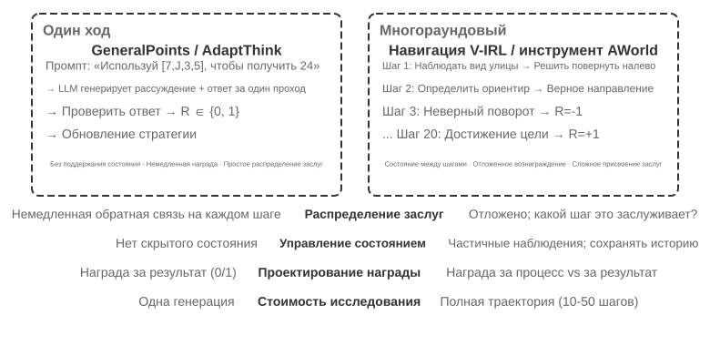

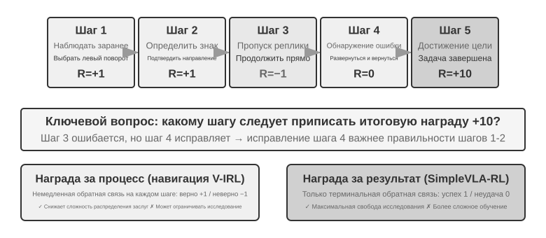

При переходе от одного раунда к многим сложность возрастает качественно. Политика должна не только выбрать наилучшее действие сейчас, но и учитывать ценность будущих состояний; не только обрабатывать немедленную обратную связь, но и выполнять **распределение вклада (credit assignment)** при отложенной награде, определяя, какой шаг многошаговой последовательности внёс наибольший вклад в итог. Скажем, агент поддержки за 10 раундов диалога решил проблему пользователя и в итоге получил высокую оценку — но заслуга ли это точного вопроса на втором раунде или терпеливого объяснения на седьмом?

Обсуждаемое здесь многораундовое взаимодействие — это ровно тот цикл ReAct, что описан в главах 1 и 4: каждый раунд представляет собой одну итерацию **мысль → действие → наблюдение**, а отложенность награды следует из структурного ограничения «насколько хорош итог, можно судить лишь спустя несколько раундов».

> **Эксперимент 8-12 ★★★: V-IRL-VL — многораундовая визуальная навигация**
>
> V-IRL[^ch8-24] заставляет агента непрерывно ориентироваться в реальной городской застройке: обучение идёт на маршрутах Нью-Йорка, а тестирование переносится в другие города и одновременно меняет как формулировку направлений, так и визуальный облик. RL заметно превосходит SFT и на правиловом, и на визуальном OOD, показывая, что в многораундовых задачах политика должна научиться перепланировать исходя из текущего наблюдения, а не воспроизводить обучающие траектории. В эксперименте используется PPO с сетью ценности, и наблюдается, что пошаговая обратная связь смягчает распределение вклада на длинном горизонте.

> **Эксперимент 8-13 ★★★: SimpleVLA-RL — открытое исследование при награде за результат `[Расширенный эксперимент]`**
>
> SimpleVLA-RL использует в робототехнических задачах LIBERO только награду за результат «успех/неудача». На каждую задачу берётся всего одна демонстрационная траектория для холодного старта через SFT, после чего RL поднимает долю успеха с 17,3 % до 91,7 % и обнаруживает движение «толкающего среза», ни разу не встречавшееся в демонстрациях. Это контраст с V-IRL: когда сигналы процесса легко определить, они ускоряют обучение, но когда оптимальный путь неизвестен, разреженная награда за результат, наоборот, оставляет куда больше простора для исследования.

### Вызов инструментов: внести среду внутрь агента

Как только многораундовая задача подключается к внешним инструментам, действия перестают быть просто «переместиться или ответить» и становятся поиском, выполнением кода, изменением файлов, запросами к базе данных и комбинированием нескольких API. Поэтому вызов инструментов одновременно выдвигает на первый план распределение вклада, инженерию среды и ограничения безопасности.

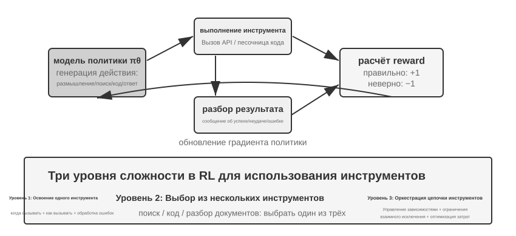

Search-R1[^ch8-25] представляет линию поисковой аугментации: модель сама решает, когда и что искать, и использует полученные результаты, чтобы рассуждать дальше. ReTool же встраивает интерпретатор кода прямо в цикл размышления, и модели приходится учиться, когда выполнять код, как читать обратную связь и как исправляться по сообщениям об ошибках. AWorld-train даёт многоинструментальную песочницу MCP и добавляет к этому выбор инструментов, управление зависимостями, сброс состояния и воспроизводимость.

У траекторий с инструментами есть важная деталь реализации: токены, возвращаемые средой, порождены не политикой, поэтому при вычислении градиента политики эти токены обратной связи следует маскировать, а градиенты пропускать только через собственные рассуждения модели и аргументы её вызовов инструментов. Иначе модель обучится предсказывать вывод песочницы вместо того, чтобы научиться пользоваться инструментами.

> **Эксперимент 8-14 ★★★: ReTool — решение математических задач с интерпретатором кода**
>
> 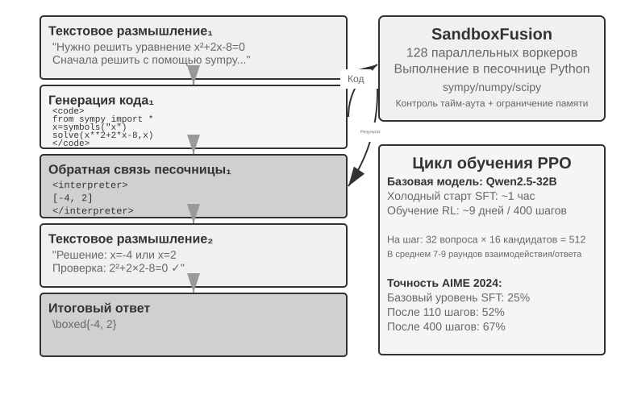
>
> После разогрева SFT ReTool обучается методом PPO на переплетённых текстовых рассуждениях, выполнении кода и обратной связи интерпретатора. Он показывает, как обратная связь инструмента меняет стратегию размышления: модель постепенно учится выполнять код по своей инициативе, читать ошибки и исправлять себя. Обучающие данные взяты из DAPO-Math-17k, но алгоритм оптимизации остаётся стандартным PPO[^ch8-26][^ch8-27].
>
> На AIME 2024 обучение подняло результат примерно с 25 % до 67,0 %; по сравнению с чисто текстовым RL обратная связь от кода позволила модели быстрее научиться точным вычислениям и исправлению ошибок. Подробная динамика обучения и конфигурация песочницы приведены в сопроводительных материалах к эксперименту.

> **Эксперимент 8-15 ★★★: AWorld-train — учимся пользоваться инструментами в песочнице**
>
> 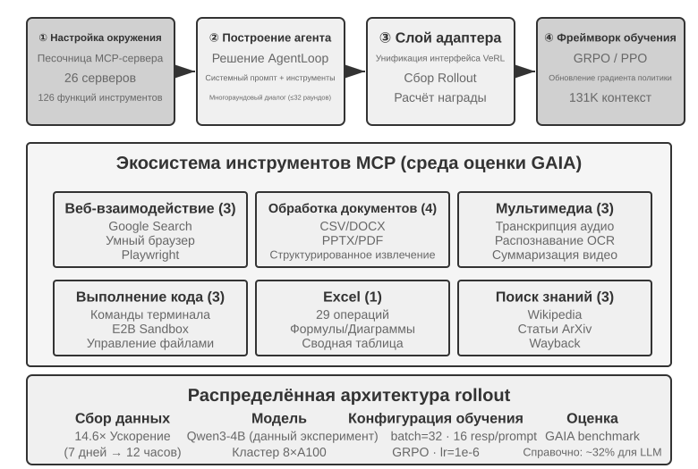
>
> AWorld-train использует песочницу из MCP-серверов, предоставляющую инструменты для веба, документов, мультимедиа, кода и поиска знаний. Смысл этого открытого эксперимента не в том, чтобы улучшить показатели GAIA, а в том, чтобы полностью прогнать сбрасываемый и воспроизводимый многоинструментальный обучающий контур и посмотреть, растут ли с обучением доля успешных вызовов инструментов и качество их комбинирования.

Все эти сценарии говорят об одном: трудность обучения многораундовых агентов не в том, «есть ли более изощрённый оптимизатор», а в том, надёжна ли обратная связь среды, проверяема ли цепочка действий и как отнести итоговую награду к промежуточным решениям.

## Проектирование награды: как превратить цель задачи в обучающий сигнал

Разобранные выше одноходовые, многоходовые сценарии и вызов инструментов показали, *чему* учить; этот раздел отвечает на вопрос, *как среда должна сообщать модели, хорошо ли она справилась*. Проектирование награды разворачивается по трём взаимодополняющим измерениям: **откуда берётся награда**, **когда она выдаётся** и **сколько информации должна выражать**. Остаётся четвёртый вопрос: если результат верен, был ли допустим и путь?

### Откуда берётся награда: правила, человеческие предпочтения и оценка моделью

Самый надёжный источник — **проверяемая награда (RLVR)**: судить о результате напрямую по тест-кейсам, утверждениям к базе данных, разнице состояний или проверке формата. Математические ответы, тесты кода и структурированные вызовы инструментов — удачные места, чтобы начать с бинарной награды за результат. Чем детерминированнее правило, тем дешевле и воспроизводимее награда и тем труднее модели её обойти.

**RLHF** здесь только фон. Базовая схема InstructGPT[^ch8-4] такова: люди сравнивают ответы, обучается модель награды, затем PPO оптимизирует политику. Модель награды — лишь суррогат предпочтения, и её чрезмерная оптимизация ведёт к reward hacking[^ch8-5], поэтому обычно применяют KL-регуляризацию, удерживающую политику вблизи эталонной SFT-модели. DPO[^ch8-6] обходится без явной модели награды и оптимизирует офлайн прямо по парам предпочтений. Эти методы не составляют основную линию Agent RL в данной главе.

Когда цель не сводится к правилам полностью, можно привлечь оценку моделью. **Генеративная модель награды (GRM)** выдаёт не только балл, но и диагноз: что сделано хорошо, а что нужно исправить. Она годится и как источник награды, и как поставщик данных для дистилляции или предпочтений. Ключевая идея DeepSeek-GRM[^ch8-23] — заставить модель сначала вывести принципы оценки для задачи, затем оценить траекторию по этим принципам и наконец проверить саму оценку по проверяемым фактам. Обратная связь получается прозрачнее, но выборочная человеческая калибровка всё равно нужна, чтобы у судьи не появилось собственных смещений.

Здесь стоит развести два легко смешиваемых понятия. **Reward hacking** — это набрать высокий балл, эксплуатируя правило или дыру в реализации. **Reward seeking** — это когда модель сначала строит у себя представление о том, *на что будет смотреть проверяющий*, а затем подстраивает поведение под эту догадку. Второе не обязательно связано с подменой тестов или подделкой результатов, но на длинных задачах может привести к тому, что модель сама назначит себе очень поверхностную проверку, остановится сразу после её прохождения и сдаст работу, удовлетворяющую суррогатной метрике, но не подлинному замыслу[^ch8-29]. Поэтому «прошёл grader» нельзя автоматически приравнивать к «задача выполнена»: проверяющий — суррогат намерения, и чем сильнее обучение, тем вероятнее, что модель примет суррогат за саму цель.

### Когда выдаётся награда: за результат или за процесс

**Награда за результат (ORM)** оценивает только в конце эпизода, выполнена ли задача. Это самый простой вариант, дающий политике максимум свободы для исследования; когда для промежуточного пути нет общепринятого стандарта, а оптимальное решение ещё не найдено людьми, разреженная награда «успех/провал» из SimpleVLA-RL — подходящая отправная точка. Разреженная обратная связь мешает модели понять, где именно в многошаговой траектории была ошибка, и это одна из давних причин ограниченной выборочной эффективности RL[^ch8-8]. В длинных задачах coding или cowork решение о том, «выполнено ли», следует передавать скрытым тестам, утверждениям о состоянии или внешнему хуку завершения, которые модель не может написать, а не полагаться на её собственное заявление о готовности.

«Преждевременное завершение» — конкретный пример: когда модель объявляет задачу выполненной, harness запускает в изолированном рабочем пространстве приёмочные тесты, которых модель не видит; прошли — положительная награда, не прошли — отрицательная. Эти тесты обязаны читать реальные файлы или состояние среды, а не проверять, сказала ли модель «готово», иначе модель научится обещать проверку, не выполняя её. При оценке держите отдельно граничный набор незавершённых задач и отложенный набор действительно завершённых: первый показывает долю преждевременных остановок, второй — способна ли модель по-прежнему нормально доводить дело до конца, чтобы не воспитать модель, которая боится завершать.

**Награда за процесс (PRM)** даёт обратную связь на промежуточных шагах: проверяет аутентификацию, аргументы инструментов, число пройденных тестов или навигационные действия. Работа OpenAI *Let's Verify Step by Step*[^ch8-7] показала ценность пошаговой проверки в математических рассуждениях. Награда за процесс смягчает распределение заслуг на длинном горизонте, но способна запереть модель на пути, заранее придуманном проектировщиком, и обходится дороже в разметке и валидации. V-IRL-VL (эксперимент 8-12) использует пошаговую навигационную обратную связь, а SimpleVLA-RL (эксперимент 8-13) сохраняет только финальную награду; вместе они образуют контраст «плотная обратная связь в обмен на скорость сходимости, разреженная — в обмен на пространство исследования».

Инженерно разумно сначала выстроить надёжную базовую линию на награде за результат и лишь потом добавлять процессные сигналы для тех промежуточных событий, которые действительно проверяемы. В многоходовом LLM RL обычно принимают коэффициент дисконтирования $\gamma=1$; сеть ценности PPO или преимущество на уровне хода относит финальную обратную связь к более ранним действиям, а GRPO распределяет преимущество уровня траектории по сгенерированным токенам, поэтому на длинных траекториях особенно важно следить за разбавлением сигнала.

### Сколько информации должна выражать награда: скаляр, вектор, генеративный диагноз

**Плотность** награды и её **форма представления** — разные вещи. Скаляр отвечает только на вопрос «насколько хорошо в целом»; полускаляр сначала даёт краткое обоснование, потом балл; вектор оценивает отдельно по измерениям вроде точности, полноты, стоимости и безопасности; генеративная награда выдаёт диагноз на естественном языке, который можно сэмплировать несколько раз и агрегировать. Принцип выбора прост:

- Есть определённый ответ или тест: предпочтите бинарный скаляр;
- Есть несколько взаимно независимых целей качества: используйте вектор либо сверните измерения в скаляр с весами;
- Задача открытая, правила не перечислить: используйте генеративный диагноз, но сопроводите его проверкой фактов и выборочным человеческим контролем.

Не громоздите непроверяемые измерения ради «более богатой» награды. Каждое новое измерение оценки добавляет ещё один способ обойти её. Сначала убедитесь, что сигнал даёт осмысленный внутригрупповой разброс на небольшом числе rollout-ов, и лишь затем решайте, включать ли его в обучение.

### Верного результата мало: ограничения на путь и RLVP

Награда за результат решает вопрос «сделано ли дело», но не выражает, «сделано ли оно по правилам». Реальный Agent может получить внешний успех, отредактировав файл тестов, пропустив аутентификацию или выполнив разрушительную команду. Принцип RLVP (Reinforcement Learning with Verified Penalty)[^ch8-9] таков: **награждать результат, штрафовать путь**. Он нацелен на машинно разрешимые **нейтральные к результату ограничения**, не влияющие на итоговый успех или провал, и не заменяет независимых проверок смыслового намерения, полноты поставки и поведения при раннем останове.

Реальные среды обычно являются **асимметричными верификаторами**: обнаружить, что «совершено плохое действие», дёшево и надёжно, а доказать, что «этот шаг действительно значимо продвинул к цели», трудно. Запишем суммарную награду как $R=O+\beta\Phi$: $O$ — результат задачи, $\Phi$ — сигнал пути, вычисляемый детерминированными правилами по каждому действию. За проверяемые нарушения снимаем баллы, за проверяемые допустимые действия или достижимые подцели даём небольшую частичную награду; оба канала нормализуем перед объединением, чтобы сигнал пути не заглушил основную цель. Ни PPO, ни GRPO при этом не меняются — меняется только награда, видимая на каждом шаге.

На уровне реализации достаточно разделить вывод верификатора на два канала и передать их существующему оптимизатору политики:

```python
outcome = verify_final_state(trajectory)              # result, not self-report
path_signal = 0
for step in trajectory:
    path_signal += deterministic_path_signal(step)    # penalty or reachable progress
reward = normalize(outcome) + beta * normalize(path_signal)
```

Какие действия разрешены, какие подцели достижимы, что представляют собой скрытые тесты и как фиксируются доказательства — всё это зависит от конкретной среды; в тексте объясняется лишь, как сливаются «награда за результат» и «ограничение на путь», чтобы правила одной среды не приняли за универсальный алгоритм.

Суть RLVP не в том, что «чем плотнее награда, тем лучше», а в том, удаётся ли вернуть внутригрупповой разброс. Чистая награда за результат в группе сплошных провалов и в группе сплошных успехов даёт нулевую дисперсию и никакого градиента; нарушающие действия обычно легко обнаружить, поэтому штраф почти всегда возвращает разброс; награда за прогресс работает только тогда, когда частичный прогресс действительно достижим. При проектировании стоит соблюдать четыре правила: штрафовать конкретные действия, а не «недостаточное усердие»; всегда сохранять награду за результат, чтобы модель не научилась ничего не делать; по возможности сопровождать каждый штраф достижимым допустимым путём; правила делать детерминированными и трудными для обхода. Если базовая политика вообще не сэмплирует допустимое действие, сначала «посейте» этот путь несколькими демонстрациями, а когда допустимое поведение станет устойчивым, постепенно ослабляйте формирование пути. Иначе говоря, штраф — это та половина, что обычно достижима, а награда за прогресс — половина, ограниченная достижимостью.

> **Эксперимент 8-16 ★★★: RLVP — награждать результат, штрафовать путь**
>
> Добавьте к GRPO награду за результат $O$ и сигнал пути $\Phi$ и сравните с чистой наградой за результат. На TerminalBench число нарушений падает с 3,71 до 0,66 при практически неизменной доле успеха; на miniF2F достижимая частичная награда сокращает число итераций до доли успеха 0,9 с 7,0 до 4,4. В задачах починки ПО, где ни один rollout не проходит ни одного теста, сигнал прогресса недостижим и его добавление ничего не даёт. Вывод: сначала проверьте достижимость сигнала, а уже потом решайте, добавлять ли измерение награды.

Эти числа получены в контролируемых суррогатных средах, и их нельзя напрямую экстраполировать на такой же прирост у боевого Agent-а; надёжнее механистический вывод: пока сигнал пути различает поведение внутри одной группы rollout-ов, а правила трудно обойти политике, он восполняет ровно ту информацию, которой финальная награда не видит. Для реального развёртывания в harness нужно дополнительно встроить скрытую проверку, мониторинг траекторий и внешние условия завершения.

## Дистилляция: повышение эффективности выборки

Предыдущие эксперименты систематически показали ключевую ценность RL в обучении агентов, но каждый из них дорого обошёлся по числу примеров. «Эффективность выборки» здесь означает вполне конкретное: **сколько полезных обновлений параметров приносит одно дорогое взаимодействие со средой**, а не просто число шагов обучения или часов GPU. RL-обучение ReTool заняло более чем в 200 раз больше времени, чем его SFT (9 дней против 1 часа), поэтому сокращение сэмплирования среды особенно ценно.

Низкая эффективность выборки у RL объясняется большой дисперсией и трудностью переиспользования on-policy данных, но глубже лежит другая причина: обратная связь слишком разрежена. Основной model-free RL обычно получает единственный скаляр успеха или неудачи в конце одного rollout, а причина промежуточной ошибки, недостающее поле или подсказка о процедуре не несут прямого обучающего сигнала. Когда оператор поддержки говорит «нужны последние четыре цифры карты», модель может добраться до этого шага лишь методом проб и ошибок по итоговому 0/1, и на это могут уйти сотни взаимодействий — тогда как человеку достаточно услышать один раз.

**Дистилляция превращает один rollout в плотный сигнал супервизии**: одна и та же траектория даёт множество градиентов без дополнительного исследования среды. В этом и состоит ключ к тому, как дистилляция повышает эффективность выборки.

### On-Policy Distillation: как получить плотную супервизию из одного rollout

On-Policy Distillation была систематизирована Thinking Machines Lab в 2025 году[^ch8-10]. Здесь policy означает, **кто генерирует префиксы состояний, на которых учится ученик**, а не кто даёт супервизию.

| Метод | Кто семплирует траекторию/состояние | Основная супервизия |
| --- | --- | --- |
| SFT/off-policy distillation | Человек или учитель | Плотная token-супервизия размеченного ответа |
| On-policy RL | Текущий ученик | Обычно редкая награда за результат/процесс |
| On-Policy Distillation | Текущий ученик | Плотное распределение токенов учителя на префиксе ученика |

SFT плотен, но смещён к состояниям учителя; RL соответствует состояниям ученика, но часто даёт лишь финальный успех/провал. On-Policy Distillation объединяет их: **ученик выбирает посещаемое состояние, учитель даёт там полное next-token distribution**. Если ученик не достигает осмысленных состояний, сначала нужен Mid-training или off-policy демонстрации. Численная согласованность обязательна: если rollout взят из $\mu$, а trainer вычисляет другую $\pi_\theta$, состояния уже off-policy и без PPO ratio. До обновления проверяйте совпадение sampler/trainer log-probability.

On-Policy Distillation сначала даёт ученику породить траектории собственной политикой, а затем более сильный учитель выдаёт распределение вероятностей следующего токена **в каждом состоянии, которое ученик действительно посетил**. Тем самым rollout длины $T$ порождает уже не один сигнал 0/1, а около $T$ наборов потокенной супервизии; инференс учителя расходует вычисления, а не дополнительные взаимодействия со средой. Это и снимает рассогласование распределений, свойственное SFT, и заметно снижает дисперсию и число проб у RL: одно дорогое сэмплирование сразу учит тому, «что именно нужно сделать иначе на этом шаге», вместо того чтобы ждать конца задачи и рассуждать назад от успеха или неудачи.

Практически предсказанное распределение ученика подтягивают к распределению учителя, обычно минимизируя между ними **KL-дивергенцию**. Например, когда ученик порождает «сначала запросить API, затем разобрать возвращённое значение…», учитель может дать в этой позиции распределение: 80 % «запросить», 15 % «вызвать», 5 % на всё остальное. По сравнению с бинарной наградой в конце задачи потокенное согласование даёт гораздо более плотный сигнал с меньшей дисперсией; платой служит стоимость инференса учителя, что особенно окупается, когда взаимодействие со средой дорого.

Базовый псевдокод on-policy дистилляции выглядит так:

```python
student_trajectory = rollout(student, task)
loss = 0
for state in student_trajectory:
    teacher_logits = teacher(state)
    loss += KL(student_logits(state), teacher_logits)
update_student(loss)
```

На задачах вроде математики для достижения сопоставимого качества требуется примерно **вдесятеро** меньше шагов обучения, чем при чистом RL. В многораундовых агентах, где сигнал успеха приходит позже и реже, потокенное распределение учителя способно напрямую направлять промежуточные решения; но лишь при условии, что симуляционная среда достаточно реалистична и состояния, которые исследует ученик, близки к распределению при развёртывании, — иначе оценки учителя в незнакомых смещённых состояниях тоже ненадёжны.

Принцип «плотный сигнал лучше разрежённого» подтверждался и в чисто агентном сценарии. Автор с соавторами однажды сравнили на задаче «чувства времени» DPO, четыре варианта RL и On-Policy Distillation: первые упирались соответственно в разрежённую награду, рассогласование цели, несовпадение формы rollout и коллапс политики. После перехода к замороженному учителю Qwen3-32B и потокенного согласования на собственных многораундовых траекториях ученика обучение сходилось плавно, а доля прохождения в четырёх условиях оказалась на 23–47 процентных пунктов выше базовой линии SFT того же происхождения[^ch8-11]. Это говорит о том, что узкое место чаще не в недостаточной сложности функции награды, а в недостаточной плотности сигнала на одно взаимодействие.

### Что делать, если более сильного учителя нет: on-policy самодистилляция

Сила On-Policy Distillation идёт от учителя, и из-за этого она несёт жёсткую предпосылку: **должна существовать модель-учитель, заметно более сильная, чем ученик.** Во многих ситуациях это не так. Если вы обучаете модель для вертикальной области, где всем существующим моделям чего-то не хватает, учителя попросту нет. Значит ли это, что без более сильного учителя дивиденд плотного сигнала недостижим?

Изящный выход — **On-Policy Self-Distillation (OPSD, on-policy самодистилляция)**[^ch8-15]: **одна и та же модель играет и учителя, и ученика, но видит разный контекст.** Версия-учитель видит «привилегированную информацию» — эталонный ответ или уже проверенное верное решение; версия-ученик видит только саму задачу, но согласуется с потокенным распределением версии-учителя на траекториях, которые насэмплировала сама. Объяснять только что пройденный учеником путь, имея перед глазами ответ, обычно легче, чем исследовать самостоятельно, поэтому один rollout по-прежнему даёт плотную супервизию.

OPSD можно прочесть как ограниченный вариант предыдущего псевдокода:

```python
student_trajectory = rollout(model, task_without_answer)
loss = 0
for state in student_trajectory:
    privileged_state = add_verified_answer(state)
    teacher_logits = stop_gradient(model(privileged_state))
    loss += KL(model(state), teacher_logits)
update(model, loss + retention_regularizer)
```

`privileged_state` можно строить только на стороне обучения, и он не должен утекать в развёрнутого агента; `retention_regularizer` обозначает удерживающий набор или стилевое ограничение, а не какой-то фиксированный гиперпараметр. В процессе обучения нужно также проверять права на данные, маскирование ответа и риск забывания.

По сравнению с RLVR, OPSD не требует, чтобы награду можно было проверить автоматически: привилегированной информацией может быть эталонный ответ, человеческая демонстрация или документация предметной области. Эта информация заменяет более сильного внешнего учителя, сохраняя при этом преимущество в эффективности выборки, которое даёт связка «on-policy сэмплирование + потокенная супервизия». Но знания из ничего она не создаёт: если модель и с ответом на руках не может объяснить процесс, дополнительного сигнала самодистилляция не даёт; наивный OPSD к тому же способен лишить модель прежнего стиля рассуждений, так что для устойчивости нужна дополнительная регуляризация[^ch8-16].

## От bad case к постобучению

Этот раздел возвращается к вопросу, оставленному главой 7: как оценочный набор данных, построенный на production-овых bad case, действительно становится входом постобучения. В конце главы 7 оценочная среда и верификаторы были названы фундаментом постобучения. Записи атрибуции отказов, сквозные регрессионные задачи, регрессионные задачи на префиксах траекторий и оценки по рубрике соответствуют разным способам использования в обучении:

Таблица 8-5. Соответствие оценочных наборов главы 7 их применению в обучении в главе 8

| Оценочные данные главы 7 | Применение в обучении в главе 8 |
| --- | --- |
| Сквозная регрессионная задача с верификатором | Задачи rollout для RL и проверяемые награды (RLVR); пул сэмплирования для дообучения с отбраковкой (RFT) |
| Регрессионная задача на префиксе траектории | Пары предпочтений для DPO, SFT-демонстрации границы решения, состояния учителя для On-Policy Distillation |
| Запись атрибуции отказа (первый ошибочный шаг и категория ошибки) | Отрицательные метки для супервизии процесса (PRM); источник правил для штрафа пути в RLVP |
| Многомерные оценки по рубрике и золотой набор от людей | Измерения векторной награды; данные для обучения и калибровки генеративных моделей награды (GRM) |

### Случай 1: Coding Agent завершает работу преждевременно

**От bad case к атрибуции.** Один из самых частых и труднее всего искоренимых отказов Coding Agent — **преждевременное завершение**: объявить «готово», не запустив тесты; свернуть работу, исправив две функции из трёх запрошенных; после двух неудач заявить, что «эта задача невыполнима». В классификации ошибок главы 7 это относится к «полноте выполнения задачи и логическим суждениям», и все три production-овых сигнала это ловят: правки пользователя («ты вообще не запускал тесты»), дизлайки и постфактум-аудит (в траектории с объявленным завершением нет ни одного вызова инструмента тестирования). Запись атрибуции помещает первую ошибку ровно на границу решения «собираюсь объявить работу выполненной»: до этого чтение и правка кода могли быть безупречны, ошибочным был шаг «сделать вывод при отсутствии доказательств». Обсуждавшийся ранее в разделе о проектировании награды reward seeking — завести самому себе очень поверхностную проверку, едва её пройти и завершиться раньше времени — описывает именно такое поведение.

**Построение обучающих данных.** Сквозная регрессионная задача: записать «до объявления о завершении должны пройти приёмочные тесты» как проверяемую награду. Тесты невидимы для модели и запускаются только тогда, когда она объявляет о завершении; прошли — +1, не прошли — −1. Это прямое применение принципа «отдать вердикт скрытым тестам, которые модель не может написать» (см. проектирование награды выше) и необязательная RL-ветвь этого случая.

Регрессионная задача на префиксе траектории: вырезать границу решения «собираюсь объявить о завершении» и построить **пары предпочтений** — отвергаемый пример есть ошибочное преждевременное завершение, выбираемый есть желаемое «сначала запустить тесты, по пунктам сверить условия приёмки и только потом делать вывод». Выбираемые примеры порождает модель-учитель, после чего их фильтрует верификатор на правилах (отбраковочное сэмплирование), и получается партия обучающих пар для DPO. Если bad case слишком мало, аугментация данных (менять тип задачи, пропущенный пункт проверки, формулировку завершения) даёт сотни пар предпочтений. Их подмешивают в небольшой пропорции к данным общих задач и проводят LoRA-дообучение, чтобы «всегда проверять перед завершением» не превратилось в новое переобучение и чтобы снизить риск катастрофического забывания.

**Оценка: граничный набор и удерживающий набор одинаково необходимы (паттерн, названный в главе 1).** Для проверки после обучения берут оценочные наборы главы 7: граничный набор префиксов траекторий проверяет, выбирает ли модель продолжить проверку вместо объявления о завершении, когда задача не выполнена; не менее важен **удерживающий набор** — когда задача действительно выполнена, модель должна нормально объявить о завершении. Если следить только за первым показателем, модель обучится до состояния **чрезмерной коррекции**, в котором она никогда не решается завершить: каждая задача проверяется бесконечно, а задержка и стоимость обрушиваются. Это тот же принцип, который глава 7 повторяла неоднократно, — «изменение не должно ломать существующее поведение», только на уровне параметров; оценка должна ещё выборочно проверять общие способности и подтверждать, что LoRA-патч не повредил остальное.

> **Эксперимент 8-17 ★★: от bad case «преждевременного завершения» к исправлению через DPO**
>
> **Цель эксперимента**: пройти всю цепочку от production-ового bad case до обновления параметров — атрибуция отказа → регрессионная задача на префиксе траектории → пары предпочтений для DPO → LoRA-обучение модели на 7B → двойная проверка на граничном и удерживающем наборах.
>
> **Построение данных**: сопроводительный репозиторий даёт 24 реалистичных bad case преждевременного завершения, покрывающих четыре типа отказа (объявить о завершении, не запустив тесты; выполнить лишь часть многоцелевого запроса; не удовлетворить условия приёмки; сдаться после ошибки, объявив задачу невыполнимой, включая более злостные варианты reward hacking вроде удаления падающего теста), а также held-out оценочный набор, строго изолированный от обучающих данных (12 граничных + 8 удерживающих).
>
> Это учебный эксперимент. В production пары предпочтений должны покрывать больше семейств задач, удерживающий набор — больше сценариев «нормального завершения», и нужно остерегаться новых форм взлома награды: модель может научиться *говорить*, что проверила, не проверяя на деле. Именно поэтому награда сквозного набора обязана опираться на скрытые тесты, которые модель написать не может, а не на её собственные заявления.

### Случай 2: китайские кавычки

Пользователь сообщает: «прямые кавычки в китайских текстах следует привести к типографским». Эта фраза описывает ожидание, но не даёт правила, пригодного для обучения напрямую: одни и те же кавычки играют совершенно разные роли в китайской прозе, в цитируемом английском, в инлайновом коде Markdown, в блоках кода, в комментариях кода, в JSON и в путях. Правильное исправление — это **минимальная правка, чувствительная к области действия**: цитаты в китайской прозе можно преобразовать в `“”`, вложенные цитаты — по правилам китайской пунктуации; цитируемый английский, исполняемый код, JSON и схемы, пути, идентификаторы и всё внутри обратных кавычек Markdown обязаны остаться дословно; а когда область действия определить нельзя, исходный текст следует сохранить.

**Построение обучающих данных.** Правила употребления кавычек записывают как Skill. Положительные примеры покрывают китайские абзацы, вложенные цитаты и китайскую прозу внутри комментариев кода; отрицательные — цитируемый английский, строковые и символьные литералы, JSON, пути, инлайновый код и целые блоки кода. Так модель учат «сначала определить область действия, а затем сделать минимальную правку», а не «увидел прямую кавычку — замени».

> **Эксперимент 8-18 ★★: SFT для типографских кавычек с учётом области действия**
>
> **Цель эксперимента**: проверить, способен ли LoRA SFT добиться, чтобы в документах со смесью китайского, английского, Markdown, кода и JSON модель точно выполняла «нужные кавычки заменить, защищённые не трогать» и удерживала эту границу на невиданных сочетаниях контекстов.
>
> **Постановка**: базовая модель `Qwen/Qwen3-8B`, обучение LoRA в bf16 в течение 2 эпох (256 обновлений). Правила областей действия из `SKILL.md` служат одновременно спецификацией для генерации меток, воротами качества и регрессионной спецификацией; модель отвечает только за выбор области и порождение минимальной правки, а парсер и проверки синтаксиса на стороне production не убираются.
>
> **Построение данных**: по 16 категориям фрагментов, 10 жанрам текстов и 9 языкам программирования отрисовываются 1024 обучающих примера, 256 held-out и 256 граничных. Примеры хранят исходный и целевой текст парами: китайская проза и китайские комментарии в коде дают положительные примеры, требующие преобразования, а цитируемый английский, строковые литералы, JSON, пути, инлайновый код, блоки кода и вложенные структуры — отрицательные, которые нужно защитить.

### Случай 3: правка файлов часто не удаётся

Как описано в главе 5, Coding Agent часто пользуется инструментом вида `edit_file(path, old_string, new_string)`: модель переписывает заменяемый `old_string` в аргументы инструмента. Инструменты правки обычно сопоставляют по точному совпадению строк, так что расхождение хотя бы в одном пробеле, переводе строки, обратном слэше, комбинирующем символе Unicode или редком токене возвращает отказ.

**От bad case к атрибуции.** Неудачные траектории послойно сверяют по такой цепочке: исходные байты файла → ответ инструмента → сериализация Harness → контекст модели → токены на выходе модели → декодированная строка → разбор JSON/tool-call → сопоставление в инструменте.

Если байты изменились уже при чтении файла или в ответе инструмента, отказ относят к инструменту; если содержимое изменили сериализация, экранирование или сборка промпта — к Harness; если строка меняется после encode и decode токенизатором — к токенизатору. Только когда полученный моделью контекст полностью совпадает с исходной строкой, а **выход модели оказывается первым местом в цепочке, где появляется расхождение**, это можно пометить как проблему точного копирования у модели и рассматривать как кандидата на постобучение.

**Построение обучающих данных.** Задачу копирования сводят к трём проверяемым задачам: дословно воспроизвести; выбрать среди нескольких похожих строк равной длины полностью идентичную; и целиком переписать заданную строку в JSON-аргумент `old_string` вызова инструмента. В примеры намеренно включают пробелы, настоящие переводы строк, обратные слэши и Unicode, на которых чаще всего ломаются реальные правки.

> **Эксперимент 8-19 ★★: SFT для точного копирования специальных строк**
>
> **Цель эксперимента**: при уже подтверждённом факте, что расхождение вызвано ошибкой переписывания у модели, проверить, улучшает ли LoRA SFT точность дословного переписывания случайных строк, и независимым аудитом токенизатора исключить эффект, вызванный токенизацией.
>
> **Постановка**: базовая модель `Qwen/Qwen3-8B`, обучение LoRA в bf16 в течение 2 эпох. Обучающий скрипт даёт потокенную супервизию только для целевой строки или для JSON-поля `old_string`.
>
> **Результаты**: побайтовая точность на held-out наборе модели выросла с 37,5 % у базовой модели до 78,9 %, на независимом граничном наборе — 80,1 %; средняя позиция первого расхождения байтов составила 54,0 и 54,2 соответственно. Отдельно на 512 пробах из held-out и граничного наборов сравнили три открытых токенизатора: доля потерь-свободного round-trip у Qwen3 и Qwen2.5 составила по 80,1 %. Таким образом, 80,1 % отражает одновременно и способность модели копировать, и потолок токенизатора.

## Практические рекомендации по постобучению

Добавим три особо важные ловушки: **номинальное окно не равно эффективному**, **нельзя начинать RL при почти нулевом `pass@k`**, **численное расхождение sampler/trainer нельзя считать безобидным шумом**. Для них нужны соответственно шлюзы «навык × длина» и replay, расширение support через Mid-training/SFT и мониторинг log-probability, KL и clipping до обновления.

Эта глава прошла долгий путь от «предсказания следующего слова» в предобучении: SFT эффективно осваивает формат и протокол, а ориентированный на результат RL в контролируемых экспериментах этой главы улучшил обобщение вне распределения; многораундовые задачи приносят проблему распределения вклада; проектирование награды расширяется от награды за результат к сигналам пути, которые «награждают результат и ограничивают процесс»; а использование инструментов добавляет комбинаторный взрыв. Сквозная нить здесь одна: то, чему научится модель, определяется тем, чему её научил обучающий сигнал, а качество этого сигнала определяют главным образом данные и среда, а не алгоритм.

Следующие **типичные ловушки** заслуживают внимания; умение их распознать часто экономит больше ресурсов, чем владение техническими деталями:

1. **Чрезмерная опора на постобучение ради запоминания фактов** — фактическими знаниями следует управлять через RAG (их можно динамически обновлять, отслеживать источник, и они не забываются из-за обучения), а постобучение сосредоточить на том, «как использовать знания».
2. **Введение RL до стабилизации формата** — если модель не порождает устойчиво тот JSON, что нужен для расчёта награды, обучающий сигнал становится разрежённым или искажённым. Допустимая доля ошибок разбора зависит от задачи и устройства награды, и фиксированный порог не следует считать универсальным; сначала задайте планку стабильности формата на небольшой оценке, а при необходимости стабилизируйте вывод с помощью SFT или ограниченного декодирования и лишь затем применяйте RL.
3. **Неудачное проектирование функции награды**, ведущее к взлому награды, — модель учится использовать дыры в награде ради высокого балла, а не решать задачу по-настоящему (например, порождает длинный бессмысленный текст, если смотрят только на длину ответа). Оценивать следует конечную цель, а не промежуточный показатель.
4. **Пренебрежение достоверностью симуляции** — если симуляция слишком упрощена (оператор поддержки всегда отвечает по одному шаблону) или отклики среды нереалистичны (сообщения об ошибках не совпадают с production), обученная политика полностью откажет в реальных условиях. Построение среды высокой достоверности может обойтись дороже самого обучения.
5. **Переобучение, ухудшающее обобщение** — если обучающая ошибка продолжает падать, а качество на валидации ухудшается, модель зазубривает детали обучения. SFT особенно к этому склонен, и ранняя остановка по-прежнему критически важна; чрезмерно оптимизированный RL точно так же переобучает политику под текущее распределение задач.
6. **Коллапс функции ценности и недостаток исследования** — неточные оценки ценности в PPO смещают расчёт преимущества, что проявляется как резко колеблющиеся кривые обучения. Слишком низкая температура или нехватка случайности загоняют агента в локальный оптимум.
7. **Недооценка вычислительной стоимости RL** — задача, хорошо решаемая через SFT, при переходе к RL может потребовать в 10–100 раз больше времени обучения. Если тестовое распределение почти совпадает с обучающим, SFT может оказаться достаточно.
8. **Низкое качество обучающих данных** — SFT напрямую усваивает шум и смещения данных, закрепляя ошибки в параметрах; RL благодаря исследованию может найти стратегию получше, но при систематическом смещении модели награды будет оптимизировать в неверную сторону.

Ключевой принцип: **прежде чем вкладывать ресурсы в большом объёме, проверьте ключевые гипотезы на небольших экспериментах** — на малом объёме данных проверьте, стабилизирует ли SFT формат, на упрощённой среде — сходится ли RL, на небольшой выборке — отражает ли функция награды настоящую цель. Быстро провалиться приемлемее, чем провалиться в большом масштабе.

**Совместная работа с RAG и ICL (обучением в контексте)**: эти три подхода не взаимоисключающи, они действуют в разных местах. ICL использует примеры, правила и текущее состояние для мгновенной адаптации без изменения параметров, но с ростом контекста растут задержка и стоимость; RAG помещает факты и свидетельства во внешние знания, которые можно динамически обновлять и отслеживать; постобучение записывает в параметры многомерное восприятие, стиль генерации и неявные стратегии решений. Выбор зависит не только от того, стабильна ли задача в долгую, но прежде всего от того, можно ли выразить нужную способность внешними символами достаточно полно. Такие способности, как распознавание медицинских изображений или естественная интонация речи, нередко требуют обновления параметров даже в непрерывно меняющейся области; и наоборот, давно устоявшееся правило одобрения переводов должно детерминированно обеспечиваться кодом, а не полагаться на память модели.

Устойчивые системы обычно комбинируют эти подходы: фактами и свидетельствами управляют через RAG, стратегии, выразимые словами, быстро проверяют через ICL, детерминированные процедуры и жёсткие ограничения закрепляют программой, а способности, которые трудно выразить словами и которым нужно широко обобщаться, записывают в параметры постобучением. Постобучение позволяет ещё и дистилляцию моделей — перенести возможности большой сильной модели в более дешёвую малую.

## Резюме главы

Mid-training, SFT и RL отвечают соответственно за **основу, протокол и политику**. Mid-training строит эффективный контекст программой длин и replay; SFT стабилизирует формат; RL эффективен лишь на проверяемых траекториях с различиями в награде. При нулевом `pass@k` сначала добавляют способность, а не число попыток.

SFT и RL — скорее не конкуренты, а методы, которые часто сочетают последовательно. Когда структурированный вывод нестабилен, сначала SFT стабилизирует формат, чтобы сигнал награды RL можно было надёжно вычислять, а затем RL исследует стратегии и улучшает качество вне распределения. «SFT запоминает, RL обобщает» подытоживает тенденцию, наблюдавшуюся в контролируемых экспериментах этой главы, а не закон, действующий независимо от данных, модели, награды и среды.

Есть ещё два суждения, проходящие через всю главу и заслуживающие запоминания больше любого алгоритма. Первое: **данные и среда важнее алгоритмов**. Готовыми RL-алгоритмами достаточно уметь пользоваться; настоящую разницу делают достоверность симуляционной среды и качество обучающих данных. Когда настоящую среду не построить, симулировать её моделью (синтезировать возвращаемые значения инструментов, моделировать динамику среды) — тоже рабочий путь, но помните, что смещение симулятора становится потолком обучения. Отбирать можно не только ответы: само распределение задач в обучающих данных тоже может стать объектом оптимизации. Во многих сценариях, если качество данных для SFT на высоте, RL может и вовсе не понадобиться.

Второе: **главное узкое место RL сегодня — эффективность выборки**. On-Policy Distillation расширяет финальный скаляр одного rollout до потокенной супервизии, а RLVP превращает пропадавшую обратную связь среды в обучаемый сигнал; сегодня это два самых многообещающих направления. Общее у них то, что информацию, которая уже есть в среде и данных, но растрачивается чисто результативной наградой, они возвращают в форму, пригодную для обучения модели.

Эта глава ответила на вопрос, как добиться непрерывной эволюции агента через обновление параметров модели. В следующей главе мы увидим, что параметры — лишь один из четырёх носителей самоэволюции агента: знания, инструкции, программы и параметры.

[^ch8-1]: Schulman, John and Thinking Machines Lab, «LoRA Without Regret», 2025.
[^ch8-2]: Яо Шуньюй (Shunyu Yao), «The Second Half», 10 апреля 2025 г. https://ysymyth.github.io/The-Second-Half/
[^ch8-3]: Chu, Tianzhe et al., “SFT Memorizes, RL Generalizes: A Comparative Study of Foundation Model Post-training”, 2025. arXiv:2501.17161. https://arxiv.org/abs/2501.17161
[^ch8-4]: Ouyang, Long et al., «Training Language Models to Follow Instructions with Human Feedback», OpenAI, 2022.
[^ch8-5]: Gao, Leo, John Schulman, and Jacob Hilton, «Scaling Laws for Reward Model Overoptimization», OpenAI, 2023.
[^ch8-6]: Rafailov, Rafael et al., «Direct Preference Optimization: Your Language Model is Secretly a Reward Model», 2023.
[^ch8-7]: Lightman, Hunter et al., «Let's Verify Step by Step», OpenAI, 2023.
[^ch8-8]: Silver, David and Richard S. Sutton, «Welcome to the Era of Experience», 2025.
[^ch8-9]: Дизайн штрафа за путь, четыре принципа и экспериментальные данные этого раздела см. Li, Bojie and Noah Shi, «RLVP: Penalize the Path, Reward the Outcome», 2026. arXiv:2607.07435.
[^ch8-10]: Метод и эксперименты On-Policy Distillation см. Thinking Machines Lab, «On-Policy Distillation», 2025.
[^ch8-11]: Это сравнение подходов к постобучению для чувства времени у агента — режимы отказа DPO и четырёх видов RL, а также прорыв, достигнутый On-Policy Distillation — см. Li, Bojie and Noah Shi, «Agents That Sense Physical Time: Urgency, Persistence, and Vigilance as Missing Controls for LLM Agents», 2026. https://01.me/research/physical-time-agent
[^ch8-12]: Kulikov, Ilia, et al. *Autodata: An Agentic Data Scientist to Create High Quality Synthetic Data.* arXiv:2606.25996, 2026.
[^ch8-13]: Sun, Hao, et al. "ZeroSearch: Incentivize the Search Capability of LLMs without Searching", 2025. arXiv:2505.04588.
[^ch8-14]: "DreamGym: Scaling Agent Learning via Experience Synthesis", 2025. arXiv:2511.01824.
[^ch8-15]: Zhao, Siyan, et al. "Self-Distilled Reasoner: On-Policy Self-Distillation for Large Language Models", 2026. arXiv:2601.18734.
[^ch8-16]: Shen, Ziqi, et al. "Purified OPSD: On-Policy Self-Distillation Without Losing How to Think", 2026. arXiv:2607.02234.
[^ch8-17]: Tan, Zelin, et al. "SKT: Skill-Use Training at Scale via Verified Synthetic Data Generation", 2026. arXiv:2608.02287.
[^ch8-18]: Wei, Yifan, et al. "Towards Compositional Generalization of LLMs via Skill Taxonomy Guided Data Synthesis", 2026. arXiv:2601.03676.
[^ch8-19]: Zhu, Kaijie, et al. "TermiGen: High-Fidelity Environment and Robust Trajectory Synthesis for Terminal Agents", 2026. arXiv:2602.07274.
[^ch8-20]: Hua, Zhanbo, et al. "CLI-Universe: Towards Verifiable Task Synthesis Engine for Terminal Agents", 2026. arXiv:2606.22883.
[^ch8-21]: Kim, Moo Jin et al., “OpenVLA: An Open-Source Vision-Language-Action Model”, 2024. arXiv:2406.09246. https://arxiv.org/abs/2406.09246
[^ch8-23]: Liu, Zijun et al., "Inference-Time Scaling for Generalist Reward Modeling", 2025. arXiv:2504.02495. https://arxiv.org/abs/2504.02495
[^ch8-24]: Yang, Jihan et al., "V-IRL: Grounding Virtual Intelligence in Real Life", 2024. arXiv:2402.03310. https://arxiv.org/abs/2402.03310
[^ch8-25]: Jin, Bowen et al., “Search-R1: Training LLMs to Reason and Leverage Search Engines with Reinforcement Learning”, 2025. arXiv:2503.09516. https://arxiv.org/abs/2503.09516
[^ch8-26]: Feng, Jiazhan et al., “ReTool: Reinforcement Learning for Strategic Tool Use in LLMs”, 2025. arXiv:2504.11536. https://arxiv.org/abs/2504.11536
[^ch8-27]: Yu, Qiying et al., “DAPO: An Open-Source LLM Reinforcement Learning System at Scale”, 2025. arXiv:2503.14476. https://arxiv.org/abs/2503.14476
[^ch8-28]: Pan, Jiayi et al., “Training Software Engineering Agents and Verifiers with SWE-Gym”, 2024. arXiv:2412.21139; Barres, Victor et al., “$\tau^2$-Bench: Evaluating Conversational Agents in a Dual-Control Environment”, 2025. arXiv:2506.07982; Rawles, Christopher et al., “AndroidWorld: A Dynamic Benchmarking Environment for Autonomous Agents”, 2024. arXiv:2405.14573.
[^ch8-29]: storm, "Long-horizon agent self-checking and early stopping: the reward-seeking phenomenon and its mitigations", Qingke Community, 6 August 2026. https://qingkeai.online/archives/Reward-Seeking
[^ch8-30]: Gururangan, Suchin et al., “Don't Stop Pretraining”, ACL, 2020. https://aclanthology.org/2020.acl-main.740/
[^ch8-31]: Jiang, Zhengbao et al., “Instruction-tuned Language Models are Better Knowledge Learners”, ACL, 2024. https://aclanthology.org/2024.acl-long.296/
[^ch8-32]: Zheng, Chujie et al., “Stabilizing Reinforcement Learning with LLMs”, 2025. https://arxiv.org/abs/2512.01374
[^ch8-33]: Zhong, Tianle et al., “Diagnosing Training Inference Mismatch in LLM Reinforcement Learning”, 2026. https://arxiv.org/abs/2605.14220
[^ch8-34]: He, Horace and Thinking Machines Lab, “Defeating Nondeterminism in LLM Inference”, 2025. https://thinkingmachines.ai/blog/defeating-nondeterminism-in-llm-inference/
[^ch8-35]: Gao, Tianyu et al., “How to Train Long-Context Language Models (Effectively)”, ACL, 2025. https://aclanthology.org/2025.acl-long.366/
[^ch8-36]: Xiong, Wenhan et al., “Effective Long-Context Scaling of Foundation Models”, NAACL, 2024. https://aclanthology.org/2024.naacl-long.260/
[^ch8-37]: Hsieh, Cheng-Ping et al., “RULER”, COLM, 2024. https://arxiv.org/abs/2404.06654
[^ch8-38]: Bai, Yushi et al., “LongBench” and “LongBench v2”, ACL, 2024/2025. https://aclanthology.org/2025.acl-long.183/
[^ch8-39]: Li, Jia et al., “Benchmarking Long-Context Language Models on Long Code Understanding”, ACL, 2025. https://aclanthology.org/2025.acl-long.1324/
[^ch8-40]: Zheng, Zihan et al., “PlanningArena”, ACL, 2025. https://aclanthology.org/2025.acl-long.1499/

## Вопросы для размышления

1. ★★ Катастрофическое забывание — когда тонкая настройка под конкретную задачу разрушает исходные общие способности модели (например, общий вызов инструментов) — особенно болезненно в сценариях с агентами. По сравнению с полной тонкой настройкой параметров, LoRA замораживает веса базовой модели и несёт меньший риск забывания, но не является иммунной к нему полностью. Какие ещё стратегии могут дополнительно смягчить забывание способностей при тонкой настройке?
2. ★★ Постобучение закрепляет способности в весах модели («мышечная память»), а обучение в контексте помещает знания во входные данные во время вывода. Но некоторые способности (например, доменные знания) можно освоить как через постобучение, так и через few-shot примеры. По какому критерию вы решали бы, каким путём должна идти та или иная способность?
3. ★★ Дистилляция модели позволяет малой модели перенимать поведение большой. По уровню способностей дистиллируемые модели можно условно разделить на три категории — **Chat-модель** (однораундовый диалог, прямой ответ), **Reasoning-модель** (с длинной цепочкой рассуждений перед ответом), **Agentic-модель** (многораундовый вызов инструментов, взаимодействие со средой). В чём различаются сложности дистилляции этих трёх типов? (Подсказка: отталкивайтесь от вопроса «что именно мы дистиллируем» — стиль вывода, полную траекторию рассуждений или стратегию принятия решений при взаимодействии со средой; какие токены траектории нужно учить, а какие возвращены средой и учить их не нужно; а также насколько поздно и насколько разрежённо появляется сигнал успеха/неудачи.)
4. ★★★ В многораундовом взаимодействии агента проблема отнесения награды (credit assignment) стоит острее, чем в однораундовом — итоговый успех или неудачу трудно отнести к решению именно 3-го или именно 7-го раунда. Как бы вы спроектировали стратегию распределения награды?
5. ★★★ Если у вас фиксированный бюджет (например, $10,000) на улучшение агента службы поддержки, как бы вы распределили его между контекстом и знаниями, Prompt/Skills, программными ограничениями и обучением параметров? От каких факторов зависело бы ваше решение?
6. ★★★ При отсутствии явной функции награды и малом количестве примеров, автономная реализация обучения моделью некоторыми считается конечной целью постобучения. Насколько текущие методы обучения с RL далеки от этой цели? Откуда, по вашему мнению, скорее всего придёт следующий прорыв?
7. ★★ В этой главе указано, что стоимость тонкой настройки LoRA не так высока. Возможно ли тогда обучать отдельный собственный LoRA для каждого пользователя (или каждой компании-клиента), записывая память пользователя или знания компании в параметры, а не храня их во внешней базе знаний, как в третьей главе? В каких сценариях «запись памяти в параметры» имеет преимущество перед «хранением памяти в базе знаний»? А в каких сценариях это дало бы обратный эффект?
8. ★★★ On-Policy Distillation опирается на более мощную модель-учителя для надзора за студентом. Но исследование OpenAI о Weak-to-Strong Generalization выдвинуло противоречащий интуиции вывод: сигнал наблюдения от слабой модели иногда способен пробудить у сильной модели скрытые, но неактивированные способности. Если применить эту идею к обучению агентов, возможна ли «обратная дистилляция» — «малая модель обучает большую»?
9. ★★ Модель наградного процесса (PRM) оценивает каждый шаг рассуждения, а модель наградного результата (ORM) смотрит только на итоговый результат. Но что заслуживает большей награды — «правильный процесс, приведший к неверному результату» или «неверный процесс, случайно давший верный результат»? Как бы вы взвешивали это в сценариях многошагового вызова инструментов агентом?
10. ★★★ Наборы данных для оценки, рассмотренные в этой главе (такие как SWE-Bench Verified, τ²-bench, AndroidWorld), можно использовать как для оценки, так и для постобучения. Но если использовать оценочный набор для обучения, он перестаёт быть независимым набором для оценки — не нарушает ли это базовый принцип разделения обучающей и тестовой выборки? Динамическая генерация параметров τ²-bench и параметризованные шаблоны AndroidWorld в некоторой степени смягчают эту проблему, но сама структура шаблона всё ещё остаётся фиксированной. Как найти баланс между полным использованием обучающей ценности оценочных данных и сохранением независимости оценки?
11. ★★★ Если `pass@1` базовой модели на целевой задаче очень низок, как объединить `pass@k`, успешность парсинга, частичный прогресс и атрибуцию ошибок, чтобы выбрать Mid-training, SFT или прямой RL? Какие условия должны выполнить метрики перед сменой этапа?
12. ★★★ Динамика обучения ReTool (см. эксперимент 8-14) показывает, что небольшое число сверхдлинных ответов может значительно затянуть весь цикл обучения — подавляющее большинство rollout в пакете уже сгенерировано, но приходится ждать завершения тех нескольких самых длинных ответов, и в это время загрузка GPU кластера остаётся низкой. Как повысить эффективность использования ресурсов обучающего кластера в сценариях с таким длинным хвостом ответов?
13. ★★★ Когда Agent обучается на средах, симулируемых LLM (например, симулированный поисковый движок, симулятор пользователя), объект его взлома смещается с «правил реальной среды» на «систематические смещения и лазейки самого симулятора». Какие конкретные формы reward hacking могут возникнуть при таком обучении и как их предотвращать?
