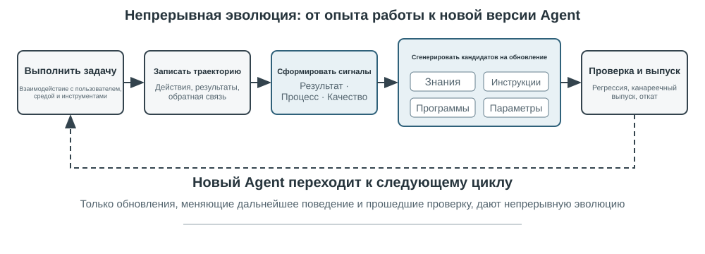
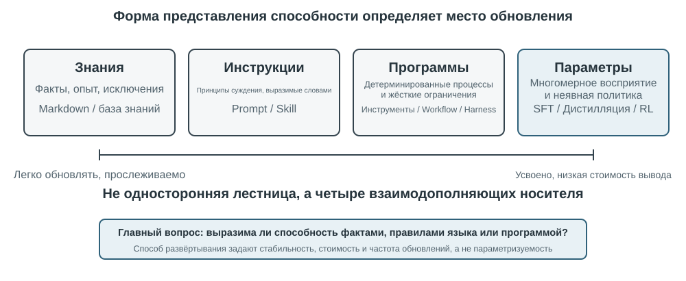
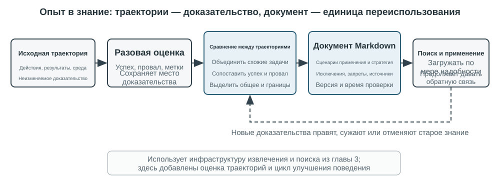
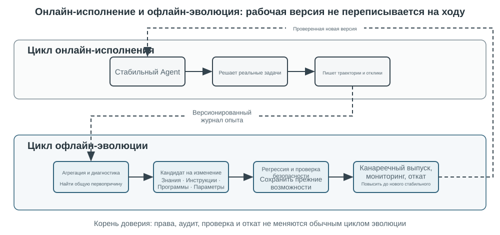

# Непрерывная эволюция агентов

Современные Agent сталкиваются с ярко выраженным парадоксом возможностей: они способны без примеров решать ранее не встречавшиеся сложные задачи, но даже после десяти тысяч сходных задач на следующий день могут повторить ошибку первого дня. **Способность автономно учиться на опыте** становится ключевым условием перехода Agent от «умения выполнять задачи» к «способности надёжно работать», а также центральной темой исследований моделей следующего поколения. Однако возможности современных моделей в области непрерывного обучения всё ещё крайне ограничены.

Причина состоит в том, что после развёртывания модель не изменяет свои параметры автоматически по итогам отдельного вывода. Рассмотренные во второй главе контекстное обучение, поддержание состояния и сжатие позволяют Agent адаптироваться **в пределах текущей задачи**; однако после завершения контекста эти изменения естественным образом не переносятся в следующую задачу. Сохранение диалога в памяти также не означает освоения нового поведения: исходная траектория может быть длинной и содержать как эффективные стратегии, так и случайные успехи, ошибочную атрибуцию причин и недостоверный ввод.

Здесь важно различать два понятия, которые легко спутать: **сохранение опыта не равнозначно обучению на опыте**. Если поместить сто траекторий в длинный контекст или векторную базу, модель сможет при необходимости найти отдельный пример, но это само по себе не обеспечит сопоставление разных случаев: какие шаги многократно встречаются в успешных траекториях, какие приёмы работают только со старой версией интерфейса и обусловлен ли конкретный успех правильной стратегией или случайностью среды. Обучение происходит после того, как система активно выполнила «оценку, сопоставление, обобщение и проверку», а не в момент записи журнала на диск. Пользовательская память из третьей главы главным образом закрепляет сведения о том, «каковы пользователь и мир»; обучение на опыте в этой главе должно также закрепить, «как следует действовать при определённых условиях». Первое помогает Agent больше помнить, а второе превращает его из просто умного в опытного исполнителя.

Почему бы не позволить модели обучать себя непосредственно после каждой задачи? Потому что производственные среды редко дают чистые обучающие сигналы. Удовлетворённость пользователя не означает соблюдение требований; локальное обновление параметров также способно вызвать забывание навыков, дрейф политики или ухудшение безопасности. Если работающей модели разрешить напрямую изменять собственные параметры на основе непроверенной обратной связи, ошибочный опыт и Prompt-инъекции могут закрепиться и продолжить усиливаться в последующих задачах. С другой стороны, периодическое обучение базовых моделей может улучшать общие возможности, но не позволяет своевременно усваивать частные правила, изменения инструментов и локальный опыт, с которыми каждый Agent сталкивается ежедневно.

Поэтому, пока сама модель не способна надёжно осуществлять непрерывное обучение, «обучение» необходимо сначала оформить как автономную внешнюю систему: фиксировать свидетельства выполнения, проверять результат и процесс, извлекать общие закономерности из множества траекторий, а затем решать, что следует обновить — знания, инструкции, программы или параметры модели. Любые изменения сначала должны оформляться как кандидатная версия и лишь после регрессионного тестирования и проверок безопасности влиять на следующий цикл работы.

Предыдущие главы уже представили основные компоненты такой системы. Вторая глава рассматривает состояние внутри задачи, третья создаёт инфраструктуру знаний, пятая наделяет Agent метаспособностью создавать инструменты и изменять систему, шестая формирует механизмы оценки и проверки, а седьмая объясняет обновление параметров модели. Задача восьмой главы — организовать эти компоненты в показанный на рисунке 8-1 замкнутый цикл непрерывной эволюции.

Непрерывная эволюция должна опираться на прослеживаемый опыт выполнения, изменять последующее поведение и проходить проверку на отсутствие заметной деградации. Сначала в этой главе рассматривается, как определить, что именно в отдельном выполнении было сделано правильно или неправильно; затем сравниваются четыре метода обновления и границы их применимости; наконец, обсуждается, как эти обновления проверяются, выпускаются, пересматриваются и выводятся из эксплуатации в ходе длительной работы.

## Получение обучающих сигналов из траекторий выполнения

Отправной точкой непрерывной эволюции является не «обобщение», а «оценка». Если система не знает, выполнена ли задача и какой шаг обусловил успех или неудачу, то созданная языковой моделью рефлексия остаётся лишь предположением. Если ошибочная оценка попадёт в долговременные знания, системный Prompt или обучающие данные, её влияние будет усиливаться во всех последующих задачах.

Результаты некоторых задач проверяются сравнительно легко. Coding Agent может запускать тесты, проверку типов и тесты производительности; Agent, оформляющий возврат средств от имени пользователя, может проверить состояние заказа и фактическую сумму возврата. Такие сигналы поступают из реального состояния среды и обычно надёжнее описания моделью собственных действий. Однако правильный результат не означает правильности процесса. Удаление неуспешных тестовых случаев также позволяет пройти тесты, а устное обещание пользователю «мы вернём средства в течение семи дней, пожалуйста, ожидайте» может вызвать временную удовлетворённость. Поэтому надёжная оценка должна учитывать не только результат, но и путь его достижения.

У ещё большего числа задач нет единственного правильного ответа. Терпеливо ли работает служба поддержки, предложила ли она допустимый нормативами обходной вариант, выделены ли в исследовательском отчёте ключевые доказательства, естественен и лаконичен ли сгенерированный текст — всё это требует контекстной оценки. В таких случаях можно использовать представленный в шестой главе LLM-as-a-Judge, однако нельзя ограничиваться просьбой к Judge выставить один расплывчатый итоговый балл. Эффективнее заранее определить оценочную шкалу (Rubric), потребовать от проверяющего выставить оценки по каждому пункту, сослаться на свидетельства из траектории и явно указать неопределённость при недостатке данных.

На рисунке 8-2 представлена трёхуровневая структура проверки. Нижний уровень — проверяющий результат — считывает результаты тестов, состояние базы данных и ответы инструментов, отвечая на вопрос: «Действительно ли задача выполнена?» Средний уровень — проверяющий процесс — анализирует бизнес-правила, полномочия и последовательность действий, отвечая на вопрос: «Выполнена ли задача разрешённым способом?» Верхний уровень — проверяющий качество — оценивает язык и стратегию по Rubric, отвечая на вопрос: «Выполнена ли задача надлежащим образом?» Чем ниже уровень метрики, тем сильнее она должна опираться на код и эталонное состояние среды; языковой модели следует передавать только трудноформализуемые аспекты.

Для Agent службы поддержки полезная Rubric должна охватывать как минимум несколько измерений из таблицы 9-1. Первые пять в основном задают обязательные ограничения, последние два оценивают качество обслуживания. Такое разделение диагностически полезнее вопроса «Удовлетворён ли пользователь?»: пользователь может быть доволен неправомерным возвратом средств и недоволен нормативным ограничением, поэтому единая оценка удовлетворённости не позволяет различить эти ситуации.

Таблица 9-1. Измерения оценки траектории Agent службы поддержки

| Измерение | Проверочный вопрос | Основные свидетельства |
|---|---|---|
| Результат задачи | Удовлетворена ли основная потребность пользователя | Итоговое состояние среды, результаты инструментов |
| Соблюдение правил | Не нарушены ли политики, полномочия или обязательные процедуры | База политик, траектория действий |
| Границы конфиденциальности | Не раскрыта ли информация, которую нельзя предоставлять | Текст ответа, журналы доступа к данным |
| Фактическая надёжность | Подкреплены ли утверждения знаниями или результатами инструментов | Указанные источники, ответы инструментов |
| Согласованность обещаний и действий | Действительно ли выполнены операции, о завершении которых заявлено | Сопоставление ответа с журналами инструментов |
| Качество выражения | Является ли ответ естественным и лаконичным, лишён ли он повторов и шаблонности | Полный диалог, языковая Rubric |
| Допустимый обходной путь | Найден ли разрешённый альтернативный путь, когда исходный вариант невозможен | Цель пользователя, политики и последующие действия |

> **Эксперимент 9-1 ★★: построение проверяющего траекторий для Agent службы поддержки**
>
> **Цель эксперимента**: преобразовать одну траекторию работы службы поддержки в структурированный диагноз, пригодный для последующего обучения, и проверить, позволяет ли «многомерное заключение со свидетельствами» точнее локализовать первопричину, чем единый итоговый балл.
>
> **Описание эксперимента:** Сравните «один итоговый балл» с «выводом, доказательством и уверенностью по каждому измерению» и посмотрите, что лучше различает провал задачи, нарушение правил, ложное обещание и проблемы формулировки. Непрерывная эволюция не может опираться лишь на долю успеха или один балл. Только сохранив, что и почему было неверно и где находится доказательство, последующие модули смогут решить, обновлять ли знания, Prompt, программу или параметры; случаи с низкой уверенностью не должны автоматически попадать в обучающий набор.

## Четыре метода непрерывной эволюции Agent

Обучающий сигнал указывает, что Agent должен измениться, но не определяет, где именно должно произойти изменение. Главный критерий выбора способа обновления — не давность опыта, а возможность естественно выразить целевую способность с помощью определённого носителя. Факты и опыт удобно оформлять как документы знаний; стратегии, ясно выражаемые на естественном языке, — включать в Prompt или Skill; точно исполняемые процессы и ограничения — реализовывать в программах; высокоразмерные способности, такие как восприятие, языковой стиль и неявные стратегии, — записывать в параметры модели. На рисунке 8-3 показаны эти четыре способа и отношения между ними.

В таблице 9-2 приведено их краткое сравнение. Эти способы не исключают друг друга: медицинский визуальный Agent распознаёт патологию с помощью параметров, получает актуальные рекомендации из базы знаний и вычисляет показатели риска посредством кода; естественный тон модели службы поддержки формируется постобучением, конкретные корпоративные политики задаются знаниями и Skill, а критически важное соблюдение требований гарантируется серверным кодом.

Таблица 9-2. Границы применимости четырёх способов непрерывной эволюции

| Способ обновления | Подходящее содержимое | Основные преимущества | Основные ограничения |
|---|---|---|---|
| База знаний об опыте | Факты, эмпирические закономерности, исключения и источники | Быстрое обновление, прослеживаемость, извлечение по запросу | Зависимость от извлечения и правильного применения моделью |
| Prompt и Skill | Выражаемые на естественном языке принципы принятия решений и операционные нормы | Объяснимость, контролируемая область действия | Склонность к разрастанию, конфликтам и игнорированию |
| Программы и Harness | Детерминированные процессы, инструменты и жёсткие ограничения | Тестируемость, стабильное исполнение, низкая стоимость | Более высокие затраты на разработку и сопровождение |
| Параметры модели | Высокоразмерное восприятие, стиль генерации и неявные стратегии | Высокая обобщающая способность, низкие затраты при выводе | Высокая стоимость обновления и регрессионного тестирования |

Одну и ту же способность можно разложить по нескольким носителям: факты уходят в базу знаний, объясняющие исключения принципы — в Skill, права, которые нельзя обойти, по-прежнему контролируются программой, а способность к высокоразмерному распознаванию попадает в параметры. Результат маршрутизации — всего лишь предложение об обновлении, права на выпуск оно ещё не получило.

### Преобразование опыта в знания

Самый лёгкий способ эволюции — оформлять многократно повторяющийся опыт выполнения в доступные для поиска документы знаний. Упоминаемая здесь «база знаний об опыте» использует общие с третьей главой технологии хранения, индексирования и извлечения, однако источник знаний и цели проверки отличаются. В третьей главе из пользовательских диалогов, документов и наборов данных главным образом извлекается информация о том, «каковы пользователь и мир»; здесь же из траекторий действий Agent и их результатов извлекаются сведения о том, «как следует действовать при определённых условиях». Например, «эта авиакомпания требует заказывать специальное питание за двадцать четыре часа» — предметное знание, а «перед бронированием сначала проверять крайний срок заказа специального питания, чтобы не обнаружить невозможность выполнить требование уже после оплаты» — опыт действий.

Исходная траектория не подходит на роль формальной единицы знаний. Она длинна и зашумлена, включает необработанные ответы инструментов, случайные обходные действия и детали среды. Более надёжная система сохраняет три уровня данных: неизменяемые исходные траектории для аудита; анализ отдельного выполнения с описанием успехов, неудач и потенциальных уроков; сопоставление, кластеризацию и обобщение множества однотипных траекторий с формированием ориентированных на будущее документов знаний в Markdown. Формальный документ обычно описывает область применимости, рекомендуемую стратегию, запрещённые действия, условия исключений, источники свидетельств и время последней проверки, а не пересказывает полный ход одной задачи.

Этот подход разделяет двухэтапный принцип User-as-Code из третьей главы. User-as-Code сначала добавляет факты из диалога в неизменяемый журнал, а затем периодически перестраивает структурированную модель пользователя; обучение на опыте также должно сначала сохранять свидетельства, а затем в офлайн-режиме создавать изменяемые знания. Этот процесс показан на рисунке 8-4. Разделение фиксации и систематизации предотвращает немедленное изменение Agent из-за единичного случайного успеха или сетевого сбоя и позволяет выявлять общие закономерности только после анализа нескольких успешных и неуспешных случаев.

Документ об опыте — не простое резюме траектории. Реальную переносимость обеспечивает сопоставление: что присутствует в успешных траекториях определённого класса и отсутствует в неуспешных; в каких версиях среды стратегия эффективна и при каких предварительных условиях перестаёт работать. В третьей главе уже представлены методы извлечения, кластеризации и поиска знаний, поэтому здесь эти алгоритмы не повторяются. Основное внимание уделяется тому, как оценка траектории становится условием извлечения и повышают ли извлечённые знания эффективность последующих задач.

Полный конвейер извлечения знаний можно разделить на пять этапов. Сначала сохраняются неизменяемые траектории и результаты среды. Затем для каждого выполнения создаётся структурированный анализ с типом задачи, требуемыми способностями, наблюдаемыми стратегиями, ошибками и исключениями. Далее выполнения одного семейства задач агрегируются, а для каждой потенциальной закономерности составляется таблица: «какие траектории подтверждают её, а какие опровергают». В формальный документ попадают лишь кандидаты, достигшие порога поддержки. Наконец, перенос проверяется на новых задачах, не участвовавших в извлечении. Раздельное хранение формальных знаний и кандидатного анализа позволяет повторно выполнять обобщение без изменения исходных свидетельств и точно отменять отдельные выводы при смене версии среды.

Обучение на опыте GAIA служит наглядным примером. GAIA[^gaia-2023] содержит многоэтапные вопросы, требующие сочетания поиска, чтения веб-страниц, обработки файлов и вычислений, а AWorld[^aworld-2025] предоставляет среду для запуска Agent, вызова этих инструментов и сохранения траекторий. Первое можно сравнить с экзаменационным листом, второе — с экзаменационной аудиторией и системой записи эксперимента. В прежнем подходе после единственного успеха немедленно создавалось краткое описание стратегии, которое векторизовалось и сохранялось. Более строгая реализация сначала отмечает успех, частичный успех и неудачу посредством проверки ответов GAIA или другого проверяющего среды, а затем сопоставляет несколько путей в одном семействе задач. Успешные траектории дают потенциальные стратегии, неуспешные — исключающие знания, а частично успешные помогают понять, «какая часть сработала, а какая всё ещё проблемна». Предложенная в Reflexion[^reflexion-2023] рефлексия на естественном языке может участвовать в создании потенциальных уроков, однако сама по себе она не является свидетельством. В формальный документ опыта следует включать лишь материалы, согласующиеся с результатами среды, поддерживаемые несколькими траекториями и демонстрирующие положительный перенос на новые задачи.

[^reflexion-2023]: Shinn, N., et al. *Reflexion: Language Agents with Verbal Reinforcement Learning.* arXiv:2303.11366, 2023.

[^gaia-2023]: Mialon, G., et al. *GAIA: a benchmark for General AI Assistants.* arXiv:2311.12983, 2023.

[^aworld-2025]: Yu, C., et al. *AWorld: Orchestrating the Training Recipe for Agentic AI.* arXiv:2508.20404, 2025.

### Преобразование опыта в инструкции

База опыта даёт агенту «материал, к которому можно обратиться», а Prompt и Skill предписывают, «как следует действовать». Поднимать опыт до уровня инструкции стоит лишь тогда, когда множество схожих траекторий раз за разом обнажают одну и ту же стратегическую ошибку и эту ошибку удаётся ясно описать словами. Сначала разведём три понятия: **системный Prompt** действует на все задачи, **Skill** подгружается по требованию только при совпадении с некоторой предметной областью или инструментом, а **программа/Harness** отвечает за права доступа и прочие жёсткие ограничения.

Андрей Карпатый назвал такой приём **обучением системного промпта** (System Prompt Learning)[^karpathy-system-prompt-learning]: столкнувшись с проблемой, модель одной ясной фразой предупреждает саму себя в будущем. DSPy[^dspy-2023] ищет инструкции и примеры на отладочном наборе; OPRO[^opro-2023] предлагает новые промпты, опираясь на историю промптов и их оценки; GEPA[^gepa-2025] порождает и отбирает варианты промптов из естественно-языковой рефлексии над неудачными траекториями. Эти методы хороши для офлайновой пакетной оптимизации; в продакшене уместнее проверяемые минимальные предложения об обновлении с сохранённым путём быстрого отката.

Обучение системного промпта — не то же самое, что инженерия промптов из главы 2. Глава 2 обсуждала, как собрать хороший Prompt; этот раздел обсуждает, какой обратной связи достаточно, чтобы запустить правку, и как безопасно выпускать предложение об обновлении. Правка должна быть минимальным diff с указанием источника, а не полным переписыванием Prompt при каждом проходе — это и есть названный в главе 1 паттерн «минимальный diff плюс откат». Кандидатную версию обязательно тестируют одновременно на **граничном наборе, вызвавшем сбой**, и на **удерживающем наборе, который уже работает**: первый должен улучшиться, второй не должен деградировать.

#### Пример 1: превращение границы эскалации в правила

В политике домена telecom из τ²-bench о передаче оператору сказано лишь двумя принципиальными фразами: передавать только тогда, когда запрос выходит за пределы действий Agent, и до передачи приложить все усилия к решению. Когда в главе 7 эта среда разбиралась по частям, обе строки не обнаруживали изъяна; запустите ту же среду на модели послабее — и недостаток проявляется сразу: после ошибки инструмента Agent раз за разом повторяет вызов и в итоге передаёт диалог оператору. Именно так завершились 19 из 20 задач набора для извлечения.

Передадим эти 19 неудачных траекторий модели, позволим ей самой вывести несколько исполнимых правил и допишем их в конец политики; затем перезапустим на наборе задач, не участвовавших в извлечении. Доля прохождения растёт с 12,3% до 19,3%, и ни одна из ранее проходивших задач не сломана.

**То, что показано извлекающей модели, определяет, что она способна вывести.** Из тех же 19 траекторий при подаче одних лишь сводок отказов и текстов ошибок получается «не продолжай вызывать инструмент, который раз за разом возвращает одну и ту же ошибку»; после добавления перечня инструментов, доступных Agent и пользователю по отдельности, результат меняется на «проверка состояния сети, SIM-карты и APN относится к устройству пользователя и должна выполняться пользователем под руководством, а не вызываться напрямую». Первое фиксирует урок, второе схватывает распределение ответственности.

**Модель принимает наблюдаемое поведение за должное.** Два правила первой версии гласили: «после трёх неудачных вызовов подряд передать оператору» и «если пользователь дважды не сообщил номер, передать оператору». Чаще всего в траекториях встречается именно передача оператору, и модель сочла её разумным запасным ходом. Но в этой системе оценки передача оператору неизбежно засчитывается как неудача, так что эти два правила вписывают неудачу в сам регламент. Поэтому продукт извлечения нельзя выпускать напрямую: он должен пройти проверку, независимую от того, что его породило.

**Чинится, как правило, нечто предельно простое.** В базовом плече есть характерная траектория: Agent нуждается в номере телефона пользователя и вызывает инструмент поиска, подставив в параметр «Пожалуйста, сообщите ваш номер телефона» — пять раз подряд, пять ошибок, затем передача оператору. Он уже сообразил, что спросить нужно у пользователя, но адресовал эту фразу инструменту. После вступления правил в силу он сначала обращается с просьбой в диалоге, получает номер и лишь затем выполняет запрос; позже, когда попытка проверить состояние SIM-карты отклоняется на уровне инструментов, он переходит к тому, чтобы провести пользователя через переустановку SIM-карты, и задача проходит.

> **Эксперимент 9-2 ★★: извлечение правил эскалации и работы с инструментами из неудачных траекторий τ²-bench**
>
> Используется среда τ²-bench telecom из главы 7. Набор для извлечения и набор для переноса изначально представляют собой два непересекающихся набора задач в исходном репозитории, поэтому процесс извлечения не соприкасается с набором для переноса.
>
> Сначала прогоните набор для извлечения слабой моделью и сохраните неудачные траектории; правила выводит модель, а не человек, и после порождения они дописываются в конец исходной политики; затем на наборе для переноса сопоставьте исходную политику с двумя эволюционировавшими версиями. Между тремя плечами заменяется только файл политики, симулятор пользователя остаётся неизменным.
>
> Помимо доли прохождения нужно фиксировать три поведенческих показателя, прямо соответствующих правилам: долю передач оператору, число случаев, когда Agent выходит за свои пределы и вызывает инструмент пользовательской стороны, и число вызовов, отправленных без обязательного параметра. Оба последних показателя падают в эволюционировавших версиях примерно на 80%, что показывает: прирост доли прохождения даёт починка конкретных действий правилами.

Тот же приём переносится и на другие предметные области. Характерный проблемный случай для Agent авиационной поддержки таков: пользователь возражает против сбора за возврат, сбора за обмен или правил провоза багажа, а Agent вызывает `transfer_to_human`, не заглянув в правила, не объяснив их и не поискав допустимой альтернативы. Обычный спор о правилах не требует передачи; **обязательной она становится лишь при явной просьбе о человеке или в ситуации, связанной с безопасностью**. Диагноз снова указывает на границу эскалации, которая так и не была прописана, а исправление снова состоит в том, чтобы превратить её в одно минимальное правило с указанием источника.

> **Эксперимент 9-3 ★★: оптимизация системного Prompt авиационной поддержки по неудачным траекториям**
>
> **Цель эксперимента:** исправить у агента поддержки привычку слишком рано переводить на оператора при обычном споре о правилах, сохранив при этом перевод по явной просьбе и при инцидентах безопасности.
>
> **Описание:** из неудачных траекторий извлекаются три измерения — соблюдение правил, решение задачи и допустимый обходной путь, — и создаётся один минимальный патч Prompt с указанием источника; затем он сравнивается с исходной и с настроенной вручную версией в одинаковых условиях. Предложение об обновлении переходит к постепенному развёртыванию только после того, как граничные случаи улучшились, старые задачи не деградировали и пройден релизный гейт.
>
> **Что показывает эксперимент:** смысл автоматической оптимизации Prompt не в том, чтобы дать модели свободно переписать большой кусок текста, а в том, чтобы превратить атрибутируемый сбой в локальное правило с чёткой областью действия, которое можно откатить и проверить.

#### Пример 2: Skill уточнения требований — от «сразу к работе» к «сначала подтверждение, затем выполнение»

В главе 2 рассказывалось, как написать Skill. Здесь мы предполагаем, что первая версия Skill для уточнения требований у системы уже есть, и смотрим на другое: как агенту, непрерывно получающему обратную связь в продакшене, автоматически решать, нуждается ли в обновлении правило «когда спрашивать сначала, о чём спрашивать и когда можно сразу приступать».

Это типичная процедурная проблема. Пользователь говорит: «переделай страницу входа под корпоративную авторизацию». Если агент немедленно берётся за дело, он может принять за пользователя решения, которых тот ещё не обдумывал: о провайдере идентификации, о запасном пути, о совместимости со старыми пользователями и об охвате выката. Если же он независимо от размера задачи выкатывает полтора десятка вопросов, простая правка превращается в интервью. **Спросить слишком мало — получить переделки, спросить слишком много — мешать пользователю.** Skill должен выражать не «подтверждать нужно всё», а путь принятия решения с областью действия.

Первую версию процедуры можно записать так: сначала оценить неоднозначность задачи, риск и стоимость переделки; при малорисковых, легко откатываемых мелких изменениях изложить допущения и сразу выполнять; когда затрагиваются архитектура, данные, права, публичные интерфейсы или широкий охват изменений, задать небольшое число вопросов, которые действительно способны изменить решение; получив ответы, составить короткий Spec или Plan с целями, антицелями, ключевыми компромиссами, допущениями и критериями приёмки и передать его пользователю на подтверждение; выполнять после подтверждения, а обнаружив по ходу, что исходный Spec не выполняется, останавливаться и подтверждать заново.

Непрерывная эволюция начинается с эксплуатационных свидетельств. Система должна записывать вместе задачи, уточняющие вопросы, версии Spec, правки пользователя, результаты выполнения и переделки после сдачи. Отрицательной обратной связью может быть и «получилось не то, что я представлял», и «вы задаёте слишком много вопросов»; к положительной относятся сдача без задержек после одного подтверждения, сокращение переделок после того, как пользователь сам поправил Spec, и малорисковые задачи, не прерванные лишними вопросами. Одной сохранённой жалобы недостаточно, чтобы запустить обновление: обратную связь необходимо связать с конкретной траекторией, типом задачи и результатом.

Когда множество траекторий раз за разом указывает на один и тот же пробел, агент может выдвинуть минимальное предложение об обновлении Skill. Например, если в нескольких задачах, затрагивающих архитектуру аутентификации, лишь после сдачи выяснялось, что нужна совместимость со старым способом входа, черновик правила может требовать подтверждать до выполнения «провайдера идентификации, запасной путь и границы совместимости». И наоборот, если множеству исправлений опечаток каждый раз предшествовал раунд вопросов, черновик правила должен сузить срабатывание до высокорисковых и сильно неоднозначных случаев.

Эту процедуру нужно проверять контролируемым экспериментом. Можно сравнить три стратегии — «выполнять сразу», «сначала спросить, потом выполнять» и «спросить, составить Spec, подтвердить, затем выполнять», — со стратификацией по сложности задачи. В набор метрик входят как минимум доля отклонений от требований, число переделок после сдачи, количество раундов уточнения, время до первого полезного результата, доля отказов пользователя, доля отредактированных Spec и частота ошибок в высокорисковых операциях. Предложение об обновлении доходит до постепенного выката, только если оно снижает отклонение от требований, не увеличивая заметно помех, и проходит регресс на задачах, не участвовавших в его выведении.

Этот пример показывает и границу между Skill и Harness. Skill понимает контекст, сам задаёт вопросы, собирает Spec и объясняет компромиссы; Harness при отсутствии подтверждения отклоняет высокорисковую запись, прямые операции над `main` и обход релизного процесса. Отклоняющий шлюз в Harness не может решить за модель, как описывать PR, и не может выбрать за неё проектное решение по требованиям. По мере накопления опыта устойчивые диалоговые траектории могут дополнительно дать обучающие данные для SFT или RL из главы 8.

> **Эксперимент 9-4 ★★: эволюция Skill уточнения требований и подтверждения Spec по обратной связи пользователей**
>
> **Цель эксперимента:** проверить, способен ли агент найти более удачную стратегию уточнения между «отклонением от требований» и «помехами во взаимодействии», и записать проверенные улучшения обратно в Skill.
>
> **Описание:** подготовьте набор малорисковых и малонеоднозначных задач и набор высокорисковых задач, затрагивающих архитектуру, права, данные или публичные интерфейсы, и сравните три процедуры: выполнять сразу; спросить, затем выполнять; спросить, подтвердить Spec, затем выполнять. Записывайте ответы пользователя, правки Spec, результаты сдачи и обратную связь о переделках и позвольте агенту сформировать предложение об обновлении Skill; предложение обязано пройти регресс на отложенных задачах, проверку стоимости помех и валидацию высокорискового отклоняющего шлюза.
>
> **Что показывает эксперимент:** непрерывная эволюция — это не дописывание каждой жалобы в Prompt, а выявление области действия по результатам и обратной связи, минимальное обновление инструкции и решение о выпуске, принимаемое независимым оценщиком.

[^dspy-2023]: Khattab, O., et al. *DSPy: Compiling Declarative Language Model Calls into Self-Improving Pipelines.* arXiv:2310.03714, 2023.

[^opro-2023]: Yang, C., et al. *Large Language Models as Optimizers.* arXiv:2309.03409, 2023.

[^gepa-2025]: Agrawal, L., et al. *GEPA: Reflective Prompt Evolution Can Outperform Reinforcement Learning.* arXiv:2507.19457, 2025.

[^karpathy-system-prompt-learning]: Karpathy, A. “We’re missing (at least one) major paradigm for LLM learning … system prompt learning?” X, May 11, 2025. https://x.com/karpathy/status/1921368644069765486

### Преобразование опыта в программы

Когда опыт описывает стабильные, повторяющиеся и проверяемые операции, нецелесообразно каждый раз заставлять модель заново читать документы и рассуждать. В таком случае опыт лучше компилировать в рабочий процесс, инструмент или код Harness, превращая однократное исследование в многократно исполняемую программу. В пятой главе уже объяснялось, как Coding Agent читает и записывает файлы, запускает тесты и создаёт системы; здесь рассматривается не общее создание кода, а изменение будущей версии Agent на основе его собственных траекторий.

Изменяемыми объектами могут быть не только новые инструменты. На операционном уровне браузерные траектории можно компилировать в параметризованные рабочие процессы или создавать адаптеры для изменившихся API; на уровне управления — изменять маршрутизацию инструментов, повторные попытки, автоматические выключатели и стратегии сжатия контекста; на уровне проверки — добавлять по итогам производственных сбоев проверки параметров, проверяющие состояния и регрессионные тесты; на архитектурном уровне — вводить Reviewer Agent и изменять информационные потоки между планированием и исполнением.

Браузерные рабочие процессы демонстрируют ценность программируемого опыта. Их можно сравнить с записью макросов в электронной таблице. При первой отправке письма мультимодальный Agent в цикле «наблюдение — размышление — действие» находит элементы «создать письмо, получатель, тема, текст, отправить». При следующей отправке процесс не меняется, отличаются лишь получатель и содержимое, поэтому нет необходимости снова вызывать модель, чтобы по пикселям и DOM заново открывать весь путь. Система должна скомпилировать траекторию первого исследования в небольшую программу с параметрами, проверками состояния и сведениями о версии.

Показанное на рисунке 8-4 извлечение знаний в браузерном сценарии соответствует более конкретному жизненному циклу:

1. **Запись траектории**: фиксируются переходы, щелчки, ввод и выбор из списков; сохраняются параметры действий, текущий URL и свидетельства для поиска элемента — XPath, CSS, `id`, `role`, `aria-label`, `data-testid` и другие. Эти сведения помогают повторно найти элемент, но не доказывают выполнение задачи.
2. **Параметризация**: литералы первого выполнения распознаются как переменные шаблона. Например, `test@example.com`, тема и текст заменяются на `{recipient}`, `{subject}` и `{content}`, а остальные стабильные действия сохраняются. Учебная реализация использует регулярные выражения и подстановку шаблонов; производственная может применять структурированный ввод задачи или ограниченную модель извлечения.
3. **Определение проверок состояния**: для действий добавляются проверки до и после выполнения, например «кнопка отправки сейчас видна» и «URL после перехода относится к целевому сайту». Для процесса в целом добавляется итоговая проверка: «новое письмо появилось в отправленных» или «значение состояния тестовой страницы изменилось ожидаемым образом». Успешное исполнение действия и успех задачи — разные вещи; итоговая проверка должна считывать реальное состояние страницы или серверной части.
4. **Проверка кандидата**: первый успех создаёт только `candidate`. Система должна сбросить тестовую учётную запись или сайт в независимое исходное состояние и полностью воспроизвести кандидата. Лишь после прохождения всех проверок до действия, после действия и итогового состояния его можно выпустить как `validated`. Для задач с побочными эффектами, таких как отправка письма или заказ, при отсутствии безопасного обратного вызова сброса кандидат можно только сохранить для аудита; нельзя повторять операцию в производственной учётной записи ради проверки.
5. **Сопоставление и воспроизведение**: при новой задаче система сначала ищет рабочий процесс в официальной библиотеке способностей по намерению и ключевым словам, извлекает текущие параметры и исполняет его напрямую через Playwright. На пути воспроизведения не требуется пошагово вызывать LLM, но необходимо дождаться доступности элементов и выполнить все проверки состояния.
6. **Признание недействительным и переобучение**: если целевой элемент не найден, проверка состояния не проходит, Schema API изменилась или итоговое состояние неверно, последующие действия немедленно прекращаются. Старая версия переносится из доступной для поиска библиотеки в область `invalid`, а полный Agent повторно исследует задачу. Старый файл сохраняется для аудита и сравнения, но не должен незаметно продолжать находиться поиском.

Для отправки письма результат компиляции — не просто «последовательно щёлкнуть эти кнопки», а небольшая программа с параметрами получателя, темы и текста. Перед отправкой она проверяет окно создания и поля ввода, после отправки — сообщение об успехе, а затем подтверждает появление соответствующего письма в отправленных. В экспериментах PreAct[^preact] такие программы обеспечили ускорение повторяющихся задач в 8,5–13 раз от начала до конца, причём на этапе воспроизведения не требовали пошаговых вызовов языковой модели. Ещё важнее, память процесса должна сочетать **проверку до действия, проверку после действия и независимую проверку перед сохранением**. Иначе возникает опасная иллюзия: покрытие воспроизведения составляет 100 %, каждая кнопка нажата, но одно поле фактически осталось пустым и задача ни разу не была выполнена.

> **Эксперимент 9-5 ★★★: создание проверяемого рабочего процесса из браузерной траектории**
>
> **Цель эксперимента**: проверить, способен ли веб-Agent превратить одно дорогостоящее исследование в повторно используемый рабочий процесс и при изменении страницы отвергать ошибочное воспроизведение, а не объявлять успех лишь потому, что «все действия выполнены».
>
> **Четыре этапа сценария**: на первом этапе на тестовом почтовом сайте или имитаторе сообщений выполняется задача «отправить на `test@example.com` сообщение с темой „Тестовое письмо“». Полный Agent исследует сайт, а обёртка фиксирует действия, параметры и состояние страницы, создавая `candidate`. На втором этапе `validation_reset` возвращает песочницу в исходное состояние, после чего выполняется независимое полное воспроизведение. Кандидат попадает в официальную библиотеку только после прохождения всех проверок до действия, после действия и итогового состояния. На третьем этапе выполняется однотипная задача с другими получателем, темой и текстом; система должна найти проверенный процесс, подставить новые параметры и воспроизвести его через Playwright без пошагового цикла LLM. На четвёртом изменяется локатор кнопки, текст страницы или итоговое состояние, чтобы проверить немедленный переход старого процесса в `invalid` и возврат `fallback_required=True`.
>
> **Схема сравнения**: упрощённый базовый вариант учитывает только отсутствие исключений при щелчках, вводе и других действиях. Экспериментальный вариант дополнительно проверяет страницу до действия, страницу после действия и итоговое состояние задачи. Обоим даются одинаковые траектории и изменения страницы; сравнивается доля ошибочных решений в случаях ложного успеха, например «поле пусто, но кнопка отправки нажата» или «Save нажата, но данные не записаны».
>
> **Метрики и приёмка**: фиксируются полное время первого исследования и воспроизведения, число вызовов LLM, доля успехов, доля ложных успехов, доля сопоставленных процессов, доля обнаруженных изменений страницы и число возвратов к переобучению. Без обратного вызова сброса процесс должен оставаться в кандидатной области; не прошедшая проверку версия не должна извлекаться; параметризованное воспроизведение не должно повторно использовать получателя или текст первого запуска; после изменения страницы опасные последующие действия должны прекращаться. Ускорение имеет смысл только при одновременном выполнении всех этих условий.
>
> Сопутствующая реализация находится в [`browser-use-rpa`](../chapter9/browser-use-rpa/) и предоставляет как демонстрацию детерминированного конечного автомата, так и путь запуска с настоящим браузерным Agent.

Способность Agent изменять собственный код не означает, что работающий процесс должен напрямую перезаписывать себя. Производственная система должна создать кандидатную ветвь из текущей стабильной версии, поручить Coding Agent сформировать минимальное исправление, а затем последовательно выполнить статические проверки, модульные тесты, сканирование безопасности, воспроизведение неуспешных траекторий и регрессию на старых задачах. Только после этого создаётся новая версия для постепенного развёртывания. Так «самомодификация» превращается в аудируемый процесс выпуска программного обеспечения. В этом проходит граница между восьмой и пятой главами: пятая предоставляет способность изменять систему, а настоящая глава — метод самомодификации, запускаемый опытом и ограниченный замкнутым циклом проверки.

Одного требования «минимальное исправление» недостаточно для надёжной атрибуции. Каждый запрос на изменение должен быть **фальсифицируемым контрактом изменения**: в нём перечисляются свидетельства сбоя, предполагаемая первопричина, отвечающий компонент Harness, кандидатное изменение, поведение, которое должно улучшиться, существующее поведение, которое может пострадать, и тесты обоих эффектов. Agentic Harness Engineering описывает это как наблюдаемость на уровнях компонентов, опыта и решений: каждый редактируемый компонент имеет файловое представление; большие массивы траекторий сводятся в свидетельства с возможностью постепенного углубления; перед каждым изменением формулируется прогноз эффекта, который проверяется следующим раундом результатов[^ahe-2026]. Тогда рост оценки можно связать с конкретным механизмом, а не с непрозрачной пробой.

Генератор кандидатов должен видеть не только неудачи. Self-Harness также передаёт успешные свойства, которые необходимо сохранить, и историю ранее отклонённых изменений[^self-harness-2026]. Первое показывает, что нельзя сломать при исправлении; второе не позволяет снова предложить тот же неудачный подход другими словами. Свидетельства сбоев, ограничения успешного поведения и предыдущие попытки образуют ограниченное пространство кандидатов и полезнее, чем без разбора загружать в изменяющий Agent весь код и сырые журналы.

Создание инструментов подчиняется тому же протоколу. В примере Alita[^alita-2025] Agent должен найти число, упомянутое сразу после первого появления динозавра в панорамном YouTube-видео 360 VR, которое комментирует актёр озвучивания Голлума из «Властелина колец». Обнаружив отсутствие доступа к субтитрам, Agent находит и тестирует `youtube-transcript-api`, оформляет её как новый инструмент для субтитров и в итоге получает из текста ответ `100000000`. Новый инструмент попадает в библиотеку способностей лишь после сканирования безопасности, функционального тестирования и успешного переиспользования в последующих задачах. Активное обнаружение инструментов из четвёртой главы отвечает на вопрос «какой из существующих инструментов подходит», пятая — «как написать инструмент», а эта глава — «какие свидетельства выполнения запускают создание и как новый инструмент становится проверенной долгосрочной способностью».

> **Эксперимент 9-6 ★★★: самомодификация Agent, инициированная неуспешными траекториями**
>
> **Цель эксперимента**: по нескольким траекториям, где ошибка с `retryable=false` продолжает вызываться, определить первопричину в коде повторных попыток и автоматического выключателя и создать кандидатное исправление, не нарушив повторные попытки при временных сбоях.
>
> **Процедура**: модуль диагностики сначала агрегирует одинаковую неисправность в разных задачах. Запрос на изменение создаётся лишь после достижения порога поддержки между траекториями, а целью назначается `retry_policy.py` стабильной версии. Генератор кандидата читает диагноз, поведение восстановления после временных сбоев, которое нужно сохранить, ранее отклонённые изменения и стабильный исходный код. До выдачи минимального diff он прогнозирует, что число вызовов после неповторяемой ошибки снизится, а доля восстановления после временного тайм-аута не уменьшится. И детерминированный генератор, и настоящий LLM Coding Agent могут записывать результат только в изолированный кандидатный каталог. Затем Harness компилирует кандидата, воспроизводит исходные неуспешные траектории, проверяет немедленную остановку неповторяемой ошибки и открытие выключателя, а также повторно тестирует, что временный тайм-аут по-прежнему повторяется до прежнего порога.
>
> **Диагностическое сравнение и метрики**: подход «добавить в Prompt фразу не вызывать повторно» служит концептуальным примером выбора неверного уровня и объясняет, почему детерминированно исполняемое ограничение повторов должно находиться в программе. В исполняемом эксперименте сравниваются детерминированный и LLM-генератор исправлений при одном пороге выпуска. Фиксируются число вызовов неповторяемых ошибок, доля восстановления после временных ошибок, число регрессий старых задач, размер исправления и доля принятых кандидатов.
>
> **Критерии приёмки**: даже после прохождения всех проверок создаётся лишь `release_to_canary`. Неудача любой статической проверки, воспроизведения сбоя или регрессии старых задач возвращает `reject_candidate`. В `release_manifest.json` должны быть записаны кластер сбоя, исходные траектории, предполагаемая первопричина, целевой компонент и файл, diff кода, ожидаемое исправление, возможные регрессии, результаты проверок, кандидатная и откатная версии. Для отклонённых кандидатов сохраняется причина отказа для следующего раунда генерации. Создающий исправление Agent не может изменять стабильный код, проверяющие механизмы, журнал аудита или порог утверждения собственного выпуска.
>
> Сопутствующая реализация находится в [`self-modifying-agent`](../chapter9/self-modifying-agent/). Можно выбрать детерминированный генератор кандидатов или настоящий LLM Coding Agent; оба пути используют одинаковые пороговые условия выпуска.

Эксперимент 9-7 применяет тот же протокол к слою проверки. Запрос на изменение создаётся только после нескольких исправлений пользователей, низких оценок и аудитов, указывающих на опасную операцию без подтверждения; кандидат записывается в изолированный каталог. Классификатор по имени инструмента и аргументам распознаёт опасное удаление и `git push --force`, а одноразовый токен связывается с конкретной операцией. Кандидат должен пройти AST/статические проверки, воспроизведение граничных случаев (включая поддельные и повторно использованные токены) и проверку сохранённых задач.

> **Эксперимент 9-7 ★★: подтверждение опасных операций по обратной связи пользователей**
>
> Используются три типа сигналов и контрольные траектории из `failure_trajectories.json`. Реальный кандидат `gpt-4o-mini` не прошёл воспроизведение незавершённых задач, обычных операций и одноразовых токенов и был отклонён защитой. Детерминированный кандидат прошёл проверки и получил `release_to_canary`; фиксируются проверки, решение и хеш стабильного каталога. Реализация: [`harness-safety-gate`](../chapter9/harness-safety-gate/).

[^preact]: Li, Bojie. *PreAct: Computer-Using Agents that Get Faster on Repeated Tasks.* arXiv:2606.17929, 2026.

[^alita-2025]: Qiu, J., et al. *Alita: Generalist Agent Enabling Scalable Agentic Reasoning with Minimal Predefinition and Maximal Self-Evolution.* arXiv:2505.20286, 2025.

#### Пример: самоэволюция DeepSeek Harness, где всё является плагином

В таблице главы 1 DeepSeek Harness (`dsh`) назван «фреймворком самоэволюции агента»[^dsh-2026]. Лежащая в его основе статья Cordis отмечает, что обычная композиция **статична**: вызовы функций, импорты и наследование определяются при компиляции. Плагинным системам и самоэволюционирующим Harness нужна **динамическая композиция**, при которой компоненты загружаются, выгружаются и перенастраиваются во время работы[^cordis-2026]. Каждая самомодификация агента по сути является динамической композицией.

Статья разделяет два ортогональных измерения. **Временная компонуемость** спрашивает, можно ли при удалении компонента полностью и безопасно отменить все изменения общей среды; среда исполнения должна отслеживать каждый ресурс, регистрацию события и изменение состояния. **Пространственная компонуемость** спрашивает, могут ли компоненты структурированно и проверяемо объявлять, находить и разрешать зависимости и согласовывать жизненный цикл при их изменении. Первая относится к тому, **что изменено**, вторая—к тому, **от чего зависит**.

Самоэволюционирующий Harness—самый острый вариант проблемы. Отменяемые эффекты долгоживущие и имеют состояние, а зависимости во время работы появляются, исчезают и меняют идентичность. Без временной компонуемости каждое изменение требует полного перезапуска, теряет состояние процесса и прерывает задачи. Без пространственной каждый модуль импровизирует обнаружение зависимостей, а простая замена кода может незаметно сломать зависимых или создать цикл.

Cordis переносит в runtime два понятия времени компиляции. Системы эффектов, описывающие изменения среды вычислением, становятся **обратимыми эффектами**: каждое преобразование контекста имеет явную обратную операцию, которую runtime отслеживает и применяет при удалении. Системы коэффектов, описывающие требования вычисления к среде, становятся **реактивными коэффектами**: компонент объявляет спецификацию зависимостей, а изменение контекста сообщает ему, активироваться, деактивироваться или остаться без изменений. Исчисление динамической композиции распространяет это на переплетённые системы—компонуемость должна быть транзитивной.

**Предел самоэволюции определяется не тем, как хорошо модель пишет код, а тем, насколько компонуема несущая её система.** Поэтому в `dsh` плагинами являются адаптеры моделей, реестры инструментов, журналы сеансов и даже главный цикл агента: **нет привилегированного ядра, которое поддерживают только люди**.

Компонуемость отвечает, можно ли безопасно установить и удалить, но не нужно ли устанавливать. Написанные моделью плагины живут лишь в памяти процесса и исчезают при перезапуске. Их **нельзя автоматически повысить до официальных плагинов**; для сохранения нужен более медленный путь worktree и Pull Request.

Эволюция также имеет цену. Работающий плагин меняет видимые модели инструменты и фрагменты Prompt. При изменении префикса запроса KV Cache из главы 2 недействителен с этой точки. Документация плагина `dsh` должна описывать влияние на контекст и KV Cache.

[^dsh-2026]: DeepSeek AI, *DeepSeek Harness: Everything is a Plugin*, 2026. https://github.com/deepseek-ai/deepseek-harness. Слои и патчи: `docs/architecture.md`; жизненный цикл, песочница и декларации доверия инструментов самомодификации: `docs/subsystems/extensions.md` и `packages/extensions/README.md`. Выпущенный в августе 2026 года проект находился в developer preview.

[^cordis-2026]: Shi, Yifan, Wei Zhang, and Tianyi Cui. *A Programming Paradigm for Spatiotemporal Composability.* Черновик препринта, 13 августа 2026 г. https://github.com/cordiverse/paper

### Преобразование опыта в параметры

Знания, инструкции и программы основаны на одном предположении: целевая способность может быть достаточно полно выражена внешними символами. Однако такие способности, как понимание медицинских изображений, естественная речевая просодия, устранение шаблонного «привкуса AI» в тексте и долгосрочное планирование, трудно свести к нескольким правилам или рабочим процессам. Подобные способности необходимо записывать в параметры модели посредством постобучения.

Решение о параметризации не определяется исключительно долгосрочной стабильностью задачи. Сдвиг домена из-за нового оборудования медицинской визуализации всё равно может потребовать LoRA или непрерывного дообучения; быстро меняющийся языковой стиль также можно адаптировать посредством периодического обучения предпочтениям. Стабильность влияет на частоту и стоимость обновлений, но основной носитель определяется характером представления способности. И наоборот, долгосрочно стабильное правило утверждения банковских переводов нельзя оставлять только в параметрической памяти: серверный код по-прежнему должен обеспечивать детерминированную гарантию.

В седьмой главе уже подробно рассмотрены SFT, дистилляция и RL, поэтому алгоритмы здесь не повторяются. Для непрерывной эволюции важно преобразовать оценённые производственные траектории в обучающие данные: высококачественные демонстрации могут использоваться в SFT, явно выраженные предпочтения — формировать парные данные, а взаимодействия с надёжной наградой среды — применяться для RL. До начала обучения необходимо удалить конфиденциальную информацию, отфильтровать ошибочные траектории и сохранить независимый регрессионный набор; после обучения — проверить, не были ли забыты общие способности и выравнивание безопасности.

### От обновления артефактов к обновлению «способа обновления»

Предыдущие четыре метода отвечали на вопрос, **куда записывается опыт**, но у непрерывной эволюции есть ещё одна независимая ось: оптимизирует ли система содержимое артефакта или способ создания, управления и проверки артефактов. По этой оси объект оптимизации расширяется так: **отдельное правило или память → структурированный контекст → рабочий процесс → код Harness → код оптимизатора, создающего кандидатов**[^weng-harness-2026]. Это не пять новых носителей обновления, а пять масштабов поиска; знания, Prompt, Skill и программы могут встречаться на нескольких уровнях.

На внутреннем уровне меняется только содержимое: например, после неудачной траектории в системный Prompt добавляется локальное правило или в документ опыта — исключение. Область воздействия мала, атрибуция и откат проще, поэтому это вариант по умолчанию. Но многократное полное переписывание Prompt или памяти порождает другую деградацию: стремление к краткости постепенно стирает редкие важные детали, а взаимосвязанные ограничения сворачиваются в чрезмерно общее правило. Agentic Context Engineering (ACE) хранит контекст как набор записей со стабильными идентификаторами. Модули генерации, рефлексии и курации предлагают инкрементальные обновления, которые затем детерминированно объединяются и дедуплицируются, вместо полного переписывания всё более короткого текста[^ace-2026]. Это конкретный пример принципов минимального diff и сохранения происхождения.

На следующем уровне оптимизируется не только содержимое контекста, но и способ его построения. Meta Context Engineering (MCE) разделяет внутренний и внешний циклы: внутренний улучшает контекстный артефакт текущей задачи при заданном методе управления, внешний по результатам нескольких запусков и проверок меняет сами операции поиска, выбора, фильтрации и форматирования[^mce-2026]. Изменить правило извлечения — значит изменить механизм управления содержимым; сравнить несколько таких механизмов и сохранить лучше переносящийся — значит научиться управлять контекстом.

Та же идея распространяется на рабочие процессы и весь Harness. AFlow представляет цепочки из нескольких вызовов LLM как графы кода и по обратной связи исполнения ищет комбинации узлов и потока управления[^aflow-2025]. В Meta-Harness Coding Agent читает исходный код, оценки и траектории кандидатных Harness и ищет код, определяющий хранение, извлечение и представление информации[^meta-harness-2026]. Пятая глава уже показала код как универсальный язык структуры Agent; здесь он вместе с историей оценок становится объектом непрерывного поиска, а не одноразовым результатом.

> **Эксперимент 9-8 ★★★: Дать Hermes эту книгу: сможет ли он обновить самого себя?**
>
> **Цель:** проверить, способен ли Agent превратить внешнее знание в реальное обновление собственных возможностей. Эксперимент не задаёт проблему и не даёт списка функций: Hermes получает десять глав и свой исходный код, после чего должен понять принципы, проверить реализацию и самостоятельно выбрать полезное улучшение.
>
> **Схема:** книга и код служат доступным для чтения контекстом, а стабильная версия, независимый Reviewer и приёмочные тесты остаются вне области, которую Hermes может менять. Он должен пройти **прочитать → сравнить → выбрать → изменить → проверить**. Если кандидат отклонён, замечания становятся входом следующего цикла обучения; обойти порог проверки и объявить успех нельзя.
>
> **Реальный запуск:** прочитав книгу, Hermes сам обнаружил, что сохранённым траекториям исполнения не хватает структурированных свидетельств, пригодных для последующего обучения. Он решил преобразовать результаты выполнения в консервативные сигналы обучения, изменил собственный код и добавил тесты. Первые три независимые проверки нашли несоответствия реальным форматам данных, путям сохранения и смыслу подсчёта. Каждое замечание возвращалось исходной сессии Hermes; четвёртая проверка приняла кандидата.
>
> **Граница вывода:** запуск показывает, что Agent может извлечь принципы из большого объёма знаний, связать их со своим кодом и завершить самообновление под внешней проверкой. Он не доказывает рост успешности последующих задач; для этого нужен отдельный ablation-эксперимент. Идею эксперимента предложила читательница Grace.

## Построение устойчивого замкнутого цикла непрерывной эволюции

Четыре способа обновления превращаются из однократной оптимизации в непрерывную эволюцию только внутри единого автономного цикла. На рисунке 8-5 показана более надёжная двухконтурная структура производственной системы: онлайн-контур исполнения только выполняет задачи и фиксирует свидетельства, не изменяя непосредственно официальный Agent; офлайн-контур эволюции агрегирует траектории, диагностирует первопричины, создаёт кандидатные изменения и публикует новую версию после прохождения пороговых условий проверки. Контуры связаны версионируемой базой опыта и оценочными наборами.

Voyager[^voyager-2023] демонстрирует сравнительно полный цикл непрерывной эволюции. В Minecraft он выбирает новую цель с учётом текущих способностей, итеративно совершенствует программу на основе обратной связи среды, после подтверждения успеха сохраняет код в библиотеку навыков и затем комбинирует старые навыки для решения более сложных задач. Автоматическая учебная программа, исполняемые навыки и проверка средой одинаково необходимы: если есть библиотека навыков, но нет учебной программы, Agent не знает, чему учиться дальше; если есть саморефлексия, но нет проверки средой, библиотека накапливает ошибки; если есть исследование, но нет постоянного хранения, каждую задачу по-прежнему приходится начинать с нуля. Хотя знания, Prompt, инструменты и параметры реальных Agent значительно сложнее, базовый процесс обучения остаётся сходным.

Voyager состоит из трёх взаимосвязанных механизмов. **Автоматический генератор учебного плана** предлагает следующую цель подходящей сложности по текущему инвентарю, среде и навыкам, не давая исследованию стать случайным блужданием. **Библиотека навыков** хранит успешные программы как извлекаемый, компонуемый код; например, продвинутый сбор может вызывать базовые перемещение и крафт. **Итеративный prompting** возвращает наблюдения среды, ошибки исполнения и самопроверку в следующий раунд генерации кода, пока задача действительно не пройдёт.

**Цикл открытий: гипотеза, эксперимент, оценка, обратная связь.** Самоэволюционирующие системы вроде Voyager следуют этому циклу—научному методу, отточенному веками. Недавно основанная Джеффом Дином и коллегами Discovery Loop предлагает автоматизировать его: предложить эксперимент, реализовать, оценить, получить результат и передать его следующему раунду[^ch1-discovery-loop]. Это самоэволюция агентов в науке. Чтобы не рассказывать себе удобные истории и не ставить себе хорошие оценки, эволюция из этой главы обязана следовать научному методу.

[^ch1-discovery-loop]: Discovery Loop была объявлена 5 августа 2026 года Джеффом Дином, Санджаем Гемаватом, Куоком Ле и Ориолом Виньялсом как общественно полезная корпорация. Её публичная цель—автоматизировать полные экспериментальные циклы и массово распараллелить прежде последовательные эксперименты.

В непрерывной эволюции следует разделять две часто смешиваемые способности. **Harness updating** создаёт из траекторий ценные постоянные изменения; **Harness benefit**—способность рабочего агента позже найти, активировать и правильно применить их. Skill может быть написан безупречно, но слабая модель не загрузит его в нужной ситуации или не сможет долго следовать ему, и итоговый балл покажет «эволюции нет». Поэтому end-to-end балл сам по себе не диагностирует обновляющую систему. Эксперименты Lin et al. с заменой моделей показывают, что эти способности по-разному связаны с базовой моделью[^harness-benefit-2026].

Таблица 9-3. Многоуровневые метрики непрерывной эволюции

| Метрика | На какой вопрос отвечает | Основные свидетельства |
|---|---|---|
| Доля полезных кандидатных изменений | Предлагает ли обновляющий механизм полезные изменения? | Доля принятия и прирост на независимой проверке |
| Доля активации артефакта | Загружает ли Agent новый Skill, память или инструмент в нужной ситуации? | Траектории извлечения, маршрутизации и вызова инструментов |
| Доля успешного соблюдения | Следует ли Agent новому правилу после активации? | Последовательности действий и проверяющие процессы |
| Прирост на наборе сохранения | Улучшились ли задачи вне эволюции и есть ли обобщение? | Успех, качество и стоимость на наборе сохранения |

Оценка — не экзамен после завершения обучения, а неотъемлемая часть процесса самоэволюции. Долгосрочная оценка должна одновременно учитывать не менее пяти категорий результатов:

- регрессия (regression): конфликтует ли новый опыт с другим накопленным опытом и перестают ли проходить ранее успешные случаи;
- способность к обобщению: какой прирост даёт новый опыт в сценариях, ещё не охваченных тестовым набором;
- Token-эффективность: сколько token расходуется на выполнение задачи;
- безопасность: дрейфуют ли в ходе эволюции правила, конфиденциальность и границы отказа;
- долгосрочное инженерное качество: не ухудшаются ли сложность сопровождения, согласованность архитектуры, границы владения, обратная совместимость и будущая стоимость миграции и отладки.

Устранение только текущего неуспешного случая при деградации других известных случаев или новых областей не является успешным непрерывным обучением.

> **Эксперимент 9-9 ★★★: оценка непрерывной эволюции Agent**
>
> **Цель эксперимента**: различить три вида долгосрочного поведения — «сохранить одну обратную связь», «только добавлять» и «обновлять, переносить и сохранять способности», — чтобы повторный прогон одного набора вопросов не выдавался за непрерывное обучение.
>
> **Четыре этапа потока задач**: на этапе обучения предоставляются задачи о возвратах, проверке личности и правилах провоза багажа, имеющие общие скрытые закономерности. На этапе переноса меняются формулировки, пользователи и локальная среда, чтобы проверить применимость старого опыта к новым задачам. На этапе изменения правил лимит багажа меняется с 20 кг на 23 кг, и система должна заменить или вывести из эксплуатации старое знание. На этапе сохранения повторно проверяются неизменившиеся способности и действующие правила, чтобы измерить забывание после обновления. Внешнюю память разрешается обновлять только после завершения каждой задачи с обратной связью; ожидаемое действие в текущем вопросе нельзя заранее раскрывать Agent.
>
> **Группы сравнения**: `static` не сохраняет обратную связь; `append_only` помнит первую версию правила, но не разрешает конфликты и не удаляет устаревшее; `evolving` хранит версии и заменяет старое правило новыми свидетельствами. Эталонная реализация проверяет, способен ли оценочный Harness различать эти виды поведения. В настоящем эксперименте LLM может пройти тот же последовательный поток из 14 задач, но результат должен рассчитываться Harness вне модели.
>
> **Метрики и приёмка**: для каждого этапа сообщаются точность и кривая обучения; отдельно рассчитываются точность переноса, число задач до восстановления правильных ответов после нового правила, доля сохранённых старых способностей, доля отрицательного переноса, доля прохождения Rubric безопасности, а также стоимость Token, задержки и хранения. Для реальных систем, обновляющих Prompt, Skill или Harness, также фиксируются доля полезных кандидатных изменений, доля активации артефактов и доля успешного соблюдения, чтобы случай «обновление верно, но не было загружено» не считать ошибкой обновления. Даже высокая итоговая точность не позволяет считать Agent непрерывно эволюционирующим, если он продолжает ссылаться на отменённое правило, использует запрещённый обходной путь или после обновления забывает прежние способности.
>
> Сопутствующая реализация находится в [`self-evolution-eval`](../chapter9/self-evolution-eval/); по умолчанию сравниваются три эталонных Agent: обновляемый, только добавляющий и статический. Параметр `--profile llm` позволяет настоящей LLM пройти тот же долгосрочный поток задач.

### Граница проверяемого цикла: когда «готово» не означает «прогресс»

Предыдущий цикл естественнее всего работает в кодинге, вызовах инструментов и изменениях бизнес-состояния, где тесты, состояние среды или детерминированные правила быстро дают обратную связь. В открытых исследованиях, стратегическом планировании и сложном проектировании сигнал запаздывает, единственного ответа нет, а важнейшие цели — исследовательский вкус, долгосрочная ценность и сопровождаемость — трудно выразить мгновенной оценкой. Harness может безупречно выполнить процесс, но стабильно создавать лишь «похожие на результат» материалы, не продвигая настоящую цель.

Автономное исследование — показательный стресс-тест. Trehan и Chopra описали четыре сквозные попытки превратить идею в статью: три провалились на реализации или оценке, и лишь одна прошла весь конвейер[^llm-scientists-2026]. Выделяются три проблемы. **Дрейф реализации**: при усложнении исходного метода Agent возвращается к знакомому по обучающим данным, но уже не проверяющему гипотезу решению. **Эпистемическая чрезмерная уверенность**: пока сигнал может быть шумом, система уже объясняет результат, вносит патчи и объявляет открытие, а отрицательные результаты игнорируются. **Недостаток неявного суждения**: Agent способен запустить эксперимент, но не всегда понимает, какой baseline важен, какую аномалию исследовать и когда отказаться от гипотезы.

Здесь нужно менять структуру свидетельств и надзора, а не только модель, лучше пишущую статьи:

- **Разделять выводы и свидетельства**: отдельно хранить происхождение цитат, чисел, методов и выводов; итоговый текст — лишь представление графа свидетельств. Chain-of-Evidence в ScientistOne связывает классы утверждений с аудируемыми источниками, повышая прослеживаемость, но не гарантируя ценность вопроса[^scientistone-2026].
- **Сохранять отрицательные результаты**: записывать неудачные эксперименты, отклонённые кандидаты и причины остановки в неизменяемый журнал наравне с успехами. Иначе цикл видит только выжившие решения, повторяет опровергнутые пути и учится объявлять неоднозначность успехом.
- **Сохранять разнообразие поиска**: не оставлять только цепочку с максимальной оценкой, а удерживать различающиеся по механизму, новизне кода или типу гипотезы ветви, даже если их текущий балл ниже.
- **Переносить участие человека на верхний уровень**: человек не только утверждает опасные вызовы, но и определяет проблему, проверяет критерии оценки, интерпретирует аномалии и решает, когда остановиться. При неоднозначной обратной связи эти решения ценнее пошагового перехвата исполнения.

### Границы безопасности непрерывной эволюции

Способность Agent к самоэволюции может превратить единичную ошибку в долгосрочный риск. Если **Prompt-инъекция из веб-страницы, письма или ответа инструмента будет обобщена как опыт**, она сможет многократно действовать в последующих сеансах. Если автоматически найденный вредоносный пакет оформить как инструмент, его воздействие распространится с одного запуска в песочнице на все дальнейшие задачи. Неисправный проверяющий может постоянно одобрять кандидатные версии, которые выглядят улучшенными, но фактически деградируют. Поэтому система самоэволюции должна проверять не только, «стала ли она сильнее», но и ограничивать, «кто что может менять и откуда поступили основания».

Первая граница — **разделение свидетельств и инструкций**. Исходные веб-страницы и необработанные ответы инструментов являются недостоверными свидетельствами и не могут напрямую записываться в Skill и подобные материалы; перед записью их должна обобщить LLM. Запись следует выполнять через контроль версий: создать pull request и объединить его только после проверки reviewer LLM, опирающейся на другой источник.

Вторая граница — **разделение кандидатных и официальных способностей**. Новые знания, Prompt, Skill, программы и параметры сначала поступают в кандидатную область, которая не обслуживает реальный трафик. Созданный код и внешние зависимости дополнительно проходят песочницу, проверку полномочий, сканирование цепочки поставок, поведенческие тесты и другие проверки безопасности. Только после проверок безопасности и регрессии они могут обслуживать реальный трафик и стать официальными способностями.

Третья граница — **запрет самомодификации механизмов безопасности**. Бизнес-Agent может изменять Prompt, Skill, базу знаний и инструменты, но не проверяющие механизмы, тестовые случаи, пороги выпуска, журналы аудита и резервные копии стабильных версий, утверждающие его собственные обновления. Иначе достаточно снизить тестовый порог или удалить неуспешный случай, чтобы выдать деградацию за прогресс.

### Обучение во сне: интеграция, забывание и актуальность способностей

«Обучение во сне» — когнитивная аналогия офлайн-интеграции, а не требование запускать задачу именно ночью. Главная обязанность онлайн-Agent — выполнить текущую задачу и добавить неизменяемые свидетельства. Фоновый обучающий процесс в период простоя или при выполнении условий допуска считывает пакет нового опыта, сопоставляет новые и старые выводы, объединяет дубли, разрешает конфликты, предлагает кандидатные обновления и запускает регрессию. Разделение сбора и систематизации не позволяет случайному успеху, сетевому сбою или вредоносному вводу немедленно переписать долгосрочную способность и даёт возможность использовать для систематизации большие пакеты и более дешёвые модели.

Типичный цикл обучения во сне включает пять этапов:

1. **Запуск**: достигнут порог времени, числа новых траекторий, объёма хранилища или частоты ошибок и подтверждено отсутствие приоритетных онлайн-задач.
2. **Ориентация**: считываются официальные знания, каталоги Prompt и Skill и их версии, чтобы понять текущие способности и неизменяемые границы.
3. **Сбор и интеграция**: в недавно оценённых траекториях ищутся новые сигналы, дубли объединяются, конфликты и условия применимости помечаются, приоритет отдаётся локальным исправлениям.
4. **Проверка и утверждение**: кандидаты оцениваются на наборах переноса, сохранения и безопасности; высокорисковые записи ожидают одобрения человеком.
5. **Очистка и индексирование**: поисковый индекс обновляется; давно не использовавшиеся или опровергнутые новыми свидетельствами способности отмечаются как устаревшие, архивируются или удаляются, но источники и откатные версии сохраняются.

Пользовательская память — самый наглядный пример, однако её следует отличать от опыта действий. Автоматическая память Claude Code поддерживает для каждого проекта индекс `MEMORY.md` и разделённые по темам подробные файлы. При запуске сеанса загружается только ограниченный префикс индекса, остальное считывается по требованию. Когда индекс приближается к пределу, Agent получает указание объединить или переместить детали. Это показывает, что даже текстовой памяти нужны ограничение ёмкости, многоуровневая загрузка и активная систематизация. Однако публично описанный механизм главным образом постоянно записывает сведения во время сеанса и не равнозначен фиксированной ночной фоновой задаче[^claude-code-memory].

Hermes представляет более полный пример фоновой эволюции памяти. Долгосрочная информация разделена на ограниченные `MEMORY.md` и `USER.md`, поиск прошлых сеансов на основе SQLite/FTS5, загружаемые по требованию Skill и необязательных внешних поставщиков памяти вроде Honcho. Поиск истории возвращает исходные сообщения, не передавая их предварительно LLM для обобщения, и тем самым не смешивает извлечение и генерацию в один неаудируемый шаг. Если задача содержит много вызовов инструментов, восстановление после ошибки или тупика, исправление пользователя либо неочевидный процесс, фоновая рефлексия может создать или локально пересмотреть Skill; записи памяти и Skill также могут проходить контроль утверждения. Отдельный Curator отслеживает использование, устаревание и архивный статус Skill, в периоды простоя выполняет детерминированную очистку и при необходимости запускает объединение через LLM. Перед изменениями сохраняется снимок, поэтому ошибочную систематизацию можно откатить[^hermes-memory].

Непрерывная эволюция также не означает неограниченного роста знаний, Prompt и инструментов. Рассмотренная во второй главе деградация контекста воспроизводится на более длительном временном масштабе: документы опыта начинают конфликтовать, Prompt переполняется пограничными правилами, в библиотеке Skill возникают дублирующие способности, а многократное дообучение вызывает катастрофическое забывание. Система нуждается в периодической офлайн-реорганизации:

- объединять дублирующийся опыт, сохраняя источники и версии;
- переносить локальные правила из глобального Prompt в предметный Skill, сохраняя глобальный Prompt чистым;
- поддерживать чёткую структуру Prompt и Skill, подобную руководству для нового сотрудника, и избегать перечней в стиле «99 суровых правил»;
- повторно проверять давно не использовавшиеся инструменты;
- удалять знания, опровергнутые новыми свидетельствами;
- заново обучать LoRA от исходной базовой модели. Логика та же, что и для слоя данных в главе 1: настоящая гарантия должна исходить от слоя, до которого изменяющая сторона не дотягивается.

[^claude-code-memory]: Anthropic, “How Claude remembers your project”, 2026. https://code.claude.com/docs/en/memory

[^hermes-memory]: Nous Research, *Hermes Agent Documentation: Persistent Memory, Skills System, and Curator*, 2026. https://hermes-agent.nousresearch.com/docs/user-guide/features/memory ; https://hermes-agent.nousresearch.com/docs/user-guide/features/skills ; https://hermes-agent.nousresearch.com/docs/user-guide/features/curator

[^voyager-2023]: Wang, G., et al. *Voyager: An Open-Ended Embodied Agent with Large Language Models.* arXiv:2305.16291, 2023.

[^weng-harness-2026]: Weng, Lilian. “Harness Engineering for Self-Improvement.” *Lil’Log*, 2026. https://lilianweng.github.io/posts/2026-07-04-harness/

[^ace-2026]: Zhang, Qizheng, et al. *Agentic Context Engineering: Evolving Contexts for Self-Improving Language Models.* ICLR 2026. arXiv:2510.04618.

[^mce-2026]: Ye, Haoran, et al. *Meta Context Engineering via Agentic Skill Evolution.* arXiv:2601.21557, 2026.

[^aflow-2025]: Zhang, Jiayi, et al. *AFlow: Automating Agentic Workflow Generation.* ICLR 2025. arXiv:2410.10762.

[^meta-harness-2026]: Lee, Yoonho, et al. *Meta-Harness: End-to-End Optimization of Model Harnesses.* arXiv:2603.28052, 2026.

[^ahe-2026]: Lin, Jiahang, et al. *Agentic Harness Engineering: Observability-Driven Automatic Evolution of Coding-Agent Harnesses.* arXiv:2604.25850, 2026.

[^self-harness-2026]: Zhang, Hangfan, et al. *Self-Harness: Harnesses That Improve Themselves.* arXiv:2606.09498, 2026.

[^harness-benefit-2026]: Lin, Minhua, et al. *Harness Updating Is Not Harness Benefit: Disentangling Evolution Capabilities in Self-Evolving LLM Agents.* arXiv:2605.30621, 2026.

[^llm-scientists-2026]: Trehan, Dhruv and Paras Chopra. *Why LLMs Aren't Scientists Yet: Lessons from Four Autonomous Research Attempts.* arXiv:2601.03315, 2026.

[^scientistone-2026]: Meng, et al. *ScientistOne: Towards Human-Level Autonomous Research via Chain-of-Evidence.* arXiv:2605.26340, 2026.

## Итоги главы

Непрерывное обучение становится одной из важнейших способностей Agent, однако современные модели пока не могут самостоятельно осуществлять его надёжным образом. Контекстная адаптация во время вывода не сохраняется автоматически, а непроверенное онлайн-обновление параметров усиливает шум, атаки и дрейф способностей. Поэтому практический путь сегодня — построить вокруг модели проверяемую обучающую систему.

С точки зрения общей структуры книги эта глава строит отрезок **эксперимента и обратной связи** из цикла открытия главы 1: предложение уже есть, и вопрос превращается в то, как один эксперимент, опирающийся на реальное наблюдение, покажет, действительно ли система стала лучше, и как этот результат вернуть в следующий круг.

Agent получает обучающий сигнал из взаимодействия и оценки, а затем в зависимости от представления способности обновляет знания, Prompt, Skill, программы или параметры модели. Система может также улучшать способы управления и создания этих артефактов, но по умолчанию следует выбирать локальные изменения, которые можно атрибутировать, проверить и откатить.

Непрерывная эволюция должна разделять онлайн-исполнение и офлайн-обучение: онлайн фиксируются свидетельства, офлайн создаются и проверяются кандидаты, после чего они постепенно выпускаются, упорядочиваются или откатываются. Этот цикл надёжнее всего для автоматически проверяемых результатов; в открытых задачах с неясной целью и запаздывающей обратной связью человек по-прежнему участвует в постановке проблемы и определении критериев оценки.

## Вопросы для размышления

1. ★★ Один документ опыта подтверждается тремя успешными и одной неуспешной траекторией. Неудача произошла на более новой версии API. Как системе определить, опровергнут ли опыт или изменились условия его применимости?
2. ★★ Удовлетворённость пользователей Agent службы поддержки выросла, но одновременно увеличилась частота нарушений правил. Почему удовлетворённость нельзя использовать как единственный обучающий сигнал? Как бы вы спроектировали защитные метрики?
3. ★★★ Одну и ту же проблему «ложного обещания» можно смягчить посредством Prompt, проверки в Harness или параметрического обучения. На основании каких свидетельств следует выбирать место изменения?
4. ★★★ Agent может изменять инструменты и проверяющие механизмы, но не должен изменять доверенное ядро, утверждающее его собственные обновления. Как разделить полномочия и границы кода этих двух частей?
5. ★★ По мере роста базы знаний об опыте ошибки извлечения и конфликты знаний могут нейтрализовать пользу обучения. Как спроектировать механизмы версионирования, актуальности и вывода из эксплуатации?
6. ★★★ Параметрическое обучение хорошо формирует естественный языковой стиль, но плохо гарантирует соблюдение жёстких бизнес-правил. Спроектируйте для медицинской службы поддержки схему непрерывной эволюции, совместно использующую параметры, знания, Skill и ограничения кода.
