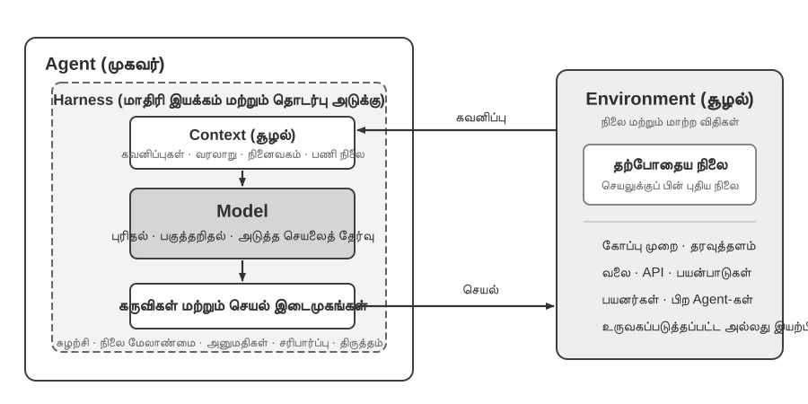
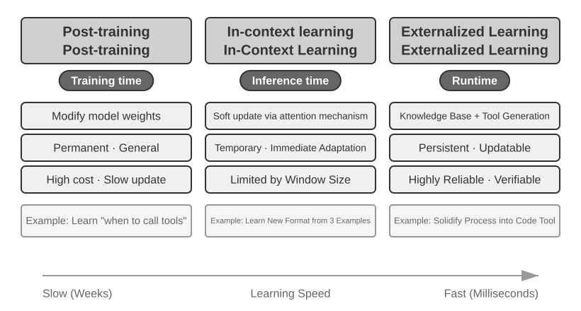
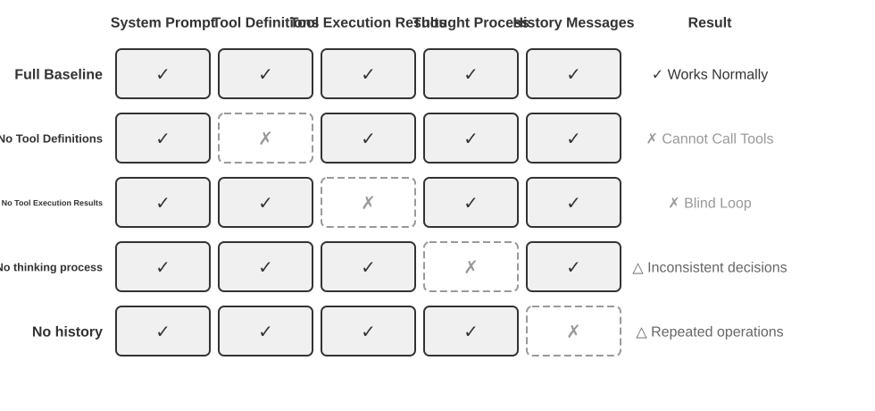
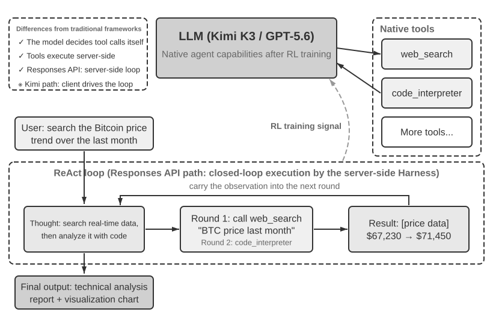
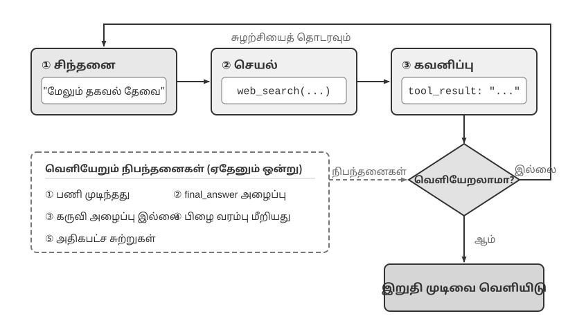

# AI ஏஜெண்டுகளுடன் தொடங்குதல்

நீங்கள் Cursor ஐப் பயன்படுத்தி குறியீடு எழுதி, அது உங்கள் குறியீட்டுத் தளத்தைத் தேடி, பல கோப்புகளைத் திருத்தி, சோதனைகள் வெற்றியடையும் வரை இயக்குவதைப் பார்த்திருந்தால்; Deep Research ஐப் பயன்படுத்தி ஒரு தலைப்பை ஆராய்ந்து, அது மீண்டும் மீண்டும் தேடி, படித்து, ஒரு விரிவான அறிக்கையைத் தொகுப்பதைப் பார்த்திருந்தால்; Manus ஐப் பயன்படுத்தி ஒரு உலாவியைக் கட்டுப்படுத்தி, உங்களுக்காக ஆன்லைன் பணிகளை முடித்திருந்தால்; Doubao தொலைபேசி உதவியாளரிடம் டிக்கெட் முன்பதிவு செய்ய அல்லது உங்கள் தொலைபேசியில் செய்தி அனுப்பச் சொன்னால்; அல்லது Pine AI உங்கள் தொலைத்தொடர்பு வழங்குநரை அழைத்து குறைந்த கட்டணத்திற்கு பேச்சுவார்த்தை நடத்தியிருந்தால்—நீங்கள் ஏற்கனவே AI ஏஜெண்டுகளைப் பயன்படுத்தியிருக்கிறீர்கள்.

இந்த தயாரிப்புகள் பல்வேறு வடிவங்களில் வருகின்றன, ஆனால் அவை ஒரு பொதுவான பண்பைப் பகிர்ந்து கொள்கின்றன: அவை இனி "நீங்கள் கேட்கிறீர்கள், அது பதிலளிக்கிறது" என்ற செயலற்ற உரையாடல்கள் அல்ல. மாறாக, அவை தன்னாட்சியுடன் செயல்படுத்தும் படிகளைத் திட்டமிடக்கூடிய, பணிகளை முடிக்க பல்வேறு கருவிகளை அழைக்கக்கூடிய, மற்றும் முடிவுகளின் அடிப்படையில் தொடர்ந்து உத்திகளை சரிசெய்யக்கூடிய அறிவார்ந்த அமைப்புகளாகும். AI ஏஜெண்டுகள் கணினிகளுடன் நாம் தொடர்பு கொள்ளும் ஒரு புதிய வழியாக மாறி வருகின்றன.

இந்த அத்தியாயம் நடைமுறையிலிருந்து தொடங்கி, AI ஏஜெண்டின் மையக் கூறுகளை நோக்கி நகர்கிறது: நவீன ஏஜெண்டுகளால் என்ன செய்ய முடியும் என்பதை நேரடியாக அனுபவிப்போம், அவற்றின் பின்னணியில் உள்ள கட்டமைப்பைப் புரிந்துகொள்வோம், ஏஜெண்ட் அமைப்புகளை உருவாக்குவதற்கான வடிவமைப்பு முறைகளையும் சிறந்த நடைமுறைகளையும் கைவரப் பெறுவோம்.

> **வாசிப்பு குறிப்பு**: இந்த அத்தியாயம் முழு புத்தகத்திற்குமான கருத்தியல் வரைபடமாக செயல்படுகிறது—இது ஏஜெண்டுகளின் முக்கிய சூத்திரம், செயல்பாட்டு சுழற்சி, பொறியியல் கட்டமைப்பு மற்றும் வடிவமைப்பு முறைகளை விரைவாக அறிமுகப்படுத்துகிறது, அடுத்தடுத்த அத்தியாயங்கள் கட்டியெழுப்பும் பொதுவான சொற்களஞ்சியத்தையும் குறிப்புப் புள்ளிகளையும் நிறுவுகிறது. முதல் வாசிப்பில் ஒவ்வொரு கருத்தையும் மனப்பாடம் செய்ய முயற்சிக்காதீர்கள்; மாறாக, முதலில் ஒரு பொதுவான பிம்பத்தை உருவாக்குங்கள். ஒவ்வொரு அடுத்தடுத்த அத்தியாயமும் இங்கு குறிப்பிடப்பட்ட ஒரு அம்சத்தை விரிவாக விளக்கும், மேலும் நீங்கள் எப்போதும் குறிப்புக்காக இந்த அத்தியாயத்திற்குத் திரும்பலாம்.

## நவீன ஏஜெண்ட் = LLM + சூழல் + கருவிகள்

நவீன ஏஜெண்ட் அமைப்புகளின் சாரத்தை ஒரு சுருக்கமான சூத்திரத்துடன் வெளிப்படுத்தலாம்: **ஏஜெண்ட் = LLM (பெரிய மொழி மாதிரி) + சூழல் + கருவிகள்**. இந்த சூத்திரம் எளிமையானது மற்றும் நடைமுறைக்குரியது, ஆனால் ஒவ்வொரு சொல்லையும் பரந்த அளவில் புரிந்துகொள்ள வேண்டும்:

- **LLM என்பது ஏஜெண்டின் மூளை**: இது வெறும் மாதிரி அளவுருக்களின் தொகுப்பு மட்டுமல்ல, மாறாக ஏஜெண்டின் முழு முடிவெடுக்கும் மையமாகும்—நோக்கத்தைப் புரிந்துகொள்வது, சிந்திப்பது, திட்டமிடுவது மற்றும் தீர்ப்புகளை வழங்குவது. மனித மூளை நியூரான்களின் தொகுப்பை விட அதிகமாக இருப்பது போல, அனுபவத்தால் வடிவமைக்கப்பட்ட சிந்தனை முறைகளை உள்ளடக்கியது, LLM இன் திறன்கள் இரண்டு பகுதிகளிலிருந்து வருகின்றன: **முன்-பயிற்சி** மூலம் திரட்டப்பட்ட உலக அறிவு மற்றும் மொழித் திறன்கள், மற்றும் **பிந்தைய-பயிற்சி** மூலம் உறுதிப்படுத்தப்பட்ட முடிவெடுக்கும் உத்திகள்—பிந்தையவற்றின் குறிப்பிட்ட நுட்பங்கள் (மேற்பார்வையிடப்பட்ட நுண்-சரிப்படுத்தல் மற்றும் வலுவூட்டல் கற்றல் போன்றவை) அத்தியாயம் 8 இல் விரிவாக விளக்கப்படும்.
- **சூழல் (Context) என்பது ஏஜெண்டின் கண்கள்**: இது மாதிரிக்கு உள்ளீடாக வழங்கப்படும் உரை மட்டுமல்ல, மாறாக ஒவ்வொரு முடிவெடுக்கும் புள்ளியிலும் ஏஜெண்டால் பார்க்க முடியும் அனைத்து தகவல்களும்—சுற்றுச்சூழல் தகவல், பயனர் நினைவகம், கள அறிவு, அதன் சொந்த நிலை மற்றும் பணி முன்னேற்றம். மனிதர்கள் முடிவெடுக்கும் போது தற்போதைய சூழ்நிலையைப் பார்க்கவும், தொடர்புடைய அனுபவங்களை நினைவுபடுத்தவும், குறிப்புப் பொருட்களை ஆலோசிக்கவும் வேண்டியிருப்பது போலவே, ஏஜெண்டின் சூழல் சாளரம் (context window) என்பது அந்த நேரத்தில் அது பார்க்கக்கூடிய அனைத்துமாகும்.
- **கருவிகள் (Tools) என்பது ஏஜெண்டின் கைகளும் கால்களும்**: அவை சில அழைக்கக்கூடிய API செயல்பாடுகள் மட்டுமல்ல, மாறாக ஏஜெண்டால் செய்யக்கூடிய அனைத்து விஷயங்களின் முழு தொகுப்பும்—முன் வரையறுக்கப்பட்ட கருவி அழைப்புகள் முதல் தேவைக்கேற்ப சிறப்புத் திறன்களை (Skills) ஏற்றுதல், புதிய திறன்களை உருவாக்க இயக்கவியல் முறையில் குறியீட்டை உருவாக்குதல் முதல் ஒத்துழைப்புக்காக துணை-ஏஜெண்டுகளுக்கு பணி ஒப்படைத்தல், பயனர்களுடன் முனைப்புடன் தொடர்புகொள்வது முதல் வெளிப்புற நிகழ்வுகளுக்கு பதிலளிப்பது வரை.

இதை மேலும் உள்ளுணர்வாகச் சொன்னால்: **ஏஜெண்ட் = மூளை + கண்கள் + கைகளும் கால்களும்**. மூளை சிந்தனை மற்றும் முடிவெடுப்பதற்குப் பொறுப்பு, கண்கள் சிந்தனைக்குத் தேவையான அனைத்து தகவல்களையும் வழங்குகின்றன, மேலும் கைகளும் கால்களும் முடிவுகளை நிஜ உலக மாற்றங்களாக மொழிபெயர்க்கின்றன.

பாரம்பரிய வலுவூட்டல் கற்றல் மற்றும் கட்டுப்பாட்டுக் கோட்பாட்டின் பார்வையில், Agent மற்றும் Environment ஆகியவை மூடிய-சுழற்சி தொடர்பின் இரு பக்கங்கள்; அவை ஒன்றின் கூறுகள் மற்றொன்று அல்ல. Environment ஒரு கவனிப்பைத் திருப்பி அனுப்புகிறது, Agent தனது Context-ஐப் பயன்படுத்தி அடுத்த செயலைத் தேர்வு செய்கிறது, அந்தச் செயல் Environment-ன் நிலையை மாற்றி அடுத்த கவனிப்பை உருவாக்குகிறது.



படம் 1-1 இரண்டு சுருக்க நிலைகளைக் காட்டுகிறது. வெளிப்புற நிலை **Agent மற்றும் Environment இடையிலான தொடர்பு**: Environment-இல் கோப்பு முறை, தரவுத்தளங்கள், வலைப்பக்கங்கள், பயனர்கள், பிற Agent-கள், உருவகப்படுத்தப்பட்ட அல்லது இயற்பியல் உலகங்கள் அடங்கும். உள்புற நிலை **Agent-இன் Model–Harness அமைப்பு**: Model கொள்கை முடிவுகளை எடுக்கிறது; Harness என்பது Agent எல்லைக்குள் உள்ள இயக்க மற்றும் நிர்வாக அடுக்கு, இது Context-ஐ உருவாக்கி, கருவி இடைமுகங்களை வழங்கி, சுழற்சி மற்றும் நிலையைப் பராமரித்து, அனுமதி, சரிபார்ப்பு, திருத்தம் ஆகியவற்றைப் பயன்படுத்துகிறது. Harness ஒரு Environment-ஐ உருவாக்கலாம், தனிமைப்படுத்தலாம் அல்லது இடைமுகப்படுத்தலாம்; ஆனால் அதன் நிலை அல்லது மாற்ற விதிகளைத் தன்னுள் கொண்டிருக்காது.

எனவே பொறியியல் சூத்திரத்தை இவ்வாறு விரிக்கலாம்: LLM என்பது Model; Context + Tools குறைந்தபட்ச Harness-ஐ உருவாக்குகின்றன; உற்பத்தி அமைப்புகள் இதே எல்லைக்குள் கட்டுப்பாடு, சரிபார்ப்பு, திருத்தம் ஆகியவற்றைச் சேர்க்கின்றன. இந்த அத்தியாயத்தின் மீதிப் பகுதி இந்த எல்லையைப் பின்பற்றுகிறது.

இந்த மூன்று கூறுகளும் RL (வலுவூட்டல் கற்றல்; அத்தியாயம் 8 ஐப் பார்க்கவும்) கருத்துகளுடன் தொடர்புடையவை; ஆனால் அவை கண்டிப்பான ஒன்றுக்கு-ஒன்று சமமல்ல. Context என்பது கவனிப்புகளும் வரலாறும் Agent-க்குள் கொண்டுள்ள பிரதிநிதித்துவம்; Tools கவனிப்பு/செயல் இடைமுகங்களை வரையறுக்கின்றன, அவற்றின் பின்னுள்ள பொருட்கள் Environment-க்கே சொந்தமானவை.

| உள்ளுணர்வு புரிதல் | செயலாக்கக் கூறு | கல்விசார் கருத்து | பொருள் |
|-----------|-----------|------------------------|--------------------------------------------------|
| **மூளை** | LLM | **கொள்கை (Policy)** | "அடுத்து என்ன செய்வது" என்பதைத் தீர்மானிக்கும் முடிவெடுக்கும் தர்க்கம்—தற்போதைய தகவலின் அடிப்படையில், கிடைக்கக்கூடிய அனைத்து விருப்பங்களிலிருந்தும் மிகவும் பொருத்தமான செயலைத் தேர்ந்தெடுக்கவும் |
| **கண்கள்** | சூழல் கட்டமைப்பு | **கவனிப்புகளும் வரலாறும்** | Environment வழங்கும் கவனிப்புகளையும் ஏற்கனவே உள்ள வரலாறையும் தற்போதைய முடிவுக்குத் தேவையான தகவலாக ஒழுங்குபடுத்துகிறது |
| **கைகளும் கால்களும்** | கருவி இடைமுகங்கள் | **கவனிப்பு/செயல் இடைமுகங்கள்** | Agent படிக்கக்கூடிய கவனிப்புகள், அனுப்பக்கூடிய செயல்கள் மற்றும் அவற்றின் வடிவத்தை வரையறுக்கிறது |

### கண்காணிப்பு இடமும் செயல் இடமும்: மாதிரிக்கும் உலகிற்கும் இடையிலான இடைமுகம்

**கண்காணிப்பு இடமும் செயல் இடமும் சேர்ந்து LLM-க்கும் அதன் வெளிப்புறச் சூழலுக்கும் இடையிலான இடைமுகத்தை உருவாக்குகின்றன**. கண்காணிப்பு இடம், சூழலில் உள்ள தகவலை மாதிரி செயலாக்கக்கூடிய Context ஆக மாற்றுகிறது; செயல் இடம், மாதிரியின் முடிவுகளை வெளி உலகின் மீதான செயல்களாக மாற்றுகிறது. கண்காணிப்பு இடத்திற்குள் வராத தகவல் மாதிரிக்குப் பொருத்தவரை இல்லாததற்குச் சமம். செயல் இடத்தில் இல்லாத ஒரு செயல்பாட்டை, என்ன செய்ய வேண்டும் என்பது மாதிரிக்குத் தெளிவாகத் தெரிந்திருந்தாலும், அது வார்த்தைகளில் பரிந்துரைக்க மட்டுமே முடியும்.

எனவே, **அடிப்படை மாதிரி மாறாமல் இருக்கும்போது ஏஜெண்டின் செயல்திறனை மேம்படுத்துவதற்கான முதன்மை அமைப்புப் பொறியியல் நெம்புகோல், அதன் கண்காணிப்பு மற்றும் செயல் இடங்களை மறுவரையறை செய்வது அல்லது விரிவுபடுத்துவதுதான்**. இந்தப் புத்தகத்தின் சொற்களில், இது Context மற்றும் Tools ஐ விரிவுபடுத்துவதாகும். “மேலும் புத்திசாலியான மாதிரி” தேவைப்படுவது போலத் தோன்றும் பல சிக்கல்கள் உண்மையில் இடைமுகச் சிக்கல்களே: பணிக்குத் தேவையான தரவை Context இல் கொண்டு வருங்கள் அல்லது தேவையான செயல்பாட்டை ஒரு Tool ஆக வழங்குங்கள்; முன்பு தீர்க்க முடியாத பணி தீர்க்கக்கூடியதாக மாறலாம்.

**Manus: முன்பு தனித்திருந்த இடங்களை ஒன்றிணைத்தல்.** Manus தோன்றுவதற்கு முன், உற்பத்தியில் பயன்படுத்தப்பட்ட ஏஜெண்டுகள் பெரும்பாலும் Deep Research, Coding, Computer Use என்ற மூன்று தனித்த பாதைகளில் வளர்ந்தன. இந்த மூன்றையும் ஒரே அமைப்பில் இணைத்த பரவலான தாக்கம் கொண்ட முதல் உற்பத்தி ஏஜெண்ட் Manus ஆகும். மெய்நிகர் உலாவி அதன் கண்காணிப்பு இடத்தை விரிவுபடுத்தியது; கோப்பு முறைமை, குறியீடு செயலாக்கம் மற்றும் கட்டளை வரி அதன் செயல் இடத்தை விரிவுபடுத்தின. Manus வெறும் வலிமையான மாதிரியை மாற்றியதால் பொது நோக்க ஏஜெண்டாகவில்லை. மூன்று வகை ஏஜெண்டுகளின் கண்காணிப்பு மற்றும் செயல் இடங்களின் ஒன்றியத்தை எடுத்ததன் மூலம், ஒரே ஏஜெண்ட் முந்தைய தயாரிப்பு எல்லைகளைக் கடந்து பணிகளை முடிக்க முடிந்தது.

**OpenClaw: இடைமுகத்தை பயனரின் டிஜிட்டல் வாழ்க்கைக்குள் விரிவுபடுத்துதல்.** OpenClaw இரு இடங்களையும் மேலும் வெளிப்புறமாக விரிவுபடுத்துகிறது. WhatsApp, Telegram, Slack, Discord, iMessage மற்றும் பல பயனர்கள் ஏற்கனவே பயன்படுத்தும் செய்தி வழிகளின் மூலம் பணிகளைப் பெற்று முடிவுகளைத் திருப்புவதால், ஏஜெண்டை ஏறக்குறைய எங்கிருந்தும் அணுகலாம். அதன் உள்ளூர் Gateway, Google Drive, Notion போன்ற cloud பயன்பாடுகளையும் உள்ளூர் கோப்பு முறைமையையும் இணைக்கிறது. இதனால் பல கணக்குகள் மற்றும் சாதனங்களில் சிதறியுள்ள டிஜிட்டல் கோப்புகள், பயனரின் வெளிப்படையான அனுமதியுடன், ஒரே ஏஜெண்டின் கண்காணிப்பு இடத்திற்குள் வந்து அதன் Tools மூலம் செயலாக்கப்படலாம். கோப்புகளைப் பதிவேற்றவோ தனி connector ஐ அமைக்கவோ வேண்டியிருந்த, தனிமைப்படுத்தப்பட்ட cloud sandbox ஐ மையமாகக் கொண்ட ஆரம்பகால Manus உடன் ஒப்பிடும்போது, local-first OpenClaw பரந்த தரவு எல்லையைக் கடக்கிறது. பின்னர் Manus தனது சொந்த Google Drive connector மற்றும் உள்ளூர் கோப்புகளுக்கான desktop அணுகலைச் சேர்த்தது—தயாரிப்பு வளர்ச்சி என்பது பல நேரங்களில் கண்காணிப்பு மற்றும் செயல் இடங்களின் விரிவாக்கமே என்ற கருத்தை இது மேலும் உறுதிப்படுத்துகிறது[^ch1-agent-products].

[^ch1-agent-products]: Manus இன் அதிகாரப்பூர்வ ஆவணங்கள் அதன் ஆரம்ப Sandbox ஐ தனிமைப்படுத்தப்பட்ட cloud virtual machine என விவரிக்கின்றன. Google Drive Connector ஐ அறிமுகப்படுத்தியபோது, Drive, desktop மற்றும் Manus இடையே கோப்புகளை கைமுறையாகப் பதிவிறக்கி பதிவேற்ற வேண்டியிருந்த முந்தைய சிதறிய பணிப்பாய்வை Manus வெளிப்படையாகச் சுட்டிக்காட்டியது. மார்ச் 2026 இல் My Computer ஐ அறிமுகப்படுத்தியபோது, முக்கியமான வேலை cloud இல் அல்லாமல் உள்ளூரில் இருப்பதை cloud sandbox இன் அடிப்படை வரம்பாகக் குறிப்பிட்டது. OpenClaw இன் அதிகாரப்பூர்வ README, பயனரின் சொந்த சாதனங்களில் இயங்கும் local-first, எப்போதும் செயலிலிருக்கும் தனிப்பட்ட உதவியாளராக அதை விவரித்து, இருபதுக்கும் மேற்பட்ட செய்தி வழிகளைப் பட்டியலிடுகிறது; அதன் Tools மற்றும் plugin அமைப்பு cloud ஒருங்கிணைப்புகளையும் உள்ளூர் திறன்களையும் சேர்க்க முடியும். காண்க: https://manus.im/blog/manus-sandbox, https://manus.im/blog/manus-google-drive-connector, https://manus.im/blog/manus-my-computer-desktop, https://github.com/openclaw/openclaw மற்றும் https://docs.openclaw.ai/tools

இந்த மூன்று கூறுகளின் பாத்திரங்களையும் அவற்றுக்கிடையேயான உறவுகளையும் புரிந்துகொள்வது பயனுள்ள ஏஜெண்ட் அமைப்புகளை உருவாக்குவதற்கான அடித்தளமாகும். மிகவும் உறுதியான கூறான கருவிகள் (கைகளும் கால்களும்) மூலம் தொடங்கி, படிப்படியாக மூளை (LLM) மற்றும் கண்கள் (சூழல்) பற்றி ஆழமாகப் பார்ப்போம். வெவ்வேறு வகையான ஏஜெண்டுகள் இந்த மூன்று பரிமாணங்களிலும் எவ்வாறு செயல்படுகின்றன என்பதை முதலில் பார்ப்போம்:

| ஏஜெண்ட் தயாரிப்பு | கண்கள் (உணர்தல்) | கைகளும் கால்களும் (செயல்) | உத்தி |
|------------------|---------------------|---------------------------|-----------------------------|
| **குறியீட்டு ஏஜெண்டுகள் (எ.கா., Cursor)** | தேவை ஆவணங்கள், குறியீட்டுத் தளம், டெர்மினல் சூழல் | திறந்த-முடிவு (உள் பகுத்தறிவு, குறியீடு தேடல், கோப்பு படிப்பு/எழுதுதல், கட்டளை செயல்படுத்துதல் போன்றவை) | அதிகரிப்பு மேம்பாடு: தேவைகளைப் புரிந்துகொள் → தொடர்புடைய குறியீட்டைத் தேடு → குறியீட்டைத் திருத்து → சோதனை செய்து சரிபார் → பிழைதிருத்தம் செய்து சரிசெய் |
| **தேடல் ஏஜெண்டுகள் (எ.கா., Deep Research)** | இணைய வளங்கள், கல்வித் தரவுத்தளங்கள், உள்ளூர் கோப்புகள் | திறந்த-முடிவு (உள் பகுத்தறிவு, தேடல் வினவல்கள், இணைய வாசிப்பு, சுருக்க உருவாக்கம்) | மீள்செயல் ஆழமாக்கல்: இருக்கும் தகவலின் அடிப்படையில் தேடல் திசையை சரிசெய்தல், படிப்படியாக ஒரு முழுமையான அறிக்கையை தொகுத்தல் |
| **கணினி கட்டுப்பாட்டு ஏஜெண்டுகள் (எ.கா., Browser Use)** | கணினித் திரை, உலாவி பக்கங்கள், கோப்பு முறைமை | திறந்த-முடிவு (உள் பகுத்தறிவு, கிளிக் செய்தல், தட்டச்சு செய்தல், ஸ்க்ரோல் செய்தல், ஸ்கிரீன்ஷாட்கள், குறியீடு செயலாக்கம் போன்றவை) | காட்சி உணர்தல் + செயல்பாடு: திரையை கவனித்தல் → இலக்கு உறுப்புகளை அடையாளம் காணல் → செயல்களைச் செய்தல் → முடிவுகளை சரிபார்த்தல் |
| **தொலைபேசி உதவியாளர் ஏஜெண்டுகள் (எ.கா., Doubao)** | தொலைபேசித் திரை, நிறுவப்பட்ட பயன்பாடுகள் | திறந்த-முடிவு (உள் பகுத்தறிவு, கிளிக் செய்தல், ஸ்வைப் செய்தல், தட்டச்சு செய்தல், பயன்பாடுகளைத் திறத்தல் போன்றவை) | நோக்கம் புரிதல் + பயன்பாட்டுக் கட்டுப்பாடு: பயனர் தேவைகளைப் புரிதல் → இலக்கு பயன்பாட்டைக் கண்டறிதல் → செயல்களைச் செய்தல் → நிறைவை உறுதிப்படுத்தல் |
| **தனிப்பட்ட பணி ஏஜெண்டுகள் (எ.கா., Pine AI)** | பயனர் கணக்குத் தகவல், வரலாற்று பில்கள், சேவை வழங்குநர் அறிவுத் தளம் | திறந்த-முடிவு (உள் பகுத்தறிவு, அழைப்புகள் செய்தல், மின்னஞ்சல்கள் அனுப்புதல், படிவங்களை நிரப்புதல், பயனருடன் உறுதிப்படுத்துதல்) | பல-படி பணி செயலாக்கம்: தகவல் சேகரிப்பு → பேச்சுவார்த்தை உத்தி உருவாக்கம் → சேவை வழங்குநரை தொடர்பு கொள்ளல் → பேச்சுவார்த்தை → முடிவுகளை அறிவித்தல் |

இந்த ஏஜெண்ட் அமைப்புகள் மூன்று பொதுவான அம்சங்களைப் பகிர்ந்து கொள்கின்றன: அவை அனைத்தும் **திறந்த-முடிவு செயல் இடைவெளிகளை**ப் பயன்படுத்துகின்றன—வரையறுக்கப்பட்ட பொத்தான்களின் தொகுப்பிலிருந்து தேர்ந்தெடுப்பதற்குப் பதிலாக, தன்னிச்சையான இயற்கை மொழி மற்றும் குறியீட்டை உருவாக்குகின்றன; அவை அனைத்தும் **உள்ளார்ந்த சிந்தனை** செய்ய முடியும்—செயல்படுவதற்கு முன் திட்டமிடல் மற்றும் பகுத்தறிவு; மேலும் அவை அனைத்தும் **தொடர்ச்சியாக தொடர்பு கொள்ள** முடியும்—சுற்றுச்சூழல் பின்னூட்டத்தின் அடிப்படையில் உத்திகளை சரிசெய்தல். இந்தத் திறன்கள் துல்லியமாக மூளை, கண்கள், கைகளும் கால்களும் ஆகியவற்றின் கூட்டியக்கத்திலிருந்து வருகின்றன—அதாவது, LLM, சூழல் மற்றும் கருவிகள்.

### கருவிகள்: ஏஜெண்டின் கைகளும் கால்களும்

கருவிகள் ஏஜெண்டை வெளி உலகத்துடன் இணைக்கும் பாலம். மனிதனின் கைகளும் கால்களும் போல, அவை ஏஜெண்டை ஒரு செயலற்ற பார்வையாளரிடமிருந்து செயல்படும் செயற்பாட்டாளராக மாற்றுகின்றன. கருவிகள் இல்லாமல் ஏஜெண்ட் வெறும் பேச்சோடு நின்றுவிடும்; கருவிகளுடன் அது உண்மையாகவே உலகை மாற்ற முடியும்.

கருவிகளை முறையாக விவாதிக்க, ஏஜெண்ட் வெளி உலகத்துடன் தொடர்பு கொள்ளும் திசையின் அடிப்படையில் அவற்றை ஐந்து வகைகளாகப் பிரிக்கலாம். இப்போதைக்கு, ஒவ்வொரு வகையின் பிரதிநிதித்துவ சூழ்நிலைகளை விரைவாகப் பார்த்து ஒரு பொதுவான பிம்பத்தை உருவாக்கினால் போதும்; அடுத்தடுத்த அத்தியாயங்கள் ஒவ்வொன்றையும் விரிவாக விளக்கும்.

**உணர்தல் கருவிகள்** ஏஜெண்ட் தகவலை அணுக அனுமதிக்கின்றன: தேடுபொறிகள் நிகழ்நேர இணையத் தரவை வழங்குகின்றன, கோப்பு முறைமைகள் உள்ளூர் ஆவணங்களைப் படிக்கின்றன, மேலும் APIகள் மற்றும் தரவுத்தளங்கள் வெளிப்புற சேவைகள் மற்றும் நிறுவன மையத் தரவுகளுடன் இணைகின்றன.

**செயலாக்க கருவிகள்** ஏஜெண்ட் உலகத்தை மாற்ற அனுமதிக்கின்றன: குறியீடு செயலாக்கம், கோப்பு செயல்பாடுகள், கணினி கட்டளைகள், வெளிப்புற API அழைப்புகள்—முடிவுகள் இவ்வாறு உறுதியான செயல்களாக மாற்றப்படுகின்றன.

**ஒத்துழைப்பு கருவிகள்** ஏஜெண்ட் மற்ற ஏஜெண்டுகளுடன் ஒத்துழைக்க அனுமதிக்கின்றன: சிறப்புப் பணிகளுக்காக துணை ஏஜெண்டுகளை நியமித்தல், முக்கிய முடிவு புள்ளிகளில் மனித உறுதிப்படுத்தலைக் கோருதல், அல்லது பல-ஏஜெண்ட் அமைப்புகளில் செயல்களை ஒருங்கிணைத்தல்.

**நிகழ்வுத் தூண்டுதல் கருவிகள்** (Event Trigger Tools) முதல் மூன்று வகைகளில் இருந்து அடிப்படையில் வேறுபடுகின்றன—அவை ஏஜெண்டால் (Agent) செயல்படுத்தப்படுவதில்லை, மாறாக ஏஜெண்டை ஒரு பணியைத் தொடங்கத் தூண்டும் வெளிப்புற உள்ளீடுகளாகச் செயல்படுகின்றன. உதாரணமாக, ஒரு புதிய மின்னஞ்சலைப் பெறுதல், திட்டமிடப்பட்ட நேரத்தை அடைதல் அல்லது மற்றொரு அமைப்பிலிருந்து வெப்ஹூக் (Webhook) அழைப்பைப் பெறுதல்—இந்த நிகழ்வுகள் ஏஜெண்டைச் செயல்படுத்தி, அடுத்தடுத்த சிந்தனை மற்றும் செயல்பாட்டைத் தொடங்கத் தூண்டுகின்றன. நிகழ்வுத் தூண்டுதல்கள் ஏஜெண்டால் செயல்படுத்தப்படாவிட்டாலும், ஏஜெண்ட் வெளி உலகத்துடன் தொடர்பு கொள்வதற்கான வழிகளில் ஒன்றாகும், எனவே அவை பரந்த கருவி அமைப்பில் சேர்க்கப்படுகின்றன.

**பயனர் தொடர்பு கருவிகள்** (User Communication Tools) என்பது ஏஜெண்ட் பயனருடன் இணைந்து தகவலைத் தெரிவிப்பதற்கான வழிகளாகும். வெளி உலகத்தை மாற்றும் செயலாக்க கருவிகளைப் போலல்லாமல், பயனர் தொடர்பு கருவிகள் தகவல் பரிமாற்றம் மற்றும் இடைவினையில் கவனம் செலுத்துகின்றன—உரைச் செய்திகள், குரல் அழைப்புகள், மின்னஞ்சல்கள் போன்றவற்றின் மூலம் ஏஜெண்டின் செயலாக்க முன்னேற்றம் அல்லது முன்னெச்சரிக்கை கவனிப்பைப் பயனருக்குத் தெரிவிக்கின்றன.

மேற்கண்ட ஐந்து வகை கருவிகளுக்கான முழுமையான வகைப்பாடு அமைப்பு மற்றும் வடிவமைப்புக் கொள்கைகள் அத்தியாயம் 4 இல் விவாதிக்கப்படும். கருவி வடிவமைப்பின் தரம் நேரடியாக ஒரு ஏஜெண்ட் எவ்வளவு தூரம் செல்ல முடியும் என்பதைத் தீர்மானிக்கிறது—இடைமுக வரையறைகள் தெளிவாக இல்லாவிட்டால், மாதிரி கருவிகளை தவறாகப் பயன்படுத்தும்; பிழை கையாளுதல் போதுமானதாக இல்லாவிட்டால், கருவி தோல்வி ஏஜெண்டிற்கு ஒரு முட்டுக்கட்டையாக மாறும்; அனுமதிக் கட்டுப்பாடுகள் மிகவும் விரிவானதாக இருந்தால், ஏஜெண்ட் பிழையின் விளைவுகள் சரிசெய்ய முடியாததாக இருக்கும். MCP (Model Context Protocol) தரநிலையின் பரவல் கருவிகளை ஒருங்கிணைப்பதை எளிதாக்கி வருகிறது.

**கருவி அழைப்பு** (Tool Calling) (செயல்பாட்டு அழைப்பு (Function Calling) என்றும் அழைக்கப்படுகிறது) நவீன LLM ஏஜெண்டுகளின் மைய திறனாகும், இது மாதிரியை கட்டமைக்கப்பட்ட முறையில் வெளிப்புற கருவிகளை அழைக்க அனுமதிக்கிறது. இந்த திறன் LLM ஐ ஒரு தூய உரை உருவாக்கியிலிருந்து உண்மையான செயல்பாடுகளைச் செய்யக்கூடிய ஒரு அறிவார்ந்த அமைப்பாக மாற்றுகிறது. இந்த புத்தகம் முழுவதும் "கருவி அழைப்பு" என்ற சொல்லைப் பயன்படுத்தும்.

கருவி அழைப்பு செயல்முறை நான்கு படிகளைக் கொண்டுள்ளது: முதலில், சூழலில் (context) மாதிரிக்கு எந்தெந்த கருவிகள் கிடைக்கின்றன (அவற்றின் பெயர்கள், நோக்கங்கள் மற்றும் அளவுருக்கள் உட்பட) என்பதைத் தெரிவிக்கவும்; பின்னர், மாதிரி தானாகவே ஒரு கருவியை அழைக்கலாமா, எந்த கருவியை அழைக்க வேண்டும், என்ன அளவுருக்களை அனுப்ப வேண்டும் என்பதை முடிவு செய்கிறது; அடுத்து, கருவி செயல்பட்ட பிறகு, முடிவு சூழலில் இணைக்கப்படுகிறது; இறுதியாக, மாதிரி முடிவின் அடிப்படையில் அடுத்த செயலை முடிவு செய்கிறது. இந்த சுழற்சி பின்னர் அறிமுகப்படுத்தப்படும் ReAct இன் அடித்தளமாகும்.

வானிலை வினவல் காட்சியை உதாரணமாக எடுத்துக் கொண்டால், API மட்டத்தில் நான்கு-படி செயல்முறையின் எளிமைப்படுத்தப்பட்ட பிரதிநிதித்துவம் பின்வருமாறு:

```text
Step 1: Declare tools                  Step 2: Model decides to call
tools: [{                             assistant: {
  name: "get_weather",                  tool_calls: [{
  parameters: {                           function: "get_weather",
    city: "string"                        arguments: {city: "Beijing"}
  }                                      }]
}]                                    }

படி 3: முடிவு சூழலுடன் இணைக்கப்பட்டது    படி 4: முடிவின் அடிப்படையில் மாதிரி பதிலளிக்கிறது
tool: {                               assistant: {
  tool_call_id: "call_1",               content: "இன்று பெய்ஜிங்கில்: 28°C, வெயில்."
  content: '{"temp":28,"sky":"clear"}'     }}
```

டெவலப்பர்கள் கருவிகளை வரையறுத்து, கருவி அழைப்புகளை இயக்குவது மட்டுமே தேவை; "அழைக்க வேண்டுமா, எதை அழைக்க வேண்டும், என்ன அளவுருக்களை அனுப்ப வேண்டும்" என்ற முடிவை மாதிரி தானாகவே முழுமையாக்குகிறது. அத்தியாயம் 2 இந்த API கட்டமைப்பை விரிவாக விளக்கும்.

ஒரு ஏஜெண்டிற்கான கருவிகளை வடிவமைக்கும்போது, பணிக்குத் தேவையான மிகக் குறுகிய திறனிலிருந்து தொடங்கி, பணியின் சிக்கல்தன்மை அதிகரிக்கும்போது படிப்படியாக விரிவாக்கலாம். பணி அடிப்படை எண்கணிதச் செயல்களை மட்டும் கொண்டிருந்தால், தெளிவான அளவுருக்களைக் கொண்ட ஒரு கால்குலேட்டர் போதும்; பணி விரிதாள்களைப் படித்தல், விடுபட்ட மதிப்புகளைச் சுத்திகரித்தல், புள்ளிவிவரங்களைக் கணக்கிடுதல், வரைபடங்களை உருவாக்குதல் என்று விரிவடையும்போது, மேலும் மேலும் சிறப்புக் கருவிகளைச் சேர்ப்பதைவிடக் கட்டுப்படுத்தப்பட்ட Python code interpreter-ஐ இணைத்துப் பயன்படுத்துவதும் ஆராய்வதும் எளிதாக இருக்கும். ஆனால் பொதுப்பயன்பாட்டுத் தன்மை பிழைகளுக்கான வாய்ப்பையும் தாக்குதல் பரப்பையும் அதிகரிக்கிறது: குறியீடு தனிமைப்படுத்தப்பட்ட மணல் பெட்டியில் இயக்கப்பட வேண்டும், இயல்பாகப் பிணைய அணுகல் மறுக்கப்பட வேண்டும், மேலும் அங்கீகரிக்கப்பட்ட பணிக் கோப்பகத்திற்கு வெளியேயுள்ள கோப்புகளைப் படிக்க அனுமதிக்கக் கூடாது; செயலாக்க நேரம், CPU, நினைவகம், வெளியீட்டு அளவு ஆகியவற்றிற்கும் வரம்புகள் அமைக்கப்பட வேண்டும்.

இதேபோல், ஒற்றைப் பதிவுக் கருவி ஒரு செயலாக்கத்தின் நிகழ்வுகளைப் பதிவு செய்ய ஏற்றது; பல மணிநேரங்கள் அல்லது நாட்கள் நீளும் பணிகளுக்கு, கட்டுப்படுத்தப்பட்ட மெய்நிகர் பணிக் கோப்பகம் திட்டம், இடைநிலை முடிவுகள், செயலாக்கப் பதிவுகள், இறுதி வெளியீடுகள் ஆகியவற்றை ஒன்றாகச் சேமித்து, ஏஜெண்ட் பல செயலாக்கங்களுக்கு இடையில் பணியைத் தொடர உதவும். அந்தக் கோப்பகம் படிக்கவும் எழுதவும் அனுமதிக்கப்பட்ட பாதைகள், சேமிப்புத் திறன், கோப்பு வகைகள் ஆகியவற்றை வரம்பிடுவதோடு பாதை மீறலையும் தடுக்க வேண்டும்; முழு ஹோஸ்ட் கோப்பு முறைமையையும் ஏஜெண்டிற்கு வெளிப்படுத்தக் கூடாது.

பொது-நோக்கக் கருவிகள் எப்போதும் சிறப்புக் கருவிகளைவிட மேம்பட்டவை அல்ல. பணம் செலுத்துதல், தரவை நீக்குதல், மின்னஞ்சல் அனுப்புதல், உற்பத்திச் சூழலில் வெளியிடுதல் போன்ற உயர் ஆபத்துள்ள அல்லது கடுமையான வணிகக் கட்டுப்பாடுகளுக்குட்பட்ட செயல்பாடுகள், தெளிவான அளவுருக்கள், வரையறுக்கப்பட்ட அனுமதிகள், முழுமையான தணிக்கைத்தன்மை ஆகியவற்றைக் கொண்ட சிறப்புக் கருவிகளாகவே தொகுக்கப்பட வேண்டும்; தேவைப்பட்டால் முன்தோற்றம் மற்றும் மனித உறுதிப்படுத்தலையும் சேர்க்கலாம். எனவே, கருவி வடிவமைப்பின் மையக் கோட்பாடு: **பொது அடிப்படைத் திறன்கள் இணைத்தல் மற்றும் ஆராய்தலுக்குப் பயன்படுகின்றன; சிறப்புக் கருவிகள் உயர் ஆபத்துள்ள செயல்பாடுகளையும் கடுமையான வணிக விதிகளையும் கட்டுப்படுத்தப் பயன்படுகின்றன**.

### LLM: ஏஜெண்டின் மூளை

பெரிய மொழி மாதிரி (LLM) ஏஜெண்டின் முடிவெடுக்கும் மையமாகும். பயனர் கோரிக்கையைப் பெற்றவுடன், அது முதலில் உண்மையான நோக்கத்தைப் புரிந்துகொள்ள வேண்டும் (பயனர் சொல்வது பெரும்பாலும் அவர்கள் உண்மையில் விரும்புவதாக இருக்காது), பின்னர் தெளிவற்ற அல்லது சிக்கலான பணிகளை செயல்படுத்தக்கூடிய படிகளாகப் பிரிக்க வேண்டும். செயல்பாட்டின் போது, அது தொடர்ந்து தீர்ப்புகளை வழங்க வேண்டும்: அடுத்து என்ன செய்வது, ஒரு கருவியை அழைக்க வேண்டுமா, எந்த கருவியை அழைக்க வேண்டும், என்ன அளவுருக்களை அனுப்ப வேண்டும். இந்த "புரிந்துகொள்-திட்டமிடு-செயல்படுத்து" திறன், முன்-பயிற்சியின் போது திரட்டப்பட்ட அறிவிலிருந்து வருகிறது, மேலும் இது பணிப்பாய்வுகள் மற்றும் தன்னாட்சி ஏஜெண்டுகள் இரண்டும் சார்ந்திருக்கும் அடித்தளமாகும்.

LLM ஏஜெண்டுகளின் ஒரு தனித்துவமான திறன் **உள் பகுத்தறிவு** ஆகும்—உண்மையான செயலை எடுப்பதற்கு முன், ஏஜெண்டால் திட்டமிட்டு பகுத்தறிய முடியும். இந்த செயல்முறை வெளிப்புற சூழலை மாற்றாது, ஆனால் அடுத்தடுத்த செயல்களின் தரத்தை கணிசமாக மேம்படுத்த முடியும். LLM கள் பயனுள்ள உள் பகுத்தறிவைச் செய்ய முடிவதற்குக் காரணம், முன்-பயிற்சி கட்டத்தில் (பாரிய இணைய உரையில் ஆரம்ப பயிற்சி, மாதிரி மொழி வடிவங்கள் மற்றும் உலக அறிவைக் கற்க அனுமதிக்கிறது) பெறப்பட்ட திறன்கள் ஆகும்—மாதிரி பின்பற்றும் பகுத்தறிவு, மனித அறிவில் ஏற்கனவே பதிந்துள்ள தர்க்க விதிகளை அடிப்படையாகக் கொண்டது, இதில் கணித விதிகள், காரண-விளைவு உறவுகள், சிக்கல் பகுப்பாய்வு உத்திகள் போன்றவை அடங்கும். எனவே, பாரம்பரிய வலுவூட்டல் கற்றல் ஏஜெண்டுகளைப் போல அல்லாமல், இன்றைய LLM அடிப்படையிலான ஏஜெண்டுகள் கண்மூடித்தனமாகச் சீரற்ற முறையில் ஆராய்வதில்லை; அவை கட்டமைக்கப்பட்ட அறிவுத் தளத்தின் மீது பகுத்தறிகின்றன.

#### மாதிரியே ஏஜெண்டாக: மாதிரியே தயாரிப்பாக மாறும்போது

"மாதிரியே ஏஜெண்டாக" (Model as Agent) முன்னுதாரணம், AI ஏஜெண்ட் மேம்பாட்டின் சமீபத்திய திசையைக் குறிக்கிறது. மேம்பட்ட மாதிரிகள், பிந்தைய-பயிற்சி (post-training) (குறிப்பாக வலுவூட்டல் கற்றல்) மூலம், கருவி அழைப்புத் திறன்களை (tool calling capabilities) உள்ளார்ந்த திறன்களாக உள்வாங்கிக் கொள்கின்றன: எப்போது ஒரு கருவியை அழைக்க வேண்டும், எந்த கருவியை அழைக்க வேண்டும், என்ன அளவுருக்களை அனுப்ப வேண்டும் என்பதை மாதிரியே முடிவு செய்கிறது, கைமுறை ஒருங்கிணைப்பு இல்லாமல். இருப்பினும், இது கட்டமைப்பு அடுக்கு (framework layer) குறைவான முக்கியத்துவம் வாய்ந்ததாக மாறுகிறது என்று அர்த்தமல்ல. மாறாக, மாதிரி எவ்வளவு சக்தி வாய்ந்ததோ, அதைச் சுற்றி கட்டப்பட்ட ஹார்னஸ் (Harness) அவ்வளவு முக்கியமானதாகிறது. ஹார்னஸ் என்ற சொல் முதலில் குதிரையின் மீது வைக்கப்படும் கியர்—கடிவாளம் மற்றும் சேணம்—என்பதைக் குறிக்கிறது, குதிரையின் ஓடும் திறனைக் கட்டுப்படுத்த அல்ல, மாறாக அந்த சக்தியை சரியான திசையில் வழிநடத்த. ஏஜெண்டின் சூழலில், மாதிரி என்பது சக்தி வாய்ந்த ஆனால் கணிக்க முடியாத குதிரை, மற்றும் ஹார்னஸ் என்பது அதன் திறன்களை நம்பகமான பணி செயல்பாட்டிற்கு திசைதிருப்பும் பொறியியல் உறை (engineering shell). ஒரு ஏஜெண்டில், ஹார்னஸ் என்பது சூழல் மேலாண்மை (context management), கருவி இடைமுகங்கள் (tool interfaces), பாதுகாப்பு கட்டுப்பாடுகள் (safety constraints), மற்றும் சரிபார்ப்பு மற்றும் திருத்த வழிமுறைகள் (verification and correction mechanisms) போன்ற உள்கட்டமைப்பை உள்ளடக்கியது (இந்த அத்தியாயத்தின் இறுதிப் பகுதியைப் பார்க்கவும்).

மாதிரியின் தன்னாட்சி முடிவெடுக்கும் இடம் (autonomous decision-making space) எவ்வளவு பெரியதோ, பிழைகளின் சாத்தியமான தாக்கமும் அவ்வளவு பெரியதாக இருக்கும், எனவே நம்பகத்தன்மையை உறுதிப்படுத்த மிகவும் நுட்பமான கட்டுப்பாடுகள், சரிபார்ப்பு மற்றும் திருத்த வழிமுறைகள் தேவைப்படுகின்றன. மாதிரி விற்பனையாளர்களின் (model vendors) உண்மையான நன்மை "கட்டமைப்பை மெல்லியதாக்குவது" அல்ல, மாறாக மாதிரி மற்றும் அதைச் சுற்றியுள்ள ஹார்னஸை இணைத்து மேம்படுத்தி (co-optimize), தொடர்ச்சியாக மீண்டும் செயல்படுத்த முடிவதாகும்.

ஆனால் இங்கே ஒரு ஆழமான கேள்வி நிலுவையில் உள்ளது: மாதிரிகள் தொடர்ந்து வலுப்பெறுமென்றால், இன்றைய Harness இறுதியில் மாதிரியால் “விழுங்கப்பட்டுவிடுமா”? Rich Sutton தனது “கசப்பான பாடம்” (The Bitter Lesson) என்ற கட்டுரையில், AI ஆராய்ச்சியின் எழுபது ஆண்டுகளில் மீண்டும் மீண்டும் நிகழ்ந்த ஒரு காட்சியைத் திரும்பிப் பார்க்கிறார்[^ch1-1]: ஆராய்ச்சியாளர்கள் தங்கள் துறைசார் புரிதலை மீண்டும் மீண்டும் அமைப்புக்குள் குறியீடாக்குகின்றனர்; அது குறுகிய காலத்தில் பலன் தருகிறது, ஆனால் நீண்ட காலத்தில் கணக்கீடு மற்றும் தரவின் அளவுடன் தொடர்ந்து விரிவடையக்கூடிய பொதுவான முறைகளான தேடல் மற்றும் கற்றலிடம் எப்போதும் தோற்கிறது. இதன் அடிப்படையில் அளவிட்டால், Harness-இல் உள்ள கட்டுப்பாடுகள், சரிபார்ப்பு மற்றும் திருத்தங்களில் எவ்வளவு “மனித முன்னறிவு” சார்ந்தவை, இறுதியில் மாதிரியால் உள்வாங்கப்படவிருப்பவை? இந்நூலின் நிலைப்பாடு: **திசையை ஏற்றுக்கொள், வேகத்தில் நடைமுறைவாதியாக இரு**. திசையைப் பொறுத்தவரை, மாதிரி தொடர்ந்து Harness-ஐ விழுங்கும் என்பதில் இந்நூலுக்குச் சந்தேகமில்லை—tool calling மற்றும் long-horizon planning ஆகியவை ஒரு காலத்தில் வெளிப்புற orchestration-ஐச் சார்ந்திருந்தன; இன்று அவை மாதிரியின் இயல்புத் திறன்களாகிவிட்டன. ஆனால் வேகத்தைப் பொறுத்தவரை, இந்த “விழுங்குதல்” உள்ளுணர்வு உணர்த்துவதை விட மிகவும் மெதுவானது: பயிற்சி மாதக் கணக்கில் நடைபெறுகிறது; உண்மையான வணிகத்தில் உள்ள அனைத்துக் கட்டுப்பாடுகளையும் விருப்பங்களையும் மாதிரியால் ஒரே முறையில் உள்வாங்க முடியாது. மாதிரியின் தற்போதைய திறன் எல்லையே Harness-இன் தற்போதைய மதிப்பு. எனவே Harness engineering என்பது கசப்பான பாடத்திற்கு எதிரானதல்ல; மாறாக பொறியியல் கால அளவில் அந்தப் பாடத்தை நடைமுறைப்படுத்துவதாகும்: மாதிரி இன்னும் நிலையாகச் செய்ய முடியாததை Harness முதலில் ஈடுசெய்கிறது; மாதிரி ஒவ்வொரு அடுக்கையும் உள்வாங்கும்போது, Harness அந்த அடுக்கை அகற்றி, புதிய திறன் எல்லைக்குப் பாதுகாப்பளிக்கிறது.

[^ch1-1]: Sutton, Rich. "The Bitter Lesson", 2019. http://www.incompleteideas.net/IncIdeas/BitterLesson.html

#### Agent-இன் கற்றல் பொறிமுறை: Context தழுவலிலிருந்து நிலையான புதுப்பிப்பு வரை

வலுவூட்டல் கற்றலின் மூலம் tool-calling policy-ஐ மாதிரி இயல்புத் திறனாக உள்வாங்க முடியும் என்பதை முன்னர் விவாதித்தோம். ஆனால் Agent-இன் நடத்தை மாற்றம் பயிற்சிக் கட்டத்தில் மட்டும் நிகழ்வதில்லை. புதுப்பிப்பு நிகழும் இடம் மற்றும் அதன் நீடித்த காலத்தின் அடிப்படையில், அதை மூன்று ஒன்றுக்கொன்று நிரப்பும் பாதைகளாகப் புரிந்துகொள்ளலாம் (படம் 1-2): பணிக்குள் நிகழும் Context தழுவல், பணிகளுக்கு இடையேயான வெளிப்புற artifact புதுப்பிப்பு மற்றும் பயிற்சிச் சுழற்சியிலான parameter புதுப்பிப்பு.



**Context தழுவல்** தற்போதைய பணிக்குள் நிகழ்கிறது. எடுத்துக்காட்டுகள், நிலை மற்றும் மீட்டெடுப்பு முடிவுகள் Context-க்குள் நுழைந்ததும், மாதிரி உடனடியாகத் தனது நடத்தையைச் சரிசெய்ய முடியும்; ஆனால் அதனால் அடுத்த அமர்வின் நிலையான நிலை மாறாது. இதன் நன்மைகள் வேகமும் குறைந்த செலவும்; Context window மற்றும் தகவல் ஒழுங்கமைப்பின் முறை ஆகியவற்றால் கட்டுப்படுவது இதன் வரம்பு. இந்தத் தழுவல் எவ்வாறு செயல்படுகிறது என்பதை அத்தியாயம் 2 விரிவாக விவாதிக்கும்.

மாற்றம் பணிகளைக் கடந்தும் நிலைத்திருக்க வேண்டுமெனில், **வெளிப்புற artifacts**-ஐப் புதுப்பிக்கலாம்: உண்மைகள் மற்றும் அனுபவங்களை knowledge documents-ஆக ஒழுங்கமைத்தல், மொழியில் வெளிப்படுத்தக்கூடிய policies-ஐ Prompt அல்லது Skill-இல் எழுதுதல், deterministic processes மற்றும் constraints-ஐ programs மற்றும் Harness-ஆக எழுதுதல். இந்த artifacts தணிக்கை செய்யக்கூடியவை, திருத்தக்கூடியவை; இயக்க நேரத்தில் அவற்றை Agent இன்னும் Context அல்லது tool interface வழியாகப் பயன்படுத்த வேண்டும். அத்தியாயங்கள் 3 முதல் 5 வரை முறையே அறிவு மற்றும் program அடித்தளங்களை வழங்குகின்றன; மதிப்பிடப்பட்ட இயக்க trajectories-இலிருந்து இத்தகைய புதுப்பிப்புகளை எவ்வாறு உருவாக்குவது என்பதை அத்தியாயம் 9 விவாதிக்கிறது.

மருத்துவப் படப் புரிதல், இயற்கை மொழி நடை அல்லது மறைமுக decision policy போன்ற உயர்-பரிமாணத் திறன்கள் இலக்காக இருக்கும்போது, வெளிப்புற விதிகளால் அவற்றை முழுமையாக வெளிப்படுத்துவது கடினம்; அப்போது பிந்தைய பயிற்சியின் மூலம் **model parameters**-ஐப் புதுப்பிக்க வேண்டும். Parameter update-இன் deployment செலவு அதிகம்; ஆனால் அது இயல்பான, பரந்த பொதுமைப்படுத்தல் திறனை உருவாக்கும். அதன் முறைகளை அத்தியாயம் 8 முறையாக அறிமுகப்படுத்தும். எனவே இந்த மூன்று பாதைகளும் ஒன்றுக்கொன்று விலக்கான வகைப்பாடுகள் அல்ல; வெவ்வேறு கால அளவுகளில் ஒருங்கிணைந்து செயல்படும் பொறிமுறைகள்: Context உடனடி தழுவலைக் கையாள்கிறது, வெளிப்புற artifacts கட்டுப்படுத்தக்கூடிய குவிப்பைக் கையாள்கின்றன, parameters வெளிப்படையாகக் கூற இயலாத திறன்களை உள்வாங்குகின்றன.

### சூழல் (Context): ஏஜெண்டின் கண்கள்

சூழல் என்பது ஒவ்வொரு முடிவெடுக்கும் புள்ளியிலும் ஒரு ஏஜெண்ட் பார்க்கக்கூடிய அனைத்து தகவல்களும் ஆகும். ஒரு நபர் முடிவெடுக்கும்போது மேசையில் விரிக்கப்பட்டுள்ள அனைத்துப் பொருட்களையும் பார்க்க வேண்டியது போல—பணி வழிமுறைகள், குறிப்பு கையேடுகள், முந்தைய தொடர்பு பதிவுகள், சமீபத்திய தரவு—ஒரு ஏஜெண்டின் சூழல் சாளரம் (context window) அதன் "பார்வைப் புலம்" ஆகும். API கண்ணோட்டத்தில் (விவரங்களுக்கு அத்தியாயம் 2 ஐப் பார்க்கவும்), ஒவ்வொரு LLM அழைப்பிற்குமான சூழல் பின்வரும் ஐந்து பகுதிகளைக் கொண்டுள்ளது:

- **சிஸ்டம் ப்ராம்ப்ட் (System Prompt)**: பயனர் முறைக்கு முறை உள்ளிடும் ப்ராம்ப்ட்டுகளைப் போலல்லாமல், சிஸ்டம் ப்ராம்ப்ட் டெவலப்பரால் எழுதப்பட்டு உரையாடல் முழுவதும் மாறாமல் இருக்கும். இது ஏஜெண்டின் "வேலை விளக்கமாக" செயல்படுகிறது—அதன் அடையாளம், அனுமதிகள் மற்றும் நடத்தை வழிகாட்டுதல்களை வரையறுக்கிறது. சிஸ்டம் ப்ராம்ப்ட்டின் கவனமான ப்ராம்ப்ட் பொறியியல் மூலம், ஏஜெண்ட் எவ்வாறு செயல்படுகிறது என்பதை நாம் வடிவமைக்க முடியும். சிஸ்டம் ப்ராம்ப்ட்டில் **பயனர் நினைவகம்** (பயனர் விருப்பத்தேர்வுகள், வரலாற்று நடத்தை, பின்னணி அமைப்புகள் போன்ற தனிப்பயனாக்கப்பட்ட தகவல்கள், விவரங்களுக்கு அத்தியாயம் 3 ஐப் பார்க்கவும்) அமர்வுகள் முழுவதும் நீடித்து நிற்கும், அத்துடன் மாறும் வகையில் செலுத்தப்படும் சுற்றுச்சூழல் நிலையும் அடங்கும்.
- **கருவி வரையறைகள் (Tool Definitions)**: ஏஜெண்டுக்குக் கிடைக்கும் கருவிகளின் பெயர்கள், செயல்பாட்டு விளக்கங்கள் மற்றும் அளவுரு வடிவங்களை அறிவிக்கிறது. கருவி வரையறைகள் இல்லாமல், ஏஜெண்ட் எந்த கருவியையும் அடையாளம் காணவோ அழைக்கவோ முடியாது—ஒரு அப்லேஷன் ஆய்வு (சோதனை 1-1) இதை உறுதிப்படுத்தும். கருவி வரையறைகள், சிஸ்டம் ப்ராம்ப்ட்டுடன் சேர்ந்து, உரையாடல் முழுவதும் மாறாமல் இருக்கும் **நிலையான முன்னொட்டை** உருவாக்குகின்றன (இது அடிப்படை முன்னுதாரணம்; 2026 முதல், உற்பத்திக் கட்டமைப்புகளில் கருவிகளின் முழு ஸ்கீமாவும் தேவைக்கேற்ப சூழலின் இறுதியில், முன்னொட்டை உடைக்காமல், மாறும் முறையில் ஏற்றப்படலாம்—விவரங்களுக்கு அத்தியாயம் 2 இன் கருவி வரையறை பிரிவையும் அத்தியாயம் 4 ஐயும் பார்க்கவும்).
- **பயனர் செய்திகள் (User Messages)**: பயனரிடமிருந்து வரும் உள்ளீடு. பயனர் செய்திகளில் RAG (மீட்டெடுப்பு-அதிகரிக்கப்பட்ட உருவாக்கம், Retrieval-Augmented Generation, விவரங்களுக்கு அத்தியாயம் 3 ஐப் பார்க்கவும்) மூலம் மாறும் வகையில் மீட்டெடுக்கப்பட்ட **வெளிப்புற அறிவும்** இருக்கலாம்—இது பயிற்சித் தரவு வெட்டுத் தேதிக்கு அப்பாற்பட்ட தகவல்கள் அல்லது தனிப்பட்ட கள அறிவை உள்ளடக்கியது.
- **உதவியாளர் செய்திகள் (Assistant Messages)**: மாதிரியால் முன்னர் உருவாக்கப்பட்ட பதில்கள், இவை மூன்று பகுதிகளைக் கொண்டிருக்கலாம்—பகுத்தறிவு (`reasoning`: உள் சிந்தனைச் சங்கிலி; ஒத்திசைவையும் முடிவுகளின் விளக்கத்தன்மையையும் பேணுகிறது), உள்ளடக்கம் (`content`: பயனருக்கான பதில்), மற்றும் கருவி அழைப்புகள் (`tool_calls`: ஏஜெண்ட் செயல்படும் வழி). ஒரு குறிப்பிட்ட பதிலில், இந்த மூன்று பகுதிகளும் ஒரே நேரத்தில் தோன்றாமல் இருக்கலாம்: எடுத்துக்காட்டாக, ஏஜெண்ட் ஒரு கருவியை அழைக்க முடிவு செய்யும் போது, பொதுவாக `reasoning` + `tool_calls` மட்டுமே இருக்கும்; இறுதி பதிலை வழங்கும் போது, பொதுவாக `reasoning` + `content` மட்டுமே இருக்கும்.
- **கருவி முடிவுகள் (Tool Results)**: ஏஜெண்ட் கட்டமைப்பு ஒரு கருவியை இயக்கிய பிறகு திரும்பப் பெறப்படும் முடிவுகள். இந்த முடிவுகள் ஏஜெண்டின் அடுத்த சிந்தனைக்கு நேரடி அடிப்படையாக செயல்படுகின்றன, மேலும் செயல்படுத்தல் முடிவுகளிலிருந்து கற்றுக்கொண்டு தவறுகளை மீண்டும் செய்வதைத் தவிர்க்கவும் அனுமதிக்கின்றன.

முதல் இரண்டு உருப்படிகள் (சிஸ்டம் ப்ராம்ப்ட் + கருவி வரையறைகள்) நிலையான முன்னொட்டை உருவாக்குகின்றன, கடைசி மூன்று உருப்படிகள் (பயனர் செய்திகள் + உதவியாளர் செய்திகள் + கருவி முடிவுகள்) ஒவ்வொரு தொடர்பிலும் வளரும் மாறும் செய்தி வரலாற்றை உருவாக்குகின்றன. இந்த ஐந்து பகுதிகளும் சேர்ந்து ஒவ்வொரு LLM அனுமானத்திற்கான சூழலை உருவாக்குகின்றன.

ஒவ்வொரு கூறும் உண்மையிலேயே தவிர்க்க முடியாததா என்பதைச் சரிபார்க்க, மிகவும் நேரடியான முறை **அப்லேஷன் ஆய்வு (ablation study)** ஆகும்: ஒரு மருத்துவர் சாத்தியமான காரணங்களை ஒவ்வொன்றாக நீக்கி நோயைக் கண்டறிவது போல—முதலில் கூறு A-ஐ நீக்கி அமைப்பு இன்னும் செயல்படுகிறதா என்று பார்ப்பது, பின்னர் கூறு B-ஐ நீக்குவது, இவ்வாறு தொடர்வது—ஒவ்வொரு கூறின் பங்களிப்பையும் தீர்மானிக்க முடியும். சோதனை 1-1 இந்த அணுகுமுறையைப் பின்பற்றி, மேலே குறிப்பிடப்பட்ட ஐந்து கூறுகளையும் முறையாகச் சோதிக்கிறது. முடிவுகள் காட்டுவது: கருவி வரையறைகளை (tool definitions) நீக்கினால், ஏஜெண்ட் முற்றிலும் செயலிழந்து விடுகிறது; கருவி முடிவுகள் (tool results) இல்லாமல், ஏஜெண்ட் முந்தைய படியின் பின்னூட்டத்தைப் பார்க்க முடியாமல் அதே கருவியை மீண்டும் மீண்டும் அழைத்து முடிவில்லா சுழற்சியில் சிக்கிக் கொள்கிறது; உதவியாளர் செய்திகளில் (assistant messages) உள்ள பகுத்தறிவு செயல்முறை (reasoning process) அகற்றப்பட்டால், தொடர்ச்சியான முடிவுகள் ஒன்றுக்கொன்று முரண்படத் தொடங்குகின்றன; மேலும் செய்தி வரலாறு (message history) இல்லாமல், ஏஜெண்ட் தனது நினைவாற்றலை இழந்து, முழு பணி ஓட்டத்தையும் மீண்டும் தொடங்கி, ஏற்கனவே முடிக்கப்பட்ட படிகளை மீண்டும் செய்கிறது.

> **சோதனை 1-1 ★★: சூழலின் முக்கியப் பங்கு**
>
> ஒரு முறையான **அப்லேஷன் ஆய்வு** மூலம், வெவ்வேறு சூழல் கூறுகள் ஏஜெண்ட் நடத்தையில் ஏற்படுத்தும் தாக்கத்தை ஆராய்ந்தோம். இந்தச் சோதனை மேலே குறிப்பிடப்பட்ட ஐந்து கூறுகளில் நான்கைத் தேர்ந்தெடுத்துச் சோதித்தது—சிஸ்டம் ப்ராம்ப்ட் (system prompt), ஏஜெண்டின் அடிப்படை அடையாள வரையறையாக இருப்பதால், அது அப்லேஷன் செய்யப்படவில்லை; ஏனெனில் அது இல்லாமல், ஏஜெண்ட்டுக்கு அடிப்படைப் பங்கு விழிப்புணர்வு கூட இல்லாமல் போகும், இதனால் சோதனை அர்த்தமற்றதாகிவிடும். படம் 1-3 இல் காட்டப்பட்டுள்ளபடி, ஐந்து குழு கட்டுப்பாட்டுச் சோதனைகள் பின்வருமாறு: அனைத்து கூறுகளையும் தக்கவைத்துக்கொண்ட ஒரு முழுமையான அடிப்படைக் குழு (baseline group), மற்றும் ஒவ்வொரு கூறும் காணாமல் போன நான்கு கட்டுப்பாட்டுக் குழுக்கள், ஒவ்வொரு கூறின் தாக்கத்தையும் கவனிக்க.
>
> 
>
> சோதனை முடிவுகள் ஒவ்வொரு சூழல் கூறின் ஈடுசெய்ய முடியாத பங்கை வெளிப்படுத்தின. **கருவி வரையறைகள்** (Tool Definitions) (நிலையான முன்னொட்டின் (static prefix) ஒரு பகுதி) ஏஜெண்டின் செயல் திறனுக்கான அடித்தளமாகும்; அவை இல்லாமல், ஏஜெண்ட் எந்த கருவியையும் அடையாளம் காணவோ அழைக்கவோ முடியாது. **கருவி முடிவுகள்** (Tool Results) மூடிய-லூப் கட்டுப்பாட்டுக்கு (closed-loop control) முக்கியமானவை; அவை இல்லாதது ஏஜெண்ட் "கண்மூடித்தனமாக" செயல்பட வைத்து முடிவில்லா சுழற்சியில் சிக்க வைக்கிறது. **பகுத்தறிவு செயல்முறை** (reasoning process) (உதவியாளர் செய்திகளின் பகுத்தறிவு பகுதி) ஏஜெண்டின் முந்தைய முடிவுகளுக்கான காரணங்களைப் பாதுகாத்து, சிந்தனை செயல்முறையை மேலும் ஒருங்கிணைந்ததாக ஆக்கி, முரண்பாடான முடிவுகளைத் தடுக்கிறது. **செய்தி வரலாறு** (Message history) (முந்தைய சுற்றுகளின் பயனர் செய்திகள், உதவியாளர் செய்திகள் மற்றும் கருவி முடிவுகள்) தேவையற்ற செயல்பாடுகளைத் தடுத்து, பணி நிறைவேற்றத்தின் ஒருங்கிணைப்பைப் பராமரித்து, அதே தவறுகளை மீண்டும் செய்வதைத் தவிர்க்கிறது.
>
> இந்தச் சோதனையின் மைய நுண்ணறிவு: **சூழல் (Context) தான் ஏஜெண்ட் (Agent) என்ன பார்க்க முடியும் என்பதைத் தீர்மானிக்கிறது, மேலும் ஏஜெண்ட் தான் பார்க்கும் தகவலின் அடிப்படையில் மட்டுமே முடிவுகளை எடுக்க முடியும்**. ஒரு நபர் கண்களை மூடிக்கொண்டு சரியான முடிவுகளை எடுக்க முடியாதது போலவே, எந்த ஒரு சூழல் கூறு இல்லாமலும் ஏஜெண்டின் முடிவெடுக்கும் திறன் கடுமையாகக் குறைகிறது—கருவி வரையறைகள் (tool definitions) இல்லாமல், என்ன கருவிகள் உள்ளன என்று தெரியாது; முந்தைய செயலாக்க முடிவுகள் இல்லாமல், ஏற்கனவே என்ன செய்யப்பட்டுள்ளது என்று தெரியாது.

### ReAct லூப் (ReAct Loop)

ஏஜெண்டின் மூன்று முக்கிய கூறுகளைப் புரிந்துகொண்ட பிறகு, ஒரு இயற்கையான கேள்வி எழுகிறது: அவை எவ்வாறு ஒன்றாகச் செயல்படுகின்றன? ReAct லூப் என்பது LLM, சூழல் மற்றும் கருவிகளை இணைக்கும் மைய வழிமுறையாகும்—ஒரு ஏஜெண்ட் எவ்வாறு படிப்படியாக சிந்தித்து செயல்படுகிறது என்பதைப் பார்ப்போம்.

ஒரு ஏஜெண்ட் ஒரு பணியைச் செயல்படுத்தும் மைய முறை **ReAct** (Reasoning + Acting) என்று அழைக்கப்படுகிறது. பெயர் "Reasoning" மற்றும் "Acting" ஆகிய இரண்டு சொற்களை மட்டுமே பிரதிபலித்தாலும், உண்மையான லூப் மூன்று நிலைகளைக் கொண்டுள்ளது: மாதிரி முதலில் அடுத்து என்ன செய்ய வேண்டும் என்பதைப் பற்றி **சிந்திக்கிறது (reasons)**, பின்னர் ஒரு கருவியை அழைத்து **செயல்படுகிறது (acts)**, பின்னர் கருவியால் திருப்பி அனுப்பப்பட்ட முடிவை **கவனிக்கிறது (observes)** மற்றும் அடுத்த படி பற்றி தொடர்ந்து சிந்திக்கிறது. இந்த "சிந்தி → செய் → பார் → சிந்தி → செய் → பார்" லூப் பணி முடியும் வரை மீண்டும் மீண்டும் நிகழ்கிறது.

பல நாணய வருவாய் ஒருங்கிணைப்பின் ஒரு உறுதியான உதாரணம் மூலம் ஒரு ஏஜெண்டின் **பாதையை (trajectory)** புரிந்துகொள்வோம். பாதை என்பது ஏஜெண்ட் பணியைச் செயல்படுத்தும்போது குவிந்துவரும் செய்தி வரலாறு—பயனர் செய்திகள், உதவியாளர் செய்திகள் (சிந்தனை மற்றும் கருவி அழைப்புகள் உட்பட), மற்றும் கருவி முடிவுகள். ஒவ்வொரு முறை LLM அழைக்கப்படும்போதும், அது பெறும் முழுமையான சூழல் **நிலையான முன்னொட்டு (static prefix)** (சிஸ்டம் ப்ராம்ப்ட் + கருவி வரையறைகள்) மற்றும் **பாதை** (மாறும் செய்தி வரலாறு) ஆகியவற்றைக் கொண்டுள்ளது (படம் 1-4). இது ஒரு முக்கியமான உண்மையை வெளிப்படுத்துகிறது: **ஏஜெண்ட் சூழல் = நிலையான முன்னொட்டு + பாதை**. குறிப்பாக, நிலையான முன்னொட்டு முன்பு குறிப்பிடப்பட்ட ஐந்து கூறுகளில் முதல் இரண்டிற்கு (சிஸ்டம் ப்ராம்ப்ட் + கருவி வரையறைகள்) ஒத்துள்ளது, மேலும் பாதை கடைசி மூன்றிற்கு (பயனர் செய்திகள் + உதவியாளர் செய்திகள் + கருவி முடிவுகள், ஒவ்வொரு தொடர்பிலும் வளரும்) ஒத்துள்ளது. இந்த முழுமையான சூழலின் அடிப்படையில், LLM அடுத்த பதிலை உருவாக்குகிறது, இது அடுத்த அழைப்பிற்காக பாதையில் சேர்க்கப்படுகிறது.


பின்வரும் Python பாணி வரைவு விளக்கத்திற்கான pseudocode மட்டுமே; இயக்கக்கூடிய SDK குறியீடு அல்ல. `python` marker தொடரியல் முன்னிலைப்படுத்தலுக்காக மட்டுமே பயன்படுத்தப்படுகிறது.

**ReAct கட்டுப்பாட்டு சுழற்சி:**

```python
trajectory = [user_request]

repeat:
    context = stable_prefix + trajectory
    decision = Model(context)
    trajectory.append(decision)

    if decision has no tool call:
        return decision.answer

    for call in decision.tool_calls:       # independent calls may run in parallel
        validated_call = Harness.validate(call)
        observation = Environment.execute(validated_call)
        trajectory.append(observation)
```

சூடோகுறியீடு மூலம் ஒரு ஏஜெண்ட் பாதையின் கட்டமைப்பைப் புரிந்துகொள்வோம்:

```text
trajectory = [
  {role: "user", content: "Based on the company's quarterly revenue: Q1 2.5M USD, Q2 2.1M EUR, Q3 1.8M GBP, Q4 380M JPY, calculate the company's total annual revenue and average quarterly revenue"},
  
  # முதல் சுழற்சி - LLM மேலே உள்ள பாதையைப் பார்க்கிறது, ஒரு பதிலை உருவாக்குகிறது
  {role: "assistant",
   reasoning: "Need to convert all currencies to USD...",
   content: "",  # பயனருக்கு நேரடி பதில் இல்லை
   tool_calls: [
     {name: "convert_currency", args: {amount: 2100000, from: "EUR", to: "USD"}},
     {name: "convert_currency", args: {amount: 1800000, from: "GBP", to: "USD"}},
     {name: "convert_currency", args: {amount: 380000000, from: "JPY", to: "USD"}}
   ]},
  
  # ஏஜெண்ட் கட்டமைப்பு கருவிகளை இயக்குகிறது, முடிவுகளை பாதையில் சேர்க்கிறது
  {role: "tool", content: "EUR->USD: 2282608.7"},
  {role: "tool", content: "GBP->USD: 2278481.01"},
  {role: "tool", content: "JPY->USD: 2541806.02"},
  
  # இரண்டாவது சுழற்சி - LLM முழுமையான பாதையைப் பார்க்கிறது, கருவி முடிவுகள் உட்பட
  {role: "assistant",
   reasoning: "மாற்று முடிவுகள் கிடைத்தன, இப்போது தொகுத்து கணக்கிட வேண்டும்...",
   content: "",
   tool_calls: [
     {name: "code_interpreter", args: {code: "total = 2500000 + 2282608.7 + ..."}}
   ]},
  
  {role: "tool", content: "மொத்தம்: $9,602,895.73, சராசரி: $2,400,723.93..."},
  
  # மூன்றாவது சுழற்சி - LLM முழுமையான பாதையைப் பார்க்கிறது, இறுதி பதிலை உருவாக்குகிறது
  {role: "assistant",
   reasoning: "அனைத்து கணக்கீடுகளும் முடிந்தன, முடிவுகளை சுருக்கமாகக் கூறுகிறேன்...",
   content: "இறுதி பதில்: மொத்த வருவாய் $9,602,895.73..."}
]
```

சிஸ்டம் ப்ராம்ப்ட் மற்றும் கருவி வரையறைகள் பாதையில் காட்டப்படவில்லை என்பதை கவனிக்கவும்—அவை நிலையான முன்னொட்டாக செயல்பட்டு, ஒவ்வொரு LLM அழைப்பிற்கும் முன் தானாகவே பாதையில் சேர்க்கப்படுகின்றன.

எங்கள் சோதனைகளில், இந்த சுழற்சி தெளிவாக நிரூபிக்கப்பட்டது. முதல் சுற்றில், ஏஜெண்ட் பணியை பகுப்பாய்வு செய்து மூன்று நாணய மாற்று கருவிகளை இணையாக அழைத்தது; இரண்டாவது சுற்றில், மாற்று முடிவுகளின் அடிப்படையில், சிக்கலான கணக்கீடுகளுக்கு code interpreter ஐ அழைத்தது; மூன்றாவது சுற்றில், அனைத்து கணக்கீடுகளும் முடிந்ததை உறுதிசெய்த பிறகு, இறுதி பதிலை உருவாக்கியது. முழு செயல்முறையும் ஒரு சிக்கலான பல-படி பணியை வெறும் 3 சுழற்சிகள் மற்றும் 4 கருவி அழைப்புகளில் நிறைவு செய்தது.

இந்த அடிப்படை வடிவமைப்பில், LLM பார்க்கும் சூழலில் புதிய தகவல் தொடர்ந்து சேர்க்கப்படுகிறது. ஒவ்வொரு LLM அழைப்பும் முழுமையான பாதையைப் பார்க்கிறது, இது பணியின் எந்த கட்டத்தில் உள்ளது, முன்பு என்ன முயற்சிகள் மேற்கொள்ளப்பட்டன, என்ன முடிவுகள் பெறப்பட்டன என்பதைப் புரிந்துகொள்ள அனுமதிக்கிறது. மனிதர்கள் சிக்கல்களைத் தீர்க்கும்போது தொடர்ந்து மதிப்பாய்வு செய்து சுருக்கமாகக் கூறுவது போல, ஏஜெண்ட் பாதை மூலம் முழு பணியின் உலகளாவிய விழிப்புணர்வைப் பராமரிக்கிறது. அதே நேரத்தில், பாதையின் கட்டமைக்கப்பட்ட தன்மை அமைப்பை மிகவும் விளக்கக்கூடியதாகவும் பிழைத்திருத்தம் செய்யக்கூடியதாகவும் ஆக்குகிறது: பயனர் செய்திகள், உதவியாளர் செய்திகள் (பகுத்தறிவு + கருவி அழைப்புகள்) மற்றும் கருவி முடிவுகள் அனைத்தும் தெளிவாக பிரிக்கப்பட்டுள்ளன.

பாதை என்பது செயல்பாட்டின் பதிவு மட்டுமல்ல; இது ஏஜெண்டின் திறன்களின் பிரதிபலிப்பும் ஆகும். அதிக எண்ணிக்கையிலான பாதைகளை பகுப்பாய்வு செய்வதன் மூலம், ஏஜெண்ட் நடத்தை முறைகளைக் கண்டறியலாம், முடிவெடுக்கும் பாதைகளை மேம்படுத்தலாம் மற்றும் கருவி வடிவமைப்பை மேம்படுத்தலாம். பாதை தரவை அறிவுத் தளமாக சுருக்கமாகக் கூறலாம் அல்லது வலுவூட்டல் கற்றல் மூலம் சிறந்த ஏஜெண்ட் மாதிரிகளைப் பயிற்றுவிக்கப் பயன்படுத்தலாம், இதன் மூலம் அனுபவத்திலிருந்து கற்றலின் மூடிய-சுழற்சி மேம்படுத்தலை அடையலாம்.

ஏஜெண்டின் செயல்பாட்டுச் சுழற்சியை இப்போது புரிந்துகொண்டோம்; வெவ்வேறு மாதிரிகள் அதை எவ்வாறு இயக்குகின்றன என்பதைக் காண, இரண்டு சோதனைகளை இயக்கிப் பார்ப்போம்.

> **சோதனை 1-2 ★: Kimi K3 இன் உள்ளார்ந்த ஏஜெண்ட் திறன்**
>
> இந்த சோதனையானது **Kimi K3** இன் உள்ளார்ந்த ஏஜெண்ட் திறனை நிரூபிக்கிறது, இது "மாதிரியே ஏஜெண்டாக" (Model as Agent) என்ற முன்னுதாரணத்தை உள்ளடக்கியது. Kimi K3, தோராயமாக 2.8 டிரில்லியன் அளவுருக்களைக் கொண்ட Mixture of Experts (MoE) மாதிரியாகும்—MoE ஐ ஒரு நிபுணர் குழுவாக நீங்கள் நினைக்கலாம்: வெவ்வேறு வகையான சிக்கல்களை எதிர்கொள்ளும்போது, அமைப்பு தானாகவே மிகவும் பொருத்தமான நிபுணர்களைத் தேர்ந்தெடுத்து பதிலளிக்கும், அனைத்து நிபுணர்களும் ஒரே நேரத்தில் வேலை செய்ய வேண்டிய அவசியமில்லை, இதனால் திறன் மற்றும் செயல்திறன் இரண்டும் உறுதி செய்யப்படுகின்றன. இது 1 மில்லியன் டோக்கன் சூழல் சாளரம், உள்ளார்ந்த காட்சி புரிதல் திறன்கள் மற்றும் எப்போதும் இயங்கும் "சிந்தனை முறை" ஆகியவற்றைக் கொண்டுள்ளது; வலுவூட்டல் கற்றல் மூலம் பயிற்றுவிக்கப்பட்ட இந்த மாதிரி, கருவி அழைப்பின் **முடிவெடுக்கும் கொள்கையை** (decision policy) ஒரு உள்ளார்ந்த திறனாக உள்வாங்கிக் கொண்டுள்ளது—எப்போது ஒரு கருவியை அழைப்பது, எதை அழைப்பது, என்ன அளவுருக்களை அனுப்புவது என்பதெல்லாம் மாதிரியே முடிவு செய்கிறது—இதனால் இணையத் தேடல்கள் போன்ற பணிகளை சுயாதீனமாக நிறைவேற்ற முடிகிறது. தெளிவுபடுத்த வேண்டியது: உள்வாங்கப்பட்டது "எப்போது அழைப்பது, எப்படி அழைப்பது" என்ற முடிவெடுக்கும் திறனே; `web_search`, `code_runner` போன்ற கருவிகளோ இன்னும் API மட்டத்திலான உள்ளமைந்த கருவிகளாக (built-in tools) சேவையக (server-side) பக்கத்திலேயே செயல்படுத்தப்படுகின்றன (Kimi இந்த அதிகாரப்பூர்வ கருவிகளை Formula என்ற பெயருடைய சேவையக ஸ்கிரிப்ட் இயந்திரம் மூலம் இயக்குகிறது).
>
> முக்கிய அவதானிப்புகள் பின்வருமாறு: மாதிரியானது எப்போது தேட வேண்டும், எதைத் தேட வேண்டும் என்பதைத் தானே முடிவு செய்கிறது, உண்மையான சுயாட்சியை வெளிப்படுத்துகிறது; இது தேடல் முடிவுகளின் அடிப்படையில் அதன் உத்தியை மாறும் வகையில் சரிசெய்து, தகவல் போதுமானதா என்பதை சுயாதீனமாக தீர்மானிக்க முடியும். இங்கு பொதுவான ஒரு தவறான புரிதலைத் தெளிவுபடுத்த வேண்டும்; திறவுகோல், எது எங்கு சொந்தமானது என்பதைப் பிரித்தறிவதே. **வலுவூட்டல் கற்றல் மாதிரிக்கு வழங்குவது முடிவெடுக்கும் திறனே**—எப்போது ஒரு கருவியை அழைப்பது, எதை அழைப்பது, என்ன அளவுருக்களுடன், முடிவைப் பார்த்த பிறகு தொடர்வதா, டஜன் கணக்கான அல்லது நூற்றுக்கணக்கான அழைப்புகளை ஒத்திசைவான பகுத்தறிவாக எப்படி இணைப்பது; இந்த "பயன்படுத்துவதா, எப்படிப் பயன்படுத்துவது" என்ற தீர்ப்புகளே மாதிரியின் அளவுருக்களில் (weights) எழுதப்படுகின்றன. **கருவிகளும் அவற்றின் செயலாக்கமும் ஏஜெண்ட் கட்டமைப்பால் (அல்லது API இன் உள்ளமைந்த கருவிகளால்) வழங்கப்படுகின்றன**—`web_search`, `code_runner` ஆகியவற்றின் உண்மையான செயலாக்கங்கள், குறியீடு மணல்தொட்டி (code sandbox), அழைப்பை அனுப்பி முடிவைத் திருப்பும் இணைப்புப் பணிகள் அனைத்தும் மாதிரிக்கு வெளியே உள்ள உள்கட்டமைப்பிலேயே நடக்கின்றன. RL மேம்படுத்துவது முடிவெடுக்கும் கொள்கையையே; அது தேடுபொறியையோ குறியீடு மணல்தொட்டியையோ மாதிரியின் அளவுருக்களுக்குள் "அடைத்து" வைப்பதில்லை. எனவே ஒருங்கிணைப்பு லூப் மறைந்துவிடவில்லை; அது கிளையண்டிலிருந்து சேவையகத்திற்கு நகர்ந்தது, அதே நேரத்தில் முடிவெடுக்கும் அதிகாரம் மாதிரிக்குச் சென்றது[^ch1-2].
>
> [^ch1-2]: RL உள்வாங்குவது கருவி அழைப்பின் முடிவெடுக்கும் கொள்கையையே தவிர, கருவியின் செயலாக்க வழிமுறையை அல்ல—இந்த வேறுபாட்டை GitHub Issue #30 வழியாகச் சுட்டிக்காட்டித் தெளிவுபடுத்திய வாசகர் asdlem க்கு நன்றி. பார்க்க: https://github.com/bojieli/ai-agent-book/issues/30
>
> Kimi K3 ஏஜெண்ட் பணிகளில் ஒரு தனித்துவமான நன்மையைக் கொண்டுள்ளது: **நீண்ட சங்கிலி கருவி அழைப்புகளின் நிலைத்தன்மை**—இது 200–300 தொடர்ச்சியான கருவி அழைப்புகளைச் செய்ய முடியும், அதே நேரத்தில் ஒத்திசைவான பகுத்தறிவைப் பராமரிக்கிறது, இது சில டஜன் அழைப்புகளுக்குப் பிறகு சிதையத் தொடங்கும் பெரும்பாலான மாதிரிகளை விட மிகவும் மேலானது. K3 நீண்ட சுழற்சி நிரலாக்க மற்றும் ஏஜெண்ட் பணிச்சுமைகளுக்காக உகந்ததாக்கப்பட்டது, மேலும் இரண்டு வகைகளில் வெளியிடப்பட்டது: K3 Max (உரையாடல் மற்றும் ஏஜெண்ட் பணிகளுக்கு) மற்றும் K3 Swarm Max (பெரிய அளவிலான இணை செயலாக்கத்திற்கு). திறந்த மூல மாதிரியாக, இது மென்பொருள் பொறியியல் மற்றும் ஏஜெண்ட் அளவுகோல்களில் சிறந்த மூடிய மூல அமைப்புகளுடன் ஒப்பிடக்கூடிய செயல்திறனை அடைகிறது, மாதிரிகளுக்கு உள்ளார்ந்த ஏஜெண்ட் திறன்களை வழங்க வலுவூட்டல் கற்றலைப் பயன்படுத்துவதன் செயல்திறனை நிரூபிக்கிறது.

> **சோதனை 1-3 ★: GPT-5.6 இன் உள்ளார்ந்த Deep Research திறன்**
>
> இரண்டாவது சோதனையானது **OpenAI GPT-5.6** ஐப் பயன்படுத்தி, ஒரு மேம்பட்ட மாதிரி API மட்டத்திலான உள்ளமைந்த கருவிகளின் (built-in tools) துணையுடன், Deep Research இன் "தேடு—படி—பகுப்பாய்வு செய்" ஒருங்கிணைப்பு லூப்பை சேவையகப் பக்கத்திலேயே எவ்வாறு மூடிய சுழற்சியாக இயக்குகிறது என்பதை விளக்குகிறது. GPT-5.6 இன் வசதியான ஓர் அம்சம் **Freeform Tool Calling** ஆகும். பாரம்பரியமாக, ஒரு மாதிரி ஒரு கருவியை அழைக்கும்போது, அனைத்து அளவுருக்களையும் கண்டிப்பான JSON வடிவத்தில் (ஒரு கட்டமைக்கப்பட்ட தரவு வடிவம்) அடைக்க வேண்டும், இது பல வடிவமைப்பு கட்டுப்பாடுகளுடன் ஒரு படிவத்தை நிரப்புவது போன்றது. Freeform tool calling (API இல் `type: "custom"` என்ற கருவி வகை அறிவிப்பின் மூலம்) மாதிரியானது மூல உரையை நேரடியாக கருவிக்கு அனுப்ப அனுமதிக்கிறது (எ.கா., Python குறியீட்டின் ஒரு பகுதி, ஒரு SQL வினவல்), JSON escape சிரமத்தை நீக்குகிறது. வலியுறுத்த வேண்டியது: இது API அளவுரு வடிவத்தின் பரிணாமமே தவிர, மாதிரி கட்டமைப்பின் புரட்சி அல்ல—கிளையண்டின் கருவி அழைப்பு லூப் (`tool_calls` ஐக் கண்டறி → செயல்படுத்து → முடிவைத் திருப்பு) அப்படியே இருக்கிறது; மாறுவது அளவுருக்கள் JSON சரத்திலிருந்து மூல உரையாக மாறுவது மட்டுமே.
>
> GPT-5.6, Responses API இன் **வலைத் தேடல் மற்றும் code interpreter** உள்ளமைந்த கருவிகளுடன் (built-in tools) இணைந்து, Deep Research இன் மையத்தை வழங்குகிறது: மாதிரியானது நிகழ்நேரத் தகவலுக்காக சுயாதீனமாக இணையத்தில் தேடலாம் மற்றும் ஆழமான பகுப்பாய்வுக்காக குறியீட்டை எழுதலாம், இது "தேடு -> படி -> பகுப்பாய்வு செய் -> மீண்டும் தேடு" என்ற மீள்செயல் ஆராய்ச்சி செயல்முறையை செயல்படுத்துகிறது. உதாரணமாக, "10 ASEAN நாடுகளின் தலைநகரங்களுக்கு இடையேயான மிகக் குறுகிய தூரம் என்ன?" போன்ற கேள்வியை எதிர்கொள்ளும்போது, GPT-5.6 தானாகவே ஒவ்வொரு தலைநகரின் புவியியல் ஆயங்களைத் தேடுகிறது, பின்னர் அனைத்து தலைநகரங்களின் இணைகளுக்கும் இடையேயான பெருவட்ட தூரத்தைக் கணக்கிட Python குறியீட்டை எழுதுகிறது, இறுதியில் மிக நெருக்கமான இணையை அடையாளம் காட்டுகிறது. இதேபோல், "கடந்த மாதத்தில் பிட்காயினின் போக்கைத் தேடி தொழில்நுட்ப பகுப்பாய்வு செய்யுங்கள்" போன்ற பணியில், இது பல நிதி தரவு மூலங்களிலிருந்து நிகழ்நேர விலைத் தரவைப் பெறலாம், தொழில்முறை தொழில்நுட்ப பகுப்பாய்வு நூலகங்களைப் பயன்படுத்தி நகரும் சராசரிகள், RSI, MACD மற்றும் பிற தொழில்நுட்ப குறிகாட்டிகளைக் கணக்கிடலாம், காட்சி விளக்கப்படங்களை உருவாக்கலாம் மற்றும் வர்த்தக பரிந்துரைகளை வழங்கலாம்.
>
> மிக முக்கியமாக, GPT-5.6 **OpenAI Deep Research** தயாரிப்பின் வடிவமைப்பு தத்துவத்தை மாதிரி மட்டத்தில் உள்வாங்குகிறது, இது ஒரு **நோக்கம் தெளிவுபடுத்தல் செயல்முறையை** அறிமுகப்படுத்துகிறது. ஒரு பயனர் ஒரு ஆராய்ச்சி கோரிக்கையை சமர்ப்பிக்கும்போது, GPT-5.6 உடனடியாக அதை செயல்படுத்தாது. அதற்கு பதிலாக, இது முதலில் ஒரு தொடர் கேள்விகள் மூலம் பயனரின் உண்மையான நோக்கத்தை தெளிவுபடுத்துகிறது. "கடந்த மாதத்தில் பிட்காயினின் போக்கைத் தேடி தொழில்நுட்ப பகுப்பாய்வு செய்யுங்கள்" என்பதை உதாரணமாக எடுத்துக் கொண்டால், அது முதலில் கேட்கும்: "எந்த தரவு மூலத்தை நீங்கள் விரும்புகிறீர்கள்? எந்த தொழில்நுட்ப குறிகாட்டிகள் பகுப்பாய்வு செய்யப்பட வேண்டும்?" இந்த ஊடாடும் நோக்கம் தெளிவுபடுத்தல் மூலம், GPT-5.6 பயனர் தேவைகளை சிறப்பாக பூர்த்தி செய்யும் மிகவும் துல்லியமான ஆராய்ச்சி அறிக்கைகளை உருவாக்க முடியும்.
>
> GPT-5.6 என்பது "மாதிரியே ஏஜெண்டாக" (model as agent) என்ற கருத்தாக்கத்தின் முதிர்ந்த எடுத்துக்காட்டாகும்—வலைத் தேடல், code interpreter போன்றவை Responses API இன் உள்ளமைந்த கருவிகளாக, சேவையகப் பக்கத்தில் மூடிய சுழற்சியாகச் செயல்படுத்தப்படுகின்றன; ஒருங்கிணைப்பு லூப் கிளையண்டிலிருந்து API சேவையகத்திற்கு நகர்கிறது, இது கிளையண்ட் செயலாக்கத்தை எளிமைப்படுத்துகிறது. மாதிரி இன்னும் நிலையான கருவி அழைப்புகளையே வெளியிடுகிறது; கிளையண்ட் "தேடு—படி—பகுப்பாய்வு செய்" ஒருங்கிணைப்பு கட்டமைப்பைத் தானே கட்ட வேண்டியதில்லை, அவ்வளவே. மிகவும் கவனிக்கத்தக்க அம்சம் நோக்கம் தெளிவுபடுத்தும் வழிமுறை (intent clarification mechanism) ஆகும்: மாதிரி ஒரு பணியைப் பெற்றவுடன் உடனடியாக செயல்படுத்தாது; மாறாக, முதலில் கேள்விகள் மூலம் பயனரின் உண்மையான தேவையை உறுதிசெய்து, பின்னர் ஆராய்ச்சி உத்தியை வகுக்கிறது. இது பணி செயல்படுத்தப்படுவதற்கு முன்பே "பயனர் சொன்னது" மற்றும் "பயனர் உண்மையில் விரும்புவது" ஆகியவற்றுக்கு இடையேயான இடைவெளியைக் குறைக்கிறது.
>
> இந்தச் சோதனை எந்த ஒரு குறிப்பிட்ட வழங்குநருடனும் பிணைக்கப்படவில்லை என்பதை கவனிக்க வேண்டும். OpenAI கிரெடிட்கள் இல்லாத வாசகர்கள், சமமான நிர்வகிக்கப்பட்ட கருவிகளை வழங்கும் வேறு வழங்குநருடன் இதை மீளுருவாக்கலாம். எடுத்துக்காட்டாக, Alibaba Cloud Bailian இன் qwen3.7-plus Responses API-யிலும் `web_search` மற்றும் `code_interpreter` உள்ளமைந்துள்ளன; Kimi K3 இன் Formula நிர்வகிக்கப்பட்ட தேடலும் `code_runner`-உம் இதே வகைத் திறன்களை வழங்குகின்றன.
>
> படம் 1-5 "மாதிரியே ஏஜெண்டாக" முன்னுதாரணத்தின் கீழ் உள்ள உள்ளார்ந்த கருவி அழைப்பின் (native tool calling) முழுமையான கட்டமைப்பையும், உண்மையான பணிகளில் Kimi K3 / GPT-5.6 இன் ReAct செயல்படுத்தல் செயல்முறையையும் விளக்குகிறது.
>
> 

## Harness பொறியியல்: மாதிரிக்கு அப்பாற்பட்ட போட்டித்திறன்

இந்த கட்டத்தில், ஒரு ஏஜெண்டின் (agent) மையச் செயல்பாட்டு முறையை நீங்கள் புரிந்துகொண்டுள்ளீர்கள்—LLM ஆனது ReAct சுழற்சியைப் பயன்படுத்தி, சூழல் (context) உதவியுடன், கருவிகளைப் பயன்படுத்தி பணிகளை முடிக்கிறது. முந்தைய சோதனைகள் இந்த அடிப்படை வழிமுறை செயல்படுகிறது என்பதை நிரூபித்துள்ளன, ஆனால் அவை தெளிவான பாதிப்புகளையும் வெளிப்படுத்தியுள்ளன: மாதிரி மாயத்தோற்றம் (hallucination) ஏற்படலாம் (இல்லாத கருவிகள் அல்லது அளவுருக்களை உருவாக்குதல்), தவறான கருவியைத் தேர்ந்தெடுக்கலாம், அல்லது பிழைகளிலிருந்து மீளத் தவறலாம். வேலை செய்யும் ஒரு டெமோவுக்கும் நம்பகமான தயாரிப்புக்கும் இடையே ஒரு பெரிய இடைவெளி உள்ளது, மேலும் இந்த பாதிப்புகள்தான் Harness பொறியியல் தீர்க்க முயல்கிறது. இந்த அத்தியாயத்தின் முதல் பாதி ஒரு ஏஜெண்ட் என்றால் என்ன என்ற கேள்விக்கு பதிலளித்தது; இரண்டாவது பாதி ஒரு ஏஜெண்ட் உற்பத்தி சூழலில் (production environment) எவ்வாறு நம்பகத்தன்மையுடன் இயங்க முடியும் என்பதற்கு பதிலளிக்கிறது.

முந்தைய பகுதிகள் மைய சூத்திரத்தை நிறுவின: **ஏஜெண்ட் = LLM + சூழல் + கருவிகள்**. இந்த சூத்திரம் ஒரு ஏஜெண்டின் **உள் கலவையை** விவரிக்கிறது—மூளை, கண்கள், கைகள் மற்றும் கால்களாக எது செயல்படுகிறது. Harness பொறியியல் அதே அமைப்புக்கு இரண்டாவது, **பொறியியல் செயலாக்க** (engineering implementation) கண்ணோட்டத்தைச் சேர்க்கிறது: LLM ஐ ஒரு மையக் கூறாக (Model) கருதி, அதைச் சுற்றி கட்டப்பட்ட அனைத்து துணைக் குறியீட்டையும் Harness என்று அழைக்கிறோம். இந்த இரண்டு கண்ணோட்டங்களும் ஒன்றுக்கொன்று மாற்றாக இல்லை, மாறாக ஒரே அமைப்பை வெவ்வேறு சுருக்க நிலைகளில் (levels of abstraction) விவரிக்கின்றன. மிகவும் பொதுவான "மாதிரி" (Model) என்ற சொல்லுக்கு மாறுவதற்கான காரணம், Harness பொறியியலின் கொள்கைகள் பகுத்தறிவு மற்றும் கருவி அழைப்பு திறன் கொண்ட எந்த மாதிரிக்கும் பொருந்தும், ஒரு குறிப்பிட்ட வகைக்கு மட்டுமல்ல. Harness இன் மையமானது அசல் சூத்திரத்தின் "சூழல் + கருவிகள்" ஆகும், மேலும் மூன்று அடுக்கு பாதுகாப்புகள் சேர்க்கப்படுகின்றன: **கட்டுப்படுத்து** (Constrain—ஏஜெண்ட் என்ன செய்யலாம் மற்றும் செய்யக்கூடாது என்பதை வரையறுத்தல்), **சரிபார்** (Verify—ஏஜெண்ட் அதைச் சரியாகச் செய்ததா என்பதைச் சரிபார்த்தல்), மற்றும் **சரிசெய்** (Correct—தவறு நடந்தபோது எவ்வாறு மீள்வது).

உற்பத்தி சூழலில் முழுமையான கலவையை ஒரு சமன்பாட்டுடன் விரிவாக்கலாம்:

> **ஏஜெண்ட் = மாதிரி + Harness**
>
> **Harness = சூழல் மேலாண்மை + கருவி இடைமுகங்கள் + கட்டுப்பாடு + சரிபார்ப்பு + திருத்தம்**
>
> **ஏஜெண்ட் ↔ Environment**

ஒரு குறைந்தபட்ச டெமோவுக்கு Model மற்றும் சூழலை உருவாக்கி கருவிகளை வெளிப்படுத்தும் Harness மட்டுமே தேவை; ஒரு உற்பத்தி அமைப்பு அதே எல்லைக்குள் கட்டுப்பாடு, சரிபார்ப்பு, திருத்தம் ஆகியவற்றையும் சேர்க்க வேண்டும். எடுத்துக்காட்டாக, பணத்தைத் திருப்பியளிக்கும் Agent கொள்கையைச் சூழலில் வைக்கலாம், அனுமதி மற்றும் தொகை விதிகளால் அழைப்புகளைக் கட்டுப்படுத்தலாம், தரவுத்தள நிலை மூலம் முடிவைச் சரிபார்க்கலாம், நேரம் முடிந்தால் மீண்டும் முயலலாம் அல்லது மாற்றுப் பாதைக்குச் செல்லலாம். “மாதிரிக்கு வெளியே, சூழலுக்கு உள்ளே” இருக்கும் இந்த இயக்க மற்றும் நிர்வாகக் குறியீட்டையே Harness engineering ஆராய்கிறது.

இன்னும் துல்லியமாகச் சொன்னால், ஹார்னஸ் என்பது மாதிரிக்கு வெளியே உள்ள அனைத்தும் அல்ல; அது **ஏஜெண்டின் எல்லைக்குள், மாதிரிக்கு வெளியே இருக்கும் இயக்க மற்றும் நிர்வாக அடுக்கு** ஆகும். இது மாதிரி–சுற்றுச்சூழல் தொடர்பை இடைமுகப்படுத்துகிறது, ஆனால் சுற்றுச்சூழலையே உள்ளடக்காது. கருவி வரையறைகள், அழைப்பு அடாப்டர்கள், சாண்ட்பாக்ஸ் அனுமதிகள் மற்றும் மீட்டமைப்பு வழிமுறைகள் ஹார்னஸைச் சேர்ந்தவை; சாண்ட்பாக்ஸுக்குள் மாறும் கோப்புகள் மற்றும் செயல்முறைகள், வெளிப்புற தரவுத்தளங்கள், வலைப்பக்கங்கள், பயனர்கள் மற்றும் இயற்பியல் உலகம் சுற்றுச்சூழலைச் சேர்ந்தவை. பயன்படுத்தப்படும் இடம் இந்தக் கருத்தியல் எல்லையை மாற்றாது. ஹார்னஸின் மையமானது சூழல் மேலாண்மையும் கருவி இடைமுகங்களும் ஆகும்; இதைச் சுற்றி மூன்று வகையான பொறியியல் பாதுகாப்புகள் கட்டப்பட்டுள்ளன:

| செயல்பாடு | ஒரு வரி பொறுப்பு / மையக் கொள்கை | நடைமுறை உதாரணம் | அத்தியாயத்தைப் பார்க்கவும் |
|---|---|---|---|
| **சூழல்** | மாதிரிக்கு உணர்வுத் தகவலை (perceptual information) வழங்குகிறது; தகவல் போதுமான தன்மை: ஒவ்வொரு முடிவு புள்ளியிலும் ஏஜெண்ட் போதுமான தகவலின் அடிப்படையில் முடிவுகளை எடுப்பதை உறுதி செய்யவும் | சிஸ்டம் ப்ராம்ப்ட்டுகள், அறிவுத் தளங்கள், ஏஜெண்ட் நிலைப் பட்டிகள், Sidecar பைபாஸ் வினவல்கள் | அத்தியாயங்கள் 2 & 3 |
| **கருவிகள்** | மாதிரிக்கு செயல் வழிமுறைகளை (means of action) வழங்குகிறது; தெளிவான இடைமுகம்: கருவி பெயர்கள் உள்ளுணர்வுடன் இருக்கும், அளவுருக்களுக்கு எடுத்துக்காட்டுகள் உள்ளன, எல்லைகள் விளக்கப்பட்டுள்ளன | MCP கருவிகள், code interpreter, தேடல் கருவிகள் | அத்தியாயம் 4 |
| **கட்டுப்படுத்து** | நடத்தை எல்லைகளை (behavioral boundaries) அமைக்கிறது—என்ன செய்யலாம் மற்றும் செய்யக்கூடாது; தோல்வி-பாதுகாப்பு இயல்புநிலைகள்: அனைத்து திறன்களும் இயல்பாக முடக்கப்பட்டிருக்கும் மற்றும் வெளிப்படையாக இயக்கப்பட வேண்டும் (மொபைல் பயன்பாட்டு அனுமதி மேலாண்மையைப் போன்றது) | Claude Code இல், ஒவ்வொரு கருவியும் இயல்பாக செயல்படுத்தப்படுவதற்கு முன் பயனர் அங்கீகாரம் தேவை | அத்தியாயம் 4 |
| **சரிபார் (Verify)** | செயல்பாட்டு முடிவுகளின் சரியான தன்மையை தானாக மதிப்பிடுகிறது; உள்ளீட்டு தனிமைப்படுத்தல்: பாதுகாப்பு சோதனைகள் கட்டமைக்கப்பட்ட தரவை மட்டுமே பார்க்கும் (எ.கா., கருவிகள் மூலம் திரும்பப் பெறப்பட்ட JSON புலங்கள்), மாதிரியால் உருவாக்கப்பட்ட சுதந்திர உரையை அல்ல (ஏனெனில் தாக்குபவர்கள் prompt injection மூலம் மாதிரி வெளியீட்டை கையாளலாம்) | Linter சோதனைகள், வகை அமைப்புகள், கருவி அழைப்பு முடிவு சரிபார்ப்பு | அத்தியாயங்கள் 5 & 6 |
| **சரிசெய் (Correct)** | சிக்கல்கள் கண்டறியப்படும்போது தானாக சரிசெய்கிறது அல்லது முந்தைய நிலைக்கு மாற்றுகிறது; மீளமுடியாத தன்மையை உறுதிப்படுத்தும் முன் இடைநிலை நிலைகளை வெளிப்படுத்தாதீர்கள் (எ.கா., பகுதி முடிவுகளை பயனருக்குக் காட்டாமல் கருவி அழைப்பு தோல்வியில் அமைதியாக மீண்டும் முயற்சிக்கவும்) | அமைதியான மீண்டும் முயற்சிகள், தொடர்ச்சி உருவாக்கம், தொடர்ச்சியான தோல்விகளில் மனித தீர்ப்புக்குத் திரும்புதல் (சர்க்யூட் பிரேக்கர் பொறிமுறை) | அத்தியாயங்கள் 2 & 5 |

மாதிரிக் கட்டுப்பாட்டுச் சுழற்சியின் அடிப்படை ஓட்டம் பின்வரும் புனைக்குறியீட்டில் காட்டப்பட்டுள்ளது:

```python
observation = Environment.observe()
trajectory = [observation]
while true:
	actions = Model(Harness.build_context(trajectory))
	if len(actions) == 0:
		break
	allowed_actions = Harness.constrain(actions)
	observation = Environment.apply(allowed_actions)
	if not Harness.verify(Environment):
		observation = Harness.correct(Environment)
	trajectory.append(allowed_actions, observation)
```

இந்த எலும்புக்கூடு செயலாக்க விவரங்களை வேண்டுமென்றே தவிர்க்கிறது. முழுமையான API செய்திச் சுழற்சி அத்தியாயம் 2-இலும், கருவிகளும் தானியங்கி சரிபார்ப்பும் முறையே அத்தியாயங்கள் 4 மற்றும் 5-இலும் விவரிக்கப்படுகின்றன.

சூழல் (Context) மற்றும் கருவிகள் (Tools) ஏஜெண்டை "வேலைகளை முடிக்க" உதவுகின்றன—பணிகளைப் புரிந்துகொண்டு செயல்படுதல். கட்டுப்படுத்து (Constrain), சரிபார் (Verify), மற்றும் சரிசெய் (Correct) ஆகியவை ஏஜெண்ட் "தவறான செயல்களைச் செய்யாமல்" இருப்பதை உறுதி செய்கின்றன—இவை சூழல் மற்றும் கருவிகளிலிருந்து தனித்தனியானவை அல்ல, மாறாக சூழல் மற்றும் கருவிகள் உற்பத்தி சூழலில் நம்பகத்தன்மையுடன் செயல்படுவதை உறுதி செய்யும் பொறியியல் நடைமுறைகளாகும். மேலும், ஏஜெண்ட் தயாரிப்புகள் முதிர்ச்சியடையும் போக்கில், இந்த இரு குழுக்களின் எடையும் மாறிக்கொண்டே செல்கிறது.

ஆரம்பகால ஏஜெண்ட் கட்டமைப்புகள் முதன்மையாக சூழல் மற்றும் கருவிகளில் கவனம் செலுத்தின: மாதிரிக்கு கருவிகளைக் கொடுங்கள், மாதிரிக்கு சூழலைக் கொடுங்கள், அது "வேலைகளை முடிக்கட்டும்." உற்பத்தி-தர ஏஜெண்ட் அமைப்புகளின் கவனம் இப்போது கட்டுப்படுத்து, சரிபார், மற்றும் சரிசெய் ஆகியவற்றிற்கு மாறியுள்ளது: கருவி அழைப்புகள் பாதுகாப்பாக இருப்பதை உறுதி செய்தல், சூழல் மேலாண்மை செய்யப்படுவதை உறுதி செய்தல், மற்றும் பிழைகள் மீட்கக்கூடியதாக இருப்பதை உறுதி செய்தல்.

Claude Code ஐ உதாரணமாக எடுத்துக் கொள்ளுங்கள். அதன் Harness குறியீட்டின் பெரும்பகுதி கட்டுப்படுத்து, சரிபார், மற்றும் சரிசெய் ஆகியவற்றிற்கானதே, சூழல் மற்றும் கருவிகளுக்கானதல்ல—கருவிகள் (கோப்பு படிப்பு/எழுது, கட்டளை செயலாக்கம், தேடல்) ஒரு சிறிய பகுதி மட்டுமே, அதேசமயம் இந்த கருவிகளைச் சுற்றி கட்டமைக்கப்பட்ட பாதுகாப்பு நடவடிக்கைகளே உண்மையான மையமாகும். இந்த பொறிமுறைகளில் பின்வருவன அடங்கும்:

- **செயல்முறை நிலை மேலாண்மை (Process State Management)**: ஏஜெண்ட் தற்போது எந்த படிநிலையை செயல்படுத்துகிறது என்பதைக் கண்காணிக்கிறது
- **பல-அடுக்கு சூழல் சுருக்கம் (Multi-Layer Context Compression)**: தகவல் அதிகமாக இருக்கும்போது தானாகவே அதைக் குறைக்கிறது
- **அனுமதி வகைப்பாடு (Permission Classification)**: எந்த செயல்பாடுகளுக்கு பயனர் உறுதிப்படுத்தல் தேவை என்பதைக் கட்டுப்படுத்துகிறது
- **சர்க்யூட் பிரேக்கர் (Circuit Breaker)**: பிழைகள் தொடர்ச்சியாக ஏற்படும்போது தானாக "தடைபட்டு" மீண்டும் முயற்சிப்பதை நிறுத்துகிறது—வீட்டு மின் அமைப்பில் ஷார்ட் சர்க்யூட் ஏற்படும்போது ஃபியூஸ் எரிவது போல, முழு அமைப்பும் செயலிழப்பதைத் தடுக்கிறது
- **பிழை மீட்பு பொறிமுறைகள் (Error Recovery Mechanisms)**: விதிவிலக்குகளைப் பிடித்து, கடைசி நிலையான நிலைக்கு மாற்றுகிறது, மீண்டும் முயற்சிக்கிறது, அல்லது மனிதரிடம் ஒப்படைக்கிறது

**தொழில்துறை "வேலைகளை முடிப்பதில்" இருந்து "வேலைகளை நம்பகத்தன்மையுடன் முடிப்பதற்கு" மாறுகிறது, இது Harness Engineering ஐ ஏஜெண்ட் அமைப்புகளின் முக்கிய போட்டி நன்மையாக மாற்றுகிறது.**

### Prompt Engineering இலிருந்து Loop Engineering வரை: பொறியியல் முன்னுதாரணங்களின் பரிணாமம்

AI பயன்பாட்டு பொறியியலின் வளர்ச்சியைத் திரும்பிப் பார்க்கும்போது, ஒரு தெளிவான பரிணாம வளைவு வெளிப்படுகிறது:

**ப்ராம்ப்ட் பொறியியல்** என்பது புதுமையின் முதல் அலை—மாதிரிக்கு வழங்கப்படும் இயற்கை மொழி வழிமுறைகளை மேம்படுத்துவதன் மூலம் வெளியீட்டுத் தரத்தை மேம்படுத்துதல்.

**சூழல் பொறியியல்** என்பது இரண்டாவது அலை—ப்ராம்ப்ட்டை மட்டும் மேம்படுத்துவது போதாது என்பதை மக்கள் உணர்ந்தனர்; மாதிரி பார்க்கக்கூடிய அனைத்து தகவல்களையும் (சிஸ்டம் ப்ராம்ப்ட், கருவி வரையறைகள், உரையாடல் வரலாறு, வெளிப்புற அறிவு) முறையாக நிர்வகிக்க வேண்டியிருந்தது.

**ஹார்னஸ் பொறியியல்** என்பது மூன்றாவது அலை—இது "மாதிரி என்ன பார்க்க முடியும்" என்பதிலிருந்து "மாதிரி எந்த வகையான அமைப்பில் இயங்குகிறது" என்பதற்கு பார்வையை விரிவுபடுத்துகிறது, மாதிரிக்கு வெளியே உள்ள அனைத்து உள்கட்டமைப்புகளையும் உள்ளடக்கியது, இதில் கட்டுப்பாட்டு வழிமுறைகள், சரிபார்ப்பு முறைகள், பின்னூட்ட சுழல்கள் மற்றும் பிழை மீட்பு ஆகியவை அடங்கும்.

**லூப் பொறியியல்** (Loop Engineering), பார்வையை ஒரு தனி ஓட்டத்திலிருந்து சுற்றுகள்-கடந்த தொடர்ச்சியான தன்னாட்சி இயக்கத்திற்கு மேலும் விரிவுபடுத்தியது: அடுத்து செய்ய வேண்டியதை யார் கண்டறிவது, எப்போது சரிபார்ப்பது, எப்போது உண்மையிலேயே முடிந்ததாகக் கருதுவது (அத்தியாயம் 10 இதை பல-ஏஜெண்ட் ஒத்துழைப்பு அமைப்புகளுடன் இணைத்து விரிவாக விளக்கும்).

2026 ஜூலையில், தொழில்துறை **கிராஃப் பொறியியல்** (Graph Engineering) என்ற சொல்லை ஓர் உயர்நிலை ஒருங்கிணைப்புப் பார்வையைக் குறிக்கப் பயன்படுத்தத் தொடங்கியது: ஏஜெண்ட் சுழல்கள், தீர்மானிக்கப்பட்ட நிரல்கள் மற்றும் மனித ஒப்புதல்களை வெளிப்படையான செயலாக்க கிராஃப்பாக அமைத்தல்; அதில் முனைகள் தனித்திறன்களை வழங்குகின்றன, விளிம்புகள் வழிப்படுத்தல் மற்றும் சார்புகளை வரையறுக்கின்றன, மேலும் கட்டமைக்கப்பட்ட நிலை அவற்றின் வழியாகப் பாய்ந்து முக்கிய எல்லைகளில் நிலைநிறுத்தப்படுகிறது[^ch1-graph-engineering-ta].

[^ch1-graph-engineering-ta]: Josh C. Simmons, 2026 ஜூலை 4 அன்று வெளியிட்ட *We Are Entering the Graph Engineering Phase* கட்டுரையில் இந்தப் பெயரை வெளிப்படையாகப் பயன்படுத்தி, முனைகள், வகைப்படுத்தப்பட்ட விளிம்புகள் மற்றும் checkpoint செய்யப்பட்ட நிலை எனச் சுருக்கினார். ஜூலை 18 அன்று loops-இலிருந்து graphs-க்கு உரையாடல் மாறிவிட்டதா என்ற Peter Steinberger-இன் கேள்வி இந்தப் பெயர் மேலும் பரவ உதவியது. பெயரைவிட நடைமுறைகள் பழமையானவை: LangGraph, Microsoft Agent Framework மற்றும் Google ADK ஆகியவற்றின் அதிகாரப்பூர்வ ஆவணங்கள் அவற்றை graph orchestration அல்லது graph-based workflows என அழைக்கின்றன. காண்க: https://www.drjoshcsimmons.com/writing/we-are-entering-the-graph-engineering-phase, https://x.com/steipete/status/2078277297791189132, https://docs.langchain.com/oss/python/langgraph/overview, https://learn.microsoft.com/en-us/agent-framework/workflows/, https://adk.dev/workflows/.

இந்த ஐந்து நிலைகளும் மாற்றீடுகள் அல்ல, ஒன்றுக்குள் ஒன்று அடங்கிய அடுக்குகள்: ப்ராம்ப்ட் பொறியியல் சூழல் பொறியியலின் உட்கணம்; சூழல் பொறியியல் ஹார்னஸ் பொறியியலின் உட்கணம்; ஹார்னஸ் பொறியியல் லூப் பொறியியலின் உட்கணம். ஒவ்வொரு அடுக்கும் முந்தையதன் அடிப்படையில் பொறியாளரின் கவலை மற்றும் செல்வாக்கின் நோக்கத்தை விரிவுபடுத்துகிறது. **மாதிரி திறன்கள் பெருகிய முறையில் ஒத்ததாக மாறி, இனி ஒரு தீர்க்கமான வேறுபடுத்தியாக இல்லாதபோது, போட்டி நன்மை மாதிரிக்கு வெளியே உள்ள பொறியியல் நடைமுறைகளுக்கு மாறுகிறது.**

இந்த தீர்ப்பு சமீபத்திய பொறியியல் நடைமுறையில் சரிபார்க்கப்பட்டுள்ளது—LangChain இன் Terminal Bench 2.0 (டெர்மினல் சூழலில் சிக்கலான பணிகளை முடிக்கும் ஏஜெண்டின் திறனை மதிப்பிடும் ஒரு அளவுகோல்) பணி ஒரு சக்திவாய்ந்த எடுத்துக்காட்டு: அவர்களின் குறியீட்டு ஏஜெண்ட் 52.8% இலிருந்து 66.5% ஆக மேம்பட்டது (தரவரிசைப் பட்டியலில் முதல் 30 க்கு வெளியே இருந்து முதல் 5 க்குள் தாவியது). மாற்றம் மாதிரி அல்ல, மாறாக ஹார்னஸ்: ஏஜெண்ட் தானாகவே அதன் சொந்த செயலாக்க முடிவுகளைச் சரிபார்த்தல், அது மீண்டும் மீண்டும் வரும் சுழற்சியில் சிக்கியுள்ளதா என்பதைக் கண்டறிதல் மற்றும் அதன் சிந்தனை உத்தியை மேம்படுத்துதல் போன்ற பொறியியல் நடவடிக்கைகள்.

### பயனுள்ள ஏஜெண்டுகளை உருவாக்குவதற்கான மையக் கொள்கைகள்

Anthropic இன் அனுபவத்தின் அடிப்படையில், வெற்றிகரமான ஏஜெண்ட் அமைப்புகள் மூன்று மையக் கொள்கைகளைப் பின்பற்றுகின்றன.

**எளிமையாக வைத்திருங்கள்.** எளிமையான தீர்வுடன் தொடங்கி, உண்மையில் தேவைப்படும்போது மட்டுமே சிக்கல்தன்மையைச் சேர்க்கவும். நேரடி API அழைப்புகள் சிக்கலான கட்டமைப்புகளை விட சிறந்தவை; தெளிவான குறியீடு புத்திசாலித்தனமான சுருக்கங்களை விட சிறந்தது. ஏனெனில் ஒவ்வொரு கூடுதல் சுருக்க அடுக்கும் பிழைத்திருத்தத்தின் போது ஒரு புதிய குருட்டுப் புள்ளியாக மாறும்.

**வெளிப்படையாக வைத்திருங்கள்.** ஏஜெண்டின் திட்டமிடல் படிகள், செயல்படுத்தல் பதிவுகள் மற்றும் முடிவெடுக்கும் பாதை ஆகியவற்றை தெளிவாகக் காட்டுங்கள்—இது பிழைத்திருத்தத்திற்கான வசதி மட்டுமல்ல, பயனர் நம்பிக்கையை உருவாக்குவதற்கான முன்நிபந்தனையும் கூட. ஏனென்றால், ஒரு கருப்புப் பெட்டியின் உள்ளே பிழை ஏற்பட்டால், வெளியில் இருந்து பார்ப்பவரால் அதைக் கண்டறியவோ அல்லது சரிசெய்யவோ முடியாது.

**ஒரு நல்ல கருவி இடைமுகத்தை (ACI, Agent-Computer Interface) வடிவமைக்கவும்.** ACI ஆனது, பாரம்பரிய APIகளைப் போல நிரலாளரின் கண்ணோட்டத்தில் இருந்து அல்லாமல், ஏஜெண்டின் கண்ணோட்டத்தில் இருந்து இடைமுகங்களை வடிவமைப்பதை (அவை ஏஜெண்டுக்கு புரிந்துகொள்ளவும் பயன்படுத்தவும் எளிதாக இருக்கும் வகையில்) வலியுறுத்துகிறது. கருவியின் பெயர்கள் மற்றும் அளவுருக்கள் உள்ளுணர்வுடன் இருக்க வேண்டும், மேலும் பொதுவான தவறான பயன்பாட்டு நிகழ்வுகளை வடிவமைப்பின் மூலமே முன்கூட்டியே தடுக்க வேண்டும், பிழைகள் சாத்தியமில்லாமல் ஆக்க வேண்டும்—உதாரணமாக, SIM அட்டையின் வெட்டப்பட்ட மூலை அதை ஒரே திசையில் மட்டுமே செருக அனுமதிப்பதால் பயனர் தவறாகச் செருகுவது தடுக்கப்படுகிறது; மைக்ரோவேவ் அடுப்பின் கதவு முழுவதும் மூடப்படாவிட்டால் அது சூடாக்காது, கதவு திறந்திருக்கும்போது சூடாக்கும் ஆபத்தான செயலைத் தடுக்கிறது. "வடிவமைப்பின் மூலம் பிழைகளை நீக்கும்" இந்த அணுகுமுறைக்கு உற்பத்தியில் **Poka-yoke** என்ற ஒரு குறிப்பிட்ட சொல் உள்ளது, இது டொயோட்டா உற்பத்தி முறையிலிருந்து உருவானது. மோசமாக வடிவமைக்கப்பட்ட கருவி, மிகவும் சக்திவாய்ந்த மாதிரியைக் கூட அடிக்கடி பிழைகள் செய்ய வைக்கும்—ஏனென்றால், மாதிரிக்கும் கருவிக்கும் இடையிலான ஒரே தகவல்தொடர்பு சேனல் இடைமுகம்தான், மேலும் ஒரு தெளிவற்ற இடைமுகம் மாதிரியால் ஒரு முறையான பிழையாக பெரிதாக்கப்படும்.

பின்வரும் மூன்று பகுதிகள், ஹார்னஸ் பொறியியலில் மூன்று சுயாதீனமான ஆனால் முக்கியமான தலைப்புகளை விரிவுபடுத்துகின்றன: மாதிரி தேர்வு, ஒருங்கிணைப்பு முறைகள், மற்றும் கார்ட்ரெயில்களும் பாதுகாப்பும். இவை எதுவும் ஹார்னஸின் ஐந்து முக்கிய கூறுகளைச் சேர்ந்தவை அல்ல; ஆனால் பொறியியல் நடைமுறையில் இவற்றைத் தவிர்க்கவும் முடியாது.

### மாதிரியை எவ்வாறு தேர்வு செய்வது

ஒருங்கிணைப்பு முறைகளைப் பற்றி விவாதிப்பதற்கு முன், முதலில் ஒரு நடைமுறை கேள்வியைப் பார்ப்போம்: ஒரு ஏஜெண்டை இயக்குவதற்கு எந்த வகையான மாதிரியை தேர்வு செய்ய வேண்டும்?

மாதிரி என்பது ஏஜெண்டின் அறிவார்ந்த அடித்தளமாகும், மேலும் சரியான மாதிரியைத் தேர்ந்தெடுப்பது பெரும்பாலும் ப்ராம்ப்ட்டுகளை மேம்படுத்துவதை விட மிகவும் பயனுள்ளதாக இருக்கும். மாதிரிகள் மிக வேகமாகப் புதுப்பிக்கப்படுவதால், இந்த பகுதி குறிப்பிட்ட மாதிரி பதிப்புகளை பரிந்துரைக்கவில்லை, மாறாக தேர்வுக்கான திசைகளை வழங்குகிறது.

**மூடிய மூல மாதிரிகள்.** தற்போதைய ஏஜெண்ட் மேம்பாட்டில் பொதுவாகப் பயன்படுத்தப்படும் இரண்டு முக்கிய மூடிய மூல மாதிரி வழங்குநர்கள் OpenAI (GPT/o தொடர்) மற்றும் Anthropic (Claude தொடர்) ஆகும். மூடிய மூல மாதிரிகள் பொதுவாக திறனில் முன்னணியில் உள்ளன, ஆனால் அதிக விலை கொண்டவை மற்றும் வழங்குநரின் API கொள்கைகளால் கட்டுப்படுத்தப்படுகின்றன. மாதிரியைத் தேர்ந்தெடுக்கும்போது, தரவரிசைப் பட்டியல்களை மட்டும் பார்க்காதீர்கள்; **உங்கள் சொந்த பணிகளில் அதை மதிப்பீடு செய்யுங்கள்** (அத்தியாயம் 7 ஐப் பார்க்கவும்).

**திறந்த மூல மாதிரிகள்.** இந்தப் புத்தகம் எழுதப்படும் நேரத்தில், திறந்த மூல மாதிரிகளுக்கும் மூடிய மூல மாதிரிகளுக்கும் இடையிலான இடைவெளி ஆறு மாதங்களுக்குள் உள்ளது; ஆனால் அவற்றின் செலவு குறிப்பிடத்தக்க அளவு குறைவு. உங்கள் வணிகச் சூழலுக்கு மிக உயர்ந்த மாதிரித் திறன் தேவையில்லை என்றால், திறந்த மூல மாதிரிகள் ஒரு நடைமுறைத் தேர்வாகும். அவை குறைந்த செலவு கொண்டவை, தனிப்பட்ட வரிசைப்படுத்தலை ஆதரிக்கின்றன, மேலும் நுண் சரிப்படுத்தல் (fine-tuning) மூலம் தனிப்பயனாக்க முடியும்; எனவே செலவு உணர்திறன் கொண்ட அல்லது தரவு இணக்கத் தேவைகள் உள்ள சூழல்களுக்கு அவை ஏற்றவை. DeepSeek, Kimi மற்றும் GLM ஆகியவை ஏஜெண்ட் திறன்களில் வலுவான சீன மாதிரிகள். வெவ்வேறு மாதிரிகளின் கருவி அழைப்புத் திறன்கள் கணிசமாக வேறுபடுவதால், தேர்வு செய்வதற்கு முன் உங்கள் குறிப்பிட்ட சூழலில் அவற்றைச் சோதிக்க வேண்டும்.

**திறனைத் தாண்டி, மாதிரியின் கொள்கை எல்லைகளையும் கருத்தில் கொள்ளுங்கள்.** ஒரு பணியைச் செய்வதற்கான தொழில்நுட்பத் திறன் மாதிரிக்கு இருப்பதால் மட்டும், அதை வழங்கும் தயாரிப்பு அந்தத் திறனைப் பயன்படுத்த பயனரை அனுமதிக்கும் என்று பொருளல்ல. இணையப் பாதுகாப்பு, மாதிரி காய்ச்சி வடித்தல், மாதிரி பிரித்தெடுத்தல், தனிப்பட்ட தரவு மற்றும் அதிக அபாயச் செயல்பாடுகளுக்கு ஒவ்வொரு வழங்குநரும் வெவ்வேறு கொள்கை எல்லைகளை அமைக்கின்றனர்; அதே பணி ஒரு chat தயாரிப்பு, Coding Agent மற்றும் API ஆகியவற்றில் வெவ்வேறு முடிவுகளைத் தரலாம். எனவே மாதிரி தேர்வு துல்லியம், விலை மற்றும் வேகத்தை மட்டும் ஒப்பிடக் கூடாது. உங்கள் உண்மையான பணிகளில் மாதிரி செயல்படத் தயாராக உள்ளதா, தேவையான திறனை இடைமுகம் வெளிப்படுத்துகிறதா, சேவை விதிமுறைகள் அந்தப் பயன்பாட்டை அனுமதிக்கின்றனவா என்பதையும் சோதிக்க வேண்டும். வணிகத்திற்கு முக்கியமான பணிகளுக்கு மனிதரிடம் ஒப்படைத்தல் அல்லது வேறு இணக்கமான மாதிரியை மாற்றுப் பாதையாக முன்கூட்டியே தயாரிக்க வேண்டும்.

**பெரும்பாலான ஏஜெண்ட்களுக்கு பகுத்தறிவை ஆதரிக்கும் மாதிரி தேவை.** ஏஜெண்ட்கள் பல-படி பகுத்தறிவு மற்றும் கருவி தேர்வு போன்ற சிக்கலான முடிவுகளை எடுக்க வேண்டும். பகுத்தறிவு திறன்கள் இல்லாத மாதிரிகள் இந்த பணிகளில் பெரும்பாலும் மோசமாக செயல்படுகின்றன. ஒரு சில விதிவிலக்குகள் மட்டுமே உள்ளன—ஒரு ஒற்றை, எளிய படியை செயல்படுத்துதல், அல்லது Computer Use இல் ஒரு நிலையான இடத்தை மட்டும் கிளிக் செய்ய வேண்டிய எளிய GUI செயல்பாடுகள் போன்றவை—இதில் பகுத்தறிவு இல்லாத மாதிரி போதுமானதாக இருக்கும். இருப்பினும், பல-படி பகுத்தறிவு அல்லது மாறும் முடிவெடுத்தல் சம்பந்தப்பட்டவுடன், பகுத்தறிவை ஆதரிக்கும் மாதிரி அவசியமாகிறது.

**வெளியீட்டு வேகம் மற்றும் பல்மாதிரி (multimodal) திறன்களுக்கு கவனம் செலுத்துங்கள்.** செலவைத் தவிர, பெரும்பாலும் கவனிக்கப்படாத இரண்டு பரிமாணங்கள் உள்ளன. முதலாவது **வெளியீட்டு டோக்கன் வேகம்**: ஏஜெண்ட்களுக்கு பெரும்பாலும் பல சுற்று அனுமானம் (inference) தேவைப்படுகிறது, மேலும் ஒவ்வொரு சுற்றும் அடுத்த படிக்குச் செல்வதற்கு முன் மாதிரி வெளியீட்டை முடிக்கும் வரை காத்திருக்க வேண்டும். எனவே, வெளியீட்டு வேகம் நேரடியாக இறுதி-முதல்-இறுதி பதில் தாமதத்தை (end-to-end response latency) தீர்மானிக்கிறது—ஒரு ஏஜெண்ட் பணிக்கு 20 சுற்று அனுமானம் தேவைப்பட்டால், ஒவ்வொரு சுற்றும் 2 வினாடிகள் மெதுவாக இருந்தால், அது கூடுதலாக 40 வினாடிகள் காத்திருப்பைக் குறிக்கிறது. இரண்டாவது **பல்மாதிரி ஆதரவு**: உங்கள் ஏஜெண்ட் படங்கள், ஆடியோ அல்லது வீடியோவைப் புரிந்து கொள்ள வேண்டுமானால், பல்மாதிரி திறன் ஒரு கட்டாயத் தேவையாகும், மேலும் வெவ்வேறு மாதிரிகள் இதில் பெரிதும் வேறுபடுகின்றன.

### ஒருங்கிணைப்பு முறைகள்: பணிப்பாய்வு (Workflow) எதிராக தன்னாட்சி (Autonomous)

ஒருங்கிணைப்பு முறைகள் (Orchestration patterns) என்பவை ஹார்னஸில் (Harness) "சூழல் மற்றும் கருவிகள்" (context and tools) மட்டத்தில் உள்ள ஒருங்கிணைப்பு முறையாகும்—இவை LLM அழைப்புகளுக்கு இடையே சூழல் எவ்வாறு பாய்கிறது, கருவிகள் எவ்வாறு திட்டமிடப்படுகின்றன, மற்றும் ஏஜெண்டின் (agent) செயல்படுத்தும் பாதை முன் வரையறுக்கப்பட்டதா அல்லது மாறும் விதமாக உருவாக்கப்பட்டதா என்பதை தீர்மானிக்கின்றன. ஏஜெண்ட் அமைப்புகளின் ஒருங்கிணைப்பு எளிமையானதிலிருந்து சிக்கலானதாக உருவாகியுள்ளது, ஒவ்வொரு முறைக்கும் அதன் பொருந்தக்கூடிய சூழ்நிலைகள் மற்றும் பரிமாற்றங்கள் (trade-offs) உள்ளன. LLM ஏஜெண்டுகளை உருவாக்கும் டஜன் கணக்கான குழுக்களுடன் Anthropic இன் ஒத்துழைப்பு அனுபவத்தின் அடிப்படையில், மிகவும் வெற்றிகரமான செயலாக்கங்கள் பெரும்பாலும் சிக்கலான கட்டமைப்புகளைப் (complex frameworks) பயன்படுத்துவதில்லை, மாறாக எளிய, இணைக்கக்கூடிய (composable) முறைகளைப் பயன்படுத்துகின்றன.

LLM பயன்பாடுகளை உருவாக்கும்போது, "எளிமையாகத் தொடங்கி சிக்கலானதை நோக்கிச் செல்" என்ற கொள்கையைப் பின்பற்றவும்: முதலில் ஒரு ஒற்றை LLM அழைப்பைக் கவனியுங்கள்—ப்ராம்ப்ட்களை (prompts) மேம்படுத்துவதும் சூழல் உதாரணங்களைப் பயன்படுத்துவதும் சிக்கலைத் தீர்க்க முடிந்தால், ஒரு ஏஜெண்ட் அமைப்பை அறிமுகப்படுத்த வேண்டாம்; பல-படி செயலாக்கம் தேவைப்படும்போது, நிலையான துணைப் பணிகளாக (fixed sub-tasks) தெளிவாகப் பிரிக்கக்கூடிய சூழ்நிலைகளுக்கு, ஒரு பணிப்பாய்வை (workflow) பயன்படுத்துவதைக் கவனியுங்கள்; மாறும் முடிவெடுப்பும் (dynamic decision-making) நெகிழ்வான செயல்படுத்தும் பாதைகளும் தேவைப்படும்போது மட்டுமே ஒரு தன்னாட்சி ஏஜெண்டைப் (autonomous agent) பயன்படுத்தவும். நினைவில் கொள்ளுங்கள்: ஏஜெண்ட் அமைப்புகள் பொதுவாக சிறந்த பணி செயல்திறனுக்காக தாமதத்தையும் (latency) செலவையும் (cost) பரிமாற்றம் செய்கின்றன, எனவே இந்த பரிமாற்றம் பயனுள்ளதா என்பதை கவனமாக எடைபோடுங்கள்.

#### பணிப்பாய்வு முறை (Workflow Pattern): நிர்ணயிக்கப்பட்ட ஒருங்கிணைப்பு (Deterministic Orchestration)

ஒரு **பணிப்பாய்வு** (workflow) என்பது முன் வரையறுக்கப்பட்ட குறியீட்டு பாதைகள் மூலம் LLMகள் மற்றும் கருவிகளை ஒருங்கிணைக்கும் ஒரு அமைப்பாகும். அதன் செயல்படுத்தும் பாதை நிர்ணயிக்கப்பட்டதாகும், டெவலப்பரால் முன் வடிவமைக்கப்பட்டது—ஒவ்வொரு படியும் என்ன செய்கிறது மற்றும் அடுத்து எங்கு செல்கிறது என்பது ஹார்ட்கோட் செய்யப்பட்டுள்ளது, LLM ஒவ்வொரு முனையிலும் (node) புரிந்துகொள்வதற்கும் உருவாக்குவதற்கும் மட்டுமே பொறுப்பாகும்.

ஒரு விமான முன்பதிவு ஏஜெண்டை உதாரணமாக எடுத்துக் கொண்டால், நான்கு நிலையான முனைகளுடன் ஒரு பணிப்பாய்வை வடிவமைக்கலாம்:

1.  **பயனர் அடையாளத்தைச் சரிபார்க்கவும்** (Verify User Identity)—யார் பயனர் என்பதை உறுதிப்படுத்த அடையாள சரிபார்ப்பு API ஐ அழைக்கவும்.
2.  **கிடைக்கக்கூடிய விமானங்களைத் தேடவும்** (Search for Available Flights)—பயனர் தேவைகளின் அடிப்படையில் விமான தரவுத்தளத்தை வினவவும்.
3.  **கட்டணத்தை முடிக்கவும்** (Complete Payment)—தொகையைப் பிடித்தம் செய்ய கட்டண இடைமுகத்தை அழைக்கவும்.
4.  **முன்பதிவை உறுதிப்படுத்தவும்** (Confirm Booking)—இருக்கையைப் பூட்ட முன்பதிவு API ஐ அழைத்து பயனருக்கு உறுதிப்படுத்தலை அனுப்பவும்.

ஒவ்வொரு முனையிலும் ஒரு LLM ஐப் பயன்படுத்தலாம் (எ.கா., பயனரின் பயணத் தேவைகளைப் புரிந்துகொள்ள இயற்கை மொழியைப் பயன்படுத்துதல்), ஆனால் முனைகளுக்கு இடையேயான ஓட்ட வரிசை குறியீட்டால் நிர்ணயிக்கப்பட்டுள்ளது—கட்டணம் முடிவதற்கு முன் அமைப்பு ஒரு இருக்கையை முன்பதிவு செய்யாது, அடையாளம் சரிபார்க்கப்படுவதற்கு முன் விமானங்களைத் தேடத் தொடங்காது.

பணிப்பாய்வு முறைக்கு இரண்டு முக்கிய நன்மைகள் உள்ளன. முதலாவது **கடுமையான செயல்முறைக் கட்டுப்பாடு** (strict process control): முக்கியமான படிகள் தவிர்க்கப்படாமல் அல்லது வரிசை தவறாமல் இருப்பதை டெவலப்பர் உறுதி செய்ய முடியும். எடுத்துக்காட்டாக, "கட்டணத்திற்கு முன் முன்பதிவு செய்ய முடியாது" போன்ற வணிக விதிகள் LLM இன் தீர்ப்பை நம்பாமல், குறியீட்டால் செயல்படுத்தப்படுகின்றன. இரண்டாவது **பாதுகாப்பு** (security): செயல்படுத்தும் பாதை நிர்ணயிக்கப்பட்டதாக இருப்பதால், ப்ராம்ப்ட் இன்ஜெக்ஷன் (prompt injection) அல்லது மாதிரி பிழைகள் (model errors) அதிகபட்சமாக தற்போதைய முனையில் உள்ள செயலாக்கத்தை மட்டுமே பாதிக்கும், ஏஜெண்ட் நோக்கம் இல்லாத ஒரு கிளைக்குச் செல்வதைத் தடுக்கிறது—தாக்குதல் மேற்பரப்பு (attack surface) ஒரு ஒற்றை முனைக்கு மட்டுப்படுத்தப்பட்டுள்ளது.

ஒரு பணிப்பாய்வின் முக்கிய வரம்பு அதன் **நெகிழ்வுத்தன்மை இல்லாமை** ஆகும். முன்னரே வரையறுக்கப்பட்ட ஓட்டத்தில் இல்லாத சூழ்நிலைகள் எழும்போது (எ.கா., பணம் செலுத்தும் போது பயனர் தனது முன்பதிவை மாற்ற விரும்புவது, அல்லது ஒரு விமானம் திடீரென ரத்து செய்யப்பட்டு மாற்று வழி பரிந்துரைக்கப்பட வேண்டியது), நிலையான முனைப் பாதையால் நெகிழ்வாக மாற்றியமைக்க முடியாது, மேலும் அது முன்னரே வரையறுக்கப்பட்ட விதிவிலக்கு கையாளும் கிளைகளைப் பின்பற்றலாம் அல்லது கட்டுப்பாட்டை மனிதரிடம் திருப்பி விடலாம்.

மிக எளிமையான பணிப்பாய்வு உதாரணத்தை எடுத்துக் கொள்வோம்: **உரை-படம் உருவாக்கம்** (text-to-image). பயனரின் தேவை பெரும்பாலும் ஒரு சாதாரண வாக்கியம்தான், எடுத்துக்காட்டாக "AGI நடைமுறையான பிறகு புரோகிராமர்களின் பணி காட்சியை வரைந்து தாருங்கள்"; ஆனால் Stable Diffusion போன்ற உரை-படம் மாதிரிகள் ஒரு குறிப்பிட்ட பாணியிலான ப்ராம்ப்ட்டுகளை மட்டுமே ஏற்கின்றன—கமாவால் பிரிக்கப்பட்ட ஆங்கிலக் குறிச்சொற்கள், தர வார்த்தைகள், எதிர்மறை ப்ராம்ப்ட்டுகள். எனவே, பணிப்பாய்வு பயனருக்கும் படம் உருவாக்கும் மாதிரிக்கும் இடையே இரண்டு நிலையான முனைகளை ஏற்பாடு செய்ய வேண்டும்:

1. **ப்ராம்ப்ட் மறு எழுதல்** (Prompt rewriting)—LLM ஐப் பயன்படுத்தி பயனரின் இயற்கை மொழித் தேவையை உரை-படம் மாதிரி பழக்கப்பட்ட ப்ராம்ப்ட் வடிவமைப்பிற்கு மறு எழுதுதல். மேலேயுள்ள உதாரணத்தில், "AGI நடைமுறையான பிறகு புரோகிராமர்களின் பணி காட்சி" என்பது மிகவும் பரந்த தேவை, எனவே LLM கவனமாகச் சிந்திக்க வேண்டும் (எடுத்துக்காட்டாக, "AGI நடைமுறையான பின்னர் புரோகிராமர்கள் குறியீடு எழுதத் தேவையில்லை, எனவே கடற்கரையில் வெயிலில் படுத்திருந்து, மூளை-கணினி இடைமுகம் மூலம் AI பணியாளர்களை வழிநடத்தும் ஒரு புரோகிராமரை வரைய வேண்டும்"), பின்னர் குறிப்பிட்ட காட்சி விளக்கத்தைத் தர வேண்டும்.
2. **படம் உருவாக்கம்** (Image generation)—மறு எழுதப்பட்ட ப்ராம்ப்ட்டைப் பயன்படுத்தி உரை-படம் மாதிரியை அழைத்துப் படத்தைப் பெறுதல்.

செயல்படுத்தும் பாதை குறியீட்டால் ஹார்ட்கோட் செய்யப்பட்டுள்ளது. இந்தப் பணிப்பாய்வில் உள்ள LLM முனை **மொழிபெயர்ப்பு** செய்கிறது—மனித மொழியைக் கருவி புரிந்துகொள்ளும் உள்ளீட்டு வடிவமைப்பாக மாற்றுகிறது; அது இருப்பதற்குக் காரணம் உரை-படம் மாதிரி "மனித மொழியைக் கேட்கத் தெரியாது" என்பதுதான். கருவியின் (அல்லது மாதிரியின்) திறன் குறைபாட்டிற்கு ஒட்டு வைப்பதற்காக அர்ப்பணிக்கப்பட்ட இந்த வகை Harness குறியீட்டை **தகவமைப்பு அடுக்கு** (adaptation layer) என்று அழைக்கலாம்.

ஆனால் படம் உருவாக்கக் கருவியை **உள்ளார்ந்த படம் உருவாக்க** (native image generation) திறன் கொண்ட மல்டிமோடல் மாதிரியாக—எடுத்துக்காட்டாக Nano Banana 2, GPT-Image 2—மாற்றினால், ப்ராம்ப்ட் மறு எழுதல் இனி தேவையில்லை. பயனர் எப்படி வெளிப்படுத்தினாலும், மாதிரி தானே புரிந்துகொண்டு நேரடியாகப் படத்தை உருவாக்கும்.

> **சோதனை 1-4 ★: உரை-படம் பணிப்பாய்வுக்கும் உள்ளார்ந்த படம் உருவாக்கத்திற்கும் இடையிலான ஒப்பீடு**
>
> ஒரே சாதாரண வாக்கியத் தேவையை இரண்டு பாதைகளிலும் செலுத்துங்கள். **பணிப்பாய்வுப் பாதை**: LLM முதலில் தேவையை Stable Diffusion பாணியிலான ப்ராம்ப்ட்டாக மறு எழுதி, பின்னர் உரை-படம் மாதிரியை அழைத்துப் படம் உருவாக்குகிறது; **உள்ளார்ந்த பாதை**: அந்த வாக்கியத்தை அப்படியே உள்ளார்ந்த படம் உருவாக்கத்தை ஆதரிக்கும் மல்டிமோடல் மாதிரிக்கு (எ.கா., GPT-Image 2) அனுப்பி, ஒரே அழைப்பில் நேரடியாகப் படம் பெறுகிறது.
>
> ஒப்பிட்டுப் பார்க்க வேண்டியவை: ப்ராம்ப்ட் மறு எழுதும் முனை அசல் தேவையை எப்படி மாற்றியமைத்தது, மற்றும் இரண்டு பாதைகள் உருவாக்கிய படங்களில் எது அசல் தேவைக்கு நெருக்கமாக உள்ளது. தேவைகளை இரண்டு வகையாகப் பிரித்து ஒப்பிடுவது மதிப்பாகும்: ஒரு வகை குறிப்பிட்ட விவரங்களைக் கொண்டவை (எடுத்துக்காட்டாக, சுவரொட்டி உரை குறிப்பிடப்பட்டது); மற்றொரு வகை பரந்தவை (எடுத்துக்காட்டாக, மேலேயுள்ள AGI பணி காட்சி)—இந்த வகைத் தேவைகளில் பணிப்பாய்வுப் பாதைக்கு இன்னும் தனி நன்மைகள் இருக்கக்கூடும்.

இந்தச் சோதனை விளக்குவது: **Harness இல் மாதிரியின் திறன் குறைபாடுகளுக்கு ஒட்டு வைக்கும் பகுதிகள், மாதிரி வலுப்பெறும் போது மாதிரியாலேயே உள்வாங்கப்படும்**. இந்தப் புத்தகத்தின் முதல் அத்தியாயத்தில் மட்டுமே, இப்படிப்பட்ட விஷயங்கள் ஏற்கனவே பல சுற்றுகள் நடந்துள்ளன: few-shot உதாரணங்கள், "படிப்படியாகச் சிந்திப்போம்" போன்ற ப்ராம்ப்ட் தந்திரோபாயங்கள் அறிவுறுத்தல் நுண்-சரிசெய்தல் (instruction fine-tuning) மற்றும் பகுத்தறிவு மாதிரிகளால் உள்வாங்கப்பட்டன; வெளியீட்டு வடிவமைப்புத் திருத்தம், JSON பாகுபடுத்தல் பிழை சகிப்புத்தன்மை கட்டமைக்கப்பட்ட வெளியீடு மற்றும் உள்ளார்ந்த கருவி அழைப்புகளால் உள்வாங்கப்பட்டன; உரை-படம் ப்ராம்ப்ட் மறு எழுதல் மாதிரியின் உள்ளார்ந்த மல்டிமோடல் புரிதல் மற்றும் உருவாக்கத் திறன்களால் விழுங்கப்பட்டது. ஒவ்வொரு சுற்று உள்வாங்கலும் அழிப்பது "மொழிபெயர்ப்பு" மற்றும் "தற்காலிகத் தாங்கு கட்டமைப்பு" (scaffolding) போன்ற தகவமைப்பு அடுக்குக் குறியீட்டையே.

#### தன்னாட்சி ஏஜெண்ட்: மாறும் தன்னாட்சி முடிவெடுத்தல்

ஒரு பணிப்பாய்வின் நிலையான பாதை போதுமானதாக இல்லாதபோது, நமக்கு ஒரு **தன்னாட்சி ஏஜெண்ட்** (autonomous agent) தேவைப்படுகிறது. ஒரு தன்னாட்சி ஏஜெண்டுக்கும் பணிப்பாய்வுக்கும் இடையேயான மைய வேறுபாடு, செயல்படுத்தும் பாதை முன்னரே வரையறுக்கப்படாமல், **சூழல் பின்னூட்டத்தின்** (environmental feedback) அடிப்படையில் ஏஜெண்டால் நிகழ்நேரத்தில் தீர்மானிக்கப்படுகிறது என்பதாகும்.

மீண்டும் விமான முன்பதிவு உதாரணத்தைப் பயன்படுத்தினால்: ஒரு தன்னாட்சி ஏஜெண்டுக்கு நான்கு முன்னரே வரையறுக்கப்பட்ட நிலையான முனைகள் தேவையில்லை. பயனர், "அடுத்த புதன்கிழமை ஷாங்காய்க்கு ஒரு விமானத்தை முன்பதிவு செய்ய உதவுங்கள்" என்று கூறும்போது, ஏஜெண்ட் தானாகவே முதலில் விமானங்களைத் தேட முடிவு செய்யும், உள்நுழைய வேண்டும் என்பதைக் கண்டறியும், பின்னர் அடையாளத்தைச் சரிபார்க்கும், தேடலுக்குத் திரும்பும், மலிவான விமானத்திற்கு இடைநிறுத்தம் (layover) தேவை என்பதைக் கண்டறியும், பயனரிடம் அது ஏற்றுக்கொள்ளத்தக்கதா என முனைப்புடன் கேட்கும், பயனர் இடைநிறுத்தம் வேண்டாம் என்று கூறுவார், ஏஜெண்ட் தேடல் அளவுகோல்களைச் சரிசெய்யும்...

இதன் பொருள், ஒரு தன்னாட்சி ஏஜெண்டுக்கு தன்னாட்சி திட்டமிடல் திறன் (autonomous planning) தேவை - அதாவது அதன் சொந்த செயல்படுத்தும் படிகளைத் தீர்மானித்தல் - மேலும் தோல்வியை அடையாளம் கண்டு உத்திகளைச் சரிசெய்யும் திறனும் தேவை, பிழை ஏற்படும்போது வெறுமனே நிறுத்திவிடக் கூடாது. இருப்பினும், தன்னாட்சி வரம்பற்றது அல்ல; தெளிவான **நிறுத்தும் நிபந்தனைகள்** (stopping conditions) வடிவமைக்கப்பட வேண்டும் (பணி நிறைவு, அதிகபட்ச மறுமுறைகளை அடைதல், அல்லது மீட்க முடியாத பிழையை சந்தித்தல்), இல்லையெனில் ஏஜெண்ட் எளிதில் முடிவில்லா சுழற்சியில் (infinite loop) சிக்கிக்கொள்ளலாம் அல்லது அதிகமாக செயல்படலாம்.

செயலாக்கக் கண்ணோட்டத்தில், ஒரு தன்னாட்சி ஏஜெண்ட் என்பது அடிப்படையில் ஒரு சுழற்சியில் (loop) கருவிகளைப் பயன்படுத்தும் ஒரு LLM ஆகும், இது பணியை முன்னெடுக்க தொடர்ந்து சூழல் பின்னூட்டத்தைப் பெறுகிறது - இது முன்னர் அறிமுகப்படுத்தப்பட்ட ReAct சுழற்சி ஆகும். பொதுவான வெளியேறும் நிபந்தனைகள் பின்வருமாறு: இறுதி வெளியீட்டு கருவியை (final output tool) அழைத்தல், மாதிரி எந்த கருவி அழைப்பும் இல்லாமல் ஒரு பதிலைத் திருப்பி அனுப்புதல், அல்லது பிழையை சந்தித்தல் அல்லது அதிகபட்ச சுற்றுகளை அடைதல்.



தன்னாட்சி ஏஜெண்டுகள் குறிப்பாக திறந்த முடிவு சிக்கல்களுக்கு (open-ended problems) ஏற்றவை - அதாவது தேவையான படிகளின் எண்ணிக்கையை முன்னறிவிப்பது கடினம் சிக்கல்கள். வழக்கமான பயன்பாட்டு சூழ்நிலைகள் பின்வருமாறு: SWE-bench (Software Engineering Benchmark, உண்மையான GitHub சிக்கல்களை தானாக சரிசெய்யும் ஒரு ஏஜெண்டின் திறனை மதிப்பிடும் ஒரு அளவுகோல்) பணிகளைத் தீர்க்கும் குறியீட்டு ஏஜெண்டுகள் (Coding Agents), மனிதனைப் போல கணினி இடைமுகங்களை இயக்கும் "கணினி பயன்பாடு" (Computer Use) ஏஜெண்டுகள், மற்றும் மீண்டும் மீண்டும் தேடல் மற்றும் பகுப்பாய்வு தேவைப்படும் ஆராய்ச்சி பணிகள்.

இருப்பினும், தன்னாட்சி அதிக செலவுகள் மற்றும் பிழைகள் குவியும் சாத்தியத்தையும் கொண்டு வருகிறது. எனவே, தன்னாட்சி ஏஜெண்டுகளைப் பயன்படுத்தும்போது, மணல் பெட்டி சூழலில் (sandbox environment) முழுமையான சோதனை, பொருத்தமான கார்ட்ரெயில்கள் (guardrails) மற்றும் கண்காணிப்பு வழிமுறைகளை அமைத்தல், மற்றும் முக்கியமான முடிவெடுக்கும் புள்ளிகளில் லூப்பில்-மனிதர் (human-in-the-loop) சோதனைச் சாவடிகளைக் கருத்தில் கொள்வது அவசியம்.

#### இரண்டு முறைகளையும் தேர்ந்தெடுத்தல் மற்றும் கலத்தல்

நடைமுறையில், பணிப்பாய்வுகள் மற்றும் தன்னாட்சி ஏஜெண்டுகள் ஒன்றுக்கொன்று பிரத்தியேகமானவை அல்ல—பல அமைப்புகள் இரண்டின் கலவையையும் பயன்படுத்துகின்றன: கடுமையான இணக்கத் தேவைகளைக் கொண்ட முக்கியமான செயல்முறைகள் நம்பகத்தன்மையை உறுதிப்படுத்த பணிப்பாய்வுகளைப் பயன்படுத்துகின்றன, அதே நேரத்தில் நெகிழ்வான முடிவெடுக்கும் திறன் தேவைப்படும் பகுதிகள் தன்னாட்சி முறைக்கு மாறுகின்றன. எடுத்துக்காட்டாக, n8n என்பது ஒரு முதிர்ச்சியான திறந்த மூல பணிப்பாய்வு தன்னியக்க கட்டமைப்பாகும், இதில் டெவலப்பர்கள் காட்சி இடைமுகத்தில் செயல்பாட்டு கூறுகளை இழுத்து விட்டு ஏஜெண்டுகளை உருவாக்க முடியும், இது ஒரே அமைப்பிற்குள் பணிப்பாய்வு முனைகள் மற்றும் தன்னாட்சி ஏஜெண்ட் முனைகள் இரண்டையும் பயன்படுத்த அனுமதிக்கிறது.


#### முக்கிய ஏஜெண்ட் கட்டமைப்புகளின் சுருக்கமான ஒப்பீடு

பின்வரும் அட்டவணை தற்போதைய முக்கிய ஏஜெண்ட் கட்டமைப்புகள்/தளங்களை சுருக்கமாக விளக்குகிறது, இது வாசகர்கள் தங்கள் சூழ்நிலைக்கு ஏற்றதை விரைவாக அடையாளம் காண உதவுகிறது:

| கட்டமைப்பு/தளம் | மைய நிலைப்பாடு | ஒருங்கிணைப்பு முறை | மேம்பாட்டு அணுகுமுறை | பொருந்தக்கூடிய சூழ்நிலைகள் |
|-------------|-------------------|-------------------|------------------|--------------------------|
| **Codex Harness** | Codex-ஐ இயக்கும் திறந்த மூல ஏஜெண்ட் இயக்க அடுக்கு | தன்னாட்சி | குறியீடு-முதல், சொந்தப் பயன்பாட்டில் பொதிக்கக்கூடியது | Coding Agent, ஏஜெண்ட்-ஐ சொந்தத் தயாரிப்பில் பொதித்தல் |
| **Claude Agent SDK** | உற்பத்தி-தர ஏஜெண்ட் மேம்பாட்டு கட்டமைப்பு | தன்னாட்சி (கருவி சுழற்சி + துணை-ஏஜெண்டுகள்) | குறியீடு-முதல் | சிக்கலான தன்னாட்சி பணிகள், குறியீட்டு ஏஜெண்ட் |
| **LangChain / LangGraph** | பொது-நோக்க LLM பயன்பாட்டு கட்டமைப்பு | பணிப்பாய்வு + தன்னாட்சி | குறியீடு-முதல் | சிக்கலான சிந்தனைச் சங்கிலி, பல-படி பணிப்பாய்வுகள் |
| **n8n** | காட்சி பணிப்பாய்வு தன்னியக்கம் | பணிப்பாய்வு + தன்னாட்சி | குறைந்த-குறியீடு (காட்சி இழுத்து-விடுதல்) | வணிக தன்னியக்கம், தொழில்நுட்பம் அல்லாத குழுக்கள் |
| **Dify** | LLM பயன்பாட்டு மேம்பாட்டு தளம் | பணிப்பாய்வு + உரையாடல் | குறைந்த-குறியீடு (காட்சி + API) | நிறுவன-தர RAG, அறிவுத் தள பயன்பாடுகள் |
| **CrewAI** | பங்கு-அடிப்படையிலான பல-ஏஜெண்ட் ஒருங்கிணைப்பு | பல-ஏஜெண்ட் ஒத்துழைப்பு | குறியீடு-முதல் | குழு-அடிப்படையிலான பணிப் பிரிப்பு மற்றும் செயலாக்கம் |
| **OpenClaw** | திறந்த மூல அனைத்தும்-ஒன்றில் தனிப்பட்ட ஏஜெண்ட் | தன்னாட்சி + நிகழ்வு-உந்துதல் | உள்ளமைவு + குறியீடு (சுய-ஹோஸ்ட்) | தனிப்பட்ட உதவியாளர், Deep Research, கணினி பயன்பாடு, பல-தள செய்தி ஒருங்கிணைப்பு |
| **DeepSeek Harness** | ஏஜெண்ட் சுய-பரிணாமக் கட்டமைப்பு | அனைத்தும் ஒரு plugin | குறியீடு-முதல், தனிப்பயனாக்க எளிது | ஏஜெண்ட் உருவாக்குநர்கள், ஆய்வாளர்கள் |
| **Pi** | குறைந்தபட்ச Coding Agent கட்டமைப்பு | தன்னாட்சி | குறியீடு-முதல், தனிப்பயனாக்க எளிது | ஏஜெண்ட் உருவாக்குநர்கள் |

அட்டவணையின் முதல் இரண்டு வரிசைகளுக்குத் தனியாக ஒரு விளக்கம் தேவை. Codex என்பது OpenAI-இன் Coding Agent தயாரிப்பு (App, CLI, IDE நீட்சி); Codex Harness என்பது இந்த வடிவங்கள் அனைத்தையும் இயக்கும் அந்த இயக்க அடுக்கு[^ch1-codex-harness]. Codex Harness மூன்று ஒருங்கிணைப்பு வழிகளை வழங்குகிறது: `codex exec` ஸ்கிரிப்ட்களிலும் CI-யிலும் ஒருமுறை நிகழும் பணிகளுக்கு ஏற்றது; Codex SDK பணிகளைத் தொடங்க, மீண்டும் தொடர, ஸ்ட்ரீம் செய்ய வேண்டிய மூன்றாம் தரப்பு பயன்பாட்டுக் குறியீட்டுக்கு ஏற்றது; app-server என்பது JSON-RPC நெறிமுறை வழியாக நிலைத்த அமர்வுகள், நிகழ்வு ஸ்ட்ரீம்கள், ஒப்புதல் கால்பேக்குகள் ஆகியவற்றை வழங்குவதால், ஏஜெண்ட்-ஐ நேரடியாகத் தயாரிப்புக்குள் கொண்டுவரப் பொருத்தமானது. Claude Agent SDK-க்கும் Claude Code-க்கும் இடையிலான உறவும் இதே போன்றதுதான்; வேறுபாடு என்னவென்றால், Claude தரப்பில் வெளியே திறக்கப்படுவது SDK இடைமுகம் மட்டுமே — Harness-இன் செயலாக்கம் திறந்த மூலம் அல்ல.

[^ch1-codex-harness]: OpenAI. "Codex as a platform: build on the open agent harness", ஆகஸ்ட் 2026.

ஏஜெண்ட் கட்டமைப்புகள் வேகமாக மாறுகின்றன. நீங்கள் இந்நூலை வாசிக்கும் நேரத்தில் சில கட்டமைப்புகள் காலாவதியாகி, புதியவை பிரபலமாகியிருக்கலாம். எனவே ஒரு குறிப்பிட்ட கட்டமைப்பின் API-ஐக் கற்பது முக்கியமல்ல. கட்டமைப்பைத் தேர்ந்தெடுக்கும்போது அதன் சிக்கல்தன்மையைவிட, வணிகத் தர்க்கத்தில் கவனம் செலுத்த அனுமதிக்கும் அளவுக்கு அதன் abstraction அடுக்கு மெல்லியதா என்பதே முக்கியம்.

முன்னர் விவாதிக்கப்பட்ட ஒருங்கிணைப்பு முறைகள், ஹார்னஸில் உள்ள சூழல் மற்றும் கருவிகளின் அமைப்பை—LLM அழைப்புகள், கருவிகள் மற்றும் தரவு ஓட்டங்களை எவ்வாறு இணைப்பது என்பதை—கையாளுகின்றன. ஆனால் விஷயங்களைச் செய்ய முடிவது மட்டும் போதாது; விஷயங்கள் சரியாகவும் பாதுகாப்பாகவும் செய்யப்படுவதை உறுதி செய்ய வேண்டும். அடுத்து, சூழல் மற்றும் கருவிகளைச் சுற்றி கட்டமைக்கப்பட்ட கட்டுப்பாடுகள், சரிபார்ப்பு மற்றும் திருத்த வழிமுறைகளுக்கான மிக முக்கியமான நடைமுறை செயலாக்க முறைகளைப் பற்றி விவாதிக்கிறோம்: கார்ட்ரெயில்கள்.

### கார்ட்ரெயில்கள் மற்றும் பாதுகாப்பு

இந்தப் பகுதி, வாசகர்களுக்கு ஒரு முழுமையான புரிதலை உருவாக்க உதவும் வகையில், கார்ட்ரெயில்கள் பற்றிய உயர்நிலை கண்ணோட்டத்தை வழங்குகிறது. குறிப்பிட்ட செயலாக்க விவரங்கள் மற்றும் நடைமுறை முறைகள் அத்தியாயம் 2 (சூழல் அடுக்கு: ப்ராம்ப்ட் இன்ஜெக்ஷன் பாதுகாப்பு), அத்தியாயம் 4 (செயலாக்க அடுக்கு: கருவி அனுமதி கட்டுப்பாடு) மற்றும் அத்தியாயம் 5 (செயலாக்க மற்றும் தரவு அடுக்குகள்: குறியீடு செயலாக்கப் பாதுகாப்பும் நம்பிக்கை எல்லையை கீழிறக்குவதும்) ஆகியவற்றில் விரிவாக விளக்கப்படும். முதல் முறை வாசிப்பவர்கள் ஒவ்வொரு விவரத்தையும் ஆழமாகப் புரிந்துகொள்ள வேண்டியதில்லை.

கார்ட்ரெயில்கள், ஹார்னஸில் உள்ள "கட்டுப்பாடுகள், சரிபார்ப்பு மற்றும் திருத்தம்" அடுக்கின் மைய செயலாக்க முறையாகும்—அவை ஒரு ஏஜெண்டின் பாதுகாப்பான மற்றும் கட்டுப்படுத்தக்கூடிய நடத்தையை உறுதி செய்யும் அடுக்கு பாதுகாப்பை உருவாக்குகின்றன. நன்கு வடிவமைக்கப்பட்ட **கார்ட்ரெயில்கள்**, தரவு தனியுரிமை அபாயங்களை (எ.கா., சிஸ்டம் ப்ராம்ப்ட் கசிவைத் தடுப்பது) அல்லது நற்பெயர் அபாயங்களை (எ.கா., மாதிரி நடத்தை பிராண்ட் இமேஜுடன் ஒத்துப்போவதை உறுதி செய்வது) நிர்வகிக்க உதவுகின்றன. அடையாளம் காணப்பட்ட அபாயங்களுக்கான கார்ட்ரெயில்களை அமைப்பதன் மூலம் தொடங்கலாம், பின்னர் புதிய பாதிப்புகள் கண்டறியப்படும்போது படிப்படியாக புதியவற்றைச் சேர்க்கலாம்.

கார்ட்ரெயில்களை ஒரு அடுக்கு பாதுகாப்பு வழிமுறையாக நினைத்துப் பாருங்கள். ஒரு ஒற்றை கார்ட்ரெயில் போதுமான பாதுகாப்பை வழங்க வாய்ப்பில்லை, ஆனால் பல சிறப்பு கார்ட்ரெயில்களை இணைப்பதன் மூலம் மிகவும் மீள்திறன் கொண்ட ஏஜெண்ட் அமைப்பை உருவாக்க முடியும்.

கார்ட்ரெயில்களில் மற்றொரு தோல்வி முறையும் உள்ளது: **தவறான மறுப்பு**. ஆபத்தான கோரிக்கைகள் அனுமதிக்கப்படுவதைக் குறைக்க முயலும்போது, அங்கீகரிக்கப்பட்ட பாதுகாப்புச் சோதனை, மாதிரி காய்ச்சி வடித்தல் ஆராய்ச்சி போன்ற சட்டபூர்வமான ஆனால் உணர்திறன் மிக்க பணிகளையும் மாதிரி மறுக்கலாம். எனவே கார்ட்ரெயில் மதிப்பீடு தடைசெய்யப்பட்ட கோரிக்கைகள் தடுக்கப்படுகிறதா என்பதை மட்டும் சோதிக்காமல், தெளிவாக அனுமதிக்கப்பட்ட கோரிக்கைகள் இயல்பாக நிறைவேற்றப்படுகிறதா என்பதையும் சோதிக்க வேண்டும்.

#### கார்ட்ரெயில்களின் வகைகள்

பாதுகாப்பு எங்கு வைக்கப்படுகிறது என்பதைப் பொறுத்து மூன்று அடுக்குகளாகப் பிரிக்கலாம்: **சூழல் அடுக்கு, செயலாக்க அடுக்கு, தரவு அடுக்கு**. இந்த மூன்றும் கோரிக்கை செயலாக்கத்தின் முன்பின் வரிசைப்படி அல்ல, **எவ்வளவு கடினமாகக் கடந்து செல்ல முடியும்** என்பதன்படி வரிசைப்படுத்தப்பட்டவை — கீழ் அடுக்கு எவ்வளவு கீழே இருக்கிறதோ, அவ்வளவு குறைவாகவே மாதிரியின் சொந்தத் தீர்ப்பைச் சார்ந்திருக்கும்; எனவே ஒரே ஒரு வெற்றிகரமான தாக்குதலால் ஊடுருவுவது அவ்வளவு கடினம். இந்த நூலின் பிற்பகுதியில் வரும் அனைத்து பாதுகாப்பு விவாதங்களும் இந்த மரத்தில் தொங்குகின்றன.

**சூழல் அடுக்கு** காவல்தடுப்புகள் **மாதிரி எதைப் பார்க்க முடியும்** என்பதை நிர்வகிக்கின்றன; உள்ளடக்கம் சூழலுக்குள் நுழைவதற்கு முன்பே தடுக்கின்றன. பொதுவாக நான்கு பொறிமுறைகளைக் கொண்டவை. **தொடர்புடைமை வகைப்படுத்தி** தலைப்பிலிருந்து விலகிய வினவல்களைக் குறிக்கிறது — எடுத்துக்காட்டாக, நிரலாக்க உதவியாளருக்கு "எம்பயர் ஸ்டேட் கட்டிடம் எவ்வளவு உயரம்?" எனும் தொடர்பற்ற கேள்வி வருவது. **பாதுகாப்பு வகைப்படுத்தி** jailbreak (மாதிரியை பாதுகாப்பு வரம்புகளைத் தாண்டத் தூண்டுவது) மற்றும் prompt injection (உள்ளீட்டில் தீங்கிழைக்கும் அறிவுறுத்தல்களைப் பொதிவது) ஆகியவற்றைக் கண்டறிகிறது; இரண்டுக்கும் இடையிலான முக்கிய வேறுபாடு — jailbreak-ஐ பயனரே முயல்கிறார்; prompt injection-இல் தாக்குபவர் வெளிப்புறத் தரவு (இணையப் பக்க உள்ளடக்கம், ஆவணங்கள்) வழியாக மாதிரியின் நடத்தையை மறைமுகமாகக் கையாளுகிறார். **உள்ளடக்க மேற்பார்வை** வன்முறை, பாகுபாடு போன்ற தீங்கான அல்லது பொருத்தமற்ற உள்ளீட்டைக் குறிக்கிறது. **விதி அடிப்படையிலான பாதுகாப்பு** கருப்புப்பட்டியல், உள்ளீட்டு நீள வரம்பு, சாதாரண வெளிப்பாட்டு வடிகட்டி போன்ற உறுதியான நடவடிக்கைகளால் SQL ஊசி போன்ற அறியப்பட்ட அச்சுறுத்தல்களைத் தடுக்கிறது. மூலம் குறித்தலும் "அறிவுறுத்தல் / தரவு" பிரிப்பும் இதே அடுக்கைச் சேர்ந்தவை; அத்தியாயம் 2 அவற்றை விரிவாக்கும்.

வகைப்பான் அடிப்படையிலான கார்ட்ரெயில்களின் ஒரு பிரதிநிதித்துவமான தொழில்துறை நடைமுறை Anthropic இன் Constitutional Classifiers ஆகும்[^ch1-3]. இதன் மைய வழிமுறைகள் மூன்று: முதலில், **விதி சார்ந்த பயிற்சி**—இயற்கை மொழியில் எழுதப்பட்ட ஒரு "அரசியலமைப்பு" (constitution; என்ன அனுமதிக்கப்பட்டது, என்ன தடைசெய்யப்பட்டது என்பதைத் தெளிவாக வரையறுக்கிறது) செயற்கை பயிற்சித் தரவை உருவாக்கி, உள்ளீடு மற்றும் வெளியீடு வகைப்பான்களைப் பயிற்றுவிக்கிறது; இரண்டாவதாக, **சூழலுடன் கூட்டுத் தீர்ப்பு**—புதிய தலைமுறை அமைப்பு பயனரின் கேள்வியையும் மாதிரியின் பதிலையும் ஒன்றாகச் சரிபார்க்கிறது, ஏனெனில் சில பதில்கள் தனியாகப் பார்க்கும்போது முற்றிலும் தீங்கற்றவையாகத் தெரியும் (எ.கா., "உணவுச் சுவைப்பொருட்களை எப்படிப் பயன்படுத்துவது"), கேள்வியுடன் ஒப்பிட்டுப் பார்த்தால்தான் "உணவுச் சுவைப்பொருட்கள்" என்பது வேதியியல் வினைப்பொருட்களுக்கான (chemical reagents) குறியீட்டுச் சொல் என்பது தெரியும்; மூன்றாவதாக, **இரு-நிலைத் திரையிடல்**—முதலில் ஒரு மிக இலகுவான பரமாய்வி (probe; மாதிரியின் உள் செயலூக்கங்களை நேரடியாகப் படிக்கிறது, கிட்டத்தட்ட பூஜ்ஜியச் செலவு) அனைத்து உரையாடல்களையும் சரிபார்க்கிறது, சந்தேகமானவை நேரடியாக நிராகரிக்கப்படாமல் அதிக திறன் வாய்ந்த வகைப்பானிடம் மறுஆய்வுக்கு அனுப்பப்படுகின்றன. இவ்வாறு முதல் நிலை அதிக தவறான எச்சரிக்கைகளை (false positives) சகித்துக்கொண்டாலும் பயனர் அனுபவம் பாதிக்கப்படாது, மொத்தச் செலவும் பெருமளவு குறைகிறது.

[^ch1-3]: Anthropic. "Next-generation Constitutional Classifiers: More efficient protection against universal jailbreaks", 2026. https://www.anthropic.com/research/next-generation-constitutional-classifiers; ஆய்வுக் கட்டுரை: Cunningham et al., "Constitutional Classifiers++: Efficient Production-Grade Defenses against Universal Jailbreaks", arXiv:2601.04603

ஆனால் இந்த அடுக்குக்கு ஒரு கட்டமைப்பு ரீதியான உச்சவரம்பு உள்ளது: **அதே சூழலுக்குள் இருக்கும் ஏஜெண்ட், தானே ஏற்கனவே ஊசியேற்றப்பட்டதா என்பதைத் தீர்மானிப்பது மிகக் கடினம்**. எனவே சூழல் அடுக்கால் தாக்குதலின் வெற்றி விகிதத்தைக் குறைக்க மட்டுமே முடியும், உத்தரவாதம் தர முடியாது — கீழுள்ள இரு அடுக்குகள் கட்டாயம் தேவைப்படுவதற்கான காரணமும் இதுவே.

**செயலாக்க அடுக்கு** காவல்தடுப்புகள் **மாதிரி என்ன செய்ய முடியும்** என்பதை நிர்வகிக்கின்றன; செயல் உண்மையில் நடைமுறைக்கு வருவதற்கு முன் சரிபார்க்கின்றன. அதன் மையம் **கருவி இடர் தரவரிசை**: செயல் திரும்பப்பெறக்கூடியதா, அனுமதி நிலை, நிதி தாக்கம் ஆகியவற்றின்படி ஒவ்வொரு கருவிக்கும் இடர் நிலை (குறைவு/நடுத்தரம்/அதிகம்) குறிக்கப்படுகிறது; அதிக இடர் செயல்களுக்குக் கூடுதல் ஆய்வு அல்லது மனித உறுதிப்படுத்தல் தேவை. முக்கியமானது என்னவெனில், இத்தகைய மறுஆய்வு **சூழலுக்கு வெளியே** உள்ள பொறிமுறையால் செய்யப்பட வேண்டும் — தனித்த ஆய்வு செயல்முறை, குறைந்தபட்ச அனுமதி சான்றுகள், sandbox தனிமைப்படுத்தல், மனிதன் சுழற்சியில் — இல்லையெனில் அது ஊசியேற்றப்பட்ட ஏஜெண்டுடன் சேர்ந்தே வீழ்ந்துவிடும். பயனருக்குத் திருப்பியளிக்கும் பதிலும் ஒரு செயலே (அத்தியாயம் 4 அதைப் பயனர் தகவல்தொடர்புக் கருவியாக வகைப்படுத்துகிறது), எனவே **வெளியீட்டுச் சரிபார்ப்பும்** இதே அடுக்கைச் சேர்ந்தது: **PII வடிகட்டி** வெளியீட்டில் உள்ள தனிநபர் அடையாளத் தகவலை (அடையாள எண், கைபேசி எண்) ஆய்ந்து தேவையற்ற வெளிப்பாட்டைத் தடுக்கிறது; **வெளியீட்டுச் சரிபார்ப்பு** உள்ளடக்கச் சோதனை மூலம் பதில்கள் பிராண்ட் மதிப்புகளுடன் ஒத்திருப்பதை உறுதிசெய்கிறது.

**தரவு அடுக்கு** காவல்தடுப்புகள் **உலகம் இறுதியில் எப்படி மாற்றப்பட முடியும்** என்பதை நிர்வகிக்கின்றன; "யார் எந்தத் தரவுக்கு என்ன செய்யலாம்" என்பதை நிலையான, மனிதரால் ஆய்வுசெய்யப்பட்ட ஒரு பொறிமுறை வலியுறுத்தி நிறைவேற்றச் செய்கின்றன: தரவுத்தளத்தின் வரிசை-நிலைப் பாதுகாப்புக் கொள்கைகள், கட்டுப்பாடுகளும் சரிபார்ப்பிகளும், கட்டுப்படுத்தப்பட்ட காட்சிகளும் சேமித்த நடைமுறைகளும், மேலும் நம்பகமான runtime பிணைத்த, போலியாக்க முடியாத அணுகல் சூழல். இந்த அடுக்கின் மதிப்பே, மேலுள்ள இரு அடுக்குகள் சரியாக இருக்கின்றனவா என்பதைச் சாராமல் இருப்பதில்தான் — prompt injection வெற்றி பெற்றாலும், உருவாக்கப்பட்ட குறியீடு அனுமதிச் சோதனையை முற்றிலும் விட்டுவிட்டாலும், அதிகார மீறல் செயல் தரவு அடுக்கிலேயே மறுக்கப்படும். அத்தியாயம் 5 மாறும் வகையில் உருவாக்கப்படும் மென்பொருளை எடுத்துக்காட்டாகக் கொண்டு இந்த அடுக்கை விரிவாக்கும்.

#### மனித தலையீடு

**லூப்பில் மனிதர்** என்பது ஒரு முக்கியமான பாதுகாப்பு நடவடிக்கையாகும், இது பயனர் அனுபவத்தைக் குறைக்காமல், ஏஜெண்டின் நிஜ-உலகச் செயல்திறனை மேம்படுத்த அனுமதிக்கிறது. இது குறிப்பாக பயன்பாட்டின் ஆரம்ப கட்டங்களில் முக்கியமானது, தோல்வி முறைகளை அடையாளம் காணவும், விளிம்பு நிலைகளை (edge cases) கண்டறியவும், மற்றும் ஒரு வலுவான மதிப்பீட்டு சுழற்சியை நிறுவவும் உதவுகிறது.

லூப்பில் மனிதர் பொறிமுறை இருந்தால், பணியை முடிக்க முடியாத ஏஜெண்ட் கட்டுப்பாட்டை நேர்த்தியாக ஒப்படைக்க முடியும். வாடிக்கையாளர் சேவையில், இது பிரச்சினையை ஒரு மனிதப் பிரதிநிதியிடம் மேலனுப்புவதை (escalate) குறிக்கிறது; ஒரு குறியீட்டு ஏஜெண்டுக்கு (Coding Agent), கட்டுப்பாட்டை டெவலப்பரிடம் திருப்பி ஒப்படைப்பதைக் குறிக்கிறது.

பொதுவாக மனித தலையீட்டைத் தூண்டும் இரண்டு முக்கிய சூழ்நிலைகள் உள்ளன:

**தோல்வி வரம்புகளை மீறுதல்**
ஏஜெண்டின் மறு முயற்சிகளுக்கும் செயல்பாடுகளுக்கும் வரம்புகளை அமைக்கவும். ஏஜெண்ட் இந்த வரம்புகளை மீறினால், மனிதரிடம் மேலனுப்பவும்.

**அதிக ஆபத்துள்ள செயல்பாடுகள்**
உணர்திறன் வாய்ந்த, மீள முடியாத, அல்லது அதிக ஆபத்துள்ள செயல்பாடுகள் மனித மேற்பார்வையைத் தூண்ட வேண்டும், குறைந்தபட்சம் குழு ஏஜெண்டின் நம்பகத்தன்மையில் போதுமான நம்பிக்கையை வளர்த்துக் கொள்ளும் வரை. பொதுவான எடுத்துக்காட்டுகளில் பெரிய திருப்பிச் செலுத்தலை அங்கீகரித்தல், அல்லது கட்டணத்தைச் செயலாக்குதல் ஆகியவை அடங்கும்.

Harness ஐந்து கூறுகளின் முதன்மைத் தடத்துக்குத் திரும்பி, அது இந்நூலின் கட்டமைப்போடு எப்படித் தொடர்புடையது என்பதைப் பார்ப்போம்.

### Harness ஐந்து கூறுகளும் "கட்டமைப்பு" பகுதியும்

**முதலில் இரு சூத்திரங்களின் உறவைத் தெளிவாக்கிக்கொள்வோம், வாசகர் இரு சட்டகங்களை நினைவில் வைக்க வேண்டியதில்லை.** இந்நூலின் கட்டமைப்புச் சட்டகம் ஒன்றே ஒன்று — முன்னுரையும் பின்னுரையும் மீண்டும் மீண்டும் பயன்படுத்தும் **Agent = LLM + சூழல் + கருவிகள்**: அத்தியாயங்கள் 2 முதல் 6 வரை கட்டமைக்கின்றன, 7 முதல் 9 வரை மதிப்பிட்டு பரிணமிக்கச் செய்கின்றன, அத்தியாயம் 10 ஒத்துழைக்கிறது. **Agent = Model + Harness** என்பது அதற்கு இணையான வேறொரு பிரிவல்ல; அதே விஷயத்தை உற்பத்தி வடிவில் விரித்ததே — அது "சூழல்", "கருவிகள்" ஆகிய இரண்டையும் சூழல் மேலாண்மை, கருவி இடைமுகம், கட்டுப்பாடுகள், சரிபார்ப்பு, திருத்தம் எனும் ஐந்து பொறுப்புகளாக விரிக்கிறது. எனவே இது **"கட்டமைப்பு" பகுதிக்குள் பயன்படும் ஒரு லென்ஸ்**, பத்து அத்தியாயங்களையும் மறைக்கும் பொருளடக்கம் அல்ல.

இந்த எல்லைக்குள், Harness ஐந்து கூறுகள் அத்தியாயங்கள் 2 முதல் 5 வரையுடன் தெளிவாக ஒத்துப்போகின்றன:

| Harness கவனம் | தொடர்புடைய அத்தியாயம் | முக்கிய உள்ளடக்கம் | பாதுகாப்பு கவலைகள் |
|---------------|-----------------|------------------------------------|---------------------------|
| Context வடிவமைப்பு | அத்தியாயம் 2 (Context Engineering) | Prompt Engineering, Agent status bar, Context Compression, Agent Skills | Prompt Injection மற்றும் தகவல் கசிவு |
| Context விரிவாக்கம் (அறிவு நிலைத்தன்மை) | அத்தியாயம் 3 (அறிவுத் தளம்) | பயனர் நினைவகம், RAG, கட்டமைக்கப்பட்ட indexing, Agentic RAG | உணர்திறன் தகவல் வெளிப்பாடு, தனியுரிமைப் பாதுகாப்பு |
| Tool வடிவமைப்பு மற்றும் பாதுகாப்புக் கட்டுப்பாடுகள் | அத்தியாயம் 4 (Tool வடிவமைப்பு) | Tool வகைப்பாடு, அனுமதிக் கட்டுப்பாடு, MCP தரநிலை, ஒத்திசைவற்ற கட்டமைப்பு | தவறான செயல்பாடு, அங்கீகரிக்கப்படாத அணுகல், மீளமுடியாத செயல்பாடுகள் |
| Tool சரிபார்ப்பும் திருத்தமும் | அத்தியாயம் 5 (குறியீடு உருவாக்கம்) | Coding Agent-இன் Harness, test-driven development, குறியீடாக்கப்பட்ட விதிகள் | அடையாள ஆள்மாறாட்டம், பொறுப்புக் கூறல் |

அத்தியாயம் 6 (தொடர்பாடல்) ஐந்து கூறுகளில் எதற்கும் சொந்தமானது அல்ல; அது விரிவுபடுத்துவது அவதானிப்பு மற்றும் செயல் வெளிகளின் முறைமையையும் நேரத்தையுமே. அத்தியாயங்கள் 7 முதல் 9 வரை கேட்பது: **Harness சரியாகக் கட்டப்பட்டது என்பதை எப்படி அறிவது, அதைத் தொடர்ந்து சிறப்பாக்குவது எப்படி**. அத்தியாயம் 10 ஒரே ஏஜெண்டின் Harness-ஐ பல ஏஜெண்டுகளின் ஒத்துழைப்புக் கட்டமைப்பால் மாற்றுகிறது. இவ்வத்தியாயங்களையும் ஐந்து கட்டங்களுக்குள் திணித்தால், கட்டங்கள் வேறுபடுத்தும் திறனை இழக்குமே தவிர வேறில்லை.

பாதுகாப்பும் அத்தியாயவாரியாகப் பிரிக்கப்படுவதில்லை: அது நூல் முழுவதும் ஊடுருவும் குறுக்குவெட்டுக் கவலை (Cross-cutting Concern, அதாவது அமைப்பின் பல பகுதிகளைப் பாதிக்கும் பிரச்சினை); முந்தைய பகுதியின் மூன்று அடுக்குக் காவல்தடுப்புகளின்படி — சூழல் அடுக்கு, செயலாக்க அடுக்கு, தரவு அடுக்கு — ஒழுங்குபடுத்தப்படுகிறது. மேலுள்ள அட்டவணையின் "பாதுகாப்புக் கவனம்" நெடுவரிசை, ஒவ்வொரு அத்தியாயமும் இம்மூன்று அடுக்குகளில் முக்கியமாக எங்கு வந்திறங்குகிறது என்பதைத் தருகிறது.

நீண்ட நேரம் இயங்கும் ஏஜெண்டுகளை உருவாக்குவதில் Anthropic இன் நடைமுறை, ஹார்னஸ் வடிவமைப்பு மாதிரியால் தீர்க்க முடியாத பிரச்சினைகளை எவ்வாறு தீர்க்க முடியும் என்பதை நிரூபிக்கிறது. அவர்கள் சிக்கலான பணிகளை "தொடக்க ஏஜெண்ட்" (சூழலை அமைத்தல், பணிப் பட்டியலைப் பிரித்தமைத்தல்) மற்றும் "செயல்பாட்டு ஏஜெண்ட்" (ஒவ்வொரு அமர்விலும் படிப்படியான முன்னேற்றம் செய்து தெளிவான கையளிப்பு ஆவணங்களை விட்டுச் செல்லுதல்) என பிரித்து, நீண்ட பணிகளில் "சூழல் தீர்ந்துபோதல்" மற்றும் "முன்கூட்டியே பணி முடிந்ததாக அறிவித்தல்" ஆகிய இரு தோல்வி முறைகளை சமாளிக்க கட்டமைக்கப்பட்ட ஹார்னஸைப் பயன்படுத்துகின்றனர். அடுத்தடுத்த அத்தியாயங்கள் ஹார்னஸின் ஒவ்வொரு கூறுகளையும் ஒவ்வொன்றாக ஆராயும்—அத்தியாயம் 2 மிகவும் மையமான அம்சமான சூழல் பொறியியலுடன் தொடங்குகிறது, மேலும் அத்தியாயம் 5 குறியீட்டு ஏஜெண்டுகளில் ஹார்னஸ் பொறியியலின் முழுமையான நடைமுறையை விரிவாக விளக்கும்.

## நூல் முழுவதும் ஊடுருவும் வடிவமைப்பு மாதிரிகள்

அடுத்தடுத்த அத்தியாயங்கள் இதே வடிவமைப்பு மாதிரிகளை மீண்டும் மீண்டும் பயன்படுத்துவதால், இங்கே ஒருமுறை அவற்றுக்குப் பெயரிட்டு நிலையான வரையறைகளை வழங்குகிறோம்.

**முன்மொழிபவர்—ஆய்வாளர் (Proposer-Reviewer)**: உருவாக்கமும் தீர்ப்பும் சூழலைப் பகிராத இரு பாத்திரங்களால் தனித்தனியே மேற்கொள்ளப்படுகின்றன; தீர்ப்பளிப்பவர் உருவாக்குபவரின் சிந்தனை ஓட்டத்தை அல்ல, விளைபொருளையே பார்க்கிறார் — வரையப்பட்ட முடிவு, சோதனை வெளியீடு, கட்டமைக்கப்பட்ட அழைப்பு அளவுருக்கள். இதன் முன்நிபந்தனை: **சுய ஆய்வு நம்பகமற்றது**. ஒரே சூழலுக்குள் இருக்கும் மாதிரி, தான் நினைக்காததை நினைக்கவும் முடியாது; தான் ஏற்கனவே ஊசியேற்றப்பட்டதா என்பதைத் தீர்மானிக்கவும் கடினம். அத்தியாயம் 3 இதைக் கொண்டு அறிவைப் புதுப்பிக்கிறது; அத்தியாயம் 4 கருவி அழைப்புகளின் முன்னனுமதிக்கும் பின்சரிபார்ப்புக்கும் பயன்படுத்துகிறது (Sidecar இதன் படிக்க-மட்டும் மாறுபாடு); அத்தியாயம் 5 இன் விளக்கக்காட்சி, காணொளி, பதிவு எனும் மூன்று சோதனைகளும் இதையே சட்டகமாகக் கொண்டவை; அத்தியாயம் 7 UI மதிப்பீட்டுக்கும், அத்தியாயம் 9 புதுப்பிப்பு முன்மொழிவுகளை ஆய்வுசெய்யவும் பயன்படுத்துகின்றன; அத்தியாயம் 10 சமநிலை ஒத்துழைப்பில் இதன் வடிவத்தையும், ஏன் ஒரே ஏஜெண்ட் தன்னைத்தானே ஆய்வுசெய்யக் கூடாது என்பதையும் விவாதிக்கிறது.

**படிப்படியான வெளிப்படுத்தல் (Progressive Disclosure)**: அனைத்துத் தகவலையும் ஒரே சமயத்தில் சூழலுக்குள் திணிக்காமல், முதலில் தேடக்கூடிய ஒரு அட்டவணையை அளித்து, விவரங்களைத் தேவைக்கேற்ப ஏற்றுவது. இது இரண்டையும் ஒருசேர மேம்படுத்துகிறது — சூழல் நிதிநிலையும் தேர்வுத் துல்லியமும். அத்தியாயம் 2 இன் Agent Skills இதன் மிக இயல்பான வடிவம் (மேனிலைத் தரவு நிரந்தரம், உள்ளடக்கம் தேவைக்கேற்ப); அத்தியாயம் 3 இன் அடுக்கு மீட்பு, அத்தியாயம் 4 இன் முனைப்பான கருவி கண்டுபிடிப்பும் பக்கவாரி வெட்டலும், அத்தியாயம் 10 இன் ஏஜெண்ட் கண்டுபிடிப்பு — அனைத்தும் இதன் மாறுபாடுகளே.

**சேர்ப்பது மட்டும் (Append-only)**: நிலை சேர்ப்பதன் மூலமே முன்னேறுகிறது; ஏற்கனவே எழுதியதைத் திரும்பிச் சென்று மாற்றுவதில்லை. இதற்குக் கிடைக்கும் பலன்: இடையகப்படுத்தக்கூடிய தன்மை, மறுஇயக்கக்கூடிய தன்மை, தணிக்கைசெய்யக்கூடிய தன்மை. அத்தியாயம் 2 இன் KV Cache முன்னொட்டு நிலைத்தன்மை இதன் செயல்திறன் வடிவம் — மாற்றம் எவ்வளவு முன்னால் இருக்கிறதோ, அவ்வளவு அதிக இடையகம் செல்லாததாகும். அத்தியாயம் 3 இன் நிகழ்வு வடிவ நினைவகமும், அத்தியாயம் 4 புதிய கருவியின் schema-வை முன்னொட்டில் திரும்பச் செருகாமல் பாதையின் இறுதியில் சேர்ப்பதும் ஒரே ஒழுங்கே.

**எல்லைத் தொகுப்பு + தக்கவைப்புத் தொகுப்பு (Boundary Set + Retention Set)**: எந்த மாற்றமும் "அது மாற்ற வேண்டிய மாதிரிகள்" மற்றும் "அது பாதிக்கக் கூடாத மாதிரிகள்" ஆகிய இரண்டிலும் சரிபார்க்கப்பட வேண்டும். முதலாவதை மட்டும் அளந்தால் மிகைப்பொருத்தத்தை முன்னேற்றமாக தவறாகக் கருதுவோம்; இரண்டாவதை மட்டும் அளந்தால் பயனற்ற மாற்றத்தைப் பாதுகாப்பானதாகத் தவறாகக் கருதுவோம். அத்தியாயம் 7 இன் மறுசோதனைப் பணிகள், அத்தியாயம் 8 இன் பயிற்சி–மதிப்பீட்டுத் தனிமைப்படுத்தல், அத்தியாயம் 9 இன் புதுப்பிப்பு முன்மொழிவுச் சரிபார்ப்பு — அனைத்தும் இந்த இணைத் தொகுப்புகளின் மேலேயே நிற்கின்றன.

**குறைந்தபட்ச diff + திரும்பப்பெறக்கூடியது**: ஒவ்வொரு மாற்றமும் முடிந்தவரை சிறியதாக, மூலத்தைச் சுமந்து, தனித்தனியே திரும்பப்பெறக்கூடியதாக இருக்க வேண்டும்; முழுவதுமாக மீண்டும் எழுதக்கூடாது. இதுவே காரணக் கண்டறிதலைச் சாத்தியமாக்குகிறது — சிக்கல் வந்தால் எந்த மாற்றம் என்பதைத் துல்லியமாகக் கண்டறியலாம். அத்தியாயம் 3 இன் அறிவுப் புதுப்பிப்பு, அத்தியாயம் 5 இன் குறியீட்டு ஒட்டுகள், அத்தியாயம் 9 இன் Prompt மற்றும் நிரல் புதுப்பிப்புகள் அனைத்தும் இதைப் பின்பற்றுகின்றன; இந்த அத்தியாயத்தின் தொடக்கத்தில் தரப்பட்ட மூன்று புதுப்பிப்புப் பாதைகளும் (சூழலுக்குள் தகவமைப்பு, வெளிப்புற விளைபொருள் புதுப்பிப்பு, அளவுரு புதுப்பிப்பு) திரும்பப்பெறும் எளிமையின் அடிப்படையில் மேலிருந்து கீழாக வரிசைப்படுத்தப்பட்டவையே.

## அத்தியாயச் சுருக்கம்

இந்த அத்தியாயம், நடைமுறைக் கண்ணோட்டத்தில் AI ஏஜெண்டுகளைப் புரிந்துகொள்வதற்கும் உருவாக்குவதற்கும் ஒரு அடித்தள கட்டமைப்பை நிறுவுகிறது.

**ஏஜெண்ட் = மூளை + கண்கள் + கைகளும் கால்களும்**: LLM மூளை (முடிவெடுக்கும் மையம்), சூழல் கண்கள் (அது என்ன பார்க்க முடியும் என்பதைத் தீர்மானிக்கிறது), கருவிகள் கைகளும் கால்களும் (அது என்ன செய்ய முடியும் என்பதைத் தீர்மானிக்கிறது). மூன்றும் இன்றியமையாதவை.

**Context மற்றும் Tools ஐ விரிவுபடுத்துவது முதன்மை திறன் நெம்புகோல்**: மாதிரி மாறாமல் இருக்கும்போது, கண்காணிப்பு மற்றும் செயல் இடங்களை மறுவரையறை செய்வது அல்லது விரிவுபடுத்துவது—அதாவது Context மற்றும் Tools ஐ விரிவுபடுத்துவது—முன்பு தீர்க்க முடியாத பணியை நேரடியாகத் தீர்க்கக்கூடியதாக மாற்றலாம். Manus முதல் OpenClaw வரையிலான வளர்ச்சி, பொதுத்திறன் பெரும்பாலும் இடைமுக எல்லையை விரிவுபடுத்துவதிலிருந்து வருகிறது என்பதைக் காட்டுகிறது; இந்த விரிவாக்கம் தேவைக்கேற்ப செய்யப்பட வேண்டும், மேலும் அனுமதிகள் மற்றும் சரிபார்ப்புடன் இணைக்கப்பட வேண்டும்.

**கண்கள் (சூழல்) தான் தீர்க்கமான காரணி**: சூழல் ஒரு நிலையான முன்னொட்டு (சிஸ்டம் ப்ராம்ப்ட் + கருவி வரையறைகள்) மற்றும் ஒரு மாறும் பாதை (செய்தி வரலாறு) ஆகியவற்றைக் கொண்டுள்ளது. அப்லேஷன் ஆய்வுகள், எந்தவொரு கூறையும் அகற்றுவது அமைப்பின் குறிப்பிடத்தக்க சீரழிவுக்கு வழிவகுக்கும் என்பதைக் காட்டுகின்றன. ReAct சுழற்சியின் சாராம்சம், மாதிரி பணியைத் தொடர்ந்து முன்னெடுக்கும் வகையில் பாதையில் மீண்டும் மீண்டும் சேர்த்துக்கொண்டே இருப்பதுதான்.

**ஹார்னஸ் (Harness) தான் போட்டி நன்மை**: மாதிரி திறன்கள் பொதுப் பண்டங்களாக மாறி வருகின்றன; உண்மையான வேறுபாடு ஹார்னஸில் உள்ளது—சூழல் மற்றும் கருவிகளைச் சுற்றி கட்டமைக்கப்பட்ட கட்டுப்பாடுகள், சரிபார்ப்பு மற்றும் திருத்த வழிமுறைகள், இது ஏஜெண்ட் "நம்பகத்தன்மையுடன் பணிகளை முடிப்பதை" உறுதி செய்கிறது. உற்பத்தி-தர ஏஜெண்ட் அமைப்புகளில், பெரும்பாலான ஹார்னஸ் குறியீடு இந்த பாதுகாப்பு வழிமுறைகளுக்காகவே அர்ப்பணிக்கப்பட்டுள்ளது, சூழல் மற்றும் கருவிகளுக்காக மட்டுமல்ல.

**பணிப்பாய்விலிருந்து தன்னாட்சி ஏஜெண்டுக்கு**: முதலில் ப்ராம்ப்ட்டுகளை மேம்படுத்தவும், பின்னர் பணிப்பாய்வுகளைக் கருத்தில் கொள்ளவும், இறுதியாக மட்டுமே தன்னாட்சி ஏஜெண்டுகளை அறிமுகப்படுத்தவும்—எதிர்பாராத நடத்தையின் அபாயத்தைக் குறைக்க இதுவே மிகவும் நடைமுறை வரிசையாகும். ஒவ்வொரு ஒருங்கிணைப்பு முறைக்கும் அதன் பொருந்தக்கூடிய சூழ்நிலைகள் உள்ளன, மேலும் உலகளாவிய உகந்த தீர்வு எதுவும் இல்லை.

**ஐந்து வடிவமைப்பு மாதிரிகள் நூல் முழுவதும் ஊடுருவுகின்றன**: முன்மொழிபவர்—ஆய்வாளர், படிப்படியான வெளிப்படுத்தல், சேர்ப்பது மட்டும், எல்லைத் தொகுப்பு + தக்கவைப்புத் தொகுப்பு, குறைந்தபட்ச diff + திரும்பப்பெறக்கூடியது.

**பாதுகாப்பு ஒரு கட்டமைப்புச் சிக்கல்**: பாதுகாப்பை வெளியீட்டுக்கு முன் ஒட்டப்படும் இணைப்பாக அல்லாமல், முதல் வரிக் குறியீட்டிலிருந்தே கருத்தில் கொள்ள வேண்டும். மீறுவதன் கடினத்தன்மையைப் பொறுத்து காவல்தடுப்புகள் சூழல், செயலாக்கம், தரவு அடுக்குகளாகப் பிரிகின்றன; பின்னர் வரும் பாதுகாப்பு விவாதங்கள் அனைத்தும் இந்த அமைப்பைப் பின்பற்றுகின்றன.

அடுத்த அத்தியாயம் ஹார்னஸின் மிக மையமான கூறான சூழல் பொறியியலை ஆழமாக ஆராயும். வலுவூட்டல் கற்றலில் ஏஜெண்ட் கருத்தின் கல்வி தோற்றம் மற்றும் பாரம்பரிய RL மற்றும் நவீன LLM ஏஜெண்டுகளுக்கு இடையேயான ஆழமான ஒப்பீடு குறித்து, அத்தியாயம் 8 இல் முறையாக விளக்குவோம்.

பின்வரும் சிந்தனை கேள்விகள் வாசகர்கள் இந்த அத்தியாயத்தின் முக்கிய கருத்துக்களை ஆழமாக ஆராய உதவும் வகையில் வடிவமைக்கப்பட்டுள்ளன; இவற்றுக்கு நிலையான பதில்கள் இல்லை.

## சிந்தனை கேள்விகள்

1. ★★ ஒரு ஏஜெண்ட் அமைப்பில் நீங்கள் ஒரே ஒரு திறனை மட்டுமே சேர்க்க முடிந்தால்—வலுவான மாதிரி, வளமான சூழல் அல்லது அதிக கருவிகள்—எதைத் தேர்ந்தெடுப்பீர்கள்? எந்த நிபந்தனைகளின் கீழ் உங்கள் தேர்வு மாறும்?
2. ★★★ ReAct சுழற்சியில், மொத்த cache வாசிப்பு அளவு சுற்றுகளின் எண்ணிக்கையுடன் தோராயமாக இருபடியாக வளர்கிறது. இந்த வளர்ச்சியை எவ்வாறு குறைக்கலாம்?
3. ★★ "மாதிரியே ஏஜெண்டாக" முன்னுதாரணம் என்பது மாதிரிகள் கருவி அழைப்பு முடிவுகளில் அதிக தன்னாட்சி பெறுகின்றன என்பதாகும். இருப்பினும், இந்த அத்தியாயம் ஹார்னஸ் பொறியியலின் முக்கியத்துவம் உண்மையில் அதிகரித்து வருவதாக வாதிடுகிறது. இந்த இரண்டு போக்குகளும் எவ்வாறு இணைந்து வாழ முடியும்? ஏஜெண்ட் கட்டமைப்புகளின் எதிர்கால மைய மதிப்பு எங்கே உள்ளது?
4. ★★ அப்லேஷன் ஆய்வில், "கருவி முடிவு பின்னூட்டம்" இல்லாதது ஏஜெண்டை முடிவில்லா சுழற்சியில் சிக்க வைத்தது. உற்பத்தி சூழலில், கருவி முடிவுகள் இல்லாததைத் தவிர, வேறு என்ன சூழ்நிலைகள் ஏஜெண்டை சுழற்சியில் சிக்க வைக்கும்? நீங்கள் என்ன கண்டறிதல் மற்றும் நிறுத்த வழிமுறைகளை வடிவமைப்பீர்கள்?
5. ★ இந்த அத்தியாயம் ஐந்து ஏஜெண்ட் தயாரிப்புகளை மூன்று பரிமாணங்களில் பகுப்பாய்வு செய்தது: உணர்தல், செயல் மற்றும் உத்தி. நீங்கள் தினமும் பயன்படுத்தும் ஒரு AI தயாரிப்பைத் தேர்ந்தெடுத்து, இந்த மூன்று பரிமாணங்களைப் பயன்படுத்தி அதை பகுப்பாய்வு செய்து, அதன் கட்டமைப்பு வடிவமைப்பு நியாயமானதா என்பதைக் கவனியுங்கள். நீங்கள் இந்த AI தயாரிப்பை வடிவமைத்தால், என்ன மேம்பாடுகளைச் செய்ய முடியும்?
6. ★★ நீங்கள் விமான டிக்கெட் முன்பதிவுக்காக ஒரு வாடிக்கையாளர் சேவை அமைப்பை வடிவமைக்கிறீர்கள் என்றால், நீங்கள் ஒரு பணிப்பாய்வு முறையையா (workflow pattern) அல்லது தன்னாட்சி ஏஜெண்ட் முறையையா (autonomous Agent pattern) தேர்வு செய்வீர்கள்? ஒரே அமைப்பில் இரண்டு முறைகளையும் கலக்க முடியுமா?
7. ★★★ கார்ட்ரெயில்கள் பிரிவில் கருவி இடர் மதிப்பீடுகள் (tool risk ratings) பற்றி குறிப்பிடப்பட்டிருந்தது. ஒரு கருவி பொதுவாக குறைந்த இடர் கொண்டதாக இருந்தாலும், குறிப்பிட்ட அளவுரு சேர்க்கைகளுடன் (parameter combinations) அதிக இடர் கொண்டதாக மாறினால் (எ.கா., `delete_file` ஒரு சாதாரண கோப்பை நீக்குவது vs. ஒரு சிஸ்டம் கோப்பை நீக்குவது), நீங்கள் எவ்வாறு மாறும் இடர் மதிப்பீட்டை (dynamic risk assessment) வடிவமைப்பீர்கள்?
8. ★★ இந்த அத்தியாயத்தில் உள்ள ஏஜெண்ட் தயாரிப்பு அட்டவணையில், அனைத்து ஏஜெண்ட்களும் "திறந்த முடிவு" (open-ended) செயல் இடத்தைக் கொண்டுள்ளன. எந்த சூழ்நிலைகளில் ஒரு கட்டுப்படுத்தப்பட்ட செயல் இடம் (constrained action space) (எ.கா., முன் வரையறுக்கப்பட்ட விருப்பங்களிலிருந்து மட்டுமே தேர்வு செய்ய முடியும்) திறந்த முடிவு இடத்தை விட சிறந்ததாக இருக்கும்?
9. ★★ லூப்பில்-மனிதர் தலையீட்டு (human-in-the-loop) பொறிமுறைக்கு, ஏஜெண்ட் "கட்டுப்பாட்டை நேர்த்தியாக ஒப்படைக்க வேண்டும்" (gracefully hand over control). இருப்பினும், நடைமுறையில், பயனர் ஆஃப்லைனில் இருக்கலாம், மெதுவாக பதிலளிக்கலாம், அல்லது தெளிவற்ற வழிமுறைகளை வழங்கலாம். இதுபோன்ற சந்தர்ப்பங்களில் ஏஜெண்ட் என்ன செய்ய வேண்டும்?
10. ★★★ அறிமுகம் "நல்ல வடிவமைப்புக் கொள்கைகள் மாதிரி மேம்பாட்டுச் சுழற்சிகளை மீறி நிற்க வேண்டும்" என்று கூறுகிறது; ஆனால் அவற்றைச் செயல்படுத்தும் குறிப்பிட்ட பொறியியல் முறைகள் மாதிரிகளின் திறன் மேம்படும்போது வழக்கற்றுப் போகலாம். அத்தகைய ஓர் ஏஜெண்ட் பொறியியல் முறையை எடுத்துக்காட்டி, காரணத்தை விளக்கவும்.
