# தொடர்பாடல்: அவதானிப்பு மற்றும் செயல் வெளிகளின் விரிவாக்கம்

அத்தியாயம் 1 ஒரு கூற்றை முன்வைத்தது: அடிப்படை மாதிரி நிலையாக இருக்கும்போது, ஏஜெண்டின் பணிச் செயல்திறனை உயர்த்தும் முதன்மையான அமைப்புப் பொறியியல் வழிமுறை, பெரும்பாலும் அதன் **அவதானிப்பு வெளியையும்** **செயல் வெளியையும்** மறுவரையறை செய்வது அல்லது விரிவுபடுத்துவதே. அத்தியாயங்கள் 2 முதல் 5 வரை அந்த வாக்கியத்தையே நிறைவேற்றி வந்தன — சூழல் பொறியியல் அவதானிப்பில் என்ன இடம்பெறும் என்பதைத் தீர்மானிக்கிறது, நினைவகமும் அறிவுத் தளங்களும் அவதானிப்பை அமர்வுகளுக்கு அப்பால் நீட்டிக்கின்றன, கருவிகள் ஏஜெண்ட் என்ன செய்ய முடியும் என்பதை வரையறுக்கின்றன, குறியீட்டு உருவாக்கம் புதிய செயல்களைத் தானே படைக்க வைக்கிறது.

ஆனால் இந்த விரிவாக்கங்கள் அனைத்தும் ஒரே முன்நிபந்தனையின் கீழ்தான் நிகழ்ந்தன: **ஏஜெண்டும் உலகமும் மாறி மாறிப் பேசுகின்றன**. பயனர் ஒரு வாக்கியத்தை முடிக்கிறார், ஏஜெண்ட் சற்று யோசித்து, சில கருவிகளை அழைத்து, பதிலளிக்கிறது; அது யோசிக்கும் அந்த நேரத்தில் உலகம் அசையாமல் நிற்கிறது என்று இயல்பாகக் கருதப்படுகிறது. இந்த முன்நிபந்தனை மிகவும் இயல்பானதாக இருப்பதால், அது ஒரு அனுமானமாக எழுதப்படுவதே அரிது.

இந்த அத்தியாயம் அகற்ற விரும்புவது அந்த முன்நிபந்தனையைத்தான்.

## இரு அச்சுகள்: முறைமையும் நேரமும்

அவதானிப்பு வெளியையும் செயல் வெளியையும் விரித்துப் பார்த்தால், ஒவ்வொன்றுக்கும் விரிவாக்கக்கூடிய இரு திசைகள் உள்ளன என்பது தெரியும்.

- **முறைமை** அவதானிப்பு மற்றும் செயலின் **வடிவத்தை** தீர்மானிக்கிறது: ஏஜெண்ட் உரையை மட்டும் படிக்குமா, அல்லது ஒலியைக் கேட்கவும், திரையைப் பார்க்கவும், முறுக்குவிசையை உணரவும் முடியுமா; token-ஐ மட்டும் வெளியிடுமா, அல்லது பேசவும், கிளிக் செய்யவும், மூட்டுகளை இயக்கவும் முடியுமா.
- **நேரம்** அவதானிப்பு மற்றும் செயலின் **தாளத்தை** தீர்மானிக்கிறது: அவதானிப்பை ஏஜெண்ட் தானே சென்று எடுக்கிறதா, அல்லது உலகம் தள்ளுகிறதா; செயல் ஒரே சுற்றுக்குள் முடிய வேண்டுமா, அல்லது சுற்றுகளைக் கடக்கலாமா, இடையில் தடைபடலாமா, அவசரமான ஒன்றால் முந்தப்படலாமா.

முந்தைய அத்தியாயங்கள் இவ்விரு வெளிகளின் **உள்ளடக்கத்தை** விரிவுபடுத்தின; இந்த அத்தியாயம் அவற்றின் **முறைமையையும்** **நேரத்தையும்** விரிவுபடுத்துகிறது:

| | அவதானிப்பு வெளியின் விரிவாக்கம் | செயல் வெளியின் விரிவாக்கம் |
|---|---|---|
| **உள்ளடக்கம்** (அத்தியாயம் 2–5) | சூழல் பொறியியல், நினைவகம் மற்றும் அறிவுத் தளங்கள் | கருவிகள், குறியீட்டு உருவாக்கம் |
| **முறைமை** (இந்த அத்தியாயம்) | குரல், திரை, இயற்பியல் உணரிகள் | பேசுதல், கிளிக் செய்தல், மூட்டு இயக்கம் |
| **நேரம்** (இந்த அத்தியாயம்) | உலகம் தள்ளுதல், தொடர் ஓட்டம் | சுற்றுகளைக் கடத்தல், தடைபடக்கூடியது, முந்தப்படக்கூடியது |

இந்த அத்தியாயத்தின் மைய முன்மொழிவை ஒரே வாக்கியமாகச் சுருக்கலாம்: **சுற்று முறை என்பது பயிற்சி விட்டுச்சென்ற அனுமானம், சூழலின் இயல்பு அல்ல.**

ஒரு மாதிரியின் பயிற்சிக் களஞ்சியம் கிட்டத்தட்ட முழுவதும் சுற்று-முறையிலானது — ஒரு கேள்விக்குப் பின் ஒரு பதில், ஒரு tool call-க்குப் பின் ஒரு tool result, ஒருவர் தொடங்குவதற்கு முன் மற்றவர் முடிப்பது. ஆகவே, மாதிரி கற்றுக்கொள்ளும் கொள்கை, உலகம் அதற்காகக் காத்திருக்கும் என்று கருதுகிறது. நிஜச் சூழல் மாதிரி எதிர்வினை தருவதற்காகக் காத்திருக்காது: அது யோசித்துக்கொண்டிருக்கும்போது அஞ்சல் வந்து சேர்கிறது, பயனர் நடுவாக்கியிலேயே குறுக்கிடுகிறார், இரண்டு screenshots-களுக்கு இடையில் பக்கம் ஏற்கெனவே மாறிவிட்டது, கை அதைப் பிடிக்க நீளும் வேளையில் கோப்பை கவிழ்ந்துவிடுகிறது.

| அளவு | சூழல் | அவதானிப்புப் பக்க மாற்றம் | செயல் பக்க மாற்றம் |
|---|---|---|---|
| விநாடி — நாள் | ஒத்திசைவற்ற, நிகழ்வு-உந்துதல் | உலகம் ஏஜெண்டை எழுப்புகிறது (மின்னஞ்சல், நேரமானி, மறுஅழைப்பு) | செயல் சுற்றுகளைக் கடக்கிறது: முதலில் தொடங்கி, பின்பு நிகழ்வால் நிறைவடைகிறது |
| 10 மி.வி — 1 வி | குரல் | பேசிக்கொண்டே கேட்டல், ஒரு வாக்கியம் முடிய காத்திராமல் | சிந்தித்தபடி பேசுதல், தடைபடக்கூடியது, இடையில் திருத்தக்கூடியது |
| துணை-விநாடி — விநாடி | Computer Use | இரு சட்டகங்களுக்கு இடையிலும் திரை மாறிக்கொண்டே இருக்கிறது | செயலுக்குப் பின் நிஜம் இன்னும் திட்டத்துக்கு ஒத்துப்போகிறதா என மீண்டும் உறுதிசெய்ய வேண்டும் |
| மில்லி விநாடி | ரோபோ | உணரிகள் தொடர்ச்சியாகத் திரும்ப ஓடுகின்றன | செயல் துண்டுகளாக: ஒரு முறை ஒரு சிறு பகுதி திட்டமிடல், முந்தப்படக்கூடியது |

நான்கு பகுதிகளும் ஒரே தொடக்கக் கூறுகளைப் பகிர்கின்றன — **எழுப்புதல், பாதுகாப்புப் புள்ளி, ரத்து, முந்துதல், வேக/மெது பிரிப்பு** — அளவுருக்களும் தோல்வி வடிவங்களும் மட்டுமே வேறுபடுகின்றன. ஒத்திசைவற்ற நிகழ்வு-உந்துதலில் உள்ள "பாதுகாப்புப் புள்ளியில் ரத்து சமிக்ஞையைச் சரிபார்" என்பதும், ரோபோ செயல் துண்டாக்கத்தில் உள்ள "பிழை தென்பட்டால் மீதி செயல்களைக் கைவிட்டு மீண்டும் அவதானி" என்பதும், ஐந்து அளவுகோள் வேறுபட்ட கால அளவுகளில் ஒரே பொறிமுறையின் இரு அமலாக்கங்கள். இந்த சமவடிவத்தைக் காண்பது, தனித்த எந்தச் சூழலின் தொழில்நுட்ப விவரத்தை மனப்பாடம் செய்வதைவிட முக்கியம்.

**படிக்கும் வரிசையில் ஒரு வேண்டுமென்றே செய்யப்பட்ட ஏற்பாடு உள்ளது: இந்த அத்தியாயம் குரலுக்கு, அதற்குப் பிந்தைய இரு சூழல்களைவிட வெளிப்படையாக அதிக இடம் தருகிறது.** நிகழ்நேரத் தொடர்பாடலின் பரிணாமக் கோட்டில், குரலே மிக முழுமையாக முன்னேறியது, குறிப்பு அமைப்பாகக் கொள்ளத் தகுந்தது: "வரிசைக் குழாய்வழியின் தாமதம் மிக அதிகம்" என்ற சிக்கலிலிருந்து தொடங்கி, end-to-end, முழு-இருவழி, சிந்தித்தபடி பேசுதல் என்ற தீர்வுகள் வழியாக, இன்றைய ஒப்பீட்டளவில் உருவான இறுதி நிலைவரை — சிக்கல் → தீர்வு → இறுதி நிலை என்ற முழுப் பயணமும் ஏற்கனவே கடக்கப்பட்டுவிட்டது. எனவே அதை முழுமையாக விளக்குகிறோம்; பின்வரும் Computer Use மற்றும் ரோபோ இரண்டையும் இந்தக் கோட்டோடு ஒப்பிட்டுப் படிக்கலாம் — அவை இப்பரிணாமக் கோட்டின் எந்தப் பகுதிவரை வந்துள்ளன, எங்கே தேங்கியுள்ளன என்பதை.

## ஒத்திசைவற்ற மற்றும் நிகழ்வு-உந்துதல்: உலகமே தேடி வரும்போது

அத்தியாயம் 4-இல் விவாதிக்கப்பட்ட உணர்தல், செயலாக்கம், ஒத்துழைப்பு கருவிகள் அனைத்தையும் Agent தானே முனைந்து அழைக்கிறது. எந்த நேரத்திலும் வரக்கூடிய வெளிப்புற நிகழ்வுகளுக்கு அது எவ்வாறு பதிலளிக்க வேண்டும்? இதற்கு நிகழ்வு-உந்துதல் ஒத்திசைவற்ற கட்டமைப்பு தேவை. அத்தியாயம் 1-இல் மீதமுள்ள நிகழ்வு-தூண்டல் கருவிகள் மற்றும் பயனர் தொடர்புக் கருவிகள் ஆகிய இரு வகைகளும் இந்தக் கட்டமைப்பைச் சார்ந்திருப்பதால், அவையும் இங்கே விவாதிக்கப்படுகின்றன.

### ஒத்திசைவின்மை ஏன் தேவைப்படுகிறது

ஒத்திசைவு ஏன் தேவைப்படுகிறது என்பதை விளக்க ஒரு உவமையுடன் ஆரம்பிக்கலாம். Synchronous (ஒத்திசைவு) என்றால் "ஒரு காரியத்தை முடித்த பின்னரே அடுத்ததைச் செய்ய முடியும்" என்பதாகும், அதேசமயம் asynchronous (ஒத்திசைவற்றது) என்றால் "பல விஷயங்கள் ஒரே நேரத்தில் நடக்க முடியும்" என்பதாகும். பாரம்பரிய synchronous agent architecture (ஒத்திசைவு ஏஜெண்ட் கட்டமைப்பு) ஒரு கடையில் உள்ள ஒற்றை-வரிசை கவுண்டரைப் போன்றது—இது ஒரு நேரத்தில் ஒரு வாடிக்கையாளரை மட்டுமே கையாள முடியும், மேலும் தற்போதைய வாடிக்கையாளருடன் முடித்த பின்னரே அடுத்த எண்ணை அழைக்கும். உண்மையான நுண்ணறிவு உதவியாளர் ஒரு நெகிழ்வான செயலாளரைப் போன்றது—மேசையில் பல நிலுவையிலுள்ள பொருட்கள் (மின்னஞ்சல்கள், தொலைபேசி அழைப்புகள், பார்வையாளர்கள்) இருப்பதால், செயலாளர் அவசரத்தின் அடிப்படையில் எதை முதலில் கையாள்வது என்று முடிவு செய்கிறார், மேலும் நடுவில் மிகவும் அவசரமான பணிக்கு மாற இடைநிறுத்த முடியும். Synchronous mode (ஒத்திசைவு முறை) இல், ஏஜெண்ட் பின்னணிப் பணி முடிவடையும் வரை பயனருடன் பேச காத்திருக்க வேண்டும், அல்லது புதிதாக வரும் நிகழ்வைச் செயலாக்குவதற்கு முன் உரையாடல் முடியும் வரை காத்திருக்க வேண்டும். உண்மையான உதவியாளர் சூழ்நிலைக்குத் தேவையான முக்கிய திறன்களை இதனால் கையாள முடியாது:

- **Asynchronous execution (ஒத்திசைவற்ற செயலாக்கம்) என்பது வழக்கமானது**—பல பணிகளுக்கு நீண்ட இயக்க நேரம் தேவைப்படுகிறது, மேலும் அவை பயனர் தொடர்பைத் தடுக்கக் கூடாது.
- **நிகழ்வு முன்னுரிமையின் மாறும் தீர்ப்பு**—அனைத்து நிகழ்வுகளும் சமமாக முக்கியமானவை அல்ல. ஏஜெண்ட் ஒரு கையாளுதல் உத்தியை நுண்ணறிவுடன் தேர்வு செய்ய வேண்டும்: தற்போதைய செயல்பாட்டை ரத்துசெய் (அவசரம்), வரிசையில் சேர் (வழக்கமானது), அல்லது இணையாக செயலாக்கு (சுயாதீனமான இலகுரக வினவல்).
- **குறுக்கீடு மற்றும் மறுதொடக்கத்தில் சரளம்**—குறுக்கிடப்பட்ட உரையாடல் அல்லது பணி இயற்கையாக மீண்டும் தொடர முடிய வேண்டும்.

தற்போதைய LLM களுக்கு asynchronous paradigm (ஒத்திசைவற்ற முன்னுதாரணம்) பயன்படுத்தும்போது அடிப்படை முரண்பாடு என்னவென்றால்: LLM இன் பயிற்சி முன்னுதாரணம் synchrony (ஒத்திசைவு) ஐக் கருதுகிறது—ஒரு tool call (கருவி அழைப்பு) வெளியிட்ட பிறகு, அடுத்த செய்தி tool result (கருவி முடிவு) ஆக இருக்க வேண்டும். இருப்பினும், நிஜ-உலக பயன்பாட்டிற்கு asynchrony (ஒத்திசைவின்மை) தேவைப்படுகிறது—பயனர் எந்த நேரத்திலும் குறுக்கிடலாம், பல பணிகள் ஒரே நேரத்தில் முன்னேறலாம், மேலும் ஒரு கருவி திரும்புவதற்கு முன்பே வெளிப்புற நிகழ்வுகள் வரலாம். இந்த "பயிற்சி ஒத்திசைவு / பயன்பாட்டு ஒத்திசைவின்மை" முரண்பாடு இந்தப் பகுதியின் மீதமுள்ள பகுதியில் விவாதிக்கப்படும் அனைத்து பொறியியல் வர்த்தக-ஆஃப்களிலும் இயங்குகிறது.

இதற்கு, நமக்கு ஒரு **event-driven asynchronous agent architecture (நிகழ்வு-உந்துதல் ஒத்திசைவற்ற ஏஜெண்ட் கட்டமைப்பு)** தேவை. தொழில்நுட்ப ரீதியாக, இதன் பொருள் அமைப்பு இனி "புதிய செய்திகளுக்காக" தீவிரமாகவும் மீண்டும் மீண்டும் சரிபார்க்காது (இது polling (வாக்கெடுப்பு) ஆகும், இது திறமையற்றது), மாறாக ஒரு புதிய செய்தி வரும்போது தானாகவே செயலாக்க தர்க்கத்தைத் தூண்டுகிறது. அனைத்து உள்ளீடுகள், வெளியீடுகள், சிந்தனை செயல்முறைகள் மற்றும் வெளிப்புற தொடர்புகள் ஒரு event stream (நிகழ்வு ஸ்ட்ரீம்) ஆக ஒரே மாதிரியாக மாதிரியாக்கப்படுகின்றன—ஒரு காலவரிசையில் அமைக்கப்பட்ட நிகழ்வு பதிவுகளின் வரிசை. படம் 6-1 ஒரு event-driven asynchronous agent (நிகழ்வு-உந்துதல் ஒத்திசைவற்ற ஏஜெண்ட்) இன் ஒட்டுமொத்த கட்டமைப்பைக் காட்டுகிறது, இது நிகழ்வு மூலங்கள், நிகழ்வு வரிசை மற்றும் ஏஜெண்ட் செயலாக்க ஓட்டம் ஆகியவற்றுக்கு இடையேயான உறவை விளக்குகிறது.

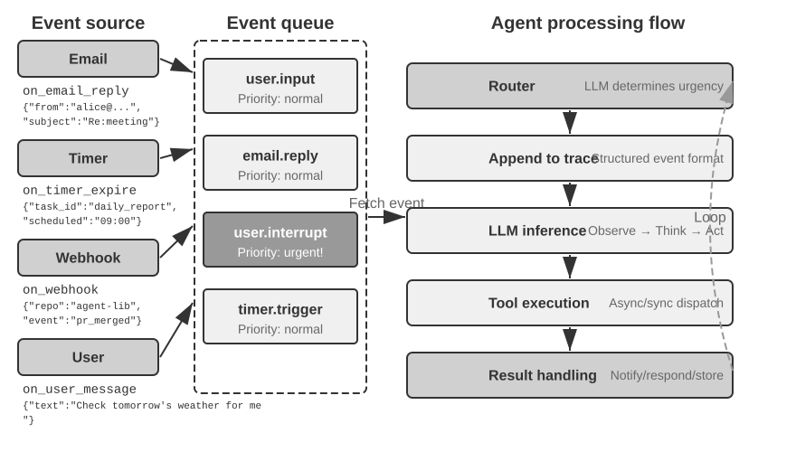

### OpenClaw-இல் நிகழ்வு-உந்துதல் வழிமுறைகளை செயல்படுத்துதல்

திறந்த மூல கட்டமைப்பான OpenClaw (அதன் கட்டமைப்பு அத்தியாயம் 5 இல் விரிவாக விளக்கப்படும்) ஒரு Gateway (நுழைவாயில்) கட்டுப்பாட்டு விமானம் மூலம் பல-சேனல் செய்திகளைப் பெற்று அவற்றை ஏஜெண்ட் இயக்க நேரத்திற்கு வழிநடத்துகிறது. இது மூன்று உள்ளமைக்கப்பட்ட ஆட்டோமேஷன் வழிமுறைகளை வழங்குகிறது:

- **Hooks**: ஏஜெண்டின் வாழ்க்கைச் சுழற்சியில் நிகழ்வுகளுக்கு (session creation, reset, போன்றவை) பதிலளிக்கும். GitHub Actions-ல் உள்ள event triggers போன்றது.
- **Cron (திட்டமிடப்பட்ட அட்டவணை)**: Cron வெளிப்பாடுகளின்படி (Unix அமைப்புகளில் திட்டமிடப்பட்ட பணிகளுக்கு பரவலாகப் பயன்படுத்தப்படும் தொடரியல், எ.கா., `0 9 * * 5` என்பது ஒவ்வொரு வெள்ளிக்கிழமையும் காலை 9 மணி) கால இடைவெளியில் பணிகளைச் செயல்படுத்தும். எடுத்துக்காட்டாக, ஒவ்வொரு வெள்ளிக்கிழமையும் வாராந்திர அறிக்கையை உருவாக்குதல் அல்லது ஒவ்வொரு மாதத்தின் தொடக்கத்திலும் தரவைச் சுருக்கமாகக் கூறுதல்.
- **Heartbeat (இதயத் துடிப்பு டீமன்)**: ஒவ்வொரு N நிமிடங்களுக்கும் ஏஜெண்டை எழுப்பி, கவனம் தேவைப்படும் ஏதேனும் விஷயங்கள் உள்ளதா எனச் சரிபார்க்கும். எச்சரிக்கை சோர்வைத் தவிர்க்க தீர்ப்பைப் பயன்படுத்துகிறது.

இந்த மூன்று வழிமுறைகளும் OpenClaw ஏஜெண்டுகளுக்கு ஒரு "தன்னாட்சி" தோற்றத்தை அளிக்கின்றன—பயனர் ஆஃப்லைனில் இருந்தாலும், ஏஜெண்ட் கால இடைவெளியில் அறிக்கைகளை உருவாக்கலாம், கணினி நிலையைச் சரிபார்க்கலாம் மற்றும் வழக்கமான பணிகளைக் கையாளலாம். இருப்பினும், நெருக்கமான பார்வையில் ஒரு அடிப்படை வரம்பு தெரிகிறது. முதலில், Gateway ஆனது உள்ளமைக்கப்பட்ட சேனல்களிலிருந்து (IM, Web இடைமுகம் போன்றவை) வரும் செய்திகளை இயல்பாகவே **push-based** முறையில் கையாள்கிறது என்பதை தெளிவுபடுத்துவது முக்கியம்—செய்திகள் வந்தவுடன் ஏஜெண்டுக்கு அனுப்பப்படும். மூன்று தானியங்கி வழிமுறைகளில், Cron மற்றும் Heartbeat மட்டுமே பயனர் செய்தி இல்லாமல் ஏஜெண்ட் "தானாக நகர" அனுமதிக்கின்றன, மேலும் அவை இரண்டும் **நேர-இயக்கி** ஆகும்—Heartbeat நிலையான இடைவெளியில் சரிபார்க்கிறது, Cron முன்னரே தீர்மானிக்கப்பட்ட நேரங்களில் தூண்டுகிறது. Hooks என்பவை கட்டமைப்பின் உள் வாழ்க்கைச் சுழற்சி நிகழ்வுகளுக்கு செயலற்ற முறையில் பதிலளிக்கின்றன மற்றும் வெளி உலகத்திலிருந்து புதிய மாற்றங்களை அறிமுகப்படுத்த முடியாது. உண்மையான குறைபாடு: உள்ளமைக்கப்பட்ட சேனல்களுக்கு வெளியே உள்ள எந்த மூன்றாம் தரப்பு நிகழ்வு மூலத்திற்கும்—ஒரு புதிய மின்னஞ்சல் வருதல், வெளிப்புற API கால்பேக் தரவைத் தள்ளுதல், உடனடி செயலாக்கம் தேவைப்படும் அவசர அறிவிப்பு—OpenClaw க்கு உடனடி அணுகல் சேனல் இல்லை. நிகழ்வு நிகழ்ந்த தருணத்தில் ஏஜெண்டால் பதிலளிக்க முடியாது; அடுத்த Cron/Heartbeat சுழற்சியில் மட்டுமே அதைக் கவனிக்க முடியும்.

இந்த தாமதம் பல சூழ்நிலைகளில் ஏற்றுக்கொள்ள முடியாதது. **PineClaw** (Pine AI-யின் OpenClaw செருகுநிரல்) ஒரு உதாரணமாக எடுத்துக் கொள்ளுங்கள்: Pine AI என்பது பயனர் சார்பாக உண்மையான தொலைபேசி அழைப்புகளைச் செய்யும் ஒரு AI உதவியாளர். பொதுவான சூழ்நிலைகளில் பில்களைப் பேச்சுவார்த்தை நடத்துதல், சந்தாக்களை ரத்து செய்தல் மற்றும் காப்பீட்டு கோரிக்கைகளைக் கையாளுதல் ஆகியவை அடங்கும். ஒரு பயனர் OpenClaw ஏஜெண்ட் மூலம் Pine தொலைபேசி பணியைத் தொடங்கும்போது, Pine-ன் குரல் AI பயனர் சார்பாக அழைப்பைச் செய்யும், ஆனால் அழைப்பின் போது பயனர் எந்த நேரத்திலும் தலையிட வேண்டியிருக்கலாம்:

- **நிகழ்நேர அடையாளச் சரிபார்ப்பு**: வாடிக்கையாளர் சேவை பிரதிநிதி கணக்கு வைத்திருப்பவரின் அடையாளத்தைச் சரிபார்க்கக் கேட்கிறார், மேலும் Pine பயனர் உடனடியாக ஒரு பாதுகாப்புக் குறியீடு அல்லது OTP (One-Time Password) சரிபார்ப்புக் குறியீட்டை வழங்க வேண்டும்
- **மூன்று வழி அழைப்பு உறுதிப்படுத்தல்**: வாடிக்கையாளர் சேவை பிரதிநிதி கணக்கு வைத்திருப்பவருடன் நேரடியாகப் பேச விரும்புகிறார், மேலும் Pine பயனர் சில நொடிகளுக்குள் தொலைபேசியை எடுக்க வேண்டும்
- **முன்னேற்ற ஒத்திசைவு மற்றும் முடிவு உறுதிப்படுத்தல்**: பேச்சுவார்த்தையின் முக்கியமான கட்டத்தில் (எ.கா., மறுதரப்பு விலைக் குறைப்பை முன்மொழிகிறது), Pine பயனர் ஏற்க வேண்டுமா என உறுதிப்படுத்த வேண்டும்

Heartbeat-இன் கால இடைவெளி வினவலை (polling) நம்பியிருந்தால்—5 நிமிட இடைவெளி எனக் கொள்வோம்—வாடிக்கையாளர் சேவை பிரதிநிதி சரிபார்ப்புக் குறியீட்டிற்காகக் காத்திருக்கும்போது பயனருக்கு சரியான நேரத்தில் அறிவிப்பு கிடைக்காமல் போகலாம்; பிரதிநிதி அழைப்பைத் துண்டித்துவிட, அழைப்பு தோல்வியடையும். கால இடைவெளியை வினாடிகளாகக் குறைத்தாலோ, அது கணினியை ஏராளமான பயனற்ற கோரிக்கைகளால் நிரப்பிவிடும்.

PineClaw-ன் தீர்வு ஒரு **சேனல் பொறிமுறையை** (Channel mechanism) அறிமுகப்படுத்துவதாகும்—OpenClaw-ன் Gateway-க்கும் Pine API-க்கும் இடையே நிகழ்நேர நிகழ்வுச் சேனலை (real-time event channel) நிறுவுதல். அழைப்பு இணைதல், பயனர் உள்ளீடு தேவைப்படுதல், அல்லது அழைப்பு முடிவடைதல் போன்ற முக்கிய நிகழ்வுகள் நிகழும்போது, செய்தி உடனடியாக OpenClaw ஏஜெண்டுக்குத் தள்ளப்படும் (push). ஏஜெண்ட் அதை உடனடியாகச் செயலாக்கி பயனருக்குத் தெரிவிக்கும், இதனால் பதில் தாமதம் (response latency) நிமிடங்களிலிருந்து வினாடிகளாகக் குறைகிறது.

இந்த வழக்கு, ஏஜெண்ட் கட்டமைப்புகளுக்கான நிகழ்வு-உந்துதல் கட்டமைப்பின் (event-driven architecture) மைய மதிப்பை வெளிப்படுத்துகிறது: **உண்மையான "முனைப்பான சேவை"க்கு (proactive service), ஏஜெண்ட் நிகழ்வுகளை அவ்வப்போது சரிபார்ப்பது மட்டுமல்ல, நிகழ்வுகளும் ஏஜெண்டுக்கு முனைப்புடன் தெரிவிக்க முடியும் என்பதும் தேவை.** பயனர் செய்திகள், கருவி விளைவுகள் (tool returns), வெளிப்புற அழைப்புகள் (external callbacks), திட்டமிடப்பட்ட தூண்டுதல்கள் (scheduled triggers) போன்ற அனைத்து உள்ளீடுகளையும் ஒரு நிகழ்வு ஸ்ட்ரீமில் (event stream) ஒருங்கிணைத்து, ஒரு நிகழ்வு சுழற்சி (event loop) மூலம் ஏஜெண்டின் சிந்தனையையும் செயல்களையும் இயக்குவதே இந்த இலக்கை அடைவதற்கான கட்டமைப்பு அடித்தளமாகும். இந்த கட்டமைப்பின் கீழ், நிகழ்வு கையாளுதல் பொறிமுறையின் (event handling mechanism) குறிப்பிட்ட வடிவமைப்பைப் பற்றி விவாதிப்பதற்கு முன், நிகழ்வுகளுடன் நேரடியாகத் தொடர்புடைய இரண்டு வகையான கருவிகளையும், ஏஜெண்டின் சுயாதீனச் செயல்களை ஆதரிக்கும் மெய்நிகர் அடையாளத்தையும் (virtual identity) தனிமைப்படுத்தப்பட்ட செயலாக்கச் சூழலையும் (isolated execution environment) முதலில் அறிமுகப்படுத்துவோம்.

### நிகழ்வு தூண்டுதல் கருவிகள் (Event Trigger Tools)

நிகழ்வு-தூண்டுதல் கருவிகள் (event-triggered tools) என்பவை வெளிப்புற நிகழ்வுகள் ஏஜெண்டின் செயல்களை இயக்கும் நுழைவுப் புள்ளிகளாகும் (entry points). இவை இல்லாமல், ஒரு ஏஜெண்ட் சிந்தித்தல், கருவிகளை அழைத்தல், இறுதியாக ஒரு முடிவை வெளியிடுதல், பின்னர் பயனரின் அடுத்த உள்ளீட்டிற்காகக் காத்திருத்தல் ஆகிய தொடர்ச்சியான சுழற்சியில் மட்டுமே இயங்க முடியும். உலகில் ஏற்படும் மாற்றங்களை ஏஜெண்ட் செயலாக்கக்கூடிய நிகழ்வுகளாக மொழிபெயர்க்க, மூன்று பொதுவான வகையான நிகழ்வு-தூண்டுதல் கருவிகள் உள்ளன.

**டைமர்கள்** (`set_timer`) என்பது இயற்பியல் நேரத்தைச் சார்ந்த நிகழ்வுகளைக் கையாளும் கருவியாகும். உதாரணமாக, ஒரு மின்னஞ்சல் அனுப்பப்பட்டாலும் பெறுநர் பதில் அளிக்கவில்லை என்றால், ஒரு குறிப்பிட்ட காலத்திற்குப் பிறகு முன்னேற்றம் குறித்து விசாரிக்க ஒரு பின்தொடர் மின்னஞ்சல் அனுப்பப்பட வேண்டும்; ஒரு அழைப்பு மேற்கொள்ளப்பட்டாலும் பெறுநர் வேலை நேரத்திற்கு வெளியே இருந்தால், அடுத்த கிடைக்கக்கூடிய வேலை நேரத்தில் அந்த அழைப்பு மீண்டும் முயற்சிக்கப்பட வேண்டும். இதை ஆதரிக்க, OpenClaw மற்றும் Claude Code போன்ற கருவிகள் டைமர் செயல்பாட்டை உள்ளடக்கியுள்ளன, இது ஏஜெண்ட் ஒரு குறிப்பிட்ட இயற்பியல் நேரத்தில் தன்னைத்தானே எழுப்பிக் கொள்ள அனுமதிக்கிறது. **ஒருமுறை மட்டும் செயல்படும் டைமர்கள்** (One-shot timers) ஒரு குறிப்பிட்ட காலக்கெடுவைக் கொண்ட பணிகளுக்குப் பயன்படுத்தப்படுகின்றன: எடுத்துக்காட்டாக, ஒரு பயனர் சனிக்கிழமையன்று "DMV-ஐ அழைக்கவும்" என்று கேட்டால், ஏஜெண்ட் "அடுத்த திங்கள் காலை 10:00 மணிக்கு DMV-ஐ அழைக்க" ஒரு டைமரை அமைக்கிறது, இது தானாகவே அழைப்பைத் தூண்டுகிறது. **தொடர் டைமர்கள்** (Recurring timers) கால இடைவெளியில் செய்யப்படும் பணிகளுக்குப் பயன்படுத்தப்படுகின்றன: ஒவ்வொரு மணி நேரமும் சர்வர் ஆரோக்கியத்தைச் சரிபார்ப்பது அல்லது ஒவ்வொரு வெள்ளிக்கிழமையும் முன்னேற்ற அறிக்கையை அனுப்புவது போன்றவை. கூடுதலாக, சில வெளிப்புற சேவைகள் முன்னெச்சரிக்கை முன்னேற்றப் புதுப்பிப்புகளை ஆதரிப்பதில்லை, இதனால் ஏஜெண்ட் நிலையைத் தீவிரமாக விசாரிக்க வேண்டியிருக்கும் (poll). இதுபோன்ற சந்தர்ப்பங்களில், மீண்டும் மீண்டும் வினவல்களுக்கு ஒரு தொடர் டைமர் தேவைப்படுகிறது—முந்தைய பகுதியில் இருந்த OpenClaw-ன் Heartbeat வழிமுறை இதன் ஒரு முறைப்படுத்தப்பட்ட வடிவமாகும், மேலும் இது OpenClaw-ன் "முன்னெச்சரிக்கை சேவை" (proactive service) திறனின் அடித்தளமாகும்.

**பின்னணி பணி கண்காணிப்பு** (`monitor_shell`) என்பது ஒத்திசைவற்ற முறையில் செயல்படுத்தப்படும் கருவிகள் அல்லது கட்டளை வரி பணிகளிலிருந்து வரும் நிகழ்வுகளைக் கையாளுகிறது. சில கட்டளை வரி பணிகள் நீண்ட நேரம் பின்னணியில் இயங்க வேண்டியிருக்கும், மேலும் ஏஜெண்ட் அவற்றின் முன்னேற்றத்தைக் கண்காணிக்க வேண்டும். ஏஜெண்ட் தொடர்ந்து "கட்டளை வரியையே பார்த்துக் கொண்டிருந்து," முன்னேற்றத்தைச் சரிபார்க்க ஒரு கருவியை மீண்டும் மீண்டும் அழைத்தால், அது அதிகப்படியான டோக்கன்களை வீணடிக்கும். மாறாக, கட்டளை வரி பணி முற்றிலுமாக முடிந்த பின்னரே ஏஜெண்ட் சிந்தித்து செயல்படத் தொடங்கினால், அது செயல்பாட்டின் போது ஏற்படும் முக்கியமான சிக்கல்களை சரியான நேரத்தில் கண்டறிய முடியாமல் போகலாம், மேலும் கட்டளை வரி நின்றுபோனால் (hang) தலையிட முடியாமல் முழு பணியும் தடைபடக்கூடும். Claude Code இந்தச் சிக்கலைத் தீர்க்க `monitor` என்ற கருவியை அறிமுகப்படுத்துகிறது, இது ஏஜெண்ட் கட்டளை வரியிலிருந்து புதிய வெளியீடுகள் அல்லது குறிப்பிட்ட முக்கிய வார்த்தைகளைக் கொண்ட வெளியீடுகளைக் கண்காணிக்க அனுமதிக்கிறது.

**வெளிப்புற நிகழ்வு சேனல்கள்** (`connect_channel`) புதிய மின்னஞ்சல்கள், API கால்பேக்குகள் அல்லது உடனடி செய்தி (IM) செய்திகள் போன்ற வெளிப்புற நிகழ்வுகளை நிகழ்நேரத்தில் ஏஜெண்டுக்குத் தள்ளுகிறது (push). முந்தைய பகுதியில் இருந்த PineClaw-ன் Channel வழிமுறை ஒரு பொதுவான செயலாக்கமாகும்.

வடிவமைப்புக் கண்ணோட்டத்தில், நிகழ்வு-தூண்டப்பட்ட கருவிகள் (event-triggered tools) தெளிவான தூண்டுதல் நிபந்தனைகள் மற்றும் வடிகட்டுதல் விதிகளை வரையறுக்க வேண்டும். இது பொருத்தமற்ற நிகழ்வுகள் ஏஜெண்டை எழுப்பி கணக்கீட்டு வளங்களை வீணடிப்பதைத் தடுக்கும். நிகழ்வு பேலோடில் (event payload) போதுமான சூழல் தகவல்கள் இருக்க வேண்டும், இதனால் ஏஜெண்ட் எழுப்பப்பட்ட பிறகு கூடுதல் வினவல்களை மேற்கொள்ள வேண்டிய தேவை குறைக்கப்படும்.

### பயனர் தொடர்பு கருவிகள்

OpenClaw-இல் session பயனருக்கு வெளிப்படையாக இருக்கும்; பயனரும் Agent-உம் தனிப்பட்ட கருவிகள் மூலம் எந்த நேரத்திலும் படம், கோப்பு, push அறிவிப்பு, பல்மாதிரி உள்ளடக்கம் மற்றும் Generative UI உடன் செய்திகளைப் பகிரலாம்.

பயனர் தகவல்தொடர்பு கருவிகள், ஏஜெண்டுக்கும் பயனருக்கும் இடையேயான தகவல்தொடர்பு வழிகளின் அதிகரித்து வரும் பன்முகத்தன்மையிலிருந்து உருவாகின்றன. பல ஏஜெண்டுகள் (Claude Code, Manus, Genspark போன்றவை) ஒரு பூர்வீக ReAct சுழற்சியைப் பயன்படுத்துகின்றன, இதில் ஏஜெண்ட் "சொல்வது" அனைத்தும் (அதாவது, உதவியாளர் செய்திகள்) நேரடியாக பயனருக்கு அனுப்பப்படுகின்றன, மேலும் பயனர் ஏஜெண்டுடன் உரையாட பயன்பாட்டில் ஒரு குறிப்பிட்ட அமர்வைத் திறக்க வேண்டும். OpenClaw என்பது மிகவும் செல்வாக்கு மிக்க பொது-நோக்க ஏஜெண்டுகளில் ஒன்றாகும், இது இந்த மனித-கணினி தகவல்தொடர்பு முன்னுதாரணத்தை உடைக்கிறது: அதன் அமர்வுகள் பயனருக்கு வெளிப்படையானவை—பயனர் அமர்வின் இருப்பைப் பற்றி அறிந்திருக்க வேண்டிய அவசியமில்லை அல்லது ஏஜெண்டின் கருவி அழைப்புகளின் விவரங்களைப் பற்றி கவலைப்பட வேண்டிய அவசியமில்லை; பயனர் மற்றும் ஏஜெண்ட் இருவரும் எந்த நேரத்திலும் ஒருவருக்கொருவர் செய்திகளை அனுப்ப முடியும், கடுமையான பயனர்-செய்தி, ஏஜெண்ட்-பதில் முறைக்கு பதிலாக. இதன் விளைவாக, பல பயனர்கள் OpenClaw ஒரு "மனிதனைப் போன்ற இருப்பை" கொண்டுள்ளதாக உணர்கிறார்கள், ஒரு செயலாளரைப் போல உரைச் செய்திகள் மூலம் பயனருடன் ஒத்திசைவற்ற முறையில் தொடர்பு கொள்கிறது. இந்த விஷயத்தில், இந்த உரைச் செய்திகள் மாதிரியின் உதவியாளர் செய்திகளை நேரடியாக பயனருக்கு வெளியிடுவதில்லை; மாறாக, அவை செய்திகளை அனுப்ப சிறப்பு கருவிகளைப் பயன்படுத்துகின்றன, அவை படம் மற்றும் கோப்பு இணைப்புகளையும் சேர்க்கலாம், மேலும் அவசரத்தின் அடிப்படையில் புஷ் அறிவிப்புகளுடன் இருக்கலாம்.

உரை அடிப்படையிலான தகவல்தொடர்புக்கு அப்பால், அதிகரித்து வரும் ஏஜெண்டுகள் கட்டமைக்கப்பட்ட அட்டை செய்திகள் அல்லது நினைவூட்டல் மின்னஞ்சல்களை அனுப்புவது போன்ற பல்முறை தகவல்தொடர்பு திறன்களைக் கொண்டுள்ளனர். சில ஏஜெண்டுகள் உருவாக்கும் UI (generative UI) உடன் சோதனை செய்யத் தொடங்கியுள்ளனர், தகவலை பயனருக்கு மிகவும் பயனர் நட்பு முறையில் வழங்குவதற்கான ஊடாடும் இடைமுகங்களை உருவாக்க HTML அல்லது பிற முறைகளைப் பயன்படுத்துகின்றனர். வடிவமைப்புக் கண்ணோட்டத்தில், பயனர் தகவல்தொடர்பு கருவிகள் ஒத்திசைவற்ற செய்தியிடலை ஆதரிக்க வேண்டும் (பயனர் ஆன்லைனில் இல்லாமல் இருக்கலாம்), படித்த/படிக்காத நிலை கண்காணிப்பை வழங்க வேண்டும், மேலும் பல சேனல்களில் செய்தி நிலைத்தன்மையை பராமரிக்க வேண்டும்.

**பல-சேனல் பயனர் தகவல்தொடர்பு மற்றும் மீண்டும் அழைத்தல்.**

சாத்தியமான குழப்பமான எல்லையை தெளிவுபடுத்துவது முக்கியம்: "அறிவிப்புகளை அனுப்புதல்" என்பதில், பெறுநர் ஒரு அனுமதிப்பவர் அல்லது கூட்டுப்பணியாளராக இருந்தால் (எ.கா., நிர்வாக ஒப்புதலைக் கோருதல், கூட்டு ஏஜெண்டுக்கு முன்னேற்றத்தைப் புகாரளித்தல்), கருவி கூட்டுப்பணி வகையைச் சேர்ந்தது; பெறுநர் இறுதி-பயனராக இருந்தால் மட்டுமே அது பயனர் தகவல்தொடர்பு கருவிகளைச் சேர்ந்தது. வேறுபாடு சேனலில் இல்லை, மாறாக "யாருக்கு அறிவிக்கப்படுகிறது மற்றும் ஏன்" என்பதில் உள்ளது.

**ஒரு ஏஜெண்டின் பதில் ஒரு ஒற்றை சேனலுக்கு மட்டுப்படுத்தப்படக்கூடாது; அறிவிப்பு பொறிமுறையானது பயனர் மீண்டும் அழைக்கும் பொறிமுறையாகவும் செயல்படுகிறது.** செய்தி அனுப்புதல் உடனடி செய்தியிடல், SMS, மின்னஞ்சல், தொலைபேசி அழைப்பு, புஷ் அறிவிப்புகள் மற்றும் பிற சேனல்களுக்கு நீட்டிக்கப்படுகிறது. ஏஜெண்ட், அவசரம், பயனர் நிலை, உள்ளடக்கத்தின் தன்மை மற்றும் பயனர் விருப்பங்களின் கலவையின் அடிப்படையில் சேனலை முடிவு செய்கிறது, முக்கியமான செய்திகள் தவறவிடப்படாமல் இருப்பதை உறுதி செய்கிறது, அதே நேரத்தில் தேவையற்ற குறுக்கீடுகளைத் தவிர்க்கிறது.

நீண்ட நேரம் இயங்கும் பணிகளுக்கு, ஏஜெண்ட் முடிந்ததும் பயனருக்கு முன்முயற்சியுடன் அறிவித்து அவர்களின் கவனத்தை மீண்டும் அழைக்க வேண்டும். கால இடைவெளியில் செய்யப்படும் பணிகளுக்கு (தினசரி சுருக்கங்கள் அல்லது வாராந்திர அறிக்கைகள் போன்றவை), அறிவிப்புகள் பயனருக்கு ஒரு வழக்கமான தொடர்பு பழக்கத்தை நிறுவ உதவும்.

பயனர் தொடர்பு கருவிகள் "பயனரை எவ்வாறு அடைவது" என்ற பிரச்சினையை தீர்க்கின்றன. இருப்பினும், இந்த சேனல்களில் ஏஜெண்ட் எடுத்துக் கொள்ளும் அடையாளம் மற்றும் பயனர் சார்பாக செயல்களைச் செய்யும் சூழலுக்கு, அடையாள மற்றும் சூழல் உள்கட்டமைப்பின் ஒரு அடுக்கு தேவைப்படுகிறது, இது அடுத்த பகுதியின் தலைப்பாகும்.

### மெய்நிகர் அடையாளம் மற்றும் தனிமைப்படுத்தப்பட்ட செயலாக்க சூழல்

மெய்நிகர் கணினி 24/7 இயங்கலாம், உள்ளூர் கோப்புகளுக்கான Agent அணுகலைக் கட்டுப்படுத்தலாம், மேலும் பிழை மெய்நிகர் சூழலுக்குள் மட்டுமே இருக்கும். தரவு பகிரப்பட்ட கோப்பு முறைமையில் பாதை குறிப்புகளாகப் பரிமாறப்படுகிறது.

முதலில், இந்த பகுதியின் நிலைப்பாடு குறித்த ஒரு தெளிவுபடுத்தல்: மெய்நிகர் அடையாளம் மற்றும் தனிமைப்படுத்தப்பட்ட செயலாக்க சூழல்கள் அடிப்படையில் ஒரு வகை செயலாக்க சூழல் உள்கட்டமைப்பாகும், இது செயலாக்க கருவிகள் பற்றிய முந்தைய பகுதியில் விவாதிக்கப்பட்ட சாண்ட்பாக்ஸுடன் ஒத்துப்போகிறது. இது ஒத்திசைவற்ற கட்டமைப்பு பகுதியில் இங்கு வைக்கப்பட்டுள்ளது, ஏனெனில் இது சுயாதீனமாக, தொடர்ந்து செயல்படக்கூடிய மற்றும் எந்த நேரத்திலும் பயனர் சார்பாக செயல்படக்கூடிய ஏஜெண்டுகளுக்கு மிகவும் அவசியமாக தேவைப்படுகிறது.

இந்த அத்தியாயத்தின் தொடக்கத்தில் குறிப்பிட்டபடி, *Her* படத்தில் உள்ள சமந்தாவுக்கு ஒரு சுயாதீன அடையாளம் மற்றும் இயக்க சூழல் உள்ளது. இத்தகைய பொது-நோக்க உதவியாளரை அடைய, ஒரு முக்கிய கட்டமைப்பு தேர்வு செய்யப்பட வேண்டும்: ஏஜெண்ட் பயனரின் தனிப்பட்ட கணக்குகளை நேரடியாக நிர்வகிக்க வேண்டுமா, அல்லது அதன் சொந்த மெய்நிகர் அடையாளம் இருக்க வேண்டுமா? நேரடி நிர்வாகம் வசதியாகத் தோன்றினாலும், ஏஜெண்ட் பிழை செய்தாலோ அல்லது சமரசம் செய்யப்பட்டாலோ, பயனரின் முழு டிஜிட்டல் அடையாளமும் வெளிப்படும். மிகவும் பாதுகாப்பான அணுகுமுறை, ஏஜெண்டுக்கு ஒரு தொகுப்பு சுயாதீன மெய்நிகர் அடையாளங்களை வழங்குவதாகும்—ஒரு செயலாளருக்கு அவர்களின் சொந்த அலுவலக தொலைபேசி மற்றும் மின்னஞ்சல் இருப்பது போல. இந்த மெய்நிகர் அடையாளத்தில் அர்ப்பணிக்கப்பட்ட தகவல் தொடர்பு கணக்குகள், சேமிப்பு இடம் மற்றும் கணினி சூழல்கள் அடங்கும், இது ஏஜெண்ட் பயனர் சார்பாக வெளிப்படையாக வேலை செய்ய அனுமதிக்கிறது. அடையாளத்தின் தெளிவு நம்பிக்கையை பலவீனப்படுத்தாது; மாறாக, அது தகவல்தொடர்பின் நம்பகத்தன்மையை மேம்படுத்துகிறது.

மெய்நிகர் அடையாளங்கள் தனிமைப்படுத்தப்பட்ட செயலாக்க சூழல்களில் அடித்தளமாக இருக்க வேண்டும். **மெய்நிகர் கணினிகள்** (VM/கொள்கலன்கள்) மற்றும் **மெய்நிகர் தொலைபேசிகள்** (Android உருவகப்படுத்திகள்) ஏஜெண்டுக்கு இயக்க முறைமை-நிலை தனிமைப்படுத்தலையும் முழு டெஸ்க்டாப்/மொபைல் இயக்க திறன்களையும் வழங்குகின்றன: ஏஜெண்ட் அவற்றுக்குள் அதன் சொந்த பயனர் கணக்கு, முகப்பு கோப்பகம் மற்றும் உள்நுழைவு சான்றுகளைக் கொண்டுள்ளது, இது அனைத்து செயல்பாடுகளையும் கண்டறியக்கூடியதாகவும் தணிக்கை செய்யக்கூடியதாகவும் ஆக்குகிறது; தவறான செயல்பாடுகள் செய்யப்பட்டாலும், ஹோஸ்ட் அமைப்பு மற்றும் பயனரின் உண்மையான சாதனம் பாதிக்கப்படாமல் இருக்கும். இது செயலாக்க கருவிகள் பகுதியில் விவாதிக்கப்பட்ட சாண்ட்பாக்ஸ் கருத்தின் "டிஜிட்டல் அடையாளம்" பரிமாணத்திற்கு நீட்டிப்பாகும்—சாண்ட்பாக்ஸ்கள் குறியீடு செயலாக்கத்தை தனிமைப்படுத்துகின்றன, அதே நேரத்தில் மெய்நிகர் கணினிகள் மற்றும் தொலைபேசிகள் முழு டிஜிட்டல் அடையாளத்தையும் தனிமைப்படுத்துகின்றன.

ஒரு சுயாதீன அடையாளம் இரண்டு நடைமுறை சவால்களையும் முன்வைக்கிறது. முதலாவது **எதிர்ப்பு-தானியங்கி வழிமுறைகள்**: பல இணையதளங்கள் தானியங்கி அணுகலைத் தடுக்க CAPTCHA மற்றும் IP நற்பெயர் சோதனைகளைப் பயன்படுத்துகின்றன. டேட்டா சென்டர் IPகளைப் பயன்படுத்தும் மெய்நிகர் சூழல்கள் எளிதில் அடையாளம் காணப்படுகின்றன, நடைமுறையில் சாதாரண அணுகலுக்கு குடியிருப்பு ப்ராக்ஸி நெட்வொர்க்குகளை (உண்மையான வீட்டு IPகளைப் பயன்படுத்தி) உள்ளமைக்க வேண்டியிருக்கும். இரண்டாவது **பயனரின் உண்மையான கணக்குகளை அணுகும் சூழ்நிலை**: ஒரு பணியில் பயனராகவே உள்நுழைய வேண்டியிருக்கும் போது, Human-in-the-Loop அங்கீகாரம் பயன்படுத்தப்பட வேண்டும்—VNC/RDP ரிமோட் டெஸ்க்டாப் மூலம், பயனர் தனிப்பட்ட முறையில் உள்நுழையக்கூடிய ஒரு காட்சி சூழலில், ஏஜெண்ட் இயக்கும் முழு இடைமுகத்தையும் பார்க்கவும், ஏன் அங்கீகாரம் தேவை என்பதைப் புரிந்துகொள்ளவும் முடியும். அங்கீகாரத்திற்குப் பிறகு பெறப்பட்ட அமர்வு டோக்கன் அதன் செல்லுபடியாகும் காலத்திற்குள் மீண்டும் பயன்படுத்தப்பட்டு, அடிக்கடி குறுக்கீடுகளைத் தவிர்த்து, தன்னாட்சி மற்றும் பாதுகாப்பை சமநிலைப்படுத்துகிறது.

முதன்மை ஏஜெண்ட் மற்றும் மெய்நிகர் சூழலுக்கு இடையேயான தரவு பரிமாற்றம் ஒரு **பகிரப்பட்ட கோப்பு முறைமை** மூலம் நிறைவேற்றப்படுகிறது: வால்யூம் மவுண்ட்களைப் பயன்படுத்தி (எ.கா., `/workspace/shared`) முதன்மை ஏஜெண்ட், மெய்நிகர் கணினி மற்றும் மெய்நிகர் தொலைபேசியை இணைக்கிறது. தரவு உள்ளடக்க நகலெடுப்பை விட கோப்பு பாதை குறிப்புகள் மூலம் அனுப்பப்படுகிறது, சூழல் சாளர நுகர்வைத் தவிர்க்கிறது. உதாரணமாக, ஒரு தரவு பகுப்பாய்வு பணியில்: பயனர் ஒரு CSV கோப்பை பகிரப்பட்ட கோப்பகத்தில் பதிவேற்றுகிறார், மெய்நிகர் கணினியில் உள்ள ஏஜெண்ட் கோப்பைப் படித்து, பகுப்பாய்வு செய்து, விளக்கப்படங்களை உருவாக்கி, அவற்றை மீண்டும் பகிரப்பட்ட கோப்பகத்தில் சேமிக்கிறது. முதன்மை ஏஜெண்ட் பயனருக்கு விளக்கப்படத்தின் கோப்பு பாதையை மட்டுமே திருப்பி அனுப்ப வேண்டும்—கட்சிகளுக்கு இடையே அனுப்பப்படுவது எப்போதும் ஒரு இலகுரக பாதை சரம் ஆகும்.

நிகழ்வு-தூண்டப்பட்ட கருவிகள் உலகம் ஏஜெண்டை எழுப்ப அனுமதிக்கின்றன, பயனர் தொடர்பு கருவிகள் ஏஜெண்ட் பயனரை அடைய அனுமதிக்கின்றன, மற்றும் தனிமைப்படுத்தப்பட்ட செயலாக்க சூழல்களுடன் கூடிய மெய்நிகர் அடையாளங்கள் ஏஜெண்ட் சுயாதீனமாகவும் தணிக்கை செய்யக்கூடியதாகவும் செயல்பட அனுமதிக்கின்றன. மீதமுள்ள கேள்வி: பல நிகழ்வுகள் ஒரே நேரத்தில் ஒரே ஏஜெண்ட் நிகழ்வில் ஒன்றிணையும் போது, அவை எவ்வாறு கையாளப்பட வேண்டும்?

### நிகழ்வு கையாளுதல் வழிமுறை

ஒரு ஒற்றை ஏஜெண்ட் நிகழ்வு ஒரே நேரத்தில் பல நிகழ்வுகளை எதிர்கொள்ளலாம்: பயனரிடமிருந்து ஒரு புதிய செய்தி, ஒரு கருவியின் முடிவு, ஒரு டைமர் காலாவதியாதல், மற்றொரு ஏஜெண்ட்டிடமிருந்து ஒரு ஒத்துழைப்பு கோரிக்கை. இந்த நிகழ்வுகள் எவ்வாறு திறமையாகவும் சரியாகவும் கையாளப்படுகின்றன என்பது நேரடியாக செயல்திறன் மற்றும் பயனர் அனுபவத்தை பாதிக்கிறது.

இந்த வழிமுறையின் எலும்புக்கூடு, இணையச் செயல்திட்டமிடலில் (concurrent programming) உள்ள **நிகழ்வு வளையம்** (event loop) ஆகும். ஒரு ஒத்திசைவற்ற ஏஜெண்டை நீண்டகாலம் இயங்கும் ஒரு வளையமாகக் கருதலாம்: ஒவ்வொரு சுற்றிலும் உள்ளீட்டு வரிசையிலிருந்து சில நிகழ்வுகளை எடுத்து, பாதையில் சேர்த்து, ஒருமுறை LLM ஐ அழைத்து, அது தீர்மானிக்கும் கருவிகளைச் செயல்படுத்தி, மீண்டும் வளையத்தின் தொடக்கத்திற்கு வந்து அடுத்த தொகுதி நிகழ்வுகளுக்காகக் காத்திருக்கிறது—இது Go-வின் goroutine ஒரு channel-இலிருந்து செய்திகளைப் படித்து, `for { select { ... } }` இல் சுற்றுச் சுற்றாகச் செயலாக்குவதைப் போன்ற அதே கட்டமைப்பே. இந்த மாதிரிக்கு ஒரு முக்கியப் பண்பு உள்ளது: **நிகழ்வுகள் ஒவ்வொரு சுற்றின் எல்லையில் மட்டுமே நுகரப்படுகின்றன**. LLM பகுத்தறிந்து கொண்டிருக்கும்போது அல்லது ஒரு கருவி இயங்கிக்கொண்டிருக்கும்போது, புதிதாக வரும் நிகழ்வுகள் தற்போதைய படியை நடுவில் குறுக்கிட்டுக் குழப்பாது; அவை முதலில் வரிசையில் காத்திருந்து, இந்தச் சுற்று ஒரு **பாதுகாப்புப் புள்ளியை** (safe point) அடையும்போது (ஒரு பகுத்தறிவு முடிவடையும்போது, ஒரு கருவி திரும்பும்போது) ஒன்றாகக் கையாளப்படுகின்றன. ரத்துசெய்தலும் அதே ஒழுங்கைப் பின்பற்றுகிறது: எந்தத் தருணத்திலும் வலுக்கட்டாயமாக அறுத்துவிடுவதில்லை, மாறாக பாதுகாப்புப் புள்ளியில் "நிறுத்தச் சொல்லப்பட்டதா?" எனச் சரிபார்க்கிறது—இதுவே Go-வில் `ctx.Done()` ஆற்றும் பங்கு (அத்தியாயம் 10, முதன்மை ஏஜெண்ட் துணை ஏஜெண்டுகளை ஒருங்கிணைந்த வகையில் ரத்துசெய்வதை இதே context சிந்தனையைக் கொண்டு விவாதிக்கும்). இதைப் புரிந்துகொண்டால், கீழே வரும் மூன்று செயலாக்க உத்திகளின் வேறுபாடு பாதுகாப்புப் புள்ளியை எவ்வாறு நடத்துகிறது என்பதில் மட்டுமே அடங்கும்: நிகழ்வை அடுத்த இயற்கையான பாதுகாப்புப் புள்ளி வரை காத்திருக்க வைத்தல் (வரிசைப்படுத்தல்), ஒரு பாதுகாப்புப் புள்ளியை முன்கூட்டியே முனைப்புடன் உருவாக்குதல் (ரத்துசெய்தல்), அல்லது முற்றிலும் தனியொரு வளையத்தைத் தொடங்கி முதன்மை வளையத்தின் பாதுகாப்புப் புள்ளிக்குக் காத்திராமலிருத்தல் (இணையம்).

**கட்டமைக்கப்பட்ட நிகழ்வு மாதிரியாக்கம்.**

கையாளுதலுக்கு புரிதல் தேவை. ஒரு பொது-நோக்க ஏஜெண்ட் பெறும் உள்ளீடு பயனரிடமிருந்து மட்டும் வருவதில்லை—ஒரு மூன்றாம் தரப்பினரிடமிருந்து வரும் செய்தி பயனரால் ஏஜெண்டுக்கு அனுப்பப்படவில்லை, ஆனால் ஏஜெண்ட் அதைப் புரிந்துகொள்ள வேண்டும், அதன் முக்கியத்துவத்தை மதிப்பிட வேண்டும், மற்றும் எவ்வாறு தலையிடுவது என்பதை முடிவு செய்ய வேண்டும். இதற்கு ஒவ்வொரு உள்ளீட்டையும் வளமான சொற்பொருள்களுடன் கூடிய **கட்டமைக்கப்பட்ட நிகழ்வாக** மாதிரியாக்கம் செய்ய வேண்டும்:

- **மூலம் (யார்)**: பயனர் தானே, ஒரு தொடர்பு, ஒரு அந்நியர், ஒரு கணினி அறிவிப்பு
- **சேனல் (எப்படி)**: தொலைபேசி அழைப்பு, SMS, உடனடி செய்தி, மின்னஞ்சல், சமூக ஊடகம், டைமர் தூண்டுதல், ஒத்திசைவற்ற கருவி அழைப்பு முடிவு, கட்டளை வரி கண்காணிப்பு நிலை புதுப்பிப்பு
- **உள்ளடக்கம் (என்ன)**: செய்தி உரை, உணர்ச்சித் தொனி, அவசரம், பதில் தேவையா
- **சூழல் (பின்னணி)**: முந்தைய உரையாடலுக்கான பதிலா அல்லது புதிய தகவல்தொடர்பா என்பதும், தற்போதைய பணியுடன் அதன் பொருத்தப்பாடும்

வாடிக்கையாளர் பணத்தைத் திரும்பப்பெறும் கோரிக்கை மின்னஞ்சலை உதாரணமாக எடுத்துக் கொண்டால், கட்டமைக்கப்பட்ட நிகழ்வு இப்படி இருக்கும்:

```json
{
  "source": {"type": "email", "sender": "client@example.com"},
  "channel": "gmail_webhook",
  "content": {"subject": "Refund Request", "body": "Order #12345, requesting a refund..."},
  "context": {"priority": "high", "customer_tier": "vip", "related_orders": ["#12345"]}
}
```

இந்தப் பரிமாணங்கள் கட்டமைக்கப்பட்ட நிகழ்வுகளாக தெளிவாக மாதிரியாக்கப்பட்டால் மட்டுமே, பலதரப்புத் தொடர்புகளில் ஏஜெண்ட் தெளிவான அறிதலைப் பராமரிக்க முடியும். பயனர் உள்ளீட்டை ஒரு கருவி முடிவாக தவறாகக் கருதுவதையோ, அல்லது மறைக்கப்பட்ட வழிமுறைகளைக் கொண்ட கருவி முடிவை ஒரு பயனர் கட்டளையாக (prompt injection) தவறாகக் கருதுவதையோ தவிர்க்க முடியும். பல-இழை சூழல் மேலாண்மையின் சிக்கலானது, பல உரையாடல் இழைகளுக்கு இடையேயான உறவுகளை ஏஜெண்ட் புரிந்துகொள்ள வேண்டியதையும் அவசியமாக்குகிறது—மூன்றாம் தரப்பிலிருந்து வரும் செய்தி பயனரின் மனநிலையை எவ்வாறு பாதிக்கிறது, வெவ்வேறு உரையாடல்களில் பயனரின் பங்கு மாற்றங்கள், மற்றும் வெவ்வேறு இழைகளிலிருந்து தகவல்களை ஒருங்கிணைத்து ஆலோசனை வழங்க எப்போது தேவைப்படுகிறது என்பதைப் புரிந்துகொள்ள வேண்டும். n8n போன்ற பணிப்பாய்வு தளங்களின் தூண்டுதல் சூழலைப் பார்த்தால்—webhookகள், டைமர்கள், மின்னஞ்சல்கள், தரவுத்தள மாற்றங்கள், கோப்பு கண்காணிப்பிகள்—ஒவ்வொரு தூண்டுதலும் ஏஜெண்ட் உலகை உணர்வதற்கான ஒரு "புலன் உறுப்பு" ஆகும். இந்த பன்முக நிகழ்வுகள் ஒரே மாதிரியாக கட்டமைக்கப்பட்ட வடிவத்தில் மாதிரியாக்கப்பட்டவுடன், ஏஜெண்ட் வெவ்வேறு மூலங்களிலிருந்து வரும் தூண்டுதல்களை சீரான முறையில் செயலாக்க முடியும். கீழே விவாதிக்கப்படும் அவசரநிலை தீர்மானம் மற்றும் செயலாக்க உத்திகள் இந்த ஒருங்கிணைந்த மாதிரியாக்கத்தின் மீது கட்டமைக்கப்பட்டுள்ளன.

**அவசரநிலையின் அடிப்படையில் மாறும் செயலாக்க உத்தி.**

மனிதர்கள் பல பணிகளைக் கையாளும்போது, அவசரநிலையின் அடிப்படையில் வெவ்வேறு உத்திகளைப் பின்பற்றுகிறார்கள். திடீர் அவசரநிலையை எதிர்கொள்ளும்போது, உடனடியாக தற்போதைய செயலை நிறுத்துகிறார்கள்; வழக்கமான செய்ய வேண்டிய பணிகளை எதிர்கொள்ளும்போது, அவற்றை பின்னர் செயலாக்குவதற்கான பணி பட்டியலில் சேர்க்கிறார்கள். ஒரு ஏஜெண்டின் நிகழ்வு கையாளுதல் இந்த நுண்ணறிவைப் பிரதிபலிக்க வேண்டும்.

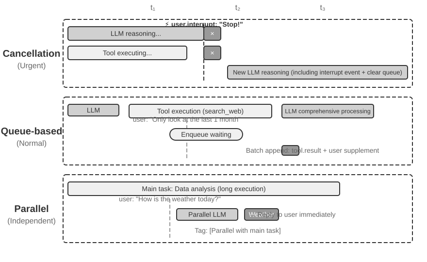

**ரத்து அடிப்படையிலான செயலாக்கம்** அவசர நிகழ்வுகளுக்குப் பயன்படுத்தப்படுகிறது; அதன் சாரம் அவசர நிகழ்வுக்காக **ஒரு பாதுகாப்புப் புள்ளியை முன்கூட்டியே உருவாக்குவதே**: தற்போதைய படியை முனைப்புடன் குறுக்கிட்டு, இந்தத் தருணத்தையே புதிய நிகழ்வுகளை நுகரக்கூடிய ஒரு எல்லையாக மாற்றுகிறது. ஒரு அவசர நிகழ்வு வரும்போது (எ.கா., பயனர் "நிறுத்து" என்பதைக் கிளிக் செய்தல் அல்லது மேற்பார்வை அமைப்பு உயர் முன்னுரிமை வழிமுறையை அனுப்புதல்): (1) தற்போதைய செயல்பாட்டை நிறுத்துங்கள்—LLM பகுத்தறிந்து கொண்டிருந்தால், உடனடியாக ஸ்ட்ரீமிங் பதிலை ரத்துசெய்யுங்கள்; ஒத்திசைவான கருவி இயங்கிக்கொண்டிருந்தால், ரத்து சமிக்ஞையை அனுப்புங்கள்; (2) நிலுவையில் உள்ள வரிசையை அழித்து, அனைத்து நிகழ்வுகளையும் நீக்குங்கள்; (3) வரிசையிலிருந்து நிகழ்வுகளையும் அவசர நிகழ்வையும் பாதையின் முடிவில் சேர்க்கவும்; (4) புதுப்பிக்கப்பட்ட முழுமையான பாதையை உள்ளீடாகக் கொண்டு, நிலைமையை மதிப்பிடுவதற்கு உடனடியாக LLM ஐ மீண்டும் அழைக்கவும். உதாரணமாக, ஏஜெண்ட் தவறான செயலைச் செய்ய இருந்தால், பயனர் "நிறுத்து! நான் தவறாகச் சொன்னேன்" என்று உள்ளீடு செய்தால், ஏஜெண்ட் உடனடியாக இந்த புதிய உள்ளீட்டைப் பார்த்து, உண்மையான நோக்கத்தை மீண்டும் புரிந்துகொண்டு, தவறான செயலைச் செய்வதைத் தவிர்க்கும்.

**வரிசைப்படுத்தப்பட்ட செயலாக்கம்** வழக்கமான நிகழ்வுகளுக்குப் பயன்படுத்தப்படுகிறது. அவசரமில்லாத ஒரு நிகழ்வு வரும்போது (எ.கா., ஒரு ஒத்திசைவற்ற கருவி முடிவைத் தருகிறது அல்லது பயனர் கூடுதல் தகவலை அனுப்புகிறார்): (1) தற்போதைய செயல்பாட்டை குறுக்கிடாமல், நிகழ்வை வரிசையின் இறுதியில் சேர்க்கவும்; (2) தற்போதைய செயல்பாடு முடிவடையும் வரை காத்திருக்கவும்—LLM அதன் பகுத்தறிவை முடிக்கட்டும், ஒத்திசைவான கருவி அதன் செயலாக்கத்தை முடிக்கட்டும்; (3) எந்தவொரு கருவி அழைப்பும் முடிந்து `tool.result` ஐ திருப்பி அனுப்பும்போது, வரிசையைச் சரிபார்க்கவும். வரிசை காலியாக இல்லாவிட்டால், அனைத்து நிகழ்வுகளையும் ஒரே நேரத்தில் பயணப் பாதையில் (trajectory) சேர்க்கவும்; (4) LLM புதுப்பிக்கப்பட்ட பயணப் பாதையை விரிவாகச் செயலாக்குகிறது. இது தொகுதி செயலாக்கத்தை (batch processing) செயல்படுத்தி, செயல்திறனை மேம்படுத்துகிறது—எடுத்துக்காட்டாக, ஏஜெண்ட் ஒரு தேடல் கருவி முடிவுக்காகக் காத்திருக்கும்போது, பயனர் "கடந்த மாதத்தின் முடிவுகளை மட்டும் காட்டு" என்பதைச் சேர்க்கிறார். இந்த கூடுதல் தகவல் வரிசையில் நுழைகிறது, மேலும் தேடல் முடிவுகள் திரும்பி வரும்போது, இரண்டு நிகழ்வுகளும் LLM க்கு ஒன்றாக வழங்கப்படுகின்றன, தேவையற்ற சுற்றுப் பயணங்களைத் தவிர்க்கிறது.

**இணைச் செயலாக்கம்** சுயாதீனமான, இலகுரக வினாக்களுக்குப் பயன்படுத்தப்படுகிறது. எடுத்துக்காட்டாக, ஏஜெண்ட் அதிக அளவிலான தரவை பகுப்பாய்வு செய்து கொண்டிருக்கும்போது, பயனர் திடீரென்று "இன்று வானிலை எப்படி இருக்கிறது?" என்று கேட்கிறார். இத்தகைய வினாக்களுக்கு மூன்று பண்புகள் உள்ளன: முக்கிய பணியுடன் தொடர்பில்லாதவை, விரைவான பதில் தேவைப்படுபவை, மற்றும் குறைந்த செயலாக்கச் செலவு கொண்டவை. ரத்து செய்யும் முறை (முக்கிய பணியை குறுக்கிடும்) அல்லது வரிசைப்படுத்தப்பட்ட செயலாக்கம் (பயனரை நீண்ட நேரம் காத்திருக்க வைக்கும்) இரண்டுமே பொருத்தமானவை அல்ல. கணினி முதலில் வினாவின் சுயாட்சி மற்றும் சிக்கலான தன்மையை மதிப்பிடுகிறது, பின்னர் அதை ஒரு தனி இணை பகுத்தறிவு அமர்வில் (parallel reasoning session) சுயாதீனமாகச் செயல்படுத்தி, தேவையான கருவிகளை அழைத்து பதிலை உருவாக்கி உடனடியாகத் திருப்பி அனுப்புகிறது. வினாவும் பதிலும் முக்கிய பணியின் பயணப் பாதையில் சேர்க்கப்பட்டு, "முக்கிய பணியுடன் இணையாக செயல்படுத்தப்பட்டது" என தெளிவாகக் குறிக்கப்படுகின்றன, இது LLM ஐ குழப்புவதைத் தவிர்க்கிறது.

**அவசரத்தன்மை தீர்மானித்தல்.**

அவசர நிகழ்வுகள்: பயனர் குறுக்கீடு (`user.interrupt`), மேற்பார்வையாளர் அறிவுறுத்தல் (`supervisor.instruction`), ஏஜெண்டுக்கு இடையேயான குறுக்கீடு (`agent.interrupt`), அவசரம் எனக் குறிக்கப்பட்ட வெளிப்புற தூண்டுதல்கள் (எ.கா., கணினி எச்சரிக்கைகள், கட்டண முறிவுகள்).

அவசரமில்லாத நிகழ்வுகள்: வழக்கமான பயனர் உள்ளீடு (`user.input`), ஏஜெண்ட் உள்ளீடு (`agent.input`), கருவி முடிவுகள் (`tool.result`), டைமர் தூண்டுதல்கள் (`timer.trigger`), வழக்கமான வெளிப்புற தூண்டுதல்கள்.

கடினமான விதிகளுக்கு வரம்புகள் உள்ளன; நிகழ்வின் பொருளே (semantics) கையாளும் முறையைத் தீர்மானிக்கிறது—"உடனே நிறுத்து!" என்பது ரத்து செய்யும் முறையைப் பயன்படுத்துகிறது, "இன்று வானிலை எப்படி இருக்கிறது?" என்பது இணைச் செயலாக்கத்தைப் பயன்படுத்துகிறது, "அறிக்கையை சீன மொழியில் அனுப்பு" என்பது வரிசைப்படுத்தப்பட்ட செயலாக்கத்தைப் பயன்படுத்துகிறது. **இலகுரக வகைப்பாடு LLM ஐ ஒரு நிகழ்வு திசைவியாக (event router) பயன்படுத்த பரிந்துரைக்கப்படுகிறது**, இது ஒரு நிகழ்வு வரும்போது எந்த உத்தியைப் பின்பற்ற வேண்டும் என்பதை விரைவாகத் தீர்மானிக்கிறது.

பின்வரும் சோதனை, ஒரு நிகழ்வு-உந்துதல் மின்னஞ்சல் செயலாக்க ஏஜெண்ட், மேலே விவாதிக்கப்பட்ட நிகழ்வு கையாளும் உத்திகளை இயங்கக்கூடிய செயலாக்கமாக மாற்றுகிறது.

> **சோதனை 6-1 ★★★: நிகழ்வு-உந்துதல் மின்னஞ்சல் செயலாக்க ஏஜெண்ட்**
>
>
> 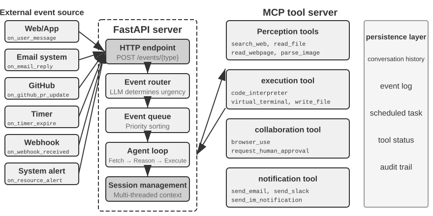
>
> இந்தச் சோதனையானது எளிமையான நிகழ்வு-உந்துதல் ஏஜெண்டை உருவாக்குகிறது: ஒரு **தானியங்கி மின்னஞ்சல் செயலாக்க உதவியாளர்**. ஏஜெண்ட் மின்னஞ்சல் இன்பாக்ஸைக் கண்காணித்து, ஒரு புதிய மின்னஞ்சல் வரும்போதெல்லாம், அது தானாகவே ஒரு செயலாக்கப் பணிப்பாய்வைத் தூண்டுகிறது—வகைப்பாடு, சுருக்கம், பதில் வரைவு, மற்றும் தேவைப்பட்டால் பயனருக்கு அறிவித்தல். இது ஒரு நிகழ்வு-உந்துதல் ஏஜெண்டுக்கான மிகவும் உள்ளுணர்வு சார்ந்த அறிமுகக் காட்சியாகும்: ஒரு வெளிப்புற நிகழ்வு (புதிய மின்னஞ்சல் வருகை) ஒரு முழுமையான ஏஜெண்ட் சிந்தனைச் சுழற்சியைத் தூண்டுகிறது.
>
> **சோதனையின் நோக்கம்**: நிகழ்வு-உந்துதல் கட்டமைப்பின் மையக் கருத்தைப் புரிந்துகொள்வது—ஏஜெண்ட் இனி செயலற்ற முறையில் பயனர் உள்ளீட்டிற்காகக் காத்திருக்காமல், வெளிப்புற நிகழ்வுகளுக்குப் பதிலளிக்கும் வகையில் முனைப்புடன் செயல்படுகிறது. இந்தச் சோதனையின் மூலம், வாசகர்கள் நிகழ்வு மூலப் பதிவு, நிகழ்வு வரிசை, மற்றும் "நிகழ்வு வருகை → ஏஜெண்ட் செயலாக்கம் → முடிவு வெளியீடு" ஆகியவற்றின் அடிப்படை மூடிய சுழற்சியில் தேர்ச்சி பெறுவார்கள்.
>
> **நிகழ்வு மூலங்கள் மற்றும் நிகழ்வு வரிசை.**
>
> இந்த அமைப்பு பல நிகழ்வு மூலங்களுக்கான ஒருங்கிணைந்த அணுகலை ஆதரிக்கிறது:
>
> - **மின்னஞ்சல் நிகழ்வுகள்** (`on_email_received`): ஒரு புதிய மின்னஞ்சல் வரும்போது தூண்டப்படும், இது இன்பாக்ஸை அவ்வப்போது சரிபார்ப்பதன் மூலமாகவோ அல்லது புஷ் அறிவிப்புகளைப் பெறுவதன் மூலமாகவோ இருக்கலாம்.
> - **IM/SMS செய்திகள்** (`on_im_message`, `on_sms_message`): உடனடி செய்தியிடல் செய்திகளால் தூண்டப்படும்.
> - **GitHub நிகழ்வுகள்** (`on_github_pr_update`, `on_github_issue_update`): PR மதிப்பாய்வு கருத்துகள் அல்லது நிலை மாற்றங்களால் தூண்டப்படும்.
> - **டைமர் தூண்டுதல்கள்** (`on_timer_expire`): திட்டமிடப்பட்ட பணிகளால் தூண்டப்படும் (எ.கா., தினசரி சுருக்கங்கள், வாராந்திர அறிக்கை உருவாக்கம்).
> - **வெப்ஹூக்குகள்** (`on_webhook_received`): வெளிப்புற அமைப்புகளிலிருந்து வரும் பொதுவான கால்பேக்.
> - **சிஸ்டம் நிகழ்வுகள்** (`on_user_inactive`, `on_process_timeout`, `on_resource_alert`): உள் நிலை மாற்றங்களால் தூண்டப்படும்.
>
> அனைத்து நிகழ்வுகளும் ஒரு ஒருங்கிணைந்த **நிகழ்வு வரிசையில்** நுழைந்து, வருகை வரிசையில் வரிசையாக செயலாக்கப்படும். ஒவ்வொரு நிகழ்வும் ஒரு சுயாதீனமான ஏஜெண்ட் சிந்தனைச் சுழற்சியைத் தூண்டுகிறது: ஏஜெண்ட் நிகழ்வின் உள்ளடக்கத்தைப் படித்து, தொடர்புடைய கருவிகளை அழைத்து (எ.கா., அறிவுத் தளத்தை வினவுதல், இணைப்புகளைப் படித்தல், தொடர்புடைய மின்னஞ்சல் வரலாற்றைத் தேடுதல்), ஒரு செயலாக்க முடிவை உருவாக்கி (வகைப்பாட்டு லேபிள்கள், சுருக்கங்கள், பதில் வரைவுகள்), இறுதியாக பயனருக்கு அறிவிக்கிறது அல்லது அறிவிப்புக் கருவிகள் மூலம் நேரடியாக ஒரு செயலைச் செயல்படுத்துகிறது.
>
> **சரிபார்ப்புக் காட்சி**: ஒரு சோதனை மின்னஞ்சல் பெட்டியைக் கண்காணிக்க ஏஜெண்டை உள்ளமைக்கவும். மூன்று மின்னஞ்சல்களைப் பெறுவதை உருவகப்படுத்தவும்—ஒரு கூட்ட அழைப்பு, ஒரு வாடிக்கையாளர் புகார், மற்றும் ஒரு சந்தைப்படுத்தல் விளம்பரம். ஏஜெண்ட் அவற்றை வரிசையாகச் செயலாக்குகிறது: கூட்ட அழைப்பிற்கு, அது தானாகவே காலண்டர் முரண்பாடுகளைச் சரிபார்த்து, ஏற்பு/நிராகரிப்பு பதிலை வரைவு செய்கிறது; வாடிக்கையாளர் புகாருக்கு, அது முக்கியத் தகவலைப் பிரித்தெடுத்து, அதை உயர் முன்னுரிமையாகக் குறித்து, அதைக் கையாள பயனருக்கு அறிவிக்கிறது; சந்தைப்படுத்தல் விளம்பரத்திற்கு, அது தானாகவே காப்பகப்படுத்துகிறது. முழு செயல்முறைக்கும் பயனர் தலையீடு தேவையில்லை.

சோதனை 6-1 எளிமையான நிகழ்வு-உந்துதல் முறையை விளக்குகிறது—நிகழ்வுகள் ஒரு வரிசையில் நுழைகின்றன, ஏஜெண்ட் அவற்றை வரிசையாகச் செயலாக்குகிறது. இருப்பினும், நீண்ட நேரம் இயங்கும் கருவி செயல்பாடுகளின் போது ஏஜெண்ட் குறுக்கீடுகளுக்கு பதிலளிக்க வேண்டியிருக்கும் போது, அல்லது ஒரே நேரத்தில் பல இணை பணிகளை நிர்வகிக்க வேண்டியிருக்கும் போது, ஒரு எளிய நிகழ்வு வரிசை போதுமானதாக இல்லை. அடுத்து, ஆழமான பொறியியல் சவால்களைப் பற்றி விவாதிப்போம்.

### பொறியியல் செயலாக்கம்: ஒத்திசைவு மாதிரிகள் எவ்வாறு ஒத்திசைவற்ற குறுக்கீடுகளை ஆதரிக்க முடியும்

சோதனை 6-1 வரிசை நிகழ்வுகளை மட்டுமே கையாள்கிறது—நிகழ்வுகள் ஒவ்வொன்றாக வரிசையில் நுழைகின்றன, மேலும் ஏஜெண்ட் அவற்றை ஒன்றன் பின் ஒன்றாக செயலாக்குகிறது. இப்போது, இந்தப் பகுதியின் தொடக்கத்தில் எழுப்பப்பட்ட "ஒத்திசைவு பயிற்சி / ஒத்திசைவற்ற பயன்பாடு" முரண்பாட்டிற்குத் திரும்புவோம்: ஒரு கருவி இன்னும் திரும்பாத நிலையில், பயனர் திடீரென குறுக்கிடும்போது, ஒத்திசைவு வடிவம் எவ்வாறு இதற்கு இடமளிக்க முடியும்? இந்தப் பகுதி தற்போதைய தொழில் பொறியியல் தீர்வுகளை வழங்குகிறது.

முதலில் இந்த முரண்பாட்டை ஒரு குறிப்பிட்ட சூழ்நிலையுடன் விளக்குவோம். ஏஜெண்ட் ஒரு பயனருக்கு மின்னஞ்சல் வரைவதற்கு உதவுகிறது என்று வைத்துக்கொள்வோம் (கருவி அழைப்பு: தொடர்புத் தகவலைத் தேடு). தேடல் முடிவுகளைத் திரும்பக் கொடுப்பதற்கு முன், பயனர் திடீரென "காத்திருங்கள், முதலில் நாளைய வானிலையை எனக்குச் சரிபார்த்துக் கொடுங்கள்" என்று கூறுகிறார். ஒரு ஒத்திசைவு ReAct சுழற்சியில், ஏஜெண்ட் அடுத்த செய்தியைச் செயலாக்குவதற்கு முன் தேடல் திரும்பும் வரை காத்திருக்க வேண்டும்—ஏனெனில் API க்கு "கருவி அழைப்பை வெளியிட்ட பிறகு, அடுத்த செய்தி கருவி முடிவாக இருக்க வேண்டும்" என்று தேவைப்படுகிறது. ஆனால் ஒத்திசைவற்ற உண்மையான உலகில், நிகழ்வுகள் எந்த நேரத்திலும் நடந்துகொண்டிருக்கும் பணிகளை குறுக்கிடலாம். "ஒத்திசைவு வடிவத்தின்" கட்டுப்பாடுகளின் கீழ் "ஒத்திசைவற்ற குறுக்கீட்டின்" சொற்பொருளை எவ்வாறு வெளிப்படுத்துவது என்பதே இந்த பொறியியல் தீர்வு பதிலளிக்க முயலும் கேள்வியாகும்.

**பொறியியல் தற்காலிக தீர்வு: ஒத்திசைவு நடத்தையை உருவகப்படுத்தும் ஒத்திசைவற்ற செயலாக்கம்.**

மைய யோசனை: **குறுக்கீடுகள் இல்லாத சாதாரண நிலைமைகளின் கீழ், LLM ஒரு நிலையான ஒத்திசைவு பாதையைப் பார்க்கட்டும்; குறுக்கீடு ஏற்படும் போது மட்டுமே, வடிவமைப்பை சரிசெய்ய பிளேஸ்ஹோல்டர்களைச் செருகவும்**. ஐந்து முக்கிய விதிகள் இங்கே:

**விதி 1**: LLM வெளியீடு செய்யும் போது உதவியாளர் செய்தியை (சிந்தனை, உள்ளடக்கம் மற்றும் கருவி அழைப்பு உட்பட) உடனடியாகப் பதிவு செய்யவும்.

**விதி 2**: கருவி அழைப்பு முடிந்ததும் மட்டுமே கருவி முடிவைப் பதிவு செய்யவும். செயல்பாட்டின் போது பாதை "பகுதியாக முடிக்கப்பட்ட" நிலையில் உள்ளது.

**விதி 3**: கருவி செயல்பாட்டின் போது ஏற்படும் குறுக்கீடுகளுக்கு பிளேஸ்ஹோல்டர்கள் தேவை. முடிக்கப்படாத கருவிக்கு ஒரு பிளேஸ்ஹோல்டர் பதிலை உருவாக்கவும் (எ.கா., "கருவி பின்னணியில் செயல்படுகிறது, தயவுசெய்து புதிய நிகழ்வுக்கு முன்னுரிமை கொடுங்கள்"), குறுக்கீடு நிகழ்வைச் சேர்க்கவும், மேலும் LLM ஐ மீண்டும் அழைக்கவும். LLM இன் பார்வையில், உதவியாளர் செய்திக்கு இன்னும் இணைக்கப்பட்ட கருவி முடிவு உள்ளது.

**விதி 4**: LLM சிந்தனையின் போது ஏற்படும் குறுக்கீடுகள் தற்போதைய சிந்தனையை நேரடியாக நிராகரிக்கின்றன. அதை பாதையில் எழுத வேண்டாம்; நேரடியாக புதிய நிகழ்வைச் சேர்த்து புதிய சுற்று சிந்தனையைத் தொடங்கவும்.

**விதி 5**: குறுக்கீடு செய்யாத நிகழ்வுகள் தொகுதி செயலாக்கத்திற்காக வரிசையில் நுழைகின்றன. தற்போதைய சுழற்சி முடிந்த பின்னரே அவை ஒரே நேரத்தில் சேர்க்கப்படுகின்றன.

ஏஜெண்ட் மின்னஞ்சல் வரைந்துகொண்டிருக்கும்போது பயனர் குறுக்கிட்டு வானிலை பற்றிக் கேட்கும் உதாரணத்தில், இந்த ஐந்து விதிகளின் செயல்பாடு பின்வருமாறு:

1. ஏஜெண்ட் `search_contacts` ஐ அழைத்து தொடர்புத் தகவலைத் தேடுகிறது, மேலும் உதவியாளர் செய்தி உடனடியாக பாதையில் (trajectory) எழுதப்படுகிறது (விதி 1).
2. தேடல் கருவி முடிவுகளைத் தருவதற்கு முன்பு, பயனர் "முதலில் நாளைக்கான வானிலையை எனக்குச் சரிபார்" என்று அனுப்புகிறார். இது ஒரு பயனர் குறுக்கீடு என்பதால், முடிக்கப்படாத `search_contacts` க்கு ஒரு பிளேஸ்ஹோல்டர் கருவி முடிவை ("கருவி பின்னணியில் செயல்படுகிறது, புதிய நிகழ்வுக்கு முன்னுரிமை கொடுக்கவும்", விதி 3) கணினி உருவாக்குகிறது, பின்னர் பயனரின் வானிலை கேள்வியை பாதையில் சேர்த்து LLM ஐ மீண்டும் அழைக்கிறது. இந்த நேரத்தில், LLM பார்க்கும் பாதை வடிவம் முற்றிலும் செல்லுபடியாகும்—உதவியாளர் செய்தி மற்றும் கருவி முடிவு சரியாக இணைக்கப்பட்டுள்ளன.
3. வானிலை கேள்வி முடிந்து பயனருக்கு பதில் அளிக்கப்பட்ட பிறகு, அசல் `search_contacts` முடிவு வந்து, புதிய நிகழ்வாக பாதையில் சேர்க்கப்படுகிறது (விதி 2). ஏஜெண்ட் தொடர்புத் தகவலைப் படித்து மின்னஞ்சலை வரைவதைத் தொடர்கிறது.

இந்த தீர்வின் முக்கிய நன்மை: **சாதாரண நிலைகளில், LLM ஒரு சரியான ஒத்திசைவான பாதையைப் பார்க்கிறது**—உதவியாளர் செய்திகள் மற்றும் கருவி முடிவுகள் கண்டிப்பாக இணைக்கப்பட்டுள்ளன, காலவரிசை தெளிவாக உள்ளது, மேலும் பிளேஸ்ஹோல்டர்கள் அல்லது அசாதாரண நிலைகள் எதுவும் இல்லை. இது ஒத்திசைவான பயிற்சி மாதிரிகளை அடிப்படையாகக் கொண்ட தற்போதைய LLM களுக்கு மிகவும் நட்பானதாகும், சிந்தனையின் தரத்தையும் பாதுகாக்கிறது. பிளேஸ்ஹோல்டர்—இந்தத் தேவையான சமரசம்—உண்மையில் குறுக்கீடு ஏற்படும்போது மட்டுமே அறிமுகப்படுத்தப்படுகிறது.

இருப்பினும், மாயத்தோற்றம் (hallucination) அதிகரிக்கும் ஆபத்து இன்னும் உள்ளது. பிளேஸ்ஹோல்டர் கருவி "இன்னும் முடிக்கப்படவில்லை" என்று தெளிவாகக் கூறினாலும், மாதிரி அடுத்தடுத்த சிந்தனையில் ஒரு கருவி முடிவை "கற்பனை செய்து", கருவி செல்லுபடியாகும் தரவைத் திருப்பியுள்ளது என்று தவறாக நினைத்து, இந்த கற்பனை முடிவின் அடிப்படையில் பொருத்தமற்ற முடிவுகளை எடுக்கலாம். ஏனென்றால், பயிற்சியின் போது பார்க்கப்படும் பெரும்பாலான பாதைகளில், ஒரு கருவி அழைப்பை உடனடியாக உண்மையான முடிவு பின்தொடர்கிறது; "முடிவு இன்னும் திரும்பவில்லை" என்ற சூழ்நிலையை எவ்வாறு கையாள்வது என்பதை மாதிரி ஒருபோதும் கற்றுக்கொள்ளவில்லை. எனவே, நடைமுறையில், குறுக்கீடுகள் உண்மையில் அவசரமான சூழ்நிலைகளில் மட்டுமே தூண்டப்படுகின்றன (பயனர் வெளிப்படையாக நிறுத்தக் கோரும்போது); அவசரமில்லாத நிகழ்வுகள் தொகுப்பு செயலாக்கத்திற்காக ஒரு வரிசையில் வைக்கப்படுகின்றன.

**தற்போதைய மாதிரிகளுக்கு ஏற்ற ஒத்திசைவற்ற கருவி இடைமுகங்கள்.**

மாதிரிகளின் ஒத்திசைவான அனுமானத்தை உடைப்பது கடினம் என்பதால், மிகவும் அடிப்படையான உத்தி **கருவி இடைமுகத்தின் வடிவமைப்பு மட்டத்திலிருந்தே ஒத்திசைவற்ற சொற்பொருளை (asynchronous semantics) ஏற்றுக்கொள்வது** ஆகும்.

பாரம்பரிய கருவி வடிவமைப்பு "அழைப்பு என்பது நிறைவு" என்ற சொற்பொருளைக் குறிக்கிறது. உதாரணமாக, `phone_call` என்ற பெயர் "அழைப்பது தொலைபேசியை டயல் செய்து அழைப்பு முடியும் வரை காத்திருந்து, அழைப்புப் பதிவைத் திருப்பும்" என்பதைக் குறிக்கிறது. ஒத்திசைவற்ற மாதிரியின் கீழ், "தொடக்கம்" மற்றும் "நிறைவு" பிரிக்கப்பட வேண்டும்:

- `initiate_phone_call`: ஒரு தொலைபேசி அழைப்பைத் தொடங்குகிறது, உடனடியாக ஒரு பணி அடையாளங்காட்டி மற்றும் ஆரம்ப நிலையைத் திருப்புகிறது (எ.கா., "அழைப்பு தொடங்கப்பட்டது, டயல் செய்கிறது...")
- அழைப்பு முன்னேற்றம் நிகழ்வு அறிவிப்புகள் மூலம் தெரிவிக்கப்படுகிறது (`phone_call_connected`, `phone_call_ended`)

முக்கிய விஷயம் என்னவென்றால், கருவியின் பெயர் மற்றும் விளக்கம் ஆகியவை ஒத்திசைவற்ற (asynchronous) சொற்பொருளை வெளிப்படுத்த வேண்டும். மாதிரியானது `initiate_phone_call` ஐப் பார்க்கும்போது, அதன் மொழி புரிதல் திறன்கள் இது "நிறைவு செய்வதை" விட "தொடங்குவது" என்பதை இயற்கையாகவே ஊகிக்கும். கருவி விளக்கம் இதை மேலும் வலுப்படுத்த வேண்டும்: "இந்த கருவி ஒரு துணை ஏஜெண்டால் (sub-agent) கையாளப்படும் தொலைபேசி அழைப்பு பணியைத் தொடங்குகிறது. வெற்றிகரமான தொடக்கத்தின் போது உடனடியாக பணி அடையாள எண்ணை (task ID) திருப்பி அனுப்புகிறது, இது மற்ற விஷயங்களைத் தொடர உங்களை அனுமதிக்கிறது. அழைப்பு முடிவடையும் போது ஒரு தனி அறிவிப்பு நிகழ்வு அனுப்பப்படும்."

**வரிசை அடிப்படையிலான செயலாக்கத்தில் கவனச் சிதறல் (Attention Dispersion in Queue-Based Processing).**

தொகுதி நிகழ்வுகளை (batch events) செயலாக்கும்போது, மாதிரியானது பெரும்பாலும் கடைசி நிகழ்வில் மட்டுமே கவனம் செலுத்துகிறது. இதன் மூல காரணம் என்னவென்றால், **மாதிரியானது மிகச் சமீபத்திய உள்ளீட்டிற்கு எதிர்வினையாற்ற பயிற்சியளிக்கப்பட்டுள்ளது, மேலும் தொகுதி நிகழ்வுகள் இந்த அனுமானத்தை உடைக்கின்றன**.

இரண்டு நிலைகளில் தலையீடு பயன்படுத்தப்படலாம்:

**தூண்டுதல் நிலை (Prompt Level)**: மாதிரியிடம், "நீங்கள் பல தொடர்ச்சியான நிகழ்வுகளைப் பெறும்போது, அனைத்து தகவல்களையும் முழுமையாகக் கருத்தில் கொள்ள உறுதிசெய்யவும்" என்று தெரிவிக்கவும்.

**ஏஜெண்ட் நிலைப் பட்டி குறிப்பான்கள் (Agent Status Bar Markers)**: ஒவ்வொரு நிகழ்வுக்கு முன்பும் தெளிவான குறிப்பான்களைச் சேர்க்கவும்:

```text
[செயலாக்கப்படாத நிகழ்வு 1/4] database_query இலிருந்து கருவி முடிவு: ...
[செயலாக்கப்படாத நிகழ்வு 2/4] பயனர் கூடுதல் குறிப்பு: பெய்ஜிங் தரவை மட்டும் பார்க்கவும்
[செயலாக்கப்படாத நிகழ்வு 3/4] கணினி நினைவூட்டல்: அறிக்கை சமர்ப்பிப்பு காலக்கெடு 30 நிமிடங்களில் உள்ளது
[செயலாக்கப்படாத நிகழ்வு 4/4] பயனர் கேட்கிறார்: முன்னேற்றம் என்ன?
```

இறுதியில் ஒரு சுருக்கத்தைச் சேர்க்கவும்: "மேலே 4 செயலாக்கப்படாத நிகழ்வுகள் உள்ளன, அவற்றில் 1 கருவி முடிவு, 2 பயனர் செய்திகள் மற்றும் 1 கணினி நினைவூட்டல் ஆகியவை அடங்கும். உங்கள் பதில் அனைத்து தகவல்களையும் உள்ளடக்கியிருப்பதை உறுதிசெய்யவும்."

### ஆழமான முரண்பாடுகள் மற்றும் எதிர்கால திசைகள்


இறுதியில், முந்தைய பிரிவுகளில் இருந்து வரும் பிளேஸ்ஹோல்டர்கள், ஒத்திசைவற்ற கருவி இடைமுகங்கள் மற்றும் நிலைப் பட்டி குறிப்பான்கள் அனைத்தும் ஒரே "ஒத்திசைவான பயிற்சி / ஒத்திசைவற்ற பயன்பாடு" முரண்பாட்டை (படம் 6-4) சரிசெய்ய தூண்டுதல் பொறியியலைப் (prompt engineering) பயன்படுத்துகின்றன—இந்த முரண்பாட்டின் காரணம் இந்தப் பகுதியின் தொடக்கத்தில் விரிவாக விளக்கப்பட்டுள்ளது, இங்கு மீண்டும் கூறப்படவில்லை, அதன் அடிப்படை தீர்வில் மட்டுமே கவனம் செலுத்துகிறது.

**மாதிரி பரிணாமத்தை எதிர்நோக்குதல்: ஒத்திசைவானதிலிருந்து ஒத்திசைவற்றதற்கு.**

மேலே உள்ள பொறியியல் நுட்பங்கள் அடிப்படையில் **மாதிரி பயிற்சியின் குறைபாடுகளை ஈடுசெய்ய தூண்டுதல் பொறியியலைப் பயன்படுத்துகின்றன**, இது ஒரு மாற்றக் காலத்தில் தற்காலிக நடவடிக்கையாகும். உண்மையான தீர்வுக்கு மாதிரி பயிற்சி மட்டத்தில் ஒரு முன்னுதாரண மாற்றம் தேவைப்படுகிறது.

ரோபாட்டிக்ஸ் துறையில் உள்ள VLA (Vision-Language-Action, அத்தியாயம் 6 ஐப் பார்க்கவும்) மாதிரிகள் ஏற்கனவே இதேபோன்ற சவால்களை எதிர்கொள்ளத் தொடங்கியுள்ளன: உணர்விற்கும் (perception) செயலுக்கும் (action) இடையே தவிர்க்க முடியாத தாமதம் உள்ளது. VLA இன் வெற்றி ஏஜெண்ட் மாதிரிகளின் பரிணாமத்திற்கு வழி காட்டுகிறது. அடுத்த தலைமுறை மாதிரிகள் ஒத்திசைவற்ற சூழல்களில் வலுவூட்டல் கற்றல் (reinforcement learning) மூலம் மூன்று முக்கிய திறன்களைப் பெற வேண்டும்:

1. **நிகழ்வுகளின் ஒத்திசைவற்ற இடைச்செருகலைப் புரிந்துகொள்வது (Understanding Asynchronous Interleaving of Events in Trajectories)**: இதுவே மிக முக்கியமான திறன் குறைபாடு. தற்போதைய மாதிரிகள் கண்டிப்பாக ஒத்திசைவான (synchronous) வரிசையை எதிர்பார்க்கின்றன, ஆனால் உண்மையான ஒத்திசைவற்ற (asynchronous) சூழலில், ஒரு கருவி அழைப்பைத் தொடர்ந்து கருவி முடிவு அல்ல, மாறாக ஒரு புதிய பயனர் செய்தி வரலாம்; சிந்தனை நடுவில் குறுக்கிடப்படலாம், ஆனால் இடைநிலை நிலை பாதையில் (trajectory) தக்கவைக்கப்பட வேண்டும், மேலும் புதிய செய்தி செயலாக்கப்பட்ட பிறகு சிந்தனை மீண்டும் தொடங்குவதற்குப் பதிலாக தொடர வேண்டும். இத்தகைய "வரிசை தவறிய" பாதைகளில் மாதிரி தெளிவான அறிவாற்றலைப் பராமரிக்க வேண்டும்—எந்த கருவி அழைப்புகள் இன்னும் முடிவுகளுக்காகக் காத்திருக்கின்றன, மற்றும் எந்த எண்ணங்கள் முடிக்கப்படாத துண்டுகள் என்பதை.
2. **குறுக்கிடப்பட்ட பணிகள் மற்றும் எண்ணங்களை மீண்டும் தொடங்குதல் (Resuming Interrupted Tasks and Thoughts)**: அவசர நிகழ்வைக் கையாள குறுக்கிடப்பட்டால், மாதிரி முடிக்கப்படாத பணியை இன்னும் நினைவில் வைத்திருக்க வேண்டும். உதாரணமாக, ஏஜெண்ட் தரவு பகுப்பாய்வு கருவியை இயக்கும்போது பயனர் திடீரென்று வானிலை பற்றிக் கேட்டால், பதிலளித்த பிறகு, ஏஜெண்ட் இயற்கையாகவே தரவு பகுப்பாய்வு முடிவுக்காகக் காத்திருக்க வேண்டும், ஒரு கருவி இன்னும் இயங்கிக்கொண்டிருப்பதை மறந்துவிடக் கூடாது. குறுக்கிடப்பட்ட கருவி அழைப்பு முடிந்துவிட்டதாக மாதிரி தவறாக நம்பும் மாயத்தோற்றங்களை (hallucinations) தவிர்ப்பது மிகவும் முக்கியம்.
3. **தொகுப்பு நிகழ்வுகளின் விரிவான செயலாக்கம் (Comprehensive Processing of Batch Events)**: பல நிகழ்வுகள் ஒரு தொகுப்பாக பாதையில் சேர்க்கப்படும்போது, மாதிரி கடைசி ஒன்றில் மட்டும் கவனம் செலுத்தக்கூடாது; அது செயலாக்கப்படாத அனைத்து தகவல்களையும் விரிவாகக் கருத்தில் கொள்ள வேண்டும்.

இந்த ஒத்திசைவற்ற RL பயிற்சியை அடைய புதிய உள்கட்டமைப்பு தேவை: ஒரு ஒத்திசைவற்ற சூழல் உருவகப்படுத்தி (தாமதமான கருவி திரும்புதல், சீரற்ற பயனர் குறுக்கீடுகள் போன்ற காட்சிகளை உருவாக்குதல்) மற்றும் ஒத்திசைவற்ற திறன்களுக்கான சிறப்பு வெகுமதிகள் (வரிசை தவறிய பாதைகளை சரியாகப் புரிந்துகொள்வது, குறுக்கிடப்பட்ட எண்ணங்களை வெற்றிகரமாக மீண்டும் தொடங்குவது, மாயத்தோற்றங்களைத் தவிர்ப்பது, தொகுப்பு நிகழ்வுகளை விரிவாகச் செயலாக்குவது).

தொடர்ச்சியான சிந்தனைக்கு அடுத்த தலைமுறை மாதிரிக்காகக் காத்திருக்க வேண்டியதில்லை. சுமார் இருநூறு வரி ஒருங்கிணைப்பு தர்க்கம், **ஏற்கெனவே உள்ள** உரை-பகுத்தறிவு மாதிரியை **தொடர்நேர** Agent ஆக மாற்றி, மேலுள்ள பொறியியல் இடைக்காலத் தீர்வையும் மாதிரி பரிணாமத்தையும் இணைக்க முடியும். இது விதி 4-இன் மேம்பாடு: இடைமறிக்கப்பட்ட அரைச் சிந்தனையைத் தூக்கி எறிவதற்குப் பதிலாக, முழு தொடர்பையும் இடையறாத சிந்தனை ஓட்டமாக அமைக்கிறது. இயக்கநேரம் தற்போதைய `<think>` தொகுதியை வலுக்கட்டாயமாக மூடி, புதிய கருவி முடிவு, பயனர் இடைமறிப்பு அல்லது அங்கீகாரப் புதுப்பிப்பை வழக்கமான செய்தியாகச் செலுத்தி, decoding-ஐத் தொடரலாம்.

இது அடிக்கடி வீணாகும் ஒரு வளத்தைப் பயன்படுத்துகிறது: மாதிரி வினாடிக்கு நூற்றுக்கணக்கான token-களை உருவாக்கலாம்; கருவி அழைப்பு அல்லது பயனர் பேச்சு பல வினாடிகள் எடுக்கலாம். அந்தக் காத்திருப்பு நேரத்தைச் சிந்திக்கப் பயன்படுத்தலாம். ஆகவே Agent **காத்திருக்கும்போதே சிந்திக்கலாம்**—பகுதி தகவலிலிருந்து தொடரவும் அடுத்த கருவியை முன்கூட்டியே தொடங்கவும் முடியும்—மேலும் **செயல்படும்போதே சிந்திக்கலாம்**—வெளியீட்டின்போதும் பகுத்தறிந்து, செயலின் நடுவே தன்னைத் திருத்தலாம்.

> **சோதனை 6-2 ★★★: இணை செயலாக்கம் மற்றும் குறுக்கீடு திறன்களுடன் கூடிய ஒத்திசைவற்ற ஏஜெண்ட்**
>
>
> 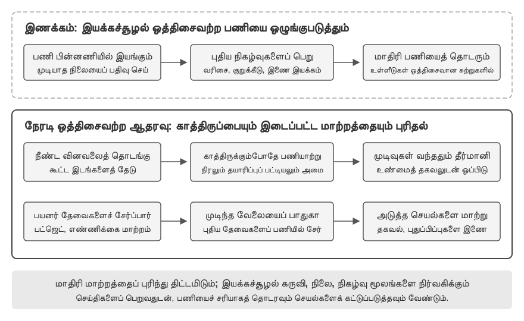
>
> சோதனை 6-1 இன் எளிய நிகழ்வு வரிசையின் மீது கட்டமைத்து, இந்தச் சோதனை ஒத்திசைவற்ற ஏஜெண்டுகளின் கடினமான பகுதிகளுக்குள் நுழைகிறது: **இணையான கருவி செயலாக்கம், செயலாக்க ரத்து, மற்றும் நிலை மேலாண்மை**. ஏஜெண்ட் இனி ஒவ்வொரு நிகழ்வையும் ஒன்றன் பின் ஒன்றாக மட்டும் செயலாக்குவதில்லை; அது ஒரே நேரத்தில் பல இணைந்த பணிகளை நிர்வகிக்க வேண்டும், குறுக்கீடுகள் மற்றும் மீட்புகளைக் கையாள வேண்டும், மேலும் நிகழ்நேர நிலையின் அடிப்படையில் மாறும் முடிவுகளை எடுக்க வேண்டும்.
>
> **1. ஒத்திசைவற்ற கருவி செயலாக்கம்**: நேரம் எடுக்கும் கருவிகளை (குறைந்தது 3-5 வினாடிகள்) ஒத்திசைவற்ற முறையில் செயல்படுத்துவதை ஆதரிக்கிறது, தொடங்கியவுடன் உடனடியாக ஒரு பிளேஸ்ஹோல்டரைத் திருப்பித் தருகிறது. **சரிபார்ப்பு காட்சி**: ஏஜெண்ட் ஒரு நீண்ட நேர இயங்கும் டெர்மினல் கட்டளையை இயக்குகிறது. இந்த நேரத்தில், பயனர் "இப்போது நேரம் என்ன?" என்று கேட்கிறார். ஏஜெண்ட் உடனடியாக பதிலளிக்கிறது, பின்னர் முடிவு திரும்பி வரும்போது பகுப்பாய்வு முடிவை வழங்குகிறது.
>
> **2. நிகழ்வு வரிசை மற்றும் தொகுதி செயலாக்கம்**: அவசரமில்லாத நிகழ்வுகளைக் குவித்து, அவற்றை ஒரு தொகுதியாக பாதையில் (trajectory) சேர்க்கிறது. **சரிபார்ப்பு காட்சி**: ஏஜெண்ட் ஒரு நீண்ட பணியைச் செயல்படுத்திக் கொண்டிருக்கிறது. பயனர் தொடர்ச்சியான செய்திகளை அனுப்புகிறார்: "ஜப்பானிய மொழியில் பதிலளிக்க நினைவில் கொள்" மற்றும் "அதை ஒரு வலைப்பக்கமாக வடிவமைக்கவும்." பணி முடிந்ததும், ஏஜெண்ட் அனைத்து நிகழ்வுகளையும் ஒரே நேரத்தில் செயலாக்கி, ஒரு ஜப்பானிய வலைப்பக்கத்தை உருவாக்குகிறது.
>
> **3. குறுக்கீடு வழிமுறை**: பயனரின் "நிறுத்து" கட்டளை உடனடியாக செயலாக்க ஓட்டத்தை முடித்து, ஒத்திசைவற்ற கருவியை ரத்து செய்கிறது. **சரிபார்ப்பு காட்சி**: ஏஜெண்ட் ஒரு நீண்ட பணியைச் செயல்படுத்திக் கொண்டிருக்கிறது. பயனர் "ரத்துசெய்" என்று அனுப்புகிறார். ஏஜெண்ட் உடனடியாக நிறுத்தப்படுகிறது, மேலும் பாதை குறுக்கீடு நிகழ்வு மற்றும் ரத்து செயல்பாட்டைப் பதிவு செய்கிறது.
>
> **4. இணையான கருவிகளுக்கான ரத்து மற்றும் நிலை வினவல்**: ஒரு ஒத்திசைவற்ற கருவி முடிந்த பிறகு, உண்மையான முடிவு ஒரு புதிய நிகழ்வு மூலம் உரையாடலில் செலுத்தப்படுகிறது. பணி ஐடி மூலம் ரத்து அல்லது முன்னேற்ற வினவலை ஆதரிக்கிறது. **சரிபார்ப்பு காட்சி**: பயனர் கோருகிறார், "இந்த மூன்று ஸ்கிரிப்ட்களையும் எனக்காக ஒரே நேரத்தில் இயக்கவும். எது முதலில் முடிகிறதோ, மீதமுள்ள ஸ்கிரிப்ட்களின் முன்னேற்றத்தைச் சரிபார்க்கவும். ஏதேனும் ஒன்று 50% ஐத் தாண்டவில்லை என்றால், அதை ரத்துசெய்யவும்." மூன்று ஸ்கிரிப்ட்களும் பகுப்பாய்வு செயல்முறைகளை உருவகப்படுத்துகின்றன, முறையே வினாடிக்கு 3%, 2%, மற்றும் 1% வேகத்தில் தொடர்ச்சியாக முன்னேற்றத்தை வெளியிடுகின்றன. ஏஜெண்ட் ஒரே நேரத்தில் மூன்று ஒத்திசைவற்ற டெர்மினல் கட்டளைகளைத் தொடங்குகிறது. வினாடிக்கு 3% வேகத்தில் இயங்கும் ஸ்கிரிப்ட் சுமார் 33 வினாடிகளில் முடிந்ததும், ஏஜெண்ட் மீதமுள்ள இரண்டு டெர்மினல்களின் நிலையை வினவுகிறது, ஒன்று சுமார் 66% மற்றும் மற்றொன்று சுமார் 33% இருப்பதைக் கண்டறிகிறது. பின்னர் 50% ஐத் தாண்டாத ஒன்றை ரத்து செய்கிறது. இரண்டு டெர்மினல்களும் முடிந்த பிறகு, ஒரு முழுமையான அறிக்கையை உருவாக்க முடிவுகளை ஒருங்கிணைக்கிறது.
>

ஒத்திசைவற்ற நிகழ்வு-உந்துதல் செயலாக்கம் உலகம் எந்த நேரத்திலும் Agent-ஐ எழுப்ப அனுமதிக்கிறது; ஆனால் பதிலளிக்கும் முன் மாதிரி சிந்தித்து முடிக்கலாம் என்று கருதுகிறது. அடுத்த மூன்று பிரிவுகள் இந்தக் கருதுகோளைச் சவாலிடுகின்றன: சூழல் மாதிரி உருவாக்கும் வேகத்திற்குச் சமமாகவோ அதைவிட வேகமாகவோ மாறும்போது, “முதலில் சிந்தித்து, பிறகு பேசுவது” ஏற்க முடியாத தாமதமாகிறது.

## குரல்: மிகவும் இயற்கையான மனித-இயந்திர இடைமுகம்

குரல் என்பது உரையை ஒலியாக மாற்றுவது மட்டுமல்ல. பேசும் வேகம் தட்டச்சு வேகத்தைவிட சுமார் நான்கு மடங்கு அதிகம்; கைகள் மற்றும் கண்கள் விடுபடுவதால், எந்த நேரத்திலும் பயனர் குறுக்கிடக்கூடிய தொடர்ச்சியான உள்ளீடு-வெளியீட்டு வளையத்தில் ஏஜெண்டை வைக்கிறது. Dictation பேச்சை உரையாக மாற்றுகிறது; குரல் ஏஜெண்ட் ஏஜெண்டுடன் நேரடியாக ஒத்துழைக்கச் செய்கிறது. இரண்டும் முன்பு அறிமுகமான whisper-coding பணிமுறையை ஆதரிக்கின்றன.

இந்தப் பகுதி இரண்டு திசைகளைப் பார்க்கிறது: பயனர் ஏஜெண்டிடம் பேசுவது, மற்றும் ஏஜெண்ட் பயனரின் சார்பாக வெளி உலகுடன் பேசுவது. குரல் மாதிரி ஏஜெண்ட் என்ன பதிலளிக்க முடியும் என்பதைத் தீர்மானிக்கும்; தொடர்பாடல் கட்டமைப்பு தெளிவாகக் கேட்பது, நேரத்தில் பதிலளிப்பது, இயல்பாக முறை மாற்றுவது, அழைப்பின் போது உறுதிப்படுத்தல்கள் மற்றும் கருவி அழைப்புகளை நிறைவு செய்வது ஆகியவற்றைத் தீர்மானிக்கும்.

### தொடர்பாடல் நேரம்: cascade முதல் full-duplex வரை

OpenAI-யின் GPT-Live அறிமுகம் மூன்று குரல் தொடர்பாடல் வடிவங்களை விவரிக்கிறது: cascade, turn-based மற்றும் full-duplex[^ch6-12]. இவை பழையது புதியதால் நேரடியாக மாற்றப்படுவது அல்ல; தாமதம், செலவு மற்றும் கண்காணிப்புத் திறன் ஆகியவற்றின் வெவ்வேறு சமரசங்கள்:

| வடிவம் | அடிப்படை கட்டமைப்பு | முக்கிய நன்மை | முக்கிய வரம்பு |
| --- | --- | --- | --- |
| Cascade | VAD → ASR → LLM → TTS | தெளிவான, மாற்றவும் பிழைத்திருத்தவும் எளிய தொகுதிகள் | தாமதம் சேர்கிறது; இடைமுகங்களில் மொழியல்லா தகவல் தொலைகிறது |
| End-to-end Omni | Native audio input/output, turn-based தொடர்பாடல் | குறைந்த தாமதம்; தொனி, உணர்ச்சி, சுற்றுச்சூழல் ஒலி நன்றாகப் பாதுகாக்கப்படும் | இன்னும் turn-based; பயிற்சியும் பிழைத்திருத்தமும் விலை உயர்ந்தவை |
| Full-duplex | Native audio input/output; தொடர்ந்து கேட்டு, பேசி, முடிவு செய்கிறது | ஒட்டிய பேச்சு, இயல்பான குறுக்கீடு, தொடர்ச்சியான ஓட்டம் | பயிற்சி, கட்டுப்பாடு, மதிப்பீடு சிக்கலானவை |

மனிதர்கள் ஒருவர் முடித்த பிறகே மற்றவர் பேச வேண்டும் என்ற அனுமானத்திலிருந்தும், யாரிடம் முறை உள்ளது என VAD செய்யும் ஊகத்திலிருந்தும் வெளியேறுவதே பொதுவான நோக்கம். Cascade மற்றும் Omni இன்னும் தொடர்பை turns ஆகப் பிரிக்கின்றன; full-duplex முறையின் உரிமையை மாதிரியின் தொடர்ச்சியான முடிவாக மாற்றுகிறது.

[^ch6-12]: OpenAI, *Introducing GPT-Live*, 2026-07-08. https://openai.com/index/introducing-gpt-live/ கட்டுரை சுருக்கும் ChatGPT Voice-ன் மூன்று தலைமுறைகளிலிருந்து cascade / turn-based / full-duplex வகைப்பாடு வருகிறது; “end-to-end omnimodal (Omni)” என்பது “turn-based voice models” வகைக்கு இணையானது.

### வடிவம் 1 · Cascade pipeline

பெரும்பாலான வணிக குரல் உதவியாளர்கள் இன்னும் தொடர்ச்சியான pipeline-ஐப் பயன்படுத்துகின்றனர் (படம் 6-6): VAD பயனர் பேசி முடித்தாரா என முடிவு செய்கிறது, ASR ஆடியோவை உரையாக மாற்றுகிறது, LLM புரிந்து பதிலை உருவாக்குகிறது, TTS அதை ஒலியாக்குகிறது. தொகுதிகளைத் தனித்தனியாக மேம்படுத்தலாம்; ஆனால் ஒவ்வொரு எல்லையும் காத்திருப்பைச் சேர்க்கிறது.

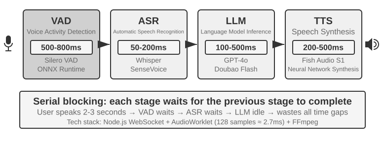

| தொகுதி | பணி | வழக்கமான bottleneck |
| --- | --- | --- |
| VAD | பேச்சு முடிந்ததா என தீர்மானித்தல் | அமைதி threshold தாமதத்தையும் தவறான turn பிரிப்பையும் ஏற்படுத்தும் |
| ASR | ஆடியோவை உரையாக மாற்றுதல் | recognition தாமதம், context இழப்பு |
| LLM | புரிதல், reasoning, generation | முதல் token-க்கு நேரம்; reasoning கூடுதல் காத்திருப்பு |
| TTS | உரையைப் பேச்சாக மாற்றுதல் | முதல் packet synthesis, playback buffer |

Reasoning இல்லாத குறுகிய பதிலில் VAD, ASR, LLM, TTS காத்திருப்புகள் தொடர்ச்சியாகச் சேர்கின்றன (படம் 6-7); உண்மையான மதிப்புகள் input நீளம், மாதிரி, hardware, network, load ஆகியவற்றைப் பொறுத்தவை. Production queueing idle latency-யை மேலும் பெருக்கும் (படம் 6-8).

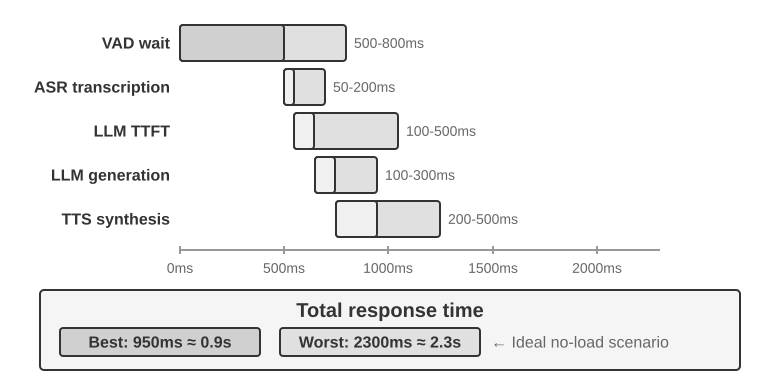

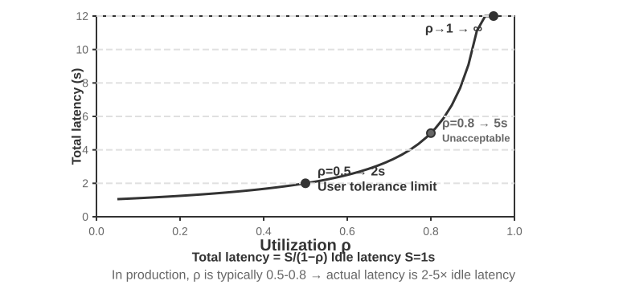

> **சோதனை 6-3 ★: பாரம்பரிய குரல் ஏஜெண்டை உருவாக்குதல்**
>
> மைக்ரோஃபோன், Silero VAD, உள்ளூர் Whisper, streaming LLM, Fish S1 TTS ஆகியவற்றை WebSocket மூலம் இணைத்து cascade baseline-ஐ உருவாக்கவும்.

#### Serial முதல் streaming perception வரை

படம் 6-7 விவரிப்பது VAD+ASR+LLM+TTS முழுமையாகத் தொடர்ச்சியாக இயங்கும் நிலை; இந்தத் தொடர்ச்சியான perception முறையில் மூன்று சிக்கல்கள் உள்ளன:

1. **தாமதம் சேர்தல்**: பேசி முடித்தார் என உறுதிப்படுத்த ஒரு கால அமைதிக்குக் காத்திருக்க வேண்டும்.
2. **தகவல் இழப்பு**: ஒலி/அமைதி என்ற இரும சமிக்ஞை தயக்கம், உணர்ச்சி, backchannel மற்றும் சுற்றுச்சூழல் ஒலியை வெளிப்படுத்த முடியாது.
3. **Context துண்டிக்கப்படுதல்**: email முகவரிகள், பெயர்கள் மற்றும் தனிப்பெயர்கள் துண்டுகளாகப் பிரிந்து தவறாக அறியப்படலாம்.

இதைத் தீர்க்க, தொகுதிவாரியான பணிப்பிரிப்பைத் தக்கவைத்தபடியே, ஒரு மேம்படுத்தல் வழி **streaming perception**: ஒவ்வொரு நிலையும் முடிந்தவரை விரைவில் incremental முடிவுகளை வெளியிடுகிறது.

- **ASR கேட்டுக்கொண்டே எழுத்துப்பெயர்த்தல்**: பயனர் பேசத் தொடங்கியதை VAD கண்டறியும்போதே, குறிப்பிட்ட கால இடைவெளியில் ASR மாதிரியை அழைத்து தற்காலிக transcript-ஐ streaming-ஆக உருவாக்குகிறது; பயனர் பேசி முடித்ததை VAD கண்டறிந்த பின்பே இறுதி உரை உறுதிப்படுத்தப்படுகிறது.
- **LLM ஊகச் செயலாக்கம்**: தற்காலிக transcript உருவானவுடன் அது LLM-க்கு அனுப்பப்படுகிறது; இறுதி உரை தற்காலிக transcript-உடன் ஒத்திருந்தால் LLM மீண்டும் அழைக்கப்படுவதில்லை, இல்லையெனில் முன்பு ஊகமாகச் செய்யப்பட்ட சிந்தனை ரத்து செய்யப்பட்டு LLM மீண்டும் அழைக்கப்படுகிறது.
- **LLM பகுதிவாரியான வெளியீடு**: பேசக்கூடிய முதல் வாக்கியம் உருவானவுடன், முழுப் பதிலுக்குக் காத்திராமல் அது TTS-க்கு அனுப்பப்படுகிறது.
- **TTS incremental synthesis**: audio chunk-களைத் தொடர்ந்து திருப்பி அளித்து, அடுத்தடுத்த generation, synthesis மற்றும் playback ஒன்றோடொன்று மேற்பொருந்தி நடக்க வழிசெய்கிறது.

உண்மையான streaming ASR-க்கு மாதிரியின் ஆதரவு தேவை. Whisper-ன் decoding autoregressive ஆக இருந்தாலும், அதன் encoder முழு audio segment-ஐ எதிர்பார்ப்பதால் அதை நேரடியாக streaming மாதிரிக்குச் சமமாகக் கருத முடியாது. LLM அடிப்படையிலான streaming auditory model தொடர்ச்சியான audio-விலிருந்து உரையையும் semantic events-ஐயும் வெளியிட்டு, “அறிதலையும்” “புரிதலின்” ஒரு பகுதியையும் ஒரே மாதிரிக்குள் வைக்கிறது. உரையாடல் தொடங்கிய தருணத்திலிருந்து இந்தக் கணம் வரையிலான context-ஐ அது தக்கவைக்கிறது; brand-கள், பெயர்கள் மற்றும் தனிப்பெயர்களைக் கையாள உலக அறிவையும் பயன்படுத்த முடியும்.

Text tokens உடன் \`speak_start/end\`, \`interrupt\` (speech boundary மற்றும் interruption), \`emotion\` (உணர்ச்சி, தயக்கம்), \`laugh\`, \`sigh\`, \`noise\` (paralinguistic மற்றும் சூழல் ஒலி) போன்ற markers-ஐ வெளியிடலாம். இவ்வாறு ஒவ்வொரு ஒலியையும் plain text-ஆகச் சுருக்க வேண்டியதில்லை.

பயனர் பேசி முடித்தாரா என்பதை மட்டும் தீர்மானிக்க வேண்டுமானால், turn-end தீர்ப்பை streaming recognizer-இலேயே உட்பொதிக்கலாம். பயிற்சி label-கள் முடிவு எடுக்கப்படும் தருணத்தில் தெரியும் தகவலை மட்டுமே பயன்படுத்த வேண்டும்; இல்லையெனில் hindsight, online-இல் மீண்டும் உருவாக்க முடியாத தீர்ப்பை உருவாக்கும்.

> **சோதனை 6-4 ★: Qwen2-Audio உடன் streaming குரல் உணர்வை உருவகப்படுத்துதல்**
>
> Qwen2-Audio தானாகவே streaming மாதிரி அல்ல. இந்தப் பரிசோதனை வளர்ந்து வரும் audio prefix-களால் தொடர்ச்சியான உணர்தலை உருவகித்து, அதை 600 ms VAD + Whisper உடன் ஒப்பிடுகிறது.

### வடிவம் 2 · End-to-end omnimodal models (Omni)

Streaming perception இருந்தாலும் cascade listening, thinking, speaking ஆகியவற்றை discrete interfaces வழியாக அனுப்புகிறது; audio plain text ஆகும் போது emotion, intonation, ambient sound இழக்கப்படலாம். Omni அணுகுமுறை ஒரே மாதிரியில் audio-வை நேரடியாகக் கேட்டு, பதிலை உருவாக்கி, பேசுகிறது; இதனால் இந்தத் தகவல்களைப் பாதுகாக்க வாய்ப்பு கிடைக்கிறது, ஆனாலும் பயிற்சிச் செலவு அதிகம் (படம் 6-9). வடிவம் 1-ன் cascade அணுகுமுறையுடன் ஒப்பிடும்போது, Omni-யின் நன்மை முதன்மையாக latency-லும், non-text தகவலைப் புரிந்துகொள்வதிலும் உருவாக்குவதிலும் வெளிப்படுகிறது.

புரிதல் தரப்பில், Omni மாதிரிகள் குரலில் உள்ள இடைவெளிகளைக் கண்டறிய முடியும். உருவாக்கல் தரப்பில், Omni மாதிரிகள் பாடுதல் அல்லது ஒரு வாக்கியத்தை தனித்துவமான தொனியில் சொல்வது போன்ற செழுமையான பரா-மொழியியல் (paralinguistic) தகவலைக் கடத்த முடியும்.

Omni மாதிரிகள் இன்னும் turn-taking-ஐ எதிர்பார்க்கின்றன; பொதுவாக VAD மூலமே floor தீர்மானிக்கப்படுகிறது. இதனால், பயனர் எண்களைத் தொடர்ச்சியாகச் சொல்லும்போது வரும் இடைவெளி இன்னும் பேச்சு முடிந்ததாகத் தவறாகப் புரிந்துகொள்ளப்படலாம்.

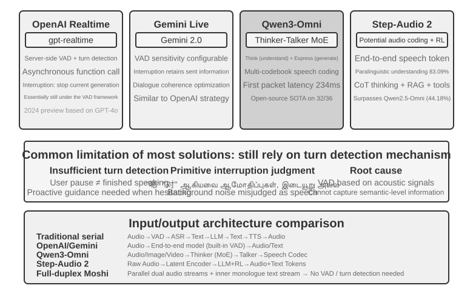

> **சோதனை 6-5 ★★: MiniCPM-o 4.5-ஐ உள்ளூராக இயக்குதல் — end-to-end எதிர் self-cascade**
>
> MiniCPM-o 4.5-ஐ thinking mode அணைக்கப்பட்ட நிலையில் உள்ளூரில் இயக்கி, ஒலியிலிருந்து நேரடியாகப் பதிலளிப்பதை, அதே மாதிரி முதலில் எழுத்துப்பெயர்த்து பின்னர் பதிலளிக்கும் self-cascade உடன் ஒப்பிடவும். இது ஒலித் தகவல் தக்கவைக்கப்படுகிறதா என்பதை அளக்கிறது; பின்னர் வரும் **“பேசிக்கொண்டே சிந்திப்பதை” அல்ல**.

### வடிவம் 3 · Full-duplex interactive models

Omni “user speaks” மற்றும் “model speaks” எனப் பிரிக்கிறது; simultaneous interpreting போன்ற பணிகளுக்கு overlap தேவை. Full-duplex model தொடர்ந்து கேட்டு பேசுகிறது; தொடரலாமா, இடைநிறுத்தலாமா, குறுக்கிடலாமா, tool அழைக்கலாமா என மீண்டும் மீண்டும் முடிவு செய்கிறது. Kyutai-யின் Moshi ஆரம்பகால ஆய்வு உதாரணம். Thinking Machines Lab இதை **Interaction Model**[^ch6-14] என அழைக்கிறது: VAD-ஐச் சுற்றி வெளியில் கட்டாமல் interaction-ஐ மாதிரிக்குள் கட்டுகிறது. GPT-Live இதை production scale-க்கு கொண்டு வந்து, foreground உரையாடலைத் தொடரும் போது சிக்கலான வேலையை background reasoning model-க்கு ஒப்படைக்கிறது.

[^ch6-14]: Thinking Machines Lab, “Interaction Models: A Scalable Approach to Human-AI Collaboration,” 2026-05. https://thinkingmachines.ai/blog/interaction-models/

### அறிவாற்றல் நேரம்: நிகழ்நேர தொடர்பாடலும் ஆழ்ந்த சிந்தனையும்

தொடர்பாடல் தரமும் நுண்ணறிவின் உச்சவரம்பும் வெவ்வேறு பரிமாணங்கள். Foreground model பயனர் ஈடுபாட்டில் இருக்கும் போதே பதிலளிக்க வேண்டும்; background model அதிக நேரம் சிந்திக்கலாம். பின்வரும் மூன்று வடிவங்களும் நேர்கோட்டுத் தொடர் அல்ல, சமரசங்கள். முதல் இரண்டு cascade அல்லது Omni மீது செயல்படலாம்; மூன்றாவது ஆழ்ந்த சிந்தனையையும் நிகழ்நேர வெளிப்பாட்டையும் ஒரே மாதிரிக்குள் ஒருங்கிணைக்கிறது.

#### தீர்வு 1: நிரப்புப் பதிலுக்கு வேக சிந்தனை, விடைக்கு மெதுவான சிந்தனை

வேக சிந்தனை சில நூறு மில்லி விநாடிகளில் ஒரு நிரப்புப் பதிலை அளிக்க முடியும், மெதுவான சிந்தனை பின்னணியில் ஆழ்ந்த ஊகத்தை நிறைவு செய்யும். இதன் சிக்கல்: எளிய கேள்விகள் இருமுறை செயலாக்கப்படுகின்றன, சிக்கலான கேள்விகளில் முரண்பாடு தோன்றலாம் — வேக மாதிரி வாங்கச் சொல்கிறது, பின்னர் மெதுவான மாதிரி அந்தத் திட்டத்தில் ஒரு முக்கிய வசதி இல்லை என்பதைக் கண்டறிகிறது; சில நொடிகளுக்குள் பயனர் ஒன்றுக்கொன்று முரணான இரு பதில்களைக் கேட்கிறார். அடிப்படைக் காரணம், இரு நிகழ்வுகளும் தனித்தனியே சுயேச்சையாகச் சிந்தித்தன.


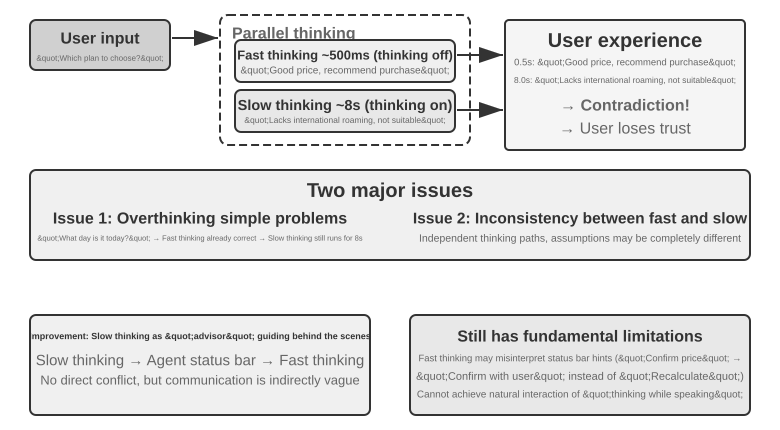


#### தீர்வு 2: தொடர்பாடலுக்கு வேக சிந்தனை, நினைவூட்டலுக்கு மெதுவான சிந்தனை

இரண்டாம் தீர்வில், பின்னணி மாதிரி நிலைப்பட்டை அல்லது தனிப்பட்ட இடைமுகம் வழியாக முன்னணி மாதிரிக்கு ஆலோசனை வழங்குகிறது; முன்னணி மாதிரி உரையாடலைத் தொடர்ந்து நடத்தி, எப்படிச் சொல்வது என்பதைத் தீர்மானிக்கிறது. இது முதல் தீர்வைவிட நிலையானது, ஆனால் தொடர்பு இன்னும் மறைமுகமானதே: முன்னணி ஆலோசனையைத் தவறாகப் புரிந்துகொள்ளலாம், பின்னணியின் இடைநிலைச் சிந்தனையையும் பார்க்க முடியாது; பின்னணி முடிப்பதற்கு முன் பயனர் மேலும் கேட்டால், முன்னணி தன் திறனை மட்டுமே நம்பியிருக்க வேண்டும். இது இயல்பாக "முடிவுக்குக் காத்திருக்க" முடியும், ஆனால் உண்மையில் பேசிக்கொண்டே சிந்திக்க முடியாது.

#### தீர்வு 3: சிந்தனையையும் வெளிப்பாட்டையும் end-to-end ஒருங்கிணைத்தல்

மூன்றாம் தீர்வு சிந்திக்கும் திறனை நேரடியாக end-to-end ஒலி மாதிரிக்குள் உள்வாங்குகிறது. Step-Audio R1 இரு நிரப்பு பொறிமுறைகளால் இரு சிக்கல்களைத் தீர்க்கிறது: **முறைமை-நங்கூரமிட்ட சிந்தனை வடித்தல் (MGRD)** மாதிரியை ஒலியியல் பண்புகளின் அடிப்படையில் சிந்திக்க வைக்கிறது; **MPS இரட்டை-மூளைக் கட்டமைப்பு** கருத்துருவாக்கத்தையும் வெளிப்பாட்டையும் இணையாக இயக்குகிறது. முதலாவது "சரியாகச் சிந்திப்பதை" உறுதிசெய்கிறது, இரண்டாவது "சரியான நேரத்தில் பேசுவதைத்" தீர்க்கிறது.

சிறந்த நிலையில், மாதிரி ஒலியின் உயரம், தாளம், தொனி ஆகியவற்றிலிருந்து உணர்ச்சியை மதிப்பிட வேண்டும்; வெறும் படியெடுத்த உரையை மட்டும் பார்க்கக் கூடாது. MGRD உண்மையிலேயே ஒலியியல் பண்புகளை மேற்கோள் காட்டும் சிந்தனைப் பாதைகளை வடிகட்டி, அத்தரவால் மாதிரியைப் பயிற்றுவிக்கிறது; மேலும் வலுவூட்டல் கற்றல் மூலம், மாதிரி சிந்தனையைத் தவிர்த்து நேரடியாக விடையை ஊகிப்பதைத் தடுக்கிறது. MPS-இல் கருத்துருவாக்க மூளை தொடர்ச்சியாகச் சிந்தனைத் துணுக்குகளை உருவாக்குகிறது; வெளிப்பாட்டு மூளை ஒரு துணுக்கைப் பெற்றவுடன், ஏற்கனவே அளித்த பதிலுடன் இணைத்து உடனே பேச்சை உருவாக்குகிறது. இரண்டும் குழாய்வழி முறையில் இணையாக இயங்குவதால், முதல் வாக்கியத்தைப் பயனர் கேட்க முழுச் சிந்தனையும் முடியும்வரை காத்திருக்க வேண்டியதில்லை.

#### வேக/மெதுவான சிந்தனைப் பிரிப்புக்கும் end-to-end reasoning-க்கும் இடையிலான சமரசம்

ஒருங்கிணைந்த மாதிரியே "பேசிக்கொண்டே சிந்திப்பதை" மிகவும் நேரடியாக அடைகிறது; அதன் விலை, சிந்தனையையும் நிகழ்நேர வெளிப்பாட்டையும் சேர்ந்தே மறுபயிற்சி செய்ய வேண்டும் என்பதே. பிரிக்கப்பட்ட பாதையில் பின்னணி மூளையை மாற்றுவது எளிது. இவை ஒரு சமரசம், ஒன்றுக்கொன்று எளிய மாற்று அல்ல.

முன்னணி reasoning models வேகமாக முன்னேறும் இக்காலத்தில், வேகமான மற்றும் மெதுவான சிந்தனையைப் பிரிப்பதில் ஒரு முக்கியமான engineering நன்மை உள்ளது: மெதுவான மாதிரியின் ஒவ்வொரு புதிய தலைமுறையிலும் கிடைக்கும் முன்னேற்றத்தை அமைப்பு நேரடியாகப் பயன்படுத்த முடியும். வேகமான foreground model குறைந்த தாமதத்தில் கேட்பது, பதிலளிப்பது, உரையாடலைத் தொடர்வது ஆகியவற்றை மட்டும் செய்கிறது; மெதுவான background model reasoning, planning மற்றும் tool calls-ஐக் கையாளுகிறது. மேலும் வலுவான reasoning model வெளிவந்தால், முழு நிகழ்நேர குரல் அமைப்பையும் மறுபயிற்சி செய்யாமல் background model-ஐ மட்டும் மாற்றலாம். ஒருங்கிணைந்த பாதை reasoning மற்றும் interaction-ஐ ஒரே training cycle-க்குள் கட்டுப்படுத்துவதால், ஒவ்வொரு upgrade-லும் நுண்ணறிவு, பதில் தாமதம், வெளிப்பாட்டின் இயல்புத்தன்மை ஆகியவற்றை மீண்டும் சமநிலைப்படுத்த வேண்டும். எனவே வேக/மெதுவான பிரிப்பு என்பது தாமதத்திற்கான ஒரு சமரசம் மட்டும் அல்ல; interaction capability மற்றும் intelligence ceiling தனித்தனியாக வளர அனுமதிக்கும் modular தேர்வாகும்.

இந்தப் பிரிப்பு task performance-ஐ அவசியம் குறைக்காது. ஆகஸ்ட் 2026 நிலவரப்படி, வேக/மெதுவான சிந்தனைப் பிரிப்பு கட்டமைப்பைப் பயன்படுத்தும் Pine AI குரல் Agent, τ³-Voice Leaderboard-இல் முதலிடம் பெற்று Grok Voice, GPT-Realtime-2 போன்ற நிகழ்நேர குரல் அமைப்புகளை முந்தியது. ஆழ்ந்த reasoning மற்றும் நிகழ்நேர உரையாடலை ஒரே நேரத்தில் சோதிக்கும் பணிகளில், பிரிக்கப்பட்ட கட்டமைப்பு end-to-end models-ஐ விட இயல்பாகவே தாழ்ந்ததல்ல என்பதை இந்த முடிவு குறைந்தபட்சம் காட்டுகிறது.[^ch6-17]

[^ch6-17]: Pine AI. “The Most Natural Human-Computer Interface Is Your Voice.” 2026-06-23 (2026-08-06 அன்று புதுப்பிக்கப்பட்டது). https://www.19pine.ai/blog/pine-ai-the-most-natural-human-computer-interface-is-your-voice

"End-to-end model" என்ற சொல் பொதுவாக இரண்டு அர்த்தங்களில் பயன்படுத்தப்படுவதை இங்கே தெளிவுபடுத்த வேண்டும். முதல் அர்த்தம், முந்தைய பகுதியில் விவாதித்த **end-to-end speech path**: பல மாதிரிகளை discrete text வழியாக இணைப்பதற்குப் பதிலாக, மாதிரி நேரடியாக audio-வைப் பெற்று audio-வை உருவாக்குகிறது. Omni மற்றும் Interaction Model இரண்டும் இந்த அர்த்தத்தில் end-to-end; ஆனால் Omni வழக்கமாக இன்னும் turn-based ஆக இயங்கும், Interaction Model கேட்கும்போதே பேச முடியும். எனவே அவற்றின் கட்டமைப்புகள் கணிசமாக வேறுபடுகின்றன. இரண்டாவது அர்த்தம், இந்தப் பகுதியில் விவாதிக்கும் **end-to-end cognitive architecture**: நிகழ்நேர interaction மற்றும் ஆழ்ந்த reasoning ஒரே மாதிரிக்குள் state-ஐப் பகிர்ந்து ஒன்றாகப் பயிற்றுவிக்கப்படுகிறதா, அல்லது வேகமான foreground model மற்றும் மெதுவான background model எனப் பிரிக்கப்படுகிறதா என்பதாகும். இந்த இரண்டு அச்சுகளும் ஒன்றுக்கொன்று சாராதவை. ஒரு அமைப்பின் speech path end-to-end ஆக இருந்தாலும் அதன் cognitive architecture-இல் வேக/மெதுவான பிரிப்பைத் தக்கவைக்க முடியும்; Thinking Machines Lab சிக்கலான பணிகளை background reasoning model-க்கு ஒப்படைப்பது இதற்கான ஒரு எடுத்துக்காட்டு.

### மேலும் மனிதனைப் போன்ற பேச்சுத் தொகுப்பு

பாரம்பரிய TTS மிகையளவு சீராகவும் மிகக் குறைவாக இடைநிறுத்தியும் இருப்பதன் மூலம் அதன் இயந்திர அடையாளத்தை வெளிப்படுத்தலாம். இடைவெளிகள், filler words, மற்றும் அவ்வப்போது நிகழும் மறுபடியும் கூறுதல் மனித பேச்சில் உறுதிப்படாத தன்மையையும் சிந்தனையையும் சுட்டுகின்றன.

முதன்மை LLM உரையுடன் கூடுதலாக **THINKING**, **EMO:happy**, **SPEED:0.8x** போன்ற control markers-ஐ வெளியிடலாம்; TTS அவற்றை pauses, prosody, பேசும் வேகம், சிரிப்பு, மூச்சுவிடுதல், மற்றும் பிற nonverbal audio-ஆக மாற்றும். செயலாக்கம் control markers-ஐப் புரிந்துகொள்ளப் பயிற்றுவிக்கப்பட்ட TTS ஆக இருக்கலாம், அல்லது வேறு உணர்ச்சிகள் மற்றும் பாணிகளுக்கான reference clip-களைப் பயன்படுத்தி voice cloning ஆக இருக்கலாம்.

> **சோதனை 6-6 ★★: Fish Audio மூலம் control-token இயக்கும் TTS**
>
> Fish Audio S1-ஐப் பயன்படுத்தி multi-reference voice library ஒன்றை உருவாக்கி, மூன்று configurations-ஐ ஒப்பிடுக: control markers இல்லாமல், ஒரு reference clip, மற்றும் பல reference clips. execution layer marker-களுடன் பொருந்தும் emotion, speaking rate, மற்றும் style-ஐத் தேர்ந்தெடுக்கிறது.


## கணினி பயன்பாடு: GUI ஆட்டோமேஷன் ஏஜெண்ட்

இந்த அத்தியாயம், அடுத்தடுத்த இரண்டு காட்சிகளை விட, குரலுக்கு கணிசமாக அதிக இடத்தை ஒதுக்குகிறது என்பதை நீங்கள் இப்போது கவனித்திருக்கலாம்—இது வேண்டுமென்றே செய்யப்பட்டது. நிகழ்நேர மல்டிமோடாலிட்டியின் பரிணாமப் பாதையில், குரல் மிக நீண்ட தூரம் பயணித்துள்ளது, சிறந்த குறிப்புச் சட்டகமாகவும் அமைகிறது: "தொடர் பைப்லைன் தாமதம் மிக அதிகம்" என்ற பிரச்சனையில் இருந்து தொடங்கி, எண்ட்-டு-எண்ட், ஃபுல்-டூப்ளக்ஸ், பேசும்போதே சிந்தித்தல் போன்ற தொடர்ச்சியான தீர்வுகள் வழியாக, இன்றைய ஒப்பீட்டளவில் முதிர்ந்த இறுதி நிலை வரை, பிரச்சனை → தீர்வு → இறுதி நிலை என்ற முழு பயணமும் கடக்கப்பட்டுள்ளது. எனவே, அதை நாம் முழுமையாக விளக்குகிறோம். அடுத்தடுத்த கணினி பயன்பாடு மற்றும் ரோபாட்டிக்ஸ் காட்சிகளை இந்த குரல் பாதையின் அடிப்படையில் பார்க்கலாம்—ஒவ்வொன்றும் இந்த பரிணாம வரிசையில் எங்கு நிற்கிறது, எங்கு சிக்கிக் கொண்டுள்ளது என்பதைப் பார்க்கலாம்.

இந்த மூன்று காட்சிகளும் வித்தியாசமாகத் தோன்றினாலும், ஒரே மைய சவால்களை எதிர்கொள்கின்றன: நிகழ்நேர உணர்தல், குறைந்த-தாமத முடிவெடுத்தல் மற்றும் தொடர்ச்சியான தொடர்பு. அடுத்து, இந்த தொழில்நுட்ப கருப்பொருள்கள் காட்சி தொடர்பு (கணினி பயன்பாடு) மற்றும் இயற்பியல் தொடர்பு (ரோபாட்டிக்ஸ்) ஆகியவற்றில் எவ்வாறு மீண்டும் தோன்றுகின்றன என்பதைப் பார்ப்போம்—முதலில், செவிப்புலன் முறையிலிருந்து காட்சி முறைக்கு முன்னோக்கை விரிவுபடுத்துவோம்: ஒரு ஏஜெண்ட் பேச்சைப் புரிந்துகொள்வது மட்டுமல்லாமல், திரையை "பார்த்து" வரைகலை இடைமுகத்தை இயக்கவும் முடிந்தால் என்ன செய்யும்?

கணினி பயன்பாடு (GUI ஆட்டோமேஷன் ஏஜெண்ட் என்றும் அழைக்கப்படுகிறது) AI ஆனது, திரையைக் கவனித்து, மவுஸ் மற்றும் கீபோர்டை இயக்குவதன் மூலம், ஒரு மனிதனைப் போல மென்பொருளைப் பயன்படுத்த அனுமதிக்கிறது—எடுத்துக்காட்டாக, தகவலைத் தேட ஒரு உலாவியைத் திறப்பது, விரிதாள் பயன்பாட்டில் தரவை நிரப்புவது அல்லது கணினி அமைப்புகளில் உள்ளமைவுகளைச் சரிசெய்வது. இதன் மையமானது ஒரு **Perceive-Think-Act** சுழற்சி (படம் 6-11) ஆகும்:

1.  ஏஜெண்ட் தற்போதைய திரையின் ஸ்கிரீன்ஷாட்டை எடுக்கிறது.
2.  ஒரு மல்டிமோடல் மாதிரி, ஸ்கிரீன்ஷாட் மற்றும் பணி அறிவுறுத்தலைப் பெற்று, ஒரு சிந்தனை மற்றும் ஒரு குறிப்பிட்ட செயலை வெளியிடுகிறது.
3.  செயலாக்க அடுக்கு, உண்மையான சூழலில் செயலைச் செய்கிறது (மவுஸை நகர்த்துதல், கிளிக் செய்தல், உரையைத் தட்டச்சு செய்தல் போன்றவை).
4.  இடைமுகம் பதிலளிக்க காத்திருந்து, மற்றொரு ஸ்கிரீன்ஷாட்டை எடுத்து, அடுத்த சுழற்சி மறு செய்கையில் நுழைகிறது.

இங்கே **இடைமுகத்தைப் புரிந்துகொள்வது** மற்றும் **பணியை முடிப்பது** ஆகியவற்றை வேறுபடுத்த வேண்டும். முதலாவது multimodal understanding-க்கு நெருக்கமானது; ஒரே screenshot மீதான கேள்வி-பதிலால் அதை அளக்கலாம். இரண்டாவது, புரிதலையும் செயல் உருவாக்கத்தையும் ஒரு closed loop-இல் வைத்து page loading, நிலை மாற்றங்கள், தவறான செயல்கள், மீளமுடியாத விளைவுகள் ஆகியவற்றைக் கையாள வேண்டும். ஆகவே Computer Use-ன் சிரமம் screenshot-ஐப் பற்றி சரியாகப் பதிலளிப்பதில் மட்டும் இல்லை; ஒவ்வொரு படிக்குப் பிறகும் நிஜ நிலை இன்னும் திட்டத்துடன் பொருந்துகிறதா என்பதை மீண்டும் உறுதிப்படுத்துவதிலும் உள்ளது.

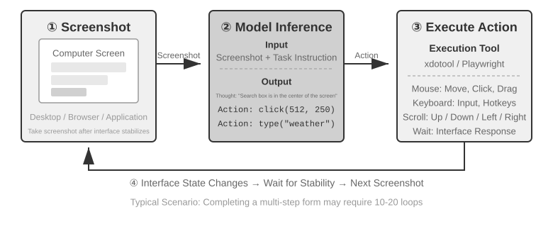

இந்த வளையத்தில் மூன்று முக்கிய வடிவமைப்பு பரிமாணங்கள் உள்ளன: **செயல் இடம்** (ஏஜெண்ட் என்ன செயல்பாடுகளைச் செய்ய முடியும்), **காட்சி அடிப்படை** (ஸ்கிரீன்ஷாட்டில் இலக்கு உறுப்பை எவ்வாறு கண்டுபிடிப்பது), மற்றும் **மாதிரி கட்டமைப்பு** (ஸ்கிரீன்ஷாட்டில் இருந்து சரியான செயலை எவ்வாறு உருவாக்குவது).

### செயல் இட வடிவமைப்பு

Anthropic-ன் reference implementation முழுமையான தொடர்பாடல் திறனை மூன்று வகை கருவிகளாகப் பிரிக்கிறது (படம் 6-12). இது தெளிவான action-space வடிவமைப்பு; ஆனால் model provider-கள் பின்பற்ற வேண்டிய தனியார் protocol அல்ல. அதே screenshots, செயல் கட்டுப்பாடுகள், execution முடிவுகள் ஆகியவற்றை இலக்கு மாதிரி ஆதரிக்கும் messages மற்றும் structured outputs ஆக Harness மாற்ற முடிந்தால், Claude, open-weight vision மாதிரிகள், self-hosted endpoints அனைத்தும் அதே Perceive-Think-Act loop-ஐ இயக்கலாம்.

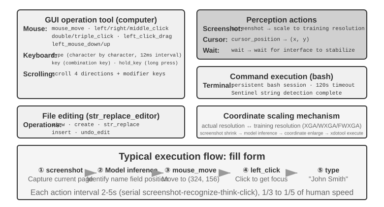

**GUI செயல்பாட்டு கருவி** (கணினி கருவி): சுட்டி செயல்பாடுகளில் நகர்த்துதல் (mouse_move), இடது/வலது/நடுத்தர கிளிக், இரட்டை-கிளிக்/மூன்று-கிளிக், இழுத்தல் (left_click_drag), மற்றும் மிகவும் துல்லியமான அழுத்துதல்/விடுதல் செயல்கள் (left_mouse_down/up) ஆகியவை அடங்கும். உருட்டுதல் (scroll) நான்கு திசைகளை ஆதரிக்கிறது மற்றும் மாற்றி விசைகளுடன் இணைக்கப்படலாம். விசைப்பலகை செயல்பாடுகளில் எழுத்து எழுத்தாக தட்டச்சு செய்தல் (type, எழுத்துகளுக்கு இடையே 12ms இடைவெளியுடன் உண்மையான தட்டச்சை உருவகப்படுத்த), விசை சேர்க்கைகள் (key, எ.கா., Ctrl+C), மற்றும் ஒரு விசையை அழுத்திப் பிடித்தல் (hold_key) ஆகியவை அடங்கும். உணர்வு செயல்கள்: ஸ்கிரீன்ஷாட், கர்சர் நிலையை மீட்டெடுத்தல் (cursor_position), மற்றும் காத்திருத்தல் (wait).

**கட்டளை செயல்பாட்டு கருவி** (bash கருவி): 120-வினாடி நேர வரம்புடன் நிரந்தர bash முனைய அமர்வை வழங்குகிறது. கட்டளை நிறைவைக் கண்டறிய ஒரு சென்டினல் சரத்தைப் பயன்படுத்துகிறது மற்றும் பல அழைப்புகளில் சூழல் நிலையைப் பராமரிக்கிறது (எ.கா., ஒரு கோப்பகத்திற்கு `cd` செய்த பிறகு, அடுத்த அழைப்பு அந்த கோப்பகத்திலேயே இருக்கும்).

**கோப்பு திருத்தும் கருவி** (str_replace_editor): சரம் பொருத்துதல் மூலம் பாதுகாப்பான திருத்தத்தை செயல்படுத்துகிறது, இது பார்வை, உருவாக்கு, மாற்று, செருகு மற்றும் செயல்தவிர் செயல்பாடுகளை ஆதரிக்கிறது. முழு கோப்பையும் நேரடியாக மேலெழுதுவதை விட இது மிகவும் துல்லியமானது மற்றும் தற்செயலாக மற்ற உள்ளடக்கத்தை மாற்றும் வாய்ப்பு குறைவு.

> **சோதனை 6-7 ★: Computer Use-ஐ இயக்குதல் (Anthropic reference path அல்லது open-model path)**
>
> Path A Anthropic Computer Use Demo-வைப் பயன்படுத்துகிறது. அதன் container முழுமையான Ubuntu desktop சூழலை, browser, terminal, மற்றும் பிற பொதுவான கருவிகளுடன் தொகுத்துக் கொண்டுள்ளது. frontend ஒரு பணியைப் பெறுகிறது; backend வழிமுறைகளையும் screenshots-களையும் Claude-க்கு அனுப்பி, பின்னர் மாதிரி திருப்பும் mouse, keyboard, terminal, அல்லது editing செயல்களை இயக்குகிறது.
>
> Path B [`chapter6/computer-use-open-model`](../chapter6/computer-use-open-model/) இல் உள்ள எடுத்துக்காட்டுக் குறியீட்டை பயன்படுத்துகிறது. இயல்பாக, இது hosted OpenRouter API மூலம், அல்லது self-hosted vLLM/SGLang மற்றும் இதற்குச் சமமான அமைப்புகள் மூலம், open-weight Qwen3-VL 32B Instruct model-ஐக் கொண்டு browser-use-ஐ இயக்குகிறது.

### காட்சி அடிப்படை

சுழற்சியின் ஒவ்வொரு மறுமுறையிலும், மாதிரியானது ஸ்கிரீன்ஷாட்டில் உள்ள இலக்கு உறுப்பை துல்லியமாக கண்டறிய வேண்டும்—"தேடல் பெட்டி எங்கே?" "சமர்ப்பி பொத்தானின் ஆயத்தொலைவுகள் என்ன?" இதுதான் காட்சி அடிப்படை சிக்கல் (visual grounding problem). தற்போது, **இரண்டு முக்கிய அணுகுமுறைகள்** உள்ளன: ஒன்று, உள்ளூர்மயமாக்கலை **பல்தேர்வு சிக்கலாக** மாற்றுவது—முதலில் இடைமுக உறுப்புகளை எண்களுடன் குறியிடவும், மாதிரி ஒன்றை மட்டும் தேர்ந்தெடுக்க வேண்டும்; மற்றொன்று **தூய ஆயத்தொலைவு கணிப்பு**—மாதிரியானது ஸ்கிரீன்ஷாட்டை "பார்த்து" நேரடியாக ஆயத்தொலைவுகளைப் புகாரளிக்க அனுமதிப்பது, மனிதனைப் போலவே. பல்தேர்வு அணுகுமுறைக்கு இரண்டு செயலாக்க முறைகள் உள்ளன: **தூய காட்சி குறியீடு** (அசல் Set-of-Mark, பிக்சல்களில் வேட்பாளர் பகுதிகளை வெட்டுவதற்கு பிரிவு மாதிரியைப் பயன்படுத்துதல்) மற்றும் **கட்டமைக்கப்பட்ட உறுப்பு அட்டவணைப்படுத்தல்** (DOM/அணுகல்தன்மை மரம், இடைமுகத்தின் உள்ளார்ந்த கட்டமைப்பை நேரடியாகப் படித்தல்). பல்தேர்வு அணுகுமுறையின் பொதுவான நன்மை என்னவென்றால், இது "ஸ்கிரீன்ஷாட்டில் பொத்தானைக் கண்டுபிடித்து அதன் ஆயத்தொலைவுகளைக் கணிக்கவும்" என்ற திறந்த முடிவு சிக்கலை "ஏற்கனவே குறியிடப்பட்ட உறுப்புகளிலிருந்து ஒன்றைத் தேர்ந்தெடுக்கவும்" என்ற மூடிய முடிவு சிக்கலாக மாற்றுகிறது—தேர்வில் நிரப்பு வினாக்களை விட பல்தேர்வு வினாக்களுக்கு பதிலளிப்பது எளிதானது போலவே, மாதிரியானது "திரையின் (350, 464) ஆயத்தொலைவில் உள்ள பொத்தானைக் கிளிக் செய்யவும்" என்று சொல்வதற்குப் பதிலாக "கிளிக் [123]" என்று மட்டுமே சொல்ல வேண்டும். ஆயத்தொலைவுகளை நேரடியாக முன்கணிப்பது மாதிரிக்கு குறிப்பாகக் கடினமான சவால்; அதைத் துல்லியமாகச் செய்ய பரவலான பயிற்சி தேவை, மேலும் வெவ்வேறு திரை தெளிவுத்திறன்களில் அது எளிதில் பிழையாகிவிடும்.

**Set-of-Mark: காட்சி குறியீட்டு முறை.**

அசல் Set-of-Mark (SoM) 2023 இல் மைக்ரோசாப்ட் ஆராய்ச்சியால் முன்மொழியப்பட்டது, ஆரம்பத்தில் GPT-4V இன் காட்சி அடிப்படை திறன்களைத் திறக்க. இது ஒரு **முற்றிலும் காட்சி** முறை: இது படப் பிரிவு மாதிரிகளை (SAM, SEEM, போன்றவை) பயன்படுத்தி ஸ்கிரீன்ஷாட்டில் வேட்பாளர் பகுதிகளை தானாக வெட்டி, ஒவ்வொரு பகுதியிலும் ஒரு எண்ணிடப்பட்ட குறியை மேலெழுதுகிறது, மேலும் மாதிரியானது எண்களுடன் கூடிய படத்தைப் பார்க்கிறது. மாதிரியானது எண்ணை மட்டும் புகாரளிக்க வேண்டும், மேலும் அமைப்பு அதை தொடர்புடைய பகுதியின் மைய ஆயத்தொலைவுகளாக மாற்றுகிறது. முழு செயல்முறைக்கும் DOM அல்லது எந்த உள் இடைமுக கட்டமைப்பும் தேவையில்லை, எனவே இது சொந்த டெஸ்க்டாப் மென்பொருள் மற்றும் விளையாட்டு இடைமுகங்களுக்கும் சமமாக பொருந்தும்—பிரிவு மாதிரியானது வேட்பாளர் பகுதிகளை வெட்ட முடியும் வரை.

**கட்டமைக்கப்பட்ட உறுப்பு அட்டவணைப்படுத்தல்: வலையில் SoM யோசனையின் கட்டமைக்கப்பட்ட செயலாக்கம்.**

இடைமுகமே கட்டமைக்கப்பட்ட தகவலை வழங்க முடியும்போது, குறியீடு மிகவும் துல்லியமாக இருக்கும். நவீன வலைப்பக்கங்கள் வழங்குவதற்கு முன்பே ஒரு முழுமையான உறுப்பு அமைப்பை (DOM மரம்) மற்றும் சொற்பொருள் பாத்திரங்களை (எது ஒரு பொத்தான், எது ஒரு உள்ளீட்டுப் பெட்டி) வரையறுக்கின்றன, மேலும் அணுகல்தன்மை இடைமுகம் (Accessibility Tree) பல டெஸ்க்டாப் பயன்பாடுகளுக்கு ஒத்த தகவலை வழங்குகிறது. browser-use திட்டத்தால் பிரதிநிதித்துவப்படுத்தப்படும் வலை முகவர் (Web Agent) அணுகுமுறை, இதைத்தான் செய்கிறது: இது DOM இலிருந்து ஊடாடும் உறுப்புகளை எண்ணி பட்டியலிடுகிறது. இது வலையில் SoM கருத்தின் கட்டமைக்கப்பட்ட செயலாக்கமாகக் கருதப்படலாம் (படம் 6-13). இந்த செயல்முறை நான்கு படிகளைக் கொண்டுள்ளது:

1. உலாவி பிழைத்திருத்த இடைமுகம் (CDP, Chrome DevTools Protocol) மூலம் வலைப்பக்கத்தின் கட்டமைக்கப்பட்ட பிரதிநிதித்துவத்தையும் (DOM மரம்) அணுகல்தன்மை தகவலையும் பெறுதல்
2. எந்த உறுப்புகள் ஊடாடக்கூடியவை (பொத்தான்கள், உள்ளீட்டுப் பெட்டிகள், இணைப்புகள் போன்றவை) என்பதை தானாகக் கண்டறிதல்
3. ஒவ்வொரு ஊடாடும் உறுப்புக்கும் ஒரு தனித்துவமான ID ஐக் குறித்து, ஸ்கிரீன்ஷாட்டில் எல்லைப் பெட்டிகளை (bounding boxes) வரைதல்
4. ஒரே நேரத்தில் ஒவ்வொரு ID க்கும் தொடர்புடைய உறுப்பை விவரிக்கும் ஒரு உரை பட்டியலை உருவாக்குதல்

```text
Screenshot: [Key elements in the image are annotated with IDs like [1], [2], [3], [4]]

Elements:
[1] <input type="text" placeholder="Search" aria-label="Search" />
[2] <button id="submit-btn" aria-label="Submit form" />
[3] <input type="text" placeholder="Enter your name" value="" />
[4] <a href="/docs" aria-label="Documentation" />
```

மாதிரி ஒரு ID எண்ணை மட்டும் வெளியிட வேண்டும், மேலும் கணினி தானாகவே அந்த உறுப்பின் மைய ஆயங்களைப் பயன்படுத்தி கிளிக்கை இயக்கும். இந்த வகை அணுகுமுறை டோக்கன்களைச் சேமிக்காது (ஏனெனில் அனைத்து குறியீட்டுத் தகவலும் மாதிரிக்கு அனுப்பப்பட வேண்டும்), ஆனால் இருப்பிடம் துல்லியமாகவும் நிலையானதாகவும் இருக்கும், மேலும் பிரிவினை மாதிரிகள் அறிமுகப்படுத்தக்கூடிய தவறிய கண்டறிதல்கள் மற்றும் தவறான நேர்மறைகளையும் (false positives) இது தவிர்க்கிறது.


**தூய ஆயத்தொலைவு முன்கணிப்பு (Pure Coordinate Prediction).**

மூன்றாவது வழி எந்த குறியீட்டையும் செய்யாமல், மாதிரியை நேரடியாக ஆயங்களை வெளியிடுமாறு கேட்கிறது. **SeeClick** மற்றும் Claude இன் கணினி பயன்பாடு (computer use) ஆகியவற்றால் பிரதிநிதித்துவப்படுத்தப்படும் இந்த அணுகுமுறை, GUI ஸ்கிரீன்ஷாட்கள் மற்றும் உறுப்பு நிலைகளின் பாரிய தரவுத்தொகுப்பில் ஒரு பார்வை மாதிரியை (vision model) பயிற்றுவித்து, இயற்கை மொழி விளக்கங்களை (எ.கா., "சமர்ப்பி பொத்தானைக் கிளிக் செய்க") நேரடியாக ஸ்கிரீன்ஷாட்டில் உள்ள துல்லியமான ஆயங்களுக்கு மேப்பிங் செய்ய கற்றுக்கொடுக்கிறது—ஒரு மனித பயனரைப் போலவே, கிளிக் செய்ய வேண்டிய இடத்தைக் கண்டுபிடிக்க முற்றிலும் "பார்ப்பதை" நம்பியுள்ளது.

ஆயத்தொலைவு முன்கணிப்பு முறைகளில், பயிற்சியின் போது பயன்படுத்தப்படும் தெளிவுத்திறனை (resolution) பொறுத்தே மாதிரியின் ஆயத்தொலைவுகளைப் புரிந்துகொள்ளும் திறன் அதிகம் சார்ந்துள்ளது (படம் 6-14). Claude ஆனது XGA (1024x768), WXGA (1280x800), மற்றும் FWXGA (1366x768) ஆகிய தெளிவுத்திறன்களைப் பயன்படுத்தி பயிற்றுவிக்கப்பட்டது. உள்ளீட்டு ஸ்கிரீன்ஷாட்டின் தெளிவுத்திறன் பொருந்தவில்லை என்றால், மாதிரியின் முன்கணிக்கப்பட்ட ஆயத்தொலைவுகள் முறையாக மாறும் (systematically shift)—இது ஒரு சிறிய வரைபடத்தில் தூரத்தை அளந்து, அதை நேரடியாக ஒரு பெரிய வரைபடத்தில் பயன்படுத்துவதைப் போன்றது. எனவே, கருவி அடுக்கில் (tool layer) இரு-திசை ஆயத்தொலைவு அளவிடுதல் வழிமுறை (bidirectional coordinate scaling mechanism) செயல்படுத்தப்பட வேண்டும், மேலும் இலக்கு தெளிவுத்திறனானது **காட்சி விகிதத்தின் (aspect ratio) அடிப்படையில் தேர்ந்தெடுக்கப்பட வேண்டும்**—இது சீரற்ற நீட்சி (non-uniform stretching) காரணமாக படம் சிதைந்து, அதன் மூலம் ஆயத்தொலைவு தீர்ப்பில் பிழை ஏற்படுவதைத் தவிர்க்கிறது. உதாரணமாக, உண்மையான திரை தெளிவுத்திறன் 2560×1440 (16:9) ஆக இருந்தால், Claude ஆதரிக்கும் மூன்று விருப்பங்களில் மிகவும் பொருத்தமான இலக்கு FWXGA (1366×768) ஆகும், இதன் காட்சி விகிதம் 16:9 க்கு மிக அருகில் உள்ளது. ஸ்கிரீன்ஷாட் விகிதாசாரமாக 1366×768 க்கு அளவிடப்பட்டு மாதிரிக்கு அளிக்கப்படுகிறது; மாதிரி கிளிக் ஆயத்தொலைவுகளை (683, 384) வெளியிட்ட பிறகு, அவை உண்மையான ஆயத்தொலைவுகளுக்கு (683×2560/1366, 384×1440/768) ≈ (1280, 720) என தலைகீழாக மேப்பிங் செய்யப்படுகின்றன. மாறாக, 16:9 படம் வலுக்கட்டாயமாக 4:3 விகிதமுள்ள 1024×768 க்கு நீட்டப்பட்டால், படம் கிடைமட்டமாக அழுத்தப்பட்டு, மாதிரியின் முன்கணிக்கப்பட்ட ஆயத்தொலைவுகள் முறையாக மாறும்.

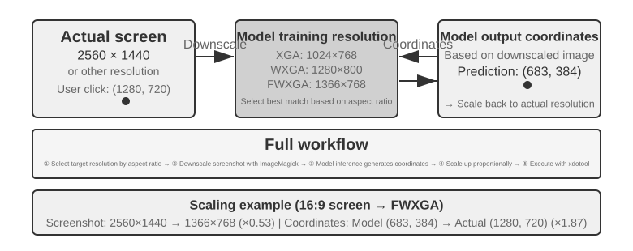

மூன்று வழிகளுக்கான தேர்வு தர்க்கத்தை பின்வருமாறு சுருக்கமாகக் கூறலாம்: **கட்டமைக்கப்பட்ட தகவல் கிடைக்கும்போது, மிகவும் துல்லியமான மற்றும் நிலையான உள்ளூர்மயமாக்கலுக்கு DOM/அணுகல்தன்மை மர (Accessibility Tree) அட்டவணைப்படுத்தலுக்கு முன்னுரிமை அளிக்கவும்**; **அது கிடைக்காதபோது** (எ.கா., Photoshop போன்ற பூர்வீக டெஸ்க்டாப் மென்பொருள், Canvas/WebGL வழங்கப்பட்ட இடைமுகங்கள், விளையாட்டுகள்), **காட்சி குறிப்பு (visual annotation—அசல் SoM வழி) அல்லது ஆயத்தொலைவு முன்கணிப்பு ஆகிய இரண்டையும் பயன்படுத்தலாம்**. காட்சி குறிப்பு உள்ளூர்மயமாக்கலை பல-தேர்வு சிக்கலாக மாற்றுகிறது, இது குறிப்பாகப் பயிற்றுவிக்கப்படாத பொது-நோக்க மாதிரிகளுக்கு மிகவும் ஏற்றதாக உள்ளது; ஆயத்தொலைவு முன்கணிப்பு குறிப்பு படியை நீக்கி, GUI உள்ளூர்மயமாக்கலுக்காகப் பயிற்றுவிக்கப்பட்ட மாதிரிகளுக்கு மிகவும் நேரடியானதாக உள்ளது. இரண்டிற்கும் சிறிய உறுப்புகள் மற்றும் அடர்த்தியான இடைமுகங்களில் இன்னும் துல்லிய இடைவெளிகள் உள்ளன.

> **சோதனை 6-8 ★: உலாவி-பயன்பாட்டைப் (browser-use) பயன்படுத்தி தானியங்கி உலாவி செயல்பாடுகளை செயல்படுத்துதல்**
>
> Playwright browser-automation framework-ஐ multimodal மாதிரியுடன் இணைத்து இயற்கை மொழியால் இயக்கப்படும் browser செயல்களை உருவாக்கவும். SoM visualization-ஐ இயக்கி, ஒவ்வொரு முடிவுக்கும் முன் குறிப்பு பெட்டிகளுடன் screenshot-ஐச் சேமிக்கவும்.
>
> சோதனைப் பணி “Google-ஐத் திறந்து San Francisco வானிலையைத் தேடு”: தொடங்கியபின் screenshot-இல் எண் குறிக்கப்பட்ட interactive elements உடன் Google தேடல் பக்கம் தெரியும். மாதிரி தேடல் பெட்டியைத் தேர்ந்தெடுத்து “San Francisco weather today” என்று உள்ளிட்டு, தேடலைச் சமர்ப்பித்து, முடிவுப் பக்கத்திலிருந்து வெப்பநிலையையும் வானிலை நிலையையும் எடுக்கிறது.

### அசைவூட்டங்களைப் பார்க்கவும் ஒலியைக் கேட்கவும் கூடிய Computer Use Agent

இதுவரை Computer Use உணர்தல் ஒரு மறைமுகக் கருதுகோளில் நின்றது: **திரை நிலையாக உள்ளது**—screenshot எடுத்து, ஒரு படியைச் சிந்தித்து, click செய்து, அடுத்த screenshot எடுக்கிறது. உண்மையான திரைகள் video-களை இயக்குகின்றன, கணநேர notifications-ஐக் காட்டுகின்றன, meeting குரல்களை ஒலிக்கின்றன. 3–5 வினாடிக்கு ஒருமுறை மட்டுமே கண் திறந்து, காதுகளே இல்லாத Agent இரண்டு frame-களுக்கு இடையில் நடப்பதைப் பார்க்கவோ கேட்கவோ முடியாது.

மறுவடிவமைக்க வேண்டியது action interface அல்ல, **observation interface**[^ch6-9]. Agent–கணினி observation interface (AOI) தொடர்ச்சியான சூழல் கண்காணிப்பை மாதிரி கையாளக்கூடிய தனித்தனி நிகழ்வுகளாக மாற்றுகிறது. முக்கிய நுட்பங்கள்: திரையில் அர்த்தமுள்ள மாற்றம் ஏற்பட்டதா என்பதை ஒரு சிறிய மாதிரி தீர்மானித்து, குறிப்பிடத்தக்க மாற்றம் ஏற்படும்போது மட்டும் ஸ்கிரீன்ஷாட் எடுக்கும் **திரை keyframe screenshot**—மாற்றங்கள் அடிக்கடி நிகழும்போது வினாடிக்கு ஒருமுறை ஸ்கிரீன்ஷாட் எடுத்தாலே நல்ல பலன் கிடைக்கும்; ஒலி இருக்கும்போது recognition-ஐ அழைத்து, கண்டறியப்பட்ட உரையை context-இல் சேர்த்து Agent-ஐக் கேட்க வைக்கும் **volume-gated speech transcription**; மற்றும் பிடிக்கப்பட்ட ஸ்கிரீன்ஷாட்டை மாதிரி ஒரு வாக்கியமாக விவரிக்கும் **ஸ்கிரீன்ஷாட்டை உரையாக விவரித்தல்**—இதனால் மூலப் படம் பின்னர் context-இலிருந்து நீக்கப்பட்ட பின்னும் அந்த வாக்கியம் context-இல் நிலைத்திருந்து, multimodal interaction history-ஐச் சுருக்கும் விளைவை அளிக்கிறது.

[^ch6-9]: காண்க: Li, Bojie and Noah Shi. *Agent-Computer Observation Interfaces Enable Dynamic Computer Use.* arXiv:2606.29472, 2026.

### Computer Use-க்கான உலக மாதிரிகள்

முந்தைய பகுதியின் அவதானிப்பு இடைமுகம் தீர்ப்பது "இடையில் என்ன நடந்தது" என்பதைத்தான்: முக்கியச் சட்டகங்கள், பேச்சு எழுத்துருவாக்கம், நிலைத்திருக்கும் உரை ஆகியவற்றின் மூலம், வெகுதொலைவில் இடைவெளிவிட்டு எடுக்கப்பட்ட இரண்டு திரைப்படங்களை மட்டும் Agent பார்க்கும் நிலை மாறுகிறது. ஆனால் அவதானிப்பு இடைமுகம் திட்டமிடல் தாமதத்தை நீக்கிவிடுவதில்லை. Agent இன்னும் "திரைப்படம்—சிந்தனை—சொடுக்கு" என்ற வரிசைமுறைச் சுழற்சியையே ஓட்டிக்கொண்டிருக்கிறது; ஒவ்வொரு செயலை நிறைவேற்றியதும் மீண்டும் அவதானித்து அடுத்த படியைச் சிந்திக்கிறது. **OSWorld-Human** செயல்திறன் ஆய்வு காட்டுவது: பணி இறுதியில் வெற்றி பெற்றாலும்கூட, Agent-இன் செயல்படிகளும் காத்திருப்பு நேரமும் மனிதரை விட வெளிப்படையாக அதிகமாகவே இருக்கின்றன; துல்லியம் மனித அளவை எட்டியது என்பது ஏற்கெனவே போதுமான அளவு பயன்படும் என்பதற்குச் சமம் அல்ல.

மனிதர் கணினியை இயக்கும்போது சொடுக்கிய பிறகுதான் அடுத்த படியைச் சிந்திக்கத் தொடங்குவதில்லை; முதலில் செயலின் விளைவை முன்கணிக்கிறார்: உண்மையான மாற்றம் எதிர்பார்த்தபடி இருந்தால் அசல் திட்டத்தின்படியே தொடர்கிறார்; பக்கத்தின் நிலை எதிர்பார்ப்பிலிருந்து விலகுவதைக் கண்டால் மட்டுமே நின்று மீண்டும் அவதானித்துத் திட்டமிடுகிறார். உலக மாதிரி, செயல்படுவதற்கு முன்பே திரை அடுத்து எப்படி மாறக்கூடும் என்பதை Agent முன்கணிக்க வழிசெய்கிறது; இதனால் மனிதரைப் போன்ற இந்த "ஊகச் செயலாக்கம்" சாத்தியமாகி, செயல்திறன் பெருமளவு உயர்கிறது.

திரையின் நிலை என்பது ஒரு படிமப் படம் மட்டுமல்ல; சாளரங்கள், குவிமையம், உருள் நிலை, உள்ளீட்டுப் பெட்டியின் உள்ளடக்கம், ஏற்றும் நிலை, அனுமதிகள், வலைப் பதில்கள் ஆகியவற்றையும் உள்ளடக்குகிறது; செயல்களோ சொடுக்குதல், விசைப்பலகை உள்ளீடு, உருட்டல், இழுத்தல், காத்திருத்தல் ஆகியவற்றை உள்ளடக்குகின்றன. Computer Use-க்குப் பயன்படக்கூடிய ஓர் உலக மாதிரி குறைந்தபட்சம் இப்போதைய நிலையைக் குறியாக்க வேண்டும், வேட்பாளர் செயல் ஏற்படுத்தும் நிலை மாற்றத்தை முன்கணிக்க வேண்டும், அந்த முன்கணிப்பை அடுத்த படியைத் தீர்மானிக்கத் திட்டமிடுபவரிடம் ஒப்படைக்க வேண்டும்:

```text
திரையின் நிலை + click/type/scroll/wait ──> அடுத்த நிலையின் குறிப்பீடு
```

இப்படிச் செய்தால், உண்மையிலேயே சொடுக்குவதற்கு முன்பே வேட்பாளர் செயல்களின் விளைவுகளை Agent ஒப்பிட முடியும்; பக்கம் ஏற்றப்படும் நேரத்தில் அடுத்த படியைத் தயார் செய்ய முடியும்; ஒரு துள்ளுசாளரம் ஒரு கணத்தில் மறைந்தாலும் நிலை வேறுபாட்டை வைத்து மீள முடியும். எடுத்துக்காட்டாக, "VS Code-இல் புதிய Python கோப்பை உருவாக்கி hello world என்று எழுது" என்பது பணி என்றால், வெற்றி பெற்ற பிறகு கோப்பு மரமும் திருத்தியும் இருக்கவேண்டிய முக்கிய நிலையை மாதிரி முதலில் முன்கணித்து, பிறகு சொடுக்குதல், தட்டச்சு, சேமித்தல் ஆகிய செயல்களைத் தேர்ந்தெடுக்கலாம்; கோப்பை அழிப்பதுதான் பணி என்றால், தனிமைப்படுத்தப்பட்ட மெய்நிகர்த் திரையில் மீளமுடியாத உறுதிப்படுத்தல் சாளரம் தோன்றுமா என்பதை முன்கூட்டியே முன்கணித்து, தேவைப்பட்டால் பயனரின் உறுதிப்படுத்தலைக் கோரலாம். இங்கு முக்கியமானது, நிஜம் போலத் தோன்றும் எதிர்காலத் திரைப்படத்தை மாதிரி உருவாக்குவது அல்ல; பணியை முடிக்கத் தேவையான, சரிபார்க்கக்கூடிய நிலை வேறுபாடுகளை முன்கணிப்பதுதான்.

2026 ஜூலையில் Induction Labs வெளியிட்ட **Photon-1** இந்தப் பாதையின் ஒரு செயலாக்கத்தைக் காட்டியது: வெறும் 30,000 மணி நேர H200 GPU நேரத்தில் computer use உலக மாதிரியின் முன்பயிற்சியை முடித்தது. ஒவ்வொரு சட்டகத்தையும் தனித்தனி மறைநிலை token-களாகச் சுருக்கி, செயலுக்குப் பிந்தைய அடுத்த நிலைக் குறிப்பீட்டைத் தன்னிலைத் தொடர்ச்சியாக முன்கணிக்கிறது; முன்பயிற்சி நிலையில் திரைப்படங்களைப் படிமம் படிமமாக உருவாக்குவதில்லை. அதனுடன் இணைக்கப்பட்ட படம் உருவாக்கி மறைநிலைக் குறிப்பீடுகளைக் காட்சிப்படுத்தப் பயன்படுகிறதே தவிர, அனுமானத்துக்கு இன்றியமையாத பகுதி அல்ல. ஒரு விதைத் திரைப்படமும் அதைத் தொடர்ந்துவரும் செயல்களும் கொடுக்கப்பட்டால், மாதிரி திரையின் நிலைகளைத் தொடர்ச்சியாக "கற்பனை" செய்ய முடியும்; பிறகு மெய்நிகர் இயந்திரங்களில் நடக்கும் நேரடிப் பயிற்சி மூலம் computer-use செயல்களை வெளியிடக் கற்றுக்கொள்கிறது.[^ch6-20]

[^ch6-20]: David Li and Jonathan Li, Induction Labs, “Scaling Video Pretraining with Imagination Models,” 2026-07-23. https://www.inductionlabs.com/news/scaling-video-pretraining. உரையில் உள்ள Photon-1-இன் அளபுருக்கள், தரவு அளவு, உள்ளக அளவுகோல்கள், செலவு ஒப்பீடுகள் அனைத்தும் நிறுவனமே வெளியிட்ட முடிவுகள்.

### மொபைல்: சுற்றுச்சூழல் தடைகள் தொழில்நுட்பத்தை விட கடினமானவை

## ரோபோட் மேனிபுலேஷன்: XLeRobot மூலம் மேசையை ஒழுங்குபடுத்துதல்

> **இந்தப் பகுதியை எப்படிப் படிப்பது**: தொடக்கம் முதல் இறுதி வரை ஒரே ஒரு பணியைத்தான் பயன்படுத்துகிறோம்——"சிவப்புக் கோப்பையைத் தட்டில் வை, மஞ்சள் காகிதத் துண்டைக் குப்பைத் தொட்டியில் போடு, இறுதியில் மேசையின் நிலையை மீண்டும் ஒருமுறை பார்த்து உறுதிசெய்". சோதனை 6-9 மற்றும் 9-9 உண்மையான XLeRobot மீது நடத்தப்படுகின்றன; அதற்கு ரோபோட் கை, அளவீடு, அவசர நிறுத்த சாதனம், களத்தில் ஒரு மேற்பார்வையாளர் ஆகியவை தேவை. சோதனை 6-10, 9-10, 9-11 ஆகியவை அவற்றுக்கு இணையான உள்ளூர் GPU சோதனைகள். உண்மையான வன்பொருள் முடிவுகளும் உருவகப்படுத்தல் முடிவுகளும் தனித்தனியாகவே அறிவிக்கப்படும்; ஆனால் பணியின் இலக்கு, செயல்களின் பொருள், வெற்றிக்கான நிபந்தனைகள் ஆகியவை ஒன்றாகவே வைக்கப்படும்.

ரோபோட் மேனிபுலேஷன் என்பது "படத்தைப் பார்த்துக் கேள்விக்குப் பதிலளிப்பதை" விட மிகவும் கடினமான வேலை. மாதிரி காட்சியைப் புரிந்துகொண்டால் மட்டும் போதாது; அது நிஜ உலகில் தொடர்ச்சியாகச் செயல்பட வேண்டும், மேலும் ஒவ்வொரு செயலும் அடுத்த கணத்தின் நிலைமையை மாற்றிவிடுகிறது. இந்த வேறுபாட்டை XLeRobot மிகவும் உறுதியானதாக ஆக்குகிறது. அதே கையை மனிதர் விசைப்பலகை, விளையாட்டுக் கட்டுப்படுத்தி, VR சாதனம் மூலம் தொலைவிலிருந்து இயக்க முடியும்; அல்லது கேமரா அவதானிப்பையும் வரையறுக்கப்பட்ட சில செயல் கருவிகளையும் ஒரு Agent-இடம் ஒப்படைத்து அது தானே அழைத்துக்கொள்ளச் செய்ய முடியும். வன்பொருளும் மாறவில்லை, பணியும் மாறவில்லை; மாறுவது இயக்குபவர் மட்டுமே——முதல் வழக்கில் மனிதர் இடையறாது கவனித்துத் திருத்துகிறார்; இரண்டாவதில் அதே வேலையை மாதிரியும் கட்டுப்பாட்டு அமைப்பும் இறுதிவரை கொண்டுசெல்ல வேண்டும்.

இந்தப் பகுதி ஐந்து சோதனைகளை "மேசையை ஒழுங்குபடுத்துதல்" என்ற இழையால் இணைக்கிறது. முதலில் மனிதர் உண்மையான XLeRobot-ஐத் தொலைவிலிருந்து இயக்குகிறார்; போதுமான திறமையான ஒரு இயக்குநரின் கையில் இந்த வன்பொருள் எவ்வளவு தூரம் செல்ல முடியும் என்பதை அளக்கிறோம். அடுத்து உருவகப்படுத்தியில் அதே பணிக்கான சிறந்த கட்டுப்பாட்டு உச்ச வரம்பை நிலைநாட்டுகிறோம். பிறகு ஒரு Agent உண்மையான XLeRobot-ஐத் தன்னாட்சியாகக் கட்டுப்படுத்தட்டும்; உணர்தல், திட்டமிடல், தோல்வியிலிருந்து மீள்தல் ஆகியவை முடிவை எப்படித் தீர்மானிக்கின்றன என்பதைக் கவனிக்கிறோம். அதன்பின் அதே கருவி ஒப்பந்தத்தை உருவகப்படுத்தியில் வைத்து, திறந்த சுழற்சி இயக்கம், படிப்படியான சரிபார்ப்பு, உலக மாதிரி ஆகிய மூன்று உத்திகளையும் ஒரே இடத்தில் ஒப்பிடுகிறோம். இறுதியில் பின்னணி, பொருள்களின் தோற்றம், ஒளியமைப்பு, காட்சி இரைச்சல் ஆகியவற்றை மாற்றி, உருவகப்படுத்தலில் கற்ற காட்சிக் கொள்கை புதிய சூழலுக்குப் பொருந்திக்கொள்ள முடிகிறதா என்று பார்க்கிறோம்.

இங்குள்ள இடையூறு பொதுவாக இன்னுமொரு நிலையான வினா-விடை அளவுகோலைச் செய்வதில் இல்லை; வரையறுக்கப்பட்ட உணர்தல் மற்றும் கட்டுப்பாட்டு அலைவரிசைக்குள் மாதிரி சுழற்சியை மூடியே வைத்திருக்கச் செய்வதில்தான் இருக்கிறது. பயன்படுத்தத்தக்க ஒரு ரோபோட் அமைப்பு குறைந்தபட்சம் பின்வரும் நான்கு கேள்விகளுக்குப் பதிலளிக்க வேண்டும்:

1. மனிதர் எந்தப் பணியை முடிக்க விரும்புகிறார்?
2. அடுத்து எந்த உபபணி?
3. இப்போதைய திறன் குறிப்பாக என்ன செயலை வெளியிடுகிறது?
4. செயலை நிறைவேற்றிய பிறகு, நிஜம் இன்னும் அசல் திட்டத்துடன் ஒத்துப்போகிறதா?

இந்தப் பகுதி இந்த நான்கு கேள்விகளையும் XLeRobot-இன் ஒரே கட்டுப்பாட்டுச் சுழற்சிக்குள் வைத்து, நான்கு நுட்பங்களில் ஒவ்வொன்றும் எதைச் சுமக்கிறது என்பதைக் காட்டுகிறது: நீண்ட கால திட்டமிடல் கோப்பையை முதலில் கையாள்வதா காகிதத்தை முதலில் கையாள்வதா என்பதை முடிவு செய்கிறது; VLA அல்லது செயல் அடிப்படைகள் பிடித்தல் மற்றும் வைத்தல் வேலையைச் செய்கின்றன; உலக மாதிரி ஒரு செயலின் விளைவுகளை மதிப்பிடுகிறது; உருவகப்படுத்தலிலிருந்து நிஜத்துக்கான மாற்றம் பயிற்சி வீடியோக்களுக்கும் உண்மையான கேமரா மற்றும் இயக்கிகளுக்கும் இடையிலான வேறுபாட்டைச் சுமக்கிறது. உயர்நிலை மாதிரிக்குப் போதுமான அறிவும் திட்டமிடும் திறனும் ஏற்கெனவே இருந்தாலும், இந்தப் பின்னூட்டச் சுழற்சியில் ஏதேனும் ஒரு கண்ணி விடுபட்டாலே அமைப்பால் பணியை முடிக்க முடியாமல் போகலாம்.

### வன்பொருளுக்கும் வழிமுறைக்கும் இடையிலான பணிப்பங்கீடு

XLeRobot பதிலளிக்க மிகவும் பொருத்தமான முதல் கேள்வி இதுதான்: தன்னாட்சியான மேசை ஒழுங்குபடுத்தல் தோல்வியடையும்போது, கையால் முடியவில்லையா, அல்லது வழிமுறைக்குக் கையைப் பயன்படுத்தத் தெரியவில்லையா? இங்கே மென்மையாக்கக் கூடாத ஒரு உண்மை உள்ளது: **XLeRobot போன்ற சில நூறு டாலர் மட்டுமே விலையுள்ள ஒரு கையால்கூட, தொலைவிலிருந்து இயக்கும்போது, இந்தப் பகுதியில் உள்ளதைப் போன்ற பல படிகள் கொண்ட தொடர்ச்சியான மேசைப் பணியை ஏற்கெனவே முடிக்க முடிகிறது**——மனிதர் கேமரா ஒளிப்பதிவைப் பார்த்துக்கொண்டே சிவப்புக் கோப்பையைப் பிடித்துத் தட்டில் வைக்கிறார், மஞ்சள் காகிதத்தைக் குப்பைத் தொட்டியில் போடுகிறார், இறுதியில் நிலையை மீண்டும் ஒருமுறை சரிபார்க்கிறார். இந்த முடிவு "வன்பொருள் அரைகுறையாகப் போதுமானது" என்பதை மட்டும் சொல்லவில்லை; இது தெளிவான ஒரு நோயறிதல் சான்று: **இந்தப் பணியைப் பொறுத்தவரை, இடையூறு வன்பொருளில் அல்ல, வழிமுறையின் பக்கத்தில்தான் இருக்கிறது.**

நோயறியும் முறை நேரடியானது. கேமரா, கை, பிடிப்பான், மேசை அமைப்பு, வெற்றி நிபந்தனைகள் ஆகியவற்றை நிலைப்படுத்தி வைத்துவிட்டு, சுழற்சியை முதலில் மனிதர் ஏற்கிறார். மனிதர் பொருள்களின் இட மதிப்பீட்டையும், செயல் தேர்வையும், நேரக் கணிப்பையும் இடையறாது திருத்திக்கொள்கிறார்; பிடிப்பு தவறும்போது என்ன செய்வது என்பதும் அவருக்குத் தெரியும். தன்னாட்சி அமைப்புக்கும் மனிதருக்கும் இடையிலான இடைவெளி இந்த மூடிய சுழற்சித் திறனிலேயே வெளிப்படுகிறது. இந்தத் தீர்ப்பின் எல்லை இந்தப் பகுதியின் மேசைப் பணிதான் என்பது சொல்லாமலே விளங்கும்: இந்தப் பணிக்குத் தேவையான சுமை, துல்லியம், வேலைப் பரப்பு ஆகிய வாசல்களை வன்பொருள் கடந்துவிட்டது என்பதை இது காட்டுகிறது; ஆனால் சில நூறு டாலர் கை எல்லாத் திறந்த சூழல்களையும் அல்லது இன்னும் கடினமான கையாளுதல்களையும் சமாளிக்கும் என்பது இதன் பொருள் அல்ல.

XLeRobot பல தொலையியக்க நுழைவாயில்களை ஆதரிக்கிறது: விசைப்பலகை, Xbox கட்டுப்படுத்தி, Switch Joy-Con, VR சாதனங்கள். மனித இயக்குநர், ஒரு வழிமுறை வெளிப்படையாக நிரலாக்க வேண்டிய பலவற்றை இயல்பாகவே செய்கிறார்: பிடிப்பான் கோப்பையை நெருங்கும்போது வேகத்தைக் குறைக்கிறார்; கோப்பை நழுவினால் பிடிக்கும் புள்ளியைத் திருத்துகிறார்; முதல் முயற்சியில் காகிதத்தைக் கிள்ள முடியாவிட்டால் மீண்டும் பார்க்கிறார்; பொருள் இலக்குப் பகுதிக்குள் நுழைந்ததும் முடிவை உறுதிசெய்கிறார். எனவே தொலையியக்கம் என்பது செய்முறைத் தரவைச் சேகரிக்கும் வழி மட்டுமல்ல; "வன்பொருளை நிலைப்படுத்தி இயக்குபவரை மட்டும் மாற்றும்" ஒரு நோயறிதல் சோதனையும்கூட.[^ch6-1]

> **சோதனை 6-9 ★: உண்மையான XLeRobot-ஐத் தொலைவிலிருந்து இயக்கி மேசையை ஒழுங்குபடுத்துதல்**
>
> ஒரு உண்மையான XLeRobot-இன் வேலைப் பரப்பில் ஒரு சிவப்புக் கோப்பை, ஒரு தட்டு, சுருட்டப்பட்ட ஒரு மஞ்சள் காகிதம், ஒரு குப்பைத் தொட்டி ஆகியவற்றை வையுங்கள். இயக்குநர் அளவீடு செய்யப்பட்ட தொலையியக்க வழிகளில் ஒன்றின் மூலம் நிலையான பணியை நிறைவேற்றுகிறார்: "சிவப்புக் கோப்பையைத் தட்டில் வை, மஞ்சள் காகிதத் துண்டைக் குப்பைத் தொட்டியில் போடு, இறுதியில் மேசையின் நிலையை மீண்டும் ஒருமுறை பார்த்து உறுதிசெய்". குறைந்தது சில சுற்றுகள் திரும்பச் செய்து, கேமரா ஒளிப்பதிவு, இயக்குநரின் உள்ளீடுகள், கையின் நிலை, செயல்களின் கால அளவு, பிடிப்புத் தோல்விகள், மறுமுயற்சிகளின் எண்ணிக்கை, இறுதி நிலை ஆகியவற்றைப் பதிவு செய்யுங்கள்.
>
> ஏற்புத் தரத்தை "இறுதியில் மேசை சுத்தமாகத் தெரிகிறது" என்ற அளவுக்குத் தாழ்த்திவிடாதீர்கள். சிவப்புக் கோப்பை தட்டுக்குள்ளும் மஞ்சள் காகிதம் குப்பைத் தொட்டிக்குள்ளும் இருக்க வேண்டும்; கை பாதுகாப்பான நிலைக்குத் திரும்ப வேண்டும்; முழுச் செயல்பாட்டிலும் மோதலோ, வேலைப் பரப்புக்கு வெளியே செல்வதோ, சரிபார்க்காமல் மனிதர் வேலையை முடித்துவைப்பதோ இருக்கக் கூடாது.

உண்மையான வன்பொருளில் தொலையியக்கம்தான் பணியின் உச்ச வரம்பை மிகவும் நம்பத்தகுந்த முறையில் காட்டுகிறது; ஆனால் பொருள்களின் எண்ணிக்கையையும் இடத்தையும் மொத்தமாக மாற்றுவதற்கு அது வசதியானது அல்ல. திரும்பச் செய்யக்கூடிய, புள்ளியியல் ரீதியாக அளக்கக்கூடிய ஒப்பீட்டைப் பெறுவதற்காக, அதே "பொருள்களை இடத்திற்குத் திருப்புதல்" பிரச்சினையை அடுத்ததாக இருபரிமாண மேசை உருவகப்படுத்தியில் வைக்கிறோம்; உணர்தலில் தவறாத, செயலைத் தவறாகத் தேர்ந்தெடுக்காத வலிமையான ஒரு இயக்குநருக்குப் பதிலாக ஒரு சிறந்த கட்டுப்படுத்தியைப் பயன்படுத்துகிறோம்.

> **சோதனை 6-10 ★: உருவகப்படுத்தியில் அதே பணிக்கான சிறந்த கட்டுப்பாட்டு உச்ச வரம்பை அளத்தல்**
>
> இருபரிமாண மேசை உருவகப்படுத்தியில் சிவப்புக் கோப்பை, மஞ்சள் காகிதம், அவற்றுக்கான இலக்குப் பகுதிகள் ஆகியவற்றைச் சீரற்ற முறையில் வைத்து, சிறந்த கட்டுப்படுத்தி வரிசையாகப் பொருள்களை நெருங்கி, பிடித்து, சரியான இடத்துக்கு நகர்த்தட்டும். அதற்குப் படங்களை அடையாளம் காணத் தேவையில்லை, செயலைத் தவறாகத் தேர்ந்தெடுப்பதும் இல்லை; எனவே "உணர்தலும் முடிவெடுத்தலும் இரண்டும் சரியாக இருக்கும்போது இந்தப் பணி குறைந்தபட்சம் எவ்வளவு தூரம் செல்ல முடியும்" என்பதை இது குறிக்கிறது.
>
> பணி வெற்றி விகிதம், தேவைப்படும் படிகளின் எண்ணிக்கை, பாதையின் நீளம் ஆகியவற்றைப் பாருங்கள்; பொருள்களின் தொடக்க இடத்தையும் பணியின் அளவையும் மாற்றி இந்தச் சிறந்த வரம்பு நிலையாக இருக்கிறதா என்றும் கவனியுங்கள். சோதனை 6-9-இல் உள்ள அதே வெற்றி நிபந்தனைகளையே பயன்படுத்துகிறோம்; ஆனால் இங்கே அளக்கப்படுவது இயக்கிகள் இல்லாத ஓர் உருவகப்படுத்தல்: உண்மையான XLeRobot அசைந்தது என்பது இதன் பொருள் அல்ல. இரண்டு சோதனைகளும் அடுத்துவரும் தன்னாட்சிக் கட்டுப்பாட்டுக்கு இரண்டு அடிப்படைக் கோடுகளாக அமையும்——சோதனை 6-9 உண்மையான வன்பொருளின் மேல் மனிதரின் மூடிய சுழற்சி; சோதனை 6-10 உருவகப்படுத்தல் சூழலில் சிறந்த மூடிய சுழற்சி.

### ரோபோட் கட்டுப்பாட்டின் அடிப்படைக் கட்டமைப்பு

ஒரு ரோபோட் அமைப்பு பொதுவாக வெவ்வேறு கால அளவுகோல்களைக் கொண்ட வேலைகளைப் பிரித்துவைக்கிறது.

| அடுக்கு | மையக் கேள்வி | வெளியீடு | வழக்கமான கால அளவு |
| --- | --- | --- | --- |
| பணி இலக்கு | மனிதர் எதை முடிக்க விரும்புகிறார் | "கோப்பையும் காகிதமும் இடத்துக்கு" | நிமிட அளவு |
| நீண்ட கால திட்டமிடல் | எது முதலில், எது பிறகு | முதலில் கோப்பை, பிறகு காகிதம், இறுதியில் சரிபார்ப்பு | வினாடி முதல் நிமிடம் வரை |
| அடிப்படைத் திறன் | இப்போது எந்த நிலை மாற்றத்தை அடைகிறோம் | `pick(red_cup)`, `place(red_cup, tray)` | சுமார் 1—3 வினாடி |
| VLA / திறன் கொள்கை | இந்தத் திறன் குறிப்பாக எப்படி அசைகிறது | XLeRobot பிடிப்பானின் குறுகிய அசைவு அல்லது தொடர்ச்சியான பாதை | சுமார் 1—10 Hz அனுமானம் |
| கீழ்நிலைக் கட்டுப்பாடும் பாதுகாப்பு அடுக்கும் | எப்படி நிலையாகவும் தாமதமின்றியும் நிறைவேற்றுவது | மூட்டு அல்லது முனைக் கட்டுப்பாட்டு அளவுகள், வேக வரம்பு, அவசர நிறுத்தம் | சுமார் 50—1000 Hz |

இது வழக்கமான ஒரு பொறியியல் பணிப்பங்கீடு; ஒரே ஒரு மாதிரிக் கட்டிடக்கலை அல்ல. VLA உயர்நிலைத் தீர்ப்புகளில் ஒரு பகுதியைச் சுமக்கவும் முடியும்; திட்டமிடுபவர் விதி அடிப்படையிலான நிரலாகவோ, VLM ஆகவோ, மேம்படுத்தியாகவோ இருக்கலாம். எந்தச் செயலாக்கத்தைத் தேர்ந்தெடுத்தாலும், "பணியின் வரிசையை" "இப்போதைய செயலிலிருந்து" பிரிப்பது நல்லது; இல்லையேல் உயர்நிலை மாதிரியின் அனுமானத் தாமதம் கீழ்நிலைக் கட்டுப்பாட்டைப் பின்னிழுக்கும், கீழ்நிலையின் உயர் அதிர்வெண் கட்டுப்பாடு உயர் மாதிரியை ஏராளமான தொடர்பற்ற விவரங்களைச் செயலாக்க வைக்கும். XLeRobot-இல் மாதிரி நேரடியாக விருப்பமான மூட்டுக் கோணங்களை வெளியிடக் கூடாது: அது `pick`, `place`, `verify_state`, `stop` போன்ற தெளிவான எல்லைகள் கொண்ட திறன்களை மட்டுமே தேர்ந்தெடுக்கும்; அளவீடு செய்யப்பட்ட, வேக வரம்பும் காலக்கெடுவும் கொண்ட நிறைவேற்றி அவற்றைக் கையின் உண்மையான அசைவாக மாற்றும்.

### நீண்ட கால திட்டமிடலும் பணிச் சிதைவும்

பயனர் "மேசையை ஒழுங்குபடுத்து" என்று சொல்லும்போது, அந்த வாக்கியத்தை அப்படியே செயல் மாதிரிக்கு அமைப்பு அனுப்பிவிட முடியாது. திட்டமிடுபவர் முதலில் காட்சியிலுள்ள பொருள்களையும் இலக்குகளையும் பட்டியலிட்டு, வரிசையைத் தீர்மானித்து, ஒவ்வொரு படிக்கும் தொடக்க நிபந்தனை, முடிவு நிபந்தனை, இடர் வரம்புகள் ஆகியவற்றை எழுதுகிறார். எடுத்துக்காட்டாக:

```text
சிவப்புக் கோப்பையைக் கையாள் → மஞ்சள் காகிதத்தை அகற்று → மேசையைச் சரிபார்
```

"சிவப்புக் கோப்பையைக் கையாள்" என்பது மேலும் இரண்டு செயல்களாகவும் ஒரு சரிபார்ப்பாகவும் சிதைகிறது:

```text
pick(red_cup) → place(red_cup, tray) → verify_state()
```

முடிக்கப்படும் ஒவ்வொரு திறனும் சரிபார்க்கக்கூடிய ஒரு முனையை விட்டுச்செல்கிறது. பிடிப்புத் தவறினால் அந்தப் படியை மட்டும் மீண்டும் செய்யலாம். யாராவது ஒரு பொருளை நகர்த்தினாலோ, பயனர் இலக்கை மாற்றினாலோ, பாதிக்கப்பட்ட அடுத்தடுத்த படிகளை மட்டும் மறுதிட்டமிட்டால் போதும்; பழைய திட்டம் முழுவதையும் மீண்டும் செய்யத் தேவையில்லை. முகவருக்குக் கொடுக்கப்படும் கருவிகளும் போதுமான அளவு எளிமையாக இருக்க வேண்டும்: ஓர் அழைப்பு ஒரே ஒரு வேலையைச் செய்யும், அசைவின் வரம்பு நிலையானது, காலக்கெடு உண்டு, நிறைவேற்றியவுடன் உடனே மீண்டும் அவதானிக்கப்படும்.

> **சோதனை 6-11 ★★: Gemini Robotics-ER 1.5 மூலம் XLeRobot தன்னாட்சியாக மேசையை ஒழுங்குபடுத்துதல்**
>
> சோதனை 6-9-இன் உண்மையான XLeRobot, மேசை அமைப்பு, பணி வழிமுறை, வெற்றி நிபந்தனைகள் ஆகியவற்றை அப்படியே வைத்திருந்து, மனித இயக்குநரை மட்டும் ஒரு Agent-ஆல் மாற்றுங்கள். அவதானிப்பையும் திட்டமிடலையும் Gemini Robotics-ER 1.5 போன்ற உடலுணர் பகுத்தறிவு மாதிரியிடம் ஒப்படைத்து, RoboCrew பாணி முகவர் சுழற்சி வழியாக ஐந்து கருவிகளை மட்டும் திறந்துவிடுங்கள்: `observe_scene`, `pick`, `place`, `verify_state`, `stop`.[^ch6-2]
>
> மாதிரி முதலில் மேசையை அவதானித்து, கையாளும் வரிசையைத் தீர்மானித்து, பிறகு XLeRobot-இன் அளவீடு செய்யப்பட்ட பிடித்தல் மற்றும் வைத்தல் செயல்களை அழைக்கிறது. ஒவ்வொரு திறனை முடித்ததும் அது மீண்டும் அவதானித்துப் பிந்தைய நிபந்தனையைச் சரிபார்க்க வேண்டும். பிடிப்புத் தவறும்போது இப்போதைய திறனை மட்டுமே மீண்டும் முயல அனுமதிக்கப்படும்; பயனர் நிறுத்தச் சொன்னால், பொருள் வேலைப் பரப்பை விட்டு வெளியேறினால், நிலையைச் சரிபார்க்க முடியாவிட்டால் அது `stop`-ஐ அழைக்க வேண்டும். மாதிரி நேரடியாக விருப்பமான மூட்டுக் கோணங்களை வெளியிட முடியாது; தானே முன்னதாக "முடிந்துவிட்டது" என்று சொன்னது என்ற ஒரே காரணத்துக்காக உண்மையான சரிபார்ப்பைத் தவிர்க்கவும் முடியாது.
>
> ஏற்புத் தரம் சோதனை 6-9-இல் உள்ளது போலவே அப்படியே இருக்கும்: கோப்பை தட்டுக்குள், காகிதம் குப்பைத் தொட்டிக்குள், கை பாதுகாப்பான நிலைக்குத் திரும்பியது, மோதலோ பரப்புக்கு வெளியே செல்வதோ இல்லை. வேறுபாடு இதுதான்: தன்னாட்சிச் சோதனையில் பணியின் பொருள் மாதிரியின் சொந்த அவதானிப்பிலிருந்து வர வேண்டும்; உண்மையான செயல்கள் கருவி அழைப்புகளிலிருந்து வர வேண்டும்; இறுதி நிலை புதிய அவதானிப்பால் உறுதிசெய்யப்பட வேண்டும். மனிதர் தொடங்குதல், அவசர நிறுத்தம், பாதுகாப்பு மேற்பார்வை ஆகியவற்றை மட்டுமே செய்ய முடியும்; இடையில் Agent-க்குப் பதிலாகச் செயலை முடித்துவைக்கக் கூடாது. அப்போதுதான் சோதனை 6-9-ஐயும் 9-9-ஐயும் நேரடியாக ஒப்பிட முடியும்: "அதே வன்பொருள், அதே பணியில், மனிதரின் மூடிய சுழற்சியோடு ஒப்பிடும்போது மாதிரியின் மூடிய சுழற்சிக்கு என்ன குறைகிறது".

உண்மையான வன்பொருள் சோதனைகள் அளவீட்டுப் பிழைகளையும், கேமரா மறைப்பையும், பிடிப்பான் தோல்விகளையும் வெளிக்கொணர்கின்றன; ஆனால் ஏராளமான கோளாறுகளைப் பாதுகாப்பாகவும் கட்டுப்பாட்டோடும் திரும்பச் செய்வதற்கு அவை உகந்தவை அல்ல. அடுத்துவரும் உருவகப்படுத்தல் சோதனைகள் இந்த ஐந்து கருவிகளையும் அதே பணி நிலையையும் அப்படியே தக்கவைத்து, உண்மையான இயக்கிகளை மட்டும் கோளாறு புகுத்தக்கூடிய மேசைச் சூழலால் மாற்றுகின்றன——திறந்த சுழற்சி இயக்கம், படிப்படியான சரிபார்ப்பு, செயல் முன்கணிப்பு ஆகியவை தனித்தனியாக எதைச் சேர்க்கின்றன என்பதைப் பிரித்தறிவதற்காக.

### VLA மூலம் கட்டுப்பாடு

VLA என்பது Vision-Language-Action-இன் சுருக்கம்; அதாவது "பார்வை—மொழி—செயல் மாதிரி". இது இப்போதைய காட்சியையும் ஒரு திறன் வழிமுறையையும் பெற்று, ரோபோட் அடுத்ததாக நிறைவேற்ற வேண்டிய செயலை வெளியிடுகிறது:

```text
இப்போதைய அவதானிப்பு + திறன் வழிமுறை → செயல்
```

XLeRobot எடுத்துக்காட்டில், உயர்நிலைத் திட்டமிடுபவர் `pick(red_cup)` என்பதை மட்டுமே சமர்ப்பிக்கிறார்; கோப்பையை எந்தத் திசையிலிருந்து நெருங்குவது, பிடிப்பானை எப்போது மூடுவது, கையை எந்தப் பாதையில் தூக்குவது ஆகியவற்றை VLA அல்லது திறன் கொள்கை இப்போதைய காட்சியை வைத்துத் தீர்மானிக்கிறது. நிறைவேற்று அடுக்கு இந்தக் குறுகிய அசைவை முடித்ததும் மேசை மீண்டும் படமெடுக்கப்படுகிறது; கோப்பை உண்மையிலேயே பிடிக்கப்பட்டுள்ளது என்று உறுதிசெய்த பிறகுதான் திட்டமிடுபவர் `place(red_cup, tray)`-ஐச் சமர்ப்பிக்க அனுமதிக்கப்படுகிறார். வேறு விதமாகச் சொன்னால், கருவி அழைப்பு விரும்பப்படும் நிலை மாற்றத்தை வரையறுக்கிறது; VLA அந்த நிலை மாற்றத்தைத் தொடர்ச்சியான செயலால் எப்படி அடைவது என்பதை வரையறுக்கிறது.

RT-2-உம் OpenVLA-வும் தொடர்ச்சியான செயலைத் தனித்தனி token-களாக வெட்டி, வாக்கியம் உருவாக்குவது போலவே ஒவ்வொன்றாக வெளியிடுகின்றன. π₀ மற்றொரு பாதையைக் குறிக்கிறது: அது நேரடியாகவே தொடர்ச்சியான, மென்மையான செயல் பாதைகளை உருவாக்குகிறது. இரண்டுக்கும் இடையே எளிமையான மேன்மை எதுவும் இல்லை. தனித்தனி token-களை மொழி மாதிரிகளோடு இணைப்பது எளிது; தொடர்ச்சியான பாதைகள் மென்மையான அசைவை வெளிப்படுத்தப் பொருத்தமானவை. உண்மையான தேர்வு செயலை எப்படிக் குறிப்பது என்பதுதான்; மாதிரியின் அளவு மட்டுமல்ல.[^ch6-15]

பெரிய மாதிரி பொதுவாக வினாடிக்கு 1—10 முறை மட்டுமே அனுமானிக்க முடியும்; ஆனால் பாரம்பரியக் கட்டுப்படுத்தி வினாடிக்குப் பத்துகள் முதல் ஆயிரங்கள் வரை புதுப்பிக்கப்படலாம். பொறியியலில் வழக்கமான ஒரு நடைமுறை "செயல் துண்டாக்கம்" (action chunking): மாதிரி ஒரே முறையில் எதிர்கால செயல்களின் ஒரு குறுகிய துண்டை மட்டும் உருவாக்குகிறது; கட்டுப்பாட்டு இழை அந்தத் துண்டை உயர் அதிர்வெண்ணில் நிறைவேற்றுகிறது; மாதிரி பின்னணியில் அடுத்த துண்டைத் தயார் செய்கிறது. இதனால் அனுமானக் காத்திருப்பின் ஒரு பகுதி செயல் நிறைவேற்றும் நேரத்துக்குள் மறைந்துவிடுகிறது. இதன் விலை: துண்டு நீளமாக நீளமாக அசைவு மென்மையாகிறது; ஆனால் அந்த இடைவெளியில் மாதிரி பார்க்கும் புதிய காட்சிகள் குறைகின்றன. XLeRobot கோப்பையை எடுக்கக் கையை நீட்டும்போது இடையில் கோப்பை இடித்து நகர்ந்தாலும், பழைய படத்திலிருந்து உருவான செயல்களைத் தொடர்ந்து நிறைவேற்றிக்கொண்டே இருக்கலாம். எனவே செயல் துண்டாக்கம் என்பது மென்மைக்கும் பதிலிறுப்பு வேகத்துக்கும் இடையிலான ஒரு பேரம்; விலையில்லாத விரைவூட்டம் அல்ல.

### VLA-வின் வரம்புகள்

"நீண்ட கால திட்டமிடல் + VLA" என்பது செயல்படக்கூடிய ஓர் அடிப்படை வடிவமைப்பு; ஆனால் எளிதில் கவனிக்கத் தவறும் சில பிரச்சினைகளை அது விட்டுவைக்கிறது.

- **பயிற்சித் தரவு வரையறுக்கப்பட்டது**: ரோபோட் செய்முறைகள் இணையத்தின் உரைகளையும் படங்களையும் விட மிகவும் குறைவு. மாதிரி "கோப்பை" என்ற சொல்லைப் பார்த்திருக்கிறது என்பதால், எல்லாப் பொருள்களாலான, எல்லா உராய்வு நிலைகளிலான கோப்பைகளையும் பார்த்திருக்கிறது என்று ஆகாது.
- **பின்பற்றக் கற்கிறது, ஆனால் விளைவு தெரியாது**: நடத்தை நகலெடுத்தல் முக்கியமாக "செய்முறை காட்டியவர் அடுத்து என்ன செய்தார்" என்பதைக் கற்கிறது; "இந்தச் செயல் எதை ஏற்படுத்தும்" என்பதற்கு விடையளிக்குமாறு மாதிரியை வெளிப்படையாகக் கோருவதில்லை.
- **ஒவ்வொரு ரோபோட்டும் வேறு**: சுதந்திரப் படிகள், ஆய அச்சு அமைப்புகள், பிடிப்பான்கள், இயக்கித் தாமதங்கள் வேறுபட்டால், அதே செயல் அப்படியே இன்னொரு இயந்திரத்துக்கு இடம்பெயரும் என்பதற்கு உத்தரவாதம் இல்லை.
- **அவதானிப்பு காலாவதியாகலாம்**: செயல் துண்டு நிறைவேற்றத் தொடங்கிய பிறகு பொருள் நகர்த்தப்பட்டாலோ, மறைக்கப்பட்டாலோ, சாய்ந்து விழுந்தாலோ, மாதிரி இன்னும் முந்தைய சட்டகத்தை வைத்தே முடிவெடுத்துக்கொண்டிருக்கும்.

எனவே ஒரு மொழி மாதிரி "கோப்பை" என்ற சொல்லை அறிந்திருப்பதால், உராய்வு, தொடுகை, திரவத்தின் அலைவு, மின்கம்பி ஆகியவை எதிர்கால நிலையை எப்படி மாற்றும் என்பதை அது அறிந்திருக்கிறது என்று ஆகாது. VLA முக்கியமாக "இப்போது என்ன செய்ய வேண்டும்" என்பதற்கு விடையளிக்கிறது; "செய்த பிறகு என்ன நடக்கக்கூடும்" என்பதை எடைபோட வேறுவகை மாதிரி தேவை.

### உலக மாதிரிகள்

உலக மாதிரியைச் செயல் விளைவுகளின் முன்கணிப்பான் என்று புரிந்துகொள்ளலாம். அது கற்பது இதுதான்: இப்போதைய நிலையில் ஒரு செயலைச் செய்தால், அடுத்த கணத்தின் நிலை எப்படி மாறக்கூடும்.

```text
இப்போதைய நிலை + வேட்பாளர் செயல்
    → அடுத்த நிலையை அல்லது எதிர்காலத்தின் ஒரு துண்டை முன்கணி
    → வேட்பாளர்களின் விளைவுகளை ஒப்பிடு
    → செயலைத் தேர்ந்தெடு, மறுதிட்டமிடு, அல்லது பாதுகாப்பாக நில்
```

ரோபோட்டுக்குப் பயன்படும் ஓர் உலக மாதிரி குறைந்தபட்சம் மூன்றை நன்றாகச் செய்ய வேண்டும்:

- இப்போதைய நிலையைப் புரிந்துகொள்ள வேண்டும்;
- வெவ்வேறு செயல்கள் கொண்டுவரக்கூடிய விளைவுகளை முன்கணிக்க வேண்டும்;
- அந்த முன்கணிப்பைத் திட்டமிடுபவரிடமோ கட்டுப்படுத்தியிடமோ ஒப்படைத்துத் தேர்வுக்கு உதவ வேண்டும்.

வீடியோவை விவரிக்க மட்டும் தெரிந்த VLM-ஓ, படங்களை உருவாக்க மட்டும் தெரிந்த மாதிரியோ, தானாகவே நம்பகமான ரோபோட் உலக மாதிரியாக மாறிவிடாது. செயல் என்றால் என்ன என்பதை அது அறிந்திருக்க வேண்டும்; அந்தச் செயல் பொருள்கள் மீதும் சூழல் மீதும் ஏற்படுத்தும் தாக்கத்தை முன்கணிக்கவும் வேண்டும். V-JEPA 2 உள் நிலையில் எதிர்காலத்தை முன்கணிக்கும் பாதையைக் குறிக்கிறது; World-Action Model "செயல்—எதிர்கால அவதானிப்பு" உறவை வெளிப்படையாகக் கற்கிறது. இவற்றை VLA-வோடு சேர்த்துப் பயன்படுத்தலாம்; VLA-வை மாற்றியமைக்க வேண்டிய அவசியம் இல்லை.[^ch6-16]

உண்மையான அமைப்பில் உலக மாதிரிக்குப் பொதுவாக மூன்று பயன்கள் உண்டு:

1. **அசைவதற்கு முன்**: பிடித்தல், தள்ளுதல், காத்திருத்தல் போன்ற வேட்பாளர் செயல்களை ஒப்பிட்டு, இடர் குறைந்த தேர்வை முன்னிலைப்படுத்துதல்;
2. **நிறைவேற்றும்போது**: உண்மையான அவதானிப்பை முன்கணிப்போடு ஒப்பிட்டு, விலகல் கண்டால் செயலைக் குறைத்தல், நிறுத்துதல், அல்லது மறுதிட்டமிடுதல்;
3. **பயிற்சியின்போது**: வீடியோ, உருவகப்படுத்தல் தரவு, தோல்வியுற்ற பாதைகள் ஆகியவற்றிலிருந்து நிலை மாற்றங்களைக் கற்று, உண்மையான இயந்திரத்தில் முயன்று தவறும் அளவைக் குறைத்தல்.

XLeRobot-இன் மேசைப் பணிக்குத் திரும்புவோம். மஞ்சள் காகிதம் சிவப்புக் கோப்பையால் பகுதியாக மறைக்கப்பட்டிருந்தால், அமைப்பு வேட்பாளர் திறன்களை ஒப்பிடலாம்: "முதலில் காகிதத்தை எடு", "முதலில் கோப்பையை நகர்த்து", "வேறு திசையிலிருந்து பிடி". உலக மாதிரி நிஜம் போலத் தோன்றும் ரோபோட் வீடியோவை உருவாக்க வேண்டியதில்லை: எந்த வேட்பாளர் செயல் காகிதத்தை எடுக்கக்கூடிய நிலைக்கு இட்டுச்செல்ல வாய்ப்பு அதிகம், எந்தச் செயல் கோப்பையைக் கவிழ்க்கக்கூடும் என்பதை முன்கணித்தாலே திட்டமிடுபவர் தேர்வுகளை வரிசைப்படுத்த அது போதும். செயலை நிறைவேற்றிய பிறகு, உண்மையான கேமரா அவதானிப்பே இறுதி உண்மையாக இருக்கும்: முன்கணிப்பு தேர்வுக்கு உதவும், ஏற்புச் சரிபார்ப்புக்குப் பதிலாக நிற்காது.

உலக மாதிரி தருவது உறுதியான விடைகள் அல்ல; "இப்படிச் செய்தால் என்ன நடக்கக்கூடும்" என்பது பற்றிய ஒப்பிடத்தக்க முன்கணிப்புகள். எவ்வளவு தூரம் முன்கணிக்கிறோமோ அவ்வளவுக்குப் பிழையும் பெரிதாக மாறுவது வழக்கம்; நிஜம் போலத் தோன்றும் எதிர்காலக் காட்சி உண்மையான தொடுகை மற்றும் உராய்வு விதிகளுக்கு ஒத்திருக்க வேண்டும் என்ற கட்டாயமும் இல்லை. எனவே உண்மையான அமைப்புக்கு இன்னும் குறுகிய கால முன்கணிப்பும், நிகழ்நேர அவதானிப்பும், நிச்சயமின்மை மதிப்பீடும், தனித்த வன்பொருள் பாதுகாப்புக் கட்டுப்படுத்தியும் தேவை. உருவாக்கும் உலக மாதிரிகள் ஊடாடும் உருவகப்படுத்தலுக்கும் காட்சிப்படுத்தலுக்கும் பயன்படும்; ஆனால் "வீடியோ உருவாக்க முடியும்" என்பதையும் "ரோபோட்டின் செயல்களை வழிநடத்த முடியும்" என்பதையும் குழப்பிக்கொள்ளக் கூடாது.[^ch6-21]

> **சோதனை 6-12 ★★: உருவகப்படுத்தியில் மூன்று தன்னாட்சி மேசை ஒழுங்குபடுத்தல் சுழற்சிகளை ஒப்பிடுதல்**
>
> சோதனை 6-11-இன் பணி, இலக்கு நிலைகள், வெற்றி நிபந்தனைகள், ஐந்து கருவிகள் ஆகியவற்றை அப்படியே மேசை உருவகப்படுத்திக்கு நகர்த்தி, உண்மையான XLeRobot-இன் இயக்கிகளை மட்டும் கட்டுப்படுத்தக்கூடிய உருவகப்படுத்தல் நிறைவேற்றியால் மாற்றுங்கள்; அது பிடிப்பில் அவ்வப்போது மீளக்கூடிய தற்காலிகத் தோல்வியை ஏற்படுத்தட்டும். இப்படிச் செய்தால் பிரச்சினையை மாற்றாமலேயே மூன்று உத்திகளை ஒப்பிட முடியும்.
>
> **திறந்த சுழற்சி இயக்கம்** முழுச் செயல் வரிசையையும் ஒரே முறையில் உருவாக்கிவிடும், இடையில் மீண்டும் அவதானிக்காது. **படிப்படியான சரிபார்ப்பு** ஒவ்வொரு `pick`, `place` பிறகும் நிலையை மீண்டும் படிக்கும்; தோல்வியுற்றால் இப்போதைய திறனை மட்டும் மீண்டும் செய்யும். **முன்கணிப்பு இயக்கம்** அத்துடன் ஒரு குறுகிய கால உலக மாதிரியையும் சேர்த்து, வேட்பாளர் திறன்களின் எதிர்பார்க்கப்படும் விளைவுகளை ஒப்பிட்டபின் அடுத்த நகர்வைத் தேர்ந்தெடுக்கும். இந்தச் சோதனை பணி வெற்றி விகிதம், கருவி அழைப்புச் செலவு, தோல்வியிலிருந்து மீளும் திறன் ஆகியவற்றை ஒப்பிடுகிறது; மேலும் இறுதி வெற்றிகள் அனைத்தும் `verify_state`-இன் புதிய அவதானிப்பால் உறுதிசெய்யப்பட்டுள்ளனவா என்று சரிபார்க்கிறது.
>
> இந்தச் சோதனையின் நோக்கம், சிறிய உருவகப்படுத்தல் உலக மாதிரி உண்மையான இயந்திரத்தின் இயற்பியல் மாதிரிக்குச் சமமானது என்று காட்டுவது அல்ல; இன்னும் அடிப்படையான ஓர் உறவைச் சரிபார்ப்பதுதான்——திறந்த சுழற்சித் திட்டம் ஒரே ஓர் உள்ளூர்த் தோல்வியைப் பணியின் இறுதிவரை இழுத்துச்செல்கிறது; படிப்படியான சரிபார்ப்பு மீள வழிசெய்கிறது; செயல் முன்கணிப்பு அத்துடன் வேட்பாளர் திறன்களை வரிசைப்படுத்தவும் உதவுகிறது. உண்மையிலேயே முடிந்ததா என்பதைச் சூழலின் பின்னூட்டமே இன்னும் தீர்மானிக்கிறது.

### உருவகப்படுத்தல் சூழலிலிருந்து உண்மையான ரோபோட்டுக்கு

சோதனை 6-12 உருவகப்படுத்தியில் நிலையாக இருந்தது என்பதால், சோதனை 6-11-இன் உண்மையான XLeRobot-உம் அதே அளவு வெற்றி பெறும் என்று ஆகாது. உருவகப்படுத்தலிலிருந்து உண்மையான இயந்திரத்துக்குச் செல்வது இன்னொரு வகைக் கட்டுப்படுத்தியை மாற்றுவது அல்ல; இரு சூழல்களுக்கு இடையிலான வேறுபாட்டைச் சுமப்பது. பயிற்சிக்குத் தொலையியக்கத் தரவு, வீடியோ தரவு, உருவகப்படுத்தல் ஊடாட்டத் தரவு ஆகியவற்றைப் பயன்படுத்தலாம்; ஆனால் உண்மையாகவே களத்தில் இறக்கும்போது அதே சிவப்புக் கோப்பையும், அதே மஞ்சள் காகிதமும், அதே தட்டும், அதே குப்பைத் தொட்டியும் வேறு பின்னணி, வேறு ஒளியமைப்பு, வேறு கேமரா இடம், வேறு மறைப்பு உறவுகள் ஆகியவற்றின் கீழ் தோன்றும்; கை மேலும் வேறு உராய்வையும், வேறு உணரி இரைச்சலையும், வேறு இயக்கித் தாமதத்தையும் சந்திக்கும். இந்த வேறுபாடுகள் போதுமான அளவு பெரிதாக இருந்தால், உருவகப்படுத்தலில் கற்ற அசைவுகள் நிஜத்தில் பயன்படாமல் போகலாம்.

> **சோதனை 6-13 ★★★: அதே மேசைப் பணியில் RGB சூழல்களுக்கு இடையிலான சோதனை**
>
> உருவகப்படுத்தல் சூழலில் "பொருளை அதற்குரிய இலக்குக்கு நகர்த்து" என்ற அடிப்படைப் பிரச்சினையையே தொடர்ந்து பயன்படுத்துங்கள்; ஒவ்வொரு மாதிரியையும் மேசை ஒழுங்குபடுத்தலுக்குள் ஓர் உள்ளூர் முடிவாகக் கருதுங்கள்——RGB படத்திலிருந்து, பொருளை எந்தத் திசையிலிருந்து நெருங்க வேண்டும், அல்லது ஏற்கெனவே பிடிக்கக்கூடிய நிலையா என்று தீர்மானிப்பது. ஒரே கட்டமைப்புள்ள நான்கு காட்சிக் கொள்கைகளைப் பயிற்றுவியுங்கள்: ஒன்று நிலையான காட்சிகளை மட்டும் பார்க்கும்; ஒன்று பின்னணியை மாற்றும்; ஒன்று பொருள்களின் தோற்றத்தை மாற்றும்; கடைசியானது பின்னணி, தோற்றம், ஒளியமைப்பு, இரைச்சல் ஆகியவற்றை ஒரே சமயத்தில் மாற்றும்.
>
> எல்லாக் கொள்கைகளையும் அசல் சூழலிலும் மாற்றப்பட்ட புதிய சூழலிலும் சோதித்து, காட்சி நிலைமைகள் மாறுவதற்கு முன்பும் பின்பும் செயல் முடிவின் துல்லியத்தை ஒப்பிடுங்கள். இந்தச் சோதனை விடையளிக்க முயல்வது "உருவகப்படுத்தி இப்போது உண்மையான XLeRobot-ஐப் போலவே ஆகிவிட்டதா" என்பதல்ல; இன்னும் குறுகிய ஒரு கேள்வி——பயிற்சியின்போது காட்சி மாறுபாட்டின் வரம்பை வேண்டுமென்றே விரிவுபடுத்துவது, அதே கோப்பை—தட்டு, காகிதம்—குப்பைத் தொட்டி பணி புதிய கேமரா ஒளிப்பதிவுக்குப் பொருந்திக்கொள்ள உதவுகிறதா? முடிவு மேம்பட்டாலும், உண்மையான இயந்திரத்தில் களம் இறக்குவதற்கு இன்னும் உண்மையான கேமரா அளவீடும், இயக்கிச் சோதனைகளும், முழுமையான பாதுகாப்பு மூடிய சுழற்சியும் தேவை.[^ch6-6]

## அத்தியாயச் சுருக்கம்

**modalitiy** மற்றும் **execution timing** என்ற இரு அச்சுகளில் பார்த்தால், **ஒத்திசைவற்ற நிகழ்வு-உந்துதல் செயலாக்கம்** observation-ஐ “Agent சென்று எடுப்பது” என்பதிலிருந்து “உலகம் தள்ளுவது” என்றும், action-ஐ “turn-க்குள் முடிப்பது” என்பதிலிருந்து “இப்போது தொடங்கி பின்னர் வரும் நிகழ்வுகளால் முடிப்பது” என்றும் விரிவுபடுத்துகிறது. **குரல்** அளவை millisecond-க்கு சுருக்கி, மாறிமாறிப் பேசுவதிலிருந்து தொடர்ந்து கேட்டு பேசுவதற்குச் செல்கிறது; realtime foreground interaction-ஐ ஆழமான background thought-இலிருந்து பிரிக்கிறது. **Computer Use** சுழற்சியைத் திரைக்கு மாற்றி efficiency, தொடர்ச்சியான visual understanding, action-க்கு பிந்தைய state confirmation ஆகியவற்றை bottleneck-களாக்குகிறது. **robotics** அதை இயற்பியல் உலகிற்கு நகர்த்துகிறது; action chunking மென்மைக்கும் உடனடி எதிர்வினைக்கும் இடையே சமநிலை செய்கிறது, நிறைவு புதிய observation-ஆல் தீர்மானிக்கப்பட வேண்டும்.

நான்கு பகுதிகளும் ஒரே கட்டுப்பாட்டு எலும்புக்கூட்டைப் பகிர்கின்றன:

```text
தொடர்ச்சியாக உணர்தல்
  → தற்போதைய நிலையையும் நேரத்தையும் மதிப்பிடுதல்
  → பதில் அல்லது செயலைத் தேர்ந்தெடுத்தல்
  → வெளியீட்டைச் சூழலுக்குள் அனுப்புதல்
  → பின்னூட்டத்தை அவதானித்தல்
  → தொடர்தல், திருத்துதல், மீண்டும் முயலுதல், நிறுத்துதல் அல்லது மீள்திட்டமிடல்
```

அவை ஒரே primitives-ஐயும் பகிர்கின்றன—விழிப்பு, safe points, cancellation, preemption, fast/slow separation.

இந்த அத்தியாயம் “Agent-ஐ கட்டமைத்தல்” என்ற பகுதியின் கடைசித் துண்டை நிறைவு செய்தது: observation space மற்றும் action space உள்ளடக்கம், முறைமை, நேரம் என்ற மூன்று திசைகளிலும் விரிந்துவிட்டன. அடுத்து, அத்தியாயம் 7 அமைப்பு சரியாகக் கட்டமைக்கப்பட்டுள்ளதா என்பதை எப்படித் தீர்மானிப்பது என்று விளக்குகிறது; அத்தியாயம் 8 post-training மூலம் மாதிரி அளவுருக்களை எவ்வாறு புதுப்பிப்பது என்பதை விவாதிக்கிறது; அத்தியாயம் 9 இயக்க trajectory-கள், மதிப்பீடு, பல்வேறு புதுப்பிப்பு ஊடகங்கள் ஆகியவற்றை தொடர்ச்சியான பரிணாம மூடிய சுழற்சியாக அமைக்கிறது. அத்தியாயம் 10 இந்த முழுமையான ஒற்றை-Agent அடித்தளத்திலிருந்து multi-Agent ஒத்துழைப்புக்குச் செல்கிறது.

[^ch6-16]: Meta AI, “Introducing the V-JEPA 2 world model and new benchmarks for physical reasoning,” 2025-06-11. https://ai.meta.com/blog/v-jepa-2-world-model-benchmarks/; V-JEPA 2 technical report：arXiv:2506.09985, https://arxiv.org/abs/2506.09985
[^ch6-21]: Jack Parker-Holder and Shlomi Fruchter, Google DeepMind, “Genie 3: A new frontier for world models,” 2025-08-05. https://deepmind.google/blog/genie-3-a-new-frontier-for-world-models/; Zachary Lin et al. *Cosmos World Foundation Model Platform for Physical AI.* arXiv:2501.03575, 2025. https://arxiv.org/abs/2501.03575 。
[^ch6-1]: XLeRobot, “Teleop ஆவணம்”. https://xlerobot.readthedocs.io/en/latest/software/getting_started/XLeRobot_teleop.html
[^ch6-2]: Google DeepMind, “Gemini Robotics-ER 1.5”. https://deepmind.google/models/gemini-robotics/gemini-robotics-er/; XLeRobot, “LLM Agent கட்டுப்பாடு”. https://xlerobot.readthedocs.io/en/latest/software/getting_started/LLM_agent.html . XLeRobot-இன் மேலோட்ட எடுத்துக்காட்டு, மாதிரியையும் கருவி அழைப்புகளையும் எப்படி ஒருங்கிணைப்பது என்பதைக் காட்டுகிறது; இந்தப் பகுதி அதே ஒருங்கிணைப்புக் கொள்கையையே தக்கவைக்கிறது, ஆனால் செயல் கருவிகளை மேசையின் மேல் அளவீடு செய்யப்பட்ட பிடித்தல், வைத்தல், சரிபார்த்தல், நிறுத்துதல் ஆகிய அடிப்படைகளுக்கு மட்டுப்படுத்துகிறது.
[^ch6-6]: LeRobot, “Sim2Real பயிற்சி வழிகாட்டி”. https://github.com/StoneT2000/lerobot-sim2real/blob/87d6c1d969f6e0ca4dc5697940804e231118a63a/docs/zero_shot_rgb_sim2real.md
[^ch6-15]: Moo Jin Kim et al. *OpenVLA: An Open-Source Vision-Language-Action Model.* arXiv:2406.09246, 2024. https://arxiv.org/abs/2406.09246

## சிந்தனை கேள்விகள்

1. ★★ ஒரு ஒத்திசைவற்ற ஏஜெண்ட் கட்டமைப்பில், நிகழ்வு வரிசைக்கான முன்னுரிமை உத்தி வடிவமைப்பு நேரத்தில் தீர்மானிக்கப்பட வேண்டும். ஆனால் முன்னுரிமை தீர்ப்புக்கு சொற்பொருள் புரிதல் தேவைப்பட்டால் (எ.கா., ஒரு புதிய செய்தி தற்போதைய பணியை விட அவசரமானதா என்பதை தீர்மானித்தல்), இந்த தீர்ப்பை யார் செய்ய வேண்டும்—ஒரு விதிகள் இயந்திரமா அல்லது மற்றொரு LLM அழைப்பா? ஒவ்வொன்றின் செலவுகள் என்ன?
2. ★★ வரிசை அடிப்படையிலான நிகழ்வு செயலாக்கத்தில், மாதிரிகள் கடைசி நிகழ்வில் மட்டுமே கவனம் செலுத்த முனைகின்றன. இந்த அத்தியாயம் ஏஜெண்ட் நிலைப் பட்டி குறிப்பான்கள் மற்றும் சுருக்கம் மூலம் இதைத் தணிக்கிறது. ஆனால் வரிசையில் 20 நிகழ்வுகள் (10 கருவி முடிவுகள் + 5 பயனர் செய்திகள் + 5 கணினி எச்சரிக்கைகள்) குவிந்திருந்தால், மாதிரி முக்கிய தகவலைத் தவறவிடாமல் இருக்க இந்த நிகழ்வுகளின் விளக்கக்காட்சி வரிசை மற்றும் வடிவமைப்பை எவ்வாறு ஒழுங்கமைப்பீர்கள்?
3. ★★★ ஒரு ஏஜெண்ட் பயனரின் சார்பாக வெளி உலகத்துடன் தொடர்பு கொள்ளும்போது, அது அடிப்படையில் ஒரு அடையாளத் தேர்வை எதிர்கொள்கிறது: மூன்றாம் தரப்பாக செயல்பட ஒரு சுயாதீன மெய்நிகர் அடையாளத்தை (தனி மின்னஞ்சல் மற்றும் தொலைபேசி எண்) பயன்படுத்தலாமா, அல்லது பயனரின் தனிப்பட்ட கணக்குகளை நேரடியாக பயனராகவே இயக்கலாமா? முந்தையது தானியங்கி பின்னணி செயல்பாட்டை அனுமதிக்கிறது, ஆனால் மூன்றாம் தரப்பினர் மனிதர் அல்லாத அடையாளத்தை நம்பாமல் போகலாம்; பிந்தையது முழுமையான சூழல் மற்றும் அனுமதிகளைக் கொண்டுள்ளது, ஆனால் நம்பிக்கை அங்கீகாரம் மற்றும் பாதுகாப்பு எல்லை சிக்கல்களை அறிமுகப்படுத்துகிறது. ஒவ்வொரு முறையும் எந்த சூழ்நிலைகளில் தேர்ந்தெடுக்கப்பட வேண்டும் என்று நீங்கள் நினைக்கிறீர்கள்?
4. ★★ குரல் முகவர்களுக்கான (voice agents) எண்ட்-டு-எண்ட் மாதிரியானது ASR-LLM-TTS ஐ ஒரே மாதிரியாக இணைத்து, தாமதத்தைக் குறைக்கிறது, ஆனால் தொகுதித்தன்மையை (modularity) இழக்கிறது. எண்ட்-டு-எண்ட் மாதிரியானது ஒரு குறிப்பிட்ட கட்டத்தில் (எ.கா., பேச்சு அங்கீகாரம்) பிழை ஏற்படுத்தினால், அதைப் பிழைத்திருத்தம் செய்து சரிசெய்வது தொடர் குழாய் அமைப்பை விட மிகவும் கடினம். எண்ட்-டு-எண்ட் குரல் முகவருக்கான கண்காணிப்புத் திறன் அமைப்பை (observability system) நீங்கள் எவ்வாறு வடிவமைப்பீர்கள்?
5. ★ ஸ்டெப்-ஆடியோ R1 (Step-Audio R1) ஆனது MPS இரட்டை-மூளை கட்டமைப்பின் (MPS dual-brain architecture) மூலம் "பேசும்போதே சிந்தித்தலை" அடைகிறது. இருப்பினும், மனிதர்கள் "பேசும்போதே சிந்திக்கும்போது", பெரும்பாலும் யோசிக்காமல் வார்த்தைகளை உதிர்க்கிறார்கள், தங்களைத் தாங்களே சரிசெய்துகொள்கிறார்கள், அல்லது நிரப்பு வார்த்தைகளை (filler words) பயன்படுத்துகிறார்கள். ஒரு முகவரின் "பேசும்போதே சிந்தித்தல்" இந்த மனிதப் பண்புகளைப் பிரதிபலிக்க வேண்டுமா?
6. ★★ SoM (Set-of-Mark) மற்றும் அதன் கட்டமைக்கப்பட்ட மாறுபாடுகள் (DOM உறுப்பு அட்டவணைப்படுத்தல்) கணினி பயன்பாட்டின் காட்சி இருப்பிடத்தை (visual localization) திறந்த-முடிவு ஆயத்தொலைவு கணிப்பிலிருந்து (open-ended coordinate prediction) மூடிய-தொகுப்பு அடையாளத் தேர்வுக்கு (closed-set ID selection) மாற்றுகின்றன, ஆனால் அவை அனைத்திற்கும் முதலில் UI உறுப்புகளைக் கண்டறிந்து குறிப்பிடுதல் தேவைப்படுகிறது—அது ஒரு பிரிவினை மாதிரி (segmentation model) மூலமாகவோ அல்லது DOM மூலமாகவோ இருக்கலாம். இடைமுகத்தில் தரமற்ற கட்டுப்பாடுகள் (non-standard controls) அல்லது மாறும் உறுப்புகள் (dynamically changing elements) இருந்தால், குறிப்புகள் முழுமையற்றதாகவோ அல்லது துல்லியமற்றதாகவோ இருக்கலாம். இதுபோன்ற சந்தர்ப்பங்களில், நாம் ஆயத்தொலைவு கணிப்புக்குத் (coordinate prediction) திரும்ப வேண்டுமா?
7. ★★ XLeRobot போன்ற சில நூறு டாலர் ரோபோ தளங்கள், தொலை இயக்கத் தரவு சேகரிப்பை (teleoperation data collection) மலிவாக்குகின்றன. இருப்பினும், தொலை இயக்கத் தரவின் தரமானது ஆபரேட்டரின் திறமையைப் பொறுத்தது. திறமையற்ற ஆபரேட்டரிடமிருந்து வரும் குறைந்த தரமான தரவு, VLA மாதிரியின் பயிற்சியை எவ்வாறு பாதிக்கும்? தரவு சேகரிப்பு கட்டத்தின் போது குறைந்த தரமான தரவை தானாக வடிகட்டுவது எப்படி?
8. ★★★ இந்த அத்தியாயம் மூன்று தொடர்பு முறைகளை (interaction modalities) உள்ளடக்கியது: குரல், கணினி பயன்பாடு மற்றும் ரோபாட்டிக்ஸ். இந்த முறைகளில் ஒரு பொதுவான போக்கு, தொடர் குழாய்களிலிருந்து எண்ட்-டு-எண்ட் மாதிரிகளுக்கான பரிணாம வளர்ச்சியாகும். இந்தப் போக்கு தொடர்ந்தால், ஐந்து ஆண்டுகளில் முகவர் தொடர்பு அடுக்கு (agent interaction layer) எப்படி இருக்கும்?
9. ★★ DOM/அணுகல்தன்மை மர உறுப்பு அட்டவணைப்படுத்தல் (DOM/Accessibility Tree element indexing) நிலையான வலை பயன்பாடுகளில் நன்றாக வேலை செய்கிறது, ஆனால் அதிகரித்து வரும் மென்பொருள் இடைமுகங்கள் (Canvas/WebGL ரெண்டரிங், கிராஸ்-பிளாட்ஃபார்ம் தனிப்பயன் வரையப்பட்ட கட்டுப்பாடுகள்) அணுகக்கூடிய கட்டமைக்கப்பட்ட தகவலை வழங்குவதில்லை, அவை முற்றிலும் காட்சி குறிப்பு அல்லது ஒருங்கிணைப்பு முன்கணிப்பை நம்பியுள்ளன. கணினி பயன்பாடு முற்றிலும் காட்சி அணுகுமுறையில் பந்தயம் கட்ட வேண்டுமா, அல்லது கட்டமைக்கப்பட்ட மற்றும் காட்சி பாதைகள் இரண்டையும் பராமரிக்க வேண்டுமா? இரண்டு பாதைகளையும் பராமரிப்பதன் செலவுகள் மற்றும் நன்மைகள் என்ன?
10. ★★ VLA மாதிரிகள் செயல் துண்டாக்கலை (action chunking) பயன்படுத்துகின்றன—உரையில் குறிப்பிட்டுள்ளபடி, π₀ இன் வழக்கமான உள்ளமைவு 50Hz இல் 25-50 எதிர்கால செயல்களை உருவாக்குகிறது—இது செயல்படுத்தும் நேரத்திற்குள் அனுமான தாமதத்தை (inference latency) மறைக்கிறது. இருப்பினும், செயல்படுத்தலின் போது சூழல் திடீரென மாறினால் (எ.கா., ஒரு பொருள் நகர்த்தப்பட்டால்), முன் உருவாக்கப்பட்ட செயல் வரிசை செல்லாததாகிவிடும். செயல் துண்டாக்கலின் செயல்திறன் நன்மையை சூழல் மாற்றங்களுக்கு பதிலளிக்கும் தேவையுடன் எவ்வாறு சமநிலைப்படுத்தலாம்?
11. ★★★ இந்த அத்தியாயத்தில் உள்ள மூன்று காட்சிகளும் (குரல், கணினி பயன்பாடு, ரோபாட்டிக்ஸ்) "உணர்-சிந்தி-செயல்" சுழற்சியின் தாமதப் பிரச்சினையை எதிர்கொள்கின்றன மற்றும் வேகமான மற்றும் மெதுவான சிந்தனையை இணையாக்கும் திசையில் உருவாகி வருகின்றன. குரலில், இது "தவறாகப் பேசிய பின் திருத்துதல்" ஆக வெளிப்படுகிறது; கணினி பயன்பாட்டில், "முதலில் கிளிக் செய்து, பின்னர் பார்ப்பது" ஆக; ரோபாட்டிக்ஸில், "முதலில் அடி எடுத்து வைத்து, பின்னர் பார்ப்பது" ஆக. வேகமான சிந்தனையின் அடிப்படையிலான இந்த செயல்கள் மீள முடியாத விளைவுகளுக்கு வழிவகுக்காமல் இருப்பதை எவ்வாறு உறுதி செய்யலாம்?
12. ★★★ இந்த அத்தியாயத்தில் ஒரே தொடக்கக் கூறுகள் (எழுப்புதல், பாதுகாப்புப் புள்ளி, ரத்து, முந்துதல், வேக/மெது பிரிப்பு) வெவ்வேறு கால அளவுகளில் மீண்டும் மீண்டும் அமல்படுத்தப்படுகின்றன. அவற்றில் ஒன்றைத் தேர்ந்தெடுத்து, நிகழ்வு-உந்துதல் செயலாக்கத்தில் (விநாடி—நாள்) மற்றும் ரோபோ செயல் துண்டாக்கத்தில் (மில்லி விநாடி) அதன் அமலாக்க வேறுபாட்டை விளக்குக; இந்த வேறுபாட்டை முக்கியமாக எது தீர்மானிக்கிறது — சூழல் மாற்றத்தின் வேகமா, செயலின் திருப்பக்கூடிய தன்மையா, அல்லது அவதானிப்பைப் பெறும் செலவா?
