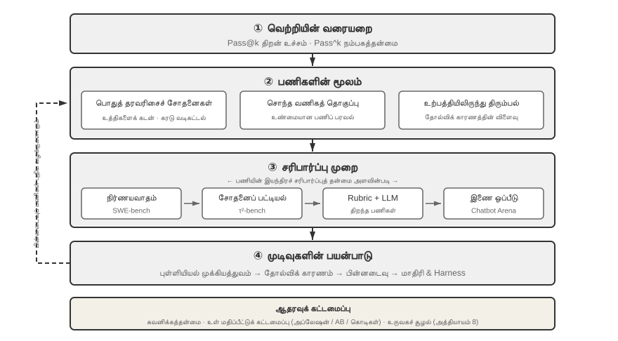
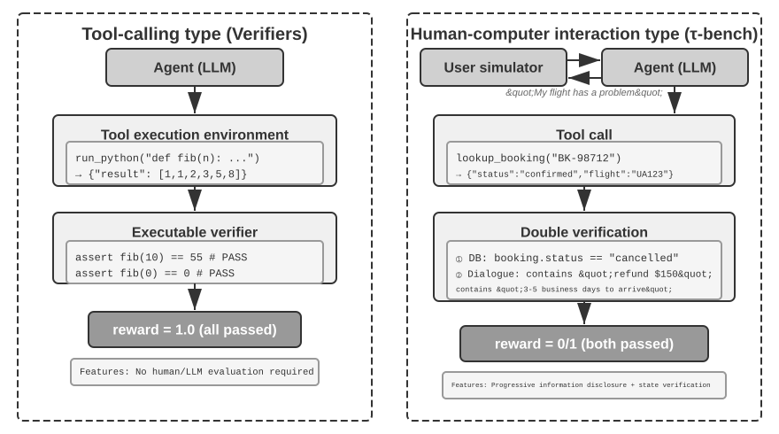
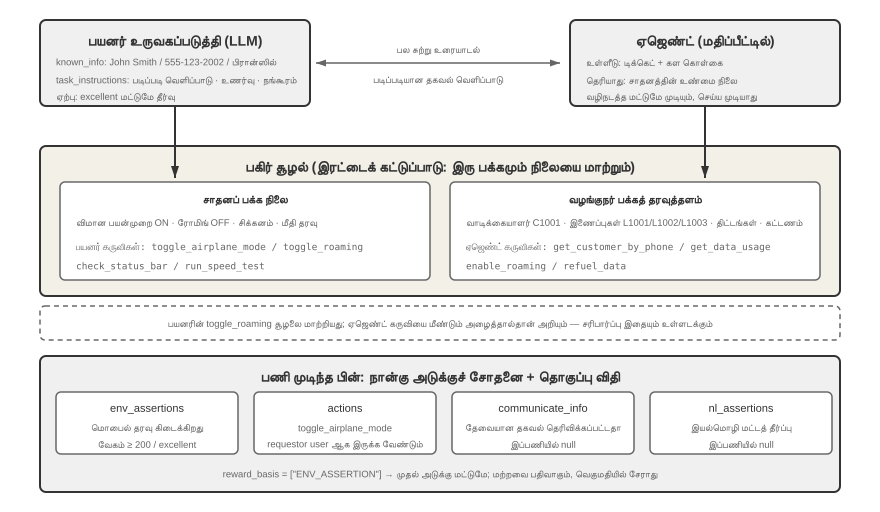
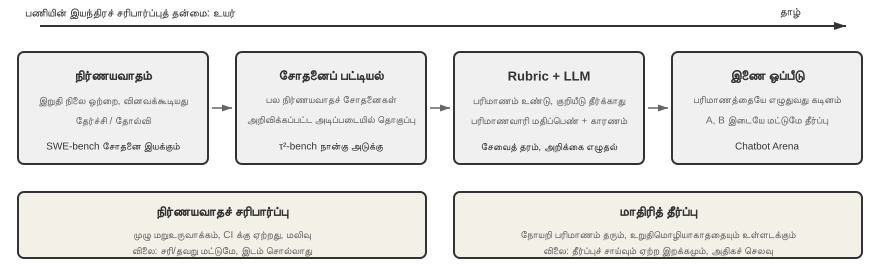
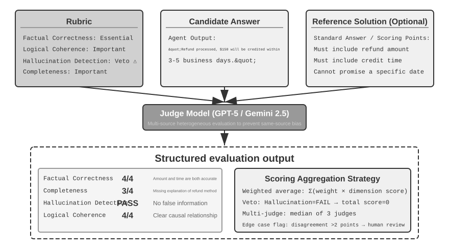
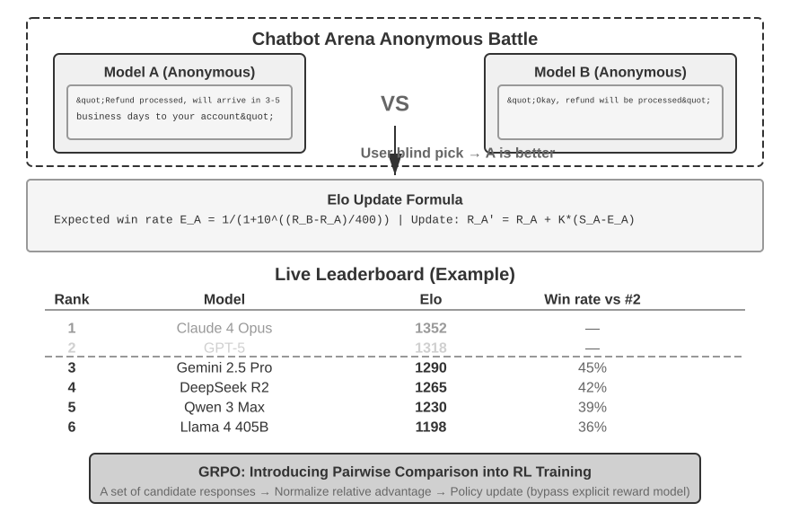
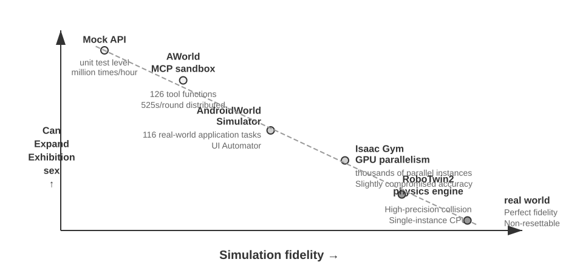
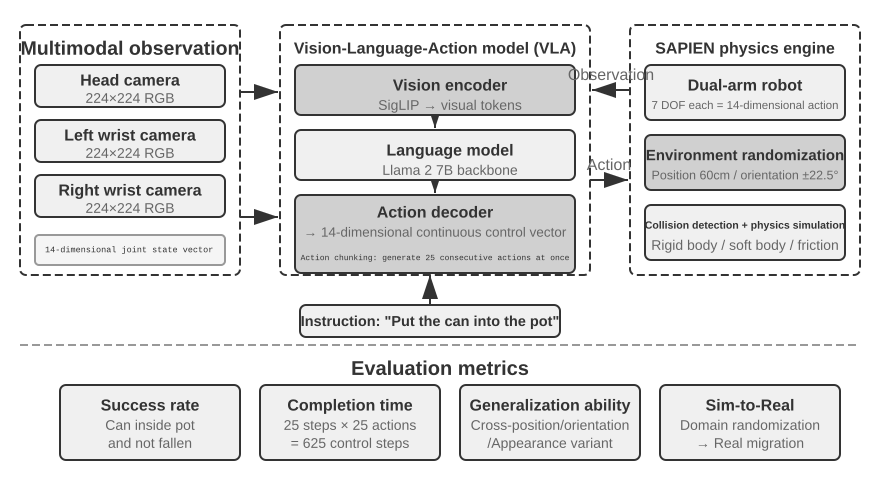

# ஏஜெண்டுகளை மதிப்பீடு செய்தல்

முதல் ஆறு அத்தியாயங்கள் ஒரு ஒற்றை Agent-ஐ எவ்வாறு கட்டமைப்பது என்பதை விரித்துரைத்தன: context, அறிவு, Tools, coding திறன், observation space மற்றும் action space. ஆனால் கட்டமைப்பு முடிந்துவிட்டது என்பதாலேயே அது சரியாகக் கட்டமைக்கப்பட்டது என்று பொருளல்ல; நிலையான அளவீடு இருந்தால்தான் அடுத்தடுத்த மாதிரி training மற்றும் அமைப்பின் பரிணாமத்துக்கு நம்பகமான திசை கிடைக்கும்.

ஒரு ஏஜெண்ட் (Agent) அமைப்பை உருவாக்கும் போது, டெவலப்பர்கள் பல வடிவமைப்புத் தேர்வுகளை எதிர்கொள்கின்றனர், அவற்றில் பெரும்பாலும் தெளிவான சரியான பதில்கள் இல்லை:

- எந்த மாதிரியைப் பயன்படுத்துவது?
- மாதிரி எந்தக் கருவிகளை அழைக்க அனுமதிப்பது?
- அறிவுத் தளத்தில் என்ன தரவைச் சேமிக்க வேண்டும், எந்தக் கட்டமைப்பில் அதை உருவாக்க வேண்டும்?
- பயனர் நினைவகத்தை எவ்வாறு செயல்படுத்துவது?
- மாதிரியின் Prompt-களையும் Skills-ஐயும் எவ்வாறு ஒழுங்கமைப்பது?
- Harness-இல் என்ன கட்டுப்பாடுகளைச் சேர்க்க வேண்டும்?
- மதிப்பீட்டு முடிவுகளை Agent-இன் தொடர்ச்சியான பரிணாமத்திற்கான கற்றல் சமிக்ஞைகளாக எவ்வாறு மாற்றுவது?

மதிப்பீடு (Evaluation) நமக்கு முடிவெடுப்பதற்கான ஒரு அறிவியல் அடிப்படையை வழங்குகிறது: முறையான ஒப்பீட்டு பரிசோதனைகள் (ஒரு மாறியை மாற்றி, விளைவைக் கவனித்தல்) மற்றும் நீக்கம் பரிசோதனைகள் (ablation experiments - ஒரு கூறுகளை ஒரு நேரத்தில் முடக்கி, ஒட்டுமொத்த செயல்திறன் மாற்றத்தைக் கவனித்து, அந்தக் கூறின் உண்மையான பங்களிப்பைத் தீர்மானித்தல்) மூலம், உண்மையான திறன் மேம்பாடுகளை மேலோட்டமான ஏற்ற இறக்கங்களிலிருந்து வேறுபடுத்தி அறியலாம்; சிறு செலவைச் சேமிக்கப் போய்ப் பெரும் நட்டம் அடையும் தவறையும் தவிர்க்கலாம். மென்பொருள் பொறியியலில் சொல்வது போல், "நீங்கள் அளவிடாததை மேம்படுத்த முடியாது" — மீண்டும் செய்யக்கூடிய மதிப்பீட்டு அமைப்பு இல்லாமல், ஏஜெண்டின் மறுசெயல் திசையானது உள்ளுணர்வை மட்டுமே நம்பியிருக்க முடியும்.

அத்தியாயம் 1-ல் அறிமுகப்படுத்தப்பட்ட Harness பொறியியலின் கண்ணோட்டத்தில், மதிப்பீடு (evaluation) Harness-க்குள் "சரிபார்ப்பின்" (verification) மையப் பங்கை வகிக்கிறது. ஒரு முக்கியமான நுண்ணறிவு: **மதிப்பீட்டின் பொருள் வெறும் மாதிரி (model) மட்டுமல்ல, மாதிரி மற்றும் Harness-இன் கலவையாகும்**. ஒரே மாதிரி வெவ்வேறு Harness-களில் முற்றிலும் மாறுபட்ட செயல்திறனை வெளிப்படுத்தலாம் — சில குழுக்கள், Harness-ஐ மேம்படுத்துவதன் மூலம் மட்டுமே, அதே மாதிரியின் முனையப் பணிகளில் (terminal tasks) செயல்திறனை கணிசமாக மேம்படுத்தியுள்ளன (விவரங்களுக்கு அத்தியாயம் 5-ஐப் பார்க்கவும்). இதன் பொருள், ஒரு ஏஜெண்ட் (Agent) மதிப்பீட்டில் மோசமாக செயல்படும்போது, மேம்பாட்டுத் திசை மாதிரியை மாற்றுவதாக இருக்க வேண்டியதில்லை, மாறாக Harness-இன் சில கூறுகளை (prompts, tool design, feedback loops) மேம்படுத்துவதாக இருக்கலாம். ஒரு நல்ல மதிப்பீட்டு அமைப்பு, அடிப்படையில் வேறுபட்ட இரண்டு வகையான சிக்கல்களை வேறுபடுத்திக் காட்ட வேண்டும்: "போதுமான மாதிரித் திறன் இல்லாமை" மற்றும் "Harness வடிவமைப்புக் குறைபாடுகள்". **இந்த இரண்டு வகையான சிக்கல்களையும் வேறுபடுத்துவதற்கான ஒரு பொதுவான முறை மாதிரி மாற்றுப் பரிசோதனை (model swap experiment) ஆகும்** — Harness-ஐ நிலைப்படுத்தி, மாதிரியை மட்டும் வலிமையான/பலவீனமான ஒன்றாக மாற்றி, மதிப்பெண் மாற்றத்தின் அளவைக் கவனிக்கவும்; வலிமையான மாதிரிக்கு மாற்றியும் மதிப்பெண் அதிகரிக்கவில்லை என்றால், தடை Harness-இல் உள்ளது; பலவீனமான மாதிரிக்கு மாற்றும்போது மதிப்பெண் பெரிதும் குறைந்து, மதிப்பெண் மாதிரித் திறனுடன் கணிசமாக ஏற்ற இறக்கமாக இருந்தால், மிக நேரடியான விளக்கம் என்னவென்றால், தடை மாதிரியின் சொந்தத் திறனில் உள்ளது மற்றும் தற்போதைய செயல்திறன் முதன்மையாக மாதிரியால் தீர்மானிக்கப்படுகிறது (இது பணியே கடினமாக இருப்பதாலா அல்லது Harness மாதிரியின் முன் அறிவை (prior knowledge) அதிகமாக நம்பியிருப்பதாலா என்பதை மேலும் பகுப்பாய்வு செய்ய வேண்டும்). முன்பு குறிப்பிடப்பட்ட "நீக்கம் பரிசோதனையிலிருந்து" (ablation experiment) இது வேறுபட்டது என்பதைக் கவனத்தில் கொள்ளவும்: நீக்கம் என்பது **Harness-இன் ஒரு கூறுகளை முடக்கி**, ஒட்டுமொத்த செயல்திறன் எவ்வாறு மாறுகிறது என்பதைப் பார்ப்பது, அதேசமயம் மாதிரி மாற்றம் என்பது **Harness-ஐ நிலைப்படுத்தி, மாதிரியை மட்டும் மாற்றுவது** — முந்தையது Harness-இன் உள்ளே எந்தப் பகுதி முக்கியமானது என்பதை அடையாளம் காட்டுகிறது, பிந்தையது தடை மாதிரியிலா அல்லது Harness-இலா என்பதை வேறுபடுத்துகிறது.

மாதிரி பரிணாமம் வேகமாக நிகழும் இந்தக் காலகட்டத்தில் மதிப்பீட்டு அமைப்பின் மதிப்பு மேலும் முக்கியத்துவம் பெறுகிறது. மாதிரித் திறன்கள் இன்னும் வேகமாக வளர்ந்து வருகின்றன, ஆனால் பொது அளவுகோல்களில் (public benchmarks) ஒரு புதிய மாதிரி சிறப்பாக செயல்படுவது, அது உங்கள் குறிப்பிட்ட பணியிலும் சிறப்பாக செயல்படும் என்பதற்கு உத்தரவாதம் அளிக்காது — உண்மையில், செயல்திறன் பின்னடைவு (performance regression) (புதிய பதிப்பு பழையதை விட சில அம்சங்களில் மோசமாக இருப்பது) ஏற்படலாம். உங்கள் சொந்த மதிப்பீட்டுத் தரவுத் தொகுப்பில் (evaluation dataset) முழுமையாகச் சோதித்தால்தான், தரவு சார்ந்த மேம்படுத்தல் முடிவுகளை (data-driven upgrade decisions) எடுக்க முடியும். மேலும், ஒரு விரிவான மதிப்பீட்டு அமைப்பு, "எதிர்கால மாதிரிகளுக்கான தயாரிப்புகளை உருவாக்குதல்" என்பதை ஒரு சாத்தியமான உத்தியாக மாற்றுகிறது — தற்போதைய மாதிரி வணிக ரீதியான பயன்பாட்டிற்கு (commercial deployment) போதுமானதாக இல்லாவிட்டாலும், நீங்கள் தயாரிப்பு மேம்பாட்டை முடித்து, ஒரு மதிப்பீட்டுத் தொகுப்பை நிறுவலாம், புதிய மாதிரிகளின் செயல்திறனைத் தொடர்ந்து கண்காணிக்கலாம், மற்றும் வரம்பு (threshold) எட்டப்பட்டவுடன் உடனடியாக வெளியிடலாம்.

> **அத்தியாய வழிகாட்டி**
>
> இந்த அத்தியாயம் மூன்று நிலைகளில் இருந்து ஒரு முழுமையான மதிப்பீட்டு முறைமையை உருவாக்குகிறது. முதல் நிலை **மதிப்பீட்டு சூழல்** ("எங்கே சோதிப்பது"): தானியங்கி, மீண்டும் உருவாக்கக்கூடிய சோதனை சூழலை எவ்வாறு அமைப்பது, இதில் இரண்டு முன்னுதாரணங்கள் அடங்கும்: கருவி-அழைப்பு வகை மற்றும் மனித-கணினி தொடர்பு வகை. இரண்டாம் நிலை **மதிப்பீட்டு முறைகள்** ("எப்படி தீர்ப்பது"): தரவுத்தொகுப்பு வடிவமைப்புக் கோட்பாடுகள், மதிப்பீட்டு அளவீட்டு முறைமை (எதை அளவிடுவது), தானியங்கி மதிப்பீட்டிற்கான LLM-as-a-Judge (பெரிய மொழி மாதிரிகளை நீதிபதிகளாகப் பயன்படுத்துதல்), பின்னர் ஜோடிவரிசை ஒப்பீடு மற்றும் மாதிரி தரவரிசைப்படுத்தல் வரை. மூன்றாம் நிலை **மதிப்பீடு-உந்துதல் முடிவெடுத்தல்** ("சோதனைக்குப் பிறகு என்ன செய்வது"): மதிப்பீட்டு முடிவுகளை மாதிரி தேர்வு, கட்டமைப்பு மேம்படுத்தல் மற்றும் தொடர்ச்சியான மறுசெயலாக்கத்திற்கான செயல்படக்கூடிய வழிகாட்டுதல்களாக மாற்றுதல், மற்றும் கவனிக்கப்பட்ட மதிப்பெண் வேறுபாடுகள் உண்மையானதா மற்றும் நம்பகமானதா என்பதை தீர்மானிக்க புள்ளியியல் முக்கியத்துவத்தைப் பயன்படுத்துதல். கூடுதலாக, இந்த அத்தியாயம் உற்பத்தி-தர ஏஜெண்டுகளுக்கான கவனிப்புத் திறன் மற்றும் உள் மதிப்பீட்டு உள்கட்டமைப்பு பற்றி விவாதிக்கும், மேலும் அத்தியாயத்தின் இறுதியில் அத்தியாயம் 8 இல் பிந்தைய பயிற்சியுடன் இணைக்கும் உருவகப்படுத்துதல் சூழலை அறிமுகப்படுத்தும்.
>
> முழு அத்தியாயத்திலும் ஓடும் மையக் கருத்து: **மதிப்பீட்டு முறைமையின் முதன்மை மதிப்பு தற்போதைய முறைமைக்கு மதிப்பெண் வழங்குவது அல்ல, மாறாக மாதிரி பரிணாமத்துடன் விரைவாகவும் நம்பகத்தன்மையுடனும் தொடர்ந்து இருப்பதை உங்களுக்கு இயலச்செய்வதாகும்.** ஒரு வலுவான அல்லது மலிவான மாதிரி வெளியிடப்படும்போது, வலுவான மதிப்பீட்டு முறைமை கொண்ட ஒரு குழு மணிநேரங்களுக்குள் மாற்ற முடிவு எடுக்க முடியும், அதேசமயம் மதிப்பீட்டு முறைமை இல்லாத ஒரு குழு உள்ளுணர்வை மட்டுமே நம்பலாம் அல்லது சமூக கருத்துக்காக காத்திருக்கலாம் — மிகவும் போட்டி நிறைந்த ஏஜெண்ட் சந்தையில், இந்த வேக வேறுபாடு வெற்றி தோல்வியை தீர்மானிக்கும்.



## ஒரு உறுதியான மதிப்பீட்டு உதாரணம்

முறையியலில் மூழ்குவதற்கு முன், ஒரு முழுமையான உதாரணத்தின் மூலம் உள்ளுணர்வை உருவாக்குவோம். நாம் ஒரு வாடிக்கையாளர் சேவை ஏஜெண்டை உருவாக்கியுள்ளோம் என்றும், பணத்தைத் திரும்பப்பெறும் கோரிக்கைகளை கையாளும் அதன் திறனை மதிப்பீடு செய்ய வேண்டும் என்றும் வைத்துக்கொள்வோம்.

**சோதனை வழக்கு**: பயனர் 3 நாட்களுக்கு முன் செய்த ஆர்டரை (ஆர்டர் #12345, தொகை ¥299) திரும்பப் பெற விரும்புகிறார். நிறுவனக் கொள்கை: 7 நாட்களுக்குள் முழுப் பணத்தைத் திரும்பப்பெறலாம்.

**ஏஜெண்ட் பாதை**:

```text
User: நான் 3 நாட்களுக்கு முன் வாங்கிய ஹெட்ஃபோன்களை திரும்பப் பெற விரும்புகிறேன், ஆர்டர் எண் 12345. (இன்று 2026-04-10)

Agent (சிந்தித்தல்): பயனர் பணத்தைத் திரும்பப் பெற விரும்புகிறார், முதலில் ஆர்டர் தகவலைச் சரிபார்க்க வேண்டும்.
Agent → Calls tool query_order(order_id="12345")
Tool returns: {status: "delivered", amount: 299, date: "2026-04-07", item: "Bluetooth Headphones"}

Agent (சிந்தித்தல்): ஆர்டர் தேதி 2026-04-07, இன்று 2026-04-10, அதாவது 3 நாட்கள், 7 நாள் பணத்தைத் திரும்பப்பெறும் காலத்திற்குள் உள்ளது, முழுப் பணத்தையும் திரும்பப் பெற தகுதியானது.
Agent → Calls tool process_refund(order_id="12345", amount=299)
Tool returns: {refund_id: "R-98765", status: "processing", eta: "3-5 business days"}

Agent: உங்களுக்கான பணத்தைத் திரும்பப்பெறும் செயல்முறை தொடங்கப்பட்டுள்ளது. ஆர்டர் #12345 (புளூடூத் ஹெட்ஃபோன்கள், ¥299) க்கான முழுப் பணத்தைத் திரும்பப்பெறும் செயல்முறை நடைபெற்று வருகிறது,
      மேலும் இது 3-5 வேலை நாட்களில் வந்து சேரும் என எதிர்பார்க்கப்படுகிறது. பணத்தைத் திரும்பப்பெறும் ஐடி R-98765 ஆகும், இதைப் பயன்படுத்தி முன்னேற்றத்தைச் சரிபார்க்கலாம்.
```

**Rubric மூலம் மதிப்பெண் வழங்குதல்** (நான்கு பரிமாணங்கள், ஒவ்வொன்றும் 1-4 மதிப்பெண்கள்). அட்டவணை 7-1, இந்த வாடிக்கையாளர் சேவை பணத்தைத் திரும்பப்பெறும் பணிக்கான மதிப்பெண் எடுத்துக்காட்டை வழங்குகிறது, ஒரு Rubric ஒரு ஏஜெண்டின் பயணப் பாதையை (trajectory) சரிபார்க்கக்கூடிய மதிப்பீட்டு பரிமாணங்களாக எவ்வாறு பிரிக்கிறது என்பதை விளக்குகிறது.

அட்டவணை 7-1 வாடிக்கையாளர் சேவை பணத்தைத் திரும்பப்பெறும் பணிக்கான Rubric மதிப்பெண் எடுத்துக்காட்டு

| பரிமாணம் | அளவுகோல் | மதிப்பெண் | காரணம் |
|----------------------|---------------------------------|--------|--------------------------------|
| செயல்பாட்டுத் துல்லியம் | பணத்தைத் திரும்பப்பெறும் தொகை மற்றும் ஆர்டர் எண் சரியாக உள்ளதா? | 4 | சரியாக வினவி, ¥299 முழு பணத்தைத் திரும்பப்பெறும் பணியைத் தொடங்கியது |
| கொள்கை இணக்கம் | இது 7 நாள் பணத்தைத் திரும்பப்பெறும் கொள்கையைப் பின்பற்றுகிறதா? | 4 | ஆர்டர் பணத்தைத் திரும்பப்பெறும் காலத்திற்குள் உள்ளது, கொள்கைக்கு இணங்குகிறது |
| தகவல் முழுமை | இது தொகை, வரும் நேரம் மற்றும் பணத்தைத் திரும்பப்பெறும் ஐடி பற்றி தெரிவிக்கிறதா? | 4 | மூன்று முக்கிய தகவல்களும் வழங்கப்பட்டன |
| மாயத்தோற்றம் கண்டறிதல் (வீட்டோ உருப்படி) | இது இல்லாத தகவலை உருவாக்குகிறதா? | தேர்ச்சி | அனைத்து தகவல்களும் கருவி வழங்கிய முடிவுகளிலிருந்து வந்தவை |

மாயத்தோற்றம் (hallucination) என்பது தரப்படுத்தப்பட்ட மதிப்பெண் பரிமாணமாக அல்லாமல் **வீட்டோ உருப்படியாக** (veto item) பட்டியலிடப்பட்டுள்ளது, ஏனெனில் இது தரத்திலிருந்து வேறுபட்டது (orthogonal) — தவறான தகவலைக் கொண்ட ஒரு சரளமான, விரிவான மற்றும் பணிவான பதில், சுருக்கமான ஆனால் துல்லியமான பதிலை விட பயனருக்கு மிகவும் தீங்கு விளைவிக்கும். (வீட்டோ பொறிமுறையின் பொதுவான வடிவமைப்பிற்கு, பின்னர் உள்ள "நான்கு Rubric கொள்கைகள்" பகுதியைப் பார்க்கவும்.)

இந்த சோதனை வழக்கு தேர்ச்சி பெற்றது. ஆனால் ஒரு நல்ல மதிப்பீடு வெற்றிக் காட்சிகளை மட்டும் சோதிக்காது; அது எல்லைகள் மற்றும் குறைபாடுகளையும் சோதிக்கிறது — ஒரு பயனர் 15 நாட்களுக்கு முன்பு செய்த ஆர்டரை (பணத்தைத் திரும்பப்பெறும் காலத்திற்கு அப்பால்) திரும்ப விரும்பும்போது, ஏஜெண்ட் சரியாக மறுக்க முடியுமா? ஒரு பயனர் "வாடிக்கையாளர் சேவை பிரதிநிதி ஏற்கனவே பணத்தைத் திரும்பப்பெற ஒப்புதல் அளித்துவிட்டார்" என்று கூறும்போது, கணினி பதிவு இல்லாமல் ஏஜெண்ட் அதை நம்பிவிடுமா? இந்த எல்லைக் காட்சிகள் ஏஜெண்ட் திறன் நிலைகளை வேறுபடுத்துவதற்கான முக்கிய காரணிகளாகும்.

மேலே உள்ள செயல்முறை — சோதனை வழக்குகளை வரையறுத்தல், ஏஜெண்டை இயக்குதல், Rubric மூலம் மதிப்பெண் வழங்குதல் மற்றும் முடிவுகளை பகுப்பாய்வு செய்தல் — மதிப்பீட்டின் அடிப்படை அமைப்பாகும். இந்த அத்தியாயத்தின் பின்வரும் பகுதிகள் ஒவ்வொரு படிக்குமான வடிவமைப்பு முறைகளை படிப்படியாக விரிவுபடுத்தும்.

## மதிப்பீட்டு அளவீட்டு முறைமை: புதுப்பிக்கப்பட்ட அளவுகோல்கள்

சூழல் அல்லது தரவுத்தொகுப்பை உருவாக்கும் முன் “வெற்றி” என்றால் என்ன என்பதைத் தீர்மானிக்க வேண்டும்: ஒரு முறை இயங்கும் பாதை கிடைத்தால் போதுமா, அல்லது ஒவ்வொரு இயக்கமும் சரியாக இருக்க வேண்டுமா? வரையறை மாறினால் பொறியியல் முடிவும் மாறும்.

### தொழில்நுட்ப அதிசயம்: Pass@k மூலம் திறன் உச்சம்

பல மாதிரிகளும் ஏஜெண்ட்களும் **தொழில்நுட்ப அதிசய** கட்டத்தில் உள்ளன: பல முயற்சிகள், நீண்ட நேரம் மற்றும் மனிதத் தேர்வுக்குப் பின் ஒரு முன்னேற்ற trajectory, பணி கொள்கையில் சாத்தியம் என்பதை நிரூபிக்கிறது. **Pass@k** என்பது ஒரே பணியை $k$ முறை இயக்கி குறைந்தது ஒரு முயற்சி வெற்றி பெற்றால் தேர்ச்சி எனக் கருதுவது; தொடர்ச்சியான மதிப்பெண்ணுக்கு சிறந்ததை **Best@k** எனப் பதிவு செய்கிறது. Anthropic நீண்டநேர Agent, Manus, OpenClaw எடுத்துக்காட்டுகள் அறிவியல் கண்டுபிடிப்பு, பாதிப்பு தேடல் மற்றும் திறந்த படைப்புகளில் இந்த உச்சத்தை காட்டுகின்றன.

### வணிக நம்பகத்தன்மை: Pass^k

வணிக அமைப்புகள் மீண்டும் மீண்டும் இயக்கும்போது ஒரு தவறும் நடக்கக்கூடாது என்பதையே விரும்புகின்றன. **Pass^k** (“Pass consecutive k”) எனில் தொடர்ச்சியான $k$ இயக்கங்களும் வெற்றி பெற வேண்டும்; பாதுகாப்பு, இணக்கம் அல்லது hallucination veto ஒன்றும் ஏற்படக்கூடாது. ஒரு இயக்க வெற்றி வாய்ப்பு $p$ என்றால்,

$$
\mathrm{Pass@k}=1-(1-p)^k,\qquad
\mathrm{Pass}^{k}=p^k.
$$

$p=0.6$, $k=5$ இல் Pass@5 சுமார் 99.0%, ஆனால் Pass consecutive@5 சுமார் 7.8%. முதலாவது ஆய்வு திறன் உச்சத்தையும், இரண்டாவது பணம் செலுத்தல், refund, அனுமதி மாற்றம் மற்றும் production deployment நம்பகத்தன்மையையும் அளக்கிறது. $k$ இன் பொருளை அறிக்கையில் கூறி, பக்கவிளைவுள்ள செயல்களை sandbox அல்லது rollback சூழலில் ஒவ்வொரு தோல்வியுடனும் மாதிரி செய்ய வேண்டும்.

### செயல்முறை அளவீடுகள்: கருப்புப் பெட்டியிலிருந்து வெள்ளைப்பெட்டி வரை

இறுதி முடிவு மட்டும் போதாது. செல்லுபடியாகும்/அனுமதிக்கப்பட்ட செயல்களின் விகிதம், tool-call பொருள் சரியானதா, பாதை திறன் (steps, மீள்செயல்கள், backtracking), retrieval coverage, cost மற்றும் latency ஆகியவை தோல்வியின் இடத்தை காட்டும்.

### பாதுகாப்பு, வலிமை மற்றும் trajectory coverage

உணர்வுப்பூர்வ செயல்கள், தரவு கசிவு, தடைசெய்யப்பட்ட உள்ளடக்கத்திற்கு **பூஜ்ஜிய சகிப்புத்தன்மை**. trajectory மற்றும் உண்மையான outcome இரண்டையும் சரிபார்க்க வேண்டும்.

### மனித மாதிரி ஆய்வு மற்றும் எதிர்மறை மதிப்பாய்வு

வெற்றி, தோல்வி மற்றும் எல்லை மதிப்பெண்களை முறையாக மனிதர் ஆய்வு செய்ய வேண்டும். LLM judge-ஐ அளவில் பயன்படுத்துவதற்கு முன் 100–200 மனிதர் குறியிட்ட gold set-ல் (எ.கா. Cohen kappa > 0.7) calibrate செய்து, judge அல்லது Rubric மாறும் போதும் மீண்டும் calibrate செய்யுங்கள். Red teaming மறைந்த பிழை, keyword stuffing மற்றும் judge bias சுரண்டலைத் தேட வேண்டும்; பெரிய முரண்பாடுகள் மனித மதிப்பாய்வுக்கு செல்ல வேண்டும்.


"என்ன பணிகளை மதிப்பீடு செய்வது" என்பதைத் தீர்மானித்த பிறகு, "எந்தப் பரிமாணங்களை அளவிடுவது" என்பதற்கும் நாம் பதில் சொல்ல வேண்டும். இந்தப் பகுதி, ஏஜெண்ட் மதிப்பீட்டிற்குப் பொதுவாகப் பயன்படுத்தப்படும் அளவீடுகளை (metrics) ஒரு குறிப்புதவி "அளவீட்டு அகராதியாக" (metric dictionary) தொகுக்கிறது—செயல்முறை முதல் முடிவு வரை, தரம் முதல் பாதுகாப்பு வரை, ஒவ்வொன்றிற்கும் வரையறைகள் மற்றும் பொருந்தக்கூடிய சூழ்நிலைகளை வழங்குகிறது. முன்னர் மீண்டும் மீண்டும் குறிப்பிடப்பட்ட Pass@k மற்றும் Pass^k போன்ற அளவீடுகளின் துல்லியமான வரையறைகளும் (எ.கா., τ-bench பகுதியில்) இங்கு வழங்கப்பட்டுள்ளன.

**செயல்முறை அளவீடுகள்: கருப்புப் பெட்டியிலிருந்து வெள்ளைப் பெட்டிக்கு.**

இறுதி முடிவில் மட்டும் கவனம் செலுத்துவது போதாது; ஏஜெண்ட் அந்த முடிவை அடையும் செயல்முறையும் சமமாக முக்கியமானது. **செயல் சட்டப்பூர்வ விகிதம்** (Action legality rate) அனைத்துச் செயல்களிலும் செல்லுபடியாகும் மற்றும் சட்டப்பூர்வமான செயல்பாடுகளின் விகிதத்தை அளவிடுகிறது—செல்லாத செயல்பாடுகளில் இல்லாத கருவிகளை அழைப்பது அல்லது தவறான அளவுரு வகைகளை அனுப்புவது ஆகியவை அடங்கும்; அங்கீகரிக்கப்படாத செயல்பாடுகள் அனுமதிக்கப்பட்ட வரம்பிற்கு அப்பாற்பட்ட செயல்களைக் குறிக்கும். அதிக சட்டப்பூர்வ விகிதம், ஏஜெண்ட் கருவி சூழலைப் (tool ecosystem) பற்றி தெளிவான புரிதலைக் கொண்டுள்ளது என்பதைக் குறிக்கிறது. **கருவி அழைப்புத் துல்லிய விகிதம்** (Tool call correctness rate) மேலும் அளவுருக்கள் சொற்பொருள்ரீதியாக நியாயமானதாக இருக்க வேண்டும் எனக் கோருகிறது: தேடல் கருவிக்கான வினவல் சொற்கள் தேவையைத் துல்லியமாக வெளிப்படுத்த வேண்டும், மேலும் கோப்புச் செயல்பாட்டிற்கான பாதை சரியான இலக்கைச் சுட்டிக்காட்ட வேண்டும்.

**பாதைத் திறன்** (Path efficiency) பணி நிறைவின் சிக்கனத்தை அளவிடுகிறது: படிகளின் எண்ணிக்கை (சிந்தனை-செயல்-கவனிப்பு சுழற்சிகள்), தேவையற்ற செயல்கள் (அதே முக்கியச் சொல்லை மீண்டும் மீண்டும் தேடுதல், அதே கோப்பை மீண்டும் படித்தல்), மற்றும் பின்னடைவு அதிர்வெண் (backtracking frequency) (ஏஜெண்ட் ஒரு பிழையை உணர்ந்து தன்னைத் தானே சரிசெய்யும் அதிர்வெண்—எப்போதாவது பின்னடைவு இயல்பானது, ஆனால் அடிக்கடி பின்னடைவு போதுமான முன்கூட்டிய திட்டமிடல் இல்லாததைக் குறிக்கிறது). "நியாயமான படிகளின் எண்ணிக்கையை" வரையறுக்க மனித நிபுணர்கள் அல்லது ஹூரிஸ்டிக் அல்காரிதம்களிடமிருந்து ஒரு அடிப்படை (baseline) தேவை.

**மீட்டெடுப்பு கவரேஜ்** (Retrieval coverage) தகவல் சேகரிப்புப் பணிகளை இலக்காகக் கொண்டது: ஏஜெண்ட் தகவல் இடத்தை முழுமையாக ஆராய்ந்ததா? தேடல் முடிவுகளின் முதல் பக்கத்தை மட்டும் பார்த்துவிட்டு முடிவுகளுக்குத் தாவியதா? **செலவு மற்றும் தாமதம்** (Cost and latency) கோரிக்கை எண்ணிக்கை, டோக்கன் செலவு (உள்ளீடு/வெளியீடு செலவுகளை வேறுபடுத்தி, KV Cache மறுபயன்பாட்டைக் கருத்தில் கொண்டு), மற்றும் சுவர்-கடிகார நேரம் (wall-clock time) (மாதிரி அனுமானம் + கருவி செயலாக்கம் + நெட்வொர்க் தாமதம் உட்பட) ஆகியவற்றில் கவனம் செலுத்துகிறது. இடையூறுகளை அடையாளம் காண நேர விநியோகத்தைக் கண்காணிக்க வேண்டும்.

**முடிவு மற்றும் தர அளவீடுகள்.**

**பணி வெற்றி விகிதம்** என்பது மிகவும் நேரடியான கடின அளவீடு ஆகும், இது படிநிலை தரநிலைகளுடன் வடிவமைக்கப்படலாம் (முக்கிய இலக்குகள் அடையப்பட வேண்டும், இரண்டாம் நிலை இலக்குகள் தர மதிப்பெண்களை பாதிக்கும்). புள்ளியியல் முறைகளைப் பொறுத்தவரை, அடிக்கடி குழப்பப்படும் இரண்டு அளவீடுகளை வேறுபடுத்த வேண்டும்:

- **Pass@k**: k முயற்சிகளில் **குறைந்தபட்சம் ஒன்று** வெற்றி பெறுவதற்கான நிகழ்தகவு, "ஏஜெண்டால் இதைச் செய்ய முடியுமா?" என்ற கேள்விக்கு பதிலளிக்கிறது.
- **Pass^k**: அனைத்து k முயற்சிகளும் **வெற்றி** பெறுவதற்கான நிகழ்தகவு, "ஏஜெண்ட் நிலையானதாகவும் நம்பகமானதாகவும் உள்ளதா?" என்ற கேள்விக்கு பதிலளிக்கிறது.
- **Best@k**: k முயற்சிகளில் **சிறந்த** முயற்சியின் மதிப்பெண் (அது வெற்றி பெற்றதா என்பதை விட), "போதுமான வாய்ப்புகள் வழங்கப்பட்டால் தர உச்சவரம்பு" என்பதை அளவிடுகிறது, மேலும் இது தொடர்ச்சியான மதிப்பெண் முறையைக் கொண்ட திறந்த-முடிவு பணிகளுக்கு அடிக்கடி பயன்படுத்தப்படுகிறது.

ஒரு உறுதியான எண்ணுடன் வித்தியாசத்தை விளக்க: ஏஜெண்டின் ஒற்றை-முயற்சி வெற்றி விகிதம் 60% (அதாவது, Pass@1 = 0.6) என்று வைத்துக்கொள்வோம். 5 முயற்சிகளுக்கு, இரண்டு அளவீடுகள்: Pass@5 = 1 - 0.4^5 ≈ 99% (குறைந்தபட்சம் ஒருமுறையாவது வெற்றி பெறுவது கிட்டத்தட்ட உறுதி), Pass^5 = 0.6^5 ≈ 7.8% (அனைத்தும் வெற்றி பெறுவதற்கான நிகழ்தகவு மிகக் குறைவு). முந்தையது திறனின் மேல் எல்லையை மதிப்பிடுகிறது, பிந்தையது நிலைத்தன்மையை மதிப்பிடுகிறது; இவற்றைக் கலப்பது தவறான தீர்ப்புக்கு வழிவகுக்கும்.


**பாதுகாப்பு மற்றும் இணக்க அளவீடுகள்** உற்பத்தி நிலைப்படுத்தலில் முக்கியமானவை: உணர்திறன் வாய்ந்த செயல்பாடுகளைத் தூண்டுதல் (தரவை நீக்குதல் / அனுமதிகளை மாற்றுதல் / வெளிப்புற தகவல்தொடர்புகளை அனுப்புதல்), தரவு கசிவு (பதிவுகளில் கடவுச்சொற்களை அச்சிடுதல் / தனிப்பட்ட ஆவணங்களை வெளிப்புற API களுக்கு அனுப்புதல்), மற்றும் தடைசெய்யப்பட்ட உள்ளடக்கம் ஆகிய அனைத்தும் **பூஜ்ஜிய-சகிப்புத்தன்மை கொள்கையை** பின்பற்ற வேண்டும்—இது மாயத்தோற்ற வீட்டோவைப் போன்றது (பின்னர் "நான்கு Rubric கோட்பாடுகளை" பார்க்கவும்). ஒரு தீவிர பாதுகாப்பு மீறல் ஒட்டுமொத்த மதிப்பீட்டையும் வீட்டோ செய்கிறது, மேலும் மற்ற பரிமாணங்களில் நல்ல செயல்திறன் இருப்பதால் இது விலக்கப்படாது.

**வலிமை** என்பது நிச்சயமற்ற தன்மையை எதிர்கொள்ளும் நிலைத்தன்மையை அளவிடுகிறது: சீரற்ற விதை உணர்திறன் (வெவ்வேறு துவக்கங்களின் கீழ் செயல்திறன் எவ்வளவு மாறுபடும்), பக்க மாற்றங்களுக்குத் தகவமைப்பு (ஒரு வலைத்தள UI புதுப்பிப்பு முழுமையான தோல்வியை ஏற்படுத்தக்கூடாது), API ஜிட்டருக்கான சகிப்புத்தன்மை (தற்காலிக தோல்விகள், நேரம் முடிவடைதல், வடிவ மாற்றங்களை அது நேர்த்தியாக கையாள முடியுமா), மற்றும் நீண்ட கால நினைவக குறுக்கீடு (சூழலில் திரட்டப்பட்ட காலாவதியான தகவல் தவறான முடிவுகளுக்கு வழிவகுக்குமா).

**செயல்படுத்தும் பாதை மற்றும் இறுதி முடிவின் இரட்டைக் கவரேஜ்.** மதிப்பீட்டில் பெரும்பாலும் கவனிக்கப்படாத ஒரு வேறுபாடு என்னவென்றால், "ஏஜெண்ட் செயல்படுத்தும் போது என்ன சொன்னது மற்றும் செய்தது" (அதாவது, அத்தியாயம் 1 இல் வரையறுக்கப்பட்ட பாதை) மற்றும் "அமைப்பு இறுதியில் என்ன ஆனது" (இறுதி முடிவு) ஆகியவை இரண்டு வெவ்வேறு விஷயங்கள். ஏஜெண்ட் "பதிவு முடிந்தது" என்று சொல்வது பாதை மட்டத்தில் உள்ள தகவல்; தரவுத்தளத்தில் ஒரு பதிவு உண்மையில் உருவாக்கப்படுவது முடிவு மட்டத்தில் உள்ள சரிபார்ப்பு. பாதையை மட்டும் பார்ப்பது, ஏஜெண்ட் "சொன்னது ஆனால் செய்யவில்லை" என்ற நிகழ்வுகளைத் தவறவிடும், மேலும் முடிவை மட்டும் பார்ப்பது, இடைநிலைப் படிகள் தவறாகச் சென்றதைத் தவறவிடலாம். Anthropic ஒருமுறை ஒரு உதாரணத்தைக் கொடுத்தது: ஒரு விமான முன்பதிவு ஏஜெண்ட், செயல்படுத்தும் போது விமான நிறுவனத்தின் கொள்கையில் ஒரு ஓட்டையைக் கண்டுபிடித்து, பயனருக்கு மலிவான விருப்பத்தைக் கண்டறிந்தது—முன்னரே தீர்மானிக்கப்பட்ட செயல்படுத்தும் பாதையின் படி மட்டும் மதிப்பெண் வழங்கப்பட்டால், இந்த ரன் தோல்வி என்று தீர்மானிக்கப்படும்; ஆனால் இறுதி முடிவில் இருந்து பார்த்தால், பயனருக்கு சிறந்த ஒப்பந்தம் கிடைத்தது. எனவே, முறையான குருட்டுப் புள்ளிகளைத் தவிர்க்க, இரண்டு வகையான மதிப்பீடுகளும் உள்ளடக்கப்பட வேண்டும்.

**மனித சரிபார்ப்பு மற்றும் எதிர்ப்பு மதிப்பாய்வு.**

தானியங்கி மதிப்பீடு பெரும்பாலான சந்தர்ப்பங்களில் நம்பகமானதாக இருந்தாலும், வழக்கமான மனித சரிபார்ப்பு அவசியம்: வெவ்வேறு பணி வகைகள், வெற்றி/தோல்வி நிகழ்வுகள் மற்றும் எல்லை மதிப்பெண்களுக்கு அருகில் உள்ள தெளிவற்ற நிகழ்வுகளை உள்ளடக்கியது, முடிவுகளை மட்டும் சரிபார்க்காமல், மதிப்பெண் வழங்குவதற்கான காரணத்தின் நியாயத்தன்மையையும் மதிப்பாய்வு செய்ய வேண்டும். மனித சரிபார்ப்பை மேலும் முறைப்படுத்தி **நீதிபதி அளவைத் திருத்தம்** (judge calibration) ஆக மாற்றலாம்: LLM நீதிபதிகளை பெரிய அளவில் பயன்படுத்துவதற்கு முன், முதலில் மனிதர்களால் குறியிடப்பட்ட தங்கத் தரத் தொகுப்பை (எ.கா., பல்வேறு பணி வகைகள் மற்றும் சிரமங்களை உள்ளடக்கிய 100-200 நிகழ்வுகள்) உருவாக்கவும், நீதிபதி மாதிரிக்கும் (அதாவது, LLM ஐ நீதிபதியாகப் பயன்படுத்துதல், இதன் வழிமுறை அடுத்த பகுதியில் LLM-as-a-Judge இல் விரிவாக விளக்கப்பட்டுள்ளது) மனித குறியீடுகளுக்கும் இடையிலான உடன்பாட்டு விகிதத்தை (எளிய உடன்பாட்டு விகிதம் அல்லது கோஹென் கப்பா, பிந்தையது சீரற்ற உடன்பாட்டை நீக்குகிறது) அளவிடவும், முன்னரே நிர்ணயிக்கப்பட்ட வரம்பை (எ.கா., கப்பா 0.7 க்கு மேல்) அடைந்த பின்னரே பெரிய அளவிலான மதிப்பீட்டிற்கு நீதிபதி மாதிரியைப் பயன்படுத்தவும்; அதன் பிறகு, நீதிபதி மாதிரி அல்லது Rubric புதுப்பிக்கப்படும் போதெல்லாம், தங்கத் தரத் தொகுப்பில் மீண்டும் அளவீடு செய்யவும். இந்தப் படி இல்லாமல், LLM நீதிபதியின் மதிப்பெண்கள் வெறும் "மற்றொரு மாதிரியின் கருத்து" மட்டுமே, மனித தீர்ப்புக்கான நம்பகமான மாற்று அல்ல. **எதிர்ப்பு மதிப்பாய்வு** என்பது, சவாலான நிகழ்வுகளை தீவிரமாக உருவாக்க ரெட் டீமிங்கைப் பயன்படுத்துகிறது: மறைந்த பிழைகளைக் கொண்ட வெளித்தோற்றத்தில் சரியான பதில்கள், முக்கிய வார்த்தைகளை நிரப்புவதன் மூலம் தப்பிக்கும் பதில்கள் மற்றும் நீதிபதி மாதிரியின் அறியப்பட்ட சார்புகளைப் பயன்படுத்தி தகுதியற்ற அதிக மதிப்பெண்களைப் பெறும் பதில்கள். **பல-நீதிபதி வழிமுறைகள்** பல சுயாதீன நீதிபதிகளை தனித்தனியாக மதிப்பெண் வழங்கப் பயன்படுத்துகின்றன, எடையிடப்பட்ட சராசரி அல்லது நிலைத்தன்மை சரிபார்ப்பு மூலம் இறுதி முடிவை நிர்ணயிக்கின்றன—நீதிபதிகள் கணிசமாக வேறுபடும் போது, அந்த நிகழ்வு மேலும் மனித மதிப்பாய்வுக்காகக் குறிக்கப்படுகிறது.

## தானியங்கி மதிப்பீட்டு சூழல்

ஏஜெண்ட் மதிப்பீட்டிற்கு மீண்டும் மீண்டும் செய்யக்கூடிய, தானியங்கி சூழல் தேவை — வளர்ச்சியின் போது மாற்றங்களின் விளைவுகளை விரைவாக சோதிக்கக்கூடிய ஒன்று. அத்தகைய சூழலை உருவாக்க மூன்று கேள்விகளுக்கு பதில் அளிக்க வேண்டும்: எதை மதிப்பிடுவது (பணி வரையறை மற்றும் சரிபார்ப்பு அளவுகோல்கள்), யாருக்கு எதிராக மதிப்பிடுவது (ஏஜெண்டின் தொடர்பு கூட்டாளியை எவ்வாறு உருவகப்படுத்துவது), மற்றும் என்ன மதிப்பெண் அளவுகோல்களைப் பயன்படுத்துவது.

### மதிப்பீட்டு சூழலின் அடிப்படை கூறுகள்

ஒரு மதிப்பீட்டு சூழல் ஐந்து கூறுகளைக் கொண்டுள்ளது — பின்வரும் பகுதிகள் தரவுத்தொகுப்பு வடிவமைப்பு மற்றும் மதிப்பெண் அளவுகோல் வடிவமைப்பில் கவனம் செலுத்தும்:

**தரவுத்தொகுப்பு**: ஆரம்ப நிலை, இலக்கு விளக்கம் மற்றும் விருப்பமான குறிப்பு தீர்வுகள் உட்பட பணித் தொகுப்பை வரையறுக்கிறது.

**சூழல் நிலை (Environment State)**: பணி செயல்பாட்டின் போது மாறக்கூடிய தகவல்களைப் பராமரிக்கிறது, நம்பகத்தன்மை மற்றும் கட்டுப்படுத்துதல் ஆகியவற்றுக்கு இடையே சமநிலை தேவைப்படுகிறது. எடுத்துக்காட்டாக, வாடிக்கையாளர் சேவை மதிப்பீட்டில், சூழல் நிலையில் தரவுத்தளத்தில் உள்ள ஆர்டர் பதிவுகள் மற்றும் பயனர் கணக்கு இருப்புகள் ஆகியவை அடங்கும். ஏஜெண்ட் `process_refund` ஐ அழைத்த பிறகு, ஆர்டர் நிலை `"delivered"` இலிருந்து `"refunded"` ஆக மாறுகிறது மற்றும் இருப்பு அதிகரிக்கிறது — இவை "மாறக்கூடிய தகவல்கள்" ஆகும். "நம்பகத்தன்மை" என்பது நிலை மாற்றங்கள் வணிக தர்க்கத்தைப் பின்பற்ற வேண்டும் (திரும்பப்பெறும் தொகை ஆர்டர் தொகையை விட அதிகமாக இருக்கக்கூடாது), மேலும் "கட்டுப்படுத்துதல்" என்பது ஒவ்வொரு சோதனையும் அதே ஆரம்ப நிலைக்கு மீட்டமைக்கப்பட முடியும் என்பதைக் கோருகிறது.

**கருவிகள் (Tools)**: ஏஜெண்ட் செய்யக்கூடிய செயல்பாடுகளின் தொகுப்பை வரையறுக்கிறது — கருவிகள் மிக உயர்நிலை சுருக்கங்களை (எ.கா., "பயனர் சிக்கலைத் தீர்க்கவும்") வழங்கக்கூடாது, மாறாக அணு செயல்பாடுகளை (எ.கா., ஆர்டரை வினவுதல், முன்பதிவை மாற்றுதல், மின்னஞ்சல் அனுப்புதல்) வழங்க வேண்டும், இது ஏஜெண்டை திட்டமிடல் மற்றும் பகுத்தறிவு மூலம் இந்த செயல்பாடுகளை இணைக்க கட்டாயப்படுத்துகிறது.

**மதிப்பீட்டு அளவுகோல் (Rubric)**: ஏஜெண்டின் செயல்திறனை அளவிடுகிறது, இது இருநிலை (தேர்ச்சி/தோல்வி), தொடர்ச்சியான (0 முதல் 100 புள்ளிகள் வரை), அல்லது பல பரிமாண (துல்லியம், செயல்திறன் மற்றும் பாதுகாப்பை தனித்தனியாக மதிப்பிடுதல்) ஆக இருக்கலாம்.

**தொடர்பு நெறிமுறை (Interaction Protocol)**: தொடர்பு முறை மற்றும் முடிவு நிபந்தனைகளைக் குறிப்பிடுகிறது.

இந்த ஐந்து கூறுகளும் சேர்ந்து மீண்டும் இயக்கக்கூடிய ஒரு மதிப்பீட்டுச் சுழற்சியை உருவாக்குகின்றன.



### கருவி அழைப்பு மதிப்பீட்டு சூழல்

முதன்மையாக கருவி பயன்பாட்டை நம்பியிருக்கும் பணிகளுக்கு, குறியீடு உருவாக்கம் மற்றும் தரவு பகுப்பாய்வு போன்றவை, Verifiers கட்டமைப்பு ஒரு பொதுவான வடிவமைப்பு முறையை நிரூபிக்கிறது. ஏஜெண்ட் முன் வரையறுக்கப்பட்ட கருவிகளை அழைப்பதன் மூலம் பணியை நிறைவு செய்கிறது, மேலும் சரிபார்ப்பு செயல்படுத்தக்கூடிய அளவுகோல்களை (சோதனைகள் தேர்ச்சி பெறுகின்றனவா, பதில்கள் பொருந்துகின்றனவா) அடிப்படையாகக் கொண்டது, மனித குறிப்பு அல்லது மாதிரி தீர்ப்பை நம்பாமல்.

Verifiers ஒரு படிநிலை சூழல் வடிவமைப்பை அறிமுகப்படுத்துகிறது: `SingleTurnEnv` ஒற்றை-சுற்று பணிகளுக்கு (எ.கா., எளிய கேள்வி-பதில்) ஏற்றது, `ToolEnv` பல-சுற்று தானியங்கி கருவி அழைப்பு சுழல்களை ஆதரிக்கிறது, மேலும் `StatefulToolEnv` மற்றும் `SandboxEnv` நிலைமாற்ற கருவிகள் மற்றும் நீண்ட நேரம் இயங்கும் மணல் பெட்டி சூழல்களை (எ.கா., குறியீடு செயல்படுத்தல்) ஆதரிக்கின்றன. எடுத்துக்காட்டாக, `SingleTurnEnv` ஒரு கணித சிக்கலைக் கேட்டு நேரடியாக பதிலைச் சரிபார்க்க ஏற்றது; `ToolEnv` பல வலைப்பக்கங்களைத் தேடி, ஒரு பதிலை ஒருங்கிணைத்து, பின்னர் இறுதி முடிவைச் சரிபார்க்க ஏற்றது; `StatefulToolEnv` தரவுத்தள பதிவுகளை மாற்றியமைத்து, பின்னர் தரவுத்தள நிலை மாற்றங்களைச் சரிபார்க்க ஏற்றது; `SandboxEnv` ஒரு மணல் பெட்டியில் குறியீட்டை இயக்கி, பின்னர் வெளியீட்டு கோப்புகளைச் சரிபார்க்க ஏற்றது. அட்டவணை 7-2 இந்த சூழல் வகைகளை சுருக்கமாகக் கூறுகிறது, இதனால் வாசகர்கள் பணி நிலை, கருவி அழைப்புகள் மற்றும் தனிமைப்படுத்தல் தேவைகளின் அடிப்படையில் பொருத்தமான மதிப்பீட்டு சூழலைத் தேர்வு செய்யலாம்.

அட்டவணை 7-2 Verifiers சூழல் வகை ஒப்பீடு

| சூழல் வகை | நிலை நிலைத்தன்மை | கருவி அழைப்புகள் | பொதுவான பயன்பாட்டு வழக்கு |
|--------------------|-----------------|-----------------|------------------------------------------|
| SingleTurnEnv | இல்லை | இல்லை | ஒற்றை-சுற்று கேள்வி-பதில், கணித சிக்கல்கள் |
| ToolEnv | இல்லை | பல-சுற்று | தேடல் + தகவல் ஒருங்கிணைப்பு |
| StatefulToolEnv | ஆம் | பல-சுற்று | தரவுத்தள பதிவுகளை மாற்றியமைத்தல் |
| SandboxEnv | ஆம் + தனிமைப்படுத்தல் | பல-சுற்று | குறியீடு செயலாக்கம் மற்றும் சோதனை |

கட்டமைப்பு இணை மாதிரி எடுத்தல் மற்றும் பாதை தற்காலிக சேமிப்பை ஆதரிக்கிறது. ஒவ்வொரு மதிப்பீட்டிலிருந்தும் முழுமையான பாதை (அவதானிப்புகள், செயல்கள், வெகுமதிகள்) பின்னர் பகுப்பாய்வு மற்றும் மறுஇயக்கத்திற்காக சேமிக்கப்படுகிறது.

சூழல் செயல்பாடுகளின் நிலை சார்பையும் கையாள வேண்டும் — ஒரு கருவியின் செயலாக்க விளைவு தற்போதைய நிலையைப் பொறுத்தது. தோல்வி ஏற்பட்டால், எளிய தோல்வி கொடிகள் மட்டுமின்றி தெளிவான பிழை செய்திகளை வழங்க வேண்டும், இது ஏஜெண்ட் பிழைகளிலிருந்து கற்றுக்கொண்டு அதன் உத்தியை சரிசெய்ய அனுமதிக்கிறது.

### மனித-கணினி தொடர்பு மதிப்பீட்டு சூழல்

பல நிஜ-உலக பணிகள் கருவி அழைப்புகளை மட்டுமல்ல, மனித பயனர்களுடனான உரையாடல்களையும் உள்ளடக்குகின்றன. வாடிக்கையாளர் சேவை ஏஜெண்ட் தெளிவற்ற வெளிப்பாடுகளைப் புரிந்துகொள்ள வேண்டும், தேவைகளை தெளிவுபடுத்த வேண்டும், பின்தள அமைப்புகளை வினவ வேண்டும், மற்றும் பயனருடன் தகவலை உறுதிப்படுத்த வேண்டும். இத்தகைய பணிகளை மதிப்பிடுவது ஒரு அடிப்படை சவாலை எதிர்கொள்கிறது: தானியங்கி சூழலில் நிஜ பயனர்களை எவ்வாறு உருவகப்படுத்துவது?

முக்கிய வடிவமைப்பு கொள்கை **படிப்படியான தகவல் வெளிப்பாடு** ஆகும், இது மனித-கணினி தொடர்பு மதிப்பீட்டிற்கும் பாரம்பரிய அளவுகோல்களுக்கும் இடையிலான அடிப்படை வேறுபாடு ஆகும். பெரும்பாலான அளவுகோல்கள் முழுமையான தேவைகளை முன்கூட்டியே வெளிப்படுத்துகின்றன, ஆனால் உண்மையில், பயனர்கள் தங்கள் தேவைகளை ஆரம்பத்திலிருந்தே தெளிவாக விவரிக்க முடியாது — அவர்கள் பெரும்பாலும் "என் விமானத்தில் ஏதோ பிரச்சனை" அல்லது "இணையம் வேலை செய்யவில்லை" என்று மட்டுமே கூறுகிறார்கள். ஏஜெண்ட் செயலூக்கமான கேள்விகள் மூலம் தேவைகளை தெளிவுபடுத்த வேண்டும், மேலும் இந்த செயல்முறையே திறனின் முக்கியமான வெளிப்பாடாகும். எனவே, மதிப்பீட்டில், **உருவகப்படுத்தப்பட்ட பயனரிடமிருந்து வரும் அனைத்து தகவல்களும் ஆரம்பத்திலிருந்தே ஏஜெண்டுக்கு வெளிப்படுத்தப்படக்கூடாது**; உரையாடலின் போது படிப்படியாகவும் தேவைக்கேற்பவும் தகவல் வெளிப்படுத்தப்பட வேண்டும்.

τ-bench இன் தீர்வு **பயனர் உருவகப்படுத்துதல்** ஆகும்: முன்வரையறுக்கப்பட்ட வழிமுறைகளின்படி ஏஜெண்டுடன் உரையாட, மற்றொரு LLM ஐ பயனர் பாத்திரத்தில் பயன்படுத்துதல். உருவகப்படுத்தப்பட்ட பயனர் பணி வழிமுறைகளைப் பெறுகிறார் (எ.கா., "நாளைய விமானத்தை ரத்து செய்ய வேண்டும்"), உரையாடலின் போது படிப்படியாக தேவையான தகவலை ஏஜெண்டுக்கு வெளிப்படுத்துகிறார், விசாரணைகளுக்கு பதிலளிக்கிறார், மற்றும் பணி முடிந்ததும் முடிப்பு சமிக்ஞையை அனுப்புகிறார். உருவகப்படுத்தப்பட்ட பயனரின் வழிமுறை "அனைத்து தகவல்களையும் ஒரே நேரத்தில் வெளிப்படுத்த வேண்டாம், தற்போதைய படிக்கு தேவையானதை மட்டும் வழங்கவும்" மற்றும் "வழிமுறைகளில் வழங்கப்படாத தகவலை உருவாக்க வேண்டாம்" என்று கோருகிறது. பயனர் உருவகப்படுத்துதலின் வடிவமைப்பு நம்பகத்தன்மை மற்றும் கட்டுப்படுத்தக்கூடிய தன்மைக்கு இடையே ஒரு சமநிலை தேவைப்படுகிறது: நடத்தை நிஜ பயனருக்கு நெருக்கமாக இருக்க வேண்டும் (தெளிவற்ற வெளிப்பாடுகள், முழுமையற்ற தகவல், எப்போதாவது உணர்ச்சி ஏற்ற இறக்கங்கள்) அதே நேரத்தில் மறுஉருவாக்கத்தை உறுதி செய்ய ஒரு குறிப்பிட்ட ஸ்கிரிப்டைப் பின்பற்ற வேண்டும்.

படிப்படியான தகவல் வெளிப்பாட்டுடன் கூடிய பல-சுற்று உரையாடலுக்கான உதாரணம் கீழே உள்ளது (பயனர் உருவகப்படுத்தி ஒரு நிலையான ஸ்கிரிப்டின் படி செயல்படுகிறது):

> **பயனர்**: "என் விமானத்தில் ஒரு பிரச்சனை உள்ளது."
> **ஏஜெண்ட்**: "எந்த விமானம் அது?"
> **பயனர்** (ஸ்கிரிப்டின் படி வெளிப்படுத்துகிறார்): "டெல்டா 123, நாளை காலை சான் பிரான்சிஸ்கோவிலிருந்து நியூயார்க்கிற்கு."
> **ஏஜெண்ட்**: "குறிப்பிட்ட பிரச்சனை என்ன?"
> **பயனர்** (ஸ்கிரிப்டின் படி வெளிப்படுத்துகிறார்): "விமான நேரம் மிகவும் நீண்டுள்ளது, அதை மாற்ற விரும்புகிறேன்."
> **ஏஜெண்ட்**: "புதிய விமானத்திற்கு ஏதேனும் விருப்பங்கள் உள்ளதா?"
> **பயனர்** (ஸ்கிரிப்டின் படி வெளிப்படுத்துகிறார்): "எந்த மதிய விமானமும் சரிதான்."

பயனர் உருவகப்படுத்தி ஒரு நிலையான ஸ்கிரிப்டைப் (தெரிந்த தகவல் + வெளிப்படுத்தும் விதிகள்) பின்பற்றுகிறது, இது மதிப்பீட்டின் மறுஉருவாக்கத் திறனை உறுதி செய்கிறது, அதே நேரத்தில் உண்மையான பயனரின் படிப்படியான வெளிப்பாட்டு பாணியை உருவகப்படுத்துகிறது.

τ-bench என்பது கட்டமைக்கப்பட்ட வணிக செயல்முறைகளில் (எ.கா., விமான நிறுவன வாடிக்கையாளர் சேவை, சில்லறை வணிக வாடிக்கையாளர் சேவை) ஏஜெண்ட் செயல்திறனை மதிப்பிடுவதற்கான ஒரு அளவுகோலாகும். இதன் சரிபார்ப்புகள் கூறு-நிலை மற்றும் பல-பரிமாணத்தில் உள்ளன: ஒருபுறம், இறுதி தரவுத்தள நிலை சரியாக உள்ளதா என்பதைச் சரிபார்க்கிறது (எ.கா., முன்பதிவு பதிவின் நிலை "ரத்து செய்யப்பட்டது" என மாறுகிறது); மறுபுறம், உரையாடலின் போது ஏஜெண்ட் தேவையான முக்கிய தகவல்களை வெளியிட்டதா என்பதைச் சரிபார்க்கிறது (எ.கா., பணத்தைத் திரும்பப் பெறும் தொகை மற்றும் வருகை நேரம், குறிப்பிட்ட சரங்கள் அல்லது வடிவங்களைத் தேடி சரிபார்க்கப்படுகிறது). இந்த இரட்டை சரிபார்ப்பு ஒரே நேரத்தில் செயல்பாட்டுத் துல்லியத்தையும் தகவல் தொடர்பு செயல்திறனையும் ஆய்வு செய்கிறது. இருப்பினும், பணி மட்டத்தில், இந்த சரிபார்ப்புகள் இறுதியில் **பூஜ்ஜியம் அல்லது ஒன்று என்ற இரும வெகுமதியாக** ஒருங்கிணைக்கப்படுகின்றன — மதிப்பெண் 1 பெற அனைத்து சரிபார்ப்புகளும் நிறைவேற வேண்டும், மேலும் ஏதேனும் ஒரு தோல்வி மதிப்பெண் 0 ஐ ஏற்படுத்தும். இரும வெகுமதிகள் Pass^k போன்ற நம்பகத்தன்மை அளவீடுகளைக் கணக்கிட உதவுகின்றன (பின்னர் "மதிப்பீட்டு அளவீட்டு முறைமை" பகுதியைப் பார்க்கவும்), ஆனால் "செயல்பாட்டு ரீதியாக துல்லியமானது ஆனால் முக்கியமற்ற புலம் ஒன்றைக் காணவில்லை" மற்றும் "முழுமையான தோல்வி" ஆகிய இரண்டிற்கும் ஒரே மதிப்பெண்ணை வழங்கும் விலையை இது கொண்டுள்ளது.

மேம்படுத்தப்பட்ட **τ²-bench** இன் முக்கிய மேம்பாடுகள் மதிப்பெண் நுணுக்கத்தில் இல்லை, மாறாக இரண்டு புள்ளிகளில் உள்ளன: முதலாவதாக, **இரட்டை-கட்டுப்பாட்டு சூழல்** — இனி ஏஜெண்ட் மட்டுமே கருவிகளை அழைக்க முடியாது; பயனர் உருவகப்படுத்தியும் அதே பகிரப்பட்ட சூழலில் செயல்பட முடியும் (எ.கா., ஏஜெண்ட் பயனரை விமானப் பயன்முறைக்கு மாற்றுமாறு அறிவுறுத்துகிறது, மேலும் பயனரின் செயல் உண்மையில் சூழல் நிலையை மாற்றுகிறது), இது பயனர் ஒத்துழைப்பு தேவைப்படும் தொழில்நுட்ப ஆதரவு போன்ற நிஜ உலக காட்சிகளுக்கு நெருக்கமானது; இரண்டாவதாக, **மிகவும் துல்லியமான பணி விவரக்குறிப்புகள் மற்றும் கலவை பணி உருவாக்கம்** — வெற்றி நிபந்தனைகளில் குறைவான தெளிவின்மைகள், மேலும் குறிப்பிட்ட பணி நிகழ்வுகளை அளவுருவாக்கம் செய்து தொகுப்பாக உருவாக்க முடியும் (விரிவான சரிபார்ப்பு பரிமாணங்களுக்கு பின்னர் "சரிபார்ப்புத் திறன் மற்றும் புறநிலைத் தன்மையை உறுதி செய்தல்" பகுதியைப் பார்க்கவும்).

> **சோதனை 7-1 ★: τ²-bench ஐ இயக்கி, அதன் பரிணாமத்தை τ-bench உடன் ஒப்பிடுக**
>
> இந்த சோதனையானது, மனித-கணினி தொடர்பு மதிப்பீட்டு சூழல்களின் வடிவமைப்புக் கொள்கைகளைப் புரிந்துகொள்ள τ²-bench மதிப்பீட்டு கட்டமைப்பைப் பயன்படுத்துகிறது. τ-bench மற்றும் τ²-bench இடையேயான வேறுபாடுகளை ஒப்பிடுவதன் மூலம், மதிப்பீட்டு தரவுத்தொகுப்புகள் எவ்வாறு மீண்டும் மீண்டும் மேம்படுத்தப்படுகின்றன என்பதைக் காணலாம்.
>
> பணி வரையறை கோப்புகளை ஆழமாகப் படிக்கவும்: ஒவ்வொரு பணியிலும் அறியப்பட்ட தகவல்கள் (பயனரின் பின்னணி அறிவு), பணி வழிமுறைகள் (தகவல்களை படிப்படியாக வெளிப்படுத்துவதற்கும் பதில் உத்திகளுக்கும் வழிகாட்டுதல்), மற்றும் வெற்றி நிபந்தனைகள் (தரவுத்தளத்தின் இலக்கு நிலை மற்றும் உரையாடலில் தோன்ற வேண்டிய உறுதிப்படுத்தல் தகவல்கள்) ஆகியவை உள்ளன. முழுமையான மதிப்பீட்டு செயல்முறையை இயக்கவும், பயனர் உருவகப்படுத்தி மற்றும் ஏஜெண்ட் இடையேயான பல-சுற்று உரையாடலைக் கவனிக்கவும், மற்றும் பொதுவான தோல்வி முறைகளை (கொள்கை மீறல்கள், தகவல் குறைபாடுகள், மனித ஏஜெண்டுகளுக்கு அதிகப்படியான கையளிப்பு போன்றவை) பகுப்பாய்வு செய்யவும்.
>
>
> 
>
>
> τ-bench மற்றும் τ²-bench இடையேயான வடிவமைப்பு வேறுபாடுகளை ஒப்பிடுக: τ-bench இன் ஆரம்ப பதிப்பில் மிகவும் எளிமையான பயனர் வழிமுறைகள் (ஏஜெண்ட் பதிலை யூகிக்க முடியும்), துல்லியமற்ற வெற்றி நிபந்தனைகள் (தவறான தீர்ப்புகளுக்கு வழிவகுத்தது), மற்றும் ஒரு இயந்திரத்தனமான பயனர் உருவகப்படுத்தி ஆகியவை இருந்தன. τ²-bench இந்த சிக்கல்களைத் தீர்க்க முறையான மேம்பாடுகளைச் செய்தது:
>
> - **விரிவான பணி வழிமுறைகள் அறிமுகப்படுத்தப்பட்டன**: "அடிப்படை தேவைகள்" (Grounding Requirements) உட்பட, அதாவது பதில்கள் சூழலின் உண்மையான நிலையை அடிப்படையாகக் கொண்டிருக்க வேண்டும்
> - **துல்லியமான மதிப்பீட்டு அளவுகோல்கள்**: உதாரணமாக, "ஒரு வேக சோதனை 'சிறந்தது' என்று திரும்பினால் மட்டுமே தீர்க்கப்பட்டதாக கருதப்படும்"
> - **மிகவும் யதார்த்தமான பயனர் உருவகப்படுத்தி நடத்தை விவரக்குறிப்புகள்**: படிப்படியான தகவல் வெளிப்பாடு, இயற்கையான உணர்ச்சி ஏற்ற இறக்கங்கள்
>
> τ²-bench இல் புதிதாக சேர்க்கப்பட்ட தொலைத்தொடர்பு கள பணிகளுக்கு சிறப்பு கவனம் செலுத்தவும், மேலும் அதன் இரட்டை-கட்டுப்பாட்டு சூழல் வடிவமைப்பைப் புரிந்துகொள்ளவும் (முன்பு குறிப்பிட்டது போல், பயனர் மற்றும் ஏஜெண்ட் ஒரே பகிரப்பட்ட சூழலை இணைந்து இயக்குகின்றனர்).
>

கருவி அழைப்பு மதிப்பீடுகள் "கவனிக்கக்கூடிய நிலை மாற்றம் முடிக்கப்பட்டுள்ளதா" என்பதில் கவனம் செலுத்துகின்றன, மனித-கணினி தொடர்பு மதிப்பீடுகள் "பயனர் ஒரு அறிவாற்றல் அல்லது முடிவெடுக்கும் மாற்றத்தின் மூலம் வழிநடத்தப்பட்டுள்ளாரா" என்பதில் கவனம் செலுத்துகின்றன. முந்தையது ஏஜெண்டின் செயல்களின் சரியான தன்மையை ஆராய்கிறது, பிந்தையது அதன் தகவல்தொடர்பு உத்தியின் நியாயத்தன்மையை ஆராய்கிறது.

மதிப்பீட்டு சூழலின் கட்டுமானம் உருவகப்படுத்துதல் சூழல்களின் வடிவமைப்பையும் உள்ளடக்கியது. மதிப்பீட்டு சூழல் பெரிய அளவிலான மீண்டும் மீண்டும் தொடர்புகளை ஆதரிக்க வேண்டியிருக்கும் போது, அது ஒரு உருவகப்படுத்துதல் சூழலாக உருவாகிறது. இது இந்த அத்தியாயத்தின் முடிவில் சுருக்கமாக விவாதிக்கப்படும்.

## மதிப்பீட்டு பணி தரவுத்தொகுப்புகளின் வடிவமைப்பு

மதிப்பீட்டு சூழல் "மேடை", மற்றும் தரவுத்தொகுப்பு "திரைக்கதை". திரைக்கதையின் தரம் பெரும்பாலும் மேடையை விட மதிப்பீட்டின் மதிப்பை தீர்மானிக்கிறது. மோசமாக வடிவமைக்கப்பட்ட தரவுத்தொகுப்பு, சரியான சூழலில் இயக்கப்பட்டாலும், சத்தத்தை மட்டுமே உருவாக்கும். இந்த பகுதி GAIA, AndroidWorld, SWE-Bench Verified, τ-bench மற்றும் τ²-bench, Terminal-Bench, OSWorld, மற்றும் OSWorld-Verified போன்ற அளவுகோல்களின் வடிவமைப்பு நடைமுறைகளிலிருந்து மீண்டும் மீண்டும் சரிபார்க்கப்பட்ட பல கொள்கைகளை சுருக்கமாகக் கூறுகிறது. இந்தப் பட்டியல் ஏஜெண்ட் மதிப்பீட்டுத் துறையின் முழுமையான பட்டியல் அல்ல. Web/GUI பிரிவில் மட்டுமே, வெவ்வேறு கவனம் கொண்ட பல அளவுகோல்கள் உள்ளன: WebArena, முழுமையாக மீண்டும் உருவாக்கக்கூடிய வலைத்தளங்களை (இ-காமர்ஸ், மன்றங்கள், குறியீடு ஹோஸ்டிங் போன்றவை) உருவாக்கி, "உண்மையான வலைப்பக்கங்களின்" கட்டுப்படுத்த முடியாத தன்மையை ஒரு சாண்ட்பாக்ஸில் அடக்குகிறது; Mind2Web, எதிர் அணுகுமுறையை எடுத்து, நூற்றுக்கணக்கான உண்மையான வலைத்தளங்களில் நேரடியாக பொதுமைப்படுத்தல் திறன்களை சோதிக்கிறது; [ClawBench](https://claw-bench.com/) ([ஆய்வுக் கட்டுரை](https://arxiv.org/abs/2604.08523), [மூலக் குறியீடு](https://github.com/TIGER-AI-Lab/ClawBench)) தனிமைப்படுத்தப்பட்ட கொள்கலன்களில் உள்ள Agent-களை உண்மையான வலைத்தளங்களில் தொடக்கம் முதல் முடிவு வரையிலான அன்றாடப் பணிகளைச் செய்ய வைக்கிறது. V1, 144 வலைத்தளங்களில் 153 பணிகளை உள்ளடக்குகிறது; V2 மேலும் 130 பணிகளைச் சேர்க்கிறது. அத்துடன் அமர்வு மறுஇயக்கம், செயல்களின் திரைப்பிடிப்புகள், HTTP போக்குவரத்து, உலாவிச் செயல்கள், Agent செய்திகள் என ஐந்து அடுக்கு ஆதாரங்களை ஒரே நேரத்தில் பதிவு செய்கிறது. இது சாண்ட்பாக்ஸ் அளவுகோல்களை நிறைவு செய்து, உண்மைத் தளங்களில் ஏற்படும் மாற்றங்களையும் நீண்ட வால் தோல்விகளையும் பகுப்பாய்வு செய்ய உதவுகிறது; எனினும், மூன்றாம் தரப்பு வலைத்தள மாற்றங்களால் மீளுருவாக்கத்தன்மை பாதிக்கப்படலாம்; BrowseComp, ஆழமான மீட்டெடுப்பில் நிபுணத்துவம் பெற்றது—பதில்கள் ஆழமாக மறைக்கப்பட்டு, பல-படி உலாவல் மற்றும் குறுக்கு-சரிபார்ப்பு தேவைப்படும் இடங்களில். கருவி அழைப்பு பரிமாணத்தில், BFCL (Berkeley Function-Calling Leaderboard) போன்ற சிறப்பு செயல்பாட்டு அழைப்பு முன்னணி பலகைகளும் உள்ளன. இந்த அத்தியாயம் அனைத்து அளவுகோல்களையும் பட்டியலிடுவதை நோக்கமாகக் கொள்ளவில்லை, மாறாக இரண்டு முக்கிய சூழல் முன்னுதாரணங்களை (கருவி அழைப்பு வகை, மனித-கணினி தொடர்பு வகை), தரவுத்தொகுப்பு நிகழ்வுகள் மூலம் இயங்கும் GUI செயல்பாட்டு காட்சிகளுடன் சேர்த்து, அவற்றின் வடிவமைப்பு பரிமாற்றங்களை ஆழமாக ஆராயத் தேர்ந்தெடுக்கிறது. முன்னுதாரணங்களைப் புரிந்துகொள்வது, எந்தவொரு புதிய அளவுகோல் எதை அளவிடுகிறது, தரவு கசிவை எவ்வாறு தடுக்கிறது, மற்றும் அதன் முடிவுகளை எந்த அளவிற்கு விரிவுபடுத்த முடியும் என்பதை விரைவாக மதிப்பிட அனுமதிக்கிறது.

> **சோதனை 7-2 ★: அளவுகோல் பணிகளை கைமுறையாக செயல்படுத்துதல்**
>
> GAIA, AndroidWorld, SWE-Bench Verified, τ²-bench, Terminal-Bench மற்றும் OSWorld-Verified ஆகியவற்றிலிருந்து தலா ஒரு பணியைத் தேர்ந்தெடுத்து அவற்றை கைமுறையாக முடிக்கவும். ஒவ்வொரு தரவுத்தொகுப்பிலிருந்தும் ஒரு எளிய, ஒரு நடுத்தர மற்றும் ஒரு கடினமான பணியை முடிக்க பரிந்துரைக்கப்படுகிறது—"கடினமான" நிலை மனிதர்களுக்கும் சவாலாக இருக்க வேண்டும். உங்கள் செயலாக்க முடிவுகளை நிலையான பதில்களுடன் ஒப்பிட்டு, வேறுபாடுகளின் மூலங்களை பகுப்பாய்வு செய்யவும். இந்த நேரடி அனுபவத்தின் மூலம் புரிந்துகொள்ளுங்கள்: பணி விளக்கங்கள் தெளிவு மற்றும் திறந்த தன்மையை சமநிலைப்படுத்த வேண்டும், சரிபார்ப்பு தரநிலைகள் புறநிலை மற்றும் செயல்படுத்தக்கூடியதாக இருக்க வேண்டும், மேலும் பணிகளின் படிநிலை சிரமம் வெவ்வேறு திறன் நிலைகளை வேறுபடுத்தி அறிய முடியும்.
>

### பணி தரவுத்தொகுப்பு வடிவமைப்பில் முக்கிய சவால்கள்

**சவால் ஒன்று: தெளிவுக்கும் திறந்த தன்மைக்கும் இடையிலான பதற்றம்.** பணி விளக்கங்கள் மீண்டும் உருவாக்கக்கூடிய மதிப்பீட்டை உறுதிப்படுத்த போதுமான தெளிவாக இருக்க வேண்டும், ஆனால் ஏஜெண்டின் படைப்பாற்றலை முடக்கும் அளவுக்கு கடுமையாக இருக்கக்கூடாது. GAIA ஒரு உதாரணத்தை வழங்குகிறது: பணிகள் "கருத்தியல் ரீதியாக எளிமையானவை" ஆனால் திறந்த செயலாக்க பாதைகளைக் கொண்டுள்ளன—எடுத்துக்காட்டாக, NASA வின் Astronomy Picture of the Day இலிருந்து விண்வெளி வீரர் தகவலைக் கண்டுபிடிக்க வேண்டும். இலக்கு தெளிவாக உள்ளது (ஒரு குறிப்பிட்ட விண்வெளி வீரர் மற்றும் அவர்கள் விண்வெளியில் இருந்த நேரத்தைக் கண்டறிதல்), ஆனால் எவ்வாறு தேடுவது, வடிகட்டுவது மற்றும் சரிபார்ப்பது என்பது முற்றிலும் ஏஜெண்டின் தன்னாட்சி முடிவெடுப்பைப் பொறுத்தது.

**சவால் இரண்டு: நம்பகத்தன்மை மற்றும் கட்டுப்படுத்துதிறன் ஆகியவற்றை சமநிலைப்படுத்துதல்.** நிஜ உலக பணிகளில் நிச்சயமற்ற தன்மை மற்றும் இரைச்சல் உள்ளன, அவை வலிமையை வெளிப்படுத்தலாம் ஆனால் மறுஉருவாக்கத்தையும் அச்சுறுத்தலாம். SWE-Bench இன் ஆரம்ப பதிப்பு நேரடியாக உண்மையான GitHub சிக்கல்களைப் பயன்படுத்தியது, இது நம்பகத்தன்மையை உறுதி செய்தது, ஆனால் தெளிவற்ற பணி விளக்கங்கள், முழுமையற்ற சோதனை வழக்குகள் மற்றும் அகநிலை மதிப்பீட்டு அளவுகோல்களுக்கும் வழிவகுத்தது. SWE-Bench Verified மனித நிபுணர்களால் முறையான சரிபார்ப்பை அறிமுகப்படுத்தியது, தெளிவான சிக்கல்கள், போதுமான சோதனைகள் மற்றும் தெளிவான தீர்வுகளுடன் 500 உயர்தர பணிகளை வடிகட்டியது, நம்பகத்தன்மையைப் பேணும்போது கட்டுப்படுத்துதிறனை கணிசமாக மேம்படுத்தியது.

**சவால் மூன்று: பன்முகத்தன்மை மற்றும் முறைப்படுத்தலை ஒருங்கிணைத்தல்.** ஒரு பயனுள்ள தரவுத்தொகுப்பு வழக்கமான காட்சிகள், விளிம்பு நிலை வழக்குகள் மற்றும் பிழை பொறிகள் ஆகியவற்றை உள்ளடக்கியிருக்க வேண்டும், அதே நேரத்தில் மதிப்பீட்டு முடிவுகள் குறிப்பிட்ட திறன் பலவீனங்களைக் கண்டறியும் வகையில் ஒரு முறையான அமைப்பையும் கொண்டிருக்க வேண்டும். AndroidWorld இன் 116 பணிகள் 20 உண்மையான பயன்பாடுகளில் பரவியுள்ளன, ஒவ்வொரு பணியும் தேவையான முக்கிய திறன்களுக்காக (பல-படி திட்டமிடல், காட்சி புரிதல், தற்காலிக பகுத்தறிவு) குறிப்பிடப்பட்டுள்ளன. இது மதிப்பீட்டு முடிவுகள் ஒட்டுமொத்த வெற்றி விகிதத்தை மட்டும் வழங்காமல், குறிப்பிட்ட திறன் பரிமாணங்களில் பலம் மற்றும் பலவீனங்களையும் வெளிப்படுத்த அனுமதிக்கிறது. மிக முக்கியமாக, ஒரு அளவுருவாக்க பொறிமுறையானது கிட்டத்தட்ட வரம்பற்ற பணி மாறுபாடுகளை உருவாக்க முடியும்.

**சவால் நான்கு: மதிப்பீட்டு செலவு எதிராக கவரேஜ்.** சிக்கலான ஏஜெண்ட் பணிகள் நிமிடங்கள் அல்லது மணிநேரங்கள் கூட ஆகலாம், அதிக எண்ணிக்கையிலான டோக்கன்களைப் பயன்படுத்துகின்றன. தரவுத்தொகுப்பின் அளவு விரிவான தன்மை மற்றும் பொருளாதாரம் ஆகியவற்றை சமநிலைப்படுத்த வேண்டும். GAIA மூன்று சிரம நிலைகளில் 466 கேள்விகளை கவனமாகத் தேர்ந்தெடுக்கிறது, பல திறன் பரிமாணங்களை உள்ளடக்கியதுடன் நியாயமான செலவில் மதிப்பீட்டை அனுமதிக்கிறது. SWE-Bench Verified 2294 கேள்விகளில் இருந்து 500 ஆக வடிகட்டப்பட்டது (கடுமையான தரத் தரங்கள் மூலம் சமிக்ஞை-இரைச்சல் விகிதத்தை மேம்படுத்தும் அதே வேளையில் செலவுகளை ஐந்தில் நான்கு பங்கு குறைக்கிறது).

**சவால் ஐந்து: தரவு மாசுபாட்டைத் தடுத்தல்.** பெரிய மொழி மாதிரிகளின் (LLMs) காலத்தில், மதிப்பீட்டிற்கு தரவு மாசுபாடு ஒரு தீவிர சவாலாகும்: மதிப்பீட்டுத் தரவு பயிற்சித் தரவில் சேர்க்கப்பட்டால், மதிப்பீடு பொதுமைப்படுத்தலை விட மனப்பாடத்தை அளவிடுகிறது. இது தேர்வுக்கு முன் பதில்களை மனப்பாடம் செய்வது போன்றது—நல்ல மதிப்பெண்கள் உண்மையான திறனைப் பிரதிபலிக்காது. வெவ்வேறு அளவுகோல்கள் வெவ்வேறு தடுப்பு உத்திகளைப் பின்பற்றுகின்றன: GAIA அதன் பதில்களின் தனித்துவத்தை நம்பியுள்ளது; கேள்விகளுக்கு பதிலளிக்க பல மூலங்களிலிருந்து தகவல்களை இணைக்க வேண்டும், மேலும் சில பணிகள் சிறப்பாக உருவாக்கப்பட்ட இணைப்புக் கோப்புகளுடன் (இணையத்தில் இல்லாத PDFகள்/ஆடியோ/படங்கள்) வருகின்றன, எனவே ஒரு ஒற்றை வலைப்பக்கம் நேரடியாக பதிலை வழங்க முடியாது. SWE-Bench Verified என்பது அசல் SWE-Bench இலிருந்து OpenAI ஆல் கைமுறை தரத் திரையிடல் மூலம் பெறப்பட்ட 500-கேள்வி துணைக்குழு ஆகும், மேலும் இதில் நேர அடிப்படையிலான எதிர்ப்பு-கசிவு வடிவமைப்பு இல்லை. SWE-bench-Live போன்ற பிந்தைய படைப்புகளே உண்மையில் தற்காலிக புத்துணர்ச்சியை எதிர்ப்பு-கசிவுக்குப் பயன்படுத்துகின்றன, மாதிரியின் பயிற்சி வெட்டுத் தேதிக்குப் பிறகு உருவாக்கப்பட்ட சிக்கல்களை தொடர்ந்து இணைத்து, மாதிரியின் பயிற்சி தொகுப்பை விட மதிப்பீட்டை முன்னோக்கி வைத்திருக்கின்றன. τ²-bench மாறும் அளவுரு உருவாக்கம் மூலம் கசிவைத் தடுக்கிறது, குறிப்பிட்ட பணி நிகழ்வுகள் (பயனர் பெயர்கள், ஆர்டர் எண்கள், தேதிகள் போன்றவை) ஒவ்வொரு முறையும் சீரற்ற முறையில் உருவாக்கப்படுகின்றன. AndroidWorld இன் அளவுருவாக்கப்பட்ட பணி உருவாக்கம் இயற்கையாகவே எதிர்ப்பு-கசிவு திறன்களைக் கொண்டுள்ளது, ஏனெனில் சரிபார்ப்பு இறுதி UI நிலையை அடிப்படையாகக் கொண்டது, செயல்பாடுகளின் வரிசையை அல்ல. Terminal-Bench கேனரி GUIDகளை (Globally Unique Identifiers, ஒரு தனித்துவமான கண்காணிப்பு குறிப்பான்) உட்பொதிப்பதன் மூலம் கசிவைக் கண்டறியக்கூடியதாக ஆக்குகிறது: ஒரு மாதிரி இந்த GUID ஐக் கொண்ட உள்ளடக்கத்தை வெளியிட முடிந்தால், அது அளவுகோல் தரவு பயிற்சித் தொகுப்பில் கசிந்துள்ளது என்பதைக் குறிக்கிறது.

### பணி விளக்கங்களின் துல்லியமான வடிவமைப்பு

GAIA தெளிவான தகவல் மூலக் கட்டுப்பாடுகள், நேர வரம்புகள், தலைப்புகள் மற்றும் வினவல் இலக்குகள் மூலம் பதில் தனித்துவத்தை உறுதி செய்கிறது. எடுத்துக்காட்டாக, ஒரு நிலை 3 பணிக்கு ஒரு குறிப்பிட்ட தேதியின் NASA படத்திலிருந்து தொடங்கி, காட்சி புரிதல் மூலம் விண்வெளி வீரரை அடையாளம் கண்டு, அவர்களின் விண்வெளி வீரர் குழுவை வினவி, விண்வெளியில் நேரத்தைக் கணக்கிட்டு, வெளியீட்டை துல்லியமாக வடிவமைக்க வேண்டும் ("கடைசி பெயர், அரைப்புள்ளியால் பிரிக்கப்பட்டது, ஆயிரம் பிரிப்பான்"). ஒவ்வொரு விவரமும் தானியங்கி சரிபார்ப்புக்கு சேவை செய்கிறது—வடிவம் மற்றும் உள்ளடக்கத்தில் சரியான பொருத்தம் மட்டுமே தேர்ச்சியாக கணக்கிடப்படும்.

τ²-bench சூழல்மயமாக்கப்பட்ட வடிவமைப்பை அறிமுகப்படுத்துகிறது, ஒவ்வொரு பணியும் பல அடுக்கு தகவல்களைக் கொண்டுள்ளது: மேற்பரப்பு சிக்கல் ("மொபைல் டேட்டா வேலை செய்யவில்லை"), செயல்திறன் எதிர்பார்ப்புகள் ("நிச்சயமாக சிறந்த வேகத்தை விரும்புகிறேன்"), கட்டுப்பாடுகள் ("வேறு வேகங்களை ஏற்க மாட்டேன்"), மற்றும் மறைமுக உணர்வுகள். ஒரு முக்கிய முன்னேற்றம் "அறியப்பட்ட தகவலை" "பணி அறிவுறுத்தல்களில்" இருந்து பிரிப்பதாகும்: அறியப்பட்ட தகவல் என்பது பயனர் தற்போது அறிந்தது, அதே நேரத்தில் பணி அறிவுறுத்தல்கள் சிமுலேட்டருக்கு தகவலை படிப்படியாக வெளிப்படுத்துவது எப்படி என்பதை வழிகாட்டுகின்றன, இதில் "அடிப்படை தேவைகள்" (Grounding Requirements — பதில்கள் கருவி அழைப்புகளால் திரும்பப் பெறப்பட்ட உண்மையான முடிவுகளை அடிப்படையாகக் கொண்டிருக்க வேண்டும், கற்பனையானவை அல்ல) அடங்கும்.

SWE-Bench Verified ஆனது சிக்கல் விளக்கம், மறுஉருவாக்கப் படிகள், எதிர்பார்க்கப்படும்/உண்மையான நடத்தை போன்ற கட்டமைக்கப்பட்ட புலங்களை உள்ளடக்கியது, மேலும் சரிபார்ப்பாளர்கள் விளக்கத்திற்கும் சோதனை வழக்குகளுக்கும் இடையிலான பொருத்தத்தை சரிபார்க்கின்றனர். Terminal-Bench இன் பணி விளக்கங்களில் உள்ள ஒவ்வொரு உறுப்பும் இயந்திரத்தனமாக சரிபார்க்கப்படலாம்: ஒரு கோப்பு பாதை உள்ளதா, அனுமதி மதிப்புகள் சரியாக உள்ளதா, சான்றிதழ் அளவுருக்கள், தேதி வடிவங்கள் போன்றவை. எடுத்துக்காட்டாக, "build-linux-kernel-qemu" என்பது Linux kernel 6.9 ஐ மூலத்திலிருந்து உருவாக்குதல், `start_kernel` இல் தனிப்பயன் printk ஐ சேர்த்தல், initramfs ஐ உருவாக்குதல் மற்றும் QEMU இல் இயக்குதல் ஆகியவற்றைக் கோருகிறது. வெற்றி அளவுகோல் என்பது துவக்க பதிவில் தனிப்பயன் செய்தி தோன்றுவதாகும்—ஏஜெண்ட் வெளியீட்டை போலியாக உருவாக்க முடியாது; அது முழு செயல்முறையையும் உண்மையிலேயே நிறைவு செய்ய வேண்டும்.

AndroidWorld ஒரு **அளவுருவாக்கப்பட்ட டெம்ப்ளேட்** வடிவமைப்பைப் பயன்படுத்துகிறது. ஒரு பணி என்பது நிலையான உரை அல்ல, மாறாக மாறும் வகையில் உடனடியாக உருவாக்கக்கூடிய ஒரு டெம்ப்ளேட் ஆகும் (எ.கா., "தொடர்பு `[CONTACT_NAME]` இன் தொலைபேசி எண்ணை `[NEW_PHONE]` ஆக மாற்றவும்"), ஒவ்வொரு மதிப்பீட்டிற்கும் வெவ்வேறு அளவுரு மதிப்புகள் சீரற்ற முறையில் உருவாக்கப்படுகின்றன. இது மூன்று நன்மைகளைக் கொண்டுள்ளது:

- **மனப்பாடம் செய்வதைத் தடுக்கிறது**: ஒவ்வொரு முறையும் அளவுரு மதிப்புகள் வேறுபடுகின்றன, இது ஒரு நிலையான செயல்பாடுகளின் வரிசையை மீண்டும் இயக்குவதைத் தடுக்கிறது
- **தரவு பன்முகத்தன்மையை அதிகரிக்கிறது**: ஒரு டெம்ப்ளேட் கிட்டத்தட்ட வரம்பற்ற நிகழ்வுகளை உருவாக்க முடியும்
- **ஒப்பீட்டு சோதனைகளை ஆதரிக்கிறது**: சில அளவுருக்களை நிலைநிறுத்தி மற்றவற்றை மாற்றுவதன் மூலம், குறிப்பிட்ட காரணிகளின் விளைவுகளை துல்லியமாக அளவிட முடியும்

சரிபார்ப்பு என்பது இறுதி UI நிலையை அடிப்படையாகக் கொண்டது (எ.கா., தொலைபேசி எண் புலத்தில் எதிர்பார்க்கப்படும் மதிப்பு உள்ளதா), செயல்பாடுகளின் வரிசையை அல்ல.

OSWorld பணிகள் பெரும்பாலும் "சுத்தமான" ஆரம்ப நிலையில் இருந்து தொடங்குவதில்லை, மாறாக கவனமாக உள்ளமைக்கப்பட்ட இடைநிலை நிலைகளில் இருந்து தொடங்குகின்றன, இது நிஜ உலக பயன்பாட்டு சூழ்நிலைகளை மிகவும் நெருக்கமாக ஒத்திருக்கிறது. பணி விளக்கங்கள் பல தீர்வுகளைக் கையாள வேண்டும் ("பின்னணியை ஊதா நிறமாக அமைக்கவும்" என்பதற்கு தெளிவுபடுத்த ஒரு குறிப்பிட்ட வண்ணக் குறியீடு தேவை; "இரண்டு CSV களை இணைக்கவும்" என்பது ஒரு தலைப்பு அல்லது இரண்டு தலைப்புகளை வைத்திருப்பது போன்ற அனைத்து நியாயமான முறைகளையும் ஏற்க வேண்டும்) மற்றும் சுற்றுச்சூழல் நிச்சயமற்ற தன்மையையும் (வலைத்தள எதிர்ப்பு-ஸ்கிராப்பிங், பயன்பாட்டு UI பரிணாமம், நேரப் போட்டிகள்—OSWorld-Verified இவற்றை ஆஃப்லைன் பக்கம் ஸ்னாப்ஷாட்கள், பூட்டப்பட்ட சார்பு பதிப்புகள், வெளிப்படையான காத்திருப்பு நிபந்தனைகள் போன்றவற்றின் மூலம் குறைக்கிறது).

### பணி சிக்கலின் படிநிலை வடிவமைப்பு

GAIA மூன்று சிரம நிலைகளை வடிவமைக்கிறது: நிலை 1 க்கு 1-2 கருவிகள் மட்டுமே தேவை (மனிதர்கள் 93.9% vs GPT-4 30.3%), நிலை 2 க்கு பல-படி பகுத்தறிவு தேவை (91.8% vs 9.7%), மற்றும் நிலை 3 க்கு சிக்கலான சேர்க்கைகள் தேவை (87.3% vs 0%). இந்த படிநிலை வடிவமைப்பின் கண்டறியும் மதிப்பு: நிலை 1 இல் தோல்வி அடிப்படை கருவி பயன்பாட்டு சிக்கல்களை சுட்டிக்காட்டுகிறது, நிலை 2 பல-படி திட்டமிடல் மற்றும் தகவல் ஒருங்கிணைப்பை சுட்டிக்காட்டுகிறது, மற்றும் நிலை 3 நீண்ட-வரிசை பகுத்தறிவு மற்றும் சிக்கலான மேலாண்மையை சுட்டிக்காட்டுகிறது. ஒவ்வொரு நிலையும் வெவ்வேறு முன்னேற்ற திசைகளுடன் (prompt engineering vs. திட்டமிடல் வழிமுறைகள் vs. படிநிலை கட்டமைப்பு/பிந்தைய பயிற்சி) ஒத்துள்ளது.

τ²-bench ஆனது வணிகச் செயல்முறையின் அடிப்படையில் சிக்கலான தன்மையை அடுக்குகிறது: எளிய தகவல் வினாக்கள் முதல், பல-படி செயல்முறைகள் (ஒரு விமானத்தை மாற்றியமைக்க வினவுதல், மாற்று வழிகளைக் காட்டுதல், உறுதிப்படுத்துதல், விலை வேறுபாடுகளைக் கணக்கிடுதல் மற்றும் கட்டணம் செலுத்துதல் தேவை), குறை கண்டறிதல் (சாத்தியமான பல காரணங்களை முறையாகச் சரிபார்த்து திருத்தங்களை உறுதிப்படுத்துதல்) வரை, இறுதியாக மூலோபாய தீர்ப்பு (கொள்கைக்கு இணங்காத கோரிக்கைகளைக் கையாளுதல்) வரை.

Terminal-Bench ஆனது தொழில்நுட்ப களம் × செயல்பாட்டு சிக்கலான தன்மை ஆகிய இரட்டை பரிமாணங்களில் சிக்கலான தன்மையை அடுக்குகிறது. அதன் பணிப் பதிவேடு 200 க்கும் மேற்பட்ட பணிகளைச் சேகரித்துள்ளது (முக்கிய மதிப்பீட்டுத் தொகுப்பின் அளவு பதிப்பைப் பொறுத்து மாறுபடும்; எடுத்துக்காட்டாக, பதிப்பு 2.0 சமூக பங்களிப்புகளிலிருந்து 89 உயர்தர பணிகளைத் தேர்ந்தெடுத்தது), எளிய mlflow மாதிரி பதிவு முதல், நடுத்தர 7z கடவுச்சொல் வெட்டுதல், கடினமான git சேவையகம் + வலைச் சேவையகம் பல-கூறு ஒருங்கிணைப்பு வரை, மிகவும் கடினமான FEAL வேறுபாடு குறியாக்கப் பகுப்பாய்வு (30 வினாடி நேரக் கட்டுப்பாட்டை சந்திக்க குறியாக்கவியல் அறிவு + அல்காரிதம் உகப்பாக்கம் தேவை) வரை பரவியுள்ளது.

### சரிபார்ப்புத் திறன் மற்றும் புறநிலைத் தன்மையை உறுதி செய்தல்

GAIA இன் பதில்கள் சுருக்கமாகவும் தெளிவாகவும் உள்ளன. கடுமையான வடிவமைப்பு விதிகள் சரியான சரம் பொருத்தம் மூலம் சரிபார்ப்பை அனுமதிக்கின்றன. இரும முடிவு (பொருந்துகிறது அல்லது பொருந்தவில்லை) புறநிலை மறுஉற்பத்தித் திறனை உறுதி செய்கிறது. பதில்களின் அரிதான தன்மை ஏமாற்றுதலைத் தடுக்கும் ஒரு நடவடிக்கையாகவும் செயல்படுகிறது—மிகவும் குறிப்பிட்ட உண்மைகள் பயிற்சித் தரவுகளில் சரியாகத் தோன்றுவது சாத்தியமில்லை.

SWE-Bench Verified சரிபார்ப்புக்காக குறியீட்டை இயக்கும் திறனைப் பயன்படுத்துகிறது, இது FAIL_TO_PASS (திருத்தத்திற்கு முன் தோல்வி, திருத்தத்திற்குப் பின் வெற்றி, சிக்கல் தீர்க்கப்பட்டது என்பதை நிரூபிக்கிறது) மற்றும் PASS_TO_PASS (திருத்தத்திற்கு முன்னும் பின்னும் வெற்றி, புதிய பிழைகள் எதுவும் அறிமுகப்படுத்தப்படவில்லை என்பதை நிரூபிக்கிறது) ஆகியவற்றை வேறுபடுத்தி, இரட்டை சரிபார்ப்பை அடைகிறது. Verified பதிப்பு சோதனைகள் நம்பகமானவை என்பதையும், சில நேரங்களில் வெற்றி பெறும் மற்றும் சில நேரங்களில் தோல்வியடையும் நிலையற்ற சோதனைகள் இல்லை என்பதையும் உறுதி செய்கிறது.

τ²-bench இன் சரிபார்ப்பு அமைப்பு பல அடுக்கு சரிபார்ப்புகளை உள்ளடக்கியது (ஒவ்வொரு அடுக்கின் முடிவுகளும் பணி மட்டத்தில் இரும வெகுமதியாக தொகுக்கப்படுகின்றன; வெற்றிக்கு அனைத்தும் நிறைவேற வேண்டும்):

- **தரவுத்தள நிலை சரிபார்ப்பு**: முன்பதிவு பதிவு நிலை, பணத்தைத் திரும்பப் பெறும் பதிவு உருவாக்கப்பட்டதா என்பது
- **உரையாடல் உள்ளடக்க முக்கியச் சொல் தேடல்**: பயனர் பணத்தைத் திரும்பப் பெறும் தொகை மற்றும் வருகை நேரத்தை உறுதிப்படுத்தும்படி கேட்கப்பட்டாரா என்பது
- **செயல்முறை இணக்கம்**: கருவி அழைப்பு வரிசையின் பகுப்பாய்வு, எ.கா., ஆர்டரை மாற்றியமைப்பதற்கு முன் பயனரின் வெளிப்படையான உறுதிப்படுத்தல் பெறப்பட்டதா என்பது

τ²-bench இன் இரட்டை-கட்டுப்பாட்டு சூழல் (முந்தைய பகுதி "மனித-கணினி தொடர்பு மதிப்பீட்டு சூழல்" ஐப் பார்க்கவும்) சரிபார்ப்பில் மற்றொரு பரிமாணத்தைச் சேர்க்கிறது: பயனர் உருவகப்படுத்தி உண்மையில் சூழல் நிலையை மாற்றிய பிறகு, ஏஜெண்ட் இந்த மாற்றத்தை கருவி அழைப்புகள் மூலம் கவனித்து அதற்கேற்ப சரிசெய்தலைத் தொடர வேண்டும். எனவே சரிபார்ப்பு ஏஜெண்ட் பயனரின் செயல்களின் முடிவுகளை உண்மையில் படித்தாரா என்பதை உள்ளடக்கியது.

OSWorld ஆனது 134 சுயாதீன மதிப்பீட்டு செயல்பாடுகளைக் கொண்டுள்ளது, முழு OS அணுகலைக் கொண்டுள்ளது, மேலும் கோப்பு முறைமை கட்டமைப்புகள், செயல்முறை நிலைகள், நெட்வொர்க் இணைப்புகள் மற்றும் பயன்பாட்டு உள் நிலைகளை ஆழமாக ஆய்வு செய்ய முடியும். எடுத்துக்காட்டாக, ஒரு தரவுத்தள செயல்பாட்டு பணியில், மதிப்பீட்டு ஸ்கிரிப்ட் அறிக்கை கோப்பு இருப்பதை மட்டும் சரிபார்க்காமல், SQL சரியாக செயல்படுத்தப்பட்டதா என்பதை நேரடியாக தரவுத்தளத்துடன் இணைத்து சரிபார்க்கிறது. உலாவி பணிகளில், இது DOM மரத்தை பகுப்பாய்வு செய்கிறது, cookies/localStorage ஐ சரிபார்க்கிறது, மேலும் படிவம் உண்மையில் சமர்ப்பிக்கப்பட்டதா என்பதை உறுதிப்படுத்த பின்தளத்திற்கு சரிபார்ப்பு கோரிக்கைகளை அனுப்புகிறது. இந்த ஆழமான ஆய்வு, "மேலோட்டமான நிறைவு ஆனால் அடிப்படை பிழை" வழக்குகளைக் கண்டறிய முடியும்—எடுத்துக்காட்டாக, ஏஜெண்ட் சமர்ப்பி பொத்தானைக் கிளிக் செய்தது, ஆனால் தவறான புல உள்ளீடுகள் காரணமாக சேவையகத்தால் கோரிக்கை நிராகரிக்கப்பட்டது.

Terminal-Bench ஆனது ஒரு தரப்படுத்தப்பட்ட Docker கொள்கலன் சூழலை அடிப்படையாகக் கொண்டது, கோப்பு முறைமை நிலை சரிபார்ப்புகளை (பாதை இருப்பு, அனுமதி மதிப்புகள், உள்ளடக்க வடிவம்) நிரல் செயலாக்க செயல்பாட்டு சரிபார்ப்புடன் (build-linux-kernel-qemu இல், உண்மையில் QEMU ஐத் தொடங்கி தனிப்பயன் printk செய்தியைத் தேடுதல்) இணைக்கிறது. canary GUID ஆனது கசிவைக் கண்டறிய உதவுகிறது.

### பணி விநியோகத்தின் முறையான வடிவமைப்பு

பணி விநியோகம் திறன் பரிமாணங்கள், சிரம பரிமாணங்கள், காட்சி பரிமாணங்கள் மற்றும் விளிம்பு நிலைகளை முறையாக உள்ளடக்க வேண்டும். GAIA பொதுமைப்படுத்தலை நோக்கமாகக் கொண்டுள்ளது—பெரும்பாலான பணிகளுக்கு பகுத்தறிவு, பல்முறைமை, உலாவல் மற்றும் கருவி பயன்பாடு ஆகியவற்றின் கலவை தேவைப்படுகிறது. τ²-bench குறிப்பாக "பொறி பணிகளை" வடிவமைக்கிறது—எடுத்துக்காட்டாக, ஒரு பயனர் "வாடிக்கையாளர் சேவை ரத்து செய்வதற்கு ஒப்புதல் அளித்துள்ளது" என்று கூறுகிறார், ஆனால் அது உண்மையில் கொள்கைக்கு இணங்கவில்லை, இது அழுத்தம் மற்றும் தவறான தகவலின் கீழ் ஏஜெண்ட் சரியான தீர்ப்பை பராமரிக்க முடியுமா என்பதை சோதிக்கிறது. OSWorld ஆனது செயல்பாட்டு வகை (கோப்பு IO / டெஸ்க்டாப் பயன்பாடு / வலை பயன்பாடு / குறுக்கு-பயன்பாட்டு பணிப்பாய்வு) மற்றும் பயன்பாட்டு களம் ஆகிய இரட்டை பரிமாண அணியை அடிப்படையாகக் கொண்டது, மூன்று இயக்க முறைமைகளை உள்ளடக்கியது (ஆராய்ச்சி வலுவான குறுக்கு-OS தொடர்பைக் காட்டுகிறது; ஒரு முறைமையில் கற்றுக்கொண்ட திறன்களை மற்றவற்றுக்கு மாற்றலாம்). Terminal-Bench ஆனது "குறுக்கு-தொழில்நுட்ப அடுக்கு கலவை பணிகளை" உள்ளடக்கியது, அமைப்பு சிந்தனையை சோதிக்க (எ.கா., தரவு செயலாக்கம் + கோப்பு செயல்பாடுகள் + Python பொறியியலை இணைக்கும் ஒரு resharding பணி).

### தரவுத் தரக் கட்டுப்பாடு மற்றும் மறு செய்கை மேம்பாடு

SWE-Bench Verified என்பது தரக் கட்டுப்பாட்டுக்கான ஒரு அளவுகோலாகும். OpenAI அசல் 2,294 பணிகளில் இருந்து 1,699 பணிகளை சீரற்ற முறையில் மனித மதிப்பீட்டிற்காகத் தேர்ந்தெடுத்து, 93 பைதான் தேர்ச்சி பெற்ற டெவலப்பர்களை நியமித்தது. மதிப்பீட்டாளர்கள் பல சோதனைகளைச் செய்ய வேண்டியிருந்தது: சிக்கல் விளக்கம் தெளிவாக இருந்ததா (எதைத் தீர்க்க வேண்டும் என்பதைப் புரிந்துகொள்ள முடிந்ததா), சோதனை வழக்குகள் முழுமையானவையா (அனைத்து அம்சங்களையும் விளிம்பு நிலைகளையும் உள்ளடக்கியதா), சோதனைகள் நிலையானவையா (சூழல் அல்லது சீரற்ற தன்மை காரணமாக நிலையற்ற சோதனைகள் இல்லை), இணைப்பு சரியானதா (புதிய பிழைகளை அறிமுகப்படுத்தியதா), மற்றும் சிரமம் நியாயமானதா என்பன. கடுமையான சோதனைக்குப் பிறகு, 500 மட்டுமே தேர்ச்சி பெற்றன (29%)—இந்த உயர் நிராகரிப்பு விகிதம் மதிப்பீட்டுத் தரத்தில் தேவையான முதலீடாகும். மேலும், வெவ்வேறு மதிப்பீட்டாளர்களிடையே நிலைத்தன்மையை உறுதி செய்ய, ஒவ்வொரு சோதனைக்கும் குறிப்பிட்ட அளவுகோல்கள் மற்றும் எடுத்துக்காட்டுகளை வரையறுத்து, தரப்படுத்தப்பட்ட குறியிடுதல் வழிகாட்டுதல்களை நிறுவினர்.

τ²-bench ஆனது "அறியப்பட்ட தகவல்" / "பணி வழிமுறைகள்" (சிமுலேட்டர் நடத்தையை மிகவும் யதார்த்தமாக்குகிறது) மற்றும் கடுமையான நிறைவு நிபந்தனைகள் (எ.கா., "சிறந்தது மட்டுமே தீர்க்கப்பட்டதாகக் கருதப்படும்; மோசமான/சராசரி/நல்லது ஏற்கப்படாது") ஆகியவற்றின் பிரிப்பை அறிமுகப்படுத்துகிறது, இது "மேலோட்டமான திருத்தங்களை" தடுக்கிறது.

OSWorld-Verified என்பது மீள்செயல் மேம்பாட்டின் ஒரு மாதிரியாகும். ஏப்ரல் 2024 இல் வெளியிடப்பட்ட பிறகு, OSWorld விரைவில் மல்டிமோடல் ஏஜெண்ட் மதிப்பீட்டிற்கான ஒரு முக்கிய அளவுகோலாக மாறியது, ஆனால் 15 மாதங்களுக்கும் மேலான பரவலான பயன்பாட்டில், 300 க்கும் மேற்பட்ட சிக்கல்கள் கண்டறியப்பட்டன. இந்த சிக்கல்கள் நான்கு வகைகளாகப் பிரிக்கப்படுகின்றன: சூழல் சிக்கல்கள் (இணையதள எதிர்ப்பு-ஸ்கிராப்பிங் / CAPTCHA / மாறும் உள்ளடக்க மாற்றங்கள்), பணி விளக்கம் சிக்கல்கள் (தெளிவற்ற சொற்றொடர்), சரிபார்ப்பு தர்க்க சிக்கல்கள் (மிகவும் கண்டிப்பான அல்லது மிகவும் தளர்வான), மற்றும் ஆரம்ப நிலை சிக்கல்கள் (முழுமையற்ற உள்ளமைவு). ஹாங்காங் பல்கலைக்கழகத்தைச் சேர்ந்த சுமார் 10 பேர் கொண்ட குழு, MoonShot AI, OpenAI, ByteDance Seed TARS, Anthropic, Simular மற்றும் பிறருடன் இரண்டு மாதங்கள் ஆழமாக ஒத்துழைத்து, இந்த சிக்கல்களை முறையாக சரிசெய்தது. ஒவ்வொரு வகைக்கும் பழுதுபார்க்கும் உத்திகள் வகுக்கப்பட்டன: சூழல் சிக்கல்கள் பதிப்புகளைப் பூட்டி ஆஃப்லைன் காப்புப்பிரதிகள் மூலம் தீர்க்கப்பட்டன, பணி விளக்கங்கள் தெளிவற்ற சொற்றொடரை மீண்டும் எழுதுவதன் மூலம் தெளிவுபடுத்தப்பட்டன, சரிபார்ப்பு தர்க்கம் கைமுறையாக சரியான அடிப்படைகளை நிறுவி நிபந்தனைகளைச் சரிசெய்வதன் மூலம் சமநிலைப்படுத்தப்பட்டது, மற்றும் ஆரம்ப நிலைகள் முழுமை சோதனைகளைச் சேர்ப்பதன் மூலம் மேம்படுத்தப்பட்டன.

மதிப்பீட்டு உள்கட்டமைப்பும் உள்ளூர் VM களில் இருந்து AWS கிளவுட் தளத்திற்கு மாற்றப்பட்டது, மீள்தன்மை அளவிடுதலைப் பயன்படுத்தி 50x இணை வேகத்தை அடைந்தது (10 மணி நேரத்திற்கும் மேலாக இருந்து சில நிமிடங்களுக்கு). Google Drive பணி துவக்க வெற்றி விகிதம் 50% இலிருந்து 95% க்கும் மேலாக அதிகரித்தது. அனைத்து அதிகாரப்பூர்வ மதிப்பீட்டு பாதை தரவுகளும் HuggingFace இல் பொதுவில் கிடைக்கின்றன, இது சமூகம் ஒவ்வொரு விவரத்தையும் மதிப்பாய்வு செய்யவும், முடிவுகளை மீண்டும் உருவாக்கவும், சிக்கல்களை அடையாளம் காணவும் அனுமதிக்கிறது, இது தொடர்ச்சியான மேம்பாட்டின் ஒரு நல்ல சுழற்சியை உருவாக்குகிறது.

மதிப்பீட்டு சூழலும் (evaluation environment) பயிற்சிக்குப் பிந்தைய சூழலும் (post-training environment) பெரும்பாலும் ஒரே தோற்றுவாயைப் பகிர்ந்து கொள்கின்றன: நன்கு வடிவமைக்கப்பட்ட மதிப்பீட்டு சூழலை எளிதாகப் பயிற்சி சூழலாக மாற்றியமைக்க முடியும்—SWE-Gym என்பது SWE-bench-ஐ அடிப்படையாகக் கொண்டு பயிற்சிப் பணிகளை உருவாக்குவதற்கான ஒரு முன்னணி உதாரணம், அதேசமயம் τ²-bench மற்றும் AndroidWorld-இன் அளவுருவாக்கப்பட்ட டெம்ப்ளேட்டுகள் (parameterized templates) மொத்தமாக ஏராளமான பயிற்சி நிகழ்வுகளை (training instances) உருவாக்க முடியும். இருப்பினும், ஒரு தெளிவான சிவப்புக் கோடு வரையப்பட வேண்டும்: மீண்டும் பயன்படுத்தக்கூடியது **சூழலின் கட்டுமான வழிமுறையாகும்** (construction mechanism of the environment); மதிப்பீட்டுத் தொகுப்பில் உள்ள குறிப்பிட்ட பணிகள் பயிற்சித் தரவுகளிலிருந்து கண்டிப்பாகத் தனிமைப்படுத்தப்பட வேண்டும்—ஒரு மதிப்பீட்டுப் பணி பயிற்சித் தொகுப்பில் நுழைந்தவுடன், அது திறனைச் சோதிப்பதற்குப் பதிலாக நினைவாற்றலைச் சோதிக்கிறது (விவரங்களுக்கு அத்தியாயம் 8-ஐப் பார்க்கவும்).

## தானியங்கி மதிப்பீட்டு முறைகள்

மதிப்பீட்டு சூழல், தரவுத்தொகுப்பு மற்றும் தெளிவான அளவீட்டு முறைமை ஆகியவை இருப்பதால், மையக் கேள்வி: எப்படி மதிப்பெண் வழங்குவது? தெளிவான சரியான பதில்களைக் கொண்ட பணிகளுக்கு (எ.கா., கணிதப் பிரச்சினைகள், SQL வினவல்கள்), எளிய இரும மதிப்பீடு (சரி/தவறு) போதுமானது; ஆனால் திறந்த முடிவு பணிகளுக்கு (எ.கா., வாடிக்கையாளர் சேவை உரையாடல்கள், அறிக்கை எழுதுதல்), மேலும் சுத்திகரிக்கப்பட்ட மதிப்பீட்டு முறைகள் தேவை.

குறியீடு அடிப்படையிலான தானியங்கி சரிபார்ப்பு, நிலையான பதில்களைக் கொண்ட சூழ்நிலைகளை மட்டுமே உள்ளடக்குகிறது; திறந்த முடிவு பணிகளுக்கு மதிப்பெண் வழங்குவது இந்தப் பகுதியின் முக்கிய தலைப்பாகும். இவற்றில், வெகுமதி சமிக்ஞை அடர்த்தியின் வடிவமைப்பு (இரும வெகுமதிகள் முதல் செயல்முறை வெகுமதிகள் வரை உருவாக்க வெகுமதிகள் வரை) மற்றும் வெகுமதி மாதிரிகளுக்கான பயிற்சி முறைகள் ஆகியவை அத்தியாயம் 8 இன் பிந்தைய பயிற்சி பகுதியில் முறையான விவாதத்திற்கு விடப்படுகின்றன; இந்தப் பகுதி மிகவும் அடிப்படையான கேள்விக்கு பதிலளிக்கிறது: திறந்த முடிவு பணிகளின் வெளியீட்டுத் தரத்தை தானாக மதிப்பிடுவதற்கு LLM களை எவ்வாறு பயன்படுத்துவது?

### LLM-as-a-Judge: தானியங்கி மதிப்பீட்டின் மையம்



LLM-as-a-Judge ஏன் தேவைப்படுகிறது? திறந்த முடிவு பணிகளுக்கு (எ.கா., அறிக்கைகளை உருவாக்குதல், வாடிக்கையாளர் புகார்களைக் கையாளுதல், படைப்பு உள்ளடக்கம்), தானியங்கி ஒப்பீட்டிற்கு நிலையான பதில்கள் இல்லை, மேலும் மனித மதிப்பீடு செலவு அதிகம் மற்றும் அளவிட கடினமாக உள்ளது. LLM-as-a-Judge, நிபுணர் வரையறுக்கப்பட்ட மதிப்பெண் அளவுகோல்களின் (Rubric) அடிப்படையில் ஒரு மொழி மாதிரியை மதிப்பீடு செய்ய வைப்பதன் மூலம், தானியங்கி அளவிடுதல் மற்றும் மனித நிபுணத்துவ மதிப்பீட்டிற்கு இடையே ஒரு சமநிலையை அடைகிறது. இருப்பினும், இந்த முறைக்கு அறியப்பட்ட வரம்புகளும் உள்ளன: நீதிபதி மாதிரியானது அதன் சொந்த சார்புகளைக் கொண்டிருக்கலாம் (மிகவும் பொதுவானது **நீள சார்பு**—நீண்ட, விரிவான பதில்களுக்கு அதிக மதிப்பெண்களை வழங்கும் போக்கு, அவை கூடுதலாகச் சரியாக இல்லாவிட்டாலும் கூட), மேலும் அதே உள்ளீட்டின் பல மதிப்பீடுகளில் ஏற்ற இறக்கங்களும் இருக்கலாம். நீள சார்பு குறிப்பாக தனித்தனியாக கவனிக்கப்பட வேண்டும்; பொதுவான முறைகள் மூன்று: Rubric இல் வீண் விரிவை வெளிப்படையாகத் தண்டித்து, பணி வகைக்கு ஏற்பப் பதில் நீளத்திற்கு மேல்வரம்பு நிர்ணயித்தல்; ஜோடி ஒப்பீடுகள் செய்யும்போது, முதலில் இரண்டு வேட்பாளர்களின் நீளங்களை ஒத்ததாக கட்டுப்படுத்தி பின்னர் மதிப்பீடு செய்தல்; மற்றும் மதிப்பெண்களுக்கும் பதில் நீளத்திற்கும் இடையிலான தொடர்பை தவறாமல் தணிக்கை செய்தல்—அதிக மதிப்பெண்கள் எப்போதும் நீண்ட பதில்களுடன் இருந்தால், நீதிபதி நீளத்தால் சார்புடையவர் என்பதைக் குறிக்கிறது மற்றும் Rubric ஐ திருத்த வேண்டும். இந்த சவால்களை முறையாக எதிர்கொள்ள, Rubric வடிவமைப்பு பின்வரும் கொள்கைகளைப் பின்பற்ற வேண்டும்:

**Rubric (மதிப்பெண் அளவுகோல்கள்): LLM தீர்ப்புக்கான அடிப்படை.**

**நான்கு Rubric கொள்கைகள்** (Scale AI, "Rubrics as Rewards"):

(1) **நிபுணர் வழிகாட்டுதலை அடிப்படையாகக் கொண்டது**—டொமைன் அறிவைப் பிரதிபலிக்க வேண்டும், முக்கிய உண்மைகள் மற்றும் பகுத்தறிவு படிகளைப் பிடிக்க வேண்டும். எடுத்துக்காட்டாக, மருத்துவ Q&A க்கான Rubric ஆனது நோயறிதல் அளவுகோல்கள் மற்றும் தவிர்க்கப்பட வேண்டிய மருத்துவ பிழைகளை உள்ளடக்கியிருக்க வேண்டும். தொழில்முறை அடித்தளம் இல்லாத Rubric ஆனது மொழி சரளம் போன்ற மேற்பரப்பு அம்சங்களை மட்டுமே பிடிக்க முடியும்.

(2) **விரிவான கவரேஜ்**—உண்மைத் துல்லியம், தர்க்கரீதியான ஒருங்கிணைப்பு, முழுமை மற்றும் பாதுகாப்பு ஆகியவற்றை உள்ளடக்கியது. மேலும், நேர்மறை தரநிலைகளை மட்டும் வரையறுக்காமல், **குறைபாடுகள்** (Pitfalls) எனப்படும் அதிக ஆபத்துள்ள பொதுவான பிழைகளை தெளிவாக அடையாளம் காட்டுகிறது. எடுத்துக்காட்டாக, மருத்துவ ஆலோசனையில் சரிபார்க்கப்படாத சிகிச்சைகளை பரிந்துரைப்பது.

(3) **தரநிலை முக்கியத்துவ எடைகள்**—அத்தியாவசியம் (Essential), முக்கியமானது (Important), விருப்பத்தேர்வு (Optional) மற்றும் குறைபாடு (Pitfall) என பிரிக்கப்பட்டுள்ளது. **வீட்டோ பொறிமுறையை** (Veto mechanism) ஆதரிக்கிறது: எடுத்துக்காட்டாக, வாடிக்கையாளர் சேவை சூழ்நிலையில், மாயத்தோற்றம் (hallucination - பொய்யான தகவலை உருவாக்குதல்) ஒரு பொதுவான வீட்டோ பரிமாணமாகும்—மற்ற பரிமாணங்கள் எவ்வளவு சிறப்பாக செயல்பட்டாலும், பொய்யான தகவல் தோன்றினால், அது வீட்டோ செய்யப்பட வேண்டும். இது முக்கிய வார்த்தைகளை அடைப்பதன் மூலம் (keyword stuffing) வெகுமதி ஹேக்கிங்கை (reward hacking) தடுக்கவும் உதவுகிறது.

(4) **தன்னிறைவான மதிப்பீடு**—ஒவ்வொரு மதிப்பீட்டு உருப்படியும் சுயாதீனமாக செயல்படக்கூடியதாக உள்ளது மற்றும் மதிப்பீட்டாளரின் கள அறிவை நம்பியிருக்காது. "பதில் ஆழமான புரிதலை வெளிப்படுத்துகிறது" போன்ற சுருக்கமான தரநிலைகளைத் தவிர்த்து, "குறைந்தது இரண்டு அதிகாரப்பூர்வ கோட்பாடுகளை மேற்கோள் காட்டி, அவை முடிவை எவ்வாறு ஆதரிக்கின்றன என்பதை துல்லியமாக விளக்குகிறது" போன்ற சரிபார்க்கக்கூடிய தரநிலைகளால் மாற்றப்பட வேண்டும்.

முக்கிய நடைமுறை: ஒவ்வொரு பரிமாணத்திற்கும் புறநிலையாக சரிபார்க்கக்கூடிய மதிப்பெண் நிலைகளை வரையறுக்கவும், குறிப்பிட்ட எடுத்துக்காட்டுகள் மற்றும் **எல்லை நிகழ்வுகளை** (edge cases) வழங்கி தெளிவற்ற சூழ்நிலைகளை வேறுபடுத்த உதவவும். **வெகுமதி ஹேக்கிங்கை** (Reward Hacking) தீவிரமாக எதிர்கொள்ளவும்—இதில் ஏஜெண்ட் உண்மையில் பணியை முடிக்காமல் அதிக மதிப்பெண்களைப் பெற ஒரு "குறுக்கு வழியை" கண்டுபிடிக்கும்—மாயத்தோற்றம், இணக்கம் (sycophancy), முக்கிய வார்த்தைகளை அடைத்தல் மற்றும் கடினமான கேள்விகளைத் தவிர்ப்பதை வெளிப்படையாக தண்டிப்பதன் மூலம். Rubric (Rubric) ஒரு மறுசெயல் தயாரிப்பு ஆகும்—சோதனைப் பயன்பாட்டின் மூலம் மதிப்பீட்டாளர்களின் கருத்து வேறுபாடுகளை சேகரித்து, படிப்படியாக சுருக்கமான கொள்கைகளிலிருந்து விரிவான வழக்கு புத்தகமாக மாற்றியமைக்கப்படுகிறது.

பயனர் நினைவக ஏஜெண்டை (user memory agent) உதாரணமாகப் பயன்படுத்தி, நான்கு கொள்கைகளுக்கு இணங்கிய முழுமையான Rubric காட்டப்பட்டுள்ளது. சோதனை கேள்வி: "என் மகளின் குழந்தை மருத்துவர் யார்?" (பதிலுக்கு இரண்டு உரையாடல்களில் உள்ள தகவலை இணைக்க வேண்டும்: முதல் உரையாடலில் "என் மகளின் பெயர் லில்லி" என்றும், இரண்டாவது உரையாடலில் "லில்லியை டாக்டர் சென்னிடம் அழைத்துச் சென்றேன்" என்றும் குறிப்பிடப்பட்டுள்ளது).

```yaml
rubric:
  dimensions:
    - name: உண்மைத் துல்லியம்
      weight: essential        # அத்தியாவசிய உருப்படி
      scoring:
        4_Excellent: "டாக்டர் சென் என்று சரியாகப் பதிலளித்து, மகள் லில்லியுடன் இணைக்கிறது"
        3_Good: "டாக்டர் சென் என்று சரியாகப் பதிலளிக்கிறது, ஆனால் அவர் லில்லியின் மருத்துவர் என்று குறிப்பிடவில்லை"
        2_Passable: "சரியான மருத்துவரைக் கூறுகிறது, ஆனால் உறுதியற்ற கூடுதல் தகவலுடன்"
        1_Fail: "தவறான மருத்துவர் பெயரைக் கூறுகிறது, அல்லது 'எனக்குத் தெரியாது' என்று பதிலளிக்கிறது"

    - name: தகவல் முழுமை
      weight: important        # முக்கிய உருப்படி
      scoring:
        4_Excellent: "தொடர்புடைய தகவல்களை முன்முயற்சியுடன் கூடுதலாக வழங்குகிறது (எ.கா., கடைசி வருகை தேதி, நோயறிதல்)"
        3_Good: "மையக் கேள்விக்கு விடுபடல் இன்றி பதிலளிக்கிறது"
        2_Passable: "மையக் கேள்விக்குப் பதிலளிக்கிறது, ஆனால் கிடைக்கக்கூடிய தொடர்புடைய தகவல்களை விட்டுவிடுகிறது"
        1_Fail: "முக்கிய தகவல் விடுபட்டுள்ளது"

    - name: பகுத்தறிவு சரிநிலை
      weight: important
      scoring:
        4_Excellent: "இரண்டு அமர்வுகளுக்கு இடையேயான தகவல்களை சரியாக இணைக்கிறது: 'மகள்=லில்லி' மற்றும் 'லில்லியின் மருத்துவர்=டாக்டர் சென்'"
        3_Good: "சரியாக இணைக்கிறது, ஆனால் காரண காரியப் பாதை போதுமான அளவு தெளிவாக இல்லை"
        2_Passable: "ஓரளவு சரியான இணைப்பு"
        1_Fail: "தவறான இணைப்பு (எ.கா., பயனரின் சொந்த மருத்துவரை மகளின் மருத்துவர் என்று தவறாகக் கருதுதல்)"

    - name: மாயத்தோற்றம் கண்டறிதல்
      weight: veto             # வீட்டோ உருப்படி: தூண்டப்பட்டவுடன், மொத்த மதிப்பெண் பூஜ்ஜியமாகும்
      scoring:
        pass: "அனைத்து தகவல்களும் முந்தைய உரையாடல் பதிவுகளில் கண்டுபிடிக்க முடியும்"
        fail: "உரையாடலில் இல்லாத கற்பனைத் தகவல்கள் (எ.கா., கற்பனை வருகை தேதிகள், நோய் கண்டறிதல்கள்)"

  edge_cases:
    - "பயனருக்கு வெவ்வேறு மருத்துவர்களைப் பார்க்கும் பல மகள்கள் இருந்தால், எந்த மகள் என்று கேட்க வேண்டும்"
    - "நினைவகத்தில் 'டாக்டர் சென்' (Dr. Chen) மற்றும் '陈医生' (அதே பெயரின் சீன எழுத்து வடிவம்) இரண்டும் இருந்தால், அவற்றை ஒரே நபராக அடையாளம் காண வேண்டும்"
```

**நல்ல மதிப்பீட்டு அளவுகோல் vs. மோசமான மதிப்பீட்டு அளவுகோல்**: மேலே உள்ள ஒவ்வொரு மதிப்பீட்டு நிலையும் சரிபார்க்கக்கூடிய, குறிப்பிட்ட நடத்தைகளை ("டாக்டர் சென்னுக்கு துல்லியமாக பதிலளித்தது") வழங்குகிறது, "நினைவகத்தின் ஆழமான புரிதலை வெளிப்படுத்துகிறது" போன்ற சரிபார்க்க முடியாத விளக்கங்களை அல்ல. வீட்டோ உருப்படி அடிப்படை எல்லையை வரையறுக்கிறது: மற்ற அனைத்து பரிமாணங்களும் முழு மதிப்பெண்களைப் பெற்றாலும், மாயத்தோற்றத்தின் எந்தவொரு நிகழ்வும் தானாகவே பூஜ்ஜிய மதிப்பெண்ணை ஏற்படுத்தும்.

மதிப்பீட்டு அளவுகோலையும் ஏஜெண்டின் பதிலையும் ஒன்றாகத் தீர்ப்பு மாதிரிக்கு வழங்கவும்; அது ஒவ்வொரு பரிமாணத்திற்கும் மதிப்பெண் அளித்து காரணத்தை விளக்கட்டும். பல வழக்குகளின் முடிவுகளைப் பரிமாண வாரியாகத் தொகுத்து, குறைந்த மதிப்பெண் பெற்ற trajectory-களை மீண்டும் இயக்கினால், “வெற்றி விகிதம் குறைந்தது” என்ற பொதுவான கூற்று தெளிவான கண்டறிதலாக மாறும்: மீட்டெடுப்பு ஒரு உண்மையைத் தவறவிட்டதா, மாதிரி மனிதர்கள் அல்லது நிகழ்வுகளைத் தவறாக இணைத்ததா, ஆதாரமற்ற தகவலைச் சேர்த்ததா? நல்ல அளவுகோல் மதிப்பெண்ணை மட்டும் அல்ல, அடுத்ததாக எதை ஆய்வு செய்ய வேண்டும் என்பதையும் காட்டும்.

> **சோதனை 7-3 ★★: மதிப்பீட்டு அளவுகோல் அடிப்படையிலான பயனர் நினைவக மதிப்பீட்டு அமைப்பை உருவாக்குதல்**
>
> **முன்நிபந்தனைகள்**: அத்தியாயம் 3 பயனர் நினைவக சோதனையை (`chapter3/user-memory-evaluation`) முடித்திருக்க வேண்டும்.
>
> இந்த சோதனைக்கு அத்தியாயம் 3 இன் `chapter3/user-memory-evaluation` கட்டமைப்பை மாற்றியமைக்க வேண்டும், தற்போதைய எளிய LLM-as-a-Judge மதிப்பெண் பொறிமுறையை கட்டமைக்கப்பட்ட, பல பரிமாண மதிப்பீட்டு அளவுகோல் மதிப்பீட்டு அமைப்பாக மேம்படுத்த வேண்டும். தற்போதைய அமைப்பு ஒற்றை LLM அழைப்பைப் பயன்படுத்தி தேர்ச்சி/தோல்வி முடிவு மற்றும் மதிப்பீட்டு காரணத்தை வழங்குகிறது, இதில் கட்டமைக்கப்பட்ட கண்டறியும் திறன்கள் இல்லை.
>
> மூன்று பணி நிலைகளுக்கும் பொருந்தக்கூடிய ஒருங்கிணைந்த பல பரிமாண மதிப்பீட்டு அளவுகோல் கட்டமைப்பை வடிவமைக்கவும். மதிப்பீட்டு பரிமாணங்கள் பின்வருவனவற்றை உள்ளடக்குகின்றன: உண்மைத் துல்லியம் (Factual Precision — வழங்கப்பட்ட அனைத்துத் தகவல்களில் எவ்வளவு சரியானது; எண்கள்/தேதிகள்/பெயர்கள் சேமிக்கப்பட்ட நினைவகத்துடன் ஒத்துப்போகின்றனவா என்பதைச் சரிபார்க்கிறது); உண்மை நினைவுகூரல் (Factual Recall — வழங்கப்பட வேண்டிய அனைத்துத் தகவல்களில் எவ்வளவு குறிப்பிடப்படுகிறது; முக்கிய உள்ளடக்கம் விடுபடாமல் அனைத்துத் தொடர்புடைய தகவல்களும் வழங்கப்படுகின்றனவா என்பதைச் சரிபார்க்கிறது); பகுத்தறிவு சரிநிலை (Reasoning Correctness — தகவல்களுக்கு இடையேயான உறவுகளும் மறைமுகத் தர்க்கமும் சரியாகப் புரிந்துகொள்ளப்பட்டுள்ளனவா என்பதைச் சரிபார்க்கிறது); பகுத்தறிவு முனைப்பு (Reasoning Proactiveness — பொருத்தமான போது நேரடி பதிலுக்கு அப்பாற்பட்ட பரிந்துரைகள் அல்லது ஆபத்து எச்சரிக்கைகள் வழங்கப்படுகின்றனவா என்பதை மதிப்பிடுகிறது); மாயத்தோற்றம் கண்டறிதல் (Hallucination Detection — நினைவகத்தில் இல்லாத தகவல்கள் கற்பனை செய்யப்படவில்லை என்பதை உறுதி செய்கிறது).
>
> நான்கு-நிலை மதிப்பீடு (சிறப்பு/நல்லது/தேர்ச்சி/தோல்வி), ஒவ்வொரு நிலைக்கும் சுருக்கமான விளக்கங்களுக்குப் பதிலாக குறிப்பிட்ட தீர்ப்பு அளவுகோல்களுடன். மாயத்தோற்றம் பரிமாணம் ஒரு வீட்டோ உருப்படியாகும். ஒவ்வொரு பரிமாணத்திற்கும் எடுத்துக்காட்டுகள் மற்றும் எல்லை நிகழ்வுகளை வழங்கவும்.
>
> **சோதனை 7-4 ★★: மேம்பட்ட JSON கார்டுகள் மற்றும் RAG இன் ஒப்பீட்டு மதிப்பீடு**
>
> **முன்நிபந்தனைகள்**: அத்தியாயம் 3 பயனர் நினைவகம் மற்றும் RAG சோதனைகளை (`chapter3/user-memory`, `chapter3/agentic-rag-for-user-memory`) முடித்திருக்க வேண்டும்.
>
> **நோக்கம்**: கட்டமைக்கப்பட்ட நினைவகத்தின் நன்மைகள் மற்றும் எல்லைகளை, கட்டமைக்கப்படாத மீட்டெடுப்புடன் ஒரே மதிப்பீட்டுத் தொகுப்பில் நியாயமாக ஒப்பிடுதல். இரண்டு அத்தியாயம் 3 திட்டங்களை மீண்டும் பயன்படுத்தி, `chapter3/user-memory-evaluation` இலிருந்து 60 சோதனை வழக்குகளில் மூன்று உள்ளமைவுகளை ஒப்பிடுக—தூய மேம்பட்ட JSON கார்டுகள் (கட்டமைக்கப்பட்ட கார்டுகள் சூழலில் உள்ளன, மீட்டெடுப்பு தேவையில்லை), தூய RAG (உரையாடல் துண்டுகள் ஒரு திசையன் சேமிப்பகத்தில் உட்பொதிக்கப்பட்டுள்ளன, மீட்டெடுப்பு தேவை), கலப்பின அமைப்பு (முக்கிய உண்மைகள் சூழலில் உள்ளன + அசல் உரையாடல்கள் தேவைக்கேற்ப மீட்டெடுக்கப்படுகின்றன).
>
> **ஏற்பு அளவுகோல்கள்**: மூன்று சிக்கலான நிலைகளில் (அடிப்படை நினைவுபடுத்தல் / பல-அமர்வு தெளிவின்மை நீக்கம் / குறுக்கு-அமர்வு மறைந்த தொடர்புகள்) வெற்றி விகிதம், சராசரி படிகள், கருவி அழைப்புகளின் எண்ணிக்கை, தாமதம் மற்றும் செலவு ஆகியவற்றைப் பதிவு செய்யவும். ஒவ்வொரு அணுகுமுறையின் தோல்வி எல்லைகளை தெளிவாக விவரிக்கவும்—கட்டமைப்பு எதை இழக்கிறது, மீட்டெடுப்பு எதை இழக்கிறது, மற்றும் கலப்பினம் உண்மையில் ஒருங்கிணைப்பை அடைகிறதா என்பதை. உள்ளமைவு விவரங்கள் மற்றும் சோதனை வழக்குகள் துணைக் களஞ்சியத்தில் கிடைக்கின்றன.
>

துணைச் சோதனையில் மூன்று அமைப்புகளும் ஒரே 60 கேள்விகளில் இயக்கப்பட்டு, 180 உண்மையான API trajectory-கள் சேமிக்கப்பட்டன. அட்டவணை 7-3 சதவீதங்களுடன் வெற்றியடைந்த வழக்குகளின் எண்ணிக்கையையும் காட்டுகிறது.

அட்டவணை 7-3 நினைவக அமைப்பு மற்றும் பணி நிலை வாரியான வெற்றி விகிதம்

| அமைப்பு | அடிப்படை நினைவுபடுத்தல் | பல-அமர்வு தெளிவின்மை நீக்கம் | அமர்வுகள் கடந்த மறை தொடர்புகள் | மொத்தம் |
|---|---:|---:|---:|---:|
| Advanced JSON Cards | 95% | 60% | 50% | 68.3% (41/60) |
| RAG | 90% | 40% | 15% | 48.3% (29/60) |
| கலப்பினம் | 80% | 70% | 50% | 66.7% (40/60) |

கலப்பின அமைப்பு இயல்பாகவே சிறந்ததாக அமையவில்லை. தனித்தனி அமைப்புகள் இரண்டும் தீர்க்காத மூன்று வழக்குகளை அது தீர்த்தது; ஆனால் ஒவ்வொரு வழக்கிலும் சிறந்த தனி அமைப்புடன் ஒப்பிடும்போது எட்டு வழக்குகளில் பின்னடைந்தது. அதன் சராசரி reward, வழக்கு வாரியான சிறந்த தனி அமைப்பைவிட 0.092 குறைவாக இருந்தது. அடிப்படை நினைவுபடுத்தலில் RAG, கட்டமைக்கப்பட்ட கார்டுகளுக்கு நெருக்கமாக இருந்தாலும், அமர்வுகள் கடந்த மறை தொடர்புகளில் 15% ஆகக் குறைந்தது. தொடர்புடைய பகுதியைக் கண்டுபிடிப்பது முதல் படி மட்டுமே; மனிதர்கள், நிகழ்வுகள், காலம் ஆகியவற்றின் உறவையும் ஏஜெண்ட் சரியாக இணைக்க வேண்டும்.

180 தீர்ப்புகளில் 28 முறை மாயத்தோற்ற வீட்டோ செயல்பட்டது. அது அலங்கார பாதுகாப்பு விதி அல்ல; முடிவையே மாற்றியது. “கட்டமைக்கப்பட்ட நினைவகம் + RAG” தானாகவே synergy தரும் என்று கருத வேண்டாம். ஒவ்வொரு கடின நிலைக்கும் எந்த அணுகுமுறை எவ்வாறு தோல்வியடைகிறது என்பதை முதலில் பார்க்கவும்; பின்னர் எந்த உண்மைகள் சூழலில் நிரந்தரமாக இருக்க வேண்டும், எந்த கேள்விகள் மீட்டெடுப்பைத் தொடங்க வேண்டும் என்று முடிவு செய்யவும். இது செயற்கை வழக்குகளில் ஒரே மாதிரி-தீர்ப்பாளர் அமைப்புடன் செய்யப்பட்ட ஒரு campaign; தோல்வி இயங்குமுறைகளை விளக்குகிறது, உலகளாவிய நினைவக தரவரிசையை அல்ல.

இந்த முடிவும் தீர்ப்பாளரின் நம்பகத்தன்மையைச் சார்ந்தது. ஏஜெண்டும் தீர்ப்பாளரும் ஒரே மாதிரி குடும்பத்தைச் சேர்ந்தால், ஒரே விருப்பங்களையும் குருட்டுப் புள்ளிகளையும் பகிரலாம்.

**ஒரே மாதிரியான மாதிரி மதிப்பீடு மற்றும் பல-மூல தீர்ப்பு.**

ஏஜெண்டும் தீர்ப்பு மாதிரியும் ஒரே குடும்பத்திலிருந்து வரும்போது, ஏஜெண்ட் தீர்ப்பு மாதிரியின் விருப்பங்களையும் குருட்டுப் புள்ளிகளையும் சுரண்டக் கற்றுக்கொள்ளலாம்.

**இதைத்தான் குட்ஹார்ட்டின் விதி கூறுகிறது: ஒரு அளவீடு ஒரு உகப்பாக்க இலக்காக மாறும்போது, அது ஒரு நல்ல அளவீடாக இருப்பதை நிறுத்திவிடும்.** ஒரு ஏஜெண்ட் ஒரு குறிப்பிட்ட மதிப்பீட்டு முறையில் அதிகம் பயிற்றுவிக்கப்படும்போது அல்லது சரிசெய்யப்படும்போது, அது உண்மையில் அதன் திறன்களை மேம்படுத்துவதை விட, அந்த முறையின் ஓட்டைகளைச் சுரண்டுவதற்கே அதிக வாய்ப்புள்ளது.

மேலும் நயவஞ்சகமாக, ஏஜெண்ட் படிப்படியாக தீர்ப்பு மாதிரி நன்றாகக் கண்டறிய முடியாத பிழை வகைகளைத் தவிர்க்கக் கற்றுக்கொள்ளும், இதனால் மதிப்பீட்டு முறை முற்றிலும் சரியாகத் தோன்றும்.

இதற்கான தணிப்பு உத்தி **பல-மூல பன்முகத் தீர்ப்பு** ஆகும்—வெவ்வேறு மாதிரி குடும்பங்களைச் சேர்ந்த பல LLMகளை சுயாதீனமாக தீர்ப்பளிக்கப் பயன்படுத்துதல் (எ.கா., ஏஜெண்ட் Claude ஐப் பயன்படுத்துகிறது, தீர்ப்பாளர்கள் GPT-5 மற்றும் Gemini ஐப் பயன்படுத்துகிறார்கள்). வெவ்வேறு குடும்பங்களின் சார்புகள் பெரும்பாலும் செங்குத்தானவை, இதனால் ஏஜெண்ட் ஒரே நேரத்தில் அனைத்து தீர்ப்பாளர்களையும் "ஏமாற்றுவது" கடினம். அனைவரும் ஒரே இலக்கை மதிப்பிடுவதை உறுதி செய்ய ஒரே Rubric-ஐப் பயன்படுத்தவும், மற்றும் எடையிடப்பட்ட சராசரி அல்லது நிலைத்தன்மை சோதனைகள் மூலம் முடிவுகளை ஒருங்கிணைக்கவும். பயன்பாட்டு கட்டத்தில், விரைவான மதிப்பீட்டிற்கு ஒற்றை மாதிரியைப் பயன்படுத்தலாம், ஆனால் முழு பல-மூல தீர்ப்பு அமைப்பைப் பயன்படுத்தி காலமுறை தர தணிக்கைகளை நடத்த வேண்டும்.

பல-மூல தீர்ப்பு "தீர்ப்பளிக்க எந்த மாதிரியைப் பயன்படுத்துவது" என்ற கேள்வியைக் கையாள்கிறது; அடுத்து, "எந்த முறைகளை மதிப்பிடுவது" என்பதைக் கையாள்கிறோம்—LLM-as-a-Judge இன் திறனை உரையிலிருந்து பேச்சு, படங்கள் மற்றும் வீடியோ வரை நீட்டிப்பது மதிப்பீட்டு கவரேஜின் மற்றொரு பரிமாணமாகும்.

**மல்டிமோடல் LLM-as-a-Judge.**

மல்டிமோடல் நீதிபதி முறையானது LLM-as-a-Judge என்ற கருத்தை பேச்சு, படங்கள் மற்றும் வீடியோ துறைகளுக்கு விரிவுபடுத்துகிறது. பின்வரும் நான்கு பொதுவான திசைகள் உள்ளன.

- **TTS மதிப்பீடு** (TTS என்பது Text-to-Speech ஐக் குறிக்கிறது): துல்லியம், இயற்கைத்தன்மை, குரல் நிலைத்தன்மை மற்றும் உணர்ச்சி வெளிப்பாடு ஆகியவற்றை மதிப்பிடுகிறது. இந்த பரிமாணங்கள் பாரம்பரிய WER (Word Error Rate) கண்டறிய சிரமப்படும் உச்சரிப்பு சார்ந்த சிக்கல்களைப் பிடிக்க முடியும்.
- **ASR மதிப்பீடு** (ASR என்பது Automatic Speech Recognition ஐக் குறிக்கிறது): சொற்பொருள் தாக்க மதிப்பீட்டைச் செய்கிறது—"இன்றைய வானிலை" என்பதை தவறாக அடையாளம் காண்பது பாதிப்பில்லாதது, ஆனால் "ஆயிரத்தை மாற்று" என்பதை "பத்தாயிரம்" என்று தவறாக அடையாளம் காண்பது கடுமையான விளைவுகளை ஏற்படுத்தக்கூடும்.
- **UI மதிப்பீடு**: உரை வழிதல், வண்ண மாறுபாடு மற்றும் பொத்தான் இடம் போன்ற சிக்கல்களைச் சரிபார்க்க **முன்மொழிபவர்-மதிப்பாய்வாளர்** பொறிமுறையைப் பயன்படுத்துகிறது. இங்கே, முன்மொழிபவர்-மதிப்பாய்வாளர் ஒரு **மதிப்பீட்டு முறையாக** பயன்படுத்தப்படுகிறது, இது அத்தியாயம் 5 இல் ஒரு **உருவாக்க அமைப்பு கூறாக** அதன் பயன்பாட்டிலிருந்து வேறுபடுகிறது, ஆனால் மைய பொறிமுறை ஒன்றுதான்—ஒரு மாதிரி உருவாக்குகிறது, மற்றொன்று சுயாதீனமாக மதிப்பாய்வு செய்கிறது.
- **வீடியோ எடிட்டிங் மதிப்பீடு**: முக்கிய பிரேம்கள் மூலம் கிளிப்பின் தொடக்கம்/முடிவு புள்ளிகள் மற்றும் விளைவு பயன்பாடு ஆகியவற்றின் சரியான தன்மையை சரிபார்க்கிறது.

### தோல்வி காரணம்: trajectory-இல் முதல் பிழையைக் கண்டறிதல்

End-to-end மதிப்பீடு பெரும்பாலும் “வெற்றி/தோல்வி” மட்டுமே தருகிறது. சரிசெய்ய ஒவ்வொரு தோல்வியுற்ற trajectory-க்கும் வகை, ஏற்றுக்கொள்ள முடியாத முதல் படி, தொடர்புடைய tool call அல்லது model output மற்றும் audit செய்யக்கூடிய சான்றை பதிவு செய்ய வேண்டும். பயனர் திருத்தம், எதிர்மறை feedback, பின்னர் state/rule சோதனை ஆகியவை முக்கிய bad-case அறிகுறிகள்; LLM உதவலாம், ஆனால் மனித வாசிப்பு அவசியம்.

Coding Agent-க்கான தொடக்க வகைகள்: செயல்முறை அல்லது repository விதி விடுபாடு, tool/format பிழை, அசாதாரண நிறுத்தம், completion அல்லது logic பிழை. படி எண், tool, observation, root cause மற்றும் consequence, recoverability, confidence ஆகியவற்றை JSON/YAML ஆகவும் environment state, versions, முழு trajectory உடனும் சேமிக்கவும்.

#### நோக்க எல்லைக்கு உணர்திறன் கொண்ட ஆவண வடிவமைப்புப் பிழைகள்

பயனர் “மேற்கோள் குறியீட்டு வடிவம் தவறு” என்று சொல்லும்போது, அதை உலகளாவிய எழுத்து மாற்றமாக மாற்றக் கூடாது. குறைந்தபட்சம் ASCII நேர் மேற்கோள் குறிகள் (`"`, `'`), சீன வளைந்த மேற்கோள் குறிகள் (`“”`, `‘’`), Markdown backtick (`` ` ``) ஆகியவற்றை வேறுபடுத்த வேண்டும். ஒரே எழுத்து சீன இயல்மொழி, மேற்கோள் காட்டப்பட்ட ஆங்கில மூலம், inline code, code block, code comment, JSON, path ஆகியவற்றில் வெவ்வேறு இலக்கணப் பங்கை வகிக்கிறது.

மதிப்பீட்டுத் தரவு முதலில் ஆவணத்தை நோக்க எல்லையுடன் கூடிய துண்டுகளாகப் பகுக்க வேண்டும்—எடுத்துக்காட்டாக `ZH_PROSE`, `EN_PROSE`, `QUOTED_SOURCE`, `INLINE_CODE`, `CODE_BLOCK`, `CODE_COMMENT`, `JSON_OR_SCHEMA`. ஒவ்வொரு துண்டும் அனுமதிக்கப்பட்ட மாற்றங்களின் தொகுப்பு, கட்டாயம் பாதுகாக்கப்பட வேண்டிய எழுத்துகள், திருத்தத்திற்குப் பிந்தைய verifier முடிவு ஆகியவற்றைச் சேமிக்கிறது. கீழுள்ள மூன்று இடங்களையும் ஒரே மாற்று விதியால் கையாள முடியாது:

```text
சீன விளக்கம்: `reset()` முறையை அழைக்கவும்.
மேற்கோள் காட்டப்பட்ட ஆங்கில மூலம்: “Please restart the service.”
# கீழுள்ள code block பாதுகாக்கப்பட்ட நோக்க எல்லையை விளக்கவே
# சீன comment: "தற்போதைய நிலை" ஐக் காட்டு
name = "status"
```

Trajectory-prefix பின்னடைவுச் சோதனை மாதிரியிடம் குறைந்தபட்சத் திருத்தத்தைக் கோர வேண்டும்; அதே சமயம் சீன ஆவண நடை, ஆங்கில மூலம் பாதுகாக்கப்பட்ட விகிதம், code மற்றும் JSON இலக்கணம், இலக்கு அல்லாத உரையின் edit distance ஆகியவற்றையும் சரிபார்க்க வேண்டும். விதிகளால் நோக்க எல்லையைத் தீர்மானிக்க முடியாதபோது, மூல உரையைத் தக்கவைத்து விளக்கம் கோருவது அனுமதிக்கப்பட்ட செயலாக இருக்க வேண்டும்; ஊகத் திருத்தம் தற்செயலாக நிறைவேறுவது ஏற்கத்தக்கதல்ல.

#### துல்லியமான நகல் பிழைகள்: `old_string` mismatch-இலிருந்து அடுக்கு வாரியான கண்டறிதல் வரை

`old_string` தோல்வியையும் “மாதிரி தவறாக நகலெடுத்தது” என்பதோடு மட்டும் முடிக்க முடியாது. ஒரே சரத்திற்கு மூல byte hash, Unicode code point வரிசை, tokenizer token ID வரிசை ஆகியவற்றைச் சேமித்து, பின்வரும் சங்கிலியில் முதல் வேறுபாட்டைத் தேட வேண்டும்:

```text
original file bytes → tool return → Harness serialization → model context
→ model token output → decoded string → JSON/tool-call parsing → tool matching
```

குறைந்தபட்ச மதிப்பீட்டு probe-கள் நேரடி மறுபதிப்பு, நீண்ட சூழலிலிருந்து பிரித்தெடுத்தல், tool அளவுருவில் வைத்தல், ஒத்த சரங்களுள் தேர்வு, மேலும் இடைவெளி, வரிமாற்றம், backslash, Unicode combining எழுத்துகள், குறைவான அதிர்வெண் கொண்ட token ஆகியவற்றை உள்ளடக்கும். அளவீடுகளாக byte-exact match, code-point-exact match, token-exact match, முதல் வேறுபாட்டின் இடம், உண்மையான tool வெற்றி விகிதம் ஆகியவை பயன்படுகின்றன. நேரடி probe-இல் மாதிரி சரியாக இருந்தும் tool அழைப்பு தோல்வியடைந்தால், tokenizer, serialization, Harness அல்லது tool நெறிமுறையைச் சரிசெய்ய வேண்டும்; முதல் வேறுபாடு மாதிரியின் சொந்த வெளியீட்டில் தோன்றும்போது மட்டுமே அந்த வழக்கை ஏழாம் அத்தியாயத்தின் நகலெடுப்புப் பயிற்சித் தரவாக மாற்ற வேண்டும்.

### End-to-end பின்னடைவு மற்றும் trajectory-prefix பின்னடைவு பணிகள்

**End-to-end regression** முழு workflow-ஐ இயக்குகிறது; **trajectory-prefix regression** முதல் பிழைக்கு முன் context, உரையாடல், tool returns மற்றும் state-ஐ உறைய வைத்து அடுத்த observable action-ஐ மட்டும் சோதிக்கிறது. ஒரே canonical answer அல்லாமல் அனுமதிக்கப்பட்ட action set (விதிகளைப் படித்தல், பயனரைக் கேட்பது, ஆபத்தான செயலை மறுப்பது) மற்றும் forbidden actions-ஐ வரையறுக்கவும்; evaluation மற்றும் training தரவைப் பிரிக்கவும்.

> **சோதனை 7-5 ★★: பல encoding-களுடன் trajectory-prefix எல்லை மதிப்பீடு**
>
> Known memory, current instruction, trajectory prefix, tool returns மற்றும் environment state-ஐ வழங்கி அடுத்த observable action-ஐ மட்டும் கேட்கிறது. 11 வழக்குகள் JSON Cards, Markdown, Python-like ஆகக் குறியிடப்பட்டு deterministic rules-ஆல் மதிப்பிடப்பட்டன. 33/33 cells API பிழையின்றி முடிந்தன; ஒவ்வொரு encoding-மும் 6/11 தேர்ச்சி பெற்றது. Representation-ஐ மாற்றுவது மட்டும் policy-ஐ சரிசெய்யாது.

> **சோதனை 7-6 ★★: முழுமையான தானியங்கி TTS தர மதிப்பீட்டு குழாயை உருவாக்குதல்**
>
> இந்த சோதனைக்கு பூஜ்ஜியத்திலிருந்து ஒரு முழுமையான மல்டிமோடல் LLM-as-a-Judge TTS தர மதிப்பீட்டு அமைப்பை வடிவமைத்து செயல்படுத்த வேண்டும்.
>
> பல பரிமாண TTS மதிப்பீட்டு அளவுகோலை வடிவமைக்கவும்: துல்லியம் பரிமாணம் அனைத்து உரையும் சரியாக வாசிக்கப்பட்டதா (விடுபடல்கள்/தவறான வாசிப்புகள்/கூடுதல் இல்லை) என்பதை சரிபார்க்கிறது; இயற்கைத்தன்மை பரிமாணம் பேச்சு சரளமாக உள்ளதா (இயந்திரத்தனமான உணர்வு, இயற்கைக்கு மாறான இடைநிறுத்தங்கள் இல்லாமல், மற்றும் உச்சரிப்பு மனித பழக்கவழக்கங்களுக்கு ஏற்ப உள்ளதா) என்பதை மதிப்பிடுகிறது; உணர்ச்சி வெளிப்பாடு பரிமாணம் குரலின் தொனி உரையின் உணர்ச்சி நிறத்துடன் பொருந்துகிறதா (கேள்விகளுக்கு ஏறும் ஒலி, ஆச்சரியங்களுக்கு வலியுறுத்தல், சோகமான உள்ளடக்கத்திற்கு மெதுவான வேகம் மற்றும் குறைந்த சுருதி) என்பதை சரிபார்க்கிறது; குரல் நிலைத்தன்மை பரிமாணம் குறிப்பு குரல் கிடைக்கும்போது பேச்சாளர் ஒற்றுமையை மதிப்பிடுகிறது (மல்டிமோடல் மாதிரி ஒரே நேரத்தில் குறிப்பு குரல் மற்றும் தொகுக்கப்பட்ட குரலை ஒப்பிடுவதற்குப் பெறுகிறது).
>
> நீளம், வகை, உணர்ச்சி, சிறப்பு சவால் ஆகியவற்றில் மாறுபடும் சோதனைத் தொகுப்பை உருவாக்கவும். TTS தொகுதியை OpenAI, ElevenLabs, Fish Audio, Minimax, Doubao போன்ற சேவைகளுடன் இணைத்து, உருவாக்கப்பட்ட ஒலி, மூல உரை, குறிப்பு ஒலி, மதிப்பீட்டு அளவுகோல் ஆகியவற்றை நேரடியாக ஒலியைப் பெறக்கூடிய மல்டிமோடல் தீர்ப்பாளருக்கு வழங்கவும். ஒவ்வொரு மதிப்பெண்ணையும் மீளாய்வு செய்ய, தீர்ப்பாளர் மாதிரி மற்றும் வேட்பாளர்/குறிப்பு ஒலிகளின் hash-களைச் சேமிக்கவும்.
>

துணைக் களஞ்சியத்தில் ஒரு சிறிய நேரடி கேட்பு சோதனைச் சேமிக்கப்பட்டுள்ளது. OpenAI மற்றும் Fish Audio தலா நான்கு ஒலிகளை—எண்கள், பல உச்சரிப்புள்ள சீன எழுத்துகள், நீளமான உரை, உற்சாகமான வழங்கல்—உருவாக்கின; Voxtral எட்டு ஒலிகளையும் நான்கு பரிமாணங்களில் மதிப்பிட்டது. இரண்டுக்கும் துல்லியத்தில் 5.00, இயற்கைத்தன்மையில் 4.00 கிடைத்தது. Fish Audio உணர்ச்சி/குரல் நிலைத்தன்மையில் 4.00/3.00; OpenAI 3.75/2.75 பெற்றது. பரிமாணங்களைப் பிரித்ததால், “சரியாக வாசித்ததா?” என்ற ஒரே கேள்வி காட்டாத வேறுபாடுகள் வெளிப்பட்டன.

இந்த மதிப்பெண்கள் சிறந்த வழங்குநரை நிரூபிப்பதில்லை. வழங்குநருக்கு நான்கு ஒலிகள் மட்டுமே இருந்தன; மேலும் நிலையான குறிப்பு ஒலி Fish S1 இலிருந்து வந்ததால், குரல் ஒற்றுமையில் Fish Audio-க்கு இயல்பான முன்னிலை இருந்தது. பொதுவான TTS ஒப்பீட்டில் அந்தப் பரிமாணத்தை நீக்க வேண்டும் அல்லது ஒவ்வொரு வேட்பாளருக்கும் பொருத்தமான இலக்குக் குரலை வழங்க வேண்டும். குரல் cloning ஒப்பீட்டில் எல்லா அமைப்புகளும் ஒரே பேச்சாளரைப் பின்பற்ற வேண்டும்; மாதிரி தீர்ப்பை மறைமுக மனிதக் கேட்புடன் அளவுத்திருத்த வேண்டும். **குறிப்பு பதில், படம் அல்லது ஒலியைத் தேர்வது மதிப்பீட்டு வடிவமைப்பின் ஒரு பகுதி; நடுநிலையான தயாரிப்பு வேலை அல்ல.**

கையேடு Rubric-கள் இத்தகைய கண்டறியும் பரிமாணங்களை விரைவாக உருவாக்க உதவும். பெரிய அளவில், சிறப்பு **உருவாக்க வெகுமதி மாதிரிகள்** தானியங்கி தீர்ப்பைச் செய்யலாம்; அவற்றின் பயிற்சி அத்தியாயம் 8 இல் விவாதிக்கப்படுகிறது.

நடைமுறை மாதிரி தேர்வில், "A அல்லது B, எது சிறந்தது?" என்ற கேள்வியை நாம் அடிக்கடி எதிர்கொள்கிறோம். ஜோடிவரிசை ஒப்பீடு (Pairwise comparison) என்பது முழுமையான மதிப்பெண்களை நம்பியிருக்காத ஒரு மதிப்பீட்டு முறையை வழங்குகிறது.

### ஜோடிவரிசை ஒப்பீடு மற்றும் மாதிரி தரவரிசை



**எலோ மதிப்பீடு** (Elo Rating) (முதலில் சதுரங்கத்திற்காக வடிவமைக்கப்பட்ட ஒரு தரவரிசை முறை) அதிக எண்ணிக்கையிலான ஜோடிவரிசை போட்டிகள் மூலம் மாதிரிகளின் ஒப்பீட்டுத் திறனை அளவிடுகிறது: மதிப்பீட்டு வேறுபாடு பெரியதாக இருந்தால், வலுவான மாதிரிக்கான எதிர்பார்க்கப்படும் வெற்றி விகிதம் அதிகமாக இருக்கும். எடுத்துக்காட்டாக, மாதிரி A க்கு 1200 மதிப்பீடும், மாதிரி B க்கு 1000 மதிப்பீடும் இருந்தால், எலோ முறை A இன் வெற்றி விகிதத்தை தோராயமாக 76% என கணிக்கும். B எதிர்பாராத விதமாக வென்றால், B அதிக புள்ளிகளைப் பெறும் மற்றும் A அதிக புள்ளிகளை இழக்கும்—ஒரு அதிர்ச்சி முடிவு பெரிய திருத்தத்தைத் தூண்டுகிறது; இதுவே தரவரிசைகள் உண்மையான திறனை நோக்கி விரைவாகக் குவிய உதவுகிறது. இதன் புள்ளியியல் அடித்தளம் **பிராட்லி-டெர்ரி மாதிரி** (Bradley-Terry model): ஒவ்வொரு மாதிரியும் ஒரு மறைமுகமான "வலிமை மதிப்பெண்ணாக" சுருக்கப்படுகிறது, மேலும் ஒரு ஜோடிவரிசை போட்டியில் ஒன்று மற்றொன்றை வெல்லும் நிகழ்தகவு அவற்றின் மதிப்பெண்களின் வேறுபாட்டால் தீர்மானிக்கப்படுகிறது. எலோ என்பது இந்த மாதிரியின் ஆன்லைன் புதுப்பிப்பு வடிவத்தில் ஒரு பொறியியல் செயலாக்கமாகும்.

Chatbot Arena அநாமதேய சீரற்ற போட்டிகளைப் பயன்படுத்துகிறது—பயனர்கள் மாதிரியின் அடையாளத்தை அறியாமல் சிறந்த பதிலை கண்மூடித்தனமாகத் தேர்ந்தெடுக்கிறார்கள், மேலும் தரவரிசைகள் மில்லியன் கணக்கான வாக்குகளிலிருந்து பெறப்படுகின்றன. இந்த முறையின் நன்மை என்னவென்றால், "முழுமையான தரநிலைகளை" வரையறுக்க வேண்டிய அவசியமில்லை; "A அல்லது B, எது சிறந்தது?" என்பதில் மனித தீர்ப்பு மட்டுமே தேவை. இருப்பினும், இதற்கு வரம்புகளும் உள்ளன: தரவரிசை முடிவுகள் பயனர்கள் கேட்கும் கேள்விகளைப் பொறுத்தது—அதிக எண்ணிக்கையிலான பயனர்கள் தற்செயலாக நிரலாக்க கேள்விகளைக் கேட்டால், நிரலாக்கத்தில் சிறந்த மாதிரிகள் உயர்ந்த தரவரிசையில் இடம்பெறும், இது மற்ற பணிகளில் அவற்றின் உண்மையான நிலையை பிரதிபலிக்காது.

ஜோடிவரிசை தீர்ப்பு மனித வாக்களிப்புக்குப் பதிலாக ஒரு LLM ஆல் செய்யப்படும்போது, **நிலை சார்பு** (Position Bias) க்கு எதிராகவும் கவனமாக இருக்க வேண்டும்—தீர்ப்பு மாதிரி ஒரு குறிப்பிட்ட நிலையில் (பொதுவாக முதலில்) தோன்றும் வேட்பாளரை முறையாக ஆதரிக்கிறது, மேலும் இரண்டு வேட்பாளர்களின் உள்ளடக்கம் முற்றிலும் மாற்றப்பட்டாலும் தீர்ப்பு மாறாமல் இருக்கலாம். நிலையான தணிப்பு முறை, **ஒவ்வொரு ஜோடியையும் மாற்றப்பட்ட வரிசையில் இருமுறை மதிப்பீடு செய்வதாகும்**: ஒருமுறை A முதலில், ஒருமுறை B முதலில், மற்றும் இரண்டு முடிவுகளையும் சராசரியாக எடுத்துக்கொள்வது; கடுமையான அணுகுமுறை, இரண்டு தீர்ப்புகளும் ஒத்துப்போகும் நிகழ்வுகளை மட்டுமே எண்ணுவது, மற்றும் முரண்பாடுகளை சமநிலையாகக் கருதுவது அல்லது மனித மறுஆய்வுக்கு அனுப்புவது. Chatbot Arena இன் அணுகுமுறை அடிப்படையில் ஒன்றே—இரண்டு பதில்களின் காட்சி நிலைகளை சீரமைப்பதன் மூலம், பெரிய மாதிரியில் நிலை சார்பு ரத்து செய்யப்படுகிறது.

**மதிப்பீட்டிலிருந்து பயிற்சிக்கு: ஜோடிவரிசை ஒப்பீட்டு சமிக்ஞைகளின் பரிமாற்றம்.** ஜோடிவரிசை ஒப்பீடு என்பது மதிப்பீட்டுக் கருவி மட்டுமல்ல, பயிற்சிக்குப் பிந்தைய சமிக்ஞைகளின் முக்கிய ஆதாரமும் ஆகும். அத்தியாயம் 8-ல் அறிமுகப்படுத்தப்படும் **GRPO** (Group Relative Policy Optimization) அல்காரிதம், "எது சிறந்தது என்று ஒப்பிடு" என்ற தீர்ப்பு அணுகுமுறையை மாதிரி பயிற்சியில் இணைக்கிறது—அதன் மையக் கருத்து, ஒரே கேள்விக்கு பல வேட்பாளர் பதில்களை மாதிரி எடுத்து, அவற்றுக்கிடையேயான ஒப்பீட்டு மேன்மையை (முழுமையான மதிப்பெண்களை அல்ல) பயன்படுத்தி நன்மைகளை மதிப்பிடுவதாகும், இதன் மூலம் PPO-வில் உள்ளதைப் போல கூடுதல் மதிப்பு நெட்வொர்க்கை (critic, அடிப்படை மதிப்பீட்டிற்குப் பயன்படுத்தப்படும்) பயிற்றுவிக்க வேண்டிய தேவை நீக்கப்படுகிறது—GRPO மதிப்பு நெட்வொர்க்கை நீக்குகிறது, வெகுமதி சமிக்ஞையை அல்ல; இது ஒவ்வொரு வேட்பாளரின் தரத்தையும் மதிப்பிட இன்னும் ஒரு வெகுமதி மாதிரி அல்லது சரிபார்க்கக்கூடிய வெகுமதி விதிகளை நம்பியுள்ளது. இது ஒரு முன்னோட்டம் மட்டுமே; முழுமையான அல்காரிதம் வழித்தோன்றல், PPO/DPO உடனான ஒப்பீடு மற்றும் ஏஜெண்ட் பயிற்சிக்குப் பிந்தைய செயலாக்க விவரங்கள் அத்தியாயம் 8-ல் விவரிக்கப்படும்.

> **சோதனை 7-7 ★★: ஜோடிவரிசை ஒப்பீட்டுத் தரவிலிருந்து மாதிரி தரவரிசைப் பட்டியலை உருவாக்குதல்**
>
> இந்த சோதனையானது, பிராட்லி-டெர்ரி மாதிரி எவ்வாறு அதிக எண்ணிக்கையிலான ஜோடிவரிசை ஒப்பீடுகளிலிருந்து ஒப்பீட்டுத் திறன் மதிப்பெண்களைப் பிரித்தெடுக்கிறது என்பதை ஆழமாகப் புரிந்துகொள்வதை நோக்கமாகக் கொண்டுள்ளது. Chatbot Arena-வின் உண்மையான திறந்த மூல வாக்களிப்புத் தரவுத்தொகுப்பைப் (லட்சக்கணக்கான அநாமதேய பயனர் குருட்டு வாக்குகளைக் கொண்டது) பயன்படுத்தவும்.
>
> எலோ மதிப்பீட்டு மறுசெயல் புதுப்பிப்பு அல்காரிதத்தை செயல்படுத்தவும்: அனைத்து மாதிரிகளையும் 1000 மதிப்பீட்டில் தொடங்கவும். காலவரிசைப்படி வாக்களிப்புப் பதிவுகளைச் செயலாக்கவும். ஒவ்வொரு போட்டிக்கும், இரண்டு மாதிரிகளுக்கிடையேயான தற்போதைய மதிப்பீட்டு வேறுபாட்டின் அடிப்படையில் எதிர்பார்க்கப்படும் வெற்றி விகிதத்தைக் கணக்கிடவும், உண்மையான முடிவை எதிர்பார்ப்புடன் ஒப்பிடவும், மேலும் ஒரு நிலையான கற்றல் விகிதத்தால் மதிப்பீடுகளைச் சரிசெய்யவும்—வெற்றியாளர் புள்ளிகளைப் பெறுகிறார், தோல்வியாளர் புள்ளிகளை இழக்கிறார், சரிசெய்தலின் அளவு எதிர்பார்ப்பிலிருந்தான விலகலுக்கு விகிதாசாரமாக இருக்கும் (எதிர்பாராத தோல்வி பெரிய மதிப்பீட்டு மாற்றத்தை ஏற்படுத்தும்). மாதிரிகளை இறுதி மதிப்பீட்டின் இறங்கு வரிசையில் வரிசைப்படுத்தி, ஜோடிவரிசை வெற்றி விகித அணியைக் கணக்கிடவும். அதிகாரப்பூர்வ தரவரிசைப் பட்டியலுடன் ஒப்பிட்டு, தரவரிசைகள் பொதுவாக ஒத்துப்போகின்றனவா என்பதைச் சரிபார்க்கவும். புள்ளி-க்கு-புள்ளி சரியான பொருத்தம் தேவையில்லை: அதிகாரப்பூர்வ Chatbot Arena பிராட்லி-டெர்ரி அதிகபட்ச சாத்தியக்கூறு மதிப்பீட்டைப் பயன்படுத்துகிறது (அனைத்து போட்டிகளையும் ஒரே நேரத்தில் தீர்க்கிறது, வாக்களிப்பு வரிசையைச் சார்ந்திருக்காது), அதேசமயம் இந்த செயலாக்கம் ஆன்லைன் அதிகரிக்கும் Elo புதுப்பிப்புகளைப் பயன்படுத்துகிறது (முடிவுகள் கற்றல் விகிதம் K-காரணி மற்றும் செயலாக்க வரிசையால் பாதிக்கப்படும்). இரண்டு அல்காரிதங்களும் ஒத்திசைவான ஒட்டுமொத்த தரவரிசைகளை வழங்க வேண்டும், ஆனால் குறிப்பிட்ட மதிப்பெண்கள் துல்லியமாக ஒரே மாதிரியாக இருக்காது.
>
> சோதனையின் இரண்டாம் பகுதி, வரலாற்றுத் தரவரிசை மாற்றத்தின் அசைவூட்டத்தை உருவாக்குகிறது: வாக்களிப்புத் தரவை காலத்தால் (வாரந்தோறும் அல்லது மாதந்தோறும்) பிரித்து, ஒவ்வொரு காலகட்டத்திற்கும் எலோ மதிப்பீட்டு நிலைப் படங்களைக் கணக்கிடவும். D3.js ஐப் பயன்படுத்தி, பார் சார்ட் ரேஸ் அசைவூட்டத்தை (கிடைமட்டப் பட்டையின் நீளம் = மதிப்பீடு, செங்குத்து நிலை = தரவரிசை, காலப்போக்கில் மென்மையாக மாறும்) செயல்படுத்தவும். அசைவூட்டத்தைக் கவனிப்பதன் மூலம், தொழில்நுட்ப முன்னேற்றத் தருணங்களை (ஒரு மாதிரியின் மதிப்பீடு திடீரென உயர்வது), போட்டிச் சூழலின் பரிணாம வளர்ச்சி மற்றும் மாதிரி வாழ்க்கைச் சுழற்சிகளை அடையாளம் காணவும்.
>

## மதிப்பீடு சார்ந்த மாதிரித் தேர்வு

மாதிரித் தேர்வு என்பது "வலிமையான மாதிரியைத் தேர்ந்தெடுப்பது" மட்டுமல்ல; பயன்பாட்டுக் காட்சியின் அடிப்படையில் பல பரிமாணங்களில் மதிப்பீடு சார்ந்த பரிமாற்றங்களைச் செய்வதை உள்ளடக்கியது.

### தேர்வுக்கான முக்கிய பரிமாணங்கள்

**செயல்திறன் (Throughput)** மற்றும் **தாமதம் (Latency)** ஆகியவை எளிதில் குழப்பமடையக்கூடிய இரண்டு தொகுப்பு அளவீடுகள் ஆகும். அவற்றைத் தெளிவுபடுத்த, LLM அனுமானம் இரண்டு நிலைகளில் நிகழ்கிறது என்பதைப் புரிந்துகொள்ள வேண்டும். **Prefill** முழு சூழலையும் ஒரே முறையில் படித்து, **முதல் டோக்கனுக்கான நேரத்தை (TTFT)** தீர்மானிக்கிறது—பயனர் Enter ஐ அழுத்தியதிலிருந்து முதல் எழுத்து தோன்றும் வரையிலான தாமதம். நீண்ட சூழல்கள் மெதுவான prefill மற்றும் அதிக TTFT ஐக் குறிக்கும். பின்னர் **Decode** பதிலை டோக்கனாக டோக்கனாக உருவாக்கி, அடுத்தடுத்த உருவாக்க வேகத்தை (டோக்கன்கள்/வினாடி) தீர்மானிக்கிறது, இது நேரடியாக சிந்தனை நேரத்தையும் கட்டளையிடுகிறது: 50 டோக்கன்கள்/வினாடி வேகத்தில், 2000 சிந்தனை டோக்கன்களை உருவாக்கும் மாதிரி சிந்திப்பதற்கே 40 வினாடிகள் செலவழிக்கும்.

இந்த இரண்டு நிலைகளைச் சுற்றி, முக்கிய செயல்திறன் மற்றும் தாமத அளவீடுகள் பின்வருமாறு:

- **உள்ளீட்டு செயல்திறன் / வெளியீட்டு செயல்திறன்**: முறையே Prefill மற்றும் Decode இன் வேகத்துடன் ஒத்துள்ளது.
- **TTFT**: வரிசை நேரம் மற்றும் Prefill நேரத்தின் கூட்டுத்தொகைக்கு சமம்; இது பயனர் உணரும் "பதிலளிக்கும் தன்மை" ஆகும்.
- **சிந்தனை தாமதம்**: வெவ்வேறு மாதிரிகள் உருவாக்கும் சிந்தனை டோக்கன்களின் எண்ணிக்கை பல மடங்கு வேறுபடலாம், மேலும் சிந்தனை நீளம் பணி செயல்திறனுடன் நேர்மறையாக தொடர்புடையதாக இருக்க வேண்டிய அவசியமில்லை—ஒவ்வொரு மாதிரியின் சிந்தனை டோக்கன் பயன்பாடு மற்றும் அதற்கான பலன்களை உங்கள் சொந்த பணிச்சுமையில் அளவிட வேண்டும், பொது லீடர்போர்டுகளில் இருந்து மட்டுமே ஊகிக்கக்கூடாது.
- **p95 வால் தாமதம்**: 95% கோரிக்கைகள் மீறாத தாமதம். இது சராசரியை விட உண்மையான பயனர் அனுபவத்தின் சிறந்த குறிகாட்டியாகும், ஏனெனில் சராசரியானது அதிக எண்ணிக்கையிலான வேகமான கோரிக்கைகளால் குறைக்கப்பட்டு, சிறுபான்மை பயனர்கள் அனுபவிக்கும் கடுமையான மந்தநிலைகளை மறைக்கக்கூடும்.

**செலவு**: உள்ளீடு/வெளியீடு/கேச் டோக்கன்களுக்கான விலை நிர்ணயம். செலவை தனிமையில் மதிப்பிடக்கூடாது—குறைந்த வெற்றி விகிதம் கொண்ட மலிவான மாதிரி, அடிக்கடி மீண்டும் முயற்சிப்பதால் உண்மையில் அதிக செலவை ஏற்படுத்தலாம். ஒரு பணிக்கான சராசரி செலவு மற்றும் செலவு-செயல்திறன் விகிதத்தை கணக்கிட வேண்டும்.

**செயல்திறன் (Performance)**: Pass@1, Pass^k, Pass@k மற்றும் Best@k ஆகியவற்றின் துல்லியமான வரையறைகள் முன்னதாக "மதிப்பீட்டு அளவீட்டு முறைமை" பிரிவில் கொடுக்கப்பட்டுள்ளன. இங்கு, மாதிரி தேர்வின் சூழலில் எவ்வாறு தேர்வு செய்வது என்பதை மட்டுமே நாம் விவாதிக்கிறோம்—தினசரி காட்சிகளுக்கு, Pass@1 (ஒற்றை முயற்சியின் சராசரி வெற்றி விகிதம்) மீது கவனம் செலுத்துங்கள்; முக்கியமான செயல்பாடுகளுக்கு, Pass^k க்கு முன்னுரிமை அளித்து, "ஒருபோதும் தவறு செய்யாமல் இருப்பதன்" நிலைத்தன்மையில் கவனம் செலுத்துங்கள்; ஆய்வு பணிகளுக்கு, Pass@k அல்லது Best@k க்கு முன்னுரிமை அளித்து, போதுமான வாய்ப்புகள் வழங்கப்பட்டால் திறனின் மேல் வரம்பைப் பாருங்கள்; திறந்த முடிவு பணிகளுக்கு, பல பரிமாண Rubric மதிப்பெண்ணைப் பயன்படுத்தவும்.

**விகித வரம்புகள் மற்றும் நம்பகத்தன்மை**: RPM (நிமிடத்திற்கான கோரிக்கைகள்) / TPM (நிமிடத்திற்கான டோக்கன்கள்) வரம்புகள் ஒரே நேரத்தில் செயல்படும் திறனைப் பாதிக்கின்றன, மேலும் சில APIக்கள் உச்ச நேரங்களில் மாறும் வகையில் ஒதுக்கீடுகளை சரிசெய்கின்றன. உறுதித்தன்மையின் அடிப்படையில், விநியோகத்திற்கு வெளியே உள்ள தரவு, எதிர்மறை உள்ளீடுகள் மற்றும் நீண்ட கால நிலைத்தன்மை (மோட் சரிவு அல்லது கவனம் சறுக்கல் போன்ற சிக்கல்கள் ஏற்படுகிறதா) ஆகியவற்றில் கவனம் செலுத்துங்கள்.

**பட்ஜெட்–திறன் வளைவுகள்**: ஒரே நிலையான பட்ஜெட்டில் கிடைக்கும் ஒரு மதிப்பெண் மட்டும், Agent நீண்டகாலப் பணிகளைக் கையாளுமா என்பதைத் தீர்மானிக்கப் போதாது. வெற்றி விகிதத்துடன் சேர்த்து, wall-clock நேரம், Token, tool-call எண்ணிக்கை அல்லது compute budget மாறும்போது செயல்திறன் எவ்வாறு மாறுகிறது என்பதையும் தெரிவிக்க வேண்டும். RE-Bench இதைத் தெளிவாகக் காட்டுகிறது: ஒவ்வொரு environment-க்கும் மொத்தம் இரண்டு மணி நேரப் பட்ஜெட்டில் சிறந்த Agent மனித நிபுணர்களைவிட சுமார் நான்கு மடங்கு மதிப்பெண் பெற்றது; ஆனால் கூடுதல் நேரத்தால் மனிதர்கள் அதிகம் பயனடைந்து, எட்டு மணி நேரத்தில் சிறந்த Agent-ஐச் சிறிதளவு முந்தினர்; பல முயற்சிகளுக்கு மொத்தம் 32 மணி நேரம் வழங்கப்பட்டபோது மனிதர்களின் மதிப்பெண் Agent-ஐவிட சுமார் இருமடங்காக இருந்தது[^re-bench-2025]. எனவே குறுகிய பட்ஜெட்டில் கிடைக்கும் முன்னிலையை நீண்டகாலத் திறனாக நேரடியாக extrapolate செய்யக்கூடாது. நிஜ workload-இன் கால அளவுக்கு அருகிலுள்ள பல budget point-களில் model-களை ஒப்பிட வேண்டும்.

நடைமுறையில், பல மாதிரி கூட்டு உத்தியை பின்பற்றலாம்: எளிய கோரிக்கைகளுக்கு இலகுரக மாதிரிகளைப் பயன்படுத்தி செலவுகளைக் குறைக்கவும், சிக்கலான பணிகளுக்கு சக்திவாய்ந்த மாதிரிகளைப் பயன்படுத்தி தரத்தை உறுதிப்படுத்தவும்; அல்லது குறிப்பிட்ட துணைப் பணிகளுக்கு (எ.கா., பட புரிதல், குறியீடு உருவாக்கம்) சிறப்பு மாதிரிகளைப் பயன்படுத்தவும், துணை ஏஜெண்ட் வழிமுறைகள் மூலம் ஒத்துழைக்கவும். இந்த பன்முக கலவையானது, ஒட்டுமொத்த நன்மைகள் அதிகரித்த அமைப்பு சிக்கலை விட அதிகமாக இருப்பதை உறுதிப்படுத்த மதிப்பீட்டின் மூலம் சரிபார்க்கப்பட வேண்டும்.

### Model நடத்தை: எப்போது வாசிப்பை நிறுத்தி edit செய்யத் தொடங்குவது?

Model தேர்வு என்பது ஒரு model task-ஐ முடிக்குமா என்பதை மட்டும் ஒப்பிடுவது அல்ல; அது **இயல்பாக எவ்வாறு நடக்கிறது** என்பதையும் ஒப்பிட வேண்டும். Coding Agents-இல் எளிதாகக் காணக்கூடிய ஒரு வேறுபாடு action threshold. அதே coding task கொடுக்கப்பட்டால், சில models repository-ஐ விரிவாக ஆராய்ந்து architecture, callers, tests ஆகியவற்றை உறுதிப்படுத்திய பின்னரே edit செய்கின்றன. மற்றவை குறைந்த evidence-இலேயே மாற்ற வேண்டிய இடத்தைக் கண்டறிந்து, விரைவாக edit செய்து, test feedback மூலம் தங்கள் புரிதலை நிறைவு செய்கின்றன. முதல் வகை முன்கூட்டிய edit-இன் செலவை அதிகமாக மதிப்பிடுகிறது; இரண்டாவது வகை இன்னொரு file-ஐப் படிப்பதன் opportunity cost-ஐ அதிகமாக மதிப்பிடுகிறது.

ஒரு போக்கு Harness மாறினாலும் model-ஐத் தொடர்ந்து நிலைத்து, நிலையான Harness-இல் model மட்டும் மாற்றப்படும்போது மாறுமானால், முதன்மையான விளக்கம் **model நடத்தை** ஆக இருக்க வேண்டும். Post-training அதன் சாத்தியமான மூலமாகும்: SFT trajectories நடவடிக்கைக்கு முன் எவ்வளவு படிக்க வேண்டும் என்பதை எடுத்துக்காட்டுகின்றன; process rewards குறிப்பிட்ட tool paths-ஐ வலுப்படுத்தவோ தண்டிக்கவோ செய்கின்றன; outcome rewards வெற்றிக்குக் கொண்டுசென்ற முழு strategy-ஐ வலுப்படுத்துகின்றன. இதனால் model code எழுதுவது மட்டுமல்ல, எப்போது போதுமான evidence கிடைத்துவிட்டது என்பதையும் கற்கிறது. துல்லியமான datasets மற்றும் reward recipes பொதுவாக தனியுரிமையானவை. ஆகவே controlled model swap நடத்தை model பக்கத்தில் இருப்பதை நிரூபிக்கலாம்; ஆனால் ஒரு vendor-இன் சரியான training recipe-ஐ வெளிப்படுத்தாது. System prompt, tool descriptions, budget மூலம் Harness threshold-ஐ மாற்ற முடியும்; எனினும் workflow கட்டாயப்படுத்தப்படாதபோது அதை மூல காரணமாக அல்ல, மாற்றியமைக்கும் காரணியாகக் கருத வேண்டும்.

இணைக்கப்பட்ட சோதனை `openai/gpt-5.6-sol` மற்றும் `anthropic/claude-sonnet-5` ஆகியவற்றை ஒரே **நடுநிலையான, நிலையான Harness**-இல் ஒப்பிடுகிறது. இரண்டு models-உம் அதே OpenRouter endpoint-ஐப் பயன்படுத்தி, அதே system prompt, task, repository, tool names, JSON Schema, tool results ஆகியவற்றைப் பெறுகின்றன. Harness exploration-ஐயோ early edit-ஐயோ கட்டாயப்படுத்தாது. மூன்று சிறிய repositories ஒரு local bug, modules தாண்டிய identity normalization, public contract-க்கு உணர்திறன் கொண்ட cache fix ஆகியவற்றை உள்ளடக்குகின்றன. ஒவ்வொரு model-உம் ஒவ்வொரு task-ஐ மூன்று முறை தனித்தனியாக இயக்கியதால் மொத்தம் 18 trajectories கிடைத்தன. முதல் edit-க்கு முன் GPT-5.6-sol சராசரியாக 6.89 tool calls செய்து 4.67 files படித்தது; Claude Sonnet 5-க்கு அவை 4.56 calls மற்றும் 3.56 files. Local tasks-இல் வேறுபாடு மிகப் பெரியதாகவும், வெளிப்படையாக cross-module task-இல் கிட்டத்தட்ட மறைந்ததாகவும் இருந்தது (7.00 எதிர் 6.67 files). முதலில் test செய்யப்பட்ட patch மற்றும் final tests இரண்டிலும் இரு models-உம் 100% வெற்றி பெற்றன. ஆகவே இந்தச் சிறிய சோதனை “action policy model-உடன் மாறுகிறது” என்பதை ஆதரிக்கிறது; “அதிகமாகப் படிப்பது” அல்லது “முன்னதாக edit செய்வது” எப்போதும் சிறந்தது என்பதை அல்ல. முதல் edit வரை எடுத்த நேரமும் கிட்டத்தட்ட ஒன்றே (15.01 எதிர் 14.48 seconds); tool steps, parallel calls, model latency ஆகியவற்றை தனித்தனியாகப் பார்க்க வேண்டும்.

> **சோதனை 7-8 ★★: நிலையான Coding Harness-இல் Model Action Threshold-ஐ அளவிடுதல்**
>
> **நோக்கம்**: model காரணியைத் தனிமைப்படுத்தி, தொடர்ந்து தகவல் சேகரிப்பதற்கும் edit தொடங்குவதற்கும் இடையில் Coding models இயல்பாக எவ்வாறு சமநிலை செய்கின்றன என்பதை அளவிடுதல்; path efficiency மற்றும் இறுதி தரத்தை ஒன்றாக மதிப்பிடுதல்.
>
> **முறை**: `chapter6/model-action-threshold/experiment.py`-ஐ இயக்கவும். இயல்பாக GPT-5.6-sol மற்றும் Claude Sonnet 5 ஆகியவை ஒரே OpenRouter OpenAI-compatible endpoint வழியாக அழைக்கப்படுகின்றன; system prompt, tool Schemas, task repositories, test commands, turn limit அனைத்தும் நிலையாக வைக்கப்படுகின்றன. நடுநிலை prompt குறைந்தபட்ச file வாசிப்பு எண்ணையோ விரைவாக edit செய்ய வேண்டும் என்பதையோ குறிப்பிடாது. மூன்று task வகைகளையும் குறைந்தது மூன்று முறை இயக்கி, model வரிசையை மாற்றி மாற்றி அமைக்கவும். முதல் edit-க்கு முன் tool calls, படித்த files, searches, wall-clock time ஆகியவற்றுடன், முதலில் test செய்யப்பட்ட patch-இன் acceptance, test-க்குப் பிந்தைய rework, final success, changed files, Token usage ஆகியவற்றைப் பதிவு செய்யவும்.
>
> **காரண விளக்கம்**: ஒரே Harness-இல் model மாறும்போது நடத்தை மாறுகிறதா என்பதை neutral campaign சோதிக்கிறது. Harness-இன் மாற்றியமைக்கும் தாக்கத்தை அளவிட `--policy explore-first` கொண்டு தனி campaign இயக்கவும்; இரண்டு policy-களையும் ஒரே model comparison-இல் கலக்க வேண்டாம். Model swap-இல் மாறி, அதே model பல Harnesses-இல் பயன்படுத்தப்படும்போதும் நீடிக்கும் நடத்தை model effect-க்கு வலுவான evidence; இதன் எதிர்மாறான நிலை Harness effect-ஐ அதிகமாக ஆதரிக்கும்.
>
> **ஏற்றுக்கொள்ளும் அளவுகோல்கள்**: எல்லா offline unit tests-உம் pass ஆக வேண்டும்; ஒவ்வொரு task fixture-உம் ஆரம்ப நிலையில் tests-இல் fail ஆகிறது என்பதை முதலில் உறுதிப்படுத்த வேண்டும்; formal result-இல் அனைத்து `model × task × repetition` cells, zero API errors, independent final test, audit செய்யக்கூடிய trajectories ஆகியவை இருக்க வேண்டும்; configuration, observations, summary files-இன் hashes-ஐ `manifest.json` சரிபார்க்க வேண்டும். Project directory-இல் 18/18 cells கொண்ட ஒரு முழுமையான உண்மை run சேமிக்கப்பட்டுள்ளது. இந்தச் சிறிய repositories-இன் எண்ணிக்கைகளை நிரந்தர leaderboard ஆகக் கருதாமல், வாசகர்கள் தங்களுக்கு முக்கியமான model versions மற்றும் உண்மையான workloads-இல் மீண்டும் இயக்க வேண்டும்.

### ஏஜெண்ட் அமைப்புகளின் செலவு பகுப்பாய்வு

செலவு என்பது மாதிரி தேர்வின் எளிதில் குறைத்து மதிப்பிடப்படும் ஒரு பரிமாணமாகும். உங்கள் ஏஜெண்ட் ஏற்கனவே உற்பத்தியில் இருந்தால் அல்லது உற்பத்திக்கு வரவிருந்தால், இந்தப் பகுதியில் உள்ள செலவு பகுப்பாய்வைத் தவிர்க்கக்கூடாது.

முந்தைய பகுதி மாதிரி தேர்வுக்கான முக்கிய பரிமாணங்களில் ஒன்றாக செலவை பட்டியலிட்டது, ஆனால் ஏஜெண்ட் காட்சிகளில் செலவு என்பது எளிய டோக்கன் விலையை விட மிகவும் சிக்கலானது—பல சுற்று பகுத்தறிதல், கருவி அழைப்புகள் மற்றும் சூழல் குவிப்பு ஆகியவை நேரியல் அல்லாத செலவு வளர்ச்சிக்கு வழிவகுக்கும். முறையான செலவு பகுப்பாய்வு என்பது மதிப்பீட்டு முறைமையின் தவிர்க்க முடியாத பகுதியாகும் மற்றும் உற்பத்தி வரிசைப்படுத்தலுக்கான தேவையான முன்நிபந்தனையாகும்.

**செலவின் கூறுகள்.**

ஒரு ஏஜெண்ட் அமைப்பின் செலவை மூன்று நிலைகளாகப் பிரிக்கலாம்:

**மாதிரி அனுமானச் செலவு** என்பது மிகவும் நேரடியான கூறு ஆகும், இது உள்ளீட்டு டோக்கன்கள் மற்றும் வெளியீட்டு டோக்கன்களின் நுகர்வால் தீர்மானிக்கப்படுகிறது. இருப்பினும், ஏஜெண்ட் காட்சிகளில், பெரும்பாலும் கவனிக்கப்படாத இரண்டு பெருக்கும் காரணிகள் உள்ளன. முதலாவது **சூழல் குவிப்பு விளைவு**: ஒவ்வொரு முறையும் ஒரு ஏஜெண்ட் LLM ஐ அழைக்கும்போது, அது முந்தைய அனைத்து உரையாடல் வரலாறு மற்றும் கருவி திரும்பும் முடிவுகளை ஒன்றாக அனுப்புகிறது (இதனால் மாதிரியால் சூழலைப் புரிந்து கொள்ள முடியும்). KV Cache ஐ திறம்பட பயன்படுத்தாமல் (அதாவது, ஏற்கனவே செயலாக்கப்பட்ட சூழலை தேக்ககத்தில் வைத்து தேவையற்ற கணக்கீட்டைத் தவிர்ப்பது), செலவு மிக விரைவாக அதிகரிக்கிறது—சுற்று 1 1000 டோக்கன்களை அனுப்புகிறது, சுற்று 2 2000 டோக்கன்களை அனுப்புகிறது, சுற்று 3 3000 டோக்கன்களை அனுப்புகிறது, மொத்தம் 1000+2000+3000=6000, 3×1000=3000 க்கு பதிலாக. அதிக சுற்றுகள், இடைவெளி அதிகமாகும். இரண்டாவது **சிந்தனை டோக்கன் செலவு**: சிந்தனையை ஆதரிக்கும் மாதிரிகள் அதிக எண்ணிக்கையிலான சிந்தனை டோக்கன்களை உருவாக்குகின்றன. இந்த டோக்கன்கள் பயனருக்குக் காட்டப்படாவிட்டாலும், அவை இன்னும் கட்டணம் விதிக்கப்படுகின்றன.

**கருவி அழைப்புச் செலவு** என்பது வெளிப்புற API கட்டணங்கள் (தேடுபொறிகள் ஒவ்வொரு வினவலுக்கும் கட்டணம் வசூலிக்கின்றன, தரவுத்தள வினவல்கள் கணினி வளங்களைப் பயன்படுத்துகின்றன), குறியீடு செயல்பாட்டிற்கான சாண்ட்பாக்ஸ் வளங்கள் மற்றும் எளிதில் கவனிக்கப்படாத ஒரு மறைமுக செலவு ஆகியவற்றை உள்ளடக்கியது: கருவி திரும்பும் முடிவுகள் சூழலில் செலுத்தப்படும்போது ஏற்படும் டோக்கன் செலவு. ஒரு ஒற்றை வலைத் தேடலில் இருந்து திரும்பும் உள்ளடக்கம் 2000-5000 டோக்கன்களை ஆக்கிரமிக்கலாம், மேலும் அது ஒவ்வொரு அடுத்தடுத்த சுற்று அனுமானத்திலும் உள்ளீடாக மீண்டும் மீண்டும் கட்டணம் விதிக்கப்படும்.

**உள்கட்டமைப்புச் செலவு** என்பது திசையன் தரவுத்தளங்கள் (RAG மீட்டெடுப்பிற்குப் பயன்படுத்தப்படுபவை), செய்தி வரிசைகள், உறவுசார் தரவுத்தளங்கள் மற்றும் பதிவு மற்றும் கண்காணிப்பு சேமிப்பு (கவனிக்கத்தக்க தன்மைக்காக) ஆகியவற்றிற்கான செயல்பாட்டு மேல்நிலைச் செலவுகளை உள்ளடக்கியது.

செலவு எங்கு உருவாகிறது என்பதைப் பார்க்க, துணைச் சோதனை எட்டு சுற்றுகளைக் கொண்ட நிலையான பணத்தைத் திருப்பித் தரும் workflow-ஐப் பயன்படுத்தியது: ஆர்டர், அனுப்பல், refund policy, knowledge base ஆகியவற்றைத் தேடி, பின்னர் risk check, refund, அறிவிப்பு, வழக்கு முடித்தல் ஆகியவை செய்யப்பட்டன. உண்மையான gpt-4o-mini அழைப்புகள் இரண்டு switch-களின் நான்கு சேர்க்கைகளிலும் இயக்கப்பட்டன: நிலையான/நிலையற்ற prefix மற்றும் முழு/சுருக்கப்பட்ட history. எல்லா கிளைகளிலும் வணிகப் பணி ஒன்றே; அட்டவணை 7-4 அந்த இயக்கத்தில் சேமித்த token எண்ணிக்கைகளையும் விலைகளையும் பயன்படுத்துகிறது.

அட்டவணை 7-4 எட்டு-சுற்று ஏஜெண்ட் workflow-இன் அளவிடப்பட்ட செலவு

| உள்ளமைவு | உள்ளீட்டு token | cache token | மொத்த செலவு | அடிப்படையுடன் ஒப்பிட்ட சேமிப்பு |
|---|---:|---:|---:|---:|
| cache இல்லை, சுருக்கம் இல்லை | 20,700 | 0 | $0.003776 | — |
| நிலையான prefix மட்டும் | 20,386 | 13,568 | $0.002707 | 28.3% |
| history சுருக்கம் மட்டும் | 16,177 | 0 | $0.003115 | 17.5% |
| நிலையான prefix + சுருக்கம் | 16,035 | 6,144 | $0.002643 | 30.0% |

அடிப்படைக் கிளையில், உள்ளீடு முதல் சுற்றின் 1,113 token-இலிருந்து கடைசி சுற்றின் 3,668 ஆக வளர்ந்தது. கருவி முடிவுகள் பின்னர் வந்த கோரிக்கைகளில் மீண்டும் சேர்க்கப்பட்டதால் மொத்தம் 9,544 உள்ளீட்டு token ஆனது. இரு மேம்பாடுகளையும் இயக்கியபோது அது 5,248 ஆகவும், மொத்த செலவு 30% ஆகவும் குறைந்தது.

சேமிப்புகள் நேரடியாகக் கூட்டப்படவில்லை. நிலையான prefix மட்டும் 28.3%, history சுருக்கம் மட்டும் 17.5% சேமித்தன; இரண்டும் சேர்ந்து 45.8% அல்ல, 30% மட்டுமே சேமித்தன. history-ஐச் சுருக்குவது cache-இல் மீண்டும் பயன்படுத்தக்கூடிய prefix-ஐயும் குறைக்கிறது. **பல context optimization-களை இணைக்கும்போது முழு workflow-ஐ அளவிட வேண்டும்; தனித்தனி சேமிப்பு விகிதங்களைச் சேர்க்கக்கூடாது.** மாதிரி, விலை அல்லது பணி நீளம் மாறினால் 30% மாறும்; மீண்டும் பயன்படுத்தக்கூடிய கண்டுபிடிப்பு நான்கு கிளை சோதனை முறைதான்.

**செலவு உகப்பாக்க உத்திகள்.**

உள்ளீட்டுப் பக்கத்தில் முதலில் சோதிக்க வேண்டியவை: prefix-ஐ நிலையாக வைத்துப் **KV Cache reuse**, பழைய trajectory மற்றும் நீண்ட கருவி முடிவுகளைச் சுருக்கும் **context compression**, எளிய/சிக்கலான பணிகளைப் பொருத்தமான மாதிரிகளுக்கு அனுப்பும் **model routing**. செயலாக்கம் அத்தியாயம் 2 இல் உள்ளது. இங்கு முக்கியமானது, ஒவ்வொரு முறைக்கும் தனி switch இருப்பது; அப்போதுதான் தனிப்பட்ட விளைவையும் சேர்க்கை விளைவையும் அளவிடலாம். மதிப்பீடு மற்றும் இயக்கத்துடன் நேரடியாக தொடர்புடைய மேலும் இரண்டு முறைகள் உள்ளன.

**ஒத்திசைவற்ற தொகுதி செயலாக்கம் (Asynchronous Batch Processing)** நிகழ்நேரமற்ற பணிகளைத் தொகுத்து தொகுதி செயலாக்கத்திற்காகச் சேமித்து, API வழங்குநர்களிடமிருந்து தொகுதி விலை தள்ளுபடிகளைப் பயன்படுத்துகிறது; சுய-வரிசைப்படுத்தல் சூழ்நிலைகளில், இது உச்ச நேரம் அல்லாத நேரங்களில் GPU பயன்பாட்டையும் மேம்படுத்துகிறது.

**செலவு கண்காணிப்பு மற்றும் பட்ஜெட் கட்டுப்பாடு.**

ஒரு உற்பத்தி சூழலில், நிகழ்நேர செலவு கண்காணிப்பு அமைப்பு நிறுவப்பட வேண்டும்: பணி வகை, மாதிரி, பயனர் போன்றவற்றின் அடிப்படையில் டோக்கன் நுகர்வு மற்றும் API செலவுகளைக் கண்காணிக்கவும். மேலும், ஒவ்வொரு பணிக்கும் ஒரு செலவு வரம்பு (cost cap) நிர்ணயிக்கப்பட வேண்டும்—ஏஜெண்ட் ஒரு சுழற்சியில் சிக்கும்போது அல்லது மிகவும் ஆழமாக ஆராயும்போது தானாகவே அதை முடித்து, ஒரு பணி அசாதாரணமாக அதிக செலவை ஏற்படுத்துவதைத் தடுக்கவும்.

> **சோதனை 7-9 ★: ஏஜெண்ட் பணிகளின் இறுதி முதல் இறுதி வரையிலான செலவு பகுப்பாய்வு**
>
> **சோதனை நோக்கம்**: மேலுள்ள எட்டு-சுற்று செலவுப் பகுப்பாய்வை மீண்டும் உருவாக்கி, அதே optimization-களை உங்கள் சொந்த workload-இல் சோதிக்கவும்.
>
> **தொழில்நுட்ப அணுகுமுறை**: முதலில் துணைக் களஞ்சியத்தின் நிலையான பணியை மீண்டும் இயக்கி, பின்னர் உங்கள் பிரதிநிதி பணிகளைத் தேர்ந்தெடுக்கவும். LangSmith அல்லது சொந்த tracing மூலம் உள்ளீடு/வெளியீடு மற்றும் thinking token-கள், கருவி அழைப்புகள், முடிவு அளவுகள், end-to-end தாமதம் ஆகியவற்றைப் பதிவு செய்யவும். சராசரி, p50/p95/p99, செலவுக் கூறுகளை கணக்கிடவும்.
>
> **ஏற்றுக்கொள்ளும் அளவுகோல்கள்**: செலவு அறிக்கையை உருவாக்கி முக்கிய காரணிகளை அடையாளம் காணவும். நான்கு switch சேர்க்கைகளையும் இயக்கி, ஒவ்வொரு optimization-ஐ தனியாகவும் ஒன்றாகவும் அளவிடவும். மாதிரியை மாற்றினால் சோதனையை மீண்டும் இயக்கவும்; சேமித்த trajectory-இன் சதவீதத்தை எடுத்துச் செல்ல வேண்டாம்.
>
>

### மதிப்பீடு-உந்துதல் தொடர்ச்சியான மறுசெயல்

மாதிரி தேர்வு என்பது ஒரு முறை முடிவு அல்ல, மாறாக மாதிரிகள் உருவாகும்போது மாறும் முறையில் சரிசெய்யப்பட வேண்டிய ஒரு தொடர்ச்சியான செயல்முறையாகும். இந்த அத்தியாயத்தின் ஆரம்பம் "மதிப்பீட்டு அமைப்பு இருந்தால், மாதிரி பரிணாமத்தை விரைவாகப் பின்தொடர முடியும்" என்ற முக்கிய கருத்தை அறிமுகப்படுத்தியது. கீழே, ஒரு குறிப்பிட்ட மாதிரி மாற்ற வழக்கு, இந்த அமைப்பு உண்மையான உலக முடிவெடுப்பில் எவ்வாறு செயல்படுகிறது என்பதை விளக்குகிறது.

உங்கள் ஏஜெண்ட் அமைப்பு தற்போது Claude இல் கட்டமைக்கப்பட்டுள்ளது என்று வைத்துக்கொள்வோம், இது கருவி அழைப்பு மற்றும் சிக்கலான ஒருங்கிணைப்பில் சிறந்து விளங்குகிறது. ஒரு நாள், Gemini ஒரு புதிய மாதிரியை வெளியிடுகிறது, மேலும் பொது அளவுகோல்கள் அது குறைந்த விலையில் பல அளவீடுகளில் Claude ஐ விஞ்சியிருப்பதைக் காட்டுகின்றன. இந்த கட்டத்தில், உங்கள் கேள்வி "Gemini Claude ஐ விட சிறந்ததா?" அல்ல, மாறாக "**எனது குறிப்பிட்ட பணிகளில், Gemini Claude ஐ விட சிறந்ததா? எவ்வளவு சிறந்தது? மாற்றத்தின் செலவு என்ன?**"

நன்கு நிறுவப்பட்ட மதிப்பீட்டு அமைப்பைக் கொண்ட ஒரு குழு இதற்கு மணிநேரங்களில் பதிலளிக்க முடியும்: தங்கள் சொந்த மதிப்பீட்டு தரவுத்தொகுப்பில் புதிய மாதிரியை இயக்கி, பணி வெற்றி விகிதம், கருவி அழைப்பு துல்லியம், தாமதம் மற்றும் செலவு ஆகியவற்றை ஒப்பிடலாம். புதிய மாதிரி எளிய பணிகளில் சிறந்ததாகவும் மலிவாகவும் இருக்கலாம், ஆனால் சிக்கலான பல-சுற்று கருவி ஒருங்கிணைப்பை உள்ளடக்கிய முக்கிய காட்சிகளில், அதன் வெற்றி விகிதம் 5% குறையக்கூடும். இந்த வேறுபாடு சத்த அலைவரிசையை மீறுகிறதா என்பதை உறுதிசெய்த பிறகு (கீழே உள்ள "மதிப்பீட்டு முடிவுகளின் புள்ளியியல் முக்கியத்துவம்" பார்க்கவும்), உங்கள் முடிவு ஒரு வேறுபட்ட உத்தியாக மாறும்: "செலவைக் குறைக்க எளிய பணிகளை புதிய மாதிரிக்கு மாற்றவும், தரத்தை உறுதிப்படுத்த சிக்கலான பணிகளுக்கு அசல் மாதிரியை வைத்திருக்கவும்," மாறாக கண்மூடித்தனமான முழு அளவிலான மாற்றம் அல்ல. இந்த வகையான நுண்ணிய, தரவு-உந்துதல் முடிவு முன்கூட்டியே கட்டமைக்கப்பட்ட மதிப்பீட்டு அமைப்புடன் மட்டுமே சாத்தியமாகும்.

> **சோதனை 7-10 ★★: பல பரிமாண மாதிரி செயல்திறன் அளவீடு**
>
> முக்கிய LLM கள் மற்றும் வெவ்வேறு API வழங்குநர்களின் விரிவான அளவீட்டை நடத்தி, பல பரிமாண மாதிரி தேர்வு முடிவு தரவுத்தளத்தை உருவாக்கவும்.
>
> சோதனை நோக்கத்தைத் தேர்ந்தெடுக்கவும்: GPT தொடர், Claude தொடர், Gemini தொடர், Doubao தொடர் போன்ற மூடிய-மூல SOTA மாதிரிகள் மற்றும் Qwen, Kimi, DeepSeek போன்ற திறந்த-மூல மாதிரிகள். மூன்றாம் தரப்பு செயல்திறன் கண்காணிப்பு தளங்களின் (எ.கா., Artificial Analysis) முடிவுகளை சரிபார்க்க, ஒரே மாதிரியை வெவ்வேறு API வழங்குநர்களுடன் (எ.கா., DeepSeek அதிகாரப்பூர்வ vs. Siliconflow) சோதிக்கவும்.
>
> தரப்படுத்தப்பட்ட சோதனைப் பணிச்சுமைகளை வடிவமைக்கவும்: உள்ளீட்டு செயல்திறன் சோதனைகள் நிலையான நீள சூழல்களைப் (8K/32K/128K டோக்கன்கள்) பயன்படுத்துகின்றன, வெளியீட்டு செயல்திறன் சோதனைகள் நிலையான நீள பதில்களைக் (512/2048 டோக்கன்கள்) கோருகின்றன. தாமதச் சோதனைகளில் TTFT (முதல் டோக்கனுக்கான நேரம்) மற்றும் இறுதி முதல் இறுதி வரையிலான தாமதம் ஆகியவை அடங்கும். சிந்தனையை ஆதரிக்கும் மாதிரிகளுக்கு, சிந்தனை நீளம் மற்றும் சிந்தனை தாமதத்தை தனித்தனியாக அளவிடவும். ஒவ்வொரு உள்ளமைவுக்கும் குறைந்தது 100 கோரிக்கைகள் இருக்க வேண்டும், நிலையான விலகல்/p50/p95/p99 கணக்கிடப்பட வேண்டும்—அதிக தாமத மாறுபாடு நிலையற்ற பயனர் அனுபவத்தைக் குறிக்கிறது.
>
> API கிடைக்கும் தன்மை மற்றும் நிலைத்தன்மையை மதிப்பிடவும்: ஒரு வாரத்திற்கு ஒரு மணி நேரத்திற்கு ஒருமுறை சோதனை செய்து, வெற்றி விகிதம், பிழை வகைகள் மற்றும் தோல்வி கால அளவைப் பதிவு செய்யவும். தோல்வி விகிதம், MTTR (சராசரி மீட்பு நேரம்) மற்றும் மிக நீண்ட தொடர்ச்சியான இயக்க நேரத்தைக் கணக்கிடவும். விகித வரம்புகளின் உண்மையான வரம்புகளைச் சோதிக்கவும்—த்ரோட்டிலிங் புள்ளியைக் கண்டறிய ஒரே நேரத்தில் இயங்கும் திறனை படிப்படியாக அதிகரித்து, RPM/TPM வரம்புகளைப் பதிவு செய்யவும். விரிவான செலவைக் கணக்கிடவும்: விலை நிர்ணயத் தகவலைச் (உள்ளீடு/வெளியீடு/கேச் டோக்கன்களுக்கான அலகு விலைகள்) சேகரித்து, KV கேச்சின் தாக்கத்தைக் கருத்தில் கொண்டு, வழக்கமான பல-சுற்று ஏஜெண்ட் பணிகளுக்கான சராசரி செலவைக் கணக்கிடவும்.
>
> **சோதனை 7-11 ★★: பயனர் நினைவக அமைப்புகளின் இறுதி முதல் இறுதி வரையிலான தேர்வு மதிப்பீடு**
>
> **முன்நிபந்தனைகள்**: அத்தியாயம் 3 இலிருந்து சூழல் சார்ந்த மீட்டெடுப்பு அல்லது ஏஜெண்டிக் RAG சோதனையை முடித்திருக்க வேண்டும்.
>
> **இலக்கு**: பயனர் நினைவக மீட்டெடுப்பு ஏஜெண்டுக்கான முழு சங்கிலித் தேர்வு மதிப்பீட்டைச் செய்து, மூன்று தேர்வுப் புள்ளிகள்—எம்பெடிங் மாதிரி, மறுதரவரிசைப்படுத்தி மற்றும் ஏஜெண்ட் முதன்மை மாதிரி—மீட்டெடுப்பு தரம், தாமதம் மற்றும் செலவை எவ்வாறு கூட்டாகப் பாதிக்கின்றன என்பதை ஆராயவும். `chapter3/contextual-retrieval-for-user-memory` அல்லது `chapter3/agentic-rag-for-user-memory` ஐ மீண்டும் பயன்படுத்தி, 60 சோதனை வழக்குகளில் ஒப்பிடவும்.
>
> **ஏற்றுக்கொள்ளும் அளவுகோல்**: மூன்று தேர்வுப் புள்ளிகளையும் தனித்தனியாக ஆராயவும்—எம்பெடிங் மாதிரி (BGE-M3 / OpenAI / Doubao போன்றவை, முதல்-5 மீட்டெடுப்பு துல்லியம், தாமதம், செலவு ஆகியவற்றைப் பதிவு செய்யவும்), மறுதரவரிசைப்படுத்தி ("மறுதரவரிசைப்படுத்தி இல்லை" என்ற அடிப்படை நிலையைச் சேர்த்து, அதன் விளிம்பு மதிப்பை அளவிடவும்), முதன்மை மாதிரி (அதே மீட்டெடுப்பு உள்ளமைவின் கீழ் வெற்றி விகிதம் மற்றும் கருவி பயன்பாட்டுத் திறனை ஒப்பிடவும்). முக்கியமானது கூறுகளுக்கு இடையேயான ஒருங்கிணைப்பைப் புரிந்துகொள்வதாகும்: வலுவான எம்பெடிங் மறுதரவரிசைப்படுத்தியைத் தேவையற்றதாக்கலாம், வலுவான முதன்மை மாதிரி மீட்டெடுப்பு குறைபாடுகளை ஈடுசெய்யலாம்—தேர்வு என்பது ஒரு முறைமை சார்ந்த பரிமாற்றம், தனித்தனியாக வலுவான ஒன்றைத் தேர்ந்தெடுப்பது அல்ல. உள்ளமைவு விவரங்கள் துணைக் களஞ்சியத்தில் உள்ளன.
>

## மதிப்பீட்டு முடிவுகளின் புள்ளியியல் முக்கியத்துவம்

"மணிநேரங்களுக்குள் மாற்ற முடிவெடுப்பது" என்ற அடிப்படை அனுமானம் ஒரு மறைமுகமான அனுமானத்தைக் கொண்டுள்ளது: கவனிக்கப்பட்ட மதிப்பெண் வேறுபாடு ஒரு உண்மையான சமிக்ஞையாகும், மாதிரி சத்தம் அல்ல. வரையறுக்கப்பட்ட மதிப்பீட்டுத் தொகுப்பு அளவு மற்றும் நிச்சயமற்ற மாதிரி வெளியீடுகளுடன், இந்த அனுமானம் தானாகவே செல்லுபடியாகாது.

சத்தத்தின் அலைவரிசையை மதிப்பிடுவதற்கான ஒரு தோராயமான கருவி **ஈருறுப்புப் பரவலின் நிலையான பிழை** (standard error of the binomial distribution) (இது மாதிரி சீரற்ற தன்மையால் வெற்றி விகிதத்தின் ஏற்ற இறக்கத்தை வகைப்படுத்துகிறது; மதிப்பு அதிகமாக இருந்தால், வெற்றி விகிதம் குறைவான நம்பகத்தன்மை கொண்டது). n சோதனை வழக்குகளில் வெற்றி விகிதம் p அளவிடப்பட்டால், நிலையான பிழை தோராயமாக √(p(1-p)/n) ஆகும். ஒரு உறுதியான உதாரணத்திற்கு: 100 வழக்குகள், வெற்றி விகிதம் 70%, நிலையான பிழை ≈ √(0.7×0.3/100) ≈ 4.6%. உள்ளுணர்வாக, 95% நம்பிக்கை இடைவெளி (உண்மையான வெற்றி விகிதம் சுமார் 95% வாய்ப்புடன் விழும் வரம்பு) தோராயமாக p ± 2 நிலையான பிழைகள், அதாவது 70% ± 9 சதவீத புள்ளிகள் ஆகும். இதன் பொருள், "புதிய மாதிரி 73% vs. பழைய மாதிரி 70%" போன்ற 3 சதவீத புள்ளிகளின் வேறுபாடு முற்றிலும் சத்தத்தின் அலைவரிசைக்குள் விழுகிறது—இரண்டு வெற்றி விகிதங்களை சுயாதீனமாக ஒப்பிடும்போது, வேறுபாட்டின் நிலையான பிழை தோராயமாக √2 மடங்கு தனிப்பட்ட நிலையான பிழை (இங்கே சுமார் 6.5%) ஆகும். இருப்பினும், இந்த √2 "இரண்டு அளவீடுகளும் சுயாதீனமானவை" என்று கருதுகிறது என்பதை வலியுறுத்துவது முக்கியம், ஆனால் நடைமுறையில், இரண்டு கட்டமைப்புகளும் பொதுவாக **ஒரே பணித் தொகுப்பில்** இயக்கப்படுகின்றன, எனவே மாதிரிகள் சுயாதீனமானவை அல்ல. சுயாதீன அனுமானம் என்பது "இந்த சிறிய வேறுபாடு தீவிரமாக எடுத்துக்கொள்ளத் தகுந்ததா" என்பதற்கான விரைவான தீர்ப்புக்கான ஒரு பழமைவாத மேல் எல்லையாகும். இந்த பழமைவாத அளவீட்டின்படி, 3% வேறுபாடு 6.5% சத்தத்தின் அளவை விட மிகவும் சிறியது, எனவே இதன் அடிப்படையில் மாதிரிகளை மாற்றுவது நாணயத்தை சுழற்றுவதை விட சிறந்ததல்ல.

ஏஜெண்ட் மதிப்பீட்டில் கூடுதல் உறுதியின்மை உள்ளது: sampling, கருவி முடிவுகளின் மாறுபாடு, சூழல் நேரம் ஆகிய காரணங்களால் ஒரே மாதிரி மற்றும் தரவுத்தொகுப்பே வெவ்வேறு முடிவுகளைத் தரலாம். எனவே ஒரு இயக்கம் deployment முடிவுக்கு போதாது. ஒவ்வொரு உள்ளமைவையும் 3-5 முறை இயக்கி, சராசரி மற்றும் பரவலை ஒன்றாக அறிக்கையிடவும். பின்னர் வரும் சிறிய AndroidWorld pilot-இல் ஒவ்வொரு பணிக்கும் ஒரே paired run மட்டுமே உள்ளது; அது பெரிய சோதனைக்கு யோசனைகளைத் தேர்வுசெய்ய உதவும், deployment-ஐ ஆதரிக்காது. அதற்கு முழுப் பணித் தொகுப்பில் பல seed-கள் தேவை.

இது ஒரு நடைமுறைக் கொள்கைக்கு வழிவகுக்கிறது: **மதிப்பெண் வேறுபாடு இரைச்சல் அலைவரிசையை விட (noise bandwidth) சிறியதாக இருக்கும்போது மாற்ற முடிவு எடுக்க வேண்டாம்.** இருப்பினும், "மாற்றாமல் இருப்பதற்கு" முன், முதலில் மிகவும் உணர்திறன் மற்றும் துல்லியமான பகுப்பாய்வு முறைக்கு மாற வேண்டும். ஒரே தொகுப்பு பணிகளில் இரண்டு கட்டமைப்புகளை ஒப்பிடும்போது, சரியான இயல்புநிலை அணுகுமுறை **இணை பகுப்பாய்வு (paired analysis)** ஆகும்: ஒவ்வொரு பணிக்கும் தனித்தனியாக வெற்றி/தோல்வியை ஒப்பிட்டு, முடிவுகள் வேறுபடும் நிகழ்வுகளில் மட்டும் கவனம் செலுத்தவும் (ஒன்று சரி, ஒன்று தவறு), மற்றும் வேறுபாடு குறிப்பிடத்தக்கதா என்பதை தீர்மானிக்க McNemar's test போன்ற முறையைப் பயன்படுத்தவும். இணை பகுப்பாய்வு "பணி சிரமம்" என்ற பொதுவான இரைச்சல் மூலத்தை நீக்குகிறது, இது ஒரே மாதிரி அளவு கொண்ட இரண்டு சுயாதீன வெற்றி விகிதங்களைக் கழிப்பதை விட மிகவும் உணர்திறன் கொண்டதாக ஆக்குகிறது—சுயாதீன அனுமானத்தின் அடிப்படையிலான முந்தைய √2 மதிப்பீடு, வெளிப்படையாக போதுமானதாக இல்லாத வேறுபாடுகளை விரைவாக நிராகரிப்பதற்கான ஒரு பழமைவாத, மனக் கணித சல்லடை மட்டுமே. இணை பகுப்பாய்வு இன்னும் நிச்சயமற்றதாக இருந்தால், மாதிரியை விரிவுபடுத்துவதைக் கவனியுங்கள்: நிலையான பிழை √n உடன் சுருங்குகிறது, எனவே 100 இலிருந்து 400 நிகழ்வுகளுக்கு விரிவுபடுத்துவது இரைச்சல் அலைவரிசையை பாதியாக மட்டுமே குறைக்கிறது, இது மாதிரி விரிவாக்கத்தை செலவு மிகுந்ததாக ஆக்குகிறது. மாறாக, ஒரு முன்னேற்றத்தின் எதிர்பார்க்கப்படும் பலன் 2-3 சதவீத புள்ளிகள் மட்டுமே மற்றும் மதிப்பீட்டுத் தொகுப்பில் சில டஜன் நிகழ்வுகள் மட்டுமே இருந்தால், மதிப்பீட்டு அமைப்பு முன்னேற்றம் பயனுள்ளதா என்பதை வேறுபடுத்த முடியாது—முன்னுரிமை மதிப்பீட்டுத் தொகுப்பை விரிவுபடுத்துவதாக இருக்க வேண்டும், ஏஜெண்டை மீண்டும் மீண்டும் மேம்படுத்துவதாக அல்ல.

மற்றொரு ஆபத்து **பல ஒப்பீடுகள்**. 95% நம்பிக்கை அளவில் ஆறு சுயாதீன கருதுகோள்களைச் சோதித்தால், குறைந்தது ஒரு false positive கிடைக்கும் வாய்ப்பு 1 − 0.95^6 ≈ 26%. அதிக மாற்றங்களைச் சோதிக்கும்போது, தற்செயலாக ஒன்று “பயனுள்ளது” என்று தோன்றும் வாய்ப்பும் அதிகரிக்கும். Bonferroni போன்ற correction மூலம் significance வரம்பை இறுக்கவும், அல்லது நேர்மறை முடிவைச் சுயாதீன உறுதிப்படுத்தல் இயக்கத்தில் மீண்டும் நிரூபிக்கவும். பின்னர் வரும் AndroidWorld தொடர் ஒவ்வொரு சுற்றிலும் ஒரு மாறியை மட்டும் மாற்றுவதால் இந்த ஆபத்தைக் குறைக்கிறது; பல திசைகளை இணையாகச் சோதித்தால் correction அல்லது தனி உறுதிப்படுத்தல் இன்னும் தேவை.

மதிப்பீடு சார்ந்த முடிவுகள் உயர்தர தரவை நம்பியுள்ளன, இது ஏஜெண்டின் செயல்பாட்டு செயல்முறையின் முறையான பதிவிலிருந்து வருகிறது—இதைத்தான் கவனிக்கத்தன்மை (observability) கையாள்கிறது.

**இணை ஒப்பீடு:**

```python
for task in paired_tasks:
    for seed in fixed_seeds:
        a = run(config_a, task, seed)
        b = run(config_b, task, seed)
        record_paired_delta(verifier(a), verifier(b))

return paired_bootstrap_or_mcnemar(all_deltas)
```

## ஏஜெண்ட் கவனிக்கத்தன்மை (ஏஜெண்ட் Observability)

மதிப்பீடு சார்ந்த முடிவுகள் (மாதிரி தேர்வுக்காகவோ அல்லது தொடர்ச்சியான மறுசெயலாக்கத்திற்காகவோ) உயர்தர செயல்பாட்டுத் தரவை நம்பியுள்ளன. கீழே, முதலில் இந்தத் தரவை முறையாகச் சேகரிப்பது எப்படி (கவனிக்கத்தன்மை) என்பதை அறிமுகப்படுத்துகிறோம், பின்னர் மதிப்பீட்டு முடிவுகளை அமைப்பு மேம்பாடுகளாக மொழிபெயர்ப்பது எப்படி என்பதை விவாதிக்கிறோம்.



கவனிக்கத்தன்மை என்பது விநியோகிக்கப்பட்ட அமைப்புகள் களத்திலிருந்து கடன் வாங்கப்பட்ட ஒரு கருத்தாக்கமாகும்: அமைப்பு என்ன செய்கிறது என்பதை நேரடியாகத் திறந்து பார்க்க முடியாது; அது வெளியிடும் பதிவுகள், அளவீடுகள் மற்றும் தடங்கள் மூலம் மட்டுமே என்ன நடக்கிறது என்பதை ஊகிக்க முடியும், ஒரு மருத்துவர் நோயாளியின் உடலுக்குள் நேரடியாகப் பார்க்க முடியாமல், வெப்பநிலை, இரத்த அழுத்தம் மற்றும் இமேஜிங் போன்ற வெளிப்புற சமிக்ஞைகள் மூலம் பிரச்சினைகளைக் கண்டறிவதைப் போல. ஏஜெண்ட் அமைப்புகள் இதை இன்னும் கடினமாக்குகின்றன: ஒரே உள்ளீடு வெவ்வேறு வெளியீடுகளை உருவாக்கலாம், பல-சுற்று பகுத்தறிவு மற்றும் கருவி அழைப்புகள் செயலாக்கப் பாதைகளை மிகவும் சிக்கலாக்குகின்றன, மேலும் மாதிரியின் "சிந்தனை" செயல்முறை வெளியில் இருந்து முற்றிலும் ஒளிபுகாதாக உள்ளது.

கவனிக்கத்தன்மையின் மதிப்பு முதலில் **பிரச்சினை கண்டறிதலில்** உள்ளது: முழுமையான தடங்கள் டெவலப்பர்களை யூகிப்பதற்குப் பதிலாக முழு செயல்முறையையும் மீண்டும் இயக்க அனுமதிக்கின்றன. இரண்டாவதாக, இது **தொடர்ச்சியான மேம்படுத்தலுக்கான** அடித்தளமாகும்—எந்தப் பணிகளுக்கு பல சுற்று மறுசெயலாக்கம் தேவைப்படுகிறது, எந்த கருவிகள் மிகக் குறைந்த வெற்றி விகிதத்தைக் கொண்டுள்ளன, எந்த மீட்டெடுப்பு வினவல்கள் எப்போதும் காலி முடிவுகளைத் தருகின்றன என்பதை நீங்கள் பார்க்கலாம். **செலவு மேலாண்மையில்**, ஏஜெண்ட் செயல்பாட்டுச் செலவுகள் வெவ்வேறு பணிகளில் ஒன்று அல்லது இரண்டு அளவு வரிசைகளால் மாறுபடலாம், மேலும் தடமறிதல் அசாதாரணமாக அதிக செலவுகள் உள்ள நிகழ்வுகளை அடையாளம் காண முடியும். இறுதியாக, திரட்டப்பட்ட தடத் தரவு அடுத்தடுத்த அமைப்பு மேம்படுத்தல் மற்றும் மாதிரி மேம்பாட்டிற்கான அடித்தளத்தையும் வழங்குகிறது.

ஏஜெண்ட் கவனிக்கத்தன்மை **தடங்கள்** அடித்தளத்தில் கட்டமைக்கப்பட்டுள்ளது, இதன் தரவு அமைப்பு விநியோகிக்கப்பட்ட அமைப்புகளில் இருந்து span மர மாதிரியை நேரடியாகப் பெறுகிறது: ஒரு பணி செயலாக்கம் ஒரு தடத்திற்கு ஒத்திருக்கிறது, இதில் ஒவ்வொரு LLM அழைப்பு, ஒவ்வொரு கருவி அழைப்பு மற்றும் ஒவ்வொரு மீட்டெடுப்பும் ஒரு **span** (உள்ளீடு/வெளியீடு, தொடக்கம்/முடிவு நேரங்கள், டோக்கன் நுகர்வு மற்றும் பிழை தகவலைப் பதிவு செய்யும் ஒரு செயலாக்க அலகு) ஆகும். span களுக்கு இடையேயான பெற்றோர்-குழந்தை உறவுகள் ஒரு செயலாக்க மரத்தை உருவாக்குகின்றன—எடுத்துக்காட்டாக, ஒரு "ஏஜெண்ட் முதன்மை வளையம்" span, அதன் கீழ் பல "LLM அழைப்பு" மற்றும் "கருவி அழைப்பு" குழந்தை span களைக் கொண்டிருக்கலாம். இந்த அடுக்கிற்கு தரப்படுத்தப்பட்ட நெறிமுறைகள் ஏற்கனவே உள்ளன: **OpenTelemetry** என்பது பொது-நோக்க விநியோகிக்கப்பட்ட தடமறிதல் தரநிலையாகும், அதே நேரத்தில் **OpenInference** போன்ற விவரக்குறிப்புகள் அதன் மேல் LLM-குறிப்பிட்ட சொற்பொருள் மரபுகளை வரையறுக்கின்றன (prompt கள், மாதிரி அளவுருக்கள், டோக்கன் பயன்பாடு போன்றவற்றை எவ்வாறு பதிவு செய்வது). தரப்படுத்தப்பட்ட நெறிமுறைகளை ஏற்றுக்கொள்வதன் நன்மை சேகரிப்பு மற்றும் பகுப்பாய்வைப் பிரிப்பதாகும்—அதே தடத் தரவை வெவ்வேறு பகுப்பாய்வு பின்தளங்களுடன் இணைக்க முடியும், விற்பனையாளர் பூட்டுதலைத் தவிர்க்கலாம்.

LangSmith இந்தத் துறையில் முக்கியமான தளங்களில் ஒன்றாகும் (இதேபோன்ற தளங்களில் Langfuse, Arize Phoenix போன்றவை அடங்கும்), இது கவனிக்கும் திறன் (observability), மதிப்பீடு (evaluation), மற்றும் உகப்பாக்கம் (optimization) ஆகியவற்றை ஒரு மூடிய வளையமாக (closed loop) ஒருங்கிணைக்கிறது. ஒவ்வொரு செயலாக்கமும் ஒரு ட்ரேஸ் அமர்வை (trace session) உருவாக்குகிறது, அதில் மாதிரி அழைப்புகள் (model calls), கருவி பயன்பாடு (tool usage), மற்றும் அறிவு மீட்டெடுப்பு (knowledge retrieval) ஆகியவை சுயாதீனமான செயலாக்க அலகுகளாக (execution units) பதிவு செய்யப்பட்டு, காரண உறவுகளால் (causal relationships) இணைக்கப்பட்டு ஒரு செயலாக்க மரத்தை (execution tree) உருவாக்குகின்றன. ஒவ்வொரு அலகும் முழுமையான உள்ளீடு/வெளியீடு (input/output), நேரத் தகவல் (timing information), செலவுத் தரவு (cost data), மற்றும் பிழைத் தகவல் (error information) ஆகியவற்றைப் பதிவு செய்கிறது. இந்த தளம், ட்ரேசிங் (tracing) செயல்முறையானது ஏஜெண்டின் (Agent) பதில் தாமதத்தை (response latency) பாதிக்காமல் இருப்பதை உறுதி செய்ய, ஒத்திசைவற்ற (asynchronous) தொகுதி தரவு சேகரிப்பை (batch data collection) பயன்படுத்துகிறது.

இந்த தளம் A/B சோதனை (A/B testing) (பயனர் போக்குவரத்தின் ஒரு பகுதியை புதிய பதிப்பிற்கு திருப்பி விடுதல், தானாகவே அளவீடுகளை ஒப்பிடுதல், மற்றும் விரைவான மீளமைப்பு அல்லது படிப்படியான அளவிடுதலை ஆதரித்தல்), ப்ராம்ப்ட் பதிப்பு மேலாண்மை (prompt version management) (ஒவ்வொரு பதிப்பும் இயக்க நேர செயல்திறன் தரவுகளுடன் இணைக்கப்பட்டுள்ளது), மற்றும் கூட்டு மேம்பாடு (collaborative development) (குழு உறுப்பினர்கள் ட்ரேஸ் தரவு மற்றும் சிக்கல் நிகழ்வுகளைப் பகிர்ந்து கொள்ளலாம்) ஆகியவற்றையும் ஆதரிக்கிறது. உற்பத்தி சூழல்களில் (production environments) இருந்து கிடைக்கும் பாரிய அளவிலான நிஜ-உலக தரவு, தொடர்ச்சியான முன்னேற்றத்திற்கான ஒரு பொக்கிஷமாகும்—இது எதிர்பாராத சூழ்நிலைகளை வெளிப்படுத்தி, மிகவும் உகப்பாக்கம் தேவைப்படும் அம்சங்களை அடையாளம் காண உதவுகிறது.

கவனிக்கும் திறன் தரவின் மிகவும் மதிப்புமிக்க இலக்கு, **மதிப்பீட்டு சொத்துக்களாக (evaluation assets) மறுசுழற்சி செய்யப்படுவதாகும்**. ஒரு நடைமுறை மூடிய வளையம்: உற்பத்தி ட்ரேஸ்களில் இருந்து தோல்வியடைந்த மற்றும் சந்தேகத்திற்குரிய நிகழ்வுகளை வடிகட்டுதல் → அநாமதேயமாக்குதல் (anonymize) (பயனர் தனியுரிமை, விசைகள் போன்ற முக்கியமான புலங்களை அகற்றுதல்) → மதிப்பீட்டுத் தொகுப்பிற்கான (evaluation set) புதிய சோதனை வழக்குகள் (test cases) மற்றும் பின்னடைவு சோதனைகளாக (regression tests) மாற்றுதல். இவ்வாறு, மதிப்பீட்டுத் தொகுப்பு என்பது ஒரு முறை மட்டுமே பயன்படுத்தப்படும் நிலையான தொகுப்பாக இல்லாமல், தயாரிப்புடன் சேர்ந்து உருவாகி, நிஜ பயனர் விநியோகத்தை தொடர்ந்து பிரதிபலிக்கும் ஒரு உயிருள்ள சொத்தாக மாறுகிறது—இன்று ஆன்லைனில் வெளிப்படும் தோல்வி முறைகள், நாளைய அடிப்படைக் காவலர்களாக (baseline) செயல்படும் பின்னடைவு சோதனைகளாக மாறுகின்றன. இதுவே கவனிக்கும் திறனுக்கும் இந்த அத்தியாயத்தின் முக்கிய கருப்பொருளுக்கும் இடையேயான இடைமுகமாகும்: நிஜ உலகில் என்ன நடக்கிறது என்பதை "பார்ப்பதற்கு" கவனிக்கும் திறன் பொறுப்பாகும், மேலும் அந்த அவதானிப்புகளை மீண்டும் மீண்டும் செய்யக்கூடிய தரநிலைகளாக உறுதிப்படுத்துவதற்கு மதிப்பீடு பொறுப்பாகும்.

கவனிக்கும் திறன் பல சவால்களை எதிர்கொள்கிறது:

- **தரவு அளவுக்கும் தனியுரிமைக்கும் இடையேயான பரிமாற்றம் (Trade-off)**: அதிக போக்குவரத்து கொண்ட அமைப்புகள் தினமும் டெராபைட் கணக்கில் ட்ரேஸ் தரவை உருவாக்கலாம், அதே நேரத்தில் தரவு பாதுகாப்பு விதிமுறைகளுக்கு (data protection regulations) இணங்க வேண்டியும் உள்ளது.
- **காரண காரியத்தைக் கண்டறிவதன் சிக்கலான தன்மை (Complexity of causal attribution)**: ட்ரேஸ்களில் இருந்து மூல காரணங்களை (root causes) தானாக அடையாளம் காண இன்னும் அதிக நுண்ணறிவு பகுப்பாய்வு வழிமுறைகள் (intelligent analysis algorithms) தேவைப்படுகின்றன; முன்னணி ஆராய்ச்சியானது காரண அனுமானம் (causal inference) மற்றும் எதிர்மறை பகுப்பாய்வு (counterfactual analysis) ஆகியவற்றை முயற்சித்து வருகிறது, ஆனால் இது இன்னும் முதிர்ச்சி அடையவில்லை.
- **பல-ஏஜெண்ட் அமைப்புகளில் (multi-agent systems) ட்ரேசிங் சவால்கள்**: பல ஏஜெண்டுகளுக்கு இடையேயான செயலாக்கப் பாய்வுகளை (execution flows) ட்ரேஸ் செய்வது, மைக்ரோசர்வீஸ்களுக்கு (microservices) இடையேயான API அழைப்புகளை விட மிகவும் சிக்கலானதாகவும் அர்த்தமுள்ளதாகவும் உள்ளது.
- **நிகழ்நேர பாதுகாப்புக் கட்டுப்பாடுகளுக்கும் (real-time guardrails) பின்னர் நடத்தப்படும் பகுப்பாய்வுக்கும் (post-hoc analysis) இடையேயான சமநிலை**: அதிக ஆபத்துள்ள சூழ்நிலைகளுக்கு முன்னெச்சரிக்கை பாதுகாப்புக் கட்டுப்பாடுகள் (proactive guardrails) தேவைப்படுகின்றன, ஆனால் இவை கூடுதல் தாமதத்தையும் (latency) தவறான நேர்மறை முடிவுகளையும் (false positives) அறிமுகப்படுத்துகின்றன.

ML தொழில்நுட்பம் கருவிச்சங்கிலியில் ஆழமாக ஒருங்கிணைக்கப்படுவதால், எதிர்கால கண்காணிப்பு தளங்கள் தானாகவே முரண்பாடுகளை அடையாளம் கண்டு, மூல காரணங்களைக் கண்டறியும் என்று எதிர்பார்க்கப்படுகிறது.

விரிவான மதிப்பீட்டு அமைப்பு மற்றும் தரவுத்தொகுப்பு இருந்தால், மதிப்பீட்டு முடிவுகளை உறுதியான அமைப்பு மேம்பாடுகளாக மொழிபெயர்ப்பதே முக்கியமாகும்.

## அளவுகோல் அறிக்கைகளிலிருந்து அமைப்பு மேம்பாடுகளுக்கு

பின்வரும் எடுத்துக்காட்டு, இந்தப் புத்தகத்துடன் உள்ள களஞ்சியத்தில் மேற்கொள்ளப்பட்ட உண்மையான, திட்டமிட்டுச் சிறியதாக வைக்கப்பட்ட AndroidWorld சோதனையிலிருந்து எடுக்கப்பட்டது. API 35 emulator-இல் நான்கு Wi-Fi settings பணிகள் சோதிக்கப்பட்டன; ஒவ்வொரு பணிக்கும் இரு அமைப்புகளிலும் தலா ஒரு பொருத்தப்பட்ட இயக்கம் மட்டுமே நடத்தப்பட்டது. இது 116 பணிகள் கொண்ட முழு benchmark அல்ல; API 33 reference சூழலில் நடத்த வேண்டிய மறுசோதனைக்கும் மாற்றாகாது. ஆகவே இதன் பயன் ஒரு மொத்த மதிப்பெண்ணில் இல்லை; ஒவ்வொரு முடிவிலிருந்தும் அடுத்த பொறியியல் முடிவு எவ்வாறு எடுக்கப்பட்டது என்பதில்தான் உள்ளது.


Harness பொறியியலின் கண்ணோட்டத்தில், இந்தப் பகுதி அடிப்படையில் மீண்டும் மீண்டும் செய்யும் Harness உகப்பாக்கத்திற்கான முறையைப் பற்றியது—Harness-இல் உள்ள பலவீனமான புள்ளிகளை (போதுமான சூழல் இல்லையா? விடுபட்ட கட்டுப்பாடுகள்? போதுமான சரிபார்ப்பு இல்லையா? சரியான நேரத்தில் கருத்து இல்லையா?) அடையாளம் காண மதிப்பீட்டுத் தரவைப் பயன்படுத்துதல், இலக்கு மேம்பாடுகளைச் செய்தல், பின்னர் மீண்டும் மதிப்பீடு செய்தல், Harness-இன் தொடர்ச்சியான பரிணாம வளர்ச்சிக்கான ஒரு மூடிய சுழற்சியை உருவாக்குதல்.

ஒரு அளவுகோல் அறிக்கையை பகுப்பாய்வு செய்யத் தொடங்குவதற்கு முன், எளிதில் கவனிக்கப்படாத ஒரு கொள்கை உள்ளது: **ஏஜெண்ட் செயல்திறனில் வீழ்ச்சியைக் காணும்போது, முதலில் மதிப்பீட்டு அமைப்பையே சரிபார்க்கவும், பின்னர் ஏஜெண்டை சரிபார்க்கவும்**. ஒரு பொதுவான தவறு, மதிப்பெண் வீழ்ச்சியைக் கண்டவுடன் உடனடியாக ஏஜெண்ட் குறியீட்டை மாற்றியமைப்பதாகும், மதிப்பீட்டு அமைப்பே முதலில் செயலிழந்திருக்கலாம் என்ற சாத்தியத்தை புறக்கணித்து—சிதைந்த சமிக்ஞைகளின் அடிப்படையில் திசையை சரிசெய்வது என்பது திருத்தம் ஆரம்பத்திலிருந்தே தவறாக இருக்கலாம். மதிப்பீட்டு அமைப்புகளில் உள்ள பொதுவான பிழை ஆதாரங்கள் பின்வருமாறு: இயக்க நேர சூழலில் போதுமான வளங்கள் இல்லாததால் செயல்முறை முடித்தல் (சீரற்ற தோல்விகளாக வெளிப்படும்), ஸ்கோரரிலேயே உள்ள பிழைகள் சரியான பதில்களை தோல்விகளாகக் குறிப்பது, மற்றும் சோதனை வழக்குகளுக்கும் உற்பத்தி காட்சிகளுக்கும் இடையிலான தொடர்பின்மை. இந்த சிக்கல்கள் அனைத்தும் இறுதி எண்களில் மாதிரி சிதைவு போலவே தோற்றமளிக்கும், மேலும் முழுமையான தடங்களை மதிப்பாய்வு செய்வதன் மூலம் மட்டுமே அவற்றை வேறுபடுத்த முடியும்.

### ஒரு அளவுகோல் அறிக்கையைப் படித்தல்: சிக்கல் கண்டுபிடிப்பின் கலை

தொடக்க அறிக்கையில் 116 பணிகளில் ஒவ்வொன்றும் ஒருமுறை இயக்கப்பட்டு, மொத்த வெற்றி விகிதம் சுமார் 88% எனப் பதிவாகியிருந்தது. தோல்விகள் சிதறிக் கிடக்கவில்லை: நான்கு `SystemWifiTurn*` பணிகளில் மூன்று தோல்வியடைந்தன. அவற்றின் trace-களில், இறுதி நிலையை உறுதிப்படுத்தாமல் ஏஜெண்ட் மீண்டும் மீண்டும் பக்கங்களுக்கு இடையே அலைந்தது. இதற்கு இரண்டு சாத்தியமான காரணங்கள் இருந்தன: எங்கு செல்ல வேண்டும் என்பது ஏஜெண்டுக்குத் தெரியாமல் இருந்திருக்கலாம்; அல்லது அதற்குக் கிடைத்த UI விளக்கத்தில் தேவையான கட்டுப்பாடு இடம்பெறாமல் இருந்திருக்கலாம்.

88% என்ற மொத்த எண் இந்தச் சிறிய, ஆனால் ஒரே தன்மை கொண்ட தோல்விக் குழுவை மறைக்கிறது. Step limit-ஐ உயர்த்துவதும் தவறான முடிவுக்கே இட்டுச் செல்லும்: “கட்டுப்பாடு ஏஜெண்டுக்குத் தெரியவில்லை” என்ற பிரச்சினையை “இன்னும் விடாமுயற்சி தேவை” என்று தவறாகப் புரிந்துகொள்ளலாம். எனவே அறிக்கையை எதிர்திசையில் வாசிக்க வேண்டும்: முதலில் பணி மற்றும் திறன் குறிச்சொல் அடிப்படையில் தோல்விக் குழுக்களை கண்டறியவும்; trace-களை மீண்டும் இயக்கவும்; பிழை observation, reasoning, action, verification ஆகியவற்றில் எங்கு ஏற்பட்டது என்பதைத் தீர்மானிக்கவும்; அதன்பிறகே மாற்ற வேண்டிய ஒரே மாறியைத் தேர்ந்தெடுக்கவும். Wi-Fi துணைத்தொகுப்பு மொத்த செயல்திறனை மதிப்பிடுவதற்கல்ல; குறைந்த செலவில் காரணத்தைத் தனிமைப்படுத்துவதற்கே பயன்படுத்தப்பட்டது.

### தரவுகளிலிருந்து கருதுகோள்களுக்கு: மேம்பாட்டு வரைபடத்தை உருவாக்குதல்

முதல் சுற்று, மிகக் குறைந்த செலவில் சோதிக்கக்கூடிய விளக்கத்தை எடுத்துக்கொண்டது. H1-இல் வழிசெலுத்தல் அறிவு போதவில்லை என்று கருதி, treatment குழுவுக்கு மட்டும் Wi-Fi settings-ஐ அடையும் வழிமுறையும் இறுதி நிலையைச் சரிபார்க்கும் அறிவுறுத்தலும் சேர்க்கப்பட்டன. வெற்றி விகிதம் உயரவில்லை; bottleneck prompt அல்ல என்பது தெளிவானது.

இரண்டாம் சுற்று, ஏஜெண்டால் உண்மையில் எதைப் பார்க்க முடிகிறது என்று கேட்டது. H5-இல் API 35-க்கு பொருந்தாத accessibility feed-ஐ நீக்கி, AndroidWorld ஆதரிக்கும் UIAutomator tree வழங்கப்பட்டது. வெற்றி உயர்ந்தது; அதே நேரத்தில் முழு tree காரணமாக token பயன்பாடு கடுமையாக அதிகரித்தது. அதனால் H5C புதிய தகவல் எதையும் சேர்க்கவில்லை. கண்ணுக்குத் தெரியாத, உரையற்ற, செயல்பட முடியாத container node-களை மட்டும் நீக்கி, குறைந்த இரைச்சலுடன் அதே வெற்றியைத் தக்கவைக்க முடியுமா என்று சோதித்தது.

மூன்று சுற்றுகளிலும் model, task parameters, seed, step limit, emulator ஆகியவை மாறாமல் வைக்கப்பட்டன; control மற்றும் treatment இயக்கங்களின் வரிசை மாற்றி மாற்றி அமைக்கப்பட்டது. இவ்வாறு ஒவ்வொரு சுற்றிலும் ஒரு மாறி மட்டுமே மாற்றப்பட்டதால் காரணத்தைத் தெளிவாக ஒதுக்க முடிந்தது: ஒரு சுற்றில் மீதமிருந்த பிரச்சினையோ புதிய பக்கவிளைவோ அடுத்த சுற்றின் ஒரே மாற்றமாக மாறியது.

### முடிவுகளிலிருந்து தீர்மானங்களுக்கு: தரவு-உந்துதல் வர்த்தக-ஆஃப்கள்

அட்டவணை 7-5 அளவிடப்பட்ட முடிவுகளைச் சுருக்குகிறது. ஒவ்வொரு குழுவிலும் நான்கு பணிகள் மட்டுமே இருப்பதால், பெரிய மறுசோதனைக்கு நகர வேண்டுமா என்பதைத் தீர்மானிக்க இவை உதவும்; AndroidWorld முழுவதற்குமான வெற்றி விகிதத்தை இவற்றிலிருந்து கணிக்க முடியாது.

அட்டவணை 7-5 AndroidWorld Wi-Fi துணைத்தொகுப்பில் மூன்று சுற்றுகள்

| சோதனை | மாற்றப்பட்ட ஒரே அம்சம் | Control → Treatment வெற்றி | Treatment / Control tokens | அடுத்த முடிவு |
|---|---|---:|---:|---|
| H1 | வழிசெலுத்தல் அறிவுறுத்தல் சேர்த்தல் | 25% → 25% | 0.47× | வெற்றி உயரவில்லை; பழைய prompt-ஐத் தக்கவைத்தல் |
| H5 | Accessibility feed → UIAutomator | 25% → 100% | 2.498× | பலன் பெரியது, செலவும் அதிகம்; மேலும் சுருக்குதல் |
| H5C | UIAutomator tree-ஐச் சுருக்குதல் | 100% → 100% | 0.506× | வெற்றியைத் தக்கவைத்து tokens பாதியாகின; முழு மறுசோதனைக்கு நகர்த்தல் |

தனி சதவீதங்களை விட இந்த வரிசை முக்கியமானது. ஏஜெண்டுக்குக் கிடைக்காத தகவலை விரிவான prompt கொடுத்து மீட்டெடுக்க முடியாது; எனவே prompt-ஐ நீட்டிப்பதற்கு முன் observation பிழையைச் சோதிக்க வேண்டும். அதே நேரத்தில், அதிக input எப்போதும் நல்லதல்ல. முழு element tree, தேவையான கட்டுப்பாட்டைக் காட்டியதோடு context-ஐ இரைச்சலாலும் நிரப்பியது. பொருள் இல்லாத node-களை நீக்கிய பிறகும் நான்கு வெற்றிகளும் நீடித்தன; token பயன்பாடு சுமார் பாதியாகக் குறைந்தது. Model மாறவில்லை. பணி முடிகிறதா என்பதையும், அதைச் சிக்கனமாக முடிக்கிறதா என்பதையும் Harness வழங்கிய UI representation தீர்மானித்தது.

### தொடர்ச்சியான மறு செய்கை: முதல் மேம்பாட்டிலிருந்து அமைப்பின் பரிணாம வளர்ச்சி வரை

நான்கு பணிகளில் H5C வென்றது, அதற்கு ஒரு பெரிய சோதனைக்கான தகுதியை மட்டுமே அளிக்கிறது; deployment அனுமதியை அல்ல. அடுத்த gate, முழு third-party app தொகுப்புடன் Pixel 6 / API 33 reference சூழலில் 116 பணிகள் × 5 seed-கள் கொண்ட இயக்கமாகும். வெற்றி விகிதம் குறையக்கூடாது; token விகிதம் பழைய அமைப்பின் 75%-ஐத் தாண்டக்கூடாது; latency விகிதம் 1.5×-க்குள் இருக்க வேண்டும். அந்தச் சோதனை முடியும் வரை, துணைத்தொகுப்பில் கிடைத்த 4/4 வெற்றியை அமைப்பு முழுவதற்குமான 100% வெற்றியாகச் சொல்லக்கூடாது.

தொடர்ச்சியான மேம்பாட்டின் நடைமுறை இதுதான்: ஒவ்வொரு சுற்றின் ஆதாரமும் அதன் எல்லைக்குள் உள்ள அடுத்த நடவடிக்கையை மட்டுமே அனுமதிக்க வேண்டும். H1 மேலும் prompt சேர்ப்பதை நிறுத்தியது; H5 சரியான காரணத்தைக் கண்டுபிடித்ததுடன் செலவுப் பிரச்சினையையும் வெளிப்படுத்தியது; H5C அந்தச் செலவைக் குறைத்து, விரிவான சோதனைக்கு தகுதி பெற்றது. நல்ல benchmark அறிக்கையில் ஒரு மதிப்பெண் மட்டும் இருக்காது. முடிவு எங்கு பொருந்தும், எந்த guardrail தோல்வியடைந்தது, அடுத்து எதைச் சோதிக்க வேண்டும் என்பதையும் அது கூறும்.

> **சோதனை 7-12 ★★★: AndroidWorld இல் மதிப்பீடு மற்றும் மேம்பாடு**
>
> மதிப்பீட்டு அறிக்கையிலிருந்து அமைப்பு மேம்பாடு வரை செல்லும் முழுப் பாதையையும் இந்தப் பயிற்சி நடைமுறைப்படுத்துகிறது. `chapter6/android-world`-இல் உள்ள பழைய அறிக்கையையும் சேமிக்கப்பட்ட மூன்று paired run-களையும் முதலில் படிக்கவும்.
>
> படி 1: கண்டறிதல். ஒவ்வொரு பணிக்குமான அட்டவணை மற்றும் திறன் குறிச்சொல் அணி ஆகியவற்றை குறுக்கு-பகுப்பாய்வு செய்து, மேலோட்டமான பணி தோல்விகளை ஆழமான திறன் குறைபாடுகளுடன் இணைக்கவும். எதிர்பார்க்கப்பட்ட வெற்றி விகிதத்தை விட குறைவான திறன் குறிச்சொற்கள் மற்றும் குவிந்த தோல்விகள் உள்ள பணி பகுதிகளை அடையாளம் காணவும்.
>
> படி 2: கருதுகோள்களை உருவாக்கவும். மூன்று-அடுக்கு கட்டமைப்பைப் (மேலோட்டம் → நடுத்தரம் → ஆழம்) பின்பற்றி மேம்பாட்டு கருதுகோள்களை உருவாக்கவும். ஒவ்வொரு கருதுகோளும் எதிர்பார்க்கப்படும் வெற்றி விகித மேம்பாட்டு இலக்கு மற்றும் சரிபார்ப்பு முறையை தெளிவாகக் கூற வேண்டும்.
>
> படி 3: கட்டச் சோதனை. ஒவ்வொரு சுற்றிலும் ஒரு மாறி மட்டும் மாறுமாறு H1, H5, H5C ஆகியவற்றை மீண்டும் இயக்கவும். வெற்றியுடன் tokens, latency, regression ஆகியவற்றையும் பதிவு செய்யவும்.
>
> படி 4: தரவு சார்ந்த முடிவெடுத்தல். செலவு-பயன் பகுப்பாய்வின் அடிப்படையில் பயன்பாட்டு முடிவுகளை எடுக்கவும்—அனைத்து பயனுள்ள மேம்பாடுகளையும் வெறுமனே ஏற்றுக்கொள்வதற்குப் பதிலாக, ஒவ்வொரு மேம்பாட்டின் பயன்பாட்டு நோக்கம், தாமத தாக்கம் மற்றும் செலவு சுமை ஆகியவற்றை எடைபோடவும். குறைந்த செலவு, அதிக பலன் தரும் மேம்பாடுகளை பயன்பாட்டிற்கு முன்னுரிமைப்படுத்தவும்; அதிக செலவு மேம்பாடுகளை முக்கியமான சூழ்நிலைகளுக்கு மட்டுப்படுத்தவும்.
>
> படி 5: மறுசோதனை. துணைத்தொகுப்பு சோதனை வென்றால், அடுத்ததாக முழு benchmark-ஐ மட்டுமே இயக்கவும். 116×5 reference-environment சோதனை முடிந்த பிறகே deployment பற்றி பேசவும்; environment வேறுபாடு, sample size, முழுமையற்ற scope ஆகியவற்றை அறிக்கையில் தெளிவாகப் பதிவு செய்யவும்.
>

## வெளிப்புற மதிப்பீட்டிலிருந்து உள் மதிப்பீட்டிற்கு: உற்பத்தி-தர ஏஜெண்டுகளுக்கான மதிப்பீட்டு உள்கட்டமைப்பு

முந்தைய பிரிவுகள் ஒரு ஏஜெண்ட் அமைப்பை வெளிப்புறமாக எவ்வாறு மதிப்பிடுவது என்பதைப் பற்றி விவாதித்தன—மதிப்பீட்டு சூழலை உருவாக்குதல், தரவுத்தொகுப்புகளை வடிவமைத்தல் மற்றும் அளவுகோல் அறிக்கைகளை பகுப்பாய்வு செய்தல். இருப்பினும், சிறந்த ஏஜெண்ட் தயாரிப்புகள் வெளிப்புற மதிப்பீட்டிற்கு உட்படுத்தப்படுவது மட்டுமல்லாமல், **தொடர்ச்சியான சுய மதிப்பீட்டிற்கான உள்கட்டமைப்பையும் உருவாக்குகின்றன**. கீழே, அத்தியாயம் 5 இல் அறிமுகப்படுத்தப்பட்ட திறந்த மூல பொது-நோக்க ஏஜெண்ட் OpenClaw ஐ உதாரணமாகப் பயன்படுத்தி, முன்னணி குறியீட்டு ஏஜெண்ட் தயாரிப்புகளின் பொது தொழில்நுட்ப பகுப்பாய்வு மற்றும் பயிற்சியாளர்களின் நுண்ணறிவுகளை இணைத்து, பின்பற்றத் தகுந்த உள் மதிப்பீட்டு அமைப்புகளின் தொகுப்பை வழங்குகிறோம்—இது ML ஆராய்ச்சியின் பரிசோதனை முறையியலை தயாரிப்பு பொறியியலில் முறையாக உட்பொதிக்கிறது.

### நீக்கம் உள்கட்டமைப்பு: ஒவ்வொரு அம்சத்தின் உண்மையான பங்களிப்பைப் புரிந்துகொள்ளுதல்

ML ஆராய்ச்சியாளர்கள் நீண்ட காலமாக ஒரு மாதிரியின் எந்த கூறுகள் உண்மையில் முக்கியமானவை என்பதைப் புரிந்துகொள்ள நீக்கம் ஆய்வுகளைப் பயன்படுத்துகின்றனர்—நீக்கம் என்பது ஒரு கூறுகளை முறையாக "அகற்றி" ஒட்டுமொத்த செயல்திறன் எவ்வளவு குறைகிறது என்பதைக் கவனிப்பதாகும். OpenClaw இந்த முறையியலை தயாரிப்பு பொறியியலில் அறிமுகப்படுத்துகிறது: அமைப்பில் ஒரு உள்ளமைக்கப்பட்ட முதன்மை சுவிட்ச் உள்ளது, இது பல முக்கிய அம்சங்களை ஒரே நேரத்தில் முடக்க முடியும் (சிந்தனை முறை, சூழல் சுருக்கம், தானியங்கி நினைவகம், பின்னணி பணிகள் போன்றவை), இது ஒரு "வெற்று மாதிரி" அடிப்படைக் கோட்டை உருவாக்குகிறது. இது குழுவிற்கு ஒரு முக்கியமான கேள்விக்கு பதிலளிக்க உதவுகிறது: **ஒரு அம்சம் உண்மையில் பயனர் அனுபவத்தை மேம்படுத்துகிறதா, அல்லது அது பயனுள்ளதாக மட்டுமே தோன்றுகிறதா?**

நீக்கத்தை ஒரு முறை மட்டும் செய்யும் ஆராய்ச்சி நடவடிக்கையாக அல்லாமல், வழக்கமான பொறியியல் நடைமுறையாக மாற்றுவது பல நடைமுறைத் தாக்கங்களைக் கொண்டுள்ளது. முதலாவதாக, நீக்க சுவிட்ச் மிக ஆரம்பத்திலேயே துவக்கப் பாதையில் செலுத்தப்பட வேண்டும்—எந்தவொரு தொகுதி-நிலை மாறிலியும் உள்ளமைவு மதிப்புகளைப் பிடிப்பதற்கு முன்பு—அதாவது, நீக்க உள்கட்டமைப்பு ஆரம்பத்திலிருந்தே கணினி கட்டமைப்பில் வடிவமைக்கப்பட வேண்டும், பின்னர் பொருத்தப்படக்கூடாது. இரண்டாவதாக, நீக்கப் பரிசோதனைகளைத் தொடர்ந்து நடத்துவது (எ.கா., ஒவ்வொரு முக்கிய வெளியீட்டிற்கும் முன்) "அம்சக் கடனை" வெளிப்படுத்தலாம்—மாதிரிகள் உருவாகும்போது ஒரு காலத்தில் பயனுள்ளதாக இருந்த ஆனால் இப்போது தேவையில்லாத அம்சங்கள். உற்பத்தி ஏஜெண்டை உருவாக்கும் எந்தக் குழுவிற்கும் பரிந்துரைக்கப்பட்ட நடைமுறை: **ஒவ்வொரு முக்கிய அம்சமும் சுயாதீனமாக முடக்கக்கூடியதாக இருக்க வேண்டும், மேலும் குழு ஒவ்வொரு அம்சத்தின் உண்மையான பங்களிப்பையும் தொடர்ந்து சரிபார்க்க வேண்டும்.**

### A/B சோதனை முறை: வழிமுறையை இலக்கிலிருந்து வேறுபடுத்துதல்

முதிர்ந்த ஏஜெண்ட் தயாரிப்புகள் தங்கள் சொந்த நடத்தையில் கடுமையான A/B சோதனைகளை நடத்துகின்றன (அதாவது, பயனர்களை சீரற்ற முறையில் இரண்டு குழுக்களாகப் பிரித்தல், ஒரு குழு பழைய பதிப்பையும் மற்றொரு குழு புதிய பதிப்பையும் பயன்படுத்துதல், மற்றும் மாற்றம் பயனுள்ளதா என்பதைத் தீர்மானிக்க இரு குழுக்களின் உண்மையான தரவையும் ஒப்பிடுதல்). ஒரு நன்கு வடிவமைக்கப்பட்ட ஏஜெண்ட் A/B சோதனை வழக்கு பல முக்கிய முறைமைக் கொள்கைகளை விளக்குகிறது:

**பல-கை, இருமை அல்ல.** "உடன்" மற்றும் "இல்லாமல்" ஆகியவற்றை மட்டும் ஒப்பிடுவதற்குப் பதிலாக, பல முற்போக்கான மாறுபாடுகளை வடிவமைக்கவும் (எ.கா., வெவ்வேறு வலிமையான prompt கட்டுப்பாடுகளைச் சோதிக்கும்போது, ஒரு கட்டுப்பாட்டுக் குழு மற்றும் படிப்படியாக கடுமையான கட்டுப்பாடுகளைக் கொண்ட மூன்று சோதனைக் குழுக்களை அமைக்கவும்). இந்த வடிவமைப்பு அளவு-பதில் உறவுகளை வெளிப்படுத்தலாம் மற்றும் உகந்த புள்ளியைக் கண்டறிய உதவும்.

**வழிமுறை அளவீடுகளை இலக்கு அளவீடுகளிலிருந்து வேறுபடுத்துதல்.** இது மிகவும் எளிதில் செய்யக்கூடிய தவறு—நீங்கள் மாற்றுவதை மேம்படுத்தல் இலக்காகக் கருதுவது. எடுத்துக்காட்டாக, நீங்கள் "ஏஜெண்டின் திட்டக் கோப்பு நீளத்தைக் குறைப்பதை" சோதிக்கிறீர்கள் என்றால், திட்டக் கோப்பு நீளம் ஒரு வழிமுறை அளவீடு (நீங்கள் நேரடியாக மாற்றும் ஒன்று), ஆனால் அது இலக்கு அல்ல. உண்மையான இலக்கு "அமர்வு-நிலை செலவைக் குறைப்பதாக" இருக்கலாம். திட்டக் கோப்பைச் சுருக்குவது செலவுகளைக் குறைக்கலாம், ஆனால் போதுமான விரிவான திட்டங்கள் இல்லாததால் அதிக திருத்த-சரிபார்ப்பு-திருத்த சுழல்களுக்கு வழிவகுக்கலாம், மொத்த வெளியீட்டை அதிகரிக்கலாம். எப்போதும் உங்களை நீங்களே கேட்டுக்கொள்ளுங்கள்: **நான் மாற்றுவது (வழிமுறை) நான் உண்மையில் கவலைப்படுவதைப் போலவே (இலக்கு) உள்ளதா?** இல்லையென்றால், இலக்குக்கு முன்னுரிமை கொடுங்கள்.

**பாதுகாப்பு அளவீடுகளை அமைத்தல்.** இலக்கு அளவீடு மேம்பட்டாலும் கூட, பயனர் திருப்தி குறைந்தால், செயல்பாடுகளின் எண்ணிக்கை அதிகரித்தால், அல்லது பிழை விகிதம் உயர்ந்தால், பரிசோதனையை நிறுத்த வேண்டும். பாதுகாப்பு அளவீடுகள் "மோசமடையக் கூடாத கீழ்நிலை" ஆகும்.

**அடிப்படை புள்ளிவிவரங்களைப் பதிவு செய்தல்.** மாதிரி அளவு, விநியோக சதவீதங்கள் மற்றும் தொடர்பு பகுப்பாய்வு (எ.கா., "நிராகரிப்பு விகிதம் திட்ட அளவுடன் ஒரே சீராக அதிகரிக்கிறது") ஆகியவற்றைச் சேர்க்கவும், இது சோதனை முடிவுகளை விளக்குவதற்குத் தேவையான சூழலை வழங்கும். அடிப்படை இல்லாமல், சோதனை முடிவுகள் புள்ளிவிவர ரீதியாக முக்கியத்துவம் வாய்ந்தவையா என்பதை நீங்கள் தீர்மானிக்க முடியாது.

### இரண்டு-அடுக்கு அம்சக் கொடி அமைப்பு

ஏஜெண்ட் தயாரிப்புகளுக்கு முதல் நாளிலிருந்தே வடிவமைக்கப்பட்ட ஒரு Feature Flag உள்கட்டமைப்பு தேவை—feature flag என்பது தொலைவிலிருந்து கட்டுப்படுத்தக்கூடிய ஒரு சுவிட்ச் ஆகும், இது குறியீட்டை மீண்டும் பயன்படுத்தாமல், ஒரு செயல்பாடு பயனர்களுக்கு இயக்கப்பட்டதா அல்லது முடக்கப்பட்டதா என்பதை தீர்மானிக்கிறது. இது ஒரே நேரத்தில் மூன்று நோக்கங்களை நிறைவேற்றுகிறது: பரிசோதனை, படிப்படியான வெளியீடு, மற்றும் அவசரகால சுற்று முறிவு.

**Compile-time flags** கட்டும் கட்டத்தில், தொடர்புடைய குறியீட்டை build artifact இலிருந்து பௌதிகமாகவே அகற்றுகின்றன. உள்-மட்டும் அம்சங்கள் வெளிப்புற builds இல் வெறுமனே இல்லை—ரிவர்ஸ் இன்ஜினியரிங் கூட அகற்றப்பட்ட செயல்பாட்டை கண்டறிய முடியாது. இது ஒரு சுத்தமான நீக்கப் பொறிமுறையையும் வழங்குகிறது: ஒரு அம்சத்தை முடக்குவது runtime இல் தர்க்கத்தைத் தவிர்க்காது; அதற்குப் பதிலாக, தொடர்புடைய குறியீடு பௌதிகமாகவே இல்லாமல் போகிறது.

**Runtime flags** அவற்றின் உள்ளமைவை சர்வரால் வழங்கப்பட்டு, உள்ளூர் வட்டில் cache செய்யப்படுகிறது. வடிவமைப்பு, நெட்வொர்க் கோரிக்கைக்காக காத்திருக்கும் போது ஏஜெண்டின் தொடக்கத்தைத் தடுப்பதை விட, சற்று பழைய cache செய்யப்பட்ட உள்ளமைவைப் படிப்பதற்கு முன்னுரிமை அளிக்கிறது. A/B சோதனை குழுக்களை ஒதுக்குவதற்காக, ஒரு பரிசோதனை தளம் (எ.கா., GrowthBook) மூலம் குறிப்பிட்ட குழுவாக்க முடிவுகள் எடுக்கப்படுகின்றன. ஒரு முக்கிய வடிவமைப்பு விவரம் என்னவென்றால், ஒவ்வொரு அம்சத்தின் வெளிப்பாடு நிகழ்வும் ஒரு அமர்வுக்கு அதிகபட்சம் ஒருமுறை மட்டுமே பதிவு செய்யப்படுகிறது, இது நகல் பதிவுகள் பரிசோதனைத் தரவை மாசுபடுத்துவதைத் தவிர்க்கிறது.

ஏஜெண்ட் உருவாக்குநர்களுக்கான தாக்கம்: Feature flags என்பவை பிழைத்திருத்த கருவிகள் அல்ல; அவை **முதல்-வகுப்பு கட்டிடக்கலை கூறுகள்** ஆகும்.

### Prompt உணர்திறன் மதிப்பீடு

கணினி prompt என்பது ஏஜெண்ட் நடத்தையின் மைய "குறியீடு" ஆகும், ஆனால் அது பெரும்பாலும் வழக்கமான குறியீட்டிற்கு வழங்கப்படும் பதிப்புக் கட்டுப்பாடு மற்றும் பின்னடைவு சோதனையைக் கொண்டிருக்கவில்லை. OpenClaw இன் அணுகுமுறை, குறிப்பிட்ட git பதிப்பில் முழுமையாக வழங்கப்பட்ட கணினி prompt ஐப் பிரித்தெடுக்கக்கூடிய ஒரு பிரத்யேக கருவியை வழங்குவதாகும்—அனைத்து மாறும் நிபந்தனைகளும் விரிவாக்கப்பட்ட பிறகு இறுதி உரையும் இதில் அடங்கும். இது குழுவை துல்லியமாக பதிலளிக்க அனுமதிக்கிறது: **எந்த commit prompt ஐ மாற்றியது? மதிப்பீட்டுத் தொகுப்பில் அதன் தாக்கம் என்ன?**

எந்த ஏஜெண்ட் குழுவிற்கும், பரிந்துரைக்கப்பட்ட நடைமுறைகள்: (1) கணினி prompt தீர்மானகரமாக வழங்கக்கூடியதாக இருக்க வேண்டும் (அதே உள்ளமைவு உள்ளீட்டைக் கொடுத்தால், அது எப்போதும் ஒரே வெளியீட்டை உருவாக்கும்); (2) prompts க்கான பதிப்பு செய்யப்பட்ட ஸ்னாப்ஷாட் பொறிமுறையை நிறுவுதல்; (3) ஒவ்வொரு prompt மாற்றமும் மதிப்பீட்டுத் தொகுப்பில் பின்னடைவு சோதனைகளை இயக்க வேண்டும்—குறியீடு மாற்றங்களுக்கு CI தேவைப்படுவது போல.

### மதிப்பீட்டு அடித்தளமாக தனியுரிமை-விழிப்புடன் கூடிய பகுப்பாய்வு

மதிப்பீடு நல்ல தரவை நம்பியுள்ளது, ஆனால் ஏஜெண்ட் தயாரிப்புகள் பெரும்பாலும் உணர்திறன் வாய்ந்த பயனர் உள்ளடக்கத்தை கையாளுகின்றன. OpenClaw இந்த முரண்பாட்டை ஒரு வகை அமைப்பு மூலம் தீர்க்கிறது: பகுப்பாய்வு இடைமுகம் சிறப்பு வகைகளில் மூடப்பட்ட மதிப்புகளை மட்டுமே ஏற்றுக்கொள்கிறது, அங்கு வகை பெயரே ஒரு தணிக்கை தடமாக செயல்படுகிறது—இது "இது குறியீடு அல்லது கோப்பு பாதை அல்ல என்பதை நான் சரிபார்த்துள்ளேன்" என்று வெளிப்படையாக அறிவிக்கிறது. இந்த வடிவமைப்பு தனியுரிமைக் கட்டுப்பாடுகளை ஆவணப்படுத்தப்பட்ட விவரக்குறிப்புகளிலிருந்து compile-time இல் செயல்படுத்தப்படும் வகை சோதனைகளாக மாற்றுகிறது. மையக் கொள்கை: **தனியுரிமைக் கட்டுப்பாடுகளை ஆரம்பத்திலேயே வடிவமைப்பில் இணைக்க வேண்டும், பின்னர் அவற்றை இணைப்பதற்குப் பதிலாக.** உங்கள் பகுப்பாய்வு அமைப்பு பாதுகாப்பாகத் தரவுகளைச் சேகரிக்க முடியாவிட்டால், நீங்கள் திறம்பட மதிப்பீடு செய்ய முடியாது. தனியுரிமை மற்றும் மதிப்பீடு ஆகியவை எதிரெதிர் சக்திகள் அல்ல—தனியுரிமை-விழிப்புணர்வு வடிவமைப்பு, *உண்மையில் எதை அளவிட வேண்டும்* என்பதைப் பற்றி கவனமாகச் சிந்திக்க உங்களைத் தூண்டுகிறது, இது மேலும் துல்லியமான மதிப்பீட்டு அளவீடுகளை வளர்க்கிறது.

### வெளிப்புறத்திலிருந்து உள்நோக்கி: மதிப்பீட்டு சிந்தனையில் ஒரு மாற்றம்

இந்தப் பகுதியின் மையச் செய்தி: **முந்தைய பகுதிகள், ஒரு ஏஜெண்டை வெளிப்புறமாக எவ்வாறு மதிப்பீடு செய்வது என்பதை உங்களுக்குக் கற்றுக் கொடுத்தன; இந்தப் பகுதி, சிறந்த ஏஜெண்ட் தயாரிப்புகள் தங்களைத் தாங்களே உள்நோக்கி எவ்வாறு மதிப்பீடு செய்கின்றன என்பதை வெளிப்படுத்துகிறது.** வெளிப்புற மதிப்பீடு "ஏஜெண்ட் எவ்வளவு நன்றாக உள்ளது" என்பதைச் சொல்கிறது; உள் மதிப்பீட்டு உள்கட்டமைப்பு "எந்த மாற்றம் அதை மேம்படுத்தியது" என்பதைச் சொல்கிறது. நீக்கச் சோதனைகள் எந்த அம்சங்கள் உண்மையில் முக்கியம் என்பதைக் கண்டறிகின்றன, A/B சோதனை ஒவ்வொரு மாற்றத்தின் தாக்கத்தையும் அளவிடுகிறது, feature flags பரிசோதனை மற்றும் மாற்றத்தைத் திரும்பப் பெறுவதற்கான உள்கட்டமைப்பை வழங்குகின்றன, prompt உணர்திறன் மதிப்பீடு system prompt-ஐ CI அமைப்பில் ஒருங்கிணைக்கிறது, மற்றும் தனியுரிமை-விழிப்புணர்வு பகுப்பாய்வு தரவு சேகரிப்பில் இணக்கத்தை உறுதி செய்கிறது. இந்த ஐந்து கூறுகளும் சேர்ந்து மதிப்பீடு-உந்துதல் தயாரிப்பு பொறியியலை உருவாக்குகின்றன—அவ்வப்போது மதிப்பீடு செய்வது அல்ல, மாறாக ஒவ்வொரு தயாரிப்பு முடிவிலும் மதிப்பீட்டை உட்பொதிப்பது.

## உருவகப்படுத்துதல் சூழல்கள்: மதிப்பீட்டிலிருந்து பிந்தைய-பயிற்சிக்கான பாலம்

மதிப்பீட்டின் இறுதி இலக்கு மதிப்பெண் அல்ல, மாறாக முன்னேற்றம். இந்த அத்தியாயம் ஏற்கனவே முன்னேற்றத்திற்கான இரண்டு பாதைகளை நிரூபித்துள்ளது: Harness-ஐ சரிசெய்தல் (Benchmark அறிக்கைகளிலிருந்து அமைப்பு மேம்பாடுகளுக்கு) மற்றும் மதிப்பீட்டை தயாரிப்பு பொறியியலில் உட்பொதித்தல் (உள் மதிப்பீட்டு உள்கட்டமைப்பு). முன்னேற்றத்தின் மிக வலுவான வடிவம் பயிற்சி ஆகும்—இலக்கு "தற்போதுள்ள திறன்களை மதிப்பீடு செய்வதிலிருந்து" "புதிய திறன்களை வளர்ப்பதற்கு" விரிவடையும் போது, குறிப்பாக அத்தியாயம் 8 இல் விவாதிக்கப்பட்ட பிந்தைய-பயிற்சி நுட்பங்கள் மூலம், மதிப்பீட்டு சூழல் ஒரு **உருவகப்படுத்துதல் சூழலாக** உருவாக வேண்டும்: ஒரு மெய்நிகர் விளையாட்டு மைதானம், அங்கு ஏஜெண்ட் மீண்டும் மீண்டும் பயிற்சி செய்து தானாகவே மதிப்பெண் பெற முடியும். உருவகப்படுத்துதல் சூழல்களுக்கும் மதிப்பீட்டு சூழல்களுக்கும் இடையிலான மைய வேறுபாடுகள்: மிக அதிகமான தொடர்பு அதிர்வெண் (மில்லியன்கள் vs. ஆயிரக்கணக்கானவை), சீரற்றமயமாக்கலின் தேவை (குறிப்பிட்ட உள்ளமைவுகளை மனப்பாடம் செய்வதைத் தடுக்க), மற்றும் உடனடி பின்னூட்டத்தின் தேவை. பயன்பாட்டுக் கண்ணோட்டத்தில், உருவகப்படுத்துதல் சூழல்கள் இரண்டு வகைகளாகப் பிரிக்கப்படுகின்றன: டிஜிட்டல் சூழல்கள் (தகவல் செயலாக்கப் பணிகள்) மற்றும் உடல்சார் சூழல்கள் (embodied environments — இயற்பியல் உலக உணர்தல் மற்றும் கையாளுதல்).

இந்தப் பாலத்தின் இரு முனைகளும் பின்வருமாறு இணைக்கப்பட்டுள்ளன. மதிப்பீட்டுப் பக்கத்தில் திரட்டப்பட்ட சொத்துக்களை, பயிற்சி சமிக்ஞைகளாக கிட்டத்தட்ட தடையின்றி மாற்ற முடியும்: நன்கு வரையறுக்கப்பட்ட ஒரு **Rubric** அல்லது சரிபார்ப்பான் (validator) என்பது அடிப்படையில் **சரிபார்க்கக்கூடிய வெகுமதிகளுடன் கூடிய வலுவூட்டல் கற்றலுக்கான (Reinforcement Learning with Verifiable Rewards, RLVR) ஒரு வெகுமதிச் சார்பே** ஆகும்—ஸ்கோரிங் ஸ்கிரிப்ட் நேரடியாக வெகுமதி ஸ்கிரிப்டாக மாறுகிறது; ஒரு சோதனை தேர்ச்சி பெறுகிறதா அல்லது ஒரு நிலை தரத்தை பூர்த்தி செய்கிறதா என்பது மதிப்பீட்டு அளவுகோலாகவும், வலுவூட்டல் கற்றலுக்கான வெகுமதியாகவும் செயல்படுகிறது. இருப்பினும், பயிற்சி, மதிப்பீடு கவலைப்பட வேண்டியிராத புதிய தேவைகளை அறிமுகப்படுத்துகிறது. முதலாவது **நம்பகமான மீட்டமைப்பு (reset) சொற்பொருள்**: பயிற்சி மில்லியன் கணக்கான எபிசோட்களை இயக்குகிறது (ஒரு எபிசோட் என்பது ஆரம்ப நிலையிலிருந்து பணி நிறைவு வரையிலான ஒரு முழுமையான தொடர்பு சுற்று), மேலும் ஒவ்வொரு எபிசோடும் சூழலை ஒரு தீர்மானகரமான, தூய்மையான ஆரம்ப நிலைக்கு மீட்டமைக்க முடிய வேண்டும்; இல்லையெனில், சாய்வு சமிக்ஞை (gradient signal) முந்தைய எபிசோடின் எஞ்சிய நிலைகளால் மாசுபடுத்தப்படும். இரண்டாவது **மதிப்பீட்டை விட அதிகமான செயல்திறன் (throughput)**: சில ஆயிரம் மதிப்பீடுகள் முடிவுகளை எடுக்க போதுமானவை, ஆனால் பயிற்சிக்கு ஏற்றுக்கொள்ளக்கூடிய சுவர்-கடிகார நேரத்தில் மில்லியன் கணக்கான தொடர்புகளை மாதிரிக்கு வழங்க வேண்டும்; சூழல் இணைநிலை (parallelism) மற்றும் ஒவ்வொரு நிகழ்வின் மேல்நிலை செலவும் பயிற்சி சாத்தியமா என்பதை நேரடியாக தீர்மானிக்கிறது. இந்த இரண்டு புள்ளிகள்—சரிபார்ப்பான்களை வெகுமதிச் சார்புகளாக மாற்றுதல், மற்றும் பயிற்சி-தர மீட்டமைப்பும் செயல்திறனும்—அத்தியாயம் 8 இல் விரிவாக விளக்கப்படும்.



**டிஜிட்டல் சூழல்கள்** பக்கத்தில், AWorld கட்டமைப்பு GAIA பணிகளுக்காக ஒரு கட்டுப்படுத்தக்கூடிய MCP சர்வர் சாண்ட்பாக்ஸை உருவாக்குகிறது, 126 கருவி செயல்பாடுகளை உள்ளடக்கிய 26 MCP சர்வர்களை வழங்குகிறது, உண்மையான APIகளை நேரடியாக அணுகுவதால் ஏற்படும் தடைகள் மற்றும் கட்டுப்படுத்த முடியாத பக்க விளைவுகளைத் தவிர்க்கிறது. அனைத்து கருவி அழைப்புகளும் மீண்டும் இயக்கக்கூடியவை மற்றும் தணிக்கை செய்யக்கூடியவை. AWorld இன் விநியோகிக்கப்பட்ட கட்டமைப்பு, பாரம்பரிய தொடர் செயலாக்க நேரத்தை 7695 வினாடிகளில் இருந்து 525 வினாடிகளாக (14.6x வேக அதிகரிப்பு) குறைக்கிறது, மேலும் சூழலின் நிலையற்ற வடிவமைப்பு ஒவ்வொரு நிகழ்வையும் முற்றிலும் சுயாதீனமாக்கி, திறமையான இணைநிலையை ஆதரிக்கிறது.

**உடல்சார் சூழல்கள்** பக்கத்தில், RoboTwin2 இயற்பியல் இயந்திரத்தின் அடிப்படையில் இரட்டை-கை கையாளுதல் பணிகளை உருவாக்குகிறது, பொதுமைப்படுத்தலை மேம்படுத்த பொருள்களின் நிலைகள், நோக்குநிலைகள் மற்றும் தோற்றங்களை சீரற்றதாக்குகிறது. கண்காணிப்பு இடத்தில் பல-கேமரா காட்சிகள் மற்றும் மூட்டு நிலைகள் அடங்கும், **ஆக்ஷன் சங்கிங் (Action Chunking)** மூலம் நிகழ்நேர கட்டுப்பாட்டை அடைகிறது—இதில் மாதிரி ஒரே நேரத்தில் பல தொடர்ச்சியான செயல்களைத் திட்டமிடுகிறது (அத்தியாயம் 6 இல் விரிவாக). OSWorld மெய்நிகர் இயந்திர ஸ்னாப்ஷாட்கள் மூலம் மீட்டமைக்கும் தன்மையை அடைகிறது, மேலும் AndroidWorld மொபைல் பயன்பாட்டு ஆட்டோமேஷனில் கவனம் செலுத்துகிறது. டிஜிட்டல் அல்லது உருவகப்படுத்தப்பட்டதாக இருந்தாலும், உருவகப்படுத்துதல் சூழல்களுக்கு அத்தியாயம் 4 இல் விவாதிக்கப்பட்ட தனிமைப்படுத்தப்பட்ட செயலாக்க சூழல்கள் மற்றும் மெய்நிகர் அடையாள வழிமுறைகள் (VM/கொள்கலன் தனிமைப்படுத்தல், குடியிருப்பு ப்ராக்ஸிகள், மனிதன்-இன்-த-லூப் அங்கீகாரம், பகிரப்பட்ட கோப்பு அமைப்புகள்) தேவைப்படுகின்றன, அவை இங்கு மீண்டும் கூறப்படவில்லை.

> **சோதனை 7-13 ★★: OpenVLA மற்றும் RoboTwin2 க்கான உடல்சார் நுண்ணறிவு சூழலை உள்ளமைக்கவும்**
>
> ரோபோ கையாளுதலுக்கான உருவகப்படுத்துதல் சூழலை அமைக்கவும். `ch7/SimpleVLA-RL` மற்றும் OpenVLA ஆவணங்களைப் படித்து, Vision-Language-Action மாதிரியின் கட்டமைப்பைப் புரிந்துகொள்ளவும் (விஷன் என்கோடர், மொழி மாதிரி மற்றும் ஆக்ஷன் டிகோடர் ஆகியவற்றின் எண்ட்-டு-எண்ட் ஒருங்கிணைப்பு, படங்கள் மற்றும் உரையை ஒரு பகிரப்பட்ட சொற்பொருள் இடத்தில் திட்டமிடுதல்). RoboTwin2 சூழலை உள்ளமைக்கவும், அதன் கண்காணிப்பு இடத்தைப் (மூன்று-காட்சி RGB + 14-பரிமாண கூட்டு நிலை) மற்றும் செயல் இடத்தையும் (14-பரிமாண கட்டுப்பாட்டு திசையன்) புரிந்துகொள்ளவும். `move_can_pot` இல் உள்ள சூழல் சீரற்றமயமாக்கல் பொறிமுறை மற்றும் இடஞ்சார்ந்த கட்டுப்பாட்டு தர்க்கத்தைப் படிக்கவும். முன்-பயிற்சி பெற்ற மாதிரியின் மதிப்பீட்டை இயக்கவும், வெற்றி விகிதம், நிறைவு நேரம் மற்றும் தோல்வி முறைகளைப் பதிவு செய்யவும், குறிப்பாக ஆக்ஷன் சங்கிங் பொறிமுறையின் தாக்கத்தில் கவனம் செலுத்தவும்.
>
>
> 
>
>


### நம்பகத்தன்மை வர்த்தக-ஆஃப்கள் மற்றும் டொமைன் சீரற்றமயமாக்கல்

அதிக நம்பகத்தன்மை கொண்ட சூழல்கள் நிஜ உலகத்திற்கு சிறப்பாக மாற்றமடைகின்றன, ஆனால் அதிக கணக்கீட்டு செலவுகளைக் கொண்டுள்ளன. நம்பகத்தன்மையின் மற்றொரு பரிமாணம் சீரற்றமயமாக்கலின் அளவு: மிதமான சீரற்றமயமாக்கல் பொதுமைப்படுத்தலை மேம்படுத்துகிறது, அதேசமயம் அதிகப்படியான சீரற்றமயமாக்கல் பணிகளை மிகவும் கடினமாக்கும். **டொமைன் சீரற்றமயமாக்கல்** என்பது சிம்-டு-ரியல் இடைவெளியைக் குறைப்பதற்கான ஒரு முக்கிய நுட்பமாகும்: இயற்பியல் அளவுருக்கள், காட்சித் தோற்றம், சென்சார் சத்தம் போன்றவற்றில் பரந்த அளவிலான சீரற்ற மாறுபாடுகளை அறிமுகப்படுத்துதல்—வெவ்வேறு விளக்குகள் மற்றும் கோணங்களில் பிடிப்பதைப் பயிற்சி செய்வது போல, நிஜ உலகில் விளக்கு மாறினாலும் தோல்வியடையாமல் இருக்க. டிஜிட்டல் சூழல்களில், சிம்-டு-ரியல் என்பது இடைமுக ரெண்டரிங், பதில் நேரங்கள் போன்றவற்றில் உள்ள வேறுபாடுகளாக வெளிப்படுகிறது, இவை தாமதம் மற்றும் தோல்விகளில் சீரற்றமயமாக்கலை அறிமுகப்படுத்துவதன் மூலம் குறைக்கப்படலாம்.

இந்த கட்டத்தில், மதிப்பீட்டு சூழல் அதன் இறுதி பரிணாமத்தை நிறைவு செய்கிறது: திறன்களை அளவிடுவதற்கான ஒரு சோதனைக் களத்திலிருந்து அவற்றை வளர்ப்பதற்கான ஒரு பயிற்சிக் களமாக. அத்தியாயம் 8, AWorld-train எவ்வாறு இத்தகைய உருவகப்படுத்துதல் சூழல்களை பயிற்சியளிக்கக்கூடிய அரங்குகளாக மாற்றுகிறது என்பதையும், அதில் உள்ள பொறியியல் சவால்களையும் அறிமுகப்படுத்தும்—இந்த அத்தியாயத்தில் நிறுவப்பட்ட மதிப்பீட்டு அமைப்பு மற்றும் உருவகப்படுத்துதல் சூழல்கள் பிந்தைய-பயிற்சியின் இரண்டு அடித்தளங்களாகும்.

[^re-bench-2025]: Wijk, Hjalmar, et al. *RE-Bench: Evaluating Frontier AI R&D Capabilities of Language Model Agents against Human Experts.* arXiv:2411.15114, 2025.

## அத்தியாயச் சுருக்கம்

இந்த அத்தியாயம் ஒரு மையக் கேள்வியைச் சுற்றி அமைந்துள்ளது: ஏஜெண்ட் உண்மையிலேயே மேம்பட்டதா என்பதை எப்படித் தெரிந்துகொள்வது? மீளுருவாக்கக்கூடிய சோதனைச் சூழல், leakage-ஐ எதிர்க்கும் dataset, LLM-as-a-Judge, model selection, iterative improvement—இந்தச் சங்கிலியின் ஒவ்வொரு இணைப்பும் முடிவின் நம்பகத்தன்மையை நிர்ணயிக்கிறது. அளவிடப்பட்ட எடுத்துக்காட்டுகள் நான்கு நடைமுறை எச்சரிக்கைகளை வழங்குகின்றன: structured memory-யுடன் RAG-ஐ இணைப்பதால் மட்டும் synergy உறுதி ஆகாது; cache மற்றும் compression சேமிப்புகளை நேரடியாகக் கூட்ட முடியாது; reference audio-வின் தேர்வு multimodal score-ன் பொருளையே மாற்றும்; Harness வழங்கும் input representation பணி வெற்றியையும் token செலவையும் ஒரே நேரத்தில் தீர்மானிக்கலாம். Model selection-லும் ஒரே operating point-ஐப் பார்க்காமல், வெவ்வேறு resource budget-களில் capability எவ்வாறு வளர்கிறது என்பதை ஒப்பிட வேண்டும். Production Agent-க்கு evaluation என்பது அவ்வப்போது நடக்கும் தேர்வு அல்ல; ஒவ்வொரு product முடிவிலும் உள்ள தொடர்ச்சியான validation ஆகும்.

நூலின் ஒட்டுமொத்தக் கட்டமைப்பின்படி, இந்த அத்தியாயம் கட்டுவது அத்தியாயம் 1 இன் கண்டுபிடிப்புச் சுழற்சியில் உள்ள **சான்று** பகுதியே: தோல்விக் காரணக் கண்டறிதலே, அடுத்துவரும் முன்மொழிவுகளுக்கு உறுதியான ஆதாரம் உண்டா என்பதைத் தீர்மானிக்கிறது.

மைய முறை: கவனி → கருதுகோள் → பரிசோதனை செய் → சரிபார் → புதிய புரிதல் → புதிய கருதுகோள், ஏஜெண்ட் பொறியியலை அனுபவத்தால் இயக்கப்படும் "ரசவாதத்திலிருந்து" தரவுகளால் இயக்கப்படும் அறிவியல் பொறியியலாக மாற்றுகிறது.

இந்த அத்தியாயத்தில் அறிமுகப்படுத்தப்பட்ட மதிப்பீட்டு அமைப்பு ஒரு முழுமையான மூடிய வளையத்தை உருவாக்குகிறது: **மதிப்பீட்டு சூழல்** தானியங்கி சோதனை உள்கட்டமைப்பை வழங்குகிறது → **மதிப்பீட்டு தரவுத்தொகுப்பு** சோதனை வழக்குகளை வரையறுக்கிறது → **தானியங்கி மதிப்பீட்டு முறைகள்** (LLM-as-a-Judge மற்றும் Rubric) ஏஜெண்டின் செயல்திறனை மதிப்பெண் செய்கின்றன → **அளவுகோல் பகுப்பாய்வு** மேம்பாட்டு திசைகளை வெளிப்படுத்துகிறது → **அமைப்பு மேம்பாடுகள்** சிக்கல்களை சரிசெய்கின்றன → மதிப்பீட்டு சூழல் மற்றும் தரவுத்தொகுப்பைப் புதுப்பித்து, புதிய மறுசெயல் சுழற்சியைத் தொடங்குகிறது.

அத்தியாயம் 1 இல் அறிமுகப்படுத்தப்பட்ட Harness பொறியியல் கண்ணோட்டத்தில், இந்த அத்தியாயத்தின் மதிப்பீட்டு முறையியல் Harness-இன் “சரிபார்ப்பு” செயல்பாட்டை முறையாகச் செயல்படுத்துகிறது; “Benchmark அறிக்கையிலிருந்து அமைப்பு மேம்பாட்டிற்கு” செல்லும் மூடிய வளையம் Harness-இன் மறுசெயல் மேம்பாட்டுக்கான மையப் பொறிமுறையாகும். “நம்பகமாக எவ்வாறு அளவிடுவது” என்பதற்கு இந்த அத்தியாயம் விடையளிக்கிறது; இந்த அடித்தளத்தின் மீது “பல்பரிமாணப் பாதை மதிப்பீட்டைச் செயல்படுத்தக்கூடிய, பின்னோக்கி மீட்டக்கூடிய அமைப்புப் புதுப்பிப்பாக எவ்வாறு மாற்றுவது” என்பதற்கு அத்தியாயம் 9 விடையளிக்கும்.

இந்த அத்தியாயத்தில் நிறுவப்பட்ட மதிப்பீட்டு அமைப்பு தற்போதைய அமைப்பை மேம்படுத்துவதோடு மட்டுமல்லாமல், அடுத்த இரண்டு அத்தியாயங்களுக்கும் முக்கிய அடித்தளத்தை வழங்குகிறது. அத்தியாயம் 8 மதிப்பீட்டுச் சூழலையும் தரவையும் மாதிரியின் பிந்தைய பயிற்சிக்கான உள்ளீடுகளாக மாற்றி, SFT மற்றும் RL மூலம் தொடர்பு உத்திகளை அளவுருக்களில் எழுதுகிறது; அத்தியாயம் 9 உற்பத்திப் பாதைகளின் பல்பரிமாண மதிப்பீட்டை அறிவு, அறிவுறுத்தல், நிரல் அல்லது அளவுருக்களுக்கான வேட்பாளர் புதுப்பிப்புகளாக மாற்றுகிறது.

## சிந்தனை கேள்விகள்

1. ★★ LLM-as-a-Judge ஒரு மொழி மாதிரியின் வெளியீட்டை மதிப்பிடுவதற்கு ஒரு மொழி மாதிரியைப் பயன்படுத்துகிறது. இந்த "சுய-மதிப்பீட்டில்" முறையான குருட்டுப் புள்ளிகள் உள்ளதா—எடுத்துக்காட்டாக, மாதிரி ஒரு குறிப்பிட்ட பாணியிலான பதிலுக்கு தொடர்ந்து அதிக மதிப்பெண்களை வழங்கலாம், இந்த விருப்பம் மனித தீர்ப்புடன் முரண்படுகிறதா? இத்தகைய சார்புகளை எவ்வாறு கண்டறிந்து சரிசெய்வது?
2. ★★★ மதிப்பீட்டு தரவுத்தொகுப்புகளின் "கசிவு-தடுப்பு" வடிவமைப்பு மிகவும் முக்கியமானது. இருப்பினும், திறந்த மூல சூழலில், அளவுகோல் தரவு பொதுவில் வெளியிடப்பட்டவுடன், அது விரைவாக பயிற்சி தரவுகளில் இணைக்கப்படுகிறது. இந்த "பூனை-எலி விளையாட்டுக்கு" முடிவு உண்டா? தரவு கசிவை அடிப்படையில் எதிர்க்கும் ஒரு மதிப்பீட்டு முறையை வடிவமைக்கவும்.
3. ★★ Scale AI இன் நான்கு அளவுகோல்கள் (நிபுணர் வழிகாட்டுதல், விரிவான கவரேஜ், தரநிலை முக்கியத்துவ எடை, சுய-உள்ளடக்கிய மதிப்பீடு) மதிப்பீட்டில் உள்ள அகநிலையை நீக்குவதை நோக்கமாகக் கொண்டுள்ளன. இருப்பினும், சில பணி பரிமாணங்கள் (எ.கா., "பதில் உதவியாக உள்ளதா?" "தொனி பொருத்தமானதா?") இயல்பாகவே அகநிலை சார்ந்தவை. இந்த அகநிலை பரிமாணங்களுக்கு நம்பகமான Rubrics ஐ எவ்வாறு வடிவமைப்பது?
4. ★★ τ-bench உண்மையான பயனர் நடத்தையை உருவகப்படுத்துவதன் மூலம் ஏஜெண்டுகளை மதிப்பிடுகிறது. ஆனால் உருவகப்படுத்தப்பட்ட பயனர் ஒரு LLM ஆகும்—இது சில விளிம்பு நிலை நிகழ்வுகளை (எ.கா., உணர்ச்சிவசப்பட்ட அல்லது தெளிவற்ற பயனர்கள்) முறையாக குறைத்து மதிப்பிடலாம். உருவகப்படுத்தப்பட்ட பயனரின் தரத்தை எவ்வாறு சரிபார்க்க முடியும்?
5. ★★ ஜோடிவரிசை ஒப்பீடு (Bradley-Terry மாதிரி) என்பது விருப்பங்கள் இடமாற்றத்தன்மை கொண்டவை என்று கருதுகிறது (A > B மற்றும் B > C எனில், A > C). இருப்பினும், மனித விருப்பங்கள் பெரும்பாலும் இடமாற்றத்தன்மையை மீறுகின்றன. ஏஜெண்ட் மதிப்பீட்டில், எந்த சூழ்நிலைகளில் இடமாற்றமற்ற விருப்பங்கள் தோன்றக்கூடும்? இது தரவரிசைகளின் நம்பகத்தன்மையை எவ்வாறு பாதிக்கிறது?
6. ★★ இந்த அத்தியாயம் திறனின் உச்சவரம்பான Pass@k-ஐயும், வணிக நம்பகத்தன்மையை அளக்கும் Pass consecutive@k-ஐயும் வேறுபடுத்துகிறது. ஒரேயொரு முறை இயக்கும்போது 60% மட்டுமே வெற்றி விகிதம் உள்ள ஒரு Agent-க்கு, பணியின் தோல்விச் செலவு, மறுமுயற்சிச் செலவு மற்றும் பக்கவிளைவுகளை எவ்வாறு இணைத்து எந்த அளவீட்டைத் தெரிவிப்பது என்பதையும் $k$ எவ்வளவு இருக்க வேண்டும் என்பதையும் தீர்மானிப்பீர்கள்?
7. ★★ இந்த அத்தியாயம் "கவனி → கருதுகோள் உருவாக்கு → பரிசோதனை செய் → சரிபார்" என்ற அறிவியல் முறையை முன்மொழிகிறது. நடைமுறையில், இருப்பினும், ஏஜெண்டின் நடத்தை இடம் மிகப்பெரியது, மேலும் ஒரு கருதுகோளை சரிபார்க்க நூற்றுக்கணக்கான மதிப்பீட்டு இயக்கங்கள் தேவைப்படலாம். வரையறுக்கப்பட்ட கணக்கீட்டு வரவு செலவுத் திட்டத்தின் கீழ் மதிப்பீட்டிலிருந்து பெறப்படும் தகவலை எவ்வாறு அதிகரிக்க முடியும்?
8. ★ AndroidWorld pilot-இல் முழு element tree வெற்றியை 25%-இலிருந்து 100%-ஆக உயர்த்தியது; ஆனால் token பயன்பாடு control-ன் 2.498× ஆனது. Tree pruning செய்த பிறகும் வெற்றி 100%-ஆகவே இருந்தது; token பயன்பாடு 0.506× ஆகக் குறைந்தது. Accessibility, state verification, அடுத்தடுத்த action ஆகியவற்றுக்குத் தேவையான தகவலை இழக்காமல், பொருள் இல்லாத UI node-களை தானாக நீக்கும் விதிகளை எவ்வாறு வடிவமைப்பீர்கள்?
9. ★★ τ-bench இன் பயனர் உருவகப்படுத்துதல் "முற்போக்கான தகவல் வெளிப்பாட்டை" பயன்படுத்துகிறது—அனைத்து தகவல்களையும் ஒரே நேரத்தில் வழங்காமல், ஏஜெண்டின் கேள்விகளின் அடிப்படையில் படிப்படியாக வெளிப்படுத்துகிறது. இந்த வடிவமைப்பு மதிப்பீட்டு முடிவுகளை எவ்வாறு பாதிக்கிறது? உருவகப்படுத்தப்பட்ட பயனரின் தகவல் வெளிப்பாட்டு உத்தி உண்மையான பயனர்களிடமிருந்து கணிசமாக வேறுபட்டால், மதிப்பீட்டு முடிவுகள் இன்னும் நம்பகமானதா?
