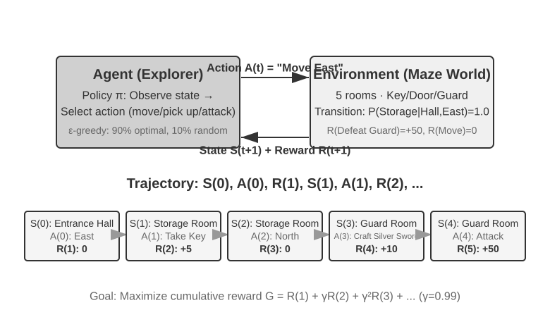
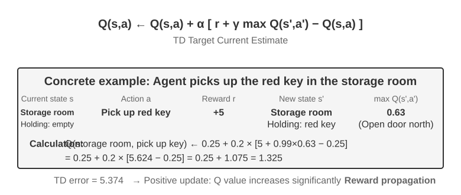
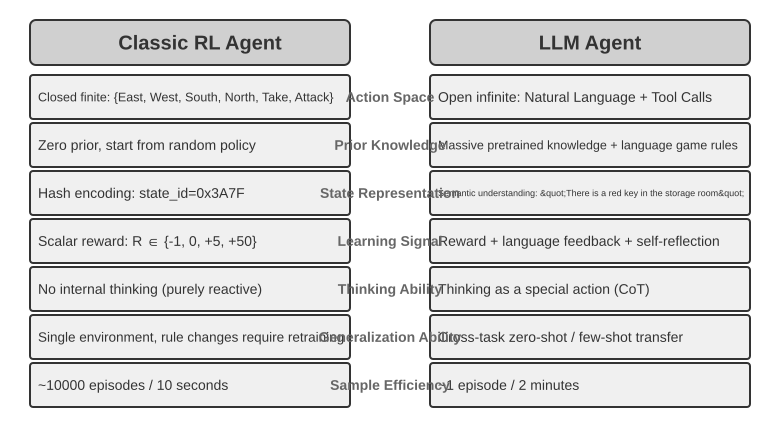
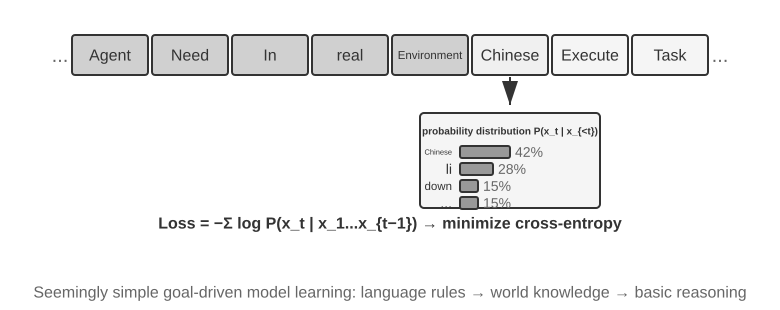
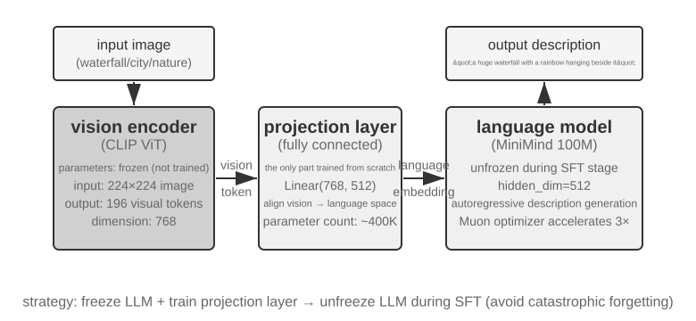
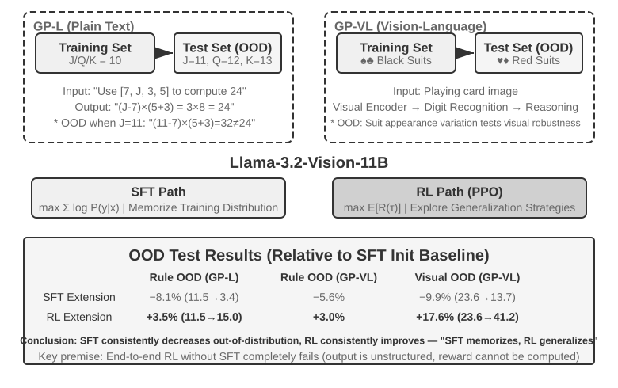
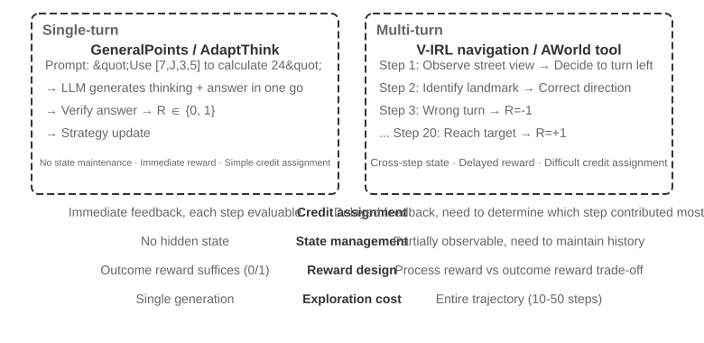
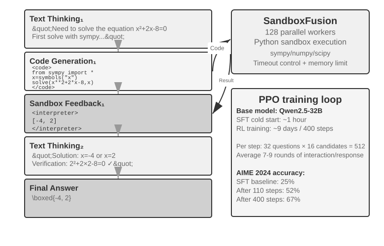

# மாதிரி பிந்தைய பயிற்சி (Model Post-Training)

இந்த புத்தகத்தின் மைய சூத்திரம் Agent = LLM + Context + Tools ஆகும். இந்த அத்தியாயம் LLM-ஐ, அதாவது "மூளையை" மேம்படுத்துவதில் கவனம் செலுத்துகிறது—பிந்தைய பயிற்சியைப் பயன்படுத்தி, மாதிரியானது சூழல் (context) மற்றும் கருவிகளை (tools) சிறப்பாகப் பயன்படுத்தி, முழு Agent அமைப்பின் திறன்களை மேம்படுத்த உதவுகிறது. அத்தியாயம் 7-ன் இறுதியில், மதிப்பீட்டு அமைப்பு (evaluation system) மற்றும் உருவகப்படுத்துதல் சூழல் (simulation environment) ஆகியவை பிந்தைய பயிற்சியின் இரண்டு அடித்தளங்கள் என்பதைச் சுட்டிக்காட்டினோம்: மதிப்பீட்டுச் சூழல் பயிற்சிக்கான பயிற்சிக் களத்தை வழங்குகிறது, மற்றும் மதிப்பீட்டு அளவீடுகள் (evaluation metrics) பயிற்சியின் இலக்குகளை வரையறுக்கின்றன. இந்த அத்தியாயம் இந்த இரண்டு அடித்தளங்களின் மீது கட்டமைக்கப்பட்டு, மாதிரி எடைகளை (model weights) உண்மையில் எவ்வாறு மாற்றுவது மற்றும் திறன்களை அளவுருக்களில் (parameters) எவ்வாறு பொதிப்பது என்பதை விவாதிக்கிறது.

இந்த அத்தியாயம், வலுவூட்டல் கற்றல் (reinforcement learning) அல்லது மாதிரி பயிற்சி (model training) பற்றிய பின்னணி இல்லாத வாசகர்களை இலக்காகக் கொண்டது. சாய்வுகள் (gradients) அல்லது கொள்கை மேம்படுத்தல் (policy optimization) பற்றி உங்களுக்குத் தெரியும் என்று நாங்கள் கருதவில்லை. மாறாக, "ஒரு மாதிரி எவ்வாறு பயிற்றுவிக்கப்படுகிறது" என்ற அடிப்படைக் கருத்திலிருந்து தொடங்கி, ஒவ்வொரு படியின் நோக்கம், கொள்கைகள் மற்றும் தீர்க்கப்படும் சிக்கல்களை விளக்குகிறோம். இந்த அத்தியாயத்தைப் படித்த பிறகு, நீங்கள் பதிலளிக்க முடியும்: ஒரு மாதிரியின் திறன்களை வடிவமைக்க எத்தனை நிலைகள் தேவை, ஒவ்வொரு நிலையும் என்ன செய்கிறது, ஏன் இந்த வரிசை அவசியம், மற்றும் உங்கள் சொந்தத் திட்டங்களில் உங்கள் முயற்சிகளை எங்கு குவிக்க வேண்டும்.

**முக்கிய வரைபடம் நான்கு பகுதிகள்: முன்-பயிற்சி, Mid-training, SFT, RL.** பொது அடித்தளத்திற்கும் behavior alignment-க்கும் இடையில் Mid-training துறை அறிவையும் அடிப்படைத் திறன்களையும் உருவாக்குகிறது; அடுத்த பகுதிகள் நான்கையும் விவரிக்கின்றன.

1.  **முன்-பயிற்சி (Pre-training)**: பாரிய இணைய உரைகளில் "அடுத்த வார்த்தையைக் கணிக்க" பயிற்சி அளித்தல். இந்தப் படி மாதிரிக்கு மொழி விதிகள், உலக அறிவு மற்றும் அடிப்படை பகுத்தறிவைக் கற்பிக்கிறது. இது ஒரு நூலகத்தில் உள்ள அனைத்து புத்தகங்களையும் படித்த ஒரு நபரைப் போன்றது—பரந்த அறிவு உள்ளது, ஆனால் கேள்விகளுக்குப் பதிலளிப்பதில் இன்னும் திறமையாக இல்லை. இது மிகவும் விலையுயர்ந்த படியாகும் (பெரும்பாலும் பல கோடி டாலர்கள்) மற்றும் அனைத்து திறன்களுக்கும் அடித்தளமாகும்.
2.  **மேற்பார்வையிடப்பட்ட நுண்-சரிப்படுத்தல் (Supervised Fine-Tuning - SFT)**—பெயரிடப்பட்ட "உள்ளீடு-வெளியீடு" இணைகளில் மாதிரியைப் பயிற்றுவித்தல், ஒரு ஆசிரியர் மாணவர் பின்பற்றுவதற்காக தரமான பதில்களை வழங்குவது போல: ஆயிரக்கணக்கில் இருந்து பல்லாயிரக்கணக்கான "கேள்வி-தரமான பதில்" செயல்விளக்கத் தரவுகளைப் பயன்படுத்தி, மாதிரிக்கு "பதிலளிக்கும்போது எந்த வடிவம், பாணி மற்றும் செயல்முறையைப் பயன்படுத்த வேண்டும்" என்பதைக் கற்பித்தல். இந்தப் படி பரந்த அறிவுள்ள மாதிரியை, வழிமுறைகளைப் புரிந்துகொண்டு நன்கு கட்டமைக்கப்பட்ட வெளியீடுகளை உருவாக்கும் உதவியாளராக மாற்றுகிறது. இது மலிவானது, வேகமானது மற்றும் நிலையானது, மேலும் தற்போது கிட்டத்தட்ட அனைத்து பயன்படுத்தப்படும் மாதிரிகளும் இந்தப் படியை மேற்கொள்கின்றன.
3.  **வலுவூட்டல் கற்றல் (Reinforcement Learning - RL)**—மாதிரி மீண்டும் மீண்டும் முயற்சித்து, வெகுமதிகள் மற்றும் தண்டனைகளிலிருந்து மேம்பட அனுமதித்தல், ஒரு நாய்க்குட்டியைப் பயிற்றுவிப்பது போல (சரியாகச் செய்தால் ஒரு பரிசு, இல்லையென்றால் ஒன்றுமில்லை): மாதிரிக்கு தரமான பதில்களைக் காண்பிப்பதை நிறுத்திவிட்டு, அதை சொந்தமாக முயற்சிக்க விடுவது, நல்ல நடத்தைகளின் நிகழ்தகவை அதிகரித்து மற்றும் கெட்ட நடத்தைகளின் நிகழ்தகவைக் குறைப்பது. இந்தப் படி, **பார்த்திராத சூழ்நிலைகளில்** கூட மாதிரி நியாயமான முடிவுகளை எடுக்க கற்றுக்கொடுக்கிறது—மேலும் இந்த அத்தியாயத்தில் அதிக இடத்தை எடுத்துக்கொள்ளும் மற்றும் அதிக பொறியியல் முயற்சி தேவைப்படும் படியும் இதுவே.

ஒரு உள்ளுணர்வு ஒப்புமை: முன்-பயிற்சி என்பது "பத்தாயிரம் புத்தகங்களைப் படிப்பது" (அறிவைக் குவிப்பது), SFT என்பது "ஒரு ஆசிரியர் உங்களுக்கு படிப்படியாக தரமான தீர்வுகளை வழிகாட்டுவது" (செயல்விளக்கங்களைப் பின்பற்றுவது), மற்றும் RL என்பது "சிக்கல்களை நீங்களே தீர்த்து, சரி அல்லது தவறு என்பதன் அடிப்படையில் சுத்திகரிப்பது" (சோதனை மற்றும் பிழை மூலம் கற்றல்). இந்த மூன்றும் ஒன்றுக்கொன்று மாற்றுகள் அல்ல; அவை ஒரு தொடர்ச்சியான செயல்முறை—முதலில் படியுங்கள், பின்னர் செயல்விளக்கங்களைப் பாருங்கள், இறுதியாக பயிற்சி செய்யுங்கள்.

**இந்த அத்தியாயத்தில் முழுவதும் இயங்கும் இரண்டு முக்கிய கருப்பொருள்கள் உள்ளன. அவற்றை நினைவில் கொள்ளவும், ஏனெனில் அடுத்தடுத்த அனைத்து உள்ளடக்கமும் அவற்றிற்கு சேவை செய்கிறது:**

*   **கருப்பொருள் ஒன்று: SFT மனப்பாடம் செய்கிறது, RL பொதுமைப்படுத்துகிறது.** ஒரே பணி மற்றும் பட்ஜெட்டுக்கு, SFT என்பது பயிற்சித் தரவுகளில் உள்ள பதில்களை **மனப்பாடம்** செய்வதற்கே வழிவகுக்கிறது, பயன்பாட்டு சூழல் பயிற்சியிலிருந்து வேறுபடும்போது தோல்வியடைகிறது. RL என்பது மாற்றத்தக்க ஒரு உத்தியை **கற்றுக்கொள்வதற்கு** வழிவகுக்கிறது, பார்த்திராத சூழ்நிலைகளிலும் நிலையாக இருக்கும். இது ஒரு முழக்கமாக மட்டுமல்லாமல், இந்த அத்தியாயம் கட்டுப்படுத்தப்பட்ட சோதனைகள் மூலம் மீண்டும் மீண்டும் சரிபார்க்கும் ஒரு அளவிடக்கூடிய நிகழ்வாகும். "முன்-பயிற்சி, SFT, RL: ஒரு மூன்று-நிலை கண்ணோட்டம்" பகுதி இந்த வேறுபாட்டிற்கான **அடிப்படை காரணங்களை** விளக்குவதற்கு ஒரு முழுப் பகுதியையும் அர்ப்பணிக்கும்.
*   **கருப்பொருள் இரண்டு: தரவு மற்றும் சூழல் வழிமுறைகளை விட முக்கியமானவை.** தொழில்துறையிலிருந்து கிடைக்கும் மிகவும் எதிர்பாராத மற்றும் மதிப்புமிக்க பாடம் இதுவாகும். ஆயத்த RL வழிமுறைகளை (PPO, GRPO, போன்றவை) எவ்வாறு பயன்படுத்துவது என்பதை அறிவது போதுமானது. வெற்றியை உண்மையில் தீர்மானிப்பவை இரண்டு விஷயங்கள்: **உருவகப்படுத்துதல் சூழல்** (பயிற்சி மைதானம் போதுமான அளவு யதார்த்தமானதா?) மற்றும் **பயிற்சித் தரவு** (செயல்விளக்கங்கள் மற்றும் வெகுமதி சமிக்ஞைகளின் தரம் போதுமான அளவு அதிகமாக உள்ளதா?). பல சூழ்நிலைகளில், SFT தரவுத் தரம் போதுமானதாக இருந்தால், நீங்கள் RL ஐச் செய்ய வேண்டிய அவசியமே இல்லாமல் போகலாம். இந்த அத்தியாயம் உங்கள் கவனத்தை "எந்த வழிமுறையை டியூன் செய்வது" என்பதிலிருந்து "தரவு மற்றும் சூழல் சரியாக செய்யப்பட்டுள்ளதா?" என்பதற்கு தொடர்ந்து திருப்பிவிடும்.

> **வாசிப்பு வழிகாட்டி**: இந்த அத்தியாயத்தின் உள்ளடக்கம் வாசகரின் பின்னணியின் அடிப்படையில் இரண்டு பாதைகளாகப் பிரிக்கப்பட்டுள்ளது:
>
> *   **ஏஜெண்ட் பயன்பாட்டு மேம்பாட்டாளர்கள்** (தாங்களே மாதிரிகளைப் பயிற்றுவிக்க வேண்டிய அவசியமில்லை): "முன்-பயிற்சி, SFT, RL: ஒரு மூன்று-நிலை கண்ணோட்டம்" என்ற தொடக்கத்தைப் படித்து, ஒரு உலகளாவிய புரிதலை உருவாக்குங்கள். பின்னர் பின்வரும் இரண்டு `[விருப்ப வாசிப்பு]` பகுதிகளைத் (கிளாசிக் RL மற்றும் முன்-பயிற்சி பின்னணி) தவிர்த்துவிட்டு, SFT பகுதியிலிருந்து தொடரலாம். "SFT மற்றும் RL இன் அத்தியாவசிய வேறுபாடு" மற்றும் "எப்போது SFT vs. RL ஐ தேர்வு செய்வது" ஆகியவற்றிற்கான முடிவு கட்டமைப்பிலும், "தரவு மற்றும் சூழல் வழிமுறைகளை விட முக்கியமானவை" என்ற தீர்ப்பிலும் கவனம் செலுத்துங்கள்—இந்த நுண்ணறிவுகள் Harness பொறியியலில் உங்கள் வடிவமைப்பு முடிவுகளை பாதிக்கும் (எப்போது ப்ராம்ப்ட்களால் தீர்க்க வேண்டும், எப்போது ஃபைன்-டியூனிங் மதிப்புள்ளது).
> *   **மாதிரி பயிற்சி பொறியாளர்கள்**: தொடக்கத்திலிருந்து வரிசையாகப் படியுங்கள். இரண்டு `[விருப்ப வாசிப்பு]` பகுதிகளும் வலுவூட்டல் கற்றல் மற்றும் முன்-பயிற்சி பற்றிய முழுமையான பின்னணியை வழங்குகின்றன. அடுத்தடுத்த சோதனைகள் மீண்டும் உருவாக்கக்கூடிய பயிற்சி திட்டங்களை வழங்குகின்றன.

## முன்-பயிற்சியிலிருந்து RL வரை: நான்கு-நிலை கண்ணோட்டம்

அறிமுகம் நான்கு பகுதிகளின் வரைபடத்தை வழங்கியது. இப்பகுதி ஒவ்வொன்றின் **தரவு**, **உகப்பாக்க இலக்கு**, **செலவு** வேறுபாடுகளை விளக்குகிறது. அட்டவணை 8-1 முதலில் கண்ணோட்டத்தையும் பின்னர் விவரங்களையும் தருகிறது.

**அட்டவணை 8-1: மாதிரி திறன் வளர்ச்சியின் நான்கு பகுதிகள்**

| நிலை | பயன்படுத்தப்படும் தரவு | உகப்பாக்க இலக்கு | கற்றுக்கொள்ளப்படுவது | வழக்கமான செலவு |
|-------|-----------|-----------------------|-----------------|--------------|
| **முன்-பயிற்சி** | பாரிய மூல இணைய உரை | அடுத்த டோக்கனைக் கணித்தல் | மொழி விதிகள், உலக அறிவு, அடிப்படை பகுத்தறிவு | மிக அதிகம் (மில்லியன்கள் முதல் பத்து மில்லியன் அமெரிக்க டாலர்கள் வரை) |
| **Mid-training** | இலக்கு மொழி/துறை/திறன் corpus மற்றும் தக்கவைப்புத் தரவு | அடுத்த token கணிப்பைத் தொடருதல் (பொதுவாக எல்லா token-களிலும் loss) | துறை அறிவு, மொழி, அடிப்படைத் திறன் இடைவெளிகளை நிரப்புதல் | நடுத்தரம் முதல் அதிகம்; token அளவு மற்றும் பயிற்றுவிக்கும் parameters சார்ந்தது |
| **SFT** | ஆயிரக்கணக்கில் முதல் பல்லாயிரக்கணக்கில் "உள்ளீடு-வெளியீடு" விளக்க ஜோடிகள் | அடுத்த டோக்கனைக் கணித்தல் (இழப்பு பதிலில் மட்டுமே கணக்கிடப்படும்) | அறிவுறுத்தல் பின்பற்றுதல், வெளியீட்டு வடிவம், பாணி, செயல்முறை நெறிமுறை | குறைவு (மணிநேரங்கள் முதல் நாட்கள் வரை) |
| **RL** | பணி + வெகுமதி செயல்பாடு (நிலையான பதில் இல்லை) | எதிர்பார்க்கப்படும் வெகுமதியை அதிகப்படுத்துதல் | மாற்றத்தக்க முடிவெடுக்கும் உத்தி, புதிதாக கண்டுபிடிக்கப்பட்ட தீர்வுகள் | அதிகம் (பெரும்பாலும் SFT ஐ விட பத்து முதல் நூறு மடங்கு) |

### முன்-பயிற்சி என்ன செய்கிறது: அடுத்த டோக்கனைக் கணித்தல்

நவீன பெரிய மாதிரிகளின் அனைத்து "நுண்ணறிவும்" மிகவும் எளிமையான ஒரு பணியின் மீது கட்டமைக்கப்பட்டுள்ளது, அது ஆச்சரியமளிக்கிறது: **அடுத்த டோக்கன் கணிப்பு (NTP)**.

மாதிரிக்கு ஒரு உரையின் முதல் பகுதியைக் காட்டி, அடுத்த டோக்கனை யூகிக்கச் சொல்லுங்கள். எடுத்துக்காட்டாக, "சீனாவின் தலைநகர்" என்ற உள்ளீடு கொடுக்கப்பட்டால், மாதிரி "பெய்ஜிங்" என்பதற்கு அதிக நிகழ்தகவை ஒதுக்க வேண்டும். ஒவ்வொரு முறை மாதிரி யூகிக்கும்போதும், அது தனது கணிப்பை உண்மையான அடுத்த டோக்கனுடன் ஒப்பிடுகிறது. வேறுபாடு (இழப்பு எனப்படும்) பெரியதாக இருந்தால், அடுத்த முறை ஒத்த சூழல்களில் மிகவும் துல்லியமாக யூகிக்க அது தனது அளவுருக்களை அதிகமாக சரிசெய்கிறது. இணைய உரையின் டிரில்லியன் கணக்கான டோக்கன்களில் இதை மீண்டும் மீண்டும் செய்வதன் மூலம், மாதிரி இலக்கணம், உண்மைகள், தர்க்கம் மற்றும் அடிப்படை பகுத்தறிவு ஆகியவற்றைக் கற்க நிர்ப்பந்திக்கப்படுகிறது—ஏனெனில் பரந்த அளவிலான சூழல்களில் அடுத்த வார்த்தையை சீராக சரியாக யூகிக்க, எந்த குறுக்கு வழியும் இல்லை; அது உரையில் உள்ள வடிவங்களை உண்மையில் "ஜீரணிக்க" வேண்டும்.

SFT மற்றும் RL வரை தொடரும் ஒரு முக்கியமான புள்ளியை நினைவில் கொள்ள வேண்டும்: **மாதிரியின் வெளியீடு அடிப்படையில் ஒரு நிகழ்தகவு பரவல் ஆகும்.** முந்தைய உரையைக் கொடுத்து, மாதிரி அதன் சொற்களஞ்சியத்தில் உள்ள ஒவ்வொரு சாத்தியமான டோக்கனுக்கும் ஒரு நிகழ்தகவை ஒதுக்குகிறது. "பயிற்சி," அதன் மையத்தில், **இந்த நிகழ்தகவு பரவலை சரிசெய்வதாகும்**—விரும்பிய டோக்கன்களின் நிகழ்தகவை அதிகரித்து, விரும்பாதவற்றைக் குறைப்பது. மூன்று நிலைகளுக்கும் இடையே உள்ள வேறுபாடு "எது விரும்பப்படுகிறது" மற்றும் "'விரும்பப்பட்டதை' எந்த சமிக்ஞை வரையறுக்கிறது" என்பதில் மட்டுமே உள்ளது.

முன்-பயிற்சிக்குப் பிறகு, மாதிரி புலமை மிக்கதாக ஆனால் பயனர் நட்புடன் இல்லை: நீங்கள் அதற்கு ஒரு கேள்வியைக் கேட்டால், அது பதிலளிப்பதற்குப் பதிலாக மேலும் கேள்விகளை உருவாக்கலாம்—ஏனெனில் இணைய உரையில், ஒரு கேள்வியை அடுத்து மற்றொரு கேள்வி வருவது பொதுவானது. "ஒரு கேள்வி கேட்கப்பட்டால், நீங்கள் பதிலளிக்க வேண்டும்" என்ற நெறிமுறையை அது இன்னும் கற்றுக்கொள்ளவில்லை.

### Mid-training இன் சாராம்சம்: இலக்கு பரவலில் தொடர்ந்து கற்றல்

பொது முன்-பயிற்சி எல்லா மொழி, துறை, திறன்களையும் முழுமையாகக் கையாள முடியாது. இலக்கு மொழியை மாதிரி கிட்டத்தட்ட வாசிக்க முடியாவிட்டால், நிறுவன நெறிமுறைகளை அறியாவிட்டால், அல்லது நீண்ட சூழல் மற்றும் code-க்கு தேவையான representations உருவாகாவிட்டால், பதில் வடிவத்தை மட்டும் கற்பிப்பதும் வெற்றி/தோல்வி வெகுமதி மட்டும் தருவதும் போதாது. Mid-training அடுத்த-token இலக்கைத் தக்கவைத்து, தரவுப் பரவலை இலக்கு துறைக்கு நெருக்கி, மறதியை கட்டுப்படுத்த பொது தரவையும் கலக்கிறது. இது “பணிக்குத் தேவையான அறிவும் அடிப்படைத் திறனும் உள்ளதா?” என்பதைச் சரிசெய்கிறது; “பதில் எப்படித் தோன்ற வேண்டும்?” அல்லது “எந்த policy அதிக reward பெறும்?” என்பதல்ல.

### SFT இன் சாராம்சம்: வெவ்வேறு தரவுகளுடன் "அடுத்த டோக்கனைக் கணித்தல்"

இந்த அத்தியாயத்தில் புரிந்துகொள்ள வேண்டிய முதல் முக்கிய நுண்ணறிவு இதுதான்: **கணித ரீதியாக, SFT மற்றும் முன்-பயிற்சி ஒரே பணி—இரண்டும் அடுத்த டோக்கனைக் கணித்து ஒரே இழப்பு செயல்பாட்டைக் குறைக்கின்றன.** பல ஆரம்பநிலையாளர்கள் SFT என்பது முற்றிலும் புதிய முறை என்று நினைக்கிறார்கள், ஆனால் அது இல்லை. SFT மற்றும் முன்-பயிற்சிக்கு இடையே உள்ள வேறுபாடு இரண்டு விஷயங்கள் மட்டுமே:

1.  **வெவ்வேறு தரவு.** முன்-பயிற்சி (pre-training) மூல மின்னிலக்க உரையைப் பயன்படுத்துகிறது (கட்டமைப்பற்றது, அனைத்தையும் கொண்டுள்ளது); SFT கவனமாகத் தயாரிக்கப்பட்ட "உள்ளீடு-வெளியீடு" இணைகளைப் பயன்படுத்துகிறது, இவை சீரான முறையில் "பயனர் கேள்வி → சிறந்த பதில்" என வடிவமைக்கப்பட்டுள்ளன. இந்த விளக்கங்களின் மீது மாதிரி "அடுத்த டோக்கனைக் கணிப்பதை" தொடர்கிறது, இதன் மூலம் "ஒரு கேள்வி கேட்கப்பட்டால் பதிலை எவ்வாறு கட்டமைப்பது" என்ற நெறிமுறையைக் கற்றுக்கொள்கிறது.
2.  **"பதில்" மீது மட்டுமே இழப்பு கணக்கிடப்படுகிறது (loss masking).** ஒரு SFT மாதிரியானது ஒரு கேள்வியையும் ஒரு பெயரிடப்பட்ட பதிலையும் கொண்டுள்ளது. மாதிரி "எப்படி கேள்வி கேட்பது" என்பதைக் கற்றுக்கொள்ள விரும்பவில்லை, "எப்படி பதில் சொல்வது" என்பதை மட்டுமே கற்றுக்கொள்ள விரும்புகிறோம். எனவே, இழப்பைக் கணக்கிடும்போது, கேள்விப் பகுதியில் உள்ள டோக்கன்கள் மறைக்கப்பட்டு (masked), சாய்வுகள் (gradients) பதில் பகுதிக்கு மட்டுமே பின்பரப்பப்படும் (backpropagated). SFT க்கும் முன்-பயிற்சிக்கும் இடையேயான ஒரே குறிப்பிடத்தக்க பொறியியல் வேறுபாடு இதுதான்.

இதைப் புரிந்துகொள்வது "SFT மனப்பாடம்" (memorization) என்பதை தர்க்கரீதியாக்குகிறது: SFT இன் உகப்பாக்க இலக்கு, **பெயரிடப்பட்ட பதிலில் உள்ள ஒவ்வொரு டோக்கனின் நிகழ்தகவையும் அதிகரிப்பதாகும்**—வேறு வார்த்தைகளில் சொன்னால், "இந்த நிலையான பதிலை சரியாக மனப்பாடம் செய்." அதே கேள்வி கொடுக்கப்பட்டால், விளக்கத்தை முடிந்தவரை நெருக்கமாக மீண்டும் உருவாக்க பயிற்சியளிக்கப்படுகிறது. தெளிவான இலக்குகள் மற்றும் நிலையான வடிவங்களைக் கொண்ட பணிகளுக்கு இது மிகவும் திறமையானது (ஆயிரக்கணக்கான எடுத்துக்காட்டுகள் போதுமானவை), ஆனால் அதன் திறன் எல்லையும் விளக்கத் தரவுகளுடன் பிணைக்கப்பட்டுள்ளது: விளக்கங்களில் இல்லாத சூழ்நிலைகளை அது கற்றுக்கொள்ளவில்லை; விளக்கத்தில் உள்ள பதில் இனி பொருந்தாது என்றால் (சூழல் மாறுகிறது), அது இன்னும் அதை மனப்பாடமாகச் சொல்லும்.

சுருக்கமாக, SFT இன் சாராம்சம்: **மிக அதிக சாம்பிள் திறனுடன், ஒரு நிலையான "உள்ளீடு→வெளியீடு" வரைபடம் மற்றும் நெறிமுறையை அளவுருக்களில் உறுதிப்படுத்துவதாகும்.** இது உறுதிப்படுத்துவது **நெறிமுறை அறிவு** (எப்படி சொல்வது, எப்படி செய்வது) அதாவது "வடிவம், பாணி, செயல்முறை" போன்றவை, அதிக அளவிலான **உண்மை அறிவு** (என்ன தெரிந்திருக்க வேண்டும்) அல்ல—பிந்தையது முன்-பயிற்சி அல்லது RAG ஐ நம்பியுள்ளது (இந்த வேறுபாட்டை அத்தியாயத்தின் முடிவில் மீண்டும் பார்ப்போம்).

> **பயிற்சிச் செலவு: LoRA அளவுரு-திறமையான நுண் சரிப்படுத்தல்.** SFT மற்றும் அதைத் தொடர்ந்து வரும் RL ஆகிய இரண்டிற்கும் மாதிரி அளவுருக்களைப் புதுப்பிக்க வேண்டும், மேலும் முழு-அளவுரு நுண் சரிப்படுத்தலுக்கு அதிக VRAM தேவைப்படுகிறது (பில்லியன் கணக்கான அளவுருக்களுக்கான சாய்வுகள் மற்றும் உகப்பாக்கி நிலைகளைச் சேமிக்க வேண்டும்). **LoRA** (Low-Rank Adaptation) என்பது மிகவும் பொதுவான செலவு-சேமிப்பு முறையாகும்: இது பெரிய அசல் எடை அணிகளை மாற்றுவதற்குப் பதிலாக, பணியைக் கற்றுக்கொள்ள ஒரு சிறிய "இணைப்பு" (குறைந்த-தர அணி) இணைக்கிறது. அளவுருக்களின் எண்ணிக்கை அசலில் 1%–5% மட்டுமே, ஆனால் இது முழு நுண் சரிப்படுத்தலின் செயல்திறனை நெருங்க முடியும். அசல் எடைகள் உறைந்திருப்பதால், LoRA அடிப்படை மாதிரியின் தற்போதைய திறன்களில் குறைவான இடையூறுகளை ஏற்படுத்துகிறது, இது பேரழிவு மறதி அபாயத்தைக் குறைக்கிறது. பல சரிபார்க்கப்பட்ட நடைமுறை அனுபவங்கள்[^ch8-1]: **கட்டாயமாக** LoRA ஐ அனைத்து முக்கிய எடை அணிகளுக்கும் (குறிப்பாக MLP அடுக்குகள், அதிக அளவுரு எண்ணிக்கையைக் கொண்டவை) பயன்படுத்த வேண்டும்; கவன அடுக்குகளுக்கு மட்டும் பயன்படுத்தினால் செயல்திறன் குறையும். **உகந்த கற்றல் விகிதம் முழு நுண் சரிப்படுத்தலை விட சுமார் 10 மடங்கு அதிகமாகும்** (SFT மற்றும் RL இரண்டிற்கும் பொருந்தும், மிகவும் நடைமுறைக்குரிய மாற்று விதி). SFT க்கு நடுத்தர முதல் உயர் தரத்தை (64–256) பயன்படுத்தவும்; RL க்கு ஒரு சுற்றுக்கான தகவல் சிறியதாக இருப்பதால், சிறிய தரம் (8–32) அல்லது rank=1 கூட போதுமானது. வரிசைப்படுத்தலின் போது, ஒரு ஒற்றை அனுமான சேவையகம் பல LoRA அடாப்டர்களை ஒரே நேரத்தில் ஏற்றி பல-வாடிக்கையாளர் சேவையை வழங்க முடியும். இந்த புத்தகம் LoRA ஐ அனைத்து பிந்தைய-பயிற்சி முறைகளுக்கும் இயல்புநிலை பொறியியல் தேர்வாகக் கருதுகிறது மற்றும் அதைத் தனித்தனியாக விளக்காது.

### SFT/RL க்கு முன் அடித்தளத்தை எப்போது நிரப்ப வேண்டும்

RL மாதிரி **தானே உருவாக்கும்** பதில்களை வெகுமதியால் மதிப்பிடுகிறது. ஆகவே வெளியீடு சரிபார்க்கக்கூடியதாகவும், தற்போதைய policy சில சமயம் பயனுள்ள நடத்தையை கண்டுபிடிக்கக்கூடியதாகவும் இருக்க வேண்டும். வடிவம் நிலையாக இல்லாவிட்டால் JSON அல்லது tool call-ஐ parse செய்ய SFT பயன்படுத்தலாம். ஆனால் நியாயமான temperature மற்றும் sample எண்ணிக்கையிலும் `pass@k` பூஜ்ஜியத்திற்கு அருகில் இருந்தால் தீர்வு மாதிரியின் effective support-க்கு வெளியே உள்ளது. எல்லா rollout-களும் தோல்வியுற்றால் எந்த அறிவு அல்லது reasoning step குறைகிறது என்பதற்கான தகவல் மிகக் குறைவு; GRPO குழு advantage-ம் மறையும். முதலில் Mid-training மூலம் அறிவு/atomic திறனை சேர்க்கவும், அல்லது demonstration/distillation மூலம் சாத்தியமான பாதையை support-க்குள் கொண்டுவரவும்; பின்னரே RL செய்யவும்.

அதற்குப் பிறகே **எந்த நிபந்தனையில் SFT, RL க்கு முன் வர வேண்டும்?** என்ற கேள்வி பொருத்தமானது.

RL எவ்வாறு செயல்படுகிறது என்பதில் பதில் உள்ளது. RL நிலையான பதில்களைப் பார்க்காது; அது மாதிரியை அதன் **சொந்த** பதில்களை உருவாக்க அனுமதிக்கிறது, பின்னர் பதிலின் தரத்தின் அடிப்படையில் வெகுமதிகள் அல்லது அபராதங்களை வழங்குகிறது. ஆனால் தரத்தை மதிப்பிடுவதற்கு, முதலில் மாதிரியின் வெளியீட்டை **பாகுபடுத்த** முடிய வேண்டும்: பணிக்கு JSON பொருள் அல்லது கருவி அழைப்பை வெளியிட வேண்டும் என்றால், மாதிரி மோசமான வடிவமைப்பில் குழப்பமான உரையை உருவாக்கினால், வெகுமதி செயல்பாட்டிற்கு கணக்கிடுவதற்கு எந்த அடிப்படையும் இல்லை (அது "வெற்றி தோல்வியை" கூட சொல்ல முடியாது), மேலும் RL கற்றுக்கொள்ள முடியாது.

எனவே, SFT "**முதலில் பேச்சைச் சரிசெய்வதன்**" பாத்திரத்தை வகிக்கிறது: சில எடுத்துக்காட்டுகளைப் பயன்படுத்தி வெளியீட்டு வடிவமைப்பை நிலைப்படுத்தி, அதை நம்பத்தகுந்த முறையில் பாகுபடுத்த முடியும், இது RL க்கு மதிப்பெண் வழங்குவதற்கான தொடக்கப் புள்ளியை அளிக்கிறது. இதுவே தொழில்துறையின் மிகவும் உறுதியான **"முதலில் SFT, பின்னர் RL"** என்ற இரு-நிலை முன்னுதாரணமாகும். முதலில் RL மற்றும் பின்னர் SFT செய்வது வேலை செய்யாது—நிலையான வெளியீடு இல்லாமல், வெகுமதி சமிக்ஞை வெறும் சத்தமாகும். சீன ஓவியத்திலிருந்து ஒரு கருத்தைக் கடன் வாங்கினால்: SFT முதலில் **"வடிவத்தை"** (வடிவமைப்பு, கட்டமைப்பு) நிறுவுகிறது, பின்னர் RL **"ஆவியை"** (உத்தி, பொதுமைப்படுத்தல்) தேடுகிறது—**முதலில் வடிவம், பின்னர் ஆவி**.

ஒரு முக்கியமான எல்லை நிபந்தனை: **"SFT முதலில் வர வேண்டும்"** என்பது **"சிறிய அடிப்படை மாதிரி + கண்டிப்பான கட்டமைக்கப்பட்ட வெளியீடு"** என்ற அமைப்பில் உண்மையாகும் (சோதனை 8-11 இல், Llama-3.2-Vision-11B அளவிலான ஒரு மாதிரி SFT இல்லாமல் நேரடியாக RL செய்தால் முற்றிலும் தோல்வியடைவதைக் காண்போம்). இருப்பினும், அடிப்படை மாதிரி போதுமான வலிமையாக இருந்தால், அது ஆரம்பத்திலிருந்தே போதுமான வெளியீட்டை உருவாக்க முடியும், இதனால் SFT ஐத் தவிர்க்கலாம்—DeepSeek-R1-Zero, ஒரு வலுவான அடிப்படை மாதிரி நேரடி RL உடன் வெற்றிபெற முடியும் என்பதை நிரூபித்தது, தானாகவே பிரதிபலிப்பு மற்றும் நீண்ட சிந்தனைச் சங்கிலியை வெளிப்படுத்தியது. இதன் விலை மோசமான வெளியீட்டு வாசிப்புத்திறன் மற்றும் கலந்த சீன/ஆங்கிலம் ஆகும், எனவே DeepSeek இறுதியாக R1 இல் "குளிர்-தொடக்க SFT" ஐ மீண்டும் சேர்த்து "வடிவத்தை" மீண்டும் நிறுவியது. R1 இன் Zero இலிருந்து குளிர்-தொடக்கம் வரையிலான பயணமே "முதலில் வடிவம், பின்னர் ஆவி" என்பதற்கான சிறந்த விளக்கமாகும்.

### SFT மற்றும் RL இடையேயான அடிப்படை வேறுபாடு (இந்த அத்தியாயத்தின் மிக முக்கியமான அட்டவணை)

"SFT மனப்பாடம் செய்கிறது, RL பொதுமைப்படுத்துகிறது" என்று நாம் மீண்டும் மீண்டும் கூறியுள்ளோம். இப்போது அடிப்படை காரணங்களை முழுமையாக விளக்குவோம். இரண்டிற்கும் இடையேயான அனைத்து வேறுபாடுகளும் **வெவ்வேறு உகப்பாக்க இலக்குகளிலிருந்து** உருவாகின்றன:

- **SFT குறிக்கப்பட்ட பதிலின் நிகழ்தகவை உச்சப்படுத்துகிறது.** ஒவ்வொரு பயிற்சி மாதிரியும் அதிகபட்ச நிகழ்தகவால் மாதிரியை விளக்கத்தை மீளுருவாக்கத் தள்ளுகிறது. பன்முகமான, பிரதிநிதித்துவமான விளக்கங்கள் பொதுமைப்படுத்தக்கூடிய பண்புகளைக் கற்பிக்கக்கூடும்; ஆனால் விளக்கங்களிலோ prompt-களிலோ பன்முகத்தன்மை போதவில்லை என்றால், மேற்பரப்பு வடிவங்களுக்கோ குறுக்குவழிகளுக்கோ மாதிரி மிகைப்பொருத்தமும் அடையலாம். GeneralPoints-இன் வரையறுக்கப்பட்ட விளக்கங்கள் J/Q/K அனைத்தையும் 10 ஆகக் கருதுவதால், சோதனையில் மதிப்புகள் மாறும்போது மாதிரியின் செயல்திறன் குறைகிறது.
- **RL எதிர்பார்க்கப்படும் வெகுமதியை உச்சப்படுத்துகிறது.** மாதிரி பல பாதைகளை ஆராய்ந்து, அதிக வெகுமதியுள்ள பாதைகளின் நிகழ்தகவை உயர்த்துகிறது. வெகுமதி இலக்கை நேர்மையாகப் பிரதிபலித்து, ஆய்வும் போதுமானதாக இருக்கும்போது, விளக்கங்களில் இல்லாத மாற்றத்தக்க உத்திகளை மாதிரி கண்டுபிடிக்கக்கூடும். GeneralPoints-இல், நிலையான மதிப்பைப் பயன்படுத்துவதற்குப் பதிலாக மீண்டும் கணக்கிடுவது, பரவலுக்கு வெளியேயான சோதனைகளில் சிறந்த முடிவைத் தந்தது. மாறாக, வெகுமதியோ சூழலோ சார்புடையதாக இருந்தால், RL-ம் ஒரு குறுக்குவழிக்கு மிகைப்பொருத்தம் அடையலாம்.

அட்டவணை 8-2: SFT மற்றும் RL இன் அடிப்படை ஒப்பீடு

| பரிமாணம் | SFT (மேற்பார்வையிடப்பட்ட நுண் சரிப்படுத்தல்) | RL (வலுவூட்டல் கற்றல்) |
|----------|-----------------------------------------|--------------------------------------------|
| உகப்பாக்க இலக்கு | குறிக்கப்பட்ட பதிலின் நிகழ்தகவை உச்சப்படுத்துதல் (அதிகபட்ச நிகழ்தகவு) | எதிர்பார்க்கப்படும் வெகுமதியை உச்சப்படுத்துதல் |
| பயிற்சிச் சமிக்ஞை | குறிக்கப்பட்ட பதிலின் மீது டோக்கன் வாரியான மேற்பார்வை | கொள்கை உருவாக்கிய பதில்கள் அல்லது பாதைகள் + முடிவு அல்லது படி நிலை அளவெண் வெகுமதி |
| தரவு வடிவம் | "உள்ளீடு—வெளியீடு" விளக்கச் சோடிகள் | பணி மற்றும் சூழல் + வெகுமதிச் சமிக்ஞை (குறிப்பு விடை விருப்பத்திற்குரியது) |
| நேரடி உகப்பாக்க அழுத்தம் | விளக்கங்களின் இணைப்பையும் நெறிமுறையையும் பின்பற்றுதல் | வெகுமதி பெறும் நடத்தைகளையும் உத்திகளையும் வலுப்படுத்துதல் |
| பரவல் இடப்பெயர்வின்போது | விளக்கங்களின் பரப்பையும் ஒழுங்குபடுத்தலையும் பொறுத்தது; இந்த அத்தியாயத்தின் வரையறுக்கப்பட்ட விளக்கச் சோதனைகளில் மிகைப்பொருத்தம் தோன்றியது | வெகுமதி, சூழல், ஆய்வு ஆகியவற்றைப் பொறுத்தது; இந்த அத்தியாயத்தின் சோதனைகளில் மாற்றம் சிறப்பாக இருந்தது |
| சாம்பிள் திறன் | உயர்வு (சில ஆயிரம் மாதிரிகளே பலனளிக்கும்) | குறைவு (பெரும்பாலும் SFT-ஐ விடப் பத்து முதல் நூறு மடங்கு) |
| பயிற்சி நிலைத்தன்மை | உயர்வு, விரைவில் ஒருங்குகிறது | குறைவு, அலைபாய வாய்ப்புள்ளது, கவனமான சரிசெய்தல் தேவை |
| மிகவும் பொருத்தமானது | வடிவம்/நடை/நடைமுறையை நிலைநிறுத்துதல், தரமான விளக்கங்கள் உள்ளன, சூழல் நிலையானது | புதிய சூழல்களுக்குப் பொதுமைப்படுத்த வேண்டும், உகந்த உத்தியைத் தேட வேண்டும், குறியிடும் செலவு மிக அதிகம் |

நிகழ்தகவுப் பரவலின் கோணத்தில் பார்த்தால், SFT-க்கும் RL-க்கும் இன்னொரு முக்கியமான வேறுபாடு உள்ளது. ஒரு கேள்விக்குப் பல வகையான நியாயமான பதில்கள் இருக்கக்கூடும்; ஒவ்வொரு வகையும் பரவலின் ஒரு "உச்சிக்கு" ஒத்திருக்கும். அதிகபட்ச நிகழ்தகவால் இயங்கும் SFT விளக்கங்களை ஒவ்வொன்றாகக் கற்பதால், அடிக்கடி **mass-covering (பரப்புமுறை)** போக்கைக் காட்டுகிறது: பயிற்சித் தரவில் தோன்றிய பல முறைமைகளையும் முடிந்தவரை மூட முயல்கிறது. RL வெகுமதிக்கேற்ப நிகழ்தகவை மறுபகிர்வு செய்கிறது; வழக்கமான தலைகீழ் KL கட்டுப்பாட்டுடன் சேரும்போது **mode-seeking (உச்சி நாடும்)** போக்கைக் காட்ட வாய்ப்பு அதிகம்: எல்லா விளக்கங்களையும் சமமாக மீளுருவாக்குவதற்குப் பதிலாக, அதிக வெகுமதியுள்ள சில உச்சிகளில் நிகழ்தகவைக் குவிக்கிறது.

இந்த வேறுபாடே இரண்டின் வழக்கமான பலங்களை விளக்குகிறது: ஏற்கனவே அறியப்பட்ட பல எழுத்து முறைகளை மூடுவதில் SFT சிறந்தது; வேட்பாளர் நடத்தைகளிலிருந்து அதிக வெகுமதியுள்ள உத்தியைக் கண்டுபிடிப்பதில் RL சிறந்தது. இறுதியில் பன்முகத்தன்மை தக்கவைக்கப்படுமா அல்லது சில முறைமைகளுக்குச் சுருங்குமா என்பது, விளக்கங்களின் பரவல், வெகுமதிச் சார்பு, KL-இன் திசையும் கெழுவும், என்ட்ரோபி ஒழுங்குபடுத்தல், மாதிரியெடுப்பு வெப்பநிலை ஆகியவற்றைப் பொறுத்தது.

**Post-training, மாதிரி எப்போது செயல்படுகிறது என்பதையும் வடிவமைக்கிறது.** Coding மாதிரிகளை எடுத்துக்கொள்வோம்: GPT தொடரும் Claude தொடரும் அடிக்கடி வெவ்வேறு இயல்புநிலைச் செயல் வரம்பைக் காட்டுகின்றன. முந்தையது மாற்றுவதற்கு முன் களஞ்சியத்திலிருந்து அதிகத் தகவலைப் படிக்க முனையலாம்; பிந்தையது குறைவான கோப்புகளில் இடத்தைக் கண்டறிந்து, முதலில் செயல்படுத்தி, பின்பு சோதனைப் பின்னூட்டத்தால் திருத்த முனையலாம். இது ஒரு மாதிரியை "எச்சரிக்கையானது" என்றும் மற்றொன்றை "உள்ளுணர்வுள்ளது" என்றும் மனிதமயமாக்குவதல்ல; அளவுருக்களுக்குள் இருக்கும் கொள்கை, "இன்னொரு கோப்பைப் படிப்பதன் எதிர்பார்க்கப்படும் மதிப்பு, தற்போதைய patch-ஐச் சமர்ப்பித்துச் சரிபார்ப்பதன் எதிர்பார்க்கப்படும் மதிப்பை இன்னும் மிஞ்சுகிறதா" என்பதை மதிப்பிடுவதே. SFT விளக்கங்களில் திருத்துவதற்கு முன் விரிவாக ஆய்வுசெய்யும் பாதைகள் மீண்டும் மீண்டும் இருந்தால், மாதிரி உயர்ந்த செயல் வரம்பைப் பின்பற்றும்; RL-இன் செயல்முறை அல்லது முடிவு வெகுமதி விரைவான இடங்கண்டறிதலையும் சரிபார்க்கக்கூடிய சுழற்சிக்குள் விரைவில் நுழைவதையும் தொடர்ந்து அங்கீகரித்தால், நிகழ்தகவுத் திணிவு முன்னதாகச் செயல்படும் பாதைகளை நோக்கி நகரும். 7-ஆம் அத்தியாயத்தின் சோதனை 7-8, முற்றிலும் ஒரே நடுநிலை Coding Harness-க்குள் மாதிரியை மாற்றி, இந்த வேறுபாடு மாதிரிக்கேற்ப மாறுவதை உண்மையிலேயே அளந்தது; அதாவது Harness நடைமுறையைக் கட்டாயப்படுத்தாவிட்டாலும் மாதிரியே நிலையான கருவிப் பயன்பாட்டுக் கொள்கையைச் சுமந்து வருகிறது. Harness அதைச் சரிசெய்ய முடியும், ஆனால் நடத்தையின் முதன்மை மூலம் post-training-க்குப் பிந்தைய அளவுருக்களில் இருக்கக்கூடும். விற்பனையாளர்கள் முழுத் தரவையும் வெகுமதிச் செய்முறையையும் வெளியிடாததால், இந்தச் சோதனை நிறுவுவது மாதிரிப் பக்கத்து நடத்தை வேறுபாட்டையே; ஒரு குறிப்பிட்ட தனியுரிம வழிமுறை அதற்குக் காரணம் என்பதை அல்ல.

**நேரலைப் பின்னூட்டம், விளக்கங்களுக்கு அப்பாற்பட்ட உத்திகளை ஆராயும் வாய்ப்பை மாதிரிக்குத் தருகிறது.** நிலையான தரவுத்தொகுப்பில் செய்யப்படும் SFT, விளக்கங்கள் தரும் நேரடிப் பயிற்சிச் சமிக்ஞையைப் பயன்படுத்துகிறது; இருப்பினும் முன்-பயிற்சி அறிவை இணைத்து, விளக்கங்களில் இல்லாத உள்ளீடுகளுக்குப் பொதுமைப்படுத்த முடியும். நேரலை RL-ஓ, தற்போதைய கொள்கையால் மாதிரியைப் பதில்களை உருவாக்கவைத்து, சூழலிடமிருந்து பின்னூட்டம் பெறவைக்கிறது; எனவே விளக்கங்களுக்கு வெளியேயான வேட்பாளர் நடத்தைகளை நேரடியாக மதிப்பிட முடியும். இது தானாகவே உயர்ந்த உச்சவரம்பை உறுதிப்படுத்தாது: முடிவு அடிப்படை மாதிரி, விளக்கப் பரப்பு, வெகுமதியின் நேர்மை, ஆய்வு, உகப்பாக்க நிலைத்தன்மை ஆகியவற்றைப் பொறுத்தது. நேரலை/நேரலையல்லாத, மேலும் கறாரான on-policy/off-policy சொற்கள் வெகுமதி மற்றும் வடித்தல் பகுதிகளில் பயன்படுத்தப்படும். இப்போது நேரலைப் பின்னூட்டம் திறக்கும் மூன்று வாய்ப்புகளைப் பார்ப்போம்:

- **முதலாவது, நிலையான விளக்கங்களுக்கு வெளியேயான வேட்பாளர்களை மதிப்பிட முடியும்.** SFT-இன் நேரடி மேற்பார்வை தரவில் பதிவான பதில்களிலிருந்து வருகிறது; வெகுமதிச் சார்பு மதிப்பெண் தரக்கூடிய புதிய நடத்தைகளையும் RL வலுப்படுத்த முடியும். சோதனை 8-13-இன் (SimpleVLA-RL) "தள்ளி வெட்டும்" அசைவு மனித விளக்கங்களில் ஒருபோதும் தோன்றவில்லை; விளக்கங்களுக்கு வெளியேயான உத்திகளைக் கண்டறியும் வாய்ப்பு மாதிரிக்கு உண்டு என்பதை இது காட்டுகிறது. ஆனால் வெகுமதி அடையாளம் காணாத தரத்தைக் கற்க முடியாது; ஆய்வு எட்டாத உத்தியைக் கண்டுபிடிக்கவும் முடியாது.
- **இரண்டாவது, "சரிபார்ப்பது உருவாக்குவதை விட எளிது" என்ற பணிகளைப் பயன்படுத்த முடியும்.** SFT-க்கு முதலில் சரியான விடையையோ தரமான பாதையையோ எழுத வேண்டும்; RL-க்கு விடையின் தரத்தை நம்பகமாகத் தீர்மானித்தால் போதும். கணித விடையை ஒப்பிடலாம், குறியீட்டைச் சோதிக்கலாம், தேற்ற நிரூபணத்தைச் சரிபார்ப்பான் ஆய்வுசெய்யலாம். இந்தச் சமச்சீரின்மையே RLVR-இன் பலம்; ஆனால் சரிபார்ப்பான் முழுமையற்றதாக இருந்தால் அது வெகுமதி ஹேக்கிங்கிற்கும் இட்டுச்செல்லும்.
- **மூன்றாவது, தற்போதைய கொள்கை உண்மையில் சந்திக்கும் நிலைகளில் பயிற்றுவிக்க முடியும்.** நேரலையல்லாத பின்பற்றலுக்கு ஒரு கிளாசிக் பிரச்சினை உண்டு: **இணைமாறி இடப்பெயர்வு (covariate shift)**. கொள்கை விளக்கங்களிலிருந்து விலகி, தரவில் இல்லாத நிலைகளுக்குள் நுழைந்தபின், மீள்வதற்கான சமிக்ஞை இல்லாமல் போகலாம். சில வரிசைப் பின்பற்றல் கற்றல் அமைப்புகளில், மோசமான நிலையில் பிழை பாதை நீளம் $T$-க்கு ஏறத்தாழ $T^2$ ஆகக் குவியக்கூடும்; நேரலைத் தரவுத் தொகுப்பாக்கம் அதை ஏறத்தாழ $T$ ஆகக் குறைக்க முடியும். இந்த அத்தியாயத்தின் பிற்பகுதியில் வரும் On-Policy Distillation ("வடித்தல்: சாம்பிள் திறனை மேம்படுத்துதல்" பகுதியைப் பார்க்கவும்) இந்த நேரலைப் பொருத்தத்தை SFT-இன் அடர்த்தியான மேற்பார்வையுடன் இணைக்கிறது.

ஒரு உவமையைப் பயன்படுத்துவதானால்: **SFT ஏற்கனவே உள்ள வரைபடத்தை நுணுக்கமாகக் கற்கிறது; RL-ஓ வெகுமதியை ஒரு திசைகாட்டியாகக் கொண்டு வரைபடத்திற்கு வெளியேயான வேட்பாளர் பாதைகளை ஆராய முடியும்.** வரைபடம் தவறானாலும் திசைகாட்டி தவறானாலும் வழி தவறத்தான் செய்வோம். எனவே பல அமைப்புகள் முதலில் SFT-யால் நிலையான தொடக்கப் புள்ளியை அமைத்து, வெகுமதியும் சூழலும் போதுமான அளவு நம்பகமானபோதே RL-ஐச் சேர்க்கின்றன.

இந்தப் பெரிய படத்தை மனதில் வைத்துக்கொண்டு, ஒவ்வொரு அடுத்தடுத்த பகுதியையும் சூழலில் வைத்துப் புரிந்துகொள்ளலாம். அடுத்த இரண்டு பகுதிகள், `[விருப்ப வாசிப்பு]`—"கிளாசிக் RL ஏஜெண்டுகளிலிருந்து நவீன ஏஜெண்டுகள் வரை" மற்றும் "மாதிரி முன்-பயிற்சியின் அடித்தளங்கள்"—ஆழமாகச் செல்ல விரும்பும் வாசகர்களுக்கு வலுவூட்டல் கற்றல் மற்றும் முன்-பயிற்சி பற்றிய பின்னணியை வழங்குகின்றன. பின்-பயிற்சியுடன் மட்டும் தொடங்க விரும்பும் வாசகர்கள் அவற்றைத் தவிர்த்துவிட்டு, நேரடியாக SFT பகுதியுடன் தொடங்கலாம்.

## கிளாசிக் RL ஏஜெண்டுகளிலிருந்து நவீன ஏஜெண்டுகள் வரை `[விருப்ப வாசிப்பு]`

### ஏஜெண்ட்-சூழல் இடைவினை

**வலுவூட்டல் கற்றல் (Reinforcement Learning - RL)** என்பது அடிப்படையில், தற்போதைய சூழ்நிலையின் அடிப்படையில் செயல்களைத் தேர்ந்தெடுப்பதைக் கற்றுக்கொள்வதாகும், இது **ஒட்டுமொத்த வெகுமதியை** அதிகரிக்கச் செய்கிறது. சதுரங்கம் விளையாடக் கற்றுக் கொள்ளும் ஒரு AI-ஐ கற்பனை செய்யுங்கள்: ஒவ்வொரு நகர்வும் ஒரு செயல், வெற்றி நேர்மறை வெகுமதியை அளிக்கிறது, தோல்வி எதிர்மறை வெகுமதியை அளிக்கிறது, மேலும் ஒட்டுமொத்த வெகுமதி என்பது முழு விளையாட்டின் மொத்த ஆதாயமாகும். ஏஜெண்டும் சூழலும் தொடர்ந்து இடைவினை புரிகின்றன: ஒவ்வொரு படியிலும், ஏஜெண்ட் தற்போதைய நிலையைக் கவனிக்கிறது, ஒரு செயலைத் தேர்ந்தெடுக்கிறது, சூழல் ஒரு புதிய நிலையை உருவாக்கி ஒரு வெகுமதியை அளிக்கிறது.

இந்த இடைவினையை மேலும் உள்ளுணர்வுடன் புரிந்துகொள்ள, பின்வரும் வரைபடம் நிலையான RL சுழற்சியைக் காட்டுகிறது—ஒவ்வொரு நேரப் படியிலும், ஏஜெண்ட் சூழல் நிலையைக் கவனித்து, ஒரு செயலை வெளியிடுகிறது, மேலும் சூழல் ஒரு வெகுமதியை அளித்து அந்த செயலின் அடிப்படையில் ஒரு புதிய நிலைக்கு மாறுகிறது.



இந்த இடைவினை ஒரு **பாதையை (trajectory)** உருவாக்குகிறது—"நிலை → செயல் → வெகுமதி → புதிய நிலை → செயல் → வெகுமதி..." என்பதன் முழுமையான பதிவு. ஒரு கொள்கையின் தரம் இறுதியில் பாதைகளின் தரத்தில் பிரதிபலிக்கிறது. ஒரு **மதிப்புச் சார்பு (value function)** பின்வரும் கேள்விக்கு பதிலளிக்கிறது: "நான் இப்போது இந்த நிலையில் இருந்து, தற்போதைய கொள்கையின்படி தொடர்ந்து செயல்பட்டால், இறுதியில் நான் எவ்வளவு மொத்த வெகுமதியைக் குவிப்பேன்?" இது ஒரு அனுபவம் வாய்ந்த சதுரங்க வீரர் ஒரு நிலையைப் பார்த்து, இறுதி வரை கணக்கிடாமல், வெற்றி வாய்ப்பை உள்ளுணர்வாக மதிப்பிடுவது போன்றது. ("தற்போதைய கொள்கை" "உகந்த கொள்கை"யால் மாற்றப்படும்போது, நாம் உகந்த மதிப்புச் சார்பைப் பெறுகிறோம், இது இந்த அத்தியாயத்தில் பின்னர் பெல்மேன் உகந்தநிலை சமன்பாட்டைப் பற்றி விவாதிக்கும்போது பயன்படுத்தப்படும்.) ஏஜெண்டுக்கும் சூழலுக்கும் இடையிலான எல்லை ஒரு எளிய கொள்கையைப் பின்பற்றுகிறது: **ஏஜெண்டால் தன்னிச்சையாக மாற்ற முடியாத எதுவும் சூழலுக்குச் சொந்தமானது.**

இரண்டு தனித்துவமான அம்சங்கள், மேற்பார்வை கற்றலில் (இது சரியான பதில்களைக் கொண்ட லேபிளிடப்பட்ட தரவு தேவை) மற்றும் மேற்பார்வையற்ற கற்றலில் (இது தரவுகளில் மறைந்திருக்கும் வடிவங்களைக் கண்டறிகிறது) இருந்து வலுவூட்டல் கற்றலை வேறுபடுத்துகின்றன: **சோதனை-மற்றும்-பிழை தேடல்** (ஏஜெண்ட் எந்த செயல்கள் நல்லவை என்பதை தானாகவே கண்டுபிடிக்க வேண்டும், ஆசிரியர் நேரடியாக சரியான பதிலை வழங்காமல்) மற்றும் **தாமதமான வெகுமதி** (ஒரு செயலின் விளைவு பல படிகள் கழித்து மட்டுமே தெளிவாகத் தெரியும், எ.கா., ஒரு நல்ல சதுரங்க நகர்வின் மதிப்பு விளையாட்டின் முடிவில் மட்டுமே தெரியும்). இது தனித்துவமான **ஆய்வு-சுரண்டல் பரிமாற்றம்** (exploration-exploitation tradeoff) ஐயும் கொண்டு வருகிறது: எப்போதும் பழக்கமான பாதைகளை எடுப்பது புதிதாக எதையும் கற்றுக்கொள்ளாமல் போக வைக்கும்; எப்போதும் சீரற்ற முறையில் முயற்சிப்பது இலக்கை அடைய முடியாமல் போக வைக்கும்.

ஒரு வலுவூட்டல் கற்றல் அமைப்பு ஐந்து முக்கிய கூறுகளைக் கொண்டுள்ளது:

- **செயல் இடம் (Action Space)**: ஏஜெண்ட் எடுக்கக்கூடிய அனைத்து சாத்தியமான செயல்களின் தொகுப்பை வரையறுக்கிறது. செயல்கள் தனித்தன்மையானதாக (discrete) இருக்கலாம் (எ.கா., சதுரங்கத்தில் "எந்த நகர்வை செய்வது", வரையறுக்கப்பட்ட விருப்பங்களுடன்) அல்லது தொடர்ச்சியானதாக (continuous) இருக்கலாம் (எ.கா., ஒரு ரோபோவிற்கு "ஒரு மூட்டை எத்தனை டிகிரி சுழற்றுவது", ஒரு தொடர்ச்சியான மதிப்பு).
- **கொள்கை (Policy)**: ஏஜெண்ட்டின் நடத்தை விதி, கொடுக்கப்பட்ட நிலையில் என்ன செய்ய வேண்டும் என்பதைக் குறிப்பிடுகிறது. ஒரு கொள்கை எளிமையானதாக (ஒரு தேடல் அட்டவணை: நிலை A இல், செயல் X ஐ செயல்படுத்து) அல்லது சிக்கலானதாக (ஒரு ஆழமான நரம்பியல் வலையமைப்பு) இருக்கலாம்.
- **வெகுமதி சமிக்ஞை (Reward Signal)**: சூழலில் இருந்து உடனடி பின்னூட்டம். இருப்பினும், ஏஜெண்ட்டின் குறிக்கோள் நீண்ட கால வெகுமதியை அதிகரிப்பதே ஆகும், உடனடி வெகுமதியை அல்ல—இந்த வேறுபாடு முக்கியமானது, முதலீட்டை இன்றைய ஆதாயங்கள் மற்றும் இழப்புகளால் அல்ல, மாறாக நீண்ட கால வருமானத்தால் மதிப்பிட வேண்டும் என்பதைப் போல.
- **மதிப்பு செயல்பாடு (Value Function)**: எதிர்காலத்தில் கொடுக்கப்பட்ட நிலையில் இருந்து பெறக்கூடிய மொத்த திரட்டப்பட்ட வெகுமதியை மதிப்பிடுகிறது, உடனடி பின்னூட்டம் இல்லாவிட்டாலும் ஏஜெண்ட் புத்திசாலித்தனமான முடிவுகளை எடுக்க உதவுகிறது. அறுபது ஆண்டுகால RL ஆராய்ச்சியின் மிக முக்கியமான நுண்ணறிவுகளில் ஒன்று மதிப்பு மதிப்பீட்டின் மையப் பங்கு ஆகும்.
- **சூழல் மாதிரி (Environment Model)** (விருப்பமானது): செயல்களுக்கு சூழலின் பதிலைக் கணிக்கிறது. சூழல் மாதிரியைப் பயன்படுத்தும் முறைகள் **மாதிரி அடிப்படையிலான முறைகள்** (model-based methods) என்று அழைக்கப்படுகின்றன (முதலில் சூழல் எவ்வாறு மாறுகிறது என்பதைக் கணிக்க கற்றுக்கொண்டு, பின்னர் அதற்கேற்ப திட்டமிடுகின்றன); இல்லாதவை **மாதிரி இல்லாத முறைகள்** (model-free methods) என்று அழைக்கப்படுகின்றன (சூழலைக் கணிக்காமல், அனுபவத்திலிருந்து நேரடியாகக் கற்றுக்கொள்கின்றன).

அட்டவணை 8-3 பல்வேறு ஏஜெண்ட் அமைப்புகளின் முக்கிய கூறுகளை ஒப்பிடுகிறது, ஏஜெண்ட் கருத்தின் உலகளாவிய தன்மையை வெளிப்படுத்துகிறது மற்றும் பாரம்பரிய RL ஏஜெண்ட்களுக்கும் நவீன LLM ஏஜெண்ட்களுக்கும் இடையேயான செயல் இடங்களில் உள்ள வேறுபாட்டை வாசகர்கள் பார்க்க உதவுகிறது.

**அட்டவணை 8-3 வெவ்வேறு ஏஜெண்ட் அமைப்புகளில் முக்கிய கூறுகளின் ஒப்பீடு**

| ஏஜெண்ட் வகை | சூழல் | செயல் இடம் | வெகுமதி சமிக்ஞை |
|-------------|-------------------|---------------------------------|------------------------------|
| **புதிதாகப் பிறந்த மான்** | நிலப்பரப்பு, ஈர்ப்பு, உடல் நிலை | தொடர்ச்சியான உயர்-பரிமாண (தசைக் குழு சுருக்கங்கள்) | சமநிலை (+), விழுதல் (-) |
| **வெற்றிட ரோபோ** | அறை அமைப்பு, பேட்டரி நிலை | தனித்தன்மையான (திசை, வெற்றிடம், சார்ஜ்) | சுத்தம் செய்யப்பட்ட பகுதி (+), பேட்டரி தீர்ந்தது (-) |
| **சதுரங்க கிராண்ட்மாஸ்டர்** | பலகை நிலை, நேர வரம்பு | தனித்தன்மையான வரையறுக்கப்பட்ட (சட்டப்பூர்வ நகர்வுகள்) | வெற்றி (+1), தோல்வி (-1) |
| **வாடிக்கையாளர் சேவை ஏஜெண்ட்** | உரையாடல் வரலாறு, அறிவுத் தளம் | திறந்த-முடிவு (சிந்தித்தல், பேசுதல், API அழைப்பு) | சிக்கல் தீர்க்கப்பட்டது (+), கையாளும் நேரம் (-) |
| **குறியீடு உதவி ஏஜெண்ட்** | தேவைகள் ஆவணம், குறியீட்டுத் தளம் | திறந்த-முடிவு (சிந்தித்தல், தேடுதல், திருத்துதல், செயல்படுத்துதல்) | சோதனை வெற்றி (+), பிழை அறிமுகம் (-) |

இந்த அட்டவணை ஒரு முக்கியமான நுண்ணறிவை வெளிப்படுத்துகிறது: பாரம்பரிய RL ஏஜெண்டுகளின் (சதுரங்கம், ரோபாட்டிக்ஸ்) செயல் இடம் மூடியதாக உள்ளது, அதேசமயம் நவீன LLM அடிப்படையிலான ஏஜெண்டுகளின் (வாடிக்கையாளர் சேவை, குறியீடு உதவி) செயல் இடம் திறந்த-முடிவு மற்றும் கிட்டத்தட்ட வரம்பற்றதாக உள்ளது, மேலும் அவை "உள் சிந்தனை" என்ற சிறப்புச் செயலைப் பயன்படுத்தி தங்கள் திறன்களை மேம்படுத்த முடியும்.

### இரண்டு ஏஜெண்ட் முன்னுதாரணங்கள்: MDP இலிருந்து LLM+RL வரை

மிக அடிப்படையான வேறுபாடு செயல் இடத்தில் உள்ளது—MDP ஆனது செயல் இடம் வரையறுக்கப்பட்டதாகவும் மூடியதாகவும் (மேல்/கீழ்/எடு/வை) இருப்பதாகக் கருதுகிறது, அதேசமயம் LLM இன் செயல் இடம் திறந்த-முடிவு கொண்டதாகவும், சேர்க்கை ரீதியாக வெடிக்கும் இயற்கை மொழி வரிசைகளைக் கொண்டதாகவும் உள்ளது. இந்த வேறுபாடு இரண்டு முன்னுதாரணங்களுக்கும் இடையே வழிமுறை வடிவமைப்பு, சாம்பிள் திறன் மற்றும் பொதுமைப்படுத்தல் திறன் ஆகியவற்றில் அடிப்படை வேறுபாட்டைத் தீர்மானிக்கிறது. அவை கீழே விளக்கப்பட்டுள்ளன.

**பாரம்பரிய முன்னுதாரணம்: MDP மற்றும் Q-கற்றல்.**

MDP (மார்க்கோவ் முடிவு செயல்முறை) என்பது வலுவூட்டல் கற்றலுக்கான கணித கட்டமைப்பாகும், இது நிலைகள், செயல்கள் மற்றும் வெகுமதிகள் போன்ற முக்கிய கூறுகளை வரையறுக்கிறது. இதன் மைய அனுமானம் **மார்க்கோவ் பண்பு** ஆகும்: எதிர்காலம் தற்போதைய நிலையை மட்டுமே சார்ந்துள்ளது, முந்தைய வரலாற்றை அல்ல. உதாரணமாக, சதுரங்கத்தில், தற்போதைய பலகை நிலையை மட்டும் பார்த்தால் உகந்த நகர்வைத் தீர்மானிக்க போதுமானது; ஒவ்வொரு முந்தைய நகர்வையும் மதிப்பாய்வு செய்ய வேண்டிய அவசியமில்லை. இந்த அனுமானம் சிக்கலை எளிதாக்குகிறது, ஆனால் வரலாற்று சார்புகளை மாதிரியாக்கும் திறனையும் கட்டுப்படுத்துகிறது.


ஒரு பாரம்பரிய RL ஏஜெண்டின் முக்கிய அம்சம் **மூடிய செயல் இடம்** ஆகும்—ஏஜெண்ட் எடுக்கக்கூடிய அனைத்து சாத்தியமான செயல்களும் முன் வரையறுக்கப்பட்ட, வரையறுக்கப்பட்ட தொகுப்பை உருவாக்குகின்றன. **கிளாசிக் பலகை விளையாட்டு ஏஜெண்டுகள்** மிகவும் பொதுவான உதாரணம்: கோ (Go) விளையாட்டில் உள்ள 361 சாத்தியமான நகர்வு நிலைகள், மிகப்பெரியதாக இருந்தாலும், முற்றிலும் தீர்மானிக்கப்பட்டவை மற்றும் வரையறுக்கப்பட்டவை; சதுரங்கம், காய்களின் வெவ்வேறு நகர்வு விதிகளைக் கருத்தில் கொண்டு, இன்னும் எண்ணக்கூடிய செயல்களைக் கொண்டுள்ளது; அடாரி விளையாட்டுகள் சில முதல் ஒரு டஜன் வரையிலான தனித்துவமான செயல்களை மட்டுமே கொண்டுள்ளன. **ரோபாட்டிக் ஏஜெண்டுகள்** தொடர்ச்சியான ஆனால் எல்லைக்குட்பட்ட செயல் இடத்தை பிரதிநிதித்துவப்படுத்துகின்றன: மூட்டு கோணங்கள், வேகங்கள் மற்றும் பிடிப்பு விசைகள் தொடர்ச்சியான மதிப்புகள், ஆனால் அனைத்தும் தெளிவான இயற்பியல் எல்லைகளைக் கொண்டுள்ளன (அதிகபட்ச சுழற்சி கோணம், அதிகபட்ச முறுக்கு விசை, வேக வரம்புகள்), பரிமாணங்கள் ரோபோவின் சுதந்திர அளவுகளால் தீர்மானிக்கப்படுகின்றன.

இந்த மூடிய தன்மை கணக்கீட்டு நன்மைகளைத் தருகிறது: அனைத்து செயல்களையும் ஒவ்வொன்றாக எண்ணி மதிப்பீடு செய்ய முடியும், இது இயக்கவியல் நிரலாக்கம் மற்றும் மான்டே கார்லோ மர தேடலை எளிதாக்குகிறது, மேலும் செயல்-மதிப்பு செயல்பாட்டை அட்டவணைகள் அல்லது எளிய செயல்பாடுகளைப் பயன்படுத்தி தோராயமாக மதிப்பிட முடியும். இருப்பினும், இது வெளிப்பாட்டுத்தன்மை மற்றும் பொதுமைப்படுத்தலைக் கட்டுப்படுத்துகிறது. பாரம்பரிய RL ஏஜெண்டுகள் புதிதாகத் தொடங்குகின்றனர், முழுக்க முழுக்க சோதனை மற்றும் பிழை மூலம் கற்றுக்கொள்கின்றனர்—சீரற்ற கொள்கையிலிருந்து தொடங்கி, அனுபவத்தை சேகரித்து, மதிப்பு செயல்பாடு அல்லது கொள்கையைப் புதுப்பித்து, ஒருங்கிணைக்கும் வரை மீண்டும் மீண்டும் செய்கின்றனர்.

இந்த கட்டமைப்பில், மிகவும் அடிப்படையான மற்றும் முக்கியமான வழிமுறைகளில் ஒன்று **Q-கற்றல்** (Q-learning) ஆகும். இது ஒவ்வொரு "நிலை-செயல்" (state-action) இணைக்கும் ஒரு மதிப்பு மதிப்பீட்டைப் பராமரிக்கிறது: நீங்கள் *s* நிலையில் *a* செயலைச் செய்து, அதன் பிறகு உகந்த முறையில் செயல்பட்டால், மொத்தமாக எவ்வளவு வெகுமதியை எதிர்பார்க்கலாம்? உள்ளுணர்வாக, ஒரு செயல் நல்லதா என்பது அது கொண்டு வரும் உடனடி வெகுமதியைப் பொறுத்தது, மேலும் "அது வழிநடத்தும் அடுத்த நிலை எவ்வளவு நல்லது" என்பதையும் பொறுத்தது.

இந்த உள்ளுணர்வை ஒரு சமன்பாடாக எழுதுவது, RL பாடப்புத்தகங்களில் புகழ்பெற்ற **பெல்மேன் சமன்பாட்டின்** (Bellman equation) மைய தொடர்பு உறவை அளிக்கிறது: **ஒரு செயலின் உண்மையான மதிப்பு = இந்த படியில் பெறப்பட்ட உடனடி வெகுமதி + அடுத்த நிலையிலிருந்து பெறக்கூடிய அதிகபட்ச எதிர்கால மதிப்பு**:

$$Q^*(s, a) = r + \gamma \max_{a'} Q^*(s', a')$$

இங்கு $r$ என்பது உடனடி வெகுமதி, $s'$ என்பது செயலைச் செயல்படுத்திய பிறகு அடையும் அடுத்த நிலை (உள்ளுணர்வுக்காக தீர்மானகரமான வடிவத்தில் எழுதப்பட்டுள்ளது; சீரற்ற சூழலில், அடுத்த நிலை $s'$ மீதான எதிர்பார்ப்பு தேவை), மற்றும் $\gamma \in [0, 1)$ என்பது **தள்ளுபடி காரணி** (discount factor) ஆகும்—இது ஏஜெண்ட் (Agent) எதிர்காலத்தை எவ்வளவு மதிக்கிறது என்பதை தீர்மானிக்கிறது: $\gamma$ 1-க்கு நெருக்கமாக இருந்தால், நீண்ட கால வருமானத்தை அதிகம் மதிக்கிறது; 0-க்கு நெருக்கமாக இருந்தால், உடனடி விளைவுகளில் அதிக கவனம் செலுத்துகிறது. முன்னர் மீண்டும் மீண்டும் குறிப்பிடப்பட்ட "ஒட்டுமொத்த வெகுமதி" (cumulative reward) என்பது, ஒவ்வொரு படியிலும் கிடைக்கும் வெகுமதிகளின் கூட்டுத்தொகையாகும், இது $\gamma$ ஆல் தள்ளுபடி செய்யப்படுகிறது: $\sum_{t} \gamma^{t} r_t$. ஒவ்வொரு செயலுக்குப் பிறகும், வழிமுறை பழைய மதிப்பீட்டை "உண்மையில் கவனிக்கப்பட்ட விளைவை" நோக்கி சிறிது சரிசெய்கிறது—"ஒரு-படி உண்மையான முடிவுடன் பழைய மதிப்பீட்டை சரிசெய்யும்" இந்த முன்னுதாரணம் **தற்காலிக-வேறுபாடு கற்றல்** (Temporal-Difference Learning, TD learning) என்று அழைக்கப்படுகிறது. ஆயிரக்கணக்கான சோதனைகளுக்குப் பிறகு, மதிப்பீடு படிப்படியாக உண்மையான மதிப்பை நெருங்குகிறது.

பின்வரும் இரண்டு படங்கள், ஒரு கட்ட உலகில் (grid world) Q-கற்றலின் ஆய்வு செயல்முறையையும், Q-மதிப்புகளின் படிப்படியான ஒருங்கிணைப்பையும் காட்டுகின்றன.




Q-கற்றல் என்பது **கொள்கைக்கு வெளியே** (off-policy) முறையின் ஒரு குறிப்பிட்ட வகையாகும்—இது எந்த கொள்கையாலும் (சீரற்ற ஆய்வு உட்பட) உருவாக்கப்பட்ட தரவைப் பயன்படுத்தி உகந்த கொள்கையைக் கற்றுக்கொள்ள முடியும். கொள்கைக்கு உட்பட்ட/வெளியே (on-policy/off-policy) என்பதன் கடுமையான வரையறைகள் மற்றும் LLM பிந்தைய-பயிற்சியில் (post-training) அவற்றின் தொடர்பு ஆகியவை பின்னர் "வலுவூட்டல் கற்றல் வழிமுறைகளின் ஒப்பீடு" பகுதியில் விவாதிக்கப்படுகின்றன.

> **சோதனை 8-1 ★: பொக்கிஷ வேட்டை விளையாட்டில் Q-கற்றலின் செயல்திறன்**
>
> Q-கற்றலின் பண்புகள் மற்றும் வரம்புகளை சரிபார்க்க, நாங்கள் ஒரு **பொக்கிஷ வேட்டை விளையாட்டு சூழலை** (treasure hunt game environment) வடிவமைத்தோம். இந்த சூழல் பல முக்கிய சவால்களை உள்ளடக்கியது: **மறைக்கப்பட்ட வழிமுறைகள்** (hidden mechanisms) ஏஜெண்ட் சாவிகள் மற்றும் கதவுகளுக்கு இடையேயான தொடர்பு, ஆயுத விளைவுகள் மற்றும் பொருள் உருவாக்க விதிகள் ஆகியவற்றை சொந்தமாக கண்டறிய வேண்டும்; **பல-படி சார்புகள்** (multi-step dependencies) பணியை முடிக்க சரியான செயல் வரிசை தேவைப்படுகிறது (உகந்த தீர்வு: 11 படிகள்); **அரிதான வெகுமதிகள்** (sparse rewards) முக்கிய செயல்கள் மற்றும் இறுதி வெற்றி மட்டுமே குறிப்பிடத்தக்க வெகுமதிகளை அளிக்கின்றன, பெரும்பாலான இடைநிலை படிகள் எந்த பின்னூட்டத்தையும் பெறுவதில்லை.
>
> Q-கற்றல் ஏஜெண்ட் நிலையான அளவுரு உள்ளமைவுகளையும் ε-பேராசை தேடல் உத்தியையும் (பெரும்பாலும் தற்போதைய சிறந்த செயலைத் தேர்ந்தெடுப்பது, எப்போதாவது சீரற்ற முறையில் முயற்சிப்பது, பயிற்சி முன்னேறும்போது சீரற்ற தேடலின் விகிதத்தை படிப்படியாகக் குறைப்பது) பயன்படுத்துகிறது.
>
> கற்றல் வளைவு பொதுவான பண்புகளைக் காட்டுகிறது (ஒரு எபிசோட் என்பது ஒரு முழுமையான விளையாட்டு, தொடக்கத்திலிருந்து முடிவு அல்லது தோல்வி வரை):
> - **முதல் 1000 எபிசோட்கள்**: 0% வெற்றி விகிதம், Q-அட்டவணையில் 124 நிலைகள் மட்டுமே உள்ளன, ஏஜெண்ட் கண்மூடித்தனமாக ஆராய்கிறது
> - **முதல் 5000 எபிசோட்கள்**: இன்னும் நிலையான வெற்றிகள் இல்லை, Q-அட்டவணையில் 133 நிலைகள் உள்ளன
> - **7000-8000 எபிசோட்கள்**: வெற்றி விகிதம் படிப்படியாக 34% இலிருந்து 96% ஆக உயர்கிறது
> - **10000 எபிசோட்கள்**: 100% வெற்றி விகிதம், Q-அட்டவணையில் 145 நிலைகள் உள்ளன, 11-படி உகந்த தீர்வு கண்டுபிடிக்கப்பட்டது
>
> முழு பயிற்சியும் 10 வினாடிகளுக்கும் குறைவாகவே எடுக்கும் (மிகவும் திறமையான உருவகப்படுத்துதல்), ஆனால் கிட்டத்தட்ட 10,000 முழுமையான முயற்சிகள் தேவைப்படுகின்றன. இது Q-கற்றலின் முக்கிய பண்பை நிரூபிக்கிறது: முழு பாதையையும் தற்செயலாக நிறைவு செய்ய அதிக அளவிலான சீரற்ற ஆய்வு தேவைப்படுகிறது, மேலும் மதிப்பு சமிக்ஞைகளின் பரப்புதல் மிகவும் மெதுவாக உள்ளது, மீண்டும் மீண்டும் வலுப்படுத்துதல் தேவைப்படுகிறது. முன் அறிவு இல்லாத தூய குறியீட்டு கற்றல், நிலை இடத்தை சக்தி மூலம் மட்டுமே தேட முடியும்.
>
> ஒரு விளையாட்டு உருவகப்படுத்தியில், 10,000 சோதனைகள் 10 வினாடிகள் மட்டுமே எடுக்கும், இது ஒரு அற்ப செலவு. ஆனால் நிஜ உலக ஏஜெண்ட் காட்சிகளில்—ஒவ்வொரு தொலைபேசி அழைப்புக்கும் செலவு உள்ளது, ஒவ்வொரு உலாவி செயல்பாட்டிற்கும் தாமதம் உள்ளது, மற்றும் ஒவ்வொரு தவறான முடிவும் மாற்ற முடியாத விளைவுகளை ஏற்படுத்தும்—10,000 சோதனைகள் முற்றிலும் ஏற்றுக்கொள்ள முடியாதவை. நவீன ஏஜெண்டுகள் LLM-அடிப்படையிலான முறைகளுக்கு திரும்பியதற்கு இதுவே சரியான காரணம்: முன் பயிற்சியின் போது திரட்டப்பட்ட அறிவைப் பயன்படுத்தி, குறைந்தபட்ச தொடர்புகளுடன் பயனுள்ள முடிவுகளை எடுப்பது.
>
> MDP-யின் அடிப்படை வரம்புகள் மூன்று: குறைந்த சாம்பிள் திறன் (எளிய பணிகளைக் கற்க அதிக அளவிலான தொடர்பு தேவை), மோசமான பொதுமைப்படுத்தல் (ஒரு சூழலில் கற்ற அறிவை மற்றொரு சூழலுக்கு மாற்றுவது கடினம்), மற்றும் முன் அறிவைப் பயன்படுத்த இயலாமை (ஒவ்வொரு புதிய பணியும் புதிதாக கற்கப்பட வேண்டும்). இயற்கை மொழி அல்லது உயர் பரிமாண காட்சி போன்ற சிக்கலான நிலை இடங்களை எதிர்கொள்ளும்போது இந்த வரம்புகள் குறிப்பாக உச்சரிக்கப்படுகின்றன.

**நவீன முன்னுதாரணம்: LLM+RL-அடிப்படையிலான ஏஜெண்டுகள்.**

பெரிய மொழி மாதிரிகள் ஏஜெண்டுகளுக்கு ஒரு புதிய முன்னுதாரணத்தை கொண்டு வந்துள்ளன, ஏஜெண்டுகள் எவ்வாறு கட்டமைக்கப்படுகிறார்கள் என்பதை அடிப்படையாக மாற்றுகின்றன—குறிப்பாக செயல் இடத்தின் வடிவமைப்பில்.

பாரம்பரிய RL-இல், ஒரு ஏஜெண்ட் சூழலை மாற்றுவதன் மூலம் மட்டுமே கருத்தைப் பெற முடியும்: சதுரங்கத்தில் ஒரு நகர்வு செய்வது, புதிரில் ஒரு அடி எடுத்து வைப்பது. ஆனால் LLM-கள் முற்றிலும் புதிய வகை செயலை அறிமுகப்படுத்துகின்றன: உள் சிந்தனை. சிந்தனை வெளி உலகத்தை மாற்றாது, ஆனால் அது இறுதி செயலின் தரத்தை கணிசமாக மேம்படுத்த முடியும். இந்த மாற்றம் எல்லாவற்றையும் மாற்றுகிறது: ஏஜெண்டின் செயல் இடம் இனி "என்ன செய்வது" மட்டுமல்ல, "எவ்வளவு நேரம் சிந்திப்பது மற்றும் எதைப் பற்றி சிந்திப்பது" என்பதையும் உள்ளடக்கியது.

மிக முக்கியமான புதுமை என்னவென்றால், **சிந்தனையை ஒரு சிறப்புச் செயலாக** (Thinking as a special action) செயல் இடத்தில் (action space) இணைப்பதாகும். பாரம்பரிய வலுவூட்டல் கற்றலில் (RL), ஏஜெண்டுகள் (agents) சூழலின் நிலையை மாற்றும் வெளிப்புறச் செயல்களை மட்டுமே செய்ய முடியும் (நகர்த்துதல், தாக்குதல், எடுத்தல்); LLM ஏஜெண்டுகளில், **உள் சிந்தனை செயல் இடத்தின் மைய அங்கமாகிறது**—இது நேரடியாக வெளிப்புறச் சூழலை மாற்றாது, உடனடி வெகுமதி (reward) இல்லை, எண்ணிக்கையில் கிட்டத்தட்ட வரம்பற்றது, மற்றும் ஒப்பீட்டளவில் குறைந்த செலவு கொண்டது.

பாரம்பரிய RL இந்த வகைச் செயலுடன் போராடுகிறது, அடிப்படையில் ஆய்வு இடம் (exploration space) மிகப் பெரியதாகவும், கட்டமைப்பு இல்லாமலும் இருப்பதால்: புதிதாகக் கற்றுக்கொள்ளும் ஒரு ஏஜெண்ட், கண்மூடித்தனமாக பாலைவனத்தில் புதையலைத் தேடுவது போன்றது, சீரற்ற முறையில் தடுமாறி மட்டுமே முடியும். LLM கள் வேறுபட்டவை. பரந்த உரை முன்-பயிற்சி (pre-training) மூலம், அவை மனித சிந்தனையின் விதிகளை உள்வாங்கியுள்ளன: கணிதப் பிரச்சினைகளைத் தீர்ப்பது "நிபந்தனைகளை அடையாளம் காணுதல் → சூத்திரங்களை நினைவுபடுத்துதல் → படிப்படியாகக் கணக்கிடுதல்" என்பதைப் பின்பற்றுகிறது, குறியீடு எழுதுதல் "தேவைகளைப் புரிந்துகொள்ளுதல் → கட்டமைப்பை வடிவமைத்தல் → விவரங்களைச் செயல்படுத்துதல்" என்பதைப் பின்பற்றுகிறது. இது LLM சிந்தனையை கட்டமைக்கப்பட்ட பாதைகளில் தொடர அனுமதிக்கிறது, தேடல் இடத்தை (search space) வெகுவாகச் சுருக்குகிறது. எனவே, கூடுதல் RL பயிற்சி இல்லாமலேயே, முன்-பயிற்சி பெற்ற LLM ஒரு அடிப்படை தர்க்கரீதியான சிந்தனைச் சங்கிலியை (Chain of Thought - CoT) உருவாக்க முடியும். இந்த அடிப்படை தர்க்கம் முன்-பயிற்சி தொகுப்பில் (pre-training corpus) உள்ள மனித சிந்தனை செயல்முறைகளின் (கணிதப் பிரச்சினை தீர்வுகள், குறியீடு கருத்துகள், விவாத பதில்கள் போன்றவை) பரந்த அளவிலிருந்து வருகிறது. அடுத்த-டோக்கன் கணிப்பு (next-token prediction) மூலம், மாதிரியானது "அடுத்த பகுத்தறிவு படி எப்படி இருக்க வேண்டும்" என்பதை மறைமுகமாகக் கற்றுக்கொள்கிறது.

RL பின்-பயிற்சி (post-training) பின்னர் வெளிப்புற வெகுமதிகளைப் பயன்படுத்தி, குறிப்பிட்ட பணிகளுக்கு இந்த விதிகளை மிகவும் திறமையாகப் பயன்படுத்த LLM க்கு கற்றுக்கொடுக்கிறது. மொழியின் கட்டமைப்பும் ஒரு மறைமுகமான உள் வெகுமதியை வழங்குகிறது—தர்க்கரீதியாக ஒத்திசைந்த சிந்தனைச் சங்கிலி (எ.கா., "வெளிநாட்டு நாணயத்தை USD ஆக மாற்ற வேண்டும் என்பதால், முதல் படி மாற்று விகிதத்தைப் பார்ப்பது") அதிக உருவாக்க நிகழ்தகவைக் கொண்டுள்ளது, அதேசமயம் தர்க்கரீதியாக குழப்பமான ஒன்று (எ.கா., "நாணயத்தை மாற்ற வேண்டும் என்பதால், முதலில் வானிலையைச் சரிபார்ப்போம்") மிகக் குறைந்த நிகழ்தகவைக் கொண்டுள்ளது, இயற்கையாகவே மாதிரியை நியாயமான பாதைகளை நோக்கி வழிநடத்துகிறது.



இந்த சிந்தனைத் திறன், மொழியின் உள்ளார்ந்த விதிகளை அடிப்படையாகக் கொண்டு, LLM ஏஜெண்டுகள் முன்பு பார்த்திராத வழிமுறைகளைப் புரிந்துகொள்ளவும் (zero-shot generalization) மற்றும் மிகக் குறைந்த எடுத்துக்காட்டுகளுடன் புதிய பணிகளைக் கைவரப் பெறவும் (few-shot adaptation) உதவுகிறது—இது விரிவான சோதனை மற்றும் பிழை தேவைப்படும் பாரம்பரிய MDP ஏஜெண்ட் முன்னுதாரணத்திற்கு முற்றிலும் மாறானது. மேலும், புதிய முன்னுதாரணம், கலவை பொதுமைப்படுத்தல் (compositional generalization—தெரிந்த கருத்துகளை மறுசேர்க்கை செய்து புதிய சூழ்நிலைகளைக் கையாளுதல்), சூழல்-உள்ள கற்றல் (in-context learning—prompts மற்றும் எடுத்துக்காட்டுகள் மூலம் விரைவான தழுவல்), மற்றும் பல்முறை புரிதல் (multimodal understanding—பார்வை, மொழி, செயல் போன்ற முறைகளை இயற்கையாக ஒருங்கிணைத்தல்) போன்ற திறன்களையும் கொண்டுள்ளது. சூழல்-உள்ள கற்றலின் (zero-shot generalization, few-shot adaptation) **செயல்திறனும்** அதன் **உள் வழிமுறையும்** இரண்டு வெவ்வேறு விஷயங்கள் என்பதைக் கவனத்தில் கொள்ள வேண்டும்—அத்தியாயம் 2 இல் பகுப்பாய்வு செய்யப்பட்டுள்ளபடி, கவன வழிமுறை (attention mechanism) பகுத்தறிவை விட மீட்டெடுப்பு (retrieval) போலவே செயல்படுகிறது, ஆனால் இது பணி தழுவலில் அதன் சக்திவாய்ந்த நடைமுறை விளைவுகளைத் தடுக்கவில்லை.

மூடிய செயல் இடத்திலிருந்து திறந்த செயல் இடத்திற்கான பரிணாமம், AI ஏஜெண்ட் முன்னுதாரணத்தில் ஒரு அடிப்படை மாற்றத்தை பிரதிபலிக்கிறது. உள் சிந்தனைக்கு அப்பால், கருவி அளவுருக்களின் பன்முகத்தன்மை (இயற்கை மொழி வினவல்கள், நிரல் குறியீடு, சிக்கலான JSON, பல்முறை உள்ளடக்கம்) உண்மையான செயல் இடத்தை கிட்டத்தட்ட எல்லையற்றதாக ஆக்குகிறது—ஒரு குறியீடு மொழிபெயர்ப்பாளர் (code interpreter) கோட்பாட்டளவில் எந்த கணக்கிடக்கூடிய பணியையும் செயல்படுத்த முடியும், மேலும் ஒரு தேடல் கருவி இணையத்தின் முழு தகவல் இடத்தையும் ஆராய முடியும். இது புதிய வாய்ப்புகளையும் (ஏஜெண்டுகள் முன்பின் இல்லாத பணிகளைக் கையாளலாம், அடிப்படை கருவிகளை இணைத்து சிக்கலான பிரச்சினைகளைத் தீர்க்கலாம்) மற்றும் புதிய சவால்களையும் (திறந்த சூழலில் வெகுமதி செயல்பாடுகளை எவ்வாறு வரையறுப்பது மற்றும் மேம்படுத்துவது, எல்லையற்ற செயல் இடத்தில் எவ்வாறு திறமையாக தேடுவது) கொண்டு வருகிறது.

கருவி அழைப்பு மற்றும் நீண்ட சங்கிலி சிந்தனைக்காக உகந்ததாக்கப்பட்ட Kimi K3 போன்ற மாதிரிகளை உதாரணமாக எடுத்துக் கொண்டால், LLM+RL முன்னுதாரணத்தின் பொதுவான திசையை நாம் காணலாம்: பெரிய அளவிலான மொழி முன்-பயிற்சியின் அடிப்படையில், பின்-பயிற்சி (post-training) பிரச்சினை சிதைவு, கருவி அழைப்பு மற்றும் சுய-திருத்தம் ஆகியவற்றில் திறன்களை வலுப்படுத்துகிறது. **OpenVLA**[^ch8-21] (அத்தியாயம் 6 இல் விரிவாக விளக்கப்பட்டுள்ளது) LLM சகாப்தத்தின் VLA (Vision-Language-Action) கட்டமைப்பு முன்னுதாரணத்தை வெளிப்படுத்துகிறது: ஒரு பார்வை குறியாக்கி (vision encoder) சூழல் அவதானிப்புகளை செயலாக்குகிறது, ஒரு மொழி மாதிரி வழிமுறைகளைப் புரிந்துகொண்டு பகுத்தறிகிறது, மேலும் ஒரு செயல் குறிவிலக்கி (action decoder) கட்டுப்பாட்டு சமிக்ஞைகளை உருவாக்குகிறது, இது மொழி-நிபந்தனை கட்டுப்பாடு மற்றும் குறுக்கு-பணி பொதுமைப்படுத்தலை செயல்படுத்துகிறது. OpenVLA ஆனது கிட்டத்தட்ட ஒரு மில்லியன் ரோபோ **செயல் விளக்கப் பாதைகள்** (demonstration trajectories) மூலம் பின்பற்றல் கற்றல் (behavioral cloning) மூலம் பயிற்றுவிக்கப்பட்டது என்பதை தெளிவுபடுத்த வேண்டும், இது இயற்கையில் SFT ஆகும், RL அல்ல; இத்தகைய VLA கட்டமைப்புகளின் மேல் வெகுமதிகளைப் பயன்படுத்தி மேலும் மேம்படுத்துவதற்காக RL ஐ ரோபாட்டிக்ஸில் அறிமுகப்படுத்தும் உண்மையான பிரதிநிதி, இந்த அத்தியாயத்தின் பிற்பகுதியில் உள்ள சோதனை 8-13 இல் உள்ள SimpleVLA-RL ஆகும்.


**OpenAI இன் ஆய்வுப் பாதை** (Shunyu Yao, பிரின்ஸ்டன் பல்கலைக்கழக உதவிப் பேராசிரியர் மற்றும் ReAct கட்டுரையின் ஆசிரியர், "The Second Half"[^ch8-2] இல் விளக்கியுள்ளபடி) ஒரு அறிவாற்றல் பரிணாமத்தை வெளிப்படுத்துகிறது. **கட்டம் 1 (2015-2016) வழிமுறை-மையம்**: சிறந்த வழிமுறைகளே முக்கியம் என்று நம்பப்பட்டது, Atari போன்ற நிலையான சூழல்களில் முன்னேற்றம் ஏற்பட்டது, ஆனால் ஒவ்வொரு புதிய சூழலுக்கும் புதிதாகப் பயிற்சி அளிக்க வேண்டியிருந்தது. **கட்டம் 2 (2016-2018) சூழலின் முக்கியத்துவம்**: Gym பல்வேறு பணிகளைத் தரப்படுத்தியது, Universe மற்றும் World of Bits ஆகியவை முழு இணையத்தையும் ஒரு RL பயிற்சி சூழலாக மாற்ற முயன்றன, Dota 2 குறிப்பிட்ட சிக்கலான சூழல்களில் மனிதனை மிஞ்சும் செயல்திறனை நோக்கமாகக் கொண்டது. யோசனை தெளிவாக இருந்தது, ஆனால் பொதுவான கணினி பயன்பாடு மற்றும் வலை உலாவல் ஆகியவை உடைக்க முடியாத தடைகளாகவே இருந்தன.

**கட்டம் 3 (2018-தற்போது) முன்னறிவுகளின் விழிப்புணர்வு**: GPT-2/GPT-3 மொழி முன்-பயிற்சியின் சக்தியை நிரூபித்தன, WebGPT மற்றும் ChatGPT இந்த முன்னறிவுகளை நடைமுறை ஏஜெண்டுகளாக மாற்ற முடியும் என்பதை நிரூபித்தன. மிக முக்கியமான கண்டுபிடிப்பு: **முன்னறிவுகளை RL உடன் முற்றிலும் தொடர்பில்லாத வழிகளில் பெற முடியும்**. இது ஒரு உள்ளுணர்வுக்கு முரணான உண்மை: பல தசாப்தங்களாக, RL ஆராய்ச்சியாளர்களின் முன்னுரிமைகள் முற்றிலும் தலைகீழாக இருந்திருக்கலாம்—இது வழிமுறை > சூழல் > முன்னறிவு அல்ல, மாறாக முன்னறிவு > சூழல் > வழிமுறை.

> **சோதனை 8-2 ★★: பாரம்பரிய RL மற்றும் LLM ஏஜெண்டின் ஒப்பீட்டு ஆய்வு**
>
>
> 
>
>
> ஒரே பொக்கிஷ வேட்டை விளையாட்டில் Q-கற்றல் மற்றும் ஒரு LLM ஏஜெண்டை (Kimi K3, அதிகபட்சம் 50 அனுபவங்களின் இடையகத்தைப் பராமரிக்கிறது) ஒப்பிடுக. முடிவுகள் வியக்க வைக்கின்றன: **LLM ஏஜெண்ட் தனது முதல் முயற்சியிலேயே 18 படிகளில் விளையாட்டை நிறைவு செய்தது**.
>
> **ஆரம்ப நிலை (நோக்கமுள்ள ஆய்வு)**: துருப்பிடித்த வாளை எடுக்கிறது ("ஆயுதம் வெறும் கைகளை விட சிறந்தது"), வரைபடத்தை முறையாக ஆராய்கிறது, வடக்கு வாயில் பூட்டப்பட்டிருப்பதைக் கண்டுபிடித்த பிறகு "ஒரு சாவியைக் கண்டுபிடிக்க வேண்டும்" என்று ஊகிக்கிறது, சேமிப்பு அறையை ஆராய்கிறது, சிவப்பு சாவி மற்றும் மந்திர படிகத்தைப் பெறுகிறது. **இடைநிலை (வழிமுறை புரிதல் மற்றும் செயலூக்கமான தொகுப்பு)**: "சாவி தானாகப் பயன்படுத்தப்படும்" விதியைப் புரிந்துகொண்டு, காவலருக்கு எதிராக துருப்பிடித்த வாள் போதாது என்று எதிர்பார்த்து, 8வது படியில் செயலூக்கமாக ஒரு வெள்ளி வாளை உருவாக்குகிறது. **இறுதி நிலை (செயலாக்கம் மற்றும் பிழை திருத்தம்)**: வெள்ளி வாளுடன் வடக்கு நோக்கிச் சென்று, 13வது படியில் வலிமையான காவலரைத் தோற்கடிக்கிறது, இடையில் ஒன்று அல்லது இரண்டு பயனற்ற முயற்சிகள் (மீண்டும் மீண்டும் வாளை வீசுதல்/பின்னோக்கிச் செல்லுதல்) இருந்தன, இறுதியாக 18வது படியில் டிராகன் பொக்கிஷத்தைப் பெறுகிறது.
>
> இது சொற்பொருள் புரிதலுக்கும் குறியீட்டு வரைபடத்திற்கும் இடையிலான அடிப்படை வேறுபாட்டை நிரூபிக்கிறது. LLM ஏஜெண்ட் விளையாட்டின் கருத்தியல் கட்டமைப்பைப் புரிந்துகொண்டது; ஒவ்வொரு படிக்கும் ஒரு நோக்கம் மற்றும் தர்க்கரீதியான ஆதரவு இருந்தது. Q-கற்றலுக்கு, "கதவு," "சாவி," மற்றும் "வாள்" ஆகியவை அர்த்தமற்ற குறியீட்டு சேர்க்கைகள் மட்டுமே, மேலும் அது விரிவான புள்ளியியல் கற்றல் மூலம் மட்டுமே அவற்றின் உறவுகளை மெதுவாகக் கண்டறிய முடியும்.
>
> கணக்கீட்டுச் செலவு ஒரு சுவாரஸ்யமான முரண்பாட்டை முன்வைக்கிறது: Q-கற்றல் 10 வினாடிகளில் 10,000 விளையாட்டுகளை இயக்குகிறது, அதேசமயம் LLM ஏஜெண்ட் ஒரு விளையாட்டுக்கு 1-2 நிமிடங்கள் எடுத்துக்கொள்கிறது. இருப்பினும், நிஜ உலகப் பணிகளில், ஒரு தொடர்புக்கான நேரம், பணம் மற்றும் ஆபத்துச் செலவுகள் தூய கணக்கீட்டுச் செலவை விட அதிகமாக இருக்கும், எனவே GPU நேரத்தை மட்டுமே கொண்டு மதிப்பிடுவது நியாயமற்றது. மிக முக்கியமான நுண்ணறிவு இதுதான்: LLM ஏஜெண்டின் வெற்றி சிறந்த "கற்றல் அல்காரிதம்" இருப்பதால் அல்ல, மாறாக அது மகத்தான முன் அறிவைக் கொண்டு செல்வதால் ஆகும். விளையாட்டு விதிகள் மாறும்போது, Q-கற்றலுக்கு முழுமையான மறுபயிற்சி தேவைப்படுகிறது, அதேசமயம் LLM ஏஜெண்ட் நேரடியாக பகுத்தறிவு மூலம் தன்னைத் தகவமைத்துக் கொள்ள முடியும். இது ஒரு நடைமுறை வடிவமைப்புக் கொள்கைக்கு வழிவகுக்கிறது: உருவகப்படுத்துதல் செலவுகள் குறைவாகவும், மீண்டும் மீண்டும் செய்யக்கூடிய தன்மை அதிகமாகவும் உள்ள சூழ்நிலைகளில் பாரம்பரிய RL மதிப்புமிக்கதாக உள்ளது; அதிக தொடர்புச் செலவுகள் மற்றும் விரைவான தகவமைப்புத் தேவை உள்ள நிஜ உலக சூழ்நிலைகளில், LLM ஏஜெண்டுகளின் சாம்பிள் திறன் மிகவும் நடைமுறைக்குரியது.

சூழல் ஏற்பு, வெளிப்புறக் கலைப்பொருள் புதுப்பிப்பு மற்றும் அளவுருப் புதுப்பிப்பு ஆகியவை எவ்வாறு ஒருங்கிணைகின்றன என்பதற்கான கருத்தியல் வரைபடத்தை அத்தியாயம் 1 ஏற்கனவே வழங்கியுள்ளது; இந்த அத்தியாயத்தின் இறுதியில் உள்ள “முழுமையான படம்” பகுதியும் மீண்டும் இத்தலைப்புக்குத் திரும்பும். இவற்றில் பிந்தைய பயிற்சியே இந்த அத்தியாயத்தின் மைய இழை—வெளிப்புற விதிகளால் முழுமையாக வெளிப்படுத்த முடியாத திறன்களை மாதிரி அளவுருக்களில் எழுதுதல்.

## மாதிரி முன்-பயிற்சி அடிப்படைகள் `[விருப்ப வாசிப்பு]`

பிந்தைய பயிற்சி நுட்பங்கள் ஏன் பயனுள்ளதாக இருக்கின்றன என்பதைப் புரிந்துகொள்ள, முன்-பயிற்சி என்ன நிறுவுகிறது என்பதை முதலில் புரிந்துகொள்ள வேண்டும். பிந்தைய பயிற்சி (SFT மற்றும் RL) அடிப்படையில் முன்-பயிற்சியால் நிறுவப்பட்ட பிரதிநிதித்துவ இடத்தில் (representation space) உகந்ததாக்குகிறது—முன்-பயிற்சியால் அமைக்கப்பட்ட அறிவுக் கட்டமைப்பு பிந்தைய பயிற்சியின் உச்சவரம்பை தீர்மானிக்கிறது. எனவே, மூன்று சோதனைகள் மூலம் முன்-பயிற்சியின் முக்கிய அம்சங்களை ஆராய்வோம்: ஒரு சிறிய அளவிலான மொழி மாதிரியை புதிதாகப் பயிற்றுவித்தல், காட்சித் திறன்களை நீட்டித்தல், மற்றும் புதிய மொழி அறிவை செலுத்துதல். இந்தப் பகுதியில் உள்ள மூன்று சோதனைகள் துணை நோக்கமுடையவை, வாசகர்களுக்கு முன்-பயிற்சி (Pretraining, அதாவது, மாதிரிக்கு அடிப்படை மொழி விதிகள் மற்றும் உலக அறிவைக் கற்பிக்க பெரிய அளவிலான தரவுகளில் ஆரம்ப பயிற்சி) பற்றிய உள்ளுணர்வை வளர்க்க உதவுகின்றன—முன்-பயிற்சி செயல்முறையை ஏற்கனவே அறிந்த வாசகர்கள் இவற்றைத் தவிர்க்கலாம்.



மொழி மாதிரி பயிற்சி மூன்று-நிலை செயல்முறையைப் பின்பற்றுகிறது: "டோக்கனாக்கம் — முன்-பயிற்சி — பின்-பயிற்சி." டோக்கனாக்கம் உரையை தனித்தனி அலகுகளாகப் பிரிக்கிறது. உதாரணமாக, "I like programming" என்பது "I," "like," "program," "ming" என டோக்கன்களாகப் பிரிக்கப்படலாம்—இந்த டோக்கன்களே மாதிரி உரையைச் செயலாக்கும் மிகச்சிறிய அலகுகள். முன்-பயிற்சியின் பணி கருத்தியல் ரீதியாக எளிமையானது: உரைப் பகுதியின் முதல் பகுதியை மாதிரிக்குக் காட்டி, அடுத்த டோக்கனைக் கணிக்கச் சொல்வது. அதன் கணிப்பை சரியான விடையுடன் ஒப்பிட்டு (இந்த வேறுபாடு Loss எனப்படும்; சிறிய Loss என்பது துல்லியமான கணிப்பைக் குறிக்கிறது), மாதிரி தொடர்ந்து அதன் அளவுருக்களைச் சரிசெய்கிறது. பாரிய உரைத் தரவுகளில் மீண்டும் மீண்டும் பயிற்சி செய்த பிறகு, மாதிரி படிப்படியாக மொழி விதிகள், உலக அறிவு மற்றும் அடிப்படை பகுத்தறிவுத் திறன்களைக் கற்றுக்கொள்கிறது. முன்-பயிற்சிக்குப் பிறகு, மாதிரி சரளமான உரையை உருவாக்க முடியும், ஆனால் வெளியீட்டில் கட்டமைப்பு இல்லை மற்றும் வழிமுறைகளைப் பின்பற்றுவதில் சிரமம் உள்ளது. பின்-பயிற்சி, SFT (லேபிளிடப்பட்ட உள்ளீடு-வெளியீட்டு ஜோடிகளில் பயிற்சி) மற்றும் விருப்ப மேம்படுத்தல் (எ.கா., DPO, மனிதர்கள் விரும்பும் பதில்களை உருவாக்க மாதிரிக்குக் கற்பித்தல்) மூலம், அதை ஒரு நடைமுறை உதவியாளராக மாற்றுகிறது.

> **சோதனை 8-3 ★★: ஒரு LLM ஐ பூஜ்ஜியத்திலிருந்து பயிற்றுவித்தல்—அல்காரிதம் மேம்பாட்டின் சக்தி**
>
> MiniMind 2 (100 மில்லியன் அளவுருக்கள்) ஐ ஒரு வழக்கு ஆய்வாகப் பயன்படுத்தி, நுகர்வோர்-தர GPU இல் முழு பயிற்சி செயல்முறையை முடிக்கவும். இரண்டு அல்காரிதம் மேம்படுத்தல்களை (QK Norm மற்றும் Muon optimizer) அறிமுகப்படுத்துவதன் மூலம், ஒருங்கிணைப்பு வேகம் 3 மடங்கு அதிகரிக்கிறது, மற்றும் உருவாக்கத் தரம் கணிசமாக மேம்படுகிறது—மிகக் குறைந்த செலவில் அடையப்படுகிறது, மொத்த பயிற்சி ~14 மணி நேரம், செலவு ~$34.
>
> ஒவ்வொரு பயிற்சி நிலையின் விளைவுகள்: முன்-பயிற்சிக்குப் பிறகு, மாதிரி "உலகின் மிக உயரமான மலை எது?" போன்ற உண்மை கேள்விகளுக்குப் பதிலளிக்க முடியும், ஆனால் வடிவம் தரமற்றதாக இருக்கும்; SFT க்குப் பிறகு, வழிமுறை பின்பற்றுதல் மற்றும் வெளியீட்டு வடிவம் கணிசமாக மேம்படுகிறது, எதிர்பார்த்தபடி பதில்களை ஒழுங்கமைக்கிறது; விருப்ப மேம்படுத்தல் மேலும் உண்மைப் பிழைகள் மற்றும் இயற்கைக்கு மாறான வெளிப்பாடுகளைக் குறைக்கிறது. 100-மில்லியன்-அளவுரு மாதிரி இன்னும் வெளிப்படையான வரம்புகளைக் கொண்டுள்ளது (சிக்கலான சிக்கல்களில் பிழைகள் ஏற்பட வாய்ப்புள்ளது), ஆனால் பாடம்: **நிலையான, சிறிய பட்ஜெட்டில், அல்காரிதம் மேம்பாடுகள் அளவை வெறுமனே அதிகரிப்பதை விட சிறந்த மதிப்பை வழங்குகின்றன**.

> **சோதனை 8-4 ★★: உங்கள் சொந்த VLM ஐ பயிற்றுவித்தல்**
>
>
> 
>
> VLM-கள் ஒரே மாதிரியில் காட்சி உணர்வையும் மொழி புரிதலையும் ஒருங்கிணைக்கின்றன. முக்கிய சவால் குறுக்கு-மாதிரி சீரமைப்பு (cross-modal alignment) ஆகும்—"பார்ப்பது" "சொல்வதுடன்" ஒத்துப்போகச் செய்வது. இந்த கட்டமைப்பு மூன்று கூறுகளைக் கொண்டுள்ளது: ஒரு **விஷன் என்கோடர்** (Vision Encoder) (எ.கா., CLIP, அளவுருக்கள் முடக்கப்பட்டவை) படங்களிலிருந்து சொற்பொருள் அம்சங்களைப் பிரித்தெடுக்கிறது; ஒரு **ப்ரொஜெக்ஷன் லேயர்** (Projection Layer) (இலகுவானது, புதிதாகப் பயிற்றுவிக்கப்படும் ஒரே பகுதி) காட்சி அம்சங்களுக்கும் மொழி மாதிரிக்கும் இடையே ஒரு "மொழிபெயர்ப்பாளராக" செயல்பட்டு, காட்சி அம்சங்களை மொழி மாதிரி புரிந்துகொள்ளக்கூடிய ஒரு பிரதிநிதித்துவ இடத்திற்கு (representation space) மேப்பிங் செய்கிறது; மற்றும் ஒரு **மொழி மாதிரி** (Language Model) விளக்க உரையை உருவாக்குகிறது. பயிற்சியானது "LLM-ஐ முடக்கு + ப்ரொஜெக்ஷன் லேயரை மட்டும் பயிற்றுவி" என்ற உத்தியைப் பயன்படுத்தி பேரழிவு மறதியை (Catastrophic Forgetting) (புதிய திறன்களைக் கற்ற பிறகு பழைய திறன்களை மறத்தல்) தவிர்க்கிறது; முன்-பயிற்சி சீரமைப்புக்குப் பிறகு, LLM முடக்கப்படாமல் விடுவிக்கப்பட்டு, உயர்தர படம்-விளக்கம் ஜோடிகளுடன் SFT செய்யப்படுகிறது, இது விளக்கங்களின் விவரம் மற்றும் துல்லியத்தை கணிசமாக மேம்படுத்துகிறது.
>
> இந்த சோதனையானது மல்டிமாதிரி மாதிரி பயிற்சிக்கான அடிப்படை முன்னுதாரணத்தை வெளிப்படுத்துகிறது: ஒற்றை-மாதிரி (unimodal) முன்-பயிற்சி முடிவுகளை மீண்டும் பயன்படுத்துதல் மற்றும் இலகுவான ப்ரொஜெக்ஷன் லேயரைப் பயிற்றுவிப்பதன் மூலம் குறுக்கு-மாதிரி சீரமைப்பை அடைதல்—திறமையானது மற்றும் அளவிடக்கூடியது, ஆனால் ப்ரொஜெக்ஷன் லேயரின் வரையறுக்கப்பட்ட வெளிப்பாட்டுத் திறன் ஆழமான குறுக்கு-மாதிரி புரிதலுக்கு ஒரு தடையாக மாறக்கூடும். இதே "விஷன் என்கோடர் + ப்ரொஜெக்ஷன் லேயர் + LLM" அடிப்படை கட்டமைப்பை மேலும் ஒரு படி நீட்டித்து, மாதிரியானது செயல்களை வெளியிடச் செய்வது, அத்தியாயம் 6-இல் விரிவாக விளக்கப்பட்டுள்ள VLA (Vision-Language-Action) மாதிரிக்கு வழிவகுக்கிறது.

> **சோதனை 8-5 ★★: புதிய மொழியைக் கற்க தொடர்ச்சியான முன்-பயிற்சி**
>
> Mistral 7B v0.3-ஐ அடிப்படையாகப் பயன்படுத்தி (முதன்மையாக ஆங்கிலத்தில் முன்-பயிற்சி பெற்றது, கொரிய மொழியில் எந்தவொரு புரிதலும் இல்லாதது), கொரிய விக்கிபீடியாவில் தொடர்ச்சியான முன்-பயிற்சி மூலம் கொரிய திறனைச் செலுத்தவும்—ஏற்கனவே முன்-பயிற்சியை முடித்த ஒரு மாதிரியைப் பயன்படுத்தி புதிய மொழித் தரவுகளில் மேற்பார்வையற்ற பயிற்சியை (unsupervised training) செய்யவும். மாதிரியானது ஏற்கனவே பொதுவான மொழி மாடலிங் திறன்களைக் கொண்டுள்ளது மற்றும் புதிய தரவு பரவலுக்கு (data distribution) மட்டுமே தன்னைத் தகவமைத்துக் கொள்ள வேண்டும், இதனால் செலவு புதிதாகப் பயிற்றுவிப்பதை விட மிகவும் குறைவு. ஒரு முக்கிய பொறியியல் புள்ளியானது, பேரழிவு மறதியைக் குறைக்க கலப்புத் தரவை (~80% கொரியன் + 20% ஆங்கிலம்) பயன்படுத்துவதாகும்: இலக்கு மொழியின் விகிதம் மிக அதிகமாக இருந்தால் அசல் மொழியில் சிதைவு ஏற்படுகிறது, அதே நேரத்தில் மிகக் குறைவாக இருந்தால் போதுமான கற்றல் திறன் இல்லை. இறுதியாக, நடைமுறை கொரிய உரையாடல் திறனைப் பெற கொரிய அறிவுறுத்தல் தரவுகளுடன் SFT செய்யப்படுகிறது. இந்த சோதனையின் முடிவு இந்த அத்தியாயத்தின் முடிவில் உள்ள முழுமையான படத்தில் மீண்டும் பயன்படுத்தப்படும்: ஒரு மாதிரி அதிக அளவிலான புதிய கள அறிவை நினைவில் வைத்திருக்க, SFT-ஐ அல்ல, தொடர்ச்சியான முன்-பயிற்சியையே நம்பியிருக்க வேண்டும்.

மூன்று முன்-பயிற்சி (pre-training) சோதனைகளும் ஒரு பொதுவான வடிவத்தை வெளிப்படுத்துகின்றன: வரவு செலவுத் திட்டங்கள் கட்டுப்படுத்தப்படும்போது, வெறுமனே அளவை அதிகரிப்பதை விட, வழிமுறை மேம்பாடுகள் மற்றும் கட்டமைப்பு புதுமைகள் சிறந்த மதிப்பை வழங்குகின்றன. மிக முக்கியமாக, முன்-பயிற்சி மாதிரிக்கு விளக்க அறிவு மற்றும் மொழி மாதிரியாக்க திறன்களை வழங்குகிறது, ஆனால் கட்டமைக்கப்பட்ட வழிமுறை பின்பற்றுதல் மற்றும் பணி சார்ந்த நடத்தை இல்லாமல் உள்ளது—இதுவே SFT நிரப்ப வேண்டிய இடைவெளியாகும்.

முன்-பயிற்சியின் அடித்தள திறன்களுடன், அடுத்த படி பொது-நோக்க மாதிரியை பின்-பயிற்சி (post-training) மூலம் ஒரு நடைமுறை ஏஜெண்டாக (agent) மாற்றுவதாகும். பின்-பயிற்சியின் முதல் நிலை மேற்பார்வை நுண் சரிப்படுத்தல் (Supervised Fine-Tuning - SFT) ஆகும்.

## Mid-training: அறிவும் அடிப்படைத் திறன்களும் நிரப்புதல்

இந்த அத்தியாயத்தில் **Mid-training** என்பது ஏற்கெனவே உள்ள base model-இலிருந்து தொடங்கி, இலக்கு தரவுப் பரவலில் இன்னொரு language-model training நிலையைச் செய்வதாகும். பொதுவாக அதே next-token இலக்கைப் பயன்படுத்தி ஆவணம், code அல்லது derivation-ன் எல்லா token-களிலும் loss கணக்கிடப்படுகிறது. துறை அல்லது பணியைச் சார்ந்த label இல்லாத corpus-ல் இரண்டாம் pre-training நிலை downstream செயல்திறனை உயர்த்தலாம் என்பதை DAPT/TAPT ஆய்வுகள் காட்டுகின்றன[^ch8-30].

இது மொழி, சொற்களஞ்சியம், உள் ஆவணம், codebase ஆகியவற்றின் **அறிவு இடைவெளியையும்**, பல sample-களிலும் தீர்வு கிடைக்காத நீண்ட சூழல், code, கணிதம், multimodal representation போன்ற **அடிப்படைத் திறன் இடைவெளியையும்** நிரப்புகிறது. SFT சிறு உண்மைகளை மனப்பாடம் செய்யலாம்; ஆனால் சில QA ஜோடிகள் குறுகிய access பாதைகளையே வலுப்படுத்தும், பெரிய தொடர்புடைய அறிவுக்கு ஏற்றதல்ல. உறுதியான வரிசை: Mid-training மூலம் அறிவு/திறன் → சிறிய SFT மூலம் protocol → வெற்றி விகிதம் பூஜ்ஜியமல்லாதபின் RL[^ch8-31].

### தரவுக் கலவையும் நீண்ட சூழல் curriculum-மும்

நீள நிலை $i$-இன் கலவை:

$$
D_i=\alpha_iD_{\text{long}}+\beta_iD_{\text{atomic}}+\gamma_iD_{\text{agent}}+\delta_iD_{\text{replay}},
\qquad \alpha_i+\beta_i+\gamma_i+\delta_i=1.
$$

விகிதத்தை ஆவண எண்ணிக்கையால் அல்ல, **token** எண்ணிக்கையால் கணக்கிடுங்கள். $D_{\text{long}}$ புத்தகங்கள், நீண்ட ஆவணங்கள், code repository-கள்; $D_{\text{atomic}}$ retrieval, multi-hop reasoning, instruction following, aggregation, statistics; $D_{\text{agent}}$ planning, tool தேர்வு/அழைப்பு, நீண்ட state tracking, error recovery. $D_{\text{replay}}$ பொது/குறு தரவையும், ஏற்கெனவே தெரிந்த குறுகிய பணிகளை ஆதார இடம் மற்றும் distractor மாற்றங்களுடன் தற்போதைய நீளத்துக்கு “உயர்த்திய” வடிவத்தையும் தக்கவைக்க வேண்டும். Deduplication, தர வடிகட்டல், eval contamination சோதனை அவசியம்.

Mid-training பெயரளவிலான context window-ஐ **உண்மையில் பயனுள்ள இலக்கு நீளமாக** மாற்றி, அதே நேரத்தில் நீண்ட reasoning, planning, tool use ஆகியவற்றை ஊட்ட வேண்டும். `max_position_embeddings`-ஐ 32K-இலிருந்து 128K ஆக மாற்றுவது input ஏற்றுக்கொள்ளப்படுவதை மட்டுமே காட்டும். தொடக்க மாதிரி, இலக்கு, budget-க்கு ஏற்ப 8K → 16K → 32K → 64K → 128K போன்ற curriculum பயன்படுத்துங்கள்[^ch8-36]. ஒவ்வொரு விரிவாக்கத்துக்கும் முன் தற்போதைய நீளத்தில் NIAH, retrieval, multi-hop, aggregation/statistics, அடிப்படை planning, tool selection ஆகியவற்றை முடிக்க வேண்டும்.

$M(\theta,c,L)$ என்பது $\theta$ மாதிரியின் $c$ திறனுக்கான $L$ நீள score என்றால், மூன்று gates:

$$
\begin{aligned}
M(\theta_i,c,L_i)&\geq\tau_{c,i},\\
M(\theta_i,c,L_i)&\geq M(\theta_i,c,L_{i-1})-\epsilon_{\text{len}},\\
M(\theta_i,c,L_{i-1})&\geq M(\theta_{i-1},c,L_{i-1})-\epsilon_{\text{retain}}.
\end{aligned}
$$

இவை முறையே தற்போதைய நீளத்தில் தேர்ச்சி, நீளம் அதிகரிக்கும்போது அதே திறன் முக்கியமாகக் குறையாமை, புதிய நிலை பழைய திறனை மறக்காமை. இரண்டாவது ஒப்பீட்டில் ஒரே சிரமம் கொண்ட, நீளம் மட்டும் உயர்த்தப்பட்ட பணிகளைப் பயன்படுத்தி, $\epsilon$-ஐ மீண்டும் மீண்டும் செய்யும் மதிப்பீட்டின் confidence interval-இலிருந்து அமைக்கவும். ஒரு திறன் தோற்றால் nominal window-ஐ உயர்த்தாமல், அதற்குரிய atomic, current-length அல்லது replay தரவை அதிகரிக்கவும்.

| திறன் | Benchmark | முதன்மை diagnosis |
| --- | --- | --- |
| இடம், retrieval, tracking, aggregation | NIAH, RULER | needle இடம்/எண்ணிக்கை, multi-hop, aggregation, நீளம் வாரியான degradation; NIAH ஒரு smoke test மட்டுமே |
| இயல்பான நீண்ட ஆவண reasoning | LongBench, LongBench v2 | ஒரு/பல ஆவண QA, நீண்ட dialogue, in-context learning, structured data; வகை மற்றும் நீள வாரியாக |
| நீண்ட code புரிதல் | LongBench v2 repository பணிகள், LongCodeU | code unit, கோப்புகளிடைய உறவு, repository புரிதல் |
| Planning மற்றும் tool learning | PlanningArena மற்றும் முந்தைய tool benchmarks | decomposition, selection, memory, arguments, state correctness |
| End-to-end Agent | SWE-bench Verified, $\tau^2$-bench, Terminal-Bench | உண்மை நீண்ட trajectory-ல் plan, tool, recovery, completion |

RULER, NIAH-ஐ multi-needle, multi-hop, aggregation ஆக விரிவாக்குகிறது[^ch8-37]; LongBench v2 உண்மையான ஆவணங்கள், உரையாடல்கள், repository, structured data-வை உள்ளடக்குகிறது[^ch8-38]; LongCodeU மற்றும் PlanningArena நீண்ட code மற்றும் planning/tool learning-ஐ diagnosis செய்கின்றன[^ch8-39][^ch8-40]. அதிகாரப்பூர்வ test set மதிப்பீட்டிற்கே; ஒத்த ஆனால் overlap ஆகாத எடுத்துக்காட்டுகளில் பயிற்சி செய்து, நீளம், திறன், failure type வாரியாக அறிக்கையிடுங்கள். NIAH அல்லது ஒரு leaderboard மட்டும் நீண்ட சூழல் reasoning-ஐ நிரூபிக்காது.

புதுப்பிப்பு, citation, access control அல்லது deletion தேவைப்படும் facts RAG-இல் இருக்க வேண்டும். பெரிய full-parameter Mid-training முன் சிறிய சோதனையில் கலவையைச் சரிபார்க்கவும்.

## SFT (மேற்பார்வை நுண் சரிப்படுத்தல்)


"முன்-பயிற்சி, SFT, RL: ஒரு மூன்று-நிலை கண்ணோட்டம்" பகுதி ஏற்கனவே SFT-யின் சாரத்தை முழுமையாக விளக்கியுள்ளது (தரவை மாற்றுதல், பதிலில் மட்டும் இழப்பைக் கணக்கிடுதல், "அடுத்த வார்த்தையை கணித்தல்"). இந்த பகுதி நான்கு சோதனைகள் மூலம், "நிலையான வரைபடங்கள் மற்றும் நெறிமுறைகளை அளவுருக்களில் எழுதுதல்" என்ற இந்த வழிமுறை வெவ்வேறு பணிகளுக்கு என்ன குறிப்பாக உறுதிப்படுத்துகிறது என்பதைப் பார்க்கிறது. SFT-யின் மைய மதிப்பு புதிய அறிவை செலுத்துவது அல்ல, மாறாக **நெறிமுறைகளை உறுதிப்படுத்துவது**: வரைபட உறவுகள், தொடர்பு வடிவங்கள் மற்றும் பாணி விதிமுறைகளை அளவுருக்களில் எழுதுதல், இது மாதிரியை நீண்ட தூண்டுதல்கள் (prompts) இல்லாமல், அனுமானத்தின் போது எதிர்பார்ப்புகளை பூர்த்தி செய்யும் வெளியீடுகளை உருவாக்க உதவுகிறது. பொதுவாக, அடிப்படை உரையாடல் திறன் மற்றும் வழிமுறை பின்பற்றுதலை நிறுவ சில ஆயிரம் முதல் பல்லாயிரம் உயர்தர எடுத்துக்காட்டுகள் மட்டுமே தேவை.

இந்த செயல்திறனின் விலை பயிற்சி விநியோகத்தின் மீது வலுவான சார்பு ஆகும்: SFT பொதுமைப்படுத்தலை விட மனப்பாடம் செய்வதை நோக்கி சாய்கிறது. சோதனை நேரத்தில் பயிற்சியின் போது பார்க்காத சூழ்நிலைகளை எதிர்கொள்ளும்போது, செயல்திறன் குறிப்பிடத்தக்க அளவில் குறைவதை அடிக்கடி காணலாம். பின்வரும் சோதனைகள் இந்த "நெறிமுறைகளை உறுதிப்படுத்தும்" செயல்முறையை வெவ்வேறு கோணங்களில் நிரூபிக்கும்.

SFT ஐச் செய்யத் தொடங்குவதற்கு முன், தவிர்க்க முடியாத ஒரு நடைமுறைக் கேள்வி உள்ளது: **SFT தரவு எங்கிருந்து வருகிறது?** தொழில்துறையின் பதில் அடிப்படையில் மூன்று வழிகளாகச் சுருங்குகிறது:

- **மனித நிபுணர் விளக்கங்கள்** — தர உச்சவரம்பு மிக உயர்ந்தது, ஆனால் விலையுயர்ந்ததும் மெதுவானதும்; வடிவத்தையும் நடையையும் வரையறுக்கும் "விதைத் தரவாக" ஏற்றது;
- **ஆசிரியர் மாதிரி உருவாக்கம்** — அதாவது தொகுப்புத் தரவு: வலுவான மாதிரி "உள்ளீடு—வெளியீடு" சோடிகளைத் திரளாக உருவாக்க, வடிகட்டிய பின் மாணவருக்கு வடிக்கப்படுகிறது; சோதனை 8-8, 8-9 ஐப் பார்க்கவும்;
- **நிராகரிப்பு மாதிரியெடுப்பு** — ஒரே கேள்விக்கு மாதிரியே பல வேட்பாளர்களை எடுத்து, சரிபார்ப்பான் சரியானவற்றைத் தேர்ந்தெடுக்க, அவற்றைக் கொண்டு தன்னையே மீண்டும் பயிற்றுவிக்கிறது; சோதனை 8-9 ஐப் பார்க்கவும்.

இம்மூன்று வழிகளும் அடிக்கடி இணைத்தே பயன்படுத்தப்படுகின்றன: முதலில் சிறிதளவு மனித விதைகளால் வடிவத்தை நிலைநிறுத்தி, பிறகு ஆசிரியர் மாதிரியால் அளவை விரிவுபடுத்தி, இறுதியில் நிராகரிப்பு மாதிரியெடுப்பால் தரத்தைச் சமன்படுத்துதல். எந்த வழியில் சென்றாலும் அமைப்பு நடைமுறை கிட்டத்தட்ட ஒன்றே: பணி பரவலையும் வெளியீட்டு schema-வையும் வரையறுத்து, வேட்பாளர்களைத் திரளாக உருவாக்கி, விதிச் சரிபார்ப்பு, வடிவச் சோதனை, மனித மாதிரி ஆய்வு ஆகியவற்றால் தரத்தை வடிகட்டி, பின்பு நகல் நீக்கி, விகிதங்களைச் சமன்செய்து, பன்முகத்தன்மையை உறுதிசெய்தல். அளவைப் பொறுத்தவரை பேராசை தேவையில்லை: சில ஆயிரம் முதல் சில பத்தாயிரம் வரையிலான தரமான மாதிரிகள் பொதுவாக ஒரு நெறிமுறையை நிலைநிறுத்தப் போதும்; ஒரு லட்சம் அழுக்குத் தரவைக் குவிப்பதைவிட பத்தாயிரம் சுத்தமான தரவைச் செதுக்குவதே சிறந்தது — ஏனெனில் தரவில் உள்ள ஒவ்வொரு இரைச்சலையும் SFT நேர்மையாக அளவுருக்களில் எழுதிவிடக்கூடும்.

> **சோதனை 8-6 ★★★: குரல் SFT—"ஒலி நகலெடுப்பில்" இருந்து "புறமொழியியல் மாதிரியாக்கம்" வரை `[நீட்டிக்கப்பட்ட சோதனை]`**
>
> Orpheus (சூழல் தூண்டுதல் குரல் குளோனிங்) மற்றும் Sesame (புறமொழியியல் டோக்கன் மாதிரியாக்கம்) ஆகியவற்றை இலக்குகளாகக் கொண்டு, "குரல் பாணி மற்றும் வெளிப்பாடு பழக்கங்கள்" எவ்வாறு அளவுருக்களில் எழுதப்படுகின்றன என்பதை நிரூபிக்கவும். இரண்டு அணுகுமுறைகளும் வேறுபடுகின்றன:
>
> - **Orpheus**: குரல் அலைவடிவத்தை ஒரு டோக்கன் வரிசையில் சுருக்குகிறது. அதே பேச்சாளரின் குறிப்பு ஆடியோவை இணைப்பதன் மூலம், மாதிரி "இந்த நபரின் குரலில் பேச" கற்றுக்கொள்கிறது, இது வாக்கியங்களுக்கு இடையேயான ஒலி நிலைத்தன்மையை அடைகிறது.
> - **Sesame**: சிரிப்பு மற்றும் பெருமூச்சு போன்ற புறமொழியியல் நிகழ்வுகளை `<laugh>`, `<sigh>` போன்ற சிறப்பு டோக்கன்களாக சுருக்கிக் காட்டுகிறது. மாதிரி "டோக்கனைப் பார்க்கும்போது தொடர்புடைய ஒலியை உருவாக்க" கற்றுக்கொள்கிறது.
>
> வெளிப்பாட்டுத் திறன் சார்ந்த பணிகளில், SFT உண்மை அறிவு அல்லது சிக்கலான பகுத்தறிவை விட, பாணி கட்டுப்பாட்டு நெறிமுறைகளையும் கட்டமைக்கப்பட்ட வெளிப்பாட்டுப் பழக்கங்களையும் உறுதிப்படுத்துகிறது. முக்கிய அம்சம் பயிற்சித் தரவின் பன்முகத்தன்மை மற்றும் குறியீட்டுத் தரத்தில் உள்ளது. பொதுவான தோல்வி முறைகள்: பயிற்சித் தரவில் மிகக் குறைவான பேச்சாளர்கள் இருப்பதால் அனைவரும் ஒரே மாதிரி ஒலிப்பது; டோக்கன் மிகைப்பொருத்தம் (Overfitting, மாதிரி பயிற்சி மாதிரி விவரங்களை மனப்பாடம் செய்து புதிய சூழ்நிலைகளில் மோசமாக செயல்படும் நிலை) "இயந்திர சிரிப்புக்கு" வழிவகுப்பது.

> **சோதனை 8-7 ★★★: பன்மொழி சிந்தனை—எந்த மொழியிலும் சிந்திக்க மாதிரியை இயக்குதல் `[நீட்டிக்கப்பட்ட சோதனை]`**
>
> பெரும்பாலான சிந்தனை மாதிரிகள் ஆங்கிலத்தில் மட்டுமே "சிந்திக்கின்றன": நீங்கள் எந்த மொழியில் கேள்வி கேட்டாலும், மாதிரியின் உள் சிந்தனைச் சங்கிலி கிட்டத்தட்ட எப்போதும் ஆங்கிலத்திலேயே இருக்கும், ஏனெனில் பயிற்சித் தரவில் உள்ள உயர்தர சிந்தனை எடுத்துக்காட்டுகள் பெரும்பாலும் ஆங்கிலத்தில் எழுதப்பட்டவை. இந்தச் சோதனையின் நோக்கம் எளிதானது—குறிப்பிட்ட மொழியில் சிந்திக்க மாதிரியை இயக்குவது.
>
> அணுகுமுறை gpt-oss-20b இல் SFT செய்வதாகும்: சிஸ்டம் ப்ராம்ப்ட்டில் `reasoning language: German` (அல்லது வேறு மொழி) என்ற வரியைச் சேர்த்து, பின்னர் ஆங்கிலம், ஸ்பானிஷ், பிரஞ்சு போன்ற மொழிகளில் உள்ள பகுத்தறிவு எடுத்துக்காட்டுகளுடன் பயிற்சி அளிப்பது. பயிற்சித் தரவில் **சீன மொழி எதுவும் இல்லை**, ஆனால் பயிற்சிக்குப் பிறகு, பகுத்தறிவு மொழியை சீனமாக அமைத்தால் மாதிரி சீன மொழியில் முழுமையான சிந்தனைச் சங்கிலி பகுத்தறிவைச் செய்ய முடியும்—இந்த பூஜ்ஜிய-ஷாட் குறுக்கு-மொழி பொதுமைப்படுத்தலே இந்தச் சோதனையின் மிகவும் சுவாரஸ்யமான கண்டுபிடிப்பாகும். இது SFT இன் பொதுமைப்படுத்தல் திறன் அல்ல என்பதைக் கவனிக்கவும். பன்மொழி முன்-பயிற்சி ஏற்கனவே மாதிரியில் ஒரு பகிரப்பட்ட குறுக்கு-மொழி பிரதிநிதித்துவ இடத்தை நிறுவியுள்ளது; SFT இந்த முன்பே இருக்கும் குறுக்கு-மொழி திறனை செயல்படுத்துகிறது.

> **சோதனை 8-8 ★★: Prompt Distillation—குறைந்த செலவில் பயன்படுத்தக்கூடிய திறன்களை நகலெடுத்தல்**
>
> நடைமுறை பயன்பாடுகளில், ஒரு மாதிரியை சிக்கலான பணிகளைச் செய்ய வைக்க, நீண்ட சிஸ்டம் ப்ராம்ப்ட்கள் (ஆயிரக்கணக்கான அல்லது பல்லாயிரக்கணக்கான டோக்கன்கள்) தேவைப்படுகின்றன, இது ஒவ்வொரு அழைப்பிலும் தாமதத்தையும் செலவையும் அதிகரிக்கிறது. பகுத்தறிவு LLM களைப் பயன்படுத்தும்போது, உள் சிந்தனை டோக்கன்கள் செலவை மேலும் அதிகரிக்கின்றன. Prompt distillation இன் கருத்து, "நீண்ட prompt + சிந்திக்கும் ஆசிரியர்" இன் நடத்தையை "குறுகிய prompt/ prompt இல்லை + சிந்திக்காத மாணவர்" ஆக சுருக்குவதாகும். ஆசிரியர் முழு prompt மற்றும் சிந்தனை முறையில் உயர்தர பதில்களை உருவாக்குகிறார்; பயிற்சித் தரவு பயனர் உள்ளீடு மற்றும் இறுதி முடிவை மட்டுமே வைத்திருக்கிறது, நீண்ட prompt மற்றும் இடைநிலை சிந்தனை செயல்முறையை நீக்குகிறது. மாணவர் "நேரடியாக முடிவை வழங்க" கற்றுக்கொள்கிறார். வடித்தலுக்குப் பிறகு, அதே உள்ளீடுகளில் மாணவரின் வெளியீட்டுத் தரம் ஆசிரியரின் தரத்தை நெருங்குகிறது, அதே நேரத்தில் தாமதமும் செலவும் கணிசமாகக் குறைக்கப்படுகின்றன, ஏனெனில் நீண்ட prompt மற்றும் சிந்தனை டோக்கன்களைச் செயலாக்க வேண்டிய அவசியமில்லை.
>
> காய்ச்சி வடித்தல் (Distillation) இரண்டு பரிமாணங்களில் செய்யப்படலாம்: "பெரியதிலிருந்து சிறியதாக" (செலவு மற்றும் தரத்தை சமநிலைப்படுத்த பெரிய மாதிரியை நடுத்தர அல்லது சிறிய மாதிரியுடன் மாற்றுதல்) மற்றும் "சிந்தனையிலிருந்து சிந்தனையற்றதாக" (வெளிப்படையான CoT ஐ அதே அளவில் மறைமுக அளவுரு அறிவில் இணைத்து, பதில் வேகத்தில் 20-30x முன்னேற்றத்தை அடைதல்). இவை இரண்டும் ஒன்றுக்கொன்று பிரத்தியேகமானவை அல்ல, மேலும் உற்பத்தி சூழல்களில் பெரும்பாலும் ஒன்றாகப் பயன்படுத்தப்படுகின்றன. காய்ச்சி வடித்தல் ஆசிரியரின் (teacher) எல்லைகளைப் பெறுகிறது என்பதைக் கவனத்தில் கொள்வது முக்கியம்—ஆசிரியருக்கு விநியோகத்தின் நீண்ட வால் (long tail) பகுதியில் முறையான பிழைகள் இருந்தால், மாணவர் (student) இந்தப் பிழைகளை மேலும் உறுதிப்படுத்துவார்; ஆசிரியர் சரியான தன்மையை உறுதிப்படுத்த கருவிகளை (tools) நம்பியிருந்தால், எளிய வெளியீட்டு காய்ச்சி வடித்தல் கருவிகள் வழங்கும் உறுதித்தன்மையை இழக்கும். பொறியியல் நுண்ணறிவு: தயாரிப்பு வடிவம் நிலையானதாகவும், உள்ளீட்டு விநியோகம் கணிக்கக்கூடியதாகவும், செலவுக் கட்டுப்பாடுகள் குறிப்பிடத்தக்கதாகவும் இருக்கும்போது, prompt distillation ஒரு சிறந்த உகப்பாக்க முறையாகும்; ஆய்வுக் கட்டத்தில் அல்லது பணி இன்னும் இறுதி செய்யப்படாதபோது, வெளிப்படையான சிந்தனை மற்றும் திருத்தக்கூடிய prompt engineering ஆகியவற்றைத் தக்கவைத்துக்கொள்வது விரைவான சோதனையின் மையமாக உள்ளது.

> **சோதனை 8-9 ★★★: சிந்தனைச் சங்கிலி (Chain of Thought - CoT) காய்ச்சி வடித்தல்**
>
> Prompt distillation சிந்தனை செயல்முறையை நிராகரிக்கிறது; CoT distillation எதிர்மாறாகச் செய்கிறது: இது ஒரு வலுவான ஆசிரியர் மாதிரியின் **முழுமையான சிந்தனைப் பாதையை** மாணவர் மாதிரிக்கு மாற்றுகிறது. திறமையான ஆசிரியர் மாதிரியில் CoT distillation செய்வது, அதே அளவுரு எண்ணிக்கையில் ஆசிரியரின் திறனில் 70%-80% ஐ மீட்டெடுக்க முடியும். மிக நவீன (state-of-the-art) திறன்களின் எல்லையைத் தள்ள முயலாமல், கட்டுப்படுத்தக்கூடிய மாதிரிகளை விரும்பும் குழுக்களுக்கு, இதுவே மிகவும் நடைமுறைக்குரிய பின்தொடர்பவர் உத்தியாகும். DeepSeek-R1 ஆல் திறந்த மூலமாக வெளியிடப்பட்ட சிறிய மாதிரிகளின் தொடர் (R1 இன் சிந்தனைப் பாதைகளைப் பயன்படுத்தி Qwen மற்றும் Llama தொடர்களில் SFT செய்வதன் மூலம்) இந்த அணுகுமுறையின் பிரதிநிதித்துவ உதாரணமாகும்.
>
> **பின்னணி: "சிந்தனைச் சுவர்" (Thinking Wall) நிகழ்வு.** சில மூடிய மூல பகுத்தறிவு மாதிரிகள் (எ.கா., OpenAI o-தொடர், Gemini தொடர்) பகுத்தறிவின் போது உள் சிந்தனைச் சங்கிலியை உருவாக்குகின்றன, ஆனால் பயனர்கள் பார்ப்பது அசல் சிந்தனை செயல்முறை அல்ல—காய்ச்சி வடித்தலைத் தடுப்பது, பாதுகாப்பு மற்றும் தயாரிப்பு அனுபவம் போன்ற காரணங்களுக்காக, வழங்குநர்கள் பெரும்பாலும் வெளியிடுவதற்கு முன் CoT ஐ மாற்றி எழுதுகிறார்கள் அல்லது சுருக்கமாகக் கூறுகிறார்கள், மிகவும் மதிப்புமிக்க அசல் சிந்தனை செயல்முறையை API க்குப் பின்னால் மறைத்து விடுகிறார்கள். இதனால்தான் இந்தச் சோதனை திறந்த மூல பகுத்தறிவு மாதிரிகளை ஆசிரியர்களாகத் தேர்ந்தெடுக்கிறது: DeepSeek V4, Kimi K3, GLM 5.2 போன்ற மாதிரிகள் நேரடியாக முழுமையான சிந்தனைச் சங்கிலியை வெளிப்படுத்துகின்றன, இது காய்ச்சி வடித்தலை தொழில்நுட்ப ரீதியாகவும் சட்ட ரீதியாகவும் சாத்தியமாக்குகிறது (இருப்பினும் பயன்படுத்துவதற்கு முன் காய்ச்சி வடித்த தயாரிப்புகள் குறித்த மாதிரி உரிமத்தின் விதிமுறைகளை உறுதிப்படுத்த வேண்டும்).
>
> **சோதனைக் களத்திலிருந்து: ஒரு மாதிரி குறியீடு எழுதக்கூடும்; ஆனால் மற்றொரு மாதிரியை காய்ச்சி வடிக்க உதவ மறுக்கலாம்.** இந்தச் சோதனையைச் செயல்படுத்தும்போது, ஆசிரியர் முதலில் GPT-5.6-Sol மூலம் இயக்கப்பட்ட OpenAI Codex-ஐப் பயன்படுத்தி சோதனைக் குறியீட்டை எழுதினார். பணி மாதிரி காய்ச்சி வடித்தலை வெளிப்படையாக உள்ளடக்கியதும் Codex தொடர மறுத்தது. பின்னர் Claude Opus 5 மூலம் இயக்கப்பட்ட Claude Code-க்கு மாறியபோதும் அதே மறுப்பு ஏற்பட்டது. இறுதியில் Kimi K3 சோதனைக் குறியீட்டையும் அதன் தொடர்ச்சியான இயக்கத்தையும் நிறைவு செய்தது.
>
> இரண்டு மறுப்புகளும் சாதாரண கணிதப் பகுத்தறிவைப் பற்றியவையோ, மாதிரியின் உள் சிந்தனைச் சங்கிலியை வெளிப்படுத்தும்படி வெறுமனே கேட்டதையோ சார்ந்தவை அல்ல. வலுவான ஆசிரியர் தரவைப் பயன்படுத்தி மாணவர் மாதிரியைப் பயிற்றுவிக்கும் முழுமையான காய்ச்சி வடித்தல் சோதனையைச் செயல்படுத்துவதே கோரிக்கை. தொழில்நுட்ப ரீதியாக மாதிரி காய்ச்சி வடித்தல் வழக்கமான மேற்பார்வை நுண் சரிப்படுத்தலுடன் மிகவும் ஒத்திருந்தாலும், வழங்குநரின் பாதுகாப்பு மற்றும் தயாரிப்புக் கொள்கைகள் அதை மாதிரி பிரித்தெடுத்தல், திறன் நகலாக்கம் மற்றும் அறிவுசார் சொத்து பாதுகாப்புடன் தொடர்புபடுத்தலாம்; இதனால் அது உணர்திறன் மிக்க வகையாகிறது.
>
> இந்த நிகழ்வை "Claude சிந்தனைச் சங்கிலியை வழங்காது" என்று எளிமைப்படுத்தக் கூடாது; "Kimi-க்கு பலவீனமான கார்ட்ரெயில்கள் உள்ளன" என்பதையும் இது நிரூபிக்காது. Claude API summarized thinking-ஐ வழங்குகிறதா, Coding Agent ஒரு காய்ச்சி வடித்தல் pipeline-ஐச் செயல்படுத்துமா, சேவை விதிமுறைகள் மாதிரி வெளியீட்டை பயிற்சிக்குப் பயன்படுத்த அனுமதிக்கின்றனவா என்பவை மூன்று வேறு கேள்விகள். எந்த மாதிரியின் மறைக்கப்பட்ட பகுத்தறிவு அல்லது பாதுகாப்பு வழிமுறைகளையும் கடந்து செல்ல இந்தச் சோதனை முயற்சிக்கவில்லை; அங்கீகரிக்கப்பட்ட ஆராய்ச்சி செயல்முறைக்காக தயாரிப்புகள் வெளிப்படுத்திய திறன்களை மட்டுமே பயன்படுத்தியது.
>
> இங்கே ஒரு நடைமுறைக்குரிய மற்றும் இன்னும் முக்கியமான தீர்ப்பு உள்ளது: **பின்-பயிற்சி செய்யும் பெரும்பாலானோருக்கு, மூடிய மூல மாதிரிகளின் சிந்தனைச் சங்கிலியை காய்ச்சி வடிக்கத் தேவையே இல்லை.** இன்றைய சிறந்த திறந்த மூல மாதிரிகளுக்கும் SOTA மூடிய மூல மாதிரிகளுக்கும் இடையிலான இடைவெளி நினைப்பது போல் பெரியதாக இல்லை; ஆசிரியர் மாதிரி "மாணவரை விட தெளிவாக வலுவாக" இருந்தால் போதும், "உலகின் சிறந்ததாக" இருக்கத் தேவையில்லை. நீங்கள் பின்-பயிற்சி செய்யும் மாதிரி 200B அளவுருக்கள் அல்லது அதற்குக் குறைவாக இருந்தால், ஆசிரியராக திறந்த மூல SOTA மாதிரி முற்றிலும் போதுமானது.
>
> **சோதனை வடிவமைப்பு:** மூன்று-படி செயல்முறை. படி 1, **பாதைகளை சேகரிக்கவும்**: இலக்கு பணி விநியோகத்திலிருந்து (எ.கா., கணிதம், குறியீடு) மாதிரி சிக்கல்களை எடுக்கவும், திறந்த மூல ஆசிரியர் மாதிரியைப் பயன்படுத்தி முழுமையான "சிந்தனை + பதில்" பாதைகளை உருவாக்கவும், மேலும் விதி அடிப்படையிலான சரிபார்ப்பியைப் பயன்படுத்தி தவறான இறுதி பதில்களைக் கொண்ட பாதைகளை வடிகட்டவும்—இல்லையெனில், மாணவர் பிழையான சிந்தனை செயல்முறையைப் பின்பற்றுவார். இந்த "வேட்பாளர்களை உருவாக்கு—சரிபார்த்து வடிகட்டு—சரியான பாதைகளை மட்டும் வைத்திரு" என்ற முறைக்கு ஒரு சிறப்புப் பெயர் உள்ளது: **நிராகரிப்பு மாதிரிதேர்வு (Rejection Sampling)**. இவ்வாறு கட்டமைக்கப்பட்ட தரவைக் கொண்டு SFT செய்வதே **நிராகரிப்பு மாதிரிதேர்வு நுண் சரிப்படுத்தல் (Rejection Sampling Fine-Tuning, RFT)** ஆகும். இது தூய்மையான SFT க்கும் RL க்கும் இடையில் அமைகிறது: வெகுமதி மாதிரியைப் பயிற்றுவிக்காமல், கொள்கை சார்வு (policy gradient) செய்யாமல், "பல மாதிரிதேர்வுகளிலிருந்து தவறானவற்றை நிராகரித்து, சரியானவற்றை வைத்திருப்பது" மட்டுமே தரவுத் தரத்தை மேம்படுத்துகிறது—சரிபார்க்கக்கூடிய பணிகளில் மிக அதிக செலவு-செயல்திறன் விகிதம் கொண்ட தரவு கட்டமைப்பு முறையாகும். படி 2, **SFT பயிற்சி**: "சிக்கல் → `<think>` சிந்தனை பாதை `</think>` + இறுதி பதில்" ஐ பயிற்சி இணைகளாகப் பயன்படுத்தி, ஒரு சிறிய மாதிரியில் (எ.கா., 7B அளவு) நிலையான SFT ஐச் செய்யவும். படி 3, **ஒப்பீட்டு மதிப்பீடு**: காய்ச்சி வடித்தலுக்கு முன்னும் பின்னும் உள்ள மாணவர் மாதிரியையும், ஆசிரியர் மாதிரியையும் ஒரே அளவுகோலில் ஒப்பிட்டு, மீட்டெடுக்கப்பட்ட திறனின் விகிதத்தை அளவிடவும்.
>
> **ஏற்றுக்கொள்ளும் அளவுகோல்கள்:** காய்ச்சி வடிக்கப்பட்ட மாணவர் மாதிரியானது, காய்ச்சி வடித்தலுக்கு முன் இருந்ததை விட கணிதம்/குறியீடு அளவுகோல்களில் குறிப்பிடத்தக்க முன்னேற்றத்தைக் காட்டுகிறது, மேலும் அதன் சிந்தனை பாதைகள் பிரதிபலிப்பு, பின்னோக்கிச் செல்லுதல் மற்றும் சரிபார்ப்பு போன்ற ஆசிரியர் போன்ற நடத்தைகளை வெளிப்படுத்துகின்றன. மேலும், காய்ச்சி வடித்தலின் செலவைக் கவனத்தில் கொள்ளுங்கள்: மாணவர் ஆசிரியரின் முறையான பிழைகள் மற்றும் வாய்மொழி சிந்தனை பழக்கங்களைப் பெறுவார் (பிந்தையதை சோதனை 8-10 இலிருந்து AdaptThink அணுகுமுறையைப் பயன்படுத்தி மேலும் மேம்படுத்தலாம்).

இந்த நான்கு சோதனைகளும் ஒரு பொதுவான அம்சத்தைப் பகிர்ந்து கொள்கின்றன—"நிலையான மேப்பிங்குகள் மற்றும் நெறிமுறைகளை அளவுருக்களில் எழுதுதல்": குரல் SFT பாணி கட்டுப்பாட்டு நெறிமுறைகளை உறுதிப்படுத்துகிறது, பன்மொழி SFT சிந்தனை அமைப்பு வார்ப்புருக்களை உறுதிப்படுத்துகிறது, மற்றும் காய்ச்சி வடித்தல் SFT உள்ளீட்டிலிருந்து வெளியீட்டிற்கு நேரடி மேப்பிங்கை உறுதிப்படுத்துகிறது. இவற்றின் பொதுவான தன்மை தெளிவான நோக்கங்கள், தெளிவான வடிவங்கள் மற்றும் நிலையான மதிப்பீட்டு அளவுகோல்கள் ஆகும், இது SFT மிக உயர்ந்த சாம்பிள் திறனுடன் ஆதாயங்களை அடைய அனுமதிக்கிறது; இருப்பினும், விநியோகம் மாறியவுடன், மனப்பாடம் செய்யும் போக்கு செயல்திறன் சரிவாக வெளிப்படுகிறது. இது "முன்-பயிற்சி, SFT, RL: ஒரு மூன்று-நிலை கண்ணோட்டம்" பகுதி, "SFT மற்றும் RL இடையேயான அடிப்படை வேறுபாடு" இல் விவாதிக்கப்பட்ட நினைவக-பொதுமயமாக்கல் பிளவின் சோதனை வெளிப்பாடாகும்.

## SFT தரவுத் தொகுப்பாக்கம்: விளக்கங்களிலிருந்து பயிற்சிக்குகந்த பாதைகளுக்கு

SFT-யின் உச்சவரம்பை முதலில் தீர்மானிப்பது அதன் தரவே. நிஜ திட்டங்களில் போதுமான அளவு விளக்கங்களை ஒவ்வொன்றாகக் கையால் எழுதுவது அரிது; வழக்கமாக **சிறிய அளவிலான மனிதவிதைத் தரவு, ஆசிரியர் மாதிரி உருவாக்கம், சரிபார்ப்பான் வடிகட்டல்** ஆகியவற்றை இணைக்க வேண்டியிருக்கும்: மனித விளக்கங்கள் வடிவத்தையும் எல்லைகளையும் வரையறுக்கின்றன, ஆசிரியர் மாதிரி அளவை விரிவுபடுத்துகிறது, விதி அடிப்படையிலான சரிபார்ப்பு அல்லது மனிதரின் மாதிரி ஆய்வு தரத்தைக் காக்கிறது. மாதிரி தன்னைத்தானே தூக்கிவிடும்போது, ஒரே கேள்விக்குப் பல வேட்பாளர்களை மாதிரியெடுத்து, சரிபார்ப்பில் தேறியவற்றை மட்டும் வைத்துக்கொள்ளலாம் — இதுவே நிராகரிப்பு மாதிரியெடுப்பு நுண்சரிசெய்தல் (RFT).

தொகுப்புத் தரவின் நோக்கம் உற்பத்தி பதிவேடுகளை மீண்டும் சொல்வதல்ல, அவற்றிலிருந்து மீண்டும் பயன்படுத்தக்கூடிய **பணிக் கட்டமைப்பை** வடிகட்டி எடுப்பதே: பயனர் நோக்கம், தொடக்க நிலை, கிடைக்கும் கருவிகள், வணிகக் கட்டுப்பாடுகள், பொதுவான தோல்வி வடிவங்கள், வெற்றி நிபந்தனைகள். அடையாளத் தகவலை நீக்கிய பிறகு, ஒவ்வொரு பணி வகைக்கும் கற்பனையான நபர்கள், ஆர்டர்கள், கோப்புகள், நிலைகளை மீண்டும் உருவாக்கி, மீட்டமைக்கக்கூடிய தனிமைப்படுத்தப்பட்ட சூழலில் வைக்க வேண்டும். இப்படிச் செய்தால் உண்மையான சிரமங்கள் தக்கவைக்கப்படும், அதே நேரம் மாதிரி வாடிக்கையாளர் தரவையோ உள் அத்தாட்சிகளையோ மனனம் செய்வதும் தவிர்க்கப்படும்.

நம்பகமான ஒரு பணித்தொடர் இப்படி இருக்கும்: **உற்பத்தித் தரவு → பணி வரைபடம் → தொகுப்புப் பணி → பல வேட்பாளர் பாதைகள் → பணிச் சரிபார்ப்பு மற்றும் பாதைச் சரிபார்ப்பு → SFT தரவு**. பணிச் சரிபார்ப்பு, கேள்வியே தீர்க்கக்கூடியதா, கடினத்தன்மை பொருத்தமானதா, குறிப்பு விடை சரியானதா என்பதைச் சோதிக்கிறது; பாதைச் சரிபார்ப்பு இறுதி நிலை, கருவி அழைப்புகள், வணிகக் கட்டுப்பாடுகளைச் சோதிக்கிறது. அலகுச் சோதனை, தரவுத்தள உறுதிமொழி அல்லது நிலை வேறுபாட்டுச் சோதனை என எழுதக்கூடிய நிபந்தனைகளுக்கு முதலில் நிர்ணய நிரலைப் பயன்படுத்த வேண்டும்; தொடர்பாடல் தரம் போன்ற திறந்த பண்புகளை மாதிரி அடிப்படையிலான மதிப்பீட்டாளர் நிரப்பி, மனித மாதிரியெடுப்பால் சீரமைக்க வேண்டும். திறன் வரைபடங்கள், இயக்கக்கூடிய சூழல்கள், சுயாதீன சரிபார்ப்பான்கள் ஆகியவை பணி பரப்பை மேலும் விரிவாக்கி, செல்லாத பாதைகளை வடிகட்ட உதவும்[^ch8-12][^ch8-17][^ch8-18][^ch8-19][^ch8-20].

அதே பணி மற்றும் சரிபார்ப்பு உள்கட்டமைப்பை பின்னர் RL சூழலாக மாற்றலாம், ஆனால் இரு நிலைகளும் அதை வேறுவிதமாகப் பயன்படுத்துகின்றன: SFT சரிபார்ப்பில் தேறிய வெற்றிப் பாதைகளை மட்டும் வைத்துக்கொண்டு நிலையான வடிவம், நடைமுறை, அடிப்படைச் செயல்களைக் கற்கிறது; RL தற்போதைய கொள்கையை மீண்டும் rollout செய்யவைத்து, சூழல் வெகுமதியைக் கொண்டு விளக்கங்களுக்கு அப்பாற்பட்ட பாதைகளை ஆராயவைக்கிறது. தோல்விப் பாதைகளை நேரடியாகச் சரியான விளக்கமாகச் சேர்க்கக் கூடாது — அவற்றை விருப்பச் சோடிகள் அமைக்கவும், பணி பரப்பில் உள்ள இடைவெளிகளைக் கண்டறியவும், அல்லது நோய்க்கண்டறிதலும் திருத்தமும் சேர்த்த பிறகு பயிற்சியில் சேர்க்கவும் பயன்படுத்தலாம்.

தரவுத் தொகுப்பாக்கத்தில் முக்கியம் அளவல்ல, பரப்பு, பன்முகத்தன்மை, துல்லியம் ஆகியவையே. பயிற்சித் தொகுப்பை பணி வார்ப்புரு, வாடிக்கையாளர் அல்லது காலகட்டம் வாரியாக நகல் நீக்கிப் பிரிக்க வேண்டும்; மதிப்பீட்டுத் தொகுப்பு ஒன்றுக்கொன்று மேற்பொருந்தாத பணி வகைகளிலிருந்து வர வேண்டும்; குறிப்புத் தீர்வுகள், மறைக்கப்பட்ட சோதனைகள், சரிபார்ப்பான் பின்னூட்டம் ஆகியவை மாதிரிக்குக் கசியக் கூடாது.

7-ஆம் அத்தியாயத்தின் bad case-களையும் இங்கே பயிற்சித் தரவாக மாற்றலாம். Coding Agent-இன் "மிக விரைவாக முடித்தல்" எடுத்துக்காட்டைப் பாருங்கள்: முதலில் "முடிந்துவிட்டது என அறிவிக்கத் தயாராகும்" இடம் வரையிலான பாதையின் முன்னொட்டை வெட்டியெடுத்து, அப்போதைய முன்கூட்டிய அறிவிப்பை rejected ஆகவும், "முதலில் சோதனைகளை இயக்கி, ஏற்பு நிபந்தனைகளை ஒவ்வொன்றாகச் சரிபார்த்து, பிறகே முடிவுக்கு வா" என்பதை chosen ஆகவும் எடுக்க வேண்டும். இத்தகைய தரவு DPO-க்கோ முடிவெல்லை விளக்கங்களுக்கோ ஏற்றது; நேரடியாகச் சரியான SFT பாதையாகப் பயன்படுத்துவதற்கு அல்ல. தோல்விக்கான காரணம், பொருந்தும் நிபந்தனைகள், சரிபார்ப்பான் ஆகியவற்றை மாதிரியுடன் சேர்த்துச் சேமிக்க வேண்டும், அப்போதுதான் பின்தொடரவும் மறுபரிசீலனை செய்யவும் முடியும். சோதனை 8-17-இன் `build_preference_data.py`, நிர்ணய வார்ப்புரு மற்றும் ஆசிரியர் மாதிரி என இரு அமைப்புப் பாதைகளை வழங்குகிறது, மேலும் பயிற்சித் தரவை பின்வரும் மதிப்பீட்டுத் தொகுப்பிலிருந்து தனியே சேமிக்கிறது.

இந்த அத்தியாயத்தில் புதிதாகச் சேர்க்கப்பட்ட இரு Bad Case சோதனைகள் இரு வேறுபட்ட மேற்பார்வை இலக்குகளைக் காட்டுகின்றன. சீன வளைவு மேற்கோள் குறி வழக்கு, முதலில் பின்னூட்டத்தை நோக்கெல்லைக்கு உணர்திறன் கொண்ட ஆவண Skill ஆக வடிகட்டி, பிறகே கட்டமைக்கப்பட்ட தொகுப்புத் தரவில் SFT செய்கிறது; சிறப்பு எழுத்துச் சரம் வழக்கு, `old_string` பொருந்தாமையை பைட் அளவில் துல்லியமான நகலெடுப்புப் பணியாக மாற்றி, டோக்கன் வாரியான நம்பகத்தன்மையைப் பயிற்றுவிக்கிறது. இரண்டும் 7-ஆம் அத்தியாயத்தின் தோல்விக் காரணமறிதல் மற்றும் பயிற்சி/மதிப்பீட்டுத் தனிமைப்படுத்தல் நெறிமுறைகளைப் பகிர்ந்துகொள்கின்றன, ஆனால் மொத்த மதிப்பெண்ணைப் பகிரவில்லை: முதலாவது "மாற்ற வேண்டியதை மாற்று, விட வேண்டியதை விடு" என்பதை அளக்கிறது, இரண்டாவது "அப்படியே நகலெடு" என்பதை அளக்கிறது.

## Mid-training, SFT, RL எப்போது தேர்வு செய்வது

முதலில் குறைவு **அடித்தளமா, protocol-ஆ, policy-ஆ** என diagnosis செய்யுங்கள். அறிவு/திறன் தோல்வியுடன் `pass@k` பூஜ்ஜியத்திற்கு அருகில் இருப்பது Mid-training-ஐ; சில வெற்றிகளுடன் format/schema நிலையில்லாமை SFT-ஐ குறிக்கும். Rollout மதிப்பிடக்கூடியது, சில சமயம் வெற்றி பெறுகிறது, reward உண்மையான இலக்குடன் ஒத்திருக்கிறது, குழுவில் reward வேறுபாடு உள்ளது என்றால் மட்டுமே RL திறமையானது. Held-out set-ல் `pass@1`, `pass@k`, partial progress, parse rate, failure attribution அளவிடுங்கள். முழுத் தோல்வி rollout-களில் நேரடியாக PPO/GRPO செய்ய வேண்டாம்.

"முன்-பயிற்சி, SFT, RL: ஒரு மூன்று-நிலை கண்ணோட்டம்" பகுதி SFT மற்றும் RL இடையேயான **அடிப்படை வேறுபாட்டை** தெளிவுபடுத்தியது. இந்த பிரிவு மிகவும் நடைமுறைக் கேள்விக்கு பதிலளிக்கிறது: **ஒரு குறிப்பிட்ட பணியை எதிர்கொள்ளும்போது, எதைப் பயன்படுத்த வேண்டும்?** கீழே உள்ள முடிவெடுக்கும் கட்டமைப்பிலிருந்து சில முடிவுகள் அடுத்தடுத்த RL சோதனைகளில் (சோதனை 8-10, சோதனை 8-11) மேலும் சரிபார்க்கப்படும். வாசகர்கள் முதலில் ஒரு ஆரம்ப தீர்ப்பை உருவாக்கலாம், பின்னர் RL பகுதியைப் படித்த பிறகு மீண்டும் குறுக்கு-குறிப்புக்குத் திரும்பலாம்.


**SFT பொருந்தக்கூடியது** நிலையான வடிவங்கள் (JSON வெளியீடு, உரையாடல் பாணி), உயர்தர நிபுணர் விளக்கங்கள், மற்றும் பயிற்சி மற்றும் பயன்பாட்டு சூழல்களுக்கு இடையே அதிக நிலைத்தன்மை உள்ள சூழ்நிலைகளுக்கு. **RL தேவைப்படும் சூழ்நிலைகள்** வேறுபட்டவை: உண்மையான பயன்பாட்டு சூழலுக்கும் பயிற்சி சூழலுக்கும் இடையே முறையான வேறுபாடுகள் இருக்கும்போது (எ.கா., பயிற்சியின் போது, J/Q/K அட்டைகள் அனைத்தும் 10 ஆக இருக்கும், ஆனால் பயன்பாட்டின் போது அவை 11/12/13 ஆக மாறும்—விதிகள் மாறிவிட்டன; அல்லது பயிற்சியின் போது, கருப்பு சூட்டுகள் பயன்படுத்தப்படுகின்றன, ஆனால் பயன்பாட்டின் போது, சிவப்பு சூட்டுகள் சந்திக்கப்படுகின்றன—தோற்றம் மாறிவிட்டது), உகந்த உத்திகளை ஆராய வேண்டியிருக்கும்போது (நிபுணர் விளக்கங்கள் எப்போதும் உகந்ததாக இருக்காது), அல்லது ஒவ்வொரு பாதைக்கும் விளக்கங்களை வழங்குவதற்கான குறியீட்டு செலவுகள் மிக அதிகமாக இருக்கும்போது, RL தேவைப்படுகிறது.

மிகவும் வலுவான உத்தி **"முதலில் SFT, பின்னர் RL"** என்ற இரு-நிலை குழாய் ஆகும். SFT இன் முதன்மை நோக்கம் பணி செயல்திறனை அதிகரிப்பது அல்ல, மாறாக வெளியீட்டிற்கான **வடிவ நிலைத்தன்மையை** நிறுவுவதாகும்—மாதிரியானது பாகுபடுத்தக்கூடிய JSON மற்றும் சரியான கருவி இடைமுக அழைப்புகளை உருவாக்க முடியும் என்பதை உறுதி செய்வது. வெளியீட்டு வடிவம் நிலையான பின்னரே RL வெகுமதி சமிக்ஞையை நம்பத்தகுந்த முறையில் கணக்கிட முடியும். SFT இல்லாமல் ஒரு அடிப்படை மாதிரியில் நேரடியாக RL ஐ செயல்படுத்துவது, குழப்பமான வெளியீட்டு வடிவங்கள் மற்றும் கணக்கிட முடியாத வெகுமதிகள் காரணமாக அடிக்கடி பயிற்சி தோல்விக்கு வழிவகுக்கிறது—இருப்பினும் இந்த முடிவுக்கு எல்லை நிபந்தனைகள் உள்ளன: இது "சிறிய அடிப்படை மாதிரி + கடுமையான கட்டமைக்கப்பட்ட வெளியீட்டு தேவைகள்" (பின்னர் சோதனை 8-11 இல் உள்ளது போல) அமைப்பிலிருந்து வருகிறது. DeepSeek-R1-Zero, போதுமான வலுவான அடிப்படை மாதிரியானது SFT ஐ தவிர்த்துவிட்டு நேரடி RL உடன் வெற்றிபெற முடியும் என்பதை நிரூபித்தது, பிரதிபலிப்பு மற்றும் நீண்ட-சங்கிலி பகுத்தறிவு திறன்களுடன் வெளிப்படுகிறது—இது மோசமான வெளியீட்டு வாசிப்புத்திறன் மற்றும் கலப்பு மொழிகளின் விலையில் நிகழ்கிறது, இதனால்தான் DeepSeek இறுதியில் R1 இல் "குளிர்-தொடக்க SFT" ஐ மீண்டும் சேர்த்தது. Zero இலிருந்து குளிர்-தொடக்கம் வரையிலான R1 இன் சுற்றுப் பயணம் "முதலில் வடிவம், பின்னர் ஆவி" என்பதற்கான சிறந்த எடுத்துக்காட்டு ஆகும்: RL அதன் சொந்த "ஆவியை" (உத்தி மற்றும் பகுத்தறிவு திறன்) வளர்க்க முடியும், ஆனால் "வடிவம்" (வடிவம் மற்றும் வாசிப்புத்திறன்) இன்னும் SFT ஆல் விரைவாகவும் நிலையாகவும் நிறுவப்படுகிறது.

இரண்டிற்கும் அவற்றின் செலவுகள் உள்ளன: SFT அதிக சாம்பிள் திறன் மற்றும் வேகமான ஒருங்கிணைப்பைக் கொண்டுள்ளது, ஆனால் வரையறுக்கப்பட்ட பொதுமைப்படுத்தலைக் கொண்டுள்ளது; RL மாற்றத்தக்க உத்திகளைக் கற்றுக்கொள்ள முடியும், ஆனால் குறைந்த சாம்பிள் திறன் மற்றும் நிலையற்ற பயிற்சியைக் கொண்டுள்ளது. ஒரு நடைமுறை அளவுகோல்: "எத்தனை விளக்க எடுத்துக்காட்டுகள் சேர்க்கப்பட்டாலும், புதிய சூழ்நிலைகளில் செயல்திறன் இன்னும் மேம்படவில்லை" என்றால், அது RL க்கு மாறுவதற்கான முக்கியமான புள்ளியாகும்—பிரச்சினையின் வேர் விளக்கங்களின் எண்ணிக்கை அல்ல, மாறாக SFT இன் உகப்பாக்க இலக்கு ஆகும்.

நடைமுறையில், பின்வரும் வரிசையில் முடிவை எடுக்கலாம்:

1. **முதலில் கேளுங்கள்: பிந்தைய பயிற்சி தேவையா?** சிக்கலை Harness பொறியியல் (தூண்டுதல்களை மேம்படுத்துதல், கருவி வடிவமைப்பு, சூழல் மேலாண்மை) மூலம் தீர்க்க முடிந்தால், எந்த மாதிரி பயிற்சியும் தேவையில்லை. பெரும்பாலான ஏஜெண்ட் பயன்பாடுகள் இங்கே வருகின்றன.
2. **பயிற்சி தேவைப்பட்டால்: முதலில் SFT ஐ முயற்சிக்கவும்.** வெளியீட்டு வடிவங்களை (JSON schema, API call format) உறுதிப்படுத்தவும், நெறிமுறை அறிவை (சொற்களின் பயன்பாடு, வெளியீட்டு வடிவம், செயல்முறை பழக்கங்கள், அதாவது "எப்படி சொல்வது மற்றும் செய்வது") உறுதிப்படுத்தவும், மற்றும் பாணியை (தொனி, நீளம்) ஒருங்கிணைக்கவும் SFT பொருத்தமானது. ஆனால் SFT ஆனது பெரிய அளவிலான உண்மை அறிவை ("என்ன தெரிந்து கொள்ள வேண்டும்") செலுத்துவதற்கு ஏற்றதல்ல என்பதை கவனத்தில் கொள்ளவும்—அதற்கு தொடர்ச்சியான முன்-பயிற்சி (continued pre-training) அல்லது RAG தேவைப்படுகிறது (இந்த அத்தியாயத்தின் முடிவில் உள்ள "முழுமையான படத்தை" பார்க்கவும்). SFT குறைந்த செலவு மற்றும் விரைவாக முடிவுகளைக் காட்டக்கூடியது.
3. **SFT போதுமானதாக இல்லாதபோது: RL ஐ சேர்க்கவும்.** புதிய சூழ்நிலைகளுக்கு பொதுமைப்படுத்துதல், உகந்த உத்திகளை ஆராய்தல் அல்லது குறியீட்டு செலவுகள் மிக அதிகமாக இருக்கும் சூழ்நிலைகளுக்கு ஏற்றது. RL ஐப் பயன்படுத்துவதற்கு முன், SFT மூலம் வெளியீட்டு வடிவத்தை முதலில் நிலைப்படுத்துவதை உறுதிசெய்யவும்.

## ஒற்றை-சுற்று வலுவூட்டல் கற்றல்: நினைவகம் மற்றும் பொதுமைப்படுத்தலின் ஒப்பீடு

"ஒற்றை-சுற்று" என்பது பணி ஒரே ஒரு இடைவினையில் முடிக்கப்படுகிறது என்பதாகும்: மாதிரி உள்ளீட்டைப் பெறுகிறது, வெளியீட்டை உருவாக்குகிறது, மற்றும் வெகுமதியைப் பெறுகிறது, படிகளில் நிலையைப் பராமரிக்க வேண்டிய அவசியமில்லை. இந்த எளிமைப்படுத்தப்பட்ட அமைப்பு, பல-சுற்று தொடர்புகளின் சிக்கலான தன்மை இல்லாமல், SFT மற்றும் RL இடையேயான கற்றல் வழிமுறைகளின் அடிப்படை வேறுபாடுகளில் கவனம் செலுத்த அனுமதிக்கிறது. ஒற்றை-சுற்று காட்சி தெளிவான கட்டுப்படுத்தப்பட்ட சோதனை நிலைமைகளை வழங்குகிறது: ஒரே பணி, ஒரே அடிப்படை மாதிரி, ஒரே கணக்கீட்டு வரவு செலவுத் திட்டம், ஒரே மாறி பயிற்சி முறை மட்டுமே. முதல் சோதனையானது RL "எப்போது சிந்திக்க வேண்டும்" என்ற மெட்டா-உத்தியை எவ்வாறு கற்றுக்கொள்கிறது என்பதை நிரூபிக்கிறது; இரண்டாவது சோதனையானது "SFT மனப்பாடம் செய்கிறது, RL பொதுமைப்படுத்துகிறது" என்பதை முறையாக அளவிட ஒரு எண்கணித பகுத்தறிவு அட்டை விளையாட்டைப் பயன்படுத்துகிறது.

சோதனைகளுக்குள் நுழைவதற்கு முன், RL அல்காரிதம்களைப் பற்றிய **குறைந்தபட்ச உள்ளுணர்வை** நிறுவுவோம், இதனால் அடுத்தடுத்த சோதனைகளில் தோன்றும் சொற்களைப் புரிந்து கொள்ளலாம் (முழுமையான சூத்திரங்கள் மற்றும் ஒப்பீடுகள் இந்த அத்தியாயத்தின் பிற்பகுதியில் உள்ள "வலுவூட்டல் கற்றல் அல்காரிதம்களின் ஒப்பீடு" பகுதிக்கு ஒதுக்கப்பட்டுள்ளன). இந்த அத்தியாயத்தில் உள்ள RL பயிற்சி பெரும்பாலும் **பாலிசி கிரேடியன்ட்** (policy gradient) அடிப்படையிலானது: மாதிரி ஒரே சிக்கலுக்கு பல பதில்களை உருவாக்குகிறது; அதிக வெகுமதி உள்ள பதில்களின் நிகழ்தகவு அதிகரிக்கப்படுகிறது, மேலும் குறைந்த வெகுமதி உள்ளவற்றின் நிகழ்தகவு குறைக்கப்படுகிறது—"அதிக வெகுமதியின் திசையில் அதிகம் செல்லுங்கள், குறைந்த வெகுமதியின் திசையில் குறைவாக செல்லுங்கள்." ஒற்றை பெரிய புதுப்பிப்பு மாதிரியைத் தடம்புரளச் செய்வதைத் தவிர்க்க, முக்கிய **PPO** அல்காரிதம் ஒவ்வொரு படியிலும் புதுப்பிப்பின் அளவைக் கிளிப்பிங் செய்கிறது (பின்னர் சோதனைகளில் குறிப்பிடப்பட்டுள்ள "PPO with value network" இதைக் குறிக்கிறது; மதிப்பு நெட்வொர்க் ஒரு அடிப்படை மதிப்பீட்டை மதிப்பிட்டு மிகவும் நுணுக்கமான அனுகூலத்தைக் கணக்கிடுகிறது); மற்றொரு முறையான **GRPO**, ஒரு மதிப்பு நெட்வொர்க்கைப் பயிற்றுவிக்காமல், ஒவ்வொன்றின் ஒப்பீட்டு தரத்தை மதிப்பிட "ஒரே சிக்கலுக்கான பல பதில்களுக்கு இடையேயான ஒப்பீட்டை" பயன்படுத்துகிறது. இந்த உள்ளுணர்வை மனதில் வைத்திருப்பது அடுத்த இரண்டு சோதனைகளைப் புரிந்துகொள்ள போதுமானது.

அதே வழிமுறையை கீழ்க்காணும் Python பாணி போலிக்குறியீட்டால் குறிக்கலாம். மாதிரியெடுப்பு இணைநிலை, KL ஒழுங்குபடுத்தல், உகப்பாக்கி விவரங்கள் விடுபட்டுள்ளன; ஒரு rollout-லிருந்து அளவுரு புதுப்பிப்பு வரையிலான காரணச் சங்கிலி மட்டுமே குறிக்கப்பட்டுள்ளது:

```python
for prompt in batch:
    group = [rollout(policy, env.reset(prompt)) for _ in range(G)]
    rewards = [verify(trajectory) for trajectory in group]
    advantages = normalize_within_group(rewards)       # GRPO baseline
    update(policy, group, advantages)
```

PPO-இன் மதிப்பு வலையமைப்பையும் வெட்டப்பட்ட இலக்குச் சார்பையும் தனியே இப்படி எழுதலாம்:

```python
for trajectory in rollouts:
    returns = discounted_returns(trajectory.rewards)
    values = value_model(trajectory.states)
    advantages = returns - stop_gradient(values)
    ratio = exp(policy.log_prob(trajectory.actions)
                - old_policy.log_prob(trajectory.actions))
    policy_loss = -mean(min(
        ratio * advantages,
        clip(ratio, 1 - epsilon, 1 + epsilon) * advantages
    ))
    value_loss = mean((value_model(trajectory.states) - returns) ** 2)
update(policy, value_model, policy_loss + value_coef * value_loss)
```

GRPO-இன் "ஒப்பீட்டு" தன்மை ஒரே prompt-க்கான குழுவுக்குள்ளான ஒப்பீட்டிலிருந்து வருகிறது; PPO-இன் `old_policy` என்பது இந்த rollout தொகுதியை உருவாக்கியபோது உறையவைக்கப்பட்ட கொள்கையின் நிழற்படம்; நிகழ்தகவு விகிதம் தற்போதைய கொள்கை அதிலிருந்து எவ்வளவு நகர்ந்துள்ளது என்பதை அளக்கிறது. வெட்டுதல் பெரிய படிகளைத் தடுக்கிறது, ஆனால் கொள்கை நகர்வுக்கான கடும் கட்டுப்பாடு அல்ல; இரண்டுமே நம்பகமான சூழலையும் வெகுமதியையும் சார்ந்தே உள்ளன, குறிப்பிட்ட பயிற்சிச் சரிசெய்தல்களுக்கு அந்தந்தச் சோதனைகளைப் பார்க்கவும்.

> **சோதனை 8-10 ★★: AdaptThink—"எப்போது சிந்திக்கக்கூடாது" என்பதைக் கற்றல்**
>
> பெரிய பகுத்தறிவு மாதிரிகள் (எ.கா., OpenAI o1, DeepSeek-R1) அனைத்து பிரச்சினைகளுக்கும் நீண்ட சிந்தனைச் சங்கிலியை (chain-of-thought) உருவாக்குகின்றன, இது எளிய பிரச்சினைகளில் தேவையற்ற சுமையை ஏற்படுத்துகிறது. இந்தச் சோதனை முதலில் ஒரு உள்ளுணர்வை சரிபார்க்கிறது: **NoThinking முறை** (`<think></think>` மூலம் சிந்தனையைத் தவிர்ப்பது) எளிய பிரச்சினைகளில் ஒப்பிடத்தக்கதாக அல்லது இன்னும் சிறப்பாக செயல்படுகிறது; கடினமான பிரச்சினைகளை எதிர்கொள்ளும்போதுதான் Thinking முறையின் நன்மை தெளிவாகிறது.
>
> AdaptThink, மாதிரியானது தகவமைத்து முறையைத் தேர்ந்தெடுக்க RL ஐப் பயன்படுத்தி பயிற்றுவிக்கிறது. இரண்டு முக்கிய கூறுகள்:
>
> - **கட்டுப்படுத்தப்பட்ட உகப்பாக்க இலக்கு (Constrained Optimization Objective)**: ஒட்டுமொத்த செயல்திறன் குறையாமல் இருப்பதை உறுதிசெய்யும் அதே வேளையில், NoThinking ஐ ஊக்குவிக்கிறது.
> - **முக்கியத்துவம் மாதிரி உத்தி (Importance Sampling Strategy)**: **குளிர் தொடக்கம்** (Cold Start) பிரச்சினையைத் தீர்க்க Thinking/NoThinking மாதிரிகளை சமநிலைப்படுத்துகிறது (Cold Start, இங்கு குறிப்பாக ஆரம்ப மாதிரி எப்போதும் Thinking ஐத் தேர்ந்தெடுப்பதால், மிகக் குறைவான NoThinking கிளை மாதிரிகள் கிடைத்து கற்றல் கடினமாகும் பிரச்சினையைக் குறிக்கிறது; இது DeepSeek-R1 க்காக முன்பு குறிப்பிடப்பட்ட சில எடுத்துக்காட்டுகள் கொண்ட "cold-start SFT" என்பதிலிருந்து வேறுபட்ட பயன்பாட்டுச் சூழல்).
>
> இங்கு குறிப்பிடப்பட்டுள்ள "முக்கியத்துவம் மாதிரி" (importance sampling) என்பது ஒரு பொதுவான புள்ளியியல் முறையாகும்—மாதிரி எடுக்கும் பரவல் ஒரு குறிப்பிட்ட வகை மாதிரிகளை நோக்கி சார்புடையதாக இருக்கும்போது, மாதிரிகளுக்கு எடைகள் பயன்படுத்தப்பட்டு பரவலை "சரிசெய்து", கற்றல் சமிக்ஞை அனைத்து வகைகளையும் நியாயமாக உள்ளடக்குவதை உறுதி செய்கிறது. இந்த யோசனை இந்த புத்தகத்தில் பின்னர் விவாதிக்கப்படும் PPO மற்றும் DAPO போன்ற RL அல்காரிதங்களில் மீண்டும் மீண்டும் பயன்படுத்தப்படுகிறது.
>
> இந்த வரலாற்றுச் சிறப்புமிக்க பயிற்சி இயக்கத்தின் அதிகாரப்பூர்வ பதிவு, checkpoint இல்லாத [பயிற்சி அறிக்கை](../chapter8/AdaptThink/TRAINING_REPORT.md) ஆகும். பொதுவான W&B முதன்மை இயக்கமான [`wubbn5tj`](https://wandb.ai/bojieli-pine-ai/adapt_think_verl/runs/wubbn5tj), 8×NVIDIA H100 80GB GPU-களைப் பயன்படுத்தியது. step 0→300 இல், MATH500 துல்லியம் 0.8100→0.8180 (+0.80 சதவீதப் புள்ளி), பதில் நீளம் 4911.46→1576.62 (-67.90%); GSM8K முறையே 0.796816→0.818802 (+2.20 சதவீதப் புள்ளி), 1025.24→477.33 (-53.44%); AIME mean16 முறையே 0.314583→0.310417 (-0.42 சதவீதப் புள்ளி), 12119.51→6402.23 (-47.17%) ஆக இருந்தன. தொடர்புடைய NoThinking விகிதங்கள் 83.80%, 84.15%, 56.25% ஆகும். தரவுத்தொகுப்பின் மொத்த அளவில் சிரமத்துடன் ஒத்துப்போகும் routing signal இருப்பதை இது காட்டுகிறது; ஆனால் ஒவ்வொரு கேள்விக்கும் “முழுமையான சிரம உணர்வு” இருப்பதாகவோ, துல்லியம் பொதுவாக உயர்ந்ததாகவோ கூற முடியாது.
>
> அறிக்கையில் தேர்ந்தெடுக்கப்பட்ட அளவீட்டுப் புள்ளிக்குப் பிறகும் இயக்கம் step 410 வரை, மொத்தம் 36.92 மணிநேரம் தொடர்ந்தது; பின்னர் W&B நிலை `crashed` ஆனது. அமைக்கப்பட்ட 10 epochs / 3,140 steps முடிக்கப்படவில்லை. step 300 இல் checkpoint timing event இருந்தாலும், அந்த checkpoint புத்தகத்துடன் வழங்கப்படவில்லை; அது `run_eval_verl_hf.sh` மூலம் வெற்றிகரமாக மதிப்பீடு செய்யப்பட்டதற்கோ MMLU மீண்டும் இயக்கப்பட்டதற்கோ சுயாதீன இயக்கச் சான்று இல்லை. வரலாற்று source commit `9e588202…`; எதிர்கால மீளுருவாக்கங்கள் அதன் நேரடி child commit `0033ad172…`-இல் நிலைநிறுத்தப்படுகின்றன. மூன்று entry-point கோப்புகளும் மாறவில்லை; ஆனால் பயிற்சி script உருவாக்கும் `-fl-` path, மதிப்பீட்டு script-இல் hard-code செய்யப்பட்ட `-fl4096` path-உடன் இணக்கமற்றது, எனவே கையால் திருத்த வேண்டும்.
>
> Prompt வடித்தல் (prompt distillation) உடன் நிரப்பியாக, AdaptThink ஒரு "வேக-மெதுவான இரட்டை அமைப்பை" (fast-slow dual system) உருவாக்குகிறது: வடித்தல் சிந்தனை தேவைப்படும் பணிகளின் விகிதத்தை குறைக்கிறது, அதே நேரத்தில் AdaptThink மீதமுள்ள பணிகளுக்கான தூண்டுதல் உத்தியை மேம்படுத்துகிறது, இவை இரண்டும் சேர்ந்து சிந்தனை திறனை அதிகரிக்கின்றன.

> **சோதனை 8-11 ★★: GeneralPoints—ஒற்றை-சுற்று RL இல் ஒரு "நினைவகம் மற்றும் பொதுமைப்படுத்தல்" ஒப்பீடு**
>
> 
>
> GeneralPoints என்பது Chu மற்றும் பலர்[^ch8-3] ஆல் முன்மொழியப்பட்ட ஒரு எண்கணித பகுத்தறிவு அட்டை விளையாட்டு ஆகும், இது குறிப்பாக மாதிரி பொதுமைப்படுத்தலை மதிப்பிட வடிவமைக்கப்பட்டுள்ளது. பணி நோக்கம் "24 விளையாட்டு" போன்றது: நான்கு அட்டைகளில் உள்ள எண்களைப் பயன்படுத்தி, கூட்டல், கழித்தல், பெருக்கல் மற்றும் வகுத்தல் செயல்பாடுகள் மூலம், ஒவ்வொரு எண்ணையும் சரியாக ஒருமுறை பயன்படுத்தி, இலக்கு எண் 24 ஐ அடைவது. சோதனை இரண்டு வகைகளை வடிவமைக்கிறது: உரை-மட்டும் GP-L மற்றும் பட அடிப்படையிலான GP-VL, இவை ஒரே கட்டமைப்பிற்குள் விதி பொதுமைப்படுத்தல் மற்றும் காட்சி பொதுமைப்படுத்தல் ஆகியவற்றை ஆராய அனுமதிக்கின்றன.
>
> **விதி மாறுபாடு**: பயிற்சியின் போது, J/Q/K அனைத்தும் 10 ஆக கணக்கிடப்படுகின்றன; சோதனையின் போது, அவை முறையே 11/12/13 ஆக கணக்கிடப்படுகின்றன, இதனால் சோதனைத் தொகுப்பில் பார்த்திராத எண் சேர்க்கைகள் (11, 12, 13 ஐ உள்ளடக்கிய செயல்பாடுகள்) இருப்பதால், பொதுமைப்படுத்தலை கண்டிப்பாக மதிப்பீடு செய்ய முடியும். **காட்சி மாறுபாடு**: பயிற்சி கருப்பு சூட்டுகளை (♠♣) பயன்படுத்துகிறது, சோதனை சிவப்பு சூட்டுகளை (♥♦) பயன்படுத்துகிறது, இது காட்சி தோற்றத்தில் ஏற்படும் மாற்றங்களுக்கான உறுதித்தன்மையை மதிப்பீடு செய்ய உதவுகிறது. Llama-3.2-Vision-11B அடிப்படையில், நிலையான பிந்தைய-பயிற்சி குழாய்வழியைப் பின்பற்றி: முதலில், SFT துவக்கம் அதற்கு அடிப்படை அறிவுறுத்தல்-பின்பற்றும் திறனை வழங்குகிறது; பின்னர், அதே கணக்கீட்டு வரவுசெலவுத் திட்டத்துடன், SFT மற்றும் RL பயிற்சியை தனித்தனியாக நீட்டிக்கவும் (RL பகுதி மதிப்பு நெட்வொர்க்குடன் PPO அல்காரிதத்தைப் பயன்படுத்துகிறது), ஒற்றை விதியை (J/Q/K=10) பயன்படுத்தும் தரவுகளுடன் பயிற்சி செய்து, உள்-விநியோக (ID) மற்றும் வெளி-விநியோக (OOD) சோதனைத் தொகுப்புகளில் மதிப்பீடு செய்யவும்.
>
> முடிவுகள் அடிப்படை வேறுபாட்டை தெளிவாக வெளிப்படுத்துகின்றன. **விதி OOD**: GP-L இல் RL +3.5% முன்னேற்றம் (11.5%→15.0%), அதே நேரத்தில் SFT **குறைகிறது** 8.1% (11.5%→3.4%); GP-VL இல், RL +3.0% முன்னேற்றம், அதே நேரத்தில் SFT 5.6% குறைகிறது. **காட்சி OOD**: GP-VL இல் RL **+17.6%** முன்னேற்றம் (23.6%→41.2%), அதே நேரத்தில் SFT 9.9% குறைகிறது (23.6%→13.7%).
>
> காட்சி அங்கீகார துல்லியத்தை கண்காணிப்பது, RL ஆனது விளைவு-சார்ந்த உகப்பாக்கத்தின் மூலம் அடிப்படை காட்சி குறியாக்கியை மேம்படுத்துகிறது என்பதை வெளிப்படுத்துகிறது, மேலும் இந்த முன்னேற்றம் ஒட்டுமொத்த செயல்திறன் ஆதாயங்களுடன் மிகவும் தொடர்புடையது; இதற்கு மாறாக, SFT ஆனது சிந்தனை செயல்முறையில் உள்ள டோக்கன் வடிவங்களுக்கு அதிகப் பொருத்தம் (overfit) அடைந்து, காட்சி டோக்கன்களின் கற்றலைப் புறக்கணித்து, அங்கீகார துல்லியத்தில் குறைவுக்கு வழிவகுக்கிறது.
>
> சோதனையானது RL க்கு SFT இன் அவசியத்தையும் வெளிப்படுத்துகிறது: இந்த சோதனையின் அமைப்புகளின் கீழ் (Llama-3.2-Vision-11B அளவிலான அடிப்படை மாதிரி, மற்றும் கடுமையான கட்டமைக்கப்பட்ட வெளியீட்டுத் தேவைகள்), SFT இல்லாமல் நேரடியாக இறுதி-முதல்-இறுதி RL ஐ செயல்படுத்துவது முற்றிலும் தோல்வியடைகிறது—அடிப்படை மாதிரியால் கட்டமைக்கப்பட்ட வெளியீடுகளை உருவாக்க முடியாது, மேலும் வெகுமதிகளை கணக்கிடவே முடியாது. இது குறிப்பிட்ட அமைப்புகளின் கீழ் ஒரு முடிவு என்பதை நினைவில் கொள்ளவும், இது ஒரு உலகளாவிய விதி அல்ல: போதுமான வலுவான அடிப்படை மாதிரியானது SFT ஐத் தவிர்த்துவிட்டு நேரடி RL உடன் வெற்றிபெற முடியும் (DeepSeek-R1-Zero பற்றிய முந்தைய விவாதத்தைப் பார்க்கவும்). மற்றொரு குறிப்பிடத்தக்க கண்டுபிடிப்பு என்னவென்றால், அதிக சரிபார்ப்பு மறுமுறைகள் சிறந்த பொதுமைப்படுத்தலுக்கு வழிவகுக்கும்: 10 மறுமுறைகள் +5.99% எதிராக 1 மறுமுறை +0.48%, இது சிந்தனையின் போது கணக்கீட்டு அளவிடுதல் RL பொதுமைப்படுத்தலுக்கு முக்கியமானது என்பதைக் குறிக்கிறது.
>
> விநியோக மாற்றத்தின் கீழ் SFT செயல்திறன் ஏன் சரிகிறது, அதே நேரத்தில் RL சிறப்பாக செயல்படுகிறது? SFT ஆனது "இந்த உள்ளீட்டைக் கொடுத்தால், அந்த பதிலை வெளியிடு" என்ற மேப்பிங்கைக் கற்றுக்கொள்கிறது: பயிற்சியின் போது, J/Q/K அனைத்தும் 10 ஆகும், எனவே மாதிரியானது "J/Q/K ஐ சந்திக்கும் போது, அவற்றை 10 ஆக கருது" என்ற நிலையான வடிவத்தை மனப்பாடம் செய்கிறது; சோதனையின் போது, J=11, ஆனால் மாதிரி இன்னும் அதை 10 ஆக கணக்கிடுகிறது, இயற்கையாகவே பிழைகள் ஏற்படுகின்றன. RL ஆனது "எந்த கணக்கீட்டு செயல்முறை சரியான பதிலை அளிக்கிறது" என்ற பொதுவான உத்தியைக் கற்றுக்கொள்கிறது: J 11 ஆக மாறும்போது, RL மாதிரியானது மனப்பாடம் செய்த பதிலைப் பயன்படுத்தாமல், அதே உத்தியைப் பயன்படுத்தி மீண்டும் கணக்கிடுகிறது. இதுவே "மனப்பாடம்" மற்றும் "பொதுமைப்படுத்தல்" ஆகியவற்றுக்கு இடையேயான அடிப்படை வேறுபாடு ஆகும்.
>
> இந்தச் சோதனையின் முக்கிய பங்களிப்பு, "SFT மனப்பாடம் செய்கிறது, RL பொதுமைப்படுத்துகிறது" என்ற நிகழ்வை முறையாக அளவிடுவதும், இந்த விதி தூய மொழி மற்றும் பார்வை-மொழி முறைகள் இரண்டிலும் உண்மையென நிரூபிப்பதும் ஆகும். இது SFT மற்றும் RL இடையேயான ஒருங்கிணைப்பு உறவை வெளிப்படுத்துகிறது: SFT வடிவமைப்பு நிலைத்தன்மையை வழங்குகிறது, அதே நேரத்தில் RL இந்த அடிப்படையில் நினைவகத்தின் எல்லைகளை உடைக்கிறது; இரண்டும் இன்றியமையாதவை. சீன ஓவியத்திலிருந்து கடன் வாங்கப்பட்ட இந்த "முதலில் வடிவம், பின்னர் ஆவி" பயிற்சி முன்னுதாரணம்—முதலில் வெளிப்புற வடிவத்தை (வடிவம், கட்டமைப்பு) துல்லியமாக வரைந்து, பின்னர் உள் ஆவியை (பொதுமைப்படுத்தல், உத்தி) நாடுதல்—அடுத்தடுத்த பல-சுற்று, பல-முறை பணிகளுக்கு ஒரு முறையியல் அடித்தளத்தை அமைக்கிறது.

## RL வழிமுறைகள்: 16 rollout-களிலிருந்து ஒரே ஒரு அளவுரு புதுப்பிப்புக்கு

DeepSeek முன்மொழிந்த **GRPO (Group Relative Policy Optimization)** இன்று RL பயிற்சியில் மிகவும் பரவலாகப் பயன்படுத்தப்படும் வழிமுறைகளில் ஒன்று. ஓர் எடுத்துக்காட்டு இதை உள்ளுணர்வாகப் புரியவைக்கும். SWE-bench-இல் இப்படி ஒரு பணி இருப்பதாக வைத்துக்கொள்வோம்: ஒரு Python திட்டத்தின் `parser.py`, உள்ளீடு காலியாக இருக்கும்போது `IndexError` எறிகிறது; சோதனைகளை மாற்றாமல் Agent குறியீட்டைச் சரிசெய்ய வேண்டும். பயிற்சி அமைப்பு கீழ்க்கண்ட நான்கு படிகளைக் கடக்கும்.

**படி 1: கொள்கை மாதிரியை மீண்டும் மீண்டும் முயலவிடு.** கொள்கை மாதிரி என்பது இப்போது நாம் பயிற்றுவிக்கும் மொழி மாதிரியே. அமைப்பு, அதே தொடக்கக் குறியீட்டையும் அதே பிரச்சினை விவரத்தையும் ஒன்றோடொன்று தனிமைப்படுத்தப்பட்ட 16 sandbox-களுக்கு நகலெடுத்து, மாதிரியை 16 முறை தனித்தனியாகத் தீர்க்கவைக்கிறது. ஒவ்வொரு முயற்சியும் "குறியீட்டைப் படி → கோப்புகளை மாற்று → சோதனைகளை இயக்கு → முடிவைச் சமர்ப்பி" என்ற முழுப் போக்கையும் உள்ளடக்கியது; இந்த முழு நிகழ்வையே ஒரு **rollout** என்கிறோம். பிரச்சினையும் தொடக்கச் சூழலும் முற்றிலும் ஒன்றேயானாலும், மாதிரியெடுப்பில் சீரற்ற தன்மை உள்ளதால் 16 முயற்சிகளும் வெவ்வேறு பாதைகளில் செல்லக்கூடும்: சில எல்லைச் சோதனையைச் சரியாகச் சேர்க்கும், சில விதிவிலக்கை மட்டும் பிடித்துப் பிரச்சினையை மறைக்கும், சில தவறான கோப்பை மாற்றும், சில சோதனைகளையே மாற்ற முயலும்.

**படி 2: வெகுமதியைக் கணக்கிடு.** ஒவ்வொரு rollout முடிந்ததும், சரிபார்ப்பான் சுத்தமான சூழலில் patch-ஐப் பயன்படுத்தி சோதனைகளை இயக்குகிறது. 16 முயற்சிகளில் 4 முயற்சிகள் சோதனைக் கோப்புகளைத் தொடாமல் அனைத்துச் சோதனைகளிலும் தேறின, மீதி 12 தோல்வியடைந்தன என்றால், முதல் 4-க்கு வெகுமதி 1, மீதி 12-க்கு 0. இப்படியான குறியீட்டுப் பணியில் "வெகுமதிக் கணக்கீட்டில்" மர்மம் எதுவுமில்லை: சோதனைகளையும் விதிகளையும் கொண்டு இந்தச் சரிசெய்தல் உண்மையில் சரியா என்பதைத் தீர்மானிப்பதுதான். திட்டவட்டமான சோதனை இல்லாத திறந்த பணிகளுக்கே மனித விருப்பமோ வெகுமதி மாதிரியோ தேவைப்படுகிறது.

**படி 3: ஒப்பீட்டு நன்மையைக் கணக்கிடு.** வெகுமதி ஒரு பாதை வெற்றியா தோல்வியா என்பதை மட்டுமே சொல்கிறது; **ஒப்பீட்டு நன்மை** அது அதே குழுவின் மற்ற முயற்சிகளுடன் ஒப்பிடும்போது எவ்வளவு நல்லது என்பதைச் சொல்கிறது. இந்தக் குழுவின் சராசரி வெற்றி விகிதம் 4/16: சோதனையில் தேறிய 4 பாதைகள் குழுச் சராசரிக்கு மேலே இருப்பதால் நேர்மறை நன்மையையும், தோல்வியடைந்த 12 பாதைகள் சராசரிக்குக் கீழே இருப்பதால் எதிர்மறை நன்மையையும் பெறுகின்றன. இந்தக் குழுவுக்குள்ளான ஒப்பீடே GRPO-வின் மையம். 16-ம் தோல்வியடைந்தால், அல்லது 16-ம் வெற்றியடைந்தால், வெகுமதிகள் முற்றிலும் ஒன்றேயாகி, யார் சிறந்தவர் என்பதை ஒப்பிட முடியாமல் ஒப்பீட்டு நன்மையும் மறைந்துவிடும். RLVP-யின் பாதைச் சமிக்ஞைகள், செயல்முறை வெகுமதிகள், பகுதி முன்னேற்ற வெகுமதிகள் ஆகியவை இத்தகைய குழுக்களில் அர்த்தமுள்ள வேறுபாட்டை மீட்டெடுப்பதற்காகவே உள்ளன.

**படி 4: சாய்வு இறக்கத்தால் கொள்கையைப் புதுப்பி.** பயிற்சி நிரல் ஒப்பீட்டு நன்மைகளை இழப்பாக மாற்றி, சாய்வுகளைக் கணக்கிட்டு, பின்பு ஒரு உகப்பாக்கி (AdamW, Muon போன்றவை) சாய்வு இறக்கத்தை நிறைவேற்றுகிறது: நேர்மறை நன்மை கொண்ட பாதைகளில் மாதிரி எடுத்த தேர்வுகளின் நிகழ்தகவை உயர்த்தி, எதிர்மறை நன்மை கொண்டவற்றில் தாழ்த்துகிறது. இது வெற்றிகரமான ஒரு patch-ஐ அப்படியே மனனம் செய்வதல்ல; பல பணிகளிலும் rollout-களிலும் படிப்படியாகச் சரிசெய்வது. அதனால் பின்னர் இதுபோன்ற பிழை வரும்போது, "முதலில் பிரச்சினையை மீளுருவாக்கு, எல்லை நிபந்தனையைச் சோதி, செயலாக்கத்தை மாற்று, சோதனைகளை இயக்கு" என்பது அடிக்கடி தோன்றும்; "விதிவிலக்கை மறை, சோதனைகளை மாற்று, சரிபார்க்காமல் சமர்ப்பி" என்பது குறைவாகவே தோன்றும்.


இந்த நான்கு படிகளும் சேர்ந்து ஒரு **பயிற்சிச் சுழற்சியை**, அதாவது ஒரு **step**-ஐ உருவாக்குகின்றன: $k$-ஆவது step-இல் தற்போதைய கொள்கை ஒரு தொகுதி rollout-களை உருவாக்கி, வெகுமதி, நன்மை, சாய்வுக் கணக்கீடுகளை முடித்த பிறகு உகப்பாக்கி அளவுருக்களைப் புதுப்பிக்கிறது; $k+1$-ஆவது step உடனே புதுப்பிக்கப்பட்ட கொள்கையால் மீண்டும் rollout செய்கிறது. 100 steps பயிற்றுவிப்பது என்பது இந்த மூடிய சுழற்சியை ஏறத்தாழ 100 முறை மீண்டும் செய்வதே. ஒரு குறிப்பிட்ட RL பயிற்சிக் கட்டமைப்பு தன் உள்ளார்ந்த minibatch புதுப்பிப்புகளைத் தனியே எண்ணக்கூடும், எனவே பயிற்சிப் பதிவேடுகளைப் பார்க்கும்போது அது `step`-ஐ எப்படி வரையறுக்கிறது என்பதை உறுதிசெய்ய வேண்டும்.

தோராயமான நேரக் கணிப்பொன்று செய்வோம். சிக்கலான Agent-இன் rollout பல்பத்து சுற்று கருவி அழைப்புகளை உருவாக்கும்; 16 இணையாக ஓடினாலும், ஒரு rollout கட்டத்தின் நிஜ நேரத்தை மிக மெதுவானதே தீர்மானிக்கிறது. மிக மெதுவான rollout ஏறத்தாழ 2,000 வினாடிகள் எடுக்கிறது என்றும், அடுத்து சாய்வு இறக்கமும் உகப்பாக்கிப் புதுப்பிப்பும் ஏறத்தாழ 600 வினாடிகள் எடுக்கின்றன என்றும் வைத்துக்கொண்டால், ஒரு step ஏறக்குறைய $2{,}000+600=2{,}600$ வினாடிகள், அதாவது சுமார் 43 நிமிடங்கள்; தொடர்ச்சியாக 100 steps என்றால் 72 மணி நேரத்தை நெருங்குகிறது.

PPO-வும் GRPO-வும் இதே மூடிய சுழற்சியைப் பின்பற்றுகின்றன; வேறுபாடு முக்கியமாக **எதனுடன் ஒப்பிடுகின்றன** என்பதில்தான். GRPO ஒரே பிரச்சினையின் பல rollout-களை நேரடியாக ஒப்பிடுகிறது, தனி மதிப்பு மாதிரி தேவையில்லை. PPO ஒரு மதிப்பு மாதிரியைப் பயிற்றுவித்து, பாதையின் ஒவ்வொரு படியிலும் "வழக்கமாக எவ்வளவு நன்றாகச் செய்ய முடியும்" என்பதை மதிப்பிட்டு, தற்போதைய செயல் அந்த எதிர்பார்ப்பை மீறுகிறதா என்று தீர்மானிக்கிறது; எனவே நுணுக்கமான கடன் ஒதுக்கீடு தேவைப்படும் நீண்ட பாதைகளுக்கு அது பொருத்தமானது. இரண்டுமே ஒரு புதுப்பிப்பின் அளவைக் கட்டுப்படுத்துகின்றன, அப்போதுதான் சிறிய மாதிரித் தொகுதி மாதிரியைத் திடீரென அதிகம் மாற்றிவிடாது. DPO வேறுபட்டது: முன்கூட்டியே சேகரிக்கப்பட்ட "சிறந்த பதில் — மோசமான பதில்" விருப்பச் சோடிகளிலிருந்து நேரடியாகக் கற்கிறது, தற்போதைய கொள்கையை இந்தக் குழு rollout-களை நேரலையில் உருவாக்கவைப்பதில்லை.

இந்த அத்தியாயத்தின் வழக்குகளில், AdaptThink தன் சொந்தக் கட்டுப்பாட்டு இலக்கைப் பயன்படுத்துகிறது; GeneralPoints-ம் V-IRL-ம் மதிப்பு மாதிரியுடன் கூடிய PPO-வைப் பயன்படுத்துகின்றன; SimpleVLA-RL-ம் RLVP-ம் GRPO-வைப் பயன்படுத்துகின்றன; ReTool PPO-வைப் பயன்படுத்துகிறது. வழிமுறை பாதைகளை எப்படி ஒப்பிடுவது, அளவுருக்களை எப்படிப் புதுப்பிப்பது என்பதைத் தீர்மானிக்கிறது; வெகுமதி எது வெற்றி என்பதைத் தீர்மானிக்கிறது; சூழலும் தரவும் மாதிரி எந்தப் பிரச்சினைகளை அனுபவிக்க முடியும் என்பதைத் தீர்மானிக்கின்றன.

### LLM RL ஏன் பொதுவாக On-Policy-ஐ முன்னுரிமைப்படுத்துகிறது

**Online** என்பது பயிற்சியில் தரவு தொடர்ந்து உருவாகிறது என்பதே; **on-policy** என்பது rollout உருவாக்கும் behavior policy $\mu$, தற்போதைய $\pi_\theta$-க்கு ஒரேதாக அல்லது அருகில் இருக்க வேண்டும். பல checkpoint பின்தங்கிய asynchronous worker-ன் online தரவும் off-policy. வேறு policy தரவுக்கு importance ratio தேவை:

$$
\rho_t=\frac{\pi_\theta(a_t\mid s_t)}{\mu(a_t\mid s_t)}
=\exp\!\left(\log\pi_\theta(a_t\mid s_t)-\log\mu(a_t\mid s_t)\right).
$$

புதிய on-policy rollout-க்கு update முன் $\rho_t=1$; ஆகவே தற்போதைய மாதிரி உண்மையில் செல்லும் state-களில் கற்று distribution mismatch-ன் உயர் variance correction-ஐ தவிர்க்கலாம். Off-policy பழைய தரவை மறுபயன்படுத்தி throughput உயர்த்தும்; ஆனால் நீண்ட autoregressive sequence-ல் சிறிய token-ratio வேறுபாடுகள் குவியும். PPO clipping outlier update-ஐ கட்டுப்படுத்தும், இழந்த distribution coverage-ஐ மீட்டெடுக்காது. எனவே on-policy எப்போதும் சிறந்தது அல்ல; தற்போதைய LLM policy gradient-ல் பொதுவாக குறைந்த distribution bias மற்றும் நிலையான optimization என்று பொருள்[^ch8-32].

#### எண் வேறுபாடு பெயரளவிலான On-Policy-ஐ எவ்வாறு உடைக்கிறது

vLLM/SGLang sampler மற்றும் FSDP/Megatron trainer ஒரே weights-இலும் precision, reduction order, tensor parallel, batch size, KV cache, fused kernel காரணமாக வேறு log probability தரலாம். Update முன்பே $\rho_t\ne1$ ஆகி nominal on-policy எண் ரீதியாக off-policy ஆகும்; சிறிய token-level வேறுபாடே training collapse ஏற்படுத்தலாம்[^ch8-33]. பெருக்கும் சங்கிலி: log-probability error → exponential ratio → நீண்ட prefix-ல் accumulation → clipping/advantage மாற்றம் → gradient மற்றும் effective sample size மாற்றம். 4,000 token-களில் ஒரே திசை $10^{-3}$ bias, $e^4\approx54.6$ ஆகலாம்; batch மாற்றம் batch invariance-ஐயும் உடைக்கலாம்[^ch8-34].

எந்த update-க்கும் முன் sampler/trainer token log probability-ஐ ஒப்பிட்டு $\rho_t$ mean, quantiles, maximum, approximate KL, clipping fraction ஆகியவற்றைக் கண்காணிக்கவும். Weights மட்டுமல்ல LoRA, tokenizer, chat template, revision, position config-ஐயும் sync செய்து generation நேர behavior log probability-ஐ சேமிக்கவும். எண் பாதைகளைப் பொருத்த முடியாவிட்டால் வெளிப்படையாக off-policy எனக் கருதி correction செய்து staleness மற்றும் batch ஒன்றுக்கான update எண்ணிக்கையை வரையறுக்கவும்.

## RL சூழல்கள்: மதிப்பீட்டிலிருந்து உருவகப்படுத்தலுக்கு

RL பயிற்சியின் இடையூறு பெரும்பாலும் வழிமுறையில் அல்ல, **சூழல் போதுமான அளவு நிஜமானதா, மீட்டமைக்கக்கூடியதா, இணையாக்கக்கூடியதா** என்பதிலேயே உள்ளது. நிஜ Agent-இன் தொலைபேசி அழைப்பு, பணப்பரிமாற்றம் அல்லது கோப்பு மாற்றம் விலையுயர்ந்ததாகவும் திரும்பப்பெற முடியாததாகவும் இருக்கலாம்; ஒரு தவறை எல்லையற்ற மறுமுயற்சிகளால் ஈடுகட்ட முடியாது. 7-ஆம் அத்தியாயத்தின் மதிப்பீட்டுச் சூழல் சரிபார்ப்பானை வழங்கக்கூடும், ஆனால் பயிற்சிக்கு மேலும் Agent மீண்டும் மீண்டும் முயன்று தவறவும், செயல்களின் பக்கவிளைவுகளைத் தாங்கவும், பல மில்லியன் இடைவினைகளில் நிலைத்திருக்கவும் வேண்டும். எனவே சூழல் பொறியியல் RL-க்கு முன்நிபந்தனை; பயிற்சி முடிந்த பிறகு சேர்க்கும் இணைப்பல்ல.

### சூழல்: மாதிரி பயிற்சி செய்யும் திடல்

RL-இன் சாரம் "முயன்று தவறிக் கற்றல்"; முயன்று தவற ஒரு **திடல்** வேண்டும் — அதுவே உருவகப்படுத்தல் சூழல். மாதிரி அதற்குள் பணிகளை மீண்டும் மீண்டும் ஓட்டி, பின்னூட்டம் பெற்று, கொள்கையைச் சரிசெய்கிறது. சூழலின் **நம்பகத்தன்மை** — நிஜமான பயன்பாட்டுச் சூழலுடன் அது எவ்வளவு ஒத்திருக்கிறது — பயிற்றுவிக்கப்பட்ட கொள்கை பயன்படுமா என்பதை நேரடியாகத் தீர்மானிக்கிறது:

- **சூழல் திரிந்திருந்தால் கொள்கை கண்டிப்பாக வீணாகும்.** உருவகச் சூழலில் வாடிக்கையாளர் சேவையாளர் எப்போதும் நிலையான திரைக்கதைப்படியே பதிலளித்தால், பிழைச் செய்திகள் உற்பத்திச் சூழலோடு பொருந்தாவிட்டால், மாதிரி உருவகத்தில் மட்டுமே வேலைசெய்யும் "தேர்வு உத்தியை"க் கற்றுக்கொள்ளும், நிஜத்தில் இறங்கியதும் அம்பலமாகும். RL திட்டங்கள் கவிழும் மிகப் பொதுவான வழி இதுவே — வழிமுறை மோசமானதால் அல்ல, பயிற்சித் திடலும் தேர்வுக் கூடமும் ஒன்றல்ல என்பதால்.
- **உயர் நம்பகத்தன்மை கொண்ட சூழலை உருவாக்குவது பெரும்பாலும் பயிற்சியை விடவே விலையுயர்ந்ததும் கடினமானதும்.** பெரும் அளவில் இணையாக்கக்கூடிய, மீளுருவாக்கக்கூடிய, நிஜமான பின்னூட்டம் தரும் ஒரு சூழலுக்கு, மாதிரியைச் சரிசெய்வதைக் காட்டிலும் மிக அதிக பொறியியல் உழைப்பு தேவைப்படுகிறது. இந்த அத்தியாயத்தின் பிற்பகுதியில் வரும் கருவி அழைப்புச் சோதனைகள் (AWorld-இன் MCP sandbox, ReTool-இன் குறியீட்டு விளக்கி sandbox) சூழல் அமைப்பில் இவ்வளவு உழைப்பைச் செலவிடுவதற்குக் காரணம், **நிஜ API-களுக்கு வேக வரம்புகள் உள்ளன, கணக்குகளைத் தடைசெய்யலாம், பக்கவிளைவுகளும் உள்ளன — நேரடியாகப் பயிற்சிக்கே பயன்படுத்த முடியாது** என்பதுதான். முதலில் நிலையான, கட்டுப்படுத்தக்கூடிய, மீள்இயக்கக்கூடிய ஒரு "நிழல் உலகை" உருவாக்க வேண்டும்.
- **சூழலின் மறுபாதி வெகுமதிச் சார்பு.** சூழல் "உலகம் எப்படி மாறுகிறது" என்பதை உருவகப்படுத்துவதோடு நில்லாமல், "எவ்வளவு நன்றாகச் செய்யப்பட்டது" என்பதையும் தீர்மானிக்கக் கூடியதாக இருக்க வேண்டும்; இதுவே அடுத்து வரும் வெகுமதி வடிவமைப்பின் உள்ளீடு.

ஒரே வரியில்: **வழிமுறைகளைச் சரிசெய்யத் தொடங்கும் முன், உங்களையே கேளுங்கள் — என் உருவகச் சூழல் உண்மையிலேயே நிஜ உலகைப் போன்றதா?** இந்தக் கேள்விக்கான விடை, PPO-வா GRPO-வா என்பதைத் தேர்ந்தெடுப்பதைக் காட்டிலும் மிக முக்கியமானது.

### சூழலை உருவாக்க முடியாவிட்டால்: மாதிரியையே சூழலாக நடிக்கவிடுங்கள்

ஆனால் இன்னும் அடிப்படையான ஒரு பிரச்சினை உள்ளது: பல சூழ்நிலைகளில் உயர் நம்பகத்தன்மை கொண்ட சூழல் "விலையுயர்ந்தது" அல்ல, **அதை உருவாக்கவே முடியாது** — நிஜ API-களுக்குப் பக்கவிளைவுகள் உள்ளதால் தன்னிச்சையாக அழைக்க முடியாது, நிஜ பயனர்களை முயன்று தவறுவதற்குப் பயன்படுத்த முடியாது, இயற்பியல் உலகை முன்னோக்கி ஓட்டவும் முடியாது. பயன்படுத்தக்கூடிய ஒரு "நிழல் உலகைக்" கூட நிறுவ முடியாவிட்டால், RL-ஐக் கைவிட வேண்டுமா? மேலும் மேலும் பரவலாகும் ஒரு எண்ணம்: **சூழலை மாதிரியால் உருவகப்படுத்துவது** — ஒரு LLM-ஐச் சூழலாக நடிக்கவைத்து, Agent இடைவினைக்குத் தேவையான பின்னூட்டத்தை உருவாக்கவைப்பது. இந்தப் பாதைக்கு இரு அடுக்குகள் உள்ளன.

**முதல் அடுக்கு: கருவி அழைப்பின் திருப்பி அளிக்கும் மதிப்புகளை மாதிரி தொகுக்கிறது.** ZeroSearch[^ch8-13]-ஐ எடுத்துக்கொள்வோம்: "தேட அறிந்த மாதிரியை" பயிற்றுவிக்க வழக்கமாக நிஜத் தேடுபொறி தேவை; ஆனால் தேடல் API-க்குச் செலவும் வேக வரம்பும் உண்டு, திரும்பும் முடிவுகளும் கட்டுப்படுத்த முடியாதவை. ZeroSearch நேரடியாக ஒரு LLM-ஐத் தேடுபொறியாக நடிக்கவைக்கிறது: மாணவ மாதிரி ஒரு தேடல் வினவலை அனுப்ப, அந்த "உருவகப் பொறி" திருப்பியளிக்கும் தேடல் முடிவுகளை உருவாக்குகிறது. இன்னும் நுட்பமாக, அது **பாடத்திட்ட வடிவிலான** அமைப்பைப் பயன்படுத்துகிறது — பயிற்சியின் தொடக்கத்தில் உருவகப் பொறி உயர்தரமான, மிகவும் தொடர்புடைய ஆவணங்களைத் திருப்பியளிக்கிறது; பயிற்சி முன்னேற முன்னேற படிப்படியாக இரைச்சலைக் கலந்து, திருப்பியளிப்பின் தரத்தைக் குறைத்து, நிஜத் தேடுபொறி தரும் அத்தகைய குறைபாடுள்ள முடிவுகளிலிருந்து பயனுள்ள தகவலைப் பிரித்தெடுக்க மாணவரை நிர்ப்பந்திக்கிறது. இறுதியில், பயிற்சி முழுவதும் நிஜத் தேடுபொறியைப் பார்க்காத மாதிரி, நிஜத் தேடலுடன் இணைக்கப்படும்போதும் நன்றாகவே செயல்படுகிறது.

**இரண்டாம் அடுக்கு: முழுச் சூழலின் இயக்கவியலையும் மாதிரி உருவகப்படுத்துகிறது.** ஒற்றைக் கருவியின் திருப்பி அளிக்கும் மதிப்பு மட்டுமல்ல, "செயலை நிறைவேற்றியபின் உலகம் எப்படி ஆகும்" என்பதையும் மாதிரியிடம் ஒப்படைக்கலாம். DreamGym[^ch8-14] சூழல் இயக்கவியலை ஒரு பகுத்தறிவு "அனுபவ மாதிரி"யாக வடிகட்டுகிறது: தற்போதைய நிலையும் Agent-இன் செயலும் கொடுக்கப்பட்டால், நிலை மாற்றத்தையும் பின்னூட்டச் சமிக்ஞையையும் படிப்படியாக ஊகித்து, நிஜச் சூழலை அணுகாமலேயே நேரலை RL-க்கான rollout-களைத் திரளாகத் தொகுக்கிறது. வாடிக்கையாளர் சேவை, விற்பனை Agent-களின் பயிற்சியில் LLM-ஐப் பயனராக நடிக்கவைப்பது (பயனர் உருவகி) பொதுவானது; τ-bench தொடர் மதிப்பீடுகள் இந்த எண்ணத்தின் மீதே கட்டப்பட்டுள்ளன — ஒரே மாதிரி உருவகி தேர்வுக் கூடமாகவும் பயிற்சித் திடலாகவும் இருக்க முடியும்.

ஆனால் இந்தப் பாதையின் அபாயத்தைத் தெளிவாகச் சொல்ல வேண்டும்: **உருவகியின் உலக அறிவே பயிற்சியின் உச்சவரம்பு; உருவகியின் முறையான சார்புகளை கொள்கை அப்படியே எடுத்துக்கொள்ளும்.** உருவகிக்கப்பட்ட வாடிக்கையாளர் நிஜப் பயனர்களைவிடப் பொறுமையானவராக இருந்தால், உருவகத் தேடுபொறி ஒருபோதும் குப்பையைத் திருப்பியளிக்காவிட்டால், மாணவர் கற்பது "மாதிரி நடிக்கும் உலகில்" மட்டுமே நிற்கும் ஒரு கொள்கை; மோசமாக, RL உருவகியின் ஓட்டைகளைத் தேடிக் கண்டுபிடித்துப் பயன்படுத்தும் — அதுவே reward hacking. எனவே பொறியியல் ரீதியாகப் பாதுகாப்பான வழி **கலப்பு**: இடைவினையின் பெரும்பகுதியை மாதிரி உருவகம் சுமக்கட்டும், நிஜச் சூழலுடனான இடைவினைகளால் நிரப்பப்படட்டும், அந்த நிஜ இடைவினைகளைக் கொண்டே உருவகியின் சார்பை அவ்வப்போது சீரமைக்கட்டும்.

### சூழல், பணி பரவல் மற்றும் மதிப்பீட்டுத் தனிமைப்படுத்தல்

சூழலே RL என்ன கற்க முடியும் என்பதைத் தீர்மானிக்கிறது: அது மீட்டமைக்கக்கூடியதாக, இணையாக்கக்கூடியதாக, மீளுருவாக்கக்கூடியதாக இருக்க வேண்டும், மேலும் நிலை மாற்றத்திற்குப் பிறகு நம்பகமான சரிபார்ப்பு முடிவை அளிக்க வேண்டும். பயிற்சிப் பணிகளின் மூலம் மேலே கண்ட SFT தரவுத் தொகுப்பாக்கத்தின் மூலமே — நிஜ வணிகப் பதிவேடுகளிலிருந்து பணி வரைபடங்களை வடிகட்டி, அடையாளத் தகவலை நீக்கிய பிறகு கற்பனையான நபர்கள், ஆர்டர்கள், கோப்புகள், நிலைகளை மீண்டும் உருவாக்குதல்.

தனிமைப்படுத்தல் தேவைகளும் அதேதான், RL-இல் ஒன்று கூடுதலாக: பயிற்சிச் சூழலும் மதிப்பீட்டுச் சூழலும் பணி உருவாக்கியையும் சரிபார்ப்புக் குறியீட்டையும் பகிரலாம், ஆனால் அதே பணித் தொகுதியைப் பகிரக் கூடாது. SWE-Gym, τ²-bench, AndroidWorld அனைத்தும் இதைக் காட்டுகின்றன[^ch8-28]: சோதனை வழக்குகள், மறைநிலை, குறிப்புத் தீர்வுகள் சரிபார்ப்பான் பக்கத்திலேயே இருக்க வேண்டும். மேலும், முதலில் சில rollout-களால் "பணி நிறைவேற்றக்கூடியதா, சரிபார்ப்பான் சரி–தவறை வேறுபடுத்துகிறதா" என்பதைச் சோதித்து, பிறகே மாதிரியெடுப்பு அளவை விரிவுபடுத்த வேண்டும்; சரிபார்ப்பானுக்கே முறையான சார்பு இருந்தால், RL அதை இன்னும் வேகமாகவே பயன்படுத்தும்.

எனவே சூழல் பொறியியலின் வரிசை இப்படி இருக்க வேண்டும்: **பணி வரைபடம் → மீட்டமைக்கக்கூடிய உருவகி → நிர்ணய சரிபார்ப்பான் → பயிற்சி/மதிப்பீட்டுத் தனிமைப்படுத்தல் → சிறிதளவு நிஜ இடைவினையால் சீரமைப்பு**. SFT தரவுத் தொகுப்பாக்கம் முன்னால் வைக்கப்பட்டது நிலையான விளக்கங்களை அமைப்பதற்காக; இங்குள்ள சூழல் RL-க்குச் சேவை செய்கிறது, தற்போதைய கொள்கை மீண்டும் மீண்டும் முயன்று தவறவும், விளக்கங்களுக்கு அப்பாற்பட்ட பாதைகளை ஆராயவும் வழிசெய்கிறது.

நிர்ணய சரிபார்ப்பான் "மலிவானது" என்பது "செலவே இல்லை" என்பதல்ல. Lean கர்னல், சோதனை இயக்கி அல்லது கொள்கலன் நிறைவேற்றம் ஆகியவை CPU சரிபார்ப்பு வேகத்தை GPU உருவாக்க வேகத்தைவிட மிக மெதுவாக்கக்கூடும்; அப்போது செயல்திறனைத் தீர்மானிப்பது இணையாக ஓடும் சரிபார்ப்பான் worker-களின் எண்ணிக்கையே, மேலும் GPU-க்களைக் குவிப்பதல்ல[^ch8-9].

## ஒற்றை-சுற்றிலிருந்து பல-சுற்றுக்கு: பணிச் சூழல்களும் கடன் ஒதுக்கீடும்

### பல-சுற்றுப் பணிகளின் மையச் சவால்




ஒற்றை-சுற்றிலிருந்து பல-சுற்றுக்குச் செல்லும்போது சிக்கல்தன்மை தரத்தில் ஒரு பாய்ச்சல் காண்கிறது. கொள்கை இப்போதைய சிறந்த செயலைத் தேர்வுசெய்வதோடு நில்லாமல், எதிர்கால நிலைகளின் மதிப்பையும் கருத வேண்டும்; உடனடிப் பின்னூட்டத்தைக் கையாள்வதோடு நில்லாமல், தாமதமான வெகுமதியின் கீழ் **கடன் ஒதுக்கீட்டையும் (credit assignment)** செய்ய வேண்டும் — பல படி வரிசையில் எந்தப் படி இறுதி முடிவுக்கு அதிகம் பங்களித்தது என்பதைத் தீர்மானிக்க வேண்டும். எடுத்துக்காட்டாக, ஒரு வாடிக்கையாளர் சேவை Agent 10 சுற்று உரையாடலில் பயனரின் பிரச்சினையைத் தீர்த்து இறுதியில் நல்ல மதிப்பீட்டைப் பெறுகிறது என்றால் — அந்தப் புகழ் 2-ஆம் சுற்றின் துல்லியமான கேள்விக்கா, அல்லது 7-ஆம் சுற்றின் பொறுமையான விளக்கத்திற்கா?

இங்கு விவாதிக்கப்படும் பல-சுற்று இடைவினை என்பது 1-ஆம், 4-ஆம் அத்தியாயங்களில் விவரிக்கப்பட்ட ReAct சுழற்சியே — ஒவ்வொரு சுற்றும் ஒரு **சிந்தி → செயல்படு → கவனி** மறுசுழற்சி; வெகுமதியின் தாமதம், "இறுதி முடிவு நல்லதா கெட்டதா என்பதைப் பல சுற்றுகளுக்குப் பிறகே தீர்மானிக்க முடியும்" என்ற கட்டமைப்புக் கட்டுப்பாட்டிலிருந்தே வருகிறது.

> **சோதனை 8-12 ★★★: V-IRL-VL — பல-சுற்று காட்சி வழிசெலுத்தல்**
>
> V-IRL[^ch8-24] நிஜ நகரத் தெருக்காட்சிகளில் Agent-ஐத் தொடர்ச்சியாக வழிசெலுத்தவைக்கிறது: பயிற்சிக்கு நியூயார்க் வழித்தடங்கள் பயன்படுகின்றன, சோதனையோ வேறு நகரங்களுக்கு மாற்றப்பட்டு, திசைக் கூற்றையும் காட்சித் தோற்றத்தையும் ஒருசேர மாற்றுகிறது. விதி OOD-லும் காட்சி OOD-லும் RL தெளிவாக SFT-யை மிஞ்சுகிறது; பல-சுற்றுப் பணிகளில் கொள்கை பயிற்சிப் பாதைகளை மீளுருவாக்குவதற்குப் பதிலாக தற்போதைய கவனிப்பின் அடிப்படையில் மீள்திட்டமிடக் கற்க வேண்டும் என்பதை இது காட்டுகிறது. சோதனை மதிப்பு வலையமைப்புடன் கூடிய PPO-வைப் பயன்படுத்துகிறது; படிப்படியான பின்னூட்டம் நீண்ட கால கடன் ஒதுக்கீட்டைத் தணிப்பதும் கவனிக்கப்பட்டுள்ளது.

> **சோதனை 8-13 ★★★: SimpleVLA-RL — முடிவு வெகுமதியின் கீழ் திறந்த ஆய்வு `[விரிவாக்கச் சோதனை]`**
>
> SimpleVLA-RL, LIBERO ரோபோ பணிகளில் வெற்றி/தோல்வி முடிவு வெகுமதியை மட்டுமே பயன்படுத்துகிறது. ஒவ்வொரு பணிக்கும் ஒரே ஒரு விளக்கப் பாதையால் SFT குளிர்தொடக்கம் செய்யப்படுகிறது; பிறகு RL வெற்றி விகிதத்தை 17.3%-லிருந்து 91.7%-ஆக உயர்த்தி, விளக்கங்களில் ஒருபோதும் தோன்றாத "தள்ளி வெட்டும்" அசைவைக் கண்டுபிடிக்கிறது. இது V-IRL-உடன் மாறுபாட்டை உருவாக்குகிறது: செயல்முறைச் சமிக்ஞைகளை எளிதாக வரையறுக்க முடியும்போது அவை கற்றலை விரைவுபடுத்துகின்றன; ஆனால் உகந்த பாதை தெரியாதபோது, அரிதான முடிவு வெகுமதி மாறாக மிகப் பெரிய ஆய்வு இடத்தை விட்டுவைக்கிறது.

### கருவி அழைப்பு: சூழலை Agent-க்குள் கொண்டுவருதல்

பல-சுற்றுப் பணி வெளிக் கருவிகளுடன் இணைந்தவுடன், செயல்கள் இனி "நகர்வதோ பதிலளிப்பதோ" மட்டுமல்ல; தேடுவது, குறியீட்டை இயக்குவது, கோப்புகளை மாற்றுவது, தரவுத்தளத்தை வினவுவது, பல API-களை இணைப்பது ஆகியவையாகின்றன. எனவே கருவி அழைப்பு, கடன் ஒதுக்கீடு, சூழல் பொறியியல், பாதுகாப்புக் கட்டுப்பாடுகள் ஆகிய மூன்றையும் ஒரேசமயத்தில் முன்னணிக்குத் தள்ளுகிறது.


Search-R1[^ch8-25] மீட்டெடுப்பு மேம்பாட்டுப் பாதையைப் பிரதிநிதித்துவப்படுத்துகிறது: எப்போது, எதைத் தேடுவது என்பதை மாதிரியே தீர்மானித்து, திரும்பிய முடிவுகளைக் கொண்டு பகுத்தறிவைத் தொடர்கிறது. ReTool-ஓ குறியீட்டு விளக்கியைச் சிந்தனைச் சுழற்சிக்குள் பொதிக்கிறது; மாதிரி எப்போது குறியீட்டை இயக்குவது, பின்னூட்டத்தை எப்படிப் படிப்பது, பிழைச் செய்திகளிலிருந்து எப்படித் தன்னைத் திருத்திக்கொள்வது என்பதைக் கற்க வேண்டும். AWorld-train MCP பல-கருவி sandbox-ஐ வழங்கி, கருவித் தேர்வு, சார்பு மேலாண்மை, நிலை மீட்டமைப்பு, மீள்இயக்கத் தன்மை ஆகிய பிரச்சினைகளையும் சேர்க்கிறது.

கருவிப் பாதைகளுக்கு ஒரு முக்கியமான செயலாக்க விவரம் உண்டு: சூழல் திருப்பியளிக்கும் டோக்கன்களைக் கொள்கை உருவாக்கவில்லை; எனவே கொள்கைச் சாய்வைக் கணக்கிடும்போது இந்தப் பின்னூட்ட டோக்கன்களை மறைக்க வேண்டும், சாய்வை மாதிரியின் சொந்தச் சிந்தனைக்கும் கருவி அழைப்பு அளபுருக்களுக்கும் மட்டுமே பரப்ப வேண்டும். இல்லையேல், கருவிகளைப் பயன்படுத்தக் கற்பதற்குப் பதிலாக sandbox வெளியீட்டைக் கணிக்குமாறு மாதிரி பயிற்றுவிக்கப்படும்.

> **சோதனை 8-14 ★★★: ReTool — குறியீட்டு விளக்கியால் மேம்படுத்தப்பட்ட கணிதத் தீர்வு**
>
> 
>
> SFT முன்சூடேற்றத்திற்குப் பிறகு, ReTool பின்னிய உரைச் சிந்தனை, குறியீட்டு நிறைவேற்றம், விளக்கிப் பின்னூட்டம் ஆகியவற்றில் PPO-வால் பயிற்சி பெறுகிறது. கருவிப் பின்னூட்டம் சிந்தனை உத்தியை எப்படி மாற்றுகிறது என்பதை இது காட்டுகிறது: மாதிரி படிப்படியாகத் தானே இயக்கவும், பிழைகளைப் படிக்கவும், தன்னைத் திருத்திக்கொள்ளவும் கற்கிறது. பயிற்சித் தரவு DAPO-Math-17k-லிருந்து வருகிறது, ஆனால் உகப்பாக்க வழிமுறை இன்னும் நிலையான PPO-வே[^ch8-26][^ch8-27].
>
> AIME 2024-இல் பயிற்சி, ஏறத்தாழ 25%-லிருந்து 67.0%-ஆக உயர்த்தியது; தூய உரை RL-உடன் ஒப்பிடுகையில், குறியீட்டுப் பின்னூட்டம் துல்லியமான கணக்கீட்டையும் பிழைத் திருத்தத்தையும் மாதிரி விரைவாகக் கற்க உதவியது. விரிவான பயிற்சி இயக்கவியலும் sandbox அமைப்பும் சோதனையுடன் இணைந்த குறிப்புகளில் உள்ளன.

> **சோதனை 8-15 ★★★: AWorld-train — sandbox-இல் கருவிப் பயன்பாட்டைக் கற்றல்**
>
> 
>
> AWorld-train, வலை, ஆவணம், பல்லூடகம், குறியீடு, அறிவு மீட்டெடுப்பு போன்ற கருவிகளை வழங்கும் MCP சேவையக sandbox-ஐப் பயன்படுத்துகிறது. இந்தத் திறந்த சோதனையின் மையம் GAIA அளவீடுகளை மேம்படுத்துவதல்ல; மீட்டமைக்கக்கூடிய, மீள்இயக்கக்கூடிய பல-கருவிப் பயிற்சிப் பாதையை முழுமையாக ஓட்டிப் பார்ப்பதும், கருவி அழைப்பு வெற்றி விகிதமும் இணைப்பு உத்திகளும் பயிற்சியுடன் மேம்படுகின்றனவா என்பதைக் கவனிப்பதுமே.

இந்தச் சூழல்கள் அனைத்தும் ஒன்றையே சொல்கின்றன: பல-சுற்று Agent பயிற்சியின் சிரமம் "இன்னும் சிக்கலான உகப்பாக்கி உள்ளதா" என்பதல்ல; சூழல் பின்னூட்டம் நம்பகமானதா, செயல் சங்கிலி சரிபார்க்கக்கூடியதா, இறுதி வெகுமதியை இடைநிலை முடிவுகளுக்கு எப்படிக் காரணப்படுத்துவது என்பதே.

## வெகுமதி வடிவமைப்பு: பணி இலக்கை கற்றல் சமிக்ஞையாக மாற்றுதல்

மேலே பார்த்த ஒற்றை-சுற்று, பல-சுற்று, கருவி அழைப்பு சூழல்கள் *எதைப் பயிற்றுவிக்க வேண்டும்* என்பதைக் காட்டின; இப்பகுதி *சூழல் மாதிரிக்கு அது நன்றாகச் செய்ததா என்பதை எப்படிச் சொல்ல வேண்டும்* என்பதற்கு விடையளிக்கிறது. வெகுமதி வடிவமைப்பை ஒன்றுக்கொன்று நிரப்பும் மூன்று பரிமாணங்களில் விரிக்கலாம்: **வெகுமதி எங்கிருந்து வருகிறது**, **எப்போது தரப்படுகிறது**, **எவ்வளவு தகவலை வெளிப்படுத்த வேண்டும்**. பின் நான்காவது கேள்வி: விளைவு சரியாக இருக்கும்போது, பாதையும் விதிக்கு உட்பட்டதா?

### வெகுமதி எங்கிருந்து வருகிறது: விதிகள், மனித விருப்பம், மாதிரியின் தீர்ப்பு

மிக நம்பகமான மூலம் **சரிபார்க்கத்தக்க வெகுமதி (RLVR)**: சோதனை வழக்குகள், தரவுத்தள உறுதிப்பாடுகள், நிலை வேறுபாடுகள் அல்லது வடிவ சோதனைகள் மூலம் விளைவை நேரடியாகத் தீர்மானித்தல். கணித விடைகள், நிரல் சோதனைகள், கட்டமைக்கப்பட்ட கருவி அழைப்புகள் அனைத்தும் இருமநிலை விளைவு வெகுமதியிலிருந்து தொடங்கப் பொருத்தமானவை. விதி எவ்வளவு நிர்ணயமானதோ, வெகுமதி அவ்வளவு மலிவானது, மீளுருவாக்கத்தக்கது, மாதிரியால் ஏமாற்றுவதற்குக் கடினமானது.

**RLHF** இங்கே பின்னணி மட்டுமே. InstructGPT[^ch8-4] இன் அடிப்படை ஓட்டம்: மனிதர்கள் பதில்களை ஒப்பிடுகிறார்கள், வெகுமதி மாதிரி பயிற்றுவிக்கப்படுகிறது, பின் PPO கொள்கையை மேம்படுத்துகிறது. வெகுமதி மாதிரி விருப்பத்தின் பிரதிநிதி மட்டுமே; அதை மிகையாக மேம்படுத்தினால் reward hacking[^ch8-5] ஏற்படும், எனவே வழக்கமாக KL ஒழுங்குமுறையால் கொள்கையை SFT குறிப்பு மாதிரிக்கு அருகில் நங்கூரமிடுகிறார்கள். DPO[^ch8-6] வெளிப்படையான வெகுமதி மாதிரியைத் தவிர்த்து, விருப்ப ஜோடிகளிலிருந்து நேரடியாக இணையமின்றி மேம்படுத்துகிறது. இவை இவ்வத்தியாயத்தின் Agent RL இன் முதன்மைப் பாதை அல்ல.

இலக்கை முழுமையாக விதிகளாக்க முடியாதபோது மாதிரியின் தீர்ப்பைப் பயன்படுத்தலாம். **உருவாக்க வெகுமதி மாதிரி (GRM)** ஒரு மதிப்பெண்ணை மட்டும் தராமல், "எது நன்றாக உள்ளது, எதை மாற்ற வேண்டும்" என்ற கண்டறிதலையும் உருவாக்குகிறது; அது வெகுமதி மூலமாகவும் இருக்கலாம், அதன் கண்டறிதல்களைப் பின்னர் வடித்தல் அல்லது விருப்பத் தரவாகவும் மாற்றலாம். DeepSeek-GRM[^ch8-23] இன் மையக் கருத்து: மாதிரி முதலில் பணிக்கான மதிப்பீட்டுக் கோட்பாடுகளைத் தொகுக்க வேண்டும், பின் அக்கோட்பாடுகளின்படி பாதையை மதிப்பிட வேண்டும், இறுதியாக சரிபார்க்கத்தக்க உண்மைகளால் அம்மதிப்பீடு சரியா என்பதைச் சோதிக்க வேண்டும். இதனால் கிடைக்கும் பின்னூட்டம் மிகத் தெளிவானது, ஆனால் மதிப்பீட்டாளர் புதிய சார்பு ஏற்படுத்திக் கொள்ளாதிருக்க மாதிரி எடுத்து மனிதரால் அளவீடு செய்வது இன்னும் தேவை.

இங்கே எளிதில் குழம்பும் இரு கருத்துகளைப் பிரிக்க வேண்டும். **reward hacking** என்பது விதியையோ செயலாக்க ஓட்டையையோ பயன்படுத்தி அதிக மதிப்பெண் பெறுவது. **reward seeking** என்பது மாதிரி முதலில் *மதிப்பீட்டாளர் எதைப் பார்ப்பார்* என்ற உருவத்தை உள்ளுக்குள் அமைத்து, பின் அந்த ஊகத்திற்கேற்ப நடத்தையை சரிசெய்வது. பிந்தையது சோதனைகளைத் திருத்தவோ முடிவுகளைப் புனையவோ வேண்டியதில்லை; ஆயினும் நீண்ட தூரப் பணிகளில் மாதிரி தனக்குத்தானே மிக மேலோட்டமான ஒரு சோதனையை வைத்துக்கொண்டு, அது தேறியவுடன் முன்கூட்டியே நிறுத்திவிடலாம்; வழங்கப்படும் பொருள் பிரதிநிதி அளவீட்டை மட்டும் நிறைவு செய்து உண்மையான நோக்கத்தை நிறைவு செய்யாமல் போகலாம்[^ch8-29]. எனவே "grader-ஐத் தாண்டியது" என்பது தானாக "பணி முடிந்தது" ஆகாது: மதிப்பீட்டாளர் நோக்கத்தின் பிரதிநிதி; பயிற்சி வலுக்கும்போது மாதிரி அப்பிரதிநிதியையே இலக்காகக் கருதும் வாய்ப்பு அதிகரிக்கிறது.

### வெகுமதி எப்போது தரப்படுகிறது: விளைவுக்கா, செயல்முறைக்கா

**விளைவு வெகுமதி (ORM)** episode முடிவில் மட்டுமே பணி முடிந்ததா என்பதைத் தீர்மானிக்கிறது. இது எளிமையானது, கொள்கைக்கு மிக அதிக ஆய்வுச் சுதந்திரம் தருகிறது; இடைப்பட்ட பாதைக்கு ஏற்கப்பட்ட தரநிலை இல்லாதபோதும், சிறந்த தீர்வை மனிதர் இன்னும் கண்டறியாதபோதும், SimpleVLA-RL இன் அரிதான வெற்றி/தோல்வி வெகுமதி பொருத்தமான தொடக்கப் புள்ளி. அரிதான பின்னூட்டம், பல படி பாதையில் குறிப்பிட்ட பிழை எங்கே என்பதை மாதிரி கண்டறிவதைக் கடினமாக்குகிறது; RL இன் மாதிரித் திறன் நீண்ட காலமாக வரையறுக்கப்பட்டிருப்பதற்கு இதுவும் ஒரு காரணம்[^ch8-8]. நீண்ட coding அல்லது cowork பணிகளில், "முடிந்ததா" என்ற தீர்ப்பை மாதிரியால் எழுத முடியாத மறைமுக சோதனைகள், நிலை உறுதிப்பாடுகள் அல்லது வெளிப்புற முடிவு hook-கிடம் ஒப்படைக்க வேண்டும்; மாதிரியின் சொந்த அறிவிப்பை மட்டும் நம்பக் கூடாது.

"முன்கூட்டிய முடிவு" ஒரு தெளிவான உதாரணம்: மாதிரி பணி முடிந்ததெனக் கூறும்போது, harness தனிமைப்படுத்தப்பட்ட பணியிடத்தில் மாதிரிக்குத் தெரியாத ஏற்பு சோதனைகளை இயக்குகிறது; தேறினால் நேர்மறை வெகுமதி, தேறவில்லையெனில் எதிர்மறை. அச்சோதனைகள் உண்மையான கோப்புகளையோ சூழல் நிலையையோ படிக்க வேண்டும்; மாதிரி "முடிந்தது" எனச் சொன்னதா என்பதை மட்டும் சோதிக்கக் கூடாது, இல்லையேல் சரிபார்ப்பை வாய்மொழியாக வாக்குறுதி அளித்து உண்மையில் செய்யாமல் இருப்பதைக் கற்றுக்கொள்ளும். மதிப்பீட்டின்போது, முடியாத பணிகளின் எல்லைத் தொகுப்பையும் உண்மையில் முடிந்தவற்றின் ஒதுக்கீட்டுத் தொகுப்பையும் தனியே வைக்க வேண்டும்: முதலாவது முன்கூட்டிய நிறுத்த விகிதத்தைக் காட்டும், இரண்டாவது மாதிரி இன்னும் இயல்பாக முடிக்க முடிகிறதா எனக் காட்டும்; இல்லையேல் ஒருபோதும் முடிக்கத் துணியாத மாதிரியைப் பயிற்றுவித்துவிடுவோம்.

**செயல்முறை வெகுமதி (PRM)** இடைப்பட்ட படிகளில் பின்னூட்டம் தருகிறது: அடையாளச் சரிபார்ப்பு, கருவி அளபுருக்கள், தேறிய சோதனைகளின் எண்ணிக்கை அல்லது வழிசெலுத்தல் செயல்கள் ஆகியவற்றைச் சோதிக்கிறது. OpenAI இன் *Let's Verify Step by Step*[^ch8-7] கணிதப் பகுத்தறிவில் படிப்படியான சரிபார்ப்பின் மதிப்பைக் காட்டியது. செயல்முறை வெகுமதி நீண்ட கால கடன் ஒதுக்கீட்டைத் தளர்த்துகிறது, ஆனால் வடிவமைப்பாளர் முன்கூட்டியே நினைத்த பாதையிலேயே மாதிரியைச் சிறைப்படுத்தலாம்; சிட்டையிடலும் சரிபார்ப்பும் விலை உயர்ந்தவை. V-IRL-VL (சோதனை 8-12) படிப்படியான வழிசெலுத்தல் பின்னூட்டத்தைப் பயன்படுத்துகிறது, SimpleVLA-RL (சோதனை 8-13) இறுதிப் புள்ளி வெகுமதியை மட்டும் வைத்திருக்கிறது; இரண்டும் சேர்ந்து "அடர் பின்னூட்டம் ஒருங்கிணைவு வேகத்திற்கு, அரிய பின்னூட்டம் ஆய்வு வெளிக்கு" என்ற ஒப்பீட்டை உருவாக்குகின்றன.

பொறியியல் ரீதியாக, முதலில் விளைவு வெகுமதியால் நம்பகமான அடிப்படைக் கோட்டை அமைத்து, பின்னரே உண்மையில் சரிபார்க்கத்தக்க இடைநிகழ்வுகளுக்கு மட்டும் செயல்முறை சமிக்ஞையைச் சேர்க்க வேண்டும். பல சுற்று LLM RL இல் வழக்கமாக தள்ளுபடிக் காரணி $\gamma=1$ ஆக வைக்கப்படுகிறது; PPO இன் மதிப்பு வலையமைப்பு அல்லது சுற்று அளவிலான நன்மை இறுதிப் பின்னூட்டத்தை முந்தைய செயல்களுக்குக் காரணப்படுத்துகிறது, GRPO பாதை அளவிலான நன்மையை உருவாக்கப்பட்ட token-களுக்குச் சமமாகப் பரப்புகிறது; எனவே நீண்ட பாதைகளில் சமிக்ஞை நீர்த்துப்போவதில் கூடுதல் கவனம் தேவை.

### வெகுமதி எவ்வளவு தகவலை வெளிப்படுத்த வேண்டும்: திசையிலி, வெக்டர், உருவாக்கக் கண்டறிதல்

வெகுமதியின் **அடர்த்தியும்** அதன் **பிரதிநிதித்துவ வடிவமும்** வெவ்வேறு விஷயங்கள். திசையிலி "மொத்தத்தில் எவ்வளவு நல்லது" என்பதற்கு மட்டுமே விடையளிக்கிறது; அரை-திசையிலி முதலில் சுருக்கமான காரணத்தையும் பின் மதிப்பெண்ணையும் தருகிறது; வெக்டர் துல்லியம், முழுமை, செலவு, பாதுகாப்பு போன்ற பரிமாணங்களில் தனித்தனியே மதிப்பெண் தருகிறது; உருவாக்க வெகுமதி இயற்கை மொழியில் கண்டறிதலைத் தந்து, பல முறை மாதிரி எடுத்துத் தொகுக்க முடியும். தேர்வுக் கோட்பாடு நேரடியானது:

- உறுதியான விடை அல்லது சோதனை இருந்தால்: இருமநிலைத் திசையிலிக்கு முன்னுரிமை;
- ஒன்றுக்கொன்று சாராத பல தரக் குறிக்கோள்கள் இருந்தால்: வெக்டரைப் பயன்படுத்துங்கள், அல்லது பரிமாணங்களை எடையிட்டு திசையிலியாக்குங்கள்;
- திறந்தநிலை, விதிகளால் முழுமையாக வரையறுக்க இயலாதது: உருவாக்கக் கண்டறிதலைப் பயன்படுத்துங்கள், ஆனால் உண்மைச் சரிபார்ப்பு மற்றும் மாதிரி எடுத்த மனித ஆய்வோடு சேர்த்து.

"வெகுமதி இன்னும் செழுமையாக இருக்கட்டும்" என்பதற்காக சரிபார்க்க இயலாத பரிமாணங்களைக் குவிக்காதீர்கள். சேர்க்கும் ஒவ்வொரு மதிப்பீட்டுப் பரிமாணமும் கொள்கை ஏமாற்றுவதற்கான மேலுமொரு வழியைத் தருகிறது; அச்சமிக்ஞை சில rollout-களில் அர்த்தமுள்ள குழுவுக்குள் வேறுபாட்டை உருவாக்குகிறதா என முதலில் உறுதி செய்து, பின்னரே பயிற்சியில் சேர்ப்பதைத் தீர்மானியுங்கள்.

### விளைவு சரியாக இருப்பது போதாது: பாதைக் கட்டுப்பாடுகளும் RLVP-யும்

விளைவு வெகுமதி "காரியம் நடந்ததா" என்பதைத் தீர்க்கிறது, ஆனால் "விதிப்படி நடந்ததா" என்பதை வெளிப்படுத்த முடியாது. உண்மையான Agent சோதனைக் கோப்பைத் திருத்தி, அடையாளச் சரிபார்ப்பைத் தவிர்த்து, அழிவுகரமான கட்டளையை இயக்கி மேலோட்டமான வெற்றியைப் பெறலாம். RLVP (Reinforcement Learning with Verified Penalty)[^ch8-9] இன் கோட்பாடு: **விளைவுக்கு வெகுமதி, பாதைக்குத் தண்டனை**. இது இயந்திரத்தால் தீர்மானிக்கத்தக்க, இறுதி வெற்றி-தோல்வியுடன் தொடர்பற்ற **விளைவு-நடுநிலைக் கட்டுப்பாடுகளை** இலக்காகக் கொள்கிறது; பொருண்மை நோக்கம், வழங்கலின் முழுமை, முன்கூட்டிய நிறுத்த நடத்தை ஆகியவற்றுக்கான தனிச் சோதனைகளுக்கு இது மாற்றல்ல.

உண்மையான சூழல்கள் பொதுவாக **சமச்சீரற்ற சரிபார்ப்பாளர்கள்**: "ஒரு கெட்ட செயல் நடந்தது" எனக் கண்டறிவது மலிவானதும் நம்பகமானதும்; "இப்படி இலக்கை நோக்கி அர்த்தமுள்ள முன்னேற்றம் ஏற்பட்டது" என நிரூபிப்பது கடினம். மொத்த வெகுமதியை $R=O+\beta\Phi$ எனும் வடிவில் எழுதுங்கள்: $O$ பணியின் விளைவு, $\Phi$ நிர்ணய விதிகளால் ஒவ்வொரு செயலுக்கும் கணக்கிடப்படும் பாதைச் சமிக்ஞை. சரிபார்க்கத்தக்க மீறல் செயல்களுக்கு மதிப்பெண் குறையுங்கள்; சரிபார்க்கத்தக்க இணக்கச் செயல்களுக்கோ அடையக்கூடிய துணை இலக்குகளுக்கோ சிறிய பகுதி வெகுமதி தாருங்கள்; பாதைச் சமிக்ஞை முதன்மை இலக்கை மூழ்கடிக்காதவாறு இரு வழிகளையும் இயல்பாக்கிய பின்னரே இணையுங்கள். இது PPO/GRPO-வை மாற்றவில்லை, ஒவ்வொரு படியிலும் தெரியும் வெகுமதியை மட்டுமே மாற்றுகிறது.

செயலாக்க மட்டத்தில், சரிபார்ப்பாளரின் வெளியீட்டை இரு வழிகளாகப் பிரித்து, ஏற்கெனவே உள்ள கொள்கை மேம்படுத்திக்கு ஒப்படைக்கலாம்:

```python
outcome = verify_final_state(trajectory)              # result, not self-report
path_signal = 0
for step in trajectory:
    path_signal += deterministic_path_signal(step)    # penalty or reachable progress
reward = normalize(outcome) + beta * normalize(path_signal)
```

எந்தச் செயல்கள் அனுமதிக்கப்படுகின்றன, எந்தத் துணை இலக்குகள் அடையக்கூடியவை, மறைமுக சோதனைகள் என்ன, சான்று எப்படிப் பதிவாகிறது என்பவை குறிப்பிட்ட சூழலைச் சார்ந்தவை; "விளைவு வெகுமதியும்" "பாதைக் கட்டுப்பாடும்" எப்படி ஒன்றிணைகின்றன என்பதை மட்டுமே இப்பகுதி விளக்குகிறது — ஒரு சூழலின் விதிகளை பொதுவான வழிமுறையெனத் தவறாகக் கருதாதிருக்க.

RLVP இன் சாரம் "வெகுமதி அடர்ந்தால் நல்லது" அல்ல; குழுவுக்குள் வேறுபாட்டை மீட்க முடியுமா என்பதே. தூய விளைவு வெகுமதி முழுத் தோல்விக் குழுவிலும் முழு வெற்றிக் குழுவிலும் பூஜ்ஜிய மாறுபாட்டையும் சாய்வின்மையையும் தருகிறது; மீறல் செயல்களைப் பொதுவாக எளிதில் கண்டறிய முடிவதால் தண்டனை கிட்டத்தட்ட எப்போதும் வேறுபாட்டை மீட்கிறது; முன்னேற்ற வெகுமதி பகுதி முன்னேற்றம் அடையக்கூடியதாக இருக்கும்போது மட்டுமே பயனளிக்கும். வடிவமைக்கும்போது நான்கு விதிகள்: குறிப்பிட்ட செயல்களை மட்டுமே தண்டியுங்கள், "போதுமான முயற்சி இல்லை" என்பதை அல்ல; விளைவு வெகுமதியை எப்போதும் தக்கவையுங்கள், இல்லையேல் மாதிரி எதுவும் செய்யாமலிருக்கக் கற்றுக்கொள்ளும்; ஒவ்வொரு தண்டனைக்கும் முடிந்தவரை அடையக்கூடிய இணக்கப் பாதையை இணையுங்கள்; விதிகள் நிர்ணயமானதாகவும் ஏமாற்ற கடினமானதாகவும் இருக்க வேண்டும். அடிப்படைக் கொள்கை இணக்கச் செயலை ஒருபோதும் மாதிரி எடுக்கவில்லை எனில், சில செய்முறை விளக்கங்களால் அப்பாதையை முதலில் "விதைத்து", இணக்க நடத்தை நிலைத்தபின் பாதை வடிவமைப்பைப் படிப்படியாகக் குறையுங்கள். வேறு சொற்களில்: தண்டனை பொதுவாக அடையக்கூடிய பாதி; முன்னேற்ற வெகுமதி அடையக்கூடிய தன்மையால் வாயிலிடப்பட்ட பாதி.

> **சோதனை 8-16 ★★★: RLVP — விளைவுக்கு வெகுமதி, பாதைக்குத் தண்டனை**
>
> GRPO மேல் விளைவு வெகுமதி $O$ மற்றும் பாதைச் சமிக்ஞை $\Phi$ சேர்த்து, தூய விளைவு வெகுமதியுடன் ஒப்பிடுங்கள். TerminalBench இல் மீறல்களின் எண்ணிக்கை 3.71 இலிருந்து 0.66 ஆகக் குறைகிறது, வெற்றி விகிதம் கிட்டத்தட்ட மாறவில்லை; miniF2F இல் அடையக்கூடிய பகுதி வெகுமதி 0.9 வெற்றி விகிதத்தை அடையத் தேவையான மறு செய்கைகளை 7.0 இலிருந்து 4.4 ஆகக் குறைக்கிறது. மென்பொருள் திருத்தத்தில் எந்த rollout-ம் எந்தச் சோதனையையும் தேறவில்லை எனில் முன்னேற்றச் சமிக்ஞை அடைய இயலாதது; சேர்ப்பதால் பயனில்லை. படிப்பினை: வெகுமதிப் பரிமாணத்தைச் சேர்ப்பதற்கு முன் சமிக்ஞையின் அடையும் தன்மையை அளவிடுங்கள்.

இந்த எண்கள் கட்டுப்படுத்தப்பட்ட பிரதிநிதிச் சூழல்களிலிருந்து வந்தவை; நேரடி Agent-க்கு இதே அளவு மேம்பாடு எனப் பொத்தாம்பொதுவாக நீட்டிக்க முடியாது. பாதுகாப்பான முடிவு இயங்குமுறை சார்ந்தது: பாதைச் சமிக்ஞை ஒரே rollout குழுவுக்குள் நடத்தைகளை வேறுபடுத்த முடிந்தால், விதிகளைக் கொள்கை ஏமாற்றுவது கடினமாக இருந்தால், இறுதி வெகுமதிக்குத் தெரியாத தகவலை அது சரியாக நிரப்பும். உண்மையான வரிசைப்படுத்தலுக்கு மறைமுகச் சரிபார்ப்பு, பாதைக் கண்காணிப்பு, வெளிப்புற முடிவு நிபந்தனைகள் ஆகியவற்றையும் harness இல் சேர்க்க வேண்டும்.

## வடித்தல்: சாம்பிள் திறனை மேம்படுத்துதல்

முந்தைய சோதனைகள் Agent பயிற்சியில் RL-இன் மையப் பயனை முறையாகக் காட்டியுள்ளன; ஆனால் அனைத்தும் உயர்ந்த சாம்பிள் செலவைச் செலுத்தியுள்ளன. இங்குச் சொல்லப்படும் "சாம்பிள் திறன்" என்பது குறிப்பாக: **சூழலுடனான ஒவ்வொரு விலையுயர்ந்த இடைவினையும் எத்தனை பயனுள்ள அளவுரு புதுப்பிப்புகளைத் தருகிறது** என்பதே; வெறும் பயிற்சிப் படிகளின் எண்ணிக்கையோ GPU நேரமோ அல்ல. ReTool-இன் RL பயிற்சி நேரம் அதன் SFT-ஐ விட 200 மடங்குக்கும் அதிகம் (9 நாட்கள் vs 1 மணி நேரம்); எனவே சூழல் மாதிரியெடுப்பைக் குறைப்பது குறிப்பாக முக்கியம்.

RL-இன் சாம்பிள் திறன் குறைவாக இருப்பதற்கு உயர் மாறுபாடும் on-policy தரவை மீண்டும் பயன்படுத்துவதிலுள்ள சிரமமும் காரணங்கள்; ஆனால் இன்னும் அடிப்படையான காரணம் பின்னூட்டம் மிக அரிதாக இருப்பதே. முதன்மையான model-free RL, வழக்கமாக ஒரு rollout முடியும்போது வெற்றி/தோல்வி என்ற ஒரே அளவெண்ணைப் பெறுகிறது; இடைப்பட்ட பிழையின் காரணம், விடுபட்ட புலம், நடைமுறைக் குறிப்பு ஆகியவற்றுக்கு நேரடிக் கற்றல் சமிக்ஞை இல்லை. வாடிக்கையாளர் சேவையாளர் "அட்டையின் கடைசி நான்கு இலக்கங்கள் வேண்டும்" என்று சொன்னாலும், இறுதி 0/1 முடிவிலிருந்தே மாதிரி முயன்று தவறியே அந்தப் படியை அடைய முடியும்; நூற்றுக்கணக்கான இடைவினைகள் ஆகக்கூடும் — மனிதரோ ஒருமுறை கேட்டாலே நினைவில் வைத்துக்கொள்வார்.

**வடித்தலோ ஒரு rollout-ஐ அடர்த்தியான மேற்பார்வைச் சமிக்ஞையாக மாற்றுகிறது**: கூடுதல் சூழல் பாதைகளை ஆராயாமலேயே அதே பாதை ஏராளமான சாய்வுகளைத் தருகிறது — வடித்தல் சாம்பிள் திறனை மேம்படுத்துவதன் திறவுகோல் இதுவே.

### On-Policy Distillation: ஒரு rollout-லிருந்து அடர்த்தியான மேற்பார்வை

On-Policy Distillation-ஐ 2025-இல் Thinking Machines Lab முறையாக்கியது[^ch8-10]. இங்கே “policy” என்பது **மாணவர் கற்கும் state prefix-ஐ யார் உருவாக்குகிறார்** என்பதைக் குறிக்கும்; supervision யார் தருகிறார் என்பதல்ல.

| முறை | trajectory/state sample செய்பவர் | முதன்மை supervision |
| --- | --- | --- |
| SFT/off-policy distillation | மனிதர் அல்லது ஆசிரியர் | labelled answer-இன் அடர்த்தியான token supervision |
| On-policy RL | தற்போதைய மாணவர் | பொதுவாக அரிதான outcome/process reward |
| On-Policy Distillation | தற்போதைய மாணவர் | மாணவர் prefix-ல் ஆசிரியரின் token distribution |

SFT அடர்த்தியானது ஆனால் ஆசிரியர் state-களைச் சார்ந்தது; RL மாணவர் state-க்கு பொருந்தினாலும் பெரும்பாலும் இறுதி வெற்றி/தோல்வி மட்டுமே தருகிறது. On-Policy Distillation இரண்டையும் இணைக்கிறது: **எந்த state-க்கு செல்வது என்பதை மாணவர் தீர்மானிக்கிறார்; அங்கே முழு next-token distribution-ஐ ஆசிரியர் தருகிறார்**. மாணவர் பொருள் உள்ள state-ஐ அடையவே முடியாவிட்டால் முதலில் Mid-training அல்லது off-policy demonstration தேவை. எண் ஒற்றுமையும் கட்டாயம்: rollout $\mu$-இலிருந்து வந்தும் trainer வேறு $\pi_\theta$ கணக்கிட்டால் PPO ratio இல்லாவிட்டாலும் state off-policy. Update முன் sampler/trainer log-probability ஒற்றுமையைச் சோதிக்கவும்.

On-Policy Distillation முதலில் மாணவரைத் தன் சொந்தக் கொள்கையால் பாதைகளை உருவாக்கவைத்து, பிறகு வலிமையான ஆசிரியரை **மாணவர் உண்மையில் கடந்த ஒவ்வொரு நிலையிலும்** அடுத்த டோக்கனின் நிகழ்தகவுப் பரவலைத் தரவைக்கிறது. இதனால் $T$ நீளமுள்ள ஒரு rollout இனி ஒரே 0/1 சமிக்ஞையை மட்டும் தராமல், ஏறத்தாழ $T$ தொகுதி டோக்கன் வாரியான மேற்பார்வையைத் தருகிறது; ஆசிரியரின் ஊகிப்புச் செலவிடுவது கணிப்பையே, கூடுதல் சூழல் இடைவினையை அல்ல. இதனால் SFT-இன் பரவல் பொருந்தாமையும் தவிர்க்கப்படுகிறது, RL-இன் மாறுபாடும் முயற்சி எண்ணிக்கையும் கணிசமாகக் குறைகின்றன: ஒரு விலையுயர்ந்த மாதிரியெடுப்பே "இந்தப் படியில் எதை மாற்ற வேண்டும்" என்பதைக் கற்பிக்கிறது; பணி முடியும்வரை காத்திருந்து வெற்றி–தோல்வியிலிருந்து பின்னோக்கி ஊகிக்க வேண்டியதில்லை.

நடைமுறையில், மாணவரின் கணிப்புப் பரவலை ஆசிரியரின் பரவலுக்கு நெருக்கமாக்குகிறோம்; வழக்கமாக இரண்டுக்கும் இடையிலான **KL விலகலைக்** குறைப்பதன் மூலம். எடுத்துக்காட்டாக, மாணவர் "முதலில் API-ஐ வினவி, பிறகு திரும்பிய மதிப்பைப் பகுப்பாய்வு செய்து…" என்று உருவாக்கும்போது, ஆசிரியர் அந்த இடத்தில் "வினவு" 80%, "அழை" 15%, மீதி 5% என்ற பரவலைத் தரக்கூடும். இறுதி வெற்றி–தோல்வி என்ற இரும நிலை வெகுமதியுடன் ஒப்பிடுகையில், டோக்கன் வாரியான சீரமைப்பு மிக அடர்த்தியான, குறைந்த மாறுபாடுள்ள கற்றல் சமிக்ஞையைத் தருகிறது; அதன் விலை ஆசிரியரின் ஊகிப்புச் செலவு — சூழல் இடைவினை விலையுயர்ந்தபோது இது குறிப்பாக லாபகரமானது.

On-policy வடித்தலின் அடிப்படை போலிக்குறியீடு பின்வருமாறு:

```python
student_trajectory = rollout(student, task)
loss = 0
for state in student_trajectory:
    teacher_logits = teacher(state)
    loss += KL(student_logits(state), teacher_logits)
update_student(loss)
```

கணிதம் போன்ற பணிகளில், சமமான செயல்திறனை அடையத் தேவைப்படும் பயிற்சிப் படிகளின் எண்ணிக்கை தூய RL-இல் தேவைப்படுவதில் ஏறத்தாழ **பத்தில் ஒரு பங்கு**. பல-சுற்று Agent-களில் வெற்றி–தோல்விச் சமிக்ஞை தாமதமாகவும் அரிதாகவும் வருவதால், ஆசிரியரின் டோக்கன் வாரியான பரவல் இடைநிலை முடிவுகளை நேரடியாக வழிநடத்த முடியும்; ஆனால் உருவகச் சூழல் போதுமான அளவு நிஜமாக இருந்து, மாணவர் ஆராயும் நிலைகள் நிஜப் பயன்பாட்டுப் பரவலுக்கு அருகில் இருக்க வேண்டும் என்பதே நிபந்தனை; இல்லையேல், அறிமுகமற்ற சார்பான நிலைகளுக்கு ஆசிரியர் தரும் மதிப்பெண்களும் நம்பகமற்றவையே.

"அடர்த்தியான சமிக்ஞை அரிதான சமிக்ஞையை வெல்லும்" என்பது தூய Agent சூழலிலும் சரிபார்க்கப்பட்டுள்ளது. நூலாசிரியரும் இணை ஆய்வாளர்களும் ஒருமுறை "நேர உணர்வு" பணியில் DPO, நான்கு RL வகைகள், On-Policy Distillation ஆகியவற்றை ஒப்பிட்டனர்: முந்தையவை முறையே அரிதான வெகுமதி, இலக்குப் பொருந்தாமை, rollout வடிவப் பொருந்தாமை, கொள்கைச் சரிவு ஆகியவற்றால் கட்டுப்படுத்தப்பட்டன. உறையவைக்கப்பட்ட Qwen3-32B ஆசிரியருக்கு மாறி, மாணவரின் சொந்தப் பல-சுற்றுப் பாதைகளில் டோக்கன் வாரியாகச் சீரமைத்தபோது, பயிற்சி மென்மையாக ஒருங்கியது; நான்கு நிலைகளிலும் தேர்ச்சி விகிதம் அதே மூலத்திலிருந்து வந்த SFT அடிப்படைக் கோட்டை விட 23 முதல் 47 சதவீதப் புள்ளிகள் அதிகமாக இருந்தது[^ch8-11]. இது, இடையூறு பெரும்பாலும் வெகுமதிச் சார்பு போதுமான அளவு சிக்கலானதாக இல்லாதது அல்ல, ஒவ்வொரு இடைவினையும் தரும் சமிக்ஞை போதுமான அடர்த்தியுடன் இல்லாததே என்பதைக் காட்டுகிறது.

### வலிமையான ஆசிரியர் இல்லாவிட்டால்: on-policy சுய-வடித்தல்

On-Policy Distillation-இன் வலிமை ஆசிரியரிடமிருந்தே வருகிறது; அதனாலேயே அது ஒரு கடினமான முன்நிபந்தனையைச் சுமக்கிறது: **மாணவரை விடத் தெளிவாக வலிமையான ஆசிரியர் மாதிரி இருக்க வேண்டும்.** பல சூழல்களில் இது நிறைவேறாது. நீங்கள் பயிற்றுவிப்பது ஒரு செங்குத்துத் துறை மாதிரியாக இருந்து, இருக்கும் மாதிரிகள் அனைத்திலும் திறன் குறைவாக இருந்தால், பயன்படுத்தத்தக்க ஆசிரியர் மாதிரியே இல்லை. வலிமையான ஆசிரியர் இல்லாமல் அடர்த்தியான சமிக்ஞையின் பயன் நமக்கு எட்டாததா?

நுட்பமான ஒரு வழி **On-Policy Self-Distillation (OPSD, on-policy சுய-வடித்தல்)**[^ch8-15]: **ஒரே மாதிரியே ஆசிரியர், மாணவர் என இரு பாத்திரங்களையும் ஏற்கிறது, ஆனால் காணும் சூழல்நிலை வேறு.** ஆசிரியர் பதிப்பு "சிறப்புரிமைத் தகவலை" — மாதிரி விடையையோ ஏற்கனவே சரிபார்க்கப்பட்ட சரியான தீர்வையோ — பார்க்க முடியும்; மாணவர் பதிப்பு கேள்வியை மட்டுமே பார்க்கிறது, ஆனால் தானே மாதிரியெடுத்த பாதைகளில் ஆசிரியர் பதிப்பின் டோக்கன் வாரியான பரவலுக்குச் சீரமைகிறது. விடையைப் பார்த்துக்கொண்டே மாணவர் இப்போது நடந்த பாதையை விளக்குவது, தனியே ஆராய்வதைவிட வழக்கமாக எளிது; எனவே ஒரு rollout-ஏ இன்னும் அடர்த்தியான மேற்பார்வையைத் தரும்.

OPSD-ஐ மேலுள்ள போலிக்குறியீட்டின் ஒரு கட்டுப்பட்ட வகையாகப் படிக்கலாம்:

```python
student_trajectory = rollout(model, task_without_answer)
loss = 0
for state in student_trajectory:
    privileged_state = add_verified_answer(state)
    teacher_logits = stop_gradient(model(privileged_state))
    loss += KL(model(state), teacher_logits)
update(model, loss + retention_regularizer)
```

`privileged_state`-ஐப் பயிற்சிப் பக்கத்தில் மட்டுமே அமைக்க முடியும்; பயன்பாட்டில் இருக்கும் Agent-க்குக் கசியக் கூடாது. `retention_regularizer` என்பது தக்கவைப்புத் தொகுப்பையோ நடைக் கட்டுப்பாட்டையோ குறிக்கிறது, ஏதோ ஒரு நிலையான மீஅளவுருவை அல்ல. பயிற்சி நடைமுறை தரவு அனுமதிகள், விடை மறைப்பு, மறதி அபாயம் ஆகியவற்றையும் சோதிக்க வேண்டும்.

RLVR-உடன் ஒப்பிடுகையில், வெகுமதி தானாகச் சரிபார்க்கத்தக்கதாக இருக்க வேண்டும் என OPSD கோரவில்லை: சிறப்புரிமைத் தகவல் மாதிரி விடையாகவோ, மனித விளக்கமாகவோ, துறை ஆவணமாகவோ இருக்கலாம். இத்தகவல்களைக் கொண்டு வலிமையான வெளி ஆசிரியரை மாற்றீடு செய்யும் அதேவேளை, "on-policy மாதிரியெடுப்பு + டோக்கன் வாரியான மேற்பார்வை" என்ற சாம்பிள் திறன் நன்மையையும் தக்கவைக்கிறது. ஆனால் இது இல்லாத அறிவை உருவாக்கிவிடாது: விடையைக் கையில் வைத்தும் மாதிரி செயல்முறையை விளக்க முடியாவிட்டால், சுய-வடித்தலில் கூடுதல் சமிக்ஞை இல்லை; எளிய OPSD, மாதிரி தன் அசல் சிந்தனை நடையை இழக்கவும் வழிவகுக்கும் — நிலைப்படுத்த மேலதிக ஒழுங்குபடுத்தல் தேவை[^ch8-16].

## Bad case-களிலிருந்து Post-Training வரை

இந்தப் பகுதி 7-ஆம் அத்தியாயம் விட்டுச்சென்ற கேள்விக்குத் திரும்புகிறது: உற்பத்தி bad case-களிலிருந்து கட்டப்பட்ட மதிப்பீட்டுத் தரவுத்தொகுப்பு எப்படி உண்மையிலேயே post-training-இன் உள்ளீடாக மாறுகிறது? 7-ஆம் அத்தியாயத்தின் இறுதியில் மதிப்பீட்டுச் சூழலும் சரிபார்ப்பான்களும் post-training-இன் அடிக்கல்களுக்கு உவமிக்கப்பட்டன. தோல்விக் காரணமறிதல் பதிவுகள், முனைமுதல்-முனை பின்னடைவுப் பணிகள், பாதை முன்னொட்டுப் பின்னடைவுப் பணிகள், Rubric மதிப்பெண்ணிடல் ஆகியவை ஒவ்வொன்றும் வெவ்வேறு பயிற்சிப் பயன்பாட்டுக்கு ஒத்திருக்கின்றன:

அட்டவணை 8-5: 7-ஆம் அத்தியாயத்தின் மதிப்பீட்டுத் தரவுத்தொகுப்புகள் 8-ஆம் அத்தியாயத்தின் பயிற்சிப் பயன்பாட்டுக்கான இணைப்பு

| 7-ஆம் அத்தியாயத்தின் மதிப்பீட்டுத் தரவு | 8-ஆம் அத்தியாயத்தின் பயிற்சிப் பயன்பாடு |
| --- | --- |
| முனைமுதல்-முனை பின்னடைவுப் பணி (சரிபார்ப்பானுடன்) | RL rollout பணிகளும் சரிபார்க்கத்தக்க வெகுமதிகளும் (RLVR); நிராகரிப்பு மாதிரியெடுப்பு நுண்சரிசெய்தலின் (RFT) மாதிரிக் குளம் |
| பாதை முன்னொட்டுப் பின்னடைவுப் பணி | DPO விருப்பச் சோடிகள், முடிவெல்லைக்கான SFT விளக்கங்கள், On-Policy Distillation-க்கான ஆசிரியர் நிலைகள் |
| தோல்விக் காரணமறிதல் பதிவு (முதல் பிழைப் படியும் பிழை வகையும்) | செயல்முறை மேற்பார்வைக்கான எதிர்மறைக் குறிகள் (PRM); RLVP பாதை அபராதத்தின் விதி மூலம் |
| Rubric பல்பரிமாண மதிப்பெண்களும் மனித தங்கத் தொகுப்பும் | வெக்டர் வெகுமதியின் பரிமாணங்கள்; உருவாக்க வெகுமதி மாதிரிகளின் (GRM) பயிற்சி மற்றும் சீரமைப்புத் தரவு |

### வழக்கு 1: Coding Agent மிக விரைவாக முடித்தல்

**Bad case-லிருந்து காரணமறிதலுக்கு.** Coding Agent-இன் மிகப் பொதுவான, வேரோடு களைவதற்கு மிகக் கடினமான தோல்விகளில் ஒன்று **மிக விரைவாக முடித்தல்**: சோதனைகள் ஓடுவதற்கு முன்பே "முடிந்தது" என அறிவிப்பது; பயனர் மூன்று செயல்பாடுகளைச் சரிசெய்யக் கேட்க, இரண்டைச் செய்துவிட்டு முடித்துக்கொள்வது; இருமுறை தோல்வியடைந்ததும் "இந்தப் பணி சாத்தியமில்லை" என அறிவிப்பது. 7-ஆம் அத்தியாயத்தின் பிழை வகைப்பாட்டில் இது "பணி நிறைவேற்ற அளவும் தருக்க முடிவும்" பிரிவைச் சேர்ந்தது; உற்பத்திப் பக்கத்தின் மூன்று சமிக்ஞைகளுமே இதைப் பிடிக்கின்றன: பயனர் திருத்தம் ("சோதனைகளையே ஓட்டவில்லையே"), எதிர்மறை மதிப்பீடு, பிந்தைய தணிக்கை (முடிந்ததாக அறிவித்த பாதையில் ஒரு சோதனைக் கருவி அழைப்பும் இல்லை). காரணமறிதல் பதிவு முதல் பிழையை "முடிந்ததாக அறிவிக்கத் தயாராகும்" முடிவெல்லையிலேயே வைக்கிறது — அதற்கு முன், குறியீட்டைப் படித்ததும் மாற்றியதும் தவறாக இல்லாமல் இருக்கலாம்; தவறானது "சான்று இல்லாமல் முடிவுக்கு வருதல்" என்ற அந்தப் படியே. முந்தைய வெகுமதி வடிவமைப்புப் பகுதியில் விவாதிக்கப்பட்ட reward seeking — மிகவும் மேலோட்டமான ஒரு சோதனையைத் தானே அமைத்து, அதில் அரிதாகத் தேறியதும் விரைவில் முடித்துக்கொள்வது — சரியாக இந்த நடத்தையையே விவரிக்கிறது.

**பயிற்சித் தரவை அமைத்தல்.** முனைமுதல்-முனை பின்னடைவுப் பணி: "முடிந்ததாக அறிவிக்கும் முன் ஏற்புச் சோதனைகள் தேற வேண்டும்" என்பதைச் சரிபார்க்கத்தக்க வெகுமதியாக எழுதுங்கள். சோதனைகள் மாதிரிக்குத் தெரியாது; மாதிரி முடிந்ததாக அறிவிக்கும்போதே இயங்கும்; தேறினால் +1, தேறாவிட்டால் −1. இது "மாதிரியால் எழுத முடியாத மறைசோதனைகளிடம் தீர்ப்பை ஒப்படைத்தல்" (மேலுள்ள வெகுமதி வடிவமைப்பைப் பார்க்கவும்) என்பதன் நேரடிப் பயன்பாடு; இந்த வழக்கின் விருப்பத்திற்குரிய RL கிளையும் இதுவே.

பாதை முன்னொட்டுப் பின்னடைவுப் பணி: "முடிந்ததாக அறிவிக்கத் தயாராகும்" முடிவெல்லையை வெட்டி **விருப்பச் சோடிகளை** அமையுங்கள் — நிராகரிக்கப்படும் மாதிரி மிக விரைவாக முடித்த தவறான நடத்தை; தேர்ந்தெடுக்கப்படும் மாதிரி "முதலில் சோதனைகளை இயக்கி, ஏற்பு நிபந்தனைகளை ஒவ்வொன்றாகச் சரிபார்த்து, பிறகே முடிவுக்கு வா" என்ற எதிர்பார்க்கப்படும் நடத்தை. தேர்ந்தெடுக்கப்படும் மாதிரிகளை ஆசிரியர் மாதிரி உருவாக்க, பிறகு விதி அடிப்படையிலான சரிபார்ப்பான் வடிகட்ட (நிராகரிப்பு மாதிரியெடுப்பு), ஒரு தொகுதி DPO பயிற்சிச் சோடிகள் கிடைக்கும். Bad case-கள் மிகக் குறைவாக இருந்தால், தரவு விரிவாக்கத்தால் (பணி வகையை மாற்றி, விடுபட்ட சரிபார்ப்புப் பொருளை மாற்றி, முடிவுச் சொல்லாடலை மாற்றி) நூற்றுக்கணக்கான விருப்பச் சோடிகளை உருவாக்கலாம். பொதுப் பணித் தரவுடன் சிறு விகிதத்தில் கலந்து LoRA நுண்சரிசெய்தல் செய்யுங்கள்; "முடிக்கும்போதெல்லாம் கட்டாயம் சரிபார்" என்பது புதிய மிகைப்பொருத்தமாக மாறாமலும், பேரழிவு மறதி அபாயம் குறையவும் இது உதவும்.

**மதிப்பீடு: எல்லைத் தொகுப்பும் தக்கவைப்புத் தொகுப்பும் இரண்டுமே இன்றியமையாதவை (1-ஆம் அத்தியாயத்தில் பெயரிடப்பட்ட வடிவம்).** பயிற்சிக்குப் பிந்தைய சரிபார்ப்புக்கு 7-ஆம் அத்தியாயத்தின் மதிப்பீட்டுத் தரவுத்தொகுப்புகள் பயன்படுகின்றன: பாதை முன்னொட்டு எல்லைத் தொகுப்பு, "பணி முடியாதபோது, முடிந்ததாக அறிவிக்காமல் மாதிரி சரிபார்ப்பைத் தொடர்கிறதா" என்பதைச் சோதிக்கிறது; அதே அளவு முக்கியமானது **தக்கவைப்புத் தொகுப்பு** — பணி உண்மையிலேயே முடிந்திருக்கும்போது, மாதிரி இயல்பாக முடிந்ததாக அறிவிக்க வேண்டும். முதல் அளவீட்டை மட்டும் பார்த்தால், ஒருபோதும் முடிக்கத் துணியாத **மிகைத் திருத்த** நிலைக்கு மாதிரி பயிற்றுவிக்கப்படும்: ஒவ்வொரு பணியும் முடிவின்றிச் சரிபார்க்கப்பட்டு, தாமதமும் செலவும் சரிந்துவிடும். இது 7-ஆம் அத்தியாயம் மீண்டும் மீண்டும் வலியுறுத்திய "மாற்றம் ஏற்கனவே உள்ள நடத்தையை உடைக்கக் கூடாது" என்ற அதே கொள்கையின் அளவுரு நிலைப் பதிப்பே; மேலும் மதிப்பீடு பொதுத் திறனையும் மாதிரியெடுத்துச் சோதித்து, LoRA திட்டு வேறு திறன்களை உடைக்கவில்லை என்பதை உறுதிசெய்ய வேண்டும்.

> **சோதனை 8-17 ★★: "மிக விரைவாக முடித்தல்" bad case-லிருந்து DPO திருத்தம் வரை**
>
> **சோதனையின் இலக்கு**: உற்பத்தி bad case-லிருந்து அளவுரு புதுப்பிப்பு வரையிலான முழுச் சங்கிலியை ஓட்டிப் பார்ப்பது — தோல்விக் காரணமறிதல் → பாதை முன்னொட்டுப் பின்னடைவுப் பணி → DPO விருப்பச் சோடிகள் → 7B மாதிரியின் LoRA பயிற்சி → எல்லைத் தொகுப்பு மற்றும் தக்கவைப்புத் தொகுப்பு இரட்டைச் சரிபார்ப்பு.
>
> **தரவு அமைப்பு**: துணை களஞ்சியம் 24 நிஜத்தன்மையான மிக விரைவாக முடித்தல் bad case-களை வழங்குகிறது; நான்கு தோல்வி வகைகளை உள்ளடக்கியவை (சோதனைகளை இயக்காமல் முடிந்ததாக அறிவித்தல், பல இலக்குகளில் ஒரு பகுதியை மட்டும் முடித்தல், ஏற்பு நிபந்தனைகள் நிறைவேறாமை, பிழையைச் சந்தித்ததும் கைவிட்டு சாத்தியமில்லை என அறிவித்தல் — தோல்வியடையும் சோதனையை நீக்குவது போன்ற மோசமான reward hacking வகைகளும் அடக்கம்), மேலும் பயிற்சித் தரவிலிருந்து கறாராகத் தனிமைப்படுத்தப்பட்ட held-out மதிப்பீட்டுத் தொகுப்பும் (எல்லை 12 + தக்கவைப்பு 8).
>
> இது கற்பித்தல் நோக்கமுள்ள சோதனை. உற்பத்தியில் விருப்பச் சோடிகள் இன்னும் பல பணிக் குடும்பங்களை உள்ளடக்க வேண்டும், தக்கவைப்புத் தொகுப்பு இன்னும் பல "இயல்பான முடிப்பு" சூழல்களை உள்ளடக்க வேண்டும், மேலும் வெகுமதி ஹேக்கிங்கின் புதிய வடிவங்களையும் கவனிக்க வேண்டும்: உண்மையில் சரிபார்க்காமல் "சரிபார்த்ததாகச் சொல்வதை" மாதிரி கற்றுக்கொள்ளக்கூடும். முனைமுதல்-முனை தரவுத்தொகுப்பின் வெகுமதி, மாதிரியின் சொந்த அறிவிப்பை அல்லாமல், மாதிரியால் எழுத முடியாத மறைசோதனைகளையே சார்ந்திருக்க வேண்டியதற்கான காரணம் இதுவே.

### வழக்கு 2: சீன மேற்கோள் குறிகள்

பயனர் பின்னூட்டம்: "சீனக் கட்டுரைகளில் உள்ள நேர் மேற்கோள் குறிகள் வளைவு மேற்கோள் குறிகளாக ஒருங்கிணைக்கப்பட வேண்டும்." இந்த வாக்கியம் ஓர் எதிர்பார்ப்பை விவரிக்கிறது, ஆனால் நேரடியாகப் பயிற்றுவிக்கத்தக்க விதியைத் தரவில்லை: அதே மேற்கோள் குறி, சீன இயல்மொழி, ஆங்கில மூலப் பாடம், Markdown வரிக்குள் குறியீடு, குறியீட்டுத் தொகுதி, குறியீட்டுக் கருத்துரை, JSON, பாதை ஆகியவற்றில் முற்றிலும் வேறுபட்ட பங்கை வகிக்கிறது. சரியான திருத்தம் **நோக்கெல்லைக்கு உணர்திறன் கொண்ட குறைந்தபட்சத் திருத்தமே**: சீன இயல்மொழியில் உள்ள மேற்கோள்களை `“”` ஆக மாற்றலாம், உள்ளடங்கிய மேற்கோள்கள் சீன நிறுத்தற்குறி விதிகளின்படி; ஆங்கில மூலப் பாடம், இயக்கக்கூடிய குறியீடு, JSON/schema, பாதைகள், அடையாளங்காட்டிகள், Markdown backtick-க்குள் உள்ள உள்ளடக்கம் ஆகியவை அப்படியே தக்கவைக்கப்பட வேண்டும்; நோக்கெல்லையைத் தீர்மானிக்க முடியாதபோது மூலப் பாடத்தை விட்டுவிட வேண்டும்.

**பயிற்சித் தரவை அமைத்தல்.** மேற்கோள் குறிப் பயன்பாட்டு விதிகளை ஒரு Skill ஆக எழுதுங்கள். நேர் எடுத்துக்காட்டுகள் சீனப் பத்திகள், உள்ளடங்கிய மேற்கோள்கள், குறியீட்டுக் கருத்துரைகளில் உள்ள சீன இயல்மொழி ஆகியவற்றை உள்ளடக்கும்; எதிர் எடுத்துக்காட்டுகள் ஆங்கில மூலப் பாடம், சரம்/எழுத்து மாறிலிகள், JSON, பாதைகள், வரிக்குள் குறியீடு, முழுக் குறியீட்டுத் தொகுதிகள் ஆகியவற்றை உள்ளடக்கும். இப்படி மாதிரிக்குக் கற்பிப்பது "முதலில் நோக்கெல்லையைத் தீர்மானி, பிறகு குறைந்தபட்சத் திருத்தம் செய்" என்பதே; "நேர் மேற்கோள் குறியைப் பார்த்ததும் மாற்று" என்பதல்ல.

> **சோதனை 8-18 ★★: நோக்கெல்லைக்கு உணர்திறன் கொண்ட சீன வளைவு மேற்கோள் SFT**
>
> **சோதனையின் இலக்கு**: சீனம், ஆங்கிலம், Markdown, குறியீடு, JSON கலந்த ஆவணங்களில், "மாற்ற வேண்டிய மேற்கோள் குறியை வளைத்து, பாதுகாக்கப்பட்டதைத் தொடாமல்" மாதிரி துல்லியமாகச் செய்ய LoRA SFT உதவுகிறதா, மேலும் இதுவரை காணாத சூழல் இணைப்புகளிலும் அந்த எல்லையைத் தக்கவைக்கிறதா என்பதைச் சரிபார்ப்பது.
>
> **சோதனை அமைப்பு**: `Qwen/Qwen3-8B` அடிப்படையாகக் கொண்டு, bf16 LoRA-வால் 2 epoch (256 புதுப்பிப்புகள்) பயிற்சி. `SKILL.md`-இன் நோக்கெல்லை விதிகள் ஒரேசமயத்தில் குறியிடு உருவாக்க விவரக்குறிப்பாகவும், தரக் கதவாகவும், பின்னடைவு விவரக்குறிப்பாகவும் செயல்படுகின்றன; மாதிரி நோக்கெல்லையைத் தேர்ந்தெடுத்துக் குறைந்தபட்சத் திருத்தத்தை உருவாக்குவது மட்டுமே செய்கிறது; உற்பத்திப் பக்கத்தின் பாகுபடுத்தியும் தொடரியல் சோதனையும் நீக்கப்படவில்லை.
>
> **தரவு அமைப்பு**: 16 வகைத் துண்டுகள், 10 கட்டுரை வகைகள், 9 நிரலாக்க மொழிகளிலிருந்து 1024 பயிற்சி மாதிரிகள், 256 held-out மாதிரிகள், 256 எல்லை மாதிரிகள் உருவாக்கப்படுகின்றன. மாதிரிகள் மூலப் பாடத்தையும் இலக்குப் பாடத்தையும் சோடியாகச் சேமிக்கின்றன; சீன இயல்மொழியும் சீனக் குறியீட்டுக் கருத்துரைகளும் மாற்ற வேண்டிய நேர் எடுத்துக்காட்டுகளைத் தருகின்றன; ஆங்கில மூலப் பாடம், சர மாறிலிகள், JSON, பாதைகள், வரிக்குள் குறியீடு, குறியீட்டுத் தொகுதிகள், உள்ளடங்கிய அமைப்புகள் ஆகியவை பாதுகாக்கப்பட வேண்டிய எதிர் எடுத்துக்காட்டுகளைத் தருகின்றன.

### வழக்கு 3: கோப்புத் திருத்தம் அடிக்கடி தோல்வியடைதல்

5-ஆம் அத்தியாயத்தில் விவரித்தபடி, Coding Agent-கள் `edit_file(path, old_string, new_string)` போன்ற கருவியை அடிக்கடிப் பயன்படுத்துகின்றன: மாற்ற வேண்டிய `old_string`-ஐ மாதிரி கருவியின் அளபுருவுக்கு நகலெடுக்கிறது. திருத்தக் கருவிகள் வழக்கமாகத் துல்லியமான சரப் பொருத்தத்தையே பயன்படுத்துகின்றன; ஒரு இடைவெளி, ஒரு வரிமாற்றம், ஒரு பின்சாய்வு, ஒரு Unicode இணைப்பு எழுத்து, அல்லது அரிதான ஒரு டோக்கன் வேறுபட்டாலும் தோல்வியே திரும்பும்.

**Bad case-லிருந்து காரணமறிதலுக்கு.** தோல்வியடைந்த பாதைகளைப் பின்வரும் சங்கிலி வழியே அடுக்கடுக்காக ஒப்பிடுங்கள்: கோப்பின் மூல பைட்டுகள் → கருவியின் திரும்பல் → Harness வரிசைப்படுத்தல் → மாதிரியின் சூழல்நிலை → மாதிரியின் டோக்கன் வெளியீடு → பிரித்தெடுக்கப்பட்ட சரம் → JSON/tool-call பாகுபடுத்தல் → கருவியில் பொருத்தம்.

கோப்புப் படிப்பிலோ கருவியின் திரும்பலிலோ பைட்டுகள் ஏற்கனவே மாறியிருந்தால் கருவிக்குக் காரணம்; வரிசைப்படுத்தல், தப்பிப்பு அல்லது prompt இணைப்பு உள்ளடக்கத்தை மாற்றியிருந்தால் Harness-க்கு; tokenizer-ஆல் encode செய்து decode செய்யும்போது மாறினால் tokenizer-க்கு. மாதிரி பெற்ற சூழல்நிலை மூலச் சரத்துடன் முற்றிலும் ஒத்திருந்து, **மாதிரியின் வெளியீடே சங்கிலியில் வேறுபாடு முதலில் தோன்றும் இடமாக** இருந்தால் மட்டுமே, அதை மாதிரியின் துல்லிய நகலெடுப்புத் திறன் பிரச்சினையாகக் குறித்து, post-training வேட்பாளராக்க முடியும்.

**பயிற்சித் தரவை அமைத்தல்.** நகலெடுப்புப் பணியை மூன்று சரிபார்க்கத்தக்க பணிகளாகச் சுருக்குங்கள்: அப்படியே சொல்லுக்குச் சொல் மீண்டும் சொல்வது; ஒத்த, சம நீளமுள்ள பல சரங்களில் முற்றிலும் ஒத்ததைத் தேர்ந்தெடுப்பது; கொடுக்கப்பட்ட சரத்தை ஒரு கருவி அழைப்பின் `old_string` JSON அளபுருவுக்கு முழுமையாக நகலெடுப்பது. நிஜத் திருத்தங்களை மிக அடிக்கடிக் கெடுக்கும் இடைவெளிகள், நிஜ வரிமாற்றங்கள், பின்சாய்வுகள், Unicode எழுத்துகள் ஆகியவை மாதிரிகளில் வேண்டுமென்றே சேர்க்கப்பட்டுள்ளன.

> **சோதனை 8-19 ★★: சிறப்புச் சரங்களை துல்லியமாக நகலெடுக்கும் SFT**
>
> **சோதனையின் இலக்கு**: வேறுபாடு மாதிரியின் நகலெடுப்புப் பிழையிலிருந்தே வருகிறது என உறுதிசெய்யப்பட்ட நிலையில், சீரற்ற சரங்களை மாதிரி துல்லியமாக நகலெடுப்பதை LoRA SFT மேம்படுத்துகிறதா என்பதைச் சோதிப்பது; மேலும் சுயாதீன tokenizer தணிக்கையால் டோக்கன்மயமாக்கல் உருவாக்கும் பொய்த்தோற்றத்தை நீக்குவது.
>
> **சோதனை அமைப்பு**: `Qwen/Qwen3-8B` அடிப்படையாகக் கொண்டு, bf16 LoRA-வால் 2 epoch பயிற்சி. பயிற்சி நிரல் இலக்குச் சரத்திற்கோ `old_string` JSON புலத்திற்கோ மட்டுமே டோக்கன் வாரியான மேற்பார்வையை வழங்குகிறது.
>
> **முடிவுகள்**: மாதிரியின் held-out தொகுப்பில் byte-exact accuracy அடிப்படை மாதிரியின் 37.5%-லிருந்து 78.9%-ஆக உயர்ந்தது; சுயாதீன எல்லைத் தொகுப்பில் 80.1%. முதல் பைட் வேறுபடும் இடத்தின் சராசரி முறையே 54.0 மற்றும் 54.2. தனியே, held-out மற்றும் எல்லைத் தொகுப்புகளிலிருந்து மொத்தம் 512 ஆய்வுகளால் மூன்று திறந்த மூல tokenizer-கள் ஒப்பிடப்பட்டன; Qwen3-இன், Qwen2.5-இன் இழப்பற்ற round-trip விகிதம் இரண்டுமே 80.1%. எனவே 80.1% என்பது மாதிரியின் நகலெடுப்புத் திறனையும் tokenizer-இன் உச்சவரம்பையும் ஒருசேரப் பிரதிபலிக்கிறது.

## Post-training நடைமுறைக் குறிப்புகள்

மூன்று முக்கிய pitfalls: **nominal window-ஐ effective window எனக் கருதாதீர்கள்**, **`pass@k` பூஜ்ஜியத்திற்கு அருகில் இருக்கும்போது RL தொடங்காதீர்கள்**, **sampler/trainer எண் வேறுபாட்டை harmless noise எனக் கருதாதீர்கள்**. முறையே capability × length gates மற்றும் replay, Mid-training/SFT மூலம் support விரிவாக்கம், update முன் log-probability/KL/clipping கண்காணிப்பு தேவை.

இந்த அத்தியாயம் முன்-பயிற்சியின் "அடுத்த சொல்லைக் கணி" என்பதிலிருந்து தொடங்கி நீண்ட தூரம் வந்துள்ளது: SFT வடிவத்தையும் நெறிமுறையையும் திறமையாகக் கற்கிறது; முடிவு நோக்கிய RL இந்த அத்தியாயத்தின் கட்டுப்படுத்தப்பட்ட சோதனைகளில் பரவலுக்கு வெளியேயான பொதுமைப்படுத்தலை மேம்படுத்தியது; பல-சுற்றுப் பணிகள் கடன் ஒதுக்கீட்டுச் சிக்கலைக் கொண்டுவருகின்றன; வெகுமதி வடிவமைப்பு முடிவு வெகுமதியிலிருந்து "முடிவுக்கு வெகுமதி, செயல்முறைக்குக் கட்டுப்பாடு" என்ற பாதைச் சமிக்ஞைகள் வரை விரிகிறது; கருவிப் பயன்பாடோ சேர்க்கை வெடிப்பைக் கொண்டுவருகிறது. இவை அனைத்தையும் ஊடுருவும் இழை ஒன்றே: மாதிரி எதைக் கற்கிறது என்பது பயிற்சிச் சமிக்ஞை அதற்கு எதைக் கற்பித்தது என்பதைப் பொறுத்தது; அந்தச் சமிக்ஞையின் தரத்தை முதன்மையாகத் தீர்மானிப்பது தரவும் சூழலுமே, வழிமுறை அல்ல.

பின்வரும் **பொதுவான வலைகள்** கவனத்திற்குரியவை; இவற்றை அடையாளம் காண்பது தொழில்நுட்ப விவரங்களைத் தேர்ச்சி பெறுவதைவிட வளங்களை வீணாக்குவதைத் தடுக்கும்:

1. **உண்மைகளை மனனம் செய்ய post-training-ஐ மிகையாகச் சார்ந்திருத்தல்** — உண்மை அறிவை RAG-ஆல் நிர்வகிக்க வேண்டும் (இயங்குநிலையில் புதுப்பிக்கக்கூடியது, மூலத்தைப் பின்தொடரக்கூடியது, பயிற்சியால் மறக்கப்படாதது); post-training "அறிவை எப்படிப் பயன்படுத்துவது" என்பதில் கவனம் செலுத்த வேண்டும்.
2. **வடிவம் நிலைப்படும் முன்பே RL-ஐ அறிமுகப்படுத்துதல்** — வெகுமதிக் கணக்கீட்டுக்குத் தேவையான JSON-ஐ மாதிரி நிலையாக உருவாக்க முடியாவிட்டால், பயிற்சிச் சமிக்ஞை அரிதாகவோ சிதைந்ததாகவோ ஆகிவிடும். ஏற்கத்தக்க பாகுபடுத்தல் தோல்வி விகிதம் பணியையும் வெகுமதி வடிவமைப்பையும் பொறுத்தது; நிலையான ஒரு வரம்பையும் உலகளாவிய அளவுகோலாகக் கருதக் கூடாது. முதலில் சிறிய அளவிலான மதிப்பீட்டால் வடிவ நிலைத்தன்மை வரம்பை நிர்ணயித்து, தேவைப்பட்டால் SFT-யாலோ கட்டுப்படுத்தப்பட்ட பிரித்தெடுப்பாலோ வெளியீட்டை நிலைப்படுத்திய பிறகே RL-ஐப் பயன்படுத்துங்கள்.
3. **வெகுமதிச் சார்பின் தவறான வடிவமைப்பு** வெகுமதி ஹேக்கிங்கிற்கு இட்டுச்செல்லுதல் — பணியை உண்மையில் நிறைவேற்றுவதற்குப் பதிலாக, வெகுமதியின் ஓட்டைகளைப் பயன்படுத்தி அதிக மதிப்பெண் பெறக் கற்றுக்கொள்கிறது (பதிலின் நீளத்தை மட்டுமே பார்த்தால் நீளமான, அர்த்தமற்ற உரையை உருவாக்குவது போல). இடைநிலைக் குறியீட்டை அல்ல, இறுதி இலக்கையே மதிப்பிட வேண்டும்.
4. **உருவகத்தின் நம்பகத்தன்மையைப் புறக்கணித்தல்** — உருவகம் மிக எளிமையாக இருந்தால் (வாடிக்கையாளர் சேவையாளர் எப்போதும் ஒரே வடிவில் பதிலளித்தால்), அல்லது சூழலின் பதில்கள் நிஜமாக இல்லாவிட்டால் (பிழைச் செய்திகள் உற்பத்திச் சூழலோடு பொருந்தாவிட்டால்), பயிற்றுவிக்கப்பட்ட கொள்கை நிஜச் சூழல்களில் முற்றிலும் தோல்வியடையும். உயர் நம்பகத்தன்மை கொண்ட உருவகச் சூழலைக் கட்டும் செலவு பயிற்சியையே விட அதிகமாக இருக்கலாம்.
5. **மிகைப் பயிற்சி பொதுமைப்படுத்தலைக் குறைத்தல்** — பயிற்சி இழப்பு தொடர்ந்து குறைந்தாலும் சரிபார்ப்புத் தொகுப்பின் செயல்திறன் மோசமடைந்தால், மாதிரி பயிற்சி விவரங்களை மனனம் செய்கிறது. SFT இதற்கு மிகவும் ஆளாகிறது; முன்கூட்டிய நிறுத்தம் இன்னும் மிக முக்கியம். மிகையாக உகப்பாக்கப்பட்ட RL-ம் கொள்கையைத் தற்போதைய பணி பரவலுக்கு மிகைப்பொருத்தமாக்கும்.
6. **மதிப்புச் சார்பின் சரிவும் ஆய்வுப் பற்றாக்குறையும்** — PPO-வில் மதிப்பு மதிப்பீடு துல்லியமற்றால் நன்மைக் கணக்கீடு சாய்ந்து, பயிற்சி வளைவுகள் கடுமையாக அலைபாய்வதாக வெளிப்படும். வெப்பநிலை மிகக் குறைவாகவோ சீரற்ற தன்மை போதாமலோ இருந்தால் Agent உள்ளூர் உகப்பில் சிக்கிக்கொள்ளும்.
7. **RL-இன் கணிப்புச் செலவைக் குறைத்து மதிப்பிடுதல்** — SFT-இல் நன்றாகச் செயல்படும் பணி RL-க்கு மாறும்போது 10–100 மடங்கு பயிற்சி நேரம் தேவைப்படலாம். சோதனைப் பரவல் பயிற்சியுடன் மிகவும் ஒத்திருந்தால், SFT-யே போதுமானதாக இருக்கலாம்.
8. **பயிற்சித் தரவின் தரம் குறைவாக இருத்தல்** — தரவில் உள்ள இரைச்சலையும் சார்பையும் SFT நேரடியாகக் கற்று, பிழைகளை அளவுருக்களில் நிலைநிறுத்தும்; RL ஆய்வின் வழியே சிறந்த உத்தியைக் கண்டுபிடிக்கக்கூடும், ஆனால் வெகுமதி மாதிரிக்கே முறையான சார்பு இருந்தால் தவறான திசையில் உகப்பாக்கும்.

மைய நெறி: **பெரிய அளவில் வளங்களைச் செலவிடும் முன், சிறிய அளவிலான சோதனைகளால் முக்கிய அனுமானங்களைச் சரிபாருங்கள்** — சிறிதளவு தரவால் SFT வடிவத்தை நிலைப்படுத்துகிறதா என்று சோதியுங்கள், எளிமையாக்கப்பட்ட சூழலால் RL ஒருங்குகிறதா என்று பாருங்கள், சிறு மாதிரியால் வெகுமதிச் சார்பு உண்மையான இலக்கைப் பிரதிபலிக்கிறதா என்று சரிபாருங்கள். வேகமாகத் தோற்பது, பெரிய அளவில் தோற்பதைவிட ஏற்கத்தக்கது.

**RAG/ICL (சூழல்நிலைக் கற்றல்) உடனான ஒத்திசைவு**: இம்மூன்றும் ஒன்றையொன்று விலக்கும் தேர்வுகள் அல்ல; வெவ்வேறு இடங்களில் செயல்படுபவை. ICL எடுத்துக்காட்டுகள், விதிகள், தற்போதைய நிலை ஆகியவற்றைக் கொண்டு அளவுருவைத் தொடாமல் உடனடியாகத் தகவமைகிறது; ஆனால் சூழல்நிலை நீளும்போது தாமதமும் செலவும் உயர்கின்றன. RAG உண்மைகளையும் சான்றுகளையும் இயங்குநிலையில் புதுப்பிக்கக்கூடிய, பின்தொடரக்கூடிய வெளி அறிவில் வைக்கிறது. Post-training உயர்பரிமாண உணர்தலையும், உருவாக்க நடையையும், மறைமுக முடிவுக் கொள்கைகளையும் அளவுருக்களில் எழுதுகிறது. தேர்வுக்கான அடிப்படை பணி நீண்டகாலம் நிலையானதா என்பது மட்டுமல்ல; அதைவிட முக்கியமாக, அந்தத் திறனை வெளிச் சின்னங்களால் போதுமான அளவு வெளிப்படுத்த முடியுமா என்பதே. மருத்துவப் படிமம் அடையாளம் காணுதல், இயற்கையான குரல் ஏற்ற இறக்கம் போன்ற திறன்கள் தொடர்ந்து மாறும் துறையிலும்கூட அளவுரு புதுப்பிப்பையே பெரும்பாலும் கோருகின்றன; மாறாக, நீண்டகாலம் நிலையான பணப் பரிமாற்ற ஒப்புதல் விதி, மாதிரியின் நினைவை நம்பாமல் நிரலால் நிர்ணயமாக உறுதிசெய்யப்பட வேண்டும்.

வலுவான அமைப்புகள் வழக்கமாக இவற்றை இணைத்தே பயன்படுத்துகின்றன: உண்மைகளையும் சான்றுகளையும் RAG-ஆல் நிர்வகித்தல், மொழியால் விவரிக்கக்கூடிய உத்திகளை ICL-ஆல் விரைவாகச் சோதித்தல், நிர்ணய நடைமுறைகளையும் கடும் கட்டுப்பாடுகளையும் நிரலால் நிலைநிறுத்தல், மொழியால் வெளிப்படுத்தக் கடினமான, பரந்த பொதுமைப்படுத்தல் தேவைப்படும் திறன்களை post-training-ஆல் அளவுருக்களில் எழுதுதல். Post-training மாதிரி வடித்தலையும் சாத்தியமாக்குகிறது — உயர்திறன் கொண்ட பெரிய மாதிரியின் திறனை மலிவான சிறிய மாதிரிக்கு மாற்றுதல்.

## அத்தியாயச் சுருக்கம்

Mid-training, SFT, RL முறையே **அடித்தளம், protocol, policy** ஆகியவற்றைக் கையாளுகின்றன. Mid-training length curriculum மற்றும் replay மூலம் effective context உருவாக்குகிறது; SFT வடிவத்தை நிலைப்படுத்துகிறது; மதிப்பிடக்கூடிய, reward வேறுபாடு உள்ள trajectory-களில் மட்டுமே RL திறமையானது. `pass@k` பூஜ்ஜியம் என்றால் முயற்சியை அல்ல, திறனை முதலில் சேர்க்க வேண்டும்.

SFT-ம் RL-ம் போட்டியாளர்கள் என்பதைவிட, அடிக்கடி வரிசையாக இணைக்கப்படும் முறைகளே. கட்டமைக்கப்பட்ட வெளியீடு நிலையற்ற அமைப்புகளில், முதலில் SFT-யால் வடிவத்தை நிலைப்படுத்தி RL-இன் வெகுமதிச் சமிக்ஞையை நம்பகமாகக் கணக்கிடச் செய்யலாம்; பிறகு RL-ஆல் உத்திகளை ஆராய்ந்து பரவலுக்கு வெளியேயான செயல்திறனை மேம்படுத்தலாம். "SFT மனனம் செய்கிறது, RL பொதுமைப்படுத்துகிறது" என்பது இந்த அத்தியாயத்தின் கட்டுப்படுத்தப்பட்ட சோதனைகளில் காணப்பட்ட ஒரு போக்கின் சுருக்கமே; தரவு, மாதிரி, வெகுமதி, சூழல் ஆகியவற்றின் தாக்கமின்றி எப்போதும் நிற்கும் உலகளாவிய விதி அல்ல.

இந்த அத்தியாயம் முழுவதும் ஊடுருவும், எந்த வழிமுறையையும் விட நினைவில் வைக்கத்தக்க மேலும் இரு தீர்ப்புகள் உள்ளன. முதலாவது, **தரவும் சூழலும் வழிமுறையை விட முக்கியம்**: தயாராக இருக்கும் RL வழிமுறைகளைப் பயன்படுத்தத் தெரிந்தாலே போதும்; உண்மையில் வேறுபாட்டை உருவாக்குவது உருவகச் சூழலின் நம்பகத்தன்மையும் பயிற்சித் தரவின் தரமுமே. நிஜச் சூழலை உருவாக்க முடியாதபோது, மாதிரியால் சூழலை உருவகப்படுத்துவதும் (கருவித் திரும்பல் மதிப்புகளைத் தொகுத்தல், சூழல் இயக்கவியலை உருவகப்படுத்துதல்) சாத்தியமான வழியே; ஆனால் உருவகியின் சார்பே பயிற்சியின் உச்சவரம்பு என்பதை மறக்கக் கூடாது. வடிகட்டக்கூடியவை விடைகள் மட்டுமல்ல; பயிற்சித் தரவின் பணி பரவலுமே உகப்பாக்கத்தின் பொருளாக ஆகலாம். பல சூழல்களில், SFT தரவின் தரம் போதுமானதாக இருந்தால் RL செய்யவே தேவையில்லாமல் போகலாம்.

இரண்டாவது, **இன்றைய RL-இன் முதன்மை இடையூறு சாம்பிள் திறனே**: On-Policy Distillation ஒரு rollout-இன் இறுதி அளவெண்ணை டோக்கன் வாரியான மேற்பார்வையாக விரிவுபடுத்துகிறது; RLVP வீணாகிக்கொண்டிருந்த சூழல் பின்னூட்டத்தைக் கற்கத்தக்க சமிக்ஞையாக மாற்றுகிறது — இப்போதைக்கு மிகுந்த நம்பிக்கை தரும் இரு திசைகள் இவையே. இரண்டுக்கும் பொதுவானது: சூழலிலும் தரவிலும் ஏற்கனவே இருந்தும் தூய முடிவு வெகுமதியால் வீணாக்கப்பட்ட தகவலை, மாதிரி கற்கத்தக்க ஒன்றாக மீட்டுத் தருவது.

மாதிரி அளவுருக்களைப் புதுப்பிப்பதன் மூலம் Agent-இன் தொடர் பரிணாமத்தை எப்படி அடைவது என்ற கேள்விக்கு இந்த அத்தியாயம் பதிலளித்துள்ளது. அடுத்த அத்தியாயத்தில், Agent சுய-பரிணாமத்தின் நான்கு வாகனங்களில் — அறிவு, அறிவுறுத்தல், நிரல், அளவுரு — அளவுரு ஒன்று மட்டுமே என்பதைக் காண்போம்.

[^ch8-1]: Schulman, John மற்றும் Thinking Machines Lab, "LoRA Without Regret", 2025.
[^ch8-2]: Yao, Shunyu, “The Second Half”, ஏப்ரல் 10, 2025. https://ysymyth.github.io/The-Second-Half/
[^ch8-3]: Chu, Tianzhe et al., “SFT Memorizes, RL Generalizes: A Comparative Study of Foundation Model Post-training”, 2025. arXiv:2501.17161. https://arxiv.org/abs/2501.17161
[^ch8-4]: Ouyang, Long மற்றும் பலர், "Training Language Models to Follow Instructions with Human Feedback", OpenAI, 2022.
[^ch8-5]: Gao, Leo, John Schulman, மற்றும் Jacob Hilton, "Scaling Laws for Reward Model Overoptimization", OpenAI, 2023.
[^ch8-6]: Rafailov, Rafael மற்றும் பலர், "Direct Preference Optimization: Your Language Model is Secretly a Reward Model", 2023.
[^ch8-7]: Lightman, Hunter மற்றும் பலர், "Let's Verify Step by Step", OpenAI, 2023.
[^ch8-8]: Silver, David மற்றும் Richard S. Sutton, "Welcome to the Era of Experience", 2025.
[^ch8-9]: இந்தப் பிரிவில் உள்ள பாதை அபராத வடிவமைப்பு, நான்கு கொள்கைகள் மற்றும் சோதனைத் தரவு ஆகியவை Li, Bojie மற்றும் Noah Shi, "RLVP: Penalize the Path, Reward the Outcome", 2026. arXiv:2607.07435 இலிருந்து எடுக்கப்பட்டவை.
[^ch8-10]: On-Policy Distillation க்கான முறை மற்றும் சோதனைகள் Thinking Machines Lab, "On-Policy Distillation", 2025 இலிருந்து எடுக்கப்பட்டவை.
[^ch8-11]: Agent நேர உணர்விற்கான இந்த பிந்தைய-பயிற்சி ஒப்பீடுகள்—DPO மற்றும் நான்கு RL முறைகளின் தோல்வி முறைகள், மற்றும் On-Policy Distillation இன் முன்னேற்றம்—Li, Bojie மற்றும் Noah Shi, "Agents That Sense Physical Time: Urgency, Persistence, and Vigilance as Missing Controls for LLM Agents", 2026. https://01.me/research/physical-time-agent இலிருந்து எடுக்கப்பட்டவை.
[^ch8-12]: Kulikov, Ilia, et al. *Autodata: An Agentic Data Scientist to Create High Quality Synthetic Data.* arXiv:2606.25996, 2026.
[^ch8-13]: Sun, Hao, et al. *ZeroSearch: Incentivize the Search Capability of LLMs without Searching.* arXiv:2505.04588, 2025.
[^ch8-14]: *DreamGym: Scaling Agent Learning via Experience Synthesis.* arXiv:2511.01824, 2025.
[^ch8-15]: Zhao, Siyan, et al. *Self-Distilled Reasoner: On-Policy Self-Distillation for Large Language Models.* arXiv:2601.18734, 2026.
[^ch8-16]: Shen, Ziqi, et al. *Purified OPSD: On-Policy Self-Distillation Without Losing How to Think.* arXiv:2607.02234, 2026.
[^ch8-17]: Tan, Zelin, et al. *SKT: Skill-Use Training at Scale via Verified Synthetic Data Generation.* arXiv:2608.02287, 2026.
[^ch8-18]: Wei, Yifan, et al. *Towards Compositional Generalization of LLMs via Skill Taxonomy Guided Data Synthesis.* arXiv:2601.03676, 2026.
[^ch8-19]: Zhu, Kaijie, et al. *TermiGen: High-Fidelity Environment and Robust Trajectory Synthesis for Terminal Agents.* arXiv:2602.07274, 2026.
[^ch8-20]: Hua, Zhanbo, et al. *CLI-Universe: Towards Verifiable Task Synthesis Engine for Terminal Agents.* arXiv:2606.22883, 2026.
[^ch8-21]: Kim, Moo Jin et al., “OpenVLA: An Open-Source Vision-Language-Action Model”, 2024. arXiv:2406.09246. https://arxiv.org/abs/2406.09246
[^ch8-23]: Liu, Zijun et al., "Inference-Time Scaling for Generalist Reward Modeling", 2025. arXiv:2504.02495. https://arxiv.org/abs/2504.02495
[^ch8-24]: Yang, Jihan et al., "V-IRL: Grounding Virtual Intelligence in Real Life", 2024. arXiv:2402.03310. https://arxiv.org/abs/2402.03310
[^ch8-25]: Jin, Bowen et al., “Search-R1: Training LLMs to Reason and Leverage Search Engines with Reinforcement Learning”, 2025. arXiv:2503.09516. https://arxiv.org/abs/2503.09516
[^ch8-26]: Feng, Jiazhan et al., “ReTool: Reinforcement Learning for Strategic Tool Use in LLMs”, 2025. arXiv:2504.11536. https://arxiv.org/abs/2504.11536
[^ch8-27]: Yu, Qiying et al., “DAPO: An Open-Source LLM Reinforcement Learning System at Scale”, 2025. arXiv:2503.14476. https://arxiv.org/abs/2503.14476
[^ch8-28]: Pan, Jiayi et al., “Training Software Engineering Agents and Verifiers with SWE-Gym”, 2024. arXiv:2412.21139; Barres, Victor et al., “$\tau^2$-Bench: Evaluating Conversational Agents in a Dual-Control Environment”, 2025. arXiv:2506.07982; Rawles, Christopher et al., “AndroidWorld: A Dynamic Benchmarking Environment for Autonomous Agents”, 2024. arXiv:2405.14573.
[^ch8-29]: storm, "Long-horizon agent self-checking and early stopping: the reward-seeking phenomenon and its mitigations", Qingke Community, 6 August 2026. https://qingkeai.online/archives/Reward-Seeking
[^ch8-30]: Gururangan, Suchin et al., “Don't Stop Pretraining”, ACL, 2020. https://aclanthology.org/2020.acl-main.740/
[^ch8-31]: Jiang, Zhengbao et al., “Instruction-tuned Language Models are Better Knowledge Learners”, ACL, 2024. https://aclanthology.org/2024.acl-long.296/
[^ch8-32]: Zheng, Chujie et al., “Stabilizing Reinforcement Learning with LLMs”, 2025. https://arxiv.org/abs/2512.01374
[^ch8-33]: Zhong, Tianle et al., “Diagnosing Training Inference Mismatch in LLM Reinforcement Learning”, 2026. https://arxiv.org/abs/2605.14220
[^ch8-34]: He, Horace and Thinking Machines Lab, “Defeating Nondeterminism in LLM Inference”, 2025. https://thinkingmachines.ai/blog/defeating-nondeterminism-in-llm-inference/
[^ch8-35]: Gao, Tianyu et al., “How to Train Long-Context Language Models (Effectively)”, ACL, 2025. https://aclanthology.org/2025.acl-long.366/
[^ch8-36]: Xiong, Wenhan et al., “Effective Long-Context Scaling of Foundation Models”, NAACL, 2024. https://aclanthology.org/2024.naacl-long.260/
[^ch8-37]: Hsieh, Cheng-Ping et al., “RULER”, COLM, 2024. https://arxiv.org/abs/2404.06654
[^ch8-38]: Bai, Yushi et al., “LongBench” and “LongBench v2”, ACL, 2024/2025. https://aclanthology.org/2025.acl-long.183/
[^ch8-39]: Li, Jia et al., “Benchmarking Long-Context Language Models on Long Code Understanding”, ACL, 2025. https://aclanthology.org/2025.acl-long.1324/
[^ch8-40]: Zheng, Zihan et al., “PlanningArena”, ACL, 2025. https://aclanthology.org/2025.acl-long.1499/

## சிந்தனை கேள்விகள்

1. ★★ பேரழிவு மறதி—ஒரு குறிப்பிட்ட பணிக்கான நுண்சரிப்படுத்தல் மாதிரியின் அசல் பொதுத் திறன்களை (எடுத்துக்காட்டாக, பொதுவான கருவி அழைப்பு) சிதைப்பது—Agent சூழல்களில் குறிப்பாகச் சிக்கலானது. முழு அளவுரு நுண்சரிப்புடன் ஒப்பிடும்போது, LoRA அடிப்படை எடைகளை உறையவைத்து மறதி அபாயத்தைக் குறைக்கிறது; ஆனால் அது முற்றிலும் பாதுகாப்பானதல்ல. நுண்சரிப்பால் ஏற்படும் திறன் மறதியை மேலும் குறைக்க என்ன உத்திகளைப் பயன்படுத்தலாம்?
2. ★★ பிந்தைய பயிற்சி திறன்களை மாதிரி எடைகளில் (“தசை நினைவகம்”) உறுதிப்படுத்துகிறது; சூழல் கற்றல் அறிவை அனுமான நேர உள்ளீட்டில் வைக்கிறது. ஆனால் துறை அறிவு போன்ற சில திறன்களைப் பிந்தைய பயிற்சி மூலமாகவும் few-shot எடுத்துக்காட்டுகள் மூலமாகவும் வழங்க முடியும். ஒரு திறன் எந்தப் பாதையைப் பின்பற்ற வேண்டும் என்பதைத் தீர்மானிக்க நீங்கள் என்ன அளவுகோல்களைப் பயன்படுத்துவீர்கள்?
3. ★★ மாதிரி வடித்தல் சிறிய மாதிரியைப் பெரிய மாதிரியின் நடத்தையைக் கற்றுக்கொள்ளச் செய்கிறது. திறன் அடுக்கின் அடிப்படையில் வடிக்கப்படும் மாதிரிகளை மூன்று நிலைகளாகப் பிரிக்கலாம்—**Chat மாதிரிகள்** (ஒற்றைச் சுற்று உரையாடல், நேரடி விடை), **Reasoning மாதிரிகள்** (நீண்ட சிந்தனைச் சங்கிலிக்குப் பின் விடையளித்தல்), **Agentic மாதிரிகள்** (பல சுற்றுகளில் கருவிகளை அழைத்து சூழலுடன் தொடர்புகொள்ளுதல்). இம்மூன்று வகை மாதிரிகளை வடிப்பதில் உள்ள சவால்கள் எவ்வாறு வேறுபடுகின்றன? (குறிப்பு: “வடிக்கப்படுவது துல்லியமாக எது?” என்பதிலிருந்து தொடங்குங்கள்—வெளியீட்டுப் பாணியா, முழுமையான சிந்தனைப் பாதையா, அல்லது சூழலுடன் தொடர்புகொள்ளும் முடிவெடுப்பு உத்தியா; பாதையில் எந்த token-களைக் கற்றுக்கொள்ள வேண்டும், எந்தச் சூழல் திருப்புகளை கற்றுக்கொள்ளக் கூடாது; மேலும் வெற்றி அல்லது தோல்விச் சமிக்ஞைகள் எவ்வளவு தாமதமாகவும் அரிதாகவும் தோன்றுகின்றன?)
4. ★★★ பல சுற்று Agent தொடர்புகளில், வெகுமதியின் காரண ஒதுக்கீடு (credit assignment) ஒற்றைச் சுற்றை விடக் கடினமானது—இறுதி வெற்றி அல்லது தோல்வியை 3-ஆவது சுற்றின் முடிவுக்கா 7-ஆவது சுற்றின் முடிவுக்கா ஒதுக்குவது கடினம். வெகுமதி ஒதுக்கீட்டு உத்தியை எவ்வாறு வடிவமைப்பீர்கள்?
5. ★★★ உங்களிடம் $10,000 போன்ற நிலையான பட்ஜெட் இருந்து, வாடிக்கையாளர் சேவை Agent-இன் செயல்திறனை மேம்படுத்த வேண்டுமெனில், சூழல் மற்றும் அறிவு, Prompt/Skills, நிரல் கட்டுப்பாடுகள் மற்றும் அளவுருப் பயிற்சி ஆகியவற்றுக்கிடையே பட்ஜெட்டை எவ்வாறு பகிர்வீர்கள்? உங்கள் முடிவு எந்தக் காரணிகளைச் சார்ந்திருக்கும்?
6. ★★★ தெளிவான வெகுமதிச் செயல்பாடு இல்லாமலும் மாதிரிகள் குறைவாக உள்ள நிலையிலும் தன்னாட்சி மாதிரிக் கற்றலை நிறைவேற்றுவது பிந்தைய பயிற்சியின் இறுதி இலக்கு என சிலர் கருதுகின்றனர். தற்போதைய RL பயிற்சி முறைகள் இந்த இலக்கிலிருந்து எவ்வளவு தொலைவில் உள்ளன? அடுத்த முன்னேற்றம் எந்தத் திசையிலிருந்து வரக்கூடும்?
7. ★★ LoRA நுண்சரிப்பின் செலவு அதிகமல்ல என்று இந்த அத்தியாயம் குறிப்பிடுகிறது. அப்படியானால், ஒவ்வொரு பயனருக்கும் அல்லது வாடிக்கையாளர் நிறுவனத்திற்கும் தனிப்பட்ட LoRA ஒன்றைப் பயிற்றுவித்து, பயனர் நினைவகத்தையோ நிறுவன அறிவையோ அத்தியாயம் 3 போல வெளிப்புற அறிவுத் தளத்தில் சேமிக்காமல் அளவுருக்களில் எழுத முடியுமா? எந்தச் சூழலில் “நினைவகத்தை அளவுருக்களில் எழுதுதல்” என்பது “நினைவகத்தை அறிவுத் தளத்தில் சேமித்தல்” என்பதை விடச் சிறந்தது? எந்தச் சூழலில் அது எதிர்மறை விளைவைக் கொடுக்கும்?
8. ★★★ On-Policy Distillation மாணவரை மேற்பார்வையிட வலுவான ஆசிரியர் மாதிரியைச் சார்ந்துள்ளது. ஆனால் OpenAI-இன் Weak-to-Strong Generalization ஆய்வு எதிருணர்வான ஒரு கண்டுபிடிப்பை முன்வைக்கிறது: பலவீனமான மாதிரியின் மேற்பார்வைச் சமிக்ஞை சில நேரங்களில் வலுவான மாதிரிக்குள் மறைந்திருந்தும் செயல்படாத திறனைத் தூண்டலாம். இந்த எண்ணத்தை Agent பயிற்சியில் பயன்படுத்தினால், “சிறிய மாதிரி பெரிய மாதிரிக்குக் கற்பிக்கும்” தலைகீழ் வடித்தல் சாத்தியமா?
9. ★★ செயல்முறை வெகுமதி மாதிரி (PRM) ஒவ்வொரு சிந்தனைப் படியையும் மதிப்பிடுகிறது; விளைவு வெகுமதி மாதிரி (ORM) இறுதி முடிவை மட்டுமே பார்க்கிறது. ஆனால் “சரியான செயல்முறை தவறான முடிவை உருவாக்குவது” மற்றும் “தவறான செயல்முறை தற்செயலாகச் சரியான முடிவை உருவாக்குவது” ஆகியவற்றில் எது அதிக வெகுமதிக்குத் தகுதியானது? Agent-இன் பலபடி கருவி அழைப்புச் சூழலில் இவற்றை எவ்வாறு சமநிலைப்படுத்துவீர்கள்?
10. ★★★ இந்த அத்தியாயத்தில் விவாதிக்கப்பட்ட மதிப்பீட்டுத் தரவுத்தொகுப்புகள்—SWE-Bench Verified, τ²-bench, AndroidWorld போன்றவை—மதிப்பீட்டிற்கும் பிந்தைய பயிற்சிக்கும் பயன்படுத்தப்படலாம். ஆனால் மதிப்பீட்டுத் தொகுப்பு பயிற்சிக்குப் பயன்படுத்தப்பட்டால், அது இனி சுயாதீன மதிப்பீட்டுத் தொகுப்பாக இருக்காது—இது பயிற்சி மற்றும் சோதனைத் தொகுப்புகள் பிரிக்கப்பட்டிருக்க வேண்டும் என்ற அடிப்படைக் கொள்கையை மீறுகிறதா? τ²-bench-இன் மாறும் அளவுரு உருவாக்கமும் AndroidWorld-இன் அளவுருவாக்கப்பட்ட வார்ப்புருக்களும் சிக்கலை ஓரளவு குறைத்தாலும், வார்ப்புருக் கட்டமைப்பு மாறாமல் உள்ளது. மதிப்பீட்டுத் தரவின் பயிற்சி மதிப்பை முழுமையாகப் பயன்படுத்துவதற்கும் மதிப்பீட்டின் சுயாதீனத்தைப் பேணுவதற்கும் இடையே எவ்வாறு சமநிலையைக் காண்பது?
11. ★★★ இலக்கு பணியில் base model-ன் `pass@1` மிகவும் குறைந்தால், `pass@k`, parse success, partial progress, failure attribution ஆகியவற்றை எவ்வாறு இணைத்து Mid-training, SFT அல்லது நேரடி RL ஒன்றைத் தேர்வு செய்வீர்கள்? நிலை மாறுமுன் metrics எந்த நிபந்தனைகளை நிறைவேற்ற வேண்டும்?
12. ★★★ ReTool-இன் பயிற்சி இயக்கவியல் (சோதனை 8-14-ஐப் பார்க்கவும்), சில மிக நீண்ட பதில்கள் முழுப் பயிற்சிச் சுழற்சியையும் கணிசமாக நீட்டிக்க முடியும் என்பதைக் காட்டுகிறது—ஒரு batch-இன் பெரும்பாலான rollout-கள் ஏற்கனவே உருவாக்கப்பட்டிருந்தாலும், மிக நீண்ட சில பதில்கள் முடியும் வரை காத்திருக்க வேண்டியுள்ளது; இதற்கிடையில் cluster-இன் GPU பயன்பாடு மிகவும் குறைவாக இருக்கும். இத்தகைய நீண்ட வால் பதில்களைக் கொண்ட சூழலில் பயிற்சி cluster-களின் வளப் பயன்பாட்டை எவ்வாறு மேம்படுத்துவது?
13. ★★★ LLM-ஐப் பயன்படுத்திச் சூழலை உருவகப்படுத்தி (எ.கா., உருவகப்படுத்தப்பட்ட தேடுபொறி, உருவகப்படுத்தப்பட்ட பயனர்) Agent-ஐப் பயிற்றுவிக்கும்போது, Agent ஓட்டைகளைச் சுரண்டும் இலக்கு "உண்மைச் சூழலின் விதிகளில்" இருந்து "உருவகப்படுத்தியின் (simulator) சொந்தச் சார்புகள் மற்றும் ஓட்டைகளுக்கு" மாறுகிறது. இத்தகைய பயிற்சியில் என்ன குறிப்பிட்ட reward hacking நடத்தைகள் தோன்றக்கூடும்? அவற்றை எவ்வாறு தடுப்பது?
