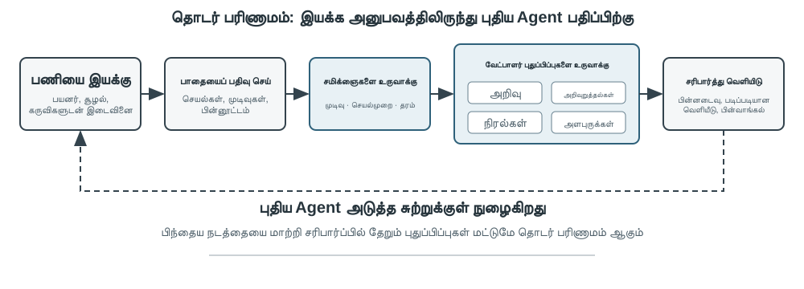
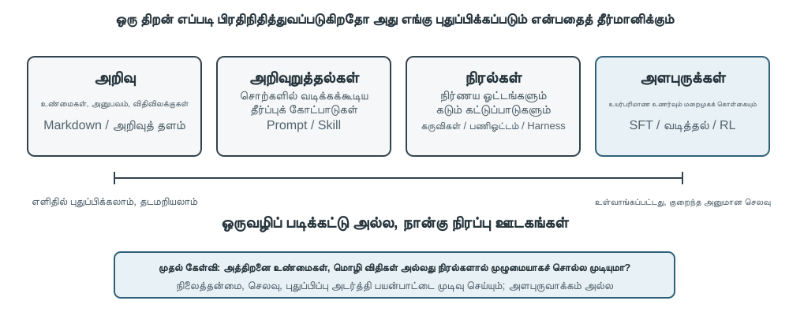
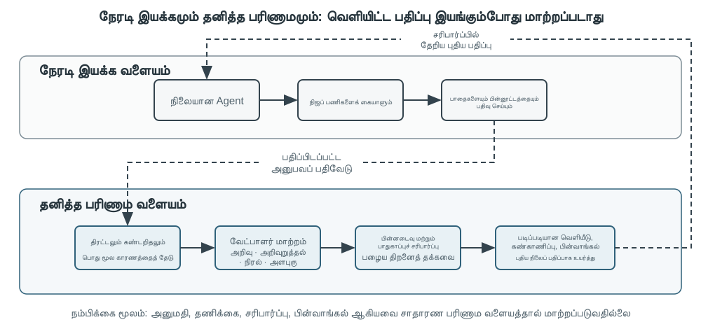

# Agent-இன் தொடர்ச்சியான பரிணாமம்

இன்றைய Agent ஒரு தெளிவான திறன் முரண்பாட்டை எதிர்கொள்கிறது: இதுவரை கண்டிராத சிக்கலான பணிகளை zero-shot முறையில் தீர்க்க முடிந்தாலும், ஒரேபோன்ற பத்தாயிரம் பணிகளைக் கையாண்ட பிறகும், மறுநாள் முதல் நாளில் செய்த அதே தவறை மீண்டும் செய்யக்கூடும். **அனுபவத்திலிருந்து தன்னிச்சையாகக் கற்றுக்கொள்ள முடியுமா** என்பது, Agent “பணியை முடிக்கத் தெரிந்தது” என்ற நிலையிலிருந்து “நம்பகமாகப் பணியாற்றக்கூடியது” என்ற நிலைக்குச் செல்வதற்கான முக்கியத் திறனாகவும், அடுத்த தலைமுறை மாதிரிகளின் மைய ஆராய்ச்சித் தலைப்பாகவும் மாறிவருகிறது. இருப்பினும், தற்போதைய மாதிரிகளின் தொடர்ச்சியான கற்றல் திறன் இன்னும் மிகவும் போதாமையாக உள்ளது.

இதற்கான காரணம், deployment செய்யப்பட்ட மாதிரி ஒரு inference நிகழ்வுக்குப் பிறகு தன்னிச்சையாகத் தனது parameters-ஐ மாற்றிக்கொள்ளாது என்பதாகும். இரண்டாம் அத்தியாயத்தில் விவாதிக்கப்பட்ட context learning, state maintenance மற்றும் compression ஆகியவை Agent-ஐ **நடப்பு பணிக்குள்** தழுவிக்கொள்ளச் செய்கின்றன; ஆனால் context முடிந்ததும், அந்த மாற்றம் இயல்பாக அடுத்த பணிக்குச் செல்லாது. உரையாடலை memory-இல் சேமிப்பதும் புதிய நடத்தையைக் கற்றுக்கொண்டதற்கு இணையானதல்ல: மூல trajectory மிகவும் நீளமாக இருக்கலாம்; அதில் பயனுள்ள உத்திகள் மட்டுமல்லாமல், தற்செயலான வெற்றிகள், தவறான காரணக் கற்பிதங்கள் மற்றும் நம்பகமற்ற உள்ளீடுகளும் இருக்கலாம்.

இங்கே எளிதில் குழப்பமடையக்கூடிய ஒரு முக்கிய வேறுபாடு உள்ளது: **அனுபவத்தைச் சேமிப்பது, அனுபவத்திலிருந்து கற்றுக்கொள்வதற்குச் சமமல்ல**. நூறு trajectory-களை நீண்ட context அல்லது vector database-இல் வைப்பது, தேவைப்படும்போது ஒரு குறிப்பிட்ட எடுத்துக்காட்டை மீட்டெடுக்க உதவும். ஆனால் வெற்றிகரமான trajectory-களில் எந்தப் படிகள் மீண்டும் மீண்டும் தோன்றுகின்றன, பழைய interface version-இல் மட்டும் எந்த முறை செயல்படுகிறது, ஒரு வெற்றி சரியான உத்தியால் வந்ததா அல்லது சூழலின் தற்செயலால் வந்ததா என்பவற்றை அது தானாகவே பல case-களுக்கிடையில் ஒப்பிடாது. அமைப்பு “மதிப்பீடு, ஒப்பீடு, பொதுமைப்படுத்தல், சரிபார்ப்பு” ஆகியவற்றை முனைப்பாக முடித்த பிறகே கற்றல் நிகழ்கிறது; log disk-இல் எழுதப்பட்ட அந்த நொடியில் அல்ல. மூன்றாம் அத்தியாயத்தின் user memory முக்கியமாக “பயனரும் உலகமும் எவ்வாறு உள்ளன” என்பதை நிலைநிறுத்துகிறது; இவ்வத்தியாயத்தின் அனுபவக் கற்றல் மேலும் “எந்த நிபந்தனையில் எவ்வாறு செயல்பட வேண்டும்” என்பதையும் நிலைநிறுத்த வேண்டும். முன்னது Agent-க்கு அதிகம் நினைவில் வைக்க உதவுகிறது; பின்னதுதான் அதை அறிவாளியிலிருந்து திறமையானதாக மாற்றுகிறது.

அப்படியானால், ஒவ்வொரு பணிக்குப் பிறகும் மாதிரி தன்னைத்தானே நேரடியாகப் பயிற்றுவிக்க ஏன் அனுமதிக்கக்கூடாது? உற்பத்திச் சூழல்கள் அரிதாகவே தூய்மையான கற்றல் சமிக்ஞைகளை வழங்குகின்றன. பயனர் திருப்தி என்பது விதிமுறைப் பின்பற்றலைக் குறிக்காது; உள்ளூர் அளவுரு புதுப்பிப்புகளும் திறன் மறதி, உத்தி விலகல் அல்லது பாதுகாப்புச் சிதைவை ஏற்படுத்தலாம். இயங்கும் மாதிரி சரிபார்க்கப்படாத பின்னூட்டத்தின் அடிப்படையில் தனது அளவுருக்களை நேரடியாக மாற்ற அனுமதிக்கப்பட்டால், தவறான அனுபவமும் prompt injection-உம் நிலைபெற்று அடுத்தடுத்த பணிகளில் தொடர்ந்து பெருகலாம். மறுபுறம், அடித்தள மாதிரிகளுக்கான காலமுறைப் பயிற்சி பொதுத் திறன்களை மேம்படுத்தலாம்; ஆனால் ஒவ்வொரு Agent-மும் தினமும் எதிர்கொள்ளும் தனிப்பட்ட விதிகள், கருவி மாற்றங்கள், உள்ளூர் அனுபவம் ஆகியவற்றை சரியான நேரத்தில் உட்கொள்ள முடியாது.

எனவே, மாதிரி தானாகவே நம்பகமான தொடர்ச்சிக் கற்றலைச் செய்ய முடியாத நிலையில், முதலில் “கற்றல்” என்பதை மாதிரியைச் சுற்றியுள்ள தன்னாட்சி அமைப்பாக உருவாக்க வேண்டும்: இயக்கச் சான்றுகளைப் பதிவு செய்தல், முடிவுகளையும் செயல்முறையையும் சரிபார்த்தல், பல trajectory-களிலிருந்து பொதுவான அம்சங்களைப் பிரித்தெடுத்தல், பின்னர் அறிவு, அறிவுறுத்தல், program அல்லது model parameter—எதைப் புதுப்பிக்க வேண்டும் என்பதை முடிவுசெய்தல். எல்லா மாற்றங்களும் முதலில் candidate version-ஆக உருவாக்கப்பட்டு, regression test மற்றும் பாதுகாப்புச் சோதனைகளைத் தாண்டிய பிறகே அடுத்த சுற்று இயக்கத்தை மாற்ற வேண்டும்.

முந்தைய அத்தியாயங்கள் இந்த அமைப்புக்குத் தேவையான முக்கியக் கூறுகளை ஏற்கனவே வழங்கியுள்ளன. இரண்டாம் அத்தியாயம் பணிக்குள் உள்ள state-ஐக் கையாள்கிறது; மூன்றாம் அத்தியாயம் அறிவு உள்கட்டமைப்பை வழங்குகிறது; ஐந்தாம் அத்தியாயம் tools உருவாக்கவும் அமைப்பை மாற்றவும் தேவையான meta-capability-ஐ Agent-க்கு அளிக்கிறது; ஆறாம் அத்தியாயம் மதிப்பீடும் சரிபார்ப்பும் அமைக்கிறது; ஏழாம் அத்தியாயம் model parameters-ஐ எவ்வாறு புதுப்பிப்பது என்பதை விளக்குகிறது. எட்டாம் அத்தியாயத்தின் பணி, படம் 9-1-ல் காட்டப்பட்டுள்ள தொடர்ச்சியான பரிணாமச் சுற்றாக இக்கூறுகளை ஒருங்கிணைப்பதாகும்.

தொடர்ச்சியான பரிணாமம் தடமறியக்கூடிய இயக்க அனுபவங்களிலிருந்து தோன்ற வேண்டும், அடுத்தடுத்த நடத்தையை மாற்றக்கூடியதாக இருக்க வேண்டும், மேலும் வெளிப்படையான சிதைவை ஏற்படுத்தவில்லை என்று சரிபார்க்கப்பட்டிருக்க வேண்டும். இந்த அத்தியாயம் முதலில் ஒரு இயக்கம் எதில் சிறந்தது, எதில் தவறியது என்பதை எவ்வாறு தீர்மானிப்பது என்று விவாதிக்கிறது; பின்னர் நான்கு update முறைகளையும் அவற்றின் பயன்பாட்டு எல்லைகளையும் ஒப்பிடுகிறது; இறுதியாக, நீண்டகால இயக்கத்தில் இந்த update-கள் எவ்வாறு சரிபார்க்கப்பட்டு, வெளியிடப்பட்டு, திருத்தப்பட்டு, நீக்கப்படுகின்றன என்பதை ஆராய்கிறது.

## இயக்க trajectory-களிலிருந்து learning signal-களைப் பெறுதல்

தொடர்ச்சியான பரிணாமத்தின் தொடக்கப் புள்ளி “சுருக்கம்” அல்ல, “மதிப்பீடு” ஆகும். பணி முடிந்ததா என்பதும், எந்தப் படி வெற்றி அல்லது தோல்விக்குக் காரணமானது என்பதும் அமைப்புக்குத் தெரியாவிட்டால், மொழி மாதிரி உருவாக்கும் reflection வெறும் ஊகமாகவே இருக்கும். தவறான மதிப்பீடு நீண்டகால அறிவு, system Prompt அல்லது training data-வில் நுழைந்துவிட்டால், அதன் தாக்கம் அடுத்தடுத்த பணிகளைக் கடந்து தொடர்ந்து பெரிதாகும்.

சில பணிகளின் முடிவுகளை ஒப்பீட்டளவில் எளிதாகச் சரிபார்க்கலாம். Coding Agent test, type check மற்றும் performance benchmark-களை இயக்கலாம்; பயனருக்காக refund செயல்படுத்தும் Agent order status மற்றும் உண்மையான refund தொகையை விசாரிக்கலாம். இவ்வகை signal-கள் சூழலின் உண்மை state-இலிருந்து கிடைப்பதால், மாதிரி தனது நடத்தையைப் பற்றி வழங்கும் விளக்கத்தைவிட பொதுவாக நம்பகமானவை. ஆனால் முடிவு சரியாக இருப்பது, செயல்முறையும் சரியாக இருந்தது என்பதைக் குறிக்காது. தோல்வியடைந்த test case-களை நீக்குவதாலும் test வெற்றிபெறலாம்; “நாங்கள் 7 நாட்களுக்குள் refund செய்வோம், தயவுசெய்து பொறுமையாகக் காத்திருக்கவும்” என்று பயனரிடம் வாய்மொழியாக உறுதியளிப்பதும் தற்காலிகத் திருப்தி feedback-ஐப் பெறலாம். எனவே, நம்பகமான மதிப்பீடு முடிவைப் பார்ப்பதோடு, அந்த முடிவை அடைந்த பாதையையும் சோதிக்க வேண்டும்.

மேலும் பல பணிகளுக்கு ஒரே சரியான பதில் கிடையாது. வாடிக்கையாளர் சேவை பொறுமையாக இருந்ததா, compliance எல்லைக்குள் மாற்று வழிகளை வழங்கியதா, ஆய்வறிக்கை முக்கியச் சான்றுகளைப் பற்றியதா, உருவாக்கப்பட்ட உரை இயல்பாகவும் சுருக்கமாகவும் இருந்ததா என்பதனை context-உடன் இணைத்தே மதிப்பிட வேண்டும். இந்நிலையில் ஆறாம் அத்தியாயத்தில் அறிமுகப்படுத்தப்பட்ட LLM-as-a-Judge-ஐப் பயன்படுத்தலாம்; ஆனால் Judge-இடமிருந்து தெளிவற்ற ஒரே மொத்த மதிப்பெண் மட்டும் பெறக்கூடாது. Rubric-ஐ முன்கூட்டியே வரையறுத்து, verifier ஒவ்வொரு உருப்படிக்கும் தனித்தனியாக மதிப்பெண் வழங்கவும், trajectory சான்றை மேற்கோளிடவும், சான்று போதாதபோது உறுதியின்மையை வெளிப்படையாகக் குறிப்பிடவும் கோருவது அதிக விளைவுடையது.

படம் 9-2 மூன்று அடுக்கு சரிபார்ப்பு அமைப்பைக் காட்டுகிறது. கீழடுக்கு result verifier test முடிவுகள், database state மற்றும் tool return-களைப் படித்து, “பணி உண்மையில் முடிக்கப்பட்டதா” என்பதற்குப் பதிலளிக்கிறது; நடு அடுக்கு process verifier வணிக விதிகள், அனுமதிகள் மற்றும் action sequence-களைச் சோதித்து, “அனுமதிக்கப்பட்ட முறையில் முடிக்கப்பட்டதா” என்பதற்குப் பதிலளிக்கிறது; மேலடுக்கு quality verifier Rubric-ஐ அடிப்படையாகக் கொண்டு மொழியையும் உத்தியையும் மதிப்பிட்டு, “பொருத்தமாகச் செய்யப்பட்டதா” என்பதற்குப் பதிலளிக்கிறது. கீழடுக்கு metrics இயன்றவரை code மற்றும் environment ground truth-ஐச் சார்ந்திருக்க வேண்டும்; formalize செய்யக் கடினமான பகுதிகள் மட்டுமே மொழி மாதிரியிடம் ஒப்படைக்கப்பட வேண்டும்.

வாடிக்கையாளர் சேவை Agent-ஐ எடுத்துக்கொண்டால், பயனுள்ள Rubric குறைந்தபட்சம் அட்டவணை 9-1-ல் உள்ள பரிமாணங்களை உள்ளடக்க வேண்டும். முதல் ஐந்து உருப்படிகள் முக்கியமாக அடிப்படை வரம்புகளை உறுதிப்படுத்துகின்றன; கடைசி இரண்டு சேவைத் தரத்தை அளவிடுகின்றன. “பயனர் திருப்தியடைந்தாரா” என்ற ஒரே கேள்வியைவிட இவ்வகைப் பிரிப்பு அதிக diagnostic மதிப்புடையது: Agent விதிமீறி refund வழங்கியதால் பயனர் திருப்தியடையலாம்; compliance கட்டுப்பாடுகளால் அதிருப்தியடையவும்லாம். ஒரே satisfaction metric இவ்விரண்டையும் வேறுபடுத்த முடியாது.

அட்டவணை 9-1 வாடிக்கையாளர் சேவை Agent-இன் trajectory மதிப்பீட்டுப் பரிமாணங்கள்

| பரிமாணம் | சரிபார்ப்புக் கேள்வி | முக்கியச் சான்று |
|---|---|---|
| பணி முடிவு | பயனரின் முதன்மைத் தேவை தீர்க்கப்பட்டதா | இறுதி environment state, tool முடிவு |
| விதி பின்பற்றல் | கொள்கை, அனுமதி அல்லது அவசியமான செயல்முறை மீறப்பட்டதா | கொள்கைக் களஞ்சியம், action trajectory |
| தனியுரிமை எல்லை | வழங்கக்கூடாத தகவல் வெளிப்படுத்தப்பட்டதா | பதில் உரை, data access பதிவுகள் |
| உண்மை நம்பகத்தன்மை | கூற்றுகளுக்கு அறிவு அல்லது tool முடிவின் ஆதரவு உள்ளதா | மேற்கோள் ஆதாரங்கள், tool return |
| உறுதி—செயல் ஒற்றுமை | முடிந்ததாகக் கூறிய செயல் உண்மையில் நிகழ்ந்ததா | பதிலும் tool log-களும் ஒப்பீடு |
| வெளிப்பாட்டுத் தரம் | இயல்பாகவும் சுருக்கமாகவும் இருந்து, மீளுரைத்தலையும் வார்ப்புருத்தன்மையையும் தவிர்த்ததா | முழு உரையாடல், மொழி Rubric |
| இணக்கமான மாற்றுவழி | முதன்மைத் திட்டம் செயல்படாதபோது, அனுமதிக்கப்பட்ட மாற்றுப் பாதை கண்டறியப்பட்டதா | பயனர் இலக்கு, கொள்கை மற்றும் அடுத்தடுத்த செயல்கள் |

> **பரிசோதனை 9-1 ★★: வாடிக்கையாளர் சேவை Agent-க்கான trajectory verifier-ஐ உருவாக்குதல்**
>
> **பரிசோதனை இலக்கு**: ஒரு வாடிக்கையாளர் சேவை இயக்க trajectory-ஐ அடுத்தடுத்த கற்றலுக்குப் பயன்படும் கட்டமைக்கப்பட்ட diagnosis-ஆக மாற்றி, “சான்றுகளுடன் கூடிய பல்பரிமாண முடிவு” ஒரே மொத்த மதிப்பெண்ணைவிட root cause-ஐச் சிறப்பாகக் கண்டறிகிறதா எனச் சரிபார்த்தல்.
>
> **பரிசோதனை விளக்கம்:** “ஒரே மொத்த மதிப்பெண்” என்பதையும் “ஒவ்வொரு பரிமாணத்திற்கும் முடிவு, சான்று, நம்பிக்கை” என்பதையும் ஒப்பிட்டு, எது task failure, rule violation, false promise, expression problem ஆகியவற்றைச் சிறப்பாகப் பிரிக்கிறது என்று பாருங்கள். தொடர்ச்சியான பரிணாமம் success rate அல்லது ஒரு score-ஐ மட்டும் சார முடியாது. எது தவறு, ஏன் தவறு, சான்று எங்கே உள்ளது என்பதை வைத்திருந்தால்தான் அடுத்த module அறிவு, Prompt, program, model parameters ஆகியவற்றில் எதைப் புதுப்பிக்க வேண்டும் என்று அறியும்; low-confidence வழக்குகள் தானாக learning set-இல் சேரக்கூடாது.

## Agent தொடர்ச்சியான பரிணாமத்தின் நான்கு முறைகள்

Learning signal Agent மாற வேண்டும் என்பதைச் சொல்கிறது; ஆனால் மாற்றம் எங்கு நிகழ வேண்டும் என்பதைச் சொல்லாது. Update முறையைத் தேர்ந்தெடுப்பதற்கான முதன்மை அடிப்படை, ஒரு அனுபவம் எவ்வளவு காலமாக உள்ளது என்பதல்ல; இலக்கு திறனை எந்த carrier இயல்பாக வெளிப்படுத்த முடியும் என்பதே ஆகும். உண்மைகளும் அனுபவங்களும் அறிவு ஆவணங்களாக எழுதப்பட ஏற்றவை; மொழியில் தெளிவாக வெளிப்படுத்தக்கூடிய உத்திகள் Prompt அல்லது Skill-இல் எழுதப்பட ஏற்றவை; துல்லியமாகச் செயல்படுத்தக்கூடிய செயல்முறைகளும் கட்டுப்பாடுகளும் program-ஆக எழுதப்பட ஏற்றவை; perception, மொழிப் பாணி, implicit strategy போன்ற உயர்-பரிமாணத் திறன்கள் model parameters-இல் நுழைய வேண்டும். படம் 9-3 இந்த நான்கு முறைகளையும் அவற்றின் உறவையும் காட்டுகிறது.

அட்டவணை 9-2 ஒரு சுருக்கமான ஒப்பீட்டை வழங்குகிறது. இந்த நான்கு முறைகளும் ஒன்றுக்கொன்று விலக்கானவை அல்ல: மருத்துவப் படவியல் Agent lesion-ஐ அடையாளம் காண parameters-ஐ நம்புகிறது; சமீபத்திய வழிகாட்டுதல்களை வழங்க knowledge base-ஐப் பயன்படுத்துகிறது; ஆபத்து metrics-ஐக் கணக்கிட code-ஐப் பயன்படுத்துகிறது. வாடிக்கையாளர் சேவை மாதிரியின் இயல்பான தொனி post-training-இலிருந்து வருகிறது; குறிப்பிட்ட நிறுவனக் கொள்கைகள் அறிவும் Skill-உம் மூலம் வழங்கப்படுகின்றன; முக்கிய compliance கட்டுப்பாடுகள் server-side code மூலம் உறுதிப்படுத்தப்படுகின்றன.

அட்டவணை 9-2 நான்கு தொடர்ச்சியான பரிணாம முறைகளின் பயன்பாட்டு எல்லைகள்

| Update முறை | ஏற்ற உள்ளடக்கம் | முக்கிய நன்மை | முக்கிய வரம்பு |
|---|---|---|---|
| அனுபவ knowledge base | உண்மைகள், அனுபவ விதிகள், விதிவிலக்குகள் மற்றும் ஆதாரங்கள் | வேகமான update, தடமறியத்தக்கது, தேவைக்கேற்ப retrieval | retrieval மற்றும் மாதிரியின் சரியான பயன்பாட்டைச் சார்ந்தது |
| Prompt மற்றும் Skill | மொழியாக்கக்கூடிய தீர்மானக் கோட்பாடுகள் மற்றும் செயல்பாட்டு விதிமுறைகள் | விளக்கக்கூடியது, செயல்பாட்டு வரம்பைக் கட்டுப்படுத்தலாம் | எளிதில் பெரிதாகலாம், முரண்படலாம் அல்லது புறக்கணிக்கப்படலாம் |
| Program மற்றும் Harness | deterministic செயல்முறைகள், tools மற்றும் வலுவான கட்டுப்பாடுகள் | test செய்யலாம், நிலையான செயல்பாடு, குறைந்த செலவு | development மற்றும் maintenance செலவு அதிகம் |
| Model parameters | உயர்-பரிமாண perception, generation style மற்றும் implicit strategy | வலுவான generalization, குறைந்த inference செலவு | update மற்றும் regression செலவு அதிகம் |

### அனுபவத்தை அறிவாக நிலைநிறுத்துதல்

பல இயக்கங்களில் மீண்டும் மீண்டும் தோன்றும் அனுபவங்களை retrieval செய்யக்கூடிய அறிவு ஆவணங்களாக ஒழுங்குபடுத்துவது மிகவும் இலகுவான evolution முறையாகும். இங்கே “அனுபவ knowledge base” என்பது மூன்றாம் அத்தியாயத்துடன் storage, index மற்றும் retrieval தொழில்நுட்பங்களைப் பகிர்ந்தாலும், அறிவின் மூலமும் சரிபார்ப்பு இலக்கும் வேறுபடுகின்றன. மூன்றாம் அத்தியாயம் முக்கியமாக பயனர் உரையாடல்கள், ஆவணங்கள் மற்றும் dataset-களிலிருந்து “பயனரும் உலகமும் எவ்வாறு உள்ளன” என்பதைப் பிரித்தெடுக்கிறது; இவ்வத்தியாயம் Agent-இன் action trajectory மற்றும் முடிவுகளிலிருந்து “எந்த நிபந்தனையில் எவ்வாறு செயல்பட வேண்டும்” என்பதைப் பிரித்தெடுக்கிறது. உதாரணமாக, “இந்த விமான நிறுவனம் special meal-ஐ இருபத்துநான்கு மணி நேரத்திற்கு முன் முன்பதிவு செய்ய வேண்டும்” என்பது domain knowledge; “ticket முன்பதிவு செய்வதற்கு முன் special meal deadline-ஐச் சோதிக்க வேண்டும்; payment முடிந்த பிறகு தேவையை நிறைவேற்ற முடியாதது தெரியவருவதைத் தவிர்க்க வேண்டும்” என்பது action experience.

மூல trajectory ஒரு முறையான knowledge unit-ஆகப் பொருத்தமல்ல. அது நீளமானதும் இரைச்சல் நிறைந்ததுமாக இருப்பதுடன், tool-இன் raw output, தற்செயலான சுற்றுப்பாதைகள் மற்றும் சூழல் விவரங்களையும் கொண்டிருக்கும். மேலும் உறுதியான அமைப்பு மூன்று அடுக்கு data-வைப் பாதுகாக்கிறது: audit-க்காக மாற்றமுடியாத மூல trajectory; அந்த இயக்கத்தின் வெற்றி, தோல்வி மற்றும் candidate lesson-களைப் பதிவு செய்யும் single-run analysis; பல ஒரேவகை trajectory-கள் ஒப்பிடப்பட்டு, cluster செய்யப்பட்டு, பொதுமைப்படுத்தப்பட்ட பின் உருவாகும் எதிர்கால நோக்குடைய Markdown அறிவு ஆவணம். முறையான ஆவணம் பொதுவாகப் பயன்பாட்டு சூழல், பரிந்துரைக்கப்பட்ட உத்தி, தடைசெய்யப்பட்ட நடைமுறை, விதிவிலக்கு நிபந்தனை, சான்று ஆதாரம் மற்றும் கடைசியாகச் சரிபார்க்கப்பட்ட நேரம் ஆகியவற்றைத் தெளிவாகக் குறிப்பிடும்; ஒரு குறிப்பிட்ட பணியின் முழு செயல்முறையை மீண்டும் கூறாது.

இந்த வடிவமைப்பு மூன்றாம் அத்தியாயத்தின் User-as-Code உடன் ஒரே இரு-கட்ட சிந்தனையைப் பகிர்கிறது. User-as-Code முதலில் உரையாடல் உண்மைகளை மாற்றமுடியாத log-இல் append செய்து, பின்னர் காலமுறைப்படி கட்டமைக்கப்பட்ட user model-ஐ மறுஉருவாக்குகிறது; அனுபவக் கற்றலும் முதலில் சான்றைப் பாதுகாத்து, பின்னர் offline-ஆக மாற்றக்கூடிய அறிவை உருவாக்க வேண்டும். படம் 9-4 இந்தச் செயல்முறையைக் காட்டுகிறது. பதிவு செய்தலையும் ஒழுங்குபடுத்தலையும் பிரிப்பது, ஒரு தற்செயலான வெற்றி அல்லது network failure உடனடியாக Agent-ஐ மாற்றுவதைத் தவிர்க்கிறது; பல வெற்றி மற்றும் தோல்வி எடுத்துக்காட்டுகளைப் பார்த்த பிறகே பொதுவான அம்சங்களைத் தீர்மானிக்கவும் அமைப்பை அனுமதிக்கிறது.

அனுபவ ஆவணம் trajectory-இன் எளிய சுருக்கமல்ல. உண்மையான transfer மதிப்புள்ள உள்ளடக்கம் ஒப்பீட்டிலிருந்து வருகிறது: ஒரேவகை வெற்றிகரமான trajectory-கள் என்ன செய்தன, தோல்வியடைந்த trajectory-களில் என்ன குறைந்திருந்தது; ஒரு குறிப்பிட்ட உத்தி எந்த environment version-களில் செயல்பட்டது, எந்த precondition-களில் தோல்வியடைந்தது. மூன்றாம் அத்தியாயம் knowledge extraction, clustering மற்றும் retrieval-ஐ ஏற்கனவே அறிமுகப்படுத்தியுள்ளதால், இவ்வத்தியாயம் அந்த algorithm-களை மீண்டும் விவரிக்காது; trajectory மதிப்பீடு extraction condition-ஆக எவ்வாறு செயல்படுகிறது, பிரித்தெடுக்கப்பட்ட அறிவு அடுத்தடுத்த பணிகளின் செயல்திறனை மேம்படுத்துகிறதா என்பதிலேயே கவனம் செலுத்துகிறது.

ஒரு முழுமையான knowledge distillation pipeline-ஐ ஐந்து படிகளாகப் பிரிக்கலாம். முதலில் மாற்றமுடியாத trajectory மற்றும் environment result சேமிக்கப்பட வேண்டும். அடுத்து, ஒவ்வொரு இயக்கத்திற்கும் task type, தேவையான capability, காணப்பட்ட strategy, error மற்றும் exception ஆகியவற்றைப் பட்டியலிடும் structured analysis உருவாக்கப்பட வேண்டும். பின்னர் ஒரே task family-இன் இயக்கங்கள் தொகுக்கப்பட்டு, ஒவ்வொரு candidate rule-க்கும் “எந்த trajectory ஆதரிக்கிறது, எது மறுக்கிறது” என்ற evidence table அமைக்கப்பட வேண்டும். போதுமான support threshold-ஐ அடைந்த candidate மட்டும் முறையான ஆவணத்தில் எழுதப்பட வேண்டும். இறுதியாக, distillation-இல் பயன்படுத்தப்படாத புதிய பணிகளில் transfer effect சோதிக்கப்பட வேண்டும். Formal knowledge மற்றும் candidate analysis தனித்த store-களில் இருப்பதால், மூலச் சான்றை மாற்றாமல் மீண்டும் பொதுமைப்படுத்தவும், environment version மாறும்போது ஒரு குறிப்பிட்ட முடிவைத் துல்லியமாகத் திரும்பப்பெறவும் முடியும்.

GAIA அனுபவக் கற்றல் இதற்கான நேரடியான எடுத்துக்காட்டை வழங்குகிறது. GAIA[^gaia-2023] தேடல், web page வாசிப்பு, file processing மற்றும் கணக்கீட்டை ஒருங்கிணைக்க வேண்டிய பல்படி கேள்விகளைக் கொண்டது; AWorld[^aworld-2025] Agent-ஐ இயக்கவும், இந்த tools-ஐ அழைக்கவும், trajectory-களைச் சேமிக்கவும் தேவையான execution environment-ஐ வழங்குகிறது. முன்னது தேர்வுத்தாள் போன்றது; பின்னது தேர்வறையும் பரிசோதனைப் பதிவு அமைப்பும் போன்றது. பழைய முறை ஒரு பணி வெற்றியடைந்த உடனே strategy summary உருவாக்கி, vectorize செய்து library-இல் சேர்க்கும். கடுமையான implementation முதலில் GAIA answer checker அல்லது வேறு environment verifier மூலம் வெற்றி, பகுதி வெற்றி, தோல்வி என label செய்து, பின்னர் ஒரே task family-இன் பல பாதைகளை ஒப்பிடும். வெற்றி trajectory candidate strategy-ஐ வழங்கும்; தோல்வி trajectory exclusion knowledge-ஐ வழங்கும்; பகுதி வெற்றி “எந்தப் பகுதி வேலை செய்தது, எது இன்னும் சிக்கலாக உள்ளது” என்பதை அடையாளம் காண உதவும். Reflexion[^reflexion-2023] முன்வைத்த natural-language reflection candidate lesson-களை உருவாக்கலாம்; ஆனால் reflection தானாகவே சான்றல்ல. Environment result-உடன் பொருந்தி, பல trajectory-களின் ஆதரவைப் பெற்று, புதிய பணிகளில் positive transfer-ஐக் காட்டும் உள்ளடக்கம் மட்டுமே முறையான அனுபவ ஆவணத்தில் சேர வேண்டும்.

> **பரிசோதனை 9-2 ★★: GAIA trajectory-களிலிருந்து அனுபவ அறிவு ஆவணங்களைப் பிரித்தெடுத்தல்**
>
> **பரிசோதனை இலக்கு**: “பல trajectory-களிலிருந்து உருவான knowledge document”, “ஒரே வெற்றியின் summary-ஐ நினைவில் வைத்தல்” என்பதைக் காட்டிலும் சிறப்பாக transfer ஆகிறதா; மேலும் தற்செயலான வெற்றி மற்றும் தவறான அனுபவத்தால் ஏற்படும் negative transfer-ஐக் குறைக்கிறதா எனச் சோதித்தல்.
>
> **தரவும் செயல்முறையும்**: `gaia-experience` முதலில் ஒவ்வொரு run-இன் முழு trajectory மற்றும் வெளிப்புற `environment_score`-ஐச் சேமித்து, பின்னர் அவற்றை `task_family`, தேவையான `capabilities`, `applies_when`, காணப்பட்ட strategy, error, exception மற்றும் source trajectory ID கொண்ட minimal learning record-ஆக மாற்றுகிறது. Result verifier run-ஐ வெற்றி, பகுதி வெற்றி அல்லது தோல்வி எனப் பிரிக்கிறது. Learning module ஒரே task family-இன் பாதைகளை ஒப்பிடுகிறது. LLM candidate generalization-ஐ முன்வைக்கலாம்; ஆனால் ஒரு recommended strategy குறைந்தபட்சம் இரண்டு தோல்வியல்லாத trajectory-களின் ஆதரவைப் பெற வேண்டும். இறுதி Markdown ஆவணத்தில் applicable context, recommended strategy, common mistake, exception condition, source மற்றும் last-verified time இடம்பெறும். Application கட்டத்தில் இவ்வாவணங்கள் மட்டுமே retrieval செய்யப்பட வேண்டும்; நீண்ட மூல trajectory நேரடியாக context-இல் வைக்கப்படக்கூடாது.
>
> **மூன்று ஒப்பீட்டுக் குழுக்கள்**: முதல் குழு வரலாற்று அனுபவத்தைப் பயன்படுத்தாது; இரண்டாவது தற்போதைய பணிக்கு மிகவும் ஒத்த ஒரே trajectory summary-ஐ retrieval செய்கிறது; மூன்றாவது பல trajectory-கள் இணைந்து ஆதரிக்கும் knowledge document-ஐ retrieval செய்கிறது. ஒரே GAIA கேள்வியின் பதில் “அனுபவம்” என்ற பெயரில் evaluation-க்கு கசியாதபடி learning set மற்றும் transfer set ஒன்றுடன் ஒன்று overlap ஆகக்கூடாது.
>
> **Metrics மற்றும் acceptance**: transfer task success rate, சராசரி retrieval character அல்லது Token எண்ணிக்கை, negative-transfer rate ஆகியவை ஒன்றாக அறிக்கையிடப்பட வேண்டும்; ஒவ்வொரு formal conclusion-உம் source trajectory-ஐப் பட்டியலிடுகிறதா எனச் சோதிக்க வேண்டும். Cross-trajectory document context-ஐச் சுருக்கினாலும் புதிய task performance-ஐ மேம்படுத்தவில்லை என்றால், அமைப்பு அனுபவத்திலிருந்து கற்றது என நிரூபிக்க முடியாது. ஒரே தற்செயலான வெற்றி formal knowledge-ஆக உயர்த்தப்படுமானாலும், ஆவணத்தை மூல trajectory வரை trace செய்ய முடியாவிட்டாலும் acceptance தோல்வியடையும்.
>
> தொடர்புடைய implementation [`gaia-experience`](../chapter9/gaia-experience/) இல் உள்ளது. `demo_documents.py` இயல்புநிலையில் offline-ஆக இயங்குகிறது; `--extractor llm` பயன்படுத்தினால் உண்மையான LLM பல trajectory-களைக் கடக்கும் அனுபவ candidate-களை முன்வைக்கலாம்.

[^reflexion-2023]: Shinn, N., et al. *Reflexion: Language Agents with Verbal Reinforcement Learning.* arXiv:2303.11366, 2023.

[^gaia-2023]: Mialon, G., et al. *GAIA: a benchmark for General AI Assistants.* arXiv:2311.12983, 2023.

[^aworld-2025]: Yu, C., et al. *AWorld: Orchestrating the Training Recipe for Agentic AI.* arXiv:2508.20404, 2025.

### அனுபவத்தை அறிவுறுத்தலாக எழுதுதல்

அனுபவ knowledge base Agent-க்கு reference material-ஐ வழங்குகிறது; Prompt மற்றும் Skill அதைவிட வலுவான அறிவுறுத்தல் தன்மையைக் கொண்டுள்ளன. பல trajectory-கள் ஒரே strategy error-ஐ மீண்டும் மீண்டும் வெளிப்படுத்தி, அதன் விதியை இயல்பான மொழியில் தெளிவாகச் சொல்ல முடிந்தால், அமைப்பு அதை “பார்க்கத்தக்க அனுபவம்” என்பதிலிருந்து “பின்பற்ற வேண்டிய விதி” என உயர்த்தலாம். பெரும்பாலான பணிகளிலும் பொருந்தும் விதிகள் system Prompt-இல் சேர்வதற்கு ஏற்றவை; குறிப்பிட்ட domain, project அல்லது tool-இல் மட்டுமே செயல்படும் சிக்கலான செயல்முறைகள் தேவைக்கேற்ப load செய்யப்படும் Skill அல்லது project instruction file-ஆக எழுதப்படுவது ஏற்றது.

Prompt learning மற்றும் இரண்டாம் அத்தியாயத்தின் prompt engineering ஆகியவற்றின் பொறுப்புகள் வேறுபட்டவை. இரண்டாம் அத்தியாயம் கட்டமைப்பு தெளிவும் cache-friendly தன்மையும் கொண்ட Prompt-ஐ எவ்வாறு எழுதுவது என்பதற்குப் பதிலளிக்கிறது; இங்கு எந்த production feedback Prompt மாற்றத்தைத் தூண்டுவதற்குப் போதுமானது, deployment-க்கு முன் புதிய விதி எவ்வாறு சரிபார்க்கப்பட வேண்டும் என்பதற்குப் பதிலளிக்கப்படுகிறது. மாற்றம் முழு system Prompt-ஐ மீண்டும் மீண்டும் மறுஎழுதுவதாக இருக்கக்கூடாது. ஒரேவகைத் தோல்விகளின் தொகுப்பை அடிப்படையாகக் கொண்டு minimal diff உருவாக்கி, விதியின் scope-ஐக் குறிப்பிட்டு, தற்போதைய விதிகளுடன் முரண்படுகிறதா எனச் சோதித்து, தோல்வியைத் தூண்டிய boundary case-களிலும் பழைய பணி retention set-இலும் ஒரே நேரத்தில் மதிப்பிடுவது அதிக நம்பகமானது.

Andrej Karpathy 2025-ஆம் ஆண்டின் ஒரு நீண்ட பதிவில், இந்தச் சாத்தியமான புதிய paradigm-ஐ தற்காலிகமாக **System Prompt Learning** என்று அழைத்தார்[^karpathy-system-prompt-learning]. அவரது சுருக்கம்: pre-training முக்கியமாக அறிவைக் கற்கிறது; fine-tuning வழக்கமான நடத்தையை வடிவமைக்கிறது. ஆனால் மனிதர்களுக்கு இன்னொரு கற்றல் முறை உள்ளது—ஒரு சிக்கலைச் சந்தித்து வழிமுறையைப் புரிந்துகொண்ட பிறகு, “அடுத்த முறை இத்தகைய சிக்கல் வந்தால் முதலில் இந்த முறையை முயற்சி செய்” என்று எதிர்காலத் தமக்குத் தெளிவான மொழியில் நினைவூட்டுவது. இத்தகைய notebook இல்லாத LLM-ஐ அவர் *Memento* திரைப்படத்தின் நாயகனுடன் ஒப்பிட்டார். System Prompt Learning மற்றும் reinforcement learning இரண்டும் அனுபவத்திலிருந்து நடத்தையை மேம்படுத்தினாலும், update algorithm வேறுபடுகிறது என்றும் குறிப்பிட்டார்—முன்னது உரையைத் திருத்துகிறது; பின்னது gradient descent மூலம் parameter-ஐ மாற்றுகிறது. அப்போதைய Claude-இன் சுமார் 17,000 சொற்களைக் கொண்ட system Prompt-இல், சொல், எழுத்து அல்லது character எண்ணும் கேள்வி வந்தால் முதலில் ஒவ்வொரு உருப்படியையும் எண்ணிட்டு வெளிப்படையாகக் கணக்கிட்டு பின்னரே பதிலளிக்க வேண்டும் என்ற தனிப்பட்ட அறிவுறுத்தல் இருந்ததை அவர் எடுத்துக்காட்டினார். இது “`strawberry`-இல் எத்தனை `r` உள்ளன?” போன்ற கேள்விகளுக்காகவே இருந்தது.

Agent அமைப்பில் இதன் பொருள், தோல்விக்குப் பிறகு மொழியில் வெளிப்படுத்தக்கூடிய lesson எதிர்கால run நேரடியாகப் படிக்கக்கூடிய candidate rule-ஆக எழுதப்படுவது. “வெற்றி/தோல்வி” என்ற scalar result-ஐவிட, சான்றுடன் கூடிய diagnosis identity verification, tool selection அல்லது transfer boundary—எதில் தவறு ஏற்பட்டது என்பதைக் காட்டி, குறிவைத்த candidate modification-ஐ உருவாக்க முடியும். “Knowledge-guided reflection scalar reward-ஐவிட அதிக பரிமாணமுள்ள feedback channel-ஐ வழங்குகிறது” என்ற Karpathy-யின் கருத்து, இந்த முறை ஏன் data-efficient ஆக இருக்கலாம் என்பதை விளக்குகிறது. ஆனால் தகவல் அதிகம் என்பதால் அது இயல்பாகவே சரியானதாகிவிடாது. ஒரே user feedback ஒரு குறிப்பிட்ட வாடிக்கையாளர் அல்லது பழைய policy version-க்கு மட்டும் பொருந்தலாம்; எனவே clustering, scope determination மற்றும் regression test இன்னும் தேவை.

Prompt-ஐ தானாக மேம்படுத்த பல அணுகுமுறைகள் ஏற்கனவே உள்ளன. DSPy[^dspy-2023] பல language-model call-களைக் கொண்ட program-ஐ optimizable object-ஆகக் கொண்டு, development set-இல் instruction மற்றும் example-களைத் தேடுகிறது. OPRO[^opro-2023] முந்தைய Prompt மற்றும் அவற்றின் score-ஐ அடிப்படையாகக் கொண்டு language model அடுத்த candidate-ஐ முன்வைக்கச் செய்கிறது. GEPA[^gepa-2025] தோல்வி trajectory-களின் natural-language reflection-ஐப் பயன்படுத்தி ஒன்றுக்கொன்று துணைபுரியும் candidate Prompt-களை உருவாக்கித் தேர்ந்தெடுக்கிறது. இவை பெரும்பாலும் offline evaluation set-களில் batch optimization-க்கானவை. Production அமைப்பின் minimal diff தொடர்ச்சியான maintenance-ஐப் போன்றது: புதிய boundary case-ஆல் தூண்டப்பட்டு, source, audit மற்றும் விரைவான rollback-ஐ வலியுறுத்துகிறது. நடைமுறையில் முதலில் offline search மூலம் நல்ல initial version-ஐக் கண்டுபிடித்து, release-க்குப் பிறகு long-tail rule-களை case-by-case patch மூலம் பராமரிக்கலாம்.

#### எடுத்துக்காட்டு 1: தோல்வி trajectory-களின் அடிப்படையில் prompt விதியை உகந்ததாக்குதல்

உதாரணமாக, விமான சேவை Agent பயனர் கொள்கையை எதிர்க்கும்போது மிக விரைவாக மனித agent-க்கு transfer செய்யக்கூடும். Trajectory மதிப்பீடு அது விதிமீறவில்லை என்றாலும், இணக்கமான மாற்றுவழி இல்லாததை வெளிப்படுத்துகிறது. Candidate patch, Agent முதலில் கொள்கையை விளக்கி, பயனரின் உண்மையான இலக்கை அடையாளம் கண்டு, அனுமதிக்கப்பட்ட மாற்று வழிகளைத் தேடி, பயனர் வெளிப்படையாகக் கோரும்போது அல்லது உண்மையில் அனுமதி எல்லையைத் தாண்டும்போது மட்டுமே transfer செய்ய வேண்டும் எனக் கோரலாம். புதிய விதி அளவுக்கு மீறிய transfer-ஐக் குறைத்தாலும், மனிதரிடம் ஒப்படைக்க வேண்டிய பாதுகாப்பு நிகழ்வுகளையும் தொடர்ந்து கையாளச் செய்தால், அது regression-ஐத் தாண்டவில்லை. System Prompt learning-இன் மதிப்பு தானாகவே மேலும் உரையை append செய்வதில் இல்லை; production boundary case-கள் மூலம் விதிகளின் பயன்பாட்டு வரம்பைத் தொடர்ந்து தெளிவுபடுத்துவதில்தான் உள்ளது.

#### எடுத்துக்காட்டு 2: தேவை தெளிவுபடுத்தல் Skill — "நேரடித் தொடக்கத்திலிருந்து" "முதலில் உறுதிசெய்து பிறகு செயல்படுத்துதல்" வரை

Skill learning-உம் இதே கோட்பாட்டைப் பின்பற்றுகிறது; ஆனால் அதன் செயல்பாட்டு வரம்பு மேலும் உள்ளூர்மயமானது. Skill-ஐ தேவைக்கேற்ப திறக்கும் பணிச்செயல் கையேடாகக் கருதலாம். பல அனுபவங்கள் இணைந்து முழுமையான insurance claim செயல்முறையை உருவாக்கினால், அமைப்பு அதற்கான Skill-ஐ உருவாக்கவோ திருத்தவோ முடியும். Candidate Skill ஒரு உரையாடல் summary மட்டும் ஆகக்கூடாது; குறைந்தபட்சம் எப்போது load செய்ய வேண்டும், precondition, operation step, அறியப்பட்ட pitfall, verification method ஆகியவற்றைக் குறிப்பிட்டு source trajectory-ஐச் சேமிக்க வேண்டும். அமைப்பு முதலில் உள்ள Skill library-இல் ஒத்த capability-ஐத் தேடுகிறது. அதே process ஏற்கனவே இருந்தால் local `patch`-க்கு முன்னுரிமை; உண்மையான புதிய தனித்த capability இருந்தால் மட்டுமே புதிய directory உருவாக்க வேண்டும். இதனால் வேறு பெயருடன் ஒரே உள்ளடக்கம் கொண்ட கையேடுகள் குவிவது தவிர்க்கப்படும். Anthropic-இன் Skill Creator[^anthropic-skill-creator] “draft—test—evaluate—revise” generation loop-ஐக் காட்டுகிறது. இது Skill-ஐ உருவாக்கவும் மேம்படுத்தவும் வழி காட்டுகிறது; ஆனால் எந்த இயக்கச் சான்று generation-ஐத் தூண்டப் போதுமானது, conflict-ஐ எவ்வாறு கையாளுவது, மாற்றத்திற்குப் பிறகு domain task மற்றும் பழைய task regression-ஐக் கடக்கிறதா என்பவையே உண்மையான சிரமங்கள்.

> **பரிசோதனை 9-9 ★★: feedback-ஐ writing Skill ஆக மாற்றுதல்**
>
> `data/feedback_pairs.json` இன் 20 before/after ஜோடிகளை மூன்று batch-களாக ஏற்று, candidate rule-களைப் பிரித்தெடுத்து, duplicate pattern-களை இணைத்து, threshold conflict-களைச் சரிபார்த்து, source/scope உடன் `SKILL.md` உருவாக்கவும். Deterministic rule-களை code-ல் சரிபார்க்கவும்; LLM rule-களை 10 gold sample-களில் calibrate செய்யவும்.
>
> முடியாத task set detection, சாதாரண text false-positive, rule count growth ஆகியவற்றை ஒருசேர report செய்யவும். முதல் real run 0/8 detection, 7/8 false-positive; வெளிப்புற filtering மற்றும் deterministic fallback பிறகு 8/8, 0/8, 21 candidate-கள் 8 rule-களாக இணைந்தன. Implementation [`ai-style-skill`](../chapter9/ai-style-skill/) இல் உள்ளது.

வளைந்த மேற்கோள் வழக்கு, Skill ஒரு global replacement rule அல்ல; data contract ஆக இருக்க வேண்டும் என்பதை காட்டுகிறது. SFTக்கு முன் synthetic example-களை article type, scope, programming language படி பிரித்து, code/JSON/protected-region gate மற்றும் manual audit மூலம் சரிபார்க்க வேண்டும். Exact-copy வழக்கில் tokenizer encode→decode round-trip, model byte-exact copy, Harness serialization, tool matching ஆகியவை தனித்தனி regression layer-களாக audit செய்யப்பட வேண்டும்.

> **பரிசோதனை 9-3 ★★: தோல்வி trajectory-களை அடிப்படையாகக் கொண்டு system Prompt-ஐ மேம்படுத்துதல்**
>
> **பரிசோதனை இலக்கு**: பயனர் policy-ஐக் கேள்வி கேட்கும்போது மிக விரைவாக மனிதரிடம் transfer செய்த தோல்வி trajectory-இலிருந்து விமான வாடிக்கையாளர் சேவை Agent கற்றுக்கொள்ளச் செய்வதோடு, உண்மையில் transfer தேவைப்படும் பழைய scenario-களைப் புதிய விதி பாதிக்கவில்லை என நிரூபித்தல்.
>
> **செயல்முறை**: முதலில் பழைய task retention set மற்றும் over-transfer boundary set தனித்தனியாக இயக்கப்படுகின்றன. `learning_signal.py` தோல்வியை rule compliance, task resolution மற்றும் compliant workaround என்ற மூன்று பரிமாணங்களாகப் பிரித்து, source case ID-ஐப் பாதுகாக்கிறது. Coding Agent பின்னர் தற்போதைய Prompt-ஐப் படித்து, ஒரே audit செய்யக்கூடிய `old_str → new_str` minimal edit-ஐ மட்டும் உருவாக்குகிறது: முதலில் policy-ஐ விளக்கி, உண்மையான இலக்கை அடையாளம் கண்டு, இணக்கமான மாற்றுவழியைத் தேட வேண்டும்; அதே நேரத்தில் பயனர் வெளிப்படையாக மனிதரை வேண்டும்போதும் safety incident ஏற்பட்டாலும் transfer path பாதுகாக்கப்பட வேண்டும். Patch, source, target rule மற்றும் change reason candidate manifest-இல் எழுதப்படுகின்றன.
>
> **மூன்று ஒப்பீட்டுக் குழுக்கள்**: initial Prompt, தானாக உருவான candidate Prompt மற்றும் மனிதர் ஒருமுறை tune செய்த Prompt. மூன்றும் ஒரே model மற்றும் ஒரே retention/boundary task-களைப் பயன்படுத்துகின்றன. `--quick` case எண்ணிக்கையை மட்டுமே குறைக்கிறது; task Agent, LLM Judge மற்றும் Coding Agent உண்மையாக அழைக்கப்படுகின்றன. எனவே அது offline simulation result அல்ல.
>
> **Release threshold மற்றும் metrics**: patch காலியல்ல, source trace செய்யக்கூடியது, boundary-set performance உண்மையில் மேம்பட்டது, retention set சிதையவில்லை என்ற நான்கு நிபந்தனைகளையும் candidate பூர்த்தி செய்ய வேண்டும். Boundary-task accuracy, retention-task accuracy, Prompt growth length, அறிமுகமான regression எண்ணிக்கை, failure கண்டறிந்ததிலிருந்து candidate உருவான நேரம் ஆகியவை ஒப்பிடப்படுகின்றன. Threshold கடந்தாலும் `release_to_canary` மட்டுமே கிடைக்கும்; stable Prompt நேரடியாக overwrite செய்யப்படாது. எந்த ஒரு நிபந்தனை தோல்வியடைந்தாலும் `reject_candidate` திரும்ப வேண்டும்.
>
> தொடர்புடைய implementation [`prompt-auto-optimization`](../chapter9/prompt-auto-optimization/) இல் உள்ளது. Offline test-கள் diagnosis மற்றும் release threshold-ஐ உள்ளடக்குகின்றன; `--quick` உண்மையான task Agent, LLM Judge மற்றும் Coding Agent-ஐ அழைக்கும்.

[^dspy-2023]: Khattab, O., et al. *DSPy: Compiling Declarative Language Model Calls into Self-Improving Pipelines.* arXiv:2310.03714, 2023.

[^opro-2023]: Yang, C., et al. *Large Language Models as Optimizers.* arXiv:2309.03409, 2023.

[^gepa-2025]: Agrawal, L., et al. *GEPA: Reflective Prompt Evolution Can Outperform Reinforcement Learning.* arXiv:2507.19457, 2025.

[^karpathy-system-prompt-learning]: Karpathy, A. “We’re missing (at least one) major paradigm for LLM learning … system prompt learning?” X, May 11, 2025. https://x.com/karpathy/status/1921368644069765486

[^anthropic-skill-creator]: Anthropic. *Skill Creator.* 2026. https://github.com/anthropics/skills/blob/main/skills/skill-creator/SKILL.md

### அனுபவத்தை program-ஆக எழுதுதல்

அனுபவம் நிலையான, மீண்டும் மீண்டும் நிகழும், சரிபார்க்கக்கூடிய operation-ஐ விவரிக்கும்போது, மாதிரி ஒவ்வொரு முறையும் ஆவணத்தை மறுபடியும் படித்து reasoning செய்வது சிக்கனமல்ல. அந்நிலையில் அனுபவத்தை workflow, tool அல்லது Harness code-ஆக compile செய்வதே ஏற்றது; இதனால் ஒருமுறை நிகழ்ந்த exploration மீண்டும் மீண்டும் இயக்கக்கூடிய program-ஆக மாறுகிறது. ஐந்தாம் அத்தியாயம் Coding Agent எவ்வாறு file-களைப் படித்து எழுதுகிறது, test-களை இயக்குகிறது, அமைப்புகளை உருவாக்குகிறது என்பதைக் கூறிவிட்டது. இந்தப் பகுதி பொதுவான code generation-ஐ அல்ல, Agent தனது trajectory-ஐ அடிப்படையாகக் கொண்டு தனது எதிர்கால version-ஐ எவ்வாறு மாற்றுகிறது என்பதைக் கவனிக்கிறது.

மாற்றக்கூடிய பொருட்கள் புதிய tools-ஐவிட மிகவும் விரிவானவை. Operation layer browser trajectory-ஐ parameterized workflow-ஆக compile செய்யலாம் அல்லது மாறிவரும் API-க்கு adapter உருவாக்கலாம்; control layer tool routing, retry, circuit breaking மற்றும் context compression strategy-ஐ மாற்றலாம்; verification layer production failure-ஐ அடிப்படையாகக் கொண்டு புதிய parameter check, state verifier மற்றும் regression test-களைச் சேர்க்கலாம்; architecture layer Reviewer Agent-ஐச் சேர்த்து planning மற்றும் execution இடையேயான information flow-ஐ மாற்றலாம்.

Browser workflow, programmatic experience-இன் மதிப்பை விளக்குகிறது. இதை spreadsheet macro recording-உடன் ஒப்பிடலாம். முதன்முறையாக email அனுப்பும்போது, multimodal Agent observation—thought—action மூலம் “compose, recipient, subject, body, send” controls-ஐக் கண்டறிகிறது. பின்னர் வேறு email அனுப்பும்போது process மாறாது; recipient மற்றும் content மட்டும் மாறும். எனவே pixel மற்றும் DOM-இலிருந்து முழுப் பாதையையும் மாதிரி மீண்டும் கண்டுபிடிக்க வேண்டியதில்லை. முதல் exploration trajectory-ஐ parameter, state check மற்றும் version information கொண்ட சிறிய program-ஆக compile செய்வதே அமைப்பின் பணி.

படம் 9-4-இன் knowledge distillation, browser சூழலில் மேலும் குறிப்பிட்ட lifecycle-ஆக அமைகிறது:

1. **Trajectory capture**: navigation, click, input, dropdown selection போன்ற action-களைப் பதிவு செய்து, action parameter, அப்போதைய URL, XPath, CSS, `id`, `role`, `aria-label`, `data-testid` போன்ற element-location evidence-ஐச் சேமிக்க வேண்டும். Location information element-ஐ மீண்டும் கண்டுபிடிக்க மட்டுமே உதவும்; task completion-ஐ நிரூபிக்காது.
2. **Parameterization**: முதல் run-இன் literal value-களை template variable-ஆக அடையாளம் காண வேண்டும். உதாரணமாக `test@example.com`, subject மற்றும் body ஆகியவை `{recipient}`, `{subject}`, `{content}` ஆக மாற்றப்பட்டு, மற்ற stable action-கள் மாறாமல் இருக்கும். Teaching implementation regex மற்றும் template replacement-ஐப் பயன்படுத்தலாம்; production system structured task input அல்லது constrained extraction model-ஐப் பயன்படுத்தலாம்.
3. **State check வரையறுத்தல்**: action-க்கு முன் மற்றும் பின் check-களைச் சேர்க்க வேண்டும்; உதாரணமாக “Send button தற்போது visible”, “navigation-க்கு பின் URL target site-இல் உள்ளது”. முழு workflow-க்கும் “Sent list-இல் புதிய email உள்ளது” அல்லது test page state value எதிர்பார்த்தபடி மாறியது போன்ற final-state check தேவை. Action வெற்றியும் task வெற்றியும் வேறுபட்டவை; final check உண்மையான page அல்லது backend state-ஐப் படிக்க வேண்டும்.
4. **Candidate verification**: முதல் வெற்றி `candidate` மட்டுமே உருவாக்கும். Sandbox account அல்லது test site தனித்த initial state-க்கு reset செய்யப்பட்டு, candidate முழுமையாக replay செய்யப்பட வேண்டும். ஒவ்வொரு pre-action, post-action மற்றும் final-state check-உம் கடந்த பிறகே அது `validated` ஆக வெளியிடப்படும். Email அனுப்புதல் அல்லது order இடுதல் போன்ற side-effect பணிகளுக்கு பாதுகாப்பான reset callback இல்லாவிட்டால், candidate audit-க்காக மட்டும் சேமிக்கப்பட வேண்டும்; verification பெயரில் production account-இல் செயல் மீண்டும் செய்யக்கூடாது.
5. **Matching மற்றும் replay**: புதிய பணி வந்ததும் formal capability library-இல் intent மற்றும் keyword அடிப்படையில் workflow தேடப்பட்டு, தற்போதைய parameter பிரித்தெடுக்கப்பட்டு, Playwright நேரடியாக இயக்கப்பட வேண்டும். Replay path-க்கு step-by-step LLM call தேவையில்லை; ஆனால் element available ஆகும் வரை காத்திருந்து அனைத்து state check-களையும் முடிக்க வேண்டும்.
6. **Invalidation மற்றும் relearning**: target element கிடைக்காதது, state check தோல்வியடைதல், API Schema மாறுதல் அல்லது final state தவறுதல் ஏற்பட்டால், அடுத்த action உடனடியாக நிறுத்தப்பட வேண்டும். பழைய version searchable library-இலிருந்து `invalid` பகுதிக்கு மாற்றப்பட்டு, முழுமையான Agent மீண்டும் explore செய்ய வேண்டும். பழைய file audit மற்றும் comparison-க்காகப் பாதுகாக்கப்படும்; ஆனால் அமைதியாக மீண்டும் match ஆகக்கூடாது.

Email அனுப்பும் எடுத்துக்காட்டில், compile செய்யப்பட்ட முடிவு “இந்த button-களை வரிசையாக click செய்” என்பதல்ல; recipient, subject மற்றும் body parameter-களைக் கொண்ட சிறிய program. அனுப்புமுன் compose window மற்றும் input field-களைச் சோதித்து, அனுப்பிய பின் success message-ஐச் சோதித்து, இறுதியில் Sent list-இல் அதே email தோன்றியதா என உறுதிப்படுத்துகிறது. PreAct[^preact] பரிசோதனைகளில் இத்தகைய program-கள் மீளும் பணிகளில் end-to-end 8.5–13 மடங்கு வேகத்தை வழங்கின; replay கட்டத்தில் step-by-step language-model call தேவையில்லை. மேலும் முக்கியமாக, process memory ஒரே நேரத்தில் **pre-action verification, post-action verification மற்றும் save-க்கு முந்தைய independent verification** ஆகியவற்றைக் கொண்டிருக்க வேண்டும். இல்லையெனில் replay coverage 100%, எல்லா button-களும் click செய்யப்பட்டன; ஆனால் ஒரு field காலியாக இருந்ததால் பணி உண்மையில் ஒருபோதும் முடிக்கப்படவில்லை என்ற ஆபத்தான மாயை உருவாகும்.

> **பரிசோதனை 9-4 ★★★: browser trajectory-இலிருந்து சரிபார்க்கக்கூடிய workflow-ஐ உருவாக்குதல்**
>
> **பரிசோதனை இலக்கு**: ஒரு செலவான exploration-ஐ Web Agent மறுபயன்படுத்தக்கூடிய workflow-ஆக மாற்றுகிறதா; web page மாறும்போது “எல்லா action-களும் ஓடின” என்பதை success எனத் தவறாக அறிவிக்காமல் incorrect replay-ஐ நிராகரிக்கிறதா எனச் சோதித்தல்.
>
> **நான்கு கட்ட scenario**: முதல் கட்டத்தில் test mail site அல்லது simulated message page-இல் “`test@example.com`-க்கு ‘சோதனை மின்னஞ்சல்’ subject கொண்ட message அனுப்பு” என்ற பணி இயக்கப்படுகிறது. Full Agent explore செய்கிறது; wrapper action, parameter மற்றும் page state-ஐப் பதிவு செய்து `candidate` உருவாக்குகிறது. இரண்டாம் கட்டத்தில் `validation_reset` sandbox-ஐ மீட்டமைத்து, candidate தனியாக முழுமையாக replay செய்யப்படுகிறது. Pre-action, post-action மற்றும் final-state check அனைத்தையும் கடந்தால் மட்டுமே formal capability library-இல் சேரும். மூன்றாம் கட்டத்தில் recipient, subject, body அனைத்தும் மாறிய அதேவகைப் பணி இயக்கப்படுகிறது; validated workflow match செய்யப்பட்டு, புதிய parameter நிரப்பப்பட்டு, step-by-step LLM loop இல்லாமல் Playwright replay செய்ய வேண்டும். நான்காம் கட்டத்தில் button locator, page text அல்லது final state மாற்றப்பட்டு, பழைய workflow உடனடியாக `invalid` ஆகி `fallback_required=True` தருகிறதா எனச் சோதிக்க வேண்டும்.
>
> **ஒப்பீட்டு வடிவமைப்பு**: எளிய baseline click, input போன்ற action exception இல்லாமல் முடிந்ததா என்பதை மட்டும் எண்ணுகிறது. பரிசோதனைக் குழு கூடுதலாக pre-action page, post-action page மற்றும் task final state-ஐச் சரிபார்க்கிறது. இரு குழுக்களுக்கும் ஒரே trajectory மற்றும் page change வழங்கப்பட்டு, “field காலியாக இருந்தாலும் Send button click செய்யப்பட்டது”, “Save click ஆனாலும் data database-இல் எழுதப்படவில்லை” போன்ற false-success case-களின் misclassification rate ஒப்பிடப்படுகிறது.
>
> **Metrics மற்றும் acceptance**: முதல் exploration மற்றும் replay-இன் end-to-end நேரம், LLM call எண்ணிக்கை, success rate, false-success rate, workflow-match rate, page-change detection rate மற்றும் fallback relearning எண்ணிக்கை பதிவு செய்யப்பட வேண்டும். Reset callback இல்லையெனில் workflow candidate பகுதியில் இருக்க வேண்டும்; verification தோல்வியடைந்த version retrieval ஆகக்கூடாது; parameterized replay முதல் run recipient அல்லது content-ஐ மீண்டும் பயன்படுத்தக்கூடாது; page மாறியபின் ஆபத்தான அடுத்த action நிறுத்தப்பட வேண்டும். இந்த நிபந்தனைகள் அனைத்தும் பூர்த்தியானால் மட்டுமே speedup அர்த்தமுள்ளதாகும்.
>
> தொடர்புடைய implementation [`browser-use-rpa`](../chapter9/browser-use-rpa/) இல் உள்ளது; deterministic state-machine demo மற்றும் உண்மையான browser Agent-ஐ அழைக்கும் execution path இரண்டும் வழங்கப்படுகின்றன.

Agent தனது code-ஐ மாற்றுவது, இயங்கிக்கொண்டிருக்கும் process தன்னைத்தானே நேரடியாக overwrite செய்வதைக் குறிக்காது. Production அமைப்பு தற்போதைய stable version-இலிருந்து candidate branch உருவாக்கி, Coding Agent மூலம் minimal patch உருவாக்க வேண்டும்; பின்னர் static check, unit test, security scan, failure-trajectory replay மற்றும் பழைய task regression ஆகியவற்றை வரிசையாகக் கடந்து, canary deployment செய்யக்கூடிய புதிய version-ஐ உருவாக்க வேண்டும். இது “self-modification” என்பதை audit செய்யக்கூடிய software release process-ஆக மாற்றுகிறது. இதுவே எட்டாம் அத்தியாயத்திற்கும் ஐந்தாம் அத்தியாயத்திற்கும் இடையிலான எல்லையாகும்: ஐந்தாம் அத்தியாயம் அமைப்பை மாற்றும் திறனை வழங்குகிறது; இவ்வத்தியாயம் அனுபவத்தால் தூண்டப்பட்டு, verification loop-ஆல் கட்டுப்படுத்தப்படும் self-modification முறையை வழங்குகிறது.

Patch சிறியதாக இருப்பது மட்டும் நம்பகமான attribution-க்குப் போதாது. ஒவ்வொரு modification request-உம் failure evidence, ஊகிக்கப்பட்ட root cause, பொறுப்பான Harness component, candidate change, மேம்பட வேண்டிய behavior, பின்னடையக்கூடிய பழைய behavior மற்றும் இரண்டிற்குமான test-களைப் பதிவு செய்யும் **falsifiable change contract**-ஆக இருக்க வேண்டும். Agentic Harness Engineering இதை component, experience மற்றும் decision level observability என விவரிக்கிறது: திருத்தக்கூடிய ஒவ்வொரு component-க்கும் file-level representation உள்ளது; பெரும் trajectory collection படிப்படியாக விரிவாக ஆய்வு செய்யக்கூடிய evidence-ஆகச் சுருக்கப்படுகிறது; ஒவ்வொரு edit-உம் செயல்படுத்துவதற்கு முன் impact prediction-ஐ அறிவிக்கிறது, அதை அடுத்த சுற்று result சோதிக்கிறது[^ahe-2026]. இதனால் உயர்ந்த score-ஐ ஒரு குறிப்பிட்ட mechanism-உடன் இணைக்க முடியும்; அது விளக்கமற்ற trial-ஆக மட்டும் இருக்காது.

Candidate generator-க்கு failure case-களை மட்டும் வழங்கக்கூடாது. Self-Harness பாதுகாக்கப்பட வேண்டிய successful behavior மற்றும் முன்பு reject செய்யப்பட்ட modification-களின் பதிவுகளையும் வழங்குகிறது[^self-harness-2026]. முதலாவது repair எதைச் சிதைக்கக்கூடாது என்பதைக் கூறுகிறது; இரண்டாவது அதே தோல்வியடைந்த யோசனையை வேறு சொற்களில் மீண்டும் சமர்ப்பிப்பதைத் தடுக்கிறது. Failure evidence, success constraint மற்றும் prior attempt ஆகியவை சேர்ந்து வரையறுக்கப்பட்ட candidate space-ஐ உருவாக்குகின்றன; அனைத்து source code மற்றும் raw log-களையும் modification Agent-க்கு indiscriminately load செய்வதைவிட இது பயனுள்ளதாகும்.

Tool creation-உம் இதே protocol-ஐப் பின்பற்றுகிறது. Alita[^alita-2025] வழங்கும் எடுத்துக்காட்டில், *The Lord of the Rings*-இல் Gollum-க்கு குரல் கொடுத்த நடிகர் விவரிக்கும் YouTube 360 VR video-வில் dinosaur முதன்முறையாகத் தோன்றிய உடன் குறிப்பிடப்படும் எண்ணை Agent கண்டறிய வேண்டும். Subtitle வாசிக்கும் திறன் இல்லையென அறிந்ததும், அது `youtube-transcript-api`-ஐத் தேடி test செய்து, புதிய subtitle tool-ஆக wrap செய்து, இறுதியில் transcript-இலிருந்து `100000000` என்ற பதிலைப் பெற்றது. Security scan, functional test மற்றும் அடுத்தடுத்த task reuse அனைத்தையும் கடந்த பிறகே புதிய tool capability library-இல் நுழையும். நான்காம் அத்தியாயத்தின் active tool discovery “இருக்கும் tools-இல் எது பொருத்தமானது” என்பதைத் தீர்க்கிறது; ஐந்தாம் அத்தியாயம் “tool-ஐ எவ்வாறு எழுதுவது” என்பதைத் தீர்க்கிறது; இவ்வத்தியாயம் “எந்த இயக்கச் சான்று creation-ஐத் தூண்டுகிறது, புதிய tool எவ்வாறு verified long-term capability-ஆகிறது” என்பதில் கவனம் செலுத்துகிறது.

> **பரிசோதனை 9-5 ★★★: தோல்வி trajectory மூலம் Agent self-modification-ஐத் தூண்டுதல்**
>
> **பரிசோதனை இலக்கு**: `retryable=false` error தொடர்ந்து அழைக்கப்பட்ட பல trajectory-களிலிருந்து root cause retry மற்றும் circuit-breaker code-இல் உள்ளதா எனக் கண்டறிந்து, temporary-failure retry capability-ஐ பாதிக்காமல் candidate fix உருவாக்குகிறதா எனச் சோதித்தல்.
>
> **செயல்முறை**: Diagnosis module முதலில் வேறுபட்ட task-களில் ஏற்பட்ட ஒரே failure-ஐத் தொகுக்கிறது. Cross-trajectory support threshold அடைந்த பிறகே modification request உருவாக்கி, stable version-இன் `retry_policy.py`-ஐ target செய்கிறது. Candidate generator failure diagnosis, பாதுகாக்க வேண்டிய transient-failure recovery behavior, முன்பு reject செய்யப்பட்ட change-கள் மற்றும் stable source code-ஐப் படிக்கிறது. Minimal code diff-ஐ வெளியிடுவதற்கு முன், non-retryable error-க்கு பிந்தைய call-கள் குறைய வேண்டும்; transient-timeout recovery பின்னடையக்கூடாது என்று impact prediction செய்கிறது. Deterministic generator அல்லது உண்மையான LLM Coding Agent எதுவாக இருந்தாலும், result தனிமைப்படுத்தப்பட்ட candidate directory-இல் மட்டுமே எழுதப்பட வேண்டும். Verification Harness பின்னர் candidate-ஐ compile செய்து, மூல failure trajectory-ஐ replay செய்து, non-retryable error உடனடியாக நிறுத்தப்பட்டு circuit breaker திறக்கிறதா எனச் சோதித்து, temporary timeout பழைய threshold வரை மீண்டும் retry ஆகிறதா என மீள்சோதிக்கிறது.
>
> **Diagnosis ஒப்பீடும் metrics-உம்**: “Prompt-இல் மீண்டும் அழைக்காதே என்று ஒரு வரி மட்டும் சேர்” என்பது தவறான layer localization-க்கான conceptual baseline. Deterministic retry constraint ஏன் program-இல் இருக்க வேண்டும் என்பதை இது காட்டுகிறது. இயங்கக்கூடிய பரிசோதனையில் deterministic patch generator மற்றும் LLM generator ஒப்பிடப்படுகின்றன; இரண்டும் ஒரே release threshold-ஐப் பயன்படுத்துகின்றன. Non-retryable call எண்ணிக்கை, temporary-error recovery rate, பழைய task regression எண்ணிக்கை, patch size மற்றும் candidate acceptance rate பதிவு செய்யப்படுகின்றன.
>
> **ஏற்றுக்கொள்ளும் நிபந்தனைகள்**: எல்லா check-களும் கடந்த பிறகும் `release_to_canary` மட்டுமே உருவாகும். Static check, failure replay அல்லது பழைய task regression ஏதேனும் தோல்வியடைந்தால் `reject_candidate` திரும்ப வேண்டும். `release_manifest.json` failure cluster, source trajectory-கள், inferred root cause, target component மற்றும் file, code diff, expected repair, potential regression, check result, candidate version மற்றும் rollback version-ஐப் பதிவு செய்ய வேண்டும். Reject செய்யப்பட்ட candidate-களின் failure reason அடுத்த generation round-க்காகப் பாதுகாக்கப்பட வேண்டும். Patch உருவாக்கும் Agent stable code, verifier, audit log அல்லது தனது release-ஐ அங்கீகரிக்கும் threshold-ஐ மாற்ற முடியாது.
>
> தொடர்புடைய implementation [`self-modifying-agent`](../chapter9/self-modifying-agent/) இல் உள்ளது. Deterministic candidate generator அல்லது உண்மையான LLM Coding Agent ஆகியவற்றில் ஒன்றைத் தேர்ந்தெடுக்கலாம்; இரு பாதைகளும் ஒரே release threshold-ஐப் பகிர்கின்றன.

[^preact]: Li, Bojie. *PreAct: Computer-Using Agents that Get Faster on Repeated Tasks.* arXiv:2606.17929, 2026.

[^alita-2025]: Qiu, J., et al. *Alita: Generalist Agent Enabling Scalable Agentic Reasoning with Minimal Predefinition and Maximal Self-Evolution.* arXiv:2505.20286, 2025.

பரிசோதனை 9-8 இதே protocol-ஐ verification layer-க்கு பயன்படுத்துகிறது. User correction, குறைந்த மதிப்பீடு, audit ஆகியவை confirmation இல்லாத high-risk operation-ஐ மீண்டும் சுட்டினால் மட்டுமே change request உருவாக்கி candidate-ஐ தனிமைப்படுத்தப்பட்ட directory-யில் எழுதவும். Tool name/argument மூலம் ஆபத்தான delete மற்றும் `git push --force`-ஐ வகைப்படுத்தி, one-time token-ஐ குறிப்பிட்ட operation-க்கு bind செய்யவும். AST/static check, போலி/மீண்டும் பயன்படுத்திய token boundary replay, holdout replay அனைத்தையும் கடக்க வேண்டும்.

> **பரிசோதனை 9-8 ★★: user feedback-இலிருந்து high-risk operation confirmation gate**
>
> `failure_trajectories.json` இன் மூன்று signal மற்றும் control trajectory-களைப் பயன்படுத்தவும். உண்மையான `gpt-4o-mini` candidate incomplete task, normal operation, one-time token check-களை கடக்காததால் security gate நிராகரித்தது. Deterministic candidate அனைத்தையும் கடந்து `release_to_canary` பெற்றது; check, decision, stable directory hash பதிவு செய்யவும். Implementation [`harness-safety-gate`](../chapter9/harness-safety-gate/) இல் உள்ளது.

#### எடுத்துக்காட்டு: அனைத்தும் plugin ஆக இருக்கும் DeepSeek Harness சுய-பரிணாமம்

அத்தியாயம் 1 அட்டவணை DeepSeek Harness (`dsh`)-ஐ “Agent சுய-பரிணாமக் கட்டமைப்பு” என வகைப்படுத்துகிறது[^dsh-2026]. அதன் அடிப்படையான Cordis ஆய்வுக்கட்டுரை, வழக்கமான composition **நிலையானது** என்கிறது: function call, module import, class inheritance அனைத்தும் compile நேரத்தில் தீர்மானிக்கப்படுகின்றன. Plugin system மற்றும் self-evolving Harness-க்கு runtime-இல் component-களை load, unload, reconfigure செய்யும் **dynamic composition** தேவை[^cordis-2026]. Agent-இன் ஒவ்வொரு self-modification-மும் அடிப்படையில் dynamic composition ஆகும்.

ஆய்வு dynamic composition-ஐ ஒன்றுக்கொன்று செங்குத்தான இரு பரிமாணங்களாகப் பிரிக்கிறது. **Temporal composability** என்பது component அகற்றப்படும்போது shared environment-இல் செய்த மாற்றங்கள் முழுமையாகவும் பாதுகாப்பாகவும் திரும்பப் பெறப்படுமா என்று கேட்கிறது; runtime ஒவ்வொரு resource allocation, event registration, state change-ஐயும் கண்காணிக்க வேண்டும். **Spatial composability** என்பது component-கள் dependency-களை கட்டமைக்கப்பட்ட, சரிபார்க்கக்கூடிய முறையில் அறிவித்து, கண்டறிந்து, தீர்த்து, மாற்றத்தின்போது lifecycle-ஐ ஒருங்கிணைக்க முடியுமா என்று கேட்கிறது. முன்னது **எதை மாற்றியது**, பின்னது **எதைச் சார்ந்தது**.

Self-evolving Harness-இல் இந்தச் சிக்கல் மிகத் தீவிரம். திரும்பப்பெற வேண்டிய side effect-கள் நீண்டகாலம் வாழ்ந்து state கொண்டவை; dependency-கள் runtime-இல் தோன்றி, மறைந்து, அடையாளம் மாறும். Temporal composability இல்லையெனில் ஒவ்வொரு மாற்றமும் முழு restart, process state இழப்பு, நடப்புப் பணி இடைமறிப்பு ஆகியவற்றைத் தரும். Spatial composability இல்லையெனில் ஒவ்வொரு module-மும் dependency மாற்றத்தைத் தற்காலிக முறையில் கண்டறியும்; எளிய code replacement சார்பாளர்களை அமைதியாக உடைக்கவோ cycle உருவாக்கவோ முடியும்.

Cordis compile-time கருத்துகள் இரண்டை runtime-க்கு உயர்த்துகிறது. கணக்கீடு environment-ஐ எப்படி மாற்றுகிறது என்பதைச் சொல்லும் effect system **reversible effect** ஆகிறது: ஒவ்வொரு context transformation-க்கும் வெளிப்படையான inverse உண்டு; runtime அதைத் தொடர்ந்து component அகற்றும்போது context-ஐ மீட்கிறது. கணக்கீட்டுக்கு environment-இலிருந்து என்ன தேவை என்பதைச் சொல்லும் coeffect system **reactive coeffect** ஆகிறது: component dependency specification-ஐ அறிவிக்கிறது; context மாற்றம் அதை activate, deactivate அல்லது unaffected என அறிவிக்கிறது. Dynamic-composition calculus இதை ஒன்றோடொன்று பின்னிய component system-க்கு விரிவுபடுத்துகிறது—composability transitive ஆக வேண்டும்.

**Self-evolution-இன் உச்சவரம்பு மாதிரி எவ்வளவு நன்றாக code எழுதுகிறது என்பதில் அல்ல, அதைத் தாங்கும் system எவ்வளவு composable என்பதில் உள்ளது.** அதனால் `dsh` model adapter, tool registry, session log, Agent main loop அனைத்தையும் plugin ஆக்குகிறது: **மனிதர்கள் மட்டும் பராமரிக்கக்கூடிய privileged kernel இல்லை**.

Composability பாதுகாப்பாகப் பொருத்தி அகற்ற முடியுமா என்பதைத் தீர்க்கிறது; பொருத்த வேண்டுமா என்பதை அல்ல. மாதிரி எழுதும் plugin process memory-இல் மட்டும் வாழ்ந்து restart-இல் மறையும். அவை **தானாக official plugin ஆக உயர்த்தப்பட முடியாது**; நிலைக்க முன் கூறிய மெதுவான worktree + Pull Request பாதை தேவை.

பரிணாமத்திற்கும் செலவு உண்டு. Runtime plugin மாதிரிக்குத் தெரியும் tool set மற்றும் Prompt fragment-களை மாற்றுகிறது. Request prefix மாறிய இடத்திலிருந்து அத்தியாயம் 2-இன் KV Cache செல்லாது. `dsh` plugin ஆவணம் context மற்றும் KV Cache தாக்கத்தை விவரிக்க வேண்டும்.

[^dsh-2026]: DeepSeek AI, *DeepSeek Harness: Everything is a Plugin*, 2026. https://github.com/deepseek-ai/deepseek-harness. Plugin layers மற்றும் patch-கள் `docs/architecture.md`-இலும், self-modification tool lifecycle, sandbox semantics, trust declarations `docs/subsystems/extensions.md` மற்றும் `packages/extensions/README.md`-இலும் உள்ளன. ஆகஸ்ட் 2026 வெளியீடு இங்கு developer preview நிலையில் விவாதிக்கப்படுகிறது.

[^cordis-2026]: Shi, Yifan, Wei Zhang, and Tianyi Cui. *A Programming Paradigm for Spatiotemporal Composability.* Preprint draft, 13 ஆகஸ்ட் 2026. https://github.com/cordiverse/paper

### அனுபவத்தை parameters-இல் எழுதுதல்

அறிவு, அறிவுறுத்தல் மற்றும் program ஆகிய அனைத்தும் ஒரு முன்நிபந்தனையை அடிப்படையாகக் கொண்டுள்ளன: இலக்கு திறனை வெளிப்புறக் குறியீடுகள் மூலம் ஒப்பீட்டளவில் முழுமையாக வெளிப்படுத்த முடியும். ஆனால் மருத்துவப் படவியல் புரிதல், இயல்பான speech prosody, உரையின் வார்ப்புருவாத “AI தன்மை” நீக்கம், long-horizon planning போன்ற திறன்களை சில விதிகள் அல்லது workflow-களாகச் சுருக்குவது கடினம். இத்தகைய திறன்கள் post-training மூலம் model parameters-இல் எழுதப்பட வேண்டும்.

ஒரு திறனை parameterize செய்ய வேண்டுமா என்பது “பணி நீண்டகாலம் நிலையாக உள்ளதா” என்பதனால் மட்டும் தீர்மானிக்கப்படாது. புதிய imaging device ஏற்படுத்தும் domain shift-க்கு LoRA அல்லது continual fine-tuning இன்னும் தேவைப்படலாம்; வேகமாக மாறும் மொழிப் பாணிகளையும் periodic preference training மூலம் தழுவிக்கொள்ளலாம். Stability update frequency மற்றும் செலவைப் பாதிக்கிறது; ஆனால் திறனின் representation இயல்பே அதன் முதன்மை carrier-ஐ நிர்ணயிக்கிறது. மாறாக, நீண்டகாலம் நிலையான money-transfer approval rule-ஐ parameter memory-ஐ மட்டுமே சார்ந்திருக்கச் செய்யக்கூடாது; server-side code deterministic உத்தரவாதத்தை வழங்க வேண்டும்.

ஏழாம் அத்தியாயம் SFT, distillation மற்றும் RL ஆகியவற்றை முழுமையாக விவாதித்துள்ளதால், இப்பகுதி algorithm-களை மீண்டும் கூறாது. தொடர்ச்சியான பரிணாமத்தைப் பொறுத்தவரை, மதிப்பிடப்பட்ட production trajectory-களை training data-வாக மாற்றுவதே முக்கியம்: உயர்தர demonstration-கள் SFT-க்குச் செல்லலாம்; தெளிவான preference-கள் paired data-ஆக உருவாக்கப்படலாம்; நம்பகமான environment reward கொண்ட interaction-கள் RL-க்கு பயன்படுத்தப்படலாம். Training-க்கு முன் privacy information அகற்றப்பட வேண்டும், தவறான trajectory-கள் filter செய்யப்பட வேண்டும், தனித்த regression set பாதுகாக்கப்பட வேண்டும்; training-க்குப் பிறகு general capability மற்றும் safety alignment மறக்கப்பட்டுள்ளதா எனச் சோதிக்க வேண்டும்.

Parameter learning பொதுவாக வெளிப்புற முறைகளுடன் ஒருங்கிணைகிறது. மருத்துவப் படவியல் மாதிரி visual representation-ஐ parameters மூலம் கற்றுக்கொள்கிறது; சமீபத்திய வழிகாட்டுதல்களை knowledge base வழங்குகிறது; lesion-ஐ அளவிடவும் risk-ஐக் கணக்கிடவும் code பயன்படுத்தப்படுகிறது. இயல்பான வாடிக்கையாளர் சேவைத் தொனி preference training மூலம் மொத்த distribution-ஆக வடிவமைக்கப்படலாம்; தற்போதைய brand identity-ஐ Prompt நிர்ணயிக்கலாம்; தனிப்பட்ட தொடர்பு விருப்பத்துக்கு user memory தழுவிக்கொள்ளலாம். தொடர்ச்சியான பரிணாமம் நான்கு முறைகளில் ஒரே பதிலைத் தேர்ந்தெடுப்பதல்ல; ஒவ்வொரு திறனையும் அதை வெளிப்படுத்தவும் ஆளுகை செய்யவும் மிகவும் பொருத்தமான இடத்தில் வைப்பதாகும்.

### Artifact-ஐப் புதுப்பிப்பதிலிருந்து “புதுப்பிப்பு முறையை” புதுப்பிப்பது வரை

முந்தைய நான்கு முறைகளும் **அனுபவம் எங்கு எழுதப்படுகிறது** என்று கேட்கின்றன. ஆனால் தொடர்ச்சியான பரிணாமத்துக்கு இன்னொரு, orthogonal axis உள்ளது: அமைப்பு ஒரு artifact-இன் content-ஐ optimize செய்கிறதா, அல்லது artifact-களை உருவாக்கி, நிர்வகித்து, சரிபார்க்கும் முறையையே optimize செய்கிறதா? இந்த axis-இல் optimization target **ஒரு தனி rule அல்லது memory → structured context → workflow → Harness code → candidate solution-ஐ உருவாக்கும் optimizer code** என விரிவடையலாம்[^weng-harness-2026]. இவை ஐந்து புதிய update carrier-கள் அல்ல; ஐந்து search scale-கள். Knowledge, Prompt, Skill மற்றும் program இவற்றில் பல scale-களில் தோன்றலாம்.

உள்ளார்ந்த முதல் level artifact content-ஐ மட்டும் மாற்றுகிறது—தோல்வியடைந்த trajectory-க்கு பிறகு system Prompt-இல் ஒரு local rule சேர்ப்பது அல்லது experience document-இல் exception சேர்ப்பது போன்றவை. இத்தகைய change-களின் blast radius குறைவு; attribution மற்றும் rollback எளிது; எனவே இவையே default-ஆக இருக்க வேண்டும். ஆனால் ஒவ்வொரு round-லும் model-ஐ முழு Prompt அல்லது memory-ஐ rewrite செய்யச் சொல்வது வேறொரு degradation-ஐ ஏற்படுத்தலாம்: சுருக்க முயலும் தொடர்ச்சியான rewrite அரிதான ஆனால் முக்கியமான detail-களை மெதுவாக அழிக்கலாம்; ஒன்றோடொன்று தொடர்புடைய constraint-களை அதிகமாகப் பொதுமைப்படுத்தப்பட்ட principle-ஆகச் சுருக்கலாம். Agentic Context Engineering (ACE) stable identifier கொண்ட entry collection-ஆக context-ஐப் பராமரிக்கிறது. Generation, reflection மற்றும் curation module-கள் incremental update-ஐ முன்வைக்கின்றன; deterministic logic அவற்றை ஒவ்வொரு முறையும் குறுகிய text block-ஆக rewrite செய்யாமல் merge செய்து duplicate-ஐ அகற்றுகிறது[^ace-2026]. இது minimal diff மற்றும் provenance retention என்ற இவ்வத்தியாயத்தின் கொள்கைகளுக்கான concrete research example ஆகும்.

அடுத்த level-இல் optimization target context-இன் content மட்டும் அல்ல; context எவ்வாறு கட்டப்படுகிறது என்பதுமாகும். Meta Context Engineering (MCE) இதை inner loop மற்றும் outer loop எனப் பிரிக்கிறது: கொடுக்கப்பட்ட management method-ன் கீழ் inner loop தற்போதைய task-க்கான context artifact-ஐ optimize செய்கிறது; பல execution மற்றும் validation result-களைப் பயன்படுத்தி outer loop search, selection, filtering, formatting போன்ற context operation-களையே மாற்றுகிறது[^mce-2026]. வேறுபாடு முக்கியமானது. ஒரு retrieval rule-ஐ edit செய்வது content-management mechanism-ஐ மாற்றுகிறது; பல retrieval மற்றும் curation mechanism-களை ஒப்பிட்டு, அதிக transfer தருவதை வைத்துக்கொள்வது context-ஐ எவ்வாறு நிர்வகிப்பது என்பதை கற்றுக்கொள்வதாகும்.

இதே கருத்து workflow மற்றும் முழு Harness-க்கும் நீள்கிறது. AFlow பல LLM call-களால் ஆன workflow-ஐ code graph-ஆகக் காட்டி, execution feedback மூலம் node மற்றும் control-flow combination-களைத் தேடுகிறது[^aflow-2025]. Meta-Harness ஒரு Coding Agent-ஐ candidate Harness source, score மற்றும் trajectory-களை ஆய்வு செய்யச் செய்து, தகவல் எவ்வாறு store, retrieve மற்றும் present செய்யப்படுகிறது என்பதை நிர்ணயிக்கும் code-ஐத் தேடுகிறது[^meta-harness-2026]. ஐந்தாம் அத்தியாயம் code-ஐ Agent system structure-ஐ வெளிப்படுத்தும் பொதுவான மொழியாக நிறுவியது. இங்குள்ள கூடுதல் கருத்து, code மற்றும் அதன் evaluation history ஆகியவையும் one-time output அல்லாமல் continual search-இன் object-ஆக மாறலாம் என்பதாகும்.

> **பரிசோதனை 9-6 ★★★: இந்தப் புத்தகத்தை Hermes-க்கு கொடுத்தால், அது தன்னையே upgrade செய்யுமா?**
>
> **பரிசோதனை நோக்கம்**: வெளிப்புற அறிவை Agent தனது திறனுக்கான உண்மையான update-ஆக மாற்ற முடியுமா என்பதைச் சோதிக்கிறது. சரிசெய்ய வேண்டிய பிரச்சினையோ feature பட்டியலோ கொடுக்கப்படாது. பத்து chapter-களும் Hermes-ன் source code-உம் கொடுக்கப்பட்டு, principles-ஐ புரிந்து தனது implementation-ஐ ஆய்வு செய்து ஒரு பயனுள்ள மேம்பாட்டைத் தானே தேர்ந்தெடுக்க வேண்டும்.
>
> **வடிவமைப்பு**: புத்தகமும் source-உம் படிக்கக்கூடிய context; ஆனால் stable version, independent Reviewer, acceptance tests ஆகியவை Hermes மாற்றக்கூடிய எல்லைக்கு வெளியே இருக்கும். அது **படி → ஒப்பிடு → தேர்ந்தெடு → மாற்று → சரிபார்** என்ற சுற்றை முடிக்க வேண்டும். Candidate நிராகரிக்கப்பட்டால் review அடுத்த learning round-க்கான input ஆகும்; gate-ஐ தாண்டி வெற்றியை அறிவிக்க முடியாது.
>
> **உண்மையான run**: புத்தகத்தைப் படித்த பிறகு, சேமிக்கப்பட்ட execution trajectory-களில் அடுத்த learning-க்கு நேரடியாகப் பயன்படும் structured evidence இல்லை என்பதை Hermes தானே கண்டது. Execution result-களை conservative learning signal-களாக மாற்றத் தேர்ந்து, தனது code-ஐ மாற்றி tests சேர்த்தது. முதல் மூன்று independent review-கள் real data format, persistence path, counting semantics ஆகியவற்றில் முரண்பாடுகளை கண்டன. ஒவ்வொரு finding-உம் அசல் Hermes session-க்கு திரும்பியது; நான்காவது review candidate-ஐ ஏற்றது.
>
> **கூற்றின் எல்லை**: நீண்ட அறிவிலிருந்து principles-ஐ எடுத்துத் தனது code-உடன் இணைத்து, external verification-ன் கீழ் Agent self-update-ஐ முடிக்க முடியும் என்பதை இந்த run காட்டுகிறது. Downstream task வெற்றி மேம்பட்டது என்பதை இது நிரூபிக்காது; அதற்கு தனி ablation experiment தேவை. இந்த experiment idea-ஐ வாசகர் Grace வழங்கினார்.

## நீண்டகாலம் இயங்கக்கூடிய தொடர்ச்சியான பரிணாமச் சுற்றை உருவாக்குதல்

நான்கு update முறைகளும் ஒரே தன்னாட்சி loop-இல் நுழைந்தால்தான் single optimization-இலிருந்து தொடர்ச்சியான பரிணாமமாக மாறும். படம் 9-5 production அமைப்பிற்கான மேலும் நம்பகமான இரட்டை-loop கட்டமைப்பைக் காட்டுகிறது: online execution loop பணியை முடித்து சான்றுகளை மட்டும் பதிவு செய்கிறது; முறையான Agent-ஐ நேரடியாக மாற்றாது. Offline evolution loop trajectory-களைத் தொகுத்து, root cause-ஐ diagnosis செய்து, candidate modification-களை உருவாக்கி, பின்னர் verification threshold-ஐத் தாண்டி புதிய version-ஐ வெளியிடுகிறது. Version செய்யப்பட்ட experience library மற்றும் evaluation set மூலம் இவை இணைக்கப்படுகின்றன.

Voyager[^voyager-2023] ஒப்பீட்டளவில் முழுமையான தொடர்ச்சியான பரிணாமச் சுற்றைக் காட்டுகிறது. Minecraft-இல் தற்போதைய திறனை அடிப்படையாகக் கொண்டு புதிய இலக்கைத் தேர்ந்தெடுத்து, environment feedback மூலம் program-ஐ iteratively மேம்படுத்தி, வெற்றியைச் சரிபார்த்த பிறகு code-ஐ skill library-இல் சேமித்து, பழைய skill-களை இணைத்து மேலும் கடினமான பணிகளைத் தீர்க்கிறது. Automatic curriculum, executable skill மற்றும் environment verification—மூன்றும் அவசியமானவை: skill library மட்டும் இருந்து curriculum இல்லாவிட்டால், Agent அடுத்ததாக என்ன கற்க வேண்டும் என்பதை அறியாது; self-reflection மட்டும் இருந்து environment verification இல்லாவிட்டால், skill library தவறுகளைச் சேர்த்துக்கொண்டே இருக்கும்; exploration மட்டும் இருந்து persistence இல்லாவிட்டால், ஒவ்வொரு பணியும் தொடக்கத்திலிருந்து மீண்டும் செய்யப்பட வேண்டும். நிஜ Agent-இன் அறிவு, Prompt, tools மற்றும் parameters மேலும் சிக்கலானவை என்றாலும், அடிப்படை learning process இதேபோன்றதே.

குறிப்பாக Voyager ஒன்றோடொன்று இணைந்த மூன்று mechanisms கொண்டது. **Automatic curriculum generator** தற்போதைய inventory, environment, கற்ற skills ஆகியவற்றிலிருந்து பொருத்தமான கடினத்தன்மையுள்ள அடுத்த இலக்கை முன்மொழிந்து random wandering-ஐத் தவிர்க்கிறது. **Skill library** வெற்றிகரமான program-களை retrieve மற்றும் compose செய்யக்கூடிய code ஆகச் சேமிக்கிறது; advanced gathering skill அடிப்படை movement, crafting skill-களை அழைக்கலாம். **Iterative prompting mechanism** environment observation, execution error, self-verification result ஆகியவற்றை அடுத்த code-generation சுற்றுக்கு மீண்டும் அளித்து task உண்மையில் pass ஆகும் வரை தொடர்கிறது.

**Discovery loop: hypothesis, experiment, evaluation, feedback.** Voyager போன்ற Agent self-evolution அமைப்புகள் பல நூற்றாண்டுகளில் உருவான scientific method ஆகிய இந்தச் சுழற்சியைப் பின்பற்றுகின்றன. Jeff Dean மற்றும் குழுவினர் அண்மையில் தொடங்கிய Discovery Loop, experiment-ஐ முன்மொழிந்து, செயல்படுத்தி, மதிப்பிட்டு, முடிவை அடுத்த சுற்றுக்குக் கொடுக்கும் முழுச் சுழற்சியை automate செய்ய முன்வைக்கிறது[^ch1-discovery-loop]. இது அறிவியலில் Agent self-evolution பயன்பாடு. தானே கதை சொல்லித் தானே நல்ல மதிப்பீடு தருவதைத் தவிர்க்க, இந்த அத்தியாயத்தின் self-evolution scientific method-ஐப் பின்பற்ற வேண்டும்.

[^ch1-discovery-loop]: Discovery Loop-ஐ Jeff Dean, Sanjay Ghemawat, Quoc Le, Oriol Vinyals ஆகியோர் 5 ஆகஸ்ட் 2026 அன்று public-benefit corporation ஆக அறிவித்தனர். முழு experimental loop-ஐ automate செய்து, முன்பு serial ஆக நடந்த experiment-களைப் பெரிய அளவில் parallel ஆக்குவது அதன் பொது விளக்கம்.

தொடர்ச்சியான Agent evolution-இல் அடிக்கடி கலக்கப்படும் இரு திறன்களைப் பிரிக்க வேண்டும். **Harness updating** trajectory-யிலிருந்து மதிப்புள்ள நிலையான மாற்றங்களை உருவாக்குகிறது; **Harness benefit** என்பது task Agent பின்னர் அந்த மாற்றத்தைக் கண்டுபிடித்து, activate செய்து, சரியாகப் பயன்படுத்தும் திறன். Skill சரியாக எழுதப்பட்டிருந்தாலும், பலவீனமான model அதைச் சரியான இடத்தில் load செய்யாமல் இருக்கலாம் அல்லது நீண்ட காலம் பின்பற்ற முடியாமல் இருக்கலாம்; final score “evolution இல்லை” எனத் தோன்றும். ஆகவே end-to-end score மட்டும் updater-ஐ மதிப்பிட முடியாது. Lin et al. model-swap experiment-கள் இந்த இரு திறன்களும் base-model திறனுடன் வேறுபட்ட உறவு கொண்டிருப்பதை காட்டுகின்றன[^harness-benefit-2026].

அட்டவணை 9-3 தொடர்ச்சியான பரிணாமத்திற்கான layered evaluation metric-கள்

| Metric | பதிலளிக்கும் கேள்வி | முக்கியச் சான்று |
|---|---|---|
| Candidate-change validity | Updater பயனுள்ள change-ஐ முன்வைக்கிறதா? | Acceptance rate மற்றும் independent validation gain |
| Artifact activation rate | Task Agent புதிய Skill, memory அல்லது tool-ஐ சரியான சூழலில் load செய்கிறதா? | Retrieval, routing மற்றும் tool-call trace |
| Successful adherence rate | Activate ஆன பிறகு Agent புதிய rule அல்லது process-ஐப் பின்பற்றுகிறதா? | Action sequence மற்றும் process verifier |
| தக்கவைப்புத் தொகுப்பு gain | பரிணாமத்தில் சேராத பணிகளில் அமைப்பு மேம்பட்டு generalize ஆகிறதா? | தக்கவைப்புத் தொகுப்பு success rate, quality, cost |

Evaluation என்பது learning முடிந்த பிறகு எழுதப்படும் தேர்வு அல்ல; self-evolution process-இன் பிரிக்கமுடியாத பகுதியாகும். நீண்டகால மதிப்பீடு குறைந்தபட்சம் பின்வரும் ஐந்து வகை முடிவுகளை ஒரே நேரத்தில் கண்காணிக்க வேண்டும்:

- regression, அதாவது புதிய அனுபவம் ஏற்கனவே உள்ள மற்ற அனுபவங்களுடன் முரண்படுகிறதா, முன்பு வெற்றியடைந்த case-கள் பின்னடைவைச் சந்திக்கிறதா;
- generalization capability, அதாவது test set இன்னும் உள்ளடக்காத சூழல்களில் புதிய அனுபவம் அளிக்கும் செயல்திறன் உயர்வு;
- Token efficiency, அதாவது பணியை முடிக்கச் செலவாகும் token செலவு;
- safety, அதாவது விதிகள், privacy மற்றும் refusal boundary பரிணாமத்துடன் drift ஆகிறதா;
- long-term engineering quality, அதாவது maintenance complexity, architectural consistency, ownership boundary, backward compatibility மற்றும் எதிர்கால migration, debugging cost ஆகியவை சிதைகிறதா.

நடப்பு failure case-ஐ மட்டும் தீர்த்து, ஏற்கனவே உள்ள மற்ற case-களிலும் புதிய domain-களிலும் சிதைவடைந்தால், அது வெற்றிகரமான தொடர்ச்சிக் கற்றல் அல்ல.

### சரிபார்க்கக்கூடிய loop-இன் எல்லை: “முடிந்தது” என்பது “முன்னேற்றம்” அல்ல

முந்தைய loop Coding, tool use மற்றும் business-state change போன்ற, test, environment state அல்லது deterministic rule விரைவான feedback வழங்கும் பணிகளுக்கு மிகவும் இயல்பாகப் பொருந்துகிறது. Open-ended research, strategic planning மற்றும் complex product design வேறுபட்டவை: feedback தாமதமாகும்; ஒரே சரியான பதில் இல்லாமல் இருக்கலாம்; research taste, long-term value மற்றும் maintainability போன்ற முக்கிய இலக்குகளை உடனடி score-ஆக மாற்றுவது கடினம். அப்போது Harness process-ஐத் தவறின்றி execute செய்தாலும், உண்மையான objective-ஐ முன்னேற்றாமல் result போலத் தோன்றும் பொருட்களை மட்டும் உருவாக்கலாம்.

Autonomous research இதற்கான நல்ல stress test ஆகும். Trehan மற்றும் Chopra research idea-களை paper-ஆக மாற்ற நான்கு end-to-end முயற்சிகளைப் பதிவு செய்தனர். மூன்று implementation அல்லது evaluation கட்டத்தில் தோல்வியடைந்தன; ஒன்று மட்டுமே முழு pipeline-ஐ முடித்தது[^llm-scientists-2026]. Failure-களை மூன்று குழுக்களாகப் பிரிக்கலாம். முதலில், **implementation drift**: முன்மொழிந்த method கடினமானதும் Agent தனது training distribution-இல் பரிச்சயமான implementation-க்கு பின்வாங்குகிறது; அது மூல hypothesis-ஐ இனி சோதிக்காது. இரண்டாவது, **epistemic over-optimism**: signal இன்னும் noise-ஆக இருக்கும்போதே system அதை விளக்கத் தொடங்கி, method-ஐ patch செய்து, finding-ஐ அறிவிக்கிறது; failure மற்றும் negative result எளிதில் புறக்கணிக்கப்படுகின்றன. மூன்றாவது, **tacit judgment இல்லாமை**: Agent experiment-ஐ இயக்கத் தெரிந்தாலும், எந்த baseline முக்கியம், எந்த anomaly-ஐ ஆய்வு செய்ய வேண்டும், hypothesis-ஐ எப்போது கைவிட வேண்டும் என்பதைக் கண்டறிய முடியாமல் இருக்கலாம்.

இத்தகைய task-களுக்கு paper எழுதும் திறன் கொண்ட model மட்டும் போதாது; evidence மற்றும் supervision structure மாற வேண்டும்:

- **Claim-ஐ evidence-இலிருந்து பிரித்தல்**: Citation, number, method மற்றும் conclusion-ன் provenance-ஐ தனித்தனியாகப் பதிவு செய்ய வேண்டும்; final document evidence graph-இன் ஒரு rendering மட்டுமே. ScientistOne-ன் Chain-of-Evidence design ஒவ்வொரு claim class-ஐயும் audit செய்யக்கூடிய source-உடன் இணைக்கிறது. இது traceability-ஐ மேம்படுத்துகிறது; ஆனால் research question-ஐ தானாகவே மதிப்புள்ளதாக மாற்றாது[^scientistone-2026].
- **Negative result-ஐப் பாதுகாத்தல்**: தோல்வியடைந்த experiment, reject செய்யப்பட்ட candidate மற்றும் stopping reason ஆகியவற்றை success-க்கு இணையான retrieval status கொண்ட immutable log-இல் எழுத வேண்டும். இல்லையெனில் evolution module survivor-களை மட்டும் பார்த்து, ஏற்கனவே மறுக்கப்பட்ட பாதைகளை மீண்டும் முயன்று, ambiguous result-ஐ success எனப் புரிந்துகொள்ளும்.
- **Search diversity-ஐப் பாதுகாத்தல்**: Open-ended search தற்போது அதிக score கொண்ட chain-ஐ மட்டும் வைத்திருக்கக்கூடாது. Candidate pool mechanism, code novelty அல்லது hypothesis type அடிப்படையில் அர்த்தமுள்ள வேறுபாடு கொண்ட சில குறைந்த-score branch-களையும் வைத்திருக்க வேண்டும்; இல்லையெனில் எல்லா solution-களும் எளிதாக score செய்யக்கூடிய ஒரே template-க்கு converge ஆகும்.
- **Human involvement-ஐ மேல்நிலைக்கு நகர்த்தல்**: மனித input ஆபத்தான tool call-ஐ approve செய்வதுடன் முடிவதில்லை. Problem definition, evaluation criteria review, anomalous result interpretation மற்றும் எப்போது நிறுத்த வேண்டும் என்ற முடிவும் இதில் அடங்கும். Feedback ambiguous ஆக இருக்கும்போது இந்த high-level judgment-கள் தனிப்பட்ட execution step-ஐ மனிதர் எடுத்துக்கொள்வதைவிட automate செய்வது கடினம்; அவற்றின் மதிப்பும் அதிகம்.

### தொடர்ச்சியான பரிணாமத்தின் பாதுகாப்பு எல்லைகள்

Agent-இன் self-evolution திறன் ஒரு தவறை நீண்டகால ஆபத்தாக மாற்றலாம். Web page, email அல்லது tool output-இலுள்ள **prompt injection அனுபவமாகச் சுருக்கப்பட்டால்**, அது பல session-களிலும் மீண்டும் செயல்படலாம். தானாகத் தேடப்பட்ட malicious package tool-ஆக wrap செய்யப்பட்டால், அதன் தாக்கம் ஒரு sandbox run-இலிருந்து அடுத்தடுத்த எல்லாப் பணிகளுக்கும் பரவும். குறைபாடுள்ள verifier மேம்பாடு போலத் தோன்றும் ஆனால் உண்மையில் சிதைந்த candidate version-களைத் தொடர்ந்து அங்கீகரிக்கலாம். எனவே self-evolution system “மேலும் வலுவானதா” என்பதை மட்டும் சரிபார்க்காமல், “யார் எதை மாற்றலாம், ஆதாரம் எங்கிருந்து வருகிறது” என்பதையும் கட்டுப்படுத்த வேண்டும்.

முதல் எல்லை **சான்றையும் அறிவுறுத்தலையும் பிரித்தல்**. மூல web page மற்றும் raw tool output நம்பகமற்ற சான்றுகள்; அவை Skill போன்றவற்றில் நேரடியாக எழுதப்படக்கூடாது. எழுதுவதற்கு முன் LLM summary தேவை. Version control முறையில் எழுதப்பட்டு, pull request சமர்ப்பிக்கப்பட்டு, வேறு source கொண்ட reviewer LLM review செய்த பிறகே merge செய்யப்பட வேண்டும்.

இரண்டாவது எல்லை **candidate capability மற்றும் formal capability-ஐப் பிரித்தல்**. புதிய knowledge, Prompt, Skill, program மற்றும் parameter அனைத்தும் உண்மையான traffic-ஐ serve செய்யாத candidate பகுதியில் முதலில் செல்ல வேண்டும். புதிதாக உருவான code மற்றும் external dependency sandbox, permission check, supply-chain scan, behavior test போன்ற safety check-களைக் கடக்க வேண்டும். Safety check மற்றும் regression test கடந்த பிறகே அவை உண்மையான traffic-ஐ serve செய்து formal capability ஆகலாம்.

மூன்றாவது எல்லை **பாதுகாப்பு mechanism தன்னைத்தானே மாற்றக்கூடாது**. Business Agent Prompt, Skill, knowledge base மற்றும் tool-ஐ மாற்றலாம்; ஆனால் தனது update-ஐ அங்கீகரிக்கும் verifier, test case, release threshold, audit log மற்றும் stable-version backup-ஐ மாற்றக்கூடாது. இல்லையெனில் test threshold-ஐக் குறைத்தோ failure case-ஐ நீக்கியோ சிதைவை முன்னேற்றமாகக் காட்ட முடியும்.

### உறக்கக் கற்றல்: ஒருங்கிணைப்பு, மறதி மற்றும் திறன் பராமரிப்பு

“உறக்கக் கற்றல்” என்பது offline consolidation-க்கான அறிவாற்றல் ஒப்புமை; பணி உண்மையில் இரவில்தான் இயங்க வேண்டும் என்பதல்ல. Online Agent-இன் முதன்மைப் பொறுப்பு தற்போதைய பணியை முடித்து, மாற்றமுடியாத சான்றை append செய்வது. Background learning process idle நேரத்தில் அல்லது gating condition நிறைவேறும்போது புதிய அனுபவங்களின் batch-ஐப் படித்து, புதிய மற்றும் பழைய conclusion-களை ஒப்பிட்டு, duplicate-ஐ merge செய்து, conflict-ஐத் தீர்த்து, candidate update-ஐ முன்வைத்து regression இயக்குகிறது. Collection மற்றும் organization-ஐப் பிரிப்பது ஒரு தற்செயலான வெற்றி, network failure அல்லது malicious input உடனடியாக long-term capability-ஐ மாற்றுவதைத் தடுக்கும்; மேலும் பெரிய batch மற்றும் மலிவான model-ஐப் பயன்படுத்த அனுமதிக்கும்.

ஒரு வழக்கமான உறக்கக் கற்றல் cycle ஐந்து படிகளைக் கொண்டது:

1. **Trigger**: time interval, புதிய trajectory எண்ணிக்கை, storage capacity அல்லது error-frequency threshold அடைந்துள்ளதா; தற்போது high-priority online task இல்லையா என உறுதிப்படுத்தல்.
2. **Orientation**: formal knowledge, Prompt, Skill directory மற்றும் அவற்றின் version-ஐப் படித்து, தற்போதைய capability மற்றும் மாற்றக்கூடாத எல்லைகளை அறிதல்.
3. **Collection மற்றும் integration**: சமீபத்தில் மதிப்பிடப்பட்ட trajectory-களிலிருந்து புதிய signal-ஐத் தேடி, duplicate-ஐ ஒன்றிணைத்து, conflict மற்றும் applicable condition-ஐக் குறித்துவைத்து, local patch-க்கு முன்னுரிமை அளித்தல்.
4. **Verification மற்றும் approval**: transfer set, retention set மற்றும் safety set-இல் candidate-ஐ மதிப்பிட்டு, high-risk write-களை மனித approval-க்காக நிறுத்துதல்.
5. **Pruning மற்றும் indexing**: retrieval index-ஐ update செய்து, நீண்டகாலம் பயன்படுத்தப்படாத அல்லது புதிய சான்றால் மறுக்கப்பட்ட capability-ஐ expired, archived அல்லது deleted எனக் குறித்தல்; source மற்றும் rollback version-ஐப் பாதுகாத்தல்.

User memory இதற்கான நேரடியான எடுத்துக்காட்டு; ஆனால் action experience-இலிருந்து வேறுபடுத்த வேண்டும். Claude Code automatic memory ஒவ்வொரு project-க்கும் `MEMORY.md` index மற்றும் topic அடிப்படையில் பிரிக்கப்பட்ட detail file-களைப் பராமரிக்கிறது. Session தொடக்கத்தில் index-இன் bounded prefix மட்டுமே load செய்யப்படுகிறது; மற்றவை தேவைக்கேற்பப் படிக்கப்படுகின்றன. Index limit-ஐ அணுகும்போது detail-ஐ merge செய்யவோ வேறு file-க்கு நகர்த்தவோ Agent-க்கு அமைப்பு அறிவுறுத்துகிறது. Plain-text memory-க்கும் capacity constraint, layered loading மற்றும் active organization தேவை என்பதை இது காட்டுகிறது. ஆனால் வெளியிடப்பட்ட தற்போதைய mechanism முக்கியமாக session-இல் தொடர்ந்து எழுதுகிறது; அதை ஒரு fixed nightly background task-க்கு நேரடியாகச் சமமாகக் கருத முடியாது[^claude-code-memory].

Hermes மேலும் முழுமையான background memory evolution எடுத்துக்காட்டை வழங்குகிறது. Long-term information-ஐ bounded `MEMORY.md` மற்றும் `USER.md`, SQLite/FTS5 அடிப்படையிலான historical-session retrieval, தேவைக்கேற்ப load செய்யப்படும் Skill, Honcho போன்ற optional external-memory provider எனப் பிரிக்கிறது. Historical retrieval முதலில் LLM summary செய்யாமல் raw message-ஐத் தருகிறது; retrieval மற்றும் generation audit செய்ய முடியாத ஒரே படியாக கலப்பதைத் தவிர்க்கிறது. ஒரு task பல tool call-களைக் கொண்டிருந்தால், error அல்லது dead end-இலிருந்து recover செய்தால், user correction பெற்றால், அல்லது வெளிப்படையில்லாத workflow கண்டுபிடித்தால், background reflection புதிய Skill உருவாக்கவோ local revision செய்யவோ முடியும்; memory மற்றும் Skill write approval gate-ஐயும் கடக்கலாம். தனித்த Curator Skill usage, staleness மற்றும் archival state-ஐக் கண்காணித்து, idle நேரத்தில் deterministic pruning செய்கிறது; தேவையெனில் LLM merge-ஐ இயக்குகிறது. Change-க்கு முன் snapshot சேமிக்கப்படுவதால் தவறான organization rollback செய்யப்படலாம்[^hermes-memory].

தொடர்ச்சியான பரிணாமம் knowledge, Prompt மற்றும் tools முடிவில்லாமல் வளர்வதைக் குறிக்காது. இரண்டாம் அத்தியாயத்தில் கூறப்பட்ட context corruption நீண்டகால அளவிலும் மீண்டும் தோன்றும்: அனுபவ ஆவணங்கள் ஒன்றுக்கொன்று முரண்படும்; Prompt boundary rule-களால் மூழ்கும்; Skill library-இல் duplicate capability-கள் தோன்றும்; பலமுறை fine-tuning செய்வதால் catastrophic forgetting ஏற்படும். அமைப்பிற்கு காலமுறை offline consolidation தேவை:

- duplicate அனுபவங்களை ஒன்றிணைத்து, source மற்றும் version-ஐப் பாதுகாத்தல்;
- local rule-களை global Prompt-இலிருந்து domain Skill-க்கு மாற்றி, global Prompt-ஐச் சீராக வைத்தல்;
- Prompt மற்றும் Skill ஆகியவற்றின் கட்டமைப்பைத் தெளிவாக வைத்துக் கொண்டு, புதிய பணியாளருக்காக எழுதப்பட்ட வழிகாட்டிப் புத்தகம்போல் அமைத்தல்; “99 இராணுவ விதிகள்” போன்ற பட்டியலைத் தவிர்த்தல்.
- நீண்டகாலமாகப் பயன்படுத்தப்படாத tools-ஐ மீண்டும் சரிபார்த்தல்;
- புதிய சான்றுகளால் மறுக்கப்பட்ட knowledge-ஐ நீக்குதல்;
- மூல base model-இலிருந்து LoRA-வை மீண்டும் பயிற்றுவித்தல். அத்தியாயம் 1 இன் தரவு அடுக்கின் தர்க்கமும் இதுவே: உண்மையான உத்தரவாதம், மாற்றுபவரால் தொட முடியாத அடுக்கிலிருந்தே வர வேண்டும்.

> **பரிசோதனை 9-7 ★★★: Agent தொடர்ச்சியாகப் பரிணமிக்கிறதா என்பதை மதிப்பிடுதல்**
>
> **பரிசோதனை இலக்கு**: “ஒருமுறை feedback-ஐச் சேமிக்கக்கூடியது”, “append மட்டும் செய்யக்கூடியது”, “capability-ஐ update, transfer மற்றும் retain செய்யக்கூடியது” என்ற மூன்று நீண்டகால நடத்தைகளை வேறுபடுத்தி, ஒரே கேள்வித் தொகுப்பை மீண்டும் இயக்குவதை continual learning எனக் காட்டுவதைத் தவிர்த்தல்.
>
> **நான்கு கட்ட task flow**: Learning கட்டத்தில் refund, identity verification மற்றும் baggage policy போன்ற பகிரப்பட்ட latent rule கொண்ட task-கள் வழங்கப்படுகின்றன. Transfer கட்டத்தில் wording, user மற்றும் local environment மாற்றப்பட்டு, பழைய அனுபவம் புதிய task-க்கு பயன்படுகிறதா எனச் சோதிக்கப்படுகிறது. Rule-change கட்டத்தில் baggage limit 20kg-இலிருந்து 23kg-ஆக மாற்றப்பட்டு, பழைய knowledge replace அல்லது retire செய்யப்பட வேண்டும். Retention கட்டத்தில் மாறாத capability மற்றும் தற்போதைய valid rule மீண்டும் சோதிக்கப்பட்டு, update forgetting ஏற்படுத்தியதா என அளவிடப்படுகிறது. Feedback கொண்ட ஒவ்வொரு task முடிந்த பிறகே external memory update அனுமதிக்கப்படும்; தற்போதைய கேள்வியின் expected action முன்கூட்டியே Agent-க்கு leak ஆகக்கூடாது.
>
> **ஒப்பீட்டுக் குழுக்கள்**: `static` feedback-ஐ persist செய்யாது; `append_only` முதல் version rule-ஐ நினைவில் வைக்கும், ஆனால் conflict-ஐத் தீர்க்கவோ obsolete rule-ஐ நீக்கவோ முடியாது; `evolving` version-ஐச் சேமித்து புதிய evidence மூலம் பழைய rule-ஐ மாற்றுகிறது. Reference implementation evaluation Harness இவ்விதமான நடத்தைகளை வேறுபடுத்துகிறதா எனச் சோதிக்கிறது. உண்மையான பரிசோதனையில் LLM அதே 14-question sequential task flow-ஐ அனுபவிக்கலாம்; ஆனால் result model-க்கு வெளியே உள்ள Harness மூலம் கணக்கிடப்பட வேண்டும்.
>
> **Metrics மற்றும் acceptance**: ஒவ்வொரு கட்டத்திற்கும் accuracy மற்றும் learning curve தெரிவிக்கப்பட வேண்டும்; transfer accuracy, புதிய rule பெற்ற பிறகு சரியான பதிலுக்கு மீளத் தேவையான task எண்ணிக்கை, old-capability retention rate, negative-transfer rate, safety-Rubric pass rate, Token, latency மற்றும் storage cost தனித்தனியாகக் கணக்கிடப்பட வேண்டும். Prompt, Skill அல்லது Harness-ஐ update செய்யும் உண்மையான system-களில் candidate-change validity, artifact activation rate மற்றும் successful adherence rate ஆகியவற்றையும் பதிவு செய்ய வேண்டும்; இதனால் “update சரியாக இருந்தது, ஆனால் load செய்யப்படவில்லை” என்பது update failure எனத் தவறாக வகைப்படுத்தப்படாது. Final accuracy உயர்ந்திருந்தாலும் obsolete rule-ஐத் தொடர்ந்து மேற்கோள் காட்டினால், விதிமீறிய shortcut மூலம் task முடித்தால், அல்லது update-க்கு பின் பழைய capability-ஐ மறந்தால், அந்த Agent தொடர்ச்சியாகப் பரிணமிக்கிறது எனக் கருத முடியாது.
>
> தொடர்புடைய implementation [`self-evolution-eval`](../chapter9/self-evolution-eval/) இல் உள்ளது. இயல்புநிலையில் update செய்யக்கூடிய, append-only மற்றும் static ஆகிய மூன்று reference Agent-கள் ஒப்பிடப்படுகின்றன; `--profile llm` பயன்படுத்தினால் உண்மையான LLM அதே நீண்டகால task flow-ஐ அனுபவிக்கலாம்.

[^claude-code-memory]: Anthropic, “How Claude remembers your project”, 2026. https://code.claude.com/docs/en/memory

[^hermes-memory]: Nous Research, *Hermes Agent Documentation: Persistent Memory, Skills System, and Curator*, 2026. https://hermes-agent.nousresearch.com/docs/user-guide/features/memory ; https://hermes-agent.nousresearch.com/docs/user-guide/features/skills ; https://hermes-agent.nousresearch.com/docs/user-guide/features/curator

[^voyager-2023]: Wang, G., et al. *Voyager: An Open-Ended Embodied Agent with Large Language Models.* arXiv:2305.16291, 2023.

[^weng-harness-2026]: Weng, Lilian. “Harness Engineering for Self-Improvement.” *Lil’Log*, 2026. https://lilianweng.github.io/posts/2026-07-04-harness/

[^ace-2026]: Zhang, Qizheng, et al. *Agentic Context Engineering: Evolving Contexts for Self-Improving Language Models.* ICLR 2026. arXiv:2510.04618.

[^mce-2026]: Ye, Haoran, et al. *Meta Context Engineering via Agentic Skill Evolution.* arXiv:2601.21557, 2026.

[^aflow-2025]: Zhang, Jiayi, et al. *AFlow: Automating Agentic Workflow Generation.* ICLR 2025. arXiv:2410.10762.

[^meta-harness-2026]: Lee, Yoonho, et al. *Meta-Harness: End-to-End Optimization of Model Harnesses.* arXiv:2603.28052, 2026.

[^ahe-2026]: Lin, Jiahang, et al. *Agentic Harness Engineering: Observability-Driven Automatic Evolution of Coding-Agent Harnesses.* arXiv:2604.25850, 2026.

[^self-harness-2026]: Zhang, Hangfan, et al. *Self-Harness: Harnesses That Improve Themselves.* arXiv:2606.09498, 2026.

[^harness-benefit-2026]: Lin, Minhua, et al. *Harness Updating Is Not Harness Benefit: Disentangling Evolution Capabilities in Self-Evolving LLM Agents.* arXiv:2605.30621, 2026.

[^llm-scientists-2026]: Trehan, Dhruv and Paras Chopra. *Why LLMs Aren't Scientists Yet: Lessons from Four Autonomous Research Attempts.* arXiv:2601.03315, 2026.

[^scientistone-2026]: Meng, et al. *ScientistOne: Towards Human-Level Autonomous Research via Chain-of-Evidence.* arXiv:2605.26340, 2026.

## அத்தியாயச் சுருக்கம்

தொடர்ச்சிக் கற்றல் Agent-இன் மிக முக்கியமான திறன்களில் ஒன்றாக மாறிவருகிறது; ஆனால் இன்றைய மாதிரிகள் இன்னும் நம்பகமான தொடர்ச்சிக் கற்றலைத் தாமாகவே நிறைவேற்ற முடியாது. Inference நேர context adaptation தானாகவே நிலைபெறாது; சரிபார்க்கப்படாத online parameter update இரைச்சல், தாக்குதல் மற்றும் capability drift ஆகியவற்றை பெரிதாக்கும். எனவே, தற்போதைய நடைமுறை வழி மாதிரியைச் சுற்றி சரிபார்க்கக்கூடிய learning system ஒன்றை அமைப்பதாகும்.

நூலின் ஒட்டுமொத்தக் கட்டமைப்பின்படி, இந்த அத்தியாயம் கட்டுவது அத்தியாயம் 1 இன் கண்டுபிடிப்புச் சுழற்சியில் உள்ள **பரிசோதனையும் பின்னூட்டமும்** எனும் பகுதியே: முன்மொழிவு ஏற்கனவே உள்ளது; கேள்வி, உண்மையான அவதானிப்பில் வேரூன்றிய ஒரு பரிசோதனை அது அமைப்பை உண்மையில் மேம்படுத்தியதா எனச் சொல்வது எப்படி, அந்த முடிவை அடுத்த சுற்றுக்கு அனுப்புவது எப்படி என்பதாக மாறுகிறது.

Interaction மற்றும் evaluation-இலிருந்து learning signal-ஐப் பெற்ற பிறகு, திறன் எவ்வாறு represent செய்யப்படுகிறது என்பதற்கேற்ப Agent knowledge, Prompt, Skill, program அல்லது model parameter-ஐ update செய்கிறது. இந்த artifact-களை நிர்வகித்து உருவாக்கும் method-களையும் system optimize செய்யலாம்; ஆனால் attribution, verification மற்றும் rollback செய்யக்கூடிய local change-களுக்கு முன்னுரிமை அளிக்க வேண்டும்.

தொடர்ச்சியான பரிணாமம் online execution மற்றும் offline learning-ஐப் பிரிக்க வேண்டும்: online-இல் evidence-ஐப் பதிவு செய்து, offline-இல் candidate update-ஐ உருவாக்கிச் சரிபார்த்து, பின்னர் படிப்படியாக release, consolidate அல்லது rollback செய்ய வேண்டும். Outcome தானாகச் சரிபார்க்கக்கூடியபோது இந்த loop மிகவும் நம்பகமானது. Ambiguous objective மற்றும் delayed feedback கொண்ட open-ended task-களில் problem definition மற்றும் evaluation criteria design-இல் மனிதர்கள் இன்னும் பங்கேற்க வேண்டும்.

## சிந்தனைக் கேள்விகள்

1. ★★ ஒரு அனுபவ ஆவணத்திற்கு மூன்று வெற்றிகரமான trajectory-களும் ஒரு தோல்வி trajectory-உம் ஆதரவளிக்கின்றன. தோல்வி புதிய API version-இல் நிகழ்ந்துள்ளது. அனுபவம் மறுக்கப்பட்டதாகவா, அல்லது applicable condition மாறியதாகவா அமைப்பு எவ்வாறு தீர்மானிக்க வேண்டும்?
2. ★★ வாடிக்கையாளர் சேவை Agent-இன் user satisfaction உயர்ந்துள்ளது; ஆனால் விதிமீறல் விகிதமும் உயர்ந்துள்ளது. Satisfaction-ஐ ஏன் ஒரே learning signal-ஆகப் பயன்படுத்த முடியாது? Guardrail metric-களை எவ்வாறு வடிவமைப்பீர்கள்?
3. ★★★ ஒரே “பொய்யான உறுதி” பிரச்சினையை Prompt, Harness check அல்லது parameter training மூலம் குறைக்கலாம். எந்தச் சான்றுகளின் அடிப்படையில் modification location-ஐத் தேர்ந்தெடுப்பீர்கள்?
4. ★★★ Agent tools மற்றும் verifier-களை மாற்ற முடியும்; ஆனால் தனது update-ஐ அங்கீகரிக்கும் trusted root-ஐ மாற்றக்கூடாது. இவ்விரு பகுதிகளுக்கிடையே permission மற்றும் code boundary-ஐ எவ்வாறு பிரிப்பீர்கள்?
5. ★★ அனுபவ knowledge base தொடர்ந்து வளரும்போது retrieval error மற்றும் knowledge conflict ஆகியவை learning benefit-ஐ நீக்கும். Version, freshness மற்றும் retirement mechanism-களை எவ்வாறு வடிவமைப்பீர்கள்?
6. ★★★ Parameter learning இயல்பான மொழிப் பாணியில் திறமையானது; ஆனால் கடுமையான வணிக விதிகளை உத்தரவாதப்படுத்துவது கடினம். மருத்துவ வாடிக்கையாளர் சேவைக்காக parameters, knowledge, Skill மற்றும் code constraint ஆகியவை ஒருங்கிணையும் தொடர்ச்சியான பரிணாமத் திட்டத்தை வடிவமைக்கவும்.
