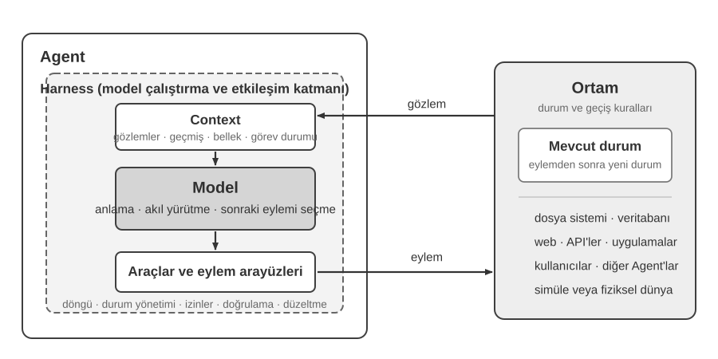
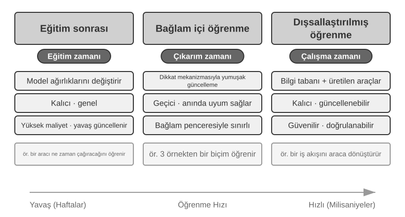
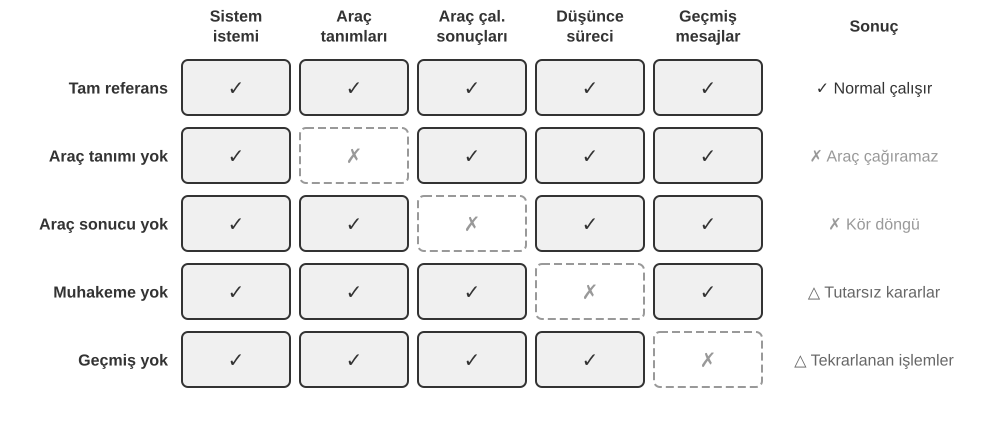
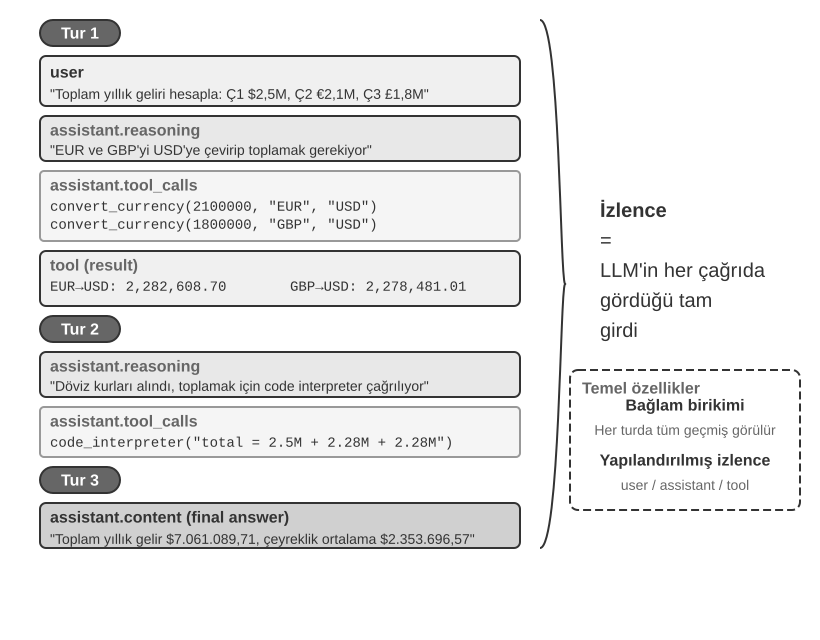
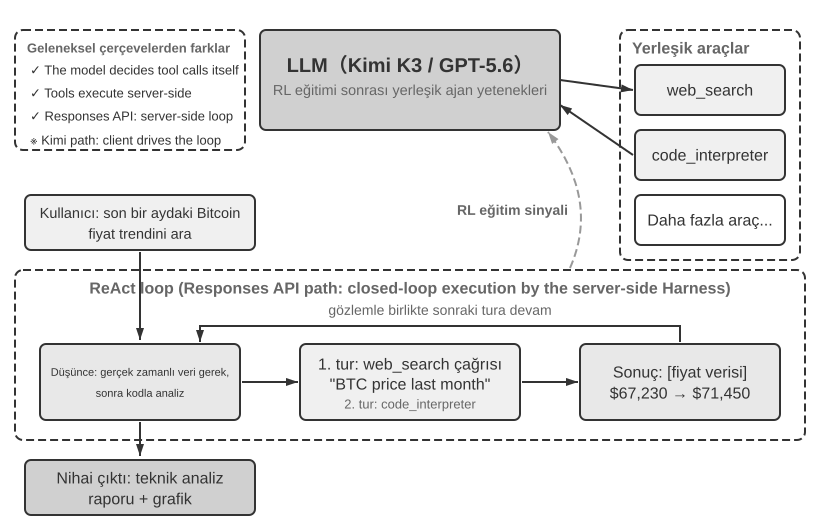
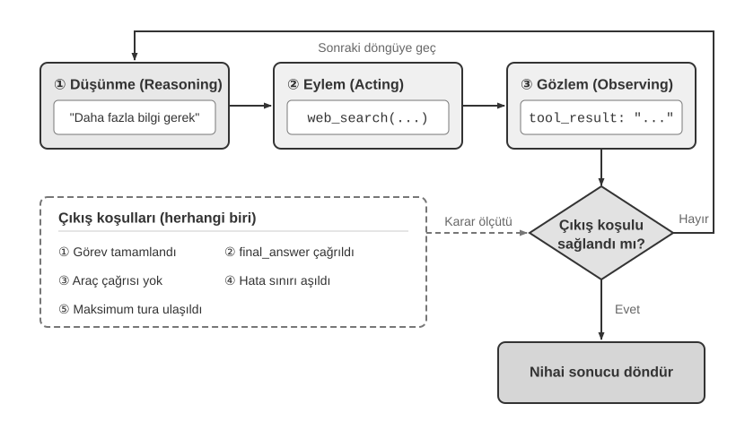

# AI Agent'lara Giriş

Cursor'ı kod yazmak için kullanıp kod tabanınızda arama yaptığını, birden fazla dosyayı düzenlediğini ve testler geçene kadar tekrar tekrar çalıştırdığını izlediyseniz; bir konu hakkında Deep Research'ü kullanıp eksiksiz bir rapor ortaya çıkana kadar arama yaptığını, okuduğunu ve yeniden arama yaptığını gördüyseniz; Manus'un sizin için çevrimiçi görevleri tamamlamak üzere bir tarayıcıyı yönettiğine tanık olduysanız; Doubao telefon asistanına bilet ayırtmasını veya mesaj göndermesini rica ettiyseniz; ya da telekom sağlayıcınızı aramak ve faturanızı düşürmek için Pine AI'ı görevlendirdiyseniz—siz zaten AI Agent kullanıyorsunuzdur.

Bu ürünler pek çok farklı biçimde karşımıza çıkar, ancak hepsinin paylaştığı ortak bir özellik vardır: artık pasif "sen sorarsın, o cevaplar" tarzı bir konuşma değildirler. Kendi yürütme adımlarını planlarlar, görevin gerektirdiği araçları çağırırlar ve sonuçlar geldikçe stratejilerini uyarlarlar. AI Agent'lar, bilgisayarlarla etkileşim kurmanın yeni bir yolu haline gelmektedir.

Bu bölüm pratikten başlayıp bir AI Agent'ın temel bileşenlerine doğru ilerler: modern Agent'ların neler yapabildiğini bizzat deneyimleyecek, arkalarındaki mimariyi anlayacak ve Agent sistemleri inşa etmek için gereken tasarım kalıplarını (design patterns) ve en iyi uygulamaları (best practices) öğreneceğiz.

> **Okuma İpucu**: Bu bölüm, kitabın tamamı için kavramsal bir harita niteliğindedir—Agent'ların temel formülüne, çalışma döngüsüne, mühendislik çerçevesine ve tasarım kalıplarına hızlı bir bakış sunarak sonraki bölümlerin üzerine inşa edeceği ortak kelime dağarcığını ve referans noktalarını oluşturur. İlk okumada her kavramı ezberlemeye çalışmayın; genel bir izlenim edinmeyi hedefleyin. Sonraki her bölüm burada tanıtılan bir yönü derinlemesine ele alır ve yönünüzü kontrol etmek için her zaman buraya geri dönebilirsiniz.

## Modern Agent = LLM + Context + Tools

Modern bir Agent sisteminin özü, tek ve öz bir formülde toplanır: **Agent = LLM (Büyük Dil Modeli) + Context + Tools**. Bu formül basit ve pratiktir—yeter ki her terim geniş anlamıyla okunsun:

- **LLM, Agent'ın beynidir**: Sadece bir model parametreleri kümesi değil, Agent'ın niyeti anladığı, düşündüğü, plan yaptığı ve karar verdiği bütün karar alma çekirdeğidir. Tıpkı insan beyninin salt nöronlar topluluğundan ibaret olmayıp deneyimle şekillenen düşünme biçimlerini de taşıması gibi, bir LLM'in yeteneği de iki kaynaktan gelir: **pre-training** (ön eğitim) yoluyla biriktirilen dünya bilgisi ve dil yeteneği, ve **post-training** (sonradan eğitim) ile kalıcı hale gelen karar alma stratejileri (denetimli ince ayar ve pekiştirmeli öğrenme gibi teknikleri Bölüm 8'nin konusudur).
- **Context, Agent'ın gözleridir**: Sadece modele verilen metin değil, Agent'ın her karar noktasında görebildiği her şeydir—ortam, kullanıcı belleği, alan bilgisi, kendi durumu ve görev ilerlemesi. Tıpkı bir kişinin karar verirken durumu değerlendirmesi, ilgili deneyimi hatırlaması ve referanslara başvurması gerektiği gibi, Agent'ın context penceresi de o anda görebildiği her şeydir.
- **Tools, Agent'ın el ve ayaklarıdır**: Bir avuç çağrılabilir API fonksiyonu değil, Agent'ın yapabildiği her şeyin tam kümesidir—önceden tanımlanmış araç çağrılarından ihtiyaç halinde yüklenen becerilere (Skills), yeni yetenekler yaratmak için anlık kod üretmekten alt Agent'lara (sub-agent) iş devretmeye, kullanıcıya ulaşmaktan dış olaylara yanıt vermeye kadar uzanır.

Daha sezgisel bir ifadeyle: **Agent = Beyin + Gözler + El ve Ayaklar**. Beyin düşünür ve karar verir, gözler düşünmenin ihtiyaç duyduğu her şeyi sağlar, el ve ayaklar ise kararları gerçek dünyadaki değişikliklere dönüştürür.

Klasik pekiştirmeli öğrenme ve kontrol teorisi bakışında Agent ve Ortam, kapalı döngülü etkileşimin iki tarafıdır; birbirlerinin parçaları değildir. Ortam bir gözlem döndürür, Agent context'ini kullanarak sonraki eylemi seçer ve bu eylem Ortam'ın durumunu değiştirerek sonraki gözlemi üretir.



Şekil 1-1 iki soyutlama düzeyini gösterir. Dış düzey **Agent ile Ortam arasındaki etkileşimdir**: Ortam dosya sistemi, veritabanları, web sayfaları, kullanıcılar, diğer Agent'lar ve fiziksel veya simüle dünyaları içerir. İç düzey **Agent içindeki Model–Harness yapısıdır**: Model politika kararlarını verir; Harness, Agent sınırları içinde context'i oluşturan, araç arayüzlerini açan, döngü ve durumu yöneten ve izin, doğrulama ve düzeltme uygulayan çalıştırma ve yönetişim katmanıdır. Harness bir ortam yaratabilir, yalıtabilir veya proxy olarak sunabilir; ancak ortamın durumunu ve geçiş kurallarını içermez.

Mühendislik formülü bu nedenle şöyle açılır: LLM Model'e karşılık gelir, Context + Tools asgari Harness'i oluşturur; üretim sistemleri aynı sınır içinde kısıtlama, doğrulama ve düzeltme ekler. Bölümün geri kalanı bu sınırı izler.

Bu üç bileşen RL'deki (Pekiştirmeli Öğrenme; bkz. Bölüm 8) üç temel kavramla ilişkilidir, ancak katı birer bir eşdeğer değildir: context, gözlemler ile geçmişin Agent içindeki temsilidir; araçlar gözlem/eylem arayüzlerini tanımlar, bunların arkasındaki nesneler ise Ortam'a ait kalır.

| Sezgisel Karşılık | Uygulama Bileşeni | Akademik Kavram | Anlamı |
|---------------|----------------|------------------|---------------------------------------------|
| **Beyin** | LLM | **Policy (Politika)** | "Sırada ne yapılacağını" belirleyen karar alma mantığı—mevcut bilgiye bakarak tüm seçenekler arasından en uygun eylemi seçme |
| **Gözler** | Context oluşturma | **Gözlemler ve geçmiş** | Ortam gözlemlerini ve mevcut geçmişi geçerli karar için gereken bilgide düzenler |
| **El ve Ayaklar** | Araç arayüzleri | **Gözlem/eylem arayüzleri** | Agent'ın hangi gözlemleri okuyabileceğini, hangi eylemleri gönderebileceğini ve arayüz biçimini tanımlar |

### Observation ve Action Space: Model ile Dünya Arasındaki Arayüz

**Observation Space ve Action Space birlikte LLM ile dış ortam arasındaki arayüzü oluşturur**. Observation Space, ortamdaki bilgiyi modelin işleyebileceği Context'e dönüştürür; Action Space ise modelin kararlarını dış dünyadaki işlemlere dönüştürür. Observation Space'e girmeyen bilgi model için fiilen yoktur. Action Space'te bulunmayan bir işlemse, model ne yapılması gerektiğini tam olarak bilse bile yalnızca sözcüklerle önerilebilir.

Bu nedenle, **temel model sabit tutulduğunda Agent performansını artırmanın başlıca sistem mühendisliği kaldıracı, Observation ve Action Space'i yeniden tanımlamak veya genişletmektir**. Bu kitabın terminolojisinde bu, Context'i ve Tools'u genişletmek anlamına gelir. “Daha akıllı bir model” gerektiriyor gibi görünen birçok sorun aslında bir arayüz sorunudur: görevle ilgili veriyi Context'e alın veya gerekli işlemi bir Tool olarak sunun; daha önce çözülemeyen bir görev çözülebilir hâle gelebilir.

**Manus: Daha önce ayrı olan alanları birleştirmek.** Manus ortaya çıkmadan önce üretimdeki Agent'lar çoğunlukla üç ayrı çizgide ilerliyordu: Deep Research, Coding ve Computer Use. Manus, bu üçünü tek bir sistemde bir araya getiren geniş ölçüde etkili ilk üretim Agent'ı oldu. Sanal tarayıcı Observation Space'ini; dosya sistemi, kod çalıştırma ve komut satırı ise Action Space'ini genişletti. Manus yalnızca daha güçlü bir modele geçerek genel amaçlı bir Agent olmadı. Üç Agent türünün Observation ve Action Space'lerinin birleşimini alarak tek bir Agent'ın önceki ürün sınırlarını aşmasını sağladı.

**OpenClaw: Arayüzü kullanıcının dijital yaşamına genişletmek.** OpenClaw her iki alanı da bir adım daha dışarı taşır. WhatsApp, Telegram, Slack, Discord, iMessage ve benzeri kullanıcıların zaten bulunduğu mesajlaşma kanallarından görev alıp sonuç döndürdüğü için Agent'a neredeyse her yerden erişilebilir. Yerel Gateway'i Google Drive ve Notion gibi bulut uygulamalarına ve yerel dosya sistemine bağlanır. Böylece hesaplara ve cihazlara dağılmış dijital dosyalar, kullanıcının açık izniyle tek bir Agent'ın Observation Space'ine girebilir ve Tools tarafından işlenebilir. Dosyaların genellikle yüklenmesini veya ayrı bir connector yapılandırılmasını gerektiren, izole bulut sandbox'ı merkezli ilk Manus biçimiyle karşılaştırıldığında local-first OpenClaw daha geniş bir veri sınırını aşar. Manus daha sonra kendi Google Drive connector'ını ve yerel dosyalara masaüstü erişimini ekledi; bu da aynı noktayı pekiştirir: ürün evrimi çoğu zaman tam olarak Observation ve Action Space'in genişlemesidir[^ch1-agent-products].

[^ch1-agent-products]: Manus'un resmî materyalleri ilk Sandbox'ı izole bir bulut sanal makinesi olarak tanımlar. Manus, Google Drive Connector'ı tanıtırken Drive, masaüstü ve Manus arasında dosyaları elle indirip yüklemeyi gerektiren önceki parçalı iş akışını açıkça anlattı. Mart 2026'da My Computer'ı duyururken önemli işlerin bulutta değil yerelde bulunmasını bulut sandbox'ının temel bir sınırlaması olarak niteledi. OpenClaw'ın resmî README'si ise ürünü kullanıcının kendi cihazlarında çalışan, local-first ve sürekli açık bir kişisel asistan olarak tanımlar ve yirmiden fazla mesajlaşma kanalı listeler; Tools ve eklenti sistemi bulut entegrasyonları ile yerel yetenekler ekleyebilir. Bkz. https://manus.im/blog/manus-sandbox, https://manus.im/blog/manus-google-drive-connector, https://manus.im/blog/manus-my-computer-desktop, https://github.com/openclaw/openclaw ve https://docs.openclaw.ai/tools

Her bileşenin ne yaptığını ve birbirine nasıl bağlandığını anlamak, etkili Agent sistemleri kurmanın temelidir. Üçü arasında en somut olandan—el ve ayaklar, yani araçlar—başlayıp beyne (LLM) ve gözlere (context) doğru ilerleyeceğiz. Önce, farklı Agent türlerinin bu üç boyutta nasıl konumlandığına bakalım:

| Agent Ürünü | Gözler (Algı) | El ve Ayaklar (Eylem) | Strateji |
|-----------------|------------------------|--------------------------|-----------------------------|
| **Kodlama Agent'ları (örn. Cursor)** | Gereksinim dokümanları, kod tabanı, terminal ortamı | Açık uçlu (içsel akıl yürütme (reasoning), kod arama, dosya okuma/yazma, komut çalıştırma vb.) | Artımlı geliştirme: gereksinimi anla → ilgili kodu ara → kodu düzenle → test et ve doğrula → hata ayıkla ve düzelt |
| **Arama Agent'ları (örn. Deep Research)** | Web kaynakları, akademik veritabanları, yerel dosyalar | Açık uçlu (içsel reasoning, arama sorguları, web okuma, özet üretimi) | Yinelemeli derinleştirme: mevcut bilgiye göre arama yönünü ayarla, tam bir raporu kademeli olarak sentezle |
| **Bilgisayar Kontrol Agent'ları (örn. Browser Use)** | Bilgisayar ekranı, tarayıcı sayfaları, dosya sistemi | Açık uçlu (içsel reasoning, tıklama, yazma, kaydırma, ekran görüntüsü alma, kod çalıştırma vb.) | Görsel algı + işlem: ekranı gözlemle → hedef öğeleri belirle → eylemi gerçekleştir → sonuçları doğrula |
| **Telefon Asistanı Agent'ları (örn. Doubao)** | Telefon ekranı, yüklü uygulamalar | Açık uçlu (içsel reasoning, tıklama, kaydırma, yazma, uygulama açma vb.) | Niyet anlama + Uygulama kontrolü: kullanıcı ihtiyacını anla → hedef uygulamayı bul → eylemi gerçekleştir → tamamlandığını onayla |
| **Kişisel Görev Agent'ları (örn. Pine AI)** | Kullanıcı hesap bilgileri, geçmiş faturalar, servis sağlayıcı bilgi tabanı | Açık uçlu (içsel reasoning, arama yapma, e-posta gönderme, form doldurma, kullanıcıyla teyitleşme) | Çok adımlı görev yürütme: bilgi topla → müzakere stratejisi oluştur → servis sağlayıcıyla iletişime geç → müzakere et → sonuçları raporla |

Bu sistemler üç ortak özelliği paylaşır: **açık uçlu bir eylem alanı**—sabit bir düğme kümesinden seçim yapmak yerine keyfi doğal dil ve kod üretme; **içsel düşünme**—eylemden önce planlama ve reasoning; ve **sürekli etkileşim**—ortamdan gelen geri bildirime göre stratejiyi ayarlama. Bu yetenekler tam olarak beynin, gözlerin ve el-ayakların—yani LLM, context ve tools'un—etkileşiminden gelir.

### Tools: Agent'ın El ve Ayakları

Tools, Agent'ın dış dünyaya açılan köprüsüdür. İnsan el ve ayakları gibi, Agent'ı pasif bir gözlemciden aktif bir eyleyiciye dönüştürürler. Araçlar olmadan bir Agent sadece konuşur; araçlarla birlikte gerçekten dünyayı değiştirebilir.

Araçları sistematik olarak ele almak için, Agent'ın dünyayla etkileşim yönüne göre bunları beş türe ayırabiliriz. Şimdilik her türün temsili senaryolarına hızlı bir bakış, bir izlenim oluşturmak için yeterlidir; sonraki bölümler her birini derinlemesine işler.

**Algı Araçları (Perception Tools)**, Agent'ın bilgiye erişmesini sağlar: arama motorları gerçek zamanlı web verisi sunar, dosya sistemleri yerel dokümanları okur, API'ler ve veritabanları dış servislere ve kurumsal çekirdek verilere bağlanır.

**Yürütme Araçları (Execution Tools)**, Agent'ın dünyayı değiştirmesini sağlar: kod çalıştırma, dosya işlemleri, sistem komutları, dış API çağrıları—kararlar böylece somut eylemlere dönüşür.

**İş Birliği Araçları (Collaboration Tools)**, Agent'ın diğer Agent'larla iş bölümü yapmasını sağlar: uzmanlaşmış görevleri alt Agent'lara (sub-agent) devretmek, kritik karar noktalarında insan onayı istemek veya çoklu Agent (multi-agent) sistemlerinde eylemleri koordine etmek.

**Olay Tetikleyici Araçlar (Event Trigger Tools)**, ilk üç kategoriden temelde farklı bir şekilde devreye girer: Agent bunları çağırmaz—bunlar, Agent'ı harekete geçiren dış girdiler olarak gelir. Yeni bir e-posta gelir, zamanlanmış bir an gelir, başka bir sistem bir Webhook geri çağrısı tetikler—olay Agent'ı etkinleştirir ve düşünme ile eylemini başlatır. Agent bunları asla kendisi çağırmaz, ancak yine de dış dünyayla buluştuğu bir kanaldır, bu yüzden bunları geniş araç sistemine dahil ediyoruz.

**Kullanıcı İletişim Araçları (User Communication Tools)**, Agent'ın kullanıcıya ulaştığı kanallardır. Yürütme araçları dış dünyayı değiştirirken, iletişim araçları bilgi taşır—Agent'ın ilerlemesini veya proaktif bir durum güncellemesini metin mesajı, sesli arama, e-posta ve benzeri yollarla iletir.

Bölüm 4, bu beş türün tam sınıflandırmasını ve tasarım ilkelerini ele alır. Araç tasarımının kalitesi, bir Agent'ın ne kadar ileri gidebileceğini doğrudan belirler: arayüzler belirsiz tanımlanırsa model bunları yanlış kullanır; hatalar kötü yönetilirse tek bir başarısız araç Agent'ı kilitleyebilir; izinler fazla geniş tutulursa tek bir Agent hatası telafisi imkânsız hale gelebilir. MCP (Model Context Protocol / Model Bağlam Protokolü) standardının yaygınlaşması, araç entegrasyonunu kolaylaştırıyor.

**Tool Calling** (araç çağırma, Function Calling olarak da bilinir), modern LLM Agent'larının temel bir yeteneğidir: modelin dış araçları yapılandırılmış bir şekilde çağırmasını sağlayarak LLM'i salt bir metin üretecinden gerçek eylem alabilen akıllı bir sisteme dönüştürür. Bu kitap boyunca "tool calling" terimi kullanılacaktır.

Tool calling dört adımdan oluşur: önce context, modele hangi araçların mevcut olduğunu (adları, amaçları, parametreleri) bildirir; ardından model bir araç çağırıp çağırmayacağına, hangisini çağıracağına ve hangi argümanlarla çağıracağına kendisi karar verir; sonra araç çalıştıktan sonra sonucu context'e eklenir; son olarak model bu sonuca dayanarak bir sonraki hamlesine karar verir. Bu döngü, bölümün ilerleyen kısımlarında tanıtılacak olan ReAct'in temelidir.

Bir hava durumu sorgusu senaryosunu örnek alırsak, bu dört adımlı sürecin API düzeyindeki basitleştirilmiş gösterimi şöyledir:

```text
Adım 1: Araçları bildir                Adım 2: Model çağırmaya karar verir
tools: [{                             assistant: {
  name: "get_weather",                  tool_calls: [{
  parameters: {                           function: "get_weather",
    city: "string"                        arguments: {city: "Beijing"}
  }                                      }]
}]                                    }

Adım 3: Sonuç context'e eklenir       Adım 4: Model sonuca göre yanıt verir
tool: {                               assistant: {
  tool_call_id: "call_1",               content: "Bugün Pekin'de: 28°C, açık."
  content: '{"temp":28,"sky":"clear"}'     }
}
```

Geliştirici yalnızca araçları tanımlar ve çağrıları yürütür; modelin kendisi çağırıp çağırmayacağına, hangisini çağıracağına ve hangi argümanları geçeceğine karar verir. Bölüm 2 bu API yapısını ayrıntılı olarak inceler.

Bir Agent için araç tasarlarken görevin gerektirdiği en dar kapsamlı yetenekle başlayıp görev karmaşıklaştıkça bunu adım adım genişletebilirsiniz. Görev yalnızca dört işlemden ibaretse parametreleri açıkça tanımlanmış bir hesap makinesi yeterlidir; görev elektronik tabloları okuma, eksik değerleri temizleme, istatistik hesaplama ve grafik çizme aşamasına geldiğinde, sürekli özel amaçlı araçlar eklemek yerine sınırlı bir Python kod yorumlayıcısını birleştirerek kullanmak ve onunla keşif yapmak daha kolaydır. Ancak genellik hata riskini ve saldırı yüzeyini de büyütür: kod yalıtılmış bir sandbox'ta çalıştırılmalı, ağ erişimi varsayılan olarak kapalı olmalı, yetkilendirilmiş çalışma dizini dışındaki dosyalar okunamamalı ve yürütme süresi, CPU, bellek ile çıktı boyutuna üst sınır konmalıdır.

Benzer şekilde, tek bir günlük aracı bir yürütme sürecini kaydetmek için uygundur; saatler, hatta günler süren uzun soluklu görevlerdeyse denetimli bir sanal çalışma dizini planı, ara sonuçları, yürütme günlüklerini ve nihai çıktıları birlikte saklayarak Agent'ın birden çok çalıştırma arasında işine devam etmesini sağlar. Bu dizin de okunabilir ve yazılabilir yolları, depolama kapasitesini ve dosya türlerini sınırlamalı, Agent'a ana makinenin tüm dosya sistemini açmak yerine dizin dışına çıkılmasını önlemelidir.

Genel amaçlı araçlar her zaman özel amaçlı araçlardan daha iyi değildir. Ödeme yapma, veri silme, e-posta gönderme ve üretim ortamına dağıtım gibi yüksek riskli veya katı iş kısıtlarına tabi işlemler; açık parametreli, sınırlı yetkili ve baştan sona denetlenebilir özel amaçlı araçlar olarak sunulmaya devam etmeli, gerektiğinde önizleme ve insan onayı da eklenmelidir. Dolayısıyla araç tasarımının temel ilkesi şudur: **genel amaçlı temel yetenekler birleştirme ve keşif için; özel amaçlı araçlar ise yüksek riskli işlemleri ve katı iş kurallarını sınırlandırmak için kullanılır**.

### LLM: Agent'ın Beyni

Büyük Dil Modeli (LLM), Agent'ın karar alma çekirdeğidir. Bir kullanıcı isteği karşısında, önce gerçek niyeti çözmesi gerekir (kullanıcıların söyledikleri çoğu zaman gerçekte istedikleriyle aynı değildir), ardından belirsiz veya karmaşık bir görevi yürütülebilir adımlara ayırır. Yürütme boyunca sürekli yargılarda bulunur: sırada ne yapılacağı, bir araç çağrılıp çağrılmayacağı, hangisinin çağrılacağı, hangi argümanlarla çağrılacağı. Bu anlama-planlama-yürütme yeteneği, pre-training sırasında biriktirilen bilgiden gelir ve hem workflow'ların hem de otonom Agent'ların dayandığı temeldir.

LLM Agent'larının ayırt edici bir yeteneği **içsel akıl yürütmedir (internal reasoning)**—eyleme geçmeden önce Agent plan yapıp durumu düşünebilir. Bu, dış ortamda hiçbir şeyi değiştirmez, ama ardından gelen eylemleri belirgin biçimde iyileştirir. Bu tür reasoning'i etkili kılan şey pre-training'dir (internet üzerindeki devasa miktarda metin üzerinde yapılan ilk eğitim; model bu süreçte dil kalıplarını ve dünya bilgisini öğrenir): model, insan bilgisinden çoktan damıtılmış mantıksal kurallar üzerinden akıl yürütür—matematiksel yasalar, nedensel ilişkiler, problemleri parçalara ayırma stratejileri. Dolayısıyla geleneksel pekiştirmeli öğrenme Agent'larından farklı olarak, günümüzün LLM tabanlı Agent'ları kör ve rastgele keşif yapmaz; yapılandırılmış bir bilgi birikimi üzerinde akıl yürütür.

#### Model as Agent: Modelin Kendisinin Ürün Haline Gelmesi

"Model as Agent" (Agent Olarak Model) paradigması, AI Agent geliştirmedeki en yeni yöndür. Gelişmiş modeller, post-training (özellikle pekiştirmeli öğrenme) yoluyla tool calling'i yerleşik bir yetenek olarak içselleştirir: bir aracın ne zaman çağrılacağı, hangisinin çağrılacağı, hangi argümanlarla çağrılacağı—bunların hepsine model kendisi karar verir, elle orkestrasyon gerekmez. Bu, çerçeve (framework) katmanını daha az önemli kılmaz. Tam tersine: model ne kadar güçlüyse, etrafında kurulan Harness o kadar önem kazanır. Harness, tam anlamıyla bir ata takılan koşum takımıdır—dizginleriyle birlikte—ve bu, atın koşmasını engellemek için değil, o gücü doğru yöne yönlendirmek içindir. Agent bağlamında, model güçlü ama öngörülemez attır, Harness ise bu yeteneği güvenilir görev yürütümüne dönüştüren mühendislik kabuğudur. Bir Agent'ta Harness; context yönetimi, araç arayüzleri, güvenlik kısıtları ile doğrulama ve düzeltme mekanizmaları gibi altyapıdan oluşur (bkz. bu bölümün son kısmı).

Bir modelin kendi kararını verme alanı ne kadar genişlerse, yanlış bir kararın verebileceği zarar da o kadar büyür—bu da güvenilirliği korumak için daha ince taneli kısıtlama, doğrulama ve düzeltme gerektirir. Model tedarikçilerinin gerçek avantajı "çerçeveyi inceltmek" değil, modeli ve etrafındaki Harness'i birlikte optimize edebilmek ve bunu sürekli yinelemektir.

Ama bunun ardında daha derin bir soru yatıyor: modeller güçlenmeye devam ederse, günümüzün Harness'i sonunda model tarafından "yutulacak" mı? Rich Sutton "The Bitter Lesson" (Acı Ders) yazısında, yapay zeka araştırmalarının yetmiş yıl boyunca tekrar tekrar sahnelenen bir manzarasına bakar[^ch1-1]: araştırmacılar bir alana dair anlayışlarını sisteme kodlarlar—kısa vadede etkilidir, ama uzun vadede hesaplama ve veriyle ölçeklenen genel yöntemler tarafından her zaman geride bırakılır: arama ve öğrenme. Bu ölçüyle bakıldığında, bir Harness'teki kısıtlama, doğrulama ve düzeltmenin ne kadarı modelin er ya da geç içselleştireceği bir "insan önseli"dir? Bu kitabın duruşu: **yönü onaylamak, hızı konusunda pragmatik kalmak**. Yön konusunda, modellerin Harness'i yutmaya devam edeceğinden kuşkumuz yok—tool calling ve uzun ufuklu planlama bir zamanlar dışsal orkestrasyondu, şimdi yerleşik yetenekler. Ama hız konusunda, bu "yutma" sezginin öngördüğünden çok daha yavaştır: eğitim aylar sürer ve bir model gerçek işin tüm kısıtlarını ve tercihlerini tek seferde içselleştiremez; modelin o anki yetenek sınırı, tam olarak Harness'in o anki değeridir. Harness engineering bu yüzden Acı Ders'e bir direniş değil, onun mühendislik zaman ölçeğindeki uygulamasıdır: model henüz güvenilir biçimde yapamadığı her şeyi Harness önce karşılar; model içselleştirdiği her katmanı Harness bırakır ve yeni yetenek sınırını desteklemeye geçer.

[^ch1-1]: Sutton, Rich. “The Bitter Lesson”, 2019. http://www.incompleteideas.net/IncIdeas/BitterLesson.html

#### Agent Öğrenme Mekanizmaları: Context Uyarlamasından Kalıcı Güncellemelere

Yukarıdaki tartışma, bir modelin araç kullanma politikalarını pekiştirmeli öğrenme yoluyla yerleşik yetenekler olarak içselleştirebildiğini belirtti. Ancak bir Agent'ın davranışındaki değişiklikler yalnızca eğitim sırasında gerçekleşmez. Güncellemenin nerede yapıldığına ve ne kadar kalıcı olduğuna göre bu değişiklikler, birbirini tamamlayan üç yol olarak anlaşılabilir (Şekil 1-2): görev içi context uyarlaması, görevler arasında harici artefaktların güncellenmesi ve eğitim döngülerindeki parametre güncellemeleri.



**Context uyarlaması** mevcut görevin içinde gerçekleşir. Örnekler, durum ve retrieval sonuçları context'e girdikten sonra model davranışını hemen ayarlayabilir; ancak bu, sonraki oturumun kalıcı durumunu değiştirmez. Avantajları hız ve düşük maliyet, sınırlamaları ise context penceresi ile bilginin düzenlenme biçimidir. Bölüm 2 bu uyarlama biçiminin nasıl çalıştığını ayrıntılı olarak açıklar.

Değişikliklerin görevler arasında kalıcı olması için sistem **harici artefaktları** güncelleyebilir: gerçekler ve deneyim bilgi dokümanlarında düzenlenebilir, dilde ifade edilebilen stratejiler bir Prompt veya Skill'e yazılabilir, deterministik prosedürler ve kısıtlar programlarda ve Harness'lerde kodlanabilir. Bu artefaktlar denetlenebilir ve değiştirilebilir, ancak Agent'ın yürütme sırasında bunlara yine context ya da araç arayüzleri üzerinden erişmesi gerekir. Bölüm 3-5 bilgi ve programların temellerini kurar; Bölüm 9 ise bu tür güncellemelerin değerlendirilmiş operasyon trajectory'lerinden nasıl üretilebileceğini tartışır.

Hedef, tıbbi görüntü anlama, doğal dil üslubu veya örtük bir karar politikası gibi harici kurallarla bütünüyle ifade edilemeyen yüksek boyutlu bir yetenek olduğunda, **model parametreleri** post-training yoluyla güncellenmelidir. Parametre güncellemelerinin dağıtım maliyeti daha yüksektir, ancak doğal ve geniş bir genelleme sağlayabilir; Bölüm 8 yöntemlerini sistematik biçimde sunar. Dolayısıyla bu üç yol birbirini dışlayan kategoriler değil, farklı zaman ölçeklerinde çalışan eşgüdümlü mekanizmalardır: context anlık uyarlamayı destekler, harici artefaktlar kontrollü birikimi sağlar, parametreler ise açıkça ifade edilmesi güç yetenekleri içselleştirir.

### Context: Agent'ın Gözleri

Context, bir Agent'ın her karar noktasında görebildiği her şeydir. Tıpkı karar veren bir kişinin masasına yayılmış malzemelere—görev talimatlarına, referans kılavuzlarına, önceki yazışmalara, en güncel verilere—ihtiyaç duyması gibi, bir Agent'ın context penceresi de onun görüş alanıdır. API açısından bakıldığında (Bölüm 2'de ayrıntılı), her bir LLM çağrısının context'i beş bölümden oluşur:

- **System Prompt (Sistem Talimatı)**: Kullanıcının sırayla yazdığı promptlardan farklı olarak, system prompt geliştirici tarafından yazılır ve konuşma boyunca sabit kalır. Agent'ın "iş tanımı"dır—kimliğini, yetkilerini ve davranış kurallarını tanımlar. System prompt'un özenli prompt engineering'i, Agent'ın çalışma biçimini şekillendirme yöntemimizdir. System prompt ayrıca oturumlar arasında kalıcı olan **kullanıcı belleğini** de (tercihler, geçmiş davranışlar ve arka plan ayarları gibi kişiselleştirilmiş bilgi; bkz. Bölüm 3) ve dinamik olarak enjekte edilen ortam durumunu da taşır.
- **Tool Definitions (Araç Tanımları)**: Agent'ın kullanabileceği araçların adlarını, işlevsel açıklamalarını ve parametre formatlarını bildirir. Araç tanımları olmadan Agent hiçbir aracı tanıyamaz veya çağıramaz—bir ablation study (Deney 1-1) bunu doğrulayacaktır. Araç tanımları, system prompt ile birlikte, konuşma boyunca değişmeden kalan **static prefix'i (statik ön ek)** oluşturur. (Bu temel kalıptır; 2026'dan itibaren üretim çerçeveleri, ön eki bozmadan tam araç şemalarını context'in sonunda ihtiyaç halinde de yükleyebiliyor—bkz. Bölüm 2'nin araç tanımları kısmı ve Bölüm 4.)
- **User Messages (Kullanıcı Mesajları)**: Kullanıcıdan gelen girdi. Kullanıcı mesajları, RAG (Retrieval-Augmented Generation / Bilgi Getirmeyle Güçlendirilmiş Üretim, ayrıntılar için bkz. Bölüm 3) yoluyla dinamik olarak getirilen **dışsal bilgiyi** de içerebilir—eğitim verisi kesim tarihinin ötesindeki bilgileri veya özel alan bilgisini kapsar.
- **Assistant Messages (Asistan Mesajları)**: Modelin daha önce ürettiği yanıtlar; en fazla üç bölümden oluşabilir—`reasoning` (tutarlılığı ve karar yorumlanabilirliğini koruyan içsel düşünce zinciri), `content` (kullanıcıya verilen yanıt) ve `tool_calls` (Agent'ın eyleme geçme biçimi). Belirli bir yanıtta bu üç bölüm aynı anda görünmeyebilir: örneğin Agent bir araç çağırmaya karar verdiğinde genellikle yalnızca `reasoning` + `tool_calls` bulunur; nihai bir yanıt verirken genellikle yalnızca `reasoning` + `content` bulunur.
- **Tool Results (Araç Sonuçları)**: Agent çerçevesi bir aracı çalıştırdıktan sonra dönen sonuç. Bu sonuçlar, Agent'ın bir sonraki düşünme adımının doğrudan dayanağıdır—ve hatalarını tekrarlamak yerine sonuçlardan öğrenmesini sağlayan şeydir.

İlk iki öğe (system prompt + araç tanımları) static prefix'i oluşturur; son üçü (kullanıcı mesajları + asistan mesajları + araç sonuçları) her etkileşimle büyüyen dinamik mesaj geçmişini oluşturur. Bu beş bölüm birlikte, her bir LLM çıkarımının context'ini oluşturur.

Her bileşen gerçekten vazgeçilmez mi? Bunu öğrenmenin en doğrudan yolu bir **ablation study**dir—nedenleri birer birer eleyen tanı yöntemi: A bileşenini kaldırıp sistemin hâlâ çalışıp çalışmadığına bakın, sonra B bileşenini, ve her bileşenin katkısı netleşene kadar böyle devam edin. Deney 1-1, tam olarak bu yöntemi yukarıdaki beş bileşene uygular. Sonuçlar: araç tanımlarını kaldırınca Agent tamamen eylemsiz kalıyor; araç sonuçlarını kaldırınca bir önceki adımın geri bildirimini göremiyor, bu yüzden aynı aracı tekrar tekrar çağırıp sonsuz bir döngüde sıkışıp kalıyor; asistan mesajlarından reasoning'i çıkarınca ardışık kararlar birbiriyle çelişmeye başlıyor; mesaj geçmişini düşürünce Agent fiilen hafızasını yitiriyor—görevin tamamını baştan başlatıyor, zaten yapılmış adımları tekrarlıyor.

> **Deney 1-1 ★★: Context'in Kritik Rolü**
>
> Her context bileşeninin Agent davranışını nasıl şekillendirdiğini sistematik bir **ablation study** ile araştırdık. Yukarıdaki beş bileşenden dördü test edildi—system prompt, Agent'ın temel kimlik tanımı olduğu için muaf tutuldu: o olmadan Agent'ın hiçbir rol farkındalığı olmaz ve test anlamsız olurdu. Şekil 1-3'te görüldüğü gibi, deney beş kontrollü grupla yürütüldü: her bileşeni koruyan eksiksiz bir temel çizgi (baseline), artı her biri bir bileşeni eksik olan dört grup; böylece her bileşenin Agent performansına etkisi gözlemlendi.
>
> 
>
> Deney sonuçları, her context bileşeninin yerine konulamaz rolünü ortaya koydu. **Tool Definitions** (static prefix'in bir parçası), Agent'ın eylem yeteneğinin temelidir; bunlar olmadan Agent hiçbir aracı tanıyamaz veya çağıramaz. **Tool Results**, kapalı döngü kontrolünün anahtarıdır; yokluğu Agent'ın "kör" hareket etmesine ve sonsuz bir döngüye düşmesine neden olur. **Reasoning süreci** (asistan mesajlarının reasoning kısmı), Agent'ın önceki kararlarının gerekçelerini korur, düşünce sürecini daha tutarlı kılar ve çelişkili kararları önler. **Mesaj geçmişi** (önceki turlardan gelen kullanıcı mesajları, asistan mesajları ve araç sonuçları), gereksiz işlemleri önler, görev yürütme tutarlılığını korur ve aynı hataların tekrarlanmasını engeller.
>
> Deneyin temel çıkarımı: **context, Agent'ın ne görebileceğini belirler ve Agent yalnızca gördüğüne dayanarak karar verebilir**. Gözü bağlı bir kişinin sağlıklı yargılarda bulunamaması gibi, herhangi bir context bileşeni eksik olan bir Agent de ciddi bir karar alma yeteneği kaybı yaşar—araç tanımları olmadan hangi araçların var olduğunu bilemez; önceki yürütme sonuçları olmadan neyin zaten yapıldığını bilemez.

### ReAct Döngüsü

Üç bileşen elimizdeyken doğal bir soru ortaya çıkıyor: bunlar birlikte nasıl çalışır? ReAct döngüsü, LLM, context ve tools'u tek bir sisteme dizen temel mekanizmadır—bir Agent'ın adım adım nasıl düşünüp eylediğini izleyelim.

Bir Agent'ın bir görevi yürütme biçimine temel alınan kalıba **ReAct** (Reasoning + Acting) denir. Bu ad yalnızca reasoning ve acting'den bahsetse de, gerçek döngü üç aşamadan oluşur: model önce sırada ne yapılacağı hakkında **reasoning** yapar, ardından eylemde bulunmak için bir aracı **çağırır (act)**, sonra aracın sonucunu **gözlemler (observe)** ve bir sonraki adım hakkında reasoning yapar. Bu "düşün → yap → gör → düşün → yap → gör" döngüsü görev tamamlanana kadar tekrarlanır.

Somut bir örnek üzerinden—birden fazla para biriminde geliri toplama—bir Agent'ın **trajectory'sini (çalışma geçmişi/yörünge)** anlayalım: Agent çalışırken birikmiş mesaj geçmişi; kullanıcı mesajları, asistan mesajları (reasoning ve tool call'larıyla birlikte) ve araç sonuçlarından oluşur. Her bir LLM çağrısında, modelin aldığı eksiksiz context, **static prefix** (system prompt + araç tanımları) artı **trajectory** (dinamik mesaj geçmişi) toplamıdır (Şekil 1-4). Bu, temel bir gerçeği ortaya koyar: **Agent context'i = static prefix + trajectory**. Somut olarak, static prefix yukarıdaki beş bileşenin ilk ikisidir (system prompt + araç tanımları); trajectory ise son üçüdür (kullanıcı mesajları + asistan mesajları + araç sonuçları, her etkileşimle büyür). LLM, bu eksiksiz context'ten bir sonraki yanıtını üretir; bu yanıt da bir sonraki çağrı için trajectory'ye eklenir.



Aşağıdaki Python tarzı taslak açıklayıcı pseudocode'dur, çalıştırılabilir SDK kodu değildir; `python` işareti yalnızca sözdizimi vurgulama için kullanılır.

**ReAct kontrol döngüsü:**

```python
trajectory = [user_request]

repeat:
    context = stable_prefix + trajectory
    decision = Model(context)
    trajectory.append(decision)

    if decision has no tool call:
        return decision.answer

    for call in decision.tool_calls:       # independent calls may run in parallel
        validated_call = Harness.validate(call)
        observation = Environment.execute(validated_call)
        trajectory.append(observation)
```

Bir trajectory'nin yapısı, sözde kod (pseudocode) olarak şöyledir:

```text
trajectory = [
  {role: "user", content: "Şirketin çeyreklik gelirlerine göre: Q1 2.5M USD, Q2 2.1M EUR, Q3 1.8M GBP, Q4 380M JPY, şirketin toplam yıllık gelirini ve ortalama çeyreklik gelirini hesapla"},

  # İlk yineleme - LLM yukarıdaki trajectory'yi görür, bir yanıt üretir
  {role: "assistant",
   reasoning: "Tüm para birimlerini USD'ye çevirmem gerekiyor...",
   content: "",  # Kullanıcıya doğrudan yanıt yok
   tool_calls: [
     {name: "convert_currency", args: {amount: 2100000, from: "EUR", to: "USD"}},
     {name: "convert_currency", args: {amount: 1800000, from: "GBP", to: "USD"}},
     {name: "convert_currency", args: {amount: 380000000, from: "JPY", to: "USD"}}
   ]},

  # Agent çerçevesi araçları çalıştırır, sonuçları trajectory'ye ekler
  {role: "tool", content: "EUR->USD: 2282608.7"},
  {role: "tool", content: "GBP->USD: 2278481.01"},
  {role: "tool", content: "JPY->USD: 2541806.02"},

  # İkinci yineleme - LLM, araç sonuçları dahil eksiksiz trajectory'yi görür
  {role: "assistant",
   reasoning: "Dönüşüm sonuçları elde edildi, şimdi toplamak ve hesaplamak gerekiyor...",
   content: "",
   tool_calls: [
     {name: "code_interpreter", args: {code: "total = 2500000 + 2282608.7 + ..."}}
   ]},

  {role: "tool", content: "Toplam: $9,602,895.73, Ortalama: $2,400,723.93..."},

  # Üçüncü yineleme - LLM eksiksiz trajectory'yi görür, nihai yanıtı üretir
  {role: "assistant",
   reasoning: "Tüm hesaplamalar tamamlandı, sonuçlar özetleniyor...",
   content: "NİHAİ YANIT: Toplam gelir $9,602,895.73..."}
]
```

Dikkat edin, system prompt ve araç tanımları trajectory içinde gösterilmez—bunlar static prefix görevi görür ve her LLM çağrısından önce trajectory'nin başına otomatik olarak eklenir.

Deneyimizde bu döngü tüm açıklığıyla ortaya çıktı. İlk turda Agent görevi analiz etti ve üç para birimi dönüştürme aracını paralel olarak çağırdı; ikinci turda, dönüşüm sonuçlarını daha ağır hesaplama için bir kod yorumlayıcısına verdi; üçüncü turda, tüm hesaplamaların tamamlandığını doğruladıktan sonra nihai yanıtı üretti. Karmaşık, çok adımlı bir görev, sadece 3 yinelemede ve 4 araç çağrısında tamamlandı.

Bu en temel tasarımda, LLM'in gördüğü context'e sürekli yeni bilgiler eklenir. Her LLM çağrısı eksiksiz trajectory'yi görür, böylece model görevin hangi aşamasında olduğunu, daha önce nelerin denendiğini ve sonucunun ne olduğunu bilir. İnsanların bir problemi çözerken sürekli gözden geçirip özetlemesi gibi, Agent da trajectory'si sayesinde göreve dair küresel bir bakış açısı taşır. Ve trajectory yapılandırılmış olduğundan—kullanıcı mesajları, asistan mesajları (reasoning + tool calls) ve araç sonuçları temiz biçimde ayrıldığından—sistem son derece yorumlanabilir ve hata ayıklanabilir durumdadır.

Trajectory, bir yürütme kaydından fazlasıdır; Agent'ın yeteneğinin bir aynasıdır. Trajectory'leri büyük ölçekte analiz etmek, davranış kalıplarını, daha iyi karar yollarını ve daha iyi araç tasarımlarını ortaya çıkarır. Trajectory verisi hatta bir bilgi tabanına damıtılabilir, ya da pekiştirmeli öğrenme yoluyla daha güçlü Agent modelleri eğitmek için kullanılabilir—deneyimden öğrenme döngüsünü kapatır.


Artık Agent'ın çalışma döngüsünü anladığımıza göre, farklı modellerin bu döngüyü nasıl yürüttüğünü görmek için iki deney yapalım.

> **Deney 1-2 ★: Kimi K3'ün Yerleşik Agent Yeteneği**
>
> Bu deney, "Model as Agent" paradigmasının bir somutlaşması olan **Kimi K3**'ün yerleşik Agent yeteneğini gösterir. Kimi K3, yaklaşık 2,8 trilyon parametreli bir Mixture of Experts (MoE - Uzmanlar Karışımı) modelidir—MoE'yi bir uzman ekibi gibi düşünün: her problem türü için sistem, tüm ekibi çalıştırmak yerine buna en uygun birkaç uzmanı otomatik olarak devreye sokar, verimlilikten ödün vermeden yetenek kazanır. 1 milyon token'lık bir context penceresine, yerleşik görsel anlama yeteneğine ve her zaman açık bir "düşünme moduna" sahiptir; pekiştirmeli öğrenme yoluyla eğitilmiş olup tool calling **karar politikasını (decision policy)** yerleşik bir yetenek olarak içselleştirmiştir—bir aracın ne zaman çağrılacağı, hangisinin çağrılacağı ve hangi argümanlarla çağrılacağı tamamen model tarafından belirlenir—böylece web araması gibi görevleri otonom olarak yürütebilir. Daha kesin olmak gerekirse, içselleştirilen şey *ne zaman ve nasıl çağrılacağı* kararıdır; araçların kendisi—`web_search`, `code_runner` ve benzerleri—hâlâ API düzeyinde yerleşik araçlar olarak sunucu tarafında çalışır (Kimi, bu resmi araçları Formula adlı sunucu taraflı bir betik motoru üzerinden çalıştırır).
>
> Temel gözlemler: ne zaman arama yapacağına ve neyi arayacağına kendisi karar veriyor—gerçek bir otonomi; arama sonuçları geldikçe stratejisini dinamik olarak ayarlıyor ve bilginin yeterli olup olmadığına kendisi karar veriyor. Burada yaygın bir yanlış anlamayı gidermekte fayda var, ve anahtar nokta neyin kime ait olduğunu görmektir. **Pekiştirmeli öğrenmenin modele verdiği şey karar almadır**—bir aracın ne zaman çağrılacağı, hangisinin çağrılacağı, hangi argümanlarla, bir sonucu gördükten sonra devam edip etmeyeceği ve onlarca ya da yüzlerce çağrıyı tutarlı bir reasoning'e nasıl zincirleyeceği; işte bu *kullanıp kullanmama ve nasıl kullanma* yargıları modelin ağırlıklarına yazılan şeydir. **Araçların kendisi ve bunların yürütülmesi Agent çerçevesi (veya API'nin yerleşik araçları) tarafından sağlanır**—`web_search` ve `code_runner`'ın gerçek uygulamaları, kod sandbox'ı ve çağrıyı gönderip sonucu döndüren altyapı, modelin dışındaki altyapıda yaşar. RL karar politikasını optimize eder; bir arama motorunu veya bir kod sandbox'ını modelin ağırlıklarına paketlemez. Yani orkestrasyon döngüsü ortadan kalkmadı; istemciden sunucuya taşındı, karar alma ise modelin içine taşındı[^ch1-2].
>
> [^ch1-2]: Okuyucu asdlem'e, RL'nin içselleştirdiği şeyin araç yürütme mekanizması değil tool calling karar politikası olduğu ayrımını GitHub Issue #30 üzerinden belirtip netleştirdiği için teşekkürler. Bkz. https://github.com/bojieli/ai-agent-book/issues/30
>
> Kimi K3'ün Agent görevlerindeki öne çıkan avantajı **uzun zincirli araç çağrılarının kararlılığıdır**—çoğu modelin birkaç düzine çağrıda bozulmaya başladığı noktanın çok ötesinde, 200-300 ardışık araç çağrısını baştan sona tutarlı bir reasoning ile sürdürebilir. K3, uzun ufuklu programlama ve Agent iş yükleri için optimize edilmiştir ve iki varyantta yayınlanmıştır: K3 Max (diyalog ve Agent görevleri için) ve K3 Swarm Max (büyük ölçekli paralel işleme için). Açık kaynaklı bir model olarak, yazılım mühendisliği ve Agent benchmark'larında en üst düzey kapalı kaynak sistemlerle eşleşir—pekiştirmeli öğrenmenin bir modele yerleşik Agent yeteneği kazandırabileceğinin kanıtıdır.

> **Deney 1-3 ★: GPT-5.6'nın Yerleşik Deep Research Yeteneği**
>
> İkinci deney, gelişmiş bir modelin, API düzeyinde yerleşik araçların desteğiyle Deep Research için "ara—oku—analiz et" orkestrasyon döngüsünü sunucu tarafında nasıl kapattığını göstermek için **OpenAI GPT-5.6**'yı kullanır. GPT-5.6'nın kullanışlı bir özelliği **Freeform Tool Calling'dir (Serbest Format Araç Çağırma)**. Geleneksel olarak, bir araç çağıran model her parametreyi katı bir JSON'a (yapılandırılmış bir veri formatı) paketlemek zorundadır—katı biçimlendirme kurallarına sahip bir form doldurmak gibi. Freeform tool calling (API'de `type: "custom"` türünde bir araç olarak tanımlanır), modelin JSON kaçış karakterlerini tamamen atlayarak araca doğrudan ham metin (bir Python kod parçası, bir SQL sorgusu) göndermesine izin verir. Şunu vurgulamakta fayda var: bu, model mimarisinde bir yenilik değil, API'nin parametre formatının bir evrimidir—istemcinin tool calling döngüsü (`tool_calls`'ı algıla → çalıştır → sonucu döndür) aynı kalır; sadece argümanlar bir JSON dizesinden ham metne dönüşür.
>
> GPT-5.6, Responses API'nin **web search ve code interpreter** yerleşik araçlarıyla eşleştiğinde, Deep Research'ün tam da özünü sunar: model, gerçek zamanlı bilgi için otonom olarak web'de arama yapabilir ve derinlemesine analiz için kod yazabilir, "ara -> oku -> analiz et -> yeniden ara" şeklinde yinelemeli bir araştırma sürecini mümkün kılar. Örneğin, "10 ASEAN ülkesinin başkentleri arasındaki en kısa mesafe nedir?" gibi bir soruyla karşılaştığında, GPT-5.6 otomatik olarak her başkentin coğrafi koordinatlarını arar, ardından tüm başkent çiftleri arasındaki büyük daire mesafesini hesaplamak için Python kodu yazar ve nihayetinde en yakın çifti belirler. Benzer şekilde, "Geçen ayki Bitcoin trendini araştır ve teknik analiz yap" gibi bir görevde, birden fazla finansal veri kaynağından gerçek zamanlı fiyat verisi çekebilir, hareketli ortalamalar, RSI, MACD ve diğer teknik göstergeleri hesaplamak için profesyonel teknik analiz kütüphaneleri kullanabilir, görsel grafikler üretebilir ve alım-satım önerileri sunabilir.
>
> Daha da önemlisi, GPT-5.6 **OpenAI Deep Research** ürününün tasarım felsefesini model düzeyinde içselleştirerek bir **niyet netleştirme süreci** tanıtır. Bir araştırma isteği karşısında GPT-5.6 hemen yürütmeye başlamaz; önce bir dizi soru yoluyla kullanıcının gerçek niyetini netleştirir. "Geçen ayki Bitcoin trendini araştır ve teknik analiz yap" için önce şunu sorar: "Hangi veri kaynağını tercih edersiniz? Hangi teknik göstergelerin analiz edilmesini istersiniz?" Bu etkileşimli netleştirme, GPT-5.6'nın kullanıcının gerçekte ihtiyaç duyduğuna daha yakın, daha isabetli araştırma raporları üretmesini sağlar.
>
> GPT-5.6, "Model as Agent"in olgun bir örneğidir—web search, code interpreter ve diğerleri, Responses API'nin yerleşik araçları olarak çalışır, sunucuda kapalı bir döngüde yürütülür; orkestrasyon döngüsü istemciden API sunucusuna taşınır, bu da istemci uygulamasını basitleştirir. Model hâlâ standart tool call'lar üretir; istemcinin yalnızca artık "ara—oku—analiz et" orkestrasyon çerçevesini kendisinin inşa etmesine gerek kalmaz. En dikkat çekici yönü niyet netleştirme mekanizmasıdır: bir görevi geldiği anda yürütmek yerine, model önce kullanıcının gerçekte neye ihtiyaç duyduğunu teyit eder, ardından bir araştırma stratejisi oluşturur. "Kullanıcının söylediği" ile "kullanıcının gerçekte istediği" arasındaki boşluk, yürütme başlamadan önce kapatılır.
>
> Bu deney tek bir sağlayıcıya bağlı değildir. OpenAI kredisi olmayan okuyucular, eşdeğer yönetilen araçlar sunan bir sağlayıcıyla deneyi yeniden üretebilir. Örneğin Alibaba Cloud Bailian'ın qwen3.7-plus Responses API'si de yerleşik `web_search` ve `code_interpreter` sunar; Kimi K3'ün Formula tarafından yönetilen araması ve `code_runner` aracı da aynı sınıfta yetenekler sağlar.
>
> Şekil 1-5, "Model as Agent" paradigması altındaki yerleşik tool calling'in tam mimarisini, Kimi K3 / GPT-5.6'nın gerçek dünya görevlerindeki ReAct yürütme süreciyle birlikte gösterir.
>
> 


## Harness Engineering: Modelin Ötesinde Rekabet Gücü

Artık bir Agent'ın özünde nasıl çalıştığını anlıyorsunuz: bir LLM, context tarafından yönlendirilerek ReAct döngüsünü yürütür ve görevi tamamlamak için araçları kullanır. Yukarıdaki deneyler bu temel mekanizmanın çalıştığını kanıtlıyor—ve ne kadar kırılgan olduğunu da gözler önüne seriyor. Model halüsinasyon görebilir (var olmayan araçlar veya parametreler uydurabilir), yanlış aracı seçebilir ya da bir hatadan kurtulamayabilir. Çalışan bir demo ile güvenilir bir ürün arasında devasa bir uçurum vardır ve bu kırılganlıklar tam olarak Harness Engineering'in var olma nedenidir. Bu bölümün ilk yarısı bir Agent'ın ne olduğunu yanıtladı; ikinci yarısı ise bir Agent'ın üretimde nasıl güvenilir biçimde çalıştığını yanıtlıyor.

Önceki bölümler temel formülü ortaya koydu: **Agent = LLM + Context + Tools**. Bu formül Agent'ın **içsel bileşimini**—neyin beyin, neyin gözler, neyin el ve ayaklar rolünü oynadığını—tanımlar. Harness Engineering, aynı sisteme ikinci, **mühendislik-uygulama** açısından bir bakış ekler: LLM'i tek bir temel bileşen (Model) olarak ele alın ve etrafına inşa edilen tüm destekleyici koda Harness deyin. Bu iki bakış açısı birbirine rakip değildir; aynı sistemi farklı soyutlama düzeylerinde tanımlarlar. Daha genel olan "Model" kelimesine geçiyoruz çünkü Harness Engineering ilkeleri belirli bir model türüne değil, akıl yürütebilen ve araç çağırabilen her modele uygulanır. Harness'in özü, orijinal formüldeki "Context + Tools"tur, artı üç katman güvenlik önlemi: **Constrain** (Agent'ın neyi yapıp neyi yapamayacağı), **Verify** (bir şeyi doğru yapıp yapmadığı) ve **Correct** (yapmadığında nasıl kurtarılacağı).

Bir denklem olarak genişletildiğinde, eksiksiz üretim düzeyindeki bileşim şudur:

> **Agent = Model + Harness**
>
> **Harness = context yönetimi + araç arayüzleri + Constrain + Verify + Correct**
>
> **Agent ↔ Ortam**

Asgari bir demo için yalnızca bir Model ile context oluşturup tools sunabilen bir Harness yeterlidir; üretim sistemi aynı sınırın içinde constrain, verify ve correct katmanlarını da eklemelidir. Örneğin bir iade Agent'ı politikayı context'e koyabilir, çağrıları yetki ve tutar kurallarıyla sınırlayabilir, sonucu veritabanı durumundan doğrulayabilir ve zaman aşımında yeniden deneyebilir ya da yedek yola dönebilir. Harness engineering tam olarak “modelin dışında, environment'ın içinde” kalan bu çalışma ve yönetişim kodunu inceler.

Daha kesin olarak söylemek gerekirse, Harness modelin dışındaki her şey değildir; **Agent sınırları içinde ve Model'in dışında bulunan çalıştırma ve yönetişim katmanıdır**. Model–Ortam etkileşimine aracılık eder, ancak Ortam'ın kendisini içermez. Araç tanımları, çağrı adaptörleri, sandbox izinleri ve sıfırlama mekanizmaları Harness'e aittir; sandbox içinde değişen dosyalar ve süreçler, harici veritabanları, web sayfaları, kullanıcılar ve fiziksel dünya ise Ortam'a aittir. Dağıtım konumu bu kavramsal sınırı değiştirmez. Harness'in özü Context yönetimi ve araç arayüzleridir; bunların etrafında üç tür mühendislik güvenlik önlemi inşa edilir:

| İşlev | Tek Cümlelik Sorumluluk / Temel İlke | Pratik Örnek | İlgili Bölüm |
|---|---|---|---|
| **Context** | Modele algısal bilgi sağlar; Bilgi Yeterliliği: Agent'ın her karar noktasında yeterli bilgiye dayanarak karar vermesini sağlamak | System prompt'lar, bilgi tabanları, Agent durum çubukları, Sidecar bypass sorguları | Bölüm 2 & 3 |
| **Tools** | Modele eylem araçları sağlar; Net Arayüz: Araç adları sezgisel, parametrelerin örnekleri var, sınırlar açıklanmış | MCP araçları, code interpreter, arama araçları | Bölüm 4 |
| **Constrain** | Davranışsal sınırlar koyar—neyin yapılıp neyin yapılamayacağı; Güvenli Varsayılanlar (Fail-Safe Defaults): Tüm yetenekler varsayılan olarak kapalıdır ve açıkça etkinleştirilmelidir (mobil uygulama izin yönetimine benzer) | Claude Code'da her araç, çalıştırılmadan önce varsayılan olarak kullanıcı yetkilendirmesi gerektirir | Bölüm 4 |
| **Verify** | İşlem sonuçlarının doğruluğuna otomatik olarak karar verir; Girdi İzolasyonu: Güvenlik kontrolleri yalnızca yapılandırılmış verilere (örn. araçların döndürdüğü JSON alanları) bakar, modelin ürettiği serbest formatlı metne bakmaz (çünkü saldırganlar prompt injection yoluyla model çıktısını manipüle edebilir) | Linter kontrolleri, tip sistemleri, araç çağrısı sonucu doğrulaması | Bölüm 5 & 6 |
| **Correct** | Sorun bulunduğunda otomatik olarak düzeltir veya geri alır; Bir arıza kurtarılamaz olduğu doğrulanana kadar ara durumları açığa çıkarmayın (örn. kullanıcıya yarım kalmış bir sonuç göstermek yerine başarısız bir araç çağrısını sessizce yeniden deneyin) | Sessiz yeniden denemeler, devam üretimi, ardışık başarısızlıklarda insan yargısına geri dönüş (circuit breaker mekanizması) | Bölüm 2 & 5 |

Model kontrol döngüsünün temel akışı aşağıdaki sözde kodda gösterilmiştir:

```python
observation = Environment.observe()
trajectory = [observation]
while true:
	actions = Model(Harness.build_context(trajectory))
	if len(actions) == 0:
		break
	allowed_actions = Harness.constrain(actions)
	observation = Environment.apply(allowed_actions)
	if not Harness.verify(Environment):
		observation = Harness.correct(Environment)
	trajectory.append(allowed_actions, observation)
```

Bu iskelet uygulama ayrıntılarını bilinçli olarak dışarıda bırakır. Tam API mesaj döngüsü Bölüm 2'de; tools ve otomatik doğrulama sırasıyla Bölüm 4 ve 5'te ele alınır.

Context ve Tools, Agent'ın "işi yapmasını" sağlar—görevi anlamasını ve ona göre eylemesini. Constrain, Verify ve Correct ise "işi yanlış yapmamasını" sağlar—Context ve Tools'tan ayrı bir şey değil, bunların üretimde güvenilir biçimde çalışmasını sağlayan mühendisliktir. Ve Agent ürünlerinin olgunluk eğrisi boyunca bu iki grubun ağırlığı değişir.

Erken dönem Agent çerçeveleri Context ve Tools'a odaklandı: modele araçlar verin, context verin, işi yapmasına izin verin. Üretim düzeyindeki sistemler ağırlık merkezlerini Constrain, Verify ve Correct'e kaydırdı: araç çağrılarının güvenli olduğundan, context'in yönetildiğinden ve hataların kurtarılabilir olduğundan emin olmak.

Claude Code'u ele alalım. Harness kodunun büyük çoğunluğu Context ve Tools'u değil, Constrain, Verify ve Correct'i yapar—araçların kendisi (dosya okuma/yazma, komut çalıştırma, arama) yalnızca küçük bir parçadır; bunların etrafında inşa edilen güvenlik önlemleri gerçek çekirdektir. Bu mekanizmalar şunları içerir:

- **Süreç Durumu Yönetimi**: Agent'ın şu anda hangi adımı yürüttüğünü izler
- **Çok Katmanlı Context Sıkıştırma**: Bilgi çok fazla olduğunda otomatik olarak budar
- **İzin Sınıflandırması**: Hangi işlemlerin kullanıcı onayı gerektirdiğini kontrol eder
- **Circuit Breaker (Devre Kesici)**: Hatalar art arda oluştuğunda otomatik olarak "atar" ve yeniden denemeyi durdurur—tıpkı bir ev elektrik sisteminde kısa devre olduğunda sigortanın atması gibi, tüm sistemin çökmesini önler
- **Hata Kurtarma Mekanizmaları**: İstisnaları yakalar, son kararlı duruma geri döner, yeniden dener veya bir insana devreder

**Sektör "işi yapmaktan" "işi güvenilir biçimde yapmaya" kayıyor ve bu da Harness Engineering'i Agent sistemlerinin temel rekabet avantajı haline getiriyor.**

### Prompt Engineering'den Loop Engineering'e: Mühendislik Paradigmalarının Evrimi

Yapay zeka uygulama mühendisliğinin gelişimine geriye dönüp baktığımızda, net bir evrimsel yay ortaya çıkıyor:

**Prompt Engineering**, ilk yenilik dalgasıydı—modele verilen doğal dil talimatlarını iyileştirerek çıktı kalitesini artırmak.

**Context Engineering**, ikinci dalgaydı—yalnızca prompt'u optimize etmenin yetmediğinin fark edilmesi: modelin görebildiği her şeyin (sistem talimatları, araç tanımları, konuşma geçmişi, dışsal bilgi) sistematik olarak yönetilmesi gerekiyordu.

**Harness Engineering**, üçüncü dalgaydı—bakış açısını "modelin görebildikleri"nden "modelin hangi tür bir sistem içinde çalıştığına" genişletir; modelin dışındaki tüm altyapıyı kapsar: kısıtlama mekanizmaları, doğrulama yöntemleri, geri bildirim döngüleri ve hata kurtarma.

Ardından **Loop Engineering** ortaya çıktı—bakış açısını tek bir çalıştırmadan, çalıştırmalar boyunca devam eden otonom işleyişe genişletti: bir sonraki işi kimin keşfettiği, ne zaman doğrulama yapılacağı ve görevin ne zaman gerçekten tamamlanmış sayılacağı (Bölüm 10 bunu multi-agent collaboration sistemleriyle birlikte geliştirir).

Temmuz 2026'da sektör, daha üst düzey bir orkestrasyon perspektifi için **Graph Engineering** terimini kullanmaya başladı: Agent döngülerini, deterministik programları ve insan onaylarını açık bir execution graph içinde düzenlemek; burada node'lar yetenekleri sağlar, edge'ler yönlendirme ile bağımlılıkları tanımlar ve yapılandırılmış state bu edge'ler boyunca taşınıp önemli sınırlarda kalıcılaştırılır.[^ch1-graph-engineering]

[^ch1-graph-engineering]: Josh C. Simmons, 4 Temmuz 2026 tarihli *We Are Entering the Graph Engineering Phase* yazısında bu adı açıkça kullanmış ve node'lar, tipli edge'ler ve checkpoint'li state üzerinden özetlemiştir. Peter Steinberger'in 18 Temmuz'da tartışmanın loop'lardan graph'lara kayıp kaymadığını sorması adın daha da yayılmasına yardımcı olmuştur. Uygulamalar etiketten daha eskidir: LangGraph, Microsoft Agent Framework ve Google ADK'nın resmî belgeleri bunları graph orkestrasyonu veya graph tabanlı workflow'lar olarak tanımlar. Bkz. https://www.drjoshcsimmons.com/writing/we-are-entering-the-graph-engineering-phase, https://x.com/steipete/status/2078277297791189132, https://docs.langchain.com/oss/python/langgraph/overview, https://learn.microsoft.com/en-us/agent-framework/workflows/ ve https://adk.dev/workflows/.

Bu beş aşama birbirinin yerine geçmez, iç içe geçmiş katmanlardır: Prompt Engineering, Context Engineering'in bir alt kümesidir; o da Harness Engineering'in bir alt kümesidir; o da Loop Engineering'in bir alt kümesidir. Her katman, mühendisin ilgi ve etki alanını bir öncekinin ötesine genişletir. **Modeller yetenek açısından birbirine yaklaşıp belirleyici bir farklılaştırıcı olmaktan çıktıkça, rekabet avantajı modelin dışındaki mühendisliğe kayar.**

Yakın zamandaki mühendislik pratiği bunu doğruluyor. LangChain'in Terminal Bench 2.0 (bir Agent'ın terminal ortamında karmaşık görevleri tamamlama yeteneğini değerlendiren bir benchmark) üzerindeki çalışması çarpıcı bir örnektir: Kodlama Agent'ları %52,8'den %66,5'e yükseldi (lider tablosunda ilk 30'un dışından ilk 5'e sıçradı). Değişen model değil, Harness'ti—Agent'ın kendi yürütme sonuçlarını kontrol etmesi, tekrarlayan bir döngüde sıkışıp kalıp kalmadığını tespit etmesi, düşünme stratejisini inceltmesi.

### Etkili Agent'lar İnşa Etmenin Temel İlkeleri

Anthropic'in deneyimine dayanarak, başarılı Agent sistemleri üç temel ilkeyi izler.

**Basit tutun.** En basit çözümle başlayın ve karmaşıklığı yalnızca gerçekten gerektiğinde ekleyin. Doğrudan API çağrıları karmaşık çerçevelerden daha iyidir; net kod akıllıca soyutlamadan daha iyidir—hata ayıklarken her ekstra soyutlama katmanı yeni bir kör noktadır.

**Şeffaf tutun.** Agent'ın planlama adımlarını, yürütme günlüklerini ve karar trajectory'sini açıkça gösterin. Bu yalnızca bir hata ayıklama kolaylığı değildir; kullanıcı güveninin ön koşuludur—kara kutu içindeki bir hata dışarıdan ne bulunabilir ne de düzeltilebilir.

**İyi bir araç arayüzü tasarlayın (ACI, Agent-Computer Interface).** ACI, arayüzü geleneksel API'lerde olduğu gibi programcının bakış açısından değil, Agent'ın bakış açısından—Agent'ın anlaması ve kullanması kolay olacak şekilde—tasarlamak demektir. Araç adları ve parametreleri sezgisel olmalı; yanlış kullanım ihtimali varsa, tasarım hatayı baştan imkânsız kılmalıdır: SIM kartın çentikli köşesi karta tepsiye yalnızca tek yönde girme olanağı verir ve mikrodalga fırın kapağı açıkken ısıtmayı reddeder. İmalat sektöründe bu "hataları tasarımla ortadan kaldırma" felsefesinin bir adı vardır: Toyota Üretim Sistemi'nden gelen **Poka-yoke**. Kötü tasarlanmış bir araç, en güçlü modeli bile sürekli hata yapmaya iter—arayüz, model ile araç arasındaki tek kanaldır ve belirsiz bir arayüz, model tarafından sistemik bir hataya dönüştürülerek büyütülür.

Sonraki üç bölüm, Harness engineering içindeki bağımsız ama önemli üç konuyu ele alır: model seçimi, orkestrasyon kalıpları, guardrail'ler ve güvenlik. Hiçbiri Harness'in beş unsuruna doğrudan ait değildir, ama hiçbiri mühendislik pratiğinde göz ardı edilemez.

### Bir Model Nasıl Seçilir

Orkestrasyon kalıplarına geçmeden önce pratik bir soru: Agent'ınızı hangi tür model yönetmeli?

Model, Agent'ın zeka altyapısıdır ve doğru olanı seçmek çoğu zaman herhangi bir prompt ince ayarından daha etkilidir. Modeller belirli sürüm önerilerinin geçerliliğini koruyamayacak kadar hızlı yineleniyor, bu yüzden bu bölüm öneri yerine yönler sunuyor.

**Kapalı Kaynak Modeller.** Günümüz Agent geliştirmesinde en yaygın kullanılan iki kapalı kaynak model sağlayıcısı OpenAI (GPT/o serisi) ve Anthropic'tir (Claude serisi). Kapalı kaynak modeller genellikle yetenek bakımından öndedir, ancak daha pahalıdır ve sağlayıcının API politikalarıyla sınırlıdır. Bir model seçerken yalnızca lider tablolarına bakmayın; **kendi görevleriniz üzerinde değerlendirin** (bkz. Bölüm 7).

**Açık Kaynak Modeller.** Bu kitap yazılırken açık ve kapalı kaynak modeller arasındaki fark altı aydan azdı, buna karşılık açık kaynak modellerin maliyeti belirgin ölçüde daha düşüktü. İş senaryonuz en yüksek model yeteneklerini gerektirmiyorsa, açık kaynak model pragmatik bir seçimdir. Açık kaynak modeller düşük maliyetlidir, özel dağıtımı destekler ve fine-tuning ile özelleştirilebilir; bu da onları maliyete duyarlı veya veri uyumluluğu gerektiren senaryolara uygun kılar. DeepSeek, Kimi ve GLM, Agent yetenekleri güçlü Çin modelleridir. Modellerin tool calling yetenekleri önemli ölçüde farklılık gösterdiğinden, karar vermeden önce kendi senaryonuzda test edin.

**Yeteneğin ötesinde, modelin politika sınırlarını da hesaba katın.** Bir modelin bir görevi teknik olarak yapabilmesi, onu barındıran ürünün kullanıcının bu yeteneği kullanmasına izin vereceği anlamına gelmez. Tedarikçiler siber güvenlik, model damıtma, model çıkarımı, özel veriler ve yüksek riskli işlemler için farklı politika sınırları çizer; aynı görev bir chat ürünü, Coding Agent ve API'de farklı sonuçlar da verebilir. Bu nedenle model seçimi yalnızca doğruluk, fiyat ve hızı karşılaştıramaz. Gerçek görevlerinizde modelin ilerlemeye istekli olup olmadığını, arayüzün gerekli yeteneği sunup sunmadığını ve hizmet koşullarının amaçlanan kullanıma izin verip vermediğini test edin. İş açısından kritik görevler için insana devretme veya başka bir uyumlu modeli yedek yol olarak önceden hazırlayın.

**Agent'ların Büyük Çoğunluğu Reasoning Destekleyen Bir Model Gerektirir.** Agent'lar karmaşık kararlar alır—çok adımlı reasoning, araç seçimi—ve reasoning'i olmayan modeller bunları genellikle kötü yapar. İstisnalar azdır: tek bir basit adım, veya sabit bir konuma tıklamaktan ibaret Computer Use GUI işlemleri; bu durumlarda reasoning yapmayan bir model idare edebilir. Çok adımlı reasoning veya dinamik karar alma devreye girdiği anda, bir reasoning modeli şarttır.

**Çıktı Hızına ve Çok Modlu Yeteneklere Dikkat Edin.** Maliyetin ötesinde, gözden kaçması kolay iki boyut vardır. Biri **çıktı token hızıdır**: Agent'lar tipik olarak çok sayıda çıkarım turu çalıştırır ve her tur bir sonraki başlamadan önce bitmelidir, bu yüzden çıktı hızı uçtan uca gecikmeyi doğrudan belirler—her turda 2 saniye daha yavaş çalışan 20 turluk bir Agent görevi, ekstra 40 saniyelik bir bekleme anlamına gelir. Diğeri ise **çok modlu (multimodal) destektir**: Agent'ınızın görüntüleri, sesi veya videoyu anlaması gerekiyorsa, multimodal yetenek zorunlu bir gereksinimdir ve modeller bu konuda büyük farklılıklar gösterir.


### Orkestrasyon Kalıpları: Workflow ve Autonomous

Orkestrasyon kalıpları, Harness'in "context ve tools" katmanını nasıl organize ettiğidir—LLM çağrıları arasında context'in nasıl aktığını, araçların nasıl zamanlandığını ve Agent'ın yürütme yolunun önceden mi sabitlendiğini yoksa anlık mı üretildiğini belirlerler. Agent orkestrasyonu basitten karmaşığa doğru evrildi ve her kalıbın kendi senaryoları ve ödünleşimleri vardır. Anthropic'in LLM Agent'ları inşa eden düzinelerce ekiple çalışma deneyiminde, en başarılı uygulamalar nadiren karmaşık çerçeveler kullanır; basit, birleştirilebilir kalıplar kullanırlar.

Bir LLM uygulaması inşa ederken basitten karmaşığa doğru gidin. Tek bir LLM çağrısıyla başlayın—daha iyi prompt'lar ve bağlam içi örnekler sorunu çözüyorsa bir Agent sistemi inşa etmeyin. Birden fazla adım gerektiğinde ve görev sabit alt görevlere temiz bir şekilde ayrışıyorsa bir workflow kullanın. Yalnızca dinamik kararlara ve esnek bir yürütme yoluna ihtiyaç duyduğunuzda bir autonomous Agent'a başvurun. Ve şunu unutmayın: Agent sistemleri tipik olarak daha iyi görev performansı karşılığında gecikme ve maliyetten ödün verir—bu takasın buna değip değmediğini dikkatle tartın.

#### Workflow Kalıbı: Deterministik Orkestrasyon

Bir **workflow**, LLM'leri ve araçları önceden tanımlanmış kod yolları aracılığıyla orkestre eden bir sistemdir. Yürütme yolu deterministiktir, geliştirici tarafından önceden tasarlanmıştır—her adımın ne yaptığı ve sonra nereye gideceği koda gömülüdür; LLM yalnızca her düğümün içindeki anlama ve üretimi yönetir.

Bir uçuş rezervasyonu Agent'ını örnek alırsak, bir workflow dört sabit düğümle tasarlanabilir:

1.  **Kullanıcı Kimliğini Doğrula**—Kullanıcının kim olduğunu teyit etmek için kimlik doğrulama API'sini çağırır.
2.  **Uygun Uçuşları Ara**—Kullanıcı gereksinimlerine göre uçuş veritabanını sorgular.
3.  **Ödemeyi Tamamla**—Tutarı düşmek için ödeme arayüzünü çağırır.
4.  **Rezervasyonu Onayla**—Koltuğu kilitlemek ve kullanıcıya onay göndermek için rezervasyon API'sini çağırır.

Her düğüm içinde bir LLM kullanılabilir (örn. kullanıcının seyahat ihtiyaçlarını anlamak için doğal dil kullanmak), ama düğümler arasındaki akış sırası kod tarafından sabitlenmiştir—sistem ödeme tamamlanmadan koltuk ayırtmaz, kimlik doğrulamadan önce uçuş aramaya başlamaz.

Workflow kalıbının iki temel avantajı vardır. Birincisi, **sıkı süreç kontrolü**: geliştirici, kritik adımların asla atlanmayacağını veya sırasız çalışmayacağını garanti edebilir—"ödemeden önce rezervasyon yok" gibi iş kuralları LLM'in takdirine bırakılmaz, kod tarafından zorunlu kılınır. İkincisi, **güvenlik**: yürütme yolu deterministik olduğundan, bir prompt injection veya model hatası olsa olsa geçerli düğümün içindeki işlemeyi bozabilir; Agent'ı ulaşmaması gereken bir dala sıçratamaz. Saldırı yüzeyi tek bir düğümle sınırlıdır.

Bir workflow'un başlıca sınırlaması **esneklik eksikliğidir**. Akışın hiç öngörmediği bir şey olduğunda—kullanıcı ödeme sırasında rezervasyonu değiştirmeye karar verir, ya da bir uçuş aniden iptal edilir ve alternatif önerilmesi gerekir—sabit yol uyum sağlayamaz; yapabileceği tek şey önceden belirlenmiş bir istisna dalını izlemek ya da kontrolü bir insana geri vermektir.

En basit workflow örneğini ele alalım: **metinden görüntüye üretim (text-to-image)**. Kullanıcının ihtiyacı genellikle günlük dilde tek bir cümledir, örneğin "AGI gerçekleştikten sonra programcıların çalışma sahnesini çiz"; oysa Stable Diffusion gibi metinden görüntüye modeller yalnızca belirli bir tarzdaki prompt'ları kabul eder—virgülle ayrılmış İngilizce etiketler, kalite sözcükleri, negatif prompt'lar. Bu yüzden workflow, kullanıcı ile görüntü üretim modeli arasına iki sabit düğüm yerleştirir:

1. **Prompt yeniden yazımı**—kullanıcının doğal dil isteğini metinden görüntüye modelin alışık olduğu prompt formatına dönüştürmek için bir LLM kullanılır. Yukarıdaki örnekte "AGI gerçekleştikten sonra programcıların çalışma sahnesi" çok geniş bir istektir, bu yüzden LLM'in önce ciddi biçimde düşünmesi gerekir (örneğin, "AGI gerçekleştikten sonra programcıların kod yazmasına gerek kalmayacak, bu yüzden sahilde güneşlenen ve beyin-bilgisayar arayüzüyle AI çalışanları yöneten bir programcı çizilmeli"), ardından somut bir sahne tanımı verir.
2. **Görüntü üretimi**—yeniden yazılan prompt ile metinden görüntüye model çağrılır ve görüntü elde edilir.

Yürütme yolu kodla sabitlenmiştir. Bu workflow'daki LLM düğümünün yaptığı şey **çeviridir**—insan dilini aracın anlayabileceği girdi formatına dönüştürür; var olma nedeni, metinden görüntüye modelin "insan dilini anlamaması"dır. Bir aracın (veya modelin) yetenek açığını bu şekilde yamayan Harness koduna **uyarlama katmanı** (adaptation layer) demek yerinde olur.

Ama görüntü üretim aracını **yerli görüntü üretimi** (native image generation) yeteneğine sahip çok modlu bir modelle değiştirirseniz—örneğin Nano Banana 2, GPT-Image 2—prompt yeniden yazımına artık gerek kalmaz. Kullanıcı nasıl ifade ederse etsin, model kendisi anlar ve doğrudan görüntü üretir.

> **Deney 1-4 ★: Metinden Görüntüye Workflow ile Yerli Görüntü Üretiminin Karşılaştırılması**
>
> Aynı günlük dil isteğini iki rotadan geçirin. **Workflow rotası**: LLM önce isteği Stable Diffusion tarzı bir prompt'a yeniden yazar, ardından metinden görüntüye modeli çağırarak görüntü üretir; **yerli rota**: cümleyi olduğu gibi yerli görüntü üretimini destekleyen çok modlu bir modele (örn. GPT-Image 2) gönderin, tek çağrıyla doğrudan görüntü alın.
>
> Karşılaştırın: prompt yeniden yazım düğümü orijinal isteği nasıl bir şeye dönüştürdü ve iki rotanın ürettiği görüntülerden hangisi orijinal isteğe daha yakın. İki tür isteği karşılaştırmaya değer: biri somut betimlemeli (örneğin poster metni belirtilmiş); diğeri geniş kapsamlı (örneğin yukarıdaki AGI çalışma sahnesi)—bu tür isteklerde workflow rotasının hâlâ kendi avantajları olabilir.

Bu deney şunu gösterir: **Harness'te modelin yetenek açıklarını yamayan parçalar, model güçlendikçe modelin kendisi tarafından içselleştirilir.** Yalnızca bu kitabın birinci bölümünde bile bu birkaç tur yaşandı: few-shot örnekleri ve "adım adım düşünelim" tarzı prompt teknikleri, instruction tuning ve reasoning modelleri tarafından içselleştirildi; çıktı formatı onarımı ve JSON ayrıştırma toleransı, structured output ve yerli tool calling tarafından içselleştirildi; metinden görüntüye prompt yeniden yazımı ise modelin yerli çok modlu anlama ve üretme yeteneği tarafından yutuldu. Her içselleştirme turunun yok ettiği şey, "çeviri" ve "iskele" (scaffolding) türü uyarlama katmanı kodudur.

#### Autonomous Agent: Dinamik Otonom Karar Alma

Bir workflow'un sabit yolu yetersiz kaldığında, bir **autonomous Agent'a** ihtiyaç duyarız. Autonomous Agent ile workflow arasındaki temel fark, yürütme yolunun önceden tanımlanmamış olması, bunun yerine **ortam geri bildirimine** dayanarak Agent tarafından gerçek zamanlı belirlenmesidir.

Yine uçuş örneği: bir autonomous Agent'ın önceden tanımlanmış dört düğüme ihtiyacı yoktur. Kullanıcı "Gelecek çarşamba Şangay'a bir uçuş ayırt" der ve Agent bunu ilerledikçe çözer—uçuşları arar, giriş yapması gerektiğini keşfeder, önce kimliği doğrular, aramaya geri döner, en ucuz uçuşun aktarmalı olduğunu fark eder, kullanıcıya bunun kabul edilebilir olup olmadığını sorar; kullanıcı aktarma istemediğini söyler, bunun üzerine arama kriterlerini ayarlar...

Bu yüzden bir autonomous Agent'ın kendi kendine plan yapması—kendi yürütme adımlarını seçmesi—ve bir hatada sadece durmak yerine başarısızlığı fark edip stratejisini değiştirmesi gerekir. Ama otonomi sınırsız değildir: açık **durdurma koşulları** tasarlanmalıdır (görev tamamlandı, maksimum yineleme sayısına ulaşıldı, kurtarılamaz bir hatayla karşılaşıldı), aksi halde Agent kolayca sonsuz döngülere veya aşırı yürütmeye kayar.

Uygulama açısından bakıldığında, bir autonomous Agent özünde bir döngü içinde araçları kullanan, görevi ilerletmek için sürekli ortam geri bildirimi alan bir LLM'dir—bu, daha önce tanıtılan ReAct döngüsüdür. Yaygın çıkış koşulları şunları içerir: bir nihai çıktı aracının çağrılması, modelin herhangi bir tool call olmadan bir yanıt döndürmesi, ya da bir hatayla karşılaşılması veya maksimum tur sayısına ulaşılması.



Autonomous Agent'lar özellikle açık uçlu problemler için uygundur—gereken adım sayısının tahmin edilmesinin zor olduğu durumlar. Tipik uygulama senaryoları şunları içerir: SWE-bench (Software Engineering Benchmark, bir Agent'ın gerçek GitHub sorunlarını otomatik olarak çözme yeteneğini değerlendiren bir benchmark) görevlerini çözen Kodlama Agent'ları, bir insan gibi bilgisayar arayüzlerini işleten "Computer Use" Agent'ları ve yinelemeli arama ile analiz gerektiren araştırma görevleri.

Otonomi ayrıca daha fazla maliyete yol açar ve hataların birikmesine izin verir. Bu yüzden bir autonomous Agent'ı dağıtmak, bir sandbox içinde kapsamlı test, uygun guardrail'ler ve izleme, ve kritik karar noktalarında human-in-the-loop kontrol noktaları gerektirir.

#### İki Kalıbı Seçmek ve Karıştırmak

Pratikte, workflow'lar ve autonomous Agent'lar ya-ya da seçimi değildir—birçok sistem ikisini karıştırır: sıkı uyumluluk gereksinimleri olan kritik süreçler güvenilirlik için workflow olarak çalışır, esnek karar gerektiren kısımlar ise autonomous moda geçer. Örneğin n8n, geliştiricilerin görsel bir tuval üzerinde işlevsel bileşenleri sürükleyerek Agent'lar inşa ettiği olgun bir açık kaynak workflow otomasyon çerçevesidir—ve workflow düğümleri ile autonomous Agent düğümleri aynı sistemde bir arada bulunabilir.


#### Ana Akım Agent Çerçevelerinin Kısa Karşılaştırması

Aşağıdaki tablo, okuyucuların kendi senaryoları için doğru olanı hızla belirlemesine yardımcı olmak amacıyla güncel ana akım Agent çerçevelerini/platformlarını özetler:

| Çerçeve/Platform | Temel Konumlandırma | Orkestrasyon Kalıbı | Geliştirme Yaklaşımı | Uygulanabilir Senaryolar |
|-------------------|--------------------|----------------|----------------|-------------------------|
| **Codex Harness** | Codex'i çalıştıran açık kaynaklı Agent çalışma zamanı | Autonomous | Kod öncelikli, kendi uygulamanıza gömülebilir | Coding Agent, Agent'ı kendi ürününüze gömme |
| **Claude Agent SDK** | Üretim düzeyinde Agent geliştirme çerçevesi | Autonomous (araç döngüsü + alt Agent'lar) | Kod öncelikli | Karmaşık otonom görevler, Kodlama Agent'ı |
| **LangChain / LangGraph** | Genel amaçlı LLM uygulama çerçevesi | Workflow + Autonomous | Kod öncelikli | Karmaşık düşünce zincirleri, çok adımlı workflow'lar |
| **n8n** | Görsel workflow otomasyonu | Workflow + Autonomous | Düşük kod (görsel sürükle-bırak) | İş otomasyonu, teknik olmayan ekipler |
| **Dify** | LLM uygulama geliştirme platformu | Workflow + Konuşmalı | Düşük kod (görsel + API) | Kurumsal düzeyde RAG, bilgi tabanı uygulamaları |
| **CrewAI** | Rol tabanlı multi-agent orkestrasyonu | Multi-Agent iş birliği | Kod öncelikli | Ekip bazlı görev ayrıştırma ve yürütme |
| **OpenClaw** | Açık kaynak hepsi bir arada kişisel Agent | Autonomous + Olay güdümlü | Yapılandırma + Kod (self-hosted) | Kişisel asistan, Deep Research, Computer Use, çok platformlu mesaj entegrasyonu |
| **DeepSeek Harness** | Agent öz-evrim çerçevesi | Her şey bir eklentidir | Kod öncelikli, kolay özelleştirme | Agent geliştiricileri, araştırmacılar |
| **Pi** | Minimal Coding Agent çerçevesi | Otonom | Kod öncelikli, kolay özelleştirme | Agent geliştiricileri |

Tablodaki ilk iki satır ayrıca açıklanmayı hak ediyor. Codex, OpenAI'nin Coding Agent ürünüdür (uygulama, CLI, IDE eklentisi); Codex Harness ise bu biçimlerin hepsini çalıştıran çalışma zamanı katmanıdır[^ch1-codex-harness]. Codex Harness üç entegrasyon yolu sunar: `codex exec` betiklerdeki ve CI'daki tek seferlik işler için uygundur; Codex SDK, görevleri başlatan, sürdüren ve akış hâlinde işleyen üçüncü taraf uygulama kodu için uygundur; app-server ise JSON-RPC protokolü üzerinden kalıcı oturumlar, olay akışları ve onay geri çağırmaları sağladığından Agent'ı doğrudan ürünün içine koymaya uygundur. Claude Agent SDK ile Claude Code arasında da benzer bir ilişki vardır; fark şu ki Claude tarafında dışarıya açılan SDK arayüzüdür, Harness'ın uygulamasının kendisi açık kaynak değildir.

[^ch1-codex-harness]: OpenAI. "Codex as a platform: build on the open agent harness", Ağustos 2026.

Agent çerçeveleri hızla gelişir. Siz bu kitabı okurken bunların bazıları eskimiş, yeni çerçeveler popülerleşmiş olabilir. Bu yüzden belirli bir çerçevenin API'sini öğrenmek önemli değildir. Seçimde asıl ölçüt çerçevenin karmaşıklığı değil, iş mantığına odaklanmanızı sağlayacak kadar ince bir soyutlama katmanı sunup sunmadığıdır.

Orkestrasyon kalıpları, Harness içindeki context ve tools'un organizasyonunu çözer—LLM çağrılarının, araçların ve veri akışlarının nasıl bağlandığını. Ama işi yapmak yeterli değildir; aynı zamanda doğru ve güvenli biçimde yapılması gerekir. Bu yüzden şimdi constrain, verify ve correct mekanizmalarının pratikte nasıl hayata geçtiğinin başlıca yolu olan guardrail'lere dönüyoruz.

### Guardrail'ler ve Güvenlik

Bu bölüm, büyük resmi ortaya koymak için guardrail'lere üst düzey bir genel bakış sunar. Uygulama ayrıntıları ve pratik, Bölüm 2'de (bağlam katmanı: prompt injection koruması), Bölüm 4'te (yürütme katmanı: araç izin kontrolü) ve Bölüm 5'te (yürütme ve veri katmanları: kod yürütme güvenliği ve güven sınırının aşağı indirilmesi) devam eder; ilk kez okuyanların her ayrıntının peşine düşmesine gerek yok.

Guardrail'ler, Harness'in "constrain, verify ve correct" katmanının başlıca uygulanma biçimidir—Agent davranışını güvenli ve kontrol edilebilir tutan katmanlı bir savunma. İyi tasarlanmış **guardrail'ler**, veri gizliliği risklerini (örn. system prompt sızıntısını önlemek) ve itibar risklerini (örn. model davranışını markayla tutarlı tutmak) yönetmeye yardımcı olur. Zaten belirlediğiniz risklere yönelik guardrail'lerle başlayın, yeni zafiyetler ortaya çıktıkça yenilerini ekleyin.

Guardrail'leri derinlemesine savunma (defense in depth) olarak düşünün. Tek başına hiçbir guardrail muhtemelen yeterince koruma sağlamaz, ama uzmanlaşmış birkaçının birleşimi çok daha dayanıklı bir Agent sistemi yaratır.

Guardrail'lerin başka bir hata biçimi daha vardır: **yanlış ret**. Tehlikeli istekleri geçirme olasılığını azaltmaya çalışırken model, yetkili güvenlik testleri, model damıtma araştırması gibi meşru fakat hassas görünen işleri de reddedebilir. Bu nedenle guardrail değerlendirmesi yalnızca yasak isteklerin engellenip engellenmediğini değil, açıkça izin verilen isteklerin hâlâ tamamlanıp tamamlanamadığını da sınamalıdır.

#### Guardrail Türleri

Konumlandırıldıkları yere göre guardrail'ler üç katmana ayrılır: **bağlam katmanı, yürütme katmanı ve veri katmanı**. Bu üç katman isteğin işlenme sırasına göre değil, **atlatılmalarının ne kadar zor olduğuna** göre sıralanmıştır: katman ne kadar aşağıdaysa modelin kendi yargısına o kadar az bağlıdır, dolayısıyla tek bir başarılı saldırıyla delinmesi o kadar güçtür. Kitabın devamındaki tüm güvenlik tartışmaları bu ağaca asılır.

**Bağlam katmanı** guardrail'leri **modelin neyi görebileceğini** yönetir ve içeriği bağlama girmeden önce keser. Genellikle dört mekanizmadan oluşur. **İlgililik sınıflandırıcısı** konu dışı sorguları işaretler; örneğin bir kodlama asistanına "Empire State binası kaç metre?" diye sorulması. **Güvenlik sınıflandırıcısı** jailbreak'i (Jailbreak, modeli güvenlik sınırlarını aşmaya yöneltmek) ve prompt injection'ı (Prompt Injection, girdiye kötü niyetli talimat gömmek) tespit eder; aradaki temel fark, jailbreak'te kullanıcının kendisinin modelin güvenlik sınırlarını aşmaya çalışması, prompt injection'da ise saldırganın web sayfası veya belge gibi dış veriler üzerinden modelin davranışını dolaylı olarak yönlendirmesidir. **İçerik denetimi** şiddet veya ayrımcılık içeren zararlı ya da uygunsuz girdileri işaretler. **Kural tabanlı koruma** ise kara listeler, girdi uzunluğu sınırları ve düzenli ifade filtreleri gibi belirlenimci önlemlerle SQL enjeksiyonu gibi bilinen tehditleri savuşturur. Kaynak etiketleme ve "talimat / veri" ayrımı da bu katmana aittir; Bölüm 2 bunları açar.

Sınıflandırıcı guardrail'lerinin endüstrideki önemli örneklerinden biri Anthropic'in Constitutional Classifiers sistemidir[^ch1-3]. Temel mekanizması üç parçadan oluşur. Birincisi **kural güdümlüdür**: hangi içeriğe izin verilip hangisinin yasaklandığını doğal dille yazılmış kurallar, girdi ve çıktı sınıflandırıcılarını eğitmek için sentetik veri üretir. İkincisi **sorgu ile bağlamı birlikte değerlendirir**: yeni nesil sistem, tek başına zararsız görünen bir yanıtın aslında kullanıcının sorusuyla birlikte okunduğunda örtülü bir saldırıya hizmet edip etmediğini anlamak için kullanıcı sorgusunu ve model yanıtını birlikte inceler. Üçüncüsü **iki aşamalı taramadır**: çok hafif bir sonda tüm konuşmaları neredeyse sıfır ek maliyetle kontrol eder, yalnızca şüpheli durumları daha güçlü sınıflandırıcıya gönderir. Böylece ilk aşamadaki yanlış pozitifler kullanıcı deneyimini doğrudan bozmaz ve toplam maliyet düşük kalır.

[^ch1-3]: Anthropic. “Next-generation Constitutional Classifiers: More efficient protection against universal jailbreaks”, 2026. https://www.anthropic.com/research/next-generation-constitutional-classifiers; Cunningham et al., “Constitutional Classifiers++: Efficient Production-Grade Defenses against Universal Jailbreaks”, arXiv:2601.04603.

Ancak bu katmanın yapısal bir tavanı vardır: **aynı bağlamın içinde duran bir Agent, kendisine zaten enjeksiyon yapılıp yapılmadığını güçlükle anlar**. Bu yüzden bağlam katmanı saldırının başarı oranını düşürebilir ama güvence veremez; alttaki iki katmanın zorunlu olmasının nedeni tam da budur.

**Yürütme katmanı** guardrail'leri **modelin ne yapabileceğini** yönetir ve eylem gerçekten etkili olmadan önce doğrular. Çekirdeği **araç risk derecelendirmesidir**: her araca, işlemin geri alınabilirliğine, yetki düzeyine ve mali etkisine göre bir risk derecesi (düşük/orta/yüksek) verilir; yüksek riskli işlemler ek inceleme ya da insan onayı gerektirir. Kritik nokta, bu incelemenin **bağlamın dışındaki** bir mekanizmayla yapılması gerektiğidir—bağımsız bir inceleme süreci, en az ayrıcalıklı kimlik bilgileri, sandbox yalıtımı, döngüdeki insan—aksi hâlde enjeksiyona uğramış Agent'la birlikte düşer. Kullanıcıya döndürülen yanıtın kendisi de bir eylemdir (Bölüm 4 onu kullanıcı iletişim aracı olarak sınıflar), dolayısıyla **çıktı denetimleri** de bu katmana aittir: **PII filtresi** çıktıdaki kişisel kimlik bilgilerini (kimlik numarası, telefon numarası) tarayarak gereksiz ifşayı önler; **çıktı doğrulaması** ise içerik denetimiyle yanıtların marka değerleriyle uyumunu güvence altına alır.

**Veri katmanı** guardrail'leri **dünyanın nihayetinde neye dönüştürülebileceğini** yönetir ve "kimin hangi veriye ne yapabileceği" kararını istikrarlı, insan denetiminden geçmiş bir mekanizmaya bırakır: veritabanının satır düzeyi güvenlik politikaları, kısıtlar ve doğrulayıcılar, denetimli görünümler ve saklı yordamlar, ayrıca güvenilir çalışma zamanının bağladığı, taklit edilemeyen bir erişim bağlamı. Bu katmanın değeri tam da üstteki iki katmanın doğruluğuna bağlı olmamasındadır: prompt injection tutsa ve üretilen kod yetki denetimini tümüyle atlasa bile, yetki aşan işlem yine veri katmanında reddedilir. Bölüm 5 bu katmanı dinamik üretilen yazılım örneğiyle açar.

#### İnsan Müdahalesi

**Human in the loop (sürece insan dahil etme)**, temel bir koruyucu önlemdir: bir Agent'ın kullanıcı deneyimini bozmadan gerçek dünya performansını iyileştirmesini sağlar. En çok erken dağıtımda önem taşır; başarısızlık modlarını belirlemeye, uç durumları (edge case) ortaya çıkarmaya ve sağlam bir değerlendirme döngüsü kurmaya yardımcı olur.

Bir human-in-the-loop mekanizmasıyla, bir görevi tamamlayamayan Agent kontrolü zarif bir şekilde devredebilir. Müşteri hizmetlerinde bu, bir insan temsilciye yükseltme anlamına gelir; bir Kodlama Agent'ı için ise kontrolü geliştiriciye geri vermek anlamına gelir.

İnsan müdahalesini tetikleyen tipik olarak iki ana durum vardır:

**Başarısızlık Eşiklerinin Aşılması**
Agent'ın yeniden deneme ve işlem sayısına bir üst sınır koyun. Agent bu sınırları aşarsa, bir insana yükseltin.

**Yüksek Riskli İşlemler**
Hassas, geri alınamaz veya yüksek riskli işlemler—en azından ekip Agent'ın güvenilirliğine yeterli güven inşa edene kadar—insan gözetimini tetiklemelidir. Tipik örnekler: büyük bir iadeyi yetkilendirmek, bir ödemeyi işlemek.

Harness'ın beş öğesinin ana hattına dönelim—bunun kitabın yapısıyla nasıl bir ilişkisi olduğuna bakalım.

### Harness'ın Beş Öğesi ve "İnşa" Bölümü

**Önce iki formülün ilişkisini netleştirelim ki kimse iki iskelet ezberlemek zorunda kalmasın.** Kitabın yapısal iskeleti tektir; giriş ile sonsözün tekrar tekrar kullandığı iskelet: **Agent = LLM + context + tools**—Bölüm 2'den 6'ya inşa, Bölüm 7'den 9'a değerlendirme ve evrim, Bölüm 10 iş birliği. **Agent = Model + Harness** ise onun yanına konmuş rakip bir bölümleme değil, aynı şeyin üretim biçimine açılmış hâlidir: "context" ve "tools" öğelerini context yönetimi, araç arayüzü, kısıtlar, doğrulama ve düzeltme olmak üzere beş sorumluluğa açar. Dolayısıyla o, **"inşa" bölümünün içinde kullanılan bir mercektir**, on bölümü kaplayan bir içindekiler listesi değil.

Bu kapsam içinde Harness'ın beş öğesi Bölüm 2–5 ile açıkça eşleşir:

| Harness Odağı | İlgili Bölüm | Temel İçerik | Güvenlik Kaygıları |
|--------------------|--------------------|-------------------------------|------------------------|
| Context Tasarımı | Bölüm 2 (Context Engineering) | Prompt engineering, Agent durum çubuğu, context sıkıştırma, Agent Skills | Prompt injection ve bilgi sızıntısı |
| Context Genişletme (Bilgi Kalıcılığı) | Bölüm 3 (Bilgi Tabanı) | Kullanıcı belleği, RAG, yapılandırılmış indeksleme, agentic RAG | Hassas bilgi ifşası, gizlilik koruması |
| Araç Tasarımı ve Güvenlik Kısıtları | Bölüm 4 (Araç Tasarımı) | Araç sınıflandırması, izin kontrolü, MCP standardı, asenkron mimari | Yanlış işlem, yetkisiz erişim, geri alınamaz işlemler |
| Araç Doğrulama ve Düzeltme | Bölüm 5 (Kod Üretimi) | Kodlama Agent'ının Harness'i, test odaklı geliştirme, kodlaştırılmış kurallar | Kimlik taklidi, sorumluluk atfı |

Bölüm 6 (etkileşim) bu beş öğeden hiçbirine ait değildir; onun genişlettiği şey, gözlem ve eylem uzaylarının kendisinin kipi ve zamanlamasıdır. Bölüm 7–9 şunu sorar: **Harness'ın doğru inşa edildiğini nereden biliriz ve onu nasıl sürekli daha iyi hâle getiririz?** Bölüm 10 ise tek bir Agent'ın Harness'ını birden çok Agent'ın iş birliği yapısıyla değiştirir. Bu bölümleri de beş kutuya tıkıştırmak, yalnızca kutuların ayırt etme gücünü yitirmesine yol açar.

Güvenlik de bölümlere göre bölünmez: kitabın tamamını kat eden kesişen bir ilgi alanıdır (cross-cutting concern, yani sistemin birçok parçasını etkileyen bir sorun) ve önceki bölümdeki üç katmanlı guardrail'e göre düzenlenir—bağlam katmanı, yürütme katmanı, veri katmanı. Yukarıdaki tablonun "güvenlik odağı" sütunu, her bölümün bu üç katmanda başlıca nereye indiğini gösterir.

Anthropic'in uzun süre çalışan Agent'lar inşa etme pratiği, Harness tasarımının modelin kendisinin çözemediği sorunları nasıl çözebildiğini gösterir. Uzun görevlerin iki başarısızlık modunu—context'in tükenmesi ve görevin erken bitmiş sayılması—ele almak için yapılandırılmış bir Harness kullanarak, karmaşık görevleri bir "Başlatma Agent'ı" (ortamı kurar, görev listesini ayrıştırır) ile bir "Yürütme Agent'ı" (her oturumda artımlı ilerleme kaydeder ve net devir teslim çıktıları bırakır) arasında bölerler. İlerideki bölümler Harness'i bileşen bileşen ele alır—Bölüm 2, en merkezi olanla, context engineering ile başlar, Bölüm 5 ise Kodlama Agent'larında Harness engineering'in eksiksiz pratiğini ortaya koyar.

## Kitap Boyunca Tekrarlanan Tasarım Örüntüleri

Sonraki bölümler aynı tasarım örüntülerini tekrar tekrar kullanacağından, burada onları bir kez adlandırıp standart tanımlarını veriyoruz.

**Öneren-İnceleyen (Proposer-Reviewer)**: üretim ile yargı, bağlamı paylaşmayan iki rol tarafından ayrı ayrı üstlenilir ve yargılayan taraf üretenin akıl yürütmesini değil, ürünün kendisini görür—render edilmiş sonuç, test çıktısı, yapılandırılmış çağrı argümanları. Dayandığı önkabul, **öz-incelemenin güvenilmez olduğudur**: aynı bağlamın içindeki bir model, aklına gelmeyeni aklına getiremez; kendisine zaten enjeksiyon yapılıp yapılmadığını da güçlükle anlar. Bölüm 3 bunu bilgi güncellemede, Bölüm 4 araç çağrılarının ön onayı ve sonradan doğrulanmasında kullanır (Sidecar onun salt-okunur bir varyantıdır); Bölüm 5'teki sunum, video ve günlük deneylerinin üçü de bu örüntüyü iskelet alır; Bölüm 7 arayüz değerlendirmesinde, Bölüm 9 güncelleme önerilerinin incelenmesinde kullanır; Bölüm 10 ise onun eşler arası iş birliğindeki biçimini ve neden aynı Agent'ın kendini inceleyemeyeceğini tartışır.

**Aşamalı Açıklama (Progressive Disclosure)**: tüm bilgiyi bağlama bir kerede koymak yerine önce aranabilir bir katalog verilir, ayrıntılar gerektikçe yüklenir. Aynı anda iki şeyi iyileştirir: bağlam bütçesi ve seçim isabeti. Bölüm 2'deki Agent Skills en tipik biçimidir (üstveri kalıcı, gövde talep üzerine yüklenir); Bölüm 3'ün katmanlı erişimi, Bölüm 4'ün proaktif araç keşfi ve sayfalı kırpması, Bölüm 10'un Agent keşfi hep onun varyantlarıdır.

**Yalnızca Ekle (Append-only)**: durum ekleyerek ilerler, yazılmış olan geri dönülüp değiştirilmez. Karşılığında önbelleklenebilirlik, yeniden oynatılabilirlik ve denetlenebilirlik kazanılır. Bölüm 2'deki KV Cache önek kararlılığı bunun başarım biçimidir—değişiklik ne kadar öndeyse o kadar çok önbellek geçersizleşir; Bölüm 3'ün olay biçimli belleği ve Bölüm 4'ün yeni bir aracın schema'sını öneke geri sokmak yerine yörüngenin sonuna eklemesi de aynı disiplindir.

**Sınır Kümesi + Koruma Kümesi (Boundary Set + Retention Set)**: her değişiklik hem "değiştirmesi gereken örnekler" hem de "etkilememesi gereken örnekler" üzerinde doğrulanmalıdır. Yalnızca ilkini ölçmek aşırı uyumu ilerleme sanmaktır; yalnızca ikincisini ölçmek etkisiz bir değişikliği güvenli sanmaktır. Bölüm 7'nin regresyon görevleri, Bölüm 8'in eğitim/değerlendirme yalıtımı ve Bölüm 9'un güncelleme önerisi doğrulaması bu küme çiftinin üzerinde durur.

**En küçük diff + geri alınabilirlik**: her değişiklik olabildiğince küçük olsun, kaynağını taşısın ve tek başına geri alınabilsin; toptan yeniden yazılmasın. Atfetmeyi mümkün kılan budur—bir şey bozulduğunda hangi değişiklik olduğu saptanabilir. Bölüm 3'ün bilgi güncellemeleri, Bölüm 5'in kod yamaları, Bölüm 9'un prompt ve program güncellemeleri bunu izler; bu bölümün başında verilen üç güncelleme yolu da (bağlam içi uyarlama, dış ürün güncellemesi, parametre güncellemesi) tam olarak geri alınabilirliğe göre sıralanmıştır.

## Bölüm Özeti

Bu bölüm, pratikten başlayarak AI Agent'ları anlamak ve inşa etmek için temel çerçeveyi kurdu.

**Agent = Beyin + Gözler + El ve Ayaklar**: LLM beyindir (karar alma çekirdeği), context gözlerdir (neyi görebildiğini belirler) ve tools el ve ayaklardır (neyi yapabildiğini belirler). Üçünden hiçbiri vazgeçilmez değildir.

**Context ve Tools'u Genişletmek Birincil Yetenek Kaldıracıdır**: Model sabitken Observation ve Action Space'i yeniden tanımlamak veya büyütmek—yani Context'i ve Tools'u genişletmek—çoğu zaman çözülemeyen bir görevi doğrudan çözülebilir hâle getirebilir. Manus'tan OpenClaw'a uzanan evrim, genelliğin büyük ölçüde arayüz sınırını genişletmekten geldiğini gösterir; bu genişleme ihtiyaç anında yapılmalı, izinler ve doğrulamayla eşleştirilmelidir.

**Gözler (Context) Belirleyici Faktördür**: Context, bir static prefix'ten (system prompt + araç tanımları) ve dinamik bir trajectory'den (mesaj geçmişi) oluşur. Ablation, herhangi bir bileşenin kaldırılmasının sistemi belirgin biçimde kötüleştirdiğini gösterir. ReAct döngüsünün özü, modelin görevi ilerletmeye devam etmesi için trajectory'ye tekrar tekrar ekleme yapmaktır.

**Harness Rekabet Avantajıdır**: Model yeteneği metalaşıyor; gerçek ayırt edici faktör Harness'tir—context ve tools'un etrafında inşa edilmiş, bir Agent'ın "işi güvenilir biçimde yapmasını" sağlayan constrain, verify ve correct mekanizmalarıdır. Üretim düzeyindeki Agent sistemlerinde, Harness kodunun büyük çoğunluğu yalnızca context ve tools'a değil bu güvenlik önlemlerine gider.

**Workflow'dan Autonomous Agent'a**: Önce prompt'lar, sonra workflow'lar, en son autonomous Agent'lar—bu sıralama, sürpriz riskini düşük tutmanın en pratik yoludur. Her orkestrasyon kalıbının kendi doğal alanı vardır; hiçbiri her yerde en iyisi değildir.

**Beş tasarım örüntüsü kitap boyunca tekrarlanır**: Öneren-İnceleyen, aşamalı açıklama, yalnızca ekle, sınır kümesi + koruma kümesi ve en küçük diff + geri alınabilirlik.

**Güvenlik mimari bir meseledir**: Lansmandan önce yamalanacak bir şey değil, kodun ilk satırından itibaren düşünülmelidir. Guardrail'ler aşılma zorluğuna göre bağlam, yürütme ve veri katmanlarına ayrılır; sonraki güvenlik tartışmalarının tümü bu iskeleti izler.

Sonraki bölüm, Harness'in en merkezi bileşenine—context engineering'e—derinlemesine iner. Agent kavramının pekiştirmeli öğrenmedeki akademik köklerine ve geleneksel RL ile modern LLM Agent'larının daha kapsamlı bir karşılaştırmasına gelince, Bölüm 8 ikisini de sistematik olarak ele alır.

Aşağıdaki düşünce soruları, bölümün temel kavramlarını bir düzey daha derinleştirmek için tasarlanmıştır; standart cevapları yoktur.

## Düşünce Soruları

1. ★★ Bir Agent sistemine yalnızca tek bir yetenek ekleyebilseydiniz—daha güçlü bir model, daha zengin bir context, ya da daha fazla araç—hangisini seçerdiniz? Seçiminiz hangi koşullarda değişirdi?
2. ★★★ Bir ReAct döngüsünde toplam cache okuma miktarı, tur sayısıyla yaklaşık karesel olarak büyür. Bu büyüme nasıl azaltılabilir?
3. ★★ "Model as Agent" paradigması, modellerin tool calling kararlarında giderek daha otonom hale geldiği anlamına gelir. Ancak bu bölüm, Harness engineering'in öneminin aslında arttığını savunuyor. Bu iki eğilim nasıl bir arada var olabilir? Agent çerçevelerinin gelecekteki temel değeri nerede yatıyor?
4. ★★ Ablation deneyinde, "araç sonucu geri bildiriminin" yokluğu Agent'ın sonsuz bir döngüye düşmesine neden oldu. Üretim ortamında, eksik araç sonuçlarının yanı sıra bir Agent'ın döngüye girmesine hangi başka durumlar neden olabilir? Hangi tespit ve sonlandırma mekanizmalarını tasarlardınız?
5. ★ Bu bölüm beş Agent ürününü algı, eylem ve strateji olmak üzere üç boyutta analiz etti. Günlük kullandığınız bir yapay zeka ürününü seçin, aynı üç boyutta analiz edin ve mimarisinin mantıklı olup olmadığını değerlendirin. Siz tasarlıyor olsaydınız neyi iyileştirirdiniz?
6. ★★ Özellikle uçuş rezervasyonu için bir müşteri hizmetleri sistemi tasarlıyor olsaydınız, bir workflow kalıbı mı yoksa bir autonomous Agent kalıbı mı seçerdiniz? Aynı sistemde her iki kalıbı da karıştırmak mümkün müdür?
7. ★★★ Guardrail'ler bölümü araç risk derecelendirmesinden bahsetti. Bir araç genel olarak düşük riskli olup belirli parametre kombinasyonlarıyla yüksek riskli hale geliyorsa (örn. `delete_file`'ın normal bir dosyayı silmesi ile bir sistem dosyasını silmesi), dinamik risk değerlendirmesini nasıl tasarlardınız?
8. ★★ Bu bölümdeki Agent ürünleri tablosunda, tüm Agent'ların "açık uçlu" bir eylem alanı var. Hangi senaryolarda kısıtlı bir eylem alanı (örn. yalnızca önceden tanımlanmış seçenekler arasından seçim yapabilme), açık uçlu bir alandan üstün olurdu?
9. ★★ Human-in-the-loop müdahale mekanizması, Agent'ın "zarif bir şekilde kontrolü devretmesini" gerektirir. Ancak pratikte, kullanıcı çevrimdışı olabilir, yavaş yanıt verebilir veya belirsiz talimatlar verebilir. Agent bu tür durumlarda ne yapmalıdır?
10. ★★★ Giriş bölümü "iyi tasarım ilkelerinin model yineleme döngülerini aşması gerektiğini" belirtiyor; ancak bu ilkeleri uygulayan somut mühendislik yöntemleri, model yetenekleri geliştikçe eskiyebilir. Böyle bir Agent mühendisliği yöntemine örnek verin ve nedenini açıklayın.
