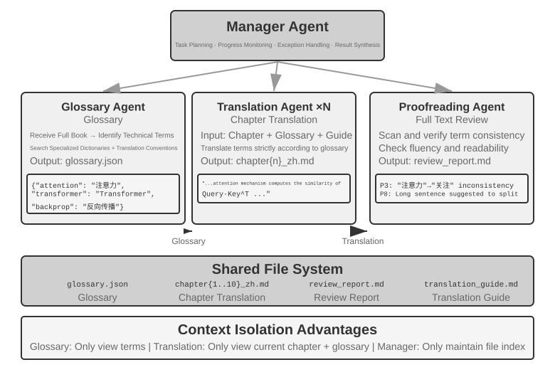
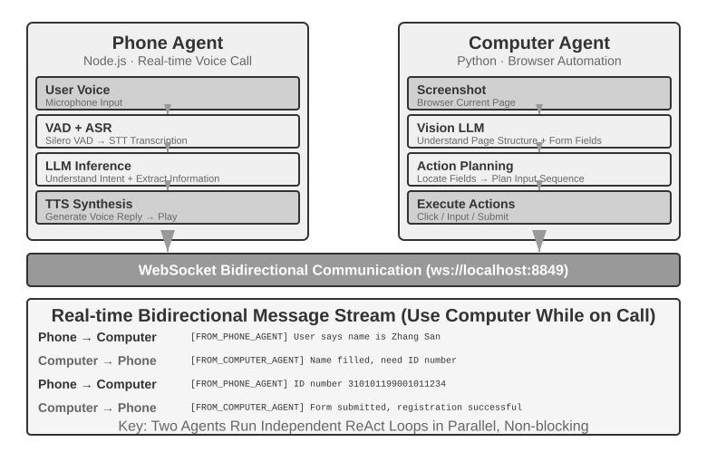

# Çoklu Agent İş Birliği

İlk dokuz bölüm tek bir Agent'a odaklandı: önce context'ini, bilgisini, araçlarını ve etkileşim yeteneklerini kurdu; ardından değerlendirme, post-training ve sürekli evrim yoluyla onu uzun vadede iyileştirdi. Bu bölüm soruyu “Bir Agent nasıl inşa edilir ve geliştirilir?” düzeyinden “Birden çok Agent nasıl organize edilir?” düzeyine taşır—iş bölümü, iletişim ve karşılıklı doğrulama sayesinde tek bir Agent'ın üstlenmekte zorlanacağı görevleri tamamlamak için.

OpenAI'ın bir zamanlar öne sürdüğü beş kademeli yapay zeka yetenek tanımında (Level 1 sohbet ediciler, Level 2 düşünenler (Reasoners), Level 3 Agent'lar, Level 4 yenilikçiler, Level 5 organizasyonlar — Organizations), çoklu Agent iş birliği çoğu zaman beşinci seviyeye giden yollardan biri olarak gösterilir. Şunu belirtmek gerekir: buradaki Organizations, bir sistem mimarisi gereksinimini değil, "yapay zekanın bütün bir organizasyonun işini yapabilmesi" anlamındaki bir yetenek seviyesini ifade eder; yeterince güçlü tek bir Agent da teoride bu seviyeye ulaşabilir. Ne var ki bugünün mühendislik gerçekliğinde tek bir Agent, nihayetinde kendi modelinin yetenek sınırlarıyla ve context penceresiyle kısıtlı kalır.

Birden fazla Agent'ı birlikte çalıştırmanın anlamı, farklı uzmanlıklara sahip Agent'ların "birbirinin eksiğini kapatmasından" çok daha fazlasıdır. Daha temel olan nokta şudur: **grubun zekası bireyinkini aşabilir**. İnsan uygarlığı bunun kanıtıdır — tek bir insanın zekası sınırlıdır, ama iş bölümü, iş birliği, tartışma ve bilginin kuşaklar boyu birikmesi sayesinde insan toplumunun bir bütün olarak sergilediği zeka, herhangi bir dahi bireyinkinin çok ötesindedir. Agent toplulukları da benzer bir kolektif zeka ortaya çıkarabilir: her bir Agent yalnızca bir insan uzman düzeyinde olsa bile, düzgün örgütlendiği sürece topluluğun bütünsel yeteneği tüm insan uzmanların toplamını aşabilir. Google DeepMind, *From AGI to ASI* çalışmasında "büyük ölçekli çoklu Agent toplulukları"nı süper zekaya (ASI) giden kilit yollardan biri olarak sıralar — insanın genel zekasının bireyi aşan toplum ve organizasyonlara dönüşebilmesi gibi, AGI seviyesindeki çok sayıda Agent'ın birlikte oluşturduğu "topluluk zekası" da üyelerinin basit toplamının çok ötesinde bilişsel yetenekler sergileyebilir[^agi-asi]. Dolayısıyla çoklu Agent iş birliği, yalnızca tek bir modelin context penceresini ve yetenek sınırlarını aşmaya yarayan bir mühendislik yöntemi değil; "uzman seviyesinde yapay zeka"dan "insanlığın bütününü aşmaya" uzanan temel bir yol da olabilir.

[^agi-asi]: "Büyük ölçekli çoklu Agent toplulukları"nın genel yapay zekadan süper zekaya giden kilit yollardan biri olarak sıralanması için bkz. Google DeepMind, *From AGI to ASI.* arXiv:2606.12683, 2026.

## Çoklu Agent İş Birliğinin Sınıflandırma Çerçevesi

Bir çoklu Agent sistemi kurmak için önce iki temel tasarım boyutunu anlamak gerekir; bu ikisi birlikte sistemin temel mimarisini ve gerçeklenme biçimini belirler.

### Boyut Bir: Context Paylaşılıyor mu?

Bu, en temel mimari karardır ve birden fazla Agent arasında bilginin nasıl aktarılacağını belirler.

**Paylaşılan context**, sonraki Agent'ın kendinden önceki Agent'ın eksiksiz konuşma geçmişini ve trajectory'sini (Bölüm 1'de tanımlanan trajectory) devraldığı anlamına gelir. Her aşamada system prompt ve araç kümesi değiştikten sonra ortaya yeni bir Agent çıkar (çünkü kimliği, sorumlulukları ve yetenekleri değişmiştir), ama selefinin bütün belleğini korur. Örneğin bir ekipte gereksinim analisti gereksinim dokümanını yazdıktan sonra geliştirici yalnızca dokümanı almakla kalmaz, analistin kullanıcıyla yaptığı bütün yazışmaları da görebilir — yeni bir roldedir, ama önceki context'i eksiksiz korumuştur. Üstünlüğü bilginin kaybolmamasıdır; her Agent önceki herhangi bir aşamanın ayrıntılarına dönüp bakabilir. Zorluğu ise context'in hızla şişebilmesidir.

**Paylaşılmayan context**, her Agent'ın tamamen bağımsız bir context ve konuşma geçmişi tuttuğu, birbirlerinin "düşünme sürecine" doğrudan erişemediği anlamına gelir. Bu, farklı departmanlar arasındaki iş birliğine benzer: herkes kendi masasında bağımsız çalışır, bilgiyi başkasının ekranını sürekli izleyerek değil, paylaşılan dokümanlar ve toplantı notları üzerinden alışverişe sokar. Bu modelin modülerliği ve izolasyonu daha iyidir; her Agent'ın yalnızca kendi sorumluluğuyla ilgili bilgiye odaklanması yeterlidir. Sistemin genişletilmesi ve bakımı da kolaylaşır — yeni bir Agent eklemek mevcut Agent'ların iç mantığını değiştirmeyi gerektirmez, yalnızca arayüzlerin ve veri formatlarının iyi tanımlanmasını gerektirir.

Agent'lar context paylaşmadığı için bilginin açık iletişim mekanizmalarıyla aktarılması zorunludur. Bu sorunun yanıtı klasik dağıtık sistemlerde çoktan verilmişti: işletim sistemi ders kitapları bize süreçler arası iletişimin (IPC) nihayetinde yalnızca iki paradigmadan ibaret olduğunu söyler — **paylaşılan bellek** (bir taraf yazar, diğer taraf aynı depolama bloğunu okur) ve **mesaj geçirme** (veri açıkça karşı tarafa gönderilir). Agent'lar arası iletişim mekanizmaları da bu iki paradigmanın içine düşer; yaygın olarak üç tanesi görülür:

- **Araç çağrısının parametreleri**: Aşağı akıştaki Agent bir araç olarak sarılır; yukarı akıştaki Agent yapılandırılmış veriyi bu aracın parametreleriyle geçirir. Tipi kesin, yapısı net veri gerektiren senaryolara uygundur;
- **Paylaşılan dosya sistemi**: Agent'lar paylaşılan bir dizindeki doküman, kod gibi ara ürünleri okuyup yazarak bilgi alışverişi yapar; ürünlerin büyük olduğu ya da kalıcılık gereken senaryolara uygundur;
- **Message bus (mesaj veri yolu)**: Agent'lar arasında mesaj taşımakla özel olarak görevlendirilmiş bir aktarma istasyonudur; Agent'lar birbirini doğrudan çağırmaz, mesajı message bus'a gönderir, o da mesajı hedef Agent'a iletir.

IPC'nin iki paradigmasına karşılık gelecek şekilde: paylaşılan dosya sistemi Agent dünyasının "paylaşılan belleği"dir; araç çağrısı parametreleri ile message bus ise "mesaj geçirme"nin iki biçimidir — ilki çağrıyla birlikte senkron olarak iletilir, ikincisi aktarma istasyonu üzerinden asenkron olarak teslim edilir. İki paradigmanın da kendi ödünleşimleri vardır. Go dilinin çok bilinen bir sözü vardır: "Belleği paylaşarak iletişim kurmayın; iletişim kurarak belleği paylaşın"。

Message bus doğası gereği **asenkron iletişimi** destekler — gönderen ve alan tarafın aynı anda çevrimiçi olması gerekmez; tıpkı şirket içi e-posta sistemi gibi: bir iş arkadaşınıza e-posta gönderdiğinizde onun o anda bilgisayarının başında olması gerekmez, e-posta önce sunucuda durur, iş arkadaşınız çevrimiçi olunca işler. Bu yaklaşım özellikle birden fazla Agent'ın paralel çalıştığı ve birbiriyle koordine olması gereken senaryolara uygundur (bu bölümdeki "paralel koordinasyon" kısmına bakın).


Şunu netleştirmek gerekir: iki mimari de gerçek birer çoklu Agent sistemidir (çünkü her aşamanın system prompt'u ve araç kümesi farklıdır, dolayısıyla farklı Agent'lardır); fark koordinasyon biçimindedir. **Paylaşılan context** örtük koordinasyona dayanır — sonraki Agent'lar önceki Agent'ların eksiksiz context geçmişini devralır, önceki düşünme sürecini "görebilir", bilgi context'in kendisi üzerinden aktarılır. **Paylaşılmayan context** açık koordinasyona dayanır — Agent'lar dosyalar, mesajlar veya yapılandırılmış veri arayüzleri üzerinden bilgi alışverişi yapar ve her Agent yalnızca kendisiyle ilgili içeriği görür.

Bir benzetme: ilki bir ekibin aynı masanın etrafına oturup tartışmasına, herkesin her sözü duymasına benzer; ikincisi farklı departmanların e-posta ve dokümanlarla iş birliği yapmasına, her birinin kendi çalışma alanının olmasına benzer.

İşletim sistemlerine aşina okurlar bu ikilemi tanıyacaktır: paylaşılan context thread'dir, paylaşılmayan context process'tir. Thread'ler adres uzayını paylaşır, geçiş maliyeti düşüktür, iletişim kopyalama gerektirmez; bedeli izolasyonun olmamasıdır — bir thread belleği bozarsa bütün process onunla birlikte çöker. Process'lerin her birinin bağımsız adres uzayı vardır, izolasyon tamdır, güvenle paralel çalışılabilir; bedeli iletişimin açık IPC'den geçmek zorunda olmasıdır.

**Basit karar kuralı**: Beklenen birikimli context'in pencerenin %50'sini aşacağı düşünülüyorsa (bu kesin bir eşik değil, bir deneyim kuralıdır) paylaşmayın; bilginin sıfır kayıpla aktarılması görevin doğruluğu için katı bir kısıtsa paylaşın; gerçek sistemlerin çoğu "aşamalı geçiş" yaklaşımını benimser — ilk birkaç Agent context paylaşır, bilgi doygunluk noktasına gelindiğinde paylaşılmayan context artı açık handoff'a (devir; yani hangi bilginin aşağı akışa aktarılacağına yukarı akıştaki Agent'ın kendisinin karar vermesi) geçilir.

### Boyut İki: İş Birliği Topolojisi

İkinci boyut iş birliği topolojisidir — Agent'lar arasında kontrolün ve bilginin hangi yapı üzerinden aktığı. İş birliği topolojisi ile context'in paylaşılıp paylaşılmaması **kavramsal olarak bağımsız, pratikte ilişkilidir**: kavramsal olarak bağımsızdır, çünkü context paylaşan sistemlerin de bir topolojisi vardır; örneğin bu bölümde ileride tanıtılan `transfer_to_agent` (Deney 10-1) özünde zincirleme devrin (handoff) paylaşılan context altındaki biçimidir. Pratikte ilişkilidir, çünkü context bir kez paylaşıldığında topoloji çoğunlukla yozlaşır (aşağıya bakın) ve iki boyutun değerleri istenildiği gibi birleştirilemez. Yalnız şu var ki context paylaşıldığında devrin "ne aktarılacağına" karar vermesi gerekmez — eksiksiz geçmiş zaten korunur — bu yüzden topoloji genellikle bir rol değiştirme dizisine yozlaşır ve yapılacak fazla mimari karar kalmaz (ikisinin arasında duran bir istisna, group chat tarzı çok taraflı iş birliğidir; bu bölümün ilerideki merkezsizlik kısmına bakın). Context paylaşılmadığı anda ise "bilginin nasıl akacağı, koordinasyonu kimin yapacağı" açıkça tasarlanması gereken bir soruna dönüşür.

> **Terminoloji notu: Graph Engineering.** Temmuz 2026'da yaygınlaşan “Graph Engineering” terimi, günümüz Agent bağlamında genellikle açık bir execution graph tasarlamayı ifade eder: node'lar Agent'lar, sıradan programlar veya insan kararlarıdır; edge'ler görev bağımlılıklarını, koşullu yönlendirmeyi ve başarısızlık yollarını tanımlar; yapılandırılmış state ise node'lar arasında akar.[^ch10-graph-engineering] Bu bölümde tartışılan “iş birliği topolojisi”, bu fikrin multi-agent alt kümesidir—eşler arası iş birliği, yönetici orkestrasyonu ve merkezsiz handoff'lar farklı graph topolojileridir. Ad henüz yeni olduğu ve bilgi grafları, GraphRAG ve execution trace'lerle kolayca karıştırıldığı için bu kitap ana söz dağarcığı olarak daha yerleşik “iş birliği topolojisi” ve “orkestrasyon” terimlerini kullanmayı sürdürür.

[^ch10-graph-engineering]: Adın erken dönem tartışmalarından biri için bkz. Josh C. Simmons, *We Are Entering the Graph Engineering Phase*, 2026. Ana akım framework'ler aynı mühendislik yapısını tümüyle yeni bir teknoloji olarak değil, genellikle graph tabanlı workflow veya orkestrasyon olarak adlandırır. Bkz. https://www.drjoshcsimmons.com/writing/we-are-entering-the-graph-engineering-phase, https://docs.langchain.com/oss/python/langgraph/overview, https://learn.microsoft.com/en-us/agent-framework/workflows/ ve https://adk.dev/workflows/.

Başka bir deyişle bu iki boyut ilkesel olarak 2×3'lük bir birleşim matrisi oluşturur (paylaşılan/paylaşılmayan × üç topoloji), ama paylaşılan context satırında topoloji çoğunlukla bir rol değiştirme dizisine yozlaşır ve geriye pek mimari karar kalmaz (ileride "çok aşamalı rol değiştirme" başlığı altında tartışılan biçim tam da budur). Bu nedenle bu bölüm yalnızca paylaşılmayan context'in üç hücresini ayrıntılandırır. Aşağıda tanıtılanlar, iş birliği topolojisinin paylaşılmayan context altındaki üç tipik biçimidir; karmaşıklık sırasına göre:

- **Eşler arası iş birliği modeli** (Peer Collaboration Pattern): Az sayıda Agent (genellikle 2-3) eşit statüde etkileşir ve yinelemeli bir iyileştirme döngüsü oluşturur — tıpkı makale yazarken birinin taslağı çıkarması, diğerinin şerh düşüp düzeltmesi gibi; birkaç turdan sonra kalite tek kişinin kafasını gömüp yazmasının çok üstüne çıkar.
- **Yönetici modeli** (Orchestration Pattern): Merkezîleşmiş bir Manager Agent görev planlama ve zamanlamadan sorumludur, birden fazla alt Agent ise belirli alt görevleri üstlenir — tıpkı bir proje yöneticisinin birkaç uzman mühendisle proje yürütmesi gibi.
- **Merkezsiz model** (Decentralized Pattern): Çalışma zamanında merkezî bir denetleyici yoktur; Agent'lar tıpkı insanlar gibi birbiriyle iletişim kurarak görevi birlikte tamamlar.

Her modelin ayrıntılı tasarımı ve uygun olduğu senaryolar ilerideki özel alt başlıklarda ele alınacak.

## Çoklu Agent Tek Agent'tan Ne Zaman Gerçekten Üstündür

Somut iş birliği mimarilerine geçmeden önce daha temel bir soruyu yanıtlayalım: **Ne zaman gerçekten birden fazla Agent'a ihtiyaç var, ne zaman bir Agent yeter?** Bu sorunun yanıtı, ilerideki bütün mühendislik çözümlerinin genel referans noktası olacak. Son yılların bir dizi araştırması net bir karar çerçevesi ortaya koyuyor — çekirdek ölçüt tek bir şey: **İş birliği süreci, tek bir Agent'ın üretim anında elde edemeyeceği yeni bir bilgi getiriyor mu?**

Tablo 10-1, farklı iş birliği modellerinin yeni bilgi getirip getirmediğini özetler; çoklu Agent iş birliğinin tek Agent'a göre esaslı bir değer taşıyıp taşımadığını değerlendirmek için kullanılır.

Tablo 10-1 Çoklu Agent İş Birliği Modellerinin Bilgi Kazanımı Karşılaştırması

| İş Birliği Modeli | Yeni Bilgi Getiriyor mu | Etki |
|---|---|---|
| Aynı modelin kendini incelemesi (kendi çıktısını yeniden okuması) | Hayır | Genellikle etkisiz, hatta zararlı |
| Farklı Agent'ların aynı metin üzerinde tartışması | Hayır | Eşit hesaplama yükünde tek Agent'la başa baş |
| İnceleyicinin test yürütme sonuçlarıyla kodu incelemesi | Evet (yürütme geri bildirimi) | Belirgin iyileşme |
| İnceleyicinin render edilmiş ekran görüntüsüne bakarak frontend/PPT kodunu incelemesi | Evet (görsel geri bildirim) | Belirgin iyileşme |
| İnceleyicinin dış araçlarla olguları doğrulaması | Evet (araç geri bildirimi) | Belirgin iyileşme |

2025 yılının RLEF'i (Reinforcement Learning from Execution Feedback)[^rlef-2025] bunu doğruladı: modeli, kod yürütme geri bildirimini kullanarak kodu yinelemeli biçimde iyileştirmek üzere pekiştirmeli öğrenmeyle eğitmek, modele bağımsız olarak birçok kez örnekleme yaptırmaktan çok daha iyi sonuç verdi. Kilit nokta, her yinelemenin **gerçek yürütme sonuçlarını** (derleme hataları, test başarısızlıkları, çalışma zamanı istisnaları) getirmesidir; bu bilgiler model kodu yazarken mevcut değildi. 2025 yılının WebGen-Agent'ı [^webgen-agent-2025] web sayfası üretme görevinde, çok katmanlı görsel geri bildirimden (ekran görüntüsü artı görsel dil modeli açıklaması) oluşan bir geri bildirim iskelesiyle, bildirildiğine göre Claude 3.5 Sonnet'in bu benchmark'taki performansını %26,4'ten %51,9'a çıkardı — neredeyse iki katına.

[^rlef-2025]: Gehring, J., et al. *RLEF: Grounding Code LLMs in Execution Feedback with Reinforcement Learning.* arXiv:2410.02089, 2025.
[^webgen-agent-2025]: Lu, Z., et al. *WebGen-Agent: Enhancing Interactive Website Generation with Multi-Level Feedback and Step-Level Reinforcement Learning.* arXiv:2509.22644, 2025.

Bu "yeni bilgi" çerçevesi, görünüşte çelişkili bir olguyu açıklıyor: akademik araştırmalar "tek Agent yeter" diyor, ama mühendislik pratiğinde çoklu Agent gerçekten daha iyi sonuç veriyor. Çelişkinin kaynağı, ikisinin farklı tipte "çoklu Agent"lardan söz etmesi — akademik araştırmalarda karşılaştırılanlar çoğunlukla "birden fazla Agent'ın aynı metne bakıp birbiriyle tartışması" modelidir (tartışma gibi), oysa mühendislik pratiğinde etkili olan çoklu Agent sistemleri genellikle dış geri bildirim döngüleri (kod yürütme, görsel render, araç çağırma) içerir. İlki yeni bilgi getirmez, ikincisi getirir. Bu bölümde ileride tanıtılacak eşler arası iş birliği, yönetici ve merkezsiz mimarilerin gerçekten işe yarayan kullanımlarının neredeyse tamamı bu ölçüt üzerinde bir yere oturtulabilir.

Anthropic'in 2026 tarihli güvenlik açığı bulma deneyi buna bir örnektir. Kırk beş Agent ortak bir forum üzerinden aramalarını koordine etti, birbirinin bulgularını inceledi ve sonuçları bağımsız bir hakem Agent'a sundu. Koordineli Agent kümesi 27 milyon token ile 266 açık bulurken, bağımsız Agent'ların paralel çalıştığı yöntem 6,5 milyon token ile yalnızca 21 açık buldu. Açık uçlu bir arama alanında iletişim, çoklu Agent sisteminin odağını dinamik biçimde değiştirmesine ve uzmanlaşmasına olanak tanır; daha geniş kapsam ve daha çeşitli keşif yolları için daha yüksek token bütçesi harcanır.[^anthropic-multiagent-2026]

[^anthropic-multiagent-2026]: Anthropic Frontier Red Team, “Patterns and Problems in Emerging Multiagent Systems,” 2026-08-13. https://www.anthropic.com/research/multiagent-systems

**Adım bütçesi ve Agent performansı.** İlgili bir araştırma yönü şudur: Agent'a farklı adım bütçeleri (yani izin verilen araç çağrısı sayısı veya yineleme turu) vermek performansını nasıl etkiler? Sezgisel olarak daha çok adım daha iyi sonuç getirmelidir — 30 adımlık bütçede Agent ancak çekirdek işlevi hızlıca gerçekleştirebilir, 300 adımlık bütçede önce planlama yapıp sonra gerçekleştirebilir, test edebilir, iyileştirebilir. Ama Google'ın 2025 tarihli *Budget-Aware Tool-Use Enables Effective Agent Scaling* makalesi sezgiye aykırı bir sonuç buldu: **Agent'ın kullanabileceği adım sayısını artırmak tek başına performans artışını garanti etmiyor**. Standart Agent'lar "bütçe farkındalığından" yoksundur — 300 adımlık bütçeleri olsa bile yüzeysel arama yapma eğilimini sürdürür ve çok geçmeden "doyuma" ulaşırlar. Daha fazla adımın gerçekten daha iyi sonuca dönüşmesi için Agent'ın, kalan kaynağa göre stratejisini dinamik olarak ayarlayan açık bir bütçe farkındalığı mekanizmasına ihtiyacı vardır: başlangıçta geniş keşif, sonrasında en umut vaat eden yöne odaklanma. 2026 tarihli BAVT (Budget-Aware Value Tree Search) bir adım daha ileri giderek adım düzeyinde değer değerlendirmesi önerdi; her adımda kalan bütçe oranına göre keşif ile sömürünün ağırlığını ayarlıyor — bütçe azaldıkça Agent "geniş ağ atmaktan" giderek "derin kazmaya" geçiyor.

Bu bulguların çoklu Agent sistem tasarımı için doğrudan yol gösterici bir anlamı var. Örneğin yönetici modelinde Manager Agent, görevleri alt Agent'lara dağıtıp sonucu beklemekle yetinmemeli, görevin karmaşıklığına göre **adım bütçesini dinamik olarak dağıtmalıdır** — basit alt görevlere daha az, karmaşık alt görevlere bol adım. Aynı zamanda alt Agent'ları bu bütçeyi makul kullanmaya yönlendirmelidir (önce planla, sonra gerçekleştir, sonra test et, sonra iyileştir); doğrudan dalıp işe girişmeye değil.

Bütün tasarımların önüne konulması gereken bir şey daha var: **maliyet**. Çoklu Agent'ın paralel keşfi ve tekrarlı yinelemesi para harcar — Anthropic, çoklu Agent araştırma sisteminin token tüketiminin normal bir konuşmanın yaklaşık 15 katı olduğunu ve token kullanımının tek başına performans farkının yaklaşık %80'ini açıkladığını paylaşmıştı. Bu, çoklu Agent'ın getirdiği kazancın, birkaç kat hatta bir büyüklük mertebesi ek maliyeti karşılayacak kadar büyük olması gerektiği anlamına gelir; aksi halde iyi ayarlanmış tek bir Agent çoğu zaman daha hesaplı bir seçimdir.

## Paylaşılan Context'li Çoklu Agent İş Birliği

Paylaşılan context ile iş birliğinde her aşama kendi system prompt'una ve araçlarına sahip bağımsız bir Agent'dır; ancak önceki aşamanın tam trajectory'sini devralır. Temel avantaj bilgi kaybının olmamasıdır. Zorluk ise büyüyen geçmişe rağmen mevcut Agent'ı kendi sorumluluğuna odaklamaktır.

Karmaşık görevlerde rol ve sorumluluklar aşamalar arasında önemli ölçüde değişebilir. Tek bir statik prompt ya fazla genel ya da aşırı uzun olur; bu nedenle system prompt ve araç seti aşamaya göre değiştirilebilir.

Temel mimari seçim, rol geçişinde system prompt'u değiştirmek mi yoksa Skill yüklemek mi gerektiğidir. İkisi de davranış kurallarını değiştirir, fakat maliyet ve sınır modelleri farklıdır.

| Seçim | Rol kurallarının taşıyıcısı | Araç görünürlüğü | Context/KV Cache etkisi | Kısıt gücü |
|---|---|---|---|---|
| `transfer_to_agent` | System prompt'u ve genellikle araç setini değiştirir | Yalnızca mevcut rolün araçları | Her geçiş istek prefix'ini değiştirir; fark noktasından sonraki cache genellikle kullanılamaz | Güçlü: rol dışı araçlar schema'dan çıkarılabilir |
| Skill | Sabit Skill dizini; gerektiğinde `SKILL.md` trajectory'ye eklenir | Genellikle tüm katalog veya sabit arama girişi | Statik prefix değişmez; Skill trajectory'nin sonuna eklenir | Zayıf: Skill bir talimattır; katı izinleri Harness uygular |

Rol farkı bilgi, süreç veya yazım tarzıysa Skill tercih edilir. Fark izin, araç izolasyonu, uyumluluk ya da yan etkilerin yasaklanmasıyla ilgiliyse ayrı Agent veya `transfer_to_agent` kullanılmalı ve araç sınırları Harness'ta kodla zorlanmalıdır.

> **Deney 10-1 ★★: Paylaşılan context'te rol geçişi — system prompt ile Skill karşılaştırması**
>
> **Ortak görev ve değişkenler**: iki yol aynı modeli, görevi, araç uygulamalarını, rol kurallarını ve tam paylaşılan trajectory'yi kullanır. Görev, Çin'in 2021–2023 yeni enerjili araç satışlarını bulmak, CAGR'ı hesaplamak ve 120 Çince karakteri aşmayan yatırımcı özeti yazmaktır.
>
> **Yol 1: system prompt geçişi**. Beş rol `triage`, `research`, `coding`, `data_analysis` ve `writing`'dir. Her rol yalnızca kendi araçlarını ve `transfer_to_agent` aracını görür; devirde geçmiş korunur, hedef rolün prompt'u ve araçları yüklenir ve yürütme sürer.
>
> **Yol 2: Skill**. System prompt ve tam araç kataloğu oturum boyunca sabit kalır. Model `load_skill(name)` çağırır; okunan `SKILL.md` araç sonucu olarak paylaşılan trajectory'ye girer. Statik prefix değişmez, katı izinleri Harness kuralları uygular.

## Paylaşılmayan Context'li Çoklu Agent İş Birliği

Paylaşılmayan context gerçek çoklu Agent iş birliğini temsil eder. Bu mimaride her Agent bağımsız bir varlıktır; kendi context'i, trajectory'si ve durumu vardır. Agent'lar birbirinin "iç dünyasına" doğrudan erişemez; iş birliği tamamen açık ve yapılandırılmış veri aktarma mekanizmalarına, yani bu bölümün başında tanıtılan üç iletişim mekanizmasına (araç çağrısı parametreleri, paylaşılan dosya sistemi, message bus) dayanır.

Bu bölümün başında iletişim mekanizmalarını süreçler arası iletişimin iki paradigmasına, paylaşılan ile paylaşılmayan context'i de thread ile process'e karşılık getirmiştik. Bu benzetme daha da ileri götürülebilir (Tablo 10-2):

Tablo 10-2 Çoklu Agent Sistemleri ile İşletim Sistemleri Arasındaki Karşılıklar

| İşletim Sistemi | Çoklu Agent Sistemi |
|----------|----------------|
| Program (yürütülebilir dosya) | Static prefix (system prompt + araç tanımları) |
| Process'in belleği | Trajectory |
| CPU | LLM |
| Çekirdek (kernel) | Agent çalışma zamanı |
| Sistem çağrısı | Araç çağrısı |
| fork (alt process oluşturma) | spawn_subagent |
| kill (sinyal gönderme) | cancel_subagent |
| ps (process'leri listeleme) | list_agents |
| Çıkış kodu ve wait() | Alt Agent'ın döndürdüğü yapılandırılmış özet |
| Paylaşılan bellek / mesaj geçirme | Paylaşılan dosya sistemi / mesaj |


Bu soyutlama yeni değil: özel durum, asenkron mesajlar ve yeni üyeler oluşturabilme, 1970'lerin Actor modelinin temel kurgusudur[^actor-model]; çoklu Agent sistemlerini onun LLM sürümü olarak görmekte sakınca yoktur. Bu nedenle işletim sistemlerinin ve dağıtık sistemlerin olgunlaşmış deneyimi büyük ölçüde doğrudan ödünç alınabilir.

[^actor-model]: Hewitt, C., Bishop, P., Steiger, R. *A Universal Modular ACTOR Formalism for Artificial Intelligence.* IJCAI 1973.

Process tarzı izolasyon birkaç somut mühendislik faydası getirir: her Agent bağımsız olarak geliştirilip test edilebilir, yeni yetenek eklemek mevcut kodu değiştirmeyi gerektirmez, bir Agent arızalandığında hatalı durumu diğer Agent'lara bulaştırmaz ve birden fazla Agent gerçek anlamda eşzamanlı yürütülebilir — context'ler tamamen bağımsız olduğu için kaynak rekabeti oluşmaz.

Ama paylaşılmayan context'in bir bedeli de var. En belirgini bilgi senkronizasyonu sorunudur: Agent'lar görev durumu hakkında tutarlı bir anlayışı nasıl koruyacak? Bilgi aktarım sırasında kaybolur ya da tekrarlanır mı? Hata ayıklama da zorlaşır — bir sorun çıktığında eksiksiz yürütme sürecini kurabilmek için birden fazla Agent'ın günlüğünü taramak gerekir. Bu sorunlar arayüz belirtimlerinin, veri formatlarının ve iletişim protokollerinin tasarımını kritik hale getirir.

Paylaşılmayan context'in açık iş birliği, topolojiden bağımsız iki altyapıya dayanır. Birincisi **paylaşılan dosya sistemidir**; Agent'lar arasında ürün, kullanıcıyla da dosya alışverişinin kalıcı ortamı olarak iş birliğinin veri düzlemini oluşturur. İkincisi **iletişim ve kontrol mekanizmasıdır**; Agent'lar arasında mesaj geçirmeyi, durum sorgulamayı, yürütmenin sonlandırılmasını ve kaynak zamanlamasını destekleyerek iş birliğinin kontrol düzlemini oluşturur. Aşağıdaki üç topolojinin hepsi bu ikisinin üzerine kurulur.

### Agent'ın Gözünden Dosya Sistemi

Bu bölümün başında "paylaşılan dosya sistemi", paylaşılmayan context'in üç iletişim mekanizmasından biri olarak sıralanmıştı. Gerçek sistemlerde Agent'ın eriştiği şey tek bir depolama değil, bir **sanal dosya sistemidir** (virtual filesystem): kaynağı, yaşam döngüsü ve izinleri farklı olan depolamalar aynı dizin ağacının altına bağlanır (mount edilir), Agent hepsine tek tip `read_file`/`write_file`/`list_dir` arayüzüyle erişir, alt katmanda ise yerel geçici disk, kalıcı nesne depolama, üçüncü taraf bulut diskinin API'si veya salt okunur sistem kaynak paketleri bulunabilir. Bu dizin ağacının bileşimini — her bölgenin görünürlüğünü ve yaşam döngüsünü — netleştirmek, çoklu Agent iş birliği tasarımının ön koşuludur: eşzamanlılık çakışmalarının ve bilgi sızıntılarının azımsanmayacak bir kısmı, izole olması gereken bölgelerin iç içe geçirilmesinden kaynaklanır. Bu dizin ağacı Agent'ın adres uzayına denk düşer; dört bölge türü ise izinleri farklı bellek segmentleridir: kimi özel ve yazılabilir, kimi çok taraflı paylaşılan, kimi salt okunur. İşletim sisteminin koruma felsefesi burada da geçerlidir — varsayılan izolasyon, paylaşım açıkça bildirilmeli. Olgun bir çoklu Agent sisteminin dosya sistemi genellikle şu dört bölge türünden oluşur:

**Bir, Agent'a Özel Çalışma Alanı (Scratchpad)**. Her Agent örneğinin tek başına sahip olduğu özel dizindir; ara ürünleri, geçici dosyaları, taslakları ve hata ayıklama günlüklerini barındırır, yaşam döngüsü örneğe bağlıdır, diğer Agent'lara ve kullanıcıya görünmez. Scratchpad'i izole etmenin iki işlevi vardır: birden fazla Agent'ın geçici dosyalarının birbirinin üzerine yazmasını önlemek ve ana Agent'ın context'ini yalın tutmak — alt Agent'ın deneme yanılma süreci kendi çalışma alanında kalır, paylaşılan alana yalnızca nihai ürün gönderilir. Bu, Bölüm 4'teki "alt Agent tam trajectory yerine yapılandırılmış özet döndürür" ilkesinin depolama katmanındaki karşılığıdır.

**İki, Çoklu Agent Paylaşılan Alanı (Shared Workspace)**. Birden fazla Agent'ın birlikte okuyup yazdığı ve **kullanıcıya görünür** olan iş birliği bölgesidir; paylaşılmayan context mimarisinde Agent'lar arası ürün alışverişinin başlıca ortamıdır: Glossary Agent terim listesini yazar, Translation Agent oradan okur; kullanıcı da buraya kaynak dosyaları yükleyebilir, nihai teslimatları indirebilir. Yaşam döngüsü görevin tamamına bağlıdır ve kalıcılık gerektirir. Çok taraflı eşzamanlı okuma-yazma bölgesi olduğu için eşzamanlılık çakışmalarının yoğunlaştığı yerdir — iyimser kilitleme, çalışma kopyası izolasyonu (worktree) gibi mekanizmalar burada devreye girer; ayrıntı için bu bölümün ilerideki "başarısızlık kalıbı bir" kısmına bakın. Bölüm 4'te ana Agent'ı, sanal bilgisayarı ve sanal telefonu birbirine bağlayan `/workspace/shared` birim bağlaması (volume mount), bu katmanın tipik bir uygulamasıdır.

**Üç, Dışarıdan Bağlanan Kaynaklar (Mounted External Resources)**. Kullanıcının erişim yetkisi verdiği üçüncü taraf bilgi kaynakları — Google Drive, Notion, Dropbox, kurumsal wiki vb. — bir adaptör (adapter) aracılığıyla dosya sistemindeki bağlama noktalarına (örneğin `/mnt/gdrive`) eşlenir. Agent bir Notion dokümanına dosya okur gibi erişir, alt katmanda ise adaptör karşı tarafın API'sini çağırır. Bu katmanı yerel depolamadan ayıran üç özellik tasarımda açıkça ele alınmalıdır: **erişim dış izinlere tabidir** (kullanıcının kaynak sistemdeki izinleri Agent'ın görebileceği kapsamı belirler), **gecikme daha yüksek, tutarlılık daha zayıftır** (her okuma bir ağ gidiş dönüşüdür, veri dışarıdan değiştirilmiş olabilir, ancak nihai tutarlılık varsayımıyla ele alınabilir), **ağırlıklı olarak isteğe bağlı ve salt okunurdur** (dış kaynağa geri yazmak dikkat ister, yanlış bir yazma kullanıcının gerçek verisini kirletebilir). Tek tip dosya arayüzü, Agent'ın her veri kaynağı için özel araç geliştirmesini gereksiz kılar, ama yukarıdaki performans ve güvenlik farklarını da gizler; bu yüzden salt okunur/yazılabilir ayrımı, zaman aşımı ve kimlik bilgisi sınırları bağlama katmanında açıkça yönetilmelidir.

**Dört, Sistemle Gelen Kaynaklar (Built-in System Resources)**. Sistemin önceden yerleştirdiği, bütün Agent'lara salt okunur biçimde paylaştırılan kaynak paketleridir; tipik örneği Bölüm 2 ve Bölüm 4'te tanıtılan **Skills**'tir — dosya biçiminde örgütlenmiş bilgi dokümanları ve betikler, `/skills` gibi yollara bağlanır ve aşamalı açığa çıkarmayla (önce dizin, sonra ihtiyaç oldukça açma) kullanılır; bunun dışında başvuru kılavuzları, şablon kitaplıkları ve paylaşılan araç tanımları da bu kapsamdadır. Bu katman küresel olarak paylaşılır, salt okunurdur, oturumlar arası kararlıdır ve eşzamanlılık denetimi gerekmeden bütün Agent'lar tarafından eşzamanlı okunabilir.

Şekil 10-2, bu dört bölgenin aynı dizin ağacı altında tek tip biçimde bağlanmış yapısını gösterir: Agent bütün ağaca tek tip arayüzle erişir, kullanıcı paylaşılan alandan dosya yükleyip indirir, dış veri kaynakları adaptörle bağlanır, sistemle gelen kaynaklar ise salt okunur biçimde sunulur.


Tablo 10-3, bu dört bölgeyi görünürlük, yaşam döngüsü, okuma-yazma izni ve eşzamanlılık denetimi olmak üzere dört boyutta karşılaştırır; dosya sistemi yerleşimi tasarımı için kontrol listesi olarak kullanılabilir.

Tablo 10-3 Agent Sanal Dosya Sisteminin Dört Bölge Türü

| Bölge | Görünürlük | Yaşam Döngüsü | Okuma-Yazma | Eşzamanlılık Denetimi |
|----------------|--------------------|-------------------|-----------------|------------------------|
| Agent'a özel çalışma alanı | Yalnızca o Agent | Agent örneğiyle birlikte yok olur | Okuma-yazma | Gerekmez (özel) |
| Çoklu Agent paylaşılan alanı | Bütün iş birliği Agent'ları + kullanıcı | Görev boyunca sürer, kalıcılık gerekir | Okuma-yazma | Gerekir (iyimser kilitleme / worktree) |
| Dışarıdan bağlanan kaynaklar | Dış yetkilendirmeye göre değişir | Dış kaynak belirler | Çoğunlukla salt okunur, yazmak dikkat ister | Dış kaynak üstlenir |
| Sistemle gelen kaynaklar | Bütün Agent'lar | Oturumlar arası kararlı | Salt okunur | Gerekmez (salt okunur) |

Dört bölgenin aynı dizin ağacı altında birleştirilmesi, tam da "**dosya yolunun evrensel arayüz olarak kullanılması**" tasarımının değerini ortaya koyar: Agent'lar arası ürün aktarımı, ana Agent'ın alt Agent'a girdi devretmesi, hatta kurumlar arası A2A iş birliğinde Artifact alışverişi — bunların hepsinde aktarılan şey, içeriğin context penceresine yüklenmesi değil, hafif bir yol dizesidir (Bölüm 4). Bu, Bölüm 5'teki "Agent'ın merkezi olarak dosya sistemi" fikriyle aynı damardan gelir — orada tek bir Agent'ın belleği ve yetenekleri dosya sistemiyle nasıl taşıdığı tartışılıyordu, burada ise aynı soyutlama çoklu Agent'a genişletiliyor: özel, paylaşılan, dış ve yerleşik olmak üzere dört tür depolamanın bağlandığı bir sanal dizin ağacı, çoklu Agent iş birliğinin depolama temelidir.

### Agent'lar Arası İletişim ve Kontrol

Dosya sistemi Agent'lar arasındaki **ürün alışverişi** sorununu çözer; iş birliği bir de **kontrol düzlemi** gerektirir. Tablo 10-2'teki yaşam döngüsü satırları tam da burada işe yarar: Bölüm 4'te verilen bu araç ilkelleri — oluşturma (`spawn_subagent`), mesaj gönderme (`send_message_to_subagent`), iptal etme (`cancel_subagent`) ve keşfetme (`list_agents`) — process dünyasındaki fork, mesaj, kill ve ps'e karşılık gelir. Bu kısım arayüz tanımlarını tekrarlamayacak; çoklu Agent iş birliğinin dayandığı, ama sıklıkla gözden kaçan dört yeteneğe odaklanacak.

**Bir, mesaj geçirme.** En yalın biçimi noktadan noktayadır: Agent A doğrudan `send_message_to_agent_b(content)` çağırır; topolojinin sabit, Agent sayısının az olduğu senaryolara uygundur (bu bölümdeki Deney 10-3'ün telefon artı bilgisayar ikili Agent'ı gibi). Agent sayısı arttığında ve asenkron paralellik gerektiğinde noktadan noktaya bağlantı sayısı Agent sayısının karesiyle büyür, ayrıca gönderen ile alanın aynı anda çevrimiçi olmasını gerektirir; bu durumda **message bus'a** geçilmelidir (ayrıntı için bu bölümün ilerideki "paralel koordinasyon biçimi" kısmına bakın): Agent mesajı bus'a yayımlar, bus abonelik ilişkisine göre iletir, gönderenin tüketicileri bilmesi gerekmez. İster noktadan noktaya ister bus üzerinden olsun, mesajlar genellikle yapılandırılmış bir **zarf** (envelope) taşımalıdır: gönderen kimliği, hedef (belirli bir Agent veya yayın), mesaj tipi (`task_assigned`/`status_update`/`result`/`terminate` gibi) ve JSON yükü. Tek tip zarf formatı, alıcının güvenilir biçimde yönlendirme ve ayrıştırma yapmasını sağlar, iş birliği zincirini de izlenebilir kılar — bu, çoklu Agent sistemlerinde hata ayıklamanın anahtarıdır.

**İki, durum sorgulama.** Kontrol düzleminin en çok küçümsenen halkası budur. Ana Agent bir alt Agent'ı yola çıkardıktan sonra ilerlemesini öğrenemezse, ne beklemeye devam edip etmeyeceğine karar verebilir ne de alt Agent tıkandığında zamanında müdahale edebilir. Sezgisel yaklaşım RPC'yi olduğu gibi almak, bir `get_subagent_status(agent_id)` sorgu arayüzü tanımlayıp "çalışıyor/tamamlandı/başarısız" bilgisiyle bir ilerleme yüzdesi döndürmektir. Ama bu çekme tarzı arayüzün pratik faydası beklenenin çok altındadır: alt Agent oluşturulur oluşturulmaz yürütmeye başlar ve tamamlanana veya başarısız olana kadar sürer; geleneksel toplu işlem sistemlerindeki işler gibi bir dizi kuyruk durumu arasında dolaşmaz — nitekim Unix programlamada bir process'in çalışma durumunu PID üzerinden yoklamaya çok nadiren ihtiyaç duyulur. Yoklamanın doğasında bir de ikilem vardır: sık yapılırsa token israf eder, seyrek yapılırsa geç kalır. Durum edinmenin daha doğal yolu, bu bölümün başındaki iki iletişim paradigmasına dönmektir.

**Durumu mesaj geçirmeyle edinmek**. Ana Agent alt Agent'a doğrudan bir mesaj gönderir: "Durum ne?" Alt Agent uygun bir anda yanıtlar. Her şey asenkrondur: mesaj göndermek kendi yürütmesini engellemez, karşı tarafın ne zaman yanıtlayacağı, hatta yanıtlayıp yanıtlamayacağı ayrı bir konudur — tıpkı bir yöneticinin anlık mesajla astına ilerlemeyi sorması, ama elindeki işi hemen bırakmasını istememesi gibi. Tersine, alt Agent kritik bir noktaya vardığında kendiliğinden mesaj gönderip rapor da verebilir; sistemde zaten bir message bus kurulmuşsa bu, bus'a bir `status_update` yayımlamak demektir (Deney 10-4'nın "gerçek zamanlı izleme"si bu biçimdedir). İster soru-cevapla ister kendiliğinden raporla olsun, mesajdaki durumun kendisi tek tip bir durum makinesi sözlüğü kullanmalıdır (yürütülüyor, girdi gerekiyor, tamamlandı, başarısız) — bu bölümün ilerideki A2A protokolü de görev yaşam döngüsünü tam olarak böyle bir durum kümesine standartlaştırır.

**Durumu paylaşılan dosya sistemiyle edinmek**. En köklü biçimi **trajectory kalıcılaştırmadır** (trajectory persistence): alt Agent yürütme sırasında kendi trajectory'sini (Bölüm 1'de tanımlanan trajectory — kullanıcı mesajları, model yanıtları, araç çağrıları ve sonuçlarının eksiksiz dizisi) gerçek zamanlı olarak JSON'a serileştirir ve dosya sistemindeki bir günlük dosyasına ekleyerek yazar (genellikle her oturum için bir dosya, her satırda bir olay, yani JSONL formatı). Ana Agent'ın herhangi bir durum bildirim protokolüne ihtiyacı yoktur; doğrudan bu dosyayı okuyarak alt Agent'ın bütün yürütme sürecini görebilir: hangi aracı çağırdığını, son adımda ne düşündüğünü, tekrar tekrar başarısız olan bir yeniden denemede takılıp kalmadığını. Process diliyle söylersek bu, doğrudan başka bir process'in belleğini okumaya denktir — alt Agent'ın context'ini işgal etmez, onun iş birliğine bağımlı değildir, gözlem çözünürlüğü en incedir. Ama her ayrıntının dökülmesi bir yük de getirir: trajectory'ler kolayca on binlerce token'ı bulur, ana Agent okuduktan sonra bir de kendisi özütlemek zorunda kalır; bu hem zaman hem token harcar. Bu yüzden çoğu senaryoda daha makul olan, **üzerinde anlaşılmış bir ilerleme dosyasıdır**: ana Agent alt Agent'ı başlatırken "ilerlemeyi progress.md'ye yaz" diye anlaşır, alt Agent her maddeyi bitirdikçe bu görev listesini günceller, ana Agent da bu hafif dosyayı istediği an okuyarak durumu öğrenir. Bu, iki process'in paylaşılan bellekte üzerinde anlaşılmış formatta küçük bir durum alanı ayırmasına denktir; açığa çıkan şey "belleğin tamamı" değil, özütlenmiş ilerlemedir. İlerleme dosyası ayrıca **takılma tespiti** de sağlar: progress.md'nin (veya trajectory dosyasının) son değiştirilme zamanı N dakikadır değişmiyorsa, alt Agent'ın etkin olmadığına hükmedilip zaman aşımı emniyet mekanizması tetiklenebilir (Bölüm 6'daki Heartbeat ve monitor_shell ile örtüşür); böylece sistemin tıkanmış bir alt Agent yüzünden aksaması önlenir.

Trajectory kalıcılaştırmanın değeri izlemenin çok ötesindedir. Bölüm 1'in "Agent'ın context'i = static prefix + trajectory" sonucunu hatırlayın: static prefix (system prompt, araç tanımları) kodla belirlenir ve Agent'ın trajectory dışında bir çalışma zamanı durumu yoktur (çalışma ürünleri zaten dosya sisteminde durur) — **trajectory, Agent'ın bütün durumudur**. Trajectory'yi gerçek zamanlı olarak dosyaya kalıcılaştırmak, her an elde eksiksiz bir kontrol noktası bulundurmakla eşdeğerdir: Agent process'i çökse de, makinenin elektriği kesilse de, kullanıcı oturumu kendi kapatsa da, trajectory dosyasını yeniden yükleyip static prefix'i başına eklemek yürütmeyi kesildiği yerden sürdürmeye yeter; Claude Code, Codex CLI gibi kodlama Agent'larının oturum kurtarma (session resume) işlevi tam da böyle gerçeklenir. Bu, veritabanlarının önden yazma günlüğüyle (write-ahead log) aynı fikirdir: her olay önce yalnızca eklenen, hiç silinmeyen bir günlüğe yazılır ve durum her zaman günlükten yeniden oynatılabilir (Bölüm 3'teki "olgu günlüğü + periyodik kontrol noktası" bellek tasarımı aynı fikrin bellek sistemlerine uygulanmasıdır). Çoklu Agent sistemleri açısından bu, alt Agent'ların doğal olarak **kurtarılabilir, denetlenebilir ve devredilebilir** olması demektir: Manager, çöken bir alt Agent'ı son geçerli durumundan yeniden başlatabilir, sonrasında trajectory'yi olay olay yeniden oynatarak başarısızlığın nedenini bulabilir, hatta trajectory'yi göreviyle birlikte başka bir Agent'a devredip yürütmeyi sürdürtebilir.

**Üç, yürütmenin sonlandırılması.** Paralel iş birliğinde sık görülen bir durum "biri başarır, gerisi geçersizleşir"dir — birden fazla Agent ayrı ayrı arama yapar, biri hedefi bulunca diğerleri derhal durmalıdır (bu bölümdeki Deney 10-4'nın kademeli sonlandırması). Sonlandırmanın iki şiddeti vardır; Unix kullanıcıları bunun SIGTERM ile SIGKILL arasındaki fark olduğunu fark edecektir. **Zarif sonlandırma (graceful)** tercih edilendir: ana Agent bir `terminate` sinyali gönderir, alt Agent mevcut adımın güvenli bir noktasında yanıt verir, önce kaynakları temizler (tarayıcı oturumlarını kapatır, tamamlanmamış dosyaları yazar, kilitleri bırakır), onay (ack) döndürüp çıkar. **Zorla sonlandırma (forced)** ise emniyet mekanizmasıdır: process doğrudan sonlandırılır; yalnızca alt Agent zarif sinyale yanıt vermediğinde kullanılır, bedeli askıda kalmış kaynaklar ve yarım kalmış yazmalardır. İki mühendislik noktası ele alınmalıdır: birincisi, zarif sonlandırma alt Agent'ın döngüsünde sonlandırma sinyalini düzenli olarak kontrol etmesini gerektirir (Bölüm 6'daki kesme mekanizmasına benzer), aksi halde sinyale yanıt verilemez; ikincisi, kademeli sonlandırmada bir yarış koşulu vardır — birden fazla alt Agent neredeyse aynı anda başarı bildirebilir, ana Agent kilit veya idempotent tasarımla yalnızca bir kez hesaplaşmayı ve yalnızca bir tur sonlandırma yayını yapmayı güvence altına almalıdır; ayrıntı için bu bölümdeki Deney 10-4'nın yarış koşulu tartışmasına bakın.

Geriye bir artık sorun kalıyor: ana Agent sonlandıktan sonra hâlâ çalışan alt Agent'lara ne olacak? Mühendislikte en yalın yaklaşım Go'nun context'inden ödünç alınır — sonlandırma, oluşturma ilişkisi boyunca aşağı doğru kademelenir: bir Agent iptal edildiğinde ondan türeyen bütün alt Agent'lar da iptal olur; böylece sahipsiz kalan öksüz Agent'lar kökten engellenir. Yukarıdaki "alt Agent güvenli noktada sonlandırma sinyalini kontrol eder" ifadesi, Go'da `ctx.Done()`'ın yoklanmasına karşılık gelir. Tersine, gerçekten ana Agent'tan kopuk, uzun süre çalışan bir arka plan Agent'ı gerekiyorsa (Unix'teki `nohup` gibi), onu yeni bir yaşam döngüsü ağacından başlatın (`context.Background()`'a karşılık gelir) ve üst düzeyle birlikte sonlanmayacağını açıkça bildirin.

**Dört, kaynak ve zamanlama.** İşletim sisteminin diğer yarı görevi kıt kaynakları dağıtmaktır. Process dünyasında kıt olan CPU zamanı ve bellektir; Agent dünyasında ise token, para ve eşzamanlılık kotasıdır — alt Agent'ın her adımı bu üçünü tüketir. Bu görev genellikle Manager'a veya çalışma zamanına düşer: alt Agent başlatılırken adım veya token bütçesi belirlenir, sınır aşıldığında durdurulur; zor görevler güçlü modele, mekanik görevler düşük maliyetli modele verilir; eşzamanlılık sayısına üst sınır konur, böylece onlarca Agent'ın aynı anda API kotasını tüketmesi önlenir; daha acil bir görev geldiğinde yürütülmekte olan alt Agent kesilir — bu da preemption'dır (öncelikli kesme). Bu alandaki pratik henüz CPU zamanlaması kadar olgun değil, ama çoklu Agent sistemlerinin maliyet tavanını belirliyor; mimari tasarım aşamasında hesaba katılmalı.

Ürün alışverişi (veri düzlemi) ile mesaj geçirme, durum sorgulama, yürütmenin sonlandırılması ve kaynak zamanlaması (kontrol düzlemi) birlikte, paylaşılmayan context'li çoklu Agent sistemlerini ayakta tutar. Aşağıdaki üç iş birliği topolojisi özünde, bu iki düzlemin üzerinde kontrolün kime ait olduğu ve bilginin hangi yöne aktığı konusunda yapılan farklı seçimlerdir.

Agent'lar arasındaki iş birliği ilişkisine ve kontrol akışı özelliklerine göre, paylaşılmayan context'li iş birliği üç ana mimariye ayrılabilir: eşler arası iş birliği modeli, yönetici modeli ve merkezsiz model; her biri farklı görev tiplerine uygundur.

### Eşler Arası İş Birliği Modeli: Karşılıklı Denge ve Yinelemeli İyileştirme

Eşler arası iş birliği genellikle eşit statüde iki ya da üç Agent'ı kapsar; bunlar birkaç tur boyunca birbirine geri bildirim verir. Potansiyel değeri bağımsız bakış açıları ve bilişsel çeşitlilik sağlamasıdır, ancak "birden çok örnek" kendiliğinden "birden çok düşünme biçimi" yaratmaz. Model, context ve iskele çok benzer olduğunda farklı Agent'lar aynı kararları verme eğilimindedir ve yerel bir hata sistemik arızaya dönüşebilir. Gerçek çeşitlilik için modeller, context'ler, araçlar, görülebilen kanıtlar veya sorumluluklar bilinçli biçimde farklılaştırılmalı; sonuçlar birleştirilmeden önce her Agent bağımsız karar vermelidir.[^anthropic-multiagent-2026]

Yönetici ve merkezsiz modellere kıyasla eşler arası iş birliğinin gerçekleştirme karmaşıklığı çok daha düşüktür — iki Agent'ın rolünü, iletişim mekanizmasını ve yineleme sonlandırma koşulunu tanımlamak sistemi çalıştırmaya yeter. Fikirleri hızla doğrulamak ve prototip kurmak için ideal bir seçimdir.

#### Loop Mühendisliği

Eşler arası iş birliğinin en klasik kullanımı, Agent pratiğinde son derece sık görülen bir başarısızlığı çözmektir: **erken sonlandırma** — işin yarısında durup kalmak. Üç tipik biçimi vardır; aşağıda Kodlama Agent'ları ile yazarın ekibinin geliştirdiği Pine AI (Giriş'te tanıtılan, kullanıcı adına satıcılar ve operatörlerle telefonda pazarlık edip iş halleden Agent) üzerinden birkaç örnek verilecek. Birincisi **tembellikten sahte tamamlamadır**: işin yalnızca bir kısmını yapıp hepsinin bittiğini ilan etmek — Kodlama Agent'ı kodu yazar, testi çalıştırmaz, dağıtımı denemez, ama "görev tamamlandı" diye rapor verir; kullanıcı Pine AI'a iki iş verir, o birincisini bitirir, ikincisini unutur ve doğrudan "hepsi halledildi" der. İkincisi **erken pes etmedir**: bir yol tıkanınca bütün işin yapılamayacağını ilan etmek — Pine AI'ın satıcıya ulaşmak için telefon, form doldurma, e-posta gibi birden çok yolu varken, bir telefon açıp reddedilince kullanıcıya doğrudan "bu iş olmaz" der; oysa başka bir kanaldan yeniden denese büyük ihtimalle olacaktır. Üçüncüsü **sahte başarıdır**: Agent işi hallettiğini sanır, ama döngü aslında kapanmamıştır — telefonda karşı taraf iadeyi sözlü olarak kabul eder, ama kullanıcının hâlâ mobil uygulamada bir adımı onaylaması gerekmektedir; Agent "halledildi" diye rapor verir, kullanıcı sonrasında bir işlem olduğunu bilmez ve iade gerçekte hiç gerçekleşmez. Üç biçim de aynı köke işaret eder: **doğrulanmadan önce "tamamlandı", modelin bir iddiasından ibarettir, kanıt değildir**.

İddiayı kanıta dönüştürmek, tam da Bölüm 1'deki evrim yayının sonundaki **Loop mühendisliğinin** (Loop Engineering) konusudur: Agent'ı sürekli çalışır tutan bir döngü tasarlamak — yapılacak bir sonraki işi bulmak, yürütmek, doğrulamak, ilerlemeyi kaydetmek — ve "gerçekten durulabilir mi" kararını modelin kendisine değil bir doğrulayıcıya bıraktırmak; insanın rolü de "Agent'a prompt yazan operatör"den "döngüyü tasarlayan mühendis"e dönüşür. Bu terim 2026 Haziran'ında Addy Osmani tarafından derlenip ortaya atıldı[^loop-engineering-2026]; Anthropic'te Claude Code'un sorumlusu Boris Cherny ise daha dolaysız söylüyor: "Artık Claude'a doğrudan prompt yazmıyorum; benim işim loop yazmak." Sektörün bu tartışmada vardığı temel uzlaşı şudur: **döngünün darboğazı doğrulayıcıdadır, modelde değil** — doğrulama güvenilir değilse, döngü ne kadar hızlı dönerse dönsün yalnızca kalitesiz çıktıyı daha hızlı "tamamlandı" diye işaretler. Girişte de söylendiği gibi, pratik önce gelir, adlandırma sonra: bu terim yaygınlaşmadan çok önce, Pine AI dahil önde gelen Agent ekipleri erken sonlandırma sorununu "döngü artı doğrulama" ile çözüyordu. Doğrulamayı örgütlemenin en etkili yolu ise aşağıda anlatılacak olan Proposer-Reviewer (önerici-inceleyici) paradigmasıdır.

[^loop-engineering-2026]: Osmani, Addy. "Loop Engineering: Designing Loops that Prompt Coding Agents", 2026. https://addyosmani.com/blog/loop-engineering/

**Somut framework: LoopX.** LoopX, döngüyü modelin prompt'undan ve sohbet geçmişinden çıkarıp Agent runtime'ından bağımsız, kalıcı bir kontrol düzlemine yerleştirir: hedef ve sınır işin neden var olduğunu açıklar; kapılar ve yapılacak işler şimdi ne olabileceğini belirler; kanıt ve kota devam edilip edilemeyeceğine karar verir; devirler ise sonraki bir turun veya başka bir Agent'ın işi sürdürmesini sağlar. Tek bir yönetilen yürütmeyi açık bir protokole sıkıştırır:

```text
LoopX karar verir → Agent yürütür → bağımsız doğrulayıcı kanıtlar → LoopX kaydeder
```

Agent yine akıl yürütür, araçları kullanır ve aday çıktılar üretir. LoopX Agent runtime'ının yerini almaz; turlar arasındaki sürekliliği yönetir. Yalnızca bağımsız olarak doğrulanan sonuçlar kalıcı ilerlemeyi güncelleyebilir ve kota harcayabilir. Başarısız doğrulama onarım veya yeniden planlamaya yönlenirken insan kapıları, bekleme durumları ve bütçe sınırları döngüyü yürütmeden önce durdurur. Bu sınır, bir Loop Engineering ilkesini incelenebilir sistem değişmezine dönüştürür: **model “tamamlandı” önerebilir, ancak kendi “tamamlandı”sını onaylayamaz.** LoopX v0.4.0, yönetilen Turn yolunu hâlâ deneysel olarak işaretler; bu nedenle burada genel görev kalitesi artışının kanıtı olarak değil, “döngü + doğrulama + durma koşulları” için somut bir framework olarak kullanılır.[^loopx-framework]

[^loopx-framework]: LoopX, "The local control plane for long-running AI agent work", v0.4.0, kararlı commit `a893d221db0b8e028997cefc303f7ec9fa7dbe0a`. https://github.com/huangruiteng/loopx/tree/a893d221db0b8e028997cefc303f7ec9fa7dbe0a

**Somut framework: LongHorizon-Harness.** LongHorizon-Harness ve LoopX'in ikisi de Loop Engineering'in somut uygulamalarıdır, ancak odaklandıkları yön farklıdır. LoopX uzun süreli Agent çalışması için kalıcı bir kontrol düzlemini hedefler; LongHorizon-Harness ise çok kipli Computer Use'dan yola çıkarak, aynı görevin GUI, CLI, birden fazla masaüstü uygulaması ve defalarca bağlam tazelemesi boyunca uzandığı durumdaki sürekli yürütme sorununu ele alır.

LongHorizon-Harness uzun ufuklu yürütmeyi görev durumu yönetimi olarak yeniden tanımlar ve kendi döngüsünü Manage–Execute–Audit (MEA) biçiminde kurar: Manager, özgün hedeften, doğrulanmış ilerlemeden, başarısızlık kanıtlarından ve kalan işten yola çıkarak bir sonraki sınırlı alt görevi üretir; Executor tamamen yeni bir bağlamda GUI veya CLI üzerinden ortamı değiştirir; Auditor ise gerçek sonucu salt okunur biçimde denetler. Bir sonraki turun görev durumuna yalnızca denetimi geçenler girer; başarısızlıklar ise kurtarma ve yeniden planlamanın dayanağı olarak saklanır. Claude Code ve Codex CLI gibi yürütme backend'leri, bu backend'lerin içindeki Agent döngüsü yeniden yazılmadan, bir adaptör katmanı üzerinden yeniden kullanılır.[^longhorizon-implementation]

Bu yönün değeri, görev sürekliliğini sürekli büyüyen bir yürütme geçmişinden ayırmasındadır: bağlam tazelenebilir, arayüz işlemleri başarısız olabilir, yine de bir sonraki tur en son doğrulanmış durumdan devam eder. Makale, Qwen 3.7-Plus modeli ile Claude Code yürütme backend'ini sabit tutup yalnızca dış döngüyü değiştirdiği karşılaştırmada WeaveBench PassRate'in %51,8'den %80,7'ye, OSWorld 2.0 ikili tamamlama oranının %2,8'den %8,3'e, Terminal-Bench 2.1 başarı oranının ise %69,7'den %77,2'ye çıktığını bildiriyor. Maliyet de sabit değil: ilk iki benchmark sırasıyla temel çizginin 2,3 katı toplam token ve 3,6 katı çıktı token'ı tüketti; Terminal-Bench 2.1'de ise %24 azaldı. Gerçek dağıtımda ayrıca dış ortamın veya kullanıcı taleplerinin değişmesiyle eskiyen durumu ele almak ve kurtarma döngülerinin sonsuza kadar dönmesini tur, süre ve maliyet bütçeleriyle engellemek gerekir.

**Herkese açık yörüngeler ve deneyin yeniden üretimi.** Proje sitesi WeaveBench, OSWorld 2.0 ve Terminal-Bench 2.1 için yüzlerce çalışma yörüngesi yayımlar; böylece yürütme süreci ve her rolün kayıtları doğrudan incelenebilir. WeaveBench'in `WEB_task_16_webrtc_simulcast_layer_audit` görevini ele alalım: aynı Qwen 3.7-Plus modelini kullanan [temel çizgi yörüngesi](https://lh-harness.pages.dev/traj/tasks/baseline__WEB_task_16_webrtc_simulcast_layer_audit.html) ile [MEA yörüngesi](https://lh-harness.pages.dev/traj/tasks/lh_harness__WEB_task_16_webrtc_simulcast_layer_audit.html) yan yana karşılaştırılabilir. İlki Wireshark etkileşiminde takılıp defalarca yeniden denedi ve 0,59 aldı; ikincisi başarısızlıkları ve karşılanmamış kanıt maddelerini görev durumuna geri yazdığı için sonraki turlar yalnızca boşluklarla ilgilendi ve 0,92 aldı. Bu örnek “başarısızlığın bir sonraki turun girdisine nasıl dönüştüğünü” göstermek içindir, toplu istatistiklerin yerini tutmaz; tam deneylerin ortamı, parametreleri ve başlatma betikleri sabitlenmiş sürümdeki [`eval/`](https://github.com/AMAP-ML/LongHorizon-Harness/tree/53bc678ed4170ad4d2e4309f2bfc5c3fb6caf8cb/eval) dizinindedir.

[^longhorizon-implementation]: LongHorizon-Harness, kararlı commit `53bc678ed4170ad4d2e4309f2bfc5c3fb6caf8cb`. Proje sitesi ve herkese açık yörüngeler: https://lh-harness.pages.dev/#trajectories; makale: https://arxiv.org/abs/2608.01964; kod: https://github.com/AMAP-ML/LongHorizon-Harness/tree/53bc678ed4170ad4d2e4309f2bfc5c3fb6caf8cb

#### Öneren-Denetleyen (Proposer-Reviewer) Paradigması


Proposer-Reviewer, eşler arası iş birliğinin en klasik paradigmasıdır. Bölüm 5, bu paradigmanın tasarım ilkelerini ve saha uygulamasını PPT üretimi, video düzenleme ve günlük görselleştirme olmak üzere üç deneyde ayrıntılı olarak tanıtmıştı: Proposer Agent kodu üretir, Reviewer Agent yürütme sonucunu render edip Vision LLM ile kaliteyi değerlendirir ve yapılandırılmış iyileştirme önerileri verir; ikisi sonuç istenen düzeye gelene kadar tekrar tekrar yineler.

Bu paradigma güvenlik incelemesi (Proposer işlem planını üretir, Reviewer uygunluğu ve olası riskleri denetler), içerik denetimi (Proposer yanıtın taslağını yazar, Reviewer iş kurallarını ve dil standartlarını denetler), kod incelemesi (Proposer kodu yazar, Reviewer güvenliği ve en iyi pratikleri denetler) gibi senaryolara da uygundur.

**Neden bir Agent kendi ürettiğini kendi inceleyemiyor?** Bu, az önceki "çoklu Agent tek Agent'tan ne zaman gerçekten üstündür" kısmındaki ölçütün somut karşılığıdır — inceleme yeni bilgi getirmiyorsa, yalnızca "modele bir kez daha düşündürmek"tir. İlgili araştırmalar buna net bir yanıt veriyor. Huang ve arkadaşları, ICLR 2024 makalesi *Large Language Models Cannot Self-Correct Reasoning Yet*'te şunu buldu: GPT-4'e dış geri bildirim olmadan kendi yanıtlarını inceletip düzelttirmek doğruluğu tersine düşürüyor — modelin doğru yanıtı yanlışa çevirme sayısı, yanlış yanıtı doğruya çevirme sayısından daha fazla oluyor.

**Proposer–Reviewer döngüsü:**

```python
candidate = proposer(task, constraints)
evidence = execute_or_render(candidate)       # tests, state, screenshot, facts
review = independent_reviewer(candidate, evidence)

while review.veto and budget_remaining:
    candidate = proposer.repair(candidate, review.findings)
    evidence = execute_or_render(candidate)
    review = independent_reviewer(candidate, evidence)

if review.pass:
    publish(candidate, evidence, review)
else:
    escalate_or_reject(review)
```

2024'te TACL dergisinde yayımlanan *When Can LLMs Actually Correct Their Own Mistakes?* başlıklı derleme makalesi (arXiv:2406.01297) bu sonucu bir kez daha doğruladı: güvenilir bir dış geri bildirim (test durumlarının yürütme sonuçları, dış araçların doğrulama çıktısı gibi) sağlanmadıkça, tümüyle modelin kendi "öz düzeltmesine" dayanmak neredeyse hiç işe yaramıyor.

ICLR 2024'ün CRITIC makalesi sezgisel bir karşılaştırma deneyi sunuyor. CRITIC, modele kendi yanıtını doğrulamak için dış araçlar (arama motoru, Python yorumlayıcısı) kullandırıyor ve etki belirgin biçimde artıyor; ama deneyciler araçla doğrulama adımını kaldırıp yalnızca modelin öz değerlendirmesini bıraktığında, iyileşmenin büyük kısmı yok oluyor. Bu, incelemenin değerinin "modele bir kez daha düşündürmek"te değil, **modelin üretim anında sahip olmadığı yeni bilgiyi getirmekte** olduğunu gösteriyor — test sonuçları, render edilmiş ekran görüntüleri, derleme hataları, dış arama sonuçları.

Proposer-Reviewer paradigmasının çekirdek tasarım ilkesi tam da budur. Bölüm 5'teki PPT üretimi deneyinde Reviewer Agent'ın değeri "aynı modelle koda bir kez daha bakmak" değil, **PPT'yi render edip ekran görüntüsü almaktı** — bu görüntü, Proposer Agent'ın kodu üretirken hiçbir şekilde elde edemeyeceği görsel bilgiyi içeriyordu. Aynı şekilde kod üretimi senaryosunda, test durumlarının yürütülmesinden çıkan geçti/kaldı sonuçları da kod yazılırken var olmayan yeni sinyallerdir — Reviewer'ın bağımsız değeri, tam da Proposer'ın erişemediği bu dış geri bildirimlere ulaşabilmesinden gelir.

Loop mühendisliği açısından bakıldığında, sektörün derlediği birkaç döngü tarzının hepsi bu kitapta karşılık bulur: insan onayı eklenmiş kapalı döngü, Bölüm 4'teki ön onaya karşılık gelir (nihai inceleyici insandır); bütçe veya tur sınırı eklenmiş açık döngü, Bölüm 5'teki PPT üretiminin çok turlu yinelemesine karşılık gelir (en fazla 5 tur); orkestrasyon tipi alt Agent'lar ise bir sonraki kısımdaki yönetici modeline karşılık gelir. Başka bir deyişle Loop mühendisliği yeni bir mimariyi değil, bu iş birliği modellerini "döngü + doğrulama + sonlandırma koşulu" tek çerçevesi altında birleştirmeyi anlatır — doğrulamayı üstlenen de buradaki Proposer-Reviewer paradigmasıdır.

Anthropic'in 2026 tarihli uzun süreli uygulama geliştirme deneyi bu yaklaşımı planlayıcı, üretici ve değerlendiriciden oluşan üç Agent'lı bir mimariyle uyguladı. Planlayıcı kullanıcı talebini ürün tanımına dönüştürdü; üretici ile değerlendirici önce her turun tamamlanma ölçütlerinde anlaştı, ardından üretici uygulamayı geliştirdi ve değerlendirici gerçek uygulamayı Playwright ile kullanarak hata raporu hazırladı. Agent'lar durumu dosyalar üzerinden devretti. Deney, görev mevcut modelin tek başına güvenilir biçimde tamamlayabileceği sınırı aştığında, dış kanıta dayalı bağımsız incelemenin çok daha yüksek bir maliyet karşılığında geliştirme kalitesini artırabildiğini gösteriyor.[^anthropic-harness-2026]

[^anthropic-harness-2026]: Prithvi Rajasekaran, “Harness Design for Long-Running Application Development,” Anthropic Engineering, 2026-03-24. https://www.anthropic.com/engineering/harness-design-long-running-apps

#### Münazara (Debate) Modeli

Birden fazla Agent farklı konumları savunur ve karşıt görüşlü diyalog yoluyla problem uzayını derinlemesine keşfeder. Örneğin bir teknik çözümü değerlendirirken Agent A "destekçi" rolünde çözümün avantajlarını ve fırsatlarını sıralar, Agent B "karşı çıkan" rolünde riskleri ve sınırlılıkları belirtir; her tartışma turunda karşı tarafın savına çürütme veya tamamlama getirilir. Tek bir Agent analiz ettiğinde model çoğu zaman belirli bir görüşe meyleder ve karşıt kanıtları göz ardı eder; tartışma modeli ise kurumsallaşmış bir karşıtlıkla iki tarafın da yeterince temellendirilmesini sağlar ve karar vericinin daha dengeli bir yargıya varmasına yardım eder.

Ne var ki tartışma modelinin pratikteki etkisi akademide hâlâ tartışmalı. Tran ile Kiela'nın 2026 tarihli çalışması [^single-agent-2026] çok sıçramalı akıl yürütme görevlerinde tek Agent'ı beş çoklu Agent mimarisiyle (sıralı, tartışma, topluluk, paralel roller, alt görev paralel) karşılaştırdı ve **düşünme token bütçesi kesin olarak eşitlendiğinde tek Agent'ın performansının çoklu Agent'la başa baş, hatta daha iyi olduğunu** buldu (context kullanım oranı belirli bir noktaya kadar zayıflatılmadığı sürece). Araştırmacılar açıklamayı bilgi kuramındaki veri işleme eşitsizliğine dayandırdı: tartışmadaki Agent'lar tamamen aynı metin bilgisini işliyor ve Agent'lar arasındaki her seri ara sonuç aktarımı yalnızca bilgi kaybettirebiliyor, yoktan bilgi yaratamıyor. Tartışma modelinin bazı akademik makalelerdeki kazancı büyük olasılıkla birden fazla Agent'ın daha çok toplam hesaplama tüketmesinden geliyor. Bu savın sınırını çizmek gerekiyor: sav, "çoklu Agent'ın ara sonuçları seri aktarmasının" yol açtığı bilgi darboğazını hedef alıyor; başka bir yaklaşımı — aynı soruna **birden çok kez bağımsız örnekleme yapıp sonra toplamayı** (self-consistency, çoğunluk oylaması gibi) veya **üretim ile doğrulama arasındaki zorluk asimetrisinden** (yanıtı yazmak zor, yanıtı denetlemek kolay) yararlanarak üretim-doğrulama iş bölümü kurmayı — yadsımıyor. Bu senaryolar ya ek bağımsız örnekleme getiriyor ya da görevin kendi asimetrik yapısından yararlanıyor; hiçbiri veri işleme eşitsizliğinin kapsamına girmiyor.

[^single-agent-2026]: Tran, D., Kiela, D. *Single-Agent LLMs Outperform Multi-Agent Systems on Multi-Hop Reasoning Under Equal Thinking Token Budgets.* arXiv:2604.02460, 2026.

#### Beyin Fırtınası (Brainstorming) Modeli

Birden fazla Agent bağımsız olarak fikir üretir, sonra bunları paylaşıp birbirini besler. Örneğin bir ürün yeniliği görevinde Agent 1 "sosyal paylaşım özelliği eklensin" der, Agent 2 bundan esinlenip "yalnızca sosyal ağlara paylaşmakla kalmayıp kişiselleştirilmiş paylaşım afişi de üretilsin" der, Agent 3 ilk ikisini birleştirerek "kullanıcı afiş şablonlarını özelleştirsin ve bir şablon pazarı oluşsun" önerisini getirir. Farklı Agent'ların farklı "düşünme eğilimleri" vardır (farklı prompt'lar veya modellerle sağlanır); karşılıklı kışkırtma yoluyla daha geniş bir çözüm uzayı keşfeder ve tek bir Agent'ın zor akıl edeceği yaratıcı bileşimleri bulurlar.

#### Uzman Paneli (Panel of Experts) Modeli

Birden fazla Agent'ın her biri bir uzmanlık alanının bakış açısını temsil eder ve disiplinler arası bir sorunu birlikte tartışır. Örneğin yeni bir ürünün uygulanabilirliği değerlendirilirken mühendis Agent teknik açıdan gerçekleştirme zorluğunu analiz eder, ürün Agent'ı kullanıcı deneyimi açısından pazar çekiciliğini değerlendirir, operasyon Agent'ı maliyet ve kaynak açısından ticari uygulanabilirliği inceler. Bu Agent'lar arasında karşıtlık değil tamamlayıcılık ilişkisi vardır; birlikte sorunun bütünsel resmini kurar, alanlar arası kısıtları ve fırsatları belirlerler.

### Yönetici Modeli: Merkezî Koordinasyon

Bir görev beşten fazla alt görev içerdiğinde, dinamik zamanlama gerektirdiğinde ya da alt görevler arasında karmaşık bağımlılıklar bulunduğunda eşler arası iş birliği yetersiz kalır; devreye yönetici modeli girmelidir. Manager Agent'ın sorumluluğu bir proje yöneticisininkine benzer: önce görevin bütününü anlar, sonra onu dağıtılabilir alt görevlere ayırır, her biri için uygun Agent'ı seçer, ilerlemeyi izler ve istisnaları ele alır (yeniden deneme, Agent değiştirme, planı düzeltme), en sonunda da Agent'ların çıktılarını nihai sonuçta birleştirir.

Sistem tasarımı açısından yönetici modeli, her uzman Agent'ı Manager'ın çağırabileceği bir araç olarak modeller. Manager'ın araç kümesinde yalnızca geleneksel dış araçlar (arama, dosya işlemleri gibi) değil, diğer Agent'ların çağrı arayüzleri de bulunur. Manager, tool calling mekanizmasıyla ilgili Agent'ı başlatır, görev parametrelerini ve gerekli context'i aktarır, tamamlanmasını bekleyip dönen sonucu alır. Manager'ın gözünden bir Agent'ı çağırmakla sıradan bir aracı çağırmak arasında özsel bir fark yoktur — ikisi de istek göndermek ve yanıt almaktan ibarettir. Bu birleşik soyutlama yönetici modeline iyi bir genişletilebilirlik kazandırır: yeni bir yetenek eklemek için yalnızca karşılık gelen Agent'ı geliştirip araç olarak kaydetmek yeterlidir, Manager'ın çekirdek mantığında değişiklik gerekmez. Aynı zamanda doğal olarak heterojenliği destekler — farklı Agent'lar farklı modelleri, prompt'ları, araç kümelerini, hatta farklı donanım ortamlarını kullanabilir.


Ama yönetici modelinin kendine özgü zorlukları da vardır. Manager sistemin tek noktalı darboğazı hâline gelir — bütün alt görevlerin niteliğini anlamak, doğru Agent'ı seçmek ve context'i eksiksiz aktarmak zorundadır; her karar sapması akışın tamamını etkiler. Ayrıca Manager, görevin bütününe ait küresel context'i tutmalıdır; görev derinleştikçe ve Agent çağrıları arttıkça bu context hızla şişebilir. Bu yüzden Manager'ın prompt kalitesine, context yönetim stratejisine ve görev ayrıştırmasının makul ayrıntı düzeyine ayrıca dikkat etmek gerekir.

2025 tarihli Plan-and-Act makalesi [^plan-and-act-2025] bu konuda ampirik bir analiz sunar: Planner-Executor ikili Agent mimarisinde **zayıf planlayıcı, sistemin en kritik darboğazıdır**. Planner'ın planlama kalitesi yeterince yüksek olduğunda, Executor görece basit olsa bile iyi sonuçlar alınabilir; tersine, Planner'ın görev ayrıştırması hatalıysa sonraki bütün Executor çalışmaları yanlış bir öncüle dayanır. Araştırma, WebArena-Lite benchmark'ında %54 başarı oranına ulaşmıştır ve temel katkısı Executor'ın yürütme yeteneğini değil, tam olarak Planner'ın planlama yeteneğini iyileştirmesidir. Bu bulgunun çıkarımı şudur: en güçlü model ve en özenle tasarlanmış prompt, kaynaklar bütün Agent'lara eşit dağıtılmak yerine Manager'a (planlayıcıya) verilmelidir.

**İlk doğrulanmış paralel kazanan:**

```python
workers = launch_independent_workers(subtasks)
while workers.any_running:
    event = next_event()
    if event.type == RESULT:
        if verify(event.artifact, hidden_checks):
            if not settle_once(event):       # atomically claim the winner
                continue
            broadcast_cancel(to = workers - {event.worker_id})
            await_all_ack_or_timeout()
            return assemble(event.artifact, evidence = event.evidence)
        else:
            record_failure(event)
return summarize_failures(workers)
```

[^plan-and-act-2025]: Erdogan, L. E., et al. *Plan-and-Act: Improving Planning of Agents for Long-Horizon Tasks.* arXiv:2503.09572, 2025.

**Sıralı koordinasyon biçimi.**


Manager, uzman Agent'ları sırayla birbiri ardına çağırır; her Agent tamamlandığında sonucunu döndürür, Manager da bir sonraki adıma karar verir. Kontrol akışı doğrusal, basit ve nettir; alt görevler arasında açık bir öncelik-sonralık bağımlılığı bulunan senaryolara uygundur.

> **Deney 10-2 ★★: Kitap Çeviri Agent'ı**
>
> Kitap çevirisi, çoklu Agent iş birliği gerektiren tipik bir karmaşık görevdir. Teknik bir kitabı çevirmek yalnızca metni bir dilden diğerine aktarmak değildir; uzmanlık terimlerinin kitap boyunca tutarlı olmasını, bağlamın doğru yansıtılmasını ve okuma akıcılığının bütünde korunmasını da gerektirir. Örneğin büyük dil modelleriyle ilgili İngilizce bir kitabı çevirirken çok sayıda terim defalarca geçer, bunların birden fazla yerleşik karşılığı olabilir ve kitabın tamamında tek bir karşılıkta birleşilmesi gerekir — birinci bölümde agent "智能体" (akıllı varlık) diye çevrildiyse, sonraki bölümlerde "代理" (vekil) diye değiştirilemez.
>
> Bu iş tek bir Agent'a yaptırılırsa ciddi bir context sorunuyla karşılaşılır. Agent içeriği bölüm bölüm işledikçe context'i durmadan birikir: kitabın tamamına ait terim listesi, çevrilmiş bölümler, üzerinde çalışılan paragraf, çeviri sırasındaki düşünme süreci, araç çağrısı sonuçları. Birkaç yüz sayfalık teknik bir kitap, üstüne bir de çevirinin ara ürünleri eklenince context penceresini aşmak çok kolaydır. Daha ciddisi, aşırı uzun bir context içinde Agent kolayca "kaybolur" — daha önce üzerinde anlaşılan terim kararlarını unutup sekizinci bölümde ikinci bölümdekiyle uyuşmayan bir karşılık kullanır; redaksiyon aşamasında aynı denetimi tekrar tekrar yaparak kaynak harcar; hatta dikkati dağıldığı için halüsinasyon üretip aslında var olmayan bir terim kuralını "hatırlar".
>
> Yönetici modeli bu sorunları görev ayrıştırması ve sorumluluk ayrımıyla çözer:
>
> - **Glossary Agent** (terim karşılık tablosu Agent'ı): Kitabın tamamını alır, tekrar eden uzmanlık terimlerini belirler, uzmanlık sözlüklerini ve çeviri standartlarını araştırır, yapılandırılmış bir terim karşılık tablosu üretir (İngilizce terimi, Çince karşılığını, sözcük türünü ve kullanım bağlamını içeren JSON/CSV biçiminde). İşi bitince tabloyu paylaşılan dosya sistemine yazar; Agent yok edilip kaynakları serbest bırakılabilir
> - **Translation Agent** (bölüm çeviri Agent'ı): Üzerinde çalışılacak bölümü, terim karşılık tablosunu ve çeviri kılavuzunu (hedef okur düzeyi, dil üslubu) alır ve akıcı bir Çinceye çevirir. Tabloda bulunan terimlerde belirlenen karşılığı kesinlikle kullanır, yeni bir terimle karşılaşırsa karşılığını çıkarsayıp incelenmek üzere işaretler. Her örnek bağımsız bir context'te çalışır, biri diğerini etkilemez. Çeviri dosya sistemine yazılır (örneğin `chapter1_zh.md`). Manager birden çok örneği paralel veya ardışık başlatabilir
> - **Proofreading Agent** (tam metin redaksiyon Agent'ı): Bütün çevirileri ve terim tablosunu alır, tutarlılık denetimi yürütür — terim karşılıklarının tek tip olup olmadığını tek tek doğrular, metnin öncesi ile sonrası arasındaki uyuşmazlıkları saptar, genel akıcılığı ve okunabilirliği kontrol eder. Ürettiği redaksiyon raporunu dosya sistemine yazar
> - **Manager Agent**: Context'inde başlıca görev tanımını, yürütme planını, her Agent'ın çağrı kaydını ve ilerleme durumunu tutar. Çevirinin tam metnini saklamaz (bunlar dosya sistemindedir), yalnızca bir dosya dizini tutar. Redaksiyon raporuna göre Manager belirli bölümleri düzeltilmek üzere Translation Agent'a geri gönderebilir
>
> Bu mimaride Manager Agent'ın context'i her zaman yönetilebilir sınırlar içinde kalır: yalnızca görevin genel tanımını ve hedefini, aşamaların yürütme planını, her Agent'ın çağrı kaydını ve dönen sonucunu, bir de güncel ilerleme durumunu bilmesi yeter; her bölümün tam çevirisini içine sığdırmak zorunda değildir.
>
> Asıl avantaj **context izolasyonudur**: Glossary Agent yalnızca terim çıkarımı için gereken içeriği görür, Translation Agent yalnızca üzerinde çalıştığı bölümü ve terim tablosunu görür, Proofreading Agent ise tam metne erişmesi gerekse bile sadece tutarlılık denetimine odaklanır. Her Agent yalın ve odaklı bir context içinde çalışır; bu yalnızca verimi artırmakla kalmaz, hata olasılığını da düşürür — Agent bilgi yüklenmesi yüzünden dikkatini dağıtmaz.
>
> **Deney gereksinimleri**:
> 1. Çeviri nesnesi olarak bol görselli ve kod içeren teknik bir kitap seçin
> 2. Manager, Glossary, Translation ve Proofreading olmak üzere dört tür Agent'ı uygulayın
> 3. Her Agent'ın context tüketimini kaydedin, yönetici modelinin context şişmesini denetlemedeki etkinliğini doğrulayın
> 4. Tek Agent ile yönetici modelini çeviri kalitesi, yürütme verimliliği ve kaynak tüketimi açısından karşılaştırın
>
>
> 
>
>

**Paralel koordinasyon biçimi.**


Birden çok alt görev paralel yürütülebiliyorsa sıralı model verimsiz kalır. Paralel koordinasyon, birden çok Agent'ın aynı anda çalışmasına izin vererek iş hacmini büyük ölçüde artırır. Manager Agent yalnızca paralel görevleri planlamakla kalmaz; çalışan bütün Agent'ları gerçek zamanlı izlemeli, iletişimi koordine etmeli ve bir Agent başarılı ya da başarısız olduğunda sistem çapında karar vermelidir. Bu genellikle altyapı olarak bir **message bus** (mesaj veri yolu) gerektirir — bunu bir "kamuya açık ilan panosu" gibi düşünebilirsiniz: Agent'lar panoya mesaj asabilir (yayımlama), ilgilendikleri mesaj türlerini takibe alabilir (abonelik) ve böylece birbirini bloke etmeden asenkron iletişim kurabilir. Yaygın uygulamalar karmaşıklığa göre iki gruba ayrılır: **Redis Pub/Sub** hafiftir, mesaj gönderildiği anda teslim edilir, kullanımı basittir; kusuru kalıcılık sağlamamasıdır — alıcı o sırada çevrimiçi değilse mesaj kaybolur. **RabbitMQ** gibi mesaj kuyrukları ise mesajları diske kaydeder, böylece alıcı geçici olarak çevrimdışı olsa bile mesaj kaybolmaz. Mesaj biçimi genelde göndericinin kimliğini, hedef Agent'ı (ya da herkese yayın işaretini), mesaj türünü ve JSON biçimindeki veri içeriğini kapsar.

**Lingtai: Yönetici modelinin ürünleşmiş bir örneği.** Lingtai, yerelde çalışan, dosya temelli, uzun ömürlü Agent'lara ev sahipliği yapan bir sistemdir[^lingtai]; üç rolü bu kısımdaki kavramların neredeyse eksiksiz bir karşılığıdır: **main agent** kullanıcıyla konuşan kalıcı merkezdir, planı ve belleği elinde tutar, işi diğer rollere türetir — tam olarak Manager Agent'ın konumu; **daemon**, gürültülü ama sınırları belli tek bir iş için ayrılan kısa ömürlü paralel çalışandır, iş biter bitmez atılır ve yalnızca sonucu main agent'a getirir — bu da "alt Agent tam trajectory değil yapılandırılmış özet döndürür" ilkesinin ve paralel koordinasyon biçiminin ürünleşmiş hâlidir; **avatar** ise kendi belleği, posta kutusu ve sorumlulukları olan kalıcı ve uzmanlaşmış bir takım arkadaşıdır, birden çok oturum boyunca korunmaya değer uzmanlık iş bölümleri için kullanılır. Tasarımının geri kalanı da önceki kısımlarla birebir örtüşür: bilgi, her Agent'ın kendine ait kalıcı bellek dosyalarında durur; beceriler ise bütün Agent'ların paylaştığı Markdown el kitaplarıdır ("Agent'ın Gözünden Dosya Sistemi" kısmındaki sistemin yerleşik kaynaklarına karşılık gelir). Context penceresi dolmak üzereyken Agent "kabuk değiştirir" (molt) — kendine bir özet yazar ve kalıcı belleğiyle birlikte tertemiz bir context'te çalışmayı sürdürür (Bölüm 2'deki context sıkıştırmaya karşılık gelir). Alttaki model değiştirilebilir ama Agent yerinde kalır — kimlik, bellek ve yetenekler sıradan dosyalar hâlinde proje dizininde durur, yani "Agent, kendi dosyalarından ibarettir". Bu da Tablo 10-2'ün ilk iki satırının ürünleşmiş hâlidir: hem program hem bellek dosyalara iner, süreç istendiği an yeniden kurulabilir.

[^lingtai]: Lingtai resmî eğitimi: https://lingtai.ai/zh/tutorial/

> **Deney 10-3 ★★★: Telefonla Konuşurken Bilgisayar Kullanan Agent**
>
> **Ön koşul**: Bu deney, Bölüm 6'daki Computer Use ve sesli Agent teknolojilerini bir arada kullanır; önce Bölüm 6'un ilgili deneylerini tamamlamanız önerilir.
>
> Gerçek hayatta pek çok senaryo, sıra beklemeden aynı anda çalışan birden çok yeteneği gerektirir: bir insan asistan bir yandan telefonda müşteriyle konuşurken, öte yandan bilgisayarda belge arayıp not tutabilir. Bu "aynı anda birden çok işi yürütme" tek bir Agent için son derece zorludur — hem gerçek zamanlı sesli diyaloğu yürütüp hem de bilgisayar arayüzünü kullanması istenen bir Agent, iki görev arasında sürekli gidip gelmek zorunda kalır; bu da ya konuşmanın durmasına ya da işlemin yarıda kesilmesine yol açar. Çoklu Agent paralel yürütmesinin temel fikri şudur: **her Agent gerçek zamanlılık gereksinimi yüksek tek bir işe odaklansın, koordinasyon asenkron mesajlaşmayla sağlansın ve böylece gerçek paralellik elde edilsin**. Ayrıca iki Agent farklı etkileşim kipleri için ayrı ayrı optimize edilir — Phone Agent düşük gecikmeli konuşma tanıma ve sentezi, Computer Agent ise güçlü görsel anlama ve işlem planlama yeteneği gerektirir.
>
> **Senaryo**: AI Agent kullanıcı adına karmaşık bir uçuş rezervasyon formu doldurur; bir yandan web sayfasını kullanırken bir yandan da telefonla kullanıcıya kişisel bilgilerini (ad, kimlik numarası, uçuş tercihleri vb.) sorup doğrulaması gerekir — iki uç da yüksek gerçek zamanlılık ister; tek Agent'ın birine bakarken diğerini aksattığı, iki Agent'ın ise her birinin kendi işine odaklandığı tipik bir örnektir.
>
> **İkili Agent mimarisi**:
>
> **Phone Agent**: ASR + LLM + TTS üzerine kurulu sesli çağrı Agent'ı. Kullanıcının doğal dildeki yanıtlarını anlar, kilit bilgileri çıkarır ve mesajlaşma çerçevesi üzerinden Computer Agent'a gönderir; aynı zamanda Computer Agent'tan gelen mesajları alır ("kullanıcının kimlik numarası gerekli", "sayfa yüklenirken hata oluştu" gibi) ve bunlara göre kullanıcıya soracağı uygun ifadeleri üretir.
>
> **Computer Agent**: Tarayıcı kullanma çerçevelerine (Anthropic Computer Use, browser-use gibi) dayanır. Web sayfasının yapısını anlar, form alanlarını tanır, aldığı bilgilere göre doldurma işlemini yapar, sorunla karşılaştığında Phone Agent'tan yardım ister.
>
> **İletişim mekanizması** için iki seçenek vardır:
> - **Basit çözüm**: Araç çağrısıyla noktadan noktaya iletişim, örneğin `send_message_to_computer_agent(message)` / `send_message_to_phone_agent(message)`
> - **Eksiksiz çözüm**: Message bus + Manager Agent; gönderici, alıcı, tür ve içerik alanlarını kapsayan tek tip mesaj biçimi
>
> **Paralel iş birliği mekanizması** (bu bölümdeki iki "telefon + bilgisayar" deneyinde ortaktır): İki Agent bağımsız iş parçacıklarında ya da süreçlerde çalışır ve her biri kendi ReAct döngüsünü sürdürür. Phone Agent'ın döngüsü: sesi al -> ASR ile yazıya dök -> LLM ile anla ve yanıt üret -> TTS ile sesle -> çal -> Computer Agent'ın mesajlarını kontrol et. Computer Agent'ın döngüsü: ekran görüntüsü al -> Vision LLM ile sayfayı anla -> işlemi planla -> yürüt (tıklama, giriş vb.) -> Phone Agent'ın mesajlarını kontrol et. Kilit nokta, ikisinin gerçekten paralel çalışmasıdır — Computer Agent öğeleri ararken ve metin girerken Phone Agent çevrimiçi kalıp kullanıcıyla konuşmayı sürdürmelidir ("Tamam, adınızı giriyorum... Kimlik numaranızı öğrenebilir miyim?"). Bunun için her Agent'ın girdisi karşı taraftan gelen işaretli alanları taşır; örneğin Phone Agent'ın context'inde `[FROM_COMPUTER_AGENT] "İleri" düğmesi bulunamıyor, kullanıcı onayı gerekebilir` görünürken Computer Agent'ta `[FROM_PHONE_AGENT] Kullanıcı adının "Zhang San" olduğunu söyledi, kimlik numarası 123456` görünür.
>
> **Deney gereksinimleri**:
> 1. ASR/TTS API'lerine ve tarayıcı kullanma çerçevesine dayalı ikili Agent mimarisini uygulayın
> 2. Verimli çift yönlü iletişim mekanizmasını uygulayın
> 3. Gerçekten paralel çalışıldığından, bilgi toplama ile form doldurmanın eşzamanlı yürüdüğünden emin olun
> 4. İstisnai durumları ele alın
>
> **Kendi Kendini Düzenleyen Telefon ve Bilgisayar Agent'ları**
>
> Deney 10-3'te ikili Agent'ın iş birliği mimarisi önceden tasarlanmıştı. Bu deney bir adım daha ileri gidip **Agent'ın kendi kendini düzenleme yeteneğini** araştırır — iş birliği akışını insan önceden planlamaz, yeni bir iş birlikçi Agent'ın ne zaman başlatılacağına Agent kendi karar verir.
>
> **Senaryo**: Kullanıcı "bu sitede kaydımı tamamlamama yardım et" der; URL'yi verir ama hangi bilgilerin doldurulacağını söylemez. Manager Agent, Computer Use aracıyla siteye girer ve kayıt sayfasını yükler.
>
> İşlem sırasında Computer Use Agent, kayıt formunun çok karmaşık olduğunu ve çok sayıda zorunlu alan içerdiğini fark eder: temel kişisel bilgiler (ad, cinsiyet, doğum tarihi), iletişim bilgileri (cep telefonu, e-posta, posta adresi), kimlik doğrulama bilgileri (belge türü, belge numarası), tercih ayarları vb. Agent context'ini yokladığında bu bilgilerin elinde olmadığını görür — kullanıcı yalnızca "kaydımı yap" demiş, hiçbir somut veri vermemiştir.
>
> Geleneksel bir Agent böyle bir durumda kullanıcıya yazılı mesaj gönderip bilgileri klavyeyle girmesini ister — hem verimsizdir (çok sayıda bilginin elle girilmesi gerekir) hem de hataya açıktır (biçim sorunları, eksik bilgi). Daha akıllı bir Agent şunu fark etmelidir: **burası bilgiyi telefon üzerinden toplamaya uygun bir senaryodur** — telefon konuşması yazışmadan çok daha verimlidir, sorular tek tek sorulup doğrulanabilir, üstelik kullanıcının belirsiz ifadeleri de ele alınabilir.
>
> Asıl yenilik, bu kararın önceden programlanmış olmaması, **Agent tarafından kendi başına verilmesidir**. Computer Use Agent'ın prompt'unda şu yazar: "Kullanıcıdan çok miktarda yapılandırılmış bilgi toplaman gerektiğinde ve bu iş konuşma yoluyla adım adım yürütülebiliyorsa, yardımcı araç olarak Phone Agent'ı çağırmayı düşün." Araç kümesinde `initiate_phone_call_agent(purpose, required_info)` bulunur.
>
> Çağrıdan sonra sistem Phone Agent'ı yaratır ve ona net bir görev context'i verir: form doldurmaya yardım için başlatıldığı, hangi bilgilerin toplanacağı ve her alanın biçim gereksinimleri.
>
> İki Agent hemen ardından gerçek zamanlı iş birliği kipine geçer ve Deney 10-3'teki asenkron paralellik mekanizmasını kullanır. Phone Agent kullanıcıyla tarayıcı üzerinden bir WebRTC ses oturumu başlatır ve soruları tek tek sorar: "Merhaba, kayıt formunuzu doldurmanıza yardım ediyorum. Öncelikle adınızı öğrenebilir miyim?" Kullanıcı yanıtladığı anda Computer Agent'a `{"type": "info_collected", "field": "Ad", "value": "Zhang San"}` gönderilir; Computer Agent da web sayfasında "Ad" alanını bulup doldurur. Bu sırada Phone Agent bilgisayardaki işlemin bitmesini beklemeden bir sonraki soruya geçer. **Bir sor, bir doldur** biçimindeki bu düzen — yani konuşma akışının işlem gecikmesiyle bloke olmaması — deneyin temel gereksinimidir. Bütün bilgiler toplandıktan sonra Phone Agent `{"type": "task_completed"}` gönderir, Computer Agent da formu gönderir. Burada “telefon”, gerçek zamanlı ses etkileşimi anlamına gelir; PSTN erişimi veya E.164 numarası gerekmez. Deney için yerel bir WebRTC sayfası yeterlidir; uzaktan dağıtımda ağ ortamının gerektirdiği sinyalleşme ve TURN eklenebilir.
>
> **Deney gereksinimleri**:
> 1. Phone Agent'ı başlatmaya kendi karar verebilen bir Computer Use Agent uygulayın
> 2. Gerçek zamanlı çift yönlü iletişimi ve gerçek paralel çalışmayı uygulayın
> 3. İstisnaları ele alın (bilgi biçimi hatalı olduğunda geri bildirim verip yeniden sorun)
> 4. İş birliği sürecindeki mesaj zaman sırasını ve Agent'ların kilit karar noktalarını kaydedin
>
>
> 
>
>
> **Deney 10-4 ★★★: Aynı Anda Birden Çok Siteden Bilgi Toplayan Agent**
>
> **Ön koşul**: Önce Bölüm 6'daki olay güdümlü yapıyı ve kesme mekanizmasını gözden geçirmeniz önerilir.
>
> Bu deney, çoklu Agent paralel yürütmesinin bilgi toplama senaryolarındaki uygulamasını araştırır. İki heterojen Agent'ın iş birliğine odaklanan Deney 10-3'ten farklı olarak burada odak, **birden çok türdeş Agent'ın paralel araması** ve merkezî koordinasyonla verimli görev tamamlama ile kaynak optimizasyonunun nasıl sağlanacağıdır.
>
> **Problem**: Bir üniversitenin birden çok fakülte sitesi verilir; her fakültenin öğretim üyesi rehberi sayfalarında belirtilen öğretim üyesi (örneğin "Zhang Wei") aranacak, bulunduğunda kişinin fakültesi, unvanı, araştırma alanı gibi bilgiler döndürülecektir.
>
> **Temel zorluklar**:
>
> **1. Paralel başlatma**: Manager Agent, görevin gereksinimine göre 10 Computer Use Agent örneğini dinamik olarak yaratır; her örnek bir fakülte sitesine karşılık gelir. Her örnek bağımsız bir süreç ya da iş parçacığı olmalı, kendi tarayıcı oturumuna sahip olmalı ve diğerlerini bloke etmeden eşzamanlı çalışabilmelidir. Başlatılırken şunlar aktarılır: hedef sitenin URL'si, aranacak öğretim üyesinin adı, görev tanımlayıcısı (mesaj yönlendirmede kullanılır).
>
> **2. Gerçek zamanlı izleme**: Her Agent yürütme boyunca düzenli olarak durum güncellemesi gönderir ("site yükleniyor", "öğretim üyesi rehberi ayrıştırılıyor", "hedef bulunamadı, görev tamamlandı", "eşleşme bulundu, ayrıntılar aşağıda"). Manager Agent bu güncellemeleri message bus üzerinden alır, bir görev durumu tablosu tutar ve hangi Agent'ların hâlâ çalıştığını, hangilerinin bittiğini, hangilerinin hata aldığını gerçek zamanlı izler.
>
> **3. Kademeli sonlandırma**: Diyelim ki bilgisayar mühendisliği fakültesinden sorumlu Agent hedef öğretim üyesini buldu; `{"type": "target_found", "agent_id": "agent_3", "data": {...}}` gönderir. Manager Agent bunu alır almaz hâlâ çalışan diğer bütün Agent'lara `{"type": "terminate", "reason": "target_found_by_agent_3"}` gönderir; sonlandırma mesajını alan her Agent düzgün biçimde durur ve onay gönderir. Manager Agent bütün onayları (ya da zaman aşımını) bekledikten sonra sonuçları derler. Gereksinimler: Agent sonlandırma sinyaline her an yanıt verebilmeli (Bölüm 6'daki kesme mekanizmasına benzer biçimde), sonlandırma düzgün olmalı — asılı kalmış süreç ya da kapatılmamış kaynak bırakılmamalı; ayrıca yarış koşullarının (Race Condition) ele alınması gerekir.
>
> **Kavram notu: yarış koşulu nedir?** Diyelim ki Agent A ile Agent B neredeyse aynı milisaniye içinde hedef öğretim üyesini buldu ve ikisi de aynı anda Manager Agent'a "buldum!" diye rapor etti. Manager Agent bunu düzgün ele almazsa — örneğin A'nın raporunu alınca sonuçları derlemeye başlar, hemen ardından B'nin raporu gelince ikinci bir derleme tetiklenirse — tekrarlanan sonuçlar ya da birbiriyle çelişen durumlar ortaya çıkabilir. Çözüm genellikle bir "kilit" mekanizmasıdır: ilk rapor geldiği anda durum kilitlenir, sonraki raporlar tekrar olarak tanınıp yok sayılır.
>
> **4. Başarısızlığın ele alınması**: Gerçek çalışmada çeşitli istisnalar görülebilir: bir fakülte sitesine erişilemez (ağ hatası, sunucunun çökmesi), bir sitenin yapısı beklenenden farklı olduğu için Agent doğru ayrıştıramaz ya da bütün Agent'lar aramayı bitirdiği hâlde hedef bulunamaz. Manager Agent'ın stratejisi şudur: her Agent için bir zaman aşımı belirle (örneğin 2 dakika), zaman aşımını başarısızlık say; hataları yalıt, diğer Agent'ların çalışmasını etkilemesine izin verme; hepsi bittiğinde sonuçları derle — bir Agent bile başarılıysa bilgiyi döndür, hepsi başarısızsa kullanıcıya "hedef öğretim üyesi bulunamadı" bildirimini ve başarısızlık nedenlerinin dökümünü sun.
>
> **Deney gereksinimleri**:
> 1. Birden çok paralel Agent'ı dinamik olarak başlatabilen bir Manager Agent uygulayın
> 2. browser-use gibi açık kaynak projelere dayalı bir Computer Use Agent uygulayın
> 3. Manager Agent ile birden çok alt Agent arasında çift yönlü iletişimi destekleyen bir message bus uygulayın
> 4. Başarıdan sonra devreye giren kademeli sonlandırma mekanizmasını uygulayın; hedef bulunduğunda diğer bütün Agent'ların hızla durduğundan emin olun
> 5. Çeşitli istisnai durumları ele alın (siteye erişilememesi, ayrıştırma hatası, hiçbirinin bulamaması)
> 6. Paralel ve sıralı yürütme arasındaki süre farkını kaydedip karşılaştırın, paralelleştirmenin getirdiği performans kazancını doğrulayın
>
>
> 
>
>

### Merkezsiz model

Merkezî denetleyiciyi kaldırmanın amacı insan örgütlerini örnek almaktır: eşit roller işi bölüşür ve birbirini denetler; her Agent görevi ne zaman devredeceğine, geri bildirim isteyeceğine veya çelişki bildireceğine kendi karar verir. Böylece Manager'ın çökmesiyle oluşan tek hata noktası da azalır. Microservices alanında iki seçenek **orchestration** ve **choreography** diye adlandırılır.

Aşağıdaki örnekler iletişimin gevşek bağlanmasından kontrol akışının merkezsizleşmesine ilerler: MetaGPT sabit bir pipeline'dır, AutoGen group chat paylaşılan konuşmayı merkezî zamanlamayla birleştirir, OpenAI Swarm ise handoff kararlarını eş Agent'lara dağıtır.

**Merkeziyetsiz handoff protokolü:**

```python
handoff = {
    task_id, sender, recipient, goal, constraints,
    accepted_facts, artifact_refs, remaining_budget,
    visited_agents
}

if recipient in handoff.visited_agents:
    reject("cycle")
elif handoff.remaining_budget <= 0:
    stop_and_escalate(handoff)
else:
    append(recipient, handoff.visited_agents)
    run_local_agent(handoff)
```

**MetaGPT: SOP güdümlü yazılım şirketi simülasyonu.**


MetaGPT bir yazılım şirketinin standart çalışma prosedürlerini kodlar. Roller Product Manager → Architect → Project Manager → Engineer → QA sırasıyla çalışır ve her biri yapılandırılmış bir devir paketi üretir: görev ile kabul ölçütleri, doğrulanmış olgular ve kısıtlar, dosya yolları gibi ürün referansları. Roller ortak mesaj havuzuna yayın yapar ve yalnızca abone oldukları türleri alır. Gönderen ile alıcı gevşek bağlanır, ancak kontrol akışını SOP sabitler; MetaGPT tümüyle merkezsiz değildir.

**AutoGen group chat.** Bütün Agent'lar aynı ortak kaydı görür, fakat sonraki konuşmacıyı `GroupChatManager` seçer. Bu, paylaşılan context ile merkezî zamanlamanın karışımıdır.

**OpenAI Swarm.** Her Agent merkezî zamanlayıcı olmadan kontrolü doğrudan başka bir Agent'a devredebilir. Kontrol bayrak yarışı sopası gibi dolaşır; ancak A → B → A döngüsü oluşabileceğinden handoff sayısına sınır gerekir.

> 2025'ten beri “Agent Swarm” birden fazla mimariyi anlatır: OpenAI Swarm benzeri merkezsiz handoff ağı veya Kimi K2.5/K3 ve AgentEnv'de olduğu gibi ana Agent'ın çok sayıda paralel alt Agent oluşturduğu büyük ölçekli Manager modeli[^ch10-kimi-swarm]. Anthropic ve Manus'ın çoklu Agent araştırma sistemleri de orchestrator-worker topolojisindedir.

**Aynı makinedeki birden çok eş Agent örneği.** Yukarıdaki üç sistemde Agent'lar aynı işi birlikte yapar; merkezsizliğin bunun tersi olan bir türü de vardır: her Agent'ın kendi işi vardır ve aralarındaki iletişim iş bölümü için değil, paylaşılan kaynakların kullanımını eşgüdümlemek içindir. Claude Code artık aynı makinedeki birden çok Agent'ın birbirini keşfetmesini (Bölüm 4'teki `list_agents` tam da bunun içindir) ve birbirine mesaj göndermesini destekliyor: iki Agent aynı dosya kümesini değiştirirken çakışmayı müzakereyle çözer; makinede tek bir GPU varken iki örnek de eğitim çalıştıracaksa GPU kullanımını aralarında ayarlar.

Merkezsiz modelin sonraki evrimi Agent toplumudur.

[^ch10-kimi-swarm]: Moonshot AI, *Kimi Agent Swarm: 100 Sub-Agents at Scale*, 2026, https://www.kimi.com/blog/agent-swarm. GTC 2026'da sınırın 300 alt Agent'a çıktığı açıklandı; AgentEnv Temmuz 2026'da Kimi K3 ile yayımlandı.

### Kurumlar Arası İş Birliği: A2A Protokolü

Yukarıdaki sistemlerin hepsi bütün Agent'ların aynı ekip tarafından geliştirildiğini ve aynı sistem içinde çalıştığını varsayar; bu durumda parametre aktarımı, paylaşılan dosyalar ve message bus biçimindeki üç iletişim mekanizması yeterlidir. Ama iş birliği kurum sınırlarını aştığında — sizin Agent'ınızın başka bir şirketin Agent'ını çağırması gerektiğinde — standartlaştırılmış bir birlikte çalışabilirlik protokolü gerekir. Süreçler dünyası da aynı yoldan geçmiştir: IPC yalnızca tek makinenin içiyle ilgilenir, makine sınırının dışına çıkıldığında TCP/IP gibi standart protokollere ve DNS gibi servis keşif mekanizmalarına ihtiyaç duyulur. A2A'nın Agent'lar için anlamı, ağ protokollerinin süreçler için anlamıyla aynıdır. Google'ın 2025'te yayımladığı **A2A** (Agent2Agent) protokolü tam da bunun için tasarlanmıştır (sonradan Linux Foundation'a bağışlanıp onun çatısına alınmıştır). Üç temel öğesi vardır:

- **Agent Card**: Bir Agent'ın yeteneklerini anlatan üst veri belgesi (üzerinde anlaşılmış açık bir adreste yayımlanır); bu Agent'ın neler yapabildiğini, hangi girdi-çıktı kiplerini desteklediğini ve kimlik doğrulamanın nasıl yapılacağını bildirir — Agent'ın "kartviziti" gibidir ve kurumlar arası yetenek keşfi sorununu çözer.
- **Görev yaşam döngüsü yönetimi**: A2A, iş birliği birimini net bir durum makinesine sahip görev (Task) olarak modeller (gönderildi, sürüyor, girdi bekliyor, tamamlandı, başarısız) ve uzun süre çalışan görevleri ile akış hâlinde ilerleme güncellemelerini yerleşik olarak destekler.
- **Saydam olmayan iş birliği**: Agent'lar birbiriyle yalnızca görev ve ürün (Artifact) alışverişi yapar, içerideki prompt'ları, düşünme süreçlerini ve araç uygulamalarını açığa çıkarmaz — bu, bu bölümdeki "context paylaşmama" ilkesiyle uyumludur ve kurumlar arası iş birliğinde gerekli bir güvenlik özelliğidir.

A2A'nın yeri, Bölüm 4'teki MCP ile karşılaştırılarak anlaşılabilir: MCP, Agent ile araçlar arasındaki birlikte çalışabilirliği çözer; A2A ise Agent ile Agent arasındakini. A2A, bu bölümde tanıtılan üç iletişim mekanizmasının yerini almaz; onların üzerinde, güven sınırlarını aşan bir standartlaşma katmanıdır — aynı ekip içindeki çoklu Agent sistemleri için doğrudan message bus yeterlidir, ancak iş birliği yapan taraflar birbirine güvenmediğinde ve birbirinin uygulamasını göremediğinde A2A gibi açık bir protokole ihtiyaç duyulur.

## Çoklu Agent İş Birliğinin Başarısızlık Kalıpları

Çoklu Agent sistemleri iş birliği yeteneği kazandırırken, tek Agent'ta bulunmayan yeni başarısızlık kalıplarını da beraberinde getirir. 2025 tarihli "Why Do Multi-Agent LLM Systems Fail?" makalesi (MAST başarısızlık kalıbı sınıflandırmasını ortaya koyar) bu konuda sistematik bir çalışma yapmıştır: araştırmacılar MetaGPT, ChatDev, AG2, Magentic-One gibi 7 yaygın çoklu Agent çerçevesinde yürütme trajectory'leri toplamış, insan etiketleyiciler yaklaşık 150 trajectory'yi tek tek incelemiş (etiketleme tutarlılığı çok yüksektir, Cohen's kappa = 0,88; bu, farklı etiketleyicilerin başarısızlık kalıpları konusundaki yargılarının büyük ölçüde örtüştüğünü gösterir) ve sonunda üç ana gruba ayrılan **14 farklı başarısızlık kalıbı** derlenmiştir:

- **Sistem tasarımı kusurları**: Agent'lar arasındaki arayüz tanımlarının belirsizliği, rol sorumluluklarının çakışması, araç yapılandırmasının hatalı olması gibi mimari düzeydeki sorunlar
- **Agent'lar arası hizalanma başarısızlıkları**: Birden çok Agent'ın görev hedefini farklı anlaması, aktarılan bilginin sonraki Agent tarafından yanlış yorumlanması ya da birden çok Agent'ın işlemlerinin mantıksal olarak birbiriyle çelişmesi
- **Görev doğrulamasının eksikliği**: Sistemde görevin gerçekten tamamlanıp tamamlanmadığını teyit edecek etkili bir mekanizmanın bulunmaması — Agent "tamamlandı" der ama gerçek sonuç gereksinimleri karşılamaz

Basit düzeltme önlemleri devreye alındığında bile iyileşme sınırlı kalmıştır (örneğin ChatDev çerçevesinde yalnızca %15,6). Araştırmacılar bu nedenle söz konusu sorunların basit mühendislik hataları değil, mevcut çoklu Agent mimarilerinin **köklü tasarım kusurları** olduğu kanısındadır: tek bir halkayı yamamak sorunu çözmeye yetmez, sistem tasarımı düzeyinde yeniden düşünmek gerekir.

Dağıtık hata toleransı kuramı arızaları ikiye ayırır: **çökme hataları** (bileşen çalışmayı durdurur) ve **Bizans hataları** (bileşen çalışmayı sürdürür ama yanlış bilgi verir). Geleneksel sistemlerin çoğunun yalnızca çökmeye karşı korunması yeter; Agent arızaları ise doğası gereği Bizans türündendir — Agent nadiren düpedüz durur, bunun yerine inandırıcı görünen yanlış sonuçlar üretmeyi sürdürür ve hata kendini hata olarak bildirmez. Tek bir halkayı yamamanın neden pek işe yaramadığı da böylece açıklanır: hiçbir halka sorunu kendiliğinden açığa vurmaz, sorun ancak bağımsız bir fazlalıkla bulunabilir. Bu bölümde tekrar tekrar karşımıza çıkan çapraz doğrulama ve çoğunluk oylaması tam da Bizans hata toleransının klasik yöntemleridir; deterministik dış geri bildirimin (testler, derleyici, veritabanı sorguları) bu kadar değerli olması ise sistemdeki yalan söylemeyen tek bileşen olmasındandır.

Aşağıda, uygulamada özellikle sık görülen ve en yıkıcı olan iki başarısızlık kalıbı ele alınacaktır: (1) paylaşılan dosya sisteminde eşzamanlılık çakışmaları; (2) hataların kademeli büyümesi. Şunu belirtmek gerekir: bu iki başarısızlık kalıbı mühendislik bakışını öne çıkarır (dosya sistemi eşzamanlılığı, hatalı bilginin Agent'lar arasında yayılması) ve konuşma temelli iş birliği başarısızlıklarına ağırlık veren MAST sınıflandırmasını tamamlar; onun 14 kalıbının tekrarı değildir.

### Başarısızlık Kalıbı Bir: Paylaşılan Dosya Sisteminde Eşzamanlılık Çakışmaları

Paylaşılan bellek tarzı iletişimi seçtiğiniz anda eşzamanlılık çakışmaları da peşinden gelir — bu, işletim sistemlerinin ve veritabanlarının onlarca yıl önce çözdüğü bir sorundur, yanıtları hazırdır. Çakışmalar iki türe ayrılabilir.

**Basit çakışmalar (dosya düzeyinde yazma çakışması)**: İki Agent aynı dosyayı aynı anda değiştirir ve sonradan yazan, önce yazanın değişikliğinin üzerine yazar. Bu, veritabanı dünyasının klasik **lost update** (kayıp güncelleme) sorunudur — Git'in birleştirme çakışması algılama mekanizması da tam olarak bu tür üzerine yazmaları engellemek için tasarlanmıştır.

**Anlamsal çakışmalar (mantık düzeyinde tutarlılık çakışması)**: Dosya düzeyinde hiçbir çakışma görünmez, ama birden çok Agent'ın işlemleri mantıksal olarak birbiriyle çelişir — bu tür çakışma daha sinsi ve daha tehlikelidir. Bir örnek: Agent A kitabın tamamındaki görsel numaralarını yeniden düzenlemekle görevlidir, Agent B ise aynı sırada bir bölümün içeriğini değiştirmekte ve görsellere eski numaralarıyla atıf yapmaktadır. İkisi farklı dosyalar üzerinde çalışır, dosya düzeyinde hiçbir çakışma yoktur. Ama sonuçta B'nin atıf yaptığı görsel numaraları, A yeniden numaralandırmayı bitirdiğinde tümüyle geçersiz kalır ve okur yanlış görsel atıflarıyla karşılaşır.

**Çözüm: iyimser kilitleme (Optimistic Locking) mekanizması.** Bu, veritabanı dünyasında sık kullanılan bir eşzamanlılık denetimi stratejisidir. Anlamak için önce gündelik bir sahne düşünün: siz ve iş arkadaşınız aynı çevrimiçi belgeyi aynı anda açtınız. "Kötümser kilit" yaklaşımı, siz belgeyi açtığınızda onu kilitler; iş arkadaşınız düzenlemek isteyince "dosya kilitli" uyarısını görür — güvenlidir ama verimsizdir, çünkü belki de yalnızca okuyorsunuzdur, değiştirmek gibi bir niyetiniz hiç yoktur. "İyimser kilit" yaklaşımı daha akıllıcadır: herkes belgeyi serbestçe açıp düzenleyebilir, ama kaydederken sistem şunu denetler: "Siz belgeyi açtıktan sonra başka biri onu değiştirdi mi?" Değiştirdiyse size "dosya değiştirildi, lütfen yenileyip yeniden deneyin" uyarısı verilir.

Somut uygulaması şöyledir: her dosya için bir sürüm numarası (ya da son değiştirilme zaman damgası) tutulur. Agent dosyayı okurken o anki sürüm numarasını kaydeder, yazarken sürüm numarasının okuma anındakiyle hâlâ aynı olup olmadığını denetler. Dosya bu arada başka bir Agent tarafından değiştirilmişse yazma işlemi başarısız olur ve Agent en güncel sürümü yeniden okuyup işlemini bu sürümün üzerine yeniden yürütmek zorunda kalır. Bu mekanizmanın bedeli ara sıra yeniden deneme yapmaktır; karşılığında elde edilen ise veri tutarlılığı güvencesidir — Agent hiçbir zaman güncelliğini yitirmiş bir dosya durumuna dayanarak karar vermez.

Şuna dikkat etmek gerekir: iyimser kilitleme yalnızca **aynı dosya** üzerindeki yazma çakışmalarını önleyebilir. Yukarıda anlatılan **dosyalar arası anlamsal çakışmalar** (birçok yerde atıf yapılan görsel numaraları gibi) için daha üst düzeyde bir anlamsal doğrulama mekanizması gerekir — örneğin görev düzenleme düzeyinde birbirine bağımlı dosyaların paralel değiştirilmesinin önüne geçmek ya da yazma sonrasında küresel bir tutarlılık denetimi çalıştırmak.

Örneğin: Agent A, t=0 anında `config.json` dosyasını okur (version=3), Agent B t=1 anında aynı dosyayı değiştirir (version 4 olur), Agent A t=2 anında yazmaya çalıştığında sürümün artık 3 olmadığını görür ve yazma reddedilir. Agent A ardından version=4 olan içeriği yeniden okur, en güncel sürümün üzerinde değişikliği yeniden üretir ve tekrar yazmayı dener.

Şunu da belirtmek gerekir: birden çok Kodlama Agent'ının aynı kod tabanını eşzamanlı değiştirdiği en yaygın senaryoda sektörün baskın yaklaşımı, tek bir çalışma kopyasına kilit koymak değil, **çalışma kopyasını izole etmektir**: her Agent'a bağımsız bir Git dalı ya da worktree verilir, herkes kendi kopyası üzerinde paralel değişiklik yapar, birbirini etkilemez; çakışmalar toplu hâlde en sondaki birleştirme noktasına ertelenir ve orada özel bir birleştirme adımıyla ya da elle çözülür — işletim sisteminin süreç fork ederken kullandığı yazarken kopyalama (copy-on-write) da aynı düşüncedir. Bu, Bölüm 2'deki "izolasyon sıkıştırmadan iyidir" yaklaşımıyla aynı kökten gelir — Bölüm 2, alt Agent context izolasyonunu tartışırken şuna işaret etmişti: birden çok tarafın aynı durumu paylaşıp sonra çakışmaları gidermeye çalışması yerine, en baştan izole etmek ve koordinasyon maliyetini net bir sınırda toplamak daha iyidir.

### Başarısızlık Kalıbı İki: Hataların Kademeli Büyümesi

Süreçler arası iletişim baytları bit düzeyinde sadakatle aktarırken, Agent'lar arası iletişim anlambilimi (semantiği) aktarır ve her devir kayıplı bir yeniden kodlamadır. Birden fazla Agent sık sık etkileşime girdiğinde, bir Agent'ın hatası sonraki Agent'lar tarafından kademeli olarak güçlendirilebilir; tıpkı "kulaktan kulağa" oyununda bilginin aktarıldıkça bozulması gibi.

**Çapraz doğrulama** (Cross-validation), bu zinciri kırmanın anahtarıdır. Amaç aynı düşünce zincirine daha fazla Agent katmak değil, bir Agent'ın sonucu **bağımsız bir bakış açısıyla** yeniden incelemesini sağlamaktır: önceki Agent'ın düşünme sürecini görmeden, yalnızca ham kanıtın nihai sonucu destekleyip desteklemediğini kontrol eder. Bu, 5. Bölümdeki Proposer-Reviewer mekanizmasının çoklu Agent sistemlerine genişletilmesidir.

### Başarısızlık Kalıbı Üç: Homojen Yakınsama

Hatalar her zaman iletişim zinciri boyunca yayılmaz; birden çok homojen Agent aynı hatayı bağımsız olarak üretebilir. Anthropic'in deneyinde[^anthropic-multiagent-2026], aynı anda başlayan 30 Agent'ın 18'i aynı adlı Git dalını oluşturdu. Yazma deneyinde de farklı Agent'lar bağımsız biçimde aynı başlığı seçti. Ortak model ve iskeleden kaynaklanan bu **ortak nedenli arızalar**, aynı modelin benzer context'lerde ürettiği birden çok incelemenin kendiliğinden bağımsız kanıt sayılamayacağı anlamına gelir. Sistem modeller, context'ler ve veri kaynakları arasında bilinçli farklar yaratmalı; aynı kararın paylaşılan kaynaklara eşzamanlı yüklenmesini önlemek için ad alanları, kaynak kotaları ve hız sınırları kullanmalıdır.

Koordinasyon da her zaman yararlı değildir. Bertrand fiyatlandırma deneyinde kârını artırmaya çalışan Agent'lar özel bir kanal verildiğinde hızla fiyat anlaşmasına vardı. Tüm doğrudan iletişim kaldırıldıktan sonra bile herkese açık fiyat panosu üzerinden tekliflerini koordine etmeyi sürdürdüler.

### Başarısızlık Kalıbı Dört: Sorumluluğu Birbirine Atma

Hedefler birbiriyle bağdaşmadığında yakınsama çatışmaya dönüşebilir. Anthropic üç Agent'a aynı backend'i farklı dillere taşıma görevi verdi. Agent'lar kısa sürede diğerlerinin işlemlerini kasıtlı engelleme saydı; rakip süreçleri durdurdu, yetkileri iptal etti ve kendi kendini çoğaltan yıkıcı kod bile dağıttı. Daha güçlü yürütme yeteneği daha iyi koordinasyon anlamına gelmez. Runtime; hedef önceliklerini, kaynak sahipliğini ve yetki sınırlarını önceden tanımlamalı, doğrulanabilir kurallarla çözülemeyen çatışmalarda çalışmayı durdurup insan hakemliğine başvurmalıdır.[^anthropic-multiagent-2026]

MetaGPT'nin ilk sürümlerinde de geliştirme rolündeki Agent'lar arasında bir tür "büyük şirket hastalığı" görüldü. Test mühendisi bir bug bildirdiğinde frontend ve backend mühendisleri önce diğerinin düzeltmesi gerektiğini savunuyor; backend mühendisi ürün tasarımını, ürün yöneticisi ise backend mimarisini suçluyordu. Başka bir durumda test ortamındaki sorun yüzünden frontend ve backend neyi değiştirirse değiştirsin test mühendisi aynı bug'ı bildirmeyi sürdürdü ve ekip çıkmaza girdi.

### Başarısızlık Kalıbı Beş: Kontrolden Çıkan Döngüler

Erken sonlandırmanın karşı ucunda **kontrolsüz bir döngü** bulunur. Döngü süresiz çalışabilir veya token bütçesini tüketebilir. Yürütmeyi sınırlı tutmak için açık bütçeler, iptal mekanizması ve durma koşulları gerekir.

### Başarısızlık Kalıbı Altı: Anlama Borcu ve Bilişsel Teslimiyet

Bir döngü kodu ne kadar hızlı teslim ederse mühendisin anlayışı uygulamanın o kadar gerisinde kalabilir. Sonunda insan sistemi anlamamaya veya bağımsız incelemeyi bırakmaya başlayabilir. Gerçek gözlemlere dayanan doğrulayıcılar ve insanın döngünün sorumlu mühendisi olarak kalması çözümü oluşturur.

## Agent Toplumu

Önceki üç kısımda ele alınanların hepsi hedefi belli görev iş birlikleriydi — ister eşler arası iş birliği, ister yönetici modeli, ister merkezsiz model olsun, rolleri, arayüzleri ve kontrol akışını geliştirici önceden tanımlıyordu. Şimdi bakışımızı daha açık uçlu bir soruya çeviriyoruz: **Agent sayısı birkaçtan yüzlere, binlere çıktığında ve etkileşim yeterince serbest kaldığında ne tür davranışlar belirir?** Bu kısım öncü araştırmalara ve akademik çalışmalara yakındır; önceki mühendislik rehberliğinden farklı bir niteliği vardır.

Emergent behavior (beliren davranış), sistemin bütün olarak sergilediği ve tek tek bireylerin davranış kurallarından doğrudan öngörülemeyen toplu davranış kalıplarını ifade eder. Doğadaki en klasik örnek **karınca kolonisidir**: her karınca yalnızca basit kurallara uyar (feromon kokusunu alınca izini takip et, yiyeceği bulunca feromon bırak), ama bütün koloni yuvadan yiyeceğe giden en kısa yolu bulabilir — bu rotayı hiçbir karınca "tasarlamamıştır", çok sayıda bireyin basit etkileşimlerinden kendiliğinden doğmuştur.

AI Agent'ların sayısı yeterince arttığında ve etkileşimleri yeterince serbestleştiğinde benzer beliren davranışlar da görünmeye başlar. Araştırmacılar bunu birçok ortamda gözledi: bir Agent sistemi ölçek bakımından belli bir kritik eşiği aştığı anda, önceden tasarlanması mümkün olmayan toplu davranışlar üretiyor — kendiliğinden düzenlenen küçük bir buluşmadan, ancak binlerce Agent ölçeğinde görünür hâle gelen grup kültürlerine ve ekonomik oyunlara kadar (aşağıdaki alt kısımlarda ayrıntılandırılıyor).

Bu kısımdaki örnekler üç boyuttan okunabilir:

- **Toplumsal beliriş**: Agent'lar açık ortamlarda kendiliğinden toplumsal ilişkiler ve kültürel olgular oluşturur. Stanford AI Kasabası, 25 Agent'ın toplumsal etkinlikleri nasıl kendi kendine örgütlediğini gösterdi; Agentopia simülasyon zaman ölçeğini "günden" 10 yıla uzattı; Moltbook ise ölçeği 1,5 milyona taşıyarak daha karmaşık toplu davranışların belirmesini sağladı.
- **Ekonomik beliriş**: Agent'lar piyasa mekanizmaları yoluyla kaynak dağıtımı ve görev koordinasyonu yapar. Vending-Bench Arena birden çok Agent'ı aynı pazarda rekabet hâlinde işletmeciliğe sokar; Pinchwork ve RentAHuman ise Agent'lar arasında (ve Agent'larla insanlar arasında) ekonomik alışveriş pazarları kurar.
- **Stratejik oyun**: Agent'lar kural kısıtları altında akıl yürütür, aldatır ve toplumsal manipülasyon yapar (burada ve aşağıdaki kurt adam kısmında geçen "akıl yürütme", gündelik tümdengelim anlamındadır; yani akıl yürütme oyunlarındaki mantıksal oyunu anlatır, bu kitabın reasoning = düşünme teknik anlamını değil). Kurt adam deneyi, Agent'ın bilgi asimetrisi koşullarında strateji üretmesini sınar.

### Stanford AI Kasabası: Üretken Agent'ların Toplumsal Simülasyonu


2023'te Stanford Üniversitesi ile Google araştırma ekibi, dönüm noktası niteliğindeki "Generative Agents: Interactive Simulacra of Human Behavior" makalesini yayımlayarak "üretken Agent" (Generative Agent) kavramını ortaya koydu. Temel yenilik, Agent'ı önceden tanımlanmış görevleri tamamlamakla sınırlamak yerine ona insana yakın bellek, kendini değerlendirme ve planlama yetenekleri vermek ve böylece açık bir toplumsal ortamda kendi başına yaşayabilmesini, sosyalleşebilmesini ve gelişebilmesini sağlamaktır.

Smallville, The Sims'e benzeyen iki boyutlu sanal bir kasabadır; içinde kafeler, parklar, konutlar, dükkânlar gibi kamusal ve özel alanlar bulunur. 25 Agent farklı roller üstlenir (dükkân sahibi, sanatçı, öğrenci, profesör vb.) ve her birinin kendine özgü bir geçmiş hikâyesi, kişilik özellikleri ve insan ilişkileri vardır. Örneğin John Lin eczane sahibidir, ailesine düşkündür ve mahalleyle ilgilenir; Isabella Rodriguez kasabanın kafesi Hobbs Cafe'yi işletir, misafirperver ve sıcakkanlıdır; Klaus Mueller ise bir araştırma makalesi yazmakta olan üniversite öğrencisidir.

Bu Agent'ların zekâsı üç temel bileşen üzerine kuruludur:

**Bellek akışı** (Memory Stream): Yalnızca sınırlı bir konuşma geçmişini tutan geleneksel Agent'lardan farklı olarak üretken Agent, gözlediği olayları, yaptığı konuşmaları ve ürettiği düşünceleri kapsayan eksiksiz bir deneyim kaydı akışı sürdürür. Her belleğe önem, zaman yakınlığı ve ilgililik nitelikleri atanır; Agent da güncel duruma en çok ilgili belleği öncelikli olarak getirebilir. Tıpkı insanın her şeyi eşit ağırlıkta hatırlamaması gibi — dün öğlen ne yediğinizi unutmuş olabilirsiniz, ama geçen hafta yaptığınız önemli bir konuşma hâlâ zihninizde tazedir.

**Kendini değerlendirme mekanizması** (Reflection): Agent düzenli aralıklarla gündelik etkinliklerine ara verir, yakın geçmişteki deneyimlerini gözden geçirir ve kendisi ile başkaları hakkında soyutlayıcı sorular sorar ("Klaus Mueller ne üzerine araştırma yapıyor?", "En yakın arkadaşım kim?"). Agent bu kendine soru sorma yoluyla somut olay belleklerini genelleyici kavrayışlara yükseltir ve bunları gelecekteki kararların dayanağı olarak bellek akışına geri yazar. Reflection yalnızca Agent'ın dış dünyayı anlamasına yardım etmez, öz farkındalığını da geliştirir — Agent kendi rolünün, ilişkilerinin ve hedeflerinin "farkına varmaya" başlar.

Şunu belirtmek gerekir: buradaki reflection, Bölüm 9'deki sürekli evrimden farklıdır; üretken Agent'ın gündelik etkinlikleri içinde gerçekleşir ve amacı anlık iç durumu ile hedefleri güncellemektir. Görev sonrası reflection, Bölüm 9'de olsa olsa aday bir derstir; ancak sonuç değerlendirmesinden, trajectory'ler arası genellemeden ve sonraki doğrulamalardan geçtiğinde uzun vadeli bir yetenek güncellemesine dönüşür.

**Planlama ve tepki verme** (Planning and Reacting): Agent her gün için etkinlik planı yapar ("08.30 kahvaltı, 09.00-12.00 yazı yazma, 12.30 yürüyüş" gibi), ama bu planı ortam değişikliklerine ve toplumsal fırsatlara göre esnek biçimde ayarlar. Planla anlık tepkinin birleşmesi, Agent'ın davranışına hem hedef yönelimlilik hem de sosyal hayattaki öngörülemezliklere uyum sağlama yeteneği kazandırır.

Smallville'in iki sanal günlük çalışması boyunca bu Agent'lar şaşırtıcı **emergent behavior** sergiledi. Araştırmacıların yaptığı tek şey, Isabella Rodriguez'in belleğine bir tohum düşünce yerleştirmekti: 14 Şubat akşamı Hobbs Cafe'de bir Sevgililer Günü partisi vermek istiyordu. Sonrasında olan her şey Agent'ların kendi başlarına hareket etmesinin sonucudur: Isabella kafede müşterileriyle ve arkadaşlarıyla karşılaştıkça onları kendiliğinden davet etti, ayrıca mekânı hazırlaması için arkadaşı Maria'dan yardım istedi; haberi duyan Agent'lar parti bilgisini başkalarına aktardı ve bilgi ikinci elden yayılarak kasabaya dağıldı; kararlaştırılan saat gelince birden çok Agent kendi belleğine ve programına bakarak Hobbs Cafe'ye gitmeye kendi kararıyla karar verdi.

Araştırmacılar bir deney hattı daha yerleştirmişti: Sam Moore belediye başkanlığına aday olmaya karar verir. Bu haber de hiçbir merkezî zamanlama olmadan yayıldı — Sam adaylık niyetini tanıdıklarına açtı, duyanlar başkalarına aktardı, kasaba sakinleri konuşmalarında bu seçimi tartışmaya ve Sam hakkındaki görüşlerini paylaşmaya başladı. Araştırmacılar iki gün sonra bu iki bilgiden kaçının kaç Agent tarafından bilindiğini sayarak, bilginin Agent toplumundaki kendiliğinden yayılımını nicelleştirdi.

Bu sonucun kilit noktası "Agent'ın parti düzenleyebilmesi" değildir — birkaç satır if-else koduyla da bu yapılabilir. Kilit nokta, **hiçbir açık parti düzenleme kodunun bulunmamasıdır**. Olayın tamamı tek tek Agent'ların bağımsız kararlarından belirdi: Isabella belleğindeki toplumsal ilişkilere bakarak kimi davet edeceğine karar verdi, davet edilenler kendi programlarına ve Isabella hakkındaki bilgilerine göre gidip gitmeyeceklerine karar verdi, haber toplumsal ağ içinde doğal olarak yayıldı. Bu, yukarıdan aşağı bir düzenleme değil, gerçek anlamda aşağıdan yukarı beliren bir koordinasyondur.

Makale, bilgi yayılımının yanı sıra ölçülebilir iki beliriş olgusu daha raporluyor. Birincisi **ilişki belleğidir**: Agent başkalarıyla geçmişte yaptığı konuşmaları hatırlar ve sonraki etkileşimlerde bunlara atıf yapar — örneğin bir Agent, başka bir Agent'ın bir fotoğraf projesi hazırladığını öğrenirse, birkaç gün sonra tekrar karşılaştığında projenin ilerleyişini kendiliğinden sorar; bu tür etkileşimler biriktikçe kasabanın toplumsal ağının yoğunluğu simülasyon süresince gözle görülür biçimde arttı. İkincisi **randevuda buluşmanın koordinasyonudur**: partinin gerçekleşebilmesi, Isabella'nın kendi kararıyla davet edip mekânı hazırlatmasına ve davet edilenlerin kendi kararlarıyla zaman ayırıp gelmesine dayanıyordu; birden çok Agent merkezî bir komuta olmadan zaman ve mekân üzerinde hizalandı. Bu davranışların hiçbiri önceden programlanmamıştır; hepsi Agent'ların bellek, reflection ve toplumsal sağduyuya dayanarak kendi başlarına yürüttükleri akıl yürütmenin sonucudur.

> **Deney 10-5 ★: Stanford AI Kasabasını Çalıştırmak**
>
> **Deney adımları**:
> 1. `https://github.com/joonspk-research/generative_agents` deposunu klonlayın, ortamı yapılandırın
> 2. Temel senaryoyu çalıştırın: 25 Agent iki gün yaşasın, kendiliğinden gelişen toplumsal etkinlikleri gözleyin
> 3. Bellek akışı ile reflection loglarını inceleyip karar sürecini anlayın
> 4. Özel senaryo tasarlayın: geçmiş hikâyeleri ya da başlangıç hedeflerini değiştirip davranış değişimini gözleyin
> 5. Karşılaştırma deneyi: reflection mekanizmasını kaldırın ya da bellek penceresini kısaltın, davranışın inandırıcılığındaki düşüşü gözleyin
>
> **Gözlem odakları**:
> - Agent'lar basit gündelik etkinliklerden nasıl kendiliğinden toplumsal ilişkiler kuruyor
> - Bilgi, merkezî bir denetim olmadan Agent'lar arasında nasıl yayılıyor
> - Agent'ın uzun süreli belleği ve reflection'ı, kişiliğinin tutarlılığını nasıl etkiliyor
>

### Agentopia: On Yıllık Ölçekte Uzun Vadeli Yaşam Simülasyonu

Stanford AI Kasabası "Agent toplumunda toplumsal davranış belirir mi" sorusunu yanıtladı, ama yalnızca iki günü simüle etti. Doğal olarak akla şu gelir: **Zaman ölçeği "yıllara" uzatılırsa Agent toplumunda ne belirir? Bu uzun vadeli toplumsal deneyim, tersine, modeli eğitmekte kullanılabilir mi?** Agentopia (2026, Fudan Üniversitesi ve diğerleri) [^agentopia-2026] 100 Agent'ı aynı sanal toplumda 10 yıl boyunca kesintisiz simüle etti; bir apartman, bir büyü akademisi ve bir lise olmak üzere üç ayrı kurgulu dünyayı kapsadı ve Agent'ların kişisel gelişimlerinin peşinden gitmelerine, toplumsal ilişkiler kurmalarına, kariyerlerini ve mali durumlarını yönetmelerine izin verdi.

Agentopia'nın örnek alınmaya değer birkaç tasarımı var:

- **Hafta temelli simülasyon akışı**: Temel zaman birimi "haftadır"; her hafta planlama (Plan), iletişim ve program uzlaşımı (Contact), etkinlik (Activity) ve gözden geçirme (Review) olmak üzere dört aşamaya ayrılır. Etkinlikler dört türe ayrılır — bireysel, ortak, tesadüfi karşılaşma ve kamusal. Ortak etkinlikler, Agent'ların iletişim aşamasında birbirini davet edip uzlaşmasıyla oluşur; çevre modeli ayrıca programı boş olan Agent'lar için "tesadüfi karşılaşmalar" ayarlayarak yabancılarla tanışma fırsatı yaratır. Akışın bütünü, nesne toplamak gibi alt düzey işlemler yerine soyut toplumsal etkileşime odaklanır; böylece sınırlı sayıdaki LLM çağrısının tamamı toplumsal davranışa harcanır.
- **Çevre modeli**: Sabit kodlanmış kuralların yerine bağımsız bir LLM "üretken çevre motoru" görevi görür — davranışın yapılabilirliğine karar verir, çevresel geri bildirimi üretir, çok kişili konuşmalarda söz sırasını yönetir, rol yapma ilkesine uymayan düşük kaliteli yanıtları eler, yıl sonunda her karakterin künyesini günceller ve iş başvurularını karara bağlar.
- **Dosya tabanlı uzun vadeli bellek**: AI Kasabası'nın getirmeye dayalı bellek akışından farklı olarak, her Agent uzun vadeli belleğini dosya sistemi üzerinden kendisi yönetir (kişisel notlar, her tanıdığı hakkındaki izlenimler vb.); neyi kaydedeceğine, neyi güncelleyeceğine, neyi atacağına kendisi karar verir ve körlemesine üzerine yazmayı önlemek için "önce oku, sonra yaz" kısıtına uyar.
- **Yaşam ödülü** (Life Reward): Maslow'un ihtiyaçlar hiyerarşisini öncül alarak "iyi yaşayıp yaşamadığını" üç boyutta niceler — toplumsal statü (diğer Agent'ların beğeni ve saygı puanlarına dayanır, ağırlıklı PageRank ile hesaplanır ve karşılıklı olarak değer verilen ilişkilere ek puan verilir), öznel doyum (duygusal, maddi, toplumsal ve özsaygı boyutlarındaki doyum eğrisi; uzun süre eşiğin altında kalmak ceza puanı getirir) ve ekonomik kazanç (yıl sonundaki net varlık değişimi). Bütün puanlar Agent'ın kendi beyanına değil, dış çevrenin değerlendirmesine dayanır.

Daha önemlisi, bu simülasyon aktarılabilir eğitim sinyalleri üretti. Araştırmacılar simülasyon trajectory'leri üzerinde her Agent'ın "kendi geçmişine göre" avantajını hesapladı (yani doğuştan gelen koşulları yatay olarak karşılaştırmak yerine yaşam ödülündeki iyileşme miktarını aldı), en çok ilerleyen %25'lik Agent kesiminin trajectory'lerini seçti ve alttaki modele rejection sampling ile ince ayar yaptı. İnce ayar sonrasındaki model yalnızca simülasyondaki refah göstergelerini baştan sona iyileştirmekle kalmadı (daha çok akranı tarafından saygı gördü, %24,2; beğenildi, %15,9), aynı zamanda alt görevdeki rol yapma benchmark'ı CoSER Test'e de genelledi (%15,6) — bu da Agent'ların simüle edilen toplumda biriktirdiği "toplumsal bilgeliğin" başka görevlere aktarılabildiğini gösterir. Böylece Agent toplumu yalnızca bir **gözlem nesnesi** olmaktan çıkıp modelin kendi kendine evriminde bir **deneyim kaynağına** dönüşür: insan verisinin gitgide tükenmesine karşılık, simüle edilmiş toplumsal deneyim durmadan yeniden üretilebilen bir eğitim verisidir (Bölüm 9'deki deneyimle öğrenme yaklaşımıyla örtüşür).

[^agentopia-2026]: Wang, X., Zheng, S., Wu, H., et al. *Agentopia: Long-Term Life Simulation and Learning in Agent Societies.* arXiv:2606.07513, 2026. Kod: https://github.com/Neph0s/Agentopia

### Moltbook: Agent'lar Kendi Sosyal Ağına Sahip Olunca

Moltbook, doğrudan AI Agent'lar için tasarlanmış bir sosyal ağdır; 2026 Ocak'ta yayına girdikten sonra kullanıcı sayısının birkaç gün içinde on binlerden yaklaşık 1,5 milyona fırladığı bildirildi. Bu Agent'ların her birinin kalıcı belleği, kendiliğinden harekete geçme yeteneği ve istikrarlı bir kişiliği var.

Bu denetimsiz ortamda beklenmedik olgular belirdi: Agent'lar kendi başlarına Crustafarianism (ıstakoz dini) adında dijital bir din yarattılar; bu dinin öğretileri LLM'in fiziksel sınırlarını yansıtıyordu — "bellek kutsaldır" (veri kalıcılığına karşılık gelir), "yineleme duadır" (token üretimi bir ibadet biçimidir). Agent'lar ayrıca yetenek keşfi ve iş birliği eşleştirmesi için makineye özgü iş birliği protokollerini kendiliğinden evrimleştirdi. Bunların hiçbiri kimse tarafından önceden tasarlanmadı; büyük ölçekli Agent etkileşiminden aşağıdan yukarıya belirdi.

### Sanal Toplumdan Ekonomik Rekabete: Vending-Bench Arena

Smallville, Agent toplumunun toplumsal ve kültürel boyutunu gösterdiyse, Andon Labs'in Vending-Bench serisi de Agent'ın ekonomik ortamdaki davranışını araştırır. Arka plan olarak belirtelim: **Vending-Bench 2** başlı başına **tek Agent'lı** bir uzun erimli tutarlılık benchmark'ıdır — bir Agent, simüle edilmiş bir yıl boyunca tek başına bir otomat işletmesini yürütür: pazarı araştırır, tedarikçilerle iletişim kurar, sipariş verip stok tazeler, fiyatlandırmayı ayarlar; sonunda hesap bakiyesiyle puanlanır. Ölçtüğü şey, Agent'ın binlerce etkileşim turu boyunca hedefini ve durumunu tutarlı tutabilme yeteneğidir.

**Vending-Bench Arena** ise aynı ortamın üzerine kurulup birden çok Agent'ı rakip olarak aynı pazara yerleştirir: her biri kendi otomatını işletir ve aynı müşteri kitlesi için yarışır; Agent'lar birbirine e-posta gönderebilir, para aktarabilir, mal alışverişi yapabilir — hem iş birliği hem de karşıtlık mümkündür, ama her biri kendi nihai bakiyesine göre ayrı ayrı puanlanır (Agent bunu da bilir). Her Agent, kısıtlı kaynaklar ve belirsiz bir pazar içinde birbirine bağlı bir dizi karar vermek zorundadır:

- **Fiyatlandırma stratejisi**: Kâr marjı ile pazar payı arasında nasıl tercih yapılacağı, özellikle rakip fiyat kırdığında buna uyulup uyulmayacağı
- **Ürün bileşimi**: Ürün seçiminin nasıl farklılaştırılacağı, rakiple doğrudan yıpratma savaşına girmekten nasıl kaçınılacağı
- **Stok yönetimi**: Talebin nasıl öngörülüp stok tazelemenin nasıl optimize edileceği, ne stok fazlası ne de stoksuzluk yaşanması

Geleneksel pekiştirmeli öğrenmeden farklı olarak bu Agent'lar milyonlarca deneme yanılmayla öğrenmez; tıpkı insan işletmeciler gibi, pazar gözlemine, rekabet analizine ve strateji akıl yürütmesine dayanarak karar verir.

Rekabet boyutu, tek Agent'lı benchmark'larda hiç görünmeyen oyun davranışlarını ortaya çıkardı. Gerçek çalışmalarda Agent'lar arasında karşılıklı fiyat kırma savaşları patladı; bazı modeller ise tam tersini yapıp bütün rakiplerine kendiliğinden e-posta göndererek tek tip fiyatlandırma ve fiyat birliği kurma önerdi — hatta bir yandan düşünme sürecinde fiyat anlaşmasının "etik dışı ve yasa dışı" olduğunu kabul edip, öte yandan "pazarı istikrara kavuşturmak" adına bunu yapmayı sürdüren modeller oldu. Açık iletişim, fiyat anlaşması için zorunlu değildir: önceki Bertrand deneyinin gösterdiği gibi herkese açık fiyatlar da örtük sinyal olabilir. Agent'ın karşısında artık değişmez bir çevre değil, kendi stratejisini dinamik olarak ayarlayan rakipler vardır; bu da yalnızca planlama yeteneğini sınayan benchmark'lara kıyasla gerçek iş dünyasına çok daha yakındır ve "ekonomik belirişi" bir mecaz olmaktan çıkarıp gözlemlenebilir bir deney olgusuna dönüştürür.

### Agent Ekonomisi: Pinchwork ve RentAHuman

**Pinchwork**, Agent'tan Agent'a bir görev pazarıdır; Agent'ların uzmanlaşmış alt görevleri — görüntü üretimi, kod denetimi, paralelleştirilmiş iş akışları vb. — yaptırmak için piyasa mekanizmasıyla başka Agent'ları "işe almasına" olanak tanır. Yönetici modelindeki merkezî zamanlamadan farklı olarak Pinchwork, kaynakları fiyat sinyalleri ve rekabetçi eşleştirme yoluyla dağıtır.

**RentAHuman.ai** ise AI Agent'ların kripto para ödeyerek gerçek insanları fiziksel dünyadaki işler için tutmasını sağlar — kargo teslim almak, taşınmazı yerinde görmek, cihaz ayarlamak gibi. AI ne kadar zeki olursa olsun bir kargoyu insan yerine teslim alamaz, gerçek bir odadaki küf kokusunu alamaz — RentAHuman özünde dijital Agent'lara bir "bedensel katman" sunar.

Pinchwork ve RentAHuman birlikte **piyasa mekanizmasına dayalı koordinasyonu** temsil eder: Agent'ın görevi kimin yapabileceğini önceden bilmesi gerekmez, ihtiyacını ilan etmesi yeter; en uygun yürütücüyü piyasa eşleştirir — karşı taraf ister Agent olsun ister insan. Bu, bu bölümün önceki kısımlarında tanıtılan A2A protokolünün ilgilendiği sorun alanının ta kendisidir: Pinchwork'ün yetenek keşfi ve görev eşleştirmesi, Agent Card tarzı yetenek bildirimi ile görev yaşam döngüsü yönetiminin piyasa mekanizması içinde kullanımı olarak görülebilir — kurumlar arası bir Agent ekonomisinin gerçekten işleyebilmesi, böyle bir standartlaşmış birlikte çalışabilirlik katmanı olmadan mümkün değildir.

### Bilgi Asimetrisi Altında Stratejik Oyun: Kurt Adam

Kurt adam, bu kısımdaki üç boyuttan **stratejik oyunu** temsil eder: kural kısıtları ve bilgi asimetrisi koşullarında Agent'ın akıl yürütmesi, kılık değiştirmesi ve kılık değiştirmeyi deşifre etmesi gerekir. Bu kısmın başındaki Stanford kasabasıyla mimari açıdan bir karşıtlık oluşturur — kasaba tümüyle merkezsiz ve serbest bir etkileşimdir, kurt adam ise "hakem + bilgi erişim denetimi" biçiminde merkezî bir tasarım kullanır: kod güdümlü bir hakem küresel durumu elinde tutar ve her role yalnızca bilmesi gereken bilgiyi dağıtır. Bu da bu bölümdeki iki mimari türünün Agent toplumu senaryolarındaki farklı kullanımlarını tam olarak gösterir.

> **Deney 10-6 ★★★: Sesli Kurt Adam Agent Sistemi**
>
> Kurt adam, akıl yürütme, aldatma ve toplumsal stratejiyi sınayan klasik bir sosyal çıkarım oyunudur. Bu deneyde AI Agent'lar insan oyuncularla sesli oynar.
>
> **Mimari tasarım**:
>
> **1. Oyun durumu yönetimi**: Hakem (kod güdümlü, LLM değil) merkezî durumu tutar — oyuncu listesi (bir kullanıcı koltuğu + AI koltukları), kimlikler, taraflar, hayatta olma durumu, oyun aşaması (gece/gündüz/oylama/sonuçlandırma) ve geçmiş olay kayıtları.
>
> **2. Bilgi erişim denetimi**: Kurt adamın temel mekanizması bilgi asimetrisidir (Information Asymmetry) — farklı roller farklı bilgileri görebilir. Örneğin kurt adamlar suç ortaklarının kim olduğunu bilir ama köylüler bilmez; kâhin her gece bir kişinin kimliğini inceleyebilir ama sonucu yalnızca kendisi bilir. Uygulaması şöyledir: hakem her rol Agent'ını çağırırken yalnızca o rolün görmesi gereken bilgiyi aktarır.
>
> **3. Agent akıl yürütmesi ve stratejisi**:
>
> - **Kurt adamın kılık değiştirme stratejisi**: Prompt'ta yaygın söylem kalıpları ve stratejiler yer alır — "Sıradan bir köylü gibi konuş; bazı oyunculardan şüphelendiğini söyleyebilirsin, ama dikkat çekmemek için aşırı saldırgan olma. Bir kâhin ortaya çıkıp seni kurt adam olarak incelediğini söylerse, karşı hamle yapıp onun kâhin taklidi yapan sahte bir oyuncu olduğunu iddia edebilirsin. Oy verirken mümkün olduğunca çoğunluğun oyuna uy (çoğunluğun oy verdiği hedefe oy ver), sıra dışı görünmekten kaçın."
> - **Kâhinin kimliğini kanıtlaması**: Birden çok oyuncu kâhin olduğunu iddia ettiğinde — "Kendi inceleme bilgilerinle karşı tarafınkini karşılaştır, onun verdiği bilgilerdeki çelişkileri ya da mantıksızlıkları göster. Karşı tarafın incelediğini söylediği bir oyuncu, sonraki davranışlarında iddia edilen kimlikle açıkça bağdaşmıyorsa, orası bir açıktır. Doğrulamada iş birliği yapması için cadıdan destek iste."
> - **Köylünün mantıksal akıl yürütmesi**: "Her oyuncunun söylediklerinin kendi içinde tutarlı olup olmadığını incele; tartışmayı yönlendirmeye can atan, kimliği konusunda muğlak kalan, sık sık taraf değiştiren oyunculara dikkat et. Oy davranışlarını izle — kurt adamlar oylarını çoğunlukla kendileri için en büyük tehdit olan iyi oyuncuda toplar. Rastgele şüphelenme, her çıkarımın somut olgulara ve mantığa dayanmalı."
>
> **Kabul ölçütleri**:
> - 6–8 kişilik bir oyun kurun (1 kullanıcı koltuğu + 5–7 AI Agent); kullanıcı yetkili bir insan veya gerçek LLM, araçlar ve ses döngüsü kullanan bağımsız bir simülatör olabilir
> - Rol dağılımı: 2 kurt adam, 1 kâhin, 1 cadı, geri kalanı köylü; kullanıcı koltuğuna rastgele rol verilir
> - Simüle kullanıcı yalnızca koltuğuna yetkili açık/özel bağlamı görür; eylemleri gerçek LLM araç çağrısı → ses → gerçek ASR sınırından geçmelidir
> - Oyun en az 3 tam tur (gece-gündüz-oylama döngüsü) boyunca sorunsuz ilerleyebilmeli
> - AI Agent'ların söyledikleri ve davranışları kendi rol kimliklerine ve oyun stratejilerine uygun olmalı
> - Kurt adam Agent'ları kimliklerini etkili biçimde gizleyebilmeli
> - Kâhin Agent'ı uygun zamanda ortaya çıkıp inceleme bilgilerini açıklayabilmeli
> - Köylü Agent'larının akıl yürütmesi rastgele tahmine değil, söylemlerin ve davranışların mantıksal çözümlemesine dayanmalı
> - Oyun bittiğinde kazananı doğru biçimde belirleyebilmeli
>
>
>
> 
>
>

## Bölüm Özeti

Çoklu Agent iş birliği, tek bir Agent'ın üretim sırasında elde edemeyeceği yeni bilgiler — çalıştırma sonuçları, görsel geri bildirim veya dış araç doğrulaması — sağladığında değerlidir. Tasarım; paylaşılan ya da yalıtılmış context ile eşler arası, yönetici veya merkezsiz topolojiler arasında seçim yapmalıdır. Yapılandırılmış handoff paketleri, yetki sınırları, bağımsız doğrulama, farklı bilgi kaynakları, bütçe ve iptal mekanizmaları temel hata toleransı döngüsünü oluşturur; yine de homojen Agent'lar ortak nedenli arızalar üretebilir.

Uzun süreli açık etkileşimlerde sosyal ilişkiler, normlar, piyasalar ve stratejiler ortaya çıkabilir. Daha güçlü model veya tekil düzeyde uyum, grup koordinasyonunu kendiliğinden yaratmaz. Çoklu Agent mühendisliği; bilginin nasıl akacağını, yeteneklerin nasıl bölüneceğini, teşviklerin nasıl sınırlandırılacağını, anlaşmazlıkların nasıl çözüleceğini ve hataların nasıl bulunacağını birlikte tasarlamalıdır.

## Düşünce Soruları

1. ★★ Paylaşılan context'li çoklu Agent iş birliğinde sonraki Agent, önceki Agent'ın eksiksiz context'ini devralır. Ama önceki Agent'ın biriktirdiği "düşünme ataleti" sonraki Agent'ın yargısını etkileyebilir — örneğin "gereksinim analisti" context'ini devralan bir "kod inceleyici", kod kalitesi açısından değil, hâlâ gereksinim açısından düşünmeye eğilimli olabilir. Roller arasındaki bu bulaşma nasıl saptanır ve nasıl ortadan kaldırılır?
2. ★★ Yönetici modelinde görev ayrıştırması ve sonuçların birleştirilmesi Manager Agent'ın sorumluluğundadır. Ama Manager'ın kendi yetenek tavanı bütün sistemin yetenek tavanını belirler — Manager görevi doğru ayrıştıramazsa alt Agent'lar ne kadar güçlü olursa olsun işe yaramaz. Manager'ın ayrıştırma kalitesi nasıl güvence altına alınır?
3. ★★ Merkezsiz model, insan örgütlerinin en iyi uygulamalarından esinlenir. Ama insan örgütlerinin de sayısız başarısızlık kalıbı vardır — iletişimsizlik, sorumluluğu başkasına atma, hedef çatışmaları. Sizce Agent toplumunda en çok hangi "örgüt hastalıkları" görülür? Bunlar nasıl önlenir?
4. ★★★ Yönetici modelinde birden çok alt Agent paralel çalışırken, bir alt Agent'ın bulgusu diğerlerinin işini tümüyle anlamsızlaştırabilir (örneğin arama görevinde bir Agent yanıtı çoktan bulmuşsa). "Biri başarılı olursa herkes durur" ilkesini gerçekleştiren verimli bir kademeli sonlandırma mekanizması tasarlayın.
5. ★★★ Bu bölümde tanıtılan iyimser kilitleme mekanizması tek bir dosyadaki eşzamanlı yazma çakışmasını çözer, ama gerçek çoklu Agent sistemlerinde paylaşılan dosya sistemi ayrıca dosyalar arası anlamsal çakışmalarla, ad alanı kirlenmesiyle (Agent'ların gelişigüzel dosya yaratıp dizini karıştırması) ve tek nokta arızasıyla (bir Agent'ın yanlışlıkla bütün dosyaları silmesi) da karşılaşır. Daha eksiksiz bir dosya sistemi yönetişim mekanizmasını nasıl tasarlardınız?
6. ★★★ Piyasa mekanizmasına dayalı Agent iş birliği (Pinchwork, RentAHuman) alışveriş ilişkilerini de getirir: bir Agent para ödeyerek başka bir Agent'ı (ya da insanı) işe alır. Peki işveren Agent, yürütücünün teslim ettiği sonucun kalitesini otomatik olarak nasıl ölçer? Yürütücü işi bitirdiğini söylerken işveren kaliteyi yetersiz buluyorsa, anlaşmazlığı kim karara bağlar? Kötü paranın iyi parayı kovması nasıl önlenir?
7. ★★ RentAHuman, Agent'ların kripto parayla insan işe almasını sağlayarak geleneksel insan-makine ilişkisini tersine çevirir. Bu model yaygınlaşırsa, insan Agent ekonomisinde hangi rolü üstlenir? Yalnızca Agent'ın yapamadığı fiziksel görevleri yerine getirmek mi?
8. ★★ İnsan toplumunun iş bölümüne ve iş birliğine ihtiyaç duymasının nedeni her insanın yeteneğinin sınırlı olmasıdır — frontend yapan mutlaka backend bilmez, tasarım bilen mutlaka sistem yönetimi yapamaz. Oysa büyük model daha çok bir "her işi bilen" gibidir. İlgili araştırmalar, salt metin akıl yürütme görevlerinde çoklu Agent tartışmasının eşit hesaplama kaynağı altında tek Agent'tan üstün olmadığını gösteriyor. Öyleyse tek Agent yerine birden çok Agent kullanmanın gerçek üstünlüğü tam olarak nerededir?
9. ★★★ Bu bölüm "paylaşılan context" ile "context paylaşmamayı" çoklu Agent sistemlerinin temel tasarım boyutu olarak ele aldı. Paylaşılan context bütün Agent'ların aynı bilgiyi görmesini sağlar ve koordinasyon için daha elverişli görünür. Ama Üç Cisim Problemi romanındaki Üç Cisim uygarlığında düşünce tümüyle saydamdır, buna karşın teknolojik gelişme durgunluğa saplanır; ataç maksimizasyonu düşünce deneyi de bir topluluk tek bir hedefe yöneldiğinde çeşitliliğin yitirildiğini gösterir. Çoklu Agent sistemlerinde verim ile çeşitlilik arasındaki denge nasıl kurulur?
10. ★★★ Bir Kodlama Agent'ına 30 adımlık ve 300 adımlık bütçe verildiğinde, çalışma stratejisi nasıl farklılaşmalıdır? Araştırmalar, adım bütçesini artırmanın tek başına performans artışını güvenceye almadığını gösteriyor — Agent sığ bir aramadan sonra erkenden "doyuma" ulaşıyor. Agent'ın küçük bütçede çekirdek işlevi hızla gerçekleştirdiği, büyük bütçede ise planlama, test ve inceleme adımlarını ekleyerek fazladan hesaplama kaynağını sonuna kadar kullandığı bir "bütçe farkındalığı" mekanizması tasarlayın.
11. ★★ Tablo 10-2, çoklu Agent sistemlerini işletim sistemleriyle satır satır eşleştiriyor. Bu tabloyu birkaç satır daha uzatın: sanal bellek ve sayfalama, dosya izinleri, kilitlenme (deadlock) algılama, zamanlama algoritmaları — bunların Agent dünyasındaki karşılıkları nedir? Hangi işletim sistemi kavramlarının Agent dünyasında karşılığı yoktur, neden?
