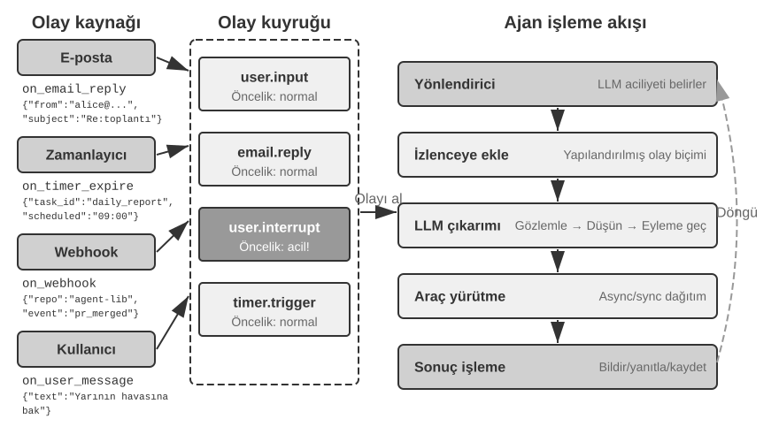
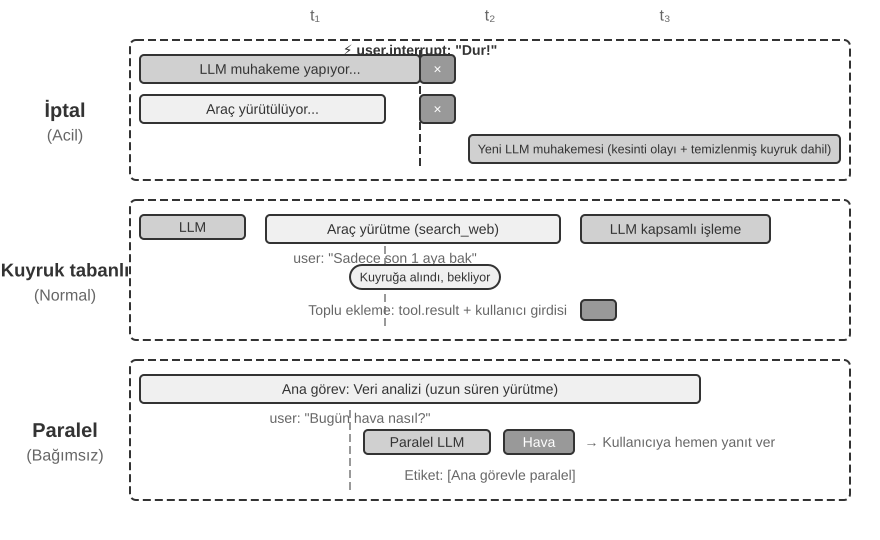
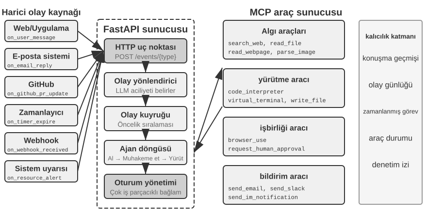
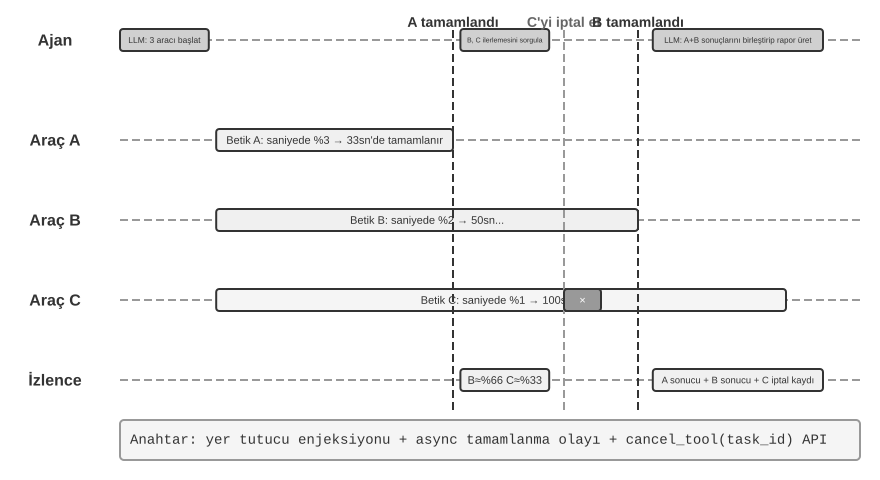
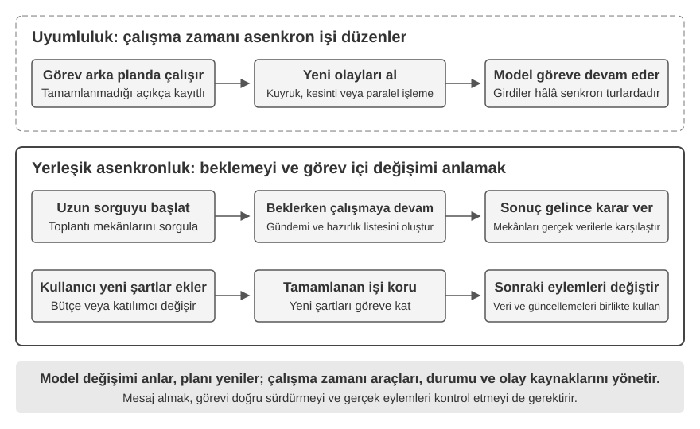
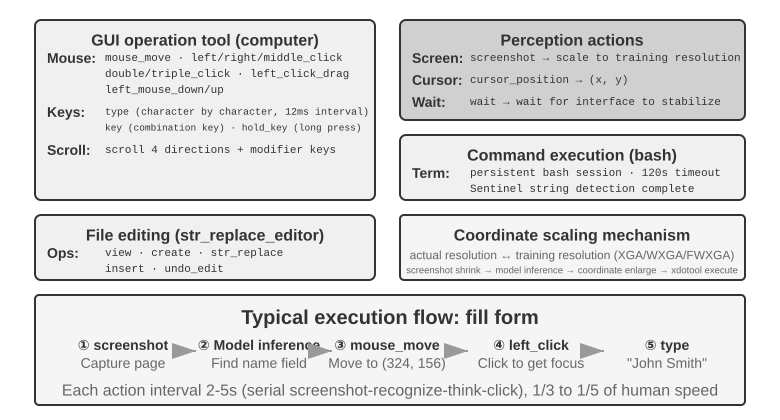
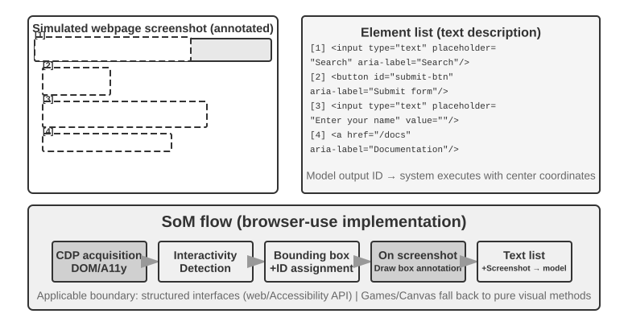

# Etkileşim: Gözlem ve Eylem Uzaylarının Genişletilmesi

Bölüm 1'de bir sav ortaya konmuştu: temel model sabitken, bir Agent'ın görev performansını yükseltmenin başlıca sistem mühendisliği yolu, çoğu zaman onun **gözlem uzayını** ve **eylem uzayını** yeniden tanımlamak ya da genişletmektir. Bölüm 2'den 5'e kadar olan kısım bu cümlenin karşılığını vermeye çalıştı: bağlam mühendisliği gözleme neyin gireceğine karar verir, bellek ve bilgi tabanları gözlemi oturumlar arasına uzatır, araçlar Agent'ın ne yapabileceğini tanımlar, kod üretimi ise ona yeni eylemleri kendi başına yaratma imkânı verir.

Ama bütün bu genişlemeler aynı önkabul altında gerçekleşti: **Agent ile dünya sırayla konuşur**. Kullanıcı bir cümlesini bitirir, Agent bir süre düşünür, birkaç araç çağırır ve yanıtlar; o düşünürken dünyanın hareketsiz durduğu varsayılır. Bu önkabul o kadar doğal görünür ki bir varsayım olarak yazıya bile nadiren dökülür.

Bu bölümün kaldırmak istediği tam da o önkabuldür.

## İki Eksen: Kip ve Zamanlama

Gözlem uzayı ile eylem uzayını açtığımızda, her birinin genişletilebilecek iki yönü olduğu görülür.

- **Kip**, gözlemin ve eylemin **biçimini** belirler: Agent yalnızca metin mi okur, yoksa ses de duyar, ekranı da görür, torku da algılar mı; yalnızca token mı üretir, yoksa konuşur, tıklar ve eklem de sürer mü.
- **Zamanlama**, gözlemin ve eylemin **ritmini** belirler: gözlemi Agent kendisi mi almaya gider, yoksa dünya mı iter; eylem tek bir turda bitmek zorunda mıdır, yoksa turları aşabilir, ortasında kesilebilir ve daha acil bir şey tarafından öne geçilebilir mi.

Önceki bölümler bu iki uzayın **içeriğini** genişletmişti; bu bölüm ise **kipini** ve **zamanlamasını** genişletiyor:

| | Gözlem uzayının genişlemesi | Eylem uzayının genişlemesi |
|---|---|---|
| **İçerik** (Bölüm 2–5) | Bağlam mühendisliği, bellek ve bilgi tabanları | Araçlar, kod üretimi |
| **Kip** (bu bölüm) | Ses, ekran, fiziksel sensörler | Konuşma, tıklama, eklem hareketi |
| **Zamanlama** (bu bölüm) | Dünyanın itmesi, sürekli akışlar | Turları aşan, kesilebilir, öne geçilebilir |

Bu bölümün çekirdek savı tek cümleye sığdırılabilir: **sıralı tur, eğitimin geride bıraktığı bir varsayımdır; ortamın bir özelliği değil.**

Bir modelin eğitim külliyatı neredeyse bütünüyle tur temellidir—bir soru ardından bir yanıt, bir araç çağrısı ardından bir araç sonucu, biri başlamadan diğeri bitmiş olur. Dolayısıyla modelin öğrendiği politika, dünyanın onu bekleyeceğini varsayar. Gerçek ortam ise modelin tepki vermesini beklemez: o düşünürken posta gelir, kullanıcı cümlesinin ortasında araya girer, sayfa iki ekran görüntüsü arasında çoktan değişmiştir ve kol ona uzanırken bardak devrilir.

| Ölçek | Senaryo | Gözlem tarafındaki değişim | Eylem tarafındaki değişim |
|---|---|---|---|
| Saniye — gün | Asenkron ve olay güdümlü | Dünya Agent'ı uyandırır (e-posta, zamanlayıcı, geri çağrı) | Eylem turları aşar: önce başlat, sonrasını olay kapatsın |
| 10 ms — 1 sn | Ses | Konuşurken dinlemek, cümlenin bitmesini beklemeden | Düşünürken konuşmak; kesilebilir, ortasında düzeltilebilir |
| Saniye altı — saniye | Computer Use | Ekran iki kare arasında sürekli değişir | Eylemden sonra gerçekliğin hâlâ plana uyup uymadığı yeniden doğrulanmalı |
| Milisaniye | Robot | Sensörler sürekli geri akar | Eylem parçalanır: her seferinde kısa bir dilim planlanır, öne geçilebilir |

Dört kısım aynı ilkel kümesini paylaşır—**uyandırma, güvenli nokta, iptal, öne geçme ve hızlı/yavaş ayrımı**—yalnızca parametreler ve başarısızlık biçimleri farklıdır. Olay güdümlü asenkronda "güvenli noktada iptal sinyalini kontrol et" ile robot eylem parçalamada "anormallik görünce kalan eylemleri at ve yeniden gözlemle", beş büyüklük mertebesi uzaklıktaki zaman ölçeklerinde aynı mekanizmanın iki kez uygulanmasıdır. Bu eşyapılılığı görmek, herhangi tek bir senaryonun teknik ayrıntısını ezberlemekten daha önemlidir.

**Okuma sırasında bilinçli bir düzenleme var: bu bölüm sese, kendisinden sonraki iki senaryodan belirgin biçimde daha çok yer ayırıyor.** Gerçek zamanlı etkileşimin evrim hattında ses, en uzağa gitmiş ve referans çerçevesi olarak en değerli örnektir: "seri boru hattının gecikmesi çok yüksek" sorunundan yola çıkıp uçtan uca, tam çift yönlü ve konuşurken düşünme gibi bir dizi çözümden geçerek bugünün görece oturmuş nihai tablosuna varır; sorun → çözüm → nihai tablo yolculuğunun tamamı çoktan kat edilmiştir. Bu yüzden onu enine boyuna anlatıyoruz; sonraki Computer Use ve robot bölümleri bu hatla karşılaştırılarak okunabilir—her biri bu evrim hattının neresine gelmiş ve nerede takılmıştır.

## Asenkron ve Olay Güdümlü: Dünya Kapınızı Çaldığında

Bölüm 4'te ele alınan algılama, yürütme ve işbirliği araçlarının tümünü Agent etkin biçimde çağırır. Peki Agent, herhangi bir anda gelebilecek dış olaylara nasıl yanıt vermelidir? Bunun için olay güdümlü asenkron bir mimari gerekir. Bölüm 1'de kalan iki araç sınıfı—olay tetikleme ve kullanıcı iletişimi araçları—da bu mimariye dayanır; bu yüzden burada birlikte ele alınır.

### Asenkronluk Neden Gereklidir

Asenkronluğun neden gerekli olduğunu açıklamak için bir benzetmeyle başlayalım. Senkron, "bir sonrakini yapabilmek için önce birini yapmak" anlamına gelirken, asenkron "birden fazla şeyin eş zamanlı olarak gerçekleşebilmesi" anlamına gelir. Geleneksel bir senkron Agent mimarisi, bir mağazadaki tek hatlı bir gişeye benzer—yalnızca bir seferde bir müşteriyi ele alabilir ve mevcut müşteriyle bitirdikten sonra ancak bir sonraki numarayı çağırır. Gerçekten akıllı bir asistan, daha çok esnek bir sekretere benzer—masada bekleyen birden fazla iş (e-postalar, telefon aramaları, ziyaretçiler) olduğunda, sekreter aciliyete göre hangisini önce ele alacağına karar verir ve yarı yolda daha acil bir göreve geçiş yapıp duraklayabilir. Senkron modda, Agent ya kullanıcıyla konuşmadan önce arka plan görevinin tamamlanmasını beklemek zorunda kalır, ya da yeni gelen bir olayı işlemeden önce konuşmanın bitmesini bekler. Gerçek bir asistan senaryosunun gerektirdiği temel yetenekleri sunamaz:

- **Asenkron yürütme normdur**—Birçok görev uzun çalışma süreleri gerektirir ve kullanıcı etkileşimini bloke etmemelidir.
- **Olay önceliğinin dinamik değerlendirilmesi**—Tüm olaylar eşit derecede önemli değildir. Agent akıllıca bir işleme stratejisi seçmelidir: mevcut işlemi iptal etmek (acil), bir kuyruğa eklemek (rutin) veya paralel işlemek (bağımsız hafif sorgu).
- **Kesinti ve devam etmede akıcılık**—Kesintiye uğramış bir konuşma veya görev doğal biçimde devam edebilmelidir.

Ancak asenkron paradigma, günümüz LLM'leri hakkındaki temel bir gerçekle çarpışır: eğitimleri senkronluğu varsayar—bir tool call'dan sonra, bir sonraki mesaj araç sonucu olmalıdır—gerçek dağıtım ise asenkronluğu talep eder: kullanıcılar istedikleri zaman kesintiye uğratır, görevler eş zamanlı ilerler ve dış olaylar bir araç dönmeden önce gelir. Bu "senkron eğitim / asenkron dağıtım" çelişkisi, bu bölümün geri kalanındaki her mühendislik ödünleşimine nüfuz eder.

Bunun için, bir **olay güdümlü asenkron Agent mimarisine** ihtiyacımız var. Teknik olarak, bu, sistemin artık aktif ve tekrar tekrar "yeni mesajları" kontrol etmediği (bu polling'dir, verimsizdir), bunun yerine yeni bir mesaj geldiğinde işleme mantığını otomatik olarak tetiklediği anlamına gelir. Tüm girdiler, çıktılar, düşünce süreçleri ve dış etkileşimler tek biçimli olarak bir olay akışı—bir zaman çizelgesinde düzenlenmiş bir olay kayıtları dizisi—olarak modellenir. Şekil 6-1, olay güdümlü asenkron bir Agent'ın genel mimarisini gösterir, olay kaynakları, olay kuyruğu ve Agent işleme akışı arasındaki ilişkiyi resmeder.



### OpenClaw'da Olay Güdümlü Mekanizmaların Uygulanması

Açık kaynak çerçevesi OpenClaw (mimarisi Bölüm 5'te ayrıntılı olarak ele alınacak), bir Gateway kontrol düzlemi aracılığıyla çok kanallı mesajları alır ve bunları Agent çalışma zamanına yönlendirir. Üç yerleşik otomasyon mekanizması sağlar:

- **Hooks**: GitHub Actions'daki olay tetikleyicilerine benzer biçimde, oturum oluşturma ve sıfırlama gibi Agent yaşam döngüsündeki olaylara yanıt verir
- **Cron (Zamanlanmış Zamanlayıcı)**: cron ifadelerine göre periyodik görevleri yürütür (Unix sistemlerinde zamanlanmış görevler için yaygın kullanılan bir söz dizimi, örn. `0 9 * * 5` her Cuma saat 9 anlamına gelir), örneğin her Cuma haftalık bir rapor oluşturmak veya her ayın başında veriyi özetlemek gibi
- **Heartbeat (Kalp Atışı Arka Plan Süreci)**: Agent'ı her N dakikada bir uyandırarak dikkat gerektiren herhangi bir konu olup olmadığını kontrol eder, uyarı yorgunluğunu önlemek için yargı kullanır

Bu üç mekanizma OpenClaw Agent'larına bir otonomi görünümü verir—kullanıcı çevrimdışı olsa bile, Agent zamanında rapor üretebilir, sistem durumunu kontrol edebilir ve rutin işleri halledebilir. Ancak daha yakından bakıldığında, temel bir sınırlama ortaya çıkar. Kesin olmak gerekirse: Gateway, yerleşik kanallardan (IM, web arayüzü) gelen mesajları zaten **push** tarzında ele alır—bunlar geldikleri anda Agent'a yönlendirilir. Ve üç otomasyon mekanizmasından yalnızca Cron ve Heartbeat, Agent'ın bir kullanıcı mesajı olmadan hareket etmesine izin verir ve ikisi de **zaman güdümlüdür**—Heartbeat sabit aralıklarla kontrol eder, Cron önceden belirlenmiş zamanlarda tetiklenir. Hooks yalnızca çerçevenin iç yaşam döngüsü olaylarına tepki verir ve dış dünyadan yeni değişiklikler getiremez. Gerçek boşluk şudur: yerleşik kanalların ötesindeki herhangi bir üçüncü taraf olay kaynağı için—yeni bir e-posta, veri gönderen bir dış API geri çağrısı, anlık dikkat talep eden acil bir bildirim—OpenClaw'ın anlık bir giriş yolu yoktur. Agent, olay gerçekleştiği anda yanıt veremez; en iyi ihtimalle bir sonraki Cron/Heartbeat tetiklenmesinde fark eder.

Bu gecikme birçok senaryoda kabul edilemez. **PineClaw**'ı (Pine AI'ın OpenClaw eklentisi) örnek alalım: Pine AI, kullanıcı adına gerçek telefon aramaları yapan bir yapay zeka asistanıdır, tipik senaryolar fatura müzakeresi, abonelik iptali ve sigorta taleplerini ele almayı içerir. Bir kullanıcı bir OpenClaw Agent'ı aracılığıyla bir Pine telefon görevi başlattığında, Pine'ın sesli yapay zekası kullanıcı adına aramayı yapar, ama kullanıcının arama sırasında her an müdahale etmesi gerekebilir:

- **Gerçek Zamanlı Kimlik Doğrulaması**: Müşteri hizmetleri temsilcisi hesap sahibinin kimliğini doğrulamak ister ve Pine, kullanıcının hemen bir güvenlik kodu veya OTP (Tek Kullanımlık Şifre) doğrulama kodu sağlamasına ihtiyaç duyar
- **Üç Yönlü Arama Onayı**: Müşteri hizmetleri temsilcisi doğrudan hesap sahibiyle konuşmak ister ve Pine, kullanıcının birkaç saniye içinde telefonu yanıtlamasına ihtiyaç duyar
- **İlerleme Senkronizasyonu ve Karar Onayı**: Müzakerede kritik bir noktada (örn. karşı taraf bir fiyat indirimi önerdiğinde), Pine kullanıcının kabul edip etmediğini onaylamasına ihtiyaç duyar

Heartbeat'in periyodik polling'iyle—diyelim ki 5 dakikalık bir aralıkla—temsilci hâlâ doğrulama kodunu beklerken kullanıcı bildirimi alamayabilir; temsilci telefonu kapatır ve arama başarısız olur. Aralığı saniyelere kısaltmak ise sistemi yalnızca yararsız isteklerle doldururdu.

PineClaw'ın çözümü bir **Channel mekanizması** tanıtmaktır—OpenClaw'ın Gateway'i ile Pine API'si arasında gerçek zamanlı bir olay kanalı kurmak. Bir arama bağlandığında, kullanıcı girdisi gerektirdiğinde veya arama bittiğinde gibi kilit olaylar gerçekleştiğinde, mesaj anında OpenClaw Agent'ına push edilir. Agent bunu hemen işler ve kullanıcıyı bilgilendirir, yanıt gecikmesini dakikalardan saniyelere indirir.

Bu durum, Agent çerçeveleri için olay güdümlü bir mimarinin temel değerini ortaya koyar: **gerçek "proaktif hizmet", yalnızca Agent'ın olayları periyodik olarak kontrol edebilmesini değil, aynı zamanda olayların da Agent'ı aktif olarak bilgilendirebilmesini gerektirir.** Tüm girdileri—kullanıcı mesajları, araç dönüşleri, dış geri çağrılar, zamanlanmış tetikleyiciler—bir olay akışında birleştirmek ve bir olay döngüsü aracılığıyla Agent'ın düşünmesini ve eylemlerini yönlendirmek, bu hedefe ulaşmanın mimari temelidir. Bu mimari altında, önce olaylarla doğrudan ilgili iki araç kategorisini, ayrıca Agent'ın bağımsız eylemlerini destekleyen sanal kimliği ve izole yürütme ortamını tanıtacağız, ardından olay işleme mekanizmasının belirli tasarımını tartışacağız.

### Olay Tetikleyici Araçlar

Olay tetikleyici araçlar, dış olayların bir Agent'ın eylemlerini yönlendirdiği giriş noktalarıdır. Bunlar olmadan, bir Agent yalnızca düşünme, araç çağırma ve nihayet bir sonuç çıktısı verme döngüsünde çalışabilir, ardından kullanıcının bir sonraki girdisini bekler. Dünyadaki değişiklikleri bir Agent'ın işleyebileceği olaylara çevirmek için, üç yaygın olay tetikleyici araç türü vardır.

**Zamanlayıcılar** (`set_timer`), fiziksel zamana bağlı olayları ele alır. Bir e-posta yanıtsız kalırsa, Agent bir süre sonra ilerleme hakkında sormak için takip etmelidir; bir arama çalışma saatleri dışında birine ulaşırsa, bir sonraki iş penceresinde yeniden denemelidir. Bunu desteklemek için, OpenClaw ve Claude Code gibi araçlar zamanlayıcı işlevselliği içerir, Agent'ın belirli bir fiziksel zamanda kendini uyandırmasına izin verir. **Tek seferlik zamanlayıcılar**, belirli bir son tarihi olan görevler için kullanılır: örneğin, bir kullanıcı Cumartesi günü "DMV'yi ara" diye isterse, Agent "gelecek Pazartesi saat 10:00'da DMV'yi ara" için bir zamanlayıcı ayarlar, bu da aramayı otomatik olarak tetikler. **Tekrarlayan zamanlayıcılar**, periyodik görevler için kullanılır: örneğin her saat sunucu sağlığını kontrol etmek veya her Cuma bir ilerleme raporu göndermek gibi. Ayrıca, bazı dış servisler proaktif ilerleme güncellemelerini desteklemez, Agent'ın durumu aktif olarak sorgulamasını gerektirir. Bu tür durumlarda, tekrarlanan sorgular için tekrarlayan bir zamanlayıcı gereklidir—önceki bölümdeki OpenClaw'daki Heartbeat mekanizması bunun sistemleştirilmiş bir biçimidir ve OpenClaw'ın "proaktif hizmet" yeteneğinin köküdür.

**Arka Plan Görevi İzleme** (`monitor_shell`), asenkron olarak yürütülen araçlardan veya komut satırı görevlerinden gelen olayları ele alır. Bazı komut satırı görevleri uzun süre arka planda çalışır ve Agent'ın ilerlemesini takip etmesi gerekir. Agent "komut satırına dik dik bakarsa", ilerlemeyi sorgulamak için bir aracı tekrar tekrar çağırırsa, token yakar; görev tamamen bitene kadar yeniden düşünmeyi beklerse, kritik sorunları gelişirken kaçırır—ve komut askıda kalırsa, hiç müdahale edemez, tüm görevi durdurur. Claude Code bunu bir `monitor` aracı tanıtarak çözer, Agent'ın komut satırından yeni çıktıyı veya belirli anahtar kelimeler içeren çıktıyı izlemesine izin verir.

**Dış Olay Kanalları** (`connect_channel`), yeni e-postalar, API geri çağrıları veya IM mesajları gibi dış olayları Agent'a gerçek zamanlı olarak push eder. Önceki bölümdeki PineClaw'daki Channel mekanizması tipik bir uygulamadır.

Tasarım açısından, olay tetikleyici araçlar ilgisiz olayların Agent'ı uyandırıp hesaplama kaynaklarını israf etmesini önlemek için net tetikleme koşulları ve filtreleme kuralları tanımlamalıdır. Olay yükü, Agent'ın uyandıktan sonra yapması gereken ek sorgu sayısını en aza indirmek için yeterli context bilgisi içermelidir.

### Kullanıcı İletişim Araçları

OpenClaw'da oturumlar kullanıcıya şeffaftır; kullanıcı ve Agent özel araçlarla görüntü, dosya, push bildirimi, çok modlu içerik ve Generative UI içeren mesajları her zaman paylaşabilir.

Kullanıcı iletişim araçları, Agent ile kullanıcı arasındaki iletişim kanallarının giderek çeşitlenmesinden doğar. Birçok Agent (Claude Code, Manus, Genspark gibi) yerleşik bir ReAct döngüsü kullanır, burada Agent'ın "söylediği" her şey (yani asistan mesajları) doğrudan kullanıcıya gönderilir, kullanıcının Agent ile konuşmak için uygulamada belirli bir oturum açması gerekir. OpenClaw, bu insan-bilgisayar iletişim paradigmasını bozan en etkili genel amaçlı Agent'lardan biridir: oturumları kullanıcı için şeffaftır—kullanıcının oturumun varlığından haberdar olmasına veya Agent'ın tool call'larının ayrıntılarını umursamasına gerek yoktur; hem kullanıcı hem de Agent her an birbirine mesaj gönderebilir, katı bir kullanıcı-mesajı, Agent-yanıtı kalıbı yerine. Sonuç olarak, birçok kullanıcı OpenClaw'ın bir sekreterin yapacağı gibi asenkron olarak mesaj gönderen "insan benzeri bir varlığa" sahip olduğunu hissediyor. Bu metin mesajları modelin asistan mesajlarının doğrudan kullanıcıya aktarılması değildir; özel araçlar aracılığıyla gönderilir, görüntü ve dosya ekleri taşıyabilir ve aciliyete göre push bildirimlerini tetikleyebilir.

Metin tabanlı iletişimin ötesinde, giderek artan sayıda Agent, yapılandırılmış kart mesajları veya hatırlatma e-postaları gönderme gibi çok modlu iletişim yeteneklerine sahiptir. Bazı Agent'lar, bilgiyi kullanıcılara daha kullanıcı dostu bir şekilde sunmak için HTML veya diğer yöntemleri kullanarak etkileşimli arayüzler oluşturan üretici UI ile deneyler yapmaya başladı. Tasarım açısından, kullanıcı iletişim araçları asenkron mesajlaşmayı desteklemeli (kullanıcı çevrimiçi olmayabilir), okundu/okunmadı durumu izlemesi sağlamalı ve birden fazla kanal arasında mesaj tutarlılığını korumalıdır.

**Çok Kanallı Kullanıcı İletişimi ve Geri Çağırma.**

Bir kategori sınırı kolayca karıştırılabilir: her iki tür araç da "bildirim gönderir", ama alıcı bir onaylayan veya iş birlikçiyse (yönetici onayı isteme, bir iş birlikçi Agent'a ilerleme raporlama), araç iş birliği kategorisine aittir; yalnızca alıcı son kullanıcıyken bir kullanıcı iletişim aracı sayılır. Ayrım kanalda değil, kimin ve neden bilgilendirildiğinde yatar.

**Bir Agent'ın yanıtı tek bir kanalla sınırlı olmamalıdır; bildirim mekanizması aynı zamanda bir kullanıcı geri çağırma mekanizması olarak da hizmet eder.** Mesaj gönderme anlık mesajlaşmaya, SMS'e, e-postaya, telefon aramalarına, push bildirimlerine ve diğer kanallara genişler. Agent, önemli mesajların kaçırılmamasını sağlarken gereksiz kesintilerden kaçınarak, aciliyet, kullanıcı durumu, içerik doğası ve kullanıcı tercihlerinin bir bileşimine dayanarak kanala karar verir.

Uzun süren görevler için, Agent tamamlandığında kullanıcının dikkatini geri çağırmak için proaktif olarak bilgilendirmelidir. Periyodik görevler için (günlük özetler veya haftalık raporlar gibi), bildirimler kullanıcı için düzenli bir etkileşim alışkanlığı oluşturmaya yardımcı olabilir.

Kullanıcı iletişim araçları "kullanıcıya nasıl ulaşılacağı" sorununu çözer. Ancak, Agent'ın bu kanallarda üstlendiği kimlik ve kullanıcı adına eylemleri gerçekleştirdiği ortam, bir sonraki bölümün konusu olan bir kimlik ve ortam altyapısı katmanı gerektirir.

### Sanal Kimlik ve İzole Yürütme Ortamı

Sanal bilgisayar 7/24 çalışabilir, Agent'ın yerel dosyalara serbest erişimini sınırlar ve bir hata en fazla sanal ortamı etkiler. Veriler paylaşılan dosya sistemi ve yol referanslarıyla aktarılır.

Bu bölümün konumu hakkında bir not: sanal kimlik ve izole yürütme ortamları özünde yürütme araçları altında tartışılan sandbox'larla aynı özün parçası olan yürütme ortamı altyapısıdır. Burada, asenkron mimari bölümünde görünmelerinin nedeni, bunlara en acil ihtiyaç duyan Agent'ların bağımsız çalışan, yerleşik kalan ve her an kullanıcı adına hareket eden Agent'lar olmasıdır.

Bu bölümün başında bahsedildiği gibi, *Her*'deki Samantha bağımsız bir kimliğe ve çalışma ortamına sahiptir. Böyle bir genel amaçlı asistan elde etmek, kilit bir mimari seçime zorlar: Agent, kullanıcının kişisel hesaplarını doğrudan mı yönetmeli, yoksa kendi sanal kimliğine mi sahip olmalı? Doğrudan yönetim uygun görünür, ama tek bir Agent hatası veya ele geçirilmesi kullanıcının tüm dijital kimliğini açığa çıkarır. Daha güvenli yaklaşım, bir sekreterin kendi ofis telefonuna ve posta kutusuna sahip olması gibi, Agent'a özel iletişim hesapları, depolama ve hesaplama ortamlarından oluşan bağımsız bir sanal kimlik vermektir, böylece Agent kullanıcı adına açıkça çalışabilir. Açıkça beyan edilen bir kimlik güveni zayıflatmak bir yana, iletişimi daha gerçek kılar.

Sanal kimlikler izole yürütme ortamlarına dayanmalıdır. **Sanal bilgisayarlar** (VM'ler/konteynerler) ve **sanal telefonlar** (Android emülatörleri), Agent'a işletim sistemi düzeyinde izolasyon ve tam masaüstü/mobil işlem yetenekleri sağlar: Agent bunların içinde kendi kullanıcı hesabına, ana dizinine ve giriş kimlik bilgilerine sahiptir, tüm işlemleri izlenebilir ve denetlenebilir kılar; hatalı işlemler gerçekleştirilse bile, host sistemi ve kullanıcının gerçek cihazı etkilenmeden kalır. Bu, yürütme araçları bölümünde tartışılan sandbox kavramının "dijital kimlik" boyutuna bir uzantısıdır—sandbox'lar kod yürütmeyi izole eder, sanal bilgisayarlar ve telefonlar ise tüm dijital kimliği izole eder.

Bağımsız bir kimlik ayrıca iki pratik zorluk sunar. Birincisi **otomasyon karşıtı mekanizmalardır**: birçok web sitesi otomatik erişimi engellemek için CAPTCHA'lar ve IP itibar kontrolleri kullanır. Veri merkezi IP'leri kullanan sanal ortamlar kolayca tanınır; pratikte, normal erişim genellikle bir konut proxy ağı (gerçek ev IP'lerini kullanan) yapılandırmayı gerektirir. İkincisi, **kullanıcının gerçek hesaplarına erişimdir**: bir görev kullanıcının kendisi olarak giriş yapmayı gerektirdiğinde, Human-in-the-Loop kimlik doğrulaması kullanın—kullanıcının kişisel olarak giriş yaptığı, Agent'ın çalıştırdığı eksiksiz arayüzü gördüğü ve kimlik doğrulamanın neden gerekli olduğunu anladığı bir VNC/RDP uzak masaüstü. Oturum token'ı daha sonra kullanıcıyı tekrar tekrar kesintiye uğratmamak için geçerlilik süresi içinde yeniden kullanılır, otonomi ve güvenliği dengeler.

Ana Agent ile sanal ortam arasındaki veri alışverişi bir **paylaşılan dosya sistemi** aracılığıyla gerçekleştirilir: ana Agent'ı, sanal bilgisayarı ve sanal telefonu bağlamak için birim bağlamaları (örn. `/workspace/shared`) kullanılır. Veri, içerik kopyalama yerine dosya yolu referanslarıyla geçirilir, context penceresi tüketimini önler. Örneğin, bir veri analizi görevinde: kullanıcı paylaşılan dizine bir CSV dosyası yükler, sanal bilgisayardaki Agent dosyayı okur, analiz yapar, grafikler üretir ve bunları paylaşılan dizine geri kaydeder. Ana Agent yalnızca grafiğin dosya yolunu kullanıcıya döndürmelidir—taraflar arasında geçirilen her zaman hafif bir yol dizesidir.

Olay tetikleyici araçlar dünyanın Agent'ı uyandırmasına izin verir, kullanıcı iletişim araçları Agent'ın kullanıcıya ulaşmasına izin verir ve izole yürütme ortamlarına sahip sanal kimlikler Agent'ın bağımsız ve denetlenebilir biçimde hareket etmesine izin verir. Kalan soru şudur: birden fazla olay aynı Agent örneğinde eş zamanlı olarak birleştiğinde, bunlar nasıl ele alınmalıdır?

### Olay İşleme Mekanizması

Tek bir Agent örneği, eş zamanlı olarak birden fazla olayla karşılaşabilir: kullanıcıdan yeni bir mesaj, bir araçtan bir sonuç, süresi dolan bir zamanlayıcı, başka bir Agent'tan bir iş birliği isteği. Bu olayların ne kadar verimli ve doğru biçimde ele alındığı, performansı ve kullanıcı deneyimini doğrudan etkiler.

Bu mekanizmanın iskeleti, eşzamanlı programlamadaki **olay döngüsüdür** (event loop). Asenkron bir Agent'ı uzun süre çalışan bir döngü olarak düşünün: her tur, girdi kuyruğundan bir grup olay alır, bunları trajectory'ye ekler, LLM'i bir kez çağırır, LLM'in karar verdiği araçları yürütür ve sonraki olay grubunu beklemek için döngünün başına döner—bu, bir Go goroutine'inin bir channel'dan mesaj okuyup bunları `for { select { ... } }` içinde tur tur işlemesiyle aynı yapıdır. Bu modelin kritik bir özelliği vardır: **olaylar yalnızca her döngü turunun sınırlarında tüketilir**. LLM çıkarım yaparken veya bir araç yürütülürken, yeni gelen bir olay birdenbire araya girip mevcut adımı bozamaz; tur bir **güvenli noktaya** (bir çıkarım dizisinin sonu, bir araç dönüşü) ulaşana dek kuyrukta bekler ve sonra toplu olarak ele alınır. İptal de aynı disiplini izler: keyfi bir anda zorla kesmek yerine, Agent güvenli bir noktada "durmam istendi mi?" diye kontrol eder—Go'da `ctx.Done()`ın oynadığı rol tam olarak budur (Bölüm 10, bir üst Agent'ın alt Agent'larını basamaklı iptalini tartışmak için aynı context yaklaşımını kullanır). Bu anlaşıldığında, aşağıdaki üç işleme stratejisi yalnızca güvenli noktayı ele alış biçimleriyle ayrışır: olayı doğal olarak gelen bir sonraki güvenli noktaya kadar bekletmek (kuyruğa alınmış), proaktif olarak erkenden bir güvenli nokta yaratmak (iptal tabanlı) ya da düpedüz ayrı bir döngü başlatıp ana döngünün güvenli noktasını hiç beklememek (paralel).

**Yapılandırılmış Olay Modellemesi.**

Ele alma, anlamayı gerektirir. Genel amaçlı bir Agent'ın girdisi yalnızca kullanıcıdan gelmez—üçüncü bir taraftan gelen bir mesaj Agent'a hiç yönelik değildi, ama Agent yine de bunu anlamalı, önemini tartmalı ve müdahale edip etmeyeceğine karar vermelidir. Bu, her girdiyi semantikle zengin bir **yapılandırılmış olay** olarak modellemeyi gerektirir:

- **Kaynak (kim)**: Kullanıcının kendisi, bir kişi, bir yabancı, bir sistem bildirimi
- **Kanal (nasıl)**: Telefon araması, SMS, anlık mesaj, e-posta, sosyal medya, zamanlayıcı tetikleyici, asenkron tool call sonucu, komut satırı izleme durumu güncellemesi
- **İçerik (ne)**: Mesaj metni, duygusal ton, aciliyet, bir yanıt gerekip gerekmediği
- **Bağlam (arka plan)**: Önceki bir konuşmaya yanıt mı yoksa yeni bir iletişim mi olduğu, mevcut görevle ilgisi

Bir müşteri iade talebi e-postasını örnek alırsak, yapılandırılmış olay şöyle görünür:

```javascript
{
  "source": {"type": "email", "sender": "client@example.com"},
  "channel": "gmail_webhook",
  "content": {"subject": "İade Talebi", "body": "Sipariş #12345, iade talep ediyorum..."},
  "context": {"priority": "high", "customer_tier": "vip", "related_orders": ["#12345"]}
}
```

Bu boyutlar yalnızca yapılandırılmış olaylar olarak net biçimde modellendiğinde, Agent çok taraflı iletişimde net bir bilişi koruyabilir, kullanıcı girdisini bir araç sonucuyla karıştırmaktan veya gizli talimatlar içeren bir araç sonucunu bir kullanıcı komutuyla karıştırmaktan (prompt injection) kaçınabilir. Çok iş parçacıklı context yönetiminin karmaşıklığı, Agent'ın birden fazla konuşma iş parçacığı arasındaki ilişkileri anlamasını da gerektirir—üçüncü bir taraftan gelen bir mesajın kullanıcının ruh halini nasıl etkilediği, kullanıcının rolünün farklı konuşmalar arasında nasıl değiştiği ve tavsiye sunmak için farklı iş parçacıklarından bilginin ne zaman sentezleneceği. n8n gibi workflow platformlarının tetikleyici ekosistemi—webhook'lar, zamanlayıcılar, e-postalar, veritabanı değişiklikleri, dosya izleyicileri—aynı resmi gösterir: her tetikleyici, Agent'ın dünyayı algıladığı bir "duyu organıdır". Bu heterojen olaylar tek bir yapılandırılmış formata modellendiğinde, Agent herhangi bir kaynaktan gelen uyaranları tutarlı biçimde işleyebilir. Aşağıdaki aciliyet belirleme ve işleme stratejileri hepsi bu birleşik modelleme üzerine inşa edilmiştir.

**Aciliyete Dayalı Dinamik İşleme Stratejisi.**

Birden fazla görevi jonglörlük yapan insanlar stratejilerini aciliyete göre uyarlar: bir acil durum onları yaptıklarını bırakmaya zorlar; rutin bir yapılacak iş daha sonrası için listeye eklenir. Bir Agent'ın olay işlemesi aynı zekayı göstermelidir.



**İptal Tabanlı İşleme**, acil olaylar için kullanılır. Acil bir olay geldiğinde (örn. kullanıcı "dur"a tıklar veya bir denetim sistemi yüksek öncelikli bir talimat gönderir): (1) Mevcut işlemi durdurun—LLM reasoning yapıyorsa, akış yanıtını hemen iptal edin; senkron bir araç yürütülüyorsa, bir iptal sinyali gönderin; (2) Bekleyen kuyruğu boşaltın, tüm olaylarını çıkarın; (3) Bu olayları acil olayla birlikte trajectory'nin sonuna ekleyin; (4) Durumu değerlendirmek için güncellenmiş eksiksiz trajectory'yi girdi olarak kullanarak LLM'i hemen yeniden çağırın. Örneğin, Agent potansiyel olarak hatalı bir işlem gerçekleştirmek üzereyken kullanıcı "Dur! Yanlış söyledim" diye girdi yaparsa, Agent bu yeni girdiyi hemen görecek, gerçek niyeti yeniden anlayacak ve böylece yanlış eylemi yürütmekten kaçınacaktır.

**Kuyruğa Alınmış İşleme**, rutin olaylar için kullanılır. Acil olmayan bir olay geldiğinde (örn. asenkron bir araç bir sonuç döndürür veya kullanıcı ek bilgi gönderir): (1) Mevcut işlemi kesintiye uğratmadan olayı kuyruğun sonuna ekleyin; (2) Mevcut işlemin tamamlanmasını bekleyin—LLM'in reasoning'ini bitirmesine, senkron aracın yürütmesini bitirmesine izin verin; (3) Herhangi bir tool call tamamlanıp bir `tool.result` döndürdüğünde, kuyruğu kontrol edin. Kuyruk boş değilse, tüm olayları bir kerede trajectory'ye ekleyin; (4) LLM güncellenmiş trajectory'yi kapsamlı biçimde işler. Bu, verimliliği artıran toplu işlemeyi mümkün kılar—örneğin, Agent bir arama aracı sonucunu beklerken, kullanıcı "yalnızca geçen aydan sonuçları göster" ekler. Bu ek bilgi kuyruğa girer ve arama sonuçları döndüğünde, her iki olay da LLM'e birlikte sunulur, gereksiz gidiş-dönüşlerden kaçınılır.

**Paralel İşleme**, bağımsız, hafif sorgular için kullanılır. Örneğin, Agent büyük miktarda veriyi analiz ederken, kullanıcı aniden "Bugün hava nasıl?" diye sorar. Bu tür sorguların üç özelliği vardır: ana görevle ilgisiz olmak, hızlı bir yanıt gerektirmek ve düşük yürütme maliyeti. Ne iptal tabanlı (önemli ana görevi kesintiye uğratırdı) ne de kuyruğa alınmış işleme (kullanıcıyı çok uzun beklemeye bırakırdı) uygundur. Sistem önce sorgunun bağımsızlığını ve karmaşıklığını değerlendirir, ardından bunu paralel bir reasoning oturumunda bağımsız olarak yürütür, bir yanıt üretmek için gerekli araçları çağırır ve hemen döndürür. Sorgu ve yanıt, LLM'in kafasının karışmasını önlemek için açıkça "ana görevle paralel olarak yürütüldü" olarak işaretlenerek ana görevin trajectory'sine eklenir.

**Aciliyet Belirleme.**

Acil olaylar: Kullanıcı kesintisi (`user.interrupt`), denetleyici talimatı (`supervisor.instruction`), Agent'lar arası kesinti (`agent.interrupt`), acil olarak işaretlenmiş dış tetikleyiciler (örn. sistem uyarıları, ödeme başarısızlıkları).

Acil olmayan olaylar: Düzenli kullanıcı girdisi (`user.input`), Agent girdisi (`agent.input`), araç sonuçları (`tool.result`), zamanlayıcı tetikleyicileri (`timer.trigger`), düzenli dış tetikleyiciler.

Sabit kodlanmış kuralların sınırlamaları vardır; olayın semantiği işleme yöntemini belirler—"Hemen dur!" iptal tabanlı kullanır, "Bugün hava nasıl?" paralel kullanır, "Raporu Çince gönder" kuyruğa alınmış kullanır. **Bir olay geldiğinde hangi stratejinin benimseneceğine hızlıca karar veren bir olay yönlendiricisi olarak hafif bir sınıflandırma LLM'i kullanılması önerilir**.

Aşağıdaki deney, olay güdümlü bir e-posta işleme Agent'ı, yukarıda tartışılan olay işleme stratejilerini çalıştırılabilir bir uygulamaya dönüştürür.

> **Deney 6-1 ★★★: Olay Güdümlü E-posta İşleme Agent'ı**
>
>
> 
>
>
> Bu deney en basit olay güdümlü Agent'ı inşa eder: bir **Otomatik E-posta İşleme Asistanı**. Agent e-posta gelen kutusunu izler ve yeni bir e-posta her geldiğinde, otomatik olarak bir işleme iş akışını tetikler—sınıflandırma, özetleme, taslak yanıt ve gerekirse kullanıcıyı bilgilendirme. Bu, olay güdümlü bir Agent için en sezgisel giriş senaryosudur: bir dış olay (yeni e-posta gelişi) eksiksiz bir Agent düşünme döngüsünü tetikler.
>
> **Deney Amacı**: olay güdümlü mimarinin temel fikrini anlamak—Agent artık kullanıcı girdisini pasif olarak beklemez, dış olaylara yanıt olarak kendi başına hareket eder. Bu deney aracılığıyla, okuyucular olay kaynağı kaydının, olay kuyruğunun ve "olay gelir → Agent işler → sonuç iletilir" temel kapalı döngüsünde ustalaşacaktır.
>
> **Olay Kaynakları ve Olay Kuyruğu.**
>
> Sistem birden fazla olay kaynağı için birleşik erişimi destekler:
>
> - **E-posta Olayları** (`on_email_received`): Yeni bir e-posta geldiğinde, ya gelen kutusunu periyodik olarak kontrol ederek ya da push bildirimleri alarak tetiklenir.
> - **IM/SMS Mesajları** (`on_im_message`, `on_sms_message`): Anlık mesajlaşma mesajlarıyla tetiklenir.
> - **GitHub Olayları** (`on_github_pr_update`, `on_github_issue_update`): PR inceleme yorumları veya durum değişiklikleriyle tetiklenir.
> - **Zamanlayıcı Tetikleyicileri** (`on_timer_expire`): Zamanlanmış görevlerle (örn. günlük özetler, haftalık rapor üretimi) tetiklenir.
> - **Webhook'lar** (`on_webhook_received`): Dış sistemlerden gelen genel geri çağırmalar.
> - **Sistem Olayları** (`on_user_inactive`, `on_process_timeout`, `on_resource_alert`): İç durum değişiklikleriyle tetiklenir.
>
> Tüm olaylar birleşik bir **olay kuyruğuna** girer ve varış sırasına göre sırayla işlenir. Her olay bağımsız bir Agent düşünme döngüsünü tetikler: Agent olay içeriğini okur, ilgili araçları çağırır (örn. bilgi tabanını sorgulamak, ekleri okumak, ilgili e-posta geçmişini aramak), bir işleme sonucu üretir (sınıflandırma etiketleri, özetler, taslak yanıtlar) ve nihayet bildirim araçları aracılığıyla kullanıcıyı bilgilendirir veya doğrudan bir eylem yürütür.
>
> **Doğrulama Senaryosu**: Agent'ı bir test posta kutusunu izlemek üzere yapılandırın. Üç e-posta almayı simüle edin—bir toplantı daveti, bir müşteri şikayeti ve bir pazarlama reklamı. Agent bunları sırayla işler: toplantı daveti için, takvim çakışmalarını otomatik olarak kontrol eder ve bir kabul/red yanıtı taslağı hazırlar; müşteri şikayeti için, kilit bilgiyi çıkarır, yüksek öncelikli olarak işaretler ve kullanıcıyı ele alması için bilgilendirir; pazarlama reklamı için, otomatik olarak arşivler. Tüm süreç kullanıcı müdahalesi gerektirmez.

Deney 6-1, en basit olay güdümlü kalıbı gösterir—olaylar bir kuyruğa girer ve Agent bunları sırayla işler. Ancak, Agent'ın uzun süren araç yürütmeleri sırasında kesintilere yanıt vermesi veya birden fazla eş zamanlı görevi aynı anda yönetmesi gerektiğinde, basit bir olay kuyruğu yetersiz kalır. Şimdi, daha derin mühendislik zorluklarını tartışıyoruz.

### Mühendislik Uygulaması: Senkron Modellerin Asenkron Kesintileri Desteklemesi Nasıl Sağlanır

Deney 6-1 yalnızca seri olayları ele alır—olaylar kuyruğa birer birer girer ve Agent bunları arka arkaya işler. Şimdi, bu bölümün başında öne sürülen "senkron eğitim / asenkron dağıtım" çelişkisine geri dönelim: bir araç henüz dönmemişken kullanıcı kesintiye uğrattığında, senkron format bunu nasıl barındırabilir? Bu bölüm, sektörün bugün kullandığı mühendislik çözümlerini ortaya koyar.

Önce bu çelişkiyi belirli bir senaryoyla gösterelim. Agent'ın bir kullanıcının bir e-posta taslağı hazırlamasına yardım ettiğini varsayalım (tool call: iletişim bilgisini arama). Arama sonuçları dönmeden önce, kullanıcı aniden "Bekle, önce yarınki hava durumunu kontrol et" der. Senkron bir ReAct döngüsünde, Agent bir sonraki mesajı işlemeden önce aramanın dönmesini beklemelidir—çünkü API "bir tool call verildikten sonra, bir sonraki mesajın araç sonucu olması gerektiğini" gerektirir. Ama asenkron gerçek dünyada, olaylar devam eden görevleri her an kesintiye uğratabilir. "Senkron bir format" kısıtları altında "asenkron kesinti" semantiğinin nasıl ifade edileceği, tam olarak bu mühendislik çözümünün yanıtlamayı amaçladığı sorudur.

**Mühendislik Çaresi: Senkron Davranışı Simüle Eden Asenkron Bir Uygulama.**

Temel fikir şudur: **kesinti olmadan normal koşullarda, LLM'in standart bir senkron trajectory görmesine izin verin; yalnızca bir kesinti oluştuğunda, formatı düzeltmek için yer tutucular ekleyin**. İşte beş kilit kural:

**Kural 1**: LLM çıktı verdiğinde asistan mesajını (düşünme, içerik ve tool call dahil) hemen kaydedin.

**Kural 2**: Araç sonucunu yalnızca tool call tamamlandığında kaydedin. Trajectory yürütme sırasında "kısmen tamamlanmış" bir durumdadır.

**Kural 3**: Araç yürütmesi sırasındaki kesintiler yer tutucular gerektirir. Bitmemiş araç için bir yer tutucu yanıt üretin (örn. "Araç arka planda çalışıyor, lütfen yeni olayı önceliklendirin"), kesinti olayını ekleyin ve LLM'i yeniden çağırın. LLM'in perspektifinden, asistan mesajının hâlâ eşleşen bir araç sonucu vardır.

**Kural 4**: LLM düşünme sırasındaki kesintiler mevcut düşünmeyi doğrudan atar. Bunu trajectory'ye yazmayın; doğrudan yeni olayı ekleyin ve yeni bir düşünme turu başlatın.

**Kural 5**: Kesintiye uğratmayan olaylar toplu işleme için kuyruğa girer. Yalnızca mevcut döngü tamamlandıktan sonra bir kerede eklenirler.

Agent'ın bir e-posta taslağı hazırlarken kullanıcının hava durumunu sormak için kesintiye uğrattığı örneği kullanarak, bu beş kuralın işleyişi şöyledir:

1. Agent, iletişim bilgisini aramak için `search_contacts`ı çağırır ve asistan mesajı hemen trajectory'ye yazılır (Kural 1).
2. Arama aracı sonuçları döndürmeden önce, kullanıcı "Önce yarınki hava durumunu kontrol et" gönderir. Bu bir kullanıcı kesintisi olduğundan, sistem bitmemiş `search_contacts` için bir yer tutucu araç sonucu üretir ("Araç arka planda çalışıyor, lütfen yeni olayı önceliklendirin", Kural 3), ardından kullanıcının hava durumu sorgusunu trajectory'ye ekler ve LLM'i yeniden çağırır. Bu noktada, LLM'in gördüğü trajectory formatı tamamen geçerlidir—asistan mesajı ve araç sonucu mükemmel biçimde eşleşir.
3. Hava durumu sorgusu tamamlandıktan ve kullanıcı yanıtlandıktan sonra, orijinal `search_contacts` sonucu gelir ve yeni bir olay olarak trajectory'ye eklenir (Kural 2). Agent iletişim bilgisini okur ve e-posta taslağı hazırlamaya devam eder.

Bu şemanın temel avantajı: **normal koşullarda, LLM mükemmel bir senkron trajectory görür**—asistan mesajları ve araç sonuçları sıkı biçimde eşleşir, zaman çizelgesi net, yer tutucu veya anormal durum yoktur. Bu, senkron paradigma altında eğitilmiş LLM'ler için en dost düzenlemedir ve düşünme kalitesini korur. Yer tutucu—gerekli bir uzlaşma—yalnızca gerçekten bir kesinti oluştuğunda görünür.

Ancak halüsinasyon riski devam eder. Yer tutucu aracın "henüz tamamlanmadığını" açıkça belirtse bile, model sonraki düşünmede hâlâ bir araç sonucu uydurabilir—aracın geçerli veri döndürdüğüne kendini ikna edip icadın üzerine kötü kararlar alabilir. Bunun nedeni, eğitim sırasında görülen trajectory'lerin büyük çoğunluğunda, bir tool call'ı hemen gerçek sonucun izlemesidir; model "sonuç henüz gelmedi" durumlarını nasıl ele alacağını hiç öğrenmemiştir. Bu yüzden, pratikte, kesintiler yalnızca gerçekten acil durumlarda tetiklenir (kullanıcı açıkça bir durdurma talep ettiğinde); acil olmayan olaylar toplu işleme için bir kuyruğa yerleştirilir.

**Mevcut Modeller için Uygun Asenkron Araç Arayüzleri.**

Modellerin senkron varsayımını kırmak zor olduğundan, daha temel bir strateji, **asenkron semantiği araç arayüzünün tasarım düzeyinden itibaren benimsemektir**.

Geleneksel araç tasarımı "çağırma tamamlanma anlamına gelir" semantiğini ima eder. Örneğin, `phone_call` adı "çağırma telefonu çevirecek ve arama bitene kadar bekleyip arama kaydını döndürecek" izlenimi verir. Asenkron paradigma altında, "başlatma" ve "tamamlanma" ayrılmalıdır:

- `initiate_phone_call`: Bir telefon araması başlatır, hemen bir görev tanımlayıcısı ve başlangıç durumu döndürür (örn. "Arama başlatıldı, çevriliyor...")
- Arama ilerlemesi olay bildirimleri (`phone_call_connected`, `phone_call_ended`) aracılığıyla iletilir

Kilit nokta, aracın adının ve açıklamasının kendisinin asenkron semantiği iletmesi gerektiğidir. Model `initiate_phone_call`ı gördüğünde, dil anlama yetenekleri doğal olarak bunun "tamamlama" değil "başlatma" olduğunu çıkarsayacaktır. Araç açıklaması bunu daha da pekiştirmelidir: "Bu araç, bir alt Agent tarafından ele alınan bir telefon araması görevi başlatır. Başarılı başlatma üzerine hemen görev ID'sini döndürür, diğer işlerinize devam etmenize izin verir. Arama bittiğinde ayrı bir bildirim olayı gönderilecektir."

**Kuyruk Tabanlı İşlemede Dikkat Dağınıklığı.**

Toplu olayları işlerken, model genellikle yalnızca son olaya odaklanır. Kök neden, **modelin en son girdiye tepki vermek üzere eğitilmiş olması ve toplu olayların bu varsayımı bozmasıdır**.

Müdahale iki düzeyde uygulanabilir:

**Prompt Düzeyi**: Modeli bilgilendirin, "Birden fazla ardışık olay aldığınızda, lütfen tüm bilgiyi kapsamlı biçimde dikkate aldığınızdan emin olun."

**Agent Durum Çubuğu İşaretleri**: Her olaydan önce açık işaretler ekleyin:

```text
[İşlenmemiş Olay 1/4] database_query'den araç sonucu: ...
[İşlenmemiş Olay 2/4] Kullanıcı ek notu: Yalnızca Pekin verisine bak
[İşlenmemiş Olay 3/4] Sistem hatırlatması: Rapor son tarihine 30 dakika kaldı
[İşlenmemiş Olay 4/4] Kullanıcı soruyor: İlerleme nedir?
```

Sona bir özet ekleyin: "Yukarıda 4 işlenmemiş olay var, 1 araç sonucu, 2 kullanıcı mesajı ve 1 sistem hatırlatması dahil. Lütfen yanıtınızın tüm bilgiyi kapsadığından emin olun."

### Daha Derin Çelişkiler ve Gelecek Yönleri





Nihayetinde, önceki bölümlerdeki yer tutucular, asenkron araç arayüzleri ve durum çubuğu işaretleri, hepsi aynı "senkron eğitim / asenkron dağıtım" çelişkisini (Şekil 6-4) yamamak için prompt engineering kullanıyor—bu çelişkinin nedeni bu bölümün başında ayrıntılı olarak ele alındı ve burada tekrarlanmayacak, yalnızca temel çözümüne odaklanılacak.

**Model Evrimini Öngörmek: Senkrondan Asenkrona.**

Yukarıdaki mühendislik teknikleri özünde **model eğitiminin eksikliklerini telafi etmek için prompt engineering kullanmaktır**, geçiş döneminde geçici bir çaredir. Gerçek çözüm, model eğitimi düzeyinde bir paradigma değişimi gerektirir.

Robotik alanındaki VLA (Vision-Language-Action, bkz. Bölüm 6) modelleri zaten benzer zorluklarla karşılaşmaya başlıyor: algı ve eylem arasında kaçınılmaz bir gecikme vardır. VLA'nın başarısı, Agent modellerinin evrimi için yolu gösteriyor. Bir sonraki nesil modellerin, asenkron ortamlarda pekiştirmeli öğrenme yoluyla üç temel yetenek kazanması gerekiyor:

1. **Trajectory'lerdeki Olayların Asenkron İç İçe Geçmesini Anlamak**: Bu en kritik yetenek eksikliğidir. Mevcut modeller kesinlikle senkron bir dizi bekler, ama gerçek bir asenkron ortamda, bir tool call'ı bir araç sonucu değil yeni bir kullanıcı mesajı takip edebilir; düşünme yarı yolda kesintiye uğrayabilir, ama ara durum trajectory'de tutulmalı ve düşünme, yeni mesaj işlendikten sonra baştan başlamak yerine devam etmelidir. Model, bu tür "sırasız" trajectory'lerde net bir biliş korumalıdır—hangi tool call'ların hâlâ sonuç beklediği ve hangi düşüncelerin bitmemiş parçalar olduğu.
2. **Kesintiye Uğramış Görevleri ve Düşünceleri Devam Ettirmek**: Acil bir olayı ele almak için kesintiye uğradığında, model hâlâ bitmemiş görevi hatırlamalıdır. Örneğin, Agent bir veri analizi aracı yürütürken kullanıcı aniden hava durumunu sorarsa, yanıtladıktan sonra, Agent bir aracın hâlâ çalıştığını unutmak yerine doğal olarak veri analizi sonucunu beklemelidir. Modelin kesintiye uğramış tool call'ın tamamlandığına yanlışlıkla inandığı halüsinasyonlardan kaçınmak özellikle önemlidir.
3. **Toplu Olayların Kapsamlı İşlenmesi**: Birden fazla olay trajectory'ye toplu olarak eklendiğinde, model yalnızca sonuncusuna odaklanmamalıdır; işlenmemiş tüm bilgiyi kapsamlı biçimde dikkate almalıdır.

Bu asenkron RL eğitimini gerçekleştirmek yeni altyapı gerektirir: bir asenkron ortam simülatörü (geciktirilmiş araç dönüşleri, rastgele kullanıcı kesintileri gibi senaryolar üretmek) ve asenkron yetenekler için özel ödüller (sırasız trajectory'leri doğru anlamak, kesintiye uğramış düşünceleri başarıyla devam ettirmek, halüsinasyonlardan kaçınmak, toplu olayları kapsamlı biçimde işlemek).

Sürekli düşünmek için yeni nesil modelleri beklemek gerekmez. Yaklaşık iki yüz satırlık orkestrasyon, **mevcut** bir metin akıl yürütme modelini **continuous-time** Agent'a dönüştürerek yukarıdaki mühendislik çözümüyle model evrimini birbirine bağlayabilir. Bu, Kural 4'ün yükseltilmiş hâlidir: kesilen yarım düşünceyi atmak yerine tüm etkileşimi kesintisiz bir düşünce akışı olarak kurar. Çalışma zamanı modelin yazdığı `<think>` bloğunu zorla kapatabilir, yeni gelen araç sonucunu, kullanıcı kesmesini veya tanıma güncellemesini sıradan mesaj olarak ekleyip decoding'e devam edebilir.

Bu mekanizma çoğu zaman boşa giden bir kaynağı kullanır: model saniyede yüzlerce token üretebilirken bir araç çağrısı veya kullanıcının konuşması birkaç saniye sürebilir. Bu bekleme süresi düşünmeye ayrılabilir. Böylece Agent **beklerken düşünebilir**—kısmi bilgiden ilerleyip bir sonraki aracı erkenden başlatabilir—ve **eylemdeyken düşünebilir**—çıktı üretirken akıl yürütmeyi sürdürüp eylemin ortasında kendini düzeltebilir.

> **Deney 6-2 ★★★: Paralel Yürütme ve Kesinti Yetenekleriyle Asenkron Agent**
>
>
> 
>
>
> Deney 6-1'ün basit olay kuyruğu üzerine inşa edilen bu deney, asenkron Agent'ların zor kısımlarına geçer: **paralel araç yürütme, yürütme iptali ve durum yönetimi**. Agent artık yalnızca olayları birer birer işlemez; birden fazla eş zamanlı görevi aynı anda yönetmesi, kesintileri ve kurtarmaları ele alması ve gerçek zamanlı duruma dayanarak dinamik kararlar alması gerekir.
>
> **1. Asenkron Araç Yürütmesi**: Zaman alan araçların (en az 3-5 saniye) asenkron yürütülmesini destekler, başlatma üzerine hemen bir yer tutucu döndürür. **Doğrulama Senaryosu**: Agent uzun süren bir terminal komutu yürütür. Bu sırada, kullanıcı "Şu an saat kaç?" diye sorar. Agent hemen yanıt verir, ardından döndüğünde analiz sonucunu sunar.
>
> **2. Olay Kuyruğu ve Toplu İşleme**: Acil olmayan olayları biriktirir ve bunları toplu olarak trajectory'ye ekler. **Doğrulama Senaryosu**: Agent uzun bir görevi yürütüyor. Kullanıcı ardışık mesajlar gönderir: "Japonca yanıtlamayı unutma" ve "Bunu bir web sayfası olarak biçimlendir." Görev tamamlandığında, Agent tüm olayları bir kerede işler, Japonca bir web sayfası üretir.
>
> **3. Kesinti Mekanizması**: Bir kullanıcının "dur" komutu, yürütme akışını hemen sonlandırır ve asenkron aracı iptal eder. **Doğrulama Senaryosu**: Agent uzun bir görevi yürütüyor. Kullanıcı "İptal et" gönderir. Agent hemen durur ve trajectory kesinti olayını ve iptal işlemini kaydeder.
>
> **4. Paralel Araçlar için İptal ve Durum Sorgusu**: Bir asenkron araç tamamlandıktan sonra, gerçek sonuç yeni bir olay aracılığıyla konuşmaya enjekte edilir. Görev ID'si aracılığıyla iptal veya ilerleme sorgusunu destekler. **Doğrulama Senaryosu**: Kullanıcı "Bu üç betiği benim için eş zamanlı çalıştır. Hangisi önce biterse, kalan betiklerin ilerlemesini kontrol et. Herhangi biri %50'yi aşmadıysa, iptal et" diye ister. Üç betik, sırasıyla saniyede %3, %2 ve %1 hızlarında sürekli ilerleme çıktısı vererek analiz süreçlerini simüle eder. Agent, üç asenkron terminal komutunu eş zamanlı olarak başlatır. Saniyede %3'lük betik yaklaşık 33 saniyede bittiğinde, Agent kalan iki terminalin durumunu sorgular, birinin yaklaşık %66'da, diğerinin ise yaklaşık %33'te olduğunu bulur. Ardından %50'yi aşmayanı iptal eder. Her iki terminal de tamamlandıktan sonra, sonuçları eksiksiz bir rapor üretmek için entegre eder.
>

Asenkron ve olay güdümlü yürütme, dünyanın Agent'ı her an uyandırmasını sağlar; ancak modelin yanıt vermeden önce düşünmesini bitirebileceğini varsayar. Sonraki üç bölüm bu varsayıma meydan okur: ortam model üretimi kadar hızlı veya daha hızlı değiştiğinde, “önce düşünüp sonra konuşmak” kabul edilemez bir gecikmeye dönüşür.

## Ses: En Doğal İnsan-Makine Arayüzü

Ses, yalnızca metni sese çevirmek değildir. Konuşma yazmaktan yaklaşık dört kat hızlıdır ve elleri gözleri serbest bırakır; bu yüzden kullanıcı istediği anda araya girebildiği sürekli bir giriş-çıkış döngüsü oluşturur. Dikte konuşmayı metne çevirir; sesli Agent ise kullanıcıyla doğrudan iş birliği yapar. Her ikisi de daha önce tanıtılan whisper-coding çalışma biçimini destekler.

Bu bölüm iki yönü ele alır: kullanıcının Agent ile konuşması ve Agent'ın kullanıcı adına dış dünyayla konuşması. Ses modeli Agent'ın neleri yanıtlayacağını belirler; etkileşim mimarisi ise doğru duyma, zamanında yanıt verme, doğal biçimde söz devretme, onayları ve araç çağrılarını bir görüşme sırasında tamamlama becerisini belirler.

### Etkileşim zamanı: kaskaddan full-duplex'e

OpenAI'nin GPT-Live tanıtımı üç ses etkileşimi paradigması tanımlar: kaskad, sıra tabanlı ve full-duplex[^ch6-12]. Bunlar eskiden yeniye basit bir geçiş değil, gecikme, maliyet ve gözlemlenebilirlik arasında farklı ödünleşimlerdir:

| Paradigma | Temel yapı | Ana avantaj | Ana sınırlama |
| --- | --- | --- | --- |
| Kaskad | VAD → ASR → LLM → TTS | Modüller açık; değiştirmek ve hata ayıklamak kolay | Gecikme birikir, paralinguistik bilgi arayüzlerde kaybolur |
| Uçtan uca Omni | Doğal ses girişi ve çıkışıyla sıra tabanlı etkileşim | Daha düşük gecikme; ton, duygu ve ortam sesi daha iyi korunur | Hâlâ sıra tabanlı; eğitim ve hata ayıklama daha pahalı |
| Full-duplex | Doğal ses girişi ve çıkışıyla sürekli dinleme, konuşma ve karar verme | Üst üste konuşma, doğal kesme ve kesintisiz akış | Eğitim, kontrol ve değerlendirme daha karmaşıktır |

Ortak hedef, insanların mutlaka sırayla konuşması ve VAD'nin kimin söz hakkına sahip olduğunu tahmin etmesi varsayımlarından kurtulmaktır. Kaskad ve Omni hâlâ etkileşimi turlara böler; full-duplex ise söz hakkını modelin sürekli verdiği bir karara dönüştürür.

[^ch6-12]: OpenAI, *Introducing GPT-Live*, 2026-07-08. https://openai.com/index/introducing-gpt-live/ Kaskad / sıra tabanlı / full-duplex sınıflandırması, yazının ChatGPT Voice'un üç kuşağına dair özetinden gelir; “uçtan uca omnimodal (Omni)” terimi “turn-based voice models” kategorisine karşılık gelir.

### Paradigma 1 · Kaskad boru hattı

Ticari sesli yardımcıların çoğu hâlâ seri bir boru hattı kullanır (Şekil 6-6): VAD konuşmanın bitip bitmediğine karar verir, ASR sesi metne çevirir, LLM isteği anlayıp yanıtı üretir ve TTS bunu seslendirir. Modülerlik her parçayı ayrı ayrı geliştirmeyi kolaylaştırır, fakat her sınır bekleme ekler.


| Modül | Rol | Tipik darboğaz |
| --- | --- | --- |
| VAD | Konuşmanın bittiğine karar vermek | Sessizlik eşiği yanıtı geciktirir ve turları yanlış böler |
| ASR | Sesi metne çevirmek | Tanıma gecikmesi ve bağlam kaybı |
| LLM | Anlamak, akıl yürütmek ve üretmek | İlk token süresi; reasoning ek bekleme getirir |
| TTS | Metni konuşmaya çevirmek | İlk paket sentezi ve oynatma tamponu |

Reasoning içermeyen kısa bir yanıtta VAD, ASR, LLM ve TTS beklemeleri seri biçimde toplanır (Şekil 6-7); gerçek değerler girdi uzunluğu, model, donanım, ağ ve yüke bağlıdır. Üretim kuyruğu boşta geçen gecikmeyi daha da büyütür (Şekil 6-8).


> **Deney 6-3 ★: Geleneksel bir sesli Agent inşa etmek**
>
> Mikrofonu, Silero VAD'ı, yerel Whisper'ı, akışlı bir LLM'i ve Fish S1 TTS'i WebSocket üzerinden bağlayarak kademeli baseline'ı kurun.

#### Seriden akışlı algıya

Şekil 6-7'nin tasvir ettiği, VAD+ASR+LLM+TTS'nin tamamen seri işlediği durumdur; bu seri algılama şemasının üç sorunu vardır:

1. **Gecikme birikimi**: konuşmanın bittiğini onaylamak için bir sessizlik aralığının geçmesi beklenmelidir.
2. **Bilgi kaybı**: sesli/sessiz ikili sinyali tereddüdü, duyguyu, onaylayıcı tepkileri ve ortam sesini ifade edemez.
3. **Bağlamın kesilmesi**: e-posta adresleri, kişi isimleri ve özel adlar parçalara bölünerek tanınabilir ve hatalı çıkabilir.

Bu sorunu çözmek için, modüler iş bölümünü korurken bir optimizasyon yolu **akışlı algıdır (streaming perception)**: her aşamanın artımlı sonuçları olabildiğince erken üretmesi sağlanır.

- **ASR dinlerken çevirir**: VAD, kullanıcının konuşmaya başladığını tespit ettiğinde belirli aralıklarla ASR modeli çağrılır ve geçici bir transkript akış hâlinde üretilir; VAD konuşmanın bittiğini tespit ettiğinde nihai metin onaylanır.
- **LLM speculative execution yapar**: geçici transkript üretilir üretilmez LLM'e gönderilir; nihai metin geçici transkriptle aynıysa LLM tekrar çağrılmaz, aksi hâlde önceki speculative execution'ın düşünmesi iptal edilip LLM yeniden çağrılır.
- **LLM parça parça çıktı üretir**: seslendirmeye uygun ilk parça üretilir üretilmez, tam yanıt beklenmeden TTS'ye verilir.
- **TTS artımlı sentez yapar**: ses parçalarını sürekli döndürerek sonraki üretim, sentez ve oynatmanın örtüşmesini sağlar.

Gerçek bir streaming ASR, modelin bunu desteklemesini gerektirir. Whisper'ın kod çözmesi özbağlanımlı olsa da kodlayıcısı tam bir ses parçasını beklediği için doğrudan bir streaming model sayılamaz. LLM tabanlı streaming işitsel modeller sürekli sesten metin ve semantik olaylar çıkarabilir; "tanımayı" ve bir kısım "anlamayı" aynı modelin içine taşır. Konuşmanın başından o ana kadarki bağlamı korur, ayrıca marka adları, kişi isimleri ve özel adları işlemek için dünya bilgisinden yararlanabilir.

Yalnızca "kullanıcı konuşmayı bitirdi mi" sorusu çözülmek isteniyorsa, sıra sonu kararı doğrudan akışlı tanıyıcıya yerleştirilebilir: model semantiği ve sessizliği birlikte değerlendirerek bir cümlenin tamamlanmış olup olmadığına karar verir. Uç nokta kararının eğitim etiketleri yalnızca karar anında görülebilen bilgileri kullanmalıdır; aksi hâlde "tanrı bakış açısıyla" verilmiş etiketler, çevrimiçi ortamda yeniden üretilemeyecek kararlar doğurur.

Modelin ürettiği yalnızca metin değildir; akustik olay işaretleri de içerebilir:

- **speak_start/end, interrupt**: konuşmanın başlangıcı/bitişi ve kesme niyeti;
- **emotion**: duygu, tereddüt gibi durumlar;
- **laugh, sigh, noise**: paralinguistik ve ortam sesleri.

Bu işaretler metin token'larıyla birleşerek tek bir olay akışı oluşturur; Agent bunlara dayanarak tereddüdü, kesintiyi ve ortam değişikliklerini tanıyabilir, tüm sesi düz metne sıkıştırmak zorunda kalmaz.

> **Deney 6-4 ★: Qwen2-Audio ile akışlı konuşma algısını simüle etmek**
>
> Qwen2-Audio kendi başına akışlı bir model değildir. Bu deney, büyüyen ses önekleriyle sürekli algıyı simüle eder ve 600 ms VAD + Whisper ile karşılaştırır.

### Paradigma 2 · Uçtan uca omnimodal modeller (Omni)

Kaskad akışlı algı kullansa bile dinleme, düşünme ve konuşma hâlâ ayrık arayüzler üzerinden birbirine devredilir; duygu, tonlama ve ortam sesi gibi bilgiler sese dönüştürülürken kaybolabilir. Omni çözümü aynı modelle sesi doğrudan dinler, yanıtı üretir ve sesi çıktı olarak verir; bu sayede söz konusu bilgileri koruma şansı vardır, ama eğitim maliyeti daha yüksektir (Şekil 6-9). Paradigma 1'deki kaskad çözümle karşılaştırıldığında, Omni'nin avantajı esas olarak gecikmede ve metin dışı bilginin anlaşılması ile üretilmesinde ortaya çıkar.

Anlama tarafında, Omni modelleri sesteki duraklamaları algılayabilir. Üretim tarafında ise Omni modelleri şarkı söylemek veya bir cümleyi özel bir tonlamayla söylemek gibi çok daha zengin paralinguistik bilgiyi aktarabilir.

Omni modelleri hâlâ sırayla konuşmayı varsayar ve genellikle söz hakkını VAD ile belirler. Bu yüzden kullanıcı bir sayı dizisi söylerken yaptığı kısa bir duraklama, yine de konuşmanın bittiği şeklinde yanlış yorumlanabilir.


> **Deney 6-5 ★★: MiniCPM-o 4.5'i yerel çalıştırmak — uçtan uca ve öz-kaskad**
>
> MiniCPM-o 4.5'i thinking mode kapalı olarak yerelde çalıştırın; sesten doğrudan yanıtı, aynı modelin önce yazıya döküp sonra yanıtladığı self-cascade ile karşılaştırın. Bu, ses bilgisinin korunup korunmadığını ölçer; ilerideki **“konuşurken düşünme”yi değil**.

### Paradigma 3 · Full-duplex etkileşimli modeller

Omni “kullanıcı konuşur” ve “model konuşur” ayrımını korur, ancak simultane çeviri gibi görevler örtüşme ister. Full-duplex model sürekli dinler ve konuşur; devam etme, durma, araya girme veya tool çağırma kararını yinelemeli olarak verir. Kyutai'nin Moshi'si erken bir araştırma örneğidir. Thinking Machines Lab bu yaklaşımı **Interaction Model**[^ch6-14] olarak adlandırır: etkileşim VAD çevresinde dışarıdan kurulmaz, modelin içine yerleştirilir. GPT-Live bunu üretim ölçeğine taşır ve ön plandaki model sohbeti sürdürürken karmaşık işi arka plan reasoning modeline devreder.

[^ch6-14]: Thinking Machines Lab, “Interaction Models: A Scalable Approach to Human-AI Collaboration”, 2026-05. https://thinkingmachines.ai/blog/interaction-models/

### Bilişsel zaman: gerçek zamanlı etkileşim ve derin düşünme

Etkileşim kalitesi ile zekâ tavanı farklı boyutlardır. Ön plan modeli kullanıcı hâlâ hatta iken yanıt vermeli, arka plan modeli ise daha uzun düşünebilmelidir. Aşağıdaki üç tasarım doğrusal bir ilerleme değil, ödünleşimlerdir. İlk ikisi kaskad ya da Omni üzerine uygulanabilir; üçüncüsü ise derin düşünme ile gerçek zamanlı ifadeyi aynı modelin içinde birleştirir.

#### Çözüm 1: dolgu için hızlı düşünme, yanıt için yavaş düşünme

Hızlı düşünme birkaç yüz milisaniye içinde bir dolgu yanıtı verebilirken, yavaş düşünme arka planda daha derin bir çıkarımı tamamlar. Sorunu şudur: basit sorular iki kez işlenir, karmaşık sorularda ise tutarsızlık ortaya çıkabilir — hızlı model satın almayı önerir, yavaş model ardından paketin kilit bir özellikten yoksun olduğunu fark eder ve kullanıcı saniyeler içinde birbiriyle çelişen iki yanıt duyar. Kök neden, iki örneğin birbirinden bağımsız birer düşünme yapmış olmasıdır.


#### Çözüm 2: etkileşim için hızlı düşünme, hatırlatma için yavaş düşünme

İkinci çözümde arka plan modeli, durum çubuğu ya da özel bir arayüz üzerinden ön plan modeline öneri verir; ön plan sohbeti sürdürmeye ve nasıl ifade edeceğine karar vermeye devam eder. Bu, birinci çözümden daha kararlıdır ama iletişim yine dolaylıdır: ön plan öneriyi yanlış anlayabilir ve arka planın ara muhakemesini göremez; arka plan bitirmeden kullanıcı yeniden sorduğunda ön plan yalnızca kendi yeteneklerine dayanabilir. Doğal biçimde "sonucu bekleyebilir" ama gerçekten konuşurken düşünemez.

#### Çözüm 3: düşünme ile ifadenin uçtan uca birleştirilmesi

Üçüncü çözüm, düşünme yeteneğini doğrudan uçtan uca ses modelinin içine yerleştirir. Step-Audio R1 iki tamamlayıcı mekanizmayla iki sorunu çözer: **kipe demirlenmiş düşünme damıtması (MGRD)** modeli akustik özniteliklere dayanarak düşündürür, **MPS çift beyin mimarisi** ise tasarlama ile ifadeyi paralel yürütür. İlki "doğru düşünmeyi" güvence altına alır, ikincisi "zamanında konuşmayı" çözer.

İdealde model duyguyu perde, ritim ve tonlamadan çıkarmalı, yalnızca deşifre metnine bakmamalıdır. MGRD gerçekten akustik özniteliklere atıf yapan düşünme süreçlerini süzer, bu veriyle modeli eğitir ve pekiştirmeli öğrenmeyle modelin düşünmeyi atlayıp doğrudan yanıtı tahmin etmesini engeller. MPS'de tasarlayan beyin sürekli düşünce parçaları üretir; ifade eden beyin bir parçayı alır almaz, verdiği yanıtla birleştirerek hemen konuşma üretir. İkisi bir boru hattı gibi paralel çalıştığı için, kullanıcının ilk cümleyi duyması adına düşünmenin tümüyle bitmesini beklemek gerekmez.

#### Hızlı/yavaş düşünme ayrımı ile uçtan uca düşünme arasındaki ödünleşim

Birleşik model "konuşurken düşünmeyi" en doğrudan biçimde gerçekleştirir; bedeli, düşünme ile gerçek zamanlı ifadenin birlikte yeniden eğitilmesi gerekmesidir. Ayrıştırılmış yolda arka plan beynini değiştirmek daha kolaydır. İkisi bir ödünleşimdir, birbirinin basit ikamesi değildir.

Öncü reasoning modellerinin hızla ilerlediği günümüzde hızlı ve yavaş düşünmeyi ayırmanın önemli bir mühendislik avantajı vardır: yavaş modelin her yeni kuşağındaki ilerlemeyi doğrudan kullanabilir. Ön plandaki hızlı model yalnızca düşük gecikmeyle dinlemekten, yanıt vermekten ve sohbeti sürdürmekten sorumludur; arka plandaki yavaş model reasoning, planlama ve araç çağrılarını üstlenir. Daha güçlü bir reasoning modeli çıktığında bütün gerçek zamanlı ses sistemini yeniden eğitmek yerine yalnızca arka plan modeli değiştirilir. Birleşik yaklaşım reasoning ile etkileşimi aynı eğitim döngüsüne bağlar; bu yüzden her yükseltmede zekâ düzeyi, yanıt gecikmesi ve ifadenin doğallığı yeniden dengelenmelidir. Dolayısıyla hızlı/yavaş ayrımı yalnızca gecikmeye verilmiş bir taviz değil, etkileşim yeteneği ile zekâ tavanının ayrı ayrı gelişmesini sağlayan modüler bir tercihtir.

Bu ayrım görev başarımından mutlaka ödün verileceği anlamına da gelmez. Ağustos 2026 itibarıyla hızlı/yavaş düşünmeyi ayıran Pine AI sesli Agent'ı, τ³-Voice Leaderboard'da Grok Voice ve GPT-Realtime-2 gibi sistemleri geçerek birinci oldu. Bu sonuç en azından, derin reasoning ile gerçek zamanlı konuşmayı birlikte sınayan görevlerde ayrıştırılmış mimarinin uçtan uca modellerden doğası gereği geri olmadığını gösterir.[^ch6-17]

[^ch6-17]: Pine AI. “The Most Natural Human-Computer Interface Is Your Voice.” 2026-06-23 (2026-08-06 tarihinde güncellendi). https://www.19pine.ai/blog/pine-ai-the-most-natural-human-computer-interface-is-your-voice

“Uçtan uca model” teriminin yaygın olarak iki anlamda kullanıldığını açıklığa kavuşturmak gerekir. İlki, önceki bölümde ele alınan **uçtan uca ses yoludur**: model sesi doğrudan alır ve ses üretir; birden çok modeli ayrık metin üzerinden birbirine bağlamaz. Omni ile Interaction Model bu anlamda uçtan ucadır, ancak Omni genellikle hâlâ sıra tabanlı ilerlerken Interaction Model dinlerken konuşabilir; mimarileri belirgin biçimde farklıdır. İkincisi, bu bölümde ele alınan **uçtan uca bilişsel mimaridir**: gerçek zamanlı etkileşim ile derin düşünme tek model içinde durum paylaşarak birlikte mi eğitilir, yoksa ön plandaki hızlı model ile arka plandaki yavaş model arasında mı bölünür? Bu iki eksen birbirinden bağımsızdır. Bir sistemin ses yolu uçtan uca iken bilişsel mimarisinde hızlı/yavaş ayrımını koruması mümkündür; Thinking Machines Lab'in karmaşık görevleri arka plan reasoning modeline devretmesi bu birleşimin bir örneğidir.

### Daha insana benzeyen konuşma sentezi

Geleneksel TTS, fazla pürüzsüz davranıp çok az duraklayarak makine kimliğini açığa vurabilir. Duraklamalar, dolgu sözcükleri ve ara sıra yinelenme, insan konuşmasında tereddüt ve düşünceyi işaret eder.

Ana LLM, metne ek olarak **THINKING**, **EMO:happy** ve **SPEED:0.8x** gibi kontrol belirteçleri üretebilir; TTS bunları duraklamalara, prozodiye, konuşma hızına, kahkahaya, iç çekişe ve diğer sözsüz seslere eşler. Uygulama, kontrol belirteçlerini anlayacak şekilde eğitilmiş bir TTS ya da farklı duygular ve stiller için referans kliplerle ses klonlama olabilir.

> **Deney 6-6 ★★: Fish Audio ile kontrol belirteç güdümlü TTS**
>
> Fish Audio S1 kullanarak çok referanslı bir ses kütüphanesi oluşturun ve üç yapılandırmayı karşılaştırın: kontrol belirteci yok, tek referans klip ve birden çok referans klip. Yürütme katmanı, belirteçlerden eşleşen duyguyu, konuşma hızını ve stili seçer.


## Computer Use: GUI Otomasyonu Agent'ları

Buraya kadar okuyunca, bu bölümün sese ayırdığı yerin sonraki iki senaryodan belirgin biçimde fazla olduğu fark edilebilir — bu bilinçli bir tercihtir. Gerçek zamanlı çok modluluk çizgisinde ses, en uzun yolu almış ve referans çerçevesi olarak alınmaya en değer alandır: "seri boru hattının gecikmesi çok yüksek" sorunundan yola çıkıp uçtan uca modeller, full-duplex etkileşim ve düşünürken konuşma gibi bir dizi çözümden geçerek bugünkü görece olgunlaşmış noktaya ulaşmıştır; sorun → çözüm → son durum güzergâhının tamamı katedilmiştir. Bu yüzden onu enine boyuna anlattık. Sıradaki Computer Use ve robotik senaryolarını okurken bu güzergâhla karşılaştırın: her biri bu evrim çizgisinin neresine gelmiştir ve nerede takılı kalmıştır?

Bu üç senaryo görünüşte birbirinden çok farklıdır, ama aynı temel zorluklarla yüzleşir: gerçek zamanlı algı, düşük gecikmeli karar verme ve sürekli etkileşim. Şimdi bu teknik temaların görsel etkileşimde (Computer Use) ve fiziksel etkileşimde (robotik) nasıl yeniden ortaya çıktığına bakalım — önce bakış açısını işitsel modaliteden görsel modaliteye genişletelim: ya bir Agent yalnızca konuşmayı anlamakla kalmayıp ekranı da "görebilseydi" ve grafik arayüzü kullanabilseydi?

Computer Use (GUI otomasyonu Agent'ı olarak da anılır), yapay zekanın tıpkı bir insan gibi ekranı gözleyerek ve fare ile klavyeyi kullanarak yazılım çalıştırmasını sağlar — örneğin bilgi aramak için tarayıcı açmak, bir tablo yazılımına veri girmek veya sistem ayarlarında bir yapılandırmayı değiştirmek. Özünde bir **algılama-düşünme-eylem** döngüsü vardır (Şekil 6-11):

1. Agent o anki ekranın görüntüsünü alır
2. Çok modlu model ekran görüntüsünü ve görev talimatını alır, bir düşünme parçası ve somut bir eylem üretir
3. Yürütme katmanı bu eylemi gerçek ortamda uygular (fareyi hareket ettirmek, tıklamak, metin girmek vb.)
4. Arayüzün yanıt vermesini bekledikten sonra yeniden ekran görüntüsü alır ve döngünün bir sonraki turuna girer

Burada **arayüzü anlamak** ile **görevi tamamlamak** birbirinden ayrılmalıdır. İlki çok modlu anlamaya daha yakındır ve tek bir ekran görüntüsü üzerinde soru-cevapla ölçülebilir; ikincisi ise modelin anlama ve eylem üretimini sayfa yüklenmesini, durum değişikliklerini, hatalı işlemleri ve geri döndürülemez sonuçları ele alan kapalı bir döngüye yerleştirmesini gerektirir. Dolayısıyla Computer Use'ın zorluğu yalnızca ekran görüntüsü hakkında doğru yanıt vermek değil, her adımdan sonra gerçeğin hâlâ planla uyuştuğunu yeniden doğrulamaktır.


Bu döngüde üç kritik tasarım boyutu vardır: **action space** (eylem alanı — Agent'ın hangi işlemleri yürütebildiği), **görsel konumlandırma** (ekran görüntüsünde hedef öğenin nasıl bulunacağı) ve **model mimarisi** (ekran görüntüsünden doğru eylemin nasıl üretileceği).

### Action Space Tasarımı

Anthropic'in referans uygulaması eksiksiz etkileşim yeteneğini üç araç türüne ayırır (Şekil 6-12). Bu açık bir action-space tasarımıdır, ancak model sağlayıcılarının uyması gereken özel bir protokol değildir: Harness aynı ekran görüntülerini, eylem kısıtlarını ve yürütme sonuçlarını hedef modelin desteklediği mesajlara ve yapılandırılmış çıktılara çevirebildiği sürece Claude, açık ağırlıklı görsel modeller ve kendi barındırılan endpoint'ler aynı algılama-düşünme-eylem döngüsünü çalıştırabilir.





**GUI işlem aracı** (computer tool): Fare işlemleri arasında hareket ettirme (mouse_move), sol/sağ/orta tuş tıklaması, çift/üçlü tıklama, sürükleme (left_click_drag) ve daha ince taneli basma/bırakma (left_mouse_down/up) yer alır. Kaydırma (scroll) dört yönü destekler ve değiştirici tuşlarla birlikte kullanılabilir. Klavye işlemleri arasında karakter karakter yazma (type; gerçek klavye kullanımını taklit etmek için her karakter arasında 12 ms aralıkla), tuş kombinasyonları (key, örneğin Ctrl+C) ve tuşu basılı tutma (hold_key) bulunur. Algı eylemleri: ekran görüntüsü alma (screenshot), imleç konumunu okuma (cursor_position) ve bekleme (wait).

**Komut yürütme aracı** (bash tool): Kalıcı bir bash terminal oturumu sağlar, 120 saniyelik zaman aşımına sahiptir, komutun tamamlanıp tamamlanmadığını bir nöbetçi (sentinel) dizesiyle tespit eder ve çağrılar arasında ortam durumunu korur (örneğin cd ile bir dizine geçildikten sonra bir sonraki çağrı da aynı dizinde başlar).

**Dosya düzenleme aracı** (str_replace_editor): Dizi eşleştirmesi yoluyla güvenli düzenleme sağlar; görüntüleme, oluşturma, değiştirme, ekleme ve geri alma işlemlerini destekler. Dosyanın tamamının üzerine yazmaktan daha kesindir ve alakasız içeriği yanlışlıkla değiştirme olasılığı daha düşüktür.

> **Deney 6-7 ★: Computer Use'ı Çalıştırma (Anthropic Referans Yolu veya Açık Model Yolu)**
>
> A Yolu Anthropic Computer Use Demo'yu kullanır. Konteyneri, tarayıcı, terminal ve diğer yaygın araçları içeren eksiksiz bir Ubuntu masaüstü ortamını paketler. Ön uç bir görev alırken, arka uç talimatları ve ekran görüntülerini Claude'a gönderir ve ardından modelin döndürdüğü fare, klavye, terminal veya düzenleme eylemlerini yürütür.
>
> B Yolu, [`chapter6/computer-use-open-model`](../chapter6/computer-use-open-model/) içindeki örnek kodu kullanır. Varsayılan olarak, barındırılan OpenRouter API'si üzerinden ya da kendi barındırdığınız vLLM/SGLang ve benzeri sistemler aracılığıyla açık ağırlıklı Qwen3-VL 32B Instruct modeliyle browser-use'u çalıştırır.

### Görsel Konumlandırma (Grounding)

Döngünün her turunda modelin ekran görüntüsü içinde hedef öğeyi doğru biçimde bulması gerekir — "Arama kutusu nerede?", "Gönder düğmesinin koordinatları ne?" İşte bu, görsel konumlandırma (Grounding) problemidir. Hâlihazırda başlıca **iki yaklaşım** vardır: birincisi konumlandırmayı bir **çoktan seçmeli soruya** dönüştürmek — önce arayüz öğelerini numaralandırarak işaretlemek, böylece modelin yalnızca birini seçmesi yeterli olur; ikincisi **saf koordinat tahmini** — modelin tıpkı bir insan gibi ekran görüntüsüne doğrudan "bakıp" koordinatı söylemesi. Çoktan seçmeli yaklaşımın da iki uygulama biçimi vardır: **saf görsel işaretleme** (orijinal Set-of-Mark; bir segmentasyon modeliyle piksel düzeyinde aday bölgeler çıkarılır) ve **yapısal öğe indeksleme** (DOM/Accessibility Tree; arayüzün kendi yapısı doğrudan okunur). Çoktan seçmeli yaklaşımın ortak avantajı, "ekran görüntüsünde düğmeyi bul ve koordinatını tahmin et" biçimindeki açık uçlu problemi "önceden işaretlenmiş öğelerden birini seç" biçimindeki kapalı uçlu bir probleme çevirmesidir — tıpkı sınavda çoktan seçmeli soruların boşluk doldurmaya göre daha kolay doğru yanıtlanması gibi, modelin "ekranın (350, 464) konumundaki düğmeye tıkla" demesi gerekmez, "[123]'e tıkla" demesi yeter. Koordinat çıktısı üretmek model için özellikle zorludur; doğru sonuç verebilmesi çok fazla eğitim gerektirir ve farklı ekran çözünürlüklerinde kolayca hataya düşer.

**Set-of-Mark: görsel işaretleme yöntemi.**

Orijinal Set-of-Mark (SoM), 2023'te Microsoft Research tarafından, başlangıçta GPT-4V'nin görsel konumlandırma yeteneğini açığa çıkarmak amacıyla önerildi. **Saf görsel** bir yöntemdir: görüntü segmentasyon modelleri (SAM, SEEM vb.) ekran görüntüsünde aday bölgeleri otomatik olarak çıkarır, her bölgenin üzerine numaralı bir işaret bindirilir; modelin gördüğü şey numaralandırılmış bir görüntüdür ve yalnızca numarayı söylemesi yeterlidir, sistem bunu ilgili bölgenin merkez koordinatına çevirir. Sürecin tamamı DOM'a ya da herhangi bir arayüz iç yapısına ihtiyaç duymaz; bu nedenle yerel masaüstü yazılımları ve oyun arayüzleri için de aynı ölçüde geçerlidir — yeter ki segmentasyon modeli aday bölgeleri çıkarabilsin.

**Yapısal öğe indeksleme: SoM fikrinin Web üzerindeki yapısal uygulaması.**

Arayüzün kendisi yapısal bilgi sunabildiğinde işaretleme çok daha kesin yapılabilir. Modern web sayfaları, render edilmeden önce zaten eksiksiz bir öğe yapısı (DOM ağacı) ve semantik roller (hangisi düğme, hangisi giriş kutusu) tanımlar; erişilebilirlik arayüzü (Accessibility Tree) birçok masaüstü uygulaması için benzer bilgiyi sağlar. Bir segmentasyon modelinin piksellerden "hangi bölge düğme" diye tahmin yürütmesindense, doğrudan arayüzün kendisine "tıklanabilir hangi öğelerin var?" diye sormak daha iyidir. browser-use projesinin temsil ettiği Web Agent çözümleri tam olarak bunu yapar: etkileşimli öğeleri DOM'dan numaralandırarak listeler; bu, SoM fikrinin Web üzerindeki yapısal uygulaması sayılabilir (Şekil 6-13). Süreç dört adımdan oluşur:

1. Tarayıcının hata ayıklama arayüzü (CDP, Chrome DevTools Protocol) üzerinden sayfanın yapısal temsilini (DOM ağacı) ve erişilebilirlik bilgilerini elde etmek
2. Hangi öğelerin etkileşimli olduğunu otomatik olarak tespit etmek (düğmeler, giriş kutuları, bağlantılar vb.)
3. Her etkileşimli öğeye benzersiz bir ID atamak ve ekran görüntüsünde sınırlayıcı kutuları çizmek
4. Aynı anda, her ID'ye karşılık gelen öğeyi tanımlayan bir metin listesi üretmek

```text
Screenshot: [Görseldeki kilit öğeler [1], [2], [3], [4] gibi ID'lerle işaretlenmiştir]

Elements:
[1] <input type="text" placeholder="Search" aria-label="Search" />
[2] <button id="submit-btn" aria-label="Submit form" />
[3] <input type="text" placeholder="Enter your name" value="" />
[4] <a href="/docs" aria-label="Documentation" />
```

Modelin yalnızca bir ID numarası üretmesi yeterlidir; sistem otomatik olarak o öğenin merkez koordinatını kullanarak tıklamayı gerçekleştirir. Bu tür çözümler token tasarrufu sağlamaz (çünkü tüm işaretleme bilgisinin modele gönderilmesi gerekir), ama konumlandırması kesin ve kararlıdır; üstelik segmentasyon modelinin yol açabileceği atlanmış ve yanlış tespitleri de ortadan kaldırır.




**Saf koordinat tahmini.**

Üçüncü yol hiçbir işaretleme yapmaz, doğrudan modelin koordinat üretmesini ister. **SeeClick** ve Claude'un computer use'u bunun temsilcileridir: devasa miktarda GUI ekran görüntüsü ve öğe konumu eşleşmesinden oluşan veriyle görsel modeller eğitilir ve modelin doğal dil betimlemelerini (örneğin "gönder düğmesine tıkla") doğrudan ekran görüntüsündeki kesin koordinatlara eşlemeyi öğrenmesi sağlanır — tıpkı bir insan kullanıcı gibi, tıklanacak yeri saf görme yoluyla bulur.

Koordinat tahmini çözümlerinde modelin koordinatları kavrayışı, eğitim sırasında kullanılan çözünürlüğe yüksek oranda bağımlıdır (Şekil 6-14). Claude'un eğitiminde XGA (1024x768), WXGA (1280x800) ve FWXGA (1366x768) kullanılmıştır; girdi olarak verilen ekran görüntüsünün çözünürlüğü bunlarla uyuşmazsa modelin tahmin ettiği koordinatlar sistematik biçimde kayar — tıpkı küçük bir haritada ölçülen mesafeyi doğrudan büyük haritaya uygulamak gibi. Bu nedenle araç katmanında çift yönlü bir koordinat ölçekleme mekanizması gerekir ve hedef çözünürlük **en-boy oranına göre seçilmelidir**; aksi hâlde orantısız gerdirme görüntüyü bozar ve koordinat değerlendirmesini de saptırır. Örneğin gerçek ekran çözünürlüğü 2560×1440 (16:9) ise, Claude'un desteklediği üç seçenek arasından en-boy oranı 16:9'a en yakın olanı — FWXGA (1366×768) — seçilmelidir. Ekran görüntüsü orantılı biçimde 1366×768'e ölçeklenip modele verilir; model tıklama koordinatı olarak (683, 384) ürettiğinde bu değer ters yönde gerçek koordinata eşlenir: (683×2560/1366, 384×1440/768) ≈ (1280, 720). Buna karşılık 16:9'luk bir görüntü zorla 4:3'lük 1024×768'e gerdirilirse görüntü yatayda ezilir ve modelin tahmin ettiği koordinatlar sistematik olarak kayar.


Üç yol arasındaki seçim mantığı şöyle özetlenebilir: **yapısal bilgi elde edilebiliyorsa öncelikle DOM/Accessibility Tree indekslemesi kullanılmalıdır**; konumlandırması en kesin ve en kararlı olan budur. **Elde edilemiyorsa** (Photoshop gibi yerel masaüstü yazılımları, Canvas/WebGL ile render edilen arayüzler, oyunlar) **hem görsel işaretleme (orijinal SoM yolu) hem de koordinat tahmini kullanılabilir**. Görsel işaretleme konumlandırmayı çoktan seçmeli bir soruya dönüştürdüğü için, özel olarak eğitilmemiş genel amaçlı modellere daha dosttur; koordinat tahmini ise işaretleme adımını ortadan kaldırdığı için, GUI konumlandırma eğitimi almış modeller açısından daha doğrudandır. Küçük öğelerde ve yoğun arayüzlerde her ikisinin de doğruluğu hâlâ yetersizdir.

> **Deney 6-8 ★: browser-use ile Otomatik Tarayıcı İşlemleri**
>
> Tarayıcı otomasyon çerçevesi Playwright'ı çok modlu bir modelle birleştirerek doğal dille yönlendirilen tarayıcı işlemlerini uygulayın. SoM görselleştirmesini açın ve her karardan önce açıklama kutuları bulunan bir ekran görüntüsü kaydedin.
>
> Test görevi “Google'ı açıp San Francisco hava durumunu ara”: başlangıçta ekran görüntüsü, etkileşimli öğeleri numaralanmış Google arama sayfasını gösterir. Model arama kutusunu seçer, “San Francisco weather today” yazar, aramayı gönderir ve sonuç sayfasından sıcaklık ile hava durumunu çıkarır.

### Animasyon Görebilen, Ses Duyabilen Computer Use Agent'ı

Computer Use algısı şimdiye kadar örtük bir varsayıma dayandı: **ekran sabittir**—ekran görüntüsü al, bir adım düşün, tıkla, sonra yeniden görüntü al. Gerçek ekranlar video oynatır, kısa ömürlü bildirimler gösterir ve toplantı sesleri verir. Gözlerini yalnızca 3–5 saniyede bir açan ve hiç kulağı olmayan bir Agent, iki kare arasında olanları göremez ve duyamaz.

Burada asıl yeniden tasarlanması gereken şey "eylem arayüzü" değil, "**gözlem arayüzü**"dür[^ch6-9]. Temel fikir, sürekli ortam gözlemini modelin kolayca işleyebileceği ayrık olaylara dönüştüren bir Agent–bilgisayar gözlem arayüzü (AOI) kurmaktır. Bu, birkaç kilit teknik içerir: birincisi, **ekranın anahtar kare yakalaması** — küçük bir modelle ekranda anlamlı bir değişim olup olmadığına karar verilir, yalnızca belirgin değişimlerde ekran görüntüsü alınır; değişim sık olduğunda saniyede 1 kare almak bile iyi sonuç verir. İkincisi, **ses düzeyi kapılı konuşma dökümü** — ses varken konuşma tanıma çağrılır, tanınan metin bağlama eklenir, böylece Agent sesi "duyabilir". Üçüncüsü, **görüntüyü metinle betimlemek** — model yakaladığı ekran görüntüsünü tek bir cümleyle betimler; böylece orijinal görüntü daha sonra bağlamdan temizlense bile bu cümle bağlamda kalır ve çok modlu etkileşim geçmişinin sıkıştırılması sağlanır.

[^ch6-9]: Bkz. Li, Bojie and Noah Shi. *Agent-Computer Observation Interfaces Enable Dynamic Computer Use.* arXiv:2606.29472, 2026.

### Computer Use için Dünya Modelleri

Bir önceki bölümdeki gözlem arayüzü "arada ne oldu" sorusunu çözer: anahtar kareler, konuşma dökümü ve kalıcı metin sayesinde Agent artık yalnızca birbirinden uzak iki ekran görüntüsünü görmez. Ama gözlem arayüzü planlama gecikmesini ortadan kaldırmaz. Agent hâlâ "ekran görüntüsü—düşün—tıkla" biçimindeki sıralı döngüyü çeviriyor ve her eylemden sonra yeniden gözlemleyip bir sonraki adımı düşünüyor. **OSWorld-Human** verimlilik çalışması gösteriyor ki görev sonunda başarılsa bile Agent'ın işlem adımları ve bekleme süresi insandan belirgin biçimde fazla; insan düzeyinde doğruluğa ulaşmak, kullanılabilir olmakla aynı şey değil.

İnsan bilgisayarı kullanırken bir sonraki adımı tıkladıktan sonra düşünmeye başlamaz; önce eylemin sonucunu öngörür. Gerçekleşen değişim beklentiye uyuyorsa mevcut planla devam eder; ancak sayfa durumu beklenenden saptığında durup yeniden gözlemler ve yeniden planlar. Dünya modeli, Agent'ın harekete geçmeden önce masaüstünün neye dönüşebileceğini öngörmesini sağlar; böylece insana benzeyen bu "öngörülü yürütme" mümkün olur ve verimlilik belirgin biçimde artar.

Masaüstü durumu yalnızca bir piksel görüntüsü değildir: pencereleri, odağı, kaydırma konumunu, giriş kutusu içeriğini, yükleme durumunu, izinleri ve ağ yanıtlarını da kapsar; eylemler ise tıklama, klavye girişi, kaydırma, sürükleme ve bekleme içerir. Computer Use'da kullanılabilecek bir dünya modeli en azından mevcut durumu kodlayabilmeli, aday eylemin yol açacağı durum değişimini öngörebilmeli ve bu öngörüyü bir sonraki adıma karar vermesi için planlayıcıya verebilmelidir:

```text
masaüstü durumu + click/type/scroll/wait ──> sonraki durumun gösterimi
```

Böylece Agent, gerçekten tıklamadan önce aday eylemlerin sonuçlarını karşılaştırabilir, sayfa yüklenirken bir sonraki adımı hazırlayabilir ve bir açılır pencere bir an görünüp kaybolduğunda durum farkından yararlanarak toparlanabilir. Örneğin görev "VS Code'da yeni bir Python dosyası oluştur ve hello world yaz" ise, model önce başarı hâlindeki dosya ağacının ve düzenleyicinin anahtar durumunu öngörebilir, sonra tıklama, yazma ve kaydetme eylemlerini seçebilir; görev bir dosyayı silmekse, yalıtılmış bir sanal masaüstünde geri alınamaz bir onay kutusunun çıkıp çıkmayacağını önceden öngörebilir ve gerektiğinde kullanıcıdan onay isteyebilir. Buradaki asıl mesele modele gerçekçi görünen bir gelecek ekran görüntüsü ürettirmek değil, görevi tamamlamak için gereken, denetlenebilir durum farklarını öngörmesini sağlamaktır.

Temmuz 2026'da Induction Labs'in duyurduğu **Photon-1**, bu yolun bir gerçekleştirimini gösterdi: yalnızca 30.000 saatlik H200 GPU süresiyle bir computer use dünya modelinin ön eğitimini tamamladı. Her kareyi ayrık gizli token'lara sıkıştırıp bir eylemin ardından gelen sonraki durum gösterimini özbağlanımlı olarak öngörür; ön eğitim aşamasında ekran görüntülerini piksel piksel üretmez. Ayrıca bağlanan görüntü üreteci yalnızca gizli gösterimleri görselleştirmeye yarar, çıkarım için zorunlu bir bileşen değildir. Bir tohum ekran görüntüsü ve ardından gelen eylemler verildiğinde model masaüstü durumlarını kesintisiz biçimde "hayal edebilir"; sonra sanal makineler üzerindeki çevrim içi eğitimle computer-use eylemleri üretmeyi öğrenir.[^ch6-20]

[^ch6-20]: David Li and Jonathan Li, Induction Labs, “Scaling Video Pretraining with Imagination Models,” 2026-07-23. https://www.inductionlabs.com/news/scaling-video-pretraining. Metinde geçen Photon-1 parametreleri, veri ölçeği, şirket içi benchmark sonuçları ve maliyet karşılaştırmaları şirketin açıkladığı verilerdir.

### Mobil Taraf: Ekosistem Bariyerleri Teknolojiden Daha Zorlu

Computer Use mobil tarafa da yayılıyor. Mobil ile masaüstü arasında teknik açıdan gerçek farklar vardır: action space genellikle artık "fare koordinatı + klavye" değildir, sistemin erişilebilirlik servisi API'si (örneğin Android'in AccessibilityService'i) üzerinden arayüz öğeleri okunur, tıklama ve metin girişi gönderilir; etkileşim biçimi de fare imlecinden dokunma hareketlerine döner ve koordinatın anlamı buna bağlı olarak değişir — aynı (x, y) noktasının parmakla tek dokunuş mu, uzun basma mı, yoksa bir kaydırma hareketinin başlangıç noktası mı olduğunu belirlemek için ayrıca bir hareket türü gerekir. Bölüm 7'da tanıtılan AndroidWorld gibi mobil benchmark'lar, Agent'ın gerçek uygulamalarda görev tamamlama yeteneğini tam da böyle bir action space üzerinde değerlendirir.

Ama mobil tarafı asıl tıkayan şey çoğu zaman bu teknik farklar değil, ekosistem bariyerleridir. Bazı telefon üreticileri, tüketici sınıfı telefonlara yapay zeka asistanları entegre edip WeChat, Taobao, Alipay gibi gündelik uygulamaları otomatik olarak kullandırmayı denedi, ama kısa sürede platform kısıtlamalarına takıldı.

Bu durum Computer Use'un karşılaştığı kendine özgü bir zorluğu açığa çıkarır: **ekosistem bariyerleri**. Engellemenin temelindeki neden bir iş modeli çatışmasıdır. Geleneksel internet uygulamalarının çekirdek gelir mantığı **trafik ve dikkattir**: kullanıcı akışı kaydırırken reklam görür, ürün ararken öneri algoritmasının yönlendirmesine uyar, sayfaları gezerken anlık satın alma kararı verir. Agent kullanıcının yerine işlem yaptığında ise bu gelir zinciri tamamen baypas edilir: yapay zeka reklamlara bakmaz, anlık alışveriş yapmaz, doğrudan hedefe gidip görevi bitirir ve çıkar. Reklam ve trafikten para kazanan platformlar için Agent'ın her işlemi, iş modelinin temelini aşındırır.

Bu da Computer Use'un yalnızca CAPTCHA (doğrulama kodu) gibi teknik düzeydeki karşı önlemlerle değil, **yapısal bir çıkar çatışmasıyla** da karşı karşıya olduğu anlamına gelir. Bu çelişkiyi kısa vadede uzlaştırmak zordur ve Computer Use'un tüketici senaryolarında hayata geçmesini, salt teknik sorunlardan daha çetin bir engelle karşı karşıya bırakır.

## Robot Manipülasyonu: XLeRobot ile Masa Toplama Örneği

> **Bu bölüm nasıl okunmalı**: baştan sona tek bir görev kullanıyoruz——"kırmızı bardağı tepsiye koy, sarı kâğıt parçasını çöp kutusuna at, en sonunda bir kez daha gözlem yaparak masanın durumunu doğrula". Deney 6-9 ve 9-9 gerçek bir XLeRobot üzerinde yürütülür; kol, kalibrasyon, acil durdurma düzeneği ve yerinde bir gözetmen gerektirir. Deney 6-10, 9-10 ve 9-11 bunların yerel GPU'daki karşılıklarıdır. Gerçek donanım ile benzetim sonuçları ayrı ayrı raporlanır, ancak görevin amacı, eylemlerin anlamı ve başarı koşulları aynı tutulur.

Robot manipülasyonu, "resme bakıp soruyu yanıtlamak"tan çok daha zor bir iştir. Model yalnızca sahneyi anlamakla kalmayıp gerçek dünyada sürekli eylemde bulunmak zorundadır ve her eylem bir sonraki anın durumunu değiştirir. XLeRobot bu farkı çok somut hâle getirir. Aynı kol, insan tarafından klavye, oyun kumandası veya VR donanımıyla uzaktan kumanda edilebilir; ya da kamera gözlemi ile sınırlı bir eylem aracı kümesi bir Agent'a devredilip onun kendi başına çağırması sağlanabilir. Donanım da görev de değişmez; değişen tek şey kimin kullandığıdır——birincisinde insan sürekli gözleyip düzeltir, ikincisinde ise modelin ve kontrol sisteminin aynı işi sonuna kadar götürmesi gerekir.

Bu bölüm beş deneyi "masa toplama" üzerinden birbirine bağlar. Önce insan gerçek XLeRobot'u uzaktan kumanda eder; böylece yeterince yetkin bir operatörün elinde bu donanımın nereye kadar gidebildiği ölçülür. Ardından benzetimde aynı görev için ideal kontrol üst sınırı belirlenir. Sonra bir Agent'ın gerçek XLeRobot'u özerk biçimde kontrol etmesine izin verilir; algı, planlama ve hatadan toparlanmanın sonucu nasıl belirlediği gözlenir. Daha sonra aynı araç sözleşmesi benzetime taşınır ve üç strateji bir arada karşılaştırılır: açık çevrim yürütme, adım adım denetim ve dünya modeli. Son olarak arka plan, nesne görünümü, aydınlatma ve görsel gürültü değiştirilerek, benzetimde öğrenilen görsel politikanın yeni bir ortama uyum sağlayıp sağlayamadığına bakılır.

Buradaki darboğaz genellikle bir statik soru-cevap ölçütü daha üretmek değil, sınırlı algı ve kontrol bant genişliğiyle modelin çevrimi kapalı tutmasını sağlamaktır. Kullanılabilir bir robot sistemi en azından şu dört soruyu yanıtlamalıdır:

1. İnsan hangi görevi bitirmek istiyor?
2. Sırada hangi alt görev var?
3. Şu anki beceri somut olarak hangi eylemi üretiyor?
4. Eylem yürütüldükten sonra gerçeklik hâlâ ilk plana uyuyor mu?

Bu bölüm bu dört soruyu XLeRobot'un aynı kontrol çevrimine yerleştirir ve dört tekniğin hangi kısmı üstlendiğini gösterir: uzun ufuklu planlama bardağın mı yoksa kâğıdın mı önce ele alınacağına karar verir; VLA ya da eylem ilkelleri kavrama ve yerleştirmeyi yapar; dünya modeli bir eylemin sonuçlarını kestirir; benzetimden gerçekliğe geçiş ise eğitim videoları ile gerçek kamera ve eyleyiciler arasındaki farkı üstlenir. Üst düzey modelin yeterli bilgisi ve planlama yetisi zaten olsa bile, bu geri besleme halkasının tek bir eksik halkası sistemin görevi bitirememesine yeter.

### Donanım ile Algoritmanın İş Bölümü

XLeRobot'un yanıtlamaya en uygun olduğu ilk soru şudur: özerk masa toplama başarısız olduğunda, kolun kendisi mi beceremiyor, yoksa algoritma mı kolu kullanmayı bilmiyor? Burada yumuşatılmaması gereken bir olgu var: **XLeRobot gibi birkaç yüz dolarlık bir kol bile, uzaktan kumandayla, bu bölümdekine benzer çok adımlı ve birbirine bağlı bir masa görevini hâlihazırda tamamlayabiliyor**——insan kamera görüntüsüne bakarak kırmızı bardağı kavrayıp tepsiye koyuyor, sarı kâğıdı çöp kutusuna atıyor ve sonunda durumu bir kez daha denetliyor. Bu sonuç yalnızca "donanım kıl payı yetiyor" demek değildir; açık bir tanı kanıtıdır: **bu görev söz konusu olduğunda darboğaz donanımın kendisinde değil, algoritma tarafındadır.**

Tanı yöntemi dolaysızdır. Kamera, kol, tutucu, masa düzeni ve başarı koşulları sabitken çevrimi önce insan devralır. İnsan nesne konumu kestirimini, eylem seçimini ve zamanlamayı sürekli düzeltir, kavrama başarısız olduğunda ne yapacağını da bilir. Özerk sistem ile insan arasındaki mesafe tam da bu kapalı çevrim yetisinde görünür. Elbette bu yargının menzili bu bölümdeki masa görevidir: donanımın bu görevin gerektirdiği yük, hassasiyet ve çalışma uzayı eşiklerini aştığını gösterir, ama birkaç yüz dolarlık bir kolun her açık ortamla ya da daha zor manipülasyonlarla baş edebileceği anlamına gelmez.

XLeRobot birkaç uzaktan kumanda girişini destekler: klavye, Xbox kumandası, Switch Joy-Con ve VR donanımı. İnsan operatör, bir algoritmanın açıkça kodlaması gereken pek çok şeyi doğal olarak yapar: tutucu bardağa yaklaşırken yavaşlar, bardak kayarsa kavrama noktasını düzeltir, kâğıdı ilk seferde tutamazsa yeniden bakar ve nesne hedef bölgeye girdiğinde sonucu doğrular. Bu yüzden uzaktan kumanda yalnızca gösterim verisi toplamanın bir yolu değil, aynı zamanda "donanımı sabitleyip yalnızca operatörü değiştiren" bir tanı deneyidir.[^ch6-1]

> **Deney 6-9 ★: Gerçek XLeRobot'u uzaktan kumanda ederek masayı toplamak**
>
> Gerçek bir XLeRobot'un çalışma alanına kırmızı bir bardak, bir tepsi, buruşturulmuş sarı bir kâğıt ve bir çöp kutusu yerleştirin. Operatör, kalibre edilmiş uzaktan kumanda yollarından biriyle sabit görevi yürütür: "kırmızı bardağı tepsiye koy, sarı kâğıt parçasını çöp kutusuna at, en sonunda bir kez daha gözlem yaparak masanın durumunu doğrula". En az birkaç tur yineleyin ve kamera görüntüsünü, operatör girdilerini, kolun durumunu, eylem sürelerini, kavrama hatalarını, yeniden deneme sayısını ve son durumu kaydedin.
>
> Kabul ölçütünü "sonunda masa temiz görünüyor"a indirmeyin. Kırmızı bardak tepsinin içinde, sarı kâğıt çöp kutusunun içinde olmalı; kol güvenli duruşuna dönmeli; süreç boyunca çarpışma, çalışma alanının dışına çıkma ya da doğrulanmadan işi insanın tamamlaması olmamalıdır.

Gerçek donanımda uzaktan kumanda, görevin üst sınırını göstermenin en ikna edici yoludur; ama nesnelerin sayısını ve konumunu toplu hâlde değiştirmeye elverişli değildir. Yinelenebilir ve istatistiği alınabilir bir karşılaştırma elde etmek için, aynı "nesneleri yerine koyma" problemini iki boyutlu bir masa benzetimine taşıyoruz ve algıda yanılmayan, eylemi yanlış seçmeyen güçlü bir operatörün yerine ideal bir denetleyici koyuyoruz.

> **Deney 6-10 ★: Benzetimde aynı görevin ideal kontrol üst sınırını ölçmek**
>
> İki boyutlu bir masa benzetiminde kırmızı bardağı, sarı kâğıdı ve bunların hedef bölgelerini rastgele yerleştirin; ideal denetleyici sırayla nesnelere yaklaşsın, onları kavrasın ve doğru konuma taşısın. Görüntü tanımaya ihtiyacı yoktur ve eylemi yanlış seçmez; dolayısıyla "algı da karar da doğruyken bu görev en azından nereye kadar gidebilir"i temsil eder.
>
> Görev başarı oranına, adım sayısına ve yol uzunluğuna bakın; ayrıca nesnelerin başlangıç konumunu ve görev ölçeğini değiştirerek bu ideal üst sınırın kararlı kalıp kalmadığını gözleyin. Deney 6-9 ile aynı başarı koşulları kullanılır, ama ölçülen şey eyleyicisiz bir benzetimdir: gerçek XLeRobot'un hareket ettiği anlamına gelmez. İkisi, sonraki özerk kontrol için iki taban çizgisi olacaktır——Deney 6-9 gerçek donanım üzerindeki insan kapalı çevrimi, Deney 6-10 ise benzetim ortamındaki ideal kapalı çevrimdir.

### Robot Kontrolünün Temel Yapısı

Bir robot sistemi genellikle farklı zaman ölçeklerindeki işleri ayırır.

| Katman | Temel soru | Çıktı | Tipik zaman ölçeği |
| --- | --- | --- | --- |
| Görev amacı | İnsan neyi bitirmek istiyor | "Bardak ve kâğıt yerine" | Dakika mertebesi |
| Uzun ufuklu planlama | Önce ne, sonra ne | Önce bardak, sonra kâğıt, en son denetim | Saniyeden dakikaya |
| Temel beceri | Şimdi hangi durum değişimi sağlanıyor | `pick(red_cup)`, `place(red_cup, tray)` | Yaklaşık 1—3 sn |
| VLA / beceri politikası | Bu beceri somut olarak nasıl hareket ediyor | XLeRobot tutucusunun kısa hareketi ya da sürekli yörüngesi | ~1—10 Hz çıkarım |
| Alt düzey kontrol ve güvenlik katmanı | Nasıl kararlı ve gecikmesiz yürütülür | Eklem ya da uç işlevci kontrol büyüklükleri, hız sınırı ve acil durdurma | ~50—1000 Hz |

Bu, yaygın bir mühendislik iş bölümüdür; tek model mimarisi değildir. VLA üst düzey yargının bir kısmını üstlenebilir ve planlayıcı kural tabanlı bir program, bir VLM ya da bir eniyileyici olabilir. Hangi gerçekleştirim seçilirse seçilsin, "görevin sırası" ile "şu andaki eylem" ayrılmalıdır; aksi hâlde üst düzey modelin çıkarım gecikmesi alt düzey kontrolü geriye çeker, alt düzeydeki yüksek frekanslı kontrol de üstteki modele bir yığın ilgisiz ayrıntıyı işletir. XLeRobot'ta model doğrudan rastgele eklem açıları üretmemelidir: yalnızca `pick`, `place`, `verify_state` ve `stop` gibi sınırları belirli becerileri seçer; kalibre edilmiş, hız sınırlı ve zaman aşımlı yürütücü ise bunları kolun gerçek hareketine çevirir.

### Uzun Ufuklu Planlama ve Görev Ayrıştırma

Kullanıcı "masayı toplar mısın" dediğinde sistem bu cümleyi olduğu gibi eylem modeline veremez. Planlayıcı önce sahnedeki nesneleri ve hedefleri sıralar, sırayı belirler, sonra her adım için başlangıç koşulunu, bitiş koşulunu ve risk sınırlarını yazar. Örneğin:

```text
Kırmızı bardağı ele al → Sarı kâğıdı kaldır → Masayı denetle
```

"Kırmızı bardağı ele al" ise iki eyleme ve bir denetime ayrışır:

```text
pick(red_cup) → place(red_cup, tray) → verify_state()
```

Tamamlanan her beceri bize doğrulanabilir bir düğüm bırakır. Kavrama başarısız olursa yalnızca o adım yinelenir. Biri nesneyi kaydırırsa ya da kullanıcı hedefi değiştirirse, yalnızca etkilenen sonraki adımlar yeniden planlanır; eski planın tamamı tekrarlanmaz. Ajana verilen araçlar da yeterince yalın olmalıdır: her çağrı tek bir iş yapar, hareket aralığı sabittir, zaman aşımı vardır ve yürütmeden hemen sonra yeniden gözlem yapılır.

> **Deney 6-11 ★★: Gemini Robotics-ER 1.5 ile XLeRobot'un masayı özerk biçimde toplaması**
>
> Deney 6-9'deki gerçek XLeRobot'u, masa düzenini, görev yönergesini ve başarı koşullarını olduğu gibi bırakın; yalnızca insan operatörü bir Agent ile değiştirin. Gözlem ve planlamayı Gemini Robotics-ER 1.5 gibi bedenlenmiş bir akıl yürütme modeline bırakın ve RoboCrew tarzı bir ajan çevrimi üzerinden yalnızca beş aracı açın: `observe_scene`, `pick`, `place`, `verify_state` ve `stop`.[^ch6-2]
>
> Model önce masayı gözler, ele alma sırasını belirler, ardından XLeRobot'un kalibre edilmiş kavrama ve yerleştirme eylemlerini çağırır. Her beceriyi bitirdiğinde yeniden gözlem yapıp son koşulu denetlemek zorundadır. Kavrama başarısız olduğunda yalnızca o anki beceriyi yeniden denemesine izin verilir; kullanıcı dur dediğinde, nesne çalışma alanının dışına çıktığında ya da durum doğrulanamadığında `stop` çağırmak zorundadır. Model doğrudan rastgele eklem açıları üretemez ve yalnızca kendisi daha önce "bitti" dediği için gerçek doğrulamayı atlayamaz.
>
> Kabul ölçütü Deney 6-9 ile birebir aynıdır: bardak tepsinin içinde, kâğıt çöp kutusunun içinde, kol güvenli duruşta, çarpışma ve alan dışına çıkma yok. Fark şudur: özerk deneyde görevin anlamı modelin kendi gözleminden gelmeli, gerçek eylemler araç çağrılarından gelmeli ve son durum yeni bir gözlemle doğrulanmalıdır. İnsan yalnızca başlatabilir, acil durdurabilir ve güvenliği gözetebilir; yolun ortasında Agent'ın yerine eylemi tamamlayamaz. Ancak böyle olursa Deney 6-9 ile 9-9, "aynı donanım ve aynı görevde, modelin kapalı çevrimi insanınkine göre neyi eksik bırakıyor" sorusunu doğrudan karşılaştırabilir.

Gerçek donanım deneyleri kalibrasyon hatalarını, kamera örtülmelerini ve tutucu başarısızlıklarını açığa çıkarır; ama çok sayıda arızayı güvenli ve denetimli biçimde yinelemeye elverişli değildir. Bundan sonraki benzetim deneyleri bu beş aracı ve görev durumunu birebir korur, yalnızca gerçek eyleyicileri hata enjekte edilebilen bir masa ortamıyla değiştirir; böylece açık çevrim yürütmenin, adım adım denetimin ve eylem kestiriminin ayrı ayrı ne kattığı ayrıştırılabilir.

### VLA ile Kontrol

VLA, Vision-Language-Action'ın kısaltmasıdır; yani "görme—dil—eylem modeli". Şu anki sahneyi ve tek bir beceri yönergesini alır, robotun bir sonraki adımda yürüteceği eylemi üretir:

```text
şu anki gözlem + beceri yönergesi → eylem
```

XLeRobot örneğinde üst düzey planlayıcı yalnızca `pick(red_cup)` sunar; bardağa hangi yönden yaklaşılacağına, tutucunun ne zaman kapanacağına ve kolun hangi yörüngeyle kaldırılacağına ise VLA ya da beceri politikası, o anki sahneye bakarak karar verir. Yürütme katmanı bu kısa hareketi bitirdiğinde masa yeniden görüntülenir ve ancak bardağın gerçekten kavrandığı doğrulandıktan sonra planlayıcının `place(red_cup, tray)` sunmasına izin verilir. Başka bir deyişle, araç çağrısı istenen durum değişimini tanımlar; VLA ise bu durum değişiminin sürekli eylemle nasıl gerçekleştirileceğini tanımlar.

RT-2 ve OpenVLA sürekli eylemi ayrık token'lara böler ve tıpkı cümle üretir gibi teker teker çıkarır. π₀ öbür yolu temsil eder: doğrudan sürekli ve pürüzsüz eylem yörüngeleri üretir. İkisi arasında yalın bir üstünlük yoktur. Ayrık token'lar dil modelleriyle kolay eklemlenir; sürekli yörüngeler pürüzsüz hareketi anlatmaya daha uygundur. Asıl tercih, eylemin nasıl temsil edileceğidir; yalnızca modelin büyüklüğü değil.[^ch6-15]

Büyük bir model genellikle saniyede yalnızca 1—10 kez çıkarım yapabilirken, geleneksel bir denetleyici saniyede onlarca ila binlerce kez güncellenebilir. Mühendislikte yaygın bir uygulama "eylem parçalama"dır (action chunking): model gelecekteki eylemlerin kısa bir dilimini tek seferde üretir, kontrol iş parçacığı bu dilimi yüksek frekansla yürütür ve model arkada bir sonraki dilimi hazırlar. Böylece çıkarım beklemesinin bir kısmı eylem yürütme süresinin içine gizlenir. Bedeli şudur: dilim uzadıkça hareket pürüzsüzleşir, ama model bu aralıkta daha az yeni sahne görür. XLeRobot bardağı almak için kolunu uzatırken bardak yolda çarpılıp kayarsa, eski görüntüden üretilmiş eylemleri yürütmeyi sürdürebilir. Dolayısıyla eylem parçalama, pürüzsüzlük ile tepki hızı arasında bir ödünleşimdir; bedelsiz bir hızlanma değil.

### VLA'nın Sınırları

"Uzun ufuklu planlama + VLA" kullanılabilir bir temel tasarımdır, ama gözden kaçması kolay birkaç sorun bırakır.

- **Eğitim verisi kısıtlıdır**: robot gösterimleri, internetteki metin ve görüntülerden çok daha azdır. Modelin "bardak" sözcüğünü görmüş olması, her malzemeden ve her sürtünme koşulundan bardak gördüğü anlamına gelmez.
- **Taklidi öğrenir ama sonucu bilmez**: davranış klonlama çoğunlukla "gösterici bir sonraki adımda ne yaptı"yı öğrenir; modelden "bu eylem neye yol açar"ı yanıtlamasını açıkça istemez.
- **Her robot farklıdır**: serbestlik dereceleri, koordinat sistemleri, tutucular ve eyleyici gecikmeleri farklıysa, aynı eylemin başka bir makineye olduğu gibi taşınacağının güvencesi yoktur.
- **Gözlem bayatlayabilir**: eylem dilimi yürütülmeye başladıktan sonra nesne kaydırılırsa, örtülürse ya da devrilirse, model hâlâ önceki kareye dayanarak karar veriyordur.

Dolayısıyla bir dil modelinin "bardak"ı biliyor olması, sürtünmenin, temasın, sıvı çalkalanmasının ya da bir güç kablosunun gelecekteki durumu nasıl değiştireceğini bildiği anlamına gelmez. VLA çoğunlukla "şimdi ne yapmalı"yı yanıtlar; "yaptıktan sonra ne olabilir"i yargılamak için başka tür bir model gerekir.

### Dünya Modelleri

Dünya modeli, eylem sonuçlarının kestiricisi olarak anlaşılabilir. Öğrendiği şey şudur: şu anki durumda belli bir eylem yapılırsa bir sonraki andaki durum nasıl değişebilir.

```text
şu anki durum + aday eylem
    → sonraki durumu ya da geleceğin bir parçasını kestir
    → adayların sonuçlarını karşılaştır
    → eylemi seç, yeniden planla ya da güvenle dur
```

Robotikte kullanılabilir bir dünya modeli en azından şu üç şeyi iyi yapmalıdır:

- şu anki durumu anlamak;
- farklı eylemlerin getirebileceği sonuçları kestirmek;
- bu kestirimi planlayıcıya ya da denetleyiciye vererek seçime yardım etmek.

Yalnızca video betimleyebilen bir VLM ya da yalnızca görüntü üretebilen bir model, kendiliğinden güvenilir bir robot dünya modeline dönüşmez. Eylemin ne olduğunu bilmeli ve bu eylemin nesneler ile çevre üzerindeki etkisini kestirebilmelidir. V-JEPA 2 geleceği içsel durumda kestirme yolunu temsil eder; World-Action Model ise "eylem—gelecekteki gözlem" ilişkisini açıkça öğrenir. Bunlar VLA ile birlikte kullanılabilir, onun yerini almak zorunda değildir.[^ch6-16]

Gerçek bir sistemde dünya modelinin genellikle üç kullanımı vardır:

1. **Hareket etmeden önce**: kavrama, itme ya da bekleme gibi aday eylemleri karşılaştırmak ve riski daha az olanı öne almak;
2. **Yürütme sırasında**: gerçek gözlemi kestirimle karşılaştırmak, sapma bulunduğunda eylemi kısaltmak, durmak ya da yeniden planlamak;
3. **Eğitim sırasında**: videodan, benzetim verisinden ve başarısız yörüngelerden durum değişimlerini öğrenmek, böylece gerçek makinedeki deneme yanılmayı azaltmak.

XLeRobot'un masa görevine dönelim. Sarı kâğıt kısmen kırmızı bardağın altında kalıyorsa sistem aday becerileri karşılaştırabilir: "önce kâğıdı al", "önce bardağı kaydır" ya da "başka yönden kavra". Dünya modelinin gerçekçi robot videosu üretmesi gerekmez: hangi aday eylemin kâğıdın alınabileceği bir duruma daha çok yol açtığını ve hangisinin bardağı devirebileceğini kestirebilmesi, planlayıcının seçenekleri sıralamasına yardım etmeye yeter. Eylem yürütüldükten sonra gerçek kamera gözlemi hâlâ nihai olgudur: kestirim yalnızca seçime yardım eder, kabul denetiminin yerini almaz.

Dünya modelinin verdiği şey kesin yanıtlar değil, "böyle yaparsam ne olabilir" konusunda karşılaştırılabilir kestirimlerdir. Ne kadar uzağa kestirilirse hata da o kadar büyüme eğilimindedir ve gerçekçi görünen bir gelecek sahnesi, gerçek temas ve sürtünme yasalarına uymak zorunda değildir. Bu yüzden gerçek bir sistem hâlâ kısa vadeli kestirime, gerçek zamanlı gözleme, belirsizlik kestirimine ve bağımsız bir donanım güvenlik denetleyicisine ihtiyaç duyar. Üretici dünya modelleri etkileşimli benzetim ve görselleştirme için kullanılabilir; ancak "video üretebilmek" ile "robotun eylemlerine yön verebilmek" birbirine karıştırılmamalıdır.[^ch6-21]

> **Deney 6-12 ★★: Benzetimde üç özerk masa toplama çevriminin karşılaştırılması**
>
> Deney 6-11'daki görevi, hedef durumları, başarı koşullarını ve beş aracı olduğu gibi masa benzetimine taşıyın; yalnızca gerçek XLeRobot'un eyleyicilerini, kavrama sırasında ara sıra toparlanabilir geçici bir başarısızlık üreten, denetlenebilir bir benzetim yürütücüsüyle değiştirin. Böylece problem değişmeden üç strateji karşılaştırılabilir.
>
> **Açık çevrim yürütme** eylem dizisinin tamamını tek seferde üretir ve yolda yeniden gözlem yapmaz. **Adım adım denetim** her `pick` ve `place` sonrası durumu yeniden okur, başarısızlıkta yalnızca o anki beceriyi yineler. **Kestirimli yürütme** buna kısa vadeli bir dünya modeli ekler; aday becerilerin beklenen sonuçlarını karşılaştırdıktan sonra bir sonraki hamleyi seçer. Deney; görev başarı oranını, araç çağrısı ek yükünü ve hatadan toparlanma yetisini karşılaştırır ve son başarıların tümünün `verify_state`'ten gelen yeni bir gözlemle doğrulanıp doğrulanmadığını denetler.
>
> Bu deneyin amacı küçük bir benzetim dünya modelinin gerçek makinenin fizik modeline denk olduğunu göstermek değil, daha temel bir ilişkiyi sınamaktır: açık çevrim planlama tek bir yerel hatayı görevin sonuna kadar sürükler; adım adım denetim toparlanmaya izin verir; eylem kestirimi ise ayrıca aday becerileri sıralamaya yardım eder. İşin gerçekten bitip bitmediğine hâlâ çevreden gelen geri besleme karar verir.

### Benzetim Ortamından Gerçek Robota

Deney 6-12'un benzetimde kararlı olması, Deney 6-11'daki gerçek XLeRobot'un da aynı biçimde başarılı olacağı anlamına gelmez. Benzetimden gerçek makineye geçmek bir denetleyici daha değiştirmek değil, iki ortam arasındaki farkı üstlenmektir. Eğitim için uzaktan kumanda verisi, video verisi ve benzetim etkileşim verisi kullanılabilir; ama gerçekten sahaya çıkıldığında aynı kırmızı bardak, aynı sarı kâğıt, aynı tepsi ve aynı çöp kutusu farklı arka plan, aydınlatma, kamera konumu ve örtülme ilişkileri altında görünür; kol ise ayrıca başka bir sürtünmeyle, başka bir algılayıcı gürültüsüyle ve başka bir eyleyici gecikmesiyle karşılaşır. Bu farklar yeterince büyükse, benzetimde öğrenilen hareketler gerçeklikte işe yaramayabilir.

> **Deney 6-13 ★★★: Aynı masa görevinde RGB ortamlar arası sınama**
>
> Benzetim ortamında "nesneyi karşılık gelen hedefe taşıma" temel problemini kullanmayı sürdürün ve her örneği masa toplama sürecindeki yerel bir karar olarak görün: RGB görüntüden, nesneye hangi yönden yaklaşılması gerektiğine ya da artık kavranıp kavranamayacağına karar vermek. Yapısı aynı olan dört görsel politika eğitin: biri yalnızca sabit sahneleri görsün; biri arka planı değiştirsin; biri nesne görünümünü değiştirsin; sonuncusu ise arka planı, görünümü, aydınlatmayı ve gürültüyü aynı anda değiştirsin.
>
> Tüm politikaları hem özgün ortamda hem de değiştirilmiş yeni ortamda sınayın ve görsel koşullar değişmeden önceki ve sonraki eylem kararı doğruluğunu karşılaştırın. Bu deneyin yanıtlamaya çalıştığı soru "benzetim artık gerçek XLeRobot ile aynı mı" değil, daha dar bir sorudur: eğitim sırasında sahne değişkenliğinin aralığını bilinçli olarak genişletmek, aynı bardak—tepsi ve kâğıt—çöp kutusu görevinin yeni bir kamera görüntüsüne uyum sağlamasına yardım eder mi? Sonuç iyileşse bile, gerçek makinede sahaya çıkmak yine de gerçek kamera kalibrasyonunu, eyleyici sınamalarını ve eksiksiz bir güvenlik kapalı çevrimini gerektirir.[^ch6-6]

## Bölüm Özeti

**Modalite** ve **yürütme zamanlaması** eksenlerinde bakıldığında **asenkron ve olay güdümlü yürütme**, gözlemi “Agent'ın gidip alması”ndan “dünyanın itmesi”ne; eylemi “tur içinde bitirmek”ten “şimdi başlatıp sonraki olaylarla tamamlamak”a genişletir. **Ses**, ölçeği milisaniyelere indirir, sırayla konuşmaktan sürekli dinleyip konuşmaya ilerler ve gerçek zamanlı ön plan etkileşimini daha derin arka plan düşüncesinden ayırır. **Computer Use** döngüyü ekrana taşır; verimlilik, sürekli görsel anlama ve eylem sonrası durum doğrulaması da darboğaza dönüşür. **Robotik** onu fiziksel dünyaya taşır; action chunking akıcılık ile tepki hızı arasında denge kurar ve tamamlanma yine yeni bir gözlemle değerlendirilir.

Dört kısım aynı denetim iskeletini paylaşır:

```text
sürekli algıla
  → mevcut durumu ve zamanlamayı değerlendir
  → bir yanıt ya da eylem seç
  → çıktının ortama girmesini sağla
  → geri bildirimi gözlemle
  → devam et, düzelt, yeniden dene, dur ya da yeniden planla
```

Aynı temel öğeleri de paylaşırlar: uyandırma, güvenli noktalar, iptal, öncelikli kesme ve hızlı/yavaş ayrımı.

Bu bölüm, “Agent inşa etme” kısmının son parçasını tamamladı: gözlem ve eylem uzayları artık içerik, kip ve zamanlama olmak üzere üç yönde de açılmış durumda. Ardından Bölüm 7, sistemin doğru kurulup kurulmadığını nasıl belirleyeceğimizi; Bölüm 8, post-training yoluyla model parametrelerinin nasıl güncelleneceğini ele alır. Bölüm 9 ise çalışma trajectory'lerini, değerlendirmeyi ve farklı güncelleme taşıyıcılarını sürekli evrim için kapalı bir döngü hâlinde düzenler. Bölüm 10, bu eksiksiz tek-Agent temelinden multi-Agent iş birliğine geçer.

[^ch6-16]: Meta AI, “Introducing the V-JEPA 2 world model and new benchmarks for physical reasoning,” 2025-06-11. https://ai.meta.com/blog/v-jepa-2-world-model-benchmarks/; V-JEPA 2 technical report：arXiv:2506.09985, https://arxiv.org/abs/2506.09985
[^ch6-21]: Jack Parker-Holder and Shlomi Fruchter, Google DeepMind, “Genie 3: A new frontier for world models,” 2025-08-05. https://deepmind.google/blog/genie-3-a-new-frontier-for-world-models/; Zachary Lin et al. *Cosmos World Foundation Model Platform for Physical AI.* arXiv:2501.03575, 2025. https://arxiv.org/abs/2501.03575 。
[^ch6-1]: XLeRobot, “Teleop belgeleri”. https://xlerobot.readthedocs.io/en/latest/software/getting_started/XLeRobot_teleop.html
[^ch6-2]: Google DeepMind, “Gemini Robotics-ER 1.5”. https://deepmind.google/models/gemini-robotics/gemini-robotics-er/; XLeRobot, “LLM Agent ile kontrol”. https://xlerobot.readthedocs.io/en/latest/software/getting_started/LLM_agent.html. XLeRobot'un üst kaynak örneği, modelin araç çağrılarıyla nasıl düzenlendiğini gösterir; bu bölüm aynı düzenleme ilkesini korur, ancak eylem araçlarını masa üzerinde kalibre edilmiş kavrama, yerleştirme, denetleme ve durdurma ilkelleriyle sınırlar.
[^ch6-6]: LeRobot, “Sim2Real öğreticisi”. https://github.com/StoneT2000/lerobot-sim2real/blob/87d6c1d969f6e0ca4dc5697940804e231118a63a/docs/zero_shot_rgb_sim2real.md
[^ch6-15]: Moo Jin Kim et al. *OpenVLA: An Open-Source Vision-Language-Action Model.* arXiv:2406.09246, 2024. https://arxiv.org/abs/2406.09246

## Düşünce Soruları

1. ★★ Asenkron bir Agent mimarisinde, olay kuyruğu için öncelik stratejisi tasarım zamanında belirlenmelidir. Ama öncelik yargısının kendisi semantik anlayış gerektiriyorsa (örn. yeni bir mesajın mevcut görevden daha acil olup olmadığını belirlemek), bu yargıyı kim vermelidir—bir kural motoru mu yoksa başka bir LLM çağrısı mı? Her birinin maliyetleri nelerdir?
2. ★★ Kuyruk tabanlı olay işlemede, modeller yalnızca son olaya odaklanma eğilimindedir. Bu bölüm bunu Agent durum çubuğu işaretleri ve özetleme yoluyla hafifletir. Ama kuyrukta 20 olay birikmişse (10 araç sonucu + 5 kullanıcı mesajı + 5 sistem uyarısı), modelin kilit bilgiyi kaçırmaması için bu olayların sunum sırasını ve formatını nasıl organize ederdiniz?
3. ★★★ Bir Agent kullanıcı adına dış dünyayla etkileşime girdiğinde, özünde bir kimlik seçimiyle karşı karşıyadır: üçüncü bir taraf olarak hareket etmek için bağımsız bir sanal kimlik (özel e-posta ve telefon numarası) mı kullanmalı, yoksa kullanıcının kişisel hesaplarını kullanıcının kendisi olarak mı doğrudan işletmeli? Birincisi otonom arka plan işlemine izin verir, ama üçüncü taraflar insan olmayan bir kimliğe güvenmeyebilir; ikincisi daha eksiksiz context ve izinlere sahiptir ama güven yetkilendirmesi ve güvenlik sınırı sorunları getirir. Hangi senaryolarda her modun seçilmesi gerektiğini düşünüyorsunuz?
4. ★★ Sesli Agent'ların uçtan uca modeli ASR-LLM-TTS zincirini tek bir modelde birleştirir; gecikmeyi düşürür ama modülerliği kaybeder. Uçtan uca model bir halkada (örneğin konuşma tanımada) hata yaparsa, hata ayıklamak ve düzeltmek seri boru hattına göre çok daha zordur. Uçtan uca bir sesli Agent'ın gözlemlenebilirlik (observability) sistemini nasıl tasarlardınız?
5. ★ Step-Audio R1, MPS çift beyin mimarisiyle "düşünürken konuşma"yı gerçekleştiriyor. Ama insanlar "düşünürken konuşurken" sık sık iyi düşünülmemiş şeyler söyler, kendini düzeltir ya da dolgu sözcükleri kullanır. Agent'ın "düşünürken konuşması" insandaki bu özellikleri taklit etmeli mi?
6. ★★ SoM (Set-of-Mark) ve onun yapısal türevi (DOM öğe indeksleme), Computer Use'un görsel konumlandırmasını açık uçlu koordinat tahmininden kapalı uçlu ID seçimine dönüştürür; ama her ikisi de önce arayüz öğelerinin tespit edilip işaretlenmesini gerektirir — ister segmentasyon modeliyle ister DOM'la olsun. Arayüzde standart dışı kontroller veya dinamik olarak değişen öğeler varsa, işaretleme eksik ya da hatalı olabilir. Bu durumda koordinat tahminine geri dönmeli mi?
7. ★★ XLeRobot gibi birkaç yüz dolar seviyesindeki robot platformları teleoperasyon verisi toplamayı ucuzlattı. Ama teleoperasyon verisinin kalitesi büyük ölçüde operatörün becerisine bağlıdır. Deneyimsiz bir operatörün sağladığı veri, VLA modelinin eğitimini nasıl etkiler? Veri toplama aşamasında düşük kaliteli veriyi otomatik olarak nasıl elerdiniz?
8. ★★★ Bu bölüm ses, Computer Use ve robotik olmak üzere üç etkileşim biçimini kapsadı. Bu üç biçimin ortak eğilimi, seri boru hattından uçtan uca modellere doğru evrilmek. Bu eğilim sürerse, beş yıl sonraki Agent etkileşim katmanı nasıl görünecek?
9. ★★ DOM/Accessibility Tree öğe indekslemesi standart Web uygulamalarında belirgin sonuç veriyor, ama gitgide daha çok yazılım arayüzü (Canvas/WebGL render'ı, platformlar arası kendi çizen kontroller) erişilebilir yapısal bilgi sunmuyor ve geriye yalnızca görsel işaretleme ya da koordinat tahmini kalıyor. Sizce Computer Use saf görsel yola mı oynamalı, yoksa yapısal ve görsel iki yolu birden mi sürdürmeli? İki yolu birden sürdürmenin maliyeti ve getirisi nedir?
10. ★★ VLA modelleri action chunking (eylem parçalama) kullanıyor — metinde anlatıldığı gibi, π₀'ın tipik yapılandırması 50 Hz frekansta 25-50 gelecek eylemi bir seferde üretmektir — ve böylece çıkarım gecikmesini yürütme süresinin içine saklıyor. Ama yürütme sırasında ortam ani biçimde değişirse (örneğin nesne yerinden alınırsa), önceden üretilmiş eylem dizisi geçersizleşir. Action chunking'in verimlilik avantajı ile ortam değişimlerine tepki hızı arasında dengeyi nasıl kurarsınız?
11. ★★★ Bu bölümdeki üç senaryonun (ses, Computer Use, robotik) hepsi "algılama-düşünme-eylem" döngüsünün gecikme sorunuyla yüzleşiyor ve hepsi hızlı-yavaş düşünmenin paralelleştirilmesi yönünde evriliyor. Ses senaryosunda bu, "yanlış söylediysen sonra düzelt" biçiminde; Computer Use senaryosunda "önce tıkla sonra bak" biçiminde; robotik senaryosunda ise "bir adım at sonra bak" biçiminde ortaya çıkıyor. Hızlı düşünmeye dayanan bu eylemlerin geri döndürülemez sonuçlara yol açmamasını nasıl garanti edersiniz?
12. ★★★ Bu bölümde aynı ilkel kümesi (uyandırma, güvenli nokta, iptal, öne geçme, hızlı/yavaş ayrımı) farklı zaman ölçeklerinde tekrar tekrar karşımıza çıktı. Bunlardan birini seçin ve olay güdümlü işlemede (saniye—gün) ve robot eylem parçalamada (milisaniye) uygulanışının nasıl farklılaştığını açıklayın. Bu farkı esas olarak ne belirliyor—ortamın değişim hızı, eylemin geri alınabilirliği, yoksa gözlem elde etmenin maliyeti mi?
