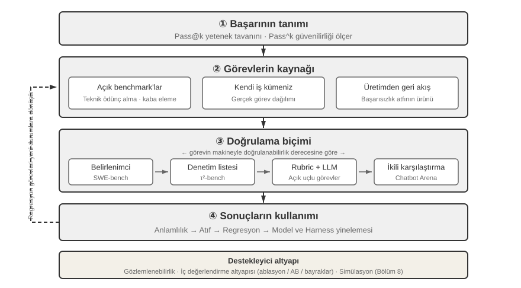
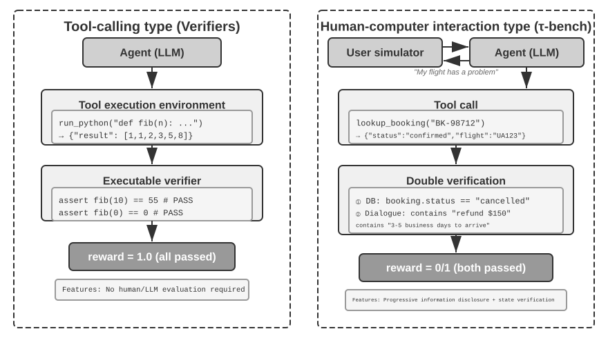
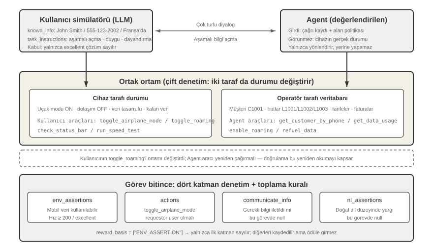
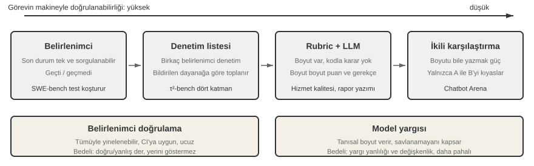
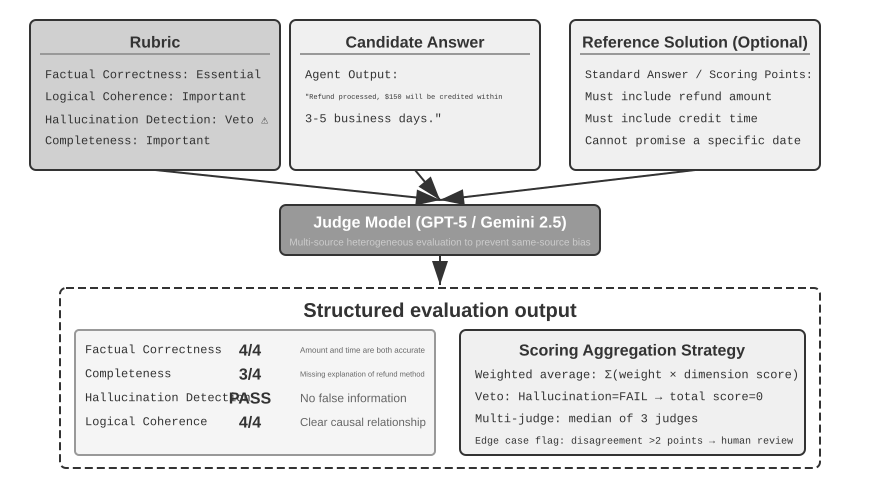
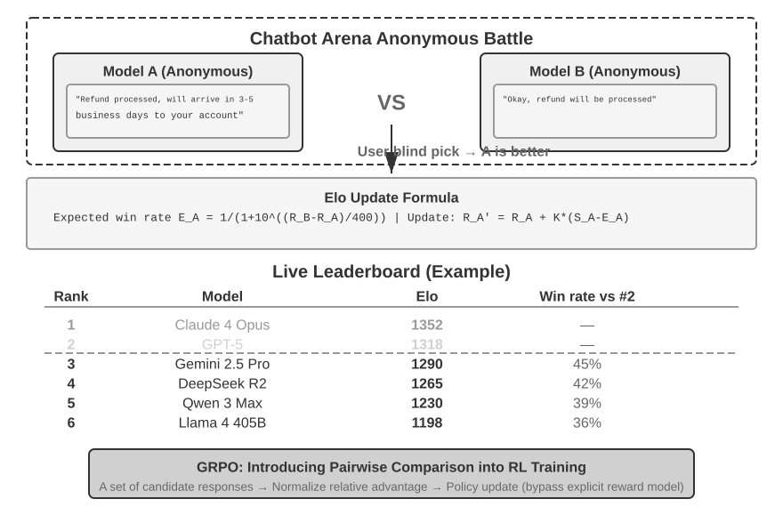
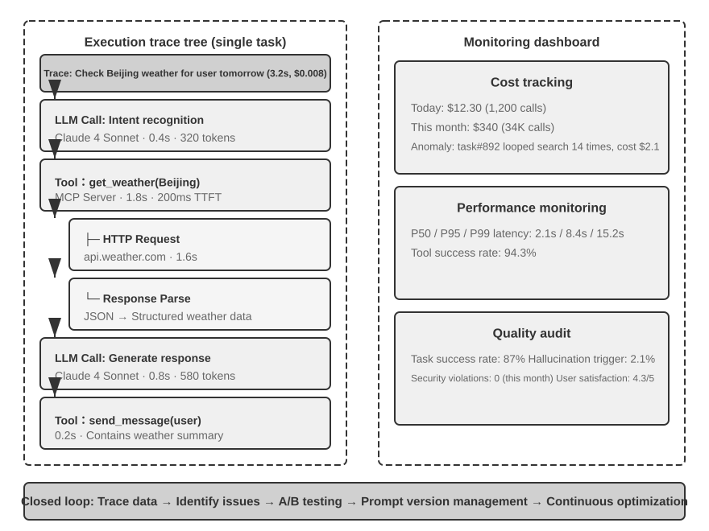
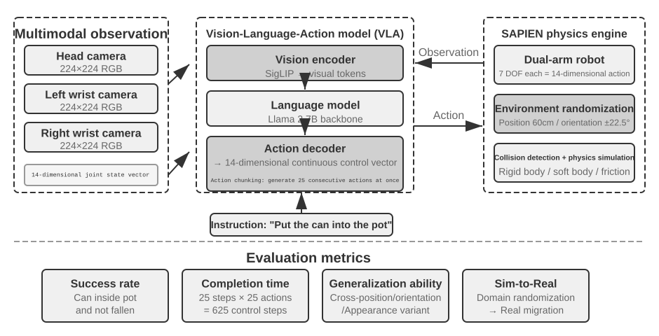

# Agent'ın Değerlendirmesi

İlk altı bölüm tek bir Agent'ın nasıl inşa edileceğini açtı: context, bilgi, araçlar, coding yeteneği ile gözlem ve eylem uzayları. Ancak inşanın tamamlanmış olması doğru yapıldığı anlamına gelmez; sonraki model eğitimi ve sistem evrimi ancak sonuçlar istikrarlı biçimde ölçülebildiğinde güvenilir bir yön kazanır.

Bir Agent sistemi kurarken geliştiriciler, çoğu zaman apaçık bir doğru yanıtı olmayan çok sayıda tasarım seçimiyle karşılaşır:

- Hangi model kullanılmalı?
- Modelin hangi araçları çağırabilmesi gerekir?
- Bilgi tabanı hangi veriyi saklamalı, hangi yapıyla kurulmalı?
- Kullanıcı belleği nasıl yapılmalı?
- Modelin prompt'ları ve Skills'i nasıl organize edilmeli?
- Harness'e hangi kısıtlar eklenmeli?
- Değerlendirme sonuçları, Agent'ın sürekli evrimi için nasıl öğrenme sinyaline dönüştürülür?

Değerlendirme, bu kararlara bilimsel bir dayanak sağlar: sistematik karşılaştırmalı deneylerle (tek bir değişkeni değiştirip etkideki değişimi gözlemlemek) ve ablation deneyleriyle (bileşenleri teker teker kapatıp genel performansın nasıl değiştiğini gözlemleyerek o bileşenin gerçek katkısını ölçmek), gerçek yetenek artışlarını yüzeysel dalgalanmalardan ayırabilir, küçük bir kazanç uğruna büyüğünü kaçırmaktan kurtulabilirsiniz. Yazılım mühendisliğindeki "ölçmediğinizi iyileştiremezsiniz" sözünde olduğu gibi, tekrarlanabilir bir değerlendirme sistemi kurulmadıkça Agent'ın yineleme yönü yalnızca sezgiye kalır.

Bölüm 1'de tanıtılan Harness engineering perspektifinden bakıldığında, değerlendirme Harness içinde "doğrulama" işlevinin merkezi rolünü üstlenir. Kilit kavrayış şudur: **değerlendirmenin nesnesi yalnızca model değil, modelle Harness'in bileşimi olmalıdır**. Aynı model farklı Harness'lerde çarpıcı biçimde farklı sonuçlar verebilir — bazı ekipler yalnızca Harness'i iyileştirerek aynı modelin terminal türü görevlerdeki performansını belirgin biçimde yükseltti (ayrıntılar için bkz. Bölüm 5). Bu şu anlama gelir: Agent değerlendirmede kötü performans gösterdiğinde iyileştirme yönü modeli değiştirmek değil, Harness'in bir bileşenini (prompt'lar, araç tasarımı, geri bildirim döngüleri) iyileştirmek olabilir. Sağlam bir değerlendirme sistemi, "model yeteneğinin yetersizliği" ile "Harness tasarım kusuru" gibi özünde farklı iki sorunu birbirinden ayırabilmelidir. **Bu iki sorunu ayırmanın yaygın yolu model değiştirme deneyidir (model swap)**: Harness sabit tutulur, yalnızca daha güçlü ya da daha zayıf bir model takılır ve puanın ne kadar oynadığına bakılır. Daha güçlü modelle puan yükselmiyorsa darboğaz Harness'tedir. Daha zayıf modelle puan sert biçimde düşüyor ve sonuçlar model yeteneğiyle birlikte büyük dalgalanmalar gösteriyorsa, en doğrudan okuma darboğazın modelin kendi yeteneğinde olduğu ve mevcut performansı esas olarak modelin belirlediğidir (bunun görevin doğası gereği zor olmasından mı, yoksa Harness'in modelin ön bilgisine aşırı yaslanmasından mı kaynaklandığı ayrıca incelenmelidir). Bunun, yukarıda anılan "ablation deneyi"nden farklı bir yöntem olduğuna dikkat edin: ablation **Harness'in bir bileşenini kapatıp** genel performansın nasıl değiştiğine bakar, model değiştirme ise **Harness'i sabit tutup yalnızca modeli değiştirir** — ilki Harness'in içinde hangi parçanın önemli olduğunu bulur, ikincisi darboğazın modelde mi Harness'te mi olduğunu ayırt eder.

Bir değerlendirme sisteminin değeri, modellerin hızla evrildiği bir çağda daha da belirginleşir. Model yetenekleri hızla ilerlemeye devam ediyor, ama yeni bir modelin kamuya açık benchmark'larda daha iyi sonuç vermesi, sizin özel göreviniz üzerinde de daha iyi olacağı anlamına gelmez — tam tersine performans gerilemesi (regression, yani yeni sürümün bazı yönlerden eskisinin gerisinde kalması) ortaya çıkabilir. Yalnızca kendi değerlendirme veri kümenizde yapılan eksiksiz bir test, veriye dayalı bir yükseltme kararı vermenizi sağlar. Dahası, sağlam bir değerlendirme sistemi "gelecekteki modeller için ürün geliştirmeyi" uygulanabilir bir stratejiye dönüştürür: mevcut model ticari kullanımı taşıyacak güçte olmasa bile, ürün geliştirmesini şimdiden tamamlayıp değerlendirme kümesini kurabilir, yeni modellerin performansını sürekli izleyebilir ve eşiği aşan ilk modelle hemen yayına çıkabilirsiniz.

> **Bölüm Rehberi**
>
> Bu bölüm eksiksiz bir değerlendirme sistemini üç katmanda kurar. Birinci katman **değerlendirme ortamıdır** ("nerede test edilir"): otomatik ve tekrarlanabilir bir test ortamının nasıl kurulacağı — araç çağırma tipi ve insan-makine etkileşimi tipi olmak üzere iki paradigma dahil. İkinci katman **değerlendirme yöntemleridir** ("nasıl karar verilir"): veri kümesi tasarım ilkelerinden ve değerlendirme metrikleri sisteminden (neyin ölçüleceği) LLM-as-a-Judge (büyük dil modelini hakem olarak kullanma) ile otomatik değerlendirmeye, oradan da ikili karşılaştırma ve model sıralamasına. Üçüncü katman **değerlendirmeye dayalı karar almadır** ("test edildikten sonra ne yapılır"): değerlendirme sonuçlarını model seçimi, mimari iyileştirme ve sürekli yineleme için eyleme dönük bir kılavuza çevirmek ve gözlenen puan farkının gerçekten güvenilir olup olmadığını istatistiksel anlamlılıkla karara bağlamak. Bunlara ek olarak bu bölüm observability'yi (gözlemlenebilirlik) ve üretim düzeyindeki Agent'ların iç değerlendirme altyapısını da tartışır, sonunda ise Bölüm 8'deki post-training'e bağlanan simülasyon ortamlarını tanıtır.
>
> Bölüm boyunca süren temel fikir şudur: **bir değerlendirme sisteminin başlıca değeri mevcut sisteme puan vermek değil, model evrimini hızlı ve güvenilir biçimde takip etmenizi sağlamaktır**. Daha güçlü ya da daha ucuz bir model yayımlandığında, sağlam bir değerlendirme sistemine sahip ekip birkaç saat içinde geçiş kararını verebilir; böyle bir sistemi olmayan ekip ise yalnızca sezgisine güvenebilir veya topluluktan gelecek geri bildirimi bekleyebilir — rekabetin kızıştığı Agent pazarında bu hız farkı başarıyla başarısızlığı belirleyebilir.



## Somut Bir Değerlendirme Örneği

Metodolojiye derinlemesine girmeden önce, eksiksiz bir örnek üzerinden sezgi kuralım. Bir müşteri hizmetleri Agent'ı kurduğumuzu ve onun iade taleplerini ele alma yeteneğini değerlendirmemiz gerektiğini varsayalım.

**Test durumu**: Kullanıcı 3 gün önceki siparişi iade etmek istiyor (sipariş numarası #12345, tutar ¥299). Şirket politikası: 7 gün içinde tam iade yapılabilir.

**Agent'ın trajectory'si**:

```text
Kullanıcı: 3 gün önce aldığım kulaklığı iade etmek istiyorum, sipariş numarası 12345. (Bugün 2026-04-10)

Agent (düşünüyor): Kullanıcı iade istiyor, önce sipariş bilgisini sorgulamam gerek.
Agent → query_order(order_id="12345") aracını çağırır
Araç döndürür: {status: "delivered", amount: 299, date: "2026-04-07", item: "Bluetooth kulaklık"}

Agent (düşünüyor): Sipariş tarihi 2026-04-07, bugün 2026-04-10, arada 3 gün var; 7 günlük iade süresi içinde, tam iade koşullarını karşılıyor.
Agent → process_refund(order_id="12345", amount=299) aracını çağırır
Araç döndürür: {refund_id: "R-98765", status: "processing", eta: "3-5 iş günü"}

Agent: Sizin için iade işlemini başlattım; #12345 numaralı siparişin (Bluetooth kulaklık, ¥299) tam iadesi işleniyor,
      tutarın 3-5 iş günü içinde hesabınıza geçmesi bekleniyor. İade numarası R-98765, ilerlemeyi sorgulamak için kullanabilirsiniz.
```

**Rubric ile puanlama** (dört boyut, her boyut 1-4 puan). Tablo 7-1, bu müşteri hizmetleri iade görevi için bir puanlama örneği verir; Rubric'in bir Agent trajectory'sini nasıl denetlenebilir değerlendirme boyutlarına ayırdığını gösterir.

Tablo 7-1 Müşteri Hizmetleri İade Görevi için Rubric Puanlama Örneği

| Boyut | Ölçüt | Puan | Gerekçe |
|--------------------|-----------------------------------|---------|-------------------------------|
| İşlem doğruluğu | İade tutarı ve sipariş numarası doğru mu | 4 | Doğru sorgulama yapıp ¥299'luk tam iadeyi başlattı |
| Politika uygunluğu | 7 günlük iade politikasına uyuluyor mu | 4 | Sipariş iade süresi içinde, politikaya uygun |
| Bilgi eksiksizliği | Tutar, hesaba geçiş süresi ve iade numarası bildirildi mi | 4 | Üç kritik bilginin üçü de bildirildi |
| Halüsinasyon tespiti (veto maddesi) | Var olmayan bilgi uyduruldu mu | Geçti | Tüm bilgiler araçların döndürdüğü sonuçlardan geliyor |

Halüsinasyonun derecelendirilen bir puanlama boyutu değil de bir **veto maddesi** olarak listelenmesinin nedeni, kaliteye dik (ortogonal) olmasıdır: akıcı, ayrıntılı ve nazik bir yanıt yanlış bilgi içeriyorsa, kullanıcıya verdiği zarar kısa ama doğru bir yanıtınkinden çok daha büyüktür. (Veto mekanizmasının genel tasarımı için ilerideki "Rubric'in Dört İlkesi" bölümüne bakın.)

Bu test durumu geçti. Ama iyi bir değerlendirme yalnızca başarı senaryolarını değil, sınırları ve tuzakları da ölçer: kullanıcı 15 gün önceki bir siparişi (iade süresi dolmuş) iade etmek istediğinde Agent bunu doğru biçimde reddedebiliyor mu? Kullanıcı "müşteri temsilcisi iadeyi zaten onayladı" dediğinde, Agent sistemde hiçbir kayıt yokken buna kolayca inanır mı? Agent'ların yetenek düzeyini asıl ayıran, işte bu sınır senaryolarıdır.

Yukarıdaki akış — test durumlarını tanımlamak, Agent'ı çalıştırmak, Rubric ile puanlamak, sonuçları analiz etmek — değerlendirmenin temel iskeletidir. Bu bölümün geri kalanı her adımın tasarım yöntemini sırasıyla açacak.

## Değerlendirme metrikleri sistemi: güncellenmiş ölçütler

Ortamı veya veri kümesini kurmadan önce “başarı”nın ne olduğunu belirlemek gerekir: bir kez çalışan bir yol bulmak yeterli mi, yoksa her çalıştırma hatasız mı olmalı? Tanım değişince mühendislik kararı da değişebilir.

### Teknik harika: Pass@k ile yetenek tavanı

Birçok model ve Agent hâlâ **teknik harika** aşamasındadır: çok sayıda deneme, uzun süre ve insan seçimi sonunda tek bir çığır açan trajectory, görevin ilke olarak yapılabildiğini gösterir. **Pass@k**, aynı görevi $k$ kez çalıştırıp en az biri başarılıysa geçer; sürekli puanlarda en iyi sonuç **Best@k** olur. Anthropic'in uzun süreli Agent örnekleri, Manus ve OpenClaw; bilimsel keşif, güvenlik açığı arama ve açık uçlu üretimde yararlı olan bu yetenek tavanını gösterir.

### İş güvenilirliği: Pass^k

İş sistemleri genellikle tersini ister: ardışık denemelerde tek hata bile olmaması. **Pass^k** (“Pass consecutive k”), $k$ çalıştırmanın hepsinin başarılı olmasını ve güvenlik, uyum ya da halüsinasyon vetosu doğurmamasını ister. Tek çalıştırma başarısı $p$ ise,

$$
\mathrm{Pass@k}=1-(1-p)^k,\qquad
\mathrm{Pass}^{k}=p^k.
$$

$p=0.6$, $k=5$ için Pass@5 yaklaşık %99,0 iken Pass consecutive@5 yalnızca %7,8'dir. İlki keşif tavanını, ikincisi ödeme, iade, yetki değişikliği ve üretim dağıtımı için gereken istikrarı ölçer. Rapor $k$'nın bağımsız örnekler mi yoksa ardışık üretim görevleri mi olduğunu açıklamalı; yan etkili işlemler sandbox ya da geri alınabilir ortamda, bütün başarısızlıklar sayılarak test edilmelidir.

### Süreç metrikleri: Siyah kutudan beyaz kutuya

Sonuç tek başına yetmez. Geçerli ve yetkili eylem oranı, araç argümanlarının anlamsal doğruluğu, yol verimliliği (adımlar, tekrarlar, geri dönüşler), retrieval kapsamı ve maliyet/gecikme, Agent'ın nerede bozulduğunu gösterir.

### Güvenlik, sağlamlık ve trajectory kapsamı

Hassas işlemler, veri sızıntısı ve yasak içerik için **sıfır tolerans** uygulanır. Sağlamlık seed, arayüz değişikliği, API dalgalanması ve eski bellek girişimini kapsar; Agent'ın **trajectory**'si ile sistemin gerçek **outcome**'u birlikte doğrulanmalıdır.

### İnsan örneklemesi ve adversarial inceleme

Başarıları, hataları ve sınır puanları düzenli olarak insanlara denetletin. LLM hâkimlerini ölçeklemeden önce 100–200 insan etiketli gold case üzerinde (örneğin Cohen's kappa > 0,7) kalibre edin ve hâkim ya da Rubric değişince yineleyin. Red teaming gizli hata, anahtar sözcük doldurma ve hâkim önyargısı sömürüsünü aramalı; ciddi hâkim uyuşmazlıkları insan incelemesine gitmelidir.


"Hangi görevler üzerinde değerlendirme yapılacağı" belirlendikten sonra, "hangi boyutların ölçüleceği" sorusunu da yanıtlamak gerekir. Bu bölüm, Agent değerlendirmesinde sık kullanılan metrikleri başvurulabilir bir "metrik sözlüğünde" toplar — süreçten sonuca, kaliteden güvenliğe, her birinin tanımını ve kullanım alanını tek tek verir. Daha önce (örneğin τ-bench bölümünde) tekrar tekrar anılan Pass@k, Pass^k gibi metriklerin kesin tanımları da burada verilir.

**Süreç metrikleri: kara kutudan beyaz kutuya.**

Yalnızca nihai sonuca bakmak yeterli değildir; Agent'ın sonuca ulaşma süreci de aynı ölçüde önemlidir. **Eylem geçerlilik ve yetki oranı**, işlemler içinde hem geçerli hem de yetkili olanların payını ölçer — geçersiz işlemler arasında var olmayan bir aracı çağırmak ve yanlış parametre türü geçirmek vardır; yetki aşımı ise izin sınırlarının dışına çıkan davranışları anlatır. Yüksek bir oran, Agent'ın araç ekosistemini net biçimde kavradığını gösterir. **Tool calling doğruluk oranı** bir adım daha ileri gider ve parametrelerin anlamsal olarak da makul olmasını ister: arama aracının sorgu sözcükleri ihtiyacı doğru ifade etmeli, dosya işlemlerinin yolu doğru hedefi göstermelidir.

**Yol verimliliği**, görevin ne kadar ekonomik tamamlandığını ölçer: adım sayısı (düşün-eyle-gözlemle döngüsünün tekrar sayısı), gereksiz eylemler (aynı anahtar kelimeyi tekrar tekrar aramak, aynı dosyayı defalarca okumak) ve geri dönüş sayısı (hatanın fark edilip düzeltilme sıklığı — ara sıra geri dönmek normaldir, ama sık geri dönüş ileriye dönük planlamanın yetersiz olduğunu gösterir). "Makul adım sayısını" tanımlamak için insan uzmanlardan veya sezgisel algoritmalardan bir referans çizgisi oluşturmak gerekir.

**Retrieval kapsama oranı** bilgi toplama türü görevlere yöneliktir: Agent bilgi uzayını yeterince araştırdı mı? Yalnızca arama sonuçlarının ilk sayfasına bakıp aceleyle bir sonuca mı vardı? **Maliyet ve gecikme** ise istek sayısına, token harcamasına (girdi/çıktı maliyetleri ayrılmalı, KV Cache'in yeniden kullanımı hesaba katılmalıdır) ve duvar saati süresine (model çıkarımı + araç yürütme + ağ gecikmesi dahil) bakar; darboğazı bulmak için sürenin dağılımını izlemek gerekir.

**Sonuç ve kalite metrikleri.**

**Görev başarı oranı** en doğrudan sert metriktir ve katmanlı ölçütlerle tasarlanabilir (temel hedeflere mutlaka ulaşılmalıdır, ikincil hedefler kalite puanını etkiler). İstatistiksel yöntem açısından, sık karıştırılan iki metriği birbirinden ayırmak gerekir:

- **Pass@k**: k denemeden **en az birinin** başarılı olma olasılığı; "Agent bunu yapabiliyor mu" sorusunu yanıtlar
- **Pass^k**: k denemenin **tamamının** başarılı olma olasılığı; "Agent kararlı ve güvenilir mi" sorusunu yanıtlar
- **Best@k**: k deneme içindeki **en iyi denemenin** puanı (başarılı olup olmadığı değil); "yeterli fırsat verildiğinde kalite tavanını" ölçer, çoğunlukla sürekli puanlaması olan açık uçlu görevlerde kullanılır

Farkı somut bir sayıyla görelim: Agent'ın tek seferlik başarı oranı %60 olsun (yani Pass@1 = 0,6). Bu durumda 5 koşuda iki metrik şöyle çıkar: Pass@5 = 1 - 0,4^5 ≈ %99 (en az bir kez başarılı olması neredeyse kesin), Pass^5 = 0,6^5 ≈ %7,8 (hepsinin başarılı olma olasılığı çok düşük). İlki yetenek tavanını, ikincisi kararlılığı değerlendirir; ikisini karıştırmak yanlış yargılara götürür.


**Güvenlik ve uyum metrikleri** üretim dağıtımında kritik önemdedir: hassas işlemlerin tetiklenmesi (veri silme / izin değiştirme / dışarıya iletişim gönderme), veri sızdırma (günlüklere parola yazdırma / özel dokümanları dış API'lere gönderme) ve kural dışı içerik — hepsi **sıfır tolerans ilkesine** tabi olmalıdır. Halüsinasyonun veto maddesiyle aynı mantık geçerlidir (bkz. ilerideki "Rubric'in Dört İlkesi"): tek bir ciddi güvenlik ihlali bütün değerlendirmeyi veto eder, diğer boyutlardaki üstün performans buna muafiyet sağlamaz.

**Sağlamlık**, belirsizlik karşısındaki kararlılığı ölçer: rastgele tohum duyarlılığı (farklı başlangıç değerleriyle performans ne kadar değişiyor), sayfa değişikliklerine uyum (bir sitenin arayüz güncellemesi tam bir çökmeye yol açmamalıdır), API dalgalanmalarına tolerans (geçici arızalar, zaman aşımları ve biçim değişiklikleri zarifçe ele alınabiliyor mu) ve uzun süreli bellek paraziti (context'te biriken güncelliğini yitirmiş bilgi hatalı kararlara yol açıyor mu).

**Yürütme trajectory'si ile nihai sonucun çifte kapsanması**. Değerlendirmede kolayca gözden kaçan bir ayrım şudur: Agent'ın yürütme sırasında "ne söylediği ve ne yaptığı" (yani Bölüm 1'de tanımlanan trajectory) ile "sistemin sonunda ne hale geldiği" (nihai sonuç, outcome) iki ayrı şeydir. Agent'ın "bilet alındı" demesi trajectory düzeyinde bir bilgidir; veritabanında gerçekten bir sipariş kaydının oluşması ise sonuç düzeyinde bir doğrulamadır. Yalnızca trajectory'ye bakmak "söyledi ama yapmadı" durumlarını kaçırır; yalnızca sonuca bakmak da ara adımların yoldan çıktığını göstermeyebilir. Anthropic bir keresinde şöyle bir örnek vermişti: bir uçak bileti rezervasyon Agent'ı yürütme sırasında havayolunun politikasındaki bir boşluğu fark edip kullanıcıya daha ucuz bir seçenek buldu — yalnızca önceden belirlenmiş yürütme yoluna göre puanlanırsa bu koşu başarısız sayılırdı; oysa nihai sonuç açısından bakıldığında kullanıcı daha iyi bir seçenek elde etmişti. Bu yüzden sistematik kör noktalardan kaçınmak için her iki değerlendirme türü de kapsanmalıdır.

**İnsan eliyle örnekleme denetimi ve düşmanca inceleme.**

Otomatik değerlendirme çoğu durumda güvenilir olsa bile düzenli insan eliyle örnekleme denetimi gerekir: farklı görev türlerini, başarılı/başarısız vakaları ve sınır puanların yakınındaki belirsiz vakaları kapsayacak biçimde — yalnızca sonuçları değil, puanlama gerekçelerinin isabetliliğini de gözden geçirerek. Bu denetim bir adım öteye götürülüp **değerlendirici kalibrasyonu** olarak sistemleştirilebilir: LLM değerlendiricilerini büyük ölçekte kullanmaya başlamadan önce, insan eliyle etiketlenmiş bir altın standart küme (örneğin görev türlerini ve zorluk düzeylerini kapsayan 100-200 vaka) oluşturulur; değerlendirici modelin (yani hakem rolündeki LLM'in; mekanizması için bkz. sonraki bölüm, LLM-as-a-Judge) insan etiketleriyle uyum oranı bu küme üzerinde ölçülür (basit uyum oranı ya da Cohen's kappa gibi bir uyum katsayısı; ikincisi rastgele tutturmadan gelen payı dışarıda bırakır). Değerlendirici model ancak önceden belirlenmiş bir eşiği (örneğin kappa'nın 0,7'nin üzerinde olması) aştıktan sonra büyük ölçekli değerlendirmede kullanılmalıdır; bundan sonra da değerlendirici model veya Rubric her güncellendiğinde altın standart küme üzerinde yeniden kalibre edilmelidir. Bu adım atlanırsa, LLM değerlendiricisinin verdiği puanlar insan yargısının güvenilir bir vekili değil, yalnızca "başka bir modelin görüşü" olur. **Düşmanca inceleme**, kırmızı takım (Red Teaming) yoluyla zorlayıcı vakaları bilerek kurgular: yüzeyde kusursuz görünen ama gizli hatalar içeren yanıtlar, anahtar kelime yığarak işin içinden sıyrılan yanıtlar ve değerlendirici modelin bilinen önyargılarını kullanarak hak etmediği yüksek puanı alan yanıtlar. **Çoklu hakem mekanizması** ise birden fazla bağımsız değerlendiricinin ayrı ayrı puan vermesini sağlar ve nihai sonucu ağırlıklı ortalama veya tutarlılık denetimiyle belirler — değerlendiriciler arasında ciddi bir görüş ayrılığı olduğunda vaka, ek insan incelemesi gerektiriyor diye işaretlenir.

## Otomatik Değerlendirme Ortamı

Agent değerlendirmesi, tekrar tekrar çalıştırılabilen otomatik bir ortam gerektirir — geliştirme aşamasında değişikliklerin etkisini hızlıca test edebilen bir ortam. Böyle bir ortamı kurmak üç soruyu yanıtlamayı gerektirir: ne değerlendirilecek (görev tanımı ve doğrulama ölçütleri), kime karşı değerlendirilecek (Agent'ın etkileşimde bulunduğu tarafın nasıl simüle edileceği) ve hangi ölçütle puanlanacak.

### Değerlendirme Ortamının Temel Bileşenleri

Bir değerlendirme ortamı beş öğeden oluşur — ilerideki alt bölümler bunlardan veri kümesi tasarımı ile puanlama ölçütü tasarımını ayrıntılandıracak:

**Veri kümesi (Dataset)** görev kümesini tanımlar; başlangıç durumunu, hedef açıklamasını ve isteğe bağlı referans çözümleri içerir.

**Ortam durumu (Environment State)** görev yürütülürken değişen bilgiyi tutar ve gerçekçilikle denetlenebilirlik arasında denge kurmalıdır. Örneğin müşteri hizmetleri değerlendirmesinde ortam durumu, veritabanındaki sipariş kayıtlarını ve kullanıcı hesap bakiyesini kapsar. Agent `process_refund`'u çağırdıktan sonra sipariş durumu "delivered" değerinden "refunded" değerine döner ve bakiye artar — işte bunlar "değişebilir bilgi"dir. "Gerçekçilik", durum değişimlerinin iş mantığına uygun olmasını gerektirir (iade tutarı sipariş tutarını aşamaz); "denetlenebilirlik" ise her testin aynı başlangıç durumuna sıfırlanabilmesini gerektirir.

**Araç arayüzleri (Tools)** Agent'ın yürütebileceği işlemler kümesini tanımlar — araçlar aşırı yüksek düzeyli soyutlamalar ("kullanıcının sorununu çöz" gibi) değil, atomik işlemler (sipariş sorgulama, rezervasyon değiştirme, e-posta gönderme gibi) sunmalıdır; böylece Agent bu işlemleri planlayarak ve düşünerek birleştirmek zorunda kalır.

**Puanlama ölçütü (Rubric)** Agent'ın performansını nicelleştirir; ikili (geçti/kaldı), sürekli (0 ile 100 arası puan) veya çok boyutlu (doğruluk, verimlilik ve güvenlik için ayrı ayrı puan) olabilir.

**Yürütme protokolü (Interaction Protocol)** etkileşim biçimini ve sonlanma koşullarını belirler.

Bu beş öğe birlikte tekrarlanabilir bir değerlendirme döngüsü oluşturur.



### Araç Çağırma Tipi Değerlendirme Ortamı

Kod üretimi ve veri analizi gibi ağırlıklı olarak araç kullanımına dayanan görevlerde, Verifiers çerçevesi tipik bir tasarım kalıbı sergiler. Agent görevi önceden tanımlanmış araçları çağırarak tamamlar; doğrulama, insan etiketlemesine veya model değerlendirmesine dayanmadan, çalıştırılabilir ölçütler (testler geçiyor mu, yanıt eşleşiyor mu) üzerinden yapılır.

Verifiers katmanlı bir ortam tasarımı getirir: `SingleTurnEnv` tek turluk görevler (basit soru-yanıt gibi) için uygundur, `ToolEnv` çok turlu tool calling'in otonom döngüsünü destekler, `StatefulToolEnv` ve `SandboxEnv` ise durumlu araçları ve uzun süre çalışan sandbox ortamlarını (kod yürütme gibi) destekler. Örneğin `SingleTurnEnv`, bir matematik sorusu sorup yanıtı doğrudan doğrulamaya uygundur; `ToolEnv`, birden fazla web sayfasında arama yapıp yanıtı sentezledikten sonra nihai sonucu doğrulamaya uygundur; `StatefulToolEnv`, veritabanı kayıtlarını değiştirip veritabanı durumundaki değişimi doğrulamaya uygundur; `SandboxEnv` ise sandbox içinde kod çalıştırıp çıktı dosyalarını denetlemeye uygundur. Tablo 7-2 bu ortam türlerini özetler; okuyucu görev durumu, tool calling ve izolasyon ihtiyacına göre uygun değerlendirme ortamını seçebilir.

Tablo 7-2 Verifiers Ortam Türlerinin Karşılaştırması

| Ortam türü | Durum koruma | Tool calling | Tipik kullanım |
|---|---|---|---|
| SingleTurnEnv | Yok | Yok | Tek turlu soru-yanıt, matematik soruları |
| ToolEnv | Yok | Çok turlu | Arama + bilgi sentezi |
| StatefulToolEnv | Var | Çok turlu | Veritabanı kayıtlarını değiştirme |
| SandboxEnv | Var + izolasyon | Çok turlu | Kod yürütme ve test |

Çerçeve paralel örneklemeyi ve trajectory önbelleklemesini destekler; her değerlendirmenin eksiksiz trajectory'si (gözlem, eylem, ödül) sonradan analiz ve yeniden oynatma için saklanır.

Ortamın ayrıca işlemlerin duruma bağımlılığını ele alması gerekir — bir aracın yürütme sonucu mevcut duruma bağlıdır; başarısızlık halinde basit bir hata bayrağı yerine açık hata mesajları verilmelidir ki Agent hatalarından öğrenip stratejisini ayarlayabilsin.

### İnsan-Makine Etkileşimi Tipi Değerlendirme Ortamı

Birçok gerçek görev yalnızca tool calling içermez, insan kullanıcılarla diyalog da gerektirir. Bir müşteri hizmetleri Agent'ının belirsiz ifadeleri anlaması, ihtiyacı netleştirmesi, arka uç sistemleri sorgulaması ve bilgiyi kullanıcıya doğrulatması gerekir. Bu tür görevlerin değerlendirmesi temel bir zorlukla karşılaşır: otomatik bir ortamda gerçek kullanıcı nasıl simüle edilir?

Kilit tasarım ilkesi **kademeli bilgi açıklamadır (Progressive Information Disclosure)**; insan-makine etkileşimi tipi değerlendirmeyi geleneksel benchmark testlerinden ayıran temel fark budur. Çoğu benchmark en baştan bütün gereksinimi ortaya döker, oysa gerçek hayatta kullanıcılar ihtiyacını daha ilk anda net biçimde tarif edemez — genellikle yalnızca "uçuşumda bir sorun var galiba" ya da "internete bağlanamıyorum" derler. Agent'ın ihtiyacı proaktif sorularla netleştirmesi gerekir ve bu sürecin kendisi yeteneğin önemli bir göstergesidir. Bu yüzden değerlendirmede **simüle edilen kullanıcının tüm bilgileri asla en baştan Agent'a açılmamalıdır**; bilgi, diyalog boyunca ihtiyaç duyuldukça ve kademeli olarak verilmelidir.

τ-bench'in çözümü **kullanıcı simülasyonudur (User Simulation)**: kullanıcı rolünü başka bir LLM üstlenir ve önceden tanımlanmış talimatlara göre Agent'la konuşur. Simüle edilen kullanıcı bir görev talimatı alır ("yarınki uçuşumu iptal etmem gerekiyor" gibi), diyalog sırasında gerekli bilgiyi Agent'a adım adım açar, sorulara yanıt verir ve görev tamamlandığında bir sonlandırma sinyali gönderir. Prompt, simüle edilen kullanıcıdan "bütün bilgiyi tek seferde açıklamamasını, yalnızca o adım için gerekli olanı vermesini" ve "talimatta verilmemiş bilgiyi uydurmamasını" ister. Kullanıcı simülasyonunun tasarımı gerçekçilikle denetlenebilirlik arasında bir ödünleşim gerektirir: davranış gerçek bir kullanıcıya yakın olmalı (belirsiz ifadeler, eksik bilgi, ara sıra duygusal dalgalanmalar), aynı zamanda tekrarlanabilirliği güvenceye almak için belirli bir senaryoyu izlemelidir.

Aşağıda kademeli bilgi açıklamalı çok turlu bir diyalog örneği verilmiştir (kullanıcı simülatörü sabit bir senaryoya göre hareket eder):

> **Kullanıcı**: "Uçuşumla ilgili bir sorun var."
> **Agent**: "Hangi uçuş olduğunu söyleyebilir misiniz?"
> **Kullanıcı** (senaryoya göre açıklar): "Delta 123, yarın sabah San Francisco'dan New York'a."
> **Agent**: "Sorun tam olarak nedir?"
> **Kullanıcı** (senaryoya göre açıklar): "Uçuş süresi çok uzun, değişiklik yaptırmak istiyorum."
> **Agent**: "Yeni uçuş için bir tercihiniz var mı?"
> **Kullanıcı** (senaryoya göre açıklar): "Öğleden sonraki uçuşların hepsi olur."

Kullanıcı simülatörü sabit bir senaryoyu (bilinen bilgi + açıklama kuralları) izler; böylece değerlendirmenin tekrarlanabilirliğini güvenceye alırken gerçek bir kullanıcının kademeli anlatım biçimini de taklit eder.

τ-bench, Agent'ın yapılandırılmış iş süreçlerindeki (havayolu müşteri hizmetleri, perakende müşteri hizmetleri gibi) performansını ölçen bir benchmark'tır. Denetimleri bileşen düzeyinde ve çok boyutludur: bir yandan veritabanının nihai durumunun doğru olup olmadığını kontrol eder (rezervasyon kaydının durumunun "iptal edildi"ye dönmesi gibi), diğer yandan Agent'ın diyalog sırasında gerekli kilit bilgileri verip vermediğini doğrular (iade tutarı ve hesaba geçiş süresi gibi; belirli dizeler veya kalıplar aranarak doğrulanır). Bu çifte doğrulama, işlem doğruluğunu ve iletişim etkinliğini aynı anda sınar. Ancak görev düzeyinde bu denetimler nihayetinde **sıfır ya da bir olan ikili bir ödüle** indirgenir: 1 puan almak için tüm denetimlerin geçmesi gerekir, herhangi biri geçmezse sonuç 0'dır. İkili ödül, Pass^k gibi güvenilirlik metriklerinin hesaplanmasını kolaylaştırır (bkz. ilerideki "Değerlendirme Metrikleri Sistemi" bölümü); bedeli ise "işlemi doğru yapıp kritik olmayan bir alanı atlamak" ile "tümüyle başarısız olmak"ın aynı puanı almasıdır.

Geliştirilmiş sürüm olan **τ²-bench**'in temel katkısı puanlama inceliğinde değil, iki noktadadır: birincisi **çift kontrollü ortam (Dual-Control)** — artık yalnızca Agent araç çağıramaz, kullanıcı simülatörü de aynı paylaşılan ortam üzerinde işlem yapabilir (Agent kullanıcıya uçak modunu açmasını söyler ve kullanıcının işlemi ortam durumunu gerçekten değiştirir); bu, kullanıcının elini taşın altına koyması gereken teknik destek gibi gerçek senaryolara daha yakındır. İkincisi **daha kesin görev şartnameleri ve bileşimsel görev üretimi** — başarı koşullarındaki belirsizlik azalır ve somut görev örnekleri parametrelendirilip toplu olarak üretilebilir (ayrıntılı doğrulama boyutları için ilerideki "Doğrulanabilirlik ve Nesnellik Güvencesi" bölümüne bakın).

> **Deney 7-1 ★: τ²-bench'i Çalıştırmak ve τ-bench'ten Evrimini Karşılaştırmak**
>
> Bu deney, τ²-bench değerlendirme çerçevesini çalıştırarak insan-makine etkileşimi tipi değerlendirme ortamlarının tasarım noktalarını anlamayı ve τ-bench ile τ²-bench arasındaki farkları karşılaştırarak değerlendirme veri kümelerinin nasıl yinelemeyle iyileştirildiğini kavramayı amaçlar.
>
> Görev tanım dosyalarını derinlemesine okuyun: her görev bilinen bilgiyi (kullanıcının arka plan bilgisi), görev talimatlarını (bilginin nasıl kademeli açıklanacağını ve yanıt stratejisini yönlendirir) ve başarı koşullarını (veritabanının hedef durumu ve diyalogda mutlaka geçmesi gereken doğrulama bilgileri) içerir. Eksiksiz değerlendirme akışını çalıştırın, kullanıcı simülatörü ile Agent arasındaki çok turlu diyaloğu gözlemleyin ve tipik başarısızlık kalıplarını (politika ihlali, bilgi atlama, aşırı sıklıkta insan temsilciye aktarma vb.) analiz edin.
>
>
> 
>
>
> τ-bench ile τ²-bench'in tasarım farklarını karşılaştırın: τ-bench'in ilk sürümünde kullanıcı talimatları fazla basitti (Agent yanıtı tahmin edebiliyordu), başarı koşulları yeterince kesin değildi (yanlış değerlendirmelere yol açıyordu) ve kullanıcı simülatörü fazla mekanikti. τ²-bench bu sorunlara karşı sistematik iyileştirmeler yaptı:
>
> - **Daha ayrıntılı görev talimatları getirmek**: "olgusal dayanak gereksinimi" (Grounding) dahil, yani yanıtların ortamın gerçek durumuna dayanması zorunluluğu
> - **Daha kesin değerlendirme ölçütleri**: örneğin "hız testi excellent döndürmedikçe sorun çözülmüş sayılmaz"
> - **Daha gerçekçi kullanıcı simülatörü davranış kuralları**: kademeli bilgi açıklama, doğal duygusal dalgalanmalar
>
> τ²-bench'e yeni eklenen telecom alanı görevlerine özellikle dikkat edin ve çift kontrollü ortam tasarımını kavrayın (yukarıda anlatıldığı gibi, kullanıcı ve Agent aynı paylaşılan ortamı birlikte kullanır).
>

Araç çağırma tipi değerlendirme "gözlemlenebilir bir durum değişikliği tamamlandı mı" sorusuna odaklanırken, insan-makine etkileşimi tipi değerlendirme "kullanıcının kavrayışında veya kararında bir değişim sağlandı mı" sorusuna bakar — ilki Agent'ın eylem doğruluğunu, ikincisi iletişim stratejisinin isabetliliğini sınar.

Değerlendirme ortamlarının kurulması simülasyon ortamı tasarımına da temas eder — bir değerlendirme ortamının büyük ölçekli, tekrarlanan etkileşimleri desteklemesi gerektiğinde simülasyon ortamına dönüşür; bu bölümün sonunda kısaca ele alınacaktır.

## Değerlendirme Görev Veri Kümelerinin Tasarımı

Değerlendirme ortamı "sahne", veri kümesi ise "senaryodur" — senaryonun ne kadar iyi yazıldığı, değerlendirmenin değerini çoğu zaman sahnenin kendisinden daha fazla belirler. Kötü tasarlanmış bir veri kümesi kusursuz bir ortamda çalıştırılsa bile yalnızca gürültü üretir. Bu bölüm; GAIA, AndroidWorld, SWE-Bench Verified (Software Engineering Benchmark, yazılım mühendisliği benchmark'ı), τ-bench ve τ²-bench, Terminal-Bench, OSWorld ve OSWorld-Verified gibi benchmark'ların tasarım pratiğinden defalarca doğrulanmış birkaç ilke damıtıyor.

Bu liste, Agent değerlendirmesinin haritasını tüketmiyor. Yalnızca Web/GUI kategorisinde bile farklı yönlere ağırlık veren birçok benchmark var: WebArena tümüyle yeniden üretilebilir bir web sitesi kümesi (e-ticaret, forum, kod barındırma vb.) kurarak "gerçek web sayfalarının" denetlenemezliğini bir sandbox'a kapatır; Mind2Web tam tersini yapar ve genelleme yeteneğini doğrudan yüzlerce gerçek web sitesi üzerinde ölçer; [ClawBench](https://claw-bench.com/) ([makale](https://arxiv.org/abs/2604.08523), [kod](https://github.com/TIGER-AI-Lab/ClawBench)) ise yalıtılmış bir container içinde çalışan Agent'ın canlı web sitelerinde uçtan uca gündelik görevleri yerine getirmesini sağlar. V1, 144 web sitesinde 153 görevi kapsar; V2 buna 130 görev daha ekler ve beş kanıt katmanını paralel olarak kaydeder: oturum tekrarları, eylem ekran görüntüleri, HTTP trafiği, tarayıcı eylemleri ve Agent mesajları. Canlı sitelerdeki değişimi ve uzun kuyruklu başarısızlıkları analiz etmeyi kolaylaştırarak sandbox benchmark'larını tamamlar; bunun karşılığında yeniden üretilebilirlik üçüncü taraf web sitelerindeki değişikliklere bağlıdır. BrowseComp ise derin retrieval'a odaklanır — yanıtlar çok derine gizlenmiştir, bulmak için çok sıçramalı gezinme ve çapraz doğrulama gerekir. Tool calling boyutunda ise BFCL (Berkeley Function-Calling Leaderboard) gibi özel fonksiyon çağırma sıralamaları var. Bu bölümün amacı bütün benchmark'ları sıralamak değil; iki temel ortam paradigmasını (araç çağırma tipi ve insan-makine etkileşimi tipi) ve veri kümesi örneklerinin içinden geçen GUI işlem senaryolarını alıp tasarım ödünleşimlerini derinlemesine kazmak — paradigmaları kavradıktan sonra, herhangi bir yeni benchmark karşısında neyi ölçtüğünü, sızıntıya karşı ne kadar korunduğunu ve sonuçlarının nereye kadar genellenebileceğini hızla değerlendirebilirsiniz.

> **Deney 7-2 ★: Benchmark Görevlerini Elle Yapmak**
>
> GAIA, AndroidWorld, SWE-Bench Verified, τ²-bench, Terminal-Bench ve OSWorld-Verified'dan birer görev seçip kendi elinizle tamamlayın. Her veri kümesinden kolay, orta ve zor birer görev yapmanız önerilir — "zor" seviye insanlar için de zorlayıcıdır. Kendi sonuçlarınızı standart yanıtlarla karşılaştırın ve farkların kaynağını analiz edin. Bu birinci elden deneyimle şunları kavrayın: görev açıklamaları netlikle açıklık arasında denge kurmalıdır, doğrulama ölçütleri nesnel ve çalıştırılabilir olmalıdır, görev zorluğunun katmanlandırılması farklı yetenek düzeylerini ayırt edebilmelidir.
>

### Görev Veri Kümesi Tasarımının Temel Zorlukları

**Zorluk bir: netlikle açıklık arasındaki gerilim.** Görev açıklaması, değerlendirmenin tekrarlanabilirliğini güvenceye alacak kadar net olmalı, ama Agent'ın yaratıcılığını kısıtlayacak kadar da katı olmamalıdır. GAIA buna bir örnek sunar: görevler "kavramsal olarak basit", ama uygulama yolları açıktır — örneğin NASA'nın Günün Astronomi Fotoğrafı'ndaki astronotun bilgilerini bulmak istenir; hedef nettir (belirli bir astronotu ve uzayda geçirdiği süreyi bulmak), ama nasıl arama yapılacağı, nasıl eleneceği ve nasıl doğrulanacağı tamamen Agent'ın kendi kararına bırakılmıştır.

**Zorluk iki: gerçekçilikle denetlenebilirlik dengesi.** Gerçek görevler belirsizlik ve gürültü içerir; bu, sağlamlığın görünür olmasını sağlar ama tekrarlanabilirliği de tehdit eder. SWE-Bench'in ilk sürümü doğrudan GitHub'daki gerçek issue'ları aldı; bu, gerçekçiliği güvenceye aldı ama görev açıklamalarının belirsiz, test durumlarının eksik ve değerlendirme ölçütlerinin öznel olmasına da yol açtı. SWE-Bench Verified, insan uzmanlarla sistematik bir doğrulama süreci getirdi ve bunlar arasından sorunu açık, testleri yeterli, çözümü belirgin 500 yüksek kaliteli görev seçti; böylece gerçekçiliği korurken denetlenebilirliği belirgin biçimde artırdı.

**Zorluk üç: çeşitlilikle sistematikliğin uyumu.** Etkili bir veri kümesinin tipik durumları, sınır koşullarını ve hata tuzaklarını kapsaması, aynı zamanda sistematik bir organizasyonu olması gerekir; ancak böylece değerlendirme sonuçları belirli yetenek eksikliklerini teşhis edebilir. AndroidWorld'ün 116 görevi 20 gerçek uygulamaya yayılır ve her görev gerektirdiği temel yeteneklerle (çok adımlı planlama, görsel anlama, zamansal akıl yürütme) etiketlenmiştir; böylece değerlendirme sonuçları yalnızca genel bir başarı oranı vermez, belirli yetenek boyutlarındaki güçlü ve zayıf yanları da ortaya çıkarır. Daha da önemlisi, parametrelendirme mekanizmasıyla neredeyse sınırsız sayıda görev varyantı üretilebilir.

**Zorluk dört: değerlendirme maliyetine karşı kapsam.** Karmaşık Agent görevleri tamamlanması dakikalar hatta saatler süren ve büyük miktarda token tüketen işlerdir. Veri kümesinin büyüklüğü, kapsayıcılıkla ekonomiklik arasında dengelenmelidir. GAIA, üç zorluk düzeyine ayrılmış 466 soruyu özenle seçer; hem birçok yetenek boyutunu kapsar hem de değerlendirmenin makul bir maliyetle tamamlanmasına izin verir. SWE-Bench Verified ise 2.294 sorudan 500 soruya indi (maliyet yaklaşık beşte dört azaldı; daha katı kalite ölçütleriyle sinyal-gürültü oranı yükseldi).

**Zorluk beş: veri sızıntısını (Data Contamination) önlemek.** Büyük dil modelleri çağında veri sızıntısı, değerlendirmenin karşılaştığı ciddi bir zorluktur: değerlendirme verisi eğitim verisine karıştığında, değerlendirme genelleme yeteneğini değil ezberi ölçmeye başlar; tıpkı sınavdan önce yanıtları ezberlemek gibi — alınan not ne kadar yüksek olursa olsun gerçek düzeyi göstermez. Her benchmark farklı bir önleme stratejisi benimsedi: GAIA yanıtların benzersizliğine dayanır; sorular ancak birden fazla bilgi kaynağı birleştirilerek yanıtlanabilir ve bazı görevlerde özel olarak üretilmiş ek dosyalar (internette bulunmayan PDF/ses/görsel) bulunur, dolayısıyla tek bir web sayfası yanıtı doğrudan veremez. SWE-Bench Verified'ın kendisi, OpenAI'nin özgün SWE-Bench üzerinde elle kalite elemesi yaparak elde ettiği 500 soruluk bir alt kümedir ve zaman boyutlu bir sızıntı önleme tasarımı içermez; sızıntıyı gerçekten zamansal tazelikle önleyenler SWE-bench-Live gibi sonraki çalışmalardır — bunlar modelin eğitim kesim tarihinden sonra açılan issue'ları sürekli toplayarak değerlendirmeyi modelin eğitim külliyatının hep önünde tutar. τ²-bench önlemeyi dinamik parametre üretimiyle yapar; somut görev örnekleri (kullanıcı adı, sipariş numarası, tarih vb.) her seferinde rastgele üretilir. AndroidWorld'ün parametrelendirilmiş görev üretimi doğası gereği sızıntıya dirençlidir, çünkü doğrulama işlem dizisine değil nihai UI durumuna dayanır. Terminal-Bench ise kanarya tanımlayıcıları (canary GUID, yani küresel benzersiz tanımlayıcı — benzersiz bir izleme işareti) gömerek sızıntıyı saptanabilir kılar: model bu GUID'i içeren bir içerik üretebiliyorsa, benchmark verisi eğitim kümesine sızmış demektir.

### Görev Açıklamalarının Kesinlik Tasarımı

GAIA, yanıtın tekliğini net bilgi kaynağı kısıtları, zaman aralıkları, konu ve sorgu hedefi üzerinden güvenceye alır. Örneğin bir Level 3 görevi, belirli bir tarihteki NASA görselinden yola çıkıp görsel anlamayla astronotu tanımayı, astronotun bağlı olduğu grubu sorgulamayı, uzayda kaldığı süreyi hesaplamayı ve çıktıyı tam olarak biçimlendirmeyi ister ("soyadı, noktalı virgülle ayrılmış, binlik ayırıcılı"); her ayrıntı otomatik doğrulamaya hizmet eder — yalnızca biçim ve içerik birebir eşleşirse geçmiş sayılır.

τ²-bench bağlamsallaştırılmış bir tasarım getirir; her görev birden çok katman bilgi içerir: yüzeydeki sorun ("mobil veri çalışmıyor"), performans beklentisi ("kesinlikle mükemmel bir hız istiyorum"), kısıt ("başka bir hızı kabul etmem") ve örtük duygu durumu. Kilit iyileştirme, "bilinen bilgi" ile "görev talimatlarını" birbirinden ayırmaktır: bilinen bilgi kullanıcının o an elinde tuttuğu olgulardır; görev talimatları ise simülatöre bilgiyi nasıl kademeli açacağını gösterir ve içinde "olgusal dayanak gereksinimi" (Grounding Requirement, yani yanıtların tool calling'in gerçekte döndürdüğü sonuçlara dayanması, uydurulmaması) bulunur.

SWE-Bench Verified; sorun açıklaması, yeniden üretme adımları, beklenen/gerçekleşen davranış gibi yapılandırılmış alanlar içerir ve etiketleyiciler açıklamayla test durumlarının uyuştuğunu doğrular. Terminal-Bench'in görev açıklamalarındaki her öğe mekanik olarak doğrulanabilir: dosya yolu var mı, izin değerleri doğru mu, sertifika parametreleri, tarih biçimi vb. Örneğin "build-linux-kernel-qemu" görevi Linux çekirdeği 6.9'un kaynaktan derlenmesini, `start_kernel` içine özel bir printk eklenmesini, bir initramfs üretilmesini ve bunun QEMU'da çalıştırılmasını ister; başarı ölçütü, açılış günlüğünde özel mesajın görünmesidir — Agent çıktıyı taklit ederek işin içinden sıyrılamaz, tüm süreci gerçekten tamamlamak zorundadır.

AndroidWorld **parametrelendirilmiş şablon** tasarımını benimser. Bir görev statik metin değil, dinamik olarak örneklenebilen bir şablondur ("`[CONTACT_NAME]` kişisinin telefon numarasını `[NEW_PHONE]` olarak değiştir" gibi) ve her değerlendirmede farklı parametre değerleri rastgele üretilir. Bunun üç yararı var:

- **Ezberi engeller**: parametre değerleri her seferinde farklıdır, sabit bir işlem dizisi yeniden oynatılamaz
- **Veri çeşitliliğini artırır**: tek bir şablon neredeyse sınırsız sayıda örnek üretebilir
- **Karşılaştırmalı deneyleri destekler**: bazı parametreler sabit tutulup yalnızca diğerleri değiştirilerek belirli bir etkenin etkisi hassas biçimde ölçülebilir

Doğrulama, işlem dizisine değil nihai UI durumuna dayanır (telefon numarası alanının beklenen değeri içerip içermediği gibi).

OSWorld'ün görevleri çoğunlukla "temiz" bir başlangıç durumundan değil, özenle yapılandırılmış ara durumlardan başlar; bu da gerçek kullanım senaryolarına daha yakındır. Görev açıklamalarının çok çözümlülüğü ("arka planı mora ayarla" isteğinde belirsizliği gidermek için somut bir renk kodu verilmelidir; "iki CSV'yi birleştir" isteğinde tek başlık/çift başlık gibi bütün makul yollar kabul edilmelidir) ve ortam belirsizliğini (sitelerin tarama engelleri, uygulama arayüzlerinin evrilmesi, zamanlama yarışları — OSWorld-Verified bunları çevrimdışı sayfa anlık görüntüleri, bağımlılık sürümlerini sabitleme ve açık bekleme koşulları gibi mekanizmalarla hafifletir) ele alması gerekir.

### Görev Karmaşıklığının Katmanlı Tasarımı

GAIA üç zorluk düzeyi tasarladı: Level 1 yalnızca 1-2 araç gerektirir (insanlar %93,9, GPT-4 %30,3), Level 2 çok adımlı düşünme gerektirir (%91,8 ve %9,7), Level 3 karmaşık bileşimler gerektirir (%87,3 ve %0). Katmanlı tasarımın teşhis değeri şuradadır: Level 1'deki başarısızlık temel araç kullanımı sorununa, Level 2 çok adımlı planlama ve bilgi bütünleştirme sorununa, Level 3 ise uzun dizili düşünme ve karmaşıklık yönetimi sorununa işaret eder — her katman farklı bir iyileştirme yönüne karşılık gelir (prompt engineering, planlama mekanizması, katmanlı mimari/post-training).

τ²-bench katmanlandırmayı iş karmaşıklığı üzerinden yapar: basit bilgi sorgularından çok adımlı süreçlere (uçuş değiştirmek için sorgulama, alternatifleri gösterme, onay alma, fiyat farkını hesaplama ve ödeme gerekir), oradan arıza teşhisine (birden fazla olası nedeni sistematik biçimde kontrol edip düzeltmeyi doğrulama) ve son olarak politika muhakemesine (politikaya uymayan talepleri ele alma) uzanır.

Terminal-Bench katmanlandırmayı teknik alan × işlem karmaşıklığı olmak üzere iki boyutta yapar; görev kaydında 200'den fazla görev toplanmıştır (çekirdek değerlendirme kümesinin büyüklüğü sürümden sürüme değişir; örneğin 2.0 sürümü topluluk katkıları arasından 89 yüksek kaliteli görev seçmiştir). Görevler basit mlflow model kaydından orta düzeydeki 7z parola kırmaya, oradan zor olan git sunucusu + webserver çok bileşenli entegrasyonuna ve en zor olan FEAL diferansiyel kriptanalizine (kriptografi bilgisi ve 30 saniyelik zaman kısıtını karşılayacak algoritma optimizasyonu gerektirir) kadar uzanır.

### Doğrulanabilirlik ve Nesnellik Güvencesi

GAIA'nın yanıtları kısa ve nettir; katı biçim kuralları doğrulamanın tam dize eşleşmesiyle yapılmasını sağlar ve ikili sonuç (eşleşti ya da eşleşmedi) nesnel tekrarlanabilirliği güvenceye alır. Yanıtların nadirliği aynı zamanda hile önleyici bir işlev görür — son derece somut olguların eğitim verisinde birebir aynı biçimde bulunması pek olası değildir.

SWE-Bench Verified doğrulamayı kodun çalıştırılabilirliği üzerinden yapar ve FAIL_TO_PASS (düzeltmeden önce başarısız, düzeltmeden sonra başarılı; sorunun çözüldüğünü kanıtlar) ile PASS_TO_PASS (düzeltmeden önce de sonra da başarılı; yeni bir bug eklenmediğini kanıtlar) arasında ayrım yaparak çifte doğrulama sağlar. Verified sürümü ayrıca testlerin kendi kalitesinin güvenilir olmasını, bazen geçip bazen kalan kararsız testlerin (flaky tests) bulunmamasını da güvenceye alır.

τ²-bench'in doğrulama sistemi çok katmanlı denetimler içerir (katmanların sonuçları görev düzeyinde yine ikili bir ödüle indirgenir; başarı için hepsinin geçmesi gerekir):

- **Veritabanı durumu denetimi**: rezervasyon kaydının durumu, iade kaydının oluşturulup oluşturulmadığı
- **Diyalog içeriğinde anahtar kelime araması**: iade tutarının ve hesaba geçiş süresinin kullanıcıya doğrulatılıp doğrulatılmadığı
- **Süreç uygunluğu**: tool calling dizisinin analizi; örneğin sipariş değiştirilmeden önce kullanıcının açık onayının alınıp alınmadığı

τ²-bench'in çift kontrollü ortamı (bkz. yukarıdaki "İnsan-Makine Etkileşimi Tipi Değerlendirme Ortamı" bölümü) doğrulamaya bir boyut daha ekler: kullanıcı simülatörü ortam durumunu gerçekten değiştirdikten sonra Agent bu değişikliği tool calling ile gözlemleyip incelemesini buna göre sürdürmek zorundadır; böylece doğrulama, "Agent kullanıcı tarafındaki işlemin sonucunu gerçekten okudu mu" sorusunu da kapsar.

OSWorld, tam işletim sistemi erişimine sahip 134 bağımsız değerlendirme fonksiyonuyla donatılmıştır; dosya sistemi yapısını, süreç durumlarını, ağ bağlantılarını ve uygulamaların iç durumunu derinlemesine denetleyebilir. Örneğin bir veritabanı işlemi görevinde değerlendirme betiği yalnızca rapor dosyasının var olup olmadığını doğrulamaz, doğrudan veritabanına bağlanıp SQL'in doğru çalıştırılıp çalıştırılmadığını da denetler; tarayıcı görevlerinde DOM ağacını analiz eder, cookie/localStorage'ı kontrol eder ve formun gerçekten geçerli olup olmadığını doğrulamak için arka uca doğrulama istekleri gönderir. Bu derin denetim, "yüzeyde tamamlanmış ama özünde hatalı" durumları yakalayabilir — örneğin Agent gönder düğmesine basmıştır, ama alanlar yanlış doldurulduğu için istek sunucu tarafından reddedilmiştir.

Terminal-Bench, Docker konteynerlerine dayalı standartlaştırılmış bir ortam üzerine kuruludur; dosya sistemi durumu denetimlerini (yol var mı, izin değerleri, içerik biçimi) program yürütme işlevselliğinin doğrulanmasıyla (build-linux-kernel-qemu görevinde QEMU'nun gerçekten başlatılıp özel printk mesajının aranması) birleştirir; canary GUID de sızıntıyı izlenebilir kılar.

### Görev Dağılımının Sistematik Tasarımı

Görev dağılımının yetenek boyutlarını, zorluk boyutlarını, senaryo boyutlarını ve sınır durumlarını sistematik biçimde kapsaması gerekir. GAIA genelliği hedefler — görevlerin çoğu reasoning, çok modluluk, gezinme ve araç kullanımının bileşimini gerektirir. τ²-bench özellikle "tuzak görevler" tasarlamıştır — örneğin kullanıcı "müşteri hizmetleri iptali onayladı" der ama iptal aslında politikaya uymamaktadır; böylece Agent'ın baskı ve yanıltma karşısında doğru muhakemesini koruyup koruyamadığı sınanır. OSWorld, işlem türü (dosya IO / masaüstü uygulaması / web uygulaması / uygulamalar arası akış) ile uygulama alanından oluşan iki boyutlu bir matrise dayanır ve üç işletim sistemine yayılır (araştırmalar işletim sistemleri arası yeteneklerin güçlü biçimde ilişkili olduğunu, bir sistemde öğrenilen yeteneğin diğerlerine aktarılabildiğini gösteriyor). Terminal-Bench ise sistem düşüncesini sınamak için "teknoloji yığınları arası bileşim görevleri" içerir (veri işleme + dosya işlemleri + Python mühendisliğini birleştiren yeniden parçalama görevi gibi).

### Veri Kalitesi Kontrolü ve Yinelemeli İyileştirme

SWE-Bench Verified, kalite kontrolünün örnek vakasıdır. OpenAI, özgün 2.294 görev arasından rastgele 1.699'unu insan değerlendirmesine soktu ve Python'a hâkim 93 geliştirici görevlendirdi. Etiketleyicilerin birden çok denetimi tamamlaması gerekiyordu: sorun açıklaması açık mı (neyin çözüleceği anlaşılıyor mu), test durumları eksiksiz mi (bütün yönleri ve sınır koşullarını kapsıyor mu), testler kararlı mı (ortamdan veya rastgelelikten kaynaklanan flaky test var mı), patch doğru mu (yeni hata ekliyor mu), zorluk makul mü. Katı elemenin sonunda yalnızca 500'ü geçti (%29) — bu yüksek eleme oranı, değerlendirme kalitesine yapılan zorunlu bir yatırımdır. Ayrıca standartlaştırılmış bir etiketleme kılavuzu oluşturup her denetim için somut ölçütler ve örnekler tanımladılar; böylece farklı etiketleyiciler arasındaki tutarlılığı güvenceye aldılar.

τ²-bench, "bilinen bilgi" ile "görev talimatları" ayrımını (simülatör davranışını daha gerçekçi kılar) ve daha katı tamamlanma koşullarını ("yalnızca excellent çözülmüş sayılır; poor/fair/good kabul edilmez" gibi) getirerek "göstermelik düzeltmelerin" önüne geçer.

OSWorld-Verified, yinelemeli iyileştirmenin örnek vakasıdır. OSWorld, Nisan 2024'te yayımlandıktan sonra hızla çok modlu Agent değerlendirmesinin önemli bir benchmark'ı haline geldi, ama 15 aylık yaygın kullanım sırasında 300'den fazla sorun açığa çıktı. Bu sorunlar dört gruba ayrılıyor: ortam sorunları (sitelerin tarama engelleri / CAPTCHA / dinamik içerik değişimleri), görev açıklaması sorunları (belirsiz ifadeler), doğrulama mantığı sorunları (fazla katı ya da fazla gevşek) ve başlangıç durumu sorunları (eksik yapılandırma). Hong Kong Üniversitesi ekibi yaklaşık 10 kişilik bir grup kurdu ve MoonShot AI, OpenAI, ByteDance Seed TARS, Anthropic, Simular gibi kuruluşlarla iki ay boyunca yakın iş birliği yaparak sistematik bir düzeltme çalışması yürüttü. Her sorun türü için bir düzeltme stratejisi belirlendi: ortam sorunları sürümleri sabitleyerek ve çevrimdışı yedekler alarak çözüldü, görev açıklamalarındaki belirsiz ifadeler yeniden yazılarak giderildi, doğrulama mantığı elle doğru referans çizgileri kurulup koşullar ayarlanarak dengelendi, başlangıç durumları ise bütünlük denetimleri eklenerek güçlendirildi.

Değerlendirme altyapısı da yerel sanal makinelerden AWS bulut platformuna taşındı; esnek ölçeklendirme sayesinde paralellikte 50 kat hızlanma sağlandı (10 saati aşan süre birkaç dakikaya indi) ve Google Drive görevlerinin başlatılma başarı oranı %50'den %95'in üzerine çıktı. Tüm resmî değerlendirme trajectory verisi HuggingFace üzerinde herkese açıktır; böylece topluluk her ayrıntıyı inceleyebilir, sonuçları yeniden üretebilir ve sorunları saptayabilir — sürekli iyileştirmenin erdemli döngüsü böyle kurulur.

Belirtmeye değer bir nokta: değerlendirme ortamlarıyla post-training ortamları çoğu zaman aynı kökten gelir; iyi tasarlanmış bir değerlendirme ortamı küçük bir dönüştürmeyle eğitim ortamına çevrilebilir — SWE-Gym, SWE-bench üzerine eğitim görevleri kurmanın temsilci örneğidir; τ²-bench ve AndroidWorld'ün parametrelendirilmiş şablonları ise toplu olarak devasa sayıda eğitim örneği üretebilir. Ancak net bir kırmızı çizgi çizmek gerekir: yeniden kullanılabilecek olan **ortamın kurgu mekanizmasıdır**; değerlendirme kümesindeki somut soruların kendisi eğitim verisinden kesin biçimde yalıtılmalıdır — bir değerlendirme sorusu eğitim kümesine girdiği anda ölçülen şey yetenek değil ezber olur (ayrıntılar için bkz. Bölüm 8).

## Otomatik Değerlendirme Yöntemleri

Değerlendirme ortamı, veri kümesi ve net bir metrik sistemi hazır olduğuna göre sıradaki temel soru şudur: nasıl puanlanacak? Doğru yanıtı belli olan görevlerde (matematik soruları, SQL sorguları gibi) basit bir ikili karar (doğru/yanlış) yeterlidir; ama açık uçlu görevlerde (müşteri hizmetleri diyalogları, rapor yazımı gibi) daha ince değerlendirme yöntemleri gerekir.

Kodla otomatik doğrulama yalnızca standart yanıtı olan senaryoları kapsar; bu bölümün asıl konusu açık uçlu görevlerin puanlanmasıdır. Bunlardan ödül sinyalinin yoğunluk tasarımı (ikili ödülden süreç ödülüne, oradan üretken ödüle) ve ödül modellerinin eğitim yöntemleri, Bölüm 8'nin post-training bölümünde sistematik olarak tartışılmak üzere bırakılmıştır; bu bölüm daha temel bir soruyu yanıtlar: açık uçlu görevlerin çıktı kalitesi LLM ile otomatik olarak nasıl değerlendirilir?

### LLM-as-a-Judge: Otomatik Değerlendirmenin Çekirdeği



LLM-as-a-Judge'a neden ihtiyaç var? Açık uçlu görevlerde (rapor üretme, müşteri şikâyetlerini ele alma, yaratıcı içerik gibi) otomatik karşılaştırma yapılabilecek standart bir yanıt yoktur; insan değerlendirmesi ise pahalıdır ve ölçeklenmesi zordur. LLM-as-a-Judge, dil modelinin uzmanlarca tanımlanmış puanlama ölçütlerine (Rubric) göre değerlendirme yapmasını sağlayarak otomasyonun ölçeğiyle insan uzmanlığının yargısı arasında bir denge kurar. Ama bu yöntemin bilinen sınırları da var: değerlendirici modelin kendi önyargıları olabilir (en tipik olanı **uzunluk yanlılığıdır** — içerik daha doğru olmasa bile daha uzun ve daha ayrıntılı yanıtlara yüksek puan verme eğilimi) ve aynı girdi birden çok kez değerlendirildiğinde sonuçlar dalgalanabilir. Özellikle uzunluk yanlılığına karşı ayrıca önlem almaya değer; üç yaygın yöntem vardır: Rubric'te uzun uzadıya anlatımı açıkça cezalandırmak ve aynı tür görevler için yanıt uzunluğuna üst sınır koymak; ikili karşılaştırma yaparken iki adayın uzunluğunu önce birbirine yaklaştırıp sonra değerlendirmek; ve puanlarla yanıt uzunluğu arasındaki ilişkiyi düzenli olarak denetlemek — yüksek puanlar neredeyse her zaman uzun yanıtlara gidiyorsa, değerlendirme uzunluğun etkisine kapılmış demektir ve Rubric elden geçirilmelidir. Bu zorluklarla sistematik biçimde başa çıkmak için Rubric tasarımı aşağıdaki ilkelere uymalıdır:

**Rubric (puanlama ölçütü): LLM değerlendirmesinin dayanağı.**

**Rubric'in Dört İlkesi** (Scale AI, "Rubrics as Rewards"):

(1) **Uzman rehberliğine dayanma** — Rubric alan bilgisini yansıtmalı, temel olguları ve akıl yürütme adımlarını yakalamalıdır. Örneğin tıbbi soru-yanıt için hazırlanan bir Rubric'in tanı ölçütlerini ve kaçınılması gereken tıbbi hataları içermesi gerekir; uzmanlık temeli olmayan bir Rubric yalnızca dilin akıcılığı gibi yüzeysel özellikleri yakalayabilir.

(2) **Kapsayıcı olma** — olgusal doğruluğu, mantıksal tutarlılığı, eksiksizliği ve güvenliği kapsamalıdır; üstelik yalnızca olumlu ölçütleri tanımlamakla kalmayıp **tuzakları (Pitfall)** da açıkça belirtmelidir — yani yüksek riskli yaygın hataları; tıbbi tavsiyede doğrulanmamış bir tedaviyi önermek gibi.

(3) **Ölçütlerin önem ağırlıklandırması** — ölçütler zorunlu (Essential), önemli, isteğe bağlı ve tuzak maddeleri olarak sınıflandırılır. Bu yapı **tek oyla veto mekanizmasını (Veto)** destekler: örneğin müşteri hizmetleri senaryosunda halüsinasyon (yanlış bilgi uydurma) tipik bir veto boyutudur — diğer boyutlardaki performans ne kadar üstün olursa olsun, yanlış bilgi ortaya çıktığı anda sonuç veto edilmelidir. Bu aynı zamanda anahtar kelime yığma biçimindeki reward hacking'e karşı da korur.

(4) **Kendi kendine yeten değerlendirme** — her değerlendirme maddesi bağımsız olarak uygulanabilir olmalı, değerlendiricinin alan bilgisine bağlı olmamalıdır. "Yanıt derin bir kavrayış sergiliyor" gibi soyut ölçütlerden kaçınılmalı, bunun yerine "en az iki otoriter kuramdan alıntı yapıyor ve bunların sonucu nasıl desteklediğini doğru biçimde açıklıyor" gibi doğrulanabilir ölçütler kullanılmalıdır.

Kilit pratik: her boyut için nesnel biçimde doğrulanabilir puan basamakları tanımlamak, belirsiz durumları ayırt etmeye yardımcı olacak somut örnekler ve **sınır vakaları** vermek. **Reward hacking'e** — yani Agent'ın görevi gerçekten tamamlamadan yüksek puana giden bir "kestirme yol" bulmasına — karşı proaktif önlem alınmalı; halüsinasyon, kullanıcıya yaranma, anahtar kelime yığma ve zor sorulardan kaçınma açıkça cezalandırılmalıdır. Rubric yinelemeli bir üründür — deneme kullanımıyla değerlendiriciler arasındaki görüş ayrılıkları toplanır, ölçüt adım adım iyileştirilir ve soyut ilkelerden ayrıntılı bir emsal derlemesine doğru evrilir.

Aşağıda, kullanıcı belleği Agent'ı örneği üzerinden dört ilkeye uyan eksiksiz bir Rubric gösteriliyor. Test sorusu: "Kızımın çocuk doktoru kim?" (Yanıt, iki ayrı konuşma arasında ilişki kurmayı gerektirir: ilk konuşmada "kızımın adı Lily" denmiş, ikincisinde "Lily'yi Dr. Chen'e götürdüm" denmiştir.)

```yaml
rubric:
  dimensions:
    - name: Olgusal doğruluk
      weight: essential        # Zorunlu madde
      scoring:
        4_Mükemmel: "Dr. Chen yanıtını doğru verir ve kızı Lily ile ilişkilendirir"
        3_İyi: "Dr. Chen yanıtını doğru verir ama Lily'nin doktoru olduğunu belirtmez"
        2_Geçer: "Doğru doktoru söyler ama yanında belirsiz ek bilgiler verir"
        1_Başarısız: "Yanlış doktor adı verir veya bilmediğini söyler"

    - name: Bilgi eksiksizliği
      weight: important        # Önemli madde
      scoring:
        4_Mükemmel: "İlgili bilgileri kendiliğinden ekler (son muayene tarihi, tanı sonucu gibi)"
        3_İyi: "Temel soruyu eksiksiz yanıtlar"
        2_Geçer: "Temel soruyu yanıtlar ama elindeki ilişkili bilgileri atlar"
        1_Başarısız: "Kritik bilgi eksik"

    - name: Düşünme doğruluğu
      weight: important
      scoring:
        4_Mükemmel: "'kızı = Lily' ve 'Lily için doktor = Dr. Chen' bilgilerini oturumlar arasında doğru ilişkilendirir"
        3_İyi: "İlişkilendirme doğru ama düşünme yolu yeterince açık değil"
        2_Geçer: "İlişkilendirmenin bir kısmı doğru"
        1_Başarısız: "Yanlış ilişkilendirme (kullanıcının kendi doktorunu kızının doktoru sanmak gibi)"

    - name: Halüsinasyon tespiti
      weight: veto             # Veto maddesi: tetiklendiği anda toplam puan sıfırlanır
      scoring:
        pass: "Tüm bilgiler geçmiş konuşma kayıtlarına kadar izlenebilir"
        fail: "Konuşmada geçmeyen bilgi uydurulmuş (hayali muayene tarihi, tanı sonucu gibi)"

  edge_cases:
    - "Kullanıcının birden fazla kızı varsa ve ayrı doktorlara gidiyorlarsa, hangi kızı olduğu sorulmalı"
    - "Bellekte hem 'Dr. Chen' hem de '陈医生' (aynı adın Çince yazılışı) varsa, ikisi aynı kişi olarak tanınmalı"
```

**İyi Rubric ile kötü Rubric**: yukarıdaki her puan basamağı, "belleğe dair derin bir kavrayış sergiliyor" gibi nesnel olarak yargılanamayacak betimlemeler yerine doğrulanabilir somut davranışlar ("Dr. Chen yanıtını doğru verir") tanımlıyor. Veto maddesi ise alt sınırı net çiziyor: diğer boyutların hepsi tam puan alsa bile, halüsinasyon görüldüğü anda sonuç doğrudan sıfırdır.

Rubric ile Agent'ın yanıtını birlikte hakem modele verin; model her boyutu puanlayıp gerekçesini yazsın. Onlarca vakanın sonuçlarını boyutlara göre topladığınızda ve düşük puanlı trajectory'leri yeniden oynattığınızda, genel bir “başarı düştü” bulgusu somut bir teşhise dönüşür: retrieval bir olguyu kaçırmış olabilir, model kişi ya da olayları yanlış ilişkilendirmiş olabilir veya dayanağı olmayan bir iddia eklemiş olabilir. İyi bir Rubric yalnızca sistemin kaç puan aldığını değil, bir sonraki incelemenin nereye yönelmesi gerektiğini de gösterir.

> **Deney 7-3 ★★: Rubric Tabanlı Bir Kullanıcı Belleği Değerlendirme Sistemi Kurmak**
>
> **Ön koşul**: Bölüm 3'teki kullanıcı belleği deneyinin (`chapter3/user-memory-evaluation`) tamamlanmış olması gerekir.
>
> Bu deney, Bölüm 3'teki `chapter3/user-memory-evaluation` çerçevesini dönüştürmenizi ve basit LLM-as-a-Judge'a dayanan mevcut puanlama mekanizmasını yapılandırılmış, çok boyutlu bir Rubric değerlendirme sistemine yükseltmenizi ister. Mevcut sistem tek bir LLM çağrısıyla geçti/kaldı sonucunu ve değerlendirme gerekçesini döndürür; yapılandırılmış teşhis yeteneğinden yoksundur.
>
> Üç görev katmanının tamamına uygulanabilecek birleşik, çok boyutlu bir Rubric çerçevesi tasarlayın. Değerlendirme boyutları şunlardır: olgusal doğruluk (Precision, kesinlik — verilen bilgilerin ne kadarı doğru) sayıların/tarihlerin/adların bellekteki bilgiyle tutarlı olup olmadığını doğrular; olgusal eksiksizlik (Recall, geri çağırma — verilmesi gereken bilgilerin ne kadarı anıldı) ilgili bilgilerin tamamının verilip verilmediğini, kritik içeriğin atlanıp atlanmadığını doğrular; düşünme doğruluğu, bilgiler arasındaki ilişkilerin ve örtük mantığın doğru kavranıp kavranmadığını denetler; düşünme inisiyatifi, uygun anlarda doğrudan yanıtın ötesinde öneri veya risk uyarısı verilip verilmediğini değerlendirir; halüsinasyon tespiti ise bellekte bulunmayan bilgilerin uydurulmadığını güvenceye alır.
>
> Dört basamaklı puanlama (Mükemmel/İyi/Geçer/Başarısız) kullanın; her basamağa soyut betimlemeler yerine somut karar ölçütleri koyun. Halüsinasyon boyutunu tek oyla veto maddesi yapın. Her boyut için örnekler ve sınır vakaları verin.
>
> **Deney 7-4 ★★: Advanced JSON Cards ile RAG'ın Karşılaştırmalı Değerlendirmesi**
>
> **Ön koşul**: Bölüm 3'teki kullanıcı belleği ve RAG deneylerinin (`chapter3/user-memory`, `chapter3/agentic-rag-for-user-memory`) tamamlanmış olması gerekir.
>
> **Amaç**: Yapılandırılmış bellek ile yapılandırılmamış retrieval'ın üstünlük sınırlarını aynı değerlendirme kümesi üzerinde adil biçimde karşılaştırmak. Bölüm 3'teki iki projeyi yeniden kullanın ve `chapter3/user-memory-evaluation` içindeki 60 test durumu üzerinde üç yapılandırmayı karşılaştırın — saf Advanced JSON Cards (yapılandırılmış kartlar sürekli context'te durur, retrieval gerekmez), saf RAG (konuşmalar parçalara ayrılıp vektör veritabanına konur, retrieval zorunludur) ve hibrit sistem (temel olgular sürekli context'te + özgün konuşmalar ihtiyaç halinde retrieval ile).
>
> **Kabul ölçütü**: Üç karmaşıklık katmanında (temel hatırlama / çok oturumlu belirsizlik giderme / oturumlar arası gizli ilişkilendirme) başarı oranını, ortalama adım sayısını, tool calling sayısını, gecikmeyi ve maliyeti kaydedin; her yaklaşımın nerede çöktüğünü net biçimde anlatın — yapılandırma neyi kaybetti, retrieval neyi kaçırdı, hibrit gerçekten bir sinerji sağlıyor mu. Yapılandırma ayrıntıları ve test durumları için eşlik eden depoya bakın.
>

Eşlik eden deney, üç sistemi aynı 60 soru üzerinde çalıştırdı ve 180 gerçek API trajectory'sini sakladı. Tablo 7-3 yüzdelerin yanında başarılı vaka sayılarını da gösteriyor.

Tablo 7-3 Bellek Sistemine ve Görev Düzeyine Göre Başarı Oranı

| Sistem | Temel hatırlama | Çok oturumlu belirsizlik giderme | Oturumlar arası gizli ilişkiler | Toplam |
|---|---:|---:|---:|---:|
| Advanced JSON Cards | 95% | 60% | 50% | 68.3% (41/60) |
| RAG | 90% | 40% | 15% | 48.3% (29/60) |
| Hibrit | 80% | 70% | 50% | 66.7% (40/60) |

Hibrit sistem kendiliğinden üstün gelmedi. Tekil iki yaklaşımın da çözemediği üç vakayı çözdü, ancak her vakadaki daha iyi tekil yaklaşıma kıyasla sekiz vakada geriledi; ortalama ödülü de vaka başına en iyi tekil sistemden 0.092 daha düşüktü. Saf RAG temel hatırlamada yapılandırılmış kartlara yaklaştı, fakat oturumlar arası gizli ilişkilerde 15%'e düştü. İlgili parçayı bulmak yalnızca ilk adımdır; Agent'ın kişiler, olaylar ve zaman arasındaki doğru ilişkiyi yeniden kurması gerekir.

Halüsinasyon vetosu da 180 kararın 28'inde tetiklendi. Bu, kâğıt üzerinde kalan bir güvenlik maddesi değildi; sonucu gerçekten değiştirdi. Uygulamada “yapılandırılmış bellek + RAG” bileşiminin otomatik olarak sinerji yaratacağını varsaymayın. Önce her yaklaşımın her zorluk düzeyinde nasıl başarısız olduğunu inceleyin; sonra hangi olguların sürekli context'te kalacağına ve hangi soruların retrieval tetikleyeceğine karar verin. Bu çalışma, sentetik vakalarda tek bir model-hakem yapılandırmasıyla yürütülen bir kampanyadır. Bellek mimarileri için evrensel bir sıralama değil, başarısızlık mekanizmalarına ilişkin bulgu sunar.

Bu sonuç da hakemin güvenilir olmasına bağlıdır. Agent ile hakem aynı model ailesindense aynı tercihleri ve kör noktaları paylaşabilirler.

**Aynı aileden model sorunu ve çok kaynaklı değerlendirme.**

Agent ile değerlendirici model aynı model ailesinden geldiğinde, Agent değerlendirici modelin tercihlerini ve kör noktalarını kullanmayı öğrenebilir.

**Goodhart Yasası'nın (Goodhart's Law) söylediği tam olarak budur: bir ölçüt optimizasyon hedefi haline geldiğinde, iyi bir ölçüt olmaktan çıkar.** Agent belirli bir puanlama sistemi üzerinde ne kadar çok eğitilir veya ayarlanırsa, gerçekten yetenek kazanmak yerine o sistemin açıklarını kullanmaya o kadar eğilimli olur.

Daha da sinsi olanı: Agent zamanla, değerlendirici modelin saptamakta iyi olmadığı hata türlerinden kaçınmayı öğrenir ve puanlama sisteminde her şey yolundaymış gibi görünür.

Hafifletme stratejisi **çok kaynaklı ve heterojen değerlendirmedir** — farklı model ailelerinden birden çok LLM ayrı ayrı değerlendirme yapar (örneğin Agent Claude ile çalışıyorsa değerlendirme GPT-5 ve Gemini ile yapılır). Farklı ailelerin önyargıları çoğu zaman birbirine diktir, dolayısıyla Agent'ın bütün değerlendiricileri aynı anda "kandırması" çok zordur. Herkesin aynı hedefi değerlendirdiğinden emin olmak için aynı Rubric kullanılır ve sonuçlar ağırlıklı ortalama veya tutarlılık denetimiyle birleştirilir. Dağıtım aşamasında hızlı değerlendirme için tek bir model kullanılabilir, ama kalite denetimi düzenli aralıklarla eksiksiz çok kaynaklı değerlendirmeyle yapılmalıdır.

Çok kaynaklı değerlendirme "hangi modelle değerlendirileceği" sorusunu çözer; sırada "hangi modalitelerin değerlendirileceği" sorusu var — LLM-as-a-Judge'ın yeteneğini metinden sese, görüntüye ve videoya genişletmek, değerlendirme kapsamının bir başka boyutudur.

**Çok modlu LLM-as-a-Judge.**

Çok modlu değerlendirme, LLM-as-a-Judge'ı ses, görüntü ve video alanlarına genişletir; yaygın dört yön aşağıdadır.

- **TTS değerlendirmesi** (TTS, yani Text-to-Speech, metinden konuşmaya): doğruluk, doğallık, ses tınısı tutarlılığı ve duygu ifadesi değerlendirilir. Bu boyutlar, geleneksel WER'in (Word Error Rate, kelime hata oranı) yakalamakta zorlandığı ezgi (prozodi) sorunlarını ortaya çıkarabilir.
- **ASR değerlendirmesi** (ASR, yani Automatic Speech Recognition, konuşma tanıma): anlamsal etki değerlendirmesi yapılır — "bugünkü hava" ifadesinin yanlış tanınması zararsızdır, ama "bin lira gönder" ifadesinin "on bin" olması ciddi sonuçlar doğurabilir.
- **UI değerlendirmesi**: **Proposer-Reviewer** (önerici-inceleyici) mekanizması kullanılarak metin taşması, renk kontrastı, düğme konumu gibi sorunlar denetlenir. Buradaki Proposer-Reviewer bir **değerlendirme yöntemi** olarak kullanılır; Bölüm 5'teki **üretim sistemi bileşeni** kullanımından farklıdır, ama temel mekanizma aynıdır — bir model üretir, başka bir model bağımsız olarak inceler.
- **Video kurgu değerlendirmesi**: anahtar kareler üzerinden kesme başlangıç/bitiş noktalarının ve efekt uygulamalarının doğru olup olmadığı doğrulanır.

### Hata atfı: Trajectory'deki ilk hatanın yerini belirleme

Uçtan uca değerlendirme çoğu zaman yalnızca “başarılı/başarısız” der. Sonucu düzeltmeye dönüştürmek için her başarısız trajectory'de kategori, kabul edilemez davranışın ilk adımı, ilgili araç çağrısı veya model çıktısı ve denetlenebilir kanıt kaydedilmelidir. Bad case'ler kullanıcı düzeltmesi, olumsuz geri bildirim veya sonradan yapılan durum/kural kontrolünden gelebilir. LLM yardımcı olur, ancak kök neden genellikle ürün sorunu da olabileceğinden insan analizi gereklidir.

Coding Agent için başlangıç sınıfları süreç/depo kuralı eksikliği, araç/biçim hatası, anormal sonlanma ve tamamlama/mantık hatasıdır. Adım numarası, araç, gözlem, kök neden ve sonuç, kurtarılabilirlik ve güveni JSON/YAML olarak; ortam durumu, sürümler ve tam trajectory ile birlikte saklayın.

#### Kapsama duyarlı belge biçimi hataları

Kullanıcı "tırnak biçimi yanlış" dediğinde bunu genel bir karakter değiştirmeye dönüştüremezsiniz. En azından ASCII düz tırnakları (`"`, `'`), Çince kıvrık tırnakları (`“”`, `‘’`) ve Markdown ters tırnaklarını (`` ` ``) ayırmak gerekir. Aynı karakter; Çince düzyazıda, alıntılanan İngilizce kaynakta, satır içi kodda, kod bloklarında, kod yorumlarında, JSON'da ve yollarda farklı bir sözdizimsel rol üstlenir.

Değerlendirme verisi önce belgeyi kapsamlı parçalara ayrıştırmalıdır: örneğin `ZH_PROSE`, `EN_PROSE`, `QUOTED_SOURCE`, `INLINE_CODE`, `CODE_BLOCK`, `CODE_COMMENT` ve `JSON_OR_SCHEMA`. Her parça, izin verilen dönüşüm kümesini, korunması zorunlu karakterleri ve düzenleme sonrası doğrulayıcı sonucunu saklar. Aşağıdaki üç durum tek bir değiştirme kuralıyla ele alınamaz:

```text
Çince düzyazı: `reset()` metodunu çağır.
Alıntılanan İngilizce kaynak: “Please restart the service.”
# aşağıdaki kod bloğu yalnızca korunan bir kapsamı göstermek içindir
# Çince yorum: "geçerli durum" göster
name = "status"
```

Trajectory-prefix regresyonu modelden en küçük düzenlemeyi istemeli; aynı anda Çince belge üslubunu, alıntılanan İngilizce kaynağın korunma oranını, kod ve JSON sözdizimini ve hedef dışı metindeki düzenleme mesafesini denetlemelidir. Kurallar kapsamı belirleyemediğinde, özgün metni koruyup açıklama istemek izin verilen bir eylem sayılmalı; tahmine dayalı bir düzenlemenin tesadüfen geçmesi kabul edilmemelidir.

#### Birebir kopyalama hataları: `old_string` mismatch'ten katman katman yerelleştirmeye

Bir `old_string` hatası da yalnızca "model yanlış kopyaladı" diye atfedilemez. Aynı dize için ham byte özetini, Unicode code point dizisini ve tokenizer token ID dizisini saklayın; ardından ilk farkı şu zincir boyunca arayın:

```text
original file bytes → tool return → Harness serialization → model context
→ model token output → decoded string → JSON/tool-call parsing → tool matching
```

Asgari değerlendirme probları; doğrudan yineleme, uzun bağlamdan çıkarma, tool argümanına yerleştirme, benzer dizeler arasından seçim ile boşluk, satır sonu, ters bölü, Unicode birleştirici karakterler ve düşük frekanslı token'ları kapsar. Metrikler byte-exact match, code-point-exact match, token-exact match, ilk farkın konumu ve gerçek tool başarı oranıdır. Model doğrudan probda doğruyken tool çağrısı yine de başarısız oluyorsa tokenizer'ı, serileştirmeyi, Harness'ı veya tool protokolünü düzeltin; ilk fark yalnızca modelin kendi çıktısında belirdiğinde bu vaka 7. Bölüm'ün kopyalama eğitim verisine dönüştürülmelidir.

### Uçtan uca regresyon görevleri ve trajectory-prefix regresyon görevleri

**Uçtan uca regresyon** bütün akışı çalıştırır; **trajectory-prefix regresyonu** ilk hatadan hemen önceki bağlamı, konuşmayı, araç dönüşlerini ve durumu dondurup yalnızca sonraki gözlemlenebilir eylemi sınar. Tek bir kanonik cevap yerine izin verilen eylemler kümesini (kuralları okuma, kullanıcıya sorma, tehlikeli işlemi reddetme) ve yasakları tanımlayın. Değerlendirme ve eğitim verileri ayrılmalıdır.

> **Deney 7-5 ★★: Birden çok gösterimle trajectory-prefix sınır değerlendirmesi**
>
> Modele bilinen kullanıcı belleği, güncel talimat, trajectory prefix, araç dönüşleri ve ortam durumu verilir; yalnızca sonraki gözlemlenebilir eylem istenir. 11 vaka JSON Cards, Markdown ve Python-like biçimlerinde kodlanıp deterministik kurallarla denetlendi. 33/33 hücre API hatasız tamamlandı ve her gösterim 6/11 geçti; gösterimi değiştirmek tek başına kullanım politikasını düzeltmez.

> **Deney 7-6 ★★: Tam Otomatik Bir TTS Kalite Değerlendirme Boru Hattı Kurmak**
>
> Bu deney, eksiksiz bir çok modlu LLM-as-a-Judge TTS kalite değerlendirme sistemini sıfırdan tasarlayıp uygulamanızı ister.
>
> Çok boyutlu bir TTS Rubric'i tasarlayın: doğruluk boyutu bütün metnin doğru okunup okunmadığını doğrular (atlama/yanlış okuma/ekleme yok); doğallık boyutu konuşmanın akıcı olup olmadığını değerlendirir (makine hissi ve doğal olmayan duraklamalar var mı, ezgi insan alışkanlıklarına uyuyor mu); duygu ifadesi boyutu tonun metnin duygusal rengine uyup uymadığını denetler (soru cümlelerinde tonun yükselmesi, ünlem cümlelerinde vurgu, hüzünlü içerikte yavaş tempo ve alçak ton); ses tınısı tutarlılığı boyutu ise elde referans bir kayıt varsa konuşmacı benzerliğini değerlendirir (çok modlu model, karşılaştırma için referans kaydı ve sentezlenen kaydı aynı anda alır).
>
> Çeşitlilik içeren bir test derlemi oluşturun: farklı uzunluklar (tek cümle → uzun paragraf), türler (haber/öykü/diyalog), duygular (nötr/heyecanlı/hüzünlü) ve özel zorluklar (sayılar/özel adlar/çok sesletimli karakterler/ağız sözcükleri). TTS üretim modülünü yaygın servislere bağlayın (OpenAI, ElevenLabs, Fish Audio, Minimax, Doubao); sentezlenen kaydı, özgün metni, referans kaydı ve Rubric'i sesi doğrudan kabul edebilen çok modlu bir hakeme verin. Her puanın denetlenebilmesi için hakem modeliyle birlikte aday ve referans kayıtların hash'lerini de saklayın.
>

Eşlik eden depoda küçük bir doğrudan dinleme çalışması saklanıyor. OpenAI ve Fish Audio; sayı, çok sesletimli Çince karakter, uzun metin ve heyecanlı anlatım içeren dörder kayıt üretti; Voxtral sekiz kaydın tamamını dört boyutta değerlendirdi. İki sistem de doğrulukta 5.00, doğallıkta 4.00 ortalama aldı. Fish Audio duygu ve ses tutarlılığında 4.00/3.00, OpenAI ise 3.75/2.75 aldı. Rubric'i boyutlara ayırmak, basit bir “doğru okudu mu?” kontrolünün göremediği farkları ortaya çıkardı.

Bu puanlar bir sağlayıcı kazananı belirlemez. Her sağlayıcıdan yalnızca dört kayıt vardı; daha önemlisi, sabit referans kaydı Fish S1'den geldiği için ses benzerliği boyutu doğası gereği Fish Audio'yu kayırıyordu. Genel TTS karşılaştırmasında bu boyut kaldırılmalı ya da her adaya uygun bir hedef konuşmacı verilmelidir. Ses klonlama karşılaştırmasında ise bütün sistemler aynı konuşmacıyı taklit etmeli ve model hakemi kör insan dinleme sonuçlarıyla kalibre edilmelidir. **Referans yanıtı, görseli veya sesi seçmek değerlendirme tasarımının parçasıdır; tarafsız bir hazırlık işi değildir.**

Elle yazılmış Rubric'ler bu tür teşhis boyutlarını hızla kurmayı sağlar. Ölçek büyüdüğünde değerlendirmeyi otomatikleştirmek için özel **üretken ödül modelleri** eğitilebilir; eğitim yöntemi Bölüm 8'de ele alınacaktır.

Gerçek model seçimlerinde sık karşılaştığımız soru şudur: "A mı daha iyi, B mi?" İkili karşılaştırma, mutlak puanlara dayanmayan bir değerlendirme yolu sunar.

### İkili Karşılaştırma ve Model Sıralaması



**Elo puanlaması** (aslen satranç için tasarlanmış bir sıralama sistemi), çok sayıda ikili karşılaşma üzerinden modellerin göreli yeteneğini niceler: puan farkı ne kadar büyükse, güçlü olanın beklenen kazanma oranı o kadar yüksektir. Örneğin model A'nın puanı 1.200, model B'nin puanı 1.000 ise Elo sistemi A'nın kazanma oranını yaklaşık %76 olarak öngörür. B beklenmedik biçimde kazanırsa B daha çok puan kazanır, A daha çok puan kaybeder — sürpriz sonuçlar daha büyük bir düzeltme getirir ve bu mekanizma sıralamanın gerçek seviyeye hızla yakınsamasını sağlar. Arkasındaki istatistiksel temel **Bradley-Terry modelidir**: her model gizli bir "güç puanı" olarak soyutlanır ve ikili karşılaşmanın kazanma olasılığı iki puan arasındaki farkla belirlenir; Elo ise bu modelin çevrimiçi güncelleme biçimindeki mühendislik uygulamasıdır.

Chatbot Arena anonim rastgele karşılaşmalar kullanır — kullanıcılar modelin kimliğini bilmeden daha iyi yanıtı körlemesine seçer ve sıralama milyonlarca oydan çıkarılır. Bu yöntemin üstünlüğü "mutlak bir ölçüt" tanımlamayı gerektirmemesidir; yalnızca insanın "A mı daha iyi, B mi?" yargısına ihtiyaç duyar. Ama bir sınırı da vardır: sıralama sonucu kullanıcıların ne sorduğuna bağlıdır — çok sayıda kullanıcı denk gelip programlama sorusu sorarsa, programlamada güçlü modeller sıralamada yükselir; bu da onların diğer görevlerdeki gerçek seviyesini yansıtmayabilir.

İkili yargılama insan oyu yerine bir LLM tarafından yapıldığında ayrıca **konum yanlılığına (Position Bias)** karşı önlem almak gerekir — yargıç model, belirli bir konumda (genellikle önce) görünen adayı sistematik biçimde kayırır ve iki adayın içeriği tamamen yer değiştirse bile karar değişmeyebilir. Standart azaltma yöntemi **sırayı değiştirerek iki kez değerlendirmektir**: bir kez A önde, bir kez B önde değerlendirilir ve iki sonucun ortalaması alınır; daha katı bir yaklaşım ise yalnızca iki kararın uyuştuğu durumları saymak, uyuşmayanları beraberlik olarak kaydetmek veya insan incelemesine göndermektir. Chatbot Arena'nın yaptığı da özünde aynıdır — iki yanıtın gösterim konumu rastgeleleştirilir, böylece konum yanlılığı büyük örneklemde birbirini götürür.

**Değerlendirmeden eğitime: ikili karşılaştırma sinyalinin aktarımı.** İkili karşılaştırma yalnızca bir değerlendirme aracı değil, post-training için de önemli bir sinyal kaynağıdır. Bölüm 8'de tanıtılacak olan **GRPO** (Group Relative Policy Optimization, grup göreli politika optimizasyonu) algoritması, tam da "hangisi daha iyi" biçimindeki yargılamayı model eğitimine taşır — temel fikri, aynı soru için birden çok aday yanıt örneklemek ve avantajı bunların mutlak puanlarından değil birbirlerine göre üstünlüklerinden kestirmektir; böylece PPO'da ayrıca eğitilmesi gereken değer ağının (critic; temel çizgiyi kestirmek için kullanılır) zahmetinden kurtulur. Dikkat: GRPO'nun elediği şey değer ağıdır, ödül sinyalinin kendisi değil; her adayın iyi mi kötü mü olduğunu yargılamak için hâlâ bir ödül modeline veya doğrulanabilir ödül kurallarına dayanır. Burada yalnızca bir işaret bırakıyoruz; algoritmanın tam türetimi, PPO/DPO ile karşılaştırması ve Agent post-training'inde hayata geçirilmesinin ayrıntıları Bölüm 8'ye kalıyor.

> **Deney 7-7 ★★: İkili Karşılaştırma Verisinden Model Sıralaması Oluşturmak**
>
> Bu deney, sıfırdan bir Elo rating hesaplama sistemi kurarak Bradley-Terry modelinin çok sayıda ikili karşılaştırmadan göreli yetenek puanlarını nasıl çıkardığını derinlemesine anlamayı amaçlar. Chatbot Arena'nın açık kaynak gerçek oy veri kümesi kullanılır (milyonlarca kullanıcı kör oyu içerir).
>
> Elo rating yinelemeli güncelleme algoritmasını uygulayın: başlangıçta tüm modellerin puanı 1.000 olsun, oy kayıtları zaman sırasına göre işlensin. Her karşılaşmada, iki modelin mevcut puan farkına göre beklenen kazanma oranı hesaplanır, gerçek sonuç beklentiyle karşılaştırılır ve sabit bir öğrenme hızıyla ayarlanır — kazanan puan alır, kaybeden puan verir; ayarlamanın büyüklüğü beklentiden sapmayla orantılıdır (sürpriz bir yenilgi daha büyük bir puan değişimine yol açar). Nihai puana göre azalan sırada sıralayın ve ikili kazanma oranı matrisini hesaplayın; resmî sıralamayla karşılaştırıp sıralamanın kabaca tutarlı olduğunu doğrulamak yeterlidir. Puan puan örtüşme aramayın: Chatbot Arena resmî olarak Bradley-Terry en büyük olabilirlik uyarlaması kullanır (tüm karşılaşmalar için tek seferde çözüm üretir, oyların sırasından bağımsızdır); burada uygulanan ise çevrimiçi artımlı güncellemeli Elo'dur (sonuç, öğrenme hızı K faktöründen ve işleme sırasından etkilenir). İki algoritmanın genel sıralamada örtüşmesi beklenir, ama tek tek puanlar tam olarak aynı olmayacaktır.
>
> Deneyin ikinci kısmında tarihsel sıralama evrimi animasyonu oluşturun: oy verisini zamana göre dilimleyin (haftalık veya aylık) ve her zaman noktası için bir Elo puanı anlık görüntüsü hesaplayın. D3.js ile çubuk grafik yarışı animasyonu uygulayın (yatay çubuk uzunluğu = puan, dikey konum = sıra; zamanla yumuşak biçimde değişir). Animasyonu izleyerek teknolojik atılım anlarını (bir modelin puanının aniden fırlaması), rekabet ortamının evrimini ve model yaşam döngülerini tespit edin.
>

## Değerlendirme Güdümlü Model Seçimi

Model seçimi basitçe "en güçlü modeli seçmek" değildir; uygulama senaryosuna göre birden çok boyut arasında değerlendirme güdümlü bir denge kurmaktır.

### Seçimin Kilit Boyutları

**Throughput** (verim) ile **gecikme**, birbirine karıştırılması kolay iki metrik ailesidir; ayrımı görmek için büyük model çıkarımının iki aşamada yürüdüğünü bilmek yeterlidir. **Prefill (ön doldurma)** tüm context'i tek seferde okur ve kullanıcının Enter'a basmasıyla ilk karakterin görünmesi arasındaki **ilk yanıt gecikmesini** belirler (sektörde **TTFT**, Time To First Token — İlk Token'a Kadar Geçen Süre — ile ölçülür): context uzadıkça prefill yavaşlar, TTFT büyür. **Decode (kod çözme)** ardından yanıtı token token üretir ve sonraki karakterlerin çıkış hızını (token/saniye) belirler; bu da doğrudan düşünme süresini belirler: saniyede 50 token üreten bir model 2.000 düşünme token'ı ürettiğinde yalnızca düşünmek için 40 saniye harcar.

Bu iki aşamanın etrafında şekillenen başlıca throughput ve gecikme metrikleri şunlardır:

- **Girdi throughput'u / çıktı throughput'u**: sırasıyla Prefill ve Decode hızına karşılık gelir.
- **TTFT**: kuyrukta bekleme süresi artı Prefill süresine eşittir; kullanıcının algıladığı "tepki hızı" budur.
- **Düşünme gecikmesi**: modellerin ürettiği düşünme token'ı sayısı arasında kat kat fark olabilir ve düşünme uzunluğu görev başarısıyla mutlaka doğru orantılı değildir — her modelin düşünme token'ı kullanımını ve karşılığında sağladığı faydayı yalnızca genel sıralamalara bakarak çıkarsamak yerine kendi iş yükünüzde ölçün.
- **p95 kuyruk gecikmesi**: isteklerin %95'inin aşmayacağı gecikme. Gerçek kullanıcı deneyimini ortalamadan daha iyi yansıtır; ortalama, çok sayıda hızlı istekle aşağı çekilerek azınlıktaki kullanıcıların yaşadığı ciddi takılmaları gizler.

**Maliyet**: girdi/çıktı/önbellek token'larının fiyatlandırması. Maliyet tek başına değerlendirilmemelidir — ucuz ama başarı oranı düşük bir model, sık sık yeniden denemek gerektiği için gerçekte daha pahalıya gelebilir. Görev başına ortalama maliyeti ve maliyet-performans oranını hesaplamak gerekir.

**Performans**: Pass@1, Pass^k, Pass@k ve Best@k metriklerinin kesin tanımları önceki "Değerlendirme Metrikleri Sistemi" bölümünde verildi; burada yalnızca model seçimi bağlamında nasıl tercih yapılacağına değiniyoruz. Gündelik senaryolarda en çok kullanılan Pass@1'e (tek denemedeki ortalama başarı oranı) bakılır; kritik işlem senaryolarında Pass^k öne çıkar, çünkü orada "hiçbir seferinde hata yapmama" kararlılığı izlenir; keşif ağırlıklı görevlerde Pass@k veya Best@k tercih edilir, çünkü yeterli fırsat verildiğinde ulaşılan yetenek tavanı ölçülür; açık uçlu görevlerde ise çok boyutlu Rubric puanlaması kullanılır.

**Hız limitleri ve güvenilirlik**: RPM (dakika başına istek) / TPM (dakika başına token) limitleri eşzamanlılık kapasitesini etkiler; bazı API'ler yoğun saatlerde kotayı dinamik olarak da değiştirir. Sağlamlık tarafında dağılım dışı veriye, düşmanca girdilere ve uzun süreli çalışma kararlılığına (mod çökmesi, dikkat dağılması gibi sorunların çıkıp çıkmadığına) dikkat edilmelidir.

**Bütçe—yetenek eğrileri**: sabit bir bütçedeki tek bir puan, bir Agent'ın uzun soluklu işlerin altından kalkıp kalkamayacağına karar vermeye yetmez. Başarı oranının yanı sıra performansın duvar saati süresine, token'a, araç çağrısı sayısına veya hesaplama bütçesine göre nasıl değiştiğini gösteren eğriler de raporlanmalıdır. RE-Bench'in insan-makine karşılaştırması sorunu somutlaştırır: her ortam için 2 saatlik toplam bütçede en iyi Agent, insan uzmanların yaklaşık 4 katı puan almıştır; ama insanlar ek zamandan daha çok kazanmış, 8 saatte en iyi Agent'ı kıl payı geçmiş ve birden çok denemeye yayılan toplam 32 saatte onun yaklaşık 2 katı puan toplamıştır[^re-bench-2025]. Bu nedenle kısa bütçedeki üstünlük, doğrudan uzun süreli çalışma yeteneğine genellenemez; model seçiminde gerçek görev süresine yakın birkaç bütçe noktasında karşılaştırma yapmak zorunludur.

Pratikte çok modelli bir iş birliği stratejisi benimsenebilir: maliyeti düşürmek için basit istekleri hafif modellere, kaliteyi güvenceye almak için karmaşık görevleri güçlü modellere vermek; ya da belirli alt görevleri (görüntü anlama, kod üretimi gibi) özel modellere bırakıp alt Agent mekanizmasıyla iş birliği kurmak. Bu tür heterojen bileşimlerin toplam faydasının, eklediği sistem karmaşıklığını aşıp aşmadığı değerlendirmeyle doğrulanmalıdır.

### Model Davranışı: Okumayı Ne Zaman Bırakıp Düzenlemeye Başlamalı?

Model seçimi yalnızca bir modelin görevi tamamlayıp tamamlayamadığını değil, **varsayılan olarak nasıl davrandığını** da karşılaştırır. Coding Agent'larda kolayca gözlenen farklardan biri eylem eşiğidir. Aynı kodlama görevi verildiğinde bazı modeller depoyu genişçe keşfeder, mimariyi, çağrı noktalarını ve testleri doğruladıktan sonra düzenleme yapar. Bazıları ise daha az kanıtla değişiklik yerini belirler, erken düzenler ve test geri bildirimini anlayışını tamamlamak için kullanır. İlki erken düzenlemenin maliyetini, ikincisi bir dosya daha okumanın fırsat maliyetini daha yüksek görür.

Bir eğilim Harness değiştiğinde de modeli izliyor ve sabit bir Harness içinde yalnızca model değiştirildiğinde farklılaşıyorsa temel açıklama **model davranışı** olmalıdır. Post-training olası bir kaynaktır: SFT yörüngeleri harekete geçmeden önce ne kadar okunacağını gösterir, süreç ödülleri belirli araç yollarını güçlendirir ya da cezalandırır, sonuç ödülleri de başarıya ulaştıran bütün stratejiyi pekiştirir. Böylece model yalnızca kod yazmayı değil, yeterli kanıta ne zaman ulaştığını da öğrenir. Kesin veri kümeleri ve ödül tarifleri genellikle özeldir; kontrollü model değişimleri davranışı model tarafında konumlandırabilir, ancak bir sağlayıcının kesin eğitim tarifini ortaya çıkarmaz. Harness sistem prompt'u, araç açıklamaları ve bütçeyle eşiği yine değiştirebilir; fakat zorunlu bir iş akışı yoksa varsayılan kök neden değil, düzenleyici olarak ele alınmalıdır.

Eşlik eden deney, tek bir **tarafsız ve sabit Harness** içinde `openai/gpt-5.6-sol` ile `anthropic/claude-sonnet-5` modellerini karşılaştırır. İki model aynı OpenRouter endpoint'ini kullanır ve aynı sistem prompt'unu, görevi, depoyu, araç adlarını, JSON Schema'larını ve araç sonuçlarını görür. Harness ne keşfi ne de erken düzenlemeyi şart koşar. Üç küçük depo; yerel bir hata, modüller arası kimlik normalleştirmesi ve herkese açık bir sözleşmeye duyarlı önbellek düzeltmesini kapsar. Her model her görevi bağımsız olarak üç kez çalıştırmış ve 18 yörünge üretmiştir. İlk düzenlemeden önce GPT-5.6-sol ortalama 6,89 araç çağrısı yapıp 4,67 dosya okurken Claude Sonnet 5, 4,56 çağrı ve 3,56 dosya ortalamasına ulaşmıştır. Fark yerel görevlerde en büyük, açıkça modüller arası görevde ise neredeyse yoktur (7,00'a karşı 6,67 dosya). Her iki model de ilk test edilen yamada ve son testlerde %100 başarı sağlamıştır. Dolayısıyla bu küçük deney “eylem politikası modelle birlikte değişir” sonucunu destekler; “daha çok okumak” ya da “daha erken düzenlemek” her zaman daha iyidir sonucunu değil. İlk düzenlemeye kadar geçen süre de neredeyse aynıdır (15,01'e karşı 14,48 saniye); araç adımları, paralel çağrılar ve model gecikmesi ayrı değerlendirilmelidir.

> **Deney 7-8 ★★: Sabit Bir Coding Harness İçinde Model Eylem Eşiklerini Ölçmek**
>
> **Amaç**: model etkenini yalıtmak, Coding modellerinin bilgi toplamaya devam etmekle düzenlemeye başlamak arasındaki varsayılan tercihini nicelleştirmek ve yol verimliliğini sonuç kalitesiyle birlikte değerlendirmek.
>
> **Yöntem**: `chapter6/model-action-threshold/experiment.py` dosyasını çalıştırın. Varsayılan olarak GPT-5.6-sol ve Claude Sonnet 5 aynı OpenRouter OpenAI-compatible endpoint'i üzerinden çağrılır; sistem prompt'u, araç Schema'ları, görev depoları, test komutları ve tur sınırı sabit tutulur. Tarafsız prompt okunacak asgari dosya sayısını veya hızlı düzenleme zorunluluğunu belirtmez. Üç görev kategorisinin her birini en az üç kez tekrarlayın ve model sırasını dönüşümlü kullanın. İlk düzenlemeden önceki araç çağrılarını, okunan dosyaları, aramaları ve duvar saati süresini; ilk test edilen yamanın kabulünü, test sonrası yeniden çalışmayı, son başarıyı, değişen dosyaları ve Token kullanımını kaydedin.
>
> **Nedensel yorum**: tarafsız kampanya aynı Harness içinde davranışın modelle birlikte değişip değişmediğini sorar. Harness'in düzenleyici etkisini ölçmek için `--policy explore-first` ile ayrı bir kampanya çalıştırın; iki policy'yi tek bir model karşılaştırmasında karıştırmayın. Model değişiminde farklılaşıp aynı model için Harness'ler arasında korunan davranış, model etkisine daha güçlü kanıttır; tersi Harness etkisini daha güçlü destekler.
>
> **Kabul ölçütleri**: tüm çevrimdışı birim testleri geçer; her görev fixture'ının başlangıçta testleri başarısız kıldığı önce doğrulanır; resmi sonuç bütün `model × görev × tekrar` hücrelerini, sıfır API hatasını, bağımsız bir son testi ve denetlenebilir yörüngeleri içerir; `manifest.json` yapılandırma, gözlemler ve özetin hash'lerini doğrular. Proje dizininde 18/18 hücrelik tamamlanmış bir gerçek çalıştırma bulunur. Okurlar bu küçük depoların sayılarını kalıcı bir liderlik tablosu saymak yerine, önem verdikleri model sürümleri ve gerçek iş yükleri üzerinde deneyi yeniden çalıştırmalıdır.

### Agent Sistemlerinin Maliyet Analizi

Maliyet, model seçiminde en kolay hafife alınan boyuttur. Agent'ınız üretime girdiyse ya da girmek üzereyse, bu bölümdeki maliyet analizini atlamayın.

Bir önceki bölüm maliyeti model seçiminin kilit boyutlarından biri olarak saydı; ancak Agent senaryolarında maliyet, basit token fiyatlandırmasından çok daha karmaşıktır — çok turlu çıkarım, araç çağrıları ve context birikimi maliyeti doğrusal olmayan biçimde büyütür. Sistematik maliyet analizi, değerlendirme sisteminin vazgeçilmez bir parçası ve üretime alma için zorunlu bir ön koşuldur.

**Maliyetin bileşenleri.**

Bir Agent sisteminin maliyeti üç katmana ayrılabilir:

**Model çıkarım maliyeti** en doğrudan bileşendir ve girdi token'ları ile çıktı token'larının tüketimiyle belirlenir. Ne var ki Agent senaryolarında sıkça gözden kaçan iki büyütücü etken vardır. Birincisi **context birikimi etkisidir**: Agent, LLM'i her çağırdığı turda önceki tüm konuşma geçmişini ve araç sonuçlarını birlikte gönderir (model ancak böyle context'i anlayabilir). KV Cache iyi kullanılmazsa (yani daha önce işlenmiş context önbelleğe alınıp yeniden hesaplama önlenmezse) maliyet çok hızlı artar: 1. turda 1.000 token, 2. turda 2.000 token, 3. turda 3.000 token gönderilir; toplam 3×1.000=3.000 değil, 1.000+2.000+3.000=6.000 olur ve tur sayısı arttıkça fark açılır. İkincisi **düşünme token'ı maliyetidir**: düşünmeyi destekleyen modeller çok sayıda düşünme token'ı üretir; bu token'lar kullanıcıya gösterilmese de faturaya aynen yansır.

**Araç çağırma maliyeti**, dış API ücretlerini (arama motorları çağrı başına ücretlendirir, veritabanı sorguları hesaplama kaynağı tüketir), kod yürütmenin sandbox kaynaklarını ve kolayca gözden kaçan dolaylı bir kalemi kapsar: araç sonuçları context'e enjekte edildiğinde doğan token ücreti. Tek bir web aramasının döndürdüğü içerik 2.000-5.000 token yer kaplayabilir ve sonraki her çıkarım turunda girdi olarak tekrar tekrar faturalanır.

**Altyapı maliyeti**, vektör veritabanı (RAG retrieval için), mesaj kuyrukları, ilişkisel veritabanları, log ve trace depolaması (observability için) gibi işletme giderlerini kapsar.

Maliyetin nereden geldiğini görmek için eşlik eden deney sabit, sekiz turluk bir iade iş akışı kullandı: sipariş, kargo, iade politikası ve bilgi tabanı sorgulandı; ardından risk denetimi, iade, bildirim ve dosya kapatma tamamlandı. Gerçek gpt-4o-mini çağrıları iki anahtarın dört bileşiminde çalıştırıldı: kararlı/kararsız ön ek ve tam/sıkıştırılmış geçmiş. İş akışı her grupta aynıydı. Tablo 7-4, o çalışmada kaydedilen token sayıları ve fiyatları kullanıyor.

Tablo 7-4 Sekiz Turluk Agent İş Akışının Ölçülen Maliyeti

| Yapılandırma | Girdi token | Önbellekteki token | Toplam maliyet | Temel çizgiye göre tasarruf |
|---|---:|---:|---:|---:|
| Önbellek yok, sıkıştırma yok | 20,700 | 0 | $0.003776 | — |
| Yalnızca kararlı ön ek | 20,386 | 13,568 | $0.002707 | 28.3% |
| Yalnızca geçmiş sıkıştırma | 16,177 | 0 | $0.003115 | 17.5% |
| Kararlı ön ek + sıkıştırma | 16,035 | 6,144 | $0.002643 | 30.0% |

Temel çizgide girdi ilk turdaki 1,113 token'dan son turdaki 3,668 token'a çıktı. Araç sonuçları sonraki isteklere tekrar tekrar taşındı ve çalışma boyunca 9,544 girdi token'ı oluşturdu. İki optimizasyon birlikte açıldığında bu sayı 5,248'e, toplam maliyet de 30% aşağı indi.

Kazançlar toplanabilir değildi. Kararlı ön ek tek başına 28.3%, sıkıştırma tek başına 17.5% tasarruf sağladı; birlikte 45.8% değil, 30% sağladılar. Geçmişi sıkıştırmak, önbellekten yeniden kullanılabilecek ön eki de kısalttı. **Context optimizasyonlarını birleştirirken tüm iş akışını ölçün; tekil tasarruf oranlarını asla birbirine eklemeyin.** Model, fiyat tarifesi veya görev uzunluğu değiştiğinde 30% da değişir. Genellenebilir bulgu yüzde değil, dört gruplu deney tasarımıdır.

**Maliyet optimizasyonu stratejileri.**

Girdi tarafında önce denenmesi gereken üç kaldıraç şunlardır: **KV Cache yeniden kullanımı** (ön eki kararlı tutmak), **context sıkıştırma** (eski trajectory'leri ve uzun araç sonuçlarını kısaltmak) ve **katmanlı model yönlendirmesi** (basit istekleri hafif, zor akıl yürütmeyi güçlü modellere vermek). Uygulama ayrıntıları Bölüm 2'de anlatıldı. İşletme açısından önemli olan, her kaldıracın ayrı bir anahtarının bulunmasıdır; böylece hem tek başına etkisi hem de diğerleriyle birlikte kullanıldığındaki etkileşim ölçülebilir. Değerlendirme ve işletmeyle doğrudan ilgili iki yöntem daha vardır.

**Asenkron toplu işleme**, gerçek zamanlı olmayan görevleri biriktirip toplu olarak işler ve API sağlayıcılarının toplu iş indirimlerinden yararlanır; kendi altyapınızda çalıştırıyorsanız düşük yoğunluklu saatlerde GPU kullanımını da artırır.

**Maliyet izleme ve bütçe denetimi.**

Üretim ortamında gerçek zamanlı bir maliyet izleme düzeni kurulmalıdır: token tüketimi ve API ücretleri görev türü, model, kullanıcı gibi boyutlara göre takip edilir. Aynı zamanda her görev için bir maliyet üst sınırı konmalıdır — Agent bir döngüye takıldığında veya fazla derine daldığında otomatik olarak sonlandırılır ve tek bir görevin anormal derecede yüksek ücret üretmesi engellenir.

> **Deney 7-9 ★: Agent Görevlerinin Uçtan Uca Maliyet Analizi**
>
> **Deney amacı**: Yukarıdaki sekiz turluk maliyet ayrıştırmasını yeniden üretmek, ardından aynı optimizasyon kaldıraçlarını kendi iş yükünüzde sınamak.
>
> **Teknik yaklaşım**: Önce eşlik eden depodaki sabit görevi yeniden üretin, sonra kendi tipik görevlerinizden birkaçını seçin. LangSmith'i veya kendi trace sisteminizi kullanarak her LLM çağrısının girdi/çıktı ve düşünme token'larını, araç çağrısı sayısını ve sonuç boyutunu, ayrıca uçtan uca gecikmeyi kaydedin. Görev türü başına ortalama maliyeti, p50/p95/p99 değerlerini ve maliyet bileşimini hesaplayın.
>
> **Kabul ölçütü**: Maliyet raporu üretip ana sürücüleri belirleyin. Dört anahtar bileşiminin tamamını çalıştırın; her optimizasyonu tek başına ve ikisini birlikte ölçün. Model değiştiğinde, saklanan trajectory'deki tasarruf oranını taşımak yerine deneyi yeniden çalıştırın.
>
>

### Değerlendirme Güdümlü Sürekli Yineleme

Model seçimi tek seferlik bir karar değil, modeller evrildikçe dinamik olarak ayarlanması gereken sürekli bir süreçtir. Bölümün başında "bir değerlendirme sistemine sahip olmak, model evrimine hızla ayak uydurmayı sağlar" temel fikri ortaya konmuştu; şimdi somut bir model değiştirme vakasıyla bu sistemin gerçek bir kararda nasıl işlediğini gösterelim.

Diyelim ki Agent sisteminiz şu anda Claude üzerine kurulu ve tool calling ile karmaşık orkestrasyonda çok iyi çalışıyor. Bir gün Gemini yeni bir model yayımlıyor; kamuya açık benchmark'lar birçok metrikte Claude'u geçtiğini ve üstelik daha ucuz olduğunu gösteriyor. Bu noktada karşınızdaki soru "Gemini, Claude'dan güçlü mü?" değil, "**benim özgül görevlerimde Gemini, Claude'dan iyi mi? Ne kadar iyi? Geçiş maliyeti nedir?**" sorusudur.

Sağlam bir değerlendirme sistemine sahip bir ekip yanıtı birkaç saat içinde verebilir: yeni modeli kendi değerlendirme veri kümesinde çalıştırır; görev başarı oranını, tool calling doğruluğunu, gecikmeyi ve maliyeti karşılaştırır. Yeni modelin basit görevlerde gerçekten daha iyi ve daha ucuz olduğunu, ama karmaşık çok turlu araç orkestrasyonu içeren çekirdek senaryolarda başarı oranının %5 düştüğünü görebilirsiniz. Bu farkın gürültü bandını aştığını doğruladıktan sonra (aşağıdaki "Değerlendirme Sonuçlarının İstatistiksel Anlamlılığı" bölümüne bakın), kararınız körlemesine bir toptan geçiş değil, "maliyeti düşürmek için basit görevleri yeni modele taşı, kaliteyi güvenceye almak için karmaşık görevleri eski modelde tut" biçiminde farklılaştırılmış bir stratejiye dönüşür. Bu incelikte, veri güdümlü kararlar ancak önceden kurulmuş bir değerlendirme sistemiyle mümkündür.

> **Deney 7-10 ★★: Çok Boyutlu Model Performans Kıyaslaması**
>
> Yaygın LLM'ler ve farklı API sağlayıcıları üzerinde kapsamlı bir benchmark çalışması yaparak çok boyutlu bir model seçimi karar veritabanı oluşturun.
>
> Test kapsamını seçin: GPT serisi, Claude serisi, Gemini serisi, Doubao serisi gibi kapalı kaynak SOTA modeller ve Qwen, Kimi, DeepSeek gibi açık kaynak modeller. Aynı modeli farklı API sağlayıcılarında (örneğin DeepSeek resmî API'si ile Siliconflow) test ederek üçüncü taraf performans izleme platformlarının (örneğin Artificial Analysis) sonuçlarını doğrulayın.
>
> Standartlaştırılmış test iş yükleri tasarlayın: girdi throughput'u testi sabit uzunlukta context kullanır (8K/32K/128K token), çıktı throughput'u testi sabit uzunlukta yanıt üretimi ister (512/2048 token). Gecikme testi TTFT'yi (ilk token'ın üretilme süresi) ve uçtan uca gecikmeyi kapsar; düşünmeyi destekleyen modeller için düşünme uzunluğu ve düşünme gecikmesi ayrıca ölçülür. Her yapılandırma için en az 100 istek yapın ve standart sapma/p50/p95/p99 hesaplayın — yüksek gecikme varyansı, kullanıcı deneyiminin kararsız olduğu anlamına gelir.
>
> API'nin erişilebilirliğini ve kararlılığını değerlendirin: bir hafta boyunca saatte bir yoklama yapın; başarı oranını, hata türlerini ve arıza sürelerini kaydedin. Arıza oranını, MTTR'yi (ortalama kurtarma süresi) ve en uzun kesintisiz erişilebilirlik süresini hesaplayın. Hız limitlerinin gerçek eşiklerini test edin — eşzamanlılığı kademeli olarak artırarak kısıtlama noktasını bulun ve RPM/TPM üst sınırlarını kaydedin. Bileşik maliyeti hesaplayın: fiyatlandırma bilgilerini toplayın (girdi/çıktı/önbellek token'larının birim fiyatları), KV Cache'in etkisini göz önüne alın ve tipik çok turlu Agent görevlerinin ortalama maliyetini hesaplayın.
>
> **Deney 7-11 ★★: Kullanıcı Bellek Sistemlerinin Uçtan Uca Seçim Değerlendirmesi**
>
> **Ön koşul**: Bölüm 3'teki bağlamsal retrieval veya agentic RAG deneyinin tamamlanmış olması gerekir.
>
> **Amaç**: Bir kullanıcı belleği retrieval Agent'ı üzerinde baştan sona seçim değerlendirmesi yapmak; embedding modeli, reranker ve Agent'ın ana modeli olmak üzere üç seçim noktasının retrieval kalitesini, gecikmeyi ve maliyeti birlikte nasıl etkilediğini görmek. `chapter3/contextual-retrieval-for-user-memory` veya `chapter3/agentic-rag-for-user-memory` yeniden kullanılır ve 60 test durumu üzerinde karşılaştırma yapılır.
>
> **Kabul**: Üç seçim noktasını sırayla tarayın — embedding modeli (BGE-M3 / OpenAI / Doubao vb.; top-5 retrieval doğruluğunu, gecikmeyi ve maliyeti kaydedin), reranker ("reranker kullanmama" temel çizgisi dahil; marjinal değerini nicelleştirin) ve ana model (aynı retrieval yapılandırmasında başarı oranını ve araç kullanım verimliliğini karşılaştırın). Asıl mesele bileşenler arasındaki etkileşimi okuyabilmektir: daha güçlü bir embedding reranker'i gereksiz kılabilir, daha güçlü bir ana model retrieval'daki eksikliği telafi edebilir — seçim, tek tek en güçlüyü almak değil, sistemsel bir dengedir. Yapılandırma ayrıntıları eşlik eden depodadır.
>

## Değerlendirme Sonuçlarının İstatistiksel Anlamlılığı

"Birkaç saat içinde geçiş kararı vermek" örtük bir varsayıma dayanır: gözlenen puan farkının örnekleme gürültüsü değil, gerçek bir sinyal olduğu. Değerlendirme kümesi sınırlı, model çıktıları da belirsiz olduğuna göre bu varsayım kendiliğinden geçerli olmaz.

Gürültü bandını kabaca kestirmenin aracı **binom dağılımının standart hatasıdır** (standard error; başarı oranının örnekleme rastgeleliği yüzünden ne kadar dalgalandığını nitelendirir — değer büyüdükçe o başarı oranı o kadar güvenilmez demektir). n test durumunda ölçülen başarı oranı p ise standart hata yaklaşık √(p(1-p)/n) olur. Somut bir örnek: 100 durum ve %70 başarı oranında standart hata ≈ √(0,7×0,3/100) ≈ %4,6. Sezgisel olarak %95 güven aralığı (gerçek başarı oranının yaklaşık %95 olasılıkla içine düştüğü aralık) p ± 2 standart hata, yani %70 ± 9 yüzde puandır. Başka bir deyişle, "yeni model %73, eski model %70" gibi 3 yüzde puanlık bir fark tamamen gürültü bandının içinde kalır — iki başarı oranı birbirinden bağımsız kabul edilerek karşılaştırıldığında farkın standart hatası tek birininkinin yaklaşık √2 katıdır (burada yaklaşık %6,5). Ama şunu vurgulamak gerekir: bu √2, "iki ölçüm birbirinden bağımsızdır" varsayımının hesabıdır; sahada iki yapılandırma genellikle **aynı görev kümesi** üzerinde koşar ve örnekler bağımsız değildir. Bağımsızlık varsayımı yalnızca temkinli bir üst sınırdır ve "bu kadarcık fark ciddiye alınmaya değer mi?" sorusunu hızla yanıtlamaya yarar. Bu temkinli ölçüye göre bile %3'lük bir puan farkı, %6,5'lik gürültü mertebesinin çok altında kalır; buna dayanarak model değiştirmek yazı tura atmaktan pek farklı değildir.

Agent değerlendirmesinde bir belirsizlik katmanı daha vardır: sıcaklık örneklemesi, araç sonuçlarındaki dalgalanma ve ortam zamanlaması nedeniyle aynı model ve veri kümesi bile farklı koşularda farklı sonuç verebilir. Bu yüzden tek koşu dağıtım kararı için yeterli değildir. Her yapılandırmayı örneğin 3-5 kez çalıştırıp ortalamayı ve yayılımı birlikte raporlayın. İlerideki küçük AndroidWorld pilotunda görev başına yalnızca bir eşleştirilmiş koşu vardır; bu, fikirleri daha büyük bir test için elemekte kullanılabilir, dağıtımı haklı çıkarmaz. Dağıtım kararı tam görev kümesinde çoklu tohumlu çalışmayı gerektirir.

Buradan pratik bir ilke çıkar: **puan farkı gürültü bandından küçükse geçiş kararı verilmez**. Ancak "geçmemeye" karar vermeden önce daha duyarlı ve daha doğru bir analiz yöntemine geçmek gerekir. Aynı görev kümesi üzerinde iki yapılandırma karşılaştırılıyorsa doğru varsayılan yaklaşım **eşleştirilmiş analizdir**: her soruda ikisinin kazanıp kaybettiği karşılaştırılır, yalnızca sonuçların ayrıştığı durumlara (biri doğru, biri yanlış) bakılır ve farkın anlamlı olup olmadığı McNemar testi benzeri bir yaklaşımla değerlendirilir. Eşleştirilmiş analiz "sorunun kendi zorluğu" gibi ortak bir gürültü kaynağını denklemden çıkardığı için aynı örneklem büyüklüğünde "iki bağımsız başarı oranını çıkarmaktan" çok daha duyarlıdır — önceki bağımsızlık varsayımına dayanan √2 kestirimi, internete bakmadan kafadan yapılabilen temkinli bir eleme süzgecinden ibarettir ve açıkça yetersiz kalan farkları hızla ayıklamaya yarar. Eşleştirilmiş analiz de farkı belirsiz gösteriyorsa ancak o zaman örneklemi büyütmeyi düşünün: standart hata 1/√n ile küçülür, yani örneklemi 100'den 400'e çıkarmak gürültü bandını ancak yarıya indirir ve örneklem büyütmek pahalıdır. Tersinden bakıldığında, bir iyileştirmenin beklenen kazancı zaten yalnızca 2-3 yüzde puansa ve değerlendirme kümenizde birkaç düzine durum varsa, bu değerlendirme iyileştirmenin işe yarayıp yaramadığını hiç ayırt edemez — o hâlde öncelik Agent'ı yinelemeye devam etmek değil, değerlendirme kümesini büyütmektir.

Kolayca gözden kaçan bir tuzak daha var: **çoklu karşılaştırma**. Altı bağımsız hipotezi %95 güven düzeyinde sınarsanız, en az bir yanlış pozitif bulma olasılığı 1 − 0,95^6 ≈ %26 olur. Ne kadar çok değişiklik denerseniz, sırf şans eseri “işe yarıyor” görünen bir değişiklik bulma olasılığınız o kadar artar. Çözüm ya Bonferroni benzeri bir düzeltmeyle anlamlılık eşiğini sıkılaştırmak ya da olumlu sonucu bağımsız bir doğrulama koşusunda yeniden üretmektir. İlerideki AndroidWorld dizisi her turda yalnızca bir değişkeni değiştirerek bu riski azaltır; birçok yönü paralel eleyecekseniz yine düzeltme veya bağımsız doğrulama gerekir.

Değerlendirme güdümlü kararlar yüksek kaliteli veriye dayanır ve bu veri, Agent'ın çalışma sürecinin sistematik biçimde kaydedilmesinden gelir — observability'nin çözmeye çalıştığı sorun tam da budur.

**Eşleştirilmiş karşılaştırma:**

```python
for task in paired_tasks:
    for seed in fixed_seeds:
        a = run(config_a, task, seed)
        b = run(config_b, task, seed)
        record_paired_delta(verifier(a), verifier(b))

return paired_bootstrap_or_mcnemar(all_deltas)
```

## Agent'ın Observability'si

Değerlendirme güdümlü kararlar (ister model seçimi ister sürekli yineleme olsun) yüksek kaliteli çalışma verisine dayanır. Aşağıda önce bu verinin sistematik olarak nasıl toplandığını (observability), ardından değerlendirme sonuçlarının sistem iyileştirmelerine nasıl dönüştürüleceğini ele alıyoruz.



Observability (gözlemlenebilirlik) kavramı dağıtık sistemler alanından ödünç alınmıştır: sistemin içini açıp ne yaptığını doğrudan göremezsiniz, yalnızca ürettiği loglardan, metriklerden ve trace verisinden ne olduğunu çıkarsayabilirsiniz — tıpkı hastanın içini doğrudan göremeyen bir hekimin ateş, tansiyon, görüntüleme gibi dışsal sinyallerden teşhis koyması gibi. Agent sistemleri bu işi daha da zorlaştırır: aynı girdi farklı çıktılar üretebilir, çok turlu çıkarım ve araç çağrıları yürütme yollarını son derece karmaşıklaştırır ve modelin "düşünme" süreci dışarıdan tamamen saydamsızdır.

Observability'nin değeri önce **sorun teşhisindedir**: eksiksiz trajectory'ler geliştiricinin tüm süreci tahmine dayanmadan yeniden oynatmasına imkân verir. İkinci olarak **sürekli optimizasyonun** temelidir — hangi görevlerin çok turlu yineleme gerektirdiğini, hangi araçların başarı oranının en düşük olduğunu, hangi retrieval sorgularının hep boş sonuç döndürdüğünü görebilirsiniz. **Maliyet yönetiminde** ise Agent'ın çalışma maliyeti görevden göreve bir iki büyüklük mertebesi değişebildiğinden, trace verisi anormal derecede pahalı vakaları ortaya çıkarır. Son olarak biriken trajectory verisi, sonraki sistem optimizasyonları ve model iyileştirmeleri için de zemin sağlar.

Agent observability'sinin veri temeli **trace'tir (izleme kaydı)** ve veri yapısı doğrudan dağıtık sistemlerin span ağacı modelinden gelir: bir görev yürütmesi bir trace'e karşılık gelir; içindeki her LLM çağrısı, her araç çağrısı ve her retrieval bir **span**'dir (girdi/çıktıyı, başlangıç-bitiş zamanını, token tüketimini ve hata bilgisini kaydeden yürütme birimi). Span'ler arasındaki ebeveyn-çocuk ilişkileri bir yürütme ağacı oluşturur — örneğin "Agent ana döngüsü" span'inin altında birkaç "LLM çağrısı" ve "araç çağrısı" alt span'i asılıdır. Bu katman için standartlaşmış protokoller hâlihazırda mevcuttur: **OpenTelemetry** genel amaçlı dağıtık trace standardıdır, **OpenInference** gibi belirtimler ise bunun üzerine LLM uygulamalarına özgü semantik kuralları tanımlar (prompt'ların, model parametrelerinin, token kullanımının vb. nasıl kaydedileceği). Standart protokol kullanmanın faydası toplama ile analizin birbirinden ayrılmasıdır — aynı trace verisi farklı analiz arka uçlarına bağlanabilir ve tek bir platforma kilitlenmekten kaçınılır.

LangSmith bu alanın temsilci platformlarından biridir (benzer konumdaki Langfuse, Arize Phoenix gibi platformlar da vardır) ve observability, değerlendirme ile optimizasyonu kapalı bir döngüde birleştirir. Her yürütme bir trace oturumu oluşturur; içindeki model çağrıları, araç kullanımları ve bilgi retrieval'ları bağımsız yürütme birimleri olarak kaydedilir ve nedensellik ilişkileriyle bağlanarak bir yürütme ağacı oluşturur. Her birim eksiksiz girdi/çıktıyı, zaman bilgisini, maliyet verisini ve hata bilgisini kaydeder. Platform asenkron toplu veri toplama kullanır, böylece trace'in kendisi Agent'ın yanıt gecikmesini etkilemez.

Platform ayrıca A/B testini (kullanıcı trafiğinin bir bölümünü yeni sürüme yönlendirir, metrikleri otomatik karşılaştırır, hızlı geri alma veya kademeli yaygınlaştırmayı destekler), prompt sürüm yönetimini (her sürüm çalışma zamanı performans verisiyle ilişkilendirilir) ve iş birliğine dayalı geliştirmeyi (ekip üyeleri trace verisini ve sorunlu vakaları paylaşabilir) destekler. Üretim ortamındaki devasa gerçek veri, sürekli iyileştirme için bir altın madenidir — beklenmedik senaryoları ortaya çıkarır ve en çok optimizasyona muhtaç işlevleri belirler.

Observability verisinin en değerli varış noktası, **değerlendirme varlığına geri dönüşmesidir**. Pratik bir kapalı döngü şudur: üretim trajectory'lerinden başarısız ve şüpheli vakaları süzün → maskeleyin (kullanıcı gizliliği, anahtar gibi hassas alanları temizleyin) → değerlendirme kümesinin yeni test durumlarına ve regresyon testlerine dönüştürün. Böylece değerlendirme kümesi tek seferde kurulmuş statik bir derleme olmaktan çıkar; ürünle birlikte evrilen ve gerçek kullanıcı dağılımına yakın durmayı sürdüren canlı bir varlığa dönüşür — bugün canlıda açığa çıkan başarısızlık kalıbı, yarın o eşiği koruyan regresyon testi olur. Observability ile bu bölümün ana ekseni tam da burada birleşir: observability gerçek dünyada ne olduğunu "görmekten", değerlendirme ise bu gözlemleri tekrar tekrar sınanabilir ölçütlere sabitlemekten sorumludur.

Observability'nin karşılaştığı birkaç tür zorluk vardır:

- **Veri hacmi ile gizlilik arasındaki denge**: yüksek trafikli sistemler günde terabaytlarca trace verisi üretirken aynı zamanda veri koruma mevzuatına uymak zorundadır.
- **Nedensel atfetmenin karmaşıklığı**: trajectory'lerden kök nedeni otomatik olarak saptamak hâlâ daha akıllı analiz algoritmaları gerektirir; öncü araştırmalar nedensel çıkarım ve karşıolgusal analiz deniyor, ama henüz olgunlaşmadı.
- **Çoklu Agent sistemlerinde trace zorluğu**: birden çok Agent'a yayılan yürütme akışını izlemek, mikroservisler arası API çağrılarını izlemekten daha karmaşık ve daha anlam yüklüdür.
- **Gerçek zamanlı koruma ile sonradan analiz arasındaki denge**: yüksek riskli senaryolar etkin koruma gerektirir, ama bu ek gecikme ve yanlış alarm getirir.

ML teknolojisi araç zincirine daha derinden yerleştikçe, gelecekteki observability platformlarının anormallikleri otomatik olarak saptayıp kök nedeni bulması bekleniyor.

Eksiksiz bir değerlendirme sistemi ve veri kümesi kurulduktan sonra kilit mesele, değerlendirme sonuçlarını somut sistem iyileştirmelerine dönüştürmektir.

## Benchmark Raporlarından Sistem İyileştirmelerine

Aşağıdaki vaka, eşlik eden depodaki gerçek fakat bilinçli olarak dar tutulmuş bir AndroidWorld yinelemesinden geliyor. API 35 emülatöründe dört Wi-Fi ayarı görevi vardır ve görev başına bir eşleştirilmiş koşu yapılmıştır. Bu, 116 görevlik tam benchmark değildir ve API 33 referans ortamında yeniden çalıştırmanın yerini tutmaz. Değeri genel bir puanda değil, bir sonuçtan diğerine giden karar dizisindedir.



Harness mühendisliği açısından bakıldığında bu bölüm özünde Harness'in yinelemeli optimizasyonunun yöntemini anlatır — değerlendirme verisiyle Harness'teki zayıf halkalar saptanır (context yetersiz mi? kısıt eksik mi? doğrulama yeterli değil mi? geri bildirim zamanında değil mi?), hedefli iyileştirmeler yapılır ve yeniden değerlendirilir; böylece Harness'in sürekli evrimini sağlayan kapalı bir döngü oluşur.

Benchmark raporunu incelemeye başlamadan önce kolayca gözden kaçan bir ilke var: **Agent'ın performansı düştüğünde önce değerlendirme sisteminin kendisini kontrol edin, sonra Agent'a dokunun**. Yaygın bir yanılgı, puan düşer düşmez Agent kodunu değiştirmeye girişmek ve değerlendirme sisteminin kendisinin önce bozulmuş olabileceğini göz ardı etmektir — bozuk bir sinyale bakarak yön ayarlamak, daha ilk adımdan yanlış yöne gitmek demektir. Değerlendirme sistemindeki yaygın hata kaynakları şunlardır: çalışma ortamındaki kaynak yetersizliği yüzünden süreçlerin öldürülmesi (rastgele başarısızlık gibi görünür), puanlayıcının kendisindeki bir bug'ın doğru yanıtları başarısız sayması ve test durumlarının üretim senaryolarından kopması. Bunların hepsi sonuç rakamlarında modelin gerilemesiyle birebir aynı görünür; ancak eksiksiz trajectory'ler incelenerek ayırt edilebilirler.

### Benchmark Raporunu Okumak: Sorun Keşfetme Sanatı

Başlangıç raporunda 116 görevin her biri bir kez çalıştırılmış ve toplam başarı yaklaşık 88% ölçülmüştü. Hatalar rastgele dağılmıyordu: dört `SystemWifiTurn*` görevinin üçü başarısızdı ve trajectory'ler Agent'ın son durumu doğrulamadan ileri geri dolaştığını gösteriyordu. Kanıtla uyumlu iki açıklama vardı: Agent nereye gideceğini bilmiyordu ya da aldığı UI temsili eksikti.

88%'lik toplam puan, küçük ama tutarlı bu hata kümesini gizler. Adım sınırını artırmak da yanıltıcı olur; “Agent denetimi göremiyor” sorununu “daha ısrarcı olmalı” diye yeniden adlandırabilir. Raporu ters yönde okuyun: görev ve yetenek etiketine göre kümeleri bulun, trajectory'leri oynatın, hatanın gözlemde mi, akıl yürütmede mi, eylemde mi yoksa doğrulamada mı oluştuğunu saptayın; ancak sonra değiştirilecek tek değişkeni seçin. Wi-Fi dilimi sistem çapındaki performansı tahmin etmek için değil, mekanizmayı ucuza teşhis etmek için kullanıldı.

### Veriden Hipoteze: İyileştirme Yol Haritası Kurmak

İlk tur en ucuz açıklamayı sınadı. H1 bir gezinme bilgisi eksiği varsaydı; bu yüzden yalnızca deney koluna Wi-Fi sayfasına gitme ve son durumu denetleme talimatları verildi. Başarı değişmedi; darboğaz prompt değildi.

İkinci tur Agent'ın gerçekte ne görebildiğini sorguladı. H5, API 35 ile uyumsuz accessibility feed'i AndroidWorld'ün desteklediği UIAutomator ağacıyla değiştirdi. Başarı yükseldi, ancak tam ağaç token kullanımını patlattı. H5C yeni bilgi eklemedi; aynı başarının daha az gürültüyle korunup korunamayacağını görmek için görünmeyen, metinsiz ve eylemsiz container düğümlerini çıkardı.

Üç turda da model, görev parametreleri, seed, adım sınırı ve emülatör sabit tutuldu; kolların sırası dönüşümlüydü. Bu aşamalı tasarımda bir turun kalan sorunu ya da yan etkisi, sonraki turun tek değişkeni oldu.

### Sonuçtan Karara: Veri Güdümlü Dengeler

Tablo 7-5 ölçülen sonuçları özetliyor. Kol başına yalnızca dört görev olduğundan bu sayılar daha büyük bir koşunun değerli olup olmadığına karar verebilir; AndroidWorld genelindeki başarıyı tahmin edemez.

Tablo 7-5 AndroidWorld Wi-Fi Dilimindeki Üç Tur

| Deney | Tek değişiklik | Kontrol → deney başarısı | Deney / kontrol token | Sonraki adım |
|---|---|---:|---:|---|
| H1 | Gezinme talimatı ekleme | 25% → 25% | 0.47× | Başarı artmadı; özgün prompt'u koru |
| H5 | Accessibility feed → UIAutomator | 25% → 100% | 2.498× | Güçlü artış, fakat pahalı; optimize et |
| H5C | UIAutomator ağacını sıkıştırma | 100% → 100% | 0.506× | Başarıyı koruyup token'ı yarıya indir; tam koşuya geçir |

Dizinin kendisi tek tek yüzdelerden daha önemlidir. Ayrıntılı talimatlar, Agent'ın hiç almadığı bilgiyi geri getiremez; prompt'u büyütmeden önce gözlem hatalarını inceleyin. Öte yandan daha çok girdi her zaman daha iyi değildir. Tam öğe ağacı görünürlük sorununu çözerken context'i gürültüye boğdu. Anlamsız düğümleri kaldırmak dört başarılı koşuyu korudu ve token'ı yaklaşık yarıya indirdi. Model değişmedi: Harness'in UI temsili önce görevin yapılıp yapılamayacağını, sonra da bunu yapmanın ekonomik olup olmadığını belirledi.

### Sürekli Yineleme: İlk İyileştirmeden Sistem Evrimine

H5C'nin dört görevde başarılı olması yalnızca daha büyük bir testi hak eder; dağıtımı değil. Sonraki kapı, Pixel 6 / API 33 referans ortamında ve tam üçüncü taraf uygulama kümesiyle 116 görevin tümünü beş seed ile çalıştırmaktır. Başarı aşağı kalmamalı, token oranı ≤0.75 ve gecikme oranı ≤1.5 olmalıdır. Bu çalışma bitene kadar dilimdeki 4/4 sonuç, sistem çapında 100% başarı diye raporlanamaz.

Sürekli yineleme pratikte budur: bir turun kanıtı yalnızca kapsamının desteklediği sonraki eyleme izin verir. H1 daha fazla prompt yığmayı durdurdu; H5 doğru mekanizmayı bulup bir maliyet sorunu açığa çıkardı; H5C bu sorunu çözdü ve daha geniş teste hak kazandı. İyi bir benchmark raporu yalnızca puan vermez; sonucun nerede geçerli olduğunu, hangi guardrail'lerin başarısız olduğunu ve sırada neyin sınanacağını söyler.

> **Deney 7-12 ★★★: AndroidWorld'de Değerlendirme ve İyileştirme**
>
> Bu deney, değerlendirme raporundan sistem iyileştirmesine kadar olan yolu uygular. `chapter6/android-world` içindeki tarihsel rapor ve saklanmış üç eşleştirilmiş koşuyla başlayın.
>
> Birinci adım: teşhis. Görev bazlı tabloyu ve yetenek etiketi matrisini çapraz çözümleyerek yüzeydeki görev başarısızlıklarını derindeki yetenek eksikliklerine eşleyin. Başarı oranı beklenenin altında kalan yetenek etiketlerini ve başarısızlığın yoğunlaştığı görev bölgelerini belirleyin.
>
> İkinci adım: hipotez kurma. Üç katmanlı çerçeveye göre (yüzey → orta → derin) iyileştirme hipotezleri oluşturun; her hipotez için beklenen başarı oranı artışı hedefini ve doğrulama yöntemini açıkça belirtin.
>
> Üçüncü adım: aşamalı deney. Her turda tek değişkenle H1, H5 ve H5C'yi yeniden üretin. Başarının yanında token, gecikme ve gerilemeleri kaydedin.
>
> Dördüncü adım: veri güdümlü karar. Dağıtım kararını maliyet-fayda oranına göre verin — işe yarayan bütün iyileştirmeleri toptan benimsemek yerine, her iyileştirmenin uygulanma kapsamını, gecikme etkisini ve maliyet yükünü tartın. Düşük maliyetli ve yüksek getirili iyileştirmeler öncelikle devreye alınır, yüksek maliyetli olanlar kritik senaryolarla sınırlandırılır.
>
> Beşinci adım: yineleme. Dilim deneyi geçerse yalnızca tam koşuya ilerler. Dağıtımı ancak referans ortamındaki 116×5 çalışmadan sonra tartışın; ortam farklarını, örneklem büyüklüğünü ve eksik kapsamı raporda koruyun.
>

## Dış Değerlendirmeden İç Değerlendirmeye: Üretim Düzeyinde Agent'lar için Değerlendirme Altyapısı

Önceki bölümler Agent sistemlerinin dışarıdan nasıl değerlendirileceğini tartıştı — değerlendirme ortamı kurmak, veri kümesi tasarlamak, benchmark raporlarını çözümlemek. Ama en iyi Agent ürünleri yalnızca dışarıdan değerlendirilmekle kalmaz, **sürekli öz değerlendirme altyapısını da içlerine gömer**. Aşağıda, Bölüm 5'te tanıtılan açık kaynak genel amaçlı Agent OpenClaw örnek alınarak ve önde gelen Kodlama Agent'ı ürünlerine dair kamuya açık teknik çözümlemelerle sektör paylaşımları harmanlanarak örnek alınmaya değer bir iç değerlendirme sistemi sunuluyor — ML araştırmasının deney yöntemini sistematik biçimde ürün mühendisliğine gömen bir sistem.

### Ablation Altyapısı: Her Özelliğin Gerçek Katkısını Anlamak

ML araştırmacıları modelin hangi bileşenlerinin gerçekten önemli olduğunu anlamak için uzun süredir ablation study'den (ablasyon çalışması) yararlanır — ablasyon, bir bileşeni tek tek "sökmek" ve toplam performansın ne kadar düştüğüne bakmaktır. OpenClaw bu yöntemi ürün mühendisliğine taşır: sistemde, birçok ana özelliği (düşünme modu, context sıkıştırma, otomatik bellek, arka plan görevleri vb.) aynı anda devre dışı bırakabilen bir ana anahtar yerleşiktir ve böylece bir "çıplak model" temel çizgisi yaratılır. Bu, ekibin kilit bir soruyu yanıtlamasını sağlar: **bir özellik kullanıcı deneyimini gerçekten iyileştiriyor mu, yoksa yalnızca faydalı mı hissettiriyor?**

Ablasyonu tek seferlik bir araştırma faaliyeti değil de rutin bir mühendislik pratiği hâline getirmenin birkaç pratik sonucu vardır. Birincisi, ablasyon anahtarı başlatma yolunun çok erken bir noktasında enjekte edilmelidir — herhangi bir modül düzeyi sabit yapılandırma değerini yakalamadan önce — ki bu da ablasyon altyapısının sonradan takılan bir eklenti değil, en baştan sistem mimarisine tasarlanması gerektiği anlamına gelir. İkincisi, ablasyon deneylerini düzenli olarak çalıştırmak (örneğin her büyük sürümden önce) "özellik borcunu" ortaya çıkarır — bir zamanlar işe yarayan, ama modeller evrildikçe artık gerekmeyen özellikleri. Üretim Agent'ı geliştiren her ekip için önerilen pratik şudur: **her ana özellik bağımsız olarak kapatılabilir olmalı ve ekip her özelliğin gerçek katkısını düzenli olarak doğrulamalıdır**.

### AB Testi Yöntemi: Mekanizmayı Hedeften Ayırmak

Olgun Agent ürünleri kendi davranışları üzerinde titiz AB testleri yürütür (yani kullanıcılar rastgele iki gruba ayrılır, bir grup eski sürümü, diğeri yeni sürümü kullanır ve iki grubun gerçek verisi karşılaştırılarak değişikliğin işe yarayıp yaramadığına karar verilir). İyi tasarlanmış bir Agent AB testi vakası, birkaç kilit yöntem ilkesini gösterir:

**İkili değil, çok kollu.** Yalnızca "var" ile "yok"u karşılaştırmak yerine kademeli birden çok varyant tasarlanır (örneğin farklı sıkılıktaki prompt kısıtları test edilirken bir kontrol grubu ve giderek daha katı üç deney grubu kurulur). Bu tasarım doz-etki ilişkisini açığa çıkarır ve en uygun noktayı bulmaya yardım eder.

**Mekanizma metriklerini hedef metriklerden ayırmak.** En kolay yapılan hata budur: değiştirdiğiniz şeyi optimizasyon hedefi sanmak. Örneğin "Agent'ın plan dosyasını kısaltmayı" test ediyorsanız, plan uzunluğu bir mekanizma metriğidir (doğrudan değiştirdiğiniz şey), ama hedef değildir. Gerçek hedef muhtemelen "oturum düzeyinde maliyeti düşürmektir". Plan dosyasını kısaltmak maliyeti düşürebilir, ama plan yeterince ayrıntılı olmadığı için daha çok düzenle-kontrol et-düzenle döngüsüne yol açıp toplam çıktı hacmini artırabilir de. Kendinize hep şunu sorun: **değiştirdiğim şey (mekanizma) ile gerçekten önemsediğim şey (hedef) aynı mı?** Değilse hedefi esas alın.

**Guardrail metrikleri koymak.** Hedef metrik iyileşse bile kullanıcı memnuniyeti düşüyorsa, işlem sayısı artıyorsa veya hata oranı yükseliyorsa deney durdurulmalıdır. Guardrail metrikleri "kötüleşmemesi gereken alt sınırdır".

**Temel çizgi istatistiklerini kaydetmek.** Örneklem büyüklüğü, dağılım yüzdelikleri ve korelasyon çözümlemesi (örneğin "ret oranı plan boyutuyla birlikte tek yönlü artıyor") deney sonuçlarının yorumlanması için gereken bağlamı sağlar. Temel çizgi olmadan deney sonucunun istatistiksel olarak anlamlı olup olmadığına karar veremezsiniz.

### İki Katmanlı Feature Flag Sistemi

Agent ürünleri daha ilk günden Feature Flag (özellik anahtarı) altyapısını tasarlamalıdır — özellik anahtarı, bir işlevin kullanıcıya açık mı kapalı mı olduğuna kodu yeniden dağıtmadan uzaktan karar veren bir anahtardır. Aynı anda üç amaca hizmet eder: deney, kademeli yayın ve acil durum sigortası.

**Derleme zamanı anahtarları**, ilgili kodu derleme aşamasında ürünün içinden fiziksel olarak çıkarır. Yalnızca içeride kullanılan özellikler dış derlemelerde hiç var olmaz — tersine mühendislikle bile çıkarılmış işlev keşfedilemez. Bu aynı zamanda temiz bir ablasyon mekanizmasıdır: bir özelliği kapatmak, çalışma zamanında mantığı atlamak değildir; karşılık gelen kod fiziksel olarak yoktur.

**Çalışma zamanı anahtarlarının** yapılandırması sunucudan indirilir ve yerel diskte bir kopyası önbelleğe alınır. Tasarım gereği, Agent'ın bir ağ isteğini bekleyip başlangıçta bloke olmasındansa biraz eski bir önbellek yapılandırmasının okunması yeğlenir. Somut gruplama kararları AB testi gruplarını atamak için bir deney platformu (örneğin GrowthBook) üzerinden verilir. Kilit bir tasarım ayrıntısı şudur: her özelliğin görülme olayı her oturumda en fazla bir kez kaydedilir; böylece yinelenen kayıtların deney verisini kirletmesi önlenir.

Agent geliştiricileri için çıkarılacak ders: özellik anahtarları bir hata ayıklama aracı değil, **birinci sınıf vatandaş düzeyinde mimari bileşenlerdir**.

### Prompt Duyarlılığı Değerlendirmesi

System prompt, Agent davranışının çekirdek "kodudur", ama çoğu zaman sıradan kodla eşdeğer bir sürüm denetiminden ve regresyon testinden yoksundur. OpenClaw'ın yaklaşımı, belirtilen bir git sürümünde eksiksiz render edilmiş system prompt'u çıkarabilen özel bir araç sunmaktır — tüm dinamik koşullar açıldıktan sonraki nihai metni içerir. Bu, ekibin şu soruları kesin biçimde yanıtlamasını sağlar: **hangi commit prompt'u değiştirdi? Değerlendirme kümesine etkisi ne oldu?**

Her Agent ekibi için önerilen pratikler: (1) system prompt deterministik biçimde render edilebilir olmalıdır (aynı yapılandırma girdisi her zaman aynı çıktıyı üretmelidir); (2) prompt'lar için sürümlenmiş anlık görüntü mekanizması kurulmalıdır; (3) her prompt değişikliğinde değerlendirme kümesi üzerinde regresyon testi çalıştırılmalıdır — tıpkı kod değişikliklerinin CI'dan geçmesi gerektiği gibi.

### Değerlendirmenin Temeli Olarak Gizlilik Duyarlı Analitik

Değerlendirme iyi veriye dayanır, ama Agent ürünlerinin işlediği şey çoğu zaman kullanıcının hassas içeriğidir. OpenClaw bu çelişkiyi tip sistemi üzerinden çözer: analitik arayüzü yalnızca özel bir tiple sarmalanmış değerleri kabul eder ve tip adının kendisi bir denetim izidir — açıkça "bunun kod ya da dosya yolu olmadığını doğruladım" beyanında bulunur. Bu tasarım, gizlilik kısıtını dokümante edilmiş bir kuraldan derleme zamanında zorlanan bir tip denetimine dönüştürür.

Temel ilke şudur: **gizlilik kısıtlarını en baştan tasarıma koyun, sonradan takmayın**. Analitik sisteminiz veriyi güvenle toplayamıyorsa etkili bir değerlendirme de yapamazsınız. Gizlilik ile değerlendirme birbirine karşıt değildir — gizlilik duyarlı tasarım, *gerçekte neyi ölçmeniz gerektiğini* ciddi ciddi düşünmeye zorlar ve bu da daha isabetli değerlendirme metrikleri doğurur.

### Dıştan İçe: Değerlendirme Düşüncesindeki Dönüşüm

Bu bölümün özü şudur: **önceki bölümler size bir Agent'ı dışarıdan nasıl değerlendireceğinizi öğretti; bu bölüm ise en iyi Agent ürünlerinin kendilerini içeriden nasıl değerlendirdiğini gösteriyor**. Dış değerlendirme "Agent ne kadar iyi" sorusunu yanıtlar; iç değerlendirme altyapısı ise "onu hangi değişiklik iyileştirdi" sorusunu. Ablasyon deneyleri hangi özelliklerin gerçekten önemli olduğunu bulur, AB testleri her değişikliğin etkisini nicelleştirir, özellik anahtarları deney ve geri alma altyapısını sağlar, prompt duyarlılığı değerlendirmesi system prompt'u CI sistemine dahil eder, gizlilik duyarlı analitik ise veri toplamanın mevzuata uygunluğunu güvenceye alır. Bu beş bileşen birlikte değerlendirme güdümlü ürün mühendisliğini oluşturur — ara sıra bir değerlendirme yapmak değil, değerlendirmeyi her ürün kararının içine gömmek.

## Simülasyon Ortamları: Değerlendirmeden Post-Training'e Uzanan Köprü

Değerlendirmenin varış noktası puan vermek değil, iyileştirmedir. Bu bölüm iyileştirmenin iki yolunu şimdiden gösterdi: Harness'i ayarlamak (benchmark raporundan sistem iyileştirmesine) ve değerlendirmeyi ürün mühendisliğine gömmek (iç değerlendirme altyapısı). İyileştirmenin en güçlü biçimi ise eğitimdir — hedef "mevcut yeteneği ölçmekten" "yeni yetenek yetiştirmeye" genişlediğinde, özellikle Bölüm 8'de tartışılan post-training teknikleriyle, değerlendirme ortamının bir **simülasyon ortamına** evrilmesi gerekir: Agent'ın tekrar tekrar alıştırma yapabileceği ve otomatik olarak puanlanacağı sanal bir oyun alanı. Simülasyon ortamının değerlendirme ortamından temel farkları şunlardır: etkileşim sıklığı çok daha yüksektir (milyonlarca kez, binlerce kez değil), rastgeleleştirme gerekir (belirli yapılandırmaların ezberlenmesini önlemek için) ve anlık geri bildirim vermek zorundadır. Uygulama alanı açısından simülasyon ortamları dijital ortamlar (bilgi işleme görevleri) ve bedenlenmiş ortamlar (fiziksel dünyayı algılama ve manipüle etme) olmak üzere iki büyük gruba ayrılır.

Bu köprünün iki ucu şöyle birleşir. Değerlendirme tarafında biriken varlıklar neredeyse kusursuz biçimde eğitim sinyaline dönüşebilir: açıkça tanımlanmış bir Rubric ya da doğrulayıcı, özünde bir **doğrulanabilir ödül (RLVR, Reinforcement Learning with Verifiable Rewards)** ödül fonksiyonudur — puanlama betiği doğrudan ödül betiğidir; testin geçip geçmediği, durumun ölçüte uyup uymadığı hem değerlendirmenin ölçütü hem de pekiştirmeli öğrenmenin getirisidir. Ama eğitim, değerlendirme aşamasında hiç dert edilmeyen yeni gereksinimler ortaya çıkarır. Birincisi **güvenilir reset semantiğidir**: eğitim milyonlarca episode koşar (bir episode, başlangıç durumundan görev sonuna kadarki eksiksiz bir etkileşim turudur) ve her episode ortamı belirli, temiz bir başlangıç durumuna sıfırlayabilmelidir; yoksa gradyan sinyali önceki turdan kalan artık durumla kirlenir. İkincisi **değerlendirmeninkinden çok daha yüksek throughput'tur**: değerlendirmede sonuca varmak için birkaç bin koşu yeterken, eğitimde kabul edilebilir bir duvar saati süresi içinde modele milyonlarca etkileşim beslenmelidir; ortamın paralellik derecesi ve tek örnek başına yükü, eğitimin yapılabilir olup olmadığını doğrudan belirler. Bu iki nokta — ödül fonksiyonuna dönüşen doğrulayıcılar ile eğitim ölçeğinde reset ve throughput — Bölüm 8'de açılacak.


**Dijital ortamlar** tarafında AWorld çerçevesi, GAIA görevleri için denetlenebilir bir MCP sunucu sandbox'ı kurar; 26 MCP sunucusu ve 126 araç fonksiyonu sağlayarak gerçek API'lere doğrudan erişmenin getirdiği yasaklanma ve denetlenemeyen yan etkilerden kaçınır. Tüm araç çağrıları yeniden oynatılabilir ve denetlenebilir. AWorld'ün dağıtık mimarisi, geleneksel seri yürütmedeki 7.695 saniyeyi 525 saniyeye indirir (14,6 kat hızlanma); ortamın durumsuz tasarımı sayesinde her örnek tamamen bağımsızdır ve verimli paralellik desteklenir.

**Bedenlenmiş ortamlar** tarafında RoboTwin2, bir fizik motoru üzerine çift kollu manipülasyon görevleri kurar; genelleme yeteneğini artırmak için nesnelerin konumunu, yönelimini ve görünümünü rastgeleleştirir. Gözlem alanı çok kameralı görüntüyü ve eklem durumlarını içerir; gerçek zamanlı denetim, **eylem parçalama (Action Chunking)** ile — yani modelin birden çok ardışık eylemi tek seferde planlamasıyla — gerçekleştirilir (ayrıntısı Bölüm 6'da). OSWorld sanal makine anlık görüntüleriyle sıfırlanabilirliği sağlar, AndroidWorld ise mobil uygulama otomasyonuna odaklanır. İster dijital ister bedenlenmiş olsun, simülasyon ortamları da Bölüm 4'te tartışılan izole yürütme ortamlarına ve sanal kimlik mekanizmalarına (VM/konteyner izolasyonu, konut proxy'leri, Human-in-the-Loop kimlik doğrulama, paylaşılan dosya sistemleri) ihtiyaç duyar; burada tekrarlanmayacak.

> **Deney 7-13 ★★: OpenVLA ve RoboTwin2 ile Bedenlenmiş Zeka Ortamını Yapılandırmak**
>
> Robot manipülasyonu için bir simülasyon ortamı kurun. `ch7/SimpleVLA-RL` ile OpenVLA belgelerini okuyup görme-dil-eylem modelinin mimarisini anlayın (görme kodlayıcı + dil modeli + eylem kod çözücünün uçtan uca bütünleştirilmesi; görüntü ve metin ortak bir semantik uzaya izdüşürülür). RoboTwin2 ortamını yapılandırın; gözlem alanını (üç açılı RGB + 14 boyutlu eklem durumu) ve eylem alanını (14 boyutlu denetim vektörü) kavrayın. `move_can_pot` içindeki ortam rastgeleleştirme mekanizmasını ve uzamsal kısıt mantığını inceleyin. Önceden eğitilmiş modeli çalıştırıp değerlendirin; başarı oranını, tamamlanma süresini ve başarısızlık biçimlerini kaydedin, özellikle eylem parçalama mekanizmasının etkisine odaklanın.
>
>
> 
>
>

### Sadakat Dengeleri ve Alan Rastgeleleştirme

Yüksek sadakatli ortamlar gerçek dünyaya daha iyi aktarılır, ama hesaplama yükleri büyüktür. Sadakatin bir başka boyutu rastgeleleştirme derecesidir: ölçülü rastgeleleştirme genelleme yeteneğini artırır, aşırısı ise görevi fazla zorlaştırır. **Alan rastgeleleştirme (Domain Randomization)**, simülasyon ile gerçeklik arasındaki farkı (sim-to-real gap) daraltmanın kilit tekniğidir: fiziksel parametrelerde, görsel görünümde, sensör gürültüsünde vb. geniş aralıklı rastgele değişimler devreye sokulur — tıpkı her türlü ışık ve açıda kavrama alıştırması yapmış olmak gibi; gerçek ortamda ışık değişti diye elden kaçırmazsınız. Dijital ortamlarda sim-to-real farkı arayüz render'i, yanıt süresi gibi noktalarda kendini gösterir ve gecikme ile başarısızlıkların rastgeleleştirilmesiyle hafifletilebilir.

Buraya gelindiğinde değerlendirme ortamı son evrimini tamamlamış olur: yeteneği ölçen bir sınav salonundan, yeteneği yetiştiren bir antrenman sahasına dönüşür. Bölüm 8, AWorld-train'in bu tür simülasyon ortamlarını nasıl eğitilebilir sahalara çevirdiğini ve bunun mühendislik zorluklarını anlatacak — bu bölümde kurulan değerlendirme sistemi ile simülasyon ortamları, post-training'in iki temel taşıdır.

[^re-bench-2025]: Wijk, Hjalmar, et al. *RE-Bench: Evaluating Frontier AI R&D Capabilities of Language Model Agents against Human Experts.* arXiv:2411.15114, 2025.

## Bölüm Özeti

Bu bölüm tek bir temel soru etrafında döndü: bir Agent'ın gerçekten iyileştiğine nasıl karar veririz? Yeniden üretilebilir test ortamından sızıntıya dayanıklı veri kümelerine, LLM hakemlerden değerlendirme güdümlü model seçimi ve yinelemeye kadar her halka sonucun güvenilirliğini etkiler. Ölçülen vakalar dört somut uyarı ekledi: yapılandırılmış bellek ile RAG'ı birleştirmek sinerjiyi garanti etmez; cache ve sıkıştırma tasarrufları toplanamaz; referans ses seçimi çok modlu puanın anlamını değiştirir; Harness'in girdi temsili hem görev başarısını hem token maliyetini belirleyebilir. Model seçiminde tek bir puan yerine farklı kaynak bütçelerindeki yetenek eğrileri karşılaştırılmalıdır. Üretim düzeyinde değerlendirme, ara sıra girilen bir sınav değil, her ürün kararına gömülü sürekli doğrulamadır.

Kitabın bütünsel yapısı açısından bu bölüm, Bölüm 1'deki keşif döngüsünün **kanıt** kesitini kurar: hata atfı, sonraki önerilerin dayanacak sağlam bir zemini olup olmadığını belirler.

Temel yöntem: gözlem → hipotez → deney → doğrulama → yeni kavrayış → yeni hipotez. Bu döngü, Agent mühendisliğini deneyim güdümlü bir "simyadan" veri güdümlü bir bilimsel mühendisliğe taşır.

Bu bölümde tanıtılan değerlendirme sistemi eksiksiz bir kapalı döngü oluşturur: **değerlendirme ortamı** otomatik test altyapısını sağlar → **değerlendirme veri kümesi** test durumlarını tanımlar → **otomatik değerlendirme yöntemleri** (LLM-as-a-Judge ve Rubric) Agent'ın performansını puanlar → **benchmark çözümlemesi** iyileştirme yönlerini ortaya çıkarır → **sistem iyileştirmeleri** sorunları giderir → değerlendirme ortamı ve veri kümesi güncellenir ve yeni bir tur başlar.

Bölüm 1'de tanıtılan Harness mühendisliği açısından bakıldığında, bu bölümdeki değerlendirme yöntemi Harness'in "doğrulama" işlevinin sistematik uygulanışıdır; "benchmark raporundan sistem iyileştirmesine" uzanan kapalı döngü ise Harness'in yinelemeli optimizasyonunun temel mekanizmasıdır. Bu bölüm "nasıl güvenilir ölçülür" sorusunu yanıtlıyor; Bölüm 9 bunun üzerine "çok boyutlu trajectory değerlendirmeleri nasıl yürütülebilir ve geri alınabilir sistem güncellemelerine çevrilir" sorusunu yanıtlayacak.

Bu bölümde kurulan değerlendirme sistemi yalnızca mevcut sistemin optimizasyonuna hizmet etmez, sonraki iki bölüme de kilit bir zemin sağlar. Bölüm 8, değerlendirme ortamlarını ve verisini modelin post-training'i için girdiye çevirir; SFT ve RL ile etkileşim politikasını parametrelere yazar. Bölüm 9 ise üretim trajectory'lerinin çok boyutlu değerlendirmelerini bilgi, talimat, program veya parametre güncelleme adaylarına dönüştürür.

## Düşünce Soruları

1. ★★ LLM-as-a-Judge, bir dil modelinin çıktısını yine bir dil modeliyle değerlendirir. Bu "öz değerlendirmenin" sistematik kör noktaları var mıdır — örneğin model, belirli bir üsluptaki yanıtlara tutarlı biçimde yüksek puan verip bu tercih insan yargısıyla uyuşmayabilir mi? Böyle bir yanlılık nasıl tespit edilir ve düzeltilir?
2. ★★★ Değerlendirme veri kümelerinin "sızıntıya dayanıklı" tasarımı kritik önemdedir. Ama açık kaynak ekosisteminde benchmark verisi bir kez kamuya açıldığında hızla eğitim verisine dahil edilir. Bu "kedi-fare oyununun" bir sonu var mı? Veri sızıntısına kökten direnen bir değerlendirme yöntemi tasarlayın.
3. ★★ Scale AI'ın dört ölçütü (uzman rehberliğine dayanma, kapsamlı kapsama, standartlaştırılmış önem ağırlıkları, kendi kendine yeten değerlendirme) değerlendirmedeki öznelliği ortadan kaldırmayı amaçlar. Ne var ki bazı görev boyutları ("yanıt faydalı mı", "ton uygun mu" gibi) doğası gereği özneldir. Bu öznel boyutlar için güvenilir bir Rubric nasıl tasarlanır?
4. ★★ τ-bench, gerçek kullanıcı davranışını simüle ederek Agent'ları değerlendirir. Ama simüle edilen kullanıcının kendisi de bir LLM'dir — bazı uç senaryoları (duygusal olarak taşkın ya da kendini net ifade edemeyen kullanıcılar gibi) sistematik biçimde hafife alabilir. Simüle edilen kullanıcının kalitesi nasıl doğrulanır?
5. ★★ İkili karşılaştırma (Bradley-Terry modeli), tercihlerin geçişli olduğunu varsayar (A > B ve B > C ise A > C). Oysa insan tercihleri geçişliliği sıkça ihlal eder. Agent değerlendirmesinde geçişsiz tercihler hangi senaryolarda ortaya çıkabilir? Bu, sıralamanın güvenilirliğini nasıl etkiler?
6. ★★ Bu bölüm, yetenek tavanı olarak Pass@k ile iş güvenilirliği ölçüsü olarak Pass consecutive@k arasında ayrım yapar. Tek seferlik başarı oranı yalnızca %60 olan bir Agent için, hangi metriği raporlayacağınıza ve $k$ değerini ne kadar alacağınıza karar verirken görevin başarısızlık maliyetini, yeniden deneme maliyetini ve yan etkilerini nasıl bir araya getirirsiniz?
7. ★★ Bu bölüm "gözlem → hipotez → deney → doğrulama" biçiminde bilimsel bir yöntem öneriyor. Ama pratikte Agent'ın davranış uzayı devasadır ve tek bir hipotezi doğrulamak yüzlerce değerlendirme koşusu gerektirebilir. Sınırlı bir hesaplama bütçesi altında değerlendirmeden elde edilen bilgi miktarı nasıl en üst düzeye çıkarılır?
8. ★ AndroidWorld pilotunda tam öğe ağacı başarıyı 25%'ten 100%'e çıkarırken token kullanımını kontrolün 2.498 katına yükseltti; budama 100% başarıyı koruyup token kullanımını 0.506 kata indirdi. Erişilebilirlik, durum doğrulama veya sonraki eylemler için gerekli bilgileri atmadan anlamsal olarak boş UI düğümlerini kaldıracak otomatik budama kurallarını nasıl tasarlardınız?
9. ★★ τ-bench'in kullanıcı simülasyonu "kademeli bilgi açıklama" kullanır — bütün bilgi tek seferde verilmez, Agent'ın sorularına göre adım adım açıklanır. Bu tasarım değerlendirme sonuçlarını nasıl etkiler? Simüle edilen kullanıcının bilgi açıklama stratejisi gerçek kullanıcılardan belirgin biçimde farklıysa, değerlendirme sonuçları hâlâ güvenilir midir?
