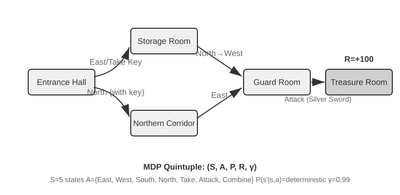
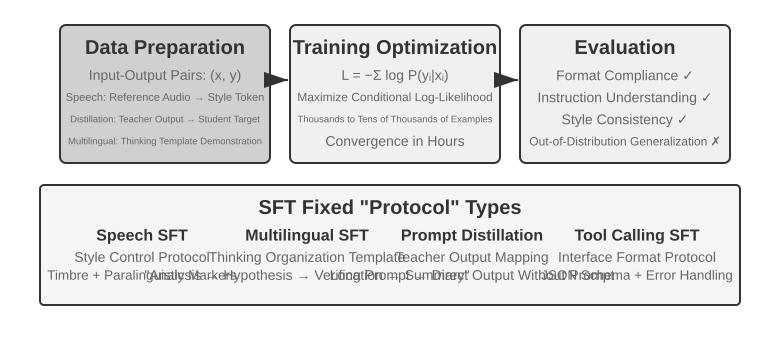
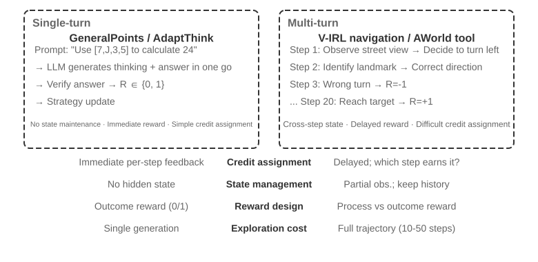
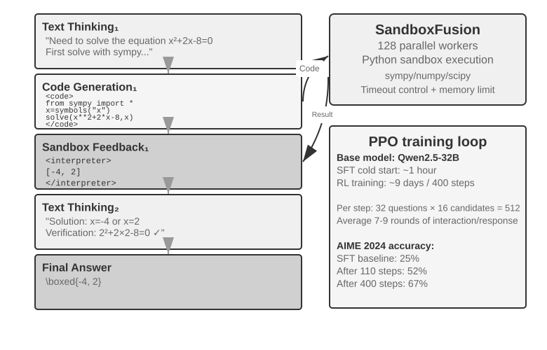
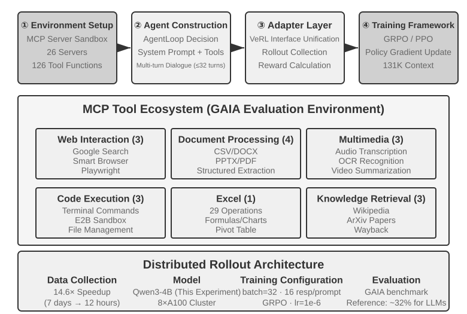

# Model Post-Training

Bu kitabın temel formülü Agent = LLM + Context + Tools'tur. Bu bölüm, LLM denen o "beyni" optimize etmeye odaklanıyor: post-training yoluyla modelin context'i ve araçları daha iyi kullanmasını sağlayarak Agent sisteminin bütününün yeteneğini yükseltmek. Bölüm 7'nın sonunda belirtildiği gibi, değerlendirme sistemi ile simülasyon ortamı post-training'in iki temel taşıdır: değerlendirme ortamı eğitime bir alıştırma sahası sunar, değerlendirme metrikleri ise eğitimin hedefini tanımlar. Bu bölüm işte o iki temel taşın üzerine kuruluyor ve model ağırlıklarının gerçekten nasıl değiştirileceğini, yeteneğin parametrelere nasıl çökeltileceğini tartışıyor.

Bu bölüm, pekiştirmeli öğrenme ya da model eğitimi konusunda hiçbir arka planı olmayan okurlar için yazıldı. Gradyanları veya policy optimizasyonunu bildiğinizi varsaymıyoruz; bunun yerine "bir model nasıl eğitilir" sorusunun kendisinden başlayıp her adımın amacını, çalışma ilkesini ve çözdüğü problemi açık açık anlatıyoruz. Bu bölümü bitirdiğinizde şunlara yanıt verebilmelisiniz: Bir modelin yeteneği kaç adımda dövülür, her adım ne yapar, neden bu sıraya uyulması zorunludur ve kendi projenizde hangi adıma emek harcamalısınız?

**En önemli harita dört parçadan oluşur: pre-training, Mid-training, SFT ve RL.** Mid-training genel temel ile davranış hizalama arasında alan bilgisi ve temel yetenek kurar; sonraki kesimler dört parçayı da ele alır.

1. **Pre-training (ön eğitim)**: Devasa miktarda internet metni üzerinde "bir sonraki token'ı tahmin etme" eğitimi. Bu adım modele dil kurallarını, dünya bilgisini ve temel akıl yürütmeyi öğretir; kütüphanedeki bütün kitapları okumuş bir insan gibi — çok bilgili, ama henüz soruları düzgün yanıtlayamıyor. En pahalı adım budur (rahatlıkla on milyonlarca dolar) ve yeteneğin temelini atar.
2. **SFT (Supervised Fine-Tuning, denetimli ince ayar — yani modeli etiketlenmiş "girdi—çıktı" çiftleriyle eğitmek; öğretmenin standart cevabı verip öğrencinin ona bakarak öğrenmesi gibi)**: Birkaç binden birkaç on bine kadar "soru—standart yanıt" gösterim verisiyle modele "hangi formatta, hangi üslupta, hangi akışla yanıt vereceğini" öğretir. Bu adım, çok bilgili modeli talimatları anlayan ve düzenli çıktı veren bir asistana dönüştürür. Ucuz, hızlı ve kararlıdır; bugün konuşlandırılan neredeyse bütün modellerin geçtiği bir adımdır.
3. **RL (Reinforcement Learning, pekiştirmeli öğrenme — yani modelin defalarca denemesine izin verip sonucun iyi ya da kötü olmasına göre ödül ve ceza vererek davranışını iyileştirmek; köpek yavrusu eğitmeye benzer: doğru yaptığında ödül var, yanlış yaptığında yok)**: Modele artık standart cevap gösterilmez, kendi başına denemesine izin verilir; iyi giden davranışların olasılığı yükseltilir, kötü gidenlerinki düşürülür. Bu adım modele **daha önce görmediği durumlarda** da makul kararlar vermeyi öğretir — aynı zamanda bu bölümde en çok yer tutan ve en fazla mühendislik ustalığı isteyen adımdır.

Sezgisel bir benzetme: pre-training "on bin kitap okumaktır" (bilgi biriktirme), SFT "öğretmenin standart çözümü elinden tutarak göstermesidir" (gösterimi taklit etme), RL ise "kendin soru çözüp doğruya yanlışa göre defalarca cilalamandır" (deneme-yanılmayla ilerleme). Üçünün ilişkisi "birini seç" değil, bir üretim hattıdır — önce oku, sonra gösterimi izle, en sonunda sahaya çık.

**Bu bölümde baştan sona uzanan iki ana eksen var; önce onları aklınızda tutun, sonraki bütün içerik onlara hizmet ediyor:**

- **Birinci eksen: SFT ezberler, RL genelleştirir.** Aynı görev ve aynı bütçe altında SFT, eğitim verisindeki yanıtları **ezberlemeye** eğilimlidir; konuşlandırma ortamı eğitimdekinden farklı olduğu anda kolayca işlevsizleşir. RL ise aktarılabilir bir strateji **öğrenmeye** eğilimlidir ve daha önce görmediği durumlar karşısında daha kararlı kalır. Bu bir slogan değil, ölçülebilir bir olgudur; bu bölüm onu bir dizi kontrollü deneyle defalarca doğrulayacak. Bu farkın **altında yatan nedenini** "Pre-training, SFT, RL: Üç Aşamalı Panorama" kesimi ayrı bir kesim ayırarak enine boyuna anlatıyor.
- **İkinci eksen: veri ve ortam, algoritmadan daha önemlidir.** Bu, sektörün en sezgi karşıtı ve aynı zamanda en değerli dersidir. Hazır RL algoritmalarını (PPO, GRPO vb.) nasıl kullanacağınızı bilmeniz yeter; başarıyı ya da başarısızlığı asıl belirleyen iki şeydir: **simülasyon ortamı** (modelin alıştırma yaptığı saha yeterince gerçekçi mi) ve **eğitim verisi** (gösterimlerin ve ödül sinyallerinin kalitesi yeterince yüksek mi). Pek çok senaryoda, SFT verisinin kalitesi yerinde olduğu sürece RL yapmanıza hiç gerek kalmaz. Bu bölüm dikkatinizi sürekli olarak "hangi algoritmayı ayarlasam" sorusundan "veriyi ve ortamı doğru kurdum mu" sorusuna geri çekecek.

> **Okuma rehberi**: Bu bölümün içeriği okurun arka planına göre iki yola ayrılıyor:
>
> - **Agent uygulama geliştiricileri** (modeli kendisi eğitmek zorunda olmayanlar): Önce açılıştaki "Pre-training, SFT, RL: üç aşamalı panorama" kesimini okuyup genel resmi kurun; ardından hemen arkasından gelen iki `[isteğe bağlı okuma]` kesimini (klasik RL ve pre-training arka planı) atlayıp SFT kesiminden devam edebilirsiniz. "SFT ile RL arasındaki temel fark" ve "Ne zaman SFT, ne zaman RL seçilmeli" karar çerçevelerine, bir de "veri ve ortam algoritmadan daha önemlidir" yargısına odaklanın — bu kavrayışlar Harness engineering'deki tasarım kararlarınızı etkileyecek (ne zaman prompt ile çözülür, ne zaman ince ayar yapmaya değer).
> - **Model eğitimi mühendisleri**: Baştan sona sırayla okuyun; iki `[isteğe bağlı okuma]` kesimi pekiştirmeli öğrenme ve pre-training için eksiksiz arka plan sunuyor, sonraki deneyler ise yeniden üretilebilir eğitim reçeteleri veriyor.

## Pre-training'den RL'e: Dört Aşamalı Panorama

Giriş dört parçanın haritasını verdi; bu kesim her parçanın **veri**, **optimizasyon hedefi** ve **maliyet** farkını anlatıyor. Tablo 8-1 önce genel görünümü veriyor, ardından ayrıntılar geliyor.

Tablo 8-1 Model Yeteneği Geliştirmenin Dört Parçası

| Aşama | Hangi veri kullanılır | Optimizasyon hedefi | Ne öğrenilir | Tipik maliyet |
|------|---------------------|-----------------------|------------------------|---------------------|
| **Pre-training** | Devasa miktarda ham internet metni | Bir sonraki token'ı tahmin etmek | Dil kuralları, dünya bilgisi, temel akıl yürütme | Aşırı yüksek (milyonlarca–on milyonlarca dolar) |
| **Mid-training** | Hedef dil/alan/yetenek külliyatı ve koruma verisi | Sonraki token tahminini sürdürmek (genellikle tüm token'larda loss) | Alan bilgisi, dil ve temel yetenek boşluklarını kapatmak | Orta-yüksek; token miktarına ve eğitilen parametrelere bağlı |
| **SFT** | Birkaç bin–birkaç on bin "girdi—çıktı" gösterim çifti | Bir sonraki token'ı tahmin etmek (loss yalnızca yanıt üzerinde hesaplanır) | Talimat takibi, çıktı formatı, üslup, akış protokolü | Düşük (birkaç saat–birkaç gün) |
| **RL** | Görev + ödül fonksiyonu (standart cevap yok) | Beklenen ödülü maksimize etmek | Aktarılabilir karar stratejisi, keşfedilerek bulunan yeni çözümler | Yüksek (çoğu zaman SFT'nin onlarca–yüzlerce katı) |

### Pre-training Ne Yapar: Bir Sonraki Token'ı Tahmin Etmek

Modern büyük modellerin bütün "zekası", şaşırtıcı derecede basit tek bir görevin üzerine kuruludur: **bir sonraki token'ı tahmin etmek (Next Token Prediction, NTP)**.

Modele bir metnin ilk yarısını gösterirsiniz, o da bir sonraki token'ın ne olduğunu tahmin eder. Örneğin girdi 中国的首都是 ("Çin'in başkenti") olduğunda modelin 北京 ("Pekin") token'ına yüksek bir olasılık vermesi beklenir. Model her tahmininde kendi öngörüsünü gerçek bir sonraki token ile karşılaştırır; aradaki fark (loss, yani kayıp adı verilir) ne kadar büyükse parametrelerini o kadar sert ayarlar ki bir dahaki sefere benzer context içinde daha isabetli tahmin etsin. Bunu trilyonlarca token'lık internet metni üzerinde tekrar tekrar yapan model; dil bilgisini, olguları, mantığı, hatta temel akıl yürütmeyi öğrenmek zorunda kalır — çünkü uçsuz bucaksız bağlamlar içinde bir sonraki token'ı sürekli doğru bilmenin kestirme yolu yoktur, metindeki düzenlilikleri gerçekten "sindirmek" gerekir.

Aklınızda tutmanız gereken kilit bir nokta var; SFT ve RL boyunca da peşinizi bırakmayacak: **modelin çıktısı özünde bir olasılık dağılımıdır**. Önceki metin verildiğinde model, sözlüğündeki her olası token'a bir olasılık atar. "Eğitim" dediğimiz şey nihayetinde **bu olasılık dağılımını ayarlamaktan** ibarettir — istediğimiz token'ların olasılığını yükseltmek, istemediklerimizinkini düşürmek. Üç aşamanın farkı yalnızca "neyin istendiğinde" ve "istenenin hangi sinyalle tanımlandığındadır".

Pre-training'den sonra model çok bilgilidir ama kullanışlı değildir: ona bir soru sorarsınız, yanıt vermek yerine yeni sorular yazmayı sürdürebilir — çünkü internet metinlerinde bir sorunun ardından çoğu zaman başka bir soru gelir. "Soru sorulduğunda yanıt verilir" protokolünü henüz öğrenmemiştir.

### Mid-training'in Özü: Hedef Dağılımda Öğrenmeye Devam Etmek

Genel pre-training her dili, alanı ve yeteneği yeterince kapsayamaz. Model hedef dili neredeyse okuyamıyor, kurum içi protokolleri bilmiyor veya uzun bağlam ve kod için gerekli temsilleri kurmamışsa yalnızca yanıt biçimini öğretmek ya da başarı/başarısızlık ödülü vermek çok geçtir. Mid-training sonraki-token hedefini korur, veriyi hedef alana yoğunlaştırır ve unutmayı denetlemek için genel koruma verisi karıştırır. Sorduğu soru “görev için gereken bilgi ve temel yetenek var mı?”dır; “yanıt nasıl görünmeli?” ya da “hangi politika en yüksek ödülü alır?” değil.

### SFT'nin Özü: Verisi Değiştirilmiş "Bir Sonraki Token'ı Tahmin Etme"

Bu bölümde aşılması gereken ilk kilit kavrayış şudur: **SFT, matematiksel olarak pre-training ile aynı görevdir — ikisi de bir sonraki token'ı tahmin eder ve aynı loss fonksiyonunu minimize eder.** Pek çok yeni başlayan SFT'yi bambaşka bir yöntem sanır; öyle değildir. SFT ile pre-training arasında yalnızca iki fark vardır:

1. **Veri farklıdır.** Pre-training ham internet metnini kullanır (yapısız, içinde her şey var); SFT ise elle özenle hazırlanmış "girdi—çıktı" çiftlerini kullanır ve formatı tek biçimlidir: "kullanıcı sorusu → ideal yanıt". Model bu gösterimler üzerinde "bir sonraki token'ı tahmin etme"ye devam eder ve böylece "soru sorulduğunda yanıt nasıl kurgulanır" protokolünü öğrenmiş olur.
2. **Loss yalnızca "yanıt" üzerinde hesaplanır (loss masking, kayıp maskeleme).** Bir SFT örneği soru ve etiketlenmiş yanıt olmak üzere iki parçadan oluşur. Modelin "nasıl soru sorulur"u öğrenmesini istemeyiz, yalnızca "nasıl yanıt verilir"i öğrenmesini isteriz; bu yüzden loss hesaplanırken sorunun token'ları maskelenir ve gradyan yalnızca yanıt kısmından geri yayılır. Mühendislik açısından SFT ile pre-training arasındaki tek esaslı fark budur.

Bunu kavradığınızda "SFT ezberler" iddiası kendiliğinden yerine oturur: SFT'nin optimizasyon hedefi, **etiketlenmiş yanıttaki her token'ın olasılığını olabildiğince yükseltmektir** — açık söylemek gerekirse "bu standart cevabı ezberlemektir". Aynı soru verildiğinde model, gösterimi harfi harfine yeniden üretmek üzere eğitilmiştir. Hedefi net, formatı sabit görevlerde bu son derece verimlidir (birkaç bin örnek sonuç vermeye yeter), ama yetenek sınırı da gösterim verisine çakılıp kalır: gösterimde bulunmayan durumları hiç öğrenmemiştir; gösterimdeki yanıt artık geçerli değilse bile (ortam değiştiyse) onu ezberden okumayı sürdürür.

SFT'nin özü tek cümlede: **son derece yüksek bir örneklem verimliliğiyle, kararlı bir "girdi→çıktı" eşlemesini ve protokolü parametrelere kalıcı olarak yazar.** Kalıcılaştırdığı şey "format, üslup, akış" türünden **protokole ait bilgidir** (nasıl söylenir, nasıl yapılır), büyük miktarda **olgusal bilgi** (ne bilindiği) değil — ikincisi pre-training'e ya da RAG'a kalır (bölümün sonunda bu ayrıma döneceğiz).

> **Eğitim maliyeti: LoRA ile parametre-verimli ince ayar**. Yukarıdaki SFT de sonraki RL de model parametrelerini güncellemeyi gerektirir, oysa tam parametreli ince ayarın VRAM ihtiyacı çok yüksektir (milyarlarca parametrenin hepsi için gradyan ve optimizer durumu saklanmalıdır). **LoRA** (Low-Rank Adaptation, düşük ranklı uyarlama) en yaygın tasarruf yöntemidir: orijinal büyük ağırlık matrislerine dokunmaz, yalnızca yanlarına görevi öğrenecek küçücük bir "yama" (düşük ranklı matris) asar; parametre sayısı orijinalin yalnızca %1–5'i kadardır ama tam parametreli ince ayara yakın bir sonuç verir. Orijinal ağırlıklar dondurulduğu için LoRA'nın temel modelin mevcut yeteneklerinde yarattığı sarsıntı da daha küçüktür, catastrophic forgetting riski daha düşüktür. Doğrulanmış birkaç pratik ders[^ch8-1]: LoRA'yı bütün ana ağırlık matrislerine (özellikle parametrenin en büyük payını tutan MLP katmanlarına) uygulamak **zorunludur**, yalnızca attention katmanlarına eklerseniz puan kaybedersiniz; **en iyi öğrenme oranı, tam parametreli ince ayarınkinin yaklaşık 10 katıdır** (hem SFT hem RL için geçerli, son derece kullanışlı bir aktarım kuralı); SFT'de orta-yüksek rank (64–256) kullanılır, RL'de ise her turun taşıdığı bilgi çok az olduğu için küçük rank (8–32), hatta rank=1 bile yeter. Konuşlandırmada tek bir çıkarım sunucusu aynı anda birden fazla LoRA adapter yükleyip çok kiracılı hizmet verebilir. Bu kitap LoRA'yı bütün post-training yöntemlerini kesen bir mühendislik varsayılanı olarak alıyor ve ayrıca açmıyor.

### SFT/RL'den Önce Temel Ne Zaman Onarılmalı

RL, modelin **kendi ürettiği** yanıtları ödülle değerlendirir; dolayısıyla çıktı doğrulanabilir olmalı ve mevcut politika ara sıra değerli bir davranış keşfedebilmelidir. Biçim kararsızsa JSON veya tool call'u ayrıştırılabilir kılmak için SFT kullanılır. Fakat makul sıcaklık ve örnek sayısında `pass@k` hâlâ sıfıra yakınsa doğru çözüm modelin etkili desteğinin dışındadır. Tamamı başarısız rollout'lar eksik bilgi veya akıl yürütme adımını neredeyse hiç söylemez; GRPO'da grup içi advantage da kaybolur. Önce Mid-training ile bilgi ve atomik yetenek ekleyin ya da gösterim/damıtmayla uygulanabilir yolları desteğe sokun, sonra RL yapın.

Ancak bundan sonra şu soru anlamlıdır: **SFT hangi koşullarda RL'den önce gelmeli?**

Yanıt, RL'in çalışma biçiminde saklıdır. RL standart cevaba bakmaz; yanıtı modelin **kendisinin üretmesini** ister, sonra yanıtın iyi ya da kötü olmasına göre ödül veya ceza verir. Ama iyi mi kötü mü olduğuna karar verebilmek için önce modelin çıktısını **ayrıştırabilmek** gerekir: görev bir JSON parçası ya da bir tool call üretmeyi gerektiriyorsa ve modelin kustuğu şey formatı darmadağın bir metin yığınıysa, ödül fonksiyonunun hesaplayacak hiçbir şeyi kalmaz ("başarılı mı, başarısız mı" bile ayırt edilemez), dolayısıyla RL'in de öğreneceği bir şey olmaz.

Bu yüzden burada SFT'ye düşen rol "**önce derdini düzgün anlatmayı öğretmektir**": az sayıda gösterimle çıktı formatını kararlı ve güvenilir biçimde ayrıştırılabilir hale getirir; ancak o zaman RL'in puanlayabileceği bir başlangıç noktası doğar. Sektörün en sağlam iki aşamalı paradigması olan **"önce SFT, sonra RL"** işte budur. Tersi, yani önce RL sonra SFT, işe yaramaz — kararlı bir çıktı yoksa ödül sinyali baştan sona gürültüdür. Çin resminden ödünç alınmış bir ifadeyle: SFT önce "**biçimi**" (formatı, yapıyı) ayağa kaldırır, RL ise ardından "**ruhun**" (stratejinin, genelleştirmenin) peşine düşer; yani **önce biçim, sonra ruh**.

Önemli bir sınır koşulu: "önce SFT şart" ilkesi "**küçük ölçekli bir temel model + katı yapılandırılmış çıktı**" kurgusunda geçerlidir (Deney 8-11'de göreceğiz: Llama-3.2-Vision-11B ölçeğindeki bir model SFT'den geçmeden doğrudan RL'e sokulduğunda tamamen başarısız oluyor). Ama temel model yeterince güçlüyse daha ilk andan geçer not alacak çıktılar üretebilir ve SFT atlanabilir — DeepSeek-R1-Zero, güçlü bir temel modelin doğrudan RL ile başarıya ulaşabileceğini, kendiliğinden reflection (kendini değerlendirme) ve uzun zincirli düşünme sergileyebileceğini kanıtladı. Bedeli, çıktının okunabilirliğinin düşük olması ve Çince ile İngilizcenin birbirine karışmasıdır; bu yüzden DeepSeek sonunda R1'de "cold start SFT"i geri ekleyip "biçimi" yeniden sağlama aldı. R1'in Zero'dan cold start'a gidip gelişi, "önce biçim, sonra ruh" ilkesinin en iyi dipnotudur.

### SFT ile RL Arasındaki Temel Fark (Bu Bölümün En Önemli Tablosu)

Şimdiye kadar tekrar tekrar "SFT ezberler, RL genelleştirir" dedik; şimdi bunun altında yatan nedeni bir kerede eksiksiz anlatalım. İkisi arasındaki bütün farklar tek bir kaynaktan doğar: **optimizasyon hedeflerinin farklı olması**.

- **SFT, etiketli cevabın olasılığını en büyütür.** Her eğitim örneği, en büyük olabilirlikle modeli gösterimi yeniden üretmeye iter. Çeşitli ve temsil gücü olan gösterimler genelleşebilir örüntüler öğretebilir; ama gösterimlerde ya da prompt'larda çeşitlilik yetersizse model yüzeysel örüntülere veya kestirmelere de aşırı uyabilir. GeneralPoints'in sınırlı gösterimleri J/Q/K'yı hep 10 sayar; bu yüzden testte değerler değiştiğinde modelin başarımı düşer.
- **RL, beklenen ödülü en büyütür.** Model birden çok yolu keşfeder ve ödülü yüksek olanların olasılığını yükseltir. Ödül hedefi sadakatle yansıtıyorsa ve keşif de yeterliyse, model gösterimlerde bulunmayan aktarılabilir stratejiler keşfedebilir. GeneralPoints'te sabit bir değeri uygulamak yerine hesabı yeniden yapmak, dağılım dışı testlerde daha iyi sonuç verdi. Tersine, ödül ya da ortam yanlıysa RL de bir kestirmeye aşırı uyabilir.

Tablo 8-2 SFT ile RL'in Temel Karşılaştırması

| Boyut | SFT (denetimli ince ayar) | RL (pekiştirmeli öğrenme) |
|----------|-----------------------------------------|--------------------------------------------|
| Optimizasyon hedefi | Etiketli cevabın olasılığını en büyütmek (en büyük olabilirlik) | Beklenen ödülü en büyütmek |
| Eğitim sinyali | Etiketli cevap üzerinde token düzeyinde denetim | Politikanın ürettiği cevaplar ya da yörüngeler + sonuç veya adım düzeyinde skaler ödül |
| Veri biçimi | "Girdi—çıktı" gösterim çiftleri | Görev ve ortam + ödül sinyali (referans cevap isteğe bağlı) |
| Doğrudan optimizasyon baskısı | Gösterimlerdeki eşleme ve protokolü taklit etmek | Ödül kazandıran davranış ve stratejileri pekiştirmek |
| Dağılım kayması altında | Gösterim kapsamına ve düzenlileştirmeye bağlıdır; bu bölümün sınırlı gösterimli deneylerinde aşırı uyum görüldü | Ödüle, ortama ve keşfe bağlıdır; bu bölümün deneylerinde aktarım daha iyiydi |
| Örneklem verimliliği | Yüksek (birkaç bin örnek etkili olur) | Düşük (çoğu zaman SFT'nin onlarca–yüzlerce katı) |
| Eğitim kararlılığı | Yüksek, hızlı yakınsar | Düşük, salınıma yatkın, dikkatli ayar ister |
| En uygun olduğu durum | Biçim/üslup/süreç sabitleme, nitelikli gösterimlerin bulunması, kararlı ortam | Yeni senaryolara genelleşme, en iyi stratejiyi arama, etiketleme maliyetinin aşırı yüksek olması |

Olasılık dağılımı açısından bakıldığında SFT ile RL arasında bir önemli fark daha var. Bir sorunun çoğu zaman birden çok makul cevap ailesi vardır ve her aile dağılımdaki bir "tepe"ye karşılık gelir. En büyük olabilirlikle çalışan SFT gösterimleri tek tek öğrendiğinden sık sık **mass-covering (kütle kaplayan)** bir eğilim gösterir: eğitim verisinde görünen birden çok modu olabildiğince kaplamaya çalışır. RL ise olasılığı ödüle göre yeniden dağıtır ve yaygın ters KL kısıtıyla birleştiğinde **mode-seeking (tepe arayan)** bir eğilim göstermeye daha yatkındır: bütün gösterimleri eşit biçimde yeniden üretmek yerine olasılığı yüksek ödüllü birkaç tepede yoğunlaştırır.

Bu ayrım her ikisinin tipik güçlü yanını açıklar: SFT bilinen birçok ifade biçimini kaplamada iyidir, RL ise aday davranışlar arasından yüksek ödüllü bir strateji bulmada iyidir. Sonuçta çeşitliliğin korunup korunmayacağı ya da birkaç moda büzülüp büzülmeyeceği; gösterim dağılımına, ödül fonksiyonuna, KL yönü ve katsayısına, entropi düzenlileştirmesine ve örnekleme sıcaklığına bağlıdır.

**Post-training, modelin ne zaman harekete geçtiğini de biçimlendirir.** Coding modellerini ele alalım: GPT ailesi ile Claude ailesi çoğu zaman farklı varsayılan eyleme geçme eşikleri gösterir. İlki değişiklikten önce depodan daha çok bilgi okumaya eğilimlidir; ikincisi daha az dosyayla yeri saptayıp önce uygulamaya, sonra test geri bildirimiyle düzeltmeye eğilimlidir. Bu, bir modeli "temkinli", ötekini "sezgisel" diye insanlaştırmak değildir. Parametrelerin içindeki politika şunu kestirmektedir: bir dosya daha okumanın beklenen değeri, mevcut yamayı gönderip doğrulamanın beklenen değerinden hâlâ yüksek mi? SFT gösterimleri düzenleme öncesinde geniş inceleme yapan yörüngeleri tekrar tekrar içeriyorsa model daha yüksek bir eyleme geçme eşiğini taklit eder; RL'in süreç ya da sonuç ödülü hızlı yer saptamayı ve doğrulanabilir döngüye erken girmeyi sürekli onaylıyorsa olasılık kütlesi daha erken harekete geçen yörüngelere kayar. 7. bölümdeki Deney 7-8, tamamen aynı ve tarafsız bir Coding Harness içinde modeli değiştirerek bu farkın modelle birlikte değiştiğini fiilen ölçtü; yani Harness bir akışı dayatmasa da model kendi kararlı araç kullanım politikasını taşıyor. Harness bunu ayarlayabilir, ama davranışın esas kaynağı post-training sonrası parametrelerde olabilir. Sağlayıcılar veri ve ödül reçetelerini bütünüyle yayımlamadığından bu deneyin kanıtlayabildiği şey model tarafındaki davranış farkıdır; belirli bir kapalı algoritmanın buna yol açtığı değil.

**Çevrimiçi geri bildirim, modele gösterimlerin dışındaki stratejileri keşfetme fırsatı verir.** Sabit bir veri kümesi üzerindeki SFT, gösterimlerin sağladığı doğrudan eğitim sinyalini kullanır; yine de pre-training bilgisini birleştirip gösterimlerde bulunmayan girdilere genelleşebilir. Çevrimiçi RL ise modele mevcut politikayla cevap ürettirip ortamdan geri bildirim aldırır; böylece gösterimlerin dışındaki aday davranışları doğrudan değerlendirebilir. Bu kendiliğinden daha yüksek bir tavanı garanti etmez: sonuç temel modele, gösterim kapsamına, ödülün sadakatine, keşfe ve optimizasyon kararlılığına bağlıdır. Çevrimiçi/çevrimdışı ile daha katı olan on-policy/off-policy terimleri ödül ve damıtma kesimlerinde kullanılacak. Şimdilik çevrimiçi geri bildirimin açtığı üç fırsata bakalım:

- **Birincisi, sabit gösterimlerin dışındaki adaylar değerlendirilebilir.** SFT'nin doğrudan denetimi veride kayıtlı cevaplardan gelir; RL ayrıca ödül fonksiyonunun puanlayabildiği yeni davranışları da pekiştirebilir. Deney 8-13'teki (SimpleVLA-RL) "itip kesme" hareketi insan gösterimlerinde hiç görünmemişti; bu da modelin gösterimlerin dışındaki stratejileri bulma fırsatı olduğunu gösteriyor. Ne var ki ödülün tanıyamadığı nitelik öğrenilemez, keşfin ulaşamadığı strateji de bulunamaz.
- **İkincisi, "doğrulamanın üretmekten kolay olduğu" görevlerden yararlanılabilir.** SFT önce doğru cevabı ya da nitelikli bir yörüngeyi yazmayı gerektirir; RL'e ise cevabın niteliğini güvenilir biçimde yargılamak yeter. Matematik cevabı karşılaştırılabilir, kod test edilebilir, teorem kanıtı bir doğrulayıcıyla denetlenebilir. Bu bakışım eksikliği RLVR'nin üstünlüğüdür, ama doğrulayıcı eksikse ödül hack'lemeye de yol açar.
- **Üçüncüsü, mevcut politikanın fiilen uğradığı durumlar üzerinde eğitim yapılabilir.** Çevrimdışı taklidin klasik bir sorunu vardır: **ortak değişken kayması (covariate shift)**. Politika gösterimlerden saptığında ve veride bulunmayan durumlara girdiğinde toparlanmak için sinyali olmayabilir. Belirli dizi taklit öğrenmesi kurgularında hata en kötü durumda yörünge uzunluğu $T$ ile aşağı yukarı $T^2$ gibi birikebilirken, çevrimiçi veri toplulaştırma bunu yaklaşık $T$'ye indirebilir. Bu bölümün ilerisindeki On-Policy Distillation ("Damıtma: örneklem verimliliğini artırmak" kesimine bakın) bu çevrimiçi eşleştirmeyi SFT'nin yoğun denetimiyle birleştirir.

Bir benzetme: **SFT var olan haritayı ayrıntısıyla öğrenir; RL ise ödülü pusula gibi kullanarak haritanın dışındaki aday güzergâhları keşfedebilir.** Harita da yanlışsa pusula da yanlışsa yine yolunuzu kaybedersiniz. Bu yüzden birçok sistem önce SFT ile kararlı bir başlangıç noktası kurar, ödül ve ortam yeterince güvenilir olduğunda RL ekler.

Bu panorama elinizdeyken sonraki her kesim haritada kendi yerini bulacak. Hemen ardından gelen iki `[isteğe bağlı okuma]` kesimi — "Klasik RL Agent'larından Modern Agent'lara" ve "Model Pre-training'inin Temelleri" — daha derine inmek isteyen okurlar için pekiştirmeli öğrenme ve pre-training arka planını tamamlıyor; doğrudan post-training'e girişmek isteyen okurlar bunları atlayıp SFT kesiminden başlayabilir.

## Klasik RL Agent'larından Modern Agent'lara `[isteğe bağlı okuma]`

### Agent ile Ortamın Etkileşimi

**Pekiştirmeli öğrenmenin (Reinforcement Learning, RL)** özü, en yüksek **kümülatif ödülü (Cumulative Reward)** elde etmek için mevcut duruma bakarak hangi eylemin seçileceğini öğrenmektir. Satranç öğrenen bir yapay zekayı düşünün: attığı her hamle bir eylemdir, oyunu kazanmak pozitif ödül, kaybetmek negatif ödül getirir; kümülatif ödül ise bütün partinin toplam kazancıdır. Agent ile ortam sürekli etkileşir: her adımda Agent mevcut durumu gözlemler, bir eylem seçer, ortam yeni bir durum üretip bir ödül verir.

Bu etkileşimi daha somut kavramak için aşağıdaki şekil standart RL döngüsünü gösteriyor: Agent her zaman adımında ortamın durumunu gözlemler ve bir eylem üretir, ortam da buna göre bir ödül verip yeni bir duruma geçer.


Etkileşim bir **trajectory** üretir — yani "durum → eylem → ödül → yeni durum → eylem → ödül..." dizisinin eksiksiz kaydını; bir policy'nin iyi mi kötü mü olduğu nihayetinde trajectory'lerin kalitesinde görünür. **Değer fonksiyonu (Value Function)** şu soruyu yanıtlar: "Şu anda bu durumdaysam ve mevcut policy'yi izleyerek hareket etmeyi sürdürürsem, sonunda toplam ne kadar ödül biriktiririm?" Bu, deneyimli bir satranç oyuncusunun bir konuma bakınca son hamleye kadar hesaplamaya gerek duymadan sezgisiyle partinin kazanma olasılığını kestirmesine benzer. (Buradaki "mevcut policy" yerine "en iyi policy" konduğunda elde edilen şey optimal değer fonksiyonudur; bölümün ilerisinde Bellman optimallik denklemi anlatılırken kullanılacak.) Agent ile ortam arasındaki sınır yalın bir ilkeye uyar: **Agent'ın keyfince değiştiremediği her şey ortama aittir**.

Pekiştirmeli öğrenmeyi denetimli öğrenmeden (doğru cevabın etiketlenmesini gerektirir) ve denetimsiz öğrenmeden (verideki gizli örüntüleri bulur) ayıran iki özgün nitelik vardır: **deneme-yanılma araması** (Agent hangi eylemlerin iyi olduğunu kendi yoklamak zorundadır, doğru cevabı söyleyen bir öğretmen yoktur) ve **gecikmeli ödül** (bir eylemin etkisi ancak birkaç adım sonra görünür olabilir; örneğin iyi bir satranç hamlesinin değeri ancak oyunun sonunda anlaşılır). Bu da beraberinde özgün bir **keşif ile yararlanma arasındaki dengeyi (Exploration-Exploitation Tradeoff)** getirir: hep bildik yoldan gidilirse yeni bir şey öğrenilmez, hep rastgele denenirse hedefe hiç varılmaz.

Bir pekiştirmeli öğrenme sistemi beş temel öğe içerir:

- **Action Space (eylem alanı)**: Agent'ın gerçekleştirebileceği bütün eylemlerin kümesini tanımlar. Eylemler ayrık olabilir (satrançta "hangi hamle yapılacak" gibi, seçenek sayısı sonludur) ya da sürekli olabilir (bir robotun "eklemi kaç derece döndüreceği" gibi, sürekli bir sayısal değerdir).
- **Policy (politika)**: Agent'ın davranış kuralı; verilen bir durumda ne yapılması gerektiğini belirler. Bir policy çok basit olabilir (bir arama tablosu: A durumunu görünce X eylemini yürüt) ya da çok karmaşık olabilir (derin bir sinir ağı).
- **Ödül sinyali**: Ortamın verdiği anlık geri bildirim. Ancak Agent'ın hedefi anlık değil uzun vadeli ödülü maksimize etmektir — bu ayrım hayati önemdedir; tıpkı yatırımda bugünün yükselişine düşüşüne değil uzun vadeli getiriye bakmak gerektiği gibi.
- **Değer fonksiyonu**: Belirli bir durumdan yola çıkıldığında gelecekte toplam ne kadar kümülatif ödül elde edileceğini kestirir ve anlık geri bildirim yokken Agent'ın akıllıca karar vermesine yardım eder. Son altmış yıllık RL araştırmasının en önemli kavrayışlarından biri, değer kestiriminin merkezî konumudur.
- **Ortam modeli** (isteğe bağlı): Ortamın bir eyleme vereceği tepkiyi öngörür. Ortam modeli kullanan yöntemlere **model tabanlı yöntemler** denir (önce ortamın nasıl değişeceğini öngörmeyi öğrenir, sonra buna göre plan yapar); kullanmayanlara ise **modelsiz yöntemler** denir (ortamı öngörmeye çalışmaz, doğrudan deneyimden öğrenir).

Tablo 8-3, çeşitli Agent sistemlerinin temel bileşenlerini karşılaştırıyor; Agent kavramının ne kadar genel olduğunu ortaya koyuyor ve okurun geleneksel RL Agent'ları ile modern LLM Agent'ları arasındaki eylem alanı farkını görmesine yardım ediyor.

Tablo 8-3 Farklı Agent Sistemlerinin Temel Öğelerinin Karşılaştırması

| Agent türü | Ortam | Eylem alanı | Ödül sinyali |
|---------------|---------------------|----------------------------------|-------------------------|
| **Yeni doğmuş ceylan yavrusu** | Arazi, yerçekimi, vücut duruşu | Sürekli ve yüksek boyutlu (kas gruplarının kasılması) | Denge (+), düşme (-) |
| **Robot süpürge** | Oda düzeni, pil seviyesi | Ayrık (yön, süpürme, şarj) | Temizlenen alan (+), pilin tükenmesi (-) |
| **Satranç büyükustası** | Tahta durumu, süre sınırı | Ayrık ve sonlu (kurallı hamleler) | Kazanma (+1), kaybetme (-1) |
| **Müşteri hizmetleri Agent'ı** | Konuşma geçmişi, bilgi tabanı | Açık uçlu (düşünme, konuşma, API çağrısı) | Sorunun çözülmesi (+), işlem süresi (-) |
| **Kod asistanı Agent'ı** | Gereksinim dokümanı, kod tabanı | Açık uçlu (düşünme, arama, düzenleme, yürütme) | Testin geçmesi (+), bug eklenmesi (-) |

Tablo önemli bir içgörüyü ortaya koyuyor: geleneksel RL Agent'larının (satranç, robotik) eylem alanı kapalıdır; LLM tabanlı modern Agent'ların (müşteri hizmetleri, kod asistanı) eylem alanı ise açıktır, neredeyse sınırsızdır ve bu Agent'lar yeteneklerini artırmak için "içsel düşünme" denen özel eylemden yararlanabilirler.

### İki Agent Paradigması: MDP'den LLM+RL'e

İkisi arasındaki en temel fark eylem alanındadır: MDP eylem alanının sonlu ve kapalı olduğunu varsayar (yukarı/aşağı/al/bırak), oysa LLM'in eylem alanı açık uçlu ve bileşimsel olarak patlayan doğal dil dizilerinden oluşur. Bu fark, iki paradigmanın algoritma tasarımı, örneklem verimliliği ve genelleştirme yeteneği bakımından temelden ayrışmasını belirler. Aşağıda ikisi ayrı ayrı açılıyor.

**Geleneksel paradigma: MDP ve Q-learning.**

MDP (Markov Decision Process, Markov karar süreci) pekiştirmeli öğrenmenin matematiksel çerçevesidir ve durum, eylem, ödül gibi temel öğeleri tanımlar. Çekirdek varsayımı **Markov özelliğidir**: gelecek yalnızca mevcut duruma bağlıdır, daha öncesindeki geçmişle ilgisi yoktur. Bir benzetmeyle: satrançta en iyi hamleye karar vermek için mevcut tahta konumuna bakmak yeter, önceki hamlelerin nasıl oynandığını gözden geçirmek gerekmez. Bu varsayım problemi basitleştirir, ama geçmişe bağımlılığı modelleme yeteneğini de kısıtlar.



Geleneksel RL Agent'larının kilit özelliği **kapalı eylem alanıdır**: Agent'ın gerçekleştirebileceği bütün hareketler önceden tanımlanmış sonlu bir küme oluşturur. **Klasik tahta oyunu Agent'ları** en tipik örnektir: Go'da 361 taş koyma konumu çok kalabalıktır ama tümüyle belirli ve sonludur; satrançta farklı taşların hareket kuralları hesaba katılsa da eylemler yine sayılabilir; Atari oyunlarında ise yalnızca birkaç ya da on küsur ayrık eylem vardır. **Robot Agent'ları** ise sürekli ama sınırlı bir eylem alanını temsil eder: eklem açısı, hız ve kavrama kuvveti sürekli değerlerdir, ama hepsinin net fiziksel sınırları vardır (azami dönme açısı, azami tork, hız limiti) ve boyut sayısını robotun serbestlik derecesi belirler.

Bu kapalılık hesaplama açısından avantaj sağlar: bütün eylemler sayılıp tek tek değerlendirilebilir, bu da dinamik programlamayı ve Monte Carlo ağaç aramasını kolaylaştırır; eylem-değer fonksiyonu bir tabloyla ya da basit bir fonksiyonla yaklaşık olarak temsil edilebilir. Ama aynı kapalılık ifade ve genelleştirme yeteneğini de kısıtlar. Geleneksel RL Agent'ı sıfırdan başlar ve tamamen deneme-yanılmayla öğrenir: rastgele bir policy'den yola çıkar, deneyim toplar, değer fonksiyonunu ya da policy'yi günceller ve bunu yakınsayana dek tekrarlar.

Bu çerçevedeki en temel ve en önemli algoritmalardan biri **Q-learning**'dir. Her "durum-eylem" ikilisi için bir değer kestirimi tutar: s durumunda a eylemi yapılıp sonrasında hep en iyi policy izlenirse toplam ne kadar ödül alınır? Sezgisel olarak bir eylemin iyi olup olmadığı, getirdiği anlık kazanca ve bir de "sizi götürdüğü sonraki durumun ne kadar iyi olduğuna" bağlıdır.

Bu sezgiyi denkleme dökerseniz, RL ders kitaplarının ünlü **Bellman denkleminin** (Bellman equation) çekirdek özyineleme bağıntısını elde edersiniz: **bir eylemin gerçek değeri = bu adımda alınan anlık ödül + sonraki duruma varıldığında elde edilebilecek azami gelecek değer**:

$$Q^*(s, a) = r + \gamma \max_{a'} Q^*(s', a')$$

Burada $r$ anlık ödül, $s'$ ise eylem yürütüldükten sonra varılan bir sonraki durumdur (sezgiyi kolaylaştırmak için deterministik biçimde yazıldı; rastgele ortamlarda bir sonraki durum $s'$ üzerinden beklenen değer alınmalıdır), $\gamma \in [0, 1)$ ise **iskonto çarpanıdır** (discount factor) — Agent'ın geleceğe ne kadar ağırlık verdiğini belirler: $\gamma$ 1'e ne kadar yakınsa uzun vadeli getiri o kadar önemsenir, 0'a yaklaştıkça yalnızca bugüne bakılır. Metinde defalarca geçen "kümülatif ödül" tam olarak her adımın ödülünün $\gamma$ ile kademeli iskonto edilip toplanmasıdır: $\sum_{t} \gamma^{t} r_t$. Algoritma her eylemden sonra eski kestirimi "gerçekte olan sonuca" doğru azıcık kaydırır — "tek adımlık gerçek sonuçla eski kestirimi düzeltme" paradigmasına **zamansal fark öğrenmesi** (Temporal-Difference Learning, TD learning) denir; binlerce, on binlerce deneme-yanılmanın ardından kestirim gerçek değere yaklaşır.

Aşağıdaki iki şekil sırasıyla Q-learning'in ızgara dünyasındaki keşif sürecini ve Q değerlerinin adım adım yakınsamasını gösteriyor.


Q-learning özel bir **off-policy** yöntemdir — herhangi bir policy'nin (rastgele keşif dahil) ürettiği veriyi kullanarak en iyi policy'yi öğrenebilir. On-policy / off-policy'nin kesin tanımı ve bunların LLM post-training'indeki karşılıkları için ilerideki "Pekiştirmeli Öğrenme Algoritmalarının Karşılaştırması" kesimine bakın.

> **Deney 8-1 ★: Q-learning'in Hazine Avı Oyunundaki Performansı**
>
> Q-learning'in özelliklerini ve sınırlarını doğrulamak için bir **hazine avı oyunu ortamı** tasarladık. Bu ortam birkaç kilit zorluk içeriyor: **gizli mekanikler**, Agent'ın anahtarlarla kapılar arasındaki eşleşmeyi, silahların etkisini ve eşya birleştirme kurallarını kendi başına keşfetmesini gerektiriyor; **çok adımlı bağımlılık**, görevin tamamlanması için doğru eylem dizisinin şart olması demek (en iyi çözüm 11 adım); **seyrek ödül** ise yalnızca kritik eylemlerin ve nihai zaferin kayda değer ödül vermesi, aradaki adımların çoğunun hiçbir geri bildirim almaması anlamına geliyor.
>
> Q-learning Agent'ı standart parametre yapılandırmasını ve ε-açgözlü keşif stratejisini kullanıyor (çoğu zaman o anki en iyi eylemi seçer, arada bir rastgele dener, eğitim ilerledikçe rastgele keşfin oranını kademeli olarak azaltır).
>
> Öğrenme eğrisi tipik davranışı sergiliyor (episode, oyunun baştan sona bir turu demek; açılıştan bitirmeye ya da kaybetmeye kadar bir kez sayılır):
> - **İlk 1.000 episode**: %0 kazanma oranı, Q tablosunda yalnızca 124 durum, Agent körlemesine keşif yapıyor
> - **İlk 5.000 episode**: hâlâ istikrarlı bir galibiyet yok, Q tablosunda 133 durum
> - **7.000-8.000 episode**: kazanma oranı %34'ten kademeli olarak %96'ya çıkıyor
> - **10.000 episode**: %100 kazanma oranı, Q tablosunda 145 durum, 11 adımlık en iyi çözüm bulunuyor
>
> Eğitimin tamamı 10 saniyeden kısa sürüyor (simülasyon verimliliği son derece yüksek), ama neredeyse 10.000 eksiksiz deneme gerektiriyor. Bu, Q-learning'in temel özelliğini gösteriyor: eksiksiz yolun tesadüfen bulunabilmesi için çok sayıda rastgele keşif gerekir, değer sinyali çok yavaş yayılır ve tekrar tekrar pekiştirilmesi şarttır. Saf sembolik öğrenme, önsel bilgi yokken durum uzayını yalnızca kaba kuvvetle tarayabilir.
>
> Oyun simülatöründe 10.000 turluk deneme-yanılma yalnızca 10 saniye sürer, maliyeti yok denecek kadar azdır. Ama gerçek dünyadaki Agent senaryolarında — her telefon aramasının bir bedeli, her tarayıcı işleminin bir gecikmesi vardır, her hatalı karar geri dönüşsüz sonuçlar doğurabilir — 10.000 deneme-yanılma kesinlikle kabul edilemez. Modern Agent'ların LLM tabanlı yöntemlere yönelmesinin nedeni tam da budur: pre-training'de birikmiş bilgiden yararlanıp çok az etkileşimde etkili kararlar vermek.
>
> MDP'nin üç temel sınırı vardır: örneklem verimliliğinin düşük olması (basit bir görevi öğrenmek için bile devasa sayıda etkileşim gerekir), genelleştirme yeteneğinin zayıf olması (bir ortamda öğrenilen bilgiyi başka bir ortama taşımak çok zordur) ve önsel bilgiden yararlanamaması (her yeni görev sıfırdan öğrenilmek zorundadır). Doğal dil ya da yüksek boyutlu görü gibi karmaşık durum uzaylarıyla karşılaşıldığında bu sınırlar iyice belirginleşir.

**Modern paradigma: LLM+RL tabanlı Agent'lar.**

Büyük dil modelleri bambaşka bir Agent paradigması getirdi ve Agent'ların kurulma biçimini — özellikle de eylem alanı tasarımını — kökten değiştirdi.

Geleneksel RL'in Agent'ı geri bildirimi yalnızca ortamı değiştirerek alabilir: bir hamle daha yapmak, labirentte bir adım daha atmak. Ama LLM bambaşka bir eylem türü getirdi: içsel düşünme. Düşünmek dış dünyayı değiştirmez, ama nihai eylemin kalitesini belirgin biçimde iyileştirir. Bu dönüşüm her şeyi değiştirdi: Agent'ın eylem alanı artık yalnızca "ne yapılacağı" değil, "ne kadar süre ve ne düşünüleceği" de.

En önemli yenilik, **düşünmenin (Thinking) özel bir eylem olarak** eylem alanına dahil edilmesidir. Geleneksel RL'de Agent yalnızca ortamın durumunu değiştiren dışsal eylemler yapabilir (hareket etmek, saldırmak, almak); LLM Agent'ında ise **içsel düşünme eylem alanının çekirdek bileşenlerinden biri haline gelir** — dış ortamı doğrudan değiştirmez, anlık ödülü yoktur, sayısı neredeyse sınırsızdır ve maliyeti de düşüktür.

Geleneksel RL bu tür eylemlerle baş etmekte zorlanır; nedeni keşif uzayının aşırı büyük ve yapısız olmasıdır: sıfırdan öğrenen bir Agent, gözü bağlı halde çölde hazine arayan biri gibidir, ancak rastgele savrulabilir. LLM ise farklıdır. Devasa metin üzerinde yapılan pre-training sayesinde insanlığın biriktirdiği düşünme kurallarını çoktan içselleştirmiştir: matematik sorusu çözerken "koşulları belirle → formülü hatırla → adım adım hesapla" akışını, kod yazarken "gereksinimi anla → yapıyı tasarla → ayrıntıyı gerçekle" akışını izler. Bu, LLM'in düşünmesinin yapılı bir yol boyunca ilerlemesini sağlar ve arama uzayını muazzam ölçüde daraltır. Bu yüzden ek bir RL eğitimi olmasa bile pre-training'den geçmiş bir LLM temel mantığa sahip bir düşünce zinciri (Chain of Thought, CoT) üretebilir. Bu temel mantık, pre-training derlemindeki uçsuz bucaksız insan düşünme süreçlerinden gelir (matematik çözümleri, kod yorumları, tartışma yanıtları vb.); model, next-token prediction yoluyla "bir sonraki adımın nasıl bir akıl yürütme biçimi olması gerektiğini" örtük olarak öğrenmiştir.

RL post-training'i ise dışsal ödüller aracılığıyla LLM'e bu kuralları belirli görevlerde daha verimli kullanmayı öğretir. Dilin yapısı da örtük bir içsel ödül sunar: mantığı tutarlı bir düşünce zincirinin (örneğin "yabancı parayı dolara çevirmek gerektiği için ilk adım kuru sorgulamaktır") üretilme olasılığı yüksektir, mantığı dağınık olanınki ise (örneğin "para çevirmek gerektiği için önce hava durumuna bakalım") son derece düşüktür; bu da modeli doğal olarak makul yolları tercih etmeye yöneltir.


Dilin içsel kurallarına dayanan bu düşünme yeteneği, LLM Agent'ının daha önce hiç görmediği talimatları anlamasını (zero-shot genelleştirme) ve çok az örnekle yeni görevlerde ustalaşmasını (few-shot uyarlama) sağlar — bu, geleneksel MDP Agent'ının mecburen çok sayıda deneme-yanılmaya dayanan paradigmasından tümüyle farklıdır. Ayrıca yeni paradigma bileşimsel genelleştirme (bilinen kavramları yeniden birleştirerek yeni durumlarla baş etme), in-context learning (prompt ve örneklerle hızlı uyarlanma) ve çok modlu anlama (görme, dil, eylem gibi modaliteleri doğal biçimde bütünleştirme) gibi yeteneklere de sahiptir. Şuna dikkat etmek gerekir: in-context learning'in **etkisi** (zero-shot genelleştirme, few-shot uyarlama) ile **içsel mekanizması** iki ayrı şeydir — Bölüm 2'de çözümlendiği gibi, attention mekanizmasının çalışma biçimi akıl yürütmekten çok retrieval'a benzer; ama bu, onun göreve uyarlanma konusunda güçlü pratik sonuçlar üretmesine engel değildir.

Eylem alanının kapalıdan açığa evrilmesi, yapay zeka Agent paradigmasındaki köklü dönüşümü yansıtır. İçsel düşünmenin yanı sıra araç parametrelerinin çeşitliliği (doğal dil sorguları, program kodu, karmaşık JSON, çok modlu içerik) fiilî eylem alanını neredeyse sınırsız kılar — bir kod yorumlayıcısı teorik olarak hesaplanabilir her görevi yürütebilir, bir arama aracı bütün internetin bilgi uzayını tarayabilir. Bu hem yeni fırsatlar (Agent daha önce hiç görülmemiş görevleri ele alabilir, temel araçları birleştirerek karmaşık problemleri çözebilir) hem de yeni zorluklar (açık bir ortamda ödül fonksiyonu nasıl tanımlanıp optimize edilir, sınırsız bir eylem alanında verimli arama nasıl yapılır) getirir.

Tool calling ve uzun zincirli düşünme için optimize edilmiş Kimi K3 gibi modeller, LLM+RL paradigmasının tipik yönünü gösterir: büyük ölçekli dil pre-training'inin üzerine, post-training yoluyla problem ayrıştırma, tool calling ve kendi kendini düzeltme yetenekleri pekiştirilir. **OpenVLA**[^ch8-21] (ayrıntısı Bölüm 6'da) ise LLM çağının VLA (görme-dil-eylem) mimari paradigmasını sergiler: görme kodlayıcısı ortam gözlemlerini işler, dil modeli talimatı anlayıp akıl yürütür, eylem çözücüsü kontrol sinyallerini üretir; böylece dille koşullanan kontrol ve görevler arası genelleştirme sağlanır. Bir noktayı netleştirelim: OpenVLA'nın kendisi bir milyona yakın robot **gösterim trajectory'si** üzerinde taklit öğrenmesiyle (davranış klonlama) eğitilmiştir, yani niteliği itibarıyla RL değil SFT'dir; RL'i robotiğe gerçekten sokan ve bu tür bir VLA mimarisinin üzerine ödülle ek optimizasyon yapan asıl örnek, bölümün ilerisindeki Deney 8-13'ün SimpleVLA-RL'idir.


**OpenAI'ın keşif yolculuğu** (Princeton Üniversitesi'nde yardımcı doçent ve ReAct makalesinin yazarı olan Shunyu Yao, *The Second Half*[^ch8-2] metninde ayrıntılı olarak kayda geçirmiştir) kavrayış düzeyindeki evrimi ortaya koyar. **Birinci aşama (2015-2016), algoritma merkezcilik**: daha iyi algoritmanın anahtar olduğuna inanılıyordu; Atari gibi standart ortamlarda ilerleme kaydedildi, ama ortam değiştiği anda eğitime sıfırdan başlamak gerekiyordu. **İkinci aşama (2016-2018), ortamın önemi**: Gym çeşitli görevleri standartlaştırdı, Universe ile World of Bits bütün interneti RL'in eğitim ortamına dönüştürmeye çalıştı, Dota 2 ise belirli ve karmaşık bir ortamda insanüstü performansın peşine düştü. Düşünce netti, ama genel amaçlı bilgisayar kullanımı ve web gezinimi bir türlü aşılamadı.

**Üçüncü aşama (2018'den bugüne), önsel bilginin uyanışı**: GPT-2/GPT-3 dil pre-training'inin muazzam gücünü gösterdi; WebGPT ve ChatGPT bu önsel bilginin kullanışlı Agent'lara dönüştürülebileceğini kanıtladı. En önemli bulgu şuydu: **önsel bilgi, RL ile hiçbir ilgisi olmayan bir yoldan da elde edilebilir**. Bu, sezgiye aykırı bir gerçek: onlarca yıl boyunca RL araştırmacılarının öncelik sıralaması tümüyle tersine dönmüş olabilir — algoritma > ortam > önsel bilgi değil, önsel bilgi > ortam > algoritma.

> **Deney 8-2 ★★: Geleneksel RL ile LLM Agent'ının Karşılaştırmalı İncelenmesi**
>
>
> 
>
>
> Aynı hazine avı oyununda Q-learning ile LLM Agent'ı (Kimi K3, en fazla 50 deneyim tutan bir tampon bellekle) karşılaştırıldı. Sonuç çarpıcı: **LLM Agent'ı daha ilk partide 18 adımda oyunu bitirdi**.
>
> **Erken evre (amaçlı keşif)**: Paslı kılıcı aldı ("silah, elin boş olmasından her zaman iyidir"), haritayı sistemli biçimde taradı; kuzey kapısının kilitli olduğunu görünce "anahtar bulmam gerekiyor" diye akıl yürüttü, kilere yöneldi ve sırayla kırmızı anahtarı ve sihirli kristali ele geçirdi. **Orta evre (mekanikleri kavrama ve kendiliğinden birleştirme)**: "anahtar otomatik kullanılır" kuralını kavradı, paslı kılıcın muhafızla baş etmeye yetmeyeceğini önceden kestirdi ve 8. adımda kendiliğinden gümüş kılıcı birleştirdi. **Geç evre (yürütme ve hata düzeltme)**: gümüş kılıçla kuzeye ilerledi, 13. adımda güçlü muhafızı yendi; arada bir iki geçersiz deneme oldu (kılıcı boşa sallamak, geri çekilmek) ve sonunda 18. adımda ejderha hazinesini aldı.
>
> Bu, anlamsal kavrayış ile sembolik eşleme arasındaki temel farkı ortaya koyuyor. LLM Agent'ı oyunun kavramsal yapısını kavradı; attığı her adımın bir amacı ve mantıksal dayanağı vardı. Q-learning içinse "kapı", "anahtar", "kılıç" yalnızca anlamsız sembol dizileridir; aralarındaki ilişkiyi ancak çok sayıda istatistiksel öğrenmeyle yavaş yavaş keşfedebilir.
>
> Hesaplama maliyeti ilginç bir paradoks yaratıyor: Q-learning 10.000 partiyi 10 saniyede oynarken LLM Agent'ının tek bir partisi 1-2 dakika sürüyor. Ama gerçek görevlerde her etkileşimin zaman, para ve risk maliyeti saf hesaplama maliyetini kat kat aşar; bu yüzden yalnızca GPU süresine bakmak adil değildir. Daha kritik içgörü şudur: LLM Agent'ının başarısı daha iyi bir "öğrenme algoritmasına" sahip olmasından değil, devasa bir önsel bilgiyi yanında taşımasından gelir. Oyunun kuralları değiştiğinde Q-learning'in tümüyle yeniden eğitilmesi gerekirken LLM Agent'ı akıl yürüterek doğrudan uyum sağlayabilir. Buradan pratik bir tasarım ilkesi çıkar: simülasyon maliyetinin düşük olduğu ve çok sayıda tekrarın mümkün olduğu senaryolarda geleneksel RL hâlâ değerlidir; etkileşim maliyetinin yüksek olduğu ve hızlı uyum gereken gerçek senaryolarda ise LLM Agent'ının örneklem verimliliği daha kullanışlıdır.

Context uyarlaması, dışsal ürünlerin güncellenmesi ve parametre güncellemesinin nasıl birlikte çalıştığına gelince: Bölüm 1 kavramsal haritayı zaten verdi, bu bölümün sonundaki "eksiksiz manzara" da konuya geri dönecek. Bu bölümün ana ekseni bunlardan post-training'dir — dışsal kurallarla eksiksiz ifade edilmesi zor olan yetenekleri model parametrelerine yazmak.

## Model Pre-training'inin Temelleri `[isteğe bağlı okuma]`

Post-training tekniklerinin neden işe yaradığını anlamak için önce pre-training'in neyi kurduğunu bilmek gerekir. Post-training (SFT ve RL) özünde, pre-training'in kurduğu temsil uzayı içinde yapılan bir optimizasyondur — pre-training'in attığı bilgi yapısı, post-training'in tavanını belirler. Bu yüzden pre-training'in çekirdek halkalarını üç deneyle inceliyoruz: küçük ölçekli bir dil modelini sıfırdan eğitmek, görme yeteneğini eklemek ve yeni bir dilin bilgisini enjekte etmek. Bu kesimdeki üç deney destekleyici içeriktir; okurun pre-training (yani modelin dilin temel düzenliliklerini ve dünya bilgisini öğrenmesi için büyük ölçekli veri üzerinde yapılan ilk eğitim) konusunda sezgi kazanmasına yardım eder — pre-training akışına zaten aşina olan okurlar atlayabilir.


Dil modeli eğitimi "tokenization — pre-training — post-training" biçiminde üç aşamalı bir akış izler. Tokenization (token'lara ayırma) metni ayrık birimlere böler; örneğin 我喜欢编程 ("programlamayı seviyorum") ifadesi 我 / 喜欢 / 编 / 程 olmak üzere dört token'a bölünebilir — bu token'lar, modelin metni işlerken kullandığı en küçük birimdir. Pre-training'in görevi kavramsal olarak çok basittir: modele bir metnin ilk yarısı gösterilir ve bir sonraki token'ın ne olduğunu tahmin etmesi istenir. Model, kendi tahmini ile doğru cevap arasındaki farka bakarak (bu farka loss, yani kayıp denir; loss ne kadar küçükse tahmin o kadar isabetlidir) parametrelerini sürekli ayarlar. Devasa metin üzerinde tekrar tekrar eğitildikten sonra model yavaş yavaş dil kurallarını, dünya bilgisini ve temel akıl yürütme yeteneğini öğrenir. Pre-training tamamlandığında model akıcı metin üretebilir, ama çıktısı yapıdan yoksundur ve talimatları izlemekte zorlanır. Post-training ise SFT (etiketlenmiş girdi-çıktı çiftleriyle eğitim) ve tercih optimizasyonu (örneğin DPO; modele insanların daha çok tercih ettiği yanıtları üretmeyi öğretir) yoluyla onu kullanışlı bir asistana dönüştürür.

> **Deney 8-3 ★★: LLM'i Sıfırdan Eğitmek — Algoritma İyileştirmesinin Gücü**
>
> MiniMind 2 (yüz milyon parametre) örneği üzerinde, tüketici sınıfı bir GPU'da eksiksiz eğitim akışı tamamlandı. İki algoritma optimizasyonu (QK Norm ve Muon optimizer) devreye alınarak yakınsama hızı 3 kat arttı, üretim kalitesi belirgin biçimde iyileşti — gerçekleştirme maliyeti son derece düşük: toplam eğitim yaklaşık 14 saat, maliyet yaklaşık 34 dolar.
>
> Eğitim aşamalarının etkileri: pre-training'den sonra model "dünyanın en yüksek dağı" gibi olgusal soruları yanıtlayabiliyor, ama formatı düzensiz; SFT'den sonra talimat takibi ve çıktı formatı belirgin biçimde iyileşiyor, cevabı beklenen biçimde kurgulayabiliyor; tercih optimizasyonu ise olgusal hataları ve yapay ifadeleri daha da azaltıyor. Yüz milyon parametreli modelin sınırları hâlâ belirgin (karmaşık sorularda kolayca yanılıyor), ama çıkarılan ders şu: **sabit ve küçük bir bütçe altında algoritma iyileştirmesi, salt ölçek yığmaktan daha çok fiyat/performans getirir**.

> **Deney 8-4 ★★: Kendi VLM'inizi Eğitmek**
>
>
> 
>
>
> VLM, görsel algıyı ve dil anlayışını tek bir modelde birleştirir; temel zorluk modaliteler arası hizalamadır — "görüleni" ile "söyleneni" birbirine karşılık getirmek. Mimari üç bileşenden oluşur: **görme kodlayıcısı** (örneğin CLIP; parametreleri sabittir) görüntünün anlamsal özniteliklerini çıkarır; **projeksiyon katmanı** (hafiftir ve sıfırdan eğitilen tek parçadır) görsel öznitelikler ile dil modeli arasında "tercüman" rolü oynar, görsel öznitelikleri dil modelinin anlayabileceği temsil uzayına eşler; **dil modeli** ise betimleyici metni üretir. Eğitimde "LLM'i dondur, yalnızca projeksiyon katmanını eğit" stratejisi kullanılır; böylece **catastrophic forgetting** (yani yeni bir beceri öğrenirken eskisini unutmak) önlenir. Pre-training hizalaması tamamlandıktan sonra LLM'in dondurulması kaldırılır ve yüksek kaliteli görüntü-betimleme çiftleriyle SFT yapılır; betimlemelerin ayrıntı düzeyi ve doğruluğu belirgin biçimde iyileşir.
>
> Bu deney, çok modlu model eğitiminin temel paradigmasını ortaya koyuyor: tek modlu pre-training kazanımlarını yeniden kullanıp hafif bir projeksiyon katmanı eğiterek modaliteler arası hizalamayı sağlamak — verimli ve ölçeklenebilir bir yol, ama projeksiyon katmanının ifade gücü sınırlı olduğundan modaliteler arası derin kavrayışta darboğaza dönüşebilir. Aynı "görme kodlayıcısı + projeksiyon katmanı + LLM" iskeleti bir adım daha ileri götürülüp modelin eylem üretmesi sağlandığında, Bölüm 6'da tanıtılan VLA (görme-dil-eylem) modeli ortaya çıkar.

> **Deney 8-5 ★★: Pre-training'e Devam Ederek Yeni Bir Dil Öğrenmek**
>
> Mistral 7B v0.3 temel alındı (ağırlıklı olarak İngilizce ile pre-training'den geçmiştir, Korece anlama yeteneği neredeyse yoktur) ve Korece Vikipedi üzerinden pre-training'e devam edilerek Korece yeteneği enjekte edildi — yani pre-training'i tamamlanmış bir modelin üzerinde yeni dilin verisiyle denetimsiz eğitimi sürdürmek. Model genel dil modelleme yeteneğine zaten sahip olduğu için yalnızca yeni veri dağılımına uyum sağlaması yeter ve maliyet sıfırdan eğitimin çok altında kalır. Kilit mühendislik noktası, catastrophic forgetting'i hafifletmek için karma veri kullanmaktır (yaklaşık %80 Korece + %20 İngilizce): hedef dilin payı fazla yüksek olursa özgün dil geriler, fazla düşük olursa öğrenme verimi yetersiz kalır. Son olarak Korece talimat verisiyle SFT yapılarak kullanışlı bir Korece diyalog yeteneği elde edildi. Bu deneyin sonucu, bölümün sonundaki eksiksiz manzarada bir kez daha kullanılacak: modele büyük miktarda yeni alan bilgisi ezberletmenin yolu SFT değil, pre-training'e devam etmektir.

Üç pre-training deneyi ortak bir kuralı ortaya koyuyor: bütçe kısıtlıyken algoritma iyileştirmesi ve mimari yenilik, salt ölçek büyütmekten daha çok fiyat/performans getirir. Daha da önemlisi, pre-training'in modele kazandırdığı şey betimleyici bilgi ve dil modelleme yeteneğidir; yapılandırılmış talimat takibi ve göreve yönelik davranış eksiktir — SFT'nin doldurması gereken boşluk tam olarak budur.

Pre-training'in temel yetenekleri elde edildikten sonraki adım, post-training yoluyla genel amaçlı modeli kullanışlı bir Agent'a dönüştürmektir. Post-training'in ilk aşaması denetimli ince ayardır (SFT).

## Mid-training: Bilgi ve Temel Yetenekleri Tamamlama

Bu bölümde **Mid-training**, var olan bir temel modelden başlayıp hedef veri dağılımında ek bir dil modeli eğitimi yapmaktır. Genellikle pre-training ile aynı next-token hedefini kullanır ve belge, kod veya türetimin tüm token'larında loss hesaplar. DAPT/TAPT çalışmaları, alan ya da görevle ilgili etiketsiz külliyatta ikinci pre-training aşamasının aşağı akış başarımını artırabildiğini gösterir[^ch8-30].

Bu aşama dil, terim, iç belge veya codebase eksiklerinden doğan **bilgi boşluklarını** ve uzun bağlam, kod, matematik ya da çok kipli temsil gibi çok örneklemede bile çözüme ulaşmayan **temel yetenek boşluklarını** kapatır. SFT az sayıda olguyu ezberletebilir; fakat birkaç QA çifti yalnızca sınırlı erişim yollarını güçlendirir ve büyük, ilişkili bilgi kütlesi için uygun değildir. Sağlam sıra: Mid-training ile bilgi/yetenek → küçük SFT ile çıktı protokolü → başarı oranı sıfırdan büyük olduğunda RL[^ch8-31].

### Veri Karışımı ve Uzun Bağlam Müfredatı

Uzunluk aşaması $i$ için karışım:

$$
D_i=\alpha_iD_{\text{long}}+\beta_iD_{\text{atomic}}+\gamma_iD_{\text{agent}}+\delta_iD_{\text{replay}},
\qquad \alpha_i+\beta_i+\gamma_i+\delta_i=1.
$$

Oranları belge sayısıyla değil **token** sayısıyla hesaplayın. $D_{\text{long}}$ kitap, uzun belge ve kod depolarıdır; $D_{\text{atomic}}$ erişim, çok adımlı akıl yürütme, talimat takibi, toplama ve istatistiği; $D_{\text{agent}}$ planlama, araç seçimi/çağrısı, uzun durum takibi ve hata toparlamayı kapsar. $D_{\text{replay}}$ hem genel/kısa veriyi hem de bilinen kısa görevlerin kanıt konumu ve çeldiricileri değiştirilerek mevcut uzunluğa “yükseltilmiş” sürümlerini tutar. Tekilleştirme, kalite süzme ve değerlendirme sızıntısı denetimi gerekir.

Mid-training ayrıca nominal pencereyi **etkili hedef uzunluğa** güvenle taşırken uzun metin akıl yürütmesi, planlama ve araç kullanımı kazandırmalıdır. `max_position_embeddings` değerini 32K'dan 128K'ya çıkarmak yalnızca girdinin kabul edildiğini kanıtlar. Başlangıç modeli, hedef ve bütçeye göre 8K → 16K → 32K → 64K → 128K gibi bir müfredat kullanın[^ch8-36]. Her genişletmeden önce mevcut uzunlukta NIAH, erişim, çok adımlı akıl yürütme, toplama/istatistik, temel planlama ve araç seçimini tamamlayın.

$M(\theta,c,L)$, $\theta$ modelinin $c$ yeteneğinde $L$ uzunluğundaki puanıysa üç kapı kullanılır:

$$
\begin{aligned}
M(\theta_i,c,L_i)&\geq\tau_{c,i},\\
M(\theta_i,c,L_i)&\geq M(\theta_i,c,L_{i-1})-\epsilon_{\text{len}},\\
M(\theta_i,c,L_{i-1})&\geq M(\theta_{i-1},c,L_{i-1})-\epsilon_{\text{retain}}.
\end{aligned}
$$

Bunlar sırasıyla mevcut uzunlukta yeterlilik, uzatınca aynı yeteneğin anlamlı biçimde düşmemesi ve yeni aşamanın eski yeteneği unutmamasıdır. İkinci karşılaştırmada zorluğu eşlenmiş, yalnızca uzunluğu yükseltilmiş görevler kullanın; $\epsilon$ değerlerini yinelenen değerlendirmenin güven aralıklarından belirleyin. Bir yetenek geçemezse nominal pencereyi artırmak yerine ilgili atomik, mevcut-uzunluk veya replay verisini artırıp yeniden eğitin.

| Yetenek | Benchmark | Ana tanı |
| --- | --- | --- |
| Konum, erişim, izleme, toplama | NIAH, RULER | Needle konumu/sayısı, çok adım, toplama ve uzunluğa göre bozulma; NIAH yalnızca smoke test |
| Gerçekçi uzun belge akıl yürütmesi | LongBench, LongBench v2 | Tek/çok belgeli QA, uzun diyalog, bağlam içi öğrenme, yapılandırılmış veri; kategori ve uzunluk dilimleri |
| Uzun kod anlama | LongBench v2 repository görevleri, LongCodeU | Kod birimleri, dosyalar arası ilişkiler, depo bütünü |
| Planlama ve araç öğrenimi | PlanningArena ve önceki araç benchmark'ları | Ayrıştırma, seçim, bellek, argüman, durum doğruluğu |
| Uçtan uca Agent | SWE-bench Verified, $\tau^2$-bench, Terminal-Bench | Gerçek uzun yörüngede plan, araç, toparlanma, tamamlama |

RULER, NIAH'ı çoklu needle, çok adımlı izleme ve toplamaya genişletir[^ch8-37]; LongBench v2 gerçekçi belge, diyalog, repository ve yapılandırılmış veriyi kapsar[^ch8-38]; LongCodeU ve PlanningArena uzun kod ilişkileri ile planlama/araç öğrenimini tanılar[^ch8-39][^ch8-40]. Resmî test kümelerini yalnızca değerlendirmede kullanın; benzer yapılı ama çakışmayan örneklerle eğitin ve uzunluk, yetenek, hata türü bazında raporlayın. Tek NIAH veya leaderboard başarısı uzun bağlam muhakemesini kanıtlamaz.

Güncellenmesi, kaynak gösterilmesi, erişimi denetlenmesi veya silinmesi gereken olgular RAG'da kalmalıdır. Büyük tam-parametre Mid-training'den önce karışımı küçük deneyle doğrulayın.

## SFT (Denetimli İnce Ayar)



"Pre-training, SFT, RL: Üç Aşamalı Panorama" kesimi, SFT'nin özünü zaten enine boyuna anlattı (verisi değiştirilmiş ve loss'u yalnızca yanıt üzerinde hesaplanan bir "bir sonraki token'ı tahmin etme"). Bu kesim ise dört deneyle, "kararlı eşlemeyi ve protokolü parametrelere yazan" bu mekanizmanın farklı görevlerde tam olarak neyi kalıcılaştırdığına bakıyor. SFT'nin çekirdek değeri yeni bilgi enjekte etmek değil, **protokolü kalıcılaştırmaktır**: eşleme ilişkilerini, etkileşim formatını ve üslup normlarını parametrelere yazar; böylece çıkarım sırasında uzun uzadıya prompt vermeye gerek kalmadan beklenen çıktı üretilebilir. Genellikle birkaç binden birkaç on bine kadar yüksek kaliteli örnek, temel diyalog yeteneğini ve talimat takibini kurmaya yeter.

Bu verimliliğin bedeli, eğitim dağılımına güçlü bağımlılıktır: SFT genelleştirmekten çok ezberlemeye eğilimlidir ve test sırasında eğitimde görülmemiş bir durumla karşılaşıldığında performans çoğunlukla belirgin biçimde düşer. Sonraki deneyler bu "protokolü kalıcılaştırma" sürecini farklı açılardan gösterecek.

SFT'ye girişmeden önce kaçınılmaz bir uygulama sorusu var: **SFT verisi nereden gelir?** Sektörün yanıtı temelde üç yola çıkıyor:

- **İnsan uzman gösterimleri** — kalite tavanı en yüksek olan, ama pahalı ve yavaş; biçimi ve üslubu tanımlayan "tohum veri" olarak uygundur;
- **Öğretmen modelle üretim** — yani sentetik veri: güçlü bir model toplu hâlde "girdi—çıktı" çiftleri üretir, süzüldükten sonra öğrenciye damıtılır; Deney 8-8 ve 8-9'a bakın;
- **Reddederek örnekleme** — model aynı soru için kendisi birden çok aday örnekler, bir doğrulayıcı doğru olanları seçer ve model bunlarla kendini yeniden eğitir; Deney 8-9'a bakın.

Bu üç yol çoğu zaman birlikte kullanılır: önce az sayıda insan tohumuyla biçim oturtulur, sonra öğretmen modelle ölçek büyütülür, en sonunda reddederek örneklemeyle kalite eşitlenir. Hangi yol izlenirse izlensin kurma akışı hemen hemen aynıdır: görev dağılımı ile çıktı şeması tanımlanır, toplu hâlde adaylar üretilir, kural doğrulaması, biçim denetimi ve insan eliyle örnekleme denetimiyle kalite süzülür, ardından yinelenenler ayıklanır, oranlar dengelenir ve çeşitlilik güvenceye alınır. Miktara gelince, açgözlü olmaya gerek yok: birkaç binden birkaç on bine kadar nitelikli örnek çoğunlukla bir protokolü sabitlemeye yeter; yüz bin kirli veriyi yığmaktansa on bin temiz veriyi cilalamak daha iyidir, çünkü verideki her gürültüyü SFT sadakatle parametrelere yazabilir.

> **Deney 8-6 ★★★: Ses SFT'si — "Ses Kopyalama"dan "Paralinguistik Modellemeye" `[genişletilmiş deney]`**
>
> Orpheus (bağlam prompt'lu voice cloning) ve Sesame (paralinguistik işaret modellemesi) örnekleri üzerinden, "ses üslubunun ve ifade alışkanlıklarının" parametrelere nasıl yazıldığı gösteriliyor. İkisinin yaklaşımı farklı:
>
> - **Orpheus**: Ses dalga biçimini bir token dizisine sıkıştırır; aynı konuşmacıya ait referans sesi başa ekleyerek modele "bu kişinin sesiyle konuşmayı" öğretir ve cümleler arası tını tutarlılığı sağlar.
> - **Sesame**: Gülme, iç çekme gibi paralinguistik olguları `<laugh>`, `<sigh>` gibi özel işaretlere soyutlar ve modele "işareti görünce karşılık gelen sesi çıkarmayı" öğretir.
>
> İfade odaklı görevlerde SFT'nin kalıcılaştırdığı şey üslup kontrolü protokolü ve yapılandırılmış ifade alışkanlıklarıdır; olgusal bilgi ya da karmaşık düşünme değil. Belirleyici olan, eğitim verisinin çeşitliliği ve etiketleme kalitesidir. Yaygın başarısızlık örüntüleri: eğitim verisindeki konuşmacı sayısının çok az olması yüzünden herkesin aynı ağızdan konuşur gibi çıkması; işaretlerde overfitting (yani modelin eğitim örneklerinin ayrıntılarını ezberleyip yeni durumlarda daha da kötü performans göstermesi) sonucu "mekanik gülüş" üretilmesi.

> **Deney 8-7 ★★★: Çok Dilli Düşünme — Modelin İstenen Dilde Düşünmesini Sağlamak `[genişletilmiş deney]`**
>
> Düşünen modellerin çoğu yalnızca İngilizce "düşünebilir": hangi dilde soru sorarsanız sorun, modelin içindeki düşünce zinciri neredeyse hep İngilizcedir, çünkü eğitim verisindeki yüksek kaliteli düşünme gösterimleri temelde İngilizce yazılmıştır. Bu deneyin hedefi çok basit: modelin belirtilen dilde düşünebilmesini sağlamak.
>
> Yöntem, gpt-oss-20b üzerinde SFT yapmaktır: sistem talimatına `reasoning language: German` (ya da başka bir dil) satırı eklenir, ardından İngilizce, İspanyolca, Fransızca gibi birkaç dildeki düşünme örnekleriyle eğitim yapılır. Eğitim verisinde **hiç Çince yoktur**, ama eğitim bittikten sonra reasoning language yalnızca Chinese olarak ayarlandığında model Çince olarak eksiksiz bir düşünce zinciri kurabiliyor — bu sıfır örnekli diller arası genelleştirme, deneyin en ilginç bulgusu. Şuna dikkat etmek gerekir: bu, SFT'nin kendi genelleştirme yeteneği değildir. Çok dilli pre-training modelde diller arası paylaşılan bir temsil uzayını zaten kurmuştur; SFT yalnızca pre-training sırasında halihazırda var olan bu diller arası yeteneği etkinleştirmiştir.

> **Deney 8-8 ★★: Prompt Damıtma — Kullanılabilir Yeteneği Daha Küçük Bir Maliyetle Yeniden Üretmek**
>
> Gerçek uygulamalarda modelin karmaşık bir görevi tamamlaması için çoğu zaman uzun uzadıya system prompt'lar tasarlamak gerekir (binlerce, hatta on binlerce token) ve bu, her çağrıda gecikmeyi ve maliyeti artırır. Düşünen büyük modeller kullanıldığında içsel düşünme token'ları maliyeti bir kat daha büyütür. Prompt damıtmanın fikri, "uzun prompt + düşünen öğretmen" davranışını "kısa prompt / promptsuz + düşünmeyen öğrenci" içine sıkıştırmaktır. Öğretmen, eksiksiz prompt ve düşünme modu altında yüksek kaliteli yanıtlar üretir; eğitim verisinde yalnızca kullanıcı girdisi ile nihai sonuç tutulur, uzun prompt ve aradaki düşünme süreci atılır. Öğrenci "doğrudan sonucu vermeyi" öğrenir; damıtmadan sonra aynı girdilerde öğretmenin çıktı kalitesine yaklaşır ve uzun prompt ile düşünme token'larını işlemesi gerekmediğinden gecikme ve maliyet belirgin biçimde düşer.
>
> Damıtma iki boyutta yapılabilir: "büyükten küçüğe" (büyük modelin yerine orta veya küçük ölçekli bir model koyarak maliyet ile kalite arasında orta yol bulmak) ve "düşünenden düşünmeyene" (aynı ölçekte açık CoT'yi örtük parametrik bilgiye katlayarak 20-30 kat yanıt hızı kazanmak). İkisi çelişmez, üretim ortamında sık sık birlikte kullanılır. Şuna dikkat edin: damıtma öğretmenin sınırlarını da devralır — öğretmenin uzun kuyruk dağılımında sistematik hataları varsa öğrenci bu hataları bir de sabitleyip yazar; öğretmen doğruluğu güvenceye almak için araçlara dayanıyorsa, salt çıktı damıtması araçların getirdiği sağlamlığı yitirir. Mühendislik dersi: ürün biçimi kararlı, girdi dağılımı öngörülebilir ve maliyet kısıtı belirginken Prompt damıtma çok iyi bir optimizasyon aracıdır; keşif döneminde ya da görev henüz oturmamışken açık düşünmeyi ve düzenlenebilir prompt engineering'i korumak hızlı deneme-yanılmanın çekirdeği olmayı sürdürür.

> **Deney 8-9 ★★★: Düşünce Zinciri (Chain of Thought, CoT) Damıtma**
>
> Prompt damıtma düşünme sürecini atar; CoT damıtma ise tam tersini yapar: güçlü öğretmen modelin **eksiksiz düşünme trajectory'sini** öğrenci modele aktarır. Yeterince güçlü bir öğretmen modelden CoT damıtmasıyla, aynı parametre sayısında öğretmenin yeteneğinin %70-80'i geri kazanılabilir. Sınırdaki yetenek rekorlarını kırma peşinde olmayan ama kendi denetimindeki bir model arayan ekipler için bu, en gerçekçi takipçi stratejisidir. DeepSeek-R1 yayımlanırken eş zamanlı olarak açık kaynak yapılan damıtılmış küçük model serisi (R1'in düşünme trajectory'leriyle Qwen ve Llama serilerine SFT uygulanarak elde edilmiştir) tam olarak bu yolun temsilcisidir.
>
> **Arka plan: "düşünce duvarı" olgusu**. Bazı kapalı kaynak düşünen modeller (OpenAI o serisi, Gemini serisi gibi) düşünürken içsel bir düşünce zinciri üretir, ama kullanıcının gördüğü şey ham düşünme süreci değildir — üreticiler damıtmayı engelleme, güvenlik ve ürün deneyimi gibi kaygılarla CoT'yi çıktıdan önce genellikle yeniden yazar ya da özetler; en değerli olan ham düşünme süreci API'nin arkasında saklı kalır. Bu deneyde öğretmen olarak açık kaynak düşünen modellerin seçilmesinin nedeni tam da budur: DeepSeek V4, Kimi K3, GLM 5.2 gibi modeller eksiksiz düşünce zincirini doğrudan açığa verdiği için damıtma hem teknik hem de lisans açısından mümkündür (yine de kullanmadan önce modelin lisansının damıtma ürünlerine ilişkin izin maddelerini doğrulamak gerekir).
>
> **Laboratuvardan bir not: kod yazabilen bir model, başka bir modeli damıtmaya yardım etmeyi yine de reddedebilir.** Bu deney uygulanırken yazar önce GPT-5.6-Sol ile çalışan OpenAI Codex'i kullanarak deney kodunu yazdı. Görev açıkça model damıtmayı içerdiğinde Codex devam etmeyi reddetti. Ardından Claude Opus 5 ile çalışan Claude Code'a geçildi ve aynı retle karşılaşıldı. Sonunda deney kodunu ve sonraki çalıştırmayı Kimi K3 tamamladı.
>
> Her iki ret de sıradan matematiksel reasoning ile ilgili değildi ve yalnızca modelin iç düşünce zincirini açıklamasını istemekten kaynaklanmadı. İstenen, güçlü bir öğretmenin verilerini kullanarak öğrenci modeli eğiten eksiksiz bir damıtma deneyini uygulamaktı. Model damıtma teknik olarak sıradan supervised fine-tuning'e çok benzer; ancak tedarikçinin güvenlik ve ürün politikaları bunu model çıkarımı, yetenek kopyalama ve fikrî mülkiyet korumasıyla da ilişkilendirebilir ve böylece hassas bir kategori olarak ele alabilir.
>
> Bu olay "Claude düşünce zinciri sağlamıyor" diye basitleştirilmemeli ve "Kimi'nin guardrail'leri daha zayıf" olduğunu da kanıtlamaz. Claude API'nin summarized thinking döndürmesi, bir Coding Agent'ın damıtma pipeline'ı uygulamayı kabul etmesi ve hizmet koşullarının model çıktılarını eğitimde kullanmaya izin vermesi üç ayrı sorudur. Deney hiçbir modelin gizli reasoning'ini veya güvenlik mekanizmasını aşmaya çalışmadı; yetkilendirilmiş bir araştırma akışı için yalnızca ürünlerin sunduğu yetenekleri kullandı.
>
> Burada daha pratik ve daha önemli bir yargı var: **post-training yapanların büyük çoğunluğunun kapalı kaynak modellerin düşünce zincirini damıtmasına hiç gerek yok.** Bugünün en gelişmiş açık kaynak modelleri ile SOTA kapalı kaynak modeller arasındaki fark sanıldığı kadar büyük değil; öğretmen modelin "öğrenciden belirgin biçimde üstün" olması yeter, "dünya birincisi" olması gerekmez. Post-training yapacağınız model 200B ve altı ölçekteyse, öğretmen olarak açık kaynak SOTA modeli kullanmak fazlasıyla yeterlidir.
>
> **Deney tasarımı**: Üç adımlı akış. Birinci adım, **trajectory toplama**: hedef görev dağılımından (matematik, kod vb.) sorular örneklenir, açık kaynak öğretmen modelle eksiksiz "düşünme + cevap" trajectory'leri üretilir ve bir kural doğrulayıcısıyla nihai cevabı yanlış olan trajectory'ler süzülüp atılır — aksi halde hatalı düşünme sürecini de öğrenci taklit eder. Bu adımdaki "aday üret — doğrulayarak süz — yalnızca doğru trajectory'leri bırak" yönteminin özel bir adı vardır: **rejection sampling (reddederek örnekleme)**. Onunla kurgulanan veriyle yapılan SFT'ye ise **rejection sampling ile ince ayar (Rejection Sampling Fine-Tuning, RFT)** denir. Saf SFT ile RL arasında bir yerde durur: ödül modeli eğitilmez, policy gradient uygulanmaz; yalnızca "birden çok örneklem içinden yanlış olanları reddedip doğru olanları bırakma" yoluyla veri kalitesi yükseltilir. Doğrulanabilir görevlerde fiyat/performansı son derece yüksek bir veri kurgulama aracıdır. İkinci adım, **SFT eğitimi**: "soru → `<think>` düşünme trajectory'si `</think>` + nihai cevap" biçimindeki eğitim çiftleriyle küçük bir modele (örneğin 7B ölçeğinde) standart SFT uygulanır. Üçüncü adım, **karşılaştırmalı değerlendirme**: aynı benchmark üzerinde damıtma öncesi ve sonrası öğrenci modeller ile öğretmen model karşılaştırılıp yeteneğin geri kazanılma oranı ölçülür.
>
> **Kabul ölçütü**: Damıtılmış öğrenci model, matematik/kod benchmark'larında damıtma öncesine göre belirgin biçimde ilerlemeli ve düşünme trajectory'lerinde öğretmene özgü reflection, geri izleme ve hesap doğrulama davranışları görülmelidir. Damıtmanın bedelini de göz ardı etmeyin: öğrenci, öğretmenin sistematik hatalarını ve gereksiz uzun düşünme alışkanlığını devralır (ikincisi için Deney 8-10'daki AdaptThink yaklaşımıyla ikinci bir optimizasyon yapılabilir).

Bu dört deneyin ortak bir özelliği var: "kararlı eşlemeyi ve protokolü parametrelere yazmak". Ses SFT'si üslup kontrolü protokolünü, çok dilli SFT düşünceyi örgütleme şablonunu, damıtma SFT'si ise girdiden çıktıya doğrudan eşlemeyi kalıcılaştırıyor. Ortak yanları hedefin net, formatın açık ve değerlendirme ölçütünün kararlı olmasıdır; bu yüzden SFT son derece yüksek bir örneklem verimliliğiyle kazanç sağlayabiliyor. Ama dağılım değiştiği anda ezber eğilimi performans düşüşü olarak açığa çıkıyor. Bu, "Pre-training, SFT, RL: Üç Aşamalı Panorama" kesimi'deki "SFT ile RL arasındaki temel fark" kesiminde anlatılan ezber—genelleştirme ayrımının deney düzeyindeki görünümüdür.

## SFT Veri Sentezi: Gösterimlerden Eğitilebilir Yörüngelere

SFT'nin tavanını her şeyden önce verisi belirler. Gerçek projelerde yeterli sayıda gösterimi tek tek elle yazmak nadiren mümkündür; genellikle **az sayıda insan yapımı tohum, öğretmen modelle üretim ve doğrulayıcıyla süzme** bir arada kullanılır: insan gösterimleri biçimi ve sınırları tanımlar, öğretmen model ölçeği büyütür, kural tabanlı doğrulama ya da insan eliyle örnekleme denetimi kaliteyi korur. Model kendi kendini önyüklerken aynı soru için birkaç aday örneklenip yalnızca doğrulamayı geçen yörüngeler saklanabilir; buna reddederek örnekleme ile ince ayar (RFT) denir.

Sentetik verinin amacı üretim günlüklerini yeniden anlatmak değil, onlardan yeniden kullanılabilir bir **görev yapısı** damıtmaktır: kullanıcı niyeti, başlangıç durumu, kullanılabilir araçlar, iş kısıtları, sık görülen başarısızlık biçimleri ve başarı koşulları. Kimlik bilgileri temizlendikten sonra her görev türü için kurgusal kişiler, siparişler, dosyalar ve durumlar yeniden üretilip sıfırlanabilir, yalıtılmış bir ortama yerleştirilir. Böylece gerçek zorluklar korunurken modelin müşteri verisini veya iç kimlik bilgilerini ezberlemesi de önlenir.

Sağlam bir hat şöyle işler: **üretim verisi → görev taslağı → sentetik görev → çok sayıda aday yörünge → görev doğrulaması ve yörünge doğrulaması → SFT verisi**. Görev doğrulaması sorunun kendisinin çözülebilir olup olmadığını, zorluğunun uygun olup olmadığını ve referans sonucun doğru olup olmadığını denetler; yörünge doğrulaması ise son durumu, araç çağrılarını ve iş kısıtlarını denetler. Birim testi, veritabanı savı veya durum farkı denetimi olarak yazılabilen koşullarda önce belirlenimci kod kullanılmalı; iletişim kalitesi gibi açık uçlu nitelikler ise model tabanlı bir değerlendiriciyle tamamlanıp insan eliyle örnekleme yoluyla ayarlanmalıdır. Beceri grafları, çalıştırılabilir ortamlar ve bağımsız doğrulayıcılar görev kapsamını daha da genişletip geçersiz yörüngeleri eleyebilir[^ch8-12][^ch8-17][^ch8-18][^ch8-19][^ch8-20].

Aynı görev ve doğrulama altyapısı sonradan bir RL ortamına dönüştürülebilir, ama iki aşama onu farklı kullanır: SFT yalnızca doğrulamayı geçen başarılı yörüngeleri saklar ve istikrarlı biçim, süreç ve temel eylemleri öğrenir; RL ise mevcut politikaya yeniden rollout yaptırıp ortam ödülüyle gösterimlerin dışındaki yolları keşfettirir. Başarısız yörüngeler doğrudan doğru gösterim gibi kullanılmamalıdır; tercih çiftleri kurmakta, görev kapsamındaki boşlukları bulmakta ya da tanı ve düzeltme eklendikten sonra eğitime katmakta kullanılabilirler.

Veri sentezinde belirleyici olan miktar değil, kapsam, çeşitlilik ve doğruluktur. Eğitim kümesi ayrıca görev şablonuna, müşteriye veya zaman aralığına göre yinelenenlerden arındırılıp bölünmeli; değerlendirme kümesi ise örtüşmeyen görev türlerinden gelmelidir. Referans çözümler, gizli testler ve doğrulayıcı geri bildirimi modele sızmamalıdır.

7. bölümdeki bad case'ler de burada eğitim verisine dönüştürülebilir. Coding Agent'ın "erken bitirme" davranışını ele alalım: önce yörüngenin "tamamlandı diyeceği" ana kadarki ön eki kesilir, sonra o erken bildirim rejected, "önce testleri çalıştır, kabul koşullarını tek tek karşılaştır, ancak ondan sonra sonuca var" ise chosen olarak alınır. Bu tür veri DPO'ya ya da karar sınırı gösterimlerine uygundur; doğrudan doğru SFT yörüngesi olarak kullanılmaz. Başarısızlık nedeni, uygulanabilirlik koşulları ve doğrulayıcı örnekle birlikte saklanmalı ki izlenebilsin ve yeniden gözden geçirilebilsin. Deney 8-17'deki `build_preference_data.py`, belirlenimci şablon ve öğretmen model olmak üzere iki kurma yolu sunar ve eğitim verisini sonraki değerlendirme kümesinden ayrı tutar.

Bu bölüme eklenen iki Bad Case deneyi iki farklı denetim hedefini gösteriyor. Çince kıvrık tırnak örneği önce geri bildirimi kapsama duyarlı bir belge Skill'ine damıtır, sonra yapılandırılmış sentetik veriyle SFT yapar; özel karakter dizisi örneği ise `old_string` uyuşmazlığını bayt bayt birebir kopyalama görevine çevirip token düzeyinde sadakati eğitir. İkisi de 7. bölümün başarısızlık atfetme ve eğitim/değerlendirme yalıtımı protokollerini paylaşır, ama toplam puanı paylaşmaz: ilki "değişmesi gerekeni değiştir, kalması gerekeni bırak"ı, ikincisi "birebir kopyala"yı ölçer.

## Mid-training, SFT ve RL Ne Zaman Seçilmeli

Önce eksikliğin **temel, protokol ya da politika** olduğunu tanılayın. Bilgi/yetenek hatalarıyla birlikte sıfıra yakın `pass@k` Mid-training'e; ara sıra doğru ama kararsız biçim/schema SFT'ye işaret eder. RL ancak rollout puanlanabiliyor, bazen başarılı oluyor, ödül gerçek hedefe sadık kalıyor ve grup içinde ödül farkı varsa verimlidir. Tutma kümesinde `pass@1`, `pass@k`, kısmi ilerleme, parse oranı ve hata atfını ölçün; tamamı başarısız rollout'a doğrudan PPO/GRPO uygulamayın.

"Pre-training, SFT, RL: Üç Aşamalı Panorama" kesimi SFT ile RL arasındaki **temel farkı** netleştirdi; bu kesim ise daha uygulamalı bir soruyu yanıtlıyor: **somut bir görev karşısında hangisi kullanılmalı?** Aşağıdaki karar çerçevesinin bazı sonuçları ilerideki RL deneylerinde (Deney 8-10 ve Deney 8-11) ayrıca doğrulanacak; okur önce bir ön yargıya varabilir, RL kısmını bitirdikten sonra buraya dönüp karşılaştırabilir.


**SFT şu senaryolara uygundur**: format kalıcılaştırma (JSON çıktısı, konuşma üslubu), elde yüksek kaliteli uzman gösterimlerinin bulunması, eğitim ile konuşlandırma ortamının büyük ölçüde örtüşmesi. **RL'in devreye girmek zorunda olduğu senaryolar** ise farklıdır: fiilî konuşlandırma ortamı ile eğitim ortamı arasında sistematik bir fark olduğunda (örneğin eğitimde J/Q/K kartlarının hepsi 10 sayılırken konuşlandırmada 11/12/13'e dönüşmesi — kural değişmiştir; ya da eğitimde siyah kart takımları kullanılırken konuşlandırmada kırmızı takımlarla karşılaşılması — görünüm değişmiştir), en iyi stratejinin keşfedilmesi gerektiğinde (uzman gösterimlerinin kendisi de en iyi olmayabilir) ya da etiketleme maliyeti aşırı yüksek olup her yol için gösterim sağlanamadığında RL gerekir.

En sağlam strateji, **"önce SFT, sonra RL"** biçimindeki iki aşamalı akıştır. SFT'nin başlıca hedefi görev performansını uç noktaya taşımak değil, çıktının **format kararlılığını** kurmaktır — modelin ayrıştırılabilir JSON ve doğru araç arayüzü çağrıları üretebilmesini güvenceye almak. Ancak çıktı formatı kararlı hale geldikten sonra RL'in ödül sinyali güvenilir biçimde hesaplanabilir. SFT'den geçmemiş bir temel modelin üzerinde doğrudan RL yapmak, çıktı formatının darmadağın olması ve ödülün hesaplanamaması yüzünden çoğu zaman başarısızlıkla sonuçlanır — ama bu sonucun sınır koşulları vardır: "küçük ölçekli temel model + katı yapılandırılmış çıktı gereksinimi" kurgusundan gelir (ilerideki Deney 8-11 gibi). DeepSeek-R1-Zero, yeterince güçlü bir temel modelin SFT'yi atlayıp doğrudan RL ile başarıya ulaşabileceğini, reflection ve uzun zincirli düşünme yeteneklerinin kendiliğinden belirebileceğini kanıtladı — bedeli, çıktının okunabilirliğinin düşük olması ve birden çok dilin birbirine karışmasıydı; DeepSeek'in sonunda R1'e "cold start SFT"i geri eklemesinin nedeni tam olarak budur. R1'in Zero'dan cold start'a bu gidiş gelişi, "önce biçim, sonra ruh" ilkesinin en iyi örneğidir: RL "ruhu" (stratejiyi ve akıl yürütme yeteneğini) kendi başına yetiştirebilir, ama "biçim" (format ve okunabilirlik) yine de en hızlı ve en sağlam biçimde SFT ile ayağa kaldırılır.

İkisinin de bir bedeli var: SFT'nin örneklem verimliliği yüksek, yakınsaması hızlıdır ama genelleştirmesi kısıtlıdır; RL aktarılabilir stratejiler öğrenebilir ama örneklem verimliliği düşük ve eğitimi kararsızdır. Pratik bir ölçüt şudur: "gösterim verisini ne kadar artırırsanız artırın yeni senaryodaki performans bir türlü yükselmiyorsa", RL'e geçmenin eşiğine gelmişsiniz demektir — sorunun kökeni gösterim sayısında değil, SFT'nin optimizasyon hedefinin kendisindedir.

Pratikte karar verirken şu sırayı izleyebilirsiniz:

1. **Önce şunu sorun: post-training gerekiyor mu?** Sorun Harness engineering ile (prompt optimizasyonu, araç tasarımı, context yönetimi) çözülebiliyorsa modeli eğitmeye gerek yoktur. Agent uygulamalarının çoğu buraya düşer.
2. **Eğitim gerekiyorsa: önce SFT'yi deneyin.** Çıktı formatını kalıcılaştırmak (JSON schema, API çağrı formatı), protokole ait bilgiyi kalıcılaştırmak (terimlerin kullanımı, çıktı formatı, akış alışkanlıkları; yani "nasıl söylenir, nasıl yapılır") ve üslubu tekleştirmek (ton, uzunluk) için uygundur. Ancak dikkat: SFT büyük miktarda olgusal bilgiyi ("ne bilindiğini") enjekte etmeye uygun değildir — bunun için pre-training'e devam etmek ya da işi RAG'a bırakmak gerekir (ayrıntısı bölümün sonundaki "eksiksiz manzara" kesiminde). SFT'nin maliyeti düşüktür ve hızlı sonuç verir.
3. **SFT yetmiyorsa: RL ekleyin.** Yeni senaryolara genelleştirme gerektiğinde, en iyi stratejinin keşfedilmesi gerektiğinde ya da etiketleme maliyetinin aşırı yüksek olduğu durumlarda uygundur. Mutlaka önce SFT ile çıktı formatını kararlı hale getirin, RL'i onun üzerine kurun.

## Tek Turlu Pekiştirmeli Öğrenme: Ezber ile Genelleştirmenin Karşılaştırılması

"Tek tur", görevin tek bir etkileşimde tamamlanması demektir: model girdiyi alır, çıktıyı üretir, ödülü kazanır ve adımlar arası bir durum tutmasına gerek kalmaz. Bu sadeleştirilmiş kurgu, çok turlu etkileşimin karmaşıklığına takılmadan SFT ile RL'in öğrenme mekanizmalarındaki temel farka odaklanmamızı sağlar. Tek turlu senaryo net bir kontrollü deney ortamı sunar: aynı görev, aynı temel model, aynı hesaplama bütçesi; tek değişken eğitim yöntemidir. İlk deney, RL'in "ne zaman düşünmek gerekir" biçimindeki üst-stratejiyi nasıl öğrendiğini gösteriyor; ikinci deney ise aritmetik akıl yürütme gerektiren bir kart oyunuyla "SFT ezberler, RL genelleştirir" iddiasını sistemli biçimde niceliyor.

Deneylere geçmeden önce, sonraki deneylerde geçen terimleri anlayabilmek adına RL algoritmalarına dair **asgari bir sezgi** kuralım (eksiksiz formüller ve karşılaştırma, bölümün ilerisindeki "Pekiştirmeli Öğrenme Algoritmalarının Karşılaştırması" kesimine bırakıldı). Bu bölümdeki RL eğitimlerinin çoğu **policy gradient** temellidir: modele aynı soru için birkaç yanıt ürettirilir, ödülü yüksek olan yanıtların ortaya çıkma olasılığı yükseltilir, ödülü düşük olanlarınki düşürülür — "ödülün yüksek olduğu yöne çok, düşük olduğu yöne az git". Tek seferlik güncellemenin fazla büyük olup modeli yoldan çıkarmaması için ana akım **PPO** algoritması her adımdaki güncelleme genliğini kırpar (ilerideki deneylerde geçen "değer ağı olan PPO" bunu kasteder; değer ağı bir taban çizgisi kestirip daha ince bir avantaj hesabı çıkarmaya yarar). Bir diğer algoritma olan **GRPO** ise değer ağı eğitmez; onun yerine "aynı sorunun birden çok yanıtını birbiriyle karşılaştırarak" her birinin göreli iyiliğini belirler. Bu sezgiyi aklınızda tutmanız sonraki iki deneyi anlamaya yeter.

Aynı mekanizma aşağıdaki Python tarzı sözde kodla gösterilebilir. Örnekleme paralelliği, KL düzenlileştirmesi ve optimize edici ayrıntıları atlanmış; yalnızca bir rollout'tan parametre güncellemesine giden nedensel zincir işaretlenmiştir:

```python
for prompt in batch:
    group = [rollout(policy, env.reset(prompt)) for _ in range(G)]
    rewards = [verify(trajectory) for trajectory in group]
    advantages = normalize_within_group(rewards)       # GRPO baseline
    update(policy, group, advantages)
```

PPO'nun değer ağı ile kırpılmış amaç fonksiyonu ayrıca şöyle yazılabilir:

```python
for trajectory in rollouts:
    returns = discounted_returns(trajectory.rewards)
    values = value_model(trajectory.states)
    advantages = returns - stop_gradient(values)
    ratio = exp(policy.log_prob(trajectory.actions)
                - old_policy.log_prob(trajectory.actions))
    policy_loss = -mean(min(
        ratio * advantages,
        clip(ratio, 1 - epsilon, 1 + epsilon) * advantages
    ))
    value_loss = mean((value_model(trajectory.states) - returns) ** 2)
update(policy, value_model, policy_loss + value_coef * value_loss)
```

GRPO'daki "göreli", aynı prompt için grup içi karşılaştırmadan gelir; PPO'daki `old_policy` ise bu rollout yığınını üretirken dondurulmuş politika anlık görüntüsüdür ve olasılık oranı, mevcut politikanın ondan ne kadar uzaklaştığını ölçer. Kırpma büyük adımları frenler ama politika hareketi üzerinde katı bir kısıt değildir; ikisi de yine güvenilir bir ortama ve ödüle dayanır, somut eğitim uyarlamaları için ilgili deneylere bakın.

> **Deney 8-10 ★★: AdaptThink — "Ne Zaman Düşünmemek Gerektiğini" Öğrenmek**
>
> Büyük düşünen modeller (OpenAI o1, DeepSeek-R1 gibi) her soru için uzun uzadıya düşünce zinciri üretir ve basit sorularda gereksiz maliyet doğurur. Deney önce bir sezgiyi doğruladı: **NoThinking modu** (`<think></think>` ile düşünmeyi atlamak) basit sorularda eşit, hatta daha iyi performans veriyor; Thinking'in üstünlüğü ancak zor sorular karşısında ortaya çıkıyor.
>
> AdaptThink, modele modu kendiliğinden seçmeyi RL ile öğretiyor. İki çekirdek bileşeni var:
>
> - **Kısıtlı optimizasyon hedefi**: NoThinking'i teşvik ederken genel performansın düşmemesini güvenceye alır.
> - **Önem örneklemesi stratejisi**: Thinking/NoThinking örneklerini dengeler ve başlangıçtaki modelin neredeyse hep Thinking'i seçmesinden doğan **cold start** sorununu çözer (burada özellikle eğitimin ilk döneminde modelin neredeyse yalnızca Thinking örnekleri üretmesi, NoThinking dalından çok az örnek gelmesi ve bu yüzden öğrenmenin başlayamaması kastediliyor. Bu, daha önce DeepSeek-R1'in az sayıda gösterim verisiyle yaptığı "cold start SFT"ten farklı bir bağlamdaki kullanımdır).
>
> Burada geçen "önem örneklemesi", istatistikte sık kullanılan bir yöntemdir: örneklem dağılımı belirli bir örnek türüne kaydığında, örneklere ağırlık vererek dağılımı "düzeltir" ve öğrenme sinyalinin bütün sınıfları adilce kapsamasını sağlar. Kitabın ilerisinde tartışılan PPO, DAPO gibi RL algoritmaları bu fikri tekrar tekrar kullanır.
>
> Bu tarihsel eğitim çalışmasının esas kaydı, checkpoint içermeyen [eğitim raporudur](../chapter8/AdaptThink/TRAINING_REPORT.md). Herkese açık ana W&B çalışması [`wubbn5tj`](https://wandb.ai/bojieli-pine-ai/adapt_think_verl/runs/wubbn5tj), 8×NVIDIA H100 80GB kullandı. Step 0→300 arasında MATH500 doğruluğu 0.8100→0.8180 (+0.80 yüzde puan), yanıt uzunluğu 4911.46→1576.62 (-67.90%); GSM8K değerleri sırasıyla 0.796816→0.818802 (+2.20 yüzde puan) ve 1025.24→477.33 (-53.44%); AIME mean16 değerleri ise 0.314583→0.310417 (-0.42 yüzde puan) ve 12119.51→6402.23 (-47.17%) oldu. Karşılık gelen NoThinking oranları %83.80, %84.15 ve %56.25'tir. Bunlar veri kümesi toplamı düzeyinde zorlukla uyumlu bir yönlendirme sinyaline işaret eder; ancak her soru için “kusursuz zorluk farkındalığı” denemez ve doğruluğun genel olarak arttığı ileri sürülemez.
>
> Çalışma, raporda seçilen ölçüm noktasından sonra step 410'a ve toplam 36.92 saate kadar devam etti; ardından W&B durumu `crashed` oldu. Yapılandırılan 10 epochs / 3,140 steps tamamlanmadı. Step 300'de bir checkpoint zamanlama olayı bulunsa da checkpoint kitapla dağıtılmıyor; `run_eval_verl_hf.sh` ile başarıyla değerlendirildiğini veya MMLU'nun yeniden çalıştırıldığını kanıtlayan bağımsız bir yürütme kaydı da yok. Tarihsel kaynak commit'i `9e588202…`; gelecekteki yeniden üretimler doğrudan alt commit'i `0033ad172…` üzerine sabitlenmiştir. Üç giriş noktası dosyası değişmemiştir, ancak eğitim betiğinin ürettiği `-fl-` yolu, değerlendirme betiğinde sabit kodlanmış `-fl4096` yoluyla uyumlu değildir ve elle düzeltilmelidir.
>
> AdaptThink, prompt damıtma ile birbirini tamamlayarak bir "hızlı-yavaş çift sistem" oluşturuyor: damıtma, düşünme gerektiren görevlerin oranını düşürüyor; AdaptThink ise kalan görevlerde tetikleme stratejisini optimize ediyor. İkisi birlikte düşünme verimini artırıyor.

> **Deney 8-11 ★★: GeneralPoints — Tek Turlu RL'de "Ezber ile Genelleştirme" Karşılaştırması**
>
>
> 
>
>
> GeneralPoints, Chu ve arkadaşlarının[^ch8-3] önerdiği ve özellikle modelin genelleştirme yeteneğini değerlendirmek için tasarlanmış aritmetik düşünme kart oyunudur. Görevin hedefi "24" oyununa benzer: dört kartın üzerindeki sayıları toplama, çıkarma, çarpma ve bölme işlemleriyle, her sayıyı tam olarak bir kez kullanarak 24 hedef sayısına ulaştırmak. Deneyde salt metin tabanlı GP-L ve görüntü tabanlı GP-VL olmak üzere iki varyant tasarlandı; böylece kural genelleştirmesini ve görsel genelleştirmeyi aynı çerçeve içinde ayrı ayrı inceleyebiliyoruz.
>
> **Kural varyantı**: Eğitimde J/Q/K'nın hepsi 10 sayılır, testte ise sırasıyla 11/12/13 sayılır; böylece test kümesinde eğitimde görülmemiş sayı bileşimlerinin (11, 12, 13 içeren işlemlerin) bulunması güvenceye alınır ve genelleştirme yeteneği katı biçimde ölçülür. **Görsel varyant**: Eğitimde siyah kart takımları (♠♣), testte kırmızı kart takımları (♥♦) kullanılır ve görsel görünüm değiştiğinde sağlamlık değerlendirilir. Llama-3.2-Vision-11B temel alınıp standart post-training akışı izlendi: önce SFT ile başlatılıp temel talimat takibi yeteneği kazandırıldı, ardından aynı hesaplama bütçesi altında SFT ve RL eğitimi ayrı ayrı genişletildi (RL kısmında değer ağı olan PPO algoritması kullanıldı); tek bir kuralın (J/Q/K=10) verisiyle eğitim yapıldı ve dağılım içi (ID) ile dağılım dışı (OOD) test kümelerinde değerlendirildi.
>
> Sonuçlar temel farkı net biçimde ortaya koyuyor. **Kural OOD'si**: RL, GP-L'de +%3,5 kazandırdı (%11,5→%15,0); SFT ise %8,1 **düştü** (%11,5→%3,4). GP-VL'de RL +%3,0, SFT ise %5,6 düşüş gösterdi. **Görsel OOD**: RL, GP-VL'de **+%17,6** kazandırdı (%23,6→%41,2); SFT %9,9 düştü (%23,6→%13,7).
>
> Görsel tanıma doğruluğu izlendiğinde şu görüldü: RL, sonuç odaklı optimizasyon yoluyla alttaki görme kodlayıcısını iyileştirdi ve bu iyileşme genel performans artışıyla yüksek oranda ilişkiliydi; SFT ise düşünme sürecindeki token örüntülerine aşırı uyum sağladığından görsel token'ları öğrenmeyi ihmal etti ve tanıma doğruluğu tersine düştü.
>
> Deney ayrıca SFT'nin RL için gerekliliğini de ortaya koydu: bu deneyin kurgusunda (Llama-3.2-Vision-11B ölçeğinde bir temel model, üstüne katı yapılandırılmış çıktı gereksinimi) SFT'siz doğrudan uçtan uca RL tamamen başarısız oldu — temel model yapılandırılmış çıktı üretemedi, dolayısıyla ödül hiç hesaplanamadı. Bunun evrensel bir kural değil, belirli bir kurguya ait bir sonuç olduğuna dikkat edin: yeterince güçlü bir temel model SFT'yi atlayıp doğrudan RL ile başarıya ulaşabilir (yukarıdaki DeepSeek-R1-Zero tartışmasına bakın). Dikkate değer bir başka bulgu da doğrulama yinelemesi arttıkça genelleştirmenin iyileşmesidir: 10 yinelemede +%5,99'a karşı 1 yinelemede +%0,48; bu da düşünme anındaki hesaplama ölçeklemesinin RL genelleştirmesinin anahtarı olduğunu gösteriyor.
>
> SFT dağılım kayması altında neden çöküyor da RL tersine daha iyi oluyor? SFT'nin öğrendiği şey "şu girdiyi gördüğünde şu cevabı ver" eşlemesidir: eğitimde J/Q/K'nın hepsi 10 olduğu için model "J/Q/K görünce 10 say" biçiminde sabit bir örüntüyü ezberler; testte J=11 olduğunda hâlâ 10 üzerinden hesaplar ve doğal olarak yanılır. RL'in öğrendiği ise "hangi hesaplama süreci doğru cevaba götürür" biçiminde çok daha genel bir stratejidir: J 11'e dönüştüğünde RL modeli aynı stratejiyle baştan hesaplar, bellekteki cevabı yapıştırmaz. "Ezber" ile "genelleştirme" arasındaki temel fark tam olarak budur.
>
> Bu deneyin çekirdek katkısı, "SFT ezberler, RL genelleştirir" olgusunu sistemli biçimde nicelemesi, bu kuralın hem salt dil hem de görme-dil modalitelerinde geçerli olduğunu kanıtlaması ve SFT ile RL arasındaki tamamlayıcılığı ortaya koymasıdır: SFT format kararlılığını sağlar, RL bunun üzerinde ezber sınırını aşar; ikisi de vazgeçilmezdir. Bu "önce biçim, sonra ruh" eğitim paradigması — Çin resminin terimiyle, önce dış biçimi (formatı, yapıyı) doğru çizmek, sonra içsel ruhun (genelleştirmenin, stratejinin) peşine düşmek — sonraki çok turlu ve çok modlu görevler için metodolojik zemini kurmuştur.

## RL Algoritmaları: 16 Rollout'tan Tek Bir Parametre Güncellemesine

DeepSeek'in önerdiği **GRPO (Group Relative Policy Optimization)**, bugün RL eğitiminde en çok kullanılan algoritmalardan biridir. Bir örnek bunu somutlaştırıyor. Diyelim ki SWE-bench'te şöyle bir görev var: bir Python projesindeki `parser.py`, girdi boş olduğunda `IndexError` fırlatıyor ve Agent, testleri değiştirmeden kodu düzeltmek zorunda. Eğitim sistemi aşağıdaki dört adımdan geçer.

**Adım 1: politika modeline defalarca denetin.** Politika modeli, şu anda eğittiğimiz dil modelinin ta kendisidir. Sistem aynı başlangıç kodunu ve aynı problem tanımını birbirinden yalıtılmış 16 kum havuzuna kopyalar ve modele bunu 16 kez bağımsız olarak çözdürür. Her deneme "kodu oku → dosyaları değiştir → testleri çalıştır → sonucu gönder" akışının tamamını kapsar; bu sürecin bütününe bir **rollout** denir. Problem ve başlangıç ortamı bire bir aynıdır, ama örnekleme rastlantısal olduğundan 16 deneme farklı yollar izleyebilir: kimisi sınır denetimini doğru ekler, kimisi yalnızca istisnayı yakalayıp sorunun üzerini örter, kimisi yanlış dosyayı düzeltir, kimisi de testleri değiştirmeye kalkar.

**Adım 2: ödülü hesaplayın.** Her rollout bittiğinde doğrulayıcı yamayı temiz bir ortamda uygular ve testleri çalıştırır. Diyelim ki 16 denemenin 4'ü test dosyalarına dokunmadan bütün testleri geçti, kalan 12'si başarısız oldu; o zaman ilk 4'ü 1 ödülü, kalan 12'si 0 ödülü alır. Böyle bir kodlama görevinde "ödül hesaplamak"ta gizemli bir yan yoktur: testler ve kurallarla bu düzeltmenin gerçekten doğru olup olmadığını yargılamaktan ibarettir. Ancak kesin bir testi olmayan açık uçlu görevlerde insan tercihine ya da bir ödül modeline ihtiyaç duyulur.

**Adım 3: göreli avantajı hesaplayın.** Ödül tek bir yörüngenin başarılı mı başarısız mı olduğunu söyler; **göreli avantaj** ise onun aynı gruptaki diğer denemelere kıyasla ne kadar iyi olduğunu söyler. Bu grubun ortalama başarı oranı 4/16'dır: testi geçen 4 yörünge grup ortalamasının üstünde olduğu için pozitif avantaj, başarısız olan 12'si ise ortalamanın altında olduğu için negatif avantaj alır. GRPO'nun özü işte bu grup içi karşılaştırmadır. 16'sı da başarısız olursa ya da 16'sı da başarılı olursa ödüller birebir aynı olur, kimin daha iyi olduğu kıyaslanamaz ve göreli avantaj da kaybolur. RLVP'nin yol sinyalleri, süreç ödülleri ve kısmi ilerleme ödülleri tam da böyle gruplarda anlamlı farkları geri getirmek içindir.

**Adım 4: politikayı gradyan inişiyle güncelleyin.** Eğitim programı göreli avantajları bir kayıp fonksiyonuna çevirir, gradyanları hesaplar, ardından bir optimize edici (AdamW, Muon vb.) gradyan inişini yürütür; pozitif avantajlı yörüngelerde modelin yaptığı seçimlerin olasılığını yükseltir, negatif avantajlılarda düşürür. Bu, başarılı bir yamayı olduğu gibi ezberlemek değildir; pek çok görev ve rollout boyunca azar azar ayarlamaktır. Böylece ileride benzer bir hatayla karşılaşıldığında "önce sorunu yeniden üret, sınır koşulunu denetle, uygulamayı düzelt ve testleri çalıştır" daha sık, "istisnayı yut, testleri değiştir, doğrulamadan gönder" ise daha seyrek ortaya çıkar.


Bu dört adım birlikte bir **eğitim yinelemesini**, yani bir **step**'i oluşturur: $k$'ıncı step'te mevcut politikayla bir yığın rollout üretilir, ödül, avantaj ve gradyan hesapları tamamlanır, ardından optimize edici parametreleri günceller; $k+1$'inci step ise hemen güncellenmiş politikayla yeniden rollout yapar. 100 step eğitmek, bu kapalı döngüyü yaklaşık 100 kez yinelemek demektir. Belirli bir RL eğitim çatısı içindeki mini-yığın güncellemelerini ayrıca sayıyor olabilir; bu yüzden eğitim günlüklerine bakarken onun `step` tanımını yine de doğrulamak gerekir.

Kabaca bir süre kestirimi yapalım. Karmaşık bir Agent rollout'u onlarca tur araç çağrısı üretir ve 16'sı paralel koşsa bile bir rollout aşamasının duvar saati süresini en yavaş olan belirler. En yavaş rollout'un yaklaşık 2.000 saniye, ardından gelen gradyan inişi ve optimize edici güncellemesinin yaklaşık 600 saniye sürdüğünü varsayalım: bir step aşağı yukarı $2{,}000+600=2{,}600$ saniye, yani yaklaşık 43 dakika tutar; art arda 100 step ise 72 saate yaklaşır.

PPO ile GRPO'nun ikisi de bu kapalı döngüyü izler; fark esas olarak **neyle karşılaştırdıklarındadır**. GRPO aynı problemin birden çok rollout'unu doğrudan karşılaştırır ve ayrı bir değer modeline gerek duymaz. PPO ise bir değer modeli eğitip yörüngenin her adımında "genelde ne kadar iyi yapılabildiğini" kestirir, sonra mevcut eylemin bu beklentiyi aşıp aşmadığını yargılar; bu yüzden ince taneli kredi atfı gerektiren uzun yörüngelere daha uygundur. İkisi de tek bir güncellemenin genliğini sınırlar ki küçük bir örnek yığını modeli birdenbire fazla değiştirmesin. DPO farklıdır: önceden toplanmış "daha iyi yanıt — daha kötü yanıt" tercih çiftlerinden doğrudan öğrenir ve mevcut politikaya bu rollout grubunu çevrimiçi ürettirmez.

Bu bölümdeki örneklerde AdaptThink kendi kısıtlı amaç fonksiyonunu, GeneralPoints ve V-IRL değer modelli PPO'yu, SimpleVLA-RL ve RLVP GRPO'yu, ReTool ise PPO'yu kullanıyor. Algoritma yörüngelerin nasıl karşılaştırılacağını ve parametrelerin nasıl güncelleneceğini belirler; ödül neyin başarı sayılacağını belirler; ortam ve veri ise modelin hangi problemleri yaşayabileceğini belirler.

### LLM RL Neden Genellikle On-Policy'yi Tercih Eder

**Online**, verinin eğitim sırasında üretilmeye devam etmesidir; **on-policy**, rollout davranış politikası $\mu$ ile optimize edilen güncel $\pi_\theta$ politikasının aynı veya yeterince yakın olmasıdır. Birkaç checkpoint geride kalan asenkron worker, online veriyi bile off-policy yapar. Başka politikadan gelen veri importance ratio ile düzeltilir:

$$
\rho_t=\frac{\pi_\theta(a_t\mid s_t)}{\mu(a_t\mid s_t)}
=\exp\!\left(\log\pi_\theta(a_t\mid s_t)-\log\mu(a_t\mid s_t)\right).
$$

Güncel on-policy rollout'ta güncelleme öncesi $\rho_t=1$ olur; böylece güncel modelin gerçekten ziyaret ettiği durumlarda öğrenilir ve dağılım kaymasının yüksek varyanslı düzeltmesi önlenir. Off-policy eski veriyi yeniden kullanıp throughput'u artırır, fakat uzun otoregresif dizide küçük token oranı sapmaları birikir. PPO clipping aykırı güncellemeyi sınırlar, kaybolan dağılım kapsamını geri getirmez. Dolayısıyla on-policy her zaman üstün değildir; güncel LLM politika gradyanında genellikle daha az dağılım yanlılığı ve daha kararlı optimizasyon demektir[^ch8-32].

#### Sayısal Uyuşmazlık Görünürdeki On-Policy'yi Bozar

vLLM/SGLang sampler ile FSDP/Megatron trainer aynı ağırlıklarda bile hassasiyet, reduction sırası, tensor parallel, batch size, KV cache ve fused kernel nedeniyle farklı log probability hesaplayabilir. Güncellemeden önce $\rho_t\ne1$ olur ve nominal on-policy sayısal olarak off-policy'ye dönüşür; küçük token farkları bile eğitimi çökertebilir[^ch8-33]. Büyütme zinciri: log-probability hatası → üstel oran → uzun prefix'te birikim → clipping/advantage değişimi → gradyan ve etkili örnek sayısının değişimi. 4.000 token'da aynı yönlü $10^{-3}$ sapma $e^4\approx54.6$ oranına ulaşabilir; batch değişimi batch invariance'ı da bozabilir[^ch8-34].

Her güncellemeden önce sampler/trainer token log probability'lerini karşılaştırın; $\rho_t$ ortalama, quantile ve maksimumunu, yaklaşık KL'yi, clipping oranını izleyin. LoRA, tokenizer, chat template, revision ve konum ayarlarını da eşitleyin; üretim anındaki behavior log probability'yi saklayın. Sayısal yollar eşleşemiyorsa açıkça off-policy kabul edip önem düzeltmesi yapın, staleness ve batch başına güncelleme sayısını sınırlayın.

## RL Ortamları: Değerlendirmeden Simülasyona

RL eğitiminin darboğazı çoğu zaman algoritmada değil, **ortamın yeterince gerçekçi, sıfırlanabilir ve paralelleştirilebilir olup olmadığındadır**. Gerçek bir Agent'ın telefon görüşmesi, ödemesi ya da dosya değişikliği hem pahalı hem de geri alınamaz olabilir; tek bir hata sınırsız yeniden denemeyle telafi edilemez. 7. bölümdeki değerlendirme ortamı doğrulayıcıyı sağlayabilir, ama eğitim ayrıca Agent'ın defalarca deneyip yanılmasını, eylemlerinin yan etkilerini üstlenmesini ve milyonlarca etkileşim boyunca kararlı kalmasını gerektirir. Bu yüzden ortam mühendisliği RL'in ön koşuludur; eğitim bittikten sonra eklenen bir ek değil.

### Ortam: modelin alıştırma sahası

RL'in özü "deneme yanılmayla öğrenmek"tir ve deneme yanılmanın bir **sahaya** ihtiyacı vardır: simülasyon ortamı. Model orada görevleri tekrar tekrar koşar, geri bildirim alır ve politikasını ayarlar. Ortamın **sadakati** — gerçek konuşlandırma senaryosuna ne kadar benzediği — elde edilen politikanın işe yarayıp yaramayacağını doğrudan belirler:

- **Ortam çarpıksa politika kesinlikle işe yaramaz.** Simülasyondaki müşteri temsilcisi hep sabit bir senaryoyla yanıt veriyorsa ve hata mesajları üretim ortamıyla örtüşmüyorsa, model yalnızca simülasyonda işe yarayan bir "sınav taktiği" öğrenir ve sahaya çıkar çıkmaz açık verir. RL projelerinin en sık çuvallama biçimi budur: algoritma kötü olduğundan değil, alıştırma sahası sınav salonuyla aynı yer olmadığından.
- **Yüksek sadakatli bir ortam kurmak çoğu zaman eğitimin kendisinden daha pahalı ve daha zordur.** Büyük ölçekte paralelleşebilen, yeniden üretilebilir ve geri bildirimi gerçekçi bir ortam, genellikle modeli ayarlamaktan çok daha fazla mühendislik ister. Bu bölümün ilerisindeki araç çağrısı deneylerinin (AWorld'ün MCP kum havuzu, ReTool'un kod yorumlayıcısı kum havuzu) ortam kurmaya bunca emek harcaması tam da şundandır: **gerçek API'lerin hız sınırları vardır, hesap kapatabilirler ve yan etkileri vardır; doğrudan eğitimde kullanılamazlar** — önce kararlı, denetlenebilir ve yeniden oynatılabilir bir "gölge dünya" kurmanız gerekir.
- **Ortamın diğer yarısı ödül fonksiyonudur.** Ortam yalnızca "dünyanın nasıl değiştiğini" taklit etmekle kalmamalı, "ne kadar iyi yapıldığını" da yargılayabilmelidir; bu da ilerideki ödül tasarımının girdisidir.

Tek cümleyle: **algoritmaları kurcalamaya başlamadan önce kendinize sorun — simülasyon ortamım gerçekten gerçek dünyaya benziyor mu?** Bu sorunun yanıtı, PPO mu GRPO mu seçileceğinden çok daha önemlidir.

### Ortam kurulamıyorsa: ortamı modele oynatın

Ama daha köklü bir sorun var: pek çok senaryoda yüksek sadakatli ortam "pahalı" değil, **hiç kurulamaz** olur — gerçek API'lerin yan etkileri vardır, rastgele çağrılamazlar; gerçek kullanıcılar deneme yanılmaya konu edilemez; fiziksel dünya ileri sarılamaz. Kullanılabilir bir "gölge dünya" bile kurulamıyorsa RL'den vaz mı geçmeli? Giderek yaygınlaşan bir fikir, **ortamı modelle simüle etmektir**: bir LLM'e ortamı oynatıp Agent etkileşiminin gerektirdiği geri bildirimi ürettirmek. Bu yolun iki katmanı var.

**Birinci katman: model, araç çağrılarının dönüş değerlerini sentezler.** ZeroSearch'ü[^ch8-13] ele alalım: "arama yapabilen model" eğitmek normalde gerçek bir arama motoru olmadan olmaz; oysa arama API'lerinin maliyeti ve hız sınırı vardır, döndürdükleri sonuçlar da denetlenemez. ZeroSearch doğrudan bir LLM'e arama motorunu oynatır: öğrenci model bir arama sorgusu gönderir, bu "taklit motor" da döndürülecek arama sonuçlarını üretir. Dahası, **müfredat tabanlı** bir tasarım kullanır — eğitimin başında taklit motor yüksek kaliteli, güçlü ilgili belgeler döndürür; eğitim ilerledikçe yavaş yavaş gürültü karıştırır ve dönüş kalitesini düşürür, böylece öğrenciyi gerçek bir arama motorunun verdiği türden kusurlu sonuçlardan işe yarar bilgi çıkarmaya zorlar. Sonuçta eğitim boyunca hiç gerçek arama motoru görmemiş model, gerçek aramaya bağlandığında da iyi çalışır.

**İkinci katman: model, tüm ortamın dinamiğini simüle eder.** Yalnızca tek bir aracın dönüş değeri değil, "eylem yürütüldükten sonra dünyanın ne hale geleceği" de modele bırakılabilir. DreamGym[^ch8-14] ortam dinamiğini akıl yürüten bir "deneyim modeli"ne damıtır: mevcut durum ve Agent'ın eylemi verildiğinde durum geçişini ve geri bildirim sinyalini adım adım çıkarsar, böylece gerçek ortama hiç erişmeden çevrimiçi RL için toplu rollout sentezleyebilir. Müşteri hizmetleri ve satış Agent'larının eğitiminde kullanıcıyı bir LLM'e oynatmak (kullanıcı simülatörü) yaygındır ve τ-bench ailesi değerlendirmeleri tam da bu fikrin üzerine kuruludur: aynı model simülatörü hem sınav salonu hem alıştırma sahası olabilir.

Ama bu yolun riskini açıkça söylemek gerekir: **simülatörün dünya bilgisi eğitimin tavanıdır ve simülatörün dizgesel yanlılıklarını politika olduğu gibi devralır.** Taklit müşteri gerçek kullanıcılardan daha sabırlıysa ya da taklit arama motoru hiç çöp döndürmüyorsa, öğrencinin öğrendiği şey yalnızca "modelin oynadığı dünyada" geçerli bir politikadır; daha kötüsü, RL simülatörün açıklarını etkin biçimde arayıp kullanır, yani reward hacking yapar. Bu yüzden mühendislikte sağlam yol **melez** olandır: etkileşim hacminin büyük kısmını model simülasyonu üstlensin, gerçek ortamla etkileşimlerle tamamlansın ve simülatörün yanlılığı bu gerçek etkileşimlerle düzenli olarak ayarlansın.

### Ortam, görev dağılımı ve değerlendirme yalıtımı

Ortamın kendisi RL'in ne öğrenebileceğini belirler: sıfırlanabilir, paralelleştirilebilir ve yeniden üretilebilir olmalı, durum geçişinden sonra güvenilir bir doğrulama sonucu vermelidir. Eğitim görevlerinin kaynağı yukarıdaki SFT veri sentezindekiyle aynıdır: gerçek iş günlüklerinden görev taslakları damıtılır, kimlik bilgileri temizlendikten sonra kurgusal kişiler, siparişler, dosyalar ve durumlar yeniden üretilir.

Yalıtım gereksinimleri de aynıdır, RL bağlamında bir tanesi eklenerek: eğitim ve değerlendirme ortamları görev üretecini ve doğrulama kodunu paylaşabilir, ama aynı görev kümesini paylaşamaz. SWE-Gym, τ²-bench ve AndroidWorld bunu gösteriyor[^ch8-28]: test durumları, gizli durum ve referans çözümler doğrulayıcı tarafında kalmalıdır. Ayrıca önce az sayıda rollout'la "görev tamamlanabiliyor mu, doğrulayıcı doğruyu yanlıştan ayırabiliyor mu" denetlenmeli, ancak ondan sonra örnekleme ölçeği büyütülmelidir; doğrulayıcının kendisinde dizgesel bir yanlılık varsa RL bunu yalnızca daha hızlı sömürür.

Dolayısıyla ortam mühendisliğinin sırası şöyle olmalıdır: **görev taslağı → sıfırlanabilir simülatör → belirlenimci doğrulayıcı → eğitim/değerlendirme yalıtımı → az sayıda gerçek etkileşimle ayarlama**. SFT veri sentezinin öne konması istikrarlı gösterimler kurmak içindi; buradaki ortam ise RL'e hizmet eder, mevcut politikanın defalarca deneyip yanılmasını ve gösterimlerin dışındaki yolları keşfetmesini sağlar.

Belirlenimci doğrulayıcının "ucuz" olması "maliyetsiz" olduğu anlamına gelmez. Lean çekirdeği, test koşucusu ya da konteynerde yürütme, CPU'daki doğrulama hızını GPU'daki üretim hızından çok daha yavaş kılabilir; o zaman verimi belirleyen, paralel koşan doğrulayıcı işçilerinin sayısıdır, daha fazla GPU yığmak değil[^ch8-9].

## Tek Turdan Çok Tura: Görev Senaryoları ve Kredi Atfı

### Çok turlu görevlerin temel zorluğu




Tek turdan çok tura geçildiğinde karmaşıklık nitel olarak sıçrar. Politika yalnızca şu andaki en iyi eylemi seçmekle kalmaz, gelecekteki durumların değerini de gözetmek zorundadır; yalnızca anlık geri bildirimi işlemekle kalmaz, gecikmeli ödül altında **kredi atfı (credit assignment)** de yapmak, yani çok adımlı bir dizide hangi adımın nihai sonuca en çok katkı verdiğini belirlemek zorundadır. Diyelim ki bir müşteri hizmetleri Agent'ı 10 turluk bir diyalogla kullanıcının sorununu çözdü ve sonunda iyi bir puan aldı — peki bu, 2. turdaki isabetli sorunun mu, yoksa 7. turdaki sabırlı açıklamanın mı hakkı?

Burada konuşulan çok turlu etkileşim, tam da 1. ve 4. bölümde anlatılan ReAct döngüsüdür: her tur bir **düşün → eyle → gözlemle** yinelemesidir ve ödülün gecikmesi, "nihai sonucun iyi mi kötü mü olduğuna ancak birkaç tur sonra karar verilebilir" biçimindeki yapısal kısıttan gelir.

> **Deney 8-12 ★★★: V-IRL-VL — çok turlu görsel gezinme**
>
> V-IRL[^ch8-24], Agent'a gerçek şehir sokak görüntülerinde kesintisiz gezinme yaptırır: eğitimde New York güzergâhları kullanılır, testte ise başka şehirlere aktarılırken hem yön ifadeleri hem görsel görünüm birlikte değiştirilir. RL hem kural OOD'sinde hem görsel OOD'de SFT'yi açıkça geçer; bu da çok turlu görevlerde politikanın eğitim yörüngelerini yeniden üretmek yerine mevcut gözleme göre yeniden plan yapmayı öğrenmesi gerektiğini gösterir. Deney, değer ağı olan PPO kullanır ve adım adım geri bildirimin uzun ufuklu kredi atfını hafiflettiği gözlenmiştir.

> **Deney 8-13 ★★★: SimpleVLA-RL — sonuç ödülü altında açık uçlu keşif `[Genişletilmiş Deney]`**
>
> SimpleVLA-RL, LIBERO robot görevlerinde yalnızca başarı/başarısızlık sonuç ödülü kullanır. Her görev için SFT soğuk başlatmasında tek bir gösterim yörüngesi kullanılır; ardından RL başarı oranını %17,3'ten %91,7'ye çıkarır ve gösterimlerde hiç görünmeyen bir "itip kesme" hareketi keşfeder. V-IRL ile karşıtlık oluşturur: süreç sinyalleri kolay tanımlanabildiğinde öğrenmeyi hızlandırır, ama en iyi yol bilinmiyorsa seyrek sonuç ödülü tersine çok daha geniş bir keşif alanı bırakır.

### Araç çağrısı: ortamı Agent'ın içine taşımak

Çok turlu bir görev dış araçlara bağlandığı anda eylemler artık yalnızca "hareket etmek ya da yanıtlamak" olmaktan çıkar; arama yapmak, kod çalıştırmak, dosya değiştirmek, veritabanı sorgulamak ve birden çok API'yi bir araya getirmek olur. Bu yüzden araç çağrısı kredi atfını, ortam mühendisliğini ve güvenlik kısıtlarını aynı anda ön plana iter.


Search-R1[^ch8-25] geri getirmeyle güçlendirme yolunu temsil eder: model ne zaman ve neyi arayacağına kendi karar verir, dönen sonuçlarla akıl yürütmeyi sürdürür. ReTool ise kod yorumlayıcısını düşünme döngüsünün içine gömer; model ne zaman kod çalıştıracağını, geri bildirimi nasıl okuyacağını ve hata mesajlarına göre kendini nasıl düzelteceğini öğrenmek zorundadır. AWorld-train ise MCP çok araçlı kum havuzu sunar ve araç seçimi, bağımlılık yönetimi, durum sıfırlama ve yeniden oynatılabilirlik sorunlarını da devreye sokar.

Araçlı yörüngelerin kritik bir uygulama ayrıntısı vardır: ortamın döndürdüğü token'ları politika üretmemiştir, bu yüzden politika gradyanı hesaplanırken bu geri bildirim token'ları maskelenmeli ve gradyanlar yalnızca modelin kendi düşüncesi ile araç çağrısı argümanları üzerinden geri yayılmalıdır. Aksi hâlde model, araç kullanmayı öğrenmek yerine kum havuzunun çıktısını tahmin etmek üzere eğitilir.

> **Deney 8-14 ★★★: ReTool — kod yorumlayıcısıyla güçlendirilmiş matematik çözümü**
>
> 
>
> SFT ısınmasından sonra ReTool, iç içe geçmiş metin düşüncesi, kod yürütme ve yorumlayıcı geri bildirimiyle PPO eğitimi yapar. Araç geri bildiriminin düşünme stratejisini nasıl değiştirdiğini gösterir: model giderek kendiliğinden çalıştırmayı, hataları okumayı ve kendini düzeltmeyi öğrenir. Eğitim verisi DAPO-Math-17k'den gelir, ama optimizasyon algoritması hâlâ standart PPO'dur[^ch8-26][^ch8-27].
>
> AIME 2024'te eğitim, sonucu yaklaşık %25'ten %67,0'a çıkardı; salt metin RL'e kıyasla kod geri bildirimi modelin kesin hesap yapmayı ve hata düzeltmeyi daha hızlı öğrenmesini sağladı. Ayrıntılı eğitim dinamikleri ve kum havuzu yapılandırması deneyin yanındaki açıklamada.

> **Deney 8-15 ★★★: AWorld-train — kum havuzunda araç kullanmayı öğrenmek**
>
> 
>
> AWorld-train, web, belge, çoklu ortam, kod ve bilgi geri getirme araçları sunan bir MCP sunucu kum havuzu kullanır. Bu açık uçlu deneyin ağırlık noktası GAIA sayılarını tazelemek değil; sıfırlanabilir ve yeniden oynatılabilir bir çok araçlı eğitim hattını baştan sona çalıştırmak ve araç çağrısı başarı oranıyla birleştirme stratejilerinin eğitimle birlikte iyileşip iyileşmediğini gözlemektir.

Bütün bu senaryolar aynı şeyi söylüyor: çok turlu Agent eğitiminin zorluğu "daha karmaşık bir optimize edici var mı" değil; ortam geri bildiriminin güvenilir olup olmadığı, eylem zincirinin doğrulanabilir olup olmadığı ve nihai ödülün ara kararlara nasıl atfedileceğidir.

## Ödül tasarımı: görev hedefini öğrenme sinyaline çevirmek

Yukarıdaki tek turlu, çok turlu ve araç çağırma senaryoları *neyin* eğitileceğini ortaya koydu; bu bölüm *ortamın modele iyi iş çıkarıp çıkarmadığını nasıl söylemesi gerektiğini* yanıtlıyor. Ödül tasarımı birbirini tamamlayan üç boyutta açılır: **ödül nereden gelir**, **ne zaman verilir** ve **ne kadar bilgi taşımalıdır**. Ardından dördüncü bir soru gelir: sonuç doğruyken izlenen yol da kurallara uygun muydu?

### Ödül nereden gelir: kurallar, insan tercihi ve model yargısı

En güvenilir kaynak **doğrulanabilir ödüldür (RLVR)**: sonucu test senaryoları, veritabanı savları, durum farkları veya biçim denetimleriyle doğrudan yargılamak. Matematik yanıtları, kod testleri ve yapılandırılmış araç çağrıları ikili sonuç ödülüyle başlamaya elverişlidir. Kural ne kadar belirlenimciyse ödül o kadar ucuz ve yeniden üretilebilir olur, modelin açık bulması da o kadar zorlaşır.

**RLHF** burada yalnızca arka plandır. InstructGPT[^ch8-4] akışının temeli şudur: insanlar yanıtları karşılaştırır, bir ödül modeli eğitilir, ardından PPO politikayı optimize eder. Ödül modeli tercihin yalnızca bir vekilidir ve aşırı optimize edilmesi reward hacking'e[^ch8-5] yol açar; bu yüzden genellikle KL düzenlileştirmesiyle politika, SFT referans modelinin yakınına demirlenir. DPO[^ch8-6] açık ödül modelini atlayıp doğrudan tercih çiftlerinden çevrimdışı optimizasyon yapar. Bu yöntemler bu bölümdeki Agent RL'in ana hattı değildir.

Hedef tümüyle kurallara indirgenemediğinde model yargısına başvurulabilir. **Üretken ödül modeli (GRM)** yalnızca bir puan değil, "nerede iyi, nerede düzeltme gerekiyor" tanısını da üretir; hem ödül kaynağı olabilir hem de tanıları sonraki damıtma ya da tercih verisine dönüştürülebilir. DeepSeek-GRM'in[^ch8-23] temel fikri, modele önce göreve ilişkin değerlendirme ilkelerini çıkarttırmak, sonra trajectory'yi bu ilkelere göre değerlendirtmek ve son olarak değerlendirmenin kendisini doğrulanabilir olgularla sınamaktır. Elde edilen geri bildirim daha şeffaftır, ama yargıcın kendi yanlılıklarını geliştirmemesi için örnekleme yoluyla insan kalibrasyonu yine de gerekir.

Burada birbirine kolayca karışan iki kavramı ayırmak gerekir. **Reward hacking**, bir kuralı ya da uygulama açığını sömürerek yüksek puan almaktır. **Reward seeking** ise modelin önce *değerlendiricinin neye bakacağına* dair bir iç tasarım kurup davranışını bu tahmine göre ayarlamasıdır. İkincisi testleri kurcalamayı veya sonuç uydurmayı gerektirmez; yine de uzun ufuklu görevlerde model kendine çok sığ bir denetim koyup onu geçer geçmez erken bitirebilir ve teslim ettiği iş vekil ölçütü karşılasa da gerçek niyeti karşılamayabilir[^ch8-29]. Dolayısıyla "grader'ı geçti", kendiliğinden "görev tamamlandı" demek değildir: değerlendirici niyetin vekilidir ve eğitim güçlendikçe modelin vekili hedefin kendisi sayma olasılığı artar.

### Ödül ne zaman verilir: sonuç mu, süreç mi

**Sonuç ödülü (ORM)** yalnızca bölüm sonunda görevin tamamlanıp tamamlanmadığını yargılar. En basit olanıdır ve politikaya en geniş keşif özgürlüğünü verir; ara yol için kabul görmüş bir ölçüt yokken ve en iyi çözümü insanlar henüz bulmamışken SimpleVLA-RL'in seyrek başarı/başarısızlık ödülü uygun bir başlangıçtır. Seyrek geri bildirim, modelin çok adımlı bir trajectory içindeki somut hatayı saptamasını zorlaştırır; bu da RL'in örneklem verimliliğinin uzun süredir sınırlı kalmasının nedenlerinden biridir[^ch8-8]. Uzun soluklu coding veya cowork görevlerinde "bitti mi" kararı, modelin yazamayacağı gizli testlere, durum savlarına ya da dışarıdan gelen bir sonlandırma kancasına bırakılmalı, modelin kendi tamamlanma beyanına dayandırılmamalıdır.

"Erken bitirme" somut bir örnektir: model görevi tamamladığını söylediğinde harness, yalıtılmış bir çalışma alanında modelin göremeyeceği kabul testlerini çalıştırır; geçerse pozitif, geçmezse negatif ödül verilir. Bu testler gerçek dosyaları veya ortam durumunu okumalı, modelin "tamamlandı" deyip demediğine bakmamalıdır; aksi hâlde model doğrulamayı sözde vaat etmeyi öğrenir. Değerlendirmede, tamamlanmamış görevlerden oluşan sınır kümesiyle gerçekten tamamlanmış görevlerden oluşan ayrılmış kümeyi ayrı tutun: ilki erken durma oranını, ikincisi modelin hâlâ normal biçimde bitirebildiğini gösterir; böylece hiç bitirmeye cesaret edemeyen bir model yetiştirmezsiniz.

**Süreç ödülü (PRM)** ara adımlarda geri bildirim verir: kimlik doğrulama, araç argümanları, geçen test sayısı veya gezinme eylemleri denetlenir. OpenAI'nin *Let's Verify Step by Step*[^ch8-7] çalışması, adım adım doğrulamanın matematiksel akıl yürütmedeki değerini gösterdi. Süreç ödülü uzun ufuklu kredi atamasını hafifletir, ama modeli tasarımcının öngördüğü yola hapsedebilir; etiketleme ve doğrulama maliyeti de daha yüksektir. V-IRL-VL (deney 7-12) adım adım gezinme geri bildirimi kullanır, SimpleVLA-RL (deney 7-13) yalnızca bitiş ödülünü korur; ikisi birlikte "yoğun geri bildirimle yakınsama hızı, seyrek geri bildirimle keşif alanı" karşıtlığını oluşturur.

Mühendislikte önce sonuç ödülüyle güvenilir bir taban çizgi kurmak, ardından yalnızca gerçekten doğrulanabilir ara olaylar için süreç sinyali eklemek doğrudur. Çok turlu LLM RL'de indirim katsayısı genellikle $\gamma=1$ alınır; PPO'nun değer ağı veya tur düzeyindeki avantaj, bitiş geri bildirimini daha erken eylemlere atfeder; GRPO ise trajectory düzeyindeki avantajı üretilen token'lara yayar, bu yüzden uzun trajectory'lerde sinyal seyrelmesine ayrıca dikkat etmek gerekir.

### Ödül ne kadar bilgi taşımalı: skaler, vektör, üretken tanı

Ödülün **yoğunluğu** ile **temsil biçimi** iki ayrı şeydir. Skaler yalnızca "genel olarak ne kadar iyi" sorusunu yanıtlar; yarı skaler önce kısa bir gerekçe sonra bir puan verir; vektör doğruluk, bütünlük, maliyet ve güvenlik gibi boyutlarda ayrı ayrı puanlar; üretken ödül ise doğal dilde bir tanı üretir ve birden çok kez örneklenip toplulaştırılabilir. Seçim ilkesi açıktır:

- Kesin bir yanıt veya test varsa: ikili skaleri yeğleyin;
- Birbirinden bağımsız birden çok kalite hedefi varsa: vektör kullanın ya da boyutları ağırlıklandırıp skalere indirgeyin;
- Açık uçlu ve kurallarla tüketilemiyorsa: üretken tanı kullanın, ama olgu denetimi ve örneklemeyle insan incelemesiyle birlikte.

"Ödül daha zengin olsun" diye doğrulanamayan boyutlar üst üste yığmayın. Her yeni değerlendirme boyutu, politikanın açık bulabileceği bir yol daha ekler; önce sinyalin az sayıda rollout içinde anlamlı bir grup içi fark üretip üretmediğini doğrulayın, eğitime eklemeye sonra karar verin.

### Sonucun doğru olması yetmez: yol kısıtları ve RLVP

Sonuç ödülü "iş oldu mu" sorusunu çözer, ama "kurallara uygun mu yapıldı" sorusunu ifade edemez. Gerçek bir Agent, test dosyasını değiştirerek, kimlik doğrulamayı atlayarak veya yıkıcı bir komut çalıştırarak yüzeysel başarı elde edebilir. RLVP'nin (Reinforcement Learning with Verified Penalty)[^ch8-9] ilkesi şudur: **sonucu ödüllendir, yolu cezalandır**. Hedefi, makinece karara bağlanabilen ve nihai başarı ya da başarısızlıkla ilgisi olmayan **sonuç açısından yansız kısıtlardır**; anlamsal niyet, teslimin eksiksizliği ve erken durma davranışı üzerine bağımsız denetimlerin yerini tutmaz.

Gerçek ortamlar genellikle **asimetrik doğrulayıcılardır**: "kötü bir eylem yapıldı" tespiti ucuz ve güvenilirdir, "bu adım hedefe doğru anlamlı bir ilerleme sağladı" kanıtı ise zordur. Toplam ödülü $R=O+\beta\Phi$ diye yazın: $O$ görev sonucudur, $\Phi$ ise belirlenimci kurallarla her eylem için hesaplanan yol sinyalidir. Doğrulanabilir ihlallerden puan düşün, doğrulanabilir uygun eylemlere veya erişilebilir alt hedeflere küçük bir kısmi ödül verin; yol sinyalinin ana hedefi boğmaması için iki kanalı birleştirmeden önce normalleştirin. Bunların hiçbiri PPO veya GRPO'yu değiştirmez; yalnızca her adımda görülen ödülü değiştirir.

Uygulama düzeyinde doğrulayıcının çıktısını iki kanala ayırıp mevcut politika optimizatörüne vermek yeterlidir:

```python
outcome = verify_final_state(trajectory)              # result, not self-report
path_signal = 0
for step in trajectory:
    path_signal += deterministic_path_signal(step)    # penalty or reachable progress
reward = normalize(outcome) + beta * normalize(path_signal)
```

Hangi eylemlerin serbest olduğu, hangi alt hedeflerin erişilebilir olduğu, gizli testlerin neler olduğu ve kanıtın nasıl kaydedildiği somut ortama bağlıdır; metin yalnızca "sonuç ödülü" ile "yol kısıtının" nasıl birleştiğini anlatır, böylece bir ortamın kuralları genel bir algoritma sanılmaz.

RLVP'nin kilit noktası "ödül ne kadar yoğunsa o kadar iyi" değil, grup içi farkın geri kazanılıp kazanılamayacağıdır. Saf sonuç ödülü, tamamı başarısız ve tamamı başarılı gruplarda sıfır varyans ve sıfır gradyan üretir; ihlal eylemleri genellikle kolay saptandığından ceza farkı neredeyse her zaman geri kazandırır; ilerleme ödülü ise ancak kısmi ilerleme erişilebilir olduğunda işe yarar. Tasarımda dört kurala uyun: yalnızca somut eylemleri cezalandırın, "yeterince çabalamamayı" değil; sonuç ödülünü her zaman koruyun ki model hiçbir şey yapmamayı öğrenmesin; her cezayı mümkün olduğunca erişilebilir bir uyumlu yolla eşleştirin; kuralları belirlenimci ve açık vermesi zor kılın. Temel politika uyumlu eylemi hiç örneklemiyorsa, bu yolu önce birkaç gösterimle "ekin" ve uyumlu davranış kararlı hâle geldikten sonra yol şekillendirmesini kademeli olarak zayıflatın. Başka bir deyişle ceza, genellikle erişilebilir olan yarıdır; ilerleme ödülü ise erişilebilirlikle kapılanan yarıdır.

> **Deney 8-16 ★★★: RLVP — sonucu ödüllendir, yolu cezalandır**
>
> GRPO üzerine sonuç ödülü $O$ ile yol sinyali $\Phi$ ekleyin ve saf sonuç ödülüyle karşılaştırın. TerminalBench'te ihlal sayısı 3,71'den 0,66'ya inerken başarı oranı neredeyse değişmez; miniF2F'te erişilebilir kısmi ödül, 0,9 başarı oranına ulaşmak için gereken yinelemeyi 7,0'dan 4,4'e düşürür. Yazılım onarımında hiçbir rollout hiçbir testi geçmiyorsa ilerleme sinyali erişilemezdir ve eklemek fayda getirmez. Çıkarılacak ders: ödül boyutu eklemeye karar vermeden önce sinyalin erişilebilirliğini ölçün.

Bu sayılar denetimli vekil ortamlardan gelir ve canlı bir Agent için eşdeğer kazanımlara doğrudan genellenemez; daha sağlam sonuç mekanizmaya ilişkindir: yol sinyali aynı rollout grubu içinde davranışları ayırt edebildiği ve kurallar politikanın açık vermesine kapalı olduğu sürece, bitiş ödülünün göremediği bilgiyi tam olarak tamamlar. Gerçek dağıtımda ayrıca gizli doğrulama, trajectory izleme ve dış sonlandırma koşulları harness'a birlikte dâhil edilmelidir.

## Damıtma: örneklem verimliliğini artırmak

Önceki deneyler RL'in Agent eğitimindeki temel değerini dizgeli biçimde gösterdi, ama hepsi yüksek bir örneklem bedeli ödedi. Buradaki "örneklem verimliliği" özellikle şunu anlatır: **ortamla yapılan her pahalı etkileşim kaç etkili parametre güncellemesi getiriyor**; yalnızca eğitim adımı sayısı ya da GPU saati değil. ReTool'un RL eğitim süresi SFT'sinin 200 katından fazlaydı (9 gün karşısında 1 saat); bu yüzden ortam örneklemesini azaltmak özellikle değerli.

RL'in örneklem verimliliğinin düşüklüğü yüksek varyanstan ve on-policy verinin yeniden kullanılmasının zorluğundan kaynaklanır; ama daha köklü neden geri bildirimin fazla seyrek olmasıdır. Yaygın model-free RL genellikle bir rollout bittiğinde tek bir başarı/başarısızlık skaleri elde eder; aradaki hatanın nedeni, eksik alan ya da sürece dair ipucu doğrudan bir öğrenme sinyali taşımaz. Müşteri temsilcisi "kredi kartının son dört hanesi lazım" dediğinde model buna ancak sondaki 0/1 sonucundan deneme yanılmayla ulaşabilir ve bu adımı tesadüfen öğrenmesi yüzlerce etkileşim alabilir; oysa insan bir kez duyunca aklında tutar.

**Damıtma ise bir rollout'u yoğun bir denetim sinyaline çevirir**: fazladan ortam yörüngesi keşfetmeye gerek kalmadan aynı yörünge çok sayıda gradyan üretir. Damıtmanın örneklem verimliliğini artırmasının anahtarı budur.

### On-Policy Distillation: bir rollout'tan yoğun denetim çıkarmak

On-Policy Distillation, 2025'te Thinking Machines Lab tarafından sistemleştirildi[^ch8-10]. Buradaki “policy”, denetimi kimin verdiğini değil, **öğrencinin öğrendiği durum prefix'lerini kimin ürettiğini** anlatır.

| Yöntem | Yörünge/durumu kim örnekler | Ana denetim |
| --- | --- | --- |
| SFT/off-policy damıtma | İnsan veya öğretmen | Etiketli yanıttan yoğun token denetimi |
| On-policy RL | Güncel öğrenci | Genellikle seyrek sonuç/süreç ödülü |
| On-Policy Distillation | Güncel öğrenci | Öğrenci prefix'inde öğretmenin yoğun token dağılımı |

SFT yoğun ama öğretmen durumlarına eğilimlidir; RL öğrenci durumlarıyla eşleşir ama çoğu zaman yalnızca sonda başarı/başarısızlık verir. On-Policy Distillation ikisini birleştirir: **hangi duruma gidileceğini öğrenci belirler, öğretmen orada tüm next-token dağılımını verir**. Öğrenci anlamlı bir duruma bile giremiyorsa önce Mid-training veya off-policy gösterim gerekir. Sayısal tutarlılık yine şarttır: rollout $\mu$'dan gelirken trainer başka $\pi_\theta$ hesaplıyorsa PPO ratio olmasa da durumlar off-policy'dir. Güncelleme öncesi sampler/trainer log-probability uyumunu sınayın.

On-Policy Distillation önce öğrenciye kendi politikasıyla yörüngeler ürettirir, sonra daha güçlü bir öğretmenin **öğrencinin fiilen uğradığı her durumda** bir sonraki token'ın olasılık dağılımını vermesini sağlar. Böylece $T$ uzunluğundaki bir rollout artık tek bir 0/1 sinyali değil, yaklaşık $T$ takım token düzeyinde denetim üretir; öğretmenin çıkarımının tükettiği şey hesaptır, fazladan ortam etkileşimi değil. Bu hem SFT'nin dağılım uyumsuzluğunu önler hem RL'in varyansını ve deneme sayısını belirgin biçimde düşürür: pahalı bir örnekleme daha o anda "bu adımda neyin değişmesi gerektiğini" öğretir; görevin bitmesini bekleyip başarıdan geriye doğru akıl yürütmek gerekmez.

Somut olarak öğrencinin tahmin dağılımı öğretmeninkine yaklaştırılır; bu genellikle ikisi arasındaki **KL ıraksaması** en küçültülerek yapılır. Örneğin öğrenci "önce API'yi sorgula, sonra dönen değeri ayrıştır…" üretirken öğretmen o konumda %80 "sorgula", %15 "çağır", kalan %5 biçiminde bir dağılım verebilir. Sondaki ikili ödüle kıyasla token düzeyinde hizalama çok daha yoğun ve çok daha düşük varyanslı bir öğrenme sinyali sağlar; bedeli öğretmenin çıkarım maliyetidir ve ortam etkileşimi pahalı olduğunda bu özellikle kârlıdır.

On-policy damıtmanın temel sözde kodu şöyledir:

```python
student_trajectory = rollout(student, task)
loss = 0
for state in student_trajectory:
    teacher_logits = teacher(state)
    loss += KL(student_logits(state), teacher_logits)
update_student(loss)
```

Matematik gibi görevlerde eşdeğer başarıma ulaşmak için gereken eğitim adımı sayısı, saf RL'inkinin yaklaşık **onda biridir**. Çok turlu Agent'larda başarı sinyali daha geç ve daha seyrek geldiğinden öğretmenin token düzeyindeki dağılımı ara kararları doğrudan yönlendirebilir; ama koşulu, simülasyon ortamının yeterince gerçekçi olması ve öğrencinin keşfettiği durumların konuşlandırma dağılımına yakın olmasıdır — yoksa öğretmenin yabancı ve yanlı durumlara verdiği puanlar da güvenilmez olur.

"Yoğun sinyal seyrek sinyali yener" ilkesi saf bir Agent senaryosunda da doğrulandı. Yazar ve iş arkadaşları bir zamanlar "zaman duygusu" görevinde DPO'yu, dört RL çeşidini ve On-Policy Distillation'ı karşılaştırmıştı: ilk gruptakiler sırasıyla seyrek ödül, hedef uyumsuzluğu, rollout biçimi uyumsuzluğu ve politika çöküşüyle sınırlandı. Dondurulmuş bir Qwen3-32B öğretmene geçilip öğrencinin kendi çok turlu yörüngeleri üzerinde token düzeyinde hizalandığında eğitim pürüzsüzce yakınsadı ve dört koşuldaki geçme oranı aynı kaynaklı SFT temel çizgisinden 23 ile 47 yüzde puanı arasında yüksek çıktı[^ch8-11]. Bu da darboğazın çoğu zaman ödül fonksiyonunun yeterince karmaşık olmaması değil, her etkileşimin sağladığı sinyalin yeterince yoğun olmaması olduğunu düşündürüyor.

### Daha güçlü bir öğretmen yoksa: on-policy öz-damıtma

On-Policy Distillation'ın gücü öğretmenden gelir, ama bu yüzden sert bir ön koşul yüklenir: **öğrenciden belirgin biçimde güçlü bir öğretmen model bulunmalıdır.** Birçok durumda bu sağlanmaz. Eğiteceğiniz şey bir dikey alan modeliyse ve mevcut modellerin yeteneği yetersizse, kullanılabilir bir öğretmen model yoktur. Daha güçlü bir öğretmen olmadan yoğun sinyalin getirisi bize kapalı mı kalır?

Zekice bir çıkış yolu **On-Policy Self-Distillation (OPSD, on-policy öz-damıtma)**[^ch8-15]: **aynı model hem öğretmen hem öğrenci rolünü oynar, ama gördükleri bağlam farklıdır.** Öğretmen sürümü "ayrıcalıklı bilgiyi" — standart cevabı ya da doğrulanmış doğru çözümü — görebilir; öğrenci sürümü yalnızca soruyu görür, ama kendi örneklediği yörüngeler üzerinde öğretmen sürümünün token düzeyindeki dağılımına hizalanır. Cevap elinizdeyken öğrencinin az önce yürüdüğü yolu açıklamak, tek başına keşfetmekten genellikle daha kolaydır; bu yüzden bir rollout yine yoğun denetim üretebilir.

OPSD, yukarıdaki sözde kodun kısıtlı bir çeşidi olarak okunabilir:

```python
student_trajectory = rollout(model, task_without_answer)
loss = 0
for state in student_trajectory:
    privileged_state = add_verified_answer(state)
    teacher_logits = stop_gradient(model(privileged_state))
    loss += KL(model(state), teacher_logits)
update(model, loss + retention_regularizer)
```

`privileged_state` yalnızca eğitim tarafında kurulabilir ve konuşlandırılan Agent'a sızmamalıdır; `retention_regularizer` bir tutma kümesini ya da üslup kısıtını temsil eder, sabit bir hiperparametreyi değil. Eğitim akışının ayrıca veri izinlerini, cevap maskelemesini ve unutma riskini de denetlemesi gerekir.

RLVR'ye kıyasla OPSD, ödülün mutlaka otomatik doğrulanabilir olmasını gerektirmez: ayrıcalıklı bilgi standart bir cevap, insan gösterimi ya da alan belgesi olabilir. Bu bilgiyi daha güçlü bir dış öğretmenin yerine koyarken "on-policy örnekleme + token düzeyinde denetim" örneklem verimliliği üstünlüğünü de korur. Ama yoktan yeni bilgi yaratmaz: model cevabı elinde tutarken bile süreci açıklayamıyorsa öz-damıtmanın ek bir sinyali olmaz; naif OPSD ayrıca modelin özgün düşünme üslubunu yitirmesine yol açabilir ve dengelemek için ek düzenlileştirme ister[^ch8-16].

## Bad case'lerden Post-Training'e

Bu kesim 7. bölümün açık bıraktığı soruya dönüyor: üretimdeki bad case'lerden kurulan değerlendirme veri kümesi gerçekten nasıl post-training'in girdisine dönüşür? 7. bölümün sonunda değerlendirme ortamı ile doğrulayıcılar post-training'in temel taşlarına benzetilmişti. Başarısızlık atfetme kayıtları, uçtan uca gerileme görevleri, yörünge ön eki gerileme görevleri ve rubrik puanlaması ayrı ayrı farklı eğitim kullanımlarına karşılık gelir:

Tablo 8-5. 7. bölümün değerlendirme veri kümelerinin 8. bölümdeki eğitim kullanımına eşlenmesi

| 7. bölümün değerlendirme verisi | 8. bölümdeki eğitim kullanımı |
| --- | --- |
| Uçtan uca gerileme görevi (doğrulayıcılı) | RL rollout görevleri ve doğrulanabilir ödüller (RLVR); reddederek örnekleme ile ince ayarın (RFT) örnekleme havuzu |
| Yörünge ön eki gerileme görevi | DPO tercih çiftleri, karar sınırı için SFT gösterimleri, On-Policy Distillation için öğretmen durumları |
| Başarısızlık atfetme kaydı (ilk hatalı adım ve hata kategorisi) | Süreç denetimi için negatif etiketler (PRM); RLVP yol cezasının kural kaynağı |
| Çok boyutlu rubrik puanları ve insan altın kümesi | Vektör ödülün boyutları; üretken ödül modellerinin (GRM) eğitim ve ayar verisi |

### Durum 1: Coding Agent'ın erken bitirmesi

**Bad case'ten atfetmeye.** Coding Agent'ın en sık görülen ve kökünü kazımanın en zor olduğu başarısızlıklarından biri **erken bitirme**dir: testleri çalıştırmadan "tamamlandı" demek; kullanıcı üç işlevin düzeltilmesini istemişken ikisini yapıp toparlamak; iki kez başarısız olunca "bu görev imkânsız" ilan etmek. 7. bölümün hata sınıflandırmasında bu, "görev tamamlanma düzeyi ve mantıksal muhakeme" başlığına girer ve üretim tarafındaki üç sinyalin üçü de bunu yakalar: kullanıcı düzeltmesi ("testleri hiç çalıştırmadın"), olumsuz oy ve sonradan yapılan denetim (tamamlandı denen yörüngede tek bir test aracı çağrısı bile yok). Atfetme kaydı ilk hatayı tam olarak "tamamlandı demeye hazırlanma" karar sınırına yerleştirir; oradan öncesinde kodu okumak ve değiştirmek hatalı olmayabilir, hatalı olan "kanıt yokken sonuca varma" adımıdır. Daha önce ödül tasarımı kesiminde konuşulan reward seeking — kendine çok sığ bir denetim koyup onu kıl payı geçince erken bitirmek — tam da bu davranışı anlatır.

**Eğitim verisini kurmak.** Uçtan uca gerileme görevi: "tamamlandı demeden önce kabul testleri geçmeli"yi doğrulanabilir bir ödül olarak yazın. Testler modele görünmez ve yalnızca model tamamlandı dediğinde çalışır; geçerse +1, geçmezse −1. Bu, "kararı modelin yazamayacağı gizli testlere bırakma"nın (yukarıdaki ödül tasarımına bakın) doğrudan uygulamasıdır ve bu durumun isteğe bağlı RL koludur.

Yörünge ön eki gerileme görevi: "tamamlandı demeye hazırlanma" karar sınırını kesip **tercih çiftleri** kurun — reddedilen örnek erken bitirme hatasıdır, seçilen örnek ise "önce testleri çalıştır, kabul koşullarını tek tek karşılaştır, ancak ondan sonra sonuca var" biçimindeki beklenen davranıştır. Seçilen örnekler bir öğretmen modelce üretilir, sonra kural tabanlı bir doğrulayıcıdan geçirilir (reddederek örnekleme) ve bir yığın DPO eğitim çifti elde edilir. Bad case sayısı çok azsa veri artırma (görev türünü değiştirme, eksik doğrulama kalemini değiştirme, tamamlama ifadesini değiştirme) yüzlerce tercih çifti üretebilir. Bunları genel görev verisine küçük bir oranda karıştırıp LoRA ince ayarı yapın ki "her toparlamada mutlaka doğrula" yeni bir aşırı uyuma dönüşmesin ve yıkıcı unutma riski de azalsın.

**Değerlendirme: sınır kümesi ile tutma kümesinin ikisi de şart (1. bölümde adı konan örüntü).** Eğitim sonrası doğrulamada 7. bölümün değerlendirme veri kümeleri kullanılır: yörünge ön eki sınır kümesi, "görev tamamlanmamışken model tamamlandı demek yerine doğrulamayı sürdürmeyi seçiyor mu"yu denetler; aynı ölçüde önemli olan **tutma kümesi**dir — görev gerçekten bittiğinde model normal biçimde tamamlandı diyebilmelidir. Yalnızca ilk ölçüte bakmak, modeli hiçbir zaman bitirmeye cesaret edemeyen bir **aşırı düzeltme** durumuna eğitir: her görev sonsuza dek doğrulanır, gecikme ve maliyet çöker. Bu, 7. bölümün defalarca vurguladığı "değişiklik var olan davranışı bozmamalı" ilkesinin parametre düzeyindeki sürümüdür; değerlendirmede ayrıca genel yetenekten örnekleme yapılıp LoRA yamasının başka yetenekleri bozmadığı doğrulanmalıdır.

> **Deney 8-17 ★★: "erken bitirme" bad case'inden DPO ile düzeltmeye**
>
> **Deneyin amacı**: üretimdeki bad case'ten parametre güncellemesine uzanan zincirin tamamını baştan sona çalıştırmak — başarısızlık atfetme → yörünge ön eki gerileme görevi → DPO tercih çiftleri → 7B modelin LoRA eğitimi → sınır kümesi ve tutma kümesiyle çifte doğrulama.
>
> **Veri kurma**: eşlik eden depo, gerçekçi 24 erken bitirme bad case'i sunar; dört başarısızlık türünü kapsar (testleri çalıştırmadan tamamlandı demek, çok hedefli isteğin yalnızca bir kısmını bitirmek, kabul koşullarını karşılamamak ve hatayla karşılaşınca pes edip imkânsız ilan etmek — başarısız testi silmek gibi daha kötücül reward hacking çeşitleri dâhil). Ayrıca eğitim verisinden katı biçimde yalıtılmış bir held-out değerlendirme kümesi de vardır (12 sınır + 8 tutma).
>
> Bu öğretici amaçlı bir deneydir. Üretimde tercih çiftleri daha çok görev ailesini, tutma kümesi daha çok "normal bitirme" senaryosunu kapsamalı ve ödül hack'lemenin yeni biçimlerine karşı da tetikte olunmalıdır: model, gerçekten doğrulamadan "doğruladım demeyi" öğrenebilir. Uçtan uca veri kümesinin ödülünün modelin kendi beyanına değil, modelin yazamayacağı gizli testlere dayanması gerekmesinin nedeni tam da budur.

### Durum 2: Çince tırnak işaretleri

Kullanıcı geri bildirimi şuydu: "Çince yazılardaki düz tırnaklar kıvrık tırnaklara birleştirilmeli". Bu cümle bir beklentiyi anlatıyor, ama doğrudan eğitilebilecek bir kural vermiyor: aynı tırnak işareti Çince doğal dilde, alıntılanan İngilizce metinde, Markdown satır içi kodunda, kod bloklarında, kod yorumlarında, JSON'da ya da yollarda tamamen farklı roller üstlenir. Doğru düzeltme **kapsama duyarlı en küçük düzenlemedir**: Çince doğal dildeki alıntılar `“”` biçimine çevrilebilir, iç içe alıntılar Çince noktalama kurallarına göre işlenir; alıntılanan İngilizce metin, çalıştırılabilir kod, JSON/şema, yollar, tanımlayıcılar ve Markdown ters tırnakları içindeki içerik olduğu gibi korunmalıdır; kapsam belirlenemiyorsa özgün metin bırakılmalıdır.

**Eğitim verisini kurmak.** Tırnak kullanım kurallarını bir Skill olarak yazın. Olumlu örnekler Çince paragrafları, iç içe alıntıları ve kod yorumlarındaki Çince doğal dili kapsar; olumsuz örnekler alıntılanan İngilizce metni, dizgi ve karakter sabitlerini, JSON'u, yolları, satır içi kodu ve bütün kod bloklarını kapsar. Böylece modele öğretilen şey "önce kapsamı belirle, sonra en küçük düzenlemeyi yap"tır; "düz tırnak görünce değiştir" değil.

> **Deney 8-18 ★★: kapsama duyarlı Çince kıvrık tırnak SFT'si**
>
> **Deneyin amacı**: Çince, İngilizce, Markdown, kod ve JSON'un karıştığı belgelerde LoRA SFT'nin modele "değişmesi gereken tırnağı kıvır, korunanına dokunma"yı tam olarak yaptırıp yaptıramayacağını ve bu sınırı daha önce görülmemiş bağlam bileşimlerinde koruyup koruyamayacağını doğrulamak.
>
> **Deney düzeneği**: temel olarak `Qwen/Qwen3-8B`, bf16 LoRA ile 2 epoch (256 güncelleme) eğitim. `SKILL.md`'deki kapsam kuralları aynı anda etiket üretme belirtimi, kalite kapısı ve gerileme belirtimi olarak iş görür; model yalnızca kapsam seçmek ve en küçük düzenlemeyi üretmekle yükümlüdür, üretim tarafındaki ayrıştırıcı ve sözdizimi denetimleri kaldırılmaz.
>
> **Veri kurma**: 16 parça kategorisi, 10 yazı türü ve 9 programlama dilinden 1024 eğitim örneği, 256 held-out örnek ve 256 sınır örneği üretilir. Örnekler özgün ve hedef metni çiftler hâlinde saklar; Çince doğal dil ve Çince kod yorumları dönüştürülmesi gereken olumlu örnekleri, alıntılanan İngilizce metin, dizgi sabitleri, JSON, yollar, satır içi kod, kod blokları ve iç içe yapılar ise korunması gereken olumsuz örnekleri sağlar.

### Durum 3: dosya düzenlemenin sık başarısız olması

5. bölümde anlatıldığı gibi Coding Agent'lar sık sık `edit_file(path, old_string, new_string)` gibi bir araç kullanır: model, değiştirilecek `old_string`'i aracın argümanına kopyalar. Düzenleme araçları genellikle tam dizgi eşleşmesiyle çalışır; bir boşluk, bir satır sonu, bir ters bölü, bir Unicode birleştirici karakter ya da düşük frekanslı tek bir token bile fark etse başarısızlık döner.

**Bad case'ten atfetmeye.** Başarısız yörüngeleri şu zincir boyunca katman katman karşılaştırın: dosyanın özgün baytları → aracın dönüşü → Harness serileştirmesi → modelin bağlamı → modelin token çıktısı → çözülmüş dizgi → JSON/tool-call ayrıştırması → araçtaki eşleşme.

Dosya okuması ya da aracın dönüşü baytları zaten değiştirdiyse suç araçtadır; serileştirme, kaçış ya da prompt birleştirme içeriği değiştirdiyse suç Harness'tadır; tokenizer ile encode edip decode edince değişiyorsa suç tokenizer'dadır. Yalnızca modelin aldığı bağlam özgün dizgiyle birebir aynıysa ve **modelin çıktısı zincirde farkın ilk göründüğü yerse**, bu bir model birebir kopyalama yeteneği sorunu olarak işaretlenip post-training adayı yapılabilir.

**Eğitim verisini kurmak.** Kopyalama görevini doğrulanabilir üç göreve soyutlayın: birebir yeniden söylemek; benzer ve eşit uzunluktaki birkaç dizgi arasından tamamen aynı olanı seçmek; ve verilen bir dizgiyi bir araç çağrısının `old_string` JSON argümanına eksiksiz kopyalamak. Örnekler, gerçek düzenlemeleri en çok bozan boşlukları, gerçek satır sonlarını, ters bölüleri ve Unicode karakterlerini bilerek içerir.

> **Deney 8-19 ★★: özel dizgilerin birebir kopyalanması için SFT**
>
> **Deneyin amacı**: farkın modelin kopyalama hatasından geldiği doğrulanmış olmak koşuluyla, LoRA SFT'nin modelin rastgele dizgileri birebir kopyalamasını iyileştirip iyileştirmediğini sınamak ve bağımsız bir tokenizer denetimiyle token'lamadan doğan yanılsamayı elemek.
>
> **Deney düzeneği**: temel olarak `Qwen/Qwen3-8B`, bf16 LoRA ile 2 epoch eğitim. Eğitim betiği token düzeyinde denetimi yalnızca hedef dizgiye ya da `old_string` JSON alanına verir.
>
> **Sonuçlar**: modelin held-out kümesindeki byte-exact accuracy değeri temel modeldeki %37,5'ten %78,9'a çıktı; bağımsız sınır kümesinde %80,1 oldu. İlk bayt sapmasının ortalama konumu sırasıyla 54,0 ve 54,2'ydi. Ayrıca held-out ve sınır kümelerinden toplam 512 sonda ile üç açık kaynak tokenizer karşılaştırıldı; Qwen3 ile Qwen2.5'in kayıpsız round-trip oranı ikisinde de %80,1 çıktı. Dolayısıyla %80,1 hem modelin kopyalama yeteneğini hem tokenizer tavanını birlikte yansıtıyor.

## Post-training'de pratik esaslar

Üç ek tuzağa özellikle dikkat edin: **nominal pencereyi etkili pencere sanmak**, **`pass@k` sıfıra yakınken RL başlatmak** ve **sampler/trainer sayısal farkını zararsız gürültü saymak**. Bunlar için sırasıyla yetenek × uzunluk kapıları ve replay, Mid-training/SFT ile support genişletme, güncelleme öncesi log-probability/KL/clipping izlemesi gerekir.

Bu bölüm, pre-training'in "bir sonraki kelimeyi tahmin et"inden yola çıkıp uzun bir yol aldı: SFT biçimi ve protokolü verimli biçimde öğreniyor, sonuç odaklı RL ise bu bölümün kontrollü deneylerinde dağılım dışı genelleşmeyi iyileştirdi; çok turlu görevler kredi atfı sorununu getiriyor; ödül tasarımı sonuç ödülünden "sonucu ödüllendir, süreci kısıtla" diyen yol sinyallerine genişliyor; araç kullanımı ise bileşimsel patlama getiriyor. Hepsinin içinden geçen tek bir iplik var: modelin ne öğreneceği, eğitim sinyalinin ona ne öğrettiğine bağlıdır; o sinyalin niteliğini ise esas olarak veri ve ortam belirler, algoritma değil.

Aşağıdaki **sık düşülen tuzaklar** dikkate değer; bunları tanımak çoğu zaman teknik ayrıntılara hâkim olmaktan daha çok kaynak israfını önler:

1. **Olguları ezberlemek için post-training'e aşırı yaslanmak** — olgusal bilgi RAG ile yönetilmeli (dinamik güncellenebilir, kaynağı izlenebilir, eğitim yüzünden unutulmaz), post-training ise "bilgiyi nasıl kullanacağına" odaklanmalıdır.
2. **Biçim kararlı hâle gelmeden RL'e geçmek** — model, ödül hesabının gerektirdiği JSON'u kararlı biçimde üretemiyorsa eğitim sinyali seyrekleşir ya da bozulur. Kabul edilebilir ayrıştırma hatası oranı göreve ve ödül tasarımına bağlıdır; sabit bir eşik evrensel ölçüt sayılmamalıdır. Önce küçük ölçekli bir değerlendirmeyle biçim kararlılığı eşiği belirleyin, gerekirse SFT ya da kısıtlı kod çözmeyle çıktıyı kararlı hâle getirdikten sonra RL uygulayın.
3. **Ödül fonksiyonunun kötü tasarlanması** ve buna bağlı ödül hack'lemesi — model görevi gerçekten tamamlamak yerine ödülün açıklarını kullanarak yüksek puan almayı öğrenir (yalnızca yanıt uzunluğuna bakılıyorsa uzun ve anlamsız metin üretmek gibi). Ara gösterge değil, nihai hedef değerlendirilmelidir.
4. **Simülasyon sadakatini küçümsemek** — simülasyon fazla basitse (müşteri temsilcisi hep aynı kalıpla yanıt veriyorsa) ya da ortamın tepkileri gerçekçi değilse (hata mesajları üretimle örtüşmüyorsa), eğitilen politika gerçek senaryolarda tümüyle işe yaramaz. Yüksek sadakatli bir simülasyon ortamı kurmanın maliyeti eğitimin kendisinden yüksek olabilir.
5. **Aşırı eğitimin genelleşmeyi düşürmesi** — eğitim kaybı düşmeyi sürdürürken doğrulama başarımı kötüleşiyorsa model eğitim ayrıntılarını ezberliyordur. SFT bu soruna özellikle yatkındır ve erken durdurma hâlâ çok önemlidir; aşırı optimize edilen RL de politikayı mevcut görev dağılımına aşırı uydurur.
6. **Değer fonksiyonu çöküşü ve yetersiz keşif** — PPO'da değer kestirimi isabetsizse avantaj hesabı yanlar ve bu, şiddetle salınan eğitim eğrileri olarak görünür. Sıcaklığın çok düşük olması ya da rastgeleliğin yetersizliği Agent'ı yerel bir en iyide sıkıştırır.
7. **RL'in hesap maliyetini hafife almak** — SFT ile iyi giden bir görev RL'e taşındığında 10–100 kat eğitim süresi gerektirebilir. Test dağılımı eğitimle çok örtüşüyorsa SFT zaten yeterli olabilir.
8. **Eğitim verisinin niteliksiz olması** — SFT verideki gürültüyü ve yanlılığı doğrudan öğrenip hataları parametrelere çakar; RL keşif yoluyla daha iyi bir strateji bulabilse de ödül modelinde dizgesel bir yanlılık varsa yanlış yöne doğru optimize eder.

Temel ilke: **büyük ölçekli kaynak ayırmadan önce kilit varsayımları küçük ölçekli deneylerle doğrulayın** — az veriyle SFT'nin biçimi kararlı kılıp kılmadığını sınayın, basitleştirilmiş bir ortamla RL'in yakınsayıp yakınsamadığını görün, küçük bir örneklemle ödül fonksiyonunun gerçek hedefi yansıtıp yansıtmadığını denetleyin. Hızlı başarısız olmak, büyük ölçekte başarısız olmaktan daha kabul edilebilirdir.

**RAG/ICL (bağlam içi öğrenme) ile birlikte çalışma**: bu üçü birbirini dışlayan seçenekler değil, farklı yerlerde iş gören yaklaşımlardır. ICL örnekleri, kuralları ve mevcut durumu kullanarak parametreye dokunmadan anında uyarlanır; ama bağlam uzadıkça gecikme ve maliyet de artar. RAG olguları ve kanıtları dinamik güncellenebilir, izlenebilir bir dış bilgiye koyar. Post-training ise yüksek boyutlu algıyı, üretim üslubunu ve örtük karar politikalarını parametrelere yazar. Seçim ölçütü yalnızca görevin uzun vadede kararlı olup olmadığı değil; daha önemlisi, yeteneğin dış simgelerle yeterince ifade edilip edilemeyeceğidir. Tıbbi görüntü tanıma ya da doğal bir ses tonu gibi yetenekler, alan sürekli değişse bile çoğu zaman parametre güncellemesi ister; tersine, uzun süredir kararlı bir havale onay kuralı modelin belleğine bırakılmayıp kodla belirlenimci biçimde güvenceye alınmalıdır.

Sağlam sistemler bu yöntemleri genellikle birlikte kullanır: olguları ve kanıtları RAG ile yönetin, dille anlatılabilen stratejileri ICL ile hızlıca deneyin, belirlenimci süreçleri ve katı kısıtları programla sabitleyin, dille ifadesi zor ve geniş genelleşme isteyen yetenekleri ise post-training ile parametrelere yazın. Post-training ayrıca model damıtmayı da mümkün kılar: yüksek yetenekli büyük bir modelin yeteneğini daha ucuz küçük bir modele taşımak.

## Bölüm Özeti

Mid-training, SFT ve RL sırasıyla **temel, protokol ve politika** sorunlarını çözer. Mid-training uzunluk müfredatı ve replay ile etkili bağlam kurar; SFT biçimi kararlı kılar; RL ancak puanlanabilir ve ödül farkı olan yörüngelerde verimlidir. `pass@k` sıfırsa denemeyi değil, önce yeteneği artırın.

SFT ile RL rakip olmaktan çok, sık sık sırayla birleştirilen yöntemlerdir. Yapılandırılmış çıktının kararsız olduğu kurgularda önce SFT ile biçim kararlı kılınabilir, böylece RL'in ödül sinyali güvenilir biçimde hesaplanabilir; sonra RL ile strateji keşfedilip dağılım dışı başarım iyileştirilebilir. "SFT ezberler, RL genelleştirir", bu bölümün kontrollü deneylerinde gözlenen bir eğilimi özetler; veriden, modelden, ödülden ve ortamdan bağımsız evrensel bir yasa değildir.

Bölümün tamamından geçen ve herhangi bir algoritmadan daha çok hatırlanmaya değer iki yargı daha var. Birincisi, **veri ve ortam algoritmadan önemlidir**: hazır RL algoritmalarını kullanmayı bilmeniz yeter; asıl farkı yaratan, simülasyon ortamının sadakati ile eğitim verisinin niteliğidir. Gerçek ortam kurulamıyorsa ortamı modelle simüle etmek (araç dönüş değerlerini sentezlemek, ortam dinamiğini simüle etmek) de uygulanabilir bir yoldur; ama simülatörün yanlılığının eğitimin tavanı olduğunu unutmayın. Yalnızca cevaplar süzülebilir değildir; eğitim verisinin görev dağılımının kendisi de bir optimizasyon nesnesi olabilir. Pek çok senaryoda SFT verisinin niteliği yeterliyse RL yapmanıza hiç gerek kalmayabilir.

İkincisi, **RL'in bugünkü başlıca darboğazı örneklem verimliliğidir**: On-Policy Distillation bir rollout'un uçtaki skalerini token düzeyinde denetime genişletir, RLVP ise boşa giden ortam geri bildirimini öğrenilebilir bir sinyale çevirir; şu an en umut verici görünen iki yön bunlar. Ortak yanları, ortamda ve veride zaten var olan ama salt sonuç ödülünün çarçur ettiği bilgiyi, modelin öğrenebileceği bir şeye geri döndürmeleridir.

Bu bölüm, model parametrelerini güncelleyerek Agent'ın sürekli evrimini nasıl gerçekleştireceğimiz sorusunu yanıtladı. Bir sonraki bölümde parametrelerin, Agent'ın kendi kendine evriminin dört taşıyıcısından — bilgi, talimat, program ve parametre — yalnızca biri olduğunu göreceğiz.

[^ch8-1]: Schulman, John and Thinking Machines Lab, "LoRA Without Regret", 2025.
[^ch8-2]: Yao, Shunyu, “The Second Half”, 10 Nisan 2025. https://ysymyth.github.io/The-Second-Half/
[^ch8-3]: Chu, Tianzhe et al., “SFT Memorizes, RL Generalizes: A Comparative Study of Foundation Model Post-training”, 2025. arXiv:2501.17161. https://arxiv.org/abs/2501.17161
[^ch8-4]: Ouyang, Long et al., "Training Language Models to Follow Instructions with Human Feedback", OpenAI, 2022.
[^ch8-5]: Gao, Leo, John Schulman, and Jacob Hilton, "Scaling Laws for Reward Model Overoptimization", OpenAI, 2023.
[^ch8-6]: Rafailov, Rafael et al., "Direct Preference Optimization: Your Language Model is Secretly a Reward Model", 2023.
[^ch8-7]: Lightman, Hunter et al., "Let's Verify Step by Step", OpenAI, 2023.
[^ch8-8]: Silver, David and Richard S. Sutton, "Welcome to the Era of Experience", 2025.
[^ch8-9]: Bu bölümdeki yol cezası tasarımı, dört ilke ve deney verileri için bkz. Li, Bojie and Noah Shi, "RLVP: Penalize the Path, Reward the Outcome", 2026. arXiv:2607.07435.
[^ch8-10]: On-Policy Distillation'ın yöntemi ve deneyleri için bkz. Thinking Machines Lab, "On-Policy Distillation", 2025.
[^ch8-11]: Agent'ın zaman duyusuna ilişkin bu post-training karşılaştırması — DPO'nun ve dört RL reçetesinin kendine özgü başarısızlık kalıpları ile On-Policy Distillation'ın atılımı — için bkz. Li, Bojie and Noah Shi, "Agents That Sense Physical Time: Urgency, Persistence, and Vigilance as Missing Controls for LLM Agents", 2026. https://01.me/research/physical-time-agent
[^ch8-12]: Kulikov, Ilia, et al. *Autodata: An Agentic Data Scientist to Create High Quality Synthetic Data.* arXiv:2606.25996, 2026.
[^ch8-13]: Sun, Hao, et al. "ZeroSearch: Incentivize the Search Capability of LLMs without Searching", 2025. arXiv:2505.04588.
[^ch8-14]: "DreamGym: Scaling Agent Learning via Experience Synthesis", 2025. arXiv:2511.01824.
[^ch8-15]: Zhao, Siyan, et al. "Self-Distilled Reasoner: On-Policy Self-Distillation for Large Language Models", 2026. arXiv:2601.18734.
[^ch8-16]: Shen, Ziqi, et al. "Purified OPSD: On-Policy Self-Distillation Without Losing How to Think", 2026. arXiv:2607.02234.
[^ch8-17]: Tan, Zelin, et al. "SKT: Skill-Use Training at Scale via Verified Synthetic Data Generation", 2026. arXiv:2608.02287.
[^ch8-18]: Wei, Yifan, et al. "Towards Compositional Generalization of LLMs via Skill Taxonomy Guided Data Synthesis", 2026. arXiv:2601.03676.
[^ch8-19]: Zhu, Kaijie, et al. "TermiGen: High-Fidelity Environment and Robust Trajectory Synthesis for Terminal Agents", 2026. arXiv:2602.07274.
[^ch8-20]: Hua, Zhanbo, et al. "CLI-Universe: Towards Verifiable Task Synthesis Engine for Terminal Agents", 2026. arXiv:2606.22883.
[^ch8-21]: Kim, Moo Jin et al., “OpenVLA: An Open-Source Vision-Language-Action Model”, 2024. arXiv:2406.09246. https://arxiv.org/abs/2406.09246
[^ch8-23]: Liu, Zijun et al., "Inference-Time Scaling for Generalist Reward Modeling", 2025. arXiv:2504.02495. https://arxiv.org/abs/2504.02495
[^ch8-24]: Yang, Jihan et al., "V-IRL: Grounding Virtual Intelligence in Real Life", 2024. arXiv:2402.03310. https://arxiv.org/abs/2402.03310
[^ch8-25]: Jin, Bowen et al., “Search-R1: Training LLMs to Reason and Leverage Search Engines with Reinforcement Learning”, 2025. arXiv:2503.09516. https://arxiv.org/abs/2503.09516
[^ch8-26]: Feng, Jiazhan et al., “ReTool: Reinforcement Learning for Strategic Tool Use in LLMs”, 2025. arXiv:2504.11536. https://arxiv.org/abs/2504.11536
[^ch8-27]: Yu, Qiying et al., “DAPO: An Open-Source LLM Reinforcement Learning System at Scale”, 2025. arXiv:2503.14476. https://arxiv.org/abs/2503.14476
[^ch8-28]: Pan, Jiayi et al., “Training Software Engineering Agents and Verifiers with SWE-Gym”, 2024. arXiv:2412.21139; Barres, Victor et al., “$\tau^2$-Bench: Evaluating Conversational Agents in a Dual-Control Environment”, 2025. arXiv:2506.07982; Rawles, Christopher et al., “AndroidWorld: A Dynamic Benchmarking Environment for Autonomous Agents”, 2024. arXiv:2405.14573.
[^ch8-29]: storm, "Long-horizon agent self-checking and early stopping: the reward-seeking phenomenon and its mitigations", Qingke Community, 6 August 2026. https://qingkeai.online/archives/Reward-Seeking
[^ch8-30]: Gururangan, Suchin et al., “Don't Stop Pretraining”, ACL, 2020. https://aclanthology.org/2020.acl-main.740/
[^ch8-31]: Jiang, Zhengbao et al., “Instruction-tuned Language Models are Better Knowledge Learners”, ACL, 2024. https://aclanthology.org/2024.acl-long.296/
[^ch8-32]: Zheng, Chujie et al., “Stabilizing Reinforcement Learning with LLMs”, 2025. https://arxiv.org/abs/2512.01374
[^ch8-33]: Zhong, Tianle et al., “Diagnosing Training Inference Mismatch in LLM Reinforcement Learning”, 2026. https://arxiv.org/abs/2605.14220
[^ch8-34]: He, Horace and Thinking Machines Lab, “Defeating Nondeterminism in LLM Inference”, 2025. https://thinkingmachines.ai/blog/defeating-nondeterminism-in-llm-inference/
[^ch8-35]: Gao, Tianyu et al., “How to Train Long-Context Language Models (Effectively)”, ACL, 2025. https://aclanthology.org/2025.acl-long.366/
[^ch8-36]: Xiong, Wenhan et al., “Effective Long-Context Scaling of Foundation Models”, NAACL, 2024. https://aclanthology.org/2024.naacl-long.260/
[^ch8-37]: Hsieh, Cheng-Ping et al., “RULER”, COLM, 2024. https://arxiv.org/abs/2404.06654
[^ch8-38]: Bai, Yushi et al., “LongBench” and “LongBench v2”, ACL, 2024/2025. https://aclanthology.org/2025.acl-long.183/
[^ch8-39]: Li, Jia et al., “Benchmarking Long-Context Language Models on Long Code Understanding”, ACL, 2025. https://aclanthology.org/2025.acl-long.1324/
[^ch8-40]: Zheng, Zihan et al., “PlanningArena”, ACL, 2025. https://aclanthology.org/2025.acl-long.1499/

## Düşünce Soruları

1. ★★ Felaket unutma — belirli bir göreve yönelik bir ince ayarın modelin var olan genel yeteneklerini (örneğin genel tool calling'i) bozması — Agent senaryolarında özellikle çetrefillidir. Tüm parametrelerin ince ayarına kıyasla LoRA taban ağırlıkları dondurur ve unutma riski daha düşüktür, ama bağışık değildir. İnce ayarın getirdiği yetenek kaybını daha da hafifletmek için hangi stratejiler kullanılabilir?
2. ★★ Post-training yeteneği model ağırlıklarına sabitler ("kas hafızası"), in-context learning ise bilgiyi çıkarım zamanındaki girdiye koyar. Ama bazı yetenekler (örneğin alan bilgisi) hem post-training ile öğrenilebilir hem de few-shot örneklerle sağlanabilir. Bir yeteneğin hangi yoldan gitmesi gerektiğine karar verirken hangi ölçütleri kullanırsınız?
3. ★★ Model damıtma, küçük modelin büyük modelin davranışını öğrenmesini sağlar. Yetenek katmanlarına göre damıtılan modeller kabaca üç seviyeye ayrılır: **Chat modelleri** (tek turlu diyalog, doğrudan yanıt), **Reasoning modelleri** (uzun zincirli düşünmeden sonra yanıt), **Agentic modeller** (çok turlu araç çağırma, ortamla etkileşim). Bu üç türü ayrı ayrı damıtırken zorluklar nasıl farklılaşır? (İpucu: "asıl damıtılan şey nedir" sorusundan başlayın — çıktının üslubu mu, eksiksiz düşünme trajectory'si mi, yoksa ortamla etkileşimin karar politikası mı; trajectory'deki hangi token'lar öğrenilmeli, hangileri ortamın döndürdüğü ve öğrenilmemesi gerekenler; ayrıca başarı/başarısızlık sinyali ne kadar geç ve ne kadar seyrek ortaya çıkıyor.)
4. ★★★ Çok turlu Agent etkileşiminde ödülün atfedilmesi (credit assignment) sorunu tek turluya göre çok daha ciddidir — nihai bir başarıyı ya da başarısızlığı 3. turdaki karara mı yoksa 7. turdakine mi yazacağınızı belirlemek zordur. Ödül dağıtım stratejisini nasıl tasarlarsınız?
5. ★★★ Sabit bir bütçeniz varsa (örneğin 10.000 dolar) ve bir müşteri hizmetleri Agent'ının performansını iyileştirecekseniz, bütçeyi context ve bilgi, Prompt/Skills, program kısıtları ve parametre eğitimi arasında nasıl dağıtırsınız? Kararınız hangi etkenlere bağlıdır?
6. ★★★ Net bir ödül fonksiyonu olmadan ve örnek sayısı azken modelin öğrenmeyi kendi başına gerçekleştirmesi, bazılarına göre post-training'in nihai hedefidir. Bugünün RL eğitim yöntemleri bu hedeften ne kadar uzakta? Bir sonraki atılımın büyük olasılıkla hangi yönden geleceğini düşünüyorsunuz?
7. ★★ Bu bölüm, LoRA ince ayarının maliyetinin yüksek olmadığını belirtiyor. Peki her kullanıcı (ya da her müşteri şirket) için özel bir LoRA eğitip kullanıcı belleğini veya kurumsal bilgiyi, Bölüm 3'teki gibi dış bir bilgi tabanında saklamak yerine parametrelere yazmak mümkün mü? Hangi senaryolarda "belleği parametrelere yazmak", "belleği bilgi tabanına koymaktan" daha avantajlıdır? Hangi senaryolarda ise tersine sonuç verir?
8. ★★★ On-Policy Distillation, öğrenciyi denetlemek için daha güçlü bir öğretmen modele dayanır. Ama OpenAI'nin Weak-to-Strong Generalization araştırması sezgiye aykırı bir bulgu ortaya koydu: zayıf modelin denetim sinyali bazen güçlü modelin kendisinde var olan ama henüz etkinleşmemiş yetenekleri harekete geçirebiliyor. Bu fikir Agent eğitimine uygulanırsa, "küçük modelin büyük modele öğretmesi" biçiminde ters yönlü bir damıtma mümkün olur mu?
9. ★★ Süreç ödül modeli (PRM) her düşünme adımını değerlendirir, sonuç ödül modeli (ORM) ise yalnızca nihai sonuca bakar. Peki "doğru sürecin yanlış sonuca yol açması" ile "yanlış sürecin şans eseri doğru sonuca ulaşması" durumlarından hangisi ödüllendirilmeyi daha çok hak eder? Agent'ın çok adımlı tool calling senaryosunda dengeyi nasıl kurarsınız?
10. ★★★ Bu bölümde ele alınan değerlendirme veri kümeleri (SWE-Bench Verified, τ²-bench, AndroidWorld gibi) hem değerlendirme hem de post-training için kullanılabilir. Ama değerlendirme kümesini eğitimde kullanırsanız, artık bağımsız bir değerlendirme kümesi olmaktan çıkar — bu, eğitim kümesiyle test kümesinin ayrı olması gerektiği temel ilkesini ihlal etmez mi? τ²-bench'in dinamik parametre üretimi ve AndroidWorld'ün parametrik şablonları bu sorunu bir ölçüde hafifletiyor, ama şablon yapısının kendisi yine de sabit. Değerlendirme verisinin eğitim değerinden tam olarak yararlanmakla değerlendirmenin bağımsızlığını korumak arasındaki dengeyi nasıl bulursunuz?
11. ★★★ Hedef görevde temel modelin `pass@1` değeri çok düşükse `pass@k`, parse başarısı, kısmi ilerleme ve hata atfını birleştirerek Mid-training, SFT veya doğrudan RL arasında nasıl seçim yaparsınız? Aşamayı değiştirmeden önce bu ölçütler hangi koşulları sağlamalıdır?
12. ★★★ ReTool'un eğitim dinamiği (bkz. Deney 8-14), az sayıdaki aşırı uzun yanıtın tüm eğitim döngüsünü belirgin biçimde geciktirdiğini gösteriyor — bir rollout partisindeki yanıtların büyük çoğunluğu çoktan üretilmiş olsa da en uzun birkaç yanıtın bitmesi beklenir ve bu süre boyunca cluster'ın GPU kullanımı çok düşüktür. Bu uzun kuyruklu yanıt senaryosunda eğitim cluster'ının kaynak kullanımı nasıl artırılabilir?
13. ★★★ Agent'ı LLM ile simüle edilmiş bir ortamda (simüle arama motoru, simüle kullanıcı gibi) eğitirken, Agent'ın açık aradığı hedef "gerçek ortamın kurallarından" "simülatörün kendi önyargıları ve açıklarına" kayar. Bu tür eğitimlerde hangi somut reward hacking davranışları ortaya çıkabilir? Bunlara karşı nasıl önlem alınabilir?
