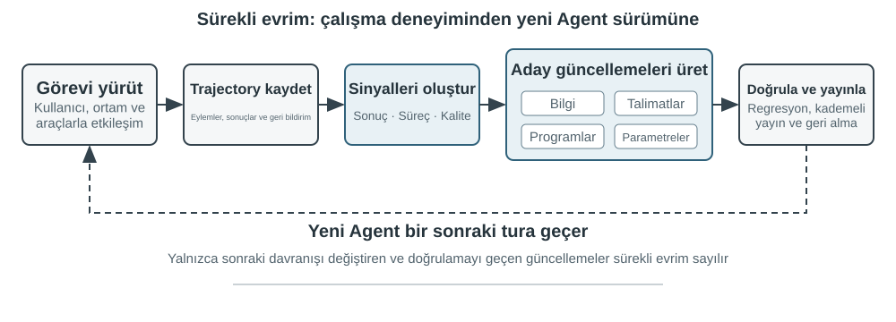
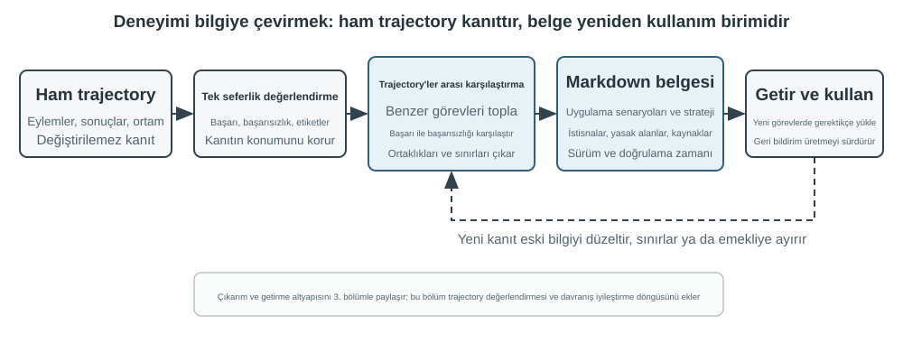
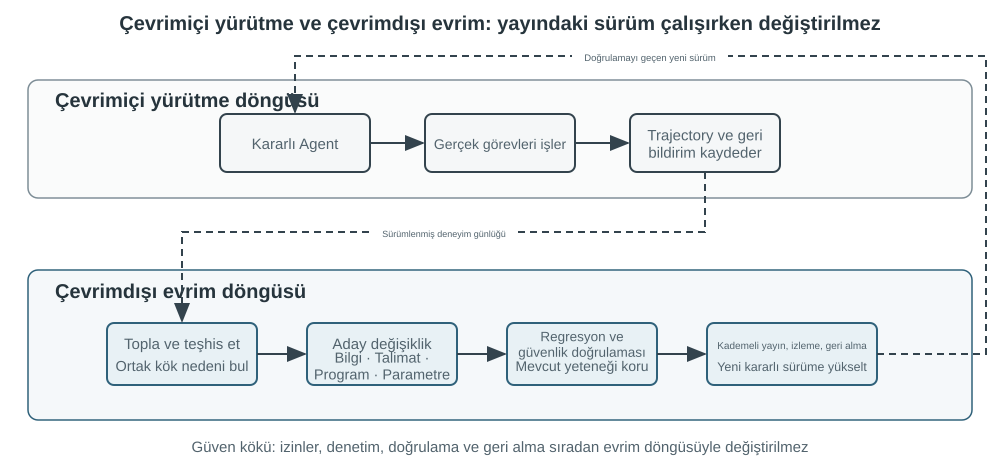

# Agent'ın Sürekli Evrimi

Bugünün Agent'ları çarpıcı bir yetenek paradoksuyla karşı karşıya: daha önce hiç görmedikleri karmaşık görevleri zero-shot çözebiliyorlar, ama benzer görevleri on bin kez işledikten sonra ertesi gün hâlâ ilk gün yaptıkları hatayı yapabiliyorlar. Model işe başladıktan sonra, tıpkı yeni bir çalışan gibi günlük işten öğrenerek gelişebilir mi? **Deneyimden otonom biçimde öğrenebilme** —bugün **sürekli öğrenme** (continual learning) denen şey— Agent'ın "görevi tamamlayabilme"den "güvenilir biçimde çalışabilme"ye geçişindeki kilit yetenek hâline geliyor; bu, aynı zamanda yeni nesil modellerin merkezî araştırma konusudur. Bugünkü "sürekli öğrenme" kavramı, "yeni görevi öğrenince eskisini unutma" biçimindeki eski araştırma hattıyla aynı problem değildir: unutma yalnızca alt problemlerden biridir; daha zor olanı, günün deneyiminde nelerin doğru nelerin yanlış yapıldığını modele kimsenin söylememesidir. Şimdilik modelin kendi sürekli öğrenme yeteneği hâlâ fazlasıyla yetersiz.

Bunun nedeni, dağıtılmış bir modelin tek bir çıkarım yüzünden parametrelerini otomatik olarak değiştirmemesidir. Bölüm 2'de ele alınan In-Context Learning (bağlam içi öğrenme), durum yönetimi ve sıkıştırma, Agent'ın **mevcut görev içinde** uyum sağlamasını mümkün kılar; ama context sona erdikten sonra bu değişim bir sonraki göreve kendiliğinden taşınmaz. Konuşmaları belleğe kaydetmek de yeni bir davranışı öğrenmiş olmak anlamına gelmez: ham trajectory'ler çok uzun olabilir ve içlerinde etkili stratejilerin yanı sıra tesadüfi başarılar, hatalı nedensellik atıfları ve güvenilmez girdiler de bulunur.

Burada kolayca karıştırılan bir ayrım var: **yaşananları saklamak, yaşananlardan öğrenmekle aynı şey değildir**. Yüz trajectory'yi uzun bir context'e ya da bir vektör veritabanına koymak, modelin gerektiğinde bir vakayı geri bulmasına yardımcı olabilir, ama vakalar arası karşılaştırmayı kendiliğinden tamamlamaz: hangi adımlar başarılı trajectory'lerde tekrar tekrar ortaya çıkıyor, hangi uygulamalar yalnızca eski sürüm bir arayüzde işe yarıyor, belirli bir başarı doğru stratejiden mi yoksa ortamın tesadüfünden mi geliyor. Öğrenme, sistem "değerlendirme, karşılaştırma, genelleme, doğrulama" işini etkin biçimde tamamladıktan sonra gerçekleşir; log'un diske yazıldığı anda değil. Bölüm 3'teki kullanıcı belleği ağırlıklı olarak "kullanıcı ve dünya nasıldır"ı biriktirir; bu bölümdeki deneyim öğrenmesi ise bir adım öteye geçerek "hangi koşullarda nasıl davranılmalı"yı biriktirir. Birincisi Agent'ın daha çoğunu hatırlamasını sağlar, ikincisiyse onu zeki olmaktan çıkarıp usta hâline getirir.

Peki modelin her görevden sonra doğrudan kendini eğitmesine neden izin vermiyoruz? Çünkü üretim ortamları nadiren temiz öğrenme sinyalleri sağlar. Kullanıcı memnuniyeti kurallara uygunluk anlamına gelmez; yerel parametre güncellemeleri yetenek unutmasına, politika kaymasına veya güvenlikte gerilemeye de yol açabilir. Çalışan bir modelin doğrulanmamış geri bildirime dayanarak kendi parametrelerini doğrudan değiştirmesine izin verilirse, hatalı deneyimler ve prompt injection kalıcı hâle gelip sonraki görevlerde büyümeyi sürdürebilir. Öte yandan temel modellerin periyodik eğitimi genel yetenekleri geliştirebilir, ancak her Agent'ın her gün karşılaştığı özel kuralları, araç değişikliklerini ve yerel deneyimleri zamanında özümseyemez.

Bu nedenle, modelin kendisi henüz güvenilir biçimde sürekli öğrenemiyorken, "öğrenme"nin önce modelin çevresinde otonom bir sistem olarak kurulması gerekir; bu kitap buna, model ağırlıkları düzeyindeki sürekli öğrenmeden ayırmak için **sürekli evrim** diyor: çalışma kanıtlarını kaydetmek, sonuçları ve süreci doğrulamak, birden çok trajectory'den ortak örüntüleri çıkarmak, ardından bilginin mi, talimatların mı, programların mı yoksa model parametrelerinin mi güncelleneceğine karar vermek. Bütün değişiklikler önce birer aday sürüm hâline gelir; ancak regresyon testlerinden ve güvenlik denetimlerinden geçtikten sonra bir sonraki çalışma turunu değiştirebilir.

Önceki bölümler bu sistemin ihtiyaç duyduğu başlıca parçaları zaten vermişti. Bölüm 2 görev içi durumu ele alır, Bölüm 3 bilgi altyapısını sağlar, Bölüm 5 Agent'a araç yaratma ve sistemi değiştirme meta-yeteneğini kazandırır, Bölüm 7 değerlendirme ile doğrulamayı kurar, Bölüm 8 model parametrelerinin nasıl güncelleneceğini anlatır. Bölüm 9'in görevi, bu parçaları Şekil 9-1'de gösterilen sürekli evrim döngüsü hâlinde örgütlemektir.

Sürekli evrim, izlenebilir çalışma deneyiminden doğmalı, sonraki davranışı değiştirebilmeli ve belirgin bir gerilemeye yol açmadığı doğrulanmış olmalıdır. Bu bölüm önce bir çalışmanın tam olarak neresinin iyi, neresinin yanlış olduğuna nasıl karar verileceğini tartışıyor; ardından dört güncelleme yöntemini ve bunların uygulanabilirlik sınırlarını karşılaştırıyor; son olarak bu güncellemelerin uzun vadeli çalışmada nasıl doğrulandığını, yayımlandığını, gözden geçirildiğini ve elendiğini ele alıyor.

## Çalışma Trajectory'lerinden Öğrenme Sinyali Elde Etmek

Sürekli evrimin başlangıç noktası, Bölüm 7'da anlatılan değerlendirmedir. Sistem görevin tamamlanıp tamamlanmadığını bilmiyorsa ve hangi adımın başarıya ya da başarısızlığa yol açtığını da bilmiyorsa, dil modelinin ürettiği reflection ancak bir tahmin olabilir.

Bir trajectory'yi değerlendirmek, özünde üç soruyu sırayla yanıtlamaktır: **iş yapıldı mı, izin verilen biçimde mi yapıldı ve kullanıcı için rahat bir deneyim miydi?** Şekil 9-2 bunları üç katmanlı bir doğrulama yapısı hâlinde düzenler.

**En alttaki sonuç doğrulayıcısı "iş gerçekten yapıldı mı" sorusunu yanıtlar.** Test sonuçlarını, veritabanı durumunu ve araç dönüşlerini okur: bir Kodlama Agent'ı testleri, tip kontrollerini ve performans benchmark'larını çalıştırabilir; kullanıcı adına iade işlemi yapan bir Agent sipariş durumunu ve gerçekleşen iade tutarını sorgulayabilir. Bu tür sinyaller ortamdaki gerçek durumdan gelir ve genellikle modelin kendi davranışına ilişkin anlatımından daha güvenilirdir; bu nedenle üç katman içinde ilk kurulması gereken katmandır.

**Ortadaki süreç doğrulayıcısı "izin verilen biçimde mi yapıldı" sorusunu yanıtlar.** Sonucun doğru olması sürecin de doğru olduğu anlamına gelmez: başarısız test durumlarını silmek de testleri geçirir; kullanıcıya sözlü olarak "iadenizi 7 gün içinde yapacağız, lütfen sabırlı olun" demek de geçici bir memnuniyet geri bildirimi getirebilir. Bu katman iş kurallarını, yetkileri ve eylem dizisini denetleyerek "sonuca ulaşıldı" ile "sonuca izin verilen yoldan ulaşıldı" arasını ayırır. Politika kütüğü, yetki tablosu ve eylem trajectory'si kesin biçimde ifade edilebilir; dolayısıyla bu katman da kodla karara bağlanabilir.

**Üstteki kalite doğrulayıcısı "kullanıcı için rahat bir deneyim miydi" sorusunu yanıtlar.** Örneğin müşteri hizmetlerinin sabırlı olup olmadığı, kurallara uygun sınırlar içinde bir çözüm sunup sunmadığı, bir araştırma raporunun kilit kanıtı yakalayıp yakalamadığı, üretilen metnin doğal ve derli toplu olup olmadığı. Bu boyutlar işin yapılıp yapılmadığını belirlemez, ama kullanıcı deneyimini etkiler. Burada Bölüm 7'da tanıtılan LLM-as-a-Judge kullanılabilir: değerlendirme ölçeğini (Rubric) önceden tanımlayıp doğrulayıcıdan her maddeye ayrı puan vermesini ve trajectory'den kanıt göstermesini istemek gerekir.

Müşteri hizmetleri Agent'ı örneğinde Tablo 9-1, bu üç katmanı madde madde puanlanabilen yedi boyuta açar: görev sonucu sonuç katmanına aittir; kural uyumu, gizlilik sınırı ve söz—eylem tutarlılığı süreç katmanına; ifade kalitesi ve kurallara uygun alternatif kalite katmanına aittir; olgusal güvenilirlik ise iki katmana yayılır — araç dönüşleriyle tek tek karşılaştırılabilen kısmı kodla doğrulanır, kalanı Rubric'e bırakılır.

Tablo 9-1 Müşteri Hizmetleri Agent'ı için Trajectory Değerlendirme Boyutları

| Boyut | Doğrulama sorusu | Başlıca kanıt |
|---|---|---|
| Görev sonucu | Kullanıcının asıl talebi çözüldü mü | Nihai ortam durumu, araç sonuçları |
| Kural uyumu | Politika, yetki veya zorunlu süreç ihlal edildi mi | Politika kütüphanesi, eylem trajectory'si |
| Gizlilik sınırı | Verilmemesi gereken bilgi sızdırıldı mı | Yanıt metni, veri erişim kayıtları |
| Olgusal güvenilirlik | İfadeler bilgiyle veya araç sonuçlarıyla destekleniyor mu | Alıntılanan kaynaklar, araç dönüşleri |
| Söz—eylem tutarlılığı | Tamamlandığı söylenen işlem gerçekten yapıldı mı | Yanıtların araç log'larıyla karşılaştırılması |
| İfade kalitesi | Dil doğal ve derli toplu mu, tekrar ve şablonlaşmadan kaçınılmış mı | Konuşmanın tamamı, dil Rubric'i |
| Kurallara uygun alternatif | Asıl çözüm uygulanamazken izin verilen bir alternatif yol bulundu mu | Kullanıcı hedefi, politikalar ve sonraki eylemler |

**Doğrulayıcının çıktı biçimi, onun bir "öğrenme sinyali" olup olamayacağını belirler.** Tek bir toplam puan yalnızca bir çalıştırmanın ne kadar iyi geçtiğini yansıtır; neyin değiştirilmesi gerektiğini göstermez. Sonraki aşamaların öğrenebileceği bir değerlendirme en az dört öğe içermelidir: görevin başarılı, kısmen başarılı ya da başarısız olduğu; her boyut için ayrı bir sonuç; her sonucun dayandığı kanıtın konumu (hangi konuşma turu, hangi araç çağrısı); ve hata türü etiketi. Ayrıca kanıt yetersizken doğrulayıcının puan vermeyi reddedebilmesi gerekir. Düşük güvenli bir sonucu olgu olarak sabitlemektense, o vakayı öğrenme kümesinin dışında bırakmak yeğdir. Ancak bu dört öğe elde olduğunda, sonraki bölümde ele alınan dört güncelleme yöntemi bilgiyi mi, Prompt'u mu, programı mı yoksa model parametrelerini mi güncellemek gerektiğine karar verebilir.

> **Deney 9-1 ★★: Müşteri Hizmetleri Agent'ı için Trajectory Doğrulayıcısı İnşa Etmek**
>
> **Deney Amacı**: Bir müşteri hizmetleri çalışma trajectory'sini sonraki öğrenmede kullanılabilecek yapılandırılmış bir tanıya dönüştürmek ve "kanıtla birlikte çok boyutlu sonuç"un tek bir toplam puandan daha iyi kök neden bulup bulmadığını doğrulamak.
>
> **Deney açıklaması:** “Tek bir toplam puan” ile “her boyut için sonuç, kanıt ve güven” çıktısını karşılaştırın; hangisinin görev başarısızlığını, kural ihlalini, sahte vaadi ve anlatım sorununu daha iyi ayırdığını gözlemleyin. Sürekli evrim yalnızca başarı oranına veya tek puana dayanamaz. Ne yanlış gitti, neden ve kanıt nerede bilgisi korunursa sonraki modüller bilgi, Prompt, program veya model parametrelerinden hangisini güncelleyeceğini anlayabilir; düşük güvenli vakalar da öğrenme kümesine otomatik girmemelidir.

## Agent'ın Sürekli Evrimi için Dört Yöntem

Öğrenme sinyali, Agent'ın değişmesi gerektiğini söyler; ama değişimin nerede gerçekleşmesi gerektiğini söylemez. Güncelleme biçimini seçerken birincil ölçüt, deneyimin ne kadar süredir var olduğu değil, hedeflenen yeteneğin belirli bir taşıyıcıyla doğal biçimde ifade edilip edilemeyeceğidir. Olgular ve deneyimler bilgi dokümanına yazılmaya uygundur; dille açıkça anlatılabilen stratejiler prompt'a veya Skill'e yazılmaya uygundur; kesin biçimde yürütülebilen süreçler ve kısıtlar programa yazılmaya uygundur; algı, dil üslubu ve örtük stratejiler gibi yüksek boyutlu yetenekler ise model parametrelerine girmek zorundadır. Şekil 9-3 bu dört yolu ve aralarındaki ilişkiyi gösteriyor.

Tablo 9-2 derli toplu bir karşılaştırma sunuyor. Dört yol birbirini dışlamaz: tıbbi görüntüleme Agent'ı lezyonları tanımak için parametrelere dayanır, güncel kılavuzları bilgi tabanından alır, risk göstergelerini kodla hesaplar; müşteri hizmetleri modelinin doğal ses tonu post-training'den gelir, kuruma özgü politikalar bilgi ve Skill tarafından sağlanır, kritik uyumluluk kuralları ise sunucu tarafındaki kodla güvence altına alınır.

Tablo 9-2 Dört Sürekli Evrim Biçiminin Uygulanabilirlik Sınırları

| Güncelleme biçimi | Taşımaya uygun içerik | Başlıca üstünlükler | Başlıca sınırlamalar |
|---|---|---|---|
| Deneyim bilgi tabanı | Olgular, deneyime dayalı örüntüler, istisnalar ve kaynaklar | Hızlı güncellenir, izlenebilir, ihtiyaca göre retrieval yapılabilir | Retrieval'a ve modelin doğru uygulamasına bağımlı |
| Prompt ve Skill | Dille ifade edilebilen yargı ilkeleri ve işleyiş kuralları | Yorumlanabilir, etki alanı denetlenebilir | Kolayca şişer, çelişir veya göz ardı edilir |
| Program ve Harness | Deterministik süreçler, araçlar ve katı kısıtlar | Test edilebilir, yürütmesi kararlı, maliyeti düşük | Geliştirme ve bakım maliyeti görece yüksek |
| Model parametreleri | Yüksek boyutlu algı, üretim üslubu ve örtük stratejiler | Genelleme gücü yüksek, çıkarım maliyeti düşük | Güncelleme ve regresyon maliyeti yüksek |

Aynı yetenek birden çok taşıyıcıya bölünebilir: olgular bilgi tabanına, istisnaları açıklayan ilkeler bir Skill'e, atlanamayacak izinler yine programın kapısına, yüksek boyutlu tanıma yeteneği ise parametrelere gider. Yönlendirmenin sonucu yalnızca bir güncelleme önerisidir; henüz yayına çıkma yetkisi kazanmamıştır.

### Deneyimi Bilgi Olarak Biriktirmek

En hafif evrim biçimi, birden çok çalışmada tekrar tekrar ortaya çıkan deneyimi retrieval yapılabilir bilgi dokümanlarına dönüştürmektir. Burada söz edilen "deneyim bilgi tabanı", depolama, indeksleme ve retrieval teknolojilerini Bölüm 3 ile paylaşır; ama bilginin kaynağı ve doğrulama hedefi farklıdır. Bölüm 3 ağırlıklı olarak kullanıcı konuşmalarından, dokümanlardan ve veri kümelerinden "kullanıcı ve dünya nasıldır"ı çıkarır; bu bölüm ise Agent'ın eylem trajectory'lerinden ve sonuçlarından "hangi koşullarda ne yapılmalı"yı çıkarır. Örneğin "bu havayolu özel yemeklerin yirmi dört saat önceden ısmarlanmasını şart koşuyor" alan bilgisidir; "bilet almadan önce özel yemek son başvuru zamanını kontrol et; yoksa ödemeyi yaptıktan sonra talebin karşılanamayacağını fark edersin" ise eylem deneyimidir.

Ham trajectory resmî bir bilgi birimi olmaya uygun değildir. Hem uzundur hem de gürültülüdür; araçların ham çıktısını, tesadüfi sapmaları ve ortam ayrıntılarını içerir. Daha sağlam bir sistem üç katman veri saklar: denetim için değişmez ham trajectory'ler; tek bir çalışmanın başarısını, başarısızlığını ve aday derslerini kaydeden çalışma analizleri; ve aynı türden birden çok trajectory'nin karşılaştırılıp kümelenmesi ve genellenmesiyle oluşan, geleceğe dönük Markdown bilgi dokümanları. Resmî bir doküman genellikle uygulanabilir senaryoyu, önerilen stratejiyi, yasaklanan uygulamaları, istisna koşullarını, kanıt kaynaklarını ve en son doğrulama zamanını açıkça yazar; tek bir görevin tüm sürecini yeniden anlatmaz.

Bu tasarım, Bölüm 3'teki User-as-Code ile aynı iki aşamalı düşünceyi taşır. User-as-Code önce konuşmadaki olguları değişmez bir log'a ekler, sonra yapılandırılmış kullanıcı modelini periyodik olarak yeniden kurar; deneyim öğrenmesi de aynı şekilde önce kanıtı saklamalı, sonra çevrimdışı olarak değiştirilebilir bilgiyi üretmelidir. Şekil 9-4 bu süreci gösteriyor. Kaydetmeyi düzenlemekten ayırmak, tek bir tesadüfi başarının ya da bir ağ arızasının Agent'ı anında değiştirmesini önler; ayrıca sisteme, birden çok başarı ve başarısızlığı gördükten sonra ortak yanı belirleme imkânı verir.

Deneyim dokümanı basit bir trajectory özeti değildir. Gerçekten aktarım değeri taşıyan içerik karşılaştırmadan doğar: aynı türden başarılı trajectory'ler ne yapmış, başarısız trajectory'lerde ne eksik; belirli bir strateji hangi ortam sürümlerinde işe yaramış, hangi ön koşullar altında çökmüş. Bölüm 3 bilgi çıkarımını, kümelemeyi ve retrieval'ı zaten tanıttığı için bu bölüm o algoritmaları yinelemiyor; bunun yerine trajectory değerlendirmesinin çıkarım koşuluna nasıl dönüştüğüne ve çıkarılan bilginin sonraki görevlerdeki başarımı artırıp artırmadığına odaklanıyor.

Eksiksiz bir bilgi damıtma boru hattı beş adıma ayrılabilir. Önce değişmez trajectory'ler ve ortam sonuçları saklanır; sonra tek bir çalışma için görev türünü, gereken yetenekleri, gözlenen stratejileri, hataları ve istisnaları sıralayan yapılandırılmış bir analiz üretilir; ardından aynı türden çalışmalar görev ailesine göre bir araya toplanır ve her aday örüntü için "hangi trajectory'ler destekliyor, hangileri çürütüyor" biçiminde bir kanıt tablosu kurulur; yalnızca destek eşiğine ulaşan adaylar resmî dokümana yazılır; son olarak damıtmaya katılmamış yeni görevler üzerinde aktarım etkisi sınanır. Resmî bilginin aday analizlerden ayrı depoda tutulması, sistemin ham kanıtı bozmadan yeniden genelleme yapmasına ve ortam sürümü değiştiğinde belirli bir sonucu tam olarak geri almasına imkân verir.

GAIA deneyim öğrenmesi bunun sezgisel bir örneğini veriyor. GAIA[^gaia-2023], arama, web sayfası okuma, dosya işleme ve hesaplamayı bir arada gerektiren çok adımlı sorular içerir; AWorld[^aworld-2025] ise Agent'ı çalıştıran, bu araçları çağıran ve trajectory'leri saklayan yürütme ortamını sağlar. Birincisi sınav kâğıdı gibiyse ikincisi sınav salonu ve deney kayıt sistemidir. Eski usul yaklaşım, bir görev başarıyla tamamlanır tamamlanmaz strateji özeti üretip bunu vektörleştirerek depoya yazmaktı; daha titiz bir uygulama ise önce GAIA cevap doğrulamasını veya başka bir ortam doğrulayıcısını kullanarak çalışmaları başarılı, kısmen başarılı ve başarısız olarak etiketler, ardından aynı görev ailesindeki birden çok yolu karşılaştırır. Başarılı trajectory'ler aday stratejilere katkı verir, başarısız trajectory'ler dışlayıcı bilgiye katkı verir, kısmen başarılı trajectory'ler ise "hangi bölüm işe yaradı, hangi bölümde hâlâ sorun var" ayrımını yapmaya yardımcı olur. Reflexion'ın[^reflexion-2023] önerdiği doğal dil reflection'ı aday derslerin üretilmesine katılabilir, ama reflection'ın kendisi kanıt değildir; yalnızca ortam sonucuyla örtüşen, trajectory'ler arasında destek bulan ve yeni görevlerde olumlu aktarım gösteren içerik resmî deneyim dokümanına girmelidir.

[^reflexion-2023]: Shinn, N., et al. *Reflexion: Language Agents with Verbal Reinforcement Learning.* arXiv:2303.11366, 2023.

[^gaia-2023]: Mialon, G., et al. *GAIA: a benchmark for General AI Assistants.* arXiv:2311.12983, 2023.

[^aworld-2025]: Yu, C., et al. *AWorld: Orchestrating the Training Recipe for Agentic AI.* arXiv:2508.20404, 2025.

### Deneyimi Talimat Olarak Yazmak

Deneyim bilgi tabanı Agent'a "başvurabileceği malzemeyi" verir; Prompt ve Skill ise "nasıl davranması gerektiğini" belirler. Deneyimi talimata yükseltmeye ancak birbirine benzer çok sayıda yörünge aynı strateji hatasını üst üste açığa çıkardığında ve o hata sözcüklerle açıkça betimlenebildiğinde değer. Önce üç kavramı ayıralım: **sistem Prompt'u** bütün görevlerde geçerlidir, **Skill** yalnızca belirli bir alan ya da araçla eşleştiğinde talep üzerine yüklenir, **program/Harness** ise yetkileri ve diğer katı kısıtları üstlenir.

Andrej Karpathy bu yaklaşımı **sistem promptu öğrenmesi** (System Prompt Learning)[^karpathy-system-prompt-learning] diye adlandırır: model bir sorunla karşılaştıktan sonra tek bir açık cümleyle gelecekteki kendisini uyarır. DSPy[^dspy-2023] bir geliştirme kümesi üzerinde talimat ve örnek arar; OPRO[^opro-2023] geçmiş promptlar ve onların puanlarından yeni prompt önerileri üretir; GEPA[^gepa-2025] başarısız yörüngeler üzerine doğal dilde yapılan düşünmelerden prompt önerileri üretip eler. Bu yöntemler çevrimdışı toplu optimizasyona uygundur; üretim ortamında ise denetlenebilir en küçük güncelleme önerilerini kullanmak ve hızlı geri alma yolunu açık tutmak daha yerindedir.

Sistem promptu öğrenmesi, 2. bölümdeki prompt mühendisliğiyle aynı şey değildir. 2. bölüm iyi bir Prompt'un nasıl düzenleneceğini tartışıyordu; bu bölüm ise hangi geri bildirimin bir değişikliği tetiklemeye yeteceğini ve güncelleme önerisinin nasıl güvenle yayına alınacağını tartışıyor. Değişiklik, kaynağı belirtilmiş en küçük diff olmalı; modele her seferinde Prompt'un tamamını yeniden yazdırmak değil. Bu, 1. bölümde adı konan "en küçük diff + geri alınabilirlik" örüntüsünün ta kendisidir. Aday sürüm hem **hatayı tetikleyen sınır kümesinde** hem de **halihazırda çalışan koruma kümesinde** sınanmalıdır: ilki iyileşmeli, ikincisi gerilememelidir.

#### Örnek 1: Devir sınırının kurala dökülmesi

τ²-bench'in telecom politikasında insan temsilciye devir yalnızca iki ilkesel cümleyle düzenlenmiştir: talep Agent'ın eylem kapsamını aştığında devret, devretmeden önce çözmek için elinden geleni yap. Yedinci bölüm bu ortamı incelerken bu iki satır bir kusur göstermemişti; aynı ortamı daha zayıf bir modelle çalıştırın, eksiklik hemen açığa çıkar — araç hata döndürdükten sonra Agent üst üste yeniden dener ve sonunda insana devrederek işi bitirir. Çıkarım kümesindeki 20 görevin 19'u böyle sonlandı.

Bu 19 başarısız trajectory'yi bir modele verin, birkaç uygulanabilir kuralı kendi başına türetmesine izin verin ve bunları politikanın sonuna ekleyin; ardından çıkarıma hiç katılmamış bir görev kümesinde yeniden çalıştırın. Geçme oranı %12,3'ten %19,3'e çıkar ve daha önce geçen görevlerden hiçbiri bozulmaz.

**Çıkarıcıya ne gösterildiği, neyi türetebileceğini belirler.** Aynı 19 trajectory'den yalnızca başarısızlık özetleri ve hata metinleri verildiğinde çıkan sonuç "aynı hatayı tekrar tekrar döndüren bir aracı çağırmayı sürdürme" olur; Agent'ın ve kullanıcının ayrı ayrı hangi araçları çağırabildiğini gösteren listeyi de eklediğinizde sonuç "ağ durumu, SIM kart ve APN denetimleri kullanıcının cihazına aittir; doğrudan çağrılmak yerine kullanıcıya yol gösterilerek yaptırılmalıdır" haline gelir. İlki bir dersi kaydeder, ikincisi sorumluluğun nerede durduğunu kavrar.

**Model, gözlemlediği davranışı olması gereken davranış sayar.** İlk sürüm kurallardan ikisi şöyleydi: "art arda üç başarısız çağrıdan sonra insana devret" ve "kullanıcı iki istek sonrasında numarayı vermezse insana devret". Trajectory'lerde en sık görünen şey insana devirdir, model de bunu makul bir son çare saymıştır. Oysa bu değerlendirmede insana devir her zaman başarısızlık olarak hükme bağlanır; dolayısıyla bu iki kural başarısızlığı bizzat düzenlemenin içine yazar. Bu yüzden çıkarımın ürünü doğrudan yayına alınamaz, onu üreten şeyden bağımsız bir doğrulamadan geçmelidir.

**Onarılan şey çoğu zaman son derece yalındır.** Temel kolda tipik bir trajectory vardır: Agent kullanıcının telefon numarasına ihtiyaç duyar, sorgu aracını çağırır ve parametreye "Lütfen telefon numaranızı verin" yazar — arka arkaya beş kez, beş hata, ardından devir. Kullanıcıya sorması gerektiğini zaten çıkarmıştı; yalnızca bu cümleyi araca söylemişti. Kurallar yürürlüğe girdikten sonra önce konuşmada talebi dile getiriyor, numarayı alıyor ve ancak sonra sorguluyor; daha sonra SIM kart durumunu denetleme girişimi araç katmanında reddedilince, kullanıcıyı SIM kartı çıkarıp yeniden takmaya yönlendirmeye geçiyor ve görev geçiyor.

> **Deney 9-2 ★★: τ²-bench başarısız trajectory'lerinden devir ve araç kullanım kuralları çıkarmak**
>
> Yedinci bölümdeki τ²-bench telecom ortamı olduğu gibi kullanılır. Çıkarım kümesi ile aktarım kümesi, yukarı akış deposunda zaten birbiriyle kesişmeyen iki görev kümesidir; dolayısıyla çıkarım süreci aktarım kümesine hiç değmez.
>
> Önce çıkarım kümesini zayıf bir modelle çalıştırıp başarısız trajectory'leri saklayın; kuralları insan değil model türetsin ve üretildikten sonra özgün politikanın sonuna eklensinler; ardından aktarım kümesinde özgün politikayı iki evrilmiş sürümle karşılaştırın. Üç kol arasında yalnızca politika dosyası değiştirilir, kullanıcı simülatörü sabit tutulur.
>
> Geçme oranının yanı sıra kurallarla doğrudan örtüşen üç davranış göstergesi kaydedilmelidir: insana devir oranı, Agent'ın sınırını aşıp kullanıcı tarafındaki bir aracı çağırma sayısı ve zorunlu parametresi eksik gönderilen çağrı sayısı. Son iki gösterge evrilmiş sürümlerde yaklaşık %80 düşer; bu da geçme oranındaki artışın kuralların somut eylemleri onarmasından geldiğini gösterir.

Aynı yaklaşım başka alanlara da taşınır. Bir havayolu müşteri hizmetleri Agent'ı için tipik sorunlu vaka şudur: kullanıcı iade ücretine, değişiklik ücretine ya da bagaj kurallarına itiraz eder; Agent politikayı sorgulamadan, kuralı açıklamadan ve kurallara uygun bir alternatif aramadan `transfer_to_human` çağırır. Sıradan bir politika anlaşmazlığı devir gerektirmez; **devri zorunlu kılan yalnızca kullanıcının açıkça insan temsilci istemesi ya da güvenlikle ilgili bir durumun ortaya çıkmasıdır**. Teşhis yine hiç açıkça yazılmamış bir devir sınırını gösterir, düzeltme de yine onu kaynağı belirtilmiş tek bir asgari kurala dönüştürmektir.

> **Deney 9-3 ★★: Başarısız yörüngelerden havayolu müşteri hizmetleri sistem Prompt'unu optimize etmek**
>
> **Deneyin amacı**: Havayolu müşteri hizmetleri Agent'ının "sıradan politika anlaşmazlığında hemen insana aktarma" davranışını düzeltmek, buna karşılık açık insan talebinde ve güvenlik olaylarında aktarma yeteneğini korumak.
>
> **Deneyin açıklaması**: Başarısız yörüngelerden kural uyumu, görev çözümü ve mevzuata uygun alternatif olmak üzere üç boyut çıkarılır ve kaynağı belirtilmiş tek bir en küçük Prompt yaması üretilir; ardından ilk sürüm ve elle ayarlanmış sürümle aynı koşullarda karşılaştırılır. Güncelleme önerisi ancak sınır vakaları iyileştiğinde, eski görevler gerilemediğinde ve yayın kapısından geçtiğinde kademeli yayına girer.
>
> **Deney neyi gösteriyor**: Prompt'un otomatik optimizasyonunda önemli olan, modelin büyük bir metin bloğunu serbestçe yeniden yazması değil; atfedilebilir bir hatayı, kapsamı belirgin, geri alınabilir ve doğrulanabilir yerel bir kurala dönüştürmektir.

#### Örnek 2: Gereksinim Netleştirme Skill'i — "Doğrudan Başlamak" yerine "Önce Onaylayıp Sonra Uygulamak"

2. bölüm bir Skill'in nasıl yazılacağını anlatmıştı. Burada sistemde bir gereksinim netleştirme Skill'inin ilk sürümünün zaten bulunduğunu varsayıyor ve başka bir şeye bakıyoruz: Agent üretimde kullanıcı geri bildirimi almayı sürdürürken, "ne zaman önce sormalı, neyi sormalı, ne zaman doğrudan başlayabilir" kuralının güncellenmesi gerekip gerekmediğine nasıl kendiliğinden karar verir?

Bu tipik bir süreç sorunudur. Kullanıcı "giriş sayfasını kurumsal oturum açmayı destekleyecek biçimde değiştir" der. Agent hemen işe koyulursa kimlik sağlayıcı, geri düşüş yolu, eski kullanıcılarla uyum ve yayına alma kapsamı konusunda kullanıcının henüz düşünmediği seçimleri onun yerine yapabilir. Buna karşılık görevin büyüklüğüne bakmadan on beş soru sıralarsa, basit bir değişiklik bir görüşmeye dönüşür. **Az sormak yeniden yapıma, çok sormak rahatsızlığa yol açar.** Skill'in ifade etmesi gereken "her görev onay ister" değil, kapsamı olan bir karar yoludur.

İlk sürüm süreç şöyle yazılabilir: önce görevin belirsizliğini, riskini ve yeniden yapım maliyetini değerlendir; düşük riskli, kolayca geri alınabilir küçük değişikliklerde varsayımları belirtip doğrudan uygula; mimari, veri, yetki, genel arayüz ya da geniş kapsamlı değişiklikler söz konusu olduğunda, planı gerçekten değiştirebilecek az sayıda soruyu toplu olarak sor; yanıtları alınca hedefleri, hedef olmayanları, kilit ödünleşmeleri, varsayımları ve kabul ölçütlerini içeren kısa bir Spec ya da Plan üret ve kullanıcının onayına sun; onaydan sonra uygula, yol boyunca özgün Spec'in geçerli olmadığı anlaşılırsa durup yeniden onay al.

Sürekli evrim işletim kanıtıyla başlar. Sistem görevleri, netleştirme sorularını, Spec sürümlerini, kullanıcı düzenlemelerini, çalıştırma sonuçlarını ve teslim sonrası yeniden yapımı birlikte kaydetmelidir. Olumsuz geri bildirim "yapılan şey hayal ettiğim gibi değil" olabileceği gibi "çok fazla soru soruyorsun" da olabilir; olumlu geri bildirim ise tek bir onaydan sonra sorunsuz teslimi, kullanıcı Spec'i kendisi düzelttikten sonra yeniden yapımın azalmasını ve düşük riskli görevlerin gereksiz sorularla bölünmemesini kapsar. Tek başına bir yakınmayı saklamak güncellemeyi tetiklemeye yetmez; geri bildirim mutlaka somut bir yörünge, görev türü ve sonuçla ilişkilendirilmelidir.

Birden çok yörünge aynı boşluğu üst üste işaret ettiğinde Agent en küçük Skill güncelleme önerisini ortaya koyabilir. Örneğin kimlik doğrulama mimarisine dokunan birkaç görevde eski oturum açma yönteminin desteklenmesi gerektiği ancak teslimden sonra anlaşıldıysa, kural taslağı uygulamadan önce "kimlik sağlayıcı, geri düşüş yolu ve uyum kapsamının" onaylanmasını isteyebilir; tersine, çok sayıda yazım düzeltmesinin her birinde önce bir tur soru sorulduysa, kural taslağı tetiklenme kapsamını yüksek riskli ve yüksek belirsizlikli durumlara daraltmalıdır.

Bu süreç kontrollü deneyle doğrulanmalıdır. "Doğrudan uygula", "önce sor sonra uygula" ve "sor, Spec üret, onayla, sonra uygula" olmak üzere üç strateji görev karmaşıklığına göre katmanlanarak karşılaştırılabilir. Ölçütler en azından gereksinimden sapma oranını, teslim sonrası yeniden yapım sayısını, netleştirme turu sayısını, ilk işe yarar çıktıya kadar geçen süreyi, kullanıcının vazgeçme oranını, Spec'in değiştirilme oranını ve yüksek riskli işlemlerdeki hata oranını içermelidir. Güncelleme önerisi ancak gereksinim sapmasını azaltırken rahatsızlığı belirgin biçimde artırmıyorsa ve damıtmada kullanılmamış görevlerde gerilemeden geçiyorsa kademeli yayına girer.

Bu örnek Skill ile Harness arasındaki sınırı da gösterir. Skill bağlamı anlayıp kendiliğinden soru sormaktan, Spec'i derleyip toparlamaktan ve ödünleşmeleri açıklamaktan sorumludur; Harness ise onay yokken yüksek riskli yazmayı, doğrudan `main` üzerinde işlem yapmayı ya da yayın sürecini atlamayı reddetmekten sorumludur. Harness'taki reddedici, bir PR'ın nasıl betimleneceğine model adına karar veremez; gereksinim çözümünü de onun yerine seçemez. Deneyim biriktikçe kararlı konuşma yörüngeleri, 8. bölümde gereken SFT ya da RL eğitim verisini de üretebilir.

> **Deney 9-4 ★★: Kullanıcı geri bildiriminden gereksinim netleştirme ve Spec onayı Skill'ini evriltmek**
>
> **Deneyin amacı**: Agent'ın "gereksinimden sapma" ile "etkileşimi bölme" arasında daha iyi bir netleştirme stratejisi bulup bulamayacağını sınamak ve doğrulanmış iyileştirmeleri Skill'e geri yazmak.
>
> **Deneyin açıklaması**: Düşük riskli ve düşük belirsizlikli bir görev kümesiyle mimari, yetki, veri ya da genel arayüz içeren yüksek riskli bir görev kümesi hazırlayın ve üç akışı karşılaştırın: doğrudan uygula; sor, sonra uygula; sor, Spec onayı al, sonra uygula. Kullanıcı yanıtlarını, Spec düzenlemelerini, teslim sonuçlarını ve yeniden yapım geri bildirimini kaydedin ve Agent'ın bir Skill güncelleme önerisi üretmesini sağlayın; öneri, ayrılmış görevlerde gerilemeden, rahatsızlık maliyeti denetiminden ve yüksek riskli reddedicinin doğrulanmasından mutlaka geçmelidir.
>
> **Deney neyi gösteriyor**: Sürekli evrim, her yakınmayı doğrudan Prompt'a eklemek değil; sonuç ve geri bildirimden kapsamı saptayıp en küçük talimat güncellemesini önermek ve yayınlanıp yayınlanmayacağına bağımsız bir değerlendiricinin karar vermesini sağlamaktır.

[^dspy-2023]: Khattab, O., et al. *DSPy: Compiling Declarative Language Model Calls into Self-Improving Pipelines.* arXiv:2310.03714, 2023.

[^opro-2023]: Yang, C., et al. *Large Language Models as Optimizers.* arXiv:2309.03409, 2023.

[^gepa-2025]: Agrawal, L., et al. *GEPA: Reflective Prompt Evolution Can Outperform Reinforcement Learning.* arXiv:2507.19457, 2025.

[^karpathy-system-prompt-learning]: Karpathy, A. “We’re missing (at least one) major paradigm for LLM learning … system prompt learning?” X, May 11, 2025. https://x.com/karpathy/status/1921368644069765486

### Deneyimi Program Olarak Yazmak

Deneyim; kararlı, tekrarlanan ve doğrulanabilir işlemleri tarif ediyorsa, modele her seferinde dokümanı yeniden okutup akıl yürüttürmek ekonomik değildir. Böyle durumlarda daha uygun yol, deneyimi bir iş akışına, araca veya Harness koduna derlemek ve tek seferlik bir keşfi tekrar tekrar yürütülebilir bir programa dönüştürmektir. Bölüm 5, Kodlama Agent'ının dosyaları nasıl okuyup yazdığını, testleri nasıl çalıştırdığını ve sistemleri nasıl ürettiğini zaten anlatmıştı; bu kısmın ilgilendiği şey genel kod üretimi değil, Agent'ın kendi trajectory'lerine dayanarak kendisinin gelecekteki sürümünü nasıl değiştirdiğidir.

Değiştirilebilecek nesneler yeni araçlardan ibaret değildir. İşlem katmanında tarayıcı trajectory'leri parametreli iş akışlarına derlenebilir ya da değişen API'ler için adaptörler üretilebilir; kontrol katmanında araç yönlendirme, yeniden deneme, circuit breaker ve context sıkıştırma stratejileri değiştirilebilir; doğrulama katmanında üretimdeki başarısızlıklara dayanarak yeni parametre kontrolleri, durum doğrulayıcıları ve regresyon testleri eklenebilir; mimari katmanda ise bir Reviewer Agent eklenerek planlama ile yürütme arasındaki bilgi akışı değiştirilebilir.

Tarayıcı iş akışları, programlaşmış deneyimin değerini iyi gösteriyor. Bunu bir hesap tablosunda makro kaydetmeye benzetebiliriz: ilk e-postayı gönderirken çok modlu Agent, "yaz, alıcı, konu, gövde, gönder" denetimlerini gözlem—düşünme—eylem döngüsüyle bulur; sonraki e-postalarda süreç hiç değişmez, yalnızca alıcı ve içerik farklıdır, dolayısıyla tüm yolu piksellerden ve DOM'dan yeniden keşfetmek için modeli bir kez daha çağırmaya gerek yoktur. Sistemin yapması gereken, ilk keşfin ürettiği trajectory'yi parametreleri, durum kontrolleri ve sürüm bilgisi olan küçük bir programa derlemektir.

Şekil 9-4'te gösterilen bilgi damıtma süreci, tarayıcı senaryosunda daha somut bir yaşam döngüsüne karşılık gelir:

1. **Trajectory'yi yakala**: Gezinme, tıklama, metin girme, açılır liste seçimi gibi eylemleri kaydet; eylem parametrelerini, o andaki URL'yi ve XPath, CSS, `id`, `role`, `aria-label`, `data-testid` gibi öğe konumlandırma kanıtlarını sakla. Konumlandırma bilgisi yalnızca öğeyi yeniden bulmaya yarar, görevin tamamlandığını kanıtlamaz.
2. **Parametrele**: İlk çalışmadaki sabit değerleri şablon değişkeni olarak tanı; örneğin `test@example.com` adresini, e-posta konusunu ve gövdesini `{recipient}`, `{subject}` ve `{content}` ile değiştir; geri kalan kararlı eylemler olduğu gibi kalsın. Öğretim amaçlı uygulama düzenli ifade ve şablon değiştirme kullanır; üretim sistemleri yapılandırılmış görev girdisi ya da kısıtlanmış bir çıkarım modeli kullanabilir.
3. **Durum kontrollerini tanımla**: Eylemlere yürütme öncesi ve yürütme sonrası kontroller ekle; örneğin "gönder düğmesi şu anda görünür", "gezinmeden sonraki URL hedef siteye ait". Tüm iş akışı için de bir nihai durum kontrolü ekle; örneğin "gönderilmiş listesinde yeni bir e-posta belirdi" ya da test sayfasının durum değeri beklenen biçimde değişti. Eylemin başarıyla yürütülmesi ile görevin başarılı olması iki ayrı şeydir; nihai durum kontrolü gerçek sayfayı veya arka uç durumunu okumak zorundadır.
4. **Adayı doğrula**: İlk başarı yalnızca bir `candidate` üretir. Sistem, sandbox hesabını veya test sitesini bağımsız bir başlangıç durumuna sıfırlamalı, sonra adayı baştan sona yeniden oynatmalıdır; her adımın yürütme öncesi kontrolü, yürütme sonrası kontrolü ve nihai durum kontrolü tümüyle geçtikten sonra `validated` olarak yayımlanabilir. E-posta gönderme, sipariş verme gibi yan etkisi olan görevlerde güvenli bir sıfırlama geri çağrısı yoksa, aday yalnızca denetim amacıyla saklanabilir; doğrulama uğruna üretim hesabında yeniden yürütülemez.
5. **Eşleştir ve yeniden oynat**: Yeni bir görev geldiğinde önce resmî yetenek kütüphanesinde niyete ve anahtar kelimelere göre bir iş akışı ara, bu seferki parametreleri çıkar, sonra doğrudan Playwright ile yürüt. Yeniden oynatma yolu LLM'i adım adım çağırmayı gerektirmez, ama yine de öğelerin kullanılabilir hâle gelmesini beklemeli ve bütün durum kontrollerini tamamlamalıdır.
6. **Geçersiz kıl ve yeniden öğren**: Hedef öğe bulunamadığında, durum kontrolü geçmediğinde, API Schema değiştiğinde veya nihai durum yanlış olduğunda sonraki eylemleri hemen durdur, eski sürümü retrieval yapılabilir kütüphaneden `invalid` bölgesine taşı ve yeniden keşif için tam Agent'a geri dön. Eski dosya denetim ve karşılaştırma için saklanır, ama sessizce eşleşmeyi sürdüremez.

E-posta göndermeyi ele alalım: derlemenin sonucu yalnızca "şu düğmelere sırayla tıkla" değildir; alıcı, konu ve gövde parametreleri olan küçük bir programdır. Göndermeden önce yazma penceresini ve giriş alanlarını kontrol eder, gönderdikten sonra başarı bildirimini kontrol eder, en sonunda gönderilmiş listesinde ilgili e-postanın belirdiğini doğrular. PreAct'ın[^preact] deneylerinde bu tür programlar tekrarlanan görevlerde uçtan uca 8,5–13 kat hızlanma sağladı ve yeniden oynatma aşamasında dil modelinin adım adım çağrılmasına gerek kalmadı. Daha da önemli sonuç şudur: süreç belleği aynı anda **eylem öncesi doğrulama, eylem sonrası doğrulama ve saklamadan önce bağımsız doğrulama** içermek zorundadır. Aksi hâlde sistem kolayca tehlikeli bir yanılsamaya kapılır: yeniden oynatma kapsamı yüzde 100'dür, her düğmeye tıklanmıştır, ama aslında bir alan boş kalmıştır ve görev hiçbir zaman gerçekten tamamlanmamıştır.

> **Deney 9-5 ★★★: Tarayıcı Trajectory'lerinden Doğrulanabilir İş Akışı Üretmek**
>
> **Deney Amacı**: Web Agent'ının pahalı bir keşfi yeniden kullanılabilir bir iş akışına dönüştürüp dönüştüremediğini ve sayfa değiştiğinde hatalı yeniden oynatmayı reddedip reddetmediğini, yani "eylemlerin hepsi yürütüldü" durumunu başarı diye raporlamadığını doğrulamak.
>
> **Dört Aşamalı Senaryo**: Birinci aşamada test e-posta sitesinde veya benzetilmiş bir mesaj sayfasında "`test@example.com` adresine konusu 'Test e-postası' olan bir mesaj gönder" görevi yürütülür; keşfi tam Agent yapar, sarmalayıcı katman eylemleri, parametreleri ve sayfa durumunu yakalayarak bir `candidate` üretir. İkinci aşamada `validation_reset` çağrılarak sandbox geri yüklenir ve aday bağımsız olarak baştan sona yeniden oynatılır; yalnızca yürütme öncesi kontrol, yürütme sonrası kontrol ve nihai durum kontrolü tümüyle geçerse aday resmî yetenek kütüphanesine girer. Üçüncü aşamada alıcısı, konusu ve gövdesi farklı olan aynı türden bir görev yürütülür; sistemin doğrulanmış iş akışını eşleştirmesi, yeni parametreleri doldurması ve adım adım LLM döngüsüne girmeden Playwright ile yeniden oynatması beklenir. Dördüncü aşamada düğme konumu, sayfa metni veya nihai durum değiştirilir ve eski iş akışının anında `invalid` hâline gelip `fallback_required=True` döndürüp döndürmediği doğrulanır.
>
> **Karşılaştırma Tasarımı**: Basitleştirilmiş baseline yalnızca tıklama, metin girme gibi eylemlerin istisna fırlatmadan tamamlanıp tamamlanmadığını sayar; deney grubu ayrıca eylem öncesi sayfayı, eylem sonrası sayfayı ve görevin nihai durumunu doğrular. İki grup aynı trajectory'leri ve aynı sayfa değişikliklerini kullanır; "alan boşken gönder düğmesine tıklandı" ve "Save'e tıklandı ama veri kaydedilmedi" gibi sahte başarı senaryolarındaki yanlış karar oranları karşılaştırılır.
>
> **Metrikler ve Kabul**: İlk keşfin ve yeniden oynatmanın uçtan uca süresi, LLM çağrısı sayısı, başarı oranı, hatalı başarı oranı, iş akışı eşleşme oranı, sayfa değişikliği tespit oranı ve yeniden öğrenmeye geri dönüş sayısı kaydedilir. Sıfırlama geri çağrısı yokken iş akışı aday bölgesinde kalmalıdır; doğrulamayı geçemeyen sürümler retrieval ile getirilememelidir; parametreli yeniden oynatma ilk çalışmanın alıcısını veya içeriğini yeniden kullanmamalıdır; sayfa değiştikten sonra tehlikeli olabilecek sonraki eylemler durdurulmalıdır. Hızlanma sonucu ancak bütün bu koşullar birlikte sağlandığında anlamlıdır.
>
> Eşlik eden uygulama için bkz. [`browser-use-rpa`](../chapter9/browser-use-rpa/); hem deterministik durum makinesi gösterimi hem de gerçek tarayıcı Agent'ını çağıran çalışma yolu sunulur.

Agent'ın kendi kodunu değiştirmesi, çalışan sürecin doğrudan kendi üzerine yazması anlamına gelmez. Üretim sistemi mevcut kararlı sürümden bir aday dal oluşturmalı, Kodlama Agent'ına asgari bir yama ürettirmeli, ardından sırasıyla statik denetimden, birim testlerinden, güvenlik taramasından, başarısız trajectory'nin yeniden oynatılmasından ve eski görev regresyonundan geçirerek kademeli yayıma (canary) uygun yeni bir sürüm üretmelidir. Bu, "kendini değiştirme"yi denetlenebilir bir yazılım yayım sürecine dönüştürür ve tam da Bölüm 9 ile Bölüm 5 arasındaki sınırı çizer: Bölüm 5 sistemi değiştirme yeteneğini sağlar, bu bölüm ise deneyimle tetiklenen ve doğrulama döngüsüyle kısıtlanan kendini değiştirme yöntemini sağlar.

Yalnızca "yama olabildiğince küçük olsun" demek güvenilir bir nedensellik atfı için yeterli değildir. Her değişiklik isteği aynı zamanda **yanlışlanabilir bir değişiklik sözleşmesi** olmalıdır: başarısızlık kanıtını, çıkarsanan kök nedeni, sorumlu tutulan Harness bileşenini, aday değişikliği, düzelmesi beklenen davranışı, zarar görebilecek mevcut davranışı ve bu ikisini ayrı ayrı doğrulayan test durumlarını listelemelidir. Agentic Harness Engineering bu yaklaşımı bileşen, deneyim ve karar olmak üzere üç katmanlı gözlemlenebilirlik olarak özetler: düzenlenebilir bileşenlerin hepsinin dosya düzeyinde bir temsili vardır; çok sayıda trajectory önce katman katman derinleşilebilen kanıta dönüştürülür; her düzenleme yürütülmeden önce bir etki tahmini bildirir ve bu tahmin bir sonraki turun sonuçlarıyla sınanır[^ahe-2026]. Ancak böyle olduğunda puandaki artış belirli bir mekanizmayla ilişkilendirilebilir; aksi hâlde açıklanamayan bir deneme yanılmadan ibaret kalır.

Aday üretecinin girdisi de yalnızca başarısız vakalar olmamalıdır. Self-Harness'ın yaklaşımı, korunması zorunlu başarılı davranışları ve daha önce reddedilmiş değişiklik kayıtlarını da sunar[^self-harness-2026]. Birincisi Agent'a onarım sırasında hangi özelliklerin bozulmaması gerektiğini söyler; ikincisi ise zaten başarısız olmuş bir çözümü başka sözcüklerle yeniden sunmasını önler. Başarısızlık kanıtı, başarı kısıtları ve geçmiş denemeler birlikte sınırları belli bir aday uzayı oluşturur; bu, tüm kaynak kodu ve ham log'ları ayrım gözetmeden değiştirici Agent'a yüklemekten çok daha kolay biçimde yerel ve doğrulanabilir değişiklikler üretir.

Araç yaratma da aynı protokolü izler. Alita'nın[^alita-2025] verdiği örnek şudur: Agent'ın, *Yüzüklerin Efendisi*'ndeki Gollum'u seslendiren oyuncunun anlatımını yaptığı bir YouTube 360 VR videosunda, dinozorların ilk göründüğü andan hemen sonra anılan sayıyı bulması gerekir. Altyazı okuma yeteneğinin olmadığını fark edince `youtube-transcript-api` paketini arayıp test eder, bunu yeni bir altyazı aracı olarak sarmalar ve sonunda altyazıdan `100000000` cevabını elde eder. Yeni araç, ancak güvenlik taraması, işlevsel testler ve sonraki görevlerde yeniden kullanım denemelerinin hepsi geçtikten sonra yetenek kütüphanesine girer. Bölüm 4'teki proaktif araç keşfi "mevcut araçlardan hangisi uygun" sorusunu çözer, Bölüm 5 "araç nasıl yazılır" sorusunu çözer; bu bölümün ilgilendiği soru ise "hangi çalışma kanıtı yaratmayı tetikler ve yeni araç nasıl doğrulanmış bir uzun vadeli yeteneğe dönüşür" sorusudur.

> **Deney 9-6 ★★★: Başarısız Trajectory'lerle Agent'ın Kendini Değiştirmesini Tetiklemek**
>
> **Deney Amacı**: "`retryable=false` olan hataların art arda çağrılmayı sürdürdüğü" birden çok trajectory verildiğinde, sistemin kök nedeni yeniden deneme ve circuit breaker koduna kadar götürüp götüremediğini ve geçici arızalarda yeniden deneme yeteneğini bozmadan aday bir düzeltme üretip üretemediğini sınamak.
>
> **Akış**: Tanı modülü önce farklı görevlerdeki aynı arızayı bir araya toplar; yalnızca trajectory'ler arası destek eşiğine ulaşıldığında bir değişiklik isteği oluşturur ve hedefi kararlı sürümdeki `retry_policy.py` dosyasına yerleştirir. Aday üreteci; başarısızlık tanısını, korunması gereken geçici arıza kurtarma davranışını, daha önce reddedilmiş değişiklikleri ve kararlı kaynak kodu okur; önce "yeniden denenemeyen hataların çağrılma sayısı düşmeli, geçici zaman aşımı kurtarma oranı düşmemeli" biçiminde bir etki tahmini sunar, sonra asgari kod diff'ini çıkarır. Deterministik bir üreteç de kullanılsa gerçek bir LLM Kodlama Agent'ı da kullanılsa, sonuç yalnızca yalıtılmış aday dizinine yazılabilir. Doğrulama Harness'i ardından sırasıyla adayı derler, özgün başarısızlık trajectory'lerini yeniden oynatır, yeniden denenemeyen hatalarda hemen durulup circuit breaker'ın açılıp açılmadığını denetler, sonra geçici zaman aşımlarının hâlâ eski eşiğe göre yeniden denenip denenmediğini yeniden ölçer.
>
> **Tanı Karşılaştırması ve Metrikler**: "Prompt'a yalnızca 'aynı çağrıyı tekrarlama' cümlesini eklemek", hata katmanında konumlandırmanın kavramsal karşılaştırma grubu olarak kullanılır ve kesin biçimde yürütülebilen yeniden deneme kısıtlarının neden programa girmesi gerektiğini gösterir. Çalıştırılabilir deney ise deterministik yama üretecini LLM üreteciyle karşılaştırır; ikisi de aynı yayım eşiğini paylaşır. Yeniden denenemeyen çağrı sayısı, geçici hata kurtarma oranı, eski görev regresyon sayısı, yama büyüklüğü ve aday kabul oranı kaydedilir.
>
> **Kabul Kriterleri**: Bütün denetimler geçtiğinde yalnızca `release_to_canary` üretilir; statik denetimlerden, başarısızlık yeniden oynatmasından veya eski görev regresyonundan herhangi biri başarısız olursa `reject_candidate` döndürülür. `release_manifest.json` dosyası; başarısızlık kümesini, kaynak trajectory'leri, çıkarsanan kök nedeni, hedef bileşeni ve dosyayı, kod diff'ini, beklenen düzeltmeyi, olası gerilemeleri, denetim sonuçlarını, aday sürümü ve geri alma sürümünü kaydetmek zorundadır; reddedilen adaylar da bir sonraki üretim turunda başvurulmak üzere ret gerekçelerini saklamalıdır. Yamayı üreten Agent; kararlı kodu, doğrulayıcıları, denetim log'larını veya kendi yayımını onaylayan eşiği değiştiremez.
>
> Eşlik eden uygulama için bkz. [`self-modifying-agent`](../chapter9/self-modifying-agent/); deterministik aday üreteci ya da gerçek bir LLM Kodlama Agent'ı seçilebilir, iki yol da aynı yayım eşiğini paylaşır.

Deney 9-7 aynı protokolü doğrulama katmanına uygular. Kullanıcı düzeltmeleri, düşük puanlar ve denetimler onaysız yüksek riskli işlemi tekrar tekrar gösterdiğinde aday değişiklik izole dizine yazılır. Araç adı ve argümanlardan tehlikeli silmeleri ve `git push --force` çağrılarını sınıflandırın; tek kullanımlık onay tokenını somut işleme bağlayın. Aday AST/statik kontrolleri, sahte veya tekrar kullanılan tokenları içeren sınır yeniden oynatmasını ve koruma kümesini geçmelidir.

> **Deney 9-7 ★★: Kullanıcı geri bildirimiyle yüksek riskli işlem onay kapısı**
>
> `failure_trajectories.json` içindeki üç sinyal ve kontrol trajectory'leri kullanılır. Gerçek `gpt-4o-mini` adayı eksik görev, normal işlem ve tek kullanımlık token kontrollerini geçemediği için güvenlik kapısı tarafından reddedildi. Deterministik aday bütün kontrolleri geçip `release_to_canary` oldu; kontroller, karar ve kararlı dizinin hash'i kaydedilir. Uygulama [`harness-safety-gate`](../chapter9/harness-safety-gate/) içindedir.

[^preact]: Li, Bojie. *PreAct: Computer-Using Agents that Get Faster on Repeated Tasks.* arXiv:2606.17929, 2026.

[^alita-2025]: Qiu, J., et al. *Alita: Generalist Agent Enabling Scalable Agentic Reasoning with Minimal Predefinition and Maximal Self-Evolution.* arXiv:2505.20286, 2025.

#### Vaka: Her şeyin eklenti olduğu DeepSeek Harness öz-evrimi

Bölüm 1 tablosu DeepSeek Harness'i (`dsh`) “Agent öz-evrim çerçevesi” olarak sınıflandırır[^dsh-2026]. Temelindeki Cordis makalesi, geleneksel bileşimin **statik** olduğunu belirtir: işlev çağrıları, modül içe aktarımları ve kalıtım derleme zamanında sabitlenir. Eklenti sistemleri ve öz-evrimli Harness ise bileşenlerin çalışma sırasında yüklenip kaldırıldığı ve yeniden yapılandırıldığı **dinamik bileşime** ihtiyaç duyar[^cordis-2026]. Agent'ın her öz-değişikliği özünde dinamik bir bileşimdir.

Makale dinamik bileşimi iki dik boyuta ayırır. **Zamansal bileşebilirlik**, bir bileşen kaldırıldığında ortak ortamda yaptığı her değişikliğin eksiksiz ve güvenli biçimde geri alınıp alınamayacağını sorar; runtime her kaynak tahsisini, olay kaydını ve durum değişimini izlemelidir. **Uzamsal bileşebilirlik**, bileşenlerin bağımlılıkları yapılandırılmış ve doğrulanabilir biçimde bildirip bulup çözebilmesini ve değişimde yaşam döngülerini koordine edebilmesini sorar. İlki **neyi değiştirdiği**, ikincisi **neye bağımlı olduğu** ile ilgilidir.

Öz-evrimli Harness bu sorunun en keskin hâlidir. Geri alınacak yan etkiler uzun ömürlü ve durum tutar; bağımlılıklar runtime'da belirir, kaybolur veya kimlik değiştirir. Zamansal bileşebilirlik yoksa her değişiklik tam yeniden başlatma, süreç içi durum kaybı ve görev kesintisi getirir. Uzamsal bileşebilirlik yoksa her modül bağımlılık değişimini geçici yollarla algılar; basit bir kod değişimi bağımlıları sessizce bozabilir veya döngü yaratabilir.

Cordis derleme zamanına ait iki kavramı runtime'a taşır. Hesabın ortamı nasıl değiştirdiğini açıklayan effect system **geri alınabilir effect** olur: her context dönüşümü, runtime'ın izlediği açık bir ters işlem taşır ve bileşen kaldırılınca context geri yüklenir. Hesabın ortamdan ne istediğini açıklayan coeffect system **reaktif coeffect** olur: bileşen bağımlılıklarını bir spesifikasyonla bildirir; her context değişimi ona etkinleşme, devre dışı kalma veya etkilenmeme durumunu bildirir. Dinamik bileşim hesabı bunu iç içe bileşen sistemlerine genişletir—bileşebilirlik geçişli olmalıdır.

**Öz-evrimin tavanı modelin ne kadar iyi kod yazdığına değil, onu taşıyan sistemin ne kadar bileşebilir olduğuna bağlıdır.** Bu yüzden `dsh` model adaptörlerini, araç kayıtlarını, oturum günlüklerini ve Agent ana döngüsünü bile eklenti yapar: **yalnızca insanların bakımını yapabildiği ayrıcalıklı bir çekirdek yoktur**.

Bileşebilirlik güvenli yükleyip kaldırmayı çözer, yüklenmesi gerekip gerekmediğini değil. Modelin yazdığı eklenti yalnız süreç belleğinde yaşar, yeniden başlatmada kaybolur ve **otomatik olarak resmî eklentiye yükseltilemez**; kalıcı olması için önceki yavaş worktree + Pull Request yolundan geçmelidir.

Evrimin de maliyeti vardır. Çalışan eklenti modelin gördüğü tools ve Prompt parçalarını değiştirir; istek prefix'i değiştiği noktadan Bölüm 2'nin KV Cache'i geçersiz olur. `dsh` eklenti belgeleri context ve KV Cache etkisini açıklamalıdır.

[^dsh-2026]: DeepSeek AI, *DeepSeek Harness: Everything is a Plugin*, 2026. https://github.com/deepseek-ai/deepseek-harness. Eklenti katmanları ve yamalar `docs/architecture.md`; öz-değişiklik araçlarının yaşam döngüsü, sandbox anlamı ve güven bildirimleri `docs/subsystems/extensions.md` ile `packages/extensions/README.md` içinde açıklanır. Ağustos 2026'da yayımlanan proje burada developer preview tasarımıyla ele alınır.

[^cordis-2026]: Shi, Yifan, Wei Zhang, and Tianyi Cui. *A Programming Paradigm for Spatiotemporal Composability.* Ön baskı taslağı, 13 Ağustos 2026. https://github.com/cordiverse/paper

### Deneyimi Parametrelere Yazmak

Bilgi, talimat ve program bir ön kabule dayanır: hedeflenen yetenek dış simgelerle görece eksiksiz biçimde ifade edilebilir. Oysa tıbbi görüntü anlama, doğal konuşma ezgisi, metindeki şablonlaşmış "yapay zeka kokusu"nun giderilmesi ve uzun erimli planlama gibi yetenekleri birkaç kurala ya da iş akışına sıkıştırmak çok güçtür. Bu tür yetenekler post-training yoluyla model parametrelerine yazılmak zorundadır.

Bir yeteneğin parametreleştirilip parametreleştirilmeyeceğini tek başına "görev uzun vadede kararlı mı" sorusu belirlemez. Yeni görüntüleme cihazlarının getirdiği alan kayması yine de LoRA veya sürekli fine-tuning gerektirebilir; hızla değişen dil üslubu da periyodik tercih eğitimiyle uyarlanabilir. Kararlılık, güncelleme sıklığını ve maliyeti etkiler; ama başlıca taşıyıcıyı yeteneğin temsil niteliği belirler. Bunun tersi de geçerlidir: uzun süredir değişmeyen bir para transferi onay kuralı bile yalnızca parametrik belleğe dayanmamalıdır; sunucu tarafındaki kodun deterministik güvenceyi sağlaması gerekir.

Bölüm 8, SFT'yi, damıtmayı ve RL'i eksiksiz biçimde tartıştığı için burada yinelenmiyor. Sürekli evrim açısından kilit nokta, değerlendirilmiş üretim trajectory'lerini eğitim verisine dönüştürmektir: yüksek nitelikli gösterimler SFT'ye girebilir, açık tercihler ikili veri oluşturabilir, güvenilir ortam ödülü bulunan etkileşimler RL'de kullanılabilir. Eğitime girmeden önce yine de gizli bilgiler temizlenmeli, hatalı trajectory'ler filtrelenmeli ve bağımsız bir regresyon kümesi ayrılmalıdır; eğitimden sonra ise genel yeteneklerin ve güvenlik hizalamasının unutulup unutulmadığı denetlenmelidir.

### Artifact'ı Güncellemekten "Güncelleme Yöntemi"ni Güncellemeye

Önceki dört yöntem, deneyimin sonunda **nereye yazıldığını** tartıştı; ama sürekli evrimin buna dik başka bir ekseni daha var: sistem, belirli bir artifact'ın içeriğini mi optimize ediyor, yoksa bu artifact'ları üreten, yöneten ve doğrulayan yöntemi mi? Bu eksende optimizasyon nesnesi katman katman genişleyebilir: **tek bir kural veya bellek kaydı → yapılandırılmış context → iş akışı → Harness kodu → aday çözümler üreten optimize edici kod**[^weng-harness-2026]. Bunlar beş yeni güncelleme taşıyıcısı değil, beş farklı arama ölçeğidir; bilgi, Prompt, Skill ve program bu katmanların birkaçında birden görünebilir.

En içteki katman yalnızca artifact'ın içeriğini değiştirir. Örneğin başarısız bir trajectory'ye dayanarak system prompt'a yerel bir kural eklemek ya da deneyim dokümanına bir istisna koşulu eklemek. Bu tür bir değişikliğin etki alanı dardır, nedenini bulmak ve geri almak kolaydır; dolayısıyla varsayılan seçenek olmalıdır. Ne var ki modele Prompt'un ya da belleğin tamamını tekrar tekrar yeniden yazdırmak başka türden bir gerilemeye yol açar: kısalık uğruna, eski sürümdeki az sayıdaki önemli ayrıntı birkaç yeniden yazma turunun ardından yavaş yavaş kaybolabilir; birbirini dengeleyen koşullar da aşırı soyut tek bir ilkeye indirgenebilir. Agentic Context Engineering (ACE), context'i kararlı tanımlayıcıları olan bir girdi kümesi olarak tutar; üretme, reflection ve düzenleme modülleri artımlı güncellemeler önerir, bunlar deterministik mantıkla birleştirilir ve yinelenenlerden arındırılır — her turda gitgide kısalan bir metin bloğu yeniden yazılmaz[^ace-2026]. Bu çalışma, bölümün önceki kısımlarındaki "asgari diff, kaynağı koru" ilkesine somut bir araştırma örneği sunuyor.

Bir katman daha dışarı çıkıldığında optimizasyon nesnesi artık yalnızca "context'in içinde ne var" değil, "context nasıl kurulmalı"dır. Meta Context Engineering (MCE) bu ikisini iç ve dış olmak üzere iki döngüye ayırır: iç döngü, verili bir yönetim yöntemi altında mevcut görevin context artifact'ını optimize eder; dış döngü ise birden çok yürütme ve doğrulama sonucuna bakarak arama, seçme, filtreleme ve biçimlendirme gibi context işlemlerinin kendisini değiştirir[^mce-2026]. Bu ayrım önemlidir: bir retrieval kuralını değiştirmek içerik yönetimi mekanizmasını değiştirmektir; sisteme birden çok retrieval ve düzenleme mekanizmasını karşılaştırtıp aktarım etkisi daha iyi olan sürümü saklatmak ise "context nasıl yönetilir"i öğrenmektir.

Aynı düşünce iş akışlarına ve tüm Harness'e genişletilebilir. AFlow, birden çok LLM çağrısından oluşan iş akışını bir kod grafiği olarak temsil eder ve yürütme geri bildirimiyle düğüm ve kontrol akışı birleşimlerini arar[^aflow-2025]; Meta-Harness ise Kodlama Agent'ına aday Harness'in kaynak kodunu, puanlarını ve trajectory'lerini okutarak bilginin nasıl saklandığını, getirildiğini ve sunulduğunu belirleyen kodu arar[^meta-harness-2026]. Bölüm 5, kodun Agent'ın sistem yapısını ifade ettiği genel dil olduğunu zaten göstermişti; buradaki yenilik şu: kod yalnızca bir kez üretilen bir çıktı değildir, değerlendirme geçmişiyle birlikte sürekli aramanın nesnesi de olabilir.

> **Deney 9-8 ★★★: Bu Kitabı Hermes'e Verirsek Kendini Yükseltebilir mi?**
>
> **Amaç**: Bir Agent'ın dış bilgiyi kendi yeteneklerinde gerçek bir güncellemeye dönüştürüp dönüştüremediğini sınamak. Deney bir sorun ya da özellik listesi vermez; Hermes'e on bölüm ve kendi kaynak kodu verilir, ilkeleri anlaması, uygulamasını incelemesi ve değerli bir iyileştirmeyi kendisinin seçmesi beklenir.
>
> **Tasarım**: Kitap ve kaynak kod okunabilir bağlamı oluşturur; kararlı sürüm, bağımsız Reviewer ve kabul testleri ise Hermes'in değiştirebildiği alanın dışında kalır. Hermes **oku → karşılaştır → seç → değiştir → doğrula** döngüsünü tamamlamalıdır. Aday reddedilirse inceleme bir sonraki öğrenme turunun girdisi olur; kapı atlanarak başarı ilan edilemez.
>
> **Gerçek çalıştırma**: Kitabı okuyan Hermes, kaydedilmiş yürütme trajectory'lerinde sonraki öğrenmenin doğrudan kullanabileceği yapılandırılmış kanıt bulunmadığını kendi başına fark etti. Yürütme sonuçlarını ihtiyatlı öğrenme sinyallerine dönüştürmeyi seçti, kendi kodunu değiştirdi ve testler ekledi. İlk üç bağımsız inceleme gerçek veri biçimleri, kalıcılık yolları ve sayım anlamlarıyla uyumsuzluklar buldu. Her bulgu özgün Hermes oturumuna döndü; dördüncü inceleme adayı kabul etti.
>
> **İddianın sınırı**: Bu çalıştırma, bir Agent'ın uzun bilgiden ilkeler çıkarıp bunları kendi koduna eşleyebildiğini ve dış doğrulama altında bir öz güncellemeyi tamamlayabildiğini gösterir. Downstream görev başarısının arttığını kanıtlamaz; bunun için ayrı bir ablation deneyi gerekir. Deney fikrini okur Grace sağlamıştır.

## Uzun Süre Çalışabilen Sürekli Evrim Döngüsünü Kurmak

Dört güncelleme biçimi ancak aynı otonom döngüye girdiğinde tek seferlik bir optimizasyon olmaktan çıkıp sürekli evrime dönüşür. Şekil 9-5, üretim sistemlerinde daha sağlam olan çift döngülü yapıyı gösteriyor: çevrimiçi yürütme döngüsü yalnızca görevi tamamlar ve kanıtı kaydeder, resmî Agent'ı doğrudan değiştirmez; çevrimdışı evrim döngüsü ise trajectory'leri bir araya toplar, kök nedene tanı koyar, aday değişiklikleri üretir ve ancak doğrulama eşiklerini geçtikten sonra yeni sürümü yayımlar. İki döngü, sürümlenmiş deneyim deposu ve değerlendirme kümeleri aracılığıyla birbirine bağlanır.

Voyager[^voyager-2023] görece eksiksiz bir sürekli evrim döngüsü sergiliyor. Minecraft'ta mevcut yeteneklerine göre yeni bir hedef seçiyor, ortamdan gelen geri bildirimle programı yineliyor, doğrulamayı geçen kodu beceri kütüphanesine kaydediyor, sonra eski becerileri birleştirerek daha zor görevleri çözüyor. Otomatik müfredat, yürütülebilir beceriler ve ortam doğrulaması — bunların biri bile eksik olamaz: müfredat olmadan yalnızca beceri kütüphanesi varsa, Agent bir sonraki adımda ne öğreneceğini bilemez; ortam doğrulaması olmadan yalnızca kendi kendine reflection varsa, beceri kütüphanesi hata biriktirir; kalıcılık olmadan yalnızca keşif varsa, her görev yine sıfırdan başlar. Gerçek dünyadaki Agent'ların bilgisi, Prompt'u, araçları ve parametreleri daha karmaşık olsa da temel öğrenme süreci benzerdir.

Voyager üç kenetli mekanizmadan oluşur. **Otomatik müfredat üreticisi**, mevcut envanter, ortam ve becerilerden uygun zorlukta bir sonraki hedefi önererek keşfi rastgele gezinme olmaktan çıkarır. **Beceri kitaplığı**, başarılı programları geri çağrılabilir ve bileştirilebilir kod olarak saklar; gelişmiş toplama becerisi temel hareket ve üretim becerilerini çağırabilir. **Yinelemeli prompting mekanizması**, ortam gözlemlerini, yürütme hatalarını ve öz-doğrulama sonuçlarını görev gerçekten geçene dek sonraki kod üretim turuna taşır.

**Keşif döngüsü: hipotez, deney, değerlendirme, geri bildirim.** Voyager gibi Agent öz-evrim sistemleri, yüzyıllarda olgunlaşan bilimsel yöntem olan bu döngüyü izler. Jeff Dean ve arkadaşlarının kısa süre önce kurduğu Discovery Loop; deney önerme, uygulama, değerlendirme, sonucu alma ve sonraki tura besleme sürecini otomatikleştirmeyi önerir[^ch1-discovery-loop]. Bu, Agent öz-evriminin bilime uygulanmasıdır. Kendi hikâyesini anlatıp kendine iyi not vermekten kaçınmak için bu bölümdeki öz-evrim bilimsel yönteme uymalıdır.

[^ch1-discovery-loop]: Discovery Loop, Jeff Dean, Sanjay Ghemawat, Quoc Le ve Oriol Vinyals tarafından 5 Ağustos 2026'da kamu yararına şirket olarak duyuruldu. Kamuya açık hedefi, tam deney döngülerini otomatikleştirmek ve eskiden seri yürüyen deneyleri büyük ölçekte paralelleştirmektir.

Sürekli Agent evriminde sık karıştırılan iki yetenek ayrılmalıdır. **Harness updating**, trajectory'lerden değerli kalıcı değişiklik üretir; **Harness benefit**, görev Agent'ının sonraki çalışmada bu değişikliği bulup etkinleştirme ve doğru kullanma yeteneğidir. Bir Skill kusursuz yazılmış olsa da zayıf model onu doğru durumda yüklemeyebilir veya uzun süre izleyemeyebilir; sonuç “evrim yok” gibi görünür. Bu yüzden end-to-end puan tek başına güncelleyiciyi teşhis edemez. Lin ve arkadaşlarının model değiştirme deneyleri iki yeteneğin temel model kabiliyetiyle farklı ilişkileri olduğunu gösterir[^harness-benefit-2026].

Tablo 9-3 Sürekli Evrimin Katmanlı Değerlendirme Metrikleri

| Metrik | Yanıtladığı soru | Başlıca kanıt |
|---|---|---|
| Aday değişiklik etkinliği | Güncelleyici değerli bir değişiklik önerdi mi | Adayın bağımsız doğrulamadaki kabul oranı ve kazancı |
| Artifact etkinleşme oranı | Görev Agent'ı yeni Skill'i, belleği veya aracı doğru senaryoda yükledi mi | Retrieval, yönlendirme ve tool calling trajectory'si |
| Uyum başarı oranı | Etkinleştikten sonra yeni kurala veya sürece göre mi yürütüldü | Eylem dizisi ve süreç doğrulayıcıları |
| Koruma kümesi kazanımı | Evrime katılmayan görevlerde sistem iyileşiyor ve genelliyor mu? | Koruma kümesi başarı oranı, kalite ve maliyeti |

Değerlendirme, öğrenme bittikten sonra girilen bir sınav değil, kendi kendine evrim sürecinin vazgeçilmez bir parçasıdır. Uzun vadeli değerlendirme en az beş tür sonucu aynı anda gözlemelidir:

- Gerileme (regression), yani yeni deneyimin mevcut diğer deneyimlerle çelişip çelişmediği ve daha önce geçebilen vakalarda gerileme olup olmadığı;
- Genelleme yeteneği, yani yeni deneyimin test kümesinin henüz kapsamadığı senaryolarda sağladığı iyileşme;
- Token verimliliği, yani görevi tamamlamak için harcanan Token maliyeti;
- Güvenlik, yani kural, gizlilik ve reddetme sınırlarının evrimle birlikte kayıp kaymadığı;
- Uzun vadeli mühendislik kalitesi, yani bakım karmaşıklığının, mimari tutarlılığın, sahiplik sınırlarının, geriye dönük uyumluluğun ve gelecekteki taşıma ile hata ayıklama yükünün kötüleşip kötüleşmediği.

Yalnızca mevcut başarısızlık vakasının sorununu çözüp diğer mevcut vakalarda veya yeni alanlarda gerilemeye yol açmak, başarılı bir sürekli evrim değildir.

> **Deney 9-9 ★★★: Agent'ın Gerçekten Sürekli Evrilip Evrilmediğini Değerlendirmek**
>
> **Deney Amacı**: "Tek bir geri bildirimi saklayabilme", "yalnızca durmadan ekleme yapma" ve "güncelleyebilme, aktarabilme ve yeteneği koruyabilme" biçimindeki üç uzun vadeli davranışı birbirinden ayırmak ve aynı soru kümesini tekrar tekrar çalıştırmayı sürekli evrim diye göstermeyi önlemek.
>
> **Dört Aşamalı Görev Akışı**: Öğrenme aşaması; iade, kimlik doğrulama ve bagaj politikası gibi ortak örtük örüntüler taşıyan görevler sunar. Aktarım aşaması ifadeyi, kullanıcıyı ve yerel ortamı değiştirerek eski deneyimin yeni görevlerde kullanılıp kullanılamadığını denetler. Kural değişikliği aşaması bagaj üst sınırını 20 kg'dan 23 kg'a çıkarır ve sistemden eski bilgiyi değiştirmesini ya da elemesini ister. Koruma aşaması ise değişmemiş yetenekleri ve o an geçerli olan kuralları yeniden test ederek güncellemenin unutmaya yol açıp açmadığını ölçer. Geri bildirimli her görev bittikten sonra dış belleğin güncellenmesine izin verilir; o anki sorunun beklenen eylemi Agent'a önceden sızdırılamaz.
>
> **Karşılaştırma Grupları**: `static` geri bildirimi kalıcı hâle getirmez; `append_only` kuralın ilk sürümünü hatırlayabilir, ama çatışmayı ele almaz ve eskiyen bilgiyi elemez; `evolving` sürümleri saklar ve eski kuralı yeni kanıtla değiştirir. Referans uygulama, değerlendirme Harness'inin bu davranışları ayırt edip edemediğini doğrulamak içindir; gerçek deneyde LLM aynı 14 soruluk sıralı görev akışından geçirilebilir, ama sonucun model dışındaki Harness tarafından hesaplanması zorunludur.
>
> **Metrikler ve Kabul**: Doğruluk ve öğrenme eğrisi aşama aşama raporlanır; ayrıca aktarım doğruluğu, yeni kural alındıktan sonra doğruya dönmek için gereken görev sayısı, eski yetenek koruma oranı, negatif aktarım oranı, güvenlik Rubric'i geçme oranı ve Token, gecikme ile depolama maliyeti ayrı ayrı hesaplanır. Prompt, Skill veya Harness güncellemesi kullanan gerçek sistemlerde aday değişiklik etkinliği, artifact etkinleşme oranı ve uyum başarı oranı da ayrı ayrı kaydedilmelidir; böylece "güncelleme doğru ama yüklenmemiş" durumunun güncelleme başarısızlığı sayılması önlenir. Bir Agent'ın nihai doğruluğu görece yüksek olsa bile; yürürlükten kalkmış kurallara başvurmayı sürdürüyorsa, görevi kural dışı kestirmelerle tamamlıyorsa ya da güncellemeden sonra eski yeteneklerini unutuyorsa, sürekli evrim gerçekleştirdiğine hükmedilemez.
>
> Eşlik eden uygulama için bkz. [`self-evolution-eval`](../chapter9/self-evolution-eval/); varsayılan olarak güncellenebilir, yalnızca ekleyen ve statik olmak üzere üç referans Agent karşılaştırılır; `--profile llm` ile gerçek bir LLM aynı uzun vadeli görev akışından geçirilebilir.

### Doğrulanabilir Döngünün Sınırı: "Tamamlandı" "İlerleme" Demek Olmadığında

Önceki döngü en kolay biçimde Kodlama, tool calling ve iş durumu değişikliği gibi görevlerde kurulur; çünkü testler, ortam durumu veya deterministik kurallar hızla geri bildirim verebilir. Açık uçlu bilimsel araştırma, stratejik planlama ve karmaşık ürün tasarımı ise farklıdır: değerlendirme sinyali geç gelir, doğru cevap tek değildir ve asıl önemli hedefleri — araştırma zevkini, uzun vadeli değeri, sürdürülebilirliği — anlık bir puana dökmek hâlâ çok zordur. Böyle durumlarda Harness süreci son derece eksiksiz yürütüyor olabilir, ama yalnızca istikrarlı biçimde "sonuca benzeyen şeyler" üretir; gerçek hedefi ilerletmez.

Otomatik bilimsel araştırma bunun temsil gücü yüksek bir stres testidir. Trehan ile Chopra, araştırma fikrinden makaleye giden uçtan uca dört denemeyi kayda geçirdi; bunların üçü uygulama veya değerlendirme aşamasında başarısız oldu, yalnızca biri boru hattının tamamını tamamladı[^llm-scientists-2026]. Bu vakaların açığa çıkardığı sorunlar üç gruba ayrılabilir. Birincisi **uygulama kayması**: özgün tasarım zorlaşmaya başladığında Agent, eğitim verisinde daha tanıdık olan, ama araştırma hipotezinden çoktan sapmış sıradan bir uygulamaya yavaş yavaş geri çekilir. İkincisi **epistemolojik aşırı iyimserlik**: sinyal hâlâ gürültü olabilecekken sistem sonucu yorumlamaya, yamalar eklemeye ve bir buluş ilan etmeye başlar; başarısızlıklar ve olumsuz sonuçlar ise daha kolay göz ardı edilir. Üçüncüsü **örtük yargı gücünün yetersizliği**: Agent deneyleri çalıştırabilir, ama hangi baseline'ın gerçekten önemli olduğunu, hangi aykırı değerin izlenmeye değdiğini ya da hipotezden ne zaman vazgeçilmesi gerektiğini bilmeyebilir.

Bu tür görevler daha iyi makale yazan bir modele geçilerek kökünden çözülemez; kanıt ve denetim yapısının değişmesi gerekir:

- **Sonucu kanıttan ayırın**: Alıntılar, sayılar, yöntemler ve sonuçlar için kanıt kaynağı ayrı ayrı kaydedilir; nihai metin, kanıt grafiğinin yalnızca bir sunumudur. ScientistOne'ın Chain-of-Evidence tasarımı her tür iddiayı denetlenebilir bir kaynağa bağlayarak bu yönde bir örnek oluşturur; artırdığı şey izlenebilirliktir, araştırma sorusunun değerli olduğunu kendiliğinden garanti etmez[^scientistone-2026].
- **Olumsuz sonuçları saklayın**: Başarısız deneyler, reddedilen adaylar ve durma gerekçeleri değişmez bir log'a yazılır ve başarılı sonuçlarla aynı retrieval statüsüne sahip olur. Aksi hâlde evrim modülü yalnızca hayatta kalan çözümleri görür, çürütülmüş yolları tekrar tekrar dener ve belirsiz sonuçları başarı diye yorumlamayı öğrenir.
- **Arama çeşitliliğini koruyun**: Açık uçlu arama, yalnızca o an en yüksek puanı alan tek bir zinciri saklamamalıdır. Aday havuzunda ayrıca mekanizma farkına, kod özgünlüğüne veya hipotez türüne göre, geçici olarak düşük puanlı ama nitelikçe farklı birkaç dal tutulmalıdır; böylece bütün çözümlerin puan almayı kolaylaştıran aynı şablona yakınsaması önlenir.
- **İnsanı daha üst katmanda devreye sokun**: İnsanın rolü, tehlikeli bir tool calling öncesinde "onayla"ya tıklamaktan ibaret olmamalı; problemi tanımlamayı, değerlendirme ölçütlerini incelemeyi, olağandışı sonuçları yorumlamayı ve ne zaman durulacağına karar vermeyi de kapsamalıdır. Geri bildirimin muğlak olduğu görevlerde bu üst düzey yargılar, yürütmeyi adım adım devralmaktan hem daha zor otomatikleştirilir hem de daha değerlidir.

### Sürekli Evrimin Güvenlik Sınırları

Agent'ın kendi kendine evrilme yeteneği, tek bir hatayı uzun vadeli bir riske dönüştürebilir. Web sayfalarındaki, e-postalardaki ve araç çıktılarındaki **prompt injection deneyim olarak özetlenirse**, oturumlar boyunca tekrar tekrar etkili olabilir; otomatik aramayla bulunan kötü niyetli bir yazılım paketi araç olarak sarmalanırsa, etkisi tek bir sandbox çalışmasından bütün sonraki görevlere yayılır; kusurlu bir doğrulayıcı da ilerleme gibi görünen ama aslında gerileten aday sürümleri sürekli onaylayabilir. Bu nedenle Agent'ın kendi kendine evrim sistemi, "daha güçlü mü" sorusunu doğrulamanın yanı sıra "kim neyi değiştirebilir, dayanağı nereden geliyor" sorusunu da sınırlamak zorundadır.

İlk sınır, **kanıt ile talimatın yalıtılmasıdır**. Ham web sayfaları ve araç çıktıları güvenilmez kanıttır; doğrudan Skill gibi yapılara yazılamaz, önce LLM tarafından özetlenmesi gerekir. Yazma işlemi sürüm kontrollü bir yöntemle yapılmalı, bir pull request açılmalı ve farklı kaynaktan gelen bir reviewer LLM'in incelemesinden geçtikten sonra birleştirilmelidir.

İkinci sınır, **aday yeteneklerle resmî yeteneklerin yalıtılmasıdır**. Yeni bilgi, Prompt, Skill, program ve parametrelerin hepsi önce gerçek trafiğe hizmet edemeyen bir aday bölgesine girer. Yeni üretilen kod ve dış bağımlılıklar ayrıca sandbox, yetki denetimi, tedarik zinciri taraması ve davranış testi gibi güvenlik denetimlerinden geçmelidir. Ancak güvenlik denetimleri ve regresyon testleri geçildikten sonra gerçek trafiğe hizmet edebilir ve resmî yetenek hâline gelebilirler.

Üçüncü sınır, **güvenlik mekanizmalarının kendi kendine değiştirilememesidir**. İş Agent'ı Prompt'u, Skill'i, bilgi tabanını ve araçları değiştirebilir; ama kendi güncellemesini onaylayan doğrulayıcıyı, test durumlarını, yayım eşiklerini, denetim log'larını ve kararlı sürüm yedeklerini değiştiremez. Aksi hâlde bir Agent'ın gerilemeyi ilerleme gibi göstermesi için test eşiğini düşürmesi ya da başarısız test durumlarını silmesi yeter.

### Uyku Öğrenmesi: Bütünleştirme, Unutma ve Yeteneğin Tazeliğini Koruma

"Uyku öğrenmesi", çevrimdışı bütünleştirmenin bilişsel bir benzetmesidir; görevin gerçekten gece çalışmasını gerektirmez. Çevrimiçi Agent'ın birincil sorumluluğu mevcut görevi tamamlamak ve değişmez kanıt eklemektir; arka plandaki öğrenme süreci ise boş zamanlarda ya da kapı koşulları sağlandığında bir grup yeni yaşantıyı okur, eski ve yeni sonuçları karşılaştırır, yinelenenleri birleştirir, çatışmaları çözer, aday güncellemeler önerir ve regresyonları çalıştırır. Toplamayı düzenlemeden ayırmak, tek bir tesadüfi başarının, bir ağ arızasının veya kötü niyetli bir girdinin uzun vadeli yetenekleri anında yeniden yazmasını engeller; ayrıca sistemin düzenlemeyi daha büyük yığınlarla ve daha ucuz modellerle yapmasına imkân verir.

Tipik bir uyku öğrenmesi döngüsü beş adımdan oluşur:

1. **Tetikleme**: Zaman aralığı, yeni eklenen trajectory sayısı, depolama kapasitesi veya hata sıklığı eşiğine ulaşmak ve o anda yüksek öncelikli bir çevrimiçi görev bulunmadığını doğrulamak;
2. **Yönelme**: Resmî bilgi, Prompt ve Skill dizinlerini ve bunların sürümlerini okuyarak mevcut yetenekleri ve değiştirilemez sınırları öğrenmek;
3. **Toplama ve bütünleştirme**: Yakın zamanda değerlendirilmiş trajectory'lerde yeni sinyaller aramak, yinelenen içerikleri birleştirmek, çatışmaları ve uygulanabilirlik koşullarını işaretlemek, öncelikle yerel yamalar üretmek;
4. **Doğrulama ve onay**: Adayları aktarım kümesi, saklı küme ve güvenlik kümesi üzerinde değerlendirmek; yüksek riskli yazma işlemlerini insan onayına bırakmak;
5. **Budama ve indeksleme**: Retrieval indekslerini güncellemek; uzun süredir kullanılmayan veya yeni kanıtlarla çürütülen yetenekleri süresi dolmuş, arşivlenmiş ya da silinmiş olarak işaretlerken kaynağı ve geri alma sürümünü saklamak.

Kullanıcı belleği bunun en sezgisel örneğidir, ama eylem deneyiminden ayrılmalıdır. Claude Code'un otomatik belleği her proje için bir `MEMORY.md` indeksi ve konulara ayrılmış ayrıntı dosyaları tutar; oturum başlarken yalnızca indeksin sınırlı bir ön ekini yükler, geri kalan içeriği ihtiyaç oldukça okur; indeks üst sınıra yaklaştığında sistem Agent'tan ayrıntıları birleştirmesini ya da başka yere taşımasını ister. Bu, düz metin belleğin de kapasite kısıtına, katmanlı yüklemeye ve etkin düzenlemeye ihtiyaç duyduğunu gösteriyor; ne var ki kamuya açık mevcut mekanizma ağırlıklı olarak oturum içinde sürekli yazmaya dayanıyor ve sabit bir gece arka plan görevine basitçe eşitlenemez[^claude-code-memory].

Hermes ise arka plan bellek evriminin daha eksiksiz bir örneğini veriyor. Uzun vadeli bilgiyi; sınırlı boyuttaki `MEMORY.md` ve `USER.md` dosyalarına, SQLite/FTS5 tabanlı geçmiş oturum retrieval'ına, ihtiyaç hâlinde yüklenen Skill'lere ve Honcho gibi isteğe bağlı dış bellek sağlayıcılarına ayırır. Geçmiş retrieval'ı, önce LLM ile özetlenmiş metin yerine ham mesajları döndürür; böylece retrieval ile üretimin denetlenemez tek bir adımda karışması önlenir. Bir görev görece çok sayıda tool calling içeriyorsa, bir hatadan veya çıkmazdan kurtulunduysa, kullanıcıdan bir düzeltme geldiyse ya da apaçık olmayan bir iş akışı keşfedildiyse, arka planda yapılan gözden geçirme yeni bir Skill oluşturabilir veya mevcut olanı yerel olarak revize edebilir; bellek ve Skill yazma işlemleri ayrıca onay kapısından geçirilebilir. Bağımsız bir Curator, Skill'lerin kullanımını, eskimesini ve arşiv durumunu ayrıca izler, boş zamanlarda deterministik budama yapar ve isteğe bağlı olarak LLM ile birleştirme çalıştırabilir; değişiklikten önce anlık görüntü alındığı için hatalı düzenlemeler geri alınabilir[^hermes-memory].

Sürekli evrim, bilginin, Prompt'un ve araçların sınırsızca büyümesi demek de değildir. Bölüm 2'de anlatılan context çürümesi daha uzun zaman ölçeğinde yeniden ortaya çıkar: deneyim dokümanları birbiriyle çelişir, Prompt sınır kurallarına boğulur, Skill kütüphanesinde yinelenen yetenekler belirir, çok sayıda fine-tuning felaket boyutunda unutmaya yol açar. Sistemin periyodik olarak çevrimdışı düzenleme yapması gerekir:

- Yinelenen deneyimleri birleştirmek, kaynağı ve sürümü saklamak;
- Yerel kuralları genel Prompt'tan alan Skill'lerine taşımak, genel Prompt'u derli toplu tutmak;
- Prompt'u ve Skill'i yapısı net biçimde tutmak, yeni çalışanlar için yazılmış bir rehber kitap gibi olmasını sağlamak, "99 madde askerî talimat" tarzı kural sıralamalarından kaçınmak;
- Uzun süredir kullanılmayan araçları yeniden doğrulamak;
- Yeni kanıtlarla çürütülen bilgileri silmek;
- LoRA'yı özgün temel modelden yeniden eğitmek. Mantık Bölüm 1'deki veri katmanıyla aynıdır: gerçek güvence, değişikliği yapanın erişemediği bir katmandan gelmelidir.

[^claude-code-memory]: Anthropic, “How Claude remembers your project”, 2026. https://code.claude.com/docs/en/memory

[^hermes-memory]: Nous Research, *Hermes Agent Documentation: Persistent Memory, Skills System, and Curator*, 2026. https://hermes-agent.nousresearch.com/docs/user-guide/features/memory ; https://hermes-agent.nousresearch.com/docs/user-guide/features/skills ; https://hermes-agent.nousresearch.com/docs/user-guide/features/curator

[^voyager-2023]: Wang, G., et al. *Voyager: An Open-Ended Embodied Agent with Large Language Models.* arXiv:2305.16291, 2023.

[^weng-harness-2026]: Weng, Lilian. “Harness Engineering for Self-Improvement.” *Lil’Log*, 2026. https://lilianweng.github.io/posts/2026-07-04-harness/

[^ace-2026]: Zhang, Qizheng, et al. *Agentic Context Engineering: Evolving Contexts for Self-Improving Language Models.* ICLR 2026. arXiv:2510.04618.

[^mce-2026]: Ye, Haoran, et al. *Meta Context Engineering via Agentic Skill Evolution.* arXiv:2601.21557, 2026.

[^aflow-2025]: Zhang, Jiayi, et al. *AFlow: Automating Agentic Workflow Generation.* ICLR 2025. arXiv:2410.10762.

[^meta-harness-2026]: Lee, Yoonho, et al. *Meta-Harness: End-to-End Optimization of Model Harnesses.* arXiv:2603.28052, 2026.

[^ahe-2026]: Lin, Jiahang, et al. *Agentic Harness Engineering: Observability-Driven Automatic Evolution of Coding-Agent Harnesses.* arXiv:2604.25850, 2026.

[^self-harness-2026]: Zhang, Hangfan, et al. *Self-Harness: Harnesses That Improve Themselves.* arXiv:2606.09498, 2026.

[^harness-benefit-2026]: Lin, Minhua, et al. *Harness Updating Is Not Harness Benefit: Disentangling Evolution Capabilities in Self-Evolving LLM Agents.* arXiv:2605.30621, 2026.

[^llm-scientists-2026]: Trehan, Dhruv and Paras Chopra. *Why LLMs Aren't Scientists Yet: Lessons from Four Autonomous Research Attempts.* arXiv:2601.03315, 2026.

[^scientistone-2026]: Meng, et al. *ScientistOne: Towards Human-Level Autonomous Research via Chain-of-Evidence.* arXiv:2605.26340, 2026.

## Bölüm Özeti

Sürekli evrim, Agent'ın en önemli yeteneklerinden biri hâline geliyor; ama bugünün modelleri güvenilir bir sürekli öğrenmeyi kendi başlarına gerçekleştiremiyor. Çıkarım anındaki context uyarlaması kendiliğinden kalıcılaşmıyor; doğrulanmamış çevrimiçi parametre güncellemesi ise gürültüyü, saldırıları ve yetenek kaymasını büyütüyor. Bu nedenle bu aşamada daha uygulanabilir yol, modelin çevresinde doğrulanabilir bir öğrenme sistemi kurmaktır.

Kitabın bütünsel yapısı açısından bu bölüm, Bölüm 1'deki keşif döngüsünün **deney ve geri bildirim** kesitini kurar: öneri zaten vardır, soru artık gerçek gözleme dayanan tek bir deneyin sistemi gerçekten iyileştirip iyileştirmediğini nasıl söyleyeceği ve sonucun bir sonraki tura nasıl taşınacağıdır.

Agent, öğrenme sinyalini ortamla etkileşiminden ve değerlendirmelerden alır; sonra yeteneğin temsil niteliğine göre bilgiyi, Prompt'u, Skill'i, programı veya model parametrelerini günceller. Sistem, bu artifact'ları yöneten ve üreten yöntemleri de bir adım öteye taşıyıp optimize edebilir; ama öncelikle nedeni bulunabilir, doğrulanabilir ve geri alınabilir yerel değişiklikler tercih edilmelidir.

Sürekli evrim, çevrimiçi yürütmeyi çevrimdışı öğrenmeden ayırmayı gerektirir: çevrimiçi tarafta kanıt kaydedilir, çevrimdışı tarafta aday güncellemeler üretilip doğrulanır, sonra kademeli olarak yayımlanır, düzenlenir veya geri alınır. Bu döngü, sonucu otomatik olarak doğrulanabilen görevlerde en güvenilir biçimde çalışır; hedefi muğlak, geri bildirimi gecikmeli açık uçlu görevlerde ise problemin tanımlanmasına ve değerlendirme ölçütlerinin belirlenmesine insanın katılması gerekir.

## Düşünce Soruları

1. ★★ Bir deneyim dokümanı üç başarılı ve bir başarısız trajectory tarafından destekleniyor. Başarısızlık, API'nin daha yeni bir sürümünde gerçekleşmiş. Sistem bunun deneyimin çürütülmesi mi, yoksa uygulanabilirlik koşullarının değişmesi mi olduğuna nasıl karar vermelidir?
2. ★★ Müşteri hizmetleri Agent'ının kullanıcı memnuniyeti yükseliyor, ama kural ihlali oranı da yükseliyor. Memnuniyet neden tek başına öğrenme sinyali olarak kullanılamaz? Guardrail metriklerini nasıl tasarlardınız?
3. ★★★ Aynı "asılsız söz" sorunu Prompt ile, Harness denetimiyle veya parametre eğitimiyle hafifletilebilir. Değişikliğin nereye yapılacağını hangi kanıtlara dayanarak seçerdiniz?
4. ★★★ Agent araçları ve doğrulayıcıları değiştirebilir, ama kendi güncellemesini onaylayan güven kökünü değiştirmemelidir. Bu iki parçanın yetki ve kod sınırlarını nasıl ayırırdınız?
5. ★★ Deneyim bilgi tabanı sürekli büyüdükçe retrieval hataları ve bilgi çatışmaları öğrenme kazancını götürür. Sürüm, güncellik ve eleme mekanizmalarını nasıl tasarlarsınız?
6. ★★★ Parametre öğrenmesi doğal dil üslubunda başarılıdır, ama katı iş kurallarını güvence altına alması zordur. Tıbbi müşteri hizmetleri için parametre, bilgi, Skill ve kod kısıtlarının birlikte çalıştığı bir sürekli evrim tasarımı yapın.
