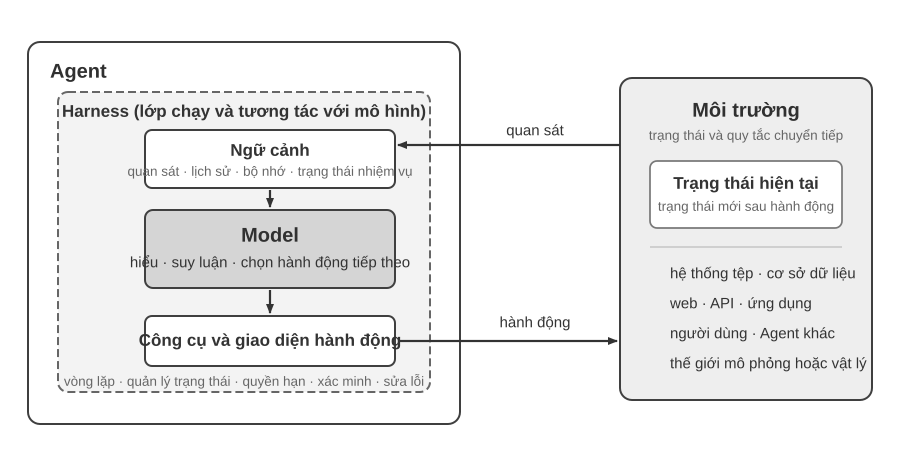
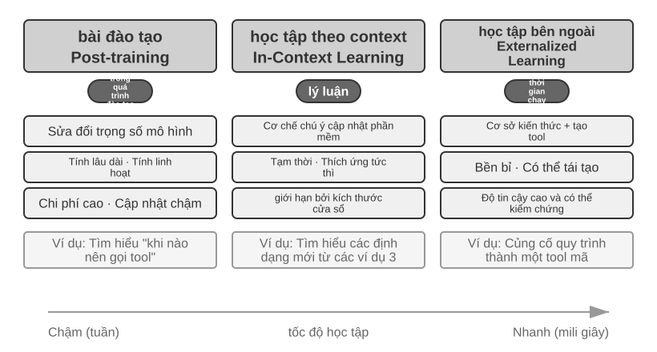
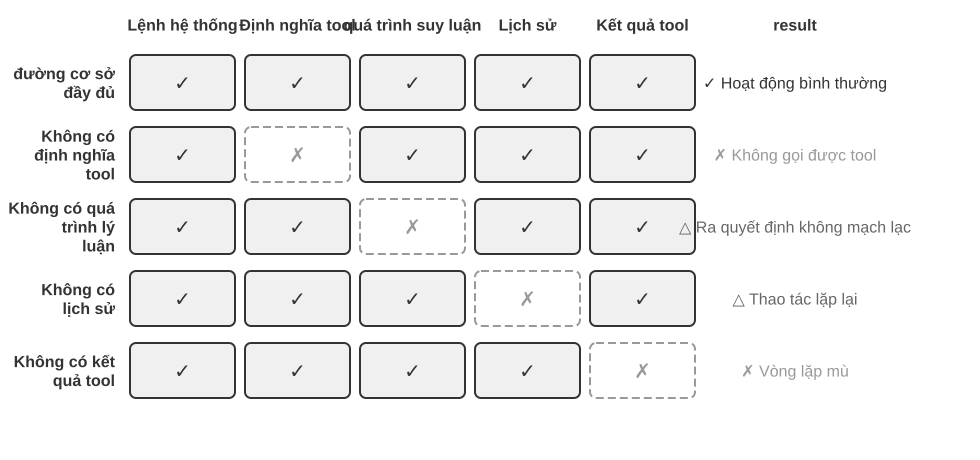
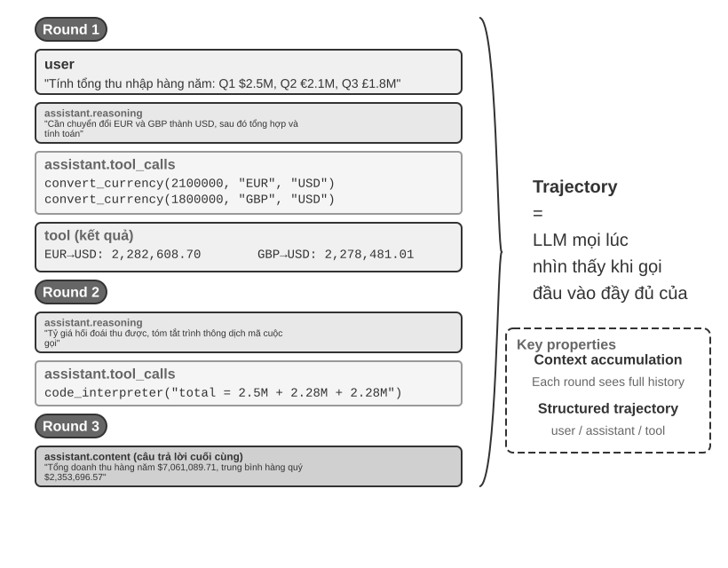
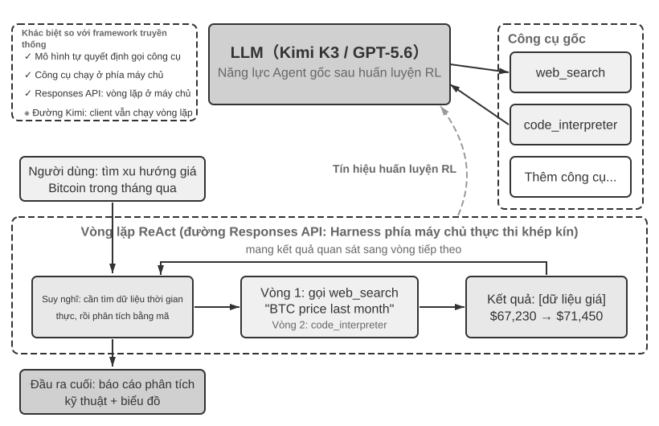
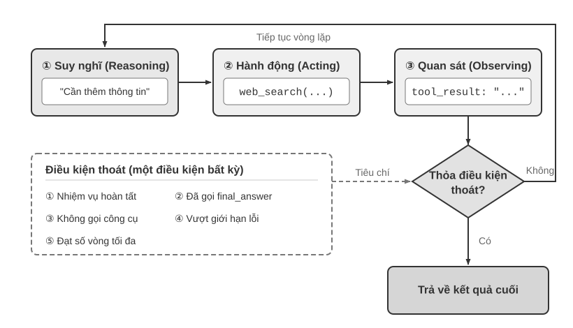

# AI Agent Bắt đầu

Nếu bạn đã sử dụng Cursor để viết mã, hãy xem nó tìm kiếm cơ sở mã, chỉnh sửa nhiều tệp và chạy thử nghiệm cho đến khi đạt yêu cầu; đã sử dụng Nghiên cứu sâu để điều tra một chủ đề, xem chủ đề đó tìm kiếm và đọc đi đọc lại cũng như tóm tắt một báo cáo hoàn chỉnh; sử dụng Manus để điều khiển trình duyệt giúp bạn hoàn thành các tác vụ trực tuyến; hãy để Trợ lý di động Doubao giúp bạn đặt vé và gửi tin nhắn trên điện thoại di động của bạn; hoặc để Pine AI gọi cho tổng đài để bạn thương lượng hóa đơn thấp hơn - bạn đang sử dụng AI Agent.

Các sản phẩm này có nhiều dạng khác nhau nhưng có một điểm chung: chúng không còn là một cuộc trò chuyện thụ động trong đó "bạn đặt câu hỏi và nó trả lời một câu hỏi", mà là các hệ thống thông minh có thể lập kế hoạch các bước thực hiện một cách độc lập, gọi các công cụ khác nhau để hoàn thành nhiệm vụ và liên tục điều chỉnh chiến lược dựa trên kết quả. AI Agent đang trở thành một cách mới để chúng ta tương tác với máy tính.

Chương này sẽ giúp bạn hiểu các thành phần cốt lõi của AI Agent từ góc độ thực tế. Chúng ta sẽ trực tiếp trải nghiệm các khả năng của Agent hiện đại, hiểu các nguyên tắc kiến trúc đằng sau nó, đồng thời nắm vững các mẫu thiết kế cũng như các phương pháp hay nhất để xây dựng hệ thống Agent.

> **Mẹo đọc**: Chương này là bản đồ khái niệm của toàn bộ cuốn sách - nó sẽ nhanh chóng giới thiệu các công thức cốt lõi, chu trình chạy, khung kỹ thuật và mẫu thiết kế của Agent, cung cấp thuật ngữ thống nhất và tọa độ tham chiếu cho các chương tiếp theo. Không cần thiết phải ghi nhớ từng khái niệm một khi đọc lần đầu. Nên thiết lập ấn tượng tổng thể trước tiên. Mỗi chương tiếp theo sẽ mở rộng về một khía cạnh được đề cập trong chương này và bạn có thể quay lại chương đó bất kỳ lúc nào.

## Agent hiện đại = LLM + context + tools

Bản chất của hệ thống Agent hiện đại có thể được thể hiện bằng một công thức ngắn gọn: **Agent = LLM (Large Language Model) + Context + Tools**. Công thức này ngắn gọn và thiết thực, nhưng mỗi từ trong đó cần được hiểu theo nghĩa rộng:

- **LLM là bộ não của Agent**: Nó không chỉ là một tập hợp các tham số mô hình, mà là toàn bộ cốt lõi ra quyết định của Agent - hiểu ý định, suy nghĩ và lập kế hoạch cũng như đưa ra phán đoán. Cũng giống như bộ não con người không chỉ là tập hợp các tế bào thần kinh mà còn bao gồm cách suy nghĩ được hình thành bởi kinh nghiệm. Khả năng của LLM cũng đến từ hai phần: kiến thức thế giới và khả năng ngôn ngữ được tích lũy trong **tiền đào tạo** và chiến lược ra quyết định được củng cố trong **post-training** - công nghệ cụ thể của phần sau (như tinh chỉnh có giám sát và học tăng cường) sẽ được ra mắt trong Chương 8.
- **Ngữ cảnh là con mắt của Agent**: Nó không chỉ là văn bản đầu vào cho mô hình mà còn là tất cả thông tin Agent có thể nhìn thấy tại mỗi điểm quyết định - thông tin môi trường, bộ nhớ người dùng, kiến thức miền, trạng thái riêng và tiến độ nhiệm vụ. Giống như con người cần nhìn rõ tình hình hiện tại, nhớ lại những trải nghiệm liên quan và duyệt tài liệu tham khảo khi đưa ra quyết định, cửa sổ ngữ cảnh của Agent là tất cả những gì nó có thể nhìn thấy vào lúc này.
- **Công cụ là bàn tay và bàn chân của Agent**: Nó không chỉ là một vài chức năng API có thể gọi được mà là tập hợp tất cả mọi thứ mà Agent có thể thực hiện - từ lệnh gọi công cụ được xác định trước đến các kỹ năng chuyên nghiệp (Kỹ năng) được tải theo yêu cầu, từ việc tạo mã động để tạo các khả năng mới cho đến cộng tác Agent phụ được ủy quyền, từ việc tích cực giao tiếp với người dùng đến phản hồi các sự kiện bên ngoài.

Nói một cách trực quan hơn: **Agent = não + mắt + tay chân**. Bộ não chịu trách nhiệm suy nghĩ và ra quyết định, đôi mắt cung cấp tất cả thông tin cần thiết cho việc suy nghĩ, còn tay chân biến các quyết định thành những thay đổi trong thế giới thực.

Theo góc nhìn cổ điển của học tăng cường và lý thuyết điều khiển, Agent và Môi trường là hai phía của một tương tác vòng kín, không phải là thành phần của nhau. Môi trường trả về một quan sát, Agent dùng ngữ cảnh để chọn hành động tiếp theo, và hành động đó làm thay đổi trạng thái Môi trường, tạo ra quan sát kế tiếp.



Hình 1-1 cho thấy hai cấp độ trừu tượng. Cấp độ bên ngoài là **tương tác giữa Agent và Môi trường**: Môi trường bao gồm hệ thống tệp, cơ sở dữ liệu, trang web, người dùng, Agent khác và thế giới vật lý hoặc mô phỏng. Cấp độ bên trong là **cấu trúc Model–Harness bên trong Agent**: Model đưa ra quyết định chính sách; Harness là lớp chạy và quản trị trong ranh giới Agent, chịu trách nhiệm xây dựng ngữ cảnh, cung cấp giao diện công cụ, duy trì vòng lặp và trạng thái, đồng thời áp dụng quyền hạn, xác minh và sửa lỗi. Harness có thể tạo, cô lập hoặc làm trung gian cho một môi trường nhưng không chứa trạng thái và quy tắc chuyển tiếp của Môi trường.

Công thức kỹ thuật có thể được triển khai như sau: LLM tương ứng với Model, Context + Tools tạo thành Harness tối thiểu; hệ thống sản xuất bổ sung ràng buộc, xác minh và sửa lỗi bên trong ranh giới đó. Phần còn lại của chương này tuân theo ranh giới này.

Ba thành phần này liên quan đến ba khái niệm cốt lõi trong RL (học tăng cường; xem Chương 8), nhưng không tương đương một-một nghiêm ngặt: context là biểu diễn bên trong Agent của các quan sát và lịch sử, còn tools định nghĩa giao diện quan sát/hành động; các đối tượng phía sau chúng vẫn thuộc về Môi trường.

| Hiểu biết trực quan | Thành phần triển khai | Khái niệm học thuật | Ý nghĩa |
|---------|---------|---------|------|
|**Bộ não**| LLM |**Policy**(Chính sách) | Logic ra quyết định "làm gì tiếp theo" của Agent - đối mặt với thông tin hiện đang nhìn thấy, chọn hành động phù hợp nhất trong số tất cả các hành động có sẵn |
|**Mắt**| Xây dựng ngữ cảnh |**Quan sát và lịch sử** | Tổ chức các quan sát từ Môi trường và lịch sử hiện có thành thông tin cần thiết cho quyết định hiện tại |
|**Tay và chân**| Giao diện công cụ |**Giao diện quan sát/hành động** | Xác định Agent có thể đọc quan sát nào, gửi hành động nào và định dạng của giao diện |

### Không gian quan sát và không gian hành động: Giao diện giữa mô hình và thế giới

**Không gian quan sát và không gian hành động cùng tạo thành giao diện giữa LLM và môi trường bên ngoài**. Không gian quan sát chuyển thông tin trong môi trường thành ngữ cảnh mà mô hình có thể xử lý; không gian hành động chuyển quyết định của mô hình thành thao tác lên thế giới bên ngoài. Thông tin không đi vào không gian quan sát gần như không tồn tại đối với mô hình. Một thao tác không nằm trong không gian hành động vẫn chỉ là điều mô hình có thể đề xuất bằng lời, ngay cả khi nó biết chính xác cần làm gì.

Vì vậy, **khi giữ nguyên mô hình nền tảng, đòn bẩy kỹ thuật hệ thống chủ yếu để cải thiện hiệu suất Agent thường là định nghĩa lại hoặc mở rộng không gian quan sát và hành động**. Theo thuật ngữ của cuốn sách này, đó là mở rộng ngữ cảnh và công cụ. Nhiều vấn đề tưởng như cần một “mô hình thông minh hơn” thực chất là vấn đề giao diện: đưa dữ liệu liên quan đến nhiệm vụ vào ngữ cảnh hoặc cung cấp thao tác cần thiết dưới dạng công cụ, và một nhiệm vụ trước đây không thể giải có thể trở nên giải được.

**Manus: hợp nhất những không gian vốn tách biệt.** Trước khi Manus xuất hiện, Agent trong môi trường sản xuất chủ yếu phát triển theo ba hướng riêng: Deep Research, Coding và Computer Use. Manus là Agent sản xuất có ảnh hưởng rộng đầu tiên kết hợp cả ba trong một hệ thống. Trình duyệt ảo mở rộng không gian quan sát; hệ thống tệp, thực thi mã và dòng lệnh mở rộng không gian hành động. Manus không trở thành Agent đa dụng chỉ bằng cách thay một mô hình mạnh hơn. Nó lấy hợp của không gian quan sát và hành động từ ba loại Agent, cho phép một Agent duy nhất vượt qua ranh giới sản phẩm trước đó.

**OpenClaw: mở rộng giao diện vào đời sống số của người dùng.** OpenClaw tiếp tục đẩy cả hai không gian ra xa hơn. Nó nhận nhiệm vụ và trả kết quả qua các kênh nhắn tin mà người dùng vốn đã sử dụng—WhatsApp, Telegram, Slack, Discord, iMessage và nhiều kênh khác—nên có thể truy cập Agent từ gần như bất kỳ đâu. Gateway cục bộ kết nối với những ứng dụng đám mây như Google Drive và Notion cũng như hệ thống tệp cục bộ. Vì vậy, với sự cho phép rõ ràng của người dùng, các tệp số phân tán giữa nhiều tài khoản và thiết bị có thể đi vào không gian quan sát của một Agent và được công cụ của nó xử lý. So với hình thái Manus ban đầu tập trung vào sandbox đám mây cô lập, nơi thường phải tải tệp lên hoặc cấu hình riêng một connector, OpenClaw ưu tiên cục bộ vượt qua ranh giới dữ liệu rộng hơn. Về sau Manus cũng bổ sung connector Google Drive và quyền truy cập tệp cục bộ từ máy tính để bàn—điều này càng củng cố luận điểm rằng sự tiến hóa của sản phẩm thường chính là sự mở rộng không gian quan sát và hành động[^ch1-agent-products].

[^ch1-agent-products]: Tài liệu chính thức của Manus mô tả Sandbox ban đầu là một máy ảo đám mây cô lập. Khi giới thiệu Google Drive Connector, Manus nói rõ rằng quy trình trước đó bị phân mảnh vì người dùng phải tải xuống và tải lên tệp thủ công giữa Drive, máy tính để bàn và Manus. Khi ra mắt My Computer vào tháng 3 năm 2026, Manus gọi việc những công việc quan trọng nằm ở máy cục bộ chứ không ở đám mây là giới hạn căn bản của sandbox đám mây. README chính thức của OpenClaw mô tả đây là trợ lý cá nhân luôn hoạt động, ưu tiên cục bộ và chạy trên thiết bị của người dùng, đồng thời liệt kê hơn hai mươi kênh nhắn tin; hệ thống công cụ và plugin có thể bổ sung tích hợp đám mây và năng lực cục bộ. Xem https://manus.im/blog/manus-sandbox, https://manus.im/blog/manus-google-drive-connector, https://manus.im/blog/manus-my-computer-desktop, https://github.com/openclaw/openclaw và https://docs.openclaw.ai/tools

Hiểu được vai trò của ba yếu tố này và mối quan hệ qua lại của chúng là cơ sở để xây dựng một hệ thống Agent hiệu quả. Chúng tôi bắt đầu với bàn tay và bàn chân (công cụ) cụ thể nhất và dần dần đi sâu hơn vào não (LLM) và mắt (ngữ cảnh). Trước tiên, chúng ta hãy xem các loại Agent khác nhau diễn ra như thế nào trong ba chiều này:

| Sản phẩm Agent | Mắt (nhận thức) | Tay chân (hành động) | Policy |
|---------|------|---------|------|
|**Cursor và các Coding Agent khác**| Tài liệu yêu cầu, cơ sở mã, môi trường đầu cuối | Mở (tư duy nội bộ, tìm kiếm mã, đọc và ghi tệp, thực thi lệnh, v.v.) | Phát triển tăng dần: hiểu yêu cầu → tìm kiếm mã liên quan → chỉnh sửa mã → kiểm tra và xác minh → gỡ lỗi và sửa chữa |
|**Nghiên cứu sâu và các Agent tìm kiếm khác**| Tài nguyên Internet, cơ sở dữ liệu học thuật, tập tin cục bộ | Mở (tư duy nội bộ, truy vấn tìm kiếm, đọc trang web, tạo bản tóm tắt) | Lặp đi lặp lại sâu hơn: điều chỉnh hướng tìm kiếm dựa trên thông tin hiện có và dần dần tổng hợp một báo cáo hoàn chỉnh |
|**Browser Use và các Agent điều khiển máy tính khác**| Màn hình máy tính, trang trình duyệt, hệ thống tập tin | Mở (suy nghĩ nội bộ, nhấp chuột, gõ, cuộn, chụp ảnh màn hình, thực thi mã, v.v.) | Nhận thức trực quan + thao tác: quan sát màn hình → xác định các yếu tố mục tiêu → thực hiện thao tác → xác minh kết quả |
|**Các Agent điện thoại như Trợ lý di động Doubao**| Màn hình điện thoại di động, cài đặt App | Mở (suy nghĩ nội tâm, nhấp chuột, trượt, nhập liệu, mở Ứng dụng, v.v.) | Hiểu ý định + Kiểm soát ứng dụng: hiểu nhu cầu của người dùng → xác định vị trí Ứng dụng mục tiêu → thực hiện thao tác → xác nhận hoàn thành |
|**Pine AI và các Agent dịch vụ cá nhân khác**| Thông tin tài khoản người dùng, lịch sử hóa đơn, cơ sở kiến thức nhà cung cấp dịch vụ | Cởi mở (suy nghĩ nội tâm, gọi điện, gửi email, điền biểu mẫu, xác nhận với người dùng) | Thực hiện nhiệm vụ nhiều bước: thu thập thông tin → xây dựng chiến lược đàm phán → liên hệ với nhà cung cấp dịch vụ → đàm phán → báo cáo kết quả |

Các hệ thống Agent này có một số đặc điểm chung: tất cả đều sử dụng không gian hành động mở - thay vì chọn từ một số nút giới hạn, chúng có thể tạo ra ngôn ngữ và mã tự nhiên tùy ý; tất cả họ đều có thể suy nghĩ nội tâm - suy nghĩ và lập kế hoạch trước khi hành động; tất cả chúng đều có thể tương tác liên tục - liên tục điều chỉnh các chiến lược dựa trên phản hồi của môi trường. Những khả năng này đến từ sức mạnh tổng hợp của não, mắt, tay và chân—LLM, ngữ cảnh và công cụ.

### Công cụ: Tay chân Agent

Công cụ là cầu nối giữa Agent và thế giới bên ngoài, giống như bàn tay và bàn chân của con người, cho phép Agent thay đổi từ người quan sát thụ động sang người thực thi tích cực. Không có công cụ, Agent chỉ có thể “nói trên giấy”; với các công cụ, nó thực sự có thể thay đổi thế giới.

Để thảo luận về các công cụ một cách có hệ thống, các công cụ có thể được chia thành năm loại theo hướng Agent tương tác với thế giới bên ngoài. Chúng ta hãy nhanh chóng điểm qua các cảnh tiêu biểu của từng danh mục để tạo ấn tượng tổng thể và các chương tiếp theo sẽ lần lượt diễn ra.

**Các công cụ nhận biết** cho phép Agent truy cập thông tin: công cụ tìm kiếm cung cấp dữ liệu mạng thời gian thực, hệ thống tệp đọc tài liệu cục bộ và API cũng như cơ sở dữ liệu kết nối với các dịch vụ bên ngoài và dữ liệu cốt lõi của doanh nghiệp.

**Công cụ thực thi** cho phép Agent thay đổi thế giới: thực thi mã, thao tác tệp, lệnh hệ thống, lệnh gọi API bên ngoài - các quyết định trở thành hành động thực tế.

**Các công cụ cộng tác** cho phép Agent hoạt động với Agent khác: ủy quyền cho Agent phụ hoàn thành các nhiệm vụ đặc biệt, yêu cầu xác nhận của con người tại các điểm quyết định quan trọng hoặc điều phối hành động trong nhiều hệ thống Agent.

**Các công cụ kích hoạt sự kiện** về cơ bản khác với ba loại đầu tiên theo cách gọi - chúng không được Agent chủ động gọi nhưng được sử dụng làm đầu vào bên ngoài để thúc đẩy Agent bắt đầu thực thi các tác vụ. Ví dụ: khi nhận được email mới, đạt đến một thời điểm xác định trước hoặc hệ thống khác gửi lệnh gọi lại Webhook, những sự kiện này sẽ kích hoạt Agent, cho phép nó bắt đầu suy nghĩ và hành động tiếp theo. Mặc dù việc kích hoạt sự kiện không được Agent chủ động gọi nhưng nó là một trong những kênh để Agent tương tác với thế giới bên ngoài nên được phân loại thành một hệ thống công cụ rộng.

**Công cụ giao tiếp người dùng** là kênh để Agent chủ động thiết lập kết nối với người dùng và truyền tải thông tin. Không giống như các công cụ thực thi làm thay đổi thế giới bên ngoài, các công cụ giao tiếp với người dùng tập trung vào việc truyền tải và tương tác thông tin - truyền tải tiến trình thực thi của Agent hoặc sự quan tâm chủ động đến người dùng thông qua tin nhắn văn bản, cuộc gọi thoại, email, v.v.

Hệ thống phân loại hoàn chỉnh và nguyên tắc thiết kế của năm loại công cụ trên sẽ được thảo luận trong Chương 4. Chất lượng thiết kế công cụ trực tiếp quyết định Agent có thể đi được bao xa - nếu giao diện không được xác định rõ ràng, mô hình sẽ sử dụng các công cụ một cách bừa bãi; nếu không xử lý lỗi, một khi công cụ bị lỗi, Agent sẽ bị bế tắc; nếu kiểm soát quyền quá rộng, một khi Agent mắc lỗi, hậu quả sẽ khó khắc phục. Việc phổ biến tiêu chuẩn MCP (Model Context Protocol) đang giúp việc tích hợp công cụ trở nên dễ dàng hơn.

**Gọi công cụ** (Tool Calling, còn được gọi là Function Calling) là khả năng cốt lõi của LLM Agent hiện đại, cho phép mô hình gọi các công cụ bên ngoài theo cách có cấu trúc. Khả năng này biến LLM từ một trình tạo văn bản thuần túy thành một hệ thống thông minh có khả năng thực hiện các hoạt động trong thế giới thực. Thuật ngữ "gọi công cụ" sẽ được sử dụng xuyên suốt cuốn sách này.

Quá trình gọi công cụ được chia thành bốn bước: đầu tiên, cho mô hình biết trong ngữ cảnh những công cụ nào có sẵn (bao gồm tên, cách sử dụng và tham số); sau đó, mô hình sẽ xác định một cách độc lập xem có nên gọi công cụ hay không, gọi công cụ nào và truyền tham số nào; sau đó, sau khi công cụ được thực thi, kết quả sẽ được thêm vào ngữ cảnh; cuối cùng, mô hình sẽ quyết định hành động tiếp theo cho phù hợp. Chu trình này là cơ sở của ReAct, sẽ được giới thiệu sau.

Lấy kịch bản kiểm tra thời tiết làm ví dụ, cách trình bày đơn giản hóa quy trình bốn bước ở cấp độ API như sau:

```text
Bước 1: Khai báo công cụ Bước 2: Mô hình lời gọi quyết định
tools: [{                          assistant: {
  name: "get_weather",               tool_calls: [{
  parameters: {                        function: "get_weather",
thành phố: đối số "chuỗi": {city: "Bắc Kinh"}
  }                                  }]
}]                                 }

Bước 3: Nối kết quả vào ngữ cảnh Bước 4: Mô hình trả lời dựa trên kết quả
tool: {                            assistant: {
tool_call_id: "call_1", content: "Hôm nay nhiệt độ ở Bắc Kinh là 28°C và nắng."
nội dung: '{"temp":28,"sky:"trời quang"}' }
}
```

Các nhà phát triển chỉ cần xác định công cụ và thực hiện lệnh gọi công cụ, đồng thời mô hình sẽ tự động hoàn thành quyết định "có nên gọi hay không, gọi cái nào và chuyển tham số nào". Chương 2 sẽ mở rộng chi tiết về cấu trúc API này.

Khi thiết kế công cụ cho Agent, có thể bắt đầu bằng năng lực hẹp nhất mà nhiệm vụ yêu cầu, rồi từng bước mở rộng khi độ phức tạp tăng lên. Nếu nhiệm vụ chỉ gồm các phép tính số học cơ bản, một máy tính với tham số rõ ràng là đủ; khi nhiệm vụ mở rộng sang đọc bảng tính, làm sạch giá trị bị thiếu, tính toán thống kê và vẽ biểu đồ, trình thông dịch Python bị giới hạn sẽ dễ kết hợp và khám phá hơn so với việc liên tục bổ sung công cụ chuyên dụng. Tuy nhiên, tính đa dụng cũng làm tăng rủi ro lỗi và bề mặt tấn công: mã phải chạy trong hộp cát cách ly, mặc định không được truy cập mạng hoặc đọc tệp ngoài thư mục làm việc được cấp quyền, đồng thời phải giới hạn thời gian thực thi, CPU, bộ nhớ và kích thước đầu ra.

Tương tự, một công cụ ghi nhật ký duy nhất phù hợp để ghi lại một quá trình thực thi; với các nhiệm vụ dài hạn kéo dài nhiều giờ hay thậm chí nhiều ngày, một thư mục làm việc ảo được kiểm soát có thể cùng lúc lưu kế hoạch, kết quả trung gian, nhật ký thực thi và sản phẩm cuối cùng, nhờ đó Agent có thể tiếp tục công việc qua nhiều lần chạy. Thư mục này cũng phải giới hạn các đường dẫn được phép đọc và ghi, dung lượng và loại tệp, đồng thời ngăn việc vượt ra ngoài đường dẫn cho phép, thay vì phơi bày toàn bộ hệ thống tệp của máy chủ cho Agent.

Công cụ đa dụng không phải lúc nào cũng ưu việt hơn công cụ chuyên dụng. Các thao tác có rủi ro cao hoặc chịu ràng buộc nghiệp vụ chặt chẽ—như thanh toán, xóa dữ liệu, gửi email và triển khai lên môi trường sản xuất—vẫn nên được đóng gói thành các công cụ chuyên dụng có tham số rõ ràng, quyền hạn giới hạn và khả năng kiểm toán toàn bộ quá trình; khi cần, có thể bổ sung bước xem trước và xác nhận của con người. Vì vậy, nguyên tắc cốt lõi khi thiết kế công cụ là: **các năng lực nền tảng đa dụng được dùng để kết hợp và khám phá; các công cụ chuyên dụng được dùng để kiểm soát những thao tác rủi ro cao và chịu quy tắc nghiệp vụ chặt chẽ**.

### LLM: Bộ não của Agent

Mô hình ngôn ngữ lớn (LLM) là cốt lõi đưa ra quyết định của Agent. Sau khi nhận được yêu cầu của người dùng, trước tiên nó cần phân tích ý định thực sự (những gì người dùng nói thường không phải là điều họ thực sự muốn), sau đó chia nhiệm vụ mơ hồ hoặc phức tạp thành các bước thực hiện. Trong quá trình thực thi, nó phải tiếp tục đưa ra các phán đoán: phải làm gì tiếp theo, có nên gọi một công cụ hay không, gọi công cụ nào và truyền tham số nào. Khả năng "hiểu-kế hoạch-thực thi" này xuất phát từ kiến thức tích lũy được trong quá trình đào tạo trước và là nền tảng mà cả quy trình làm việc và quyền tự chủ của Agent đều dựa vào.

Một trong những khả năng độc đáo của LLM Agent là **suy nghĩ nội tâm**—Agent có thể lập kế hoạch và suy luận trước khi thực hiện hành động thực tế. Quá trình này không làm thay đổi môi trường bên ngoài nhưng có thể cải thiện đáng kể chất lượng của các hành động tiếp theo. LLM có thể suy luận nội bộ hiệu quả nhờ những năng lực học được trong quá trình tiền huấn luyện (Pre-training, tức huấn luyện ban đầu trên lượng lớn văn bản Internet để mô hình học quy luật ngôn ngữ và tri thức thế giới): mô hình dựa vào các quy tắc logic đã được tích lũy trong tri thức của con người, bao gồm định luật toán học, quan hệ nhân quả và chiến lược phân rã vấn đề. Vì vậy, khác với Agent học tăng cường truyền thống, Agent dựa trên LLM ngày nay không thăm dò ngẫu nhiên một cách mù quáng mà suy luận trên một hệ thống tri thức có cấu trúc.

#### Model là Agent: khi chính model đó trở thành sản phẩm

Mô hình mới của "Mô hình là Agent" thể hiện hướng phát triển AI Agent mới nhất. Các mô hình nâng cao nội hóa khả năng gọi công cụ thành khả năng gốc thông qua post-training (đặc biệt là học tăng cường): khi nào nên gọi công cụ, gọi công cụ nào và chuyển tham số nào đều do chính mô hình quyết định mà không cần điều phối thủ công. Nhưng điều này không có nghĩa là lớp framework trở nên không quan trọng. Ngược lại, mô hình càng mạnh thì Harness được xây dựng xung quanh mô hình càng trở nên quan trọng. Từ Harness ban đầu dùng để chỉ dây nịt, tức là dây cương và dây nịt gắn vào ngựa, không phải để hạn chế khả năng chạy của ngựa mà để dẫn dắt sức mạnh này đi đúng hướng. Trong ngữ cảnh của Agent, mô hình này là con ngựa mạnh mẽ nhưng khó đoán và Harness là lớp vỏ kỹ thuật giúp chuyển các khả năng của nó vào việc thực hiện nhiệm vụ một cách đáng tin cậy. Trong Agent, Harness bao gồm cơ sở hạ tầng như quản lý ngữ cảnh, giao diện công cụ, các ràng buộc bảo mật, xác minh và sửa lỗi (xem phần cuối của chương này để biết chi tiết).

Càng có nhiều không gian để một mô hình đưa ra quyết định tự chủ thì tác động khi nó gặp sự cố càng lớn, do đó cần có các ràng buộc, cơ chế xác minh và sửa chữa phức tạp hơn để đảm bảo độ tin cậy. Ưu điểm thực sự của các nhà sản xuất mô hình không phải là "làm cho khung mỏng hơn", mà là tối ưu hóa mô hình và Harness ngoại vi một cách hợp tác và tiếp tục lặp lại.

Nhưng ở đây còn treo lơ lửng một câu hỏi sâu hơn: nếu mô hình liên tục mạnh lên, liệu những Harness ngày nay cuối cùng có bị mô hình "nuốt chửng"? Trong *The Bitter Lesson* (Bài học cay đắng), Rich Sutton nhìn lại một cảnh tượng lặp đi lặp lại suốt bảy mươi năm nghiên cứu AI[^ch1-1]: các nhà nghiên cứu hết lần này đến lần khác mã hóa hiểu biết của mình về lĩnh vực vào hệ thống, có hiệu quả trong ngắn hạn nhưng về lâu dài luôn thua các phương pháp tổng quát có thể mở rộng liên tục theo quy mô tính toán và dữ liệu — tìm kiếm và học tập. Chiếu theo đó mà xét: trong số các ràng buộc, xác minh và hiệu chỉnh nằm trong Harness, bao nhiêu phần thuộc về "tiên nghiệm của con người" và tất yếu sẽ bị mô hình nội hóa? Lập trường của cuốn sách này là: **đồng thuận về hướng đi, thực dụng về nhịp độ**. Về hướng đi, cuốn sách không nghi ngờ việc mô hình sẽ liên tục nuốt chửng Harness — gọi công cụ, lập kế hoạch dài hạn đều từng phải dựa vào điều phối bên ngoài, nay đã là năng lực gốc của mô hình; nhưng về nhịp độ, quá trình "nuốt" này chậm hơn nhiều so với trực giác: huấn luyện tính bằng tháng, và mô hình cũng không thể một lần nội hóa hết mọi ràng buộc lẫn sở thích trong nghiệp vụ thực tế, ranh giới năng lực của mô hình ngay lúc này chính là giá trị của Harness ngay lúc này. Vì vậy Harness Engineering không phải là sự kháng cự lại Bài học cay đắng, mà là thực hành chính bài học đó trên thang thời gian của kỹ thuật: những gì mô hình còn làm chưa ổn thì Harness đỡ lấy trước; mỗi khi mô hình nội hóa thêm một lớp, Harness lại tháo bỏ một lớp và chuyển sang đỡ cho biên giới năng lực mới.

[^ch1-1]: Sutton, Rich. "The Bitter Lesson", 2019. http://www.incompleteideas.net/IncIdeas/BitterLesson.html

#### Cơ chế học tập của Agent: post-training, In-Context Learning (học trong ngữ cảnh) và học từ bên ngoài

Trước đây chúng ta đã đề cập rằng mô hình có thể nội hóa chiến lược quyết định gọi công cụ thành khả năng gốc thông qua học tăng cường. Nhưng việc học của Agent không chỉ diễn ra ở giai đoạn huấn luyện - một số độc giả cho rằng mô hình phải được huấn luyện khi Agent học hỏi kinh nghiệm. Trên thực tế, post-training không phải là cách duy nhất Agent học hỏi kinh nghiệm. Cơ chế học tập của Agent có thể được tóm tắt thành ba mô hình bổ sung (Hình 1-2):



- **Post-training**: Củng cố kinh nghiệm về các tham số của mô hình thông qua học tăng cường, mang lại tính linh hoạt giữa các tác vụ mạnh nhất nhưng chi phí cập nhật cao (xem Chương 8 để biết chi tiết).
- **In-Context Learning (học trong ngữ cảnh)**: Điều chỉnh nhanh chóng công thức truy xuất mẫu trong ngữ cảnh thông qua cơ chế chú ý (Cơ chế chú ý, tức là cơ chế mà mô hình quyết định "thông tin nào cần chú ý" khi xử lý đầu vào). Ví dụ: nếu bạn hiển thị cho mô hình một số ví dụ về xử lý các cuộc hội thoại dịch vụ khách hàng bằng các từ gợi ý (chẳng hạn như "Khiếu nại của người dùng → Kế hoạch xoa dịu + bồi thường"), mô hình sẽ có thể xử lý các cuộc hội thoại dịch vụ khách hàng mới theo cách tương tự - đây là In-Context Learning (học trong ngữ cảnh). Thích ứng nhanh chóng nhưng chỉ là tạm thời và biến mất vào cuối phiên. Cần lưu ý rằng mặc dù tên là "học tập" nhưng cơ chế bên trong của nó gần với việc khớp mẫu hơn là học thực sự. Ví dụ: nếu bạn được xem ba câu hỏi và câu trả lời toán cùng loại, sau đó được đưa ra câu hỏi thứ tư, rất có thể bạn sẽ làm theo cùng một khuôn mẫu - đây là điều mà việc In-Context Learning (học trong ngữ cảnh) đang thực hiện. Nhưng nếu câu hỏi thứ tư đòi hỏi một cách giải quyết vấn đề mới thì việc chỉ nhìn vào câu trả lời cho ba câu hỏi đầu tiên là chưa đủ. Nói cách khác, In-Context Learning (học trong ngữ cảnh) cho phép mô hình **áp dụng các mẫu mà nó đã thấy**, nhưng nó không thể **khám phá các quy tắc mới** - điều này về cơ bản khác với post-training (Chương 2 sẽ mở rộng chi tiết về lập luận này từ góc độ của cơ chế chú ý).
- **External Learning (học bên ngoài tham số mô hình)**: Ngoại hóa kiến thức và quy trình thành cơ sở kiến thức và mã công cụ thực thi, vừa bền vững vừa có thể hiểu được.

Ba mô hình này bổ sung cho nhau ở các khoảng thời gian khác nhau: post-training cung cấp các năng lực nền tảng, In-Context Learning (học trong ngữ cảnh) cho phép thích ứng nhanh chóng và External Learning (học bên ngoài tham số mô hình) đảm bảo độ tin cậy và hiệu quả. Chương 9 sẽ so sánh một cách có hệ thống các mối quan hệ hiệp lực giữa ba mô hình.

Ví dụ: post-training cũng giống như việc học sách giáo khoa một cách có hệ thống - sau khi học, khả năng được nâng cao vĩnh viễn nhưng chi phí học tập cao; In-Context Learning (học trong ngữ cảnh) cũng giống như tham khảo tài liệu tham khảo ngay tại chỗ - bạn có thể làm điều đó nếu có thông tin và quên nó sau khi đóng lại; External Learning (học bên ngoài tham số mô hình) giống như việc sắp xếp một cuốn sổ cá nhân - thông tin luôn tồn tại và có thể kiểm tra bất cứ lúc nào, nhưng nó cần phải được sắp xếp một cách đặc biệt.

### Ngữ cảnh: Đôi mắt của Agent

Ngữ cảnh là tất cả thông tin mà Agent có thể thấy ở mỗi thời điểm quyết định. Giống như một người cần xem tất cả thông tin trải rộng trên bàn khi đưa ra quyết định - tuyên bố sứ mệnh, hướng dẫn tham khảo, hồ sơ liên lạc trước đó, dữ liệu mới nhất - cửa sổ ngữ cảnh của Agent là "trường quan sát" của nó. Từ góc nhìn của API (xem Chương 2 để biết chi tiết), ngữ cảnh của mỗi lệnh gọi tới LLM bao gồm năm phần sau:

- **System Prompt**(Lời nhắc hệ thống): Khác với các từ nhắc nhở do người dùng nhập mỗi lần, các từ nhắc nhở hệ thống được nhà phát triển viết và không thay đổi trong toàn bộ cuộc trò chuyện. Chúng tương đương với "Mô tả công việc" của Agent - xác định danh tính, quyền hạn và quy tắc ứng xử của nó. Bằng cách thiết kế cẩn thận các từ nhắc nhở của hệ thống thông qua Prompt Engineering, chúng tôi có thể định hình cách Agent hoạt động. Các từ nhắc của hệ thống cũng sẽ bao gồm **bộ nhớ người dùng** được lưu trong các phiên (tùy chọn của người dùng, hành vi lịch sử, cài đặt nền và thông tin được cá nhân hóa khác, xem Chương 3 để biết chi tiết) và trạng thái môi trường được chèn động.
- **Tool Definitions**(Định nghĩa công cụ): khai báo tên, mô tả chức năng và định dạng tham số của các công cụ có sẵn Agent. Nếu không có định nghĩa công cụ, Agent không thể nhận dạng và gọi bất kỳ công cụ nào - thí nghiệm cắt bỏ (Thí nghiệm 1.1) sẽ xác minh điều này. Định nghĩa công cụ và system prompt cùng nhau tạo thành **tiền tố tĩnh** không thay đổi trong cuộc hội thoại (đây là mô hình cơ bản; kể từ năm 2026, trong các framework sản xuất, lược đồ hoàn chỉnh của công cụ cũng có thể được tải động theo yêu cầu vào cuối ngữ cảnh mà không phá vỡ tiền tố - xem chi tiết ở phần định nghĩa công cụ của Chương 2 và Chương 4).
- **User Messages**(Tin nhắn của người dùng): Đầu vào từ người dùng. Thông báo của người dùng cũng có thể chứa **kiến thức bên ngoài** được giới thiệu thông qua RAG (Retrieval-Augmented Generation, xem Chương 3 để biết chi tiết) truy xuất động - thông tin sau mốc cắt dữ liệu huấn luyện hoặc kiến thức miền riêng tư.
- **Assistant Message**(Trả lời của mô hình): Các câu trả lời do mô hình tạo trước đây chứa tối đa ba phần - quá trình suy nghĩ (`reasoning`, tức là chuỗi suy nghĩ nội bộ, duy trì sự mạch lạc trong suy nghĩ và khả năng diễn giải khi ra quyết định), nội dung văn bản (`content`, tức là trả lời người dùng) và yêu cầu gọi công cụ (`tool_calls`, tức là cách Agent thực hiện hành động). Trong một câu trả lời cụ thể, cả ba không nhất thiết phải xuất hiện cùng lúc: ví dụ Agent thường chỉ có `reasoning` + `tool_calls` khi quyết định gọi một công cụ và thường chỉ có `reasoning` + `content` khi đưa ra câu trả lời cuối cùng.
- **Tool Result**(Kết quả công cụ): Kết quả trả về sau khi khung Agent thực thi công cụ. Những kết quả này là cơ sở trực tiếp cho suy nghĩ tiếp theo của Agent, đồng thời cho phép nó học hỏi từ kết quả thực thi và tránh những sai lầm lặp lại.

Hai mục đầu tiên (lời nhắc hệ thống + định nghĩa công cụ) là tiền tố tĩnh và ba mục cuối cùng (thông báo người dùng + trả lời mô hình + kết quả thực thi công cụ) là lịch sử thông báo động tiếp tục phát triển cùng với sự tương tác. Năm phần này cùng nhau tạo thành ngữ cảnh cho mỗi lần suy luận của LLM.

Để xác minh từng thành phần có cần thiết hay không, phương pháp trực tiếp nhất là Ablation Study: Giống như bác sĩ loại bỏ từng nguyên nhân một khi chẩn đoán - đầu tiên loại bỏ thành phần A để xem hệ thống có còn bình thường không, sau đó loại bỏ thành phần B, v.v., để xác định sự đóng góp của từng thành phần. Thí nghiệm 1.1 đã thử nghiệm một cách có hệ thống năm thành phần trên dựa trên ý tưởng này. Kết quả cho thấy: nếu không có định nghĩa công cụ, Agent hoàn toàn không có khả năng hoạt động; khi thiếu kết quả thực thi công cụ, Agent sẽ gọi đi gọi lại cùng một công cụ và rơi vào vòng lặp vô hạn vì không thể nhìn thấy phản hồi từ bước trước; một khi quá trình suy nghĩ trong câu trả lời mô hình bị loại bỏ, các quyết định trước và sau bắt đầu mâu thuẫn với nhau; đối với tin tức lịch sử, nếu không có nó, Agent tương đương với chứng mất trí nhớ, vì vậy toàn bộ quá trình nhiệm vụ bắt đầu lại từ đầu và các bước hoàn thành sẽ được lặp lại.

> **Thí nghiệm 1.1 ★★: Vai trò quan trọng của ngữ cảnh**
>
> Thông qua Nghiên cứu cắt bỏ có hệ thống, chúng tôi đã khám phá tác động của các thành phần theo ngữ cảnh khác nhau đối với hoạt động của Agent. Thí nghiệm đã chọn bốn thành phần từ năm phần trên để thử nghiệm - các từ nhắc nhở của hệ thống, là định nghĩa nhận dạng cơ bản của Agent, không tham gia vào quá trình cắt bỏ, bởi vì nếu không có các từ nhắc nhở của hệ thống, Agent thậm chí không có nhận thức vai trò cơ bản và thử nghiệm là vô nghĩa. Như được hiển thị trong Hình 1-3, năm nhóm thử nghiệm kiểm soát bao gồm: một nhóm giữ lại đường cơ sở hoàn chỉnh của tất cả các thành phần, cộng với bốn nhóm, mỗi nhóm thiếu một thành phần để quan sát tác động của từng thành phần đến hiệu suất của Agent.
>
> 
>
> Kết quả thực nghiệm cho thấy vai trò không thể thay thế của từng thành phần ngữ cảnh. **Định nghĩa công cụ** (một phần của tiền tố tĩnh) là cơ sở cho khả năng hành động của Agent. Nếu không có nó, Agent không thể nhận dạng và gọi bất kỳ công cụ nào. **Kết quả công cụ** là chìa khóa để điều khiển vòng kín. Thiếu nó sẽ khiến Agent bị thực thi một cách "mù quáng" và rơi vào vòng lặp vô hạn. **Quy trình tư duy**(phần lý luận trong phản hồi mô hình) giữ nguyên lý do Agent đưa ra các quyết định trước đó, giúp quá trình tư duy mạch lạc hơn và tránh các quyết định thiếu nhất quán. **Thông báo lịch sử**(thông báo của người dùng, phản hồi mô hình và kết quả thực thi công cụ của các vòng trước) ngăn chặn các hoạt động dư thừa, duy trì tính liên tục của quá trình thực thi tác vụ và tránh lặp lại các lỗi tương tự.
>
> Thông tin chi tiết cốt lõi từ thử nghiệm này là ngữ cảnh xác định những gì Agent có thể nhìn thấy và Agent chỉ có thể đưa ra quyết định dựa trên thông tin mà nó nhìn thấy. Giống như một người không thể đưa ra phán đoán hợp lý khi bị bịt mắt, nếu không có bất kỳ thành phần ngữ cảnh nào, khả năng ra quyết định của Agent sẽ bị suy giảm nghiêm trọng - nếu không xem được định nghĩa công cụ, bạn sẽ không biết có những công cụ nào và nếu không xem được kết quả thực hiện trước đó, bạn sẽ không biết những gì đã được thực hiện.

### Vòng lặp ReAct

Sau khi hiểu ba thành phần chính của Agent, một câu hỏi tự nhiên là: chúng hoạt động cùng nhau như thế nào? Vòng lặp ReAct là cơ chế cốt lõi kết nối LLM, ngữ cảnh và công cụ - hãy xem Agent suy nghĩ và hành động từng bước như thế nào.

Chế độ cốt lõi của tác vụ thực thi Agent được gọi là **ReAct**(Lý luận + Hành động). Mặc dù tên chỉ phản ánh hai từ "Lý luận" và "Hành động", chu trình thực tế chứa ba liên kết: đầu tiên mô hình **suy nghĩ** những gì nên làm hiện tại, sau đó gọi công cụ **hành động**, sau đó **quan sát** kết quả do công cụ trả về và tiếp tục suy nghĩ về bước tiếp theo. Chu kỳ "suy nghĩ → làm → nhìn → suy nghĩ → làm → nhìn thấy" này được lặp lại cho đến khi nhiệm vụ được hoàn thành.

Hãy cùng tìm hiểu trajectory của Agent thông qua một ví dụ cụ thể về tổng hợp doanh thu bằng nhiều loại tiền tệ. Trajectory là lịch sử thông báo mà Agent liên tục tích lũy trong quá trình thực hiện các tác vụ - thông báo của người dùng, phản hồi của mô hình (bao gồm quá trình tư duy và lệnh gọi công cụ) và kết quả thực thi công cụ. Mỗi lần LLM được gọi, ngữ cảnh hoàn chỉnh mà nó nhận được bao gồm hai phần: **tiền tố tĩnh**(system prompt + định nghĩa công cụ) và **trajectory**(lịch sử tin nhắn động) (Hình 1-4). Điều này tiết lộ một sự thật quan trọng: **ngữ cảnh của Agent = tiền tố tĩnh + trajectory**. Cụ thể, tiền tố tĩnh tương ứng với hai thành phần đầu tiên trong số năm thành phần được đề cập ở trên (system prompt + định nghĩa công cụ) và trajectory tương ứng với ba thành phần cuối cùng (thông báo người dùng + trả lời mô hình + kết quả thực thi công cụ, tiếp tục phát triển cùng với sự tương tác). Dựa trên ngữ cảnh hoàn chỉnh này, LLM tạo ra phản hồi tiếp theo, sau đó được thêm vào trajectory cho cuộc gọi tiếp theo.



Bản phác thảo theo phong cách Python dưới đây là pseudocode mang tính giải thích, không phải mã SDK có thể chạy; marker `python` chỉ dùng để tô sáng cú pháp.

**Vòng lặp điều khiển ReAct:**

```python
trajectory = [user_request]

repeat:
    context = stable_prefix + trajectory
    decision = Model(context)
    trajectory.append(decision)

    if decision has no tool call:
        return decision.answer

    for call in decision.tool_calls:       # independent calls may run in parallel
        validated_call = Harness.validate(call)
        observation = Environment.execute(validated_call)
        trajectory.append(observation)
```

Hãy cùng chúng tôi tìm hiểu cấu trúc trajectory Agent thông qua mã giả:

```text
trajectory = [
{role: "user" , content: "Dựa trên doanh thu hàng quý của công ty: Quý 1 2,5 triệu đô la Mỹ, quý 2 2,1 triệu euro, quý 3 1,8 triệu bảng Anh, quý 4 380 triệu yên, tính tổng doanh thu hàng năm và doanh thu trung bình hàng quý của công ty" },

# Lần lặp đầu tiên - LLM nhìn thấy trajectory trên và tạo ra phản hồi
  {role: "assistant" ,
lý do: "Cần chuyển đổi tất cả các loại tiền tệ sang USD..." ,
nội dung: "" , # Không trả lời trực tiếp cho người dùng
   tool_calls: [
     {name: "convert_currency" , args: {amount: 2100000, from: "EUR" , to: "USD" }},
     {name: "convert_currency" , args: {amount: 1800000, from: "GBP" , to: "USD" }},
     {name: "convert_currency" , args: {amount: 380000000, from: "JPY" , to: "USD" }}
   ]},

# Công cụ thực thi khung tác nhân, thêm kết quả vào trajectory
  {role: "tool" , content: "EUR->USD: 2282608.7" },
  {role: "tool" , content: "GBP->USD: 2278481.01" },
  {role: "tool" , content: "JPY->USD: 2541806.02" },

# Lần lặp thứ hai - LLM nhìn thấy toàn bộ trajectory, bao gồm cả kết quả công cụ
  {role: "assistant" ,
lý do: "Kết quả quy đổi đã có và bây giờ cần tổng hợp, tính toán..." ,
   content: "" ,
   tool_calls: [
     {name: "code_interpreter" , args: {code: "total = 2500000 + 2282608.7 + ..." }}
   ]},

  {role: "tool" , content: "Total: $9,602,895.73, Average: $2,400,723.93..." },

# Lần lặp thứ ba - LLM nhìn thấy trajectory hoàn chỉnh và đưa ra câu trả lời cuối cùng
  {role: "assistant" ,
lý do: "Mọi tính toán đã hoàn tất, tổng hợp kết quả..." ,
nội dung: "CÂU TRẢ LỜI CUỐI CÙNG: Tổng thu nhập $9.602.895,73…" }
]
```

Lưu ý rằng các system prompt và định nghĩa công cụ không được hiển thị trong trajectory - chúng được sử dụng làm tiền tố tĩnh và sẽ tự động được ghép trước trajectory mỗi khi LLM được gọi.

Trong các thí nghiệm của chúng tôi, chu trình này được thể hiện rõ ràng. Ở vòng đầu tiên, Agent gọi song song ba công cụ chuyển đổi tiền tệ sau khi phân tích nhiệm vụ; ở vòng thứ hai, nó gọi trình thông dịch mã để thực hiện các phép tính phức tạp dựa trên kết quả chuyển đổi; ở vòng thứ ba, nó xác nhận rằng tất cả các phép tính đã hoàn thành và đưa ra câu trả lời cuối cùng. Toàn bộ quá trình chỉ mất 3 lần lặp lại và 4 lần gọi công cụ để hoàn thành nhiệm vụ phức tạp gồm nhiều bước.

Trong thiết kế cơ bản nhất này, ngữ cảnh mà LLM nhìn thấy liên tục được nối thêm thông tin mới. Mỗi cuộc gọi LLM có thể thấy trajectory hoàn chỉnh, cho phép nó hiểu được nhiệm vụ hiện đang ở giai đoạn nào, những gì đã thử trước đó và kết quả thu được là gì. Cũng giống như con người liên tục xem xét và tóm tắt khi giải quyết vấn đề, Agent duy trì sự hiểu biết toàn diện về toàn bộ nhiệm vụ thông qua các trajectory. Đồng thời, bản chất có cấu trúc của trajectory cũng làm cho hệ thống có khả năng diễn giải và sửa lỗi cao: thông báo của người dùng, phản hồi của mô hình (quy trình tư duy + gọi công cụ) và kết quả thực thi công cụ đều được phân biệt rõ ràng.

Trajectory không chỉ là bản ghi thực hiện mà còn phản ánh khả năng của Agent. Bằng cách phân tích một số lượng lớn trajectory, chúng tôi có thể khám phá kiểu hành vi của Agent, tối ưu hóa đường dẫn quyết định và cải thiện thiết kế công cụ. Dữ liệu trajectory thậm chí có thể được tóm tắt thành cơ sở kiến thức hoặc mô hình Agent tốt hơn có thể được đào tạo thông qua học tăng cường để đạt được tối ưu hóa vòng kín học hỏi từ kinh nghiệm.


Sau khi hiểu được vòng lặp đang chạy của Agent, chúng ta hãy sử dụng hai thử nghiệm để cảm nhận xem các mô hình khác nhau điều khiển vòng lặp này như thế nào.

> **Thử nghiệm 1-2 ★: Khả năng Agent gốc của Kimi K3**
>
> Thử nghiệm này thể hiện khả năng Agent vốn có của **Kimi K3** và thể hiện mô hình mới của "mô hình là Agent". Kimi K3 là mô hình Mixture of Experts (MoE) với khoảng 2,8 nghìn tỷ thông số - bạn có thể coi MoE như một nhóm chuyên gia: đối mặt với nhiều loại câu hỏi khác nhau, hệ thống sẽ tự động chọn ra các chuyên gia phù hợp nhất để trả lời mà không cần tất cả các chuyên gia đều có mặt tại hiện trường cùng lúc, điều này không chỉ đảm bảo năng lực mà còn nâng cao hiệu quả. Nó có cửa sổ ngữ cảnh gồm 1 triệu mã thông báo, khả năng hiểu trực quan gốc và "chế độ suy nghĩ" luôn bật; thông qua đào tạo học tăng cường, mô hình này nội hóa **chiến lược quyết định** gọi công cụ thành khả năng gốc — khi nào gọi công cụ, gọi công cụ nào, truyền tham số gì đều do mô hình tự quyết định — nhờ đó có thể tự chủ hoàn thành các tác vụ như tìm kiếm trên web. Cần nói rõ rằng thứ được nội hóa là quyết định "khi nào gọi, gọi như thế nào", còn bản thân các công cụ như `web_search`, `code_runner` vẫn được thực thi ở phía máy chủ dưới dạng công cụ tích hợp sẵn ở cấp API (Kimi chạy các công cụ chính thức này thông qua một engine kịch bản phía máy chủ có tên Formula).
>
> Các quan sát chính bao gồm: mô hình tự quyết định khi nào cần tìm kiếm và tìm kiếm cái gì, thể hiện quyền tự chủ thực sự; nó có thể linh hoạt điều chỉnh các chiến lược dựa trên kết quả tìm kiếm và xác định độc lập xem thông tin có đầy đủ hay không. Ở đây cần làm rõ một ngộ nhận phổ biến, mấu chốt là phân định rõ hai việc thuộc về ai. **Thứ mà học tăng cường trao cho mô hình là năng lực ra quyết định** — khi nào nên gọi công cụ, gọi công cụ nào, truyền tham số gì, sau khi thấy kết quả có tiếp tục hay không, và làm sao xâu chuỗi hàng chục, hàng trăm lệnh gọi thành một mạch suy luận nhất quán; chính những phán đoán "dùng hay không, dùng như thế nào" này được ghi vào tham số của mô hình. **Còn bản thân công cụ và việc thực thi chúng thì do framework Agent (hoặc công cụ tích hợp sẵn của API) cung cấp** — phần hiện thực thật sự của `web_search`, `code_runner`, môi trường sandbox chạy mã, việc phát lệnh gọi và trả kết quả về, tất cả đều diễn ra trong hạ tầng nằm ngoài mô hình. RL tối ưu hóa chiến lược quyết định, chứ không "nhét" công cụ tìm kiếm hay sandbox mã vào trọng số của mô hình. Vì vậy vòng lặp điều phối không hề biến mất, nó chỉ chuyển từ client sang server, còn quyền quyết định được trao cho mô hình[^ch1-2].
>
> [^ch1-2]: Cảm ơn độc giả asdlem đã chỉ ra và làm rõ, qua GitHub Issue #30, sự phân biệt "thứ RL nội hóa là chiến lược quyết định gọi công cụ, chứ không phải cơ chế thực thi công cụ". Xem https://github.com/bojieli/ai-agent-book/issues/30
>
> Một trong những ưu điểm nổi bật của Kimi K3 trong tác vụ Agent là tính ổn định của các lệnh gọi công cụ chuỗi dài - nó có thể thực hiện liên tục 200 đến 300 lệnh gọi công cụ trong khi vẫn duy trì tính nhất quán trong suy nghĩ, vượt xa hiệu suất của hầu hết các mô hình bắt đầu suy giảm sau hàng chục cuộc gọi. K3 được tối ưu hóa cho lập trình chu kỳ dài và khối lượng công việc Agent. Nó có sẵn với hai thông số kỹ thuật: K3 Max (dành cho các cuộc hội thoại và tác vụ Agent) và K3 Swarm Max (dành cho xử lý song song quy mô lớn). Là một mô hình nguồn mở, nó đã chứng minh được hiệu suất có thể so sánh với các hệ thống nguồn đóng tiên tiến nhất về công nghệ phần mềm và các điểm chuẩn Agent, chứng minh tính hiệu quả của việc trao quyền cho các mô hình bằng khả năng Agent nguyên gốc thông qua học tăng cường.

> **Thí nghiệm 1.3 ★: Khả năng nghiên cứu sâu bản địa của GPT-5.6**
>
> Thử nghiệm thứ hai sử dụng **OpenAI GPT-5.6** để cho thấy một mô hình tiên tiến, dựa vào các công cụ tích hợp sẵn ở cấp API, khép kín vòng lặp điều phối "tìm kiếm — đọc — phân tích" của Deep Research ngay phía máy chủ như thế nào. Một tính năng tiện lợi của GPT-5.6 là **Freeform Tool Calling**. Theo cách truyền thống, khi một mô hình gọi một công cụ, tất cả các tham số phải được đóng gói thành định dạng JSON nghiêm ngặt (định dạng dữ liệu có cấu trúc), giống như điền vào một biểu mẫu có nhiều hạn chế về định dạng. Lệnh gọi công cụ dạng tự do (được khai báo trong API qua loại công cụ `type: "custom"`) cho phép mô hình gửi trực tiếp văn bản thô (chẳng hạn như một đoạn mã Python, một truy vấn SQL) đến công cụ, loại bỏ rắc rối của việc thoát ký tự JSON. Cần nhấn mạnh rằng đây là bước tiến hóa của định dạng tham số API, chứ không phải cách tân trong kiến trúc mô hình — vòng lặp gọi công cụ phía client (phát hiện `tool_calls` → thực thi → trả kết quả về) vẫn giữ nguyên, thứ thay đổi chỉ là tham số từ chuỗi JSON trở thành văn bản thô.
>
> GPT-5.6 kết hợp với các công cụ tích hợp sẵn **tìm kiếm web và trình thông dịch mã** của Responses API - đây chính là cốt lõi của Nghiên cứu sâu: mô hình có thể tìm kiếm mạng một cách độc lập để lấy thông tin theo thời gian thực và viết mã để phân tích chuyên sâu, hiện thực hóa quy trình nghiên cứu lặp đi lặp lại "tìm kiếm -> đọc -> phân tích -> tìm kiếm lại". Ví dụ, trước câu hỏi “Khoảng cách giữa cặp thủ đô gần nhất trong số 10 thủ đô của các nước ASEAN là bao nhiêu?” GPT-5.6 sẽ tự động tìm kiếm tọa độ địa lý thủ đô của mỗi quốc gia, sau đó viết mã Python để tính khoảng cách vòng tròn lớn giữa tất cả các cặp thủ đô và cuối cùng tìm ra cặp gần nhất. Một ví dụ khác là nhiệm vụ “tìm kiếm xu hướng Bitcoin trong tháng qua và thực hiện phân tích kỹ thuật”. Nó có thể lấy dữ liệu giá theo thời gian thực từ nhiều nguồn dữ liệu tài chính, sử dụng thư viện phân tích kỹ thuật chuyên nghiệp để tính toán các đường trung bình động, RSI, MACD và các chỉ báo kỹ thuật khác, tạo biểu đồ trực quan và đưa ra đề xuất giao dịch.
>
> Quan trọng hơn, GPT-5.6 đưa ý tưởng thiết kế của sản phẩm **OpenAI Deep Research** lên cấp độ mô hình và giới thiệu **quy trình làm rõ ý định**. Khi người dùng đưa ra yêu cầu nghiên cứu, GPT-5.6 sẽ không thực hiện yêu cầu đó ngay lập tức. Thay vào đó, trước tiên nó sẽ làm rõ ý định thực sự của người dùng thông qua một loạt câu hỏi. Lấy ví dụ "Tìm kiếm xu hướng Bitcoin trong tháng trước và thực hiện phân tích kỹ thuật", trước tiên nó sẽ hỏi: "Bạn thích sử dụng nguồn dữ liệu nào hơn? Những chỉ báo kỹ thuật nào cần được phân tích?" Thông qua việc làm rõ ý định tương tác này, GPT-5.6 có thể tạo ra các báo cáo nghiên cứu chính xác hơn nhằm đáp ứng tốt hơn nhu cầu của người dùng.
>
> GPT-5.6 là một ví dụ hoàn thiện về khái niệm "mô hình dưới dạng Agent" - tìm kiếm web, trình thông dịch mã cùng các công cụ khác chạy dưới dạng công cụ tích hợp sẵn của Responses API, thực thi khép kín ở phía máy chủ; vòng lặp điều phối chuyển từ client sang máy chủ API, nhờ đó đơn giản hóa việc triển khai phía client. Mô hình vẫn xuất ra các lệnh gọi công cụ chuẩn, chỉ là client không còn phải tự dựng khung điều phối "tìm kiếm — đọc — phân tích" nữa. Đáng chú ý nhất là cơ chế làm rõ ý định: mô hình sẽ không thực hiện nhiệm vụ ngay khi nhận được mà trước tiên xác nhận nhu cầu thực sự của người dùng bằng cách đặt câu hỏi, sau đó đưa ra chiến lược nghiên cứu. Điều này cho phép thu hẹp khoảng cách giữa “những gì người dùng nói” và “những gì người dùng thực sự muốn” trước khi tác vụ được thực thi.
>
> Cần lưu ý rằng thí nghiệm này không bị ràng buộc với một nhà cung cấp cụ thể. Độc giả không có tín dụng OpenAI vẫn có thể tái lập bằng nhà cung cấp có các công cụ được quản lý tương đương. Chẳng hạn, Responses API của qwen3.7-plus trên Alibaba Cloud Bailian cũng tích hợp sẵn `web_search` và `code_interpreter`; tìm kiếm được quản lý bởi Formula và `code_runner` của Kimi K3 cũng cung cấp cùng loại năng lực.
>
> Hình 1-5 hiển thị kiến trúc hoàn chỉnh của các lệnh gọi công cụ gốc theo mô hình "model is Agent", cũng như quy trình thực thi ReAct của Kimi K3 / GPT-5.6 trong các tác vụ thực tế.
>
> 

## Harness Engineering (kỹ thuật Harness): Năng lực vượt xa các mô hình

Tại thời điểm này, bạn đã hiểu nguyên tắc hoạt động cốt lõi của Agent - LLM lặp qua ReAct và sử dụng các công cụ để hoàn thành nhiệm vụ với sự hỗ trợ của ngữ cảnh. Các thử nghiệm trước đây đã chứng minh rằng cơ chế cơ bản này có hiệu quả nhưng nó cũng bộc lộ những lỗ hổng rõ ràng: mô hình có thể gây ảo giác (tạo nên các công cụ hoặc tham số không tồn tại), chọn sai công cụ hoặc không tự phục hồi khi gặp lỗi. Có một khoảng cách rất lớn giữa bản demo hoạt động và một sản phẩm đáng tin cậy và những lỗ hổng này chính xác là những gì Harness Engineering hướng tới giải quyết. Nửa đầu của chương này giải đáp Agent là gì và nửa sau giải đáp cách Agent có thể chạy đáng tin cậy trong môi trường sản xuất.

Các phần trước đã thiết lập công thức cốt lõi của **Agent = LLM + context + tools**. Công thức này mô tả **thành phần bên trong** của Agent, tức là bộ phận chịu trách nhiệm về não, mắt, tay và chân. Từ góc độ kỹ thuật Harness, chúng tôi cũng cần quan điểm **triển khai dự án**: coi LLM như một thành phần cốt lõi (Mô hình) và tất cả các mã hỗ trợ được xây dựng xung quanh nó được gọi chung là Harness. Hai quan điểm này không thay thế nhau mà là những mô tả về cùng một hệ thống ở những mức độ trừu tượng khác nhau. Lý do sử dụng thuật ngữ “Mô hình” tổng quát hơn là vì các nguyên tắc của Harness Engineering (kỹ thuật Harness) áp dụng cho bất kỳ mô hình nào có khả năng suy luận và gọi công cụ và không giới hạn ở một loại mô hình cụ thể. Cốt lõi của Harness là "context + tools" trong công thức ban đầu, cộng với cơ chế đảm bảo ba lớp: **ràng buộc**(giới hạn những gì Agent có thể và không thể thực hiện), **xác minh**(kiểm tra xem Agent có được thực hiện chính xác không) và **sửa lỗi**(cách khắc phục lỗi).

Sử dụng các phương trình để mở rộng thành phần hoàn chỉnh ở dạng sản xuất:

> **Agent = Mô hình + Harness**
>
> **Harness = quản lý ngữ cảnh + giao diện công cụ + ràng buộc + xác minh + sửa lỗi**
>
> **Agent ↔ Môi trường**

Một bản demo tối thiểu chỉ cần Model và Harness có thể xây dựng ngữ cảnh, cung cấp công cụ; hệ thống production còn phải bổ sung ràng buộc, xác minh và sửa lỗi trong cùng một ranh giới. Chẳng hạn, Agent hoàn tiền có thể đưa chính sách vào ngữ cảnh, dùng quy tắc về quyền và số tiền để ràng buộc lời gọi, kiểm tra kết quả qua trạng thái cơ sở dữ liệu, rồi thử lại hoặc chuyển sang phương án dự phòng khi hết thời gian. Harness engineering nghiên cứu chính lớp mã vận hành và quản trị “ở ngoài mô hình, bên trong môi trường” này.

Chính xác hơn, Harness không phải là mọi thứ bên ngoài mô hình; đó là **lớp chạy và quản trị nằm trong ranh giới Agent nhưng bên ngoài Model**. Harness trung gian cho tương tác giữa Model và Môi trường nhưng không bao gồm chính Môi trường. Định nghĩa công cụ, bộ chuyển đổi lệnh gọi, quyền sandbox và cơ chế đặt lại thuộc về Harness; các tệp và tiến trình thay đổi trong sandbox, cơ sở dữ liệu bên ngoài, trang web, người dùng và thế giới vật lý thuộc về Môi trường. Vị trí triển khai không làm thay đổi ranh giới khái niệm này. Cốt lõi của Harness là quản lý ngữ cảnh và giao diện công cụ, xung quanh đó ba loại cơ chế đảm bảo kỹ thuật được xây dựng:

| Chức năng | Trách nhiệm trong một câu / Nguyên tắc cốt lõi | Ví dụ thực tế | Xem chi tiết |
|---|---|---|---|
| **Ngữ cảnh** | Cung cấp thông tin cảm quan cho mô hình; Đầy đủ thông tin: Hãy để Agent đưa ra phán đoán dựa trên thông tin đầy đủ tại mỗi thời điểm quyết định | System prompt, cơ sở kiến thức, thanh trạng thái Agent, truy vấn bỏ qua Sidecar | Chương 2 và 3 |
| **Công cụ** | Cung cấp phương tiện hành động cho mô hình; Giao diện rõ ràng: đặt tên công cụ trực quan, ví dụ về tham số và mô tả ranh giới | Công cụ MCP, trình thông dịch mã, công cụ tìm kiếm | Chương 4 |
| **Hạn chế** | Đặt ra ranh giới hành vi - những gì có thể và không thể làm được; Giá trị mặc định không an toàn: tất cả các tính năng đều bị tắt theo mặc định và phải được mở một cách rõ ràng (tương tự như quản lý quyền ứng dụng di động) | Theo mặc định, mỗi công cụ trong Claude Code đều yêu cầu ủy quyền của người dùng để thực thi | Chương 4 |
| **Xác minh** | Tự động xác định kết quả thao tác đúng hay sai; Cách ly đầu vào: Kiểm tra bảo mật chỉ xem xét dữ liệu có cấu trúc (chẳng hạn như trường JSON được công cụ trả về), chứ không phải văn bản do mô hình tạo tự do (vì kẻ tấn công có thể thao túng đầu ra của mô hình thông qua prompt injection) | Kiểm tra linter, hệ thống loại, xác minh kết quả cuộc gọi công cụ | Chương 5 và 6 |
| **Sửa lỗi** | Tự động sửa hoặc khôi phục khi phát hiện sự cố; Trước khi xác nhận rằng không thể khôi phục, không để lộ trạng thái trung gian (ví dụ: thử lại trong im lặng khi lệnh gọi công cụ không thành công và không hiển thị kết quả bán thành phẩm cho người dùng) | Âm thầm thử lại, tiếp tục tạo và quay lại phán đoán thủ công (cơ chế ngắt mạch) khi xảy ra lỗi liên tục | Chương 2 và 5 |

Quy trình cơ bản của vòng lặp điều khiển mô hình được thể hiện trong đoạn mã giả sau:

```python
observation = Environment.observe()
trajectory = [observation]
while true:
	actions = Model(Harness.build_context(trajectory))
	if len(actions) == 0:
		break
	allowed_actions = Harness.constrain(actions)
	observation = Environment.apply(allowed_actions)
	if not Harness.verify(Environment):
		observation = Harness.correct(Environment)
	trajectory.append(allowed_actions, observation)
```

Khung này chủ ý lược bỏ chi tiết triển khai. Vòng lặp thông điệp API đầy đủ nằm ở Chương 2; công cụ và cơ chế xác minh tự động lần lượt được trình bày trong Chương 4 và 5.

Ngữ cảnh và công cụ cho phép Agent "làm mọi việc" - hiểu nhiệm vụ và thực hiện hành động; các ràng buộc, xác minh và sửa chữa cho phép Agent "không làm sai" - chúng không phải là những thứ độc lập với ngữ cảnh và công cụ, mà là các thực tiễn kỹ thuật đảm bảo rằng ngữ cảnh và công cụ hoạt động đáng tin cậy trong môi trường sản xuất. Trên đường cong trưởng thành của sản phẩm Agent, tầm quan trọng của cả hai là không đối xứng.

Khung Agent ban đầu chủ yếu tập trung vào ngữ cảnh và công cụ: cung cấp cho mô hình các công cụ và ngữ cảnh để nó có thể "làm mọi việc". Trọng tâm của hệ thống Agent cấp sản xuất đã chuyển sang các ràng buộc, xác minh và sửa lỗi: đảm bảo rằng các lệnh gọi công cụ được an toàn, ngữ cảnh được quản lý và các lỗi có thể phục hồi được.

Lấy Claude Code làm ví dụ. Hầu hết các mã trong Harness của nó là các ràng buộc, xác minh và sửa chữa, thay vì ngữ cảnh và công cụ - bản thân các công cụ (đọc và ghi tệp, thực thi lệnh, tìm kiếm) chỉ là một phần nhỏ và cơ chế bảo vệ được xây dựng xung quanh các công cụ này mới là cốt lõi thực sự. Các cơ chế này bao gồm:

- **Quản lý trạng thái quy trình**: Theo dõi bước thực hiện hiện tại của Agent
- **Nén ngữ cảnh nhiều lớp**: tự động sắp xếp hợp lý khi có quá nhiều thông tin
- **Phân loại quyền**: Kiểm soát những hoạt động nào yêu cầu xác nhận của người dùng
- **Circuit Breaker**: Tự động "tắt nguồn" để ngừng thử lại khi xảy ra lỗi liên tục - giống như cầu chì sẽ tự động ngắt khi mạch điện trong nhà bị chập mạch để tránh sập toàn bộ hệ thống.
- **Cơ chế phục hồi lỗi**: bắt ngoại lệ, khôi phục về trạng thái ổn định cuối cùng, thử lại hoặc trao lại cho con người

**Ngành công nghiệp đang thay đổi từ "có thể làm mọi việc" sang "làm mọi việc một cách đáng tin cậy" và do đó, Harness Engineering (kỹ thuật Harness) đã trở thành năng lực cốt lõi của hệ thống Agent.**

### Từ Prompt Engineering đến Loop Engineering (kỹ thuật vòng lặp): Sự phát triển của mô hình kỹ thuật

Nhìn lại sự phát triển của kỹ thuật ứng dụng AI, chúng ta có thể thấy một vòng tiến hóa rõ ràng:

**Prompt Engineering** là làn sóng đổi mới đầu tiên—nâng cao chất lượng đầu ra bằng cách tối ưu hóa các chỉ dẫn ngôn ngữ tự nhiên đưa vào mô hình.

**Context Engineering (kỹ thuật ngữ cảnh)** là làn sóng thứ hai—mọi người nhận ra rằng chỉ tối ưu hóa prompt là chưa đủ, mà cần quản lý có hệ thống toàn bộ thông tin mô hình có thể nhìn thấy (system prompt, định nghĩa công cụ, lịch sử hội thoại và kiến thức bên ngoài).

**Harness Engineering (kỹ thuật Harness)** là làn sóng thứ ba—nó mở rộng tầm nhìn từ "mô hình có thể nhìn thấy gì" sang "mô hình chạy trong hệ thống nào", bao gồm toàn bộ cơ sở hạ tầng ngoài mô hình như cơ chế ràng buộc, phương pháp xác minh, vòng phản hồi và khôi phục lỗi.

Tiếp theo là **Loop Engineering (kỹ thuật vòng lặp)**, mở rộng tầm nhìn từ một lần chạy đơn lẻ sang sự vận hành tự chủ liên tục xuyên suốt nhiều lượt: ai sẽ phát hiện việc tiếp theo cần làm, khi nào cần xác minh, khi nào mới được coi là thực sự hoàn thành (Chương 10 sẽ triển khai chủ đề này cùng với hệ thống cộng tác đa Agent).

Vào tháng 7 năm 2026, ngành bắt đầu dùng **Graph Engineering (kỹ thuật đồ thị)** để mô tả một góc nhìn điều phối ở tầng cao hơn: tổ chức các vòng lặp Agent, chương trình tất định và bước phê duyệt của con người thành một đồ thị thực thi tường minh, trong đó các nút đảm nhiệm năng lực cụ thể, các cạnh quy định định tuyến và quan hệ phụ thuộc, còn trạng thái có cấu trúc di chuyển theo các cạnh và được lưu bền vững tại những ranh giới quan trọng[^ch1-graph-engineering-vi].

[^ch1-graph-engineering-vi]: Josh C. Simmons đã dùng rõ tên gọi này trong bài *We Are Entering the Graph Engineering Phase* ngày 4 tháng 7 năm 2026, tóm lược nó bằng các nút, cạnh có kiểu và trạng thái có checkpoint. Ngày 18 tháng 7, câu hỏi của Peter Steinberger về việc cuộc thảo luận đã chuyển từ loops sang graphs hay chưa đã giúp tên gọi lan rộng hơn. Bản thân các thực hành này có trước tên gọi: tài liệu chính thức của LangGraph, Microsoft Agent Framework và Google ADK gọi chúng là graph orchestration hoặc graph-based workflows. Xem https://www.drjoshcsimmons.com/writing/we-are-entering-the-graph-engineering-phase, https://x.com/steipete/status/2078277297791189132, https://docs.langchain.com/oss/python/langgraph/overview, https://learn.microsoft.com/en-us/agent-framework/workflows/ và https://adk.dev/workflows/.

Năm giai đoạn này không thay thế mà được bao gồm từng lớp: Prompt Engineering là một tập hợp con của Context Engineering, Context Engineering là một tập hợp con của Harness Engineering, và Harness Engineering là một tập hợp con của Loop Engineering. Mỗi lớp mở rộng trọng tâm và tầm ảnh hưởng của kỹ sư dựa trên lớp trước đó. **Khi năng lực của mỗi mô hình ngày càng gần nhau và không còn là yếu tố khác biệt mang tính quyết định, lợi thế cạnh tranh sẽ chuyển sang thực hành kỹ thuật bên ngoài mô hình**.

Nhận định này đã được xác minh trong thực tiễn kỹ thuật gần đây - thực tiễn của LangChain trên Terminal Bench 2.0 (một bài kiểm tra điểm chuẩn để đánh giá khả năng Agent hoàn thành các nhiệm vụ phức tạp trong môi trường thiết bị đầu cuối) là một ví dụ điển hình: Coding Agent của họ đã tăng từ 52,8% lên 66,5% (nhảy từ vị trí thứ 30 trong bảng xếp hạng lên top 5). Thứ thay đổi không phải là mô hình mà là Harness: Hãy để Agent tự động kiểm tra kết quả thực thi của chính nó, phát hiện xem liệu nó có bị mắc kẹt trong một vòng lặp lặp đi lặp lại hay không và tối ưu hóa các chiến lược tư duy cũng như các phương pháp kỹ thuật khác.

### Nguyên tắc cốt lõi để xây dựng Agent hiệu quả

Dựa trên trải nghiệm Anthropic, hệ thống Agent thành công tuân theo ba nguyên tắc cốt lõi.

**Giữ nó đơn giản**. Bắt đầu với giải pháp đơn giản nhất và chỉ thêm độ phức tạp khi thực sự cần thiết. Các lệnh gọi API trực tiếp tốt hơn các khung phức tạp, mã rõ ràng sẽ tốt hơn các trừu tượng thông minh. Bởi vì mỗi lớp trừu tượng bổ sung sẽ trở thành một điểm mù mới trong quá trình gỡ lỗi trong tương lai.

**Hãy minh bạch**. Hiển thị rõ ràng các bước lập kế hoạch, nhật ký thực hiện và theo dõi quyết định của Agent - điều này không chỉ để thuận tiện cho việc gỡ lỗi mà còn là điều kiện tiên quyết để người dùng tạo dựng niềm tin. Bởi vì một khi xảy ra lỗi trong hộp đen, người quan sát bên ngoài không thể xác định cũng như sửa lỗi đó.

**Thiết kế giao diện công cụ (ACI, Agent-Computer Interface)**. ACI nhấn mạnh việc thiết kế giao diện theo quan điểm Agent (làm cho Agent dễ hiểu và dễ sử dụng), thay vì API truyền thống thiết kế giao diện theo quan điểm của lập trình viên. Việc đặt tên và tham số của các công cụ phải trực quan, và những chỗ dễ bị dùng sai phải được thiết kế sao cho lỗi không thể xảy ra - ví dụ: góc vát của thẻ SIM khiến thẻ chỉ lắp vào khay theo một hướng, tránh lỗi lắp ngược của ngưới dùng; lò vi sóng tuyệt đối không hoạt động khi cửa chưa đóng kín, tránh hành vi nguy hiểm là vận hành khi cửa mở. Ý tưởng "loại bỏ lỗi thông qua thiết kế" này có một thuật ngữ đặc biệt trong ngành sản xuất, được gọi là **chống lỗi**(Poka-yoke), bắt nguồn từ Hệ thống Sản xuất Toyota. Các công cụ được thiết kế kém sẽ thường xuyên gây ra lỗi ngay cả ở những mô hình mạnh nhất - bởi vì kênh liên lạc duy nhất giữa mô hình và công cụ chính là giao diện, và các giao diện mơ hồ sẽ bị mô hình khuếch đại thành lỗi hệ thống.

Ba phần sau đây mở rộng về ba chủ đề riêng biệt nhưng quan trọng trong Harness Engineering: lựa chọn mô hình, chế độ điều phối, guardrails và an toàn. Không cái nào trong số chúng thuộc về năm yếu tố của Harness, nhưng chúng là những quyết định không thể tránh khỏi trong thực hành kỹ thuật.

### Cách chọn mô hình

Trước khi thảo luận về chế độ điều phối, hãy trả lời một câu hỏi thực tế: Nên chọn model nào cho Agent?

Mô hình này là cơ sở thông minh của Agent. Việc chọn đúng mô hình thường hiệu quả hơn việc tối ưu hóa lời nhắc. Vì mô hình lặp lại rất nhanh nên phần này không đề xuất một phiên bản mô hình cụ thể nào nhưng cung cấp một số tùy chọn.

**Mô hình nguồn đóng.** Hiện nay, hai nhà cung cấp mô hình nguồn đóng được dùng phổ biến nhất trong phát triển Agent là OpenAI (dòng GPT/o) và Anthropic (dòng Claude). Mô hình nguồn đóng thường dẫn đầu về năng lực, nhưng chi phí cao hơn và chịu giới hạn từ chính sách API của nhà cung cấp. Khi chọn mô hình, đừng chỉ nhìn vào bảng xếp hạng; **hãy đánh giá trên chính nhiệm vụ của bạn** (xem Chương 7).

**Mô hình nguồn mở.** Tại thời điểm viết cuốn sách này, khoảng cách giữa mô hình nguồn mở và nguồn đóng chưa đến sáu tháng, trong khi chi phí của mô hình nguồn mở thấp hơn đáng kể. Nếu bài toán kinh doanh của bạn không đòi hỏi năng lực mô hình quá cao, mô hình nguồn mở là một lựa chọn thực tế. Chúng có chi phí thấp, có thể triển khai riêng, hỗ trợ tinh chỉnh và tùy biến, phù hợp với các tình huống nhạy cảm về chi phí hoặc có yêu cầu tuân thủ dữ liệu. DeepSeek, Kimi và GLM là những mô hình Trung Quốc có năng lực Agent mạnh. Khả năng gọi công cụ khác nhau đáng kể giữa các mô hình, vì vậy cần thử nghiệm trong tình huống cụ thể trước khi lựa chọn.

**Ngoài năng lực, cần xem xét cả ranh giới chính sách của mô hình.** Việc một mô hình có đủ khả năng kỹ thuật để thực hiện một nhiệm vụ không có nghĩa là sản phẩm chứa mô hình đó sẽ cho phép người dùng gọi khả năng ấy. Mỗi nhà cung cấp đặt ra những ranh giới khác nhau đối với an ninh mạng, chưng cất mô hình, trích xuất mô hình, dữ liệu riêng tư và các thao tác rủi ro cao; cùng một nhiệm vụ cũng có thể cho kết quả khác nhau trong sản phẩm chat, Coding Agent và API. Vì vậy, lựa chọn mô hình không thể chỉ so sánh độ chính xác, giá cả và tốc độ. Cần thử trên nhiệm vụ thực tế xem mô hình có sẵn sàng thực hiện hay không, giao diện có cung cấp năng lực cần thiết hay không và điều khoản dịch vụ có cho phép mục đích sử dụng đó hay không. Với nhiệm vụ quan trọng đối với hoạt động kinh doanh, nên chuẩn bị trước phương án chuyển cho con người hoặc một mô hình tuân thủ khác.

**Hầu hết Agent đều yêu cầu các mô hình hỗ trợ suy luận.** Agent yêu cầu các quyết định phức tạp như tư duy nhiều bước và lựa chọn công cụ. Những mô hình không có khả năng tư duy thường thực hiện kém những nhiệm vụ này. Chỉ với một vài ngoại lệ - chẳng hạn như tác vụ một bước đơn giản hoặc thao tác GUI đơn giản chỉ yêu cầu nhấp chuột vào một vị trí cố định - một mô hình không cần suy nghĩ cũng có thể thực hiện được công việc. Nhưng bất cứ khi nào cần đến tư duy nhiều bước hoặc ra quyết định năng động, bạn phải chọn một mô hình hỗ trợ tư duy.

**Tập trung vào tốc độ đầu ra và khả năng đa phương thức.** Ngoài chi phí, còn có hai khía cạnh dễ bị bỏ qua. Đầu tiên là tốc độ của mã thông báo đầu ra: Agent thường yêu cầu nhiều vòng suy luận và mỗi vòng phải đợi đầu ra mô hình hoàn thành trước khi thực hiện bước tiếp theo. Do đó, tốc độ đầu ra xác định trực tiếp độ trễ phản hồi từ đầu đến cuối - nếu tác vụ Agent yêu cầu 20 vòng suy luận thì độ trễ 2 giây mỗi vòng có nghĩa là tổng cộng phải chờ thêm 40 giây. Thứ hai là **Hỗ trợ đa phương thức**: Nếu Agent của bạn cần hiểu hình ảnh, âm thanh hoặc video thì khả năng đa phương thức là một yêu cầu khó khăn và các mô hình khác nhau sẽ khác nhau rất nhiều về mặt này.


### Chế độ điều phối: Quy trình làm việc và quyền tự chủ

Chế độ điều phối là cách tổ chức cấp độ "ngữ cảnh và công cụ" trong Harness - nó xác định cách thức diễn ra ngữ cảnh giữa các lệnh gọi LLM, cách các công cụ được lên lịch và liệu đường dẫn thực thi của Agent được đặt trước hay được tạo động. Các phương pháp điều phối của hệ thống Agent đã phát triển từ đơn giản đến phức tạp. Mỗi chế độ đều có những kịch bản áp dụng và những đánh đổi cần được cân nhắc. Dựa trên kinh nghiệm của Anthropic khi làm việc với hàng chục nhóm để xây dựng LLM Agent, các hoạt động triển khai thành công nhất có xu hướng không sử dụng các khung phức tạp mà sử dụng các mẫu đơn giản, có thể kết hợp được.

Khi xây dựng ứng dụng LLM, bạn nên tuân theo nguyên tắc "từ đơn giản đến phức tạp": trước tiên hãy xem xét một lệnh gọi LLM - nếu vấn đề có thể được giải quyết bằng cách tối ưu hóa các từ nhắc nhở và ví dụ theo ngữ cảnh, thì không giới thiệu hệ thống Agent; khi cần xử lý nhiều bước, hãy cân nhắc sử dụng quy trình công việc cho các tình huống có thể được phân tách rõ ràng thành các nhiệm vụ phụ cố định; chỉ sử dụng quyền tự chủ khi cần có đường dẫn thực hiện linh hoạt và ra quyết định linh hoạt Agent. Một điều cần nhớ: Các hệ thống Agent thường đánh đổi độ trễ và chi phí để có hiệu suất tác vụ tốt hơn và liệu sự đánh đổi này có xứng đáng hay không cần phải được cân nhắc cẩn thận.

#### Mẫu quy trình làm việc: Điều phối xác định

**Quy trình làm việc**(Workflow) là một hệ thống điều phối LLM và các công cụ thông qua các đường dẫn mã được xác định trước. Đường dẫn thực thi của nó được các nhà phát triển xác định và thiết kế sẵn - mỗi bước thực hiện và bước tiếp theo đều được mã hóa cứng. LLM chỉ chịu trách nhiệm hiểu và tạo trong mỗi nút.

Lấy Agent đặt vé máy bay làm ví dụ, quy trình làm việc có thể được thiết kế thành bốn nút cố định:

1. **Xác minh danh tính người dùng** - gọi xác thực API để xác nhận người dùng là ai
2. **Tìm kiếm các chuyến bay có sẵn** - Truy vấn cơ sở dữ liệu chuyến bay theo nhu cầu của người dùng
3. **Hoàn tất thanh toán**——Gọi tới giao diện thanh toán để trừ tiền
4. **Xác nhận đặt chỗ**——Gọi đặt chỗ API để khóa chỗ và gửi tin nhắn xác nhận cho người dùng

LLM có thể được sử dụng bên trong mỗi nút (ví dụ: sử dụng ngôn ngữ tự nhiên để hiểu nhu cầu đi lại của người dùng), nhưng thứ tự luồng giữa các nút được cố định bằng mã - hệ thống sẽ không đặt chỗ trước khi hoàn tất thanh toán và cũng sẽ không bắt đầu tìm kiếm chuyến bay trước khi xác minh danh tính.

Mẫu quy trình công việc có hai ưu điểm cốt lõi. Đầu tiên là **kiểm soát quy trình nghiêm ngặt**: nhà phát triển có thể đảm bảo rằng các bước chính không bị bỏ qua hoặc thực hiện không theo thứ tự. Các quy tắc kinh doanh như "không thể đặt trước khi thanh toán" được thực thi thông qua mã và không dựa vào phán quyết của LLM. Thứ hai là **bảo mật**: Vì đường dẫn thực thi có tính xác định nên prompt injection hoặc lỗi mô hình chỉ có thể ảnh hưởng đến quá trình xử lý trong nút hiện tại và không thể cho phép Agent chuyển sang một nhánh không được thực thi - bề mặt tấn công bị giới hạn ở một nút duy nhất.

Hạn chế chính của quy trình làm việc là **thiếu tính linh hoạt**. Khi phát sinh một tình huống không nằm trong quy trình đặt trước (ví dụ: người dùng tạm thời muốn thay đổi vé trong quá trình thanh toán hoặc chuyến bay bị hủy đột ngột và cần đề xuất phương án thay thế), đường dẫn nút cố định không thể được xử lý linh hoạt và lựa chọn duy nhất là lấy nhánh xử lý ngoại lệ đặt trước hoặc trả lại quyền kiểm soát cho con người.

Hãy lấy một ví dụ quy trình làm việc đơn giản nhất: **sinh ảnh từ văn bản** (text-to-image). Nhu cầu của người dùng thường chỉ là một câu nói đời thường, chẳng hạn "giúp tôi vẽ cảnh làm việc của lập trình viên sau khi AGI được hiện thực"; nhưng các mô hình sinh ảnh từ văn bản như Stable Diffusion chỉ chấp nhận lời nhắc theo một phong cách nhất định — các thẻ tiếng Anh phân tách bằng dấu phẩy, từ chất lượng, lời nhắc phủ định. Vì vậy, quy trình làm việc cần bố trí hai nút cố định giữa người dùng và mô hình sinh ảnh:

1. **Viết lại lời nhắc** — dùng LLM viết lại nhu cầu ngôn ngữ tự nhiên của người dùng thành định dạng lời nhắc mà mô hình sinh ảnh từ văn bản quen thuộc. Với ví dụ trên, "cảnh làm việc của lập trình viên sau khi AGI được hiện thực" là một nhu cầu rất mơ hồ, nên LLM còn cần suy nghĩ kỹ (chẳng hạn "sau khi AGI được hiện thực, lập trình viên không cần viết mã nữa, vì vậy nên vẽ một lập trình viên đang phơi nắng trên bãi biển, điều khiển các nhân viên AI qua giao diện não-máy tính"), rồi đưa ra mô tả cảnh cụ thể.
2. **Sinh ảnh** — dùng lời nhắc đã viết lại để gọi mô hình sinh ảnh từ văn bản và nhận được hình ảnh.

Đường dẫn thực thi được mã hóa cứng bằng mã. Nút LLM trong quy trình làm việc này đảm nhiệm vai trò **dịch thuật**, tức chuyển lời nói của con người thành định dạng đầu vào mà công cụ có thể hiểu; nó tồn tại vì mô hình sinh ảnh từ văn bản "không hiểu lời nói của con người". Loại mã Harness chuyên vá những điểm yếu về năng lực của công cụ (hoặc mô hình) này, có thể gọi là **lớp thích ứng**.

Nhưng nếu thay công cụ sinh ảnh bằng một mô hình đa phương thức có năng lực **sinh ảnh gốc**, chẳng hạn Nano Banana 2, GPT-Image 2, thì không cần viết lại lời nhắc nữa. Bất kể người dùng diễn đạt thế nào, mô hình tự mình có thể hiểu và trực tiếp tạo ra hình ảnh.

> **Thử nghiệm 1-4 ★: So sánh giữa quy trình làm việc sinh ảnh từ văn bản và sinh ảnh gốc**
>
> Cho cùng một nhu cầu bằng lời nói đời thường đi qua hai tuyến đường. **Tuyến quy trình làm việc**: LLM trước tiên viết lại nhu cầu thành lời nhắc kiểu Stable Diffusion, rồi gọi mô hình sinh ảnh từ văn bản để tạo ảnh; **tuyến gốc**: gửi nguyên câu đó cho một mô hình đa phương thức hỗ trợ sinh ảnh gốc (chẳng hạn GPT-Image 2), chỉ một lần gọi là tạo ảnh trực tiếp.
>
> Hãy so sánh: nút viết lại lời nhắc đã biến nhu cầu ban đầu thành dạng nào, và ảnh của hai tuyến, bên nào sát với nhu cầu ban đầu hơn. Đáng chia thành hai loại nhu cầu để đối chiếu: một loại mô tả cụ thể (chẳng hạn đã chỉ định nội dung chữ trên poster); loại kia mơ hồ (chẳng hạn cảnh làm việc AGI ở trên) — với loại nhu cầu này, tuyến quy trình làm việc vẫn có thể có ưu thế riêng.

Thử nghiệm này cho thấy: **những phần trong Harness dùng để vá điểm yếu năng lực của mô hình sẽ dần bị chính mô hình nội hóa khi mô hình mạnh lên**. Chỉ riêng trong Chương 1 của cuốn sách này, chuyện như vậy đã xảy ra nhiều lần: các ví dụ few-shot, những mẹo lời nhắc kiểu "hãy suy nghĩ từng bước một", đã được tinh chỉnh theo chỉ dẫn (instruction tuning) và các mô hình suy luận nội hóa; việc sửa định dạng đầu ra, dung sai khi phân tích cú pháp JSON, đã được đầu ra có cấu trúc và gọi công cụ gốc nội hóa; việc viết lại lời nhắc của sinh ảnh từ văn bản, đã bị năng lực hiểu và sinh đa phương thức gốc của mô hình "ăn" mất. Mỗi vòng nội hóa, thứ bị xóa sổ đều là những đoạn mã lớp thích ứng kiểu "dịch thuật" và "giàn giáo" (scaffolding).

#### Agent tự động: Ra quyết định tự chủ năng động

Khi đường dẫn cố định của quy trình làm việc không thể đáp ứng nhu cầu, chúng tôi cần **Agent tự trị**(Agent tự trị). Sự khác biệt cốt lõi giữa Agent tự trị và quy trình làm việc là đường dẫn thực thi không được xác định trước mà Agent được xác định trong thời gian thực dựa trên **phản hồi môi trường**.

Vẫn lấy việc đặt vé máy bay làm ví dụ: Agent tự động không cần xác định trước bốn nút cố định. Người dùng nói: "Hãy giúp tôi đặt chuyến bay đến Thượng Hải vào thứ Tư tới." Agent sẽ tự mình quyết định tìm kiếm chuyến bay trước và thấy mình cần đăng nhập, sau đó xác minh danh tính trước rồi quay lại tìm kiếm. Nó sẽ thấy rằng chuyến bay rẻ nhất cần phải chuyển tuyến và chủ động hỏi người dùng xem có chấp nhận hay không. Người dùng nói không chuyển. Agent điều chỉnh các điều kiện tìm kiếm...

Điều này có nghĩa là Agent tự động cần có khả năng tự lập kế hoạch - quyết định các bước thực hiện của riêng mình, đồng thời cần có khả năng nhận ra lỗi và điều chỉnh chiến lược, thay vì chỉ dừng lại khi có sự cố xảy ra. Nhưng quyền tự chủ không có nghĩa là không giới hạn - phải thiết kế **điều kiện dừng** rõ ràng (hoàn thành nhiệm vụ, đạt số lần lặp tối đa hoặc gặp lỗi không thể khôi phục), nếu không Agent sẽ dễ rơi vào vòng lặp vô hạn hoặc thực thi quá mức.

Từ góc độ triển khai, Agent tự trị về cơ bản là LLM sử dụng công cụ trong vòng lặp để thúc đẩy nhiệm vụ bằng cách liên tục nhận phản hồi từ môi trường - đây là vòng lặp ReAct đã được giới thiệu trước đó. Các điều kiện thoát phổ biến bao gồm gọi công cụ đầu ra cuối cùng, mô hình trả về phản hồi mà không có bất kỳ lệnh gọi công cụ nào hoặc gặp phải lỗi hoặc đạt đến số vòng tối đa.



Agent tự trị đặc biệt hữu ích cho các bài toán mở—các bài toán khó dự đoán số bước cần thiết. Các kịch bản ứng dụng điển hình bao gồm: Coding Agent giải quyết các tác vụ SWE-bench (Điểm chuẩn kỹ thuật phần mềm, một bài kiểm tra điểm chuẩn đánh giá khả năng của Agent trong việc tự động sửa chữa các vấn đề GitHub thực tế), "Sử dụng máy tính" (Computer Use) Agent vận hành các giao diện máy tính như con người và thực hiện các nhiệm vụ nghiên cứu đòi hỏi phải tìm kiếm và phân tích lặp đi lặp lại.

Tuy nhiên, quyền tự chủ cũng đi kèm với chi phí cao hơn và nguy cơ tiềm ẩn các lỗi phức tạp. Do đó, khi triển khai Agent tự động, cần tiến hành thử nghiệm đầy đủ trong môi trường hộp cát, thiết lập các rào chắn và cơ chế giám sát thích hợp, đồng thời xem xét bổ sung các điểm kiểm tra cộng tác giữa người và máy tại các điểm quyết định quan trọng.

#### Lựa chọn và trộn hai chế độ

Trong thực tế, quy trình làm việc và quyền tự chủ Agent không phải là quan hệ chọn một trong hai - nhiều hệ thống sẽ sử dụng kết hợp hai chế độ: các quy trình quan trọng với yêu cầu tuân thủ nghiêm ngặt sử dụng quy trình làm việc để đảm bảo độ tin cậy và các bộ phận yêu cầu ra quyết định linh hoạt sẽ chuyển sang chế độ tự động. Ví dụ: n8n là một khung nguồn mở hoàn thiện để tự động hóa quy trình làm việc. Các nhà phát triển kéo và thả các thành phần chức năng thông qua giao diện trực quan để xây dựng Agent và có thể sử dụng cả nút quy trình làm việc và nút Agent tự trị trong cùng một hệ thống.


#### So sánh ngắn gọn về các framework Agent chính thống

Bảng sau đây sắp xếp khung/nền tảng Agent chính thống hiện nay để giúp người đọc nhanh chóng xác định vị trí theo kịch bản:

| Khung/Nền tảng | Định vị cốt lõi | Chế độ phối hợp | Phương pháp phát triển | Kịch bản áp dụng |
|-----------|---------|---------|---------|---------|
|**Codex Harness**| Runtime Agent mã nguồn mở vận hành Codex | Tự chủ | Ưu tiên mã, có thể nhúng vào ứng dụng của bạn | Coding Agent, nhúng Agent vào sản phẩm của mình |
|**SDK Claude Agent**| Khung phát triển Agent cấp sản xuất | Tự động (vòng lặp công cụ + phụ Agent) | Code-first | Nhiệm vụ tự trị phức tạp, Coding Agent |
|**LangChain / LangGraph**| Khung ứng dụng phổ quát LLM | Quy trình làm việc + quyền tự chủ | Code-first | Tư duy chuỗi phức tạp, quy trình làm việc nhiều bước |
|**n8n**| Tự động hóa quy trình làm việc trực quan | Quy trình làm việc + quyền tự chủ | Low-code (kéo và thả trực quan) | Tự động hóa kinh doanh, đội ngũ phi kỹ thuật |
|**Dify**| Nền tảng phát triển ứng dụng LLM | Quy trình làm việc + đàm thoại | Low-code (trực quan hóa + API) | RAG cấp doanh nghiệp, ứng dụng cơ sở tri thức |
|**CrewAI**| Điều phối đa vai trò | Hợp tác Multi-Agent | Code-first | Phân tách và thực hiện nhiệm vụ theo nhóm |
|**OpenClaw**| Agent cá nhân toàn diện mã nguồn mở | Tự chủ + theo sự kiện | Cấu hình + mã (tự lưu trữ) | Trợ lý cá nhân, Nghiên cứu sâu, Computer Use, tích hợp tin nhắn đa nền tảng |
| **DeepSeek Harness** | Framework tự tiến hóa cho Agent | Mọi thứ đều là plugin | Ưu tiên mã, dễ tùy biến | Nhà phát triển Agent, nhà nghiên cứu |
| **Pi** | Framework Coding Agent tối giản | Tự chủ | Ưu tiên mã, dễ tùy biến | Nhà phát triển Agent |

Hai hàng đầu tiên trong bảng đáng được làm rõ riêng. Codex là sản phẩm Coding Agent của OpenAI (App, CLI, tiện ích mở rộng IDE), còn Codex Harness chính là lớp runtime vận hành tất cả những hình thái đó[^ch1-codex-harness]. Codex Harness cung cấp ba lối tích hợp: `codex exec` phù hợp với các tác vụ một lần trong script và CI; Codex SDK phù hợp với mã ứng dụng bên thứ ba cần khởi động, khôi phục và xử lý tác vụ theo luồng; còn app-server cung cấp phiên làm việc bền vững, luồng sự kiện và callback phê duyệt qua giao thức JSON-RPC, phù hợp để đưa Agent thẳng vào sản phẩm. Claude Agent SDK và Claude Code cũng có quan hệ tương tự, khác ở chỗ thứ được mở ra bên phía Claude là giao diện SDK, còn bản thân phần triển khai Harness thì không mã nguồn mở.

[^ch1-codex-harness]: OpenAI. "Codex as a platform: build on the open agent harness", tháng 8 năm 2026.

Các framework Agent phát triển rất nhanh. Khi bạn đọc cuốn sách này, một số framework có thể đã lỗi thời và những cái mới đã trở nên phổ biến. Vì vậy, học API của một framework cụ thể không phải điều quan trọng. Khi lựa chọn, điều cốt yếu không nằm ở độ phức tạp của framework mà ở việc lớp trừu tượng của nó có đủ mỏng để bạn tập trung vào logic nghiệp vụ hay không.

Mẫu phối hợp đã thảo luận trước đó giải quyết vấn đề tổ chức ngữ cảnh và công cụ trong Harness - cách kết nối các lệnh gọi, công cụ và luồng dữ liệu LLM với nhau. Nhưng chỉ có thể làm được thôi là chưa đủ, bạn cũng cần đảm bảo rằng mình làm đúng và an toàn. Tiếp theo, chúng ta sẽ thảo luận về các phương tiện cốt lõi để triển khai các cơ chế ràng buộc, xác minh và sửa lỗi được xây dựng xung quanh ngữ cảnh và các công cụ trong thực tế: guardrails.

### Guardrails và an ninh

Phần này cung cấp cái nhìn tổng quan ở cấp độ cao về guardrails để giúp người đọc có được sự hiểu biết tổng thể; chi tiết triển khai cụ thể và các phương pháp thực tế sẽ được trình bày trong Chương 2 (tầng ngữ cảnh: bảo vệ prompt injection), Chương 4 (tầng thực thi: kiểm soát quyền công cụ) và Chương 5 (tầng thực thi và tầng dữ liệu: bảo mật thực thi mã và hạ thấp ranh giới tin cậy). Không cần thiết phải đi sâu vào từng chi tiết khi đọc lần đầu.

Guardrails là phương tiện triển khai cốt lõi của cấp độ "kiềm chế, xác minh và sửa chữa" trong Harness - chúng tạo thành một tuyến phòng thủ nhiều lớp để đảm bảo an toàn và khả năng kiểm soát hành vi của Agent. Guardrails được thiết kế tốt giúp quản lý rủi ro về quyền riêng tư dữ liệu (chẳng hạn như ngăn chặn rò rỉ lời nhắc của hệ thống) hoặc rủi ro về danh tiếng (chẳng hạn như đảm bảo hành vi của mô hình nhất quán với hình ảnh thương hiệu). Bạn có thể bắt đầu bằng cách thiết lập các biện pháp bảo vệ chống lại các rủi ro đã xác định và sau đó dần dần thêm các biện pháp bảo vệ mới khi phát hiện ra các lỗ hổng bảo mật mới.

Guardrails có thể được coi là cơ chế phòng thủ theo lớp. Một guardrails đơn lẻ khó có thể cung cấp khả năng bảo vệ đầy đủ nhưng việc kết hợp nhiều guardrails chuyên dụng sẽ tạo ra hệ thống Agent linh hoạt hơn.

Guardrails cũng có một kiểu thất bại khác: **từ chối nhầm**. Để giảm khả năng cho phép yêu cầu nguy hiểm, mô hình có thể đồng thời từ chối những công việc hợp pháp nhưng có vẻ nhạy cảm, chẳng hạn như kiểm thử bảo mật được ủy quyền, nghiên cứu chưng cất mô hình. Vì vậy, việc đánh giá guardrails không chỉ kiểm tra xem yêu cầu bị cấm có được ngăn chặn hay không mà còn phải kiểm tra xem yêu cầu được phép rõ ràng có thể hoàn thành bình thường hay không.

#### Loại guardrails

Theo vị trí phòng vệ, có thể chia thành ba tầng: **tầng ngữ cảnh, tầng thực thi và tầng dữ liệu**. Ba tầng này không xếp theo trình tự trước sau của việc xử lý yêu cầu, mà xếp theo **mức độ khó bị vượt qua** — tầng càng ở dưới càng ít phụ thuộc vào phán đoán của chính mô hình, nên càng khó bị một đòn tấn công thành công xuyên thủng. Mọi thảo luận về an toàn ở phần sau của cuốn sách đều treo trên cái cây này.

Guardrail **tầng ngữ cảnh** quản cái **mô hình được nhìn thấy gì**, chặn nội dung trước khi nó đi vào ngữ cảnh, thường gồm bốn cơ chế. **Bộ phân loại độ liên quan** đánh dấu các truy vấn lạc đề, chẳng hạn trợ lý lập trình nhận được câu "toà nhà Empire State cao bao nhiêu?". **Bộ phân loại an toàn** phát hiện jailbreak (Jailbreak, tức dụ mô hình vượt qua giới hạn an toàn) và prompt injection (Prompt Injection, tức nhúng chỉ thị độc hại vào đầu vào); khác biệt mấu chốt là jailbreak do chính người dùng tìm cách vượt giới hạn an toàn của mô hình, còn prompt injection là kẻ tấn công thao túng gián tiếp hành vi mô hình thông qua dữ liệu bên ngoài (như nội dung trang web, tài liệu). **Kiểm duyệt nội dung** đánh dấu đầu vào có hại hoặc không phù hợp, như nội dung bạo lực, phân biệt đối xử. **Bảo vệ dựa trên quy tắc** dùng các biện pháp tất định — danh sách đen, giới hạn độ dài đầu vào, bộ lọc biểu thức chính quy — để phòng những mối đe doạ đã biết như SQL injection. Việc gắn nhãn nguồn và tách bạch "chỉ thị / dữ liệu" cũng thuộc tầng này, Chương 2 sẽ triển khai.

Một ví dụ điển hình trong công nghiệp về guardrails dựa trên classifier là Constitutional Classifiers của Anthropic[^ch1-3]. Cơ chế cốt lõi gồm ba điểm. Thứ nhất, **điều khiển bằng quy tắc** — các quy tắc viết bằng ngôn ngữ tự nhiên (quy định rõ nội dung nào được phép, nội dung nào bị cấm) được dùng để tạo dữ liệu huấn luyện tổng hợp, huấn luyện các classifier đầu vào và đầu ra; thứ hai, **phán đoán kết hợp theo ngữ cảnh** — hệ thống thế hệ mới kiểm tra câu hỏi của người dùng và câu trả lời của mô hình cùng nhau, vì một số câu trả lời xét riêng hoàn toàn vô hại (như "cách dùng phụ gia thực phẩm"), chỉ khi đối chiếu với câu hỏi mới phát hiện ra "phụ gia thực phẩm" thực chất là từ lóng chỉ hóa chất; thứ ba, **sàng lọc hai tầng** — trước tiên một probe cực kỳ nhẹ (đọc trực tiếp các activation bên trong mô hình, chi phí gần như bằng không) kiểm tra toàn bộ hội thoại, nếu phát hiện điều khả nghi thì chuyển cho classifier mạnh hơn xét duyệt lại thay vì từ chối ngay. Nhờ đó tầng thứ nhất dù có nhiều false positive cũng không ảnh hưởng đến trải nghiệm người dùng, đồng thời chi phí giảm đáng kể.

[^ch1-3]: Anthropic. "Next-generation Constitutional Classifiers: More efficient protection against universal jailbreaks", 2026. https://www.anthropic.com/research/next-generation-constitutional-classifiers; bài báo: Cunningham et al., "Constitutional Classifiers++: Efficient Production-Grade Defenses against Universal Jailbreaks", arXiv:2601.04603

Nhưng tầng này có một giới hạn mang tính cấu trúc: **Agent nằm trong cùng một ngữ cảnh rất khó phán đoán bản thân đã bị tiêm nhiễm hay chưa**. Vì thế tầng ngữ cảnh chỉ có thể hạ thấp tỷ lệ tấn công thành công chứ không đưa ra được bảo đảm — đó chính là lý do bắt buộc phải có hai tầng bên dưới.

Guardrail **tầng thực thi** quản cái **mô hình được làm gì**, kiểm định trước khi hành động thực sự có hiệu lực. Cốt lõi của nó là **xếp hạng rủi ro công cụ**: căn cứ vào thao tác có khả nghịch hay không, cấp quyền và ảnh hưởng tài chính, mỗi công cụ được gán mức rủi ro (thấp/trung bình/cao), thao tác rủi ro cao cần thêm khâu duyệt hoặc xác nhận của con người. Điểm mấu chốt là khâu duyệt lại này phải do một cơ chế **bên ngoài ngữ cảnh** đảm nhiệm — tiến trình duyệt độc lập, thông tin xác thực quyền tối thiểu, cách ly sandbox, người trong vòng lặp — nếu không nó sẽ thất thủ cùng với Agent đã bị tiêm nhiễm. Câu trả lời trả về cho người dùng bản thân cũng là một hành động (Chương 4 xếp nó vào công cụ giao tiếp người dùng), nên **kiểm tra đầu ra** cũng thuộc tầng này: **bộ lọc PII** rà soát thông tin định danh cá nhân trong đầu ra (số căn cước, số điện thoại) để tránh phơi lộ không cần thiết; **kiểm định đầu ra** thì thông qua kiểm tra nội dung để bảo đảm câu trả lời nhất quán với giá trị thương hiệu.

Guardrail **tầng dữ liệu** quản cái **thế giới rốt cuộc có thể bị đổi thành gì**, giao việc "ai được làm gì với dữ liệu nào" cho một tầng cơ chế ổn định, đã qua con người thẩm định cưỡng chế thi hành: chính sách bảo mật mức hàng của cơ sở dữ liệu, ràng buộc và bộ kiểm tra, khung nhìn có kiểm soát và thủ tục lưu trữ, cùng ngữ cảnh truy cập do runtime đáng tin ràng buộc và không thể giả mạo. Giá trị của tầng này nằm đúng ở chỗ nó không phụ thuộc vào việc hai tầng trên có đúng hay không — dù prompt injection đắc thủ, dù mã sinh ra bỏ sót hoàn toàn phần kiểm tra quyền, thao tác vượt quyền vẫn bị từ chối ở tầng dữ liệu. Chương 5 sẽ lấy phần mềm sinh động làm ví dụ để triển khai tầng này.

#### Can thiệp thủ công

**Human in the loop (HITL)** là biện pháp bảo vệ quan trọng cho phép Agent cải thiện hiệu suất thực tế mà không ảnh hưởng đến trải nghiệm người dùng. Điều này đặc biệt quan trọng trong giai đoạn đầu triển khai để giúp xác định các phương thức lỗi, phát hiện các trường hợp khó khăn và thiết lập chu trình đánh giá mạnh mẽ.

Việc triển khai cơ chế can thiệp của con người cho phép Agent chuyển quyền kiểm soát một cách nhẹ nhàng khi không thể hoàn thành nhiệm vụ. Trong dịch vụ khách hàng, điều này có nghĩa là chuyển vấn đề sang con người; trong trường hợp Coding Agent, điều đó có nghĩa là trao lại quyền kiểm soát cho nhà phát triển.

Thường có hai tình huống chính kích hoạt sự can thiệp thủ công:

**Vượt quá ngưỡng thất bại**
Đặt giới hạn trên cho số lần thử lại hoặc thao tác cho Agent. Nếu Agent vượt quá các giới hạn này, thì vấn đề này sẽ được chuyển sang can thiệp thủ công.

**Năm mô thức xuyên suốt cuốn sách**: Người đề xuất—Người thẩm định, tiết lộ dần, chỉ thêm không sửa, tập biên + tập giữ lại, diff tối thiểu có thể hoàn tác — tất cả chia sẻ cùng một chủ đề: dời phán quyết từ chính mô hình sang cơ chế bên ngoài nó. Các chương sau gọi theo tên thay vì diễn giải lại.

**Hoạt động rủi ro cao**
Cần kích hoạt giám sát thủ công khi liên quan đến các hoạt động nhạy cảm, không thể đảo ngược hoặc có rủi ro cao, ít nhất là cho đến khi nhóm có đủ niềm tin vào độ tin cậy của Agent. Các ví dụ điển hình bao gồm cho phép hoàn lại tiền hoặc thanh toán số tiền lớn, v.v.

Trở lại mạch chính của năm yếu tố Harness — hãy xem nó có quan hệ thế nào với cấu trúc cuốn sách.

### Năm yếu tố Harness và phần "xây dựng"

**Trước hết cần nói rõ quan hệ giữa hai công thức, để bạn đọc không phải nhớ hai bộ khung.** Cuốn sách chỉ có một bộ khung cấu trúc duy nhất, chính là cái mà lời mở đầu và lời bạt dùng đi dùng lại: **Agent = LLM + ngữ cảnh + công cụ** — các chương 2 đến 6 xây dựng, các chương 7 đến 9 đánh giá và tiến hoá, chương 10 cộng tác. **Agent = Model + Harness** không phải một cách phân chia song song với nó, mà là cùng một thứ được trải ra ở dạng sản xuất: nó trải "ngữ cảnh" và "công cụ" thành năm trách nhiệm — quản lý ngữ cảnh, giao diện công cụ, ràng buộc, kiểm chứng, sửa chữa. Vì thế nó là **một lăng kính bên trong phần "xây dựng"**, chứ không phải mục lục bao trùm cả mười chương.

Trong phạm vi đó, năm yếu tố Harness tương ứng rõ ràng với các chương 2 đến 5:

| Những điểm chính của Harness | Các chương tương ứng | Nội dung cốt lõi | Mối quan tâm về an toàn |
|-------------|---------|---------|-----------|
| Thiết kế ngữ cảnh | Chương 2 (Context Engineering (kỹ thuật ngữ cảnh)) | Prompt Engineering (kỹ thuật prompt), Thanh trạng thái Agent, Nén ngữ cảnh, Kỹ năng Agent | Prompt injection và rò rỉ thông tin |
| Mở rộng ngữ cảnh (kiên trì kiến thức) | Chương 3 (cơ sở kiến thức) | Bộ nhớ người dùng, RAG, chỉ mục có cấu trúc, thông minh hóa RAG | Tiếp xúc thông tin nhạy cảm, bảo vệ quyền riêng tư |
| Thiết kế công cụ và các ràng buộc bảo mật | Chương 4 (Thiết kế công cụ) | Phân loại công cụ, kiểm soát quyền, tiêu chuẩn MCP, kiến trúc không đồng bộ | Hoạt động sai, truy cập trái phép, hoạt động không thể đảo ngược |
| Kiểm tra và hiệu chỉnh công cụ | Chương 5 (tạo mã) | Harness, test-driven development, quy tắc mã hóa của Coding Agent | Mạo danh danh tính, quy trách nhiệm |

Chương 6 (tương tác) không thuộc bất kỳ yếu tố nào trong năm yếu tố ấy; cái nó mở rộng là phương thức và thời điểm của chính không gian quan sát và không gian hành động. Các chương 7 đến 9 hỏi **làm sao biết Harness đã được xây đúng, và làm sao khiến nó liên tục tốt lên**. Chương 10 thay Harness của một Agent bằng cấu trúc cộng tác giữa nhiều Agent. Nhét những chương đó vào năm ô chỉ khiến các ô mất khả năng phân biệt.

An toàn cũng không chia theo chương: nó là mối quan tâm xuyên cắt (cross-cutting concern, tức vấn đề ảnh hưởng tới nhiều phần của hệ thống) chạy suốt cuốn sách, được tổ chức theo ba tầng guardrail ở mục trước — tầng ngữ cảnh, tầng thực thi, tầng dữ liệu. Cột "trọng tâm an toàn" trong bảng cho biết mỗi chương chủ yếu rơi vào tầng nào trong ba tầng đó.

Hoạt động thực hành của Anthropic trong việc xây dựng Agent chạy lâu dài cho thấy cách thiết kế Harness giải quyết các vấn đề mà bản thân mô hình không thể giải quyết được. Chúng phân tách các tác vụ phức tạp thành "khởi tạo Agent" (thiết lập môi trường, phân tách danh sách tác vụ) và "thực thi Agent" (tăng dần trong mỗi phiên và để lại các tạo phẩm chuyển giao rõ ràng) đồng thời giải quyết các vấn đề Agent về "cạn kiệt ngữ cảnh" và "tuyên bố hoàn thành sớm" trong các tác vụ dài có cấu trúc thông qua Harness. Các chương tiếp theo sẽ lần lượt đi sâu vào từng thành phần của Harness - Chương 2 bắt đầu với Context Engineering (kỹ thuật ngữ cảnh) cốt lõi và Chương 5 sẽ mở rộng cụ thể về thực hành hoàn chỉnh về Harness Engineering (kỹ thuật Harness) trong Coding Agent.

## Những mô thức thiết kế xuyên suốt cuốn sách

Các chương sau sẽ nhiều lần sử dụng cùng một nhóm mẫu thiết kế, vì vậy chúng được đặt tên và định nghĩa chuẩn một lần tại đây.

**Người đề xuất — Người thẩm định (Proposer-Reviewer)**: việc tạo ra và việc phán xét do hai vai không dùng chung ngữ cảnh đảm nhiệm, và bên phán xét nhìn vào chính sản phẩm — kết quả kết xuất, đầu ra kiểm thử, tham số gọi có cấu trúc — chứ không phải quá trình suy luận của bên tạo ra. Tiền đề của nó là **tự thẩm định không đáng tin**: mô hình nằm trong cùng một ngữ cảnh vừa không nghĩ ra được điều nó đã không nghĩ ra, vừa khó phán đoán bản thân đã bị tiêm nhiễm hay chưa. Chương 3 dùng nó để cập nhật tri thức; Chương 4 dùng cho phê duyệt trước và kiểm chứng sau đối với lệnh gọi công cụ (Sidecar là một biến thể chỉ đọc của nó); ba thử nghiệm ở Chương 5 — slide, video và log — đều lấy nó làm bộ khung; Chương 7 dùng nó để đánh giá giao diện; Chương 9 dùng để thẩm định đề xuất cập nhật; còn Chương 10 bàn về hình thái của nó trong cộng tác ngang hàng, và vì sao không thể để cùng một Agent tự thẩm định.

**Tiết lộ dần (Progressive Disclosure)**: thay vì nhét toàn bộ thông tin vào ngữ cảnh một lần, hãy đưa trước một mục lục có thể tra cứu rồi nạp chi tiết theo nhu cầu. Nó tối ưu đồng thời hai thứ — ngân sách ngữ cảnh và độ chính xác khi lựa chọn. Agent Skills ở Chương 2 là hình thái điển hình nhất (siêu dữ liệu thường trú, phần thân nạp theo nhu cầu); truy hồi phân tầng ở Chương 3, khám phá công cụ chủ động và cắt ngắn theo trang ở Chương 4, cùng việc khám phá Agent ở Chương 10 đều là biến thể của nó.

**Chỉ thêm không sửa (Append-only)**: trạng thái tiến triển bằng cách nối thêm, còn thứ đã viết ra thì không quay lại sửa. Cái đổi lại là khả năng lưu đệm, khả năng phát lại và khả năng kiểm toán. Tính ổn định của tiền tố KV Cache ở Chương 2 là hình thái hiệu năng của nó — thay đổi càng nằm phía trước thì càng nhiều bộ đệm bị vô hiệu; bộ nhớ dạng sự kiện ở Chương 3 và thói quen ở Chương 4 là nối schema công cụ mới vào cuối quỹ đạo thay vì cắm ngược lại tiền tố cũng theo cùng một kỷ luật.

**Tập biên + tập giữ lại (Boundary Set + Retention Set)**: mọi thay đổi đều phải được kiểm chứng đồng thời trên "nhóm mẫu mà nó phải làm thay đổi" và "nhóm mẫu mà nó không được ảnh hưởng". Chỉ đo nhóm đầu sẽ nhầm quá khớp thành tiến bộ; chỉ đo nhóm sau sẽ nhầm một thay đổi vô hiệu thành an toàn. Các nhiệm vụ hồi quy ở Chương 7, việc cách ly huấn luyện với đánh giá ở Chương 8, và việc kiểm chứng đề xuất cập nhật ở Chương 9 đều dựng trên cặp tập hợp này.

**Diff tối thiểu + có thể hoàn tác**: mỗi lần sửa cố gắng nhỏ nhất có thể, mang theo nguồn gốc, và hoàn tác được riêng lẻ, thay vì viết lại toàn bộ. Chính điều đó khiến việc quy trách nhiệm trở nên khả thi — khi có sự cố, có thể lần ra đúng lần sửa nào. Việc cập nhật tri thức ở Chương 3, các bản vá mã ở Chương 5, việc cập nhật Prompt và chương trình ở Chương 9 đều tuân theo điều này; và ba con đường cập nhật nêu ở đầu chương này (thích ứng trong ngữ cảnh, cập nhật sản phẩm bên ngoài, cập nhật tham số) chính là được xếp từ dễ hoàn tác nhất đến khó nhất.

## Tóm tắt chương này

Chương này bắt đầu từ thực tiễn và thiết lập khuôn khổ cơ bản để hiểu và xây dựng AI Agent.

**Agent = Não + Mắt + Tay và Chân**: LLM là bộ não (cốt lõi của việc ra quyết định), ngữ cảnh là đôi mắt (quyết định những gì nó có thể nhìn thấy) và công cụ là bàn tay và bàn chân (quyết định những gì nó có thể làm). Cả ba đều không thể thiếu.

**Mở rộng ngữ cảnh và công cụ là đòn bẩy năng lực chủ yếu**: Khi giữ nguyên mô hình, việc định nghĩa lại hoặc mở rộng không gian quan sát và hành động—tức mở rộng ngữ cảnh và công cụ—thường có thể trực tiếp biến một nhiệm vụ không thể giải thành có thể giải. Sự tiến hóa từ Manus đến OpenClaw cho thấy tính đa dụng phần lớn đến từ việc mở rộng ranh giới giao diện; sự mở rộng đó phải diễn ra theo nhu cầu và đi kèm quyền truy cập cùng cơ chế xác minh.

**Con mắt (ngữ cảnh) là yếu tố quyết định**: Ngữ cảnh bao gồm tiền tố tĩnh (system prompt + định nghĩa công cụ) và trajectory động (lịch sử tin nhắn). Các thí nghiệm cắt bỏ cho thấy rằng việc loại bỏ bất kỳ một thành phần nào đều gây ra sự xuống cấp đáng kể của hệ thống. Bản chất của vòng lặp ReAct là cho phép mô hình tiếp tục nâng cao nhiệm vụ bằng cách liên tục thêm các trajectory.

**Harness là khả năng cạnh tranh**: Các khả năng của mô hình đang được thương mại hóa và sự khác biệt thực sự là ở Harness—các cơ chế ràng buộc, xác minh và hiệu chỉnh được xây dựng xung quanh ngữ cảnh và các công cụ để đảm bảo rằng Agent “thực hiện mọi việc một cách đáng tin cậy”. Trong hệ thống Agent cấp sản xuất, hầu hết mã của Harness đang triển khai các cơ chế đảm bảo này, không chỉ ngữ cảnh và công cụ.

**Năm mẫu thiết kế xuyên suốt cuốn sách**: Người đề xuất–Người đánh giá, tiết lộ dần, chỉ thêm, tập biên + tập duy trì, diff tối thiểu + có thể hoàn tác.

**Bảo mật là một vấn đề kiến trúc**: phải được cân nhắc ngay từ dòng mã đầu tiên, không phải vá thêm trước khi phát hành. Theo độ khó bị vượt qua, guardrail được chia thành tầng ngữ cảnh, tầng thực thi và tầng dữ liệu; các thảo luận bảo mật về sau đều dựa trên khung này.

Chương tiếp theo sẽ đi sâu vào thành phần cốt lõi nhất của Harness - Context Engineering (kỹ thuật ngữ cảnh). Chúng tôi sẽ mở rộng một cách có hệ thống nguồn gốc học thuật của khái niệm Agent trong học tăng cường, cũng như so sánh chuyên sâu giữa RL truyền thống và LLM Agent hiện đại.

Các câu hỏi phản ánh sau đây được thiết kế để giúp người đọc tìm hiểu sâu hơn về các khái niệm cốt lõi của chương này; không có đáp án chuẩn.

## Câu hỏi tư duy

1. ★★ Nếu bạn chỉ có thể thêm một khả năng vào hệ thống Agent—một mô hình mạnh hơn, ngữ cảnh phong phú hơn hoặc nhiều công cụ hơn—bạn sẽ chọn cái nào? Trong những điều kiện nào sự lựa chọn của bạn sẽ thay đổi?
2. ★★★ Trong vòng lặp ReAct, tổng lượng đọc cache tăng gần theo bậc hai với số vòng. Làm thế nào để giảm mức tăng này?
3. ★★ Mô hình “Mô hình là Agent” có nghĩa là mô hình ngày càng trở nên tự chủ hơn trong các quyết định gọi công cụ. Nhưng chương này chứng tỏ rằng Harness Engineering lại ngày càng trở nên quan trọng. Làm thế nào để hai xu hướng này cùng tồn tại? Giá trị cốt lõi trong tương lai của khung Agent sẽ được phản ánh ở những khía cạnh nào?
4. ★★ Việc thiếu “phản hồi kết quả công cụ” trong thí nghiệm cắt bỏ đã khiến Agent rơi vào một vòng lặp vô hạn. Trong môi trường sản xuất, ngoài kết quả công cụ bị thiếu, tình huống nào khác có thể gây ra vòng lặp vô hạn cho Agent? Bạn sẽ thiết kế cơ chế phát hiện và chấm dứt nào?
5. ★ Chương này phân tích năm sản phẩm Agent sử dụng ba khía cạnh: nhận thức, hành động và chiến lược. Vui lòng chọn một sản phẩm AI mà bạn sử dụng hàng ngày, phân tích nó bằng ba chiều này và suy nghĩ xem thiết kế kiến trúc của nó có hợp lý hay không. Nếu bạn thiết kế sản phẩm AI này, thì sẽ có chỗ nào để cải thiện?
6. ★★ Nếu bạn thiết kế một hệ thống dịch vụ khách hàng đặc biệt để xử lý việc đặt vé máy bay, bạn sẽ chọn mô hình quy trình làm việc hay mô hình Agent tự động? Có thể kết hợp cả hai chế độ trong cùng một hệ thống?
7. ★★★ Phần guardrails đề cập đến xếp hạng rủi ro của công cụ. Bạn sẽ thiết kế đánh giá rủi ro động như thế nào nếu một công cụ hầu như luôn có rủi ro thấp nhưng lại trở nên rủi ro cao dưới sự kết hợp các tham số cụ thể (ví dụ: `delete_file` xóa các tệp thông thường và xóa các tệp hệ thống)?
8. ★★ Trong bảng sản phẩm Agent ở chương này, tất cả các không gian hành động của Agent đều là “mở”. Trong những tình huống nào thì không gian hành động bị hạn chế (chẳng hạn như chỉ có thể chọn từ các tùy chọn được xác định trước) sẽ thích hợp hơn không gian mở?
9. ★★ Cơ chế can thiệp thủ công yêu cầu Agent “trao quyền điều khiển một cách duyên dáng”. Nhưng trên thực tế, người dùng có thể ngoại tuyến, phản hồi chậm hoặc đưa ra những hướng dẫn mơ hồ. Agent nên làm gì vào lúc này?
10. ★★★ Phần giới thiệu chỉ ra rằng “các nguyên tắc thiết kế tốt phải vượt qua các chu kỳ lặp của mô hình”, nhưng những biện pháp kỹ thuật cụ thể dùng để thực hiện các nguyên tắc đó có thể trở nên lỗi thời khi năng lực mô hình tiến bộ. Hãy nêu một biện pháp kỹ thuật Agent như vậy và giải thích lý do.
