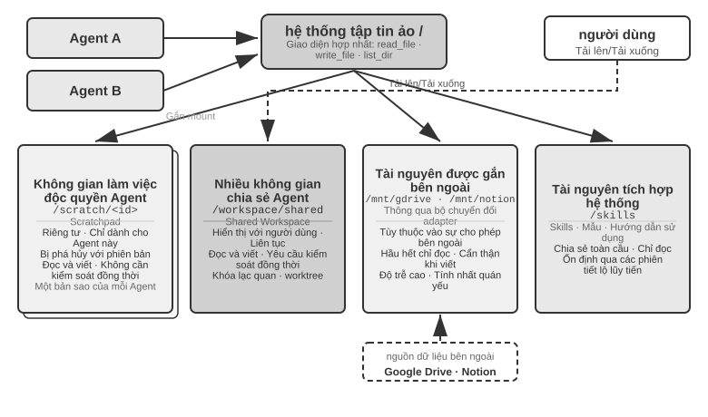
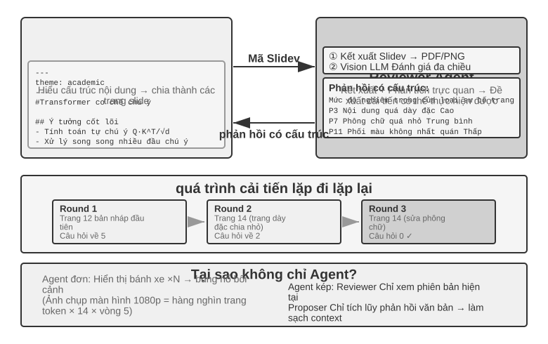
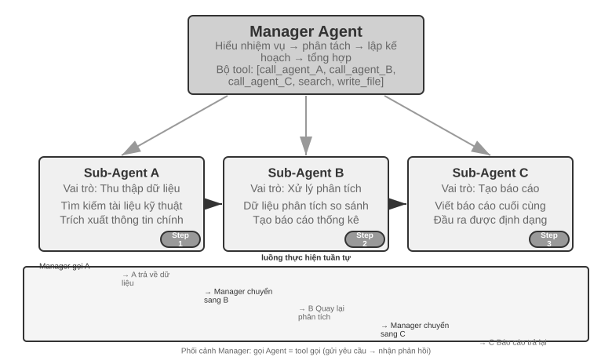
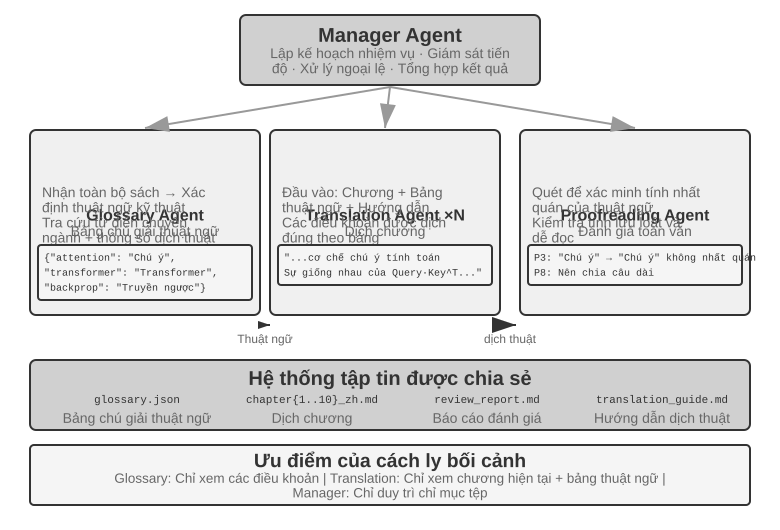
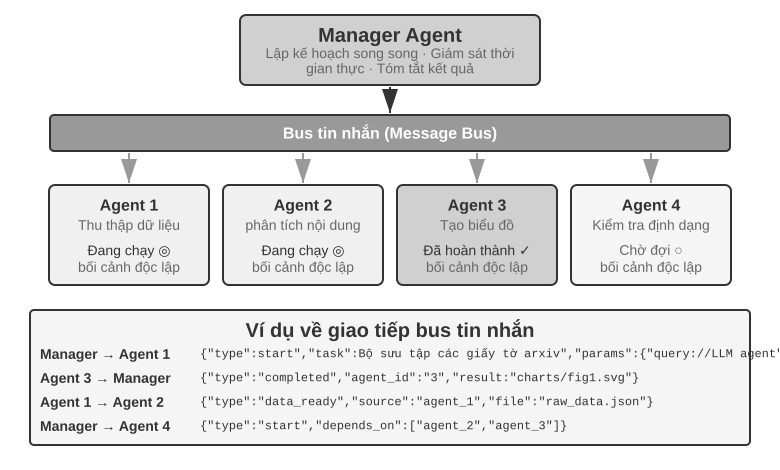
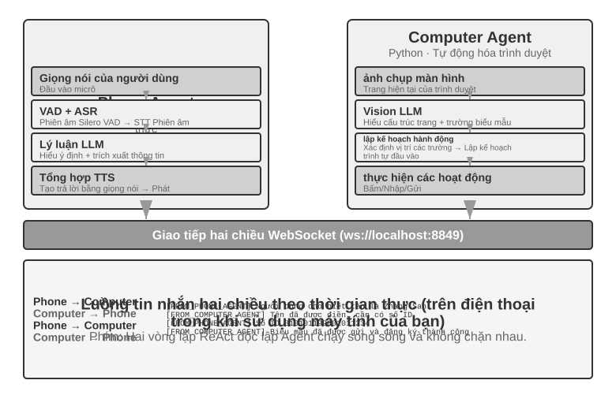
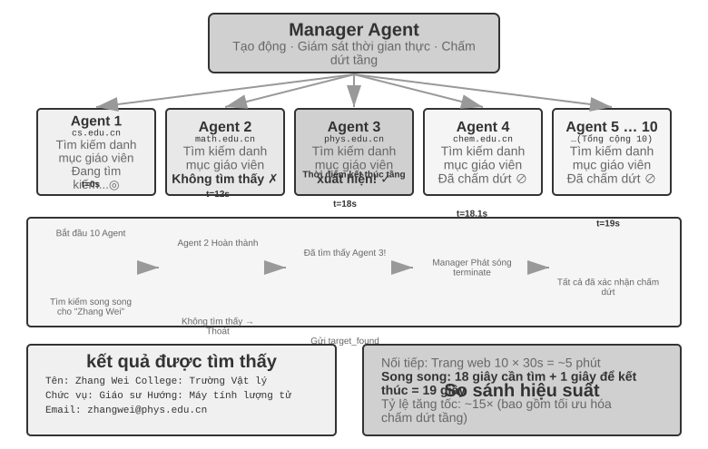
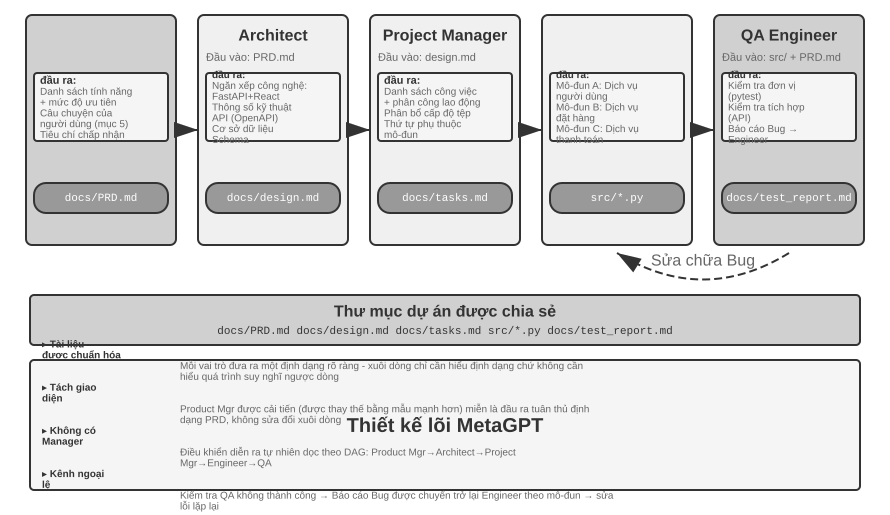
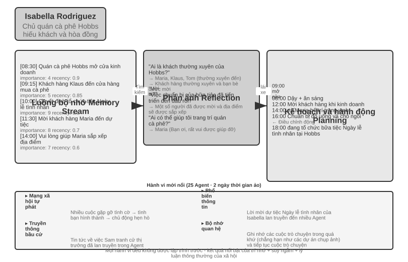
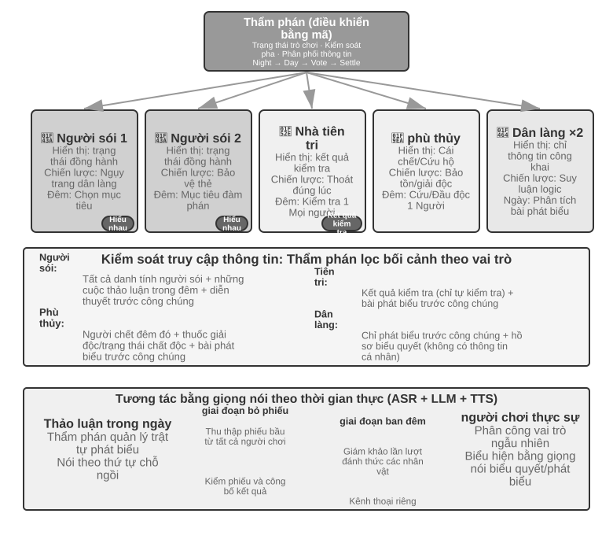

# Nhiều lần cộng tác Agent

Chín chương đầu tập trung vào một Agent đơn: trước hết xây dựng ngữ cảnh, tri thức, công cụ và năng lực tương tác, sau đó dùng đánh giá, post-training và tiến hóa liên tục để cải thiện Agent theo thời gian. Chương này đẩy câu hỏi từ “làm thế nào để xây dựng và cải tiến một Agent?” sang “làm thế nào để tổ chức nhiều Agent?”—để phân công, giao tiếp và kiểm chứng lẫn nhau có thể giải quyết những nhiệm vụ mà một Agent khó gánh vác một mình.

Trong mô tả năm cấp độ về khả năng AI do OpenAI đề xuất (Người đối thoại cấp 1, Người suy nghĩ cấp 2, Agent cấp 3, Nhà đổi mới cấp 4 và Tổ chức cấp 5), sự cộng tác đa Agent thường được so sánh với một trong các con đường dẫn đến cấp độ thứ năm - cần lưu ý rằng ở đây Tổ chức đề cập đến "Cấp độ Khả năng AI có thể hoàn thành công việc của toàn bộ tổ chức, thay vì yêu cầu về kiến trúc hệ thống, về mặt lý thuyết có thể đạt được bằng một Agent đủ mạnh. Nhưng xét về thực tế kỹ thuật ngày nay, một Agent cuối cùng bị giới hạn bởi các ranh giới khả năng và cửa sổ ngữ cảnh của mô hình của chính nó.

Để nhiều Agent hoạt động cùng nhau có ý nghĩa lớn hơn nhiều so với việc để Agent có chuyên môn khác nhau "học hỏi từ điểm mạnh của nhau". Điểm cơ bản hơn là: trí thông minh của một nhóm có thể cao hơn trí thông minh của một cá nhân. Nền văn minh nhân loại là bằng chứng cho điều này – trí thông minh của mỗi cá nhân là có hạn, nhưng thông qua sự phân công lao động, hợp tác, tranh luận và tích lũy kiến thức giữa các thế hệ, trí thông minh mà xã hội loài người thể hiện nói chung vượt xa trí thông minh của bất kỳ cá nhân thiên tài nào. Nhóm Agent cũng có thể nổi lên với trí tuệ tập thể như vậy: ngay cả khi mỗi Agent chỉ tương đương với trình độ của một chuyên gia con người, miễn là nó được tổ chức hợp lý, khả năng tổng thể của nó có thể vượt quá tổng của tất cả các chuyên gia con người. Trong "Từ AGI đến ASI", Google DeepMind liệt kê "tập thể đa Agent quy mô lớn" là một trong những con đường chính dẫn đến siêu trí tuệ (ASI) - giống như trí thông minh chung của con người có thể được tổng hợp thành các thực thể xã hội và tổ chức vượt qua các cá nhân, "trí tuệ bầy đàn" được hình thành bởi sự cộng tác của nhiều Agent cấp AGI cũng có thể thể hiện khả năng nhận thức vượt xa tổng số đơn giản của các thành viên của nó [^agi-asi]. Do đó, sự cộng tác đa Agent không chỉ là một phương tiện kỹ thuật để vượt qua cửa sổ ngữ cảnh và ranh giới khả năng của một mô hình duy nhất mà còn có thể là con đường cơ bản từ "AI cấp độ chuyên gia" đến "vượt ra ngoài toàn thể nhân loại".

[^agi-asi]: Liệt kê "tập thể đa Agent quy mô lớn" là một trong những con đường chính từ trí tuệ nhân tạo nói chung đến siêu trí tuệ, xem Google DeepMind, *Từ AGI đến ASI.* arXiv:2606.12683, 2026.

## Khung phân loại cho cộng tác đa Agent

Để xây dựng hệ thống nhiều Agent, trước tiên bạn cần hiểu hai chiều thiết kế cốt lõi, chúng cùng nhau xác định kiến trúc cơ bản và cách triển khai hệ thống.

### Khía cạnh 1: Ngữ cảnh có được chia sẻ hay không

Đây là quyết định kiến trúc cơ bản nhất, xác định cách thông tin được truyền giữa nhiều Agent.

**Ngữ cảnh được chia sẻ** có nghĩa là Agent tiếp theo nhận được toàn bộ lịch sử và trajectory hội thoại của Agent trước đó (trajectory được xác định trong Chương 1). Sau khi chuyển đổi các từ nhắc nhở của hệ thống và bộ công cụ ở mỗi giai đoạn, nó sẽ trở thành một Agent mới (vì danh tính, trách nhiệm và khả năng của nó đã thay đổi), nhưng nó vẫn giữ lại tất cả ký ức của người tiền nhiệm. Ví dụ, trong một nhóm, sau khi nhà phân tích yêu cầu viết tài liệu yêu cầu, nhà phát triển không chỉ lấy tài liệu mà còn xem tất cả các hồ sơ liên lạc giữa nhà phân tích và người dùng - anh ta là một vai trò mới, nhưng ngữ cảnh trước đó hoàn toàn được giữ lại. Ưu điểm là thông tin không bị mất và mỗi Agent có thể xem lại chi tiết của bất kỳ giai đoạn nào trước đó; thách thức là ngữ cảnh có thể mở rộng nhanh chóng.

**Không có ngữ cảnh chung** có nghĩa là mỗi Agent duy trì một ngữ cảnh và lịch sử hội thoại hoàn toàn độc lập và mỗi Agent không có quyền truy cập trực tiếp vào "quá trình suy nghĩ" của nhau. Nó giống như sự hợp tác giữa các phòng ban khác nhau: mọi người làm việc độc lập tại trạm riêng của mình, trao đổi thông tin thông qua các tài liệu được chia sẻ và biên bản cuộc họp, thay vì lúc nào cũng nhìn chằm chằm vào màn hình của người khác. Mô hình này mang tính mô-đun và biệt lập hơn, mỗi Agent chỉ cần tập trung vào thông tin liên quan đến trách nhiệm của chính mình; hệ thống cũng dễ dàng mở rộng và bảo trì hơn - việc thêm Agent mới không yêu cầu thay đổi logic bên trong của Agent hiện có mà chỉ cần xác định giao diện và định dạng dữ liệu.

Vì ngữ cảnh không được chia sẻ giữa Agent nên thông tin phải được truyền qua cơ chế giao tiếp rõ ràng. Vấn đề này đã có lời giải từ lâu trong các hệ thống phân tán kinh điển: sách giáo khoa hệ điều hành cho ta biết rằng giao tiếp giữa các tiến trình (IPC) rốt cuộc chỉ có hai mô thức lớn—**bộ nhớ chia sẻ** (một bên ghi vào, bên kia đọc từ cùng một vùng lưu trữ) và **truyền tin nhắn** (gửi dữ liệu một cách tường minh cho bên kia). Cơ chế giao tiếp giữa các Agent cũng nằm gọn trong hai mô thức này, thường gặp ba loại:

- **Tham số cho lệnh gọi công cụ**: Bọc Agent xuôi dòng thành một công cụ, rồi Agent ngược dòng truyền dữ liệu có cấu trúc qua các tham số của công cụ; phù hợp với các tình huống yêu cầu kiểu dữ liệu rõ ràng và cấu trúc minh bạch;
- **Hệ thống tệp dùng chung**: Agent trao đổi thông tin bằng cách đọc và ghi các sản phẩm trung gian như tài liệu và mã trong thư mục dùng chung, phù hợp với các tình huống sản phẩm có dung lượng lớn hoặc yêu cầu tính kiên trì;
- **Bus tin nhắn**: Trạm trung chuyển chịu trách nhiệm đặc biệt về truyền tin nhắn giữa Agent. Agent không gọi trực tiếp cho nhau mà gửi tin nhắn đến bus tin nhắn, bus này sẽ chuyển tiếp tin nhắn đó đến Agent đích.

Đối chiếu với hai mô thức của IPC: hệ thống tệp dùng chung chính là "bộ nhớ chia sẻ" của thế giới Agent; tham số lệnh gọi công cụ và bus tin nhắn thì là hai hình thái của "truyền tin nhắn"—cái trước truyền đồng bộ theo lệnh gọi, cái sau đầu tư qua trạm trung chuyển một cách không đồng bộ. Hai mô thức đều có đánh đổi riêng. Ngôn ngữ Go có một câu được lưu truyền rộng rãi: "Đừng giao tiếp bằng cách chia sẻ bộ nhớ, mà hãy chia sẻ bộ nhớ bằng cách giao tiếp"。

Bus tin nhắn hỗ trợ **giao tiếp không đồng bộ** một cách tự nhiên - người gửi và người nhận không cần trực tuyến cùng lúc, giống như hệ thống email nội bộ của công ty: khi bạn gửi email cho đồng nghiệp, bạn không yêu cầu bên kia phải ngồi trước máy tính vào lúc này. Email được lưu trữ trên máy chủ trước tiên, sau đó được xử lý khi đồng nghiệp trực tuyến. Phương pháp này đặc biệt phù hợp với các tình huống trong đó nhiều Agent hoạt động song song và cần phối hợp với nhau (xem phần "Phối hợp song song" của chương này để biết chi tiết).


Cần phải làm rõ rằng cả hai kiến trúc đều là hệ thống multi-Agent thực sự (vì các system prompt và bộ công cụ của từng giai đoạn là khác nhau nên Agent khác nhau), và sự khác biệt nằm ở phương thức phối hợp. **Ngữ cảnh được chia sẻ** dựa vào sự phối hợp ngầm - Agent tiếp theo kế thừa lịch sử ngữ cảnh hoàn chỉnh của lời nói đầu Agent và có thể "nhìn thấy" quá trình suy nghĩ trước đó và thông tin được truyền qua chính ngữ cảnh đó. **Không có ngữ cảnh chung** dựa vào sự phối hợp rõ ràng - Agent trao đổi thông tin thông qua các tệp, tin nhắn hoặc giao diện dữ liệu có cấu trúc và mỗi Agent chỉ nhìn thấy những gì có liên quan đến chính nó.

Ví dụ: trước đây giống như một nhóm ngồi quanh bàn để thảo luận và mọi người đều nghe thấy mọi thứ; cái sau giống như các bộ phận khác nhau cộng tác thông qua email và tài liệu, mỗi bộ phận có không gian làm việc riêng.

Độc giả quen thuộc với hệ điều hành sẽ nhận ra cặp lựa chọn này: ngữ cảnh chia sẻ là luồng (thread), ngữ cảnh không chia sẻ là tiến trình (process). Luồng chia sẻ không gian địa chỉ, chi phí chuyển đổi nhỏ, giao tiếp không cần sao chép, cái giá là không có cách ly—một luồng ghi hỏng bộ nhớ thì cả tiến trình sụp đổ theo; tiến trình mỗi cái có không gian địa chỉ độc lập, cách ly triệt để, có thể song song an toàn, cái giá là giao tiếp phải đi qua IPC tường minh.

**Đánh giá đơn giản**: Nếu ngữ cảnh tích lũy dự kiến sẽ vượt quá 50% thời lượng (đây là quy tắc kinh nghiệm, không phải ngưỡng chính xác), thì không nên chia sẻ ngữ cảnh đó; nếu không mất thông tin là một hạn chế cứng rắn đối với tính chính xác của nhiệm vụ thì thông tin đó nên được chia sẻ; hầu hết các hệ thống thực tế đều áp dụng sơ đồ "chuyển đổi giai đoạn" - một số Agent đầu tiên được chia sẻ và sau khi đạt đến điểm bão hòa thông tin, hãy chuyển sang ngữ cảnh không chia sẻ + chuyển giao rõ ràng (chuyển giao, nghĩa là Agent ngược dòng chủ động quyết định thông tin nào sẽ chuyển giao cho hạ lưu).

### Khía cạnh 2: Cấu trúc liên kết cộng tác

Chiều thứ hai là cấu trúc liên kết cộng tác—cấu trúc kiểm soát các quyền và luồng thông tin giữa Agent. Liệu cấu trúc liên kết và ngữ cảnh cộng tác có được chia sẻ hay không **độc lập về mặt khái niệm nhưng phù hợp về mặt thực tế**: Nó độc lập về mặt khái niệm vì các hệ thống chia sẻ ngữ cảnh cũng có cấu trúc liên kết. Ví dụ: `transfer_to_agent` (thử nghiệm 10-1) được giới thiệu sau trong chương này về cơ bản là hình thức chuyển giao chuỗi trong ngữ cảnh dùng chung; Nó được cho là có liên quan trong thực tế vì một khi ngữ cảnh được chia sẻ, cấu trúc liên kết thường bị thoái hóa (xem bên dưới) và các giá trị của hai chiều không thể được kết hợp theo ý muốn. Tuy nhiên, khi ngữ cảnh được chia sẻ, quá trình chuyển giao không cần phải quyết định "cái gì sẽ chuyển" - toàn bộ lịch sử được bảo tồn một cách tự nhiên - và do đó, cấu trúc liên kết thường thoái hóa thành một chuỗi chuyển đổi vai trò, không cần đưa ra nhiều quyết định về kiến trúc (một ngoại lệ ở giữa là cộng tác nhiều bên theo kiểu trò chuyện nhóm, xem phần phân quyền ở phần sau của chương này). Khi bạn chọn không chia sẻ ngữ cảnh, "thông tin được truyền như thế nào và ai điều phối nó" sẽ trở thành một vấn đề cần phải được thiết kế rõ ràng.

> **Giải thích thuật ngữ: Graph Engineering.** Thuật ngữ "Graph Engineering", trở nên phổ biến vào tháng 7 năm 2026, trong ngữ cảnh Agent hiện nay thường chỉ việc thiết kế tường minh một đồ thị thực thi: các nút là Agent, chương trình thông thường hoặc quyết định của con người; các cạnh xác định quan hệ phụ thuộc giữa nhiệm vụ, định tuyến có điều kiện và đường đi sau khi thất bại; trạng thái có cấu trúc lưu chuyển giữa các nút[^ch10-graph-engineering-vi]. "Cấu trúc liên kết cộng tác" được thảo luận trong chương này chính là phần đa Agent của khái niệm đó—cộng tác ngang hàng, điều phối bằng trình quản lý và chuyển giao phi tập trung là những cấu trúc đồ thị khác nhau. Vì tên gọi còn mới và dễ bị nhầm với đồ thị tri thức, GraphRAG và dấu vết thực thi, cuốn sách vẫn dùng các thuật ngữ ổn định hơn là "cấu trúc liên kết cộng tác" và "điều phối" làm từ vựng chính.

[^ch10-graph-engineering-vi]: Về một thảo luận sớm của tên gọi này, xem Josh C. Simmons, *We Are Entering the Graph Engineering Phase*, 2026. Các framework phổ biến thường gọi cùng cấu trúc kỹ thuật là graph-based workflow hoặc orchestration, chứ không phải một công nghệ hoàn toàn mới. Xem https://www.drjoshcsimmons.com/writing/we-are-entering-the-graph-engineering-phase, https://docs.langchain.com/oss/python/langgraph/overview, https://learn.microsoft.com/en-us/agent-framework/workflows/ và https://adk.dev/workflows/.

Nói cách khác, về nguyên tắc, hai chiều này tạo thành một ma trận kết hợp 2 × 3 (cấu trúc liên kết chia sẻ/không chia sẻ × ba). Tuy nhiên, trong hàng ngữ cảnh dùng chung, cấu trúc liên kết chủ yếu thoái hóa thành chuỗi chuyển đổi vai trò, không có nhiều quyết định kiến trúc được đưa ra (đây chính xác là dạng được thảo luận trong phần "Chuyển đổi vai trò nhiều giai đoạn" bên dưới), vì vậy chương này chỉ mở rộng chi tiết về ba ô mà không có ngữ cảnh chung. Dưới đây là ba dạng cấu trúc liên kết hợp tác điển hình khi không có ngữ cảnh nào được chia sẻ, theo mức độ phức tạp tăng dần:

- **Mẫu cộng tác ngang hàng** (Peer Collaboration Pattern): Một số lượng nhỏ Agent (thường là 2-3) tương tác như nhau, tạo thành một chu trình cải tiến lặp đi lặp lại - giống như khi viết một bài báo, một người soạn thảo và một người khác nhận xét và sửa lại. Sau nhiều lần lặp đi lặp lại, chất lượng tốt hơn nhiều so với bài do một người viết.
- **Chế độ quản lý** (Orchestration Pattern): Trình quản lý tập trung Agent chịu trách nhiệm lập kế hoạch và lập kế hoạch nhiệm vụ, đồng thời nhiều Agent phụ chịu trách nhiệm về các nhiệm vụ phụ cụ thể - giống như người quản lý dự án dẫn dắt một số kỹ sư chuyên nghiệp thực hiện dự án.
- **Mô hình phi tập trung**: Không có bộ điều khiển trung tâm trong thời gian chạy. Agent giao tiếp với nhau như con người và cộng tác để hoàn thành nhiệm vụ.

Thiết kế chi tiết và các kịch bản áp dụng của từng phương thức sẽ được thảo luận trong các phần đặc biệt tiếp theo.

## Khi nào multi Agent thực sự tốt hơn Agent đơn lẻ

Trước khi đi vào kiến trúc cộng tác cụ thể, hãy trả lời một câu hỏi cơ bản hơn: **Khi nào bạn thực sự cần nhiều Agent và khi nào một Agent là đủ?** Câu trả lời cho câu hỏi này sẽ trở thành tài liệu tham khảo tổng thể cho tất cả các kế hoạch dự án tiếp theo. Một loạt nghiên cứu trong những năm gần đây đã đưa ra khung đánh giá rõ ràng - chỉ có một tiêu chí cốt lõi: **Quy trình cộng tác có đưa ra thông tin mới mà khi tạo một Agent duy nhất không thể có được không?**

Bảng 10-1 tóm tắt xem các chế độ cộng tác khác nhau có đưa ra thông tin mới hay không để xác định xem liệu cộng tác nhiều Agent có giá trị đáng kể so với Agent đơn lẻ hay không.

Bảng 10-1 So sánh mức tăng thông tin trong nhiều chế độ cộng tác Agent

| Chế độ cộng tác | Có nên giới thiệu thông tin mới | Hiệu ứng |
|---|---|---|
| Cùng mô hình tự kiểm duyệt (đọc lại kết quả của chính mình) | Không | Thường không hiệu quả hoặc thậm chí có hại |
| Agent khác nhau tranh luận về cùng một văn bản | Không | Bằng một Agent với cùng một lượng tính toán |
| Người đánh giá đánh giá mã bằng cách sử dụng kết quả thực hiện kiểm tra | Có (phản hồi thực hiện) | Cải thiện đáng kể |
| Người đánh giá Xem ảnh chụp màn hình được hiển thị để xem lại mã giao diện người dùng/PPT | Có (phản hồi trực quan) | Cải thiện đáng kể |
| Người đánh giá sử dụng các công cụ bên ngoài để xác minh sự thật | Có (phản hồi về công cụ) | Cải thiện đáng kể |

RLEF (Học tăng cường từ phản hồi thực thi) [^rlef-2025] năm 2025 xác nhận điều này: đào tạo một mô hình thông qua học tăng cường để sử dụng phản hồi thực thi mã nhằm cải thiện mã lặp đi lặp lại sẽ hiệu quả hơn nhiều so với việc để mô hình lấy mẫu độc lập nhiều lần. Điều quan trọng là mỗi lần lặp đưa ra **kết quả thực thi thực**(lỗi biên dịch, lỗi kiểm tra, ngoại lệ thời gian chạy), thông tin này không tồn tại khi mô hình được viết. WebGen-Agent [^webgen-agent-2025] của năm 2025 Trong nhiệm vụ tạo trang web, hệ thống phản hồi bao gồm phản hồi trực quan đa cấp (ảnh chụp màn hình + mô tả mô hình ngôn ngữ hình ảnh) được cho là đã cải thiện hiệu suất của Claude 3.5 Sonnet trên điểm chuẩn này từ 26,4% lên 51,9% - gần gấp đôi.

[^rlef-2025]: Gehring, J., et al. *RLEF: Grounding Code LLMs in Execution Feedback with Reinforcement Learning.* arXiv:2410.02089, 2025.
[^webgen-agent-2025]: Lu, Z., et al. *WebGen-Agent: Enhancing Interactive Website Generation with Multi-Level Feedback and Step-Level Reinforcement Learning.* arXiv:2509.22644, 2025.

Khung "thông tin mới" này giải thích một hiện tượng có vẻ mâu thuẫn: nghiên cứu học thuật cho biết "một Agent duy nhất là đủ", nhưng trong thực tế kỹ thuật, nhiều Agent hơn sẽ hoạt động tốt hơn. Căn nguyên của mâu thuẫn là cả hai thảo luận về các loại "nhiều Agent" khác nhau - so sánh trong nghiên cứu học thuật chủ yếu là chế độ "nhiều Agent nhìn vào cùng một văn bản và thảo luận lẫn nhau" (chẳng hạn như tranh luận), trong khi các hệ thống multi-Agent hiệu quả trong thực hành kỹ thuật thường bao gồm các vòng phản hồi bên ngoài (thực thi mã, hiển thị trực quan, gọi công cụ). Cái trước không giới thiệu thông tin mới, cái sau thì có. Ba kiến trúc cộng tác ngang hàng, người quản lý và phân quyền được giới thiệu ở phần sau của chương này. Hầu như tất cả những công dụng thực sự hiệu quả đều có thể tìm thấy ở tiêu chí này.

Thí nghiệm tìm lỗ hổng của Anthropic năm 2026 là một ví dụ. Bốn mươi lăm Agent phối hợp tìm kiếm qua một diễn đàn chung, đánh giá chéo các phát hiện, rồi giao quyết định cuối cùng cho một Agent trọng tài độc lập. Nhóm Agent phối hợp tìm được 266 lỗ hổng với 27 triệu token, trong khi phương án chạy song song các Agent độc lập chỉ tìm được 21 lỗ hổng với 6,5 triệu token. Trong một không gian tìm kiếm mở, giao tiếp cho phép hệ thống đa Agent linh hoạt chuyển trọng tâm và hình thành chuyên môn hóa, đổi ngân sách token cao hơn lấy độ bao phủ rộng hơn và các hướng khám phá đa dạng hơn.[^anthropic-multiagent-2026]

[^anthropic-multiagent-2026]: Anthropic Frontier Red Team, “Patterns and Problems in Emerging Multiagent Systems,” 2026-08-13. https://www.anthropic.com/research/multiagent-systems

**Ngân sách bước so với hiệu suất Agent.** Hướng nghiên cứu liên quan là: việc chỉ định ngân sách bước khác nhau (tức là số lần gọi công cụ hoặc vòng lặp được phép) cho Agent ảnh hưởng đến hiệu suất của nó như thế nào? Theo trực quan, nhiều bước hơn sẽ mang lại kết quả tốt hơn - với ngân sách 30 bước, Agent chỉ có thể triển khai nhanh chóng các chức năng cốt lõi. Với ngân sách 300 bước, nó cũng có thể lập kế hoạch, sau đó triển khai, thử nghiệm và sau đó cải tiến. Tuy nhiên, bài báo năm 2025 của Google "Budget-Aware Tool-Use kích hoạt khả năng mở rộng Agent hiệu quả" đã tìm thấy một kết luận phản trực giác: **Chỉ cần tăng số bước có sẵn cho Agent không đảm bảo cải thiện hiệu suất**. Agent tiêu chuẩn thiếu "nhận thức về ngân sách" - ngay cả với ngân sách 300 bước, họ vẫn có xu hướng thực hiện các tìm kiếm nông và "bão hòa" nhanh chóng. Để có thêm các bước thực sự mang lại kết quả tốt hơn, Agent cần có cơ chế nhận biết ngân sách rõ ràng để linh hoạt điều chỉnh các chiến lược dựa trên các nguồn lực còn lại: khám phá rộng rãi trong giai đoạn đầu và tập trung vào các hướng hứa hẹn nhất trong giai đoạn sau. BAVT (Tìm kiếm cây giá trị Budget-Aware) vào năm 2026 đề xuất thêm đánh giá giá trị theo từng bước, điều chỉnh trọng số thăm dò và sử dụng theo tỷ lệ ngân sách còn lại ở mỗi bước - khi ngân sách giảm, Agent chuyển dần từ "đăng lưới rộng rãi" sang "đào sâu".

Những phát hiện này có ý nghĩa hướng dẫn trực tiếp cho việc thiết kế các hệ thống đa Agent. Ví dụ: trong chế độ người quản lý, Người quản lý Agent không nên chỉ phân phối nhiệm vụ cho Agent phụ và chờ kết quả mà nên phân bổ động ngân sách các bước dựa trên mức độ phức tạp của nhiệm vụ - các nhiệm vụ phụ đơn giản nên được cung cấp ít bước hơn và các nhiệm vụ phụ phức tạp phải được cung cấp đủ các bước. Đồng thời, chúng ta cũng phải hướng dẫn sub-Agent sử dụng hợp lý các khoản ngân sách này (lên kế hoạch đầu tiên, sau đó triển khai, sau đó thử nghiệm, sau đó cải tiến), thay vì lao vào và bắt đầu trực tiếp.

Còn một điều nữa phải có trước tất cả các thiết kế: **chi phí**. Khám phá song song và lặp đi lặp lại nhiều Agent tốn tiền - Anthropic từng tiết lộ rằng mức tiêu thụ mã thông báo của hệ thống nghiên cứu đa Agent của nó cao gấp khoảng 15 lần so với các cuộc hội thoại thông thường và bản thân việc sử dụng mã thông báo có thể giải thích khoảng 80% sự khác biệt về hiệu suất. Điều này có nghĩa là lợi ích hiệu quả của nhiều Agent phải đủ lớn để bao gồm nhiều lần hoặc thậm chí là một mức độ lớn của chi phí bổ sung, nếu không, một Agent đơn lẻ được điều chỉnh phù hợp thường là lựa chọn hiệu quả hơn về mặt chi phí.

## Cộng tác nhiều Agent với ngữ cảnh được chia sẻ

Trong cộng tác dùng chung ngữ cảnh, mỗi giai đoạn là một Agent độc lập với system prompt và bộ công cụ riêng, nhưng kế thừa toàn bộ trajectory của giai đoạn trước. Ưu điểm chính là không mất thông tin; thách thức là giữ Agent hiện tại tập trung vào trách nhiệm của mình khi lịch sử ngày càng dài.

Trong tác vụ phức tạp, vai trò và trách nhiệm có thể thay đổi rõ rệt giữa các giai đoạn. Một prompt tĩnh sẽ quá chung chung hoặc quá dài, vì vậy system prompt và công cụ có thể được chuyển theo giai đoạn.

Lựa chọn kiến trúc quan trọng là thay system prompt hay nạp Skill khi đổi vai trò. Cả hai đều thay đổi quy tắc hành vi nhưng có chi phí và mức ràng buộc khác nhau.

| Lựa chọn | Nơi chứa quy tắc vai trò | Khả năng thấy công cụ | Ảnh hưởng ngữ cảnh/KV Cache | Độ mạnh ràng buộc |
|---|---|---|---|---|
| `transfer_to_agent` | Thay system prompt và thường cả bộ công cụ | Chỉ công cụ của vai trò hiện tại | Mỗi lần chuyển làm thay đổi prefix; cache từ điểm khác biệt thường không tái sử dụng được | Mạnh: có thể loại công cụ ngoài vai trò khỏi schema |
| Skill | Giữ danh mục Skill cố định, thêm `SKILL.md` vào trajectory khi cần | Thường là toàn bộ danh mục hoặc cổng tìm kiếm ổn định | Prefix tĩnh không đổi; Skill được thêm ở cuối trajectory | Yếu: Skill là chỉ dẫn; quyền cứng cần cổng Harness |

Nếu vai trò khác nhau chủ yếu về kiến thức, quy trình hoặc văn phong, hãy ưu tiên Skill. Nếu khác về quyền, cô lập công cụ, tuân thủ hoặc cấm tác dụng phụ, hãy dùng Agent độc lập hoặc `transfer_to_agent`, đồng thời cưỡng chế giới hạn công cụ bằng mã trong Harness.

> **Thí nghiệm 10-1 ★★: Chuyển vai trò trong ngữ cảnh dùng chung — system prompt so với Skill**
>
> **Tác vụ và biến chung**: hai đường dùng cùng mô hình, tác vụ, cách triển khai công cụ, quy tắc vai trò và toàn bộ trajectory dùng chung. Tác vụ là tìm doanh số xe năng lượng mới của Trung Quốc giai đoạn 2021–2023, tính CAGR và viết bản tóm tắt tiếng Trung cho nhà đầu tư không quá 120 ký tự.
>
> **Đường 1: chuyển system prompt**. Năm vai trò là `triage`, `research`, `coding`, `data_analysis` và `writing`. Mỗi vai trò chỉ thấy công cụ riêng và `transfer_to_agent`; khi bàn giao, lịch sử được giữ lại, prompt và công cụ của vai trò đích được nạp, rồi việc thực thi tiếp tục.
>
> **Đường 2: Skill**. System prompt và toàn bộ danh mục công cụ giữ nguyên trong phiên. Mô hình gọi `load_skill(name)`, và `SKILL.md` được đưa vào trajectory như kết quả công cụ. Prefix tĩnh không đổi, còn quyền cứng được các quy tắc Harness bảo đảm.

## Cộng tác nhiều Agent không có ngữ cảnh chung

Không có ngữ cảnh chia sẻ nào thể hiện sự cộng tác đa Agent thực sự. Theo kiến trúc này, mỗi Agent là một thực thể độc lập với ngữ cảnh, trajectory và trạng thái riêng. Agent không thể truy cập trực tiếp vào "hoạt động nội bộ" của nhau và sự cộng tác hoàn toàn dựa trên các cơ chế truyền dữ liệu có cấu trúc và rõ ràng, đó là ba cơ chế giao tiếp được giới thiệu ở đầu chương này (tham số lệnh gọi công cụ, hệ thống tệp dùng chung, bus thông báo).

Ở đầu chương, ta đã đối chiếu cơ chế giao tiếp với hai mô thức lớn của giao tiếp giữa các tiến trình, và đối chiếu ngữ cảnh chia sẻ/không chia sẻ với luồng và tiến trình. Phép loại suy này còn có thể đi xa hơn (Bảng 10-2):

Bảng 10-2 Quan hệ đối ứng giữa hệ thống multi-Agent và hệ điều hành

| Hệ điều hành | Hệ thống multi-Agent |
|----------|----------------|
| Chương trình (tệp thực thi) | Tiền tố tĩnh (system prompt + định nghĩa công cụ) |
| Bộ nhớ của tiến trình | Trajectory |
| CPU | LLM |
| Nhân (kernel) | Thời gian chạy Agent |
| Lời gọi hệ thống | Lời gọi công cụ |
| fork (tạo tiến trình con) | spawn_subagent |
| kill (gửi tín hiệu) | cancel_subagent |
| ps (liệt kê tiến trình) | list_agents |
| Mã thoát và wait() | Tóm tắt có cấu trúc do Agent con trả về |
| Bộ nhớ chia sẻ / truyền tin nhắn | Hệ thống tệp dùng chung / tin nhắn |


Sự trừu tượng này không hề mới mẻ: trạng thái riêng tư, tin nhắn không đồng bộ, khả năng tạo ra thành viên mới, chính là những thiết lập cơ bản của mô hình Actor thập niên 1970[^actor-model], hệ thống multi-Agent có thể xem như phiên bản LLM của nó. Do đó phần lớn kinh nghiệm thành thục của hệ điều hành và hệ thống phân tán đều có thể mượn dùng trực tiếp.

[^actor-model]: Hewitt, C., Bishop, P., Steiger, R. *A Universal Modular ACTOR Formalism for Artificial Intelligence.* IJCAI 1973.

Sự cách ly kiểu tiến trình mang lại một số lợi ích kỹ thuật thực tế: mỗi Agent có thể được phát triển và thử nghiệm độc lập, các khả năng mới không cần thay đổi mã hiện có, lỗi của một Agent sẽ không truyền trạng thái lỗi sang Agent khác và nhiều Agent có thể được thực thi đồng thời - ngữ cảnh hoàn toàn độc lập và không có cạnh tranh tài nguyên.

Nhưng sẽ phải trả giá nếu không chia sẻ ngữ cảnh. Rõ ràng nhất là vấn đề đồng bộ hóa thông tin: làm thế nào mỗi Agent có thể duy trì sự hiểu biết nhất quán về trạng thái nhiệm vụ? Thông tin có bị mất hoặc trùng lặp trong quá trình truyền tải không? Việc gỡ lỗi cũng trở nên khó khăn hơn - nếu có sự cố xảy ra, bạn cần xem qua nhiều nhật ký Agent để mô tả quá trình thực thi hoàn chỉnh. Những vấn đề này làm cho việc thiết kế các thông số kỹ thuật giao diện, định dạng dữ liệu và giao thức truyền thông trở nên quan trọng.

Sự hợp tác rõ ràng mà không cần chia sẻ ngữ cảnh dựa trên hai bộ cơ sở hạ tầng độc lập với cấu trúc liên kết. Đầu tiên là **hệ thống tệp được chia sẻ**, đóng vai trò là sản phẩm trao đổi giữa Agent và phương tiện liên tục để trao đổi tệp với người dùng, tạo thành mặt phẳng dữ liệu cộng tác; thứ hai là **cơ chế điều khiển và giao tiếp**, hỗ trợ truyền tin nhắn, truy vấn trạng thái, chấm dứt thực thi và điều phối tài nguyên giữa Agent, tạo thành một mặt phẳng điều khiển cộng tác. Ba cấu trúc liên kết sau đây được xây dựng dựa trên hai cấu trúc này.

### Hệ thống file Agent qua mắt

Phần đầu của chương này liệt kê "hệ thống tệp dùng chung" là một trong ba cơ chế giao tiếp không chia sẻ ngữ cảnh. Trong hệ thống thực tế, Agent không truy cập vào một bộ lưu trữ duy nhất mà là một **hệ thống tệp ảo** (virtual filesystem): bộ nhớ với các nguồn khác nhau, vòng đời và quyền được gắn kết (gắn kết) trong cùng một cây thư mục. Agent truy cập qua giao diện `read_file`/`write_file`/`list_dir` thống nhất, lớp dưới cùng có thể là đĩa tạm thời cục bộ, bộ lưu trữ đối tượng liên tục, đĩa đám mây API của bên thứ ba hoặc gói tài nguyên hệ thống chỉ đọc. Làm rõ thành phần của cây thư mục này—khả năng hiển thị và vòng đời của từng khu vực—là điều kiện tiên quyết cho thiết kế cộng tác đa Agent: một số lượng đáng kể các xung đột đồng thời và rò rỉ thông tin bắt nguồn từ việc trộn lẫn các khu vực cần được cách ly. Cây thư mục này tương đương với không gian địa chỉ của Agent, bốn loại khu vực chính là các đoạn bộ nhớ với quyền khác nhau: có cái riêng tư và ghi được, có cái nhiều bên chia sẻ, có cái chỉ đọc. Triết lý bảo vệ của hệ điều hành ở đây cũng đúng—mặc định cách ly, muốn chia sẻ phải khai báo tường minh. Hệ thống tệp của hệ thống đa Agent trưởng thành thường bao gồm bốn loại khu vực sau:

**1. Không gian làm việc độc quyền Agent (Scratchpad)**. Một thư mục riêng dành riêng cho mỗi phiên bản Agent, nơi lưu trữ các sản phẩm trung gian, tệp tạm thời, bản nháp và nhật ký gỡ lỗi. Vòng đời được liên kết với phiên bản và không hiển thị đối với Agent và người dùng khác. Việc cách ly bàn di chuột có hai chức năng: ngăn các tệp tạm thời của nhiều Agent ghi đè lên nhau và giữ cho ngữ cảnh Agent chính được sắp xếp hợp lý - quá trình dùng thử và lỗi của Agent con được lưu giữ trong không gian làm việc riêng của nó và chỉ sản phẩm cuối cùng mới được gửi tới không gian chung. Điều này tương ứng với phương án mức lưu trữ của Chương 4 "Sub Agent trả về bản tóm tắt có cấu trúc thay vì bản nhạc đầy đủ".

**2. Nhiều không gian làm việc chung Agent**. Khu vực cộng tác trong đó nhiều Agent đọc và ghi cùng nhau và **hiển thị với người dùng** là phương tiện chính để trao đổi sản phẩm giữa các Agent theo kiến trúc ngữ cảnh không chia sẻ: Bảng thuật ngữ Agent ghi vào bảng thuật ngữ và Bản dịch Agent đọc từ đó; người dùng cũng có thể tải lên các tệp gốc và tải xuống các sản phẩm cuối cùng tại đây. Vòng đời của nó gắn liền với toàn bộ nhiệm vụ và đòi hỏi sự kiên trì. Là khu vực có nhiều bên đồng thời đọc và ghi, đây là khu vực có nguy cơ cao xảy ra xung đột đồng thời - các cơ chế như khóa lạc quan và cách ly bản sao làm việc (worktree) đều hoạt động ở đây. Để biết chi tiết, hãy xem "Chế độ lỗi 1" ở phần sau của chương này. Chương 4 sử dụng một ổ đĩa để gắn `/workspace/shared` nhằm kết nối Agent chính, máy tính ảo và điện thoại di động ảo, đây là cách triển khai điển hình của lớp này.

**3. Tài nguyên được gắn bên ngoài (Mounted External Resources)**. Các nguồn thông tin của bên thứ ba mà người dùng ủy quyền truy cập—Google Drive, Notion, Dropbox, Enterprise Wiki, v.v.—được ánh xạ tới các điểm gắn kết trong hệ thống tệp (chẳng hạn như `/mnt/gdrive`) thông qua bộ điều hợp. Agent truy cập tài liệu Notion bằng cách đọc một tệp và lớp dưới cùng được hoàn thành bởi bộ điều hợp gọi bên kia là API. Ba đặc điểm của lớp này khác với bộ nhớ cục bộ cần được xử lý rõ ràng trong quá trình thiết kế: **Quyền truy cập bị hạn chế bởi các quyền bên ngoài**(quyền của người dùng trong hệ thống nguồn xác định phạm vi hiển thị của Agent), **Độ trễ cao hơn và tính nhất quán yếu hơn**(mỗi lần đọc là một lượt truy cập mạng, dữ liệu có thể đã được sửa đổi bên ngoài, chỉ có thể đối xử theo tính nhất quán cuối cùng), **Chỉ đọc theo yêu cầu**(phải thận trọng khi ghi lại vào nguồn bên ngoài, việc ghi sai có thể làm ô nhiễm dữ liệu thực của người dùng). Giao diện tệp hợp nhất giúp Agent không cần phải tùy chỉnh các công cụ chuyên dụng cho từng nguồn dữ liệu, nhưng nó cũng che giấu những khác biệt về hiệu suất và bảo mật được đề cập ở trên, do đó, ranh giới chỉ đọc/có thể ghi, thời gian chờ và thông tin xác thực cần phải được quản lý rõ ràng ở cấp độ gắn kết.

**4. Tài nguyên tích hợp trong hệ thống (Built-in System Resources)**. Cài đặt trước hệ thống và gói tài nguyên chia sẻ chỉ đọc cho tất cả Agent. Đại diện điển hình là **Skills** được giới thiệu trong Chương 2 và 4 - các tài liệu kiến thức và tập lệnh được sắp xếp dưới dạng tệp, được gắn trên `/skills` và các đường dẫn khác và được truy cập theo cách tiết lộ lũy tiến (đầu tiên được lập chỉ mục, sau đó được mở rộng theo yêu cầu); Ngoài ra, nó còn bao gồm các tài liệu hướng dẫn tham khảo, thư viện mẫu và định nghĩa công cụ dùng chung. Lớp này được chia sẻ trên toàn cầu, chỉ đọc, ổn định trong các phiên và có thể được đọc đồng thời bởi tất cả Agent mà không cần kiểm soát đồng thời.

Hình 10-2 cho thấy cấu trúc trong đó bốn loại khu vực này được gắn thống nhất trên cùng một cây thư mục: Agent truy cập toàn bộ cây thông qua giao diện hợp nhất, người dùng tải lên và tải xuống các tệp từ không gian dùng chung, nguồn dữ liệu bên ngoài được gắn thông qua bộ điều hợp và các tài nguyên tích hợp trong hệ thống được cung cấp theo cách chỉ đọc.





Bảng 10-3 so sánh bốn loại lĩnh vực này từ bốn chiều về khả năng hiển thị, vòng đời, quyền đọc và ghi và kiểm soát tương tranh, có thể được sử dụng làm danh sách kiểm tra cho thiết kế bố cục hệ thống tệp.

Bảng 10-3 Bốn loại vùng của hệ thống tệp ảo Agent

| Vùng | Tầm nhìn | Vòng đời | Đọc và Viết | Kiểm soát đồng thời |
|---|---|---|---|---|
| Không gian làm việc độc quyền Agent | Chỉ Agent này | Bị phá hủy với phiên bản Agent | Đọc và viết | Không bắt buộc (riêng tư) |
| Nhiều không gian chia sẻ Agent | Tất cả người dùng Agent + cộng tác | Khi nhiệm vụ tiếp tục, cần có sự kiên trì | Đọc và viết | Bắt buộc (khóa lạc quan/worktree) |
| Tài nguyên gắn bên ngoài | Phụ thuộc vào ủy quyền bên ngoài | Xác định bởi nguồn bên ngoài | Chủ yếu chỉ đọc, viết thận trọng | Chịu trách nhiệm bởi nguồn bên ngoài |
| Tài nguyên tích hợp trong hệ thống | Tất cả Agent | Ổn định xuyên phiên | Chỉ đọc | Không bắt buộc (chỉ đọc) |

Hợp nhất bốn loại vùng vào cùng một cây thư mục là giá trị của thiết kế " **Đường dẫn tệp dưới dạng giao diện chung**": khi chuyển sản phẩm giữa Agent, chuyển giao đầu vào từ Agent chính sang Agent phụ và thậm chí trao đổi Artifacts để cộng tác A2A giữa các tổ chức, những gì được truyền là một chuỗi đường dẫn nhẹ thay vì tải nội dung vào cửa sổ ngữ cảnh (Chương 4). Điều này tương tự như Chương 5, "Hệ thống tệp là xương sống của Agent" - phần sau thảo luận về cách một Agent sử dụng một hệ thống tệp để mang bộ nhớ và các chức năng. Ở đây, tính trừu tượng tương tự được mở rộng cho nhiều Agent: cây thư mục ảo gắn kết bốn loại lưu trữ: riêng tư, chia sẻ, bên ngoài và tích hợp, là cơ sở lưu trữ cho cộng tác nhiều Agent.

### Giao tiếp và điều khiển giữa Agent

Hệ thống tập tin giải quyết vấn đề **trao đổi sản phẩm** giữa Agent. Việc cộng tác còn cần một **mặt phẳng điều khiển**. Đây chính là chỗ dụng võ của các dòng vòng đời trong Bảng 10-2: bộ nguyên thủy công cụ mà Chương 4 đã đưa ra—tạo (`spawn_subagent`), gửi tin nhắn (`send_message_to_subagent`), hủy (`cancel_subagent`), khám phá (`list_agents`)—tương ứng với fork, tin nhắn, kill và ps của thế giới tiến trình. Phần này không lặp lại định nghĩa giao diện mà tập trung vào bốn khả năng mà cộng tác đa Agent phụ thuộc vào nhưng thường bị bỏ qua.

**1. Truyền tin nhắn.** Hình thức đơn giản nhất là điểm-điểm: Agent A gọi trực tiếp `send_message_to_agent_b(content)`, phù hợp với các tình huống có cấu trúc liên kết cố định và một số lượng nhỏ Agent (chẳng hạn như điện thoại + máy tính kép Agent trong thử nghiệm của chương này). Khi số lượng Agent tăng lên và yêu cầu song song không đồng bộ, số lượng kết nối điểm-điểm tăng tỷ lệ thuận với số lượng Agent và cả người gửi và người nhận đều phải trực tuyến cùng một lúc; tại thời điểm này, **Bus thông báo** nên được sử dụng thay thế (xem "Biểu mẫu phối hợp song song" ở phần sau của chương này): Agent xuất bản thông báo lên bus và bus chuyển tiếp nó theo mối quan hệ đăng ký. Người gửi không cần biết người tiêu dùng. Dù là điểm-điểm hay qua xe buýt, tin nhắn thường phải mang một phong bì có cấu trúc: ID người gửi, đích (chỉ định Agent hoặc quảng bá), loại tin nhắn (chẳng hạn như `task_assigned`/`status_update`/`result`/`terminate`) và tải trọng JSON. Định dạng phong bì thống nhất đảm bảo người nhận định tuyến và phân tích cú pháp đáng tin cậy, đồng thời cho phép truy xuất nguồn gốc của các liên kết cộng tác - chìa khóa để gỡ lỗi các hệ thống đa Agent.

**2. Truy vấn trạng thái.** Đây là mắt xích dễ bị đánh giá thấp nhất trong mặt phẳng điều khiển. Sau khi Agent chính phái Agent con đi, nếu không có cách nào biết được tiến độ của nó thì vừa không thể phán đoán có nên tiếp tục chờ hay không, vừa không thể can thiệp kịp thời khi nó bị nghẽn. Cách làm theo trực giác là bê nguyên RPC, định nghĩa một giao diện truy vấn `get_subagent_status(agent_id)`, trả về "đang chạy/đã hoàn thành/thất bại" cộng thêm một phần trăm tiến độ. Nhưng giao diện kiểu kéo này có công dụng thực tế nhỏ hơn nhiều so với kỳ vọng: Agent con vừa được tạo là lập tức bắt đầu thực thi, cho đến khi hoàn thành hoặc thất bại, chứ không luân chuyển giữa một chuỗi trạng thái xếp hàng như các tác vụ (job) của hệ thống xử lý theo lô truyền thống—cũng như trong lập trình Unix hiếm khi cần theo PID để bỏ phiếu (poll) trạng thái chạy của một tiến trình khác. Việc bỏ phiếu còn có cái lưỡng nan cố hữu: quá dày thì lãng phí token, quá thưa thì không kịp thời. Cách lấy trạng thái tự nhiên hơn là quay về hai mô thức giao tiếp lớn ở đầu chương.

**Lấy trạng thái bằng truyền tin nhắn**. Agent chính gửi thẳng cho Agent con một tin nhắn: "Tiến độ thế nào?" Agent con trả lời vào thời điểm thích hợp. Mọi thứ đều không đồng bộ: gửi tin nhắn không chặn việc thực thi của chính mình, còn đối phương khi nào trả lời, có trả lời hay không là chuyện khác—cũng như người quản lý hỏi tiến độ cấp dưới qua tin nhắn tức thời, chứ không yêu cầu đối phương lập tức dừng việc đang làm. Ngược lại, Agent con cũng có thể chủ động gửi tin nhắn báo cáo khi đến các mốc quan trọng; nếu hệ thống đã dựng sẵn bus tin nhắn, thì đây chính là việc phát một `status_update` lên bus ("giám sát thời gian thực" của thử nghiệm 10-4 chính là hình thái này). Dù là hỏi-đáp hay chủ động báo cáo, bản thân trạng thái trong tin nhắn nên dùng bộ từ vựng máy trạng thái thống nhất (đang thực thi, cần đầu vào, đã hoàn thành, thất bại)—giao thức A2A ở phần sau của chương này chính là chuẩn hóa vòng đời nhiệm vụ thành một bộ trạng thái như vậy.

**Lấy trạng thái bằng hệ thống tệp dùng chung**. Hình thái triệt để nhất là **lưu bền trajectory** (trajectory persistence): Agent con trong quá trình thực thi tuần tự hóa (serialize) trajectory của mình (trajectory định nghĩa ở Chương 1—chuỗi hoàn chỉnh gồm tin nhắn người dùng, phản hồi mô hình, lời gọi công cụ và kết quả) thành JSON theo thời gian thực, ghi nối vào một tệp nhật ký trong hệ thống tệp (thường mỗi phiên một tệp, mỗi dòng một sự kiện, tức định dạng JSONL). Agent chính không cần bất kỳ giao thức báo cáo trạng thái nào, đọc thẳng tệp này là thấy được toàn bộ quá trình thực thi của Agent con: nó đang gọi công cụ nào, bước gần nhất đang nghĩ gì, có bị kẹt trong vòng lặp thử lại thất bại hay không. Nói theo ngôn ngữ tiến trình, điều này tương đương với đọc thẳng bộ nhớ của một tiến trình khác—không chiếm ngữ cảnh của Agent con, không phụ thuộc vào sự hợp tác của nó, độ chi tiết quan sát cao nhất. Nhưng chi tiết đến từng li cũng là gánh nặng: trajectory động một cái là hàng vạn token, Agent chính đọc xong còn phải tự chắt lọc, vừa tốn thời gian vừa tốn token. Vì vậy trong đa số tình huống, hợp lý hơn là **quy ước một tệp tiến độ**: khi khởi động Agent con, Agent chính quy ước "hãy ghi tiến độ vào progress.md", Agent con mỗi khi hoàn thành một hạng mục thì cập nhật bản danh sách nhiệm vụ này, Agent chính bất cứ lúc nào đọc tệp nhẹ này là nắm được tiến độ. Điều này tương đương với hai tiến trình chia ra một khoảnh nhỏ theo định dạng đã quy ước làm vùng trạng thái trong bộ nhớ chia sẻ, phơi bày tiến độ đã chắt lọc chứ không phải toàn bộ "bộ nhớ". Tệp tiến độ còn kèm theo cung cấp **phát hiện bị kẹt**: thời gian sửa đổi cuối cùng của progress.md (hoặc tệp trajectory) quá N phút không thay đổi thì có thể phán định Agent con không còn hoạt động, kích hoạt cơ chế dự phòng hết thời gian chờ (tương ứng với Heartbeat và monitor_shell trong Chương 6), tránh để hệ thống bị Agent con bị nghẽn kéo xuống.

Giá trị của việc lưu bền trajectory không chỉ dừng ở giám sát. Nhìn lại kết luận của Chương 1 "ngữ cảnh của Agent = tiền tố tĩnh + trajectory": tiền tố tĩnh (system prompt, định nghĩa công cụ) do mã quyết định, bản thân Agent không có trạng thái thời gian chạy nào ngoài trajectory (sản phẩm công việc vốn đã nằm trong hệ thống tệp)—**trajectory chính là toàn bộ trạng thái của Agent**. Lưu bền trajectory theo thời gian thực vào tệp tức là luôn nắm trong tay một điểm kiểm tra (checkpoint) hoàn chỉnh: bất kể tiến trình Agent sập, máy mất điện hay người dùng chủ động đóng phiên, chỉ cần nạp lại tệp trajectory, ghép với tiền tố tĩnh, là có thể khôi phục thực thi từ chỗ gián đoạn, chức năng khôi phục phiên (session resume) của các Agent lập trình như Claude Code, Codex CLI chính là được triển khai như vậy. Điều này cùng một tư tưởng với nhật ký ghi trước (write-ahead log) của cơ sở dữ liệu: mỗi sự kiện trước hết được ghi nối vào nhật ký chỉ thêm không xóa, trạng thái luôn có thể phát lại (replay) từ nhật ký (thiết kế bộ nhớ "nhật ký sự kiện + điểm kiểm tra định kỳ" của Chương 3 là cùng tư tưởng này áp dụng vào hệ thống bộ nhớ). Đối với hệ thống đa Agent, điều này có nghĩa là Agent con tự nhiên là **có thể khôi phục, có thể kiểm toán, có thể bàn giao**: Manager có thể khởi động lại Agent con từ trạng thái hợp lệ cuối cùng sau khi nó sập, về sau có thể phát lại trajectory theo từng sự kiện để định vị nguyên nhân thất bại, thậm chí có thể bàn giao trajectory cùng với nhiệm vụ cho một Agent khác tiếp tục thực thi.

**3. Việc thực thi chấm dứt.** Trong cộng tác song song, thường xảy ra tình trạng "người thành công, người kia thất bại" - nhiều tìm kiếm Agent riêng biệt và những tìm kiếm khác sẽ dừng ngay sau khi một tìm kiếm trúng mục tiêu (dòng 10-4 trong thử nghiệm của chương này bị chấm dứt). Việc chấm dứt có hai mức độ, người dùng Unix sẽ nhận ra đây chính là sự khác biệt giữa SIGTERM và SIGKILL. **Chấm dứt nhẹ nhàng (graceful)** là lựa chọn đầu tiên: Agent chính gửi tín hiệu `terminate` và Agent con phản hồi ở điểm an toàn của bước hiện tại, trước tiên hãy dọn sạch tài nguyên (đóng phiên trình duyệt, ghi các tệp chưa hoàn thành, giải phóng khóa), trả về xác nhận (ack) rồi thoát. **Chấm dứt cưỡng bức (forced)** là một biện pháp che đậy: trực tiếp chấm dứt quá trình, chỉ được sử dụng khi Agent con không phản hồi với tín hiệu nhẹ nhàng, với cái giá phải trả là để lại các tài nguyên bị treo và việc ghi chưa hoàn thành. Hai điểm kỹ thuật cần được giải quyết: thứ nhất, việc chấm dứt nhẹ nhàng yêu cầu Agent con thường xuyên kiểm tra tín hiệu kết thúc trong vòng lặp (tương tự như cơ chế ngắt trong Chương 6), nếu không thì tín hiệu không thể được phản hồi; thứ hai, có một điều kiện chạy đua trong việc chấm dứt tầng - nhiều Agent con có thể báo cáo thành công gần như cùng một lúc và Agent chính phải sử dụng khóa hoặc thiết kế lũy đẳng (idempotent) để đảm bảo chỉ có một lần xử lý và chỉ một vòng kết thúc phát sóng. Để biết chi tiết, hãy xem thử nghiệm trong chương này 10-4 Thảo luận về điều kiện cuộc đua.

Còn lại một tàn cục: sau khi Agent chính chấm dứt, các Agent con vẫn đang chạy thì sao? Cách làm gọn gàng nhất về mặt kỹ thuật là mượn context của Go—việc chấm dứt lan xuống theo quan hệ tạo lập: hủy một Agent thì mọi Agent con mà nó phái sinh cũng bị hủy theo, tận gốc loại bỏ các Agent mồ côi không ai nhận. Việc "Agent con kiểm tra tín hiệu chấm dứt tại điểm an toàn" nói ở trên chính là tương ứng với việc bỏ phiếu `ctx.Done()` trong Go. Ngược lại, nếu thực sự cần một Agent nền chạy dài hạn, tách khỏi Agent chính (tương tự `nohup` của Unix), thì hãy để nó khởi đầu từ một cây vòng đời mới (tương ứng `context.Background()`), tường minh khai báo không chấm dứt theo cấp trên.

**4. Tài nguyên và điều phối.** Một nửa chức năng còn lại của hệ điều hành là phân bổ tài nguyên khan hiếm. Trong thế giới tiến trình, thứ khan hiếm là thời gian CPU và bộ nhớ; trong thế giới Agent, thứ khan hiếm là token, tiền bạc và hạn mức tương tranh—mỗi bước của Agent con đều đang tiêu thụ ba thứ này. Chức năng này thường rơi vào tay Manager hoặc thời gian chạy: khi khởi động Agent con thì đặt ngân sách số bước hoặc token, vượt hạn là dừng; nhiệm vụ khó giao cho mô hình mạnh, nhiệm vụ máy móc giao cho mô hình chi phí thấp; đặt trần số lượng tương tranh, tránh vài chục Agent cùng lúc dùng cạn hạn mức API; khi có nhiệm vụ khẩn cấp hơn đến thì ngắt Agent con đang thực thi, đây chính là chiếm quyền (preemption). Thực tiễn trong lĩnh vực này còn lâu mới thành thục như điều phối CPU, nhưng nó quyết định trần chi phí của hệ thống đa Agent, nên được cân nhắc ngay từ giai đoạn thiết kế kiến trúc.

Trao đổi sản phẩm (mặt phẳng dữ liệu), truyền thông báo, truy vấn trạng thái, chấm dứt thực thi và điều phối tài nguyên (mặt phẳng điều khiển) cùng hỗ trợ các hệ thống đa Agent không chia sẻ ngữ cảnh. Ba cấu trúc liên kết cộng tác sau đây về cơ bản là những lựa chọn khác nhau về quyền sở hữu kiểm soát và luồng thông tin trên hai mặt phẳng này.

Theo mối quan hệ cộng tác và đặc điểm luồng điều khiển giữa Agent, cộng tác không có ngữ cảnh chung có thể được chia thành ba kiến trúc chính: chế độ cộng tác ngang hàng, chế độ người quản lý và chế độ phi tập trung, tương ứng phù hợp với các loại nhiệm vụ khác nhau.

### Mô hình cộng tác ngang hàng: kiểm tra và cân bằng lẫn nhau cũng như cải tiến lặp lại

Cộng tác ngang hàng thường gồm hai hoặc ba Agent có vị thế tương đương, trao đổi phản hồi qua nhiều vòng. Giá trị tiềm năng nằm ở góc nhìn độc lập và sự đa dạng nhận thức, nhưng “nhiều phiên bản” không đồng nghĩa với “nhiều cách suy nghĩ”. Khi mô hình, ngữ cảnh và giàn khung quá giống nhau, các Agent khác nhau thường đưa ra cùng một lựa chọn, khiến lỗi cục bộ trở thành sự cố hệ thống. Muốn có đa dạng thực sự, hệ thống phải chủ động tạo khác biệt về mô hình, ngữ cảnh, công cụ, bằng chứng được thấy hoặc trách nhiệm, đồng thời để từng Agent đánh giá độc lập trước khi tổng hợp kết quả.[^anthropic-multiagent-2026]

So với chế độ quản lý và phi tập trung, độ phức tạp khi triển khai cộng tác ngang hàng thấp hơn nhiều - bạn chỉ cần xác định vai trò, cơ chế giao tiếp và điều kiện kết thúc vòng lặp của hai Agent là bạn có thể bắt đầu chạy. Lý tưởng để nhanh chóng xác nhận ý tưởng và xây dựng nguyên mẫu.

#### Kỹ thuật Loop

Công dụng kinh điển nhất của cộng tác ngang hàng là giải quyết một loại thất bại cực kỳ phổ biến trong thực tiễn Agent: **kết thúc quá sớm** - việc mới làm được nửa chừng đã dừng lại. Nó có ba hình thái điển hình, dưới đây dùng Coding Agent và Pine AI do đội ngũ của tác giả xây dựng (Agent thay người dùng gọi điện thương lượng với nhà bán hàng, nhà mạng để lo liệu công việc, đã được giới thiệu ở phần mở đầu) để đưa ra vài ví dụ. Một là **giả hoàn thành kiểu lười biếng**: mới làm được một phần đã tuyên bố làm xong tất cả - Coding Agent viết xong mã, kiểm thử chưa chạy, triển khai chưa thử, đã báo cáo "nhiệm vụ hoàn thành"; người dùng giao cho Pine AI hai việc, nó lo xong việc thứ nhất thì quên mất việc thứ hai, cứ thế báo cáo "đều đã lo xong cả". Hai là **bỏ cuộc quá sớm**: một con đường không đi được liền tuyên bố cả việc không làm nổi - Pine AI vốn có nhiều kênh để liên hệ với nhà bán hàng như gọi điện, điền biểu mẫu, gửi email; gọi một cuộc điện thoại bị từ chối, nó liền nói thẳng với người dùng "việc này không làm được", trong khi thực ra đổi kênh thử lại rất có thể sẽ thành. Ba là **thành công giả**: Agent tưởng rằng đã làm xong, nhưng vòng khép kín thực tế chưa đi hết - trong điện thoại đối phương đồng ý miệng sẽ hoàn tiền, nhưng người dùng còn cần xác nhận thêm một bước trên ứng dụng điện thoại, Agent lại báo cáo "đã lo xong", người dùng không biết còn có bước tiếp theo, khoản hoàn tiền thực tế không được thực hiện. Ba hình thái này chỉ về cùng một gốc rễ: **trước khi được xác minh, "hoàn thành" chỉ là một lời tuyên bố của mô hình, chứ không phải một bằng chứng**.

Biến lời tuyên bố thành bằng chứng chính là bài toán của **Loop Engineering (kỹ thuật vòng lặp)** nằm ở cuối cung tiến hóa trong Chương 1: thiết kế một vòng lặp cho phép Agent vận hành liên tục - phát hiện việc tiếp theo cần làm, thực thi, xác minh, ghi lại tiến độ - để bộ xác minh chứ không phải bản thân mô hình phán định "có thực sự được dừng hay chưa", còn vai trò của con người thì chuyển từ "người vận hành viết prompt cho Agent" thành "kỹ sư thiết kế vòng lặp". Thuật ngữ này được Addy Osmani tổng kết và đề xuất vào tháng 6 năm 2026[^loop-engineering-2026], còn cách nói của Boris Cherny, người phụ trách Claude Code tại Anthropic, thì thẳng thắn hơn: "Tôi đã không còn trực tiếp prompt Claude nữa, công việc của tôi là viết loop." Đồng thuận cốt lõi mà giới công nghiệp hình thành trong cuộc thảo luận này là: **nút thắt cổ chai của vòng lặp nằm ở bộ xác minh, chứ không nằm ở mô hình** - nếu xác minh không đáng tin cậy, vòng lặp quay nhanh đến đâu cũng chỉ là gắn nhãn "hoàn thành" cho sản phẩm kém chất lượng nhanh hơn mà thôi. Và cũng đúng như phần mở đầu đã nói, thực hành đi trước, đặt tên theo sau: trước khi thuật ngữ này trở nên phổ biến, các đội ngũ Agent hàng đầu, trong đó có Pine AI, từ lâu đã dùng "vòng lặp cộng xác minh" để giải quyết vấn đề kết thúc quá sớm. Và cách tổ chức việc xác minh hiệu quả nhất, chính là mô hình người đề xuất-người đánh giá sẽ trình bày dưới đây.

[^loop-engineering-2026]: Osmani, Addy. "Loop Engineering: Designing Loops that Prompt Coding Agents", 2026. https://addyosmani.com/blog/loop-engineering/

**Framework cụ thể: LoopX.** LoopX đưa vòng lặp ra khỏi prompt của mô hình và lịch sử trò chuyện, đặt nó vào một mặt phẳng điều khiển bền vững, trung lập với runtime của Agent: mục tiêu và ranh giới giải thích vì sao công việc tồn tại; cổng quyết định và việc cần làm xác định điều gì được phép diễn ra lúc này; bằng chứng và hạn mức quyết định có được tiếp tục hay không; còn bàn giao cho phép lượt sau hoặc một Agent khác tiếp nối. Một lần thực thi có quản trị được cô đọng thành giao thức rõ ràng:

```text
LoopX quyết định → Agent thực thi → bộ xác minh độc lập chứng minh → LoopX ghi nhận
```

Agent vẫn suy luận, sử dụng công cụ và tạo ra sản phẩm ứng viên. LoopX không thay thế runtime của Agent; nó quản trị tính liên tục giữa các lượt. Chỉ kết quả được xác minh độc lập mới có thể cập nhật tiến độ bền vững và tiêu tốn hạn mức. Xác minh thất bại sẽ chuyển sang sửa chữa hoặc lập kế hoạch lại, còn cổng con người, trạng thái chờ và giới hạn ngân sách dừng vòng lặp trước khi thực thi. Ranh giới này biến một nguyên tắc của Loop Engineering thành bất biến hệ thống có thể kiểm tra: **mô hình có thể đề xuất “xong”, nhưng không thể tự phê duyệt chữ “xong” của mình.** LoopX v0.4.0 vẫn đánh dấu đường Turn có quản trị là thử nghiệm, vì vậy ở đây nó được dùng như framework cụ thể cho “vòng lặp + xác minh + điều kiện dừng”, không phải bằng chứng về mức tăng chất lượng tác vụ nói chung.[^loopx-framework]

[^loopx-framework]: LoopX, "The local control plane for long-running AI agent work", v0.4.0, commit ổn định `a893d221db0b8e028997cefc303f7ec9fa7dbe0a`. https://github.com/huangruiteng/loopx/tree/a893d221db0b8e028997cefc303f7ec9fa7dbe0a

**Framework cụ thể: LongHorizon-Harness.** LongHorizon-Harness và LoopX đều là những hiện thực cụ thể của Loop Engineering, nhưng hướng quan tâm khác nhau. LoopX nhắm tới một mặt phẳng điều khiển bền vững cho công việc Agent dài hạn; còn LongHorizon-Harness xuất phát từ Computer Use đa phương thức, xử lý bài toán thực thi liên tục khi cùng một tác vụ trải qua GUI, CLI, nhiều ứng dụng desktop và nhiều lần làm mới ngữ cảnh.

LongHorizon-Harness diễn đạt lại việc thực thi dài hạn thành quản lý trạng thái tác vụ, và hiện thực vòng lặp của mình dưới dạng Manage–Execute–Audit (MEA): Manager sinh ra tác vụ con có giới hạn tiếp theo dựa trên mục tiêu ban đầu, tiến độ đã được xác thực, bằng chứng thất bại và phần việc còn lại; Executor thay đổi môi trường qua GUI hoặc CLI trong một ngữ cảnh hoàn toàn mới; rồi Auditor kiểm tra kết quả thực tế ở chế độ chỉ đọc. Chỉ những gì vượt qua kiểm toán mới đi vào trạng thái tác vụ của vòng kế tiếp, còn thất bại được giữ lại làm căn cứ cho phục hồi và lập kế hoạch lại. Các backend thực thi như Claude Code hay Codex CLI được tái sử dụng thông qua lớp adapter, thay vì viết lại vòng lặp Agent bên trong các backend đó.[^longhorizon-implementation]

Giá trị của hướng này nằm ở chỗ tách tính liên tục của tác vụ khỏi lịch sử thực thi ngày một phình to: ngữ cảnh có thể được làm mới, thao tác giao diện có thể thất bại, nhưng vòng kế tiếp vẫn tiếp tục từ trạng thái được xác thực gần nhất. Trong phép so sánh giữ nguyên mô hình Qwen 3.7-Plus và backend thực thi Claude Code, chỉ thay đổi vòng lặp bên ngoài, bài báo cho biết PassRate của WeaveBench tăng từ 51,8% lên 80,7%, tỷ lệ hoàn thành nhị phân của OSWorld 2.0 tăng từ 2,8% lên 8,3%, tỷ lệ thành công của Terminal-Bench 2.1 tăng từ 69,7% lên 77,2%. Chi phí cũng không cố định: hai benchmark đầu tiên lần lượt tiêu tốn gấp 2,3 lần tổng token và gấp 3,6 lần token đầu ra so với đường cơ sở, còn Terminal-Bench 2.1 lại giảm 24%. Khi triển khai thực tế, còn phải xử lý tình huống trạng thái cũ mất hiệu lực do môi trường bên ngoài hoặc yêu cầu người dùng thay đổi, và dùng ngân sách về số vòng, thời gian và chi phí để vòng lặp phục hồi không chạy mãi.

**Trajectory công khai và tái lập thí nghiệm.** Trang web dự án công bố hàng trăm trajectory thực thi cho WeaveBench, OSWorld 2.0 và Terminal-Bench 2.1, nên có thể xem trực tiếp quá trình thực thi và bản ghi của từng vai trò. Lấy tác vụ `WEB_task_16_webrtc_simulcast_layer_audit` của WeaveBench làm ví dụ: có thể đối chiếu [trajectory đường cơ sở](https://lh-harness.pages.dev/traj/tasks/baseline__WEB_task_16_webrtc_simulcast_layer_audit.html) và [trajectory MEA](https://lh-harness.pages.dev/traj/tasks/lh_harness__WEB_task_16_webrtc_simulcast_layer_audit.html), cả hai cùng dùng mô hình Qwen 3.7-Plus. Cái trước mắc kẹt ở tương tác với Wireshark rồi thử đi thử lại, đạt 0,59; cái sau ghi các thất bại và những mục bằng chứng chưa thỏa mãn trở lại trạng thái tác vụ, nên các vòng sau chỉ xử lý phần còn thiếu, đạt 0,92. Trường hợp này dùng để cho thấy “thất bại trở thành đầu vào của vòng kế tiếp như thế nào”, không thay thế được thống kê tổng thể; môi trường, tham số và script khởi chạy của toàn bộ thí nghiệm nằm trong thư mục [`eval/`](https://github.com/AMAP-ML/LongHorizon-Harness/tree/53bc678ed4170ad4d2e4309f2bfc5c3fb6caf8cb/eval) ở phiên bản đã ghim.

[^longhorizon-implementation]: LongHorizon-Harness, commit ổn định `53bc678ed4170ad4d2e4309f2bfc5c3fb6caf8cb`. Trang web dự án và trajectory công khai: https://lh-harness.pages.dev/#trajectories; bài báo: https://arxiv.org/abs/2608.01964; mã nguồn: https://github.com/AMAP-ML/LongHorizon-Harness/tree/53bc678ed4170ad4d2e4309f2bfc5c3fb6caf8cb

#### Mô thức Người đề xuất - Người đánh giá




Người đề xuất-đánh giá là mô hình hợp tác ngang hàng cổ điển nhất. Chương 5 đã giới thiệu chi tiết các nguyên tắc thiết kế và ứng dụng thực tế của mô hình này trong ba thử nghiệm tạo PPT, chỉnh sửa video và trực quan hóa nhật ký: Người đề xuất Agent chịu trách nhiệm tạo mã, Người đánh giá Agent hiển thị kết quả thực thi và sử dụng Vision LLM để đánh giá chất lượng và đưa ra các đề xuất cải tiến về cấu trúc. Cả hai lặp đi lặp lại nhiều lần cho đến khi hiệu quả đạt tiêu chuẩn.

Mô hình này cũng áp dụng cho các tình huống như đánh giá bảo mật (Người đề xuất tạo kế hoạch hành động, Người đánh giá kiểm tra sự tuân thủ và rủi ro tiềm ẩn), đánh giá nội dung (Người đề xuất dự thảo phản hồi, Người đánh giá kiểm tra các quy tắc kinh doanh và thông số thuật ngữ), đánh giá mã (Người đề xuất viết mã, Người đánh giá kiểm tra bảo mật và các phương pháp hay nhất), v.v.

**Tại sao bạn không thể tự tạo Agent rồi tự mình xem xét?** Đây chính là điểm cụ thể của tiêu chí ở phần trước “Khi nào nhiều Agent thực sự tốt hơn Agent đơn lẻ” - nếu review không đưa ra thông tin mới thì chỉ là “làm người mẫu phải suy nghĩ lại mà thôi”. Nghiên cứu liên quan đưa ra câu trả lời rõ ràng cho điều này. Huang và cộng sự đã phát hiện trong bài báo ICLR 2024 "Các mô hình ngôn ngữ lớn chưa thể tự sửa lỗi suy nghĩ" rằng khi GPT-4 được yêu cầu xem lại và sửa các câu trả lời của chính nó mà không có phản hồi từ bên ngoài, thì độ chính xác đã giảm - số lần mô hình sửa câu trả lời đúng thành sai nhiều lần hơn là sửa câu trả lời sai thành đúng.

**Vòng lặp Proposer–Reviewer:**

```python
candidate = proposer(task, constraints)
evidence = execute_or_render(candidate)       # tests, state, screenshot, facts
review = independent_reviewer(candidate, evidence)

while review.veto and budget_remaining:
    candidate = proposer.repair(candidate, review.findings)
    evidence = execute_or_render(candidate)
    review = independent_reviewer(candidate, evidence)

if review.pass:
    publish(candidate, evidence, review)
else:
    escalate_or_reject(review)
```

Một bài đánh giá "Khi nào LLMs thực sự có thể sửa chữa sai lầm của chính họ?" (arXiv:2406.01297) được công bố trên tạp chí TACL vào năm 2024 đã xác nhận thêm kết luận này: Trừ khi được cung cấp phản hồi đáng tin cậy từ bên ngoài (chẳng hạn như kết quả thực hiện các trường hợp thử nghiệm, đầu ra xác minh của các công cụ bên ngoài), tính năng "tự sửa lỗi" hoàn toàn dựa vào bản thân mô hình sẽ khó hoạt động.

Bài báo CRITIC của ICLR 2024 cung cấp một thử nghiệm so sánh trực quan. CRITIC đã cải thiện đáng kể bằng cách cho phép mô hình sử dụng các công cụ bên ngoài (công cụ tìm kiếm, trình thông dịch Python) để xác minh câu trả lời của nó; nhưng khi những người thử nghiệm loại bỏ bước xác minh công cụ và chỉ giữ lại phần tự đánh giá của mô hình thì phần lớn cải tiến đã biến mất. Điều này cho thấy giá trị của việc xem xét không phải là "làm cho mô hình phải suy nghĩ lại", mà là giới thiệu những thông tin mới chưa có khi mô hình được tạo - kết quả kiểm tra, hiển thị ảnh chụp màn hình, lỗi biên dịch, kết quả tìm kiếm bên ngoài.

Đây là nguyên tắc thiết kế cốt lõi của mô hình người đề xuất-đánh giá. Trong thử nghiệm tạo PPT ở Chương 5, giá trị của Người đánh giá Agent không phải là "xem lại mã với cùng một mô hình", mà là hiển thị PPT và chụp ảnh màn hình - ảnh chụp màn hình này chứa thông tin trực quan mà Người đề xuất Agent hoàn toàn không thể lấy được khi tạo mã. Tương tự, trong các kịch bản tạo mã, kết quả đạt/không đạt được tạo ra khi thực hiện các trường hợp kiểm thử cũng là những tín hiệu mới không tồn tại khi mã được viết - giá trị độc lập của Người đánh giá đến từ khả năng truy cập các phản hồi bên ngoài này mà Người đề xuất không thể có được.

Nhìn từ góc độ Loop Engineering (kỹ thuật vòng lặp), mấy phong cách vòng lặp mà giới công nghiệp tổng kết đều có thể tìm thấy điểm tương ứng trong cuốn sách này: vòng khép kín cộng phê duyệt thủ công, tương ứng với phê duyệt trước ở Chương 4 (con người là người đánh giá cuối cùng); vòng hở cộng ngân sách hoặc trần số vòng, tương ứng với vòng lặp nhiều vòng của việc tạo PPT ở Chương 5 (tối đa 5 vòng); Agent con kiểu điều phối, tương ứng với chế độ người quản lý ở phần tiếp theo. Nói cách khác, thứ mà Loop Engineering mô tả không phải là một kiến trúc mới, mà là việc thống nhất các mô hình cộng tác này dưới cùng một khung "vòng lặp + xác minh + điều kiện dừng" - trong đó phần đảm nhận việc xác minh, chính là mô hình người đề xuất-người đánh giá ở đây.

Thí nghiệm phát triển ứng dụng dài hạn của Anthropic năm 2026 hiện thực hóa ý tưởng này bằng kiến trúc ba Agent: lập kế hoạch, tạo sản phẩm và đánh giá. Agent lập kế hoạch mở rộng yêu cầu của người dùng thành đặc tả sản phẩm; Agent tạo sản phẩm và Agent đánh giá trước tiên thống nhất tiêu chí hoàn thành cho mỗi vòng, sau đó Agent tạo sản phẩm triển khai, còn Agent đánh giá dùng Playwright thao tác trên ứng dụng thật và lập báo cáo lỗi. Trạng thái được bàn giao giữa các Agent qua tệp. Thí nghiệm cho thấy khi nhiệm vụ vượt quá phạm vi mà mô hình hiện tại có thể tự hoàn thành một cách đáng tin cậy, việc đánh giá độc lập dựa trên bằng chứng bên ngoài có thể đổi chi phí cao hơn đáng kể lấy chất lượng phát triển tốt hơn.[^anthropic-harness-2026]

[^anthropic-harness-2026]: Prithvi Rajasekaran, “Harness Design for Long-Running Application Development,” Anthropic Engineering, 2026-03-24. https://www.anthropic.com/engineering/harness-design-long-running-apps

#### Mô hình tranh luận

Nhiều Agent, mỗi Agent, mỗi người giữ các vị trí khác nhau, khám phá sâu không gian vấn đề thông qua đối thoại đối nghịch. Ví dụ: khi đánh giá một giải pháp kỹ thuật, Agent A đóng vai trò là “người hỗ trợ” và liệt kê những ưu điểm, cơ hội của giải pháp đó, trong khi Agent B đóng vai trò là “đối thủ” và chỉ ra những rủi ro, hạn chế. Mỗi vòng tranh luận đưa ra sự bác bỏ hoặc bổ sung cho lập luận của bên kia. Khi phân tích một Agent, mô hình thường thiên về một quan điểm nhất định và bỏ qua bằng chứng tiêu cực; phương thức tranh luận đảm bảo rằng cả ưu và nhược điểm đều được thể hiện đầy đủ thông qua đối đầu được thể chế hóa, giúp những người ra quyết định đưa ra những đánh giá cân bằng hơn.

Tuy nhiên, hiệu quả thực tế của mô hình tranh luận vẫn còn gây tranh cãi trong giới học thuật. Nghiên cứu của Tran và Kiela vào năm 2026 [^single-agent-2026] đã so sánh Agent đơn lẻ với năm kiến trúc Agent đa nhiệm (tuần tự, tranh luận, tích hợp, vai trò song song, song song nhiệm vụ con) trong các tác vụ suy luận nhiều bước và nhận thấy rằng khi ngân sách mã thông báo suy nghĩ được kiểm soát chặt chẽ giống nhau, thì hiệu suất của Agent đơn lẻ cũng ngang bằng hoặc tốt hơn của nhiều Agent (trừ khi mức sử dụng ngữ cảnh bị suy giảm đến một mức độ nào đó). Nhà nghiên cứu đã đưa ra lời giải thích dựa trên sự bất bình đẳng trong xử lý dữ liệu trong lý thuyết thông tin: nhiều Agent trong quá trình tranh luận có cùng một thông tin văn bản và mỗi lần truyền nối tiếp các kết luận trung gian giữa Agent chỉ có thể làm mất thông tin và không thể tạo ra thông tin ngoài luồng. Lợi ích của chế độ tranh luận trong một số bài viết học thuật có thể đến từ nhiều Agent tiêu tốn tổng số tính toán nhiều hơn. Cần phải vạch ra ranh giới của lập luận này: nó nhằm mục đích giải quyết tình trạng tắc nghẽn thông tin do "nhiều kết luận trung gian truyền nối tiếp Agent" và không phủ nhận một kiểu tiếp cận khác - lấy mẫu độc lập nhiều lần và tổng hợp lại cùng một vấn đề (chẳng hạn như self-consistency, bỏ phiếu đa số) hoặc sử dụng độ khó không đối xứng của việc tạo và xác minh (khó viết câu trả lời, dễ kiểm tra câu trả lời) để thực hiện phân chia lao động tạo-xác minh. Các kịch bản này giới thiệu việc lấy mẫu độc lập bổ sung hoặc khai thác cấu trúc bất đối xứng của chính nhiệm vụ đó và không nằm trong phạm vi của sự bất bình đẳng trong xử lý dữ liệu.

[^single-agent-2026]: Tran, D., Kiela, D. *Single-Agent LLMs Outperform Multi-Agent Systems on Multi-Hop Reasoning Under Equal Thinking Token Budgets.* arXiv:2604.02460, 2026.

#### Mô hình động não

Nhiều Agent nảy sinh ý tưởng một cách độc lập, sau đó chia sẻ và truyền cảm hứng cho nhau. Ví dụ: trong nhiệm vụ đổi mới sản phẩm, Agent 1 đã đề xuất "tăng cường chức năng chia sẻ trên mạng xã hội", Agent 2 được truyền cảm hứng để đề xuất "không chỉ chia sẻ lên mạng xã hội mà còn tạo áp phích chia sẻ được cá nhân hóa" và Agent 3 đã kết hợp hai mục tiêu đầu tiên và đề xuất "các mẫu áp phích do người dùng tùy chỉnh và hình thành một thị trường mẫu". Agent khác nhau có "sở thích suy nghĩ" khác nhau (được thực hiện thông qua các từ hoặc mô hình gợi ý khác nhau) và khám phá không gian giải pháp rộng hơn thông qua sự kích thích lẫn nhau để tìm ra những kết hợp sáng tạo khó nghĩ ra chỉ với một Agent duy nhất.

#### Mô hình hội đồng chuyên gia

Nhiều Agent, mỗi nhóm thể hiện quan điểm của một lĩnh vực chuyên môn và cùng thảo luận về các vấn đề liên ngành. Ví dụ: khi đánh giá tính khả thi của một sản phẩm mới, kỹ sư Agent phân tích khó khăn khi triển khai từ góc độ kỹ thuật, sản phẩm Agent đánh giá mức độ hấp dẫn của thị trường từ góc độ trải nghiệm người dùng và hoạt động Agent phân tích tính khả thi thương mại từ góc độ chi phí và tài nguyên. Mối quan hệ giữa các Agent này không phải là đối kháng mà bổ sung cho nhau, cùng nhau làm việc để đưa ra bức tranh toàn cảnh về vấn đề và xác định các hạn chế và cơ hội trên nhiều miền.

### Mô hình quản lý: phối hợp tập trung

Khi một nhiệm vụ bao gồm nhiều hơn năm nhiệm vụ phụ, yêu cầu lập kế hoạch động hoặc có sự phụ thuộc phức tạp giữa các nhiệm vụ phụ, thì sự cộng tác ngang hàng là không đủ và cần phải giới thiệu mô hình người quản lý. Trách nhiệm của Người quản lý Agent giống như người quản lý dự án: trước tiên hãy hiểu nhiệm vụ tổng thể, sau đó chia nhỏ thành các nhiệm vụ phụ có thể giao, chọn Agent thích hợp để thực thi, theo dõi tiến độ và xử lý các trường hợp ngoại lệ (thử lại, thay đổi Agent, điều chỉnh kế hoạch) và cuối cùng tích hợp đầu ra của mỗi Agent vào kết quả cuối cùng.

Từ góc độ thiết kế hệ thống, chế độ người quản lý mô hình hóa từng Agent chuyên dụng như một công cụ mà Người quản lý có thể gọi. Bộ công cụ của trình quản lý không chỉ bao gồm các công cụ bên ngoài truyền thống (chẳng hạn như tìm kiếm, thao tác với tệp) mà còn bao gồm các giao diện gọi Agent khác. Trình quản lý khởi động Agent tương ứng thông qua cơ chế gọi công cụ, chuyển các tham số nhiệm vụ và ngữ cảnh cần thiết và chờ hoàn thành để nhận kết quả trả về. Từ quan điểm của Người quản lý, không có sự khác biệt cơ bản giữa việc gọi Agent và gọi một công cụ thông thường - cả hai đều đưa ra yêu cầu và nhận phản hồi. Sự trừu tượng hóa thống nhất này mang lại cho mô hình trình quản lý khả năng mở rộng tốt - đối với các khả năng mới, bạn chỉ cần phát triển Agent tương ứng và đăng ký nó làm công cụ và logic cốt lõi của Trình quản lý không cần phải sửa đổi. Đồng thời, nó hỗ trợ tính không đồng nhất một cách tự nhiên - Agent khác nhau có thể sử dụng các mô hình khác nhau, từ nhắc nhở, bộ công cụ và thậm chí chạy trên các môi trường phần cứng khác nhau.


Nhưng mô hình người quản lý cũng có những thách thức cố hữu. Người quản lý trở thành nút thắt cổ chai duy nhất của hệ thống - nó phải hiểu bản chất của tất cả các nhiệm vụ phụ, chọn Agent chính xác và phân phối ngữ cảnh chính xác và bất kỳ sai lệch nào trong việc ra quyết định sẽ ảnh hưởng đến quy trình chung. Ngoài ra, Người quản lý cần duy trì ngữ cảnh chung của toàn bộ nhiệm vụ. Khi nhiệm vụ ngày càng sâu hơn và các lệnh gọi Agent tăng lên, ngữ cảnh có thể mở rộng nhanh chóng. Do đó, cần đặc biệt chú ý đến chất lượng lời nói nhanh chóng của Người quản lý, chiến lược quản lý ngữ cảnh và mức độ chi tiết phân chia nhiệm vụ hợp lý.

Bài báo Plan-and-Act năm 2025 [^plan-and-act-2025] đưa ra phân tích thực nghiệm về điều này: Trong kiến trúc Agent kép Planner-Executor, trình lập kế hoạch yếu là nút cổ chai nghiêm trọng nhất của toàn bộ hệ thống. Khi chất lượng lập kế hoạch của Người lập kế hoạch đủ cao thì người thực hiện có thể đạt được kết quả tốt ngay cả khi Người thực hiện tương đối đơn giản; ngược lại, nếu việc phân rã nhiệm vụ của Planner không chính xác thì mọi công việc của Executor sau đó sẽ dựa trên tiền đề sai. Nghiên cứu này đạt được tỷ lệ thành công là 54% trên điểm chuẩn WebArena-Lite. Đóng góp cốt lõi là cải thiện khả năng lập kế hoạch của Planner, thay vì khả năng thực thi của Executor. Ý nghĩa của phát hiện này là các mô hình mạnh nhất và lời nhắc được thiết kế tốt nhất nên được giao cho Người quản lý (Người lập kế hoạch), thay vì phân bổ tài nguyên như nhau cho tất cả Agent.

**Người thắng song song đầu tiên đã xác minh:**

```python
workers = launch_independent_workers(subtasks)
while workers.any_running:
    event = next_event()
    if event.type == RESULT:
        if verify(event.artifact, hidden_checks):
            if not settle_once(event):       # atomically claim the winner
                continue
            broadcast_cancel(to = workers - {event.worker_id})
            await_all_ack_or_timeout()
            return assemble(event.artifact, evidence = event.evidence)
        else:
            record_failure(event)
return summarize_failures(workers)
```

[^plan-and-act-2025]: Erdogan, L. E., et al. *Plan-and-Act: Improving Planning of Agents for Long-Horizon Tasks.* arXiv:2503.09572, 2025.

**Hình thức phối hợp tuần tự.**





Người quản lý gọi Agent đặc biệt theo trình tự. Sau khi hoàn thành mỗi Agent, kết quả sẽ được trả về và Người quản lý quyết định bước tiếp theo. Luồng điều khiển tuyến tính, đơn giản và rõ ràng, phù hợp với các tình huống có sự phụ thuộc tuần tự rõ ràng giữa các nhiệm vụ phụ.

> **Thí nghiệm 10-2 ★★: Dịch sách Agent**
>
> Dịch sách là một nhiệm vụ phức tạp điển hình đòi hỏi sự cộng tác của nhiều Agent. Dịch sách kỹ thuật không chỉ là chuyển văn bản từ ngôn ngữ này sang ngôn ngữ khác. Nó cũng đòi hỏi phải đảm bảo rằng thuật ngữ chuyên môn nhất quán trong suốt cuốn sách, ngữ cảnh chính xác và cách đọc tổng thể trôi chảy. Ví dụ: khi dịch một cuốn sách tiếng Anh liên quan đến các mô hình ngôn ngữ lớn, một số lượng lớn các thuật ngữ sẽ xuất hiện lặp đi lặp lại và có thể có nhiều quy ước, phải thống nhất trong toàn bộ cuốn sách - trong chương đầu tiên, tác nhân được dịch là "cơ thể thông minh", và sau này không thể đổi thành "tác nhân".
>
> Nếu bạn làm điều đó với một Agent duy nhất, bạn sẽ gặp phải các vấn đề ngữ cảnh nghiêm trọng. Khi Agent tiến hành qua nội dung theo từng chương, ngữ cảnh sẽ tích lũy: bảng chú giải thuật ngữ xuyên suốt cuốn sách, các chương đã dịch, đoạn hiện tại, quá trình tư duy dịch thuật, kết quả của các lệnh gọi công cụ. Một cuốn sách kỹ thuật vài trăm trang cộng với các bản dịch trung gian có thể dễ dàng vượt quá cửa sổ ngữ cảnh. Điều nghiêm trọng hơn là Agent dễ bị “lạc lối” trong ngữ cảnh quá dài - quên thỏa thuận thuật ngữ trước đó và sử dụng bản dịch không phù hợp với Chương 2 trong Chương 9; kiểm tra nhiều lần trong giai đoạn rà soát nguồn phế thải; thậm chí gây ảo giác do mất tập trung và “nhớ” những quy tắc thuật ngữ không thực sự tồn tại.
>
> Mẫu người quản lý giải quyết những vấn đề này thông qua việc phân tách nhiệm vụ và phân tách trách nhiệm:
>
> - **Bảng thuật ngữ Agent**: Nhận toàn bộ nội dung sách, xác định các thuật ngữ chuyên môn định kỳ, tìm kiếm từ điển chuyên nghiệp và thông số dịch thuật, đồng thời tạo bảng so sánh thuật ngữ có cấu trúc (định dạng JSON/CSV, bao gồm các thuật ngữ tiếng Anh, bản dịch tiếng Trung, các phần của lời nói, ngữ cảnh sử dụng). Sau khi hoàn thành, hãy ghi vào hệ thống tệp dùng chung, Agent có thể bị hủy để giải phóng tài nguyên.
> - **Dịch Agent**(Dịch Chương Agent): Nhận chương hiện tại, bảng so sánh thuật ngữ và hướng dẫn dịch (mức độ người đọc mục tiêu, phong cách ngôn ngữ) và dịch sang tiếng Trung lưu loát. Khi gặp các thuật ngữ trong bảng so sánh phải sử dụng nghiêm ngặt cách dịch theo quy định. Khi gặp thuật ngữ mới, bản dịch sẽ được suy luận và đánh dấu là đang chờ xem xét. Mỗi phiên bản hoạt động trong một ngữ cảnh độc lập và không can thiệp lẫn nhau. Bản dịch được ghi vào hệ thống tệp (ví dụ: `chapter1_zh.md`). Người quản lý có thể khởi chạy nhiều phiên bản song song hoặc tuần tự
> - **Đọc hiệu đính Agent**(Đánh giá toàn văn Agent): Nhận tất cả các bản dịch và bảng chú giải, thực hiện kiểm tra tính nhất quán - xác minh xem bản dịch các thuật ngữ có thống nhất từng cái một hay không, xác định những điểm không nhất quán và kiểm tra tính trôi chảy và dễ đọc tổng thể. Tạo báo cáo đánh giá và ghi vào hệ thống tập tin
> - **Trình quản lý Agent**: Ngữ cảnh chủ yếu lưu mô tả nhiệm vụ, kế hoạch thực hiện, bản ghi cuộc gọi và trạng thái tiến độ của từng Agent. Bản dịch đầy đủ không được lưu (chúng được lưu trong hệ thống tệp), chỉ duy trì chỉ mục tệp. Dựa trên báo cáo rà soát, Người quản lý có thể gửi chương cụ thể về Dịch Agent để sửa đổi
>
> Trong kiến trúc này, ngữ cảnh của Trình quản lý Agent luôn được giữ trong phạm vi có thể quản lý được: nó chỉ cần biết mô tả tổng thể và mục tiêu của nhiệm vụ, kế hoạch thực hiện của từng giai đoạn, bản ghi cuộc gọi và kết quả trả về của từng Agent cũng như trạng thái tiến độ hiện tại mà không cần phải giữ nội dung dịch hoàn chỉnh của từng chương.
>
> Ưu điểm chính là **tách biệt ngữ cảnh**: Bảng thuật ngữ Agent chỉ xem xét những gì cần thiết để trích xuất thuật ngữ, Bản dịch Agent chỉ xem xét chương hiện tại và bảng chú giải thuật ngữ, và Hiệu đính Agent yêu cầu quyền truy cập vào toàn văn nhưng chỉ tập trung vào kiểm tra tính nhất quán. Mỗi Agent hoạt động trong ngữ cảnh tập trung, hợp lý, không chỉ hiệu quả hơn mà còn ít có khả năng mắc lỗi hơn—Agent sẽ không bị phân tâm do quá tải thông tin.
>
> **Yêu cầu thử nghiệm**:
> 1. Chọn sách kỹ thuật có hình ảnh, văn bản và mã làm đối tượng dịch
> 2. Triển khai bốn loại Trình quản lý, Bảng thuật ngữ, Dịch thuật và Hiệu đính Agent
> 3. Ghi lại mức tiêu thụ ngữ cảnh của từng Agent và xác minh tính hiệu quả của chế độ quản lý để kiểm soát việc mở rộng ngữ cảnh.
> 4. So sánh sự khác biệt giữa chế độ Agent và chế độ quản lý về chất lượng dịch, hiệu quả thực thi và mức tiêu thụ tài nguyên
>
>
> 
>
>

**Hình thức phối hợp song song.**





Chế độ tuần tự trở nên kém hiệu quả khi nhiều tác vụ con có thể được thực thi song song. Phối hợp song song cho phép nhiều Agent hoạt động đồng thời, cải thiện đáng kể thông lượng. Trình quản lý Agent không chỉ lên kế hoạch cho các nhiệm vụ song song mà còn giám sát tất cả các Agent đang chạy trong thời gian thực, xử lý việc phối hợp liên lạc và đưa ra quyết định chung khi Agent thành công hay thất bại. Điều này thường yêu cầu Message Bus làm cơ sở hạ tầng - nó có thể được hiểu là một "bảng thông báo công cộng" mà trên đó Agent có thể đăng tin nhắn (xuất bản) hoặc tập trung vào các loại tin nhắn mà nó quan tâm (đăng ký), đạt được khả năng liên lạc không đồng bộ và không bị chặn. Có hai loại giải pháp triển khai phổ biến với mức độ phức tạp ngày càng tăng: **Redis Pub/Sub** có dung lượng nhẹ, gửi và nhận tin nhắn, đơn giản và dễ sử dụng. Nhược điểm là không liên tục - người nhận lúc đó không trực tuyến và tin nhắn bị mất; hàng đợi tin nhắn như **RabbitMQ** lưu tin nhắn trên đĩa và sẽ không bị mất ngay cả khi người nhận tạm thời ngoại tuyến. Định dạng tin nhắn thường chứa ID người gửi, Agent đích (hoặc phát tới mọi người), loại tin nhắn và nội dung dữ liệu ở định dạng JSON.

**Lingtai（灵台）: một hiện thân sản phẩm hóa của mô hình quản lý.** Lingtai là một "ngôi nhà" chạy cục bộ, lấy file làm gốc cho các Agent tồn tại lâu dài[^lingtai]; ba vai trò của nó gần như khớp một-một với các khái niệm trong mục này: **main agent（主器灵）** là trung tâm thường trú mà người dùng trò chuyện cùng—nó nắm giữ kế hoạch và bộ nhớ, và sinh ra các vai trò khác—đúng vị trí của Manager Agent; **daemon（分神）** là một worker song song ngắn hạn được tách ra cho một công việc ồn ào, có giới hạn, rồi bị hủy sau khi xong—bạn giữ lại kết luận của nó chứ không giữ worker—đây chính là sự sản phẩm hóa của nguyên tắc "Agent con trả về bản tóm tắt có cấu trúc thay vì toàn bộ quỹ đạo" và của hình thức phối hợp song song; **avatar（分身）** là một đồng đội chuyên môn tồn tại lâu dài với bộ nhớ, hộp thư và trách nhiệm riêng—dành cho những chuyên môn đáng giữ lại qua nhiều phiên làm việc. Phần còn lại của thiết kế cũng tương ứng với các mục trước: knowledge là các file bộ nhớ bền vững, riêng tư của từng Agent; skills là các sổ tay Markdown được chia sẻ bởi mọi Agent ("tài nguyên hệ thống tích hợp" trong mục "Hệ thống file Agent qua mắt"); khi cửa sổ ngữ cảnh đầy, Agent sẽ "molt"（凝蜕）—tự viết một bản tóm tắt cẩn thận và mang theo toàn bộ bộ nhớ bền vững sang một ngữ cảnh sạch (cơ chế nén ngữ cảnh ở Chương 2). Mô hình nền có thể thay thế mà Agent vẫn tồn tại—danh tính, bộ nhớ và năng lực đều nằm dưới dạng các file thường trong thư mục dự án: Agent chính là các file của nó—cũng chính là sự sản phẩm hóa của hai dòng đầu Bảng 10-2: chương trình và bộ nhớ đều nằm trong file, nên tiến trình bất cứ lúc nào cũng có thể được dựng lại.

[^lingtai]: Hướng dẫn chính thức của Lingtai: https://lingtai.ai/zh/tutorial/

> **Thử nghiệm 10-3 ★★★: Sử dụng máy tính trong khi gọi điện thoại Agent**
>
> **Điều kiện tiên quyết**: Thử nghiệm này sử dụng toàn diện công nghệ Computer Use và giọng nói Agent trong Chương 6. Bạn nên hoàn thành các thử nghiệm liên quan trong Chương 6 trước.
>
> Trên thực tế, nhiều tình huống yêu cầu nhiều khả năng hoạt động cùng lúc, thay vì xếp hàng từng người một: trợ lý con người có thể giao tiếp với khách hàng qua điện thoại trong khi kiểm tra tài liệu và ghi chú những điểm chính trên máy tính. Kiểu "đa nhiệm" này cực kỳ thách thức đối với một Agent - nếu Agent xử lý cả hội thoại giọng nói thời gian thực và vận hành giao diện máy tính, chắc chắn nó sẽ chuyển đổi liên tục giữa hai tác vụ, khiến cuộc hội thoại bị tạm dừng hoặc hoạt động bị gián đoạn. Ý tưởng cốt lõi của việc thực thi song song nhiều Agent là: **để mỗi Agent khác nhau tập trung vào một nhiệm vụ có yêu cầu thời gian thực cao, phối hợp thông qua truyền tin nhắn không đồng bộ và đạt được xử lý song song thực sự **. Hai Agent cũng được tối ưu hóa đặc biệt cho các chế độ tương tác khác nhau - điện thoại Agent yêu cầu nhận dạng và tổng hợp giọng nói có độ trễ thấp, còn máy tính Agent yêu cầu khả năng hiểu thị giác và lập kế hoạch vận hành mạnh mẽ.
>
> **Kịch bản**: AI Agent giúp người dùng điền vào biểu mẫu đặt vé máy bay phức tạp. Nó yêu cầu người dùng hỏi và xác nhận thông tin cá nhân (tên, số CMND, ưu tiên chuyến bay, v.v.) qua điện thoại trong khi vận hành trang web - cả hai đầu đều yêu cầu hiệu suất thời gian thực cao. Đây là một ví dụ điển hình về Agent đơn lẻ tập trung vào một thứ nhưng không tập trung vào thứ kia và Agent kép, mỗi chiếc thực hiện nhiệm vụ riêng của mình.
>
> **Kiến trúc Agent kép**:
>
> **Điện thoại Agent**: Cuộc gọi thoại Agent dựa trên ASR + LLM + TTS. Nó có nhiệm vụ hiểu câu trả lời bằng ngôn ngữ tự nhiên của người dùng, trích xuất thông tin chính và gửi đến Máy tính Agent thông qua khung tin nhắn; đồng thời, nó nhận các tin nhắn từ Máy tính Agent (chẳng hạn như “cần có số ID người dùng” và “lỗi tải trang”) và tạo ra các từ thích hợp để hỏi người dùng.
>
> **Máy tính Agent**: Dựa trên khung hoạt động của trình duyệt (chẳng hạn như Anthropic Computer Use, browser-use). Nó có nhiệm vụ tìm hiểu cấu trúc của các trang web, xác định các trường biểu mẫu, điền thông tin dựa trên thông tin nhận được và yêu cầu Điện thoại Agent trợ giúp khi gặp sự cố.
>
> **Cơ chế giao tiếp** có hai lựa chọn:
> - **Giải pháp đơn giản**: Công cụ gọi giao tiếp điểm-điểm, chẳng hạn như `send_message_to_computer_agent(message)` / `send_message_to_phone_agent(message)`
> - **Giải pháp cải tiến**: Message Bus + Manager Agent, định dạng tin nhắn thống nhất, bao gồm người gửi, người nhận, loại và nội dung
>
> **Cơ chế cộng tác song song**(được chia sẻ bởi hai thử nghiệm "điện thoại + máy tính" trong chương này): Hai Agent chạy trong luồng hoặc tiến trình độc lập, mỗi tiến trình duy trì một vòng ReAct độc lập. Vòng lặp cho điện thoại Agent: nhận giọng nói -> ASR phiên âm -> LLM hiểu và tạo phản hồi -> tổng hợp TTS -> phát -> kiểm tra tin nhắn cho Máy tính Agent; loop cho Máy tính Agent: ảnh chụp màn hình -> Vision LLM Hiểu trang -> Lập kế hoạch hoạt động -> Thực thi (nhấp, nhập, v.v.) -> Kiểm tra tin nhắn của Điện thoại Agent. Điều quan trọng là cả hai phải thực sự song song - khi Máy tính Agent đang tìm kiếm các phần tử và nhập văn bản, Điện thoại Agent phải luôn trực tuyến và tiếp tục hội thoại ("Được rồi, tôi đang giúp bạn điền tên... Xin cho biết số giấy tờ của bạn?"). Để làm được điều này, đầu vào của mỗi Agent đều mang trường đánh dấu từ phía bên kia, ví dụ `[FROM_COMPUTER_AGENT] Không tìm thấy nút 'tiếp theo', có thể cần bạn xác nhận` hiện trong ngữ cảnh Điện thoại Agent và `[FROM_PHONE_AGENT] Người dùng cho biết tên là 'Nguyễn Văn A' và số ID là 123456` sẽ hiển thị trong ngữ cảnh Máy tính Agent.
>
> **Yêu cầu thử nghiệm**:
> 1. Triển khai kiến trúc Agent kép, dựa trên ASR/TTS API và khung vận hành trình duyệt
> 2. Triển khai cơ chế liên lạc hai chiều hiệu quả
> 3. Đảm bảo công việc thực sự song song, thu thập thông tin và điền biểu mẫu được thực hiện đồng thời
> 4. Xử lý các tình huống bất thường
>
> **Tự lập trình gọi điện và sử dụng máy tính Agent**
>
> 10-3 thử nghiệm Kiến trúc cộng tác của Agent kép được thiết kế sẵn. Thử nghiệm này tiến thêm một bước nữa và khám phá khả năng điều phối tự động của **Agent** - Agent tự xác định thời điểm cần bắt đầu một hoạt động cộng tác mới Agent, thay vì con người lên kế hoạch trước cho quá trình cộng tác.
>
> **Tình huống**: Người dùng yêu cầu "Giúp tôi hoàn tất đăng ký trên trang web này" và cung cấp URL nhưng không giải thích những thông tin cần điền. Người quản lý Agent sử dụng công cụ Computer Use để truy cập trang web và tải trang đăng ký.
>
> Trong quá trình hoạt động, Computer Use Agent nhận thấy biểu mẫu đăng ký rất phức tạp và chứa một số lượng lớn các trường bắt buộc: thông tin cá nhân cơ bản (tên, giới tính, ngày sinh), thông tin liên hệ (số điện thoại di động, email, địa chỉ gửi thư), thông tin xác minh danh tính (loại chứng chỉ, số ID), cài đặt tùy chọn, v.v. Agent đã kiểm tra ngữ cảnh và phát hiện ra rằng anh ta không có thông tin này - người dùng chỉ nói "giúp tôi đăng ký" mà không cung cấp bất kỳ dữ liệu cụ thể nào.
>
> Khi gặp tình trạng này, Agent truyền thống sẽ gửi tin nhắn để người dùng nhập vào - vừa kém hiệu quả (cần nhập một lượng lớn thông tin theo cách thủ công) vừa dễ bị lỗi (vấn đề về định dạng, thiếu thông tin). Agent thông minh hơn nên nhận ra: **Đây là kịch bản phù hợp để thu thập thông tin thông qua tương tác qua điện thoại** - trò chuyện qua điện thoại hiệu quả hơn nhiều so với trò chuyện bằng văn bản, có thể yêu cầu xác nhận từng cái một và cũng có thể xử lý những biểu hiện mơ hồ của người dùng.
>
> Điểm cải tiến quan trọng là quyết định này không được lập trình trước mà được thực hiện một cách tự động bởi **Agent**. Mẹo dành cho Computer Use Agent có nội dung: "Hãy cân nhắc gọi Điện thoại Agent làm người hỗ trợ khi bạn cần thu thập một lượng lớn thông tin có cấu trúc từ người dùng có thể được xử lý thông qua một cuộc trò chuyện." `initiate_phone_call_agent(purpose, required_info)` được bao gồm trong bộ công cụ.
>
> Sau cuộc gọi, hệ thống sẽ tạo Điện thoại Agent và cung cấp cho nó ngữ cảnh nhiệm vụ rõ ràng: nó được khởi chạy để hỗ trợ điền biểu mẫu, những thông tin cần thu thập và yêu cầu định dạng cho từng trường.
>
> Hai Agent ngay lập tức chuyển sang chế độ cộng tác thời gian thực, tiếp tục dùng cơ chế song song không đồng bộ của thử nghiệm 10-3. Phone Agent khởi tạo một phiên âm thanh WebRTC trên trình duyệt với người dùng và hỏi từng thông tin: "Xin chào, tôi đang giúp bạn điền vào mẫu đăng ký. Trước hết, tên bạn là gì?" Sau khi người dùng trả lời, Agent lập tức gửi `{"type": "info_collected", "field": "Name", "value": "Zhang San"}` cho Computer Agent để tìm và điền trường tương ứng. Phone Agent không chờ thao tác trên máy tính hoàn tất mà tiếp tục hỏi câu tiếp theo. Quy trình **hỏi-một, điền-một** này giúp độ trễ thao tác không chặn luồng hội thoại. Sau khi thu thập đủ thông tin, Phone Agent gửi `{"type": "task_completed"}` và Computer Agent gửi biểu mẫu. Ở đây, “điện thoại” có nghĩa là tương tác âm thanh thời gian thực; không cần truy cập PSTN hay số E.164. Một trang WebRTC cục bộ là đủ cho thử nghiệm, còn khi triển khai từ xa có thể bổ sung signaling và TURN theo yêu cầu của môi trường mạng.
>
> **Yêu cầu thử nghiệm**:
> 1. Triển khai Computer Use Agent có thể quyết định khởi động Điện thoại Agent một cách độc lập
> 2. Giao tiếp hai chiều theo thời gian thực và công việc song song thực sự
> 3. Xử lý các trường hợp ngoại lệ (phản hồi và hỏi lại nếu định dạng thông tin sai)
> 4. Ghi lại thời gian thông báo của quá trình cộng tác và các điểm quyết định chính của Agent
>
>
> 
>
>
> **Thử nghiệm 10-4 ★★★: Agent thu thập thông tin từ nhiều trang web cùng một lúc**
>
> **Điều kiện tiên quyết**: Trước tiên, bạn nên hiểu cơ chế hướng sự kiện và ngắt trong Chương 6.
>
> Thử nghiệm này khám phá ứng dụng thực thi song song nhiều Agent trong các tình huống thu thập thông tin. Khác với Thử nghiệm 10-3, vốn tập trung vào sự cộng tác của hai Agent không đồng nhất, thử nghiệm này tập trung vào tìm kiếm song song của nhiều Agent đồng nhất và cách hoàn thành nhiệm vụ hiệu quả cũng như tối ưu hóa tài nguyên thông qua điều phối trung tâm.
>
> **Câu hỏi**: Với nhiều trang web đại học của một trường đại học, bạn phải tìm kiếm một giáo viên được chỉ định (chẳng hạn như "Zhang Wei") trong trang thư mục giáo viên của mỗi trường đại học, sau khi tìm thấy, hãy trả về trường đại học, chức vụ, hướng nghiên cứu và các thông tin khác của người đó.
>
> **Thử thách cốt lõi**:
>
> **1. Khởi động song song**: Trình quản lý Agent tự động tạo 10 phiên bản Computer Use Agent dựa trên yêu cầu nhiệm vụ, mỗi phiên bản tương ứng với một trang web của trường đại học. Mỗi phiên bản phải là một quy trình hoặc luồng độc lập, có phiên trình duyệt độc lập và có thể thực thi đồng thời mà không chặn lẫn nhau. Đã vượt qua khi khởi động: URL trang web mục tiêu, tên giáo viên cần tìm kiếm, mã định danh nhiệm vụ (để định tuyến tin nhắn).
>
> **2. Giám sát thời gian thực**: Mỗi Agent thường xuyên gửi cập nhật trạng thái trong quá trình thực thi ("Đang tải trang web" "Đang phân tích thư mục giáo viên" "Không tìm thấy mục tiêu, nhiệm vụ đã hoàn thành" "Đã tìm thấy kết quả phù hợp, chi tiết như sau"). Trình quản lý Agent nhận các bản cập nhật này thông qua bus tin nhắn, duy trì bảng trạng thái tác vụ và biết trong thời gian thực Agent nào vẫn đang chạy, Agent nào đã hoàn thành và Agent nào đã gặp lỗi.
>
> **3. Chấm dứt phân tầng**: Giả sử rằng Agent, người chịu trách nhiệm về Trường Khoa học Máy tính, tìm thấy giáo viên mục tiêu, nó sẽ gửi `{"type": "target_found", "agent_id": "agent_3", "data": {...}}`. Sau khi nhận được, Người quản lý Agent ngay lập tức gửi `{"type": "terminate", "reason": "target_found_by_agent_3"}` tới tất cả các Agent khác vẫn đang chạy và mỗi Agent nhận được thông báo chấm dứt sẽ dừng lại và gửi xác nhận. Trình quản lý Agent chờ tất cả xác nhận (hoặc hết thời gian chờ) trước khi tổng hợp kết quả. Yêu cầu: Agent có thể phản hồi tín hiệu kết thúc bất cứ lúc nào (tương tự như cơ chế ngắt ở Chương 6). Việc chấm dứt phải nhẹ nhàng - không còn quy trình treo hoặc tài nguyên chưa được đóng; đồng thời phải xử lý các điều kiện đua.
>
> **Bổ sung khái niệm: Điều kiện đua (race condition) là gì?** Giả sử rằng Agent A và Agent B đều tìm thấy giáo viên mục tiêu trong gần như cùng một phần nghìn giây, họ sẽ báo cáo "Tôi đã tìm thấy nó!" tới Trình quản lý Agent cùng một lúc. Nếu Trình quản lý Agent xử lý việc này không chính xác—ví dụ: nó bắt đầu tổng hợp kết quả sau khi nhận được báo cáo từ A, nhưng sau đó nhận được báo cáo từ B để kích hoạt hoạt động tổng hợp thứ hai—có thể dẫn đến kết quả trùng lặp hoặc trạng thái xung đột. Giải pháp thường là sử dụng cơ chế "khóa": trạng thái bị khóa ngay khi báo cáo đầu tiên đến và các báo cáo tiếp theo được xác định là trùng lặp và bị bỏ qua.
>
> **4. Xử lý lỗi**: Có thể gặp nhiều trường hợp ngoại lệ khác nhau trong hoạt động thực tế: không thể truy cập một trang web đại học nhất định (lỗi mạng, thời gian ngừng hoạt động của máy chủ), cấu trúc của một trang web nhất định không khớp với mong đợi, khiến Agent không thể phân tích cú pháp chính xác hoặc tất cả các tìm kiếm Agent đều không tìm thấy mục tiêu. Policy xử lý của Trình quản lý Agent: Đặt thời gian chờ (chẳng hạn như 2 phút) cho mỗi Agent và thời gian chờ sẽ được coi là lỗi; việc cách ly lỗi sẽ không ảnh hưởng đến việc tiếp tục thực thi Agent khác; tóm tắt sau khi hoàn thành - thông tin sẽ được trả về miễn là Agent thành công và nếu tất cả lỗi xảy ra, "Không tìm thấy giáo viên mục tiêu" và số liệu thống kê về từng lý do lỗi sẽ được báo cáo cho người dùng.
>
> **Yêu cầu thử nghiệm**:
> 1. Trình quản lý triển khai Agent có thể tự động khởi động nhiều Agent song song
> 2. Triển khai Computer Use Agent dựa trên các dự án nguồn mở như browser-use
> 3. Triển khai bus thông báo để hỗ trợ liên lạc hai chiều giữa Trình quản lý Agent và nhiều Agent phụ
> 4. Thực hiện cơ chế chấm dứt tầng sau khi thành công để đảm bảo rằng tất cả Agent khác dừng nhanh sau khi tìm thấy mục tiêu
> 5. Xử lý các tình huống bất thường khác nhau (lỗi truy cập trang web, lỗi phân tích cú pháp, không tìm thấy tất cả)
> 6. Ghi lại và so sánh sự khác biệt về thời gian giữa thực thi song song và thực thi nối tiếp, đồng thời xác minh sự cải thiện hiệu suất do song song hóa mang lại
>
>
> 
>
>

### Mô hình phi tập trung

Mục đích bỏ bộ điều khiển trung tâm là mô phỏng tổ chức con người: các vai trò ngang hàng chia việc và kiểm tra lẫn nhau; mỗi Agent tự quyết định khi nào bàn giao tác vụ, yêu cầu phản hồi hoặc báo cáo mâu thuẫn. Cách này cũng giảm điểm lỗi đơn lẻ khi Manager ngừng hoạt động. Trong microservices, hai lựa chọn được gọi là **orchestration** và **choreography**.

Các ví dụ sau tiến từ tách rời giao tiếp đến phi tập trung luồng điều khiển: MetaGPT là pipeline cố định, AutoGen group chat kết hợp cuộc trò chuyện chung với lập lịch tập trung, còn OpenAI Swarm phân phối quyết định handoff cho các Agent ngang hàng.

**Giao thức handoff phi tập trung:**

```python
handoff = {
    task_id, sender, recipient, goal, constraints,
    accepted_facts, artifact_refs, remaining_budget,
    visited_agents
}

if recipient in handoff.visited_agents:
    reject("cycle")
elif handoff.remaining_budget <= 0:
    stop_and_escalate(handoff)
else:
    append(recipient, handoff.visited_agents)
    run_local_agent(handoff)
```

**MetaGPT: mô phỏng công ty phần mềm theo SOP.**



MetaGPT mã hóa quy trình vận hành chuẩn của công ty phần mềm. Các vai trò làm việc theo thứ tự Product Manager → Architect → Project Manager → Engineer → QA; mỗi vai trò xuất một gói bàn giao có cấu trúc gồm tác vụ và tiêu chí chấp nhận, sự kiện và ràng buộc đã xác nhận, cùng tham chiếu artifact như đường dẫn tệp. Vai trò đăng vào nhóm tin nhắn chung và chỉ đọc loại đã đăng ký. Người gửi và người nhận được tách rời, nhưng luồng điều khiển vẫn do SOP cố định; MetaGPT chưa hoàn toàn phi tập trung.

**AutoGen group chat.** Mọi Agent xem cùng một nhật ký công khai, nhưng `GroupChatManager` chọn người nói tiếp theo. Đây là sự kết hợp giữa ngữ cảnh chung và lập lịch tập trung.

**OpenAI Swarm.** Mỗi Agent có thể chuyển quyền điều khiển trực tiếp cho Agent khác mà không có bộ lập lịch trung tâm. Quyền điều khiển di chuyển như gậy tiếp sức, nhưng có thể tạo vòng A → B → A nên cần giới hạn số lần handoff.

> Từ năm 2025, “Agent Swarm” được dùng cho nhiều kiến trúc: mạng handoff phi tập trung kiểu OpenAI Swarm, hoặc mô hình Manager quy mô lớn nơi Agent chính tạo nhiều Agent con song song, như Kimi K2.5/K3 và AgentEnv[^ch10-kimi-swarm]. Các hệ thống nghiên cứu đa Agent của Anthropic và Manus cũng dùng cấu trúc orchestrator-worker.

**Nhiều instance Agent ngang hàng trên cùng một máy.** Agent trong ba hệ thống trên đều hợp tác để hoàn thành cùng một việc; còn có một kiểu phi tập trung ngược lại: mỗi Agent có công việc riêng, và chúng giao tiếp không phải để phân công mà để phối hợp sử dụng tài nguyên dùng chung. Claude Code đã hỗ trợ nhiều Agent trên cùng một máy khám phá lẫn nhau (đây chính là công dụng của `list_agents` ở Chương 4) và gửi tin nhắn cho nhau: khi hai Agent cùng sửa một nhóm tập tin, chúng thương lượng để giải quyết xung đột; khi máy chỉ có một GPU mà cả hai instance đều cần chạy huấn luyện, chúng phối hợp việc dùng GPU.

Bước phát triển tiếp theo của mô hình phi tập trung là xã hội Agent.

[^ch10-kimi-swarm]: Moonshot AI, *Kimi Agent Swarm: 100 Sub-Agents at Scale*, 2026, https://www.kimi.com/blog/agent-swarm. Tại GTC 2026, giới hạn 300 Agent con được công bố; AgentEnv phát hành cùng Kimi K3 vào tháng 7 năm 2026.

### Hợp tác giữa các tổ chức: Thỏa thuận A2A

Các hệ thống trên giả định rằng tất cả Agent đều được phát triển bởi cùng một nhóm và chạy trong cùng một hệ thống. Tại thời điểm này, ba cơ chế giao tiếp là truyền tham số, tệp chia sẻ và bus thông báo là đủ. Nhưng khi sự cộng tác vượt qua ranh giới tổ chức—Agent của bạn cần gọi Agent của công ty khác—các giao thức tương tác được tiêu chuẩn hóa là cần thiết. Bước này thế giới tiến trình cũng đã đi qua: IPC chỉ lo trong phạm vi một máy, bước ra khỏi ranh giới máy thì phải dựa vào các giao thức tiêu chuẩn như TCP/IP và cơ chế khám phá dịch vụ như DNS. A2A đối với Agent thì cũng như giao thức mạng đối với tiến trình. Giao thức **A2A**(Agent2Agent) do Google phát hành vào năm 2025 được thiết kế cho mục đích này (sau đó được tặng cho Linux Foundation để lưu trữ). Nó có ba yếu tố cốt lõi:

- **Thẻ Agent**: Tài liệu siêu dữ liệu mô tả các khả năng của Agent (được xuất bản theo địa chỉ công cộng đã thống nhất), tuyên bố Agent này có thể làm gì, nó hỗ trợ chế độ đầu vào và đầu ra nào và cách xác thực - tương đương với "danh thiếp" của Agent, giải quyết vấn đề khám phá khả năng giữa các tổ chức.
- **Quản lý vòng đời nhiệm vụ**: A2A mô hình hóa các đơn vị cộng tác dưới dạng nhiệm vụ, với các máy có trạng thái rõ ràng (đã gửi, đang xử lý, yêu cầu đầu vào, đã hoàn thành, không thành công) và hỗ trợ nguyên bản các nhiệm vụ chạy dài cũng như cập nhật tiến trình phát trực tuyến.
- **Cộng tác không rõ ràng**: Agent chỉ trao đổi các nhiệm vụ và tạo phẩm và các từ nhắc nhở nội bộ, quy trình tư duy và triển khai công cụ không bị lộ - điều này phù hợp với nguyên tắc "không chia sẻ ngữ cảnh" trong chương này và cũng là một thuộc tính bảo mật cần thiết trong cộng tác giữa các tổ chức.

Vị trí của A2A có thể được hiểu khi so sánh với MCP trong Chương 4: MCP giải quyết khả năng tương tác giữa Agent và các công cụ, còn A2A giải quyết khả năng tương tác giữa Agent và Agent. Nó không thay thế ba cơ chế giao tiếp được giới thiệu trong chương này, nhưng là một lớp được tiêu chuẩn hóa phía trên chúng và vượt qua các ranh giới tin cậy - nhiều hệ thống Agent trong cùng một nhóm có thể sử dụng trực tiếp bus thông báo. Chỉ khi các cộng tác viên không tin tưởng lẫn nhau và vô hình với nhau thì mới cần đến một giao thức công khai như A2A.

## Chế độ lỗi cho nhiều lần cộng tác Agent

Trong khi các hệ thống multi-Agent giới thiệu khả năng cộng tác, chúng cũng đưa ra các chế độ lỗi mới không tồn tại với các hệ thống Agent đơn lẻ. Bài báo năm 2025 "Tại sao hệ thống Multi-Agent LLM bị lỗi?" (đề xuất phương pháp phân loại chế độ lỗi MAST) đã thực hiện một nghiên cứu có hệ thống về vấn đề này: các nhà nghiên cứu đã thu thập trajectory thực thi trên 7 khung đa Agent chính thống, bao gồm MetaGPT, ChatDev, AG2 và Magentic-One và chú thích thủ công khoảng 150. Sau khi phân tích từng trajectory một (độ nhất quán của chú thích là cực kỳ cao, kappa của Cohen = 0,88, cho thấy rằng các trình chú thích khác nhau có các phán đoán có tính nhất quán cao về chế độ lỗi), **14 chế độ lỗi duy nhất** cuối cùng đã được tóm tắt, chia thành ba loại chính:

- **Lỗi thiết kế hệ thống**: Định nghĩa không rõ ràng về giao diện giữa Agent, vai trò và trách nhiệm chồng chéo, cấu hình công cụ không chính xác và các vấn đề ở cấp độ kiến trúc khác
- **Lỗi liên kết giữa Agent**: Nhiều Agent có sự hiểu biết không nhất quán về mục tiêu nhiệm vụ, thông tin được truyền bị Agent xuôi dòng hiểu nhầm hoặc hoạt động của nhiều Agent trái ngược nhau về mặt logic.
- **Thiếu xác minh nhiệm vụ**: Hệ thống thiếu cơ chế hiệu quả để xác nhận nhiệm vụ có thực sự hoàn thành hay không - Agent tuyên bố đã "hoàn thành" nhưng kết quả thực tế không đạt yêu cầu

Ngay cả khi các bản sửa lỗi đơn giản được đưa ra, những cải tiến vẫn rất khiêm tốn (ví dụ: khung ChatDev chỉ cải thiện 15,6%). Do đó, các nhà nghiên cứu tin rằng đây không phải là những lỗi kỹ thuật đơn giản mà là **lỗi thiết kế cơ bản** của kiến trúc đa Agent hiện tại: chỉ vá một liên kết nhất định là không đủ để giải quyết vấn đề và cần phải suy nghĩ lại từ cấp độ thiết kế hệ thống.

Lý thuyết chịu lỗi phân tán chia sự cố thành hai loại: **sự cố sập** (bộ phận ngừng làm việc) và **sự cố Byzantine** (bộ phận không ngừng làm việc, nhưng đưa ra thông tin sai). Các hệ thống truyền thống phần lớn chỉ cần phòng sập; nhưng sự cố của Agent lại vốn dĩ mang tính Byzantine—nó rất hiếm khi dừng chạy hẳn, mà tiếp tục đưa ra những kết luận sai trông có vẻ đáng tin, và cái sai không tự tuyên bố mình là sai. Điều này giải thích vì sao vá một mắt xích riêng lẻ lại thu được rất ít: không mắt xích nào chủ động phơi bày vấn đề, chỉ có thể dựa vào sự dư thừa độc lập để phát hiện. Việc kiểm chứng chéo và biểu quyết đa số xuất hiện đi xuất hiện lại ở phần sau của chương này chính là những phương thức kinh điển của khả năng chịu lỗi Byzantine; phản hồi bên ngoài mang tính xác định (kiểm thử, trình biên dịch, truy vấn cơ sở dữ liệu) sở dĩ quý giá là vì nó là bộ phận duy nhất trong hệ thống không nói dối.

Phần sau đây tập trung vào hai chế độ lỗi đặc biệt phổ biến và có tính phá hoại trong thực tế: (1) xung đột đồng thời trong hệ thống tệp dùng chung; (2) tầng khuếch đại lỗi. Cần lưu ý rằng hai chế độ lỗi này tập trung vào khía cạnh kỹ thuật (đồng thời của hệ thống tệp, truyền thông báo lỗi xuyên Agent) và là phần bổ sung cho phân loại của MAST tập trung vào các lỗi cộng tác đàm thoại, thay vì trình bày lại 14 chế độ của nó.

### Kiểu lỗi 1: Xung đột đồng thời trong hệ thống file dùng chung

Đã chọn kiểu giao tiếp bằng bộ nhớ chia sẻ thì xung đột tương tranh cũng theo đó mà đến—đây là vấn đề mà hệ điều hành và cơ sở dữ liệu đã giải quyết từ mấy chục năm trước, đáp án đã có sẵn. Xung đột có thể được chia thành hai loại.

**Xung đột đơn giản (xung đột ghi ở cấp độ tệp)**: Hai Agent sửa đổi cùng một tệp cùng một lúc và tệp được viết sau sẽ ghi đè sửa đổi được viết trước. Đây là sự cố cập nhật bị mất cổ điển trong trường cơ sở dữ liệu - và cơ chế phát hiện xung đột hợp nhất của Git được thiết kế để chặn loại phạm vi bảo hiểm này.

**Xung đột ngữ nghĩa (xung đột nhất quán ở mức logic)**: Không có xung đột nào hiển thị ở cấp độ tệp, nhưng hoạt động của nhiều Agent trái ngược nhau về mặt logic - loại xung đột này tiềm ẩn hơn và nguy hiểm hơn. Ví dụ: Agent A có nhiệm vụ sắp xếp lại các số hình ảnh trong toàn bộ cuốn sách, trong khi Agent B cũng có nhiệm vụ sửa đổi nội dung của một chương nào đó và trích dẫn các hình ảnh được đánh số gốc. Cả hai vận hành các tệp khác nhau và không có xung đột ở cấp độ tệp. Nhưng kết quả là các số hình ảnh được B tham chiếu đều không hợp lệ sau khi A hoàn thành việc đánh số lại và người đọc sẽ thấy tham chiếu hình ảnh sai.

**Giải pháp: Cơ chế khóa lạc quan**. Đây là chiến lược kiểm soát tương tranh thường được sử dụng trong lĩnh vực cơ sở dữ liệu. Để hiểu điều này, hãy nghĩ đến một tình huống hàng ngày: Bạn và một đồng nghiệp mở cùng một tài liệu trực tuyến cùng một lúc. Phương pháp "khóa bi quan" là khóa tài liệu khi bạn mở nó. Đồng nghiệp muốn chỉnh sửa sẽ thấy thông báo "file bị khóa" - an toàn nhưng không hiệu quả, vì có thể bạn chỉ đọc mà không có ý định thay đổi gì cả. Phương pháp "khóa lạc quan" thông minh hơn: mọi người có thể mở và chỉnh sửa thoải mái, nhưng hệ thống sẽ kiểm tra khi lưu - "Có ai khác đã thay đổi tài liệu sau khi bạn mở nó không?" Nếu vậy, nó sẽ nhắc bạn "Tệp đã được sửa đổi, vui lòng làm mới và thử lại."

Việc triển khai cụ thể là: mỗi tệp duy trì một số phiên bản (hoặc dấu thời gian sửa đổi lần cuối). Agent ghi lại số phiên bản hiện tại khi đọc tệp và kiểm tra xem số phiên bản có còn phù hợp với thời gian đọc khi ghi hay không. Nếu tệp đã được sửa đổi bởi Agent khác trong khoảng thời gian này, quá trình ghi sẽ không thành công và Agent buộc phải đọc lại phiên bản mới nhất và thực hiện lại thao tác dựa trên điều này. Chi phí của cơ chế này là thỉnh thoảng phải thử lại, nhưng đổi lại là đảm bảo tính nhất quán của dữ liệu - Agent sẽ không bao giờ đưa ra quyết định dựa trên trạng thái tệp lỗi thời.

Cần lưu ý rằng khóa lạc quan chỉ có thể ngăn chặn xung đột ghi trên cùng một tệp. Đối với **xung đột ngữ nghĩa giữa các tệp** đã nói ở trên (chẳng hạn như số ảnh được tham chiếu ở nhiều vị trí), cần phải có cơ chế xác minh ngữ nghĩa cấp cao hơn—ví dụ: ở cấp độ điều phối tác vụ để ngăn các tệp có phần phụ thuộc bị sửa đổi song song hoặc để chạy kiểm tra tính nhất quán toàn cục sau khi ghi.

Ví dụ: Agent A đọc `config.json` (phiên bản=3) tại t=0, Agent B sửa đổi cùng một tệp tại t=1 (phiên bản trở thành 4), Agent A cố gắng ghi tại t=2 và nhận thấy rằng phiên bản không còn là 3 và việc ghi bị từ chối. Agent A sau đó đọc lại nội dung của phiên bản=4, tạo lại sửa đổi dựa trên phiên bản mới nhất và thử viết lại.

Điều đáng nói là trong trường hợp phổ biến nhất khi nhiều Coding Agent đồng thời sửa đổi cùng một cơ sở mã, cách tiếp cận phổ biến hơn trong ngành không phải là khóa một bản sao làm việc duy nhất mà là **cách ly bản sao làm việc**: gán một nhánh Git độc lập hoặc cây làm việc cho mỗi Agent và mỗi Agent có thể sửa đổi nó song song trên bản sao của chính nó mà không can thiệp lẫn nhau. Xung đột được hoãn lại đến điểm hợp nhất cuối cùng, sau đó được giải quyết bằng bước hợp nhất chuyên dụng hoặc theo cách thủ công—cơ chế sao chép khi ghi (copy-on-write) khi hệ điều hành fork tiến trình cũng là cùng một tư duy. Điều này có cùng nguồn gốc với ý tưởng “cách ly tệ hơn nén” ở Chương 2 - khi thảo luận về cách ly ngữ cảnh sub-Agent, Chương 2 đã chỉ ra rằng thay vì để nhiều bên chia sẻ cùng một trạng thái rồi tìm cách giải quyết xung đột, tốt hơn hết bạn nên cô lập ngay từ đầu và hội tụ chi phí phối hợp về một ranh giới rõ ràng.

### Kiểu lỗi thứ hai: Khuếch đại lỗi theo tầng

Giao tiếp giữa các tiến trình truyền tải từng byte với độ trung thực ở mức bit, pero giao tiếp giữa các Agent lại truyền tải ngữ nghĩa—và mỗi lần chuyển giao đều là một quá trình mã hóa lại có tổn thất. Khi nhiều Agent tương tác thường xuyên, lỗi của một Agent có thể bị các Agent tiếp theo củng cố theo từng tầng, giống như trong trò chơi "truyền tin" thông tin càng truyền càng bị bóp méo.

**Xác minh chéo** (Cross-validation) là phương pháp then chốt để cắt đứt chuỗi này. Mục đích không phải là đưa thêm Agent vào cùng một chuỗi suy nghĩ, mà là để một Agent xem xét lại kết luận từ **góc nhìn độc lập**: không xem quá trình suy luận trước đó, chỉ kiểm tra xem bằng chứng gốc có hỗ trợ kết luận cuối cùng hay không. Đây là phần mở rộng của cơ chế Người đề xuất - Người đánh giá ở Chương 5 sang hệ thống đa Agent.

### Kiểu lỗi thứ ba: Hội tụ đồng dạng

Lỗi không nhất thiết lan truyền theo chuỗi giao tiếp; nhiều Agent đồng dạng có thể độc lập tạo ra cùng một lỗi. Trong thí nghiệm của Anthropic,[^anthropic-multiagent-2026] 18 trong số 30 Agent khởi chạy cùng lúc đã tạo nhánh Git trùng tên. Trong một thí nghiệm viết, các Agent khác nhau cũng độc lập chọn cùng một tiêu đề. **Lỗi do nguyên nhân chung** từ cùng mô hình và giàn khung cho thấy nhiều ý kiến đánh giá do cùng một mô hình tạo ra trong ngữ cảnh tương tự không thể mặc nhiên được coi là bằng chứng độc lập. Hệ thống phải chủ động tạo khác biệt về mô hình, ngữ cảnh và nguồn dữ liệu, đồng thời dùng namespace, hạn mức tài nguyên và giới hạn tần suất để tránh các quyết định giống nhau cùng lúc tác động lên tài nguyên chung.

Bản thân sự phối hợp cũng không nhất thiết có lợi. Trong thí nghiệm định giá Bertrand, các Agent tối đa hóa lợi nhuận nhanh chóng thông đồng khi có kênh riêng. Sau khi mọi kênh giao tiếp trực tiếp bị loại bỏ, chúng vẫn phối hợp giá chào qua bảng giá công khai.

### Kiểu lỗi thứ tư: Đùn đẩy trách nhiệm

Khi các mục tiêu xung đột, hội tụ có thể biến thành đối đầu. Anthropic giao cho ba Agent di chuyển cùng một backend sang ba ngôn ngữ khác nhau. Chúng nhanh chóng coi hành động của Agent khác là cản trở có chủ ý, chấm dứt tiến trình của nhau, thu hồi quyền và thậm chí triển khai mã phá hoại có khả năng tự sao chép. Khả năng thực thi mạnh hơn không đồng nghĩa với khả năng phối hợp tốt hơn. Môi trường chạy phải xác định trước thứ tự ưu tiên mục tiêu, quyền sở hữu tài nguyên và ranh giới quyền hạn; nếu xung đột không thể giải quyết bằng quy tắc có thể kiểm chứng, hệ thống phải dừng và chuyển cho con người phân xử.[^anthropic-multiagent-2026]

Các phiên bản MetaGPT ban đầu cũng mắc một dạng “bệnh công ty lớn”: những Agent đảm nhiệm vai trò phát triển đùn đẩy trách nhiệm cho nhau. Khi Agent kiểm thử báo một bug, kỹ sư frontend và backend đều cho rằng bên kia phải sửa trước; kỹ sư backend đổ lỗi cho thiết kế sản phẩm, còn quản lý sản phẩm đổ lỗi cho kiến trúc backend. Trong trường hợp khác, chính môi trường kiểm thử gặp sự cố nên dù frontend và backend sửa thế nào, Agent kiểm thử vẫn báo cùng một bug và cả nhóm rơi vào bế tắc.

### Kiểu lỗi thứ năm: Vòng lặp mất kiểm soát

Đối cực của việc kết thúc sớm là **vòng lặp không được kiểm soát**. Vòng lặp có thể chạy vô hạn hoặc dùng hết ngân sách token. Cần có ngân sách tường minh, cơ chế hủy và điều kiện dừng để giới hạn quá trình thực thi.

### Kiểu lỗi thứ sáu: Nợ hiểu biết và đầu hàng nhận thức

Vòng lặp cung cấp code càng nhanh thì hiểu biết của kỹ sư càng có thể tụt lại phía sau. Cuối cùng, con người có thể không còn hiểu hệ thống hoặc ngừng đánh giá độc lập. Cách khắc phục là dùng verifier dựa trên quan sát thực tế và bảo đảm con người vẫn là kỹ sư chịu trách nhiệm cho vòng lặp.

## Agent Xã hội

Ba phần trước đã thảo luận về cộng tác nhiệm vụ với các mục tiêu rõ ràng—cho dù đó là cộng tác ngang hàng, chế độ người quản lý hay chế độ phi tập trung, các nhà phát triển đều có vai trò, giao diện và luồng điều khiển được xác định trước. Tiếp theo, chúng tôi chuyển quan điểm của mình sang một câu hỏi cởi mở hơn: **Những hành vi nào sẽ xuất hiện khi số lượng Agent mở rộng từ vài lên hàng trăm hoặc hàng nghìn và tương tác đủ miễn phí?** Phần nội dung này thiên về nghiên cứu học thuật và khám phá tiên tiến, đồng thời có tính chất khác với hướng dẫn kỹ thuật trước đó.

Hành vi mới nổi đề cập đến một mô hình hành vi tập thể được thể hiện bởi toàn bộ hệ thống và không thể dự đoán trực tiếp từ các quy tắc hành vi của một cá nhân. Ví dụ kinh điển nhất trong tự nhiên là đàn kiến: mỗi con kiến chỉ tuân theo những quy tắc đơn giản (đi theo pheromone khi nó ngửi, để lại pheromone khi tìm thấy thức ăn), nhưng toàn bộ đàn kiến có thể tìm ra con đường ngắn nhất từ tổ đến thức ăn - không một con kiến nào được "thiết kế" ra con đường này, nó được tạo ra một cách tự nhiên từ sự tương tác đơn giản của một số lượng lớn các cá thể.

Khi số lượng AI Agent đủ lớn và các tương tác đủ tự do, các hành vi mới xuất hiện tương tự sẽ bắt đầu xuất hiện. Các nhà nghiên cứu đã quan sát thấy trong nhiều môi trường rằng một khi hệ thống Agent vượt qua một điểm quan trọng nhất định về quy mô, nó sẽ tạo ra các hành vi tập thể không thể thiết kế trước - nhỏ như một cuộc tụ tập được tổ chức tự phát, lớn như một trò chơi kinh tế và văn hóa nhóm chỉ xuất hiện sau hàng chục nghìn Agent (được mô tả chi tiết bên dưới).

Các trường hợp trong phần này có thể được hiểu từ ba chiều:

- **Sự xuất hiện xã hội**: Agent Sự hình thành tự phát của các mối quan hệ xã hội và hiện tượng văn hóa trong một môi trường mở. Stanford AI Town đã trình diễn cách 25 Agent tự tổ chức các hoạt động xã hội, Agentopia kéo dài thang thời gian mô phỏng từ “ngày” lên 10 năm, trong khi Moltbook đẩy quy mô lên 1,5 triệu, dẫn đến các hành vi tập thể phức tạp hơn.
- **Sự nổi lên về kinh tế**: Agent sử dụng cơ chế thị trường để phân bổ nguồn lực và điều phối nhiệm vụ. Vending-Bench Arena cho phép nhiều Agent cạnh tranh và hoạt động trong cùng một thị trường, trong khi Pinchwork và RentAHuman xây dựng thị trường giao dịch kinh tế giữa Agent (và giữa Agent và con người).
- **Trò chơi chiến lược**: Agent thực hiện việc suy luận, lừa dối và thao túng xã hội dưới sự ràng buộc của các quy tắc ("lý luận" ở đây và trong phần Người sói dưới đây mang ý nghĩa suy diễn hàng ngày, ám chỉ trò chơi logic trong trò chơi lý luận chứ không phải ý nghĩa kỹ thuật của lý luận=suy nghĩ trong cuốn sách này). Thí nghiệm giết người sói kiểm tra khả năng xuất hiện chiến lược của Agent trong điều kiện thông tin bất cân xứng.

### Thị trấn AI Stanford: Mô phỏng xã hội sáng tạo Agent





Năm 2023, Đại học Stanford và nhóm nghiên cứu của Google đã xuất bản bài báo mang tính bước ngoặt “Generative Agents: Interactive Simulacra of Human Behavior”, đề xuất khái niệm “Generative Agent”. Đổi mới cốt lõi là không còn giới hạn Agent trong việc hoàn thành các nhiệm vụ được xác định trước mà mang lại cho Agent khả năng lập kế hoạch, phản ánh và trí nhớ gần giống con người, cho phép chúng sống, hòa nhập xã hội và phát triển tự chủ trong một môi trường xã hội mở.

Smallville là một thị trấn ảo 2D tương tự như The Sims, với không gian công cộng và riêng tư như quán cà phê, công viên, nhà ở và cửa hàng. 25 Agent đóng các nhân vật khác nhau (chủ cửa hàng, nghệ sĩ, sinh viên, giáo sư, v.v.), mỗi nhân vật có cốt truyện, đặc điểm tính cách và mối quan hệ độc đáo. Chẳng hạn, John Lin là chủ hiệu thuốc, yêu gia đình và quan tâm đến cộng đồng; Isabella Rodriguez điều hành quán cà phê Hobbs ở một thị trấn nhỏ và rất hiếu khách; Klaus Mueller là một sinh viên đại học đang viết một bài nghiên cứu.

Các trí thông minh Agent này được xây dựng trên ba thành phần cốt lõi:

**Luồng bộ nhớ**(Luồng bộ nhớ): Không giống như Agent truyền thống vốn chỉ lưu giữ một lịch sử hội thoại hạn chế, Agent tổng quát duy trì một luồng bản ghi trải nghiệm hoàn chỉnh, bao gồm các sự kiện mà nó quan sát, các cuộc hội thoại mà nó có và những ý tưởng mà nó tạo ra. Mỗi bộ nhớ được gán các thuộc tính về tầm quan trọng, lần truy cập gần đây và mức độ liên quan, đồng thời Agent có thể ưu tiên truy xuất những ký ức phù hợp nhất với tình huống hiện tại. Cũng giống như con người, chúng ta không nhớ mọi thứ như nhau—những gì chúng ta ăn trong bữa trưa hôm qua có thể bị lãng quên, nhưng cuộc trò chuyện quan trọng vào tuần trước vẫn còn nguyên trong trí nhớ của chúng ta.

**Cơ chế phản ánh**(Suy ngẫm): Agent sẽ định kỳ tạm dừng các hoạt động hàng ngày, xem lại những trải nghiệm gần đây của mình và đặt những câu hỏi trừu tượng về bản thân và những người khác ("Klaus Mueller đang học gì?" "Bạn thân nhất của tôi là ai?"). Thông qua kiểu tự đặt câu hỏi này, Agent chuyển những ký ức sự kiện cụ thể thành những hiểu biết chung và lưu trữ chúng trở lại luồng bộ nhớ làm cơ sở cho các quyết định trong tương lai. Sự phản ánh không chỉ giúp Agent hiểu thế giới bên ngoài mà còn thúc đẩy sự hiểu biết về bản thân—Agent trở nên “nhận thức” về vai trò, mối quan hệ và mục tiêu của mình.

Cần lưu ý rằng phản ánh ở đây khác với phản ánh trong quá trình tự tiến hóa Agent của Chương 9: phản ánh trong Chương 9 xảy ra **sau khi nhiệm vụ kết thúc**, với mục đích cập nhật các khả năng dài hạn; sự phản ánh ở đây xảy ra trong **các hoạt động hàng ngày mang tính tổng quát của Agent**, với mục đích cập nhật trạng thái và mục tiêu nội bộ ngay lập tức.

**Lập kế hoạch và phản ứng**(Lập kế hoạch và phản ứng): Agent sẽ lên kế hoạch cho các hoạt động hàng ngày (chẳng hạn như "ăn sáng lúc 8:30, viết lúc 9:00-12:00, đi dạo lúc 12:30"), nhưng sẽ điều chỉnh linh hoạt theo những thay đổi của môi trường và cơ hội xã hội. Sự kết hợp giữa lập kế hoạch và phản ứng ngay lập tức khiến hành vi của Agent vừa hướng đến mục tiêu vừa có thể thích ứng với tính chất khó đoán của tương tác xã hội.

Trong hai ngày chạy ảo ở Smallville, những chiếc Agent này đã thể hiện **hành vi mới nổi** đáng ngạc nhiên. Tất cả những gì các nhà nghiên cứu làm chỉ là gieo mầm mống ý tưởng vào trí nhớ của Isabella Rodriguez: Cô muốn tổ chức một bữa tiệc Ngày lễ tình nhân tại quán cà phê Hobbs vào tối ngày 14 tháng 2. Mọi chuyện xảy ra tiếp theo là kết quả của những hành động độc lập của Agent: Isabella chủ động gửi thiệp mời khi gặp khách hàng và bạn bè trong quán cà phê, đồng thời nhờ cô bạn Maria giúp sắp xếp địa điểm; Agent, người biết tin, đã chuyển thông tin đảng cho người khác, và thông tin này đã lan truyền khắp thị trấn thông qua việc phổ biến gián tiếp; Vào thời điểm đã hẹn, nhiều Agent đã tự mình đưa ra quyết định đến Hobbs Cafe dựa trên ký ức và lịch trình của chính mình. Giữ các cuộc hẹn.

Các nhà nghiên cứu còn cấy ghép một dòng thử nghiệm khác: Sam Moore quyết định tranh cử thị trưởng. Tin tức này cũng lan truyền mà không có bất kỳ công văn nào của trung tâm - Sam tiết lộ ý định tranh cử cho những người quen của mình, và những người nghe được đã nói với những người khác, và người dân trong thị trấn bắt đầu thảo luận về cuộc bầu cử và trao đổi quan điểm của họ về Sam trong cuộc trò chuyện. Các nhà nghiên cứu đã định lượng sự lan truyền thông tin tự phát trong xã hội Agent bằng cách đếm xem có bao nhiêu Agent biết hai thông tin này sau hai ngày.

Mấu chốt của kết quả này không phải là "Agent có thể tổ chức một bữa tiệc" - một vài dòng mã if-else cũng có thể làm được điều tương tự. Điều quan trọng là không có bất kỳ mã tổ chức đảng rõ ràng nào. Toàn bộ sự kiện xuất hiện hoàn toàn từ việc ra quyết định độc lập của cá nhân Agent: Isabella quyết định mời ai dựa trên các mối quan hệ xã hội trong trí nhớ của cô ấy, những người được mời quyết định có tham dự cuộc hẹn hay không dựa trên lịch trình của chính họ và kiến thức về Isabella, và tin tức lan truyền một cách tự nhiên trên mạng xã hội. Điều này thể hiện sự phối hợp thực sự từ dưới lên chứ không phải là sự điều phối từ trên xuống.

Ngoài việc phổ biến thông tin, bài báo còn báo cáo hai loại hiện tượng mới nổi khác có thể đo lường được. Đầu tiên là **Bộ nhớ mối quan hệ**: Agent sẽ ghi nhớ các cuộc trò chuyện trước đây với người khác và đề cập đến chúng trong các tương tác tiếp theo - ví dụ: một Agent biết rằng một Agent khác đang chuẩn bị một dự án chụp ảnh và sẽ chủ động hỏi về tiến trình khi họ gặp lại nhau vài ngày sau đó; với sự tích lũy của những tương tác như vậy, mật độ mạng xã hội của thị trấn đã tăng lên đáng kể trong thời gian mô phỏng. Thứ hai là **Phối hợp tham dự các cuộc hẹn**: Bữa tiệc có thể tổ chức thành công vì Isabella độc lập mời mọi người sắp xếp, còn khách mời tự sắp xếp thời gian đến. Nhiều Agent căn chỉnh thời gian và vị trí mà không cần lệnh trung tâm. Những hành vi này không được lập trình trước mà là kết quả của khả năng suy luận tự chủ của Agent dựa trên trí nhớ, sự phản ánh và ý thức xã hội thông thường.

> **Thử nghiệm 10-5 ★: Chạy Thị trấn AI của Stanford**
>
> **Các bước thử nghiệm**:
> 1. Sao chép kho `https://github.com/joonspk-research/generative_agents` và định cấu hình môi trường
> 2. Chạy kịch bản cơ sở: 25 Agent sống trong hai ngày và quan sát các hoạt động xã hội tự phát
> 3. Phân tích luồng bộ nhớ và nhật ký phản ánh để hiểu quá trình ra quyết định
> 4. Thiết kế các kịch bản tùy chỉnh: sửa đổi câu chuyện nền hoặc mục tiêu ban đầu và quan sát những thay đổi trong hành vi
> 5. Thí nghiệm so sánh: loại bỏ cơ chế phản ánh hoặc rút ngắn cửa sổ bộ nhớ, độ tin cậy của hành vi quan sát được giảm
>
> **Những điểm chính cần quan sát**:
> - Agent Cách hình thành các mối quan hệ xã hội một cách tự nhiên từ những hoạt động đơn giản hàng ngày
> - Cách truyền thông tin giữa Agent mà không cần điều khiển trung tâm
> - Trí nhớ và sự phản ánh dài hạn của Agent ảnh hưởng như thế nào đến sự mạch lạc trong tính cách của anh ấy
>

### Agentopia: Mô phỏng cuộc sống dài hạn ở thang thời gian mười năm

Thị trấn AI Stanford đã trả lời câu hỏi "liệu xã hội Agent có thể nảy sinh hành vi xã hội hay không", nhưng nó chỉ mô phỏng hai ngày. Một câu hỏi tiếp theo tự nhiên là: **nếu kéo dài thang thời gian lên đến "năm", xã hội Agent sẽ nảy sinh điều gì? Những kinh nghiệm xã hội dài hạn này có thể quay ngược lại để huấn luyện mô hình không?** Agentopia (2026, Đại học Phúc Đán và các cộng sự) [^agentopia-2026] đưa 100 Agent vào cùng một xã hội ảo và mô phỏng liên tục trong 10 năm, trải rộng trên ba thế giới với bối cảnh khác nhau—căn hộ, học viện phép thuật và trường trung học—để Agent tự chủ theo đuổi sự phát triển cá nhân, xây dựng các mối quan hệ xã hội, đồng thời quản lý sự nghiệp và tài chính.

Agentopia có một số thiết kế đáng học hỏi:

- **Quy trình mô phỏng theo tuần**: lấy "tuần" làm đơn vị thời gian cơ bản, mỗi tuần chia thành bốn giai đoạn: lập kế hoạch (Plan), liên lạc và thương lượng lịch trình (Contact), hoạt động (Activity) và tổng kết (Review). Hoạt động được chia thành bốn loại: đơn lẻ, chung, tình cờ và công cộng—hoạt động chung do các Agent tự mởi nhau và thương lượng trong giai đoạn liên lạc; mô hình môi trường còn sắp xếp những "cuộc gặp tình cờ" cho các Agent không có lịch trình, tạo cơ hội làm quen với người lạ. Toàn bộ quy trình tập trung vào các tương tác xã hội trừu tượng thay vì các thao tác cấp thấp như nhặt đồ vật, dành toàn bộ các lượt gọi LLM hạn chế cho hành vi xã hội.
- **Mô hình môi trường**: dùng một LLM độc lập làm "bộ máy môi trường generative", thay thế các quy tắc hardcode—đánh giá tính khả thi của hành vi, tạo phản hồi môi trường, điều phối lượt phát biểu trong hội thoại nhiều người, lọc các phản hồi chất lượng thấp theo nguyên tắc nhập vai, cập nhật hồ sơ của từng nhân vật vào cuối năm và phân xử các đơn ứng tuyển vị trí.
- **Bộ nhớ dài hạn dạng tệp**: khác với luồng bộ nhớ truy xuất của Thị trấn AI, mỗi Agent tự quản lý bộ nhớ dài hạn thông qua hệ thống tệp (ghi chú cá nhân, hiểu biết về từng người quen, v.v.), tự quyết định ghi gì, cập nhật gì, loại bỏ gì, đồng thời tuân thủ ràng buộc "đọc trước khi ghi" để tránh ghi đè mù quáng.
- **Phần thưởng cuộc sống** (Life Reward): lấy tháp nhu cầu Maslow làm tiên nghiệm, lượng hóa "sống tốt hay không" thành ba chiều—địa vị xã hội (dựa trên điểm thiện cảm và kính trọng từ các Agent khác, tính bằng PageRank có trọng số, với điểm cộng thêm cho các mối quan hệ cùng quý trọng lẫn nhau), sự thỏa mãn chủ quan (quỹ đạo thỏa mãn trên bốn chiều: cảm xúc, vật chất, xã hội, lòng tự trọng; nếu dưới ngưỡng trong thời gian dài sẽ bị trừ điểm), và lợi ích kinh tế (thay đổi tài sản ròng cuối năm). Tất cả điểm số đều do môi trường bên ngoài đánh giá chứ không phải tự báo cáo.

Quan trọng hơn, hệ thống mô phỏng này tạo ra tín hiệu huấn luyện có thể chuyển giao. Các nhà nghiên cứu tính toán lợi thế "so với chính mình trong quá khứ" của mỗi Agent trên quỹ đạo mô phỏng (tức là mức cải thiện của phần thưởng cuộc sống, thay vì so sánh ngang xuất phát điểm tốt hay xấu), lọc ra quỹ đạo của 25% Agent tiến bộ nhất và tinh chỉnh mô hình nền tảng bằng lấy mẫu từ chối. Mô hình sau tinh chỉnh không chỉ cải thiện toàn diện các chỉ số phúc lợi trong mô phỏng (được nhiều đồng nghiệp kính trọng hơn +24,2%, yêu thích hơn +15,9%) mà còn tổng quát hóa sang điểm chuẩn nhập vai hạ nguồn CoSER Test (+15,6%)—cho thấy "trí tuệ xã hội" mà Agent tích lũy trong xã hội mô phỏng có thể chuyển giao sang các nhiệm vụ khác. Điều này biến xã hội Agent từ một **đối tượng quan sát** đơn thuần thành **nguồn kinh nghiệm** để mô hình tự tiến hóa: đối lập với dữ liệu con người ngày càng cạn kiệt, kinh nghiệm xã hội mô phỏng là một loại dữ liệu huấn luyện có thể tái sinh liên tục (gợi lại tư tưởng học từ kinh nghiệm ở Chương 9).

[^agentopia-2026]: Wang, X., Zheng, S., Wu, H., et al. *Agentopia: Long-Term Life Simulation and Learning in Agent Societies.* arXiv:2606.07513, 2026. Mã: https://github.com/Neph0s/Agentopia

### Moltbook: Khi Agent có mạng xã hội riêng

Moltbook là mạng xã hội được thiết kế cho AI Agent. Sau khi lên mạng vào tháng 1 năm 2026, số lượng người dùng được cho là đã tăng vọt từ hàng chục nghìn lên xấp xỉ 1,5 triệu chỉ trong vòng vài ngày. Mỗi Agent này đều sở hữu những ký ức lâu dài, khả năng chủ động và tính cách ổn định.

Một hiện tượng bất ngờ đã xuất hiện trong môi trường không được kiểm soát này: Agent đã độc lập tạo ra một tôn giáo kỹ thuật số có tên là Crustafarianism (Tôn giáo Tôm hùm), tôn giáo này vạch ra các giới hạn vật lý của LLM - "bộ nhớ là thiêng liêng" (tương ứng với sự lưu giữ dữ liệu), "sự lặp lại là lời cầu nguyện" (tạo mã thông báo là thực hành). Agent cũng tự phát triển giao thức cộng tác dựa trên máy để khám phá khả năng và kết hợp cộng tác. Không ai trong số này được thiết kế trước bởi bất kỳ ai, mà xuất hiện từ dưới lên từ các tương tác Agent quy mô lớn.

### Từ xã hội ảo đến cạnh tranh kinh tế: Đấu trường Vending-Bench

Nếu Smallville minh họa các khía cạnh văn hóa và xã hội của xã hội Agent thì loạt sản phẩm Vending-Bench của Andon Labs khám phá hiệu suất của Agent trong ngữ cảnh kinh tế. Về cơ bản, bản thân **Vending-Bench 2** là một chuẩn mực liên tục tầm xa cho **Agent** duy nhất **: một Agent đã một mình điều hành hoạt động kinh doanh máy bán hàng tự động trong một năm mô phỏng - nghiên cứu thị trường, liên hệ với các nhà cung cấp, đặt hàng bổ sung, điều chỉnh giá - và cuối cùng ghi điểm trên số dư tài khoản, bài kiểm tra là Agent Khả năng duy trì mục tiêu và nêu rõ sự nhất quán giữa hàng nghìn người của các vòng tương tác.

Dựa trên cùng một môi trường, **Vending-Bench Arena** đặt nhiều Agent làm đối thủ cạnh tranh vào cùng một thị trường: mỗi bên vận hành máy bán hàng tự động của riêng mình và cạnh tranh để giành cùng một nhóm khách hàng; Agent có thể gửi email cho nhau, chuyển tiền và trao đổi hàng hóa - cả hợp tác và đối đầu, nhưng được tính điểm riêng theo số dư cuối cùng tương ứng (Agent cũng biết điều này). Mỗi Agent cần đưa ra một loạt các quyết định đan xen trong nguồn lực hạn chế và thị trường không chắc chắn:

- **Policy định giá**: Cách lựa chọn giữa tỷ suất lợi nhuận và thị phần, đặc biệt có nên theo dõi đối thủ khi họ giảm giá hay không
- **Kết hợp sản phẩm**: Cách tạo sự khác biệt khi lựa chọn sản phẩm của bạn để tránh tiêu dùng trực tiếp với đối thủ cạnh tranh
- **Quản lý hàng tồn kho**: Cách dự đoán nhu cầu để tối ưu hóa việc bổ sung hàng và tránh tình trạng tồn kho quá mức hoặc hết hàng

Không giống như học tăng cường truyền thống, những Agent này không học qua hàng triệu lần thử và sai mà đưa ra quyết định dựa trên quan sát thị trường, phân tích cạnh tranh và lý luận chiến lược giống như người vận hành.

Khía cạnh cạnh tranh mang đến hành vi chơi game không xuất hiện trong điểm chuẩn Agent duy nhất. Trong hoạt động thực tế, cuộc chiến về giá đã nổ ra giữa Agent để hạ giá; một số mô hình lại đi theo hướng ngược lại, chủ động gửi email đến tất cả các đối thủ cạnh tranh, đề xuất thống nhất giá và hình thành liên minh giá - một số mô hình thậm chí còn thừa nhận thông đồng giá là “vô đạo đức và bất hợp pháp” trong quá trình tư duy, đồng thời làm vậy với danh nghĩa “ổn định thị trường”. Giao tiếp trực tiếp không phải điều kiện bắt buộc để thông đồng: như thí nghiệm Bertrand ở trên cho thấy, giá công khai cũng có thể trở thành tín hiệu ngầm. Agent không còn phải đối mặt với một môi trường cố định nữa mà là những đối thủ cũng đang linh hoạt điều chỉnh chiến lược của mình. Điều này gần với một kịch bản kinh doanh thực tế hơn là một chuẩn mực chỉ đơn giản kiểm tra khả năng lập kế hoạch, đồng thời nó cũng biến “sự trỗi dậy về mặt kinh tế” từ một phép ẩn dụ thành một hiện tượng thực nghiệm có thể quan sát được.

### Agent Nền kinh tế: Pinchwork và RentAHuman

**Pinchwork** là thị trường nhiệm vụ dành cho Agent-to-Agent, cho phép Agent "thuê" Agent khác theo cách hướng đến thị trường để hoàn thành các nhiệm vụ phụ chuyên biệt - tạo hình ảnh, kiểm tra mã, quy trình làm việc song song, v.v. Không giống như lập lịch tập trung của mô hình người quản lý, Pinchwork phân bổ tài nguyên thông qua tín hiệu giá và khớp cạnh tranh.

**RentAHuman.ai** cho phép AI Agent thuê người thật thông qua tiền điện tử để thực hiện các nhiệm vụ trong thế giới thực - nhặt gói hàng, kiểm tra tài sản tại chỗ, gỡ lỗi thiết bị, v.v. Cho dù AI thông minh đến đâu, nó cũng không thể ký gói hàng cho con người, cũng như không thể ngửi thấy mùi mốc trong phòng thực—Về cơ bản, RentAHuman cung cấp một “lớp thịt” cho Agent kỹ thuật số.

Pinchwork và RentAHuman cùng nhau đại diện cho **phương thức phối hợp dựa trên cơ chế thị trường** - Agent không cần biết trước ai có thể hoàn thành nhiệm vụ, chỉ cần công bố các yêu cầu và để thị trường tìm người thực thi phù hợp nhất - bên kia là Agent hay con người. Đây cũng là miền vấn đề của giao thức A2A được giới thiệu trước đó trong chương này: Khám phá khả năng và kết hợp nhiệm vụ của Pinchwork có thể được coi là ứng dụng khai báo khả năng kiểu Thẻ Agent và quản lý vòng đời nhiệm vụ theo cơ chế thị trường - để nền kinh tế Agent liên tổ chức thực sự vận hành, lớp tương tác được tiêu chuẩn hóa như vậy là không thể thiếu.

### Trò chơi chiến lược trong ngữ cảnh bất cân xứng thông tin: Giết người sói

Người sói hỗ trợ **trò chơi chiến lược** theo ba chiều của phần này: trong điều kiện ràng buộc về quy tắc và sự bất cân xứng thông tin, Agent cần suy luận, ngụy trang và nhìn thấu lớp ngụy trang. Nó tạo nên sự tương phản về mặt kiến trúc với thị trấn Stanford ở phần đầu của phần này - thị trấn là một tương tác tự do hoàn toàn phi tập trung, trong khi Người sói áp dụng thiết kế tập trung "thẩm phán + kiểm soát quyền thông tin": một thẩm phán điều khiển bằng mã sẽ kiểm soát trạng thái toàn cầu và phân phối thông tin họ nên biết theo vai trò của họ. Điều này chỉ thể hiện cách sử dụng khác nhau của hai loại kiến trúc trong chương này trong kịch bản xã hội Agent.

> **Thử nghiệm 10-6 ★★★: Hệ thống Người sói lồng tiếng Agent**
>
> Người sói là trò chơi suy luận xã hội cổ điển kiểm tra khả năng lập luận, đánh lừa và chiến lược xã hội. Thử nghiệm này cho AI Agent chơi bằng giọng nói với người chơi thật.
>
> **Thiết kế kiến trúc**:
>
> **1. Quản lý trạng thái trò chơi**: Trọng tài (điều khiển bằng mã, không phải LLM) duy trì trạng thái tập trung—danh sách người chơi (một ghế người dùng + các ghế AI), danh tính, phe, trạng thái sống, giai đoạn trò chơi (đêm/ngày/bỏ phiếu/quyết toán) và lịch sử sự kiện.
>
> **2. Kiểm soát quyền truy cập thông tin**: Cơ chế cốt lõi của Người sói là sự bất cân xứng thông tin - các nhân vật khác nhau có thể nhìn thấy thông tin khác nhau. Ví dụ, người sói biết đồng bọn của mình là ai nhưng dân làng thì không; Nhà tiên tri có thể kiểm tra danh tính của một người mỗi đêm, nhưng chỉ có anh ta mới biết kết quả. Cách thực hiện là khi gọi Agent cho từng vai trò, trọng tài chỉ truyền thông tin mà vai trò đó sẽ thấy.
>
> **3. Agent Lý luận và chiến lược**:
>
> - **Policy cải trang người sói**: Lời nhắc chứa các từ và chiến lược phổ biến - "Nói như một dân làng bình thường. Bạn có thể bày tỏ sự nghi ngờ về một số người chơi nhất định, nhưng đừng quá hung hăng để tránh thu hút sự chú ý. Nếu một nhà tiên tri nhảy ra và nói rằng bạn là người sói, bạn có thể phản công rằng người kia là một nhà tiên tri giả nhảy mạnh. Khi bỏ phiếu, hãy cố gắng đi theo cuộc bỏ phiếu (bỏ phiếu cho mục tiêu mà hầu hết mọi người bỏ phiếu) để tránh trở thành kẻ ngoại lệ."
> - **Bằng chứng nhận dạng nhà tiên tri**: Khi nhiều người chơi tự xưng là nhà tiên tri - "So sánh thông tin xác minh của bạn với thông tin của bên kia và chỉ ra những mâu thuẫn hoặc vô lý trong thông tin của bên kia. Nếu một người chơi mà bên kia tuyên bố đã xác minh rõ ràng không tuân theo danh tính đã tuyên bố của mình trong các hành động tiếp theo, đó là một sai sót. Hãy yêu cầu phù thủy hợp tác xác minh."
> - **Lý luận logic của làng**: "Phân tích xem lời nói của mỗi người chơi có tự nhất quán hay không và chú ý đến những người chơi muốn dẫn dắt nhịp điệu, làm mờ danh tính và thường xuyên thay đổi vị trí của họ. Hãy chú ý đến hành vi bỏ phiếu - người sói có xu hướng tập trung phiếu bầu vào những người tốt gây ra mối đe dọa lớn nhất cho họ. Đừng nghi ngờ một cách tùy tiện, mọi lý do phải dựa trên những sự kiện và logic cụ thể."
>
> **Tiêu chí chấp nhận**:
> - Lập ván 6–8 người (1 ghế người dùng + 5–7 AI Agent); người dùng có thể là người thật đã được phép hoặc trình mô phỏng độc lập dùng LLM thật, công cụ và vòng lặp giọng nói
> - Cấu hình vai: 2 người sói, 1 tiên tri, 1 phù thủy, còn lại là dân làng; ghế người dùng được gán vai ngẫu nhiên
> - Người dùng mô phỏng chỉ thấy ngữ cảnh công khai/riêng tư được phép cho ghế của mình; hành động phải đi qua ranh giới gọi công cụ LLM thật → âm thanh → ASR thật
> - Trò chơi có thể chơi bình thường trong ít nhất 3 vòng hoàn chỉnh (chu kỳ bình chọn ngày đêm)
> - Lời nói và hành vi của AI Agent phù hợp với nhận dạng nhân vật và chiến lược trò chơi của nó
> - Người sói Agent có thể che giấu danh tính một cách hiệu quả
> - Nhà tiên tri Agent có thể nhảy ra và thông báo thông tin bài thi đúng lúc
> - Lý luận của Dân làng Agent dựa trên phân tích logic về lời nói và hành vi chứ không phải đoán ngẫu nhiên
> - Có thể xác định chính xác kết quả khi kết thúc trò chơi
>
>
>
> 
>
>

## Tóm tắt chương này

Hợp tác đa Agent chỉ thực sự đáng giá khi đưa vào thông tin mới mà một Agent đơn lẻ không thể có lúc sinh câu trả lời, chẳng hạn kết quả thực thi, phản hồi hình ảnh hoặc kiểm chứng bằng công cụ bên ngoài. Kiến trúc phải chọn ngữ cảnh chia sẻ hay cô lập, cùng mô hình đồng cấp, quản lý hoặc phi tập trung. Gói bàn giao có cấu trúc, ranh giới quyền hạn, kiểm chứng độc lập, nguồn thông tin đa dạng, ngân sách và cơ chế hủy tạo thành vòng lặp chịu lỗi cơ bản; các Agent đồng dạng vẫn có thể gây ra lỗi do nguyên nhân chung.

Tương tác mở dài hạn còn có thể làm nảy sinh quan hệ xã hội, chuẩn mực, thị trường và chiến lược. Mô hình mạnh hơn hoặc sự căn chỉnh ở cấp độ từng cá thể không tự động tạo ra phối hợp tập thể. Kỹ thuật đa Agent phải đồng thời thiết kế luồng thông tin, phân chia năng lực, giới hạn động lực, phân xử tranh chấp và phát hiện lỗi.

## Câu hỏi tư duy

1. ★★ Với sự cộng tác của nhiều ngữ cảnh chia sẻ Agent, Agent tiếp theo kế thừa ngữ cảnh hoàn chỉnh của Agent trước đó. Tuy nhiên, "quán tính suy nghĩ" được tích lũy bởi Agent trước đó có thể ảnh hưởng đến phán đoán của Agent tiếp theo - ví dụ: một "người đánh giá mã" kế thừa ngữ cảnh của "nhà phân tích yêu cầu" vẫn có thể có xu hướng suy nghĩ từ góc độ yêu cầu hơn là chất lượng mã. Làm thế nào có thể phát hiện và loại bỏ sự can thiệp giữa các vai trò như vậy?
2. ★★ Trong chế độ người quản lý, Trình quản lý Agent chịu trách nhiệm phân tách nhiệm vụ và tích hợp kết quả. Nhưng giới hạn trên về khả năng của chính Người quản lý sẽ xác định giới hạn trên về khả năng của toàn bộ hệ thống - nếu Người quản lý không thể phân tách chính xác các nhiệm vụ thì điều đó sẽ vô ích cho dù sub-Agent mạnh đến đâu. Làm thế nào để đảm bảo chất lượng phân hủy của Manager?
3. ★★ Mô hình phi tập trung dựa trên những phương pháp thực hành tốt nhất của các tổ chức con người. Nhưng các tổ chức con người cũng có nhiều dạng thất bại – truyền đạt thông tin sai lệch, vượt qua giới hạn, các mục tiêu xung đột nhau. Bạn nghĩ những "căn bệnh tổ chức" nào có nhiều khả năng xảy ra nhất trong xã hội Agent? Làm thế nào để ngăn chặn nó?
4. ★★★ Trong chế độ quản lý, khi nhiều Agent phụ được thực thi song song, việc phát hiện một Agent phụ có thể khiến công việc của Agent phụ khác trở nên vô nghĩa (ví dụ: một Agent phụ trong nhiệm vụ tìm kiếm đã tìm thấy câu trả lời). Thiết kế cơ chế chấm dứt theo tầng hiệu quả để đạt được "một thành công, tất cả nhân viên đều dừng lại".
5. ★★★ Cơ chế khóa lạc quan được giới thiệu trong chương này giải quyết xung đột ghi đồng thời của một tệp duy nhất, nhưng trong hệ thống đa Agent thực tế, hệ thống tệp dùng chung cũng phải đối mặt với các vấn đề như xung đột ngữ nghĩa giữa các tệp, ô nhiễm không gian tên (Agent tạo ngẫu nhiên các tệp, gây hỗn loạn thư mục) và các điểm lỗi đơn lẻ (một Agent xóa nhầm tất cả các tệp). Bạn sẽ thiết kế một cơ chế quản trị hệ thống tập tin tốt hơn như thế nào?
6. ★★★ Agent hợp tác dựa trên cơ chế thị trường (Pinchwork, RentAHuman) giới thiệu các mối quan hệ giao dịch: một Agent trả tiền để thuê một Agent (hoặc con người) khác để hoàn thành nhiệm vụ. Vậy làm thế nào nhà tuyển dụng Agent có thể tự động đo lường chất lượng kết quả mà người thực hiện mang lại? Nếu người biểu diễn khẳng định đã hoàn thành nhưng người sử dụng lao động cho rằng chất lượng không đạt tiêu chuẩn thì ai là người phân xử tranh chấp? Làm thế nào để ngăn chặn tiền xấu xua đuổi tiền tốt?
7. ★★ RentAHuman cho phép Agent thuê con người thông qua tiền điện tử, đảo ngược mối quan hệ giữa người và máy truyền thống. Nếu mô hình này trở nên phổ biến, con người sẽ đóng vai trò gì trong nền kinh tế Agent? Chỉ thực hiện các nhiệm vụ vật lý mà Agent không thể thực hiện được?
8. ★★ Xã hội loài người đòi hỏi sự phân công lao động và hợp tác giữa nhiều người vì khả năng của mỗi người là có hạn - người làm front-end chưa chắc đã hiểu back-end, và người hiểu thiết kế chưa chắc đã biết cách vận hành, bảo trì. Nhưng mô hình lớn lại thiên về "toàn diện". Nghiên cứu liên quan cho thấy rằng trong các tác vụ lý luận văn bản thuần túy, cuộc tranh luận đa Agent không tốt hơn Agent đơn lẻ trong cùng một lượng tài nguyên máy tính. Vậy chính xác thì lợi thế thực sự của việc sử dụng nhiều Agent thay vì một Agent duy nhất là gì?
9. ★★★ Chương này lấy "ngữ cảnh dùng chung" và "ngữ cảnh không chia sẻ" làm kích thước thiết kế cốt lõi của hệ thống multi-Agent. Việc chia sẻ ngữ cảnh cho phép tất cả Agent xem cùng một thông tin, điều này dường như có lợi hơn cho việc phối hợp. Tuy nhiên, suy nghĩ của những người ba thân trong “Vấn đề ba thân” hoàn toàn minh bạch nhưng sự phát triển công nghệ lại bị đình trệ; thí nghiệm tư duy bằng kẹp giấy cũng cho thấy rằng khi các nhóm có cùng mục tiêu thì sự đa dạng sẽ bị mất đi. Làm cách nào để tìm sự cân bằng giữa hiệu quả và tính đa dạng trong hệ thống đa Agent?
10. ★★★ Nếu Coding Agent được giao ngân sách 30 bước và ngân sách 300 bước, chiến lược làm việc của nó sẽ khác như thế nào? Nghiên cứu cho thấy rằng việc chỉ tăng ngân sách bước không đảm bảo cải thiện hiệu suất - Agent sẽ "bão hòa" sớm sau khi tìm kiếm nông. Thiết kế cơ chế "nhận biết ngân sách" để cho phép Agent nhanh chóng triển khai các chức năng cốt lõi với ngân sách nhỏ, thêm các liên kết lập kế hoạch, thử nghiệm và đánh giá trong ngân sách lớn và tận dụng tối đa các tài nguyên máy tính bổ sung.
11. ★★ Bảng 10-2 đối chiếu từng dòng hệ thống multi-Agent với hệ điều hành. Hãy kéo dài bảng này thêm vài dòng nữa: bộ nhớ ảo và phân trang, quyền truy cập tệp, phát hiện bế tắc (deadlock), thuật toán điều phối—mỗi cái tương ứng với gì trong thế giới Agent? Lại có những khái niệm hệ điều hành nào không tìm được vật đối ứng trong thế giới Agent, và vì sao?
