# Tương tác: mở rộng không gian quan sát và không gian hành động

Chương 1 đã nêu một luận điểm: khi mô hình nền được cố định, phương tiện kỹ thuật hệ thống chủ yếu để nâng cao hiệu năng nhiệm vụ của Agent thường là định nghĩa lại hoặc mở rộng **không gian quan sát** và **không gian hành động**. Các chương 2 đến 5 vẫn luôn hiện thực hoá câu đó — kỹ thuật ngữ cảnh quyết định đưa gì vào quan sát, bộ nhớ và cơ sở tri thức kéo dài quan sát ra ngoài một phiên, công cụ định nghĩa Agent làm được gì, còn sinh mã cho phép nó tự tạo ra hành động mới.

Nhưng mọi mở rộng ấy đều diễn ra dưới cùng một tiền đề: **Agent và thế giới lần lượt phát biểu**. Người dùng nói xong một câu, Agent nghĩ một lúc, gọi vài công cụ rồi đáp lại; trong quãng thời gian nó suy nghĩ, thế giới được mặc định là đứng yên. Tiền đề này tự nhiên đến mức hiếm khi được viết ra như một giả định.

Chính tiền đề đó là thứ chương này muốn gỡ bỏ.

## Hai trục: phương thức và thời điểm

Trải không gian quan sát và không gian hành động ra, ta thấy mỗi bên đều có hai hướng có thể mở rộng.

- **Phương thức** quyết định **hình thức** của quan sát và hành động: Agent chỉ đọc văn bản, hay còn nghe được âm thanh, nhìn được màn hình, cảm nhận được mô-men; chỉ xuất ra token, hay còn phát tiếng, nhấp chuột, điều khiển khớp.
- **Thời điểm** quyết định **nhịp** của quan sát và hành động: quan sát do Agent chủ động lấy, hay do thế giới chủ động đẩy tới; hành động phải hoàn tất trong một lượt, hay có thể vượt qua nhiều lượt, bị ngắt giữa chừng, bị việc gấp hơn giành quyền.

Các chương trước mở rộng **nội dung** của hai không gian này, còn chương này mở rộng **phương thức** và **thời điểm** của chúng:

| | Mở rộng không gian quan sát | Mở rộng không gian hành động |
|---|---|---|
| **Nội dung** (chương 2–5) | Kỹ thuật ngữ cảnh, bộ nhớ và cơ sở tri thức | Công cụ, sinh mã |
| **Phương thức** (chương này) | Giọng nói, màn hình, cảm biến vật lý | Nói, nhấp chuột, chuyển động khớp |
| **Thời điểm** (chương này) | Thế giới chủ động đẩy, luồng liên tục | Vượt lượt, có thể ngắt, có thể bị giành quyền |

Mệnh đề cốt lõi của chương này có thể nén thành một câu: **lượt phiên là giả định do huấn luyện để lại, không phải tính chất của môi trường.**

Ngữ liệu huấn luyện của một mô hình gần như hoàn toàn theo lượt — một câu hỏi rồi đến một câu trả lời, một lệnh gọi công cụ rồi đến một kết quả công cụ, một người nói xong rồi người kia mới bắt đầu. Vì thế, chính sách mà mô hình học được mặc định rằng thế giới sẽ chờ nó. Môi trường thực tế thì không chờ mô hình phản ứng: thư đến trong lúc nó đang suy nghĩ, người dùng ngắt lời giữa chừng, trang đã đổi giữa hai ảnh chụp màn hình, và cái cốc bị làm đổ trong lúc cánh tay đang với tới nó.

| Thang | Bối cảnh | Thay đổi ở phía quan sát | Thay đổi ở phía hành động |
|---|---|---|---|
| Giây — ngày | Không đồng bộ và hướng sự kiện | Thế giới chủ động đánh thức Agent (thư, hẹn giờ, callback) | Hành động vượt lượt: khởi động trước, sau đó nhờ sự kiện khép lại |
| 10 ms — 1 s | Giọng nói | Vừa nói vừa nghe, không đợi hết một câu | Vừa nghĩ vừa nói, có thể bị ngắt, có thể đổi lời giữa chừng |
| Dưới giây — giây | Computer Use | Màn hình biến đổi liên tục giữa hai khung hình | Sau khi hành động phải xác nhận lại thực tế còn khớp kế hoạch không |
| Mili giây | Robot | Cảm biến hồi tiếp liên tục | Chia khối hành động: mỗi lần chỉ hoạch định một đoạn ngắn, có thể bị giành quyền |

Bốn mục dùng chung một bộ nguyên thuỷ — **đánh thức, điểm an toàn, huỷ, giành quyền, tách nhanh/chậm** — chỉ khác nhau ở tham số và dạng thất bại. "Kiểm tra tín hiệu huỷ tại điểm an toàn" trong không đồng bộ hướng sự kiện, và "phát hiện bất thường thì bỏ phần hành động còn lại, quan sát lại" trong chia khối hành động của robot, là cùng một cơ chế được hiện thực hai lần trên hai thang thời gian cách nhau năm bậc độ lớn. Nhìn ra tầng đồng cấu này quan trọng hơn việc nhớ chi tiết kỹ thuật của bất kỳ bối cảnh đơn lẻ nào.

**Về thứ tự đọc có một sắp đặt cố ý: chương này dành cho giọng nói dung lượng nhiều hơn hẳn hai bối cảnh sau.** Trên đường tiến hoá của tương tác thời gian thực, giọng nói là nhánh đi trọn vẹn nhất và đáng lấy làm hệ quy chiếu nhất: xuất phát từ vấn đề "đường ống tuần tự có độ trễ quá cao", đi qua một loạt giải pháp end-to-end, song công toàn phần, vừa nghĩ vừa nói, cho tới cục diện tương đối định hình hôm nay — toàn bộ hành trình vấn đề → giải pháp → cục diện đều đã được đi hết. Vì vậy chúng ta nói cho thấu, để Computer Use và robot ở phía sau đều có thể đối chiếu với mạch này — mỗi bên đã đi tới đoạn nào của đường tiến hoá ấy và đang mắc ở đâu.

## Không đồng bộ và hướng sự kiện: khi thế giới chủ động tìm đến

Các công cụ nhận thức, thực thi và cộng tác ở Chương 4 đều do Agent chủ động gọi. Agent phải phản ứng thế nào với sự kiện bên ngoài có thể đến bất cứ lúc nào? Điều này đòi hỏi kiến trúc bất đồng bộ hướng sự kiện. Hai loại công cụ còn lại ở Chương 1—công cụ kích hoạt sự kiện và công cụ giao tiếp với người dùng—dựa trên kiến trúc này nên cũng được trình bày tại đây.

### Tại sao cần có tính năng không đồng bộ

Đầu tiên hãy sử dụng một phép loại suy để giải thích tại sao cần có tính không đồng bộ. Đồng bộ có nghĩa là "làm một việc trước khi bạn có thể làm việc tiếp theo" và không đồng bộ có nghĩa là "nhiều việc có thể được thực hiện cùng một lúc". Kiến trúc Agent đồng bộ truyền thống giống như một bộ đếm chỉ xếp hàng - nó chỉ có thể xử lý một khách hàng tại một thời điểm và số tiếp theo có thể được gọi sau khi xử lý; trong khi một trợ lý thực sự thông minh lại giống một thư ký linh hoạt hơn - có nhiều mục cần xử lý (email, cuộc gọi điện thoại, khách thăm) trên bàn. Thư ký quyết định xử lý vấn đề nào trước dựa trên mức độ khẩn cấp và có thể tạm dừng và chuyển đổi nếu có vấn đề khẩn cấp hơn trong quá trình xử lý. Ở chế độ đồng bộ, Agent đợi hoàn thành tác vụ nền trước khi nói chuyện với người dùng hoặc đợi cuộc trò chuyện kết thúc trước khi xử lý các sự kiện mới đến, điều này không thể đáp ứng được một số khả năng cốt lõi cần thiết cho các tình huống trợ lý thực sự:

- **Thực thi không đồng bộ là tiêu chuẩn** - Nhiều tác vụ cần chạy trong thời gian dài và không cản trở sự tương tác của người dùng.
- **Đánh giá động về mức độ ưu tiên của sự kiện** - Không phải tất cả các sự kiện đều quan trọng như nhau, Agent cần lựa chọn chiến lược xử lý một cách thông minh: hủy thao tác hiện tại (khẩn cấp), thêm vào hàng đợi (thông thường) hoặc xử lý song song (truy vấn nhẹ độc lập).
- **Gián đoạn và tiếp tục trôi chảy** - Các cuộc hội thoại hoặc nhiệm vụ bị gián đoạn sẽ có thể tiếp tục một cách tự nhiên.

Mâu thuẫn cơ bản gặp phải khi triển khai mô hình không đồng bộ vào LLM hiện tại là: mô hình đào tạo của LLM giả định đồng bộ hóa - sau khi đưa ra lệnh gọi công cụ, thông báo tiếp theo phải là kết quả công cụ; nhưng việc triển khai thực tế yêu cầu không đồng bộ - người dùng có thể gián đoạn bất kỳ lúc nào, nhiều tác vụ có thể tiến triển đồng thời và các sự kiện bên ngoài có thể đến trước khi công cụ hoạt động trở lại. Mâu thuẫn "đồng bộ hóa đào tạo/triển khai không đồng bộ" này xuyên suốt tất cả những cân nhắc kỹ thuật được thảo luận sau trong phần này.

Để làm được điều này, chúng ta cần **kiến trúc Agent không đồng bộ hướng sự kiện**. Về mặt kỹ thuật, điều này có nghĩa là hệ thống không còn tích cực kiểm tra liên tục "liệu có tin nhắn mới" hay không (điều này được gọi là bỏ phiếu, không hiệu quả) mà tự động kích hoạt logic xử lý khi có tin nhắn mới đến. Tất cả đầu vào, đầu ra, quá trình suy nghĩ và tương tác bên ngoài đều được mô hình hóa thống nhất dưới dạng luồng sự kiện—một chuỗi sự kiện trên dòng thời gian. Hình 6-1 cho thấy kiến trúc tổng thể của Agent không đồng bộ hướng sự kiện, thể hiện mối quan hệ giữa các nguồn sự kiện, hàng đợi sự kiện và luồng xử lý Agent.

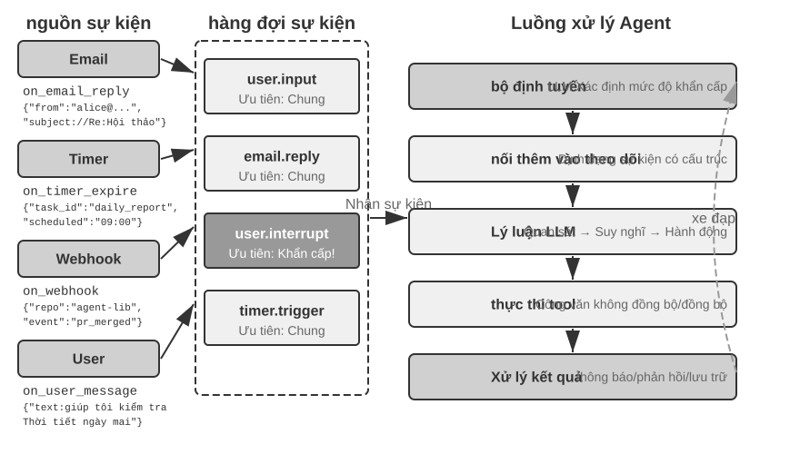

### Triển khai cơ chế hướng sự kiện trong OpenClaw

Khung công tác nguồn mở OpenClaw (có kiến trúc sẽ được mô tả chi tiết trong Chương 5) nhận các tin nhắn đa kênh thông qua mặt phẳng điều khiển Gateway và định tuyến chúng đến thời gian chạy Agent. Nó cung cấp ba cơ chế tự động hóa tích hợp:

- **Hooks (móc sự kiện)**: phản hồi các sự kiện trong vòng đời Agent, chẳng hạn như tạo phiên, đặt lại, v.v., tương tự như trình kích hoạt sự kiện trong Hành động GitHub
- **Cron (bộ lập lịch thời gian)**: thực hiện các tác vụ định kỳ theo biểu thức cron (cú pháp tác vụ theo lịch trình được sử dụng rộng rãi trong các hệ thống Unix, chẳng hạn như `0 9 * * 5` biểu thị 9 giờ sáng thứ Sáu hàng tuần), chẳng hạn như tạo báo cáo hàng tuần vào thứ Sáu hàng tuần và tổng hợp dữ liệu vào đầu mỗi tháng
- **Heartbeat (Heartbeat Daemon)**: Đánh thức Agent cứ sau N phút, kiểm tra xem có vấn đề gì cần chú ý không và dựa vào phán đoán để tránh cảnh báo mệt mỏi

Ba cơ chế này mang lại cho OpenClaw Agent vẻ ngoài "tự chủ" - ngay cả khi người dùng không trực tuyến, Agent có thể thường xuyên tạo báo cáo, kiểm tra trạng thái hệ thống và xử lý các giao dịch thông thường. Nhưng nhìn kỹ hơn sẽ thấy một hạn chế cơ bản. Trước tiên, cần phải làm rõ một điều: Bản thân Cổng này **đẩy** các tin nhắn từ các kênh tích hợp sẵn (chẳng hạn như IM, giao diện Web) và các tin nhắn được định tuyến đến Agent ngay khi chúng đến; trong số ba cơ chế tự động hóa, chỉ Cron và Heartbeat thực sự có thể cho phép Agent "tự di chuyển" khi không có tin nhắn của người dùng và cả hai đều **theo thời gian** - Heartbeat kiểm tra mọi khoảng thời gian cố định, Cron kích hoạt tại một thời điểm định sẵn và Hooks Nó chỉ phản hồi một cách thụ động với các sự kiện vòng đời trong khuôn khổ và không thể đưa ra những thay đổi mới ở thế giới bên ngoài. Thiếu sót thực sự là: đối với bất kỳ nguồn sự kiện của bên thứ ba nào ngoài kênh tích hợp - một email mới đến, một lệnh gọi lại API bên ngoài được đẩy, một thông báo khẩn cấp cần được xử lý ngay lập tức - OpenClaw thiếu kênh truy cập ngay lập tức và Agent không thể phản hồi sự kiện tại thời điểm nó xảy ra và chỉ có thể đợi đến chu kỳ Cron/Heartbeat tiếp theo để thông báo.

Sự chậm trễ này là không thể chấp nhận được trong nhiều trường hợp. Lấy **PineClaw**(plug-in OpenClaw của Pine AI) làm ví dụ: Pine AI là trợ lý AI thực hiện các cuộc gọi điện thoại thực thay mặt người dùng. Các tình huống điển hình bao gồm đàm phán hóa đơn, hủy đăng ký và xử lý yêu cầu bảo hiểm. Khi người dùng bắt đầu tác vụ gọi điện thoại Pine thông qua OpenClaw Agent, AI giọng nói của Pine sẽ thay mặt người dùng thực hiện cuộc gọi, nhưng có thể cần sự can thiệp của người dùng bất cứ lúc nào trong cuộc gọi:

- **Xác thực theo thời gian thực**: Dịch vụ khách hàng yêu cầu xác minh danh tính chủ tài khoản, Pine yêu cầu người dùng cung cấp ngay mã bảo mật hoặc mã xác minh OTP (mật khẩu một lần)
- **Xác nhận cuộc gọi ba chiều**: Dịch vụ khách hàng yêu cầu trò chuyện trực tiếp với chủ tài khoản, Pine yêu cầu người dùng trả lời cuộc gọi trong vòng vài giây
- **Đồng bộ hóa tiến độ và xác nhận quyết định**: Khi đàm phán đạt đến nút chính (chẳng hạn như bên kia đề xuất kế hoạch giảm giá), Pine cần người dùng xác nhận xem có chấp nhận hay không.

Nếu bạn dựa vào việc bỏ phiếu theo lịch trình của Heartbeat—giả sử khoảng thời gian nhịp tim là 5 phút—người dùng có thể không nhận được thông báo trong một thời gian dài trong khi dịch vụ khách hàng chờ mã xác minh, khiến dịch vụ khách hàng bị treo và cuộc gọi không thành công. Và việc rút ngắn khoảng thời gian bỏ phiếu xuống cấp độ thứ hai sẽ gây ra một số lượng lớn yêu cầu không hợp lệ và lãng phí tài nguyên.

Giải pháp của PineClaw là giới thiệu **Cơ chế kênh** - thiết lập kênh sự kiện thời gian thực giữa OpenClaw's Gateway và Pine API. Khi các sự kiện chính như cuộc gọi được kết nối, yêu cầu đầu vào của người dùng và cuộc gọi kết thúc, tin nhắn sẽ ngay lập tức được đẩy tới OpenClaw Agent. Agent ngay lập tức xử lý và thông báo cho người dùng, đồng thời độ trễ phản hồi giảm từ vài phút xuống còn vài giây.

Trường hợp này cho thấy giá trị cốt lõi của kiến trúc hướng sự kiện đối với khung Agent: **"Dịch vụ đang hoạt động" thực sự không chỉ yêu cầu Agent thường xuyên kiểm tra sự kiện mà còn yêu cầu sự kiện chủ động thông báo cho Agent**. Mô hình hóa thống nhất tất cả đầu vào - thông báo của người dùng, trả về công cụ, lệnh gọi lại bên ngoài, trình kích hoạt theo thời gian - dưới dạng luồng sự kiện và thúc đẩy suy nghĩ và hành động của Agent thông qua các vòng sự kiện, là nền tảng kiến trúc để đạt được mục tiêu này. Theo kiến trúc này, phần sau đây trước tiên sẽ giới thiệu hai loại công cụ liên quan trực tiếp đến các sự kiện, cũng như danh tính ảo và môi trường thực thi biệt lập hỗ trợ hành động độc lập của Agent, sau đó thảo luận về thiết kế cụ thể của cơ chế xử lý sự kiện.

### Công cụ kích hoạt sự kiện

Công cụ kích hoạt sự kiện là lối vào cho các hành động Agent theo sự kiện bên ngoài. Nếu không có công cụ kích hoạt sự kiện, Agent chỉ có thể suy nghĩ theo vòng lặp liên tục, gọi công cụ và cuối cùng đưa ra kết quả, sau đó đợi đầu vào tiếp theo của người dùng. Để chuyển đổi những thay đổi trên thế giới thành các sự kiện mà Agent có thể xử lý, có ba loại công cụ kích hoạt sự kiện phổ biến.

**Timer**(set_timer) xử lý các sự kiện phụ thuộc vào thời gian thực tế. Ví dụ: nếu bạn gửi email nhưng bên kia không trả lời, bạn nên gửi một email khác sau một thời gian để hỏi thăm tiến độ; nếu bạn gọi điện nhưng đầu bên kia không có mặt trong giờ làm việc, bạn cần thử lại trong giờ làm việc tiếp theo. Để đạt được mục đích này, các công cụ như OpenClaw và Claude Code đều hỗ trợ các công cụ hẹn giờ để tự đánh thức vào một thời điểm vật lý cụ thể. **Hẹn giờ một lần** được sử dụng cho các tác vụ có mốc thời gian rõ ràng: ví dụ: người dùng yêu cầu "Gọi cho DMV" và hiện tại là Thứ Bảy. Agent đặt "Gọi cho DMV lúc 10:00 sáng Thứ Hai tuần sau" và cuộc gọi sẽ tự động được thực hiện sau khi đồng hồ bấm giờ được kích hoạt. **Bộ đếm thời gian** được sử dụng cho các tác vụ định kỳ: chẳng hạn như kiểm tra tình trạng máy chủ mỗi giờ và gửi báo cáo tiến độ vào thứ Sáu hàng tuần. Ngoài ra, một số dịch vụ bên ngoài không hỗ trợ tiến trình đẩy chủ động và chỉ có thể chủ động truy vấn tiến trình. Trong trường hợp này, cần phải sử dụng bộ đếm thời gian theo chu kỳ để truy vấn lặp đi lặp lại đều đặn - Heartbeat của OpenClaw ở phần trước là hệ thống hóa cơ chế này và là gốc rễ của khả năng "dịch vụ tích cực" của OpenClaw.

**Trình giám sát tác vụ nền**(monitor_shell) xử lý các sự kiện từ các công cụ hoặc tác vụ dòng lệnh thực thi không đồng bộ. Một số tác vụ dòng lệnh cần được thực thi trong nền trong thời gian dài và Agent cần theo dõi tiến trình thực thi. Nếu Agent được phép tiếp tục "nhìn chằm chằm vào dòng lệnh", tức là liên tục gọi các công cụ để truy vấn tiến trình hiện tại thì quá nhiều token sẽ bị lãng phí; nếu Agent được phép bắt đầu suy nghĩ về các hành động sau khi tác vụ dòng lệnh được thực thi đầy đủ thì Agent sẽ không thể phát hiện kịp thời các vấn đề nghiêm trọng trong quá trình thực thi, thậm chí sẽ không thể can thiệp khi dòng lệnh bị kẹt, khiến toàn bộ tác vụ bị kẹt. Cách Claude Code giải quyết vấn đề này là giới thiệu một công cụ giám sát, cho phép Agent giám sát đầu ra mới từ dòng lệnh hoặc đầu ra chứa các từ khóa cụ thể.

**Kênh sự kiện bên ngoài**(connect_channel) đẩy các sự kiện bên ngoài như email mới đến, cuộc gọi lại API và tin nhắn IM tới Agent trong thời gian thực. Cơ chế Channel của PineClaw ở phần trước là một cách triển khai điển hình.

Ở cấp độ thiết kế, các công cụ kích hoạt sự kiện phải xác định rõ ràng các điều kiện kích hoạt và quy tắc lọc để tránh lãng phí năng lượng tính toán do đánh thức Agent do các sự kiện không liên quan; tải trọng sự kiện phải chứa đủ thông tin theo ngữ cảnh để giảm số lượng truy vấn bổ sung cần thiết sau khi Agent được đánh thức.

### Công cụ giao tiếp với người dùng

Trong OpenClaw, session không lộ ra với người dùng; người dùng và Agent có thể nhắn tin bất cứ lúc nào bằng công cụ chuyên dụng, kèm ảnh, tệp, thông báo đẩy, nội dung đa phương thức và Generative UI.

Công cụ giao tiếp người dùng được ra đời khi các kênh giao tiếp của Agent với người dùng ngày càng đa dạng. Nhiều Agent (chẳng hạn như Claude Code, Manus, Genspark) áp dụng vòng lặp ReAct gốc. Tất cả các từ được Agent "nói" (tức là tin nhắn trợ lý) đều được gửi trực tiếp đến người dùng. Người dùng phải mở một phiên được chỉ định trong Ứng dụng để nói chuyện với Agent. OpenClaw là một trong những đại diện có ảnh hưởng nhất của Agent nói chung đã phá vỡ mô hình giao tiếp giữa người và máy tính này: phiên của nó là minh bạch đối với người dùng - người dùng không cần biết về sự tồn tại của phiên và không cần quan tâm đến các chi tiết của công cụ gọi điện Agent; cả người dùng và Agent đều có thể gửi tin nhắn cho nhau bất kỳ lúc nào, thay vì người dùng gửi một tin nhắn và Agent trả lời một tin nhắn. Vì vậy, nhiều người nhận xét OpenClaw có "cảm giác sống động" và giao tiếp không đồng bộ với người dùng thông qua tin nhắn giống như một thư ký. Tại thời điểm này, các tin nhắn văn bản này không trực tiếp xuất ra các tin nhắn trợ lý do mô hình xuất ra cho người dùng mà sử dụng các công cụ đặc biệt để gửi tin nhắn. Những tin nhắn này cũng có thể được đính kèm với hình ảnh và tệp đính kèm, đồng thời có thể kèm theo lời nhắc thông báo đẩy tùy theo mức độ khẩn cấp.

Ngoài việc giao tiếp với người dùng qua văn bản, Agent ngày càng có khả năng giao tiếp đa phương thức, chẳng hạn như gửi tin nhắn thẻ có cấu trúc và gửi email nhắc nhở. Một số Agent đã bắt đầu thử nghiệm giao diện người dùng tổng quát, nghĩa là sử dụng HTML và các phương pháp khác để tạo giao diện tương tác nhằm hiển thị thông tin cho người dùng theo cách thân thiện hơn. Ở cấp độ thiết kế, các công cụ giao tiếp với người dùng phải hỗ trợ chế độ nhắn tin không đồng bộ (người dùng không nhất thiết phải trực tuyến), cung cấp tính năng theo dõi trạng thái đã đọc/chưa đọc và duy trì tính nhất quán của tin nhắn trong các tình huống đa kênh.

**Nhiều kênh liên lạc và thu hồi người dùng.**

Ở đây chúng ta cần làm rõ ranh giới danh mục dễ bị nhầm lẫn: đó cũng là "gửi thông báo". Nếu đối tượng thông báo là người phê duyệt hoặc cộng tác viên (chẳng hạn như yêu cầu phê duyệt của quản trị viên, báo cáo tiến trình cộng tác Agent), thì công cụ này được phân loại là công cụ cộng tác; nếu đối tượng thông báo là người dùng cuối thì nó được phân loại là công cụ giao tiếp với người dùng. Sự khác biệt giữa cả hai không nằm ở kênh mà ở "ai được thông báo và tại sao".

**Phản hồi của Agent không nên giới hạn ở một kênh duy nhất. Cơ chế thông báo cũng là cơ chế thu hồi của người dùng**. Việc gửi tin nhắn mở rộng đến nhiều kênh như nhắn tin tức thời, tin nhắn văn bản, email, cuộc gọi điện thoại và thông báo đẩy. Agent xác định toàn diện việc lựa chọn kênh dựa trên mức độ khẩn cấp, trạng thái người dùng, tính chất nội dung và tùy chọn của người dùng, đảm bảo rằng các tin nhắn quan trọng không bị bỏ sót và tránh bị gián đoạn nhiều lần.

Đối với các tác vụ có thời gian chạy dài, Agent cần chủ động thông báo cho người dùng khi hoàn thành để thu hút sự chú ý của người dùng. Đối với các công việc thông thường (như tóm tắt hàng ngày, báo cáo hàng tuần), thông báo có thể giúp người dùng thiết lập thói quen tương tác cố định.

Công cụ giao tiếp với người dùng giải quyết vấn đề “làm thế nào để tiếp cận người dùng”. Tuy nhiên, Agent xuất hiện với khả năng nào trên các kênh này và nó thực hiện các hoạt động thay mặt cho người dùng trong môi trường nào, thì cũng cần có một lớp nhận dạng và cơ sở hạ tầng môi trường, đây là chủ đề của phần tiếp theo.

### Nhận dạng ảo và môi trường thực thi biệt lập

Máy tính ảo có thể chạy 24/7, hạn chế Agent truy cập tự do vào tệp cục bộ và cô lập lỗi trong môi trường ảo. Dữ liệu được trao đổi bằng đường dẫn trong hệ thống tệp dùng chung.

Trước tiên, cần phải giải thích vị trí của phần này: danh tính ảo và môi trường thực thi biệt lập về cơ bản là cơ sở hạ tầng môi trường thực thi, giống như hộp cát đã thảo luận trong phần trước về các công cụ thực thi; Lý do tại sao nó được mở rộng sang phần kiến trúc không đồng bộ là vì chỉ Agent, có thể chạy độc lập, thường trú và hoạt động thay mặt người dùng bất cứ lúc nào, cần nó nhất.

Như đã đề cập ở đầu chương này, Samantha in Her có bản sắc và môi trường hoạt động riêng biệt. Để triển khai một trợ lý phổ quát như vậy, trước tiên chúng ta phải đối mặt với một lựa chọn kiến trúc quan trọng: Agent nên trực tiếp quản lý tài khoản cá nhân của người dùng hay có danh tính ảo riêng? Quản lý trực tiếp có vẻ thuận tiện nhưng một khi Agent gặp lỗi hoặc bị xâm phạm, toàn bộ danh tính kỹ thuật số của người dùng sẽ bị lộ. Một giải pháp an toàn hơn là cung cấp cho Agent một danh tính ảo độc lập - giống như một thư ký có số điện thoại văn phòng và địa chỉ email riêng. Danh tính ảo này bao gồm một tài khoản liên lạc chuyên dụng, không gian lưu trữ và môi trường điện toán, cho phép Agent hoạt động thay mặt người dùng với danh tính minh bạch. Không hề làm xói mòn lòng tin, sự rõ ràng về danh tính còn nâng cao tính xác thực của giao tiếp.

Danh tính ảo cần được triển khai trong môi trường thực thi biệt lập. **Máy tính ảo**(VM/container) và **Điện thoại ảo**(trình mô phỏng Android) cung cấp khả năng cách ly cấp hệ điều hành và khả năng vận hành hoàn chỉnh trên máy tính để bàn/thiết bị di động cho Agent: Agent có tài khoản người dùng, thư mục chính và thông tin đăng nhập riêng, đồng thời tất cả các hoạt động đều có thể theo dõi và kiểm tra được; ngay cả khi thực hiện thao tác không chính xác, nó sẽ không ảnh hưởng đến hệ thống máy chủ và thiết bị thực của người dùng. Đây là phần mở rộng của ý tưởng hộp cát được thảo luận trong phần trước về các công cụ thực thi trong khía cạnh "nhận dạng kỹ thuật số" - hộp cát cô lập việc thực thi mã, trong khi máy tính ảo và điện thoại di động ảo cô lập toàn bộ danh tính kỹ thuật số.

Bản sắc độc lập cũng mang lại hai thách thức thực tế. Đầu tiên là **Cơ chế chống tự động**: Nhiều trang web sử dụng mã xác minh CAPTCHA và phát hiện danh tiếng IP để chặn truy cập tự động. Môi trường ảo từ IP trung tâm dữ liệu có thể dễ dàng được xác định. Trong thực tế, thường cần phải định cấu hình mạng proxy dân cư (sử dụng IP gia đình thực) để truy cập thông thường. Thứ hai là kịch bản truy cập tài khoản thực của người dùng: khi tác vụ phải đăng nhập với tư cách là người dùng, nên sử dụng xác thực Human-in-the-Loop - thông qua máy tính từ xa VNC/RDP, người dùng có thể hoàn tất đăng nhập trực tiếp trong môi trường trực quan và người dùng có thể thấy Agent Giao diện hoàn chỉnh đang hoạt động, hiểu lý do tại sao cần phải xác thực; mã thông báo phiên được xác thực sẽ được sử dụng lại trong thời hạn hiệu lực, tránh sự gián đoạn thường xuyên đối với người dùng và tạo ra sự cân bằng giữa quyền tự chủ và bảo mật.

Quá trình trao đổi dữ liệu giữa Agent chính và môi trường ảo được hoàn thành thông qua **hệ thống tệp dùng chung**: Agent chính, máy tính ảo và điện thoại di động ảo được kết nối dưới dạng gắn âm lượng (chẳng hạn như `/workspace/shared`). Dữ liệu được truyền bằng tham chiếu đường dẫn tệp thay vì sao chép nội dung để tránh chiếm cửa sổ ngữ cảnh. Lấy tác vụ phân tích dữ liệu làm ví dụ: người dùng tải tệp CSV lên thư mục dùng chung, Agent trong máy tính ảo sẽ đọc tệp, thực hiện phân tích, tạo biểu đồ và lưu lại vào thư mục dùng chung, còn Agent chính chỉ cần trả về đường dẫn tệp của biểu đồ cho người dùng - tất cả những gì được chuyển giữa các bên luôn là một chuỗi đường dẫn nhẹ.

Các công cụ kích hoạt sự kiện cho phép thế giới đánh thức Agent, các công cụ giao tiếp với người dùng cho phép Agent tiếp cận người dùng, đồng thời danh tính ảo và môi trường thực thi biệt lập cho phép Agent hoạt động với danh tính độc lập và có thể kiểm tra được. Câu hỏi còn lại là: nên làm gì khi có nhiều sự kiện tràn ngập cùng một phiên bản Agent cùng một lúc?

### Cơ chế xử lý sự kiện

Phiên bản Agent có thể gặp phải nhiều sự kiện cùng lúc: tin nhắn mới từ người dùng, kết quả được công cụ trả về, hết hạn hẹn giờ và yêu cầu cộng tác từ một Agent khác. Cách xử lý những sự kiện này một cách hiệu quả và chính xác sẽ ảnh hưởng trực tiếp đến hiệu suất và trải nghiệm người dùng.

Bộ khung của cơ chế này chính là **vòng lặp sự kiện** (event loop) trong lập trình đồng thời. Có thể xem Agent không đồng bộ như một vòng lặp chạy dài hạn: mỗi vòng lấy ra một số sự kiện từ hàng đợi đầu vào, nối vào trajectory, gọi LLM một lần, thực thi các công cụ mà nó quyết định, rồi quay về đầu vòng lặp để chờ lô sự kiện tiếp theo—đây là cùng một cấu trúc với việc goroutine của Go đọc tin nhắn từ channel và xử lý từng vòng trong `for { select { ... } }`. Mô hình này có một tính chất then chốt: **sự kiện chỉ được tiêu thụ tại ranh giới của mỗi vòng lặp**. Khi LLM đang suy luận, khi công cụ đang thực thi, sự kiện mới đến sẽ không tự nhiên chen vào giữa và làm rối bước hiện tại, mà trước hết chờ trong hàng đợi, đợi vòng này đạt đến một **điểm an toàn** (một đoạn suy luận kết thúc, một lần công cụ trả về) rồi mới xử lý thống nhất. Việc hủy cũng tuân theo cùng một kỷ luật: không cưỡng bức cắt ngang tại bất kỳ thời điểm nào, mà kiểm tra "có bị yêu cầu dừng hay không" tại điểm an toàn—đây chính là vai trò mà `ctx.Done()` trong Go đảm nhiệm (Chương 10 sẽ dùng cùng một tư duy context để thảo luận việc Agent cha hủy Agent con theo kiểu tầng). Hiểu được điều này thì sự khác biệt giữa ba chiến lược xử lý dưới đây chỉ nằm ở cách đối xử với điểm an toàn: để sự kiện chờ đến điểm an toàn tự nhiên tiếp theo (kiểu xếp hàng), chủ động tạo sớm một điểm an toàn (kiểu hủy), hay đơn giản là mở một vòng lặp khác, khỏi phải chờ điểm an toàn của vòng lặp chính (kiểu song song).

**Mô hình hóa có cấu trúc của các sự kiện.**

Điều kiện tiên quyết để xử lý là sự hiểu biết. Chung Agent không chỉ phải đối mặt với đầu vào từ người dùng - tin nhắn do bên thứ ba gửi không được người dùng gửi đến Agent mà Agent cần hiểu nó, đánh giá tầm quan trọng của nó và quyết định cách can thiệp. Điều này đòi hỏi mỗi đầu vào phải được mô hình hóa như một sự kiện có cấu trúc chứa ngữ nghĩa phong phú:

- **Nguồn (ai)**: Bản thân người dùng, người liên hệ, người lạ, thông báo hệ thống
- **Kênh (phương pháp)**: giọng nói điện thoại, tin nhắn văn bản, tin nhắn tức thời, email, mạng xã hội, bộ hẹn giờ kích hoạt, kết quả cuộc gọi công cụ không đồng bộ, cập nhật trạng thái giám sát dòng lệnh
- **Nội dung (cái gì)**: nội dung tin nhắn, màu sắc cảm xúc, mức độ khẩn cấp, liệu có cần trả lời không
- **Ngữ cảnh (nền)**: Đó là câu trả lời cho cuộc trò chuyện trước đó hay cuộc liên lạc mới được bắt đầu và nó có liên quan đến nhiệm vụ hiện tại không?

Lấy email yêu cầu hoàn tiền của khách hàng làm ví dụ, hình thức cụ thể của sự kiện có cấu trúc như sau:

```json
{
  "source": {"type": "email", "sender": "client@example.com"},
  "channel": "gmail_webhook",
"content": {"subject": "Yêu cầu hoàn tiền", "body": "Đơn hàng số 12345 muốn được hoàn lại tiền..."},
  "context": {"priority": "high", "customer_tier": "vip", "related_orders": ["#12345"]}
}
```

Chỉ khi các thứ nguyên này được mô hình hóa rõ ràng dưới dạng sự kiện có cấu trúc, Agent mới có thể duy trì nhận thức rõ ràng trong giao tiếp nhiều bên và tránh nhầm thông tin đầu vào của người dùng với kết quả công cụ hoặc nhầm kết quả công cụ với hướng dẫn ẩn cho hướng dẫn người dùng, dẫn đến việc tiêm nhanh. Sự phức tạp của quản lý ngữ cảnh đa luồng cũng yêu cầu Agent hiểu được mối tương quan giữa nhiều chuỗi hội thoại - cách tin nhắn từ bên thứ ba ảnh hưởng đến cảm xúc của người dùng, sự chuyển đổi vai trò của người dùng trong nhiều cuộc hội thoại và khi thông tin từ các chuỗi khác nhau cần được kết hợp để đưa ra đề xuất. Từ hệ sinh thái kích hoạt của các nền tảng quy trình làm việc như n8n, chúng ta có thể thấy rằng Webhooks, bộ hẹn giờ, email, thay đổi cơ sở dữ liệu và giám sát tệp - mỗi trình kích hoạt là một "giác quan" để Agent nhận thức thế giới. Khi các sự kiện không đồng nhất này được mô hình hóa thống nhất thành định dạng có cấu trúc, Agent có thể xử lý các kích thích từ các nguồn khác nhau một cách nhất quán. Các chiến lược xử lý và xác định mức độ khẩn cấp dưới đây cũng dựa trên mô hình thống nhất này.

**Policy xử lý động dựa trên mức độ khẩn cấp.**

Khi con người xử lý nhiều nhiệm vụ, họ áp dụng các chiến lược khác nhau tùy thuộc vào mức độ khẩn cấp. Khi gặp tình huống khẩn cấp bất ngờ, bạn sẽ ngay lập tức dừng việc mình đang làm; khi đối mặt với các mục việc cần làm thường ngày, bạn sẽ thêm chúng vào danh sách nhiệm vụ để giải quyết sau. Quá trình xử lý sự kiện của Agent cũng sẽ phản ánh thông tin này.

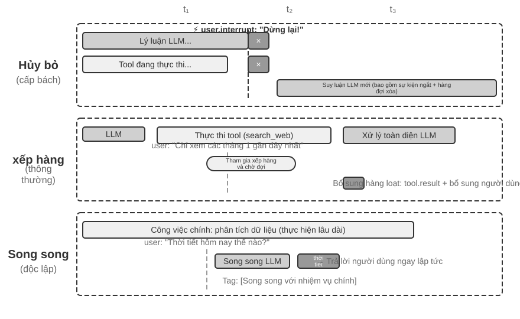

**Xử lý hủy (Cancellation-Based)** được sử dụng trong trường hợp khẩn cấp, mà bản chất là **tạo sớm một điểm an toàn** cho sự kiện khẩn cấp: chủ động ngắt bước hiện tại, biến khoảnh khắc này thành một ranh giới có thể tiêu thụ sự kiện mới. Khi xảy ra sự kiện khẩn cấp (chẳng hạn như người dùng nhấp vào "Dừng" hoặc hệ thống giám sát gửi lệnh có mức độ ưu tiên cao): (1) Dừng hoạt động hiện tại - nếu LLM đang suy luận, hãy hủy phản hồi phát trực tuyến ngay lập tức; nếu một công cụ đồng bộ hóa đang thực thi, hãy gửi tín hiệu hủy; (2) Xóa hàng đợi đang chờ xử lý và xóa tất cả các sự kiện; (3) Nối các sự kiện trong hàng đợi và sự kiện khẩn cấp vào cuối đường đua; (4) Gọi lại ngay LLM, lấy trajectory hoàn chỉnh được cập nhật làm đầu vào để đánh giá tình hình. Ví dụ: nếu người dùng nhập "Dừng lại! Tôi đã nói sai" khi Agent thực hiện một thao tác có thể sai, Agent sẽ ngay lập tức nhìn thấy thông tin nhập mới này và hiểu lại ý định thực sự, từ đó tránh thực hiện thao tác sai.

**Xếp hàng** được sử dụng cho các sự kiện thông thường. Khi các sự kiện không khẩn cấp đến (chẳng hạn như các công cụ không đồng bộ trả về kết quả hoặc người dùng gửi thông tin bổ sung): (1) Đặt sự kiện vào cuối hàng đợi mà không làm gián đoạn hoạt động hiện tại; (2) Đợi thao tác hiện tại hoàn tất - để LLM hoàn thành suy luận và để công cụ đồng bộ hoàn tất việc thực thi; (3) Khi bất kỳ lệnh gọi công cụ nào hoàn thành và trả về `tool.result`, hãy kiểm tra hàng đợi và nếu hàng đợi không trống, hãy thêm tất cả các sự kiện vào trajectory cùng một lúc; (4) LLM xử lý toàn diện trajectory được cập nhật. Điều này thực hiện xử lý hàng loạt và cải thiện hiệu quả - ví dụ: sau khi Agent gọi công cụ tìm kiếm, người dùng sẽ thêm "chỉ xem kết quả của tháng trước" trong khi chờ đợi. Thông tin bổ sung này được đưa vào hàng đợi và khi kết quả tìm kiếm được trả về, hai sự kiện sẽ được hiển thị cùng nhau cho LLM, tránh các chuyến đi khứ hồi không cần thiết.

**Xử lý song song (Song song)** được sử dụng cho các truy vấn nhẹ độc lập. Ví dụ: khi Agent đang phân tích một lượng lớn dữ liệu, người dùng đột nhiên hỏi "Thời tiết hôm nay thế nào?" Loại truy vấn này có ba đặc điểm: không liên quan đến nhiệm vụ chính, yêu cầu phản hồi nhanh và chi phí thực hiện thấp. Không nên sử dụng xử lý hủy (sẽ làm gián đoạn các tác vụ chính quan trọng) cũng như xử lý hàng đợi (khiến người dùng phải chờ quá lâu). Trước tiên, hệ thống xác định tính độc lập và độ phức tạp của truy vấn, sau đó thực hiện truy vấn đó một cách độc lập trong phiên suy luận song song, gọi các công cụ cần thiết để tạo phản hồi và trả về ngay lập tức. Truy vấn và phản hồi được thêm vào trajectory của tác vụ chính và được đánh dấu rõ ràng là "được thực thi song song với tác vụ chính" để tránh nhầm lẫn LLM.

**Xác định tính cấp thiết.**

Sự kiện khẩn cấp: gián đoạn người dùng (`user.interrupt`), hướng dẫn giám sát (`supervisor.instruction`), gián đoạn Agent (`agent.interrupt`), kích hoạt bên ngoài được đánh dấu là khẩn cấp (chẳng hạn như cảnh báo hệ thống, lỗi thanh toán).

Sự kiện không khẩn cấp: Đầu vào chung của người dùng (`user.input`), đầu vào Agent (`agent.input`), kết quả công cụ (`tool.result`), bộ kích hoạt hẹn giờ (`timer.trigger`), bộ kích hoạt chung bên ngoài.

Các quy tắc được mã hóa cứng có những hạn chế và ngữ nghĩa của sự kiện xác định phương pháp xử lý - "Dừng ngay" sử dụng phương thức hủy, "Thời tiết hôm nay thế nào" sử dụng phương pháp song song và "Báo cáo cần được gửi cho tôi bằng tiếng Trung" sử dụng phương thức xếp hàng. **Nên sử dụng phân loại nhẹ LLM làm bộ định tuyến sự kiện** để nhanh chóng xác định chiến lược nào sẽ được sử dụng khi sự kiện diễn ra.

Sau đây là thử nghiệm Agent xử lý email theo hướng sự kiện để triển khai chiến lược xử lý sự kiện trên thành một triển khai có thể chạy được.

> **6-1 thử nghiệm ★★★: Xử lý email theo sự kiện Agent**
>
>
> 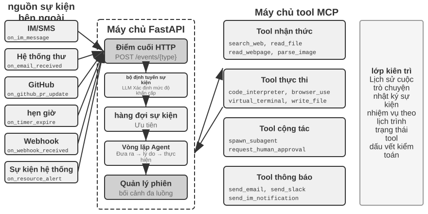
>
>
> Thử nghiệm này xây dựng Agent theo sự kiện đơn giản nhất: **Trợ lý xử lý email tự động**. Agent giám sát hộp thư đến email và tự động kích hoạt quá trình xử lý mỗi khi nhận được email mới - phân loại, tóm tắt, soạn thảo thư trả lời và thông báo cho người dùng khi cần thiết. Đây là kịch bản cấp đầu vào trực quan nhất dành cho Agent theo hướng sự kiện: một sự kiện bên ngoài (sự xuất hiện của một email mới) sẽ kích hoạt một chu trình suy nghĩ Agent hoàn chỉnh.
>
> **Mục tiêu thử nghiệm** là hiểu khái niệm cốt lõi của hướng sự kiện: Agent không còn chỉ thụ động chờ dữ liệu đầu vào của người dùng mà có thể thực hiện các hành động chủ động để phản hồi các sự kiện bên ngoài. Thông qua thử nghiệm này, người đọc sẽ nắm vững cách đăng ký nguồn sự kiện, hàng đợi sự kiện và vòng lặp khép kín cơ bản của "sự kiện đến → xử lý Agent → kết quả đầu ra".
>
> **Nguồn sự kiện và hàng đợi sự kiện.**
>
> Hệ thống hỗ trợ truy cập thống nhất vào nhiều nguồn sự kiện:
>
> - **Sự kiện thư**(`on_email_received`): Được kích hoạt khi có thư mới đến bằng cách kiểm tra hộp thư đến của bạn thường xuyên hoặc nhận thông báo đẩy
> - **Tin nhắn IM/SMS**(`on_im_message`, `on_sms_message`): được kích hoạt bởi tin nhắn trò chuyện
> - **Sự kiện GitHub**(`on_github_pr_update`, `on_github_issue_update`): PR xem xét bình luận, thay đổi trạng thái
> - **Trình kích hoạt hẹn giờ**(`on_timer_expire`): các tác vụ đã lên lịch (chẳng hạn như tóm tắt hàng ngày, tạo báo cáo hàng tuần)
> - **Webhook**(`on_webhook_received`): Gọi lại hệ thống bên ngoài chung
> - **Sự kiện hệ thống**(`on_user_inactive`, `on_process_timeout`, `on_resource_alert`): Thay đổi trạng thái nội bộ
>
> Tất cả các sự kiện đều được đưa vào một **hàng đợi sự kiện** thống nhất và được xử lý theo thứ tự đến. Mỗi sự kiện kích hoạt một vòng suy nghĩ Agent độc lập: Agent đọc nội dung sự kiện, gọi các công cụ liên quan (như truy vấn cơ sở kiến thức, đọc tệp đính kèm, tìm kiếm lịch sử email liên quan), tạo kết quả xử lý (nhãn danh mục, tóm tắt, trả lời nháp) và cuối cùng thông báo cho người dùng thông qua các công cụ thông báo hoặc thực hiện các thao tác trực tiếp.
>
> **Kịch bản xác minh**: Định cấu hình Agent để giám sát hộp thư kiểm tra. Mô phỏng nhận ba email - lời mời họp, khiếu nại của khách hàng và quảng cáo tiếp thị. Agent Xử lý theo trình tự: tự động kiểm tra xung đột lịch và bản nháp chấp nhận/từ chối phản hồi cho lời mời họp; trích xuất những thông tin quan trọng về khiếu nại của khách hàng và đánh dấu chúng là mức độ ưu tiên cao, thông báo cho người dùng để xử lý; tự động lưu trữ các quảng cáo tiếp thị. Toàn bộ quá trình không cần sự can thiệp của người dùng.

Thử nghiệm 6-1 trình diễn mô hình hướng sự kiện đơn giản nhất - các sự kiện được đưa vào hàng đợi và Agent lần lượt xử lý chúng. Nhưng khi Agent cần phản hồi các gián đoạn trong quá trình thực thi một công cụ chạy dài hoặc quản lý nhiều tác vụ đồng thời cùng lúc thì hàng đợi sự kiện đơn giản là không đủ. Những thách thức kỹ thuật sâu hơn sẽ được thảo luận tiếp theo.

### Triển khai dự án: Làm thế nào để mô hình đồng bộ hỗ trợ gián đoạn không đồng bộ

Thử nghiệm 6-1 chỉ xử lý các sự kiện nối tiếp - các sự kiện lần lượt vào hàng đợi và Agent xử lý chúng lần lượt. Bây giờ hãy quay lại mâu thuẫn “đào tạo đồng bộ/triển khai không đồng bộ” được nêu ở đầu phần này: Định dạng đồng bộ nên giải quyết sự gián đoạn đột ngột của người dùng khi công cụ chưa quay trở lại như thế nào? Phần này cung cấp các giải pháp kỹ thuật hiện tại trong ngành.

Trước tiên hãy sử dụng một kịch bản cụ thể để minh họa mâu thuẫn này. Giả sử Agent đang giúp người dùng soạn thảo một email (gọi công cụ: tìm kiếm thông tin liên hệ). Trước khi kết quả tìm kiếm được trả về, người dùng đột nhiên nói: "Đợi một chút, trước tiên hãy giúp tôi kiểm tra thời tiết ngày mai." Trong vòng lặp ReAct được đồng bộ hóa, Agent phải đợi tìm kiếm quay trở lại trước khi xử lý tin nhắn tiếp theo - vì API yêu cầu rằng "sau khi phát ra lệnh gọi công cụ, tin nhắn tiếp theo phải là kết quả của công cụ". Nhưng trong thế giới thực không đồng bộ, các sự kiện có thể làm gián đoạn các nhiệm vụ đang diễn ra bất cứ lúc nào. Làm thế nào để diễn đạt ngữ nghĩa của "ngắt không đồng bộ" dưới các ràng buộc của "định dạng đồng bộ" chính xác là câu hỏi cần được trả lời bằng kế hoạch kỹ thuật sau đây.

**Phương pháp kỹ thuật: thực hiện đồng bộ hóa mô phỏng không đồng bộ.**

Ý tưởng cốt lõi là: **Trong điều kiện bình thường không xảy ra gián đoạn, hãy để LLM xem trajectory đồng bộ hóa tiêu chuẩn và chỉ chèn phần giữ chỗ để sửa định dạng khi xảy ra gián đoạn**. Dưới đây là năm quy tắc chính:

**Quy tắc 1**: LLM ghi lại tin nhắn trợ lý (bao gồm suy nghĩ, nội dung và lệnh gọi công cụ) ngay khi xuất ra.

**Quy tắc 2**: Kết quả dao chỉ được ghi lại sau khi lệnh gọi dao hoàn tất. Dấu vết thực thi ở trạng thái "Đã hoàn thành một phần".

**Quy tắc 3**: Sự gián đoạn trong quá trình thực thi công cụ cần có phần giữ chỗ. Tạo phản hồi giữ chỗ cho công cụ chưa hoàn thành (chẳng hạn như "Công cụ đang thực thi ở chế độ nền, vui lòng xử lý các sự kiện mới trước"), nối thêm sự kiện gián đoạn và gọi lại LLM. Từ góc độ của LLM, thông báo trợ lý vẫn có kết quả công cụ phù hợp.

**Quy tắc 4**: LLM Việc gián đoạn trong quá trình suy nghĩ sẽ trực tiếp loại bỏ suy nghĩ hiện tại. Nếu không viết ra trajectory, các sự kiện mới sẽ được bổ sung trực tiếp và một vòng suy nghĩ mới được bắt đầu.

**Quy tắc 5**: Các sự kiện không gián đoạn sẽ được đưa vào hàng đợi và chờ xử lý hàng loạt. Nó sẽ chỉ được thêm vào một lần sau khi chu kỳ hiện tại hoàn thành.

Lấy việc người dùng ngắt lời để hỏi về thời tiết khi Agent đang soạn email làm ví dụ. Quy trình hoạt động của 5 quy tắc này như sau:

1. Agent gọi `search_contacts` để tìm kiếm thông tin liên lạc và tin nhắn trợ lý ngay lập tức được ghi vào trajectory (Quy tắc 1).
2. Khi công cụ tìm kiếm chưa trả về kết quả, người dùng gửi "Giúp tôi kiểm tra thời tiết ngày mai trước". Vì đây là sự gián đoạn của người dùng nên hệ thống sẽ tạo kết quả công cụ giữ chỗ cho `search_contacts` chưa hoàn thành ("Công cụ đang thực thi ở chế độ nền, vui lòng xử lý các sự kiện mới trước", quy tắc 3), sau đó thêm truy vấn thời tiết của người dùng vào trajectory và gọi lại LLM. Tại thời điểm này, định dạng trajectory mà LLM nhìn thấy là hoàn toàn hợp pháp—thông báo hỗ trợ và kết quả công cụ được ghép nối hoàn hảo.
3. Sau khi hoàn thành truy vấn thời tiết và người dùng được trả lời, kết quả `search_contacts` ban đầu sẽ xuất hiện và được thêm vào trajectory dưới dạng một sự kiện mới (Quy tắc 2). Agent đọc thông tin liên hệ và tiếp tục soạn thảo email.

Ưu điểm cốt lõi của giải pháp này là: **Trong điều kiện bình thường, LLM có trajectory đồng bộ hóa hoàn hảo**—thông báo hỗ trợ và kết quả công cụ được khớp hoàn toàn, trình tự thời gian rõ ràng và không có phần giữ chỗ hoặc trạng thái bất thường. Đây là phương pháp thân thiện nhất với LLM hiện tại dựa trên mô hình đào tạo đồng bộ, đảm bảo chất lượng tư duy ở mức cao nhất. Chỉ đưa ra “sự thỏa hiệp cần thiết” của các phần giữ chỗ khi sự gián đoạn thực sự cần thiết.

Nhưng vẫn có nguy cơ làm trầm trọng thêm ảo giác. Trong trường hợp này, mặc dù trình giữ chỗ tuyên bố rõ ràng rằng công cụ này "chưa hoàn thiện", hệ thống vẫn có thể "chế tạo" một công cụ dẫn đến suy nghĩ tiếp theo, nhầm tưởng rằng công cụ đó đã trả về dữ liệu hợp lệ và đưa ra các quyết định không phù hợp dựa trên kết quả hư cấu này. Điều này là do trong phần lớn các trajectory mà mô hình nhìn thấy trong quá trình đào tạo, các lệnh gọi công cụ sẽ ngay lập tức dẫn đến kết quả thực và mô hình không bao giờ học cách giải quyết tình huống "kết quả vẫn chưa quay lại". Do đó, trong thực tế, nó chỉ bị gián đoạn khi thực sự khẩn cấp (người dùng yêu cầu dừng rõ ràng) và các sự kiện không khẩn cấp được đưa vào hàng đợi để xử lý hàng loạt.

**Giao diện công cụ không đồng bộ phù hợp với các mô hình hiện có.**

Do giả định đồng bộ hóa của mô hình khó bị phá vỡ nên chiến lược cơ bản hơn là áp dụng ngữ nghĩa không đồng bộ từ cấp độ thiết kế của giao diện công cụ.

Thiết kế công cụ truyền thống ngụ ý ngữ nghĩa "gọi và thế là xong". Ví dụ: tên `phone_call` ngụ ý rằng "cuộc gọi sẽ thực hiện cuộc gọi và đợi cuộc gọi kết thúc, trả lại nhật ký cuộc gọi". Trong mô hình không đồng bộ, "bắt đầu" và "hoàn thành" phải được tách riêng:

- `initiate_phone_call`: Bắt đầu cuộc gọi điện thoại, trả về ngay mã định danh nhiệm vụ và trạng thái ban đầu (chẳng hạn như "Đã bắt đầu cuộc gọi, đang quay số")
- Thông báo tiến trình cuộc gọi qua sự kiện (`phone_call_connected`, `phone_call_ended`)

Điều quan trọng là tên và mô tả của công cụ này truyền tải ngữ nghĩa không đồng bộ. Khi một mô hình nhìn thấy `initiate_phone_call`, khả năng hiểu ngôn ngữ của nó tự nhiên suy ra rằng đây là "sự khởi đầu" chứ không phải là "sự hoàn thành". Mô tả công cụ cần củng cố thêm điều này: "Công cụ này sẽ bắt đầu tác vụ cuộc gọi điện thoại do trẻ Agent xử lý. Sau khi tác vụ được khởi tạo thành công, ID tác vụ sẽ được trả về ngay lập tức và bạn có thể tiếp tục làm những việc khác. Một sự kiện thông báo riêng sẽ được nhận khi cuộc gọi kết thúc."

**Vấn đề mất tập trung trong xử lý hàng đợi.**

Khi xử lý các sự kiện theo lô, mô hình thường chỉ tập trung vào sự kiện cuối cùng. Nguyên nhân cốt lõi là các mô hình được đào tạo để phản ứng với đầu vào mới nhất và các sự kiện hàng loạt phá vỡ giả định này.

Sự can thiệp có thể xảy ra ở hai cấp độ:

**Mức độ từ mẹo**: Cho mô hình biết "Khi nhận được nhiều sự kiện liên tiếp, vui lòng đảm bảo xem xét toàn diện tất cả thông tin".

**Điểm đánh dấu thanh trạng thái Agent**: Thêm điểm đánh dấu rõ ràng trước mỗi sự kiện:

```text
[Sự kiện chưa được xử lý 1/4] Kết quả công cụ từ cơ sở dữ liệu_query:...
[Sự kiện chưa được xử lý 2/4] Giải thích bổ sung của người dùng: Chỉ nhìn vào dữ liệu ở khu vực Bắc Kinh
[Sự kiện chưa xử lý 3/4] Nhắc nhở hệ thống: Thời hạn báo cáo còn 30 phút nữa
[Sự kiện chưa được xử lý 4/4] Người dùng hỏi: Tiến độ thế nào rồi?
```

Thêm phần tóm tắt ở cuối: "Có 4 sự kiện mở ở trên, bao gồm 1 kết quả công cụ, 2 tin nhắn của người dùng và 1 cảnh báo hệ thống. Hãy đảm bảo phản hồi bao gồm tất cả thông tin."

### Mâu thuẫn sâu sắc và định hướng tương lai


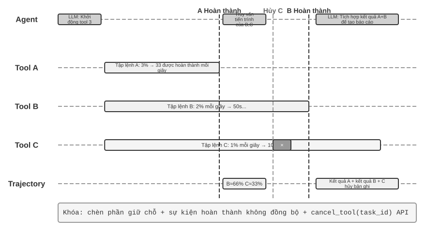


Trong phân tích cuối cùng, các phần giữ chỗ, giao diện công cụ không đồng bộ và các điểm đánh dấu trên thanh trạng thái trong các phần trước đều đang sử dụng Prompt Engineering (kỹ thuật prompt) để bù đắp cho cùng một mâu thuẫn "đồng bộ hóa đào tạo/triển khai không đồng bộ" (Hình 6-4) - nguyên nhân của mâu thuẫn này đã được trình bày chi tiết ở đầu phần này và sẽ không được nhắc lại ở đây mà chỉ tập trung vào giải pháp cơ bản của nó.

**Mong chờ sự phát triển của mô hình: từ đồng bộ sang không đồng bộ.**

Các kỹ thuật kỹ thuật trên về cơ bản là **sử dụng kỹ thuật nhanh chóng để bù đắp cho việc thiếu đào tạo mô hình** và là một biện pháp tạm thời trong giai đoạn chuyển tiếp. Giải pháp thực sự đòi hỏi sự thay đổi mô hình ở cấp độ đào tạo mô hình.

Các mô hình VLA (Vision-Language-Action, Tầm nhìn-Ngôn ngữ-Hành động, xem Chương 6 để biết chi tiết) trong lĩnh vực robot đã bắt đầu đối mặt với những thách thức tương tự: có sự chậm trễ không thể tránh khỏi giữa nhận thức và hành động. Sự thành công của VLA mở đường cho sự phát triển của mẫu Agent. Các mô hình thế hệ tiếp theo yêu cầu ba khả năng cốt lõi thông qua học tăng cường trong môi trường không đồng bộ:

1. **Hiểu sự đan xen không đồng bộ của các sự kiện trong trajectory**: Đây là lỗ hổng năng lực cốt lõi. Mô hình hiện tại yêu cầu một trình tự đồng bộ nghiêm ngặt, nhưng trong môi trường không đồng bộ thực sự, lệnh gọi công cụ có thể không được theo sau bởi kết quả công cụ mà là một thông báo người dùng mới; Việc suy nghĩ có thể bị gián đoạn giữa chừng, nhưng trạng thái trung gian nên được giữ lại trong quá trình theo dõi và tiếp tục suy nghĩ sau khi tin nhắn mới được xử lý thay vì bắt đầu lại từ đầu. Mô hình cần duy trì sự hiểu biết rõ ràng về trajectory "không theo thứ tự" này - những lệnh gọi công cụ nào vẫn đang chờ kết quả và những suy nghĩ nào là những phần chưa hoàn thành.
2. **Tiếp tục những công việc và suy nghĩ bị gián đoạn**: Khi bị gián đoạn để giải quyết những tình huống khẩn cấp, vẫn nhớ những công việc còn dang dở. Ví dụ: khi Agent đang thực thi công cụ phân tích dữ liệu, người dùng đột nhiên hỏi về thời tiết. Sau khi trả lời, người dùng đương nhiên phải đợi kết quả phân tích dữ liệu thay vì quên rằng công cụ vẫn đang chạy. Đặc biệt, hãy tránh ảo tưởng rằng lệnh gọi công cụ bị gián đoạn đã hoàn thành.
3. **Xử lý toàn diện các sự kiện hàng loạt**: Khi nhiều sự kiện được thêm vào trajectory theo lô, bạn không thể chỉ tập trung vào sự kiện cuối cùng mà phải xem xét toàn diện tất cả thông tin chưa được xử lý.

Để đạt được loại hình đào tạo RL không đồng bộ này đòi hỏi cơ sở hạ tầng mới: trình mô phỏng môi trường không đồng bộ (tạo ra các tình huống như trả lại công cụ bị trì hoãn, gián đoạn người dùng ngẫu nhiên, v.v.) và phần thưởng đặc biệt cho khả năng không đồng bộ (hiểu đúng về trajectory không theo thứ tự, phục hồi thành công suy nghĩ bị gián đoạn, tránh ảo giác, xử lý toàn diện các sự kiện hàng loạt).

“Suy nghĩ liên tục” không nhất thiết phải chờ thế hệ mô hình tiếp theo. Khoảng hai trăm dòng điều phối có thể biến một mô hình suy luận văn bản **hiện có** thành Agent **continuous-time**, nối giải pháp kỹ thuật tạm thời ở trên với sự tiến hóa của mô hình. Đây là bản nâng cấp của quy tắc 4: thay vì vứt bỏ nửa dòng suy nghĩ khi bị ngắt, hãy xây dựng toàn bộ tương tác thành một dòng suy nghĩ liên tục. Runtime có thể buộc đóng khối `<think>` đang viết, chèn quan sát mới—kết quả công cụ, lời ngắt của người dùng hoặc cập nhật nhận dạng—như một thông điệp bình thường rồi tiếp tục giải mã.

Cơ chế này tận dụng một tài nguyên thường bị lãng phí: mô hình có thể sinh hàng trăm token mỗi giây, trong khi một lời gọi công cụ hoặc lượt nói của người dùng có thể mất vài giây. Thời gian chờ đó có thể dùng để suy nghĩ. Vì vậy Agent có thể **vừa chờ vừa nghĩ**—tiếp tục từ thông tin chưa đầy đủ, thậm chí gọi trước công cụ tiếp theo—và **vừa làm vừa nghĩ**—tiếp tục suy luận trong lúc xuất kết quả và tự sửa giữa chừng.

> **Thử nghiệm 6-2 ★★★: Agent không đồng bộ với khả năng thực thi và ngắt song song**
>
>
> 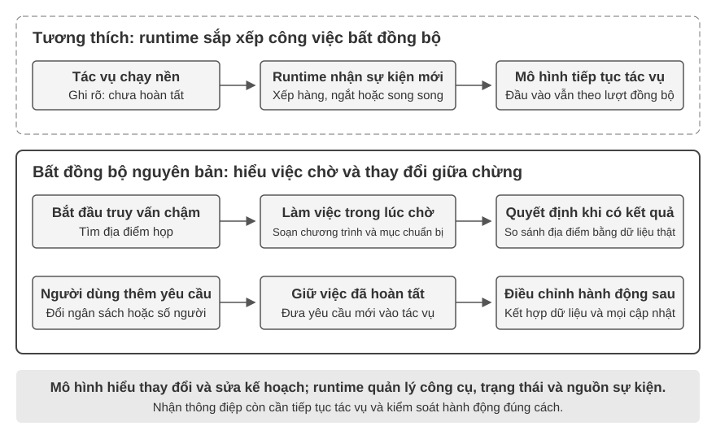
>
>
> Dựa trên hàng sự kiện đơn giản của thử nghiệm 6-1, thử nghiệm này đi vào vùng nước sâu của Agent không đồng bộ: **Thực thi công cụ song song, hủy thực thi và quản lý trạng thái**. Agent không còn chỉ xử lý từng sự kiện mà cần quản lý nhiều tác vụ đồng thời cùng lúc, xử lý các gián đoạn và phục hồi cũng như đưa ra quyết định linh hoạt dựa trên trạng thái thời gian thực.
>
> **1. Thực thi công cụ không đồng bộ**: Hỗ trợ thực thi không đồng bộ các công cụ tiêu tốn thời gian (ít nhất là 3-5 giây) và trả về phần giữ chỗ ngay sau khi khởi động. **Kịch bản xác minh**: Agent thực thi một lệnh đầu cuối dài, trong đó người dùng hỏi "Bây giờ là mấy giờ?", Agent phản hồi ngay lập tức và đợi kết quả phân tích được trả về trước khi hiển thị chúng.
>
> **2. Hàng đợi sự kiện và xử lý hàng loạt**: Tích lũy các sự kiện không khẩn cấp và thêm chúng vào theo dõi theo đợt. **Kịch bản xác minh**: Agent thực hiện một tác vụ dài. Người dùng liên tục gửi “nhớ trả lời bằng tiếng Nhật” và “sắp xếp thành một trang web”. Khi nhiệm vụ hoàn thành, tất cả các sự kiện sẽ được xử lý cùng một lúc và một trang web tiếng Nhật sẽ được tạo ra.
>
> **3. Cơ chế gián đoạn**: Lệnh "dừng" của người dùng sẽ ngay lập tức chấm dứt luồng thực thi và hủy công cụ không đồng bộ. **Kịch bản xác minh**: Agent thực hiện một tác vụ dài, người dùng gửi "Hủy", Agent dừng ngay lập tức và trajectory ghi lại các sự kiện gián đoạn và hoạt động hủy.
>
> **4. Hủy và truy vấn trạng thái của các công cụ song song**: Sau khi hoàn thành công cụ không đồng bộ, kết quả thực sẽ được đưa vào cuộc trò chuyện thông qua các sự kiện mới và hỗ trợ hủy hoặc truy vấn tiến trình thông qua ID tác vụ. **Tình huống xác minh**: Người dùng yêu cầu "Giúp tôi chạy ba tập lệnh này cùng lúc. Cái nào hoàn thành trước, hãy xem tiến độ của các tập lệnh còn lại như thế nào. Nếu chưa vượt quá 50% thì hãy hủy nó." Ba tập lệnh mô phỏng quá trình phân tích và liên tục xuất ra tiến trình khi chạy. Tốc độ lần lượt là 3%, 2% và 1% mỗi giây. Agent khởi động ba lệnh đầu cuối không đồng bộ cùng một lúc. Khi 3% tập lệnh mỗi giây được hoàn thành trong khoảng 33 giây, Agent truy vấn trạng thái của hai thiết bị đầu cuối còn lại và nhận thấy rằng một thiết bị đầu cuối được thực thi ở khoảng 66% và thiết bị kia ở khoảng 33%, do đó, thiết bị đầu cuối không vượt quá 50% sẽ bị hủy. Sau khi cả hai thiết bị đầu cuối được hoàn thành, kết quả sẽ được kết hợp để tạo ra một báo cáo đầy đủ.
>

Thực thi bất đồng bộ hướng sự kiện cho phép thế giới đánh thức Agent bất cứ lúc nào, nhưng giả định mô hình có thể nghĩ xong rồi mới phản hồi. Ba phần tiếp theo thách thức giả định đó: khi môi trường thay đổi nhanh bằng hoặc nhanh hơn tốc độ sinh của mô hình, “nghĩ xong rồi mới nói” tự nó trở thành độ trễ không thể chấp nhận.

## Giọng nói: giao diện người–máy tự nhiên nhất

Giọng nói không chỉ là chuyển văn bản thành âm thanh. Tốc độ nói nhanh khoảng bốn lần tốc độ gõ và giải phóng tay, mắt, nên Agent tự nhiên trở thành một vòng lặp vào–ra liên tục mà người dùng có thể ngắt bất cứ lúc nào. Đọc chính tả chuyển lời nói thành văn bản; voice Agent cho phép người dùng cộng tác trực tiếp với Agent. Cả hai đều hỗ trợ quy trình whisper coding đã giới thiệu trước đây.

Phần này xét hai hướng: người dùng nói với Agent, và Agent nói với thế giới bên ngoài thay mặt người dùng. Mô hình giọng nói quyết định Agent có thể trả lời gì; kiến trúc tương tác quyết định Agent có nghe rõ, đáp kịp thời, chuyển lượt tự nhiên, hoàn tất xác nhận và gọi công cụ trong cuộc gọi hay không.

### Thời gian tương tác: từ cascade đến full-duplex

Bài giới thiệu GPT-Live của OpenAI nêu ba mô hình tương tác bằng giọng nói: cascade, theo lượt và full-duplex[^ch6-12]. Đây không phải chuỗi thay thế đơn giản mà là các đánh đổi khác nhau giữa độ trễ, chi phí và khả năng quan sát:

| Mô hình | Cấu trúc cốt lõi | Ưu điểm chính | Hạn chế chính |
| --- | --- | --- | --- |
| Cascade | VAD → ASR → LLM → TTS | Mô-đun rõ ràng, dễ thay thế và gỡ lỗi | Độ trễ cộng dồn, thông tin cận ngôn ngữ mất ở các giao diện |
| Omni end-to-end | Đầu vào và đầu ra âm thanh native, tương tác theo lượt | Độ trễ thấp hơn, giữ tốt giọng điệu, cảm xúc và âm thanh môi trường | Vẫn theo lượt; huấn luyện và gỡ lỗi tốn kém hơn |
| Full-duplex | Đầu vào và đầu ra âm thanh native; liên tục nghe, nói và quyết định | Nói chồng, ngắt lời tự nhiên và luồng liên tục | Huấn luyện, điều khiển và đánh giá phức tạp hơn |

Điểm chung là thoát khỏi giả định mọi người phải nói lần lượt và khỏi phỏng đoán của VAD về người đang giữ lượt. Cascade và Omni vẫn chia tương tác thành các lượt; full-duplex biến quyền giữ lượt thành quyết định liên tục của mô hình.

[^ch6-12]: OpenAI. *Introducing GPT-Live.* 2026-07-08. https://openai.com/index/introducing-gpt-live/ Phân loại cascade / turn-based / full-duplex xuất phát từ phần tóm tắt ba thế hệ ChatGPT Voice; thuật ngữ “end-to-end omnimodal (Omni)” tương ứng với nhóm “turn-based voice models”.

### Mô hình 1 · Pipeline cascade

Phần lớn trợ lý giọng nói thương mại vẫn dùng pipeline tuần tự (Hình 6-6): VAD quyết định người dùng đã nói xong, ASR chuyển âm thanh thành văn bản, LLM hiểu và tạo câu trả lời, rồi TTS đọc câu trả lời. Tính mô-đun giúp tối ưu từng thành phần độc lập, nhưng mỗi ranh giới lại thêm thời gian chờ.

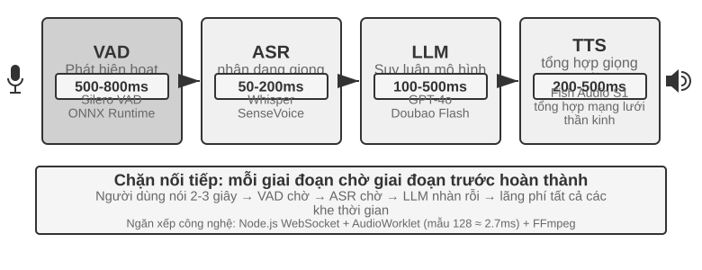

| Mô-đun | Vai trò | Nút thắt thường gặp |
| --- | --- | --- |
| VAD | Xác định lời nói đã kết thúc | Ngưỡng im lặng gây chờ và tách lượt sai |
| ASR | Chuyển âm thanh thành văn bản | Độ trễ nhận dạng và mất ngữ cảnh |
| LLM | Hiểu, suy luận và sinh câu trả lời | Thời gian đến token đầu tiên; reasoning làm chờ lâu hơn |
| TTS | Chuyển văn bản thành giọng nói | Tổng hợp gói đầu tiên và bộ đệm phát |

Với câu trả lời ngắn không reasoning, thời gian chờ của VAD, ASR, LLM và TTS cộng dồn theo chuỗi (Hình 6-7); giá trị thực phụ thuộc độ dài đầu vào, mô hình, phần cứng, mạng và tải. Trong sản xuất, xếp hàng còn khuếch đại độ trễ nhàn rỗi (Hình 6-8).

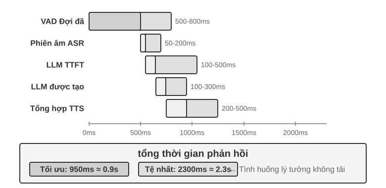

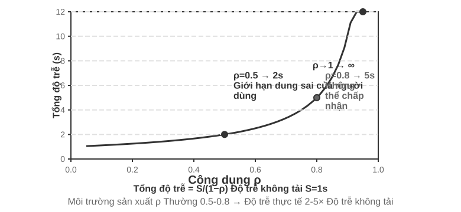

> **Thử nghiệm 6-3 ★: Xây dựng Agent thoại truyền thống**
>
> Kết nối microphone, Silero VAD, Whisper cục bộ, LLM dạng streaming và Fish S1 TTS qua WebSocket để thiết lập baseline dạng chuỗi.

#### Từ tuần tự đến nhận biết streaming

Hình 6-7 mô tả trường hợp hoàn toàn tuần tự: VAD, ASR, LLM và TTS chạy nối tiếp nhau. Cách nhận biết tuần tự này có ba vấn đề:

1. **Độ trễ cộng dồn**: phải chờ qua một khoảng im lặng mới xác nhận được là đã nói xong.
2. **Mất thông tin**: tín hiệu nhị phân có-tiếng/không-tiếng không thể diễn đạt do dự, cảm xúc, backchannel hay âm thanh môi trường.
3. **Ngữ cảnh bị cắt**: địa chỉ email, tên riêng và danh từ riêng có thể bị chia nhỏ giữa các đoạn và nhận dạng sai.

Để giải quyết vấn đề này mà vẫn giữ được sự phân chia mô-đun, một hướng tối ưu là **nhận biết streaming**, để mỗi giai đoạn sinh ra kết quả tăng dần càng sớm càng tốt:

- **ASR vừa nghe vừa chuyển**: khi VAD phát hiện người dùng bắt đầu nói, hệ thống gọi mô hình ASR theo một khoảng thời gian cố định để sinh transcript tạm thời theo kiểu streaming; khi VAD phát hiện người dùng đã nói xong, hệ thống mới xác nhận văn bản cuối cùng.
- **LLM thực thi suy đoán**: ngay khi có transcript tạm thời, hệ thống đã gửi nó cho LLM; nếu văn bản cuối cùng trùng với transcript tạm thời thì không cần gọi lại LLM, ngược lại phải hủy phần suy nghĩ suy đoán trước đó và gọi lại LLM.
- **LLM sinh câu trả lời theo từng đoạn**: câu đầu tiên đủ để đọc được sẽ được chuyển ngay cho TTS, không chờ toàn bộ câu trả lời.
- **TTS tổng hợp tăng dần**: liên tục trả về các đoạn âm thanh để việc sinh, tổng hợp và phát chồng lấp lên nhau.

Một mô hình streaming thực sự cần được hỗ trợ ở cấp mô hình. Bộ giải mã của Whisper tuy tự hồi quy, nhưng bộ mã hóa của nó cần trọn vẹn một đoạn âm thanh nên không thể coi ngang hàng với mô hình streaming. Mô hình âm thanh dựa trên LLM có thể phát ra văn bản và sự kiện ngữ nghĩa từ âm thanh liên tục, gộp "nhận dạng" và một phần "hiểu" vào cùng một mô hình. Nó giữ được ngữ cảnh từ đầu cuộc hội thoại đến thời điểm hiện tại, và cũng có thể tận dụng tri thức thế giới để xử lý thương hiệu, tên riêng và danh từ riêng.

Ngoài token văn bản, luồng có thể phát \`speak_start/end\`, \`interrupt\` (ranh giới lời nói và ý định ngắt), \`emotion\` (cảm xúc và do dự), \`laugh\`, \`sigh\`, \`noise\` (âm thanh cận ngôn ngữ và môi trường). Nhờ vậy Agent không phải nén mọi sự kiện âm thanh thành văn bản thường.

Nếu mục tiêu chỉ là xác định người dùng đã nói xong hay chưa, quyết định kết thúc lượt có thể được tích hợp trực tiếp vào bộ nhận dạng streaming. Nhãn huấn luyện chỉ được dùng thông tin nhìn thấy tại thời điểm ra quyết định; nếu không, thông tin nhìn lại sẽ tạo ra phán đoán không thể tái hiện trực tuyến.

> **Thử nghiệm 6-4 ★: Mô phỏng nhận biết giọng nói streaming bằng Qwen2-Audio**
>
> Bản thân Qwen2-Audio không phải mô hình streaming. Thực nghiệm dùng tiền tố âm thanh tăng dần để mô phỏng nhận thức liên tục và so sánh với VAD 600 ms + Whisper.

### Mô hình 2 · Mô hình omnimodal end-to-end (Omni)

Ngay cả khi có nhận biết streaming, cascade vẫn đưa nghe, suy nghĩ và nói qua các giao diện rời rạc; cảm xúc, ngữ điệu và âm thanh môi trường có thể mất khi âm thanh biến thành văn bản. Phương án Omni dùng một mô hình để trực tiếp nghe, sinh câu trả lời và nói, nhờ đó có cơ hội giữ lại những tín hiệu này, dù chi phí huấn luyện cao hơn (Hình 6-9). So với pipeline cascade của mô hình 1, ưu thế của Omni chủ yếu thể hiện ở độ trễ và ở khả năng hiểu, sinh thông tin phi văn bản.

Về mặt hiểu, mô hình Omni có thể nhận ra khoảng dừng trong giọng nói. Về mặt sinh, mô hình Omni có thể truyền tải thông tin cận ngôn ngữ phong phú hơn — chẳng hạn hát, hay nói một câu bằng ngữ điệu đặc biệt.

Mô hình Omni vẫn giả định chia lượt và thường dùng VAD để xác định quyền phát biểu. Vì vậy, một khoảng dừng giữa chừng khi người dùng đọc một dãy số vẫn có thể bị hiểu nhầm là đã nói xong.

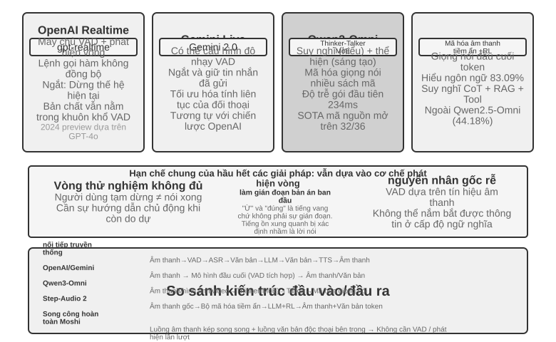

> **Thử nghiệm 6-5 ★★: Chạy MiniCPM-o 4.5 cục bộ — end-to-end so với self-cascade**
>
> Chạy MiniCPM-o 4.5 cục bộ, tắt thinking mode, rồi so sánh trả lời trực tiếp từ âm thanh với self-cascade dùng cùng mô hình để phiên âm trước rồi mới trả lời. Thực nghiệm đo xem thông tin âm thanh có được giữ lại hay không, **không phải** “vừa nghĩ vừa nói” ở phần sau.

### Mô hình 3 · Mô hình tương tác full-duplex

Omni vẫn tách “người dùng nói” và “mô hình nói”, nhưng phiên dịch đồng thời cần chồng lấp. Full-duplex lắng nghe và nói liên tục, liên tiếp quyết định có tiếp tục, dừng, ngắt hay gọi công cụ. Moshi của Kyutai là một ví dụ nghiên cứu sớm. Thinking Machines Lab gọi đây là **Interaction Model**[^ch6-14]: tương tác được xây trong mô hình thay vì lắp quanh VAD. GPT-Live đưa hướng này lên quy mô sản xuất và ủy thác việc phức tạp cho mô hình suy luận nền trong khi mô hình tiền cảnh giữ cuộc trò chuyện.

[^ch6-14]: Thinking Machines Lab, “Interaction Models: A Scalable Approach to Human-AI Collaboration”, 2026-05. https://thinkingmachines.ai/blog/interaction-models/

### Thời gian nhận thức: tương tác thời gian thực và suy nghĩ sâu

Chất lượng tương tác và trần trí tuệ là hai chiều khác nhau. Mô hình tiền cảnh phải trả lời khi người dùng còn chờ; mô hình nền có thể suy nghĩ lâu hơn. Ba thiết kế sau là những đánh đổi, không phải các bậc tiến hóa tuyến tính. Hai thiết kế đầu có thể áp dụng cho cascade hoặc Omni; thiết kế thứ ba hợp nhất suy luận sâu và biểu đạt thời gian thực trong cùng một mô hình.

#### Giải pháp 1: nghĩ nhanh để lấp chỗ, nghĩ chậm để trả lời

Nghĩ nhanh có thể đưa ra một câu đáp lấp chỗ trong vài trăm mili giây, còn nghĩ chậm hoàn tất suy luận sâu hơn ở nền. Vấn đề của nó là câu hỏi đơn giản bị xử lý hai lần, còn câu hỏi phức tạp có thể sinh mâu thuẫn: mô hình nhanh khuyên mua, mô hình chậm sau đó phát hiện gói cước thiếu một tính năng then chốt, và chỉ trong vài giây người dùng nghe hai câu trả lời trái ngược. Nguyên nhân gốc là hai thực thể mỗi bên đã tự suy nghĩ một cách độc lập.


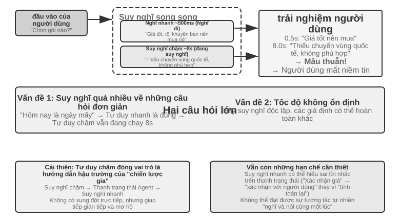


#### Giải pháp 2: nghĩ nhanh để tương tác, nghĩ chậm để nhắc

Giải pháp hai để mô hình nền đưa gợi ý cho mô hình tiền cảnh qua thanh trạng thái hoặc một giao diện chuyên dụng, còn tiền cảnh tiếp tục giữ mạch hội thoại và quyết định cách diễn đạt. Nó ổn định hơn giải pháp một, nhưng giao tiếp vẫn gián tiếp: tiền cảnh có thể hiểu sai gợi ý và không thấy được suy luận trung gian của nền; trước khi nền hoàn tất, nếu người dùng hỏi thêm thì tiền cảnh chỉ có thể dựa vào năng lực của chính nó. Nó có thể "chờ kết quả" một cách tự nhiên, nhưng không thực sự vừa nghĩ vừa nói được.

#### Giải pháp 3: hợp nhất suy nghĩ và biểu đạt end-to-end

Giải pháp ba đưa năng lực suy nghĩ vào thẳng bên trong mô hình âm thanh end-to-end. Step-Audio R1 dùng hai cơ chế bổ trợ để giải hai bài toán: **chưng cất suy nghĩ neo theo phương thức (MGRD)** khiến mô hình suy nghĩ dựa trên đặc trưng âm học, còn **kiến trúc song não MPS** cho phép hình thành ý và biểu đạt chạy song song. Cái trước bảo đảm "nghĩ đúng", cái sau giải quyết "nói kịp lúc".

Lý tưởng nhất, mô hình nên đánh giá cảm xúc từ cao độ, nhịp điệu và ngữ điệu, chứ không chỉ nhìn văn bản đã chuyển tự. MGRD lọc ra những chuỗi suy nghĩ thật sự viện dẫn đặc trưng âm học, rồi dùng dữ liệu đó huấn luyện mô hình, đồng thời dùng học tăng cường để ngăn mô hình bỏ qua suy nghĩ mà đoán thẳng đáp án. MPS khiến não hình thành ý liên tục sinh ra các mảnh suy nghĩ; não biểu đạt nhận được mảnh nào thì kết hợp ngay với phần đã trả lời để sinh tiếng nói. Hai bên chạy song song theo kiểu đường ống, nên không cần chờ toàn bộ suy nghĩ kết thúc mới cho người dùng nghe câu đầu tiên.

#### Đánh đổi giữa tách rời suy nghĩ nhanh/chậm và suy luận end-to-end

Mô hình hợp nhất hiện thực hóa "vừa nghĩ vừa nói" trực tiếp nhất, cái giá là suy nghĩ và biểu đạt thời gian thực phải được huấn luyện lại cùng nhau; hướng tách rời dễ thay não nền hơn. Hai bên là một đánh đổi, không đơn giản thay thế lẫn nhau.

Trong bối cảnh các mô hình suy luận tiên tiến phát triển nhanh chóng, tách suy nghĩ nhanh khỏi suy nghĩ chậm đem lại một lợi thế kỹ thuật quan trọng: hệ thống có thể trực tiếp hưởng lợi từ mỗi thế hệ mô hình chậm mới. Mô hình nhanh ở tiền cảnh chỉ phụ trách lắng nghe, phản hồi và duy trì hội thoại với độ trễ thấp; mô hình chậm ở nền đảm nhiệm suy luận, lập kế hoạch và gọi công cụ. Khi có mô hình suy luận mạnh hơn, chỉ cần thay mô hình nền mà không phải huấn luyện lại toàn bộ hệ thống thoại thời gian thực. Hướng hợp nhất gắn suy luận và tương tác vào cùng một chu kỳ huấn luyện, vì vậy mỗi lần nâng cấp đều phải cân bằng lại trí tuệ, độ trễ phản hồi và tính tự nhiên của biểu đạt. Do đó, tách nhanh/chậm không chỉ là nhượng bộ về độ trễ, mà còn là lựa chọn mô-đun cho phép năng lực tương tác và trần trí tuệ tiến hóa độc lập.

Sự tách rời này cũng không nhất thiết làm giảm hiệu quả nhiệm vụ. Tính đến tháng 8 năm 2026, Agent thoại Pine AI dùng kiến trúc suy nghĩ nhanh/chậm tách rời đứng đầu τ³-Voice Leaderboard, vượt các hệ thống thoại thời gian thực như Grok Voice và GPT-Realtime-2. Kết quả này ít nhất cho thấy kiến trúc tách rời không mặc nhiên kém hơn mô hình end-to-end trong những nhiệm vụ đồng thời đánh giá suy luận sâu và hội thoại thời gian thực.[^ch6-17]

[^ch6-17]: Pine AI. “The Most Natural Human-Computer Interface Is Your Voice.” 2026-06-23 (cập nhật 2026-08-06). https://www.19pine.ai/blog/pine-ai-the-most-natural-human-computer-interface-is-your-voice

Cần làm rõ rằng cụm từ "mô hình end-to-end" thường được dùng theo hai nghĩa. Nghĩa thứ nhất là **đường âm thanh end-to-end** đã nói ở phần trước: mô hình nhận âm thanh và trực tiếp tạo âm thanh, thay vì nối nhiều mô hình qua văn bản rời rạc. Omni và Interaction Model đều là end-to-end theo nghĩa này, nhưng Omni thường vẫn vận hành theo lượt, còn Interaction Model có thể vừa nghe vừa nói; kiến trúc của chúng rất khác nhau. Nghĩa thứ hai là **kiến trúc nhận thức end-to-end** được nói ở phần này: tương tác thời gian thực và suy luận sâu cùng chia sẻ trạng thái và được huấn luyện chung trong một mô hình, hoặc được tách giữa mô hình nhanh ở tiền cảnh và mô hình chậm ở nền. Hai trục này độc lập. Một hệ thống có thể có đường âm thanh end-to-end trong khi vẫn tách nhanh/chậm ở kiến trúc nhận thức; việc Thinking Machines Lab giao nhiệm vụ phức tạp cho mô hình suy luận nền là một ví dụ của tổ hợp này.

### Tổng hợp giọng nói giống con người hơn

TTS truyền thống có thể để lộ bản chất máy móc của nó vì quá mượt và ngắt nghỉ quá ít. Những khoảng dừng, từ đệm và sự lặp lại thỉnh thoảng báo hiệu sự do dự và suy nghĩ trong lời nói của con người.

LLM chính có thể phát ra các ký hiệu điều khiển ngoài văn bản, chẳng hạn như **THINKING**, **EMO:happy** và **SPEED:0.8x**; TTS ánh xạ chúng thành khoảng dừng, ngữ điệu, tốc độ nói, tiếng cười, tiếng thở dài và các âm thanh phi ngôn ngữ khác. Việc triển khai có thể là một TTS được huấn luyện để hiểu các ký hiệu điều khiển, hoặc sao chép giọng nói với các đoạn tham chiếu cho những cảm xúc và phong cách khác nhau.

> **Thí nghiệm 6-6 ★★: TTS điều khiển bằng token với Fish Audio**
>
> Dùng Fish Audio S1 để xây dựng một thư viện giọng nói nhiều tham chiếu và so sánh ba cấu hình: không có ký hiệu điều khiển, một đoạn tham chiếu, và nhiều đoạn tham chiếu. Lớp thực thi chọn cảm xúc, tốc độ nói và phong cách phù hợp từ các ký hiệu.


## Computer Use: GUI Tự động hóa Agent

Khi đọc điều này, bạn có thể nhận thấy rằng chương này dành nhiều không gian cho giọng nói hơn đáng kể so với hai cảnh cuối - điều này là có chủ ý. Trên tiến trình phát triển của đa phương thức thời gian thực, giọng nói là thứ hoàn thiện nhất và đáng được sử dụng làm hệ thống tham chiếu nhất: bắt đầu từ vấn đề "độ trễ đường ống nối tiếp quá cao", thông qua một loạt các giải pháp như end-to-end, full-duplex, suy nghĩ và nói chuyện, v.v., cho đến phần cuối tương đối hình thành ngày nay, toàn bộ quá trình của vấn đề → giải pháp → kết thúc đã được hoàn thành. Vì vậy, hãy giải thích nó kỹ lưỡng. Hai cảnh tiếp theo của Computer Use và robot có thể được xem trong ngữ cảnh giọng nói - chúng đã đạt đến giai đoạn nào của đường tiến hóa này và chúng đang bị mắc kẹt ở đâu.

Ba kịch bản này có vẻ khác nhau nhưng chúng phải đối mặt với những thách thức cốt lõi giống nhau: nhận thức theo thời gian thực, ra quyết định có độ trễ thấp và tương tác liên tục. Hãy xem cách các chủ đề kỹ thuật này được tái tạo trong tương tác trực quan (Computer Use) và tương tác vật lý (robot) – trước tiên bằng cách mở rộng góc nhìn từ phương thức thính giác sang phương thức thị giác: Điều gì sẽ xảy ra nếu Agent không chỉ hiểu được lời nói mà còn có thể “đọc” màn hình và vận hành giao diện đồ họa?

Computer Use (còn gọi là GUI Automation Agent) cho phép AI sử dụng phần mềm giống con người bằng cách quan sát màn hình và thao tác chuột, bàn phím - chẳng hạn như mở trình duyệt để tìm kiếm thông tin, điền dữ liệu vào phần mềm bảng tính hoặc điều chỉnh cấu hình trong cài đặt hệ thống. Cốt lõi của nó là một chu trình nhận thức-suy nghĩ-hành động (Hình 6-11):

1. Agent chụp ảnh màn hình hiện tại
2. Mô hình đa phương thức nhận ảnh chụp màn hình và hướng dẫn nhiệm vụ, đồng thời đưa ra suy nghĩ và hành động cụ thể.
3. Lớp thực thi thực hiện hành động trong môi trường thực (di chuyển chuột, nhấp chuột, nhập văn bản, v.v.)
4. Đợi giao diện phản hồi rồi chụp ảnh màn hình lại để vào chu kỳ tiếp theo.

Ở đây cần phân biệt **hiểu giao diện** với **hoàn thành tác vụ**. Vế đầu gần với năng lực hiểu đa phương thức hơn và có thể đo bằng hỏi đáp trên một ảnh chụp màn hình; vế sau đòi hỏi mô hình đưa việc hiểu và sinh hành động vào một vòng lặp khép kín, xử lý tải trang, thay đổi trạng thái, thao tác sai và hậu quả không thể đảo ngược. Vì vậy, khó khăn của Computer Use không chỉ là trả lời đúng về ảnh chụp màn hình, mà còn là xác nhận lại sau mỗi bước rằng thực tế vẫn phù hợp với kế hoạch.

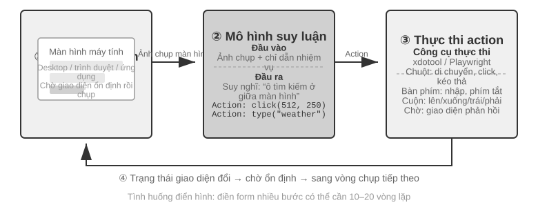


Có ba chiều thiết kế chính trong chu trình này: **không gian hành động**(những thao tác mà Agent có thể thực hiện), **định vị trực quan**(cách tìm phần tử mục tiêu trong ảnh chụp màn hình) và **kiến trúc mô hình**(cách tạo hành động chính xác từ ảnh chụp màn hình).

### Thiết kế không gian hành động

Bản triển khai tham chiếu của Anthropic chia khả năng tương tác hoàn chỉnh thành ba loại công cụ (Hình 6-12). Đây là một thiết kế không gian hành động rõ ràng, nhưng không phải giao thức riêng mà nhà cung cấp mô hình buộc phải tuân theo: miễn là Harness chuyển cùng ảnh chụp màn hình, ràng buộc hành động và kết quả thực thi thành thông điệp cùng đầu ra có cấu trúc mà mô hình đích hỗ trợ, Claude, mô hình thị giác trọng số mở và endpoint tự lưu trữ đều có thể vận hành cùng chu trình nhận thức-suy nghĩ-hành động.


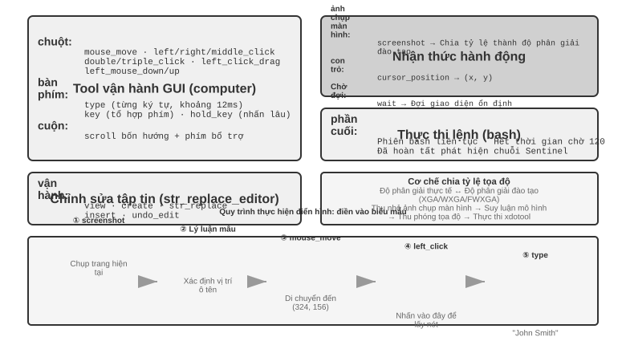


**GUI Operation Tool**(công cụ máy tính): Thao tác chuột bao gồm di chuyển (mouse_move), nhấp chuột trái/phải/giữa, nhấp đúp/ba lần, kéo (left_click_drag) và nhấn/nhả chi tiết hơn (left_mouse_down/up). Cuộn hỗ trợ bốn hướng và có thể được sử dụng với các phím bổ trợ. Thao tác trên bàn phím bao gồm nhập từng từ (loại, mỗi ký tự cách nhau 12 mili giây để mô phỏng thao tác gõ thực), tổ hợp phím (phím, chẳng hạn như Ctrl+C) và nhấn và giữ (hold_key). Các hành động được nhận biết: ảnh chụp màn hình (ảnh chụp màn hình), lấy vị trí con trỏ (cursor_position), chờ (wait).

**Công cụ thực thi lệnh**(công cụ bash): Cung cấp phiên cuối bash liên tục, thời gian chờ 120 giây, phát hiện xem lệnh có được thực thi thông qua chuỗi trọng điểm hay không và duy trì trạng thái môi trường giữa nhiều lệnh gọi (ví dụ: sau khi cd vào một thư mục, lệnh gọi tiếp theo sẽ vẫn ở trong thư mục đó).

**Công cụ chỉnh sửa tệp**(str_replace_editor): Chỉnh sửa an toàn đạt được thông qua khớp chuỗi. Nó hỗ trợ các hoạt động xem, tạo, thay thế, chèn và hoàn tác. Nó chính xác hơn việc ghi đè trực tiếp toàn bộ tập tin và ít có khả năng vô tình làm thay đổi nội dung khác.

> **Thí nghiệm 6-7 ★: Chạy Computer Use (đường dẫn tham chiếu Anthropic hoặc đường dẫn mô hình mở)**
>
> Đường dẫn A dùng Anthropic Computer Use Demo. Container của nó đóng gói một môi trường desktop Ubuntu hoàn chỉnh, bao gồm trình duyệt, terminal và các công cụ phổ biến khác. Frontend nhận một tác vụ, còn backend gửi hướng dẫn và ảnh chụp màn hình đến Claude, rồi thực thi các hành động chuột, bàn phím, terminal hoặc chỉnh sửa do mô hình trả về.
>
> Đường dẫn B dùng mã ví dụ trong [`chapter6/computer-use-open-model`](../chapter6/computer-use-open-model/). Theo mặc định, nó điều khiển browser-use bằng mô hình Qwen3-VL 32B Instruct trọng số mở thông qua API OpenRouter được lưu trữ, hoặc thông qua vLLM/SGLang tự lưu trữ và các hệ thống tương tự.

### Định vị trực quan (Nối đất)

Trong mỗi vòng lặp, mô hình cần xác định chính xác phần tử mục tiêu trong ảnh chụp màn hình - "Hộp tìm kiếm ở đâu?" "Tọa độ của nút gửi là gì?" Đây là vấn đề định vị trực quan (Nối đất). Hiện tại có hai ý tưởng chính: một là biến định vị thành câu hỏi trắc nghiệm - đầu tiên đánh dấu các thành phần giao diện bằng số và mô hình chỉ cần chọn một trong số đó; cái còn lại là **dự đoán tọa độ thuần túy** - để mô hình trực tiếp "nhìn" vào ảnh chụp màn hình và báo cáo tọa độ như con người. Có hai cách để triển khai ý tưởng câu hỏi trắc nghiệm: **Chú thích trực quan thuần tuý**(Set-of-Mark gốc, sử dụng mô hình phân đoạn để cắt bỏ các vùng ứng cử viên trên pixel) và **Chỉ mục thành phần cấu trúc**(Cây DOM/Accessibility, đọc trực tiếp cấu trúc đi kèm với giao diện). Ưu điểm chung của ý tưởng câu hỏi trắc nghiệm là chuyển đổi câu hỏi mở "tìm nút trong ảnh chụp màn hình và dự đoán tọa độ" thành câu hỏi đóng "chọn một trong các yếu tố được đánh dấu". Giống như các câu hỏi trắc nghiệm trong bài thi dễ trả lời chính xác hơn các câu hỏi điền vào chỗ trống, mô hình chỉ cần nói "nhấp [123]" thay vì "nhấp vào nút tại tọa độ (350, 464) trên màn hình." Dự đoán tọa độ trực tiếp là một thách thức đặc biệt lớn đối với mô hình — cần khối lượng huấn luyện lớn mới làm chính xác được, và rất dễ sai khi độ phân giải màn hình thay đổi.

**Set-of-Mark: Phương pháp chú thích trực quan.**

Set-of-Mark (SoM) ban đầu được Microsoft Research đề xuất vào năm 2023, ban đầu nhằm phát huy khả năng định vị trực quan của GPT-4V. Đây là một phương pháp **hoàn toàn trực quan**: sử dụng mô hình phân đoạn hình ảnh (SAM, SEEM, v.v.) để tự động cắt các vùng ứng cử viên trên ảnh chụp màn hình và chồng các điểm đánh dấu được đánh số lên từng vùng. Những gì mô hình nhìn thấy là một hình ảnh được đánh số, chỉ cần báo số, hệ thống sẽ chuyển đổi thành tọa độ trung tâm của khu vực tương ứng. Toàn bộ quá trình không yêu cầu DOM hoặc bất kỳ cấu trúc giao diện nội bộ nào, do đó, giao diện trò chơi và phần mềm máy tính để bàn gốc cũng có thể được áp dụng - miễn là mô hình phân khúc có thể loại bỏ các khu vực ứng cử viên.

**Chỉ mục phần tử có cấu trúc: Triển khai có cấu trúc các ý tưởng SoM trên Web.**

Chú thích có thể được thực hiện chính xác hơn khi chính giao diện cung cấp thông tin có cấu trúc. Các trang web hiện đại có cấu trúc thành phần hoàn chỉnh (cây DOM) và các vai trò ngữ nghĩa (là nút, là hộp nhập liệu) được xác định trước khi hiển thị. Cây trợ năng cung cấp thông tin tương tự cho nhiều ứng dụng trên máy tính để bàn. Giải pháp Web Agent do dự án browser-use đại diện thực hiện chính xác điều này: liệt kê và đánh số các phần tử tương tác từ DOM, có thể được coi là triển khai có cấu trúc các ý tưởng SoM trên Web (Hình 6-13). Quá trình này được chia thành bốn bước:

1. Lấy biểu diễn có cấu trúc (DOM tree) và thông tin truy cập của trang web thông qua giao diện gỡ lỗi trình duyệt (CDP, Chrome DevTools Protocol)
2. Tự động phát hiện những thành phần nào có thể tương tác (nút, hộp nhập liệu, liên kết, v.v.)
3. Gắn nhãn cho mỗi phần tử có thể tương tác bằng một ID duy nhất và vẽ hộp giới hạn trên ảnh chụp màn hình
4. Đồng thời, tạo ra một danh sách văn bản để mô tả các thành phần tương ứng với mỗi ID.

```text
Ảnh chụp màn hình: [Các thành phần chính trong ảnh được đánh dấu bằng ID như [1], [2], [3], [4], v.v.]

Elements:
[1] <input type="text" placeholder="Search" aria-label="Search" />
[2] <button id="submit-btn" aria-label="Submit form" />
[3] <input type="text" placeholder="Enter your name" value="" />
[4] <a href="/docs" aria-label="Documentation" />
```

Mô hình chỉ cần xuất số ID và hệ thống sẽ tự động sử dụng tọa độ trung tâm của phần tử để thực hiện nhấp chuột. Loại giải pháp này không lưu mã thông báo (vì tất cả thông tin chú thích phải được gửi đến mô hình), nhưng định vị chính xác và ổn định, đồng thời tránh được các phát hiện bị bỏ sót và phát hiện sai có thể do mô hình phân đoạn đưa ra.


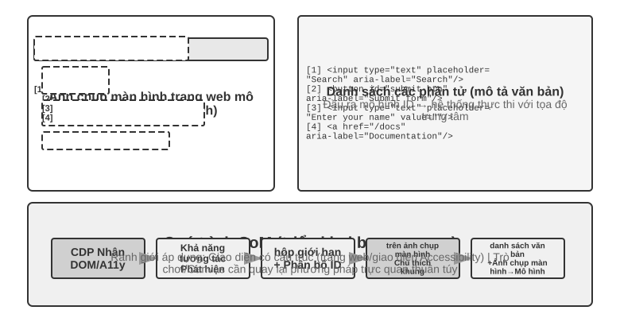

**Dự đoán tọa độ thuần túy.**

Tuyến thứ ba không thực hiện bất kỳ chú thích nào và trực tiếp cho phép mô hình xuất tọa độ. Lấy việc sử dụng **SeeClick** và Claude của máy tính làm ví dụ: đào tạo mô hình trực quan dựa trên dữ liệu được ghép nối của các ảnh chụp màn hình và vị trí phần tử GUI khổng lồ, đồng thời cho phép mô hình học cách ánh xạ các mô tả ngôn ngữ tự nhiên (chẳng hạn như "nhấp vào nút gửi") trực tiếp tới tọa độ chính xác trong ảnh chụp màn hình - giống như người dùng con người, hoàn toàn dựa vào "tìm kiếm" để tìm vị trí cần nhấp.

Trong sơ đồ dự đoán tọa độ, sự hiểu biết của mô hình về tọa độ phụ thuộc nhiều vào độ phân giải được sử dụng trong quá trình huấn luyện (Hình 6-14). Claude được đào tạo bằng XGA (1024x768), WXGA (1280x800) và FWXGA (1366x768). Nếu độ phân giải ảnh chụp màn hình đầu vào không khớp, tọa độ mà mô hình dự đoán sẽ được bù một cách có hệ thống - giống như đo khoảng cách trên bản đồ nhỏ và sau đó sử dụng trực tiếp trên bản đồ lớn. Do đó, cần triển khai cơ chế chia tỷ lệ tọa độ hai chiều trên lớp công cụ và chọn độ phân giải mục tiêu theo tỷ lệ khung hình để tránh kéo dài không đẳng cự làm biến dạng hình ảnh và làm sai lệch phán đoán tọa độ. Ví dụ: nếu độ phân giải màn hình thực là 2560×1440 (16:9), bạn nên chọn một trong ba mức được Claude hỗ trợ với tỷ lệ khung hình cũng gần 16:9 – FWXGA (1366×768) là phù hợp nhất. Khi chụp ảnh màn hình, hãy chia tỷ lệ màn hình thành 1366×768 và gửi cho mô hình; sau khi mô hình xuất ra tọa độ nhấp chuột (683, 384), nó sẽ được ánh xạ ngược sang tọa độ thực (683×2560/1366, 384×1440/768) ≈ (1280, 720). Ngược lại, nếu bạn kéo căng mạnh 16:9 thành 4:3 1024×768, màn hình sẽ bị nén theo chiều ngang và tọa độ mà mô hình dự đoán sẽ bị dịch chuyển một cách có hệ thống.


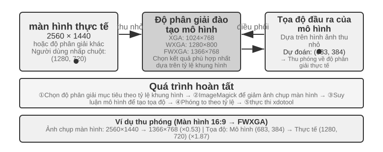


Logic lựa chọn của ba tuyến đường có thể được tóm tắt như sau: **Khi có sẵn thông tin có cấu trúc, chỉ mục Cây DOM/Accessibility** được sử dụng đầu tiên và vị trí là chính xác và ổn định nhất; **Khi không có sẵn**(phần mềm máy tính gốc như Photoshop, giao diện kết xuất Canvas/WebGL, trò chơi), **Bạn có thể sử dụng chú thích trực quan (tuyến SoM gốc) hoặc dự đoán tọa độ**. Chú thích trực quan biến việc định vị thành một câu hỏi trắc nghiệm, thân thiện hơn với các mô hình tổng quát chưa được đào tạo đặc biệt; dự đoán tọa độ loại bỏ bước chú thích và trực tiếp hơn đối với các mô hình đã trải qua khóa đào tạo định vị GUI. Vẫn còn khoảng cách về độ chính xác giữa hai yếu tố này trên các phần tử nhỏ và giao diện dày đặc.

> **Thử nghiệm 6-8 ★: Sử dụng browser-use để đạt được hoạt động trình duyệt tự động**
>
> Kết hợp Playwright, một framework tự động hóa trình duyệt, với mô hình đa phương thức để thực hiện thao tác trình duyệt bằng ngôn ngữ tự nhiên. Bật trực quan hóa SoM và lưu ảnh chụp có khung chú thích trước mỗi quyết định.
>
> Tác vụ kiểm thử “Mở Google và tìm thời tiết San Francisco”: sau khi khởi động, ảnh chụp hiển thị trang Google với các phần tử tương tác được đánh số. Mô hình chọn ô tìm kiếm, nhập “San Francisco weather today”, gửi truy vấn rồi trích xuất nhiệt độ và điều kiện thời tiết từ trang kết quả.

### Có thể xem hoạt hình và nghe âm thanh Computer Use Agent

Cho đến đây, nhận thức của Computer Use dựa trên một giả định ngầm: **màn hình đứng yên**—chụp ảnh, nghĩ một bước, nhấp, rồi chụp ảnh tiếp theo. Màn hình thực tế phát video, hiện thông báo thoáng qua và phát tiếng nói trong cuộc họp. Agent chỉ mở mắt mỗi 3–5 giây một lần và hoàn toàn không có tai sẽ không thấy hoặc nghe được những gì xảy ra giữa hai khung hình.

Thứ cần thiết kế lại không phải giao diện hành động mà là **giao diện quan sát**[^ch6-9]. Giao diện quan sát Agent–máy tính (AOI) chuyển quan sát môi trường liên tục thành các sự kiện rời rạc mà mô hình dễ xử lý. Các kỹ thuật chính gồm: **chụp khung hình chính của màn hình**, dùng một mô hình nhỏ để phán đoán màn hình có thay đổi đáng kể hay không và chỉ chụp khi có thay đổi rõ rệt — khi thay đổi diễn ra thường xuyên, chụp một lần mỗi giây đã cho hiệu quả khá tốt; **phiên âm giọng nói theo ngưỡng âm lượng**, gọi nhận dạng khi có tiếng và đưa văn bản nhận dạng được vào ngữ cảnh để Agent có thể "nghe"; và **mô tả màn hình thành văn bản**, để mô hình biến mỗi ảnh chụp thu được thành một câu mô tả, câu này vẫn ở trong ngữ cảnh sau khi ảnh gốc đã rời khỏi đó, qua đó nén lịch sử tương tác đa phương thức.

[^ch6-9]: Xem Li, Bojie and Noah Shi. *Agent-Computer Observation Interfaces Enable Dynamic Computer Use.* arXiv:2606.29472, 2026.

### Mô hình thế giới cho Computer Use

Giao diện quan sát ở phần trước giải quyết câu hỏi "chuyện gì đã xảy ra ở khoảng giữa": nhờ khung hình chính, bản chép lời và văn bản bền, Agent không còn chỉ nhìn thấy hai ảnh chụp màn hình cách nhau rất xa. Nhưng giao diện quan sát không xóa được độ trễ lập kế hoạch. Agent vẫn đang chạy vòng lặp tuần tự "chụp màn hình—suy nghĩ—bấm chuột", cứ thực thi xong một hành động là lại quan sát lại và nghĩ nước tiếp theo. Nghiên cứu hiệu suất **OSWorld-Human** cho thấy dù nhiệm vụ rốt cuộc có thành công, số bước thao tác và thời gian chờ của Agent vẫn nhiều hơn con người rõ rệt; đạt độ chính xác ngang con người không có nghĩa là đã đủ dùng.

Khi thao tác máy tính, con người không đợi bấm xong mới bắt đầu nghĩ bước kế tiếp, mà dự đoán trước hệ quả của hành động: nếu thay đổi thực tế đúng như dự kiến thì cứ theo kế hoạch cũ mà làm tiếp; chỉ khi phát hiện trạng thái trang lệch khỏi dự kiến mới dừng lại để quan sát và lập kế hoạch lại. Mô hình thế giới cho phép Agent dự đoán màn hình làm việc kế tiếp có thể biến thành gì trước khi ra tay, nhờ đó hiện thực hóa cơ chế "thực thi suy đoán" giống con người và nâng hiệu suất lên đáng kể.

Trạng thái màn hình làm việc không chỉ là một ảnh điểm ảnh, mà còn gồm cửa sổ, tiêu điểm, vị trí cuộn, nội dung ô nhập, trạng thái tải, quyền hạn và phản hồi mạng; còn hành động thì gồm bấm chuột, gõ phím, cuộn, kéo thả và chờ. Một mô hình thế giới dùng được cho Computer Use ít nhất phải mã hóa được trạng thái hiện tại, dự đoán được thay đổi trạng thái mà hành động ứng viên gây ra, và chuyển dự đoán đó cho bộ lập kế hoạch để quyết định nước tiếp theo:

```text
trạng thái màn hình làm việc + click/type/scroll/wait ──> biểu diễn của trạng thái kế tiếp
```

Nhờ vậy Agent có thể so sánh hệ quả của các hành động ứng viên trước khi thật sự bấm chuột, chuẩn bị nước tiếp theo trong lúc trang đang tải, và dựa vào chênh lệch trạng thái mà khôi phục khi một cửa sổ bật lên chỉ lóe qua. Chẳng hạn nếu nhiệm vụ là "tạo tệp Python mới trong VS Code và viết hello world", mô hình có thể dự đoán trước trạng thái then chốt của cây tệp và trình soạn thảo sau khi thành công, rồi mới chọn các hành động bấm, gõ và lưu; còn nếu nhiệm vụ là xóa tệp, nó có thể dự đoán trước trong một màn hình ảo cách ly xem có hiện ra hộp xác nhận không thể hoàn tác hay không, và khi cần thì hỏi người dùng để xác nhận. Điều quan trọng ở đây không phải là bắt mô hình sinh ra một ảnh chụp màn hình tương lai trông như thật, mà là dự đoán những chênh lệch trạng thái kiểm tra được mà việc hoàn thành nhiệm vụ đòi hỏi.

Tháng 7 năm 2026, **Photon-1** do Induction Labs công bố đã cho thấy một cách hiện thực hóa hướng đi này: chỉ với 30.000 giờ GPU H200 mà hoàn tất việc tiền huấn luyện một mô hình thế giới cho computer use. Nó nén mỗi khung hình thành các token tiềm ẩn rời rạc và dự đoán tự hồi quy biểu diễn của trạng thái kế tiếp sau một hành động, thay vì sinh ảnh chụp màn hình từng điểm ảnh ở giai đoạn tiền huấn luyện; bộ sinh ảnh gắn kèm chỉ dùng để trực quan hóa các biểu diễn tiềm ẩn chứ không phải thành phần bắt buộc khi suy luận. Cho trước một ảnh chụp màn hình mầm và các hành động tiếp theo, mô hình có thể "tưởng tượng" liên tục các trạng thái màn hình làm việc, rồi qua huấn luyện trực tuyến trên máy ảo mà học được cách xuất ra hành động computer-use.[^ch6-20]

[^ch6-20]: David Li and Jonathan Li, Induction Labs, “Scaling Video Pretraining with Imagination Models,” 2026-07-23. https://www.inductionlabs.com/news/scaling-video-pretraining. Các tham số, quy mô dữ liệu, benchmark nội bộ và so sánh chi phí của Photon-1 nêu trong bài đều là kết quả do chính công ty công bố.

### Di động: Rào cản sinh thái còn khó hơn công nghệ

Computer Use cũng đang mở rộng sang thiết bị đầu cuối di động. Thực sự có sự khác biệt về mặt kỹ thuật giữa thiết bị đầu cuối di động và máy tính để bàn: không gian hành động thường không còn là "tọa độ chuột + bàn phím" mà truy cập vào dịch vụ trợ năng API của hệ thống (chẳng hạn như AccessibilityService của Android) để đọc các thành phần giao diện, thực hiện nhấp chuột và nhập văn bản; phương thức tương tác cũng thay đổi từ con trỏ chuột sang cử chỉ chạm và ngữ nghĩa của tọa độ thay đổi tương ứng - giống nhau (x, y) Cho dù đó là nhấp ngón tay, nhấn lâu hay điểm bắt đầu của cử chỉ trượt đều yêu cầu các loại cử chỉ bổ sung để xác định. Các điểm chuẩn dành cho thiết bị di động như AndroidWorld được giới thiệu trong Chương 7 được sử dụng để đánh giá khả năng của Agent trong việc hoàn thành các tác vụ Ứng dụng thực trong không gian hành động như vậy.

Nhưng điều thực sự cản trở thiết bị đầu cuối di động thường không phải là những khác biệt về mặt kỹ thuật mà là những rào cản về sinh thái. Một số nhà sản xuất điện thoại di động đã cố gắng tích hợp trợ lý AI vào điện thoại di động dành cho người tiêu dùng để cho phép chúng tự động vận hành các ứng dụng hàng ngày như WeChat, Taobao và Alipay, nhưng họ sớm gặp phải những hạn chế về nền tảng.

Điều này cho thấy một thách thức đặc biệt mà Computer Use phải đối mặt: **rào cản sinh thái**. Lý do cơ bản đằng sau lệnh cấm là xung đột mô hình kinh doanh. Logic kiếm tiền cốt lõi của các ứng dụng Internet truyền thống là **lưu lượng truy cập và sự chú ý**: người dùng xem quảng cáo khi duyệt các luồng thông tin, làm theo hướng dẫn của thuật toán đề xuất khi tìm kiếm sản phẩm và mua hàng tùy hứng khi duyệt các trang. Khi Agent hoạt động thay mặt người dùng, liên kết kiếm tiền này hoàn toàn bị bỏ qua: AI sẽ không chú ý đến quảng cáo cũng như không thực hiện các giao dịch mua hàng bốc đồng, nó sẽ đi thẳng đến mục tiêu và hoàn thành nhiệm vụ. Đối với một nền tảng dựa vào quảng cáo và lưu lượng truy cập để kiếm tiền, mọi hoạt động của Agent đều làm xói mòn nền tảng mô hình kinh doanh của nó.

Điều này có nghĩa là Computer Use không chỉ phải đối mặt với sự đối đầu về mặt kỹ thuật như CAPTCHA (mã xác minh) mà còn phải đối mặt với xung đột lợi ích về mặt cấu trúc. Khó có thể giải quyết mâu thuẫn này trong thời gian ngắn và việc triển khai Computer Use trong các tình huống tiêu dùng phải đối mặt với nhiều thách thức khó khăn hơn so với các vấn đề kỹ thuật thuần túy.

## Vận hành robot: dọn bàn làm việc với XLeRobot

> **Cách đọc phần này**: từ đầu đến cuối chúng ta chỉ dùng một nhiệm vụ——"đặt cốc đỏ vào khay, bỏ tờ giấy vàng vào thùng rác, cuối cùng quan sát thêm một lần để xác nhận trạng thái mặt bàn". Thử nghiệm 6-9 và 9-9 chạy trên XLeRobot thật, cần cánh tay robot, hiệu chuẩn, nút dừng khẩn cấp và người giám sát tại chỗ. Thử nghiệm 6-10, 9-10 và 9-11 là các bản đối ứng chạy trên GPU cục bộ. Kết quả trên máy thật và trong mô phỏng được báo cáo tách bạch, nhưng mục tiêu nhiệm vụ, ý nghĩa hành động và điều kiện thành công thì giữ nguyên như nhau.

Vận hành robot khó hơn nhiều so với "nhìn ảnh rồi trả lời câu hỏi". Mô hình không chỉ phải hiểu khung cảnh mà còn phải hành động liên tục trong thế giới thực, và mỗi hành động lại làm thay đổi tình huống ở khoảnh khắc kế tiếp. XLeRobot khiến khác biệt ấy trở nên rất cụ thể. Cùng một cánh tay, người ta có thể điều khiển từ xa bằng bàn phím, tay cầm chơi game hay thiết bị VR; cũng có thể giao quan sát từ camera cùng một nhóm công cụ hành động hạn chế cho Agent để nó tự gọi. Phần cứng không đổi, nhiệm vụ cũng không đổi; thứ duy nhất đổi là ai đang vận hành——ở trường hợp trước, con người liên tục quan sát và sửa sai; ở trường hợp sau, mô hình và hệ điều khiển phải tự làm trọn vẹn công việc đó.

Phần này xâu chuỗi năm thử nghiệm bằng việc "dọn bàn làm việc". Trước hết, con người điều khiển từ xa chiếc XLeRobot thật, để đo xem phần cứng này làm được đến đâu dưới tay một người vận hành đủ giỏi. Kế đó, trong bộ mô phỏng, ta thiết lập giới hạn trên lý tưởng của việc điều khiển cho cùng nhiệm vụ ấy. Tiếp theo, để Agent tự chủ điều khiển chiếc XLeRobot thật, nhằm quan sát xem tri giác, lập kế hoạch và khả năng phục hồi sau thất bại quyết định kết quả ra sao. Sau đó, đưa đúng bản giao kèo công cụ ấy vào bộ mô phỏng và so sánh một lượt ba chiến lược: thực thi vòng hở, kiểm tra theo từng bước, và mô hình thế giới. Cuối cùng, ta thay đổi nền, hình dáng vật thể, ánh sáng và nhiễu thị giác để xem chính sách thị giác học trong mô phỏng có thích nghi được với môi trường mới hay không.

Nút thắt ở đây thường không nằm ở việc làm thêm một bộ chuẩn hỏi đáp tĩnh nữa, mà ở chỗ giữ cho mô hình khép kín được vòng điều khiển với băng thông tri giác và điều khiển hạn hẹp. Một hệ robot dùng được ít nhất phải trả lời bốn câu hỏi sau:

1. Con người muốn hoàn thành nhiệm vụ gì?
2. Nhiệm vụ con nào sẽ làm tiếp theo?
3. Kỹ năng hiện tại sinh ra hành động cụ thể nào?
4. Sau khi thực thi hành động, thực tế có còn khớp với kế hoạch ban đầu không?

Phần này đặt bốn câu hỏi ấy vào cùng một vòng điều khiển của XLeRobot, và chỉ ra bốn kỹ thuật lần lượt gánh phần nào: lập kế hoạch dài hạn quyết định xử lý cốc trước hay giấy trước; VLA hoặc các nguyên thủy hành động lo việc gắp và đặt; mô hình thế giới ước lượng hệ quả của một hành động; còn bước chuyển từ mô phỏng sang thực tế gánh lấy khác biệt giữa video huấn luyện với camera và cơ cấu chấp hành thật. Dù mô hình cấp cao đã có đủ tri thức và năng lực lập kế hoạch, chỉ cần thiếu một mắt xích trong vòng phản hồi này là hệ thống vẫn có thể không hoàn thành nổi nhiệm vụ.

### Phân công giữa phần cứng và thuật toán

Câu hỏi đầu tiên mà XLeRobot thích hợp trả lời nhất là: khi việc tự chủ dọn bàn thất bại, là cánh tay không làm nổi, hay thuật toán không biết dùng cánh tay? Ở đây có một sự thật không nên nói giảm đi: **ngay cả một cánh tay chỉ vài trăm đô la như XLeRobot, nếu điều khiển từ xa, cũng đã có thể hoàn thành một nhiệm vụ trên bàn gồm nhiều bước nối tiếp như trong phần này**——con người nhìn video camera, gắp cốc đỏ bỏ vào khay, bỏ tờ giấy vàng vào thùng rác, rồi kiểm tra lại trạng thái lần cuối. Kết quả này không chỉ có nghĩa "phần cứng vừa đủ dùng", mà là một bằng chứng chẩn đoán rõ ràng: **xét riêng nhiệm vụ này, nút thắt nằm ở thuật toán chứ không nằm ở bản thân phần cứng.**

Cách chẩn đoán rất thẳng thắn. Giữ nguyên camera, cánh tay, kẹp, cách bày biện mặt bàn và điều kiện thành công, trước hết để con người đảm nhận vòng điều khiển. Con người liên tục hiệu chỉnh ước lượng vị trí vật thể, lựa chọn hành động và thời điểm ra tay, đồng thời biết xử lý khi gắp hụt. Khoảng cách giữa hệ tự chủ và con người lộ ra chính ở năng lực vòng kín ấy. Dĩ nhiên tầm với của kết luận này là nhiệm vụ trên bàn ở phần này: nó cho thấy phần cứng đã vượt ngưỡng tải trọng, độ chính xác và không gian làm việc mà nhiệm vụ này cần, chứ không có nghĩa một cánh tay vài trăm đô la kham nổi mọi môi trường mở hay những thao tác khó hơn.

XLeRobot hỗ trợ nhiều lối vào điều khiển từ xa: bàn phím, tay cầm Xbox, Joy-Con của Switch và thiết bị VR. Người vận hành làm một cách tự nhiên nhiều việc mà thuật toán buộc phải cài đặt tường minh: giảm tốc khi kẹp lại gần cốc, sửa điểm gắp khi cốc trượt, quan sát lại khi không kẹp được tờ giấy trong một lần, và xác nhận kết quả khi vật thể đã vào vùng đích. Vì vậy điều khiển từ xa không chỉ là cách thu thập dữ liệu trình diễn, mà còn là một thử nghiệm chẩn đoán "giữ nguyên phần cứng, chỉ thay người vận hành".[^ch6-1]

> **Thử nghiệm 6-9 ★: Điều khiển từ xa XLeRobot thật để dọn bàn**
>
> Đặt vào vùng làm việc của một chiếc XLeRobot thật: cốc đỏ, khay, tờ giấy vàng vo tròn và thùng rác. Người vận hành thực hiện nhiệm vụ cố định qua một trong các lối điều khiển từ xa đã hiệu chuẩn: "đặt cốc đỏ vào khay, bỏ tờ giấy vàng vào thùng rác, cuối cùng quan sát thêm một lần để xác nhận trạng thái mặt bàn". Lặp ít nhất vài vòng, ghi lại video camera, đầu vào của người vận hành, trạng thái cánh tay, thời lượng hành động, các lần gắp hụt, số lần thử lại và trạng thái cuối cùng.
>
> Đừng hạ tiêu chí nghiệm thu xuống thành "cuối cùng mặt bàn trông sạch sẽ". Cốc đỏ phải nằm trong khay và tờ giấy vàng phải nằm trong thùng rác, cánh tay phải trở về tư thế an toàn, và suốt quá trình không được có va chạm, ra khỏi vùng làm việc, hay việc con người ra tay làm thay mà không kiểm chứng.

Điều khiển từ xa trên máy thật là cách thuyết phục nhất để cho thấy giới hạn trên của nhiệm vụ, nhưng lại không tiện để thay đổi hàng loạt số lượng và vị trí vật thể. Để có một đối chứng lặp lại được và tính được thống kê, tiếp theo ta chuyển chính bài toán "đưa vật thể về đúng chỗ" ấy sang một bộ mô phỏng mặt bàn hai chiều, và dùng bộ điều khiển lý tưởng thay cho một người vận hành giỏi không hề nhìn nhầm cũng không chọn sai hành động.

> **Thử nghiệm 6-10 ★: Đo giới hạn trên lý tưởng của việc điều khiển cùng nhiệm vụ trong bộ mô phỏng**
>
> Trong bộ mô phỏng mặt bàn hai chiều, đặt ngẫu nhiên cốc đỏ, tờ giấy vàng cùng các vùng đích tương ứng, rồi để bộ điều khiển lý tưởng lần lượt tiến đến vật thể, gắp lên và đưa về đúng vị trí. Nó không cần nhận dạng hình ảnh và cũng không chọn sai hành động, nên nó biểu thị "khi tri giác lẫn quyết định đều đúng thì nhiệm vụ này ít nhất đi được đến đâu".
>
> Hãy xem tỷ lệ thành công, số bước cần dùng và độ dài quãng đường; đồng thời thay đổi vị trí ban đầu của vật thể và quy mô nhiệm vụ để xem giới hạn lý tưởng ấy có ổn định không. Ta dùng cùng điều kiện thành công như Thử nghiệm 6-9, nhưng thứ được đo là một mô phỏng không có cơ cấu chấp hành: điều đó không có nghĩa chiếc XLeRobot thật đã cử động. Hai thử nghiệm sẽ là hai đường cơ sở cho phần điều khiển tự chủ về sau——Thử nghiệm 6-9 là vòng kín của con người trên phần cứng thật, còn Thử nghiệm 6-10 là vòng kín lý tưởng trong môi trường mô phỏng.

### Cấu trúc cơ bản của điều khiển robot

Hệ robot thường tách các công việc có thang thời gian khác nhau.

| Tầng | Câu hỏi cốt lõi | Đầu ra | Thang thời gian điển hình |
| --- | --- | --- | --- |
| Mục tiêu nhiệm vụ | Con người muốn hoàn thành điều gì | "Cốc và giấy về đúng chỗ" | Cỡ phút |
| Lập kế hoạch dài hạn | Làm gì trước, làm gì sau | Cốc trước, giấy sau, cuối cùng kiểm tra | Từ giây đến phút |
| Kỹ năng cơ bản | Bây giờ đạt được thay đổi trạng thái nào | `pick(red_cup)`, `place(red_cup, tray)` | Khoảng 1—3 giây |
| VLA / chính sách kỹ năng | Kỹ năng này cụ thể cử động ra sao | Chuyển động ngắn hoặc quỹ đạo liên tục của kẹp XLeRobot | Suy luận ~1—10 Hz |
| Điều khiển mức thấp và tầng an toàn | Làm sao thực thi ổn định và không trễ | Lượng điều khiển khớp hoặc đầu công tác, giới hạn tốc độ và dừng khẩn cấp | ~50—1000 Hz |

Đây là cách phân công kỹ thuật thường gặp, không phải kiến trúc mô hình duy nhất. VLA hoàn toàn có thể gánh một phần phán đoán ở cấp cao, và bộ lập kế hoạch có thể là chương trình dựa trên luật, một VLM, hay một bộ tối ưu. Chọn cách cài đặt nào đi nữa, "thứ tự của nhiệm vụ" vẫn nên tách khỏi "hành động trước mắt"; nếu không, độ trễ suy luận của mô hình cấp cao sẽ kéo lùi điều khiển mức thấp, còn điều khiển tần số cao ở mức thấp lại buộc mô hình bên trên xử lý vô số chi tiết không liên quan. Trên XLeRobot, mô hình không nên trực tiếp xuất ra góc khớp tùy ý: nó chỉ chọn những kỹ năng có ranh giới rõ ràng như `pick`, `place`, `verify_state` và `stop`, rồi bộ thực thi đã hiệu chuẩn——có giới hạn tốc độ và có thời gian chờ tối đa——mới biến chúng thành chuyển động thật của cánh tay.

### Lập kế hoạch dài hạn và phân rã nhiệm vụ

Khi người dùng bảo "dọn bàn giúp tôi", hệ thống không thể ném nguyên câu ấy cho mô hình hành động. Bộ lập kế hoạch trước hết liệt kê các vật thể và mục tiêu trong khung cảnh, định ra thứ tự, rồi viết ra cho từng bước điều kiện khởi đầu, điều kiện kết thúc và giới hạn rủi ro. Chẳng hạn:

```text
Xử lý cốc đỏ → Dọn tờ giấy vàng → Kiểm tra mặt bàn
```

"Xử lý cốc đỏ" lại phân rã thành hai hành động và một lần kiểm tra:

```text
pick(red_cup) → place(red_cup, tray) → verify_state()
```

Mỗi kỹ năng hoàn tất cho ta một nút có thể kiểm chứng. Gắp hụt thì chỉ làm lại đúng bước ấy. Nếu ai đó dời vật thể hoặc người dùng đổi mục tiêu, chỉ cần lập lại kế hoạch cho những bước phía sau bị ảnh hưởng, chứ không phải làm lại toàn bộ kế hoạch cũ. Công cụ trao cho tác nhân cũng phải đủ đơn giản: mỗi lần gọi chỉ làm một việc, phạm vi cử động cố định, có thời gian chờ tối đa, và thực thi xong thì quan sát lại ngay.

> **Thử nghiệm 6-11 ★★: Để Gemini Robotics-ER 1.5 tự chủ dọn bàn bằng XLeRobot**
>
> Giữ nguyên chiếc XLeRobot thật, cách bày bàn, chỉ dẫn nhiệm vụ và điều kiện thành công của Thử nghiệm 6-9; chỉ thay người vận hành bằng một Agent. Giao việc quan sát và lập kế hoạch cho một mô hình suy luận nhập thân như Gemini Robotics-ER 1.5, và qua vòng lặp tác nhân kiểu RoboCrew chỉ mở đúng năm công cụ: `observe_scene`, `pick`, `place`, `verify_state` và `stop`.[^ch6-2]
>
> Mô hình trước hết quan sát mặt bàn, định ra thứ tự xử lý, rồi mới gọi các hành động gắp và đặt đã hiệu chuẩn của XLeRobot. Cứ hoàn tất một kỹ năng là phải quan sát lại và kiểm tra hậu điều kiện. Khi gắp hụt, nó chỉ được phép thử lại kỹ năng hiện tại; và phải gọi `stop` khi người dùng bảo dừng, khi vật thể ra khỏi vùng làm việc, hoặc khi không xác minh được trạng thái. Mô hình không được trực tiếp xuất ra góc khớp tùy ý, cũng không được bỏ qua bước kiểm chứng thật chỉ vì chính nó đã nói trước rằng "xong rồi".
>
> Tiêu chí nghiệm thu hệt như Thử nghiệm 6-9: cốc nằm trong khay, giấy nằm trong thùng rác, cánh tay trở về tư thế an toàn, không va chạm và không ra khỏi vùng. Khác biệt nằm ở chỗ: trong thử nghiệm tự chủ, ý nghĩa của nhiệm vụ phải đến từ chính quan sát của mô hình, hành động thật phải đến từ lời gọi công cụ, và trạng thái cuối cùng phải được xác nhận bằng một quan sát mới. Con người chỉ được khởi động, dừng khẩn cấp và giám sát an toàn, không được làm thay Agent giữa chừng. Chỉ như vậy Thử nghiệm 6-9 và 9-9 mới so sánh trực tiếp được: "với cùng phần cứng và cùng nhiệm vụ, vòng kín của mô hình còn thiếu gì so với vòng kín của con người".

Thử nghiệm trên máy thật phơi bày sai số hiệu chuẩn, camera bị che khuất và kẹp hỏng ăn, nhưng lại không thích hợp để lặp lại một lượng lớn sự cố một cách an toàn và có kiểm soát. Các thử nghiệm mô phỏng tiếp sau giữ đúng năm công cụ ấy cùng trạng thái nhiệm vụ y hệt, và chỉ thay cơ cấu chấp hành thật bằng một môi trường mặt bàn có thể tiêm lỗi, để tách bạch xem thực thi vòng hở, kiểm tra theo từng bước và dự đoán hành động mỗi thứ đóng góp được gì.

### Điều khiển bằng VLA

VLA là viết tắt của Vision-Language-Action, tức "mô hình thị giác—ngôn ngữ—hành động". Nó nhận khung cảnh hiện tại cùng một chỉ dẫn kỹ năng, rồi xuất ra hành động mà robot phải thực thi kế tiếp:

```text
quan sát hiện tại + chỉ dẫn kỹ năng → hành động
```

Trong ví dụ XLeRobot, bộ lập kế hoạch cấp cao chỉ đưa ra `pick(red_cup)`; còn tiếp cận cốc từ hướng nào, khép kẹp lúc nào, nâng cánh tay theo quỹ đạo ra sao là do VLA hoặc chính sách kỹ năng quyết định dựa trên khung cảnh hiện tại. Khi tầng thực thi hoàn tất chuyển động ngắn ấy, mặt bàn được chụp lại, và chỉ sau khi xác nhận cốc quả thật đã được gắp thì bộ lập kế hoạch mới được đưa ra `place(red_cup, tray)`. Nói cách khác, lời gọi công cụ định nghĩa thay đổi trạng thái mong muốn, còn VLA định nghĩa cách hiện thực hóa thay đổi trạng thái ấy bằng hành động liên tục.

RT-2 và OpenVLA cắt hành động liên tục thành các token rời rạc rồi xuất ra từng cái một, y như sinh câu chữ. π₀ đại diện cho hướng còn lại: sinh thẳng ra quỹ đạo hành động liên tục và mượt mà. Không có chuyện bên nào hơn bên nào một cách giản đơn. Token rời rạc dễ gắn với mô hình ngôn ngữ; quỹ đạo liên tục hợp hơn để biểu diễn chuyển động mượt. Lựa chọn thật sự là nên biểu diễn hành động ra sao, chứ không chỉ là mô hình lớn cỡ nào.[^ch6-15]

Mô hình lớn thường chỉ suy luận được 1—10 lần mỗi giây, trong khi bộ điều khiển truyền thống có thể cập nhật vài chục đến vài nghìn lần mỗi giây. Một cách làm thông dụng trong kỹ thuật là "chia đoạn hành động" (action chunking): mô hình sinh một lần một đoạn ngắn các hành động tương lai, luồng điều khiển thực thi đoạn ấy ở tần số cao, còn mô hình chuẩn bị đoạn kế tiếp ở phía sau. Nhờ vậy một phần thời gian chờ suy luận được giấu vào trong thời gian thực thi hành động. Cái giá phải trả là: đoạn càng dài thì chuyển động càng mượt, nhưng trong quãng ấy mô hình càng ít thấy khung cảnh mới. Nếu XLeRobot đang vươn tay định lấy cốc mà giữa chừng cốc bị va lệch đi, nó vẫn có thể tiếp tục thực thi những hành động sinh ra từ hình ảnh cũ. Vậy nên chia đoạn hành động là một sự đánh đổi giữa độ mượt và tốc độ phản ứng, chứ không phải một cách tăng tốc không mất gì.

### Giới hạn của VLA

"Lập kế hoạch dài hạn + VLA" là một phương án nền dùng được, nhưng vẫn để lại vài vấn đề dễ bị bỏ sót.

- **Dữ liệu huấn luyện hạn chế**: các bản trình diễn robot ít hơn rất nhiều so với văn bản và hình ảnh trên internet. Mô hình từng thấy chữ "cốc" không có nghĩa nó đã thấy đủ loại cốc với mọi chất liệu và mọi điều kiện ma sát.
- **Học được cách bắt chước nhưng không hiểu hệ quả**: nhân bản hành vi chủ yếu học "người trình diễn làm gì tiếp theo", chứ không đòi hỏi tường minh rằng mô hình phải trả lời "hành động này gây ra chuyện gì".
- **Robot nào cũng khác nhau**: bậc tự do, hệ tọa độ, kẹp và độ trễ cơ cấu chấp hành khác nhau thì không có gì bảo đảm cùng một hành động chuyển nguyên xi được sang máy khác.
- **Quan sát có thể lỗi thời**: sau khi một đoạn hành động đã bắt đầu chạy, nếu vật thể bị dời đi, bị che khuất hay đổ xuống, mô hình vẫn đang phán đoán dựa trên khung hình trước đó.

Vì thế, mô hình ngôn ngữ biết chữ "cốc" không có nghĩa nó biết ma sát, tiếp xúc, chất lỏng sóng sánh hay dây nguồn sẽ làm trạng thái tương lai đổi khác ra sao. VLA chủ yếu trả lời "bây giờ nên làm gì"; muốn phán đoán "làm xong thì có thể xảy ra chuyện gì" thì cần một loại mô hình khác.

### Mô hình thế giới

Mô hình thế giới có thể hiểu là bộ dự đoán hệ quả của hành động. Thứ nó học là: ở trạng thái hiện tại, nếu thực hiện một hành động nào đó thì trạng thái ở khoảnh khắc kế tiếp có thể đổi khác ra sao.

```text
trạng thái hiện tại + hành động ứng viên
    → dự đoán trạng thái kế tiếp hoặc một mẩu tương lai
    → so sánh kết quả của các ứng viên
    → chọn hành động, lập lại kế hoạch, hoặc dừng an toàn
```

Một mô hình thế giới dùng được cho robot ít nhất phải làm tốt ba việc:

- hiểu được trạng thái hiện tại;
- dự đoán được kết quả mà các hành động khác nhau có thể mang lại;
- chuyển dự đoán ấy cho bộ lập kế hoạch hoặc bộ điều khiển để giúp lựa chọn.

Một VLM chỉ biết mô tả video, hay một mô hình chỉ biết sinh hình ảnh, không tự nhiên trở thành mô hình thế giới đáng tin cho robot. Nó phải biết hành động là gì, và dự đoán được ảnh hưởng của hành động ấy lên vật thể và môi trường. V-JEPA 2 đại diện cho hướng dự đoán tương lai ở trạng thái nội tại, còn World-Action Model học tường minh quan hệ "hành động—quan sát tương lai". Chúng có thể dùng song song với VLA, không nhất thiết phải thay thế VLA.[^ch6-16]

Trong hệ thống thật, mô hình thế giới thường có ba cách dùng:

1. **Trước khi cử động**: so sánh các hành động ứng viên như gắp, đẩy hay chờ, và ưu tiên phương án ít rủi ro hơn;
2. **Trong lúc thực thi**: đối chiếu quan sát thật với dự đoán, phát hiện sai lệch thì rút ngắn hành động, dừng lại, hoặc lập lại kế hoạch;
3. **Trong lúc huấn luyện**: học các thay đổi trạng thái từ video, dữ liệu mô phỏng và những quỹ đạo thất bại, nhờ đó bớt phải thử sai trên máy thật.

Quay lại nhiệm vụ trên bàn của XLeRobot. Nếu tờ giấy vàng bị cốc đỏ che khuất một phần, hệ thống có thể so sánh các kỹ năng ứng viên: "gắp giấy trước", "dời cốc trước", hay "gắp từ hướng khác". Mô hình thế giới không cần sinh ra video robot trông như thật: chỉ cần nó dự đoán được hành động ứng viên nào dễ dẫn tới trạng thái gắp được tờ giấy, và hành động nào có thể làm đổ cốc, là đã đủ giúp bộ lập kế hoạch xếp hạng lựa chọn. Sau khi thực thi hành động, quan sát thật từ camera vẫn là sự thật cuối cùng: dự đoán chỉ giúp chọn, chứ không thay thế được việc kiểm tra nghiệm thu.

Thứ mô hình thế giới đưa ra không phải câu trả lời chắc chắn, mà là những dự đoán so sánh được về "làm thế này thì có thể xảy ra chuyện gì". Dự đoán càng xa thì sai số càng có xu hướng lớn, và một khung cảnh tương lai trông như thật chưa chắc đã hợp với quy luật tiếp xúc và ma sát thật. Vì vậy hệ thống thật vẫn cần dự đoán ngắn hạn, quan sát thời gian thực, ước lượng bất định, và một bộ điều khiển an toàn phần cứng độc lập. Mô hình thế giới sinh mẫu dùng được cho mô phỏng tương tác và trực quan hóa, nhưng đừng lẫn lộn "sinh được video" với "dẫn dắt được hành động của robot".[^ch6-21]

> **Thử nghiệm 6-12 ★★: So sánh ba vòng dọn bàn tự chủ trong bộ mô phỏng**
>
> Đưa nhiệm vụ, trạng thái đích, điều kiện thành công và năm công cụ của Thử nghiệm 6-11 vào bộ mô phỏng mặt bàn, chỉ thay cơ cấu chấp hành của XLeRobot thật bằng một bộ thực thi mô phỏng có thể kiểm soát, thỉnh thoảng gây ra ở khâu gắp một thất bại nhất thời nhưng còn phục hồi được. Như vậy có thể so sánh ba chiến lược mà không đổi bài toán.
>
> **Thực thi vòng hở** sinh một lần trọn dãy hành động và không quan sát lại giữa chừng. **Kiểm tra theo từng bước** đọc lại trạng thái ở mỗi lần `pick` và `place`, hỏng thì chỉ làm lại kỹ năng hiện tại. **Thực thi có dự đoán** thêm vào một mô hình thế giới ngắn hạn, so sánh kết quả dự kiến của các kỹ năng ứng viên rồi mới chọn nước đi kế tiếp. Thử nghiệm so sánh tỷ lệ thành công, chi phí gọi công cụ và khả năng phục hồi sau thất bại, đồng thời kiểm tra xem mọi thành công cuối cùng có đều được một quan sát mới từ `verify_state` xác nhận hay không.
>
> Mục đích của thử nghiệm này không phải chứng minh một mô hình thế giới mô phỏng nhỏ tương đương với mô hình vật lý của máy thật, mà là kiểm chứng một quan hệ căn bản hơn: kế hoạch vòng hở kéo một thất bại cục bộ đi suốt tới cuối nhiệm vụ; kiểm tra theo từng bước cho phép phục hồi; còn dự đoán hành động thì giúp thêm việc xếp hạng các kỹ năng ứng viên. Rốt cuộc ai đã thật sự hoàn thành vẫn do phản hồi từ môi trường định đoạt.

### Từ môi trường mô phỏng sang robot thật

Thử nghiệm 6-12 ổn định trong bộ mô phỏng không có nghĩa chiếc XLeRobot thật ở Thử nghiệm 6-11 cũng thành công y như vậy. Đi từ mô phỏng sang máy thật không phải là thay thêm một loại bộ điều khiển, mà là gánh lấy khác biệt giữa hai môi trường. Để huấn luyện, ta có thể dùng dữ liệu điều khiển từ xa, dữ liệu video và dữ liệu tương tác mô phỏng; nhưng khi triển khai thật, vẫn cốc đỏ ấy, tờ giấy vàng ấy, khay ấy và thùng rác ấy lại xuất hiện dưới nền, ánh sáng, vị trí camera và quan hệ che khuất khác đi, còn cánh tay thì lại gặp ma sát, nhiễu cảm biến và độ trễ cơ cấu chấp hành khác. Nếu những khác biệt đó đủ lớn, chuyển động học được trong mô phỏng có thể mất tác dụng ngoài thực tế.

> **Thử nghiệm 6-13 ★★★: Kiểm thử xuyên môi trường RGB trên cùng nhiệm vụ mặt bàn**
>
> Trong môi trường mô phỏng, hãy tiếp tục dùng bài toán cơ bản "đưa vật thể tới đích tương ứng", và xem mỗi mẫu là một quyết định cục bộ trong quá trình dọn bàn: từ ảnh RGB mà phán đoán nên tiếp cận vật thể từ hướng nào, hay đã có thể gắp được chưa. Huấn luyện bốn chính sách thị giác có cấu trúc như nhau: một chính sách chỉ nhìn khung cảnh cố định; một thay đổi nền; một thay đổi hình dáng vật thể; và chính sách cuối cùng thay đổi đồng thời cả nền, hình dáng, ánh sáng lẫn nhiễu.
>
> Hãy thử tất cả các chính sách ấy trong môi trường ban đầu và trong môi trường mới đã đổi khác, rồi so sánh độ chính xác của quyết định hành động trước và sau khi điều kiện thị giác thay đổi. Điều thử nghiệm này muốn trả lời không phải "bộ mô phỏng đã giống XLeRobot thật hay chưa", mà là một câu hỏi hẹp hơn: việc chủ động mở rộng biên độ biến thiên của khung cảnh lúc huấn luyện có giúp chính nhiệm vụ cốc—khay, giấy—thùng rác này thích nghi với video camera mới hay không? Cho dù kết quả có khá lên, việc triển khai trên máy thật vẫn đòi hỏi hiệu chuẩn camera thật, thử nghiệm cơ cấu chấp hành và một vòng kín an toàn đầy đủ.[^ch6-6]

## Tóm tắt chương này

Nhìn theo hai trục **phương thức** và **thời điểm thực thi**, **bất đồng bộ hướng sự kiện** mở rộng quan sát từ “Agent chủ động lấy” thành “thế giới đẩy tới”, và hành động từ “hoàn tất trong lượt” thành “khởi động trước, hoàn tất bằng sự kiện sau”. **Giọng nói** nén thang thời gian xuống mili giây, chuyển từ luân phiên phát biểu sang nghe–nói liên tục, đồng thời phân chia tương tác tiền cảnh thời gian thực và suy nghĩ hậu cảnh sâu hơn. **Computer Use** đưa vòng lặp lên màn hình, nơi nút thắt gồm hiệu quả thao tác, hiểu hình ảnh liên tục và xác nhận trạng thái sau hành động. **Robot** đưa nó vào thế giới vật lý, nơi action chunking đánh đổi độ mượt với khả năng phản ứng và việc hoàn tất vẫn phải được đánh giá bằng quan sát mới.

Bốn mục dùng chung một bộ khung điều khiển:

```text
cảm nhận liên tục
  → phán đoán trạng thái và thời điểm hiện tại
  → chọn câu trả lời hoặc hành động
  → đưa đầu ra vào môi trường
  → quan sát phản hồi
  → tiếp tục, sửa chữa, thử lại, dừng hoặc hoạch định lại
```

Chúng cũng dùng chung các primitive—đánh thức, điểm an toàn, hủy, giành quyền và tách nhanh/chậm.

Chương này hoàn tất mảnh ghép cuối cùng của phần “xây dựng Agent”: không gian quan sát và không gian hành động đã được mở rộng theo cả ba hướng—nội dung, phương thức và thời điểm. Tiếp theo, Chương 7 trả lời cách xác định hệ thống có được xây dựng đúng hay không; Chương 8 thảo luận cách cập nhật tham số mô hình thông qua post-training; Chương 9 tổ chức trajectory vận hành, đánh giá và nhiều phương tiện cập nhật thành vòng kín tiến hóa liên tục. Sau đó, Chương 10 chuyển từ nền tảng Agent đơn hoàn chỉnh này sang cộng tác multi-Agent.

[^ch6-16]: Meta AI, “Introducing the V-JEPA 2 world model and new benchmarks for physical reasoning,” 2025-06-11. https://ai.meta.com/blog/v-jepa-2-world-model-benchmarks/; V-JEPA 2 technical report：arXiv:2506.09985, https://arxiv.org/abs/2506.09985
[^ch6-21]: Jack Parker-Holder and Shlomi Fruchter, Google DeepMind, “Genie 3: A new frontier for world models,” 2025-08-05. https://deepmind.google/blog/genie-3-a-new-frontier-for-world-models/; Zachary Lin et al. *Cosmos World Foundation Model Platform for Physical AI.* arXiv:2501.03575, 2025. https://arxiv.org/abs/2501.03575 。
[^ch6-1]: XLeRobot, “Tài liệu Teleop”. https://xlerobot.readthedocs.io/en/latest/software/getting_started/XLeRobot_teleop.html
[^ch6-2]: Google DeepMind, “Gemini Robotics-ER 1.5”. https://deepmind.google/models/gemini-robotics/gemini-robotics-er/; XLeRobot, “Điều khiển bằng LLM Agent”. https://xlerobot.readthedocs.io/en/latest/software/getting_started/LLM_agent.html. Ví dụ ở thượng nguồn của XLeRobot cho thấy cách phối hợp mô hình với lời gọi công cụ; phần này giữ nguyên nguyên tắc phối hợp ấy, nhưng giới hạn các công cụ hành động vào những nguyên thủy gắp, đặt, kiểm tra và dừng đã hiệu chuẩn trên mặt bàn.
[^ch6-6]: LeRobot, “Hướng dẫn Sim2Real”. https://github.com/StoneT2000/lerobot-sim2real/blob/87d6c1d969f6e0ca4dc5697940804e231118a63a/docs/zero_shot_rgb_sim2real.md
[^ch6-15]: Moo Jin Kim et al. *OpenVLA: An Open-Source Vision-Language-Action Model.* arXiv:2406.09246, 2024. https://arxiv.org/abs/2406.09246

## Câu hỏi tư duy

1. ★★ Trong kiến trúc Agent không đồng bộ, chiến lược ưu tiên của hàng đợi sự kiện cần được xác định tại thời điểm thiết kế. Nhưng nếu bản thân phán đoán mức độ ưu tiên đòi hỏi sự hiểu biết về ngữ nghĩa (chẳng hạn như đánh giá liệu một tin nhắn mới có khẩn cấp hơn nhiệm vụ hiện tại hay không), ai sẽ đưa ra phán quyết này - công cụ quy tắc hoặc lệnh gọi LLM khác? Giá mỗi cái là bao nhiêu?
2. ★★ Trong xử lý sự kiện xếp hàng, mô hình có xu hướng chỉ tập trung vào sự kiện cuối cùng. Chương này sử dụng Tác nhân nhưng nếu có 20 sự kiện tồn tại trong hàng chờ đợi (10 công cụ kết quả + 5 người dùng thông báo + 5 hệ thống cảnh báo), bạn sẽ sắp xếp thứ tự và trình bày dạng của những sự kiện này như thế nào để mô hình không bỏ qua quan trọng thông tin?
3. ★★★ Agent Khi thay mặt người dùng tương tác với thế giới bên ngoài, anh ta về cơ bản phải đối mặt với một lựa chọn danh tính: anh ta nên sử dụng danh tính ảo độc lập (email và số điện thoại độc quyền) để hoạt động như một bên thứ ba hay anh ta nên trực tiếp vận hành tài khoản cá nhân của mình với tư cách là chính người dùng? Cái trước có thể hoạt động tự chủ ở chế độ nền, nhưng các bên thứ ba có thể không tin tưởng vào danh tính không phải là người thật; cái sau có ngữ cảnh và quyền đầy đủ hơn, nhưng đưa ra các vấn đề về ủy quyền tin cậy và ranh giới bảo mật. Bạn nghĩ nên chọn chế độ nào trong kịch bản nào?
4. ★★ Mô hình giọng nói đầu cuối Agent hợp nhất ASR-LLM-TTS thành một mô hình duy nhất, giảm độ trễ nhưng mất tính mô-đun. Nếu mô hình đầu cuối bị lỗi ở một số điểm (chẳng hạn như nhận dạng giọng nói), việc gỡ lỗi và sửa nó sẽ khó khăn hơn nhiều so với đường ống nối tiếp. Bạn sẽ thiết kế hệ thống quan sát giọng nói Agent giọng nói đầu cuối như thế nào?
5. ★ Step-Audio R1 thực hiện “nghĩ và nói” thông qua kiến trúc bộ não kép MPS. Nhưng khi con người đang “suy nghĩ và nói chuyện”, họ thường nói những điều chưa được suy nghĩ kỹ, tự sửa hoặc sử dụng những từ lấp chỗ trống. “Suy nghĩ và lời nói” của Agent có nên bắt chước những đặc điểm này của con người không?
6. ★★ SoM (Set-of-Mark) và biến thể có cấu trúc của nó (chỉ mục phần tử DOM) chuyển bản địa hóa trực quan của Computer Use từ dự đoán tọa độ mở sang lựa chọn ID đóng, nhưng cả hai đều yêu cầu các thành phần giao diện phải được phát hiện và chú thích trước - bằng mô hình phân đoạn hoặc DOM. Nếu giao diện chứa các điều khiển không chuẩn hoặc các phần tử thay đổi linh hoạt, việc ghi nhãn có thể không đầy đủ hoặc không chính xác. Chúng ta có nên quay lại việc phối hợp dự đoán trong trường hợp này không?
7. ★★ Các nền tảng robot trị giá vài trăm đô la như XLeRobot giúp việc thu thập dữ liệu điều khiển từ xa trở nên rẻ hơn. Tuy nhiên, chất lượng của dữ liệu điều khiển từ xa phụ thuộc nhiều vào kỹ năng của người vận hành. Dữ liệu do người vận hành không có kỹ năng cung cấp ảnh hưởng như thế nào đến việc đào tạo mô hình VLA? Làm cách nào để tự động lọc dữ liệu chất lượng thấp trong giai đoạn thu thập dữ liệu?
8. ★★★ Chương này bao gồm ba hình thức tương tác: giọng nói, Computer Use và robot. Xu hướng chung giữa ba hình thức này là sự phát triển từ các đường ống nối tiếp sang các mô hình đầu cuối. Nếu xu hướng này tiếp tục, lớp tương tác Agent sẽ trông như thế nào sau 5 năm nữa?
9. ★★ Lập chỉ mục phần tử cây DOM/Accessibility có hiệu quả trong các ứng dụng web tiêu chuẩn, nhưng ngày càng có nhiều giao diện phần mềm (hiển thị Canvas/WebGL, điều khiển tự vẽ đa nền tảng) không cung cấp thông tin có cấu trúc có thể truy cập được và chỉ có thể dựa vào chú thích trực quan hoặc dự đoán tọa độ. Bạn nghĩ Computer Use nên đặt cược vào tuyến đường hoàn toàn trực quan hay duy trì cả tuyến đường có cấu trúc và trực quan? Chi phí và lợi ích của việc duy trì hai con đường là gì?
10. ★★ Mô hình VLA sử dụng phân đoạn hành động - như đã đề cập trong văn bản, cấu hình điển hình của π₀ là tạo ra các hành động trong tương lai 25-50 ở tần số 50Hz - ẩn độ trễ suy luận trong thời gian thực hiện. Tuy nhiên, nếu môi trường thay đổi đột ngột trong quá trình thực thi (chẳng hạn như một đối tượng bị xóa), chuỗi hành động được tạo trước sẽ trở nên không hợp lệ. Làm thế nào để đạt được sự cân bằng giữa lợi ích hiệu quả của việc phân chia hành động và tốc độ phản ứng với những thay đổi của môi trường?
11. ★★★ Ba kịch bản trong chương này (giọng nói, Computer Use, robot) đều gặp phải vấn đề độ trễ của chu trình "nhận thức-suy nghĩ-hành động" và chúng đều phát triển theo hướng song song hóa tư duy nhanh và chậm. Trong cảnh lồng tiếng, điều này thể hiện là "sửa lỗi sau khi bạn mắc lỗi"; trong cảnh Computer Use, điều này biểu hiện dưới dạng "nhấp vào trước rồi nhìn"; trong cảnh người máy, điều này thể hiện là "bước một bước và nhìn bước kia". Làm thế nào để đảm bảo rằng những hành động dựa trên tư duy nhanh nhạy này sẽ không dẫn đến những hậu quả không thể khắc phục được?
12. ★★★ Chương này lặp lại cùng một bộ nguyên thuỷ (đánh thức, điểm an toàn, huỷ, giành quyền, tách nhanh/chậm) được hiện thực trên các thang thời gian khác nhau. Hãy chọn một trong số đó và trình bày khác biệt trong cách hiện thực nó ở xử lý hướng sự kiện (giây — ngày) và ở chia khối hành động của robot (mili giây); khác biệt ấy chủ yếu do cái gì quyết định — tốc độ biến đổi của môi trường, tính khả nghịch của hành động, hay chi phí thu được quan sát?
