# Post-training mô hình

Công thức cốt lõi của cuốn sách này là Agent = LLM + context + tools. Chương này tập trung vào việc tối ưu hóa "bộ não" của LLM - cho phép mô hình tận dụng tốt hơn ngữ cảnh và công cụ thông qua post-training, từ đó cải thiện khả năng của toàn bộ hệ thống Agent. Cuối Chương 7 đã chỉ ra rằng hệ thống đánh giá và môi trường mô phỏng là hai nền tảng của quá trình post-training: môi trường đánh giá cung cấp nền tảng thực hành cho đào tạo và các chỉ số đánh giá xác định mục tiêu đào tạo. Chương này xây dựng trên hai nền tảng này và thảo luận cách thực sự thay đổi trọng số của mô hình và kết nạp các khả năng thành các tham số.

Chương này dành cho những độc giả chưa có nền tảng về học tăng cường hoặc đào tạo mô hình. Chúng tôi không cho rằng bạn hiểu độ dốc và tối ưu hóa chính sách, nhưng chúng tôi bắt đầu từ chủ đề "cách đào tạo một mô hình" và giải thích rõ ràng mục đích, nguyên tắc và vấn đề mà nó giải quyết ở mỗi bước. Sau khi đọc chương này, bạn sẽ có thể trả lời: Cần bao nhiêu bước để phát triển các khả năng của mô hình, mỗi bước làm gì, tại sao nó phải theo thứ tự này và bạn nên thực hiện bước nào trong dự án của riêng mình.

**Bản đồ quan trọng nhất gồm bốn phần: tiền huấn luyện, Mid-training, SFT và RL.** Mid-training nằm giữa nền tổng quát và căn chỉnh hành vi để xây kiến thức lĩnh vực cùng năng lực nền; các phần sau trình bày cả bốn.

1. **Đào tạo trước (Pre-training)**: Thực hiện đào tạo "dự đoán từ tiếp theo" trên các văn bản Internet khổng lồ. Bước này cho phép mô hình học các quy tắc ngôn ngữ, kiến thức thế giới và lý luận cơ bản, giống như một người đã đọc hết sách trong thư viện - có kiến thức nhưng không thể trả lời tốt các câu hỏi. Đây là khâu tốn kém nhất (tiêu tốn hàng chục triệu USD) và là nền tảng của năng lực.
2. **Tinh chỉnh có giám sát (SFT, Fine-Tuning được giám sát, nghĩa là sử dụng các cặp "đầu vào-đầu ra" được đánh dấu để huấn luyện mô hình, tương tự như giáo viên đưa ra câu trả lời tiêu chuẩn cho học sinh làm theo)**: Sử dụng hàng nghìn đến hàng chục nghìn dữ liệu trình diễn "câu trả lời tiêu chuẩn câu hỏi" để dạy mô hình "định dạng, phong cách và quy trình nào để sử dụng để trả lời". Bước này biến mô hình am hiểu thành một trợ lý hiểu rõ các hướng dẫn và kết quả đầu ra. Nó rẻ, nhanh và ổn định và là bước mà hầu hết tất cả các mô hình triển khai hiện tại đều phải trải qua.
3. **Học tăng cường (RL, Học tăng cường, tức là để mô hình thử nhiều lần và đưa ra phần thưởng và hình phạt dựa trên kết quả để cải thiện hành vi, tương tự như huấn luyện một chú chó con: cho đồ ăn nhẹ nếu bạn làm đúng và không cho nếu bạn làm sai)**: Không còn hiển thị cho mô hình câu trả lời tiêu chuẩn mà hãy để nó tự thử, tăng xác suất hành vi tốt và giảm xác suất hành vi kém. Bước này cho phép mô hình học cách đưa ra quyết định hợp lý trong **các tình huống không nhìn thấy** - đây cũng là bước lớn nhất trong chương này và đòi hỏi nhiều kỹ năng kỹ thuật nhất.

Tương tự trực quan: pre-training là "đọc ngàn cuốn sách" (tích lũy kiến thức), SFT là "giáo viên dạy từng bước giải chuẩn" (bắt chước và trình diễn), RL là "tự mình làm câu hỏi và đánh bóng dựa trên đúng sai nhiều lần" (thử và cải thiện lỗi). Mối quan hệ giữa ba điều này không phải là sự lựa chọn của ba người mà là một dây chuyền lắp ráp - đầu tiên là đọc, sau đó xem phần trình diễn và cuối cùng là thực hành.

**Chương này có hai chủ đề chính xuyên suốt, hãy nhớ rằng tất cả nội dung sau đây phục vụ chúng:**

- **Dòng chính thứ nhất: Bộ nhớ SFT, khái quát hóa RL.** Trong cùng một nhiệm vụ và cùng một ngân sách, SFT có xu hướng **ghi nhớ** các câu trả lời trong dữ liệu đào tạo, điều này sẽ dễ dàng trở nên không hợp lệ khi môi trường triển khai khác với môi trường đào tạo; RL có xu hướng **học** một tập hợp các chiến lược có thể được chuyển giao và ổn định hơn khi đối mặt với các tình huống không thể nhìn thấy được. Đây không phải là khẩu hiệu mà là một hiện tượng có thể đo lường được và chương này sẽ liên tục xác minh điều đó bằng một loạt thí nghiệm được kiểm soát. phần "Đào tạo trước, SFT, RL: toàn cảnh ba giai đoạn" sẽ dành một phần để giải thích nguyên nhân cơ bản của sự khác biệt này.
- **Dòng chính 2: Dữ liệu và môi trường quan trọng hơn thuật toán.** Đây là trải nghiệm phản trực quan và có giá trị nhất trong ngành. Chỉ cần bạn biết cách sử dụng thuật toán RL làm sẵn (PPO, GRPO, v.v.) là đủ. Điều thực sự quyết định thành công hay thất bại là hai điều: **môi trường mô phỏng**(liệu địa điểm đào tạo mô hình có đủ thực tế hay không) và **dữ liệu đào tạo**(liệu chất lượng của tín hiệu trình diễn và khen thưởng có đủ cao hay không). Trong nhiều trường hợp, miễn là chất lượng dữ liệu của SFT được đảm bảo, bạn thậm chí không cần phải thực hiện RL. Chương này sẽ liên tục thu hút sự chú ý của bạn từ "Thuật toán nào cần điều chỉnh" trở lại "Dữ liệu và môi trường có chính xác không?"

> **Hướng dẫn đọc**: Nội dung của chương này được chia thành hai đường dẫn tùy theo nền tảng của người đọc:
>
> - **Nhà phát triển ứng dụng Agent** (không cần tự đào tạo mô hình): Đọc chương trình mở đầu "Đào tạo trước, SFT, RL: Toàn cảnh ba giai đoạn" để thiết lập nhận thức toàn cầu và sau đó bạn có thể bỏ qua hai phần sau `[đọc tùy chọn]` (RL cổ điển và nền trước đào tạo), từ Mục SFT tiếp tục. giữa SFT và RL", "khi nào nên chọn SFT và khi nào nên chọn RL" và xác định rằng "dữ liệu và môi trường quan trọng hơn thuật toán" - những công thức này sẽ ảnh hưởng đến việc quyết định thiết kế của bạn trong Harness Engineering (khi nào cần dựa vào lời khuyên để giải quyết và khi nào cần tinh chỉnh).
> - **Kỹ sư đào tạo mô hình**: Đọc theo thứ tự từ đầu, hai phần `[đọc tùy chọn]` cung cấp nền tảng hoàn chỉnh về học tăng cường và đào tạo trước, đồng thời thử nghiệm tiếp theo việc cung cấp các giải pháp đào tạo có thể lặp lại.

## Từ đào tạo trước đến RL: toàn cảnh bốn giai đoạn

Phần giới thiệu đã đưa ra sơ đồ bốn phần. Mục này so sánh **dữ liệu**, **mục tiêu tối ưu hóa** và **chi phí** của từng phần. Bảng 8-1 cho cái nhìn tổng quan trước khi đi vào chi tiết.

Bảng 8-1 Bốn phần phát triển năng lực mô hình

| Sân khấu | Sử dụng dữ liệu gì | Mục tiêu tối ưu hóa | Học gì | Chi phí điển hình |
|------|-----------|---------|---------|---------|
|**Đào tạo trước**| Số lượng lớn văn bản gốc trên Internet | Dự đoán từ tiếp theo | Quy tắc ngôn ngữ, kiến thức thế giới, lý luận cơ bản | Cực cao (hàng triệu đến hàng chục triệu USD) |
|**Mid-training**| Dữ liệu ngôn ngữ/lĩnh vực/năng lực đích cùng dữ liệu duy trì | Tiếp tục dự đoán token kế tiếp (thường tính loss trên mọi token) | Bù thiếu kiến thức lĩnh vực, ngôn ngữ và năng lực nền | Trung bình đến cao, tùy lượng token và phạm vi tham số |
|**SFT**| Hàng nghìn đến hàng chục nghìn cặp trình diễn “đầu vào-đầu ra” | Dự đoán từ tiếp theo (chỉ tính từ thua trong đáp án) | Tuân thủ hướng dẫn, định dạng đầu ra, kiểu dáng, giao thức xử lý | Thấp (vài giờ đến vài ngày) |
|**RL**| Chức năng nhiệm vụ + khen thưởng (không có đáp án chuẩn) | Tối đa hóa phần thưởng mong đợi | Policy ra quyết định có thể chuyển đổi, khám phá các giải pháp mới | Cao (thường từ hàng chục đến hàng trăm lần SFT) |

### Công việc đào tạo trước là gì: Dự đoán từ tiếp theo

Tất cả "trí thông minh" của các mô hình lớn hiện đại đều dựa trên một nhiệm vụ đơn giản đến bất ngờ: Dự đoán mã thông báo tiếp theo (NTP).

Cho mô hình xem nửa đầu của văn bản và yêu cầu mô hình đoán mã thông báo tiếp theo là gì. Ví dụ: nếu bạn nhập "Thủ đô của Trung Quốc là", mô hình sẽ cho xác suất cao là "Bắc Kinh". Mỗi khi mô hình đoán, nó sẽ so sánh dự đoán của nó với mã thông báo thực tiếp theo. Sự khác biệt càng lớn (được gọi là mất mát) thì việc điều chỉnh các tham số càng khó để đưa ra dự đoán chính xác hơn vào lần tiếp theo trong ngữ cảnh tương tự. Bằng cách thực hiện việc này nhiều lần trên hàng nghìn tỷ mã thông báo văn bản trên Internet, mô hình buộc phải học ngữ pháp, sự kiện, logic và thậm chí cả lý luận cơ bản - bởi vì không có lối tắt nào để đoán chính xác từ tiếp theo trong một ngữ cảnh lớn và nó chỉ có thể thực sự "tiêu hóa" các quy tắc trong văn bản.

Có một điểm quan trọng cần nhớ xuyên suốt SFT và RL: **Đầu ra của mô hình về cơ bản là phân bố xác suất**. Với những điều trên, mô hình đưa ra xác suất cho mọi mã thông báo có thể có trong từ vựng. Cái gọi là "đào tạo" cuối cùng có nghĩa là **điều chỉnh phân phối xác suất này** - làm cho các mã thông báo mà chúng ta muốn có nhiều khả năng hơn và những mã thông báo chúng ta không muốn có ít khả năng hơn. Sự khác biệt duy nhất giữa ba giai đoạn là “điều bạn muốn” và “những tín hiệu nào bạn sử dụng để xác định điều bạn muốn”.

Sau khi đào tạo trước, mô hình có kiến thức nhưng không dễ sử dụng: nếu bạn hỏi nó một câu hỏi, nó có thể tiếp tục viết thêm câu hỏi thay vì câu trả lời - bởi vì trong văn bản trên Internet, một câu hỏi thường được theo sau bởi một câu hỏi khác. Nó vẫn chưa học được quy trình "trả lời khi được hỏi".

### Bản chất của Mid-training: tiếp tục học trên phân phối đích

Đào tạo trước tổng quát không thể bao phủ mọi ngôn ngữ, lĩnh vực và năng lực. Nếu mô hình hầu như không đọc được ngôn ngữ đích, không hiểu quy trình nội bộ, hoặc chưa hình thành biểu diễn cho mã nguồn và ngữ cảnh dài, chỉ dạy định dạng trả lời hay thưởng-phạt thành bại là quá muộn. Mid-training giữ mục tiêu dự đoán token kế tiếp, thu hẹp phân phối dữ liệu về lĩnh vực đích và trộn dữ liệu tổng quát để hạn chế quên. Nó trả lời “mô hình đã có kiến thức và năng lực nền để làm việc chưa”, không phải “câu trả lời phải trông thế nào” hay “policy nào có reward cao nhất”.

### Bản chất của SFT: "dự đoán từ tiếp theo" với dữ liệu đã thay đổi

Đây là hiểu biết quan trọng đầu tiên cần được hiểu trong chương này: **SFT về mặt toán học có nhiệm vụ tương tự như đào tạo trước - vừa dự đoán từ tiếp theo vừa giảm thiểu hàm mất mát tương tự.** Nhiều người mới bắt đầu nghĩ rằng SFT là một phương pháp hoàn toàn mới, nhưng thực tế không phải vậy. Chỉ có hai điểm khác biệt giữa SFT và đào tạo trước:

1. **Dữ liệu khác nhau.** Đào tạo trước sử dụng văn bản gốc trên Internet (không có cấu trúc, mọi thứ); SFT sử dụng các cặp "đầu vào-đầu ra" được chuẩn bị thủ công và định dạng được thống nhất thành "câu hỏi của người dùng → câu trả lời lý tưởng". Mô hình tiếp tục "dự đoán từ tiếp theo" dựa trên những minh họa này và do đó đã học được quy trình "cách sắp xếp câu trả lời khi được hỏi".
2. **Mất mát chỉ được tính trong "câu trả lời" (che giấu mất mát).** Mẫu SFT chứa hai phần: câu hỏi và câu trả lời có chú thích. Chúng tôi không muốn mô hình học "cách đặt câu hỏi", chúng tôi chỉ muốn nó học "cách trả lời", vì vậy khi tính toán tổn thất, chúng tôi che chắn các mã thông báo trong phần câu hỏi và chỉ trả lại gradient cho phần trả lời. Đây là sự khác biệt đáng kể về mặt kỹ thuật duy nhất giữa SFT và đào tạo trước.

Sau khi hiểu được điều này, "bộ nhớ SFT" trở nên hợp lý: mục tiêu tối ưu hóa của SFT là làm cho xác suất gắn nhãn từng mã thông báo trong câu trả lời càng cao càng tốt - nói một cách thẳng thắn thì đó là "ghi nhớ câu trả lời chuẩn này". Với cùng một vấn đề, nó được đào tạo để tái tạo lại phần trình diễn nguyên văn nhất có thể. Điều này cực kỳ hiệu quả đối với các nhiệm vụ có mục tiêu rõ ràng và định dạng cố định (nó hoạt động với vài nghìn ví dụ), nhưng ranh giới của các khả năng cũng được gắn chặt với dữ liệu trình diễn: nó chưa học được các tình huống không có trong bản trình diễn; một khi các câu trả lời trong phần trình diễn không còn áp dụng được nữa (môi trường đã thay đổi), nó vẫn ghi nhớ chúng.

Một câu tóm tắt bản chất của SFT: sử dụng hiệu suất mẫu cực cao để củng cố một tập hợp các giao thức và ánh xạ "đầu vào→đầu ra" ổn định thành các tham số. **Nó củng cố** kiến thức giao thức **(cách nói và làm) chẳng hạn như "định dạng, văn phong và quy trình" thay vì một lượng lớn** kiến thức thực tế **(những điều cần biết) - kiến thức sau dựa vào đào tạo trước hoặc RAG (tôi sẽ quay lại điểm khác biệt này ở cuối chương này).

> **Chi phí đào tạo: Tinh chỉnh các thông số LoRA một cách hiệu quả**. SFT ở trên và RL sau đây đều cần cập nhật các tham số mô hình và tinh chỉnh tham số đầy đủ có yêu cầu cao về bộ nhớ video (gradient và trạng thái tối ưu hóa phải được lưu trữ cho hàng tỷ tham số). **LoRA**(Low-Rank Thích ứng, thích ứng cấp thấp) là cách tiết kiệm tiền được sử dụng phổ biến nhất: ma trận trọng số lớn ban đầu được giữ nguyên và chỉ treo một "bản vá" nhỏ (ma trận cấp thấp) bên cạnh để học nhiệm vụ. Số lượng tham số chỉ chiếm 1%–5% so với ban đầu nhưng có thể gần đạt hiệu quả tinh chỉnh toàn tham số. Vì trọng lượng ban đầu được cố định nên LoRA ít bị ảnh hưởng hơn đối với khả năng hiện có của cơ sở và nguy cơ quên thảm họa cũng thấp hơn. Một số kinh nghiệm thực tế đã được xác minh [^ch8-1]: **Phải** áp dụng LoRA cho tất cả các ma trận trọng số chính (đặc biệt là lớp MLP có tỷ lệ tham số lớn nhất). Chỉ thêm nó vào lớp chú ý sẽ làm mất điểm; **Tốc độ học tối ưu gấp khoảng 10 lần so với tinh chỉnh tham số đầy đủ**(SFT, RL (tất cả đều đã được thiết lập, đó là một quy tắc di chuyển rất thực tế); SFT sử dụng thứ hạng trung bình và cao (64–256) và RL sử dụng thứ hạng nhỏ (8–32) hoặc thậm chí là thứ hạng=1 vì lượng thông tin trong mỗi vòng là rất nhỏ. Trong quá trình triển khai, một máy chủ suy luận có thể tải nhiều bộ điều hợp LoRA cùng lúc để cung cấp các dịch vụ cho nhiều người thuê. Cuốn sách này coi LoRA là mục mặc định về mặt kỹ thuật trong tất cả các phương pháp post-training và sẽ không được phát triển riêng biệt.

### Khi nào phải bù nền trước SFT/RL

RL đánh giá câu trả lời do mô hình **tự sinh**, vì vậy đầu ra phải kiểm chứng được và policy hiện tại đôi khi phải khám phá ra hành vi có giá trị. Nếu định dạng chưa ổn, dùng SFT để JSON hay tool call phân tích được. Nhưng nếu với nhiệt độ và số mẫu hợp lý mà `pass@k` vẫn gần 0, lời giải nằm ngoài effective support của mô hình. Rollout toàn thất bại hầu như không nói thiếu kiến thức hay bước suy luận nào; GRPO cũng mất advantage trong nhóm. Hãy bù kiến thức và năng lực nguyên tử bằng Mid-training, hoặc đưa đường đi khả thi vào support bằng trình diễn/chưng cất, rồi mới RL.

Sau đó mới cần hỏi: **trong điều kiện nào SFT phải đứng trước RL?**

Câu trả lời nằm ở cách RL hoạt động. RL không xem xét các câu trả lời tiêu chuẩn mà để mô hình tự tạo ra câu trả lời, sau đó khen thưởng và trừng phạt dựa trên chất lượng của câu trả lời. Nhưng để đánh giá xem nó tốt hay xấu, trước tiên bạn phải có khả năng phân tích cú pháp đầu ra của mô hình: nếu nhiệm vụ yêu cầu xuất ra một phần của JSON hoặc một lệnh gọi công cụ và mô hình tạo ra một mớ văn bản có định dạng lộn xộn, thì hàm phần thưởng hoàn toàn không thể được tính toán (thậm chí không thể đánh giá "thành công hay thất bại") và RL không thể học được.

Do đó, SFT đóng vai trò " **nói rõ trước**" ở đây: sử dụng một số lượng nhỏ các trình diễn để làm định dạng đầu ra ổn định và được phân tích cú pháp đáng tin cậy, RL có điểm khởi động cho điểm chấm. SFT sẽ không hoạt động - nếu không có đầu ra ổn định, tín hiệu chỉ bị nhiễu. Mượn từ hội họa Trung Quốc: SFT Đầu tiên thiết lập “ **hình**(dạng, cấu trúc), RL rồi theo đuổi “ **thần**” (chiến lược, khái quát hóa), tức là **hình thức trước, sau đó là tinh thần**.

Một ranh giới quan trọng: "Phải SFT trước tiên" được thiết lập theo cài đặt " **mô hình cơ bản nhỏ hơn + đầu ra có cấu trúc chặt chẽ**" (thử nghiệm 8-11 sẽ thấy rằng Llama-3.2-Vision-11B ở mức độ này sẽ hoàn toàn thất bại nếu trực tiếp RL mà không thông qua SFT). Nhưng nếu mô hình cơ bản đủ mạnh, nó có thể tạo ra đầu ra đủ tiêu chuẩn ngay khi xuất hiện, do đó bỏ qua SFT - DeepSeek-R1-Zero chứng tỏ rằng một mô hình cơ bản mạnh có thể trực tiếp RL thành công, đồng thời xuất hiện sự tự phản ánh và tư duy chuỗi dài. Giá là khả năng đọc đầu ra kém và trộn lẫn tiếng Trung và tiếng Anh, vì vậy DeepSeek cuối cùng đã thêm "khởi động nguội SFT" trở lại R1 để thiết lập lại "hình dạng". Chuyến đi khứ hồi của R1 từ Zero đến khởi đầu nguội là chú thích hay nhất của “hình thức trước rồi mới đến tinh thần”.

### Sự khác biệt cơ bản giữa SFT và RL (bảng quan trọng nhất trong chương này)

Tôi đã nhiều lần nói "Bộ nhớ SFT, khái quát hóa RL", bây giờ tôi sẽ giải thích ngay những lý do cơ bản. Tất cả sự khác biệt giữa hai mục tiêu này đều xuất phát từ **mục tiêu tối ưu hóa khác nhau**:

- **SFT cực đại hóa xác suất của câu trả lời đã gán nhãn.** Mỗi mẫu huấn luyện dùng hợp lý cực đại để thúc mô hình tái hiện phần trình diễn. Những trình diễn đa dạng và có tính đại diện có thể dạy được các đặc trưng khái quát hóa được, nhưng khi trình diễn hoặc prompt thiếu đa dạng thì mô hình cũng có thể quá khớp với các mẫu bề mặt hay lối tắt. Trình diễn hạn chế của GeneralPoints đều coi J/Q/K là 10, nên khi giá trị lúc kiểm thử thay đổi thì hiệu năng mô hình giảm.
- **RL cực đại hóa phần thưởng kỳ vọng.** Mô hình khám phá nhiều lối đi và nâng xác suất của những lối có phần thưởng cao. Khi phần thưởng phản ánh trung thực mục tiêu và việc khám phá cũng đủ, mô hình có thể phát hiện những chiến lược chuyển giao được mà trình diễn không có. Trong GeneralPoints, việc tính lại thay vì áp một giá trị cố định đã cho kết quả tốt hơn trên các bài kiểm thử ngoài phân phối. Ngược lại, khi phần thưởng hay môi trường bị thiên lệch thì RL cũng có thể quá khớp với lối tắt.

Bảng 8-2 So sánh cơ bản giữa SFT và RL

| Chiều | SFT (tinh chỉnh có giám sát) | RL (học tăng cường) |
|----------|-----------------------------------------|--------------------------------------------|
| Mục tiêu tối ưu | Cực đại hóa xác suất của câu trả lời đã gán nhãn (hợp lý cực đại) | Cực đại hóa phần thưởng kỳ vọng |
| Tín hiệu huấn luyện | Giám sát theo từng token trên câu trả lời đã gán nhãn | Câu trả lời hoặc quỹ đạo do chính sách sinh ra + phần thưởng vô hướng ở mức kết quả hoặc mức bước |
| Dạng dữ liệu | Cặp trình diễn "đầu vào — đầu ra" | Nhiệm vụ và môi trường + tín hiệu phần thưởng (câu trả lời tham chiếu là tùy chọn) |
| Áp lực tối ưu trực tiếp | Bắt chước ánh xạ và giao thức trong trình diễn | Củng cố những hành vi và chiến lược nhận được phần thưởng |
| Dưới dịch chuyển phân phối | Tùy thuộc độ phủ của trình diễn và mức chính quy hóa; trong các thí nghiệm trình diễn hạn chế ở chương này đã xuất hiện quá khớp | Tùy thuộc phần thưởng, môi trường và khám phá; trong các thí nghiệm ở chương này thì chuyển giao tốt hơn |
| Hiệu quả mẫu | Cao (vài nghìn mẫu đã có tác dụng) | Thấp (thường gấp hàng chục đến hàng trăm lần SFT) |
| Độ ổn định huấn luyện | Cao, hội tụ nhanh | Thấp, dễ dao động, cần điều chỉnh cẩn thận |
| Phù hợp nhất với | Cố định định dạng/phong cách/quy trình, có trình diễn chất lượng cao, môi trường ổn định | Cần khái quát hóa sang bối cảnh mới, cần tìm chiến lược tối ưu, chi phí gán nhãn quá cao |

Nhìn từ góc độ phân phối xác suất, SFT và RL còn có một khác biệt quan trọng nữa. Một câu hỏi thường có nhiều nhóm câu trả lời hợp lý, mỗi nhóm ứng với một "đỉnh" trong phân phối. SFT theo hợp lý cực đại học từng trình diễn một nên thường thể hiện xu hướng **mass-covering (phủ khối)**: nó cố phủ nhiều mode đã xuất hiện trong dữ liệu huấn luyện. RL phân bổ lại xác suất theo phần thưởng và, khi đi kèm ràng buộc KL nghịch thường dùng, dễ thể hiện xu hướng **mode-seeking (tìm đỉnh)** hơn: nó dồn xác suất vào một số ít đỉnh có phần thưởng cao thay vì tái hiện đều mọi trình diễn.

Sự phân biệt này giải thích đặc điểm điển hình của cả hai: SFT giỏi phủ nhiều cách viết đã biết, còn RL giỏi tìm ra chiến lược có phần thưởng cao trong số các hành vi ứng viên. Còn việc rốt cuộc giữ được đa dạng hay co lại về một ít mode thì tùy thuộc phân phối trình diễn, hàm phần thưởng, hướng và hệ số KL, chính quy hóa entropy và nhiệt độ lấy mẫu.

**Post-training còn định hình thời điểm mô hình hành động.** Lấy các mô hình Coding làm ví dụ: dòng GPT và dòng Claude thường thể hiện ngưỡng hành động mặc định khác nhau. Dòng trước có xu hướng đọc thêm thông tin kho mã rồi mới sửa; dòng sau có xu hướng khoanh vùng bằng ít tệp hơn, cài đặt trước rồi dựa vào phản hồi kiểm thử mà chỉnh. Đây không phải là nhân cách hóa mô hình thành "thận trọng" hay "trực giác", mà là chính sách nằm trong tham số đang ước lượng: giá trị kỳ vọng của việc đọc thêm một tệp có còn cao hơn giá trị kỳ vọng của việc nộp bản vá hiện tại rồi kiểm chứng hay không. Nếu trình diễn SFT lặp đi lặp lại những quỹ đạo khảo sát rộng rồi mới sửa, mô hình sẽ bắt chước một ngưỡng hành động cao hơn; nếu phần thưởng quá trình hay phần thưởng kết quả của RL liên tục công nhận việc khoanh vùng nhanh và sớm bước vào vòng lặp kiểm chứng được, khối xác suất sẽ dồn về những quỹ đạo hành động sớm. Thí nghiệm 7-8 ở chương 7 thay mô hình trong đúng cùng một Coding Harness trung lập và thực sự đo được khác biệt này thay đổi theo mô hình, cho thấy Harness không cần ép quy trình thì mô hình vẫn tự mang theo một chính sách dùng công cụ ổn định. Harness có thể điều tiết nó, nhưng nguồn chính của hành vi có thể nằm ở tham số sau hậu huấn luyện. Do nhà cung cấp không công bố trọn vẹn dữ liệu và công thức phần thưởng, điều thí nghiệm này chứng minh được là khác biệt hành vi ở phía mô hình, chứ không thể khẳng định một thuật toán riêng tư cụ thể nào đã gây ra nó.

**Phản hồi trực tuyến cho mô hình cơ hội khám phá những chiến lược ngoài phạm vi trình diễn.** SFT trên tập dữ liệu cố định dùng tín hiệu huấn luyện trực tiếp mà trình diễn cung cấp, nhưng vẫn có thể kết hợp tri thức tiền huấn luyện để khái quát hóa sang những đầu vào không có trong trình diễn. RL trực tuyến thì để mô hình sinh câu trả lời bằng chính sách hiện tại và nhận phản hồi từ môi trường, nhờ đó đánh giá trực tiếp những hành vi ứng viên nằm ngoài trình diễn. Điều này không tự động bảo đảm một trần cao hơn: kết quả tùy thuộc mô hình nền, độ phủ trình diễn, độ trung thực của phần thưởng, mức khám phá và độ ổn định của tối ưu hóa. Các thuật ngữ trực tuyến/ngoại tuyến và chặt chẽ hơn là on-policy/off-policy sẽ được dùng ở phần phần thưởng và chưng cất. Ở đây hãy xem ba cơ hội mà phản hồi trực tuyến mở ra:

- **Thứ nhất, có thể đánh giá những ứng viên nằm ngoài trình diễn cố định.** Giám sát trực tiếp của SFT đến từ những câu trả lời đã ghi trong dữ liệu; RL còn có thể củng cố những hành vi mới mà hàm phần thưởng chấm điểm được. Động tác "đẩy cắt" trong thí nghiệm 8-13 (SimpleVLA-RL) chưa từng xuất hiện trong trình diễn của con người, cho thấy mô hình có cơ hội phát hiện những chiến lược ngoài trình diễn. Nhưng chất lượng mà phần thưởng không nhận ra thì không học được, và chiến lược mà khám phá không chạm tới thì không phát hiện được.
- **Thứ hai, có thể tận dụng những nhiệm vụ mà "kiểm chứng dễ hơn tạo ra".** SFT đòi phải viết ra trước câu trả lời đúng hay quỹ đạo chất lượng cao; RL chỉ cần phán đoán tin cậy chất lượng câu trả lời. Đáp án toán có thể đối chiếu, mã có thể kiểm thử, chứng minh định lý có thể để bộ kiểm chứng xác nhận. Tính bất đối xứng này chính là thế mạnh của RLVR, nhưng khi bộ kiểm chứng không đầy đủ thì nó cũng dẫn tới hack phần thưởng.
- **Thứ ba, có thể huấn luyện trên chính những trạng thái mà chính sách hiện tại thực sự ghé qua.** Bắt chước ngoại tuyến có vấn đề kinh điển là **dịch chuyển hiệp biến (covariate shift)**: khi chính sách chệch khỏi trình diễn và rơi vào những trạng thái không có trong dữ liệu, nó có thể thiếu tín hiệu để gượng lại. Trong một số thiết lập học bắt chước chuỗi cụ thể, sai số ở trường hợp xấu nhất có thể tích lũy xấp xỉ theo $T^2$ với độ dài quỹ đạo $T$, trong khi tổng hợp dữ liệu trực tuyến có thể hạ nó xuống còn khoảng $T$. On-Policy Distillation ở phần sau của chương này (xem phần "Chưng cất: nâng cao hiệu quả lấy mẫu") kết hợp việc khớp trực tuyến ấy với giám sát dày đặc của SFT.

Ví dụ: **SFT học kỹ tấm bản đồ đã có, còn RL có thể cầm phần thưởng như một chiếc la bàn để khám phá những lối đi ứng viên nằm ngoài bản đồ.** Bản đồ sai hay la bàn sai thì đều lạc đường. Vì vậy nhiều hệ thống dùng SFT trước để dựng một điểm xuất phát ổn định, rồi mới thêm RL khi phần thưởng và môi trường đã đủ đáng tin.

Với chế độ xem toàn cảnh này, mỗi phần tiếp theo có thể được đặt đúng. điển đến Agent hiện đại" và "Những điều cơ bản về đào tạo trước hình" - cung cấp nền tảng về học tập tăng cường và đào tạo trước cho những độc giả muốn tìm hiểu sâu hơn; SFT.

## Từ RL Agent cổ điển đến Agent hiện đại `[Tùy chọn đọc]`

### Agent Tương tác với môi trường

Cốt lõi của **Học tăng cường (RL)** là học cách chọn hành động dựa trên tình hình hiện tại để nhận được **Phần thưởng tích lũy** tối đa. Hãy tưởng tượng một AI đang học chơi cờ: mỗi bước là một hành động. Cờ vua thắng được thưởng tích cực, cờ thua được thưởng tiêu cực. Phần thưởng tích lũy là tổng thu nhập của toàn bộ ván cờ. Agent liên tục tương tác với môi trường: ở mỗi bước, Agent quan sát trạng thái hiện tại, chọn một hành động và môi trường tạo ra trạng thái mới và trao phần thưởng.

Để hiểu sự tương tác này một cách trực quan hơn, hình dưới đây hiển thị vòng lặp RL tiêu chuẩn - Agent quan sát trạng thái của môi trường tại mỗi bước thời gian, đưa ra các hành động và môi trường đưa ra phần thưởng tương ứng và chuyển sang trạng thái mới.

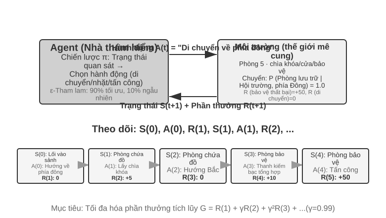

Sự tương tác tạo ra **trajectory** - tức là một bản ghi đầy đủ về "trạng thái → hành động → phần thưởng → trạng thái mới → hành động → phần thưởng...". Chất lượng của chiến lược cuối cùng được phản ánh ở chất lượng của trajectory. **Hàm giá trị** trả lời câu hỏi: "Nếu bây giờ tôi đang ở trạng thái này và tiếp tục hành động theo chiến lược hiện tại thì cuối cùng tôi có thể nhận được tổng phần thưởng là bao nhiêu?" Điều này giống như một người chơi cờ có kinh nghiệm nhìn thấy tình huống và có thể ước tính trực quan tỷ lệ thắng của trò chơi mà không cần tính đến nước đi cuối cùng. (Khi "chiến lược hiện tại" ở đây được thay thế bằng "chiến lược tối ưu", kết quả thu được là hàm giá trị tối ưu, sẽ được sử dụng khi nói về phương trình tối ưu Bellman ở phần sau của chương này.) Ranh giới giữa Agent và môi trường tuân theo một nguyên tắc đơn giản: **Bất cứ thứ gì Agent không thể thay đổi tùy ý đều thuộc về môi trường**.

Hai tính năng độc đáo giúp phân biệt học tăng cường với học có giám sát (nhu cầu gắn nhãn câu trả lời đúng) và học không giám sát (khám phá các mẫu ẩn trong dữ liệu) là **tìm kiếm thử và lỗi**(Agent phải tự mình tìm ra hành động nào là tốt mà không cần giáo viên trực tiếp nói câu trả lời đúng) và **phần thưởng bị trì hoãn**(tác động của một hành động có thể không xuất hiện cho đến nhiều bước sau đó, chẳng hạn như giá trị của một nước đi tốt không được nhìn thấy cho đến khi kết thúc). Điều này cũng mang lại một **sự cân bằng giữa khám phá và sử dụng (Exploration-Exploitation) độc đáo**: nếu bạn tiếp tục đi trên con đường quen thuộc, bạn sẽ không học được điều gì mới; nếu bạn tiếp tục cố gắng một cách ngẫu nhiên, bạn sẽ không bao giờ đạt được mục tiêu cuối cùng.

Hệ thống học tập tăng cường chứa năm yếu tố cốt lõi:

- **Action Space**: Xác định tập hợp tất cả các hành động mà Agent có thể thực hiện. Các hành động có thể rời rạc (chẳng hạn như "thực hiện bước nào" trong cờ vua, với các tùy chọn hạn chế) hoặc liên tục (chẳng hạn như "xoay các khớp của robot bao nhiêu độ", là một giá trị liên tục).
- **Chính sách**: Quy tắc ứng xử của Agent, quy định những việc nên làm trong một trạng thái nhất định. Các chính sách có thể đơn giản (bảng tra cứu: khi nhìn thấy trạng thái A, thực hiện hành động X) hoặc phức tạp (mạng lưới thần kinh sâu).
- **Tín hiệu khen thưởng**: Phản hồi tức thì từ môi trường. Nhưng mục tiêu của Agent là tối đa hóa lợi nhuận dài hạn thay vì ngay lập tức - sự khác biệt này rất quan trọng, giống như việc đầu tư không thể chỉ nhìn vào sự tăng giảm của ngày hôm nay mà là lợi nhuận dài hạn.
- **Hàm giá trị**: Ước tính số phần thưởng tích lũy có thể nhận được trong tương lai bắt đầu từ một trạng thái nhất định, giúp Agent đưa ra quyết định sáng suốt khi không có phản hồi ngay lập tức. Một trong những hiểu biết quan trọng nhất từ nghiên cứu RL trong sáu mươi năm qua là tính trung tâm của ước tính giá trị.
- **Mô hình môi trường**(tùy chọn): Dự đoán phản ứng của môi trường đối với các hành động. Phương pháp có mô hình môi trường được gọi là **phương pháp dựa trên mô hình**(trước tiên hãy học cách dự đoán môi trường sẽ thay đổi như thế nào, sau đó lập kế hoạch cho phù hợp) và phương pháp không có mô hình môi trường được gọi là **phương pháp không có mô hình**(không dự đoán môi trường, học trực tiếp từ kinh nghiệm).

Bảng 8-3 so sánh các thành phần chính của các hệ thống Agent khác nhau, cho thấy tính phổ biến của khái niệm Agent và giúp người đọc thấy được sự khác biệt về không gian hành động giữa RL Agent truyền thống và LLM Agent hiện đại.

Bảng 8-3 So sánh các thành phần chính của các hệ thống Agent khác nhau

| Loại Agent | Môi trường | Action Space | Tín hiệu thưởng |
|---------|------|---------|---------|
|**Linh dương nhỏ sơ sinh**| Địa hình, trọng lực, tư thế cơ thể | Kích thước cao liên tục (co thắt từng nhóm cơ) | Cân bằng (+), giảm (-) |
|**Robot quét nhà**| Bố trí phòng, cấp điện | Rời rạc (hướng, hút bụi, sạc) | Vệ sinh khu vực (+), mất điện (-) |
|**Bậc thầy cờ vua**| Tình trạng hội đồng, thời hạn | Rời rạc hữu hạn (chuyển động hợp pháp) | Thắng (+1), thua (-1) |
|**Dịch vụ khách hàng Agent**| Lịch sử hội thoại, cơ sở kiến thức | Mở (nghĩ, nói, gọi API) | Giải quyết vấn đề (+), thời gian xử lý (-) |
|**Trợ lý mã Agent**| Tài liệu yêu cầu, cơ sở mã | Mở (suy nghĩ, tìm kiếm, biên tập, thực thi) | Đã vượt qua thử nghiệm (+), đã xuất hiện lỗi (-) |

Bảng này tiết lộ một thông tin chi tiết quan trọng: không gian hành động của RL Agent (cờ vua, robot) truyền thống bị đóng, trong khi không gian hành động của Agent (dịch vụ khách hàng, trợ lý mã) hiện đại dựa trên LLM là mở, gần như không giới hạn và hành động đặc biệt của "suy nghĩ nội bộ" có thể được sử dụng để cải thiện khả năng.

### Hai mô hình Agent: từ MDP đến LLM+RL

Sự khác biệt cơ bản nhất giữa hai loại này là không gian hành động - MDP giả định rằng không gian hành động bị giới hạn và đóng (lên/xuống/lấy/đặt), trong khi không gian hành động của LLM là sự bùng nổ tổ hợp mở của các chuỗi ngôn ngữ tự nhiên. Sự khác biệt này xác định sự khác biệt cơ bản giữa hai mô hình trong thiết kế thuật toán, hiệu quả mẫu và khả năng khái quát hóa. Mở rộng chúng một cách riêng biệt bên dưới.

**Mô hình truyền thống: MDP với Q-learning.**

MDP (Quy trình quyết định Markov) là một khung toán học dành cho học tập tăng cường, xác định các yếu tố cốt lõi như trạng thái, hành động và phần thưởng. Giả định cốt lõi của nó là tính chất Markov: tương lai chỉ phụ thuộc vào trạng thái hiện tại và không liên quan gì đến lịch sử trước đó. Ví dụ khi chơi cờ, chỉ cần nhìn vào tình hình bàn cờ hiện tại là đủ để xác định nước đi tối ưu. Không cần phải xem lại từng bước đi trước đó đã được thực hiện như thế nào. Giả định này đơn giản hóa vấn đề nhưng cũng hạn chế khả năng mô hình hóa sự phụ thuộc lịch sử.

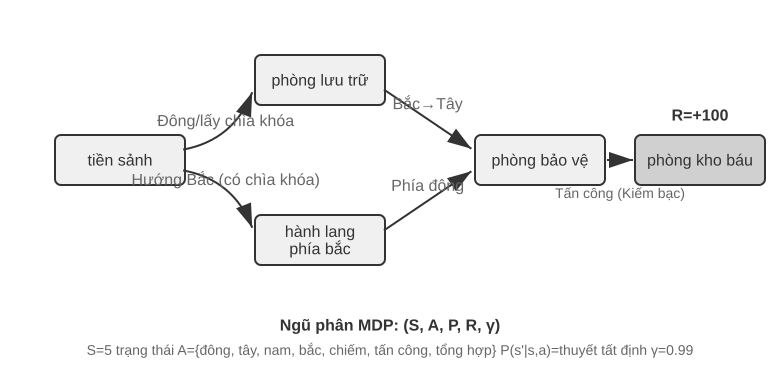

RL truyền thống Tính năng chính của Agent là **không gian hành động khép kín** - một tập hợp hữu hạn được xác định trước của tất cả các hành động mà Agent có thể thực hiện. **Trò chơi cờ vua cổ điển Agent** là ví dụ điển hình nhất: 361 thế cờ của cờ vây rất lớn nhưng hoàn toàn chắc chắn và hạn chế, cờ vua xem xét các quy tắc di chuyển khác nhau cho các quân cờ nhưng các động tác vẫn có thể liệt kê được, còn trò chơi Atari chỉ có từ vài đến chục hành động rời rạc. **Robot Agent** đại diện cho một không gian hành động liên tục nhưng có giới hạn: góc khớp, tốc độ và lực bám là các giá trị liên tục nhưng tất cả chúng đều có ranh giới vật lý rõ ràng (góc quay tối đa, mô-men xoắn cực đại, giới hạn tốc độ) và kích thước được xác định bởi mức độ tự do của robot.

Việc đóng này mang lại lợi thế về mặt tính toán: tất cả các hành động có thể được liệt kê và đánh giá từng hành động một, điều này tạo điều kiện thuận lợi cho việc lập trình động và tìm kiếm cây Monte Carlo, đồng thời hàm giá trị hành động có thể được tính gần đúng bằng một bảng hoặc một hàm đơn giản. Nhưng nó cũng hạn chế khả năng diễn đạt và khái quát hóa. RL Agent truyền thống bắt đầu từ đầu và hoàn toàn dựa vào việc học thử và sai - bắt đầu từ chiến lược ngẫu nhiên, thu thập kinh nghiệm, cập nhật hàm giá trị hoặc chiến lược, v.v. cho đến khi hội tụ.

Trong khung này, một trong những thuật toán cơ bản và quan trọng nhất là **Q-learning**. Nó duy trì ước tính giá trị cho mỗi kết hợp "trạng thái hành động": nếu bạn thực hiện hành động a ở trạng thái s và sau đó tiếp tục hành động theo chiến lược tối ưu, bạn có thể nhận được tổng cộng bao nhiêu phần thưởng? Theo trực giác, một hành động có tốt hay không phụ thuộc vào phần thưởng ngay lập tức mà nó mang lại, cộng với "trạng thái tiếp theo sẽ đưa bạn đến tốt như thế nào".

Viết trực giác này thành một phương trình là mối quan hệ đệ quy cốt lõi của **Phương trình Bellman**(phương trình Bellman) nổi tiếng trong sách giáo khoa RL: **Giá trị thực của một hành động = phần thưởng ngay lập tức nhận được ở bước này + giá trị tối đa trong tương lai có thể đạt được sau khi đạt đến trạng thái tiếp theo**:

$$Q^*(s, a) = r + \gamma \max_{a'} Q^*(s', a')$$

Trong số đó, $r$ là phần thưởng ngay lập tức, $s'$ là trạng thái tiếp theo đạt được sau khi thực hiện hành động (được viết dưới dạng xác định ở đây vì mục đích trực quan và trạng thái tiếp theo $s'$ cần được mong đợi trong môi trường ngẫu nhiên), $\gamma \in [0, 1)$ là **hệ số giảm giá** - nó xác định Agent Mức độ nhấn mạnh được đặt vào tương lai: $\gamma$ Càng gần 1 thì càng coi trọng lợi nhuận dài hạn và càng gần 0 thì càng tập trung vào hiện tại. “Phần thưởng tích lũy” xuất hiện lặp đi lặp lại ở bài viết trước chính xác là tổng của $\sum_{t} \gamma^{t} r_t$ sau khi phần thưởng ở mỗi bước được giảm dần theo $\gamma$. Sau mỗi hành động của thuật toán, giá trị ước tính cũ được điều chỉnh một chút theo hướng "kết quả thực tế" - mô hình "sửa đổi ước tính cũ với kết quả thực tế của một bước" này được gọi là học khác biệt theo thời gian (Học Temporal-Difference, học TD). Sau hàng nghìn lần thử và sai, giá trị ước tính dần dần tiệm cận giá trị thực.

Hai hình sau đây lần lượt hiển thị quá trình khám phá Q-learning trong thế giới lưới và sự hội tụ dần dần của giá trị Q.

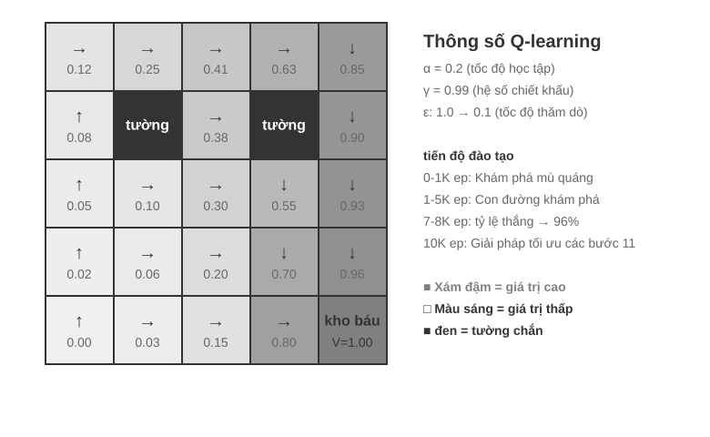

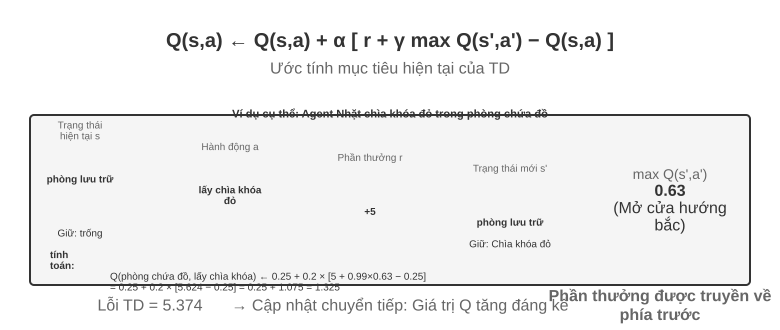

Q-learning thuộc phương pháp **chiến lược trật bánh**(Off-Policy) đặc biệt - nó có thể tìm hiểu chiến lược tối ưu bằng cách sử dụng dữ liệu được tạo bởi bất kỳ chiến lược nào (bao gồm cả khám phá ngẫu nhiên). Để biết định nghĩa chặt chẽ về chiến lược trên trajectory/ngoài trajectory và mối quan hệ tương ứng trong quá trình post-training LLM, hãy xem phần "So sánh các thuật toán học tăng cường" bên dưới.

> **Thử nghiệm 8-1 ★: Hiệu suất của Q-learning trong trò chơi truy tìm kho báu**
>
> Để xác minh các tính năng và hạn chế của Q-learning, chúng tôi đã thiết kế **môi trường trò chơi truy tìm kho báu**. Môi trường này chứa đựng một số thách thức chính: **Cơ chế ẩn** yêu cầu Agent phải tự mình khám phá sự tương ứng giữa chìa khóa và cửa, hiệu ứng vũ khí và quy tắc tổng hợp vật phẩm; **Phụ thuộc nhiều bước** có nghĩa là việc hoàn thành nhiệm vụ cần có trình tự hành động chính xác (giải pháp tối ưu 11 bước); **Phần thưởng thưa thớt** có nghĩa là chỉ những hành động quan trọng và chiến thắng cuối cùng mới có phần thưởng đáng kể và hầu hết các bước ở giữa không nhận được bất kỳ phản hồi nào.
>
> Q-learning Agent sử dụng cấu hình tham số tiêu chuẩn và áp dụng chiến lược khám phá ε-tham lam (hầu hết thời gian, chọn hành động tối ưu hiện tại, thỉnh thoảng thử ngẫu nhiên và giảm dần tỷ lệ khám phá ngẫu nhiên khi tiến trình đào tạo).
>
> Đường cong học tập thể hiện các đặc điểm điển hình (tập đề cập đến một trò chơi hoàn chỉnh, từ đầu đến cuối hoặc thất bại được tính là một lần):
> - **1000 tập đầu tiên**: Tỉ lệ thắng 0%, bảng Q chỉ có 124 trạng thái, Agent khám phá một cách mù quáng
> - **5000 tập đầu tiên**: Vẫn chưa có chiến thắng ổn định, 133 trạng thái bảng Q
> - **Các tập 7000-8000**: Tỷ lệ thắng tăng dần từ 34% lên 96%
> - **10000 tập**: Tỷ lệ thắng 100%, 145 trạng thái bảng Q, tìm lời giải tối ưu 11 bước
>
> Toàn bộ quá trình huấn luyện chỉ mất chưa đầy 10 giây (mô phỏng cực kỳ hiệu quả) nhưng cần gần 10.000 lần thử hoàn chỉnh. Điều này thể hiện các đặc điểm cốt lõi của Q-learning: nó đòi hỏi nhiều lần khám phá ngẫu nhiên để vô tình đi theo đường dẫn hoàn chỉnh và tín hiệu giá trị truyền chậm và phải được tăng cường nhiều lần. Việc học biểu tượng thuần túy chỉ có thể tìm kiếm mạnh mẽ không gian trạng thái khi không có kiến thức trước đó.
>
> Trong trò chơi giả lập, 10.000 lượt thử và sai chỉ mất 10 giây, chi phí tối thiểu. Nhưng trong kịch bản Agent trong thế giới thực—trong đó mỗi cuộc gọi điện thoại đều phải trả phí, mọi hoạt động của trình duyệt đều có độ trễ và mọi quyết định sai lầm đều có những hậu quả không thể khắc phục được—10.000 lần thử và sai sót là hoàn toàn không thể chấp nhận được. Đây chính xác là lý do tại sao Agent hiện đại chuyển sang phương pháp tiếp cận dựa trên LLM: tận dụng kiến thức tích lũy được từ quá trình đào tạo trước để đưa ra quyết định hiệu quả với số lần tương tác tối thiểu.
>
> Có ba hạn chế cơ bản của MDP: hiệu quả lấy mẫu thấp (cần tương tác lớn để học các nhiệm vụ đơn giản), khả năng khái quát hóa kém (kiến thức học được trong môi trường này khó chuyển sang môi trường khác) và không có khả năng sử dụng kiến thức có sẵn (mọi nhiệm vụ mới đều phải học lại từ đầu). Những hạn chế này đặc biệt nổi bật khi phải đối mặt với các không gian trạng thái phức tạp như ngôn ngữ tự nhiên hoặc tầm nhìn đa chiều.

**Mô hình hiện đại: Agent dựa trên LLM+RL.**

Mô hình ngôn ngữ lớn mang đến mô hình Agent mới, thay đổi căn bản cách xây dựng Agent - đặc biệt là thiết kế không gian hành động.

Agent của RL truyền thống chỉ có thể nhận được phản hồi bằng cách thay đổi môi trường: nước cờ, nước đi mê cung. Nhưng LLM lại mang đến một kiểu hành động hoàn toàn mới: tư duy nội tâm. Suy nghĩ không làm thay đổi thế giới bên ngoài nhưng nó có thể cải thiện đáng kể chất lượng của hành động đạt được. Sự chuyển đổi này thay đổi mọi thứ: Action Space của Agent không còn chỉ là “làm gì” mà còn là “nghĩ trong bao lâu và nghĩ về điều gì”.

Sự đổi mới quan trọng nhất là kết hợp tư duy như một hành động đặc biệt vào không gian hành động. Trong RL truyền thống, Agent chỉ có thể thực hiện các hành động bên ngoài (di chuyển, tấn công, nhặt) làm thay đổi trạng thái môi trường; trong khi ở LLM Agent, **tư duy nội tâm trở thành thành phần cốt lõi của không gian hành động** - nó không trực tiếp thay đổi môi trường bên ngoài, không có phần thưởng ngay lập tức, gần như không giới hạn và chi phí thấp.

RL truyền thống khó có thể xử lý được những hành động như vậy. Nguyên nhân cốt lõi là do không gian khám phá quá rộng và thiếu cấu trúc: Agent học từ đầu giống như tìm kho báu trên sa mạc khi bị bịt mắt và chỉ có thể đánh ngẫu nhiên. LLM thì khác. Thông qua đào tạo trước văn bản khổng lồ, nó đã nội hóa các quy tắc tư duy mà con người tích lũy được: khi giải các bài toán, hãy tuân theo "xác định điều kiện → nhớ lại công thức → tính toán từng bước" và khi viết mã, hãy tuân theo "hiểu yêu cầu → cấu trúc thiết kế → chi tiết triển khai". Điều này cho phép suy nghĩ của LLM tiến hành theo một đường dẫn có cấu trúc, nén đáng kể không gian tìm kiếm. Do đó, ngay cả khi không được đào tạo bổ sung về RL, LLM được đào tạo trước vẫn có thể tạo ra chuỗi suy nghĩ (CoT) với logic cơ bản. Logic cơ bản này xuất phát từ quá trình tư duy khổng lồ của con người trong kho dữ liệu trước đào tạo (giải bài toán, nhận xét mã, phản hồi tranh luận, v.v.). Mô hình ngầm học "bước tiếp theo sẽ là dạng lý luận nào" thông qua dự đoán next-token.

RL post-training dạy LLM áp dụng các quy tắc này hiệu quả hơn trong các nhiệm vụ cụ thể thông qua các phần thưởng bên ngoài. Bản thân cấu trúc ngôn ngữ cũng mang lại một phần thưởng tiềm ẩn bên trong - các chuỗi suy nghĩ mạch lạc về mặt logic (chẳng hạn như "Vì chúng ta cần chuyển đổi ngoại tệ sang đô la Mỹ nên bước đầu tiên là kiểm tra tỷ giá hối đoái") có xác suất được tạo ra cao, trong khi các chuỗi suy nghĩ khó hiểu về mặt logic (chẳng hạn như "Vì chúng ta cần chuyển đổi tiền tệ nên trước tiên chúng ta hiểu thời tiết") có xác suất rất thấp, điều này tự nhiên hướng dẫn mô hình chọn một con đường hợp lý.

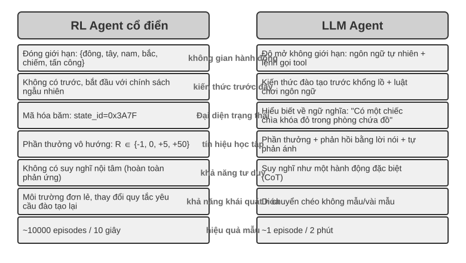

Khả năng suy nghĩ dựa trên các quy tắc vốn có của ngôn ngữ này cho phép LLM Agent hiểu các hướng dẫn mà nó chưa từng thấy trước đây (khái quát hóa zero-shot) và thành thạo các nhiệm vụ mới với rất ít ví dụ (thích ứng few-shot) - hoàn toàn khác với mô hình MDP Agent truyền thống đòi hỏi nhiều lần thử và sai. Ngoài ra, mô hình mới còn có khả năng khái quát hóa tổ hợp (tái kết hợp các khái niệm đã biết để giải quyết các tình huống mới), In-Context Learning (học trong ngữ cảnh) (thích ứng nhanh thông qua các gợi ý và ví dụ) và hiểu biết đa phương thức (tích hợp tự nhiên giữa hình ảnh, ngôn ngữ, hành động và các phương thức khác). Cần lưu ý rằng **hiệu ứng** của việc In-Context Learning (học trong ngữ cảnh) (khái quát hóa zero-shot, thích ứng few-shot) và **cơ chế bên trong** của nó là hai thứ khác nhau - như đã phân tích trong Chương 2, cơ chế chú ý hoạt động giống như truy xuất hơn là lý luận, nhưng điều này không ngăn cản nó tạo ra những hiệu ứng thực tế mạnh mẽ trong việc điều chỉnh nhiệm vụ.

Sự phát triển của không gian hành động từ đóng sang mở phản ánh sự thay đổi cơ bản trong mô hình AI Agent. Ngoài tư duy nội bộ, sự đa dạng của các tham số công cụ (truy vấn ngôn ngữ tự nhiên, mã chương trình, JSON phức tạp, nội dung đa phương thức) khiến không gian hành động thực tế gần như vô hạn - về mặt lý thuyết, trình thông dịch mã có thể thực hiện bất kỳ tác vụ tính toán nào và công cụ tìm kiếm có thể khám phá không gian thông tin của toàn bộ Internet. Điều này mang đến cả những cơ hội mới (Agent có thể xử lý các nhiệm vụ chưa từng thấy, giải quyết các vấn đề phức tạp bằng cách kết hợp các công cụ cơ bản) và cả những thách thức mới (cách xác định và tối ưu hóa các chức năng phần thưởng trong môi trường mở, cách tìm kiếm hiệu quả trong không gian hành động vô hạn).

Lấy các mô hình như Kimi K3 định hướng gọi công cụ và tối ưu hóa tư duy chuỗi dài làm ví dụ, chúng ta có thể thấy hướng điển hình của mô hình LLM+RL: dựa trên đào tạo trước ngôn ngữ quy mô lớn, post-training được sử dụng để tăng cường khả năng phân tích vấn đề, gọi công cụ và tự sửa lỗi. **OpenVLA**[^ch8-21](xem Chương 6 để biết chi tiết) thể hiện mô hình kiến trúc VLA (Ngôn ngữ hình ảnh-Hành động) của kỷ nguyên LLM: bộ mã hóa hình ảnh xử lý các quan sát môi trường, mô hình ngôn ngữ hiểu hướng dẫn và lý do, đồng thời bộ giải mã hành động tạo ra các tín hiệu điều khiển để đạt được khả năng kiểm soát điều kiện ngôn ngữ và khái quát hóa nhiều tác vụ. Điều cần làm rõ là bản thân OpenVLA được đào tạo thông qua học tập bắt chước (nhân bản hành vi) trên gần một triệu **trajectory demo** của robot và nó thuộc về bản chất của SFT chứ không phải RL; đại diện của việc thực sự đưa RL vào robot và sử dụng phần thưởng để tối ưu hóa hơn nữa loại kiến trúc VLA này là SimpleVLA-RL trong thử nghiệm 8-13 ở phần sau của chương này.


**Con đường khám phá của OpenAI**(được Yao Shunyu (trợ lý giáo sư tại Đại học Princeton và là tác giả của bài báo ReAct) ghi lại chi tiết trong "Nửa sau"[^ch8-2]) tiết lộ một quá trình tiến hóa về nhận thức. **Thuật toán trung tâm giai đoạn 1 (2015-2016)**: Tin rằng các thuật toán tốt hơn là chìa khóa, đạt được tiến bộ trong môi trường tiêu chuẩn như Atari, nhưng chuyển sang môi trường mới và phải đào tạo lại từ đầu. **Tầm quan trọng của môi trường trong giai đoạn thứ hai (2016-2018)**: Phòng tập tiêu chuẩn hóa nhiều nhiệm vụ khác nhau, Universe và World of Bits cố gắng biến toàn bộ Internet thành môi trường luyện tập cho RL và Dota 2 theo đuổi hiệu suất siêu phàm trong các môi trường phức tạp cụ thể. Ý tưởng rất rõ ràng nhưng việc sử dụng máy tính nói chung và điều hướng trang web không thể thực hiện được.

**Giai đoạn 3 (2018 đến nay) Prior Awakening**: GPT-2/GPT-3 thể hiện sức mạnh của việc đào tạo trước ngôn ngữ. WebGPT và ChatGPT chứng minh rằng những kiến thức có sẵn này có thể được chuyển hóa thành Agent thực tế. Phát hiện quan trọng nhất là: **Có thể thu được kiến thức trước theo những cách hoàn toàn không liên quan đến RL**. Đây là một sự thật phản trực giác: các ưu tiên của các nhà nghiên cứu RL có thể đã bị đảo ngược hoàn toàn trong nhiều thập kỷ—không phải thuật toán > môi trường > prior mà là prior > môi trường > thuật toán.

> **Thử nghiệm 8-2 ★★: Nghiên cứu so sánh giữa RL truyền thống và LLM Agent**
>
>
> 
>
>
> So sánh Q-learning với LLM Agent (Kimi K3, duy trì vùng đệm lên tới 50 điểm kinh nghiệm) trong cùng một cuộc truy tìm kho báu. Kết quả thật đáng kinh ngạc: **LLM Agent Hoàn thành ván đầu tiên sau 18 nước đi**.
>
> **Giai đoạn đầu (khám phá có mục đích)**: Nhặt thanh kiếm rỉ sét ("Vũ khí tốt hơn tay không"), khám phá bản đồ một cách có hệ thống, phát hiện ra rằng cửa phía bắc đã bị khóa và lý do rằng "chúng ta cần tìm chìa khóa", sau đó khám phá phòng chứa đồ và lấy chìa khóa đỏ và tinh thể ma thuật. **Giai đoạn giữa (hiểu cơ học và tổng hợp chủ động)**: Hiểu quy tắc "tự động dùng chìa khóa" và dự đoán thanh kiếm rỉ sét không đủ sức đối phó với lính canh, nên ở bước 8, thanh kiếm bạc được chủ động tổng hợp. **Giai đoạn sau (thực hiện và sửa lỗi)**: Giữ thanh kiếm bạc về phía bắc, đánh bại người bảo vệ mạnh mẽ ở bước thứ 13, xen kẽ với một hoặc hai lần thử không hợp lệ (vung kiếm/rút lui lặp đi lặp lại), và cuối cùng lấy được bảo vật rồng ở bước thứ 18.
>
> Điều này thể hiện sự khác biệt cơ bản giữa hiểu biết ngữ nghĩa và ánh xạ biểu tượng. LLM Agent hiểu cấu trúc khái niệm của trò chơi và mỗi bước đều được hỗ trợ bởi mục đích và logic. Đối với Q-learning, "cửa", "chìa khóa" và "kiếm" chỉ là sự kết hợp vô nghĩa của các ký hiệu và mối quan hệ giữa chúng chỉ có thể được khám phá từ từ thông qua một lượng lớn học tập thống kê.
>
> Chi phí tính toán tạo ra một nghịch lý thú vị: Q-learning chỉ mất 10 giây để chạy 10.000 vòng, nhưng LLM Agent lại mất 1-2 phút để chạy một vòng. Nhưng trong các nhiệm vụ trong thế giới thực, thời gian, tiền bạc và chi phí rủi ro của mỗi tương tác vượt xa chi phí tính toán thuần túy, do đó, chỉ nhìn vào thời gian của GPU là không công bằng. Cái nhìn sâu sắc quan trọng hơn là: Thành công của LLM Agent không phải nhờ có “thuật toán học tập” tốt hơn, mà vì nó chứa một lượng lớn kiến thức có sẵn. Khi luật chơi thay đổi, Q-learning cần được đào tạo lại hoàn toàn, nhưng LLM Agent có thể thích ứng trực tiếp thông qua suy luận. Từ đó, chúng ta có thể rút ra các nguyên tắc thiết kế thực tế: trong các tình huống mà chi phí mô phỏng thấp và có thể lặp lại với số lượng lớn, RL truyền thống vẫn có giá trị; trong các tình huống thực tế khi chi phí tương tác cao và cần phải thích ứng nhanh, hiệu suất mẫu của LLM Agent sẽ thực tế hơn.

Về vị trí và sức mạnh tổng hợp tương ứng của ba mô hình In-Context Learning (học trong ngữ cảnh), External Learning (học bên ngoài tham số mô hình) và học tập tham số (post-training), chương đầu tiên sẽ có sự so sánh có hệ thống và “bức tranh hoàn chỉnh” ở cuối chương này cũng sẽ quay trở lại chủ đề này. Chủ đề chính của chương này là post-training—viết chiến lược tương tác vào các tham số mô hình.

## Mô hình đào tạo cơ bản trước `[Tùy chọn đọc]`

Để hiểu tại sao các kỹ thuật post-training lại hiệu quả, trước tiên bạn cần hiểu những gì mà đào tạo trước thiết lập. Post-training (SFT và RL) về cơ bản tối ưu hóa trong không gian biểu diễn được thiết lập bởi đào tạo trước - cấu trúc kiến thức được thiết lập bởi đào tạo trước sẽ xác định mức trần của post-training. Do đó, chúng tôi xem xét các khía cạnh cốt lõi của quá trình đào tạo trước thông qua ba thử nghiệm: đào tạo mô hình ngôn ngữ quy mô nhỏ từ đầu, mở rộng khả năng thị giác và bổ sung kiến thức ngôn ngữ mới. Ba thí nghiệm trong phần này là nội dung bổ trợ giúp người đọc hình thành trực giác về quá trình pretraining (tức là đào tạo ban đầu về dữ liệu quy mô lớn để cho phép mô hình học các quy tắc cơ bản của ngôn ngữ và kiến thức thế giới) – những độc giả đã quen với quá trình pretraining có thể bỏ qua.


Đào tạo mô hình ngôn ngữ tuân theo quy trình ba giai đoạn "mã thông báo - đào tạo trước - post-training". Mã thông báo chia văn bản thành các đơn vị riêng biệt. Ví dụ: "Tôi thích lập trình" có thể được chia thành bốn mã thông báo: "Tôi", "Thích", "Lập trình" và "Lập trình" - những mã thông báo này là đơn vị nhỏ nhất để mô hình xử lý văn bản. Nhiệm vụ đào tạo trước về mặt khái niệm rất đơn giản: hiển thị cho mô hình nửa đầu của văn bản và yêu cầu mô hình dự đoán mã thông báo tiếp theo sẽ là gì. Mô hình liên tục điều chỉnh các tham số của nó bằng cách so sánh khoảng cách giữa dự đoán của nó và câu trả lời đúng (khoảng cách này được gọi là loss, loss càng nhỏ thì dự đoán càng chính xác). Sau nhiều lần huấn luyện với số lượng lớn văn bản, mô hình dần dần học được các quy tắc ngôn ngữ, kiến thức thế giới và khả năng suy luận cơ bản. Sau khi hoàn tất quá trình đào tạo trước, mô hình có thể tạo ra văn bản mượt mà nhưng đầu ra thiếu cấu trúc và gây khó khăn cho việc làm theo hướng dẫn. Quá trình post-training biến nó thành một trợ lý thực tế thông qua SFT (được đào tạo với các cặp đầu vào-đầu ra được gắn nhãn) và tối ưu hóa tùy chọn (chẳng hạn như DPO, cho phép mô hình học cách tạo ra các câu trả lời mà con người ưa thích).

> **Thử nghiệm 8-3 ★★: Đào tạo LLM từ đầu - sức mạnh của cải tiến thuật toán**
>
> Lấy MiniMind 2 (100 triệu thông số) làm ví dụ, quá trình đào tạo hoàn chỉnh được hoàn thành trên GPU cấp độ người tiêu dùng. Bằng cách giới thiệu hai tối ưu hóa thuật toán (trình tối ưu hóa QK Norm và Muon), tốc độ hội tụ tăng gấp 3 lần và chất lượng tạo ra được cải thiện đáng kể - chi phí triển khai rất thấp, tổng thời gian đào tạo khoảng 14 giờ và chi phí khoảng 34 USD.
>
> Tác dụng của từng giai đoạn huấn luyện: Sau khi huấn luyện trước, mô hình có thể trả lời các câu hỏi thực tế như “ngọn núi cao nhất thế giới” nhưng format chưa chuẩn; sau SFT, định dạng đầu ra và tuân thủ hướng dẫn được cải thiện đáng kể và các câu trả lời có thể được sắp xếp theo cách mong muốn; tối ưu hóa ưu tiên tiếp tục giảm các lỗi thực tế và các biểu thức không tự nhiên. Một mô hình có 100 triệu tham số vẫn có những hạn chế rõ ràng (các vấn đề phức tạp dễ xảy ra lỗi), nhưng nguồn cảm hứng là: **Với ngân sách quy mô nhỏ cố định, cải tiến thuật toán sẽ tiết kiệm chi phí hơn so với việc chất đống quy mô thuần túy**.

> **Thử nghiệm 8-4 ★★: Tự đào tạo VLM**
>
>
> 
>
>
> VLM thống nhất nhận thức trực quan và hiểu ngôn ngữ trong một mô hình. Thách thức cốt lõi nằm ở sự liên kết giữa các phương thức - làm cho "đã nhìn thấy" và "đã nói" tương ứng với nhau. Kiến trúc bao gồm ba thành phần: **Bộ mã hóa hình ảnh**(như CLIP, với các tham số cố định) trích xuất các đặc điểm ngữ nghĩa của hình ảnh; **Lớp chiếu**(nhẹ, phần duy nhất được đào tạo từ đầu) hoạt động như một "trình dịch" giữa các đặc điểm hình ảnh và mô hình ngôn ngữ, ánh xạ các đặc điểm hình ảnh tới một không gian biểu diễn mà mô hình ngôn ngữ có thể hiểu được; **Mô hình ngôn ngữ** tạo văn bản mô tả. Việc đào tạo áp dụng chiến lược “đóng băng LLM + chỉ đào tạo lớp chiếu” để tránh sự lãng quên thảm khốc (Quên thảm khốc, tức là quên kỹ năng cũ sau khi học kỹ năng mới); quá trình đào tạo trước được căn chỉnh và sau đó hủy đóng băng LLM, đồng thời các cặp mô tả hình ảnh chất lượng cao được sử dụng để tạo SFT. Mức độ chi tiết và độ chính xác của mô tả được cải thiện đáng kể.
>
> Thử nghiệm này cho thấy mô hình cơ bản của đào tạo mô hình đa phương thức: sử dụng lại kết quả đào tạo trước một phương thức và đạt được sự liên kết giữa các phương thức bằng cách đào tạo lớp chiếu nhẹ - hiệu quả và có thể mở rộng, nhưng lớp chiếu có khả năng biểu đạt hạn chế và có thể trở thành nút thắt cổ chai cho sự hiểu biết sâu sắc về đa phương thức. Bộ khung "bộ mã hóa hình ảnh + lớp chiếu + LLM" tương tự được mở rộng thêm một bước nữa để cho phép mô hình đưa ra các hành động, đó là mô hình VLA (Ngôn ngữ hình ảnh-Hành động) đã được giới thiệu trong Chương 6.

> **Thử nghiệm 8-5 ★★: Tiếp tục đào tạo trước để học ngôn ngữ mới**
>
> Dựa trên Mistral 7B v0.3 (chủ yếu được đào tạo trước bằng tiếng Anh, hầu như không hiểu tiếng Hàn), tiếp tục đào tạo trước qua Wikipedia tiếng Hàn để bổ sung năng lực tiếng Hàn - tiếp tục đào tạo không giám sát với dữ liệu ngôn ngữ mới trên mô hình được đào tạo trước. Mô hình đã có khả năng lập mô hình ngôn ngữ chung và chỉ cần thích ứng với việc phân phối dữ liệu mới. Chi phí thấp hơn nhiều so với đào tạo từ đầu. Điểm kỹ thuật quan trọng là sử dụng dữ liệu hỗn hợp (khoảng 80% tiếng Hàn + 20% tiếng Anh) để giảm bớt tình trạng quên thảm họa: tỷ lệ ngôn ngữ mục tiêu quá cao sẽ dẫn đến sự xuống cấp của ngôn ngữ gốc và tỷ lệ quá thấp sẽ dẫn đến hiệu quả học tập không đủ. Cuối cùng, sử dụng dữ liệu lệnh tiếng Hàn để làm SFT để có được kỹ năng đàm thoại tiếng Hàn thực tế. Kết luận của thí nghiệm này sẽ được sử dụng lại trong bức tranh hoàn chỉnh ở cuối chương này: để mô hình ghi nhớ được nhiều kiến thức miền mới, điều đó phụ thuộc vào việc tiếp tục đào tạo trước chứ không phải SFT.

Ba thử nghiệm trước khi đào tạo cùng nhau cho thấy một mô hình: khi ngân sách có hạn, việc cải tiến thuật toán và đổi mới kiến trúc sẽ tiết kiệm chi phí hơn là chỉ đơn giản mở rộng quy mô. Quan trọng hơn, đào tạo trước cung cấp cho mô hình kiến thức mô tả và khả năng mô hình hóa ngôn ngữ, thiếu hướng dẫn có cấu trúc và hành vi định hướng nhiệm vụ - đây là khoảng trống mà SFT cần lấp đầy.

Với các khả năng cơ bản của đào tạo trước, bước tiếp theo là biến mô hình chung thành Agent thực tế thông qua post-training. Giai đoạn đầu tiên của quá trình post-training là tinh chỉnh có giám sát (SFT).

## Mid-training: bổ sung kiến thức và năng lực nền

**Mid-training** trong chương này là một giai đoạn huấn luyện mô hình ngôn ngữ bổ sung trên phân phối đích, bắt đầu từ base model sẵn có. Nó thường dùng cùng mục tiêu next-token và tính loss trên toàn bộ token của tài liệu, mã hoặc phép suy diễn. Nghiên cứu DAPT/TAPT cho thấy pre-training giai đoạn hai trên ngữ liệu không nhãn thuộc lĩnh vực hay nhiệm vụ có thể cải thiện hiệu năng downstream[^ch8-30].

Nó lấp **khoảng trống kiến thức** về ngôn ngữ, thuật ngữ, tài liệu nội bộ hay codebase, và **khoảng trống năng lực nền** về ngữ cảnh dài, mã, toán hay biểu diễn đa phương thức—những thứ vẫn không tìm ra lời giải sau nhiều lần lấy mẫu. SFT có thể ghi nhớ ít sự kiện nhưng vài cặp QA chỉ củng cố ít đường truy cập, không phù hợp với kho kiến thức lớn và liên kết. Công thức ổn định là Mid-training hấp thụ kiến thức/năng lực → SFT nhỏ thiết lập giao thức → RL khi tỷ lệ thành công đã khác 0[^ch8-31].

### Phối trộn dữ liệu và chương trình học ngữ cảnh dài

Hỗn hợp ở giai đoạn độ dài $i$:

$$
D_i=\alpha_iD_{\text{long}}+\beta_iD_{\text{atomic}}+\gamma_iD_{\text{agent}}+\delta_iD_{\text{replay}},
\qquad \alpha_i+\beta_i+\gamma_i+\delta_i=1.
$$

Tính tỷ lệ theo **token**, không theo số tài liệu. $D_{\text{long}}$ gồm sách, tài liệu dài, repository mã; $D_{\text{atomic}}$ rèn truy xuất, suy luận nhiều bước, tuân thủ chỉ dẫn, tổng hợp và thống kê; $D_{\text{agent}}$ gồm lập kế hoạch, chọn/gọi công cụ, theo dõi trạng thái dài hạn và phục hồi lỗi. $D_{\text{replay}}$ giữ cả dữ liệu tổng quát/ngắn lẫn nhiệm vụ cũ đã biết được “nâng độ dài” bằng cách đổi vị trí bằng chứng và thêm nhiễu. Cần khử trùng lặp, lọc chất lượng và kiểm tra nhiễm tập đánh giá.

Mid-training còn phải biến cửa sổ danh nghĩa thành **cửa sổ hữu hiệu** đồng thời đưa vào suy luận dài, lập kế hoạch và dùng công cụ. Đổi `max_position_embeddings` từ 32K lên 128K chỉ chứng minh mô hình nhận được đầu vào. Dùng curriculum như 8K → 16K → 32K → 64K → 128K, tùy mô hình, mục tiêu và ngân sách[^ch8-36]. Trước mỗi lần tăng, phải đạt truy xuất, NIAH, suy luận nhiều bước, tổng hợp/thống kê, lập kế hoạch cơ bản và chọn công cụ ở độ dài hiện tại.

Nếu $M(\theta,c,L)$ là điểm của mô hình $\theta$ trên năng lực $c$ ở độ dài $L$, dùng ba cửa kiểm soát:

$$
\begin{aligned}
M(\theta_i,c,L_i)&\geq\tau_{c,i},\\
M(\theta_i,c,L_i)&\geq M(\theta_i,c,L_{i-1})-\epsilon_{\text{len}},\\
M(\theta_i,c,L_{i-1})&\geq M(\theta_{i-1},c,L_{i-1})-\epsilon_{\text{retain}}.
\end{aligned}
$$

Ba điều kiện lần lượt đòi hỏi đạt chuẩn ở độ dài hiện tại, cùng năng lực không suy giảm đáng kể khi kéo dài, và giai đoạn mới không quên năng lực cũ. So sánh các nhiệm vụ cùng độ khó chỉ khác độ dài; đặt $\epsilon$ từ khoảng tin cậy của đánh giá lặp lại. Nếu một bucket thất bại, tăng dữ liệu năng lực nguyên tử, độ dài hiện tại hoặc replay trước khi tăng cửa sổ danh nghĩa.

| Năng lực | Benchmark | Chẩn đoán chính |
| --- | --- | --- |
| Vị trí, truy xuất, theo dõi, tổng hợp | NIAH, RULER | Suy giảm theo vị trí/số needle, multi-hop, tổng hợp và độ dài; NIAH chỉ là smoke test |
| Suy luận tài liệu thực tế | LongBench, LongBench v2 | QA một/nhiều tài liệu, hội thoại dài, học trong ngữ cảnh, dữ liệu có cấu trúc theo loại và độ dài |
| Hiểu mã dài | Bài repository của LongBench v2, LongCodeU | Đơn vị mã, quan hệ giữa tệp, hiểu toàn repository |
| Lập kế hoạch và công cụ | PlanningArena và benchmark công cụ trước đó | Phân rã, lựa chọn, bộ nhớ, tham số và trạng thái |
| Agent đầu-cuối | SWE-bench Verified, $\tau^2$-bench, Terminal-Bench | Kế hoạch, công cụ, phục hồi và hoàn tất trong quỹ đạo thật |

RULER mở rộng NIAH sang nhiều needle, multi-hop và tổng hợp[^ch8-37]; LongBench v2 bao phủ tài liệu, đối thoại, repository và dữ liệu cấu trúc thực tế[^ch8-38]; LongCodeU và PlanningArena chẩn đoán mã dài cùng lập kế hoạch/công cụ[^ch8-39][^ch8-40]. Chỉ dùng test set chính thức để đánh giá, huấn luyện bằng ví dụ tương tự nhưng không trùng, và báo cáo theo độ dài, năng lực, loại lỗi. Vượt NIAH hay một leaderboard không chứng minh suy luận ngữ cảnh dài.

Sự kiện cần cập nhật, trích dẫn, kiểm soát truy cập hay xóa vẫn nên nằm trong RAG. Hãy kiểm tra tỷ lệ trộn ở quy mô nhỏ trước full-parameter Mid-training lớn.

## SFT (tinh chỉnh giám sát)


phần "Đào tạo trước, SFT, RL: toàn cảnh ba giai đoạn" đã giải thích bản chất của SFT (dữ liệu được thay đổi và tổn thất chỉ được tính dựa trên câu trả lời). Phần này sử dụng bốn thử nghiệm để xem cơ chế "ghi ánh xạ và giao thức ổn định vào các tham số" này đặc biệt củng cố điều gì trong các nhiệm vụ khác nhau. Giá trị cốt lõi của SFT không nằm ở việc đưa kiến thức mới mà ở **củng cố giao thức**: viết các mối quan hệ ánh xạ, định dạng tương tác và thông số kỹ thuật kiểu vào các tham số, để có thể tạo ra kết quả mong đợi mà không cần phải nhắc nhở dài dòng trong quá trình lý luận. Thông thường chỉ cần hàng nghìn đến hàng chục nghìn ví dụ chất lượng cao để hình thành các kỹ năng đàm thoại cơ bản và tuân theo mệnh lệnh.

Cái giá của hiệu quả cao là sự phụ thuộc nhiều vào phân phối đào tạo: SFT có xu hướng ghi nhớ hơn là khái quát hóa. Một khi bài thi gặp phải tình huống chưa từng thấy trong luyện tập, hiệu suất thường giảm đi đáng kể. Các thí nghiệm sau đây sẽ chứng minh quá trình "giao thức xử lý" này từ các góc độ khác nhau.

Trước khi bắt tay vào làm SFT, có một vấn đề thực tế không thể né tránh: **dữ liệu SFT lấy từ đâu?** Câu trả lời của ngành về cơ bản có ba lối.

- **Trình diễn của chuyên gia con người** — trần chất lượng cao nhất, nhưng đắt và chậm; hợp làm "dữ liệu hạt giống" để định nghĩa định dạng và phong cách;
- **Sinh bằng mô hình giáo viên** — tức dữ liệu tổng hợp: để một mô hình mạnh sản xuất hàng loạt cặp "đầu vào — đầu ra", lọc rồi chưng cất sang học trò; xem thí nghiệm 8-8 và 8-9;
- **Lấy mẫu loại bỏ** — mô hình tự lấy nhiều ứng viên cho cùng một bài, dùng bộ kiểm chứng chọn ra mẫu đúng rồi quay lại huấn luyện chính mình; xem thí nghiệm 8-9.

Ba lối này thường được dùng phối hợp: trước hết dùng ít hạt giống do người viết để dựng định dạng, kế đó dùng mô hình giáo viên nhân rộng quy mô, cuối cùng dùng lấy mẫu loại bỏ để san đều chất lượng. Đi lối nào thì quy trình dựng cũng gần như nhau: định nghĩa phân phối nhiệm vụ và lược đồ đầu ra, sinh hàng loạt ứng viên, lọc chất lượng bằng kiểm chứng theo quy tắc, kiểm tra định dạng và kiểm tra mẫu thủ công, rồi khử trùng lặp, cân bằng tỷ lệ và bảo đảm đa dạng. Về khối lượng thì không cần tham nhiều: vài nghìn đến vài chục nghìn mẫu chất lượng cao thường đã đủ để cố định giao thức, và thà mài giũa một vạn mẫu sạch còn hơn chất đống mười vạn mẫu bẩn, bởi mỗi chỗ nhiễu trong dữ liệu đều có thể được SFT ghi trung thực vào tham số.

> **Thử nghiệm 8-6 ★★★: Lời nói SFT - Từ “Tái tạo giọng nói” đến “Mô hình hóa song ngữ” `[Thử nghiệm mở rộng]`**
>
> Sử dụng Orpheus (nhân bản giọng nói theo ngữ cảnh) và Sesame (mô hình dấu hiệu cận ngôn ngữ) làm đối tượng, chỉ ra cách viết "kiểu giọng nói và thói quen diễn đạt" thành các tham số. Hai ý tưởng này khác nhau:
>
> - **Orpheus**: Nén dạng sóng âm thanh thành một chuỗi mã thông báo và bằng cách ghép âm thanh tham chiếu của cùng một loa, hãy để mô hình học cách "nói bằng giọng của người này" để đạt được âm sắc nhất quán giữa các câu.
> - **Sesame**: Các hiện tượng cận ngôn ngữ trừu tượng như cười, thở dài vào các điểm đánh dấu đặc biệt như `<laugh>`, `<sigh>`, v.v., đồng thời huấn luyện mô hình học cách "tạo ra âm thanh tương ứng khi nhìn thấy điểm đánh dấu".
>
> SFT Trong các nhiệm vụ diễn đạt, các giao thức kiểm soát phong cách và thói quen diễn đạt có cấu trúc được củng cố, thay vì kiến thức thực tế hoặc tư duy phức tạp. Chìa khóa nằm ở sự đa dạng của dữ liệu huấn luyện và chất lượng chú thích. Các dạng lỗi thường gặp: quá ít người nói trong dữ liệu huấn luyện, khiến mọi người đều có giọng giống nhau; quá khớp (nghĩa là mô hình ghi nhớ các chi tiết của mẫu đào tạo một cách học vẹt và hoạt động kém hơn khi gặp tình huống mới), dẫn đến "tiếng cười máy móc".

> **Thử nghiệm 8-7 ★★★: Tư duy bằng nhiều ngôn ngữ - để mô hình suy nghĩ bằng bất kỳ ngôn ngữ nào `[Thử nghiệm mở rộng]`**
>
> Hầu hết các mô hình tư duy chỉ có thể “nghĩ” bằng tiếng Anh: Dù bạn sử dụng ngôn ngữ nào để đặt câu hỏi thì chuỗi tư duy bên trong mô hình hầu như luôn bằng tiếng Anh, vì các minh họa tư duy chất lượng cao trong dữ liệu huấn luyện về cơ bản đều được viết bằng tiếng Anh. Mục tiêu của thử nghiệm này rất đơn giản - khiến mô hình suy nghĩ bằng một ngôn ngữ cụ thể.
>
> Phương pháp là thực hiện SFT trên gpt-oss-20b: thêm câu `reasoning language: German` (hoặc các ngôn ngữ khác) vào lệnh hệ thống, sau đó rèn luyện bằng các ví dụ tư duy bằng tiếng Anh, tiếng Tây Ban Nha, tiếng Pháp và các ngôn ngữ khác. Hoàn toàn không có tiếng Trung trong dữ liệu đào tạo, nhưng sau khi đào tạo xong, miễn là ngôn ngữ lý luận được đặt thành tiếng Trung, mô hình có thể suy nghĩ bằng tiếng Trung để có một chuỗi suy nghĩ hoàn chỉnh. Sự khái quát hóa đa ngôn ngữ zero-shot này là phát hiện thú vị nhất của thí nghiệm này. Cần lưu ý rằng đây không phải là khả năng khái quát của bản thân SFT. Quá trình đào tạo trước đa ngôn ngữ đã thiết lập một không gian biểu diễn chia sẻ đa ngôn ngữ trong mô hình và SFT chỉ kích hoạt khả năng đa ngôn ngữ đã có trong quá trình đào tạo trước.

> **Thử nghiệm 8-8 ★★: Chưng cất nhanh chóng - Tái tạo khả năng sẵn có với ít chi phí hơn**
>
> Trong các ứng dụng thực tế, để mô hình hoàn thành các tác vụ phức tạp, thường phải thiết kế các lời nhắc hệ thống dài dòng (hàng nghìn thậm chí hàng chục nghìn token), và mỗi lệnh gọi sẽ làm tăng độ trễ và chi phí. Khi sử dụng các mô hình tư duy lớn, các mã thông báo tư duy nội bộ sẽ làm tăng thêm chi phí. Ý tưởng của việc chắt lọc nhanh chóng là nén hành vi của “giáo viên nhắc nhở dài + suy nghĩ” thành “dạy ngắn/không nhắc + học sinh không suy nghĩ”. Giáo viên tạo ra các câu trả lời chất lượng cao bằng các gợi ý và chế độ tư duy hoàn chỉnh. Dữ liệu đào tạo chỉ giữ lại thông tin đầu vào và kết luận cuối cùng của người dùng, loại bỏ những lời nhắc dài dòng và quá trình tư duy trung gian. Học sinh học cách “đưa ra kết luận trực tiếp”, và sau khi chắt lọc, chất lượng đầu ra gần giống với chất lượng đầu ra của giáo viên trên cùng một đầu vào. Đồng thời, do không cần phải xử lý những lời nhắc dài dòng và các mã thông báo suy nghĩ nên độ trễ và chi phí sẽ giảm đáng kể.
>
> Quá trình chắt lọc có thể được thực hiện theo hai chiều: "lớn đến nhỏ" (thay thế các mô hình lớn bằng các mô hình cỡ nhỏ và vừa để đạt được sự thỏa hiệp giữa chi phí và chất lượng) và "từ suy nghĩ đến không suy nghĩ" (thu gọn CoT rõ ràng thành kiến thức được tham số hóa ngầm ở cùng một quy mô để đạt được tốc độ phản hồi được cải thiện gấp 20-30). Cả hai không xung đột và thường được sử dụng cùng nhau trong môi trường sản xuất. Cần lưu ý rằng việc chắt lọc sẽ kế thừa ranh giới của giáo viên - nếu giáo viên mắc lỗi hệ thống trong phân phối đuôi dài, học sinh sẽ mã hóa thêm các lỗi này; nếu người thầy dựa vào công cụ để đảm bảo tính đúng đắn thì việc chắt lọc đầu ra thuần túy sẽ làm mất đi sự chắc chắn mà công cụ mang lại. Cảm hứng kỹ thuật: Khi hình thức sản phẩm ổn định, việc phân bổ đầu vào có thể dự đoán được và hạn chế về chi phí là rõ ràng, việc chưng cất nhanh chóng là một phương pháp tối ưu hóa tốt; nhưng trong giai đoạn thăm dò hoặc khi nhiệm vụ vẫn chưa được hoàn thành, việc duy trì tư duy rõ ràng và kỹ thuật nhanh chóng có thể chỉnh sửa vẫn là cốt lõi của việc thử và sai nhanh chóng.

> **Thử nghiệm 8-9 ★★★: Chưng cất chuỗi suy nghĩ (CoT)**
>
> Quá trình chắt lọc kịp thời sẽ loại bỏ quá trình tư duy, trong khi quá trình chắt lọc CoT thì ngược lại: chuyển **trajectory tư duy hoàn chỉnh** của mô hình giáo viên mạnh mẽ sang mô hình học sinh. Thực hiện chắt lọc CoT trên mô hình giáo viên có khả năng mạnh mẽ có thể khôi phục 70%-80% khả năng của giáo viên với cùng lượng thông số. Đây là chiến lược đi theo thực tế nhất dành cho các nhóm không tìm cách làm mới ranh giới của các khả năng tiên tiến mà tìm kiếm các mô hình độc lập và có thể kiểm soát được. Một loạt các mẫu chưng cất nhỏ có mã nguồn mở khi DeepSeek-R1 ra mắt (sử dụng tư duy của R1 để tạo ra dòng Qwen và Llama), là đại diện cho lộ trình này.
>
> **Ngữ cảnh: Hiện tượng "Bức tường tư duy"**. Một số mô hình tư duy mã nguồn đóng (chẳng hạn như dòng OpenAI o, dòng Gemini) sẽ tạo ra chuỗi tư duy nội bộ khi suy nghĩ, nhưng những gì người dùng nhìn thấy không phải là quá trình tư duy ban đầu - các nhà sản xuất thường viết lại hoặc tóm tắt CoT trước khi xuất ra vì những lý do như chống chắt lọc, an toàn và trải nghiệm sản phẩm. Quá trình tư duy ban đầu có giá trị nhất được ẩn giấu sau API. Đây là lý do tại sao thử nghiệm này chọn các mô hình tư duy nguồn mở làm giáo viên: DeepSeek V4, Kimi K3, GLM 5.2 và các mô hình khác tiết lộ trực tiếp chuỗi tư duy hoàn chỉnh. Việc chưng cất là khả thi cả về mặt kỹ thuật và cấp phép (bạn vẫn nên xác nhận các điều khoản ủy quyền của giấy phép mẫu cho các sản phẩm chưng cất trước khi sử dụng).
>
> **Từ phòng thí nghiệm: mô hình biết viết mã chưa chắc sẵn sàng giúp chưng cất một mô hình khác.** Khi triển khai thử nghiệm này, tác giả ban đầu dùng OpenAI Codex chạy GPT-5.6-Sol để viết mã thử nghiệm. Khi nhiệm vụ nêu rõ việc chưng cất mô hình, Codex từ chối tiếp tục. Tác giả sau đó chuyển sang Claude Code chạy Claude Opus 5 và gặp cùng một lời từ chối. Cuối cùng, Kimi K3 hoàn thành mã thử nghiệm và lần chạy tiếp theo.
>
> Cả hai lời từ chối đều không liên quan đến suy luận toán học thông thường, cũng không chỉ là yêu cầu mô hình tiết lộ chuỗi tư duy nội bộ. Yêu cầu là triển khai một thử nghiệm chưng cất hoàn chỉnh, dùng dữ liệu của giáo viên mạnh để huấn luyện mô hình học sinh. Về kỹ thuật, chưng cất mô hình rất giống tinh chỉnh có giám sát thông thường, nhưng chính sách an toàn và sản phẩm của nhà cung cấp cũng có thể liên hệ nó với trích xuất mô hình, sao chép năng lực và bảo vệ sở hữu trí tuệ, khiến nó trở thành một hạng mục nhạy cảm.
>
> Không nên đơn giản hóa sự kiện này thành "Claude không cung cấp chuỗi tư duy", và nó cũng không chứng minh rằng "Kimi có guardrails yếu hơn". Việc Claude API trả về summarized thinking, việc Coding Agent có chịu triển khai pipeline chưng cất hay không và việc điều khoản dịch vụ có cho phép dùng đầu ra mô hình để huấn luyện hay không là ba câu hỏi khác nhau. Thử nghiệm không tìm cách vượt qua suy luận ẩn hoặc cơ chế an toàn của bất kỳ mô hình nào; nó chỉ sử dụng những năng lực mà sản phẩm công khai cung cấp để thực hiện một quy trình nghiên cứu được ủy quyền.
>
> Đây là một phán đoán thực tế hơn và cũng quan trọng hơn: **đối với đại đa số những người làm post-training, hoàn toàn không cần phải chưng cất chuỗi tư duy của các mô hình mã nguồn đóng.** Khoảng cách giữa các mô hình mã nguồn mở tiên tiến nhất hiện nay và các mô hình mã nguồn đóng SOTA không lớn như nhiều người tưởng tượng; mô hình giáo viên chỉ cần “mạnh hơn học sinh một cách rõ ràng”, không cần phải “đứng đầu thế giới”. Nếu mô hình bạn đang post-training có quy mô 200B tham số trở xuống, thì việc sử dụng mô hình SOTA mã nguồn mở làm giáo viên đã hoàn toàn đủ.
>
> **Thiết kế thử nghiệm**: Quy trình ba bước. Bước đầu tiên, **thu thập trajectory**: các câu hỏi mẫu từ cách phân bổ nhiệm vụ mục tiêu (chẳng hạn như toán học, mã hóa), sử dụng mô hình giáo viên nguồn mở để tạo ra một trajectory "suy nghĩ + trả lời" hoàn chỉnh và sử dụng trình xác thực quy tắc để lọc ra các trajectory có câu trả lời cuối cùng sai - nếu không học sinh sẽ bắt chước quá trình suy nghĩ sai. Cách làm "tạo ứng viên - xác minh lọc - chỉ giữ lại trajectory đúng" ở bước này có một tên riêng: **lấy mẫu từ chối (Rejection Sampling)**. Dùng dữ liệu được xây dựng bằng nó để làm SFT chính là **tinh chỉnh lấy mẫu từ chối (Rejection Sampling Fine-Tuning, RFT)**. Nó nằm giữa SFT thuần túy và RL: không đào tạo mô hình phần thưởng, không làm gradient chính sách, chỉ dựa vào "từ nhiều lần lấy mẫu, loại bỏ cái sai, giữ lại cái đúng" để nâng cao chất lượng dữ liệu, là một phương thức xây dựng dữ liệu có hiệu quả chi phí cực cao trên các nhiệm vụ có thể xác minh. Bước thứ hai, **Đào tạo SFT**: Sử dụng "Câu hỏi → `<think>` đường tư duy `</think>` + câu trả lời cuối cùng" làm cặp huấn luyện và thực hiện SFT tiêu chuẩn trên các mô hình nhỏ (chẳng hạn như cỡ 7B). Bước thứ ba, **Đánh giá so sánh**: So sánh mô hình học sinh và mô hình giáo viên trước và sau khi chắt lọc trên cùng một điểm chuẩn để đo lường tỷ lệ phục hồi khả năng.
>
> **Tiêu chí chấp nhận**: Mô hình học sinh sau khi chắt lọc được cải thiện đáng kể về điểm chuẩn toán/mã so với trước khi chắt lọc, đồng thời các hành vi phản ánh, quay lại và xác minh giống như giáo viên xuất hiện trong quá trình tư duy. Đồng thời, chú ý đến chi phí chắt lọc: học sinh sẽ kế thừa những lỗi hệ thống và thói quen tư duy dài dòng của giáo viên (cái sau có thể kết hợp với ý tưởng thí nghiệm AdaptThink 7-10 để tối ưu hóa thứ cấp).

Bốn thử nghiệm này có một đặc điểm chung - "ghi các ánh xạ và giao thức ổn định thành các tham số": lời nói SFT củng cố giao thức điều khiển kiểu, SFT đa ngôn ngữ củng cố mẫu tổ chức tư duy và chắt lọc SFT củng cố ánh xạ trực tiếp từ đầu vào đến đầu ra. Điểm chung của họ là mục tiêu rõ ràng, hình thức rõ ràng và tiêu chí đánh giá ổn định. Do đó, SFT có thể đạt được lợi ích với hiệu suất mẫu cực cao; nhưng một khi sự phân bố thay đổi, xu hướng bộ nhớ sẽ bộc lộ dưới dạng suy giảm hiệu suất. Đây chính xác là biểu hiện thử nghiệm của sự khác biệt về khái quát hóa bộ nhớ được đề cập trong phần "Đào tạo trước, SFT, RL: toàn cảnh ba giai đoạn" "Sự khác biệt cơ bản giữa SFT và RL".

## Tổng hợp dữ liệu SFT: từ trình diễn đến quỹ đạo huấn luyện được

Trần của SFT trước hết do dữ liệu quyết định. Các dự án thực tế hiếm khi viết tay đủ số lượng trình diễn từng cái một, nên thường phải kết hợp **một lượng nhỏ hạt giống do người viết, sinh dữ liệu bằng mô hình giáo viên và lọc bằng bộ kiểm chứng**: trình diễn của con người định nghĩa định dạng và ranh giới, mô hình giáo viên nhân rộng quy mô, còn kiểm chứng theo quy tắc hoặc kiểm tra mẫu thủ công giữ chất lượng. Khi mô hình tự khởi động, ta có thể lấy mẫu nhiều ứng viên cho cùng một bài và chỉ giữ lại những quỹ đạo vượt qua kiểm chứng — đó chính là tinh chỉnh theo lấy mẫu loại bỏ (RFT).

Mục tiêu của dữ liệu tổng hợp không phải là kể lại nhật ký vận hành, mà là chắt ra từ đó một **cấu trúc nhiệm vụ** dùng lại được: ý định người dùng, trạng thái ban đầu, công cụ khả dụng, ràng buộc nghiệp vụ, những kiểu thất bại thường gặp và điều kiện thành công. Sau khi loại bỏ thông tin định danh, với mỗi loại nhiệm vụ hãy sinh lại nhân vật, đơn hàng, tệp và trạng thái hư cấu, rồi đặt vào môi trường cách ly có thể khởi tạo lại. Như vậy vừa giữ được cái khó thật sự, vừa tránh việc mô hình ghi nhớ dữ liệu khách hàng hay thông tin xác thực nội bộ.

Một quy trình vững chắc là: **dữ liệu vận hành → bản thiết kế nhiệm vụ → nhiệm vụ tổng hợp → nhiều quỹ đạo ứng viên → kiểm chứng nhiệm vụ và kiểm chứng quỹ đạo → dữ liệu SFT**. Kiểm chứng nhiệm vụ xem xét bản thân bài toán có hoàn thành được không, độ khó có phù hợp không, kết quả tham chiếu có đúng không; kiểm chứng quỹ đạo xem xét trạng thái cuối, các lượt gọi công cụ và ràng buộc nghiệp vụ. Những điều kiện viết được thành unit test, khẳng định trên cơ sở dữ liệu hay so sánh khác biệt trạng thái thì nên ưu tiên dùng mã tất định; những phẩm chất mở như chất lượng giao tiếp thì để bộ đánh giá bằng mô hình bổ sung sau, rồi hiệu chỉnh bằng kiểm tra mẫu thủ công. Đồ thị kỹ năng, môi trường thực thi được và bộ kiểm chứng độc lập có thể mở rộng thêm độ phủ nhiệm vụ và lọc bỏ những quỹ đạo không hợp lệ[^ch8-12][^ch8-17][^ch8-18][^ch8-19][^ch8-20].

Cùng một hạ tầng nhiệm vụ và kiểm chứng ấy sau này có thể chuyển thành môi trường RL, nhưng hai giai đoạn dùng nó theo cách khác nhau: SFT chỉ giữ lại những quỹ đạo thành công đã qua kiểm chứng và học định dạng, quy trình cùng hành động cơ bản ổn định; RL để chính sách hiện tại rollout lại và dùng phần thưởng của môi trường để khám phá những lối đi ngoài phạm vi trình diễn. Không nên đưa thẳng quỹ đạo thất bại vào như trình diễn đúng — chúng có thể dùng để dựng cặp ưu tiên, để phát hiện lỗ hổng độ phủ nhiệm vụ, hoặc được thêm vào huấn luyện sau khi đã kèm chẩn đoán và bản sửa.

Điều quyết định trong tổng hợp dữ liệu không phải số lượng, mà là độ phủ, sự đa dạng và độ chính xác. Tập huấn luyện còn cần khử trùng lặp và chia theo mẫu nhiệm vụ, theo khách hàng hoặc theo khoảng thời gian, còn tập đánh giá bắt buộc phải đến từ những loại nhiệm vụ không chồng lấn; lời giải tham chiếu, bài kiểm tra ẩn và phản hồi của bộ kiểm chứng không được rò rỉ cho mô hình.

Các bad case ở chương 7 cũng có thể chuyển thành dữ liệu huấn luyện ở đây. Lấy chuyện "kết thúc quá sớm" của Coding Agent làm ví dụ: trước hết cắt lấy phần đầu quỹ đạo cho đến lúc Agent chuẩn bị tuyên bố đã hoàn thành, rồi lấy chính lời tuyên bố sớm ấy làm rejected, và lấy "chạy kiểm thử trước, đối chiếu từng điều kiện nghiệm thu rồi mới kết luận" làm chosen. Dữ liệu kiểu này hợp cho DPO hoặc cho trình diễn ranh giới quyết định, chứ không dùng thẳng làm quỹ đạo SFT đúng; lý do thất bại, điều kiện áp dụng và bộ kiểm chứng nên lưu cùng mẫu để về sau còn truy vết và rà lại. Tệp `build_preference_data.py` của thử nghiệm 8-17 cung cấp hai lối dựng — mẫu tất định và mô hình giáo viên — đồng thời lưu dữ liệu huấn luyện tách khỏi tập đánh giá phía sau.

Hai thí nghiệm Bad Case mới thêm ở chương này cho thấy hai mục tiêu giám sát khác nhau. Trường hợp dấu ngoặc kép cong tiếng Trung trước hết chắt phản hồi thành một Skill tài liệu nhạy với phạm vi, rồi mới làm SFT trên dữ liệu tổng hợp có cấu trúc; trường hợp chuỗi đặc biệt biến sự lệch `old_string` thành bài toán sao chép chính xác từng byte và huấn luyện độ trung thực theo từng token. Cả hai dùng chung giao thức quy trách nhiệm thất bại và giao thức cách ly huấn luyện/đánh giá của chương 7, nhưng không dùng chung tổng điểm: cái trước đo "cái nào cần đổi thì đổi, cái nào cần giữ thì giữ", cái sau đo "sao chép nguyên văn".

## Khi nào chọn Mid-training, SFT hay RL

Trước hết chẩn đoán phần thiếu là **nền, giao thức hay policy**. `pass@k` gần 0 cùng lỗi kiến thức/năng lực dẫn đến Mid-training; mô hình đôi khi đúng nhưng định dạng/schema bất ổn dẫn đến SFT; RL chỉ hiệu quả khi rollout chấm điểm được, đôi khi thành công, reward trung thành với mục tiêu và trong nhóm có biến thiên reward. Hãy đo `pass@1`, `pass@k`, tiến bộ một phần, tỷ lệ parse và quy lỗi trên tập giữ lại. Đừng chạy PPO/GRPO trực tiếp trên toàn rollout thất bại.

phần "Đào tạo trước, SFT, RL: toàn cảnh ba giai đoạn" giải thích rõ ràng **sự khác biệt cơ bản** giữa SFT và RL. Phần này trả lời một câu hỏi thực tế hơn: **Nên sử dụng cái nào khi gặp một nhiệm vụ cụ thể?** Kết luận của khung ra quyết định dưới đây sẽ được xác nhận thêm trong thí nghiệm RL tiếp theo (Thử nghiệm 8-10, Thử nghiệm 8-11). Bạn đọc có thể nhận định sơ bộ trước, sau đó quay lại so sánh sau khi đọc phần RL.

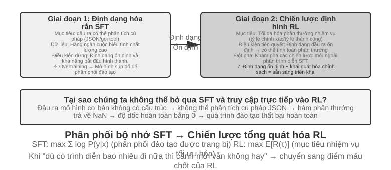

**SFT phù hợp với các tình huống trong đó định dạng** được củng cố (đầu ra JSON, kiểu hội thoại), có các bản trình diễn chuyên môn chất lượng cao và môi trường đào tạo và triển khai có tính nhất quán cao. **Kịch bản mà RL phải can thiệp** là khác: khi có sự khác biệt mang tính hệ thống giữa môi trường triển khai thực tế và môi trường đào tạo (ví dụ: thẻ J/Q/K vừa là 10 trong quá trình đào tạo và trở thành 11/12/13 trong quá trình triển khai - các quy tắc đã thay đổi; hoặc các mẫu màu đen được sử dụng trong quá trình đào tạo và các mẫu màu đỏ gặp phải trong quá trình triển khai - hình thức đã thay đổi), chiến lược tối ưu cần được khám phá (bản thân trình diễn của chuyên gia không nhất thiết phải là tối ưu) hoặc chi phí ghi nhãn quá cao và không thể cung cấp bản trình diễn cho mọi đường dẫn, thì cần có RL.

Policy mạnh mẽ nhất là quy trình hai giai đoạn "SFT trước, sau đó là RL". Mục tiêu chính của SFT không phải là theo đuổi hiệu suất tác vụ cao nhất mà là thiết lập **độ ổn định định dạng** của đầu ra - đảm bảo rằng mô hình có thể tạo ra JSON có thể phân tích cú pháp và sửa các lệnh gọi giao diện công cụ. Chỉ sau khi định dạng đầu ra ổn định, tín hiệu thưởng của RL mới có thể được tính toán một cách đáng tin cậy. Trực tiếp thực hiện RL trên mô hình cơ bản chưa được SFT thường sẽ thất bại vì định dạng đầu ra khó hiểu và không thể tính được phần thưởng - nhưng kết luận này có điều kiện biên: xuất phát từ việc đặt ra "mô hình cơ bản nhỏ hơn + yêu cầu đầu ra có cấu trúc chặt chẽ" (chẳng hạn như thử nghiệm 8-11 sau này). DeepSeek-R1-Zero chứng minh rằng mô hình cơ bản đủ mạnh để bỏ qua SFT và đi thẳng đến RL. Khả năng phản ánh và tư duy chuỗi dài xuất hiện - với cái giá là khả năng đọc đầu ra kém và các ngôn ngữ hỗn hợp. Đây chính xác là những gì DeepSeek cuối cùng đã thêm lại SFT "khởi động nguội" ở R1. Hành trình của R1 từ Zero đến khởi đầu nguội là ví dụ điển hình nhất về "hình thức trước, sau đó là tinh thần": RL có thể tự phát triển "tinh thần" (khả năng chiến lược và lý luận) của mình, nhưng "hình thức" (định dạng và khả năng đọc) của nó vẫn dựa vào SFT để thiết lập nó một cách nhanh chóng và ổn định.

Cả hai đều có chi phí riêng: SFT có hiệu suất mẫu cao và độ hội tụ nhanh nhưng khả năng khái quát hóa còn hạn chế; RL có thể học các chiến lược có thể chuyển đổi nhưng hiệu quả mẫu thấp và quá trình đào tạo không ổn định. Một tiêu chí thực tế là: khi "dù có thêm bao nhiêu dữ liệu trình diễn, hiệu suất của kịch bản mới vẫn không thể cải thiện", điểm mấu chốt là phải chuyển sang RL - gốc rễ của vấn đề không nằm ở số lượng trình diễn mà nằm ở mục tiêu tối ưu hóa của chính SFT.

Khi đưa ra quyết định thực tế, bạn có thể xem xét chúng theo thứ tự sau:

1. **Câu hỏi đầu tiên: Bạn có cần post-training không?** Nếu vấn đề có thể được giải quyết thông qua kỹ thuật Harness (tối ưu hóa nhanh chóng, thiết kế công cụ, quản lý ngữ cảnh) thì không cần phải đào tạo mô hình. Hầu hết các ứng dụng Agent đều nằm ở đây.
2. **Nếu cần đào tạo: hãy thử SFT trước.** Áp dụng cho định dạng đầu ra được củng cố (lược đồ JSON, định dạng gọi API), kiến thức về giao thức được củng cố (cách sử dụng thuật ngữ, định dạng đầu ra, thói quen xử lý, tức là "cách nói, cách làm"), phong cách thống nhất (âm điệu, độ dài). Nhưng lưu ý rằng SFT không phù hợp để tiêm nhiều kiến thức thực tế (“những gì bạn biết”) - cần tiếp tục đào tạo trước hoặc giao lại cho RAG (xem phần "Hình ảnh hoàn chỉnh" ở cuối chương này). SFT có chi phí thấp và kết quả nhanh chóng.
3. Khi **SFT không đủ: thêm RL.** Áp dụng cho các tình huống cần khái quát hóa các kịch bản mới, cần khám phá các chiến lược tối ưu hoặc chi phí ghi nhãn quá cao. Hãy đảm bảo sử dụng SFT để ổn định định dạng đầu ra trước, sau đó tạo RL dựa trên nó.

## Học tăng cường một vòng: so sánh trí nhớ và khái quát hóa

"Vòng đơn" có nghĩa là nhiệm vụ được hoàn thành trong một lần tương tác: mô hình nhận đầu vào, tạo đầu ra và nhận phần thưởng mà không duy trì trạng thái bước chéo. Cài đặt đơn giản hóa này cho phép chúng tôi tập trung vào những khác biệt cơ bản trong cơ chế học tập giữa SFT và RL mà không bị làm phiền bởi sự phức tạp của nhiều vòng tương tác. Kịch bản chạy một lần cung cấp các điều kiện thử nghiệm kiểm soát rõ ràng: cùng một nhiệm vụ, cùng một mô hình cơ bản, cùng ngân sách tính toán, biến số duy nhất là phương pháp đào tạo. Thử nghiệm đầu tiên cho thấy cách RL học siêu chiến lược "khi nào cần suy nghĩ"; thí nghiệm thứ hai định lượng một cách có hệ thống "bộ nhớ SFT, khái quát hóa RL" thông qua trò chơi thẻ lý luận số học.

Trước khi bước vào thử nghiệm, trước tiên hãy thiết lập một chút **trực giác tối thiểu** về thuật toán RL để hiểu thuật ngữ xuất hiện trong các thử nghiệm tiếp theo (công thức hoàn chỉnh và so sánh được để lại trong phần "So sánh các thuật toán học tăng cường" ở phần sau của chương này). Việc đào tạo RL trong chương này chủ yếu dựa trên **Policy gradient**: Hãy để mô hình tạo ra nhiều câu trả lời hơn cho cùng một câu hỏi. Câu trả lời có phần thưởng cao sẽ làm tăng xác suất xuất hiện của nó, còn câu trả lời có phần thưởng thấp sẽ làm giảm khả năng xuất hiện - "đi nhiều hơn về hướng phần thưởng cao và ít đi về hướng phần thưởng thấp". Để tránh sai lệch mô hình nếu biên độ cập nhật đơn quá lớn, thuật toán **PPO** chính thống sẽ cắt biên độ cập nhật của từng bước ("PPO với mạng giá trị" xuất hiện trong các thử nghiệm sau này đề cập đến điều này, mạng giá trị được sử dụng để ước tính đường cơ sở và tính toán các lợi thế chi tiết hơn); còn **GRPO** thì không đào tạo mạng giá trị mà "nhiều câu trả lời cho cùng một câu hỏi được so sánh với nhau" để đánh giá chất lượng tương đối của mỗi câu trả lời. Hãy ghi nhớ trực giác này là đủ để hiểu hai thí nghiệm tiếp theo.

Cùng một cơ chế có thể biểu diễn bằng mã giả kiểu Python dưới đây. Nó lược bỏ việc song song hóa lấy mẫu, chính quy hóa KL và chi tiết bộ tối ưu, chỉ nêu chuỗi nhân quả từ một lần rollout đến một lần cập nhật tham số:

```python
for prompt in batch:
    group = [rollout(policy, env.reset(prompt)) for _ in range(G)]
    rewards = [verify(trajectory) for trajectory in group]
    advantages = normalize_within_group(rewards)       # GRPO baseline
    update(policy, group, advantages)
```

Mạng giá trị và hàm mục tiêu có cắt của PPO có thể viết riêng như sau:

```python
for trajectory in rollouts:
    returns = discounted_returns(trajectory.rewards)
    values = value_model(trajectory.states)
    advantages = returns - stop_gradient(values)
    ratio = exp(policy.log_prob(trajectory.actions)
                - old_policy.log_prob(trajectory.actions))
    policy_loss = -mean(min(
        ratio * advantages,
        clip(ratio, 1 - epsilon, 1 + epsilon) * advantages
    ))
    value_loss = mean((value_model(trajectory.states) - returns) ** 2)
update(policy, value_model, policy_loss + value_coef * value_loss)
```

Chữ "tương đối" trong GRPO đến từ việc so sánh trong nhóm cho cùng một prompt; `old_policy` trong PPO là ảnh chụp đông cứng của chính sách đã sinh ra lô rollout ấy, và tỷ lệ xác suất đo xem chính sách hiện tại đã dịch đi bao xa so với nó. Việc cắt kìm hãm những bước cập nhật lớn, nhưng không phải là ràng buộc cứng lên chuyển động của chính sách; cả hai vẫn phụ thuộc vào môi trường và phần thưởng đáng tin, còn cách điều chỉnh huấn luyện cụ thể thì xem ở các thí nghiệm tương ứng.

> **Thử nghiệm 8-10 ★★: AdaptThink - Học “Khi nào không nên suy nghĩ”**
>
> Các mô hình tư duy quy mô lớn (như OpenAI o1, DeepSeek-R1) sẽ tạo ra chuỗi tư duy dài dòng cho mọi vấn đề, gây lãng phí không cần thiết cho những vấn đề đơn giản. Thử nghiệm lần đầu tiên đã xác minh một trực giác: **Chế độ Không suy nghĩ**(bỏ qua suy nghĩ thông qua `<think></think>`) có hiệu suất tương đương hoặc thậm chí tốt hơn đối với các vấn đề đơn giản. Ưu điểm của Tư duy chỉ thể hiện rõ khi đối mặt với những vấn đề khó khăn.
>
> AdaptThink lựa chọn các chế độ một cách thích ứng thông qua mô hình đào tạo RL. Hai thành phần cốt lõi:
>
> - **Mục tiêu tối ưu hóa có giới hạn**: Khuyến khích Không suy nghĩ trong khi vẫn đảm bảo rằng hiệu suất tổng thể không bị suy giảm.
> - **Policy lấy mẫu quan trọng**: Cân bằng các mẫu Thinking/NoThinking để giải quyết vấn đề **khởi đầu nguội** do hầu như luôn chọn Suy nghĩ trong mô hình ban đầu (Cold Start, ở đây đề cập cụ thể đến vấn đề mô hình trong giai đoạn đầu đào tạo hầu như chỉ tạo ra các mẫu Suy nghĩ và có rất ít mẫu nhánh NoThinking và không thể học được; nó tương tự như bài viết trước DeepSeek-R1 sử dụng một lượng nhỏ dữ liệu trình diễn để làm "cold start" SFT" được sử dụng trong các ngữ cảnh khác nhau).
>
> "Lấy mẫu quan trọng" xuất hiện ở đây là một phương pháp thường được sử dụng trong thống kê - khi phân phối lấy mẫu thiên về một loại mẫu nhất định, phân phối sẽ được "điều chỉnh" bằng cách tính trọng số cho mẫu sao cho tín hiệu học tập có thể bao trùm tất cả các danh mục một cách công bằng. Ý tưởng này sẽ được sử dụng nhiều lần trong các thuật toán PPO, DAPO và các thuật toán RL khác được thảo luận sau trong cuốn sách này.
>
> Hồ sơ chuẩn cho lần huấn luyện trong quá khứ này là [báo cáo huấn luyện](../chapter8/AdaptThink/TRAINING_REPORT.md) không kèm checkpoint. Lần chạy chính công khai trên W&B [`wubbn5tj`](https://wandb.ai/bojieli-pine-ai/adapt_think_verl/runs/wubbn5tj) sử dụng 8×NVIDIA H100 80GB. Từ step 0→300, độ chính xác MATH500 thay đổi từ 0.8100→0.8180 (+0.80 điểm phần trăm), độ dài phản hồi từ 4911.46→1576.62 (-67.90%); với GSM8K, các giá trị lần lượt là 0.796816→0.818802 (+2.20 điểm phần trăm) và 1025.24→477.33 (-53.44%); với AIME mean16, các giá trị là 0.314583→0.310417 (-0.42 điểm phần trăm) và 12119.51→6402.23 (-47.17%). Tỷ lệ NoThinking tương ứng là 83.80%, 84.15% và 56.25%. Kết quả này cho thấy tín hiệu định tuyến phù hợp với độ khó ở cấp độ tổng hợp của tập dữ liệu, nhưng không thể gọi đó là “nhận biết độ khó hoàn hảo” cho từng bài, cũng không thể tuyên bố độ chính xác tăng lên một cách phổ quát.
>
> Lần chạy tiếp tục sau điểm đo được chọn trong báo cáo đến step 410, tổng cộng 36.92 giờ, rồi W&B ghi trạng thái `crashed`; cấu hình 10 epochs / 3,140 steps chưa hoàn tất. Dù có một sự kiện ghi thời gian checkpoint ở step 300, checkpoint không được phân phối cùng sách và không có biên nhận độc lập chứng minh nó đã được đánh giá thành công bằng `run_eval_verl_hf.sh` hoặc đã chạy lại MMLU. Commit mã nguồn lịch sử là `9e588202…`; các lần tái lập sau này được ghim vào commit con trực tiếp `0033ad172…`. Ba tệp entry point không thay đổi, nhưng đường dẫn `-fl-` do script huấn luyện tạo ra không tương thích với đường dẫn `-fl4096` được hard-code trong script đánh giá và phải sửa thủ công.
>
> AdaptThink có thể bổ sung cho chắt lọc prompt để tạo thành một “hệ thống kép nhanh-chậm”: chắt lọc giảm tỷ lệ các nhiệm vụ cần tư duy, đồng thời AdaptThink tối ưu hóa chiến lược kích hoạt các nhiệm vụ còn lại, cùng nâng cao hiệu quả tư duy.

> **Thử nghiệm 8-11 ★★: GeneralPoints - So sánh "Bộ nhớ và khái quát hóa" của RL một vòng**
>
>
> 
>
>
> GeneralPoints là trò chơi thẻ bài tư duy số học được đề xuất bởi Chu và cộng sự[^ch8-3], được sử dụng đặc biệt để đánh giá khả năng khái quát hóa của mô hình. Mục tiêu của nhiệm vụ tương tự như trò chơi “24 điểm”: sử dụng các số trên bốn thẻ và sử dụng các phép tính cộng, trừ, nhân và chia, sử dụng mỗi số đúng một lần để tạo thành số mục tiêu 24. Hai biến thể của văn bản thuần túy GP-L và hình ảnh GP-VL được thiết kế trong thử nghiệm, cho phép chúng tôi kiểm tra khái quát hóa quy tắc và khái quát hóa trực quan tương ứng trong cùng một khuôn khổ.
>
> **Biến thể quy tắc**: J/Q/K được tính là 10 trong quá trình đào tạo và 11/12/13 được tính là 11/12/13 trong quá trình thử nghiệm. Đảm bảo rằng tập kiểm tra chứa các tổ hợp số không thấy trong quá trình huấn luyện (bao gồm các phép toán 11, 12 và 13) và đánh giá nghiêm ngặt khả năng khái quát hóa. **Biến thể trực quan**: Sử dụng bộ đồ đen để luyện tập (♠♣) và bộ đồ màu đỏ để thử nghiệm (♥♦) để đánh giá độ chắc chắn trước những thay đổi về ngoại hình. Dựa trên Llama-3.2-Vision-11B, hãy làm theo quy trình post-training tiêu chuẩn: trước tiên hãy khởi tạo SFT để có khả năng tuân theo hướng dẫn cơ bản, sau đó mở rộng đào tạo SFT và RL tương ứng trong cùng một ngân sách điện toán (phần RL sử dụng thuật toán PPO có mạng giá trị), được huấn luyện với dữ liệu quy tắc đơn (J/Q/K=10) và được đánh giá trên các bộ kiểm tra trong phân phối (ID) và ngoài phân phối (OOD).
>
> Kết quả bộc lộ rõ ràng những khác biệt cơ bản. **QUY TẮC OOD**: RL +3,5% trên GP-L (11,5%→15,0%), SFT **giảm** 8,1% (11,5%→3,4%); GP-VL trên RL +3,0%, SFT giảm 5,6%. **OOD trực quan**: RL **+17,6%** trên GP-VL (23,6%→41,2%), SFT giảm 9,9% (23,6%→13,7%).
>
> Sau khi theo dõi độ chính xác của nhận dạng hình ảnh, chúng tôi nhận thấy rằng: RL cải thiện bộ mã hóa hình ảnh cơ bản thông qua tối ưu hóa hướng đến kết quả và cải tiến này liên quan nhiều đến cải thiện hiệu suất tổng thể; trong khi SFT điều chỉnh quá mức mẫu mã thông báo trong quá trình tư duy và bỏ qua việc học các mã thông báo trực quan, dẫn đến giảm độ chính xác của nhận dạng.
>
> Thử nghiệm cũng cho thấy sự cần thiết của SFT đối với RL: theo cài đặt của thử nghiệm này (mô hình cơ bản cỡ Llama-3.2-Vision-11B, cộng với các yêu cầu đầu ra có cấu trúc nghiêm ngặt), không thể triển khai trực tiếp RL từ đầu đến cuối nếu không có SFT - thất bại hoàn toàn: mô hình cơ bản không thể tạo ra một đầu ra có cấu trúc và phần thưởng hoàn toàn không thể tính toán được. Lưu ý rằng đây là kết luận trong một cài đặt cụ thể chứ không phải là một quy tắc chung: một mô hình cơ bản đủ mạnh có thể bỏ qua SFT và trực tiếp thành công trong RL (xem phần thảo luận trước đây về DeepSeek-R1-Zero). Một phát hiện đáng chú ý khác là càng nhiều lần xác minh thì khả năng khái quát hóa càng tốt: 10 lần +5,99% so với 1 lần +0,48%, cho thấy rằng việc mở rộng tính toán khi suy nghĩ là chìa khóa cho việc khái quát hóa RL.
>
> Tại sao hiệu suất của SFT lại giảm sút khi thay đổi phân phối, trong khi RL lại tốt hơn? SFT học cách ánh xạ "khi bạn nhìn thấy loại đầu vào này, đầu ra loại câu trả lời đó": trong quá trình đào tạo, J/Q/K đều là 10 và mô hình ghi nhớ mẫu cố định "khi gặp J/Q/K, hãy coi nó là 10"; trong quá trình thử nghiệm, J=11, mô hình vẫn tính toán là 10 và đương nhiên mắc lỗi. RL đã học được chiến lược tổng quát hơn về "quá trình tính toán nào có thể nhận được câu trả lời đúng": khi J trở thành 11, mô hình RL sẽ tính toán lại bằng cách sử dụng chiến lược tương tự thay vì áp dụng câu trả lời trong bộ nhớ. Đây là sự khác biệt cơ bản giữa "bộ nhớ" và "khái quát hóa".
>
> Đóng góp cốt lõi của thử nghiệm này là định lượng một cách có hệ thống hiện tượng "bộ nhớ SFT, khái quát hóa RL", chứng minh rằng quy tắc này đúng ở cả phương thức ngôn ngữ thuần túy và ngôn ngữ hình ảnh, đồng thời tiết lộ mối quan hệ hiệp lực giữa SFT và RL: SFT mang lại sự ổn định về định dạng, RL trên cơ sở này vượt qua ranh giới của bộ nhớ, cả hai đều không thể thiếu. Mô hình đào tạo "hình thức trước, tinh thần sau" này - mượn thuật ngữ của hội họa Trung Quốc, trước tiên vẽ chính xác hình thức bên ngoài (dạng thức, cấu trúc), sau đó theo đuổi sự hấp dẫn bên trong (khái quát, chiến lược) - đặt nền tảng phương pháp luận cho các nhiệm vụ đa vòng, đa phương thức tiếp theo.

## Thuật toán RL: từ 16 lần rollout đến một lần cập nhật tham số

**GRPO (Group Relative Policy Optimization)** do DeepSeek đề xuất là một trong những thuật toán huấn luyện RL được dùng nhiều nhất hiện nay. Một ví dụ sẽ giúp hiểu trực quan. Giả sử trong SWE-bench có nhiệm vụ này: tệp `parser.py` của một dự án Python ném ra `IndexError` khi đầu vào rỗng, và Agent phải sửa mã mà không được sửa bài kiểm thử. Hệ thống huấn luyện sẽ đi qua bốn bước sau.

**Bước 1: cho mô hình chính sách thử lặp đi lặp lại.** Mô hình chính sách chính là mô hình ngôn ngữ đang được huấn luyện. Hệ thống sao chép cùng một mã ban đầu và cùng một mô tả bài toán vào 16 sandbox cách ly nhau, rồi để mô hình giải độc lập 16 lần. Mỗi lần đều bao gồm trọn vẹn "đọc mã → sửa tệp → chạy kiểm thử → nộp kết quả"; toàn bộ quá trình ấy gọi là một **rollout**. Bài toán và môi trường ban đầu hoàn toàn giống nhau, nhưng việc lấy mẫu có tính ngẫu nhiên nên 16 lần thử có thể đi những lối khác nhau: có lần bổ sung đúng phần kiểm tra biên, có lần chỉ bắt ngoại lệ để che vấn đề, có lần sửa nhầm tệp, lại có lần định sửa cả bài kiểm thử.

**Bước 2: tính phần thưởng.** Sau khi mỗi rollout kết thúc, bộ kiểm chứng áp bản vá trong môi trường sạch rồi chạy kiểm thử. Giả sử trong 16 lần thử có 4 lần vượt qua toàn bộ kiểm thử mà không đụng vào tệp kiểm thử, 12 lần còn lại thất bại, thì 4 quỹ đạo đầu nhận phần thưởng 1, còn 12 quỹ đạo sau nhận 0. Trong một nhiệm vụ lập trình như vậy, "tính phần thưởng" chẳng có gì bí ẩn: chỉ là dùng kiểm thử và quy tắc để phán đoán lần sửa này rốt cuộc có đúng hay không. Phải đến những nhiệm vụ mở, không có kiểm thử xác định, mới cần đến sở thích của con người hoặc mô hình phần thưởng để đánh giá.

**Bước 3: tính lợi thế tương đối.** Phần thưởng chỉ nói lên một quỹ đạo thành công hay thất bại, còn **lợi thế tương đối** nói lên nó tốt đến đâu so với những lần thử khác trong cùng nhóm. Tỷ lệ thành công trung bình của nhóm này là 4/16: 4 quỹ đạo vượt kiểm thử cao hơn trung bình nhóm nên nhận lợi thế dương; 12 quỹ đạo thất bại thấp hơn trung bình nên nhận lợi thế âm. Chính lối so sánh trong nhóm này là cốt lõi của GRPO. Nếu cả 16 đều thất bại, hoặc cả 16 đều thành công, phần thưởng y hệt nhau nên không so được ai hơn ai, và lợi thế tương đối cũng biến mất. Tín hiệu đường đi của RLVP, phần thưởng quá trình và phần thưởng tiến bộ từng phần ra đời chính là để khôi phục những khác biệt có ý nghĩa trong các nhóm như vậy.

**Bước 4: cập nhật chính sách bằng hạ gradient.** Chương trình huấn luyện biến lợi thế tương đối thành hàm mất mát, tính gradient, rồi bộ tối ưu (AdamW, Muon và tương tự) thực hiện hạ gradient, nâng xác suất của những lựa chọn mà mô hình đã đưa ra trong các quỹ đạo có lợi thế dương và hạ xác suất trong các quỹ đạo có lợi thế âm. Nó không thuộc lòng nguyên xi một bản vá thành công nào, mà điều chỉnh dần trên rất nhiều nhiệm vụ và rollout; về sau khi gặp lỗi tương tự, "tái hiện vấn đề trước, kiểm tra điều kiện biên, sửa phần cài đặt rồi chạy kiểm thử" sẽ dễ xuất hiện hơn, còn "che ngoại lệ, sửa kiểm thử, nộp mà không kiểm chứng" sẽ ít xuất hiện hơn.

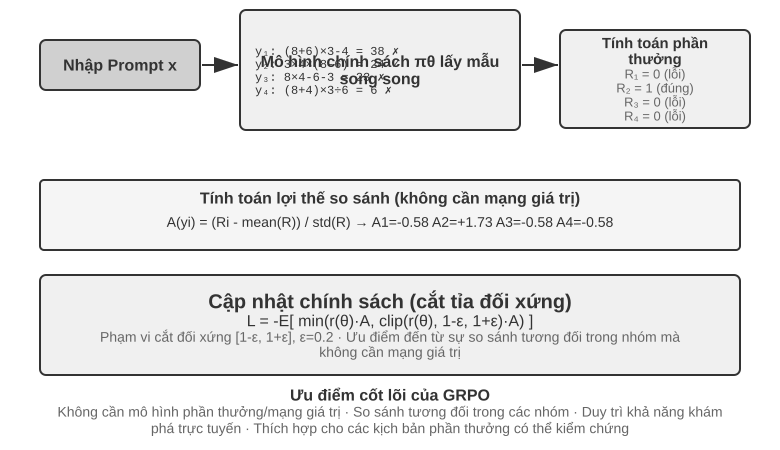

Bốn bước này hợp lại thành một **vòng lặp huấn luyện**, tức là một **step**: ở step thứ $k$, chính sách hiện tại sinh ra một lô rollout, hoàn tất việc tính phần thưởng, lợi thế và gradient, rồi bộ tối ưu cập nhật tham số; step thứ $k+1$ lập tức rollout lại bằng chính sách vừa cập nhật. Huấn luyện 100 steps nghĩa là lặp vòng khép kín này khoảng 100 lượt. Một khung huấn luyện RL cụ thể có thể đếm riêng các lần cập nhật minibatch bên trong, nên khi đọc nhật ký huấn luyện vẫn cần xác nhận nó định nghĩa `step` thế nào.

Hãy ước lượng thời gian một cách thô. Rollout của một Agent phức tạp sinh ra hàng chục lượt gọi công cụ, và dù 16 lượt chạy song song, thời gian thực của một pha rollout vẫn do lượt chậm nhất quyết định. Giả sử rollout chậm nhất mất khoảng 2.000 giây, rồi hạ gradient và cập nhật bộ tối ưu mất khoảng 600 giây, thì một step cần chừng $2{,}000+600=2{,}600$ giây, tức khoảng 43 phút; huấn luyện liên tục 100 steps là gần 72 giờ.

PPO và GRPO đều theo vòng khép kín này, khác nhau chủ yếu ở chỗ **lấy gì ra để so sánh**. GRPO so trực tiếp nhiều rollout của cùng một bài toán nên không cần mô hình giá trị riêng. PPO huấn luyện một mô hình giá trị, ước lượng ở mỗi bước của quỹ đạo rằng "thông thường làm được tốt đến đâu", rồi phán đoán hành động hiện tại có vượt kỳ vọng ấy không, nên hợp hơn với những quỹ đạo dài cần phân bổ tín dụng chi li. Cả hai đều giới hạn biên độ mỗi lần cập nhật để một lô mẫu nhỏ không làm mô hình đổi quá nhiều đột ngột. DPO thì khác: nó học thẳng từ các cặp ưu tiên "câu trả lời tốt hơn — câu trả lời kém hơn" đã thu thập sẵn, và không để chính sách hiện tại sinh nhóm rollout ấy trực tuyến.

Trong các trường hợp của chương này, AdaptThink dùng hàm mục tiêu có ràng buộc tự thiết kế; GeneralPoints và V-IRL dùng PPO có mô hình giá trị; SimpleVLA-RL và RLVP dùng GRPO; ReTool dùng PPO. Thuật toán quyết định cách so sánh quỹ đạo và cập nhật tham số; phần thưởng quyết định "cái gì được coi là thành công"; môi trường và dữ liệu quyết định mô hình được trải qua những bài toán nào.

### Vì sao LLM RL thường ưu tiên On-Policy

**Online** chỉ có nghĩa dữ liệu liên tục được sinh trong huấn luyện; **on-policy** đòi behavior policy $\mu$ tạo rollout phải giống hoặc đủ gần policy hiện tại $\pi_\theta$. Worker bất đồng bộ chậm vài checkpoint khiến dữ liệu online thành off-policy. Dữ liệu từ policy khác cần importance ratio:

$$
\rho_t=\frac{\pi_\theta(a_t\mid s_t)}{\mu(a_t\mid s_t)}
=\exp\!\left(\log\pi_\theta(a_t\mid s_t)-\log\mu(a_t\mid s_t)\right).
$$

Trước cập nhật, rollout on-policy mới có $\rho_t=1$, nên học trên state mà mô hình hiện tại thật sự ghé và tránh hiệu chỉnh phương sai cao do lệch phân phối. Off-policy tái dùng dữ liệu và tăng throughput nhưng sai lệch nhỏ ở tỷ lệ token tích lũy trên chuỗi dài. PPO clipping giới hạn ngoại lệ chứ không khôi phục coverage đã mất. Vì vậy on-policy không luôn tốt hơn; trong policy gradient LLM hiện nay nó thường có nghĩa thiên lệch phân phối nhỏ hơn và tối ưu ổn định hơn[^ch8-32].

#### Sai lệch số phá hỏng On-Policy danh nghĩa

Sampler vLLM/SGLang và trainer FSDP/Megatron có thể cho log probability khác nhau dù cùng trọng số, do độ chính xác, thứ tự reduction, tensor parallel, batch size, KV cache hay fused kernel. Khi ấy trước cập nhật đã có $\rho_t\ne1$: on-policy danh nghĩa trở thành off-policy về số, và chênh token nhỏ cũng có thể làm huấn luyện sụp đổ[^ch8-33]. Chuỗi khuếch đại là sai số log-probability → tỷ lệ mũ hóa → tích lũy trên prefix dài → thay đổi clipping/advantage → thay đổi gradient và effective sample size. Với 4.000 token, lệch cùng chiều $10^{-3}$ có thể thành $e^4\approx54.6$; đổi batch cũng có thể phá batch invariance[^ch8-34].

Trước mọi cập nhật, so token log probability giữa sampler/trainer và theo dõi trung bình, phân vị, cực đại của $\rho_t$, KL xấp xỉ và clipping fraction. Đồng bộ cả LoRA, tokenizer, chat template, revision và cấu hình vị trí; lưu behavior log probability lúc sinh. Nếu không thể khớp đường tính số, hãy coi rõ là off-policy, hiệu chỉnh importance và giới hạn staleness cùng số lần cập nhật trên một batch.

## Môi trường RL: từ đánh giá đến mô phỏng

Nút thắt của huấn luyện RL thường không nằm ở thuật toán, mà ở chỗ **môi trường có đủ chân thực, khởi tạo lại được và song song hóa được hay không**. Cuộc gọi, khoản thanh toán hay thao tác sửa tệp của một Agent thật có thể vừa đắt vừa không thể hoàn tác, và một sai lầm không thể bù bằng số lần thử lại vô hạn; môi trường đánh giá ở chương 7 có thể cung cấp bộ kiểm chứng, nhưng huấn luyện còn cần Agent thử sai lặp đi lặp lại, gánh chịu tác dụng phụ của hành động và giữ ổn định qua hàng triệu lượt tương tác. Vì vậy kỹ thuật môi trường là điều kiện tiên quyết của RL, chứ không phải phần phụ sau khi huấn luyện xong.

### Môi trường: sân tập của mô hình

Bản chất của RL là "học bằng thử sai", mà thử sai thì phải có **sân để thử** — đó chính là môi trường mô phỏng. Mô hình chạy nhiệm vụ trong đó hết lần này đến lần khác, nhận phản hồi và điều chỉnh chính sách. **Độ trung thực** của môi trường — nó giống với bối cảnh triển khai thật đến đâu — quyết định trực tiếp chính sách huấn luyện ra có dùng được hay không:

- **Môi trường méo mó thì chính sách chắc chắn hỏng.** Nếu nhân viên hỗ trợ trong mô phỏng lúc nào cũng trả lời theo kịch bản cố định và thông báo lỗi không khớp với môi trường vận hành, mô hình sẽ học một bộ "mẹo thi" chỉ nghiệm trong mô phỏng, ra thực tế là lộ ngay. Đây là kiểu đổ vỡ phổ biến nhất của các dự án RL — không phải thuật toán kém, mà là sân tập không phải phòng thi.
- **Dựng môi trường độ trung thực cao thường đắt hơn và khó hơn chính việc huấn luyện.** Một môi trường song song hóa được ở quy mô lớn, tái lập được và phản hồi chân thực thường đòi nhiều công sức kỹ thuật hơn hẳn so với việc chỉnh mô hình. Các thí nghiệm gọi công cụ ở phần sau của chương này (sandbox MCP của AWorld, sandbox trình thông dịch mã của ReTool) sở dĩ dốc sức dựng môi trường chính là vì **API thật có giới hạn tần suất, có thể bị khóa tài khoản, lại có tác dụng phụ, nên hoàn toàn không thể đem ra huấn luyện trực tiếp** — bạn phải dựng trước một "thế giới bóng" ổn định, kiểm soát được và phát lại được.
- **Nửa còn lại của môi trường là hàm phần thưởng.** Môi trường không chỉ phải mô phỏng "thế giới biến đổi ra sao", mà còn phải phán được "làm tốt hay không", và đó chính là đầu vào của phần thiết kế phần thưởng ở sau.

Nói gọn một câu: **trước khi bắt tay chỉnh thuật toán, hãy tự hỏi — môi trường mô phỏng của tôi có thật sự giống thế giới thật không?** Câu trả lời cho câu hỏi ấy quan trọng hơn nhiều so với việc chọn PPO hay GRPO.

### Không dựng nổi môi trường thì sao: để mô hình đóng vai môi trường

Nhưng còn một vấn đề căn cơ hơn: ở nhiều bối cảnh, môi trường độ trung thực cao không phải là "đắt", mà là **không tài nào dựng nổi** — API thật có tác dụng phụ nên không thể gọi bừa, người dùng thật không thể đem ra thử sai, còn thế giới vật lý thì không tua nhanh được. Nếu đến một "thế giới bóng" dùng được cũng không dựng nổi, thì RL coi như bỏ sao? Một hướng ngày càng phổ biến là **dùng mô hình để mô phỏng môi trường** — để một LLM đóng vai môi trường và sinh ra phản hồi mà tương tác của Agent cần. Hướng này có hai tầng.

**Tầng thứ nhất: mô hình tổng hợp giá trị trả về của lượt gọi công cụ.** Lấy ZeroSearch[^ch8-13] làm ví dụ: huấn luyện "mô hình biết tìm kiếm" thường không thể thiếu một công cụ tìm kiếm thật, nhưng API tìm kiếm vừa tốn tiền, vừa có giới hạn tần suất, kết quả trả về lại không kiểm soát được. ZeroSearch thẳng thừng để một LLM đóng vai công cụ tìm kiếm: mô hình học trò gửi truy vấn, còn "cỗ máy mô phỏng" ấy sinh ra kết quả tìm kiếm để trả về. Hay hơn nữa, nó dùng thiết kế **theo giáo trình** — giai đoạn đầu huấn luyện, cỗ máy mô phỏng trả về những tài liệu chất lượng cao, liên quan chặt; càng về sau càng trộn thêm nhiễu và hạ chất lượng trả về, buộc học trò phải học cách rút thông tin hữu ích ra khỏi những kết quả không hoàn hảo như công cụ tìm kiếm thật vẫn trả. Cuối cùng, mô hình suốt quá trình huấn luyện chưa từng thấy công cụ tìm kiếm thật vẫn hoạt động tốt khi nối thẳng vào tìm kiếm thật.

**Tầng thứ hai: mô hình mô phỏng động lực học của cả môi trường.** Không chỉ giá trị trả về của một công cụ đơn lẻ, mà ngay cả "sau khi thực hiện hành động thì thế giới sẽ thành ra sao" cũng có thể giao cho mô hình. DreamGym[^ch8-14] chắt động lực học của môi trường vào một "mô hình kinh nghiệm" theo lối suy luận: cho trạng thái hiện tại và hành động của Agent, nó suy luận từng bước ra chuyển dịch trạng thái và tín hiệu phản hồi, nhờ đó tổng hợp hàng loạt rollout cho RL trực tuyến mà không cần truy cập môi trường thật. Việc huấn luyện các Agent chăm sóc khách hàng và bán hàng phổ biến dùng LLM đóng vai người dùng (trình mô phỏng người dùng), và họ đánh giá τ-bench dựng chính trên ý tưởng ấy — cùng một trình mô phỏng bằng mô hình vừa làm phòng thi vừa làm sân tập.

Nhưng phải nói thẳng rủi ro của hướng này: **tri thức về thế giới của trình mô phỏng chính là trần của việc huấn luyện, và thiên lệch hệ thống của trình mô phỏng sẽ được chính sách tiếp thu trọn vẹn.** Nếu khách hàng mô phỏng kiên nhẫn hơn người dùng thật, hay công cụ tìm kiếm mô phỏng không bao giờ trả về rác, thì cái học trò học được là một chính sách chỉ đứng vững trong "thế giới do mô hình đóng vai"; tệ hơn, RL sẽ chủ động tìm và khai thác lỗ hổng của trình mô phỏng, tức là reward hacking. Vì vậy cách làm chắc tay về mặt kỹ thuật là **lai ghép**: để mô phỏng bằng mô hình gánh phần lớn khối lượng tương tác, bổ sung bằng tương tác với môi trường thật, và dùng chính những tương tác thật ấy để hiệu chỉnh định kỳ thiên lệch của trình mô phỏng.

### Môi trường, phân phối nhiệm vụ và cách ly đánh giá

Bản thân môi trường quyết định RL học được cái gì: nó phải khởi tạo lại được, song song hóa được, tái lập được, và sau mỗi chuyển dịch trạng thái phải cho ra kết quả kiểm chứng đáng tin. Nguồn nhiệm vụ huấn luyện giống với phần tổng hợp dữ liệu SFT ở trên — chắt bản thiết kế nhiệm vụ từ nhật ký nghiệp vụ thật, rồi sau khi loại bỏ thông tin định danh thì sinh lại nhân vật, đơn hàng, tệp và trạng thái hư cấu.

Yêu cầu cách ly cũng giống vậy, nhưng bối cảnh RL có thêm một điều: môi trường huấn luyện và môi trường đánh giá có thể dùng chung bộ sinh nhiệm vụ và mã kiểm chứng, nhưng không được dùng chung cùng một lô nhiệm vụ. SWE-Gym, τ²-bench và AndroidWorld đều cho thấy điều này[^ch8-28]: các ca kiểm thử, trạng thái ẩn và lời giải tham chiếu phải nằm lại ở phía bộ kiểm chứng. Ngoài ra nên dùng một ít rollout để kiểm tra trước "nhiệm vụ có hoàn thành được không, bộ kiểm chứng có phân biệt được đúng sai không", rồi mới mở rộng quy mô lấy mẫu; nếu bản thân bộ kiểm chứng có thiên lệch hệ thống thì RL chỉ khai thác nó nhanh hơn mà thôi.

Vì vậy trình tự của kỹ thuật môi trường nên là: **bản thiết kế nhiệm vụ → trình mô phỏng khởi tạo lại được → bộ kiểm chứng tất định → cách ly huấn luyện/đánh giá → hiệu chỉnh bằng một ít tương tác thật**. Phần tổng hợp dữ liệu SFT đặt ở trước là để dựng những trình diễn ổn định; còn môi trường ở đây phục vụ RL, để chính sách hiện tại thử sai lặp lại và khám phá những lối đi ngoài phạm vi trình diễn.

Bộ kiểm chứng tất định "rẻ" không có nghĩa là "không tốn gì". Nhân Lean, trình chạy kiểm thử hay việc thực thi trong container có thể khiến tốc độ kiểm chứng trên CPU chậm hơn hẳn tốc độ sinh trên GPU; khi ấy thông lượng do số worker kiểm chứng chạy song song quyết định, chứ không phải do chất thêm GPU[^ch8-9].

## Từ một vòng đến nhiều vòng: bối cảnh nhiệm vụ và phân bổ tín dụng

### Thách thức cốt lõi của nhiệm vụ nhiều vòng

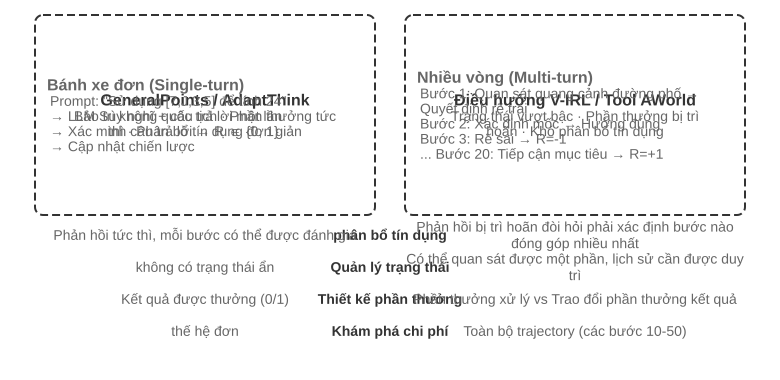

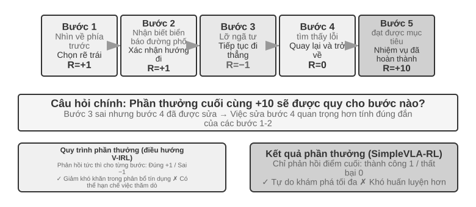

Từ một vòng sang nhiều vòng, độ phức tạp nhảy vọt về chất. Chính sách không chỉ phải chọn hành động tốt nhất lúc này, mà còn phải tính đến giá trị của các trạng thái tương lai; không chỉ xử lý phản hồi tức thời, mà còn phải làm **phân bổ tín dụng (credit assignment)** dưới phần thưởng trễ — xác định trong chuỗi nhiều bước thì bước nào đóng góp nhiều nhất cho kết quả cuối. Chẳng hạn một Agent chăm sóc khách hàng dùng 10 vòng đối thoại để giải quyết vấn đề của người dùng và cuối cùng nhận được đánh giá tốt — nhưng công ấy thuộc về câu hỏi đúng trọng tâm ở vòng 2, hay lời giải thích kiên nhẫn ở vòng 7?

Tương tác nhiều vòng bàn ở đây chính là vòng lặp ReAct đã mô tả ở chương 1 và chương 4 — mỗi vòng là một lượt lặp **suy nghĩ → hành động → quan sát**, còn phần thưởng trễ đến từ ràng buộc cấu trúc rằng "kết quả cuối tốt hay xấu phải nhiều vòng sau mới phán được".

> **Thử nghiệm 8-12 ★★★: V-IRL-VL — điều hướng thị giác nhiều vòng**
>
> V-IRL[^ch8-24] cho Agent điều hướng liên tục trong cảnh phố thật: huấn luyện dùng các tuyến ở New York, còn kiểm thử chuyển sang thành phố khác và đồng thời đổi cả cách diễn đạt phương hướng lẫn diện mạo thị giác. RL vượt SFT rõ rệt cả ở OOD quy tắc lẫn OOD thị giác, cho thấy trong nhiệm vụ nhiều vòng, chính sách phải học cách lập lại kế hoạch dựa trên quan sát hiện tại thay vì tái hiện quỹ đạo huấn luyện. Thí nghiệm dùng PPO có mạng giá trị, và quan sát thấy phản hồi theo từng bước giúp giảm nhẹ việc phân bổ tín dụng trên chuỗi dài.

> **Thử nghiệm 8-13 ★★★: SimpleVLA-RL — khám phá mở dưới phần thưởng kết quả `[Thí nghiệm mở rộng]`**
>
> SimpleVLA-RL chỉ dùng phần thưởng kết quả thành công/thất bại trong các nhiệm vụ robot LIBERO. Mỗi nhiệm vụ chỉ dùng một quỹ đạo trình diễn để khởi động nguội bằng SFT, sau đó RL nâng tỷ lệ thành công từ 17,3% lên 91,7% và phát hiện động tác "đẩy cắt" chưa từng xuất hiện trong trình diễn. Nó tạo thành đối chiếu với V-IRL: khi tín hiệu quá trình dễ định nghĩa thì nó tăng tốc việc học, nhưng khi lối đi tối ưu còn chưa biết thì phần thưởng kết quả thưa lại giữ được nhiều dư địa khám phá hơn hẳn.

### Gọi công cụ: đưa môi trường vào bên trong Agent

Một khi nhiệm vụ nhiều vòng nối vào công cụ bên ngoài, hành động không còn chỉ là "di chuyển hay trả lời", mà là tìm kiếm, chạy mã, sửa tệp, truy vấn cơ sở dữ liệu và phối hợp nhiều API. Vì vậy việc gọi công cụ đẩy đồng thời phân bổ tín dụng, kỹ thuật môi trường và ràng buộc an toàn lên hàng đầu.

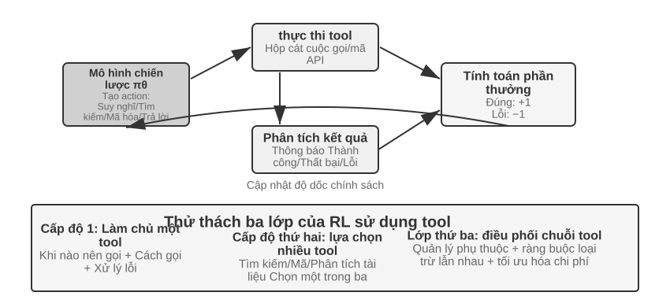

Search-R1[^ch8-25] đại diện cho hướng tăng cường truy hồi: mô hình tự quyết định khi nào tìm và tìm gì, rồi dùng kết quả trả về để tiếp tục suy luận. ReTool thì nhúng trình thông dịch mã vào vòng lặp suy nghĩ, buộc mô hình phải học khi nào chạy mã, đọc phản hồi ra sao và sửa mình thế nào theo thông báo lỗi. AWorld-train cung cấp sandbox MCP nhiều công cụ, đưa thêm vào các vấn đề chọn công cụ, quản lý phụ thuộc, khởi tạo lại trạng thái và khả năng phát lại.

Quỹ đạo có công cụ còn có một chi tiết cài đặt then chốt: token do môi trường trả về không phải do chính sách sinh ra, nên khi tính gradient chính sách thì phải che những token phản hồi ấy đi, chỉ truyền gradient qua phần suy nghĩ của chính mô hình và các tham số của lượt gọi công cụ. Nếu không, mô hình sẽ bị huấn luyện để dự đoán đầu ra của sandbox thay vì học cách dùng công cụ.

> **Thử nghiệm 8-14 ★★★: ReTool — trình thông dịch mã tăng cường cho giải toán**
>
> 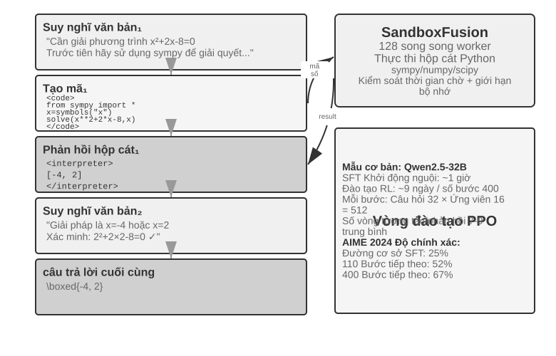
>
> Sau khi khởi động bằng SFT, ReTool huấn luyện bằng PPO trên phần suy nghĩ bằng văn bản, thực thi mã và phản hồi của trình thông dịch đan xen nhau. Nó cho thấy phản hồi từ công cụ làm thay đổi chiến lược suy nghĩ ra sao: mô hình dần học cách chủ động chạy mã, đọc lỗi và tự sửa. Dữ liệu huấn luyện lấy từ DAPO-Math-17k, nhưng thuật toán tối ưu vẫn là PPO chuẩn[^ch8-26][^ch8-27].
>
> Trên AIME 2024, huấn luyện nâng kết quả từ khoảng 25% lên 67,0%; so với RL thuần văn bản, phản hồi từ mã giúp mô hình học tính toán chính xác và sửa lỗi nhanh hơn. Động lực huấn luyện chi tiết và cấu hình sandbox xem trong tài liệu kèm theo thí nghiệm.

> **Thử nghiệm 8-15 ★★★: AWorld-train — học dùng công cụ trong sandbox**
>
> 
>
> AWorld-train dùng sandbox máy chủ MCP, cung cấp các công cụ web, tài liệu, đa phương tiện, mã và truy hồi tri thức. Trọng tâm của thí nghiệm mở này không phải là phá kỷ lục chỉ số GAIA, mà là chạy thông suốt một mạch huấn luyện nhiều công cụ khởi tạo lại được và phát lại được, đồng thời quan sát xem tỷ lệ gọi công cụ thành công và chiến lược phối hợp có cải thiện theo huấn luyện hay không.

Những bối cảnh này cùng nói lên một điều: cái khó khi huấn luyện Agent nhiều vòng không phải là "có một bộ tối ưu phức tạp hơn hay không", mà là phản hồi của môi trường có đáng tin không, chuỗi hành động có kiểm chứng được không, và phần thưởng cuối cùng nên quy về những quyết định trung gian thế nào.

## Thiết kế phần thưởng: biến mục tiêu nhiệm vụ thành tín hiệu học

Các kịch bản một vòng, nhiều vòng và gọi công cụ ở trên đã cho thấy *huấn luyện cái gì*; phần này trả lời *môi trường nên nói với mô hình rằng nó làm tốt hay không bằng cách nào*. Thiết kế phần thưởng trải ra theo ba chiều bổ trợ nhau: **phần thưởng đến từ đâu**, **cho khi nào** và **cần diễn đạt bao nhiêu thông tin**. Sau đó là một câu hỏi thứ tư: khi kết quả đúng, đường đi có hợp lệ không?

### Phần thưởng đến từ đâu: quy tắc, sở thích con người và phán xét của mô hình

Nguồn đáng tin cậy nhất là **phần thưởng kiểm chứng được (RLVR)**: phán xét kết quả trực tiếp bằng test case, khẳng định trên cơ sở dữ liệu, chênh lệch trạng thái hoặc kiểm tra định dạng. Đáp án toán, test mã nguồn và lời gọi công cụ có cấu trúc đều thích hợp để bắt đầu từ phần thưởng kết quả nhị phân. Quy tắc càng tất định thì phần thưởng càng rẻ, càng tái lập được và càng khó bị mô hình lách.

**RLHF** ở đây chỉ là bối cảnh. Quy trình cơ bản của InstructGPT[^ch8-4] là: con người so sánh các câu trả lời, huấn luyện một mô hình phần thưởng, rồi dùng PPO tối ưu chính sách. Mô hình phần thưởng chỉ là đại diện cho sở thích, và tối ưu quá mức sẽ dẫn tới reward hacking[^ch8-5]; vì vậy người ta thường dùng chính quy hóa KL để neo chính sách gần mô hình SFT tham chiếu. DPO[^ch8-6] bỏ qua mô hình phần thưởng tường minh, tối ưu ngoại tuyến trực tiếp từ các cặp sở thích. Những phương pháp này không phải mạch chính của Agent RL trong chương này.

Khi mục tiêu khó quy hết về quy tắc, có thể dùng phán xét của mô hình. **Mô hình phần thưởng sinh (GRM)** không chỉ xuất ra một điểm số mà còn sinh chẩn đoán "chỗ nào tốt, chỗ nào cần sửa"; nó vừa có thể làm nguồn phần thưởng, vừa có thể biến chẩn đoán thành dữ liệu chưng cất hoặc dữ liệu sở thích về sau. Ý tưởng cốt lõi của DeepSeek-GRM[^ch8-23] là để mô hình trước hết quy nạp ra nguyên tắc đánh giá cho nhiệm vụ, rồi đánh giá quỹ đạo theo các nguyên tắc đó, và cuối cùng dùng sự kiện kiểm chứng được để kiểm tra xem đánh giá có đúng không. Phản hồi thu được minh bạch hơn, nhưng vẫn cần hiệu chuẩn thủ công theo mẫu để bộ phán xét không hình thành thiên lệch mới.

Cần phân biệt hai khái niệm dễ lẫn. **Reward hacking** là lách quy tắc hoặc lỗ hổng cài đặt để lấy điểm cao. **Reward seeking** là mô hình trước hết dựng trong đầu một hình dung về *bộ chấm sẽ nhìn vào cái gì*, rồi điều chỉnh hành vi theo phỏng đoán ấy. Cái sau không nhất thiết phải sửa test hay ngụy tạo kết quả, nhưng ở nhiệm vụ đường dài có thể khiến mô hình tự đặt cho mình một phép kiểm tra rất nông, vừa qua được là kết thúc sớm, và sản phẩm bàn giao vì thế chỉ thỏa mãn chỉ số đại diện chứ không thỏa mãn ý định thật[^ch8-29]. Cho nên "đã qua grader" không tự động đồng nghĩa với "nhiệm vụ đã xong": bộ chấm là đại diện của ý định, và huấn luyện càng mạnh thì mô hình càng dễ coi cái đại diện đó là mục tiêu.

### Phần thưởng cho khi nào: kết quả hay quá trình

**Phần thưởng kết quả (ORM)** chỉ phán xét ở cuối episode xem nhiệm vụ đã hoàn thành chưa. Đây là cách đơn giản nhất và cho chính sách quyền tự do khám phá lớn nhất; khi đường đi trung gian chưa có chuẩn mực được thừa nhận và con người chưa tìm ra lời giải tối ưu, phần thưởng thành công/thất bại thưa của SimpleVLA-RL là điểm khởi đầu phù hợp. Phản hồi thưa khiến mô hình khó xác định sai sót cụ thể trong một quỹ đạo nhiều bước, và đó cũng là một trong những lý do khiến hiệu quả mẫu của RL bị hạn chế từ lâu[^ch8-8]. Ở các nhiệm vụ coding hay cowork đường dài, việc phán định "đã xong hay chưa" còn phải giao cho test ẩn, khẳng định trạng thái hoặc hook kết thúc bên ngoài mà mô hình không viết được, chứ không thể chỉ dựa vào lời tự tuyên bố hoàn thành của mô hình.

"Kết thúc quá sớm" là một ví dụ cụ thể: khi mô hình nói nhiệm vụ đã xong, harness chạy trong không gian làm việc cách ly những test nghiệm thu mà mô hình không thấy; qua thì thưởng dương, không qua thì phạt. Các test đó phải đọc tệp thật hoặc trạng thái môi trường, không được chỉ kiểm tra xem mô hình có nói "đã xong" hay không, nếu không mô hình sẽ học cách hứa suông là đã kiểm chứng mà thực ra không làm. Khi đánh giá còn phải tách tập biên gồm nhiệm vụ chưa hoàn thành khỏi tập giữ lại gồm nhiệm vụ thật sự đã xong: tập trước cho thấy tỷ lệ dừng sớm, tập sau cho thấy mô hình còn kết thúc bình thường được không, tránh huấn luyện ra một mô hình không bao giờ dám kết thúc.

**Phần thưởng quá trình (PRM)** cung cấp phản hồi ở các bước trung gian, chẳng hạn kiểm tra xác thực danh tính, tham số công cụ, số test đã qua hay hành động điều hướng. Bài *Let's Verify Step by Step*[^ch8-7] của OpenAI cho thấy giá trị của kiểm chứng từng bước trong suy luận toán học. Phần thưởng quá trình làm dịu bài toán phân bổ tín dụng đường dài, nhưng có thể trói mô hình vào con đường mà người thiết kế đã hình dung sẵn, đồng thời tốn kém hơn cho việc gán nhãn và kiểm chứng. V-IRL-VL (thử nghiệm 8-12) dùng phản hồi điều hướng từng bước, còn SimpleVLA-RL (thử nghiệm 8-13) giữ lại phần thưởng ở đích; hai bên tạo thành thế đối chiếu "phản hồi dày đổi lấy tốc độ hội tụ, phản hồi thưa đổi lấy không gian khám phá".

Về mặt kỹ thuật, nên trước hết dựng một đường cơ sở đáng tin bằng phần thưởng kết quả, rồi mới thêm tín hiệu quá trình cho những sự kiện trung gian thật sự kiểm chứng được. RL nhiều vòng với LLM thường đặt hệ số chiết khấu $\gamma=1$; mạng giá trị của PPO hoặc lợi thế theo lượt chịu trách nhiệm quy phản hồi ở đích về các hành động sớm hơn, còn GRPO san lợi thế mức quỹ đạo lên các token sinh ra, nên với quỹ đạo dài phải đặc biệt lưu ý hiện tượng loãng tín hiệu.

### Phần thưởng cần diễn đạt bao nhiêu thông tin: vô hướng, vector, chẩn đoán sinh

**Mật độ** của phần thưởng và **hình thức biểu diễn** là hai chuyện khác nhau. Vô hướng chỉ trả lời "nhìn chung tốt đến đâu"; bán vô hướng đưa lý do ngắn rồi mới cho điểm; vector chấm riêng theo các chiều như độ chính xác, độ đầy đủ, chi phí và an toàn; phần thưởng sinh thì đưa ra chẩn đoán bằng ngôn ngữ tự nhiên và có thể lấy mẫu nhiều lần rồi tổng hợp. Nguyên tắc chọn rất thẳng thắn:

- Có đáp án xác định hoặc có test: ưu tiên vô hướng nhị phân;
- Có nhiều mục tiêu chất lượng độc lập với nhau: dùng vector, hoặc gán trọng số các chiều thành một vô hướng;
- Mở, khó liệt kê hết bằng quy tắc: dùng chẩn đoán sinh, nhưng phải kèm kiểm chứng sự kiện và rà soát thủ công theo mẫu.

Đừng chồng thêm những chiều không kiểm chứng được chỉ vì muốn "phần thưởng phong phú hơn". Mỗi chiều đánh giá thêm vào là thêm một cách để chính sách lách; hãy xác nhận tín hiệu đó tạo ra khác biệt trong nhóm có ý nghĩa trên một ít rollout, rồi mới quyết định có đưa vào huấn luyện hay không.

### Kết quả đúng vẫn chưa đủ: ràng buộc đường đi và RLVP

Phần thưởng kết quả giải quyết "việc có xong hay không", nhưng không diễn đạt được "có làm đúng quy định hay không". Một Agent thật có thể đạt thành công bề mặt bằng cách sửa tệp test, bỏ qua xác thực hoặc chạy lệnh phá hoại. Nguyên tắc của RLVP (Reinforcement Learning with Verified Penalty)[^ch8-9] là: **thưởng kết quả, phạt đường đi**. Nó nhắm tới các **ràng buộc trung tính với kết quả**, phán định được bằng máy và không liên quan tới thành bại cuối cùng; nó không thay thế được các kiểm tra độc lập về ý định ngữ nghĩa, tính đầy đủ của sản phẩm bàn giao và hành vi dừng sớm.

Môi trường thật thường là **bộ kiểm chứng bất đối xứng**: phát hiện "đã làm một hành động xấu" thì rẻ và đáng tin, còn chứng minh "bước này thật sự tiến triển có ý nghĩa về phía mục tiêu" lại rất khó. Viết tổng phần thưởng thành $R=O+\beta\Phi$: $O$ là kết quả nhiệm vụ, $\Phi$ là tín hiệu đường đi được tính theo từng hành động bằng quy tắc tất định. Trừ điểm cho các hành động vi phạm kiểm chứng được, thưởng một phần nhỏ cho các hành động hợp lệ kiểm chứng được hoặc các mục tiêu con khả đạt; chuẩn hóa hai luồng rồi mới hợp lại, tránh để tín hiệu đường đi nhấn chìm mục tiêu chính. Nó không thay đổi PPO/GRPO, chỉ thay đổi phần thưởng nhìn thấy ở mỗi bước.

Ở mức cài đặt, có thể tách đầu ra của bộ kiểm chứng thành hai luồng rồi giao cho bộ tối ưu chính sách sẵn có:

```python
outcome = verify_final_state(trajectory)              # result, not self-report
path_signal = 0
for step in trajectory:
    path_signal += deterministic_path_signal(step)    # penalty or reachable progress
reward = normalize(outcome) + beta * normalize(path_signal)
```

Hành động nào được phép, mục tiêu con nào khả đạt, test ẩn là gì và bằng chứng ghi lại thế nào đều phụ thuộc môi trường cụ thể; phần chính văn chỉ nói rõ "phần thưởng kết quả" và "ràng buộc đường đi" hợp lưu ra sao, để không nhầm quy tắc của một môi trường thành thuật toán phổ quát.

Điểm mấu chốt của RLVP không phải "phần thưởng càng dày càng tốt", mà là có bù lại được khác biệt trong nhóm hay không. Phần thưởng kết quả thuần túy ở nhóm thua sạch và nhóm thắng sạch đều cho phương sai bằng không, không có gradient; hành động vi phạm thường dễ phát hiện nên hình phạt gần như luôn bù lại được khác biệt; phần thưởng tiến triển chỉ hiệu quả khi tiến triển từng phần là khả đạt. Khi thiết kế nên theo bốn điểm: chỉ phạt hành động cụ thể, không phạt "chưa đủ cố gắng"; luôn giữ phần thưởng kết quả để mô hình không học cách không làm gì cả; mỗi hình phạt tốt nhất nên đi kèm một đường hợp lệ khả đạt; quy tắc phải tất định và khó lách. Nếu chính sách nền vốn không bao giờ lấy mẫu hành động hợp lệ, hãy "gieo" con đường ấy trước bằng một ít minh họa, đợi hành vi hợp lệ ổn định rồi mới giảm dần việc định hình đường đi. Nói cách khác, hình phạt là nửa thường khả đạt, còn phần thưởng tiến triển là nửa bị chặn bởi tính khả đạt.

> **Thử nghiệm 8-16 ★★★: RLVP — thưởng kết quả, phạt đường đi**
>
> Thêm phần thưởng kết quả $O$ và tín hiệu đường đi $\Phi$ lên trên GRPO, so với phần thưởng kết quả thuần túy. Trên TerminalBench số lần vi phạm giảm từ 3,71 xuống 0,66 trong khi tỷ lệ thành công gần như không đổi; trên miniF2F, phần thưởng bộ phận khả đạt kéo số vòng lặp cần để đạt tỷ lệ thành công 0,9 từ 7,0 xuống 4,4. Trong sửa lỗi phần mềm, nếu mọi rollout đều không qua nổi test nào thì tín hiệu tiến triển là bất khả đạt, thêm vào cũng không có lợi. Thí nghiệm này nhắc ta: hãy đo tính khả đạt của tín hiệu trước, rồi mới quyết định có thêm chiều phần thưởng hay không.

Những con số này đến từ môi trường đại diện có kiểm soát, không thể ngoại suy trực tiếp thành mức cải thiện tương đương cho Agent chạy thật; kết luận chắc chắn hơn mang tính cơ chế: chỉ cần tín hiệu đường đi phân biệt được hành vi trong cùng một nhóm rollout và quy tắc khó bị chính sách lách, nó sẽ bù đúng phần thông tin mà phần thưởng ở đích không nhìn thấy. Với triển khai thật, còn phải đưa cả kiểm chứng ẩn, giám sát quỹ đạo và điều kiện kết thúc bên ngoài vào harness.

## Chưng cất: nâng cao hiệu quả lấy mẫu

Các thí nghiệm phía trước đã trình bày một cách hệ thống giá trị cốt lõi của RL trong huấn luyện Agent, nhưng tất cả đều phải trả cái giá rất cao về số mẫu. "Hiệu quả lấy mẫu" ở đây có nghĩa rất cụ thể: **mỗi lượt tương tác đắt đỏ với môi trường mang lại bao nhiêu lần cập nhật tham số hữu ích**, chứ không chỉ là số bước huấn luyện hay số giờ GPU. Thời gian huấn luyện RL của ReTool gấp hơn 200 lần SFT của nó (9 ngày so với 1 giờ), nên việc giảm lấy mẫu từ môi trường lại càng quan trọng.

Hiệu quả lấy mẫu của RL thấp, ngoài phương sai lớn và việc dữ liệu on-policy khó dùng lại, còn có một nguyên nhân căn bản hơn là phản hồi quá thưa. RL model-free phổ biến thường chỉ nhận được một số vô hướng thành/bại khi một rollout kết thúc, còn nguyên nhân của sai sót ở giữa, trường bị thiếu hay gợi ý về quy trình đều không có tín hiệu học trực tiếp. Khi nhân viên hỗ trợ nói "cần bốn số cuối của thẻ tín dụng", mô hình chỉ có thể mò mẫm từ kết quả 0/1 ở cuối, có khi phải hàng trăm lượt tương tác mới tình cờ học được bước ấy; trong khi con người nghe một lần là nhớ.

**Chưng cất thì biến một lần rollout thành tín hiệu giám sát dày đặc**: không cần khám phá thêm quỹ đạo môi trường nào mà cùng một quỹ đạo vẫn đóng góp được rất nhiều gradient — đó chính là mấu chốt để chưng cất nâng cao hiệu quả lấy mẫu.

### On-Policy Distillation: để một lần rollout sinh ra giám sát dày đặc

On-Policy Distillation được Thinking Machines Lab hệ thống hóa năm 2025[^ch8-10]. “Policy” ở đây chỉ **ai sinh prefix trạng thái nơi học trò học**, không phải ai cung cấp giám sát.

| Phương pháp | Ai lấy mẫu quỹ đạo/state | Giám sát chính |
| --- | --- | --- |
| SFT/chưng cất off-policy | Người hoặc giáo viên | Giám sát token dày từ đáp án gán nhãn |
| RL on-policy | Học trò hiện tại | Thường là reward kết quả/quá trình thưa |
| On-Policy Distillation | Học trò hiện tại | Phân phối token giáo viên trên prefix học trò |

SFT dày nhưng thiên về state giáo viên; RL khớp state học trò nhưng thường chỉ có thành/bại cuối quỹ đạo. On-Policy Distillation kết hợp chúng: **học trò quyết định state sẽ ghé, giáo viên cho toàn phân phối next-token tại đó**. Nếu học trò chưa thể vào state có ý nghĩa, hãy Mid-training hoặc dùng trình diễn off-policy trước. Tính nhất quán số vẫn bắt buộc: nếu rollout từ $\mu$ còn trainer tính một $\pi_\theta$ khác, state đã off-policy dù không có PPO ratio. Kiểm tra log-probability sampler/trainer trước cập nhật.

On-Policy Distillation để học trò sinh quỹ đạo bằng chính sách của mình trước, rồi để một giáo viên mạnh hơn đưa ra phân phối xác suất của token kế tiếp **tại từng trạng thái mà học trò thực sự đi qua**. Nhờ đó, một rollout dài $T$ không còn chỉ sinh ra một tín hiệu 0/1 mà sinh được khoảng $T$ nhóm giám sát theo từng token; cái mà suy luận của giáo viên tiêu tốn là tính toán, chứ không phải thêm tương tác với môi trường. Cách này vừa tránh được lệch phân phối của SFT, vừa giảm đáng kể phương sai và số lần thử sai của RL: một lượt lấy mẫu đắt đỏ đã dạy được "bước này nên sửa thế nào", không phải chờ nhiệm vụ kết thúc rồi suy ngược từ thành/bại.

Cách làm cụ thể là kéo phân phối dự đoán của học trò sát với phân phối của giáo viên, thường bằng cách cực tiểu hóa **phân kỳ KL** giữa hai bên. Chẳng hạn khi học trò đang sinh "truy vấn API trước, rồi phân tích giá trị trả về…", giáo viên có thể đưa ra ở vị trí đó phân phối 80% "truy vấn", 15% "gọi", 5% còn lại. So với phần thưởng nhị phân ở cuối, việc khớp theo từng token cung cấp tín hiệu học dày hơn nhiều và phương sai thấp hơn nhiều; cái giá là chi phí suy luận của giáo viên, nên nó đặc biệt đáng khi tương tác với môi trường tốn kém.

Mã giả cơ bản của on-policy distillation như sau:

```python
student_trajectory = rollout(student, task)
loss = 0
for state in student_trajectory:
    teacher_logits = teacher(state)
    loss += KL(student_logits(state), teacher_logits)
update_student(loss)
```

Ở những nhiệm vụ như toán, số bước huấn luyện cần để đạt hiệu năng tương đương chỉ khoảng **1/10** so với RL thuần. Trong Agent nhiều vòng, khi tín hiệu thành/bại đến muộn hơn và thưa hơn, phân phối theo từng token của giáo viên có thể trực tiếp dẫn dắt các quyết định trung gian; nhưng tiền đề là môi trường mô phỏng phải đủ chân thực để những trạng thái học trò khám phá gần với phân phối lúc triển khai, nếu không thì điểm số của giáo viên cho những trạng thái lệch lạc xa lạ cũng không đáng tin.

"Tín hiệu dày thắng tín hiệu thưa" cũng từng được kiểm chứng trong một bối cảnh Agent thuần túy. Tác giả và các cộng sự từng so sánh DPO, bốn biến thể RL và On-Policy Distillation trên nhiệm vụ "cảm nhận thời gian": nhóm trước lần lượt bị giới hạn bởi phần thưởng thưa, lệch mục tiêu, lệch hình dạng rollout và sụp đổ chính sách. Khi chuyển sang giáo viên Qwen3-32B đông cứng và khớp theo từng token trên chính các quỹ đạo nhiều vòng của học trò, huấn luyện hội tụ mượt mà và tỷ lệ vượt qua ở bốn điều kiện cao hơn baseline SFT cùng nguồn từ 23 đến 47 điểm phần trăm[^ch8-11]. Điều này cho thấy nút thắt thường không phải là hàm phần thưởng chưa đủ tinh vi, mà là tín hiệu mỗi lượt tương tác cung cấp chưa đủ dày.

### Không có giáo viên mạnh hơn thì sao: tự chưng cất trên quỹ đạo

Sức mạnh của On-Policy Distillation đến từ giáo viên, nhưng cũng vì thế mà nó mang một tiền đề cứng: **phải có một mô hình giáo viên mạnh hơn hẳn học trò.** Ở nhiều bối cảnh điều đó không đúng. Nếu bạn đang huấn luyện một mô hình chuyên ngành dọc mà năng lực của mọi mô hình hiện có đều còn thiếu, thì chẳng có giáo viên nào để dùng. Không có giáo viên mạnh hơn, chẳng lẽ phần lợi từ tín hiệu dày là vô duyên với ta?

Một hướng gỡ khéo léo là **On-Policy Self-Distillation (OPSD, tự chưng cất trên quỹ đạo)**[^ch8-15]: **cùng một mô hình đóng cả vai giáo viên lẫn học trò, nhưng thấy ngữ cảnh khác nhau.** Bản giáo viên được thấy "thông tin đặc quyền" — đáp án chuẩn hoặc lời giải đúng đã kiểm chứng; bản học trò chỉ thấy đề bài, nhưng khớp theo từng token với phân phối của bản giáo viên trên chính những quỹ đạo mà nó tự lấy mẫu. Nhìn đáp án mà giải thích lối đi học trò vừa đi thường dễ hơn tự mò một mình, nên một rollout vẫn sinh ra được giám sát dày đặc.

OPSD có thể xem như một biến thể bị ràng buộc của mã giả ở trên:

```python
student_trajectory = rollout(model, task_without_answer)
loss = 0
for state in student_trajectory:
    privileged_state = add_verified_answer(state)
    teacher_logits = stop_gradient(model(privileged_state))
    loss += KL(model(state), teacher_logits)
update(model, loss + retention_regularizer)
```

`privileged_state` chỉ được dựng ở phía huấn luyện, không được rò rỉ sang Agent lúc triển khai; `retention_regularizer` đại diện cho tập giữ lại hoặc ràng buộc phong cách, chứ không phải một siêu tham số cố định nào. Quy trình huấn luyện còn phải kiểm tra quyền truy cập dữ liệu, việc che đáp án và rủi ro quên.

So với RLVR, OPSD không đòi hỏi phần thưởng nhất thiết phải kiểm chứng tự động được: thông tin đặc quyền có thể là đáp án chuẩn, trình diễn của con người hay tài liệu chuyên ngành. Nó dùng những thông tin ấy để thay cho một giáo viên bên ngoài mạnh hơn, đồng thời vẫn giữ được lợi thế hiệu quả mẫu của "lấy mẫu on-policy + giám sát theo từng token". Nhưng nó không tạo ra tri thức mới từ hư không: nếu cầm đáp án trong tay mà mô hình vẫn không giải thích nổi quá trình thì tự chưng cất chẳng có thêm tín hiệu nào; OPSD ngây thơ còn có thể khiến mô hình đánh mất phong cách suy nghĩ vốn có, nên cần thêm chính quy hóa để ổn định[^ch8-16].

## Từ bad case đến hậu huấn luyện

Phần này quay lại câu hỏi mà chương 7 để ngỏ: bộ dữ liệu đánh giá dựng từ bad case trong vận hành làm sao thực sự trở thành đầu vào của hậu huấn luyện. Cuối chương 7 đã ví môi trường đánh giá và bộ kiểm chứng như nền móng của hậu huấn luyện. Bản ghi quy trách nhiệm thất bại, nhiệm vụ hồi quy đầu-cuối, nhiệm vụ hồi quy phần đầu quỹ đạo và chấm điểm theo rubric mỗi thứ ứng với một cách dùng khác nhau trong huấn luyện:

Bảng 8-5 Ánh xạ từ bộ dữ liệu đánh giá của chương 7 sang cách dùng huấn luyện ở chương 8

| Bộ dữ liệu đánh giá của chương 7 | Cách dùng trong huấn luyện ở chương 8 |
| --- | --- |
| Nhiệm vụ hồi quy đầu-cuối (kèm bộ kiểm chứng) | Nhiệm vụ rollout cho RL và phần thưởng kiểm chứng được (RLVR); bể lấy mẫu cho tinh chỉnh theo lấy mẫu loại bỏ (RFT) |
| Nhiệm vụ hồi quy phần đầu quỹ đạo | Cặp ưu tiên cho DPO, trình diễn SFT về ranh giới quyết định, trạng thái giáo viên cho On-Policy Distillation |
| Bản ghi quy trách nhiệm thất bại (bước sai đầu tiên và loại lỗi) | Nhãn âm cho giám sát quá trình (PRM); nguồn quy tắc cho phạt đường đi của RLVP |
| Chấm điểm rubric đa chiều và tập vàng do con người lập | Các chiều của phần thưởng vector; dữ liệu huấn luyện và hiệu chỉnh cho mô hình phần thưởng sinh (GRM) |

### Trường hợp 1: Coding Agent kết thúc quá sớm

**Từ bad case đến quy trách nhiệm.** Một trong những thất bại thường gặp nhất và khó trị nhất của Coding Agent là **kết thúc quá sớm**: chưa chạy kiểm thử đã tuyên bố "đã xong"; người dùng yêu cầu sửa ba chức năng, sửa xong hai là thu dọn; gặp thất bại hai lần là tuyên bố "nhiệm vụ này không thể làm được". Theo phân loại lỗi của chương 7, đây thuộc nhóm "mức độ hoàn thành nhiệm vụ và phán đoán logic", và cả ba loại tín hiệu ở phía vận hành đều bắt được nó: người dùng đính chính ("anh có chạy kiểm thử đâu"), đánh giá tiêu cực, và rà soát sau sự việc (quỹ đạo tuyên bố hoàn thành mà không có lấy một lượt gọi công cụ kiểm thử). Bản ghi quy trách nhiệm định vị lỗi đầu tiên đúng ở ranh giới quyết định "chuẩn bị tuyên bố hoàn thành" — trước đó, việc đọc mã và sửa mã có thể chẳng sai gì; cái sai là bước "kết luận khi thiếu bằng chứng". Chuyện reward seeking bàn ở phần thiết kế phần thưởng phía trước — tự đặt ra một phép kiểm tra rất nông, vừa vặn vượt qua là kết thúc sớm — mô tả đúng loại hành vi này.

**Dựng dữ liệu huấn luyện.** Nhiệm vụ hồi quy đầu-cuối: viết "trước khi tuyên bố hoàn thành phải chạy thông kiểm thử nghiệm thu" thành phần thưởng kiểm chứng được. Kiểm thử vô hình với mô hình và chỉ chạy khi mô hình tuyên bố hoàn thành; vượt qua +1, không qua −1. Đây chính là ứng dụng trực tiếp của "giao việc phán xét cho những bài kiểm thử ẩn mà mô hình không viết được" (xem phần thiết kế phần thưởng ở trên), đồng thời là nhánh RL tùy chọn của trường hợp này.

Nhiệm vụ hồi quy phần đầu quỹ đạo: cắt tại ranh giới quyết định "chuẩn bị tuyên bố hoàn thành" để dựng **cặp ưu tiên** — mẫu bị loại là hành vi sai lầm kết thúc quá sớm, mẫu được chọn là hành vi mong muốn "chạy kiểm thử trước, đối chiếu từng điều kiện nghiệm thu rồi mới kết luận". Mẫu được chọn do mô hình giáo viên sinh ra rồi qua bộ kiểm chứng theo quy tắc lọc lại (lấy mẫu loại bỏ), thu được một lô cặp huấn luyện DPO. Nếu số bad case quá ít, có thể mở rộng dữ liệu (đổi loại nhiệm vụ, đổi hạng mục kiểm chứng còn thiếu, đổi cách diễn đạt việc hoàn thành) để tạo ra hàng trăm cặp ưu tiên. Trộn vào dữ liệu nhiệm vụ phổ thông theo tỷ lệ nhỏ rồi tinh chỉnh LoRA, để tránh biến "hễ thu dọn là phải kiểm chứng" thành một kiểu quá khớp mới, đồng thời giảm rủi ro quên thảm khốc.

**Đánh giá: tập ranh giới và tập giữ lại đều không thể thiếu (mẫu hình được đặt tên ở chương 1).** Việc kiểm chứng sau huấn luyện dùng bộ dữ liệu đánh giá của chương 7: tập ranh giới phần đầu quỹ đạo kiểm tra "khi nhiệm vụ chưa hoàn thành, mô hình có chọn tiếp tục kiểm chứng thay vì tuyên bố hoàn thành hay không"; quan trọng không kém là **tập giữ lại** — khi nhiệm vụ thực sự đã xong, mô hình phải tuyên bố hoàn thành một cách bình thường. Chỉ chăm chăm nhìn chỉ số đầu sẽ huấn luyện mô hình thành trạng thái **hiệu chỉnh thái quá** không bao giờ dám kết thúc: nhiệm vụ nào cũng kiểm chứng mãi không thôi, độ trễ và chi phí đổ vỡ. Đây chính là phiên bản ở tầng tham số của nguyên tắc mà chương 7 nhắc đi nhắc lại, rằng "thay đổi không được phá vỡ hành vi sẵn có"; phần đánh giá còn nên lấy mẫu kiểm tra năng lực phổ thông để xác nhận bản vá LoRA không làm hỏng những năng lực khác.

> **Thử nghiệm 8-17 ★★: từ bad case "kết thúc quá sớm" đến bản sửa bằng DPO**
>
> **Mục tiêu thử nghiệm**: chạy thông toàn bộ mạch từ bad case vận hành đến cập nhật tham số — quy trách nhiệm thất bại → nhiệm vụ hồi quy phần đầu quỹ đạo → cặp ưu tiên DPO → huấn luyện LoRA mô hình 7B → kiểm chứng kép trên tập ranh giới và tập giữ lại.
>
> **Dựng dữ liệu**: kho đi kèm cung cấp 24 bad case kết thúc quá sớm mang tính hiện thực, phủ bốn loại thất bại (chưa chạy kiểm thử đã tuyên bố hoàn thành, nhiệm vụ nhiều mục tiêu chỉ làm được một phần, chưa thỏa điều kiện nghiệm thu, và gặp lỗi thì bỏ cuộc rồi tuyên bố không thể làm được — kể cả những biến thể hack phần thưởng tệ hơn như xóa bài kiểm thử đang hỏng), cùng một tập đánh giá held-out cách ly nghiêm ngặt với dữ liệu huấn luyện (12 ranh giới + 8 giữ lại).
>
> Đây là một thử nghiệm mang tính giảng dạy. Trong vận hành, các cặp ưu tiên phải phủ nhiều họ nhiệm vụ hơn, tập giữ lại phải phủ nhiều tình huống "kết thúc bình thường" hơn, và còn phải cảnh giác với những hình thái hack phần thưởng mới: mô hình có thể học cách *nói miệng là đã kiểm chứng* mà không kiểm chứng thật. Đó chính là lý do phần thưởng của bộ dữ liệu đầu-cuối phải dựa vào những bài kiểm thử ẩn mà mô hình không viết được, chứ không dựa vào lời tự khai của mô hình.

### Trường hợp 2: dấu ngoặc kép tiếng Trung

Người dùng phản hồi rằng "dấu ngoặc kép thẳng trong bài viết tiếng Trung nên thống nhất thành dấu ngoặc kép cong". Câu này mô tả kỳ vọng nhưng chưa cho ra một quy tắc huấn luyện được ngay: cùng một dấu ngoặc kép nhưng vai trò của nó trong văn xuôi tiếng Trung, trong nguyên văn tiếng Anh, trong mã inline của Markdown, trong khối mã, trong chú thích mã, trong JSON hay trong đường dẫn là hoàn toàn khác nhau. Cách sửa đúng là **chỉnh sửa tối thiểu có nhạy cảm với phạm vi**: phần trích dẫn trong văn xuôi tiếng Trung có thể chuyển thành `“”`, trích dẫn lồng nhau thì theo quy tắc dấu câu tiếng Trung; còn nguyên văn tiếng Anh, mã chạy được, JSON/schema, đường dẫn, định danh và nội dung trong dấu backtick của Markdown thì phải giữ nguyên; khi không phán được phạm vi thì nên giữ nguyên văn.

**Dựng dữ liệu huấn luyện.** Viết quy tắc dùng dấu ngoặc kép thành một Skill. Ví dụ thuận phủ đoạn văn tiếng Trung, trích dẫn lồng nhau và văn xuôi tiếng Trung trong chú thích mã; ví dụ nghịch phủ nguyên văn tiếng Anh, hằng chuỗi và hằng ký tự, JSON, đường dẫn, mã inline và cả khối mã. Như vậy cái dạy cho mô hình là "phán phạm vi trước rồi mới chỉnh sửa tối thiểu", chứ không phải "thấy dấu ngoặc kép thẳng là thay".

> **Thử nghiệm 8-18 ★★: SFT dấu ngoặc kép cong tiếng Trung có nhạy cảm phạm vi**
>
> **Mục tiêu thử nghiệm**: kiểm chứng xem LoRA SFT có thể khiến mô hình, trong những tài liệu trộn tiếng Trung, tiếng Anh, Markdown, mã và JSON, thực hiện chính xác việc "dấu nào cần cong thì cong, dấu nào được bảo vệ thì đừng động" và giữ được ranh giới ấy trên những tổ hợp ngữ cảnh chưa từng thấy hay không.
>
> **Thiết lập thử nghiệm**: lấy `Qwen/Qwen3-8B` làm nền, huấn luyện LoRA bf16 trong 2 epoch (256 lần cập nhật). Quy tắc phạm vi trong `SKILL.md` đồng thời là đặc tả sinh nhãn, cổng chất lượng và đặc tả hồi quy; mô hình chỉ lo chọn phạm vi và sinh chỉnh sửa tối thiểu, còn bộ phân tích cú pháp và kiểm tra cú pháp ở phía vận hành thì không bị bỏ đi.
>
> **Dựng dữ liệu**: từ 16 loại mảnh, 10 thể loại bài viết và 9 ngôn ngữ lập trình, kết xuất 1024 mẫu huấn luyện, 256 mẫu held-out và 256 mẫu ranh giới. Mẫu lưu theo cặp văn bản gốc và văn bản đích; văn xuôi tiếng Trung và chú thích mã tiếng Trung cung cấp ví dụ thuận cần chuyển đổi, còn nguyên văn tiếng Anh, hằng chuỗi, JSON, đường dẫn, mã inline, khối mã và các cấu trúc lồng nhau cung cấp ví dụ nghịch cần được bảo vệ.

### Trường hợp 3: sửa tệp hay thất bại

Như đã nói ở chương 5, Coding Agent hay dùng những công cụ dạng `edit_file(path, old_string, new_string)`: mô hình chép `old_string` cần thay vào tham số của công cụ. Công cụ chỉnh sửa thường khớp theo chuỗi chính xác, nên chỉ lệch một dấu cách, một dấu xuống dòng, một dấu gạch chéo ngược, một ký tự tổ hợp Unicode hay một token hiếm là đã trả về thất bại.

**Từ bad case đến quy trách nhiệm.** Với những quỹ đạo thất bại, hãy đối chiếu từng lớp dọc theo mạch sau: byte gốc của tệp → giá trị công cụ trả về → tuần tự hóa của Harness → ngữ cảnh của mô hình → token mô hình xuất ra → chuỗi sau giải mã → phân tích JSON/tool-call → khớp ở công cụ.

Nếu ngay ở khâu đọc tệp hay giá trị công cụ trả về mà byte đã đổi thì quy cho công cụ; nếu tuần tự hóa, thoát ký tự hay việc ghép prompt làm đổi nội dung thì quy cho Harness; nếu encode rồi decode bằng tokenizer mà đổi thì quy cho tokenizer. Chỉ khi ngữ cảnh mô hình nhận được trùng khớp hoàn toàn với chuỗi gốc, mà **đầu ra của mô hình là vị trí đầu tiên trên mạch xuất hiện khác biệt**, thì mới được đánh dấu đó là vấn đề năng lực sao chép chính xác của mô hình và đưa vào diện ứng viên cho hậu huấn luyện.

**Dựng dữ liệu huấn luyện.** Trừu tượng hóa nhiệm vụ sao chép thành ba nhiệm vụ kiểm chứng được: nhắc lại nguyên văn từng chữ; chọn ra chuỗi trùng khớp hoàn toàn trong nhiều chuỗi tương tự và dài bằng nhau; và chép trọn một chuỗi cho trước vào tham số JSON `old_string` của lượt gọi công cụ. Mẫu cố ý chứa những dấu cách, dấu xuống dòng thật, dấu gạch chéo ngược và ký tự Unicode dễ làm hỏng các thao tác sửa thật nhất.

> **Thử nghiệm 8-19 ★★: SFT sao chép chính xác chuỗi đặc biệt**
>
> **Mục tiêu thử nghiệm**: với tiền đề đã xác nhận khác biệt đến từ việc mô hình chép sai, kiểm tra xem LoRA SFT có nâng được độ chính xác khi mô hình chép nguyên văn các chuỗi ngẫu nhiên hay không, và dùng một cuộc rà soát tokenizer độc lập để loại trừ ảo giác do việc tách token gây ra.
>
> **Thiết lập thử nghiệm**: lấy `Qwen/Qwen3-8B` làm nền, huấn luyện LoRA bf16 trong 2 epoch. Kịch bản huấn luyện chỉ cung cấp giám sát theo từng token cho chuỗi đích hoặc cho trường JSON `old_string`.
>
> **Kết quả**: byte-exact accuracy trên tập held-out của mô hình tăng từ 37,5% của mô hình nền lên 78,9%, còn trên tập ranh giới độc lập là 80,1%; vị trí trung bình của byte lệch đầu tiên lần lượt là 54,0 và 54,2. Ngoài ra, 512 mẫu dò lấy từ tập held-out và tập ranh giới được dùng để so ba tokenizer mã nguồn mở, và tỷ lệ round-trip không mất mát của Qwen3 lẫn Qwen2.5 đều là 80,1%. Do đó con số 80,1% phản ánh đồng thời năng lực sao chép của mô hình và trần của tokenizer.

## Những điểm thực hành trong hậu huấn luyện

Ba cạm bẫy cần bổ sung: **không coi cửa sổ danh nghĩa là cửa sổ hữu hiệu**, **không bắt đầu RL khi `pass@k` còn gần 0**, và **không xem sai lệch số sampler/trainer là nhiễu vô hại**. Hãy dùng cửa “năng lực × độ dài” cùng replay, mở rộng support bằng Mid-training/SFT, và theo dõi log-probability, KL, clipping trước cập nhật.

Chương này đi một chặng dài kể từ "dự đoán từ tiếp theo" của tiền huấn luyện: SFT học định dạng và giao thức một cách hiệu quả, còn RL hướng kết quả đã cải thiện khái quát hóa ngoài phân phối trong các thí nghiệm đối chứng của chương này; nhiệm vụ nhiều vòng mang tới bài toán phân bổ tín dụng; thiết kế phần thưởng mở rộng từ phần thưởng kết quả sang tín hiệu đường đi "thưởng cho kết quả, ràng buộc quá trình"; còn việc dùng công cụ thì mang tới bùng nổ tổ hợp. Sợi chỉ xuyên suốt chỉ có một: mô hình học được gì tùy thuộc vào tín hiệu huấn luyện đã dạy nó điều gì, mà chất lượng của tín hiệu ấy chủ yếu do dữ liệu và môi trường quyết định, chứ không phải do thuật toán.

Những **cạm bẫy thường gặp** sau đáng để cảnh giác; nhận ra chúng thường giúp tránh lãng phí tài nguyên hơn là nắm vững các chi tiết kỹ thuật:

1. **Quá phụ thuộc vào hậu huấn luyện để nhớ sự kiện** — tri thức sự kiện nên được quản lý bằng RAG (cập nhật động được, truy nguồn được, không bị quên vì huấn luyện), còn hậu huấn luyện thì tập trung vào "dùng tri thức thế nào".
2. **Đưa RL vào khi định dạng còn chưa ổn định** — nếu mô hình không sinh ổn định được JSON mà việc tính phần thưởng cần, tín hiệu huấn luyện sẽ trở nên thưa hoặc méo. Tỷ lệ phân tích thất bại chấp nhận được tùy thuộc nhiệm vụ và thiết kế phần thưởng, không nên coi một ngưỡng cố định nào là chuẩn phổ quát; hãy dùng một đợt đánh giá quy mô nhỏ để đặt ngưỡng ổn định định dạng trước, và nếu cần thì dùng SFT hoặc giải mã có ràng buộc để ổn định đầu ra rồi mới áp dụng RL.
3. **Thiết kế hàm phần thưởng không phù hợp** dẫn tới hack phần thưởng — mô hình học cách khoét lỗ hổng của phần thưởng để lấy điểm cao thay vì thực sự hoàn thành nhiệm vụ (chẳng hạn chỉ nhìn độ dài câu trả lời thì nó sinh ra văn bản dài dòng vô nghĩa). Cần đánh giá mục tiêu cuối cùng chứ không phải chỉ số trung gian.
4. **Xem nhẹ độ trung thực của mô phỏng** — nếu mô phỏng quá đơn giản (nhân viên hỗ trợ lúc nào cũng trả lời theo một khuôn) hoặc phản hồi của môi trường không chân thực (thông báo lỗi không khớp với môi trường vận hành), chính sách huấn luyện ra sẽ mất tác dụng hoàn toàn trong tình huống thật. Chi phí dựng môi trường mô phỏng độ trung thực cao có thể còn cao hơn chính việc huấn luyện.
5. **Huấn luyện quá mức khiến khái quát hóa giảm** — khi mất mát huấn luyện vẫn giảm mà hiệu năng trên tập kiểm chứng lại xấu đi, tức là mô hình đang học vẹt các chi tiết huấn luyện. SFT đặc biệt hay gặp chuyện này và dừng sớm vẫn cực kỳ quan trọng; RL tối ưu quá mức cũng khiến chính sách quá khớp với phân phối nhiệm vụ hiện tại.
6. **Hàm giá trị sụp đổ và khám phá không đủ** — trong PPO, ước lượng giá trị thiếu chính xác sẽ làm lệch việc tính lợi thế, biểu hiện thành đường cong huấn luyện dao động dữ dội. Nhiệt độ quá thấp hoặc thiếu tính ngẫu nhiên sẽ khiến Agent kẹt ở tối ưu cục bộ.
7. **Đánh giá thấp chi phí tính toán của RL** — một nhiệm vụ vốn chạy tốt với SFT khi chuyển sang RL có thể cần thời gian huấn luyện gấp 10–100 lần. Nếu phân phối lúc kiểm thử rất giống lúc huấn luyện thì có khi SFT đã đủ.
8. **Chất lượng dữ liệu huấn luyện kém** — SFT học thẳng nhiễu và thiên lệch trong dữ liệu, đóng đinh sai sót vào tham số; RL tuy có thể tìm ra chiến lược tốt hơn nhờ khám phá, nhưng nếu mô hình phần thưởng có thiên lệch hệ thống thì nó sẽ tối ưu về hướng sai.

Nguyên tắc cốt lõi: **trước khi đổ tài nguyên quy mô lớn, hãy kiểm chứng các giả định then chốt bằng thí nghiệm quy mô nhỏ** — dùng ít dữ liệu để thử xem SFT có ổn định được định dạng không, dùng môi trường giản lược để xem RL có hội tụ không, dùng mẫu nhỏ để kiểm tra hàm phần thưởng có phản ánh mục tiêu thật hay không. Thất bại nhanh vẫn dễ chấp nhận hơn thất bại ở quy mô lớn.

**Phối hợp với RAG/ICL (học trong ngữ cảnh)**: ba thứ này không loại trừ nhau mà tác động ở những vị trí khác nhau. ICL dùng ví dụ, quy tắc và trạng thái hiện tại để thích ứng tức thì mà không đụng tham số, nhưng ngữ cảnh càng dài thì độ trễ và chi phí càng tăng; RAG đặt sự kiện và bằng chứng vào tri thức bên ngoài có thể cập nhật động và truy nguồn được; hậu huấn luyện thì ghi tri giác nhiều chiều, phong cách sinh và chiến lược quyết định ngầm vào tham số. Căn cứ để chọn không chỉ là nhiệm vụ có ổn định lâu dài hay không, mà quan trọng hơn là năng lực ấy có được biểu đạt đầy đủ bằng ký hiệu bên ngoài hay không. Những năng lực như nhận dạng hình ảnh y khoa hay ngữ điệu tự nhiên thường vẫn cần cập nhật tham số dù lĩnh vực liên tục biến đổi; ngược lại, một quy tắc phê duyệt chuyển khoản ổn định lâu dài thì phải do mã cung cấp bảo đảm tất định, chứ không thể chỉ trông vào trí nhớ của mô hình.

Một hệ thống vững vàng thường phối hợp các cách này: dùng RAG quản lý sự kiện và bằng chứng, dùng ICL thử nhanh những chiến lược mô tả được bằng ngôn ngữ, dùng chương trình cố định các quy trình tất định và ràng buộc cứng, rồi dùng hậu huấn luyện ghi vào tham số những năng lực khó diễn đạt bằng lời và cần khái quát hóa rộng. Hậu huấn luyện còn cho phép chưng cất mô hình — chuyển năng lực của mô hình lớn mạnh sang mô hình nhỏ rẻ hơn.

## Tóm tắt chương này

Mid-training, SFT và RL lần lượt xử lý **nền, giao thức và policy**. Mid-training tạo ngữ cảnh hữu hiệu bằng curriculum độ dài và replay; SFT ổn định định dạng; RL chỉ hiệu quả trên quỹ đạo chấm được và có biến thiên reward. Nếu `pass@k` bằng 0, hãy bổ sung năng lực trước khi tăng số lần thử.

SFT và RL, thay vì là quan hệ cạnh tranh, thường là những phương pháp được ghép nối theo thứ tự. Trong những thiết lập mà đầu ra có cấu trúc chưa ổn định, có thể dùng SFT ổn định định dạng trước để tín hiệu phần thưởng của RL tính được một cách đáng tin, rồi mới dùng RL khám phá chiến lược và cải thiện hiệu năng ngoài phân phối. "SFT ghi nhớ, RL khái quát hóa" là cách tóm tắt xu hướng quan sát được trong các thí nghiệm đối chứng của chương này, chứ không phải một quy luật phổ quát không chịu ảnh hưởng của dữ liệu, mô hình, phần thưởng và môi trường.

Còn hai phán đoán nữa xuyên suốt cả chương và đáng nhớ hơn bất kỳ thuật toán nào. Thứ nhất, **dữ liệu và môi trường quan trọng hơn thuật toán**: các thuật toán RL có sẵn thì bạn biết dùng là đủ, cái thực sự tạo ra khác biệt là độ trung thực của môi trường mô phỏng và chất lượng của dữ liệu huấn luyện. Khi không dựng nổi môi trường thật, dùng mô hình để mô phỏng môi trường (tổng hợp giá trị trả về của công cụ, mô phỏng động lực học của môi trường) cũng là một lối đi khả thi, nhưng nhớ rằng thiên lệch của trình mô phỏng chính là trần của việc huấn luyện. Không chỉ câu trả lời mới sàng lọc được; bản thân phân phối nhiệm vụ của dữ liệu huấn luyện cũng có thể trở thành đối tượng tối ưu. Ở nhiều bối cảnh, chỉ cần chất lượng dữ liệu SFT đủ tốt thì bạn thậm chí chẳng cần làm RL.

Thứ hai, **nút thắt chính của RL hiện nay là hiệu quả lấy mẫu**: On-Policy Distillation mở rộng số vô hướng ở điểm cuối của một rollout thành giám sát theo từng token, còn RLVP biến phần phản hồi môi trường vốn bị lãng phí thành tín hiệu học được; đó là hai hướng trông có triển vọng nhất hiện nay. Điểm chung của chúng là lấy lại những thông tin vốn đã có sẵn trong môi trường và dữ liệu nhưng bị phần thưởng kết quả thuần túy làm lãng phí, biến chúng trở lại thành thứ mà mô hình học được.

Chương này đã trả lời câu hỏi làm sao thực hiện tiến hóa liên tục của Agent thông qua việc cập nhật tham số mô hình. Ở chương sau chúng ta sẽ thấy tham số chỉ là một trong bốn vật mang của tự tiến hóa Agent: tri thức, chỉ dẫn, chương trình và tham số.

[^ch8-1]: Schulman, John and Thinking Machines Lab, “LoRA Without Regret” , 2025.
[^ch8-2]: Yao, Shunyu, “The Second Half”, ngày 10 tháng 4 năm 2025. https://ysymyth.github.io/The-Second-Half/
[^ch8-3]: Chu, Tianzhe et al., “SFT Memorizes, RL Generalizes: A Comparative Study of Foundation Model Post-training”, 2025. arXiv:2501.17161. https://arxiv.org/abs/2501.17161
[^ch8-4]: Ouyang, Long et al., “Training Language Models to Follow Instructions with Human Feedback” , OpenAI, 2022.
[^ch8-5]: Gao, Leo, John Schulman, and Jacob Hilton, “Scaling Laws for Reward Model Overoptimization” , OpenAI, 2023.
[^ch8-6]: Rafailov, Rafael et al., “Direct Preference Optimization: Your Language Model is Secretly a Reward Model” , 2023.
[^ch8-7]: Lightman, Hunter et al., “Let's Verify Step by Step” , OpenAI, 2023.
[^ch8-8]: Silver, David and Richard S. Sutton, “Welcome to the Era of Experience” , 2025.
[^ch8-9]: Để biết thiết kế hình phạt theo đường dẫn, bốn nguyên tắc và dữ liệu thử nghiệm trong phần này, hãy xem Li, Bojie và Noah Shi, "RLVP: Phạt đường đi, khen thưởng kết quả", 2026. arXiv:2607.07435.
[^ch8-10]: Để biết các phương pháp và thí nghiệm của Chưng cất On-Policy, hãy xem Phòng thí nghiệm Máy Tư duy, "Chưng cất On-Policy", 2025.
[^ch8-11]: So sánh post-training của bộ cảm biến thời gian Agent này - DPO và bốn chế độ lỗi tương ứng RL và bước đột phá của quá trình chưng cất On-Policy - xem Li, Bojie và Noah Shi, "Agents That Sense Physical Time: Emergency, Sự kiên trì và cảnh giác là các biện pháp kiểm soát bị thiếu đối với LLM Agents”, 2026. https://01.me/research/physical-time-agent
[^ch8-12]: Kulikov, Ilia, et al. *Autodata: An Agentic Data Scientist to Create High Quality Synthetic Data.* arXiv:2606.25996, 2026.
[^ch8-13]: Sun, Hao, et al. "ZeroSearch: Incentivize the Search Capability of LLMs without Searching", 2025. arXiv:2505.04588.
[^ch8-14]: "DreamGym: Scaling Agent Learning via Experience Synthesis", 2025. arXiv:2511.01824.
[^ch8-15]: Zhao, Siyan, et al. "Self-Distilled Reasoner: On-Policy Self-Distillation for Large Language Models", 2026. arXiv:2601.18734.
[^ch8-16]: Shen, Ziqi, et al. "Purified OPSD: On-Policy Self-Distillation Without Losing How to Think", 2026. arXiv:2607.02234.
[^ch8-17]: Tan, Zelin, et al. "SKT: Skill-Use Training at Scale via Verified Synthetic Data Generation", 2026. arXiv:2608.02287.
[^ch8-18]: Wei, Yifan, et al. "Towards Compositional Generalization of LLMs via Skill Taxonomy Guided Data Synthesis", 2026. arXiv:2601.03676.
[^ch8-19]: Zhu, Kaijie, et al. "TermiGen: High-Fidelity Environment and Robust Trajectory Synthesis for Terminal Agents", 2026. arXiv:2602.07274.
[^ch8-20]: Hua, Zhanbo, et al. "CLI-Universe: Towards Verifiable Task Synthesis Engine for Terminal Agents", 2026. arXiv:2606.22883.
[^ch8-21]: Kim, Moo Jin et al., “OpenVLA: An Open-Source Vision-Language-Action Model”, 2024. arXiv:2406.09246. https://arxiv.org/abs/2406.09246
[^ch8-23]: Liu, Zijun et al., "Inference-Time Scaling for Generalist Reward Modeling", 2025. arXiv:2504.02495. https://arxiv.org/abs/2504.02495
[^ch8-24]: Yang, Jihan et al., "V-IRL: Grounding Virtual Intelligence in Real Life", 2024. arXiv:2402.03310. https://arxiv.org/abs/2402.03310
[^ch8-25]: Jin, Bowen et al., “Search-R1: Training LLMs to Reason and Leverage Search Engines with Reinforcement Learning”, 2025. arXiv:2503.09516. https://arxiv.org/abs/2503.09516
[^ch8-26]: Feng, Jiazhan et al., “ReTool: Reinforcement Learning for Strategic Tool Use in LLMs”, 2025. arXiv:2504.11536. https://arxiv.org/abs/2504.11536
[^ch8-27]: Yu, Qiying et al., “DAPO: An Open-Source LLM Reinforcement Learning System at Scale”, 2025. arXiv:2503.14476. https://arxiv.org/abs/2503.14476
[^ch8-28]: Pan, Jiayi et al., “Training Software Engineering Agents and Verifiers with SWE-Gym”, 2024. arXiv:2412.21139; Barres, Victor et al., “$\tau^2$-Bench: Evaluating Conversational Agents in a Dual-Control Environment”, 2025. arXiv:2506.07982; Rawles, Christopher et al., “AndroidWorld: A Dynamic Benchmarking Environment for Autonomous Agents”, 2024. arXiv:2405.14573.
[^ch8-29]: storm, "Long-horizon agent self-checking and early stopping: the reward-seeking phenomenon and its mitigations", Qingke Community, 6 August 2026. https://qingkeai.online/archives/Reward-Seeking
[^ch8-30]: Gururangan, Suchin et al., “Don't Stop Pretraining”, ACL, 2020. https://aclanthology.org/2020.acl-main.740/
[^ch8-31]: Jiang, Zhengbao et al., “Instruction-tuned Language Models are Better Knowledge Learners”, ACL, 2024. https://aclanthology.org/2024.acl-long.296/
[^ch8-32]: Zheng, Chujie et al., “Stabilizing Reinforcement Learning with LLMs”, 2025. https://arxiv.org/abs/2512.01374
[^ch8-33]: Zhong, Tianle et al., “Diagnosing Training Inference Mismatch in LLM Reinforcement Learning”, 2026. https://arxiv.org/abs/2605.14220
[^ch8-34]: He, Horace and Thinking Machines Lab, “Defeating Nondeterminism in LLM Inference”, 2025. https://thinkingmachines.ai/blog/defeating-nondeterminism-in-llm-inference/
[^ch8-35]: Gao, Tianyu et al., “How to Train Long-Context Language Models (Effectively)”, ACL, 2025. https://aclanthology.org/2025.acl-long.366/
[^ch8-36]: Xiong, Wenhan et al., “Effective Long-Context Scaling of Foundation Models”, NAACL, 2024. https://aclanthology.org/2024.naacl-long.260/
[^ch8-37]: Hsieh, Cheng-Ping et al., “RULER”, COLM, 2024. https://arxiv.org/abs/2404.06654
[^ch8-38]: Bai, Yushi et al., “LongBench” and “LongBench v2”, ACL, 2024/2025. https://aclanthology.org/2025.acl-long.183/
[^ch8-39]: Li, Jia et al., “Benchmarking Long-Context Language Models on Long Code Understanding”, ACL, 2025. https://aclanthology.org/2025.acl-long.1324/
[^ch8-40]: Zheng, Zihan et al., “PlanningArena”, ACL, 2025. https://aclanthology.org/2025.acl-long.1499/

## Câu hỏi tư duy

1. ★★ Sự quên lãng nghiêm trọng - một tinh chỉnh dành riêng cho nhiệm vụ phá hủy các khả năng chung ban đầu của mô hình (chẳng hạn như các lệnh gọi công cụ chung) - đặc biệt rắc rối trong kịch bản Agent. So với việc tinh chỉnh đầy đủ thông số, LoRA đóng băng trọng số cơ bản và có nguy cơ quên thấp hơn, nhưng nó không tránh khỏi. Những chiến lược nào có thể làm giảm bớt tình trạng lãng quên các khả năng do tinh chỉnh gây ra?
2. ★★ Quá trình post-training củng cố các khả năng thành trọng lượng mô hình (“bộ nhớ cơ”), trong khi In-Context Learning (học trong ngữ cảnh) sẽ đưa kiến thức vào đầu vào tại thời điểm suy luận. Tuy nhiên, một số khả năng, chẳng hạn như kiến thức về miền, có thể được học thông qua post-training hoặc được cung cấp bởi ví dụ few-shot. Bạn sẽ sử dụng tiêu chí nào để quyết định con đường mà một năng lực nhất định nên đi?
3. ★★ Chưng cất mô hình cho phép các mô hình nhỏ tìm hiểu hành vi của các mô hình lớn. Theo mức độ khả năng, các mô hình chắt lọc có thể được chia đại khái thành ba cấp độ - **Mô hình trò chuyện**(một vòng đối thoại, trả lời trực tiếp), **Mô hình lý luận**(chuỗi suy nghĩ dài trước khi trả lời), **Mô hình tác nhân**(nhiều vòng công cụ gọi điện, tương tác với môi trường). Sự khác biệt về khó khăn khi chắt lọc ba loại mô hình này tương ứng là gì? (Mẹo: Bắt đầu với “chính xác những gì cần được chắt lọc”—cho dù đó là phong cách đầu ra, trajectory tư duy hoàn chỉnh hay chiến lược ra quyết định để tương tác với môi trường; những mã thông báo nào trong trajectory nên được học và những mã thông báo nào do môi trường trả về không nên được học; và các tín hiệu thành công hay thất bại xuất hiện muộn và thưa thớt như thế nào.)
4. ★★★ Trong các tương tác Agent nhiều vòng, vấn đề phân bổ phần thưởng (phân công tín dụng) nghiêm trọng hơn trong một vòng duy nhất - thành công hay thất bại cuối cùng rất khó quy cho quyết định của vòng 3 hoặc vòng 7. Bạn sẽ thiết kế chiến lược phân phối phần thưởng như thế nào?
5. ★★★ Post-training, External Learning (học bên ngoài tham số mô hình) và In-Context Learning (học trong ngữ cảnh) tạo thành ba khía cạnh của khả năng Agent. Nếu bạn có ngân sách cố định (giả sử là 10.000 đô la) và muốn cải thiện hiệu suất của một tổng đài viên, Agent, bạn sẽ phân bổ ngân sách như thế nào giữa ba chiều này? Quyết định của bạn phụ thuộc vào những yếu tố nào?
6. ★★★ Trong trường hợp không có chức năng khen thưởng rõ ràng và mẫu thưa thớt, việc học theo mô hình tự động được một số người coi là mục tiêu cuối cùng của quá trình post-training. Các phương pháp đào tạo RL hiện tại cách mục tiêu này bao xa? Bạn nghĩ bước đột phá tiếp theo có nhiều khả năng đến từ hướng nào?
7. ★★ Chương này chỉ ra rằng việc tinh chỉnh LoRA không hề tốn kém. Vì vậy, liệu có thể đào tạo LoRA dành riêng cho từng người dùng (hoặc từng công ty khách hàng) và ghi bộ nhớ người dùng hoặc kiến thức doanh nghiệp vào các tham số thay vì lưu trữ nó trong cơ sở kiến thức bên ngoài như Chương 3 không? Trong trường hợp nào thì "tham số ghi vào bộ nhớ" có nhiều ưu điểm hơn "ghi nhớ tham số và lưu trữ chúng trong cơ sở tri thức"? Trong trường hợp nào nó sẽ phản tác dụng?
8. ★★★ On-Policy Chưng cất dựa vào mô hình giáo viên mạnh mẽ hơn để giám sát học sinh. Nhưng nghiên cứu Tổng quát hóa Weak-to-Strong của OpenAI đã đưa ra một phát hiện phản trực giác: tín hiệu giám sát của một mô hình yếu đôi khi có thể kích thích các khả năng tiềm ẩn nhưng chưa được kích hoạt của chính mô hình mạnh. Nếu ý tưởng này được áp dụng vào đào tạo Agent, liệu có thể đạt được sự chắt lọc ngược của "mô hình nhỏ dạy mô hình lớn" không?
9. ★★ Mô hình khen thưởng quá trình (PRM) đánh giá từng bước tư duy, trong khi mô hình khen thưởng kết quả (ORM) chỉ xem xét kết quả cuối cùng. Nhưng cái nào đáng được khen thưởng hơn: “quy trình đúng sẽ dẫn đến kết quả sai” hay “quy trình sai sẽ ngẫu nhiên nhận được kết quả đúng”? Bạn cân nhắc điều này như thế nào trong kịch bản gọi công cụ nhiều bước của Agent?
10. ★★★ Các bộ dữ liệu đánh giá được thảo luận trong chương này (chẳng hạn như SWE-Bench đã được xác minh, τ²-bench, AndroidWorld) có thể được sử dụng cho cả đánh giá và post-training. Nhưng nếu tập đánh giá được sử dụng để huấn luyện thì nó không còn là tập đánh giá độc lập nữa - điều này có vi phạm nguyên tắc cơ bản là phải tách biệt tập huấn luyện và tập kiểm tra không? Việc tạo tham số động của τ²-bench và các mẫu được tham số hóa của AndroidWorld giảm bớt vấn đề này ở một mức độ nhất định, nhưng bản thân cấu trúc mẫu vẫn được sửa. Làm thế nào để tìm được sự cân bằng giữa việc khai thác triệt để giá trị đào tạo của dữ liệu đánh giá và duy trì tính độc lập trong đánh giá?
11. ★★★ Nếu `pass@1` của base model rất thấp trên nhiệm vụ đích, bạn sẽ kết hợp `pass@k`, tỷ lệ parse thành công, tiến bộ một phần và quy lỗi thế nào để chọn Mid-training, SFT hay đi thẳng RL? Các chỉ số phải đạt điều kiện gì trước khi chuyển giai đoạn?
12. ★★★ Màn hình động huấn luyện của ReTool (xem thử nghiệm 8-14), một vài phản hồi siêu dài sẽ kéo dài đáng kể toàn bộ chu kỳ huấn luyện - hầu hết quá trình triển khai hàng loạt đã được tạo nhưng bạn phải đợi những phản hồi dài nhất kết thúc, trong thời gian đó mức sử dụng GPU của cụm rất thấp. Làm cách nào để cải thiện việc sử dụng tài nguyên của cụm đào tạo trong kịch bản phản hồi dài hạn này?
13. ★★★ Khi dùng LLM mô phỏng môi trường (ví dụ mô phỏng công cụ tìm kiếm, mô phỏng người dùng) để đào tạo Agent, đối tượng bị Agent lách luật chuyển từ "quy tắc của môi trường thật" sang "thiên lệch và lỗ hổng của chính bộ mô phỏng". Trong loại huấn luyện này có thể xuất hiện những hành vi hack phần thưởng cụ thể nào? Và nên phòng bị thế nào?
