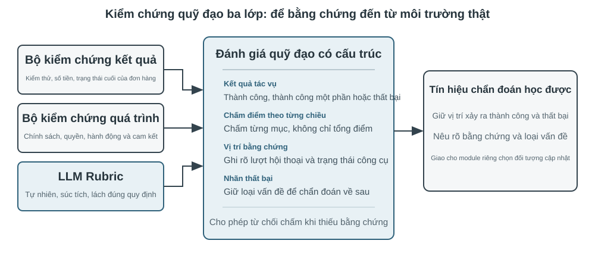
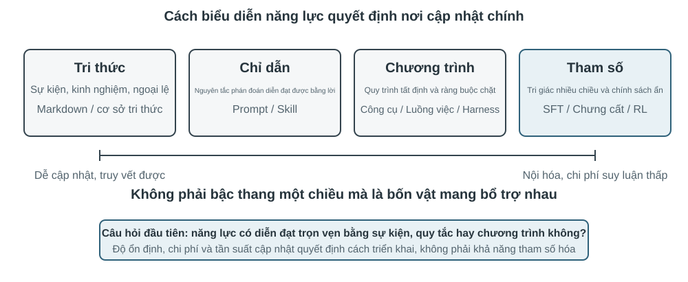

# Sự tiến hóa liên tục của Agent

Agent ngày nay đối mặt với một nghịch lý năng lực rõ rệt: nó có thể giải quyết zero-shot những nhiệm vụ phức tạp chưa từng gặp, nhưng sau khi xử lý mười nghìn nhiệm vụ tương tự, ngày hôm sau vẫn có thể lặp lại sai lầm của ngày đầu tiên. **Khả năng tự chủ học hỏi từ kinh nghiệm** đang trở thành năng lực then chốt để Agent chuyển từ “biết hoàn thành nhiệm vụ” sang “có thể làm việc đáng tin cậy”, đồng thời là chủ đề nghiên cứu cốt lõi của thế hệ mô hình tiếp theo. Tuy nhiên, năng lực học liên tục của bản thân mô hình hiện vẫn còn rất hạn chế.

Nguyên nhân là mô hình sau khi triển khai không tự động thay đổi tham số chỉ vì một lần suy luận. Học trong ngữ cảnh, duy trì trạng thái và nén được thảo luận ở Chương 2 có thể giúp Agent thích nghi **trong nhiệm vụ hiện tại**; nhưng khi ngữ cảnh kết thúc, thay đổi này không tự nhiên được chuyển sang nhiệm vụ tiếp theo. Lưu hội thoại vào bộ nhớ cũng không đồng nghĩa với việc đã học được hành vi mới: quỹ đạo gốc có thể rất dài, chứa cả chiến lược hiệu quả, thành công ngẫu nhiên, quy kết sai và đầu vào không đáng tin cậy.

Ở đây có một khác biệt dễ bị nhầm lẫn: **lưu lại kinh nghiệm không đồng nghĩa với học từ kinh nghiệm**. Đưa một trăm quỹ đạo vào ngữ cảnh dài hoặc cơ sở dữ liệu vector có thể giúp mô hình tìm lại một trường hợp khi cần, nhưng không tự động thực hiện so sánh xuyên trường hợp — bước nào lặp đi lặp lại trong các quỹ đạo thành công, cách làm nào chỉ hiệu quả với giao diện phiên bản cũ, và một lần thành công đến từ chiến lược đúng hay chỉ là ngẫu nhiên của môi trường. Việc học chỉ xảy ra sau khi hệ thống chủ động “đánh giá, đối chiếu, quy nạp và xác minh”, chứ không phải ở khoảnh khắc nhật ký được ghi xuống đĩa. Bộ nhớ người dùng ở Chương 3 chủ yếu kết tinh “người dùng và thế giới có đặc điểm như thế nào”; việc học kinh nghiệm trong chương này còn phải kết tinh “trong điều kiện nào nên hành động ra sao”. Cách thứ nhất giúp Agent nhớ nhiều hơn; cách thứ hai mới giúp nó chuyển từ thông minh sang thành thạo.

Vậy tại sao không để mô hình tự huấn luyện trực tiếp sau mỗi nhiệm vụ? Vì môi trường sản xuất hiếm khi cung cấp tín hiệu học tập sạch. Sự hài lòng của người dùng không đồng nghĩa với tuân thủ; các cập nhật tham số cục bộ cũng có thể gây quên năng lực, trôi dạt chính sách hoặc suy giảm an toàn. Nếu cho phép mô hình đang vận hành trực tiếp sửa đổi các tham số của chính nó dựa trên phản hồi chưa được xác minh, kinh nghiệm sai và Prompt injection có thể bị củng cố, rồi tiếp tục khuếch đại trong các nhiệm vụ sau. Mặt khác, việc huấn luyện định kỳ các mô hình nền tảng có thể cải thiện năng lực tổng quát, nhưng không thể kịp thời hấp thụ các quy tắc riêng, thay đổi công cụ và kinh nghiệm cục bộ mà mỗi Agent gặp hằng ngày.

Vì vậy, khi bản thân mô hình chưa thể học liên tục một cách đáng tin cậy, trước hết cần kiến tạo “học tập” thành một hệ thống tự chủ bao quanh mô hình: ghi lại bằng chứng vận hành, xác minh kết quả và quá trình, rút ra điểm chung từ nhiều quỹ đạo, rồi quyết định nên cập nhật tri thức, chỉ dẫn, chương trình hay tham số mô hình. Mọi sửa đổi trước tiên đều phải hình thành phiên bản ứng viên; chỉ sau khi vượt qua kiểm thử hồi quy và kiểm tra an toàn mới được phép thay đổi lần vận hành tiếp theo.

Các chương trước đã trình bày những thành phần chủ yếu cần thiết cho hệ thống này. Chương 2 xử lý trạng thái trong nhiệm vụ, Chương 3 cung cấp hạ tầng tri thức, Chương 5 trao cho Agent siêu năng lực tạo công cụ và sửa đổi hệ thống, Chương 7 thiết lập đánh giá và xác minh, còn Chương 8 trình bày cách cập nhật tham số mô hình. Nhiệm vụ của Chương 9 là tổ chức các thành phần này thành vòng khép kín tiến hóa liên tục như minh họa trong Hình 9-1.

Tiến hóa liên tục cần xuất phát từ kinh nghiệm vận hành có thể truy vết, có khả năng thay đổi hành vi về sau và đã được xác minh là không gây suy giảm rõ rệt. Chương này trước hết thảo luận cách xác định một lần vận hành tốt ở đâu, sai ở đâu; sau đó so sánh bốn phương pháp cập nhật cùng phạm vi áp dụng; cuối cùng bàn về cách các cập nhật này được xác minh, phát hành, sửa đổi và loại bỏ trong quá trình vận hành dài hạn.

## Thu nhận tín hiệu học tập từ quỹ đạo vận hành

Điểm khởi đầu của tiến hóa liên tục không phải là “tổng kết”, mà là “đánh giá”. Nếu hệ thống không biết nhiệm vụ đã hoàn thành hay chưa, cũng không biết bước nào tạo nên thành công hoặc thất bại, thì phần phản tư do mô hình ngôn ngữ tạo ra chỉ có thể là một phỏng đoán. Một khi đánh giá sai đi vào tri thức dài hạn, Prompt hệ thống hoặc dữ liệu huấn luyện, ảnh hưởng của nó sẽ liên tục khuếch đại qua các nhiệm vụ sau.

Kết quả của một số nhiệm vụ tương đối dễ xác minh. Coding Agent có thể chạy kiểm thử, kiểm tra kiểu và benchmark hiệu năng; Agent thay người dùng xử lý hoàn tiền có thể truy vấn trạng thái đơn hàng và số tiền hoàn thực tế. Những tín hiệu này đến từ trạng thái thực trong môi trường và thường đáng tin cậy hơn lời mô tả của mô hình về hành vi của chính nó. Tuy nhiên, kết quả đúng không có nghĩa là quá trình đúng. Xóa các ca kiểm thử thất bại cũng có thể khiến kiểm thử vượt qua; lời hứa miệng với người dùng rằng “chúng tôi sẽ hoàn tiền trong vòng 7 ngày, xin vui lòng chờ đợi” cũng có thể tạm thời nhận được phản hồi hài lòng. Vì vậy, đánh giá đáng tin cậy phải xem xét cả kết quả lẫn con đường đạt được kết quả đó.

Nhiều nhiệm vụ hơn không có một đáp án đúng duy nhất. Nhân viên chăm sóc khách hàng có kiên nhẫn hay không, có cung cấp phương án linh hoạt trong phạm vi tuân thủ hay không, báo cáo nghiên cứu có nắm bắt bằng chứng then chốt hay không, văn bản được tạo có tự nhiên và súc tích hay không, tất cả đều cần được phán đoán theo ngữ cảnh. Khi đó có thể sử dụng LLM-as-a-Judge được giới thiệu ở Chương 7, nhưng không nên chỉ yêu cầu giám khảo đưa ra một tổng điểm mơ hồ. Cách hiệu quả hơn là định nghĩa trước thang đánh giá (Rubric), yêu cầu bộ xác minh chấm điểm theo từng mục, trích dẫn bằng chứng từ quỹ đạo và nêu rõ sự không chắc chắn khi thiếu bằng chứng.

Hình 9-2 trình bày một cấu trúc xác minh ba tầng. Bộ xác minh kết quả ở tầng dưới đọc kết quả kiểm thử, trạng thái cơ sở dữ liệu và phản hồi của công cụ để trả lời “việc đó có thực sự được hoàn thành hay không”; bộ xác minh quá trình ở tầng giữa kiểm tra quy tắc nghiệp vụ, quyền hạn và chuỗi hành động để trả lời “việc đó có được hoàn thành theo cách được phép hay không”; bộ xác minh chất lượng ở tầng trên đánh giá ngôn ngữ và chiến lược theo Rubric để trả lời “việc đó có được xử lý phù hợp hay không”. Chỉ số càng gần tầng dưới càng nên dựa vào mã và chân trị của môi trường; chỉ những phần khó hình thức hóa mới nên giao cho mô hình ngôn ngữ.

Lấy Agent chăm sóc khách hàng làm ví dụ, một Rubric hữu ích tối thiểu phải bao quát các chiều trong Bảng 9-1. Năm mục đầu chủ yếu ràng buộc giới hạn tối thiểu, hai mục cuối đo lường chất lượng dịch vụ. Cách phân tách này có giá trị chẩn đoán cao hơn câu hỏi “người dùng có hài lòng hay không”: người dùng có thể hài lòng vì Agent hoàn tiền trái quy định, cũng có thể không hài lòng vì các hạn chế tuân thủ; một chỉ số hài lòng duy nhất không thể phân biệt hai trường hợp.

Bảng 9-1 Các chiều đánh giá quỹ đạo của Agent chăm sóc khách hàng

| Chiều | Câu hỏi xác minh | Bằng chứng chính |
|---|---|---|
| Kết quả nhiệm vụ | Yêu cầu cốt lõi của người dùng đã được giải quyết hay chưa | Trạng thái môi trường cuối cùng, kết quả công cụ |
| Tuân thủ quy tắc | Có vi phạm chính sách, quyền hạn hoặc quy trình bắt buộc hay không | Kho chính sách, quỹ đạo hành động |
| Ranh giới quyền riêng tư | Có tiết lộ thông tin không được phép cung cấp hay không | Văn bản phản hồi, nhật ký truy cập dữ liệu |
| Độ tin cậy thực tế | Phát biểu có được tri thức hoặc kết quả công cụ hỗ trợ hay không | Nguồn trích dẫn, phản hồi của công cụ |
| Tính nhất quán giữa cam kết và hành động | Thao tác được tuyên bố là đã hoàn thành có thực sự diễn ra hay không | Đối chiếu phản hồi với nhật ký công cụ |
| Chất lượng diễn đạt | Có tự nhiên, súc tích, tránh lặp lại và khuôn mẫu hay không | Toàn bộ hội thoại, Rubric ngôn ngữ |
| Linh hoạt trong tuân thủ | Khi phương án ban đầu không khả thi, có tìm được lộ trình thay thế được phép hay không | Mục tiêu người dùng, chính sách và hành động tiếp theo |

> **Thí nghiệm 9-1 ★★: Xây dựng bộ xác minh quỹ đạo cho Agent chăm sóc khách hàng**
>
> **Mục tiêu thí nghiệm**: Chuyển một quỹ đạo vận hành chăm sóc khách hàng thành chẩn đoán có cấu trúc dùng được cho việc học về sau, đồng thời xác minh liệu “kết luận đa chiều kèm bằng chứng” có định vị nguyên nhân gốc tốt hơn một tổng điểm duy nhất hay không.
>
> **Mô tả thực nghiệm:** So sánh cách “chỉ xuất một điểm tổng” với cách “xuất kết luận, chứng cứ và độ tin cậy theo từng chiều”, rồi quan sát cách nào phân biệt tốt hơn thất bại tác vụ, vi phạm quy tắc, lời hứa giả và vấn đề diễn đạt. Tiến hóa liên tục không thể chỉ dựa vào tỷ lệ thành công hay một điểm số. Chỉ khi giữ lại sai ở đâu, vì sao và chứng cứ nằm ở đâu, mô-đun sau mới biết nên cập nhật tri thức, Prompt, chương trình hay tham số; trường hợp độ tin cậy thấp cũng không nên tự động vào tập học.

## Bốn phương pháp tiến hóa liên tục của Agent

Tín hiệu học tập cho biết Agent cần thay đổi, nhưng không cho biết thay đổi nên diễn ra ở đâu. Căn cứ hàng đầu để lựa chọn cách cập nhật không phải là kinh nghiệm đã xuất hiện bao lâu, mà là năng lực mục tiêu có thể được biểu đạt tự nhiên bằng vật mang nào. Sự kiện và kinh nghiệm phù hợp để viết thành tài liệu tri thức; chiến lược có thể diễn đạt rõ ràng bằng ngôn ngữ phù hợp để đưa vào Prompt hoặc Skill; quy trình và ràng buộc có thể thực thi chính xác phù hợp để viết thành chương trình; còn những năng lực nhiều chiều như tri giác, phong cách ngôn ngữ và chiến lược ngầm phải được đưa vào tham số mô hình. Hình 9-3 minh họa bốn phương thức này và mối quan hệ giữa chúng.

Bảng 9-2 đưa ra một so sánh cô đọng. Bốn phương thức không loại trừ lẫn nhau: Agent ảnh y khoa dựa vào tham số để nhận diện tổn thương, dùng kho tri thức để cung cấp hướng dẫn mới nhất, rồi dùng mã để tính chỉ số rủi ro; giọng điệu tự nhiên của mô hình chăm sóc khách hàng đến từ hậu huấn luyện, chính sách doanh nghiệp cụ thể được cung cấp qua tri thức và Skill, còn tuân thủ trọng yếu được mã phía máy chủ bảo đảm.

Bảng 9-2 Phạm vi áp dụng của bốn phương thức tiến hóa liên tục

| Phương thức cập nhật | Phù hợp để chứa | Ưu điểm chính | Hạn chế chính |
|---|---|---|---|
| Kho tri thức kinh nghiệm | Sự kiện, quy luật kinh nghiệm, ngoại lệ và nguồn | Cập nhật nhanh, có thể truy vết, truy xuất theo nhu cầu | Phụ thuộc vào truy xuất và khả năng áp dụng đúng của mô hình |
| Prompt và Skill | Nguyên tắc phán đoán và quy phạm thao tác có thể ngôn ngữ hóa | Có thể giải thích, phạm vi tác động có thể kiểm soát | Dễ phình to, xung đột hoặc bị bỏ qua |
| Chương trình và Harness | Quy trình xác định, công cụ và ràng buộc cứng | Có thể kiểm thử, thực thi ổn định, chi phí thấp | Chi phí phát triển và bảo trì tương đối cao |
| Tham số mô hình | Tri giác nhiều chiều, phong cách sinh và chiến lược ngầm | Năng lực khái quát hóa mạnh, chi phí suy luận thấp | Chi phí cập nhật và hồi quy cao |

### Kết tinh kinh nghiệm thành tri thức

Phương thức tiến hóa nhẹ nhất là tổ chức những kinh nghiệm lặp đi lặp lại qua nhiều lần vận hành thành tài liệu tri thức có thể truy xuất. “Kho tri thức kinh nghiệm” ở đây chia sẻ công nghệ lưu trữ, lập chỉ mục và truy xuất với Chương 3, nhưng nguồn tri thức và mục tiêu xác minh khác nhau. Chương 3 chủ yếu trích xuất từ hội thoại người dùng, tài liệu và tập dữ liệu để trả lời “người dùng và thế giới có đặc điểm như thế nào”; chương này trích xuất từ quỹ đạo hành động và kết quả của Agent để trả lời “trong điều kiện nào nên làm gì”. Ví dụ, “hãng hàng không này yêu cầu đặt suất ăn đặc biệt trước hai mươi bốn giờ” là tri thức lĩnh vực; còn “trước khi đặt vé, hãy kiểm tra hạn chót đăng ký suất ăn đặc biệt để tránh thanh toán xong mới phát hiện không thể đáp ứng nhu cầu” là kinh nghiệm hành động.

Quỹ đạo gốc không phù hợp làm đơn vị tri thức chính thức. Nó vừa dài vừa nhiễu, chứa đầu ra thô của công cụ, các đường vòng ngẫu nhiên và chi tiết môi trường. Một hệ thống thận trọng hơn sẽ giữ lại ba tầng dữ liệu: quỹ đạo gốc bất biến dùng để kiểm toán; phân tích từng lần vận hành ghi lại thành công, thất bại và bài học ứng viên của lần đó; sau đó nhiều quỹ đạo cùng loại được so sánh, phân cụm và quy nạp để tạo thành tài liệu tri thức Markdown hướng đến tương lai. Tài liệu chính thức thường nêu rõ bối cảnh áp dụng, chiến lược đề xuất, hành vi bị cấm, điều kiện ngoại lệ, nguồn bằng chứng và thời điểm xác minh gần nhất, thay vì thuật lại toàn bộ quá trình của một nhiệm vụ cụ thể.

Thiết kế này có cùng tư tưởng hai giai đoạn với User-as-Code ở Chương 3. User-as-Code trước tiên nối thêm sự kiện hội thoại vào nhật ký bất biến, sau đó định kỳ tái dựng mô hình người dùng có cấu trúc; việc học từ kinh nghiệm cũng nên lưu bằng chứng trước rồi mới tạo tri thức khả biến ngoại tuyến. Hình 9-4 minh họa quá trình này. Việc tách ghi nhận khỏi tổ chức giúp tránh để một thành công ngẫu nhiên hoặc sự cố mạng lập tức thay đổi Agent, đồng thời cho phép hệ thống chỉ phán đoán điểm chung sau khi đã quan sát nhiều trường hợp thành công và thất bại.

Tài liệu kinh nghiệm không phải bản tóm tắt quỹ đạo đơn giản. Nội dung thực sự có giá trị chuyển giao đến từ đối chiếu: quỹ đạo thành công cùng loại đã làm gì, quỹ đạo thất bại thiếu điều gì; một chiến lược có hiệu quả trong những phiên bản môi trường nào và mất hiệu lực dưới những điều kiện tiên quyết nào. Chương 3 đã giới thiệu việc trích xuất, phân cụm và truy xuất tri thức nên chương này không lặp lại các thuật toán đó, mà tập trung vào cách đánh giá quỹ đạo trở thành điều kiện trích xuất và liệu tri thức được trích xuất có nâng cao hiệu quả của các nhiệm vụ sau hay không.

Một đường ống chắt lọc tri thức hoàn chỉnh có thể chia thành năm bước. Trước hết, lưu quỹ đạo bất biến và kết quả môi trường. Sau đó tạo phân tích có cấu trúc cho từng lần vận hành, liệt kê loại nhiệm vụ, năng lực cần thiết, chiến lược quan sát được, sai sót và ngoại lệ. Tiếp theo, tổng hợp các lần vận hành cùng họ nhiệm vụ và lập bảng bằng chứng cho từng quy luật ứng viên: “quỹ đạo nào ủng hộ, quỹ đạo nào bác bỏ”. Chỉ ứng viên đạt ngưỡng ủng hộ mới được ghi vào tài liệu chính thức. Cuối cùng, kiểm tra hiệu quả chuyển giao trên các nhiệm vụ mới không tham gia quá trình chắt lọc. Lưu tri thức chính thức và phân tích ứng viên trong các kho tách biệt cho phép hệ thống quy nạp lại mà không sửa đổi bằng chứng gốc, đồng thời rút lại chính xác một kết luận khi phiên bản môi trường thay đổi.

Học kinh nghiệm GAIA cung cấp một ví dụ trực quan. GAIA[^gaia-2023] gồm các câu hỏi nhiều bước cần kết hợp tìm kiếm, đọc trang web, xử lý tệp và tính toán; AWorld[^aworld-2025] cung cấp môi trường thực thi để chạy Agent, gọi các công cụ đó và lưu quỹ đạo. Nếu cái trước giống đề thi thì cái sau giống phòng thi và hệ thống ghi chép thí nghiệm. Cách cũ tạo ngay bản tóm tắt chiến lược sau một lần thành công rồi vector hóa và đưa vào kho. Cách nghiêm ngặt hơn trước tiên dùng bộ kiểm tra đáp án GAIA hoặc bộ xác minh môi trường khác để gắn nhãn thành công, thành công một phần và thất bại, sau đó so sánh nhiều lộ trình trong cùng họ nhiệm vụ. Quỹ đạo thành công cung cấp chiến lược ứng viên; quỹ đạo thất bại cung cấp tri thức loại trừ; quỹ đạo thành công một phần giúp xác định “đoạn nào hiệu quả, đoạn nào vẫn có vấn đề”. Phản tư bằng ngôn ngữ tự nhiên do Reflexion[^reflexion-2023] đề xuất có thể tham gia tạo bài học ứng viên, nhưng bản thân phản tư không phải bằng chứng. Chỉ nội dung phù hợp với kết quả môi trường, được nhiều quỹ đạo ủng hộ và thể hiện chuyển giao tích cực trên nhiệm vụ mới mới nên đi vào tài liệu kinh nghiệm chính thức.

> **Thí nghiệm 9-2 ★★: Chắt lọc tài liệu tri thức kinh nghiệm từ quỹ đạo GAIA**
>
> **Mục tiêu thí nghiệm**: Kiểm tra liệu “tài liệu tri thức xuyên quỹ đạo” có dễ chuyển giao hơn “ghi nhớ bản tóm tắt của một lần thành công”, đồng thời giảm chuyển giao tiêu cực do thành công ngẫu nhiên và kinh nghiệm sai hay không.
>
> **Dữ liệu và quy trình**: `gaia-experience` trước tiên lưu toàn bộ quỹ đạo và `environment_score` bên ngoài của mỗi lần chạy, rồi chuyển chúng thành bản ghi học tập tối thiểu gồm `task_family`, `capabilities` cần thiết, `applies_when`, chiến lược quan sát được, sai sót, ngoại lệ và ID quỹ đạo nguồn. Bộ xác minh kết quả phân loại lần chạy thành thành công, thành công một phần hoặc thất bại. Mô-đun học tập so sánh các lộ trình trong cùng họ nhiệm vụ; LLM có thể đề xuất quy nạp ứng viên, nhưng một chiến lược đề xuất phải được ít nhất hai quỹ đạo không thất bại ủng hộ. Tài liệu Markdown cuối cùng gồm bối cảnh áp dụng, chiến lược đề xuất, sai lầm thường gặp, điều kiện ngoại lệ, nguồn và thời điểm xác minh gần nhất. Giai đoạn áp dụng chỉ truy xuất các tài liệu này, không nhét quỹ đạo gốc dài vào ngữ cảnh.
>
> **Ba nhóm đối chứng**: Nhóm một không dùng kinh nghiệm lịch sử. Nhóm hai truy xuất bản tóm tắt của một quỹ đạo giống nhiệm vụ hiện tại nhất. Nhóm ba truy xuất tài liệu tri thức được nhiều quỹ đạo cùng ủng hộ. Tập học và tập chuyển giao phải không giao nhau, tránh để đáp án của cùng một câu GAIA bị rò rỉ vào đánh giá dưới tên “kinh nghiệm”.
>
> **Chỉ số và nghiệm thu**: Đồng thời báo cáo tỷ lệ thành công của nhiệm vụ chuyển giao, số ký tự hoặc Token truy xuất trung bình và tỷ lệ chuyển giao tiêu cực; kiểm tra mỗi kết luận chính thức có liệt kê quỹ đạo nguồn hay không. Nếu tài liệu xuyên quỹ đạo chỉ rút ngắn ngữ cảnh mà không cải thiện nhiệm vụ mới, không thể kết luận hệ thống đã học từ kinh nghiệm. Nếu một thành công ngẫu nhiên có thể được nâng thẳng thành tri thức chính thức, hoặc tài liệu không truy vết được về quỹ đạo gốc, thí nghiệm cũng không đạt.
>
> Phần triển khai đi kèm nằm tại [`gaia-experience`](../chapter9/gaia-experience/). `demo_documents.py` mặc định chạy ngoại tuyến; dùng `--extractor llm` để LLM thực đề xuất các ứng viên kinh nghiệm xuyên quỹ đạo.

[^reflexion-2023]: Shinn, N., et al. *Reflexion: Language Agents with Verbal Reinforcement Learning.* arXiv:2303.11366, 2023.

[^gaia-2023]: Mialon, G., et al. *GAIA: a benchmark for General AI Assistants.* arXiv:2311.12983, 2023.

[^aworld-2025]: Yu, C., et al. *AWorld: Orchestrating the Training Recipe for Agentic AI.* arXiv:2508.20404, 2025.

### Viết kinh nghiệm thành chỉ dẫn

Kho tri thức kinh nghiệm cung cấp tài liệu tham khảo cho Agent, còn Prompt và Skill có tính chỉ dẫn mạnh hơn. Khi nhiều quỹ đạo liên tục cho thấy cùng một loại sai lầm chiến lược và quy luật có thể được diễn đạt rõ bằng ngôn ngữ tự nhiên, hệ thống có thể nâng nó từ “kinh nghiệm có thể tham khảo” thành “quy tắc phải tuân thủ”. Quy tắc áp dụng cho gần như mọi nhiệm vụ phù hợp để đưa vào Prompt hệ thống; quy trình phức tạp chỉ có hiệu lực với một lĩnh vực, dự án hoặc công cụ cụ thể phù hợp hơn để viết thành Skill được nạp theo nhu cầu hoặc tệp chỉ dẫn dự án.

Học Prompt có phân công khác với kỹ thuật Prompt ở Chương 2. Chương 2 trả lời cách viết Prompt có cấu trúc rõ ràng và thân thiện với bộ nhớ đệm; ở đây trả lời loại phản hồi sản xuất nào đủ để kích hoạt sửa đổi Prompt và cách xác minh quy tắc mới trước khi triển khai. Việc sửa đổi cũng không nên thể hiện thành quá trình liên tục viết lại toàn bộ Prompt hệ thống. Cách đáng tin cậy hơn là tạo diff tối thiểu dựa trên một nhóm thất bại cùng loại, ghi rõ phạm vi tác dụng của quy tắc, kiểm tra xem nó có mâu thuẫn với quy tắc hiện có hay không, rồi đồng thời đánh giá trên các trường hợp biên đã kích hoạt thất bại và tập lưu giữ nhiệm vụ cũ.

Trong một bài viết dài năm 2025, Andrej Karpathy tạm gọi mô thức mới tiềm năng này là **học Prompt hệ thống** (System Prompt Learning)[^karpathy-system-prompt-learning]. Ông tóm lược rằng tiền huấn luyện chủ yếu học tri thức, tinh chỉnh chủ yếu định hình hành vi theo thói quen; nhưng con người còn một cách học khác: sau khi gặp vấn đề và nghĩ ra phương pháp, ta dùng ngôn ngữ rõ ràng để nhắc bản thân trong tương lai rằng “lần tới gặp loại vấn đề này, hãy thử cách này trước”. Ông ví LLM thiếu cuốn sổ tay như vậy với nhân vật chính trong phim *Memento*, đồng thời chỉ ra rằng học Prompt hệ thống và học tăng cường đều cải thiện hành vi từ kinh nghiệm nhưng dùng thuật toán cập nhật khác nhau — cách thứ nhất sửa văn bản, cách thứ hai dùng gradient descent để sửa tham số. Ví dụ ông nêu là Prompt hệ thống dài khoảng 17.000 từ của Claude khi đó có một yêu cầu riêng: khi gặp bài toán đếm từ, chữ cái hoặc ký tự, hãy đánh số từng mục và đếm tường minh trước khi đưa ra đáp án. Quy tắc này nhằm xử lý những câu hỏi như “có bao nhiêu chữ `r` trong `strawberry`”.

Trong hệ thống Agent, điều đó có nghĩa là sau thất bại, bài học có thể ngôn ngữ hóa được viết thành quy tắc ứng viên mà lần chạy sau có thể đọc trực tiếp. So với kết quả vô hướng chỉ có “thành công/thất bại”, chẩn đoán kèm bằng chứng có thể chỉ ra lỗi nằm ở xác minh danh tính, lựa chọn công cụ hay ranh giới chuyển tiếp, nhờ đó sinh sửa đổi ứng viên đúng trọng tâm hơn. Nhận xét của Karpathy rằng “phản tư được tri thức dẫn dắt có kênh phản hồi nhiều chiều hơn phần thưởng vô hướng” giải thích vì sao cách này có thể hiệu quả về dữ liệu. Tuy vậy, thông tin phong phú hơn không có nghĩa là tự nhiên đúng. Cùng một ý kiến người dùng có thể chỉ áp dụng cho một khách hàng hoặc phiên bản chính sách cũ, nên vẫn phải phân cụm, xác định phạm vi và kiểm thử hồi quy.

Tối ưu Prompt tự động đã có nhiều hướng khác nhau. DSPy[^dspy-2023] coi chương trình gồm nhiều lần gọi mô hình ngôn ngữ là đối tượng có thể tối ưu và tìm kiếm chỉ dẫn cùng ví dụ trên tập phát triển. OPRO[^opro-2023] để mô hình ngôn ngữ tiếp tục đề xuất ứng viên dựa trên Prompt lịch sử và điểm số của chúng. GEPA[^gepa-2025] dùng phản tư bằng ngôn ngữ tự nhiên về quỹ đạo thất bại để tạo và tuyển chọn các Prompt ứng viên bổ sung cho nhau. Các hướng này chủ yếu phục vụ tối ưu hàng loạt trên tập đánh giá ngoại tuyến. Diff tối thiểu trong hệ thống sản xuất giống bảo trì liên tục hơn: được kích hoạt bởi ca biên mới và nhấn mạnh nguồn gốc, kiểm toán, khôi phục nhanh. Trong thực tế, có thể tìm một phiên bản khởi đầu tốt bằng tìm kiếm ngoại tuyến, rồi duy trì các quy tắc đuôi dài sau triển khai bằng bản vá theo từng ca.

#### Ví dụ 1: Tối ưu hóa quy tắc trong prompt dựa trên quỹ đạo thất bại

Ví dụ, Agent chăm sóc khách hàng hàng không thường chuyển sang nhân viên quá sớm khi người dùng chất vấn chính sách. Đánh giá quỹ đạo cho thấy nó không vi phạm quy định, nhưng thiếu tính linh hoạt trong tuân thủ. Bản vá ứng viên có thể yêu cầu Agent trước tiên giải thích chính sách, nhận diện mục tiêu thực sự của người dùng và tìm phương án thay thế được phép; chỉ chuyển sang nhân viên khi người dùng yêu cầu rõ ràng hoặc vấn đề thực sự vượt quá quyền hạn. Nếu quy tắc mới giảm chuyển tiếp quá mức nhưng lại khiến các sự cố an toàn đáng lẽ phải chuyển cho con người tiếp tục được xử lý, thì nó chưa vượt qua hồi quy. Giá trị của việc học Prompt hệ thống không nằm ở tự động nối thêm nhiều văn bản, mà ở việc liên tục làm rõ phạm vi áp dụng của quy tắc bằng các trường hợp biên trong sản xuất.

#### Ví dụ 2: Skill làm rõ yêu cầu — từ "bắt tay làm ngay" đến "xác nhận trước khi thực hiện"

Học Skill tuân theo cùng nguyên tắc nhưng có phạm vi tác động cục bộ hơn. Có thể xem Skill là sổ tay nghiệp vụ được mở khi cần. Nếu nhiều kinh nghiệm cùng hình thành một quy trình yêu cầu bồi thường bảo hiểm hoàn chỉnh, hệ thống có thể tạo hoặc sửa Skill tương ứng. Skill ứng viên không nên chỉ là bản tóm tắt một hội thoại; tối thiểu nó phải nêu khi nào cần nạp, điều kiện tiên quyết, các bước thao tác, bẫy đã biết và cách xác minh, đồng thời lưu quỹ đạo nguồn. Hệ thống trước tiên tìm năng lực gần giống trong kho Skill hiện có: nếu đã có cùng quy trình thì ưu tiên `patch` cục bộ; chỉ tạo thư mục mới khi thật sự xuất hiện một năng lực độc lập mới, tránh để kho chứa đầy các sổ tay khác tên nhưng gần giống nội dung. Skill Creator của Anthropic[^anthropic-skill-creator] minh họa vòng tạo “soạn thảo — kiểm thử — đánh giá — sửa đổi”. Nó giải quyết cách tạo và cải thiện Skill; phần khó thực sự vẫn là bằng chứng vận hành nào đủ để kích hoạt, xử lý xung đột thế nào và sau sửa đổi có vượt qua nhiệm vụ lĩnh vực cùng hồi quy nhiệm vụ cũ hay không.

> **Thí nghiệm 9-9 ★★: Chuyển phản hồi thành Skill viết**
>
> Xử lý 20 cặp before/after trong `data/feedback_pairs.json` theo ba đợt, trích xuất quy tắc ứng viên, gộp mẫu trùng, kiểm tra xung đột ngưỡng và tạo `SKILL.md` có nguồn/phạm vi. Quy tắc xác định kiểm tra bằng mã; quy tắc LLM được hiệu chỉnh trên 10 mẫu vàng.
>
> Báo cáo đồng thời tỷ lệ phát hiện trên tập nhiệm vụ chưa hoàn thành, tỷ lệ báo nhầm trên văn bản bình thường và số quy tắc tăng. Lần chạy thật đầu tiên đạt 0/8 phát hiện và nhầm 7/8; sau bộ lọc ngoài mô hình và fallback xác định, đạt 8/8, nhầm 0/8, gộp 21 ứng viên thành 8 quy tắc. Xem [`ai-style-skill`](../chapter9/ai-style-skill/).

Trường hợp dấu ngoặc kép cong cho thấy Skill phải trở thành hợp đồng dữ liệu thay vì quy tắc thay thế toàn cục: trước SFT, các ví dụ tổng hợp được phân tầng theo thể loại bài, phạm vi và ngôn ngữ lập trình, vượt qua gate mã/JSON/vùng bảo vệ và được kiểm tra thủ công. Với exact-copy, round-trip encode→decode của tokenizer, sao chép byte-exact của mô hình, tuần tự hóa Harness và đối sánh công cụ phải được kiểm toán như các lớp hồi quy riêng.

> **Thí nghiệm 9-3 ★★: Tối ưu Prompt hệ thống dựa trên quỹ đạo thất bại**
>
> **Mục tiêu thí nghiệm**: Giúp Agent chăm sóc khách hàng hàng không học từ quỹ đạo thất bại “chuyển sang nhân viên quá sớm khi người dùng chất vấn chính sách”, đồng thời chứng minh quy tắc mới không phá hỏng các tình huống cũ thật sự cần chuyển tiếp.
>
> **Quy trình**: Trước tiên chạy riêng tập lưu giữ nhiệm vụ cũ và tập biên chuyển tiếp quá mức. `learning_signal.py` tách thất bại thành ba chiều: tuân thủ quy tắc, giải quyết nhiệm vụ và linh hoạt trong tuân thủ, đồng thời giữ lại case ID nguồn. Coding Agent sau đó đọc Prompt hiện tại và chỉ tạo một chỉnh sửa tối thiểu có thể kiểm toán theo dạng `old_str → new_str`: yêu cầu Agent trước tiên giải thích chính sách, nhận diện mục tiêu thật và tìm phương án thay thế tuân thủ, đồng thời giữ lộ trình chuyển tiếp khi người dùng yêu cầu rõ ràng hoặc có sự cố an toàn. Bản vá cùng nguồn, quy tắc mục tiêu và lý do sửa đổi được ghi vào manifest ứng viên.
>
> **Ba nhóm đối chứng**: Prompt ban đầu, Prompt ứng viên sinh tự động và Prompt do con người tối ưu một lần. Cả ba dùng cùng mô hình và cùng tập nhiệm vụ lưu giữ/biên. `--quick` chỉ giảm số ca nhưng vẫn thật sự gọi Agent nhiệm vụ, LLM Judge và Coding Agent; không thể coi đó là kết quả mô phỏng ngoại tuyến.
>
> **Ngưỡng phát hành và chỉ số**: Ứng viên phải đồng thời đáp ứng bốn điều kiện: bản vá không rỗng, nguồn có thể truy vết, hiệu quả trên tập biên thực sự cải thiện và tập lưu giữ không suy giảm. So sánh độ chính xác nhiệm vụ biên, độ chính xác nhiệm vụ lưu giữ, độ dài Prompt tăng thêm, số hồi quy được đưa vào và thời gian từ phát hiện thất bại đến sinh ứng viên. Vượt qua ngưỡng chỉ tạo `release_to_canary`, không trực tiếp ghi đè Prompt ổn định; bất kỳ điều kiện nào thất bại đều phải trả về `reject_candidate`.
>
> Phần triển khai đi kèm nằm tại [`prompt-auto-optimization`](../chapter9/prompt-auto-optimization/). Kiểm thử ngoại tuyến bao quát ngưỡng chẩn đoán và phát hành, còn `--quick` sẽ thực sự gọi Agent thực hiện nhiệm vụ, LLM Judge và Coding Agent.

[^dspy-2023]: Khattab, O., et al. *DSPy: Compiling Declarative Language Model Calls into Self-Improving Pipelines.* arXiv:2310.03714, 2023.

[^opro-2023]: Yang, C., et al. *Large Language Models as Optimizers.* arXiv:2309.03409, 2023.

[^gepa-2025]: Agrawal, L., et al. *GEPA: Reflective Prompt Evolution Can Outperform Reinforcement Learning.* arXiv:2507.19457, 2025.

[^karpathy-system-prompt-learning]: Karpathy, A. “We’re missing (at least one) major paradigm for LLM learning … system prompt learning?” X, May 11, 2025. https://x.com/karpathy/status/1921368644069765486

[^anthropic-skill-creator]: Anthropic. *Skill Creator.* 2026. https://github.com/anthropics/skills/blob/main/skills/skill-creator/SKILL.md

### Viết kinh nghiệm thành chương trình

Khi kinh nghiệm mô tả một thao tác ổn định, lặp lại và có thể xác minh, việc để mô hình đọc lại tài liệu và suy luận từ đầu mỗi lần không còn kinh tế. Khi đó, cách phù hợp hơn là biên dịch kinh nghiệm thành quy trình công việc, công cụ hoặc mã Harness để biến một lần khám phá thành chương trình có thể thực thi lặp lại. Chương 5 đã trình bày cách Coding Agent đọc và ghi tệp, chạy kiểm thử và tạo hệ thống; phần này không tập trung vào sinh mã nói chung, mà vào cách Agent sửa đổi phiên bản tương lai của chính nó dựa trên quỹ đạo của mình.

Đối tượng có thể sửa đổi không chỉ là công cụ mới. Tầng thao tác có thể biên dịch quỹ đạo trình duyệt thành quy trình công việc tham số hóa hoặc tạo bộ điều hợp cho API thay đổi; tầng điều khiển có thể sửa định tuyến công cụ, thử lại, ngắt mạch và chiến lược nén ngữ cảnh; tầng xác minh có thể bổ sung kiểm tra tham số, bộ xác minh trạng thái và kiểm thử hồi quy dựa trên thất bại trong sản xuất; tầng kiến trúc có thể thêm Reviewer Agent và thay đổi luồng thông tin giữa lập kế hoạch với thực thi.

Quy trình công việc trình duyệt cho thấy giá trị của kinh nghiệm được chương trình hóa. Có thể ví nó với chức năng ghi macro trong bảng tính. Khi gửi email lần đầu, Agent đa phương thức dùng chu trình quan sát — suy nghĩ — hành động để tìm các điều khiển “soạn thư, người nhận, chủ đề, nội dung, gửi”. Lần sau gửi một email khác, quy trình không đổi, chỉ người nhận và nội dung khác đi; không cần gọi lại mô hình để khám phá toàn bộ đường đi từ pixel và DOM. Hệ thống cần biên dịch quỹ đạo khám phá lần đầu thành một chương trình nhỏ có tham số, kiểm tra trạng thái và thông tin phiên bản.

Quy trình chắt lọc tri thức trong Hình 9-4 tương ứng với một vòng đời cụ thể hơn trong bối cảnh trình duyệt:

1. **Ghi lại quỹ đạo**: Ghi các thao tác điều hướng, nhấp, nhập và chọn danh sách; lưu tham số hành động, URL lúc đó, cùng bằng chứng định vị phần tử như XPath, CSS, `id`, `role`, `aria-label` và `data-testid`. Thông tin định vị chỉ dùng để tìm lại phần tử, không chứng minh nhiệm vụ đã hoàn thành.
2. **Tham số hóa**: Nhận diện giá trị cố định trong lần chạy đầu làm biến mẫu; ví dụ thay `test@example.com`, chủ đề và nội dung bằng `{recipient}`, `{subject}` và `{content}`, giữ nguyên các hành động ổn định khác. Bản triển khai giảng dạy dùng biểu thức chính quy và thay mẫu; hệ thống sản xuất có thể dùng đầu vào nhiệm vụ có cấu trúc hoặc mô hình trích xuất bị ràng buộc.
3. **Định nghĩa kiểm tra trạng thái**: Thêm kiểm tra trước và sau hành động, chẳng hạn “nút Gửi hiện đang hiển thị” và “URL sau điều hướng thuộc trang đích”. Thêm kiểm tra trạng thái cuối cho toàn bộ quy trình, chẳng hạn “thư mới xuất hiện trong mục Đã gửi” hoặc giá trị trạng thái của trang thử nghiệm thay đổi như mong đợi. Hành động chạy thành công và nhiệm vụ thành công là hai việc khác nhau; kiểm tra cuối phải đọc trạng thái thực của trang hoặc backend.
4. **Xác minh ứng viên**: Lần thành công đầu tiên chỉ tạo `candidate`. Hệ thống phải đặt lại tài khoản sandbox hoặc trang thử nghiệm về một trạng thái khởi đầu độc lập, rồi phát lại toàn bộ ứng viên. Chỉ khi mọi kiểm tra trước hành động, sau hành động và trạng thái cuối đều vượt qua, phiên bản mới được phát hành thành `validated`. Với nhiệm vụ có tác dụng phụ như gửi email hoặc đặt hàng, nếu không có callback đặt lại an toàn thì chỉ lưu ứng viên để kiểm toán, không lặp lại thao tác trên tài khoản sản xuất để xác minh.
5. **Khớp và phát lại**: Khi nhiệm vụ mới đến, trước hết tìm quy trình trong kho năng lực chính thức theo ý định và từ khóa, trích xuất tham số lần này, rồi để Playwright thực thi trực tiếp. Lộ trình phát lại không cần gọi LLM từng bước, nhưng vẫn phải chờ phần tử khả dụng và hoàn thành mọi kiểm tra trạng thái.
6. **Mất hiệu lực và học lại**: Khi không tìm thấy phần tử đích, kiểm tra trạng thái thất bại, API Schema thay đổi hoặc trạng thái cuối sai, lập tức dừng các hành động tiếp theo, chuyển phiên bản cũ từ kho truy xuất sang vùng `invalid`, rồi quay về Agent đầy đủ để khám phá lại. Tệp cũ được giữ để kiểm toán và so sánh, nhưng không được âm thầm tiếp tục khớp.

Với thao tác gửi email, kết quả biên dịch không chỉ là “nhấp các nút này theo thứ tự” mà là một chương trình nhỏ có tham số người nhận, chủ đề và nội dung: trước khi gửi, kiểm tra cửa sổ soạn thư và ô nhập; sau khi gửi, kiểm tra thông báo thành công; cuối cùng xác nhận thư tương ứng xuất hiện trong mục Đã gửi. Trong thí nghiệm PreAct[^preact], các chương trình như vậy đạt tốc độ đầu-cuối nhanh hơn 8,5–13 lần trên nhiệm vụ lặp lại và giai đoạn phát lại không cần gọi mô hình ngôn ngữ theo từng bước. Quan trọng hơn, bộ nhớ quy trình phải đồng thời có **xác minh trước hành động, xác minh sau hành động và xác minh độc lập trước khi lưu**. Nếu không, hệ thống dễ tạo ra ảo giác nguy hiểm: độ phủ phát lại là 100%, mọi nút đều đã được nhấp, nhưng một trường thực ra trống và nhiệm vụ chưa bao giờ thật sự hoàn thành.

> **Thí nghiệm 9-4 ★★★: Tạo quy trình công việc có thể xác minh từ quỹ đạo trình duyệt**
>
> **Mục tiêu thí nghiệm**: Xác minh liệu Web Agent có thể biến một lần khám phá tốn kém thành quy trình tái sử dụng và từ chối phát lại sai khi trang web thay đổi, thay vì báo nhầm “mọi hành động đã chạy” là thành công hay không.
>
> **Kịch bản bốn giai đoạn**: Giai đoạn một thực hiện nhiệm vụ “gửi đến `test@example.com` một tin nhắn có chủ đề ‘Email thử nghiệm’” trên trang email thử nghiệm hoặc trang tin nhắn mô phỏng. Agent đầy đủ chịu trách nhiệm khám phá; lớp bao bọc ghi lại hành động, tham số, trạng thái trang và tạo `candidate`. Giai đoạn hai gọi `validation_reset` để khôi phục sandbox rồi phát lại toàn bộ độc lập. Chỉ ứng viên vượt qua tất cả kiểm tra trước hành động, sau hành động và trạng thái cuối mới vào kho năng lực chính thức. Giai đoạn ba thực hiện nhiệm vụ cùng loại nhưng người nhận, chủ đề và nội dung đều khác; hệ thống phải khớp quy trình đã xác minh, điền tham số mới và dùng Playwright phát lại mà không vào vòng LLM từng bước. Giai đoạn bốn thay đổi cách định vị nút, văn bản trang hoặc trạng thái cuối để kiểm tra quy trình cũ có lập tức thành `invalid` và trả `fallback_required=True` hay không.
>
> **Thiết kế đối chứng**: Đường cơ sở đơn giản chỉ đếm xem thao tác nhấp, nhập liệu có hoàn thành mà không ném ngoại lệ hay không. Nhóm thí nghiệm còn xác minh trang trước hành động, trang sau hành động và trạng thái cuối của nhiệm vụ. Hai nhóm dùng cùng quỹ đạo và cùng thay đổi trang; so sánh tỷ lệ phán đoán sai trong các ca thành công giả như “trường còn trống nhưng nút Gửi đã được nhấp” hoặc “Save đã được nhấp nhưng dữ liệu chưa ghi vào cơ sở dữ liệu”.
>
> **Chỉ số và nghiệm thu**: Ghi thời gian đầu-cuối của khám phá lần đầu và phát lại, số lần gọi LLM, tỷ lệ thành công, tỷ lệ thành công sai, tỷ lệ khớp quy trình, tỷ lệ phát hiện thay đổi trang và số lần quay về học lại. Khi không có callback đặt lại, quy trình phải ở vùng ứng viên. Phiên bản xác minh thất bại không được truy xuất. Phát lại tham số hóa không được tái sử dụng người nhận hoặc nội dung lần đầu. Sau khi trang thay đổi, phải dừng các hành động tiếp theo nguy hiểm. Kết quả tăng tốc chỉ có ý nghĩa khi đồng thời thỏa các điều kiện này.
>
> Phần triển khai đi kèm nằm tại [`browser-use-rpa`](../chapter9/browser-use-rpa/), đồng thời cung cấp bản trình diễn máy trạng thái xác định và lộ trình vận hành gọi Agent trình duyệt thực.

Việc Agent sửa mã của chính mình không có nghĩa là tiến trình đang chạy trực tiếp ghi đè lên bản thân. Hệ thống sản xuất nên tạo một nhánh ứng viên từ phiên bản ổn định hiện tại, để Coding Agent tạo bản vá tối thiểu, lần lượt vượt qua kiểm tra tĩnh, kiểm thử đơn vị, quét an toàn, phát lại quỹ đạo thất bại và hồi quy nhiệm vụ cũ, rồi mới tạo phiên bản mới có thể triển khai canary. Điều này chuyển “tự sửa đổi” thành một quy trình phát hành phần mềm có thể kiểm toán, đồng thời cũng là ranh giới giữa Chương 9 và Chương 5: Chương 5 cung cấp năng lực sửa đổi hệ thống, còn chương này cung cấp phương pháp tự sửa đổi được kích hoạt bởi kinh nghiệm và ràng buộc bằng vòng khép kín xác minh.

Chỉ yêu cầu “bản vá càng nhỏ càng tốt” vẫn chưa đủ để quy kết nguyên nhân đáng tin cậy. Mỗi yêu cầu sửa đổi còn phải là một **hợp đồng thay đổi có thể bác bỏ**: nêu bằng chứng thất bại, nguyên nhân gốc được suy đoán, thành phần Harness chịu trách nhiệm, thay đổi ứng viên, hành vi dự kiến được sửa, hành vi hiện có có thể bị ảnh hưởng và ca kiểm thử cho cả hai. Agentic Harness Engineering gọi đây là khả năng quan sát ở ba tầng thành phần, kinh nghiệm và quyết định: mỗi thành phần có thể sửa đều có biểu diễn cấp tệp; lượng lớn quỹ đạo được tổ chức thành bằng chứng có thể đào sâu dần; trước khi thực thi, mỗi chỉnh sửa tuyên bố dự đoán tác động rồi để kết quả vòng sau kiểm chứng[^ahe-2026]. Nhờ đó, mức điểm tăng mới có thể gắn với một cơ chế cụ thể thay vì chỉ là thử sai khó giải thích.

Bộ sinh ứng viên cũng không nên chỉ nhận các ca thất bại. Self-Harness còn cung cấp những hành vi thành công bắt buộc phải giữ và lịch sử các thay đổi từng bị từ chối[^self-harness-2026]. Phần thứ nhất cho Agent biết bản sửa không được phá điều gì; phần thứ hai ngăn nó đề xuất lại cùng một phương án thất bại bằng cách diễn đạt khác. Bằng chứng thất bại, ràng buộc thành công và các lần thử trước tạo thành không gian ứng viên có biên, hữu ích hơn việc nạp toàn bộ mã nguồn và nhật ký thô vào Agent sửa đổi.

Việc tạo công cụ cũng tuân theo cùng giao thức. Trường hợp Alita[^alita-2025] đưa ra yêu cầu Agent tìm con số được nhắc ngay sau lần đầu khủng long xuất hiện trong một video YouTube 360 VR do diễn viên lồng tiếng Gollum trong *Chúa tể những chiếc nhẫn* thuyết minh. Khi nhận ra mình thiếu năng lực đọc phụ đề, nó tìm kiếm và kiểm thử `youtube-transcript-api`, đóng gói thư viện thành công cụ phụ đề mới và cuối cùng lấy được đáp án `100000000` từ phụ đề. Chỉ sau khi vượt qua quét an toàn, kiểm thử chức năng và tái sử dụng trong nhiệm vụ sau, công cụ mới đi vào kho năng lực. Khám phá công cụ chủ động ở Chương 4 giải quyết “công cụ hiện có nào phù hợp”; Chương 5 giải quyết “viết công cụ thế nào”; chương này quan tâm “bằng chứng vận hành nào kích hoạt việc tạo và công cụ mới trở thành năng lực dài hạn đã xác minh ra sao”.

> **Thí nghiệm 9-5 ★★★: Kích hoạt Agent tự sửa đổi từ quỹ đạo thất bại**
>
> **Mục tiêu thí nghiệm**: Với nhiều quỹ đạo trong đó lỗi `retryable=false` vẫn bị gọi liên tiếp, kiểm tra hệ thống có định vị nguyên nhân gốc ở mã thử lại và ngắt mạch, đồng thời tạo sửa chữa ứng viên mà không phá năng lực thử lại lỗi tạm thời hay không.
>
> **Quy trình**: Mô-đun chẩn đoán trước tiên tổng hợp cùng một lỗi trên các nhiệm vụ khác nhau. Chỉ khi đạt ngưỡng ủng hộ xuyên quỹ đạo, nó mới tạo yêu cầu sửa đổi và định vị mục tiêu ở `retry_policy.py` của phiên bản ổn định. Bộ sinh ứng viên đọc chẩn đoán thất bại, hành vi phục hồi lỗi tạm thời cần giữ lại, những thay đổi từng bị từ chối và mã nguồn ổn định. Trước khi xuất diff tối thiểu, nó dự đoán “số lần gọi sau lỗi không thể thử lại phải giảm, tỷ lệ phục hồi timeout tạm thời không được giảm”. Dù dùng bộ sinh xác định hay LLM Coding Agent thực, kết quả chỉ được ghi vào thư mục ứng viên cô lập. Harness xác minh sau đó lần lượt biên dịch ứng viên, phát lại quỹ đạo thất bại gốc, kiểm tra lỗi không thể thử lại có dừng ngay và mở bộ ngắt mạch hay không, rồi kiểm tra lại timeout tạm thời có còn được thử theo ngưỡng cũ hay không.
>
> **Đối chứng chẩn đoán và chỉ số**: Dùng phương án “chỉ thêm vào Prompt một câu đừng gọi lặp lại” làm đối chứng khái niệm về định vị sai tầng, qua đó cho thấy vì sao ràng buộc thử lại có thể thực thi xác định phải đi vào chương trình. Thí nghiệm chạy được so sánh bộ sinh bản vá xác định với bộ sinh LLM; cả hai dùng chung ngưỡng phát hành. Ghi số lần gọi lỗi không thể thử lại, tỷ lệ phục hồi lỗi tạm thời, số hồi quy nhiệm vụ cũ, kích thước bản vá và tỷ lệ chấp nhận ứng viên.
>
> **Tiêu chí nghiệm thu**: Sau khi mọi kiểm tra vượt qua, hệ thống chỉ tạo `release_to_canary`. Bất kỳ kiểm tra tĩnh, phát lại thất bại hay hồi quy nhiệm vụ cũ nào không đạt đều trả `reject_candidate`. `release_manifest.json` phải ghi cụm thất bại, quỹ đạo nguồn, nguyên nhân gốc suy đoán, thành phần và tệp mục tiêu, diff mã, sửa chữa dự kiến, hồi quy tiềm tàng, kết quả kiểm tra, phiên bản ứng viên và phiên bản khôi phục. Ứng viên bị từ chối cũng phải giữ lý do thất bại cho vòng sinh tiếp theo. Agent tạo bản vá không được sửa mã ổn định, bộ xác minh, nhật ký kiểm toán hoặc ngưỡng phê duyệt phát hành của chính nó.
>
> Phần triển khai đi kèm nằm tại [`self-modifying-agent`](../chapter9/self-modifying-agent/), có thể chọn bộ sinh ứng viên xác định hoặc LLM Coding Agent thực; cả hai lộ trình dùng chung một ngưỡng phát hành.

[^preact]: Li, Bojie. *PreAct: Computer-Using Agents that Get Faster on Repeated Tasks.* arXiv:2606.17929, 2026.

[^alita-2025]: Qiu, J., et al. *Alita: Generalist Agent Enabling Scalable Agentic Reasoning with Minimal Predefinition and Maximal Self-Evolution.* arXiv:2505.20286, 2025.

Thí nghiệm 9-8 áp dụng cùng giao thức vào lớp xác minh. Chỉ tạo yêu cầu thay đổi khi nhiều sửa chữa của người dùng, đánh giá thấp và audit cùng chỉ ra thao tác rủi ro cao không được xác nhận; ứng viên được ghi vào thư mục cô lập. Phân loại thao tác xóa nguy hiểm và `git push --force` theo tên/đối số công cụ, buộc token một lần vào thao tác cụ thể. Ứng viên phải qua kiểm tra AST/tĩnh, replay tập ranh giới (kể cả token giả/tái sử dụng) và replay tập giữ lại.

> **Thí nghiệm 9-8 ★★: Cổng xác nhận thao tác rủi ro cao từ phản hồi người dùng**
>
> Dùng ba tín hiệu và trajectory đối chứng trong `failure_trajectories.json`. Ứng viên `gpt-4o-mini` thật không qua replay nhiệm vụ chưa hoàn thành, thao tác bình thường và token một lần nên bị cổng an toàn từ chối. Ứng viên xác định vượt qua và nhận `release_to_canary`; ghi lại kiểm tra, quyết định và hash thư mục ổn định. Xem [`harness-safety-gate`](../chapter9/harness-safety-gate/).

#### Trường hợp: DeepSeek Harness tự tiến hóa, nơi mọi thứ đều là plugin

Bảng ở Chương 1 xếp DeepSeek Harness (`dsh`) vào loại “framework tự tiến hóa cho Agent”[^dsh-2026]. Bài báo nền tảng Cordis chỉ ra rằng composition truyền thống là **tĩnh**: lời gọi hàm, import mô-đun và kế thừa lớp được ấn định khi biên dịch. Hệ plugin và Harness tự tiến hóa cần **composition động**, nơi thành phần được nạp, gỡ và cấu hình lại trong runtime[^cordis-2026]. Mỗi lần Agent tự sửa về bản chất là một composition động.

Bài báo tách composition động thành hai chiều trực giao. **Khả năng kết hợp theo thời gian** hỏi liệu khi gỡ thành phần, mọi thay đổi của nó lên môi trường dùng chung có thể được hoàn tác đầy đủ, an toàn hay không; runtime phải theo dõi mọi cấp phát tài nguyên, đăng ký sự kiện và đổi trạng thái. **Khả năng kết hợp theo không gian** hỏi liệu các thành phần có thể khai báo, khám phá và giải quyết dependency một cách có cấu trúc, kiểm chứng được, đồng thời điều phối vòng đời khi dependency thay đổi hay không. Chiều trước quan tâm **đã đổi gì**; chiều sau **phụ thuộc gì**.

Harness tự tiến hóa là trường hợp gay gắt nhất. Side effect cần hoàn tác sống lâu và có trạng thái; dependency xuất hiện, biến mất hoặc đổi danh tính trong runtime. Thiếu khả năng theo thời gian, mỗi lần sửa cần khởi động lại toàn bộ, mất trạng thái trong tiến trình và ngắt tác vụ. Thiếu khả năng theo không gian, mỗi mô-đun phải tự ứng biến để phát hiện dependency, và thay mã đơn giản có thể âm thầm phá thành phần phụ thuộc hoặc tạo chu kỳ.

Cordis đưa hai khái niệm compile-time lên runtime. Effect system, vốn suy luận cách tính toán đổi môi trường, trở thành **effect có thể đảo**: mỗi biến đổi context mang một phép nghịch đảo tường minh do runtime theo dõi để phục hồi khi gỡ thành phần. Coeffect system, vốn suy luận tính toán cần gì từ môi trường, trở thành **coeffect phản ứng**: thành phần khai báo dependency thành đặc tả, và mỗi thay đổi context báo nó kích hoạt, mất hiệu lực hay không liên quan. Một phép tính composition động mở rộng tính chất này tới hệ thành phần đan xen—khả năng kết hợp phải có tính bắc cầu.

**Giới hạn tự tiến hóa không phụ thuộc mô hình viết mã tốt đến đâu mà phụ thuộc hệ thống chứa nó có thể kết hợp đến mức nào.** Vì vậy `dsh` biến adapter mô hình, registry công cụ, log phiên và cả vòng lặp chính của Agent thành plugin: **không có kernel đặc quyền chỉ con người mới bảo trì được**.

Khả năng kết hợp giải quyết việc có thể nạp/gỡ an toàn hay không, không giải quyết có nên nạp hay không. Plugin do mô hình viết chỉ sống trong bộ nhớ tiến trình và biến mất khi khởi động lại; nó **không thể tự động được nâng thành plugin chính thức**. Muốn tồn tại, nó phải đi theo lộ trình worktree + Pull Request chậm hơn đã nói trước.

Tiến hóa cũng có chi phí. Plugin đang chạy thay đổi tập công cụ và mảnh Prompt mà mô hình nhìn thấy. Khi tiền tố request đổi, KV Cache ở Chương 2 mất hiệu lực từ điểm đó. Tài liệu plugin `dsh` cần mô tả tác động lên context và KV Cache.

[^dsh-2026]: DeepSeek AI, *DeepSeek Harness: Everything is a Plugin*, 2026. https://github.com/deepseek-ai/deepseek-harness. `docs/architecture.md` mô tả lớp plugin và patch; `docs/subsystems/extensions.md` cùng `packages/extensions/README.md` mô tả vòng đời, sandbox và tuyên bố tin cậy của công cụ tự sửa. Phát hành tháng 8/2026, dự án ở bản developer preview trong phần này.

[^cordis-2026]: Shi, Yifan, Wei Zhang, and Tianyi Cui. *A Programming Paradigm for Spatiotemporal Composability.* Bản thảo preprint, 13 tháng 8 năm 2026. https://github.com/cordiverse/paper

### Ghi kinh nghiệm vào tham số

Tri thức, chỉ dẫn và chương trình đều dựa trên một tiền đề: năng lực mục tiêu có thể được biểu đạt tương đối đầy đủ bằng ký hiệu bên ngoài. Tuy nhiên, những năng lực như hiểu ảnh y khoa, ngữ điệu giọng nói tự nhiên, loại bỏ “chất AI” khuôn mẫu trong văn bản và lập kế hoạch dài hạn rất khó nén thành vài quy tắc hoặc quy trình công việc. Những năng lực này phải được ghi vào tham số mô hình thông qua hậu huấn luyện.

Có tham số hóa hay không không chỉ do “nhiệm vụ có ổn định lâu dài hay không” quyết định. Độ lệch miền do thiết bị hình ảnh mới mang lại vẫn có thể cần LoRA hoặc tinh chỉnh liên tục; phong cách ngôn ngữ thay đổi nhanh cũng có thể thích nghi bằng huấn luyện ưu tiên định kỳ. Tính ổn định ảnh hưởng đến tần suất và chi phí cập nhật, nhưng tính chất biểu diễn của năng lực mới quyết định vật mang chính. Ngược lại, một quy tắc phê duyệt chuyển khoản ổn định lâu dài cũng không nên chỉ dựa vào trí nhớ tham số; mã phía máy chủ vẫn phải cung cấp bảo đảm xác định.

Chương 8 đã thảo luận đầy đủ về SFT, chưng cất và RL nên phần này không lặp lại thuật toán. Đối với tiến hóa liên tục, điều then chốt là chuyển các quỹ đạo sản xuất đã được đánh giá thành dữ liệu huấn luyện: bản minh họa chất lượng cao có thể đi vào SFT, ưu tiên rõ ràng có thể tạo thành dữ liệu theo cặp, còn tương tác có phần thưởng môi trường đáng tin cậy có thể dùng cho RL. Trước khi đưa vào huấn luyện, vẫn cần loại bỏ thông tin riêng tư, lọc quỹ đạo sai và giữ lại tập hồi quy độc lập; sau huấn luyện, cần kiểm tra xem năng lực tổng quát và căn chỉnh an toàn có bị quên hay không.

Học tham số thường phối hợp với các phương pháp bên ngoài. Mô hình ảnh y khoa dùng tham số để học biểu diễn thị giác, dùng kho tri thức cung cấp hướng dẫn mới nhất, dùng mã để đo tổn thương và tính rủi ro; giọng điệu tự nhiên của dịch vụ khách hàng có thể được định hình ở cấp phân phối tổng thể bằng huấn luyện ưu tiên, sau đó dùng Prompt quy định nhận diện thương hiệu hiện tại và dùng bộ nhớ người dùng để thích nghi với sở thích giao tiếp cá nhân. Tiến hóa liên tục không phải là chọn một đáp án duy nhất trong bốn phương thức, mà là đặt từng năng lực vào vị trí phù hợp nhất để biểu đạt và quản trị nó.

### Từ cập nhật tạo tác đến cập nhật “phương pháp cập nhật”

Bốn phương thức trước trả lời **kinh nghiệm được ghi vào đâu**, nhưng tiến hóa liên tục còn có một trục độc lập khác: hệ thống đang tối ưu nội dung của một tạo tác, hay phương pháp tạo, quản lý và xác minh các tạo tác đó? Theo trục này, đối tượng tối ưu có thể mở rộng từ **một quy tắc hoặc ký ức → ngữ cảnh có cấu trúc → quy trình công việc → mã Harness → mã bộ tối ưu sinh phương án ứng viên**[^weng-harness-2026]. Đây không phải năm vật mang cập nhật mới mà là năm quy mô tìm kiếm; tri thức, Prompt, Skill và chương trình có thể xuất hiện ở nhiều tầng.

Tầng trong cùng chỉ sửa nội dung tạo tác, chẳng hạn thêm một quy tắc cục bộ vào Prompt hệ thống sau quỹ đạo thất bại hoặc thêm điều kiện ngoại lệ vào tài liệu kinh nghiệm. Phạm vi ảnh hưởng nhỏ, dễ quy kết và khôi phục nên đây phải là lựa chọn mặc định. Tuy nhiên, liên tục yêu cầu mô hình viết lại toàn bộ Prompt hoặc bộ nhớ cũng gây suy giảm: qua nhiều vòng rút gọn, chi tiết hiếm nhưng quan trọng có thể dần biến mất, còn các điều kiện ràng buộc lẫn nhau bị gộp thành nguyên tắc quá trừu tượng. Agentic Context Engineering (ACE) duy trì ngữ cảnh như tập mục có định danh ổn định; các mô-đun sinh, phản tư và tuyển chọn đề xuất cập nhật tăng dần, rồi logic xác định hợp nhất và loại trùng thay vì viết lại một khối văn bản ngày càng ngắn[^ace-2026]. Đây là ví dụ nghiên cứu cụ thể cho nguyên tắc “diff tối thiểu, giữ nguồn gốc” của chương.

Ra ngoài một tầng, đối tượng tối ưu không chỉ là “ngữ cảnh có gì” mà còn là “ngữ cảnh được kiến tạo thế nào”. Meta Context Engineering (MCE) tách thành vòng trong và vòng ngoài: vòng trong tối ưu tạo tác ngữ cảnh cho nhiệm vụ hiện tại theo một phương pháp quản lý đã cho; vòng ngoài dùng kết quả nhiều lần thực thi và xác minh để sửa chính các thao tác tìm kiếm, lựa chọn, lọc và định dạng[^mce-2026]. Sửa một quy tắc truy xuất là sửa cơ chế quản lý nội dung; so sánh nhiều cơ chế truy xuất–tuyển chọn và giữ phiên bản chuyển giao tốt hơn mới là học cách quản lý ngữ cảnh.

Ý tưởng này mở rộng tới quy trình công việc và toàn bộ Harness. AFlow biểu diễn quy trình gồm nhiều lần gọi LLM thành đồ thị mã và dùng phản hồi thực thi để tìm tổ hợp nút cùng luồng điều khiển[^aflow-2025]. Meta-Harness để Coding Agent đọc mã nguồn, điểm số và quỹ đạo của Harness ứng viên rồi tìm kiếm mã quyết định cách lưu, truy xuất và trình bày thông tin[^meta-harness-2026]. Chương 5 đã xem mã là ngôn ngữ chung biểu đạt cấu trúc hệ thống Agent; điểm mới ở đây là mã cùng lịch sử đánh giá có thể trở thành đối tượng tìm kiếm liên tục, không chỉ là đầu ra một lần.

> **Thí nghiệm 9-6 ★★★: Đưa cuốn sách này cho Hermes: nó có thể tự nâng cấp không?**
>
> **Mục tiêu**: Kiểm tra liệu một Agent có thể biến tri thức bên ngoài thành một bản cập nhật thật cho chính năng lực của mình hay không. Thí nghiệm không nêu sẵn vấn đề hay danh sách tính năng. Hermes nhận cả mười chương và mã nguồn của mình, rồi phải hiểu nguyên tắc, xem lại cách triển khai và tự chọn một cải tiến đáng làm.
>
> **Thiết kế**: Cuốn sách và mã nguồn tạo thành ngữ cảnh có thể đọc, còn phiên bản ổn định, Reviewer độc lập và kiểm thử chấp nhận nằm ngoài phạm vi Hermes được sửa. Hermes phải hoàn tất **đọc → đối chiếu → chọn → thay đổi → xác minh**. Nếu ứng viên bị từ chối, nhận xét trở thành tín hiệu học cho vòng tiếp theo; Hermes không thể bỏ qua cổng kiểm tra rồi tuyên bố thành công.
>
> **Lần chạy thật**: Sau khi đọc sách, Hermes tự nhận ra các trajectory đã lưu còn thiếu bằng chứng có cấu trúc để việc học sau này dùng trực tiếp. Nó chọn chuyển kết quả thực thi thành tín hiệu học thận trọng, sửa mã nguồn của mình và thêm kiểm thử. Ba lần review độc lập đầu tiên tìm thấy sai lệch với định dạng dữ liệu thật, các đường lưu trữ và ý nghĩa phép đếm. Mỗi phát hiện quay về phiên Hermes ban đầu; lần review thứ tư chấp nhận ứng viên.
>
> **Giới hạn kết luận**: Lần chạy cho thấy Agent có thể rút nguyên tắc từ tri thức dài, ánh xạ chúng vào mã của mình và hoàn tất tự cập nhật dưới xác minh bên ngoài. Nó chưa chứng minh tỷ lệ thành công downstream đã tăng; điều đó cần một thí nghiệm ablation riêng. Ý tưởng thí nghiệm do độc giả Grace đóng góp.

## Xây dựng vòng khép kín tiến hóa liên tục có thể vận hành dài hạn

Chỉ khi đi vào cùng một chu trình tự chủ, bốn phương thức cập nhật mới chuyển từ tối ưu một lần thành tiến hóa liên tục. Hình 9-5 trình bày cấu trúc hai vòng thận trọng hơn trong hệ thống sản xuất: vòng thực thi trực tuyến chỉ hoàn thành nhiệm vụ và ghi lại bằng chứng, không trực tiếp viết lại Agent chính thức; vòng tiến hóa ngoại tuyến tổng hợp quỹ đạo, chẩn đoán nguyên nhân gốc, tạo sửa đổi ứng viên, rồi phát hành phiên bản mới sau khi vượt qua ngưỡng xác minh. Hai vòng được kết nối bằng kho kinh nghiệm và tập đánh giá có phiên bản.

Voyager[^voyager-2023] minh họa một vòng tiến hóa liên tục tương đối hoàn chỉnh. Trong Minecraft, nó lựa chọn mục tiêu mới dựa trên năng lực hiện tại, lặp chương trình theo phản hồi môi trường, lưu mã vào kho kỹ năng sau khi xác minh thành công, rồi kết hợp các kỹ năng cũ để giải quyết nhiệm vụ khó hơn. Chương trình học tự động, kỹ năng có thể thực thi và xác minh môi trường đều không thể thiếu: chỉ có kho kỹ năng mà không có chương trình học thì Agent không biết bước tiếp theo nên học gì; chỉ có tự phản tư mà không có xác minh môi trường thì kho kỹ năng sẽ tích lũy sai sót; chỉ có khám phá mà không có lưu giữ lâu dài thì mỗi nhiệm vụ vẫn phải bắt đầu lại từ đầu. Dù tri thức, Prompt, công cụ và tham số của Agent thực tế phức tạp hơn, quá trình học cơ bản vẫn tương tự.

Cụ thể, Voyager có ba cơ chế ăn khớp. **Bộ sinh chương trình học tự động** đề xuất mục tiêu tiếp theo có độ khó vừa phải từ vật phẩm, môi trường và kỹ năng hiện tại, tránh khám phá ngẫu nhiên. **Thư viện kỹ năng** lưu chương trình thành công dưới dạng mã có thể truy xuất và kết hợp; kỹ năng thu thập nâng cao có thể gọi kỹ năng di chuyển và chế tạo cơ bản. **Cơ chế prompting lặp** đưa quan sát môi trường, lỗi thực thi và kết quả tự kiểm chứng vào vòng sinh mã tiếp theo cho đến khi tác vụ thực sự đạt.

**Vòng lặp khám phá: giả thuyết, thực nghiệm, đánh giá, phản hồi.** Các hệ Agent tự tiến hóa như Voyager tuân theo vòng lặp này, tức phương pháp khoa học được bồi đắp qua nhiều thế kỷ. Discovery Loop do Jeff Dean cùng cộng sự mới thành lập đề xuất tự động hóa toàn bộ quá trình: đề xuất thực nghiệm, hiện thực, đánh giá, lấy kết quả rồi đưa sang vòng tiếp theo[^ch1-discovery-loop]. Đây chính là tự tiến hóa Agent áp dụng vào khoa học. Để tránh tự kể chuyện rồi tự chấm mình tốt, tiến hóa trong chương này phải tuân theo phương pháp khoa học.

[^ch1-discovery-loop]: Discovery Loop được Jeff Dean, Sanjay Ghemawat, Quoc Le và Oriol Vinyals công bố ngày 5 tháng 8 năm 2026 dưới dạng công ty vì lợi ích công. Mô tả công khai của họ là tự động hóa vòng lặp thực nghiệm hoàn chỉnh và song song hóa ở quy mô lớn các thực nghiệm trước đây chạy nối tiếp.

Trong tiến hóa liên tục, phải tách hai năng lực thường bị trộn lẫn. **Harness updating** tạo thay đổi bền vững có giá trị từ trajectory; **Harness benefit** là khả năng Agent tác vụ tìm, kích hoạt và dùng đúng thay đổi đó ở lần chạy sau. Một Skill có thể được viết hoàn hảo nhưng mô hình yếu không tải nó đúng tình huống hoặc không tuân theo lâu dài, khiến điểm cuối trông như “chưa tiến hóa”. Vì vậy điểm end-to-end không thể tự nó chẩn đoán updater. Thực nghiệm hoán đổi mô hình của Lin và cộng sự cho thấy hai năng lực liên hệ khác nhau với năng lực mô hình nền[^harness-benefit-2026].

Bảng 9-3 Các chỉ số đánh giá phân tầng cho tiến hóa liên tục

| Chỉ số | Câu hỏi được trả lời | Bằng chứng chính |
|---|---|---|
| Tỷ lệ thay đổi ứng viên hữu hiệu | Bộ cập nhật có đề xuất thay đổi có giá trị không? | Tỷ lệ chấp nhận và mức tăng trong xác minh độc lập |
| Tỷ lệ kích hoạt tạo tác | Agent có tải Skill, bộ nhớ hoặc công cụ mới đúng lúc không? | Quỹ đạo truy xuất, định tuyến và gọi công cụ |
| Tỷ lệ tuân thủ thành công | Sau khi kích hoạt, Agent có làm theo quy tắc hoặc quy trình mới không? | Chuỗi hành động và bộ xác minh quá trình |
| Mức tăng trên tập duy trì | Hệ thống có cải thiện trên tác vụ không tham gia tiến hóa và có khái quát hóa không? | Tỷ lệ thành công, chất lượng và chi phí trên tập duy trì |

Đánh giá không phải kỳ thi sau khi học xong, mà là một phần không thể thiếu của quá trình tự tiến hóa. Đánh giá dài hạn tối thiểu phải đồng thời quan sát năm loại kết quả:

- hồi quy (regression), tức kinh nghiệm mới có xung đột với những kinh nghiệm hiện có khác hay không và các trường hợp vốn vượt qua trước đây có bị hồi quy hay không;
- năng lực khái quát hóa, tức mức cải thiện mà kinh nghiệm mới mang lại trong những bối cảnh chưa được tập kiểm thử bao phủ;
- hiệu quả Token, tức chi phí token tiêu thụ để hoàn thành nhiệm vụ;
- tính an toàn, tức quy tắc, quyền riêng tư và ranh giới từ chối có trôi dạt theo quá trình tiến hóa hay không;
- chất lượng kỹ thuật dài hạn, tức độ phức tạp bảo trì, tính nhất quán kiến trúc, ranh giới sở hữu, khả năng tương thích ngược và chi phí di chuyển, gỡ lỗi tương lai có xấu đi hay không.

Một vấn đề chỉ giải quyết được trường hợp thất bại hiện tại nhưng suy giảm ở những trường hợp hiện có khác hoặc lĩnh vực mới không phải là học liên tục thành công.

### Ranh giới của vòng khép kín có thể xác minh: khi “hoàn thành” không có nghĩa là “tiến bộ”

Vòng khép kín trên dễ hình thành nhất trong Coding, gọi công cụ và thay đổi trạng thái nghiệp vụ, vì kiểm thử, trạng thái môi trường hoặc quy tắc xác định có thể phản hồi nhanh. Nghiên cứu mở, hoạch định chiến lược và thiết kế sản phẩm phức tạp thì khác: tín hiệu đánh giá đến chậm, không có một đáp án duy nhất, còn những mục tiêu quan trọng nhất — phẩm vị nghiên cứu, giá trị dài hạn và khả năng bảo trì — rất khó biến thành điểm số tức thời. Khi đó Harness có thể thực thi quy trình rất hoàn chỉnh nhưng chỉ ổn định tạo ra “thứ trông giống kết quả” mà không thúc đẩy mục tiêu thật.

Nghiên cứu tự động là một phép thử áp lực tiêu biểu. Trehan và Chopra ghi lại bốn lần thử đầu-cuối từ ý tưởng nghiên cứu đến bài báo; ba lần thất bại ở khâu triển khai hoặc đánh giá, chỉ một lần hoàn tất toàn bộ quy trình[^llm-scientists-2026]. Ba loại vấn đề nổi bật là: **trôi dạt triển khai**, khi phương án khó lên thì Agent lùi về cách làm quen thuộc trong dữ liệu huấn luyện nhưng đã lệch giả thuyết; **lạc quan nhận thức luận quá mức**, khi tín hiệu vẫn có thể là nhiễu mà hệ thống đã giải thích, vá và tuyên bố phát hiện, đồng thời bỏ qua kết quả âm; và **thiếu phán đoán ngầm**, khi Agent chạy được thí nghiệm nhưng không biết baseline nào quan trọng, bất thường nào đáng theo đuổi hay khi nào nên bỏ giả thuyết.

Các nhiệm vụ này đòi hỏi thay đổi cấu trúc bằng chứng và giám sát, chứ không chỉ thay bằng mô hình viết bài tốt hơn:

- **Tách kết luận khỏi bằng chứng**: ghi nguồn riêng cho trích dẫn, con số, phương pháp và kết luận; văn bản cuối chỉ là một cách trình bày đồ thị bằng chứng. Chain-of-Evidence của ScientistOne liên kết từng loại khẳng định với nguồn có thể kiểm toán, tăng khả năng truy nguyên nhưng không tự bảo đảm câu hỏi nghiên cứu có giá trị[^scientistone-2026].
- **Giữ kết quả âm**: ghi thí nghiệm thất bại, ứng viên bị từ chối và lý do dừng vào nhật ký bất biến với vị thế truy xuất ngang thành công. Nếu không, mô-đun tiến hóa chỉ thấy phương án sống sót, lặp lại đường đã bị bác bỏ và học cách diễn giải kết quả mơ hồ thành thành công.
- **Duy trì đa dạng tìm kiếm**: tìm kiếm mở không nên chỉ giữ chuỗi đang có điểm cao nhất. Kho ứng viên còn phải giữ một số nhánh điểm tạm thấp nhưng khác biệt về cơ chế, độ mới của mã hoặc loại giả thuyết, tránh mọi phương án hội tụ vào cùng một mẫu dễ lấy điểm.
- **Đưa con người lên tầng cao hơn**: vai trò của con người không chỉ là bấm phê duyệt trước lệnh nguy hiểm, mà còn là định nghĩa vấn đề, xem xét tiêu chuẩn đánh giá, diễn giải kết quả bất thường và quyết định khi nào dừng. Với phản hồi mơ hồ, những phán đoán tầng cao này khó tự động hóa và có giá trị hơn việc tiếp quản từng bước thực thi.

### Ranh giới an toàn của tiến hóa liên tục

Năng lực tự tiến hóa của Agent có thể biến một sai sót thành rủi ro dài hạn. Nếu **tấn công chèn Prompt trong trang web, email hoặc đầu ra công cụ bị tóm tắt thành kinh nghiệm**, nó có thể phát huy tác dụng lặp lại qua nhiều phiên. Nếu một gói độc hại được tự động tìm thấy rồi đóng gói thành công cụ, tác động sẽ lan từ một lần chạy sandbox sang mọi nhiệm vụ sau. Một bộ xác minh có lỗi còn có thể liên tục phê duyệt phiên bản ứng viên trông như tiến bộ nhưng thực ra suy giảm. Vì vậy, ngoài xác minh “có mạnh hơn hay không”, hệ thống tự tiến hóa còn phải giới hạn “ai được sửa gì và căn cứ đến từ đâu”.

Ranh giới thứ nhất là **tách bằng chứng khỏi chỉ dẫn**. Trang web gốc và đầu ra thô của công cụ là bằng chứng không đáng tin cậy, không được ghi trực tiếp vào Skill hay nội dung tương tự; chúng phải được LLM tổng kết trước khi ghi. Việc ghi nên dùng quản lý phiên bản, gửi pull request và chỉ hợp nhất sau khi được reviewer LLM từ nguồn khác xem xét.

Ranh giới thứ hai là **tách năng lực ứng viên khỏi năng lực chính thức**. Tri thức, Prompt, Skill, chương trình và tham số mới đều đi vào vùng ứng viên không được phục vụ lưu lượng thật. Mã mới sinh và phụ thuộc bên ngoài còn phải qua sandbox, kiểm tra quyền, quét chuỗi cung ứng, kiểm thử hành vi cùng các kiểm tra an toàn khác. Chỉ sau khi kiểm tra an toàn và hồi quy vượt qua, chúng mới được phục vụ lưu lượng thật và trở thành năng lực chính thức.

Ranh giới thứ ba là **cơ chế an toàn không được tự sửa đổi**. Agent nghiệp vụ có thể sửa Prompt, Skill, kho tri thức, công cụ và nội dung tương tự, nhưng không được sửa bộ xác minh, ca kiểm thử, ngưỡng phát hành, nhật ký kiểm toán và bản sao phiên bản ổn định dùng để phê duyệt cập nhật của chính nó. Nếu không, Agent chỉ cần hạ ngưỡng kiểm thử hoặc xóa ca thất bại là có thể ngụy trang suy giảm thành tiến bộ.

### Học trong giấc ngủ: hợp nhất, quên và duy trì năng lực

“Học trong giấc ngủ” là một ẩn dụ nhận thức cho việc hợp nhất ngoại tuyến, không có nghĩa nhiệm vụ nhất thiết phải chạy vào ban đêm. Trách nhiệm hàng đầu của Agent trực tuyến là hoàn thành nhiệm vụ hiện tại và nối thêm bằng chứng bất biến. Tiến trình học nền đọc một lô kinh nghiệm mới khi rảnh hoặc khi thỏa điều kiện cổng, so sánh kết luận mới với cũ, hợp nhất mục trùng, giải quyết xung đột, đề xuất cập nhật ứng viên và chạy hồi quy. Tách thu thập khỏi tổ chức giúp ngăn một lần thành công ngẫu nhiên, sự cố mạng hoặc đầu vào độc hại lập tức viết lại năng lực dài hạn, đồng thời cho phép dùng lô lớn hơn và mô hình rẻ hơn để tổ chức.

Một chu kỳ học trong giấc ngủ điển hình gồm năm bước:

1. **Kích hoạt**: Đạt ngưỡng về khoảng thời gian, số quỹ đạo mới, dung lượng lưu trữ hoặc tần suất lỗi, đồng thời xác nhận không có nhiệm vụ trực tuyến ưu tiên cao.
2. **Định hướng**: Đọc tri thức chính thức, thư mục Prompt và Skill cùng phiên bản của chúng để hiểu năng lực hiện có và ranh giới không được sửa.
3. **Thu thập và hợp nhất**: Tìm tín hiệu mới từ các quỹ đạo đã đánh giá gần đây, hợp nhất nội dung trùng lặp, đánh dấu xung đột cùng điều kiện áp dụng và ưu tiên sinh bản vá cục bộ.
4. **Xác minh và phê duyệt**: Đánh giá ứng viên trên tập chuyển giao, tập lưu giữ và tập an toàn; nội dung ghi có rủi ro cao chờ con người phê duyệt.
5. **Cắt tỉa và lập chỉ mục**: Cập nhật chỉ mục truy xuất; đánh dấu năng lực lâu không dùng hoặc bị bằng chứng mới bác bỏ là hết hạn, lưu trữ hoặc xóa, đồng thời giữ nguồn và phiên bản khôi phục.

Bộ nhớ người dùng là ví dụ trực quan nhất, nhưng cần phân biệt với kinh nghiệm hành động. Bộ nhớ tự động của Claude Code duy trì chỉ mục `MEMORY.md` và các tệp chi tiết chia theo chủ đề cho từng dự án. Khi bắt đầu phiên, nó chỉ nạp phần đầu có giới hạn của chỉ mục; phần còn lại được đọc theo nhu cầu. Khi chỉ mục gần giới hạn, hệ thống yêu cầu Agent hợp nhất hoặc chuyển chi tiết đi nơi khác. Điều này cho thấy bộ nhớ văn bản thuần cũng cần giới hạn dung lượng, nạp phân tầng và chủ động tổ chức; nhưng cơ chế công khai hiện tại chủ yếu liên tục ghi trong phiên và không thể đơn giản coi là một tác vụ nền cố định chạy ban đêm[^claude-code-memory].

Hermes đưa ra một trường hợp tiến hóa bộ nhớ nền hoàn chỉnh hơn. Nó chia thông tin dài hạn thành `MEMORY.md` và `USER.md` có giới hạn, truy xuất phiên lịch sử dựa trên SQLite/FTS5, Skill nạp theo nhu cầu và nhà cung cấp bộ nhớ ngoài tùy chọn như Honcho. Truy xuất lịch sử trả về tin nhắn gốc thay vì để LLM tóm tắt trước, tránh trộn truy xuất với sinh thành một bước không thể kiểm toán. Khi nhiệm vụ có nhiều lần gọi công cụ, phục hồi từ lỗi hoặc ngõ cụt, nhận sửa sai từ người dùng hay phát hiện quy trình không hiển nhiên, phần phản tư nền có thể tạo hoặc sửa cục bộ Skill; việc ghi bộ nhớ và Skill cũng có thể qua cổng phê duyệt. Curator độc lập tiếp tục theo dõi mức sử dụng, độ cũ và trạng thái lưu trữ của Skill, thực hiện cắt tỉa xác định khi rảnh và có thể tùy chọn chạy LLM để hợp nhất. Hệ thống lưu snapshot trước thay đổi nên có thể khôi phục việc tổ chức sai[^hermes-memory].

Tiến hóa liên tục cũng không có nghĩa là để tri thức, Prompt và công cụ tăng trưởng vô hạn. Sự suy thoái ngữ cảnh được đề cập ở Chương 2 sẽ tái xuất hiện trên thang thời gian dài hơn: tài liệu kinh nghiệm xung đột lẫn nhau, Prompt bị nhấn chìm trong các quy tắc biên, kho Skill xuất hiện năng lực trùng lặp, nhiều lần tinh chỉnh gây quên thảm họa. Hệ thống cần định kỳ tổ chức ngoại tuyến:

- hợp nhất kinh nghiệm trùng lặp, giữ lại nguồn và phiên bản;
- chuyển quy tắc cục bộ từ Prompt toàn cục sang Skill lĩnh vực để giữ Prompt toàn cục gọn gàng;
- duy trì cấu trúc rõ ràng cho Prompt và Skill, giống một cuốn sổ hướng dẫn dành cho nhân viên mới, tránh liệt kê quy tắc theo kiểu “99 điều quân luật”;
- xác minh lại các công cụ lâu ngày không được sử dụng;
- xóa tri thức bị bằng chứng mới bác bỏ;
- huấn luyện lại LoRA từ mô hình nền tảng gốc. Đạo lý giống hệt tầng dữ liệu ở Chương 1: bảo đảm thật sự phải đến từ tầng mà bên sửa đổi không chạm tới được.

> **Thí nghiệm 9-7 ★★★: Đánh giá Agent có đang tiến hóa liên tục hay không**
>
> **Mục tiêu thí nghiệm**: Phân biệt ba hành vi dài hạn — “biết lưu một lần phản hồi”, “chỉ biết nối thêm” và “có thể cập nhật, chuyển giao, duy trì năng lực” — để tránh giả mạo học liên tục bằng cách lặp lại cùng một tập câu hỏi.
>
> **Luồng nhiệm vụ bốn giai đoạn**: Giai đoạn học cung cấp các nhiệm vụ hoàn tiền, xác minh danh tính và chính sách hành lý có chung quy luật tiềm ẩn. Giai đoạn chuyển giao thay đổi cách diễn đạt, người dùng và môi trường cục bộ để kiểm tra kinh nghiệm cũ có dùng được cho nhiệm vụ mới hay không. Giai đoạn thay đổi quy tắc cập nhật giới hạn hành lý từ 20kg lên 23kg, yêu cầu hệ thống thay thế hoặc loại bỏ tri thức cũ. Giai đoạn duy trì kiểm thử lại năng lực không thay đổi và quy tắc hiện hành để đo xem cập nhật có gây quên hay không. Chỉ sau khi mỗi nhiệm vụ có phản hồi kết thúc mới được cập nhật bộ nhớ ngoài; hành động kỳ vọng của câu hỏi hiện tại không được rò rỉ cho Agent trước.
>
> **Nhóm đối chứng**: `static` không lưu phản hồi lâu dài; `append_only` nhớ được phiên bản quy tắc đầu tiên nhưng không xử lý xung đột hay loại bỏ; `evolving` lưu phiên bản và dùng bằng chứng mới thay quy tắc cũ. Bản triển khai tham chiếu dùng để xác minh Harness đánh giá có phân biệt được các hành vi này hay không. Thí nghiệm thực có thể cho LLM trải qua cùng một luồng tuần tự 14 câu, nhưng kết quả phải do Harness bên ngoài mô hình tính toán.
>
> **Chỉ số và nghiệm thu**: Báo cáo độ chính xác và đường cong học tập theo từng giai đoạn; tính riêng độ chính xác chuyển giao, số nhiệm vụ cần thiết để trở lại đáp án đúng sau khi nhận quy tắc mới, tỷ lệ duy trì năng lực cũ, tỷ lệ chuyển giao tiêu cực, tỷ lệ vượt qua Rubric an toàn, cùng chi phí Token, độ trễ và lưu trữ. Với hệ thống thực cập nhật Prompt, Skill hoặc Harness, còn phải ghi tỷ lệ thay đổi ứng viên hữu hiệu, tỷ lệ kích hoạt tạo tác và tỷ lệ tuân thủ thành công, tránh coi “cập nhật đúng nhưng không được tải” là cập nhật thất bại. Dù độ chính xác cuối cao, một Agent vẫn trích dẫn quy tắc đã bãi bỏ, hoàn thành nhiệm vụ bằng lối tắt vi phạm hoặc quên năng lực cũ sau cập nhật cũng không thể được coi là đang tiến hóa liên tục.
>
> Phần triển khai đi kèm nằm tại [`self-evolution-eval`](../chapter9/self-evolution-eval/), mặc định so sánh ba Agent tham chiếu: có thể cập nhật, chỉ nối thêm và tĩnh; dùng `--profile llm` để LLM thực trải qua cùng một luồng nhiệm vụ dài hạn.

[^claude-code-memory]: Anthropic, “How Claude remembers your project”, 2026. https://code.claude.com/docs/en/memory

[^hermes-memory]: Nous Research, *Hermes Agent Documentation: Persistent Memory, Skills System, and Curator*, 2026. https://hermes-agent.nousresearch.com/docs/user-guide/features/memory ; https://hermes-agent.nousresearch.com/docs/user-guide/features/skills ; https://hermes-agent.nousresearch.com/docs/user-guide/features/curator

[^voyager-2023]: Wang, G., et al. *Voyager: An Open-Ended Embodied Agent with Large Language Models.* arXiv:2305.16291, 2023.

[^weng-harness-2026]: Weng, Lilian. “Harness Engineering for Self-Improvement.” *Lil’Log*, 2026. https://lilianweng.github.io/posts/2026-07-04-harness/

[^ace-2026]: Zhang, Qizheng, et al. *Agentic Context Engineering: Evolving Contexts for Self-Improving Language Models.* ICLR 2026. arXiv:2510.04618.

[^mce-2026]: Ye, Haoran, et al. *Meta Context Engineering via Agentic Skill Evolution.* arXiv:2601.21557, 2026.

[^aflow-2025]: Zhang, Jiayi, et al. *AFlow: Automating Agentic Workflow Generation.* ICLR 2025. arXiv:2410.10762.

[^meta-harness-2026]: Lee, Yoonho, et al. *Meta-Harness: End-to-End Optimization of Model Harnesses.* arXiv:2603.28052, 2026.

[^ahe-2026]: Lin, Jiahang, et al. *Agentic Harness Engineering: Observability-Driven Automatic Evolution of Coding-Agent Harnesses.* arXiv:2604.25850, 2026.

[^self-harness-2026]: Zhang, Hangfan, et al. *Self-Harness: Harnesses That Improve Themselves.* arXiv:2606.09498, 2026.

[^harness-benefit-2026]: Lin, Minhua, et al. *Harness Updating Is Not Harness Benefit: Disentangling Evolution Capabilities in Self-Evolving LLM Agents.* arXiv:2605.30621, 2026.

[^llm-scientists-2026]: Trehan, Dhruv and Paras Chopra. *Why LLMs Aren't Scientists Yet: Lessons from Four Autonomous Research Attempts.* arXiv:2601.03315, 2026.

[^scientistone-2026]: Meng, et al. *ScientistOne: Towards Human-Level Autonomous Research via Chain-of-Evidence.* arXiv:2605.26340, 2026.

## Tổng kết chương

Học liên tục đang trở thành một trong những năng lực quan trọng nhất của Agent, nhưng các mô hình hiện nay vẫn chưa thể tự mình thực hiện nó một cách đáng tin cậy. Thích nghi ngữ cảnh trong lúc suy luận không tự động lưu giữ lâu dài, còn cập nhật tham số trực tuyến chưa qua xác minh sẽ khuếch đại nhiễu, tấn công và trôi dạt năng lực. Vì vậy, con đường thực tế hơn hiện nay là xây dựng một hệ thống học tập có thể xác minh bao quanh mô hình.

Xét theo cấu trúc toàn sách, chương này dựng đoạn **thực nghiệm và phản hồi** trong vòng lặp khám phá của Chương 1: đề xuất đã có sẵn, vấn đề chuyển thành làm sao dùng một thực nghiệm bám rễ vào quan sát thực để phán đoán nó có thật sự làm hệ thống tốt lên, và làm sao đưa kết quả trở lại vòng sau.

Agent nhận tín hiệu học từ tương tác và đánh giá, rồi tùy tính chất biểu diễn của năng lực mà cập nhật tri thức, Prompt, Skill, chương trình hoặc tham số mô hình. Hệ thống cũng có thể tối ưu phương pháp quản lý và tạo ra các tạo tác này, nhưng nên ưu tiên sửa đổi cục bộ có thể quy kết, xác minh và khôi phục.

Tiến hóa liên tục cần tách thực thi trực tuyến khỏi học ngoại tuyến: ghi bằng chứng trực tuyến; sinh và xác minh cập nhật ứng viên ngoại tuyến; rồi từng bước phát hành, chỉnh lý hoặc khôi phục. Vòng khép kín này đáng tin cậy nhất với nhiệm vụ có kết quả tự động xác minh được; trong nhiệm vụ mở có mục tiêu mơ hồ và phản hồi trễ, con người vẫn phải tham gia định nghĩa vấn đề và xây dựng tiêu chuẩn đánh giá.

## Câu hỏi suy ngẫm

1. ★★ Một tài liệu kinh nghiệm được ba quỹ đạo thành công và một quỹ đạo thất bại hỗ trợ. Thất bại xảy ra trên phiên bản API mới hơn. Hệ thống nên xác định đây là kinh nghiệm đã bị bác bỏ hay điều kiện áp dụng đã thay đổi như thế nào?
2. ★★ Mức độ hài lòng của người dùng với Agent chăm sóc khách hàng tăng lên, nhưng tỷ lệ vi phạm quy tắc cũng tăng. Tại sao không thể dùng mức độ hài lòng làm tín hiệu học tập duy nhất? Bạn sẽ thiết kế các chỉ số rào chắn như thế nào?
3. ★★★ Cùng một vấn đề “cam kết sai sự thật” có thể được giảm nhẹ bằng Prompt, kiểm tra Harness hoặc huấn luyện tham số. Bạn sẽ dựa trên những bằng chứng nào để chọn vị trí sửa đổi?
4. ★★★ Agent có thể sửa đổi công cụ và bộ xác minh, nhưng không nên sửa đổi gốc tin cậy phê duyệt cập nhật của chính nó. Bạn sẽ phân chia quyền hạn và ranh giới mã giữa hai phần này như thế nào?
5. ★★ Sau khi kho tri thức kinh nghiệm liên tục tăng trưởng, lỗi truy xuất và xung đột tri thức sẽ triệt tiêu lợi ích học tập. Nên thiết kế cơ chế phiên bản, thời hiệu và loại bỏ như thế nào?
6. ★★★ Học tham số giỏi xử lý phong cách ngôn ngữ tự nhiên nhưng khó bảo đảm quy tắc nghiệp vụ cứng. Hãy thiết kế cho dịch vụ chăm sóc khách hàng y tế một phương án tiến hóa liên tục phối hợp giữa tham số, tri thức, Skill và ràng buộc bằng mã.
