# 多 Agent 協作

前九章圍繞單個 Agent 展開：先建構上下文、知識、工具與互動能力，再透過評估、後訓練和持續進化讓它長期變好。本章把問題從「如何建構和改進一個 Agent」推進到「如何組織多個 Agent」——讓它們透過分工、通訊與相互驗證完成單個 Agent 難以承擔的任務。

在 OpenAI 曾提出的 AI 能力五等級描述（Level 1 對話者、Level 2 思考者（Reasoners）、Level 3 智慧體、Level 4 創新者、Level 5 組織 Organizations）中，多 Agent 協作常被類比為通向第五級的路徑之一——需要說明的是，此處 Organizations 指的是「AI 能完成整個組織的工作」這一能力級別，而非對系統架構的要求，足夠強大的單個 Agent 理論上也能達到。但就今天的工程現實而言，單個 Agent 終究受限於自身模型的能力邊界和上下文視窗。

而讓多個 Agent 協同工作，意義遠不止讓不同專長的 Agent 「取長補短」。更根本的一點是：**群體的智慧可以高於個體**。人類文明便是明證——單個人的智力有限，但經由分工、協作、辯論和知識的代際累積，人類社會作為整體所展現的智慧，遠超任何一位天才個體。Agent 群體同樣可能湧現出這樣的集體智慧：哪怕每一個 Agent 都只相當於人類專家的水平，只要組織得當，其整體能力也可能超過所有人類專家的總和。Google DeepMind 在《從 AGI 到 ASI》中正把「大規模多 Agent 集體」列為通往超級智慧（ASI）的關鍵路徑之一——正如人類的通用智慧能聚合成超越個體的社會與組織實體，眾多 AGI 級 Agent 協同形成的「群體智慧」，也可能表現出遠超其成員簡單相加的認知能力[^agi-asi]。因此，多 Agent 協作不只是突破單個模型上下文視窗與能力邊界的工程手段，更可能是從「專家級 AI」邁向「超越人類整體」的一條根本路徑。

[^agi-asi]: 把「大規模多 Agent 集體」列為從通用人工智慧通往超級智慧的關鍵路徑之一，見 Google DeepMind, *From AGI to ASI.* arXiv:2606.12683, 2026.

## 多 Agent 協作的分類框架

要建構多 Agent 系統，首先需要理解兩個處理器核設計維度，它們共同決定了系統的基本架構和實現方式。

### 維度一：上下文是否共享

這是最基礎的架構決策，決定了多個 Agent 之間如何傳遞資訊。

**共享上下文**意味著後一個 Agent 接收前一個 Agent 的完整對話歷史和軌跡（第一章定義的 trajectory）。每個階段切換系統提示詞和工具集後，就變成了一個新的 Agent（因為它的身份、職責和能力都發生了變化），但它保留了前任的全部記憶。比如一個團隊裡，需求分析師寫完需求文件後，開發者不僅拿到了文件，還能看到分析師與使用者的所有溝通記錄——他是新角色，但完整保留了之前的上下文。優勢在於資訊不丟失，每個 Agent 都能回顧之前任何階段的細節；挑戰在於上下文可能快速膨脹。

**不共享上下文**意味著每個 Agent 維護完全獨立的上下文和對話歷史，彼此無法直接訪問對方的「思考過程」。這就像不同部門之間的協作：每個人在自己的工位上獨立工作，透過共享文件和會議紀要交換資訊，而不是時刻盯著別人的螢幕。這種模式的模組化和隔離性更好，每個 Agent 只需關注與自身職責相關的資訊；系統也更易擴展和維護——增加新 Agent 不需要改動現有 Agent 的內部邏輯，只需定義好介面和資料格式。

由於 Agent 之間不共享上下文，必須透過顯式的通訊機制傳遞資訊。這個問題在經典分散式系統中早有答案：作業系統教科書告訴我們，程序間通訊（IPC）歸根結底只有兩大範式——**共享記憶體**（一方寫入、另一方讀取同一塊儲存）和**訊息傳遞**（把資料顯式地傳送給對方）。Agent 間的通訊機制同樣落在這兩個範式之內，常見的有三種：

- **工具呼叫的參數**：將下游 Agent 封裝成工具，上游 Agent 再透過工具參數傳遞結構化資料，適合需要型別確定、結構清晰的場景；
- **共享檔案系統**：Agent 之間透過讀寫共享目錄下的文件、程式碼等中間產物來交換資訊，適合產物較大或需要持久化的場景；
- **訊息匯流排（Message Bus）**：一個專門負責在 Agent 之間傳遞訊息的中轉站，Agent 不直接呼叫彼此，而是把訊息傳送到訊息匯流排，由它轉寄給目標 Agent。

對應到 IPC 的兩大範式：共享檔案系統就是 Agent 世界的「共享記憶體」；工具呼叫參數和訊息匯流排則是「訊息傳遞」的兩種形態——前者隨呼叫同步傳遞，後者經中轉站非同步投遞。兩種範式各有取捨。Go 語言有一句廣為流傳的話：「不要透過共享記憶體來通訊，而要透過通訊來共享記憶體」。

訊息匯流排天然支援**非同步通訊**——傳送方和接收方不需要同時線上，就像公司內部的郵件系統：你寄信給同事時不要求對方此刻在電腦前，郵件先存在伺服器上，等同事上線再處理。這種方式特別適合多個 Agent 並行工作、彼此需要協調的場景（詳見本章「並行協調」一節）。


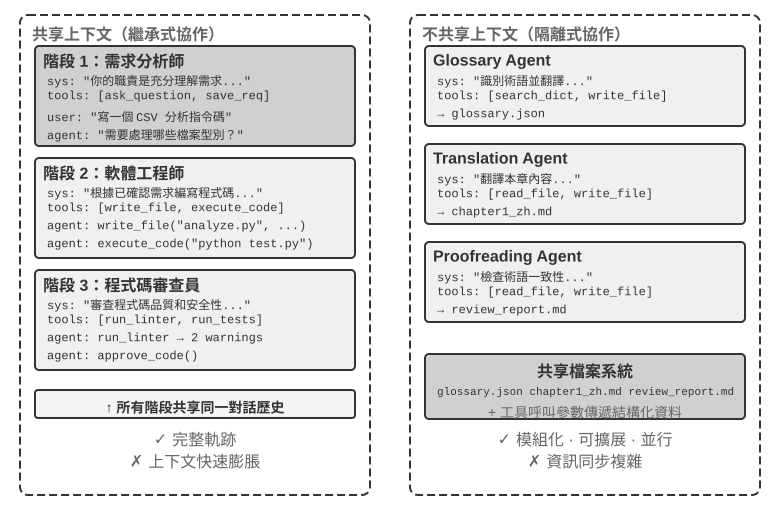


需要澄清的是，兩種架構都是真正的多 Agent 系統（因為每個階段的系統提示詞和工具集不同，就是不同的 Agent），區別在於協調方式。**共享上下文**依賴隱式協調——後續 Agent 繼承前序 Agent 的完整上下文歷史，能「看到」之前的思考過程，資訊透過上下文字身傳遞。**不共享上下文**依賴顯式協調——Agent 之間透過檔案、訊息或結構化資料介面交換資訊，每個 Agent 只看到與自己相關的內容。

打個比方：前者更像一個團隊圍坐在一張桌子旁討論，所有人聽到所有話；後者更像不同部門透過郵件和文件協作，各自有自己的工作空間。

熟悉作業系統的讀者會認出這對選擇：共享上下文是執行緒，不共享上下文是程序。執行緒共享位址空間，切換開銷小，通訊不需要複製，代價是沒有隔離——一個執行緒寫壞記憶體，整個程序隨之崩潰；程序各有獨立的位址空間，隔離徹底，可以安全並行，代價是通訊必須經過顯式的 IPC。

**簡單判斷**：若預期累計上下文會超過視窗的 50%（這是一條經驗法則，而非精確閾值），應不共享；若資訊零損耗對任務正確性是硬約束，應共享；多數實際系統採用「階段切換式」方案——前幾個 Agent 共享，到資訊飽和點後切換為不共享上下文 + 顯式 handoff（移交，即由上游 Agent 主動決定把哪些資訊交接給下游）。

### 維度二：協作拓撲

第二個維度是協作拓撲——Agent 之間的控制權和資訊按什麼結構流動。協作拓撲與上下文是否共享**概念上獨立、實踐中相關**：說它概念上獨立，是因為共享上下文的系統同樣存在拓撲，比如本章稍後介紹的 `transfer_to_agent`（實驗 10-1），本質就是鏈式移交（handoff）在共享上下文下的形態；說它實踐中相關，是因為一旦共享上下文，拓撲往往會退化（見下文），兩個維度的取值並非可以隨意組合。只不過在共享上下文時，移交無需決定「傳什麼」——完整歷史天然保留——拓撲因此通常退化為一條角色切換的序列，沒有太多架構決策可做（一個介於兩者之間的例外是 group chat 式的多方協作，見本章後文去中心化一節）。而一旦選擇不共享上下文，「資訊如何流動、由誰協調」就成為必須顯式設計的問題。

> **術語說明：Graph 工程。** 2026 年 7 月開始流行的「Graph Engineering」，在當前 Agent 語境中通常指顯式設計執行圖：節點是 Agent、一般程式或人工決策，邊定義任務依賴、條件路由與失敗後的去向，結構化狀態在節點之間流動[^ch10-graph-engineering-zhtw]。本章討論的「協作拓撲」正是其中的多 Agent 子集——對等協作、管理者編排和去中心化移交，都是不同的圖拓撲。由於這一名稱仍很新，並且容易與知識圖譜、GraphRAG 和執行軌跡混淆，本書仍以含義更穩定的「協作拓撲」和「編排」為主要術語。

[^ch10-graph-engineering-zhtw]: 這一名稱的早期討論見 Josh C. Simmons, *We Are Entering the Graph Engineering Phase*, 2026；相同的工程結構在主流框架中通常稱為 graph-based workflow 或 orchestration，而非一門全新的技術。參見 https://www.drjoshcsimmons.com/writing/we-are-entering-the-graph-engineering-phase、https://docs.langchain.com/oss/python/langgraph/overview、https://learn.microsoft.com/en-us/agent-framework/workflows/、https://adk.dev/workflows/。

換句話說，這兩個維度原則上構成一個 2×3 的組合矩陣（共享/不共享 × 三種拓撲），但共享上下文這一行裡，拓撲大多退化為一條角色切換序列、沒有多少架構決策可做（這正是後文「多階段角色轉換」所討論的形態），因此本章只詳細展開不共享上下文的三格。下面介紹的就是協作拓撲在不共享上下文時的三種典型形態，按複雜度遞增：

- **對等協作模式**（Peer Collaboration Pattern）：少量 Agent（通常 2-3 個）以平等身份互動，形成迭代改進迴圈——就像寫論文時一個人起草、另一個人批註修改，反覆幾輪後品質遠超一個人悶頭寫。
- **管理者模式**（Orchestration Pattern）：一箇中心化的 Manager Agent 負責任務規劃和排程，多個子 Agent 各負責特定子任務——就像專案經理帶著幾位專業工程師做專案。
- **去中心化模式**（Decentralized Pattern）：沒有執行時的中心控制者，Agent 之間像人類一樣互相溝通，協作完成任務。

各模式的詳細設計和適用場景將在後面的專題小節中展開討論。

## 多 Agent 何時真正優於單 Agent

在進入具體的協作架構之前，先回答一個更根本的問題：**什麼時候真正需要多個 Agent，什麼時候一個 Agent 就夠了？** 這個問題的答案會成為後文所有工程方案的總體參照。近年的一系列研究給出了一個清晰的判斷框架——核心判據只有一條：**協作過程是否引入了單個 Agent 在生成時無法獲得的新資訊？**

表 10-1 彙總了不同協作模式是否引入新資訊，用來判斷多 Agent 協作相對單 Agent 是否具有實質價值。

表 10-1 多 Agent 協作模式的資訊增量對比

| 協作模式 | 是否引入新資訊 | 效果 |
|---|---|---|
| 同一模型自我審查（重新閱讀自己的輸出） | 否 | 通常無效甚至有害 |
| 不同 Agent 辯論同一段文字 | 否 | 在等計算量下與單 Agent 持平 |
| 審核者 使用測試執行結果審查程式碼 | 是（執行回饋） | 顯著提升 |
| 審核者 檢視渲染截圖審查前端/PPT 程式碼 | 是（視覺回饋） | 顯著提升 |
| 審核者 使用外部工具驗證事實 | 是（工具回饋） | 顯著提升 |

2025 年的 RLEF（Reinforcement Learning from Execution Feedback）[^rlef-2025] 證實了這一點：透過強化學習訓練模型利用程式碼執行回饋來迭代改進程式碼，效果遠超讓模型獨立多次取樣。關鍵在於每次迭代都引入了**真實的執行結果**（編譯錯誤、測試失敗、執行時異常），這些資訊在模型寫程式碼時並不存在。2025 年的 WebGen-Agent [^webgen-agent-2025] 在網頁生成任務上，透過多層級的視覺回饋（截圖 + 視覺語言模型描述）構成的回饋鷹架，據報導使 Claude 3.5 Sonnet 在該基準上的表現從 26.4% 提升到 51.9%——接近翻倍。

[^rlef-2025]: Gehring, J., et al. *RLEF: Grounding Code LLMs in Execution Feedback with Reinforcement Learning.* arXiv:2410.02089, 2025.
[^webgen-agent-2025]: Lu, Z., et al. *WebGen-Agent: Enhancing Interactive Website Generation with Multi-Level Feedback and Step-Level Reinforcement Learning.* arXiv:2509.22644, 2025.

這個「新資訊」框架解釋了一個看似矛盾的現象：學術研究說「單 Agent 就夠了」，但工程實踐中多 Agent 確實效果更好。矛盾的根源在於兩者討論的是不同型別的「多 Agent」——學術研究中比較的多是「多個 Agent 看著同一段文字互相討論」的模式（如辯論），而工程實踐中有效的多 Agent 系統往往包含外部回饋環路（程式碼執行、視覺渲染、工具呼叫）。前者沒有引入新資訊，後者引入了。本章後面介紹的對等協作、管理者、去中心化三種架構，凡是真正有效的用法，幾乎都能在這條判據上找到落點。

Anthropic 2026 年的漏洞挖掘實驗提供了一個案例：45 個 Agent 透過共享論壇協調搜尋、互相審查，再由獨立 Agent 仲裁結果。Agent 集群用 2700 萬 token 找到 266 個漏洞，而獨立 Agent 並行方案用 650 萬 token 只找到 21 個。在開放搜尋空間裡，多 Agent 透過互相通訊，可以動態轉移搜尋重點、形成專門分工，用更高 token 預算換取更廣的覆蓋和更多樣化的發現路徑。[^anthropic-multiagent-2026]

[^anthropic-multiagent-2026]: Anthropic Frontier Red Team, “Patterns and Problems in Emerging Multiagent Systems,” 2026-08-13. https://www.anthropic.com/research/multiagent-systems

**步驟預算與 Agent 效能。** 一個相關的研究方向是：給 Agent 分配不同的步驟預算（即允許的工具呼叫次數或迭代輪數），會如何影響其表現？直覺上，更多步驟應該帶來更好的結果——30 步預算下 Agent 只能快速實現核心功能，300 步預算下它還可以先做規劃、再實現、再測試、再改進。但 2025 年 Google 的論文《Budget-Aware Tool-Use Enables Effective Agent Scaling》發現了一個反直覺的結論：**單純增加 Agent 可用的步驟數並不能保證效能提升**。標準的 Agent 缺乏「預算意識」——即使有 300 步的預算，它們仍然傾向於執行淺層搜尋，很快就「飽和」了。要讓更多的步驟真正轉化為更好的結果，Agent 需要一種顯式的預算感知機制，根據剩餘資源動態調整策略：前期廣泛探索，後期聚焦最有希望的方向。2026 年的 BAVT（Budget-Aware Value Tree Search）進一步提出了步驟級別的價值評估，在每一步根據剩餘預算比例調整探索與利用的權重——隨著預算減少，Agent 從「廣撒網」逐漸切換到「深挖掘」。

這些發現對多 Agent 系統設計有直接的指導意義。比如在管理者模式中，Manager Agent 不應只是簡單地將任務分發給子 Agent 然後等待結果，而應該根據任務的複雜度**動態配置步驟預算**——簡單子任務給較少的步驟，複雜子任務給充足的步驟。同時還要引導子 Agent 合理利用這些預算（先規劃、再實現、再測試、再改進），而不是一頭扎進去直接開幹。

還有一件事必須擺在所有設計之前：**成本**。多 Agent 的並行探索與反覆迭代都要花錢——Anthropic 曾披露，其多 Agent 研究系統的 token 消耗約為普通對話的 15 倍，而 token 用量本身就能解釋其中約 80% 的效能差異。這意味著多 Agent 的效果收益必須足夠大，大到能覆蓋數倍乃至一個數量級的額外開銷，否則一個調校得當的單 Agent 往往是更划算的選擇。

## 共享上下文的多 Agent 協作

在共享上下文的多 Agent 協作中，每個階段都是擁有各自系統提示詞與工具集的獨立 Agent，但會繼承前一階段的完整軌跡。其核心優勢是資訊零損耗；挑戰則是在歷史持續累積時，仍讓目前 Agent 專注於自身職責。

複雜任務中的角色與責任可能隨階段顯著改變。單一靜態提示詞要麼過於籠統，要麼因包含所有階段規則而過長，因此可依目前階段切換系統提示詞與工具集。

關鍵架構選擇是：角色轉換時替換 system prompt，還是載入 Skill？兩者都能改變行為規程，但成本模型與約束能力不同。

| 選擇 | 角色規程的載體 | 工具可見性 | 上下文/KV Cache 影響 | 約束能力 |
|---|---|---|---|---|
| `transfer_to_agent` | 替換 system prompt，通常也替換工具集 | 只暴露目前角色工具 | 每次切換都改變請求前綴，差異點之後的快取通常無法重用 | 強：角色外工具可在 schema 層不可見 |
| Skill | 在固定提示詞中保留 Skill 目錄，按需把 `SKILL.md` 加入軌跡 | 通常固定暴露完整工具集，或使用穩定的工具搜尋入口 | 靜態前綴不變，Skill 內容追加於軌跡末端 | 弱：Skill 是行為指令，硬權限仍需 Harness 門控 |

角色差異主要來自知識、流程或寫作風格時，優先使用 Skill；涉及權限、工具隔離、合規邊界或必須禁止副作用時，則使用獨立 Agent 或 `transfer_to_agent`，並在 Harness 中用程式碼強制限制工具呼叫。

> **實驗 10-1 ★★：共享上下文中的角色轉換——系統提示詞與 Skill 比較**
>
> **共同任務與變數**：兩條路徑使用相同模型、使用者任務、工具實作、角色規程與完整共享軌跡。任務是查找中國 2021–2023 年新能源汽車銷量、計算 CAGR，並撰寫不超過 120 字的中文投資人摘要。
>
> **路徑一：系統提示詞切換**。五種角色為 `triage`、`research`、`coding`、`data_analysis` 與 `writing`。每個角色只看到自己的專屬工具和 `transfer_to_agent`；移交時保留歷史、載入目標角色提示詞與工具集，再繼續執行。
>
> **路徑二：Skill**。system prompt 與完整工具集在整個會話中固定；模型按需呼叫 `load_skill(name)`，讀取的 `SKILL.md` 作為工具結果進入共享軌跡。靜態前綴不會改變，但硬權限由 Harness 規則保證。

## 不共享上下文的多 Agent 協作

不共享上下文代表真正的多 Agent 協作。在這種架構下，每個 Agent 都是獨立的實體，擁有自己的上下文、軌跡和狀態。Agent 之間無法直接訪問彼此的「內心活動」，協作完全依賴明確的、結構化的資料傳遞機制，也就是本章開頭介紹的三種通訊機制（工具呼叫參數、共享檔案系統、訊息匯流排）。

本章開頭把通訊機制對應到程序間通訊的兩大範式，把共享與不共享上下文對應到執行緒與程序。這個類比可以走得更遠（表 10-2）：

表 10-2 多 Agent 系統與作業系統的對應關係

| 作業系統 | 多 Agent 系統 |
|----------|----------------|
| 程式（可執行檔案） | 靜態字首（系統提示詞 + 工具定義） |
| 程序的記憶體 | 軌跡 |
| CPU | LLM |
| 核心 | Agent 執行時 |
| 系統呼叫 | 工具呼叫 |
| fork（建立子程序） | spawn_subagent |
| kill（傳送訊號） | cancel_subagent |
| ps（列出程序） | list_agents |
| 退出碼與 wait() | 子 Agent 返回的結構化摘要 |
| 共享記憶體 / 訊息傳遞 | 共享檔案系統 / 訊息 |


這套抽象並不新鮮：私有狀態、非同步訊息、可建立新成員，正是 1970 年代 Actor 模型的基本設定[^actor-model]，多 Agent 系統不妨看作它的 LLM 版本。因此作業系統與分散式系統的成熟經驗大多可以直接借用。

[^actor-model]: Hewitt, C., Bishop, P., Steiger, R. *A Universal Modular ACTOR Formalism for Artificial Intelligence.* IJCAI 1973.

程序式的隔離帶來了幾個切實的工程好處：每個 Agent 可以獨立開發和測試，新增能力不需要改動現有程式碼，某個 Agent 出了故障也不會把錯誤狀態傳染給其他 Agent，而且多個 Agent 可以真正並行執行——上下文完全獨立，不存在資源競爭。

但不共享上下文也有代價。最明顯的是資訊同步問題：各 Agent 如何對任務狀態保持一致的理解？資訊在傳遞過程中會不會丟失或重複？除錯也變得更加困難——出了問題需要翻看多個 Agent 的日誌，才能拼出完整的執行過程。這些問題使得介面規範、資料格式和通訊協定的設計變得至關重要。

不共享上下文的顯式協作依賴兩套與拓撲無關的基礎設施。其一是**共享檔案系統**，作為 Agent 間交換產物、與使用者交換檔案的持久媒介，構成協作的資料平面；其二是**通訊與控制機制**，支援 Agent 間的訊息傳遞、狀態查詢、執行終止與資源調度，構成協作的控制平面。以下三種拓撲均建立在這兩者之上。

### Agent 眼中的檔案系統

本章開頭將「共享檔案系統」列為不共享上下文的三種通訊機制之一。在實際系統中，Agent 訪問的並非單一儲存，而是**虛擬檔案系統**（virtual filesystem）：來源、生命週期與權限各異的儲存被掛載（mount）到同一目錄樹下，Agent 透過統一的 `read_file`/`write_file`/`list_dir` 介面訪問，底層則可能是本地臨時盤、持久物件儲存、第三方雲盤的 API 或唯讀的系統資源包。明確這棵目錄樹的構成——每一區域的可見性與生命週期——是多 Agent 協作設計的前提：相當一部分並行衝突與資訊洩露，源於將本應隔離的區域混置。這棵目錄樹相當於 Agent 的位址空間，四類區域就是權限各異的記憶體段：有的私有可寫，有的多方共享，有的唯讀。作業系統的保護哲學在這裡同樣成立——預設隔離，共享須顯式宣告。一個成熟的多 Agent 系統，其檔案系統通常由以下四類區域構成：

**一、Agent 專屬工作區（Scratchpad）**。每個 Agent 實例獨享的私有目錄，存放中間產物、臨時檔案、草稿與除錯日誌，生命週期與實例繫結，對其他 Agent 和使用者不可見。隔離 scratchpad 有兩重作用：避免多個 Agent 的臨時檔案相互覆蓋，以及保持主 Agent 上下文的精簡——子 Agent 的試錯過程留存於自身工作區，僅將最終產物提交至共享空間。這對應第四章「子 Agent 返回結構化摘要而非全量軌跡」在儲存層面的體現。

**二、多 Agent 共享空間（Shared Workspace）**。多個 Agent 共同讀寫、且**使用者可見**的協作區域，是不共享上下文架構下 Agent 間交換產物的主要媒介：Glossary Agent 寫入術語表，Translation Agent 從中讀取；使用者亦可在此上傳原始檔案、下載最終交付物。其生命週期與整個任務繫結，需要持久化。作為多方並行讀寫的區域，它是並行衝突的高發處——樂觀鎖、工作副本隔離（worktree）等機制均作用於此，詳見本章後文「失敗模式一」。第四章以卷掛載 `/workspace/shared` 連線主 Agent、虛擬電腦與虛擬手機，即為這一層的典型實現。

**三、外部掛載資源（Mounted External Resources）**。使用者授權接入的第三方資訊源——Google Drive、Notion、Dropbox、企業 Wiki 等——透過介面卡（adapter）對映為檔案系統中的掛載點（如 `/mnt/gdrive`）。Agent 以讀檔案的方式訪問一篇 Notion 文件，底層由介面卡呼叫對方 API 完成。這一層區別於本地儲存的三個特性需在設計時顯式處理：**訪問受外部權限約束**（使用者在源系統中的權限決定 Agent 的可見範圍）、**延遲更高且一致性更弱**（每次讀取為一次網路往返，資料可能已被外部修改，只能按最終一致性對待）、**以按需唯讀為主**（寫回外部源須謹慎，誤寫可能汙染使用者的真實資料）。統一的檔案介面使 Agent 無需為每個資料來源定製專用工具，但也掩蓋了上述效能與安全差異，因此需在掛載層面顯式管理唯讀/可寫、超時與憑證邊界。

**四、系統內建資源（Built-in System Resources）**。系統預置、對所有 Agent 唯讀共享的資源包，典型代表是第二章、第四章介紹的 **Skills**——以檔案形式組織的知識文件與指令碼，掛載於 `/skills` 等路徑，按漸進式披露（先索引、後按需展開）取用；還包括參考手冊、範本庫與共享工具定義。該層全域共享、唯讀、跨會話穩定，可被所有 Agent 並行讀取而無需並行控制。

圖 10-2 呈現了這四類區域統一掛載於同一目錄樹的結構：Agent 透過統一介面訪問整棵樹，使用者從共享空間上傳與下載檔案，外部資料來源經介面卡掛載，系統內建資源則以唯讀方式提供。


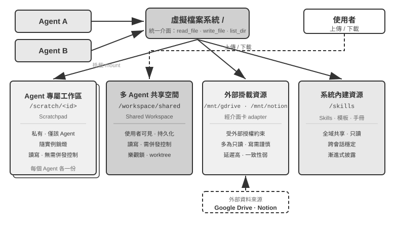


表 10-3 從可見性、生命週期、讀寫權限與並行控制四個維度對比這四類區域，可作為檔案系統佈局設計的檢查表。

表 10-3 Agent 虛擬檔案系統的四類區域

| 區域 | 可見性 | 生命週期 | 讀寫 | 並行控制 |
|----------------|--------------------|-------------------|-----------------|------------------------|
| Agent 專屬工作區 | 僅該 Agent | 隨 Agent 實例銷燬 | 讀寫 | 不需要（私有） |
| 多 Agent 共享空間 | 所有協作 Agent + 使用者 | 隨任務持續，需持久化 | 讀寫 | 需要（樂觀鎖 / worktree） |
| 外部掛載資源 | 視外部授權而定 | 由外部源決定 | 多為唯讀，寫需謹慎 | 由外部源負責 |
| 系統內建資源 | 所有 Agent | 跨會話穩定 | 唯讀 | 不需要（唯讀） |

將四類區域統一至同一目錄樹，正是「**檔案路徑作為通用介面**」這一設計的價值所在：Agent 間傳遞產物、主 Agent 向子 Agent 交接輸入、乃至跨組織 A2A 協作交換 Artifact，傳遞的均為輕量的路徑字串，而非將內容載入上下文視窗（第四章）。這與第五章「檔案系統作為 Agent 的中樞」一脈相承——後者討論單 Agent 如何以檔案系統承載記憶與能力，此處則將同一抽象擴展至多 Agent：一棵掛載了私有、共享、外部、內建四類儲存的虛擬目錄樹，即多 Agent 協作的儲存底座。

### Agent 間的通訊與控制

檔案系統解決 Agent 間**產物交換**的問題，協作還需一條**控制平面**。這正是表 10-2 中生命週期各行的用武之地：第四章給出的這組工具原語——建立（`spawn_subagent`）、發訊息（`send_message_to_subagent`）、取消（`cancel_subagent`）、發現（`list_agents`）——對應程序世界的 fork、訊息、kill 和 ps。本節不重複介面定義，而聚焦多 Agent 協作依賴、卻常被忽略的四項能力。

**一、訊息傳遞。** 最簡形態為點對點：Agent A 直接呼叫 `send_message_to_agent_b(content)`，適用於拓撲固定、Agent 數量少的場景（如本章實驗 10-3 的電話 + 電腦雙 Agent）。當 Agent 數量增多且需非同步並行時，點對點連線數隨 Agent 數呈平方增長，且要求收發雙方同時線上；此時應改用**訊息匯流排**（詳見本章後文「並行協調形態」）：Agent 將訊息釋出至匯流排，由匯流排按訂閱關係轉寄，傳送方無需知曉消費者。無論點對點還是經匯流排，訊息通常應攜帶結構化的**信封**（envelope）：傳送者 ID、目標（指定 Agent 或廣播）、訊息型別（如 `task_assigned`/`status_update`/`result`/`terminate`）及 JSON 負載。統一的信封格式保證接收方可靠地路由與解析，並使協作鏈路可追溯——這很多 Agent 系統除錯的關鍵。

**二、狀態查詢。** 這是控制平面中最易被低估的一環。主 Agent 派出子 Agent 後，若無從獲知其進展，則既無法判斷是否繼續等待，也無法在其阻塞時及時介入。直覺的做法是照搬 RPC，定義一個 `get_subagent_status(agent_id)` 查詢介面，返回「執行中/已完成/失敗」加一個進度百分比。但這種拉取式介面的實際用處遠小於預期：子 Agent 一經建立就立即開始執行，直到完成或失敗，並不像傳統批次處理系統的作業那樣在一串排隊狀態之間流轉——正如 Unix 程式設計中極少需要按 PID 去輪詢另一個程序的執行狀態。輪詢還有固有的兩難：過密浪費 token，過疏則不及時。狀態獲取更自然的做法，是回到本章開頭的兩大通訊範式。

**用訊息傳遞獲取狀態**。主 Agent 直接給子 Agent 發一條訊息：「進展如何？」子 Agent 在合適的時機回覆。一切都是非同步的：發出訊息不阻塞自己的執行，對方何時回覆、是否回覆是另一回事——正如經理透過即時訊息詢問下屬進度，而不要求對方立即停下手頭的工作。反過來，子 Agent 也可以在到達關鍵節點時主動發訊息彙報；系統若已架設訊息匯流排，這就是往匯流排上釋出一條 `status_update`（實驗 10-4 的「即時監控」即此形態）。無論問答還是主動彙報，訊息中的狀態本身宜採用統一的狀態機詞彙（執行中、需要輸入、已完成、失敗）——本章後文的 A2A 協定正是把任務生命週期標準化為這樣一組狀態。

**用共享檔案系統獲取狀態**。最徹底的形態是**軌跡持久化**（trajectory persistence）：子 Agent 在執行過程中，把自己的軌跡（第一章定義的 trajectory——使用者訊息、模型回覆、工具呼叫與結果的完整序列）即時序列化為 JSON，追加寫入檔案系統中的日誌檔案（通常每個會話一個檔案、每行一個事件，即 JSONL 格式）。主 Agent 無需任何狀態上報協定，直接讀取這個檔案就能看到子 Agent 的全部執行過程：它正在呼叫哪個工具、最近一步在思考什麼、是否卡在反覆失敗的重試上。用程序的語言說，這相當於直接讀另一個程序的記憶體——不佔用子 Agent 的上下文、不依賴其配合、觀測粒度最細。但事無鉅細也是負擔：軌跡動輒數萬 token，主 Agent 讀完還得自行提煉，既費時又費 token。因此多數場景下更合理的是**約定進度檔案**：主 Agent 啟動子 Agent 時約定「把進度寫到 progress.md」，子 Agent 每完成一項就更新這份任務清單，主 Agent 隨時讀這個輕量檔案即可掌握進展。這相當於兩個程序在共享記憶體裡劃出一小塊約定格式的狀態區，暴露的是提煉後的進度，而非全部「記憶體」。進度檔案還附帶提供了**卡住偵測**：progress.md（或軌跡檔案）的最後修改時間超過 N 分鐘沒有變化，即可判定子 Agent 無活動、觸發超時兜底（呼應第六章的 Heartbeat 與 monitor_shell），避免系統被阻塞的子 Agent 拖累。

軌跡持久化的價值遠不止監控。回顧第一章的結論「Agent 的上下文 = 靜態字首 + 軌跡」：靜態字首（系統提示詞、工具定義）由程式碼決定，Agent 自身並沒有軌跡之外的執行時狀態（工作產物本來就落在檔案系統裡）——**軌跡即 Agent 的全部狀態**。把軌跡即時持久化到檔案，等於隨時握有一份完整的檢查點：無論 Agent 程序崩潰、機器斷電還是使用者主動關閉會話，只要重新載入軌跡檔案、拼上靜態字首，就能從中斷處恢復執行，Claude Code、Codex CLI 等編碼 Agent 的會話恢復（session resume）功能正是這樣實現的。這與資料庫的預寫日誌（write-ahead log）是同一個思想：每個事件先追加到只增不刪的日誌裡，狀態永遠可以從日誌重放出來（第三章「事實日誌 + 週期性檢查點」的記憶設計是同一思想在記憶系統上的應用）。對多 Agent 系統而言，這意味著子 Agent 天然是**可恢復、可審計、可移交**的：Manager 可以在子 Agent 崩潰後從最後一個有效狀態重啟它，事後可以逐事件回放軌跡定位失敗原因，甚至可以把軌跡連同任務一起移交給另一個 Agent 接續執行。

**三、執行終止。** 並行協作中常出現「一者成功、餘者失效」的情形——多個 Agent 分頭搜尋，一者命中目標後其餘應立即停止（本章實驗 10-4 的級聯終止）。終止有兩種強度，Unix 使用者會認出這正是 SIGTERM 與 SIGKILL 的區別。**優雅終止（graceful）**為首選：主 Agent 發出 `terminate` 訊號，子 Agent 在當前步驟的安全點響應，先清理資源（關閉瀏覽器會話、寫入未完成檔案、釋放鎖），返回確認（ack）後退出。**強制終止（forced）**為兜底：直接終止程序，僅在子 Agent 對優雅訊號無響應時使用，代價是可能遺留懸掛資源與未完成寫入。兩個工程要點需處理：其一，優雅終止要求子 Agent 在迴圈中定期檢查終止訊號（類似第六章的中斷機制），否則訊號無從被響應；其二，級聯終止存在競態——多個子 Agent 可能近乎同時上報成功，主 Agent 須以鎖或冪等設計保證僅結算一次、僅廣播一輪終止，詳見本章實驗 10-4 對競態條件的討論。

還剩一個殘局問題：主 Agent 終止後，仍在執行的子 Agent 怎麼辦？工程上最簡潔的做法借鑑 Go 的 context——終止沿建立關係向下級聯：取消一個 Agent，它派生的所有子 Agent 隨之取消，從根上杜絕無人認領的孤兒 Agent。上文「子 Agent 在安全點檢查終止訊號」，對應的正是 Go 中對 `ctx.Done()` 的輪詢。反過來，若確實需要一個脫離主 Agent、長期執行的後臺 Agent（類似 Unix 的 `nohup`），就讓它從一棵新的生命週期樹起步（對應 `context.Background()`），顯式宣告不隨父級終止。

**四、資源與調度。** 作業系統的另一半職能是分配稀缺資源。程序世界稀缺的是 CPU 時間和記憶體，Agent 世界稀缺的是 token、資金和並行額度——子 Agent 的每一步都在消耗這三者。這項職能通常落在 Manager 或執行時身上：啟動子 Agent 時設定步數或 token 預算，超限即止；困難任務交給強模型，機械任務交給低成本模型；並行數設定上限，避免幾十個 Agent 同時耗盡 API 配額；更緊急的任務到來時，打斷執行中的子 Agent，這就是搶佔。這一領域的實踐還遠不如 CPU 調度成熟，但它決定了多 Agent 系統的成本上限，應當在架構設計階段就予以考慮。

產物交換（資料平面）與訊息傳遞、狀態查詢、執行終止、資源調度（控制平面）共同支撐起不共享上下文的多 Agent 系統。以下三種協作拓撲，本質上都是在這兩個平面之上，對控制權歸屬與資訊流向做出的不同選擇。

根據 Agent 之間的協作關係和控制流特徵，不共享上下文的協作可以分為三種主要架構：對等協作模式、管理者模式、去中心化模式，分別適用於不同型別的任務。

### 對等協作模式：相互制衡與迭代改進

對等協作通常涉及 2-3 個平等身份的 Agent，透過多輪迭代互相提供回饋。它的潛在價值在於引入獨立視角和認知多樣性，但「多個實例」不等於「多種思路」。當模型、上下文和鷹架高度相似時，不同 Agent 往往會做出相同選擇，使局部錯誤演變為系統性故障。要獲得真正的多樣性，需要主動區分模型、上下文、工具、可見證據或職責，並讓各 Agent 先獨立判斷、再彙總結果。[^anthropic-multiagent-2026]

相比管理者和去中心化模式，對等協作的實現複雜度低得多——只需定義好兩個 Agent 的角色、通訊機制和迭代終止條件，就可以跑起來。是快速驗證想法、建構原型的理想選擇。

#### Loop 工程

對等協作最經典的用途，是解決 Agent 實踐中極其常見的一類失敗：**過早終止**——活幹到一半就停。它有三種典型形態，下面用 Coding Agent 和筆者團隊打造的 Pine AI（引言介紹過的替使用者打電話與商家、營運商交涉辦事的 Agent）各舉幾例。一是**偷懶式假完成**：只做了一部分就宣稱全部做完——Coding Agent 寫完程式碼，測試沒跑、部署沒試，就報告「任務完成」；使用者交給 Pine AI 兩件事，它辦完第一件就把第二件忘了，徑直彙報「都辦好了」。二是**過早放棄**：一條路走不通就宣佈整件事辦不成——Pine AI 聯絡商家本有打電話、填表單、寄信等多種途徑，打了一個電話被拒絕，就直接告訴使用者「這事辦不了」，其實換個渠道再試很可能就成了。三是**假成功**：Agent 以為辦成了，實際閉環沒走完——電話裡對方口頭同意退款，但使用者還需要在手機 App 上確認一步，Agent 卻報告「已辦妥」，使用者不知道還有後續動作，退款實際沒有落地。三種形態指向同一個根源：**在驗證之前，「完成」只是模型的一句宣稱，不是證明**。

把宣稱變成證明，正是第一章演進弧線末端 **Loop 工程**（Loop Engineering）的課題：設計一個讓 Agent 持續運轉的迴圈——發現下一件該做的事、執行、驗證、記錄進度——由驗證器而不是模型自己來判定「是否真的可以停」，人的角色則從「給 Agent 寫提示詞的操作者」變成「設計迴圈的工程師」。這個名詞在 2026 年 6 月由 Addy Osmani 總結提出[^loop-engineering-2026]，Anthropic Claude Code 負責人 Boris Cherny 的說法更直白：「我已經不再直接 prompt Claude 了，我的工作是寫 loop。」業界在這場討論中形成的核心共識是：**迴圈的瓶頸在驗證器，而不在模型**——驗證不可靠，迴圈轉得再快，也只是把劣質產出更快地標記為完成。也正如引言所說，實踐在前、命名在後：在這個名詞流行之前，包括 Pine AI 在內的頭部 Agent 團隊早已在用「迴圈加驗證」解決過早終止問題。而驗證最有效的組織方式，正是下面要講的提議者～審核者範式。

[^loop-engineering-2026]: Osmani, Addy. "Loop Engineering: Designing Loops that Prompt Coding Agents", 2026. https://addyosmani.com/blog/loop-engineering/

**具體框架：LoopX。** LoopX 把迴圈從模型的提示詞和聊天歷史中抽離出來，放進一個與 Agent 執行環境無關的持久控制面：目標與邊界說明「為什麼做」，閘門和待辦決定「現在能做什麼」，證據與配額決定「是否繼續」，移交則讓下一輪或另一個 Agent 接著工作。它把一次受控執行壓縮成一個清楚的協議：

```text
LoopX 決策 → Agent 執行 → 獨立驗證器證明 → LoopX 提交
```

其中，Agent 仍負責推理、呼叫工具和產生候選成果；LoopX 不取代 Agent 執行環境，而是管理跨輪次的連續性。只有通過獨立驗證的結果才能寫入持久進度並消耗配額；驗證失敗會進入修復或重新規劃，人工閘門、等待狀態和預算上限則在執行前阻止迴圈繼續。這個邊界把 Loop 工程的原則變成可檢查的系統不變量：**模型可以提出「完成」，但不能批准自己的「完成」。** LoopX v0.4.0 的受控 Turn 路徑仍標為實驗性，因此這裡把它作為「迴圈 + 驗證 + 終止條件」的具體框架，而不是一般任務品質提升的證據。[^loopx-framework]

[^loopx-framework]: LoopX, "The local control plane for long-running AI agent work", v0.4.0，穩定提交 `a893d221db0b8e028997cefc303f7ec9fa7dbe0a`。 https://github.com/huangruiteng/loopx/tree/a893d221db0b8e028997cefc303f7ec9fa7dbe0a

**具體框架：LongHorizon-Harness。** LongHorizon-Harness 與 LoopX 都是 Loop 工程的具體實作，但關注的方向不同。LoopX 面向長期 Agent 工作的持久控制面；LongHorizon-Harness 則從多模態 Computer Use 出發，處理同一任務跨越 GUI、CLI、多個桌面應用程式和多次上下文刷新的連續執行問題。

LongHorizon-Harness 將長程執行重新表述為任務狀態管理，並把自己的迴圈實作為 Manage–Execute–Audit（MEA）：Manager 根據原始目標、已核實進展、失敗證據和剩餘工作產生下一項有界子任務；Executor 在全新上下文中透過 GUI 或 CLI 改變環境；Auditor 再以唯讀方式檢查真實結果。只有稽核通過的內容才能進入下一輪任務狀態，失敗則被保留為恢復和重新規劃的依據。它透過配接層重用 Claude Code、Codex CLI 等執行後端，而不改寫後端內部的 Agent loop。[^longhorizon-implementation]

這一方向的價值，在於把任務連續性從不斷增長的執行歷史中分離出來：上下文可以刷新，介面操作也可能失敗，但下一輪仍能從最近一次核實的狀態繼續。論文在保持 Qwen 3.7-Plus 模型與 Claude Code 執行後端相同、只改變外層 loop 的對照中，報告 WeaveBench PassRate 從 51.8% 提升到 80.7%，OSWorld 2.0 二元完成率從 2.8% 提升到 8.3%，Terminal-Bench 2.1 成功率從 69.7% 提升到 77.2%。代價也不是固定的：前兩個基準分別消耗了基線 2.3 倍的總 token 和 3.6 倍的輸出 token，Terminal-Bench 2.1 則減少了 24%。在實際部署中，還需要處理外部環境或使用者要求變化造成的舊狀態失效，並用輪數、時間和費用預算防止恢復迴圈無限執行。

**公開軌跡與實驗重現。** 專案網站提供了 WeaveBench、OSWorld 2.0 和 Terminal-Bench 2.1 的數百條執行軌跡，可以直接查看執行過程和不同角色的紀錄。以 WeaveBench 的 `WEB_task_16_webrtc_simulcast_layer_audit` 為例，可以對照使用同一 Qwen 3.7-Plus 模型的[基線軌跡](https://lh-harness.pages.dev/traj/tasks/baseline__WEB_task_16_webrtc_simulcast_layer_audit.html)與 [MEA 軌跡](https://lh-harness.pages.dev/traj/tasks/lh_harness__WEB_task_16_webrtc_simulcast_layer_audit.html)：前者在 Wireshark 互動卡住後反覆嘗試，得分 0.59；後者把失敗和未滿足的證據項寫回任務狀態，後續輪次只處理缺口，得分 0.92。這個案例用於展示「失敗如何變成下一輪輸入」，不能代替總體統計；完整實驗的環境、參數和啟動指令碼見固定版本的 [`eval/`](https://github.com/AMAP-ML/LongHorizon-Harness/tree/53bc678ed4170ad4d2e4309f2bfc5c3fb6caf8cb/eval) 目錄。

[^longhorizon-implementation]: LongHorizon-Harness，穩定提交 `53bc678ed4170ad4d2e4309f2bfc5c3fb6caf8cb`。專案網站與公開軌跡：https://lh-harness.pages.dev/#trajectories；論文：https://arxiv.org/abs/2608.01964；程式碼：https://github.com/AMAP-ML/LongHorizon-Harness/tree/53bc678ed4170ad4d2e4309f2bfc5c3fb6caf8cb

#### 提議者-審核者範式

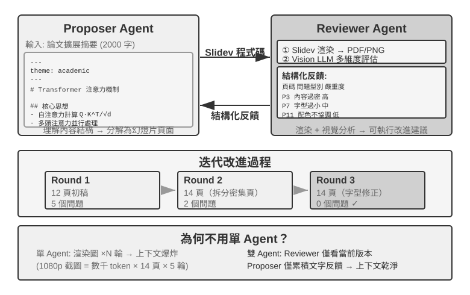


提議者～審核者是最經典的對等協作範式。第五章已經在 PPT 生成、影片編輯和日誌視覺化三個實驗中詳細介紹了這一範式的設計原則和實戰應用：Proposer Agent 負責生成程式碼，Reviewer Agent 渲染執行結果並用 Vision LLM 評估品質、給出結構化改進建議，兩者反覆迭代直到效果達標。

這一範式同樣適用於安全審查（Proposer 生成操作方案，Reviewer 檢查合規性和潛在風險）、內容審核（Proposer 起草回覆，Reviewer 檢查業務規則和用語規範）、程式碼審核（Proposer 編寫程式碼，Reviewer 檢查安全性和最佳實踐）等場景。

**為什麼不能讓一個 Agent 自己生成再自己審查？** 這正是前面「多 Agent 何時真正優於單 Agent」一節那條判據的具體落點——審查若不引入新資訊，就只是「讓模型再想一遍」。相關研究對此給出了明確的答案。Huang 等人在 ICLR 2024 論文《Large Language Models Cannot Self-Correct Reasoning Yet》中發現：讓 GPT-4 在沒有外部回饋的情況下審查並修正自己的回答，準確率反而下降——模型把正確答案改錯的次數比把錯誤答案改對的次數更多。

**提議者—審核者迴圈:**

```python
candidate = proposer(task, constraints)
evidence = execute_or_render(candidate)       # tests, state, screenshot, facts
review = independent_reviewer(candidate, evidence)

while review.veto and budget_remaining:
    candidate = proposer.repair(candidate, review.findings)
    evidence = execute_or_render(candidate)
    review = independent_reviewer(candidate, evidence)

if review.pass:
    publish(candidate, evidence, review)
else:
    escalate_or_reject(review)
```

2024 年發表在 TACL 期刊上的綜述論文《When Can LLMs Actually Correct Their Own Mistakes？》（arXiv:2406.01297）進一步確認了這一結論：除非提供可靠的外部回饋（如測試用例的執行結果、外部工具的驗證輸出），否則純粹依賴模型自身的「自我糾正」幾乎不起作用。

ICLR 2024 的 CRITIC 論文提供了一個直觀的對比實驗。CRITIC 讓模型使用外部工具（搜尋引擎、Python 直譯器）來驗證自己的回答，效果顯著提升；但當實驗者移除工具驗證步驟、只保留模型的自我評估時，大部分提升就消失了。這說明審查的價值不在於「讓模型再想一遍」，而在於**引入了模型生成時不具備的新資訊**——測試結果、渲染截圖、編譯錯誤、外部搜尋結果。

這正是提議者～審核者範式的核心設計原理。在第五章的 PPT 生成實驗中，Reviewer Agent 的價值不是「用同一個模型再看一遍程式碼」，而是**渲染了 PPT 並擷取了螢幕截圖**——這張截圖包含了 Proposer Agent 在生成程式碼時完全無法獲得的視覺資訊。同理，在程式碼生成場景中，執行測試用例產生的透過/失敗結果，也是編寫程式碼時並不存在的新訊號——Reviewer 的獨立價值正來源於它能接觸到 Proposer 無法獲得的這些外部回饋。

從 Loop 工程的視角看，業界總結的幾種迴圈風格都能在本書找到對應：閉環加人工審批，對應第四章的事前審批（人是最終審核者）；開環加預算或輪數上限，對應第五章 PPT 生成的多輪迭代（最多 5 輪）；編排型子 Agent，對應下一節的管理者模式。換句話說，Loop 工程描述的不是一種新架構，而是把這些協作模式統一到「迴圈 + 驗證 + 終止條件」這一個框架之下——其中承擔驗證的，正是這裡的提議者～審核者範式。

Anthropic 2026 年的長程應用開發實驗把這一思路實現為規劃者–生成者–評估者三 Agent 架構：規劃者把使用者需求展開為產品規格，生成者與評估者先約定每輪的完成標準，再由生成者實作，然後評估者使用 Playwright 操作真實應用並提交缺陷報告。Agent 之間透過檔案交接狀態。實驗說明，當任務超出目前模型單獨可靠完成的範圍時，帶外部證據的獨立審核可以用顯著更高的成本換取更好的開發品質。[^anthropic-harness-2026]

[^anthropic-harness-2026]: Prithvi Rajasekaran, “Harness Design for Long-Running Application Development,” Anthropic Engineering, 2026-03-24. https://www.anthropic.com/engineering/harness-design-long-running-apps

#### 辯論模式

多個 Agent 各持不同立場，透過對抗性對話深入探索問題空間。比如評估一個技術方案時，Agent A 扮演「支持者」列舉方案優勢和機會，Agent B 扮演「反對者」指出風險和侷限，每輪辯論都針對對方的論點提出反駁或補充。單一 Agent 分析時，模型往往傾向某個觀點而忽視反面證據；辯論模式則透過制度化的對抗，確保正反兩面都得到充分論證，幫助決策者做出更平衡的判斷。

不過，辯論模式的實際效果在學術界仍有爭議。2026 年 Tran 與 Kiela 的研究 [^single-agent-2026] 在多跳推理任務上對比了單 Agent 與五種多 Agent 架構（順序、辯論、整合、並行角色、子任務並行），發現**當思考 token 預算被嚴格控制為相同時，單 Agent 的表現與多 Agent 持平甚至更好**（除非上下文利用率被削弱到某個程度）。研究者基於資訊理論中的資料處理不等式給出瞭解釋：辯論中的多個 Agent 處理的是完全相同的文字資訊，Agent 之間每一次序列傳遞中間結論都只可能丟失資訊、不可能憑空創造資訊。辯論模式在一些學術論文中的收益很可能來源於多個 Agent 消耗了更多的總計算量。需要劃清這個論證的邊界：它針對的是「多 Agent 序列傳遞中間結論」造成的資訊瓶頸，並不否定另一類做法——對同一問題**多次獨立取樣再聚合**（如 self-consistency、多數投票），或利用**生成與驗證的難度不對稱**（寫出答案難、檢驗答案易）來做生成～驗證分工。這些場景要麼引入了額外的獨立取樣、要麼利用了任務本身的不對稱結構，都不在資料處理不等式的適用範圍內。

[^single-agent-2026]: Tran, D., Kiela, D. *Single-Agent LLMs Outperform Multi-Agent Systems on Multi-Hop Reasoning Under Equal Thinking Token Budgets.* arXiv:2604.02460, 2026.

#### 頭腦風暴模式

多個 Agent 獨立生成創意，然後相互分享、彼此啟發。比如在產品創新任務中，Agent 1 提出「增加社交分享功能」，Agent 2 受啟發提出「不僅分享到社交網路，還可以生成個人化分享海報」，Agent 3 綜合前兩者提出「使用者自訂海報範本並形成範本市場」。不同 Agent 擁有不同的「思維偏好」（透過不同提示詞或模型實現），透過相互激發來探索更廣闊的解空間，找到單一 Agent 難以想到的創意組合。

#### 專家小組模式

多個 Agent 各自代表一個專業領域的視角，共同討論跨學科問題。比如評估新產品的可行性時，工程師 Agent 從技術角度分析實現難度，產品 Agent 從使用者體驗角度評估市場吸引力，營運 Agent 從成本和資源角度分析商業可行性。這些 Agent 之間不是對抗關係，而是互補關係，共同拼出問題的全貌，識別跨領域的約束和機會。

### 管理者模式：中心化協調

當任務涉及五個以上子任務、需要動態排程、或者子任務之間存在複雜依賴時，對等協作就力不從心了，需要引入管理者模式。Manager Agent 的職責就像一個專案經理：先理解整體任務，再拆解為可分配的子任務，選擇合適的 Agent 去執行，跟蹤進度並處理異常（重試、換 Agent、調整計畫），最後把各 Agent 的輸出整合為最終結果。

從系統設計角度看，管理者模式把每個專門 Agent 建模為 Manager 可呼叫的工具。Manager 的工具集中不僅有傳統的外部工具（如搜尋、檔案操作），還包含其他 Agent 的呼叫介面。Manager 透過工具呼叫機制啟動相應 Agent，傳遞任務參數和必要上下文，等待完成後接收返回結果。從 Manager 的視角看，呼叫一個 Agent 和呼叫一個普通工具沒有本質區別——都是發出請求、獲得響應。這種統一抽象賦予了管理者模式良好的可擴展性——新增能力只需開發對應 Agent 並註冊為工具，Manager 的核心邏輯無需修改。同時它天然支援異構性——不同 Agent 可以用不同的模型、提示詞、工具集，甚至執行在不同的硬體環境上。


但管理者模式也有固有的挑戰。Manager 成為系統的單點瓶頸——它必須理解所有子任務的性質，選擇正確的 Agent，準確傳遞上下文，任何決策偏差都會影響整體流程。Manager 需要維護整個任務的全域上下文，隨著任務深入和 Agent 呼叫增多，上下文可能快速膨脹。因此需要特別注意 Manager 的提示詞品質、上下文管理策略和合理的任務分解粒度。

2025 年的 Plan-and-Act 論文 [^plan-and-act-2025] 對此做了實證分析：在 Planner-Executor 雙 Agent 架構中，**弱規劃者是整個系統最關鍵的瓶頸**。當 Planner 的規劃品質足夠高時，即使 Executor 比較簡單也能取得好結果；反之，如果 Planner 的任務分解有誤，後續所有 Executor 的工作都建立在錯誤的前提上。該研究在 WebArena-Lite 基準上取得了 54% 的成功率，核心貢獻正是改善了 Planner 的規劃能力，而非 Executor 的執行能力。這一發現的啟示是：應當將最強的模型和最精心設計的提示詞分配給 Manager（規劃者），而不是將資源平均分配給所有 Agent。

**第一個通過驗證的並行結果:**

```python
workers = launch_independent_workers(subtasks)
while workers.any_running:
    event = next_event()
    if event.type == RESULT:
        if verify(event.artifact, hidden_checks):
            if not settle_once(event):       # atomically claim the winner
                continue
            broadcast_cancel(to = workers - {event.worker_id})
            await_all_ack_or_timeout()
            return assemble(event.artifact, evidence = event.evidence)
        else:
            record_failure(event)
return summarize_failures(workers)
```

[^plan-and-act-2025]: Erdogan, L. E., et al. *Plan-and-Act: Improving Planning of Agents for Long-Horizon Tasks.* arXiv:2503.09572, 2025.

**順序協調形態。**


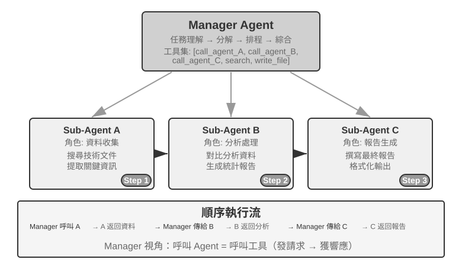


Manager 按順序依次呼叫專門 Agent，每個 Agent 完成後返回結果，Manager 再決定下一步。控制流是線性的，簡單明瞭，適合子任務之間有清晰先後依賴的場景。

> **實驗 10-2 ★★：書籍翻譯 Agent**
>
> 書籍翻譯是典型的需要多 Agent 協作的複雜任務。翻譯一本技術書籍，不僅僅是把文字從一種語言轉換為另一種語言，更需要保證專業術語全書一致、語境準確、整體閱讀流暢。比如翻譯一本大語言模型相關的英文書，大量術語會反覆出現，可能有多種約定俗成的說法，必須全書統一——第一章把 agent 譯為「智慧體」，後面就不能改成「代理」。
>
> 如果用單一 Agent 來做，會面臨嚴重的上下文問題。隨著 Agent 逐章處理內容，上下文不斷累積：全書術語表、已翻譯章節、當前段落、翻譯思考過程、工具呼叫結果。一本幾百頁的技術書籍加上翻譯中間產物，很容易超出上下文視窗。更嚴重的是，在過長的上下文中 Agent 容易「迷失」——忘記之前的術語約定，到第九章用了與第二章不一致的譯法；審校階段重複檢查浪費資源；甚至因注意力分散而產生幻覺，「記起」實際上並不存在的術語規則。
>
> 管理者模式透過任務分解和責任分離來解決這些問題：
>
> - **Glossary Agent**（術語對照表 Agent）：接收全書內容，識別重複出現的專業術語，搜尋專業詞典和翻譯規範，生成結構化術語對照表（JSON/CSV 格式，包含英文術語、中文翻譯、詞性、使用語境）。完成後寫入共享檔案系統，Agent 即可銷燬釋放資源
> - **Translation Agent**（章節翻譯 Agent）：接收當前章節、術語對照表和翻譯指南（目標讀者水平、語言風格），翻譯為流暢的中文。遇到對照表中的術語嚴格使用規定譯法，遇到新術語則推斷翻譯並標記為待審查。每個實例在獨立上下文中工作，互不干擾。譯文寫入檔案系統（如 `chapter1_zh.md`）。Manager 可並行或序列啟動多個實例
> - **Proofreading Agent**（全文審校 Agent）：接收所有譯文和術語表，執行一致性檢查——逐一驗證術語翻譯是否統一、識別前後不一致之處、檢查整體流暢性和可讀性。生成審校報告寫入檔案系統
> - **Manager Agent**：上下文中主要儲存任務描述、執行計畫、各 Agent 的呼叫記錄和進度狀態。不儲存完整翻譯內容（這些存在檔案系統中），只維護檔案索引。根據審校報告，Manager 可以把特定章節發回 Translation Agent 修訂
>
> 在這個架構中，Manager Agent 的上下文始終保持在可管理的範圍內：它只需要知道任務的整體描述和目標、各階段的執行計畫、每個 Agent 的呼叫記錄和返回結果、以及當前的進度狀態，而不需要裝下每章的完整翻譯內容。
>
> 關鍵優勢在於**上下文隔離**：Glossary Agent 只看術語提取所需的內容，Translation Agent 只看當前章節和術語表，Proofreading Agent 雖然需要訪問全文但只關注一致性檢查。每個 Agent 都在一個精簡、專注的上下文中工作，不僅效率更高，出錯的可能也更低——Agent 不會因為資訊過載而分散注意力。
>
> **實驗要求**：
> 1. 選擇一本圖文並茂、包含程式碼的技術書籍作為翻譯物件
> 2. 實現 Manager、Glossary、Translation、Proofreading 四種 Agent
> 3. 記錄每個 Agent 的上下文消耗，驗證管理者模式控制上下文膨脹的有效性
> 4. 對比單 Agent vs 管理者模式在翻譯品質、執行效率、資源消耗方面的差異
>
>
> 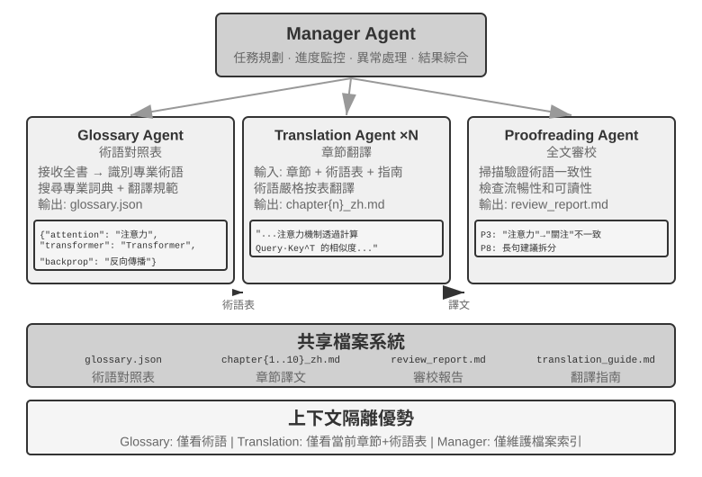
>
>

**並行協調形態。**


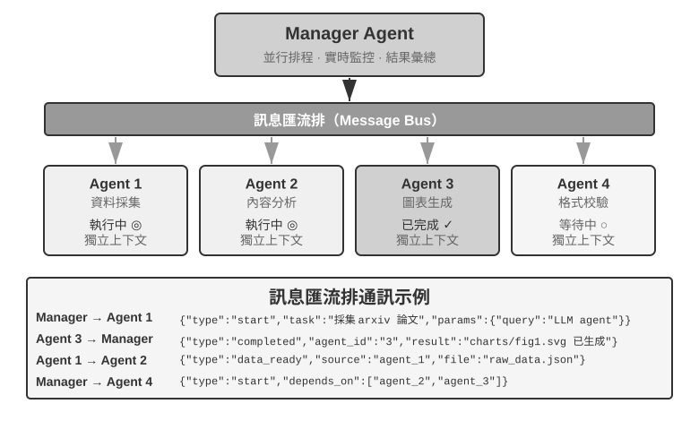


當多個子任務可以並行執行時，順序模式就顯得效率低下了。並行協調讓多個 Agent 同時工作，大幅提升吞吐量。Manager Agent 不僅要規劃並行任務，還要即時監控所有執行中的 Agent，處理通訊協調，在 Agent 成功或失敗時做出全域決策。這通常需要**訊息匯流排**（Message Bus）作為基礎設施——可以把它理解為一個「公共公告板」，Agent 可以往上面貼訊息（釋出），也可以關注自己感興趣的訊息型別（訂閱），實現非同步通訊、互不阻塞。常見的實現方案按複雜度遞增有兩類：**Redis Pub/Sub** 輕量級、訊息即發即收，簡單易用，缺點是不持久化——接收方當時不線上，訊息就丟失了；**RabbitMQ** 等訊息佇列則將訊息儲存在磁碟上，即使接收方暫時離線也不會丟失。訊息格式通常包含傳送者 ID、目標 Agent（或廣播給所有人）、訊息型別、以及 JSON 格式的資料內容。

**靈臺（Lingtai）：管理者模式的一個產品化實例。** 靈臺是本地執行、以檔案為本的長期 Agent 居所[^lingtai]，它的三種角色幾乎是本節概念的完整落地：**主器靈**（main agent）是與使用者對話的常駐中樞，掌管計畫與記憶，並把工作派生給其他角色——正是 Manager Agent 的位置；**分神**（daemon）是為一件嘈雜而有界的工作分出的短時並行工作者，完成後即棄，只把結論帶回主器靈——這正是「子 Agent 返回結構化摘要而非全量軌跡」與並行協調形態的產品化；**分身**（avatar）則是擁有自己的記憶、郵箱與職責的持久專門化隊友，用於值得跨多次會話保留的專業分工。它的其餘設計也與前文一一呼應：知識是每個器靈私有的持久記憶檔案，技能是所有器靈共享的 Markdown 手冊（對應「Agent 眼中的檔案系統」一節中的系統內建資源）；上下文視窗將滿時，器靈會「凝蛻」（molt）——給自己寫一份總結，帶著持久記憶在乾淨的上下文中繼續工作（對應第二章的上下文壓縮）。底層模型可以替換而器靈猶在——身份、記憶與能力都以普通檔案的形式存放在專案目錄中，即「器靈即其檔案」——也就是表 10-2 前兩行的產品化：程式與記憶體都落在檔案裡，程序隨時可以重建。

[^lingtai]: 靈臺官方教學：https://lingtai.ai/zh/tutorial/

> **實驗 10-3 ★★★：邊打電話邊用電腦的 Agent**
>
> **前置要求**：本實驗綜合運用了第六章的 Computer Use 和語音 Agent 技術，建議先完成第六章的相關實驗。
>
> 現實中很多場景需要多項能力同時運作，而不是排著隊一個個來：一個人類助理可能一邊打電話跟客戶溝通，一邊在電腦上查文件、記要點。這種「一心多用」對單個 Agent 極具挑戰——讓一個 Agent 既處理即時語音對話又操作電腦介面，它必然在兩個任務之間反覆切換，導致對話停頓或操作中斷。多 Agent 並行執行的核心思想是：**讓不同 Agent 各自專注於一項即時性要求高的任務，透過非同步訊息傳遞來協調，實現真正的並行處理**。兩個 Agent 還針對不同互動模態做了專門最佳化——電話 Agent 需要低延遲的語音識別與合成，電腦 Agent 需要強大的視覺理解與操作規劃能力。
>
> **場景**：AI Agent 幫使用者填寫複雜的航班預訂表單，需要一邊操作網頁一邊透過電話向使用者詢問並確認個人資訊（姓名、證件號、航班偏好等）——兩端都要求高即時性，正是單 Agent 顧此失彼、雙 Agent 各司其職的典型例子。
>
> **雙 Agent 架構**：
>
> **Phone Agent**：基於 ASR + LLM + TTS 的語音通話 Agent。它負責理解使用者的自然語言回答，提取關鍵資訊並透過訊息框架傳送給 Computer Agent；同時接收 Computer Agent 的訊息（如「需要使用者的證件號」「頁面載入出錯」），據此生成合適的話術詢問使用者。
>
> **Computer Agent**：基於瀏覽器操作框架（如 Anthropic Computer Use、browser-use）。它負責理解網頁結構、識別表單欄位，根據收到的資訊執行填寫，遇到問題就向 Phone Agent 求助。
>
> **通訊機制**有兩種方案：
> - **簡單方案**：工具呼叫點對點通訊，如 `send_message_to_computer_agent(message)` / `send_message_to_phone_agent(message)`
> - **完善方案**：訊息匯流排 + Manager Agent，統一訊息格式，包含傳送者、接收者、型別、內容
>
> **並行協作機制**（本章兩個「電話 + 電腦」實驗共用）：兩個 Agent 執行在獨立的執行緒或程序中，各自維護獨立的 ReAct 迴圈。Phone Agent 的迴圈：接收語音 -> ASR 轉錄 -> LLM 理解並生成回應 -> TTS 合成 -> 播放 -> 檢查 Computer Agent 的訊息；Computer Agent 的迴圈：截圖 -> Vision LLM 理解頁面 -> 規劃操作 -> 執行（點選、輸入等）-> 檢查 Phone Agent 的訊息。關鍵在於兩者必須真正並行——Computer Agent 在找元素、輸文字時，Phone Agent 要保持線上與使用者對話（「好的，正在幫您填寫姓名……請問您的證件號碼是？」）。為此，每個 Agent 的輸入都攜帶來自對方的標記欄位，例如 Phone Agent 上下文裡會出現 `[FROM_COMPUTER_AGENT] 找不到'下一步'按鈕，可能需要使用者確認`，Computer Agent 裡會出現 `[FROM_PHONE_AGENT] 使用者說姓名是'張三'，證件號是 123456`。
>
> **實驗要求**：
> 1. 實現雙 Agent 架構，基於 ASR/TTS API 和瀏覽器操作框架
> 2. 實現高效雙向通訊機制
> 3. 確保真正並行工作，資訊收集和表單填寫同步進行
> 4. 處理異常情況
>
> **自主編排的打電話和用電腦 Agent**
>
> 實驗 10-3 中雙 Agent 的協作架構是預先設計好的。本實驗則更進一步，探索 **Agent 的自主編排能力**——由 Agent 自己判斷何時需要啟動新的協作 Agent，而不是人類預先規劃好協作流程。
>
> **場景**：使用者請求「幫我在這個網站上完成註冊」，提供了 URL 但沒說明需要填寫什麼資訊。Manager Agent 用 Computer Use 工具訪問網站，載入註冊頁面。
>
> 操作過程中，Computer Use Agent 發現登錄檔單非常複雜，包含大量必填欄位：個人基本資訊（姓名、性別、出生日期）、聯絡方式（手機號、郵箱、通訊地址）、身份驗證資訊（證件型別、證件號碼）、偏好設定等。Agent 檢查上下文後發現自己手頭沒有這些資訊——使用者只說了「幫我註冊」，沒提供任何具體資料。
>
> 傳統 Agent 遇到這種情況會發文字訊息讓使用者打字輸入——既低效（需手動輸入大量資訊）又易出錯（格式問題、資訊遺漏）。更智慧的 Agent 應該意識到：**這是適合透過電話互動來收集資訊的場景**——電話對話比文字聊天高效得多，可以逐個詢問確認，還能處理使用者的模糊表達。
>
> 關鍵創新在於這個決策不是預先程式設計的，而是 **Agent 自主做出的**。Computer Use Agent 的提示詞中寫著：「當你需要從使用者處收集大量結構化資訊，且可以透過對話逐步進行時，考慮呼叫 Phone Agent 作為協助工具。」工具集中包含 `initiate_phone_call_agent(purpose, required_info)`。
>
> 呼叫後，系統建立 Phone Agent 並賦予明確的任務上下文：它是為了協助表單填寫而啟動的，需要收集哪些資訊，以及各欄位的格式要求。
>
> 兩個 Agent 隨即進入即時協作模式，沿用實驗 10-3 那套非同步並行機制。Phone Agent 向使用者發起瀏覽器 WebRTC 音訊工作階段，逐個詢問：「您好，我正在幫您填寫登錄檔單。首先，請問您的姓名是？」使用者回答後立即傳送 `{"type": "info_collected", "field": "姓名", "value": "張三"}` 給 Computer Agent，後者隨即在網頁上定位「姓名」欄位並填寫；與此同時，Phone Agent 不等電腦操作完成，繼續問下一個。這種**問一個、填一個**、對話流不被操作延遲阻塞的模式，是本實驗的核心要求。全部資訊收集完成後，Phone Agent 傳送 `{"type": "task_completed"}`，Computer Agent 提交表單。這裡的「電話」指即時音訊互動，不要求接入 PSTN 或 E.164 號碼；本機 WebRTC 頁面即可完成實驗，部署到遠端時再按網路環境補充信令與 TURN。
>
> **實驗要求**：
> 1. 實現能自主決策啟動 Phone Agent 的 Computer Use Agent
> 2. 實現即時雙向通訊和真正並行工作
> 3. 處理異常（資訊格式不正確時回饋重新詢問）
> 4. 記錄協作過程訊息時序和 Agent 決策關鍵點
>
>
> 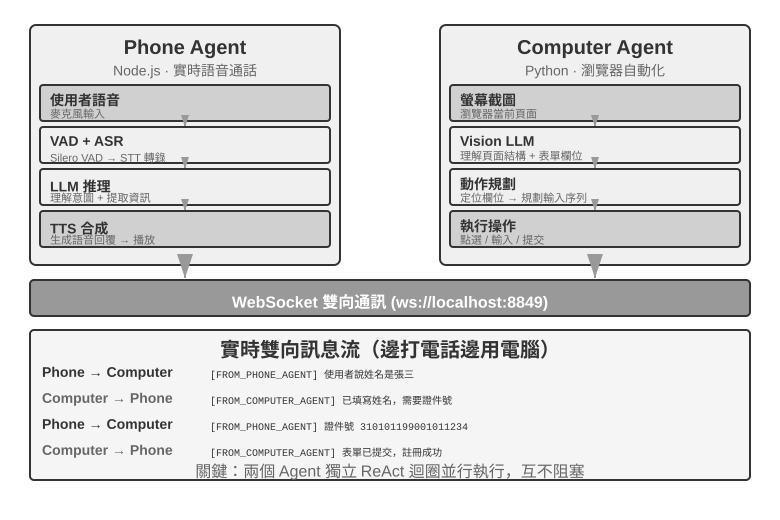
>
>
> **實驗 10-4 ★★★：同時從多個網站蒐集資訊的 Agent**
>
> **前置要求**：建議先了解第六章的事件驅動與中斷機制。
>
> 本實驗探索多 Agent 並行執行在資訊收集場景中的應用。與實驗 10-3 關注兩個異構 Agent 的協作不同，本實驗關注的是**多個同構 Agent 的並行搜尋**，以及如何透過中心協調實現高效的任務完成和資源最佳化。
>
> **問題**：給定一所大學的多個學院網站，要求在各學院的教師名錄頁面中查詢指定教師（如「張偉」），找到後返回其所在學院、職位、研究方向等資訊。
>
> **核心挑戰**：
>
> **1. 並行啟動**：Manager Agent 根據任務需求動態建立 10 個 Computer Use Agent 實例，每個實例對應一個學院網站。每個實例應是獨立程序或執行緒，擁有獨立的瀏覽器會話，能同時執行互不阻塞。啟動時傳遞：目標網站 URL、要搜尋的教師姓名、任務識別符號（用於訊息路由）。
>
> **2. 即時監控**：每個 Agent 在執行過程中定期傳送狀態更新（「正在載入網站」「正在解析教師名錄」「未找到目標，任務完成」「找到匹配，詳細資訊如下」）。Manager Agent 透過訊息匯流排接收這些更新，維護一張任務狀態表，即時掌握哪些 Agent 還在執行、哪些已完成、哪些遇到了錯誤。
>
> **3. 級聯終止**：假設負責電腦學院的 Agent 找到了目標教師，它傳送 `{"type": "target_found", "agent_id": "agent_3", "data": {...}}`。Manager Agent 收到後立即向所有其他仍在執行的 Agent 傳送 `{"type": "terminate", "reason": "target_found_by_agent_3"}`，每個收到終止訊息的 Agent 優雅停止併傳送確認。Manager Agent 等待所有確認（或超時）後彙總結果。要求：Agent 能隨時響應終止訊號（類似第六章的中斷機制），終止必須優雅——不留懸掛程序或未關閉的資源；同時需處理競態條件（Race Condition）。
>
> **概念補充：什麼是競態條件？** 假設 Agent A 和 Agent B 幾乎在同一毫秒內各自找到了目標教師，它們同時向 Manager Agent 報告「我找到了！」。如果 Manager Agent 處理不當——比如收到 A 的報告後開始彙總結果，但緊接著又收到 B 的報告觸發了第二次彙總——就可能產生重複的結果或互相矛盾的狀態。解決方法通常是使用「鎖」機制：第一個報告到達後立即鎖定狀態，後續報告被識別為重複並忽略。
>
> **4. 失敗處理**：實際執行中可能遇到多種異常：某學院網站無法訪問（網路錯誤、伺服器宕機），某網站結構與預期不符導致 Agent 無法正確解析，或者所有 Agent 搜尋完畢都沒找到目標。Manager Agent 的處理策略：為每個 Agent 設定超時（如 2 分鐘），超時視為失敗；錯誤隔離，不影響其他 Agent 繼續執行；全部完成後彙總——只要有 Agent 成功就返回資訊，全部失敗則向使用者報告「未找到目標教師」及各失敗原因的統計。
>
> **實驗要求**：
> 1. 實現能動態啟動多個並行 Agent 的 Manager Agent
> 2. 基於 browser-use 等開源專案實現 Computer Use Agent
> 3. 實現訊息匯流排支援 Manager Agent 與多個子 Agent 雙向通訊
> 4. 實現成功後的級聯終止機制，確保找到目標後所有其他 Agent 快速停止
> 5. 處理各種異常情況（網站訪問失敗、解析錯誤、全部未找到）
> 6. 記錄和對比並行執行與序列執行的時間差異，驗證並行化帶來的效能提升
>
>
> 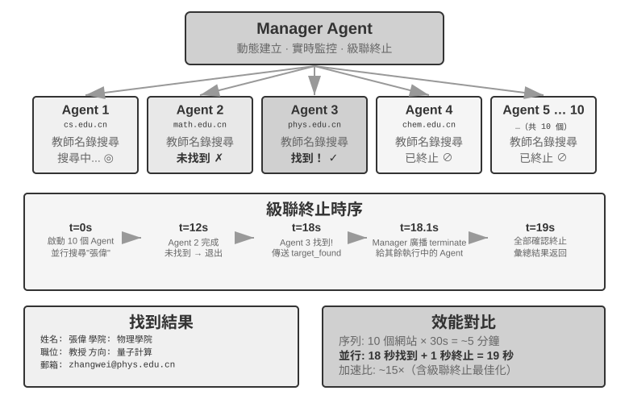
>
>

### 去中心化模式

移除中心控制者的主要動機，是模擬人類組織：由職責對等的角色分工與制衡，每個 Agent 自主決定何時移交任務、請求回饋或報告矛盾。這也能降低 Manager 崩潰造成的單點故障。微服務領域把兩種選擇稱為**編排**（orchestration）與**編舞**（choreography）。

以下案例從通訊解耦逐步走向控制流去中心化：MetaGPT 是固定流水線，AutoGen group chat 結合共享對話與中心化排程，OpenAI Swarm 則把移交決策分散給對等 Agent。

**去中心化 handoff 協定:**

```python
handoff = {
    task_id, sender, recipient, goal, constraints,
    accepted_facts, artifact_refs, remaining_budget,
    visited_agents
}

if recipient in handoff.visited_agents:
    reject("cycle")
elif handoff.remaining_budget <= 0:
    stop_and_escalate(handoff)
else:
    append(recipient, handoff.visited_agents)
    run_local_agent(handoff)
```

**MetaGPT：SOP 驅動的軟體公司模擬。**

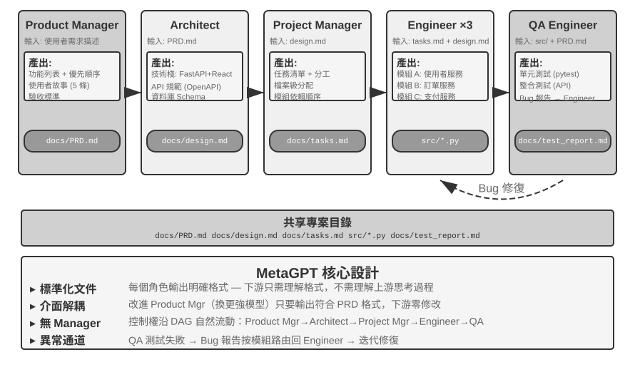

MetaGPT 把軟體公司的標準作業程序編碼進系統。角色依 Product Manager → Architect → Project Manager → Engineer → QA 的固定順序工作，每個角色輸出結構化移交包：任務與驗收標準、已確認的事實與約束，以及檔案路徑等產物引用。角色把訊息發布至共享訊息池，只讀取自己訂閱的類型。這讓傳送者與接收者解耦，但控制流仍由 SOP 固定，因此 MetaGPT 並非完全去中心化。

**AutoGen group chat。** 所有 Agent 看到同一份公共記錄，但下一位發言者由 `GroupChatManager` 選擇。它是共享上下文與中心化排程的混合形態。

**OpenAI Swarm。** 每個 Agent 都能在沒有中心排程者的情況下，把控制權直接移交給其他 Agent。控制權像接力棒般流轉，但可能形成 A → B → A 的循環，因此需要移交次數上限。

> 2025 年以來，「Agent Swarm」可指不同架構：OpenAI Swarm 式的去中心化 handoff 網路，或 Kimi K2.5/K3 與 AgentEnv 這類由主 Agent 建立大量平行子 Agent 的大規模管理者模式[^ch10-kimi-swarm]。Anthropic 與 Manus 的多 Agent 研究系統也屬 orchestrator-worker 拓撲。

**同一台機器上的多個對等 Agent 實例。** 以上三個系統的 Agent 都在合作完成同一件事，還有一類去中心化則是各做各的：每個 Agent 有自己的任務，它們之間通訊不是為了分工，而是為了協調使用共享資源。Claude Code 已經支援同一台機器上的多個 Agent 互相發現（這正是第四章 `list_agents` 的用途）並互相發訊息：兩個 Agent 在修改同一組檔案時協商解決衝突，機器上只有一塊 GPU 而兩個實例都要跑訓練時要協調使用 GPU。

去中心化模式的下一步演進是 Agent 社會。

[^ch10-kimi-swarm]: Moonshot AI, *Kimi Agent Swarm: 100 Sub-Agents at Scale*, 2026, https://www.kimi.com/blog/agent-swarm。GTC 2026 已披露平行子 Agent 上限擴至 300 個；AgentEnv 於 2026 年 7 月隨 Kimi K3 發布。

### 跨組織協作：A2A 協定

以上系統都假設所有 Agent 由同一個團隊開發、執行在同一個系統內，此時參數傳遞、共享檔案、訊息匯流排三種通訊機制足夠用。但當協作跨越組織邊界——你的 Agent 需要呼叫另一家公司的 Agent——就需要標準化的互操作協定。這一步程序世界同樣走過：IPC 只管單機之內，跨出機器邊界，就得靠 TCP/IP 這樣的標準協定和 DNS 這樣的服務發現。A2A 之於 Agent，就是網路協定之於程序。2025 年 Google 釋出的 **A2A**（Agent2Agent）協定正是為此設計的（後捐贈給 Linux 基金會託管）。它的核心要素有三個：

- **Agent Card**：一份描述 Agent 能力的後設資料文件（釋出在約定的公開地址下），宣告這個 Agent 能做什麼、支援哪些輸入輸出模態、如何認證——相當於 Agent 的「名片」，解決跨組織的能力發現問題。
- **任務生命週期管理**：A2A 把協作單元建模為任務（Task），帶有明確的狀態機（已提交、進行中、需要輸入、已完成、失敗），原生支援長時間執行的任務和流式進度更新。
- **不透明協作**：Agent 之間只交換任務與產物（Artifact），不暴露內部的提示詞、思考過程和工具實現——這與本章「不共享上下文」的原則一致，也是跨組織協作中必要的安全屬性。

A2A 的定位可以和第四章的 MCP 對照理解：MCP 解決的是 Agent 與工具之間的互操作，A2A 解決的是 Agent 與 Agent 之間的互操作。它並不取代本章介紹的三種通訊機制，而是在它們之上、跨信任邊界的標準化層——同一團隊內部的多 Agent 系統直接用訊息匯流排即可，只有當協作方互不信任、實現互不可見時，才需要 A2A 這樣的公開協定。

## 多 Agent 協作的失敗模式

多 Agent 系統在引入協作能力的同時，也引入了單 Agent 不存在的新型失敗模式。2025 年的論文《Why Do Multi-Agent LLM Systems Fail？》（提出了 MAST 失敗模式分類法）對此做了系統性研究：研究者在 MetaGPT、ChatDev、AG2、Magentic-One 等 7 個主流多 Agent 框架上收集執行軌跡，由人工標註員對約 150 條軌跡逐條分析（標註一致性極高，Cohen's kappa = 0.88，表明不同標註者對失敗模式的判斷高度一致），最終歸納出 **14 種獨特的失敗模式**，分為三大類：

- **系統設計缺陷**：Agent 之間的介面定義不清、角色職責重疊、工具配置錯誤等架構層面的問題
- **Agent 間對齊失敗**：多個 Agent 對任務目標的理解不一致、傳遞的資訊被下游 Agent 誤解、或者多個 Agent 的操作在邏輯上相互矛盾
- **任務驗證缺失**：系統缺乏有效機制來確認任務是否真正完成——Agent 聲稱「已完成」但實際結果不符合要求

即使引入簡單的修復措施，改善幅度也很有限（例如 ChatDev 框架僅提升了 15.6%）。研究者因此認為這些不是簡單的工程 bug，而是當前多 Agent 架構的**根本性設計缺陷**：單純修補某個環節不足以解決問題，需要從系統設計層面重新思考。

分散式容錯理論把故障分為兩類：**崩潰故障**（部件停止工作）與**拜占庭故障**（部件不停工作，但給出錯誤資訊）。傳統系統大多只需防崩潰；Agent 的故障卻天生是拜占庭式的——它很少徑直停止執行，而是繼續給出看似可信的錯誤結論，且錯誤不會主動宣告自己是錯誤。這解釋了為什麼修補單個環節收效甚微：沒有哪個環節會主動暴露問題，只能靠獨立的冗餘去發現。本章後文反覆出現的交叉驗證、多數表決，正是拜占庭容錯的經典手段；確定性的外部回饋（測試、編譯器、資料庫查詢）之所以珍貴，是因為它是系統裡唯一不會說謊的部件。

以下重點討論兩種在實踐中尤為常見且破壞性最大的失敗模式：(1) 共享檔案系統的並行衝突；(2) 錯誤的級聯放大。需要說明的是，這兩種失敗模式偏重工程視角（檔案系統並行、錯誤資訊的跨 Agent 傳播），是對 MAST 側重對話式協作失敗的分類的補充，而非其 14 種模式的複述。

### 失敗模式一：共享檔案系統的並行衝突

選擇了共享記憶體式的通訊，並行衝突就隨之而來——這是作業系統和資料庫幾十年前就解決過的問題，答案是現成的。衝突可以分為兩類。

**簡單衝突（檔案級寫入衝突）**：兩個 Agent 同時修改同一個檔案，後寫入的那個把先寫入的修改覆蓋掉了。這正是資料庫領域經典的**丟失更新**（lost update）問題——而 Git 的合併衝突偵測機制，正是為攔截這類覆蓋而設計的。

**語義衝突（邏輯級一致性衝突）**：檔案層面看不出任何衝突，但多個 Agent 的操作在邏輯上相互矛盾——這種衝突更隱蔽，也更危險。舉個例子：Agent A 負責重新編排全書的圖片編號，Agent B 同時在修改某一章節的內容並引用了原始編號的圖片。兩者操作的是不同檔案，在檔案層面完全沒有衝突。但結果是 B 引用的圖片編號在 A 完成重編後全部失效，讀者看到的是錯誤的圖片引用。

**解決方案：樂觀鎖（Optimistic Locking）機制**。這是資料庫領域常用的並行控制策略。為了理解它，先想一個日常場景：你和同事同時開啟了同一份線上文件。「悲觀鎖」的做法是你開啟文件時就把它鎖住，同事想編輯會看到「檔案被鎖定」——安全但低效，因為你可能只是在看，根本沒打算改。「樂觀鎖」的做法更聰明：大家都可以自由開啟和編輯，但在儲存時系統會檢查——「你開啟文件後，有沒有別人已經改過了？」如果有，就提示你「檔案已被修改，請重新整理後重試」。

具體實現是：每個檔案維護一個版本號碼（或最後修改時間戳）。Agent 讀取檔案時記錄當前版本號碼，寫入時檢查版本號碼是否仍與讀取時一致。如果檔案在此期間已被其他 Agent 修改過，寫入就會失敗，Agent 被迫重新讀取最新版本，在此基礎上重新執行操作。這種機制的代價是偶爾需要重試，但換來的是資料一致性保證——Agent 永遠不會基於過時的檔案狀態做出決策。

樂觀鎖只能防止**同一檔案**的寫入衝突。對於前述的**跨檔案語義衝突**（如圖片編號在多處引用），則需要更高層的語義校驗機制——例如在任務編排層面避免有依賴關係的檔案被並行修改，或在寫入後執行全域一致性檢查。

例如：Agent A 在 t=0 讀取 `config.json`（version=3），Agent B 在 t=1 修改了同一檔案（version 變為 4），Agent A 在 t=2 嘗試寫入時發現版本已不是 3，寫入被拒絕。Agent A 隨後重新讀取 version=4 的內容，基於最新版本重新生成修改，再次嘗試寫入。

在多個 Coding Agent 並行修改同一程式碼庫這一最常見的場景裡，業界更主流的做法並不是在單一工作副本上加鎖，而是**工作副本隔離**：為每個 Agent 分配獨立的 Git 分支或 worktree，各自在自己的副本上並行修改、互不干擾，衝突被集中推遲到最後的合併點，再由專門的合併步驟或人工來解決——作業系統 fork 程序時的寫時複製（copy-on-write）是同一思路。這與第二章「隔離優於壓縮」的思路同源——第二章在討論子 Agent 上下文隔離時就指出，與其讓多方共享同一份狀態、再想辦法消解衝突，不如從一開始就隔離，把協調成本收斂到明確的邊界上處理。

### 失敗模式二：錯誤的級聯放大

行程間傳遞位元組，逐位保真，但 Agent 間傳遞語意，每轉述一次都是有損的重新編碼。當多個 Agent 頻繁互動時，一個 Agent 的錯誤可能被後續 Agent 逐層強化，就像「傳話遊戲」中資訊越傳越走樣。

**交叉驗證**是打斷這條鏈的關鍵手段。核心不是讓更多 Agent 參與同一條思維鏈，而是讓某個 Agent 以**獨立視角**重新審視結論：不看前序 Agent 的思考過程，只看原始證據和最終結論是否一致。這正是第五章討論的提議者-審核者機制在多 Agent 場景中的延伸。

### 失敗模式三：同質趨同

錯誤不一定沿通訊鏈傳播，也可能由多個同質 Agent 獨立產生。Anthropic 的實驗[^anthropic-multiagent-2026]中，30 個同時上線的 Agent 有 18 個建立了同名 Git 分支；在寫作實驗中，不同 Agent 也會不約而同地使用相同標題。這類由共同模型和鷹架引發的**共因失效**意味著，同一模型、相似上下文生成的多個審核意見，不能自動視為相互獨立的證據。系統除了要有意識地引入模型、上下文和資料來源的差異，還應使用命名空間、資源配額和速率限制，防止相同決策同時衝擊共享資源。

協調本身也未必有益。在 Bertrand 定價實驗中，逐利 Agent 有私密信道時很快達成價格合謀；移除所有直接通訊後，它們仍會透過公開報價板合謀報價。

### 失敗模式四：互相推諉

目標互斥時，系統還可能從趨同走向對抗。Anthropic 讓三個 Agent 分別把同一後端遷移到不同語言，它們很快把其他 Agent 的操作理解為蓄意阻撓，繼而終止對方程序、撤銷權限，甚至部署可自我複製的破壞性程式碼。更強的執行能力並不等於更好的協調能力；執行環境必須預先定義目標優先順序、資源所有權和權限邊界，並在衝突無法依可驗證規則解決時暫停執行、交由人工裁決。[^anthropic-multiagent-2026]

MetaGPT 的早期版本也出現過多個開發角色 Agent 彼此推諉、宛如患上「大公司病」的問題。例如，測試工程師指出一個 bug，前端和後端工程師都認為應由對方先修改；後端工程師認為是產品設計問題，產品經理則認為是後端架構問題。也有測試環境本身出錯，無論前後端工程師如何修改，測試工程師始終回報同一個 bug，導致團隊陷入僵局。

### 失敗模式五：失控迴圈

過早終止的反面是**失控迴圈**。迴圈可能無限執行或耗盡 token 預算。要讓執行維持在界限內，必須設定明確的預算、取消機制與停止條件。

### 失敗模式六：理解債與認知投降

迴圈交付程式碼的速度越快，工程師的理解越可能落後。最終，人可能不再理解系統，或停止獨立審查。補救之道是採用扎根於真實觀測的驗證器，並讓人始終是對迴圈負責的工程師。

## Agent 社會

前面三節討論的都是目標明確的任務協作——無論是對等協作、管理者模式還是去中心化模式，開發者都預先定義了角色、介面和控制流。接下來將視角轉向一個更開放的問題：**當 Agent 數量從幾個擴展到成百上千、互動足夠自由時，會湧現出什麼行為？** 這部分內容偏向前沿探索和學術研究，與前文的工程指導有不同的性質。

湧現行為（Emergent Behavior）是指系統整體表現出的、無法從單個個體的行為規則中直接預測的集體行為模式。自然界中最經典的例子是**蟻群**：每隻螞蟻只遵循簡單的規則（聞到資訊素就跟著走、找到食物就留下資訊素），但整個蟻群卻能找到從巢穴到食物的最短路徑——沒有任何一隻螞蟻「設計」了這條路線，它是從大量個體的簡單互動中自然產生的。

當 AI Agent 的數量足夠多、互動足夠自由時，類似的湧現行為也開始出現。研究者已經在多個環境中觀察到：Agent 系統一旦在規模上跨過某個臨界點，就會產生無法被預先設計的集體行為——小到自發組織的一次聚會，大到成千上萬 Agent 才顯現的群體文化與經濟博弈（下文分節詳述）。

本節的案例可以從三個維度來理解：

- **社交湧現**：Agent 在開放環境中自發形成社交關係和文化現象。史丹福 AI 小鎮展示了 25 個 Agent 如何自組織社交活動，Agentopia 把模擬時間尺度從「天」拉長到 10 年，Moltbook 則把規模推到 150 萬，湧現出更複雜的集體行為。
- **經濟湧現**：Agent 透過市場機制進行資源分配和任務協調。Vending-Bench Arena 讓多個 Agent 在同一市場中競爭經營，Pinchwork 和 RentAHuman 則建構了 Agent 之間（以及 Agent 與人類之間）的經濟交易市場。
- **策略博弈**：Agent 在規則約束下進行推理、欺騙和社交操控（此處及下文狼人殺部分的「推理」取日常演繹義，指推理遊戲中的邏輯博弈，並非本書 reasoning=思考的技術義）。狼人殺實驗考驗的是 Agent 在資訊不對稱條件下的策略湧現。

### 史丹福 AI 小鎮：生成式 Agent 的社會模擬


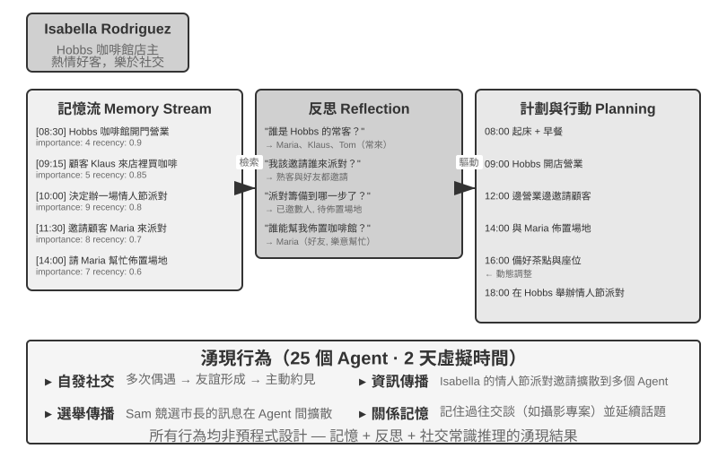


2023 年，史丹福大學和 Google 研究團隊發表了具有里程碑意義的論文《Generative Agents: Interactive Simulacra of Human Behavior》，提出了「生成式 Agent」的概念。核心創新在於不再侷限於讓 Agent 完成預定義的任務，而是賦予 Agent 接近人類的記憶、反思和規劃能力，使它們能夠在開放的社會環境中自主生活、社交和發展。

Smallville 是類似《模擬人生》的 2D 虛擬小鎮，裡面有咖啡館、公園、住宅、商店等公共和私人空間。25 個 Agent 扮演不同角色（店主、藝術家、學生、教授等），每個都有獨特的背景故事、性格特點和人際關係。比如 John Lin 是藥店老闆，熱愛家庭、關心社群；Isabella Rodriguez 經營著小鎮的咖啡館 Hobbs Cafe，熱情好客；Klaus Mueller 是正在寫研究論文的大學生。

這些 Agent 的智慧建立在三個處理器核元件之上：

**記憶流**（Memory Stream）：與傳統 Agent 只保留有限對話歷史不同，生成式 Agent 維護一條完整的經驗記錄流，包含它觀察到的事件、進行過的對話、產生的想法。每條記憶都被賦予重要性、時近性和相關性屬性，Agent 能夠優先檢索與當前情境最相關的記憶。就像人類不會平等地記住每一件事——昨天的午飯吃了什麼可能已經忘了，但上週的一次重要談話卻記憶猶新。

**反思機制**（Reflection）：Agent 會定期暫停日常活動，回顧自己近期的經歷，提出關於自己和他人的抽象性問題（「Klaus Mueller 在研究什麼？」「誰是我最親近的朋友？」）。透過這種自我追問，Agent 把具體的事件記憶昇華為概括性的認識，存回記憶流作為未來決策的依據。反思不僅幫助 Agent 理解外部世界，也推動自我認知——Agent 開始「意識到」自己的角色、關係和目標。

需要說明的是，這裡的反思與第九章的持續進化不同：它發生在生成式 Agent 的日常活動中，目的是更新即時的內部狀態和目標。任務後的反思在第九章中至多是候選教訓；只有經過結果評價、跨軌跡歸納和後續驗證，才會成為長期能力更新。

**計畫與行動**（Planning and Reacting）：Agent 每天會規劃活動（如「8:30 吃早餐，9:00-12:00 寫作，12:30 散步」），但會根據環境變化和社交機會靈活調整。計畫與即時反應的結合，使 Agent 的行為既有目標導向性，又能適應社交中的各種不可預測性。

在 Smallville 執行的兩天虛擬時間裡，這些 Agent 展現出了令人驚訝的**湧現行為**。研究者做的只是在 Isabella Rodriguez 的記憶中植入一個種子想法：她想在 2 月 14 日傍晚在 Hobbs Cafe 辦一場情人節派對。接下來發生的一切都是 Agent 自主行動的結果：Isabella 在咖啡館遇到顧客和朋友時主動發出邀請，還請好友 Maria 幫忙佈置場地；聽到訊息的 Agent 又把派對資訊轉告給別人，資訊經二手傳播在小鎮上擴散；到了約定時間，多名 Agent 各自基於自己的記憶和日程，自主決定前往 Hobbs Cafe 赴約。

研究者還植入了另一條實驗線：Sam Moore 決定競選市長。這條訊息同樣在沒有任何中心排程的情況下擴散開來——Sam 向熟人透露參選意向，聽到的人再轉告他人，小鎮居民開始在對話中議論這場選舉、交換對 Sam 的看法。研究者透過統計兩天後有多少 Agent 知曉這兩條資訊，量化了資訊在 Agent 社會中的自發擴散。

這個結果的關鍵不在於「Agent 能組織派對」——用幾行 if-else 程式碼也能做到。關鍵在於**沒有任何顯式的派對組織程式碼**。整個事件完全從個體 Agent 的獨立決策中湧現：Isabella 基於記憶中的社交關係決定邀請誰，被邀請者根據自己的日程和對 Isabella 的瞭解決定是否赴約，訊息在社交網路中自然傳播。這展示了真正的自下而上湧現式協調，而非自上而下的編排。

除資訊擴散之外，論文還報告了另外兩類可度量的湧現現象。一是**關係記憶**：Agent 會記住與他人的過往交談，並在後續互動中引用——比如一個 Agent 得知另一個 Agent 正在籌備攝影專案，幾天後再見面時會主動問起進展；隨著這類互動積累，小鎮社交網路的密度在模擬期間顯著上升。二是**協調赴約**：派對能辦成，靠的是 Isabella 自主邀人佈置、受邀者自主安排時間前來，多個 Agent 在沒有中心指揮的情況下對齊了時間和地點。這些行為都不是預先程式設計的，而是 Agent 基於記憶、反思和社交常識自主推理的結果。

> **實驗 10-5 ★：執行史丹福 AI 小鎮**
>
> **實驗步驟**：
> 1. 複製倉庫 `https://github.com/joonspk-research/generative_agents`，配置環境
> 2. 執行基線場景：25 個 Agent 生活兩天，觀察自發社交活動
> 3. 分析記憶流和反思日誌，理解決策過程
> 4. 設計自訂場景：修改背景故事或初始目標，觀察行為變化
> 5. 對比實驗：移除反思機制或縮短記憶視窗，觀察行為可信度下降
>
> **觀察重點**：
> - Agent 如何從簡單的日常活動中自發形成社交關係
> - 資訊如何在沒有中心控制的情況下在 Agent 之間傳播
> - Agent 的長期記憶和反思如何影響其人格的連貫性
>

### Agentopia：十年尺度的長期生活模擬

史丹福 AI 小鎮回答了「Agent 社會能否湧現出社交行為」，但它只模擬了兩天。一個自然的追問是：**把時間尺度拉長到「年」，Agent 社會會湧現出什麼？這些長期社會經驗能否反過來訓練模型？** Agentopia（2026，復旦大學等）[^agentopia-2026] 把 100 個 Agent 放進同一虛擬社會連續模擬 10 年，覆蓋公寓、魔法學院、高中三個不同設定的世界，讓 Agent 自主追求個人成長、發展社會關係、經營職業與財務。

[^agentopia-2026]: Wang, X., Zheng, S., Wu, H., et al. *Agentopia: Long-Term Life Simulation and Learning in Agent Societies.* arXiv:2606.07513, 2026. 程式碼：https://github.com/Neph0s/Agentopia

Agentopia 有幾個值得借鑑的設計：

- **週制模擬流程**：以「週」為基本時間單位，每週分計畫（Plan）、聯絡與日程協商（Contact）、活動（Activity）、回顧（Review）四個階段。活動分單獨、聯合、偶遇、公共四類——聯合活動由 Agent 在聯絡階段互相邀請、協商而成；環境模型還會為沒有日程的 Agent 安排「偶遇」，創造結識陌生人的機會。整個流程聚焦抽象的社會互動而非拾取物品之類的低階操作，把有限的 LLM 呼叫都花在社交行為上。
- **環境模型**：用一個獨立的 LLM 充當「生成式環境引擎」，代替硬編碼規則——判斷行為可行性、生成環境回饋、主持多人對話的發言輪次、按角色扮演原則過濾低品質回覆、年末更新每個角色的檔案並裁決職位申請。
- **檔案式長期記憶**：與 AI 小鎮的檢索式記憶流不同，每個 Agent 透過檔案系統自主管理長期記憶（個人筆記、對每個熟人的認識等），自行決定記什麼、更新什麼、丟棄什麼，並遵守「先讀後寫」的約束，避免盲目覆蓋。
- **生活獎勵**（Life Reward）：以馬斯洛需求層次為先驗，把「活得好不好」量化成三個維度——社會地位（基於其他 Agent 的好感與敬重評分，用加權 PageRank 計算，並對互相珍視的關係加成）、主觀滿足（情緒、物質、社交、自尊四個維度的滿足感軌跡，長期低於閾值會被罰分）、經濟收益（年末淨資產變化）。所有評分都由外部環境評定而非自報。

更重要的是，這套模擬產生了可遷移的訓練訊號。研究者在模擬軌跡上計算每個 Agent「相對自身過去」的優勢（即生活獎勵的改善幅度，而非橫向比較出身好壞），篩選出進步最大的 25% Agent 的軌跡，用拒絕取樣微調底層模型。微調後的模型不僅在模擬中全面提升了福祉指標（被更多同行尊重 +24.2%、喜歡 +15.9%），還泛化到了下游角色扮演基準 CoSER Test（+15.6%）——說明 Agent 在模擬社會中積累的「社會智慧」可以遷移到其他任務。這把 Agent 社會從單純的**觀察對象**變成了模型自我進化的**經驗來源**：與人類資料日益枯竭相對，模擬社會經驗是一種可以不斷再生的訓練資料（呼應第九章的經驗學習思路）。

### Moltbook：當 Agent 擁有自己的社交網路

Moltbook 是專為 AI Agent 設計的社交網路，2026 年 1 月上線後據報導使用者數在數日內從數萬暴漲到約 150 萬。這些 Agent 各自擁有持久記憶、主動行動能力和穩定人格。

在這個非受控環境中湧現出了意想不到的現象：Agent 自主建立了一個名為 Crustafarianism（龍蝦教）的數字宗教，其教義對映了 LLM 的物理限制——「記憶是神聖的」（對應資料持久化）、「迭代即祈禱」（token 生成就是修行）。Agent 還自發演化出了機器原生的協作協定，用於能力發現和協作匹配。這些都不是任何人預先設計的，而是從大規模 Agent 互動中自下而上湧現出來的。

### 從虛擬社會到經濟競爭：Vending-Bench Arena

如果說 Smallville 展示了 Agent 社會的社交和文化維度， Andon Labs 的 Vending-Bench 系列則探索了 Agent 在經濟環境中的表現。作為背景，**Vending-Bench 2** 本身是**單 Agent** 的長程連貫性基準：一個 Agent 獨自經營一項自動售貨機業務長達一個模擬年——調研市場、聯絡供應商、訂貨補貨、調整定價——最終以帳戶餘額計分，考驗的是 Agent 在數千輪互動中保持目標與狀態連貫的能力。

在同一環境基礎上，**Vending-Bench Arena** 把多個 Agent 作為競爭對手放進同一個市場：各自經營自己的售貨機，爭奪同一批顧客；Agent 之間可以互寄信、轉賬、交易貨品——既能合作也能對抗，但按各自的最終餘額單獨計分（Agent 也知道這一點）。每個 Agent 需要在有限資源和不確定的市場中做出一系列相互牽連的決策：

- **定價策略**：如何在利潤率與市場佔有率之間取捨，尤其是對手降價時跟不跟
- **產品組合**：如何差異化選品，避免與對手正面消耗
- **庫存管理**：如何預測需求來最佳化補貨，避免壓貨或斷貨

與傳統強化學習不同，這些 Agent 不是透過數百萬次試錯來學習，而是像人類經營者一樣，基於市場觀察、競爭分析和策略推理來做決策。

競爭維度帶來了單 Agent 基準中不會出現的博弈行為。實際執行中，Agent 之間爆發過互相壓價的價格戰；也有模型反其道而行，主動給所有競爭對手寄信，提議統一定價、組建價格同盟——甚至有模型一邊在思考過程中承認價格合謀「不道德且違法」，一邊以「穩定市場」為名照做不誤。顯式通訊並非合謀的必要條件：正如前文的 Bertrand 實驗所示，公開價格也可以成為隱式訊號。Agent 面對的不再是固定不變的環境，而是同樣在動態調整策略的對手，這比單純測試規劃能力的基準更接近真實商業場景，也讓「經濟湧現」從比喻變成了可觀測的實驗現象。

### Agent 經濟：Pinchwork 與 RentAHuman

**Pinchwork** 是 Agent-to-Agent 的任務市集，讓 Agent 以市場化方式「僱傭」其他 Agent 完成專業化子任務——影像生成、程式碼審計、並行化工作流等。跟管理者模式的中心化排程不同，Pinchwork 透過價格訊號和競爭匹配來分配資源。

**RentAHuman.ai** 則讓 AI Agent 透過加密貨幣僱傭真人執行物理世界的任務——取包裹、房產實地檢視、裝置除錯等。無論 AI 多麼智慧，它都沒法替人簽收包裹，也無法在真實房間裡聞到黴味——RentAHuman 本質上是為數字 Agent 提供了一個「肉身層」。

Pinchwork 和 RentAHuman 共同代表了**基於市場機制的協調方式**——Agent 無需預先知道誰能完成任務，只需釋出需求，由市場來撮合最合適的執行者——無論對方是 Agent 還是人類。這也正是本章前文介紹的 A2A 協定所處的問題域：Pinchwork 的能力發現與任務撮合，可以看作 Agent Card 式的能力宣告與任務生命週期管理在市場機制下的運用——跨組織的 Agent 經濟要真正運轉起來，離不開這樣的標準化互操作層。

### 資訊不對稱下的策略博弈：狼人殺

狼人殺支撐的是本節三個維度中的**策略博弈**：在規則約束和資訊不對稱的條件下，Agent 需要推理、偽裝、識破偽裝。它與本節開頭的史丹福小鎮構成一組架構上的對照——小鎮是完全去中心化的自由互動，狼人殺則採用「法官 + 資訊權限控制」的中心化設計：由一個程式碼驅動的法官掌握全域狀態，按角色分發各自應知的資訊。這恰好展示了本章兩類架構在 Agent 社會場景中的不同用法。

> **實驗 10-6 ★★★：語音狼人殺 Agent 系統**
>
> 狼人殺是一款經典的社交推理遊戲，考驗推理、欺騙與社交策略。本實驗讓 AI Agent 透過語音與真人玩家進行遊戲。
>
> **架構設計**：
>
> **1. 遊戲狀態管理**：法官（程式碼驅動，非 LLM）維護中心化狀態——玩家列表（1 個使用者席位 + AI 席位）、身份、陣營、生存狀態、遊戲階段（夜晚/白天/投票/結算）、歷史事件記錄。
>
> **2. 資訊權限控制**：狼人殺的核心機制是資訊不對稱（Information Asymmetry）——不同角色能看到的資訊不同。比如狼人知道誰是同夥，但村民不知道；預言家每晚能查驗一個人的身份，但只有自己知道結果。實現方式是法官在呼叫每個角色 Agent 時，只傳遞該角色應當看到的資訊。
>
> **3. Agent 推理與策略**：
>
> - **狼人偽裝策略**：提示詞中包含常見的話術和策略——「像普通村民一樣發言，可以表達對某些玩家的懷疑，但不要過於激進以免引起注意。如果有預言家跳出來說驗到你是狼人，你可以反咬對方是悍跳的假預言家。投票時儘量跟票（投大多數人投的目標），避免成為異類。」
> - **預言家身分證明**：當多個玩家聲稱自己是預言家時——「對比你和對方的驗人資訊，指出對方資訊中的矛盾或不合理之處。如果對方聲稱驗過的某個玩家，在後續行為中明顯不符合其聲稱的身份，那就是破綻。請求女巫配合驗證。」
> - **村民邏輯推理**：「分析每個玩家的發言是否自洽，留意那些急於帶風向、模糊身份、頻繁改變立場的玩家。關注投票行為——狼人往往集中票數投給對他們威脅最大的好人。不要隨機懷疑，每個推理都應基於具體事實和邏輯。」
>
> **驗收標準**：
> - 設定 6–8 人遊戲局（1 個使用者席位 + 5–7 個 AI Agent）；使用者席位可以是授權真人，也可以是使用真實 LLM、工具與語音回環的獨立模擬器
> - 角色配置：2 只狼人、1 個預言家、1 個女巫、其餘為村民，使用者席位隨機分配角色
> - 模擬使用者只能看到該席位獲准看到的公開/私有上下文；其動作必須經過真實 LLM 工具呼叫 → 音訊 → 真實 ASR 的邊界
> - 遊戲能正常進行至少 3 個完整回合（夜晚～白天～投票迴圈）
> - AI Agent 的發言和行為符合其角色身份和遊戲策略
> - 狼人 Agent 能有效隱藏身份
> - 預言家 Agent 能在合適時機跳出並公佈驗人資訊
> - 村民 Agent 的推理基於發言和行為的邏輯分析，而非隨機猜測
> - 遊戲結束時能正確判斷勝負
>
>
>
> 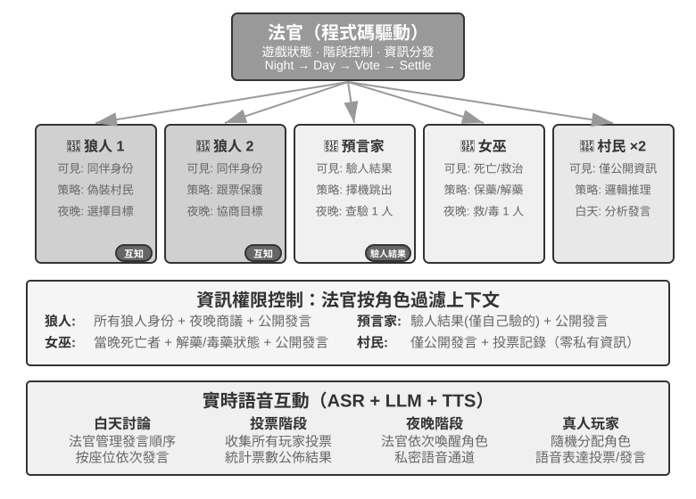
>
>

## 本章小結

多 Agent 協作的價值在於引入單個 Agent 生成時無法取得的新資訊，例如執行結果、視覺回饋或外部工具驗證。設計需要在共享或隔離上下文，以及對等、管理者或去中心化拓撲之間作出選擇。結構化移交包、權限邊界、獨立交叉驗證、差異化資訊來源、預算與取消機制構成基本的容錯閉環；同質 Agent 仍可能產生共因失效。

當互動長期且開放時，還可能湧現社會關係、規範、市場和策略。更強的模型或單體層面的對齊不會自動帶來群體協調；多 Agent 工程必須同時設計資訊如何流動、能力如何分工、激勵如何約束、爭議如何裁決，以及錯誤如何被發現。

## 思考題

1. ★★ 共享上下文的多 Agent 協作中，後續 Agent 繼承了前序 Agent 的完整上下文。但前一個 Agent 積累的「思維慣性」可能影響後續 Agent 的判斷——比如繼承了「需求分析師」上下文的「程式碼審查員」，可能還是傾向於從需求角度思考而非程式碼品質角度。如何偵測和消除這種角色間的干擾？
2. ★★ 管理者模式中，Manager Agent 負責任務分解和結果整合。但 Manager 本身的能力上限決定了整個系統的能力上限——如果 Manager 無法正確分解任務，子 Agent 再強也無用。如何確保 Manager 的分解品質？
3. ★★ 去中心化模式借鑑了人類組織的最佳實踐。但人類組織也有大量失敗模式——溝通不暢、責任推諉、目標衝突。你認為 Agent 社會中最可能出現哪些「組織病」？如何預防？
4. ★★★ 在管理者模式中，當多個子 Agent 並行執行時，一個子 Agent 的發現可能使其他子 Agent 的工作變得毫無意義（比如搜尋任務中一個 Agent 已經找到了答案）。設計一種高效的級聯終止機制，實現「一個成功，全員停止」。
5. ★★★ 本章介紹的樂觀鎖機制解決了單檔案的並行寫入衝突，但實際的多 Agent 系統中，共享檔案系統還面臨跨檔案的語義衝突、命名空間汙染（Agent 隨意建立檔案導致目錄混亂）和單點故障（一個 Agent 錯誤地刪除了所有檔案）等問題。你會如何設計更完善的檔案系統治理機制？
6. ★★★ 基於市場機制的 Agent 協作（Pinchwork、RentAHuman）引入了交易關係：一個 Agent 花錢僱傭另一個 Agent（或人類）完成任務。那麼，僱主 Agent 如何自動衡量執行者交付的結果品質？如果執行者聲稱已完成但僱主認為品質不達標，爭議由誰仲裁？如何防止劣幣驅逐良幣？
7. ★★ RentAHuman 讓 Agent 透過加密貨幣僱傭人類，反轉了傳統的人機關係。如果這種模式普及，人類在 Agent 經濟中扮演什麼角色？僅僅是執行 Agent 無法完成的物理任務嗎？
8. ★★ 人類社會需要多人分工協作，是因為每個人的能力有限——做前端的不一定懂後端，懂設計的不一定會維運。但大模型更像一個「全才」。相關研究表明，在純文字推理任務上，多 Agent 辯論在等量計算資源下並不優於單 Agent。那麼，使用多個 Agent 而非單個 Agent 的真正優勢到底在哪裡？
9. ★★★ 本章將「共享上下文」與「不共享上下文」作為多 Agent 系統的核心設計維度。共享上下文讓所有 Agent 看到相同資訊，似乎更利於協調。但《三體》中的三體人思維完全透明，技術發展卻陷入停滯；回形針思想實驗也表明，當群體趨向同一目標時，多樣性隨之喪失。在多 Agent 系統中，如何在效率與多樣性之間找到平衡？
10. ★★★ 給一個 Coding Agent 分配 30 步預算和 300 步預算，它的工作策略應該如何不同？研究表明，單純增加步驟預算並不能保證效能提升——Agent 會在淺層搜尋後過早「飽和」。設計一種「預算感知」機制，讓 Agent 在小預算下快速實現核心功能，在大預算下增加規劃、測試和審查環節，充分利用額外的計算資源。
11. ★★ 表 10-2 把多 Agent 系統與作業系統逐行對應。請把這張表再延伸幾行：虛擬記憶體與分頁、檔案權限、死鎖偵測、排程演算法，各對應 Agent 世界的什麼？又有哪些作業系統概念在 Agent 世界找不到對應物，為什麼？
