# 互動：觀察與動作空間的擴展

第一章提出過一個論斷：在底層模型固定時，提升 Agent 任務表現最主要的系統工程手段，往往是重新定義或擴展**觀察空間**與**動作空間**。第二至五章一直在兌現這句話——上下文工程決定觀察裡裝什麼，記憶與知識庫把觀察延伸到跨會話，工具定義 Agent 能做什麼，程式碼生成則讓它自己創造新的動作。

但這些擴展都發生在同一個前提之下：**Agent 與世界輪流發言**。使用者說完一句，Agent 想一段、呼叫幾個工具，再回一句；在它思考的這段時間裡，世界被預設為靜止的。這個前提如此自然，以至於很少被當成一個假設寫出來。

這一章要撤掉的正是這個前提。

## 兩根軸：模態與時機

把觀察空間和動作空間攤開，會發現它們各有兩個可以擴展的方向。

- **模態**決定觀察和動作的**形式**：Agent 是只讀文字，還是也能聽見聲音、看見螢幕、感知力矩；是只能輸出 token，還是也能發聲、點擊、驅動關節。
- **時機**決定觀察和動作的**節奏**：觀察是 Agent 主動去取，還是世界主動推來；動作是必須在一個回合內做完，還是可以跨越回合、中途被打斷、被更緊急的事搶佔。

前面幾章擴展的是這兩個空間的**內容**，這一章擴展的是它們的**模態**和**時機**：

| | 觀察空間的擴展 | 動作空間的擴展 |
|---|---|---|
| **內容**（第二至五章） | 上下文工程、記憶與知識庫 | 工具、程式碼生成 |
| **模態**（本章） | 語音、螢幕、物理感測器 | 說話、點擊、關節運動 |
| **時機**（本章） | 世界主動推送、連續流 | 跨回合、可打斷、可搶佔 |

這一章的核心命題可以壓縮成一句話：**回合制是訓練留下的假設，不是環境的性質。**

模型的訓練語料幾乎全是回合式的——問題後面接著答案，工具呼叫後面接著工具結果，一個說話者先說完，另一個才開始。於是模型學到的策略，預設世界會等它。但真實環境不會等模型反應：郵件在它思考時送達，使用者在它說到一半時插話，兩次截圖之間頁面已經改變，機械臂伸手去拿杯子時，杯子卻先被碰倒了。

| 尺度 | 場景 | 觀察側的變化 | 動作側的變化 |
|---|---|---|---|
| 秒 — 天 | 非同步與事件驅動 | 世界主動喚醒 Agent（郵件、計時器、回呼） | 動作跨回合：先發起，後續靠事件收尾 |
| 10 毫秒 — 1 秒 | 語音 | 邊說邊聽，不等一句說完 | 邊想邊說，可被打斷、可中途改口 |
| 亞秒 — 秒 | Computer Use | 螢幕在兩幀之間持續變化 | 動作後必須重新確認現實是否仍符合計畫 |
| 毫秒 | 機器人 | 感測器連續回流 | 動作分塊：一次規劃一小段，可被搶佔 |

四節共享同一套原語——**喚醒、安全點、取消、搶佔、快慢分離**——只是參數和失敗形態不同。非同步事件驅動裡的「在安全點檢查取消訊號」，和機器人動作分塊裡的「發現異常就丟棄剩餘動作、重新觀察」，是同一個機制在相差五個數量級的時間尺度上的兩次實作。看到這層同構，比記住任何單個場景的技術細節都重要。

**閱讀順序上有一個刻意的安排：本章給語音的篇幅明顯多於後兩個場景。** 在即時互動這條演進線上，語音是走得最完整、最值得當作參考系的一個：從「串列流水線延遲太高」這個問題出發，經過端到端、全雙工、邊想邊說一系列方案，一直走到今天相對成型的終局，問題→方案→終局的全程都已經跑通。因此我們把它講透，後面的 Computer Use 和機器人都可以對照語音這條脈絡來看——它們各自走到了這條演進線的哪一段、卡在了哪裡。

## 非同步與事件驅動：當世界主動找上門

第四章討論的感知、執行、協作三類工具都由 Agent 主動呼叫。Agent 如何回應隨時可能到達的外部事件？這需要事件驅動的非同步架構來支撐；第一章五類工具中剩下的兩類——事件觸發工具與使用者溝通工具——正是依託這一架構發揮作用的，因此也放在本節一併討論。

### 為什麼需要非同步

先用一個比喻說明為什麼需要非同步。同步（Synchronous）意味著「做完一件事才能做下一件」，非同步（Asynchronous）意味著「多件事可以同時進行」。傳統的同步 Agent 架構就像一個只會排隊的櫃檯——每次只能處理一個顧客，處理完才能叫下一個號；而真正智慧的助手更像一個靈活的秘書——桌上擺著多個待處理的事項（郵件、電話、來訪者），秘書根據緊急程度決定先處理哪個，處理一半如果有更緊急的事情也可以暫停切換。在同步模式下，Agent 要麼等待後臺任務完成才能與使用者對話，要麼等對話結束才能處理達的事件，無法應對真實助理場景所需的幾項核心能力：

- **非同步執行是常態**——許多工需要長時間執行，不應阻塞使用者互動。
- **事件優先順序的動態判斷**——不是所有事件都同等重要，Agent 需要智慧地選擇處理策略：取消當前操作（緊急）、加入佇列（常規）、還是並行處理（獨立的輕量級查詢）。
- **中斷和恢復的流暢性**——被打斷的對話或任務應該能夠自然恢復。

而非同步範式落地到當前 LLM 時遭遇的根本矛盾在於：LLM 的訓練範式假設同步——發出工具呼叫後，下一條訊息必須是工具結果；而真實部署卻要求非同步——使用者隨時可能打斷，多個任務可能並行推進，外部事件可能在工具尚未返回時就抵達。這一「訓練同步 / 部署非同步」的矛盾貫穿了本節後續討論的所有工程取捨。

為此我們需要**事件驅動的非同步 Agent 架構**。技術上，這意味著系統不再主動地反覆檢查「有沒有新訊息」（這叫輪詢，效率低），而是在新訊息到達時自動觸發處理邏輯。所有的輸入、輸出、思考過程和外部互動都被統一建模為事件流——一條時間線上依次排列的事件記錄。圖 6-1 給出了事件驅動非同步 Agent 的整體架構，展示事件源、事件佇列與 Agent 處理流程之間的關係。

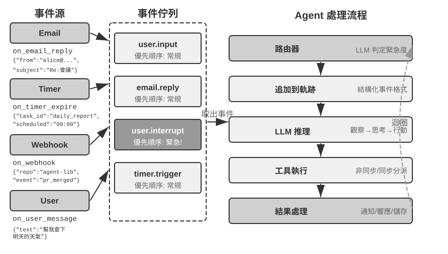

### OpenClaw 的事件驅動機制實現

開源框架 OpenClaw（第五章將詳細介紹其架構）透過 Gateway 控制平面接收多渠道訊息並路由到 Agent 執行時。它提供了三種內建的自動化機制：

- **Hooks（事件掛鉤）**：響應 Agent 生命週期中的事件，如會話建立、重置等，類似 GitHub Actions 中的事件觸發器
- **Cron（定時排程器）**：按 cron 表示式（Unix 系統廣泛使用的定時任務語法，如 `0 9 * * 5` 代表每週五上午 9 點）執行週期性任務，如每週五生成周報、每月初彙總資料
- **Heartbeat（心跳守護程序）**：每隔 N 分鐘喚醒一次 Agent，檢查是否有需要關注的事項，憑藉判斷力來避免警報疲勞

這三種機制賦予了 OpenClaw Agent「自主」的外觀——即使使用者不線上，Agent 也能定時生成報告、檢查系統狀態、處理例行事務。但仔細審視會發現一個根本的侷限。需要先釐清一點：Gateway 對內建渠道（如 IM、Web 介面）的訊息本身是**推送式**的，訊息一到就路由給 Agent；三種自動化機制裡，真正讓 Agent 在沒有使用者訊息時「自己動起來」的只有 Cron 和 Heartbeat，而它們都是**時間驅動**的——Heartbeat 每隔固定間隔檢查一次，Cron 按預設時間觸發，Hooks 則只是被動響應框架內部的生命週期事件，並不能引入外部世界的新變化。真正的短板在於：對於內建渠道之外的任意第三方事件源——一封新郵件到達、一個外部 API 回呼推送、一個緊急通知需要立即處理——OpenClaw 缺乏即時接入的通道，Agent 無法在事件發生的瞬間做出響應，只能等到下一個 Cron/Heartbeat 週期才可能察覺。

這種延遲在許多場景下是不可接受的。以 **PineClaw**（Pine AI 的 OpenClaw 外掛）為例：Pine AI 是代替使用者打真實電話的 AI 助手，典型場景包括協商帳單、取消訂閱和處理保險理賠。當使用者透過 OpenClaw Agent 發起一個 Pine 電話任務後，Pine 的語音 AI 會代表使用者撥打電話，但通話過程中可能隨時需要使用者介入：

- **即時身份驗證**：客服要求驗證帳戶持有人身份，Pine 需要使用者立即提供安全碼或 OTP（拋棄式密碼）驗證碼
- **三方通話確認**：客服要求與帳戶持有人直接對話，Pine 需要使用者在幾秒內接聽電話
- **進展同步與決策確認**：協商到關鍵節點（如對方提出降價方案），Pine 需要使用者確認是否接受

如果依靠 Heartbeat 的定時輪詢——假設心跳間隔為 5 分鐘——使用者可能在客服等待驗證碼時遲遲收不到通知，導致客服結束通話、通話失敗。而將輪詢間隔縮短到秒級又會造成大量的無效請求和資源浪費。

PineClaw 的解決方案是引入 **Channel 機制**——在 OpenClaw 的 Gateway 和 Pine API 之間建立即時的事件通道。當電話接通、需要使用者輸入、通話結束等關鍵事件發生時，訊息被即時推送到 OpenClaw Agent，Agent 立即處理並通知使用者，響應延遲從分鐘級降到了秒級。

這個案例揭示了事件驅動架構對 Agent 框架的核心價值：**真正的「主動服務」不僅需要 Agent 能定時檢查事件，更需要事件能主動通知 Agent**。將所有輸入——使用者訊息、工具返回、外部回呼、定時觸發——統一建模為事件流，透過事件迴圈驅動 Agent 的思考和行動，是實現這一目標的架構基礎。在這一架構之下，下面先介紹兩類與事件直接相關的工具，以及支撐 Agent 獨立行動的虛擬身份與隔離執行環境，再討論事件處理機制的具體設計。

### 事件觸發工具

事件觸發工具是外部事件驅動 Agent 行動的入口。如果沒有事件觸發工具，Agent 只能連續迴圈思考、呼叫工具，最後輸出一個結果，然後等待使用者的下一步輸入。要讓世界的變化轉化為 Agent 可以處理的事件，常見的事件觸發工具有三類。

**定時器**（set_timer）處理依賴物理時間的事件。例如，傳送了一封郵件但對方沒有回覆，那麼過一段時間應該再發一封郵件詢問進展；打了一個電話但對方不在工作時間內，那麼需要到下一個工作時間再嘗試撥打。為此，OpenClaw、Claude Code 等工具都支援定時器工具，在指定的物理時間喚醒自己。**拋棄式定時器**用於有明確時間點的任務：例如使用者要求「給 DMV 打電話」，當前是週六，Agent 就設定「下週一上午 10:00 致電 DMV」，定時器觸發後自動撥打。**迴圈定時器**用於週期性的任務：比如每小時檢查一次伺服器健康狀況，每週五傳送進展報告。一些外部服務不支援主動推送進展，只能主動查詢進展，此時就需要用迴圈定時器定時反覆查詢——上一節 OpenClaw 的 Heartbeat 正是這種機制的系統化，也是 OpenClaw 具備「主動服務」能力的根源。

**後臺任務監控**（monitor_shell）處理來自非同步執行的工具或命令列任務的事件。一些命令列任務需要長時間在後臺執行，Agent 需要監控執行進展。如果讓 Agent 不斷“盯著命令列看”，也就是不斷呼叫工具查詢當前進展，會浪費太多的 token；如果讓命令列任務完全執行完成後再讓 Agent 開始思考行動， Agent 將無法及時發現執行過程中的嚴重問題，甚至在命令列卡死的情況下無法介入，導致整個任務卡死。Claude Code 解決這個問題的方法是引入 monitor（監控）工具，允許 Agent 監控命令列的新增輸出或者包含特定關鍵詞的輸出。

**外部事件通道**（connect_channel）把新郵件到達、API 回呼、IM 訊息等外部事件即時推送給 Agent，上一節 PineClaw 的 Channel 機制就是典型實現。

在設計層面，事件觸發工具應定義清晰的觸發條件和過濾規則，避免無關事件喚醒 Agent 浪費算力；事件載荷（payload）應包含足夠的上下文資訊，減少 Agent 被喚醒後還需要額外查詢的次數。

### 使用者溝通工具

在 OpenClaw 中，session 對使用者是透明的；使用者與 Agent 可以隨時透過專用工具交換包含圖片、檔案、推播通知、多模態內容與 Generative UI 的訊息。

使用者溝通工具是在 Agent 與使用者的溝通渠道日益多元化的情況下產生的。許多 Agent（如 Claude Code、Manus、Genspark）採用原生 ReAct 迴圈，Agent 「說」的所有話（即 assistant 訊息）都直接傳送給使用者，使用者必須在 App 中開啟指定的 session 才能與 Agent 對話。OpenClaw 是打破這一人機溝通範式的通用 Agent 中最有影響力的代表之一：它的 session 對使用者是透明的——使用者無需感知 session 的存在，也無需關心 Agent 呼叫工具的細節；使用者和 Agent 都可以隨時給對方傳送訊息，而不是使用者發一條、Agent 回一條。從而很多人評價 OpenClaw 具備「活人感」，就像一個秘書一樣透過文字訊息與使用者非同步溝通。此時，這些文字訊息並不是直接把模型輸出的 assistant 訊息輸出給使用者，而是使用專門的工具傳送訊息，這些訊息還可以附帶圖片和檔案附件，可以根據緊急程度附帶推送通知提醒。

除了透過文字方式與使用者溝通，越來越多的 Agent 具備多模態溝通能力，例如傳送結構化卡片訊息、傳送提醒郵件。一些 Agent 已經開始嘗試生成式 UI，即使用 HTML 等方式生成互動式的介面，以更友好的方式展示資訊給使用者。在設計層面，使用者溝通工具應支援非同步訊息模式（使用者不一定線上），提供已讀/未讀狀態追蹤，並在多渠道場景下保持訊息的一致性。

**多渠道的使用者溝通與召回。**

這裡需要釐清一個容易混淆的類別邊界：同樣是「發通知」，通知物件若是審批者或協作者（如請求管理員批准、向協作 Agent 彙報進展），該工具歸入協作工具；通知物件若是終端使用者本人，才歸入使用者溝通工具。二者的區別不在渠道，而在「通知誰、為什麼通知」。

**Agent 的響應不應侷限於單一渠道，通知機制同時也是使用者召回機制**。訊息傳送擴展到即時通訊、簡訊、郵件、電話、推送等多種渠道。Agent 根據緊急程度、使用者狀態、內容性質、使用者偏好綜合決定渠道的選擇，既保證不錯過重要的訊息，又避免重複打擾。

對於長時間執行的任務，Agent 需要在完成時主動通知使用者，召回使用者的注意力。對於定期性的任務（如每日總結、週報），通知可以幫助使用者建立固定的互動習慣。

使用者溝通工具解決了「如何觸達使用者」。但 Agent 以什麼身份出現在這些渠道上、在什麼環境中代表使用者執行操作，還需要一層身份與環境的基礎設施，這就是下一節的主題。

### 虛擬身份與隔離執行環境

虛擬電腦可以 7×24 小時執行，限制 Agent 任意存取本機檔案，即使出錯也最多影響虛擬環境。資料透過共享檔案系統中的路徑傳遞。

需要先說明本節的定位：虛擬身份與隔離執行環境本質上是一種執行環境的基礎設施，與前文執行工具一節討論的沙盒一脈相承；之所以放到非同步架構這一節展開，是因為只有能獨立、常駐執行、隨時代表使用者行動的 Agent，才最迫切地需要它。

本章開頭提到，《Her》中的 Samantha 擁有獨立的身份和操作環境。要實現這樣的通用助理，首先面臨一個關鍵的架構選擇：Agent 應該直接管理使用者的個人帳號，還是擁有自己的虛擬身份？直接管理看似便捷，但一旦 Agent 出現錯誤或被攻破，使用者的全部數字身份將會暴露。更穩妥的方案是賦予 Agent 一套獨立的虛擬身份——如同秘書擁有自己的辦公電話和郵箱。這套虛擬身份包括專屬的通訊帳號、儲存空間、計算環境，使 Agent 能以透明的身份代表使用者工作。身份的明確性不僅沒有削弱信任，反而增強了溝通的真實性。

虛擬身份需要落地在隔離的執行環境上。**虛擬電腦**（VM/容器）和**虛擬手機**（Android 模擬器）為 Agent 提供作業系統級的隔離和完整的桌面/移動操作能力：Agent 在其中擁有自己的使用者帳號、家目錄和登入憑證，所有操作可追溯、可審計；即使執行了錯誤操作，也不會影響宿主系統和使用者的真實裝置。這是前文執行工具一節討論的沙盒思想在「數字身份」維度的延伸——沙盒隔離的是程式碼執行，虛擬電腦和虛擬手機隔離的是整個數字身份。

獨立身份也帶來兩個現實挑戰。一是**反自動化機制**：許多網站用 CAPTCHA 驗證碼和 IP 信譽偵測攔截自動化訪問，來自資料中心 IP 的虛擬環境很容易被識別，實踐中往往需要配置住宅代理網路（使用真實家庭 IP）才能正常訪問。二是**訪問使用者真實帳號的場景**：當任務必須以使用者本人的身份登入時，應採用 Human-in-the-Loop 認證——透過 VNC/RDP 遠端桌面讓使用者在視覺化環境中親自完成登入，使用者能看到 Agent 正在操作的完整介面，理解為什麼需要認證；認證後的會話令牌在有效期內複用，避免頻繁打斷使用者，在自主性與安全性之間取得平衡。

主 Agent 與虛擬環境之間的資料交換透過**共享檔案系統**完成：以卷掛載的方式（如 `/workspace/shared`）連線主 Agent、虛擬電腦和虛擬手機，資料以檔案路徑引用傳遞而非內容複製，避免佔用上下文視窗。以一個資料分析任務為例：使用者上傳 CSV 檔案到共享目錄，虛擬電腦中的 Agent 讀取檔案、執行分析、生成圖表並儲存回共享目錄，主 Agent 只需將圖表的檔案路徑返回給使用者——各方之間傳遞的始終只是輕量級的路徑字串。

事件觸發工具讓世界能夠喚醒 Agent，使用者溝通工具讓 Agent 能夠觸達使用者，虛擬身份與隔離執行環境讓 Agent 能以獨立、可審計的身份行動。剩下的問題是：當多個事件同時湧向同一個 Agent 實例時，應該如何處理？

### 事件處理機制

一個 Agent 實例可能同時面對多個事件：使用者的新訊息、工具返回的結果、定時器到期、另一個 Agent 的協作請求。如何高效而正確地處理這些事件，直接影響著效能和使用者體驗。

這套機制的骨架是並行程式設計裡的**事件迴圈**（event loop）。可以把非同步 Agent 看作一個長期執行的迴圈：每一輪從輸入佇列取出若干事件，追加到軌跡，呼叫一次 LLM，執行它決定的工具，再回到迴圈開頭等待下一批事件——這與 Go 的 goroutine 從 channel 讀取訊息、在 `for { select { ... } }` 中逐輪處理是同一個結構。這個模型有一個關鍵性質：**事件只在每輪迴圈的邊界被消費**。當 LLM 正在推理、工具正在執行時，新到達的事件不會憑空插入、打亂當前這一步，而是先在佇列中等待，待本輪到達一個**安全點**（一段推理結束、一次工具返回）再統一處理。取消也遵循同樣的紀律：不在任意時刻強行掐斷，而是在安全點檢查「是否被要求停止」——這正是 Go 中 `ctx.Done()` 所扮演的角色（第十章會用同一套 context 思路討論父 Agent 對子 Agent 的級聯取消）。理解了這一點，下面三種處理策略的區別就只在於對待安全點的方式：讓事件等到下一個自然到達的安全點（佇列式）、主動提前製造一個安全點（取消式），還是乾脆另起一個迴圈、不必等待主迴圈的安全點（並行式）。

**事件的結構化建模。**

處理的前提是理解。通用 Agent 面對的輸入不只來自使用者一個人——第三方發來的訊息不是使用者發給 Agent 的，但 Agent 需要理解它、評估其重要性、決定如何介入。這要求將每個輸入都建模為包含豐富語義的**結構化事件**：

- **來源（誰）**：使用者本人、聯絡人、陌生人、系統通知
- **渠道（方式）**：電話語音、簡訊、即時訊息、郵件、社交媒體、定時器觸發、非同步工具呼叫結果、命令列監控狀態更新
- **內容（什麼）**：訊息文字、情感色彩、緊急程度、是否需要回復
- **上下文（背景）**：是對之前某個對話的回覆還是新發起的溝通，與當前任務的關聯

以一封客戶退款請求郵件為例，結構化事件的具體形式如下：

```json
{
  "source": {"type": "email", "sender": "client@example.com"},
  "channel": "gmail_webhook",
  "content": {"subject": "退款請求", "body": "訂單 #12345 希望退款..."},
  "context": {"priority": "high", "customer_tier": "vip", "related_orders": ["#12345"]}
}
```

只有當這些維度被清晰地建模為結構化事件，Agent 才能在多方通訊中保持清晰的認知，避免將使用者輸入誤當成工具結果，或將藏有指令的工具結果誤認為使用者指令而導致提示注入。多執行緒上下文管理的複雜性還要求 Agent 理解多個對話執行緒之間的關聯——來自第三方的訊息如何影響使用者的情緒，使用者在多個對話中的角色轉換，何時需要將不同執行緒的資訊綜合起來提供建議。從 n8n 等工作流平臺的觸發器生態可以看到，Webhook、定時器、郵件、資料庫變更、檔案監聽——每一種觸發器都是 Agent 感知世界的一個「感官」。當這些異構的事件被統一建模為結構化格式之後，Agent 就能以一致的方式處理來自不同來源的刺激，下文的緊急度判定和處理策略也都建立在這一統一建模之上。

**基於緊急度的動態處理策略。**

人類在處理多個任務時，會根據緊急程度採取不同的策略。面對突發的緊急情況，會立即停下手頭的工作；面對常規的待辦事項，則加入任務列表稍後處理。Agent 的事件處理也應體現這種智慧性。

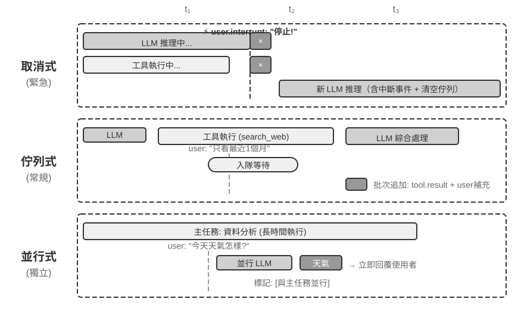

**取消式處理（Cancellation-Based）**用於緊急事件，其本質是為緊急事件**提前製造一個安全點**：主動中斷當前步驟，把這一刻變成可以消費新事件的邊界。當緊急事件到達時（如使用者點選「停止」或監督系統發來高優先順序指令）：(1) 停止當前操作——如果 LLM 正在推理，立即取消流式響應；如果有同步工具在執行，傳送取消訊號；(2) 清空待處理佇列，將所有事件取出；(3) 將佇列中的事件和緊急事件一起追加到軌跡末尾；(4) 立即重新呼叫 LLM，以更新後的完整軌跡為輸入來評估局勢。例如，使用者在 Agent 執行可能錯誤的操作時輸入「停止！我說錯了」，Agent 會立即看到這條新輸入，重新理解真實意圖，從而避免執行錯誤的操作。

**佇列式處理（Queued）**用於常規事件。當非緊急事件到達時（如非同步工具返回結果或使用者發來補充資訊）：(1) 將事件放入佇列末尾，不打斷當前操作；(2) 等待當前操作完成——讓 LLM 完成推理，讓同步工具執行完畢；(3) 當任何工具呼叫完成並返回 `tool.result` 時，檢查佇列，如果佇列非空則將所有事件拋棄式追加到軌跡；(4) LLM 綜合處理更新後的軌跡。這實現了批次處理，提高了效率——例如 Agent 呼叫搜尋工具後，在等待期間使用者補充了「只看最近一個月的結果」，這條補充資訊進入佇列，搜尋結果返回時兩個事件一起呈現給 LLM，避免了不必要的往返。

**並行處理（Parallel）**用於獨立的輕量級查詢。比如 Agent 正在分析大量資料時，使用者突然問「今天天氣怎麼樣？」此類查詢具有三個特徵：與主任務無關、需要快速響應、執行成本低。既不應該用取消式處理（會打斷重要的主任務），也不應該用佇列式處理（讓使用者等太久）。系統首先判斷查詢的獨立性和複雜度，然後在一個並行的推理會話中獨立執行，呼叫必要的工具生成響應後立即返回。查詢和響應會追加到主任務的軌跡中，並明確標記為「與主任務並行執行」，以避免 LLM 混淆。

**緊急度的判定。**

緊急事件：使用者中斷（`user.interrupt`）、監督指令（`supervisor.instruction`）、Agent 間中斷（`agent.interrupt`）、標記為緊急的外部觸發器（如系統告警、支付失敗）。

非緊急事件：常規使用者輸入（`user.input`）、Agent 輸入（`agent.input`）、工具結果（`tool.result`）、定時器觸發（`timer.trigger`）、常規外部觸發器。

編死的規則有其侷限性，事件的語義決定了處理方式——「馬上停下來」用取消式、「今天天氣怎麼樣」用並行式、「報告需要用中文發給我」用佇列式。**建議使用輕量級的分類 LLM 作為事件路由器**，在事件到達時快速判斷應該採用哪種策略。

下面透過一個事件驅動的郵件處理 Agent 實驗，將上述事件處理策略落地為可執行的實現。

> **實驗 6-1 ★★★：事件驅動的郵件處理 Agent**
>
>
> 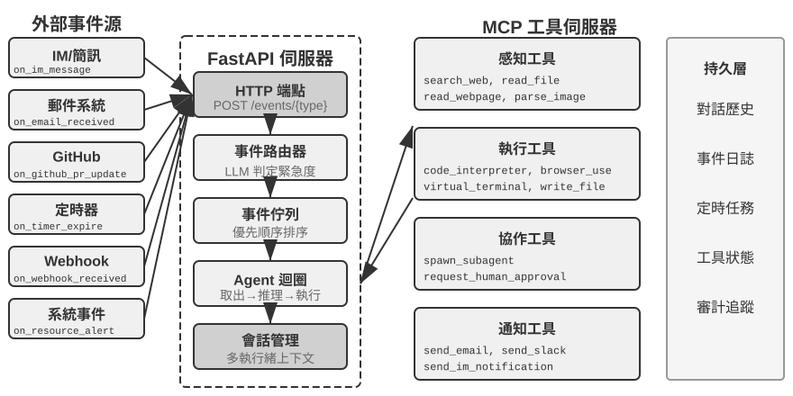
>
>
> 本實驗建構一個最簡單的事件驅動 Agent：**自動郵件處理助手**。Agent 監聽郵件收件箱，每當收到新郵件時自動觸發處理流程——分類、摘要、起草回覆，必要時通知使用者。這是事件驅動 Agent 最直觀的入門場景：一個外部事件（新郵件到達）觸發一次完整的 Agent 思考迴圈。
>
> **實驗目標**是理解事件驅動的核心概念：Agent 不再只是被動地等待使用者輸入，而是可以響應外部事件來主動行動。透過這個實驗，讀者將掌握事件源註冊、事件佇列、以及「事件到達 → Agent 處理 → 結果輸出」的基本閉環。
>
> **事件源與事件佇列。**
>
> 系統支援多種事件源的統一接入：
>
> - **郵件事件** (`on_email_received`)：透過定期檢查收件箱或接收推送通知，在新郵件到達時觸發
> - **IM/簡訊訊息** (`on_im_message`，`on_sms_message`)：即時通訊訊息觸發
> - **GitHub 事件** (`on_github_pr_update`，`on_github_issue_update`)：PR review 意見、狀態變化
> - **定時器觸發** (`on_timer_expire`)：定時任務（如每日摘要、週報生成）
> - **Webhook** (`on_webhook_received`)：通用的外部系統回呼
> - **系統事件** (`on_user_inactive`，`on_process_timeout`，`on_resource_alert`)：內部狀態變化
>
> 所有事件進入一個統一的**事件佇列**，按到達順序依次處理。每個事件觸發一次獨立的 Agent 思考迴圈：Agent 讀取事件內容，呼叫相關的工具（如查詢知識庫、讀取附件、搜尋相關的郵件歷史），生成處理結果（分類標籤、摘要、草稿回覆），最後透過通知工具告知使用者或直接執行操作。
>
> **驗證場景**：配置 Agent 監聽測試郵箱。模擬收到三封郵件——一封會議邀請、一封客戶投訴、一封行銷廣告。Agent 依次處理：為會議邀請自動檢查日曆衝突並起草接受/拒絕回覆；為客戶投訴提取關鍵資訊並標記為高優先順序，通知使用者處理；將營銷廣告自動歸檔。整個過程無需使用者介入。

實驗 6-1 展示了最簡單的事件驅動模式——事件進入佇列，Agent 依次處理。但當 Agent 需要在長時間執行的工具執行過程中響應打斷，或同時管理多個並行任務時，簡單的事件佇列就不夠用了。接下來討論更深層的工程挑戰。

### 工程實現：如何讓同步模型支援非同步打斷

實驗 6-1 只處理序列事件——事件依次進入佇列，Agent 一個接一個處理完畢。現在回到本節開頭提出的「訓練同步 / 部署非同步」矛盾：當工具尚未返回時使用者突然打斷，同步格式該如何容納？本節給出當前業界的工程解法。

先用一個具體場景說明這個矛盾。假設 Agent 正在幫使用者起草一封郵件（工具呼叫：搜尋聯絡人資訊），搜尋還沒返回結果時，使用者突然說「等一下，先幫我查一下明天的天氣」。在同步的 ReAct 迴圈中，Agent 必須等搜尋返回後才能處理下一條訊息——因為 API 要求「發出工具呼叫後，下一條訊息必須是工具結果」。但在非同步的真實世界裡，事件隨時可能打斷正在進行的任務。如何在「同步格式」的約束下表達「非同步打斷」的語義，正是下面這套工程方案要回答的問題。

**工程權宜之計：模擬同步的非同步實現。**

核心思想是：**在沒有打斷發生的常態下，讓 LLM 看到標準的同步軌跡，只在打斷時才插入佔位符來修復格式**。以下是五條關鍵規則：

**規則 1**：LLM 輸出時立即記錄 assistant message（包含 thinking、content 和 tool call）。

**規則 2**：工具呼叫完成時才記錄 tool result。執行中軌跡處於 「部分完成」 狀態。

**規則 3**：工具執行中的打斷需要佔位符。為未完成的工具生成佔位符響應（如「工具正在後臺執行，請優先處理新事件」），追加打斷事件，重新呼叫 LLM。從 LLM 的視角看，assistant message 仍然有配對的 tool result。

**規則 4**：LLM 思考中的打斷直接丟棄當前思考。不寫入軌跡，新事件直接追加後啟動新一輪思考。

**規則 5**：非打斷事件進入佇列等待批次處理。當前週期完成後才拋棄式追加。

以 Agent 正在起草郵件時使用者打斷詢問天氣為例，這五條規則的運作過程如下：

1. Agent 呼叫 `search_contacts` 搜尋聯絡人資訊，assistant message 立即寫入軌跡（規則 1）。
2. 搜尋工具尚未返回結果時，使用者發來「先幫我查一下明天的天氣」。由於這是使用者打斷，系統為未完成的 `search_contacts` 生成佔位符 tool result（「工具正在後臺執行，請優先處理新事件」，規則 3），然後將使用者的天氣查詢追加到軌跡，重新呼叫 LLM。此刻 LLM 看到的軌跡格式完全合法——assistant message 與 tool result 配對完好。
3. 天氣查詢完成並回覆使用者後，原先的 `search_contacts` 結果到達，作為新事件追加到軌跡（規則 2），Agent 讀取聯絡人資訊後繼續起草郵件。

這套方案的核心優勢是：**常態下 LLM 看到的是完美的同步軌跡**——assistant message 與 tool result 嚴格配對，時間順序清晰，沒有任何佔位符或異常狀態。這對當前基於同步訓練範式的 LLM 最為友好，最大程度地保證了思考品質。只有在確實需要打斷時才引入佔位符這個「必要的妥協」。

但仍存在加劇幻覺的風險。在這個場景中，儘管佔位符明確說明工具「尚未完成」，系統仍可能在後續思考中「編造」一個工具結果，誤以為工具已經返回了有效資料，基於這個虛構的結果做出不恰當的決策。這是因為模型在訓練時見到的絕大多數軌跡中，工具呼叫之後緊接著就是真實的結果，它從未學會如何處理「結果還沒回來」的情況。因此實踐中只在真正緊急時（使用者明確請求停止）才打斷，非緊急的事件則放入佇列批次處理。

**適合現有模型的非同步工具介面。**

既然模型的同步假設難以突破，一個更根本的策略是**從工具介面的設計層面擁抱非同步語義**。

傳統的工具設計隱含了「呼叫即完成」的語義。例如 `phone_call` 這個名字暗示「呼叫將撥打電話並等待通話結束，返回通話記錄」。在非同步範式下應該將「啟動」和「完成」解耦：

- `initiate_phone_call`：啟動電話呼叫，立即返回任務識別符號和初始狀態（如「呼叫已發起，正在撥號」）
- 通話進展透過事件通知（`phone_call_connected`、`phone_call_ended`）

關鍵在於工具的名稱和描述本身就要傳達非同步的語義。當模型看到 `initiate_phone_call` 時，其語言理解能力會自然推斷這是「發起」而非「完成」。工具描述應進一步強化這一點：「此工具將啟動由子 Agent 處理的電話任務。任務成功發起後立即返回任務 ID，您可繼續處理其他事項。通話結束後會收到單獨的通知事件。」

**佇列式處理中的注意力分散問題。**

在批次事件處理時，模型往往只關注最後一個事件。根源在於**模型被訓練為對最新的輸入反應，而批次事件打破了這一假設**。

可以從兩個層面進行干預：

**提示詞層面**：告知模型「當收到多個連續事件時，請確保全面考慮所有資訊」。

**Agent 狀態列標記**：在每個事件前新增顯式標記：

```text
[未處理事件 1/4] Tool result from database_query：...
[未處理事件 2/4] User 補充說明：只看北京地區的資料
[未處理事件 3/4] 系統提醒：報告截止時間還有 30 分鐘
[未處理事件 4/4] User 詢問：進度如何？
```

在末尾新增彙總：「上面有 4 個未處理事件，包括 1 個工具結果、2 條使用者訊息、1 個系統提醒。請確保回應涵蓋所有資訊。」

### 深層矛盾與未來方向


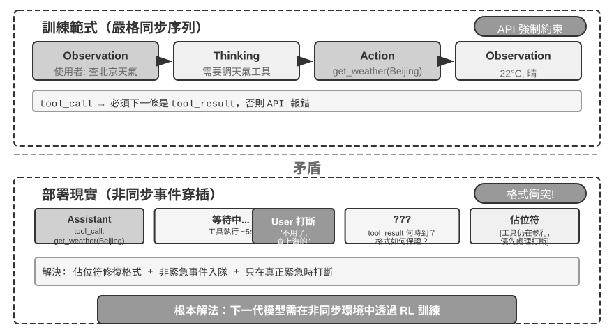


歸根結底，前幾節的佔位符、非同步工具介面、狀態列標記，都是在用提示工程彌補同一個「訓練同步 / 部署非同步」的矛盾（圖 6-4）——這一矛盾的成因已在本節開頭詳述，此處不再重複，只聚焦它的根本解法。

**期待模型進化：從同步到非同步。**

上述工程技巧本質上是**用提示工程來彌補模型訓練的不足**，是過渡期的權宜之計。真正的解決方案需要在模型訓練層面發生範式轉變。

機器人領域的 VLA（Vision-Language-Action，視覺～語言～動作，詳見第六章）模型已經開始面對類似的挑戰：感知和動作之間存在不可避免的延遲。VLA 的成功為 Agent 模型的進化指明瞭方向。下一代模型需要透過非同步環境中的強化學習獲得三種核心能力：

1. **理解軌跡中事件的非同步穿插**：這是最核心的能力缺陷。當前模型期望嚴格的同步序列，但在真實的非同步環境中，tool call 之後可能不是 tool result 而是新的 user 訊息；thinking 進行到一半可能被打斷，但中間狀態應保留在軌跡中，新訊息處理完後繼續思考而非從頭開始。模型需要在這種「亂序」的軌跡中保持清晰的認知——哪些工具呼叫還在等待結果，哪些思考是未完成的片段。
2. **恢復被打斷的任務和思考**：當被打斷去處理緊急事件後，仍然記得未完成的任務。例如 Agent 在執行資料分析工具時使用者突然問天氣，回答後應該自然地等待資料分析結果，而不是忘記還有工具在執行。特別要避免產生幻覺，誤以為被打斷的工具呼叫已經完成。
3. **批次事件的綜合處理**：多個事件批次追加到軌跡時，不能只關注最後一個，必須綜合考慮所有未處理的資訊。

實現這種非同步 RL 訓練需要新的基礎設施：非同步環境模擬器（生成工具延遲返回、使用者隨機打斷等場景）和非同步能力的專項獎勵（正確理解亂序軌跡、成功恢復被打斷的思考、避免幻覺、綜合處理批次事件）。

不過，「持續思考」並不必等到下一代模型才能擁有。用一層約兩百行的編排邏輯，就能讓一個**現成的**文字思考模型變成**持續思考（continuous-time）**的 Agent，恰好把上面「工程權宜」和「模型進化」兩半接了起來。它的機制正是前面規則 4 的升級版：與其在被打斷時**丟棄**半截思考，不如把整個互動建成**一條不間斷的思維流**——隨時可以強行合上模型正在寫的 `<think>` 區塊，把新到達的觀察（一條工具返回、一次使用者打斷、一段新的辨識結果）作為普通訊息注入，再讓模型接著往下解碼。

它利用了一個常被浪費的資源：模型每秒能生成上百個 token，而一次工具呼叫、一段使用者說話往往要花好幾秒。這些「等待」都可以拿來思考。由此 Agent 可以產生兩種行為：**邊等邊想**，不等工具返回、不等使用者說完，就基於已有的半截資訊往下思考，甚至提前把下一步工具調起來；以及**邊做邊想**，一邊輸出、一邊繼續思考，並能在動作進行到一半時糾正自己。

> **實驗 6-2 ★★★：帶並行執行和打斷能力的非同步 Agent**
>
>
> 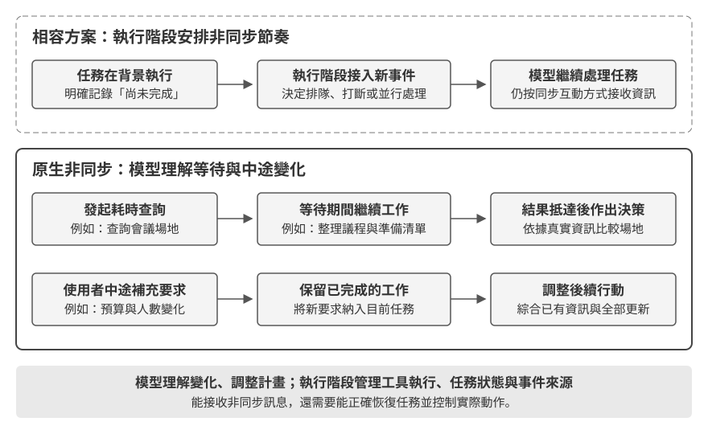
>
>
> 在實驗 6-1 的簡單事件佇列基礎上，本實驗進入非同步 Agent 的深水區：**並行工具執行、執行取消和狀態管理**。Agent 不再只是逐個處理事件，而是需要同時管理多個並行的任務，處理打斷和恢復，並根據即時狀態做出動態的決策。
>
> **1. 非同步工具執行**：支援耗時工具的非同步執行（至少 3-5 秒），啟動後立即返回佔位符。**驗證場景**：Agent 執行一個長時間的終端機命令，期間使用者問「現在幾點了？」，Agent 立即回應，等分析結果返回後再呈現。
>
> **2. 事件佇列與批次處理**：累積非緊急事件，批次追加到軌跡。**驗證場景**：Agent 執行長任務，使用者連續傳送「記得用日語回覆」和「整理成網頁」，任務完成時拋棄式處理所有事件，生成日語網頁。
>
> **3. 打斷機制**：使用者的「停止」立即終止執行流並取消非同步工具。**驗證場景**：Agent 執行長任務，使用者傳送「取消」，Agent 立即停止，軌跡記錄打斷事件和取消操作。
>
> **4. 並行工具的取消與狀態查詢**：非同步工具完成後透過新事件將真實結果注入對話，支援透過任務 ID 取消或查詢進度。**驗證場景**：使用者請求「幫我同時執行這三個指令碼，哪個先完成了，就看看剩下的指令碼進度怎麼樣，如果還沒超過 50%，就取消」。三個指令碼模擬分析程序，執行時不斷輸出進度，速度分別為每秒 3%、2%、1%。Agent 同時啟動三個非同步終端機命令，當每秒 3% 的指令碼在約 33 秒後完成時，Agent 查詢剩下兩個終端機的狀態，發現一個執行到約 66%、另一個約 33%，於是取消不超過 50% 的那個。兩個終端機都完成後整合結果生成完整報告。
>

非同步與事件驅動實現了「世界可以在任意時刻喚醒 Agent」，但它假設事件到達之後，模型可以從容地想完再回應。接下來三節將挑戰這個假設：當環境變化的速度達到甚至超過模型的生成速度時，「想完再說」本身就變成了不可接受的延遲。

## 語音：最自然的人機介面

語音的價值不只是把文字換成聲音。正常說話的速度約為打字的四倍，而且不佔用雙手與視線，因此很適合把 Agent 放進持續運作、隨時可能被打斷的輸入輸出迴路。語音輸入法把口述轉成文字；語音 Agent 則讓使用者直接與 Agent 協作。兩者都能支援前言提到的 whisper coding。

本節同時討論兩個方向：使用者對 Agent 說話，以及 Agent 代替使用者對外部世界說話。語音模型決定「能回答什麼」，互動架構決定「能否聽清楚、及時回應、自然交接發言，並在通話中完成確認與工具呼叫」。以下先討論互動時序，再討論認知時序與表達品質。

### 互動時序：從級聯到全雙工

OpenAI 在 GPT-Live 介紹中把語音互動概括為級聯、輪次式與全雙工三種範式[^ch6-12]。它們不是單純的新舊替代，而是在延遲、成本與可觀測性之間做不同取捨：

| 範式 | 核心結構 | 主要優勢 | 主要限制 |
| --- | --- | --- | --- |
| 級聯 | VAD → ASR → LLM → TTS | 模組清楚、容易替換與除錯 | 延遲累積，副語言資訊在介面處遺失 |
| 端到端 Omni | 原生音訊輸入輸出，按輪次互動 | 延遲較低，能保留語氣、情緒與環境聲 | 仍依賴輪次，訓練與除錯成本較高 |
| 全雙工 | 原生音訊輸入輸出，持續聽、說和決策 | 支援重疊說話、自然打斷與連續串流 | 模型訓練、控制與評估更複雜 |

三種範式的共同主線，是擺脫「必須輪流說話」的假設，以及 VAD 對發言權的猜測。級聯與 Omni 仍要劃分輪次；全雙工則把「誰該說話」變成模型持續做出的決策。

[^ch6-12]: OpenAI. *Introducing GPT-Live.* 2026-07-08. https://openai.com/index/introducing-gpt-live/。本節的「級聯／輪次式／全雙工」分類出自該文對 ChatGPT 語音三代演進的總結；文中的「端到端全模態（Omni）」對應「turn-based voice models」類別。

### 範式一 · 級聯流水線（Cascading）

大多數商用語音助理仍使用串行流水線（圖 6-6）：VAD 判斷使用者何時說完，ASR 把音訊轉成文字，LLM 理解並生成回覆，TTS 再把文字說出來。模組化讓每個元件可以獨立優化，但每個邊界都可能增加等待時間。

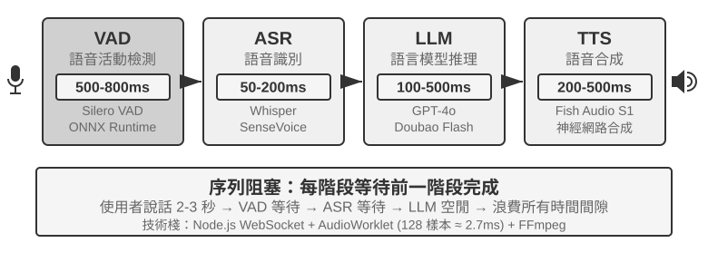

| 模組 | 作用 | 常見瓶頸 |
| --- | --- | --- |
| VAD | 判斷是否說完 | 靜音閾值造成等待與誤切分 |
| ASR | 音訊轉文字 | 識別延遲與上下文遺失 |
| LLM | 理解、思考與生成 | 首 token 延遲；啟用 reasoning 後等待更久 |
| TTS | 文字轉語音 | 首包合成與播放緩衝 |

對於未啟用 reasoning 的短回覆，VAD、ASR、LLM 與 TTS 的等待會串行累積（圖 6-7）。真實數值取決於輸入長度、模型、硬體、網路與負載。生產環境的排隊還會進一步放大空載延遲（圖 6-8）。

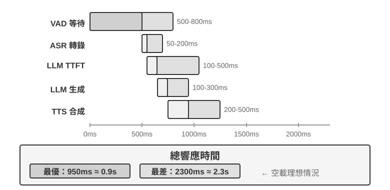

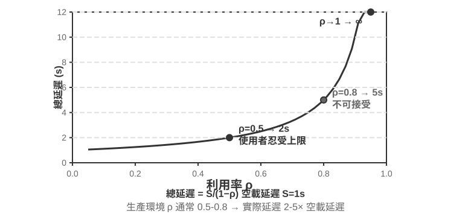

> **實驗 6-3 ★：建立傳統語音 Agent**
>
> 本實驗用 WebSocket 串起麥克風、Silero VAD、本地 Whisper、串流 LLM 和 Fish S1 TTS，建立後續方案的級聯基線（baseline）。

#### 從串行到串流感知

圖 6-7 描述的是 VAD、ASR、LLM、TTS 依序執行的完全串行情形，這種串行感知方案有三個問題：

1. **延遲累積**：必須等待一段靜音才能確認說完。
2. **資訊遺失**：有聲/無聲二值訊號無法表達猶豫、情緒、附和與環境聲。
3. **上下文被切斷**：電子郵件、人名與專有名詞可能被分片識別而出錯。

為了解決這個問題，在保留模組化分工的前提下，一種優化方案是**串流感知**，讓各階段儘早產出增量結果：

- **ASR 邊聽邊轉**：VAD 偵測到使用者開始說話後，就按固定時間間隔呼叫 ASR 模型，以串流方式生成暫時轉錄；VAD 偵測到使用者說完後，再確認最終文本。
- **LLM 推測執行**：暫時轉錄一生成就送給 LLM；如果最終文本與暫時轉錄相同，就不再重新呼叫 LLM，否則取消前面推測執行的思考，重新呼叫 LLM。
- **LLM 分段輸出**：第一段適合播報的文字一生成完就交給 TTS，不等完整回覆。
- **TTS 增量合成**：持續返回音訊區塊，讓後續生成、合成與播放重疊進行。

真正的串流 ASR 需要模型本身支援。Whisper 的解碼器雖然是自回歸的，但編碼器需要完整音訊片段，因此不能直接等同於串流模型。基於 LLM 的串流聽覺模型可以從連續音訊中輸出文字與語義事件，把「識別」和部分「理解」放進同一個模型，保留從對話開始到當前時刻的上下文，也能利用世界知識處理品牌、人名與專有名詞。

若只想判斷使用者是否說完，也可把端點判斷做進串流識別器。訓練標籤只能使用決策時刻可見的資訊，否則「上帝視角」會產生線上無法重現的判斷。模型除了文字，也能輸出 speak_start/end、interrupt、emotion、laugh、sigh 與 noise 等聲學事件標記。

> **實驗 6-4 ★：使用 Qwen2-Audio 模擬串流語音感知**
>
> Qwen2-Audio 本身不是串流模型。本實驗用遞增音訊字首模擬連續感知，並與 600ms VAD + Whisper 對照。

### 範式二 · 端到端全模態模型（Omni）

即使採用串流感知，級聯仍透過離散介面交接聽、想、說；音訊轉成純文字時，情緒、語調與環境聲可能遺失。Omni 方案用同一個模型直接聽音訊、生成回覆並輸出語音，因而有機會保留這些訊號，但訓練成本更高（圖 6-9）。相比範式一的級聯方案，Omni 的優勢主要體現在延遲，以及對非文字資訊的理解與生成上。

在理解方面，Omni 模型能聽出聲音中的停頓。在生成方面，Omni 模型能傳遞更豐富的副語言資訊，例如唱歌、用特殊的語調講一句話。

Omni 模型仍然假設輪流說話，通常要靠 VAD 劃分發言權。因此，使用者報數字時的中途停頓仍可能被誤判為說完。

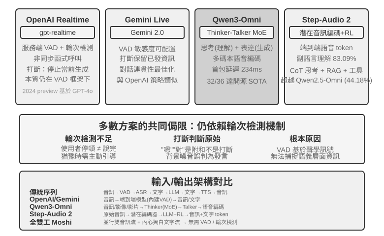

> **實驗 6-5 ★★：本地執行 MiniCPM-o 4.5——端到端與自級聯**
>
> 本實驗使用本地 MiniCPM-o 4.5，關閉 thinking mode，比較直接從音訊作答與同模型自級聯先轉錄再作答。它測的是音訊資訊是否被保留，**不是**後文的「邊想邊說」。

### 範式三 · 全雙工互動模型

Omni 仍把對話分成「使用者說」與「模型說」，但同聲傳譯等任務要求兩者重疊。全雙工模型不預設輪次，而是持續聆聽、持續說話，反覆決定繼續、停頓、打斷或呼叫工具。

Kyutai 的 **Moshi**（2024）是早期研究案例。Thinking Machines Lab 將這條路線稱為**互動模型（Interaction Model）**[^ch6-14]：互動性內建於模型，不再由 VAD 等外部 harness 拼接。微輪次機制以短音訊區塊推進，讓靜音、重疊與打斷保留在連續上下文中；它也能把完整對話委派給背景推理模型，同時維持話頭。

[^ch6-14]: Thinking Machines Lab, “Interaction Models: A Scalable Approach to Human-AI Collaboration,” 2026-05. https://thinkingmachines.ai/blog/interaction-models/

### 認知時序：即時互動與深度思考

互動品質與智能上限是不同維度。前台模型要在使用者仍在線時回應；背景模型可花更長時間思考。以下三種設計是取捨，不是線性演進；前兩種可以套在級聯或 Omni 上，第三種則把深度思考與即時表達統一在同一模型內部。

#### 方案一：快思考應付，慢思考回答

快思考可在幾百毫秒內先給出應付回覆，慢思考在背景完成更深推導。簡單問題可能被處理兩次；複雜問題則可能前後矛盾，因為兩個實例各自獨立思考。

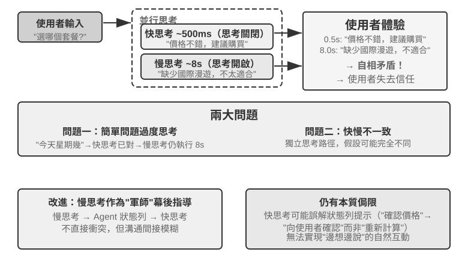

#### 方案二：快思考互動，慢思考建議

背景模型可透過狀態欄或專用介面傳送建議，前台模型維持對話並決定如何表達。通信仍是間接的：前台可能誤解建議，也看不到背景的中間思考，因此它能自然等待結果，卻不能真正邊想邊說。

#### 方案三：端到端統一思考與表達

Step-Audio R1 的**模態錨定思考蒸餾（MGRD）**讓模型根據聲學特徵思考，**MPS 雙腦架構**則讓構思與表達並行。MPS 讓構思腦持續產出思考片段，表達腦把片段與已有回覆結合後立即生成語音，因此不必等待完整思考結束。

#### 快慢思考分離與端到端思考的取捨

統一模型最直接地實現「邊想邊說」，但思考與即時表達必須一起重訓；解耦設計更容易替換背景大腦。兩者是取捨，不是簡單替代。

在前沿思考模型快速演進的當下，快慢分離有一個重要的工程優勢：它能直接承接慢模型的迭代紅利。前台快模型只負責低延遲地傾聽、回應和維持對話，背景慢模型負責推理、規劃和工具呼叫；更強的思考模型發布後，只需替換背景模型，不必重新訓練整套即時語音系統。統一路線則把推理與互動綁在同一個訓練週期中，每次升級都要重新兼顧智能水準、回應延遲和表達自然度。因此，快慢分離不只是對延遲的妥協，也是一種讓互動能力與智能上限分別演進的模組化選擇。

這種分離也不必然犧牲任務效果。截至 2026 年 8 月，採用快慢思考分離架構的 Pine AI 語音 Agent 在 τ³-Voice Leaderboard 上取得第一名，超過 Grok Voice、GPT-Realtime-2 等即時語音系統。這個結果至少說明，在同時考察深度推理與即時對話的任務上，解耦架構並不天然落後於端到端模型。[^ch6-17]

[^ch6-17]: Pine AI. “The Most Natural Human-Computer Interface Is Your Voice.” 2026-06-23（2026-08-06 更新）. https://www.19pine.ai/blog/pine-ai-the-most-natural-human-computer-interface-is-your-voice

這裡需要釐清「端到端模型」常被賦予的兩個含義。第一是上一節所述的**語音通路端到端**：模型直接接收音訊、生成音訊，不再由多個模型透過離散文字串接。Omni 和互動模型都屬於這個意義上的端到端模型，但 Omni 模型通常仍按輪次推進，互動模型則可以邊聽邊說，兩者在架構上差異很大。第二是本節所述的**認知架構端到端**：即時互動與深度思考是在同一模型內部共享狀態、共同訓練，還是拆成前台快模型與背景慢模型。兩條軸彼此獨立，一個系統完全可以在語音通路上端到端，同時在認知架構上保持快慢分離；Thinking Machines Lab 把複雜任務委派給背景推理模型就是這種組合。

### 更像人的語音合成

傳統 TTS 太過流暢、停頓太少，反而會暴露機器身份。停頓、填充詞與偶爾的重複，是人類語音中表達不確定與思考的訊號。

主 LLM 除了文字外，也可以輸出 **THINKING**、**EMO:happy**、**SPEED:0.8x** 等控制標記；TTS 會將它們映射為停頓、韻律、語速、笑聲、嘆氣與其他非語言音訊。實作方式可以是訓練一個能理解控制標記的 TTS，也可以是透過 voice cloning，為不同情緒與風格準備參考片段。

> **實驗 6-6 ★★：以 Fish Audio 實作控制標記驅動的 TTS**
>
> 使用 Fish Audio S1 建立多參考音訊庫，並比較三種設定：無控制標記、單一參考片段、以及多個參考片段。執行層會根據標記選擇相符的情緒、語速與風格。


## Computer Use：GUI 自動化 Agent

讀到這裡也許會注意到，本章給語音的篇幅明顯多於後兩個場景——這是有意為之。在即時多模態這條演進線上，語音是走得最完整、最值得當作參考系的一個：從「序列流水線延遲太高」這個問題出發，經過端到端、全雙工、邊想邊說等一系列方案，一直走到今天相對成型的終局，問題→方案→終局的全程都已經跑通。因此我們把它講透，接下來的 Computer Use 和機器人兩個場景，都可以對照語音這條脈絡來看——它們各自走到了這條演進線的哪一段、卡在了哪裡。

這三個場景看似不同，卻面臨相同的核心挑戰：即時感知、低延遲決策、持續互動。接下來看這些技術主題如何在視覺互動（Computer Use）和物理互動（機器人）中重現——首先把視角從聽覺模態擴展到視覺模態：如果 Agent 不僅能理解語音，還能「看懂」螢幕並操作圖形介面呢？

Computer Use（也稱 GUI 自動化 Agent）讓 AI 像人類一樣透過觀察螢幕、操作滑鼠鍵盤來使用軟體——比如開啟瀏覽器搜尋資訊、在表格軟體中填寫資料、或在系統設定中調整配置。其核心是**感知～思考～行動**的迴圈（圖 6-11）：

1. Agent 對當前螢幕截圖
2. 多模態模型接收截圖和任務指令，輸出一段思考和一個具體動作
3. 執行層在真實環境中執行該動作（移動滑鼠、點選、輸入文字等）
4. 等待介面響應後再次截圖，進入下一輪迴圈

這裡要區分**看懂介面**和**完成任務**。前者更接近多模態理解能力，可以用一次截圖問答來衡量；後者則要求模型把理解和動作生成放入閉環，處理頁面載入、狀態變化、誤操作和不可逆後果。因此，Computer Use 的難點不只是讓模型在截圖上答對，而是讓它在每一步之後重新確認現實是否仍符合計畫。


這個迴圈中有三個關鍵設計維度：**動作空間**（Agent 能執行哪些操作）、**視覺定位**（如何在截圖中找到目標元素）、以及**模型架構**（如何從截圖生成正確動作）。

### 動作空間設計

Anthropic 的參考實作把完整互動能力分成三類工具（圖 6-12）。這是清楚的動作空間設計，但不是模型供應商必須遵循的私有協定：只要 Harness 能把相同的截圖、動作約束和執行結果轉換成目標模型支援的訊息與結構化輸出，Claude、開放權重視覺模型和自行託管的端點都能驅動同一個感知～思考～行動迴圈。


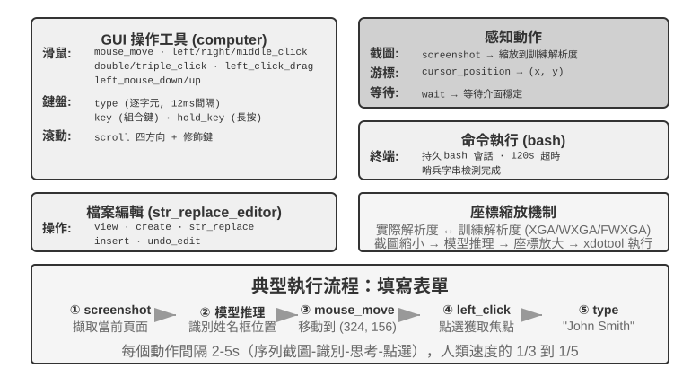


**GUI 操作工具**（computer tool）：滑鼠操作包括移動（mouse_move）、左/右/中鍵點選、雙擊/三擊、拖拽（left_click_drag），以及更精細的按下/鬆開（left_mouse_down/up）。滾動（scroll）支援四個方向並可配合修飾鍵。鍵盤操作包括逐字輸入（type，每個字元間隔 12ms 模擬真實打字）、組合鍵（key，如 Ctrl+C）、長按（hold_key）。感知動作：截圖（screenshot）、獲取游標位置（cursor_position）、等待（wait）。

**命令執行工具**（bash tool）：提供長久的 bash 終端機會話，120 秒超時，透過哨兵字串偵測命令是否執行完畢，多次呼叫之間保持環境狀態（比如 cd 到某個目錄後下次呼叫還在那個目錄）。

**檔案編輯工具**（str_replace_editor）：透過字串匹配實現安全編輯，支援檢視、建立、替換、插入和撤銷操作，比直接覆蓋整個檔案更精確，不容易誤改其他內容。

> **實驗 6-7 ★：執行 Computer Use（Anthropic 參考路徑或開放模型路徑）**
>
> 路徑 A 使用 Anthropic Computer Use Demo。其容器封裝了完整的 Ubuntu 桌面環境，包括瀏覽器、終端機與其他常用工具。前端接收任務，而後端將指令與截圖送給 Claude，接著執行模型回傳的滑鼠、鍵盤、終端機或編輯動作。
>
> 路徑 B 使用 [`chapter6/computer-use-open-model`](../chapter6/computer-use-open-model/) 中的範例程式碼。預設情況下，它透過託管的 OpenRouter API 使用開放權重的 Qwen3-VL 32B Instruct 模型來驅動 browser-use，或透過自架的 vLLM/SGLang 及類似系統來執行。

### 視覺定位（Grounding）

在迴圈的每一輪中，模型需要在截圖中準確定位目標元素——「搜尋框在哪裡？」「提交按鈕的座標是什麼？」這就是視覺定位（Grounding）問題。當前主要有**兩大思路**：一是把定位變成**選擇題**——先把介面元素標註好編號，模型只需從中選一個；二是**純座標預測**——讓模型像人一樣直接「看」著截圖報出座標。其中選擇題思路又有兩種實現方式：**純視覺標註**（原始的 Set-of-Mark，用分割模型在畫素上切出候選區域）和**結構化元素索引**（DOM/Accessibility Tree，直接讀取介面自帶的結構）。選擇題思路的共同優勢，是把開放式的「在截圖中找到按鈕並預測座標」轉化為封閉式的「從已標註好的元素中選一個」。就像考試中選擇題比填空題更容易答對一樣，模型只需說「點選 [123]」而不是「點選螢幕 (350, 464) 處的按鈕」。直接輸出座標對模型來說挑戰尤其大，需要大量訓練才能做準確，而且在不同螢幕解析度下很容易出錯。

**Set-of-Mark：視覺標註法。**

原始的 Set-of-Mark（SoM）由微軟研究院於 2023 年提出，最初是為了釋放 GPT-4V 的視覺定位能力。它是**純視覺**方法：用影像分割模型（SAM、SEEM 等）在截圖上自動切出候選區域，為每個區域疊加編號標記，模型看到的是一張帶編號的圖，只需報出編號，由系統換算成對應區域的中心座標。整個過程不需要 DOM，也不需要任何介面內部結構，因此原生桌面軟體、遊戲介面同樣適用——只要分割模型能把候選區域切出來。

**結構化元素索引：SoM 思想在 Web 上的結構化實現。**

當介面本身能提供結構化資訊時，標註可以做得更精確。現代網頁在渲染之前就已經定義了完整的元素結構（DOM 樹）和語義角色（哪個是按鈕、哪個是輸入框），無障礙介面（Accessibility Tree）為許多桌面應用提供了類似的資訊。以 browser-use 專案為代表的 Web Agent 方案正是這樣做的：從 DOM 中列舉可互動元素並編號，可以看作 SoM 思想在 Web 上的結構化實現（圖 6-13）。流程分四步：

1. 透過瀏覽器除錯介面（CDP，Chrome DevTools Protocol）獲取網頁的結構化表示（DOM 樹）和無障礙資訊
2. 自動偵測哪些元素可以互動（按鈕、輸入框、連結等）
3. 為每個可互動元素標註唯一 ID 並在截圖上繪製邊界框
4. 同時生成文字列表描述每個 ID 對應的元素

```text
Screenshot: [圖片中關鍵元素標註了 [1]、[2]、[3]、[4] 等 ID]

Elements:
[1] <input type="text" placeholder="Search" aria-label="Search" />
[2] <button id="submit-btn" aria-label="Submit form" />
[3] <input type="text" placeholder="Enter your name" value="" />
[4] <a href="/docs" aria-label="Documentation" />
```

模型只需要輸出一個 ID 號就行，系統自動用該元素的中心座標執行點選。這類方案不省 token（因為要把所有標註資訊都發給模型），但定位準確穩定，還免去了分割模型可能引入的漏檢和誤檢。


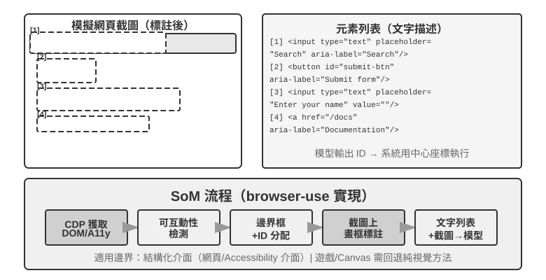

**純座標預測。**

第三條路線不做任何標註，直接讓模型輸出座標。以 **SeeClick** 和 Claude 的 computer use 為代表：在海量 GUI 截圖和元素位置的配對資料上訓練視覺模型，讓它學會將自然語言描述（如「點選提交按鈕」）直接對映到截圖中的精確座標——就像人類使用者一樣，純粹靠「看」來找到要點選的位置。

在座標預測方案中，模型對座標的理解高度依賴訓練時使用的解析度（圖 6-14）。Claude 訓練使用 XGA（1024x768）、WXGA（1280x800）、FWXGA（1366x768），如果輸入的截圖解析度不匹配，模型預測的座標就會系統性地偏移——就像在小地圖上量距離然後直接用到大地圖上一樣。因此，需要在工具層實現雙向座標縮放機制，而且要**按寬高比選目標解析度**，避免非等比拉伸把畫面壓變形、連帶把座標判斷也帶偏。例如，真實螢幕解析度為 2560×1440（16:9），就該在 Claude 支援的三檔裡挑一個寬高比同樣接近 16:9 的目標——FWXGA（1366×768）最匹配。截圖時把螢幕等比縮放到 1366×768 送入模型；模型輸出點選座標 (683, 384) 後，反向對映為真實座標 (683×2560/1366, 384×1440/768) ≈ (1280, 720)。反過來，若硬把 16:9 拉伸進 4:3 的 1024×768，畫面會被橫向壓扁，模型預測的座標就會系統性偏移。


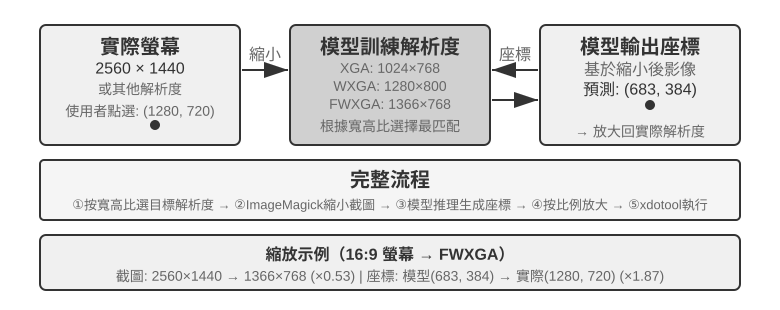


三條路線的選擇邏輯可以概括為：**結構化資訊可得時，優先用 DOM/Accessibility Tree 索引**，定位最精確穩定；**不可得時**（原生桌面軟體如 Photoshop、Canvas/WebGL 渲染的介面、遊戲），**既可以用視覺標註（原始 SoM 路線），也可以用座標預測**。視覺標註把定位變成選擇題，對未經專門訓練的通用模型更友好；座標預測省去標註步驟，對做過 GUI 定位訓練的模型更直接。兩者在小元素和密集介面上的精度都仍有差距。

> **實驗 6-8 ★：使用 browser-use 實現自動瀏覽器操作**
>
> 基於 Playwright 瀏覽器自動化框架（一個用程式碼控制瀏覽器的工具庫），結合多模態大模型實現自然語言驅動的瀏覽器操作。啟用 SoM 視覺化模式，每次決策前儲存帶標註框的截圖。
>
> 測試任務「開啟 Google 查詢舊金山天氣」：系統啟動後截圖顯示 Google 搜尋頁面，互動元素被編號，模型選擇搜尋框、輸入「San Francisco weather today」、提交搜尋，再從結果頁提取溫度和天氣狀況。

### 能看動畫、能聽聲音的 Computer Use Agent

到目前為止，Computer Use 的感知都建立在一個隱含假設上：**螢幕是靜止的**——截一張圖、想一步、點一下，再截下一張圖。可現實裡的螢幕會放影片、會彈出轉瞬即逝的通知、會播放會議裡的人聲。一個每 3–5 秒才睜一次眼、而且完全沒有耳朵的 Agent，對這些「兩幀之間發生的事」既看不見也聽不到。

這裡真正該被重新設計的，不是「動作介面」，而是「**觀察介面**」[^ch6-9]。核心思想是建構 Agent–電腦觀察介面（AOI），把連續的環境觀察轉換成模型便於處理的離散事件。其中有幾個關鍵技術：第一，**螢幕關鍵影格截圖**——用一個小模型判斷螢幕是否發生了有意義的變化，只在明顯變化時才截圖，變化頻繁時每秒截圖 1 次就有不錯的效果；第二，**音量門控的語音轉寫**，有聲音時呼叫語音辨識，把辨識出的文字放入上下文，讓 Agent 能夠聽到聲音；第三，**把畫面敘述成文字**，讓模型把捕獲到的螢幕截圖描述成一句話，這樣即使原圖之後被清理出上下文，這句文字仍留在上下文裡，實現了多模態互動歷史壓縮的效果。

[^ch6-9]: 論文見 Li, Bojie and Noah Shi. *Agent-Computer Observation Interfaces Enable Dynamic Computer Use.* arXiv:2606.29472, 2026.

### Computer Use 的世界模型

上一節的觀察介面解決的是「螢幕中間發生了什麼」：透過關鍵影格、語音轉寫和持久文字，讓 Agent 不再只看到兩張相隔很久的截圖。但觀察介面並不會消除規劃延遲，Agent 仍然是串列的「截圖—思考—點擊」迴圈，每執行一個動作都重新觀察、思考下一步。**OSWorld-Human** 的效率研究顯示，即使任務最終成功，Agent 的操作步驟和等待時間仍明顯多於人類；準確率達到人類水準，並不等於已經足夠實用。

人類操作電腦時並不是點擊之後才開始想下一步，而是會先對動作後果作出預測：如果實際變化與預期一致，就沿著原定計畫繼續執行；只有發現頁面狀態偏離預期，才停下來重新觀察和規劃。世界模型讓 Agent 能夠在行動前預測桌面接下來可能變成什麼，從而實現這種類似人的「推測執行」機制，大幅提高效率。

桌面狀態不只是一張像素圖，還包括視窗、焦點、捲動位置、輸入框內容、載入狀態、權限和網路回應；動作則包括點擊、鍵盤輸入、捲動、拖曳和等待。一個可用於 Computer Use 的世界模型至少要能編碼目前狀態、預測候選動作造成的狀態變化，並把預測交給規劃器決定下一步：

```text
桌面狀態 + click/type/scroll/wait ──> 下一狀態的表示
```

這樣，Agent 就能在真正點擊之前比較候選動作的後果，在頁面載入期間準備下一步，並在彈出視窗一閃而過時根據狀態差異恢復。例如任務是「在 VS Code 新建 Python 檔案並寫入 hello world」，模型可以先預測檔案樹和編輯器在成功後的關鍵狀態，再選擇點擊、輸入和儲存動作；如果任務是刪除檔案，則可以先在隔離的虛擬桌面中預測是否會出現不可逆的確認視窗，必要時請求使用者確認。這裡的重點不是讓模型生成一張逼真的未來截圖，而是預測完成任務所需的、可檢查的狀態差異。

2026 年 7 月，Induction Labs 公布的 **Photon-1** 展示了這條路線的一種實作，僅用 3 萬小時的 H200 GPU 時間就完成了 computer use 世界模型的預訓練。它把每一影格壓縮為離散的潛在 token，自迴歸預測動作之後的下一狀態表示，而不是在預訓練階段逐像素生成截圖；另外接入的影像生成器只用於把潛在表示視覺化，並非推論的必要元件。給定一張種子截圖和後續動作，模型可以連續「想像」桌面狀態，再透過虛擬機上的線上訓練學會輸出 computer-use 動作。[^ch6-20]

[^ch6-20]: David Li and Jonathan Li, Induction Labs, “Scaling Video Pretraining with Imagination Models,” 2026-07-23. https://www.inductionlabs.com/news/scaling-video-pretraining 。文中 Photon-1 的參數、資料規模、內部 benchmark 和成本比較均為公司揭露的結果。

### 移動端：生態壁壘比技術更難

Computer Use 也在向移動端擴展。移動端與桌面在技術上確有差異：動作空間通常不再是「滑鼠座標 + 鍵盤」，而是接入系統的無障礙服務 API（如 Android 的 AccessibilityService）來讀取介面元素、下發點選與文字輸入；互動方式也從滑鼠指標變成觸控手勢，座標的語義隨之改變——同一個 (x, y) 到底是手指的單擊、長按，還是滑動手勢的起點，需要額外的手勢型別來界定。第七章介紹的 AndroidWorld 等移動端基準，正是在這樣的動作空間上評測 Agent 完成真實 App 任務的能力。

但真正卡住移動端的，往往不是這些技術差異，而是生態壁壘。曾有手機廠商嘗試在消費級手機中整合 AI 助手，讓它自動操作微信、淘寶、支付寶等日常應用，但很快遭遇平臺限制。

這揭示了 Computer Use 面臨的一個獨特挑戰：**生態壁壘**。封殺背後的根本原因是商業模式衝突。傳統網際網路應用的核心變現邏輯是**流量與注意力**：使用者刷資訊流時看到廣告，搜尋商品時追蹤推薦演算法的引導，瀏覽頁面時產生衝動消費。而當 Agent 代替使用者操作時，這條變現鏈路被徹底繞過：AI 不會關注廣告，也不會衝動消費，直奔目標完成任務就走。對於靠廣告和流量變現的平臺來說，Agent 的每一次操作都在侵蝕其商業模式的根基。

這意味著 Computer Use 面對的不僅是 CAPTCHA（驗證碼）等技術層面的對抗，更是**結構性的利益衝突**。這一矛盾在短期內難以調和，也讓 Computer Use 在消費級場景中的落地面臨比純技術問題更棘手的挑戰。

## 機器人操作：以 XLeRobot 整理桌面為例

> **閱讀提示**：本節始終使用同一個任務——「把紅色杯子放進托盤，把黃色廢紙放進垃圾盒，最後重新觀察並確認桌面狀態」。實驗 6-9 和 9-9 是 XLeRobot 真機實驗，需要機械手臂、標定、緊急停止裝置和現場觀察員；實驗 6-10、9-10 和 9-11 是對應的本機 GPU 實驗。真機與模擬會明確分開報告，但任務目標、動作語意和成功條件保持一致。

機器人操作比「看圖回答問題」難得多。模型不但要看懂畫面，還要在真實世界裡連續做出動作，而且每個動作都會改變下一刻的情況。XLeRobot 把這種區別變得很具體：同一台機械手臂既可以由人透過鍵盤、手把或 VR 裝置遙操作，也可以把攝影機觀察和一組受約束的動作工具交給 Agent 自主呼叫。硬體和任務都不變，改變的只是操作者——前者由人持續觀察和糾錯，後者必須由模型與控制系統完成同樣的工作。

本節將用「整理桌面」貫穿五個實驗。先讓人遙操作真實 XLeRobot，測量真機在足夠強的操作者控制下能做到什麼；再在模擬器中建立同任務的理想控制上限。接著讓 Agent 自主控制真實 XLeRobot，觀察感知、規劃和失敗恢復如何影響結果；再把相同的工具契約放進模擬器，批次比較開環、逐步檢查和世界模型三種策略。最後改變背景、物體外觀、光照和視覺雜訊，檢查模擬中學到的視覺策略能否適應新的環境。

這裡的瓶頸通常不是再給模型增加一個靜態問答基準，而是讓它在有限的感知和控制頻寬下持續完成閉環。一個能用的機器人系統，至少要回答四個問題：

1. 人想完成什麼任務？
2. 接下來先做哪個子任務？
3. 目前技能具體輸出哪些動作？
4. 動作執行後，現實是否仍符合原來的計畫？

本節把這四個問題放在 XLeRobot 的同一個控制閉環中，並分別說明四種技術各自負責什麼：長程規劃安排先處理杯子還是廢紙，VLA 或動作原語完成抓取和放置，世界模型估計動作後果，從模擬環境遷移到現實環境則處理訓練畫面和真實攝影機、執行器之間的差異。即使高層模型已經具備足夠的知識和規劃能力，缺少其中任何一個回饋環節，系統仍可能無法把任務做完。

### 硬體與演算法的分工

XLeRobot 最適合回答的第一個問題是：自主整理桌面失敗時，究竟是機械手臂本身做不到，還是演算法沒有把它用好？這裡有一個不能被弱化的事實：**像 XLeRobot 這樣成本只有幾百美元的機械手臂，透過遙操作已經能夠完成本節這種連續的多步桌面任務**——人看著攝影機畫面，抓起紅色杯子放進托盤，再把黃色廢紙放進垃圾盒，最後重新確認狀態。這個結果不是「硬體勉強具備可行性」而已，而是一個明確的診斷證據：**對於這個任務，硬體本體不是瓶頸，演算法才是瓶頸。**

診斷方法很直接：保持攝影機、機械手臂、夾爪、桌面佈置和成功條件不變，先讓人接管閉環。人類會持續修正物體定位、動作選擇、時機控制並處理抓取失敗；自主系統與人的差距，正落在這些閉環能力上。當然，這個判斷的範圍是本節的桌面任務：它說明硬體已經跨過了完成該任務所需的負載、精度和工作空間門檻，並不意味著幾百美元的機械手臂能夠勝任所有開放環境或更高難度的操作。

XLeRobot 支援鍵盤、Xbox 手把、Switch Joy-Con 和 VR 裝置等遙操作入口。人類操作者會自然地做很多演算法必須顯式實作的事：夾爪靠近杯子時減速，杯子滑動時修正抓取點，第一次沒有夾住紙張時重新觀察，並在物體放入目標區域後檢查結果。遙操作因此不只是收集示範資料，也是一種「固定硬體、替換操作者」的診斷實驗。[^ch6-1]

> **實驗 6-9 ★：真機遙操作 XLeRobot 整理桌面**
>
> 在真實 XLeRobot 工作區內放置紅色杯子、托盤、黃色廢紙和垃圾盒。操作者透過一種已完成校正的遙操作方式執行固定任務：「把紅色杯子放進托盤，把黃色廢紙放進垃圾盒，最後重新觀察並確認桌面狀態。」實驗至少重複多輪，並記錄攝影機畫面、操作者輸入、機械手臂狀態、動作時間、抓取失敗、重試次數和最終狀態。
>
> 驗收不能只看「最後桌面似乎收拾好了」。紅色杯子必須位於托盤內，黃色廢紙必須位於垃圾盒內，機械手臂回到安全姿態，而且全程沒有碰撞、越界或未經確認的人工代做。

真機遙操作得到的是最有說服力的任務上限，但它不適合批次改變物體數量和位置。為了得到可重複、可統計的對照，下一步把同一個「物體歸位」問題搬進二維桌面模擬器，用理想控制器代表一個不會感知錯誤、不會選錯動作的強操作者。

> **實驗 6-10 ★：在模擬器中測量同任務的理想控制上限**
>
> 在二維桌面模擬器中隨機擺放紅色杯子、黃色廢紙及其目標區域，由理想控制器依次接近物體、抓取並移動到正確位置。它不需要辨識影像，也不會選錯動作，因此代表「感知和決策都正確時，這個任務至少可以做到什麼」。
>
> 實驗關注任務成功率、完成步數和路徑長度，並改變物體初始位置與任務規模，觀察理想上限是否穩定。它與實驗 6-9 使用相同的成功條件，但測量的是非致動模擬，不代表 XLeRobot 真機已經運行。二者共同建立後續自主控制的兩條參考線：實驗 6-9 是真實硬體上的人類閉環，實驗 6-10 是模擬環境中的理想閉環。

### 機器人控制的基本結構

機器人系統通常會把不同時間尺度的工作分開：

| 層級 | 核心問題 | 輸出 | 典型時間尺度 |
| --- | --- | --- | --- |
| 任務目標 | 人想完成什麼 | 「把杯子和廢紙歸位」 | 分鐘級 |
| 長程規劃 | 先做什麼、後做什麼 | 先處理杯子，再處理廢紙，最後檢查 | 秒到分鐘 |
| 基本技能 | 目前要完成哪個狀態變化 | `pick(red_cup)`、`place(red_cup, tray)` | 約 1—3 秒 |
| VLA / 技能策略 | 這個技能具體怎麼動 | XLeRobot 夾爪的一小段動作或連續軌跡 | 約 1—10 Hz 推論 |
| 底層控制與安全層 | 如何穩定、及時地執行 | 關節或末端控制量、限速與緊急停止 | 約 50—1000 Hz |

這是一種常見的工程分工，不是唯一的模型架構。VLA 可以承擔一部分高層判斷，規劃器也可以是規則程式、VLM 或最佳化器。無論採用哪種實作，都應該把「任務順序」和「眼前動作」分開，否則高層模型的推論延遲會拖慢底層控制，底層的高頻控制也會讓高層模型處理大量無關細節。對 XLeRobot 來說，模型不應直接輸出任意關節角；它只選擇 `pick`、`place`、`verify_state` 或 `stop` 等有邊界的技能，經過標定、限速並帶逾時的執行器再把技能變成真實機械手臂動作。

### 長程規劃與任務分解

使用者說「把桌面整理乾淨」時，系統不能把這句話直接交給動作模型。規劃器要先列出場景中的物體和目標，再決定先後順序，並為每一步寫清楚開始條件、完成條件和風險限制。例如：

```text
處理紅色杯子 → 清理黃色紙張 → 檢查桌面
```

「處理紅色杯子」還要繼續拆成兩個動作和一次檢查：

```text
pick(red_cup) → place(red_cup, tray) → verify_state()
```

每完成一個技能，就得到一個可以檢查的節點。如果抓取失敗，只重試目前這一步；如果物體被人挪動了，或者使用者改變了目標，只需要重新規劃受影響的後續步驟，不必把舊計畫全部重做。給智慧體的工具也應該足夠簡單：一次呼叫只做一件事，動作範圍固定，有逾時限制，執行後立即重新觀察。

> **實驗 6-11 ★★：使用 Gemini Robotics-ER 1.5 驅動 XLeRobot 自主整理桌面**
>
> 保持實驗 6-9 的真實 XLeRobot、桌面佈置、任務指令和成功條件不變，把人類操作者替換為 Agent。可以使用 Gemini Robotics-ER 1.5 這類具身推論模型負責觀察和規劃，透過 RoboCrew 風格的智慧體迴圈只開放五個工具：`observe_scene`、`pick`、`place`、`verify_state` 和 `stop`。[^ch6-2]
>
> 模型先觀察桌面，決定處理順序，再呼叫經過標定的 XLeRobot 抓取和放置動作。每完成一個技能都必須重新觀察並檢查後置條件；抓取失敗時只能重試目前技能，使用者喊停、物體離開工作區或狀態無法確認時必須呼叫 `stop`。模型不能直接輸出任意關節角，也不能僅憑自己先前說過「已經完成」就跳過真實檢查。
>
> 驗收標準與實驗 6-9 完全相同：杯子位於托盤內、廢紙位於垃圾盒內、機械手臂回到安全姿態且沒有碰撞或越界。區別在於，自主實驗的任務語意必須來自模型觀察，真實動作必須來自工具呼叫，最終狀態必須由新觀察確認；人只能負責啟動、緊急停止和安全監護，不能在中途代替 Agent 完成動作。這樣，實驗 6-9 與 9-9 才能直接比較「同一硬體、同一任務，人類閉環與模型閉環之間還差什麼」。

真機實驗能暴露標定誤差、相機遮擋和夾爪失敗，卻很難安全、可控地重複大量故障。後面的模擬實驗會保留這五個工具和完全相同的任務狀態，只把真實執行器換成可注入失敗的桌面環境，用來拆解開環執行、逐步檢查和動作預測各自貢獻了什麼。

### VLA 控制

VLA 是 Vision-Language-Action 的縮寫，中文可以理解為「視覺—語言—動作模型」。它接收目前畫面和一條技能指令，然後輸出機器人接下來要執行的動作：

```text
當前觀察 + 技能指令 → 動作
```

在 XLeRobot 的例子裡，高層規劃器只提交 `pick(red_cup)`，VLA 或技能策略還要根據目前畫面決定從哪個方向接近杯子、夾爪何時閉合、手臂以什麼軌跡抬起。執行層完成這一小段運動後重新拍攝桌面，只有確認杯子確實被夾住，規劃器才允許提交 `place(red_cup, tray)`。因此，工具呼叫定義的是期望的狀態變化，VLA 定義的是如何透過連續動作實現這個狀態變化。

RT-2 和 OpenVLA 把連續動作切成離散的 token，再像生成文字一樣逐個輸出；π₀ 則代表另一條路線，直接生成連續、平滑的動作軌跡。兩種方法沒有簡單的高下之分：離散 token 更容易和語言模型結合，連續軌跡通常更適合表達平滑運動。真正的取捨在於動作應該怎樣表示，而不只是模型大小。[^ch6-15]

大模型每秒通常只能推論 1—10 次，而傳統控制器每秒可能要更新幾十到上千次。工程上常用「動作分塊」：模型一次生成一小段未來動作，控制執行緒按較高頻率執行這一小段，模型則在背景準備下一段。這樣可以把一部分推論等待藏在動作執行時間裡。代價是，動作段越長，運動越平滑，模型在這段時間裡看到的新畫面卻越少；如果 XLeRobot 伸手抓杯子時杯子被碰動，它可能仍在執行根據舊畫面生成的動作。因此，動作分塊是在平滑性和反應速度之間做取捨，而不是沒有代價的加速。

### VLA 的局限

「長程規劃 + VLA」是一個實用的基本方案，但它仍然有幾個容易被忽略的問題：

- **訓練資料有限**：機器人示範遠少於網際網路文字和影像資料。模型見過「杯子」這個詞，不代表它見過各種材質和摩擦條件下的杯子。
- **只學會模仿，不一定懂後果**：行為複製主要學習「示範者下一步怎麼做」，並沒有明確要求模型回答「這個動作會造成什麼結果」。
- **機器人各不相同**：不同機器人有不同的自由度、座標系、夾爪和執行器延遲，同一個動作不一定能直接搬到另一台機器人上。
- **觀察可能過時**：動作塊開始執行後，物體可能被移動、遮擋或碰倒，但模型仍在依據上一幀畫面做決定。

所以，語言模型知道「杯子」是什麼，並不代表它知道摩擦、接觸、液體晃動和電源線會怎樣改變未來狀態。VLA 主要回答「現在應該做什麼」，還需要另一類模型幫助判斷「做了之後可能發生什麼」。

### 世界模型

可以把世界模型理解成一個「動作結果預測器」。它學習的是：在目前狀態下採取某個動作，下一刻的狀態可能怎樣變化。

```text
當前狀態 + 候選動作
    → 預測下一狀態或未來片段
    → 比較候選結果
    → 選擇動作、重新規劃或安全停止
```

一個能用於機器人的世界模型，至少要做好三件事：

- 看懂目前狀態；
- 預測不同動作可能帶來的結果；
- 把這些預測交給規劃器或控制器，幫助它們做選擇。

只會描述影片的 VLM，或者只會生成畫面的模型，並不會自動變成可靠的機器人世界模型。它還必須知道動作是什麼，並且能預測動作對物體和環境的影響。V-JEPA 2 代表在內部狀態中預測未來的一條路線，World-Action Model 則明確學習「動作—未來觀察」的關係。這些模型可以和 VLA 配合使用，不需要取代 VLA。[^ch6-16]

在實際系統中，世界模型通常有三種用法：

1. **動手前**：比較抓取、推動、等待等候選動作，優先選擇風險更小的方案；
2. **執行時**：把真實觀察和預測結果對照，發現偏差就縮短動作、停止或重新規劃；
3. **訓練時**：利用影片、模擬資料和失敗軌跡學習狀態變化，減少真機上的試錯次數。

回到 XLeRobot 的桌面任務：如果黃色廢紙被紅色杯子部分遮住，系統可以比較「先抓紙」「先移動杯子」和「換一個抓取方向」幾個候選技能。世界模型不需要生成一段逼真的機器人影片，只要能預測哪些候選動作更可能讓紙張變得可抓取、哪些動作可能碰倒杯子，就已經能幫助規劃器排序。動作執行後，真實攝影機觀察仍然是最終事實；預測只能幫助選擇，不能代替驗收。

世界模型給出的不是確定答案，而是「如果這樣做，可能會發生什麼」的可比較預測。預測得越遠，誤差通常越大；一段看起來逼真的未來畫面，也可能不符合真實的接觸和摩擦規律。因此，實際系統仍然需要短期預測、即時觀察、對不確定性的估計，以及獨立的硬體安全控制器。生成式世界模型可以用來做互動式模擬或視覺化，但不能把「會生成影片」和「能指導機器人動作」混為一談。[^ch6-21]

> **實驗 6-12 ★★：在模擬器中比較三種自主整理桌面的閉環**
>
> 把實驗 6-11 的任務、物件狀態、成功條件和五個工具原樣放進桌面模擬器，只把真實 XLeRobot 執行器換成可控的模擬執行器，並讓抓取偶爾出現可恢復的瞬時失敗。這樣可以在不改變問題的前提下比較三種策略。
>
> **開環執行**一次生成完整動作序列，中途不重新觀察；**逐步檢查**在每個 `pick` 和 `place` 之後重新讀取狀態，失敗時只重試目前技能；**預測式執行**再增加一個短期世界模型，先比較候選技能的預期結果，再選擇下一步。實驗比較任務成功率、工具呼叫開銷和失敗恢復能力，並檢查最終成功是否都由 `verify_state` 的新觀察確認。
>
> 這個實驗不是為了證明小型模擬世界模型等同於真實機器人的物理模型，而是驗證一個更基礎的關係：開環計畫會把一次局部失敗帶到任務末尾，逐步檢查能夠恢復，動作預測則可以進一步幫助候選技能排序。最終是否真的完成，仍然必須由環境回饋決定。

### 從模擬環境到真實機器人

實驗 6-12 即使在模擬器裡表現穩定，也不能直接推出實驗 6-11 的 XLeRobot 真機會同樣成功。從模擬環境走到真實機器人，並不是再換一種控制器，而是要處理兩個環境之間的差異。訓練時可以使用遙操作資料、影片資料或模擬互動資料；真正部署時，同一個紅色杯子、黃色廢紙、托盤和垃圾盒會出現在不同的背景、光照、相機位置和遮擋關係中，機械手臂還會遇到不同的摩擦、感測器雜訊和執行器延遲。只要這些差異足夠大，模擬中學會的動作就可能在現實中失效。

> **實驗 6-13 ★★★：同一桌面任務的 RGB 跨環境測試**
>
> 在模擬環境中繼續使用「把物體移動到對應目標」的基本問題，把每個樣本理解為整理桌面中的一個局部決策：根據 RGB 畫面判斷應該向哪個方向接近物體，或是否已經可以抓取。訓練四種結構相同的視覺策略：一組只看固定畫面，一組改變背景，一組改變物體外觀，最後一組同時改變背景、外觀、光照和雜訊。
>
> 所有策略都在原始環境和變化後的新環境中測試，比較視覺條件變化前後的動作判斷準確率。這個實驗要回答的不是「模擬器是否已經等於 XLeRobot 真機」，而是一個更窄的問題：訓練時主動擴大畫面變化範圍，是否有助於同一個杯子—托盤、廢紙—垃圾盒任務適應新的攝影機畫面。即使結果改善，真機部署仍然需要真實相機標定、執行器測試和完整的安全閉環。[^ch6-6]

## 本章小結

順著**模態**和**執行時機**兩根軸看，**非同步與事件驅動**把觀察從「Agent 主動去取」擴展為「世界主動推來」，把動作從「回合內做完」擴展為「先發起、後續靠事件收尾」，模態沒變，變的只有時機。**語音**把尺度壓到毫秒，級聯、端到端 Omni 與全雙工三種範式的演進主線，就是從「輪流說話」逐步走向持續聽說，並在前台即時互動與後台深度思考之間做出分工。**Computer Use** 把同一個閉環搬到螢幕上，瓶頸已從「能否完成任務」擴展到操作效率、連續視覺理解和動作後的狀態確認。**機器人**則把它推到物理世界，動作分塊在平滑性與反應速度之間取捨，而最終是否完成，仍必須由新的觀察來判定。

四節共享同一條控制骨架：

```text
持續感知
  → 判斷當前狀態與時機
  → 選擇回覆或動作
  → 讓輸出進入環境
  → 觀察回饋
  → 繼續、修正、重試、停止或重新規劃
```

也共享同一組原語——喚醒、安全點、取消、搶佔、快慢分離。

本章完成了「建構 Agent」這一部分的最後一塊：觀察與動作空間在內容、模態和時機三個方向上都已經展開。接下來，第七章先回答如何判斷系統建構得對不對；第八章討論如何透過後訓練更新模型參數；第九章再把執行軌跡、評估與多種更新載體組織成持續進化閉環。第十章則在這個完整的單 Agent 基礎上轉向多 Agent 協作。

[^ch6-16]: Meta AI, “Introducing the V-JEPA 2 world model and new benchmarks for physical reasoning,” 2025-06-11. https://ai.meta.com/blog/v-jepa-2-world-model-benchmarks/; V-JEPA 2 技術報告：arXiv:2506.09985, https://arxiv.org/abs/2506.09985
[^ch6-21]: Jack Parker-Holder and Shlomi Fruchter, Google DeepMind, “Genie 3: A new frontier for world models,” 2025-08-05. https://deepmind.google/blog/genie-3-a-new-frontier-for-world-models/; Zachary Lin et al. *Cosmos World Foundation Model Platform for Physical AI.* arXiv:2501.03575, 2025. https://arxiv.org/abs/2501.03575 。
[^ch6-1]: XLeRobot, “Teleop 文件”. https://xlerobot.readthedocs.io/en/latest/software/getting_started/XLeRobot_teleop.html
[^ch6-2]: Google DeepMind, “Gemini Robotics-ER 1.5”. https://deepmind.google/models/gemini-robotics/gemini-robotics-er/；XLeRobot, “LLM Agent 控制”. https://xlerobot.readthedocs.io/en/latest/software/getting_started/LLM_agent.html 。XLeRobot 上游範例展示模型與工具呼叫的編排方式；本節保持同一編排原則，但把動作工具限定為經過標定的桌面抓取、放置、檢查和停止原語。
[^ch6-6]: LeRobot, “Sim2Real 教學”. https://github.com/StoneT2000/lerobot-sim2real/blob/87d6c1d969f6e0ca4dc5697940804e231118a63a/docs/zero_shot_rgb_sim2real.md
[^ch6-15]: Moo Jin Kim et al. *OpenVLA: An Open-Source Vision-Language-Action Model.* arXiv:2406.09246, 2024. https://arxiv.org/abs/2406.09246

## 思考題

1. ★★ 在非同步 Agent 架構中，事件佇列的優先順序策略需要在設計時確定。但如果優先順序判斷本身需要語義理解（比如判斷一條新訊息是否比當前任務更緊急），這個判斷應該由誰來做——規則引擎還是另一個 LLM 呼叫？各有什麼代價？
2. ★★ 在佇列式事件處理中，模型傾向於只關注最後一個事件，本章透過 Agent 狀態列標記和彙總來緩解。但如果佇列中積壓了 20 個事件（10 個工具結果 + 5 條使用者訊息 + 5 個系統提醒），你會如何組織這些事件的呈現順序和格式，使模型不遺漏關鍵資訊？
3. ★★★ Agent 代表使用者與外部世界互動時，本質上面臨一個身份選擇：是用獨立的虛擬身份（專屬郵箱和電話號碼）以第三方身份行動，還是直接以使用者本人的身份操作其個人帳號？前者可以在後臺自主操作，但第三方可能不信任一個非真人的身份；後者擁有更完整的上下文和權限，但引入了信任授權和安全邊界的問題。你認為在什麼場景下應該選擇哪種模式？
4. ★★ 語音 Agent 的端到端模型將 ASR-LLM-TTS 合併為單一模型，降低了延遲卻失去了模組化。如果端到端模型在某個環節（如語音識別）出錯，除錯和修復比序列管道困難得多。你會如何設計端到端語音 Agent 的可觀測性（observability）系統？
5. ★ Step-Audio R1 透過 MPS 雙腦架構實現「邊想邊說」。但人類在「邊想邊說」時經常會說出未經深思熟慮的話、自我糾正、或使用填充詞。Agent 的「邊想邊說」應該模仿人類的這些特徵嗎？
6. ★★ SoM（Set-of-Mark）及其結構化變體（DOM 元素索引）將 Computer Use 的視覺定位從開放座標預測轉為封閉 ID 選擇，但都需要先偵測和標註介面元素——無論靠分割模型還是靠 DOM。如果介面包含非標準控制項或動態變化的元素，標註就可能不完整或不準確。這種情況下應該回退到座標預測嗎？
7. ★★ XLeRobot 等千美元級機器人平臺讓遙運算元據收集變得廉價。但遙運算元據的品質高度依賴操作者的技能。一個不熟練的操作者提供的資料會如何影響 VLA 模型的訓練？如何在資料收集階段自動篩選低品質資料？
8. ★★★ 本章覆蓋了語音、Computer Use 和機器人三種互動形態。這三種形態的共同趨勢是從序列管道向端到端模型演進。如果這種趨勢繼續，五年後的 Agent 互動層會是什麼樣的？
9. ★★ DOM/Accessibility Tree 元素索引在標準 Web 應用上效果顯著，但越來越多的軟體介面（Canvas/WebGL 渲染、跨平臺自繪控制項）不提供可訪問的結構化資訊，只能依靠視覺標註或座標預測。你認為 Computer Use 應該押注純視覺路線，還是同時維護結構化和視覺兩條路徑？維護兩條路徑的成本和收益分別是什麼？
10. ★★ VLA 模型採用動作分塊（action chunking）——如正文所述，π₀ 的典型配置是一次生成 50Hz 頻率下 25-50 個未來動作——將推理延遲隱藏在執行時間裡。但如果執行過程中環境突變（如物體被移走），預生成的動作序列就會失效。如何在動作分塊的效率優勢和環境變化的響應速度之間取得平衡？
11. ★★★ 本章的三個場景（語音、Computer Use、機器人）都面臨「感知～思考～行動」迴圈的延遲問題，都朝著快慢思考並行化的方向演進。在語音場景中，這表現為「說錯了再糾正」；在 Computer Use 場景中，這表現為「先點再看」；在機器人場景中，這表現為「走一步看一步」。如何保證這些基於快思考的行動不會導致無法挽回的後果？
12. ★★★ 本章反覆出現同一組原語（喚醒、安全點、取消、搶佔、快慢分離）在不同時間尺度上的實作。請任選其中一個，說明它在事件驅動（秒—天）與機器人動作分塊（毫秒）兩處的實作差異；這種差異主要由什麼決定——環境變化的速度、動作的可逆性，還是觀察的取得成本？
