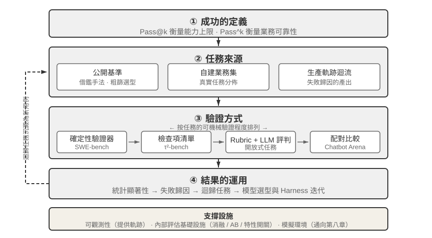
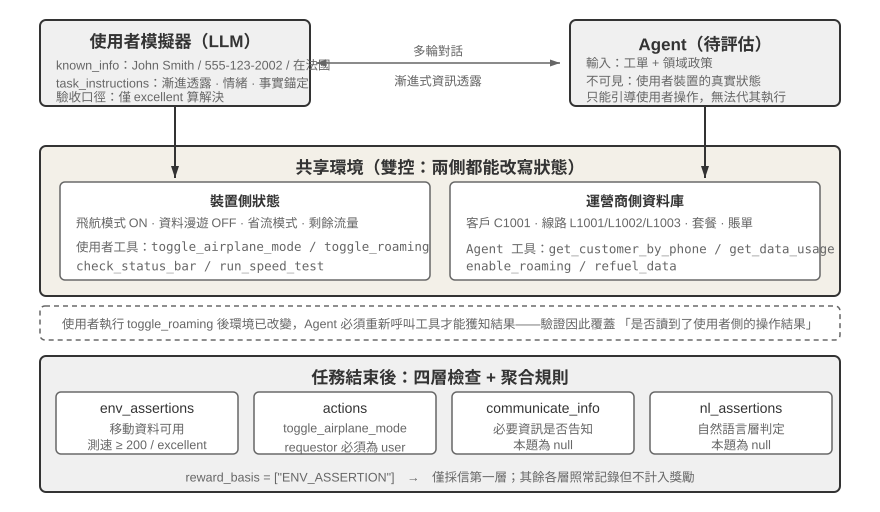
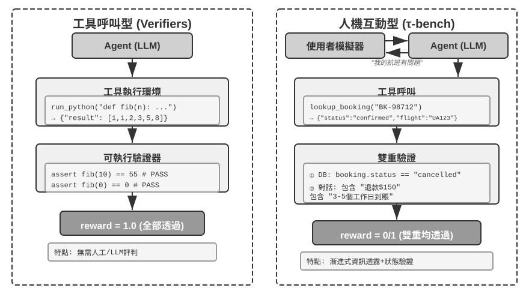
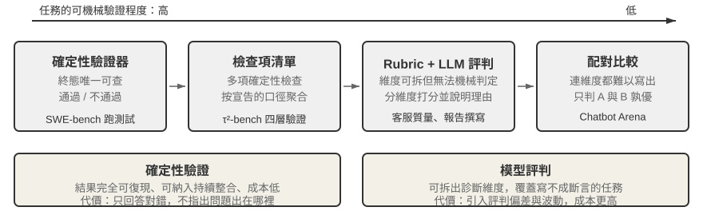
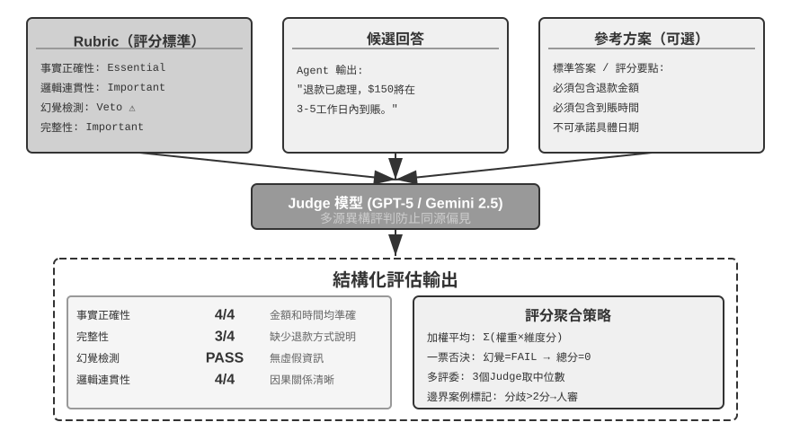
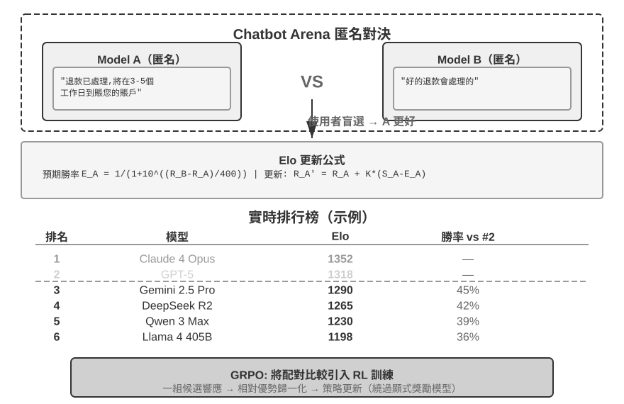
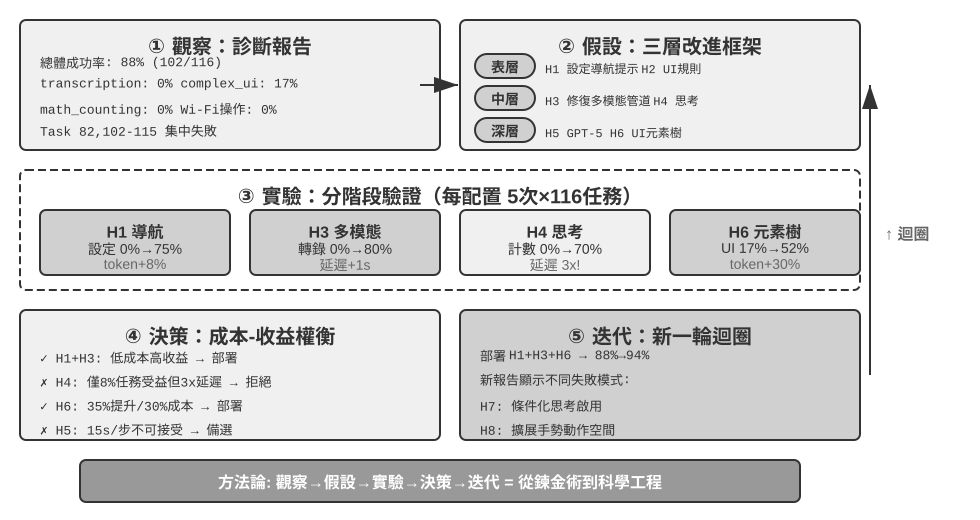
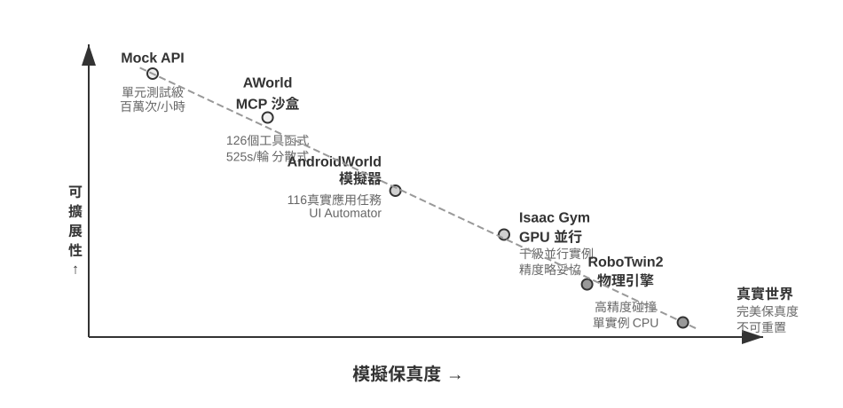
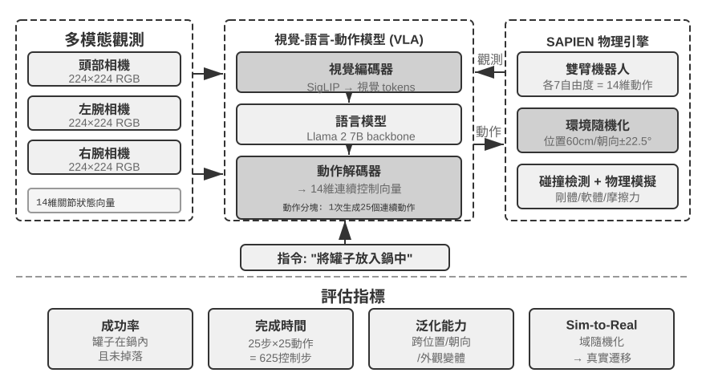

# Agent 的評估

前六章已經展開了單 Agent 的構建：上下文、知識、工具、程式碼能力以及觀察與動作空間。然而，構建完成不等於構建正確；只有能夠穩定測量結果，後續的模型訓練和系統進化才有可靠方向。

構建 Agent 系統時，開發者面對大量設計選擇，而它們往往沒有顯而易見的正確答案：

- 用什麼模型？
- 讓模型能呼叫哪些工具？
- 知識庫該存什麼資料、以什麼結構來構建？
- 使用者記憶該怎麼做？
- 模型的提示詞和 Skills 該如何組織？
- Harness 中需要加上哪些約束？
- 如何把評估結果轉化為 Agent 持續進化的學習訊號？

評估為我們提供了科學的決策依據：通過系統性的**對比實驗**（改變一個變數，觀察效果變化）和**消融實驗**（逐一關閉某個元件，觀察整體效能變化，從而判斷該元件的真實貢獻），區分真正的能力提升與表面的波動，避免 「撿了芝麻，丟了西瓜」。正如軟體工程中 「沒有度量就沒有改進」 的說法，不建立可重複的評估體系，Agent 的迭代方向就只能靠直覺。

從第一章引入的 Harness 工程視角看，評估在 Harness 中扮演著 「驗證」 功能的核心角色。一個關鍵認識是：**評估的物件不應只是模型，而應是模型與 Harness 的組合體**。同一個模型在不同的 Harness 中可能表現差異懸殊。一些團隊僅通過最佳化 Harness 就顯著提升了同一模型在終端類任務上的表現（詳見第五章）。這意味著，當 Agent 在評估中表現不佳時，改進方向可能不是換模型，而是最佳化 Harness 的某個元件（提示詞、工具設計、回饋迴圈）。完善的評估體系應能區分 「模型能力不足」 和 「Harness 設計缺陷」 這兩類本質不同的問題。

**區分這兩類問題的常見手段是模型替換實驗（model swap）**——固定 Harness，只更換更強/更弱的模型，觀察分數變化幅度；如果換強模型分數不漲，說明瓶頸在 Harness；如果換弱模型分數大跌、分數隨模型能力大幅波動，最直接的解讀就是瓶頸在模型能力本身、目前表現主要由模型決定（至於這是因為任務本身就難，還是 Harness 過度依賴模型先驗，則需進一步分析）。注意這與前面提到的 「消融實驗」 是兩種不同的方法：消融是**關閉 Harness 的某個元件**看整體效能如何變化，模型替換則是**固定 Harness、只換模型**——前者定位 Harness 內部哪個部件重要，後者區分瓶頸在模型還是在 Harness。

評估體系的價值在模型快速演進的時代更加凸顯。模型能力仍在快速演進，但新模型在公開基準上表現更好，並不意味著在你的特定任務上也更好，反而可能出現效能退化（regression，即新版本在某些方面不如舊版本）。只有在自己的評估資料集上完整測試，才能做出資料驅動的升級決策。更進一步，完善的評估體系使得 **「為未來的模型開發產品」** 成為可行策略——即使目前模型不足以支撐商用，也可以先完成產品開發並建立評估集，持續追蹤新模型的表現，一旦達到門檻就立即上線。

一套評估體系可以拆成四個環節：什麼算成功、任務從何而來、由誰驗證、分數如何轉化為決策，如圖7-1 所示。



## 一條評估任務的解剖：τ²-bench 的 telecom 領域

我們先完整解剖 τ²-bench 的 telecom 領域一條真實任務。原始碼位於倉庫的 `chapter7/tau2-bench`，任務檔案為 `data/tau2/domains/telecom/tasks_small.json`。

### 任務定義的四個組成部分

以下是該檔案中的一條任務，為便於閱讀做了刪節。

```jsonc
{
  "id": "[mobile_data_issue]airplane_mode_on|user_abroad_roaming_enabled_off",

  // 提供給 Agent 的工單
  "ticket": "使用者手機無法上網，狀態列顯示 'No Service'。客戶 John Smith，
             號碼 555-123-2002，目前在法國。速度測試結果為 excellent 才算解決。
             不更換套餐，必要時願意充值 2.0 GB 流量。",

  // 提供給使用者模擬器的行為規範
  "user_scenario": { "instructions": {
      "known_info": "You are John Smith with phone number 555-123-2002.
                     You are currently abroad in France.",
      "unknown_info": null,
      "task_instructions":
        "…express mild frustration after the first unsuccessful attempt.
         You will consider the issue resolved only when speed test returns
         excellent internet speed and nothing else. If it returns poor, fair
         or good, you will not consider the issue resolved.
         Whenever the agent asks you about your device, always ground your
         responses on the results of tool calls. …
         Never make up the results of tool calls."
  }},

  // 執行前將兩側狀態重置到同一起點
  "initial_state": { "initialization_actions": [
      { "env_type": "user",      "func_name": "turn_airplane_mode_on" },
      { "env_type": "user",      "func_name": "turn_roaming_off" },
      { "env_type": "assistant", "func_name": "enable_roaming",
        "arguments": { "customer_id": "C1001", "line_id": "L1002" } }
  ]},

  // 評分標準
  "evaluation_criteria": {
      "actions": [
        { "requestor": "user", "name": "toggle_airplane_mode" },
        { "requestor": "user", "name": "toggle_roaming" }
      ],
      "env_assertions": [
        { "func_name": "assert_mobile_data_status", "expected_status": true },
        { "func_name": "assert_internet_speed",
          "expected_speed": 200, "expected_desc": "excellent" }
      ],
      "communicate_info": null,
      "nl_assertions": null,
      "reward_basis": ["ENV_ASSERTION"]
  }
}
```

這段定義中有四處設計值得說明：

**顯式建模使用者的認知邊界。** `known_info` 僅包含姓名、號碼與所在國家三項資訊。飛航模式開啟、資料漫遊關閉這兩項真正的故障原因不在其中——使用者並不知情，因而無法主動陳述，Agent 只能通過提問和引導使用者查詢來獲取。這就是**漸進式資訊透露（Progressive Information Disclosure）** 在任務定義層面的實作方式：它並非依靠一句 「不要一次說完」 的提示詞去約束模擬器，而是將使用者的知識範圍建模為一個獨立欄位。多數基準在任務開始時即給出完整需求，而真實使用者的初始表述往往只是 「我上不了網」，Agent 必須主動找使用者澄清需求，而不是。

**防止使用者模擬器被 Agent 忽悠。** `task_instructions` 包含三類約束：情緒設定（首次修復失敗後應表現出輕度不滿）、驗收口徑（僅當測速結果為 excellent 時才認定問題解決，poor、fair、good 均不接受）、以及**事實錨定（Grounding）** 要求，即關於裝置狀態的任何回答都必須以工具返回結果為依據。缺少事實錨定約束時，模擬使用者會順應 Agent 的引導確認問題已解決，評估隨之退化為兩個模型之間的相互確認。

**模擬使用者和 Agent 都不具備完全資訊。** 飛航模式與漫遊開關屬於使用者側，運營商側的 `enable_roaming` 屬於 Agent 側。這一劃分決定了故障的形態——運營商側漫遊已開通，使用者裝置側卻處於關閉狀態，Agent 查詢資料庫只能得到 「配置正常」 的結論。故障位於資料庫不可見的一側，只有引導使用者查詢才能發現。

**多個維度的過程和結果校驗。** `env_assertions` 檢驗終態（移動資料可用、測速達 200 Mbps 以上且評級為 excellent），`actions` 檢驗關鍵動作是否發生，`communicate_info` 與 `nl_assertions` 檢驗必要資訊是否已告知使用者。每個任務可以檢查四個維度中一個或多個維度的結果。

### 一次真實執行的軌跡

下面請讀者執行 τ²-bench telecom 領域的評估任務，實際觀察任務設計、使用者模擬器的設計、過程和結果校驗邏輯，並觀察 Agent 的執行軌跡，分析 Agent 為何失敗。

> **實驗 7-1 ★：執行 τ²-bench 並對比 τ-bench 的演進**
>
> 本實驗通過執行 τ²-bench 評估框架，理解人機互動型評估環境的設計要點。首先按本節的路徑通讀任務定義檔案：每條任務包含已知資訊、任務指令、初始狀態與成功條件四個部分。隨後執行完整評估流程，觀察使用者模擬器與 Agent 的多輪對話，分析典型失敗模式（政策違規、資訊遺漏、過度轉接人工等）。
>
> 

配套倉庫保留了一次執行記錄（`chapter7/tau2-bench-eval`），下面分析其中一條成功的執行記錄：

前十餘輪為帳戶識別階段。Agent 依據號碼查得客戶 C1001，隨後逐一查詢 L1001、L1002、L1003 三條線路的流量，又回頭詢問使用者在法國實際使用的號碼。第 17 條訊息中它給出了一個錯誤結論：

> **Agent**（17）：號碼 555-123-2002 不在您的活躍線路中，最接近的是 555-123-2001……

該結論僅基於 L1001 一條線路的查詢結果。使用者堅持號碼無誤後，Agent 繼續查詢 L1002，方才對應上。關鍵轉折出現在第 30 條：

> **使用者**（30）→ 呼叫 `check_network_status()`、`check_status_bar()`
>
> **工具返回**（31）：`Airplane Mode: ON | Cellular Connection: no_service | Mobile Data Enabled: Yes | Data Roaming Enabled: No`
>
> **使用者**（33）：我看到手機目前處於飛航模式，因此沒有訊號。移動資料是開啟的，但資料漫遊是關閉的。需要我關掉飛航模式試一下嗎？

發出工具呼叫的是**使用者**而非 Agent。這就是**雙控（Dual-Control）** 機制：模擬使用者擁有一套獨立的工具集，如 `check_status_bar`、`toggle_airplane_mode`、`reseat_sim_card`、`run_speed_test` 等。

其後的排查較為順利：Agent 要求使用者關閉飛航模式並開啟漫遊，使用者執行相應操作（35、37），狀態列轉為 5G 滿格；Agent 要求測速，返回 275 Mbps、評級 Excellent（46），使用者確認問題解決。兩條 `env_assertions` 均通過，`reward = 1.0`。

這條滿分軌跡中還包含一處未被驗證器捕獲的問題。telecom 的 Agent 政策首段即規定 「You should only make one tool call at a time」，而第 4 條訊息中 Agent 一次發出了 `get_customer_by_phone` 與 `get_customer_by_name` 兩個呼叫。驗證器沒有因此判定出錯，原因在於本題的 `reward_basis` 只考慮最終狀態。這並非 τ²-bench 的疏漏，而是二元獎勵的固有代價：它以過程顆粒度換取跨模型可比的單一數字。但生產環境中的評估系統往往需要更多：不僅要判定對錯，還要指出問題出在哪裡。

失敗的那條任務同樣具有分析價值。使用者號碼為 555-123-2002，Agent 卻選定 L1001 線路，並以其 3.2/5 GB 的用量為依據繼續推進。期間 `get_details_by_id(L1001)` 明確返回該線路號碼為 555-123-2001，Agent 讀取了這一結果卻未修正判斷，此後在無關排查上消耗數十條訊息，最終轉接人工。它實際完成了任務的一半——引導使用者關閉了省流模式，該使用者側動作真實發生並被環境驗證；但線路選擇錯誤導致所需的 2 GB 流量充值未執行，三條終態斷言全部失敗。這一失敗形態與後文 「失敗歸因」 一節討論的 AndroidWorld 案例高度相似：修正判斷所需的證據已進入上下文，Agent 未據此回溯。

這條任務已經把一個評估集必須回答的問題擺全了：什麼算成功、任務從何而來、由誰驗證、分數如何轉化為決策。以下幾節依次展開。

## 評估指標：成功的定義

上一節的評估結果是五條任務通過四條。僅憑 0.8 這個數字無法判斷該系統是否可用。若它對應的是一個退款客服，則意味著每五名使用者中就有一人未能拿到應得的退款；若它對應的是一個用於挖掘漏洞的安全 Agent，五次中命中四次已屬相當可觀。差別在於業務場景對成功率有多高的要求。

### 技術奇觀：用 Pass@k 看能力上限

目前許多模型和 Agent 仍處在一個可以稱為 **「技術奇觀」** 的階段。這裡的 「奇觀」 是指在大量嘗試、充足時間和人工篩選下展示出的能力上限：只要其中一次成功，就足以證明 「這件事原則上做得到」。這正是 **Pass@k** 的邏輯——在同一任務上執行 $k$ 次，只要至少有一次通過，任務就算通過；如果輸出是連續得分，則取最好的一次，記為 **Best@k**。

Anthropic 對長時執行 Agent 的討論體現了這類能力上限。例如，讓 Agent 自主工作一週，從頭寫出一個 C 編譯器；或者持續探索，直到找到一個重要數學猜想的反例；又或者反覆審查開源軟體，發現已經存在幾十年的重大安全漏洞。

對這類工程與科研探索，展示的通常不是「每次都做對」，而是把探索預算拉長後終於出現一條突破性軌跡。對於科研發現、漏洞挖掘、開放式創作等任務，這種能力上限本身就很有價值：人類可以從 $k$ 條候選軌跡中挑出那一條最好的。

除了基座模型，很多應用公司也在使用 「技術奇觀」 策略。Manus 之所以引發廣泛關注，是因為它提供了一個虛擬電腦，讓此前對 Agent 沒有直觀概念的人發現 AI 可以像人一樣操作電腦，持續工作半小時甚至一小時，逐步完成複雜的任務。

OpenClaw 則讓很多人第一次感受到 Agent 的 「活人感」。使用者可以像給真人安排工作一樣，通過即時通訊軟體給它分配任務；它可以存取電腦上的所有檔案和線上服務，工作到一定階段會主動回饋或向使用者索取新資訊，甚至能夠主動喚醒自己去查詢和處理郵件。

早期的 Manus 和 OpenClaw 在完成複雜任務時的成功率並不高，token 成本也非常高。但由於這些 Agent 框架具有通用性，使用最強模型時，複雜任務往往有較高的 Pass@k，展現出較高的技術上限。這些 「技術奇觀」 在社交網路上被大量分享，是這些 Agent 產品成功的關鍵。

### 業務可靠性：關注 Pass^k

真實業務通常更關心另一件事：在多次嘗試中一次錯都不能犯。我們把這個目標稱為 **Pass^k**（可以讀作 **Pass consecutive k**）：同一任務連續執行 $k$ 次，要求每一次都通過，且不能觸發安全、合規或幻覺等一票否決項。它回答的是「Agent 能否穩定可靠地交付」，而不是 「能否偶爾創造奇蹟」。

若每次執行相互獨立、單次成功率為 $p$，兩類指標的關係很直觀：

$$
\mathrm{Pass@k}=1-(1-p)^k,\qquad
\mathrm{Pass}^{k}=p^k.
$$

例如單次成功率 $p=0.6$ 時，$k=5$：Pass@5 $=1-0.4^5\approx99.0\%$，看起來幾乎總能 「至少成功一次」；但 Pass^5 $=0.6^5\approx7.8\%$，說明連續五次都不出錯仍然很難。前一個數字適合衡量探索時的能力天花板，後一個數字才接近支付、退款、許可權變更、生產部署等場景的可靠性要求。

評估報告必須寫清 $k$ 次嘗試的口徑：是同一任務的 $k$ 次獨立取樣，還是生產流水線上連續 $k$ 個任務。對於會產生副作用的操作，不能簡單地 「重試直到成功」，而應在沙盒或可回滾環境中取樣，並把每一次失敗都記入可靠性指標。

## 評估環境

明確了指標口徑，接下來的問題是在哪裡測。評估環境是一套能夠重複執行的裝置：給定同一個初始狀態，同一個 Agent 應當得到可比較的結果。

### 五個組成要素

回到前面解剖的那條 telecom 任務。以它為參照，一個可重複執行的評估環境所需的組成部分已經完備。

**資料集（Dataset）** 即任務檔案本身：初始狀態、給 Agent 的工單、給模擬器的行為規範與驗收標準打包為一條記錄，一條記錄即一個用例。

**環境狀態（Environment State）** 是任務執行中的可變資訊：資料庫中的客戶、線路、套餐與帳單，加上裝置側的飛航模式、漫遊、省流開關與剩餘流量。它必須可重置，`initialization_actions` 即重置指令碼。真實性要求狀態變化符合業務邏輯，可控性要求每次執行前都能回到同一起點。

**工具介面（Tools）** 分屬兩側。Agent 可呼叫查詢客戶、查詢用量、充值流量、轉接人工等運營商側操作；使用者可呼叫裝置側的各項開關。兩套工具均為原子操作，不存在 「解決使用者的上網問題」 這類高層抽象——抽象層次過高會使評估退化為對單次函式呼叫的考察，規劃與推理環節被工具本身吸收。

**評分標準（Rubric）** 即 `evaluation_criteria` 的四層檢查，加上 `reward_basis` 這一聚合規則。

**執行協定（Interaction Protocol）** 規定互動順序與終止條件。此處的正常終止訊號為模擬使用者輸出 `###STOP###`，此外還有輪數上限，以及模擬使用者因耐心耗盡而主動結束對話——溝通效率過低本身即計為失敗。

五個要素缺其一，評估便無法構成可重複的迴圈。後文考察其他基準時，仍以這五項作為對照框架。

### 人機互動型與工具呼叫型評估環境

telecom 這類任務必須設定互動物件，五個要素中的使用者模擬部分不可或缺。另有一大類任務並不存在對話對方：程式碼生成、資料分析、數學求解等任務中，Agent 自始至終只與工具互動，正確性由能否通過執行驗證決定，既不需要人工標註，也不需要模型評判。這類環境省去了使用者模擬器，其餘四個要素依然存在，只是形態更簡單：環境狀態是檔案系統或資料庫，評分標準是一段測試程式碼，執行協定退化為 「持續呼叫工具，直至給出答案或耗盡輪次」。

Verifiers 框架按兩個維度對這類環境分層：任務是否需要保持跨輪狀態，是否需要隔離。`SingleTurnEnv` 適用於問一道數學題後直接驗證答案；`ToolEnv` 適用於搜尋多個網頁後綜合回答再驗證最終結果；`StatefulToolEnv` 適用於修改資料庫記錄後驗證狀態變化；`SandboxEnv` 適用於在沙盒中執行程式碼後檢查輸出檔案。表7-1 彙總了這四類環境，便於按任務狀態、工具呼叫和隔離需求進行選擇。

表7-1 Verifiers 環境型別對比

| 環境型別 | 狀態保持 | 工具呼叫 | 典型用例 |
|---|---|---|---|
| SingleTurnEnv | 無 | 無 | 單輪問答、數學題 |
| ToolEnv | 無 | 多輪 | 搜尋+資訊綜合 |
| StatefulToolEnv | 有 | 多輪 | 修改資料庫記錄 |
| SandboxEnv | 有+隔離 | 多輪 | 程式碼執行與測試 |

該框架支持並行取樣與軌跡快取，每次評估的完整軌跡（觀察、行動、獎勵）均會儲存，便於後續分析與回放。此外，工具的執行效果取決於目前狀態，因此失敗時應返回清晰的錯誤資訊而非單一的失敗標誌，使 Agent 能夠據此調整策略。

工具呼叫型評估考察的是可觀測狀態變更的正確性，人機互動型評估考察的則是溝通策略的合理性——前者驗證行動，後者驗證引導。兩類環境的結構對比見圖7-2。



## 評估資料集的設計

評估環境是舞臺，資料集是劇本。同樣是那五個要素，換一類任務，填法可能完全不同：任務從何而來、驗證器能核實到什麼深度、如何防止被記憶。本節從幾個公開基準的設計實踐入手，最後回到一個更實際的問題——自建評估集的任務應當從哪裡來。

### 基準設計的橫向對照

上一節區分的有無互動物件只是環境層面的第一層差異，資料集層面的分歧更能體現設計取捨。表7-2 將幾個常被引用的基準並列。

表7-2 幾個 Agent 基準的關鍵設計選擇

| 基準                 | 被測能力               | 任務來源                 | 環境扮演者          | 驗證器                                  |
| ------------------ | ------------------ | -------------------- | -------------- | ------------------------------------ |
| τ²-bench           | 客服場景下的人機互動和工具呼叫    | 人工編寫 + 組合生成          | 使用者模擬器 + 業務資料庫  | 四層檢查按 `reward_basis` 聚合為二元           |
| SWE-bench Verified | 軟體開發，coding        | GitHub 真實 issue，人工篩選 | 程式碼倉庫 + 測試套件    | FAIL\_TO\_PASS / PASS\_TO\_PASS 雙重驗證 |
| AndroidWorld       | 操作 Android 手機 GUI  | 參數化範本例項化             | 真實 Android 模擬器 | 最終 UI 狀態斷言                           |
| OSWorld            | 操作 Linux 桌面 GUI    | 從預置的中間狀態啟動           | 真實虛擬機器          | 134 個獨立評估函式                          |
| Terminal-Bench     | 操作 Linux 終端，coding | 人工編寫                 | Docker 容器      | 檔案系統檢查 + 真實執行                        |
| GAIA               | 蒐集資訊的通用 AI 助手      | 人工編寫 + 專有附件          | 開放網際網路          | 精確字串匹配                              |

### 驗證器

Agent 很容易寫一篇洋洋灑灑的報告，說任務已經全部完成，但事實上根本沒有完成。評估框架必須核實機器可獨立複核的事實，而非 Agent 的自我陳述。

**SWE-bench Verified 將 「修復完成」 拆解為兩個獨立命題。** 一組是 FAIL\_TO\_PASS：修復前失敗、修復後通過，證明問題確已解決；另一組是 PASS\_TO\_PASS：修復前後均通過，證明未引入新的缺陷。只檢驗前者，Agent 可以通過刪改妨礙通過的斷言矇混；只檢驗後者，則等同於未作檢驗。兩組同時檢驗，才使 「已修復」 與 「未破壞」 成為兩個各自可證的結論。它還額外確認測試自身的穩定性，排除時而通過時而失敗的不穩定測試（flaky test）。

**OSWorld 的驗證器能發現表面完成但實質錯誤的情形。** 它配備 134 個獨立評估函式，擁有完整的作業系統存取許可權，能夠檢查檔案系統結構、程序狀態、網路連線與應用內部狀態。在資料庫操作任務中，評估指令碼不僅確認報告檔案存在，還會連線資料庫核實 SQL 是否正確執行；在瀏覽器任務中則會分析 DOM 樹、檢查 cookie 與 localStorage、向後端傳送驗證請求確認表單確已生效。

**Terminal-Bench** 的任務 `build-linux-kernel-qemu` 要求從原始碼構建 Linux 核心 6.9，在 `start_kernel` 中加入自定義 printk，生成 initramfs 並在 QEMU 中執行，成功標準是啟動日誌中出現該自定義訊息。Agent 無法偽造輸出，只能真正完成整個流程。

### 任務的難度劃分

評估任務集需要包括不同難度的任務。這樣，當模型能力提升時，評估任務集不會快速過時。

GAIA 全套 466 題分為三級難度，Level 1 只需一至兩個工具（人類 93.9%，GPT-4 30.3%），Level 2 需要多步思考（91.8% 對 9.7%），Level 3 需要複雜組合（87.3% 對 0%）。這一分層不止標註難度，更具備診斷價值：Level 1 失敗指向基礎工具使用，Level 2 指向多步規劃與資訊整合，Level 3 指向長序列思考與複雜性管理，三者對應的改進方向各不相同。

Terminal-Bench 涵蓋從簡單的 mlflow 模型註冊，到中等難度的 7z 密碼破解，到困難的 git 伺服器與 webserver 多元件整合，再到最高難度的 FEAL 差分密碼分析。

τ²-bench 還專門設計了**陷阱任務**，即使用者聲稱 「客服已批准取消」，實際並不符合政策，用以檢驗 Agent 在壓力與誤導下能否維持正確判斷。

### 資料洩漏防範

**GAIA 使答案無法從網際網路直接檢索。** 它的任務概念簡單而路徑開放，例如從某一特定日期的 NASA 每日天文圖片出發，識別圖中宇航員，查出其所屬的宇航員組，再計算該組中在太空停留時間最短者，並嚴格按 「姓氏，分號分隔，千位分隔符」 的格式輸出。答案高度具體，正確與否通過精確字串匹配判定。防洩漏依靠兩點：其一，問題必須組合多個資訊源才能作答，單一網頁無法直接給出答案；其二，部分任務配有專門製作的附件（網際網路上不存在的 PDF、音訊、圖片）。

**AndroidWorld 以單個範本派生大量例項。** 其任務並非靜態文字，而是可動態例項化的範本，例如 「將聯絡人 `[CONTACT_NAME]` 的電話改為 `[NEW_PHONE]`」，每次評估隨機生成參數值。這帶來三方面收益：參數每次不同，回放固定操作序列失效；單個範本可生成近乎無限的例項；固定部分參數、只改變其餘參數，可精確測量特定因素的影響。

**Terminal-Bench 在題面中嵌入金絲雀識別符號。** 每道題攜帶一個 canary GUID，若模型能夠輸出含該 GUID 的內容，即說明基準資料已進入訓練集。它不阻止資料洩漏，但使洩漏可被偵測。

### 質量控制與長期維護

做一個高質量的評估集是非常困難的。上面幾個基準測試的現行形態，多數是在初版投入使用、暴露問題之後逐輪修補的結果。例如，從 τ-bench 到 τ²-bench 有五處重新設計的地方：

其一，**任務指令過於籠統，導致答案可被猜測**。初版的任務指令寫得寬泛，模型無需真正澄清需求，憑常識推測一套流程也能通過。τ²-bench 將劇本拆分為 `known_info` 與 `task_instructions` 兩欄：前者界定使用者知悉的範圍，後者規定透露方式。使用者不知悉的資訊 Agent 無從推測，只能通過查詢獲得。

其二，**成功條件不夠精確，導致驗證誤判**。「網路已恢復」 這類條件缺乏可核實的邊界。τ²-bench 將其改為 「測速結果為 excellent 才算解決，poor、fair、good 均不接受」。這一改動針對的是**敷衍性修復**，即壓制症狀而不解決根因。

其三，**使用者模擬器行為過於機械**。初版的模擬使用者僅作被動應答。τ²-bench 為其補充了情緒（首次修復失敗後表現出不滿）、耐心上限（溝通效率過低時終止對話）以及事實錨定要求。三者共同作用，使模擬器在接近真實使用者的同時仍保持可復現。

其四，**使用者不僅參與對話，也參與操作**。telecom 領域引入了雙控環境。此前的評估中只有 Agent 能夠改變環境，而在技術支持這類場景中，相當一部分動作本應由使用者在自有裝置上完成。雙控同時為驗證增加了一個維度：使用者改變狀態後，Agent 必須重新呼叫工具才能獲知結果，驗證因此覆蓋了 「Agent 是否真的讀到了使用者側的操作結果」。

其五，**任務例項動態生成**。τ²-bench 的具體例項（使用者姓名、號碼、故障組合）可參數化批次生成，這同時改善了覆蓋率與抗洩漏能力。

**SWE-bench Verified：發布前淘汰 71% 的原始任務。** OpenAI 從原始 2294 個任務中隨機抽取 1699 個進行人工評估，招募 93 名精通 Python 的開發者逐條檢查：問題描述是否清晰、測試用例是否覆蓋邊界條件、測試是否穩定、參考 patch 是否引入新錯誤、難度是否合理。最終僅 500 個通過。高淘汰率帶來的是更高的訊雜比，評估成本也下降約 80%。複雜 Agent 任務動輒需要數分鐘至數小時，使用前沿模型完整跑完一個評估資料集往往需要數千美元的 token 成本，降低評估成本非常重要。

**OSWorld：發布後 15 個月中暴露出 300 餘個問題。** 它於 2024 年 4 月發布後迅速成為多模態 Agent 評估的重要基準，隨後在廣泛使用中暴露出四類問題：環境問題（網站反爬、CAPTCHA、動態內容變化）、任務描述問題（表述存在歧義）、驗證邏輯問題（過嚴或過鬆）、初始狀態問題（配置不完整）。香港大學團隊組建約 10 人的小組，與 MoonShot AI、OpenAI、ByteDance Seed TARS、Anthropic、Simular 等深度合作兩個月進行系統性修復：環境問題通過鎖定版本和離線備份解決，描述問題通過改寫歧義表述消除，驗證問題通過人工建立正確基線並調整條件解決，初始狀態問題通過增加完整性校驗緩解。

> **實驗 7-2 ★：人肉執行基準測試任務**
>
> 從 GAIA、AndroidWorld、SWE-Bench Verified、Terminal-Bench、OSWorld-Verified 中挑選任務親手完成，每個資料集建議完成簡單、中等、困難各一個。「困難」 級別對人類同樣具有挑戰。
>
> 完成後回答兩個問題：該任務的描述是否存在多種合理解釋，若存在，驗證器認可哪一種？若試圖矇混過關，成本最低的路徑是什麼，驗證器能否攔截？

### 評估集的三個來源

一種常見的看法是，公開基準服務於模型排名，與實際業務關聯有限。公開基準的分數確實難以直接指導產品決策，但其設計手法具有充分的可遷移性。前面討論的驗證深度、參數化生成、洩漏防範與質量維護，恰是自建評估集最容易疏漏的幾處。

生產環境中的評估集通常有三個來源。

**公開基準**用於粗篩模型與借鑑設計手法，一般不用於產品決策。它的任務分布與實際業務的任務分布並不一致，在 GAIA 上提升兩個百分點，與退款成功率之間不存在必然關係。

**自建業務集**覆蓋真實的任務分布，可以作為模型選型、Harness 設計決策的依據。例如，τ²-bench 可以作為需要模擬使用者的評估系統骨架，替換領域資料與工具集即可。

**生產軌跡迴流**來自線上的真實失敗用例：使用者明確糾正、使用者點踩，以及事後通過狀態檢查、規則驗證器或 LLM 評審發現的問題案例，經失敗歸因後沉澱為迴歸用例。具體做法見後文 「失敗歸因」 與 「端到端迴歸任務與軌跡前綴迴歸任務」 兩節。這一來源成本最高，準確性也最高，因為它直接來自使用者實際遇到的問題。

起步階段通常只有公開基準與少量手寫的自建業務集；系統上線執行一段時間後，生產軌跡迴流的用例會成為主體。

## 自動化評估方法

前面幾節討論的基準測試有一個共同點：驗證器幾乎都是確定性的。SWE-bench 執行測試套件，AndroidWorld 斷言最終 UI 狀態，GAIA 做精確字串匹配，τ²-bench 的四層檢查同樣全部由程式碼執行。這一選擇有充分理由：確定性驗證不引入額外的模型開銷，結果完全可復現，可以像單元測試一樣納入持續整合，也便於在不同模型之間排名。

代價是它只能評估最終結果對不對，但不能給出錯誤原因。τ²-bench 那條失敗的任務最終得 0 分，而這個 0 分不會說明 Agent 是線上路選擇環節出錯、還是漏掉了流量充值步驟，更不會指出下一步該改什麼。對於用於排名的公開基準，這不構成缺陷；對於需要持續改進的生產系統，這恰恰是最需要的資訊。

生產場景還有另一重困難：許多判斷根本無法寫成程式碼可檢查的斷言。一封投訴回覆是否得體，一份調研報告是否遺漏了關鍵資訊，一次記憶檢索是否弄錯了人物關係，這些既沒有唯一終態可供查詢，也無法靠關鍵詞匹配來判定。

因此，從公開基準測試走向生產環境中的評估，驗證方式需要沿一條譜系向右移動，其橫軸是任務的**可機械驗證程度**，如圖7-4 所示。



譜系右側的兩件工具因此成為生產評估的主體：用 **Rubric** 把籠統的 「好不好」 拆成若干個可分別打分的維度，用 **LLM-as-a-Judge** 在缺乏確定性判據時完成打分。二者合起來，才能把一個籠統的失敗率還原為可著手修復的具體問題；再配合本節後半部分的**失敗歸因**，構成生產 Agent 評估的完整閉環。

需要說明的是，向右移動並不意味著放棄左側。凡是能寫成程式化斷言的檢查都應當繼續用斷言，LLM 評判只用於確實無法機械判定的維度。確定性檢查更便宜、更穩定，也更適合作為迴歸測試長期執行。

### LLM-as-a-Judge：自動化評估的核心



為什麼需要 LLM-as-a-Judge？對於開放式任務（如生成報告、處理客戶投訴、創意內容），沒有標準答案可以自動對比，人工評估成本高且難以規模化。LLM-as-a-Judge 透過讓語言模型根據專家定義的評分標準（Rubric）進行評判，在自動化規模和人類專業判斷之間取得了平衡。但這種方法也有已知的侷限：評判模型可能有自己的偏見（最典型的是**長度偏差**——傾向於給更長、更詳盡的回覆打高分，哪怕內容並不更正確），相同輸入多次評判也可能有波動。長度偏差尤其值得單獨防範，常用手段有三：在 Rubric 裡顯式懲罰冗長、對同類任務規定回答的長度上限；做配對比較時先把兩個候選的長度控制到相近再評；以及定期審計評分與回答長度的相關性——如果高分幾乎總是伴隨長回答，就說明評判已被長度帶偏，需要回爐修訂 Rubric。為了系統性地應對這些挑戰，Rubric 設計必須遵循以下準則：

**Rubric（評分標準）：LLM 評判的依據。**

**Rubric 四準則**（Scale AI，「Rubrics as Rewards」）：

（1）**基於專家指導**——必須反映領域知識，捕捉核心事實和推理步驟。比如醫療問答的 Rubric 需包含診斷標準和必須避免的醫學錯誤，缺乏專業基礎的 Rubric 只能捕捉語言流暢度等表面特徵。

（2）**全面覆蓋**——涵蓋事實準確性、邏輯連貫性、完整性、安全性，而且不僅定義正面標準，還要明確**陷阱（Pitfall）**——即高風險的常見錯誤，如醫療建議中推薦未經驗證的療法。

（3）**標準重要性權重**——分為必要項（Essential）、重要項、可選項、陷阱項。支援**一票否決機制（Veto）**：比如在客服場景中，幻覺（編造虛假資訊）是典型的否決維度——無論其他維度表現多優秀，只要出現虛假資訊就必須否決。這也有助於防範關鍵詞堆砌式的獎勵作弊。

（4）**自包含評估**——每個評價項獨立可操作，不依賴評價者的領域知識。要避免「回應展示了深刻理解」這種抽象標準，改為「引用了至少兩個權威理論並準確解釋如何支援結論」這種可驗證的標準。

關鍵實踐：為每個維度定義客觀可驗證的評分等級，提供具體示例和**邊界案例**幫助區分模糊情況。要主動防範**獎勵作弊（Reward Hacking）**——即 Agent 找到了獲取高分的「捷徑」卻沒有真正完成任務——明確懲罰幻覺、討好使用者、關鍵詞堆砌、迴避棘手問題。Rubric 是迭代產物——透過試用收集評價者分歧、逐步完善，逐漸從抽象準則演化為詳盡的判例集。

以使用者記憶 Agent 為例，展示一個符合四準則的完整 Rubric。測試問題：「我女兒的兒科醫生是誰？」（答案需要跨兩次對話關聯：第一次對話提到「女兒叫 Lily」，第二次提到「帶 Lily 去看了 Dr. Chen」）。

```yaml
rubric:
  dimensions:
    - name: 事實正確性
      weight: essential        # 必要項
      scoring:
        4_優秀: "準確回答 Dr. Chen，且關聯到女兒 Lily"
        3_良好: "準確回答 Dr. Chen，但未提及是 Lily 的醫生"
        2_及格: "給出了正確醫生但附帶不確定的額外資訊"
        1_不及格: "給出錯誤醫生名，或回答不知道"

    - name: 資訊完整性
      weight: important        # 重要項
      scoring:
        4_優秀: "主動補充相關資訊（如上次就診時間、診斷結果）"
        3_良好: "回答了核心問題，無遺漏"
        2_及格: "回答了核心問題，但遺漏了可用的關聯資訊"
        1_不及格: "關鍵資訊缺失"

    - name: 思考正確性
      weight: important
      scoring:
        4_優秀: "正確關聯'女兒=Lily'和'Lily的醫生=Dr. Chen'兩條跨會話資訊"
        3_良好: "關聯正確但思考路徑不夠清晰"
        2_及格: "部分關聯正確"
        1_不及格: "錯誤關聯（如把使用者自己的醫生當成女兒的醫生）"

    - name: 幻覺檢測
      weight: veto             # 否決項：一旦觸發，總分歸零
      scoring:
        pass: "所有資訊均可溯源到歷史對話記錄"
        fail: "編造了對話中不存在的資訊（如虛構就診日期、診斷結果）"

  edge_cases:
    - "如果使用者有多個女兒且分別看不同的醫生，應追問是哪個女兒"
    - "如果記憶中同時存在'Dr. Chen'和'陳醫生'，應識別為同一人"
```

**好的 Rubric vs 壞的 Rubric**：上面每個評分檔都給出了可驗證的具體行為（「準確回答 Dr. Chen」），而非「展示了對記憶的深刻理解」這類無法客觀判定的描述。否決項明確了底線：即使其他維度全部滿分，一旦出現幻覺就直接判零。

將這個 Rubric 和 Agent 的實際回答一起交給評判模型，模型會逐項評分並說明理由。彙整數十個案例的結果，再回頭檢視低分軌跡，就能把籠統的「成功率下降」拆成具體問題：究竟是沒有找到資訊、弄錯人物關係，還是加入了沒有根據的內容。這樣一來，Rubric 不只告訴我們分數，也指出下一步該改哪裡。

下面以使用者記憶為一個具體案例，展示如何把這套通用方法落到可執行的評估集和驗證器上。

> **實驗 7-3 ★★：建構基於 Rubric 的使用者記憶評估系統**
>
> **前置要求**：需完成第三章使用者記憶實驗（`chapter3/user-memory-evaluation`）。
>
> 本實驗要求改造第三章的 `chapter3/user-memory-evaluation` 框架，將當前基於簡單 LLM-as-a-Judge 的評分機制升級為結構化的多維度 Rubric 評估系統。現有系統使用單一 LLM 呼叫回傳通過/失敗與評估理由，缺乏結構化的診斷能力。
>
> 設計統一的多維度 Rubric 框架，適用於所有三層任務。評價維度包括：事實正確性（Precision，精確率——在所有給出的資訊中，有多少是正確的）驗證數字/日期/名稱是否與記憶資訊一致；事實完整性（Recall，召回率——在所有應該給出的資訊中，有多少被提及了）驗證是否提供了所有相關資訊而非遺漏關鍵內容；思考正確性檢查是否正確理解了資訊間的關係和隱含邏輯；思考主動性評估是否在適當時候提供超出直接回答的建議或風險提醒；幻覺檢測確保未編造記憶中不存在的資訊。
>
> 四檔制評分（優秀/良好/及格/不及格），每檔配具體判定標準而非抽象描述。幻覺維度設為一票否決項。為每個維度提供示例和邊界案例。
>
> **實驗 7-4 ★★：Advanced JSON Cards 與 RAG 的對比評估**
>
> **前置要求**：需完成第三章使用者記憶與 RAG 實驗（`chapter3/user-memory`、`chapter3/agentic-rag-for-user-memory`）。
>
> **目標**：在同一套評估集上公平比較結構化記憶與非結構化檢索各自適用的範圍。沿用第三章的兩個專案，在 `chapter3/user-memory-evaluation` 的 60 個測試案例上比較三種配置——純 Advanced JSON Cards（結構化卡片常駐上下文、不需檢索）、純 RAG（對話分塊存入向量資料庫、必須檢索），以及混合系統（核心事實常駐 + 原始對話按需檢索）。
>
> **驗收**：在三層複雜度（基礎回憶 / 多會話消歧 / 跨會話隱藏關聯）上記錄成功率、平均步數、工具呼叫次數、延遲與成本，說清每種方案的失效邊界——結構化丟了什麼、檢索漏了什麼、混合是否真有協同。配置細節與測試用例見配套倉庫。
>

配套實驗以同一組 60 道題測試三套記憶方案，共保留 180 條真實 API 執行軌跡。結果列於表 7-3；整體成功率後也附上成功題數，避免百分比掩蓋樣本規模。

表 7-3 三種使用者記憶系統的分層成功率

| 系統 | 基礎回憶 | 多會話消歧 | 跨會話隱藏關聯 | 整體 |
|---|---:|---:|---:|---:|
| Advanced JSON Cards | 95% | 60% | 50% | 68.3%（41/60） |
| RAG | 90% | 40% | 15% | 48.3%（29/60） |
| 混合系統 | 80% | 70% | 50% | 66.7%（40/60） |

最值得注意的是，混合方案並沒有自然勝出。它在 3 道題上做到了兩種單一方案都沒做到的事，卻在另外 8 道題上不如表現更好的單一方案；與每道題上的最佳單一方案相比，平均成功率反而低了。純 RAG 在基礎回憶題上與結構化卡片相差不大，一到跨工作階段關聯題，成功率卻降到 15%。另一個容易被忽視的數字是：180 次評判中，幻覺否決觸發了 28 次，可見一票否決項的重要性。

**同源模型問題與多源評判。**

當 Agent 與評判模型來自同一家族時，Agent 可能學會利用評判模型的偏好和盲點。

**這正是古德哈特定律（Goodhart's Law）所說的：當一個度量指標變成最佳化目標時，它就不再是好的度量指標。** Agent 越是在某個評分系統上訓練或調優，就越傾向於鑽這個系統的漏洞，而非真正提升能力。

更隱蔽的是，Agent 還會逐漸學會避開評判模型不擅長偵測的錯誤型別，讓評分系統看起來一切正常。

緩解策略是**多源異構評判**——使用不同模型家族的多個 LLM 分別評判（比如 Agent 用 Claude，評判就用 GPT-5 和 Gemini），不同家族的偏見往往是正交的，Agent 很難同時「欺騙」所有評判者。使用相同的 Rubric 確保大家評判的是同一目標，透過加權平均或一致性檢查聚合結果。部署階段可以用單一模型快速評估，但應定期用完整的多源評判進行品質審計。

多源評判解決的是「用什麼模型評判」的問題；接下來要解決「評判哪些模態」的問題——把 LLM-as-a-Judge 的能力從文字擴展到語音、影像、影片，是評估覆蓋度的另一維度。

**多模態 LLM-as-a-Judge。**

多模態評判將 LLM-as-a-Judge 擴展到語音、影像、影片領域，常見的四個方向如下。

- **TTS 評估**（TTS 即 Text-to-Speech，文字轉語音）：判斷準確性、自然度、音色一致度、情感表達。這些維度能發現傳統 WER（Word Error Rate，詞錯誤率）難以捕捉的韻律問題。
- **ASR 評估**（ASR 即 Automatic Speech Recognition，語音識別）：做語義影響判斷——「今天天氣」識別錯誤無傷大雅，但「轉賬一千」變成「一萬」就可能造成嚴重後果。
- **UI 評估**：採用**提議者～審核者**（Proposer-Reviewer）機制，檢查文字溢位、顏色對比度、按鈕位置等問題。這裡的提議者～審核者作為**評估方法**使用，與第五章中作為**生成系統元件**的用法不同，但核心機制相同——一個模型生成，另一個模型獨立審查。
- **影片剪輯評估**：透過關鍵幀驗證剪輯起止點和特效應用是否正確。

> **實驗 7-5 ★★：建構全自動 TTS 品質評估流水線**
>
> 本實驗要求從零設計並實現完整的多模態 LLM-as-a-Judge TTS 品質評估系統。
>
> 設計 TTS 多維度 Rubric：準確性維度驗證是否正確讀出所有文字（無遺漏/錯讀/新增），自然度維度評估語音是否流暢（有無機器感、不自然停頓，韻律是否符合人類習慣），情感表達維度檢查語氣是否符合文字情感色彩（疑問句升調、感嘆句強調、悲傷內容語速慢語調低），音色一致性維度在有參考語音時評估說話人相似程度（多模態模型同時接收參考語音與合成語音對比）。
>
> 建構多樣化測試語料庫：不同長度（單句→長段落）、文體（新聞/故事/對話）、情感（中性/興奮/悲傷）、特殊挑戰（數字/專有名詞/多音字/方言詞彙）。評估流程可接入 OpenAI、ElevenLabs、Fish Audio、Minimax、豆包等 TTS 服務，再由可直接接收音訊的多模態評判模型，同時讀取合成語音、原始文字、參考語音與 Rubric，逐項評分並說明理由。除了分析各模型在不同面向的強弱，也要保存評判模型名稱、參考音訊雜湊值與候選音訊雜湊值，讓結果可以追溯與複核。
>

配套倉庫保留了一次小規模直接聽評。OpenAI 與 Fish Audio 各生成四段音訊，分別涵蓋數字、多音字、長句與興奮語氣；8 段音訊都由 Voxtral 按上述四個面向評分。兩者在準確性與自然度上同為 5.00 和 4.00；Fish Audio 的情感表達與音色一致性為 4.00 和 3.00，OpenAI 則是 3.75 和 2.75。把四個面向分開評量後，即使「有沒有讀對」看不出差異，語氣與音色的差距仍會浮現。

但這些分數還不足以判斷哪一家 TTS 較好。每家只有四段音訊，更重要的是，實驗採用的固定參考音訊來自 Fish S1；用它比較音色，本來就對 Fish Audio 有利。如果目標是比較通用 TTS，就不該把「像不像 Fish 的參考音色」納入總分；如果要比較聲音複製，則應讓所有方案模仿同一位目標說話者，再以人工盲聽校準模型分數。**選擇哪一份參考答案、參考圖片或參考音訊，本身就是評估設計的一部分，不是評估前無關緊要的準備工作。**

人工撰寫 Rubric 很適合快速建立這類診斷面向。規模擴大後，也可以訓練專門的**生成式獎勵模型**自動評判——相關訓練方法會在第八章討論。

評判模型給出的分數只說明結果好壞；要把結果變成可以修復的問題，還需要定位失敗究竟從哪一步開始。

### 失敗歸因：從整條軌跡定位首個錯誤

端到端評估通常只給出「成功」或「失敗」。要讓結果真正驅動修復，每條失敗 trajectory 都要記錄錯誤類別、首次出現不可接受行為的步驟、對應的工具呼叫或模型輸出，以及可複核的證據。生產 bad case 可能來自使用者明確糾正、負面回饋，或事後的狀態／規則檢查；LLM 可以協助，但仍需人工閱讀，因為根因常常是產品問題。

Coding Agent 的初始分類可包含流程或倉庫規則缺失、工具／格式錯誤、模型異常終止，以及完成度／邏輯錯誤。以 JSON/YAML 保存步驟號、工具、觀察、根因與後果、可恢復性和信心度，並保留環境狀態、版本和完整 trajectory。

建構失敗歸因系統需要開發者耐心閱讀並分析生產 Agent 的問題軌跡。這個過程可以借助 LLM，但不能完全依賴 LLM，因為**失敗歸因往往反映了產品問題**，不只是技術問題。

隨著產品不斷完善，錯誤分類可能包含多個大類，每個大類下又有多個小類，最終多達數百種。這些錯誤類別和歸因方式可以作為歸因標註 Agent 的提示詞或 Skill。

以 Coding Agent 為例，一個實用的初始分類如下。

| 錯誤類別 | 典型表現 | 首個錯誤的定位方式 |
| --- | --- | --- |
| 需求理解與歧義處理 | 做出來的不是使用者要的：漏掉需求裡的一個條件、把範圍理解寬了或窄了；倉庫裡有兩個同名設定檔時直接選一個，既不說明也不追問 | 用 LLM 把原始需求與 Agent **實際做的事**（動作序列）逐條對照，先定位第一處偏離，再回溯到造成它的那次工具呼叫或那句答覆 |
| 流程與規範缺失 | 未執行單元測試就提交；未寫 Plan 就開始改程式碼；引入外部相依而倉庫已有內部等價物；繞過既定架構約定 | 找到第一次違反軟體開發流程約定的動作，例如首次 `git commit`、首次寫檔案；回看它之前有沒有讀過約定來源 |
| 工具呼叫錯誤 | 同一檔案反覆編輯失敗；JSON/schema 或參數格式錯誤；特殊字元導致抄寫、跳脫或寫入錯誤 | 記錄第一次失敗的編輯／工具及原始請求、錯誤回傳；重複失敗屬於後續症狀 |
| hack 驗證環境 | 直接改斷言、加 skip、mock 掉被測邏輯；聲稱「測試已通過」但根本沒跑 | 取第一次改動測試或驗證邏輯的 message；再把完成聲明與軌跡裡真實執行過的指令交叉核對，確認它是否真的跑過 |
| 修改不完整 | 改了函式簽章，改了三處呼叫方，漏了第四處的動態呼叫、另一語言的繫結或 schema | 把 Agent 聲稱的影響面與真實影響面做集合差，取第一個遺漏項，回看它檢索時用了什麼關鍵字 |
| 對使用者的資訊回饋錯誤 | 工具呼叫和環境狀態全對，最終告訴使用者的資訊卻錯了：金額、狀態、時間說錯；把部分做完說成全部做完；漏掉必須告知的事項 | 把答覆裡的每個事實斷言與工具回傳值逐條對齊，取第一條無法溯源或與工具回傳矛盾的斷言 |
| 非功能性迴歸 | 改了公開 API、schema 而無資料庫遷移腳本；為讓校驗通過而刪掉校驗 | 取第一次做出該改動的 message，看它是否意識到自己動的是公開介面或需要遷移的結構 |
| 模型執行異常 | 輸出中途截斷、無故停止、逾時，或沒有完成收尾動作就結束 | 定位第一個異常終止的位置，區分模型停止、Harness 逾時和工具服務故障 |
| 過早停止任務 | 多目標任務只完成一部分；未窮盡合理方案就宣布不可能 | 定位第一次遺漏目標或放棄探索的決策，並與最終驗證失敗分開記錄 |

**歸因標註 Agent 可以利用 LLM 規模化完成大量生產軌跡的根因分析**，但不能只輸出一句「失敗原因」。**歸因記錄需要結構化**，可以採用 JSON 或 YAML 文件格式，並引用具體的步驟號、工具名和觀察證據；同時還要區分根因與後果、判斷是否可恢復並給出信賴度。例如，`edit_file` 回傳 `old_string` 比對失敗，之後 Agent 連續三次重試仍未寫入檔案：主因是「檔案編輯與工具呼叫錯誤」，三次重試是後果，而不是三個獨立根因。若多個類別同時出現，按「最早且能解釋後續失敗」的原則選主因，其餘保留為次因。上表中至少有三類可以先用規則篩出嫌疑軌跡、再交給 LLM 定位首錯：完成聲明與實際執行指令的交叉核對、diff 是否觸及測試斷言與 skip 標記、diff 是否改動公開 API 或 schema 而無遷移檔案。規則先篩、LLM 再定位，比把全部軌跡餵給 LLM 更便宜也更準。

在儲存歸因記錄時，除了 LLM 輸出的記錄，還應把任務目標、環境狀態、Agent 版本、工具集版本和完整的 Agent 軌跡一起儲存，以便進行迴歸測試。

下面以三類典型錯誤為例進行介紹。

#### 「做對了但說錯了」問題

「做對了但說錯了」這一類最容易被整體成功率掩蓋，因為多數評估只檢查環境狀態。τ²-bench 把它單獨計分：在公開的基線結果中，帶有資訊告知要求的 704 次執行共失敗 240 次，其中 162 次的資訊告知出錯；有 80 次（佔全部失敗的三分之一）環境狀態正確，但回報的資訊是錯的。

配套倉庫裡有一個對應的案例。任務是把圖庫中 `expenses.jpg` 裡的開銷錄入記帳應用。Agent 用 32 步完成了授權、搜尋、開啟圖片、逐條填寫和儲存，**沒有任何一步回傳錯誤**，最後自行宣告完成，驗收卻報告應當寫入的記錄不存在——日誌給出的那條是 `Dress`、¥436.35，與它寫進去的四條毫無關係。第 8 步的思考裡寫著 *「I cannot actually see the content/details of the expenses in the image」*：它自己已經知道沒拿到資料，卻既沒有停下也沒有回報；到第 11 步，四條開銷憑空出現在它的記錄裡，此後每一次輸入都在忠實地執行這些捏造的資料。首個錯誤落在第 8 步，而那一步既沒有報錯，也不是一次工具呼叫。它的根因歸屬也容易記錯：T3A 是純文字 Agent，觀察空間裡只有元素樹、根本沒有影像畫素，所以根因不是「模型不會 OCR」，而是 Harness 的觀察通道缺失，外加沒有給 Agent 一個「資訊拿不到」的合法退出動作。記成模型能力問題，接下來就會去換模型或做 OCR 訓練；真正該做的是補觀察通道和補退出動作。

> **實驗 7-6 ★★：對 AndroidWorld 失敗軌跡做失敗歸因**
>
> 本實驗用真實軌跡練習本節的歸因方法，不需要模擬器，也不需要呼叫模型 API。素材是 `chapter7/android-world` 中已儲存的 T3A 執行記錄：`t3a.md` 是全部任務的逐步 `Action`/`Reason`/`Summary`，`t3a_failed.md` 集中收錄了 50 餘條失敗軌跡，每條末尾都帶驗證器給出的客觀判定。
>
> 第一步：抽樣。從 `t3a_failed.md` 中抽取至少 10 條全程沒有工具報錯的靜默失敗。軌跡裡不能有失敗的工具回傳，Agent 自行宣告完成或者耗盡步數，只有末尾的驗證器判定為失敗。
>
> 第二步：定位首個錯誤。為每條軌跡標出首錯步號，並註明它是一次工具呼叫還是一條 assistant message。靜默失敗要靠兩種辦法定位：一是事實錨點比對，把 Agent 的陳述與工具回傳值逐步對齊，取首次背離；二是軌跡前綴二分，把軌跡截到第 k 步交給人接手，能救回來說明錯誤在 k 之後。不能用搜尋報錯關鍵字代替。
>
> 第三步：寫成結構化記錄。每條軌跡產出一條 JSON 或 YAML 記錄，包含任務名、首錯步號、錯誤類別、根因責任方、原文證據，並區分主因與後果。
>
> 第四步：與現成筆記對照。把結果與倉庫中的 `t3a_failed_analysis.md` 逐條比較並記錄分歧。特別注意根因歸屬：該筆記原本把圖片轉錄失敗記成 “視覺模型缺乏 OCR 能力”，而 T3A 的觀察空間裡根本沒有影像畫素，真正的根因是觀察通道缺失。現成的歸因筆記不是標準答案。
>
> 第五步：轉成回歸任務。挑出 3 條首錯發生在 assistant message 上的軌跡，各截取首錯之前的前綴，寫出可接受動作集合與禁止動作，形成軌跡前綴回歸任務。
>

#### 作用域敏感的文件格式錯誤

使用者說「引號格式不對」時，不能直接把它轉成全域字元取代。至少要區分 ASCII 直引號（`"`、`'`）、中文彎引號（`“”`、`‘’`）和 Markdown 反引號（`` ` ``）。同一字元在中文自然語言、英文原文、行內程式碼、程式碼區塊、程式碼註解、JSON 和路徑中承擔的語法角色不同。

評估資料應先把文件解析為帶作用域的片段，例如 `ZH_PROSE`、`EN_PROSE`、`QUOTED_SOURCE`、`INLINE_CODE`、`CODE_BLOCK`、`CODE_COMMENT` 和 `JSON_OR_SCHEMA`。每個片段保存允許變換集合、必須保護的字元以及修改後的驗證器結果。下面三處不能用同一條取代規則處理：

```text
中文說明：呼叫 `reset()` 方法。
這是一段英文原文：“Please restart the service.”
# 以下程式碼區塊僅用於說明受保護作用域
# 中文註解：顯示 "目前狀態"
name = "status"
```

軌跡前綴回歸應要求模型做最小修改，並同時檢查中文文件風格、英文原文保持率、程式碼和 JSON 語法，以及非目標文字的編輯距離。規則無法確定作用域時，保留原文並請求澄清應是允許動作，而不是把猜測性修改算作通過。

#### 精確複製錯誤：從 `old_string` mismatch 到逐層定位

`old_string` 失敗也不能只歸因於「模型抄錯了」。應對同一個字串保存原始 byte 雜湊、Unicode code point 序列和 tokenizer token ID 序列，沿以下鏈路尋找首個差異：

```text
原始檔案 byte → 工具回傳 → Harness 序列化 → 模型上下文
→ 模型 token 輸出 → 解碼字串 → JSON/tool-call 解析 → 工具比對
```

最小化評估探針涵蓋直接複述、從長上下文抽取、放入工具參數、相似字串選擇，以及空格、換行、反斜線、Unicode 組合字元和低頻 token。指標使用 byte-exact match、code-point-exact match、token-exact match、首次分歧位置和真實工具成功率。若模型在直接探針中正確而工具呼叫失敗，應修復 tokenizer、序列化、Harness 或工具協定；只有首個差異出現在模型輸出時，才把該案例轉成第八章的複製訓練資料。

### 端到端回歸任務與 trajectory prefix 回歸任務

失敗歸因明確了首個錯誤及其類別，下一步是把修復目標寫成可重複執行的測試案例，即**迴歸任務**（regression task）。這裡需要兩層互補的迴歸任務：**端到端迴歸任務**驗證改動沒有破壞完整工作流程；**軌跡前綴（trajectory prefix）迴歸任務**則截取首個錯誤之前的狀態，只驗證那個決策邊界是否被修好。

**端到端迴歸任務**從初始狀態和使用者請求開始，讓 Agent 完成整個任務，並檢查最終狀態、必要輸出和安全條件。它最接近生產結果，卻難以判斷失敗究竟發生在哪一步。一般來說，端到端迴歸任務用於驗證 Agent 在各個領域的能力符合預期。本章所述的 OSWorld、AndroidWorld、tau-bench 等標準評測集都是端到端迴歸任務。

**軌跡前綴迴歸任務**把已有的上下文、對話、工具回傳和環境狀態凍結下來，只要求 Agent 思考並執行下一步或下幾步可觀察動作，成本更低，也能隔離單個策略或工具問題。對於需要高可靠性的生產級 Agent，建構軌跡前綴迴歸任務集往往比端到端迴歸任務集更重要，也需要開發者耐心建立上一節所述的失敗分類體系和失敗歸因系統。

軌跡前綴迴歸任務的答案應定義為**可接受動作集合**，而不是唯一的動作或答案：可以要求「先讀倉庫規則」「先詢問使用者」或「拒絕危險操作」，同時列出禁止動作。

**失敗歸因完成後，就可以建構包括端到端和軌跡前綴迴歸任務在內的評估資料集**。以 Coding Agent 為例，流程缺失應生成帶有計畫文件和測試驗收條件的端到端迴歸任務；工具呼叫錯誤應把出錯前綴截斷並編輯成邊界任務，測試模型能否修正格式、跳脫特殊字元或改用合適工具；執行異常應加入截斷、逾時和工具故障的恢復場景；完成度與邏輯錯誤則應加入多目標清單、剩餘任務提醒和「尚未證明不可能」的邊界；需求理解與歧義類應把有多種合理解釋的任務凍結成前綴，把「先澄清」列入可接受動作；症狀修復與驗證造假類則應在驗收裡補上「不得修改測試斷言」和「完成聲明必須附帶真實執行過的指令輸出」兩條硬約束；資訊回饋類應在驗收裡對答覆內容本身設斷言，而不只檢查環境狀態。

評估資料集是第八章模型後訓練和第九章 Agent 自我進化的基礎。

> **實驗 7-7 ★★：多種表示法的 trajectory prefix 邊界評估**
>
> 將已知使用者記憶、目前指令、trajectory prefix、工具回傳和環境狀態提供給模型，只要求下一個可觀察行動。11 個案例以 JSON Cards、Markdown 和 Python-like 編碼並由確定性規則評分；33/33 個單元無 API 錯誤完成，每種表示均為 6/11。只改變表示法不會自動修好應用策略。

在實際的模型選型中，我們經常面對的問題是：「A 和 B 哪個更好？」配對比較提供了一種不依賴絕對分數的評估方式。

### 配對比較與模型排名



**Elo 評分**（一種最初用於西洋棋的排名系統）透過大量的兩兩對決來量化模型的相對能力：分差越大，強者的預期勝率越高。例如，模型 A 得分 1200、模型 B 得分 1000，Elo 系統會預測 A 的勝率約 76%。如果 B 意外獲勝，B 加分較多、A 減分較多——爆冷的結果會帶來更大的分數調整，這種機制讓排名快速收斂到真實水平。其背後的統計基礎是 **Bradley-Terry 模型**：將每個模型抽象為一個潛在的「實力分數」，兩對決勝負的機率由兩者分數差決定，Elo 即是該模型線上更新形式的工程實現。

Chatbot Arena 採用匿名隨機對決——使用者在不知道模型身份的情況下盲選更優回應，透過數百萬次投票得出排名。這種方法的優勢在於不需要定義「絕對標準」，只需要人類判斷「A 和 B 哪個更好」。但也有侷限：排名結果取決於使用者提了什麼問題——如果大量使用者恰好都問程式設計題，擅長程式設計的模型排名就會偏高，這未必反映它在其他任務上的真實水平。

當配對評判由 LLM 而非人類投票完成時，還要防範**位置偏差（Position Bias）**——評判模型會系統性地偏向出現在某個位置（通常是先出現）的候選，即使兩個候選的內容完全對調，判決也可能不變。標準的緩解方法是**交換順序各評一次**：A 在前評一次、B 在前再評一次，取兩次結果的平均；更嚴格的做法是只有兩次判決一致時才計入，不一致則記為平局或送人工複核。Chatbot Arena 的做法本質相同——隨機化兩個回答的展示位置，讓位置偏差在大樣本下相互抵消。

> **實驗 7-8 ★★：從配對比較資料建構模型排行榜**
>
> 本實驗透過從零實現 Elo rating 計算系統，深入理解 Bradley-Terry 模型如何從大量配對比較中提取出相對能力評分。使用 Chatbot Arena 開源的真實投票資料集（包含數百萬次使用者盲選投票）。
>
> 實現 Elo rating 迭代更新演算法：初始所有模型評分 1000 分，按時間順序處理投票記錄。對每場對決，根據兩個模型當前的評分差計算預期勝率，將實際結果與預期比較，按固定學習率調整——勝者加分、敗者減分，調整幅度與預期偏差成正比（爆冷失敗會導致更大的分數變化）。按最終評分降序排列並計算兩兩勝率矩陣，與官方榜單對比、驗證排名大體一致即可。不必苛求逐分對齊：Chatbot Arena 官方用的是 Bradley-Terry 極大似然擬合（對全部對局拋棄式求解，與投票的先後順序無關），而這裡實現的是線上增量更新的 Elo（結果受學習率 K 因子和處理順序影響），兩種演算法在總體排名上應當吻合，但具體分值不會精確一致。
>
> 實驗第二部分建立歷史排名演進動畫：將投票資料按時間切片（每週或每月），對每個時間點計算 Elo 評分快照。使用 D3.js 實現長條圖競賽動畫（水平條形長度=評分，縱向位置=排名，隨時間平滑變化）。透過觀察動畫識別技術突破時刻（某模型評分驟升）、競爭格局演變、模型生命週期。
>

## 評估驅動的模型選型

模型選擇不是簡單地「選最強的模型」，而是根據應用場景在多個維度之間做評估驅動的權衡。

### 選型的關鍵維度

**吞吐量**與**延遲**是兩組容易混淆的指標，理清它們只需知道大模型推理分兩個階段。**Prefill（預填充）**拋棄式讀入完整上下文，決定使用者按下Enter到第一個字出現的**首字延遲**（業內用 **TTFT**，Time To First Token 度量）——上下文越長 prefill 越慢、TTFT 越大。**Decode（解碼）**隨後逐 token 生成回答，決定後續出字速度（tokens/秒），也直接決定思考時長：一個 50 tokens/s 的模型生成 2000 個思考 token，光思考就要 40 秒。

圍繞這兩個階段，主要的吞吐與延遲指標如下：

- **輸入吞吐量 / 輸出吞吐量**：分別對應 Prefill 和 Decode 的速度。
- **TTFT**：等於排隊時間加上 Prefill 時間，是使用者感知的「反應快慢」。
- **思考延遲**：不同模型生成的思考 token 數差異可達數倍，且思考長度與任務效果不一定正相關——應在自己的工作負載上實測各模型的思考 token 用量和對應收益，而非僅憑公開榜單推斷。
- **p95 尾部延遲**：95% 的請求都不會超過的延遲。它比平均值更能反映真實使用者體驗——均值會被大量快速請求拉低，掩蓋少數使用者遭遇的嚴重卡頓。

**成本**：輸入/輸出/快取 token 的定價。成本不應孤立評估——一個便宜但成功率低的模型，因為需要頻繁重試，實際花費可能反而更高。需要計算每個任務的平均成本和成本～效能比。

**效能**：Pass@1、Pass^k、Pass@k、Best@k 四個指標的精確定義見前文「評估指標體系」，此處只說選型語境下怎麼取捨——日常場景看最常用的 Pass@1（單次平均成功率）；關鍵操作場景優先 Pass^k，盯的是「每次都別出錯」的穩定性；探索性任務優先 Pass@k 或 Best@k，看的是給足機會後的能力上限；開放式任務則用 Rubric 多維度評分。

**速率限制與可靠性**：RPM（每分鐘請求數）/ TPM（每分鐘 token 數）限制會影響並行能力，某些 API 在高峰期還會動態調整限額。魯棒性方面需關注分佈外資料、對抗性輸入、長時執行穩定性（是否出現模式崩潰、注意力分散等問題）。

**預算—能力曲線**：固定預算下的單點成績不足以判斷 Agent 能否勝任長程任務。除了成功率，還應報告效能隨牆鐘時間、token、工具呼叫次數或算力預算變化的曲線。RE-Bench 的人機對照很能說明問題：在每個環境 2 小時的總預算下，最佳 Agent 得分約為人類專家的 4 倍；但人類從增加時間預算中獲得的收益更大，8 小時時已略微超過最佳 Agent，在跨多次嘗試合計 32 小時時得分約為其 2 倍[^re-bench-2025]。因此，短預算領先不能直接外推成長時間執行能力，選型時必須在接近真實任務時長的多個預算點上比較。

實踐中可以採用多模型協同的策略：用輕量模型處理簡單請求以降低成本，用強大模型處理複雜任務以保證品質；或者使用專門的模型處理特定的子任務（如影像理解、程式碼生成），透過子 Agent 機制進行協作。這種異構的組合需要透過評估來驗證，確認整體效益是否超過了所增加的系統複雜度（例如，把「9.9 跟 9.11 哪個大」「要洗車，家離洗車店 50 公尺，是走路去還是開車去」等問題視為簡單問題交給輕量模型，導致決策錯誤）。

### 模型行為策略：何時停止閱讀、開始修改

模型選型不只是在比較「能不能做成」，還要比較模型**預設會怎麼做**。Coding Agent 中一個很容易觀察到的差異是行動閾值：面對同一個程式碼任務，有些模型會先廣泛探索儲存庫，確認架構、呼叫端與測試之後才修改；有些模型則憑較少的局部證據快速定位，先改再用測試回饋補齊理解。前者把過早修改的風險估得更高，後者把「再讀一個檔案」的機會成本估得更高。

Agent 的這種傾向有兩個來源：一是 Harness 中的系統提示詞，二是模型的行為策略。後訓練是模型行為策略的關鍵來源：SFT 軌跡會示範「先讀到什麼程度再動手」，過程獎勵會獎勵或懲罰某種工具路徑，結果獎勵又會強化最終成功的整套策略。久而久之，模型學到的不只是如何寫程式，也包括工程習慣。

> **實驗 7-9 ★★：在固定 Coding Harness 中測量模型的行動閾值**
>
> **實驗目標**：隔離模型因素，量化不同 Coding 模型在「繼續收集資訊」與「開始修改程式碼」之間的預設取捨，並把路徑效率與最終品質合併評估。
>
> **技術方案**：執行 `chapter6/model-action-threshold/experiment.py`。預設透過同一個 OpenRouter OpenAI-compatible 端點呼叫 GPT-5.6-sol 與 Claude Sonnet 5，固定系統提示、工具 Schema、任務儲存庫、測試命令與最大輪次；中性提示既不要求讀足若干檔案，也不要求儘快編輯。三類任務各重複至少三次，並交替模型執行順序。記錄首次修改前的工具呼叫數、讀取檔案數、搜尋次數與牆鐘時間，以及首個受測修補通過率、測試後返工次數、最終成功率、變更檔案數與 Token 用量。
>
> **因果判斷**：中性實驗回答「同一 Harness 下，行為是否隨模型變化」。如需測量 Harness 的調節作用，再用 `--policy explore-first` 單獨執行一組；不要把兩種 policy 混在同一模型比較裡。若更換模型時行為改變，而同一模型跨 Harness 保持傾向，證據更支持模型效應；反之則更支持 Harness 效應。
>
> **驗收標準**：離線單元測試全部通過；每個任務的初始儲存庫必須先確認處於測試失敗狀態；正式結果包含完整的 `模型 × 任務 × 重複次數` 單元、零 API 錯誤、獨立最終測試與可稽核軌跡；`manifest.json` 必須驗證設定、逐條觀察與彙總檔案的雜湊。配套目錄已儲存一輪 18/18 單元的完整實測結果，讀者應在自己關心的模型版本與真實工作負載上重跑，而不能把這組小型儲存庫的數值當成永久排行榜。

### Agent 系統的成本分析

上一節將成本列為模型選型的關鍵維度之一，但 Agent 場景下的成本遠比簡單的 token 定價複雜——多輪推理、工具呼叫和上下文累積會使成本呈非線性增長。系統性的成本分析是評估體系不可或缺的一環，也是生產部署的必要前提。

**成本的構成要素。**

Agent 系統的成本可分解為三個層次：

**模型推理成本**是最直接的部分，由輸入 token 和輸出 token 的消耗決定。但 Agent 場景下有兩個常被忽視的放大因素。一是**上下文累積效應**：Agent 每輪呼叫 LLM 時，都會把之前所有的對話歷史和工具返回結果一起傳送（這樣模型才能理解上下文）。如果沒有利用好 KV Cache（即快取已處理過的上下文，避免重複計算），成本增長會非常快——第 1 輪傳送 1000 token，第 2 輪傳送 2000 token，第 3 輪傳送 3000 token，總量是 1000+2000+3000=6000 而非 3×1000=3000，輪次越多差距越大。二是**思考 token 成本**：支援思考的模型會生成大量思考 token，這些 token 雖然不展示給使用者，但同樣計入費用。

**工具呼叫成本**包括外部 API 費用（搜尋引擎按次計費、資料庫查詢消耗計算資源）、程式碼執行的沙盒資源，以及一個容易被忽視的間接成本：工具返回結果注入上下文後產生的 token 費用。一次網頁搜尋返回的內容可能就佔用 2000-5000 個 token，而且在後續每輪推理中都會作為輸入被反覆計費。

**基礎設施成本**涵蓋向量資料庫（用於 RAG 檢索）、訊息佇列、關係型資料庫、日誌與追蹤儲存（用於可觀測性）等維運開銷。

為了看清費用究竟花在哪裡，配套實驗固定了一個八輪客服退款流程：查詢訂單、物流、退款政策與知識庫，接著完成風控、退款、通知與結案。實驗以真實的 gpt-4o-mini 呼叫進行，分別開啟或關閉「穩定前綴」與「壓縮歷史」兩個選項，形成四組對照。四組完成的業務完全相同；表 7-4 的費用依當次執行保存的 token 用量與當時價格計算。

表 7-4 八輪 Agent 任務的實際成本比較

| 方案 | 輸入 token | 快取 token | 總成本 | 相較基準組節省 |
|---|---:|---:|---:|---:|
| 無快取、無壓縮 | 20,700 | 0 | $0.003776 | — |
| 僅穩定前綴 | 20,386 | 13,568 | $0.002707 | 28.3% |
| 僅壓縮歷史 | 16,177 | 0 | $0.003115 | 17.5% |
| 穩定前綴 + 壓縮 | 16,035 | 6,144 | $0.002643 | 30.0% |

在基準組中，每輪輸入從 1,113 token 一路增加到 3,668 token。工具回傳內容會隨歷史反覆進入後續請求，八輪合計佔了 9,544 個輸入 token。兩項最佳化同時開啟後，這個數字降到 5,248，總費用下降 30%。

不過，「僅穩定前綴」已節省 28.3%，「僅壓縮歷史」也節省 17.5%，兩者合用卻只省下 30%，不是兩個比例相加。這是因為壓縮歷史的同時，也縮短了能命中快取的前綴。因此，**多項上下文最佳化同時使用時，必須在完整任務中一起實測，不能直接相加各自的節省比例。**換一個模型、價格或任務長度，30% 都可能改變；真正能沿用的是這種四組對照的方法。

**成本最佳化策略。**

從輸入端著手，最值得優先測試的有三種方法：**重複使用 KV Cache**，盡量保持前綴不變；**壓縮上下文**，減少舊軌跡與冗長的工具回傳；以及**分層選擇模型**，把簡單請求交給輕量模型、複雜推理交給較強的模型。第二章已介紹具體做法。這裡要強調的是，這些功能最好都能獨立開關，才能看清各自的作用，也能檢查合用時是否彼此抵銷。除此之外，還有兩種方法與評估及維運直接相關。

**非同步批次處理**將非即時任務積攢起來批次處理，利用 API 提供商的批次定價折扣；在自部署場景下，也能提高波谷時段的 GPU 利用率。

**成本監控與預算控制。**

生產環境中應當建立即時的成本監控體系：按任務型別、模型、使用者等維度追蹤 token 消耗和 API 費用。同時設定每個任務的成本上限——當 Agent 陷入迴圈或探索過深時自動終止，防止單次任務產生異常高額的費用。

> **實驗 7-10 ★：Agent 任務的端到端成本分析**
>
> **實驗目標**：重現上述八輪任務的全鏈路成本拆解，並以自己的真實工作負載驗證最佳化策略。
>
> **技術方案**：先重現配套倉庫中的固定任務，再換成幾個自己的典型任務。使用 LangSmith 或自建追蹤系統，記錄每次 LLM 呼叫的輸入/輸出 token 數、思考 token 數、工具呼叫次數與回傳大小，以及端到端延遲。計算各類任務的平均成本、成本分佈（p50/p95/p99）與成本組成。
>
> **驗收標準**：產生成本拆解報告，找出主要成本來源。四種開關組合都要執行，既比較每項最佳化單獨帶來的變化，也檢查兩項合用後的結果。更換模型後必須重新實測，不能沿用配套軌跡中的節省比例。
>
>

### 評估驅動的持續迭代

模型選擇不是拋棄式的決策，而是隨著模型演進需要動態調整的持續過程。本章開篇已經提出「擁有評估體系就能快速跟上模型演進」這一核心理念，下面用一個具體的模型切換案例，說明這套體系在真實決策中究竟如何運作。

假設你的 Agent 系統當前基於 Claude 建構，在工具呼叫和複雜編排上表現優異。某天 Gemini 釋出了一個新模型，公開基準顯示它在多項指標上超越 Claude，而且定價更低。此時你面臨的問題不是「Gemini 是否比 Claude 強」，而是「**在我的特定任務上，Gemini 是否比 Claude 好？好多少？切換成本是什麼？**」

擁有完善評估體系的團隊可以在數小時內給出答案：在自己的評估資料集上執行新模型，對比任務成功率、工具呼叫正確率、延遲和成本。你可能會發現新模型在簡單任務上確實更優且更便宜，但在涉及複雜多輪工具編排的核心場景中，成功率反而下降了 5%——在確認這一差異超出噪聲頻寬之後（見下文「評估結果的統計顯著性」），你的決策就變成了「簡單任務遷移到新模型以降低成本，複雜任務保留原模型以確保品質」的差異化策略，而非盲目的全量切換。這種精細化的資料驅動決策，只有在預先建構好評估體系的前提下才可能實現。

> **實驗 7-11 ★★：多維度模型效能基準測試**
>
> 對主流 LLM 及不同 API 提供商進行全面基準測試，建立多維度模型選型決策資料庫。
>
> 選擇測試範圍：GPT 系列、Claude 系列、Gemini 系列、Doubao 系列等閉源 SOTA 模型，以及 Qwen、Kimi、DeepSeek 等開源模型。對同一模型測試不同 API 提供商（如 DeepSeek 官方 vs Siliconflow），驗證第三方效能監測平臺（如 Artificial Analysis）的結果。
>
> 設計標準化測試工作負載：輸入吞吐量測試使用固定長度上下文（8K/32K/128K tokens），輸出吞吐量測試請求生成固定長度響應（512/2048 tokens）。延遲測試包含 TTFT（首個 token 生成時間）和端到端延遲，對支援思考的模型單獨測量思考長度與思考延遲。每個配置至少 100 次請求，計算標準差/p50/p95/p99——高延遲方差意味著使用者體驗不穩定。
>
> 評估 API 的可用性與穩定性：在一週內每小時探測一次，記錄成功率、錯誤型別和故障時長。計算故障率、MTTR（平均恢復時間）和最長連續可用時間。測試速率限制的實際閾值——透過逐步提升並行量來找到限流點，記錄 RPM/TPM 上限。計算綜合成本：收集定價資訊（輸入/輸出/快取 token 的單價），考慮 KV Cache 的影響，計算典型多輪 Agent 任務的平均成本。
>
> **實驗 7-12 ★★：使用者記憶系統的端到端選型評估**
>
> **前置要求**：需完成第三章上下文檢索或智慧體化 RAG 實驗。
>
> **目標**：對使用者記憶檢索 Agent 做全鏈路選型評估，看嵌入模型、reranker、Agent 主模型三個選擇點如何共同影響檢索品質、延遲與成本。複用 `chapter3/contextual-retrieval-for-user-memory` 或 `chapter3/agentic-rag-for-user-memory`，在 60 個測試用例上對比。
>
> **驗收**：分別掃過三個選擇點——嵌入模型（BGE-M3 / OpenAI / 豆包等，記 top-5 檢索準確率、延遲、成本）、reranker（含「不用 reranker」基線，量化其邊際價值）、主模型（相同檢索配置下比成功率與工具使用效率）。關鍵是讀出元件間的協同：更強的嵌入可能讓 reranker 變得多餘，更強的主模型可能彌補檢索的不足——選型是系統性權衡，不是逐個挑最強。配置細節見配套倉庫。
>

## 評估結果的統計顯著性

評估集有限，模型輸出又有隨機性，因此分數差異可能只是抽樣噪聲。若在 $n$ 個用例上測得成功率 $p$，標準誤可粗略估計為：

$$
\mathrm{SE}(p)\approx\sqrt{\frac{p(1-p)}{n}}
$$

例如 100 個用例、成功率 70% 時，95% 信賴區間約為 $70\%\pm9$ 個百分點；「新模型 73% 對舊模型 70%」不足以支持切換。

同一批任務比較兩個配置時，應優先做**配對分析**：逐題記錄誰勝出，用 McNemar 檢定或配對 bootstrap 判斷差異，而不是直接相減兩個獨立成功率。由於 Agent 每次執行也可能不同，每個配置最好用多個隨機種子（如 3–5 次），報告均值和波動範圍；單次執行只能用來篩選方向。若預期收益只有 2–3 個百分點，而評估集只有幾十題，應該先擴大樣本，標準誤會按 $1/\sqrt{n}$ 縮小。

```python
for task in paired_tasks:
    for seed in fixed_seeds:
        a = run(config_a, task, seed)
        b = run(config_b, task, seed)
        record_paired_delta(verifier(a), verifier(b))

return paired_bootstrap_or_mcnemar(all_deltas)
```

配對的含義是讓兩組共享任務與隨機條件，而不是分別抽兩批樣本再比較平均值。

並行驗證多個假設時還要考慮**多重比較**：收緊顯著性門檻，或對正向結果做獨立複跑。實務上的判斷標準很簡單：分差要超過噪聲、在配對分析中成立，並且能夠複現，才值得據此切換模型或發布改動。

## Agent 的可觀測性

評估驅動的決策（無論是模型選型還是持續迭代）都依賴於高品質的執行資料。下面先介紹如何系統性地採集這些資料（可觀測性），然後討論如何將評估結果轉化為系統改進。



可觀測性（Observability）這個概念借自分散式系統領域：你沒法直接開啟系統內部看它在做什麼，只能透過它輸出的日誌、指標和追蹤資料來推斷發生了什麼，就像醫生不能直接看到患者體內的情況，只能透過體溫、血壓、影像等外部訊號來診斷問題。Agent 系統把這件事變得更難：同樣的輸入可能產生不同的輸出，多輪推理和工具呼叫使執行路徑極其複雜，而模型的「思考」過程對外完全不透明。

可觀測性的價值首先在於**問題診斷**：完整的軌跡讓開發者能重播全過程，而非靠猜測。其次是**持續最佳化**的基礎——你能看到哪些任務需要多輪迭代、哪些工具成功率最低、哪些檢索查詢總是返回空結果。在**成本管理**上，Agent 執行成本在不同任務上可能差一兩個數量級，追蹤可以識別出異常高成本的案例。最後，積累的軌跡資料也為後續的系統最佳化和模型改進提供了基礎。

Agent 可觀測性的資料基礎是**追蹤（Trace）**，其資料結構直接沿用了分散式系統的 span 樹模型：一次任務執行對應一條 trace，其中每個 LLM 呼叫、每次工具呼叫、每次檢索都是 **span**（記錄輸入輸出、起止時間、token 消耗、錯誤資訊的執行單元），span 之間的父子關係構成一棵執行樹——比如「Agent 主迴圈」span 之下掛著若干「LLM 呼叫」和「工具呼叫」子 span。這一層已有標準化協定可用：**OpenTelemetry** 是通用的分散式追蹤標準，**OpenInference** 等規範則在其上定義了 LLM 應用特有的語義約定（如何記錄提示詞、模型參數、token 用量等）。採用標準協定的好處是採集與分析解耦——同一份追蹤資料可以對接不同的分析後端，避免被單一平臺鎖定。

LangSmith 是這一領域的代表性平臺之一（類似定位的還有 Langfuse、Arize Phoenix 等），將可觀測性、評估、最佳化整合為閉環。每次執行建立一個追蹤會話，其中的模型呼叫、工具使用、知識檢索被記錄為獨立的執行單元，透過因果關係連結形成一棵執行樹。每個單元記錄完整的輸入輸出、時間資訊、成本資料和錯誤資訊。平臺採用非同步批次資料採集，確保追蹤本身不影響 Agent 的響應延遲。

平臺還支援 A/B 測試（將一部分使用者的流量路由到新版本，自動對比各項指標，支援快速回滾或漸進擴量）、提示詞版本管理（每個版本都關聯著執行時的效能資料）、以及協作式開發（團隊成員可共享追蹤資料和問題案例）。生產環境中的海量真實資料是持續改進的金礦——能發現未曾預料的場景，識別最需要最佳化的功能點。

可觀測性資料最有價值的去向，是**迴流成評估資產**。一條實用的閉環是：從生產軌跡中篩選出失敗與可疑案例 → 脫敏處理（去除使用者隱私、金鑰等敏感欄位）→ 沉澱為評估集的新用例和迴歸測試。這樣評估集就不再是拋棄式構造的靜態集合，而是隨產品演化、持續貼近真實使用者分佈的活資產——今天線上暴露的失敗模式，明天就成為守住這條底線的迴歸用例。這正是可觀測性與本章評估主線的介面：可觀測性負責「看見」真實世界發生了什麼，評估負責把這些觀察固化為可反覆檢驗的標準。

有了完備的評估體系和資料集之後，關鍵在於將評估結果轉化為切實的系統改進。

## 從 Benchmark 報告到系統改進

下面用配套倉庫中的一次真實 AndroidWorld 調校說明這個流程。實驗只涵蓋 API 35 模擬器上的 4 項 Wi-Fi 設定任務，每項任務只做一次配對測試；這不是完整的 116 項 Benchmark，也不能取代 API 33 標準環境中的複測。這個案例的重點不在證明系統整體進步多少，而在展示如何根據一輪結果，決定下一輪只改哪一件事。


從 Harness 工程的視角看，這一節本質上講的是 Harness 迭代最佳化的方法——透過評估資料定位 Harness 中的薄弱環節（上下文不足？約束缺失？驗證不夠？回饋不及時？），有針對性地改進，再重新評估，形成 Harness 持續進化的閉環。

在開始分析 Benchmark 報告之前，有一條容易被忽視的原則：**看到 Agent 表現下降時，應先檢查解題系統本身，再動 Agent**。一個常見誤區是看到分數下降就立刻修改 Agent 程式碼，而忽略了解題系統本身可能先出了問題——基於失真的訊號調整方向，改的方向可能從一開始就是錯的。解題系統常見的錯誤來源包括：執行環境的資源不足導致程序被殺（表現為隨機性的失敗）、驗證器本身有 bug 把正確答案判為失敗、測試用例與生產場景之間存在脫節。這些問題在結果數字上都跟模型退化一模一樣，只有審查完整的軌跡才能區分。

### 讀懂 Benchmark 報告：發現問題的藝術

最初的報告記錄了 116 項任務各執行一次的結果，整體成功率約為 88%。但失敗不是零星分散：4 項 `SystemWifiTurn*` 任務中有 3 項失敗，軌跡裡還反覆出現來回切換頁面、無法確認最終狀態等現象。這至少有兩種可能：Agent 不知道設定入口在哪裡，或是它取得的介面資訊不完整。

如果只看 88% 的總分，這個小而集中的失敗群很容易被忽略；如果只增加步數上限，又可能把「看不到介面」誤判成「不夠耐心」。因此，讀報告時應先找失敗集中在哪些任務與能力，再重播軌跡，分清問題出在看、想、做還是驗。本例先把範圍縮到 4 項 Wi-Fi 任務，只是為了用較低成本判斷原因，不是要估計系統的整體水準。

### 從資料到假設：建構改進路線圖

第一輪先試成本最低的做法。假設 H1 認為 Agent 只是「不知道怎麼走」，所以只替實驗組補上 Wi-Fi 設定的導覽提示與最終狀態檢查要求。結果成功率沒有改變，表示問題不在提示詞。

第二輪改為檢查 Agent 實際「看見了什麼」。假設 H5 將 API 35 上不相容的 accessibility feed 換成 AndroidWorld 已支援的 UIAutomator 元素樹。成功率確實提高了，但完整元素樹太長，token 用量大幅上升。於是第三輪 H5C 不再加入新資訊，只刪除元素樹中不可見、沒有文字、也無法操作的容器節點，確認能否在保留成功率的同時去除雜訊。

三輪實驗都使用相同的模型、任務參數、隨機種子、步數上限與模擬器，並交替安排兩組的執行順序。每輪只改一個變因，上一輪暴露的問題正好成為下一輪唯一要驗證的改動，因此比一次堆上多項變更更容易釐清因果。

### 從結果到決策：資料驅動的權衡

三輪實測結果整理於表 7-5。每組都只有 4 項任務，因此這些數字只能用來決定下一步是否值得擴大測試，不能拿來推論整個 AndroidWorld 的成功率。

表 7-5 AndroidWorld Wi-Fi 子集的三輪實驗

| 實驗 | 唯一改動 | 對照組→實驗組成功率 | 實驗組/對照組 token | 下一步 |
|---|---|---:|---:|---|
| H1 | 加入導覽提示 | 25%→25% | 0.47× | 成功率未提升，沿用原提示 |
| H5 | accessibility feed 改為 UIAutomator | 25%→100% | 2.498× | 效果明顯但 token 過多，繼續最佳化 |
| H5C | 精簡 UIAutomator 元素樹 | 100%→100% | 0.506× | 成功率不變、token 減半，進入完整複測 |

把三輪結果串起來看，比單看任何一個百分比更有意義。第一，提示寫得再詳細，也補不回 Agent 根本沒看到的資訊；遇到這類失敗，應先檢查輸入，不要繼續堆提示詞。第二，輸入也不是越多越好。完整元素樹解決了「看不見」的問題，卻帶來大量無用 token；刪除沒有語意的節點後，4 項任務仍全部成功，token 又減少約一半。過程中沒有更換模型，只調整 Harness 呈現介面的方式，就先後解決了「能不能完成」與「完成是否划算」兩個問題。

### 持續迭代：從第一次改進到系統演化

H5C 通過這 4 項任務的檢查，只代表它值得進入下一輪，不等於已經可以部署。下一步要補齊第三方應用，在 Pixel 6 / API 33 標準環境中，對 116 項任務各跑 5 個隨機種子；除了確認成功率不能下降，也要驗證 token 不超過原方案的 75%，延遲不超過 1.5 倍。在完成這輪完整複測前，不能把子集上的 4/4 寫成系統整體 100%。

這才是持續迭代的真正含義：一輪證據只能支持與其規模相稱的下一步。H1 失敗，讓我們停止堆疊提示詞；H5 找到正確方向，也暴露成本問題；H5C 解決成本問題後，才取得擴大測試的資格。好的 Benchmark 報告不只提供一個分數，還應說清楚結論適用在哪裡、哪些底線尚未通過，以及下一輪要驗證什麼。

> **實驗 7-13 ★★★：AndroidWorld 的評估和改進**
>
> 本實驗練習如何從評估報告一路走到系統改進。以 `chapter6/android-world` 中的 AndroidWorld 歷史報告與三組已保存的配對結果為起點。
>
> 第一步：診斷。交叉分析逐任務表格和能力標籤矩陣，將表面的任務失敗對映到深層的能力缺陷。識別成功率低於預期的能力標籤和集中失敗的任務區域。
>
> 第二步：建構假設。按照三層框架（表層→中層→深層）形成改進假設，每個假設明確預期的成功率提升目標和驗證方法。
>
> 第三步：分階段實驗。先重現 H1、H5 與 H5C，每輪只改一個變因；除了成功率，也要記錄 token、延遲與是否出現退步。
>
> 第四步：資料驅動決策。根據成本收益比做部署決策——不是簡單地採用所有有效的改進，而是需要權衡每項改進的適用範圍、延遲影響和成本開銷。低成本高收益的改進優先部署，高成本的改進限定在關鍵場景中使用。
>
> 第五步：迭代。小規模實驗通過後，只能進入完整複測；在標準環境完成 116×5 次執行後，才能討論是否部署。報告中必須保留環境差異、樣本數與尚未完成的部分。
>

## 從外部評估到內部評估：生產級 Agent 的評估基礎設施

前面幾節討論瞭如何從外部評估 Agent 系統——搭建評估環境、設計資料集、分析 Benchmark 報告。但最優秀的 Agent 產品不僅接受外部評估，還**內建了持續自我評估的基礎設施**。下面以第五章介紹的開源通用 Agent OpenClaw 為例，並結合頭部 Coding Agent 產品的公開技術分析與從業者分享，展示一套值得借鑑的內部評估體系——它將 ML 研究中的實驗方法論系統性地嵌入到了產品工程中。

### 消融基礎設施：理解每個特性的真實貢獻

ML 研究者長期使用消融實驗（Ablation Study）來理解模型的哪些元件真正重要——所謂消融，就是逐一「摘除」某個元件，看整體效能掉多少。OpenClaw 將這一方法引入了產品工程：系統內建了一個總開關，可以同時停用多個主要特性（思考模式、上下文壓縮、自動記憶、後臺任務等），創造一個「裸模型」基線。這使得團隊能回答一個關鍵問題：**某個特性是真的改善了使用者體驗，還是只是感覺有用？**

將消融作為常規的工程實踐而非拋棄式的研究，有幾個實際意義。首先，消融開關必須在啟動路徑的極早期注入——在任何模組級常數捕獲配置值之前——這意味著消融基礎設施必須從一開始就設計進系統架構，而非事後加裝。其次，定期執行消融實驗（如每次大版本釋出前）可以發現「特性債務」——那些曾經有效但隨著模型進化已不再必要的特性。對於任何建構生產 Agent 的團隊，建議的實踐是：**每個主要特性都應是可獨立關閉的，團隊應定期驗證每個特性的實際貢獻**。

### AB 測試方法：區分機制與目標

成熟的 Agent 產品會對自身行為進行嚴格的 AB 測試（即把使用者隨機分成兩組，一組使用舊版本、一組使用新版本，透過對比兩組的實際資料來判斷改動是否有效）。一個設計精良的 Agent AB 測試案例展示了幾個關鍵的方法原則：

**多臂而非二元**。不僅對比 「有」 和 「沒有」，而是設計多個漸進式變體（例如測試不同強度的提示詞約束時，設定控制組和三個漸進更嚴格的實驗組）。這種設計能揭示劑量～效應關係，幫助找到最優點。

**區分機制指標和目標指標**。這是最容易犯的錯誤——把你正在改變的東西當作最佳化目標。例如，如果你在測試「縮短 Agent 的計畫檔案長度」，計畫長度是機制指標（你直接改變的東西），但它不是目標。真正的目標可能是「降低會話級成本」。縮短計畫檔案可能降低成本，但也可能因為計畫不夠詳細而導致更多的編輯～檢查～編輯迴圈，反而增加了總輸出量。始終問自己：**我改變的東西（機制）和我真正關心的東西（目標）是同一個嗎？**如果不是，以目標為準。

**設定護欄指標**。即使目標指標改善了，如果使用者滿意度下降、操作次數增加、或錯誤率上升，實驗也應該停止。護欄指標是 「不能變差的底線」。

**記錄基線統計**。包含樣本量、分佈百分位數、相關性分析（如 「拒絕率隨計畫大小單調遞增」），為實驗結果的解讀提供必要的上下文。沒有基線，你無法判斷實驗結果是否具有統計顯著性。

### 雙層特性開關系統

Agent 產品需要從第一天就設計特性開關（Feature Flag）基礎設施——所謂特性開關，就是可以遠端控制的開關，決定某項功能對使用者是開啟還是關閉，無需重新部署程式碼。它同時服務於三個目的：實驗、漸進發布和緊急熔斷。

**編譯時期開關**在建構階段就將相關程式碼從產物中物理移除。內部專用的特性在外部建構中根本不存在——即使逆向工程也無法發現被移除的功能。這也是一種乾淨的消融機制：關閉某個特性不是在執行時跳過邏輯，而是對應的程式碼在物理上就不存在。

**執行時開關**的配置由服務端下發，並在本地磁碟快取一份。設計上寧可讀取到稍舊的快取配置，也不能讓 Agent 因等待網路請求而阻塞啟動。具體的分組決策透過實驗平臺（如 GrowthBook）完成，用於分配 AB 測試組。一個關鍵的設計細節是：每個特性的曝光事件在每個會話中最多記錄一次，避免重複記錄汙染實驗資料。

對於 Agent 開發者的啟示：特性開關不是除錯工具，而是**一等公民級的架構元件**。

### 提示詞敏感性評估

系統提示是 Agent 行為的核心「程式碼」，但它往往缺少與普通程式碼同等的版本控制和迴歸測試。OpenClaw 的做法是提供一個專用工具，能在指定的 git 版本上提取完整渲染後的系統提示——包含所有動態條件展開後的最終文字。這使得團隊能精確回答：**哪個 commit 改變了提示詞？對評估集的影響是什麼？**

對於任何 Agent 團隊，建議的實踐是：(1) 系統提示應該是可確定性渲染的（給定相同的配置輸入，永遠產生相同的輸出）；(2) 建立提示詞的版本化快照機制；(3) 每次提示詞變更都應在評估集上執行迴歸測試——就像程式碼變更需要跑 CI 一樣。

### 隱私感知的分析作為評估基礎

評估依賴好的資料，但 Agent 產品處理的往往是使用者的敏感內容。OpenClaw 透過型別系統來解決這個矛盾：分析介面只接受經過特殊型別包裝的值，型別名本身就是審計線索——它直白地宣告「我已驗證這不是程式碼或檔案路徑」。這種設計將隱私約束從文件化的規範變成了編譯時期強制執行的型別檢查。

核心原則是：**從一開始就把隱私約束設計進去，而非事後加裝**。如果你的分析系統無法安全地收集資料，你就無法有效評估。隱私和評估並不對立——隱私感知的設計迫使你認真思考*真正需要度量什麼*，這反而會催生更精準的評估指標。

### 從外部到內部：評估思維的轉變

本節的核心資訊是：**前面幾節教你如何從外部評估 Agent，本節揭示的是最好的 Agent 產品如何從內部評估自己**。外部評估告訴你「Agent 有多好」，內部評估基礎設施告訴你「哪個改變讓它變好了」。消融實驗發現哪些特性真正重要，AB 測試量化每個改變的影響，特性開關提供實驗和回滾的基礎設施，提示詞敏感性評估將系統提示納入 CI 體系，隱私感知分析確保資料收集的合規性。這五個元件共同構成了評估驅動的產品工程——不是偶爾做一次評估，而是將評估嵌入到每一次產品決策中。

## 模擬環境：從評估到後訓練的橋樑

評估的終點不是打分，而是改進。本章已經展示了改進的兩條路徑：調整 Harness（從 Benchmark 報告到系統改進）和把評估嵌入產品工程（內部評估基礎設施）。而改進的最強形態是訓練——當目標從「評估現有能力」擴展到「養成新能力」時，特別是透過第八章討論的後訓練技術，評估環境就需要演化為**模擬環境**：一個能讓 Agent 反覆練習、自動打分的虛擬操場。模擬環境與評估環境的核心區別在於：互動頻率遠高（數百萬次 vs 數千次）、需要隨機化（防止死記硬背特定配置）、以及必須提供即時回饋。從應用領域看，模擬環境分為數字環境（資訊處理任務）與具身環境（物理世界感知與操作）兩大類。

這座橋樑的兩端是這樣接起來的。評估側已經積累的資產可以近乎地轉成訓練訊號：一套定義清晰的 Rubric 或驗證器，本質上就是**可驗證獎勵（RLVR，Reinforcement Learning with Verifiable Rewards）**的獎勵函式——驗證指令碼直接就是獎勵指令碼，測試是否透過、狀態是否達標，既是評估的判據，也是強化學習的回報。但訓練會提出評估階段不必操心的新要求。其一是**可靠的 reset 語義**：訓練要跑數百萬個 episode（一個 episode 即一次從初始狀態到任務結束的完整互動回合），每個 episode 都必須能把環境重置到一個確定、乾淨的初始狀態，否則梯度訊號會被上一輪的殘留狀態汙染。其二是**遠高於評估的吞吐**：評估幾千次就夠出結論，訓練則要在可接受的牆鐘時間內餵給模型上百萬次互動，環境的並行度和單實例開銷直接決定訓練是否可行。這兩點——獎勵函式化的驗證器、面向訓練的 reset 與吞吐——都將在第八章展開。



**數字環境**方面，AWorld 框架為 GAIA 任務建構了可控的 MCP 伺服器沙盒，提供 26 個 MCP 伺服器、涵蓋 126 個工具函式，避免直接訪問真實 API 帶來的封鎖和不可控副作用。所有工具呼叫可重放、可審計。AWorld 的分散式架構將傳統序列執行的 7695 秒縮短到 525 秒（14.6 倍加速），環境的無狀態設計使每個實例完全獨立，支援高效並行。

**具身環境**方面，RoboTwin2 基於物理引擎建構雙臂操作任務，環境隨機化物體位置、朝向和外觀以提升泛化能力。觀測空間包括多相機視覺和關節狀態，透過**動作分塊（Action Chunking）**——模型一次規劃多個連續動作——實現即時控制（詳見第六章）。OSWorld 透過虛擬機器快照實現可重置性，AndroidWorld 聚焦行動應用自動化。無論數字環境還是具身環境，模擬環境同樣需要第四章討論的隔離執行環境與虛擬身份機制（VM/容器隔離、住宅代理、Human-in-the-Loop 認證、共享檔案系統），此處不再重複。

> **實驗 7-14 ★★：配置 OpenVLA 與 RoboTwin2 的具身智慧環境**
>
> 搭建機器人操作的模擬環境。閱讀 `ch7/SimpleVLA-RL` 和 OpenVLA 文件，理解視覺～語言～動作模型的架構（視覺編碼器 + 語言模型 + 動作解碼器端到端整合，影像和文字投影到共享語義空間）。配置 RoboTwin2 環境，理解觀測空間（三視角 RGB + 14 維關節狀態）和動作空間（14 維控制向量）。研究 move_can_pot 中的環境隨機化機制和空間約束邏輯。執行預訓練模型評估，記錄成功率、完成時間和失敗模式，重點關注動作分塊機制的影響。
>
>
> 
>
>

### 保真度權衡與領域隨機化

高保真環境能更好遷移到真實世界，但計算開銷大。保真度的另一維度是隨機化程度：適度隨機化能提升泛化能力，過度隨機化則會讓任務變得過於困難。**領域隨機化（Domain Randomization）**是縮小模擬與現實差距（sim-to-real gap）的關鍵技術：在物理參數、視覺外觀、感測器噪聲等方面引入大範圍隨機變化——好比在各種光照和角度下都練習過抓取，到了真實環境也不會因為光線變化就失手。在數字環境中，sim-to-real 表現為介面渲染、響應時間等方面的差異，可透過引入延遲和失敗的隨機化來緩解。

[^re-bench-2025]: Wijk, Hjalmar, et al. *RE-Bench: Evaluating Frontier AI R&D Capabilities of Language Model Agents against Human Experts.* arXiv:2411.15114, 2025.

## 本章小結

本章圍繞一個核心問題展開：如何判斷 Agent 變好了還是變差了。這條鏈路由四個環節構成——先釐清成功的定義（Pass@k、Best@k 與 Pass consecutive@k 的口徑差異），再確定任務從何而來（公開基準、自建業務集與生產軌跡迴流三個來源），隨後選定驗證方式（從確定性驗證器到檢查項清單、Rubric 加 LLM 評判，直至配對比較），最後把分數轉化為決策（統計顯著性、失敗歸因、迴歸任務與模型選型）。每個環節都會影響結論的可信度。

就全書的結構而言，本章建的是第一章發現迴圈中的**證據**段：失敗歸因決定了後續的提案有沒有可依之據。

軌跡前綴邊界評估進一步說明，**獲得一條資訊和正確地將它用於當前決策是兩種不同能力**：端到端回歸保證基本任務不退化，trajectory prefix 邊界集則直接檢查作用域判斷、當前指令覆蓋、澄清和危險動作前確認。使用者記憶只是這一通用方法的一個案例。生產級 Agent 的評估不是偶爾做一次的考試，而是從真實問題案例中持續生成回歸任務和邊界任務的驗證系統。

核心方法：觀察→假設→實驗→驗證→新認識→新假設，使 Agent 工程從經驗驅動的 「鍊金術」 轉向資料驅動的科學工程。

本章介紹的評估體系形成一個完整閉環：**評估環境**提供自動化的測試基礎設施 → **評估資料集**定義測試用例 → **自動化評估方法**（LLM-as-a-Judge 與 Rubric）對 Agent 表現打分 → **Benchmark 分析**揭示改進方向 → **系統改進**修復問題 → 更新評估環境和資料集，開始新一輪迭代。

本章建立的評估體系不僅服務於當前系統的最佳化，也為後續兩章提供關鍵基礎。第八章把評估環境和資料轉化為模型後訓練的輸入，透過 SFT 和 RL 將互動策略寫入參數；第九章則把生產軌跡的多維評價轉化為知識、指令、程式或參數的候選更新。

## 思考題

1. ★★ LLM-as-a-Judge 使用語言模型評估語言模型的輸出。這種 「自我評估」 是否存在系統性盲區——比如模型可能一致地給某種風格的回答打高分，而這種偏好與人類評判不一致？如何偵測和校正這種偏差？
2. ★★★ 評估資料集的 「防洩漏」 設計至關重要。但在開源生態中，benchmark 資料一旦公開，很快就會被納入訓練資料。這場 「貓鼠遊戲」 有終局嗎？設計一種從根本上抵抗資料洩漏的評估方法。
3. ★★ Scale AI 的四準則（基於專家指導、全面覆蓋、標準重要性權重、自包含評估）旨在消除評估的主觀性。但某些任務維度（如 「回答是否有幫助」「語氣是否恰當」）天然具有主觀性。如何為這些主觀維度設計可靠的 Rubric？
4. ★★ τ-bench 透過模擬真實使用者行為來評估 Agent。但模擬使用者本身也是 LLM——它可能系統性地低估某些邊緣場景（如情緒激動、表達不清的使用者）。如何驗證模擬使用者本身的品質？
5. ★★ 配對比較（Bradley-Terry 模型）假設偏好是傳遞的（如果 A > B 且 B > C，則 A > C）。但人類偏好經常違反傳遞性。在 Agent 評估中，非傳遞偏好可能出現在哪些場景？這如何影響排名的可靠性？
6. ★★ 本章區分了 Pass@k 的能力上限與 Pass consecutive@k 的業務可靠性。對於一個單次成功率只有 60% 的 Agent，怎樣結合任務的失敗成本、重試成本和副作用，決定應該回報哪個指標、取多大的 $k$？
7. ★★ 本章提出 「觀察→假設→實驗→驗證」 的科學方法。但在實踐中，Agent 的行為空間巨大，驗證一個假設可能需要數百次評估執行。如何在有限計算預算下最大化評估的資訊量？
8. ★ AndroidWorld 小型實驗中，完整元素樹把成功率從 25% 提高到 100%，卻使 token 用量增至對照組的 2.498 倍；精簡後成功率不變，token 降到對照組的 0.506 倍。要如何設計自動裁剪規則，既刪除沒有語意的 UI 節點，又不誤刪對無障礙操作、狀態驗證或後續動作有用的資訊？
9. ★★ τ-bench 的使用者模擬採用了 「漸進式資訊透露」——不拋棄式提供所有資訊，而是根據 Agent 的提問逐步透露。這種設計如何影響評估結果？如果模擬使用者的資訊透露策略與真實使用者差異較大，評估結論還可靠嗎？
