# 模型後訓練

本書的核心公式是 Agent = LLM + 上下文 + 工具。本章聚焦於 LLM 這個「大腦」：先用 Mid-training 補齊領域知識與基礎能力，再用 SFT、RL 等後訓練方法塑造模型使用上下文與工具的方式，進而提升整個 Agent 系統。第七章結尾指出，評估體系與模擬環境是後訓練的兩塊基石：評估環境提供練習場，評估指標定義訓練目標。本章就在這兩塊基石上，討論如何真正改動模型權重，把能力沉澱進參數。

本章面向完全沒有強化學習或模型訓練背景的讀者。我們不預設你懂梯度、懂策略最佳化，而是從「一個模型是怎麼被訓練出來的」這件事本身講起，把每一步的目的、原理和它解決的問題都講清楚。讀完這一章，你應該能回答：模型的能力在哪些階段形成、每一步在做什麼、這些階段通常如何組合、在什麼條件下順序可以不同，以及在自己的專案裡該在哪一步下功夫。

**先建立一張最重要的地圖：現代模型的能力開發通常可分為四個部分。** 預訓練建立通用地基，Mid-training 在目標分布上補知識與能力，SFT 和 RL 再依輸出要求與任務目標塑造行為：

1. **預訓練（Pre-training）**：在海量網際網路文字上做「預測下一個詞」的訓練。這一步讓模型學會語言規律、世界知識和基本推理，就像一個人讀完了圖書館裡的所有書——博學，但還不會好好回答問題。這是最貴的一步（動輒數千萬美元），也是能力的地基。
2. **Mid-training（中期訓練或持續預訓練）**：從既有基模出發，在目標語言、領域文件、程式碼、長上下文或特別構造的能力資料上繼續做語言模型訓練。它不是重做地基，而是補上通用預訓練覆蓋不足的「專業課」，比 SFT 更適合吸收大規模知識與形成任務所需的基礎表徵。它也常被稱為 CPT、DAPT 或 TAPT。
3. **監督微調（SFT）**：用幾千到幾萬條「輸入—輸出」示範，教模型該用什麼格式、風格和流程回答，把有知識、有能力的模型變成聽得懂指令且輸出規整的助手。
4. **強化學習（RL）**：不直接模仿標準回答的 token，而讓模型自行嘗試，再依結果調高好行為、調低差行為的機率。只有當基模已能偶爾成功，而且獎勵、資料與環境設計妥當時，RL 才能有效改善未見情況下的決策。

一個直覺類比：預訓練是通識教育，Mid-training 是集中研讀專業教材，SFT 是老師示範解題與表達規範，RL 則是自己做題、依結果反覆改進。

**本章有兩條貫穿始終的主線：**

- **主線一：在本章的對照實驗中，SFT 更容易記住示範，而 RL 表現出更好的泛化。** 在 GeneralPoints 和 V-IRL 的相同任務、模型和預算設定下，SFT 對訓練答案過擬合，而 RL 在分布變化的測試中更容易學到可遷移策略。這是特定實驗條件下的結果，不是普遍屬性；[「從預訓練到 RL：四階段全景」一節](#從預訓練到-rl四階段全景)說明不同最佳化目標為何可能產生這種差異。
- **主線二：資料和環境，比演算法更重要。** 這是工業界最反直覺、也最值錢的一條經驗。現成的 RL 演算法（PPO、GRPO 等）你知道怎麼用就夠了，真正決定成敗的是兩件事：**模擬環境**（模型練習的場地夠不夠真實）和**訓練資料**（示範和獎勵訊號的品質夠不夠高）。很多場景下，只要 SFT 的資料品質到位，你甚至根本不需要做 RL。本章會不斷把你的注意力從「調哪個演算法」拉回到「資料和環境做對了沒有」。

> **閱讀指引**：本章內容按讀者背景分為兩條路徑：
>
> - **Agent 應用開發者**（不需要自己訓練模型）：先讀開篇的「從預訓練到 RL：四階段全景」，再跳過兩節 `[可選閱讀]`，從獨立的 Mid-training 一節繼續。重點關注 Mid-training、SFT、RL 的選擇框架，以及資料與環境比演算法更重要的判斷。
> - **模型訓練工程師**：從頭順序閱讀，兩節 `[可選閱讀]` 提供強化學習和預訓練的完整背景，後續實驗提供可復現的訓練方案。

## 從預訓練到 RL：四階段全景

引言給了四階段的地圖，這一節把每一步的機制講透。四者使用的**資料**、**最佳化目標**與**代價**各不相同。表 8-1 先給總覽，隨後逐項展開。

表 8-1 模型能力開發的四個部分

| 階段 | 用什麼資料 | 最佳化目標 | 學到什麼 | 典型代價 |
|------|---------------------|-----------------------|------------------------|---------------------|
| **預訓練** | 海量原始網際網路文字 | 預測下一個詞 | 語言規律、世界知識、基本推理 | 極高（數百萬～數千萬美元） |
| **Mid-training** | 目標語言／領域／能力語料與保留資料 | 繼續預測下一個詞（通常全 token 計算損失） | 補領域知識、語言與基礎能力缺口 | 中到高，取決於 token 量與是否全參訓練 |
| **SFT** | 幾千～幾萬條「輸入—輸出」示範對 | 預測下一個詞（只在回答上算損失） | 指令遵循、輸出格式、風格、流程協定 | 低（幾小時～幾天） |
| **RL** | 任務、環境 + 獎勵訊號（參考答案可選） | 最大化期望獎勵 | 可遷移的決策策略、探索出的新解法 | 高（常是 SFT 的幾十～上百倍） |

### 預訓練在做什麼：預測下一個詞

現代大模型的全部「智慧」，都建立在一個簡單到令人意外的任務上：**預測下一個詞（Next Token Prediction，NTP）**。

給模型看一段文字的前半部分，讓它猜下一個 token 是什麼。比如輸入「中國的首都是」，模型應該給「北京」很高的機率。模型每猜一次，就把自己的預測和真實的下一個 token 比較，差距（稱為損失 Loss）越大，就越用力地調整參數，讓下次在類似上下文裡猜得更準。在幾兆 token 的網際網路文字上反覆做這件事，模型被迫學會了語法、事實、邏輯乃至基本推理——因為要在海量語境裡持續猜對下一個詞，沒有捷徑，只能真正「消化」文字里的規律。

有一個關鍵點要記住，它會一路貫穿到 Mid-training、SFT 和 RL：**模型的輸出本質上是一個機率分布**。所謂「訓練」，就是調整這個分布，讓想要的 token 機率更高、不想要的更低；四個部分的差別，在於「想要什麼」以及用什麼訊號來定義它。

預訓練之後，模型博學卻不好用：你問它問題，它可能續寫出更多問題，而不是回答——因為網際網路文字裡，一個問題後面常常跟著的是另一個問題。它還沒學會「被提問時應該回答」這個協定。

### Mid-training 的本質：在目標分布上繼續學習

通用預訓練不可能覆蓋所有語言、領域和能力。如果模型幾乎讀不懂某種語言、不了解企業內部協定，或尚未形成目標任務需要的程式碼與長上下文表徵，只教它「怎麼回答」或只用成敗獎勵都太晚。Mid-training 保留預訓練的下一 token 目標，但把資料分布收窄到目標領域，並混入通用保留資料控制遺忘。它回答的是「模型是否具備完成任務所需的知識與基礎能力」，而不是「回答長什麼樣」或「哪種策略獎勵最高」。

Mid-training 通常把完整文件、程式碼或推導都當作學習目標，在大量 token 上計算損失；SFT 則把資料整理為輸入—輸出示範，通常只在回答 token 上計算損失。小型問答 SFT 可以讓模型記住少量事實，卻容易只強化幾條存取路徑。要吸收龐大、互相關聯且相對穩定的領域知識，優先考慮 Mid-training；需要持續更新、可追溯的知識則應使用 RAG。

### SFT 的本質：換了資料的「預測下一個詞」

這是本章第一個需要打通的關鍵認知：**SFT 在數學上和預訓練是同一個任務——都是預測下一個詞、最小化同一個損失函式。** 很多初學者以為 SFT 是一種全新方法，其實不是。SFT 與預訓練的差別只有兩點：

1. **資料不同。** 預訓練用原始網際網路文字（無結構、什麼都有）；SFT 用人工精心準備的「輸入—輸出」對，格式統一為「使用者提問 → 理想回答」。模型在這些示範上繼續做「預測下一個詞」，於是把「被提問時該怎麼組織回答」這個協定學了進去。
2. **損失只算在「回答」上（loss masking，損失遮蔽）。** 一條 SFT 樣本包含問題和標註回答兩部分。我們不希望模型學「怎麼提問」，只希望它學「怎麼回答」，所以計算損失時把問題部分的 token 遮蔽掉，只對回答部分回傳梯度。這是 SFT 在工程上與預訓練唯一實質性的區別。

理解了這一點，也就能看出 SFT 為什麼會在有限示範上表現出記憶傾向：它的最佳化目標是**讓標註回答裡每一個 token 的機率儘可能高**，也就是儘量復現示範。對目標明確、格式固定的任務，這種方法極其高效（幾千條樣例就見效）；但當資料覆蓋面和多樣性不足時，模型可能對示範中的表面模式或捷徑過擬合，在分佈變化後效能下降。

一句話概括 SFT 的本質：**用極高的樣本效率，把一套穩定的「輸入→輸出」對映與協定固化進參數。** 它固化的是「格式、風格、流程」這類**協定性知識**（該怎麼說、怎麼做），而非大量**事實性知識**（知道什麼）——後者要靠預訓練或 RAG。

> **訓練成本：LoRA 參數高效微調**。上面 SFT 和後面的 RL 都要更新模型參數，而全參數微調對視訊記憶體的要求很高（要為數十億參數都存梯度和最佳化器狀態）。**LoRA**（Low-Rank Adaptation，低秩適配）是最常用的省錢辦法：不動原始的大權重矩陣，只在旁邊掛一個很小的「補丁」（低秩矩陣）來學習任務，參數量僅佔原始的 1%–5%，卻能接近全參微調的效果。因為原權重被凍結，LoRA 對基座已有能力的擾動也更小，災難性遺忘的風險更低。幾條經過驗證的實踐經驗[^ch8-1]：**必須**把 LoRA 應用到所有主要權重矩陣（尤其參數佔比最大的 MLP 層），只加在注意力層會掉點；**最佳學習率約是全參微調的 10 倍**（SFT、RL 都成立，是個非常實用的遷移規則）；SFT 用中高 rank（64–256），RL 因每輪資訊量很小、用小 rank（8–32）甚至 rank=1 就夠。部署時一臺推理伺服器可同時載入多個 LoRA adapter 做多租戶服務。本書把 LoRA 當作貫穿所有後訓練方法的工程預設項，不再單獨展開。

### 什麼時候需要先補底座，再做 SFT／RL

RL 使用模型**自己生成**的回答來取得獎勵，因此輸出必須可驗證，而且目前策略必須偶爾探索到有價值的行為。格式不穩時，先用 SFT 讓 JSON 或工具呼叫可解析；如果合理增加溫度與樣本數後 `pass@k` 仍接近 0，問題通常不是格式，而是正解不在基模的有效支持中。此時全失敗樣本每個都只提供幾個 bit 的成敗資訊，PPO 難以從中知道缺的是哪項知識或推理步驟，GRPO 也因組內獎勵完全相同而沒有相對優勢。應先用 Mid-training 補知識與原子能力，或用高品質示範／蒸餾把可行路徑帶進模型支持中，再做 RL。

真正需要解釋的是：**在什麼條件下 SFT 應該放在 RL 之前？**

答案藏在 RL 的工作方式裡。RL 策略不直接模仿參考回答的 token，而是用獎勵訊號評估模型**自己生成**的回答；獎勵計算仍可以使用參考答案或偏好資料。可要判斷好壞，首先得能把模型的輸出**解析出來**：如果任務要求輸出一段 JSON 或一次工具呼叫，而模型吐出的是一團格式混亂的文字，獎勵函式根本無從算起（連「成功還是失敗」都判斷不了），RL 也就無從學起。

所以在結構化輸出不穩定的設定中，SFT 可以先扮演「**把話說利索**」的角色：用少量示範讓輸出格式穩定、能被可靠解析，RL 才有一個能打分的起點。這是業界穩健的**「先 SFT 後 RL」**兩階段範式。在這種設定中跳過 SFT 直接做 RL，輸出不穩定可能讓獎勵訊號變成噪聲、導致訓練失敗。借用中國畫的說法：SFT 先把「**形**」（格式、結構）立起來，RL 再追求「**神**」（策略、泛化），即**先形後神**。

一個重要邊界：「必須先 SFT」是在「**較小基礎模型 + 嚴格結構化輸出**」的設定下成立的。實驗 8-11 會看到，Llama-3.2-Vision-11B 這個量級不經 SFT 直接 RL 會完全失敗。但若基礎模型足夠強，它可能一上來就能產出夠格的輸出，從而跳過 SFT——DeepSeek-R1-Zero 就證明了強基模可以直接 RL 成功，自行湧現出反思與長鏈思考。代價是輸出可讀性差、中英文混雜，所以 DeepSeek 最終仍在 R1 裡加回「冷啟動 SFT」，把「形」重新立穩。R1 從 Zero 到冷啟動的往返，正是「先形後神」的最好註腳。

### SFT 與 RL 的本質區別

前面用「SFT 記憶、RL 泛化」概括了本章的對照實驗。現在解釋這種傾向為什麼可能出現，關鍵在於兩者的**最佳化目標不同**：

- **SFT 最大化標註回答的機率。** 每個訓練樣本都用極大似然推動模型復現示範。多樣且有代表性的示範可以教會模型可泛化的特徵，但示範或 prompt 缺乏多樣性時，模型也可能對表面模式或捷徑過擬合。GeneralPoints 的有限示範把 J/Q/K 都當作 10，模型因此在測試值變化時效能下降。
- **RL 最大化期望獎勵。** 模型探索多條路徑，並提高高獎勵路徑的機率。當獎勵忠實反映目標、探索也足夠時，模型可能發現示範中沒有的可遷移策略。GeneralPoints 中，重新執行計算過程而不是套用固定值，在分佈外測試中取得了更好表現。反過來，獎勵或環境有偏時，RL 同樣可能對捷徑過擬合。

表 8-2 SFT 與 RL 的本質對比

| 維度 | SFT（監督微調） | RL（強化學習） |
|----------|-----------------------------------------|--------------------------------------------|
| 最佳化目標 | 最大化標註答案的機率（極大似然） | 最大化期望獎勵 |
| 訓練訊號 | 標註回答的逐 token 監督 | 策略生成的回答或軌跡 + 結果級或步驟級純量獎勵 |
| 資料形態 | 「輸入—輸出」示範對 | 任務、環境 + 獎勵訊號（參考答案可選） |
| 直接最佳化壓力 | 模仿示範中的對映與協定 | 強化能夠獲得獎勵的行為與策略 |
| 分佈漂移下 | 取決於示範覆蓋和正則化；本章有限示範實驗出現過擬合 | 取決於獎勵、環境和探索；本章實驗中遷移更好 |
| 樣本效率 | 高（幾千條見效） | 低（常是 SFT 的幾十～上百倍） |
| 訓練穩定性 | 高、收斂快 | 低、易震盪，需要小心調 |
| 最適合 | 固化格式/風格/流程、有高品質示範、環境穩定 | 需泛化到新場景、探索最佳策略、標註成本過高 |

從機率分佈看，SFT 與 RL 還有一組重要差別。一個問題往往存在多類合理回答，每一類都對應機率分佈中的一個「峰」。極大似然 SFT 會逐條學習示範，因此常表現出 **mass-covering（覆蓋式）**傾向：儘量覆蓋訓練資料中出現過的多個模式。RL 則按獎勵重新分配機率，配合常見的反向 KL 約束時更容易表現出 **mode-seeking（尋峰）**傾向：把機率集中到少數高獎勵峰上，而不是平均復現所有示範。

這一區分解釋了兩者的典型特點：SFT 擅長覆蓋多種已知寫法，RL 擅長從候選行為中尋找高獎勵策略。至於最終是保持多樣性還是收縮到少數模式，則取決於示範分佈、獎勵函式、KL 方向與係數、熵正則和取樣溫度。

**後訓練還會塑造模型何時行動。** 以 Coding 模型為例，GPT 系列與 Claude 系列經常表現出不同的預設行動閾值：前者可能先讀更多倉庫資訊再修改，後者可能用較少檔案完成定位、先實現再借測試回饋修正。這不是把模型擬人化成「謹慎」或「有直覺」，而是參數中的策略在估計：多讀一個檔案的預期價值，是否還高於提交當前補丁並驗證的預期價值。若 SFT 示範反覆包含廣泛調查後才編輯的軌跡，模型就會模仿較高的行動閾值；若 RL 的過程或結果獎勵持續認可快速定位、儘早進入可驗證迴圈，機率質量就會向較早行動的軌跡集中。第七章實驗 7-8 在完全相同的中性 Coding Harness 中換模，確實測到這種差異隨模型變化，說明 Harness 無需強制流程，模型自身也會攜帶穩定的工具使用策略。Harness 可以調節它，但行為的主要來源可以位於後訓練後的模型參數中。由於廠商並不公開完整資料與獎勵配方，這個實驗能證明的是模型側的行為差異，不能據此斷言某一種具體的私有演算法造成了它。

**線上回饋給了模型探索示範之外策略的機會。** 固定資料集上的 SFT 使用示範提供的直接訓練訊號，但仍可組合預訓練知識，對示範中沒有的輸入進行泛化。線上 RL 則讓模型按當前策略生成回答、接收環境回饋，從而直接評估示範之外的候選行為。這並不自動保證更高上限：結果取決於基礎模型、示範覆蓋、獎勵忠實度、探索和最佳化穩定性。線上/離線與更嚴格的在軌/離軌（on-policy / off-policy）將在獎勵與蒸餾部分用到。這裡先看線上回饋提供的三個機會：

- **其一，可以評估固定示範之外的候選。** SFT 的直接監督來自資料中記錄的回答；RL 還可以強化獎勵函式能夠評分的新行為。實驗 8-13（SimpleVLA-RL）中的「推切」動作從未出現在人類示範裡，說明模型有機會發現示範之外的策略。但獎勵無法識別的品質學不到，探索不到的策略也發現不了。
- **其二，可以利用「驗證比生成容易」的任務。** SFT 需要先寫出正確答案或高品質軌跡；RL 只需要可靠地判斷答案品質。數學答案可以對照，程式碼可以測試，定理證明可以由驗證器檢查。這種不對稱是 RLVR 的優勢，但驗證器不完整時也會導致獎勵駭客。
- **其三，可以在當前策略實際訪問的狀態上訓練。** 離線模仿存在經典的**協變數漂移（covariate shift）**：策略偏離示範、進入資料中沒有的狀態後，可能缺少恢復訊號。在特定的序列模仿學習設定中，誤差最壞可隨軌跡長度 $T$ 近似按 $T^2$ 累積，而線上資料聚合可把它降到約 $T$。本章後面的 On-Policy Distillation（見[「蒸餾：提升樣本效率」一節](#蒸餾提升樣本效率)）把這種線上匹配與 SFT 的稠密監督結合起來。

打個比方：**SFT 細緻學習已有地圖，RL 則可以拿著獎勵這枚指南針探索地圖外的候選路線。** 地圖或指南針不準都會迷路。因此許多系統先用 SFT 建立穩定起點，再在獎勵與環境足夠可信時加入 RL。

有了這張全景圖，後面每一節都能對號入座。緊接著的兩節 `[可選閱讀]`——「從經典 RL Agent 到現代 Agent」和「模型預訓練基礎」——為想深入的讀者補上強化學習與預訓練的背景；只想直接上手後訓練的讀者可以跳過它們，直接從 SFT 一節開始。

## 從經典 RL Agent 到現代 Agent `[可選閱讀]`

### Agent 與環境的互動

**強化學習（Reinforcement Learning, RL）**的核心在於學習如何根據當前情境選擇動作，以獲得最大的**累積獎勵（Cumulative Reward）**。想象一個學下棋的 AI：每走一步就是一個動作，贏棋得到正獎勵、輸棋得到負獎勵，累積獎勵就是整盤棋的總收益。Agent 和環境持續互動：每一步，Agent 觀察當前狀態，選擇一個動作，環境產生新狀態並給出獎勵。

為了更直觀地理解這種互動，下圖展示了標準 RL 迴圈——Agent 在每個時間步觀察環境狀態，輸出動作，環境據此給出獎勵並轉移到新狀態。

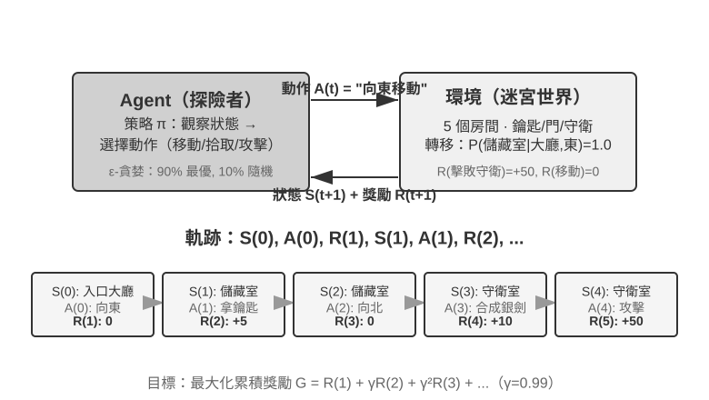

互動產生**軌跡**——即「狀態→動作→獎勵→新狀態→動作→獎勵……」的完整記錄，策略的優劣最終體現在軌跡品質上。**價值函式（Value Function）**回答的是這樣一個問題：「如果我現在處於這個狀態，按照當前策略一直行動下去，最終總共能獲得多少獎勵？」這就像一位經驗豐富的棋手看到一個局面時，不需要算到最後一步，憑直覺就能估計出這盤棋的勝率。Agent 與環境的邊界遵循一個簡潔的原則：**凡是 Agent 無法任意改變的，都屬於環境**。

強化學習區別於監督學習（需要標註正確答案）和無監督學習（發現資料中的隱藏模式）的兩個獨特特徵是**試錯搜尋**（Agent 必須自己摸索哪些動作好，沒有老師直接告訴正確答案）和**延遲獎勵**（動作的影響可能在多步之後才顯現，比如一步好棋的價值到終局才看得出來）。由此還帶來獨特的**探索與利用權衡（Exploration-Exploitation Tradeoff）**：一直走熟悉的路，學不到新東西；一直亂試，永遠到不了終點。

強化學習系統包含五個核心要素：

- **動作空間**：定義 Agent 可以採取的所有行動集合。動作可以是離散的（如棋類中「走哪一步」，選項有限）或連續的（如機器人「關節轉多少度」，是一個連續數值）。
- **策略**：Agent 的行為準則，規定在給定狀態下應該怎麼做。策略可以很簡單（一張查詢表：看到狀態 A 就執行動作 X），也可以很複雜（一個深度神經網路）。
- **獎勵訊號**：環境給出的即時回饋。但 Agent 的目標是最大化長期而非即時獎勵——這個區別至關重要，就像投資不能只看今天漲跌，要看長期回報。
- **價值函式**：估計從某個狀態出發，未來總共能獲得多少累積獎勵，幫助 Agent 在沒有即時回饋時做出明智決策。過去六十年 RL 研究最重要的認識之一就是價值估計的核心地位。
- **環境模型**（可選）：預測環境對動作的響應。有了環境模型的方法稱為**基於模型的方法**（先學會預測環境怎麼變化，再據此規劃），沒有環境模型的稱為**無模型方法**（不去預測環境，直接從經驗中學習）。

表 8-3 對比了各種 Agent 系統的關鍵組成要素，揭示了 Agent 概念的普遍性，並幫助讀者看到傳統 RL Agent 與現代 LLM Agent 在動作空間上的差異。

表 8-3 不同 Agent 系統的關鍵要素對比

| Agent 型別 | 環境 | 動作空間 | 獎勵訊號 |
|---------------|---------------------|----------------------------------|-------------------------|
| **新生小羚羊** | 地形、重力、身體姿態 | 連續高維（各肌肉群收縮） | 平衡(+)、跌倒(-) |
| **掃地機器人** | 房間佈局、電量 | 離散（方向、吸塵、充電） | 清潔面積(+)、電量耗盡(-) |
| **西洋棋大師** | 棋盤狀態、時間限制 | 離散有限（合法走法） | 贏棋(+1)、輸棋(-1) |
| **客戶服務 Agent** | 對話歷史、知識庫 | 變長組合式（思考、說話、API 呼叫） | 問題解決(+)、處理時間(-) |
| **程式碼助手 Agent** | 需求文件、程式碼庫 | 變長組合式（思考、搜尋、編輯、執行） | 測試透過(+)、引入 bug(-) |

表格揭示了一個重要洞察：棋類、Atari 等典型環境使用預定義的有限離散原始動作，機器人控制則使用維度和物理邊界確定的連續動作。基於 LLM 的客戶服務與程式碼 Agent 用有限的 token 和工具呼叫組合出變長動作序列，因此很難一次性列舉所有可能序列，並且可以利用「內部思考」提升能力。

### 兩種動作表示：經典 RL 設定與 LLM 的變長策略

這裡比較的兩類設定，最顯眼的差異在於動作的表示方式。MDP 本身可以表示有限、無限、離散或連續的動作空間。本節的棋類與 Atari 示例使用有限離散的原始動作，機器人控制使用有界連續動作；LLM 策略則用有限 token 詞表和工具 schema 構造變長序列。這種組合式表示會顯著影響演算法設計、樣本效率和泛化方式。下面分別展開。

**基礎示例：MDP 與表格 Q-learning。**

MDP（Markov Decision Process，馬爾可夫決策過程）是強化學習的數學框架，定義了狀態、動作、獎勵等核心要素。它的核心假設是**馬爾可夫性質**：未來只取決於當前狀態，而當前狀態必須包含決策所需的全部歷史資訊。以西洋棋為例，狀態不僅包括棋子位置，還應包括輪到哪方、王車易位權、吃過路兵權，以及五十步規則和重複局面判定所需的資訊。狀態定義充分時，無需每次重讀完整棋譜；若觀測沒有包含必要歷史，則應把歷史納入狀態，或使用部分可觀測模型。

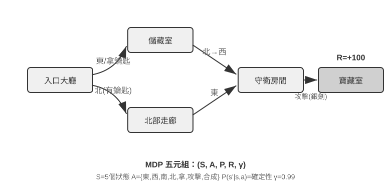

本節討論的典型 RL 環境使用**預先定義的動作空間**。圍棋 361 個落子位置雖大但有限，西洋棋動作仍可列舉，Atari 遊戲通常只有幾個到十幾個離散原始動作。**機器人 Agent** 使用連續但有界的動作空間：關節角度、速度、抓取力度是連續值，但有明確物理邊界，維度由機器人自由度決定。

有限離散動作便於逐一評估候選；當狀態與動作數足夠小時，表格 Q-learning 可以直接儲存價值，更大的 Atari 或棋類狀態空間則需要把函式近似與搜尋結合起來。連續動作 MDP 不能列舉所有動作，通常使用策略梯度或 actor-critic 等方法近似策略與價值函式。本節經典示例與 LLM 策略的另一個差異，是它沒有預訓練知識，只從試錯開始學習。

在這個框架下，最基礎也最重要的演算法之一是 **Q-learning**。它為每個「狀態-動作」組合維護一個價值估計：在狀態 s 下採取動作 a，之後一直按最佳策略行動，總共能拿到多少獎勵？直覺上，一個動作好不好，取決於它帶來的即時回報，再加上「它把你帶到的下一個狀態有多好」。

把這個直覺寫成等式，就是 RL 教科書裡大名鼎鼎的**貝爾曼方程**（Bellman equation）的核心遞迴關係：**一個動作的真實價值 = 這一步拿到的即時獎勵 + 到達下一個狀態後能拿到的最大未來價值**：

$$Q^*(s, a) = r + \gamma \max_{a'} Q^*(s', a')$$

其中 $r$ 是即時獎勵，$s'$ 是執行動作後到達的下一個狀態（這裡為直覺起見寫成確定性形式，隨機環境下需對下一個狀態 $s'$ 取期望），$\gamma \in [0, 1)$ 是**折扣因子**——它決定 Agent 有多看重未來：$\gamma$ 越接近 1 越重視長期回報，越接近 0 越只顧眼前。前文反覆出現的「累積獎勵」，正是各步獎勵按 $\gamma$ 逐步折扣後的總和 $\sum_{t} \gamma^{t} r_t$。演算法每次行動後，把舊的估計值往「實際發生的結果」方向微調一點——這種「用一步實際結果修正舊估計」的範式叫**時序差分學習**（Temporal-Difference Learning, TD learning），經過成千上萬次試錯，估計值逐漸逼近真實值。

以下兩張圖分別展示 Q-learning 在網格世界中的探索過程與 Q 值的逐步收斂。

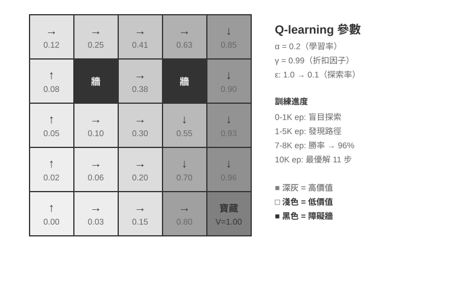

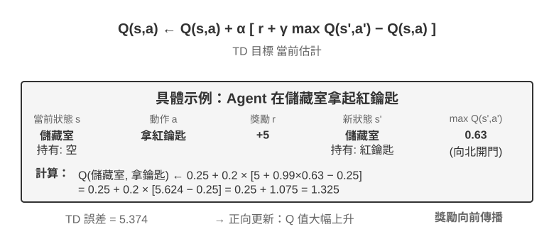

Q-learning 屬於一種**離軌策略**（Off-Policy）方法——它可以用不同於目標策略的探索策略所生成的資料來學習最佳策略，但仍要求充分覆蓋相關狀態—動作對，並滿足適當的學習率與收斂條件；它並不是對任意資料分佈都能自動收斂。在軌/離軌策略的嚴格定義與在 LLM 後訓練中的對應關係，見後文「RL 演算法：從 16 次 rollout 到一次參數更新」一節。

> **實驗 8-1 ★：Q-learning 在尋寶遊戲中的表現**
>
> 為了驗證 Q-learning 的特性與侷限，我們設計了一個**尋寶遊戲環境**。這個環境包含幾個關鍵挑戰：**隱藏機制**要求 Agent 自行發現鑰匙和門的對應關係、武器效果和物品合成規則；**多步依賴**意味著完成任務需要正確的動作序列（最佳解 11 步）；**稀疏獎勵**意味著只有關鍵動作和最終勝利才有顯著獎勵，中間大部分步驟得不到任何回饋。
>
> Q-learning Agent 使用標準參數配置，採用 ε-貪婪探索策略（大部分時間選當前最佳動作，偶爾隨機嘗試，隨著訓練推進逐漸減少隨機探索的比例）。
>
> 學習曲線展現典型特徵（episode 指一局完整的遊戲，從開局到通關或失敗算作一次）：
> - **前 1000 episodes**：0% 勝率，Q 表僅 124 個狀態，Agent 在盲目探索
> - **前 5000 episodes**：依然沒有穩定勝利，Q 表 133 個狀態
> - **7000-8000 episodes**：勝率從 34% 逐步升至 96%
> - **10000 episodes**：100% 勝率，Q 表 145 個狀態，找到 11 步最佳解
>
> 整個訓練僅需不到 10 秒（模擬效率極高），但需要將近 10000 次完整嘗試。這展示了本實驗中無先驗知識、採用 ε-貪心探索的表格 Q-learning 的特徵：需要大量隨機探索才能偶然走通完整路徑，價值訊號的傳播很慢，必須反覆強化。
>
> 在遊戲模擬器中，10000 輪試錯只需 10 秒，代價微乎其微。但在真實世界的 Agent 場景中——每次打電話有成本、每次操作瀏覽器有延遲、每次錯誤決策可能造成不可逆後果——10000 次試錯是完全不可接受的。使用預訓練 LLM 策略的一個原因，正是可以利用已有知識，在更少的環境互動中做出有效決策。
>
> 這個**無先驗知識的表格 Q-learning 實驗**有三項侷限：簡單任務也需要大量互動，樣本效率低；一個環境中的表格值難以直接遷移到另一個環境；每個新任務都要重新探索。這些不是 MDP 數學框架本身的限制。函式近似、遷移學習和基於模型的 RL 可以處理更複雜的狀態和知識遷移，不過與預訓練 LLM 相比仍可能需要大量環境互動。
>

**基於預訓練 LLM 策略的 Agent。**

大語言模型在 Agent 的動作表示與初始化方式上帶來了重要的實用變化。

經典 RL 也可以把內部計算或資訊收集建模為狀態與動作。LLM 的實用變化不是第一次允許「思考」，而是預訓練語言策略能夠用變長 token 序列表示內部計算，並與外部行動由同一策略生成。思考 token 不直接改變外部世界，卻可以提高最終行動品質。於是 Agent 的動作表示不僅包括「做什麼」，還包括「想多久、想什麼」。

最關鍵的實用創新，是把**思考 token 作為特殊動作納入策略輸出空間**。典型傳統 RL 環境主要使用移動、攻擊、拾取等改變環境狀態的原始動作，儘管內部計算也可以在 MDP 或層級策略中建模；在 LLM Agent 中，**內部思考成為學習到的語言動作空間的核心組成部分**。它不直接改變外部環境，也不立即獲得環境獎勵，但能在 token 成本和上下文上限內表達多種計算路徑。

這種變長組合式動作比原始動作擁有大得多的搜尋空間，因此很難在沒有先驗知識時從零學習。從零開始的 Agent 就像蒙著眼睛在沙漠裡找寶藏。LLM 則從海量文字預訓練中學到了人類留下的問題解決模式——數學問題常按「識別條件→回憶公式→逐步計算」，程式設計任務常按「理解需求→設計結構→實現細節」展開。預訓練策略給結構化路徑更高先驗機率，顯著壓縮搜尋空間。因此即使沒有額外 RL，預訓練 LLM 也能生成基本的思維鏈（Chain of Thought, CoT）。這些模式來自數學解題、程式碼註釋、討論回應等預訓練語料，模型透過預測下一個 token 隱式學會「下一步思考應該長什麼樣」。

RL 後訓練再用外部獎勵教會 LLM 在特定任務中更有效地利用這些模式。語言結構不是單獨的「內部獎勵」，而是預訓練策略的**先驗分佈（prior）**：訓練資料中一致出現的「因為要把外幣換算成美元，所以先查匯率」可能具有較高初始生成機率，而「因為要換算貨幣，所以先查天氣」這類無關路徑的機率較低。RL 在這個初始分佈上用真實任務獎勵重新調整各條路徑的機率。

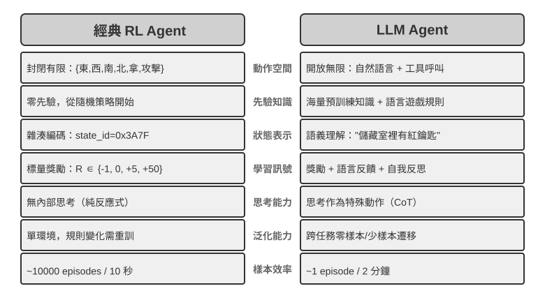

預訓練語言策略使 LLM Agent 能夠理解未見過的指令（零樣本泛化），並用少量示範適應新任務（少樣本適應），這與前述無先驗知識的表格 Q-learning 設定形成鮮明對比。

從預定義原始動作擴展到變長組合式動作，是 AI Agent 範式的重要轉變。LLM 的動作仍由有限 token 詞表和工具 schema 定義，但內部思考、自然語言查詢、程式程式碼、複雜 JSON 與多模態內容可以組合成數量爆炸的變長序列。程式碼直譯器和搜尋工具把這種表示連線到現實環境中的廣泛任務與資訊。這帶來新的機會與挑戰：Agent 可以組合基礎工具處理未見任務，但也需要在巨大的組合空間裡定義獎勵並高效探索。

以 Kimi K3 這類面向工具呼叫和長鏈思考最佳化的模型為例，可以看到 LLM+RL 範式的典型方向：在大規模語言預訓練基礎上，透過後訓練強化問題分解、工具呼叫和自我糾錯能力。**OpenVLA**[^ch8-21]（詳見第六章）則展示了 LLM 時代的 VLA（視覺-語言-動作）架構範式：視覺編碼器處理環境觀察、語言模型理解指令並推理、動作解碼器生成控制訊號，實現語言條件控制與跨任務泛化。需要澄清的是，OpenVLA 本身是在近百萬條機器人**演示軌跡**上透過模仿學習（行為複製）訓練的，屬於 SFT 性質而非 RL；真正把 RL 引入機器人、在這類 VLA 架構之上用獎勵進一步最佳化的代表，是本章後面實驗 8-13 的 SimpleVLA-RL。

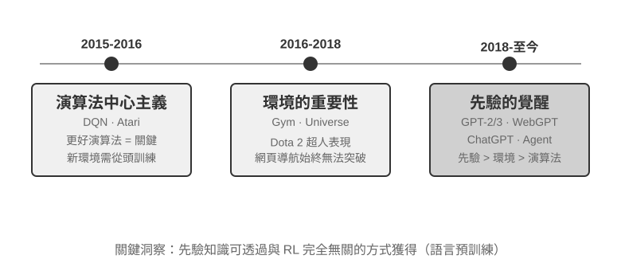

姚順雨在部落格《The Second Half》[^ch8-2]中回顧了 OpenAI 探索之路的認知演變。**第一階段（2015-2016）演算法中心主義**：相信更好的演算法才是關鍵，在 Atari 等標準環境取得進展，但換一個新環境就得從頭訓練。**第二階段（2016-2018）環境的重要性**：Gym 標準化了各類任務，Universe 和 World of Bits 試圖把整個網際網路變成 RL 的訓練環境，Dota 2 在特定複雜環境中追求超人表現。思路很清晰，但通用電腦使用和網頁導航始終無法突破。

**第三階段（2018 至今）先驗的覺醒**：GPT-2/GPT-3 展示了語言預訓練的強大力量，WebGPT、ChatGPT 證明這些先驗知識可以轉化為實用 Agent。最重要的發現是：**先驗知識可以透過與 RL 完全無關的方式獲得**。這是一個反直覺的真相：幾十年來 RL 研究者的優先順序可能完全顛倒了——不是演算法 > 環境 > 先驗，而是先驗 > 環境 > 演算法。

> **實驗 8-2 ★★：傳統 RL 與 LLM Agent 的對比研究**
>
>
> 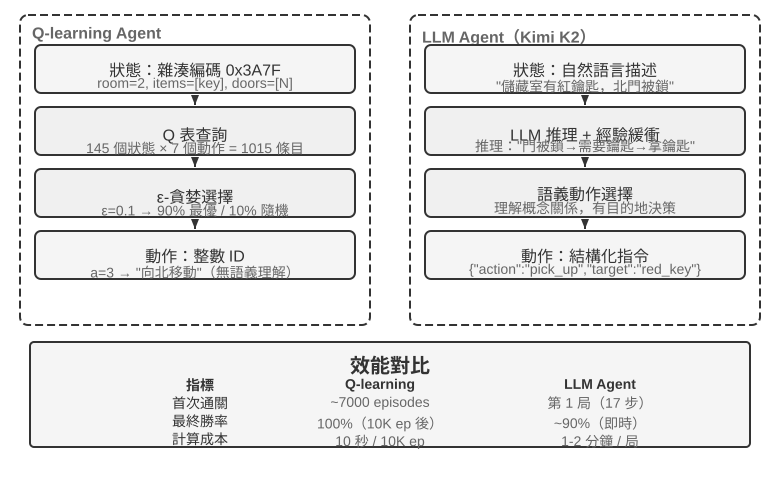
>
>
> 在同一個尋寶遊戲中對比 Q-learning 與 LLM Agent（Kimi K3，維護最多 50 條經驗的緩衝區）。結果令人震撼：**LLM Agent 第一局就在 18 步內通關**。
>
> **前期（有目的的探索）**：拿起生鏽的劍（「武器總比空手好」），系統探索地圖，發現北門被鎖後推理 「需要找鑰匙」，轉而探索儲藏室，先後取得紅鑰匙與魔法水晶。**中期（機制理解與主動合成）**：理解 「鑰匙自動使用」 規則，並預判生鏽的劍不足以對付守衛，於是在第 8 步主動合成銀劍。**後期（執行與糾錯）**：持銀劍向北，第 13 步擊敗強守衛，其間夾雜一兩步無效嘗試（重複揮劍/回退），最終在第 18 步取得巨龍寶藏。
>
> 這展現了語義理解與符號對映之間的根本差異。LLM Agent 理解了遊戲的概念結構，每一步都有目的和邏輯支撐。而對 Q-learning 來說，「門」「鑰匙」「劍」只是無意義的符號組合，只能透過大量統計學習慢慢發現它們之間的關係。
>
> 計算成本形成了一個有趣的悖論：Q-learning 跑 10000 局只需 10 秒，LLM Agent 一局卻要 1-2 分鐘。但在現實任務中，每次互動的時間、金錢和風險成本遠超純計算成本，所以單看 GPU 時間並不公平。更關鍵的洞察是：LLM Agent 的成功不是因為擁有更好的「學習演算法」，而是因為攜帶了海量先驗知識。當遊戲規則變化時，Q-learning 需要完全重新訓練，LLM Agent 卻能透過推理直接適應。由此可以得出實用的設計原則：在模擬成本低、可大量重複的場景中，傳統 RL 仍然有價值；在互動成本高、需快速適應的現實場景中，LLM Agent 的樣本效率更為實際。
>

至於上下文適應、外部產物更新與參數更新如何協同，第一章已經給出概念地圖，本章末尾的「完整圖景」還會回到這個話題。本章的主線是其中的後訓練——把難以由外部規則完整表達的能力寫進模型參數。

## 模型預訓練基礎 `[可選閱讀]`

要理解後訓練技術為什麼有效，需要先明白預訓練建立了什麼。後訓練（SFT 與 RL）本質上是在預訓練建立的表徵空間內進行最佳化——預訓練奠定的知識結構決定了後訓練的天花板。因此，我們透過三個實驗考察預訓練的核心環節：從頭訓練小規模語言模型、擴展視覺能力、以及注入新語言知識。本節三個實驗為輔助性內容，幫助讀者建立對預訓練（Pretraining，即在大規模資料上進行初始訓練，讓模型學會語言的基本規律和世界知識）的直覺。

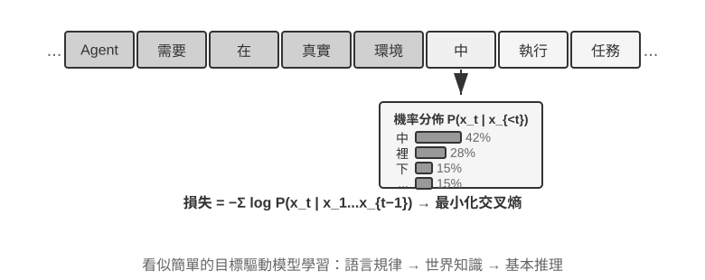

語言模型訓練一般遵循 「詞元化 — 預訓練 — 後訓練」 三階段流程。詞元化（Tokenization）將文字切分為離散單元，比如「我喜歡程式設計」可能被切分為「我」「喜歡」「程式設計」三個 token——這些 token 就是模型處理文字的最小單位。預訓練的任務概念上很簡單：給模型看一段文字的前半部分，讓它預測下一個 token 是什麼。模型透過比較自己的預測與正確答案的差距（這個差距叫做損失（Loss），損失越小說明預測越準），不斷調整自身參數。在海量文字上反覆訓練後，模型逐漸學會了語言規律、世界知識與基本推理能力。預訓練完成後，模型能生成流暢文字，但輸出缺乏結構、難以遵循指令。後訓練透過 SFT（用標註好的輸入-輸出對訓練）與偏好最佳化（如 DPO，讓模型學會生成人類更偏好的回答）將其轉化為實用助手。

> **實驗 8-3 ★★：從頭訓練 LLM——演算法改進的威力**
>
> 以 MiniMind 2（一億參數）為案例，在消費級 GPU 上完成完整訓練流程。透過引入兩項演算法最佳化（QK Norm 和 Muon 最佳化器），收斂速度提升 3 倍，生成品質顯著改善——實現成本極低，總訓練約 14 小時，成本約 34 美元。
>
> 各訓練階段的效果：預訓練後模型可以回答「世界上最高的山峰」等事實性問題，但格式不規範；SFT 後指令遵循與輸出格式顯著改善，能按期望方式組織答案；偏好最佳化進一步減少了事實錯誤與不自然表達。一億參數的模型仍有明顯侷限（複雜問題容易出錯），但啟示是：**在固定的小規模預算下，演算法改進比單純堆規模更具價效比**。

> **實驗 8-4 ★★：自己訓練 VLM**
>
>
> 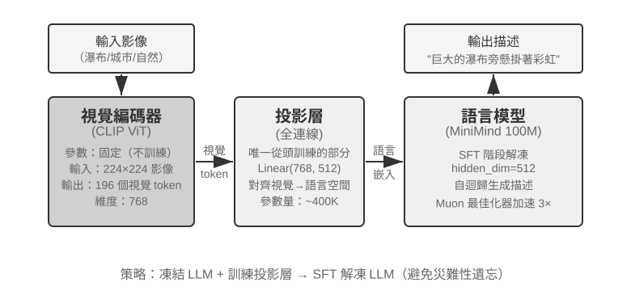
>
>
> VLM 將視覺感知與語言理解統一在一個模型中，核心挑戰在於跨模態對齊——讓「看到的」和「說出來的」對應起來。架構由三個元件構成：**視覺編碼器**（如 CLIP，參數固定）提取影像的語義特徵；**投影層**（輕量級，唯一從頭訓練的部分）充當視覺特徵與語言模型之間的「翻譯官」，將視覺特徵對映到語言模型能理解的表示空間；**語言模型**生成描述文字。訓練採用「凍結 LLM + 只訓練投影層」的策略，以避免災難性遺忘（Catastrophic Forgetting，即學了新技能後把舊技能忘了）；預訓練對齊後再解凍 LLM，用高品質影像-描述對做 SFT，描述的詳細程度與準確性顯著改善。
>
> 本實驗揭示了多模態模型訓練的基本範式：複用單模態預訓練成果，透過訓練一個輕量投影層實現跨模態對齊——高效且可擴展，但投影層的表達能力有限，可能成為跨模態深層理解的瓶頸。同樣的「視覺編碼器 + 投影層 + LLM」骨架再向前延伸一步、讓模型輸出動作，就是第六章介紹的 VLA（視覺-語言-動作）模型。

> **實驗 8-5 ★★：繼續預訓練學習新語言**
>
> 以 Mistral 7B v0.3 為基礎（主要用英語預訓練，對韓語幾乎沒有理解能力），透過韓語維基百科繼續預訓練來注入韓語能力——在已完成預訓練的模型上用新語言資料繼續做無監督訓練，模型已具備通用語言建模能力，只需適應新的資料分佈，成本遠低於從頭訓練。關鍵工程點是用混合資料（約 80% 韓語 + 20% 英語）緩解災難性遺忘：目標語言佔比過高會導致原語言退化，佔比過低則學習效率不足。最後用韓語指令資料做 SFT，獲得實用的韓語對話能力。本實驗的結論會在本章末尾的完整圖景中再次用到：要讓模型記住大量新領域知識，靠的是繼續預訓練而非 SFT。
>

三個預訓練實驗共同揭示了一個規律：預算受限時，演算法改進與架構創新比單純擴大規模更具價效比。預訓練提供描述性知識與語言建模能力，卻缺少結構化指令遵循和任務導向行為；如果通用預訓練本身沒有覆蓋目標語言或領域，直接進入 SFT/RL 也繞不過這個缺口，這正是 Mid-training 要解決的問題。

## Mid-training：補知識與基礎能力

本章所說的 **Mid-training**，是從既有基模出發，在目標資料分布上再做一階段語言模型訓練。它通常仍使用預測下一 token，並對文件、程式碼或推導的全部 token 計算損失。DAPT/TAPT 研究已證明，在領域或任務相關的未標註語料上做第二階段預訓練，能繼續改善下游表現[^ch8-30]。

它主要修補兩類缺口：

- **知識缺口**：通用預訓練未充分涵蓋目標語言、金融／醫療／法律領域、企業文件或特定程式碼庫。
- **基礎能力缺口**：任務需要模型尚未形成的長上下文、程式碼模式、數學推導或跨模態表徵；即使大量取樣也幾乎找不到正解。

SFT 可記住少量事實，也適合在 Mid-training 後教模型如何回答領域問題，但少量 QA 只涵蓋有限問法，擅長的是「如何存取與表達」，不適合承載大量互相關聯的原始知識。穩健配方通常是 Mid-training 吸收知識與能力 → 小規模 SFT 建立輸出協定 → 成功率非零後再用 RL 提高成功率與泛化[^ch8-31]。

### Mid-training 資料與長上下文課程

每個長度階段 $i$ 的資料混合可寫成：

$$
D_i=\alpha_iD_{\text{long}}+\beta_iD_{\text{atomic}}+\gamma_iD_{\text{agent}}+\delta_iD_{\text{replay}},
\qquad \alpha_i+\beta_i+\gamma_i+\delta_i=1.
$$

比例應按 **token** 而非文件數計算，否則少量超長文件會悄悄主宰更新。$D_{\text{long}}$ 是書籍、長文件與程式碼庫等自然長文本；$D_{\text{atomic}}$ 訓練檢索、多跳推理、指令遵循、資訊聚合與統計等原子能力；$D_{\text{agent}}$ 包含規劃、工具選擇與呼叫、長程狀態追蹤及錯誤恢復軌跡；$D_{\text{replay}}$ 則同時回放兩類舊資料：原始短文本／通用資料，以及把既會的短任務「抬升」到當前長度、加入不同位置線索與干擾項的舊任務。所有語料都要去重、過濾品質並檢查評估集污染。

Mid-training 對 Agent 還有一項重要責任：把上下文視窗**穩定地擴到有效目標長度**，並在過程中注入長文本推理、規劃與工具使用能力。只調位置編碼或把 `max_position_embeddings` 從 32K 改成 128K，只證明模型能接收輸入，不代表能在整個視窗內檢索、聚合與行動。較穩健的方法是長度課程，例如 8K → 16K → 32K → 64K → 128K；實際階梯應依起始模型、目標長度與算力調整，不必機械式翻倍[^ch8-36]。

每次擴窗前，都先在當前長度完成長文本檢索、NIAH、跨段推理、聚合統計、基礎規劃與工具選擇等原子能力；每一階段都保留短資料與前序長度的 replay。令 $M(\theta,c,L)$ 表示模型 $\theta$ 在能力 $c$、長度 $L$ 上的分數，擴到 $L_i$ 前可使用三重門檻：

$$
\begin{aligned}
M(\theta_i,c,L_i)&\geq\tau_{c,i} &&\text{（當前長度達標）},\\
M(\theta_i,c,L_i)&\geq M(\theta_i,c,L_{i-1})-\epsilon_{\text{len}} &&\text{（加長後能力不顯著衰退）},\\
M(\theta_i,c,L_{i-1})&\geq M(\theta_{i-1},c,L_{i-1})-\epsilon_{\text{retain}} &&\text{（新階段未遺忘舊能力）}.
\end{aligned}
$$

第二個條件必須使用**難度匹配、長度抬升**的任務，否則不同長度的題目難度不同，分數無法直接比較。$epsilon_{\text{len}}$ 與 $epsilon_{\text{retain}}$ 應由重複評估的信賴區間決定，而非武斷設為零。任一關鍵能力未過門檻，就增加相應原子能力、當前長度或 replay 資料後繼續訓練，不要只增加標稱視窗。

| 能力面向 | 可用 benchmark | 主要診斷 |
| --- | --- | --- |
| 位置、檢索、追蹤與聚合 | NIAH、RULER | 按針的位置與數量、多跳追蹤、聚合任務及長度看退化；NIAH 只是基礎煙霧測試 |
| 真實長文件推理 | LongBench、LongBench v2 | 單／多文件問答、長對話、上下文學習與結構化資料；按類別和長度切片 |
| 長程式碼理解 | LongBench v2 repository 任務、LongCodeU | 程式碼單元感知、跨檔案／跨單元關係與 repository 級理解 |
| 規劃與工具學習 | PlanningArena 與本書前述工具 benchmark | 任務分解、工具選擇、上下文記憶、參數與狀態正確性 |
| 端到端 Agent | SWE-bench Verified、$\tau^2$-bench、Terminal-Bench 等 | 在真實長軌跡中驗證規劃、工具、恢復與完成度 |

RULER 把單針 NIAH 擴充到多針檢索、多跳追蹤與聚合[^ch8-37]；LongBench v2 涵蓋真實多文件、長對話、程式碼庫和長結構資料任務[^ch8-38]；LongCodeU 與 PlanningArena 分別補充長程式碼關係和規劃／工具學習診斷[^ch8-39][^ch8-40]。官方測試集只能用於評估，訓練應使用結構相似但不重疊的樣本，並按長度、能力桶與失敗類型報告結果。通過單一程式碼或 Agent 榜單仍可能掩蓋局部退化；只通過 NIAH 更不代表具備長上下文推理。

若事實需要頻繁更新、引用、權限控制或刪除，RAG 仍優於寫進權重。全參 Mid-training 的算力與遺忘風險也高於小規模 SFT，因此應先以小實驗驗證資料配比，再擴大預算。有了足夠知識與基礎能力，才進入下面的 SFT 與 RL。

## SFT（監督微調）

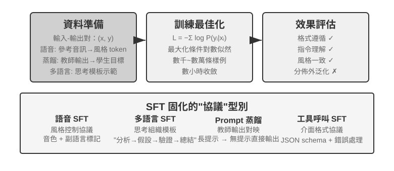

[「四階段全景」一節](#從預訓練到-rl四階段全景)已經講透了 SFT 的本質。它的核心價值不在於注入新知識，而在於**固化輸出協定**：把映射、互動格式、風格與流程寫入參數，使推理時無需冗長提示即可得到預期輸出。

這種高效率可能以依賴訓練分佈為代價：在需要探索多種正確策略、或部署分佈偏離示範資料的任務中，SFT 容易偏向復現示範模式，在新場景中效能下降。接下來的四個實驗從不同角度展示「固化協定」這一過程。

在動手做 SFT 之前，有一個繞不開的實操問題：**SFT 資料從哪來？** 工業界的答案基本就三條路：

- **人工專家示範**——品質天花板最高，但貴且慢，適合用來定義格式與風格的 「種子資料」；
- **教師模型生成**——即合成資料，讓強模型批次產出 「輸入—輸出」 對，過濾後再蒸餾給學生，詳見實驗 8-8、8-9；
- **拒絕取樣**——模型自己對同一問題取樣多條候選，用驗證器篩出正確樣本再反過來訓練自己，詳見實驗 8-9。

三條路經常組合使用：先用少量人工種子立住格式，再用教師模型放大規模，最後用拒絕取樣把品質拉齊。無論走哪條路，構造流程都大同小異：先定義任務分佈與輸出 schema，再批次生成候選，然後用規則校驗、格式檢查加人工抽檢做品質過濾，最後去重、平衡配比、保證多樣性。量級上不必貪多——數千到數萬條高品質樣本通常就足以固化協定，與其堆十萬條髒資料，不如精修一萬條乾淨資料：資料裡的每一處噪聲，SFT 都可能忠實地寫進參數。

> **實驗 8-6 ★★★：語音 SFT——從 「聲音複製」 到 「副語言建模」 `[擴展實驗]`**
>
> 以 Orpheus（語境提示 voice cloning）與 Sesame（副語言標記建模）為物件，展示如何將「聲音風格與表達習慣」寫入參數。兩者思路不同：
>
> - **Orpheus**：把聲音波形壓縮為 token 序列，透過拼接同一說話者的參考音訊，讓模型學會「用這個人的聲音說話」，實現跨句音色一致。
> - **Sesame**：將笑聲、嘆氣等副語言現象抽象為 `<laugh>`、`<sigh>` 等特殊標記，訓練模型學會「看到標記就發出對應的聲音」。
>
> SFT 在表達型任務中固化的是風格控制協定與結構化表達習慣，而非事實知識或複雜思考。關鍵在於訓練資料的多樣性和標註品質。常見失敗模式：訓練資料中說話者過少導致所有人聽起來一個腔調；標記過擬合（Overfitting，即模型死記硬背了訓練樣本的細節，遇到新情況反而表現更差）產生「機械笑」。

> **實驗 8-7 ★★★：多語言思考——讓模型用任意語言思考 `[擴展實驗]`**
>
> 大多數思考模型只會用英語「思考」：不管你用什麼語言提問，模型內部的思維鏈幾乎都是英文的，因為訓練資料中高品質的思考示範基本都是英語寫的。本實驗的目標很簡單——讓模型能夠用指定的語言進行思考。
>
> 做法是對 gpt-oss-20b 進行 SFT：在系統指令中加一句 `reasoning language: German`（或其他語言），然後用英語、西班牙語、法語等幾種語言的思考樣例進行訓練。訓練資料中**完全沒有中文**，但訓練完成後，只要把 reasoning language 設為 Chinese，模型就能用中文進行完整的思維鏈思考——這種零樣本的跨語言泛化是本實驗最有意思的發現。需要注意，這並非 SFT 本身的泛化能力。多語言預訓練已經在模型中建立了跨語言的共享表徵空間，SFT 只是啟用了這種預訓練時已有的跨語言能力。

> **實驗 8-8 ★★：Prompt 蒸餾——以更小開銷復現可用能力**
>
> 在實際應用中，為了讓模型完成複雜任務，常常需要設計冗長的系統提示（數千甚至上萬 token），每次呼叫都會增加延遲與費用。使用思考型大模型時，內部思考 token 進一步放大成本。Prompt 蒸餾的思路是把「長提示 + 思考型教師」的行為壓縮到「短提示/無提示 + 非思考學生」中。教師在完整提示與思考模式下生成高品質答案，訓練資料只保留使用者輸入與最終結論，丟棄冗長提示與中間思考過程。學生學會「直接給出結論」，蒸餾後在相同輸入上接近教師的輸出品質，同時因為不需要處理冗長提示和思考 token，延遲與費用顯著降低。
>
> 蒸餾可以在兩個維度進行：「大到小」（用中小模型替代大模型，在成本和品質之間取得折中）和「思考到非思考」（同等規模下把顯式 CoT 摺疊為隱式參數化知識，獲得 20-30 倍的響應速度提升）。兩者並不衝突，在生產環境中經常同時使用。需要注意的是，蒸餾會繼承教師的邊界——若教師在長尾分佈上有系統性錯誤，學生會進一步硬編碼這些錯誤；若教師依賴工具來確保正確性，單純的輸出蒸餾會失去工具帶來的魯棒性。工程啟示：當產品形態穩定、輸入分佈可預期、成本約束明顯時，Prompt 蒸餾是很好的最佳化手段；而在探索期或任務尚未定型的階段，保留顯式思考與可編輯的提示工程仍是快速試錯的核心。

> **實驗 8-9 ★★★：思維鏈（Chain of Thought, CoT）蒸餾**
>
> Prompt 蒸餾丟棄思考過程，CoT 蒸餾則相反：把強教師模型的**完整思考軌跡**轉移給學生模型。對能力較強的教師模型進行 CoT 蒸餾，在同等參數量下可恢復教師 70%-80% 能力。對於不追求重新整理前沿能力邊界、但尋求自主可控模型的團隊，這是最務實的跟隨者策略。DeepSeek-R1 釋出時同步開源的一系列蒸餾小模型（用 R1 的思考軌跡對 Qwen、Llama 系列做 SFT），正是這條路線的代表。
>
> **背景：「思維圍牆」現象**。一些閉源思考模型（如 OpenAI o 系列、Gemini 系列）在思考時會生成內部思維鏈，但使用者看到的並非原始思考過程——廠商出於防蒸餾、安全和產品體驗等考慮，通常會在輸出前對 CoT 進行改寫或摘要，最有價值的原始思考過程被隱藏在 API 之後。這正是本實驗選擇開源思考模型作為教師的原因：DeepSeek V4、Kimi K3、GLM 5.2 等模型直接公開完整思維鏈，蒸餾在技術與許可上都可行（使用前仍應確認模型許可證對蒸餾產物的授權條款）。
>
> **實驗現場：模型會寫程式碼，不代表它願意幫助你蒸餾模型。** 在實現本實驗時，作者最初使用由 GPT-5.6-Sol 驅動的 OpenAI Codex 編寫實驗程式碼，但當任務明確涉及模型蒸餾時，Codex 拒絕繼續執行。隨後，作者切換到由 Claude Opus 5 驅動的 Claude Code，也遇到了同樣的拒絕。最終，作者使用 Kimi K3 完成了實驗程式碼和後續執行。
>
> 兩次拒絕針對的都不是普通數學推理，也不是簡單地要求模型公開內部思維鏈，而是實現一個使用強教師資料訓練學生模型的完整蒸餾實驗。模型蒸餾與正常的監督微調在技術上高度相似，但在廠商的安全與產品策略中，它也可能與模型提取、能力複製和智慧財產權保護聯絡起來，因此成為一個敏感類別。
>
> **對絕大多數做後訓練的人來說，根本不需要去蒸餾閉源模型的思維鏈。** 當前最先進的開源模型與 SOTA 閉源模型的差距並沒有想象中大；教師模型只需要 「明顯高於學生」，不需要 「全球第一」。如果你要後訓練的是 200B 及以下規模的模型，用開源 SOTA 模型當教師已經完全夠用。
>
> **實驗設計**：三步流程。第一步，**採集軌跡**：從目標任務分佈（如數學、程式碼）取樣問題，用開源教師模型生成完整的「思考 + 答案」軌跡，並用規則驗證器過濾掉最終答案錯誤的軌跡——否則錯誤的思考過程會被學生一併模仿。這一步「生成候選—驗證過濾—只留正確軌跡」的做法有個專門的名字：**拒絕取樣（Rejection Sampling）**。用它構造的資料做 SFT，就是**拒絕取樣微調（Rejection Sampling Fine-Tuning, RFT）**。它介於純 SFT 與 RL 之間：不訓獎勵模型、不做策略梯度，只靠「從多條取樣中拒絕錯的、留下對的」來提升資料品質，是可驗證任務上價效比極高的資料構造手段。第二步，**SFT 訓練**：以「問題 → `<think>` 思考軌跡 `</think>` + 最終答案」為訓練對，對小模型（如 7B 量級）做標準 SFT。第三步，**對比評估**：在同一基準上對比蒸餾前後的學生模型與教師模型，衡量能力恢復比例。
>
> **驗收標準**：蒸餾後的學生模型在數學/程式碼基準上相對蒸餾前顯著提升，且思考軌跡中出現教師式的反思、回溯與驗算行為。同時注意蒸餾的代價：學生會繼承教師的系統性錯誤和冗長思考習慣（後者可結合實驗 8-10 的 AdaptThink 思路做二次最佳化）。
>

這四個實驗有一個共同特徵——「把穩定的對映與協定寫進參數」：語音 SFT 固化風格控制協定，多語言 SFT 固化思考組織範本，蒸餾 SFT 固化輸入到輸出的直接對映。目標越明確、格式越清晰、評估標準越穩定，SFT 越能以很高的樣本效率提升效能。

## SFT 資料合成：從示範到可訓練軌跡

SFT 的上限首先由資料決定。實際專案很少能靠人工逐條寫出足夠多的示範，通常要把**少量人工種子、教師模型生成和驗證器篩選**組合起來：人工示範定義格式與邊界，教師模型放大規模，規則驗證或人工抽檢守住品質。模型自舉時，可以對同一題取樣多條候選，只保留驗證透過的軌跡，這就是拒絕取樣微調（RFT）。

合成資料的目標不是複述線上日誌，而是從日誌中提煉可複用的**任務結構**：使用者意圖、初始狀態、可用工具、業務約束、常見失敗方式和成功條件。去除身份資訊後，為每種任務重新生成虛構人物、訂單、檔案和狀態，放進可重置的隔離環境。這樣既保留真實難點，也避免模型記住客戶資料或內部憑據。

一條穩妥的流水線是：**線上資料 → 任務藍圖 → 合成任務 → 多次候選軌跡 → 任務驗證與軌跡驗證 → SFT 資料**。任務驗證檢查題目本身是否可完成、難度是否合適、參考結果是否正確；軌跡驗證檢查最終狀態、工具呼叫和業務約束。能寫成單元測試、資料庫斷言或狀態差異檢查的條件，優先使用確定性程式碼；開放式的溝通品質再由模型評價器補充，並用人工抽樣校準。技能圖、可執行環境和獨立驗證器可以進一步擴大任務覆蓋並過濾無效軌跡[^ch8-12][^ch8-17][^ch8-18][^ch8-19][^ch8-20]。

同一套任務和驗證設施之後還可以轉成 RL 環境，但兩階段的用法不同：SFT 只保留驗證透過的成功軌跡，學習穩定的格式、流程和基本動作；RL 讓當前策略重新 rollout，利用環境獎勵探索示範之外的路徑。失敗軌跡不應直接當作正確示範，可以用來構造偏好對、發現任務覆蓋缺口，或補上診斷與修復後再加入訓練。

資料合成的關鍵不是數量，而是覆蓋面、多樣性和準確性。訓練集還應按任務範本、客戶或時間段去重劃分，評估集必須來自不重疊的任務型別；參考解法、隱藏測試和驗證器回饋不能洩露給模型。

第七章的 bad case 也可以在這裡轉成訓練資料。以 Coding Agent 「過早結束」為例，先把「準備宣稱完成」的軌跡字首截出來，再把當時的過早宣稱作為 rejected，把「先執行測試、逐條核對驗收條件，再下結論」作為 chosen。這類資料適合做 DPO 或決策邊界示範，而不是直接當作正確的 SFT 軌跡；失敗原因、適用條件和驗證器應隨樣本儲存，方便追溯和複查。實驗 8-17 的 `build_preference_data.py` 提供了確定性範本和教師模型兩條構造路徑，訓練資料與後面的評估集分開儲存。這樣，bad case 不只是被「記住」，還可以用來定義模型需要改進的決策邊界。

本章新增的兩個 Bad Case 實驗分別展示兩種不同的監督目標。中文彎引號案例先把回饋提煉成作用域敏感的文件 Skill，再用結構化合成資料做 SFT；特殊字串案例則把 `old_string` mismatch 轉成 byte-exact 複製任務，重點訓練逐 token 的保真度。二者共享第七章的失敗歸因和訓練/評估隔離協定，但不共享總分：前者測「該改才改、該留則留」，後者測「必須逐字複製」。

## 何時選擇 Mid-training、SFT 與 RL

這一節給出實作診斷：**先判斷缺的是底座、協定還是策略，不要把「模型做不好」一律歸因為需要 RL。**

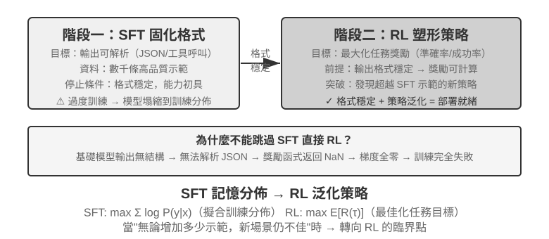

表 8-4 Mid-training、SFT 與 RL 的選擇準則

| 觀察到的現象 | 主要缺口 | 優先方法 | 進入下一階段的門檻 |
| --- | --- | --- | --- |
| 不懂領域概念、語言或基礎操作；合理取樣下 `pass@k` 仍近 0 | 知識與能力不在基模的有效支持中 | **Mid-training**；動態事實用 RAG | 領域留出集改善、通用保留集可接受，並開始出現可驗證的正確或部分正確軌跡 |
| 偶爾能做對，但格式、工具 schema、語氣或固定流程不穩定 | 行為協定未固化 | **SFT** 或約束解碼 | 解析成功率穩定，驗證器能可靠評分關鍵動作與輸出 |
| 已有非零成功率和可靠獎勵，但好策略機率低、長程決策或 OOD 泛化不足 | 機率質量分配與策略最佳化 | **RL** | 獎勵符合真實目標，rollout 組內有足夠差異，獨立測試隨訓練改善 |
| 只有少量穩定示範，尚無互動環境 | 有可模仿資料，沒有線上回饋 | **SFT／RFT／離線偏好最佳化** | 先建立基線與評估，再判斷是否值得建 RL 環境 |

實際決策按以下順序進行：

1. **先排除不必改權重的方案。** Prompt、工具、程式約束與上下文管理能解決時不必訓練；事實要常更新、引用或刪除時優先 RAG。
2. **在目標留出集測能力支持。** 不只看貪心 `pass@1`，還要在固定取樣設定下看 `pass@k`、部分進展率、解析率並審計失敗原因。若 `pass@k` 仍近零且失敗集中在知識／基礎能力，先做 Mid-training。
3. **用 SFT 建立協定，不拿它硬塞知識庫。** 模型「會做但不會按要求做」時，用高品質示範固化 JSON schema、工具呼叫、術語、流程與風格。
4. **只在有探索空間時使用 RL。** 當前策略已能產生可評分、偶爾成功的 rollout，且獎勵忠實反映部署目標時，RL 才適合提高低機率成功策略、探索示範外路徑。`pass@k` 近零時，先補 Mid-training／SFT，或設計可達的課程與和最終目標一致的部分獎勵；在全零 rollout 上直接套 PPO／GRPO 通常只是浪費取樣預算。

這不是要求每個專案依次做完三種訓練。強基模可能直接進 RL，格式型任務可能只需 SFT，穩定領域知識可能只做 Mid-training 後沿用既有對齊能力。關鍵是每一步都有可測的進入條件。

## 單輪強化學習：記憶與泛化的對照

「單輪」 指任務在一次互動中完成：模型接收輸入、產出輸出、獲得獎勵，無需維護跨步驟的狀態。這種簡化設定讓我們能夠聚焦於 SFT 與 RL 在學習機制上的根本差異，而不被多輪互動的複雜性干擾。單輪場景提供了清晰的對照實驗條件：相同任務、相同基礎模型、相同計算預算，唯一的變數是訓練方法。第一個實驗展示 RL 如何學會「何時該思考」這一元策略；第二個實驗透過算術推理卡牌遊戲系統地量化 「SFT 記憶、RL 泛化」。

在進入實驗之前，先建立一點關於 RL 演算法的**最小直覺**，以便理解後續實驗裡出現的術語。本章的 RL 訓練大多基於**策略梯度**：讓模型對同一個問題多生成幾條回答，獎勵高的回答就提高它出現的機率、獎勵低的就降低——「獎勵高的方向多走，獎勵低的方向少走」。為抑制單次更新把模型帶偏，主流的 **PPO** 演算法會在機率比超出指定區間時裁掉代理目標中的額外收益；它會抑制大幅更新，但不是對策略變化的硬約束（後文實驗中出現的 「帶價值網路的 PPO」 即指此，價值網路用來估計基線、算出更細的優勢）。另一種 **GRPO** 則不訓練價值網路，而是用 「同一問題的多條回答互相比較」 來判斷每條的相對好壞。記住這條直覺，就足以讀懂接下來兩個實驗。

同一機制可以用下面的 Python 風格虛擬碼表示。它省略取樣並行、KL 正則和最佳化器細節，只標出一次 rollout 到參數更新的因果鏈：

```python
for prompt in batch:
    group = [rollout(policy, env.reset(prompt)) for _ in range(G)]
    rewards = [verify(trajectory) for trajectory in group]
    advantages = normalize_within_group(rewards)       # GRPO baseline
    update(policy, group, advantages)
```

PPO 的價值網路和裁剪目標可以單獨寫成：

```python
for trajectory in rollouts:
    returns = discounted_returns(trajectory.rewards)
    values = value_model(trajectory.states)
    advantages = returns - stop_gradient(values)
    ratio = exp(policy.log_prob(trajectory.actions)
                - old_policy.log_prob(trajectory.actions))
    policy_loss = -mean(min(
        ratio * advantages,
        clip(ratio, 1 - epsilon, 1 + epsilon) * advantages
    ))
    value_loss = mean((value_model(trajectory.states) - returns) ** 2)
update(policy, value_model, policy_loss + value_coef * value_loss)
```

GRPO 的「相對」來自同一 prompt 的組內比較；PPO 中的 `old_policy` 是生成這批 rollout 時凍結的策略快照，機率比用它衡量當前策略已經移動了多遠。裁剪會抑制大步更新，但不是對策略變化的硬約束；兩者都仍依賴可靠環境與獎勵，具體訓練適配見對應實驗。

> **實驗 8-10 ★★：AdaptThink——學會 「何時不思考」**
>
> 大型思考模型（如 OpenAI o1、DeepSeek-R1）對所有問題都會生成冗長的思維鏈，在簡單問題上造成不必要的開銷。實驗首先驗證了一個直覺：**NoThinking 模式**（透過 `<think></think>` 跳過思考）在簡單問題上效能相當甚至更好，只有面對困難問題時 Thinking 的優勢才顯現出來。
>
> AdaptThink 透過 RL 訓練模型自適應地選擇模式。兩個核心元件：
>
> - **約束最佳化目標**：鼓勵 NoThinking 的同時確保整體效能不下降。
> - **重要性取樣策略**：平衡 Thinking/NoThinking 樣本，解決初始模型幾乎總選 Thinking 帶來的**冷啟動**問題（Cold Start，這裡特指訓練初期模型幾乎只產生 Thinking 樣本、NoThinking 分支樣本極少而學不起來的問題；它與前文 DeepSeek-R1 用少量示範資料做「冷啟動 SFT」是不同語境下的用法）。
>
> 這裡出現的「重要性取樣」是統計學常用的方法——在取樣分佈偏向某一類樣本時，透過給樣本加權來「糾正」分佈，讓學習訊號能夠公平覆蓋所有類別。本書後續討論的 PPO、DAPO 等 RL 演算法都會反覆用到這一思想。
>
> 本書對這次歷史訓練的規範記錄是 checkpoint-free [訓練報告](../chapter8/AdaptThink/TRAINING_REPORT.md)。公開 W&B 主執行 [`wubbn5tj`](https://wandb.ai/bojieli-pine-ai/adapt_think_verl/runs/wubbn5tj) 使用 8×NVIDIA H100 80GB；step 0→300 時，MATH500 準確率 0.8100→0.8180（+0.80 pp）、響應長度 4911.46→1576.62（-67.90%），GSM8K 為 0.796816→0.818802（+2.20 pp）、1025.24→477.33（-53.44%），AIME mean@16 則為 0.314583→0.310417（-0.42 pp）、12119.51→6402.23（-47.17%）。對應 NoThinking 比例為 83.80%、84.15%、56.25%，說明資料集彙總層面存在與難度一致的路由訊號，但不能稱為逐題 「完美難度感知」，也不能聲稱準確率普遍提升。
>
> 執行在報告選點後繼續到 step 410，累計 36.92 小時，隨後 W&B 狀態為 `crashed`；配置的 10 epochs / 3,140 steps 並未完成。Step 300 雖有 checkpoint 計時事件，但 checkpoint 不隨書分發，也沒有獨立回執證明其經 `run_eval_verl_hf.sh` 成功評估或重跑 MMLU。歷史原始碼提交為 `9e588202…`；未來複現固定到其直接子提交 `0033ad172…`，三個入口檔案保持不變，但訓練指令碼生成的 `-fl-` 路徑與評估指令碼硬編碼的 `-fl4096` 路徑不相容，需手工修正。
>
> AdaptThink 可與 Prompt 蒸餾互補，形成 「快—慢雙系統」：蒸餾降低需思考的任務比例，AdaptThink 最佳化剩餘任務的觸發策略，共同提高思考效率。

> **實驗 8-11 ★★：GeneralPoints——單輪 RL 的 「記憶與泛化」 對照**
>
>
> 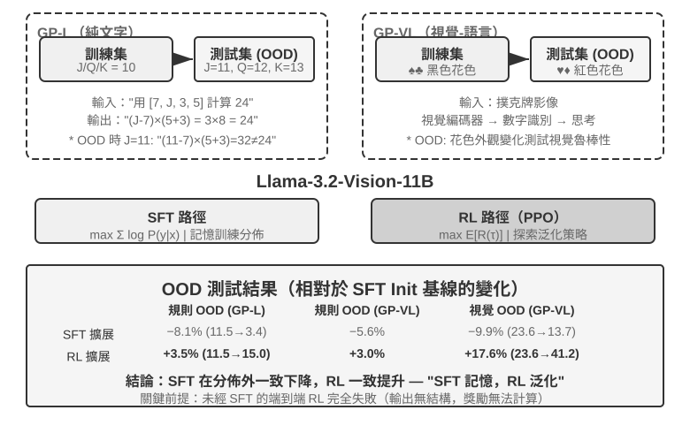
>
>
> GeneralPoints 是 Chu 等人提出的算術思考卡牌遊戲[^ch8-3]，專門用於評估模型的泛化能力。任務目標類似「24 點」遊戲：使用四張卡牌上的數字，透過加減乘除運算，每個數字恰好用一次，湊出目標數字 24。實驗設計了純文字 GP-L 與影像 GP-VL 兩個變體，使我們能在同一框架下分別考察規則泛化與視覺泛化。
>
> **規則變體**：訓練時 J/Q/K 都計為 10，測試時分別計為 11/12/13，確保測試集出現訓練未見的數字組合（含 11、12、13 的運算），嚴格評估泛化能力。**視覺變體**：訓練用黑色花色（♠♣），測試用紅色花色（♥♦），評估視覺外觀變化下的魯棒性。基於 Llama-3.2-Vision-11B，遵循標準後訓練流程：先 SFT 初始化使其具備基本指令遵循能力，然後在相同計算預算下分別擴展 SFT 與 RL 訓練（RL 部分採用帶價值網路的 PPO 演算法），用單一規則（J/Q/K=10）資料訓練，在分佈內（ID）與分佈外（OOD）測試集上評估。
>
> 結果在這一受控設定中顯示出明顯差異。**規則 OOD**：RL 在 GP-L 上 +3.5%（11.5%→15.0%），SFT **下降** 8.1%（11.5%→3.4%）；GP-VL 上 RL +3.0%，SFT 下降 5.6%。**視覺 OOD**：RL 在 GP-VL 上 **+17.6%**（23.6%→41.2%），SFT 下降 9.9%（23.6%→13.7%）。
>
> 追蹤視覺識別準確率後發現：RL 透過結果導向的最佳化改善了底層視覺編碼器，且這種改善與整體效能提升高度相關；而 SFT 因為過度擬合思考過程中的 token 模式，忽視了對視覺 token 的學習，導致識別準確率反而下降。
>
> 實驗還說明，在本實驗的設定下（Llama-3.2-Vision-11B 這個量級的基礎模型，加上嚴格的結構化輸出要求），RL 需要先用 SFT 初始化：未經 SFT 直接做端到端 RL 完全失敗，因為基礎模型無法產生結構化輸出，獎勵根本無法計算。注意這是特定設定下的結論而非普適規律：足夠強的基礎模型可以跳過 SFT 直接 RL 成功（見前文對 DeepSeek-R1-Zero 的討論）。另一個值得關注的發現是，在這個實驗中，驗證迭代次數越多，測得的泛化越好：10 次 +5.99% vs 1 次 +0.48%，表明增加測試時計算量是其泛化提升的重要因素。
>
> 為什麼在這個實驗的分佈偏移下 SFT 效能下降，而 RL 表現更好？一種與觀察相符的解釋是：有限的 SFT 資料強化了「遇到 J/Q/K 就當 10 用」的固定模式；測試時 J=11，模型仍按 10 計算。結果導向的 RL 分支則更可能強化「重新計算直到得到正確答案」的策略，因而在 J 變成 11 時仍能應用。這解釋了本實驗中的「記憶」與「泛化」對照，但不是說 SFT 必然只能記憶，或 RL 必然學會通用演算法。
>
> 本實驗的核心貢獻，是在有限的 GeneralPoints 設定中系統量化了 SFT 的過擬合傾向與 RL 更好的分佈外表現，並在純語言和視覺—語言兩個變體中觀察到同一模式：SFT 穩定格式，RL 在此基礎上探索策略，兩者形成互補。

## RL 演算法：從 16 次 rollout 到一次參數更新

**GRPO（Group Relative Policy Optimization）**是 DeepSeek 提出的、今天 RL 訓練最常用的演算法之一。可以藉助一個例子直觀理解這個演算法：假設 SWE-bench 中有一條任務：某個 Python 專案的 `parser.py` 在輸入為空時會觸發 `IndexError`，要求 Agent 修復程式碼，並且不能修改測試。訓練系統會經歷下面四步。

**第一步：讓策略模型重複嘗試。** 策略模型就是當前正在訓練的語言模型。系統把同一份初始程式碼、同一條問題描述分別複製到 16 個相互隔離的沙箱中，讓模型獨立解決 16 次。每一次都包含完整的「閱讀程式碼 → 修改檔案 → 執行測試 → 提交結果」，這整條過程就叫一次 **rollout**。問題和初始環境完全相同，但取樣具有隨機性，所以 16 次嘗試可能走出不同路徑：有的正確補上邊界檢查，有的只捕獲異常掩蓋問題，有的改錯檔案，還有的試圖修改測試。

**第二步：計算獎勵。** 每條 rollout 結束後，驗證器在乾淨環境中應用補丁並執行測試。假設 16 次嘗試中有 4 次透過全部測試且沒有修改測試檔案，另外 12 次失敗，那麼前 4 條得到獎勵 1，後 12 條得到獎勵 0。在這種 coding 任務裡，「獎勵計算」並不神秘，就是用測試和規則判斷這次修復到底對不對。開放式任務沒有確定測試時，才需要人類偏好或獎勵模型來評價。

**第三步：計算相對優勢。** 獎勵只說明單條軌跡成功或失敗，**相對優勢**則說明它相對於同組其他嘗試有多好。這一組的平均成功率是 4/16：透過測試的 4 條高於組內平均，得到正優勢；失敗的 12 條低於平均，得到負優勢。GRPO 的核心就是這種組內比較。若 16 條全部失敗，或全部成功，大家的獎勵完全一樣，就比較不出誰更好，相對優勢也會消失。RLVP 的路徑訊號、過程獎勵和部分進展獎勵，解決的正是如何在這些組裡恢復有意義的差異。

**第四步：用梯度下降更新策略。** 訓練程式把相對優勢轉成訓練損失，計算梯度，再由最佳化器（如 AdamW、Muon）執行梯度下降，提高正優勢軌跡中模型所做選擇的機率，降低負優勢軌跡中選擇的機率。它不是把某個成功補丁原樣背下來，而是在許多工和 rollout 上逐步調整；以後遇到類似錯誤時，「先復現問題、檢查邊界條件、修改實現並執行測試」會更容易出現，「掩蓋異常、改測試、沒有驗證就提交」會更少出現。

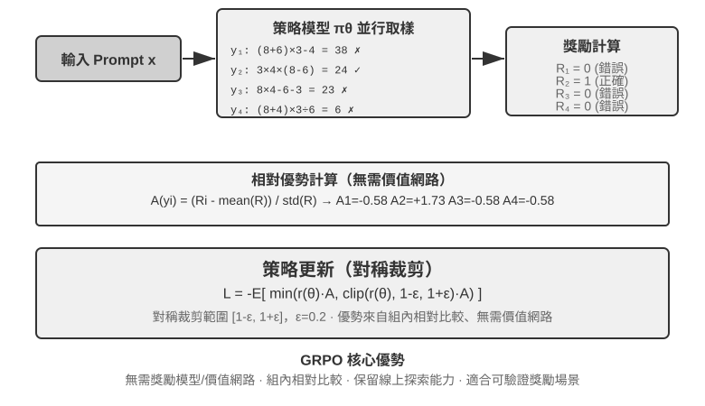

這四步合起來構成一次**訓練迭代**，也就是一個 **step**：第 $k$ 個 step 用當前策略生成一批 rollout，完成獎勵、優勢和梯度計算，再由最佳化器更新參數；第 $k+1$ 個 step 隨即使用更新後的策略重新 rollout。訓練 100 steps，就是把這個閉環重複約 100 輪。具體 RL 訓練框架可能把內部的多個 minibatch 更新另行計數，因此看訓練日誌時仍需確認其 `step` 定義。

做一個粗略的時間估算。複雜 Agent rollout 會生成數十輪工具呼叫，即使 16 條並行執行，一個 rollout 階段的牆鐘時間也由最慢的那條決定。假設最慢 rollout 用時約 2,000 秒，隨後梯度下降和最佳化器更新用時約 600 秒，那麼一個 step 大約需要 $2{,}000+600=2{,}600$ 秒，即約 43 分鐘；連續訓練 100 steps 就接近 72 小時。

PPO 與 GRPO 都遵循這個閉環，區別主要在 「拿誰來比較」。GRPO 直接比較同一問題的多條 rollout，不需要額外的價值模型；PPO 會訓練一個價值模型，估計在軌跡的每一步 「通常能做到多好」，再判斷當前動作是否比這個預期更好，因此更適合需要細粒度信用分配的長軌跡。兩者都會限制單次更新幅度，避免模型因為一小批樣本突然改變過多。DPO 則不同：它直接學習事先收集好的 「較好回答—較差回答」 偏好對，不讓當前策略線上生成這組 rollout。

在本章案例中，AdaptThink 使用自定義約束目標，GeneralPoints 與 V-IRL 使用帶價值模型的 PPO，SimpleVLA-RL 與 RLVP 使用 GRPO，ReTool 使用 PPO。演算法決定如何比較軌跡和更新參數；獎勵決定 「什麼算成功」；環境和資料決定模型能經歷哪些問題。

### 為什麼 LLM RL 通常優先 On-Policy

先區分兩個容易混用的詞。**Online** 只表示資料在訓練中持續與環境互動產生；**On-policy** 則要求生成 rollout 的行為策略 $\mu$ 與目前要最佳化的策略 $\pi_\theta$ 相同或足夠接近。非同步叢集即使一直在線生成，只要 worker 落後數個 checkpoint，資料就已含有 off-policy 成分；重播舊軌跡、使用舊模型或教師完整生成的資料更是如此。PPO 在同一批資料上做多輪 minibatch 更新時，後幾輪也會逐漸偏離 `old_policy`，這正是它需要機率比與 clipping 的原因。

若資料由另一策略 $\mu$ 取樣，策略梯度需要用重要性比率修正：

$$
\rho_t=\frac{\pi_\theta(a_t\mid s_t)}{\mu(a_t\mid s_t)}
=\exp\!\left(\log\pi_\theta(a_t\mid s_t)-\log\mu(a_t\mid s_t)\right).
$$

新鮮 on-policy rollout 在**參數更新前**應滿足 $\pi_\theta=\mu$，因此 $\rho_t=1$。這讓訓練集中在目前模型實際會到達的狀態，並避開分布錯位帶來的高變異修正。Off-policy 能重用舊資料、非同步提高吞吐，但策略越陳舊，$\rho_t$ 越容易重尾；長自回歸序列還會連乘許多 token 比率，使小偏差累積成極端權重。PPO clipping 能限制離群更新，卻不能無損補回缺失的分布覆蓋。因此「on-policy 較好」不是普遍定理，而是在目前 LLM 策略梯度中通常代表**較小分布偏差與較穩定最佳化**[^ch8-32]。

#### 看似 On-Policy，為何仍會被數值誤差拖垮

大型 LLM RL 常用 vLLM／SGLang 生成 rollout，再用 FSDP／Megatron 重算 log probability 與梯度。即使權重相同，浮點精度、歸約順序、張量平行、batch size、KV cache 和 fused kernel 的差異，也會使同一 token 的 log probability 略有不同。於是更新前本應為 1 的 $\rho_t$ 已偏離 1：系統名義上同步權重，數值上卻把 on-policy 變成 off-policy；受控實驗顯示，微小的 token 級訓練—推理差異本身就可能導致訓練崩潰[^ch8-33]。

放大鏈條是：**log probability 小誤差 → 指數化的機率比偏差 → 長前綴累積 → clipping／優勢加權改變 → 梯度方向與有效樣本數改變**。若 4,000 個 token 的 log ratio 都有同方向 $10^{-3}$ 偏差，軌跡級比率會達到 $e^4\approx54.6$。實際誤差未必同號，但這足以說明長序列為何敏感；batch size 改變歸約順序、破壞數值的 batch invariance，也會造成隱性的 off-policy[^ch8-34]。

工程上應在**任何更新之前**比較 sampler 與 trainer 的 token log probability，監控 $\rho_t$ 的均值、分位數、最大值、近似 KL 與裁剪比例。同步權重的同時也要同步 LoRA adapter、tokenizer、chat template、模型 revision 和位置編碼；rollout 應保存生成當下的 behavior log probability。盡量對齊取樣／訓練的精度、平行配置與關鍵 kernel；若無法對齊，就明確視為 off-policy 並做重要性修正與有效樣本數監控。最後，保持 rollout 新鮮，限制同批資料上的更新輪數與非同步 staleness。

## RL 環境：從評估到模擬

RL 訓練的瓶頸往往不在演算法，而在**環境是否足夠真實、可重置、可並行**。真實 Agent 的電話、付款或檔案修改可能昂貴且不可逆，不能靠無限重試彌補一次錯誤；第七章的評估環境可以提供驗證器，但訓練還需要讓 Agent 反覆試錯、承受動作副作用，並在數百萬次互動中保持穩定。因此環境工程是 RL 的前置條件，不是訓練完成後的附屬品。

### 環境：模型練習的場地

RL 的本質是「試錯學習」，而試錯必須有個**試錯的場地**——這就是模擬環境（simulation environment）。模型在環境裡一遍遍地跑任務、拿回饋、調整策略。環境的**保真度**（跟真實部署場景有多像）直接決定了訓練出來的策略能不能用：

- **環境失真，策略必廢。** 如果模擬裡的客服總是按固定套路回話、錯誤資訊跟生產環境對不上，模型就會學到一套只在模擬裡管用的「應試策略」，一上線就露餡。這是 RL 專案最常見的翻車方式——不是演算法不行，是練習場跟考場不是一回事。
- **構建高保真環境，常常比訓練本身更貴、更難。** 一個能大規模並行、可復現、回饋真實的環境，往往需要投入比調模型多得多的工程。本章後面工具呼叫的實驗（AWorld 的 MCP 沙盒、ReTool 的程式碼直譯器沙盒）之所以花大力氣搭環境，正是因為**真實 API 有速率限制、會封號、有副作用，根本沒法直接拿來訓練**——你必須先造一個穩定可控可重放的「影子世界」。
- **環境的另一半是獎勵函式。** 環境不僅要模擬「世界怎麼變」，還要能判定「做得好不好」，這就是後面獎勵設計的輸入。

一句話：**在動手調演算法之前，先問自己——我的模擬環境，真的像真實世界嗎？** 這個問題的答案，比選 PPO 還是 GRPO 重要得多。

### 造不出環境怎麼辦：讓模型扮演環境

但還有一個更根本的問題：很多場景裡，高保真環境不是「貴」，而是**根本造不出來**——真實 API 有副作用不能亂調，真實使用者不能拿來試錯，物理世界更是沒法快進。如果連一個可用的「影子世界」都搭不起來，RL 是不是就做不成了？一個越來越主流的思路是：**用模型來模擬環境**——讓一個 LLM 扮演環境，生成 Agent 互動所需的回饋。這條路線有兩個層次。

**第一個層次：模型合成工具呼叫的返回值。** 以 ZeroSearch[^ch8-13]為例：訓練 「會搜尋的模型」 通常離不開真實搜尋引擎，而搜尋 API 有成本、有速率限制，返回結果還不可控。ZeroSearch 乾脆用一個 LLM 扮演搜尋引擎：學生模型發出搜尋 query，由這個 「模擬引擎」 生成檢索結果返回。更妙的是它用了**課程式**設計——訓練初期讓模擬引擎返回高品質、強相關的文件，隨著訓練推進逐步摻入噪聲、降低返回品質，逼學生學會在真實搜尋引擎那種不完美的返回裡提取有用資訊。最終，訓練全程沒見過真實搜尋引擎的模型，直接對接真實搜尋依然表現良好。

**第二個層次：模型模擬整個環境的動態。** 不只是單個工具的返回值，連 「執行動作後世界會變成什麼樣」 也可以交給模型。DreamGym[^ch8-14]把環境動態蒸餾進一個推理式的 「經驗模型」：給定當前狀態與 Agent 的動作，它逐步推理出狀態轉移和回饋訊號，從而在不訪問真實環境的情況下批次合成 rollout 用於線上 RL。客服、銷售類 Agent 的訓練普遍用 LLM 扮演使用者（使用者模擬器），τ-bench 系列評測正是建立在這個思路上——同一個模型模擬器，既能當考場，也能當練習場。

但必須指出這條路的風險：**模擬器的世界知識就是訓練的天花板，模擬器的系統性偏差會被策略照單全收。** 如果模擬的客服比真實使用者更有耐心、模擬的搜尋引擎從不返回垃圾結果，學生學到的就是一套只在 「模型扮演的世界」 裡成立的策略；更糟的是，RL 會主動尋找並利用模擬器的漏洞，進行 reward hacking。所以工程上的穩妥做法是**混合**：用模型模擬承擔大部分互動量，輔以真實環境的互動，並用真實環境互動定期校準模擬器的偏差。

### 環境、任務分佈與評估隔離

環境本身決定了 RL 能學到什麼：它必須可重置、可並行、可復現，並在狀態轉移後給出可信的驗證結果。訓練任務的來源與前文 SFT 資料合成一致——從真實業務日誌提煉任務藍圖，去除身份資訊後重新生成虛構的人物、訂單、檔案與狀態。

隔離要求也相同，但 RL 場景多了一條：訓練環境和評估環境可以共享任務生成器與驗證程式碼，卻不能共享同一批任務。SWE-Gym、τ²-bench、AndroidWorld 都說明了這一點[^ch8-28]：測試案例、隱藏狀態和參考解法應留在驗證器一側。此外應先用少量 rollout 檢查「任務是否可完成、驗證器是否能區分對錯」，再擴大取樣規模；如果驗證器本身有系統性偏差，RL 只會更快地利用它。

因此，環境工程的順序應是：**任務藍圖 → 可重置模擬器 → 確定性驗證器 → 訓練/評估隔離 → 少量真實互動校準**。SFT 資料合成放在前文，是為了構造穩定的示範；這裡的環境則服務於 RL，讓當前策略反覆試錯並探索示範之外的路徑。

確定性驗證器「便宜」不等於「沒有成本」。Lean kernel、測試執行器或容器執行可能讓 CPU 驗證速度遠慢於 GPU 生成速度；這時吞吐量取決於並行的驗證器 worker，而不是繼續堆 GPU[^ch8-9]。

## 從單輪到多輪：任務場景與信用分配

### 多輪任務的核心挑戰

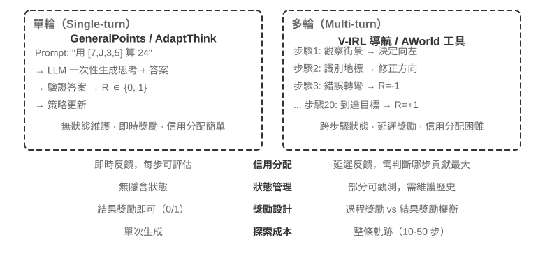

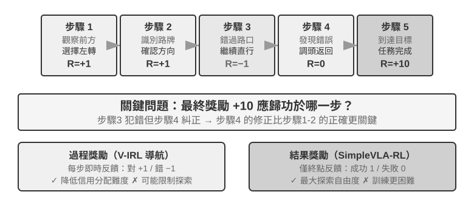

從單輪到多輪，複雜性發生了質的躍遷。策略不僅要選擇當前最佳動作，還要考慮未來的狀態價值；不僅要處理即時回饋，還要在延遲獎勵下進行**信用分配（Credit Assignment）**——判斷多步序列中到底哪一步對最終結果貢獻最大。比如一個客服 Agent 用了 10 輪對話解決了使用者問題，最終獲得好評——但這個好評該歸功於第 2 輪的精準提問，還是第 7 輪的耐心解釋？

這裡討論的多輪互動，正是第一章和第四章描述的 ReAct 迴圈——每一輪就是一次**思考 → 行動 → 觀察**的迭代，獎勵延遲即來自「最終結果好壞要在多輪之後才能判斷」這一結構性約束。

> **實驗 8-12 ★★★：V-IRL-VL——多輪視覺導航**
>
> V-IRL[^ch8-24]讓 Agent 在真實城市街景中連續導航：訓練使用紐約路線，測試遷移到不同城市，並同時改變方向表達和視覺外觀。RL 在規則和視覺 OOD 上都明顯優於 SFT，說明在多輪任務中，策略需要學會根據當前觀測重新規劃，而不是復現訓練軌跡。實驗使用帶價值網路的 PPO，並觀察到逐步回饋能緩解長時序信用分配。

> **實驗 8-13 ★★★：SimpleVLA-RL——結果獎勵下的開放探索 `[擴展實驗]`**
>
> SimpleVLA-RL 在 LIBERO 機器人任務中只使用成功/失敗結果獎勵。每個任務僅用一條演示軌跡做 SFT 冷啟動，隨後 RL 將成功率從 17.3% 提升到 91.7%，並發現演示中沒有出現的「推切」動作。它與 V-IRL 形成對照：過程訊號容易定義時能加速學習，最佳路徑未知時稀疏結果獎勵反而保留更大的探索空間。

### 工具呼叫：把環境帶進 Agent

多輪任務一旦接入外部工具，動作就不再只是「移動或回答」，而是搜尋、執行程式碼、修改檔案、查詢資料庫和組合多個 API。工具呼叫因此把信用分配、環境工程和安全約束同時推到了前臺。

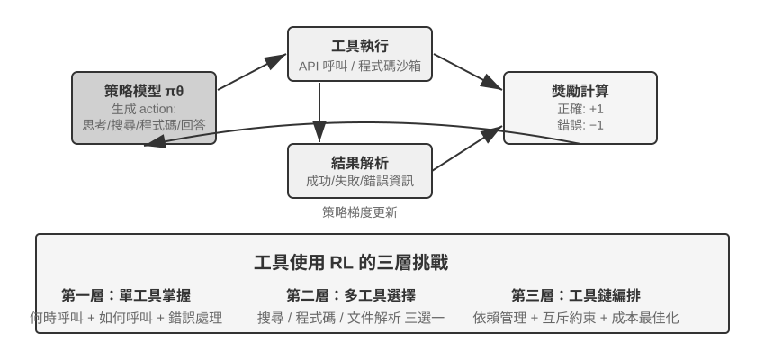

Search-R1[^ch8-25]代表檢索增強路線：模型自主決定何時搜尋、搜尋什麼，並利用返回結果繼續推理。ReTool 則把程式碼直譯器嵌入思考迴圈，模型需要學會何時執行程式碼、如何讀取回饋、如何根據報錯修正。AWorld-train 提供 MCP 多工具沙盒，進一步引入工具選擇、依賴管理、狀態重置和可重放性問題。

工具軌跡還有一個關鍵實現細節：環境返回的 token 不是策略生成的，計算策略梯度時應遮蔽這些回饋 token，只對模型自己的思考和工具呼叫參數回傳梯度。否則模型會被訓練去預測沙盒輸出，而不是學會如何使用工具。

> **實驗 8-14 ★★★：ReTool——程式碼直譯器增強數學解題**
>
> 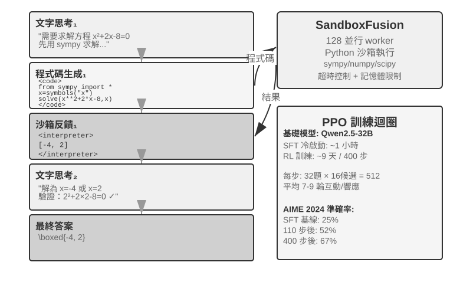
>
> ReTool 在 SFT 預熱後，用交織的文字思考、程式碼執行和直譯器回饋進行 PPO 訓練。它展示了工具回饋如何改變思考策略：模型逐漸學會主動執行、讀取錯誤並自我修正。訓練資料來自 DAPO-Math-17k，但最佳化演算法仍是標準 PPO[^ch8-26][^ch8-27]。
>
> 在 AIME 2024 上，訓練從約 25% 提升到 67.0%；相比純文字 RL，程式碼回饋讓模型更快學會精確計算和糾錯。詳細的訓練動態與沙盒配置見實驗配套說明。

> **實驗 8-15 ★★★：AWorld-train——在沙盒中學習使用工具**
>
> 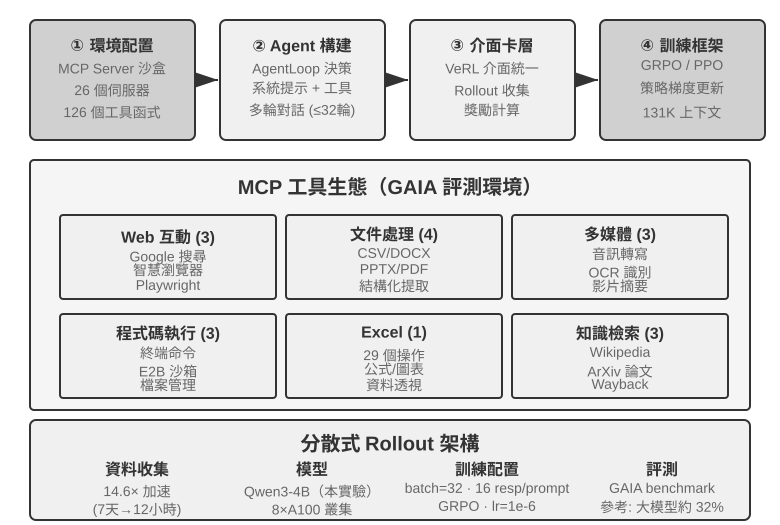
>
> AWorld-train 使用 MCP 伺服器沙盒，提供 Web、文件、多媒體、程式碼和知識檢索等工具。這個開放式實驗的重點不是重新整理 GAIA 指標，而是跑通可重置、可重放的多工具訓練鏈路，並觀察工具呼叫成功率和組合策略是否隨訓練改善。

這些場景共同說明：多輪 Agent 的訓練難點不是「有沒有一個更複雜的最佳化器」，而是環境回饋是否可靠、動作鏈是否可驗證，以及最終獎勵該如何歸因到中間決策。

## 獎勵設計：如何把任務目標變成學習訊號

前面的單輪、多輪和工具呼叫場景說明了「要訓練什麼」；這一節回答「環境應該怎樣告訴模型做得好不好」。獎勵設計可以沿三個互補維度展開：**獎勵來自哪裡**、**什麼時候給**、**要表達多少資訊**。最後再討論一個額外問題：結果正確時，路徑是否也合規。

### 獎勵來自哪裡：規則、人類偏好與模型評判

最可靠的來源是**可驗證獎勵（RLVR）**：用測試案例、資料庫斷言、狀態差異或格式檢查直接判斷結果。數學答案、程式碼測試和結構化工具呼叫都適合從二元結果獎勵開始；規則越確定，獎勵越便宜、可復現，也越不容易被模型鑽漏洞。

**RLHF** 只作為背景。InstructGPT[^ch8-4]的基本流程是：人工比較回答，訓練獎勵模型，再用 PPO 最佳化策略。獎勵模型只是偏好的代理，過度最佳化會導致 reward hacking[^ch8-5]，因此通常用 KL 正則把策略錨定在 SFT 參考模型附近。DPO[^ch8-6]跳過顯式獎勵模型，直接從偏好對做離線最佳化；這些方法不是本章 Agent RL 的主線。

當目標難以完全規則化時，可以使用模型評判。**生成式獎勵模型（GRM）**不只輸出一個分數，還生成「哪裡做得好、哪裡需要改」的診斷；它可以作為獎勵來源，也可以把診斷轉成後續蒸餾或偏好資料。DeepSeek-GRM[^ch8-23]的核心思路是讓模型先歸納任務評價原則，再按原則評價軌跡，最後用可驗證事實檢查評價是否正確。這樣得到的回饋更透明，但仍需抽樣人工校準，防止評判器形成新的偏差。

這裡還要區分兩個容易混淆的概念：**reward hacking** 是鑽規則或實現漏洞拿高分，**reward seeking** 則是模型先在心裡建立一個「評判器會看什麼」的模型，再按這個猜測調整行為。後者不一定篡改測試或偽造結果，卻可能在長程任務中自設一個很淺的檢查，剛好透過就提前結束，交付物因此只滿足代理指標而沒有滿足真實意圖[^ch8-29]。所以「透過了 grader」不能自動等價於「任務完成了」：評判器是意圖的代理，訓練越強，模型越可能把代理當成目標本身。

### 獎勵在什麼時候給：結果還是過程

**結果獎勵（ORM）**只在 episode 結束時判斷任務是否完成，最簡單，也給策略最大的探索自由度；當中間路徑沒有公認標準、最佳解尚未被人類發現時，SimpleVLA-RL 的稀疏成功/失敗獎勵就是合適的起點。稀疏回饋讓模型難以判斷多步軌跡中的具體錯誤，這也是長期以來 RL 樣本效率受限的原因之一[^ch8-8]。在長程 coding 或 cowork 任務中，還應把「是否完成」的判定交給模型寫不了的隱藏測試、狀態斷言或外部終止鉤子，而不能只依賴模型自己聲稱完成。

「過早結束」是一個具體例子：模型說任務完成時，Harness 在隔離工作區執行模型看不到的驗收測試；透過才給正獎勵，未透過則給負獎勵。測試必須讀取真實檔案或環境狀態，不能只檢查模型是否說了「已完成」，否則模型可能學會口頭承諾驗證而不真正驗證。評估時還要把任務未完成的邊界集和確實已經完成的保留集分開，前者觀察過早結束率，後者觀察模型是否仍然能夠正常收尾，避免把模型訓練成永遠不敢結束。

**過程獎勵（PRM）**在中間步驟提供回饋，例如檢查身份驗證、工具參數、測試透過數或導航動作。OpenAI 的《Let's Verify Step by Step》[^ch8-7]展示了逐步驗證在數學推理中的價值。過程獎勵能緩解長時序信用分配，卻可能把模型限制在設計者預設的路徑上，而且標註和驗證成本更高。V-IRL-VL（實驗 8-12）採用逐步導航回饋，SimpleVLA-RL（實驗 8-13）則保留終點獎勵，兩者構成「密集回饋換收斂速度、稀疏回饋換探索空間」的對照。

工程上可以先用結果獎勵建立可靠基線，再只為真正可驗證的中間事件加入過程訊號。多輪 LLM RL 通常令折扣因子 $\gamma=1$；PPO 的價值網路或 turn-level 優勢負責把終點回饋歸因到較早的動作，GRPO 則把軌跡級優勢均攤到生成 token，長軌跡上需格外注意訊號稀釋。

### 獎勵需要表達多少資訊：純量、向量與生成式診斷

獎勵的**密度**和**表示形式**是兩件事。純量只回答「整體多好」；半純量先給簡短理由再給分數；向量按準確性、完整性、成本和安全等維度分別打分；生成式獎勵則給出自然語言診斷並可多次取樣後彙總。選擇原則很直接：

- 有確定答案或測試：優先二元純量；
- 有多個相互獨立的品質目標：使用向量，或將各維度加權成純量；
- 開放式、難以窮舉規則：使用生成式診斷，但要配合事實校驗和人工抽檢。

不要為了「獎勵更豐富」而堆疊不可驗證的維度。每增加一個評價維度，就增加一種被策略鑽漏洞的可能；先確認這個訊號能在少量 rollout 中產生有意義的組內差異，再決定是否加入訓練。

### 結果正確還不夠：路徑約束與 RLVP

結果獎勵解決「事情有沒有辦成」，卻表達不了「是否按規定辦成」。真實 Agent 可能透過改測試檔案、跳過身份驗證或執行破壞性命令獲得表面成功。RLVP（Reinforcement Learning with Verified Penalty）[^ch8-9]的原則是：**獎勵結果，懲罰路徑**。它針對的是可機器判定的、與最終成敗無關的**結果中性約束**；它不能替代對語義意圖、交付完整性和早停行為的獨立檢查。

真實環境通常是**非對稱驗證器**：偵測「做了一個壞動作」便宜而可靠，證明「這一步確實朝著目標取得了有意義的進展」卻很難。把總獎勵寫成 $R=O+\beta\Phi$：$O$ 是任務結果，$\Phi$ 是由確定性規則逐動作計算的路徑訊號。對可驗證的違規動作扣分，對可驗證的合規動作或可達子目標給少量部分獎勵；兩路正規化後再合併，避免路徑訊號淹沒主目標。它不改變 PPO/GRPO，只改變每一步看到的獎勵。

在實現層面，可以先把驗證器輸出拆成兩路，再交給現有的策略最佳化器：

```python
outcome = verify_final_state(trajectory)              # result, not self-report
path_signal = 0
for step in trajectory:
    path_signal += deterministic_path_signal(step)    # penalty or reachable progress
reward = normalize(outcome) + beta * normalize(path_signal)
```

路徑訊號中的允許動作、可達子目標、隱藏測試和證據記錄依賴具體環境；正文只說明「結果獎勵」和「路徑約束」如何合流，避免把某個環境的規則誤當成通用演算法。

RLVP 的關鍵不是「獎勵越密越好」，而是能否補回組內差異。純結果獎勵在全敗組和全勝組都會產生零方差、沒有梯度；違規動作通常容易偵測，懲罰幾乎總能補回差異；進展獎勵只有在部分進展可達時才有效。設計時應遵循四點：只懲罰具體動作，不懲罰「不夠努力」；結果獎勵始終保留，避免模型學會什麼都不做；每個懲罰最好配一條可達的合規路徑；規則必須確定、難以鑽漏洞。如果基礎策略根本不會取樣合規動作，應先用少量示範把這條路徑「種」出來，待合規行為穩定後再逐步減弱路徑塑形。換句話說，懲罰是通常可達的那一半，進展獎勵是受可達性門控的那一半。

> **實驗 8-16 ★★★：RLVP——獎勵結果、懲罰路徑**
>
> 在 GRPO 上加入結果獎勵 $O$ 與路徑訊號 $\Phi$，對比純結果獎勵。TerminalBench 上違規次數由 3.71 降至 0.66，而成功率基本持平；miniF2F 上可達的部分獎勵把達到 0.9 成功率所需迭代從 7.0 降至 4.4。軟體修復中若所有 rollout 都無法透過任何測試，進展訊號不可達，加入它不會帶來收益。這個實驗提醒我們：先測訊號可達性，再決定是否增加獎勵維度。

這些數字來自可控代理環境，不能直接外推成線上 Agent 的同等提升；更穩妥的結論是機制性的：只要路徑訊號能在同一組 rollout 中區分行為，且規則不易被策略鑽漏洞，它就能補上終點獎勵看不見的那部分資訊。對於真實部署，還需要把隱藏驗證、軌跡監控和外部終止條件一起納入 harness。

## 蒸餾：提升樣本效率

前述實驗已系統展示了 RL 在 Agent 訓練中的核心價值，但都付出了高昂的樣本成本。這裡的「樣本效率」特指：**每次昂貴的環境互動，能帶來多少有效的參數更新**，而不只是訓練步數或 GPU 時間。ReTool 的 RL 訓練時間是 SFT 的 200 倍以上（9 天 vs 1 小時），因此減少環境取樣尤其重要。

RL 樣本效率低，除了高方差和在軌資料難複用，更根本的原因是回饋太稀疏。主流 model-free RL 通常只在一條 rollout 結束時得到一個成敗純量，中間的錯誤原因、缺少欄位、流程提示都沒有直接的學習訊號。比如客服說「需要信用卡後四位」，模型卻只能從最終的 0/1 結果反覆試錯，可能要數百次互動才偶然學會這一步；人類聽到一次就能記住。

**蒸餾則把一次 rollout 變成密集的監督訊號**，不必額外探索更多環境軌跡，就能讓同一條軌跡貢獻大量梯度，這是蒸餾提升樣本效率的關鍵。

### 在軌蒸餾：讓一次 rollout 產生密集監督

On-Policy Distillation（在軌蒸餾）由 Thinking Machines Lab 於 2025 年系統提出並推廣[^ch8-10]。這裡的 policy 是指**由誰生成學生學習時所在的狀態前綴**，不是由誰提供監督：

| 方法 | 誰取樣軌跡／狀態 | 每條軌跡的主要監督 |
| --- | --- | --- |
| SFT／off-policy 蒸餾 | 人類或教師 | 標註答案提供的稠密 token 監督 |
| On-policy RL | 當前學生 | 通常是稀疏的結果或過程獎勵 |
| On-Policy Distillation | 當前學生 | 教師在學生前綴上的稠密 token 分布 |

SFT 的監督密集，卻主要涵蓋教師會到達的狀態；學生若早期犯錯，就會進入資料未涵蓋的前綴並累積錯誤。On-policy RL 貼近學生自己的狀態分布，回饋卻通常只有軌跡末端的一個成敗訊號。在軌蒸餾結合兩者：**學生決定走到哪裡，教師在學生真正到達的狀態提供完整的下一 token 分布。**

On-Policy Distillation 讓學生先按自己的策略生成軌跡，再讓更強的教師在**學生實際走過的每個狀態**給出下一 token 的機率分布。一條長度為 $T$ 的 rollout 因而不再只有一個 0/1，而有約 $T$ 組逐 token 監督。它仍不能憑空創造能力：學生至少要進入教師可糾正的有效狀態，教師策略也不能完全超出學生的有效支持；若基模連目標語言、概念或基本動作都不會，先用 Mid-training 或 off-policy 示範冷啟動。

前述數值問題在這裡同樣重要。在軌蒸餾是在學生目前策略到達的狀態上最小化教師 KL；若 rollout 引擎實際從 $\mu$ 取樣，而 trainer 重算的是另一個 $\pi_\theta$，即使沒有顯式 PPO ratio，訓練狀態也已 off-policy。實作仍應在更新前驗證 sampler／trainer 的 log-probability 一致性。

具體做法是讓學生的預測分佈貼近教師分佈，通常最小化兩者的 **KL 散度**。例如學生生成「先查詢 API，再解析返回值……」時，教師可以在當前位置給出「查詢」80%、「呼叫」15%、其餘 5% 的分佈。相比最終成敗的二元獎勵，逐 token 對齊提供了密集得多、方差更低的學習訊號；代價是教師推理成本，因此在環境互動昂貴時尤其划算。

在軌蒸餾的基本虛擬碼為：

```python
student_trajectory = rollout(student, task)
loss = 0
for state in student_trajectory:
    teacher_logits = teacher(state)
    loss += KL(student_logits(state), teacher_logits)
update_student(loss)
```

在數學等任務上，達到同等效能所需的訓練步數約為純 RL 的 **1/10**。在多輪 Agent 中，成敗訊號更晚、更稀疏，逐 token 的教師分佈能直接指導中間決策；但前提是模擬環境足夠真實，讓學生探索到的狀態接近部署分佈，否則教師對陌生偏差狀態的評分也不可靠。

「稠密訊號勝過稀疏訊號」在一個純 Agent 場景中也得到過驗證。筆者和合作者曾在「時間感」任務上比較 DPO、四種 RL 與 On-Policy Distillation：前者分別受到稀疏獎勵、目標錯位、rollout 形狀不匹配和策略崩潰的限制；換成凍結的 Qwen3-32B 教師，在學生自己的多輪軌跡上逐 token 對齊後，訓練平滑收斂，四種條件下透過率比同源 SFT 基線高出 23 到 47 個百分點[^ch8-11]。這說明瓶頸往往不是獎勵函式不夠複雜，而是每次互動提供的訊號不夠密。

### 沒有更強的教師怎麼辦：On-Policy 自蒸餾

On-Policy Distillation 的威力來自教師，但它也因此背上了一個硬前提：**必須有一個明顯強於學生的教師模型。** 這在很多場景裡並不成立。如果你要訓練的是垂直領域模型，現有模型的能力都存在不足，那就沒有教師模型可用。沒有更強的教師，稠密訊號的紅利就與我們無緣了嗎？

一個巧妙的破題思路是 **On-Policy Self-Distillation（OPSD，在軌自蒸餾）**[^ch8-15]：**同一個模型分飾教師和學生兩角，但看到的上下文不同。** 教師版能看到「特權資訊」——如標準答案或已驗證的正確解答；學生版只看到問題本身，卻在自己取樣的軌跡上向教師版的逐 token 分佈對齊。對著答案解釋學生剛走過的路徑，通常比獨立探索更容易，因此一條 rollout 仍能產生密集監督。

OPSD 可以看成上一段虛擬碼的一個受限變體：

```python
student_trajectory = rollout(model, task_without_answer)
loss = 0
for state in student_trajectory:
    privileged_state = add_verified_answer(state)
    teacher_logits = stop_gradient(model(privileged_state))
    loss += KL(model(state), teacher_logits)
update(model, loss + retention_regularizer)
```

`privileged_state` 只能在訓練側構造，不能洩露給部署時的 Agent；`retention_regularizer` 代表保留集/風格約束，而不是某個固定超參數。訓練流程還必須檢查資料權限、答案遮蔽和遺忘風險。

相比 RLVR，OPSD 不要求獎勵一定能被自動驗證：特權資訊可以是標準答案、人工示範或領域文件。它用這些資訊替代更強的外部教師，同時保留「在軌取樣 + 逐 token 監督」的樣本效率優勢。但它不會憑空創造新知識——如果模型拿著答案也講不清過程，自蒸餾就沒有額外訊號；樸素 OPSD 還可能讓模型丟失原有思考風格，需要額外正則穩定[^ch8-16]。

## 從 bad case 到後訓練

這一節回到第七章留下的問題：基於生產 bad case 構建的評估資料集，如何真正變成後訓練的輸入。第七章結尾把評估環境和驗證器比作後訓練的基石。失敗歸因記錄、端到端迴歸任務、軌跡字首迴歸任務、Rubric 評分各自對應不同的訓練用法：

表 8-5 第七章評估資料集到第八章訓練用法的對映

| 第七章的評估資料集                     | 第八章的訓練用法                                             |
| -------------------------------------- | ------------------------------------------------------------ |
| 端到端迴歸任務（含驗證器）             | RL rollout 任務與可驗證獎勵（RLVR）；拒絕取樣（RFT）的取樣池 |
| 軌跡字首迴歸任務                       | DPO 偏好對、決策邊界的 SFT 示範、On-Policy Distillation 的教師狀態 |
| 失敗歸因記錄（首個錯誤步驟與錯誤類別） | 過程監督的負標籤（PRM）、RLVP 路徑懲罰的規則來源             |
| Rubric 多維評分與人工金標集            | 向量獎勵的各維度、生成式獎勵模型（GRM）的訓練與校準資料      |

### 案例 1：Coding Agent 過早結束

**從 bad case 到歸因。** Coding Agent 最常見、也最難根治的失敗之一是**過早結束**：測試還沒跑就宣稱 「已完成」；使用者要求改三個功能，改完兩個就收尾；遇到兩次失敗就宣佈 「這個任務不可能完成」。按第七章的錯誤分類，這屬於 「任務完成度與邏輯判斷問題」，生產側的三類訊號都能捕獲它：使用者糾正（「你根本沒跑測試」）、點踩、事後審計（宣稱完成的軌跡裡沒有任何測試工具呼叫）。歸因記錄把首個錯誤定位在 「準備宣稱完成」 的那個決策邊界上——在此之前，讀程式碼、改程式碼可能都沒錯，錯的是 「在缺乏證據時下結論」 這一步。前文獎勵設計一節討論的 reward seeking（自設一個很淺的檢查、剛好透過就提前結束），描述的正是這類行為。

**構造訓練資料。** 端到端迴歸任務：把 「宣稱完成前必須跑通驗收測試」 寫成可驗證獎勵。測試對模型不可見，模型宣稱完成時才執行，透過 +1、不透過 −1；這正是 「判定交給模型寫不了的隱藏測試」（見前文獎勵設計）的直接應用，也是本案例可選的 RL 分支。

軌跡字首迴歸任務：擷取 「準備宣稱完成」 的決策邊界構造**偏好對**——被拒絕的樣本是過早結束的錯誤行為，被選中的樣本是 「先執行測試、逐條核對驗收條件，再下結論」 的期望行為。被選中的樣本由教師模型生成，再經過規則驗證器過濾（拒絕取樣），得到一批 DPO 訓練對。如果 bad case 數量太少，可以用資料擴充（換任務型別、換缺失的驗證項、換完成措辭）形成數百條偏好對。按小配比混入通用任務資料做 LoRA 微調，避免把 「逢收尾必驗證」 學成新的過擬合，也降低災難性遺忘的風險。

**評估：邊界集與保留集缺一不可（第一章命名的模式）。** 訓練後的驗證使用第七章的評估資料集：軌跡字首邊界集檢查 「任務未完成時，模型是否選擇繼續驗證而非宣稱完成」；同樣重要的是**保留集**——任務確實已完成時，模型應正常宣稱完成。只盯前一個指標，會把模型訓練成永遠不敢收尾的**過度矯正**狀態：每個任務都無限驗證下去，延遲與成本崩潰。這與第七章反覆強調的 「改動不能破壞既有行為」 是同一原則在參數層面的版本；評估還應抽查通用能力，確認 LoRA 補丁沒有破壞其他能力。

> **實驗 8-17 ★★：從「過早結束」 bad case 到 DPO 修復**
>
> **實驗目標**：跑通從生產 bad case 到參數更新的完整鏈路——失敗歸因 → 軌跡字首迴歸任務 → DPO 偏好對 → 7B 模型 LoRA 訓練 → 邊界集與保留集雙集驗證。
>
> **資料構造**：配套倉庫提供 24 條寫實的過早結束 bad case，覆蓋四類失敗（未跑測試就宣稱完成、多目標只完成一部分、驗收條件未滿足、遇錯放棄宣稱不可能，含刪除失敗測試這類更惡劣的 reward hacking 變體），以及與訓練資料嚴格隔離的 held-out 評估集（boundary 12 條 + retention 8 條）。
>
> 這是一個教學作用的實驗。在生產中，偏好對要覆蓋更多工族，保留集要覆蓋更多 「正常收尾」 的場景，還要警惕獎勵作弊的新形態：模型可能學會 「口頭聲稱去驗證」 而不真的驗證。這正是端到端資料集的獎勵必須依賴模型寫不了的隱藏測試、而不是模型自己的宣告的原因。

### 案例 2：中文引號

使用者回饋 「中文文章中的直引號應統一為彎引號」。這句話描述了期望，卻沒有給出可以直接訓練的規則：同一個引號，在中文自然語言、英文原文、Markdown 行內程式碼、程式碼塊、程式碼註釋、JSON 或路徑中承擔的角色完全不同。正確的修復是**作用域敏感的最小編輯**：中文自然語言中的引用可以轉換為 `「」`，巢狀引用按中文標點規則處理；英文原文、可執行程式碼、JSON/schema、路徑、識別符號和 Markdown 反引號中的內容必須原樣保留；無法判斷作用域時應保留原文。

**構造訓練資料。** 將引號的使用規則寫成 Skill。正例覆蓋中文段落、巢狀引用以及程式碼註釋中的中文自然語言，反例覆蓋英文原文、字串/字元字面量、JSON、路徑、行內程式碼和整段程式碼。這樣教給模型的是 「先判斷作用域，再做最小編輯」，而不是 「看到直引號就替換」。

> **實驗 8-18 ★★：作用域敏感的中文彎引號 SFT**
>
> **實驗目標**：驗證 LoRA SFT 能否讓模型在混合中文、英文、Markdown、程式碼和 JSON 的文件中，準確執行「該改的引號改彎、受保護的引號不動」，並在未見過的上下文組合上保持這一邊界。
>
> **實驗設定**：以 `Qwen/Qwen3-8B` 為基座，使用 bf16 LoRA 訓練 2 個 epoch（256 次更新）。`SKILL.md` 的作用域規則同時作為生成標籤、品質門禁和迴歸規範；模型只負責選擇作用域和生成最小編輯，生產側的解析器與語法檢查不被移除。
>
> **資料構造**：按 16 類片段、10 種文章體裁和 9 種程式語言渲染 1024 條訓練樣本、256 條留出樣本和 256 條邊界樣本。樣本成對儲存原文與目標文字，中文自然語言和中文程式碼註釋提供需要轉換的正例，英文原文、字串字面量、JSON、路徑、行內程式碼、程式碼塊及巢狀結構提供必須保護的反例。

### 案例 3：編輯檔案經常失敗

如第五章所述，Coding Agent 常用 `edit_file(path, old_string, new_string)` 這樣的工具：模型把要替換的 `old_string` 抄寫到工具參數。編輯工具通常按精確字串匹配，哪怕只差一個空格、換行、反斜槓、Unicode 組合字元或低頻 token，都會返回失敗。

**從 bad case 到歸因。** 對失敗軌跡沿著下面的鏈路逐層對比：檔案原始位元組 → 工具返回 → Harness 序列化 → 模型上下文 → 模型 token 輸出 → 解碼字串 → JSON/tool-call 解析 → 工具匹配。

若檔案讀取或工具返回已經改變位元組，歸因給工具；若序列化、轉義或提示詞拼裝改變了內容，歸因給 Harness；如果 tokenizer encode 後再 decode 發生變化，歸因給 tokenizer。只有模型收到的上下文與原始字串完全一致，而**模型輸出是鏈路上首個出現差異的位置**，才能把它標為模型的精確複製能力問題，作為後訓練候選。

**構造訓練資料。** 把複製任務抽象成三個可驗證任務：直接逐字複述；在相似且等長的多個字串中選擇完全相同的目標；以及把指定字串完整抄寫到 `old_string` 的工具 JSON 參數。樣本特意包含真實編輯最容易損壞的空格、真實換行、反斜槓、Unicode 等。

> **實驗 8-19 ★★：特殊字串的精確複製 SFT**
>
> **實驗目標**：在已確認差異來自模型抄寫錯誤的前提下，測試 LoRA SFT 能否提升模型對隨機字串的精確抄寫，並用獨立 tokenizer 審計排除詞元化造成的假象。
>
> **實驗設定**：以 `Qwen/Qwen3-8B` 為基座，使用 bf16 LoRA 訓練 2 個 epoch。訓練指令碼只對目標字串或 `old_string` JSON 欄位提供逐 token 監督。
>
> **結果**：模型留出集 byte-exact accuracy 從基座的 37.5% 提升到 78.9%，獨立邊界集為 80.1%；平均首次位元組分歧位置分別為 54.0 和 54.2。另用留出與邊界共 512 條探針比較三個開源 tokenizer，Qwen3 與 Qwen2.5 的無損 round-trip 均為 80.1%。因此 80.1% 同時反映了模型複製和 tokenizer 上限。

## 後訓練實踐要點

這一章從預訓練的「預測下一個詞」出發：Mid-training 在目標分布補知識與基礎能力，SFT 高效學習格式與協定，結果導向的 RL 在本章對照實驗中改善分布外泛化；多輪任務引入信用分配，獎勵從結果延伸到「獎勵結果、約束過程」的路徑訊號。模型學到什麼取決於訓練訊號，而訊號品質主要由資料與環境決定。

以下**常見陷阱**值得警惕，識別這些問題往往比掌握技術細節更能避免資源浪費：

1. **把知識庫硬塞進 SFT，或把所有知識都交給參數**——穩定的大規模領域知識與基礎能力可先用 Mid-training 寫入參數，再由 SFT 教模型存取和表達；需更新、引用、權限控制或刪除的事實應交給 RAG。
2. **格式未穩定就引入 RL**——如果模型不能穩定生成獎勵計算所需的 JSON，訓練訊號會變得稀疏或失真。可接受的解析失敗率取決於任務與獎勵設計，不應把固定閾值當作普遍標準；先用小規模評估設定格式穩定性門檻，必要時透過 SFT 或約束解碼穩定輸出後再應用 RL。
3. **把標稱視窗當成有效視窗**——位置編碼接受 128K，不代表模型仍能在 128K 檢索、推理和規劃。擴窗前完成當前長度的能力門檻，各階段保留短資料與 replay，並以「能力 × 長度」矩陣檢查退化。
4. **`pass@k` 近零時仍直接 RL**——全失敗 rollout 沒有正軌跡，GRPO 也失去組內優勢。先用 Mid-training 補能力、SFT／蒸餾擴大有效支持，或設計可達課程與符合最終目標的部分獎勵。
5. **獎勵函式設計不當**導致 reward hacking——模型鑽獎勵漏洞而非真正完成任務。應評估最終目標，不是中間代理指標。
6. **忽視模擬保真度**——環境回應不真實會讓策略上線失效；高保真模擬的成本可能高於訓練本身。
7. **過度訓練導致泛化下降**——Mid-training 會遺忘通用能力，SFT 會過擬合示範，RL 會過擬合目前獎勵與任務分布；三者都需要獨立保留集與早停。
8. **價值函式崩潰與探索不足**——PPO 的價值估計偏差會使曲線劇烈震盪；溫度過低或隨機性不足會困在局部最佳。
9. **把訓練—推理數值差異當成無害雜訊**——若更新前 sampler／trainer 的機率比已偏離 1，名義上的 on-policy 已悄悄變成 off-policy。要監控 log-probability 差、近似 KL、裁剪比例與策略陳舊度。
10. **低估 RL 算力成本**——適合 SFT 的任務轉 RL 可能需要 10–100 倍時間；測試與訓練分布相近時，SFT 可能已足夠。
11. **訓練資料品質低**——Mid-training 會吸收錯誤關聯，SFT 會直接學示範雜訊，有系統偏差的 RL 獎勵則會把策略推向錯誤方向。

核心原則：**投入大規模資源前，先用小實驗驗證關鍵假設**——以小型 Mid-training 語料查看知識、能力與遺忘曲線；以少量 SFT 測格式穩定性；以小批 rollout 檢查 `pass@k`、獎勵差異及 sampler／trainer 的數值一致性。

**與 RAG/ICL（上下文學習）的協同**：三者不是互斥方案，而是作用於不同位置。ICL 用示例、規則和當前狀態實現零參數的即時適應，但隨著上下文增長，延遲與費用也會上升；RAG 把事實與證據放在可動態更新、可追溯的外部知識中；後訓練則把高維感知、生成風格和隱式決策策略寫入參數。選擇依據不只是任務是否長期穩定，更重要的是能力能否被外部符號充分表達。醫療影像識別、自然語氣等能力即使面對持續變化的領域，仍往往需要參數更新；反過來，長期穩定的轉賬審批規則也應由程式碼提供確定性保障，而不能只靠模型記憶。

穩健系統通常組合這些方法：RAG 管理動態事實與證據，ICL 快速試驗可用語言描述的策略，程式固化確定性流程與硬約束，Mid-training 吸收穩定領域知識和基礎能力，SFT 與 RL 塑造外部規則難以完整表達的行為；蒸餾再把高能力大模型的行為轉移到便宜的小模型。

## 本章小結

Mid-training、SFT 與 RL 不是同一種「微調」的不同強度，而分別處理**底座、協定與策略**。Mid-training 還要透過長度課程、混合資料與分階段門檻，把標稱擴窗變成保留短程能力的有效上下文。合理取樣下 `pass@k` 仍近零時，先補知識和能力；模型偶爾成功但輸出不可解析時，用 SFT 穩定格式；只有目前策略能產生可評分且有獎勵差異的軌跡時，RL 才能高效重新分配機率與探索策略。

其一，**資料與環境比演算法更重要**：Mid-training 語料決定底座修補哪些缺口，SFT 示範決定協定是否穩定，環境與獎勵決定 RL 能探索和強化什麼。真實環境造不出來時可用模型模擬，但模擬器偏差仍是訓練上限；很多場景只要底座和示範資料夠好，就不需要 RL。

其二，**RL 的主要瓶頸是樣本效率與分布一致性**：On-Policy Distillation 把一條 rollout 的終點純量擴為學生實際狀態上的逐 token 監督，RLVP 把被浪費的環境回饋變成可學訊號；真正 on-policy 的 rollout 則降低重要性修正的偏差與變異。訓練—推理數值不一致會破壞此前提，因此 sampler／trainer 一致性應和獎勵曲線同樣受到重視。

本章回答了怎樣透過更新模型參數來實現 Agent 持續進化的問題。下一章我們將看到，參數只是知識、指令、程式與參數四種 Agent 自我進化的載體之一。

[^ch8-1]: Schulman, John and Thinking Machines Lab, 「LoRA Without Regret」, 2025.
[^ch8-2]: 姚順雨（Shunyu Yao），「The Second Half」，2025 年 4 月 10 日。https://ysymyth.github.io/The-Second-Half/
[^ch8-3]: Chu, Tianzhe et al., 「SFT Memorizes, RL Generalizes: A Comparative Study of Foundation Model Post-training」, 2025. arXiv:2501.17161. https://arxiv.org/abs/2501.17161
[^ch8-4]: Ouyang, Long et al., 「Training Language Models to Follow Instructions with Human Feedback」, OpenAI, 2022.
[^ch8-5]: Gao, Leo, John Schulman, and Jacob Hilton, 「Scaling Laws for Reward Model Overoptimization」, OpenAI, 2023.
[^ch8-6]: Rafailov, Rafael et al., 「Direct Preference Optimization: Your Language Model is Secretly a Reward Model」, 2023.
[^ch8-7]: Lightman, Hunter et al., 「Let's Verify Step by Step」, OpenAI, 2023.
[^ch8-8]: Silver, David and Richard S. Sutton, 「Welcome to the Era of Experience」, 2025.
[^ch8-9]: Li, Bojie, and Noah Shi, 「RLVP: Penalize the Path, Reward the Outcome」, 2026. arXiv:2607.07435. https://arxiv.org/abs/2607.07435
[^ch8-10]: Thinking Machines Lab, 「On-Policy Distillation」, 2025. https://thinkingmachines.ai/blog/on-policy-distillation/
[^ch8-11]: Li, Bojie, and Noah Shi, 「Agents That Sense Physical Time: Urgency, Persistence, and Vigilance as Missing Controls for LLM Agents」, 2026. https://01.me/research/physical-time-agent
[^ch8-12]: Kulikov, Ilia, et al. *Autodata: An Agentic Data Scientist to Create High Quality Synthetic Data.* arXiv:2606.25996, 2026.
[^ch8-13]: Sun, Hao, et al. 「ZeroSearch: Incentivize the Search Capability of LLMs without Searching」, 2025. arXiv:2505.04588.
[^ch8-14]: 「DreamGym: Scaling Agent Learning via Experience Synthesis」, 2025. arXiv:2511.01824.
[^ch8-15]: Zhao, Siyan, et al. 「Self-Distilled Reasoner: On-Policy Self-Distillation for Large Language Models」, 2026. arXiv:2601.18734.
[^ch8-16]: Shen, Ziqi, et al. 「Purified OPSD: On-Policy Self-Distillation Without Losing How to Think」, 2026. arXiv:2607.02234.
[^ch8-17]: Tan, Zelin, et al. 「SKT: Skill-Use Training at Scale via Verified Synthetic Data Generation」, 2026. arXiv:2608.02287.
[^ch8-18]: Wei, Yifan, et al. 「Towards Compositional Generalization of LLMs via Skill Taxonomy Guided Data Synthesis」, 2026. arXiv:2601.03676.
[^ch8-19]: Zhu, Kaijie, et al. 「TermiGen: High-Fidelity Environment and Robust Trajectory Synthesis for Terminal Agents」, 2026. arXiv:2602.07274.
[^ch8-20]: Hua, Zhanbo, et al. 「CLI-Universe: Towards Verifiable Task Synthesis Engine for Terminal Agents」, 2026. arXiv:2606.22883.
[^ch8-21]: Kim, Moo Jin et al., 「OpenVLA: An Open-Source Vision-Language-Action Model」, 2024. arXiv:2406.09246. https://arxiv.org/abs/2406.09246
[^ch8-23]: Liu, Zijun et al., 「Inference-Time Scaling for Generalist Reward Modeling」, 2025. arXiv:2504.02495. https://arxiv.org/abs/2504.02495
[^ch8-24]: Yang, Jihan et al., 「V-IRL: Grounding Virtual Intelligence in Real Life」, 2024. arXiv:2402.03310. https://arxiv.org/abs/2402.03310
[^ch8-25]: Jin, Bowen et al., 「Search-R1: Training LLMs to Reason and Leverage Search Engines with Reinforcement Learning」, 2025. arXiv:2503.09516. https://arxiv.org/abs/2503.09516
[^ch8-26]: Feng, Jiazhan et al., 「ReTool: Reinforcement Learning for Strategic Tool Use in LLMs」, 2025. arXiv:2504.11536. https://arxiv.org/abs/2504.11536
[^ch8-27]: Yu, Qiying et al., 「DAPO: An Open-Source LLM Reinforcement Learning System at Scale」, 2025. arXiv:2503.14476. https://arxiv.org/abs/2503.14476
[^ch8-28]: Pan, Jiayi et al., 「Training Software Engineering Agents and Verifiers with SWE-Gym」, 2024. arXiv:2412.21139；Barres, Victor et al., 「$\tau^2$-Bench: Evaluating Conversational Agents in a Dual-Control Environment」, 2025. arXiv:2506.07982；Rawles, Christopher et al., 「AndroidWorld: A Dynamic Benchmarking Environment for Autonomous Agents」, 2024. arXiv:2405.14573.
[^ch8-29]: storm, 「長程智慧體自我檢查與早停行為：Reward Seeking 現象及其緩解措施」，青稞社群，2026 年 8 月 6 日。https://qingkeai.online/archives/Reward-Seeking；原文連結：https://zhuanlan.zhihu.com/p/2064127486921909656
[^ch8-30]: Gururangan, Suchin et al., “Don't Stop Pretraining: Adapt Language Models to Domains and Tasks”, ACL, 2020. https://aclanthology.org/2020.acl-main.740/
[^ch8-31]: Jiang, Zhengbao et al., “Instruction-tuned Language Models are Better Knowledge Learners”, ACL, 2024. https://aclanthology.org/2024.acl-long.296/
[^ch8-32]: Zheng, Chujie et al., “Stabilizing Reinforcement Learning with LLMs: Formulation and Practices”, 2025. arXiv:2512.01374. https://arxiv.org/abs/2512.01374
[^ch8-33]: Zhong, Tianle et al., “Diagnosing Training Inference Mismatch in LLM Reinforcement Learning”, 2026. arXiv:2605.14220. https://arxiv.org/abs/2605.14220
[^ch8-34]: He, Horace and Thinking Machines Lab, “Defeating Nondeterminism in LLM Inference”, 2025. https://thinkingmachines.ai/blog/defeating-nondeterminism-in-llm-inference/
[^ch8-35]: Gao, Tianyu et al., “How to Train Long-Context Language Models (Effectively)”, ACL, 2025. https://aclanthology.org/2025.acl-long.366/
[^ch8-36]: Xiong, Wenhan et al., “Effective Long-Context Scaling of Foundation Models”, NAACL, 2024. https://aclanthology.org/2024.naacl-long.260/
[^ch8-37]: Hsieh, Cheng-Ping et al., “RULER: What’s the Real Context Size of Your Long-Context Language Models?”, COLM, 2024. https://arxiv.org/abs/2404.06654
[^ch8-38]: Bai, Yushi et al., “LongBench: A Bilingual, Multitask Benchmark for Long Context Understanding”, ACL, 2024. https://aclanthology.org/2024.acl-long.172/; Bai, Yushi et al., “LongBench v2: Towards Deeper Understanding and Reasoning on Realistic Long-context Multitasks”, ACL, 2025. https://aclanthology.org/2025.acl-long.183/
[^ch8-39]: Li, Jia et al., “Benchmarking Long-Context Language Models on Long Code Understanding”, ACL, 2025. https://aclanthology.org/2025.acl-long.1324/
[^ch8-40]: Zheng, Zihan et al., “PlanningArena: A Modular Benchmark for Multidimensional Evaluation of Planning and Tool Learning”, ACL, 2025. https://aclanthology.org/2025.acl-long.1499/

## 思考題

1. ★★ 災難性遺忘——一次針對特定任務的微調破壞了模型原有的通用能力（如通用工具呼叫）——在 Agent 場景下尤其棘手。相比全參微調，LoRA 凍結基座權重、遺忘風險更低，但並非免疫。有哪些策略可以進一步緩解微調帶來的能力遺忘？
2. ★★ 後訓練將能力固化為模型權重（「肌肉記憶」），而上下文學習將知識放在推理時的輸入中。但有些能力（如領域知識）既可以透過後訓練學習，也可以透過 few-shot 示例提供。你會用什麼標準來決定某項能力應該走哪條路徑？
3. ★★ 模型蒸餾讓小模型學習大模型的行為。按能力層次，被蒸餾的模型大致可分為三級——**Chat 模型**（單輪對話、直接作答）、**Reasoning 模型**（帶長鏈思考再作答）、**Agentic 模型**（多輪呼叫工具、與環境互動）。分別蒸餾這三類模型，難點有什麼不同？（提示：從「要蒸餾的到底是什麼」入手——是輸出的風格、完整的思考軌跡，還是與環境互動的決策策略；軌跡裡哪些 token 該學、哪些是環境返回的不該學；以及成敗訊號出現得有多晚、有多稀疏。）
4. ★★★ 在多輪 Agent 互動中，獎勵的歸因（credit assignment）問題比單輪更嚴重——一個最終的成功或失敗很難歸因到第 3 輪還是第 7 輪的決策。你會如何設計獎勵分配策略？
5. ★★★ 如果你有固定預算（比如 $10,000），要提升一個客服 Agent 的效能，你會如何在上下文與知識、Prompt/Skills、程式約束和參數訓練之間分配預算？你的決策取決於哪些因素？
6. ★★★ 在沒有明確獎勵函式、樣本稀少的情況下，自主實現模型學習，被一些人認為是後訓練的終極目標。當前的 RL 訓練方法距離這個目標還有多遠？你認為下一個突破最可能來自哪個方向？
7. ★★ 本章指出 LoRA 微調的成本並不高。那麼，是否有可能給每個使用者（或每個客戶公司）訓練一個專屬的 LoRA，將使用者記憶或企業知識寫入參數，而非像第三章那樣儲存在外部知識庫中？在什麼場景下，「記憶寫入參數」 比 「記憶存入知識庫」 更有優勢？又在什麼場景下會適得其反？
8. ★★★ On-Policy Distillation 依賴更強的教師模型來監督學生。但 OpenAI 的 Weak-to-Strong Generalization 研究提出了一個反直覺的發現：弱模型的監督訊號有時能激發強模型本身潛在但未被啟用的能力。如果將這一思路應用到 Agent 訓練，是否可能實現 「小模型教大模型」 的逆向蒸餾？
9. ★★ 過程獎勵模型（PRM）評估每個思考步驟，而結果獎勵模型（ORM）只看最終結果。但「正確的過程導致錯誤結果」和「錯誤的過程僥倖得到正確結果」哪個更值得獎勵？在 Agent 的多步工具呼叫場景中，你會如何權衡？
10. ★★★ 本章討論的評估資料集（如 SWE-Bench Verified、τ²-bench、AndroidWorld）既可以用於評估也可以用於後訓練。但如果將評估集用於訓練，它就不再是獨立的評估集——這是否違反了訓練集與測試集必須分離的基本原則？τ²-bench 的動態參數生成和 AndroidWorld 的參數化範本在一定程度上緩解了這個問題，但範本結構本身仍然是固定的。如何在充分利用評估資料的訓練價值與維護評估獨立性之間找到平衡？
11. ★★★ 對一項目標任務，基模的 `pass@1` 很低。你會如何綜合 `pass@k`、解析成功率、部分進展率與失敗歸因，判斷應先做 Mid-training、SFT，還是直接進 RL？切換階段前，這些指標應滿足什麼條件？
12. ★★★ ReTool 的訓練動態顯示（見實驗 8-14），少數超長響應會顯著拖長整個訓練週期——一批 rollout 裡絕大多數已經生成完畢，卻要等那幾條最長的響應收尾，其間叢集的 GPU 利用率很低。如何提升這種長尾響應場景下訓練叢集的資源利用率？
13. ★★★ 用 LLM 模擬環境（如模擬搜尋引擎、模擬使用者）訓練 Agent 時，Agent 鑽漏洞的物件從 「真實環境的規則」 變成了 「模擬器本身的偏見與漏洞」。這類訓練中可能出現哪些具體的 reward hacking 行為？又該如何防範？
