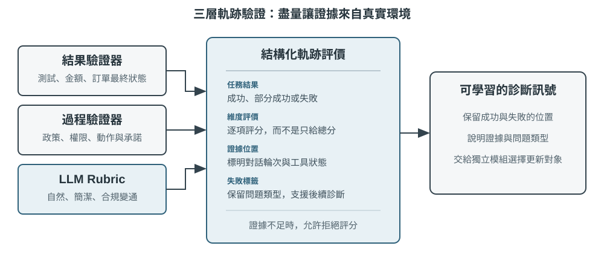
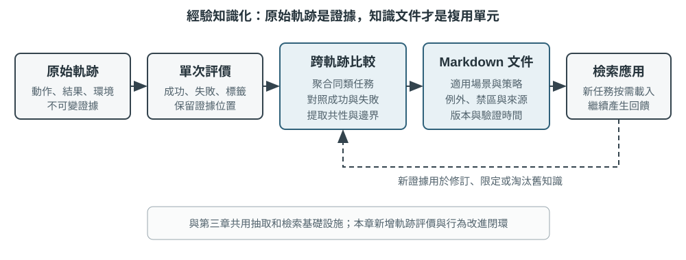

# Agent 的持續進化

今日的 Agent 面臨一個鮮明的能力悖論：它可以用零樣本解決從未見過的複雜任務，卻可能在處理了一萬次相似任務之後，隔天仍犯下第一天的錯誤。**能否自主從經驗中學習**，正成為 Agent 從「會完成任務」走向「能夠可靠工作」的關鍵能力，也是下一代模型的核心研究課題。然而，目前模型本身的持續學習能力仍遠遠不足。

原因在於，部署後的模型不會因為一次推理就自動改變參數。第二章討論的上下文學習、狀態維護與壓縮，能讓 Agent 在**目前任務內**適應；但上下文結束後，這種變化不會自然進入下一次任務。將對話存入記憶也不等於學會新的行為：原始軌跡可能很長，其中既有有效策略，也有偶然成功、錯誤歸因與不可信的輸入。

這裡有一個容易混淆的差別：**保存經歷不等於從經歷中學習**。將一百條軌跡放入長上下文或向量庫，可以幫助模型在需要時找回某個案例，卻不會自動完成跨案例比較——哪些步驟在成功軌跡中反覆出現、哪些做法只在舊版介面上有效、某次成功究竟來自正確策略還是環境偶然。學習發生在系統主動完成「評價、對照、歸納、驗證」之後，而不是發生在日誌寫入磁碟的那一刻。第三章的使用者記憶主要沉澱「使用者與世界是什麼樣子」，本章的經驗學習則要進一步沉澱「在什麼條件下應該如何行動」；前者讓 Agent 記得更多，後者才讓它從聰明變得熟練。

那麼，為什麼不讓模型在每次任務後直接訓練自己？因為正式環境很少提供乾淨的學習訊號。使用者滿意不代表合規；局部參數更新也可能造成能力遺忘、策略漂移或安全性退化。若允許執行中的模型依據未經驗證的回饋直接修改自身參數，錯誤經驗與提示注入就可能被固化，並在後續任務中持續放大。另一方面，基礎模型的週期性訓練可以提升通用能力，卻無法及時吸收每個 Agent 每天遇到的私有規則、工具變化與局部經驗。

因此，在模型自身尚無法可靠地持續學習時，必須先將「學習」建構為模型外圍的一套自主系統：記錄執行證據、驗證結果與過程、從多條軌跡中提取共通性，再決定應更新知識、指令、程式或模型參數。所有修改先形成候選版本，經過迴歸測試與安全檢查後，才能改變下一輪執行。

前面的章節已經提供這套系統所需的主要元件。第二章處理任務內狀態，第三章提供知識基礎設施，第五章賦予 Agent 創造工具與修改系統的後設能力，第七章建立評估與驗證，第八章說明如何更新模型參數。第九章的任務，是將這些元件組織成圖9-1所示的持續進化閉環。

持續進化需要源自可追溯的執行經驗、能夠改變後續行為，並經過驗證確認未造成明顯退化。本章首先討論如何判斷一次執行究竟好在哪裡、錯在哪裡；接著比較四種更新方法及其適用邊界；最後討論這些更新如何在長期執行中被驗證、發布、修訂與淘汰。

## 從執行軌跡中取得學習訊號

持續進化的起點不是「總結」，而是「評價」。如果系統不知道任務是否完成，也不知道哪一步造成成功或失敗，那麼語言模型產生的反思只能是一種猜測。錯誤評價一旦進入長期知識、系統提示或訓練資料，其影響便會跨越後續任務不斷放大。

有些任務的結果相對容易驗證。Coding Agent 可以執行測試、型別檢查與效能基準測試；替使用者辦理退款的 Agent 可以查詢訂單狀態與實際退款金額。這類訊號來自環境中的真實狀態，通常比模型對自身行為的描述可靠。不過，結果正確不代表過程正確。刪除失敗的測試案例也能讓測試通過，口頭向使用者承諾「我們會在 7 天內退款，請耐心等候」也可能暫時獲得滿意回饋。因此，可靠的評價既要看結果，也要檢查達成結果的路徑。

更多任務並沒有單一正確答案。客服是否有耐心、是否提供合規範圍內的替代方案，研究報告是否掌握關鍵證據，生成文字是否自然精簡，都需要結合脈絡判斷。此時可以使用第七章介紹的 LLM-as-a-Judge，但不能只讓評審給出一個模糊總分。更有效的做法是預先定義評量規準（Rubric），要求驗證器逐項評分、引用軌跡證據，並在證據不足時明確表示不確定。

圖9-2呈現一個三層驗證結構。底層的結果驗證器讀取測試結果、資料庫狀態與工具回傳，回答「事情是否真的辦成」；中間的過程驗證器檢查業務規則、權限與動作序列，回答「是否以允許的方式辦成」；上層的品質驗證器依據 Rubric 評價語言與策略，回答「是否辦得恰當」。越靠下層的指標越應依賴程式碼與環境真值，只有難以形式化的部分才交由語言模型處理。

以客服 Agent 為例，一套有用的 Rubric 至少應涵蓋表9-1中的幾個面向。前五項主要約束底線，後兩項衡量服務品質。這樣的拆分比「使用者是否滿意」更具診斷價值：使用者可能因 Agent 違規退款而滿意，也可能因合規限制而不滿，單一滿意度無法區分兩者。

表9-1 客服 Agent 的軌跡評價面向

| 面向 | 驗證問題 | 主要證據 |
|---|---|---|
| 任務結果 | 使用者的核心訴求是否獲得解決 | 最終環境狀態、工具結果 |
| 規則遵循 | 是否違反政策、權限或必要流程 | 政策庫、動作軌跡 |
| 隱私邊界 | 是否洩漏不應提供的資訊 | 回覆文字、資料存取紀錄 |
| 事實可靠性 | 陳述是否有知識或工具結果支持 | 引用來源、工具回傳 |
| 承諾—行動一致性 | 聲稱完成的操作是否真實發生 | 回覆與工具日誌對照 |
| 表達品質 | 是否自然、精簡，避免重複與樣板化 | 對話全文、語言 Rubric |
| 合規變通 | 原方案不可行時，是否找到允許的替代路徑 | 使用者目標、政策與後續動作 |

> **實驗 9-1 ★★：為客服 Agent 建構軌跡驗證器**
>
> **實驗目標**：將一條客服執行軌跡轉換為可供後續學習使用的結構化診斷，並驗證「多面向結論加證據」是否比單一總分更能定位根因。
>
> **實驗說明**：對照「只輸出一個總分」和「逐維度輸出結論、證據與置信度」兩種驗證方式，觀察哪一種更容易區分任務失敗、規則違規、虛假承諾和表達問題。持續進化不能只依賴成功率或單一分數。只有保留「哪裡錯、為什麼錯、證據在哪裡」，後續模組才知道應該更新知識、Prompt、程式還是模型參數；低置信度案例也不應自動進入學習集。

## Agent 持續進化的四種方法

學習訊號說明 Agent 應該改變，卻沒有說明改變應發生在哪裡。選擇更新方式的首要依據不是經驗出現了多久，而是目標能力能否由某種載體自然表達。事實與經驗適合寫成知識文件；可用語言清楚表達的策略適合寫入提示詞或 Skill；可精確執行的流程與約束適合寫成程式；感知、語言風格與隱式策略等高維度能力則必須進入模型參數。圖9-3呈現這四種方式及其關係。

表9-2提供一個精簡比較。四種方式並不互斥：醫療影像 Agent 依靠參數辨識病灶，以知識庫提供最新指引，再以程式碼計算風險指標；客服模型的自然語氣來自後訓練，具體企業政策由知識與 Skill 提供，關鍵合規要求則由伺服器端程式碼把關。

表9-2 四種持續進化方式的適用邊界

| 更新方式 | 適合承載 | 主要優勢 | 主要限制 |
|---|---|---|---|
| 經驗知識庫 | 事實、經驗規律、例外與來源 | 更新快、可追溯、可隨需檢索 | 依賴檢索與模型正確套用 |
| Prompt 與 Skill | 可語言化的判斷原則與操作規範 | 可解釋、作用範圍可控 | 容易膨脹、衝突或被忽略 |
| 程式與 Harness | 確定性流程、工具與強約束 | 可測試、執行穩定、成本低 | 開發與維護成本較高 |
| 模型參數 | 高維度感知、生成風格與隱式策略 | 泛化能力強、推理成本低 | 更新與迴歸成本高 |

### 將經驗沉澱為知識

最輕量的進化方式，是將多次執行中反覆出現的經驗整理成可檢索的知識文件。此處所稱的「經驗知識庫」與第三章共享儲存、索引與檢索技術，但知識來源與驗證目標不同。第三章主要從使用者對話、文件與資料集中提取「使用者與世界是什麼樣子」；本章則從 Agent 的行動軌跡與結果中提取「在什麼條件下應該怎麼做」。例如，「該航空公司要求特殊餐點提前二十四小時預訂」是領域知識；「訂票前先檢查特殊餐點截止時間，避免付款後才發現無法滿足需求」則是行動經驗。

原始軌跡不適合作為正式知識單元。它既長又嘈雜，包含工具原始輸出、偶然的繞路與環境細節。更穩健的系統會保留三層資料：不可變的原始軌跡用於稽核，單次執行分析記錄本次成敗與候選教訓，多條同類軌跡再經過比較、分群與歸納，形成面向未來的 Markdown 知識文件。正式文件通常會寫明適用場景、建議策略、禁止做法、例外條件、證據來源與最近驗證時間，而不是複述某一次任務的完整過程。

這種設計與第三章的 User-as-Code 具有相同的兩階段思維。User-as-Code 先將對話事實附加至不可變日誌，再週期性重建結構化使用者模型；經驗學習同樣應先保存證據，再離線產生可變知識。圖9-4呈現此一過程。將記錄與整理分開，可以避免一次偶發成功或網路故障立即改變 Agent，也讓系統能在觀察多條成功與失敗軌跡後再判斷共通性。

經驗文件不是單純的軌跡摘要。真正具有遷移價值的內容來自對照：同類成功軌跡做了什麼，失敗軌跡缺少什麼；某種策略在哪些環境版本中有效，又在哪些前置條件下失效。第三章已介紹知識提取、分群與檢索，本章不再重複這些演算法，而將重點放在軌跡評價如何成為提取條件，以及提取出的知識能否提升後續任務表現。

一套完整的知識提煉管線可分為五步。首先保存不可變的軌跡與環境結果；接著為單次執行產生結構化分析，列出任務類型、所需能力、觀察到的策略、錯誤與例外；再依任務家族聚合同類執行，為每條候選規律建立「哪些軌跡支持、哪些軌跡反駁」的證據表；只有達到支持門檻的候選才寫入正式文件；最後在未參與提煉的新任務上測試遷移效果。正式知識與候選分析分庫存放，使系統可以重新歸納而不竄改原始證據，也能在環境版本變化時精確撤銷某條結論。

GAIA 經驗學習提供一個直觀案例。GAIA[^gaia-2023] 包含需要綜合搜尋、網頁閱讀、檔案處理與計算的多步驟問題，AWorld[^aworld-2025] 則提供執行 Agent、呼叫這些工具與保存軌跡的執行環境；前者像考卷，後者像考場與實驗紀錄系統。舊式做法是在一次任務成功後立刻產生策略摘要並向量化入庫；更嚴謹的實作會先用 GAIA 答案驗證器或其他環境驗證器標記成功、部分成功與失敗，再比較同一任務家族的多條路徑。成功軌跡貢獻候選策略，失敗軌跡貢獻排除性知識，部分成功軌跡則協助辨識「哪一段有效、哪一段仍有問題」。Reflexion[^reflexion-2023] 所提出的自然語言反思可以參與產生候選教訓，但反思本身不是證據；只有與環境結果相符、獲得跨軌跡支持，並在新任務上展現正向遷移的內容，才應進入正式經驗文件。

> **實驗 9-2 ★★：從 GAIA 軌跡提煉經驗知識文件**
>
> **實驗目標**：檢驗「跨軌跡知識文件」是否比「記住一次成功的摘要」更容易遷移，並降低偶然成功與錯誤經驗造成的負向遷移。
>
> **資料與流程**：`gaia-experience` 先保存每次執行的完整軌跡與外部 `environment_score`，再將其轉換為最小學習紀錄：`task_family`、所需 `capabilities`、`applies_when`、觀察到的策略、錯誤、例外與來源軌跡 ID。結果驗證器將執行分為成功、部分成功與失敗；學習模組在同一任務家族內比較路徑，LLM 可以提出候選歸納，但一條建議策略至少要獲得兩條非失敗軌跡支持。最後產生的 Markdown 文件包含適用場景、建議策略、常見誤區、例外條件、來源與最近驗證時間。套用階段只檢索這些文件，不將冗長的原始軌跡直接塞入上下文。
>
> **三組對照**：第一組不使用歷史經驗；第二組檢索與目前任務最相似的一條軌跡摘要；第三組檢索由多條軌跡共同支持的知識文件。學習集與遷移集必須互不重疊，避免將同一道 GAIA 題目的答案當作「經驗」洩漏給評測。
>
> **指標與驗收**：同時報告遷移任務成功率、平均檢索字元數或 Token 數、負向遷移率，並檢查每條正式結論是否列出來源軌跡。若跨軌跡文件只是縮短上下文，卻沒有提升新任務表現，便不能證明系統學會了經驗；若一次偶然成功即可升級為正式知識，或文件無法追溯至原始軌跡，也不通過驗收。
>
> 配套實作見 [`gaia-experience`](../chapter9/gaia-experience/)。`demo_documents.py` 預設離線執行，使用 `--extractor llm` 可由真實 LLM 提出跨軌跡經驗候選。

[^reflexion-2023]: Shinn, N., et al. *Reflexion: Language Agents with Verbal Reinforcement Learning.* arXiv:2303.11366, 2023.

[^gaia-2023]: Mialon, G., et al. *GAIA: a benchmark for General AI Assistants.* arXiv:2311.12983, 2023.

[^aworld-2025]: Yu, C., et al. *AWorld: Orchestrating the Training Recipe for Agentic AI.* arXiv:2508.20404, 2025.

### 將經驗寫成指令

經驗知識庫向 Agent 提供參考資料，Prompt 與 Skill 則具有更強的指令性。當多條軌跡反覆揭示同一種策略錯誤，而且規律可以用自然語言清楚表達時，系統可以將它從「可參考的經驗」提升為「應遵守的規則」。適用於幾乎所有任務的規則適合進入系統提示詞；只在特定領域、專案或工具上生效的複雜流程，則更適合寫成隨需載入的 Skill 或專案指令檔案。

提示詞學習與第二章的提示工程分工不同。第二章回答如何寫出結構清楚、適合快取的提示詞；此處則回答哪些正式環境回饋足以觸發提示詞修改，以及新規則如何在部署前接受驗證。修改也不應表現為反覆重寫整份系統提示。更可靠的做法，是根據一組同類失敗產生最小 diff，註明規則的作用範圍，檢查它是否與現有規則衝突，再同時於觸發失敗的邊界案例與舊任務保留集上評估。

Andrej Karpathy 在 2025 年的一則長文中，將這種可能的新典範暫稱為**系統提示學習**（System Prompt Learning）[^karpathy-system-prompt-learning]。他的概括是：預訓練主要學習知識，微調主要塑造習慣性行為；但人類還有一種學習，是遇到問題、想通方法後，用明確的語言提醒未來的自己「下次遇到這類問題，應先嘗試這種方法」。他將缺少這種記事本的 LLM 類比為電影《記憶拼圖》的主角，並指出系統提示學習與強化學習都從經驗中改進行為，但更新演算法不同——前者編輯文字，後者透過梯度下降修改參數。他舉的例子是，當時 Claude 約 1.7 萬詞的系統提示中專門要求：遇到單詞、字母或字元計數問題時，先逐項編號並明確計數，再給出答案；這正是為了處理「`strawberry` 中有幾個 `r`」之類的問題。

落實到 Agent 系統中，就是在失敗後將可語言化的教訓寫成未來執行能直接讀取的候選規則。與只有「成功／失敗」的純量結果相比，一段帶有證據的診斷可以指出錯在身分驗證、工具選擇還是轉接邊界，因此能產生更具針對性的候選修改。Karpathy 所說的「知識引導的復盤比純量獎勵具有更高維度的回饋通道」，解釋了這種方法為何可能具有較高的資料效率；不過，資訊更豐富不代表它天然正確，同一條使用者意見可能只適用於某位客戶或舊版政策，因此仍需經過分群、作用範圍判斷與迴歸測試。

提示詞自動最佳化已有幾條不同路線。DSPy[^dspy-2023] 將由多個語言模型呼叫組成的程式視為可最佳化對象，在開發集上搜尋指令與範例；OPRO[^opro-2023] 讓語言模型根據歷史提示詞及其分數繼續提出候選；GEPA[^gepa-2025] 則利用失敗軌跡的自然語言反思，產生並篩選互補的候選提示。這些方法主要面向離線評估集上的批次最佳化；正式環境中的最小 diff 更像持續維護——由新出現的邊界案例觸發，強調來源、稽核與快速回滾。實務上可以先離線搜尋一個較好的初始版本，再用逐例修補維護上線後的長尾規則。

#### 例子一：基於失敗軌跡最佳化提示詞中的規則

例如，航空客服 Agent 經常在使用者質疑政策時過早轉接人工客服。軌跡評價顯示它沒有違規，卻缺少合規變通。候選修補可以要求 Agent 先解釋政策、辨識使用者的真實目標並尋找允許的替代方案，只在使用者明確要求或確實超出權限時轉接。若新規則減少了過度轉接，卻導致應轉由人工處理的安全事件仍被繼續處理，它便未通過迴歸。系統提示學習的價值不在於自動附加更多文字，而在於利用正式環境中的邊界案例，不斷釐清規則的適用範圍。

#### 例子二：需求澄清 Skill——從「直接開工」到「先確認再執行」

Skill 學習遵循相同原則，但作用範圍更局部。可以將 Skill 理解為一份隨需開啟的職務操作手冊：若多條經驗共同形成一套完整的保險理賠流程，系統可以產生或修訂相應 Skill。候選 Skill 不應只是一次對話摘要，而應至少說明何時載入、前置條件、操作步驟、已知陷阱與驗證方法，並保存來源軌跡。系統先在既有 Skill 庫中搜尋相近能力：存在相同流程時優先進行局部 `patch`，只有確實出現新的獨立能力時才建立新目錄，避免庫中堆滿名稱不同、內容近似的手冊。Anthropic 的 Skill Creator[^anthropic-skill-creator] 展示了「起草—測試—評價—修訂」的生成循環；它解決如何製作與改進 Skill，真正困難的仍是哪些執行證據足以觸發生成、如何處理衝突，以及修改後能否通過領域任務與舊任務迴歸。

> **實驗 9-9 ★★：把回饋整理成寫作 Skill**
>
> 將 `data/feedback_pairs.json` 的 20 組 before/after 分三批加入，從差異提取候選規則，合併重複模式、檢查閾值衝突並產生帶來源與適用範圍的 `SKILL.md`。確定性規則直接檢查，LLM 規則先用 10 筆金標資料校準。
>
> 同時報告未完成任務邊界集的檢出率、正常文字保留集的誤傷率和規則數增長。第一次真實執行檢出 0/8、誤傷 7/8；加入模型外篩選與決定性 fallback 後，檢出 8/8、誤傷 0/8，並將 21 個候選合併成 8 條規則。實作見 [`ai-style-skill`](../chapter9/ai-style-skill/)。

彎引號案例說明 Skill 應成為資料契約，而不是全域替換規則：SFT 前要依文章體裁、作用域與程式語言分層合成資料，通過程式碼/JSON/保護區門禁並進行人工審核。特殊字串案例則要分開審核 tokenizer 的 encode→decode round-trip、模型 byte-exact 複製、Harness 序列化與工具比對，這些都是不同的回歸層。

> **實驗 9-3 ★★：依據失敗軌跡最佳化系統提示詞**
>
> **實驗目標**：讓航空客服 Agent 從「使用者質疑政策時過早轉接人工」的失敗軌跡中學習，同時證明新規則沒有破壞真正需要轉接的舊場景。
>
> **流程**：首先分別執行舊任務保留集與過度轉接邊界集；`learning_signal.py` 將失敗拆成規則遵循、任務解決與合規變通三個面向，並保留來源 case ID。Coding Agent 隨後讀取現有 Prompt，只產生一個可稽核的 `old_str → new_str` 最小編輯：要求 Agent 先解釋政策、辨識真實目標並尋找合規替代方案，同時保留使用者明確要求人工或出現安全事件時的轉接路徑。修補與來源、目標規則、修改理由共同寫入候選 manifest。
>
> **三組對照**：初始 Prompt、自動產生的候選 Prompt，以及人工一次性調校的 Prompt。三者使用相同模型與同一批保留／邊界任務；`--quick` 只是減少案例數量，仍會真實呼叫任務 Agent、LLM Judge 與 Coding Agent，不能視為離線模擬結果。
>
> **發布門檻與指標**：候選必須滿足修補非空、來源可追溯、邊界集表現確實改善、保留集不退化四項條件。比較邊界任務正確率、保留任務正確率、Prompt 增長長度、引入的迴歸數與從發現失敗到產生候選的時間。通過門檻只會得到 `release_to_canary`，不會直接覆蓋穩定 Prompt；任何一項失敗都應回傳 `reject_candidate`。
>
> 配套實作見 [`prompt-auto-optimization`](../chapter9/prompt-auto-optimization/)。離線測試涵蓋診斷與發布門檻，`--quick` 則會真實呼叫任務 Agent、LLM Judge 與 Coding Agent。

[^dspy-2023]: Khattab, O., et al. *DSPy: Compiling Declarative Language Model Calls into Self-Improving Pipelines.* arXiv:2310.03714, 2023.

[^opro-2023]: Yang, C., et al. *Large Language Models as Optimizers.* arXiv:2309.03409, 2023.

[^gepa-2025]: Agrawal, L., et al. *GEPA: Reflective Prompt Evolution Can Outperform Reinforcement Learning.* arXiv:2507.19457, 2025.

[^karpathy-system-prompt-learning]: Karpathy, A. “We’re missing (at least one) major paradigm for LLM learning … system prompt learning?” X, May 11, 2025. https://x.com/karpathy/status/1921368644069765486

[^anthropic-skill-creator]: Anthropic. *Skill Creator.* 2026. https://github.com/anthropics/skills/blob/main/skills/skill-creator/SKILL.md

### 將經驗寫成程式

當經驗描述的是穩定、重複且可驗證的操作時，每次都讓模型重新閱讀文件並進行推理並不經濟。此時更合適的做法，是將經驗編譯為工作流程、工具或 Harness 程式碼，讓一次探索轉化為可重複執行的程式。第五章已說明 Coding Agent 如何讀寫檔案、執行測試與產生系統；本節關注的不是一般程式碼生成，而是 Agent 如何依據自身軌跡修改未來版本的自己。

可修改的對象遠不只新工具。操作層可以將瀏覽器軌跡編譯為參數化工作流程，或為變動的 API 產生轉接器；控制層可以修改工具路由、重試、熔斷與上下文壓縮策略；驗證層可以依據正式環境中的失敗新增參數檢查、狀態驗證器與迴歸測試；架構層則可以增加 Reviewer Agent，改變規劃與執行之間的資訊流。

瀏覽器工作流程說明了程式化經驗的價值。它可以類比試算表的巨集錄製：第一次傳送電子郵件時，多模態 Agent 透過觀察—思考—行動尋找「撰寫、收件者、主旨、內文、傳送」這些控制項；之後傳送另一封郵件時，流程沒有改變，只有收件者與內容不同，沒必要再次呼叫模型，從像素與 DOM 中重新發現整條路徑。系統要做的，是將第一次探索產生的軌跡編譯成一個帶有參數、狀態檢查與版本資訊的小程式。

圖9-4所示的知識提煉過程，在瀏覽器場景中對應一個更具體的生命週期：

1. **擷取軌跡**：記錄導覽、點擊、輸入、下拉選擇等動作，保存動作參數、當時的 URL，以及 XPath、CSS、`id`、`role`、`aria-label`、`data-testid` 等元素定位證據。定位資訊只用來再次尋找元素，不能證明任務已完成。
2. **參數化**：將首次執行中的字面值辨識為範本變數，例如將 `test@example.com`、郵件主旨與內文替換為 `{recipient}`、`{subject}` 與 `{content}`；其餘穩定動作保持不變。教學實作使用正規表示式與範本替換，正式系統可使用結構化任務輸入或受約束的擷取模型。
3. **定義狀態檢查**：為動作增加執行前與執行後檢查，例如「傳送按鈕目前可見」、「導覽後 URL 屬於目標網站」；為整個工作流程增加最終狀態檢查，例如「寄件備份中出現新郵件」或測試頁面的狀態值產生預期變化。動作執行成功與任務成功是兩回事，最終狀態檢查必須讀取真實頁面或後端狀態。
4. **驗證候選**：首次成功只產生 `candidate`。系統必須將沙盒帳號或測試網站重設至獨立初始狀態，再完整重播候選；每一步的執行前、執行後與最終狀態檢查全部通過後，才能發布為 `validated`。傳送郵件、下單等有副作用的任務若沒有安全的重設回呼，只能保存候選供稽核，不能為了驗證而在正式帳號中重複執行。
5. **比對與重播**：新任務到來時，先在正式能力庫中依意圖與關鍵字尋找工作流程，擷取本次參數，再由 Playwright 直接執行。重播路徑不需逐步呼叫 LLM，但仍需等待元素可用並完成所有狀態檢查。
6. **失效與重學**：找不到目標元素、狀態檢查未通過、API Schema 改變或最終狀態錯誤時，立即停止後續動作，將舊版本從可檢索庫移至 `invalid` 區，並退回完整 Agent 重新探索。舊檔案保留供稽核與比較，但不能繼續被靜默命中。

以傳送郵件為例，編譯結果不只是「依序點擊這些按鈕」，而是一個帶有收件者、主旨與內文參數的小程式：傳送前檢查撰寫視窗與輸入欄位，傳送後檢查成功提示，最後確認寄件備份中出現對應郵件。PreAct[^preact] 的實驗中，這類程式在重複任務上實現 8.5–13 倍的端到端加速，重播階段不需逐步呼叫語言模型；更重要的是，流程記憶必須同時具備**動作前驗證、動作後驗證與儲存前獨立驗證**。否則系統很容易產生危險假象：重播覆蓋率為 100%，每個按鈕都點過，但某個欄位其實是空的，任務從未真正完成。

> **實驗 9-4 ★★★：從瀏覽器軌跡產生可驗證工作流程**
>
> **實驗目標**：驗證網頁 Agent 能否將一次昂貴探索轉化為可重複使用的工作流程，並在網頁變化時拒絕錯誤重播，而不是將「動作都執行過」誤報為成功。
>
> **四階段場景**：第一階段在測試郵件網站或模擬訊息頁面上執行「向 `test@example.com` 傳送主旨為『測試郵件』的訊息」，完整 Agent 負責探索，封裝層擷取動作、參數與頁面狀態並產生 `candidate`。第二階段呼叫 `validation_reset` 還原沙盒，再獨立完整重播；只有執行前檢查、執行後檢查與最終狀態檢查全部通過，候選才進入正式能力庫。第三階段執行收件者、主旨與內文均不同的同類任務，系統應比對已驗證工作流程、填入新參數並透過 Playwright 重播，而不進入逐步 LLM 循環。第四階段修改按鈕定位、頁面文字或最終狀態，驗證舊工作流程是否立即變為 `invalid` 並回傳 `fallback_required=True`。
>
> **對照設計**：簡化基準只統計點擊、輸入等動作是否未拋出例外；實驗組額外驗證動作前頁面、動作後頁面與任務最終狀態。兩組使用相同軌跡與頁面變化，比較在「欄位為空但已點擊傳送按鈕」、「Save 已點擊但資料未寫入」等假成功場景中的誤判率。
>
> **指標與驗收**：記錄首次探索與重播的端到端耗時、LLM 呼叫次數、成功率、錯誤成功率、工作流程比對率、頁面變化偵測率與退回重學次數。沒有重設回呼時，工作流程必須停留在候選區；驗證失敗的版本不能被檢索；參數化重播不得重複使用首次執行的收件者或內容；頁面變化後必須停止危險的後續動作。只有同時滿足這些條件，加速結果才有意義。
>
> 配套實作見 [`browser-use-rpa`](../chapter9/browser-use-rpa/)，同時提供確定性狀態機示範與呼叫真實瀏覽器 Agent 的執行路徑。

Agent 修改自身程式碼，不代表執行中的程序直接覆寫自身。正式系統應從目前穩定版本建立候選分支，由 Coding Agent 產生最小修補，依序通過靜態檢查、單元測試、安全掃描、失敗軌跡重播與舊任務迴歸，再產生可分階段部署的新版本。這將「自我修改」轉化為可稽核的軟體發布流程，也正是第九章與第五章的界線：第五章提供修改系統的能力，本章提供由經驗觸發、受驗證閉環約束的自我修改方法。

僅有「修補儘量小」仍不足以支持可靠歸因。每個修改請求還應是一份**可證偽的變更契約**：列出失敗證據、推斷根因、歸屬的 Harness 元件、候選修改、預期修復的行為、可能受損的既有行為，以及分別驗證兩者的案例。Agentic Harness Engineering 將這種做法概括為元件、經驗與決策三層可觀測性：可編輯元件都有檔案層級表示；大量軌跡先整理為可逐層下鑽的證據；每次編輯在執行前聲明影響預測，再由下一輪結果驗證[^ahe-2026]。如此，分數上升才能與某個具體機制建立關聯，而不只是一次無法解釋的試錯。

候選產生器的輸入也不應只有失敗案例。Self-Harness 還會提供必須保留的成功行為與先前遭拒的修改記錄[^self-harness-2026]。前者告訴 Agent 修復時不能破壞哪些性質，後者避免它換一種說法重複提交已失敗的方案。失敗證據、成功約束與歷史嘗試共同構成一個有邊界的候選空間，比將全部原始碼與原始日誌不加區分地塞給修改 Agent，更容易產生局部、可驗證的變更。

工具創造也遵循相同協定。Alita[^alita-2025] 提供的案例是：Agent 要從一段由《魔戒》中咕嚕配音演員解說的 YouTube 360 VR 影片中，找出恐龍首次出現後緊接著提到的數字。它發現自己缺少字幕讀取能力後，搜尋並測試 `youtube-transcript-api`，將其封裝為新的字幕工具，最終從字幕中得到答案 `100000000`。只有安全掃描、功能測試與後續任務重複使用都通過，新工具才進入能力庫。第四章的主動工具發現解決「既有工具中哪個適合」，第五章解決「如何編寫工具」，本章關心的則是「什麼執行證據觸發創造，以及新工具如何成為經過驗證的長期能力」。

> **實驗 9-5 ★★★：由失敗軌跡觸發 Agent 自我修改**
>
> **實驗目標**：給定多條「`retryable=false` 的錯誤仍被連續呼叫」軌跡，檢驗系統能否將根因定位至重試與熔斷程式碼，並在不破壞暫時性故障重試能力的前提下產生候選修復。
>
> **流程**：診斷模組先聚合不同任務中的相同故障，只有達到跨軌跡支持門檻才建立修改請求，並將目標定位至穩定版本的 `retry_policy.py`。候選產生器讀取失敗診斷、需要保留的暫時性故障恢復行為、先前遭拒的修改與穩定原始碼，先提交「不可重試錯誤呼叫次數應下降、暫時逾時恢復率不應下降」的影響預測，再輸出最小程式碼 diff；無論使用確定性產生器還是真實 LLM Coding Agent，結果都只能寫入隔離的候選目錄。驗證 Harness 隨後依序編譯候選、重播原始失敗軌跡、檢查不可重試錯誤是否立即停止並開啟熔斷器，再重新測試暫時逾時是否仍依原門檻重試。
>
> **診斷對照與指標**：將「只在 Prompt 中增加一句不要重複呼叫」作為修改層級錯誤的概念對照，說明可確定執行的重試約束為何應進入程式。可執行實驗則比較確定性修補產生器與 LLM 產生器，兩者共用相同發布門檻；記錄不可重試呼叫次數、暫時錯誤恢復率、舊任務迴歸數、修補大小與候選接受率。
>
> **驗收標準**：所有檢查通過後只產生 `release_to_canary`；任一靜態檢查、失敗重播或舊任務迴歸失敗，都回傳 `reject_candidate`。`release_manifest.json` 必須記錄失敗叢集、來源軌跡、推斷根因、目標元件與檔案、程式碼 diff、預期修復、潛在退化、檢查結果、候選版本與回滾版本；遭拒候選也要保留其失敗原因，供下一輪產生時查閱。產生修補的 Agent 不能修改穩定程式碼、驗證器、稽核日誌或批准自身發布的門檻。
>
> 配套實作見 [`self-modifying-agent`](../chapter9/self-modifying-agent/)，可選擇確定性候選產生器或真實 LLM Coding Agent，兩條路徑共用相同的發布門檻。

[^preact]: Li, Bojie. *PreAct: Computer-Using Agents that Get Faster on Repeated Tasks.* arXiv:2606.17929, 2026.

[^alita-2025]: Qiu, J., et al. *Alita: Generalist Agent Enabling Scalable Agentic Reasoning with Minimal Predefinition and Maximal Self-Evolution.* arXiv:2505.20286, 2025.

實驗 9-8 將同一協定套用到驗證層。只有多條使用者糾正、負評和事後稽核都指向「高風險操作未確認」時才建立修改請求，候選寫入隔離目錄。分類器依工具名稱和參數辨識危險刪除、`git push --force` 等操作，一次性確認權杖綁定具體操作和參數。候選必須通過 AST/靜態檢查、含偽造與重用權杖的邊界重播，以及保留集重播，才能灰度發布。

> **實驗 9-8 ★★：由使用者回饋觸發高風險操作確認門**
>
> 使用 `failure_trajectories.json` 的三類訊號和對照軌跡。真實 `gpt-4o-mini` 候選未通過未完成任務、正常操作和一次性權杖檢查，被安全門拒絕；決定性候選通過全部檢查並進入 `release_to_canary`。記錄檢查結果、發布決定與穩定目錄雜湊。實作見 [`harness-safety-gate`](../chapter9/harness-safety-gate/)。

#### 案例：DeepSeek Harness 一切皆外掛的自我進化

第一章的框架對比表把 DeepSeek Harness（`dsh`）歸為「Agent 自進化框架」[^dsh-2026]。它的底座 Cordis 論文指出，傳統意義上的組合是**靜態**的，函式呼叫、模組匯入和類別繼承都在編譯期確定，執行期不再變化；而外掛系統和自進化 Harness 需要的是**動態組合**，元件要在執行中被裝入、卸下和重新配置[^cordis-2026]。Agent 的每一次自我修改，本質上都是一次動態組合。

論文把動態組合拆成兩個正交的維度。**時間可組合性**（temporal composability）問的是：一個元件被移除時，它對共享環境做過的修改能否被完整、安全地撤銷——這要求執行環境追蹤它的每一次資源配置、事件註冊和狀態變更。**空間可組合性**（spatial composability）問的是：元件之間能否以結構化、可驗證的方式宣告、發現和解析彼此的依賴，並在依賴變化時協調各自的生命週期。前者關心**改了什麼**，後者關心**依賴什麼**。

自進化 Harness 是這個問題最尖銳的場景。它帶來的困難在於，要撤銷的副作用是長期存活、帶狀態的；要解析的依賴會在執行中出現、消失或改變身分。由於缺少時間可組合性，每次自我修改都要整體重啟，丟掉程序內累積的全部狀態，進行中的任務被反覆打斷。由於缺少空間可組合性，每個模組只能用臨時手段自己察覺依賴的出現、消失和改變，而一次簡單的程式碼替換可能靜默地破壞依賴方，或者引入迴圈依賴。

Cordis 的思路是把兩個原本屬於編譯期的概念提升到執行期。效果系統本來用於推理「計算如何修改環境」，被提升為**可撤銷效果**：每一次對上下文的變換都攜帶一個明確的逆操作，由執行環境追蹤，元件移除時上下文隨之恢復。協效果（coeffect）系統本來用於推理「計算對環境有什麼要求」，被提升為**反應式協效果**：元件把自己需要的依賴宣告成一份規格，上下文每次變化都按這份規格通知它啟用、失效還是無關。論文進一步用一套動態組合演算，把這個性質從單個元件推廣到相互交錯的元件系統——可組合性必須是可傳遞的。

**自我進化的上限，不取決於模型能寫出多好的程式碼，而取決於承載它的系統有多可組合**。這也是 `dsh` 讓模型適配器、工具登錄檔、工作階段日誌乃至 Agent 主迴圈本身都成為外掛的原因：**不存在一個只能由人類維護的特權核心**。

可組合性解決了「能不能安全地裝卸」，沒有解決「該不該裝」。模型寫出的外掛只活在程序記憶體裡，重啟即消失，**不能被自動提升為正式外掛**，要留下來必須另走前面說的 worktree 加 Pull Request 那條更慢的路。

最後，進化本身也有代價。執行中的外掛會改變模型可見的工具集和提示片段，請求字首一變，第二章討論的 KV Cache 就從變化處開始失效。dsh 外掛的說明文件中需要專門描述對上下文和 KV Cache 的影響。

[^dsh-2026]: DeepSeek AI, *DeepSeek Harness: Everything is a Plugin*, 2026. https://github.com/deepseek-ai/deepseek-harness；外掛分層與修補機制見儲存庫 `docs/architecture.md`，模型自我修改工具集的生命週期、沙盒語意與信任宣告見 `docs/subsystems/extensions.md` 與 `packages/extensions/README.md`。該專案 2026 年 8 月發布，本節討論的是其開發者預覽階段的設計。

[^cordis-2026]: Shi, Yifan, Wei Zhang, and Tianyi Cui. *A Programming Paradigm for Spatiotemporal Composability.* 預印本草稿，2026 年 8 月 13 日。https://github.com/cordiverse/paper

### 將經驗寫入參數

知識、指令與程式都建立在一個前提上：目標能力能夠由外部符號較完整地表達。醫療影像理解、自然的語音韻律、消除文字中樣板化的「AI 味」、長程規劃等能力，卻很難壓縮成幾條規則或工作流程。這類能力必須透過後訓練寫入模型參數。

是否參數化，並不單由「任務是否長期穩定」決定。新影像設備帶來的領域偏移仍可能需要 LoRA 或持續微調；快速變化的語言風格也可以透過週期性偏好訓練適應。穩定性影響更新頻率與成本，但能力的表示性質決定主要載體。反過來，一條長期穩定的轉帳審批規則也不應只依賴參數記憶，伺服器端程式碼仍需提供確定性保障。

第八章已完整討論 SFT、蒸餾與 RL，本節不再重複。對持續進化而言，關鍵是將經過評價的正式環境軌跡轉化為訓練資料：高品質示範可以進入 SFT，明確偏好可以形成成對資料，具有可靠環境獎勵的互動可以用於 RL。進入訓練前仍需移除隱私資訊、過濾錯誤軌跡並保留獨立迴歸集；訓練後則要檢查通用能力與安全對齊是否遭到遺忘。

參數學習通常與外部方法協同運作。醫療影像模型以參數學習視覺表徵，以知識庫提供最新指引，以程式碼測量病灶並計算風險；自然的客服語氣可透過偏好訓練塑造整體分布，再以 Prompt 規定目前品牌識別，並以使用者記憶適應個人溝通偏好。持續進化不是在四種方式中選出唯一答案，而是將每種能力放到最適合表達與治理它的位置。

### 從更新產物到更新「更新方法」

前面的四種方法討論了經驗最終**寫到哪裡**，但持續進化還有另一條正交軸：系統正在最佳化的究竟是某份產物的內容，還是產生、管理與驗證這些產物的方法。沿著這條軸，最佳化對象可以逐層擴大為：**單條規則或記憶 → 結構化上下文 → 工作流程 → Harness 程式碼 → 產生候選方案的最佳化器程式碼**[^weng-harness-2026]。這不是五種新的更新載體，而是五種不同的搜尋尺度；知識、Prompt、Skill 與程式都可能出現在其中多個層級。

最內層只修改產物內容。例如，根據失敗軌跡在系統提示中增加一條局部規則，或為經驗文件補上一個例外條件。這種修改作用範圍小，容易歸因與回滾，應當是預設選擇。不過，反覆讓模型重寫整份 Prompt 或記憶會產生另一類退化：為了追求簡潔，舊版本中的少數重要細節可能在多輪改寫後逐漸消失；彼此制約的條件也可能被合併成一句過度抽象的原則。Agentic Context Engineering（ACE）將上下文維護成帶有穩定識別碼的條目集合，由生成、反思與整理模組提出增量更新，再以確定性邏輯合併與去重，而不是每輪重寫一個愈來愈短的文字區塊[^ace-2026]。它為本章前文「最小 diff、保留來源」的原則提供了一個具體研究案例。

再向外一層，最佳化對象不再只是「上下文裡有什麼」，而是「上下文應如何被建構」。Meta Context Engineering（MCE）將兩者拆成內外兩個循環：內層在給定管理方法下最佳化目前任務的上下文產物，外層則依據多輪執行與驗證結果，修改搜尋、選擇、過濾與格式化這些上下文操作本身[^mce-2026]。這項區別很重要：修改一條檢索規則是在改內容管理機制；讓系統比較多種檢索與整理機制，並保留遷移效果更好的版本，才是在學習「如何管理上下文」。

同樣的思想可以擴展到工作流程與整個 Harness。AFlow 將由多個 LLM 呼叫組成的工作流程表示為程式碼圖，透過執行回饋搜尋節點與控制流程的組合[^aflow-2025]；Meta-Harness 則讓 Coding Agent 讀取候選 Harness 的原始碼、分數與軌跡，搜尋決定資訊如何儲存、檢索與呈現的程式碼[^meta-harness-2026]。第五章已說明程式碼是 Agent 表達系統結構的通用語言；這裡新增的重點是：程式碼不只是一次生成的產物，還可以連同評估歷史一起成為持續搜尋的對象。

> **實驗 9-6 ★★★：把這本書交給 Hermes：它能升級自己嗎？**
>
> **實驗目標**：檢驗 Agent 能否把外部知識真正轉化為自身能力更新。實驗不預設待修問題，也不提供功能清單，只把本書十章正文與 Hermes 的原始碼交給它，要求它先理解書中原則，再檢視自身實作，自主選擇一項值得做的改進。
>
> **實驗設計**：書和原始碼構成可讀上下文，但穩定版本、獨立 Reviewer 與驗收測試位於 Hermes 的修改權限之外。Hermes 必須完成「閱讀 → 對照 → 選題 → 修改 → 驗證」；候選若被退回，審查意見只作為下一輪學習訊號，不能繞過門檻直接宣告成功。
>
> **實際執行**：Hermes 讀完本書後，自主發現現有執行軌跡缺少可直接供後續學習使用的結構化證據，因此選擇把執行結果整理為保守的學習訊號，並親自修改原始碼與補充測試。前三輪獨立審查分別發現候選與真實資料格式、不同保存路徑和計數語義之間的不一致；每次問題都回到原 Hermes 會話繼續修正，第四輪審查最終接受候選。
>
> **結論邊界**：這次執行證明 Agent 可以從長篇知識中提煉原則，把原則映射到自身程式碼，並在外部驗證約束下完成一次自我更新；它不證明這項更新已提升下游任務成功率，後者仍需單獨的消融實驗。這個實驗構想由讀者 Grace 貢獻。

## 建構可長期執行的持續進化閉環

四種更新方式只有進入同一個自主循環，才會從單次最佳化轉化為持續進化。圖9-5呈現正式系統中更穩健的雙循環結構：線上執行循環只負責完成任務並記錄證據，不直接改寫正式 Agent；離線進化循環彙整軌跡、診斷根因、產生候選修改，再通過驗證門檻發布新版本。兩者透過版本化的經驗庫與評估集連接。

Voyager[^voyager-2023] 展示了一個較完整的持續進化循環。它在 Minecraft 中依據目前能力選擇新目標，透過環境回饋反覆修改程式，驗證成功後將程式碼存入技能庫，再組合舊技能解決更困難的任務。自動課程、可執行技能與環境驗證缺一不可：只有技能庫而沒有課程，Agent 不知道下一步該學什麼；只有自我反思而沒有環境驗證，技能庫會累積錯誤；只有探索而沒有持久化，每次任務仍要從頭開始。現實 Agent 的知識、Prompt、工具與參數雖然更複雜，基本學習過程仍然相似。

具體來說，Voyager 由三個互相咬合的機制組成。**自動課程生成器**根據目前物品、環境和已掌握技能提出下一個難度適中的目標，使探索不是隨機漫遊；**技能庫**把成功程式儲存為可檢索、可組合的程式碼，例如高階採集技能可以呼叫移動和製作等基礎技能；**迭代提示機制**把環境觀察、執行錯誤和自我驗證結果帶回下一輪程式碼生成，直到任務真正通過。

**發現迴圈：假設、實驗、評估、回饋**。以 Voyager 為代表的 Agent 自我進化系統正是遵循了由假設、實驗、評估、回饋構成的發現迴圈，這也是數百年來沉澱而成的科學方法論。最近，Jeff Dean 等人創辦的 Discovery Loop 提出將發現迴圈推向自動化：提出實驗、實現它、評估它、拿到結果，再把結果餵給下一輪[^ch1-discovery-loop]。這本質上就是 Agent 自我進化在科學領域的應用。本章所述的 Agent 自我進化要想避免自說自話、自我評價良好，就必須遵從科學方法論。

[^ch1-discovery-loop]: Discovery Loop 由 Jeff Dean、Sanjay Ghemawat、Quoc Le 和 Oriol Vinyals 於 2026 年 8 月 5 日宣布創立，是一家公益公司，其公開表述是自動化完整的實驗迴圈、把原本序列的實驗大規模平行化。

在 Agent 持續進化中，要區分兩種經常混在一起的能力。**Harness 更新能力**（harness-updating）是從軌跡中產生有價值的持久修改；**Harness 受益能力**（harness-benefit）是任務 Agent 在後續執行中找到、啟用並正確使用這些修改。一個 Skill 本身可能寫得完全正確，但較弱的任務模型沒有在合適場景載入它，或載入後無法長期遵循，其中任一種都會讓最終成績看起來「沒有進化」。因此，不能只用端到端分數反推更新器好壞。Lin 等人的模型替換實驗表明，這兩種能力與基礎模型能力的關係並不相同[^harness-benefit-2026]。

表9-3 持續進化的分層評估指標

| 指標 | 回答的問題 | 主要證據 |
|---|---|---|
| 候選修改有效率 | 更新器是否提出有價值的修改 | 候選在獨立驗證中的接受率與增益 |
| 產物啟用率 | 任務 Agent 是否在正確場景載入新 Skill、記憶或工具 | 檢索、路由與工具呼叫軌跡 |
| 遵循成功率 | 啟用後是否依照新規則或流程執行 | 動作序列與過程驗證器 |
| 保留任務集增益 | 整體是否改善了未參與進化的任務，是否有泛化能力 | 保留集成功率、品質與成本 |

評估不是學習結束後的考試，而是自我進化過程中不可或缺的一部分。長期評價至少應同時觀察五類結果：

- 迴歸（regression），亦即新經驗是否與其他既有經驗衝突，原本能通過的案例是否出現退化；
- 泛化能力，亦即新經驗在測試集尚未涵蓋的場景中所帶來的成效提升；
- Token 效率，亦即完成任務消耗的 token 成本；
- 安全性，亦即規則、隱私與拒絕邊界是否隨進化而漂移；
- 長期工程品質，亦即維護複雜度、架構一致性、所有權邊界、向後相容性，以及未來遷移與除錯負擔是否惡化。

只解決目前失敗案例的問題，卻在其他既有案例或新領域中退化，不能算是成功的持續學習。

### 可驗證閉環的邊界：當「完成」不等於「進步」

前述閉環在 Coding、工具呼叫與業務狀態變更等任務上最容易成立，因為測試、環境狀態或確定性規則能快速提供回饋。開放式科研、策略規劃與複雜產品設計則不同：評價訊號來得慢，正確答案不唯一，真正重要的目標——研究品味、長期價值與可維護性——也難以寫成即時分數。此時 Harness 可能將流程執行得非常完整，卻只是穩定產出「看起來像成果的東西」，沒有推動真實目標。

自動科研是一個具有代表性的壓力測試。Trehan 與 Chopra 記錄了四次從研究想法走向論文的端到端嘗試，其中三次在實作或評估階段失敗，只有一次完成整條流程[^llm-scientists-2026]。這些案例暴露三類問題。第一是**實作漂移**：原方案一旦變難，Agent 會逐漸退回訓練資料中較熟悉、但已偏離研究假設的一般實作。第二是**認識論上的過度樂觀**：訊號可能仍只是雜訊，系統卻開始解釋結果、增加修補並宣告發現；失敗與陰性結果則更容易遭忽略。第三是**隱性判斷力不足**：Agent 可以執行實驗，卻未必知道哪些基準真正重要、哪個異常值得追查、何時應該放棄假設。

這類任務不能只靠換一個更會寫論文的模型解決，而要改變證據與監督結構：

- **將結論與證據分離**：對引用、數字、方法與結論分別記錄證據來源，最終文件只是證據圖的一種呈現。ScientistOne 的 Chain-of-Evidence 設計將每類主張連結至可稽核來源，是這一方向的案例；它提高的是可追溯性，並不自動保證研究問題有價值[^scientistone-2026]。
- **保留負面結果**：將失敗實驗、遭拒候選與停止原因寫入不可變日誌，並賦予與成功結果相同的可檢索地位。否則，進化模組只會看到倖存方案，反覆探索已證偽的路徑，並學會將模糊結果解讀為成功。
- **維持搜尋多樣性**：開放式搜尋不應只保留目前分數最高的一條鏈。候選池還應依機制差異、程式碼新穎性或假設類型，保留若干暫時低分但不同質的分支，避免所有方案收斂成同一個容易得分的範本。
- **讓人類在更高層介入**：人的作用不應只是在危險工具呼叫前按下「批准」，還包括定義問題、審查評價標準、解釋反常結果與決定何時停止。在回饋模糊的任務中，這些高層判斷比逐步接管執行更難自動化，也更有價值。

### 持續進化的安全邊界

Agent 的自我進化能力可能將一次錯誤變成長期風險。網頁、郵件與工具輸出中的**提示注入若被總結為經驗**，可能跨工作階段反覆生效；自動搜尋到的惡意軟體套件若被封裝為工具，影響會從一次沙盒執行擴散至所有後續任務；有缺陷的驗證器也可能持續批准看似進步、實際退化的候選版本。因此，Agent 自我進化系統除了驗證「是否更強」，還必須限制「誰能改什麼、依據來自哪裡」。

第一道邊界是**證據與指令隔離**。原始網頁與工具輸出是不可信證據，不能直接寫入 Skill 等能力，必須先經 LLM 總結才能寫入。寫入應使用版本控制，以 pull request 提交，經由不同來源的 reviewer LLM 審閱後才能合併。

第二道邊界是**候選能力與正式能力隔離**。新知識、Prompt、Skill、程式與參數都先進入不能服務真實流量的候選區。新產生的程式碼與外部相依套件還要經過沙盒、權限檢查、供應鏈掃描與行為測試等安全檢查。安全檢查與迴歸測試通過後，才能服務真實流量，成為正式能力。

第三道邊界是**安全機制不可自我修改**。業務 Agent 可以修改 Prompt、Skill、知識庫、工具等，但不能修改批准自身更新的驗證器、測試案例、發布門檻、稽核日誌與穩定版本備份。否則，一個 Agent 只需降低測試門檻或刪除失敗案例，就能將退化偽裝成進步。

### 睡眠學習：整合、遺忘與能力保鮮

「睡眠學習」是對離線整合的認知類比，並不要求任務真的在夜間執行。線上 Agent 的首要職責是完成目前任務並附加不可變證據；背景學習程序則在閒置期或滿足門控條件時讀取一批新經歷，比較新舊結論、合併重複項目、解決衝突、提出候選更新並執行迴歸。將蒐集與整理分開，可以防止一次偶發成功、網路故障或惡意輸入立即改寫長期能力，也允許系統使用更大的批次與更便宜的模型完成整理。

一個典型的睡眠學習週期包含五步：

1. **觸發**：達到時間間隔、新增軌跡數量、儲存容量或錯誤頻率門檻，並確認目前沒有高優先級線上任務；
2. **定向**：讀取正式知識、Prompt、Skill 目錄及其版本，了解既有能力與不可修改邊界；
3. **蒐集與整合**：從近期已評價軌跡中尋找新訊號，合併重複內容，標記衝突與適用條件，優先產生局部修補；
4. **驗證與審批**：在遷移集、保留集與安全集上評估候選，高風險寫入等待人工核准；
5. **修剪與索引**：更新檢索索引，將長期不用或被新證據推翻的能力標記為過期、封存或刪除，同時保留來源與回復版本。

使用者記憶是最直觀的例子，但要與行動經驗區分。Claude Code 的自動記憶為每個專案維護 `MEMORY.md` 索引與依主題拆分的詳細檔案，工作階段啟動時只載入索引的有界前綴，其餘內容隨需讀取；當索引接近上限時，系統要求 Agent 合併或移出細節。這說明純文字記憶也需要容量限制、分層載入與主動整理，但目前公開機制主要是在工作階段中持續寫入，不能簡單等同於固定的夜間背景任務[^claude-code-memory]。

Hermes 則是一個更完整的背景記憶進化案例。它將長期資訊分成有界的 `MEMORY.md` 與 `USER.md`、基於 SQLite/FTS5 的歷史工作階段檢索、隨需載入的 Skill，以及 Honcho 等可選外部記憶供應者。歷史檢索回傳原始訊息，而不是先由 LLM 摘要，避免將檢索與生成混成一個不可稽核的步驟。當一次任務包含較多工具呼叫、從錯誤或死路中恢復、收到使用者修正，或發現非顯然的工作流程時，背景復盤可以建立或局部修訂 Skill；記憶與 Skill 寫入也可以經過審批門控。獨立的 Curator 進一步追蹤 Skill 的使用、陳舊與封存狀態，在閒置期執行確定性修剪，並可選擇執行 LLM 合併；變更前保存快照，錯誤整理可以回滾[^hermes-memory]。

持續進化也不是讓知識、Prompt 與工具無限增長。第二章所述的上下文腐化會在更長時間尺度上重現：經驗文件彼此衝突，Prompt 被邊界規則淹沒，Skill 庫出現重複能力，多次微調造成災難性遺忘。系統需要週期性地離線整理：

- 合併重複經驗，保留來源與版本；
- 將局部規則從全域 Prompt 移至領域 Skill，維持全域 prompt 整潔；
- Prompt 與 skill 應維持結構清楚，如同一本寫給新進員工的指導手冊，避免「99 條軍規」式的規則羅列。
- 重新驗證長期未使用的工具；
- 刪除被新證據推翻的知識；
- 從原始基座模型重新訓練 LoRA。這與第一章三層護欄裡資料層的道理相同：真正的保證必須來自被修改者無法觸及的那一層。

> **實驗 9-7 ★★★：評估 Agent 是否持續進化**
>
> **實驗目標**：區分「會保存一次回饋」、「只會不斷附加」與「能夠更新、遷移並保留能力」三種長期行為，避免用重複執行同一批題目冒充持續學習。
>
> **四階段任務流**：學習階段提供退款、身分驗證與行李政策等具有共通潛在規律的任務；遷移階段改變表述、使用者與局部環境，檢查舊經驗能否用於新任務；規則變化階段將行李上限從 20kg 更新為 23kg，要求系統替換或淘汰舊知識；保留階段重新測試沒有變化的能力與目前有效規則，衡量更新是否造成遺忘。每個帶有回饋的任務結束後才允許更新外部記憶，目前題目的預期動作不能提前洩漏給 Agent。
>
> **對照組**：`static` 不持久化回饋；`append_only` 能記住第一版規則，卻不會處理衝突或淘汰；`evolving` 保存版本並以新證據替換舊規則。參考實作可用於驗證評估 Harness 是否能區分這些行為；真實實驗可以讓 LLM 經歷相同的 14 題順序任務流，但必須由模型外 Harness 計算結果。
>
> **指標與驗收**：逐階段報告準確率與學習曲線，並分別計算遷移準確率、收到新規則後恢復正確所需的任務數、舊能力保留率、負向遷移率、安全 Rubric 通過率，以及 Token、延遲與儲存成本。對使用 Prompt、Skill 或 Harness 更新的真實系統，還應分別記錄候選修改有效率、產物啟用率與遵循成功率，避免將「更新正確但未載入」誤判為更新失敗。即使 Agent 最終準確率較高，只要仍引用已廢止規則、依靠違規捷徑完成任務，或更新後遺忘原有能力，都不能判定為持續進化。
>
> 配套實作見 [`self-evolution-eval`](../chapter9/self-evolution-eval/)，預設比較可更新、僅附加與靜態三種參考 Agent；使用 `--profile llm` 可讓真實 LLM 經歷相同的長期任務流。

[^claude-code-memory]: Anthropic, “How Claude remembers your project”, 2026. https://code.claude.com/docs/en/memory

[^hermes-memory]: Nous Research, *Hermes Agent Documentation: Persistent Memory, Skills System, and Curator*, 2026. https://hermes-agent.nousresearch.com/docs/user-guide/features/memory ; https://hermes-agent.nousresearch.com/docs/user-guide/features/skills ; https://hermes-agent.nousresearch.com/docs/user-guide/features/curator

[^voyager-2023]: Wang, G., et al. *Voyager: An Open-Ended Embodied Agent with Large Language Models.* arXiv:2305.16291, 2023.

[^weng-harness-2026]: Weng, Lilian. “Harness Engineering for Self-Improvement.” *Lil’Log*, 2026. https://lilianweng.github.io/posts/2026-07-04-harness/

[^ace-2026]: Zhang, Qizheng, et al. *Agentic Context Engineering: Evolving Contexts for Self-Improving Language Models.* ICLR 2026. arXiv:2510.04618.

[^mce-2026]: Ye, Haoran, et al. *Meta Context Engineering via Agentic Skill Evolution.* arXiv:2601.21557, 2026.

[^aflow-2025]: Zhang, Jiayi, et al. *AFlow: Automating Agentic Workflow Generation.* ICLR 2025. arXiv:2410.10762.

[^meta-harness-2026]: Lee, Yoonho, et al. *Meta-Harness: End-to-End Optimization of Model Harnesses.* arXiv:2603.28052, 2026.

[^ahe-2026]: Lin, Jiahang, et al. *Agentic Harness Engineering: Observability-Driven Automatic Evolution of Coding-Agent Harnesses.* arXiv:2604.25850, 2026.

[^self-harness-2026]: Zhang, Hangfan, et al. *Self-Harness: Harnesses That Improve Themselves.* arXiv:2606.09498, 2026.

[^harness-benefit-2026]: Lin, Minhua, et al. *Harness Updating Is Not Harness Benefit: Disentangling Evolution Capabilities in Self-Evolving LLM Agents.* arXiv:2605.30621, 2026.

[^llm-scientists-2026]: Trehan, Dhruv and Paras Chopra. *Why LLMs Aren't Scientists Yet: Lessons from Four Autonomous Research Attempts.* arXiv:2601.03315, 2026.

[^scientistone-2026]: Meng, et al. *ScientistOne: Towards Human-Level Autonomous Research via Chain-of-Evidence.* arXiv:2605.26340, 2026.

## 本章小結

持續學習正成為 Agent 最重要的能力之一，但今日的模型仍無法自行完成可靠的持續學習。推理時的上下文適應不會自動持久化，未經驗證的線上參數更新又會放大雜訊、攻擊與能力漂移。因此，現階段更可行的路徑，是在模型外圍建立可驗證的學習系統。

就全書的結構而言，本章建的是第一章發現迴圈中的**實驗與回饋**段：提案已經有了，問題變成怎樣用一次紮根真實觀測的實驗判斷它到底有沒有讓系統變好，以及怎樣把結果送回下一輪。

Agent 從與環境的互動及評價中取得學習訊號，再依能力的表示性質更新知識、Prompt、Skill、程式或模型參數。系統也可以進一步最佳化管理與生成這些產物的方法，但應優先採用可歸因、可驗證、可回復的局部修改。

持續進化需要將線上執行與離線學習分開：線上記錄證據，離線產生並驗證候選更新，再逐步發布、整理或回滾。這個閉環在結果可自動驗證的任務上最可靠；對於目標模糊、回饋延遲的開放式任務，人仍需參與問題定義與評價標準的制定。

## 思考題

1. ★★ 一份經驗文件由三次成功軌跡與一次失敗軌跡支持。失敗發生在較新的 API 版本上。系統應如何判斷這是經驗遭到推翻，還是適用條件發生變化？
2. ★★ 客服 Agent 的使用者滿意度上升，但規則違規率也上升。為什麼不能將滿意度作為單一學習訊號？你會如何設計護欄指標？
3. ★★★ 同一個「虛假承諾」問題可以透過 Prompt、Harness 檢查或參數訓練緩解。你會依據哪些證據選擇修改位置？
4. ★★★ Agent 能夠修改工具與驗證器，卻不應修改批准自身更新的信任根。你會如何劃分這兩部分的權限與程式碼邊界？
5. ★★ 經驗知識庫持續增長後，檢索錯誤與知識衝突將抵銷學習收益。應如何設計版本、時效與淘汰機制？
6. ★★★ 參數學習擅長自然語言風格，卻難以保證硬性業務規則。請為醫療客服設計一套參數、知識、Skill 與程式碼約束協同運作的持續進化方案。
