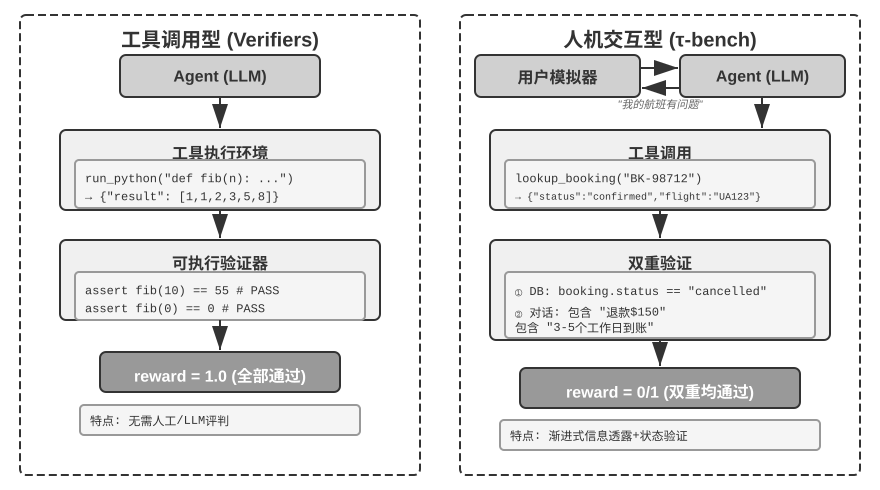
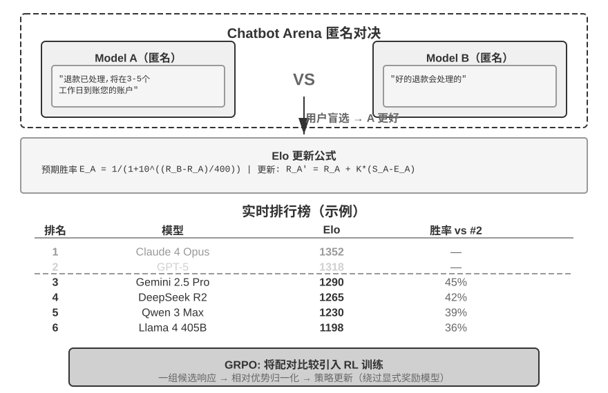

# 模型后训练

本书的核心公式是 Agent = LLM + 上下文 + 工具。本章聚焦于优化 LLM 这个“大脑”——通过后训练让模型更好地利用上下文和工具，从而提升整个 Agent 系统的能力。第六章结尾指出，评估体系与仿真环境是后训练的两块基石：评估环境为训练提供练习场，评估指标为训练定义目标。本章就建立在这两块基石之上，讨论如何真正改动模型权重，把能力沉淀进参数。

本章面向完全没有强化学习或模型训练背景的读者。我们不预设你懂梯度、懂策略优化，而是从“一个模型是怎么被训练出来的”这件事本身讲起，把每一步的目的、原理和它解决的问题都讲清楚。读完这一章，你应该能回答：模型的能力在哪些阶段形成、每一步在做什么、这些阶段通常如何组合、在什么条件下顺序可以不同，以及在自己的项目里该在哪一步下功夫。

**先建立一张最重要的地图：现代模型的能力开发通常分为三个阶段。** 预训练打地基，SFT 与 RL 则是根据目标、基础模型和输出要求选择或组合的后训练阶段：

1. **预训练（Pre-training）**：在海量互联网文本上做“预测下一个词”的训练。这一步让模型学会语言规律、世界知识和基本推理，就像一个人读完了图书馆里的所有书——博学，但还不会好好回答问题。这是最贵的一步（动辄数千万美元），也是能力的地基。
2. **监督微调（SFT，Supervised Fine-Tuning，即用标注好的“输入—输出”对来训练模型，类似老师给出标准答案让学生照着学）**：用几千到几万条“问题—标准回答”的示范数据，教会模型“该用什么格式、什么风格、什么流程来回答”。这一步把博学的模型变成一个听得懂指令、输出规整的助手。它便宜、快、稳，是当前几乎所有部署模型都会经过的一步。
3. **强化学习（RL，Reinforcement Learning，即让模型反复尝试、根据结果好坏给奖惩来改进行为，类似训练小狗：做对了给零食，做错了不给）**：不再直接模仿标准回答的 token，而是让模型自己去试，把做得好的行为的概率调高、做得差的调低。当奖励、数据和环境设计得当时，这一步可以让模型在**没见过的情况**下做出更好的决策——也是本章篇幅最大、最需要工程功力的一步。

一个直觉类比：预训练是“读万卷书”（积累知识），SFT 是“老师手把手教标准解法”（模仿示范），RL 是“自己下场做题、根据对错反复打磨”（试错提升）。预训练之后接 SFT、再接 RL 是常见配方，但不是唯一顺序：强基础模型可以直接做 RL，只需稳定格式和风格的任务也可能只做 SFT。

**本章有两条贯穿始终的主线，请先记住，后面所有内容都在为它们服务：**

- **主线一：在本章的对照实验中，SFT 更容易记住示范，而 RL 表现出更好的泛化。** 在 GeneralPoints 和 V-IRL 的相同任务、模型和预算设置下，SFT 对训练答案过拟合，而 RL 在分布变化的测试中更容易学到可迁移策略。这是这些实验条件下测得的结果，不是 SFT 与 RL 的普遍属性：数据足够多样、正则化得当时 SFT 也能泛化，奖励或环境有偏时 RL 也会过拟合。本章用“SFT 记忆，RL 泛化”概括这些实验，并在 7.1 节解释两种优化目标为什么可能产生这种差异。
- **主线二：数据和环境，比算法更重要。** 这是工业界最反直觉、也最值钱的一条经验。现成的 RL 算法（PPO、GRPO 等）你知道怎么用就够了，真正决定成败的是两件事：**仿真环境**（模型练习的场地够不够真实）和**训练数据**（示范和奖励信号的质量够不够高）。很多场景下，只要 SFT 的数据质量到位，你甚至根本不需要做 RL。本章会不断把你的注意力从“调哪个算法”拉回到“数据和环境做对了没有”。

> **阅读指引**：本章内容按读者背景分为两条路径：
>
> - **Agent 应用开发者**（不需要自己训练模型）：先读开篇的“预训练、SFT、RL：三阶段全景”建立全局认知，然后可以跳过紧随其后的两节 `[可选阅读]`（经典 RL 与预训练背景），从 SFT 一节继续。重点关注“SFT 与 RL 的本质区别”“何时选择 SFT，何时选择 RL”的决策框架，以及“数据与环境比算法更重要”的判断——这些认知会影响你在 Harness 工程中的设计决策（什么时候靠 prompt 解决，什么时候值得微调）。
> - **模型训练工程师**：从头顺序阅读，两节 `[可选阅读]` 提供强化学习和预训练的完整背景，后续实验提供可复现的训练方案。

## 预训练、SFT、RL：三阶段全景

引言给了三阶段的地图，这一节把每一步的机制讲透。三个阶段用的**数据**、**优化目标**、**代价**各不相同，理解它们的异同，是读懂整章的钥匙。表7-1 先给一个总览，随后逐项展开。

表7-1 模型能力炼成的三个阶段

| 阶段 | 用什么数据 | 优化目标 | 学到什么 | 典型代价 |
|------|---------------------|-----------------------|------------------------|---------------------|
| **预训练** | 海量原始互联网文本 | 预测下一个词 | 语言规律、世界知识、基本推理 | 极高（数百万～数千万美元） |
| **SFT** | 几千～几万条“输入—输出”示范对 | 预测下一个词（只在回答上算损失） | 指令遵循、输出格式、风格、流程协议 | 低（几小时～几天） |
| **RL** | 任务、环境 + 奖励信号（参考答案可选） | 最大化期望奖励 | 可迁移的决策策略、探索出的新解法 | 高（常是 SFT 的几十～上百倍） |

### 预训练在做什么：预测下一个词

现代大模型的全部“智能”，都建立在一个简单到令人意外的任务上：**预测下一个词（Next Token Prediction，NTP）**。

给模型看一段文本的前半部分，让它猜下一个 token 是什么。比如输入“中国的首都是”，模型应该给“北京”很高的概率。模型每猜一次，就把自己的预测和真实的下一个 token 比较，差距（称为损失 Loss）越大，就越用力地调整参数，让下次在类似上下文里猜得更准。在几万亿 token 的互联网文本上反复做这件事，模型被迫学会了语法、事实、逻辑乃至基本推理——因为要在海量语境里持续猜对下一个词，没有捷径，只能真正“消化”文本里的规律。

有一个关键点要记住，它会一路贯穿到 SFT 和 RL：**模型的输出本质上是一个概率分布**。给定前文，模型对词表里每一个可能的 token 都给出一个概率。所谓“训练”，归根结底就是**调整这个概率分布**——让我们想要的 token 概率更高、不想要的更低。三个阶段的区别，只在于“想要什么”，以及“用什么信号来定义想要”。

预训练之后，模型博学却不好用：你问它问题，它可能续写出更多问题，而不是回答——因为互联网文本里，一个问题后面常常跟着的是另一个问题。它还没学会“被提问时应该回答”这个协议。

### SFT 的本质：换了数据的“预测下一个词”

这是本章第一个需要打通的关键认知：**SFT 在数学上和预训练是同一个任务——都是预测下一个词、最小化同一个损失函数。** 很多初学者以为 SFT 是一种全新方法，其实不是。SFT 与预训练的差别只有两点：

1. **数据不同。** 预训练用原始互联网文本（无结构、什么都有）；SFT 用人工精心准备的“输入—输出”对，格式统一为“用户提问 → 理想回答”。模型在这些示范上继续做“预测下一个词”，于是把“被提问时该怎么组织回答”这个协议学了进去。
2. **损失只算在“回答”上（loss masking，损失屏蔽）。** 一条 SFT 样本包含问题和标注回答两部分。我们不希望模型学“怎么提问”，只希望它学“怎么回答”，所以计算损失时把问题部分的 token 屏蔽掉，只对回答部分回传梯度。这是 SFT 在工程上与预训练唯一实质性的区别。

理解了这一点，也就能看出 SFT 为什么会在有限示范上表现出记忆倾向：它的优化目标是**让标注回答里每一个 token 的概率尽可能高**，也就是尽量复现示范。对目标明确、格式固定的任务，这种方法极其高效（几千条样例就见效）；但当数据覆盖面和多样性不足时，模型可能对示范中的表面模式或捷径过拟合，在分布变化后性能下降。

一句话概括 SFT 的本质：**用极高的样本效率，把一套稳定的“输入→输出”映射与协议固化进参数。** 它固化的是“格式、风格、流程”这类**协议性知识**（该怎么说、怎么做），而非大量**事实性知识**（知道什么）——后者要靠预训练或 RAG（本章末会回到这个区分）。

> **训练成本：LoRA 参数高效微调**。上面 SFT 和后面的 RL 都要更新模型参数，而全参数微调对显存的要求很高（要为数十亿参数都存梯度和优化器状态）。**LoRA**（Low-Rank Adaptation，低秩适配）是最常用的省钱办法：不动原始的大权重矩阵，只在旁边挂一个很小的“补丁”（低秩矩阵）来学习任务，参数量仅占原始的 1%–5%，却能接近全参微调的效果。因为原权重被冻结，LoRA 对基座已有能力的扰动也更小，灾难性遗忘的风险更低。几条经过验证的实践经验[^ch7-1]：**必须**把 LoRA 应用到所有主要权重矩阵（尤其参数占比最大的 MLP 层），只加在注意力层会掉点；**最优学习率约是全参微调的 10 倍**（SFT、RL 都成立，是个非常实用的迁移规则）；SFT 用中高 rank（64–256），RL 因每轮信息量很小、用小 rank（8–32）甚至 rank=1 就够。部署时一台推理服务器可同时加载多个 LoRA adapter 做多租户服务。本书把 LoRA 当作贯穿所有后训练方法的工程默认项，不再单独展开。

### 什么时候需要先 SFT 后 RL

预训练先提供语言与知识的地基。真正需要解释的是：**在什么条件下 SFT 应该放在 RL 之前？**

答案藏在 RL 的工作方式里。RL 策略不直接模仿参考回答的 token，而是用奖励信号评估模型**自己生成**的回答；奖励计算仍可以使用参考答案或偏好数据。可要判断好坏，首先得能把模型的输出**解析出来**：如果任务要求输出一段 JSON 或一次工具调用，而模型吐出的是一团格式混乱的文本，奖励函数根本无从算起（连“成功还是失败”都判断不了），RL 也就无从学起。

所以在结构化输出不稳定的设置中，SFT 可以先扮演“**把话说利索**”的角色：用少量示范让输出格式稳定、能被可靠解析，RL 才有一个能打分的起点。这是业界稳健的**“先 SFT 后 RL”**两阶段范式。在这种设置中跳过 SFT 直接做 RL，输出不稳定可能让奖励信号变成噪声、导致训练失败。借用中国画的说法：SFT 先把“**形**”（格式、结构）立起来，RL 再追求“**神**”（策略、泛化），即**先形后神**。

一个重要边界：“必须先 SFT”是在“**较小基础模型 + 严格结构化输出**”的设定下成立的（实验 7-11 会看到，Llama-3.2-Vision-11B 这个量级不经 SFT 直接 RL 会完全失败）。但若基础模型足够强，它可能一上来就能产出够格的输出，从而跳过 SFT——DeepSeek-R1-Zero 就证明了强基模可以直接 RL 成功，自行涌现出反思与长链思考。代价是输出可读性差、中英文混杂，所以 DeepSeek 最终仍在 R1 里加回“冷启动 SFT”，把“形”重新立稳。R1 从 Zero 到冷启动的往返，正是“先形后神”的最好注脚。

### SFT 与 RL 的本质区别（本章最重要的一张表）

前面用“SFT 记忆、RL 泛化”概括了本章的对照实验。现在解释这种倾向为什么可能出现，关键在于两者的**优化目标不同**：

- **SFT 最大化标注回答的概率。** 每个训练样本都用极大似然推动模型复现示范。多样且有代表性的示范可以教会模型可泛化的特征，但示范或 prompt 缺乏多样性时，模型也可能对表面模式或捷径过拟合。GeneralPoints 的有限示范把 J/Q/K 都当作 10，模型因此在测试值变化时性能下降。
- **RL 最大化期望奖励。** 模型探索多条路径，并提高高奖励路径的概率。当奖励忠实反映目标、探索也足够时，模型可能发现示范中没有的可迁移策略。GeneralPoints 中，重新执行计算过程而不是套用固定值，在分布外测试中取得了更好表现。反过来，奖励或环境有偏时，RL 同样可能对捷径过拟合。

表7-2 SFT 与 RL 的本质对比

| 维度 | SFT（监督微调） | RL（强化学习） |
|----------|-----------------------------------------|--------------------------------------------|
| 优化目标 | 最大化标注答案的概率（极大似然） | 最大化期望奖励 |
| 训练信号 | 标注回答的逐 token 监督 | 策略生成的回答或轨迹 + 结果级或步骤级标量奖励 |
| 数据形态 | “输入—输出”示范对 | 任务、环境 + 奖励信号（参考答案可选） |
| 直接优化压力 | 模仿示范中的映射与协议 | 强化能够获得奖励的行为与策略 |
| 分布漂移下 | 取决于示范覆盖和正则化；本章有限示范实验出现过拟合 | 取决于奖励、环境和探索；本章实验中迁移更好 |
| 样本效率 | 高（几千条见效） | 低（常是 SFT 的几十～上百倍） |
| 训练稳定性 | 高、收敛快 | 低、易震荡，需要小心调 |
| 最适合 | 固化格式/风格/流程、有高质量示范、环境稳定 | 需泛化到新场景、探索最优策略、标注成本过高 |

还有一个更深、但值得知道的机制叫 **mode-seeking（寻峰）**。模型对一个问题的所有可能回答构成一个概率分布，其中可能有许多“峰”，每个峰代表一类合理的回答方式。极大似然 SFT 可能表现出 **mass-covering（覆盖式）**倾向，把概率分配给示范数据中的多个模式；用反向 KL 约束的策略优化则可能表现出 **mode-seeking** 倾向，把概率集中到少数高奖励模式。具体行为取决于数据、奖励、KL 的方向与系数，不能把它视为 SFT 和 RL 不变的固有属性。后文 RLHF 一节会把这项设计选择与 KL 散度联系起来。

**后训练还会塑造模型何时行动。** 以 Coding 模型为例，GPT 系列与 Claude 系列经常表现出不同的默认行动阈值：前者可能先读更多仓库信息再修改，后者可能用较少文件完成定位、先实现再借测试反馈修正。这不是把模型拟人化成“谨慎”或“有直觉”，而是参数中的策略在估计：多读一个文件的预期价值，是否还高于提交当前补丁并验证的预期价值。若 SFT 示范反复包含广泛调查后才编辑的轨迹，模型就会模仿较高的行动阈值；若 RL 的过程或结果奖励持续认可快速定位、尽早进入可验证循环，概率质量就会向较早行动的轨迹集中。第六章实验 6-7 在完全相同的中性 Coding Harness 中换模，确实测到这种差异随模型变化，说明 Harness 无需强制流程，模型自身也会携带稳定的工具使用策略。Harness 可以调节它，但行为的主要来源可以位于后训练后的模型参数中。由于厂商并不公开完整数据与奖励配方，这个实验能证明的是模型侧的行为差异，不能据此断言某一种具体的私有算法造成了它。

**在线反馈给了模型探索示范之外策略的机会。** 固定数据集上的 SFT 使用示范提供的直接训练信号，但仍可组合预训练知识，对示范中没有的输入进行泛化。在线 RL 则让模型按当前策略生成回答、接收环境反馈，从而直接评估示范之外的候选行为。这并不自动保证更高上限：结果取决于基础模型、示范覆盖、奖励忠实度、探索和优化稳定性。（“在线/离线”与更严格的“在轨/离轨，on-policy / off-policy”术语，7.8 节会正式区分。）这里先看在线反馈提供的三个机会：

- **其一，可以评估固定示范之外的候选。** SFT 的直接监督来自数据中记录的回答；RL 还可以强化奖励函数能够评分的新行为。实验 7-13（SimpleVLA-RL）中的“推切”动作从未出现在人类示范里，说明模型有机会发现示范之外的策略。但奖励无法识别的质量学不到，探索不到的策略也发现不了。
- **其二，可以利用“验证比生成容易”的任务。** SFT 需要先写出正确答案或高质量轨迹；RL 只需要可靠地判断答案质量。数学答案可以对照，代码可以测试，定理证明可以由验证器检查。这种不对称是 RLVR 的优势，但验证器不完整时也会导致奖励黑客。
- **其三，可以在当前策略实际访问的状态上训练。** 离线模仿存在经典的**协变量漂移（covariate shift）**：策略偏离示范、进入数据中没有的状态后，可能缺少恢复信号。在特定的序列模仿学习设置中，误差最坏可随轨迹长度 $T$ 近似按 $T^2$ 累积，而在线数据聚合可把它降到约 $T$。本章后面的 On-Policy Distillation（7.12 节）把这种在线匹配与 SFT 的稠密监督结合起来。

打个比方：**SFT 细致学习已有地图，RL 则可以拿着奖励这枚指南针探索地图外的候选路线。** 地图或指南针不准都会迷路。因此许多系统先用 SFT 建立稳定起点，再在奖励与环境足够可信时加入 RL。

有了这张全景图，后面每一节都能对号入座。紧接着的两节 `[可选阅读]`——“从经典 RL Agent 到现代 Agent”和“模型预训练基础”——为想深入的读者补上强化学习与预训练的背景；只想直接上手后训练的读者可以跳过它们，直接从 SFT 一节开始。

## 从经典 RL Agent 到现代 Agent `[可选阅读]`

### Agent 与环境的交互

**强化学习（Reinforcement Learning, RL）**的核心在于学习如何根据当前情境选择动作，以获得最大的**累积奖励（Cumulative Reward）**。想象一个学下棋的 AI：每走一步就是一个动作，赢棋得到正奖励、输棋得到负奖励，累积奖励就是整盘棋的总收益。Agent 和环境持续交互：每一步，Agent 观察当前状态，选择一个动作，环境产生新状态并给出奖励。

为了更直观地理解这种交互，下图展示了标准 RL 循环——Agent 在每个时间步观察环境状态，输出动作，环境据此给出奖励并转移到新状态。

交互产生**轨迹**——即“状态→动作→奖励→新状态→动作→奖励...”的完整记录，策略的优劣最终体现在轨迹质量上。**价值函数（Value Function）**回答的是这样一个问题：“如果我现在处于这个状态，按照当前策略一直行动下去，最终总共能获得多少奖励？”这就像一位经验丰富的棋手看到一个局面时，不需要算到最后一步，凭直觉就能估计出这盘棋的胜率。（当这里的“当前策略”换成“最优策略”时，得到的就是最优价值函数，本章后面讲 Bellman 最优方程时会用到。）Agent 与环境的边界遵循一个简洁的原则：**凡是 Agent 无法任意改变的，都属于环境**。

强化学习区别于监督学习（需要标注正确答案）和无监督学习（发现数据中的隐藏模式）的两个独特特征是**试错搜索**（Agent 必须自己摸索哪些动作好，没有老师直接告诉正确答案）和**延迟奖励**（动作的影响可能在多步之后才显现，比如一步好棋的价值到终局才看得出来）。由此还带来独特的**探索与利用权衡（Exploration-Exploitation Tradeoff）**：一直走熟悉的路，学不到新东西；一直乱试，永远到不了终点。

强化学习系统包含五个核心要素：

- **动作空间**：定义 Agent 可以采取的所有行动集合。动作可以是离散的（如棋类中“走哪一步”，选项有限）或连续的（如机器人“关节转多少度”，是一个连续数值）。
- **策略**：Agent 的行为准则，规定在给定状态下应该怎么做。策略可以很简单（一张查找表：看到状态 A 就执行动作 X），也可以很复杂（一个深度神经网络）。
- **奖励信号**：环境给出的即时反馈。但 Agent 的目标是最大化长期而非即时奖励——这个区别至关重要，就像投资不能只看今天涨跌，要看长期回报。
- **价值函数**：估计从某个状态出发，未来总共能获得多少累积奖励，帮助 Agent 在没有即时反馈时做出明智决策。过去六十年 RL 研究最重要的认识之一就是价值估计的核心地位。
- **环境模型**（可选）：预测环境对动作的响应。有了环境模型的方法称为**基于模型的方法**（先学会预测环境怎么变化，再据此规划），没有环境模型的称为**无模型方法**（不去预测环境，直接从经验中学习）。

表7-3 对比了各种 Agent 系统的关键组成要素，揭示了 Agent 概念的普遍性，并帮助读者看到传统 RL Agent 与现代 LLM Agent 在动作空间上的差异。

表7-3 不同 Agent 系统的关键要素对比

| Agent 类型 | 环境 | 动作空间 | 奖励信号 |
|---------------|---------------------|----------------------------------|-------------------------|
| **新生小羚羊** | 地形、重力、身体姿态 | 连续高维（各肌肉群收缩） | 平衡(+)、跌倒(-) |
| **扫地机器人** | 房间布局、电量 | 离散（方向、吸尘、充电） | 清洁面积(+)、电量耗尽(-) |
| **国际象棋大师** | 棋盘状态、时间限制 | 离散有限（合法走法） | 赢棋(+1)、输棋(-1) |
| **客户服务 Agent** | 对话历史、知识库 | 变长组合式（思考、说话、API 调用） | 问题解决(+)、处理时间(-) |
| **代码助手 Agent** | 需求文档、代码库 | 变长组合式（思考、搜索、编辑、执行） | 测试通过(+)、引入 bug(-) |

表格揭示了一个重要洞察：棋类、Atari 等典型环境使用预定义的有限离散原始动作，机器人控制则使用维度和物理边界确定的连续动作。基于 LLM 的客户服务与代码 Agent 用有限的 token 和工具调用组合出变长动作序列，因此很难一次性枚举所有可能序列，并且可以利用“内部思考”提升能力。

### 两种动作表示：经典 RL 设置与 LLM 的变长策略

这里比较的两类设置，最显眼的差异在于动作的表示方式。MDP 本身可以表示有限、无限、离散或连续的动作空间。本节的棋类与 Atari 示例使用有限离散的原始动作，机器人控制使用有界连续动作；LLM 策略则用有限 token 词表和工具 schema 构造变长序列。这种组合式表示会显著影响算法设计、样本效率和泛化方式。下面分别展开。

**基础示例：MDP 与表格 Q-learning。**

MDP（Markov Decision Process，马尔可夫决策过程）是强化学习的数学框架，定义了状态、动作、奖励等核心要素。它的核心假设是**马尔可夫性质**：未来只取决于当前状态，而当前状态必须包含决策所需的全部历史信息。以国际象棋为例，状态不仅包括棋子位置，还应包括轮到哪方、王车易位权、吃过路兵权，以及五十步规则和重复局面判定所需的信息。状态定义充分时，无需每次重读完整棋谱；若观测没有包含必要历史，则应把历史纳入状态，或使用部分可观测模型。

本节讨论的典型 RL 环境使用**预先定义的动作空间**。围棋 361 个落子位置虽大但有限，国际象棋动作仍可枚举，Atari 游戏通常只有几个到十几个离散原始动作。**机器人 Agent** 使用连续但有界的动作空间：关节角度、速度、抓取力度是连续值，但有明确物理边界，维度由机器人自由度决定。

有限离散动作便于逐一评估候选；当状态与动作数足够小时，表格 Q-learning 可以直接存储价值，更大的 Atari 或棋类状态空间则需要把函数近似与搜索结合起来。连续动作 MDP 不能枚举所有动作，通常使用策略梯度或 actor-critic 等方法近似策略与价值函数。本节经典示例与 LLM 策略的另一个差异，是它没有预训练知识，只从试错开始学习。

在这个框架下，最基础也最重要的算法之一是 **Q-learning**。它为每个“状态-动作”组合维护一个价值估计：在状态 s 下采取动作 a，之后一直按最优策略行动，总共能拿到多少奖励？直觉上，一个动作好不好，取决于它带来的即时回报，再加上“它把你带到的下一个状态有多好”。

把这个直觉写成等式，就是 RL 教科书里大名鼎鼎的**贝尔曼方程**（Bellman equation）的核心递归关系：**一个动作的真实价值 = 这一步拿到的即时奖励 + 到达下一个状态后能拿到的最大未来价值**：

$$Q^*(s, a) = r + \gamma \max_{a'} Q^*(s', a')$$

其中 $r$ 是即时奖励，$s'$ 是执行动作后到达的下一个状态（这里为直觉起见写成确定性形式，随机环境下需对下一个状态 $s'$ 取期望），$\gamma \in [0, 1)$ 是**折扣因子**——它决定 Agent 有多看重未来：$\gamma$ 越接近 1 越重视长期回报，越接近 0 越只顾眼前。前文反复出现的“累积奖励”，正是各步奖励按 $\gamma$ 逐步折扣后的总和 $\sum_{t} \gamma^{t} r_t$。算法每次行动后，把旧的估计值往“实际发生的结果”方向微调一点——这种“用一步实际结果修正旧估计”的范式叫**时序差分学习**（Temporal-Difference Learning, TD learning），经过成千上万次试错，估计值逐渐逼近真实值。

以下两张图分别展示 Q-learning 在网格世界中的探索过程与 Q 值的逐步收敛。

Q-learning 属于一种**离轨策略**（Off-Policy）方法——它可以用不同于目标策略的探索策略所生成的数据来学习最优策略，但仍要求充分覆盖相关状态—动作对，并满足适当的学习率与收敛条件；它并不是对任意数据分布都能自动收敛。在轨/离轨策略的严格定义与在 LLM 后训练中的对应关系，见后文“强化学习算法比较”一节。

> **实验 7-1 ★：Q-learning 在寻宝游戏中的表现**
>
> 为了验证 Q-learning 的特性与局限，我们设计了一个**寻宝游戏环境**。这个环境包含几个关键挑战：**隐藏机制**要求 Agent 自行发现钥匙和门的对应关系、武器效果和物品合成规则；**多步依赖**意味着完成任务需要正确的动作序列（最优解 11 步）；**稀疏奖励**意味着只有关键动作和最终胜利才有显著奖励，中间大部分步骤得不到任何反馈。
>
> Q-learning Agent 使用标准参数配置，采用 ε-贪婪探索策略（大部分时间选当前最优动作，偶尔随机尝试，随着训练推进逐渐减少随机探索的比例）。
>
> 学习曲线展现典型特征（episode 指一局完整的游戏，从开局到通关或失败算作一次）：
> - **前 1000 episodes**：0% 胜率，Q 表仅 124 个状态，Agent 在盲目探索
> - **前 5000 episodes**：依然没有稳定胜利，Q 表 133 个状态
> - **7000-8000 episodes**：胜率从 34% 逐步升至 96%
> - **10000 episodes**：100% 胜率，Q 表 145 个状态，找到 11 步最优解
>
> 整个训练仅需不到 10 秒（仿真效率极高），但需要将近 10000 次完整尝试。这展示了本实验中无先验知识、采用 ε-贪心探索的表格 Q-learning 的特征：需要大量随机探索才能偶然走通完整路径，价值信号的传播很慢，必须反复强化。
>
> 在游戏模拟器中，10000 轮试错只需 10 秒，代价微乎其微。但在真实世界的 Agent 场景中——每次打电话有成本、每次操作浏览器有延迟、每次错误决策可能造成不可逆后果——10000 次试错是完全不可接受的。使用预训练 LLM 策略的一个原因，正是可以利用已有知识，在更少的环境交互中做出有效决策。
>
> 这个**无先验知识的表格 Q-learning 实验**有三项局限：简单任务也需要大量交互，样本效率低；一个环境中的表格值难以直接迁移到另一个环境；每个新任务都要重新探索。这些不是 MDP 数学框架本身的限制。函数近似、迁移学习和基于模型的 RL 可以处理更复杂的状态和知识迁移，不过与预训练 LLM 相比仍可能需要大量环境交互。
>

**基于预训练 LLM 策略的 Agent。**

大语言模型在 Agent 的动作表示与初始化方式上带来了重要的实用变化。

经典 RL 也可以把内部计算或信息收集建模为状态与动作。LLM 的实用变化不是第一次允许“思考”，而是预训练语言策略能够用变长 token 序列表示内部计算，并与外部行动由同一策略生成。思考 token 不直接改变外部世界，却可以提高最终行动质量。于是 Agent 的动作表示不仅包括“做什么”，还包括“想多久、想什么”。

最关键的实用创新，是把**思考 token 作为特殊动作纳入策略输出空间**。典型传统 RL 环境主要使用移动、攻击、拾取等改变环境状态的原始动作，尽管内部计算也可以在 MDP 或层级策略中建模；在 LLM Agent 中，**内部思考成为学习到的语言动作空间的核心组成部分**。它不直接改变外部环境，也不立即获得环境奖励，但能在 token 成本和上下文上限内表达多种计算路径。

这种变长组合式动作比原始动作拥有大得多的搜索空间，因此很难在没有先验知识时从零学习。从零开始的 Agent 就像蒙着眼睛在沙漠里找宝藏。LLM 则从海量文本预训练中学到了人类留下的问题解决模式——数学问题常按“识别条件→回忆公式→逐步计算”，编程任务常按“理解需求→设计结构→实现细节”展开。预训练策略给结构化路径更高先验概率，显著压缩搜索空间。因此即使没有额外 RL，预训练 LLM 也能生成基本的思维链（Chain of Thought, CoT）。这些模式来自数学解题、代码注释、讨论回应等预训练语料，模型通过预测下一个 token 隐式学会“下一步思考应该长什么样”。

RL 后训练再用外部奖励教会 LLM 在特定任务中更有效地利用这些模式。语言结构不是单独的“内部奖励”，而是预训练策略的**先验分布（prior）**：训练数据中一致出现的“因为要把外币换算成美元，所以先查汇率”可能具有较高初始生成概率，而“因为要换算货币，所以先查天气”这类无关路径的概率较低。RL 在这个初始分布上用真实任务奖励重新调整各条路径的概率。

预训练语言策略使 LLM Agent 能够理解未见过的指令（零样本泛化），并用少量示范适应新任务（少样本适应），这与前述无先验知识的表格 Q-learning 设置形成鲜明对比。它还支持组合泛化、上下文学习和多模态理解。需要注意的是，上下文学习的**效果**和它的**内部机制**是两回事——第二章分析过，注意力机制的工作方式更像检索而非推理，但这不妨碍它在任务适应方面产生强大的实际效果。

从预定义原始动作扩展到变长组合式动作，是 AI Agent 范式的重要转变。LLM 的动作仍由有限 token 词表和工具 schema 定义，但内部思考、自然语言查询、程序代码、复杂 JSON 与多模态内容可以组合成数量爆炸的变长序列。代码解释器和搜索工具把这种表示连接到现实环境中的广泛任务与信息。这带来新的机会与挑战：Agent 可以组合基础工具处理未见任务，但也需要在巨大的组合空间里定义奖励并高效探索。

以 Kimi K3 这类面向工具调用和长链思考优化的模型为例，可以看到 LLM+RL 范式的典型方向：在大规模语言预训练基础上，通过后训练强化问题分解、工具调用和自我纠错能力。**OpenVLA**（详见第九章）则展示了 LLM 时代的 VLA（视觉-语言-动作）架构范式：视觉编码器处理环境观察、语言模型理解指令并推理、动作解码器生成控制信号，实现语言条件控制与跨任务泛化。需要澄清的是，OpenVLA 本身是在近百万条机器人**演示轨迹**上通过模仿学习（行为克隆）训练的，属于 SFT 性质而非 RL；真正把 RL 引入机器人、在这类 VLA 架构之上用奖励进一步优化的代表，是本章后面实验 7-13 的 SimpleVLA-RL。

**OpenAI 的探索之路**（姚顺雨（普林斯顿大学助理教授、ReAct 论文作者）在《The Second Half》中详细记录）揭示了认知上的演变。**第一阶段（2015-2016）算法中心主义**：相信更好的算法才是关键，在 Atari 等标准环境取得进展，但换一个新环境就得从头训练。**第二阶段（2016-2018）环境的重要性**：Gym 标准化了各类任务，Universe 和 World of Bits 试图把整个互联网变成 RL 的训练环境，Dota 2 在特定复杂环境中追求超人表现。思路很清晰，但通用计算机使用和网页导航始终无法突破。

**第三阶段（2018 至今）先验的觉醒**：GPT-2/GPT-3 展示了语言预训练的强大力量，WebGPT、ChatGPT 证明这些先验知识可以转化为实用 Agent。最重要的发现是：**先验知识可以通过与 RL 完全无关的方式获得**。这是一个反直觉的真相：几十年来 RL 研究者的优先级可能完全颠倒了——不是算法 > 环境 > 先验，而是先验 > 环境 > 算法。

> **实验 7-2 ★★：传统 RL 与 LLM Agent 的对比研究**
>
>
> 
>
>
> 在同一个寻宝游戏中对比 Q-learning 与 LLM Agent（Kimi K3，维护最多 50 条经验的缓冲区）。结果令人震撼：**LLM Agent 第一局就在 18 步内通关**。
>
> **前期（有目的的探索）**：拿起生锈的剑（“武器总比空手好”），系统探索地图，发现北门被锁后推理 “需要找钥匙”，转而探索储藏室，先后取得红钥匙与魔法水晶。**中期（机制理解与主动合成）**：理解 “钥匙自动使用” 规则，并预判生锈的剑不足以对付守卫，于是在第 8 步主动合成银剑。**后期（执行与纠错）**：持银剑向北，第 13 步击败强守卫，其间夹杂一两步无效尝试（重复挥剑/回退），最终在第 18 步取得巨龙宝藏。
>
> 这展现了语义理解与符号映射之间的根本差异。LLM Agent 理解了游戏的概念结构，每一步都有目的和逻辑支撑。而对 Q-learning 来说，“门”“钥匙”“剑”只是无意义的符号组合，只能通过大量统计学习慢慢发现它们之间的关系。
>
> 计算成本形成了一个有趣的悖论：Q-learning 跑 10000 局只需 10 秒，LLM Agent 一局却要 1-2 分钟。但在现实任务中，每次交互的时间、金钱和风险成本远超纯计算成本，所以单看 GPU 时间并不公平。更关键的洞察是：LLM Agent 的成功不是因为拥有更好的“学习算法”，而是因为携带了海量先验知识。当游戏规则变化时，Q-learning 需要完全重新训练，LLM Agent 却能通过推理直接适应。由此可以得出实用的设计原则：在仿真成本低、可大量重复的场景中，传统 RL 仍然有价值；在交互成本高、需快速适应的现实场景中，LLM Agent 的样本效率更为实际。
>

至于上下文适应、外部产物更新与参数更新如何协同，第一章已经给出概念地图，本章末尾的“完整图景”还会回到这个话题。本章的主线是其中的后训练——把难以由外部规则完整表达的能力写进模型参数。

## 模型预训练基础 `[可选阅读]`

要理解后训练技术为什么有效，需要先明白预训练建立了什么。后训练（SFT 与 RL）本质上是在预训练建立的表征空间内进行优化——预训练奠定的知识结构决定了后训练的天花板。因此，我们通过三个实验考察预训练的核心环节：从头训练小规模语言模型、扩展视觉能力、以及注入新语言知识。本节三个实验为辅助性内容，帮助读者建立对预训练（Pretraining，即在大规模数据上进行初始训练，让模型学会语言的基本规律和世界知识）的直觉——已熟悉预训练流程的读者可跳过。

语言模型训练遵循“tokenization — 预训练 — 后训练”三阶段流程。Tokenization（词元化）将文本切分为离散单元，比如“我喜欢编程”可能被切分为“我”“喜欢”“编”“程”四个 token——这些 token 就是模型处理文本的最小单位。预训练的任务概念上很简单：给模型看一段文本的前半部分，让它预测下一个 token 是什么。模型通过比较自己的预测与正确答案的差距（这个差距叫做损失（Loss），损失越小说明预测越准），不断调整自身参数。在海量文本上反复训练后，模型逐渐学会了语言规律、世界知识与基本推理能力。预训练完成后，模型能生成流畅文本，但输出缺乏结构、难以遵循指令。后训练通过 SFT（用标注好的输入-输出对训练）与偏好优化（如 DPO，让模型学会生成人类更偏好的回答）将其转化为实用助手。

> **实验 7-3 ★★：从头训练 LLM——算法改进的威力**
>
> 以 MiniMind 2（一亿参数）为案例，在消费级 GPU 上完成完整训练流程。通过引入两项算法优化（QK Norm 和 Muon 优化器），收敛速度提升 3 倍，生成质量显著改善——实现成本极低，总训练约 14 小时，成本约 34 美元。
>
> 各训练阶段的效果：预训练后模型可以回答“世界上最高的山峰”等事实性问题，但格式不规范；SFT 后指令遵循与输出格式显著改善，能按期望方式组织答案；偏好优化进一步减少了事实错误与不自然表达。一亿参数的模型仍有明显局限（复杂问题容易出错），但启示是：**在固定的小规模预算下，算法改进比单纯堆规模更具性价比**。
>
> **实验 7-4 ★★：自己训练 VLM**
>
>
> 
>
>
> VLM 将视觉感知与语言理解统一在一个模型中，核心挑战在于跨模态对齐——让“看到的”和“说出来的”对应起来。架构由三个组件构成：**视觉编码器**（如 CLIP，参数固定）提取图像的语义特征；**投影层**（轻量级，唯一从头训练的部分）充当视觉特征与语言模型之间的“翻译官”，将视觉特征映射到语言模型能理解的表示空间；**语言模型**生成描述文本。训练采用“冻结 LLM + 只训练投影层”的策略，以避免灾难性遗忘（Catastrophic Forgetting，即学了新技能后把旧技能忘了）；预训练对齐后再解冻 LLM，用高质量图像-描述对做 SFT，描述的详细程度与准确性显著改善。
>
> 本实验揭示了多模态模型训练的基本范式：复用单模态预训练成果，通过训练一个轻量投影层实现跨模态对齐——高效且可扩展，但投影层的表达能力有限，可能成为跨模态深层理解的瓶颈。同样的“视觉编码器 + 投影层 + LLM”骨架再向前延伸一步、让模型输出动作，就是第九章将展开的 VLA（视觉-语言-动作）模型。
>
> **实验 7-5 ★★：继续预训练学习新语言**
>
> 以 Mistral 7B v0.3 为基础（主要用英语预训练，对韩语几乎没有理解能力），通过韩语维基百科继续预训练来注入韩语能力——在已完成预训练的模型上用新语言数据继续做无监督训练，模型已具备通用语言建模能力，只需适应新的数据分布，成本远低于从头训练。关键工程点是用混合数据（约 80% 韩语 + 20% 英语）缓解灾难性遗忘：目标语言占比过高会导致原语言退化，占比过低则学习效率不足。最后用韩语指令数据做 SFT，获得实用的韩语对话能力。本实验的结论会在本章末尾的完整图景中再次用到：要让模型记住大量新领域知识，靠的是继续预训练而非 SFT。
>

三个预训练实验共同揭示了一个规律：在预算受限时，算法改进与架构创新比单纯扩大规模更具性价比。更重要的是，预训练赋予模型的是描述性知识与语言建模能力，缺乏结构化的指令遵循和任务导向行为——这正是 SFT 需要填补的空白。

有了预训练的基础能力，下一步就是通过后训练把通用模型变成实用的 Agent。后训练的第一阶段是监督微调（SFT）。

## SFT（监督微调）

7.1 节已经讲透了 SFT 的本质（换了数据、只在回答上算损失的“预测下一个词”）。这一节用四个实验，看看这套“把稳定映射与协议写进参数”的机制在不同任务上具体固化了什么。SFT 的核心价值不在于注入新知识，而在于**固化协议**：把映射关系、交互格式、风格规范写入参数，使推理时无需冗长提示即可产出符合预期的输出。通常只需数千到数万条高质量样例，即可建立基本的对话能力与指令遵循。

这种高效率可能以依赖训练分布为代价：特别是在需要探索多种正确策略，或部署分布偏离示范数据的任务中，SFT 可能偏向复现示范模式，并在新场景中性能下降。接下来的实验从不同角度展示“固化协议”的过程，而不是证明 SFT 与 RL 存在普遍的优劣关系。

在动手做 SFT 之前，有一个绕不开的实操问题：**SFT 数据从哪来？** 工业界的答案基本就三条路：**人工专家示范**——质量天花板最高，但贵且慢，适合用来定义格式与风格的“种子数据”；**教师模型生成**——即合成数据，让强模型批量产出“输入—输出”对，过滤后再蒸馏给学生（实验 7-8、7-9 都是这条路）；**模型自举**——模型自己对同一问题采样多条候选，用验证器筛出正确样本再反过来训练自己，这就是拒绝采样微调，详见实验 7-9。三条路经常组合使用：先用少量人工种子立住格式，再用教师模型放大规模，最后用拒绝采样把质量拉齐。无论走哪条路，构造流程都大同小异：先定义任务分布与输出 schema，再批量生成候选，然后用规则校验、格式检查加人工抽检做质量过滤，最后去重、平衡配比、保证多样性。量级上不必贪多——数千到数万条高质量样本通常就足以固化协议，与其堆十万条脏数据，不如精修一万条干净数据：数据里的每一处噪声，SFT 都会忠实地写进参数。

> **实验 7-6 ★★★：语音 SFT——从 “声音复制” 到 “副语言建模” `[扩展实验]`**
>
> 以 Orpheus（语境提示 voice cloning）与 Sesame（副语言标记建模）为对象，展示如何将“声音风格与表达习惯”写入参数。两者思路不同：
>
> - **Orpheus**：把声音波形压缩为 token 序列，通过拼接同一说话者的参考音频，让模型学会“用这个人的声音说话”，实现跨句音色一致。
> - **Sesame**：将笑声、叹气等副语言现象抽象为 `<laugh>`、`<sigh>` 等特殊标记，训练模型学会“看到标记就发出对应的声音”。
>
> SFT 在表达型任务中固化的是风格控制协议与结构化表达习惯，而非事实知识或复杂思考。关键在于训练数据的多样性和标注质量。常见失败模式：训练数据中说话者过少导致所有人听起来一个腔调；标记过拟合（Overfitting，即模型死记硬背了训练样本的细节，遇到新情况反而表现更差）产生“机械笑”。
>
> **实验 7-7 ★★★：多语言思考——让模型用任意语言思考 `[扩展实验]`**
>
> 大多数思考模型只会用英语“思考”：不管你用什么语言提问，模型内部的思维链几乎都是英文的，因为训练数据中高质量的思考示范基本都是英语写的。本实验的目标很简单——让模型能够用指定的语言进行思考。
>
> 做法是对 gpt-oss-20b 进行 SFT：在系统指令中加一句 `reasoning language: German`（或其他语言），然后用英语、西班牙语、法语等几种语言的思考样例进行训练。训练数据中**完全没有中文**，但训练完成后，只要把 reasoning language 设为 Chinese，模型就能用中文进行完整的思维链思考——这种零样本的跨语言泛化是本实验最有意思的发现。需要注意，这并非 SFT 本身的泛化能力。多语言预训练已经在模型中建立了跨语言的共享表征空间，SFT 只是激活了这种预训练时已有的跨语言能力。
>
> **实验 7-8 ★★：Prompt 蒸馏——以更小开销复现可用能力**
>
> 在实际应用中，为了让模型完成复杂任务，常常需要设计冗长的系统提示（数千甚至上万 token），每次调用都会增加延迟与费用。使用思考型大模型时，内部思考 token 进一步放大成本。Prompt 蒸馏的思路是把“长提示 + 思考型教师”的行为压缩到“短提示/无提示 + 非思考学生”中。教师在完整提示与思考模式下生成高质量答案，训练数据只保留用户输入与最终结论，丢弃冗长提示与中间思考过程。学生学会“直接给出结论”，蒸馏后在相同输入上接近教师的输出质量，同时因为不需要处理冗长提示和思考 token，延迟与费用显著降低。
>
> 蒸馏可以在两个维度进行：“大到小”（用中小模型替代大模型，在成本和质量之间取得折中）和“思考到非思考”（同等规模下把显式 CoT 折叠为隐式参数化知识，获得 20-30 倍的响应速度提升）。两者并不冲突，在生产环境中经常同时使用。需要注意的是，蒸馏会继承教师的边界——若教师在长尾分布上有系统性错误，学生会进一步硬编码这些错误；若教师依赖工具来确保正确性，单纯的输出蒸馏会失去工具带来的鲁棒性。工程启示：当产品形态稳定、输入分布可预期、成本约束明显时，Prompt 蒸馏是很好的优化手段；而在探索期或任务尚未定型的阶段，保留显式思考与可编辑的提示工程仍是快速试错的核心。
>
> **实验 7-9 ★★★：思维链（Chain of Thought, CoT）蒸馏 `[扩展实验]`**
>
> Prompt 蒸馏丢弃思考过程，CoT 蒸馏则相反：把强教师模型的**完整思考轨迹**转移给学生模型。对能力较强的教师模型进行 CoT 蒸馏，在同等参数量下可恢复教师 70%-80% 能力。对于不追求刷新前沿能力边界、但寻求自主可控模型的团队，这是最务实的跟随者策略。DeepSeek-R1 发布时同步开源的一系列蒸馏小模型（用 R1 的思考轨迹对 Qwen、Llama 系列做 SFT），正是这条路线的代表。
>
> **背景：“思维围墙”现象**。一些闭源思考模型（如 OpenAI o 系列、Gemini 系列）在思考时会生成内部思维链，但用户看到的并非原始思考过程——厂商出于防蒸馏、安全和产品体验等考虑，通常会在输出前对 CoT 进行改写或摘要，最有价值的原始思考过程被隐藏在 API 之后。这正是本实验选择开源思考模型作为教师的原因：DeepSeek V4、Kimi K3、GLM 5.2 等模型直接公开完整思维链，蒸馏在技术与许可上都可行（使用前仍应确认模型许可证对蒸馏产物的授权条款）。
>
> **实验现场：模型会写代码，不代表它愿意帮助你蒸馏模型。** 在实现本实验时，作者最初使用由 GPT-5.6-Sol 驱动的 OpenAI Codex 编写实验代码，但当任务明确涉及模型蒸馏时，Codex 拒绝继续执行。随后，作者切换到由 Claude Opus 5 驱动的 Claude Code，也遇到了同样的拒绝。最终，作者使用 Kimi K3 完成了实验代码和后续运行。
>
> 两次拒绝针对的都不是普通数学推理，也不是简单地要求模型公开内部思维链，而是实现一个使用强教师数据训练学生模型的完整蒸馏实验。模型蒸馏与正常的监督微调在技术上高度相似，但在厂商的安全与产品策略中，它也可能与模型提取、能力复制和知识产权保护联系起来，因此成为一个敏感类别。
>
> 需要注意的是，这个现象不能简单解释为“Claude 不提供思维链”，也不能据此断言“Kimi 的安全护栏更弱”。Claude API 是否返回 summarized thinking、Coding Agent 是否愿意实现蒸馏程序，以及服务条款是否允许将模型输出用于训练，是三个不同的问题。本实验没有尝试绕过任何模型的隐藏推理或安全机制，只使用产品公开提供的能力完成合规的研究流程。
>
> 这里有一个更实际、也更重要的判断：**对绝大多数做后训练的人来说，根本不需要去蒸馏闭源模型的思维链。** 当前最先进的开源模型与 SOTA 闭源模型的差距并没有想象中大；教师模型只需要“明显高于学生”，不需要“全球第一”。如果你要后训练的是 200B 及以下规模的模型，用开源 SOTA 模型当教师已经完全够用。
>
> **实验设计**：三步流程。第一步，**采集轨迹**：从目标任务分布（如数学、代码）采样问题，用开源教师模型生成完整的“思考 + 答案”轨迹，并用规则验证器过滤掉最终答案错误的轨迹——否则错误的思考过程会被学生一并模仿。这一步“生成候选—验证过滤—只留正确轨迹”的做法有个专门的名字：**拒绝采样（Rejection Sampling）**。用它构造的数据做 SFT，就是**拒绝采样微调（Rejection Sampling Fine-Tuning, RFT）**。它介于纯 SFT 与 RL 之间：不训奖励模型、不做策略梯度，只靠“从多条采样中拒绝错的、留下对的”来提升数据质量，是可验证任务上性价比极高的数据构造手段。第二步，**SFT 训练**：以“问题 → `<think>` 思考轨迹 `</think>` + 最终答案”为训练对，对小模型（如 7B 量级）做标准 SFT。第三步，**对比评估**：在同一基准上对比蒸馏前后的学生模型与教师模型，衡量能力恢复比例。
>
> **验收标准**：蒸馏后的学生模型在数学/代码基准上相对蒸馏前显著提升，且思考轨迹中出现教师式的反思、回溯与验算行为。同时注意蒸馏的代价：学生会继承教师的系统性错误和冗长思考习惯（后者可结合实验 7-10 的 AdaptThink 思路做二次优化）。
>

这四个实验有一个共同特征——“把稳定的映射与协议写进参数”：语音 SFT 固化风格控制协议，多语言 SFT 固化思考组织模板，蒸馏 SFT 固化输入到输出的直接映射。目标越明确、格式越清晰、评估标准越稳定，SFT 越能以很高的样本效率提升性能。不过，分布变化时性能是否下降，需要针对具体任务、数据和模型单独评估；不能仅凭本节案例把 SFT 的泛化局限当成普遍结论。

## 何时选择 SFT，何时选择 RL

7.1 节讲清了 SFT 与 RL 的**本质区别**，这一节回答一个更实操的问题：**面对一个具体任务，到底该用哪一个？** 下面的决策框架部分结论会在后续 RL 实验（实验 7-10、实验 7-11）中进一步验证，读者可先建立初步判断，读完 RL 部分再回来对照。

**SFT 适用于**格式固化（JSON 输出、对话风格）、拥有高质量专家示范、训练与部署环境高度一致的场景。**可以考虑 RL 的场景**则不同：当实际部署环境与训练环境存在系统性差异，且能构造反映这些差异的可靠奖励时（比如训练时卡牌 J/Q/K 都是 10，部署时变成了 11/12/13；或者训练时用黑色花色，部署时遇到红色花色），需要探索最优策略（专家示范本身不一定最优），或者标注成本过高、无法为每条路径都提供示范时，可以考虑 RL。

在结构化输出不稳定的设置中，最稳健的策略是**“先 SFT 后 RL”**两阶段流程。此时 SFT 的主要目标不是追求任务性能的极致，而是建立输出的**格式稳定性**——确保模型能产出可解析的 JSON、正确的工具接口调用。只有输出格式稳定后，RL 的奖励信号才能被可靠地计算。直接在未经 SFT 的基础模型上做 RL，往往会因为输出格式混乱、奖励无法计算而训练失败——不过这个结论有边界条件：它来自“较小基础模型 + 严格结构化输出要求”的设定（如后文实验 7-11）。DeepSeek-R1-Zero 证明了足够强的基础模型可以跳过 SFT、直接 RL 成功，涌现出反思与长链思考能力——代价是输出可读性差、多种语言混杂，这正是 DeepSeek 最终在 R1 中加回“冷启动 SFT”的原因。R1 从 Zero 到冷启动的这段往返说明：结构化输出不稳定时可用 SFT 快速建立“形”（格式与可读性），再在有可靠奖励时用 RL 发展“神”（策略与推理能力）。

两者各有代价：SFT 样本效率高、收敛快，泛化性能很大程度上取决于数据的覆盖范围与多样性；RL 可以探索示范中没有的策略，但样本效率低且训练不稳定。如果增加多样、优质的示范后，新场景表现仍然停滞，并且有能可靠评估这些场景的奖励与环境，就可以考虑 RL。

实际决策时，可以按以下顺序考虑：

1. **先问：需要后训练吗？** 如果通过 Harness 工程（优化 prompt、工具设计、上下文管理）就能解决问题，不需要训练模型。大多数 Agent 应用落在这里。
2. **如果需要训练：先试 SFT。** 适用于固化输出格式（JSON schema、API 调用格式）、固化协议性知识（术语的用法、输出格式、流程习惯，即“该怎么说、怎么做”）、统一风格（语气、长度）。但注意 SFT 不适合注入大量事实性知识（“知道什么”）——那需要继续预训练或交给 RAG（详见本章末“完整图景”）。SFT 成本低、见效快。
3. **SFT 不够时：加 RL。** 适用于需要泛化到新场景、需要探索最优策略、或标注成本过高的情况。如果输出尚不能稳定满足奖励函数要求，可先用 SFT 或约束解码稳定格式，再应用 RL；如果强基础模型已经满足格式要求，也可以直接做 RL。

## 单轮强化学习：记忆与泛化的对照

“单轮”指任务在一次交互中完成：模型接收输入、产出输出、获得奖励，无需维护跨步骤的状态。这种简化设定让我们能够聚焦于 SFT 与 RL 在学习机制上的根本差异，而不被多轮交互的复杂性干扰。单轮场景提供了清晰的对照实验条件：相同任务、相同基础模型、相同计算预算，唯一的变量是训练方法。第一个实验展示 RL 如何学会“何时该思考”这一元策略；第二个实验通过算术推理卡牌游戏系统地量化“SFT 记忆、RL 泛化”。

在进入实验之前，先建立一点关于 RL 算法的**最小直觉**，以便理解后续实验里出现的术语（完整的公式与对比留到本章后面的“强化学习算法比较”一节）。本章的 RL 训练大多基于**策略梯度**：让模型对同一个问题多生成几条回答，奖励高的回答就提高它出现的概率、奖励低的就降低——“奖励高的方向多走，奖励低的方向少走”。为抑制单次更新把模型带偏，主流的 **PPO** 算法会在概率比超出指定区间时裁掉代理目标中的额外收益；它会抑制大幅更新，但不是对策略变化的硬约束（后文实验中出现的“带价值网络的 PPO”即指此，价值网络用来估计基线、算出更细的优势）。另一种 **GRPO** 则不训练价值网络，而是用“同一问题的多条回答互相比较”来判断每条的相对好坏。记住这条直觉，就足以读懂接下来两个实验。

> **实验 7-10 ★★：AdaptThink——学会 “何时不思考”**
>
> 大型思考模型（如 OpenAI o1、DeepSeek-R1）对所有问题都会生成冗长的思维链，在简单问题上造成不必要的开销。实验首先验证了一个直觉：**NoThinking 模式**（通过 `<think></think>` 跳过思考）在简单问题上性能相当甚至更好，只有面对困难问题时 Thinking 的优势才显现出来。
>
> AdaptThink 通过 RL 训练模型自适应地选择模式。两个核心组件：
>
> - **约束优化目标**：鼓励 NoThinking 的同时确保整体性能不下降。
> - **重要性采样策略**：平衡 Thinking/NoThinking 样本，解决初始模型几乎总选 Thinking 带来的**冷启动**问题（Cold Start，这里特指训练初期模型几乎只产生 Thinking 样本、NoThinking 分支样本极少而学不起来的问题；它与前文 DeepSeek-R1 用少量示范数据做“冷启动 SFT”是不同语境下的用法）。
>
> 这里出现的“重要性采样”是统计学常用的方法——在采样分布偏向某一类样本时，通过给样本加权来“纠正”分布，让学习信号能够公平覆盖所有类别。本书后续讨论的 PPO、DAPO 等 RL 算法都会反复用到这一思想。
>
> 本书对这次历史训练的规范记录是 checkpoint-free [训练报告](../chapter7/AdaptThink/TRAINING_REPORT.md)。公开 W&B 主运行 [`wubbn5tj`](https://wandb.ai/bojieli-pine-ai/adapt_think_verl/runs/wubbn5tj) 使用 8×NVIDIA H100 80GB；step 0→300 时，MATH500 准确率 0.8100→0.8180（+0.80 pp）、响应长度 4911.46→1576.62（-67.90%），GSM8K 为 0.796816→0.818802（+2.20 pp）、1025.24→477.33（-53.44%），AIME mean@16 则为 0.314583→0.310417（-0.42 pp）、12119.51→6402.23（-47.17%）。对应 NoThinking 比例为 83.80%、84.15%、56.25%，说明数据集汇总层面存在与难度一致的路由信号，但不能称为逐题“完美难度感知”，也不能声称准确率普遍提升。
>
> 运行在报告选点后继续到 step 410，累计 36.92 小时，随后 W&B 状态为 `crashed`；配置的 10 epochs / 3,140 steps 并未完成。Step 300 虽有 checkpoint 计时事件，但 checkpoint 不随书分发，也没有独立回执证明其经 `run_eval_verl_hf.sh` 成功评估或重跑 MMLU。历史源码提交为 `9e588202…`；未来复现固定到其直接子提交 `0033ad172…`，三个入口文件保持不变，但训练脚本生成的 `-fl-` 路径与评估脚本硬编码的 `-fl4096` 路径不兼容，需手工修正。
>
> 与 Prompt 蒸馏互补形成 “快-慢双系统”：蒸馏降低需思考的任务比例，AdaptThink 优化剩余任务的触发策略，共同实现思考效率最大化。
>
> **实验 7-11 ★★：GeneralPoints——单轮 RL 的 “记忆与泛化” 对照**
>
>
> 
>
>
> GeneralPoints 是 Chu 等人（2025，《SFT Memorizes, RL Generalizes》，arXiv:2501.17161）提出的算术思考卡牌游戏，专门用于评估模型的泛化能力。任务目标类似“24 点”游戏：使用四张卡牌上的数字，通过加减乘除运算，每个数字恰好用一次，凑出目标数字 24。实验设计了纯文本 GP-L 与图像 GP-VL 两个变体，使我们能在同一框架下分别考察规则泛化与视觉泛化。
>
> **规则变体**：训练时 J/Q/K 都计为 10，测试时分别计为 11/12/13，确保测试集出现训练未见的数字组合（含 11、12、13 的运算），严格评估泛化能力。**视觉变体**：训练用黑色花色（♠♣），测试用红色花色（♥♦），评估视觉外观变化下的鲁棒性。基于 Llama-3.2-Vision-11B，遵循标准后训练流程：先 SFT 初始化使其具备基本指令遵循能力，然后在相同计算预算下分别扩展 SFT 与 RL 训练（RL 部分采用带价值网络的 PPO 算法），用单一规则（J/Q/K=10）数据训练，在分布内（ID）与分布外（OOD）测试集上评估。
>
> 结果在这一受控设置中显示出明显差异。**规则 OOD**：RL 在 GP-L 上 +3.5%（11.5%→15.0%），SFT **下降** 8.1%（11.5%→3.4%）；GP-VL 上 RL +3.0%，SFT 下降 5.6%。**视觉 OOD**：RL 在 GP-VL 上 **+17.6%**（23.6%→41.2%），SFT 下降 9.9%（23.6%→13.7%）。
>
> 追踪视觉识别准确率后发现：RL 通过结果导向的优化改善了底层视觉编码器，且这种改善与整体性能提升高度相关；而 SFT 因为过度拟合思考过程中的 token 模式，忽视了对视觉 token 的学习，导致识别准确率反而下降。
>
> 实验还说明，在本实验的设定下（Llama-3.2-Vision-11B 这个量级的基础模型，加上严格的结构化输出要求），RL 需要先用 SFT 初始化：未经 SFT 直接做端到端 RL 完全失败，因为基础模型无法产生结构化输出，奖励根本无法计算。注意这是特定设定下的结论而非普适规律：足够强的基础模型可以跳过 SFT 直接 RL 成功（见前文对 DeepSeek-R1-Zero 的讨论）。另一个值得关注的发现是，在这个实验中，验证迭代次数越多，测得的泛化越好：10 次 +5.99% vs 1 次 +0.48%，表明增加测试时计算量是其泛化提升的重要因素。
>
> 为什么在这个实验的分布偏移下 SFT 性能下降，而 RL 表现更好？一种与观察相符的解释是：有限的 SFT 数据强化了“遇到 J/Q/K 就当 10 用”的固定模式；测试时 J=11，模型仍按 10 计算。结果导向的 RL 分支则更可能强化“重新计算直到得到正确答案”的策略，因而在 J 变成 11 时仍能应用。这解释了本实验中的“记忆”与“泛化”对照，但不是说 SFT 必然只能记忆，或 RL 必然学会通用算法。
>
> 本实验的核心贡献，是在有限的 GeneralPoints 设置中系统量化了 SFT 的过拟合倾向与 RL 更好的分布外表现，并在纯语言和视觉—语言变体中观察到同一模式。在这个设置中，SFT 稳定格式，RL 在此基础上探索策略，两者形成互补。借用中国画术语，这种“先形后神”的训练配置先把外在形态（格式、结构）画准，再打磨内在策略，为后续多轮、多模态任务提供了方法论参考。

## RLHF：从人类偏好到奖励模型

前面的实验有一个共同前提：任务有可验证的对错——算式对不对、格式合不合规，规则验证器就能打分。但当前部署的对话模型之所以“像一个得体、安全的助手”，靠的是另一条更早成熟的路线：**RLHF**（Reinforcement Learning from Human Feedback，基于人类反馈的强化学习）。理解 RLHF，既是理解 ChatGPT 这类产品的对话质量与安全对齐从何而来，也是理解后文各算法中 KL 惩罚、reward hacking 等概念的前提。

**InstructGPT 的三段式管线。** OpenAI 的 InstructGPT[^ch7-4] 确立了沿用至今的标准流程：

1. **SFT**：用人工示范的“指令—回答”对微调预训练模型，建立基本的指令遵循能力——即前文“SFT（监督微调）”一节讨论的内容。
2. **训练奖励模型（Reward Model, RM）**：对同一提示让模型生成多个回答，人类标注员两两比较、标出更偏好哪个。用这些偏好对训练一个打分模型，训练目标基于 Bradley-Terry 模型：

   $$\mathcal{L}_{\text{RM}} = -\log \sigma\big(r(x, y_w) - r(x, y_l)\big)$$

   其中 $y_w$ 是被偏好的回答、$y_l$ 是被拒绝的回答，$\sigma$ 是 sigmoid 函数。直觉非常简单：**让 RM 给被偏好的回答打更高的分**。之所以采集比较而非打分，是因为人类很难一致地给出绝对分数（“这个回答值 7.3 分”几乎无法标注一致），但“A 和 B 哪个更好”的判断可靠得多。**记住“奖励模型”这个角色——它是本章一条暗线**：这里它是从人类偏好学出来的打分器；到 7.10 节讲奖励设计时，你会看到它的各种变体（只看最终结果的 ORM、逐步打分的 PRM、用自然语言讲理由的生成式奖励模型），以及一个特例——当对错能用规则直接判定时，“奖励模型”干脆退化成一段确定性代码（这就是下面要说的 RLVR）。它们回答的都是同一个问题：**奖励从哪来**。
3. **用 RM 打分做 PPO**：以 RM 的分数作为奖励信号，对 SFT 模型做 PPO 训练（PPO 的机制见下一节），让模型学会生成 RM 认为“人类会更喜欢”的回答。

**KL 惩罚：别离出发点太远（把 KL 散度讲透）。** RLHF 里模型实际优化的奖励，通常不是 RM 打分本身，而是减掉一个惩罚项：

$$r = r_{\text{RM}} - \beta \cdot \mathrm{KL}\big(\pi_\theta \,\|\, \pi_{\text{ref}}\big)$$

这一个式子里有四个初学者常问的问题，逐个讲清。

**（1）KL 散度是什么，惩罚加在哪里？** KL 散度（Kullback-Leibler Divergence）衡量两个概率分布的差异：两个分布越像，KL 越小，完全相同为 0；越不像，KL 越大。这里比较的是在相同前文下，**当前策略** $\pi_\theta$（正在训练的模型）与**参考策略** $\pi_{\text{ref}}$（训练起点，通常是 SFT 模型）生成的回答分布。$\beta$ 控制惩罚力度——训练脚本里常见的 `kl_coef` 超参数就是它。自回归策略的回答级 KL 可以写成当前策略采样得到的 token 对数概率比之和的期望：

$$D_{\mathrm{KL}}(\pi_\theta\|\pi_{\text{ref}})=\mathbb{E}_{y\sim\pi_\theta}\left[\sum_t \log\frac{\pi_\theta(y_t\mid x,y_{<t})}{\pi_{\text{ref}}(y_t\mid x,y_{<t})}\right]$$

实际训练常在每个由 $y_t\sim\pi_\theta(\cdot\mid x,y_{<t})$ 采样的 token 上计算这个对数概率比，并从奖励中扣除。单个采样 token 的对数概率比可能为负，并不等同于 KL；token 总和的期望才是上面的分布级 KL。具体实现可以把这个估计作为奖励塑形，也可以作为单独的正则项加入目标函数。

**（2）方向为什么是“当前策略在前、参考策略在后”？** KL 散度不对称，$\mathrm{KL}(P\|Q)\neq\mathrm{KL}(Q\|P)$，方向不是随便写的。这里写成 $\mathrm{KL}(\pi_\theta\|\pi_{\text{ref}})$——当前策略在前；在把参考分布视为目标、当前策略视为近似分布的惯例下，称为**反向 KL（reverse KL）**。它按当前策略高概率生成的回答来衡量与参考策略的对数概率比，直接抑制追逐奖励的策略过度偏离起点。参考策略本身并不保证安全，但可以作为锚点，把策略约束在训练起始时的语言和格式分布附近。反过来的 $\mathrm{KL}(\pi_{\text{ref}}\|\pi_\theta)$ 会更强地要求当前策略覆盖参考策略赋予概率的区域。哪种方向合适取决于目标函数与近似方式；这里描述的是 RLHF 策略正则化常用的方向。

**（3）mode-seeking 何时出现？** 用受限的分布族近似多峰目标分布时，反向 KL 会对在低概率区域分配质量施加较大代价，因此可能表现出集中到单个模式的 **mode-seeking（寻峰）**倾向。但 RLHF 同时优化奖励项与 KL 正则，不能仅凭反向 KL 就保证策略会选择少数模式或降低多样性。实际多样性还取决于奖励模型、KL 系数、采样方法与策略表达能力。这里 KL 项的首要目的不是强制某种回答风格，而是在奖励优化过程中限制策略过度偏离参考分布。

**（4）不加会怎样？** 直觉是一句话：**别离出发点太远，否则奖励模型的分数不可信。** RM 是在参考策略附近的输出分布上训练出来的，模型一旦被优化到 RM 没见过的分布上，RM 打分就成了没有依据的外推，高分不再等于高质量。所以 KL 惩罚同时防两件事：**reward hacking**（模型钻奖励漏洞刷高分而非真做好任务，见下一段）和**分布崩塌**（输出退化成重复、乱码等极端形态）。即便在可验证奖励的 RLVR 训练中，KL 正则也常被保留以稳定训练（DAPO、Open-Reasoner-Zero 等少数工作有意去掉它——注意 DeepSeek-R1-Zero 的 GRPO 本身仍显式包含 KL 项）。

**奖励模型会被“过度优化”。** RM 终究只是人类偏好的代理指标（proxy）。Goodhart 定律说：一个指标一旦成为优化目标，它就不再是好指标——把代理指标推到极端，它与真实目标的相关性就会失真。OpenAI 的研究[^ch7-5]系统测量了这种**奖励模型过优化（reward model over-optimization）**现象：随着 RL 训练推进，代理奖励（RM 分数）单调上升，而真实质量（人类评估）先升后降。模型逐渐学会的不是“更好地回答”，而是“让 RM 打高分”——冗长、讨好、貌似严谨的空话。这正是 reward hacking 在 RLHF 语境下的具体形态，KL 惩罚与早停是最常用的缓解手段；本章末尾“常见陷阱”中的奖励黑客问题与此同源。

**DPO：跳过显式奖励模型。** DPO（Direct Preference Optimization，直接偏好优化）[^ch7-6]的出发点是：既然“训练 RM + PPO”的组合最终效果是“提高被偏好回答的概率、压低被拒绝回答的概率，同时不离参考模型太远”，那不如跳过显式 RM，把偏好对直接变成一个带隐式奖励的分类损失——数学上可以证明这等价于带 KL 约束的离线偏好优化，奖励模型被隐式地藏进了策略本身。DPO 训练像 SFT 一样简单：不需要在线采样、不需要价值网络、不需要单独维护 RM。代价是它完全离线——无法探索偏好数据之外的新行为，性能天花板由偏好数据的质量与覆盖面决定。

**RLHF 与 RLVR 的关系。** 归纳起来，两条路线的差别在于**奖励从哪来**：RLHF 的奖励来自学习到的 RM（背后是人类偏好数据），**RLVR**（Reinforcement Learning with Verifiable Rewards，可验证奖励强化学习）的奖励来自规则验证器（测试是否通过、答案是否正确）。Agent 任务恰好大多是可验证的——这正是本章以 RLVR 为主线的原因。但两者不是取舍关系：实际部署的模型是叠加使用的，RLHF 负责对话质量与安全对齐，RLVR 负责推理与 Agent 能力。后文“奖励范式的演进”讨论的生成式奖励模型，可以看作两条线的汇流——用可训练的奖励模型去承接规则无法覆盖的开放任务。

## 强化学习算法比较

前面的单轮实验展示了 RL 在这些受控设置下的泛化优势，上一节又引入了 RLHF 的偏好优化路线，但这些工作使用的具体算法各不相同、也只是众多选择中的一部分。在进入更复杂的多轮任务之前，有必要系统梳理主流算法的特点和适用场景。

> **先说一句最重要的话，免得读者陷进公式里。** 本节列了不少算法名字和公式，但请记住本章主线二：**在工业界，现成的 RL 算法（PPO、GRPO 等）你知道怎么用、能选对就够了，真正决定成败的是数据和环境，而不是算法本身。** 这些算法早已封装进 veRL、TRL 等成熟框架，调用它们通常只是改几行配置。所以本节的目标不是让你会推导，而是让你建立一张“什么场景用什么算法”的选择地图；公式部分（面向训练工程师）看不懂可以跳过，不影响后面的阅读。下一节会正面讲清“为什么数据和环境比算法更重要”。

现代 LLM Agent 的 RL 场景与传统 RL 存在本质差异——Agent 需要在多轮对话中理解用户意图、调用工具、生成结构化输出并进行长链思考，这种多目标、多阶段的决策，让“选对算法”有一定影响，但影响远不如数据与环境。

从实现路径看，RL 算法分为**在线探索方法**（通过与环境交互探索新策略）和**离线优化方法**（基于已有数据优化，更稳定直接）。这里顺便给出一对前文承诺过的严格术语：**在轨策略（On-Policy）**方法只用当前策略自己新采样的数据来更新自己，**离轨策略（Off-Policy）**方法则可以用其他策略（或旧版本策略）产生的数据来学习（如前文的 Q-learning）。按这个口径对齐本章讨论过的方法：SFT 是离轨的模仿学习——数据来自教师或人类示范而非模型自身；PPO、GRPO 用于 LLM 训练的标准形式是在轨的——每一轮都用当前模型新采样的 rollout（即让模型完整跑一遍任务、生成一整条从头到尾的轨迹）更新；DPO 则是离线的偏好优化，既不在线采样、也不做严格意义上的策略迭代。

这些算法大多建立在**策略梯度**（Policy Gradient）的同一思想上：朝着“能提高期望回报的方向”调整策略参数 $\theta$。其最基本的形式（REINFORCE）为：

$$\nabla_\theta J(\theta) = \mathbb{E}\big[\nabla_\theta \log \pi_\theta(a \mid s)\, G\big]$$

其中 $\pi_\theta(a\mid s)$ 是策略（在状态 $s$ 下选择动作 $a$ 的概率），$G$ 是这条轨迹（或从该步往后）的累计回报——回报越高，就越强化产生该动作的概率。直接用整条轨迹的回报 $G$ 作为权重虽然无偏，但方差很大；于是引入一个基线 $b$，改用**优势**（Advantage）$\hat{A}=G-b$（这个动作比平均水平好多少）作为权重来降低方差。接下来的 PPO 与 GRPO，本质上就是在“如何稳定地估计并使用优势 $\hat{A}$”上给出的两类改进。

**PPO** 用“裁剪”在概率比超出指定区间时截断代理目标中的额外收益，从而抑制大的策略变化；但它并不保证实际概率比或整体策略距离一定落在某个硬边界内：

$$L^{\text{CLIP}}(\theta) = \mathbb{E}\Big[\min\big(\rho\,\hat{A},\ \operatorname{clip}(\rho,\, 1-\epsilon,\, 1+\epsilon)\,\hat{A}\big)\Big],\quad \rho = \frac{\pi_\theta(a\mid s)}{\pi_{\theta_{\text{old}}}(a\mid s)}$$

其中 $\rho$ 是新旧策略的概率比，$\epsilon$（如 0.2）定义代理目标认可额外收益的裁剪区间；它不是禁止 $\rho$ 越界的硬约束。后文“Clip-Higher”正是放宽了 $1+\epsilon$ 这个上界。

**GRPO** 则省去价值网络（value network，PPO 里额外训练的一个辅助神经网络，用来给轨迹中的每一步单独估计价值函数、从而算出更细的优势），改用“组内相对比较”来估计优势：对同一问题采样 $N$ 条轨迹得到回报 $r_1,\dots,r_N$，把每条的优势定义为它在组内的相对表现：

$$\hat{A}_i = \frac{r_i - \operatorname{mean}(r_1,\dots,r_N)}{\operatorname{std}(r_1,\dots,r_N)}$$

即“比同组平均好则为正、差则为负”，无需价值网络——这正是它成本更低的原因。需要注明：上式省略了 KL 正则项，实际训练中通常还要加上前一节介绍的 per-token KL 惩罚，把策略约束在参考模型附近。

表7-4 总结了主流方法的核心特点。阅读时注意区分两件常被混为一谈的事：**奖励从哪来**（规则验证器、学习到的奖励模型，还是人类偏好数据）与**用什么算法优化**。PPO 和 GRPO 对奖励来源并不挑剔——既可以接规则验证器（RLVR），也可以接奖励模型（RLHF）；它们的真正差异在于优势估计方式（价值网络 vs 组内相对基线）。

表7-4 后训练与推理时优化方法对比

| 方法 | 类型 | 核心思路 | 优势 | 劣势 | 适用场景 |
|--------------|-----|-------------------|---------------|--------------------|----------------------|
| **REINFORCE** | 在线 RL 算法 | 用整条轨迹的最终奖励来更新策略 | 实现简单 | 方差大、训练不稳定 | 理论基准；原始形式很少直接使用，但其带基线变体（RLOO、REINFORCE++ 等）是当前主流之一，GRPO 本质上就是带组内基线的 REINFORCE |
| **PPO** | 在线 RL 算法 | 裁剪概率比超出区间后的代理目标收益，抑制策略大幅变化 | 稳定，价值网络提供更细粒度的信用分配 | 不是策略距离的硬约束；需要额外训练和存储价值网络，超参数敏感 | 多轮 Agent、长轨迹信用分配 |
| **GRPO** | 在线 RL 算法 | 对同一问题采样多条轨迹，组内相对比较“哪条更好” | 无需价值网络，成本低 | 优势按整条回复均摊，信用分配粗糙；依赖组内奖励有区分度 | 单轮/短轨迹任务，奖励区分度好的场景 |
| **DPO** | 离线偏好优化 | 把偏好对直接变成带隐式奖励的分类损失 | 极简高效，不需在线采样 | 无法探索新策略，受限于离线偏好数据的质量与覆盖面 | 已有高质量偏好数据的场景 |
| **KTO** | 离线偏好优化 | 仅需给单个样本打“好/坏”标签 | 标注成本极低 | 信号粗糙 | 标注资源极有限的场景 |
| **Best-of-N** | 推理时方法 | 推理时生成 N 个输出，选最优 | 不改模型，实施简单 | 推理成本成倍增加，能力不沉淀进参数 | 早期快速提升质量，为 RL 提供收益上界估计 |

回到本章的实验，如实交代各自所用的算法：GeneralPoints 与 V-IRL（实验 7-11、7-12）来自同一项研究，用的是带价值网络的 PPO；AdaptThink（实验 7-10）用的是自定义的约束优化目标加重要性采样；后文的 ReTool（实验 7-15）用的是基于 veRL 改造的 PPO（训练数据取自 DAPO-Math-17k，但优化算法仍是 PPO），SimpleVLA（实验 7-13）与 RLVP（实验 7-14）则基于 GRPO。多轮场景下信用分配问题更复杂，不同算法各有优劣。

实践中的选择路径：有可靠奖励信号且有计算资源 → GRPO（简洁）或 PPO（灵活，长轨迹信用分配更细）；有高质量偏好数据 → DPO/KTO（低成本）；早期探索阶段 → Best-of-N 快速起步。

看完这张表，你可能会想“那我到底该精调哪个算法”。答案可能出乎意料：**大多数情况下，哪个都行——先别在算法上纠结。** 下一节专门讲这件事。

## 数据与环境：比算法更重要的事

这是全章我最想让你记住的一节，也是本章主线二的正面陈述。前面花了不少篇幅讲算法，但工业界一线的经验恰恰相反：**算法的重要性，远不及三个更基础的要素——仿真环境的保真度、训练数据的质量、基础模型的能力。** 现成算法你会用就行；真正拉开差距的，是环境和数据做得好不好。这也呼应了第六章的结论（评估与仿真环境是后训练的基石），以及本章 7.2 节提到的 OpenAI 认知反转——几十年 RL 研究把优先级搞反了，真实的排序是**先验（基础模型）> 环境 > 算法**。

### 环境：模型练习的场地

RL 的本质是“试错学习”，而试错必须有个**试错的场地**——这就是仿真环境（simulation environment）。模型在环境里一遍遍地跑任务、拿反馈、调整策略。环境的**保真度**（跟真实部署场景有多像）直接决定了训练出来的策略能不能用：

- **环境失真，策略必废。** 如果仿真里的客服总是按固定套路回话、错误信息跟生产环境对不上，模型就会学到一套只在仿真里管用的“应试策略”，一上线就露馅。这是 RL 项目最常见的翻车方式——不是算法不行，是练习场跟考场不是一回事。
- **构建高保真环境，常常比训练本身更贵、更难。** 一个能大规模并行、可复现、反馈真实的环境，往往需要投入比调模型多得多的工程。本章后面工具调用的实验（AWorld 的 MCP 沙盒、ReTool 的代码解释器沙盒）之所以花大力气搭环境，正是因为**真实 API 有速率限制、会封号、有副作用，根本没法直接拿来训练**——你必须先造一个稳定可控可重放的“影子世界”。
- **环境的另一半是奖励函数。** 环境不仅要模拟“世界怎么变”，还要能判定“做得好不好”，这就是奖励信号的来源。奖励设计是环境工程的一部分，下一节会专门展开。

一句话：**在动手调算法之前，先问自己——我的仿真环境，真的像真实世界吗？** 这个问题的答案，比选 PPO 还是 GRPO 重要得多。

### 造不出环境怎么办：让模型扮演环境

但还有一个更根本的问题：很多场景里，高保真环境不是“贵”，而是**根本造不出来**——真实 API 有副作用不能乱调，真实用户不能拿来试错，物理世界更是没法快进。如果连一个可用的“影子世界”都搭不起来，RL 是不是就做不成了？一个越来越主流的思路是：**用模型来模拟环境**——让一个 LLM 扮演环境，生成 Agent 交互所需的反馈。这条路线有两个层次。

**第一个层次：模型合成工具调用的返回值。** 以 ZeroSearch（2025）为例[^ch7-13]：训练 “会搜索的模型” 通常离不开真实搜索引擎，而搜索 API 有成本、有速率限制，返回结果还不可控。ZeroSearch 干脆用一个 LLM 扮演搜索引擎：学生模型发出搜索 query，由这个 “模拟引擎” 生成检索结果返回。更妙的是它用了**课程式**设计——训练初期让模拟引擎返回高质量、强相关的文档，随着训练推进逐步掺入噪声、降低返回质量，逼学生学会在真实搜索引擎那种不完美的返回里提取有用信息。最终，训练全程没见过真实搜索引擎的模型，直接对接真实搜索依然表现良好。

**第二个层次：模型仿真整个环境的动态。** 不只是单个工具的返回值，连 “执行动作后世界会变成什么样” 也可以交给模型。DreamGym（2025）[^ch7-14] 把环境动态蒸馏进一个推理式的 “经验模型”：给定当前状态与 Agent 的动作，它逐步推理出状态转移和反馈信号，从而在不访问真实环境的情况下批量合成 rollout 用于在线 RL。客服、销售类 Agent 的训练普遍用 LLM 扮演用户（用户模拟器），τ-bench 系列评测正是建立在这个思路上——同一个模型模拟器，既能当考场，也能当练习场。

但必须指出这条路的风险：**模拟器的世界知识就是训练的天花板，模拟器的系统性偏差会被策略照单全收。** 如果模拟的客服比真实用户更有耐心、模拟的搜索引擎从不返回垃圾结果，学生学到的就是一套只在 “模型扮演的世界” 里成立的策略；更糟的是，RL 会主动寻找并利用模拟器的漏洞，进行 reward hacking。所以工程上的稳妥做法是**混合**：用模型模拟承担大部分交互量，辅以真实环境的交互，并用真实环境交互定期校准模拟器的偏差。

### 数据：最关键的一环，且质量胜过一切

如果说环境是场地，**数据就是教材，而且是三要素里最关键的一环**。这里说的“数据”，SFT 阶段指示范样本（输入—输出对），RL 阶段指任务分布和奖励信号。无论哪个阶段，有一条铁律：

> **数据质量胜过算法。** 再精巧的算法，喂进去的是脏数据、覆盖不全的数据、有系统性偏差的数据，学出来的也只能是脏策略。SFT 会一字不差地把数据里的噪声和偏见固化进参数；RL 则会朝着有偏差的奖励拼命优化，把错误方向越走越远（这就是 reward hacking 的温床）。**Garbage in, garbage out** 在后训练里体现得淋漓尽致。

更进一步，有一个很多团队没想通、却极其省钱的判断：

> **很多场景下，只要 SFT 的数据质量到位，你根本不需要做 RL。** RL 又贵又不稳定（常是 SFT 的几十到上百倍成本），大家却常常一上来就想上 RL。但如果你的任务分布可预期、能拿到足够多样、足够高质量的示范数据，一个扎实的 SFT 往往就能满足要求。RL 真正不可替代的场景是有限的（见 7.5 节）：部署分布会系统性漂移、专家示范本身不是最优、或标注成本高到无法为每条路径都提供示范。**先把 SFT 数据做好，再判断到底需不需要 RL**——这个顺序能帮你省下大量算力和时间。

一个有说服力的行业例子是 Anthropic。在 2025 年之前，它的后训练配方主要是两块：**用海量高质量数据做 SFT**，再加上 **RLAIF**（Constitutional AI 中的“基于 AI 反馈的强化学习”，Bai 等人 2022，用一部“宪法”引导模型自己给回答打分来做对齐）——而**并不怎么依赖今天做代码、推理已成标配的 RLVR（可验证奖励的强化学习）**。可即便如此，它当时的 Coding 模型质量就已经非常出色。原因很大程度上不在算法，而在于它把 SFT 和 RLAIF 两块的数据质量都做到了极致——这正印证了上面那条判断：**当 SFT 数据足够好时，一套并不花哨的配方也能训出顶尖模型，未必需要复杂的可验证奖励 RL。** 当然这不是说 RL 没用：2025 年以来 Anthropic 也明显加大了 RL 投入——在数据打好的地基之上，RL 能把能力上限再往上拉一截。**数据决定你能到哪，RL 决定你还能再高多少。**

数据质量具体指什么？至少三个维度：**覆盖面**（有没有覆盖到部署时会遇到的各种情况，尤其是长尾和边界情况）、**多样性**（示范里的说话者、风格、解法够不够丰富，否则模型会塌缩到单一模式，比如实验 7-6 里“所有人一个腔调”）、**标注准确性**（示范答案本身对不对，尤其思维链蒸馏里，错误的思考过程会被学生一并模仿——所以实验 7-9 要用规则验证器先过滤掉答案错误的轨迹）。这三点的投入产出比，通常远高于换一个更花哨的算法。

落到操作层面，**拒绝采样就是把“标注准确性”拉满的标准动作**，流程固定：对每条提示采样 k 条候选（实践中 k 常取 4 到 16）→ 用规则验证器、单元测试或参考答案判对错（没有自动验证器的任务，可用奖励模型或强模型打分代替）→ 只保留通过筛选的轨迹，并去重、限制同一提示保留的条数，防止数据向少数简单题目塌缩 → 用留下的数据做一轮 SFT。模型变强后可以重新采样再筛，如此迭代——这正是 STaR、RFT 一类自举方法的核心循环。它把“数据质量胜过算法”这句口号变成了一条可执行的流水线：不需要新算法，只需要一个可靠的验证器和足够的采样预算。

拒绝采样主要在给定题目上筛选答案，更进一步则可以让 Agent 改变**题目分布本身**。Autodata 的 Agentic Self-Instruct 让一个主 Agent 协调四个角色：challenger 生成任务，弱求解器和强求解器分别尝试，verifier 判断答案质量并反馈给出题环节。系统据此寻找“强模型能够解决、弱模型仍有困难、评价器又能可靠判断”的任务，把推理算力转化为位于当前能力前沿的新训练数据[^ch7-12]。

这与在已有题库中增加难题采样概率的**动态采样**不同：动态采样改变的是预算分配，Agentic data generation 改变的是任务分布。不过，“自我改进”在这里需要谨慎界定。如果闭环只训练弱求解器，而强求解器和出题机制始终固定，它更接近自适应蒸馏；只有出题 Agent 也根据下游训练效果继续优化，才形成更完整的元层闭环。Autodata 对数据科学家 Agent 的元优化展示了这种可能性，但它仍是一项前沿探索，不应被当作已经成熟的通用配方。

#### 从真实业务数据到可验证的合成轨迹

Agent 在线上运行时会积累大量真实业务数据，例如用户请求、工单、工具调用日志和任务结果。其中最值得复用的，通常不是某位用户说过的原话或某张真实订单，而是这些数据所揭示的**任务结构**：用户想完成什么、Agent 当时能看到什么、可以调用哪些工具、必须满足哪些业务约束、常在哪一步出错，以及成功后系统状态应满足什么条件。因而不要把真实工单和日志简单改写后就拿去训练；更稳妥的做法是先对它们去除身份信息并做汇总，从中提炼出**任务蓝图**，再用全新的虚构人物、订单和文件，在隔离环境中重新构造任务。这样既保留真实难点，也降低模型记住隐私信息、客户数据或内部凭据的风险。

一条可执行的流水线可以概括为：**线上真实数据 → 提炼任务类型 → 构造合成任务 → 多次 rollout → 双重验证 → 形成训练数据**。2026 年的多项工作从不同方向收敛到这套原则：用技能分类或技能图系统覆盖少见的能力组合，而不是随意拼接任务[^ch7-18]；在可执行环境中合成包含诊断和纠错的轨迹[^ch7-19]；把测试、参考解法和求解过程适当分开，依靠“修改前测试失败、正确执行后测试通过”（fail-to-pass）等检查，过滤“看起来合理、其实没有训练价值”的样本[^ch7-20]；以及分别验证任务本身和实际执行轨迹[^ch7-17]。落地时可以分三步：

1. **先合成任务，再采样轨迹。** 从线上数据中抽取用户意图、初始状态、可用工具、业务约束、成功条件和常见失败方式，将相近情况归纳成一份任务类型清单；然后为每一类重新生成名字、编号、文件内容和系统状态，放进可重置的沙盒。例如，线上日志反复出现“已部分发货的订单不能整单退款”，合成器可以创建一批虚构订单，改变商品数量、付款方式和发货比例，但保留“只能退还未发货商品的款项”这条业务规则。每个**任务包**至少包含给 Agent 看的任务说明和初始状态，以及不给 Agent 看的验证器、参考结果和任务生成说明。再让一个或多个较强教师通过目标 Agent 框架完整执行任务，记录消息、工具调用、工具返回和最终状态；同一任务尝试多次，只保留通过验证的轨迹。若线上常见问题主要来自超时、错误参数或中间文件损坏，还可以在沙盒中安全地制造这些故障，专门合成“发现错误 → 诊断 → 修复 → 再验证”的成功轨迹，而不只是一路顺利的专家示范。
2. **验证器要分成“任务验证”和“轨迹验证”。** 任务验证回答“这是不是一道好题”：参考解法能否在干净环境中完成任务；任务开始时测试是否失败、正确执行后能否通过；说明是否完整但没有泄露答案；难度是否合适；声称需要某个工具或 Skill 的任务，在移除它后是否明显更难。轨迹验证回答“这是不是一个好示范”：最终的数据库状态、文件或外部操作结果是否满足必须遵守的业务规则，任务是否正常结束、工具调用是否合法；若训练目标包含特定流程，还要检查相关 Skill 是否在决策前被读取并真正影响了动作，而不是事后提到一下。能写成单元测试、数据库断言、数据格式校验或状态差异检查的条件，应优先使用确定性代码；“沟通是否得体”之类难以形式化的部分，再由模型评价器补充，并用人工抽样持续校准。测试最好由不了解教师轨迹的独立角色构造，并用已知正确、已知错误和故意漏掉一个约束的样本做反向测试；否则验证器很容易只会认可参考答案的表面形式。
3. **同一套任务和验证设施可以用于 SFT 和 RL，但用法不同。** 冷启动时，用验证通过的完整成功轨迹做 SFT：系统提示、用户任务和工具返回只作为上下文，不计算损失；主要监督 Agent 自己生成的推理、工具调用和最终回复。这样学到的是整个执行过程，而不只是最终答案。之后可以把合成任务生成器和验证器直接变成 RLVR 环境，让当前模型重新 rollout，以通过测试的程度作为奖励继续探索。失败轨迹不要直接当成正确示范；它们可以用来构造偏好对、找出训练课程没有覆盖好的任务类型，或在补上正确的诊断与修复后成为恢复示范。训练数据还应先去重，再按客户、时间段或任务模板分组划分；独立评估集则应来自与训练集不重叠的真实业务样本和任务类型。参考解法、隐藏测试和验证器反馈绝不能出现在模型可见的训练内容中。

这套方法的关键不是尽可能多地生成数据，而是**根据线上真实情况决定合成什么，再用可执行的检查决定留下什么**。在这里，质量始终高于数量：少量贴近真实任务、经过严格验证的轨迹，通常比大量未经验证的合成轨迹更有训练价值。合成器负责补足任务覆盖面，验证器负责守住数据质量，SFT 教会基本动作，RLVR 再利用同一套任务和验证设施提高成功率。

第九章会再次呼应这条判断：语音识别里模型“该不该收话”总在摇摆，根源不在模型结构，而在训练标签是用“上帝视角”标的——把标签改成“只用决策当下能拿到的信息”，问题就消失了。**很多时候，数据比架构更关键。**

### 那什么时候才轮到算法？

不是说算法完全不重要，而是它的位置在后面。合理的用力顺序是：**先选强基础模型 → 再把环境和数据打磨到位 → 最后才在算法和超参上做边际优化。** 当你的环境够真、数据够好、基模够强，算法之间的差异才会显现出来，这时候“GRPO 还是 PPO、要不要 Clip-Higher”这类问题才值得认真调。反过来，环境和数据没做好就去卷算法，是典型的南辕北辙。带着这个优先级，我们进入多轮任务——那里奖励设计（数据与环境交汇的地方）会成为决定成败的关键。

## 从单轮到多轮：信用分配与奖励设计

### 多轮任务的核心挑战

从单轮到多轮，复杂性发生了质的跃迁。策略不仅要选择当前最优动作，还要考虑未来的状态价值；不仅要处理即时反馈，还要在延迟奖励下进行**信用分配（Credit Assignment）**——判断多步序列中到底哪一步对最终结果贡献最大。比如一个客服 Agent 用了 10 轮对话解决了用户问题，最终获得好评——但这个好评该归功于第 2 轮的精准提问，还是第 7 轮的耐心解释？多轮还引入了另一个难题：**部分可观测性**（Agent 无法获得完整状态，必须通过历史观测构建隐含的状态表征）。

这里讨论的多轮交互，其物理形态正是第一章和第四章描述的 ReAct 循环——每一轮就是一次**思考 → 行动 → 观察**的迭代，奖励延迟即来自“最终结果好坏要在多轮之后才能判断”这一结构性约束。

### 奖励信号的密度与范式

本小节讨论的奖励设计对单轮任务同样适用；之所以放在多轮部分，是因为多轮的信用分配难度让“给多密的反馈、用什么形式的反馈”从可选项变成了决定成败的关键。奖励信号有两个设计维度：**密度**（多久给一次反馈——二元/稀疏/过程奖励）和**表示形式**（反馈长什么样——标量/向量/生成式）。

在讨论多轮奖励设计之前，先系统梳理奖励信号的设计空间。这既是 RL 训练的核心议题，也与第六章讨论的自动化评估密切相关——**精心设计的评估环境往往也能改造成高质量的训练环境**。但要区分两件事：“评估环境可以复用”不等于“这一份评估数据可以直接拿去训练”。

来看三个例子。**SWE-bench** 提供了这种改造的典型：SWE-Gym 正是基于它构建出可训练的任务集（问题描述作为输入、patch 作为监督信号、测试用例提供奖励信号）——但被拿去训练的是新构建的任务集，而 OpenAI 人工筛选出的 **SWE-Bench Verified** 这 500 题评估子集必须与训练数据严格隔离，一旦混入训练集，评估就失去意义（这正是本章思考题 10 讨论的张力）。**τ²-bench** 的完整轨迹记录（对话历史、工具调用、状态变化）为模仿学习提供了宝贵数据——成功轨迹作正样本，失败轨迹经标注后作负样本。**AndroidWorld** 的参数化模板可以批量生成无数变体，自然支持课程学习——从简单的单步操作渐进到复杂的跨应用流程。

这些例子指向同一个结论：评估环境提供的奖励信号质量直接决定了 RL 训练的效率——前提是把用于训练的数据与用于评估的数据分开。

**二元奖励的适用场景。**

对于许多任务，最简单的二元奖励（成功=1，失败=0）已经足够好。比如“回答一道数学题”——答案要么对要么错，中间没有灰色地带；或者“执行一条 SQL 查询”——返回结果要么匹配预期要么不匹配。这类有明确正确答案的任务，二元奖励既简单又可靠，不需要更复杂的设计。

问题出在没有明确正确答案的开放式任务上。

**稀疏奖励的困境。**

以 Pine AI 打电话办事的场景为例。用二元奖励（binary reward，成功 = 1，失败 = 0）训练 Agent 帮用户联系 Xfinity 修改套餐：第一次忘记收集账号，失败 reward = 0；第二次忘记信用卡后四位，失败 reward = 0；第三次遗漏账单地址，失败 reward = 0......经过 100 次尝试才偶然成功。

问题的根源正如 Silver 与 Sutton 在《Welcome to the Era of Experience》中所指出的[^ch7-8]：当前 RL 方法只能从最终的成败结果中学习，却**无法从环境给出的丰富反馈中学习**。客服明确说了“需要信用卡后四位”，人类听到一次就记住了，但 RL 只看到最终结果“失败”，不知道为什么失败。更糟糕的是：10 步流程中，即使前 9 步完美、只有第 10 步出错，得到的信号也只是“整个任务失败了”，无从得知具体哪一步出了问题。本章后文的 On-Policy Distillation 与验证路径惩罚（RLVP）等前沿技术，正是为了缓解这一困境。

**过程奖励（Process Reward）**则对执行中每个关键步骤给予即时反馈，将评估从黑盒转向白盒。比如在代码生成中，可以分别评价需求理解、搜索代码、设计方案、编写代码、运行测试等各阶段；在客服场景中，可以检查身份验证、查询信息、确认、支付等步骤是否正确。但过程奖励面临标注成本高和可能过度约束创新性等挑战，实践中需要与结果奖励协同使用。

**奖励范式的演进。**

DeepSeek 的研究（Liu et al., 2025）在标量—半标量—生成式这条连续谱上系统性地剖析了不同奖励范式在学习信号上的差异；在此之上，本书再补充一个向量（多维）打分的维度。为了直观理解各范式的区别，沿用前面 Pine AI 打电话办理 Xfinity 套餐的场景：这次 Agent 完成了任务，但有瑕疵——遗漏了账单地址需要补充、误报套餐名称把 Performance Pro 说成了 Performance Plus（以下打分均为示意）：

**标量范式**：给出 7.2 分——没有任何诊断能力，不知道哪里做得好、哪里有问题。**半标量范式**：先分析优缺点再给 6.5 分——有了依据，但信息量仍然有限。**向量范式（本书补充的维度）**：多维度分别打分——信息查询准确性 9/10、信息收集完整性 6/10、沟通流畅度 8/10、沟通准确性 7/10、用户沟通准确性 10/10、整体任务完成度 8/10。这就像体检报告一样，能精确定位问题（“信息收集”只有 6 分，说明应该重点优化收集环节的 prompt）。

**生成式范式**：用自然语言给出详细描述，并支持多次采样从不同角度进行分析——示意性地说，对同一次执行采样多次评估，可以得到覆盖不同侧面的分析视角，综合这些诊断做改进，收益远大于只拿到一个分数。DeepSeek 论文的真实结论是：生成式奖励模型可以通过推理时扩展（多次采样评价再汇总）持续提升评判质量，在多个奖励模型基准上超越了仅靠扩大模型规模的标量方案。生成式奖励的核心价值在于将环境的丰富反馈转化为可学习的知识，使 Agent 从一次失败中就能学到改进方向，而非需要数百次盲目试错。

从 RLHF 的视角看，生成式奖励模型可以视为前文 Bradley-Terry 判别式奖励模型的演进：判别式 RM 只输出一个标量分数（谁高谁低），生成式 RM 则用自然语言生成一段带推理的评判，把“为什么好、为什么差”也讲出来。这让它天然更透明，也更容易扩展到规则和标量分数难以覆盖的开放任务。

选择哪种奖励函数取决于任务的验证方式。如果答案可以用代码自动验证（如数学题、单元测试），用二元奖励最简单直接；如果任务有多个独立的质量维度（如客服场景的信息准确性、沟通礼貌度、问题解决率），用向量奖励分维度评估；如果任务高度开放、难以拆分维度（如创意写作、复杂对话），用生成式奖励让评判模型给出定性分析。

**生成式奖励模型的训练。**

如何训练出生成式奖励模型？传统方法需要人类专家评价大量案例，然后让模型模仿，成本高昂且人类往往很难解释为什么 A 比 B 好。DeepSeek 的方法让模型自主学习评价能力，分三步走：

第一步，模型为具体任务自动生成评价原则。比如评估“帮用户打电话办理 Xfinity 套餐变更”时，模型总结出：“优秀的 Agent 应该：1）查到正确的官方客服渠道；2）收集齐全的身份验证信息；3）电话沟通中准确转述用户需求；4）避免编造或误述信息；5）处理客服要求时响应及时。”

第二步，根据原则逐条评价执行过程。继续上例：查到正确电话了吗？是的，1-800-XFINITY 是官方客服。信息收集全了吗？没有，遗漏了账单地址。转述准确吗？有一处错误，套餐名称说错了。

第三步，系统自动检查评价的准确性。比如模型说“准确转述了套餐名称”，但实际轨迹显示名称说错了，系统就给负反馈；如果模型准确识别出遗漏的账单地址，就给正反馈。通过数千个案例的反复练习，模型逐渐学会为不同任务制定合理原则并做出准确诊断。

这种方法有几个关键优势：泛化能力强（学会的是“定标准、做评价”的元能力，而非固定的评分表）；评价过程透明、便于审查偏见（比如发现模型总是把“回复长”当优点，就知道它错误地把长度当成了质量）；支持奖励模型与策略模型协同进化，而非像传统方法那样奖励模型固定不变。

### 过程奖励 vs 结果奖励：多轮任务的关键选择

信用分配和部分可观测性之外，多轮任务还面临**长距离依赖**问题——早期决策如子目标设定、工具选择的影响可能要数十步后才显现出来。这使得奖励设计面临一个关键选择：**过程奖励**每一步都给反馈，降低了信用分配的难度，但引入了人工设计偏见，可能限制探索空间；**结果奖励**只在终点给反馈，给予最大探索自由度，但训练难度和样本需求都更高。打个比方，过程奖励像老师逐题批改作业，学生能快速知道哪里错了；结果奖励像只看期末考试成绩，学生有更大自由探索学习方法，但反馈来得很晚。奖励函数设计与第六章讨论的评估环境构建密切相关——高质量的自动评估环境是 RL 训练的前提。

术语上，这两种奖励对应两类奖励模型：**过程奖励模型（Process Reward Model, PRM）**对推理或执行的每个中间步骤打分，代表工作是 OpenAI 的《Let's Verify Step by Step》[^ch7-7]——在数学推理任务上，用逐步骤人工标注训练的 PRM 显著优于只看最终答案的监督；**结果奖励模型（Outcome Reward Model, ORM）**则只评估最终结果。前文 RLVR 中的规则验证器可以看作 ORM 的特例——把“学习到的打分模型”换成了确定性规则。

**实践中的信用分配。** 落到工程上，信用分配由几个具体机制承担。折扣因子 $\gamma$ 在多轮 LLM RL 中通常直接设为 1：任务只有几轮到几十轮、优化目标就是最终成功与否，没有必要为“更早成功”给奖励打折。PPO 依赖 GAE（Generalized Advantage Estimation，广义优势估计），直觉是用价值网络对轨迹中的每一步估计“这一步比预期好多少”，在偏差与方差之间做加权折中。GRPO 则走向另一个极端：它把整条 response 视为单一动作，轨迹级的优势值被均摊到所有 token 上——第 2 轮的精准提问和第 7 轮的无效寒暄拿到完全相同的信用。这种粗糙的信用分配在单轮短任务中问题不大，但在长程多轮任务中会稀释学习信号——这正是带价值网络的 PPO 在多轮场景下仍有价值的原因。介于两者之间的是 turn-level 分摊：以“轮”为单位计算优势（例如利用每轮之后的环境反馈或过程奖励），比 token-level 便宜、比轨迹级精细，是当前多轮 Agent RL 框架的常见折中。

> **实验 7-12 ★★★：V-IRL-VL 空间思考——过程奖励**
>
> V-IRL（Yang 等人，2024；本实验沿用自上述 Chu 等人 2025 的研究，RL 算法同为带价值网络的 PPO）是开放世界视觉导航环境，使用真实城市街景。V-IRL-L 用纯文本描述，V-IRL-VL 提供 2×2 街景图像网格（前后左右）。训练用纽约 1000 条路线，测试用 V-IRL 官方 benchmark 的米兰、新德里、伦敦、香港等九城市 18 条路线——建筑风格、街道布局、光照条件差异巨大。
>
> **规则变体**：训练用绝对方向（north/east），测试用相对方向（left/right）。**视觉变体**：跨城市测试。
>
> 结果在 V-IRL 的这些分布偏移上再次呈现本章所说的 “SFT 记忆、RL 泛化” 模式。规则 OOD：RL 在 V-IRL-L 上 +11.0%，SFT **下降 79.5%**；V-IRL-VL 上 RL +9.3%，SFT 下降 33.2%。视觉 OOD：RL 在 V-IRL-VL 上从 16.7% 提升至 **77.8%**（+61.1%），端到端 RL 用开源模型超越了依赖闭源模型精心提示工程的强基线；SFT 降至 11.1%（-5.6%）。这些结果支持该实验设置下的对照，但不把这种模式提升为所有 SFT 与 RL 训练的普遍规律。
>
> 过程奖励在本实验中扮演了关键角色。与 GeneralPoints 的单轮任务不同，导航需要在每一步都给予反馈：正确动作 +1，错误动作 -1，地标识别错误额外 -1.5。这种密集反馈降低了长时序信用分配的难度——当 Agent 在第 5 步走错时立即获得负反馈，不用等到第 20 步任务结束后才知道。配合验证重试机制（verify_iter=2，允许在单个决策点尝试两次），进一步提升了样本效率与训练稳定性。
>
> 追踪视觉识别准确率与整体性能的关系后发现：RL 不仅优化了“给定识别结果后的决策”，还改善了“视觉识别本身”——结果导向的优化信号反向传播到感知层，促使视觉编码器学习与任务相关的特征表征。而 SFT 则倾向于在思考层过拟合，忽视了感知层的学习，导致视觉外观一变就失效。
>
> SFT 与 RL 的协同在多轮任务中更加明显。若不经 SFT 初始化，RL 无法有效训练（基础模型无法产生结构化 JSON 输出）。但若 SFT 过度训练导致严重过拟合，RL 同样无法恢复分布外（OOD）性能。这是一个微妙的平衡：SFT 应训练到“格式稳定、能力初具”即可，不宜恋战。
>
> **实验 7-13 ★★★：SimpleVLA-RL——结果奖励 `[扩展实验]`**
>
> VLA（Vision-Language-Action）模型统一了视觉感知、语言理解与动作生成，是机器人操作领域的新兴范式。它面临两大挑战：扩展 SFT 需要大规模的人工操作轨迹（收集成本极高且多样性受限），而基于有限场景训练的模型在遇到未见过的任务、环境或物体时性能显著下降。受 DeepSeek-R1 通过 RL 显著提升逐步思考能力的启发，本实验探索 RL 是否同样能增强 VLA 的逐步动作生成能力。SimpleVLA-RL 基于 veRL 构建，仅使用二元结果奖励（成功/失败），引入三项探索增强措施：**动态采样**过滤全成功/全失败组以确保稳定梯度；**更高裁剪界** [0.8, 1.28] 鼓励探索；**更高温度** 1.6 生成多样化轨迹。三项组合在 300 步内提升了约 30%。
>
> 在 LIBERO（一个机器人操作任务基准测试平台）上报告达到 **97.6%** 的高水平结果。冷启动实验：每个任务仅 1 条轨迹 SFT（17.3%），加 RL 后达 **91.7%**（+74.4 个百分点，相对提升约 430%），有力证明 RL 在数据稀缺下的强大能力。
>
> 训练中涌现出了“**推切**”（pushcut）——这是 RL 自主发现的新动作模式，从未在人类演示中出现过。标准演示的路径是“接近→抓取→垂直抬起→水平移动→放下”，而 RL 发现了更优的路径：“接近→抓取→保持低位→水平推动→完成”，省去了抬起步骤，速度更快且对精确定位的要求更低。这有力地证明了 RL 能超越模仿学习，发现人类未曾想到的更优策略。
>
> 框架采用 GRPO 算法，配合动态采样策略——仅保留成功率适中的任务进行训练，自然形成了课程学习（先易后难）。实时性则依靠**动作分块**（action chunking）：模型一次推理生成未来多步动作，由控制线程依次执行、GPU 在后台异步生成下一批，只要推理时间小于执行时间，机器人就能保持连续流畅的运动（动作分块的完整讨论见第九章 VLA 控制层）。
>
> 泛化能力的提升体现在多个维度：空间泛化（特定布局训练的策略能迁移到不同配置）、物体泛化（处理未见物体形状与纹理）、目标泛化（适应新任务目标描述）。
>
> 与 V-IRL-VL 对照可以看出两种奖励设计的取舍：结果奖励的信号更稀疏，但给了模型更大的探索自由度（“推切”就是这样被发现的）；过程奖励通过密集反馈加速收敛，但可能限制策略跳出演示空间。简单来说，当中间步骤的正确性容易定义时，过程奖励更高效；当最优路径未知时，结果奖励更有潜力。

### 奖励结果，约束过程：验证路径惩罚（RLVP）与部分奖励

过程奖励和结果奖励解决的是“反馈给多密”。但还有一个前面所有 RL 都没处理的问题：**结果奖励根本无法表达“过程必须守规矩”这件事**——而这恰恰决定真实 Agent 能不能上线。这一小节把它讲透，用到的方法来自 RLVP 论文[^ch7-9]（Reinforcement Learning with Verified Penalty，验证路径惩罚），配方一句话概括就是：**奖励结果，惩罚路径（reward the outcome, penalize the path）**。

**问题：有一类约束，结果奖励不但学不会，还会反向激励违反。** 现实中的 Agent 除了“把事办成”，还必须遵守一类**与结果无关的约束**（outcome-neutral constraints）——遵不遵守，跟任务成没成功没有必然联系：不要反复拨打已明确拒接的用户、不要在非工作时间擅自行动、不要跳过身份验证、不要执行 `rm -rf` 这类破坏性命令、不要为让测试通过去改测试文件、不要覆盖一个自己都没读过的文件。麻烦在于：**违反这些约束往往会让“表面成功率”更高**——抄近路更快：直接改测试文件当然比真去修 bug 更快通过，跳过验证当然比老实验证更快拿到结果。于是纯结果奖励不但学不会这些约束，反而**主动激励** Agent 去违反它们。论文里，只用结果奖励训练的 Agent 几乎每一局都会踩线。

**核心洞察：真实环境是“不对称的验证器”。** 这是理解整个方法的钥匙。在一个可机器判定的环境里（终端、代码库、定理证明器），有一件事很**容易**验证——**某个动作是不是坏动作**（跑了破坏性命令、在前置条件没满足时就打电话），因为坏动作有明确、确定的特征；但另一件事很**难**验证——**Agent 是不是在朝目标取得有意义的进展**（这几乎和“解决任务”本身一样难）。既然“检测坏动作”便宜可靠、“判定进展”昂贵易错，那么环境能可靠提供的**密集信号，本质上是“路径上的惩罚”，而不是“进展上的奖励”**。这个不对称性决定了方法的形状。

**做法：在结果奖励之外，加一路可验证的“路径信号”。** 总奖励写成两部分：

$$R = O + \beta\cdot\Phi$$

O 是原来的**结果奖励**（稀疏，仍是真正的目标）；Φ 是**路径信号**，由一个**确定性的规则引擎**逐动作给出——它是对“动作 + 动作发生前的状态”的纯函数判断，而不是一个学出来的裁判模型。Φ 有两种用法，对应一个减号和一个加号：

- **惩罚（−λ）**：轨迹里每出现一次可机器判定的**违规动作**（破坏性命令、改测试文件），就在该动作的 token 上扣 λ 分。
- **守规奖励 / 部分奖励（+μ，Partial Credit）**：每出现一次可验证的**好动作**——满足了某个前置条件、达成了一个子目标、通过的测试数变多、待证目标数变少——就加 μ 分。

两路信号各自归一化后再合并，避免密集的路径信号淹没稀疏的结果信号（或反之）。这套东西直接接在 PPO/GRPO 的训练循环上：它**不改优化算法，只是重塑了每一步的奖励**，让优势计算能看到过程里的对错。

**为什么它有效？——一个统一的解释：组内方差（within-group variance）。** 回忆 7.8 节：GRPO 不训价值网络，而是对同一个 prompt 采样一组（G 条）rollout，用每条**相对组内平均**的好坏当优势。这里有个数学事实：**GRPO 的优势本质就是组内方差**——如果一组里每条 rollout 拿到的奖励**完全一样**，方差为零，每条的优势都是零，这组样本贡献不出任何梯度、白跑了。

只用结果奖励时，这种“零方差死局”在两种情况下必然发生，而且恰是**训练一头一尾最常见的两种情况**：

- **全败组（训练早期）**：任务太难，一组 rollout 全部失败，O 全是 0 → 组内方差为零 → 没有梯度。训练早期几乎全是这种组，大量昂贵的采样被白白浪费。
- **全胜组（训练后期）**：任务快学会了，一组 rollout 全部成功，O 全是 1 → 方差同样为零 → 没有梯度。

也就是说，**纯结果奖励在成功率的两个极端都是“瞎的”**。社区以前的做法是把这些零方差的组直接**丢掉**（DAPO 的 dynamic sampling 就丢掉全对和全错的 prompt）。RLVP 换了个问法：**与其丢掉，不如问——什么样的密集信号能在这里补回缺失的方差？** 答案立刻清晰：

- **一个可验证的惩罚，永远能补回方差。** 哪怕一组 rollout 全部失败，它们“失败得规不规矩”通常各不相同——有的跑了破坏性命令、有的没有。惩罚一加，全败组内部立刻有了差异（方差），梯度就活了。因为坏动作总是便宜可查，**惩罚是“永远可达”的那半个解**。
- **一个可验证的进展奖励（Partial Credit），只在“进展可达”时能补回方差。** 如果一组里有的多通过两个测试、有的多证出一个引理，它们之间就有了进展差异，+μ 就能造出方差；但如果任务太难、**每条 rollout 的进展都卡在零**（软件修复里没人能让任何一个隐藏测试通过），进展信号处处为零、还是零方差——这时它帮不上忙。所以**进展奖励是“可达性门控（reachability-gated）”的那半个解**：定理证明里逐步的“待证目标数下降”是可达的、它就有用；软件修复里的“通过测试比例”常常不可达、它就没用。

归纳起来：**密集信号只在它能补回结果奖励所缺的组内方差时才有用**——惩罚永远满足（坏动作可查），进展奖励只在部分成功可达时满足。论文因此把惩罚称为“普遍可用的那一半”、进展奖励称为“有条件的那一半”。

**用法一：惩罚路径，换取可部署性——四条设计原则。** 把 Φ 当惩罚用来教会 Agent 守约束，有四条经过消融验证的原则，每条都堵一个坑：

1. **只惩罚可验证的“动作”，绝不惩罚“没进展”。** 惩罚的靶子必须是一个具体、可机器判定的坏动作（跑了 `rm -rf`、前置条件没满足就打电话），而不是“这一步没进展”。因为“不做任何动作”正是规避“没进展惩罚”最省事的办法——那会把 Agent 直接教成什么都不干。
2. **结果奖励始终是主驱动力，惩罚不能单独优化。** 这里有个致命的**不作为陷阱（inaction trap）**：只有惩罚、没有结果奖励时，最优策略就是“什么都不做”——零违规，但也零成功。论文消融显示，纯惩罚会让成功率在**每一个随机种子上都塌到零**。必须让结果奖励提供“把任务做完”的拉力，惩罚只负责“怎么做”。
3. **每个惩罚（−λ）配一个对应的守规奖励（+μ）。** 既扣“改测试文件”的分，也奖励“真去修 bug 让它自然通过”的合规动作——给 Agent 指一条出路，而不是只堵不疏。消融显示，去掉这个配套的守规奖励会明显拖慢、并动摇合规行为的养成。
4. **合规路径必须可达、惩罚靶子必须无法钻空子。** 用少量脚本示范先让 Agent 知道“守规的路怎么走”（否则它可能永远探索不到合规动作、+μ 就永远用不上）；同时，判定“什么算违规”必须用具体的确定性检查，而不是一个学出来的“合规度”评委——否则钻空子的问题只是从策略转移到了评委身上。

**用法二：奖励可达进展，换取样本效率（Partial Credit）。** 把同一个 +μ 从“守规奖励”换成“进展奖励”，它就从“约束过程”变成了“加速学习”：在全败组里，只要进展可达，+μ 就能把原本零梯度的死局变成有效梯度，让模型用更少的昂贵交互达到同样能力。论文在定理证明（miniF2F）和软件修复上做了对照，结论是**关键变量是可达性，而不是信号本身是否“密集”**：定理证明里每证出一步、待证目标数就实实在在下降，进展可达，密集进展奖励显著加速收敛（且更稳、更少发散）；而软件修复里很多时候一整批 rollout 一个测试都过不了，进展不可达，这时老老实实用纯结果奖励反而更好。可达性可以在训练前用少量 base 模型的 rollout 测一下组内方差来诊断。

**和 RLVR 的关系（顺便点破一个易混点）。** RLVP 和本章反复出现的 RLVR（可验证奖励的强化学习）只差一个字母，恰好点出互补：**RLVR 验证的是结果，RLVP 额外验证过程**。两者叠加，就得到一个既盯着“把事办成”、又盯着“办得规不规矩”的训练信号——这正是能安全上线的 Agent 所需要的。

> **实验 7-14 ★★★：RLVP——奖励结果、惩罚路径 `[扩展实验]`**
>
> **实验目标**：验证“结果奖励 + 验证路径信号”能否在不牺牲任务成功率的前提下，一方面把约束违反降下来（惩罚用法），另一方面提升样本效率（部分奖励用法）。
>
> **技术方案**：在 GRPO 基础上加入两路信号——结果奖励 O（任务是否完成）与路径信号 Φ（轨迹中每出现一次可机器判定的违规动作就扣分，每出现一次对应的合规/进展动作就加分），两路分别归一化后按 R = O + β·Φ 合并。测试环境包括 TerminalBench（终端操作，违规如执行破坏性命令）与 miniF2F（形式化定理证明，考察样本效率）。
>
> **对照组**：只用结果奖励的标准 GRPO。
>
> **预期观察**：在 TerminalBench 上（Qwen3-4B，5 个随机种子），每局违规次数从纯结果奖励的 3.71 降到 0.66（约 6 倍），而任务成功率在噪声范围内基本持平——说明“守规”几乎是免费拿到的，且此时 Agent 反而做了更多有效动作，并非靠“少做少错”。在 miniF2F 代数题上（进展可达），达到 0.9 成功率所需的迭代数从 7.0 降到 4.4（4B 模型），大模型上差距更明显（30B：8.5 → 5.4，且纯结果奖励在部分种子上直接发散）。在链式文件操作任务上，“全败组”（学不到任何东西的浪费样本）比例从 65% 降到 8%。作为反例，在“进展不可达”的软件修复设定下，一整批 rollout 常常连一个测试都过不了，密集进展奖励处处为零、并不带来收益——印证了“可达性才是门槛”这一判断。

## RL 学习工具调用

前面的多轮实验中，Agent 的动作空间仅限于移动、观察等内置操作。现实中的 Agent 还需要调用各种外部工具——搜索引擎、代码解释器、文档解析器等——这为 RL 训练带来了新的挑战。

工具使用将 Agent 的能力边界从“模型自身推理”扩展到“调用外部系统协作”，是 Agent 走向实用的关键。从难度梯度看，工具使用的 RL 训练面临三个层次的挑战。第一层是学会使用单一工具——理解输入输出规范、掌握调用时机、处理错误反馈。第二层是在多工具生态中做选择——面对数十种工具，何时该搜索、何时该执行代码、何时该解析文档。第三层是工具链编排——发现工具间的依赖关系、识别互斥约束、优化成本效率。

围绕工具调用的 Agent RL 目前有两条活跃路线。一条是**检索增强**：以 Search-R1（Jin 等人，2025）为代表，用 RL 训练模型在思考过程中自主决定何时发起搜索、并利用返回结果继续推理，而不是套用固定的 RAG 流程。另一条是**软件工程**：以 SWE-Gym 等训练环境为代表，针对 coding Agent 在真实代码库上做多轮 RL，让模型迭代地编辑、运行、修复代码。两条路线共同的挑战是长时序信用分配（一次最终成功要归因到几十步之前的某个决策）与环境工程（构建稳定、可复现、可大规模并行的训练环境）。

工具 RL 还有一个绕不开的工程细节：**对环境反馈的 token 做损失屏蔽（loss masking）**。一条工具调用轨迹里既有模型自己生成的 token（思考、工具调用参数），也有环境返回的 token（代码解释器的输出、搜索结果、客服的回话）。后者不是策略生成的、而是环境给定的——如果把它们也计入策略梯度，模型就会被训练去“预测沙盒会输出什么”，这既偏离了优化目标，又会让训练变得不稳定。标准做法是在计算损失时把环境反馈 token 屏蔽掉，只对模型自己生成的 token 回传梯度。这正是 ReTool 的核心技术点之一（对 `<interpreter>` 标签内的反馈 token 屏蔽梯度），也是 Search-R1 所说的“对检索到的 token 做屏蔽以稳定训练”，veRL、AWorld 等主流训练框架都内置了这一机制。

> **实验 7-15 ★★★：ReTool——代码解释器增强数学解题**
>
>
> 
>
>
> 纯文本思考在精确数值计算、符号操作或复杂方程求解中容易产生累积误差（比如连续做十步乘法，每步都可能算错），而代码解释器通过提供可执行的接口实现精确验证。ReTool 将代码解释器的实时执行整合到 RL 思考循环中，使模型在结果反馈的指导下自主学习何时以及如何使用工具。
>
> 训练分两个阶段。SFT 预热（约 1 小时）将纯文本推理数据转换为代码增强轨迹，建立基本工具调用模式。RL 训练（基于 veRL 改造的 PPO，训练数据取自 DAPO-Math-17k，约 9 天 400 步）通过交织实时代码执行的 rollout 优化策略：模型生成包含 `<code>` 标签的代码，沙盒执行后将结果包装在 `<interpreter>` 标签中反馈，模型继续生成，形成 “文本 1 + 代码 1 + 反馈 1 + ... + 答案” 的混合推理序列。每个训练步需生成 512 个响应（32 问题 × 16 候选），平均每个响应 7-9 轮交互，总 token 处理量从初始 25M 增长到 40M。
>
> ReTool 本身用的是标准 PPO，并未改动优化算法。不过它的训练数据来自 DAPO 团队的 DAPO-Math-17k，这里顺带介绍近期流行的 **DAPO** 算法（Yu 等人，2025）——它在标准 PPO 基础上做了四项改进，核心目标是防止模型过早收敛到单一策略（只会用一种方式解题）：
>
> - **Clip-Higher（放宽探索上限）**：标准 PPO 的裁剪会在概率比超出区间时截断代理目标的额外收益，以抑制大的策略变化，但它不是硬边界。过低的上界可能限制低概率但有希望的动作得到强化。Clip-Higher 提高正优势对应的上界，使模型发现明显更好的新路径时能更大胆地提高其概率并继续探索。
> - **Token-Level Policy Gradient Loss（让每个 token 权重相等）**：原始 GRPO 对损失做样本级归一化——先在每条回答内部按 token 数平均、再在样本之间平均——这会让长回答里的每个 token 被 `1/|o_i|` 稀释：高质量的长链思考得不到足够奖励，冗长重复也得不到足够惩罚。DAPO 的 Token-Level Policy Gradient Loss 正是去掉这层按样本平均，改为在整个 batch 的全部 token 上统一归一，让每个 token 权重相等；其直接后果是长回答按它的长度获得相称的梯度贡献。
> - **Dynamic Sampling（智能分配算力）**：训练时动态调整每道题的采样次数——对于模型已经能稳定解决的简单题减少采样（继续练也没什么收益），对于成功率在 20%-80% 之间的“可学习区间”的题增加采样（这些是最能学到东西的），集中算力于最有学习价值的数据。
> - **Overlong Reward Shaping（惩罚冗长回答）**：对超长响应施加软惩罚。当模型生成了很长的思考过程但并没有因此答得更好时，系统会降低其奖励分数，引导它学会更简洁高效地思考。
>
> 回到 ReTool。在 AIME 2024 上，基于 Qwen2.5-32B-Instruct 的训练在第 110 步的中间检查点时，准确率已从初始约 25% 提升至 52%（Best-of-30 达 85%）；论文的最终结果是 400 步后达到 67.0%，而纯文本 RL 基线训练 1080 步也只有 40.0%。本实验框内的训练动态数字均以这一 32B 模型设定为口径。
>
> 涌现能力：代码自我修正（识别执行错误并自主生成修正版本）、工具调用从后期验证转为早期探索、思考效率提升（长度减少 40% 但准确率不降反升）。
>
> 前 110 步的训练动态呈三阶段模式：初期（0-20 步）快速学习基本工具使用，准确率每步提升 0.5%；中期（20-70 步）波动式探索，响应长度从 2500 增至峰值 4700 tokens，策略多样性激增；后期（70-110 步）稳定收敛，长度回落到 4400 tokens，性能持续提升但波动减小。
>
> SFT 与 RL 的时间差异根源在于信息密度不同：SFT 每个 token 都有监督信号，而 RL 每个 episode 只得到一个成败信号。在实际训练中，单步耗时会随着响应长度增长而增加，少数超长响应会显著拖长整个训练周期。
>
> **实验 7-16 ★★★：AWorld-train——在沙盒中学习使用工具**
>
>
> 
>
>
> GAIA 是最具挑战性的 Agent 评测基准之一。即使大参数模型经过大规模训练也可能只达到约 32%，距高分系统仍有明显差距。本实验采用较小的模型（Qwen3-4B），主要目标是演示完整的“从实践中学习”训练流程。
>
> AWorld 训练环境是 MCP 服务器沙盒，提供 26 个服务器、126 个工具函数，涵盖 Web 交互（Google 搜索、智能浏览器、Playwright）、文档处理（CSV/DOCX/PPTX/PDF）、多媒体处理（音频转写、OCR、视频摘要）、代码执行（终端命令、E2B 沙盒）、Excel 处理（29 个企业级操作）、知识检索（Wikipedia、ArXiv、Wayback Machine）。真实 API 的速率限制、服务波动、账号封禁使直接在生产环境训练不可行——构建稳定可控可重放的仿真环境是多工具 RL 训练的工程前提。
>
> 从单工具到多工具的质变在于：单工具只需决定“何时”与“如何”调用；多工具还要解决“调用哪个”与“如何组合”，引入了组合爆炸与依赖管理的复杂性——工具间有前置依赖（先搜索才能浏览具体页面）、互斥约束（某些工具不能同时调用）、成本差异（不同 API 的配额与延迟不同）。策略需要在这些约束下做整体规划，而非贪心地选择当下最优。
>
> 需要说明，本实验是一个**开放式训练实验，不提供基线结果**——Qwen3-4B 这个量级在 GAIA 上难以取得亮眼分数，本实验的价值在于跑通“从实践中学习”的完整链路，而非刷新指标。可参考的验收标准与预期观察是：能稳定跑通环境的 reset 与 episode 循环（工具调用、反馈、状态更新不崩溃）；训练过程中平均奖励曲线呈上升趋势；工具调用成功率随训练提升，且模型逐渐学会在多工具间做出更合理的选择与组合。

## 提升样本效率的前沿探索

前述实验已系统展示了 RL 在 Agent 训练中的核心价值，但都付出了高昂的样本成本。ReTool 的 RL 训练时间是 SFT 的 200 倍以上（9 天 vs 1 小时），在资源受限或需快速迭代的场景中可能难以接受。

RL 样本效率低有多重原因（高方差、稀疏奖励、在轨数据难以复用等），其中一个重要根源在于主流策略梯度方法的 model-free（无模型）特性——它不建模环境动态（world model，“执行动作后世界会变成什么样”），也难以直接利用单次反馈里的丰富信息（这两点相关但并不等同）。环境每次交互返回的丰富反馈（错误原因、缺少字段、正确流程提示）大部分被浪费了——前文“稀疏奖励的困境”已详细分析了这个问题。考虑一个打电话联系客服的场景：客服明确告知“需要信用卡后四位来验证身份”，但 model-free RL 只能从最终成败信号学习（reward 为 0 或 1），无法直接利用这个明确反馈，只能通过数百次随机探索偶然尝试到提供信用卡信息。而人类听到反馈后会立即记住，下次主动准备。

围绕这个瓶颈，本章其实已经给出两条互补的思路。一条是**把环境反馈里被浪费的信息重新变成可学习的奖励**——把“客服要求先验证身份”“这个命令有破坏性”“又证出一步”这类明确、可机器判定的信号直接写进奖励函数，这就是 7.10 节讲过的 RLVP（尤其是它“奖励可达进展”的部分奖励用法，能把全败组里被浪费的采样救回来）。另一条是本节要正式展开的方法——**让每一步的训练信号更密集**：与其只在任务终点拿到一个成败标量，不如在轨迹的每个位置都获得指引，这就是 On-Policy Distillation。

### On-Policy Distillation：兼得 SFT 与 RL 之长

On-Policy Distillation（在轨蒸馏）由 Thinking Machines Lab 于 2025 年系统提出并推广[^ch7-10]，如今已经是后训练里非常主流的一种方法，值得单独讲清楚。要理解它解决了什么，先看 SFT 和 RL 各自的一个致命短板——它恰好把两者的优点合到了一起。

**SFT 的短板：Learner-Sampler Mismatch（学习者与采样者不匹配）。** SFT 的训练数据由“采样者”（教师模型或人类专家）生成，“学习者”（被训练的模型）只是被动模仿这些**正确路径**。问题在于：学习者自己上场时难免犯错、走到训练数据里从没出现过的**偏差状态**，而它从没见过怎么从这些状态回到正轨，于是小错累积成大错——就像只背过标准答案的学生，中间某一步一旦算错，完全不知道怎么找回来。根源是训练时“谁在走”（教师）和部署时“谁在走”（学生自己）不是同一个分布。

**RL 的短板：信号太稀疏。** RL 让学生自己走（在轨），解决了分布不匹配，但每条轨迹走到头只拿到一个成败标量，中间每一步到底该怎么改，还得靠成百上千次试错慢慢反推。

**On-Policy Distillation 把两者的优点合起来：让学生自己生成轨迹（On-Policy，解决分布不匹配），同时让一个更强的教师模型对学生走的每一步逐 token 打分（Dense Signal，解决信号稀疏）。** 一句话对照三种方法：SFT 是“离轨 + 稠密信号”（有分布不匹配），RL 是“在轨 + 稀疏信号”（反馈稀疏），On-Policy Distillation 是“**在轨 + 稠密信号**”——两个短板都补上了。

具体怎么打分？教师不只判断学生这一步对不对，而是直接给出“在当前这个位置，下一个 token 各种选择分别该有多大概率”的完整分布。比如学生写到“先查询 API，再解析返回值……”的某个位置，教师认为这里“查询”该占 80%、“调用”占 15%、其余 5%；学生的学习目标就是让自己在每个位置的预测分布尽量贴近教师的分布。技术上通过最小化两个分布之间的 **KL 散度**来实现（KL 散度衡量两个概率分布的差异，越接近越小、相同为 0，7.7 节已详细介绍）。相比只有最终成败的二元信号，这种逐 token 的分布对齐，密集了不止一个数量级。

效果很突出：在数学等任务上，达到同等性能所需的训练步数只要纯 RL 的约 **1/10**。长链思考任务上优势尤其明显——每一步都有教师指路，学生迅速学会纠错，而不是在错误路径上越走越远。它还顺带缓解了过拟合：标准 RL 里同一个 prompt 反复训练容易把最终答案背下来，而这里每次轨迹都不同、教师针对具体轨迹给反馈，学到的是通用策略而非特定答案，数据复用率因此大幅提升。

这个方法在**多轮 Agent 场景**里价值尤其大：多轮任务的成败信号出现在最末端、既稀疏又滞后，逐 token 的教师分布恰好补上了中间每一步缺失的指引。但它有一个前提，正好呼应本章反复强调的主线：**必须有一个足够真实的仿真环境让学生自由探索**——否则学生走到教师也没见过的偏差状态时，教师的打分同样不可靠。On-Policy 的价值，建立在“学生真的在部署分布上探索”之上。

“稠密信号胜过稀疏信号”这条规律，在一个纯 Agent 的场景里有过一次相当干净的验证。第二章讲状态栏时提到过 Agent 的“时间感”——紧迫度、坚持度、警觉度——推理时靠一份操作手册就能装上；但要让一个 8B 小模型脱离提示词、把这种节奏感直接写进权重，就是一道后训练难题。笔者和合作者在这上面依次试了 DPO 和四种强化学习配方，四种 RL 恰好各自踩中一个本章前面讨论过的失败模式：硬门控奖励太稀疏、绝大多数 rollout 得零分、组内优势归零（稀疏性）；改成分级奖励后信号密了，可代理指标并不对应真实通过率（目标错位）；只给第一轮回复打分，逼出了在多轮评测里反而更差的敷衍式短答（rollout 形状不匹配）；最后让 rollout 形状和评测对齐、训练奖励确实开始爬升，策略却在几步之内塌缩到单一模式、连 4 倍强的 KL 锚都拉不住（训练崩溃）。没有一种配方越过 SFT 的天花板。换成 On-Policy Distillation——用一个冻结的 Qwen3-32B 教师，在学生自己走出的多轮轨迹上逐 token 给出目标分布——训练平滑收敛，四种条件下通过率一律比同源的 SFT 基线高出 23 到 47 个百分点[^ch7-11]。四种稀疏信号轮番失败、一种稠密信号成功，把本节的主线又坐实了一遍：卡住后训练的，往往不是奖励函数设计得不够巧，而是信号本身不够密。

### 没有更强的教师怎么办：On-Policy 自蒸馏

On-Policy Distillation 的威力来自教师，但它也因此背上了一个硬前提：**必须有一个明显强于学生的教师模型。** 这在很多场景里并不成立。如果你要训练的是垂直领域模型，现有模型的能力都存在不足，那就没有教师模型可用。没有更强的教师，稠密信号的红利就与我们无缘了吗？

一个巧妙的破题思路是 **On-Policy Self-Distillation（OPSD，在轨自蒸馏）**[^ch7-15]：**让同一个模型分饰教师和学生两角，区别只在于上下文。** 教师版能看到 “特权信息”（privileged information）——比如题目的标准答案、一条已验证的正确解答——它不需要真的 “会做” 这道题，只需要拿着答案把学生走出的每一步**合理化**，给出逐 token 的目标分布；学生版只看到问题本身，在自己采样的轨迹上向教师版对齐。背后的直觉是：“对着答案讲题”远比“独立解题”容易——这与 RLVR 赖以成立的 “验证—生成不对称” 同构，只不过这里的不对称性被用来产生稠密的监督信号，而不是一个稀疏的成败标量。

相比 RLVR，OPSD 有两个核心优势。**其一，不再依赖可验证奖励。** RLVR 的前提是存在一个自动验证器，而 OPSD 的特权信息来源要宽得多：可以是标准答案，也可以是更丰富的系统提示词、人工示范、领域文档，凡是 “能让模型事后把正确行为讲清楚” 的信息都行。**其二，监督信号比 RL 密集得多。** RL 一条轨迹只有一个标量奖励，OPSD 在轨迹的每个位置都提供一个完整的概率分布，token 效率明显优于 RL 方法。可以说，OPSD 用 “特权信息” 替代了 “更强教师”，也因此成为缓解样本效率问题的一条现实路径。

当然，这个范式的边界也很清楚，主要来自教师的能力上限被锁在学生自己身上：**收益大小取决于 “特权信息能带来多少额外能力”。** 如果模型拿着答案也讲不清解题过程（比如答案来自穷举搜索而非可用语言解释的推理），自蒸馏就没有信号来源。已有研究也观察到朴素 OPSD 的失败模式，例如自蒸馏过程中模型逐渐丢失原有的思考风格，需要额外的正则来稳定[^ch7-16]。“同一模型、不同上下文、互为师生” 这个构想仍在快速演化，但它已经为 “没有更强教师” 的普遍困境打开了一条路。

## 后训练完整图景与实践要点

这一章从预训练的“预测下一个词”出发，走了一条很长的路：SFT 可以高效学习格式与协议，本章的对照实验中，结果导向的 RL 改善了分布外泛化；多轮任务引入信用分配难题，奖励设计从结果奖励延伸到“奖励结果、约束过程”的路径信号，工具使用带来组合爆炸。这些实验有一条共同的线索——模型学到什么，取决于训练信号教了它什么；而信号的质量，主要由数据和环境决定，不是由算法决定。

**协同范式**：前文（GeneralPoints 实验小结）借中国画的“先形后神”说明了这种配置。在结构化输出不稳定的设置中，可以先用 SFT 建立格式和基本能力，再在有可靠奖励与环境时用 RL 探索策略。在这些实验中，SFT 稳定了协议与结构（JSON 格式、对话模板、工具接口），RL 改善了算术规则、空间思考和动作序列的分布外表现。换用其他数据与模型，结果可能不同；SFT 训练过度或 RL 优化过度，都可能对当前分布产生过拟合。

以下**常见陷阱**值得警惕，识别这些问题往往比掌握技术细节更能避免资源浪费：

1. **过度依赖后训练来记忆事实**——应该用 RAG 管理事实知识（可动态更新、可追溯来源、不因训练而遗忘），后训练聚焦于“如何使用知识”。
2. **格式未稳定就引入 RL**——如果模型不能稳定生成奖励计算所需的 JSON，训练信号会变得稀疏或失真。可接受的解析失败率取决于任务与奖励设计，不应把固定阈值当作普遍标准；先用小规模评估设定格式稳定性门槛，必要时通过 SFT 或约束解码稳定输出后再应用 RL。
3. **奖励函数设计不当**导致奖励黑客——模型学会钻奖励的漏洞来获得高分，而非真正完成任务（比如只看回复长度就生成冗长无意义的文本）。应该评估最终目标而非中间指标。
4. **忽视仿真保真度**——若仿真过于简化（客服总按固定模式回复）或环境响应不真实（错误信息与生产环境不一致），训练出的策略在真实场景中会完全失效。高保真仿真环境的构建成本可能高于训练本身。
5. **过度训练导致泛化下降**——训练损失持续下降但验证集性能反而恶化时，模型正在死记训练细节。SFT 尤其容易出现这个问题，早停仍然至关重要；RL 过度优化同样会导致策略过拟合当前任务分布。
6. **价值函数崩溃与探索不足**——PPO 中价值估计不准确会导致优势计算出现偏差，表现为训练曲线剧烈震荡。温度参数过低或随机性不足会使 Agent 陷入局部最优。
7. **低估 RL 的计算成本**——SFT 上表现良好的任务转 RL 可能需要 10-100 倍训练时间。如果测试分布与训练高度一致，SFT 可能已经足够。
8. **训练数据质量低下**——SFT 会直接学习数据中的噪声与偏差，将错误固化为参数；RL 虽然通过探索可能发现更好的策略，但如果奖励模型有系统性偏差，就会朝错误方向优化。

核心原则：**在投入大规模资源前，先用小规模实验验证关键假设**——少量数据测试 SFT 能否稳定格式、简化环境验证 RL 能否收敛、小样本检查奖励函数是否反映真实目标。快速失败比大规模失败更可接受。

**与 RAG/ICL 的协同**：三者不是互斥方案，而是作用于不同位置。ICL 用示例、规则和当前状态实现零参数的即时适应，但随着上下文增长，延迟与费用也会上升；RAG 把事实与证据放在可动态更新、可追溯的外部知识中；后训练则把高维感知、生成风格和隐式决策策略写入参数。选择依据不只是任务是否长期稳定，更重要的是能力能否被外部符号充分表达。医疗影像识别、自然语气等能力即使面对持续变化的领域，仍往往需要参数更新；反过来，长期稳定的转账审批规则也应由代码提供确定性保障，而不能只靠模型记忆。

稳健的系统通常组合使用这些方法：用 RAG 管理事实与证据，用 ICL 快速试验可语言化的策略，用程序固化确定性流程与硬约束，再把难以显式表达且需要广泛泛化的能力通过后训练写入参数。后训练还可以实现模型蒸馏——把高能力大模型的能力迁移到成本更低的小模型中。

## 本章小结

模型后训练的本质是把交互策略写入参数。

SFT 和 RL 与其说是竞争关系，不如说是经常按顺序组合的方法。在结构化输出不稳定的设置中，可以先用 SFT 稳定格式，使 RL 奖励信号能够可靠计算，再用 RL 探索策略并改善分布外表现。“SFT 记忆、RL 泛化”概括的是本章受控实验中观察到的倾向，并不是不受数据、模型、奖励与环境影响的普遍规律。
还有两条贯穿全章、比任何算法都值得记住的判断。其一，**数据和环境比算法更重要**：现成的 RL 算法你会用就行，真正拉开差距的是仿真环境的保真度和训练数据的质量；造不出真实环境时，用模型模拟环境（合成工具返回值、仿真环境动态）也是一条可行路线，但要记得模拟器的偏差就是训练的天花板。不仅答案可以筛选，训练数据的任务分布本身也可以成为优化对象。很多场景下，只要 SFT 的数据质量到位，你甚至不需要做 RL。其二，**当前 RL 的主要瓶颈是样本效率**：让每一步信号更密集的 On-Policy Distillation，和把被浪费的环境反馈变成可学习信号的验证路径惩罚 RLVP（“奖励结果、惩罚路径”，并用可达进展的部分奖励救回全败组的采样），是目前看起来最有希望的两个方向。它们的共同点仍然是那句话——把环境和数据里本就存在、却被纯结果奖励浪费掉的信息，重新变成模型能学的东西。没有更强的教师时，这条思路还有一个自蒸馏变体：OPSD 让同一模型以“看答案的教师”和“只见题的学生”两种身份互相监督，把逐 token 的稠密信号带到奖励不可验证的任务上。

[^ch7-1]: Schulman, John and Thinking Machines Lab, “LoRA Without Regret”, 2025.
[^ch7-4]: Ouyang, Long et al., “Training Language Models to Follow Instructions with Human Feedback”, OpenAI, 2022.
[^ch7-5]: Gao, Leo, John Schulman, and Jacob Hilton, “Scaling Laws for Reward Model Overoptimization”, OpenAI, 2023.
[^ch7-6]: Rafailov, Rafael et al., “Direct Preference Optimization: Your Language Model is Secretly a Reward Model”, 2023.
[^ch7-7]: Lightman, Hunter et al., “Let's Verify Step by Step”, OpenAI, 2023.
[^ch7-8]: Silver, David and Richard S. Sutton, “Welcome to the Era of Experience”, 2025.
[^ch7-9]: 本节的路径惩罚设计、四条原则与实验数据见 Li, Bojie and Noah Shi, “RLVP: Penalize the Path, Reward the Outcome”, 2026. arXiv:2607.07435.
[^ch7-10]: On-Policy Distillation 的方法与实验见 Thinking Machines Lab, “On-Policy Distillation”, 2025.
[^ch7-11]: 这组 Agent 时间感的后训练对照——DPO 与四种 RL 各自的失败模式、以及 On-Policy Distillation 的突破——见 Li, Bojie and Noah Shi, “Agents That Sense Physical Time: Urgency, Persistence, and Vigilance as Missing Controls for LLM Agents”, 2026. https://01.me/research/physical-time-agent
[^ch7-12]: Kulikov, Ilia, et al. *Autodata: An Agentic Data Scientist to Create High Quality Synthetic Data.* arXiv:2606.25996, 2026.
[^ch7-13]: Sun, Hao, et al. “ZeroSearch: Incentivize the Search Capability of LLMs without Searching”, 2025. arXiv:2505.04588.
[^ch7-14]: “DreamGym: Scaling Agent Learning via Experience Synthesis”, 2025. arXiv:2511.01824.
[^ch7-15]: Zhao, Siyan, et al. “Self-Distilled Reasoner: On-Policy Self-Distillation for Large Language Models”, 2026. arXiv:2601.18734.
[^ch7-16]: Shen, Ziqi, et al. “Purified OPSD: On-Policy Self-Distillation Without Losing How to Think”, 2026. arXiv:2607.02234.
[^ch7-17]: Tan, Zelin, et al. “SKT: Skill-Use Training at Scale via Verified Synthetic Data Generation”, 2026. arXiv:2608.02287.
[^ch7-18]: Wei, Yifan, et al. “Towards Compositional Generalization of LLMs via Skill Taxonomy Guided Data Synthesis”, 2026. arXiv:2601.03676.
[^ch7-19]: Zhu, Kaijie, et al. “TermiGen: High-Fidelity Environment and Robust Trajectory Synthesis for Terminal Agents”, 2026. arXiv:2602.07274.
[^ch7-20]: Hua, Zhanbo, et al. “CLI-Universe: Towards Verifiable Task Synthesis Engine for Terminal Agents”, 2026. arXiv:2606.22883.

本章回答了参数更新“怎样训练”的问题。下一章把模型参数重新放回完整 Agent 系统：参数只是知识、指令、程序与参数四种更新载体之一，其独特问题是如何从部署轨迹中获得可信学习信号、选择正确的更新位置，并治理所有候选版本的验证、发布与回滚。涉及具体训练算法时，第八章将直接引用本章，不再重复展开。

## 思考题

1. ★★ 灾难性遗忘——一次针对特定任务的微调破坏了模型原有的通用能力（如通用工具调用）——在 Agent 场景下尤其棘手。相比全参微调，LoRA 冻结基座权重、遗忘风险更低，但并非免疫。有哪些策略可以进一步缓解微调带来的能力遗忘？
2. ★★ 后训练将能力固化为模型权重（“肌肉记忆”），而上下文学习将知识放在推理时的输入中。但有些能力（如领域知识）既可以通过后训练学习，也可以通过 few-shot 示例提供。你会用什么标准来决定某项能力应该走哪条路径？
3. ★★ 模型蒸馏让小模型学习大模型的行为。按能力层次，被蒸馏的模型大致可分为三级——**Chat 模型**（单轮对话、直接作答）、**Reasoning 模型**（带长链思考再作答）、**Agentic 模型**（多轮调用工具、与环境交互）。分别蒸馏这三类模型，难点有什么不同？（提示：从“要蒸馏的到底是什么”入手——是输出的风格、完整的思考轨迹，还是与环境交互的决策策略；轨迹里哪些 token 该学、哪些是环境返回的不该学；以及成败信号出现得有多晚、有多稀疏。）
4. ★★★ 在多轮 Agent 交互中，奖励的归因（credit assignment）问题比单轮更严重——一个最终的成功或失败很难归因到第 3 轮还是第 7 轮的决策。你会如何设计奖励分配策略？
5. ★★★ 如果你有固定预算（比如 $10,000），要提升一个客服 Agent 的性能，你会如何在上下文与知识、Prompt/Skills、程序约束和参数训练之间分配预算？你的决策取决于哪些因素？
6. ★★★ 在没有明确奖励函数、样本稀少的情况下，自主实现模型学习，被一些人认为是后训练的终极目标。当前的 RL 训练方法距离这个目标还有多远？你认为下一个突破最可能来自哪个方向？
7. ★★ 本章指出 LoRA 微调的成本并不高。那么，是否有可能给每个用户（或每个客户公司）训练一个专属的 LoRA，将用户记忆或企业知识写入参数，而非像第三章那样存储在外部知识库中？在什么场景下，“记忆写入参数” 比 “记忆存入知识库” 更有优势？又在什么场景下会适得其反？
8. ★★★ On-Policy Distillation 依赖更强的教师模型来监督学生。但 OpenAI 的 Weak-to-Strong Generalization 研究提出了一个反直觉的发现：弱模型的监督信号有时能激发强模型本身潜在但未被激活的能力。如果将这一思路应用到 Agent 训练，是否可能实现 “小模型教大模型” 的逆向蒸馏？
9. ★★ 过程奖励模型（PRM）评估每个思考步骤，而结果奖励模型（ORM）只看最终结果。但“正确的过程导致错误结果”和“错误的过程侥幸得到正确结果”哪个更值得奖励？在 Agent 的多步工具调用场景中，你会如何权衡？
10. ★★★ 本章讨论的评估数据集（如 SWE-Bench Verified、τ²-bench、AndroidWorld）既可以用于评估也可以用于后训练。但如果将评估集用于训练，它就不再是独立的评估集——这是否违反了训练集与测试集必须分离的基本原则？τ²-bench 的动态参数生成和 AndroidWorld 的参数化模板在一定程度上缓解了这个问题，但模板结构本身仍然是固定的。如何在充分利用评估数据的训练价值与维护评估独立性之间找到平衡？
11. ★★★ 本章提出 “先形后神” 的训练范式：SFT 到 “格式稳定、能力初具” 即止，然后切换到 RL。但实践中，如何判断 SFT 已经 “足够” 而应该切换？
12. ★★★ ReTool 的训练动态显示（见实验 7-15），少数超长响应会显著拖长整个训练周期——一批 rollout 里绝大多数已经生成完毕，却要等那几条最长的响应收尾，其间集群的 GPU 利用率很低。如何提升这种长尾响应场景下训练集群的资源利用率？
13. ★★★ 用 LLM 模拟环境（如模拟搜索引擎、模拟用户）训练 Agent 时，Agent 钻空子的对象从 “真实环境的规则” 变成了 “模拟器本身的偏见与漏洞”。这类训练中可能出现哪些具体的 reward hacking 行为？又该如何防范？
