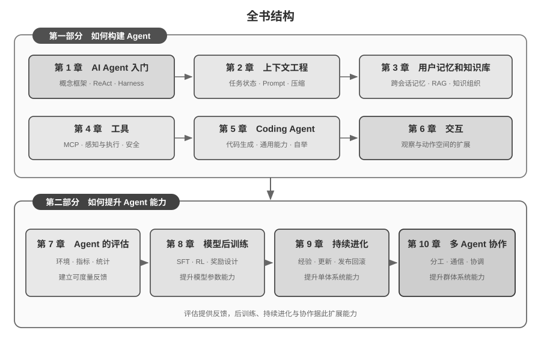

# 引言 {.unnumbered}

2025 年 8 月至 10 月，我在图灵《AI Agent 实战营》上进行了一系列技术讲座。讲座的初衷很简单：把 AI Agent 的设计从 “感觉驱动” 变成 “原则驱动”：不只是教大家跑通一个 Demo，而是深入理解 Agent 为什么要这样设计，每一个架构决策背后的取舍是什么。这本书正是从那些讲座的讲稿和实验中整理、扩展而来的。

值得一提的是，这本书从最初的想法到最终成书，本身就是用一种可以称为 **whisper coding**（口述式协作）的方式做出来的——而我用来口述的，正是我们 Pine 自己的语音 Agent。每次准备讲稿，我都会先向它口述一个大致的提纲，让它去做调研（survey），再由它整理出一份初稿；讲完课后，我再结合 AI Agent 实战营里同学们的反馈，与它反复讨论、打磨，如此迭代，最终把这些讲稿扩写、编排成了今天这本书。整个过程里，我多数时候并不打字，而是把想法口述给它——语音的带宽远高于打字（正常说话的速度约为打字的四倍），“口述—调研—讨论—修改”的循环因此转得很快。某种意义上，这本书既是在讲 Agent，也是一件由 Agent 参与做成的作品。

从 2025 年初 DeepSeek R1 发布至今，AI 领域已经从单纯的基座模型（即通用的大语言模型底座）演进，进入了工程落地的深水区。模型层的进展可以从两个方向看到：一方面，模型通过在智能体环境中的强化学习（Agentic Reinforcement Learning）把工具调用能力训进了模型参数，使模型掌握了在编程（coding）、数学、图形界面操作（computer use）等领域的通用能力。模型的迭代速度也越来越快，GPT-5.2 到 GPT-5.5、Claude Opus 4.5 到 4.8，都仅仅经过了半年。产品层则有 Manus、Claude Code、OpenClaw 等通用 Agent 重新定义了人机交互方式，把 “代码生成 + 文件系统” 这一架构范式推到了主流视野。

当我回头审视近一年前在课程中总结的那些 Agent 架构设计原则时，有一个发现让我既欣慰又惊讶：**这些原则非但没有过时，反而变得越来越经典了。** 虽然 Agent 业界后来陆续出现了 Skill、harness、loop engineering 等新名词，但真实的顺序恰恰是反的：并不是 Anthropic 这些公司先发明了这些概念、众多 Agent 才跟着用起来；相反，是大量 Agent 早就在这么做了，Anthropic 才把它们提炼、总结成了架构设计原则。实践在前，命名在后。

这些原则的底气，来自把 Agent 真正推进长流程、高风险场景的实战。作为 Pine AI 的首席科学家，我和团队打造了 Pine。据我所知，它是第一个能够自主与真人交互、并可靠地独立处理涉及金钱的敏感、复杂、长程任务的通用 Agent：它替用户打电话与运营商协商账单、与商家交涉退款和投诉、取消订阅，全程无需人工接管。这类任务动辄几十轮交涉，任何一步出错都会造成真金白银的损失。正是这种对可靠性近乎苛刻的要求，把本书反复强调的架构原则一条条倒逼了出来。下面几个例子，就来自这段实践。

- 早在 Skill 概念流行之前，我们就已经采用动态加载提示词的方法解决提示词无限膨胀的问题，采用命令行执行工具的方式解决工具列表无限膨胀的问题，采用系统状态栏技术解决 Agent 不感知执行环境和用户时间、工作状态等问题。
- 早在 harness 概念流行之前，我们就在采用类似 Claude Code 的方法解决模型工具调用的不稳定、幻觉、危险操作、越权操作、指令不遵循等问题。
- 早在 loop engineering 概念流行之前，我们就在使用本书称为提议者-审核者（proposer-reviewer）的方法解决模型过早认为任务完成的问题。

而且这并不是我们的独家发明，据我所知，大多数头部模型和 Agent 公司都自己摸索出了类似的方法。这是我在 2025 年 8 月在图灵开设《AI Agent 实战营》课程和 2024-2026 年持续在国科大开设 AI Agent 实践课程的原因。我选择把这本书开源发布，而不是封闭起来收版税，也是希望这些知识能传播给更多从业者。

**实践在前，命名在后**，这个顺序对企业级 Agent 开发有一个很实际的含义：**如果你每次都要等到业界开始流行某个 Agent 名词才去实践，就已经慢了一步。** 名词流行的时候，头部公司往往早已把对应的问题趟过一遍了。那么，怎样才能赶在名词流行之前就知道该怎么做？我认为最关键的有两点。

**第一，拥有一个对 Agent 能力上限有极高要求的真实业务，并能持续获得真实的业务反馈。** 以 Pine 为例，处理一件事往往耗时数小时甚至数周，过程中可能要跟多个利益相关方反复沟通：其间可能要打好几个小时的电话，在电脑上操作并填写好几页复杂的表单，还要来回发送数封邮件；全程既不能在任何数字上出错，又要在沟通中时刻保持谨慎，维护用户的利益。只有置身于这样足够复杂的场景，实践才会自然地把你倒逼着去构建 harness，去解决那些模型本身当下还做不到、业务上却必须完成的事。反过来，如果业务对能力上限的要求不高、模型稍一升级就够用，你也就没有动力去打磨这些架构原则。

**第二，必须建立评估（Evaluation）机制。** 这也是本书反复强调的一点：没有评估，就没有进步。评估让你能分辨一次改动究竟是真的变好了，还是只是运气，从而让 Agent 的迭代方向不再依赖直觉。说到底，我们主张的是用科学的方法论去做工程、去做 Agent，而评估正是这套方法论的地基。第七章会专门展开这套方法。

不管底层模型如何升级，不管产品形态如何创新，几乎所有成功的 Agent 系统都遵循着相同的架构模式。这并非巧合：**好的设计原则本就应该穿越模型的迭代周期**，因为它们描述的不是某个模型的用法，而是智能系统与世界交互的基本模式。

图灵奖得主、强化学习之父 Richard Sutton 曾说，宇宙演化经历了从尘埃到恒星、从恒星到生命、从生命到智能体（原文为设计实体，designed entities）的 4 个阶段。生物进化是盲目的：随机变异，自然选择。大多数生物并不理解自己的工作原理，也无法自主设计和改造生物。而智能体（Agent）是宇宙演化史上一种全新的存在：它能通过生成代码实现自举（bootstrap）和自我进化，就像一个程序员编写了另一个程序员，然后新的程序员又能继续编写下一个。也就是说，Agent 能够理解自身的运作机制，并根据目标创造全新的智能体，甚至改进自己。本书的使命，就是帮助你理解和掌握这种创造的原则。

本书的核心公式只有一句话：**Agent = LLM + 上下文 + 工具**。三者缺一不可。

更直观地说，就是**大脑 + 眼睛 + 手脚**。大脑（LLM）负责思考和决策，眼睛（上下文）决定 Agent 能看到什么信息，手脚（工具）决定 Agent 能做什么事情。（严格来说，“眼睛”只是一个粗略的类比：上下文不仅包含环境信息和对话历史，还包含工具定义等内容，也就是说 Agent “看到”的信息中也包括了“有哪些手脚可用”。这个隐喻旨在传达核心直觉：上下文是模型能感知到的一切信息。）


对熟悉强化学习的读者，这三者也可以映射到 RL 的形式化语言。具体来说，LLM 对应 Policy（策略），上下文对应 Observation Space（观察空间），工具对应 Action Space（动作空间）。三种说法对应同一个对象，只是表达层次不同。

## 全书结构 {.unnumbered}

本书共十章，沿四个层次展开（图0-2）。第一章建立 Agent 的基础框架；第二至六章讨论如何构建 Agent，依次展开上下文、知识、工具、代码生成与交互；第七至九章讨论如何评估并持续改进 Agent，从度量系统、模型后训练一直推进到由运行经验驱动的持续进化；第十章则把视野扩展到多 Agent 协作。



- **第一章（AI Agent 入门）**从多个真实 Agent 产品出发，建立对 Agent 的直观理解。深入解析 Agent 的核心公式：从实现层的 LLM + 上下文 + 工具，到直觉层的大脑 + 眼睛 + 手脚，再到学术层的策略（Policy）、观察空间（Observation Space）与动作空间（Action Space）。同时通过实验剖析 ReAct 循环的运作机制，也就是“思考→行动→观察”的迭代过程，并区分任务内的上下文适应、跨任务的外部产物（artifact）更新和训练周期中的参数更新。最后讨论从工作流到自主 Agent 的编排设计模式，为后续章节建立统一的概念框架。
- **第二章（上下文工程）**是全书最关键的一章，系统讲解上下文，也就是 Agent 的“眼睛”。本章先从 API 消息结构与 Agent 核心循环讲起，建立“上下文就是消息列表”的地基，再深入 KV Cache（大模型推理过程中复用历史计算结果的机制）的底层原理，然后依次展开：提示工程（Prompt Engineering，包括流程化设计、工具描述、业务规则细化）与提示注入（Prompt Injection）攻防、Agent Skills 的按需加载机制、Agent 状态栏技术，以及上下文压缩（Context Compression）策略。各术语的完整定义在正文首次出现处给出。
- **第三章（用户记忆和知识库）**将上下文管理延伸到跨会话的持久化知识体系，让 Agent 不仅能记住当前对话的内容，还能在多次对话间积累和调用知识。涵盖用户记忆的四种渐进式策略、RAG（检索增强生成，即先检索相关文档再让模型生成回答）的完整技术栈（包括不同的文本搜索方法和搜索结果排序优化）、更高级的知识组织方法、智能体化 RAG（Agentic RAG，即让 Agent 自主决定何时检索、检索什么），以及多模态记忆的前沿探索。
- **第四章（工具）**探讨 Agent 与外部世界交互的桥梁：工具就像是 Agent 的“手脚”，让它能够搜索网页、调用 API、操作数据库等。介绍 MCP 工具互操作标准和五类工具的设计原则（感知、执行、协作、事件触发、用户沟通），展开多模态感知的三条技术路线（原生多模态处理、提取为文本、工具化多模态分析），并重点阐述执行工具的安全机制以及事件驱动的异步 Agent 架构。
- **第五章（Coding Agent 与通用 Agent）**论证了 Coding Agent 加上文件系统，是所有通用 Agent 最核心的技术基础。以 OpenClaw 架构为主线，剖析 Coding Agent 的工作流程和实现技巧，并展示代码生成在编程之外的广泛价值：从辅助思考、构建知识库，到动态创造新工具和 Agent 自举。
- **第六章（交互：观察与动作空间的扩展）**撤掉前五章默认的“轮流发言”前提，沿**模态**与**时机**两根轴展开 Agent 与世界的交互：异步与事件驱动让世界主动唤醒 Agent（事件触发工具、用户沟通工具、虚拟身份与隔离执行环境），语音把交互推到毫秒尺度（从级联流水线到端到端全模态与全双工），Computer Use 让 Agent 像人一样操作图形界面，机器人操作则把动作延伸到物理世界（VLA 控制与 Sim2Real 迁移）。四个场景共享同一组原语——唤醒、安全点、取消、抢占与快慢分离。
- **第七章（Agent 的评估）**构建一套科学的评估方法论。覆盖评估环境（工具调用型和人机交互型两种核心范式，以及章末单独讨论的仿真环境）、数据集的设计原则、LLM-as-a-Judge 自动化评判方法、评估驱动的模型选型，以及将评估结果转化为系统改进的完整闭环。
- **第八章（模型后训练）**深入 SFT（监督微调，即用标注数据教模型“照样学样”）与 RL（强化学习，即让模型通过试错和奖励反馈自主提升）这两种后训练技术。以“SFT 记忆、RL 泛化”和“数据与环境比算法更重要”为核心论点，涵盖预训练/SFT/RL 三阶段全景、经典 RL 理论、奖励信号设计（从二元奖励到过程奖励、再到“奖励结果、约束过程”的验证路径惩罚）、单轮与多轮强化学习算法，以及样本效率优化等前沿探索。
- **第九章（Agent 的持续进化）**研究如何把 Agent 的运行经验转化为下一版本的能力。全章先建立由环境结果、过程规则和 LLM Rubric 组成的学习信号，再比较知识文档、Prompt 与 Skills、程序与 Harness、模型参数四种更新载体，最后讨论新版本如何经过验证、灰度发布、回滚与长期整理。
- **第十章（多 Agent 协作）**讨论 AI Agent 系统的终极形态：多个 Agent 如何分工合作。系统阐述多 Agent 协作的分类框架（上下文共享/独立 × 对等/管理者/去中心化），通过翻译 Agent、电话+电脑 Agent 等案例展示协作架构的设计方法，并展望 Agent 社会和 Agent 经济的前沿方向。

## 如何阅读本书 {.unnumbered}

本书的各章节相对独立，你可以根据自己的需求选择不同的阅读路径：

- **如果你是 Agent 开发者**，建议按顺序阅读第一至九章：前六章给出构建方法，第七章建立评估基础，第八章解释怎样训练模型，第九章再把参数与其他更新载体纳入完整的持续进化闭环。第十章可根据多 Agent 协作的需要选读。
- **如果你时间有限**，优先阅读第一章（建立全局认知）和第二章（掌握最关键的上下文工程）。第二章中 KV Cache 的底层原理较为技术化，初次阅读可先跳过原理部分、只记住开头给出的三条核心结论，不影响后续理解。
- **如果你关注模型训练**，可以直接阅读第八章（模型后训练）；其中评估方法（第七章）是训练的前提，建议一并阅读，并先读第一至二章以建立整体认知。

每章都包含大量的**实验**和**思考题**，编号格式为“实验 X-Y”（X 为章节号，Y 为章节内序号）。实验和思考题的标题中用星级标注难度：★ 表示入门级，适合所有读者；★★ 表示中等难度，需要一定的工程实践基础；★★★ 表示进阶挑战，通常涉及开放性问题或复杂的系统设计。大部分实验配有完整的可运行代码，组织在配套的开源仓库中：

> **配套代码仓库**：[https://github.com/bojieli/ai-agent-book](https://github.com/bojieli/ai-agent-book)

可以使用 Git 获取全部配套代码：

```bash
git clone https://github.com/bojieli/ai-agent-book.git
cd ai-agent-book
```

不熟悉 Git 的读者也可以在仓库页面点击 **Code → Download ZIP** 下载。实验代码按章节组织在 `chapter1/` 至 `chapter10/` 中；要查找“实验 X-Y”，请先打开对应的 `chapterX/README.md`，根据实验编号找到项目目录，再按照项目自身的 README 安装依赖并运行。部分标为“复现指南”的实验依赖外部仓库，具体获取方式也会在相应的 README 中说明。

我强烈建议你动手跑一遍这些实验。AI Agent 是一个实践性极强的领域，很多设计上的直觉需要在动手调试的过程中才能真正建立起来。

**一个术语约定**：有些英文技术词直译成中文会产生歧义，本书对两个高频词做了特别区分：把 reasoning（模型展开中间推导、“想”的过程）统一译为“思考”，把 inference（模型的前向计算与部署运行）统一译为“推理”。用两个不同的中文词，是为了避免“推理”一词同时承载两个概念、让读者无法区分。因此，凡是指模型思维链（Chain-of-Thought）、思考型模型（如 OpenAI o 系列、DeepSeek-R1，本书称“思考模型”“思考者”）、思考 token、思考过程的地方，本书一律用“思考”；凡是指模型运行部署（推理时、推理成本、推理栈、推理时扩展等）的地方，用“推理”。一个例外是几个已在中文里固化的复合词：**逻辑推理、多跳推理、空间推理、时序推理**，以及“推理游戏”这类日常用法，本书沿用习惯译法保留“推理”二字，请读者根据语境理解，它们指的是演绎推断的一般含义，而非上述 inference 的技术义。其他关键术语，正文会在首次出现处给出中英文对照。

## 前置知识 {.unnumbered}

本书面向有一定技术背景的读者，但不要求你是某个特定领域的专家。以下按“必需”和“推荐”两个层次列出前置知识，帮助你评估自己的准备程度。

**必需：阅读全书的基础**

- **Python 编程**：书中几乎所有实验都基于 Python。你需要熟悉 Python 的基本语法、常用的数据结构、包管理（pip）等基本概念。不要求精通，但应能读懂和修改中等复杂度的 Python 代码。
- **LLM 的基本使用经验**：你应该用过 ChatGPT、Claude 或类似的产品，理解“提示词（Prompt）→ 模型回复”的基本交互模式。
- **一款 AI 辅助编程工具**：强烈建议安装并熟悉至少一款 AI 辅助编程工具，如 Claude Code、Codex、Cursor、TRAE 等。一方面，这些工具能显著提升实验的开发效率，书中的实验涉及大量的代码编写和调试。另一方面，这些编程工具本身就是成熟的 Coding Agent，你在使用它们的过程中，会直观地体验到 ReAct 循环、工具调用、上下文管理等书中反复讨论的核心机制，这种第一手的体验对理解 Agent 的设计原则极有价值。
- **软件工程常识**：熟悉命令行操作、Git 版本控制、JSON 数据格式、REST API 等基本概念。这些是运行实验和理解 Agent 工具调用机制的基础。

**推荐：提升特定章节的阅读体验**

- **机器学习基础**（第八章）：了解训练与推理、损失函数、梯度下降、过拟合等基本概念，有助于理解模型后训练。
- **基础数学**（第 2-3、8 章）：对线性代数有直觉性的理解（比如知道向量可以表示方向和大小、矩阵可以做批量运算）有助于理解嵌入和注意力机制；基本的概率统计知识有助于理解评估指标和强化学习中的期望奖励。书中的数学不涉及复杂的推导，侧重直觉性的解释。
- **Web 开发基础**（第 6 章）：了解 HTTP、WebSocket、前后端分离架构等概念，有助于理解事件驱动的异步 Agent 架构和语音 Agent 的实时通信实验。
- **对 Transformer 架构的基本了解**（第 2、8 章）：Transformer 是当前几乎所有大语言模型的底层架构。对于希望系统地补充大模型基础知识的读者，推荐阅读《图解大模型》（图灵出版）。该书以直观的图解方式讲解了 Transformer 架构、预训练与微调等核心概念，与本书的 Agent 工程视角形成良好的互补。

如果你在某些前置知识上有所欠缺，不必因此却步。本书的核心价值在于**架构设计原则和工程实践的方法论**，而非某个具体的算法或技巧。除第八章后训练以外，全书对数学和机器学习的要求很低，完全可以作为起点。

Agent 技术仍在快速演进，但**好的架构设计原则具有穿越时间的力量**。掌握了“为什么要这样设计”，你就能在技术浪潮的变化中保持清醒的判断力。希望这本书能成为你构建 AI Agent 的可靠指南。

## 致谢 {.unnumbered}

感谢图灵的梦鸽老师和刘美英老师的辛勤编辑，以及为组织图灵《AI Agent 实战营》课程付出的努力；感谢刘俊明老师在国科大开设 AI Agent 实战课程。也要特别感谢图灵《AI Agent 实战营》的所有学员，以及国科大 AI Agent 实战课程的所有同学——在我讲授这些课程的过程中，大家给了我许多有价值的反馈与建议，也让我对这些概念本身有了更清晰的理解。

感谢 Pine AI 的所有同事。如果没有 Pine AI 这样优秀的产品，以及它所带来的种种挑战，我不可能在 Agent 领域获得如此深入的理解与实践；在一次次思想碰撞中，同事们也贡献了大量宝贵的思想输入。

也要感谢 AI 业界的许多朋友（在此不一一具名）。在各种行业讨论中，大家对我的观点给予了坦诚的反馈，纠正了我不少错误的判断，提升了我对模型与 Agent 的认知。

最要感谢的，是我的家人，特别是我的太太孟佳颖。她始终支持我完成本书的写作，还为本书提出了许多宝贵的意见。
