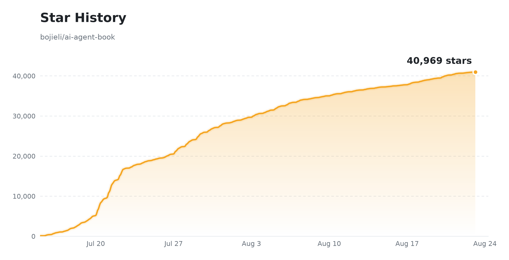

# AI Agents ஆழத்தில்: வடிவமைப்பு கோட்பாடுகள் மற்றும் பொறியியல் நடைமுறைகள்

[](#-மின்-புத்தகம்) [](https://bojieli.github.io/ai-agent-book/) [](https://github.com/bojieli/ai-agent-book) [](../../LICENSE) [](#-மின்-புத்தகம்)
[](https://github.com/trending)

**[中文](../../README.md) · [English](../en/README.md) · [Español](../es/README.md) · [Bahasa Indonesia](../id/README.md) · [العربية](../ar/README.md) · [繁體中文（台灣）](../zh-TW/README.md) · [Русский](../ru/README.md) · [Tiếng Việt](../vi/README.md) · தமிழ் ← தற்போதைய · [日本語](../ja/README.md) · [Türkçe](../tr/README.md) · [한국어](../ko/README.md) · [Magyar](../hu/README.md) · [עברית](../../README.he.md)**

> 📥 **[PDF / EPUB பதிவிறக்கம்](#-மின்-புத்தகம்)** (பரிந்துரைக்கப்படுகிறது) — சிறந்த வாசிப்பு அனுபவத்திற்கு PDF / EPUB பதிப்புகளைப் பரிந்துரைக்கிறோம்; [நிகழ்நேரத்திலும் படிக்கலாம்](https://bojieli.github.io/ai-agent-book/) (மொழி மாற்றி, மடிக்கக்கூடிய அத்தியாய மரம், முழு-உரை தேடல்; main கிளைக்கு ஒவ்வொரு push-ம் தானாகவே மீண்டும் கட்டப்படுகிறது).

**Agent = LLM + Context + Tools** — இந்த மையக் கோவையில் 10 அத்தியாயங்களில் AI Agent-ஐ கோட்பாடு முதல் பொறியியல் நடைமுறை வரை கொண்டு செல்கிறது. முழு உரை, விளக்கப்படங்கள் மற்றும் **93 துணை சோதனைகள்** அனைத்தும் திறந்த மூலமாகும்.

> 📢 **1.4 உடன் ஒப்பிடும்போது பதிப்பு 2.0-இல் ஏற்பட்ட மாற்றங்கள்:** பதிப்பு 2.0, முந்தைய அத்தியாயம் 4-இன் “ஒத்திசைவற்ற தொடர்பாடல்” பகுதியையும் முந்தைய அத்தியாயம் 9-இன் “பல்முக Agent” உள்ளடக்கத்தையும் ஒன்றிணைத்து, புதிய அத்தியாயம் 6, “தொடர்பாடல்: அவதானிப்பு மற்றும் செயல் வெளிகளின் விரிவாக்கம்” என மறுசீரமைக்கிறது. முந்தைய அத்தியாயங்கள் 6 (“ஏஜெண்டுகளை மதிப்பீடு செய்தல்”), 7 (“மாதிரி பிந்தைய பயிற்சி”), மற்றும் 8 (“Agent-இன் தொடர்ச்சியான பரிணாமம்”) ஒவ்வொன்றும் ஓர் அத்தியாயம் பின்னுக்கு நகர்ந்து, இப்போது முறையே அத்தியாயங்கள் 7, 8, மற்றும் 9 ஆக உள்ளன.
>
> நீங்கள் பழைய PDF-ஐப் படித்துக்கொண்டிருந்தால், [சமீபத்திய PDF-ஐப் பதிவிறக்கம் செய்ய](https://github.com/bojieli/ai-agent-book/releases/download/latest/AI-Agents-in-Depth-ta.pdf) பரிந்துரைக்கிறோம். புதிய பதிப்பில் பல உள்ளடக்கத் திருத்தங்களும் மாற்றங்களும் உள்ளன; சமீபத்திய பதிப்பையே பயன்படுத்தவும்.

| 📚 **10 அத்தியாயங்கள்**, அடிப்படை முதல் உற்பத்தி வரை | 📂 **93** துணை திட்டங்கள் (70+ தனித்து இயங்கும்) | 🌐 **14 மொழிகள்**: சீன / ஆங் / ஸ்பானிஷ் / இந்தோனேசிய / அரபு / 繁體中文（台灣） / ரஷ்ய / தமிழ் / வியத் / ஜப் / துருக்கியம் / கொரிய / ஹங்கேரியன் / எபிரேயம் |
| :---: | :---: | :---: |

## 📖 மின்-புத்தகம்

> 📥 **PDF / EPUB நேரடி பதிவிறக்கம்** (பரிந்துரைக்கப்படுகிறது; முழு உரை, இலவசம்). இந்த இணைப்புகள் எப்போதும் `main` கிளையின் சமீபத்திய கட்டமைப்பைச் சுட்டும்; நிலையான பதிப்புகளுக்கு [Releases](https://github.com/bojieli/ai-agent-book/releases) பார்க்கவும்:
> - **சீனம் (அசல்)**：[PDF](https://github.com/bojieli/ai-agent-book/releases/download/latest/AI-Agents-in-Depth-zh-CN.pdf) · [EPUB](https://github.com/bojieli/ai-agent-book/releases/download/latest/AI-Agents-in-Depth-zh-CN.epub)
> - **ஆங்கிலம்**（சமூக மொழிபெயர்ப்பு, by [@nsdevaraj](https://github.com/nsdevaraj)、[@whanyu1212](https://github.com/whanyu1212)）：[PDF](https://github.com/bojieli/ai-agent-book/releases/download/latest/AI-Agents-in-Depth-en.pdf) · [EPUB](https://github.com/bojieli/ai-agent-book/releases/download/latest/AI-Agents-in-Depth-en.epub)
> - **ஸ்பானிஷ்**（சமூக மொழிபெயர்ப்பு, by [@santhreal](https://github.com/santhreal)）：[PDF](https://github.com/bojieli/ai-agent-book/releases/download/latest/AI-Agents-in-Depth-es.pdf) · [EPUB](https://github.com/bojieli/ai-agent-book/releases/download/latest/AI-Agents-in-Depth-es.epub)
> - **அரபு**（சமூக மொழிபெயர்ப்பு, by [@TheSyBuilder](https://github.com/TheSyBuilder)）：[PDF](https://github.com/bojieli/ai-agent-book/releases/download/latest/AI-Agents-in-Depth-ar.pdf) · [EPUB](https://github.com/bojieli/ai-agent-book/releases/download/latest/AI-Agents-in-Depth-ar.epub)
> - **பாரம்பரிய சீனம் (தைவான்)**（சமூக மொழிபெயர்ப்பு, by [@tigercosmos](https://github.com/tigercosmos)）：[PDF](https://github.com/bojieli/ai-agent-book/releases/download/latest/AI-Agents-in-Depth-zh-TW.pdf) · [EPUB](https://github.com/bojieli/ai-agent-book/releases/download/latest/AI-Agents-in-Depth-zh-TW.epub)
> - **ரஷ்யம்**（சமூக மொழிபெயர்ப்பு, by [@ui99ru](https://github.com/ui99ru)）：[PDF](https://github.com/bojieli/ai-agent-book/releases/download/latest/AI-Agents-in-Depth-ru.pdf) · [EPUB](https://github.com/bojieli/ai-agent-book/releases/download/latest/AI-Agents-in-Depth-ru.epub)
> - **தமிழ்**（சமூக மொழிபெயர்ப்பு, by [@nsdevaraj](https://github.com/nsdevaraj)）：[PDF](https://github.com/bojieli/ai-agent-book/releases/download/latest/AI-Agents-in-Depth-ta.pdf) · [EPUB](https://github.com/bojieli/ai-agent-book/releases/download/latest/AI-Agents-in-Depth-ta.epub)
> - **வியட்நாம்**（சமூக மொழிபெயர்ப்பு, by [@toanalien](https://github.com/toanalien)）：[PDF](https://github.com/bojieli/ai-agent-book/releases/download/latest/AI-Agents-in-Depth-vi.pdf) · [EPUB](https://github.com/bojieli/ai-agent-book/releases/download/latest/AI-Agents-in-Depth-vi.epub)
> - **ஜப்பானியம்**（சமூக மொழிபெயர்ப்பு, by [@eltociear](https://github.com/eltociear)）：[PDF](https://github.com/bojieli/ai-agent-book/releases/download/latest/AI-Agents-in-Depth-ja.pdf) · [EPUB](https://github.com/bojieli/ai-agent-book/releases/download/latest/AI-Agents-in-Depth-ja.epub)
> - **துருக்கியம்**（சமூக மொழிபெயர்ப்பு, by [@memisemre](https://github.com/memisemre)）：[PDF](https://github.com/bojieli/ai-agent-book/releases/download/latest/AI-Agents-in-Depth-tr.pdf) · [EPUB](https://github.com/bojieli/ai-agent-book/releases/download/latest/AI-Agents-in-Depth-tr.epub)
> - **கொரிய மொழி**（சமூக மொழிபெயர்ப்பு, by [@JeongJaeSoon](https://github.com/JeongJaeSoon)）：[PDF](https://github.com/bojieli/ai-agent-book/releases/download/latest/AI-Agents-in-Depth-ko.pdf) · [EPUB](https://github.com/bojieli/ai-agent-book/releases/download/latest/AI-Agents-in-Depth-ko.epub)
>
> 🌐 [நிகழ்நேரத்திலும் படிக்கலாம்](https://bojieli.github.io/ai-agent-book/) — மொழி மாற்றி, மடிக்கக்கூடிய அத்தியாய மரம், முழு-உரை தேடல் மற்றும் துணை சோதனைகளுக்கான நேரடி இணைப்புகள். main கிளைக்கு ஒவ்வொரு push-ம் தானாகவே மீண்டும் கட்டப்படுகிறது.

சீன மூல உரை [`book/`](../../book/)-இல் உள்ளது; ஆங்/ஸ்பானிஷ்/அரபு/繁體中文（台灣）/ரஷ்ய/தமிழ்/வியத்/ஜப்/துருக்கியம்/கொரிய பதிப்புகள் சமூகப் பங்களிப்புகள் (சீன அசலை விடப் பின்தங்கியிருக்கலாம்), [`book-en/`](../../book-en/), [`book-es/`](../../book-es/), [`book-ar/`](../../book-ar/), [`book-zhtw/`](../../book-zhtw/), [`book-ru/`](../../book-ru/), [`book-ta/`](../../book-ta/), [`book-vi/`](../../book-vi/), [`book-ja/`](../../book-ja/), [`book-tr/`](../../book-tr/), [`book-ko/`](../../book-ko/)-இல் உள்ளன.

<details>
<summary><b>🔧 PDF / EPUB-ஐ தாங்களே கட்டவா?</b> (PDF-க்கு pandoc / xelatex / ElegantBook தேவை)</summary>

- **EPUB**: ஒரே உருவாக்க நிரலைப் பயன்படுத்தவும்; [EPUB உருவாக்க வழிமுறைகளைப்](../../EPUB.md) பார்க்கவும்
- **மூல உரை**: `book/introduction.md` (அறிமுகம்), `book/chapter1.md` ~ `book/chapter10.md` (அத்தியாயம் 1–10), `book/afterword.md` (பின்னுரை)
- **Build**: pandoc, xelatex, ElegantBook மற்றும் தேவையான font-ஐ நிறுவிய பிறகு இயக்கவும்

  ```bash
  cd book && bash build_pdf.sh
  ```

  படங்கள் SVG கோப்புகளாக `book/images/`-இல் சேமிக்கப்பட்டு உருவாக்கத்தின் போது நேரடியாகப் பயன்படுத்தப்படுகின்றன; typography விவரங்களுக்கு `book/preamble.tex` மற்றும் `book/*.lua` பார்க்கவும்.

</details>

## 📑 உள்ளடக்க விரைவு அறிமுகம் (அத்தியாயம் 1–10)

புத்தகம் **Agent = LLM + Context + Tools** மையக் கோவையில், பத்து அத்தியாயங்கள் அடுத்தடுத்து:

| அதி | தலைப்பு | ஒரு வரி சுருக்கம் | உரை | குறியீடு |
| :--: | --- | --- | :--: | :--: |
| 1 | 🚀 **ஏஜென்ட் அடிப்படைகள்** | **Agent = LLM + Context + Tools**; Harness பொறியியலே உண்மையான போட்டித் திறன் | [படி](../../book-ta/chapter1.ta.md) | [4](../../chapter1/README.ta.md) |
| 2 | 🎯 **சூழல் பொறியியல்** | சூழல் ஏஜெண்டின் திறனின் மேல் வரம்பைத் தீர்மானிக்கிறது: KV Cache, prompt engineering, Agent Skills, சூழல் சுருக்கம் | [படி](../../book-ta/chapter2.ta.md) | [9](../../chapter2/README.ta.md) |
| 3 | 📚 **பயனர் நினைவகம் & அறிவுத் தளம்** | பயனரை அமர்வுகளுக்கு குறுக்கே நினைவில் வைத்தல் + வெளிப்புற அறிவு: பயனர் நினைவகம், RAG, கட்டமைக்கப்பட்ட குறியீடு, அறிவு வரைபடம் | [படி](../../book-ta/chapter3.ta.md) | [12](../../chapter3/README.ta.md) |
| 4 | 🛠️ **கருவிகள்** | கருவிகள் ஏஜெண்டின் கைகள்: MCP நெறிமுறை, உணர்வு/செயலாக்கம்/ஒத்துழைப்பு, நிகழ்வு-இயக்கிய ஏஜென்ட், முனைப்பான கருவி கண்டுபிடிப்பு | [படி](../../book-ta/chapter4.ta.md) | [8](../../chapter4/README.ta.md) |
| 5 | 💻 **Coding Agent & குறியீடு உருவாக்கம்** | குறியீடு "புதிய கருவியை உருவாக்கும் கருவி"; உற்பத்தி தர Coding Agent முழுமையாக | [படி](../../book-ta/chapter5.ta.md) | [13](../../chapter5/README.ta.md) |
| 6 | 🎙️ **தொடர்பாடல்: அவதானிப்பு மற்றும் செயல் வெளிகளின் விரிவாக்கம்** | மாதிரி மற்றும் நேர பரிமாணங்களில் Agent-இன் அவதானிப்பு மற்றும் செயல் வெளிகளை விரிவாக்குதல்: ஒத்திசைவற்ற மற்றும் நிகழ்வு-இயக்க அமைப்புகள், குரல், Computer Use மற்றும் ரோபோட்டிக்ஸ் | [படி](../../book-ta/chapter6.ta.md) | [13](../../chapter6/README.ta.md) |
| 7 | 🎯 **ஏஜெண்டுகளை மதிப்பீடு செய்தல்** | செயல்திறனை ஒப்பிடக்கூடிய சமிக்ஞையாக மாற்றுதல்: சூழல்கள், அளவீடுகள், புள்ளியியல் முக்கியத்துவம் மற்றும் மதிப்பீடு-இயக்கிய தேர்வு | [படி](../../book-ta/chapter7.ta.md) | [13](../../chapter7/README.ta.md) |
| 8 | 🧠 **மாதிரி பிந்தைய பயிற்சி** | மூன்று நிலைகள்—முன்-பயிற்சி, SFT மற்றும் RL: SFT அல்லது RL-ஐ எப்போது தேர்ந்தெடுப்பது, கருவி அழைப்புகளை உள்ளடக்குதல் மற்றும் மாதிரி செயல்திறன் | [படி](../../book-ta/chapter8.ta.md) | [19](../../chapter8/README.ta.md) |
| 9 | 🔄 **Agent-இன் தொடர்ச்சியான பரிணாமம்** | செயலாக்கப் பாதைகளிலிருந்து கற்றல் சமிக்ஞைகளைப் பெற்று, அறிவு, வழிமுறைகள், நிரல்கள் மற்றும் அளவுருக்களைப் புதுப்பித்தல் | [படி](../../book-ta/chapter9.ta.md) | [9](../../chapter9/README.ta.md) |
| 10 | 🤝 **பல-ஏஜென்ட் ஒத்துழைப்பு** | கூட்டு நுண்ணறிவு > தனிப்பட்டது: ஒத்துழைப்பு கட்டமைப்பு, சூழல் பகிர்வு/தனிமைப்படுத்தல், "ஏஜென்ட் சமூகம்" | [படி](../../book-ta/chapter10.ta.md) | [7](../../chapter10/README.ta.md) |


> 💡 **படி** = GitHub-இல் அத்தியாய உரையைப் படிக்க (markdown); **N** = துணை திட்டங்களின் எண்ணிக்கை, குறியீட்டுக்கு சொடுக்கவும். திட்ட வகைகள் (✅ தனித்து / 📖 மறு உருவாக்கம் / 🚧 வடிவமைப்பு) ஒவ்வொரு அத்தியாய README-இல்.
>
> 📚 இந்தப் புத்தகத்தை எப்படி திறம்பட படிப்பது? **[கற்றல் பரிந்துரைகள்](LEARNING.md)** பார்க்கவும்.

## 💻 துணை சோதனைகளை இயக்குதல்

பொதுவாக ஆதரிக்கப்படும் வரம்பு **Python 3.11–3.13**. களஞ்சியத்தின் மூல அடைவிலிருந்து அத்தியாயம் வாரியாக சார்புகளை நிறுவவும்; வேறு அத்தியாயத்திற்கு `ch1` என்பதை `ch2` முதல் `ch10` வரை மாற்றவும்:

```bash
# பரிந்துரை: மீண்டும் உருவாக்கக்கூடிய அத்தியாய சூழலுக்கு commit செய்யப்பட்ட uv.lock-ஐ பயன்படுத்தவும்
uv sync --locked --extra ch1

# uv இல்லையெனில்: pyproject.toml-இலிருந்து pip மூலம் மீண்டும் resolve செய்யவும்
python -m pip install -e ".[ch1]"
```

மாதிரியை அழைக்கும் சோதனையை இயக்கும் முன், அந்தச் சோதனையின் README-ஐப் பின்பற்றி credential-களை அமைக்கவும். Root-level configuration ஆதரிக்கும் சோதனைகள் `.env.example`-ஐ `.env` ஆக copy செய்து குறைந்தது ஒரு provider key-ஐ பயன்படுத்தலாம்; சில சோதனைகளுக்கு அருகிலுள்ள `.env` அல்லது exported environment variable-கள் தேவை. அந்தச் சோதனையின் README அல்லது CLI `ollama`-வை தெளிவாகப் பட்டியலிட்டால் மட்டுமே local Ollama-வை `--provider ollama` உடன் பயன்படுத்தவும்.

நிறுவிய பிறகு களஞ்சியத்தின் மூல அடைவிலிருந்து சோதனையை இயக்கலாம்:

```bash
uv run python chapter1/context/main.py
# pip மூலம் நிறுவியிருந்தால்: python chapter1/context/main.py
```

- `uv` நிறுவ [அதிகாரப்பூர்வ வழிகாட்டியைப்](https://docs.astral.sh/uv/getting-started/installation/) பார்க்கவும். `pip` தொடர்ந்து ஆதரிக்கப்படுகிறது, ஆனால் lockfile-ஐ பயன்படுத்தாது.
- மாற்றக் காலத்தில் ஒவ்வொரு சோதனையின் `requirements.txt` தொடர்ந்து செயல்படும்; தனிப்பட்ட திட்டங்கள் மற்றும் சிறப்பு பதிப்பு கட்டுப்பாடுகளுக்கு இது ஏற்றது.
- `all` என்பது CPU-க்கு ஏற்ற பரந்த தொகுப்பு; எல்லா சோதனைகளும் அதில் அடங்காது. `uv sync` ஒவ்வொரு முறையும் தற்போதைய தேர்வுடன் exact sync செய்கிறது, எனவே special extra-களை ஒரே கட்டளையில் சேர்க்கவும்: `uv sync --locked --extra ch2 --extra vllm` அல்லது `uv sync --locked --extra ch7 --extra unsloth`; pip-க்கு `python -m pip install -e ".[ch2,vllm]"`.
- browser, CUDA, FFmpeg, Ollama, Playwright browser மற்றும் வெளிப்புற களஞ்சியங்கள் போன்ற system dependency-களுக்கு ஒவ்வொரு சோதனையின் README-ஐ பின்பற்றவும். அத்தியாயம் 8-இல் சேர்க்கப்பட்ட சில third-party component-களுக்கு Python 3.12+ தேவை.

## 🔑 API விசைகள்

பல தளங்களில் API விசை பெற பரிந்துரைக்கப்படுகிறது. மாதிரி தேர்வுக்கு [இந்த வழிகாட்டி](https://01.me/2025/07/llm-api-setup/).

| தளம் | Link | அம்சங்கள் | அணுகல் முனைகள் |
| --- | --- | --- | --- |
| **Kimi** (Moonshot) | <https://platform.moonshot.cn/> | Kimi series, நீண்ட சூழல் மற்றும் Agent திறன் வலுவாக | சீனா நிலப்பரப்பு |
| **Zhipu GLM** | <https://open.bigmodel.cn/> | GLM-4.6, சீன மொழி வலுவாக, செலவு-செயல்திறன் நல்லது | சீனா நிலப்பரப்பு |
| **Siliconflow** | <https://siliconflow.cn/> | பல திறந்த மூல மாதிரிகள் (DeepSeek, Qwen போன்ற), சீனா நிலப்பரப்பில் விரைவான அணுகல் | சீனா நிலப்பரப்பு |
| **DeepSeek** | <https://platform.deepseek.com/> | DeepSeek அதிகாரப்பூர்வ API | உலகளாவிய + சீனா நிலப்பரப்பு |
| **Krill AI** | [www.krill-ai.net](https://www.krill-ai.net/register?invite=Q8D3L35725) | உலகளாவிய மற்றும் சீன உள்நாட்டு முக்கிய மாதிரிகளை (OpenAI, Claude, Gemini, Grok, Kimi, GLM, DeepSeek, Qwen, Minimax) ஒரே இடத்திலிருந்து அணுகலாம் | உலகளாவிய + சீனா நிலப்பரப்பு |
| **OpenRouter** | <https://openrouter.ai/> | உலகளாவிய மற்றும் சீன உள்நாட்டு முக்கிய மாதிரிகளை (GPT, Claude, Gemini, Kimi, GLM, DeepSeek, Qwen போன்ற) ஒரே இடத்திலிருந்து அணுகலாம் | உலகளாவிய |

## 💎 ஸ்பான்சர்கள்

இந்த திட்டத்திற்கு ஸ்பான்சர் செய்த **Krill AI**-க்கு நன்றி! Krill நிறுவனம் GPT / Claude / Gemini மற்றும் பல சீன மாதிரிகளுக்கு அதிகாரப்பூர்வ, நிலையான, அதிவேக API அணுகல் சேவையை வழங்குகிறது; நிறுவன அளவிலான தனிப்பயனாக்கம், விலைப்பட்டியல் வசதி, 7×16 மணி நேர அர்ப்பணிப்பு தொழில்நுட்ப ஆதரவு, மேலும் விரைவான முதல் டோக்கன் வேகத்திற்கான பிரத்யேக WebSocket இணைப்பும் உண்டு.

புத்தக வாசகர்களுக்கு Krill சிறப்பு சலுகை வழங்குகிறது: [இந்த இணைப்பு](https://www.krill-ai.net/register?invite=Q8D3L35725) மூலம் பதிவு செய்து, ரீசார்ஜ் செய்யும் போது "ai-agent-book" என்ற சலுகைக் குறியீட்டை உள்ளிட்டால், முதல் Codex திட்ட வாங்குதலில் 23% தள்ளுபடி!

> 🧪 சோதனைகளின் இயக்க நிலை, ஆதாரங்கள் மற்றும் இன்னும் நிறைவேறாத ஏற்பு நிபந்தனைகள் [`EXPERIMENT_STATUS.md`](../EXPERIMENT_STATUS.md)-இல் தனியாகப் பதிவு செய்யப்படுகின்றன; மூலக் குறியீட்டை clone செய்வது அல்லது நிறுவுவது மட்டும் சோதனை முடிந்ததற்கான சான்றல்ல.

## 📦 பின்னிணைப்பு · வெளிப்புற களஞ்சியங்களைப் பெறுதல்

அத்தியாயம் 6, 7, 9, 10-இல் உள்ள benchmark, பயிற்சி framework, ரோபோ தளங்களுக்கான 23 வெளிப்புற களஞ்சியங்கள் **சேர்க்கப்படவில்லை** (அளவு மற்றும் உரிமம் காரணமாக), தாங்களாகவே clone செய்ய வேண்டும்.

### ஒரே நேரத்தில் clone ச்கிரிப்ட்

<details>
<summary><b>🔧 clone கட்டளைகளை விரிவாக்கு</b> (23 வெளிப்புற களஞ்சியங்கள்)</summary>

```bash
# அத்தியாயம் 6 · மதிப்பீட்டு Benchmarks
git clone https://github.com/google-research/android_world.git         chapter6/android_world
git clone https://huggingface.co/datasets/gaia-benchmark/GAIA          chapter6/GAIA
git clone https://github.com/xlang-ai/OSWorld.git                      chapter6/OSWorld
git clone https://github.com/SWE-bench/SWE-bench.git                   chapter6/SWE-bench
git clone https://github.com/sierra-research/tau2-bench.git            chapter6/tau2-bench
git clone https://github.com/laude-institute/terminal-bench.git        chapter6/terminal-bench

# அத்தியாயம் 7 · பயிற்சி Frameworks (bojieli/* புத்தகத்திற்கு ஏற்ற forks)
git clone https://github.com/bojieli/minimind.git                      chapter7/MiniMind-pretrain/minimind      # Exp 7-3 train LLM from scratch
git clone https://github.com/bojieli/minimind-v.git                    chapter7/MiniMind-pretrain/minimind-v    # Exp 7-4 train VLM (projection layer)
git clone https://github.com/bojieli/AdaptThink.git                    chapter7/AdaptThink-original
git clone https://github.com/bojieli/AWorld.git                        chapter7/AWorld
git clone https://github.com/bojieli/SFTvsRL.git                       chapter7/SFTvsRL
git clone https://github.com/bojieli/verl.git                          chapter7/verl
git clone https://github.com/bojieli/SandboxFusion.git chapter7/SandboxFusion && git -C chapter7/SandboxFusion fetch origin 4a0d573ebd64c98234c190a9d1d49e4276199a0c && git -C chapter7/SandboxFusion checkout --detach 4a0d573ebd64c98234c190a9d1d49e4276199a0c && test "$(git -C chapter7/SandboxFusion rev-parse HEAD)" = "4a0d573ebd64c98234c190a9d1d49e4276199a0c"  # Exp 7-15 code sandbox
git clone https://github.com/thinking-machines-lab/tinker-cookbook.git chapter7/tinker-cookbook
git clone https://github.com/19PINE-AI/rlvp.git                        chapter7/RLVP/rlvp                       # Exp 7-14 RLVP paper code
git clone https://github.com/PRIME-RL/SimpleVLA-RL.git                 chapter7/SimpleVLA-RL/SimpleVLA-RL       # Exp 7-13 vision-language-action RL

# அத்தியாயம் 9 · உலாவி தானியக்கம் & Claude எடுத்துக்காட்டுகள்
git clone https://github.com/browser-use/browser-use.git               chapter9/browser-use
git clone https://github.com/anthropics/claude-quickstarts.git         chapter9/claude-quickstarts
git clone https://github.com/Vector-Wangel/XLeRobot.git chapter9/XLeRobot && git -C chapter9/XLeRobot fetch origin 3d14695e40c9c68229c0aacffca6053c75cd3eb6 && git -C chapter9/XLeRobot checkout --detach 3d14695e40c9c68229c0aacffca6053c75cd3eb6 && test "$(git -C chapter9/XLeRobot rev-parse HEAD)" = "3d14695e40c9c68229c0aacffca6053c75cd3eb6"  # Exp 9-7/9-9 shared
git clone https://github.com/Grigorij-Dudnik/RoboCrew.git chapter9/RoboCrew && git -C chapter9/RoboCrew fetch origin c749148f29bd14e61347f9fc3530c343fff0d994 && git -C chapter9/RoboCrew checkout --detach c749148f29bd14e61347f9fc3530c343fff0d994 && test "$(git -C chapter9/RoboCrew rev-parse HEAD)" = "c749148f29bd14e61347f9fc3530c343fff0d994"  # Exp 9-8/9-9; RoboCrew v0.3.1
git clone https://github.com/StoneT2000/lerobot-sim2real.git chapter9/lerobot-sim2real && git -C chapter9/lerobot-sim2real fetch origin 87d6c1d969f6e0ca4dc5697940804e231118a63a && git -C chapter9/lerobot-sim2real checkout --detach 87d6c1d969f6e0ca4dc5697940804e231118a63a && test "$(git -C chapter9/lerobot-sim2real rev-parse HEAD)" = "87d6c1d969f6e0ca4dc5697940804e231118a63a"  # Exp 9-11

# அத்தியாயம் 10 · இரட்டை-ஏஜென்ட் கட்டமைப்பு (TalkAct-ஆக தனியாக உருவாகியது) + Stanford AI Town
git clone https://github.com/19PINE-AI/TalkAct.git                     chapter10/use-computer-while-calling
git clone https://github.com/joonspk-research/generative_agents.git    chapter10/generative_agents             # Exp 10-5 Stanford AI Town
```

> ஏதேனும் திட்ட README குறிப்பிட்ட commit-ஐ குறிப்பிட்டால், மறு உருவாக்கத்திற்கு அந்த பதிப்பிற்கு `git checkout` செய்யவும். அத்தியாயம் 10 `use-computer-while-calling` தனியாக பராமரிக்கப்படும் [19PINE-AI/TalkAct](https://github.com/19PINE-AI/TalkAct)-ஆக வளர்ந்துள்ளது; இந்த களஞ்சியம் அந்த அடைவை உள்ளடக்காது—மேலே உள்ள clone கட்டளையைப் பயன்படுத்தி அதைப் பெறவும்.

</details>

## 🤝 பங்களிப்பு

புத்தகம் மற்றும் துணை குறியீடு முழுமையாக திறந்த மூலமாகும். Pull Request-களை வரவேற்கிறோம்:

| வகை | விளக்கம் |
| --- | --- |
| 📝 **புத்தக உள்ளடக்கம்** | பிழைத்திருத்தம், சேர்த்தல், தெளிவான வார்த்தைகள், அல்லது புதிய முன்னேற்றங்கள் (உரை `book/chapter*.md`-இல்) |
| 🐛 **குறியீடு மேம்பாடு & bug திருத்தம்** | துணை திட்டங்களை வலுவானதாக, பயன்படுத்த எளிதாக, உற்பத்தி-தயாராக மாற்று |
| 🧪 **புதிய நடைமுறை திட்டங்கள்** | சோதனைகளுக்கு சிறந்த செயலாக்கத்தைச் சேர்க்கவும்/மாற்றவும், அல்லது புதிய எடுத்துக்காட்டுகளைப் பங்களிக்கவும் |
| 🎨 **பட வடிவமைப்பு** | `book/images/`-இல் பதியப்பட்ட SVG விளக்கப்படங்களை நேரடியாக மேம்படுத்தவும் |
| 🌐 **புதிய மொழிபெயர்ப்புகள்** | மேலும் மொழிகளுக்கு மொழிபெயர்ப்பை வரவேற்கிறோம்; ஆங்கிலம் (`book-en/`), அரபு (`book-ar/`), பாரம்பரிய சீனம்/தைவான் (`book-zhtw/`), தமிழ் (`book-ta/`), வியட்நாம் (`book-vi/`), ஜப்பானியம் (`book-ja/`), துருக்கியம் (`book-tr/`), கொரிய மொழி (`book-ko/`) பார்க்கவும் |

சமர்ப்பிக்கும் முன், தொடர்புடைய சோதனைகளை இயக்கி மறு உருவாக்கத்தை உறுதிப்படுத்தவும்; கருத்துக்களைப் பேச முதலில் issue திறக்கலாம்.

## 📄 உரிமம்

இந்த திட்டம் [Apache License 2.0](../../LICENSE) கீழ் உரிமம் பெற்றது. விவரங்களுக்கு [`LICENSE`](../../LICENSE) பார்க்கவும். சில துணை திட்டங்கள் தங்கள் சொந்த உரிமத் தகவலைக் கொண்டிருக்கலாம்; விவரங்களுக்கு துணை திட்டத்தைப் பார்க்கவும்.

## ⭐ Star வரலாறு

<a href="https://star-history.com/#bojieli/ai-agent-book&Date">
  <picture>
    <source media="(prefers-color-scheme: dark)" srcset="../../assets/star-history-dark.png" />
    <source media="(prefers-color-scheme: light)" srcset="../../assets/star-history-light.png" />
    
  </picture>
</a>

<sub>[`scripts/gen_star_history.py`](../../scripts/gen_star_history.py) ஆல் உருவாக்கப்பட்டது, [GitHub Actions](../../.github/workflows/star-history.yml) ஆல் தினசரி புதுப்பிக்கப்படுகிறது · நேரடி தரவுக்கு படத்தைச் சொடுக்கவும்</sub>
